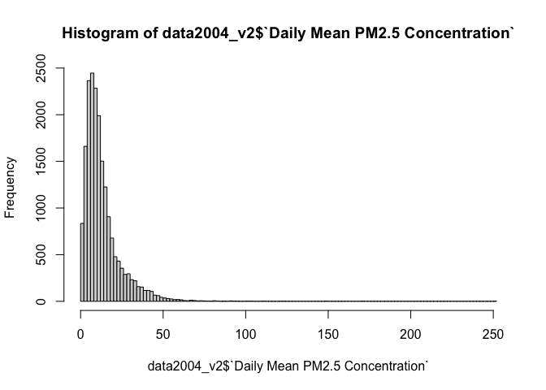

## Step 1
### Download the 2004 and 2019 EPA Air Quality PM2.5 data from all sites in California, and check for any data issues
#### Reading in the 2004 dataset as `data2004` and the 2019 dataset as `data2019`

```r
data2004 <- data.table::fread("ad_viz_plotval_data_2004.csv")
data2019 <- data.table::fread("ad_viz_plotval_data_2019.csv")
```

#### Checking the dimensions of each dataset
The 2004 dataset has 19,233 rows and 20 columns. The 2019 dataset has 53,086 rows and 20 columns.

```r
dim(data2004)
```

```
## [1] 19233    20
```

```r
dim(data2019)
```

```
## [1] 53086    20
```
#### Checking headers and footers of `data2004`

```r
head(data2004)
```

```
##          Date Source  Site ID POC Daily Mean PM2.5 Concentration    UNITS
## 1: 01/01/2004    AQS 60010007   1                            8.9 ug/m3 LC
## 2: 01/02/2004    AQS 60010007   1                           12.2 ug/m3 LC
## 3: 01/03/2004    AQS 60010007   1                           16.5 ug/m3 LC
## 4: 01/04/2004    AQS 60010007   1                           19.5 ug/m3 LC
## 5: 01/05/2004    AQS 60010007   1                           11.5 ug/m3 LC
## 6: 01/06/2004    AQS 60010007   1                           32.5 ug/m3 LC
##    DAILY_AQI_VALUE Site Name DAILY_OBS_COUNT PERCENT_COMPLETE
## 1:              37 Livermore               1              100
## 2:              51 Livermore               1              100
## 3:              60 Livermore               1              100
## 4:              67 Livermore               1              100
## 5:              48 Livermore               1              100
## 6:              94 Livermore               1              100
##    AQS_PARAMETER_CODE                     AQS_PARAMETER_DESC CBSA_CODE
## 1:              88101               PM2.5 - Local Conditions     41860
## 2:              88502 Acceptable PM2.5 AQI & Speciation Mass     41860
## 3:              88502 Acceptable PM2.5 AQI & Speciation Mass     41860
## 4:              88502 Acceptable PM2.5 AQI & Speciation Mass     41860
## 5:              88502 Acceptable PM2.5 AQI & Speciation Mass     41860
## 6:              88502 Acceptable PM2.5 AQI & Speciation Mass     41860
##                            CBSA_NAME STATE_CODE      STATE COUNTY_CODE  COUNTY
## 1: San Francisco-Oakland-Hayward, CA          6 California           1 Alameda
## 2: San Francisco-Oakland-Hayward, CA          6 California           1 Alameda
## 3: San Francisco-Oakland-Hayward, CA          6 California           1 Alameda
## 4: San Francisco-Oakland-Hayward, CA          6 California           1 Alameda
## 5: San Francisco-Oakland-Hayward, CA          6 California           1 Alameda
## 6: San Francisco-Oakland-Hayward, CA          6 California           1 Alameda
##    SITE_LATITUDE SITE_LONGITUDE
## 1:      37.68753      -121.7842
## 2:      37.68753      -121.7842
## 3:      37.68753      -121.7842
## 4:      37.68753      -121.7842
## 5:      37.68753      -121.7842
## 6:      37.68753      -121.7842
```

```r
tail(data2004)
```

```
##          Date Source  Site ID POC Daily Mean PM2.5 Concentration    UNITS
## 1: 12/14/2004    AQS 61131003   1                             11 ug/m3 LC
## 2: 12/17/2004    AQS 61131003   1                             16 ug/m3 LC
## 3: 12/20/2004    AQS 61131003   1                             17 ug/m3 LC
## 4: 12/23/2004    AQS 61131003   1                              9 ug/m3 LC
## 5: 12/26/2004    AQS 61131003   1                             24 ug/m3 LC
## 6: 12/29/2004    AQS 61131003   1                              9 ug/m3 LC
##    DAILY_AQI_VALUE            Site Name DAILY_OBS_COUNT PERCENT_COMPLETE
## 1:              46 Woodland-Gibson Road               1              100
## 2:              59 Woodland-Gibson Road               1              100
## 3:              61 Woodland-Gibson Road               1              100
## 4:              38 Woodland-Gibson Road               1              100
## 5:              76 Woodland-Gibson Road               1              100
## 6:              38 Woodland-Gibson Road               1              100
##    AQS_PARAMETER_CODE       AQS_PARAMETER_DESC CBSA_CODE
## 1:              88101 PM2.5 - Local Conditions     40900
## 2:              88101 PM2.5 - Local Conditions     40900
## 3:              88101 PM2.5 - Local Conditions     40900
## 4:              88101 PM2.5 - Local Conditions     40900
## 5:              88101 PM2.5 - Local Conditions     40900
## 6:              88101 PM2.5 - Local Conditions     40900
##                                  CBSA_NAME STATE_CODE      STATE COUNTY_CODE
## 1: Sacramento--Roseville--Arden-Arcade, CA          6 California         113
## 2: Sacramento--Roseville--Arden-Arcade, CA          6 California         113
## 3: Sacramento--Roseville--Arden-Arcade, CA          6 California         113
## 4: Sacramento--Roseville--Arden-Arcade, CA          6 California         113
## 5: Sacramento--Roseville--Arden-Arcade, CA          6 California         113
## 6: Sacramento--Roseville--Arden-Arcade, CA          6 California         113
##    COUNTY SITE_LATITUDE SITE_LONGITUDE
## 1:   Yolo      38.66121      -121.7327
## 2:   Yolo      38.66121      -121.7327
## 3:   Yolo      38.66121      -121.7327
## 4:   Yolo      38.66121      -121.7327
## 5:   Yolo      38.66121      -121.7327
## 6:   Yolo      38.66121      -121.7327
```
#### Checking headers and footers of `data2019`

```r
head(data2019)
```

```
##          Date Source  Site ID POC Daily Mean PM2.5 Concentration    UNITS
## 1: 01/01/2019    AQS 60010007   3                            5.7 ug/m3 LC
## 2: 01/02/2019    AQS 60010007   3                           11.9 ug/m3 LC
## 3: 01/03/2019    AQS 60010007   3                           20.1 ug/m3 LC
## 4: 01/04/2019    AQS 60010007   3                           28.8 ug/m3 LC
## 5: 01/05/2019    AQS 60010007   3                           11.2 ug/m3 LC
## 6: 01/06/2019    AQS 60010007   3                            2.7 ug/m3 LC
##    DAILY_AQI_VALUE Site Name DAILY_OBS_COUNT PERCENT_COMPLETE
## 1:              24 Livermore               1              100
## 2:              50 Livermore               1              100
## 3:              68 Livermore               1              100
## 4:              86 Livermore               1              100
## 5:              47 Livermore               1              100
## 6:              11 Livermore               1              100
##    AQS_PARAMETER_CODE       AQS_PARAMETER_DESC CBSA_CODE
## 1:              88101 PM2.5 - Local Conditions     41860
## 2:              88101 PM2.5 - Local Conditions     41860
## 3:              88101 PM2.5 - Local Conditions     41860
## 4:              88101 PM2.5 - Local Conditions     41860
## 5:              88101 PM2.5 - Local Conditions     41860
## 6:              88101 PM2.5 - Local Conditions     41860
##                            CBSA_NAME STATE_CODE      STATE COUNTY_CODE  COUNTY
## 1: San Francisco-Oakland-Hayward, CA          6 California           1 Alameda
## 2: San Francisco-Oakland-Hayward, CA          6 California           1 Alameda
## 3: San Francisco-Oakland-Hayward, CA          6 California           1 Alameda
## 4: San Francisco-Oakland-Hayward, CA          6 California           1 Alameda
## 5: San Francisco-Oakland-Hayward, CA          6 California           1 Alameda
## 6: San Francisco-Oakland-Hayward, CA          6 California           1 Alameda
##    SITE_LATITUDE SITE_LONGITUDE
## 1:      37.68753      -121.7842
## 2:      37.68753      -121.7842
## 3:      37.68753      -121.7842
## 4:      37.68753      -121.7842
## 5:      37.68753      -121.7842
## 6:      37.68753      -121.7842
```

```r
tail(data2019)
```

```
##          Date Source  Site ID POC Daily Mean PM2.5 Concentration    UNITS
## 1: 11/11/2019    AQS 61131003   1                           13.5 ug/m3 LC
## 2: 11/17/2019    AQS 61131003   1                           18.1 ug/m3 LC
## 3: 11/29/2019    AQS 61131003   1                           12.5 ug/m3 LC
## 4: 12/17/2019    AQS 61131003   1                           23.8 ug/m3 LC
## 5: 12/23/2019    AQS 61131003   1                            1.0 ug/m3 LC
## 6: 12/29/2019    AQS 61131003   1                            9.1 ug/m3 LC
##    DAILY_AQI_VALUE            Site Name DAILY_OBS_COUNT PERCENT_COMPLETE
## 1:              54 Woodland-Gibson Road               1              100
## 2:              64 Woodland-Gibson Road               1              100
## 3:              52 Woodland-Gibson Road               1              100
## 4:              76 Woodland-Gibson Road               1              100
## 5:               4 Woodland-Gibson Road               1              100
## 6:              38 Woodland-Gibson Road               1              100
##    AQS_PARAMETER_CODE       AQS_PARAMETER_DESC CBSA_CODE
## 1:              88101 PM2.5 - Local Conditions     40900
## 2:              88101 PM2.5 - Local Conditions     40900
## 3:              88101 PM2.5 - Local Conditions     40900
## 4:              88101 PM2.5 - Local Conditions     40900
## 5:              88101 PM2.5 - Local Conditions     40900
## 6:              88101 PM2.5 - Local Conditions     40900
##                                  CBSA_NAME STATE_CODE      STATE COUNTY_CODE
## 1: Sacramento--Roseville--Arden-Arcade, CA          6 California         113
## 2: Sacramento--Roseville--Arden-Arcade, CA          6 California         113
## 3: Sacramento--Roseville--Arden-Arcade, CA          6 California         113
## 4: Sacramento--Roseville--Arden-Arcade, CA          6 California         113
## 5: Sacramento--Roseville--Arden-Arcade, CA          6 California         113
## 6: Sacramento--Roseville--Arden-Arcade, CA          6 California         113
##    COUNTY SITE_LATITUDE SITE_LONGITUDE
## 1:   Yolo      38.66121      -121.7327
## 2:   Yolo      38.66121      -121.7327
## 3:   Yolo      38.66121      -121.7327
## 4:   Yolo      38.66121      -121.7327
## 5:   Yolo      38.66121      -121.7327
## 6:   Yolo      38.66121      -121.7327
```
#### Checking variable names and variable types of both datasets.

```r
summary(data2004)
```

```
##      Date              Source             Site ID              POC        
##  Length:19233       Length:19233       Min.   :60010007   Min.   : 1.000  
##  Class :character   Class :character   1st Qu.:60370002   1st Qu.: 1.000  
##  Mode  :character   Mode  :character   Median :60658001   Median : 1.000  
##                                        Mean   :60588026   Mean   : 1.816  
##                                        3rd Qu.:60750006   3rd Qu.: 2.000  
##                                        Max.   :61131003   Max.   :12.000  
##                                                                           
##  Daily Mean PM2.5 Concentration    UNITS           DAILY_AQI_VALUE 
##  Min.   : -0.10                 Length:19233       Min.   :  0.00  
##  1st Qu.:  6.00                 Class :character   1st Qu.: 25.00  
##  Median : 10.10                 Mode  :character   Median : 42.00  
##  Mean   : 13.13                                    Mean   : 46.32  
##  3rd Qu.: 16.30                                    3rd Qu.: 60.00  
##  Max.   :251.00                                    Max.   :301.00  
##                                                                    
##   Site Name         DAILY_OBS_COUNT PERCENT_COMPLETE AQS_PARAMETER_CODE
##  Length:19233       Min.   :1       Min.   :100      Min.   :88101     
##  Class :character   1st Qu.:1       1st Qu.:100      1st Qu.:88101     
##  Mode  :character   Median :1       Median :100      Median :88101     
##                     Mean   :1       Mean   :100      Mean   :88267     
##                     3rd Qu.:1       3rd Qu.:100      3rd Qu.:88502     
##                     Max.   :1       Max.   :100      Max.   :88502     
##                                                                        
##  AQS_PARAMETER_DESC   CBSA_CODE      CBSA_NAME           STATE_CODE
##  Length:19233       Min.   :12540   Length:19233       Min.   :6   
##  Class :character   1st Qu.:31080   Class :character   1st Qu.:6   
##  Mode  :character   Median :40140   Mode  :character   Median :6   
##                     Mean   :35328                      Mean   :6   
##                     3rd Qu.:41860                      3rd Qu.:6   
##                     Max.   :49700                      Max.   :6   
##                     NA's   :1253                                   
##     STATE            COUNTY_CODE        COUNTY          SITE_LATITUDE  
##  Length:19233       Min.   :  1.00   Length:19233       Min.   :32.63  
##  Class :character   1st Qu.: 37.00   Class :character   1st Qu.:34.07  
##  Mode  :character   Median : 65.00   Mode  :character   Median :36.48  
##                     Mean   : 58.63                      Mean   :36.23  
##                     3rd Qu.: 75.00                      3rd Qu.:38.10  
##                     Max.   :113.00                      Max.   :41.71  
##                                                                        
##  SITE_LONGITUDE  
##  Min.   :-124.2  
##  1st Qu.:-121.6  
##  Median :-119.3  
##  Mean   :-119.7  
##  3rd Qu.:-117.9  
##  Max.   :-115.5  
## 
```

```r
summary(data2019)
```

```
##      Date              Source             Site ID              POC        
##  Length:53086       Length:53086       Min.   :60010007   Min.   : 1.000  
##  Class :character   Class :character   1st Qu.:60310004   1st Qu.: 1.000  
##  Mode  :character   Mode  :character   Median :60612003   Median : 3.000  
##                                        Mean   :60565291   Mean   : 2.562  
##                                        3rd Qu.:60771002   3rd Qu.: 3.000  
##                                        Max.   :61131003   Max.   :21.000  
##                                                                           
##  Daily Mean PM2.5 Concentration    UNITS           DAILY_AQI_VALUE 
##  Min.   : -2.200                Length:53086       Min.   :  0.00  
##  1st Qu.:  4.000                Class :character   1st Qu.: 17.00  
##  Median :  6.500                Mode  :character   Median : 27.00  
##  Mean   :  7.734                                   Mean   : 30.56  
##  3rd Qu.:  9.900                                   3rd Qu.: 41.00  
##  Max.   :120.900                                   Max.   :185.00  
##                                                                    
##   Site Name         DAILY_OBS_COUNT PERCENT_COMPLETE AQS_PARAMETER_CODE
##  Length:53086       Min.   :1       Min.   :100      Min.   :88101     
##  Class :character   1st Qu.:1       1st Qu.:100      1st Qu.:88101     
##  Mode  :character   Median :1       Median :100      Median :88101     
##                     Mean   :1       Mean   :100      Mean   :88214     
##                     3rd Qu.:1       3rd Qu.:100      3rd Qu.:88502     
##                     Max.   :1       Max.   :100      Max.   :88502     
##                                                                        
##  AQS_PARAMETER_DESC   CBSA_CODE      CBSA_NAME           STATE_CODE
##  Length:53086       Min.   :12540   Length:53086       Min.   :6   
##  Class :character   1st Qu.:31080   Class :character   1st Qu.:6   
##  Mode  :character   Median :40140   Mode  :character   Median :6   
##                     Mean   :35841                      Mean   :6   
##                     3rd Qu.:41860                      3rd Qu.:6   
##                     Max.   :49700                      Max.   :6   
##                     NA's   :4181                                   
##     STATE            COUNTY_CODE        COUNTY          SITE_LATITUDE  
##  Length:53086       Min.   :  1.00   Length:53086       Min.   :32.58  
##  Class :character   1st Qu.: 31.00   Class :character   1st Qu.:34.14  
##  Mode  :character   Median : 61.00   Mode  :character   Median :36.63  
##                     Mean   : 56.39                      Mean   :36.35  
##                     3rd Qu.: 77.00                      3rd Qu.:37.97  
##                     Max.   :113.00                      Max.   :41.76  
##                                                                        
##  SITE_LONGITUDE  
##  Min.   :-124.2  
##  1st Qu.:-121.6  
##  Median :-119.8  
##  Mean   :-119.8  
##  3rd Qu.:-118.1  
##  Max.   :-115.5  
## 
```
Some of the column names have spaces, and some of the key variables can be renamed to be more succinct.

## Step 2
### Combine the two years of data into one data frame. Use the Date variable to create a new column for year, which will serve as an identifier. Change the names of the key variables so that they are easier to refer to in your code.

```r
##add column with year number in the two datasets
data2004[, year := 2004]
data2019[, year := 2019]
##combine the datasets
combined <- rbind(data2004, data2019)
##change column names
setnames(combined, "Daily Mean PM2.5 Concentration", "PM2.5")
setnames(combined,"Site ID", "Site_ID")
setnames(combined, "Site Name", "Site_Name")
setnames(combined, "SITE_LATITUDE", "lat")
setnames(combined, "SITE_LONGITUDE", "lon")
```
## Step 3
### Create a basic map in leaflet() that shows the locations of the sites (make sure to use different colors for each year). Summarize the spatial distribution of the monitoring sites.
There are more monitoring sites in 2019 compared to in 2004, which makes sense given the number of observations in the two initial datasets. The monitoring sites seem to be mostly clustered around major cities: in southern California, there are more monitoring sites along the coast then in the inland regions; in central California, there is a cluster of monitoring sites near Fresno; in northern California, there are clusters in the Bay Area and other larger cities (Sacramento, Eureka). Overall, there is a pretty fair distribution of monitoring sites across the state, with the empty regions corresponding to areas that are likely largely uninhabited.

```r
year.pal <- colorFactor(c('purple', 'pink'), domain = combined$year)
leaflet(combined) %>%
  addProviderTiles('CartoDB.Positron') %>%
  addCircles(lat = ~lat, lng=~lon,
     label = ~paste0(round(year,2), 'year'), color = ~ year.pal(year),
     opacity = 1, fillOpacity = 1, radius = 500) %>%
     addLegend('bottomleft', pal=year.pal, values=combined$year,
          title='Year', opacity=1)
```

```{=html}
<div id="htmlwidget-910725a7edd86400217f" style="width:672px;height:480px;" class="leaflet html-widget"></div>
<script type="application/json" data-for="htmlwidget-910725a7edd86400217f">{"x":{"options":{"crs":{"crsClass":"L.CRS.EPSG3857","code":null,"proj4def":null,"projectedBounds":null,"options":{}}},"calls":[{"method":"addProviderTiles","args":["CartoDB.Positron",null,null,{"errorTileUrl":"","noWrap":false,"detectRetina":false}]},{"method":"addCircles","args":[[37.687526,37.687526,37.687526,37.687526,37.687526,37.687526,37.687526,37.687526,37.687526,37.687526,37.687526,37.687526,37.687526,37.687526,37.687526,37.687526,37.687526,37.687526,37.687526,37.687526,37.687526,37.687526,37.687526,37.687526,37.687526,37.687526,37.687526,37.687526,37.687526,37.687526,37.687526,37.687526,37.687526,37.687526,37.687526,37.687526,37.687526,37.687526,37.687526,37.687526,37.687526,37.687526,37.687526,37.687526,37.687526,37.687526,37.687526,37.687526,37.687526,37.687526,37.687526,37.687526,37.687526,37.687526,37.687526,37.687526,37.687526,37.687526,37.687526,37.687526,37.687526,37.687526,37.687526,37.687526,37.687526,37.687526,37.687526,37.687526,37.687526,37.687526,37.687526,37.687526,37.687526,37.687526,37.687526,37.687526,37.687526,37.687526,37.687526,37.687526,37.687526,37.687526,37.687526,37.687526,37.687526,37.687526,37.687526,37.687526,37.687526,37.687526,37.687526,37.687526,37.687526,37.687526,37.687526,37.687526,37.687526,37.687526,37.687526,37.687526,37.687526,37.687526,37.687526,37.687526,37.687526,37.687526,37.687526,37.687526,37.687526,37.687526,37.687526,37.687526,37.687526,37.687526,37.687526,37.687526,37.687526,37.687526,37.687526,37.687526,37.687526,37.687526,37.687526,37.687526,37.687526,37.687526,37.687526,37.687526,37.687526,37.687526,37.687526,37.687526,37.687526,37.687526,37.687526,37.687526,37.687526,37.687526,37.687526,37.687526,37.687526,37.687526,37.687526,37.687526,37.687526,37.687526,37.687526,37.687526,37.687526,37.687526,37.687526,37.687526,37.687526,37.687526,37.687526,37.687526,37.687526,37.687526,37.687526,37.687526,37.687526,37.687526,37.687526,37.687526,37.687526,37.687526,37.687526,37.687526,37.687526,37.687526,37.687526,37.687526,37.687526,37.687526,37.687526,37.687526,37.687526,37.687526,37.687526,37.687526,37.687526,37.687526,37.687526,37.687526,37.687526,37.687526,37.687526,37.687526,37.687526,37.687526,37.687526,37.687526,37.687526,37.687526,37.687526,37.687526,37.687526,37.687526,37.687526,37.687526,37.687526,37.687526,37.687526,37.687526,37.687526,37.687526,37.687526,37.687526,37.687526,37.687526,37.687526,37.687526,37.687526,37.687526,37.687526,37.687526,37.687526,37.687526,37.687526,37.687526,37.687526,37.687526,37.687526,37.687526,37.687526,37.687526,37.687526,37.687526,37.687526,37.687526,37.687526,37.687526,37.687526,37.687526,37.687526,37.687526,37.687526,37.687526,37.687526,37.687526,37.687526,37.687526,37.687526,37.687526,37.687526,37.687526,37.687526,37.687526,37.687526,37.687526,37.687526,37.687526,37.687526,37.687526,37.687526,37.687526,37.687526,37.687526,37.687526,37.687526,37.687526,37.687526,37.687526,37.687526,37.687526,37.687526,37.687526,37.687526,37.687526,37.687526,37.687526,37.687526,37.687526,37.687526,37.687526,37.687526,37.687526,37.687526,37.687526,37.687526,37.687526,37.687526,37.687526,37.687526,37.687526,37.687526,37.687526,37.687526,37.687526,37.687526,37.687526,37.687526,37.687526,37.687526,37.687526,37.687526,37.687526,37.687526,37.687526,37.687526,37.687526,37.687526,37.687526,37.687526,37.687526,37.687526,37.687526,37.687526,37.687526,37.687526,37.687526,37.687526,37.687526,37.687526,37.687526,37.687526,37.687526,37.687526,37.687526,37.687526,37.687526,37.687526,37.687526,37.687526,37.687526,37.687526,37.687526,37.687526,37.687526,37.687526,37.687526,37.687526,37.687526,37.687526,37.687526,37.687526,37.687526,37.687526,37.687526,37.687526,37.687526,37.687526,37.687526,37.687526,37.687526,37.687526,37.687526,37.687526,37.687526,37.687526,37.687526,37.687526,37.687526,37.687526,37.687526,37.687526,37.687526,37.687526,37.687526,37.687526,37.687526,37.687526,37.687526,37.687526,37.535833,37.535833,37.535833,37.535833,37.535833,37.535833,37.535833,37.535833,37.535833,37.535833,37.535833,37.535833,37.535833,37.535833,37.535833,37.535833,37.535833,37.535833,37.535833,37.535833,37.535833,37.535833,37.535833,37.535833,37.535833,37.535833,37.535833,37.535833,37.535833,37.535833,37.535833,37.535833,37.535833,37.535833,37.535833,37.535833,37.535833,37.535833,37.535833,37.535833,37.535833,37.535833,37.535833,37.535833,37.535833,37.535833,37.535833,37.535833,37.535833,37.535833,37.535833,37.535833,37.535833,37.535833,37.535833,37.535833,37.535833,37.535833,37.535833,37.535833,37.535833,37.535833,37.535833,37.535833,37.535833,37.535833,37.535833,37.535833,37.535833,37.535833,37.535833,37.535833,37.535833,37.535833,37.535833,37.535833,37.535833,37.535833,37.535833,37.535833,37.535833,37.535833,37.535833,37.535833,37.535833,37.535833,37.535833,37.535833,37.535833,37.535833,37.535833,37.535833,37.535833,37.535833,39.757371488392,39.757371488392,39.757371488392,39.757371488392,39.757371488392,39.757371488392,39.757371488392,39.757371488392,39.757371488392,39.757371488392,39.757371488392,39.757371488392,39.757371488392,39.757371488392,39.757371488392,39.757371488392,39.757371488392,39.757371488392,39.757371488392,39.757371488392,39.757371488392,39.757371488392,39.757371488392,39.757371488392,39.757371488392,39.757371488392,39.757371488392,39.757371488392,39.757371488392,39.757371488392,39.757371488392,39.757371488392,39.757371488392,39.757371488392,39.757371488392,39.757371488392,39.757371488392,39.757371488392,39.757371488392,39.757371488392,39.757371488392,39.757371488392,39.757371488392,39.757371488392,39.757371488392,39.757371488392,39.757371488392,39.757371488392,39.757371488392,39.757371488392,39.757371488392,39.757371488392,39.757371488392,39.757371488392,39.757371488392,39.757371488392,39.757371488392,39.757371488392,39.757371488392,39.757371488392,39.757371488392,39.757371488392,39.757371488392,39.757371488392,39.757371488392,39.757371488392,39.757371488392,39.757371488392,39.757371488392,39.757371488392,39.757371488392,39.757371488392,39.757371488392,39.757371488392,39.757371488392,39.757371488392,39.757371488392,39.757371488392,39.757371488392,39.757371488392,39.757371488392,39.757371488392,39.757371488392,39.757371488392,39.757371488392,39.757371488392,39.757371488392,39.757371488392,39.757371488392,39.757371488392,39.757371488392,39.757371488392,39.757371488392,39.757371488392,39.757371488392,39.757371488392,39.757371488392,39.757371488392,39.757371488392,39.757371488392,39.757371488392,39.757371488392,39.757371488392,39.757371488392,39.757371488392,39.757371488392,39.757371488392,39.757371488392,39.757371488392,39.757371488392,39.757371488392,39.757371488392,39.757371488392,39.757371488392,39.757371488392,39.757371488392,39.757371488392,39.757371488392,39.757371488392,39.757371488392,39.757371488392,39.757371488392,39.327563,39.327563,39.327563,39.327563,39.327563,39.327563,39.327563,39.327563,39.327563,39.327563,39.327563,39.327563,39.327563,39.327563,39.327563,39.327563,39.327563,39.327563,39.327563,39.327563,39.327563,39.327563,39.327563,39.327563,39.327563,39.327563,39.327563,39.327563,39.327563,39.327563,39.327563,39.327563,39.327563,39.327563,39.327563,39.327563,39.327563,39.327563,39.327563,39.327563,39.327563,39.327563,39.327563,39.327563,39.327563,39.327563,39.327563,39.327563,39.327563,39.327563,39.327563,39.327563,39.327563,39.327563,39.327563,39.327563,39.327563,39.327563,39.327563,39.327563,39.327563,39.327563,39.327563,39.327563,39.327563,39.327563,39.327563,39.327563,39.327563,39.327563,39.327563,39.327563,39.327563,39.327563,39.327563,39.327563,39.327563,39.327563,39.327563,39.327563,39.327563,39.327563,39.327563,39.327563,39.327563,39.327563,39.327563,39.327563,39.327563,39.327563,39.327563,39.327563,39.327563,39.327563,39.327563,39.327563,39.327563,39.327563,39.327563,39.327563,39.327563,39.327563,39.327563,39.327563,39.327563,39.327563,39.327563,39.327563,39.327563,39.327563,39.327563,39.327563,39.327563,39.327563,39.327563,39.327563,39.327563,39.327563,39.327563,39.327563,39.327563,39.327563,39.327563,39.327563,39.327563,39.327563,39.327563,39.327563,39.327563,39.327563,39.327563,39.327563,39.327563,39.327563,39.327563,39.327563,39.327563,39.327563,39.327563,39.327563,39.327563,39.327563,39.327563,39.327563,39.327563,39.327563,39.327563,39.327563,39.327563,39.327563,39.327563,39.327563,39.327563,39.327563,39.327563,39.327563,39.327563,39.327563,39.327563,39.327563,39.327563,39.327563,39.327563,39.327563,39.327563,39.327563,39.327563,39.327563,39.327563,39.327563,39.327563,39.327563,39.327563,39.327563,39.327563,39.327563,39.327563,39.327563,39.327563,39.327563,39.327563,39.327563,39.327563,39.327563,39.327563,39.327563,39.327563,39.327563,39.327563,39.327563,39.327563,39.327563,39.327563,39.327563,39.327563,39.327563,39.327563,39.327563,39.327563,39.327563,39.327563,39.327563,39.327563,39.327563,39.327563,39.327563,39.327563,39.327563,39.327563,39.327563,39.327563,39.327563,39.327563,39.327563,39.327563,39.327563,39.327563,39.327563,39.327563,39.327563,39.327563,39.327563,39.327563,39.327563,39.327563,39.327563,39.327563,39.327563,39.327563,39.327563,39.327563,39.327563,39.327563,39.327563,39.327563,39.327563,39.327563,39.327563,39.327563,39.327563,39.327563,39.327563,39.327563,39.327563,39.327563,39.327563,39.327563,39.327563,39.327563,39.327563,39.327563,39.327563,39.327563,39.327563,39.327563,39.327563,39.327563,39.327563,39.327563,39.327563,39.327563,39.327563,39.327563,39.327563,39.327563,39.327563,39.327563,39.327563,39.327563,39.327563,39.327563,39.327563,39.327563,39.327563,39.327563,39.327563,39.327563,39.327563,39.327563,39.327563,39.327563,39.327563,39.327563,39.327563,39.327563,39.327563,39.327563,39.327563,39.327563,39.327563,39.327563,39.327563,39.327563,39.327563,39.327563,39.327563,39.327563,39.327563,39.327563,39.327563,39.327563,39.327563,39.327563,39.327563,39.327563,39.327563,39.327563,39.327563,39.327563,39.327563,39.327563,39.327563,39.327563,39.327563,39.327563,39.327563,39.327563,39.327563,39.327563,39.327563,39.327563,39.327563,38.20185,38.20185,38.20185,38.20185,38.20185,38.20185,38.20185,38.20185,38.20185,38.20185,38.20185,38.20185,38.20185,38.20185,38.20185,38.20185,38.20185,38.20185,38.20185,38.20185,38.20185,38.20185,38.20185,38.20185,38.20185,38.20185,38.20185,38.20185,38.20185,38.20185,38.20185,38.20185,38.20185,38.20185,38.20185,38.20185,38.20185,38.20185,38.20185,38.20185,38.20185,38.20185,38.20185,38.20185,38.20185,38.20185,38.20185,38.20185,38.20185,38.20185,38.20185,38.20185,38.20185,38.20185,38.20185,38.20185,38.20185,38.20185,38.20185,38.20185,38.20185,39.18919,39.18919,39.18919,39.18919,39.18919,39.18919,39.18919,39.18919,39.18919,39.18919,39.18919,39.18919,39.18919,39.18919,39.18919,39.18919,39.18919,39.18919,39.18919,39.18919,39.18919,39.18919,39.18919,39.18919,39.18919,39.18919,39.18919,39.18919,39.18919,39.18919,39.18919,39.18919,39.18919,39.18919,39.18919,39.18919,39.18919,39.18919,39.18919,39.18919,39.18919,39.18919,39.18919,39.18919,39.18919,39.18919,39.18919,39.18919,39.18919,39.18919,39.18919,39.18919,39.18919,39.18919,39.18919,39.18919,39.18919,39.18919,39.18919,39.18919,39.18919,39.18919,39.18919,39.18919,39.18919,39.18919,39.18919,39.18919,39.18919,39.18919,39.18919,39.18919,39.18919,39.18919,39.18919,39.18919,39.18919,39.18919,39.18919,39.18919,39.18919,39.18919,39.18919,39.18919,39.18919,39.18919,39.18919,39.18919,39.18919,39.18919,39.18919,39.18919,39.18919,39.18919,39.18919,39.18919,39.18919,39.18919,39.18919,39.18919,39.18919,39.18919,39.18919,39.18919,39.18919,39.18919,39.18919,39.18919,39.18919,39.18919,39.18919,39.18919,39.18919,39.18919,39.18919,39.18919,39.18919,39.18919,39.18919,39.18919,39.18919,39.18919,39.18919,39.18919,39.18919,39.18919,39.18919,39.18919,39.18919,39.18919,39.18919,39.18919,39.18919,39.18919,39.18919,39.18919,39.18919,39.18919,39.18919,39.18919,39.18919,39.18919,39.18919,39.18919,39.18919,39.18919,39.18919,39.18919,39.18919,39.18919,39.18919,39.18919,39.18919,39.18919,39.18919,39.18919,39.18919,39.18919,39.18919,39.18919,39.18919,39.18919,39.18919,39.18919,39.18919,39.18919,39.18919,39.18919,39.18919,39.18919,39.18919,39.18919,39.18919,39.18919,39.18919,39.18919,39.18919,39.18919,39.18919,39.18919,39.18919,39.18919,39.18919,39.18919,39.18919,39.18919,39.18919,39.18919,39.18919,39.18919,39.18919,39.18919,39.18919,39.18919,39.18919,39.18919,39.18919,39.18919,39.18919,39.18919,39.18919,37.936013,37.936013,37.936013,37.936013,37.936013,37.936013,37.936013,37.936013,37.936013,37.936013,37.936013,37.936013,37.936013,37.936013,37.936013,37.936013,37.936013,37.936013,37.936013,37.936013,37.936013,37.936013,37.936013,37.936013,37.936013,37.936013,37.936013,37.936013,37.936013,37.936013,37.936013,37.936013,37.936013,37.936013,37.936013,37.936013,37.936013,37.936013,37.936013,37.936013,37.936013,37.936013,37.936013,37.936013,37.936013,37.936013,37.936013,37.936013,37.936013,37.936013,37.936013,37.936013,37.936013,37.936013,37.936013,37.936013,37.936013,37.936013,37.936013,37.936013,37.936013,37.936013,37.936013,37.936013,37.936013,37.936013,37.936013,37.936013,37.936013,37.936013,37.936013,37.936013,37.936013,37.936013,37.936013,37.936013,37.936013,37.936013,37.936013,37.936013,37.936013,37.936013,37.936013,37.936013,37.936013,37.936013,37.936013,37.936013,37.936013,37.936013,37.936013,37.936013,37.936013,37.936013,37.936013,37.936013,37.936013,37.936013,37.936013,37.936013,37.936013,37.936013,37.936013,37.936013,37.936013,37.936013,37.936013,37.936013,37.936013,37.936013,37.936013,37.936013,37.936013,37.936013,37.936013,37.936013,37.936013,37.936013,37.936013,37.936013,37.936013,37.936013,37.936013,37.936013,37.936013,37.936013,37.936013,37.936013,37.936013,37.936013,37.936013,37.936013,37.936013,37.936013,37.936013,37.936013,37.936013,37.936013,37.936013,37.936013,37.936013,37.936013,37.936013,37.936013,37.936013,37.936013,37.936013,37.936013,37.936013,37.936013,37.936013,37.936013,37.936013,37.936013,37.936013,37.936013,37.936013,37.936013,37.936013,37.936013,37.936013,37.936013,37.936013,37.936013,37.936013,37.936013,37.936013,37.936013,37.936013,37.936013,37.936013,37.936013,37.936013,37.936013,37.936013,37.936013,37.936013,37.936013,37.936013,37.936013,37.936013,37.936013,37.936013,37.936013,37.936013,37.936013,37.936013,37.936013,37.936013,37.936013,37.936013,37.936013,37.936013,37.936013,37.936013,37.936013,37.936013,37.936013,37.936013,37.936013,37.936013,37.936013,37.936013,37.936013,37.936013,37.936013,37.936013,37.936013,37.936013,37.936013,37.936013,37.936013,37.936013,37.936013,37.936013,37.936013,37.936013,37.936013,37.936013,37.936013,37.936013,37.936013,37.936013,37.936013,37.936013,37.936013,37.936013,37.936013,37.936013,37.936013,37.936013,37.936013,37.936013,37.936013,37.936013,37.936013,37.936013,37.936013,37.936013,37.936013,37.936013,37.936013,37.936013,37.936013,37.936013,37.936013,37.936013,37.936013,37.936013,37.936013,37.936013,37.936013,37.936013,37.936013,37.936013,37.936013,37.936013,37.936013,37.936013,41.560952388,41.560952388,41.560952388,41.560952388,41.560952388,41.560952388,41.560952388,41.560952388,41.560952388,41.560952388,41.560952388,41.560952388,41.560952388,41.560952388,41.560952388,41.560952388,41.560952388,41.560952388,41.560952388,41.560952388,41.560952388,41.560952388,41.560952388,41.560952388,41.560952388,41.560952388,41.560952388,41.560952388,41.560952388,41.560952388,41.560952388,41.560952388,41.560952388,41.560952388,41.560952388,41.560952388,41.560952388,41.560952388,41.560952388,41.560952388,41.560952388,41.560952388,41.560952388,41.560952388,41.560952388,41.560952388,41.560952388,41.560952388,41.560952388,41.560952388,41.560952388,41.560952388,41.560952388,41.560952388,41.560952388,41.560952388,41.560952388,41.560952388,41.560952388,41.560952388,41.560952388,41.560952388,41.560952388,41.560952388,41.560952388,41.560952388,41.560952388,41.560952388,41.560952388,41.560952388,41.560952388,41.560952388,41.560952388,41.560952388,41.560952388,41.560952388,41.560952388,41.560952388,41.560952388,41.560952388,41.560952388,41.560952388,41.560952388,41.560952388,41.560952388,41.560952388,41.560952388,41.560952388,41.560952388,41.560952388,41.560952388,41.560952388,41.560952388,41.560952388,41.560952388,41.560952388,41.560952388,41.560952388,41.560952388,41.560952388,41.560952388,41.560952388,41.560952388,41.560952388,41.560952388,41.560952388,41.560952388,41.560952388,41.560952388,41.560952388,41.560952388,41.560952388,41.560952388,41.560952388,41.560952388,41.560952388,41.560952388,38.944979,38.944979,38.944979,38.944979,38.944979,38.944979,38.944979,38.944979,38.944979,38.9759996246692,38.9759996246692,38.9759996246692,38.9759996246692,38.9759996246692,38.9759996246692,38.9759996246692,38.9759996246692,38.9759996246692,38.9759996246692,38.9759996246692,38.9759996246692,38.9759996246692,38.9759996246692,38.9759996246692,38.9759996246692,38.9759996246692,38.9759996246692,38.9759996246692,38.9759996246692,38.9759996246692,38.9759996246692,38.9759996246692,38.9759996246692,38.9759996246692,38.9759996246692,38.9759996246692,38.9759996246692,38.9759996246692,38.9759996246692,38.9759996246692,38.9759996246692,38.9759996246692,38.9759996246692,38.9759996246692,38.9759996246692,38.9759996246692,38.9759996246692,38.9759996246692,38.9759996246692,38.9759996246692,38.9759996246692,38.9759996246692,38.9759996246692,38.9759996246692,38.9759996246692,38.9759996246692,38.9759996246692,38.9759996246692,38.9759996246692,38.9759996246692,38.9759996246692,38.9759996246692,38.9759996246692,38.9759996246692,38.9759996246692,38.9759996246692,38.9759996246692,38.9759996246692,38.9759996246692,38.9759996246692,38.9759996246692,38.9759996246692,38.9759996246692,38.9759996246692,38.9759996246692,38.9759996246692,38.9759996246692,38.9759996246692,38.9759996246692,38.9759996246692,38.9759996246692,38.9759996246692,38.9759996246692,38.9759996246692,38.9759996246692,38.9759996246692,38.9759996246692,38.9759996246692,38.9759996246692,38.9759996246692,38.9759996246692,38.9759996246692,38.9759996246692,38.9759996246692,38.9759996246692,38.9759996246692,38.9759996246692,38.9759996246692,38.9759996246692,38.9759996246692,38.9759996246692,38.9759996246692,38.9759996246692,38.9759996246692,38.9759996246692,38.9759996246692,38.9759996246692,38.9759996246692,38.9759996246692,38.9759996246692,38.9759996246692,38.9759996246692,38.9759996246692,38.9759996246692,38.9759996246692,38.9759996246692,38.9759996246692,38.9759996246692,38.9759996246692,38.9759996246692,38.9759996246692,38.9759996246692,38.9759996246692,38.9759996246692,38.9759996246692,38.9759996246692,38.9759996246692,38.9759996246692,36.7813328518401,36.7813328518401,36.7813328518401,36.7813328518401,36.7813328518401,36.7813328518401,36.7813328518401,36.7813328518401,36.7813328518401,36.7813328518401,36.7813328518401,36.7813328518401,36.7813328518401,36.7813328518401,36.7813328518401,36.7813328518401,36.7813328518401,36.7813328518401,36.7813328518401,36.7813328518401,36.7813328518401,36.7813328518401,36.7813328518401,36.7813328518401,36.7813328518401,36.7813328518401,36.7813328518401,36.7813328518401,36.7813328518401,36.7813328518401,36.7813328518401,36.7813328518401,36.7813328518401,36.7813328518401,36.7813328518401,36.7813328518401,36.7813328518401,36.7813328518401,36.7813328518401,36.7813328518401,36.7813328518401,36.7813328518401,36.7813328518401,36.7813328518401,36.7813328518401,36.7813328518401,36.7813328518401,36.7813328518401,36.7813328518401,36.7813328518401,36.7813328518401,36.7813328518401,36.7813328518401,36.7813328518401,36.7813328518401,36.7813328518401,36.7813328518401,36.7813328518401,36.7813328518401,36.7813328518401,36.7813328518401,36.7813328518401,36.7813328518401,36.7813328518401,36.7813328518401,36.7813328518401,36.7813328518401,36.7813328518401,36.7813328518401,36.7813328518401,36.7813328518401,36.7813328518401,36.7813328518401,36.7813328518401,36.7813328518401,36.7813328518401,36.7813328518401,36.7813328518401,36.7813328518401,36.7813328518401,36.7813328518401,36.7813328518401,36.7813328518401,36.7813328518401,36.7813328518401,36.7813328518401,36.7813328518401,36.7813328518401,36.7813328518401,36.7813328518401,36.7813328518401,36.7813328518401,36.7813328518401,36.7813328518401,36.7813328518401,36.7813328518401,36.7813328518401,36.7813328518401,36.7813328518401,36.7813328518401,36.7813328518401,36.7813328518401,36.7813328518401,36.7813328518401,36.7813328518401,36.7813328518401,36.7813328518401,36.7813328518401,36.7813328518401,36.7813328518401,36.7813328518401,36.7813328518401,36.7813328518401,36.7813328518401,36.7813328518401,36.7813328518401,36.7813328518401,36.7813328518401,36.7813328518401,36.7813328518401,36.7813328518401,36.7813328518401,36.7813328518401,36.7813328518401,36.7813328518401,36.7813328518401,36.7813328518401,36.7813328518401,36.7813328518401,36.7813328518401,36.7813328518401,36.7813328518401,36.7813328518401,36.7813328518401,36.7813328518401,36.7813328518401,36.7813328518401,36.7813328518401,36.7813328518401,36.7813328518401,36.7813328518401,36.7813328518401,36.7813328518401,36.7813328518401,36.7813328518401,36.7813328518401,36.7813328518401,36.7813328518401,36.7813328518401,36.7813328518401,36.7813328518401,36.7813328518401,36.7813328518401,36.7813328518401,36.7813328518401,36.7813328518401,36.7813328518401,36.7813328518401,36.7813328518401,36.7813328518401,36.7813328518401,36.7813328518401,36.7813328518401,36.7813328518401,36.7813328518401,36.7813328518401,36.7813328518401,36.7813328518401,36.7813328518401,36.7813328518401,36.7813328518401,36.7813328518401,36.7813328518401,36.7813328518401,36.7813328518401,36.7813328518401,36.7813328518401,36.7813328518401,36.7813328518401,36.7813328518401,36.7813328518401,36.7813328518401,36.7813328518401,36.7813328518401,36.7813328518401,36.7813328518401,36.7813328518401,36.7813328518401,36.7813328518401,36.7813328518401,36.7813328518401,36.7813328518401,36.7813328518401,36.7813328518401,36.7813328518401,36.7813328518401,36.7813328518401,36.7813328518401,36.7813328518401,36.7813328518401,36.7813328518401,36.7813328518401,36.7813328518401,36.7813328518401,36.7813328518401,36.7813328518401,36.7813328518401,36.7813328518401,36.7813328518401,36.7813328518401,36.7813328518401,36.7813328518401,36.7813328518401,36.7813328518401,36.7813328518401,36.7813328518401,36.7813328518401,36.7813328518401,36.7813328518401,36.7813328518401,36.7813328518401,36.7813328518401,36.7813328518401,36.7813328518401,36.7813328518401,36.7813328518401,36.7813328518401,36.7813328518401,36.7813328518401,36.7813328518401,36.7813328518401,36.7813328518401,36.7813328518401,36.7813328518401,36.7813328518401,36.7813328518401,36.7813328518401,36.7813328518401,36.7813328518401,36.7813328518401,36.7813328518401,36.7813328518401,36.7813328518401,36.7813328518401,36.7813328518401,36.7813328518401,36.7813328518401,36.7813328518401,36.7813328518401,36.7813328518401,36.7813328518401,36.7813328518401,36.7813328518401,36.7813328518401,36.7813328518401,36.7813328518401,36.7813328518401,36.7813328518401,36.7813328518401,36.7813328518401,36.7813328518401,36.7813328518401,36.7813328518401,36.7813328518401,36.7813328518401,36.7813328518401,36.7813328518401,36.7813328518401,36.7813328518401,36.7813328518401,36.7813328518401,36.7813328518401,36.7813328518401,36.7813328518401,36.7813328518401,36.7813328518401,36.7813328518401,36.7813328518401,36.7813328518401,36.7813328518401,36.7813328518401,36.7813328518401,36.7813328518401,36.7813328518401,36.7813328518401,36.7813328518401,36.7813328518401,36.7813328518401,36.7813328518401,36.7813328518401,36.7813328518401,36.7813328518401,36.7813328518401,36.7813328518401,36.7813328518401,36.7813328518401,36.7813328518401,36.7813328518401,36.7813328518401,36.7813328518401,36.7813328518401,36.7813328518401,36.7813328518401,36.7813328518401,36.7813328518401,36.7813328518401,36.7813328518401,36.7813328518401,36.7813328518401,36.7813328518401,36.7813328518401,36.7813328518401,36.7813328518401,36.7813328518401,36.7813328518401,36.7813328518401,36.7813328518401,36.7813328518401,36.7813328518401,36.7813328518401,36.7813328518401,36.7813328518401,36.7813328518401,36.7813328518401,36.7813328518401,36.7813328518401,36.7813328518401,36.7813328518401,36.7813328518401,36.7813328518401,36.7813328518401,36.7813328518401,36.7813328518401,36.7813328518401,36.7813328518401,36.7813328518401,36.7813328518401,36.7813328518401,36.7813328518401,36.7813328518401,36.7813328518401,36.7813328518401,36.7813328518401,36.7813328518401,36.7813328518401,36.7813328518401,36.7813328518401,36.7813328518401,36.7813328518401,36.7813328518401,36.7813328518401,36.7813328518401,36.7813328518401,36.7813328518401,36.7813328518401,36.7813328518401,36.7813328518401,36.7813328518401,36.7813328518401,36.7813328518401,36.7813328518401,36.7813328518401,36.7813328518401,36.7813328518401,36.7813328518401,36.7813328518401,36.7813328518401,36.7813328518401,36.7813328518401,36.7813328518401,36.7813328518401,36.7813328518401,36.7813328518401,36.7813328518401,36.7813328518401,36.7813328518401,36.7813328518401,36.7813328518401,36.7813328518401,36.7813328518401,36.7813328518401,36.7813328518401,36.7813328518401,36.7813328518401,36.7813328518401,36.7813328518401,36.7813328518401,36.7813328518401,36.7813328518401,36.7813328518401,36.7813328518401,36.7813328518401,36.7813328518401,36.7813328518401,36.7813328518401,36.7813328518401,36.7813328518401,36.7813328518401,36.7813328518401,36.7813328518401,36.7813328518401,36.7813328518401,36.7813328518401,36.7813328518401,36.7813328518401,36.7813328518401,36.7813328518401,36.7813328518401,36.7813328518401,36.7813328518401,36.7813328518401,36.7813328518401,36.7813328518401,36.7813328518401,36.7813328518401,36.7813328518401,36.7813328518401,36.7813328518401,36.7813328518401,36.7813328518401,36.7813328518401,36.7813328518401,36.7813328518401,36.7813328518401,36.7813328518401,36.7813328518401,36.7813328518401,36.7813328518401,36.7813328518401,36.7813328518401,36.7813328518401,36.7813328518401,36.7813328518401,36.7813328518401,36.7813328518401,36.7813328518401,36.7813328518401,36.7813328518401,36.7813328518401,36.7813328518401,36.7813328518401,36.7813328518401,36.7813328518401,36.7813328518401,36.7813328518401,36.7813328518401,36.7813328518401,36.7813328518401,36.7813328518401,36.7813328518401,36.7813328518401,36.7813328518401,36.7813328518401,36.7813328518401,36.7813328518401,36.7813328518401,36.7813328518401,36.7813328518401,36.7813328518401,36.7813328518401,36.7813328518401,36.7813328518401,36.7813328518401,36.7813328518401,36.7813328518401,36.7813328518401,36.7813328518401,36.7813328518401,36.7813328518401,36.7813328518401,36.7813328518401,36.7813328518401,36.7813328518401,36.7813328518401,36.7813328518401,36.7813328518401,36.7813328518401,36.7813328518401,36.7813328518401,36.7813328518401,36.7813328518401,36.7813328518401,36.7813328518401,36.7813328518401,36.7813328518401,36.7813328518401,36.7813328518401,36.7813328518401,36.7813328518401,36.7813328518401,36.7813328518401,36.7813328518401,36.7813328518401,36.7813328518401,36.7813328518401,36.7813328518401,36.7813328518401,36.7813328518401,36.7813328518401,36.7813328518401,36.7813328518401,36.7813328518401,36.7813328518401,36.7813328518401,36.7813328518401,36.7813328518401,36.7813328518401,36.7813328518401,36.7813328518401,36.7813328518401,36.7813328518401,36.7813328518401,36.7813328518401,36.7813328518401,36.7813328518401,36.7813328518401,36.7813328518401,36.7813328518401,36.7813328518401,36.7813328518401,36.7813328518401,36.819449,36.819449,36.819449,36.819449,36.819449,36.819449,36.819449,36.819449,36.819449,36.819449,36.819449,36.819449,36.819449,36.819449,36.819449,36.819449,36.819449,36.819449,36.819449,36.819449,36.819449,36.819449,36.819449,36.819449,36.819449,36.819449,36.819449,36.819449,36.819449,36.819449,36.819449,36.819449,36.819449,36.819449,36.819449,36.819449,36.819449,36.819449,36.819449,36.819449,36.819449,36.819449,36.819449,36.819449,36.819449,36.819449,36.819449,36.819449,36.819449,36.819449,36.819449,36.819449,36.819449,36.819449,36.819449,36.819449,36.819449,36.819449,36.819449,36.819449,36.819449,36.819449,36.819449,36.819449,36.819449,36.819449,36.819449,36.819449,36.819449,36.819449,36.819449,36.819449,36.819449,36.819449,36.819449,36.819449,36.819449,36.819449,36.819449,36.819449,36.819449,36.819449,36.819449,36.819449,36.819449,36.819449,36.819449,36.819449,36.819449,36.819449,36.72639,36.72639,36.72639,36.72639,36.72639,36.72639,36.72639,36.72639,36.72639,36.72639,36.72639,36.72639,36.72639,36.72639,36.72639,36.72639,36.72639,36.72639,36.72639,36.72639,36.72639,36.72639,36.72639,36.72639,36.72639,36.72639,36.72639,36.72639,36.72639,36.72639,36.72639,36.72639,36.72639,36.72639,36.72639,36.72639,36.72639,36.72639,36.72639,36.72639,36.72639,36.72639,36.72639,36.72639,36.72639,36.72639,36.72639,36.72639,36.72639,36.72639,36.72639,36.72639,36.72639,36.72639,36.72639,36.72639,36.72639,36.72639,36.72639,36.72639,36.72639,36.72639,36.72639,36.72639,36.72639,36.72639,36.72639,36.72639,36.72639,36.72639,36.72639,36.72639,36.72639,36.72639,36.72639,36.72639,36.72639,36.72639,36.72639,36.72639,36.72639,36.72639,36.72639,36.72639,36.72639,36.72639,36.72639,36.72639,36.72639,36.72639,37.2206398607598,37.2206398607598,37.2206398607598,37.2206398607598,37.2206398607598,37.2206398607598,37.2206398607598,37.2206398607598,37.2206398607598,37.2206398607598,37.2206398607598,37.2206398607598,37.2206398607598,37.2206398607598,37.2206398607598,37.2206398607598,37.2206398607598,37.2206398607598,37.2206398607598,37.2206398607598,37.2206398607598,37.2206398607598,37.2206398607598,37.2206398607598,37.2206398607598,37.2206398607598,37.2206398607598,37.2206398607598,37.2206398607598,37.2206398607598,37.2206398607598,37.2206398607598,37.2206398607598,37.2206398607598,37.2206398607598,37.2206398607598,37.2206398607598,37.2206398607598,37.2206398607598,37.2206398607598,37.2206398607598,37.2206398607598,37.2206398607598,37.2206398607598,37.2206398607598,37.2206398607598,37.2206398607598,37.2206398607598,37.2206398607598,37.2206398607598,37.2206398607598,37.2206398607598,37.2206398607598,37.2206398607598,37.2206398607598,37.2206398607598,37.2206398607598,37.2206398607598,37.2206398607598,37.2206398607598,37.2206398607598,37.2206398607598,37.2206398607598,37.2206398607598,37.2206398607598,37.2206398607598,37.2206398607598,37.2206398607598,37.2206398607598,37.2206398607598,37.2206398607598,37.2206398607598,37.2206398607598,37.2206398607598,37.2206398607598,37.2206398607598,37.2206398607598,37.2206398607598,37.2206398607598,37.2206398607598,37.2206398607598,37.2206398607598,37.2206398607598,37.2206398607598,37.2206398607598,37.2206398607598,37.2206398607598,37.2206398607598,37.2206398607598,37.2206398607598,37.2206398607598,37.2206398607598,37.2206398607598,37.2206398607598,37.2206398607598,37.2206398607598,37.2206398607598,37.2206398607598,37.2206398607598,37.2206398607598,37.2206398607598,37.2206398607598,37.2206398607598,37.2206398607598,37.2206398607598,37.2206398607598,37.2206398607598,37.2206398607598,37.2206398607598,37.2206398607598,40.80178,40.80178,40.80178,40.80178,40.80178,40.80178,40.80178,40.80178,40.80178,40.80178,40.80178,40.80178,40.80178,40.80178,40.80178,40.80178,40.80178,40.80178,40.80178,40.80178,40.80178,40.80178,40.80178,40.80178,40.80178,40.80178,40.80178,40.80178,40.80178,40.80178,40.80178,40.80178,40.80178,40.80178,40.80178,40.80178,40.80178,40.80178,40.80178,40.80178,40.80178,40.80178,40.80178,40.80178,40.80178,40.80178,40.80178,40.80178,40.80178,40.80178,40.80178,40.80178,40.80178,40.80178,40.80178,40.80178,40.80178,40.80178,32.67618,32.67618,32.67618,32.67618,32.67618,32.67618,32.67618,32.67618,32.67618,32.67618,32.67618,32.67618,32.67618,32.67618,32.67618,32.67618,32.67618,32.67618,32.67618,32.67618,32.67618,32.67618,32.67618,32.67618,32.67618,32.67618,32.67618,32.67618,32.67618,32.67618,32.67618,32.67618,32.67618,32.67618,32.67618,32.67618,32.67618,32.67618,32.67618,32.67618,32.67618,32.67618,32.67618,32.67618,32.67618,32.67618,32.67618,32.67618,32.67618,32.67618,32.67618,32.67618,32.67618,32.67618,32.67618,32.67618,32.67618,32.67618,32.67618,32.67618,32.67618,32.67618,32.67618,32.67618,32.67618,32.67618,32.67618,32.67618,32.67618,32.67618,32.67618,32.67618,32.67618,32.67618,32.67618,32.67618,32.67618,32.67618,32.67618,32.67618,32.67618,32.67618,32.67618,32.67618,32.67618,32.67618,32.67618,32.67618,32.67618,32.67618,32.67618,32.67618,32.67618,32.67618,32.67618,32.67618,32.67618,32.67618,32.67618,32.67618,32.67618,32.67618,32.67618,32.67618,32.67618,32.67618,32.67618,32.67618,32.67618,32.67618,32.67618,32.67618,32.67618,32.67618,32.67618,32.67618,32.67618,32.67618,32.67618,32.67618,32.67618,32.67618,32.67618,32.67618,32.67618,32.67618,32.67618,32.67618,32.67618,32.67618,32.67618,32.67618,32.67618,32.67618,32.67618,32.67618,32.67618,32.67618,32.67618,32.67618,32.67618,32.67618,32.67618,32.67618,32.67618,32.67618,32.67618,32.67618,32.67618,32.67618,32.67618,32.67618,32.67618,32.67618,32.67618,32.67618,32.67618,32.67618,32.67618,32.67618,32.67618,32.67618,32.97833,32.97833,32.97833,32.97833,32.97833,32.97833,32.97833,32.97833,32.97833,32.97833,32.97833,32.97833,32.97833,32.97833,32.97833,32.97833,32.97833,32.97833,32.97833,32.97833,32.97833,32.97833,32.97833,32.97833,32.97833,32.97833,32.97833,32.97833,32.97833,32.97833,32.97833,32.97833,32.97833,32.97833,32.97833,32.97833,32.97833,32.97833,32.97833,32.97833,32.97833,32.97833,32.97833,32.97833,32.97833,32.97833,32.97833,32.97833,32.97833,32.97833,32.97833,32.97833,32.97833,32.97833,32.97833,32.97833,32.97833,32.97833,32.97833,32.97833,32.97833,32.97833,32.97833,32.97833,32.97833,32.97833,32.97833,32.97833,32.97833,32.97833,32.97833,32.97833,32.97833,32.97833,32.97833,32.97833,32.97833,32.97833,32.97833,32.97833,32.97833,32.97833,32.97833,32.97833,32.97833,32.97833,32.97833,32.97833,32.97833,32.97833,32.97833,32.97833,32.97833,32.97833,32.97833,32.97833,32.97833,32.97833,32.97833,32.79222,32.79222,32.79222,32.79222,32.79222,32.79222,32.79222,32.79222,32.79222,32.79222,32.79222,32.79222,32.79222,32.79222,32.79222,32.79222,32.79222,32.79222,32.79222,32.79222,32.79222,32.79222,32.79222,32.79222,32.79222,32.79222,32.79222,32.79222,32.79222,32.79222,32.79222,32.79222,32.79222,32.79222,32.79222,32.79222,32.79222,32.79222,32.79222,32.79222,32.79222,32.79222,32.79222,32.79222,32.79222,32.79222,32.79222,32.79222,32.79222,32.79222,32.79222,32.79222,32.79222,32.79222,32.79222,32.79222,32.79222,32.79222,32.79222,32.79222,32.79222,32.79222,32.79222,32.79222,32.79222,32.79222,32.79222,32.79222,32.79222,32.79222,32.79222,32.79222,32.79222,32.79222,32.79222,32.79222,32.79222,32.79222,32.79222,32.79222,32.79222,32.79222,32.79222,32.79222,32.79222,32.79222,32.79222,32.79222,32.79222,32.79222,32.79222,32.79222,32.79222,32.79222,32.79222,32.79222,32.79222,32.79222,32.79222,32.79222,32.79222,32.79222,32.79222,32.79222,32.79222,36.508611,36.508611,36.508611,36.508611,36.508611,36.508611,36.508611,36.508611,36.508611,36.508611,36.508611,36.508611,36.508611,36.508611,36.508611,36.508611,36.508611,36.508611,36.508611,36.508611,36.508611,36.508611,36.508611,36.508611,36.508611,36.508611,36.508611,36.508611,36.508611,36.508611,36.508611,36.508611,36.508611,36.508611,36.508611,36.508611,36.508611,36.508611,36.508611,36.508611,36.508611,36.508611,36.508611,36.508611,36.508611,36.508611,36.508611,36.508611,36.508611,36.508611,36.508611,36.508611,36.508611,36.508611,36.508611,36.508611,36.508611,36.508611,36.508611,36.508611,36.508611,36.508611,36.508611,36.508611,36.508611,36.508611,36.508611,36.508611,36.508611,36.508611,36.508611,36.508611,36.508611,36.508611,36.508611,36.508611,36.508611,36.508611,36.508611,36.508611,36.508611,36.508611,36.508611,36.508611,36.508611,36.508611,36.508611,36.508611,36.508611,36.508611,36.508611,36.508611,36.508611,36.508611,36.508611,36.508611,36.508611,36.508611,36.508611,36.508611,36.508611,36.508611,36.508611,36.508611,36.508611,36.508611,36.508611,36.508611,36.508611,36.508611,36.508611,36.508611,36.508611,36.508611,36.508611,36.508611,36.508611,36.508611,36.508611,36.487823,36.487823,36.487823,36.487823,36.487823,36.487823,36.487823,36.487823,36.487823,36.487823,36.487823,36.487823,36.487823,36.487823,36.487823,36.487823,36.487823,36.487823,36.487823,36.487823,36.487823,36.487823,36.487823,36.487823,36.487823,36.487823,36.487823,36.487823,36.487823,36.487823,36.487823,36.487823,36.487823,36.487823,36.487823,36.487823,36.487823,36.487823,36.487823,36.487823,36.487823,36.487823,36.487823,36.487823,36.487823,36.487823,36.487823,36.487823,36.487823,36.487823,36.487823,36.487823,36.487823,36.487823,36.487823,36.487823,36.487823,36.487823,36.487823,36.487823,36.487823,36.487823,36.487823,36.487823,36.487823,36.487823,36.487823,36.487823,36.487823,36.487823,36.487823,36.487823,36.487823,36.487823,36.487823,36.487823,36.487823,36.487823,36.487823,36.487823,36.487823,36.487823,36.487823,36.487823,36.487823,36.487823,36.487823,36.487823,36.487823,36.487823,36.487823,36.487823,36.487823,36.487823,36.487823,36.487823,36.487823,36.487823,36.487823,36.487823,36.487823,36.487823,36.487823,36.487823,36.487823,36.487823,36.487823,36.487823,36.487823,36.487823,36.487823,36.487823,36.487823,36.487823,36.487823,36.487823,36.487823,36.487823,36.487823,36.487823,36.487823,36.487823,36.487823,36.487823,36.487823,36.487823,36.487823,36.487823,35.385574,35.385574,35.385574,35.385574,35.385574,35.385574,35.385574,35.385574,35.385574,35.385574,35.385574,35.385574,35.385574,35.385574,35.385574,35.385574,35.385574,35.385574,35.385574,35.385574,35.385574,35.385574,35.385574,35.385574,35.385574,35.385574,35.385574,35.385574,35.385574,35.385574,35.385574,35.385574,35.385574,35.385574,35.385574,35.385574,35.385574,35.385574,35.385574,35.385574,35.385574,35.385574,35.385574,35.385574,35.385574,35.385574,35.385574,35.385574,35.385574,35.385574,35.385574,35.385574,35.385574,35.385574,35.385574,35.385574,35.385574,35.385574,35.385574,35.385574,35.385574,35.385574,35.385574,35.385574,35.385574,35.385574,35.385574,35.385574,35.385574,35.385574,35.385574,35.385574,35.385574,35.385574,35.385574,35.385574,35.385574,35.385574,35.385574,35.385574,35.385574,35.385574,35.385574,35.385574,35.385574,35.385574,35.385574,35.385574,35.0505513494936,35.0505513494936,35.0505513494936,35.0505513494936,35.0505513494936,35.0505513494936,35.0505513494936,35.0505513494936,35.0505513494936,35.0505513494936,35.0505513494936,35.0505513494936,35.0505513494936,35.0505513494936,35.0505513494936,35.0505513494936,35.0505513494936,35.0505513494936,35.0505513494936,35.0505513494936,35.0505513494936,35.0505513494936,35.0505513494936,35.0505513494936,35.0505513494936,35.0505513494936,35.0505513494936,35.0505513494936,35.0505513494936,35.0505513494936,35.0505513494936,35.0505513494936,35.0505513494936,35.0505513494936,35.0505513494936,35.0505513494936,35.0505513494936,35.0505513494936,35.0505513494936,35.0505513494936,35.0505513494936,35.0505513494936,35.0505513494936,35.0505513494936,35.0505513494936,35.0505513494936,35.0505513494936,35.0505513494936,35.0505513494936,35.0505513494936,35.0505513494936,35.0505513494936,35.0505513494936,35.0505513494936,35.0505513494936,35.0505513494936,35.0505513494936,35.0505513494936,35.0505513494936,35.0505513494936,35.0505513494936,35.0505513494936,35.0505513494936,35.356615,35.356615,35.356615,35.356615,35.356615,35.356615,35.356615,35.356615,35.356615,35.356615,35.356615,35.356615,35.356615,35.356615,35.356615,35.356615,35.356615,35.356615,35.356615,35.356615,35.356615,35.356615,35.356615,35.356615,35.356615,35.356615,35.356615,35.356615,35.356615,35.356615,35.356615,35.356615,35.356615,35.356615,35.356615,35.356615,35.356615,35.356615,35.356615,35.356615,35.356615,35.356615,35.356615,35.356615,35.356615,35.356615,35.356615,35.356615,35.356615,35.356615,35.356615,35.356615,35.356615,35.356615,35.356615,35.356615,35.356615,35.356615,35.356615,35.356615,35.356615,35.356615,35.356615,35.356615,35.356615,35.356615,35.356615,35.356615,35.356615,35.356615,35.356615,35.356615,35.356615,35.356615,35.356615,35.356615,35.356615,35.356615,35.356615,35.356615,35.356615,35.356615,35.356615,35.356615,35.356615,35.356615,35.356615,35.356615,35.356615,35.356615,35.356615,35.356615,35.356615,35.356615,35.356615,35.356615,35.356615,35.356615,35.356615,35.356615,35.356615,35.356615,35.356615,35.356615,35.356615,35.356615,35.356615,35.356615,35.356615,35.356615,35.356615,35.356615,35.356615,35.356615,35.356615,35.356615,35.356615,35.356615,35.356615,35.356615,35.356615,35.356615,35.356615,35.356615,35.356615,35.356615,35.356615,35.356615,35.356615,35.356615,35.356615,35.356615,35.356615,35.356615,35.356615,35.356615,35.356615,35.356615,35.356615,35.356615,35.356615,35.356615,35.356615,35.356615,35.356615,35.356615,35.356615,35.356615,35.356615,35.356615,35.356615,35.356615,35.356615,35.356615,35.356615,35.356615,35.356615,35.356615,35.356615,35.356615,35.356615,35.356615,35.356615,35.356615,35.356615,35.356615,35.356615,35.356615,35.356615,35.356615,35.356615,35.356615,35.356615,35.356615,35.356615,35.356615,35.356615,35.356615,35.356615,35.356615,35.356615,35.356615,35.356615,35.356615,35.356615,35.356615,35.356615,35.356615,35.356615,35.356615,35.356615,35.356615,35.356615,35.356615,35.356615,35.356615,35.356615,35.356615,35.356615,35.356615,35.356615,35.356615,35.356615,35.356615,35.356615,35.356615,35.356615,35.356615,35.356615,35.356615,35.356615,35.356615,35.356615,35.356615,35.356615,35.356615,35.356615,35.356615,35.356615,35.356615,35.356615,35.356615,35.356615,35.356615,35.356615,35.356615,35.356615,35.356615,35.356615,35.356615,35.356615,35.356615,35.356615,35.356615,35.356615,35.356615,35.356615,35.356615,35.356615,35.356615,35.356615,35.356615,35.356615,35.356615,35.356615,35.356615,35.356615,35.356615,35.356615,35.356615,35.356615,35.356615,35.356615,35.356615,35.356615,35.356615,35.356615,35.356615,35.356615,35.356615,35.356615,35.356615,35.356615,35.356615,35.356615,35.356615,35.356615,35.356615,35.356615,35.356615,35.356615,35.356615,35.356615,35.356615,35.356615,35.356615,35.356615,35.356615,35.356615,35.356615,35.356615,35.356615,35.356615,35.356615,35.356615,35.356615,35.356615,35.356615,35.356615,35.356615,35.356615,35.356615,35.356615,35.356615,35.356615,35.356615,35.356615,35.356615,35.356615,35.356615,35.356615,35.356615,35.356615,35.356615,35.356615,35.356615,35.356615,35.356615,35.356615,35.356615,35.356615,35.356615,35.356615,35.356615,35.356615,35.356615,35.356615,35.356615,35.356615,35.356615,35.356615,35.356615,35.356615,35.356615,35.356615,35.356615,35.356615,35.356615,35.356615,35.356615,35.356615,35.356615,35.356615,35.356615,35.356615,35.356615,35.356615,35.356615,35.356615,35.356615,35.356615,35.356615,35.356615,35.356615,35.356615,35.356615,35.356615,35.356615,35.356615,35.356615,35.356615,35.356615,35.356615,35.356615,35.356615,35.356615,35.356615,35.356615,35.356615,35.356615,35.356615,35.356615,35.356615,35.356615,35.356615,35.356615,35.356615,35.356615,35.356615,35.356615,35.356615,35.356615,35.356615,35.356615,35.356615,35.356615,35.356615,35.356615,35.356615,35.356615,35.356615,35.356615,35.356615,35.356615,35.356615,35.356615,35.356615,35.356615,35.356615,35.356615,35.356615,35.356615,35.356615,35.356615,35.356615,35.356615,35.356615,35.356615,35.356615,35.356615,35.356615,35.356615,35.356615,35.356615,35.356615,35.356615,35.356615,35.356615,35.356615,35.356615,35.356615,35.356615,35.356615,35.356615,35.356615,35.356615,35.356615,35.356615,35.356615,35.356615,35.356615,35.356615,35.356615,35.356615,35.356615,35.356615,35.356615,35.356615,35.356615,35.356615,35.356615,35.356615,35.356615,35.356615,35.356615,35.356615,35.356615,35.356615,35.356615,35.356615,35.356615,35.356615,35.356615,35.356615,35.356615,35.356615,35.356615,35.356615,35.356615,35.356615,35.356615,35.356615,35.356615,35.356615,35.356615,35.356615,35.356615,35.356615,35.356615,35.356615,35.356615,35.356615,35.356615,35.356615,35.356615,35.356615,35.356615,35.356615,35.356615,35.356615,35.356615,35.356615,35.356615,35.356615,35.356615,35.356615,35.356615,35.356615,35.356615,35.356615,35.356615,35.356615,35.356615,35.356615,35.356615,35.356615,35.356615,35.356615,35.356615,35.356615,35.356615,35.356615,35.356615,35.356615,35.356615,35.356615,35.356615,35.356615,35.356615,35.356615,35.356615,35.356615,35.356615,35.356615,35.356615,35.356615,35.356615,35.356615,35.356615,35.356615,35.356615,35.356615,35.356615,35.356615,35.356615,35.356615,35.356615,35.356615,35.356615,35.356615,35.356615,35.356615,35.356615,35.356615,35.356615,35.356615,35.356615,35.356615,35.356615,35.356615,35.356615,35.356615,35.356615,35.356615,35.356615,35.356615,35.356615,35.356615,35.356615,35.356615,35.356615,35.356615,35.356615,35.356615,35.356615,35.356615,35.356615,35.356615,35.356615,35.356615,35.356615,35.356615,35.356615,35.356615,35.356615,35.356615,35.356615,35.356615,35.356615,35.356615,35.356615,35.356615,35.356615,35.356615,35.356615,35.356615,35.356615,35.356615,35.356615,35.356615,35.356615,35.356615,35.356615,35.356615,35.356615,35.356615,35.356615,35.356615,35.356615,35.356615,35.356615,35.356615,35.356615,35.356615,35.356615,35.356615,35.356615,35.356615,35.356615,35.356615,35.356615,35.356615,35.356615,35.356615,35.356615,35.356615,35.356615,35.356615,35.356615,35.356615,35.356615,35.356615,35.356615,35.356615,35.356615,35.356615,35.356615,35.356615,35.356615,35.356615,35.356615,35.356615,35.356615,35.356615,35.356615,35.356615,35.356615,35.356615,35.356615,35.356615,35.356615,35.356615,35.356615,35.356615,35.356615,35.356615,35.356615,35.356615,35.356615,35.356615,35.356615,35.356615,35.356615,35.356615,35.356615,35.356615,35.356615,35.356615,35.356615,35.356615,35.356615,35.356615,35.356615,35.356615,35.356615,35.356615,35.356615,35.356615,35.356615,35.356615,35.356615,35.356615,35.356615,35.356615,35.356615,35.356615,35.356615,35.356615,35.356615,35.356615,35.356615,35.356615,35.356615,35.356615,35.356615,35.356615,35.356615,35.356615,35.356615,35.356615,35.356615,35.356615,35.356615,35.356615,35.356615,35.356615,35.356615,35.356615,35.356615,35.356615,35.356615,35.356615,35.356615,35.356615,35.356615,35.356615,35.356615,35.356615,35.356615,35.356615,35.356615,35.356615,35.356615,35.356615,35.356615,35.356615,35.356615,35.356615,35.356615,35.356615,35.356615,35.356615,35.356615,35.356615,35.356615,35.356615,35.356615,35.356615,35.356615,35.356615,35.356615,35.356615,35.356615,35.356615,35.356615,35.356615,35.356615,35.356615,35.356615,35.356615,35.356615,35.356615,35.356615,35.356615,35.356615,35.356615,35.356615,35.356615,35.356615,35.356615,35.356615,35.356615,35.356615,35.356615,35.356615,35.356615,35.356615,35.356615,35.356615,35.356615,35.356615,35.356615,35.356615,35.356615,35.356615,35.356615,35.356615,35.356615,35.356615,35.356615,35.356615,35.356615,35.356615,35.356615,35.356615,35.356615,35.356615,35.356615,35.356615,35.356615,35.356615,35.356615,35.356615,35.356615,35.356615,35.356615,35.356615,35.356615,35.356615,35.356615,35.356615,35.356615,35.356615,35.356615,35.356615,35.356615,35.356615,35.356615,35.356615,35.356615,35.356615,35.356615,35.356615,35.356615,35.356615,35.356615,35.356615,35.356615,35.356615,35.356615,35.356615,35.356615,35.356615,35.356615,35.356615,35.356615,35.356615,35.356615,35.356615,35.356615,35.356615,35.356615,35.356615,35.356615,35.356615,35.356615,35.356615,35.356615,35.356615,35.356615,35.356615,35.356615,35.356615,35.356615,35.356615,35.356615,35.356615,35.356615,35.356615,35.356615,35.356615,35.356615,35.356615,35.356615,35.356615,35.356615,35.356615,35.356615,35.356615,35.356615,35.356615,35.356615,35.356615,35.356615,35.356615,35.356615,35.356615,35.356615,35.356615,35.356615,35.356615,35.356615,35.356615,35.356615,35.356615,35.356615,35.356615,35.356615,35.356615,35.356615,35.62109,35.62109,35.62109,35.62109,35.62109,35.62109,35.62109,35.62109,35.62109,35.62109,35.62109,35.62109,35.62109,35.62109,35.62109,35.62109,35.62109,35.62109,35.62109,35.62109,35.62109,35.62109,35.62109,35.62109,35.62109,35.62109,35.62109,35.62109,35.62109,35.62109,35.62109,35.62109,35.62109,35.62109,35.62109,35.62109,35.62109,35.62109,35.62109,35.62109,35.62109,35.62109,35.62109,35.62109,35.62109,35.62109,35.62109,35.62109,35.62109,35.62109,35.62109,35.62109,35.62109,35.62109,35.62109,35.62109,35.62109,35.62109,35.62109,35.62109,35.62109,35.62109,35.62109,35.62109,35.62109,35.62109,35.62109,35.62109,35.62109,35.62109,35.62109,35.62109,35.62109,35.62109,35.62109,35.62109,35.62109,35.62109,35.62109,35.62109,35.62109,35.62109,35.62109,35.62109,35.62109,35.62109,35.62109,35.62109,35.62109,35.62109,35.62109,35.62109,35.62109,35.62109,35.62109,35.62109,35.324636,35.324636,35.324636,35.324636,35.324636,35.324636,35.324636,35.324636,35.324636,35.324636,35.324636,35.324636,35.324636,35.324636,35.324636,35.324636,35.324636,35.324636,35.324636,35.324636,35.324636,35.324636,35.324636,35.324636,35.324636,35.324636,35.324636,35.324636,35.324636,35.324636,35.324636,35.324636,35.324636,35.324636,35.324636,35.324636,35.324636,35.324636,35.324636,35.324636,35.324636,35.324636,35.324636,35.324636,35.324636,35.324636,35.324636,35.324636,35.324636,35.324636,35.324636,35.324636,35.324636,35.324636,35.324636,35.324636,35.324636,35.324636,35.324636,35.324636,35.324636,35.324636,35.324636,35.324636,35.324636,35.324636,35.324636,35.324636,35.324636,35.324636,35.324636,35.324636,35.324636,35.324636,35.324636,35.324636,35.324636,35.324636,35.324636,35.324636,35.324636,35.324636,35.324636,35.324636,35.324636,35.324636,35.324636,35.324636,35.324636,35.324636,35.324636,35.324636,35.324636,35.324636,35.324636,35.324636,35.324636,35.324636,35.324636,35.324636,34.828839434,34.828839434,34.828839434,34.828839434,34.828839434,34.828839434,34.828839434,34.828839434,34.828839434,34.828839434,34.828839434,34.828839434,34.828839434,34.828839434,34.828839434,34.828839434,34.828839434,34.828839434,34.828839434,34.828839434,34.828839434,34.828839434,34.828839434,34.828839434,34.828839434,34.828839434,34.828839434,34.828839434,34.828839434,34.828839434,34.828839434,34.828839434,34.828839434,34.828839434,34.828839434,34.828839434,34.828839434,34.828839434,34.828839434,34.828839434,34.828839434,34.828839434,34.828839434,34.828839434,34.828839434,34.828839434,34.828839434,34.828839434,34.828839434,34.828839434,34.828839434,34.828839434,34.828839434,34.828839434,34.828839434,34.828839434,34.828839434,34.828839434,34.828839434,34.828839434,34.828839434,34.828839434,34.828839434,34.828839434,34.828839434,34.828839434,34.828839434,34.828839434,34.828839434,34.828839434,34.828839434,34.828839434,34.828839434,34.828839434,34.828839434,34.828839434,34.828839434,34.828839434,34.828839434,34.828839434,34.828839434,34.828839434,34.828839434,34.828839434,34.828839434,34.828839434,34.828839434,34.828839434,34.828839434,34.828839434,34.828839434,34.828839434,34.828839434,34.828839434,34.828839434,34.828839434,34.828839434,34.828839434,34.828839434,34.828839434,34.828839434,34.828839434,34.828839434,34.828839434,34.828839434,34.828839434,34.828839434,36.102244,36.102244,36.102244,36.102244,36.102244,36.102244,36.102244,36.102244,36.102244,36.102244,36.102244,36.102244,36.102244,36.102244,36.102244,36.102244,36.102244,36.102244,36.102244,36.102244,36.102244,36.102244,36.102244,36.102244,36.102244,36.102244,36.102244,36.102244,36.102244,36.102244,36.102244,36.102244,36.102244,36.102244,36.102244,36.102244,36.102244,36.102244,36.102244,36.102244,36.102244,36.102244,36.102244,36.102244,36.102244,36.102244,36.102244,36.102244,36.102244,36.102244,36.102244,36.102244,36.102244,36.102244,36.102244,36.102244,36.102244,36.102244,36.102244,36.102244,36.102244,36.102244,36.102244,36.102244,36.102244,36.102244,36.102244,36.102244,36.102244,36.102244,36.102244,36.102244,36.102244,36.102244,36.102244,36.102244,36.102244,36.102244,36.102244,36.102244,36.102244,36.102244,36.102244,36.102244,39.0327,39.0327,39.0327,39.0327,39.0327,39.0327,39.0327,39.0327,39.0327,39.0327,39.0327,39.0327,39.0327,39.0327,39.0327,39.0327,39.0327,39.0327,39.0327,39.0327,39.0327,39.0327,39.0327,39.0327,39.0327,39.0327,39.0327,39.0327,39.0327,39.0327,39.0327,39.0327,39.0327,39.0327,39.0327,39.0327,39.0327,39.0327,39.0327,39.0327,39.0327,39.0327,39.0327,39.0327,39.0327,39.0327,39.0327,39.0327,39.0327,39.0327,39.0327,39.0327,39.0327,39.0327,39.0327,39.0327,39.0327,39.0327,39.0327,39.0327,34.1365,34.1365,34.1365,34.1365,34.1365,34.1365,34.1365,34.1365,34.1365,34.1365,34.1365,34.1365,34.1365,34.1365,34.1365,34.1365,34.1365,34.1365,34.1365,34.1365,34.1365,34.1365,34.1365,34.1365,34.1365,34.1365,34.1365,34.1365,34.1365,34.1365,34.1365,34.1365,34.1365,34.1365,34.1365,34.1365,34.1365,34.1365,34.1365,34.1365,34.1365,34.1365,34.1365,34.1365,34.1365,34.1365,34.1365,34.1365,34.1365,34.1365,34.1365,34.1365,34.1365,34.1365,34.1365,34.1365,34.1365,34.1365,34.1365,34.1365,34.1365,34.1365,34.1365,34.1365,34.1365,34.1365,34.1365,34.1365,34.1365,34.1365,34.1365,34.1365,34.1365,34.1365,34.1365,34.1365,34.1365,34.1365,34.1365,34.1365,34.1365,34.1365,34.1365,34.1365,34.1365,34.1365,34.1365,34.1365,34.1365,34.1365,34.1365,34.1365,34.1365,34.1365,34.1365,34.1365,34.1365,34.1365,34.1365,34.1365,34.1365,34.1365,34.1365,34.1365,34.1365,34.1365,34.1365,34.1365,34.1365,34.1365,34.1365,34.1365,34.1365,34.1365,34.1365,34.1365,34.1365,34.1365,34.1365,34.1365,34.1365,34.1365,34.1365,34.1365,34.1365,34.1365,34.1365,34.1365,34.1365,34.1365,34.1365,34.1365,34.1365,34.1365,34.1365,34.1365,34.1365,34.1365,34.1365,34.1365,34.1365,34.1365,34.1365,34.1365,34.1365,34.1365,34.1365,34.1365,34.1365,34.1365,34.1365,34.1365,34.1365,34.1365,34.1365,34.1365,34.1365,34.1365,34.1365,34.1365,34.1365,34.1365,34.1365,34.1365,34.1365,34.1365,34.1365,34.1365,34.1365,34.1365,34.1365,34.1365,34.1365,34.1365,34.1365,34.1365,34.1365,34.1365,34.1365,34.1365,34.1365,34.1365,34.1365,34.1365,34.1365,34.1365,34.1365,34.1365,34.1365,34.1365,34.1365,34.1365,34.1365,34.1365,34.1365,34.1365,34.1365,34.1365,34.1365,34.1365,34.1365,34.1365,34.1365,34.1365,34.1365,34.1365,34.1365,34.1365,34.1365,34.1365,34.1365,34.1365,34.1365,34.1365,34.1365,34.1365,34.1365,34.1365,34.1365,34.1365,34.1365,34.1365,34.1365,34.1365,34.1365,34.1365,34.1365,34.1365,34.1365,34.1365,34.1365,34.1365,34.1365,34.1365,34.1365,34.1365,34.1365,34.1365,34.1365,34.1365,34.1365,34.1365,34.1365,34.1365,34.1365,34.1365,34.1365,34.1365,34.1365,34.1365,34.1365,34.1365,34.1365,34.1365,34.1365,34.1365,34.1365,34.1365,34.1365,34.1365,34.1365,34.1365,34.1365,34.1365,34.1365,34.1365,34.1365,34.1365,34.1365,34.1365,34.1365,34.1365,34.1365,34.1365,34.1365,34.1365,34.1365,34.1365,34.1365,34.17605,34.17605,34.17605,34.17605,34.17605,34.17605,34.17605,34.17605,34.17605,34.17605,34.17605,34.17605,34.17605,34.17605,34.17605,34.17605,34.17605,34.17605,34.17605,34.17605,34.17605,34.17605,34.17605,34.17605,34.17605,34.17605,34.17605,34.17605,34.17605,34.17605,34.17605,34.17605,34.17605,34.17605,34.17605,34.17605,34.17605,34.17605,34.17605,34.17605,34.17605,34.17605,34.17605,34.17605,34.17605,34.17605,34.17605,34.17605,34.17605,34.17605,34.17605,34.17605,34.17605,34.17605,34.17605,34.17605,34.17605,34.17605,34.17605,34.17605,34.17605,34.17605,34.17605,34.17605,34.17605,34.17605,34.17605,34.17605,34.17605,34.17605,34.17605,34.17605,34.17605,34.17605,34.17605,34.17605,34.17605,34.17605,34.17605,34.17605,34.17605,34.17605,34.17605,34.17605,34.17605,34.17605,34.17605,34.17605,34.17605,34.17605,34.17605,34.17605,34.17605,34.17605,34.17605,34.17605,34.17605,34.17605,34.17605,34.17605,34.17605,34.17605,34.17605,34.17605,34.17605,34.17605,34.17605,34.17605,34.17605,34.0665900008759,34.0665900008759,34.0665900008759,34.0665900008759,34.0665900008759,34.0665900008759,34.0665900008759,34.0665900008759,34.0665900008759,34.0665900008759,34.0665900008759,34.0665900008759,34.0665900008759,34.0665900008759,34.0665900008759,34.0665900008759,34.0665900008759,34.0665900008759,34.0665900008759,34.0665900008759,34.0665900008759,34.0665900008759,34.0665900008759,34.0665900008759,34.0665900008759,34.0665900008759,34.0665900008759,34.0665900008759,34.0665900008759,34.0665900008759,34.0665900008759,34.0665900008759,34.0665900008759,34.0665900008759,34.0665900008759,34.0665900008759,34.0665900008759,34.0665900008759,34.0665900008759,34.0665900008759,34.0665900008759,34.0665900008759,34.0665900008759,34.0665900008759,34.0665900008759,34.0665900008759,34.0665900008759,34.0665900008759,34.0665900008759,34.0665900008759,34.0665900008759,34.0665900008759,34.0665900008759,34.0665900008759,34.0665900008759,34.0665900008759,34.0665900008759,34.0665900008759,34.0665900008759,34.0665900008759,34.0665900008759,34.0665900008759,34.0665900008759,34.0665900008759,34.0665900008759,34.0665900008759,34.0665900008759,34.0665900008759,34.0665900008759,34.0665900008759,34.0665900008759,34.0665900008759,34.0665900008759,34.0665900008759,34.0665900008759,34.0665900008759,34.0665900008759,34.0665900008759,34.0665900008759,34.0665900008759,34.0665900008759,34.0665900008759,34.0665900008759,34.0665900008759,34.0665900008759,34.0665900008759,34.0665900008759,34.0665900008759,34.0665900008759,34.0665900008759,34.0665900008759,34.0665900008759,34.0665900008759,34.0665900008759,34.0665900008759,34.0665900008759,34.0665900008759,34.0665900008759,34.0665900008759,34.0665900008759,34.0665900008759,34.0665900008759,34.0665900008759,34.0665900008759,34.0665900008759,34.0665900008759,34.0665900008759,34.0665900008759,34.0665900008759,34.0665900008759,34.0665900008759,34.0665900008759,34.0665900008759,34.0665900008759,34.0665900008759,34.0665900008759,34.0665900008759,34.0665900008759,34.0665900008759,34.0665900008759,34.0665900008759,34.0665900008759,34.0665900008759,34.0665900008759,34.0665900008759,34.0665900008759,34.0665900008759,34.0665900008759,34.0665900008759,34.0665900008759,34.0665900008759,34.0665900008759,34.0665900008759,34.0665900008759,34.0665900008759,34.0665900008759,34.0665900008759,34.0665900008759,34.0665900008759,34.0665900008759,34.0665900008759,34.0665900008759,34.0665900008759,34.0665900008759,34.0665900008759,34.0665900008759,34.0665900008759,34.0665900008759,34.0665900008759,34.0665900008759,34.0665900008759,34.0665900008759,34.0665900008759,34.0665900008759,34.0665900008759,34.0665900008759,34.0665900008759,34.0665900008759,34.0665900008759,34.0665900008759,34.0665900008759,34.0665900008759,34.0665900008759,34.0665900008759,34.0665900008759,34.0665900008759,34.0665900008759,34.0665900008759,34.0665900008759,34.0665900008759,34.0665900008759,34.0665900008759,34.0665900008759,34.0665900008759,34.0665900008759,34.0665900008759,34.0665900008759,34.0665900008759,34.0665900008759,34.0665900008759,34.0665900008759,34.0665900008759,34.0665900008759,34.0665900008759,34.0665900008759,34.0665900008759,34.0665900008759,34.0665900008759,34.0665900008759,34.0665900008759,34.0665900008759,34.0665900008759,34.0665900008759,34.0665900008759,34.0665900008759,34.0665900008759,34.0665900008759,34.0665900008759,34.0665900008759,34.0665900008759,34.0665900008759,34.0665900008759,34.0665900008759,34.0665900008759,34.0665900008759,34.0665900008759,34.0665900008759,34.0665900008759,34.0665900008759,34.0665900008759,34.0665900008759,34.0665900008759,34.0665900008759,34.0665900008759,34.0665900008759,34.0665900008759,34.0665900008759,34.0665900008759,34.0665900008759,34.0665900008759,34.0665900008759,34.0665900008759,34.0665900008759,34.0665900008759,34.0665900008759,34.0665900008759,34.0665900008759,34.0665900008759,34.0665900008759,34.0665900008759,34.0665900008759,34.0665900008759,34.0665900008759,34.0665900008759,34.0665900008759,34.0665900008759,34.0665900008759,34.0665900008759,34.0665900008759,34.0665900008759,34.0665900008759,34.0665900008759,34.0665900008759,34.0665900008759,34.0665900008759,34.0665900008759,34.0665900008759,34.0665900008759,34.0665900008759,34.0665900008759,34.0665900008759,34.0665900008759,34.0665900008759,34.0665900008759,34.0665900008759,34.0665900008759,34.0665900008759,34.0665900008759,34.0665900008759,34.0665900008759,34.0665900008759,34.0665900008759,34.0665900008759,34.0665900008759,34.0665900008759,34.0665900008759,34.0665900008759,34.0665900008759,34.0665900008759,34.0665900008759,34.0665900008759,34.0665900008759,34.0665900008759,34.0665900008759,34.0665900008759,34.0665900008759,34.0665900008759,34.0665900008759,34.0665900008759,34.0665900008759,34.0665900008759,34.0665900008759,34.0665900008759,34.0665900008759,34.0665900008759,34.0665900008759,34.0665900008759,34.0665900008759,34.0665900008759,34.0665900008759,34.0665900008759,34.0665900008759,34.0665900008759,34.0665900008759,34.0665900008759,34.0665900008759,34.0665900008759,34.0665900008759,34.0665900008759,34.0665900008759,34.0665900008759,34.0665900008759,34.0665900008759,34.0665900008759,34.0665900008759,34.0665900008759,34.0665900008759,34.0665900008759,34.0665900008759,34.0665900008759,34.0665900008759,34.0665900008759,34.0665900008759,34.0665900008759,34.0665900008759,34.0665900008759,34.0665900008759,34.0665900008759,34.0665900008759,34.0665900008759,34.0665900008759,34.0665900008759,34.0665900008759,34.0665900008759,34.0665900008759,34.0665900008759,34.0665900008759,34.0665900008759,34.0665900008759,34.0665900008759,34.0665900008759,34.0665900008759,34.0665900008759,34.0665900008759,34.0665900008759,34.0665900008759,34.0665900008759,34.0665900008759,34.0665900008759,34.0665900008759,34.0665900008759,34.0665900008759,34.0665900008759,34.0665900008759,34.0665900008759,34.0665900008759,34.0665900008759,34.0665900008759,34.0665900008759,34.0665900008759,34.0665900008759,34.0665900008759,34.0665900008759,34.0665900008759,34.0665900008759,34.0665900008759,34.0665900008759,34.0665900008759,34.0665900008759,34.0665900008759,34.0665900008759,34.0665900008759,34.0665900008759,34.0665900008759,34.0665900008759,34.0665900008759,34.0665900008759,34.0665900008759,34.0665900008759,34.0665900008759,34.0665900008759,34.0665900008759,34.0665900008759,34.0665900008759,34.0665900008759,34.0665900008759,34.0665900008759,34.0665900008759,34.0665900008759,34.0665900008759,34.0665900008759,34.0665900008759,34.0665900008759,34.0665900008759,34.0665900008759,34.0665900008759,34.0665900008759,34.0665900008759,34.0665900008759,34.0665900008759,34.0665900008759,34.0665900008759,34.0665900008759,34.0665900008759,34.0665900008759,34.0665900008759,34.0665900008759,34.0665900008759,34.0665900008759,34.0665900008759,34.0665900008759,34.0665900008759,34.0665900008759,34.0665900008759,34.0665900008759,34.0665900008759,34.0665900008759,34.0665900008759,34.0665900008759,34.0665900008759,34.0665900008759,34.0665900008759,34.0665900008759,34.0665900008759,34.0665900008759,34.0665900008759,34.0665900008759,34.0665900008759,34.0665900008759,34.0665900008759,34.0665900008759,34.0665900008759,34.0665900008759,34.0665900008759,34.0665900008759,34.0665900008759,34.0665900008759,34.0665900008759,34.0665900008759,34.0665900008759,34.0665900008759,34.0665900008759,34.0665900008759,34.0665900008759,34.0665900008759,34.0665900008759,34.0665900008759,34.0665900008759,34.0665900008759,34.0665900008759,34.0665900008759,34.0665900008759,34.0665900008759,34.0665900008759,34.0665900008759,34.0665900008759,34.0665900008759,34.0665900008759,34.0665900008759,34.0665900008759,34.0665900008759,34.0665900008759,34.0665900008759,34.0665900008759,34.0665900008759,34.0665900008759,34.0665900008759,34.0665900008759,34.0665900008759,34.0665900008759,34.0665900008759,34.0665900008759,34.0665900008759,34.0665900008759,34.0665900008759,34.0665900008759,34.0665900008759,34.0665900008759,34.0665900008759,34.0665900008759,34.0665900008759,34.0665900008759,34.0665900008759,34.0665900008759,34.0665900008759,34.0665900008759,34.0665900008759,34.0665900008759,34.0665900008759,34.0665900008759,34.0665900008759,34.0665900008759,34.0665900008759,34.0665900008759,34.0665900008759,34.0665900008759,34.0665900008759,34.0665900008759,34.0665900008759,34.0665900008759,34.0665900008759,34.0665900008759,34.0665900008759,34.0665900008759,34.0665900008759,34.0665900008759,34.0665900008759,34.0665900008759,34.0665900008759,34.0665900008759,34.0665900008759,34.0665900008759,34.0665900008759,34.0665900008759,34.0665900008759,34.0665900008759,34.0665900008759,34.0665900008759,34.0665900008759,34.0665900008759,34.0665900008759,34.0665900008759,34.0665900008759,34.0665900008759,34.0665900008759,34.0665900008759,34.0665900008759,34.0665900008759,34.0665900008759,34.0665900008759,34.0665900008759,34.0665900008759,34.0665900008759,34.0665900008759,34.0665900008759,34.0665900008759,34.0665900008759,34.0665900008759,34.0665900008759,34.0665900008759,34.0665900008759,34.0665900008759,34.0665900008759,34.0665900008759,34.0665900008759,34.19925,34.19925,34.19925,34.19925,34.19925,34.19925,34.19925,34.19925,34.19925,34.19925,34.19925,34.19925,34.19925,34.19925,34.19925,34.19925,34.19925,34.19925,34.19925,34.19925,34.19925,34.19925,34.19925,34.19925,34.19925,34.19925,34.19925,34.19925,34.19925,34.19925,34.19925,34.19925,34.19925,34.19925,34.19925,34.19925,34.19925,34.19925,34.19925,34.19925,34.19925,34.19925,34.19925,34.19925,34.19925,34.19925,34.19925,34.19925,34.19925,34.19925,34.19925,34.19925,34.19925,34.19925,34.19925,34.19925,34.19925,34.19925,34.19925,34.19925,34.19925,34.19925,34.19925,34.19925,34.19925,34.19925,34.19925,34.19925,34.19925,34.19925,34.19925,34.19925,34.19925,34.19925,34.19925,34.19925,34.19925,34.19925,34.19925,34.19925,34.19925,34.19925,34.19925,34.19925,34.19925,34.19925,34.19925,34.19925,34.19925,34.19925,34.19925,34.19925,34.19925,34.19925,34.19925,34.19925,34.19925,34.19925,34.19925,34.19925,34.19925,34.19925,34.19925,34.19925,34.19925,34.19925,33.92899,33.92899,33.92899,33.92899,33.92899,33.92899,33.92899,33.92899,33.92899,33.92899,33.92899,33.92899,33.92899,33.92899,33.92899,33.92899,33.92899,33.92899,33.92899,33.92899,33.92899,33.92899,33.92899,33.92899,33.92899,33.92899,33.92899,33.92899,33.92899,33.92899,33.92899,33.92899,33.92899,33.92899,33.92899,33.92899,33.92899,33.92899,33.92899,33.92899,33.92899,33.92899,33.92899,33.92899,33.92899,33.92899,33.92899,33.92899,33.92899,33.92899,33.92899,33.92899,33.92899,33.92899,33.92899,33.92899,33.92899,33.92899,33.92899,33.92899,33.92899,33.92899,33.92899,33.92899,33.92899,33.92899,33.92899,33.92899,33.92899,33.92899,33.92899,33.92899,33.92899,33.92899,33.92899,33.92899,33.92899,33.92899,33.92899,33.92899,33.92899,33.92899,33.92899,33.92899,33.92899,33.92899,33.92899,33.92899,33.92899,33.92899,33.92899,33.92899,33.92899,33.92899,33.92899,33.92899,33.92899,33.92899,33.92899,33.92899,33.92899,33.92899,33.92899,33.92899,33.92899,33.92899,33.92899,33.92899,33.92899,33.92899,33.92899,33.92899,33.92899,33.92899,33.92899,34.01407,34.01407,34.01407,34.01407,34.01407,34.01407,34.01407,34.01407,34.01407,34.01407,34.01407,34.01407,34.01407,34.01407,34.01407,34.01407,34.01407,34.01407,34.01407,34.01407,34.01407,34.01407,34.01407,34.01407,34.01407,34.01407,34.01407,34.01407,34.01407,34.01407,34.01407,34.01407,34.01407,34.01407,34.01407,34.01407,34.01407,34.01407,34.01407,34.01407,34.01407,34.01407,34.01407,34.01407,34.01407,34.01407,34.01407,34.01407,34.01407,34.01407,34.01407,34.01407,34.01407,34.01407,34.01407,34.01407,34.01407,34.01407,34.01407,34.01407,34.01407,34.01407,34.01407,34.01407,34.01407,34.01407,34.01407,34.01407,34.01407,34.01407,34.01407,34.01407,34.01407,34.01407,34.01407,34.01407,34.01407,34.01407,34.01407,34.01407,34.01407,34.01407,34.01407,34.01407,34.01407,34.01407,34.01407,34.01407,34.01407,34.01407,34.01407,34.01407,34.01407,34.01407,34.01407,34.01407,34.01407,34.01407,34.01407,34.01407,34.01407,34.01407,34.01407,34.01407,34.01407,34.01407,34.01407,34.01407,34.1326,34.1326,34.1326,34.1326,34.1326,34.1326,34.1326,34.1326,34.1326,34.1326,34.1326,34.1326,34.1326,34.1326,34.1326,34.1326,34.1326,34.1326,34.1326,34.1326,34.1326,34.1326,34.1326,34.1326,34.1326,34.1326,34.1326,34.1326,34.1326,34.1326,34.1326,34.1326,34.1326,34.1326,34.1326,34.1326,34.1326,34.1326,34.1326,34.1326,34.1326,34.1326,34.1326,34.1326,34.1326,34.1326,34.1326,34.1326,34.1326,34.1326,34.1326,34.1326,34.1326,34.1326,34.1326,34.1326,34.1326,34.1326,34.1326,34.1326,34.1326,34.1326,34.1326,34.1326,34.1326,34.1326,34.1326,34.1326,34.1326,34.1326,34.1326,34.1326,34.1326,34.1326,34.1326,34.1326,34.1326,34.1326,34.1326,34.1326,34.1326,34.1326,34.1326,34.1326,34.1326,34.1326,34.1326,34.1326,34.1326,34.1326,34.1326,34.1326,34.1326,34.1326,34.1326,34.1326,34.1326,34.1326,34.1326,34.1326,34.1326,34.1326,34.1326,34.1326,34.1326,34.1326,34.1326,34.1326,34.1326,34.1326,34.1326,34.1326,34.1326,33.82376,33.82376,33.82376,33.82376,33.82376,33.82376,33.82376,33.82376,33.82376,33.82376,33.82376,33.82376,33.82376,33.82376,33.82376,33.82376,33.82376,33.82376,33.82376,33.82376,33.82376,33.82376,33.82376,33.82376,33.82376,33.82376,33.82376,33.82376,33.82376,33.82376,33.82376,33.82376,33.82376,33.82376,33.82376,33.82376,33.82376,33.82376,33.82376,33.82376,33.82376,33.82376,33.82376,33.82376,33.82376,33.82376,33.82376,33.82376,33.82376,33.82376,33.82376,33.82376,33.82376,33.82376,33.82376,33.82376,33.82376,33.82376,33.82376,33.82376,33.82376,33.82376,33.82376,33.82376,33.82376,33.82376,33.82376,33.82376,33.82376,33.82376,33.82376,33.82376,33.82376,33.82376,33.82376,33.82376,33.82376,33.82376,33.82376,33.82376,33.82376,33.82376,33.82376,33.82376,33.82376,33.82376,33.82376,33.82376,33.82376,33.82376,33.82376,33.82376,33.82376,33.82376,33.82376,33.82376,33.82376,33.82376,33.82376,33.82376,33.82376,33.82376,33.82376,33.82376,33.82376,33.82376,33.82376,33.82376,33.82376,33.82376,33.82376,33.82376,33.82376,33.82376,33.82376,33.82376,33.82376,33.82376,33.82376,33.82376,33.82376,33.82376,33.82376,33.82376,33.82376,33.82376,33.82376,33.82376,33.82376,33.82376,33.82376,33.82376,33.82376,33.82376,33.82376,33.82376,33.82376,33.82376,33.82376,33.82376,33.82376,33.82376,33.82376,33.82376,33.82376,33.82376,33.82376,33.82376,33.82376,33.82376,33.82376,33.82376,33.82376,33.82376,33.82376,33.82376,33.82376,33.82376,33.82376,33.82376,33.82376,33.82376,33.82376,33.82376,33.82376,33.82376,33.82376,33.82376,33.82376,33.82376,33.82376,33.82376,33.82376,33.82376,33.82376,33.82376,33.82376,33.82376,33.82376,33.82376,33.82376,33.82376,33.82376,33.82376,33.82376,33.82376,33.82376,33.82376,33.82376,33.82376,33.82376,33.82376,33.82376,33.82376,33.82376,33.82376,33.82376,33.82376,33.82376,33.82376,33.82376,33.82376,33.82376,33.82376,33.82376,33.82376,33.82376,33.82376,33.82376,33.82376,33.82376,33.82376,33.82376,33.82376,33.82376,33.82376,33.82376,33.82376,33.82376,33.82376,33.82376,33.82376,33.82376,33.82376,33.82376,33.82376,33.82376,33.82376,33.82376,33.82376,33.82376,33.82376,33.82376,33.82376,33.82376,33.82376,33.82376,33.82376,33.82376,33.82376,33.82376,33.82376,33.82376,33.82376,33.82376,33.82376,33.82376,33.82376,33.82376,33.82376,33.82376,33.82376,33.82376,33.82376,33.82376,33.82376,33.82376,33.82376,33.82376,33.82376,33.82376,33.82376,33.82376,33.82376,33.82376,33.82376,33.82376,33.82376,33.82376,33.82376,33.82376,33.82376,33.82376,33.82376,33.82376,33.82376,33.82376,33.82376,33.82376,33.82376,33.82376,33.82376,33.82376,33.82376,33.82376,33.82376,33.82376,33.82376,33.82376,33.82376,33.82376,33.82376,33.82376,33.82376,33.82376,33.82376,33.82376,33.82376,33.82376,33.82376,33.82376,33.82376,33.82376,33.82376,33.82376,33.82376,33.82376,33.82376,33.82376,33.82376,33.82376,33.82376,33.82376,33.82376,33.82376,33.82376,33.82376,33.82376,33.82376,33.82376,33.82376,33.82376,33.82376,33.82376,33.82376,33.79236,33.79236,33.79236,33.79236,33.79236,33.79236,33.79236,33.79236,33.79236,33.79236,33.79236,33.79236,33.79236,33.79236,33.79236,33.79236,33.79236,33.79236,33.79236,33.79236,33.79236,33.79236,33.79236,33.79236,33.79236,33.79236,33.79236,33.79236,33.79236,33.79236,33.79236,33.79236,33.79236,33.79236,33.79236,33.79236,33.79236,33.79236,33.79236,33.79236,33.79236,33.79236,33.79236,33.79236,33.79236,33.79236,33.79236,33.79236,33.79236,33.79236,33.79236,33.79236,33.79236,33.79236,33.79236,33.79236,33.79236,33.79236,33.79236,33.79236,33.79236,33.79236,33.79236,33.79236,33.79236,33.79236,33.79236,33.79236,33.79236,33.79236,33.79236,33.79236,33.79236,33.79236,33.79236,33.79236,33.79236,33.79236,33.79236,33.79236,33.79236,33.79236,33.79236,33.79236,33.79236,33.79236,33.79236,33.79236,33.79236,33.79236,33.79236,33.79236,33.79236,33.79236,33.79236,33.79236,33.79236,33.79236,33.79236,33.79236,33.79236,33.79236,33.79236,33.79236,33.79236,33.79236,33.79236,33.79236,33.79236,33.79236,33.79236,33.79236,33.79236,33.79236,33.79236,33.79236,33.79236,33.79236,33.79236,33.79236,33.79236,33.79236,33.79236,33.79236,33.79236,33.79236,33.79236,33.79236,33.79236,33.79236,33.79236,33.79236,33.79236,33.79236,33.79236,33.79236,33.79236,33.79236,33.79236,33.79236,33.79236,33.79236,33.79236,33.79236,33.79236,33.79236,33.79236,33.79236,33.79236,33.79236,33.79236,33.79236,33.79236,33.79236,33.79236,33.79236,33.79236,33.79236,33.79236,33.79236,33.79236,33.79236,33.79236,33.79236,33.79236,33.79236,33.79236,33.79236,33.79236,33.79236,33.79236,33.79236,33.79236,33.79236,33.79236,33.79236,33.79236,33.79236,33.79236,33.79236,33.79236,33.79236,33.79236,33.79236,33.79236,33.79236,33.79236,33.79236,33.79236,33.79236,33.79236,33.79236,33.79236,33.79236,33.79236,33.79236,33.79236,33.79236,33.79236,33.79236,33.79236,33.79236,33.79236,33.79236,33.79236,33.79236,33.79236,33.79236,33.79236,33.79236,33.79236,33.79236,33.79236,33.79236,33.79236,33.79236,33.79236,33.79236,33.79236,33.79236,33.79236,33.79236,33.79236,33.79236,33.79236,33.79236,33.79236,33.79236,33.79236,33.79236,33.79236,33.79236,33.79236,33.79236,33.79236,33.79236,33.79236,33.79236,33.79236,33.79236,33.79236,33.79236,33.79236,33.79236,33.79236,33.79236,33.79236,33.79236,33.79236,33.79236,33.79236,33.79236,33.79236,33.79236,33.79236,33.79236,33.79236,33.79236,33.79236,33.79236,33.79236,33.79236,33.79236,33.79236,33.79236,33.79236,33.79236,33.79236,33.79236,33.79236,33.79236,33.79236,33.79236,33.79236,33.79236,33.79236,33.79236,33.79236,33.79236,33.79236,33.79236,33.79236,33.79236,33.79236,33.79236,33.79236,33.79236,33.79236,33.79236,33.79236,33.79236,33.79236,33.79236,33.79236,33.79236,33.79236,33.79236,33.79236,33.79236,33.79236,33.79236,33.79236,33.79236,33.79236,33.79236,33.79236,33.79236,33.79236,33.79236,33.79236,33.79236,33.79236,33.79236,33.79236,33.79236,33.79236,33.79236,33.79236,33.79236,33.79236,33.79236,33.79236,33.79236,33.79236,33.79236,33.79236,33.79236,34.6697390008831,34.6697390008831,34.6697390008831,34.6697390008831,34.6697390008831,34.6697390008831,34.6697390008831,34.6697390008831,34.6697390008831,34.6697390008831,34.6697390008831,34.6697390008831,34.6697390008831,34.6697390008831,34.6697390008831,34.6697390008831,34.6697390008831,34.6697390008831,34.6697390008831,34.6697390008831,34.6697390008831,34.6697390008831,34.6697390008831,34.6697390008831,34.6697390008831,34.6697390008831,34.6697390008831,34.6697390008831,34.6697390008831,34.6697390008831,34.6697390008831,34.6697390008831,34.6697390008831,34.6697390008831,34.6697390008831,34.6697390008831,34.6697390008831,34.6697390008831,34.6697390008831,34.6697390008831,34.6697390008831,34.6697390008831,34.6697390008831,34.6697390008831,34.6697390008831,34.6697390008831,34.6697390008831,34.6697390008831,34.6697390008831,34.6697390008831,34.6697390008831,34.6697390008831,34.6697390008831,34.6697390008831,34.6697390008831,34.6697390008831,34.6697390008831,34.6697390008831,34.6697390008831,34.6697390008831,34.6697390008831,34.6697390008831,34.6697390008831,34.6697390008831,34.6697390008831,34.6697390008831,34.6697390008831,34.6697390008831,34.6697390008831,34.6697390008831,34.6697390008831,34.6697390008831,34.6697390008831,34.6697390008831,34.6697390008831,34.6697390008831,34.6697390008831,34.6697390008831,34.6697390008831,34.6697390008831,34.6697390008831,34.6697390008831,34.6697390008831,34.6697390008831,34.6697390008831,34.6697390008831,34.6697390008831,34.6697390008831,34.6697390008831,34.6697390008831,34.6697390008831,34.6697390008831,34.6697390008831,34.6697390008831,34.6697390008831,34.6697390008831,34.6697390008831,34.6697390008831,34.6697390008831,34.6697390008831,34.6697390008831,34.6697390008831,34.6697390008831,34.6697390008831,34.6697390008831,34.6697390008831,34.6697390008831,34.6697390008831,34.6697390008831,34.6697390008831,34.6697390008831,34.813034257,34.813034257,34.813034257,34.813034257,34.813034257,34.813034257,34.813034257,34.813034257,34.813034257,34.813034257,34.813034257,34.813034257,34.813034257,34.813034257,34.813034257,34.813034257,34.813034257,34.813034257,34.813034257,34.813034257,34.813034257,34.813034257,34.813034257,34.813034257,34.813034257,34.813034257,34.813034257,34.813034257,34.813034257,34.813034257,34.813034257,34.813034257,34.813034257,34.813034257,34.813034257,34.813034257,34.813034257,34.813034257,34.813034257,34.813034257,34.813034257,34.813034257,34.813034257,34.813034257,34.813034257,34.813034257,34.813034257,34.813034257,34.813034257,34.813034257,34.813034257,34.813034257,34.813034257,34.813034257,34.813034257,34.813034257,34.813034257,34.813034257,34.813034257,34.813034257,34.813034257,34.813034257,34.813034257,34.813034257,34.813034257,34.813034257,34.813034257,34.813034257,34.813034257,34.813034257,34.813034257,34.813034257,34.813034257,34.813034257,34.813034257,34.813034257,34.813034257,34.813034257,34.813034257,34.813034257,34.813034257,34.813034257,34.813034257,34.813034257,34.813034257,34.813034257,34.813034257,34.813034257,34.813034257,34.813034257,34.813034257,34.813034257,34.813034257,34.813034257,34.813034257,34.813034257,34.813034257,34.813034257,34.813034257,34.813034257,34.813034257,34.813034257,34.813034257,34.813034257,34.813034257,34.813034257,34.813034257,34.813034257,34.813034257,34.813034257,34.813034257,34.813034257,34.813034257,34.813034257,34.813034257,38.122978522,38.122978522,38.122978522,38.122978522,38.122978522,38.122978522,38.122978522,38.122978522,38.122978522,38.122978522,38.122978522,38.122978522,38.122978522,38.122978522,38.122978522,38.122978522,38.122978522,38.122978522,38.122978522,38.122978522,38.122978522,38.122978522,38.122978522,38.122978522,38.122978522,38.122978522,38.122978522,38.122978522,38.122978522,38.122978522,38.122978522,38.122978522,38.122978522,38.122978522,38.122978522,38.122978522,38.122978522,38.122978522,38.122978522,38.122978522,38.122978522,38.122978522,38.122978522,38.122978522,38.122978522,38.122978522,38.122978522,38.122978522,38.122978522,38.122978522,38.122978522,38.122978522,38.122978522,38.122978522,38.122978522,38.122978522,38.122978522,38.122978522,38.122978522,38.122978522,38.122978522,38.122978522,38.122978522,38.122978522,38.122978522,38.122978522,38.122978522,38.122978522,38.122978522,38.122978522,38.122978522,38.122978522,38.122978522,38.122978522,38.122978522,38.122978522,38.122978522,38.122978522,38.122978522,38.122978522,38.122978522,38.122978522,38.122978522,38.122978522,38.122978522,38.122978522,38.122978522,38.122978522,38.122978522,38.122978522,38.122978522,38.122978522,38.122978522,38.122978522,38.122978522,38.122978522,38.122978522,38.122978522,38.122978522,38.122978522,38.122978522,38.122978522,38.122978522,38.122978522,38.122978522,38.122978522,38.122978522,38.122978522,38.122978522,38.122978522,38.122978522,38.122978522,38.122978522,38.122978522,38.122978522,38.122978522,38.122978522,38.122978522,38.122978522,38.122978522,37.71325,37.71325,37.71325,37.71325,37.71325,37.71325,37.71325,37.71325,37.71325,37.71325,37.71325,37.71325,37.71325,37.71325,37.71325,37.71325,37.71325,37.71325,37.71325,37.71325,37.71325,37.71325,37.71325,37.71325,37.71325,37.71325,37.71325,37.71325,37.71325,37.71325,37.71325,37.71325,37.71325,37.71325,37.71325,37.71325,37.71325,37.71325,37.71325,37.71325,37.71325,37.71325,37.71325,37.71325,37.71325,37.71325,37.71325,37.71325,37.71325,37.71325,37.71325,37.71325,37.71325,37.71325,37.71325,37.71325,37.71325,37.71325,37.71325,37.71325,37.71325,37.71325,37.71325,37.71325,37.71325,37.71325,37.71325,37.71325,37.71325,37.71325,37.71325,37.71325,37.71325,37.71325,37.71325,37.71325,37.71325,37.71325,37.71325,37.71325,37.71325,37.71325,37.71325,37.71325,37.71325,37.71325,37.71325,37.71325,37.71325,37.71325,37.71325,37.71325,37.71325,37.71325,37.71325,37.71325,37.71325,37.71325,37.71325,37.71325,37.71325,37.71325,37.71325,37.71325,37.71325,37.71325,37.71325,37.71325,37.71325,37.71325,37.748707,37.748707,37.748707,37.748707,37.748707,37.748707,37.748707,37.748707,37.748707,37.748707,37.748707,37.748707,37.748707,37.748707,37.748707,37.748707,37.748707,37.748707,37.748707,37.748707,37.748707,37.748707,37.748707,37.748707,37.748707,37.748707,37.748707,37.748707,37.748707,37.748707,37.748707,37.748707,37.748707,37.748707,37.748707,37.748707,37.748707,37.748707,37.748707,37.748707,37.748707,37.748707,37.748707,37.748707,37.748707,37.748707,37.748707,37.748707,37.748707,37.748707,37.748707,37.748707,37.748707,37.748707,37.748707,37.748707,37.748707,37.748707,37.748707,37.748707,37.748707,37.748707,37.748707,37.748707,37.748707,37.748707,37.748707,37.748707,37.748707,37.748707,37.748707,37.748707,37.748707,37.748707,37.748707,37.748707,37.748707,37.748707,37.748707,37.748707,37.748707,37.748707,37.748707,37.748707,37.748707,37.748707,37.748707,37.748707,37.748707,37.748707,37.748707,37.748707,37.748707,37.748707,37.748707,37.748707,37.748707,37.748707,37.748707,37.748707,37.748707,37.748707,37.748707,37.748707,37.748707,37.748707,37.748707,37.748707,37.748707,37.748707,37.748707,37.748707,37.748707,37.748707,37.748707,37.748707,37.748707,37.748707,37.748707,37.748707,37.748707,37.748707,37.748707,37.748707,37.748707,37.748707,37.748707,37.748707,37.748707,37.748707,37.748707,37.748707,37.748707,37.748707,37.748707,37.748707,37.748707,37.748707,37.748707,37.748707,37.748707,37.748707,37.748707,37.748707,37.748707,37.748707,37.748707,37.748707,37.748707,37.748707,37.748707,37.748707,37.748707,37.748707,37.748707,37.748707,37.748707,37.748707,37.748707,37.748707,37.748707,37.748707,37.748707,37.748707,37.748707,37.748707,37.748707,37.748707,37.748707,37.748707,37.748707,37.748707,37.748707,37.748707,37.748707,37.748707,37.748707,37.748707,37.748707,37.748707,37.748707,37.748707,37.748707,37.748707,37.748707,37.748707,37.748707,37.748707,37.748707,37.748707,37.748707,37.748707,37.748707,37.748707,37.748707,37.748707,37.748707,37.748707,37.748707,37.748707,37.748707,37.748707,37.748707,37.748707,37.748707,37.748707,37.748707,37.748707,37.748707,37.748707,39.15047,39.15047,39.15047,39.15047,39.15047,39.15047,39.15047,39.15047,39.15047,39.15047,39.15047,39.15047,39.15047,39.15047,39.15047,39.15047,39.15047,39.15047,39.15047,39.15047,39.15047,39.15047,39.15047,39.15047,39.15047,39.15047,39.15047,39.15047,39.15047,39.15047,39.15047,39.15047,39.15047,39.15047,39.15047,39.15047,39.15047,39.15047,39.15047,39.15047,39.15047,39.15047,39.15047,39.15047,39.15047,39.15047,39.15047,39.15047,39.15047,39.15047,39.15047,39.15047,39.15047,39.15047,39.15047,39.15047,39.15047,39.15047,39.15047,39.15047,39.15047,37.30832,37.30832,37.30832,37.30832,37.30832,37.30832,37.30832,37.30832,37.30832,37.30832,37.30832,37.30832,37.30832,37.30832,37.30832,37.30832,37.30832,37.30832,37.30832,37.30832,37.30832,37.30832,37.30832,37.30832,37.30832,37.30832,37.30832,37.30832,37.30832,37.30832,37.30832,37.30832,37.30832,37.30832,37.30832,37.30832,37.30832,37.30832,37.30832,37.30832,37.30832,37.30832,37.30832,37.30832,37.30832,37.30832,37.30832,37.30832,37.30832,37.30832,37.30832,37.30832,37.30832,37.30832,37.30832,37.30832,37.30832,37.30832,37.30832,37.30832,37.30832,37.30832,37.30832,37.30832,37.30832,37.30832,37.30832,37.30832,37.30832,37.30832,37.30832,37.30832,37.30832,37.30832,37.30832,37.30832,37.30832,37.30832,37.30832,37.30832,37.30832,37.30832,37.30832,37.30832,37.30832,37.30832,37.30832,37.30832,37.30832,37.30832,37.64571,37.64571,37.64571,37.64571,37.64571,37.64571,37.64571,37.64571,37.64571,37.64571,37.64571,37.64571,37.64571,37.64571,37.64571,37.64571,37.64571,37.64571,37.64571,37.64571,37.64571,37.64571,37.64571,37.64571,37.64571,37.64571,37.64571,37.64571,37.64571,37.64571,37.64571,37.64571,37.64571,37.64571,37.64571,37.64571,37.64571,37.64571,37.64571,37.64571,37.64571,37.64571,37.64571,37.64571,37.64571,37.64571,37.64571,37.64571,37.64571,37.64571,37.64571,37.64571,37.64571,37.64571,37.64571,37.64571,37.64571,37.64571,37.64571,38.0880230383045,38.0880230383045,38.0880230383045,38.0880230383045,38.0880230383045,38.0880230383045,38.0880230383045,38.0880230383045,38.0880230383045,38.0880230383045,38.0880230383045,38.0880230383045,38.0880230383045,38.0880230383045,38.0880230383045,38.0880230383045,38.0880230383045,38.0880230383045,38.0880230383045,38.0880230383045,38.0880230383045,38.0880230383045,38.0880230383045,38.0880230383045,38.0880230383045,38.0880230383045,38.0880230383045,38.0880230383045,38.0880230383045,38.0880230383045,38.0880230383045,38.0880230383045,38.0880230383045,38.0880230383045,38.0880230383045,38.0880230383045,38.0880230383045,38.0880230383045,38.0880230383045,38.0880230383045,38.0880230383045,38.0880230383045,38.0880230383045,38.0880230383045,38.0880230383045,38.0880230383045,38.0880230383045,38.0880230383045,38.0880230383045,38.0880230383045,38.0880230383045,38.0880230383045,38.0880230383045,38.0880230383045,38.0880230383045,38.0880230383045,38.0880230383045,38.0880230383045,38.0880230383045,38.0880230383045,38.0880230383045,38.0880230383045,38.0880230383045,38.0880230383045,38.0880230383045,38.0880230383045,38.0880230383045,38.0880230383045,38.0880230383045,38.0880230383045,38.0880230383045,38.0880230383045,38.0880230383045,38.0880230383045,38.0880230383045,38.0880230383045,38.0880230383045,38.0880230383045,38.0880230383045,38.0880230383045,38.0880230383045,38.0880230383045,38.0880230383045,38.0880230383045,38.0880230383045,38.0880230383045,38.0880230383045,38.0880230383045,38.0880230383045,38.0880230383045,38.0880230383045,38.0880230383045,38.0880230383045,38.0880230383045,38.0880230383045,38.0880230383045,38.0880230383045,38.0880230383045,38.0880230383045,38.0880230383045,38.0880230383045,38.0880230383045,38.0880230383045,38.0880230383045,38.0880230383045,38.0880230383045,38.0880230383045,38.0880230383045,38.0880230383045,38.0880230383045,38.0880230383045,38.0880230383045,38.0880230383045,38.0880230383045,38.0880230383045,38.0880230383045,38.0880230383045,38.0880230383045,38.0880230383045,38.0880230383045,38.0880230383045,38.0880230383045,36.6942610009043,36.6942610009043,36.6942610009043,36.6942610009043,36.6942610009043,36.6942610009043,36.6942610009043,36.6942610009043,36.6942610009043,36.6942610009043,36.6942610009043,36.6942610009043,36.6942610009043,36.6942610009043,36.6942610009043,36.6942610009043,36.6942610009043,36.6942610009043,36.6942610009043,36.6942610009043,36.6942610009043,36.6942610009043,36.6942610009043,36.6942610009043,36.6942610009043,36.6942610009043,36.6942610009043,36.6942610009043,36.6942610009043,36.6942610009043,36.6942610009043,36.6942610009043,36.6942610009043,36.6942610009043,36.6942610009043,36.6942610009043,36.6942610009043,36.6942610009043,36.6942610009043,36.6942610009043,36.6942610009043,36.6942610009043,36.6942610009043,36.6942610009043,36.6942610009043,36.6942610009043,36.6942610009043,36.6942610009043,36.6942610009043,36.6942610009043,36.6942610009043,36.6942610009043,36.6942610009043,36.6942610009043,36.6942610009043,36.6942610009043,36.6942610009043,36.6942610009043,36.6942610009043,36.6942610009043,39.2334770009245,39.2334770009245,39.2334770009245,39.2334770009245,39.2334770009245,39.2334770009245,39.2334770009245,39.2334770009245,39.2334770009245,39.2334770009245,39.2334770009245,39.2334770009245,39.2334770009245,39.2334770009245,39.2334770009245,39.2334770009245,39.2334770009245,39.2334770009245,39.2334770009245,39.2334770009245,39.2334770009245,39.2334770009245,39.2334770009245,39.2334770009245,39.2334770009245,39.2334770009245,39.2334770009245,39.2334770009245,39.2334770009245,39.2334770009245,39.2334770009245,39.2334770009245,39.2334770009245,39.2334770009245,39.2334770009245,39.2334770009245,39.2334770009245,39.2334770009245,39.2334770009245,39.2334770009245,39.2334770009245,39.2334770009245,39.2334770009245,39.2334770009245,39.2334770009245,39.2334770009245,39.2334770009245,39.2334770009245,39.2334770009245,39.2334770009245,39.2334770009245,39.2334770009245,39.2334770009245,39.2334770009245,39.2334770009245,39.2334770009245,39.3278300009251,39.3278300009251,39.3278300009251,39.3278300009251,39.3278300009251,39.3278300009251,39.3278300009251,39.3278300009251,39.3278300009251,39.3278300009251,39.3278300009251,39.3278300009251,39.3278300009251,39.3278300009251,39.3278300009251,39.3278300009251,39.3278300009251,39.3278300009251,39.3278300009251,39.3278300009251,39.3278300009251,39.3278300009251,39.3278300009251,39.3278300009251,39.3278300009251,39.3278300009251,39.3278300009251,39.3278300009251,39.3278300009251,39.3278300009251,39.3278300009251,39.3278300009251,39.3278300009251,39.3278300009251,39.3278300009251,39.3278300009251,39.3278300009251,39.3278300009251,39.3278300009251,39.3278300009251,39.3278300009251,39.3278300009251,39.3278300009251,39.3278300009251,39.3278300009251,39.3278300009251,39.3278300009251,39.3278300009251,39.3278300009251,39.3278300009251,39.3278300009251,39.3278300009251,39.3278300009251,39.3278300009251,39.3278300009251,39.3278300009251,39.3278300009251,39.3278300009251,39.3278300009251,39.3278300009251,39.3278300009251,39.3278300009251,39.3278300009251,39.3278300009251,39.3278300009251,39.3278300009251,39.3278300009251,39.3278300009251,39.3278300009251,39.3278300009251,39.3278300009251,39.3278300009251,39.3278300009251,39.3278300009251,39.3278300009251,39.3278300009251,39.3278300009251,39.3278300009251,39.3278300009251,39.3278300009251,39.3278300009251,39.3278300009251,39.3278300009251,39.3278300009251,39.3278300009251,39.3278300009251,39.3278300009251,39.3278300009251,39.3278300009251,39.3278300009251,39.3278300009251,39.3278300009251,39.3278300009251,39.3278300009251,39.3278300009251,39.3278300009251,39.3278300009251,39.3278300009251,39.3278300009251,39.3278300009251,39.3278300009251,39.3278300009251,39.3278300009251,39.3278300009251,39.3278300009251,39.3278300009251,39.3278300009251,39.3278300009251,39.3278300009251,39.3278300009251,39.3278300009251,39.3278300009251,39.3278300009251,39.3278300009251,39.3278300009251,39.3278300009251,39.3278300009251,39.3278300009251,39.3278300009251,39.3278300009251,39.3278300009251,39.3278300009251,39.3278300009251,39.3278300009251,39.3278300009251,39.3278300009251,39.3278300009251,39.3278300009251,39.3278300009251,39.3278300009251,39.3278300009251,39.3278300009251,39.3278300009251,39.3278300009251,39.3278300009251,39.3278300009251,39.3278300009251,39.3278300009251,39.3278300009251,39.3278300009251,39.3278300009251,39.3278300009251,39.3278300009251,39.3278300009251,39.3278300009251,39.3278300009251,39.3278300009251,39.3278300009251,39.3278300009251,39.3278300009251,39.3278300009251,39.3278300009251,39.3278300009251,39.3278300009251,39.3278300009251,39.3278300009251,39.3278300009251,39.3278300009251,39.3278300009251,39.3278300009251,39.3278300009251,39.3278300009251,39.3278300009251,39.3278300009251,39.3278300009251,39.3278300009251,39.3278300009251,39.3278300009251,39.3278300009251,39.3278300009251,39.3278300009251,39.3278300009251,39.3278300009251,39.3278300009251,39.3278300009251,39.3278300009251,33.83062,33.83062,33.83062,33.83062,33.83062,33.83062,33.83062,33.83062,33.83062,33.83062,33.83062,33.83062,33.83062,33.83062,33.83062,33.83062,33.83062,33.83062,33.83062,33.83062,33.83062,33.83062,33.83062,33.83062,33.83062,33.83062,33.83062,33.83062,33.83062,33.83062,33.83062,33.83062,33.83062,33.83062,33.83062,33.83062,33.83062,33.83062,33.83062,33.83062,33.83062,33.83062,33.83062,33.83062,33.83062,33.83062,33.83062,33.83062,33.83062,33.83062,33.83062,33.83062,33.83062,33.83062,33.83062,33.83062,33.83062,33.83062,33.83062,33.83062,33.83062,33.83062,33.83062,33.83062,33.83062,33.83062,33.83062,33.83062,33.83062,33.83062,33.83062,33.83062,33.83062,33.83062,33.83062,33.83062,33.83062,33.83062,33.83062,33.83062,33.83062,33.83062,33.83062,33.83062,33.83062,33.83062,33.83062,33.83062,33.83062,33.83062,33.83062,33.83062,33.83062,33.83062,33.83062,33.83062,33.83062,33.83062,33.83062,33.83062,33.83062,33.83062,33.83062,33.83062,33.83062,33.83062,33.83062,33.83062,33.83062,33.83062,33.83062,33.83062,33.83062,33.83062,33.83062,33.83062,33.83062,33.83062,33.83062,33.83062,33.83062,33.83062,33.83062,33.83062,33.83062,33.83062,33.83062,33.83062,33.83062,33.83062,33.83062,33.83062,33.83062,33.83062,33.83062,33.83062,33.83062,33.83062,33.83062,33.83062,33.83062,33.83062,33.83062,33.83062,33.83062,33.83062,33.83062,33.83062,33.83062,33.83062,33.83062,33.83062,33.83062,33.83062,33.83062,33.83062,33.83062,33.83062,33.83062,33.83062,33.83062,33.83062,33.83062,33.83062,33.83062,33.83062,33.83062,33.83062,33.83062,33.83062,33.83062,33.83062,33.83062,33.83062,33.83062,33.83062,33.83062,33.83062,33.83062,33.83062,33.83062,33.83062,33.83062,33.83062,33.83062,33.83062,33.83062,33.83062,33.83062,33.83062,33.83062,33.83062,33.83062,33.83062,33.83062,33.83062,33.83062,33.83062,33.83062,33.83062,33.83062,33.83062,33.83062,33.83062,33.83062,33.83062,33.83062,33.83062,33.83062,33.83062,33.83062,33.83062,33.83062,33.83062,33.83062,33.83062,33.83062,33.83062,33.83062,33.83062,33.83062,33.83062,33.83062,33.83062,33.83062,33.83062,33.83062,33.83062,33.83062,33.83062,33.83062,33.83062,33.83062,33.83062,33.83062,33.83062,33.83062,33.83062,33.83062,33.83062,33.83062,33.83062,33.83062,33.83062,33.83062,33.83062,33.83062,33.83062,33.83062,33.83062,33.83062,33.83062,33.83062,33.83062,33.83062,33.83062,33.83062,33.83062,33.83062,33.83062,33.83062,33.83062,33.83062,33.83062,33.83062,33.83062,33.83062,33.83062,33.83062,33.83062,33.83062,33.83062,33.83062,33.83062,33.83062,33.83062,33.83062,33.83062,33.83062,33.83062,33.83062,33.83062,33.83062,33.83062,33.83062,33.83062,33.83062,33.83062,33.83062,33.83062,33.83062,33.83062,33.83062,33.83062,33.83062,33.83062,33.83062,33.83062,33.83062,33.83062,33.83062,33.83062,33.83062,33.83062,33.83062,33.83062,33.83062,33.83062,33.83062,33.83062,33.83062,33.83062,33.83062,33.83062,33.83062,33.83062,33.83062,33.83062,33.83062,33.83062,33.83062,33.83062,33.83062,33.83062,33.83062,33.83062,33.83062,33.83062,33.83062,33.83062,33.83062,33.83062,33.83062,33.83062,33.83062,33.83062,33.83062,33.83062,33.83062,33.83062,33.83062,33.83062,33.83062,33.83062,33.83062,33.83062,33.83062,33.83062,33.83062,33.83062,33.83062,33.83062,33.83062,33.83062,33.83062,33.83062,33.83062,33.83062,33.83062,33.83062,33.83062,33.83062,33.83062,33.83062,33.83062,33.83062,33.83062,33.83062,33.83062,33.83062,33.83062,33.83062,33.83062,33.83062,33.83062,33.83062,33.83062,33.83062,33.83062,33.83062,33.83062,33.83062,33.83062,33.83062,33.83062,33.83062,33.83062,33.83062,33.83062,33.83062,33.83062,33.83062,33.83062,33.83062,33.83062,33.83062,33.83062,33.83062,33.83062,33.83062,33.83062,33.83062,33.83062,33.83062,33.83062,33.83062,33.83062,33.83062,33.83062,33.83062,33.83062,33.83062,33.83062,33.83062,33.83062,33.83062,33.83062,33.83062,33.63003,33.63003,33.63003,33.63003,33.63003,33.63003,33.63003,33.63003,33.63003,33.63003,33.63003,33.63003,33.63003,33.63003,33.63003,33.63003,33.63003,33.63003,33.63003,33.63003,33.63003,33.63003,33.63003,33.63003,33.63003,33.63003,33.63003,33.63003,33.63003,33.63003,33.63003,33.63003,33.63003,33.63003,33.63003,33.63003,33.63003,33.63003,33.63003,33.63003,33.63003,33.63003,33.63003,33.63003,33.63003,33.63003,33.63003,33.63003,33.63003,33.63003,33.63003,33.63003,33.63003,33.63003,33.63003,33.63003,33.63003,33.63003,33.63003,33.63003,33.63003,33.63003,33.63003,33.63003,33.63003,33.63003,33.63003,33.63003,33.63003,33.63003,33.63003,33.63003,33.63003,33.63003,33.63003,33.63003,33.63003,33.63003,33.63003,33.63003,33.63003,33.63003,33.63003,33.63003,33.63003,33.63003,33.63003,33.63003,33.63003,33.63003,33.63003,33.63003,33.63003,33.63003,33.63003,33.63003,33.63003,33.63003,33.63003,33.63003,33.63003,33.63003,33.63003,33.63003,33.63003,33.63003,33.63003,33.63003,33.63003,33.63003,33.63003,38.74643,38.74643,38.74643,38.74643,38.74643,38.74643,38.74643,38.74643,38.74643,38.74643,38.74643,38.74643,38.74643,38.74643,38.74643,38.74643,38.74643,38.74643,38.74643,38.74643,38.74643,38.74643,38.74643,38.74643,38.74643,38.74643,38.74643,38.74643,38.74643,38.74643,38.74643,38.74643,38.74643,38.74643,38.74643,38.74643,38.74643,38.74643,38.74643,38.74643,38.74643,38.74643,38.74643,38.74643,38.74643,38.74643,38.74643,38.74643,38.74643,38.74643,38.74643,38.74643,38.74643,38.74643,38.74643,38.74643,38.74643,38.74643,38.74643,38.74643,38.74643,38.74643,38.74643,38.74643,38.74643,38.74643,38.74643,38.74643,38.74643,38.74643,38.74643,38.74643,38.74643,38.74643,38.74643,38.74643,38.74643,38.74643,38.74643,38.74643,38.74643,38.74643,38.74643,38.74643,38.74643,38.74643,38.74643,38.74643,38.74643,38.74643,38.74643,38.74643,38.74643,38.74643,38.74643,38.74643,38.74643,38.74643,38.74643,38.74643,38.74643,38.74643,38.74643,38.74643,38.74643,38.74643,38.74643,38.74643,38.74643,38.74643,38.74643,38.74643,38.74643,38.74643,38.74643,38.74643,38.74643,38.74643,38.74643,38.74643,38.74643,38.74643,38.74643,38.74643,38.74643,38.74643,38.74643,38.74643,38.74643,38.74643,38.74643,38.74643,38.74643,38.74643,38.74643,38.74643,38.74643,38.74643,38.74643,38.74643,38.74643,38.74643,38.74643,38.74643,38.74643,38.74643,38.74643,38.74643,38.74643,38.74643,38.74643,38.74643,38.74643,38.74643,38.74643,38.74643,38.74643,38.74643,38.74643,38.74643,38.74643,38.74643,38.74643,38.74643,38.74643,38.74643,38.74643,38.74643,38.74643,38.74643,38.74643,38.74643,38.74643,38.74643,38.74643,38.74643,38.74643,38.74643,38.74643,38.74643,38.74643,38.74643,38.74643,38.74643,38.74643,38.74643,38.74643,38.74643,38.74643,38.74643,38.74643,38.74643,38.74643,38.74643,38.74643,38.74643,38.74643,38.74643,38.74643,38.74643,38.74643,38.74643,38.74643,38.74643,38.74643,38.74643,38.74643,38.74643,38.74643,38.74643,38.74643,38.74643,38.74643,38.74643,38.74643,38.74643,38.74643,38.74643,38.74643,38.74643,38.74643,38.74643,38.74643,38.74643,38.74643,38.74643,38.74643,38.74643,38.74643,38.74643,38.74643,38.74643,38.74643,38.74643,38.74643,38.74643,38.74643,38.74643,38.74643,38.74643,38.74643,38.74643,38.74643,38.74643,38.74643,38.74643,39.9395670009288,39.9395670009288,39.9395670009288,39.9395670009288,39.9395670009288,39.9395670009288,39.9395670009288,39.9395670009288,39.9395670009288,39.9395670009288,39.9395670009288,39.9395670009288,39.9395670009288,39.9395670009288,39.9395670009288,39.9395670009288,39.9395670009288,39.9395670009288,39.9395670009288,39.9395670009288,39.9395670009288,39.9395670009288,39.9395670009288,39.9395670009288,39.9395670009288,39.9395670009288,39.9395670009288,39.9395670009288,39.9395670009288,39.9395670009288,39.9395670009288,39.9395670009288,39.9395670009288,39.9395670009288,39.9395670009288,39.9395670009288,39.9395670009288,39.9395670009288,39.9395670009288,39.9395670009288,39.9395670009288,39.9395670009288,39.9395670009288,39.9395670009288,39.9395670009288,39.9395670009288,39.9395670009288,39.9395670009288,39.9395670009288,39.9395670009288,39.9395670009288,39.9395670009288,39.9395670009288,39.9395670009288,39.9395670009288,39.9395670009288,39.9395670009288,39.9395670009288,39.9395670009288,39.9395670009288,39.9395670009288,39.9395670009288,39.9395670009288,39.9395670009288,39.9395670009288,39.9395670009288,39.9395670009288,39.9395670009288,39.9395670009288,39.9395670009288,39.9395670009288,39.9395670009288,39.9395670009288,39.9395670009288,39.9395670009288,39.9395670009288,39.9395670009288,39.808333,39.808333,39.808333,39.808333,39.808333,39.808333,39.808333,39.808333,39.808333,39.808333,39.808333,39.808333,39.808333,39.808333,39.808333,39.808333,39.808333,39.808333,39.808333,39.808333,39.808333,39.808333,39.808333,39.808333,39.808333,39.808333,39.808333,39.808333,39.808333,39.808333,39.808333,39.808333,39.808333,39.808333,39.808333,39.808333,39.808333,39.808333,39.808333,39.808333,39.808333,39.808333,39.808333,39.808333,39.808333,39.808333,39.808333,39.808333,39.808333,39.808333,39.808333,39.808333,39.808333,39.808333,39.808333,39.808333,39.808333,39.808333,39.808333,39.808333,39.808333,39.808333,39.808333,39.808333,39.808333,39.808333,39.808333,39.808333,39.808333,39.808333,39.808333,39.808333,39.808333,39.808333,39.808333,39.808333,39.808333,39.808333,39.808333,39.808333,39.808333,39.808333,39.808333,39.808333,39.808333,39.808333,39.808333,39.808333,39.808333,39.808333,39.808333,39.808333,39.808333,39.808333,39.808333,39.808333,39.808333,39.808333,39.808333,39.808333,39.808333,39.808333,39.808333,39.808333,39.808333,39.808333,39.808333,39.808333,39.808333,39.808333,39.808333,39.808333,39.808333,39.808333,39.808333,39.808333,39.808333,39.808333,39.808333,39.808333,39.808333,39.808333,39.808333,39.808333,39.808333,39.808333,39.808333,39.808333,39.808333,39.808333,39.808333,39.808333,39.808333,39.808333,39.808333,39.808333,39.808333,39.808333,39.808333,39.808333,39.808333,39.808333,39.808333,39.808333,39.808333,39.808333,39.808333,39.808333,39.808333,39.808333,39.808333,39.808333,39.808333,39.808333,39.808333,39.808333,39.808333,39.808333,39.808333,39.808333,39.808333,39.808333,39.808333,39.808333,39.808333,39.808333,39.808333,39.808333,39.808333,39.808333,39.808333,39.808333,39.808333,39.808333,39.808333,39.808333,39.808333,39.808333,39.808333,39.808333,39.808333,33.94603,33.94603,33.94603,33.94603,33.94603,33.94603,33.94603,33.94603,33.94603,33.94603,33.94603,33.94603,33.94603,33.94603,33.94603,33.94603,33.94603,33.94603,33.94603,33.94603,33.94603,33.94603,33.94603,33.94603,33.94603,33.94603,33.94603,33.94603,33.94603,33.94603,33.94603,33.94603,33.94603,33.94603,33.94603,33.94603,33.94603,33.94603,33.94603,33.94603,33.94603,33.94603,33.94603,33.94603,33.94603,33.94603,33.94603,33.94603,33.94603,33.94603,33.94603,33.94603,33.94603,33.94603,33.94603,33.94603,33.94603,33.94603,33.94603,33.94603,33.94603,33.94603,33.94603,33.94603,33.94603,33.94603,33.94603,33.94603,33.94603,33.94603,33.94603,33.94603,33.94603,33.94603,33.94603,33.94603,33.94603,33.94603,33.94603,33.94603,33.94603,33.94603,33.94603,33.94603,33.94603,33.94603,33.94603,33.94603,33.94603,33.94603,33.94603,33.94603,33.94603,33.94603,33.94603,33.94603,33.94603,33.94603,33.94603,33.94603,33.94603,33.94603,33.94603,33.94603,33.94603,33.94603,33.94603,33.94603,33.94603,33.94603,33.70853,33.70853,33.70853,33.70853,33.70853,33.70853,33.70853,33.70853,33.70853,33.70853,33.70853,33.70853,33.70853,33.70853,33.70853,33.70853,33.70853,33.70853,33.70853,33.70853,33.70853,33.70853,33.70853,33.70853,33.70853,33.70853,33.70853,33.70853,33.70853,33.70853,33.70853,33.70853,33.70853,33.70853,33.70853,33.70853,33.70853,33.70853,33.70853,33.70853,33.70853,33.70853,33.70853,33.70853,33.70853,33.70853,33.70853,33.70853,33.70853,33.70853,33.70853,33.70853,33.70853,33.70853,33.70853,33.70853,33.70853,33.70853,33.70853,33.70853,33.70853,33.70853,33.70853,33.70853,33.70853,33.70853,33.70853,33.70853,33.70853,33.70853,33.70853,33.70853,33.70853,33.70853,33.70853,33.70853,33.70853,33.70853,33.70853,33.70853,33.70853,33.70853,33.70853,33.70853,33.70853,33.70853,33.70853,33.70853,33.70853,33.70853,33.70853,33.70853,33.70853,33.70853,33.70853,33.70853,33.70853,33.70853,33.70853,33.70853,33.70853,33.70853,33.70853,33.70853,33.70853,33.70853,33.70853,33.70853,33.70853,33.70853,33.70853,33.70853,33.70853,33.70853,33.70853,33.70853,33.70853,33.70853,33.70853,33.70853,33.70853,33.70853,33.70853,33.70853,33.70853,33.70853,33.70853,33.70853,33.70853,33.70853,33.70853,33.70853,33.70853,33.70853,33.70853,33.70853,33.70853,33.70853,33.70853,33.70853,33.70853,33.70853,33.70853,33.70853,33.70853,33.70853,33.70853,33.70853,33.70853,33.70853,33.70853,33.70853,33.70853,33.70853,33.70853,33.70853,33.70853,33.70853,33.70853,33.70853,33.70853,33.85275,33.85275,33.85275,33.85275,33.85275,33.85275,33.85275,33.85275,33.85275,33.85275,33.85275,33.85275,33.85275,33.85275,33.85275,33.85275,33.85275,33.85275,33.85275,33.85275,33.85275,33.85275,33.85275,33.85275,33.85275,33.85275,33.85275,33.85275,33.85275,33.85275,33.85275,33.85275,33.85275,33.85275,33.85275,33.85275,33.85275,33.85275,33.85275,33.85275,33.85275,33.85275,33.85275,33.85275,33.85275,33.85275,33.85275,33.85275,33.85275,33.85275,33.85275,33.85275,33.85275,33.85275,33.85275,33.85275,33.85275,33.85275,33.85275,33.85275,33.85275,33.85275,33.85275,33.85275,33.85275,33.85275,33.85275,33.85275,33.85275,33.85275,33.85275,33.85275,33.85275,33.85275,33.85275,33.85275,33.85275,33.85275,33.85275,33.85275,33.85275,33.85275,33.85275,33.85275,33.85275,33.85275,33.85275,33.85275,33.85275,33.85275,33.85275,33.85275,33.85275,33.85275,33.85275,33.85275,33.85275,33.85275,33.85275,33.85275,33.85275,33.85275,33.85275,33.85275,33.85275,33.85275,33.85275,33.85275,33.85275,33.85275,33.85275,33.85275,33.9995800008751,33.9995800008751,33.9995800008751,33.9995800008751,33.9995800008751,33.9995800008751,33.9995800008751,33.9995800008751,33.9995800008751,33.9995800008751,33.9995800008751,33.9995800008751,33.9995800008751,33.9995800008751,33.9995800008751,33.9995800008751,33.9995800008751,33.9995800008751,33.9995800008751,33.9995800008751,33.9995800008751,33.9995800008751,33.9995800008751,33.9995800008751,33.9995800008751,33.9995800008751,33.9995800008751,33.9995800008751,33.9995800008751,33.9995800008751,33.9995800008751,33.9995800008751,33.9995800008751,33.9995800008751,33.9995800008751,33.9995800008751,33.9995800008751,33.9995800008751,33.9995800008751,33.9995800008751,33.9995800008751,33.9995800008751,33.9995800008751,33.9995800008751,33.9995800008751,33.9995800008751,33.9995800008751,33.9995800008751,33.9995800008751,33.9995800008751,33.9995800008751,33.9995800008751,33.9995800008751,33.9995800008751,33.9995800008751,33.9995800008751,33.9995800008751,33.9995800008751,33.9995800008751,33.9995800008751,33.9995800008751,33.9995800008751,33.9995800008751,33.9995800008751,33.9995800008751,33.9995800008751,33.9995800008751,33.9995800008751,33.9995800008751,33.9995800008751,33.9995800008751,33.9995800008751,33.9995800008751,33.9995800008751,33.9995800008751,33.9995800008751,33.9995800008751,33.9995800008751,33.9995800008751,33.9995800008751,33.9995800008751,33.9995800008751,33.9995800008751,33.9995800008751,33.9995800008751,33.9995800008751,33.9995800008751,33.9995800008751,33.9995800008751,33.9995800008751,33.9995800008751,33.9995800008751,33.9995800008751,33.9995800008751,33.9995800008751,33.9995800008751,33.9995800008751,33.9995800008751,33.9995800008751,33.9995800008751,33.9995800008751,33.9995800008751,33.9995800008751,33.9995800008751,33.9995800008751,33.9995800008751,33.9995800008751,33.9995800008751,33.9995800008751,33.9995800008751,33.9995800008751,33.9995800008751,33.9995800008751,33.9995800008751,33.9995800008751,33.9995800008751,33.9995800008751,33.9995800008751,33.9995800008751,33.9995800008751,33.9995800008751,33.9995800008751,33.9995800008751,33.9995800008751,33.9995800008751,33.9995800008751,33.9995800008751,33.9995800008751,33.9995800008751,33.9995800008751,33.9995800008751,33.9995800008751,33.9995800008751,33.9995800008751,33.9995800008751,33.9995800008751,33.9995800008751,33.9995800008751,33.9995800008751,33.9995800008751,33.9995800008751,33.9995800008751,33.9995800008751,33.9995800008751,33.9995800008751,33.9995800008751,33.9995800008751,33.9995800008751,33.9995800008751,33.9995800008751,33.9995800008751,33.9995800008751,33.9995800008751,33.9995800008751,33.9995800008751,33.9995800008751,33.9995800008751,33.9995800008751,33.9995800008751,33.9995800008751,33.9995800008751,33.9995800008751,33.9995800008751,33.9995800008751,33.9995800008751,33.9995800008751,33.9995800008751,33.9995800008751,33.9995800008751,33.9995800008751,33.9995800008751,33.9995800008751,33.9995800008751,33.9995800008751,33.9995800008751,33.9995800008751,33.9995800008751,33.9995800008751,33.9995800008751,33.9995800008751,33.9995800008751,33.9995800008751,33.9995800008751,33.9995800008751,33.9995800008751,33.9995800008751,33.9995800008751,33.9995800008751,33.9995800008751,33.9995800008751,33.9995800008751,33.9995800008751,33.9995800008751,33.9995800008751,33.9995800008751,33.9995800008751,33.9995800008751,33.9995800008751,33.9995800008751,33.9995800008751,33.9995800008751,33.9995800008751,33.9995800008751,33.9995800008751,33.9995800008751,33.9995800008751,33.9995800008751,33.9995800008751,33.9995800008751,33.9995800008751,33.9995800008751,33.9995800008751,33.9995800008751,33.9995800008751,33.9995800008751,33.9995800008751,33.9995800008751,33.9995800008751,33.9995800008751,33.9995800008751,33.9995800008751,33.9995800008751,33.9995800008751,33.9995800008751,33.9995800008751,33.9995800008751,33.9995800008751,33.9995800008751,33.9995800008751,33.9995800008751,33.9995800008751,33.9995800008751,33.9995800008751,33.9995800008751,33.9995800008751,33.9995800008751,33.9995800008751,33.9995800008751,33.9995800008751,33.9995800008751,33.9995800008751,33.9995800008751,33.9995800008751,33.9995800008751,33.9995800008751,33.9995800008751,33.9995800008751,33.9995800008751,33.9995800008751,33.9995800008751,33.9995800008751,33.9995800008751,33.9995800008751,33.9995800008751,33.9995800008751,33.9995800008751,33.9995800008751,33.9995800008751,33.9995800008751,33.9995800008751,33.9995800008751,33.9995800008751,33.9995800008751,33.9995800008751,33.9995800008751,33.9995800008751,33.9995800008751,33.9995800008751,33.9995800008751,33.9995800008751,33.9995800008751,33.9995800008751,33.9995800008751,33.9995800008751,33.9995800008751,33.9995800008751,33.9995800008751,33.9995800008751,33.9995800008751,33.9995800008751,33.9995800008751,33.9995800008751,33.9995800008751,33.9995800008751,33.9995800008751,33.9995800008751,33.9995800008751,33.9995800008751,33.9995800008751,33.9995800008751,33.9995800008751,33.9995800008751,33.9995800008751,33.9995800008751,33.9995800008751,33.9995800008751,33.9995800008751,33.9995800008751,33.9995800008751,33.9995800008751,33.9995800008751,33.9995800008751,33.9995800008751,33.9995800008751,33.9995800008751,33.9995800008751,33.9995800008751,33.9995800008751,33.9995800008751,33.9995800008751,33.9995800008751,33.9995800008751,33.9995800008751,33.9995800008751,33.9995800008751,33.9995800008751,33.9995800008751,33.9995800008751,33.9995800008751,33.9995800008751,33.9995800008751,33.9995800008751,33.9995800008751,33.9995800008751,33.9995800008751,33.9995800008751,33.9995800008751,33.9995800008751,33.9995800008751,33.9995800008751,33.9995800008751,33.9995800008751,33.9995800008751,33.9995800008751,33.9995800008751,33.9995800008751,33.9995800008751,33.9995800008751,33.9995800008751,33.9995800008751,33.9995800008751,33.9995800008751,33.9995800008751,33.9995800008751,33.9995800008751,33.9995800008751,33.9995800008751,33.9995800008751,33.9995800008751,33.9995800008751,33.9995800008751,33.9995800008751,33.9995800008751,33.9995800008751,33.9995800008751,33.9995800008751,33.9995800008751,33.9995800008751,33.9995800008751,33.9995800008751,33.9995800008751,33.9995800008751,33.9995800008751,33.9995800008751,33.9995800008751,33.9995800008751,33.9995800008751,33.9995800008751,33.9995800008751,33.9995800008751,33.9995800008751,33.9995800008751,33.9995800008751,33.9995800008751,33.9995800008751,33.9995800008751,33.9995800008751,33.9995800008751,33.9995800008751,33.9995800008751,33.9995800008751,33.9995800008751,33.9995800008751,33.9995800008751,33.9995800008751,33.9995800008751,33.9995800008751,33.9995800008751,33.9995800008751,33.9995800008751,33.9995800008751,33.9995800008751,33.9995800008751,33.9995800008751,33.9995800008751,33.9995800008751,33.9995800008751,33.9995800008751,33.9995800008751,33.9995800008751,33.9995800008751,33.9995800008751,33.9995800008751,33.9995800008751,33.9995800008751,33.9995800008751,33.9995800008751,33.9995800008751,33.9995800008751,33.9995800008751,33.9995800008751,33.9995800008751,33.9995800008751,33.9995800008751,33.9995800008751,33.9995800008751,33.9995800008751,33.9995800008751,33.9995800008751,33.9995800008751,33.9995800008751,33.9995800008751,33.9995800008751,33.9995800008751,33.9995800008751,33.9995800008751,33.9995800008751,33.9995800008751,33.9995800008751,33.9995800008751,33.9995800008751,33.9995800008751,33.9995800008751,33.9995800008751,33.9995800008751,33.9995800008751,33.9995800008751,33.9995800008751,33.9995800008751,33.9995800008751,33.9995800008751,33.9995800008751,33.9995800008751,33.9995800008751,33.9995800008751,33.9995800008751,33.9995800008751,33.9995800008751,33.9995800008751,33.9995800008751,33.9995800008751,33.9995800008751,33.9995800008751,33.9995800008751,33.9995800008751,33.9995800008751,33.9995800008751,33.9995800008751,33.9995800008751,33.9995800008751,33.9995800008751,33.9995800008751,33.9995800008751,33.9995800008751,33.9995800008751,33.9995800008751,33.9995800008751,33.9995800008751,33.9995800008751,33.9995800008751,33.9995800008751,33.9995800008751,33.9995800008751,33.9995800008751,33.9995800008751,33.9995800008751,33.9995800008751,33.9995800008751,33.9995800008751,33.9995800008751,33.9995800008751,33.9995800008751,33.9995800008751,33.9995800008751,33.9995800008751,33.9995800008751,33.9995800008751,33.9995800008751,33.9995800008751,33.9995800008751,33.9995800008751,33.9995800008751,33.9995800008751,33.9995800008751,33.9995800008751,33.9995800008751,33.9995800008751,33.9995800008751,33.9995800008751,33.9995800008751,33.9995800008751,33.9995800008751,33.9995800008751,33.9995800008751,33.9995800008751,33.9995800008751,33.9995800008751,33.9995800008751,33.9995800008751,33.9995800008751,33.9995800008751,33.9995800008751,33.9995800008751,33.9995800008751,33.9995800008751,33.9995800008751,33.9995800008751,33.9995800008751,33.9995800008751,33.9995800008751,33.9995800008751,33.9995800008751,33.9995800008751,33.9995800008751,33.9995800008751,33.9995800008751,33.9995800008751,33.9995800008751,33.9995800008751,33.9995800008751,33.9995800008751,33.9995800008751,33.9995800008751,33.9995800008751,33.9995800008751,33.9995800008751,33.9995800008751,33.9995800008751,33.9995800008751,33.9995800008751,33.9995800008751,33.9995800008751,33.9995800008751,33.9995800008751,33.9995800008751,33.9995800008751,33.9995800008751,33.9995800008751,33.9995800008751,33.9995800008751,33.9995800008751,33.9995800008751,33.9995800008751,33.9995800008751,33.9995800008751,33.9995800008751,33.9995800008751,33.9995800008751,33.9995800008751,33.9995800008751,33.9995800008751,33.9995800008751,33.9995800008751,33.9995800008751,33.9995800008751,33.9995800008751,33.9995800008751,33.9995800008751,33.9995800008751,33.9995800008751,33.9995800008751,33.9995800008751,33.9995800008751,33.9995800008751,33.9995800008751,33.9995800008751,33.9995800008751,33.9995800008751,33.9995800008751,33.9995800008751,33.9995800008751,33.9995800008751,33.9995800008751,33.9995800008751,33.9995800008751,33.9995800008751,33.9995800008751,33.9995800008751,33.9995800008751,33.9995800008751,33.9995800008751,33.9995800008751,33.9995800008751,33.9995800008751,33.9995800008751,33.9995800008751,33.9995800008751,33.9995800008751,33.9995800008751,33.9995800008751,33.9995800008751,33.9995800008751,33.9995800008751,33.9995800008751,33.9995800008751,33.9995800008751,33.9995800008751,33.9995800008751,33.9995800008751,33.9995800008751,33.9995800008751,33.9995800008751,33.9995800008751,33.9995800008751,33.9995800008751,33.9995800008751,33.9995800008751,33.9995800008751,33.9995800008751,33.9995800008751,33.9995800008751,33.9995800008751,33.9995800008751,33.9995800008751,33.9995800008751,33.9995800008751,33.9995800008751,33.9995800008751,33.9995800008751,33.9995800008751,33.9995800008751,33.9995800008751,33.9995800008751,33.9995800008751,33.9995800008751,33.9995800008751,33.9995800008751,33.9995800008751,33.9995800008751,33.9995800008751,33.9995800008751,33.9995800008751,33.9995800008751,33.9995800008751,33.9995800008751,33.9995800008751,33.9995800008751,33.9995800008751,33.9995800008751,33.9995800008751,33.9995800008751,33.9995800008751,33.9995800008751,33.9995800008751,33.9995800008751,33.9995800008751,33.9995800008751,33.9995800008751,33.9995800008751,33.9995800008751,33.9995800008751,33.9995800008751,33.9995800008751,33.9995800008751,33.9995800008751,33.9995800008751,33.9995800008751,33.9995800008751,33.9995800008751,33.9995800008751,33.9995800008751,33.9995800008751,33.9995800008751,33.9995800008751,33.9995800008751,33.9995800008751,33.9995800008751,33.9995800008751,33.9995800008751,33.9995800008751,33.9995800008751,33.9995800008751,33.9995800008751,33.9995800008751,33.9995800008751,33.9995800008751,33.9995800008751,33.9995800008751,33.9995800008751,33.9995800008751,33.9995800008751,33.9995800008751,33.9995800008751,33.9995800008751,33.9995800008751,33.9995800008751,33.9995800008751,33.9995800008751,33.9995800008751,33.9995800008751,33.9995800008751,33.9995800008751,33.9995800008751,33.9995800008751,33.9995800008751,33.9995800008751,33.9995800008751,33.9995800008751,33.9995800008751,33.9995800008751,33.9995800008751,33.4636438345227,33.4636438345227,33.4636438345227,33.4636438345227,33.4636438345227,33.4636438345227,33.4636438345227,33.4636438345227,33.4636438345227,33.4636438345227,33.4636438345227,33.4636438345227,33.4636438345227,33.4636438345227,33.4636438345227,33.4636438345227,33.4636438345227,33.4636438345227,33.4636438345227,33.4636438345227,33.4636438345227,33.4636438345227,33.4636438345227,33.4636438345227,33.4636438345227,33.4636438345227,33.4636438345227,33.4636438345227,33.4636438345227,33.4636438345227,33.4636438345227,33.4636438345227,33.4636438345227,33.4636438345227,33.4636438345227,33.4636438345227,33.4636438345227,33.4636438345227,33.4636438345227,33.4636438345227,33.4636438345227,33.4636438345227,33.4636438345227,33.4636438345227,33.4636438345227,33.4636438345227,33.4636438345227,33.4636438345227,33.4636438345227,33.4636438345227,33.4636438345227,33.4636438345227,33.4636438345227,33.4636438345227,33.4636438345227,33.4636438345227,33.4636438345227,33.4636438345227,33.4636438345227,33.4636438345227,33.4636438345227,33.4636438345227,33.4636438345227,33.4636438345227,33.4636438345227,33.4636438345227,33.4636438345227,33.4636438345227,33.4636438345227,33.4636438345227,33.4636438345227,33.4636438345227,33.4636438345227,33.4636438345227,33.4636438345227,33.4636438345227,33.4636438345227,33.4636438345227,33.4636438345227,33.4636438345227,33.4636438345227,33.4636438345227,33.4636438345227,33.4636438345227,33.4636438345227,33.4636438345227,33.4636438345227,33.4636438345227,33.4636438345227,33.4636438345227,33.4636438345227,33.4636438345227,33.4636438345227,33.4636438345227,33.4636438345227,33.4636438345227,33.4636438345227,33.4636438345227,33.4636438345227,33.4636438345227,33.4636438345227,33.4636438345227,33.4636438345227,33.4636438345227,33.4636438345227,33.4636438345227,33.4636438345227,33.4636438345227,33.4636438345227,38.6137790009202,38.6137790009202,38.6137790009202,38.6137790009202,38.6137790009202,38.6137790009202,38.6137790009202,38.6137790009202,38.6137790009202,38.6137790009202,38.6137790009202,38.6137790009202,38.6137790009202,38.6137790009202,38.6137790009202,38.6137790009202,38.6137790009202,38.6137790009202,38.6137790009202,38.6137790009202,38.6137790009202,38.6137790009202,38.6137790009202,38.6137790009202,38.6137790009202,38.6137790009202,38.6137790009202,38.6137790009202,38.6137790009202,38.6137790009202,38.6137790009202,38.6137790009202,38.6137790009202,38.6137790009202,38.6137790009202,38.6137790009202,38.6137790009202,38.6137790009202,38.6137790009202,38.6137790009202,38.6137790009202,38.6137790009202,38.6137790009202,38.6137790009202,38.6137790009202,38.6137790009202,38.6137790009202,38.6137790009202,38.6137790009202,38.6137790009202,38.6137790009202,38.6137790009202,38.6137790009202,38.6137790009202,38.6137790009202,38.6137790009202,38.6137790009202,38.6137790009202,38.6137790009202,38.6137790009202,38.6137790009202,38.6137790009202,38.6137790009202,38.6137790009202,38.6137790009202,38.6137790009202,38.6137790009202,38.6137790009202,38.6137790009202,38.6137790009202,38.6137790009202,38.6137790009202,38.6137790009202,38.6137790009202,38.6137790009202,38.6137790009202,38.6137790009202,38.6137790009202,38.6137790009202,38.6137790009202,38.6137790009202,38.6137790009202,38.6137790009202,38.6137790009202,38.6137790009202,38.6137790009202,38.6137790009202,38.6137790009202,38.6137790009202,38.6137790009202,38.6137790009202,38.6137790009202,38.6137790009202,38.6137790009202,38.6137790009202,38.6137790009202,38.6137790009202,38.6137790009202,38.6137790009202,38.6137790009202,38.6137790009202,38.6137790009202,38.6137790009202,38.6137790009202,38.6137790009202,38.6137790009202,38.6137790009202,38.6137790009202,38.6137790009202,38.6137790009202,38.6137790009202,38.6137790009202,38.6137790009202,38.6137790009202,38.6137790009202,38.6137790009202,38.6137790009202,38.6137790009202,38.6137790009202,38.6137790009202,38.6137790009202,38.6137790009202,38.6137790009202,38.6137790009202,38.6137790009202,38.6137790009202,38.6137790009202,38.6137790009202,38.6137790009202,38.6137790009202,38.6137790009202,38.6137790009202,38.6137790009202,38.6137790009202,38.6137790009202,38.6137790009202,38.6137790009202,38.6137790009202,38.6137790009202,38.6137790009202,38.6137790009202,38.6137790009202,38.6137790009202,38.6137790009202,38.6137790009202,38.6137790009202,38.6137790009202,38.6137790009202,38.6137790009202,38.6137790009202,38.6137790009202,38.6137790009202,38.6137790009202,38.6137790009202,38.6137790009202,38.6137790009202,38.6137790009202,38.6137790009202,38.6137790009202,38.6137790009202,38.6137790009202,38.6137790009202,38.6137790009202,38.6137790009202,38.6137790009202,38.6137790009202,38.6137790009202,38.6137790009202,38.6137790009202,38.6137790009202,38.6137790009202,38.6137790009202,38.6137790009202,38.6137790009202,38.6137790009202,38.6137790009202,38.6137790009202,38.6137790009202,38.6137790009202,38.6137790009202,38.6137790009202,38.6137790009202,38.6137790009202,38.6137790009202,38.6137790009202,38.6137790009202,38.6137790009202,38.6137790009202,38.6137790009202,38.6137790009202,38.6137790009202,38.6137790009202,38.6137790009202,38.6137790009202,38.6137790009202,38.6137790009202,38.6137790009202,38.6137790009202,38.6137790009202,38.6137790009202,38.6137790009202,38.6137790009202,38.6137790009202,38.6137790009202,38.6137790009202,38.6137790009202,38.6137790009202,38.6137790009202,38.6137790009202,38.6137790009202,38.6137790009202,38.6137790009202,38.6137790009202,38.6137790009202,38.6137790009202,38.6137790009202,38.6137790009202,38.6137790009202,38.6137790009202,38.6137790009202,38.6137790009202,38.6137790009202,38.6137790009202,38.6137790009202,38.6137790009202,38.6137790009202,38.6137790009202,38.6137790009202,38.6137790009202,38.6137790009202,38.6137790009202,38.6137790009202,38.6137790009202,38.6137790009202,38.6137790009202,38.6137790009202,38.6137790009202,38.6137790009202,38.6137790009202,38.6137790009202,38.6137790009202,38.6137790009202,38.6137790009202,38.6137790009202,38.6137790009202,38.6137790009202,38.6137790009202,38.6137790009202,38.6137790009202,38.6137790009202,38.6137790009202,38.6137790009202,38.6137790009202,38.6137790009202,38.6137790009202,38.6137790009202,38.6137790009202,38.6137790009202,38.6137790009202,38.6137790009202,38.6137790009202,38.6137790009202,38.6137790009202,38.6137790009202,38.6137790009202,38.6137790009202,38.6137790009202,38.6137790009202,38.6137790009202,38.6137790009202,38.6137790009202,38.6137790009202,38.6137790009202,38.6137790009202,38.6137790009202,38.6137790009202,38.6137790009202,38.6137790009202,38.6137790009202,38.6137790009202,38.6137790009202,38.6137790009202,38.6137790009202,38.6137790009202,38.6137790009202,38.6137790009202,38.6137790009202,38.6137790009202,38.6137790009202,38.6137790009202,38.6137790009202,38.6137790009202,38.6137790009202,38.6137790009202,38.6137790009202,38.6137790009202,38.6137790009202,38.6137790009202,38.6137790009202,38.6137790009202,38.6137790009202,38.6137790009202,38.6137790009202,38.6137790009202,38.6137790009202,38.6137790009202,38.6137790009202,38.6137790009202,38.6137790009202,38.6137790009202,38.6137790009202,38.6137790009202,38.6137790009202,38.6137790009202,38.6137790009202,38.6137790009202,38.6137790009202,38.6137790009202,38.6137790009202,38.6137790009202,38.6137790009202,38.6137790009202,38.6137790009202,38.6137790009202,38.6137790009202,38.6137790009202,38.6137790009202,38.6137790009202,38.6137790009202,38.6137790009202,38.6137790009202,38.6137790009202,38.6137790009202,38.6137790009202,38.6137790009202,38.6137790009202,38.6137790009202,38.6137790009202,38.6137790009202,38.6137790009202,38.6137790009202,38.6137790009202,38.6137790009202,38.6137790009202,38.6137790009202,38.6137790009202,38.6137790009202,38.6137790009202,38.6137790009202,38.6137790009202,38.6137790009202,38.6137790009202,38.6137790009202,38.6137790009202,38.6137790009202,38.6137790009202,38.6137790009202,38.6137790009202,38.6137790009202,38.6137790009202,38.6137790009202,38.6137790009202,38.6137790009202,38.6137790009202,38.6137790009202,38.6137790009202,38.6137790009202,38.6137790009202,38.6137790009202,38.6137790009202,38.6137790009202,38.6137790009202,38.6137790009202,38.6137790009202,38.6137790009202,38.6137790009202,38.6137790009202,38.6137790009202,38.6137790009202,38.6137790009202,38.6137790009202,38.6137790009202,38.6137790009202,38.6137790009202,38.6137790009202,38.6137790009202,38.6137790009202,38.6137790009202,38.6137790009202,38.6137790009202,38.6137790009202,38.6137790009202,38.6137790009202,38.6137790009202,38.6137790009202,38.6137790009202,38.6137790009202,38.6137790009202,38.6137790009202,38.6137790009202,38.6137790009202,38.6137790009202,38.6137790009202,38.6137790009202,38.6137790009202,38.6137790009202,38.6137790009202,38.6137790009202,38.6137790009202,38.6137790009202,38.6137790009202,38.6137790009202,38.6137790009202,38.6137790009202,38.56844,38.56844,38.56844,38.56844,38.56844,38.56844,38.56844,38.56844,38.56844,38.56844,38.56844,38.56844,38.56844,38.56844,38.56844,38.56844,38.56844,38.56844,38.56844,38.56844,38.56844,38.56844,38.56844,38.56844,38.56844,38.56844,38.56844,38.56844,38.56844,38.56844,38.56844,38.56844,38.56844,38.56844,38.56844,38.56844,38.56844,38.56844,38.56844,38.56844,38.56844,38.56844,38.56844,38.56844,38.56844,38.56844,38.56844,38.56844,38.56844,38.56844,38.56844,38.56844,38.56844,38.56844,38.56844,38.56844,38.56844,38.56844,38.56844,38.56844,38.56844,38.56844,38.56844,38.56844,38.56844,38.56844,38.56844,38.56844,38.56844,38.56844,38.56844,38.56844,38.56844,38.56844,38.56844,38.56844,38.56844,38.56844,38.56844,38.56844,38.56844,38.56844,38.56844,38.56844,38.56844,38.56844,38.56844,38.56844,38.56844,38.56844,38.56844,38.56844,38.56844,38.56844,38.56844,38.56844,38.56844,38.56844,38.56844,38.56844,38.56844,38.56844,38.56844,38.56844,38.56844,38.56844,38.56844,38.56844,38.56844,38.56844,38.56844,38.56844,38.56844,38.56844,38.56844,38.56844,38.56844,38.56844,38.56844,38.56844,38.56844,38.56844,38.56844,38.56844,38.56844,38.56844,38.56844,38.56844,38.56844,38.56844,38.56844,38.56844,38.56844,38.56844,38.56844,38.56844,38.56844,38.56844,38.56844,38.56844,38.56844,38.56844,38.56844,38.56844,38.56844,38.56844,38.56844,38.56844,38.56844,38.56844,38.56844,38.56844,38.56844,38.56844,38.56844,38.56844,38.56844,38.56844,38.56844,38.56844,38.56844,38.56844,38.56844,38.56844,38.56844,38.56844,38.56844,38.56844,38.56844,38.56844,38.56844,38.56844,38.56844,38.56844,38.56844,38.56844,38.56844,38.56844,38.56844,38.56844,38.56844,38.56844,38.56844,38.56844,38.56844,38.56844,38.56844,38.56844,38.56844,38.56844,38.56844,38.56844,38.56844,38.56844,38.56844,38.56844,38.56844,38.56844,38.56844,38.56844,38.56844,38.56844,38.56844,38.56844,38.56844,38.56844,38.56844,38.56844,38.56844,38.56844,38.56844,38.56844,38.56844,38.56844,38.56844,38.56844,38.56844,38.56844,38.56844,38.56844,38.56844,38.56844,38.56844,38.56844,38.56844,38.56844,38.56844,38.56844,38.56844,38.56844,38.56844,38.56844,38.56844,38.56844,38.56844,38.56844,38.56844,38.56844,38.56844,38.56844,38.56844,38.56844,38.56844,38.56844,38.56844,38.56844,38.56844,38.56844,38.56844,38.56844,38.56844,38.56844,38.56844,38.56844,38.56844,38.56844,38.56844,38.56844,38.56844,38.56844,38.56844,38.56844,38.56844,38.56844,38.56844,38.56844,38.56844,38.56844,38.56844,38.56844,38.56844,38.56844,38.56844,38.56844,38.56844,38.56844,38.56844,38.56844,38.56844,38.56844,38.56844,38.56844,38.56844,38.56844,38.56844,38.56844,38.56844,38.56844,38.56844,38.56844,38.56844,38.56844,38.56844,38.56844,38.56844,38.56844,38.56844,38.56844,38.56844,38.56844,38.56844,38.56844,38.56844,38.56844,38.56844,38.56844,38.56844,38.56844,38.56844,38.56844,38.56844,38.56844,38.56844,38.56844,38.56844,38.56844,38.56844,38.56844,38.56844,38.56844,38.56844,38.56844,38.56844,38.56844,38.56844,38.56844,38.56844,38.56844,38.56844,38.56844,38.56844,38.56844,38.56844,38.56844,38.56844,38.56844,38.56844,38.56844,38.56844,38.56844,38.56844,38.56844,38.56844,38.56844,38.56844,38.56844,38.56844,38.56844,38.56844,38.56844,38.56844,38.56844,38.56844,38.56844,38.56844,38.56844,38.56844,38.56844,38.56844,38.56844,38.56844,38.56844,38.56844,38.56844,38.56844,38.56844,38.56844,38.56844,38.56844,38.56844,38.56844,38.56844,38.56844,38.56844,38.56844,38.56844,38.56844,38.56844,38.56844,38.56844,38.56844,38.56844,38.56844,38.56844,38.56844,38.56844,38.56844,38.56844,38.56844,38.56844,38.56844,38.56844,38.56844,38.56844,38.56844,38.56844,38.56844,38.56844,38.56844,38.56844,38.56844,38.56844,38.56844,38.56844,38.56844,38.56844,38.56844,38.56844,38.56844,38.56844,38.56844,38.56844,38.56844,38.56844,38.56844,38.56844,38.56844,38.56844,38.56844,38.56844,38.56844,38.56844,38.56844,38.56844,38.56844,38.56844,38.56844,38.56844,38.56844,38.56844,38.56844,38.56844,38.56844,38.56844,38.56844,38.56844,38.56844,38.56844,38.56844,38.56844,38.56844,38.56844,38.56844,38.56844,38.56844,38.56844,38.56844,38.56844,38.56844,38.56844,38.56844,38.56844,38.56844,38.56844,38.56844,38.56844,38.56844,38.56844,38.56844,38.56844,38.56844,38.56844,38.56844,38.56844,38.56844,38.56844,38.56844,38.56844,38.56844,38.56844,38.56844,38.56844,38.56844,38.56844,38.56844,38.56844,38.56844,38.56844,38.56844,38.56844,38.56844,38.56844,38.56844,38.56844,38.56844,38.56844,38.56844,38.56844,38.56844,38.56844,38.56844,38.56844,38.56844,38.56844,38.56844,38.56844,38.56844,38.56844,38.56844,38.56844,38.56844,38.56844,38.56844,38.56844,38.56844,38.56844,38.56844,38.56844,38.56844,38.56844,38.56844,38.56844,38.56844,38.56844,38.56844,38.56844,38.56844,38.56844,38.56844,38.56844,38.56844,38.56844,38.56844,38.56844,38.56844,38.56844,38.56844,38.56844,38.56844,38.56844,38.56844,38.56844,38.56844,38.56844,38.56844,38.56844,38.56844,38.56844,38.56844,38.56844,38.56844,38.56844,38.56844,38.56844,38.56844,38.56844,38.56844,38.56844,38.56844,38.56844,38.56844,38.56844,38.56844,38.56844,38.56844,38.56844,38.56844,38.56844,38.56844,38.56844,38.56844,38.56844,38.56844,38.56844,38.56844,38.56844,38.56844,38.56844,38.56844,38.56844,38.56844,38.56844,38.56844,38.56844,38.56844,38.56844,38.56844,38.56844,38.56844,38.56844,38.56844,38.56844,38.56844,38.56844,38.56844,38.56844,38.56844,38.56844,38.56844,38.56844,38.56844,38.56844,38.56844,38.56844,38.56844,38.56844,38.56844,38.56844,38.56844,38.56844,38.56844,38.56844,38.56844,38.56844,38.56844,38.56844,38.56844,38.56844,38.56844,38.56844,38.56844,38.56844,38.56844,38.56844,38.56844,38.56844,38.56844,38.56844,38.56844,38.56844,38.56844,38.56844,38.56844,38.56844,38.56844,38.56844,38.56844,38.56844,38.56844,38.56844,38.56844,38.56844,38.56844,38.56844,38.56844,38.56844,38.56844,38.56844,38.56844,38.56844,38.56844,38.56844,38.56844,38.56844,38.56844,38.56844,38.56844,38.56844,38.56844,38.56844,38.56844,38.56844,38.56844,38.56844,38.56844,38.56844,38.56844,38.56844,38.56844,38.56844,38.56844,38.56844,38.56844,38.56844,38.56844,38.56844,38.56844,38.56844,38.56844,38.56844,38.56844,38.56844,38.56844,38.56844,38.56844,38.56844,38.56844,38.56844,38.56844,38.56844,38.56844,38.56844,38.56844,38.56844,38.56844,38.56844,38.56844,38.56844,38.56844,38.56844,38.56844,38.56844,38.56844,38.56844,38.56844,38.56844,38.56844,38.56844,38.56844,38.56844,38.56844,38.56844,38.56844,38.56844,38.56844,38.56844,38.56844,38.56844,38.56844,38.56844,38.56844,38.56844,38.56844,38.56844,38.56844,38.56844,38.56844,38.56844,38.56844,38.56844,38.56844,38.56844,38.56844,38.56844,38.56844,38.56844,38.56844,38.56844,38.56844,38.56844,38.56844,38.56844,38.56844,38.56844,38.56844,38.56844,38.56844,38.56844,38.56844,38.56844,38.56844,38.56844,38.56844,38.56844,38.56844,38.56844,38.56844,38.56844,38.56844,38.56844,38.56844,38.56844,38.56844,38.56844,38.56844,38.56844,38.56844,38.56844,38.56844,38.56844,38.56844,38.56844,38.56844,38.56844,38.56844,38.56844,38.56844,38.56844,38.56844,38.56844,38.56844,38.56844,38.56844,38.56844,38.56844,38.56844,38.56844,38.56844,38.56844,38.56844,38.56844,38.56844,38.56844,38.56844,38.56844,38.56844,38.56844,38.56844,38.56844,38.56844,38.56844,38.56844,38.56844,38.56844,38.56844,38.56844,38.56844,38.56844,38.56844,38.56844,38.56844,38.56844,38.56844,38.56844,38.56844,38.56844,38.556326,38.556326,38.556326,38.556326,38.556326,38.556326,38.556326,38.556326,38.556326,38.556326,38.556326,38.556326,38.556326,38.556326,38.556326,38.556326,38.556326,38.556326,38.556326,38.556326,38.556326,38.556326,38.556326,38.556326,38.556326,38.556326,38.556326,38.556326,38.556326,38.556326,38.556326,38.556326,38.556326,38.556326,38.556326,38.556326,38.556326,38.556326,38.556326,38.556326,38.556326,38.556326,38.556326,38.556326,38.556326,38.556326,38.556326,38.556326,38.556326,38.556326,38.556326,38.556326,38.556326,38.556326,38.556326,38.556326,38.556326,38.556326,38.556326,38.556326,38.556326,38.556326,38.556326,38.556326,38.556326,38.556326,38.556326,38.556326,38.556326,38.556326,38.556326,38.556326,38.556326,38.556326,38.556326,38.556326,38.556326,38.556326,38.556326,38.556326,38.556326,38.556326,38.556326,38.556326,38.556326,38.556326,38.556326,38.556326,38.556326,38.556326,38.556326,38.556326,38.556326,38.556326,38.556326,38.556326,38.556326,38.556326,38.556326,38.556326,38.556326,38.556326,38.556326,38.556326,38.556326,38.556326,38.556326,38.556326,38.556326,38.556326,38.556326,38.556326,38.556326,38.556326,38.556326,38.556326,38.556326,38.556326,38.556326,38.556326,38.556326,38.556326,38.556326,38.556326,38.556326,38.556326,38.556326,38.556326,38.556326,38.556326,38.556326,38.556326,38.556326,38.556326,38.556326,38.556326,38.556326,38.556326,38.556326,38.556326,38.556326,38.556326,38.556326,38.556326,38.556326,38.556326,38.556326,38.556326,38.556326,38.556326,38.556326,38.556326,38.556326,38.556326,38.556326,38.556326,38.556326,38.556326,38.556326,38.556326,38.556326,38.556326,38.556326,38.556326,38.556326,38.556326,38.556326,38.556326,38.556326,38.556326,38.556326,38.556326,38.556326,38.556326,38.556326,38.556326,38.556326,38.556326,38.556326,38.556326,38.556326,38.556326,38.556326,38.556326,38.556326,38.556326,38.556326,38.556326,38.556326,38.556326,38.556326,38.556326,38.556326,38.556326,38.556326,38.556326,38.556326,38.556326,38.556326,38.556326,38.556326,38.556326,38.556326,38.556326,38.556326,38.556326,38.556326,38.556326,38.556326,38.556326,38.556326,38.556326,38.556326,38.556326,38.556326,38.556326,38.556326,38.556326,38.556326,38.556326,38.556326,38.556326,38.556326,38.556326,38.556326,38.556326,38.556326,38.556326,38.556326,38.556326,38.556326,38.556326,38.556326,36.48324,36.48324,36.48324,36.48324,36.48324,36.48324,36.48324,36.48324,36.48324,36.48324,36.48324,36.48324,36.48324,36.48324,36.48324,36.48324,36.48324,36.48324,36.48324,36.48324,36.48324,36.48324,36.48324,36.48324,36.48324,36.48324,36.48324,36.48324,36.48324,36.48324,36.48324,36.48324,36.48324,36.48324,36.48324,36.48324,36.48324,36.48324,36.48324,36.48324,36.48324,36.48324,36.48324,36.48324,36.48324,36.48324,36.48324,36.48324,36.48324,36.48324,36.48324,36.48324,36.48324,36.48324,36.48324,36.48324,36.48324,36.48324,36.48324,36.48324,36.48324,36.48324,36.48324,36.48324,36.48324,36.48324,36.48324,36.48324,36.48324,36.48324,36.48324,36.48324,36.48324,36.48324,36.48324,36.48324,36.48324,36.48324,36.48324,36.48324,36.48324,36.48324,36.48324,36.48324,36.48324,36.48324,36.48324,36.48324,36.48324,36.48324,36.48324,36.48324,36.48324,36.48324,36.48324,36.48324,36.48324,36.48324,36.48324,36.48324,36.48324,36.48324,36.48324,36.48324,36.48324,36.48324,36.48324,36.48324,36.48324,36.48324,36.48324,36.48324,36.48324,36.48324,36.48324,36.48324,36.48324,36.48324,36.48324,36.48324,36.48324,36.48324,34.03723364,34.03723364,34.03723364,34.03723364,34.03723364,34.03723364,34.03723364,34.03723364,34.03723364,34.03723364,34.03723364,34.03723364,34.03723364,34.03723364,34.03723364,34.03723364,34.03723364,34.03723364,34.03723364,34.03723364,34.03723364,34.03723364,34.03723364,34.03723364,34.03723364,34.03723364,34.03723364,34.03723364,34.03723364,34.03723364,34.03723364,34.03723364,34.03723364,34.03723364,34.03723364,34.03723364,34.03723364,34.03723364,34.03723364,34.03723364,34.03723364,34.03723364,34.03723364,34.03723364,34.03723364,34.03723364,34.03723364,34.03723364,34.03723364,34.03723364,34.03723364,34.03723364,34.03723364,34.03723364,34.03723364,34.03723364,34.03723364,34.03723364,34.03723364,34.03723364,34.03723364,34.03723364,34.03723364,34.03723364,34.03723364,34.03723364,34.03723364,34.03723364,34.03723364,34.03723364,34.03723364,34.03723364,34.03723364,34.03723364,34.03723364,34.03723364,34.03723364,34.03723364,34.03723364,34.03723364,34.03723364,34.03723364,34.03723364,34.03723364,34.03723364,34.03723364,34.03723364,34.03723364,34.03723364,34.03723364,34.03723364,34.03723364,34.03723364,34.03723364,34.03723364,34.03723364,34.03723364,34.03723364,34.03723364,34.03723364,34.03723364,34.03723364,34.03723364,34.03723364,34.03723364,34.03723364,34.03723364,34.03723364,34.03723364,34.03723364,34.03723364,34.03723364,34.5109611108812,34.5109611108812,34.5109611108812,34.5109611108812,34.5109611108812,34.5109611108812,34.5109611108812,34.5109611108812,34.5109611108812,34.5109611108812,34.5109611108812,34.5109611108812,34.5109611108812,34.5109611108812,34.5109611108812,34.5109611108812,34.5109611108812,34.5109611108812,34.5109611108812,34.5109611108812,34.5109611108812,34.5109611108812,34.5109611108812,34.5109611108812,34.5109611108812,34.5109611108812,34.5109611108812,34.5109611108812,34.5109611108812,34.5109611108812,34.5109611108812,34.5109611108812,34.5109611108812,34.5109611108812,34.5109611108812,34.5109611108812,34.5109611108812,34.5109611108812,34.5109611108812,34.5109611108812,34.5109611108812,34.5109611108812,34.5109611108812,34.5109611108812,34.5109611108812,34.5109611108812,34.5109611108812,34.5109611108812,34.5109611108812,34.5109611108812,34.5109611108812,34.5109611108812,34.5109611108812,34.5109611108812,34.5109611108812,34.5109611108812,34.5109611108812,34.5109611108812,34.5109611108812,34.5109611108812,34.5109611108812,34.5109611108812,34.5109611108812,34.5109611108812,34.5109611108812,34.5109611108812,34.5109611108812,34.5109611108812,34.5109611108812,34.5109611108812,34.5109611108812,34.5109611108812,34.5109611108812,34.5109611108812,34.5109611108812,34.5109611108812,34.5109611108812,34.5109611108812,34.5109611108812,34.5109611108812,34.5109611108812,34.5109611108812,34.5109611108812,34.5109611108812,34.5109611108812,34.5109611108812,34.5109611108812,34.5109611108812,34.5109611108812,34.5109611108812,34.5109611108812,34.5109611108812,34.5109611108812,34.5109611108812,34.5109611108812,34.5109611108812,34.5109611108812,34.5109611108812,34.5109611108812,34.5109611108812,34.5109611108812,34.5109611108812,34.5109611108812,34.5109611108812,34.5109611108812,34.5109611108812,34.5109611108812,34.5109611108812,34.5109611108812,34.5109611108812,34.5109611108812,34.5109611108812,34.5109611108812,34.5109611108812,34.5109611108812,34.5109611108812,34.5109611108812,34.5109611108812,34.5109611108812,34.5109611108812,34.5109611108812,34.5109611108812,34.5109611108812,34.5109611108812,34.5109611108812,34.5109611108812,34.5109611108812,34.5109611108812,34.5109611108812,34.5109611108812,34.5109611108812,34.5109611108812,34.5109611108812,34.5109611108812,34.5109611108812,34.5109611108812,34.5109611108812,34.5109611108812,34.5109611108812,34.5109611108812,34.5109611108812,34.5109611108812,34.5109611108812,34.5109611108812,34.5109611108812,34.5109611108812,34.5109611108812,34.5109611108812,34.5109611108812,34.5109611108812,34.5109611108812,34.5109611108812,34.5109611108812,34.5109611108812,34.5109611108812,34.5109611108812,34.5109611108812,34.5109611108812,34.5109611108812,34.5109611108812,34.5109611108812,34.5109611108812,34.5109611108812,34.5109611108812,34.5109611108812,34.5109611108812,34.5109611108812,34.5109611108812,34.5109611108812,34.5109611108812,34.5109611108812,34.5109611108812,34.5109611108812,34.5109611108812,34.5109611108812,34.5109611108812,34.5109611108812,34.5109611108812,34.5109611108812,34.5109611108812,34.5109611108812,34.5109611108812,34.10002,34.10002,34.10002,34.10002,34.10002,34.10002,34.10002,34.10002,34.10002,34.10002,34.10002,34.10002,34.10002,34.10002,34.10002,34.10002,34.10002,34.10002,34.10002,34.10002,34.10002,34.10002,34.10002,34.10002,34.10002,34.10002,34.10002,34.10002,34.10002,34.10002,34.10002,34.10002,34.10002,34.10002,34.10002,34.10002,34.10002,34.10002,34.10002,34.10002,34.10002,34.10002,34.10002,34.10002,34.10002,34.10002,34.10002,34.10002,34.10002,34.10002,34.10002,34.10002,34.10002,34.10002,34.10002,34.10002,34.10002,34.10002,34.10002,34.10002,34.10002,34.10002,34.10002,34.10002,34.10002,34.10002,34.10002,34.10002,34.10002,34.10002,34.10002,34.10002,34.10002,34.10002,34.10002,34.10002,34.10002,34.10002,34.10002,34.10002,34.10002,34.10002,34.10002,34.10002,34.10002,34.10002,34.10002,34.10002,34.10002,34.10002,34.10002,34.10002,34.10002,34.10002,34.10002,34.10002,34.10002,34.10002,34.10002,34.10002,34.10002,34.10002,34.10002,34.10002,34.10002,34.10002,34.10002,34.10002,34.10002,34.10002,34.10002,34.10002,34.10002,34.10002,34.10002,34.10002,34.10002,34.10002,34.10002,34.10002,34.10002,34.10002,34.10002,34.10002,34.10002,34.10002,34.10002,34.10002,34.10002,34.10002,34.10002,34.10002,34.10002,34.10002,34.10002,34.10002,34.10002,34.10002,34.10002,34.10002,34.10002,34.10002,34.10002,34.10002,34.10002,34.10002,34.10002,34.10002,34.10002,34.10002,34.10002,34.10002,34.10002,34.10002,34.10002,34.10002,34.10002,34.10002,34.10002,34.10002,34.10002,34.10002,34.10002,34.10002,34.10002,34.10002,34.10002,34.10002,34.10002,34.10002,34.10002,34.10002,34.10002,34.10002,34.10002,34.10002,34.10002,34.10002,34.10002,34.10002,34.10002,34.10002,34.10002,34.10002,34.10002,34.10002,34.10002,34.10002,34.10002,34.10002,34.10002,34.10002,34.10002,34.10002,34.10002,34.10002,34.10002,34.10002,34.10002,34.2646400008783,34.2646400008783,34.2646400008783,34.2646400008783,34.2646400008783,34.2646400008783,34.2646400008783,34.2646400008783,34.2646400008783,34.2646400008783,34.2646400008783,34.2646400008783,34.2646400008783,34.2646400008783,34.2646400008783,34.2646400008783,34.2646400008783,34.2646400008783,34.2646400008783,34.2646400008783,34.2646400008783,34.2646400008783,34.2646400008783,34.2646400008783,34.2646400008783,34.2646400008783,34.2646400008783,34.2646400008783,34.2646400008783,34.2646400008783,34.2646400008783,34.2646400008783,34.2646400008783,34.2646400008783,34.2646400008783,34.2646400008783,34.2646400008783,34.2646400008783,34.2646400008783,34.2646400008783,34.2646400008783,34.2646400008783,34.2646400008783,34.2646400008783,34.2646400008783,34.2646400008783,34.2646400008783,34.2646400008783,34.2646400008783,34.2646400008783,34.2646400008783,34.2646400008783,34.06957,34.06957,34.06957,34.06957,34.06957,34.06957,34.06957,34.06957,34.06957,34.06957,34.06957,34.06957,34.06957,34.06957,34.06957,34.06957,34.06957,34.06957,34.06957,34.06957,34.06957,34.06957,34.06957,34.06957,34.06957,34.06957,34.06957,34.06957,34.06957,34.06957,34.06957,34.06957,34.06957,34.06957,34.06957,34.06957,34.06957,34.06957,34.06957,34.06957,34.06957,34.06957,34.06957,34.06957,34.06957,34.06957,34.06957,34.06957,34.06957,34.06957,34.06957,34.06957,34.06957,34.06957,34.06957,34.06957,34.06957,34.06957,34.06957,34.06957,34.06957,34.06957,34.06957,34.06957,34.06957,34.06957,34.06957,34.06957,34.06957,34.06957,34.06957,34.06957,34.06957,34.06957,34.06957,34.06957,34.06957,34.06957,34.06957,34.06957,34.06957,34.06957,34.06957,34.06957,34.06957,34.06957,34.06957,34.06957,34.06957,34.06957,34.06957,34.06957,34.06957,34.06957,34.06957,34.06957,34.06957,34.06957,34.06957,34.06957,34.06957,34.06957,34.06957,34.06957,34.06957,34.06957,34.06957,34.06957,34.06957,34.06957,34.06957,34.06957,34.06957,34.06957,34.06957,34.06957,34.06957,34.06957,34.06957,34.06957,34.06957,34.1066780008763,34.1066780008763,34.1066780008763,34.1066780008763,34.1066780008763,34.1066780008763,34.1066780008763,34.1066780008763,34.1066780008763,34.1066780008763,34.1066780008763,34.1066780008763,34.1066780008763,34.1066780008763,34.1066780008763,34.1066780008763,34.1066780008763,34.1066780008763,34.1066780008763,34.1066780008763,34.1066780008763,34.1066780008763,34.1066780008763,34.1066780008763,34.1066780008763,34.1066780008763,34.1066780008763,34.1066780008763,34.1066780008763,34.1066780008763,34.1066780008763,34.1066780008763,34.1066780008763,34.1066780008763,34.1066780008763,34.1066780008763,34.1066780008763,34.1066780008763,34.1066780008763,34.1066780008763,34.1066780008763,34.1066780008763,34.1066780008763,34.1066780008763,34.1066780008763,34.1066780008763,34.1066780008763,34.1066780008763,34.1066780008763,34.1066780008763,34.1066780008763,34.1066780008763,34.1066780008763,34.1066780008763,34.1066780008763,34.1066780008763,34.1066780008763,34.1066780008763,34.1066780008763,34.1066780008763,34.1066780008763,34.1066780008763,34.1066780008763,34.1066780008763,34.1066780008763,34.1066780008763,34.1066780008763,34.1066780008763,34.1066780008763,34.1066780008763,34.1066780008763,34.1066780008763,34.1066780008763,34.1066780008763,34.1066780008763,34.1066780008763,34.1066780008763,34.1066780008763,34.1066780008763,34.1066780008763,34.1066780008763,34.1066780008763,34.1066780008763,34.1066780008763,34.1066780008763,34.1066780008763,34.1066780008763,34.1066780008763,34.1066780008763,34.1066780008763,34.1066780008763,34.1066780008763,34.1066780008763,34.1066780008763,34.1066780008763,34.1066780008763,34.1066780008763,34.1066780008763,34.1066780008763,34.1066780008763,34.1066780008763,34.1066780008763,34.1066780008763,34.1066780008763,34.1066780008763,34.1066780008763,34.1939253249244,34.1939253249244,34.1939253249244,34.1939253249244,34.1939253249244,34.1939253249244,34.1939253249244,34.1939253249244,34.1939253249244,34.1939253249244,34.1939253249244,34.1939253249244,34.1939253249244,34.1939253249244,34.1939253249244,34.1939253249244,34.1939253249244,34.1939253249244,34.1939253249244,34.1939253249244,34.1939253249244,34.1939253249244,34.1939253249244,34.1939253249244,34.1939253249244,34.1939253249244,34.1939253249244,34.1939253249244,34.1939253249244,34.1939253249244,34.1939253249244,34.1939253249244,34.1939253249244,34.1939253249244,34.1939253249244,34.1939253249244,34.1939253249244,34.1939253249244,34.1939253249244,34.1939253249244,34.1939253249244,34.1939253249244,34.1939253249244,34.1939253249244,34.1939253249244,34.1939253249244,34.1939253249244,34.1939253249244,34.1939253249244,34.1939253249244,34.1939253249244,34.1939253249244,34.1939253249244,34.1939253249244,34.1939253249244,34.1939253249244,34.1939253249244,34.1939253249244,34.1939253249244,34.1939253249244,34.1939253249244,34.1939253249244,34.1939253249244,34.1939253249244,34.1939253249244,34.1939253249244,34.1939253249244,34.1939253249244,34.1939253249244,34.1939253249244,34.1939253249244,34.1939253249244,34.1939253249244,34.1939253249244,34.1939253249244,34.1939253249244,34.1939253249244,34.1939253249244,34.1939253249244,34.1939253249244,34.1939253249244,34.1939253249244,34.1939253249244,34.1939253249244,34.1939253249244,34.1939253249244,34.1939253249244,34.1939253249244,34.1939253249244,34.1939253249244,34.1939253249244,34.1939253249244,34.1939253249244,34.1939253249244,34.1939253249244,34.1939253249244,34.1939253249244,34.1939253249244,34.1939253249244,34.1939253249244,34.1939253249244,34.1939253249244,34.1939253249244,34.1939253249244,34.1939253249244,34.1939253249244,34.1939253249244,34.1939253249244,34.1939253249244,34.1939253249244,34.1939253249244,34.1939253249244,34.1939253249244,34.1939253249244,34.1939253249244,34.1939253249244,34.1939253249244,34.1939253249244,34.1939253249244,34.1939253249244,34.1939253249244,32.6312420008573,32.6312420008573,32.6312420008573,32.6312420008573,32.6312420008573,32.6312420008573,32.6312420008573,32.6312420008573,32.6312420008573,32.6312420008573,32.6312420008573,32.6312420008573,32.6312420008573,32.6312420008573,32.6312420008573,32.6312420008573,32.6312420008573,32.6312420008573,32.6312420008573,32.6312420008573,32.6312420008573,32.6312420008573,32.6312420008573,32.6312420008573,32.6312420008573,32.6312420008573,32.6312420008573,32.6312420008573,32.6312420008573,32.6312420008573,32.6312420008573,32.6312420008573,32.6312420008573,32.6312420008573,32.6312420008573,32.6312420008573,32.6312420008573,32.6312420008573,32.6312420008573,32.6312420008573,32.6312420008573,32.6312420008573,32.6312420008573,32.6312420008573,32.6312420008573,32.6312420008573,32.6312420008573,32.6312420008573,32.6312420008573,32.6312420008573,32.6312420008573,32.6312420008573,32.6312420008573,32.6312420008573,32.6312420008573,32.6312420008573,32.6312420008573,32.6312420008573,32.6312420008573,32.6312420008573,32.6312420008573,32.6312420008573,32.6312420008573,32.6312420008573,32.6312420008573,32.6312420008573,32.6312420008573,32.6312420008573,32.6312420008573,32.6312420008573,32.6312420008573,32.6312420008573,32.6312420008573,32.6312420008573,32.6312420008573,32.6312420008573,32.6312420008573,32.6312420008573,32.6312420008573,32.6312420008573,32.6312420008573,32.6312420008573,32.6312420008573,32.6312420008573,32.6312420008573,32.6312420008573,32.6312420008573,32.6312420008573,32.6312420008573,32.6312420008573,32.6312420008573,32.6312420008573,32.6312420008573,32.6312420008573,32.6312420008573,32.6312420008573,32.6312420008573,32.6312420008573,32.6312420008573,32.6312420008573,32.6312420008573,32.6312420008573,32.6312420008573,32.6312420008573,32.6312420008573,32.6312420008573,32.6312420008573,32.6312420008573,32.6312420008573,32.6312420008573,32.6312420008573,32.6312420008573,32.6312420008573,32.7911940008595,32.7911940008595,32.7911940008595,32.7911940008595,32.7911940008595,32.7911940008595,32.7911940008595,32.7911940008595,32.7911940008595,32.7911940008595,32.7911940008595,32.7911940008595,32.7911940008595,32.7911940008595,32.7911940008595,32.7911940008595,32.7911940008595,32.7911940008595,32.7911940008595,32.7911940008595,32.7911940008595,32.7911940008595,32.7911940008595,32.7911940008595,32.7911940008595,32.7911940008595,32.7911940008595,32.7911940008595,32.7911940008595,32.7911940008595,32.7911940008595,32.7911940008595,32.7911940008595,32.7911940008595,32.7911940008595,32.7911940008595,32.7911940008595,32.7911940008595,32.7911940008595,32.7911940008595,32.7911940008595,32.7911940008595,32.7911940008595,32.7911940008595,32.7911940008595,32.7911940008595,32.7911940008595,32.7911940008595,32.7911940008595,32.7911940008595,32.7911940008595,32.7911940008595,32.7911940008595,32.7911940008595,32.7911940008595,32.7911940008595,32.7911940008595,32.7911940008595,32.7911940008595,32.7911940008595,32.7911940008595,32.7911940008595,32.7911940008595,32.7911940008595,32.7911940008595,32.7911940008595,32.7911940008595,32.7911940008595,32.7911940008595,32.7911940008595,32.7911940008595,32.7911940008595,32.7911940008595,32.7911940008595,32.7911940008595,32.7911940008595,32.7911940008595,32.7911940008595,32.7911940008595,32.7911940008595,32.7911940008595,32.7911940008595,32.7911940008595,32.7911940008595,32.7911940008595,32.7911940008595,32.7911940008595,32.7911940008595,32.7911940008595,32.7911940008595,32.7911940008595,32.7911940008595,32.7911940008595,32.7911940008595,32.7911940008595,32.7911940008595,32.7911940008595,32.7911940008595,32.7911940008595,32.7911940008595,32.7911940008595,32.7911940008595,32.7911940008595,32.7911940008595,32.7911940008595,32.7911940008595,32.7911940008595,32.7911940008595,32.7911940008595,32.7911940008595,32.7911940008595,32.7911940008595,32.7911940008595,32.7911940008595,32.7911940008595,32.7911940008595,32.7911940008595,32.7911940008595,32.7911940008595,32.7911940008595,32.7911940008595,32.7911940008595,32.7911940008595,32.7911940008595,32.7911940008595,32.7911940008595,32.7911940008595,32.7911940008595,32.7911940008595,32.7911940008595,32.7911940008595,32.7911940008595,32.7911940008595,32.7911940008595,32.7911940008595,32.7911940008595,32.7911940008595,32.7911940008595,32.7911940008595,32.7911940008595,32.7911940008595,32.7911940008595,32.7911940008595,32.7911940008595,32.7911940008595,32.7911940008595,32.7911940008595,32.7911940008595,32.7911940008595,32.7911940008595,32.7911940008595,32.7911940008595,32.7911940008595,32.7911940008595,32.7911940008595,32.7911940008595,32.7911940008595,32.7911940008595,32.7911940008595,32.7911940008595,32.7911940008595,32.7911940008595,32.7911940008595,32.7911940008595,32.7911940008595,32.7911940008595,32.7911940008595,32.7911940008595,32.7911940008595,32.7911940008595,32.7911940008595,32.7911940008595,32.7911940008595,32.7911940008595,32.7911940008595,32.7911940008595,32.7911940008595,32.7911940008595,32.7911940008595,32.7911940008595,32.7911940008595,32.7911940008595,32.7911940008595,32.7911940008595,32.7911940008595,32.7911940008595,32.7911940008595,32.7911940008595,32.7911940008595,32.7911940008595,32.7911940008595,32.7911940008595,32.7911940008595,32.7911940008595,32.7911940008595,32.7911940008595,32.7911940008595,32.7911940008595,32.7911940008595,32.7911940008595,32.7911940008595,32.7911940008595,32.7911940008595,32.7911940008595,32.7911940008595,32.7911940008595,32.7911940008595,32.7911940008595,32.7911940008595,32.7911940008595,32.7911940008595,32.7911940008595,32.7911940008595,32.7911940008595,32.7911940008595,32.7911940008595,32.7911940008595,32.7911940008595,32.7911940008595,32.7911940008595,32.7911940008595,32.7911940008595,32.7911940008595,32.7911940008595,32.7911940008595,32.7911940008595,32.7911940008595,32.7911940008595,32.7911940008595,32.7911940008595,32.7911940008595,32.7911940008595,32.7911940008595,32.7911940008595,32.7911940008595,32.7911940008595,32.7911940008595,32.7911940008595,32.7911940008595,32.7911940008595,32.7911940008595,32.7911940008595,32.7911940008595,32.7911940008595,32.7911940008595,32.7911940008595,32.7911940008595,32.7911940008595,32.7911940008595,32.7911940008595,32.7911940008595,32.7911940008595,32.7911940008595,32.7911940008595,32.7911940008595,32.7911940008595,32.7911940008595,32.7911940008595,32.7911940008595,32.7911940008595,32.7911940008595,32.7911940008595,32.7911940008595,32.7911940008595,32.7911940008595,32.7911940008595,32.7911940008595,32.7911940008595,32.7911940008595,32.7911940008595,32.7911940008595,32.7911940008595,32.7911940008595,32.7911940008595,32.7911940008595,32.7911940008595,32.7911940008595,32.7911940008595,32.7911940008595,32.7911940008595,32.7911940008595,32.7911940008595,32.7911940008595,32.7911940008595,32.7911940008595,32.7911940008595,32.7911940008595,32.7911940008595,32.7911940008595,32.7911940008595,32.7911940008595,32.7911940008595,32.7911940008595,32.7911940008595,32.7911940008595,32.7911940008595,32.7911940008595,32.7911940008595,32.7911940008595,32.7911940008595,32.7911940008595,32.7911940008595,32.7911940008595,32.7911940008595,32.7911940008595,32.7911940008595,32.7911940008595,32.7911940008595,32.7911940008595,32.7911940008595,32.7911940008595,32.7911940008595,32.7911940008595,32.7911940008595,32.7911940008595,32.7911940008595,32.7911940008595,32.7911940008595,32.7911940008595,32.7911940008595,32.7911940008595,32.7911940008595,32.7911940008595,32.7911940008595,32.7911940008595,32.7911940008595,32.7911940008595,32.7911940008595,32.7911940008595,32.7911940008595,32.7911940008595,32.7911940008595,32.7911940008595,32.7911940008595,32.7911940008595,32.7911940008595,32.7911940008595,32.7911940008595,32.7911940008595,32.7911940008595,32.7911940008595,32.7911940008595,32.7911940008595,32.7911940008595,32.7911940008595,32.7911940008595,32.7911940008595,32.7911940008595,32.7911940008595,32.7911940008595,32.7911940008595,32.7911940008595,32.7911940008595,32.7911940008595,32.7911940008595,32.7911940008595,32.7911940008595,32.7911940008595,32.7911940008595,32.7911940008595,32.7911940008595,32.7911940008595,32.7911940008595,32.7911940008595,32.7911940008595,32.7911940008595,32.7911940008595,32.7911940008595,32.7911940008595,32.7911940008595,32.7911940008595,32.7911940008595,32.7911940008595,32.7911940008595,32.7911940008595,32.7911940008595,32.7911940008595,32.7911940008595,32.7911940008595,32.7911940008595,32.7911940008595,32.7911940008595,32.7911940008595,32.7911940008595,32.7911940008595,32.7911940008595,32.7911940008595,32.7911940008595,32.7911940008595,32.7911940008595,32.7911940008595,32.7911940008595,32.7911940008595,32.7911940008595,32.7911940008595,32.7911940008595,32.7911940008595,32.7911940008595,32.7911940008595,32.7911940008595,32.7911940008595,32.7911940008595,32.7911940008595,32.7911940008595,32.7911940008595,32.7911940008595,32.7911940008595,32.7911940008595,32.7911940008595,32.7911940008595,32.7911940008595,32.7911940008595,32.7911940008595,32.7911940008595,32.7911940008595,32.7911940008595,32.7911940008595,32.7911940008595,32.7911940008595,32.7911940008595,32.7911940008595,32.7911940008595,32.7911940008595,32.7911940008595,32.7911940008595,32.7911940008595,32.7911940008595,32.7911940008595,32.7911940008595,32.7911940008595,32.7911940008595,32.7911940008595,32.7911940008595,32.7911940008595,32.7911940008595,32.7911940008595,32.7911940008595,32.7911940008595,32.8364610008601,32.8364610008601,32.8364610008601,32.8364610008601,32.8364610008601,32.8364610008601,32.8364610008601,32.8364610008601,32.8364610008601,32.8364610008601,32.8364610008601,32.8364610008601,32.8364610008601,32.8364610008601,32.8364610008601,32.8364610008601,32.8364610008601,32.8364610008601,32.8364610008601,32.8364610008601,32.8364610008601,32.8364610008601,32.8364610008601,32.8364610008601,32.8364610008601,32.8364610008601,32.8364610008601,32.8364610008601,32.8364610008601,32.8364610008601,32.8364610008601,32.8364610008601,32.8364610008601,32.8364610008601,32.8364610008601,32.8364610008601,32.8364610008601,32.8364610008601,32.8364610008601,32.8364610008601,32.8364610008601,32.8364610008601,32.8364610008601,32.8364610008601,32.8364610008601,32.8364610008601,32.8364610008601,32.8364610008601,32.8364610008601,32.8364610008601,32.8364610008601,32.8364610008601,32.8364610008601,32.8364610008601,32.8364610008601,32.8364610008601,32.8364610008601,32.8364610008601,32.8364610008601,32.8364610008601,32.8364610008601,32.8364610008601,32.8364610008601,32.8364610008601,32.8364610008601,32.8364610008601,32.8364610008601,32.8364610008601,32.8364610008601,32.8364610008601,32.8364610008601,32.8364610008601,32.8364610008601,32.8364610008601,32.8364610008601,32.8364610008601,32.8364610008601,32.8364610008601,32.8364610008601,32.8364610008601,32.8364610008601,32.8364610008601,32.8364610008601,32.8364610008601,32.8364610008601,32.8364610008601,32.8364610008601,32.8364610008601,32.8364610008601,32.8364610008601,32.8364610008601,32.8364610008601,32.8364610008601,32.8364610008601,32.8364610008601,32.8364610008601,32.8364610008601,32.8364610008601,32.8364610008601,32.8364610008601,32.8364610008601,32.8364610008601,32.8364610008601,32.8364610008601,32.8364610008601,32.8364610008601,32.8364610008601,32.8364610008601,33.127769000864,33.127769000864,33.127769000864,33.127769000864,33.127769000864,33.127769000864,33.127769000864,33.127769000864,33.127769000864,33.127769000864,33.127769000864,33.127769000864,33.127769000864,33.127769000864,33.127769000864,33.127769000864,33.127769000864,33.127769000864,33.127769000864,33.127769000864,33.127769000864,33.127769000864,33.127769000864,33.127769000864,33.127769000864,33.127769000864,33.127769000864,33.127769000864,33.127769000864,33.127769000864,33.127769000864,33.127769000864,33.127769000864,33.127769000864,33.127769000864,33.127769000864,33.127769000864,33.127769000864,33.127769000864,33.127769000864,33.127769000864,33.127769000864,33.127769000864,33.127769000864,33.127769000864,33.127769000864,33.127769000864,33.127769000864,33.127769000864,33.127769000864,33.127769000864,33.127769000864,33.127769000864,33.127769000864,33.127769000864,33.127769000864,33.127769000864,33.127769000864,33.127769000864,33.127769000864,33.127769000864,33.127769000864,33.127769000864,33.127769000864,33.127769000864,33.127769000864,33.127769000864,33.127769000864,33.127769000864,33.127769000864,33.127769000864,33.127769000864,33.127769000864,33.127769000864,33.127769000864,33.127769000864,33.127769000864,33.127769000864,33.127769000864,33.127769000864,33.127769000864,33.127769000864,33.127769000864,33.127769000864,33.127769000864,33.127769000864,33.127769000864,33.127769000864,33.127769000864,33.127769000864,33.127769000864,33.127769000864,33.127769000864,33.127769000864,33.127769000864,33.127769000864,33.127769000864,33.127769000864,33.127769000864,33.127769000864,33.127769000864,33.127769000864,33.127769000864,33.127769000864,33.127769000864,33.127769000864,33.127769000864,33.127769000864,33.127769000864,33.127769000864,33.127769000864,33.127769000864,33.127769000864,33.127769000864,33.127769000864,33.127769000864,33.127769000864,33.127769000864,33.127769000864,33.127769000864,33.127769000864,33.127769000864,33.127769000864,33.127769000864,33.127769000864,33.127769000864,33.127769000864,33.127769000864,33.127769000864,33.127769000864,33.127769000864,33.127769000864,33.127769000864,33.127769000864,33.127769000864,33.127769000864,33.127769000864,33.127769000864,33.127769000864,33.127769000864,33.127769000864,33.127769000864,33.127769000864,33.127769000864,33.127769000864,33.127769000864,33.127769000864,33.127769000864,33.127769000864,33.127769000864,33.127769000864,33.127769000864,33.127769000864,33.127769000864,33.127769000864,33.127769000864,33.127769000864,33.127769000864,33.127769000864,33.127769000864,33.127769000864,33.127769000864,33.127769000864,33.127769000864,33.127769000864,33.127769000864,33.127769000864,33.127769000864,33.127769000864,33.127769000864,33.127769000864,33.127769000864,33.127769000864,33.127769000864,33.127769000864,33.127769000864,33.127769000864,33.127769000864,33.127769000864,33.127769000864,33.127769000864,33.127769000864,33.127769000864,33.127769000864,33.127769000864,33.127769000864,33.127769000864,33.127769000864,33.127769000864,33.127769000864,33.127769000864,33.127769000864,33.127769000864,33.127769000864,33.127769000864,33.127769000864,33.127769000864,33.127769000864,33.127769000864,33.127769000864,33.127769000864,33.127769000864,33.127769000864,33.127769000864,33.127769000864,33.127769000864,33.127769000864,33.127769000864,33.127769000864,33.127769000864,33.127769000864,33.127769000864,33.127769000864,33.127769000864,33.127769000864,33.127769000864,33.127769000864,33.127769000864,33.127769000864,33.127769000864,33.127769000864,33.127769000864,33.127769000864,33.127769000864,33.127769000864,33.127769000864,33.127769000864,33.127769000864,33.127769000864,33.127769000864,33.127769000864,33.127769000864,33.127769000864,33.127769000864,33.127769000864,33.127769000864,33.127769000864,33.127769000864,33.127769000864,33.127769000864,33.127769000864,33.127769000864,33.127769000864,33.127769000864,33.127769000864,33.127769000864,33.127769000864,33.127769000864,33.127769000864,33.127769000864,33.127769000864,33.127769000864,33.127769000864,33.127769000864,33.127769000864,33.127769000864,33.127769000864,33.127769000864,33.127769000864,33.127769000864,33.127769000864,33.127769000864,33.127769000864,33.127769000864,33.127769000864,33.127769000864,33.127769000864,33.127769000864,33.127769000864,33.127769000864,33.127769000864,33.127769000864,33.127769000864,33.127769000864,33.127769000864,33.127769000864,33.127769000864,33.127769000864,33.127769000864,33.127769000864,33.127769000864,33.127769000864,33.127769000864,33.127769000864,33.127769000864,33.127769000864,33.127769000864,33.127769000864,33.127769000864,33.127769000864,33.127769000864,33.127769000864,33.127769000864,33.127769000864,33.127769000864,33.127769000864,33.127769000864,33.127769000864,33.127769000864,33.127769000864,33.127769000864,33.127769000864,33.127769000864,33.127769000864,33.127769000864,33.127769000864,33.127769000864,33.127769000864,33.127769000864,33.127769000864,33.127769000864,33.127769000864,33.127769000864,33.127769000864,33.127769000864,33.127769000864,33.127769000864,33.127769000864,33.127769000864,33.127769000864,33.127769000864,33.127769000864,33.127769000864,33.127769000864,33.127769000864,33.127769000864,33.127769000864,33.127769000864,33.127769000864,33.127769000864,33.127769000864,33.127769000864,33.127769000864,33.127769000864,33.127769000864,33.127769000864,33.127769000864,33.127769000864,33.127769000864,33.127769000864,33.127769000864,33.127769000864,33.127769000864,33.127769000864,33.127769000864,33.127769000864,33.127769000864,33.127769000864,33.127769000864,33.127769000864,33.127769000864,33.127769000864,33.127769000864,33.127769000864,33.127769000864,33.127769000864,33.127769000864,33.127769000864,33.127769000864,33.127769000864,33.127769000864,33.127769000864,33.127769000864,33.127769000864,33.127769000864,33.127769000864,33.127769000864,33.127769000864,33.127769000864,33.127769000864,33.127769000864,33.127769000864,33.127769000864,33.127769000864,33.127769000864,33.127769000864,33.127769000864,33.127769000864,33.127769000864,33.127769000864,33.127769000864,33.127769000864,33.127769000864,33.127769000864,33.127769000864,33.127769000864,33.127769000864,33.127769000864,33.127769000864,33.127769000864,33.127769000864,33.127769000864,33.127769000864,33.127769000864,33.127769000864,33.127769000864,33.127769000864,33.127769000864,33.127769000864,33.127769000864,33.127769000864,33.127769000864,33.127769000864,33.127769000864,33.127769000864,33.127769000864,33.127769000864,33.127769000864,33.127769000864,33.127769000864,33.127769000864,33.127769000864,32.709223612,32.709223612,32.709223612,32.709223612,32.709223612,32.709223612,32.709223612,32.709223612,32.709223612,32.709223612,32.709223612,32.709223612,32.709223612,32.709223612,32.709223612,32.709223612,32.709223612,32.709223612,32.709223612,32.709223612,32.709223612,32.709223612,32.709223612,32.709223612,32.709223612,32.709223612,32.709223612,32.709223612,32.709223612,32.709223612,32.709223612,32.709223612,32.709223612,32.709223612,32.709223612,32.709223612,32.709223612,32.709223612,32.709223612,32.709223612,32.709223612,32.709223612,32.709223612,32.709223612,32.709223612,32.709223612,32.709223612,32.709223612,32.709223612,32.709223612,32.709223612,32.709223612,32.709223612,32.709223612,32.709223612,32.709223612,32.709223612,32.709223612,32.709223612,32.709223612,32.709223612,32.709223612,32.709223612,32.709223612,32.709223612,32.709223612,32.709223612,32.709223612,32.709223612,32.709223612,32.709223612,32.709223612,32.709223612,32.709223612,32.709223612,32.709223612,32.709223612,32.709223612,32.709223612,32.709223612,32.709223612,32.709223612,32.709223612,32.709223612,32.709223612,32.709223612,32.709223612,32.709223612,32.709223612,32.709223612,32.709223612,32.709223612,32.709223612,32.709223612,32.709223612,32.709223612,32.709223612,32.709223612,32.709223612,32.709223612,32.709223612,32.709223612,32.709223612,32.709223612,32.709223612,32.709223612,32.709223612,32.709223612,32.709223612,32.709223612,32.709223612,32.709223612,32.709223612,32.709223612,32.709223612,32.709223612,32.709223612,32.709223612,32.709223612,32.709223612,32.709223612,32.709223612,32.709223612,32.709223612,32.709223612,32.709223612,32.709223612,32.709223612,32.709223612,32.709223612,32.709223612,32.709223612,32.709223612,32.709223612,32.709223612,32.709223612,32.709223612,32.709223612,32.709223612,32.709223612,32.709223612,32.709223612,32.709223612,32.709223612,32.709223612,32.709223612,32.709223612,32.709223612,32.709223612,32.709223612,32.709223612,32.709223612,32.709223612,32.709223612,32.709223612,32.709223612,32.709223612,32.709223612,32.709223612,32.709223612,32.709223612,32.709223612,32.709223612,32.709223612,32.709223612,32.709223612,32.709223612,32.709223612,32.709223612,32.709223612,32.709223612,32.709223612,32.709223612,32.709223612,32.709223612,32.709223612,32.709223612,32.709223612,32.709223612,32.709223612,32.709223612,32.709223612,32.709223612,32.709223612,32.709223612,32.709223612,32.709223612,32.709223612,32.709223612,32.709223612,32.709223612,32.709223612,32.709223612,32.709223612,32.709223612,32.709223612,32.709223612,32.709223612,32.709223612,32.709223612,32.709223612,32.709223612,32.709223612,32.709223612,32.709223612,32.709223612,32.709223612,32.709223612,32.709223612,32.709223612,32.709223612,32.709223612,32.709223612,32.709223612,32.709223612,32.709223612,32.709223612,32.709223612,32.709223612,32.709223612,32.709223612,32.709223612,32.709223612,32.709223612,32.709223612,32.709223612,32.709223612,32.709223612,32.709223612,32.709223612,32.709223612,32.709223612,32.709223612,32.709223612,32.709223612,32.709223612,32.709223612,32.709223612,32.709223612,32.709223612,32.709223612,32.709223612,32.709223612,32.709223612,32.709223612,32.709223612,32.709223612,32.709223612,32.709223612,32.709223612,32.709223612,32.709223612,32.709223612,32.709223612,32.709223612,32.709223612,32.709223612,32.709223612,32.709223612,32.709223612,32.709223612,32.709223612,32.709223612,32.709223612,32.709223612,32.709223612,32.709223612,32.709223612,32.709223612,32.709223612,32.709223612,32.709223612,32.709223612,32.709223612,32.709223612,32.709223612,32.709223612,32.709223612,32.709223612,32.709223612,32.709223612,32.709223612,32.709223612,32.709223612,32.709223612,32.709223612,32.709223612,32.709223612,32.709223612,32.709223612,32.709223612,32.709223612,32.709223612,32.709223612,32.709223612,32.709223612,32.709223612,32.709223612,32.709223612,32.709223612,32.709223612,32.709223612,32.709223612,32.709223612,32.709223612,32.709223612,32.709223612,32.709223612,32.709223612,32.709223612,32.709223612,32.709223612,32.709223612,32.709223612,32.709223612,32.709223612,32.709223612,32.709223612,32.709223612,32.709223612,32.709223612,32.709223612,32.709223612,32.709223612,32.709223612,32.709223612,32.709223612,32.709223612,32.709223612,32.709223612,32.709223612,32.709223612,32.709223612,32.709223612,32.709223612,32.709223612,32.709223612,32.7252260005939,32.7252260005939,32.7252260005939,32.7252260005939,32.7252260005939,32.7252260005939,32.7252260005939,32.7252260005939,32.7252260005939,32.7252260005939,32.7252260005939,32.7252260005939,32.7252260005939,32.7252260005939,32.7252260005939,32.7252260005939,32.7252260005939,32.7252260005939,32.7252260005939,32.7252260005939,32.7252260005939,32.7252260005939,32.7252260005939,37.765946,37.765946,37.765946,37.765946,37.765946,37.765946,37.765946,37.765946,37.765946,37.765946,37.765946,37.765946,37.765946,37.765946,37.765946,37.765946,37.765946,37.765946,37.765946,37.765946,37.765946,37.765946,37.765946,37.765946,37.765946,37.765946,37.765946,37.765946,37.765946,37.765946,37.765946,37.765946,37.765946,37.765946,37.765946,37.765946,37.765946,37.765946,37.765946,37.765946,37.765946,37.765946,37.765946,37.765946,37.765946,37.765946,37.765946,37.765946,37.765946,37.765946,37.765946,37.765946,37.765946,37.765946,37.765946,37.765946,37.765946,37.765946,37.765946,37.765946,37.765946,37.765946,37.765946,37.765946,37.765946,37.765946,37.765946,37.765946,37.765946,37.765946,37.765946,37.765946,37.765946,37.765946,37.765946,37.765946,37.765946,37.765946,37.765946,37.765946,37.765946,37.765946,37.765946,37.765946,37.765946,37.765946,37.765946,37.765946,37.765946,37.765946,37.765946,37.765946,37.765946,37.765946,37.765946,37.765946,37.765946,37.765946,37.765946,37.765946,37.765946,37.765946,37.765946,37.765946,37.765946,37.765946,37.765946,37.765946,37.765946,37.765946,37.765946,37.765946,37.765946,37.765946,37.765946,37.765946,37.765946,37.765946,37.765946,37.765946,37.765946,37.765946,37.765946,37.765946,37.765946,37.765946,37.765946,37.765946,37.765946,37.765946,37.765946,37.765946,37.765946,37.765946,37.765946,37.765946,37.765946,37.765946,37.765946,37.765946,37.765946,37.765946,37.765946,37.765946,37.765946,37.765946,37.765946,37.765946,37.765946,37.765946,37.765946,37.765946,37.765946,37.765946,37.765946,37.765946,37.765946,37.765946,37.765946,37.765946,37.765946,37.765946,37.765946,37.765946,37.765946,37.765946,37.765946,37.765946,37.765946,37.765946,37.765946,37.765946,37.765946,37.765946,37.765946,37.765946,37.765946,37.765946,37.765946,37.765946,37.765946,37.765946,37.765946,37.765946,37.765946,37.765946,37.765946,37.765946,37.765946,37.765946,37.765946,37.765946,37.765946,37.765946,37.765946,37.765946,37.765946,37.765946,37.765946,37.765946,37.765946,37.765946,37.765946,37.765946,37.765946,37.765946,37.765946,37.765946,37.765946,37.765946,37.765946,37.765946,37.765946,37.765946,37.765946,37.765946,37.765946,37.765946,37.765946,37.765946,37.765946,37.765946,37.765946,37.765946,37.765946,37.765946,37.765946,37.765946,37.765946,37.765946,37.765946,37.765946,37.765946,37.765946,37.765946,37.765946,37.765946,37.765946,37.765946,37.765946,37.765946,37.765946,37.765946,37.765946,37.765946,37.765946,37.765946,37.765946,37.765946,37.765946,37.765946,37.765946,37.765946,37.765946,37.765946,37.765946,37.765946,37.765946,37.765946,37.765946,37.765946,37.765946,37.765946,37.765946,37.765946,37.765946,37.765946,37.765946,37.765946,37.765946,37.765946,37.765946,37.765946,37.765946,37.765946,37.765946,37.765946,37.765946,37.765946,37.765946,37.765946,37.765946,37.765946,37.765946,37.765946,37.765946,37.765946,37.765946,37.765946,37.765946,37.765946,37.765946,37.765946,37.765946,37.765946,37.765946,37.765946,37.765946,37.765946,37.765946,37.765946,37.765946,37.765946,37.765946,37.765946,37.765946,37.765946,37.765946,37.765946,37.765946,37.765946,37.765946,37.765946,37.765946,37.765946,37.765946,37.765946,37.765946,37.765946,37.765946,37.765946,37.765946,37.765946,37.765946,37.765946,37.765946,37.765946,37.765946,37.765946,37.765946,37.765946,37.765946,37.765946,37.765946,37.765946,37.765946,37.765946,37.765946,37.765946,37.765946,37.765946,37.765946,37.765946,37.765946,37.765946,37.765946,37.765946,37.765946,37.765946,37.765946,37.765946,37.765946,37.765946,37.765946,37.765946,37.765946,37.765946,37.765946,37.765946,37.765946,37.765946,37.765946,37.765946,37.7338,37.7338,37.7338,37.7338,37.7338,37.7338,37.7338,37.7338,37.7338,37.7338,37.7338,37.7338,37.7338,37.7338,37.7338,37.7338,37.7338,37.7338,37.7338,37.7338,37.7338,37.7338,37.7338,37.7338,37.7338,37.7338,37.7338,37.7338,37.7338,37.7338,37.7338,37.7338,37.7338,37.7338,37.7338,37.7338,37.7338,37.7338,37.7338,37.7338,37.7338,37.7338,37.7338,37.7338,37.7338,37.7338,37.7338,37.7338,37.7338,37.7338,37.7338,37.7338,37.7338,37.7338,37.7338,37.7338,37.7338,37.7338,37.7338,37.7338,37.7338,37.7338,37.7338,37.7338,37.7338,37.7338,37.7338,37.7338,37.7338,37.7338,37.7338,37.7338,37.7338,37.7338,37.7338,37.7338,37.7338,37.7338,37.7338,37.7338,37.7338,37.7338,37.7338,37.7338,37.7338,37.7338,37.7338,37.7338,37.7338,37.7338,37.7338,37.7338,37.7338,37.7338,37.7338,37.7338,37.7338,37.7338,37.7338,37.7338,37.7338,37.7338,37.7338,37.7338,37.7338,37.7338,37.7338,37.7338,37.7338,37.7338,37.7338,37.7338,37.7338,37.7338,37.7338,37.7338,37.7338,37.7338,37.7338,37.7338,37.7338,37.7338,37.7338,37.7338,37.7338,37.7338,37.7338,37.7338,37.7338,37.7338,37.7338,37.7338,37.7338,37.7338,37.7338,37.7338,37.7338,37.7338,37.7338,37.7338,37.7338,37.7338,37.7338,37.7338,37.7338,37.7338,37.7338,37.7338,37.7338,37.7338,37.7338,37.7338,37.7338,37.7338,37.7338,37.7338,37.7338,37.7338,37.7338,37.7338,37.7338,37.7338,37.7338,37.7338,37.7338,37.7338,37.7338,37.7338,37.7338,37.7338,37.7338,37.7338,37.7338,37.7338,37.7338,37.7338,37.7338,37.7338,37.7338,37.7338,37.7338,37.7338,37.7338,37.7338,37.7338,37.7338,37.7338,37.7338,37.7338,37.7338,37.7338,37.7338,37.7338,37.7338,37.7338,37.7338,37.7338,37.9507408985318,37.9507408985318,37.9507408985318,37.9507408985318,37.9507408985318,37.9507408985318,37.9507408985318,37.9507408985318,37.9507408985318,37.9507408985318,37.9507408985318,37.9507408985318,37.9507408985318,37.9507408985318,37.9507408985318,37.9507408985318,37.9507408985318,37.9507408985318,37.9507408985318,37.9507408985318,37.9507408985318,37.9507408985318,37.9507408985318,37.9507408985318,37.9507408985318,37.9507408985318,37.9507408985318,37.9507408985318,37.9507408985318,37.9507408985318,37.9507408985318,37.9507408985318,37.9507408985318,37.9507408985318,37.9507408985318,37.9507408985318,37.9507408985318,37.9507408985318,37.9507408985318,37.9507408985318,37.9507408985318,37.9507408985318,37.9507408985318,37.9507408985318,37.9507408985318,37.9507408985318,37.9507408985318,37.9507408985318,37.9507408985318,37.9507408985318,37.9507408985318,37.9507408985318,37.9507408985318,37.9507408985318,37.9507408985318,37.9507408985318,37.9507408985318,37.9507408985318,37.9507408985318,37.9507408985318,37.9507408985318,37.9507408985318,37.9507408985318,37.9507408985318,37.9507408985318,37.9507408985318,37.9507408985318,37.9507408985318,37.9507408985318,37.9507408985318,37.9507408985318,37.9507408985318,37.9507408985318,37.9507408985318,37.9507408985318,37.9507408985318,37.9507408985318,37.9507408985318,37.9507408985318,37.9507408985318,37.9507408985318,37.9507408985318,37.9507408985318,37.9507408985318,37.9507408985318,37.9507408985318,37.9507408985318,37.9507408985318,37.9507408985318,37.9507408985318,37.9507408985318,37.9507408985318,37.9507408985318,37.9507408985318,37.9507408985318,37.9507408985318,37.9507408985318,37.9507408985318,37.9507408985318,37.9507408985318,37.9507408985318,37.9507408985318,37.9507408985318,37.9507408985318,37.9507408985318,37.9507408985318,37.9507408985318,37.9507408985318,37.9507408985318,37.9507408985318,37.9507408985318,37.9507408985318,37.9507408985318,37.9507408985318,37.9507408985318,37.9507408985318,37.9507408985318,37.9507408985318,37.9507408985318,37.9507408985318,37.9507408985318,37.9507408985318,35.28386358,35.28386358,35.28386358,35.28386358,35.28386358,35.28386358,35.28386358,35.28386358,35.28386358,35.28386358,35.28386358,35.28386358,35.28386358,35.28386358,35.28386358,35.28386358,35.28386358,35.28386358,35.28386358,35.28386358,35.28386358,35.28386358,35.28386358,35.28386358,35.28386358,35.28386358,35.28386358,35.28386358,35.28386358,35.28386358,35.28386358,35.28386358,35.28386358,35.28386358,35.28386358,35.28386358,35.28386358,35.28386358,35.28386358,35.28386358,35.28386358,35.28386358,35.28386358,35.28386358,35.28386358,35.28386358,35.28386358,35.28386358,35.28386358,35.28386358,35.28386358,35.28386358,35.28386358,35.28386358,35.28386358,35.28386358,35.28386358,35.28386358,35.28386358,35.49158,35.49158,35.49158,35.49158,35.49158,35.49158,35.49158,35.49158,35.49158,35.49158,35.49158,35.49158,35.49158,35.49158,35.49158,35.49158,35.49158,35.49158,35.49158,35.49158,35.49158,35.49158,35.49158,35.49158,35.49158,35.49158,35.49158,35.49158,35.49158,35.49158,35.49158,35.49158,35.49158,35.49158,35.49158,35.49158,35.49158,35.49158,35.49158,35.49158,35.49158,35.49158,35.49158,35.49158,35.49158,35.49158,35.49158,35.49158,35.49158,35.49158,35.49158,35.49158,35.49158,35.49158,35.49158,35.49158,35.49158,35.49158,35.49158,35.49158,35.49158,35.49158,35.49158,35.49158,35.49158,35.49158,35.49158,35.49158,35.49158,35.49158,35.49158,35.49158,35.49158,35.49158,35.49158,35.49158,35.49158,35.49158,35.49158,35.49158,35.49158,35.49158,35.49158,35.49158,35.49158,35.49158,35.49158,35.49158,35.49158,35.49158,35.49158,35.49158,35.49158,35.49158,35.49158,35.49158,35.49158,35.49158,35.49158,35.49158,35.49158,35.49158,35.49158,35.49158,35.49158,35.49158,35.49158,35.49158,35.49158,35.49158,35.49158,35.49158,35.49158,35.49158,35.49158,35.49158,35.49158,37.482934,37.482934,37.482934,37.482934,37.482934,37.482934,37.482934,37.482934,37.482934,37.482934,37.482934,37.482934,37.482934,37.482934,37.482934,37.482934,37.482934,37.482934,37.482934,37.482934,37.482934,37.482934,37.482934,37.482934,37.482934,37.482934,37.482934,37.482934,37.482934,37.482934,37.482934,37.482934,37.482934,37.482934,37.482934,37.482934,37.482934,37.482934,37.482934,37.482934,37.482934,37.482934,37.482934,37.482934,37.482934,37.482934,37.482934,37.482934,37.482934,37.482934,37.482934,37.482934,37.482934,37.482934,37.482934,37.482934,37.482934,37.482934,37.482934,37.482934,37.482934,37.482934,37.482934,37.482934,37.482934,37.482934,37.482934,37.482934,37.482934,37.482934,37.482934,37.482934,37.482934,37.482934,37.482934,37.482934,37.482934,37.482934,37.482934,37.482934,37.482934,37.482934,37.482934,37.482934,37.482934,37.482934,37.482934,37.482934,37.482934,37.482934,37.482934,37.482934,37.482934,37.482934,37.482934,37.482934,37.482934,37.482934,37.482934,37.482934,37.482934,37.482934,37.482934,37.482934,37.482934,37.482934,37.482934,37.482934,37.482934,37.482934,37.482934,37.482934,37.482934,37.482934,37.482934,37.482934,37.482934,37.482934,37.482934,37.482934,37.482934,37.482934,37.482934,37.482934,37.482934,37.482934,37.482934,37.482934,37.482934,37.482934,37.482934,37.482934,37.482934,37.482934,37.482934,37.482934,37.482934,37.482934,37.482934,37.482934,37.482934,37.482934,37.482934,37.482934,37.482934,37.482934,37.482934,37.482934,37.482934,37.482934,37.482934,37.482934,37.482934,37.482934,37.482934,37.482934,37.482934,37.482934,37.482934,37.482934,37.482934,37.482934,37.482934,37.482934,37.482934,37.482934,37.482934,37.482934,37.482934,37.482934,37.482934,37.482934,37.482934,37.482934,37.482934,37.482934,37.482934,37.482934,37.482934,37.482934,37.482934,37.482934,37.482934,37.482934,37.482934,37.482934,37.482934,37.482934,37.482934,37.482934,37.482934,37.482934,37.482934,37.482934,37.482934,37.482934,37.482934,37.482934,37.482934,37.482934,37.482934,37.482934,37.482934,37.482934,37.482934,37.482934,37.482934,37.482934,37.482934,37.482934,37.482934,37.482934,37.482934,37.482934,37.482934,37.482934,37.482934,37.482934,37.482934,37.482934,37.482934,37.482934,37.482934,37.482934,37.482934,37.482934,37.482934,37.482934,37.482934,37.482934,37.482934,37.482934,37.482934,37.482934,37.482934,37.482934,37.482934,37.482934,37.482934,37.482934,37.482934,37.482934,37.482934,37.482934,37.482934,37.482934,37.482934,37.482934,37.482934,37.482934,37.482934,37.482934,37.482934,37.482934,37.482934,37.482934,37.482934,37.482934,37.482934,37.482934,37.482934,37.482934,37.482934,37.482934,37.482934,37.482934,37.482934,37.482934,37.482934,37.482934,37.482934,37.482934,37.482934,37.482934,37.482934,37.482934,37.482934,37.482934,37.482934,37.482934,37.482934,37.482934,37.482934,37.482934,37.482934,37.482934,37.482934,37.482934,37.482934,37.482934,37.482934,37.482934,37.482934,37.482934,37.482934,37.482934,37.482934,37.482934,37.482934,37.482934,37.482934,37.482934,37.482934,37.482934,37.482934,37.482934,37.482934,37.482934,37.482934,37.482934,37.482934,37.482934,37.482934,37.482934,37.482934,37.482934,37.482934,37.482934,37.482934,37.482934,37.482934,37.482934,37.482934,37.482934,37.482934,37.482934,37.482934,37.482934,37.482934,37.482934,37.482934,37.482934,37.482934,37.482934,37.482934,37.482934,37.482934,37.482934,37.482934,37.482934,37.482934,37.482934,37.482934,37.482934,37.482934,37.482934,37.482934,37.482934,37.482934,37.482934,37.482934,37.482934,37.482934,37.482934,34.4277749961254,34.4277749961254,34.4277749961254,34.4277749961254,34.4277749961254,34.4277749961254,34.4277749961254,34.4277749961254,34.4277749961254,34.4277749961254,34.4277749961254,34.4277749961254,34.4277749961254,34.4277749961254,34.4277749961254,34.4277749961254,34.4277749961254,34.4277749961254,34.4277749961254,34.4277749961254,34.4277749961254,34.4277749961254,34.4277749961254,34.4277749961254,34.4277749961254,34.4277749961254,34.4277749961254,34.4277749961254,34.4277749961254,34.4277749961254,34.4277749961254,34.4277749961254,34.4277749961254,34.4277749961254,34.4277749961254,34.4277749961254,34.4277749961254,34.4277749961254,34.4277749961254,34.4277749961254,34.4277749961254,34.4277749961254,34.4277749961254,34.4277749961254,34.4277749961254,34.4277749961254,34.4277749961254,34.4277749961254,34.4277749961254,34.4277749961254,34.4277749961254,34.4277749961254,34.4277749961254,34.4277749961254,34.4277749961254,34.942872,34.942872,34.942872,34.942872,34.942872,34.942872,34.942872,34.942872,34.942872,34.942872,34.942872,34.942872,34.942872,34.942872,34.942872,34.942872,34.942872,34.942872,34.942872,34.942872,34.942872,34.942872,34.942872,34.942872,34.942872,34.942872,34.942872,34.942872,34.942872,34.942872,34.942872,34.942872,34.942872,34.942872,34.942872,34.942872,34.942872,34.942872,34.942872,34.942872,34.942872,34.942872,34.942872,34.942872,34.942872,34.942872,34.942872,34.942872,34.942872,34.942872,34.942872,34.942872,34.942872,34.942872,34.942872,34.942872,34.942872,34.942872,34.733888868675,34.733888868675,34.733888868675,34.733888868675,34.733888868675,34.733888868675,34.733888868675,34.733888868675,34.733888868675,34.733888868675,34.733888868675,34.733888868675,34.733888868675,34.733888868675,34.733888868675,34.733888868675,34.733888868675,34.733888868675,34.733888868675,34.733888868675,34.733888868675,34.733888868675,34.733888868675,34.733888868675,34.733888868675,34.733888868675,34.733888868675,34.733888868675,34.733888868675,34.733888868675,34.733888868675,34.733888868675,34.733888868675,34.733888868675,34.733888868675,34.733888868675,34.733888868675,34.733888868675,34.733888868675,34.733888868675,34.733888868675,34.733888868675,34.733888868675,34.733888868675,34.733888868675,34.733888868675,34.733888868675,34.733888868675,34.733888868675,34.733888868675,34.733888868675,34.733888868675,34.733888868675,34.733888868675,34.733888868675,34.733888868675,34.733888868675,34.733888868675,34.733888868675,34.733888868675,34.733888868675,34.733888868675,34.733888868675,34.733888868675,34.733888868675,34.733888868675,34.733888868675,34.733888868675,34.733888868675,34.733888868675,34.733888868675,34.733888868675,34.733888868675,34.733888868675,34.733888868675,34.733888868675,34.733888868675,34.733888868675,34.733888868675,34.733888868675,34.733888868675,34.733888868675,34.733888868675,34.733888868675,34.733888868675,34.733888868675,34.733888868675,34.733888868675,34.733888868675,34.733888868675,34.733888868675,34.733888868675,34.733888868675,34.733888868675,34.733888868675,34.733888868675,34.733888868675,34.733888868675,34.733888868675,34.733888868675,34.733888868675,34.733888868675,34.733888868675,34.733888868675,34.733888868675,34.733888868675,34.733888868675,34.733888868675,34.733888868675,34.733888868675,34.733888868675,34.733888868675,37.348497,37.348497,37.348497,37.348497,37.348497,37.348497,37.348497,37.348497,37.348497,37.348497,37.348497,37.348497,37.348497,37.348497,37.348497,37.348497,37.348497,37.348497,37.348497,37.348497,37.348497,37.348497,37.348497,37.348497,37.348497,37.348497,37.348497,37.348497,37.348497,37.348497,37.348497,37.348497,37.348497,37.348497,37.348497,37.348497,37.348497,37.348497,37.348497,37.348497,37.348497,37.348497,37.348497,37.348497,37.348497,37.348497,37.348497,37.348497,37.348497,37.348497,37.348497,37.348497,37.348497,37.348497,37.348497,37.348497,37.348497,37.348497,37.348497,37.348497,37.348497,37.348497,37.348497,37.348497,37.348497,37.348497,37.348497,37.348497,37.348497,37.348497,37.348497,37.348497,37.348497,37.348497,37.348497,37.348497,37.348497,37.348497,37.348497,37.348497,37.348497,37.348497,37.348497,37.348497,37.348497,37.348497,37.348497,37.348497,37.348497,37.348497,37.348497,37.348497,37.348497,37.348497,37.348497,37.348497,37.348497,37.348497,37.348497,37.348497,37.348497,37.348497,37.348497,37.348497,37.348497,37.348497,37.348497,37.348497,37.348497,37.348497,37.348497,37.348497,37.348497,37.348497,37.348497,37.348497,37.348497,37.348497,37.348497,37.348497,37.348497,37.348497,37.348497,37.348497,37.348497,37.348497,37.348497,37.348497,37.348497,37.348497,37.348497,37.348497,37.348497,37.348497,37.348497,37.348497,37.348497,37.348497,37.348497,37.348497,37.348497,37.348497,37.348497,37.348497,37.348497,37.348497,37.348497,37.348497,37.348497,37.348497,37.348497,37.348497,37.348497,37.348497,37.348497,37.348497,37.348497,37.348497,37.348497,37.348497,37.348497,37.348497,37.348497,37.348497,37.348497,37.348497,37.348497,37.348497,37.348497,37.348497,37.348497,37.348497,37.348497,37.348497,37.348497,37.348497,37.348497,37.348497,37.348497,37.348497,37.348497,37.348497,37.348497,37.348497,37.348497,37.348497,37.348497,37.348497,37.348497,37.348497,37.348497,37.348497,37.348497,37.348497,37.348497,37.348497,37.348497,37.348497,37.348497,37.348497,37.348497,37.348497,37.348497,37.348497,37.348497,37.348497,37.348497,37.348497,37.348497,37.348497,37.348497,37.348497,37.348497,37.348497,37.348497,37.348497,37.348497,37.348497,37.348497,37.348497,37.348497,37.348497,37.348497,37.348497,37.348497,37.348497,37.348497,37.348497,37.348497,37.348497,37.348497,37.348497,37.348497,37.348497,37.348497,37.348497,37.348497,37.348497,37.348497,37.348497,37.348497,37.348497,37.348497,37.348497,37.348497,37.348497,37.348497,37.348497,37.348497,37.348497,37.348497,37.348497,37.348497,37.348497,37.348497,37.348497,37.348497,37.348497,37.348497,37.348497,37.348497,37.348497,37.348497,37.348497,37.348497,37.348497,37.348497,37.348497,37.348497,37.348497,37.348497,37.348497,37.348497,37.348497,37.348497,37.348497,37.348497,37.348497,37.348497,37.348497,37.348497,37.348497,37.348497,37.348497,37.348497,37.348497,37.348497,37.348497,37.348497,37.348497,37.348497,37.348497,37.348497,37.348497,37.348497,37.348497,37.348497,37.348497,37.348497,37.348497,37.348497,37.348497,37.348497,37.348497,37.348497,37.348497,37.348497,37.348497,37.348497,37.348497,37.348497,37.348497,37.348497,37.348497,37.348497,37.348497,37.348497,37.348497,37.348497,37.348497,37.348497,37.348497,37.348497,37.348497,37.348497,37.348497,37.348497,37.348497,37.348497,37.348497,37.348497,37.348497,37.348497,37.348497,37.348497,37.348497,37.348497,37.348497,37.348497,37.348497,37.348497,37.348497,37.348497,37.348497,37.348497,37.348497,37.348497,37.348497,37.348497,37.348497,37.348497,37.348497,37.348497,37.348497,37.348497,37.348497,37.348497,37.348497,37.348497,37.348497,37.348497,37.348497,37.348497,37.348497,37.348497,37.348497,37.348497,37.348497,37.348497,37.348497,37.348497,37.348497,37.348497,37.348497,37.348497,37.348497,37.348497,37.348497,37.348497,37.348497,37.348497,37.348497,37.348497,37.348497,37.348497,37.348497,37.348497,37.348497,37.348497,37.348497,37.348497,37.348497,37.348497,37.348497,37.348497,37.348497,37.348497,37.348497,37.348497,37.348497,37.348497,37.348497,37.348497,37.348497,37.348497,37.348497,37.348497,37.348497,37.348497,37.348497,37.348497,37.348497,37.348497,37.348497,37.348497,37.348497,37.348497,37.348497,37.348497,37.348497,37.348497,37.348497,37.348497,37.348497,37.348497,37.348497,37.348497,37.348497,37.348497,37.348497,37.348497,37.348497,37.348497,37.348497,37.348497,37.348497,37.348497,37.348497,37.348497,37.348497,37.348497,37.348497,37.348497,37.348497,37.348497,37.348497,37.348497,37.3062,37.3062,37.3062,37.3062,37.3062,37.3062,37.3062,37.3062,37.3062,37.3062,37.3062,37.3062,37.3062,37.3062,37.3062,37.3062,37.3062,37.3062,37.3062,37.3062,37.3062,37.3062,37.3062,37.3062,37.3062,37.3062,37.3062,37.3062,37.3062,37.3062,37.3062,37.3062,37.3062,37.3062,37.3062,37.3062,37.3062,37.3062,37.3062,37.3062,37.3062,37.3062,37.3062,37.3062,37.3062,37.3062,37.3062,37.3062,37.3062,37.3062,37.3062,37.3062,37.3062,37.3062,37.3062,37.3062,37.3062,37.3062,37.3062,37.3062,37.3062,37.3062,37.3062,37.3062,37.3062,37.3062,37.3062,37.3062,37.3062,37.3062,37.3062,37.3062,37.3062,37.3062,37.3062,37.3062,37.3062,37.3062,37.3062,37.3062,37.3062,37.3062,37.3062,37.3062,37.3062,37.3062,37.3062,37.3062,37.3062,37.3062,37.3062,37.3062,37.3062,37.3062,37.3062,37.3062,37.3062,37.3062,37.3062,37.3062,37.3062,37.3062,37.3062,37.3062,37.3062,37.3062,37.3062,37.3062,37.3062,37.3062,37.3062,37.3062,37.3062,37.3062,37.3062,37.3062,37.3062,37.3062,37.3062,37.3062,37.3062,37.3062,37.3062,37.3062,37.3062,37.3062,37.3062,37.3062,37.3062,37.3062,37.3062,37.3062,37.3062,37.3062,37.3062,37.3062,37.3062,37.3062,37.3062,37.3062,37.3062,37.3062,37.3062,37.3062,37.3062,37.3062,37.3062,37.3062,37.3062,37.3062,37.3062,37.3062,37.3062,37.3062,37.3062,37.3062,37.3062,37.3062,37.3062,37.3062,37.3062,37.3062,37.3062,37.3062,37.3062,37.3062,37.3062,37.3062,37.3062,37.3062,37.3062,37.3062,37.3062,37.3062,37.3062,37.3062,37.3062,37.3062,37.3062,37.3062,37.3062,37.3062,37.3062,37.3062,37.3062,37.3062,37.3062,37.3062,37.3062,37.3062,37.3062,37.3062,37.3062,37.3062,37.3062,37.3062,37.3062,37.3062,37.3062,37.3062,37.3062,37.3062,37.3062,37.3062,37.3062,37.3062,37.3062,37.3062,37.3062,37.3062,37.3062,37.3062,37.3062,36.983320000907,36.983320000907,36.983320000907,36.983320000907,36.983320000907,36.983320000907,36.983320000907,36.983320000907,36.983320000907,36.983320000907,36.983320000907,36.983320000907,36.983320000907,36.983320000907,36.983320000907,36.983320000907,36.983320000907,36.983320000907,36.983320000907,36.983320000907,36.983320000907,36.983320000907,36.983320000907,36.983320000907,36.983320000907,36.983320000907,36.983320000907,36.983320000907,36.983320000907,36.983320000907,36.983320000907,36.983320000907,36.983320000907,36.983320000907,36.983320000907,36.983320000907,36.983320000907,36.983320000907,36.983320000907,36.983320000907,36.983320000907,36.983320000907,36.983320000907,36.983320000907,36.983320000907,36.983320000907,36.983320000907,36.983320000907,36.983320000907,36.983320000907,36.983320000907,36.983320000907,36.983320000907,36.983320000907,36.983320000907,36.983320000907,40.550130000932,40.550130000932,40.550130000932,40.550130000932,40.550130000932,40.550130000932,40.550130000932,40.550130000932,40.550130000932,40.550130000932,40.550130000932,40.550130000932,40.550130000932,40.550130000932,40.550130000932,40.550130000932,40.550130000932,40.550130000932,40.550130000932,40.550130000932,40.550130000932,40.550130000932,40.550130000932,40.550130000932,40.550130000932,40.550130000932,40.550130000932,40.550130000932,40.550130000932,40.550130000932,40.550130000932,40.550130000932,40.550130000932,40.550130000932,40.550130000932,40.550130000932,40.550130000932,40.550130000932,40.550130000932,40.550130000932,40.550130000932,40.550130000932,40.550130000932,40.550130000932,40.550130000932,40.550130000932,40.550130000932,40.550130000932,40.550130000932,40.550130000932,40.550130000932,40.550130000932,40.550130000932,40.550130000932,40.550130000932,40.550130000932,40.550130000932,40.550130000932,40.53999,40.53999,40.53999,40.53999,40.53999,40.53999,40.53999,40.53999,40.53999,40.53999,40.53999,40.53999,40.53999,40.53999,40.53999,40.53999,40.53999,40.53999,40.53999,40.53999,40.53999,40.53999,40.53999,40.53999,40.53999,40.53999,40.53999,40.53999,40.53999,40.53999,40.53999,40.53999,40.53999,40.53999,40.53999,40.53999,40.53999,40.53999,40.53999,40.53999,40.53999,40.53999,40.53999,40.53999,40.53999,40.53999,40.53999,40.53999,40.53999,40.53999,40.53999,40.53999,40.53999,40.53999,40.53999,40.53999,40.53999,40.53999,40.53999,40.53999,40.53999,40.53999,40.53999,40.53999,40.53999,40.53999,40.53999,40.53999,40.53999,40.53999,40.53999,40.53999,40.53999,40.53999,40.53999,40.53999,40.53999,40.53999,40.53999,40.53999,40.53999,40.53999,40.53999,40.53999,40.53999,40.53999,40.53999,40.53999,40.53999,40.53999,40.53999,40.53999,40.53999,40.53999,40.53999,40.53999,40.53999,40.53999,40.53999,40.53999,40.53999,40.53999,40.53999,40.53999,40.53999,40.53999,40.53999,40.53999,40.53999,40.53999,40.6304,40.6304,40.6304,40.6304,40.6304,40.6304,40.69184,40.69184,40.69184,40.69184,40.69184,40.69184,40.69184,41.711824509,41.711824509,41.711824509,41.711824509,41.711824509,41.711824509,41.711824509,41.711824509,41.711824509,41.711824509,41.711824509,41.711824509,41.711824509,41.711824509,41.711824509,41.711824509,41.711824509,41.711824509,41.711824509,41.711824509,41.711824509,41.711824509,41.711824509,41.711824509,41.711824509,41.711824509,41.711824509,41.711824509,41.711824509,41.711824509,41.711824509,41.711824509,41.711824509,41.711824509,41.711824509,41.711824509,41.711824509,41.711824509,41.711824509,41.711824509,41.711824509,41.711824509,41.711824509,41.711824509,41.711824509,41.711824509,41.711824509,41.711824509,41.711824509,41.711824509,41.711824509,41.711824509,41.711824509,41.711824509,41.711824509,41.711824509,41.711824509,41.711824509,41.711824509,41.711824509,41.711824509,41.711824509,41.711824509,41.711824509,41.711824509,41.711824509,41.711824509,41.711824509,41.711824509,41.711824509,41.711824509,41.711824509,41.711824509,41.711824509,41.711824509,41.711824509,41.711824509,41.711824509,41.711824509,41.711824509,41.711824509,41.711824509,41.711824509,41.711824509,41.711824509,41.711824509,41.711824509,41.711824509,41.711824509,41.711824509,41.711824509,41.711824509,41.711824509,41.711824509,41.711824509,41.711824509,41.711824509,41.711824509,41.711824509,41.711824509,41.711824509,41.711824509,41.711824509,41.711824509,41.711824509,41.711824509,41.711824509,41.711824509,41.711824509,41.711824509,41.711824509,41.711824509,41.711824509,41.711824509,41.711824509,41.711824509,41.711824509,38.102507,38.102507,38.102507,38.102507,38.102507,38.102507,38.102507,38.102507,38.102507,38.102507,38.102507,38.102507,38.102507,38.102507,38.102507,38.102507,38.102507,38.102507,38.102507,38.102507,38.102507,38.102507,38.102507,38.102507,38.102507,38.102507,38.102507,38.102507,38.102507,38.102507,38.102507,38.102507,38.102507,38.102507,38.102507,38.102507,38.102507,38.102507,38.102507,38.102507,38.102507,38.102507,38.102507,38.102507,38.102507,38.102507,38.102507,38.102507,38.102507,38.102507,38.102507,38.102507,38.102507,38.102507,38.102507,38.102507,38.102507,38.102507,38.102507,38.102507,38.102507,38.102507,38.102507,38.102507,38.102507,38.102507,38.102507,38.102507,38.102507,38.102507,38.102507,38.102507,38.102507,38.102507,38.102507,38.102507,38.102507,38.102507,38.102507,38.102507,38.102507,38.102507,38.102507,38.102507,38.102507,38.102507,38.102507,38.102507,38.102507,38.102507,38.102507,38.102507,38.102507,38.102507,38.102507,38.102507,38.102507,38.102507,38.102507,38.102507,38.102507,38.102507,38.102507,38.102507,38.102507,38.102507,38.102507,38.102507,38.102507,38.102507,38.102507,38.102507,38.102507,38.102507,38.102507,38.102507,38.102507,38.102507,38.102507,38.102507,38.102507,38.102507,38.102507,38.102507,38.102507,38.102507,38.102507,38.102507,38.102507,38.102507,38.102507,38.102507,38.102507,38.102507,38.102507,38.102507,38.102507,38.102507,38.102507,38.102507,38.102507,38.102507,38.102507,38.102507,38.102507,38.102507,38.102507,38.102507,38.102507,38.102507,38.102507,38.102507,38.102507,38.102507,38.102507,38.102507,38.102507,38.102507,38.102507,38.102507,38.102507,38.102507,38.102507,38.102507,38.102507,38.102507,38.102507,38.102507,38.102507,38.102507,38.102507,38.102507,38.102507,38.102507,38.102507,38.102507,38.102507,38.102507,38.102507,38.102507,38.102507,38.102507,38.102507,38.102507,38.102507,38.102507,38.102507,38.102507,38.102507,38.102507,38.102507,38.102507,38.102507,38.102507,38.102507,38.102507,38.102507,38.102507,38.102507,38.102507,38.102507,38.102507,38.102507,38.102507,38.102507,38.102507,38.102507,38.102507,38.102507,38.102507,38.102507,38.102507,38.102507,38.102507,38.102507,38.102507,38.102507,38.102507,38.102507,38.102507,38.102507,38.102507,38.102507,38.102507,38.102507,38.102507,38.102507,38.102507,38.102507,38.102507,38.102507,38.102507,38.102507,38.102507,38.102507,38.102507,38.102507,38.102507,38.102507,38.102507,38.102507,38.102507,38.102507,38.102507,38.102507,38.102507,38.102507,38.102507,38.102507,38.102507,38.102507,38.102507,38.102507,38.102507,38.102507,38.102507,38.102507,38.102507,38.102507,38.102507,38.102507,38.102507,38.102507,38.102507,38.102507,38.102507,38.102507,38.102507,38.102507,38.102507,38.102507,38.102507,38.102507,38.102507,38.102507,38.102507,38.102507,38.102507,38.102507,38.102507,38.102507,38.102507,38.102507,38.102507,38.102507,38.102507,38.102507,38.102507,38.102507,38.102507,38.102507,38.102507,38.102507,38.102507,38.102507,38.102507,38.102507,38.102507,38.102507,38.102507,38.102507,38.102507,38.102507,38.102507,38.102507,38.102507,38.102507,38.102507,38.102507,38.102507,38.102507,38.102507,38.102507,38.102507,38.102507,38.102507,38.102507,38.102507,38.102507,38.102507,38.102507,38.102507,38.102507,38.102507,38.102507,38.102507,38.102507,38.102507,38.102507,38.102507,38.102507,38.102507,38.102507,38.102507,38.102507,38.102507,38.102507,38.102507,38.102507,38.102507,38.102507,38.102507,38.102507,38.102507,38.102507,38.102507,38.102507,38.102507,38.102507,38.102507,38.102507,38.102507,38.102507,38.102507,38.102507,38.102507,38.102507,38.102507,38.102507,38.102507,38.102507,38.443503,38.443503,38.443503,38.443503,38.443503,38.443503,38.443503,38.443503,38.443503,38.443503,38.443503,38.443503,38.443503,38.443503,38.443503,38.443503,38.443503,38.443503,38.443503,38.443503,38.443503,38.443503,38.443503,38.443503,38.443503,38.443503,38.443503,38.443503,38.443503,38.443503,38.443503,38.443503,38.443503,38.443503,38.443503,38.443503,38.443503,38.443503,38.443503,38.443503,38.443503,38.443503,38.443503,38.443503,38.443503,38.443503,38.443503,38.443503,38.443503,38.443503,38.443503,38.443503,38.443503,38.443503,38.443503,38.443503,38.443503,38.443503,38.443503,38.443503,38.443503,38.443503,38.443503,38.443503,38.443503,38.443503,38.443503,38.443503,38.443503,38.443503,38.443503,38.443503,38.443503,38.443503,38.443503,38.443503,38.443503,38.443503,38.443503,38.443503,38.443503,38.443503,38.443503,38.443503,38.443503,38.443503,38.443503,38.443503,38.443503,38.443503,38.443503,38.443503,37.642165,37.642165,37.642165,37.642165,37.642165,37.642165,37.642165,37.642165,37.642165,37.642165,37.642165,37.642165,37.642165,37.642165,37.642165,37.642165,37.642165,37.642165,37.642165,37.642165,37.642165,37.642165,37.642165,37.642165,37.642165,37.642165,37.642165,37.642165,37.642165,37.642165,37.642165,37.642165,37.642165,37.642165,37.642165,37.642165,37.642165,37.642165,37.642165,37.642165,37.642165,37.642165,37.642165,37.642165,37.642165,37.642165,37.642165,37.642165,37.642165,37.642165,37.642165,37.642165,37.642165,37.642165,37.642165,37.642165,37.642165,37.642165,37.642165,37.642165,37.642165,37.642165,37.642165,37.642165,37.642165,37.642165,37.642165,37.642165,37.642165,37.642165,37.642165,37.642165,37.642165,37.642165,37.642165,37.642165,37.642165,37.642165,37.642165,37.642165,37.642165,37.642165,37.642165,37.642165,37.642165,37.642165,37.642165,37.642165,37.642165,37.642165,37.642165,37.642165,37.642165,37.642165,37.642165,37.642165,37.642165,37.642165,37.642165,37.642165,37.642165,37.642165,37.642165,37.642165,37.642165,37.642165,37.642165,37.642165,37.642165,37.642165,37.642165,37.642165,37.642165,37.642165,37.642165,37.642165,37.642165,37.642165,37.642165,37.642165,37.642165,37.642165,37.642165,37.642165,37.642165,37.642165,37.642165,37.642165,37.642165,37.642165,37.642165,37.642165,37.642165,37.642165,37.642165,37.642165,37.642165,37.642165,37.642165,37.642165,37.642165,37.642165,37.642165,37.642165,37.642165,37.642165,37.642165,37.642165,37.642165,37.642165,37.642165,37.642165,37.642165,37.642165,37.642165,37.642165,37.642165,37.642165,37.642165,37.642165,37.642165,37.642165,37.642165,37.642165,37.642165,37.642165,37.642165,37.642165,37.642165,37.642165,37.642165,37.642165,37.642165,37.642165,37.642165,37.642165,37.642165,37.642165,37.642165,37.642165,37.642165,37.642165,37.642165,39.1387725442464,39.1387725442464,39.1387725442464,39.1387725442464,39.1387725442464,39.1387725442464,39.1387725442464,39.1387725442464,39.1387725442464,39.1387725442464,39.1387725442464,39.1387725442464,39.1387725442464,39.1387725442464,39.1387725442464,39.1387725442464,39.1387725442464,39.1387725442464,39.1387725442464,39.1387725442464,39.1387725442464,39.1387725442464,39.1387725442464,39.1387725442464,39.1387725442464,39.1387725442464,39.1387725442464,39.1387725442464,39.1387725442464,39.1387725442464,39.1387725442464,39.1387725442464,39.1387725442464,39.1387725442464,39.1387725442464,39.1387725442464,39.1387725442464,39.1387725442464,39.1387725442464,39.1387725442464,39.1387725442464,39.1387725442464,39.1387725442464,39.1387725442464,39.1387725442464,39.1387725442464,39.1387725442464,39.1387725442464,39.1387725442464,39.1387725442464,39.1387725442464,39.1387725442464,39.1387725442464,39.1387725442464,39.1387725442464,39.1387725442464,39.1387725442464,39.1387725442464,39.1387725442464,39.1387725442464,39.1387725442464,39.1387725442464,39.1387725442464,39.1387725442464,39.1387725442464,39.1387725442464,39.1387725442464,39.1387725442464,39.1387725442464,39.1387725442464,39.1387725442464,39.1387725442464,39.1387725442464,39.1387725442464,39.1387725442464,39.1387725442464,39.1387725442464,39.1387725442464,39.1387725442464,39.1387725442464,39.1387725442464,39.1387725442464,39.1387725442464,39.1387725442464,39.1387725442464,39.1387725442464,39.1387725442464,39.1387725442464,39.1387725442464,39.1387725442464,39.1387725442464,39.1387725442464,39.1387725442464,39.1387725442464,39.1387725442464,39.1387725442464,39.1387725442464,39.1387725442464,39.1387725442464,39.1387725442464,39.1387725442464,39.1387725442464,39.1387725442464,39.1387725442464,39.1387725442464,39.1387725442464,39.1387725442464,39.1387725442464,39.1387725442464,39.1387725442464,39.1387725442464,39.1387725442464,39.1387725442464,39.1387725442464,39.1387725442464,39.1387725442464,39.1387725442464,39.1387725442464,39.1387725442464,39.1387725442464,39.1387725442464,39.1387725442464,39.1387725442464,39.1387725442464,39.1387725442464,39.1387725442464,39.1387725442464,39.1387725442464,39.1387725442464,39.1387725442464,39.1387725442464,39.1387725442464,39.1387725442464,39.1387725442464,39.1387725442464,39.1387725442464,39.1387725442464,39.1387725442464,39.1387725442464,39.1387725442464,39.1387725442464,39.1387725442464,39.1387725442464,39.1387725442464,39.1387725442464,39.1387725442464,39.1387725442464,39.1387725442464,39.1387725442464,39.1387725442464,39.1387725442464,39.1387725442464,39.1387725442464,39.1387725442464,39.1387725442464,39.1387725442464,39.1387725442464,39.1387725442464,39.1387725442464,39.1387725442464,39.1387725442464,39.1387725442464,39.1387725442464,39.1387725442464,39.1387725442464,39.1387725442464,39.1387725442464,39.1387725442464,39.1387725442464,39.1387725442464,39.1387725442464,39.1387725442464,39.1387725442464,39.1387725442464,39.1387725442464,39.1387725442464,39.1387725442464,39.1387725442464,39.1387725442464,39.1387725442464,39.1387725442464,39.1387725442464,39.1387725442464,39.1387725442464,39.1387725442464,39.1387725442464,39.1387725442464,39.1387725442464,39.1387725442464,39.1387725442464,39.1387725442464,39.1387725442464,39.1387725442464,39.1387725442464,39.1387725442464,39.1387725442464,39.1387725442464,39.1387725442464,39.1387725442464,39.1387725442464,39.1387725442464,39.1387725442464,39.1387725442464,39.1387725442464,39.1387725442464,39.1387725442464,39.1387725442464,39.1387725442464,39.1387725442464,39.1387725442464,39.1387725442464,39.1387725442464,39.1387725442464,39.1387725442464,39.1387725442464,39.1387725442464,39.1387725442464,39.1387725442464,39.1387725442464,39.1387725442464,39.1387725442464,39.1387725442464,39.1387725442464,39.1387725442464,39.1387725442464,39.1387725442464,39.1387725442464,39.1387725442464,39.1387725442464,39.1387725442464,39.1387725442464,39.1387725442464,39.1387725442464,39.1387725442464,39.1387725442464,39.1387725442464,39.1387725442464,39.1387725442464,39.1387725442464,39.1387725442464,39.1387725442464,39.1387725442464,39.1387725442464,39.1387725442464,39.1387725442464,39.1387725442464,39.1387725442464,39.1387725442464,39.1387725442464,39.1387725442464,39.1387725442464,39.1387725442464,39.1387725442464,39.1387725442464,39.1387725442464,39.1387725442464,39.1387725442464,39.1387725442464,39.1387725442464,39.1387725442464,39.1387725442464,39.1387725442464,39.1387725442464,39.1387725442464,39.1387725442464,39.1387725442464,39.1387725442464,39.1387725442464,39.1387725442464,39.1387725442464,39.1387725442464,39.1387725442464,39.1387725442464,39.1387725442464,39.1387725442464,39.1387725442464,39.1387725442464,39.1387725442464,39.1387725442464,39.1387725442464,39.1387725442464,39.1387725442464,39.1387725442464,39.1387725442464,39.1387725442464,39.1387725442464,39.1387725442464,39.1387725442464,39.1387725442464,39.1387725442464,39.1387725442464,39.1387725442464,39.1387725442464,39.1387725442464,39.1387725442464,39.1387725442464,39.1387725442464,39.1387725442464,39.1387725442464,39.1387725442464,39.1387725442464,39.1387725442464,39.1387725442464,39.1387725442464,39.1387725442464,39.1387725442464,39.1387725442464,39.1387725442464,39.1387725442464,40.7862473556073,40.7862473556073,40.7862473556073,40.7862473556073,40.7862473556073,40.7862473556073,40.7862473556073,40.7862473556073,40.7862473556073,40.7862473556073,40.7862473556073,40.7862473556073,40.7862473556073,40.7862473556073,40.7862473556073,40.7862473556073,40.7862473556073,40.7862473556073,40.7862473556073,40.7862473556073,40.7862473556073,40.7862473556073,40.7862473556073,40.7862473556073,40.7862473556073,40.7862473556073,40.7862473556073,40.7862473556073,40.7862473556073,40.7862473556073,40.7862473556073,40.7862473556073,40.7862473556073,40.7862473556073,40.7862473556073,40.7862473556073,40.7862473556073,40.7862473556073,40.7862473556073,40.7862473556073,40.7862473556073,40.7862473556073,40.7862473556073,40.7862473556073,40.7862473556073,40.7862473556073,40.7862473556073,40.7862473556073,40.7862473556073,40.7862473556073,40.7862473556073,40.7862473556073,40.7862473556073,40.7862473556073,40.7862473556073,40.7862473556073,40.7862473556073,40.7862473556073,40.7862473556073,40.7862473556073,40.7862473556073,40.7862473556073,40.7862473556073,40.7862473556073,40.7862473556073,40.7862473556073,40.7862473556073,40.7862473556073,40.7862473556073,40.7862473556073,40.7862473556073,40.7862473556073,40.7862473556073,40.7862473556073,40.7862473556073,40.7862473556073,40.7862473556073,40.7862473556073,40.7862473556073,40.7862473556073,40.7862473556073,40.7862473556073,40.7862473556073,40.7862473556073,40.7862473556073,40.7862473556073,40.7862473556073,40.7862473556073,40.7862473556073,40.7862473556073,40.7862473556073,40.7862473556073,40.7862473556073,40.7862473556073,40.7862473556073,40.7862473556073,40.7862473556073,40.7862473556073,40.7862473556073,40.7862473556073,40.7862473556073,40.7862473556073,40.7862473556073,40.7862473556073,40.7862473556073,40.7862473556073,40.7862473556073,40.7862473556073,40.7862473556073,40.7862473556073,40.7862473556073,40.7862473556073,40.7862473556073,40.7862473556073,40.7862473556073,36.498834948,36.498834948,36.498834948,36.498834948,36.498834948,36.498834948,36.498834948,36.498834948,36.498834948,36.498834948,36.498834948,36.498834948,36.498834948,36.498834948,36.498834948,36.498834948,36.498834948,36.498834948,36.498834948,36.498834948,36.498834948,36.498834948,36.498834948,36.498834948,36.498834948,36.498834948,36.498834948,36.498834948,36.498834948,36.498834948,36.498834948,36.498834948,36.498834948,36.498834948,36.498834948,36.498834948,36.498834948,36.498834948,36.498834948,36.498834948,36.498834948,36.498834948,36.498834948,36.498834948,36.498834948,36.498834948,36.498834948,36.498834948,36.498834948,36.498834948,36.498834948,36.498834948,36.498834948,36.498834948,36.498834948,36.498834948,36.498834948,36.498834948,36.498834948,36.498834948,36.498834948,36.498834948,36.498834948,36.498834948,36.498834948,36.498834948,36.498834948,36.498834948,36.498834948,36.498834948,36.498834948,36.498834948,36.498834948,36.498834948,36.498834948,36.498834948,36.498834948,36.498834948,36.498834948,36.498834948,36.498834948,36.498834948,36.498834948,36.498834948,36.498834948,36.498834948,36.498834948,36.498834948,36.498834948,36.498834948,36.498834948,36.498834948,36.498834948,36.498834948,36.498834948,36.498834948,36.498834948,36.498834948,36.498834948,36.498834948,36.498834948,36.498834948,36.498834948,36.498834948,36.498834948,36.498834948,36.498834948,36.498834948,36.498834948,36.498834948,36.498834948,36.498834948,36.3321793109462,36.3321793109462,36.3321793109462,36.3321793109462,36.3321793109462,36.3321793109462,36.3321793109462,36.3321793109462,36.3321793109462,36.3321793109462,36.3321793109462,36.3321793109462,36.3321793109462,36.3321793109462,36.3321793109462,36.3321793109462,36.3321793109462,36.3321793109462,36.3321793109462,36.3321793109462,36.3321793109462,36.3321793109462,36.3321793109462,36.3321793109462,36.3321793109462,36.3321793109462,36.3321793109462,36.3321793109462,36.3321793109462,36.3321793109462,36.3321793109462,36.3321793109462,36.3321793109462,36.3321793109462,36.3321793109462,36.3321793109462,36.3321793109462,36.3321793109462,36.3321793109462,36.3321793109462,36.3321793109462,36.3321793109462,36.3321793109462,36.3321793109462,36.3321793109462,36.3321793109462,36.3321793109462,36.3321793109462,36.3321793109462,36.3321793109462,36.3321793109462,36.3321793109462,36.3321793109462,36.3321793109462,36.3321793109462,36.3321793109462,36.3321793109462,36.3321793109462,36.3321793109462,36.3321793109462,36.3321793109462,36.3321793109462,36.3321793109462,36.3321793109462,36.3321793109462,36.3321793109462,36.3321793109462,36.3321793109462,36.3321793109462,36.3321793109462,36.3321793109462,36.3321793109462,36.3321793109462,36.3321793109462,36.3321793109462,36.3321793109462,36.3321793109462,36.3321793109462,36.3321793109462,36.3321793109462,36.3321793109462,36.3321793109462,36.3321793109462,36.3321793109462,36.3321793109462,36.3321793109462,36.3321793109462,36.3321793109462,36.3321793109462,36.3321793109462,36.3321793109462,36.3321793109462,36.3321793109462,36.3321793109462,36.3321793109462,36.3321793109462,36.3321793109462,36.3321793109462,36.3321793109462,36.3321793109462,36.3321793109462,36.3321793109462,36.3321793109462,36.3321793109462,36.3321793109462,36.3321793109462,36.3321793109462,36.3321793109462,36.3321793109462,36.3321793109462,36.3321793109462,36.3321793109462,36.3321793109462,36.3321793109462,36.3321793109462,36.3321793109462,36.3321793109462,36.3321793109462,36.3321793109462,36.3321793109462,36.3321793109462,36.3321793109462,36.3321793109462,36.3321793109462,36.3321793109462,36.3321793109462,36.3321793109462,36.3321793109462,36.3321793109462,36.3321793109462,36.3321793109462,36.3321793109462,36.3321793109462,36.3321793109462,36.3321793109462,36.3321793109462,36.3321793109462,36.3321793109462,36.3321793109462,36.3321793109462,36.3321793109462,36.3321793109462,36.3321793109462,36.3321793109462,36.3321793109462,36.3321793109462,36.3321793109462,36.3321793109462,36.3321793109462,36.3321793109462,36.3321793109462,36.3321793109462,36.3321793109462,36.3321793109462,36.3321793109462,36.3321793109462,36.3321793109462,36.3321793109462,36.3321793109462,36.3321793109462,36.3321793109462,36.3321793109462,36.3321793109462,36.3321793109462,36.3321793109462,36.3321793109462,36.3321793109462,36.3321793109462,36.3321793109462,36.3321793109462,36.3321793109462,36.3321793109462,36.3321793109462,36.3321793109462,36.3321793109462,36.3321793109462,36.3321793109462,36.3321793109462,36.3321793109462,36.3321793109462,36.3321793109462,36.3321793109462,36.3321793109462,36.3321793109462,36.3321793109462,36.3321793109462,36.3321793109462,36.3321793109462,36.3321793109462,36.3321793109462,36.3321793109462,36.3321793109462,36.3321793109462,36.3321793109462,36.3321793109462,36.3321793109462,36.3321793109462,36.3321793109462,36.3321793109462,36.3321793109462,36.3321793109462,36.3321793109462,36.3321793109462,36.3321793109462,36.3321793109462,36.3321793109462,36.3321793109462,36.3321793109462,36.3321793109462,36.3321793109462,36.3321793109462,36.3321793109462,36.3321793109462,36.3321793109462,36.3321793109462,36.3321793109462,36.3321793109462,36.3321793109462,36.3321793109462,36.3321793109462,36.3321793109462,36.3321793109462,36.3321793109462,36.3321793109462,36.3321793109462,36.3321793109462,36.3321793109462,36.3321793109462,36.3321793109462,36.3321793109462,36.3321793109462,36.3321793109462,36.3321793109462,36.3321793109462,36.3321793109462,36.3321793109462,36.3321793109462,36.3321793109462,36.3321793109462,36.3321793109462,36.3321793109462,36.3321793109462,36.3321793109462,36.3321793109462,36.3321793109462,36.3321793109462,36.3321793109462,36.3321793109462,36.3321793109462,36.3321793109462,36.3321793109462,36.3321793109462,36.3321793109462,36.3321793109462,36.3321793109462,36.3321793109462,36.3321793109462,36.3321793109462,36.3321793109462,36.3321793109462,36.3321793109462,36.3321793109462,36.3321793109462,36.3321793109462,36.3321793109462,36.3321793109462,36.3321793109462,36.3321793109462,36.3321793109462,36.3321793109462,36.3321793109462,36.3321793109462,36.3321793109462,36.3321793109462,36.3321793109462,36.3321793109462,36.3321793109462,36.3321793109462,36.3321793109462,36.3321793109462,36.3321793109462,36.3321793109462,36.3321793109462,36.3321793109462,36.3321793109462,36.3321793109462,36.3321793109462,36.3321793109462,36.3321793109462,36.3321793109462,36.3321793109462,36.3321793109462,36.3321793109462,36.3321793109462,36.3321793109462,36.3321793109462,36.3321793109462,36.3321793109462,36.3321793109462,36.3321793109462,36.3321793109462,36.3321793109462,36.3321793109462,36.3321793109462,36.3321793109462,36.3321793109462,36.3321793109462,36.3321793109462,36.3321793109462,36.3321793109462,36.3321793109462,36.3321793109462,36.3321793109462,36.3321793109462,36.3321793109462,36.3321793109462,36.3321793109462,36.3321793109462,36.3321793109462,36.3321793109462,36.3321793109462,36.3321793109462,36.3321793109462,36.3321793109462,36.3321793109462,36.3321793109462,36.3321793109462,36.3321793109462,36.3321793109462,36.3321793109462,36.3321793109462,36.3321793109462,36.3321793109462,36.3321793109462,36.3321793109462,36.3321793109462,36.3321793109462,36.3321793109462,36.3321793109462,36.3321793109462,36.3321793109462,36.3321793109462,36.3321793109462,36.3321793109462,36.3321793109462,36.3321793109462,36.3321793109462,36.3321793109462,36.3321793109462,36.3321793109462,36.3321793109462,36.3321793109462,36.3321793109462,36.3321793109462,36.3321793109462,36.3321793109462,36.3321793109462,36.3321793109462,36.3321793109462,36.3321793109462,36.3321793109462,36.3321793109462,36.3321793109462,36.3321793109462,36.3321793109462,36.3321793109462,36.3321793109462,36.3321793109462,36.3321793109462,36.3321793109462,36.3321793109462,36.3321793109462,36.3321793109462,36.3321793109462,36.3321793109462,36.3321793109462,36.3321793109462,36.3321793109462,36.3321793109462,36.3321793109462,36.3321793109462,36.3321793109462,36.3321793109462,36.3321793109462,36.3321793109462,36.3321793109462,36.3321793109462,36.3321793109462,36.3321793109462,36.3321793109462,36.3321793109462,36.3321793109462,36.3321793109462,36.3321793109462,36.3321793109462,36.3321793109462,36.3321793109462,36.3321793109462,36.3321793109462,36.3321793109462,36.3321793109462,36.3321793109462,36.3321793109462,36.3321793109462,36.3321793109462,36.3321793109462,36.3321793109462,36.3321793109462,36.3321793109462,36.3321793109462,36.3321793109462,36.3321793109462,36.3321793109462,36.3321793109462,36.3321793109462,36.3321793109462,36.3321793109462,36.3321793109462,36.3321793109462,36.3321793109462,36.3321793109462,36.3321793109462,36.3321793109462,36.3321793109462,36.3321793109462,36.3321793109462,36.3321793109462,36.3321793109462,36.3321793109462,36.3321793109462,36.3321793109462,36.3321793109462,36.3321793109462,36.3321793109462,36.3321793109462,36.3321793109462,36.3321793109462,36.3321793109462,36.3321793109462,36.3321793109462,36.3321793109462,36.3321793109462,36.3321793109462,36.3321793109462,36.3321793109462,36.3321793109462,36.3321793109462,36.3321793109462,36.3321793109462,36.3321793109462,36.3321793109462,36.3321793109462,36.3321793109462,36.3321793109462,36.3321793109462,36.3321793109462,36.3321793109462,36.3321793109462,36.3321793109462,36.3321793109462,36.3321793109462,36.3321793109462,36.3321793109462,36.3321793109462,36.3321793109462,36.3321793109462,36.3321793109462,36.3321793109462,36.3321793109462,36.3321793109462,36.3321793109462,36.3321793109462,36.3321793109462,36.3321793109462,36.3321793109462,36.3321793109462,36.3321793109462,36.3321793109462,36.3321793109462,36.3321793109462,36.3321793109462,36.3321793109462,36.3321793109462,36.3321793109462,36.3321793109462,36.3321793109462,36.3321793109462,36.3321793109462,36.3321793109462,36.3321793109462,36.3321793109462,36.3321793109462,36.3321793109462,36.3321793109462,36.3321793109462,36.3321793109462,36.3321793109462,36.3321793109462,36.3321793109462,36.3321793109462,36.3321793109462,36.3321793109462,36.3321793109462,36.3321793109462,36.3321793109462,36.3321793109462,36.3321793109462,36.3321793109462,36.3321793109462,36.3321793109462,36.3321793109462,36.3321793109462,36.3321793109462,36.3321793109462,36.3321793109462,34.210169,34.210169,34.210169,34.210169,34.210169,34.210169,34.210169,34.210169,34.210169,34.210169,34.210169,34.210169,34.210169,34.210169,34.210169,34.210169,34.210169,34.210169,34.210169,34.210169,34.210169,34.210169,34.210169,34.210169,34.210169,34.210169,34.210169,34.210169,34.210169,34.210169,34.210169,34.210169,34.210169,34.210169,34.210169,34.210169,34.210169,34.210169,34.210169,34.210169,34.210169,34.210169,34.210169,34.210169,34.210169,34.210169,34.210169,34.210169,34.210169,34.210169,34.210169,34.210169,34.210169,34.210169,34.210169,34.210169,34.210169,34.210169,34.210169,34.210169,34.210169,34.210169,34.210169,34.210169,34.210169,34.210169,34.210169,34.210169,34.210169,34.210169,34.210169,34.210169,34.210169,34.210169,34.210169,34.210169,34.210169,34.210169,34.210169,34.210169,34.210169,34.210169,34.210169,34.210169,34.210169,34.210169,34.210169,34.210169,34.210169,34.210169,34.210169,34.210169,34.210169,34.210169,34.210169,34.210169,34.210169,34.210169,34.210169,34.210169,34.210169,34.210169,34.210169,34.210169,34.210169,34.210169,34.210169,34.210169,34.210169,34.210169,34.210169,34.210169,34.210169,34.210169,34.210169,34.210169,34.210169,34.210169,34.210169,34.210169,34.210169,34.210169,34.210169,34.210169,34.210169,34.210169,34.210169,34.210169,34.210169,34.210169,34.210169,34.210169,34.210169,34.210169,34.210169,34.210169,34.210169,34.210169,34.210169,34.210169,34.210169,34.210169,34.210169,34.210169,34.210169,34.210169,34.210169,34.210169,34.210169,34.210169,34.210169,34.210169,34.210169,34.210169,34.210169,34.210169,34.210169,34.210169,34.210169,34.210169,34.210169,34.210169,34.210169,34.210169,34.210169,34.210169,34.210169,34.210169,34.210169,34.210169,34.210169,34.210169,34.210169,34.210169,34.210169,34.210169,34.210169,34.210169,34.210169,34.210169,34.404281,34.404281,34.404281,34.404281,34.404281,34.404281,34.404281,34.404281,34.404281,34.404281,34.404281,34.404281,34.404281,34.404281,34.404281,34.404281,34.404281,34.404281,34.404281,34.404281,34.404281,34.404281,34.404281,34.404281,34.404281,34.404281,34.404281,34.404281,34.404281,34.404281,34.404281,34.404281,34.404281,34.404281,34.404281,34.404281,34.404281,34.404281,34.404281,34.404281,34.404281,34.404281,34.404281,34.404281,34.404281,34.404281,34.404281,34.404281,34.404281,34.404281,34.404281,34.404281,34.404281,34.404281,34.404281,34.404281,34.404281,34.404281,34.404281,34.404281,34.404281,34.404281,34.404281,34.404281,34.404281,34.404281,34.404281,34.404281,34.404281,34.404281,34.404281,34.404281,34.404281,34.404281,34.404281,34.404281,34.404281,34.404281,34.404281,34.404281,34.404281,34.404281,34.404281,34.404281,34.404281,34.404281,34.404281,34.404281,34.404281,34.404281,34.404281,34.404281,34.404281,34.404281,34.404281,34.404281,34.404281,34.404281,34.404281,34.404281,34.404281,34.404281,34.404281,34.404281,34.404281,34.404281,34.404281,34.404281,34.404281,34.404281,34.404281,34.276316,34.276316,34.276316,34.276316,34.276316,34.276316,34.276316,34.276316,34.276316,34.276316,34.276316,34.276316,34.276316,34.276316,34.276316,34.276316,34.276316,34.276316,34.276316,34.276316,34.276316,34.276316,34.276316,34.276316,34.276316,34.276316,34.276316,34.276316,34.276316,34.276316,34.276316,34.276316,34.276316,34.276316,34.276316,34.276316,34.276316,34.276316,34.276316,34.276316,34.276316,34.276316,34.276316,34.276316,34.276316,34.276316,34.276316,34.276316,34.276316,34.276316,34.276316,34.276316,34.276316,34.276316,34.276316,34.276316,34.276316,34.276316,34.276316,34.276316,34.276316,34.276316,34.276316,34.276316,34.276316,34.276316,34.276316,34.276316,34.276316,34.276316,34.276316,34.276316,34.276316,34.276316,34.276316,34.276316,34.276316,34.276316,34.276316,34.276316,34.276316,34.276316,34.276316,34.276316,34.276316,34.276316,34.276316,34.276316,34.276316,34.276316,34.276316,34.276316,34.276316,34.276316,34.276316,34.276316,34.276316,34.276316,34.276316,34.276316,34.276316,34.276316,34.276316,34.276316,34.276316,34.276316,34.276316,34.276316,34.276316,34.276316,34.276316,34.276316,34.276316,34.276316,34.276316,34.276316,34.276316,34.276316,34.276316,34.276316,34.276316,34.276316,34.276316,34.276316,34.276316,34.276316,34.276316,34.276316,34.276316,34.276316,34.276316,34.276316,34.276316,34.276316,34.276316,34.276316,34.276316,34.276316,34.276316,34.276316,34.276316,34.276316,34.276316,34.276316,34.276316,34.276316,34.276316,34.276316,34.276316,34.276316,34.276316,34.276316,34.276316,34.276316,34.276316,34.276316,34.276316,34.276316,34.276316,34.276316,34.276316,34.276316,34.276316,34.276316,34.276316,34.276316,34.276316,34.276316,34.276316,34.276316,34.276316,34.276316,34.25239,34.25239,34.25239,34.25239,34.25239,34.25239,34.25239,34.25239,34.25239,34.25239,34.25239,34.25239,34.25239,34.25239,34.25239,34.25239,34.25239,34.25239,34.25239,34.25239,34.25239,34.25239,34.25239,34.25239,34.25239,34.25239,34.25239,34.25239,34.25239,34.25239,34.25239,34.25239,34.25239,34.25239,34.25239,34.25239,34.25239,34.25239,34.25239,34.25239,34.25239,34.25239,34.25239,34.25239,34.25239,34.25239,34.25239,34.25239,34.25239,34.25239,34.25239,34.25239,34.25239,34.25239,34.25239,34.25239,34.25239,34.25239,34.25239,34.25239,34.25239,34.25239,34.25239,34.25239,34.25239,34.25239,34.25239,34.25239,34.25239,34.25239,34.25239,34.25239,34.25239,34.25239,34.25239,34.25239,34.25239,34.25239,34.25239,34.25239,34.25239,34.25239,34.25239,34.25239,34.25239,34.25239,34.25239,34.25239,34.25239,34.25239,34.25239,34.25239,34.25239,34.25239,34.25239,34.25239,34.25239,34.25239,34.25239,34.25239,34.25239,34.25239,34.25239,34.25239,34.25239,34.25239,34.25239,34.25239,34.25239,34.25239,34.25239,34.25239,34.25239,34.25239,34.25239,34.25239,34.25239,38.53445,38.53445,38.53445,38.53445,38.53445,38.53445,38.53445,38.53445,38.53445,38.53445,38.53445,38.53445,38.53445,38.53445,38.53445,38.53445,38.53445,38.53445,38.53445,38.53445,38.53445,38.53445,38.53445,38.53445,38.53445,38.53445,38.53445,38.53445,38.53445,38.53445,38.53445,38.53445,38.53445,38.53445,38.53445,38.53445,38.53445,38.53445,38.53445,38.53445,38.53445,38.53445,38.53445,38.53445,38.53445,38.53445,38.53445,38.53445,38.53445,38.53445,38.53445,38.53445,38.53445,38.53445,38.53445,38.53445,38.53445,38.53445,38.53445,38.53445,38.53445,38.53445,38.53445,38.53445,38.53445,38.53445,38.53445,38.53445,38.53445,38.53445,38.53445,38.53445,38.53445,38.53445,38.53445,38.53445,38.53445,38.53445,38.53445,38.53445,38.53445,38.53445,38.53445,38.53445,38.53445,38.53445,38.53445,38.53445,38.53445,38.53445,38.53445,38.53445,38.53445,38.53445,38.53445,38.53445,38.53445,38.53445,38.53445,38.53445,38.53445,38.53445,38.53445,38.53445,38.53445,38.53445,38.53445,38.53445,38.53445,38.53445,38.53445,38.53445,38.53445,38.53445,38.53445,38.53445,38.53445,38.53445,38.53445,38.53445,38.53445,38.53445,38.53445,38.53445,38.53445,38.53445,38.53445,38.53445,38.53445,38.53445,38.53445,38.53445,38.53445,38.53445,38.53445,38.53445,38.53445,38.53445,38.53445,38.53445,38.53445,38.53445,38.53445,38.53445,38.53445,38.53445,38.53445,38.53445,38.53445,38.53445,38.53445,38.53445,38.53445,38.53445,38.53445,38.53445,38.53445,38.53445,38.53445,38.53445,38.53445,38.53445,38.53445,38.53445,38.53445,38.53445,38.53445,38.53445,38.53445,38.53445,38.53445,38.53445,38.53445,38.53445,38.53445,38.53445,38.53445,38.53445,38.53445,38.53445,38.53445,38.53445,38.53445,38.53445,38.53445,38.53445,38.53445,38.53445,38.53445,38.53445,38.53445,38.53445,38.53445,38.53445,38.53445,38.53445,38.53445,38.53445,38.53445,38.53445,38.53445,38.53445,38.53445,38.53445,38.53445,38.53445,38.53445,38.53445,38.53445,38.53445,38.53445,38.53445,38.53445,38.53445,38.53445,38.53445,38.53445,38.53445,38.53445,38.53445,38.53445,38.53445,38.53445,38.53445,38.53445,38.53445,38.53445,38.53445,38.53445,38.53445,38.53445,38.53445,38.53445,38.53445,38.53445,38.53445,38.53445,38.53445,38.53445,38.53445,38.53445,38.53445,38.53445,38.53445,38.53445,38.53445,38.53445,38.53445,38.53445,38.53445,38.53445,38.53445,38.53445,38.53445,38.53445,38.53445,38.53445,38.53445,38.53445,38.53445,38.53445,38.53445,38.53445,38.53445,38.53445,38.53445,38.53445,38.53445,38.53445,38.53445,38.53445,38.53445,38.53445,38.53445,38.53445,38.53445,38.53445,38.53445,38.53445,38.53445,38.53445,38.53445,38.53445,38.53445,38.53445,38.53445,38.53445,38.53445,38.53445,38.53445,38.53445,38.53445,38.53445,38.53445,38.53445,38.53445,38.53445,38.53445,38.53445,38.53445,38.53445,38.53445,38.53445,38.53445,38.53445,38.53445,38.53445,38.53445,38.53445,38.53445,38.53445,38.53445,38.53445,38.53445,38.53445,38.53445,38.53445,38.53445,38.53445,38.53445,38.53445,38.53445,38.53445,38.53445,38.53445,38.53445,38.53445,38.53445,38.53445,38.53445,38.53445,38.53445,38.53445,38.53445,38.53445,38.53445,38.53445,38.53445,38.53445,38.53445,38.53445,38.53445,38.53445,38.53445,38.53445,38.53445,38.53445,38.53445,38.53445,38.53445,38.53445,38.53445,38.53445,38.53445,38.53445,38.53445,38.53445,38.53445,38.53445,38.66121,38.66121,38.66121,38.66121,38.66121,38.66121,38.66121,38.66121,38.66121,38.66121,38.66121,38.66121,38.66121,38.66121,38.66121,38.66121,38.66121,38.66121,38.66121,38.66121,38.66121,38.66121,38.66121,38.66121,38.66121,38.66121,38.66121,38.66121,38.66121,38.66121,38.66121,38.66121,38.66121,38.66121,38.66121,38.66121,38.66121,38.66121,38.66121,38.66121,38.66121,38.66121,38.66121,38.66121,38.66121,38.66121,38.66121,38.66121,38.66121,38.66121,38.66121,38.66121,38.66121,38.66121,38.66121,38.66121,38.66121,38.66121,38.66121,38.66121,38.66121,38.66121,38.66121,38.66121,38.66121,38.66121,38.66121,38.66121,38.66121,38.66121,38.66121,38.66121,38.66121,38.66121,38.66121,38.66121,38.66121,38.66121,38.66121,38.66121,38.66121,38.66121,38.66121,38.66121,38.66121,38.66121,38.66121,38.66121,38.66121,38.66121,38.66121,38.66121,38.66121,38.66121,38.66121,38.66121,38.66121,38.66121,38.66121,38.66121,38.66121,38.66121,38.66121,38.66121,38.66121,38.66121,38.66121,38.66121,38.66121,38.66121,38.66121,38.66121,38.66121,38.66121,38.66121,38.66121,37.687526,37.687526,37.687526,37.687526,37.687526,37.687526,37.687526,37.687526,37.687526,37.687526,37.687526,37.687526,37.687526,37.687526,37.687526,37.687526,37.687526,37.687526,37.687526,37.687526,37.687526,37.687526,37.687526,37.687526,37.687526,37.687526,37.687526,37.687526,37.687526,37.687526,37.687526,37.687526,37.687526,37.687526,37.687526,37.687526,37.687526,37.687526,37.687526,37.687526,37.687526,37.687526,37.687526,37.687526,37.687526,37.687526,37.687526,37.687526,37.687526,37.687526,37.687526,37.687526,37.687526,37.687526,37.687526,37.687526,37.687526,37.687526,37.687526,37.687526,37.687526,37.687526,37.687526,37.687526,37.687526,37.687526,37.687526,37.687526,37.687526,37.687526,37.687526,37.687526,37.687526,37.687526,37.687526,37.687526,37.687526,37.687526,37.687526,37.687526,37.687526,37.687526,37.687526,37.687526,37.687526,37.687526,37.687526,37.687526,37.687526,37.687526,37.687526,37.687526,37.687526,37.687526,37.687526,37.687526,37.687526,37.687526,37.687526,37.687526,37.687526,37.687526,37.687526,37.687526,37.687526,37.687526,37.687526,37.687526,37.687526,37.687526,37.687526,37.687526,37.687526,37.687526,37.687526,37.687526,37.687526,37.687526,37.687526,37.687526,37.687526,37.687526,37.687526,37.687526,37.687526,37.687526,37.687526,37.687526,37.687526,37.687526,37.687526,37.687526,37.687526,37.687526,37.687526,37.687526,37.687526,37.687526,37.687526,37.687526,37.687526,37.687526,37.687526,37.687526,37.687526,37.687526,37.687526,37.687526,37.687526,37.687526,37.687526,37.687526,37.687526,37.687526,37.687526,37.687526,37.687526,37.687526,37.687526,37.687526,37.687526,37.687526,37.687526,37.687526,37.687526,37.687526,37.687526,37.687526,37.687526,37.687526,37.687526,37.687526,37.687526,37.687526,37.687526,37.687526,37.687526,37.687526,37.687526,37.687526,37.687526,37.687526,37.687526,37.687526,37.687526,37.687526,37.687526,37.687526,37.687526,37.687526,37.687526,37.687526,37.687526,37.687526,37.687526,37.687526,37.687526,37.687526,37.687526,37.687526,37.687526,37.687526,37.687526,37.687526,37.687526,37.687526,37.687526,37.687526,37.687526,37.687526,37.687526,37.687526,37.687526,37.687526,37.687526,37.687526,37.687526,37.687526,37.687526,37.687526,37.687526,37.687526,37.687526,37.687526,37.687526,37.687526,37.687526,37.687526,37.687526,37.687526,37.687526,37.687526,37.687526,37.687526,37.687526,37.687526,37.687526,37.687526,37.687526,37.687526,37.687526,37.687526,37.687526,37.687526,37.687526,37.687526,37.687526,37.687526,37.687526,37.687526,37.687526,37.687526,37.687526,37.687526,37.687526,37.687526,37.687526,37.687526,37.687526,37.687526,37.687526,37.687526,37.687526,37.687526,37.687526,37.687526,37.687526,37.687526,37.687526,37.687526,37.687526,37.687526,37.687526,37.687526,37.687526,37.687526,37.687526,37.687526,37.687526,37.687526,37.687526,37.687526,37.687526,37.687526,37.687526,37.687526,37.687526,37.687526,37.687526,37.687526,37.687526,37.687526,37.687526,37.687526,37.687526,37.687526,37.687526,37.687526,37.687526,37.687526,37.687526,37.687526,37.687526,37.687526,37.687526,37.687526,37.687526,37.687526,37.687526,37.687526,37.687526,37.687526,37.687526,37.687526,37.687526,37.687526,37.687526,37.687526,37.687526,37.687526,37.687526,37.687526,37.687526,37.687526,37.687526,37.687526,37.687526,37.687526,37.687526,37.687526,37.687526,37.687526,37.687526,37.687526,37.687526,37.687526,37.687526,37.687526,37.687526,37.687526,37.687526,37.687526,37.687526,37.687526,37.687526,37.687526,37.687526,37.687526,37.687526,37.687526,37.687526,37.687526,37.687526,37.687526,37.743065,37.743065,37.743065,37.743065,37.743065,37.743065,37.743065,37.743065,37.743065,37.743065,37.743065,37.743065,37.743065,37.743065,37.743065,37.743065,37.743065,37.743065,37.743065,37.743065,37.743065,37.743065,37.743065,37.743065,37.743065,37.743065,37.743065,37.743065,37.743065,37.743065,37.743065,37.743065,37.743065,37.743065,37.743065,37.743065,37.743065,37.743065,37.743065,37.743065,37.743065,37.743065,37.743065,37.743065,37.743065,37.743065,37.743065,37.743065,37.743065,37.743065,37.743065,37.743065,37.743065,37.743065,37.743065,37.743065,37.743065,37.743065,37.743065,37.743065,37.743065,37.743065,37.743065,37.743065,37.743065,37.743065,37.743065,37.743065,37.743065,37.743065,37.743065,37.743065,37.743065,37.743065,37.743065,37.743065,37.743065,37.743065,37.743065,37.743065,37.743065,37.743065,37.743065,37.743065,37.743065,37.743065,37.743065,37.743065,37.743065,37.743065,37.743065,37.743065,37.743065,37.743065,37.743065,37.743065,37.743065,37.743065,37.743065,37.743065,37.743065,37.743065,37.743065,37.743065,37.743065,37.743065,37.743065,37.743065,37.743065,37.743065,37.743065,37.743065,37.743065,37.743065,37.743065,37.743065,37.743065,37.743065,37.743065,37.743065,37.743065,37.743065,37.743065,37.743065,37.743065,37.743065,37.743065,37.743065,37.743065,37.743065,37.743065,37.743065,37.743065,37.743065,37.743065,37.743065,37.743065,37.743065,37.743065,37.743065,37.743065,37.743065,37.743065,37.743065,37.743065,37.743065,37.743065,37.743065,37.743065,37.743065,37.743065,37.743065,37.743065,37.743065,37.743065,37.743065,37.743065,37.743065,37.743065,37.743065,37.743065,37.743065,37.743065,37.743065,37.743065,37.743065,37.743065,37.743065,37.743065,37.743065,37.743065,37.743065,37.743065,37.743065,37.743065,37.743065,37.743065,37.743065,37.743065,37.743065,37.743065,37.743065,37.743065,37.743065,37.743065,37.743065,37.743065,37.743065,37.743065,37.743065,37.743065,37.743065,37.743065,37.743065,37.743065,37.743065,37.743065,37.743065,37.743065,37.743065,37.743065,37.743065,37.743065,37.743065,37.743065,37.743065,37.743065,37.743065,37.743065,37.743065,37.743065,37.743065,37.743065,37.743065,37.743065,37.743065,37.743065,37.743065,37.743065,37.743065,37.743065,37.743065,37.743065,37.743065,37.743065,37.743065,37.743065,37.743065,37.743065,37.743065,37.743065,37.743065,37.743065,37.743065,37.743065,37.743065,37.743065,37.743065,37.743065,37.743065,37.743065,37.743065,37.743065,37.743065,37.743065,37.743065,37.743065,37.743065,37.743065,37.743065,37.743065,37.743065,37.743065,37.743065,37.743065,37.743065,37.743065,37.743065,37.743065,37.743065,37.743065,37.743065,37.743065,37.743065,37.743065,37.743065,37.743065,37.743065,37.743065,37.743065,37.743065,37.743065,37.743065,37.743065,37.743065,37.743065,37.743065,37.743065,37.743065,37.743065,37.743065,37.743065,37.743065,37.743065,37.743065,37.743065,37.743065,37.743065,37.743065,37.743065,37.743065,37.743065,37.743065,37.743065,37.743065,37.743065,37.743065,37.743065,37.743065,37.743065,37.743065,37.743065,37.743065,37.743065,37.743065,37.743065,37.743065,37.743065,37.743065,37.743065,37.743065,37.743065,37.743065,37.743065,37.743065,37.743065,37.743065,37.743065,37.743065,37.743065,37.743065,37.743065,37.743065,37.743065,37.743065,37.743065,37.743065,37.743065,37.743065,37.743065,37.743065,37.743065,37.743065,37.743065,37.743065,37.743065,37.743065,37.743065,37.743065,37.743065,37.743065,37.743065,37.743065,37.743065,37.743065,37.743065,37.743065,37.743065,37.743065,37.743065,37.743065,37.743065,37.743065,37.743065,37.743065,37.743065,37.743065,37.743065,37.743065,37.743065,37.743065,37.814781,37.814781,37.814781,37.814781,37.814781,37.814781,37.814781,37.814781,37.814781,37.814781,37.814781,37.814781,37.814781,37.814781,37.814781,37.814781,37.814781,37.814781,37.814781,37.814781,37.814781,37.814781,37.814781,37.814781,37.814781,37.814781,37.814781,37.814781,37.814781,37.814781,37.814781,37.814781,37.814781,37.814781,37.814781,37.814781,37.814781,37.814781,37.814781,37.814781,37.814781,37.814781,37.814781,37.814781,37.814781,37.814781,37.814781,37.814781,37.814781,37.814781,37.814781,37.814781,37.814781,37.814781,37.814781,37.814781,37.814781,37.814781,37.814781,37.814781,37.814781,37.814781,37.814781,37.814781,37.814781,37.814781,37.814781,37.814781,37.814781,37.814781,37.814781,37.814781,37.814781,37.814781,37.814781,37.814781,37.814781,37.814781,37.814781,37.814781,37.814781,37.814781,37.814781,37.814781,37.814781,37.814781,37.814781,37.814781,37.814781,37.814781,37.814781,37.814781,37.814781,37.814781,37.814781,37.814781,37.814781,37.814781,37.814781,37.814781,37.814781,37.814781,37.814781,37.814781,37.814781,37.814781,37.814781,37.814781,37.814781,37.814781,37.814781,37.814781,37.814781,37.814781,37.814781,37.814781,37.814781,37.814781,37.814781,37.814781,37.814781,37.814781,37.814781,37.814781,37.814781,37.814781,37.814781,37.814781,37.814781,37.814781,37.814781,37.814781,37.814781,37.814781,37.814781,37.814781,37.814781,37.814781,37.814781,37.814781,37.814781,37.814781,37.814781,37.814781,37.814781,37.814781,37.814781,37.814781,37.814781,37.814781,37.814781,37.814781,37.814781,37.814781,37.814781,37.814781,37.814781,37.814781,37.814781,37.814781,37.814781,37.814781,37.814781,37.814781,37.814781,37.814781,37.814781,37.814781,37.814781,37.814781,37.814781,37.814781,37.814781,37.814781,37.814781,37.814781,37.814781,37.814781,37.814781,37.814781,37.814781,37.814781,37.814781,37.814781,37.814781,37.814781,37.814781,37.814781,37.814781,37.814781,37.814781,37.814781,37.814781,37.814781,37.814781,37.814781,37.814781,37.814781,37.814781,37.814781,37.814781,37.814781,37.814781,37.814781,37.814781,37.814781,37.814781,37.814781,37.814781,37.814781,37.814781,37.814781,37.814781,37.814781,37.814781,37.814781,37.814781,37.814781,37.814781,37.814781,37.814781,37.814781,37.814781,37.814781,37.814781,37.814781,37.814781,37.814781,37.814781,37.814781,37.814781,37.814781,37.814781,37.814781,37.814781,37.814781,37.814781,37.814781,37.814781,37.814781,37.814781,37.814781,37.814781,37.814781,37.814781,37.814781,37.814781,37.814781,37.814781,37.814781,37.814781,37.814781,37.814781,37.814781,37.814781,37.814781,37.814781,37.814781,37.814781,37.814781,37.814781,37.814781,37.814781,37.814781,37.814781,37.814781,37.814781,37.814781,37.814781,37.814781,37.814781,37.814781,37.814781,37.814781,37.814781,37.814781,37.814781,37.814781,37.814781,37.814781,37.814781,37.814781,37.814781,37.814781,37.814781,37.814781,37.814781,37.814781,37.814781,37.814781,37.814781,37.814781,37.814781,37.814781,37.814781,37.814781,37.814781,37.814781,37.814781,37.814781,37.814781,37.814781,37.814781,37.814781,37.814781,37.814781,37.814781,37.814781,37.814781,37.814781,37.814781,37.814781,37.814781,37.814781,37.814781,37.814781,37.814781,37.814781,37.814781,37.814781,37.814781,37.814781,37.814781,37.814781,37.814781,37.814781,37.814781,37.814781,37.814781,37.814781,37.814781,37.814781,37.814781,37.814781,37.814781,37.814781,37.814781,37.814781,37.814781,37.814781,37.814781,37.814781,37.814781,37.814781,37.814781,37.814781,37.814781,37.814781,37.814781,37.814781,37.814781,37.814781,37.814781,37.814781,37.814781,37.814781,37.814781,37.793624,37.793624,37.793624,37.793624,37.793624,37.793624,37.793624,37.793624,37.793624,37.793624,37.793624,37.793624,37.793624,37.793624,37.793624,37.793624,37.793624,37.793624,37.793624,37.793624,37.793624,37.793624,37.793624,37.793624,37.793624,37.793624,37.793624,37.793624,37.793624,37.793624,37.793624,37.793624,37.793624,37.793624,37.793624,37.793624,37.793624,37.793624,37.793624,37.793624,37.793624,37.793624,37.793624,37.793624,37.793624,37.793624,37.793624,37.793624,37.793624,37.793624,37.793624,37.793624,37.793624,37.793624,37.793624,37.793624,37.793624,37.793624,37.793624,37.793624,37.793624,37.793624,37.793624,37.793624,37.793624,37.793624,37.793624,37.793624,37.793624,37.793624,37.793624,37.793624,37.793624,37.793624,37.793624,37.793624,37.793624,37.793624,37.793624,37.793624,37.793624,37.793624,37.793624,37.793624,37.793624,37.793624,37.793624,37.793624,37.793624,37.793624,37.793624,37.793624,37.793624,37.793624,37.793624,37.793624,37.793624,37.793624,37.793624,37.793624,37.793624,37.793624,37.793624,37.793624,37.793624,37.793624,37.793624,37.793624,37.793624,37.793624,37.793624,37.793624,37.793624,37.793624,37.793624,37.793624,37.793624,37.793624,37.793624,37.793624,37.793624,37.793624,37.793624,37.793624,37.793624,37.793624,37.793624,37.793624,37.793624,37.793624,37.793624,37.793624,37.793624,37.793624,37.793624,37.793624,37.793624,37.793624,37.793624,37.793624,37.793624,37.793624,37.793624,37.793624,37.793624,37.793624,37.793624,37.793624,37.793624,37.793624,37.793624,37.793624,37.793624,37.793624,37.793624,37.793624,37.793624,37.793624,37.793624,37.793624,37.793624,37.793624,37.793624,37.793624,37.793624,37.793624,37.793624,37.793624,37.793624,37.793624,37.793624,37.793624,37.793624,37.793624,37.793624,37.793624,37.793624,37.793624,37.793624,37.793624,37.793624,37.793624,37.793624,37.793624,37.793624,37.793624,37.793624,37.793624,37.793624,37.793624,37.793624,37.793624,37.793624,37.793624,37.793624,37.793624,37.793624,37.793624,37.793624,37.793624,37.793624,37.793624,37.793624,37.793624,37.793624,37.793624,37.793624,37.793624,37.793624,37.793624,37.793624,37.793624,37.793624,37.793624,37.793624,37.793624,37.793624,37.793624,37.793624,37.793624,37.793624,37.793624,37.793624,37.793624,37.793624,37.793624,37.793624,37.793624,37.793624,37.793624,37.793624,37.793624,37.793624,37.793624,37.793624,37.793624,37.793624,37.793624,37.793624,37.793624,37.793624,37.793624,37.793624,37.793624,37.793624,37.793624,37.793624,37.793624,37.793624,37.793624,37.793624,37.793624,37.793624,37.793624,37.793624,37.793624,37.793624,37.793624,37.793624,37.793624,37.793624,37.793624,37.793624,37.793624,37.793624,37.793624,37.793624,37.793624,37.793624,37.793624,37.793624,37.793624,37.793624,37.793624,37.793624,37.793624,37.793624,37.793624,37.793624,37.793624,37.793624,37.793624,37.793624,37.793624,37.793624,37.793624,37.793624,37.793624,37.793624,37.793624,37.793624,37.793624,37.793624,37.793624,37.793624,37.793624,37.793624,37.793624,37.793624,37.793624,37.793624,37.793624,37.793624,37.793624,37.793624,37.793624,37.793624,37.793624,37.793624,37.793624,37.793624,37.793624,37.793624,37.793624,37.793624,37.793624,37.793624,37.793624,37.793624,37.793624,37.793624,37.793624,37.793624,37.793624,37.793624,37.793624,37.793624,37.793624,37.793624,37.793624,37.793624,37.793624,37.793624,37.793624,37.793624,37.793624,37.793624,37.793624,37.793624,37.793624,37.793624,37.793624,37.793624,37.793624,37.793624,37.793624,37.793624,37.793624,37.793624,37.793624,37.793624,37.793624,37.793624,37.793624,37.793624,37.793624,37.793624,37.793624,37.793624,37.793624,37.793624,37.8647670009145,37.8647670009145,37.8647670009145,37.8647670009145,37.8647670009145,37.8647670009145,37.8647670009145,37.8647670009145,37.8647670009145,37.8647670009145,37.8647670009145,37.8647670009145,37.8647670009145,37.8647670009145,37.8647670009145,37.8647670009145,37.8647670009145,37.8647670009145,37.8647670009145,37.8647670009145,37.8647670009145,37.8647670009145,37.8647670009145,37.8647670009145,37.8647670009145,37.8647670009145,37.8647670009145,37.8647670009145,37.8647670009145,37.8647670009145,37.8647670009145,37.8647670009145,37.8647670009145,37.8647670009145,37.8647670009145,37.8647670009145,37.8647670009145,37.8647670009145,37.8647670009145,37.8647670009145,37.8647670009145,37.8647670009145,37.8647670009145,37.8647670009145,37.8647670009145,37.8647670009145,37.8647670009145,37.8647670009145,37.8647670009145,37.8647670009145,37.8647670009145,37.8647670009145,37.8647670009145,37.8647670009145,37.8647670009145,37.8647670009145,37.8647670009145,37.8647670009145,37.8647670009145,37.8647670009145,37.8647670009145,37.8647670009145,37.8647670009145,37.8647670009145,37.8647670009145,37.8647670009145,37.8647670009145,37.8647670009145,37.8647670009145,37.8647670009145,37.8647670009145,37.8647670009145,37.8647670009145,37.8647670009145,37.8647670009145,37.8647670009145,37.8647670009145,37.8647670009145,37.8647670009145,37.8647670009145,37.8647670009145,37.8647670009145,37.8647670009145,37.8647670009145,37.8647670009145,37.8647670009145,37.8647670009145,37.8647670009145,37.8647670009145,37.8647670009145,37.8647670009145,37.8647670009145,37.8647670009145,37.8647670009145,37.8647670009145,37.8647670009145,37.8647670009145,37.8647670009145,37.8647670009145,37.8647670009145,37.8647670009145,37.8647670009145,37.8647670009145,37.8647670009145,37.8647670009145,37.8647670009145,37.8647670009145,37.8647670009145,37.8647670009145,37.8647670009145,37.8647670009145,37.8647670009145,37.8647670009145,37.8647670009145,37.8647670009145,37.8647670009145,37.8647670009145,37.8647670009145,37.8647670009145,37.8647670009145,37.8647670009145,37.8647670009145,37.8647670009145,37.8647670009145,37.8647670009145,37.8647670009145,37.8647670009145,37.8647670009145,37.8647670009145,37.8647670009145,37.8647670009145,37.8647670009145,37.8647670009145,37.8647670009145,37.8647670009145,37.8647670009145,37.8647670009145,37.8647670009145,37.8647670009145,37.8647670009145,37.8647670009145,37.8647670009145,37.8647670009145,37.8647670009145,37.8647670009145,37.8647670009145,37.8647670009145,37.8647670009145,37.8647670009145,37.8647670009145,37.8647670009145,37.8647670009145,37.8647670009145,37.8647670009145,37.8647670009145,37.8647670009145,37.8647670009145,37.8647670009145,37.8647670009145,37.8647670009145,37.8647670009145,37.8647670009145,37.8647670009145,37.8647670009145,37.8647670009145,37.8647670009145,37.8647670009145,37.8647670009145,37.8647670009145,37.8647670009145,37.8647670009145,37.8647670009145,37.8647670009145,37.8647670009145,37.8647670009145,37.8647670009145,37.8647670009145,37.8647670009145,37.8647670009145,37.8647670009145,37.8647670009145,37.8647670009145,37.8647670009145,37.8647670009145,37.8647670009145,37.8647670009145,37.8647670009145,37.8647670009145,37.8647670009145,37.8647670009145,37.8647670009145,37.8647670009145,37.8647670009145,37.8647670009145,37.8647670009145,37.8647670009145,37.8647670009145,37.8647670009145,37.8647670009145,37.8647670009145,37.8647670009145,37.8647670009145,37.8647670009145,37.8647670009145,37.8647670009145,37.8647670009145,37.8647670009145,37.8647670009145,37.8647670009145,37.8647670009145,37.8647670009145,37.8647670009145,37.8647670009145,37.8647670009145,37.8647670009145,37.8647670009145,37.8647670009145,37.8647670009145,37.8647670009145,37.8647670009145,37.8647670009145,37.8647670009145,37.8647670009145,37.8647670009145,37.8647670009145,37.8647670009145,37.8647670009145,37.8647670009145,37.8647670009145,37.8647670009145,37.8647670009145,37.8647670009145,37.8647670009145,37.8647670009145,37.8647670009145,37.8647670009145,37.8647670009145,37.8647670009145,37.8647670009145,37.8647670009145,37.8647670009145,37.8647670009145,37.8647670009145,37.8647670009145,37.8647670009145,37.8647670009145,37.8647670009145,37.8647670009145,37.8647670009145,37.8647670009145,37.8647670009145,37.8647670009145,37.8647670009145,37.8647670009145,37.8647670009145,37.8647670009145,37.8647670009145,37.8647670009145,37.8647670009145,37.8647670009145,37.8647670009145,37.8647670009145,37.8647670009145,37.8647670009145,37.8647670009145,37.8647670009145,37.8647670009145,37.8647670009145,37.8647670009145,37.8647670009145,37.8647670009145,37.8647670009145,37.8647670009145,37.8647670009145,37.8647670009145,37.8647670009145,37.8647670009145,37.8647670009145,37.8647670009145,37.8647670009145,37.8647670009145,37.8647670009145,37.8647670009145,37.8647670009145,37.8647670009145,37.8647670009145,37.8647670009145,37.8647670009145,37.8647670009145,37.8647670009145,37.8647670009145,37.8647670009145,37.8647670009145,37.8647670009145,37.8647670009145,37.8647670009145,37.8647670009145,37.8647670009145,37.8647670009145,37.8647670009145,37.8647670009145,37.8647670009145,37.8647670009145,37.8647670009145,37.8647670009145,37.8647670009145,37.8647670009145,37.8647670009145,37.8647670009145,37.8647670009145,37.8647670009145,37.8647670009145,37.8647670009145,37.8647670009145,37.8647670009145,37.8647670009145,37.8647670009145,37.8647670009145,37.8647670009145,37.8647670009145,37.8647670009145,37.8647670009145,37.8647670009145,37.8647670009145,37.8647670009145,37.8647670009145,37.8647670009145,37.8647670009145,37.8647670009145,37.8647670009145,37.8647670009145,37.8647670009145,37.8647670009145,37.8647670009145,37.8647670009145,37.8647670009145,37.8647670009145,37.8647670009145,37.8647670009145,37.8647670009145,37.8647670009145,37.8647670009145,37.8647670009145,37.8647670009145,37.8647670009145,37.8647670009145,37.8647670009145,37.8647670009145,37.8647670009145,37.8647670009145,37.8647670009145,37.8647670009145,37.7012220009132,37.7012220009132,37.7012220009132,37.7012220009132,37.7012220009132,37.7012220009132,37.7012220009132,37.7012220009132,37.7012220009132,37.7012220009132,37.7012220009132,37.7012220009132,37.7012220009132,37.7012220009132,37.7012220009132,37.7012220009132,37.7012220009132,37.7012220009132,37.7012220009132,37.7012220009132,37.7012220009132,37.7012220009132,37.7012220009132,37.7012220009132,37.7012220009132,37.7012220009132,37.7012220009132,37.7012220009132,37.7012220009132,37.7012220009132,37.7012220009132,37.7012220009132,37.7012220009132,37.7012220009132,37.7012220009132,37.7012220009132,37.7012220009132,37.7012220009132,37.7012220009132,37.7012220009132,37.7012220009132,37.7012220009132,37.7012220009132,37.7012220009132,37.7012220009132,37.7012220009132,37.7012220009132,37.7012220009132,37.7012220009132,37.7012220009132,37.7012220009132,37.7012220009132,37.7012220009132,37.7012220009132,37.7012220009132,37.7012220009132,37.7012220009132,37.7012220009132,37.7012220009132,37.7012220009132,37.7012220009132,37.7012220009132,37.7012220009132,37.7012220009132,37.7012220009132,37.7012220009132,37.7012220009132,37.7012220009132,37.7012220009132,37.7012220009132,37.7012220009132,37.7012220009132,37.7012220009132,37.7012220009132,37.7012220009132,37.7012220009132,37.7012220009132,37.7012220009132,37.7012220009132,37.7012220009132,37.7012220009132,37.7012220009132,37.7012220009132,37.7012220009132,37.7012220009132,37.7012220009132,37.7012220009132,37.7012220009132,37.7012220009132,37.7012220009132,37.7012220009132,37.7012220009132,37.7012220009132,37.7012220009132,37.7012220009132,37.7012220009132,37.7012220009132,37.7012220009132,37.7012220009132,37.7012220009132,37.7012220009132,37.7012220009132,37.7012220009132,37.7012220009132,37.7012220009132,37.7012220009132,37.7012220009132,37.7012220009132,37.7012220009132,37.7012220009132,37.7012220009132,37.7012220009132,37.7012220009132,37.7012220009132,37.7012220009132,37.7012220009132,37.7012220009132,37.7012220009132,37.7012220009132,37.7012220009132,37.7012220009132,37.7012220009132,37.7012220009132,37.7012220009132,37.7012220009132,37.7012220009132,37.7012220009132,37.7012220009132,37.7012220009132,37.7012220009132,37.7012220009132,37.7012220009132,37.7012220009132,37.7012220009132,37.7012220009132,37.7012220009132,37.7012220009132,37.7012220009132,37.7012220009132,37.7012220009132,37.7012220009132,37.7012220009132,37.7012220009132,37.7012220009132,37.7012220009132,37.7012220009132,37.7012220009132,37.7012220009132,37.7012220009132,37.7012220009132,37.7012220009132,37.7012220009132,37.7012220009132,37.7012220009132,37.7012220009132,37.7012220009132,37.7012220009132,37.7012220009132,37.7012220009132,37.7012220009132,37.7012220009132,37.7012220009132,37.7012220009132,37.7012220009132,37.7012220009132,37.7012220009132,37.7012220009132,37.7012220009132,37.7012220009132,37.7012220009132,37.7012220009132,37.7012220009132,37.7012220009132,37.7012220009132,37.7012220009132,37.7012220009132,37.7012220009132,37.7012220009132,37.7012220009132,37.7012220009132,37.7012220009132,37.7012220009132,37.7012220009132,37.7012220009132,37.7012220009132,37.7012220009132,37.7012220009132,37.7012220009132,37.7012220009132,37.7012220009132,37.7012220009132,37.7012220009132,37.7012220009132,37.7012220009132,37.7012220009132,37.7012220009132,37.7012220009132,37.7012220009132,37.7012220009132,37.7012220009132,37.7012220009132,37.7012220009132,37.7012220009132,37.7012220009132,37.7012220009132,37.7012220009132,37.7012220009132,37.7012220009132,37.7012220009132,37.7012220009132,37.7012220009132,37.7012220009132,37.7012220009132,37.7012220009132,37.7012220009132,37.7012220009132,37.7012220009132,37.7012220009132,37.7012220009132,37.7012220009132,37.7012220009132,37.7012220009132,37.7012220009132,37.7012220009132,37.7012220009132,37.7012220009132,37.7012220009132,37.7012220009132,37.7012220009132,37.7012220009132,37.7012220009132,37.7012220009132,37.7012220009132,37.7012220009132,37.7012220009132,37.7012220009132,37.7012220009132,37.7012220009132,37.7012220009132,37.7012220009132,37.7012220009132,37.7012220009132,37.7012220009132,37.7012220009132,37.7012220009132,37.7012220009132,37.7012220009132,37.7012220009132,37.7012220009132,37.7012220009132,37.7012220009132,37.7012220009132,37.7012220009132,37.7012220009132,37.7012220009132,37.7012220009132,37.7012220009132,37.7012220009132,37.7012220009132,37.7012220009132,37.7012220009132,37.7012220009132,37.7012220009132,37.7012220009132,37.7012220009132,37.7012220009132,37.7012220009132,37.7012220009132,37.7012220009132,37.7012220009132,37.7012220009132,37.7012220009132,37.7012220009132,37.7012220009132,37.7012220009132,37.7012220009132,37.7012220009132,37.7012220009132,37.7012220009132,37.7012220009132,37.7012220009132,37.7012220009132,37.7012220009132,37.7012220009132,37.7012220009132,37.7012220009132,37.7012220009132,37.7012220009132,37.7012220009132,37.7012220009132,37.7012220009132,37.7012220009132,37.7012220009132,37.7012220009132,37.7012220009132,37.7012220009132,37.7012220009132,37.7012220009132,37.7012220009132,37.7012220009132,37.7012220009132,37.7012220009132,37.7012220009132,37.7012220009132,37.7012220009132,37.7012220009132,37.7012220009132,37.7012220009132,37.7012220009132,37.7012220009132,37.7012220009132,37.7012220009132,37.7012220009132,37.7012220009132,37.7012220009132,37.7012220009132,37.7012220009132,37.7012220009132,37.7012220009132,37.7012220009132,37.7012220009132,37.7012220009132,37.7012220009132,37.7012220009132,37.7012220009132,37.7012220009132,37.7012220009132,37.7012220009132,37.7012220009132,37.7012220009132,37.7012220009132,37.7012220009132,37.7012220009132,37.7012220009132,37.7012220009132,37.7012220009132,37.7012220009132,37.7012220009132,37.7012220009132,37.7012220009132,37.7012220009132,37.7012220009132,37.7012220009132,37.7012220009132,37.7012220009132,37.7012220009132,37.7012220009132,37.7012220009132,37.7012220009132,37.7012220009132,37.7012220009132,37.7012220009132,39.76168,39.76168,39.76168,39.76168,39.76168,39.76168,39.76168,39.76168,39.76168,39.76168,39.76168,39.76168,39.76168,39.76168,39.76168,39.76168,39.76168,39.76168,39.76168,39.76168,39.76168,39.76168,39.76168,39.76168,39.76168,39.76168,39.76168,39.76168,39.76168,39.76168,39.76168,39.76168,39.76168,39.76168,39.76168,39.76168,39.76168,39.76168,39.76168,39.76168,39.76168,39.76168,39.76168,39.76168,39.76168,39.76168,39.76168,39.76168,39.76168,39.76168,39.76168,39.76168,39.76168,39.76168,39.76168,39.76168,39.76168,39.76168,39.76168,39.76168,39.76168,39.76168,39.76168,39.76168,39.76168,39.76168,39.76168,39.76168,39.76168,39.76168,39.76168,39.76168,39.76168,39.76168,39.76168,39.76168,39.76168,39.76168,39.76168,39.76168,39.76168,39.76168,39.76168,39.76168,39.76168,39.76168,39.76168,39.76168,39.76168,39.76168,39.76168,39.76168,39.76168,39.76168,39.76168,39.76168,39.76168,39.76168,39.76168,39.76168,39.76168,39.76168,39.76168,39.76168,39.76168,39.76168,39.76168,39.76168,39.76168,39.76168,39.76168,39.76168,39.76168,39.76168,39.76168,39.76168,39.76168,39.76168,39.76168,39.76168,39.76168,39.76168,39.76168,39.76168,39.76168,39.76168,39.76168,39.76168,39.76168,39.76168,39.76168,39.76168,39.76168,39.76168,39.76168,39.76168,39.76168,39.76168,39.76168,39.76168,39.76168,39.76168,39.76168,39.76168,39.76168,39.76168,39.76168,39.76168,39.76168,39.76168,39.76168,39.76168,39.76168,39.76168,39.76168,39.76168,39.76168,39.76168,39.76168,39.76168,39.76168,39.76168,39.76168,39.76168,39.76168,39.76168,39.76168,39.76168,39.76168,39.76168,39.76168,39.76168,39.76168,39.76168,39.76168,39.76168,39.76168,39.76168,39.76168,39.76168,39.76168,39.76168,39.76168,39.76168,39.76168,39.76168,39.76168,39.76168,39.76168,39.76168,39.76168,39.76168,39.76168,39.76168,39.76168,39.76168,39.76168,39.76168,39.76168,39.76168,39.76168,39.76168,39.76168,39.76168,39.76168,39.76168,39.76168,39.76168,39.76168,39.76168,39.76168,39.76168,39.76168,39.76168,39.76168,39.76168,39.76168,39.76168,39.76168,39.76168,39.76168,39.76168,39.76168,39.76168,39.76168,39.76168,39.76168,39.76168,39.76168,39.76168,39.76168,39.76168,39.76168,39.76168,39.76168,39.76168,39.76168,39.76168,39.76168,39.76168,39.76168,39.76168,39.76168,39.76168,39.76168,39.76168,39.76168,39.76168,39.76168,39.76168,39.76168,39.76168,39.76168,39.76168,39.76168,39.76168,39.76168,39.76168,39.76168,39.76168,39.76168,39.76168,39.76168,39.76168,39.76168,39.76168,39.76168,39.76168,39.76168,39.76168,39.76168,39.76168,39.76168,39.76168,39.76168,39.76168,39.76168,39.76168,39.76168,39.76168,39.76168,39.76168,39.76168,39.76168,39.76168,39.76168,39.76168,39.76168,39.76168,39.76168,39.76168,39.76168,39.76168,39.76168,39.76168,39.76168,39.76168,39.76168,39.76168,39.76168,39.76168,39.76168,39.76168,39.76168,39.76168,39.76168,39.76168,39.76168,39.76168,39.76168,39.76168,39.76168,39.76168,39.76168,39.76168,39.76168,39.76168,39.76168,39.76168,39.76168,39.76168,39.76168,39.76168,39.76168,39.76168,39.76168,39.76168,39.76168,39.76168,39.76168,39.76168,39.76168,39.76168,39.76168,39.76168,39.76168,39.76168,39.76168,39.76168,39.76168,39.76168,39.76168,39.76168,39.76168,39.76168,39.76168,39.76168,39.76168,39.76168,39.76168,39.76168,39.76168,39.76168,39.76168,39.76168,39.76168,39.76168,39.76168,39.76168,39.76168,39.76168,39.76168,39.76168,39.76168,39.76168,39.76168,39.76168,39.76168,39.76168,39.76168,39.76168,39.76168,39.76168,39.76168,39.76168,39.76168,39.76168,39.76168,39.76168,39.76168,39.76168,39.76168,39.76168,39.76168,39.76168,39.76168,39.76168,39.76168,39.76168,39.76168,39.76168,39.76168,39.76168,39.76168,39.76168,39.76168,39.76168,39.76168,39.76168,39.76168,39.76168,39.76168,39.76168,39.76168,39.76168,39.76168,39.76168,39.76168,39.76168,39.76168,39.76168,39.76168,39.76168,39.76168,39.76168,39.76168,39.76168,39.76168,39.76168,39.76168,39.76168,39.76168,39.76168,39.76168,39.76168,39.76168,39.76168,39.76168,39.76168,39.76168,39.76168,39.76168,39.76168,39.76168,39.76168,39.76168,39.76168,39.76168,39.76168,39.76168,39.76168,39.76168,39.76168,39.76168,39.76168,39.76168,39.76168,39.76168,39.76168,39.76168,39.76168,39.76168,39.76168,39.76168,39.76168,39.76168,39.76168,39.76168,39.76168,39.76168,39.76168,39.76168,39.76168,39.76168,39.76168,39.76168,39.76168,39.76168,39.76168,39.76168,39.76168,39.76168,39.76168,39.76168,39.76168,39.76168,39.76168,39.76168,39.76168,39.76168,39.76168,39.76168,39.76168,39.76168,39.76168,39.76168,39.76168,39.76168,39.76168,39.76168,39.76168,39.76168,39.76168,39.76168,39.76168,39.76168,39.76168,39.76168,39.76168,39.76168,39.76168,39.76168,39.76168,39.76168,39.76168,39.76168,39.76168,39.76168,39.76168,39.76168,39.76168,39.76168,39.76168,39.76168,39.76168,39.76168,39.76168,39.76168,39.76168,39.76168,39.76168,39.76168,39.76168,39.76168,39.76168,39.76168,39.76168,39.76168,39.76168,39.76168,39.76168,39.76168,39.76168,39.76168,39.76168,39.76168,39.76168,39.76168,39.76168,39.76168,39.76168,39.76168,39.76168,39.76168,39.76168,39.76168,39.76168,39.76168,39.76168,39.76168,39.76168,39.76168,39.76168,39.76168,39.76168,39.77919,39.77919,39.77919,39.77919,39.77919,39.77919,39.77919,39.77919,39.77919,39.77919,39.77919,39.77919,39.77919,39.77919,39.77919,39.77919,39.77919,39.77919,39.77919,39.77919,39.77919,39.77919,39.77919,39.77919,39.77919,39.77919,39.77919,39.77919,39.77919,39.77919,39.77919,39.77919,39.77919,39.77919,39.77919,39.77919,39.77919,39.77919,39.77919,39.77919,39.77919,39.77919,39.77919,39.77919,39.77919,39.77919,39.77919,39.77919,39.77919,39.77919,39.77919,39.77919,39.77919,39.77919,39.77919,39.77919,39.77919,39.77919,39.77919,39.77919,39.77919,39.77919,39.77919,39.77919,39.77919,39.77919,39.77919,39.77919,39.77919,39.77919,39.77919,39.77919,39.77919,39.77919,39.77919,39.77919,39.77919,39.77919,39.77919,39.77919,39.77919,39.77919,39.77919,39.77919,39.77919,39.77919,39.77919,39.77919,39.77919,39.77919,39.77919,39.77919,39.77919,39.77919,39.77919,39.77919,39.77919,39.77919,39.77919,39.77919,39.77919,39.77919,39.77919,39.77919,39.77919,39.77919,39.77919,39.77919,39.77919,39.77919,39.77919,39.77919,39.77919,39.77919,39.77919,39.77919,39.77919,39.77919,39.77919,39.77919,39.77919,39.77919,39.77919,39.77919,39.77919,39.77919,39.77919,39.77919,39.77919,39.77919,39.77919,39.77919,39.77919,39.77919,39.77919,39.77919,39.77919,39.77919,39.77919,39.77919,39.77919,39.77919,39.77919,39.77919,39.77919,39.77919,39.77919,39.77919,39.77919,39.77919,39.77919,39.77919,39.77919,39.77919,39.77919,39.77919,39.77919,39.77919,39.77919,39.77919,39.77919,39.77919,39.77919,39.77919,39.77919,39.77919,39.77919,39.77919,39.77919,39.77919,39.77919,39.77919,39.77919,39.77919,39.77919,39.77919,39.77919,39.77919,39.77919,39.77919,39.77919,39.77919,39.77919,39.77919,39.77919,39.77919,39.77919,39.77919,39.77919,39.77919,39.77919,39.77919,39.77919,39.77919,39.77919,39.77919,39.77919,39.77919,39.77919,39.77919,39.77919,39.77919,39.77919,39.77919,39.77919,39.77919,39.77919,39.77919,39.77919,39.77919,39.77919,39.77919,39.77919,39.77919,39.77919,39.77919,39.77919,39.77919,39.77919,39.77919,39.77919,39.77919,39.77919,39.77919,39.77919,39.77919,39.77919,39.77919,39.77919,39.77919,39.77919,39.77919,39.77919,39.77919,39.77919,39.77919,39.77919,39.77919,39.77919,39.77919,39.77919,39.77919,39.77919,39.77919,39.77919,39.77919,39.77919,39.77919,39.77919,39.77919,39.77919,39.77919,39.77919,39.77919,39.77919,39.77919,39.77919,39.77919,39.77919,39.77919,39.77919,39.77919,39.77919,39.77919,39.77919,39.77919,39.77919,39.77919,39.77919,39.77919,39.77919,39.77919,39.77919,39.77919,39.77919,39.77919,39.77919,39.77919,39.77919,39.77919,39.77919,39.77919,39.77919,39.77919,39.77919,39.77919,39.77919,39.77919,39.77919,39.77919,39.77919,39.77919,39.77919,39.77919,39.77919,39.77919,39.77919,39.77919,39.77919,39.77919,39.77919,39.77919,39.77919,39.77919,39.77919,39.77919,39.77919,39.77919,39.77919,39.77919,39.77919,39.77919,39.77919,39.77919,39.77919,39.77919,39.77919,39.77919,39.77919,39.77919,39.77919,39.77919,39.77919,39.77919,39.77919,39.77919,39.77919,39.77919,39.77919,39.77919,39.77919,39.77919,39.77919,39.77919,39.77919,39.77919,39.77919,39.77919,39.77919,39.327563,39.327563,39.327563,39.327563,39.327563,39.327563,39.327563,39.327563,39.327563,39.327563,39.327563,39.327563,39.327563,39.327563,39.327563,39.327563,39.327563,39.327563,39.327563,39.327563,39.327563,39.327563,39.327563,39.327563,39.327563,39.327563,39.327563,39.327563,39.327563,39.327563,39.327563,39.327563,39.327563,39.327563,39.327563,39.327563,39.327563,39.327563,39.327563,39.327563,39.327563,39.327563,39.327563,39.327563,39.327563,39.327563,39.327563,39.327563,39.327563,39.327563,39.327563,39.327563,39.327563,39.327563,39.327563,39.327563,39.327563,39.327563,39.327563,39.327563,39.327563,39.327563,39.327563,39.327563,39.327563,39.327563,39.327563,39.327563,39.327563,39.327563,39.327563,39.327563,39.327563,39.327563,39.327563,39.327563,39.327563,39.327563,39.327563,39.327563,39.327563,39.327563,39.327563,39.327563,39.327563,39.327563,39.327563,39.327563,39.327563,39.327563,39.327563,39.327563,39.327563,39.327563,39.327563,39.327563,39.327563,39.327563,39.327563,39.327563,39.327563,39.327563,39.327563,39.327563,39.327563,39.327563,39.327563,39.327563,39.327563,39.327563,39.327563,39.327563,39.327563,39.327563,39.327563,39.327563,39.327563,39.327563,39.327563,39.327563,39.327563,39.327563,39.327563,39.327563,39.327563,39.327563,39.327563,39.327563,39.327563,39.327563,39.327563,39.327563,39.327563,39.327563,39.327563,39.327563,39.327563,39.327563,39.327563,39.327563,39.327563,39.327563,39.327563,39.327563,39.327563,39.327563,39.327563,39.327563,39.327563,39.327563,39.327563,39.327563,39.327563,39.327563,39.327563,39.327563,39.327563,39.327563,39.327563,39.327563,39.327563,39.327563,39.327563,39.327563,39.327563,39.327563,39.327563,39.327563,39.327563,39.327563,39.327563,39.327563,39.327563,39.327563,39.327563,39.327563,39.327563,39.327563,39.327563,39.327563,39.327563,39.327563,39.327563,39.327563,39.327563,39.327563,39.327563,39.327563,39.327563,39.327563,39.327563,39.327563,39.327563,39.327563,39.327563,39.327563,39.327563,39.327563,39.327563,39.327563,39.327563,39.327563,39.327563,39.327563,39.327563,39.327563,39.327563,39.327563,39.327563,39.327563,39.327563,39.327563,39.327563,39.327563,39.327563,39.327563,39.327563,39.327563,39.327563,39.327563,39.327563,39.327563,39.327563,39.327563,39.327563,39.327563,39.327563,39.327563,39.327563,39.327563,39.327563,39.327563,39.327563,39.327563,39.327563,39.327563,39.327563,39.327563,39.327563,39.327563,39.327563,39.327563,39.327563,39.327563,39.327563,39.327563,39.327563,39.327563,39.327563,39.327563,39.327563,39.327563,39.327563,39.327563,39.327563,39.327563,39.327563,39.327563,39.327563,39.327563,39.327563,39.327563,39.327563,39.327563,39.327563,39.327563,39.327563,39.327563,39.327563,39.327563,39.327563,39.327563,39.327563,39.327563,39.327563,39.327563,39.327563,39.327563,39.327563,39.327563,39.327563,39.327563,39.327563,39.327563,39.327563,39.327563,39.327563,39.327563,39.327563,39.327563,39.327563,39.327563,39.327563,39.327563,39.327563,39.327563,39.327563,39.327563,39.327563,39.327563,39.327563,39.327563,39.327563,39.327563,39.327563,39.327563,39.327563,39.327563,39.327563,39.327563,39.327563,39.327563,39.327563,39.327563,39.327563,39.327563,39.327563,39.327563,39.327563,39.327563,39.327563,39.327563,39.327563,39.327563,39.327563,39.327563,39.327563,39.327563,39.327563,39.327563,39.327563,39.327563,39.327563,39.327563,39.327563,39.327563,39.327563,39.327563,39.327563,39.327563,39.327563,39.327563,39.327563,39.327563,39.327563,39.327563,39.327563,39.327563,39.327563,39.327563,39.327563,39.327563,39.327563,39.327563,39.327563,39.327563,39.327563,39.327563,39.327563,39.327563,38.20185,38.20185,38.20185,38.20185,38.20185,38.20185,38.20185,38.20185,38.20185,38.20185,38.20185,38.20185,38.20185,38.20185,38.20185,38.20185,38.20185,38.20185,38.20185,38.20185,38.20185,38.20185,38.20185,38.20185,38.20185,38.20185,38.20185,38.20185,38.20185,38.20185,38.20185,38.20185,38.20185,38.20185,38.20185,38.20185,38.20185,38.20185,38.20185,38.20185,38.20185,38.20185,38.20185,38.20185,38.20185,38.20185,38.20185,38.20185,38.20185,38.20185,38.20185,38.20185,38.20185,38.20185,38.20185,38.20185,38.20185,38.20185,38.20185,38.20185,38.20185,38.20185,38.20185,38.20185,38.20185,38.20185,38.20185,38.20185,38.20185,38.20185,38.20185,38.20185,38.20185,38.20185,38.20185,38.20185,38.20185,38.20185,38.20185,38.20185,38.20185,38.20185,38.20185,38.20185,38.20185,38.20185,38.20185,38.20185,38.20185,38.20185,38.20185,38.20185,38.20185,38.20185,38.20185,38.20185,38.20185,38.20185,38.20185,38.20185,38.20185,38.20185,38.20185,38.20185,38.20185,38.20185,38.20185,38.20185,38.20185,38.20185,38.20185,38.20185,38.20185,38.20185,38.20185,38.20185,38.20185,38.20185,38.20185,38.20185,38.20185,38.20185,38.20185,38.20185,38.20185,38.20185,38.20185,38.20185,38.20185,38.20185,38.20185,38.20185,38.20185,38.20185,38.20185,38.20185,38.20185,38.20185,38.20185,38.20185,38.20185,38.20185,38.20185,38.20185,38.20185,38.20185,38.20185,38.20185,38.20185,38.20185,38.20185,38.20185,38.20185,38.20185,38.20185,38.20185,38.20185,38.20185,38.20185,38.20185,38.20185,38.20185,38.20185,38.20185,38.20185,38.20185,38.20185,38.20185,38.20185,38.20185,38.20185,38.20185,38.20185,38.20185,38.20185,38.20185,38.20185,38.20185,38.20185,38.20185,38.20185,38.20185,38.20185,38.20185,38.20185,38.20185,38.20185,38.20185,38.20185,38.20185,38.20185,38.20185,38.20185,38.20185,38.20185,38.20185,38.20185,38.20185,38.20185,38.20185,38.20185,38.20185,38.20185,38.20185,38.20185,38.20185,38.20185,38.20185,38.20185,38.20185,38.20185,38.20185,38.20185,38.20185,38.20185,38.20185,38.20185,38.20185,38.20185,38.20185,38.20185,38.20185,38.20185,38.20185,38.20185,38.20185,38.20185,38.20185,38.20185,38.20185,38.20185,38.20185,38.20185,38.20185,38.20185,38.20185,38.20185,38.20185,38.20185,38.20185,38.20185,38.20185,38.20185,38.20185,38.20185,38.20185,38.20185,38.20185,38.20185,38.20185,38.20185,38.20185,38.20185,38.20185,38.20185,38.20185,38.20185,38.20185,38.20185,38.20185,38.20185,38.20185,38.20185,38.20185,38.20185,38.20185,38.20185,38.20185,38.20185,38.20185,38.20185,38.20185,38.20185,38.20185,38.20185,38.20185,38.20185,38.20185,38.20185,38.20185,38.20185,38.20185,38.20185,38.20185,38.20185,38.20185,38.20185,38.20185,38.20185,38.20185,38.20185,38.20185,38.20185,38.20185,38.20185,38.20185,38.20185,38.20185,38.20185,38.20185,38.20185,38.20185,38.20185,38.20185,38.20185,38.20185,38.20185,38.20185,38.20185,38.20185,38.20185,38.20185,38.20185,38.20185,38.20185,38.20185,38.20185,38.20185,38.20185,38.20185,38.20185,38.20185,38.20185,38.20185,38.20185,38.20185,38.20185,38.20185,38.20185,38.20185,38.20185,38.20185,38.20185,38.20185,38.20185,38.20185,38.20185,38.20185,39.0212210009231,39.0212210009231,39.0212210009231,39.0212210009231,39.0212210009231,39.0212210009231,39.0212210009231,39.0212210009231,39.0212210009231,39.0212210009231,39.0212210009231,39.0212210009231,39.0212210009231,39.0212210009231,39.0212210009231,39.0212210009231,39.0212210009231,39.0212210009231,39.0212210009231,39.0212210009231,39.0212210009231,39.0212210009231,39.0212210009231,39.0212210009231,39.0212210009231,39.0212210009231,39.0212210009231,39.0212210009231,39.0212210009231,39.0212210009231,39.0212210009231,39.0212210009231,39.0212210009231,39.0212210009231,39.0212210009231,39.0212210009231,39.0212210009231,39.0212210009231,39.0212210009231,39.0212210009231,39.0212210009231,39.0212210009231,39.0212210009231,39.0212210009231,39.0212210009231,39.0212210009231,39.0212210009231,39.0212210009231,39.0212210009231,39.0212210009231,39.0212210009231,39.0212210009231,39.0212210009231,39.0212210009231,39.0212210009231,39.0212210009231,39.0212210009231,39.0212210009231,39.0212210009231,39.0212210009231,39.0212210009231,39.0212210009231,39.0212210009231,39.0212210009231,39.0212210009231,39.0212210009231,39.0212210009231,39.0212210009231,39.0212210009231,39.0212210009231,39.0212210009231,39.0212210009231,39.0212210009231,39.0212210009231,39.0212210009231,39.0212210009231,39.0212210009231,39.0212210009231,39.0212210009231,39.0212210009231,39.0212210009231,39.0212210009231,39.0212210009231,39.0212210009231,39.0212210009231,39.0212210009231,39.0212210009231,39.0212210009231,39.0212210009231,39.0212210009231,39.0212210009231,39.0212210009231,39.0212210009231,39.0212210009231,39.0212210009231,39.0212210009231,39.0212210009231,39.0212210009231,39.0212210009231,39.0212210009231,39.0212210009231,39.0212210009231,39.0212210009231,39.0212210009231,39.0212210009231,39.0212210009231,39.0212210009231,39.0212210009231,39.0212210009231,39.0212210009231,39.0212210009231,39.0212210009231,39.0212210009231,39.0212210009231,39.0212210009231,39.0212210009231,39.0212210009231,39.0212210009231,39.0212210009231,39.0212210009231,39.0212210009231,39.0212210009231,39.0212210009231,39.0212210009231,39.0212210009231,39.0212210009231,39.0212210009231,39.0212210009231,39.0212210009231,39.0212210009231,39.0212210009231,39.0212210009231,39.0212210009231,39.0212210009231,39.0212210009231,39.0212210009231,39.0212210009231,39.0212210009231,39.0212210009231,39.0212210009231,39.0212210009231,39.0212210009231,39.0212210009231,39.0212210009231,39.0212210009231,39.0212210009231,39.0212210009231,39.0212210009231,39.0212210009231,39.0212210009231,39.0212210009231,39.0212210009231,39.0212210009231,39.0212210009231,39.0212210009231,39.0212210009231,39.0212210009231,39.0212210009231,39.0212210009231,39.0212210009231,39.0212210009231,39.0212210009231,39.0212210009231,39.0212210009231,39.0212210009231,39.0212210009231,39.0212210009231,39.0212210009231,39.0212210009231,39.0212210009231,39.0212210009231,39.0212210009231,39.0212210009231,39.0212210009231,39.0212210009231,39.0212210009231,39.0212210009231,39.0212210009231,39.0212210009231,39.0212210009231,39.0212210009231,39.0212210009231,39.0212210009231,39.0212210009231,39.0212210009231,39.0212210009231,39.0212210009231,39.0212210009231,39.0212210009231,39.0212210009231,39.0212210009231,39.0212210009231,39.0212210009231,39.0212210009231,39.0212210009231,39.0212210009231,39.0212210009231,39.0212210009231,39.0212210009231,39.0212210009231,39.0212210009231,39.0212210009231,39.0212210009231,39.0212210009231,39.0212210009231,39.0212210009231,39.0212210009231,39.0212210009231,39.0212210009231,39.0212210009231,39.0212210009231,39.0212210009231,39.0212210009231,39.0212210009231,39.0212210009231,39.0212210009231,39.0212210009231,39.0212210009231,39.0212210009231,39.0212210009231,39.0212210009231,39.0212210009231,39.0212210009231,39.0212210009231,39.0212210009231,39.0212210009231,39.0212210009231,39.0212210009231,39.0212210009231,39.0212210009231,39.0212210009231,39.0212210009231,39.0212210009231,39.0212210009231,39.0212210009231,39.0212210009231,39.0212210009231,39.0212210009231,39.0212210009231,39.0212210009231,39.0212210009231,39.0212210009231,39.0212210009231,39.0212210009231,39.0212210009231,39.0212210009231,39.0212210009231,39.0212210009231,39.0212210009231,39.0212210009231,39.0212210009231,39.0212210009231,39.0212210009231,39.0212210009231,39.0212210009231,39.0212210009231,39.0212210009231,39.0212210009231,39.0212210009231,39.0212210009231,39.0212210009231,39.0212210009231,39.0212210009231,39.0212210009231,39.0212210009231,39.0212210009231,39.0212210009231,39.0212210009231,39.0212210009231,39.0212210009231,39.0212210009231,39.0212210009231,39.0212210009231,39.0212210009231,39.0212210009231,39.0212210009231,39.0212210009231,39.0212210009231,39.0212210009231,39.0212210009231,39.0212210009231,39.0212210009231,39.0212210009231,39.0212210009231,39.0212210009231,39.0212210009231,39.0212210009231,39.0212210009231,39.0212210009231,39.0212210009231,39.0212210009231,39.0212210009231,39.0212210009231,39.0212210009231,39.0212210009231,39.0212210009231,39.0212210009231,39.0212210009231,39.0212210009231,39.0212210009231,39.0212210009231,39.0212210009231,39.0212210009231,39.0212210009231,39.0212210009231,39.18919,39.18919,39.18919,39.18919,39.18919,39.18919,39.18919,39.18919,39.18919,39.18919,39.18919,39.18919,39.18919,39.18919,39.18919,39.18919,39.18919,39.18919,39.18919,39.18919,39.18919,39.18919,39.18919,39.18919,39.18919,39.18919,39.18919,39.18919,39.18919,39.18919,39.18919,39.18919,39.18919,39.18919,39.18919,39.18919,39.18919,39.18919,39.18919,39.18919,39.18919,39.18919,39.18919,39.18919,39.18919,39.18919,39.18919,39.18919,39.18919,39.18919,39.18919,39.18919,39.18919,39.18919,39.18919,39.18919,39.18919,39.18919,39.18919,39.18919,39.18919,39.18919,39.18919,39.18919,39.18919,39.18919,39.18919,39.18919,39.18919,39.18919,39.18919,39.18919,39.18919,39.18919,39.18919,39.18919,39.18919,39.18919,39.18919,39.18919,39.18919,39.18919,39.18919,39.18919,39.18919,39.18919,39.18919,39.18919,39.18919,39.18919,39.18919,39.18919,39.18919,39.18919,39.18919,39.18919,39.18919,39.18919,39.18919,39.18919,39.18919,39.18919,39.18919,39.18919,39.18919,39.18919,39.18919,39.18919,39.18919,39.18919,39.18919,39.18919,39.18919,39.18919,39.18919,39.18919,39.18919,39.18919,39.18919,39.18919,39.18919,39.18919,39.18919,39.18919,39.18919,39.18919,39.18919,39.18919,39.18919,39.18919,39.18919,39.18919,39.18919,39.18919,39.18919,39.18919,39.18919,39.18919,39.18919,39.18919,39.18919,39.18919,39.18919,39.18919,39.18919,39.18919,39.18919,39.18919,39.18919,39.18919,39.18919,39.18919,39.18919,39.18919,39.18919,39.18919,39.18919,39.18919,39.18919,39.18919,39.18919,39.18919,39.18919,39.18919,39.18919,39.18919,39.18919,39.18919,39.18919,39.18919,39.18919,39.18919,39.18919,39.18919,39.18919,39.18919,39.18919,39.18919,39.18919,39.18919,39.18919,39.18919,39.18919,39.18919,39.18919,39.18919,39.18919,39.18919,39.18919,39.18919,39.18919,39.18919,39.18919,39.18919,39.18919,39.18919,39.18919,39.18919,39.18919,39.18919,39.18919,39.18919,39.18919,39.18919,39.18919,39.18919,39.18919,39.18919,39.18919,39.18919,39.18919,39.18919,39.18919,39.18919,39.18919,39.18919,39.18919,39.18919,39.18919,39.18919,39.18919,39.18919,39.18919,39.18919,39.18919,39.18919,39.18919,39.18919,39.18919,39.18919,39.18919,39.18919,39.18919,39.18919,39.18919,39.18919,39.18919,39.18919,39.18919,39.18919,39.18919,39.18919,39.18919,39.18919,39.18919,39.18919,39.18919,39.18919,39.18919,39.18919,39.18919,39.18919,39.18919,39.18919,39.18919,39.18919,39.18919,39.18919,39.18919,39.18919,39.18919,39.18919,39.18919,39.18919,39.18919,39.18919,39.18919,39.18919,39.18919,39.18919,39.18919,39.18919,39.18919,39.18919,39.18919,39.18919,39.18919,39.18919,39.18919,39.18919,39.18919,39.18919,39.18919,39.18919,39.18919,39.18919,39.18919,39.18919,39.18919,39.18919,39.18919,39.18919,39.18919,39.18919,39.18919,39.18919,39.18919,39.18919,39.18919,39.18919,39.18919,39.18919,39.18919,39.18919,39.18919,39.18919,39.18919,39.18919,39.18919,39.18919,39.18919,39.18919,39.18919,39.18919,39.18919,39.18919,39.18919,39.18919,39.18919,39.18919,39.18919,39.18919,39.18919,39.18919,39.18919,39.18919,39.18919,39.18919,39.18919,39.18919,39.18919,39.18919,39.18919,39.18919,39.18919,39.18919,39.18919,39.18919,39.18919,39.18919,39.18919,39.18919,39.18919,39.18919,39.18919,39.18919,39.18919,39.18919,39.18919,39.18919,39.18919,39.18919,39.18919,39.18919,39.18919,39.18919,39.18919,39.18919,39.18919,39.18919,39.18919,39.18919,39.18919,39.18919,39.18919,39.18919,39.18919,39.18919,39.18919,39.18919,39.18919,39.18919,39.18919,39.18919,39.18919,39.18919,39.18919,39.18919,39.18919,39.18919,39.18919,39.18919,39.18919,39.18919,39.18919,39.18919,39.18919,39.18919,39.18919,39.18919,39.18919,39.18919,39.18919,39.18919,39.18919,39.18919,39.18919,39.18919,39.18919,39.18919,39.18919,39.18919,39.18919,39.18919,39.18919,39.18919,39.18919,39.18919,39.18919,39.18919,39.18919,39.18919,39.18919,39.18919,39.18919,39.18919,39.18919,39.18919,39.18919,39.18919,39.18919,39.18919,39.18919,37.936013,37.936013,37.936013,37.936013,37.936013,37.936013,37.936013,37.936013,37.936013,37.936013,37.936013,37.936013,37.936013,37.936013,37.936013,37.936013,37.936013,37.936013,37.936013,37.936013,37.936013,37.936013,37.936013,37.936013,37.936013,37.936013,37.936013,37.936013,37.936013,37.936013,37.936013,37.936013,37.936013,37.936013,37.936013,37.936013,37.936013,37.936013,37.936013,37.936013,37.936013,37.936013,37.936013,37.936013,37.936013,37.936013,37.936013,37.936013,37.936013,37.936013,37.936013,37.936013,37.936013,37.936013,37.936013,37.936013,37.936013,37.936013,37.936013,37.936013,37.936013,37.936013,37.936013,37.936013,37.936013,37.936013,37.936013,37.936013,37.936013,37.936013,37.936013,37.936013,37.936013,37.936013,37.936013,37.936013,37.936013,37.936013,37.936013,37.936013,37.936013,37.936013,37.936013,37.936013,37.936013,37.936013,37.936013,37.936013,37.936013,37.936013,37.936013,37.936013,37.936013,37.936013,37.936013,37.936013,37.936013,37.936013,37.936013,37.936013,37.936013,37.936013,37.936013,37.936013,37.936013,37.936013,37.936013,37.936013,37.936013,37.936013,37.936013,37.936013,37.936013,37.936013,37.936013,37.936013,37.936013,37.936013,37.936013,37.936013,37.936013,37.936013,37.936013,37.936013,37.936013,37.936013,37.936013,37.936013,37.936013,37.936013,37.936013,37.936013,37.936013,37.936013,37.936013,37.936013,37.936013,37.936013,37.936013,37.936013,37.936013,37.936013,37.936013,37.936013,37.936013,37.936013,37.936013,37.936013,37.936013,37.936013,37.936013,37.936013,37.936013,37.936013,37.936013,37.936013,37.936013,37.936013,37.936013,37.936013,37.936013,37.936013,37.936013,37.936013,37.936013,37.936013,37.936013,37.936013,37.936013,37.936013,37.936013,37.936013,37.936013,37.936013,37.936013,37.936013,37.936013,37.936013,37.936013,37.936013,37.936013,37.936013,37.936013,37.936013,37.936013,37.936013,37.936013,37.936013,37.936013,37.936013,37.936013,37.936013,37.936013,37.936013,37.936013,37.936013,37.936013,37.936013,37.936013,37.936013,37.936013,37.936013,37.936013,37.936013,37.936013,37.936013,37.936013,37.936013,37.936013,37.936013,37.936013,37.936013,37.936013,37.936013,37.936013,37.936013,37.936013,37.936013,37.936013,37.936013,37.936013,37.936013,37.936013,37.936013,37.936013,37.936013,37.936013,37.936013,37.936013,37.936013,37.936013,37.936013,37.936013,37.936013,37.936013,37.936013,37.936013,37.936013,37.936013,37.936013,37.936013,37.936013,37.936013,37.936013,37.936013,37.936013,37.936013,37.936013,37.936013,37.936013,37.936013,37.936013,37.936013,37.936013,37.936013,37.936013,37.936013,37.936013,37.936013,37.936013,37.936013,37.936013,37.936013,37.936013,37.936013,37.936013,37.936013,37.936013,37.936013,37.936013,37.936013,37.936013,37.936013,37.936013,37.936013,37.936013,37.936013,37.936013,37.936013,37.936013,37.936013,37.936013,37.936013,37.936013,37.936013,37.936013,37.936013,37.936013,37.936013,37.936013,37.936013,37.936013,37.936013,37.936013,37.936013,37.936013,37.936013,37.936013,37.936013,37.936013,37.936013,37.936013,37.936013,37.936013,37.936013,37.936013,37.936013,37.936013,37.936013,37.936013,37.936013,37.936013,37.936013,37.936013,37.936013,37.936013,37.936013,37.936013,37.936013,37.936013,37.936013,37.936013,37.936013,37.936013,37.936013,37.936013,37.936013,37.936013,37.936013,37.936013,37.936013,37.936013,37.936013,37.936013,37.936013,37.936013,37.936013,37.936013,37.936013,37.936013,37.936013,37.936013,37.936013,37.936013,37.936013,37.936013,37.936013,37.936013,37.936013,37.936013,37.936013,37.936013,37.936013,37.936013,37.936013,37.936013,37.936013,37.936013,37.936013,37.936013,37.936013,37.936013,37.936013,37.936013,37.936013,37.936013,37.936013,37.936013,37.936013,37.936013,37.936013,37.936013,37.936013,37.936013,37.936013,37.936013,37.936013,37.936013,37.936013,37.936013,37.936013,37.936013,37.936013,37.936013,37.936013,37.936013,37.936013,37.936013,37.936013,37.936013,37.936013,37.936013,37.936013,37.936013,37.936013,37.936013,37.936013,37.936013,37.936013,37.936013,37.936013,37.936013,37.936013,37.936013,37.936013,37.936013,37.936013,37.936013,37.936013,37.936013,37.936013,37.936013,37.936013,37.936013,37.936013,37.936013,37.936013,37.936013,37.936013,37.936013,37.936013,37.936013,37.936013,37.936013,37.936013,37.936013,37.936013,37.936013,37.936013,37.936013,37.936013,37.936013,37.936013,37.936013,37.936013,37.936013,37.936013,37.936013,37.936013,37.936013,37.936013,37.936013,37.936013,37.936013,37.936013,37.936013,37.936013,37.936013,37.936013,37.936013,37.936013,37.936013,37.936013,37.936013,37.936013,37.936013,37.936013,37.936013,37.936013,37.936013,37.9604,37.9604,37.9604,37.9604,37.9604,37.9604,37.9604,37.9604,37.9604,37.9604,37.9604,37.9604,37.9604,37.9604,37.9604,37.9604,37.9604,37.9604,37.9604,37.9604,37.9604,37.9604,37.9604,37.9604,37.9604,37.9604,37.9604,37.9604,37.9604,37.9604,37.9604,37.9604,37.9604,37.9604,37.9604,37.9604,37.9604,37.9604,37.9604,37.9604,37.9604,37.9604,37.9604,37.9604,37.9604,37.9604,37.9604,37.9604,37.9604,37.9604,37.9604,37.9604,37.9604,37.9604,37.9604,37.9604,37.9604,37.9604,37.9604,37.9604,37.9604,37.9604,37.9604,37.9604,37.9604,37.9604,37.9604,37.9604,37.9604,37.9604,37.9604,37.9604,37.9604,37.9604,37.9604,37.9604,37.9604,37.9604,37.9604,37.9604,37.9604,37.9604,37.9604,37.9604,37.9604,37.9604,37.9604,37.9604,37.9604,37.9604,37.9604,37.9604,37.9604,37.9604,37.9604,37.9604,37.9604,37.9604,37.9604,37.9604,37.9604,37.9604,37.9604,37.9604,37.9604,37.9604,37.9604,37.9604,37.9604,37.9604,37.9604,37.9604,37.9604,37.9604,37.9604,37.9604,37.9604,37.9604,37.9604,37.9604,37.9604,37.9604,37.9604,37.9604,37.9604,37.9604,37.9604,37.9604,37.9604,37.9604,37.9604,37.9604,37.9604,37.9604,37.9604,37.9604,37.9604,37.9604,37.9604,37.9604,37.9604,37.9604,37.9604,37.9604,37.9604,37.9604,37.9604,37.9604,37.9604,37.9604,37.9604,37.9604,37.9604,37.9604,37.9604,37.9604,37.9604,37.9604,37.9604,37.9604,37.9604,37.9604,37.9604,37.9604,37.9604,37.9604,37.9604,37.9604,37.9604,37.9604,37.9604,37.9604,37.9604,37.9604,37.9604,37.9604,37.9604,37.9604,37.9604,37.9604,37.9604,37.9604,37.9604,37.9604,37.9604,37.9604,37.9604,37.9604,37.9604,37.9604,37.9604,37.9604,37.9604,37.9604,37.9604,37.9604,37.9604,37.9604,37.9604,37.9604,37.9604,37.9604,37.9604,37.9604,37.9604,37.9604,37.9604,37.9604,37.9604,37.9604,37.9604,37.9604,37.9604,37.9604,37.9604,37.9604,37.9604,37.9604,37.9604,37.9604,37.9604,37.9604,37.9604,37.9604,37.9604,37.9604,37.9604,37.9604,37.9604,37.9604,37.9604,37.9604,37.9604,37.9604,37.9604,37.9604,37.9604,37.9604,37.9604,37.9604,37.9604,37.9604,37.9604,37.9604,37.9604,37.9604,37.9604,37.9604,37.9604,37.9604,37.9604,37.9604,37.9604,37.9604,37.9604,37.9604,37.9604,37.9604,37.9604,37.9604,37.9604,37.9604,37.9604,37.9604,37.9604,37.9604,37.9604,37.9604,37.9604,37.9604,37.9604,37.9604,37.9604,37.9604,37.9604,37.9604,37.9604,37.9604,37.9604,37.9604,37.9604,37.9604,37.9604,37.9604,37.9604,37.9604,37.9604,37.9604,37.9604,37.9604,37.9604,37.9604,37.9604,37.9604,37.9604,37.9604,37.9604,37.9604,37.9604,37.9604,37.9604,37.9604,37.9604,37.9604,37.9604,37.9604,37.9604,37.9604,37.9604,37.9604,37.9604,37.9604,37.9604,37.9604,37.9604,37.9604,37.9604,37.9604,37.9604,37.9604,37.9604,37.9604,37.9604,37.9604,37.9604,37.9604,37.9604,37.9604,37.9604,37.9604,37.9604,37.9604,37.9604,37.9604,37.9604,37.9604,37.9604,37.9604,37.9604,37.9604,37.9604,37.9604,37.9604,37.9604,37.9604,37.9604,37.9604,37.9604,37.9604,37.9604,37.9604,41.560952388,41.560952388,41.560952388,41.560952388,41.560952388,41.560952388,41.560952388,41.560952388,41.560952388,41.560952388,41.560952388,41.560952388,41.560952388,41.560952388,41.560952388,41.560952388,41.560952388,41.560952388,41.560952388,41.560952388,41.560952388,41.560952388,41.560952388,41.560952388,41.560952388,41.560952388,41.560952388,41.560952388,41.560952388,41.560952388,41.560952388,41.560952388,41.560952388,41.560952388,41.560952388,41.560952388,41.560952388,41.560952388,41.560952388,41.560952388,41.560952388,41.560952388,41.560952388,41.560952388,41.560952388,41.560952388,41.560952388,41.560952388,41.560952388,41.560952388,41.560952388,41.560952388,41.560952388,41.560952388,41.560952388,41.560952388,41.560952388,41.560952388,41.560952388,41.560952388,41.560952388,41.560952388,41.560952388,41.560952388,41.560952388,41.560952388,41.560952388,41.560952388,41.560952388,41.560952388,41.560952388,41.560952388,41.560952388,41.560952388,41.560952388,41.560952388,41.560952388,41.560952388,41.560952388,41.560952388,41.560952388,41.560952388,41.560952388,41.560952388,41.560952388,41.560952388,41.560952388,41.560952388,41.560952388,41.560952388,41.560952388,41.560952388,41.560952388,41.560952388,41.560952388,41.560952388,41.560952388,41.560952388,41.560952388,41.560952388,41.560952388,41.560952388,41.560952388,41.560952388,41.560952388,41.560952388,41.560952388,41.560952388,41.560952388,41.560952388,41.560952388,41.560952388,41.560952388,41.560952388,41.7561300009374,41.7561300009374,41.7561300009374,41.7561300009374,41.7561300009374,41.7561300009374,41.7561300009374,41.7561300009374,41.7561300009374,41.7561300009374,41.7561300009374,41.7561300009374,41.7561300009374,41.7561300009374,41.7561300009374,41.7561300009374,41.7561300009374,41.7561300009374,41.7561300009374,41.7561300009374,41.7561300009374,41.7561300009374,41.7561300009374,41.7561300009374,41.7561300009374,41.7561300009374,41.7561300009374,41.7561300009374,41.7561300009374,41.7561300009374,41.7561300009374,41.7561300009374,41.7561300009374,41.7561300009374,41.7561300009374,41.7561300009374,41.7561300009374,41.7561300009374,41.7561300009374,41.7561300009374,41.7561300009374,41.7561300009374,41.7561300009374,41.7561300009374,41.7561300009374,41.7561300009374,41.7561300009374,41.7561300009374,41.7561300009374,41.7561300009374,41.7561300009374,41.7561300009374,41.7561300009374,41.7561300009374,41.7561300009374,41.7561300009374,41.7561300009374,41.7561300009374,41.7561300009374,41.7561300009374,41.7561300009374,41.7561300009374,41.7561300009374,41.7561300009374,41.7561300009374,41.7561300009374,41.7561300009374,41.7561300009374,41.7561300009374,41.7561300009374,41.7561300009374,41.7561300009374,41.7561300009374,41.7561300009374,41.7561300009374,41.7561300009374,41.7561300009374,41.7561300009374,41.7561300009374,41.7561300009374,41.7561300009374,41.7561300009374,41.7561300009374,41.7561300009374,41.7561300009374,41.7561300009374,41.7561300009374,41.7561300009374,41.7561300009374,41.7561300009374,41.7561300009374,41.7561300009374,41.7561300009374,41.7561300009374,41.7561300009374,41.7561300009374,41.7561300009374,41.7561300009374,41.7561300009374,41.7561300009374,41.7561300009374,41.7561300009374,41.7561300009374,41.7561300009374,41.7561300009374,41.7561300009374,41.7561300009374,41.7561300009374,41.7561300009374,41.7561300009374,41.7561300009374,41.7561300009374,41.7561300009374,41.7561300009374,41.7561300009374,41.7561300009374,41.7561300009374,41.7561300009374,41.7561300009374,41.7561300009374,41.7561300009374,41.7561300009374,41.7561300009374,41.7561300009374,41.7561300009374,41.7561300009374,41.7561300009374,41.7561300009374,41.7561300009374,41.7561300009374,41.7561300009374,41.7561300009374,41.7561300009374,41.7561300009374,41.7561300009374,41.7561300009374,41.7561300009374,41.7561300009374,41.7561300009374,41.7561300009374,41.7561300009374,41.7561300009374,41.7561300009374,41.7561300009374,41.7561300009374,41.7561300009374,41.7561300009374,41.7561300009374,41.7561300009374,41.7561300009374,41.7561300009374,41.7561300009374,41.7561300009374,41.7561300009374,41.7561300009374,41.7561300009374,41.7561300009374,41.7561300009374,41.7561300009374,41.7561300009374,41.7561300009374,41.7561300009374,41.7561300009374,41.7561300009374,41.7561300009374,41.7561300009374,41.7561300009374,41.7561300009374,41.7561300009374,41.7561300009374,41.7561300009374,41.7561300009374,41.7561300009374,41.7561300009374,41.7561300009374,41.7561300009374,41.7561300009374,41.7561300009374,41.7561300009374,41.7561300009374,41.7561300009374,41.7561300009374,41.7561300009374,41.7561300009374,41.7561300009374,41.7561300009374,41.7561300009374,41.7561300009374,41.7561300009374,41.7561300009374,41.7561300009374,41.7561300009374,41.7561300009374,41.7561300009374,41.7561300009374,38.9759996246692,38.9759996246692,38.9759996246692,38.9759996246692,38.9759996246692,38.9759996246692,38.9759996246692,38.9759996246692,38.9759996246692,38.9759996246692,38.9759996246692,38.9759996246692,38.9759996246692,38.9759996246692,38.9759996246692,38.9759996246692,38.9759996246692,38.9759996246692,38.9759996246692,38.9759996246692,38.9759996246692,38.9759996246692,38.9759996246692,38.9759996246692,38.9759996246692,38.9759996246692,38.9759996246692,38.9759996246692,38.9759996246692,38.9759996246692,38.9759996246692,38.9759996246692,38.9759996246692,38.9759996246692,38.9759996246692,38.9759996246692,38.9759996246692,38.9759996246692,38.9759996246692,38.9759996246692,38.9759996246692,38.9759996246692,38.9759996246692,38.9759996246692,38.9759996246692,38.9759996246692,38.9759996246692,38.9759996246692,38.9759996246692,38.9759996246692,38.9759996246692,38.9759996246692,38.9759996246692,38.9759996246692,38.9759996246692,38.9759996246692,38.9759996246692,38.9759996246692,38.9759996246692,38.9759996246692,38.9759996246692,38.9248,38.9248,38.9248,38.9248,38.9248,38.9248,38.9248,38.9248,38.9248,38.9248,38.9248,38.9248,38.9248,38.9248,38.9248,38.9248,38.9248,38.9248,38.9248,38.9248,38.9248,38.9248,38.9248,38.9248,38.9248,38.9248,38.9248,38.9248,38.9248,38.9248,38.9248,38.9248,38.9248,38.9248,38.9248,38.9248,38.9248,38.9248,38.9248,38.9248,38.9248,38.9248,38.9248,38.9248,38.9248,38.9248,38.9248,38.9248,38.9248,38.9248,38.9248,38.9248,38.9248,38.9248,38.9248,38.9248,38.9248,38.9248,38.9248,38.9248,38.9248,38.9248,38.9248,38.9248,38.9248,38.9248,38.9248,38.9248,38.9248,38.9248,38.9248,38.9248,38.9248,38.9248,38.9248,38.9248,38.9248,38.9248,38.9248,38.9248,38.9248,38.9248,38.9248,38.9248,38.9248,38.9248,38.9248,38.9248,38.9248,38.9248,38.9248,38.9248,38.9248,38.9248,38.9248,38.9248,38.9248,38.9248,38.9248,38.9248,38.9248,38.9248,38.9248,38.9248,38.9248,38.9248,38.9248,38.9248,38.9248,38.9248,38.9248,38.9248,38.9248,38.9248,38.9248,38.9248,36.78538,36.78538,36.78538,36.78538,36.78538,36.78538,36.78538,36.78538,36.78538,36.78538,36.78538,36.78538,36.78538,36.78538,36.78538,36.78538,36.78538,36.78538,36.78538,36.78538,36.78538,36.78538,36.78538,36.78538,36.78538,36.78538,36.78538,36.78538,36.78538,36.78538,36.78538,36.78538,36.78538,36.78538,36.78538,36.78538,36.78538,36.78538,36.78538,36.78538,36.78538,36.78538,36.78538,36.78538,36.78538,36.78538,36.78538,36.78538,36.78538,36.78538,36.78538,36.78538,36.78538,36.78538,36.78538,36.78538,36.78538,36.78538,36.78538,36.78538,36.78538,36.78538,36.78538,36.78538,36.78538,36.78538,36.78538,36.78538,36.78538,36.78538,36.78538,36.78538,36.78538,36.78538,36.78538,36.78538,36.78538,36.78538,36.78538,36.78538,36.78538,36.78538,36.78538,36.78538,36.78538,36.78538,36.78538,36.78538,36.78538,36.78538,36.78538,36.78538,36.78538,36.78538,36.78538,36.78538,36.78538,36.78538,36.78538,36.78538,36.78538,36.78538,36.78538,36.78538,36.78538,36.78538,36.78538,36.78538,36.78538,36.78538,36.78538,36.78538,36.78538,36.78538,36.78538,36.78538,36.78538,36.78538,36.78538,36.78538,36.78538,36.78538,36.78538,36.78538,36.78538,36.78538,36.78538,36.78538,36.78538,36.78538,36.78538,36.78538,36.78538,36.78538,36.78538,36.78538,36.78538,36.78538,36.78538,36.78538,36.78538,36.78538,36.78538,36.78538,36.78538,36.78538,36.78538,36.78538,36.78538,36.78538,36.78538,36.78538,36.78538,36.78538,36.78538,36.78538,36.78538,36.78538,36.78538,36.78538,36.78538,36.78538,36.78538,36.78538,36.78538,36.78538,36.78538,36.78538,36.78538,36.78538,36.78538,36.78538,36.78538,36.78538,36.78538,36.78538,36.78538,36.78538,36.78538,36.78538,36.78538,36.78538,36.78538,36.78538,36.78538,36.78538,36.78538,36.78538,36.78538,36.78538,36.78538,36.78538,36.78538,36.78538,36.78538,36.78538,36.78538,36.78538,36.78538,36.78538,36.78538,36.78538,36.78538,36.78538,36.78538,36.78538,36.78538,36.78538,36.78538,36.78538,36.78538,36.78538,36.78538,36.78538,36.78538,36.78538,36.78538,36.78538,36.78538,36.78538,36.78538,36.78538,36.78538,36.78538,36.78538,36.78538,36.78538,36.78538,36.78538,36.78538,36.78538,36.78538,36.78538,36.78538,36.78538,36.78538,36.78538,36.78538,36.78538,36.78538,36.78538,36.78538,36.78538,36.78538,36.78538,36.78538,36.78538,36.78538,36.78538,36.78538,36.78538,36.78538,36.78538,36.78538,36.78538,36.78538,36.78538,36.78538,36.78538,36.78538,36.78538,36.78538,36.78538,36.78538,36.78538,36.78538,36.78538,36.78538,36.78538,36.78538,36.78538,36.78538,36.78538,36.78538,36.78538,36.78538,36.78538,36.78538,36.78538,36.78538,36.78538,36.78538,36.78538,36.78538,36.78538,36.78538,36.78538,36.78538,36.78538,36.78538,36.78538,36.78538,36.78538,36.78538,36.78538,36.78538,36.78538,36.78538,36.78538,36.78538,36.78538,36.78538,36.78538,36.78538,36.78538,36.78538,36.78538,36.78538,36.78538,36.78538,36.78538,36.78538,36.78538,36.78538,36.78538,36.78538,36.78538,36.78538,36.78538,36.78538,36.78538,36.78538,36.78538,36.78538,36.78538,36.78538,36.78538,36.78538,36.78538,36.78538,36.78538,36.78538,36.78538,36.78538,36.78538,36.78538,36.78538,36.78538,36.78538,36.78538,36.78538,36.78538,36.78538,36.78538,36.78538,36.78538,36.78538,36.78538,36.78538,36.78538,36.78538,36.78538,36.78538,36.78538,36.78538,36.78538,36.78538,36.78538,36.78538,36.78538,36.78538,36.78538,36.78538,36.78538,36.78538,36.78538,36.78538,36.78538,36.78538,36.78538,36.78538,36.78538,36.78538,36.78538,36.78538,36.78538,36.78538,36.78538,36.78538,36.78538,36.78538,36.78538,36.78538,36.78538,36.78538,36.78538,36.78538,36.78538,36.78538,36.78538,36.78538,36.78538,36.78538,36.78538,36.78538,36.78538,36.78538,36.78538,36.78538,36.78538,36.78538,36.78538,36.78538,36.78538,36.78538,36.78538,36.78538,36.78538,36.78538,36.78538,36.78538,36.78538,36.78538,36.78538,36.78538,36.78538,36.78538,36.78538,36.78538,36.78538,36.78538,36.78538,36.78538,36.78538,36.78538,36.78538,36.78538,36.78538,36.78538,36.78538,36.78538,36.78538,36.78538,36.78538,36.78538,36.78538,36.78538,36.78538,36.78538,36.78538,36.78538,36.78538,36.78538,36.78538,36.78538,36.78538,36.78538,36.78538,36.78538,36.78538,36.78538,36.78538,36.78538,36.78538,36.78538,36.78538,36.78538,36.78538,36.78538,36.78538,36.78538,36.78538,36.78538,36.78538,36.78538,36.78538,36.78538,36.78538,36.78538,36.78538,36.78538,36.78538,36.78538,36.78538,36.78538,36.78538,36.78538,36.78538,36.78538,36.78538,36.78538,36.78538,36.78538,36.78538,36.78538,36.78538,36.78538,36.78538,36.78538,36.78538,36.78538,36.78538,36.78538,36.78538,36.78538,36.78538,36.78538,36.78538,36.78538,36.78538,36.78538,36.78538,36.78538,36.78538,36.78538,36.78538,36.78538,36.78538,36.78538,36.78538,36.78538,36.78538,36.78538,36.78538,36.78538,36.78538,36.78538,36.78538,36.78538,36.78538,36.78538,36.78538,36.78538,36.78538,36.78538,36.78538,36.78538,36.78538,36.78538,36.78538,36.78538,36.78538,36.78538,36.78538,36.78538,36.78538,36.78538,36.78538,36.78538,36.78538,36.78538,36.78538,36.78538,36.78538,36.78538,36.78538,36.78538,36.78538,36.78538,36.78538,36.78538,36.78538,36.78538,36.78538,36.78538,36.78538,36.78538,36.78538,36.78538,36.78538,36.78538,36.78538,36.78538,36.78538,36.78538,36.78538,36.78538,36.78538,36.78538,36.78538,36.78538,36.78538,36.78538,36.78538,36.78538,36.78538,36.78538,36.78538,36.78538,36.78538,36.78538,36.78538,36.78538,36.78538,36.78538,36.78538,36.78538,36.78538,36.78538,36.78538,36.78538,36.78538,36.78538,36.78538,36.78538,36.78538,36.78538,36.78538,36.78538,36.78538,36.78538,36.78538,36.78538,36.78538,36.78538,36.78538,36.78538,36.78538,36.78538,36.78538,36.78538,36.78538,36.78538,36.78538,36.78538,36.78538,36.78538,36.78538,36.78538,36.78538,36.78538,36.78538,36.78538,36.78538,36.78538,36.78538,36.78538,36.78538,36.78538,36.78538,36.78538,36.78538,36.78538,36.78538,36.78538,36.78538,36.78538,36.78538,36.78538,36.78538,36.78538,36.78538,36.78538,36.78538,36.78538,36.78538,36.78538,36.78538,36.78538,36.78538,36.78538,36.78538,36.78538,36.78538,36.78538,36.78538,36.78538,36.78538,36.78538,36.78538,36.78538,36.78538,36.78538,36.78538,36.78538,36.78538,36.78538,36.78538,36.78538,36.78538,36.78538,36.78538,36.78538,36.78538,36.78538,36.78538,36.78538,36.78538,36.78538,36.78538,36.78538,36.78538,36.78538,36.78538,36.78538,36.78538,36.78538,36.78538,36.78538,36.78538,36.78538,36.78538,36.78538,36.78538,36.78538,36.78538,36.78538,36.78538,36.78538,36.78538,36.78538,36.78538,36.78538,36.78538,36.78538,36.78538,36.78538,36.78538,36.78538,36.78538,36.78538,36.78538,36.78538,36.78538,36.78538,36.78538,36.78538,36.78538,36.78538,36.78538,36.78538,36.78538,36.78538,36.78538,36.78538,36.78538,36.78538,36.78538,36.78538,36.78538,36.78538,36.78538,36.78538,36.78538,36.78538,36.78538,36.78538,36.78538,36.78538,36.78538,36.78538,36.78538,36.78538,36.78538,36.78538,36.78538,36.78538,36.78538,36.78538,36.78538,36.78538,36.78538,36.78538,36.78538,36.78538,36.78538,36.78538,36.78538,36.78538,36.78538,36.78538,36.78538,36.78538,36.78538,36.78538,36.78538,36.78538,36.78538,36.78538,36.78538,36.78538,36.78538,36.78538,36.78538,36.78538,36.78538,36.78538,36.78538,36.78538,36.78538,36.78538,36.78538,36.78538,36.78538,36.78538,36.78538,36.78538,36.78538,36.78538,36.78538,36.78538,36.78538,36.78538,36.78538,36.78538,36.78538,36.78538,36.78538,36.78538,36.78538,36.78538,36.78538,36.78538,36.78538,36.78538,36.78538,36.78538,36.78538,36.78538,36.78538,36.78538,36.78538,36.78538,36.78538,36.78538,36.78538,36.78538,36.78538,36.78538,36.78538,36.78538,36.78538,36.78538,36.78538,36.78538,36.78538,36.78538,36.78538,36.78538,36.78538,36.78538,36.78538,36.78538,36.78538,36.78538,36.78538,36.78538,36.78538,36.78538,36.78538,36.78538,36.78538,36.78538,36.78538,36.78538,36.78538,36.78538,36.78538,36.78538,36.78538,36.78538,36.78538,36.78538,36.78538,36.78538,36.78538,36.78538,36.78538,36.78538,36.78538,36.78538,36.78538,36.78538,36.78538,36.78538,36.78538,36.78538,36.78538,36.78538,36.78538,36.78538,36.78538,36.78538,36.78538,36.78538,36.78538,36.78538,36.78538,36.78538,36.78538,36.78538,36.78538,36.78538,36.78538,36.78538,36.78538,36.78538,36.78538,36.78538,36.78538,36.78538,36.78538,36.78538,36.78538,36.78538,36.78538,36.78538,36.78538,36.78538,36.78538,36.78538,36.78538,36.78538,36.78538,36.78538,36.78538,36.78538,36.78538,36.78538,36.78538,36.78538,36.78538,36.78538,36.78538,36.78538,36.78538,36.78538,36.78538,36.78538,36.78538,36.78538,36.78538,36.78538,36.78538,36.78538,36.78538,36.78538,36.78538,36.78538,36.78538,36.78538,36.78538,36.78538,36.78538,36.78538,36.78538,36.78538,36.78538,36.78538,36.78538,36.78538,36.78538,36.78538,36.78538,36.78538,36.78538,36.78538,36.78538,36.78538,36.78538,36.78538,36.78538,36.78538,36.78538,36.78538,36.78538,36.78538,36.78538,36.78538,36.78538,36.78538,36.78538,36.78538,36.78538,36.78538,36.78538,36.78538,36.78538,36.78538,36.78538,36.78538,36.78538,36.78538,36.78538,36.78538,36.78538,36.78538,36.78538,36.78538,36.78538,36.78538,36.78538,36.78538,36.78538,36.78538,36.78538,36.78538,36.78538,36.78538,36.78538,36.78538,36.78538,36.78538,36.78538,36.78538,36.78538,36.78538,36.78538,36.78538,36.78538,36.78538,36.78538,36.78538,36.78538,36.78538,36.78538,36.78538,36.78538,36.78538,36.78538,36.78538,36.78538,36.78538,36.78538,36.78538,36.78538,36.78538,36.78538,36.78538,36.78538,36.78538,36.78538,36.78538,36.78538,36.78538,36.78538,36.78538,36.78538,36.78538,36.78538,36.78538,36.78538,36.78538,36.78538,36.78538,36.78538,36.78538,36.78538,36.78538,36.78538,36.78538,36.78538,36.78538,36.78538,36.78538,36.78538,36.78538,36.78538,36.78538,36.78538,36.78538,36.78538,36.78538,36.78538,36.78538,36.78538,36.78538,36.78538,36.78538,36.78538,36.78538,36.78538,36.78538,36.78538,36.78538,36.78538,36.78538,36.78538,36.78538,36.78538,36.78538,36.78538,36.78538,36.78538,36.78538,36.78538,36.78538,36.78538,36.78538,36.78538,36.78538,36.78538,36.78538,36.78538,36.78538,36.78538,36.78538,36.78538,36.78538,36.78538,36.78538,36.78538,36.78538,36.78538,36.78538,36.78538,36.78538,36.78538,36.78538,36.78538,36.78538,36.78538,36.78538,36.78538,36.78538,36.78538,36.78538,36.78538,36.78538,36.78538,36.78538,36.78538,36.78538,36.78538,36.78538,36.78538,36.78538,36.78538,36.9851185574381,36.9851185574381,36.9851185574381,36.9851185574381,36.9851185574381,36.9851185574381,36.9851185574381,36.9851185574381,36.9851185574381,36.9851185574381,36.9851185574381,36.9851185574381,36.9851185574381,36.9851185574381,36.9851185574381,36.9851185574381,36.9851185574381,36.9851185574381,36.9851185574381,36.9851185574381,36.9851185574381,36.9851185574381,36.9851185574381,36.9851185574381,36.9851185574381,36.9851185574381,36.9851185574381,36.9851185574381,36.9851185574381,36.9851185574381,36.9851185574381,36.9851185574381,36.9851185574381,36.9851185574381,36.9851185574381,36.9851185574381,36.9851185574381,36.9851185574381,36.9851185574381,36.9851185574381,36.9851185574381,36.9851185574381,36.9851185574381,36.9851185574381,36.9851185574381,36.9851185574381,36.9851185574381,36.9851185574381,36.9851185574381,36.9851185574381,36.9851185574381,36.9851185574381,36.9851185574381,36.9851185574381,36.9851185574381,36.9851185574381,36.9851185574381,36.9851185574381,36.9851185574381,36.9851185574381,36.9851185574381,36.9851185574381,36.9851185574381,36.9851185574381,36.9851185574381,36.9851185574381,36.9851185574381,36.9851185574381,36.9851185574381,36.9851185574381,36.9851185574381,36.9851185574381,36.9851185574381,36.9851185574381,36.9851185574381,36.9851185574381,36.9851185574381,36.9851185574381,36.9851185574381,36.9851185574381,36.9851185574381,36.9851185574381,36.9851185574381,36.9851185574381,36.9851185574381,36.9851185574381,36.9851185574381,36.9851185574381,36.9851185574381,36.9851185574381,36.9851185574381,36.9851185574381,36.9851185574381,36.9851185574381,36.9851185574381,36.9851185574381,36.9851185574381,36.9851185574381,36.9851185574381,36.9851185574381,36.9851185574381,36.9851185574381,36.9851185574381,36.9851185574381,36.9851185574381,36.9851185574381,36.9851185574381,36.9851185574381,36.9851185574381,36.9851185574381,36.9851185574381,36.9851185574381,36.9851185574381,36.9851185574381,36.9851185574381,36.9851185574381,36.9851185574381,36.9851185574381,36.9851185574381,36.9851185574381,36.9851185574381,36.9851185574381,36.9851185574381,36.9851185574381,36.9851185574381,36.9851185574381,36.9851185574381,36.9851185574381,36.9851185574381,36.9851185574381,36.9851185574381,36.9851185574381,36.9851185574381,36.9851185574381,36.9851185574381,36.9851185574381,36.9851185574381,36.9851185574381,36.9851185574381,36.9851185574381,36.9851185574381,36.9851185574381,36.9851185574381,36.9851185574381,36.9851185574381,36.9851185574381,36.9851185574381,36.9851185574381,36.9851185574381,36.9851185574381,36.9851185574381,36.9851185574381,36.9851185574381,36.9851185574381,36.9851185574381,36.9851185574381,36.9851185574381,36.9851185574381,36.9851185574381,36.9851185574381,36.9851185574381,36.9851185574381,36.9851185574381,36.9851185574381,36.9851185574381,36.9851185574381,36.9851185574381,36.9851185574381,36.9851185574381,36.9851185574381,36.9851185574381,36.9851185574381,36.9851185574381,36.9851185574381,36.9851185574381,36.9851185574381,36.9851185574381,36.9851185574381,36.9851185574381,36.9851185574381,36.9851185574381,36.9851185574381,36.9851185574381,36.9851185574381,36.9851185574381,36.9851185574381,36.9851185574381,36.9851185574381,36.9851185574381,36.9851185574381,36.9851185574381,36.9851185574381,36.9851185574381,36.9851185574381,36.9851185574381,36.9851185574381,36.9851185574381,36.9851185574381,36.9851185574381,36.9851185574381,36.9851185574381,36.9851185574381,36.9851185574381,36.9851185574381,36.9851185574381,36.9851185574381,36.9851185574381,36.9851185574381,36.9851185574381,36.9851185574381,36.9851185574381,36.9851185574381,36.9851185574381,36.9851185574381,36.9851185574381,36.9851185574381,36.9851185574381,36.9851185574381,36.9851185574381,36.9851185574381,36.9851185574381,36.9851185574381,36.9851185574381,36.9851185574381,36.9851185574381,36.9851185574381,36.9851185574381,36.9851185574381,36.9851185574381,36.9851185574381,36.9851185574381,36.9851185574381,36.9851185574381,36.9851185574381,36.9851185574381,36.9851185574381,36.9851185574381,36.9851185574381,36.9851185574381,36.9851185574381,36.9851185574381,36.9851185574381,36.9851185574381,36.9851185574381,36.9851185574381,36.9851185574381,36.9851185574381,36.9851185574381,36.9851185574381,36.9851185574381,36.9851185574381,36.9851185574381,36.9851185574381,36.9851185574381,36.9851185574381,36.9851185574381,36.9851185574381,36.9851185574381,36.9851185574381,36.9851185574381,36.9851185574381,36.9851185574381,36.9851185574381,36.9851185574381,36.9851185574381,36.9851185574381,36.9851185574381,36.9851185574381,36.9851185574381,36.9851185574381,36.9851185574381,36.9851185574381,36.9851185574381,36.9851185574381,36.9851185574381,36.9851185574381,36.9851185574381,36.9851185574381,36.9851185574381,36.9851185574381,36.9851185574381,36.9851185574381,36.9851185574381,36.9851185574381,36.9851185574381,36.9851185574381,36.9851185574381,36.9851185574381,36.9851185574381,36.9851185574381,36.9851185574381,36.9851185574381,36.9851185574381,36.9851185574381,36.9851185574381,36.9851185574381,36.9851185574381,36.9851185574381,36.9851185574381,36.9851185574381,36.9851185574381,36.9851185574381,36.9851185574381,36.9851185574381,36.9851185574381,36.9851185574381,36.9851185574381,36.9851185574381,36.9851185574381,36.9851185574381,36.9851185574381,36.9851185574381,36.9851185574381,36.9851185574381,36.9851185574381,36.9851185574381,36.9851185574381,36.9851185574381,36.9851185574381,36.9851185574381,36.9851185574381,36.9851185574381,36.9851185574381,36.9851185574381,36.9851185574381,36.9851185574381,36.9851185574381,36.9851185574381,36.9851185574381,36.9851185574381,36.9851185574381,36.9851185574381,36.9851185574381,36.9851185574381,36.9851185574381,36.9851185574381,36.9851185574381,36.9851185574381,36.9851185574381,36.9851185574381,36.9851185574381,36.9851185574381,36.9851185574381,36.9851185574381,36.9851185574381,36.9851185574381,36.9851185574381,36.9851185574381,36.9851185574381,36.9851185574381,36.9851185574381,36.9851185574381,36.9851185574381,36.9851185574381,36.9851185574381,36.9851185574381,36.9851185574381,36.9851185574381,36.198672,36.198672,36.198672,36.198672,36.198672,36.198672,36.198672,36.198672,36.198672,36.198672,36.198672,36.198672,36.198672,36.198672,36.198672,36.198672,36.198672,36.198672,36.198672,36.198672,36.198672,36.198672,36.198672,36.198672,36.198672,36.198672,36.198672,36.198672,36.198672,36.198672,36.198672,36.198672,36.198672,36.198672,36.198672,36.198672,36.198672,36.198672,36.198672,36.198672,36.198672,36.198672,36.198672,36.198672,36.198672,36.198672,36.198672,36.198672,36.198672,36.198672,36.198672,36.198672,36.198672,36.198672,36.198672,36.198672,36.198672,36.198672,36.198672,36.198672,36.198672,36.198672,36.198672,36.198672,36.198672,36.198672,36.198672,36.198672,36.198672,36.198672,36.198672,36.198672,36.198672,36.198672,36.198672,36.198672,36.198672,36.198672,36.198672,36.198672,36.198672,36.198672,36.198672,36.198672,36.198672,36.198672,36.198672,36.198672,36.198672,36.198672,36.198672,36.198672,36.198672,36.198672,36.198672,36.198672,36.198672,36.198672,36.198672,36.198672,36.198672,36.198672,36.198672,36.198672,36.198672,36.198672,36.198672,36.198672,36.198672,36.198672,36.198672,36.198672,36.198672,36.198672,36.198672,36.198672,36.198672,36.198672,36.198672,36.198672,36.198672,36.198672,36.198672,36.198672,36.198672,36.198672,36.198672,36.198672,36.198672,36.198672,36.198672,36.198672,36.198672,36.198672,36.198672,36.198672,36.198672,36.198672,36.198672,36.198672,36.198672,36.198672,36.198672,36.198672,36.198672,36.198672,36.198672,36.198672,36.198672,36.198672,36.198672,36.198672,36.198672,36.198672,36.198672,36.198672,36.198672,36.198672,36.198672,36.198672,36.198672,36.198672,36.198672,36.198672,36.198672,36.198672,36.198672,36.198672,36.198672,36.198672,36.198672,36.198672,36.198672,36.198672,36.198672,36.198672,36.198672,36.198672,36.198672,36.198672,36.198672,36.198672,36.198672,36.198672,36.198672,36.198672,36.198672,36.198672,36.198672,36.198672,36.198672,36.198672,36.198672,36.198672,36.198672,36.198672,36.198672,36.198672,36.198672,36.198672,36.198672,36.198672,36.198672,36.198672,36.198672,36.198672,36.198672,36.198672,36.198672,36.198672,36.198672,36.198672,36.198672,36.198672,36.198672,36.198672,36.198672,36.198672,36.198672,36.198672,36.198672,36.198672,36.198672,36.198672,36.198672,36.198672,36.198672,36.198672,36.198672,36.198672,36.198672,36.198672,36.198672,36.198672,36.198672,36.198672,36.198672,36.198672,36.198672,36.198672,36.198672,36.198672,36.198672,36.198672,36.198672,36.198672,36.198672,36.198672,36.198672,36.198672,36.198672,36.198672,36.198672,36.198672,36.198672,36.198672,36.198672,36.198672,36.198672,36.198672,36.198672,36.198672,36.198672,36.198672,36.198672,36.198672,36.198672,36.198672,36.198672,36.198672,36.198672,36.198672,36.198672,36.198672,36.198672,36.198672,36.198672,36.198672,36.198672,36.198672,36.198672,36.198672,36.198672,36.198672,36.198672,36.198672,36.198672,36.198672,36.198672,36.198672,36.198672,36.198672,36.198672,36.198672,36.198672,36.198672,36.198672,36.198672,36.198672,36.198672,36.198672,36.198672,36.198672,36.198672,36.198672,36.198672,36.198672,36.198672,36.198672,36.198672,36.198672,36.198672,36.198672,36.198672,36.198672,36.198672,36.198672,36.198672,36.198672,36.198672,36.198672,36.198672,36.198672,36.198672,36.198672,36.198672,36.198672,36.198672,36.198672,36.198672,36.198672,36.198672,36.198672,36.198672,36.198672,36.198672,36.198672,36.198672,36.198672,36.198672,36.198672,36.198672,36.198672,36.198672,36.198672,36.198672,36.198672,36.198672,36.198672,36.198672,36.198672,36.198672,36.198672,36.198672,36.6342250009037,36.6342250009037,36.6342250009037,36.6342250009037,36.6342250009037,36.6342250009037,36.6342250009037,36.6342250009037,36.6342250009037,36.6342250009037,36.6342250009037,36.6342250009037,36.6342250009037,36.6342250009037,36.6342250009037,36.6342250009037,36.6342250009037,36.6342250009037,36.6342250009037,36.6342250009037,36.6342250009037,36.6342250009037,36.6342250009037,36.6342250009037,36.6342250009037,36.6342250009037,36.6342250009037,36.6342250009037,36.6342250009037,36.6342250009037,36.6342250009037,36.6342250009037,36.6342250009037,36.6342250009037,36.6342250009037,36.6342250009037,36.6342250009037,36.6342250009037,36.6342250009037,36.6342250009037,36.6342250009037,36.6342250009037,36.6342250009037,36.6342250009037,36.6342250009037,36.6342250009037,36.6342250009037,36.6342250009037,36.6342250009037,36.6342250009037,36.6342250009037,36.6342250009037,36.6342250009037,36.6342250009037,36.6342250009037,36.6342250009037,36.6342250009037,36.6342250009037,36.6342250009037,36.6342250009037,36.6342250009037,36.6342250009037,36.6342250009037,36.6342250009037,36.6342250009037,36.6342250009037,36.6342250009037,36.6342250009037,36.6342250009037,36.6342250009037,36.6342250009037,36.6342250009037,36.6342250009037,36.6342250009037,36.6342250009037,36.6342250009037,36.6342250009037,36.6342250009037,36.6342250009037,36.6342250009037,36.6342250009037,36.6342250009037,36.6342250009037,36.6342250009037,36.6342250009037,36.6342250009037,36.6342250009037,36.6342250009037,36.6342250009037,36.6342250009037,36.6342250009037,36.6342250009037,36.6342250009037,36.6342250009037,36.6342250009037,36.6342250009037,36.6342250009037,36.6342250009037,36.6342250009037,36.6342250009037,36.6342250009037,36.6342250009037,36.6342250009037,36.6342250009037,36.6342250009037,36.6342250009037,36.6342250009037,36.6342250009037,36.6342250009037,36.6342250009037,36.6342250009037,36.6342250009037,36.6342250009037,36.6342250009037,36.6342250009037,36.6342250009037,36.6342250009037,36.6342250009037,36.6342250009037,36.6342250009037,36.6342250009037,36.6342250009037,36.6342250009037,36.6342250009037,36.6342250009037,36.6342250009037,36.6342250009037,36.6342250009037,36.6342250009037,36.6342250009037,36.6342250009037,36.6342250009037,36.6342250009037,36.6342250009037,36.6342250009037,36.6342250009037,36.6342250009037,36.6342250009037,36.6342250009037,36.6342250009037,36.6342250009037,36.6342250009037,36.6342250009037,36.6342250009037,36.6342250009037,36.6342250009037,36.6342250009037,36.6342250009037,36.6342250009037,36.6342250009037,36.6342250009037,36.6342250009037,36.6342250009037,36.6342250009037,36.6342250009037,36.6342250009037,36.6342250009037,36.6342250009037,36.6342250009037,36.6342250009037,36.6342250009037,36.6342250009037,36.6342250009037,36.6342250009037,36.6342250009037,36.6342250009037,36.6342250009037,36.6342250009037,36.6342250009037,36.6342250009037,36.6342250009037,36.6342250009037,36.6342250009037,36.6342250009037,36.6342250009037,36.6342250009037,36.6342250009037,36.6342250009037,36.6342250009037,36.6342250009037,36.6342250009037,36.6342250009037,36.6342250009037,36.6342250009037,36.6342250009037,36.6342250009037,36.6342250009037,36.6342250009037,36.6342250009037,36.6342250009037,36.6342250009037,36.6342250009037,36.6342250009037,36.6342250009037,36.6342250009037,36.6342250009037,36.6342250009037,36.6342250009037,36.6342250009037,36.6342250009037,36.6342250009037,36.6342250009037,36.6342250009037,36.6342250009037,36.6342250009037,36.6342250009037,36.6342250009037,36.6342250009037,36.6342250009037,36.6342250009037,36.6342250009037,36.6342250009037,36.6342250009037,36.6342250009037,36.6342250009037,36.6342250009037,36.6342250009037,36.6342250009037,36.6342250009037,36.6342250009037,36.6342250009037,36.6342250009037,36.6342250009037,36.6342250009037,36.6342250009037,36.6342250009037,36.6342250009037,36.6342250009037,36.6342250009037,36.6342250009037,36.6342250009037,36.6342250009037,36.6342250009037,36.6342250009037,36.6342250009037,36.6342250009037,36.6342250009037,36.6342250009037,36.6342250009037,36.6342250009037,36.6342250009037,36.6342250009037,36.6342250009037,36.6342250009037,36.6342250009037,36.6342250009037,36.6342250009037,36.6342250009037,36.6342250009037,36.6342250009037,36.6342250009037,36.6342250009037,36.6342250009037,36.6342250009037,36.6342250009037,36.6342250009037,36.6342250009037,36.6342250009037,36.6342250009037,36.6342250009037,36.6342250009037,36.6342250009037,36.6342250009037,36.6342250009037,36.6342250009037,36.6342250009037,36.6342250009037,36.6342250009037,36.6342250009037,36.6342250009037,36.6342250009037,36.6342250009037,36.6342250009037,36.6342250009037,36.6342250009037,36.6342250009037,36.6342250009037,36.6342250009037,36.6342250009037,36.6342250009037,36.6342250009037,36.6342250009037,36.6342250009037,36.6342250009037,36.6342250009037,36.6342250009037,36.6342250009037,36.6342250009037,36.6342250009037,36.6342250009037,36.6342250009037,36.6342250009037,36.6342250009037,36.6342250009037,36.6342250009037,36.6342250009037,36.6342250009037,36.6342250009037,36.6342250009037,36.6342250009037,36.6342250009037,36.6342250009037,36.6342250009037,36.6342250009037,36.6342250009037,36.6342250009037,36.6342250009037,36.6342250009037,36.6342250009037,36.6342250009037,36.6342250009037,36.6342250009037,36.6342250009037,36.6342250009037,36.6342250009037,36.6342250009037,36.6342250009037,36.6342250009037,36.6342250009037,36.6342250009037,36.6342250009037,36.6342250009037,36.6342250009037,36.6342250009037,36.6342250009037,36.6342250009037,36.6342250009037,36.6342250009037,36.6342250009037,36.6342250009037,36.6342250009037,36.6342250009037,36.6342250009037,36.6342250009037,36.6342250009037,36.6342250009037,36.6342250009037,36.6342250009037,36.6342250009037,36.6342250009037,36.6342250009037,36.819449,36.819449,36.819449,36.819449,36.819449,36.819449,36.819449,36.819449,36.819449,36.819449,36.819449,36.819449,36.819449,36.819449,36.819449,36.819449,36.819449,36.819449,36.819449,36.819449,36.819449,36.819449,36.819449,36.819449,36.819449,36.819449,36.819449,36.819449,36.819449,36.819449,36.819449,36.819449,36.819449,36.819449,36.819449,36.819449,36.819449,36.819449,36.819449,36.819449,36.819449,36.819449,36.819449,36.819449,36.819449,36.819449,36.819449,36.819449,36.819449,36.819449,36.819449,36.819449,36.819449,36.819449,36.819449,36.819449,36.819449,36.819449,36.819449,36.819449,36.819449,36.819449,36.819449,36.819449,36.819449,36.819449,36.819449,36.819449,36.819449,36.819449,36.819449,36.819449,36.819449,36.819449,36.819449,36.819449,36.819449,36.819449,36.819449,36.819449,36.819449,36.819449,36.819449,36.819449,36.819449,36.819449,36.819449,36.819449,36.819449,36.819449,36.819449,36.819449,36.819449,36.819449,36.819449,36.819449,36.819449,36.819449,36.819449,36.819449,36.819449,36.819449,36.819449,36.819449,36.819449,36.819449,36.819449,36.819449,36.819449,36.819449,36.819449,36.819449,36.819449,36.819449,36.819449,36.819449,36.819449,36.819449,36.819449,36.819449,36.819449,36.819449,36.819449,36.819449,36.819449,36.819449,36.819449,36.819449,36.819449,36.819449,36.819449,36.819449,36.819449,36.819449,36.819449,36.819449,36.819449,36.819449,36.819449,36.819449,36.819449,36.819449,36.819449,36.819449,36.819449,36.819449,36.819449,36.819449,36.819449,36.819449,36.819449,36.819449,36.819449,36.819449,36.819449,36.819449,36.819449,36.819449,36.819449,36.819449,36.819449,36.819449,36.819449,36.819449,36.819449,36.819449,36.819449,36.819449,36.819449,36.819449,36.819449,36.819449,36.819449,36.819449,36.819449,36.819449,36.819449,36.819449,36.819449,36.819449,36.819449,36.819449,36.819449,36.819449,36.819449,36.819449,36.819449,36.819449,36.819449,36.819449,36.819449,36.819449,36.819449,36.819449,36.819449,36.819449,36.819449,36.819449,36.819449,36.819449,36.819449,36.819449,36.819449,36.819449,36.819449,36.819449,36.819449,36.819449,36.819449,36.819449,36.819449,36.819449,36.819449,36.819449,36.819449,36.819449,36.819449,36.819449,36.819449,36.819449,36.819449,36.819449,36.819449,36.819449,36.819449,36.819449,36.819449,36.819449,36.819449,36.819449,36.819449,36.819449,36.819449,36.819449,36.819449,36.819449,36.819449,36.819449,36.819449,36.819449,36.819449,36.819449,36.819449,36.819449,36.819449,36.819449,36.819449,36.819449,36.819449,36.819449,36.819449,36.819449,36.819449,36.819449,36.819449,36.819449,36.819449,36.819449,36.819449,36.819449,36.819449,36.819449,36.819449,36.819449,36.819449,36.819449,36.819449,36.819449,36.819449,36.819449,36.819449,36.819449,36.819449,36.819449,36.819449,36.819449,36.819449,36.819449,36.72639,36.72639,36.72639,36.72639,36.72639,36.72639,36.72639,36.72639,36.72639,36.72639,36.72639,36.72639,36.72639,36.72639,36.72639,36.72639,36.72639,36.72639,36.72639,36.72639,36.72639,36.72639,36.72639,36.72639,36.72639,36.72639,36.72639,36.72639,36.72639,36.72639,36.72639,36.72639,36.72639,36.72639,36.72639,36.72639,36.72639,36.72639,36.72639,36.72639,36.72639,36.72639,36.72639,36.72639,36.72639,36.72639,36.72639,36.72639,36.72639,36.72639,36.72639,36.72639,36.72639,36.72639,36.72639,36.72639,36.72639,36.72639,36.72639,36.72639,36.72639,36.72639,36.72639,36.72639,36.72639,36.72639,36.72639,36.72639,36.72639,36.72639,36.72639,36.72639,36.72639,36.72639,36.72639,36.72639,36.72639,36.72639,36.72639,36.72639,36.72639,36.72639,36.72639,36.72639,36.72639,36.72639,36.72639,36.72639,36.72639,36.72639,36.72639,36.72639,36.72639,36.72639,36.72639,36.72639,36.72639,36.72639,36.72639,36.72639,36.72639,36.72639,36.72639,36.72639,36.72639,36.72639,36.72639,36.72639,36.72639,36.72639,36.72639,36.72639,36.72639,36.72639,37.2206398607598,37.2206398607598,37.2206398607598,37.2206398607598,37.2206398607598,37.2206398607598,37.2206398607598,37.2206398607598,37.2206398607598,37.2206398607598,37.2206398607598,37.2206398607598,37.2206398607598,37.2206398607598,37.2206398607598,37.2206398607598,37.2206398607598,37.2206398607598,37.2206398607598,37.2206398607598,37.2206398607598,37.2206398607598,37.2206398607598,37.2206398607598,37.2206398607598,37.2206398607598,37.2206398607598,37.2206398607598,37.2206398607598,37.2206398607598,37.2206398607598,37.2206398607598,37.2206398607598,37.2206398607598,37.2206398607598,37.2206398607598,37.2206398607598,37.2206398607598,37.2206398607598,37.2206398607598,37.2206398607598,37.2206398607598,37.2206398607598,37.2206398607598,37.2206398607598,37.2206398607598,37.2206398607598,37.2206398607598,37.2206398607598,37.2206398607598,37.2206398607598,37.2206398607598,37.2206398607598,37.2206398607598,37.2206398607598,37.2206398607598,37.2206398607598,37.2206398607598,37.2206398607598,37.2206398607598,37.2206398607598,37.2206398607598,37.2206398607598,37.2206398607598,37.2206398607598,37.2206398607598,37.2206398607598,37.2206398607598,37.2206398607598,37.2206398607598,37.2206398607598,37.2206398607598,37.2206398607598,37.2206398607598,37.2206398607598,37.2206398607598,37.2206398607598,37.2206398607598,37.2206398607598,37.2206398607598,37.2206398607598,37.2206398607598,37.2206398607598,37.2206398607598,37.2206398607598,37.2206398607598,37.2206398607598,37.2206398607598,37.2206398607598,37.2206398607598,37.2206398607598,37.2206398607598,37.2206398607598,37.2206398607598,37.2206398607598,37.2206398607598,37.2206398607598,37.2206398607598,37.2206398607598,37.2206398607598,37.2206398607598,37.2206398607598,37.2206398607598,37.2206398607598,37.2206398607598,37.2206398607598,37.2206398607598,37.2206398607598,39.53387,39.53387,39.53387,39.53387,39.53387,39.53387,39.53387,39.53387,39.53387,39.53387,39.53387,39.53387,39.53387,39.53387,39.53387,39.53387,39.53387,39.53387,39.53387,39.53387,39.53387,39.53387,39.53387,39.53387,39.53387,39.53387,39.53387,39.53387,39.53387,39.53387,39.53387,39.53387,39.53387,39.53387,39.53387,39.53387,39.53387,39.53387,39.53387,39.53387,39.53387,39.53387,39.53387,39.53387,39.53387,39.53387,39.53387,39.53387,39.53387,39.53387,39.53387,39.53387,39.53387,39.53387,39.53387,39.53387,39.53387,39.53387,39.53387,39.53387,39.53387,39.53387,39.53387,39.53387,39.53387,39.53387,39.53387,39.53387,39.53387,39.53387,39.53387,39.53387,39.53387,39.53387,39.53387,39.53387,39.53387,39.53387,39.53387,39.53387,39.53387,39.53387,39.53387,39.53387,39.53387,39.53387,39.53387,39.53387,39.53387,39.53387,39.53387,39.53387,39.53387,39.53387,39.53387,39.53387,39.53387,39.53387,39.53387,39.53387,39.53387,39.53387,39.53387,39.53387,39.53387,39.53387,39.53387,39.53387,39.53387,39.53387,39.53387,39.53387,39.53387,39.53387,39.53387,39.53387,39.53387,39.53387,39.53387,39.53387,39.53387,39.53387,39.53387,39.53387,39.53387,39.53387,39.53387,39.53387,39.53387,39.53387,39.53387,39.53387,39.53387,39.53387,39.53387,39.53387,39.53387,39.53387,39.53387,39.53387,39.53387,39.53387,39.53387,39.53387,39.53387,39.53387,39.53387,39.53387,39.53387,39.53387,39.53387,39.53387,39.53387,39.53387,39.53387,39.53387,39.53387,39.53387,39.53387,39.53387,39.53387,39.53387,39.53387,39.53387,39.53387,39.53387,39.53387,39.53387,39.53387,39.53387,39.53387,39.53387,39.53387,39.53387,39.53387,39.53387,39.53387,39.53387,39.53387,39.53387,39.53387,39.53387,39.53387,39.53387,39.53387,39.53387,39.53387,39.53387,39.53387,39.53387,39.53387,39.53387,39.53387,39.53387,39.53387,39.53387,39.53387,39.53387,39.53387,39.53387,39.53387,39.53387,39.53387,39.53387,39.53387,39.53387,39.53387,39.53387,39.53387,39.53387,39.53387,39.53387,39.53387,39.53387,39.53387,39.53387,39.53387,39.53387,39.53387,39.53387,39.53387,39.53387,39.53387,39.53387,39.53387,39.53387,39.53387,39.53387,39.53387,39.53387,39.53387,39.53387,39.53387,39.53387,39.53387,39.53387,39.53387,39.53387,39.53387,39.53387,39.53387,39.53387,39.53387,39.53387,39.53387,39.53387,39.53387,39.53387,39.53387,39.53387,39.53387,39.53387,39.53387,39.53387,39.53387,39.53387,39.53387,39.53387,39.53387,39.53387,39.53387,39.53387,39.53387,39.53387,39.53387,39.53387,39.53387,39.53387,39.53387,39.53387,39.53387,39.53387,39.53387,39.53387,39.53387,39.53387,39.53387,39.53387,39.53387,39.53387,39.53387,39.53387,39.53387,39.53387,39.53387,39.53387,39.53387,39.53387,39.53387,39.53387,39.53387,39.53387,39.53387,39.53387,39.53387,39.53387,39.53387,39.53387,39.53387,39.53387,39.53387,39.53387,39.53387,39.53387,39.53387,39.53387,39.53387,39.53387,39.53387,39.53387,39.53387,39.53387,39.53387,39.53387,39.53387,39.53387,39.53387,39.53387,39.53387,39.53387,39.53387,39.53387,39.53387,39.53387,39.53387,39.53387,39.53387,39.53387,39.53387,39.53387,39.53387,39.53387,39.53387,39.53387,39.53387,39.53387,39.53387,39.53387,39.53387,39.53387,39.53387,39.53387,39.53387,39.53387,39.53387,39.53387,39.53387,39.53387,39.53387,39.53387,39.53387,39.53387,39.53387,39.53387,39.53387,39.53387,40.7767800009332,40.7767800009332,40.7767800009332,40.7767800009332,40.7767800009332,40.7767800009332,40.7767800009332,40.7767800009332,40.7767800009332,40.7767800009332,40.7767800009332,40.7767800009332,40.7767800009332,40.7767800009332,40.7767800009332,40.7767800009332,40.7767800009332,40.7767800009332,40.7767800009332,40.7767800009332,40.7767800009332,40.7767800009332,40.7767800009332,40.7767800009332,40.7767800009332,40.7767800009332,40.7767800009332,40.7767800009332,40.7767800009332,40.7767800009332,40.7767800009332,40.7767800009332,40.7767800009332,40.7767800009332,40.7767800009332,40.7767800009332,40.7767800009332,40.7767800009332,40.7767800009332,40.7767800009332,40.7767800009332,40.7767800009332,40.7767800009332,40.7767800009332,40.7767800009332,40.7767800009332,40.7767800009332,40.7767800009332,40.7767800009332,40.7767800009332,40.7767800009332,40.7767800009332,40.7767800009332,40.7767800009332,40.7767800009332,40.7767800009332,40.7767800009332,40.7767800009332,40.7767800009332,40.7767800009332,40.7767800009332,40.7767800009332,40.7767800009332,40.7767800009332,40.7767800009332,40.7767800009332,40.7767800009332,40.7767800009332,40.7767800009332,40.7767800009332,40.7767800009332,40.7767800009332,40.7767800009332,40.7767800009332,40.7767800009332,40.7767800009332,40.7767800009332,40.7767800009332,40.7767800009332,40.7767800009332,40.7767800009332,40.7767800009332,40.7767800009332,40.7767800009332,40.7767800009332,40.7767800009332,40.7767800009332,40.7767800009332,40.7767800009332,40.7767800009332,40.7767800009332,40.7767800009332,40.7767800009332,40.7767800009332,40.7767800009332,40.7767800009332,40.7767800009332,40.7767800009332,40.7767800009332,40.7767800009332,40.7767800009332,40.7767800009332,40.7767800009332,40.7767800009332,40.7767800009332,40.7767800009332,40.7767800009332,32.67618,32.67618,32.67618,32.67618,32.67618,32.67618,32.67618,32.67618,32.67618,32.67618,32.67618,32.67618,32.67618,32.67618,32.67618,32.67618,32.67618,32.67618,32.67618,32.67618,32.67618,32.67618,32.67618,32.67618,32.67618,32.67618,32.67618,32.67618,32.67618,32.67618,32.67618,32.67618,32.67618,32.67618,32.67618,32.67618,32.67618,32.67618,32.67618,32.67618,32.67618,32.67618,32.67618,32.67618,32.67618,32.67618,32.67618,32.67618,32.67618,32.67618,32.67618,32.67618,32.67618,32.67618,32.67618,32.67618,32.67618,32.67618,32.67618,32.67618,32.67618,32.67618,32.67618,32.67618,32.67618,32.67618,32.67618,32.67618,32.67618,32.67618,32.67618,32.67618,32.67618,32.67618,32.67618,32.67618,32.67618,32.67618,32.67618,32.67618,32.67618,32.67618,32.67618,32.67618,32.67618,32.67618,32.67618,32.67618,32.67618,32.67618,32.67618,32.67618,32.67618,32.67618,32.67618,32.67618,32.67618,32.67618,32.67618,32.67618,32.67618,32.67618,32.67618,32.67618,32.67618,32.67618,32.67618,32.67618,32.67618,32.67618,32.67618,32.67618,32.67618,32.67618,32.67618,32.67618,32.67618,32.67618,32.67618,32.67618,32.67618,32.67618,32.67618,32.67618,32.67618,32.67618,32.67618,32.67618,32.67618,32.67618,32.67618,32.67618,32.67618,32.67618,32.67618,32.67618,32.67618,32.67618,32.67618,32.67618,32.67618,32.67618,32.67618,32.67618,32.67618,32.67618,32.67618,32.67618,32.67618,32.67618,32.67618,32.67618,32.67618,32.67618,32.67618,32.67618,32.67618,32.67618,32.67618,32.67618,32.67618,32.67618,32.67618,32.67618,32.67618,32.67618,32.67618,32.67618,32.67618,32.67618,32.67618,32.67618,32.67618,32.67618,32.67618,32.67618,32.67618,32.67618,32.67618,32.67618,32.67618,32.67618,32.67618,32.67618,32.67618,32.67618,32.67618,32.67618,32.67618,32.67618,32.67618,32.67618,32.67618,32.67618,32.67618,32.67618,32.67618,32.67618,32.67618,32.67618,32.67618,32.67618,32.67618,32.67618,32.67618,32.67618,32.67618,32.67618,32.67618,32.67618,32.67618,32.67618,32.67618,32.67618,32.67618,32.67618,32.67618,32.67618,32.67618,32.67618,32.67618,32.67618,32.67618,32.67618,32.67618,32.67618,32.67618,32.67618,32.67618,32.67618,32.67618,32.67618,32.67618,32.67618,32.67618,32.67618,32.67618,32.67618,32.67618,32.67618,32.67618,32.67618,32.67618,32.67618,32.67618,32.67618,32.67618,32.67618,32.67618,32.67618,32.67618,32.67618,32.67618,32.67618,32.67618,32.67618,32.67618,32.67618,32.67618,32.67618,32.67618,32.67618,32.67618,32.67618,32.67618,32.67618,32.67618,32.67618,32.67618,32.67618,32.67618,32.67618,32.67618,32.67618,32.67618,32.67618,32.67618,32.67618,32.67618,32.67618,32.67618,32.67618,32.67618,32.67618,32.67618,32.67618,32.67618,32.67618,32.67618,32.67618,32.67618,32.67618,32.67618,32.67618,32.67618,32.67618,32.67618,32.67618,32.67618,32.67618,32.67618,32.67618,32.67618,32.67618,32.67618,32.67618,32.67618,32.67618,32.67618,32.67618,32.67618,32.67618,32.67618,32.67618,32.67618,32.67618,32.67618,32.67618,32.67618,32.67618,32.67618,32.67618,32.67618,32.67618,32.67618,32.67618,32.67618,32.67618,32.67618,32.67618,32.67618,32.67618,32.67618,32.67618,32.67618,32.67618,32.67618,32.67618,32.67618,32.67618,32.67618,32.67618,32.67618,32.67618,32.67618,32.67618,32.67618,32.67618,32.67618,32.67618,32.67618,32.67618,32.67618,32.67618,32.67618,32.67618,32.67618,32.67618,32.67618,32.67618,32.67618,32.67618,32.67618,32.67618,32.67618,32.67618,32.67618,32.67618,32.67618,32.67618,32.67618,32.67618,32.67618,32.67618,32.67618,32.67618,32.67618,32.67618,32.67618,32.67618,32.67618,32.67618,32.67618,32.67618,32.67618,32.67618,32.67618,32.67618,32.67618,32.67618,32.67618,32.67618,32.67618,32.67618,32.67618,32.67618,32.67618,32.67618,32.67618,32.67618,32.67618,32.67618,32.67618,32.67618,32.67618,32.67618,32.67618,32.67618,32.67618,32.67618,32.67618,32.67618,32.67618,32.67618,32.67618,32.67618,32.67618,32.67618,32.67618,32.67618,32.67618,32.67618,32.67618,32.67618,32.67618,32.67618,32.67618,32.67618,32.67618,32.67618,32.67618,32.67618,32.67618,32.67618,32.67618,32.67618,32.67618,32.67618,32.67618,32.67618,32.67618,32.67618,32.67618,32.67618,32.67618,32.67618,32.67618,32.67618,32.67618,32.67618,32.67618,32.67618,32.67618,32.67618,32.67618,32.67618,32.67618,32.67618,32.67618,32.67618,32.67618,32.67618,32.67618,32.67618,32.67618,32.67618,32.67618,32.67618,32.67618,32.67618,32.67618,32.67618,32.67618,32.67618,32.67618,32.67618,32.67618,32.67618,32.67618,32.67618,32.67618,32.67618,32.67618,32.67618,32.67618,32.67618,32.67618,32.67618,32.67618,32.67618,32.67618,32.67618,32.67618,32.67618,32.67618,32.67618,32.67618,32.67618,32.67618,32.67618,32.67618,32.67618,32.67618,32.67618,32.67618,32.67618,32.67618,32.67618,32.67618,32.67618,32.67618,32.67618,32.67618,32.67618,32.67618,32.67618,32.67618,32.67618,32.67618,32.67618,32.67618,32.67618,32.67618,32.67618,32.67618,32.67618,32.67618,32.67618,32.67618,32.67618,32.67618,32.67618,32.67618,32.67618,32.67618,32.67618,32.67618,32.67618,32.67618,32.67618,32.67618,32.67618,32.67618,32.67618,32.67618,32.67618,32.67618,32.67618,32.67618,32.67618,32.67618,32.67618,32.67618,32.67618,32.67618,32.67618,32.67618,32.67618,32.67618,32.67618,32.67618,32.67618,32.67618,32.67618,32.67618,32.67618,32.67618,32.67618,32.67618,32.67618,32.67618,32.67618,32.67618,32.67618,32.67618,32.67618,32.67618,32.67618,32.67618,32.67618,32.67618,32.67618,32.67618,32.67618,32.67618,32.67618,32.67618,32.67618,32.67618,32.67618,32.67618,32.67618,32.67618,32.67618,32.67618,32.67618,32.67618,32.67618,32.67618,32.67618,32.67618,32.67618,32.67618,32.67618,32.67618,32.67618,32.67618,32.67618,32.67618,32.67618,32.67618,32.67618,32.67618,32.67618,32.67618,32.67618,32.67618,32.67618,32.67618,32.67618,32.67618,32.67618,32.67618,32.67618,32.67618,32.67618,32.67618,32.67618,32.67618,32.67618,32.67618,32.67618,32.67618,32.67618,32.67618,32.67618,32.67618,32.67618,32.67618,32.67618,32.67618,32.67618,32.67618,32.67618,32.67618,32.67618,32.67618,32.67618,32.67618,32.67618,32.67618,32.67618,32.67618,32.67618,32.67618,32.67618,32.67618,32.67618,32.67618,32.67618,32.67618,32.67618,32.67618,32.67618,32.67618,32.67618,32.67618,32.67618,32.67618,32.67618,32.67618,32.67618,32.67618,32.67618,32.67618,32.67618,32.67618,32.67618,32.67618,32.67618,32.67618,32.67618,32.67618,32.67618,32.67618,32.67618,32.67618,32.67618,32.67618,32.67618,32.67618,32.67618,32.67618,32.67618,32.67618,32.67618,32.67618,32.67618,32.67618,32.67618,32.67618,32.67618,32.67618,32.67618,32.67618,32.67618,32.67618,32.67618,32.67618,32.67618,32.67618,32.67618,32.67618,32.67618,32.67618,32.67618,32.67618,32.67618,32.67618,32.67618,32.67618,32.67618,32.67618,32.67618,32.67618,32.67618,32.67618,32.67618,32.67618,32.67618,32.67618,32.67618,32.67618,32.67618,32.67618,32.67618,32.67618,32.67618,32.67618,32.67618,32.67618,32.67618,32.67618,32.67618,32.67618,32.67618,32.67618,32.67618,32.67618,32.67618,32.67618,32.67618,32.67618,32.67618,32.67618,32.67618,32.67618,32.67618,32.67618,32.67618,32.67618,32.67618,32.67618,32.67618,32.67618,32.67618,32.67618,32.67618,32.67618,32.67618,32.67618,32.67618,32.67618,32.97833,32.97833,32.97833,32.97833,32.97833,32.97833,32.97833,32.97833,32.97833,32.97833,32.97833,32.97833,32.97833,32.97833,32.97833,32.97833,32.97833,32.97833,32.97833,32.97833,32.97833,32.97833,32.97833,32.97833,32.97833,32.97833,32.97833,32.97833,32.97833,32.97833,32.97833,32.97833,32.97833,32.97833,32.97833,32.97833,32.97833,32.97833,32.97833,32.97833,32.97833,32.97833,32.97833,32.97833,32.97833,32.97833,32.97833,32.97833,32.97833,32.97833,32.97833,32.97833,32.97833,32.97833,32.97833,32.97833,32.97833,32.97833,32.97833,32.97833,32.97833,32.97833,32.97833,32.97833,32.97833,32.97833,32.97833,32.97833,32.97833,32.97833,32.97833,32.97833,32.97833,32.97833,32.97833,32.97833,32.97833,32.97833,32.97833,32.97833,32.97833,32.97833,32.97833,32.97833,32.97833,32.97833,32.97833,32.97833,32.97833,32.97833,32.97833,32.97833,32.97833,32.97833,32.97833,32.97833,32.97833,32.97833,32.97833,32.97833,32.97833,32.97833,32.97833,32.97833,32.97833,32.97833,32.97833,32.97833,32.97833,32.97833,32.97833,32.97833,32.97833,32.97833,32.97833,32.97833,32.97833,32.79222,32.79222,32.79222,32.79222,32.79222,32.79222,32.79222,32.79222,32.79222,32.79222,32.79222,32.79222,32.79222,32.79222,32.79222,32.79222,32.79222,32.79222,32.79222,32.79222,32.79222,32.79222,32.79222,32.79222,32.79222,32.79222,32.79222,32.79222,32.79222,32.79222,32.79222,32.79222,32.79222,32.79222,32.79222,32.79222,32.79222,32.79222,32.79222,32.79222,32.79222,32.79222,32.79222,32.79222,32.79222,32.79222,32.79222,32.79222,32.79222,32.79222,32.79222,32.79222,32.79222,32.79222,32.79222,32.79222,32.79222,32.79222,32.79222,32.79222,32.79222,32.79222,32.79222,32.79222,32.79222,32.79222,32.79222,32.79222,32.79222,32.79222,32.79222,32.79222,32.79222,32.79222,32.79222,32.79222,32.79222,32.79222,32.79222,32.79222,32.79222,32.79222,32.79222,32.79222,32.79222,32.79222,32.79222,32.79222,32.79222,32.79222,32.79222,32.79222,32.79222,32.79222,32.79222,32.79222,32.79222,32.79222,32.79222,32.79222,32.79222,32.79222,32.79222,32.79222,32.79222,32.79222,32.79222,32.79222,32.79222,32.79222,32.79222,32.79222,32.79222,32.79222,32.79222,32.79222,37.360684,37.360684,37.360684,37.360684,37.360684,37.360684,37.360684,37.360684,37.360684,37.360684,37.360684,37.360684,37.360684,37.360684,37.360684,37.360684,37.360684,37.360684,37.360684,37.360684,37.360684,37.360684,37.360684,37.360684,37.360684,37.360684,37.360684,37.360684,37.360684,37.360684,37.360684,37.360684,37.360684,37.360684,37.360684,37.360684,37.360684,37.360684,37.360684,37.360684,37.360684,37.360684,37.360684,37.360684,37.360684,37.360684,37.360684,37.360684,37.360684,37.360684,37.360684,37.360684,37.360684,37.360684,37.360684,37.360684,37.360684,37.360684,37.360684,37.360684,37.360684,37.360684,37.360684,37.360684,37.360684,37.360684,37.360684,37.360684,37.360684,37.360684,37.360684,37.360684,37.360684,37.360684,37.360684,37.360684,37.360684,37.360684,37.360684,37.360684,37.360684,37.360684,37.360684,37.360684,37.360684,37.360684,37.360684,37.360684,37.360684,37.360684,37.360684,37.360684,37.360684,37.360684,37.360684,37.360684,37.360684,37.360684,37.360684,37.360684,37.360684,37.360684,37.360684,37.360684,37.360684,37.360684,37.360684,37.360684,37.360684,37.360684,37.360684,37.360684,37.360684,37.360684,37.360684,37.360684,37.360684,37.360684,37.360684,37.360684,37.360684,37.360684,37.360684,37.360684,37.360684,37.360684,37.360684,37.360684,37.360684,37.360684,37.360684,37.360684,37.360684,37.360684,37.360684,37.360684,37.360684,37.360684,37.360684,37.360684,37.360684,37.360684,37.360684,37.360684,37.360684,37.360684,37.360684,37.360684,37.360684,37.360684,37.360684,37.360684,37.360684,37.360684,37.360684,37.360684,37.360684,37.360684,37.360684,37.360684,37.360684,37.360684,37.360684,37.360684,37.360684,37.360684,37.360684,37.360684,37.360684,37.360684,37.360684,37.360684,37.360684,37.360684,37.360684,37.360684,37.360684,37.360684,37.360684,37.360684,37.360684,37.360684,37.360684,37.360684,37.360684,37.360684,37.360684,37.360684,37.360684,37.360684,37.360684,37.360684,37.360684,37.360684,37.360684,37.360684,37.360684,37.360684,37.360684,37.360684,37.360684,37.360684,37.360684,37.360684,37.360684,37.360684,37.360684,37.360684,37.360684,37.360684,37.360684,37.360684,37.360684,37.360684,37.360684,37.360684,37.360684,37.360684,37.360684,37.360684,37.360684,37.360684,37.360684,37.360684,37.360684,37.360684,37.360684,37.360684,37.360684,37.360684,37.360684,37.360684,37.360684,37.360684,37.360684,37.360684,37.360684,37.360684,37.360684,37.360684,37.360684,37.360684,37.360684,37.360684,37.360684,37.360684,37.360684,37.360684,37.360684,37.360684,37.360684,37.360684,37.360684,37.360684,37.360684,37.360684,37.360684,37.360684,37.360684,37.360684,37.360684,37.360684,37.360684,37.360684,37.360684,37.360684,37.360684,37.360684,37.360684,37.360684,37.360684,37.360684,37.360684,37.360684,37.360684,37.360684,37.360684,37.360684,37.360684,37.360684,37.360684,37.360684,37.360684,37.360684,37.360684,37.360684,37.360684,37.360684,37.360684,37.360684,37.360684,37.360684,37.360684,37.360684,37.360684,37.360684,37.360684,37.360684,37.360684,37.360684,37.360684,37.360684,37.360684,37.360684,37.360684,37.360684,37.360684,37.360684,37.360684,37.360684,37.360684,37.360684,37.360684,37.360684,37.360684,37.360684,37.360684,37.360684,37.360684,37.360684,37.360684,37.360684,37.360684,37.360684,37.360684,37.360684,37.360684,37.360684,37.360684,37.360684,37.360684,37.360684,37.360684,37.360684,37.360684,37.360684,37.360684,37.360684,37.360684,37.360684,37.360684,37.360684,37.360684,37.360684,37.360684,37.360684,37.360684,37.360684,37.360684,37.360684,37.360684,37.360684,37.360684,37.360684,37.360684,37.360684,37.360684,37.360684,37.360684,37.360684,37.360684,37.360684,37.360684,37.360684,37.360684,37.360684,37.360684,37.360684,37.360684,37.360684,37.360684,37.360684,37.360684,37.360684,37.360684,37.360684,37.360684,37.360684,37.360684,37.360684,37.360684,37.360684,37.360684,37.360684,37.360684,37.360684,37.360684,37.360684,37.360684,37.360684,37.360684,37.360684,37.360684,37.360684,37.360684,37.360684,37.360684,37.360684,37.360684,37.360684,37.360684,37.360684,37.360684,37.360684,37.360684,37.360684,37.360684,37.360684,37.360684,37.360684,37.360684,37.360684,37.360684,37.360684,37.360684,37.360684,36.487823,36.487823,36.487823,36.487823,36.487823,36.487823,36.487823,36.487823,36.487823,36.487823,36.487823,36.487823,36.487823,36.487823,36.487823,36.487823,36.487823,36.487823,36.487823,36.487823,36.487823,36.487823,36.487823,36.487823,36.487823,36.487823,36.487823,36.487823,36.487823,36.487823,36.487823,36.487823,36.487823,36.487823,36.487823,36.487823,36.487823,36.487823,36.487823,36.487823,36.487823,36.487823,36.487823,36.487823,36.487823,36.487823,36.487823,36.487823,36.487823,36.487823,36.487823,36.487823,36.487823,36.487823,36.487823,36.487823,36.487823,36.487823,36.487823,36.487823,36.487823,36.487823,36.487823,36.487823,36.487823,36.487823,36.487823,36.487823,36.487823,36.487823,36.487823,36.487823,36.487823,36.487823,36.487823,36.487823,36.487823,36.487823,36.487823,36.487823,36.487823,36.487823,36.487823,36.487823,36.487823,36.487823,36.487823,36.487823,36.487823,36.487823,36.487823,36.487823,36.487823,36.487823,36.487823,36.487823,36.487823,36.487823,36.487823,36.487823,36.487823,36.487823,36.487823,36.487823,36.487823,36.487823,36.487823,36.487823,36.487823,36.487823,36.487823,36.487823,36.487823,36.487823,36.487823,36.487823,36.487823,36.487823,36.487823,36.487823,36.487823,36.487823,36.487823,36.487823,36.487823,36.487823,36.487823,36.487823,36.487823,36.487823,36.487823,36.487823,36.487823,36.487823,36.487823,36.487823,36.487823,36.487823,36.487823,36.487823,36.487823,36.487823,36.487823,36.487823,36.487823,36.487823,36.487823,36.487823,36.487823,36.487823,36.487823,36.487823,36.487823,36.487823,36.487823,36.487823,36.487823,36.487823,36.487823,36.487823,36.487823,36.487823,36.487823,36.487823,36.487823,36.487823,36.487823,36.487823,36.487823,36.487823,36.487823,36.487823,36.487823,36.487823,36.487823,36.487823,36.487823,36.487823,36.487823,36.487823,36.487823,36.487823,36.487823,36.487823,36.487823,36.487823,36.487823,36.487823,36.487823,36.487823,36.487823,36.487823,36.487823,36.487823,36.487823,36.487823,36.487823,36.487823,36.487823,36.487823,36.487823,36.487823,36.487823,36.487823,36.487823,36.487823,36.487823,36.487823,36.487823,36.487823,36.487823,36.487823,36.487823,36.487823,36.487823,36.487823,36.487823,36.487823,36.487823,36.487823,36.487823,36.487823,36.487823,36.487823,36.487823,36.487823,36.487823,36.487823,36.487823,36.487823,36.487823,36.487823,36.487823,36.487823,36.487823,36.487823,36.487823,36.487823,36.487823,36.487823,36.487823,36.487823,36.487823,36.487823,36.487823,36.487823,36.487823,36.487823,36.487823,36.487823,36.487823,36.487823,36.487823,36.487823,36.487823,36.487823,36.487823,36.487823,36.487823,36.487823,36.487823,36.487823,36.487823,36.487823,36.487823,36.487823,36.487823,36.487823,36.487823,36.487823,36.487823,36.487823,36.487823,36.487823,36.487823,36.487823,36.487823,36.487823,36.487823,36.487823,36.487823,36.487823,36.487823,36.487823,36.487823,36.487823,36.487823,36.487823,36.487823,36.487823,36.487823,36.487823,36.487823,36.487823,36.487823,36.487823,36.487823,36.487823,36.487823,36.487823,36.487823,36.487823,36.487823,36.487823,36.487823,36.487823,36.487823,36.487823,36.487823,36.487823,36.487823,36.487823,36.487823,36.487823,36.487823,36.487823,36.487823,36.487823,36.487823,36.487823,36.487823,36.487823,36.487823,36.487823,36.487823,36.487823,36.487823,36.487823,36.487823,36.487823,36.487823,36.487823,36.487823,36.487823,36.487823,36.487823,36.487823,36.487823,36.487823,36.487823,36.487823,36.487823,36.487823,36.487823,36.487823,36.487823,36.487823,36.487823,36.487823,36.487823,36.487823,36.487823,36.487823,36.487823,36.487823,36.487823,36.487823,36.487823,36.487823,36.487823,36.487823,36.487823,36.487823,36.487823,36.487823,36.487823,36.487823,36.487823,36.487823,36.487823,36.487823,36.487823,36.487823,36.487823,36.487823,36.487823,36.487823,36.487823,36.487823,36.487823,36.487823,36.487823,36.487823,36.487823,36.487823,36.487823,36.487823,36.487823,36.487823,36.487823,36.487823,36.487823,36.487823,36.487823,36.487823,36.487823,36.487823,36.487823,36.487823,36.487823,36.487823,36.487823,36.487823,36.487823,36.487823,36.487823,36.487823,36.487823,36.487823,36.487823,36.487823,36.487823,36.487823,36.487823,36.487823,36.487823,36.487823,36.487823,36.487823,36.487823,36.487823,36.487823,36.487823,36.487823,36.487823,36.487823,36.487823,36.487823,36.487823,36.487823,36.487823,36.487823,36.487823,36.487823,36.487823,36.487823,36.487823,36.487823,36.487823,36.487823,36.487823,36.487823,36.487823,36.487823,36.487823,36.487823,36.487823,36.487823,36.487823,36.487823,36.487823,36.487823,36.487823,36.487823,36.487823,36.487823,36.487823,36.487823,36.487823,36.487823,36.487823,36.487823,36.487823,36.487823,36.487823,36.487823,36.487823,36.487823,36.487823,36.487823,36.487823,36.487823,36.487823,36.487823,36.487823,36.487823,36.487823,36.487823,36.487823,36.487823,36.487823,36.487823,36.487823,36.487823,36.487823,36.487823,35.385574,35.385574,35.385574,35.385574,35.385574,35.385574,35.385574,35.385574,35.385574,35.385574,35.385574,35.385574,35.385574,35.385574,35.385574,35.385574,35.385574,35.385574,35.385574,35.385574,35.385574,35.385574,35.385574,35.385574,35.385574,35.385574,35.385574,35.385574,35.385574,35.385574,35.385574,35.385574,35.385574,35.385574,35.385574,35.385574,35.385574,35.385574,35.385574,35.385574,35.385574,35.385574,35.385574,35.385574,35.385574,35.385574,35.385574,35.385574,35.385574,35.385574,35.385574,35.385574,35.385574,35.385574,35.385574,35.385574,35.385574,35.385574,35.385574,35.385574,35.385574,35.385574,35.385574,35.385574,35.385574,35.385574,35.385574,35.385574,35.385574,35.385574,35.385574,35.385574,35.385574,35.385574,35.385574,35.385574,35.385574,35.385574,35.385574,35.385574,35.385574,35.385574,35.385574,35.385574,35.385574,35.385574,35.385574,35.385574,35.385574,35.385574,35.385574,35.385574,35.385574,35.385574,35.385574,35.385574,35.385574,35.385574,35.385574,35.385574,35.385574,35.385574,35.385574,35.385574,35.385574,35.385574,35.385574,35.385574,35.385574,35.385574,35.385574,35.385574,35.385574,35.385574,35.385574,35.385574,35.385574,35.385574,35.385574,35.385574,35.385574,35.0505513494936,35.0505513494936,35.0505513494936,35.0505513494936,35.0505513494936,35.0505513494936,35.0505513494936,35.0505513494936,35.0505513494936,35.0505513494936,35.0505513494936,35.0505513494936,35.0505513494936,35.0505513494936,35.0505513494936,35.0505513494936,35.0505513494936,35.0505513494936,35.0505513494936,35.0505513494936,35.0505513494936,35.0505513494936,35.0505513494936,35.0505513494936,35.0505513494936,35.0505513494936,35.0505513494936,35.0505513494936,35.0505513494936,35.0505513494936,35.0505513494936,35.0505513494936,35.0505513494936,35.0505513494936,35.0505513494936,35.0505513494936,35.0505513494936,35.0505513494936,35.0505513494936,35.0505513494936,35.0505513494936,35.0505513494936,35.0505513494936,35.0505513494936,35.0505513494936,35.0505513494936,35.0505513494936,35.0505513494936,35.0505513494936,35.0505513494936,35.0505513494936,35.0505513494936,35.0505513494936,35.0505513494936,35.0505513494936,35.0505513494936,35.0505513494936,35.0505513494936,35.0505513494936,35.0505513494936,35.0505513494936,35.0505513494936,35.0505513494936,35.0505513494936,35.0505513494936,35.0505513494936,35.0505513494936,35.0505513494936,35.0505513494936,35.0505513494936,35.0505513494936,35.0505513494936,35.0505513494936,35.0505513494936,35.0505513494936,35.0505513494936,35.0505513494936,35.0505513494936,35.0505513494936,35.0505513494936,35.0505513494936,35.0505513494936,35.0505513494936,35.0505513494936,35.0505513494936,35.0505513494936,35.0505513494936,35.0505513494936,35.0505513494936,35.0505513494936,35.0505513494936,35.0505513494936,35.0505513494936,35.0505513494936,35.0505513494936,35.0505513494936,35.0505513494936,35.0505513494936,35.0505513494936,35.0505513494936,35.0505513494936,35.0505513494936,35.0505513494936,35.0505513494936,35.0505513494936,35.0505513494936,35.0505513494936,35.0505513494936,35.0505513494936,35.0505513494936,35.0505513494936,35.0505513494936,35.0505513494936,35.0505513494936,35.0505513494936,35.0505513494936,35.0505513494936,35.0505513494936,35.0505513494936,35.0505513494936,35.0505513494936,35.0505513494936,35.0505513494936,35.0505513494936,35.0505513494936,35.0505513494936,35.0505513494936,35.0505513494936,35.0505513494936,35.0505513494936,35.0505513494936,35.0505513494936,35.0505513494936,35.0505513494936,35.0505513494936,35.0505513494936,35.0505513494936,35.0505513494936,35.0505513494936,35.0505513494936,35.0505513494936,35.0505513494936,35.0505513494936,35.0505513494936,35.0505513494936,35.0505513494936,35.0505513494936,35.0505513494936,35.0505513494936,35.0505513494936,35.0505513494936,35.0505513494936,35.0505513494936,35.0505513494936,35.0505513494936,35.0505513494936,35.0505513494936,35.0505513494936,35.0505513494936,35.0505513494936,35.0505513494936,35.0505513494936,35.0505513494936,35.0505513494936,35.0505513494936,35.0505513494936,35.0505513494936,35.0505513494936,35.0505513494936,35.0505513494936,35.0505513494936,35.0505513494936,35.0505513494936,35.0505513494936,35.0505513494936,35.0505513494936,35.0505513494936,35.0505513494936,35.0505513494936,35.0505513494936,35.0505513494936,35.0505513494936,35.0505513494936,35.0505513494936,35.0505513494936,35.0505513494936,35.0505513494936,35.0505513494936,35.0505513494936,35.0505513494936,35.0505513494936,35.0505513494936,35.0505513494936,35.0505513494936,35.0505513494936,35.0505513494936,35.0505513494936,35.0505513494936,35.0505513494936,35.0505513494936,35.0505513494936,35.0505513494936,35.0505513494936,35.0505513494936,35.0505513494936,35.0505513494936,35.0505513494936,35.0505513494936,35.0505513494936,35.0505513494936,35.0505513494936,35.0505513494936,35.0505513494936,35.0505513494936,35.0505513494936,35.0505513494936,35.0505513494936,35.0505513494936,35.0505513494936,35.0505513494936,35.0505513494936,35.0505513494936,35.0505513494936,35.0505513494936,35.0505513494936,35.0505513494936,35.0505513494936,35.0505513494936,35.0505513494936,35.0505513494936,35.0505513494936,35.0505513494936,35.0505513494936,35.0505513494936,35.0505513494936,35.0505513494936,35.0505513494936,35.0505513494936,35.0505513494936,35.0505513494936,35.0505513494936,35.0505513494936,35.0505513494936,35.0505513494936,35.0505513494936,35.0505513494936,35.0505513494936,35.0505513494936,35.0505513494936,35.0505513494936,35.0505513494936,35.0505513494936,35.0505513494936,35.0505513494936,35.0505513494936,35.0505513494936,35.0505513494936,35.0505513494936,35.0505513494936,35.0505513494936,35.0505513494936,35.0505513494936,35.0505513494936,35.0505513494936,35.0505513494936,35.0505513494936,35.0505513494936,35.0505513494936,35.0505513494936,35.0505513494936,35.0505513494936,35.0505513494936,35.0505513494936,35.0505513494936,35.0505513494936,35.0505513494936,35.0505513494936,35.0505513494936,35.0505513494936,35.0505513494936,35.0505513494936,35.0505513494936,35.0505513494936,35.0505513494936,35.0505513494936,35.0505513494936,35.0505513494936,35.0505513494936,35.0505513494936,35.0505513494936,35.0505513494936,35.0505513494936,35.0505513494936,35.0505513494936,35.0505513494936,35.0505513494936,35.0505513494936,35.0505513494936,35.0505513494936,35.0505513494936,35.0505513494936,35.0505513494936,35.0505513494936,35.0505513494936,35.0505513494936,35.0505513494936,35.0505513494936,35.0505513494936,35.0505513494936,35.0505513494936,35.0505513494936,35.0505513494936,35.0505513494936,35.0505513494936,35.0505513494936,35.0505513494936,35.0505513494936,35.0505513494936,35.0505513494936,35.0505513494936,35.0505513494936,35.0505513494936,35.0505513494936,35.0505513494936,35.0505513494936,35.0505513494936,35.0505513494936,35.0505513494936,35.0505513494936,35.0505513494936,35.0505513494936,35.0505513494936,35.0505513494936,35.0505513494936,35.0505513494936,35.0505513494936,35.0505513494936,35.0505513494936,35.0505513494936,35.0505513494936,35.0505513494936,35.0505513494936,35.0505513494936,35.0505513494936,35.0505513494936,35.0505513494936,35.0505513494936,35.0505513494936,35.0505513494936,35.0505513494936,35.0505513494936,35.0505513494936,35.0505513494936,35.0505513494936,35.0505513494936,35.0505513494936,35.0505513494936,35.0505513494936,35.0505513494936,35.0505513494936,35.0505513494936,35.0505513494936,35.0505513494936,35.0505513494936,35.0505513494936,35.356615,35.356615,35.356615,35.356615,35.356615,35.356615,35.356615,35.356615,35.356615,35.356615,35.356615,35.356615,35.356615,35.356615,35.356615,35.356615,35.356615,35.356615,35.356615,35.356615,35.356615,35.356615,35.356615,35.356615,35.356615,35.356615,35.356615,35.356615,35.356615,35.356615,35.356615,35.356615,35.356615,35.356615,35.356615,35.356615,35.356615,35.356615,35.356615,35.356615,35.356615,35.356615,35.356615,35.356615,35.356615,35.356615,35.356615,35.356615,35.356615,35.356615,35.356615,35.356615,35.356615,35.356615,35.356615,35.356615,35.356615,35.356615,35.356615,35.356615,35.356615,35.356615,35.356615,35.356615,35.356615,35.356615,35.356615,35.356615,35.356615,35.356615,35.356615,35.356615,35.356615,35.356615,35.356615,35.356615,35.356615,35.356615,35.356615,35.356615,35.356615,35.356615,35.356615,35.356615,35.356615,35.356615,35.356615,35.356615,35.356615,35.356615,35.356615,35.356615,35.356615,35.356615,35.356615,35.356615,35.356615,35.356615,35.356615,35.356615,35.356615,35.356615,35.356615,35.356615,35.356615,35.356615,35.356615,35.356615,35.356615,35.356615,35.356615,35.356615,35.356615,35.356615,35.356615,35.356615,35.356615,35.356615,35.356615,35.356615,35.356615,35.356615,35.356615,35.356615,35.356615,35.356615,35.356615,35.356615,35.356615,35.356615,35.356615,35.356615,35.356615,35.356615,35.356615,35.356615,35.356615,35.356615,35.356615,35.356615,35.356615,35.356615,35.356615,35.356615,35.356615,35.356615,35.356615,35.356615,35.356615,35.356615,35.356615,35.356615,35.356615,35.356615,35.356615,35.356615,35.356615,35.356615,35.356615,35.356615,35.356615,35.356615,35.356615,35.356615,35.356615,35.356615,35.356615,35.356615,35.356615,35.356615,35.356615,35.356615,35.356615,35.356615,35.356615,35.356615,35.356615,35.356615,35.356615,35.356615,35.356615,35.356615,35.356615,35.356615,35.356615,35.356615,35.356615,35.356615,35.356615,35.356615,35.356615,35.356615,35.356615,35.356615,35.356615,35.356615,35.356615,35.356615,35.356615,35.356615,35.356615,35.356615,35.356615,35.356615,35.356615,35.356615,35.356615,35.356615,35.356615,35.356615,35.356615,35.356615,35.356615,35.356615,35.356615,35.356615,35.356615,35.356615,35.356615,35.356615,35.356615,35.356615,35.356615,35.356615,35.356615,35.356615,35.356615,35.356615,35.356615,35.356615,35.356615,35.356615,35.356615,35.356615,35.356615,35.356615,35.356615,35.356615,35.356615,35.356615,35.356615,35.356615,35.356615,35.356615,35.356615,35.356615,35.356615,35.356615,35.356615,35.356615,35.356615,35.356615,35.356615,35.356615,35.356615,35.356615,35.356615,35.356615,35.356615,35.356615,35.356615,35.356615,35.356615,35.356615,35.356615,35.356615,35.356615,35.356615,35.356615,35.356615,35.356615,35.356615,35.356615,35.356615,35.356615,35.356615,35.356615,35.356615,35.356615,35.356615,35.356615,35.356615,35.356615,35.356615,35.356615,35.356615,35.356615,35.356615,35.356615,35.356615,35.356615,35.356615,35.356615,35.356615,35.356615,35.356615,35.356615,35.356615,35.356615,35.356615,35.356615,35.356615,35.356615,35.356615,35.356615,35.356615,35.356615,35.356615,35.356615,35.356615,35.356615,35.356615,35.356615,35.356615,35.356615,35.356615,35.356615,35.356615,35.356615,35.356615,35.356615,35.356615,35.356615,35.356615,35.356615,35.356615,35.356615,35.356615,35.356615,35.356615,35.356615,35.356615,35.356615,35.356615,35.356615,35.356615,35.356615,35.356615,35.356615,35.356615,35.356615,35.356615,35.356615,35.356615,35.356615,35.356615,35.356615,35.356615,35.356615,35.356615,35.356615,35.356615,35.356615,35.356615,35.356615,35.356615,35.356615,35.356615,35.356615,35.356615,35.356615,35.356615,35.356615,35.356615,35.356615,35.356615,35.356615,35.356615,35.356615,35.356615,35.356615,35.356615,35.356615,35.356615,35.356615,35.356615,35.356615,35.356615,35.356615,35.356615,35.356615,35.356615,35.356615,35.356615,35.356615,35.356615,35.356615,35.356615,35.356615,35.356615,35.356615,35.356615,35.356615,35.356615,35.356615,35.356615,35.356615,35.356615,35.356615,35.356615,35.356615,35.356615,35.356615,35.356615,35.356615,35.356615,35.356615,35.356615,35.356615,35.356615,35.356615,35.356615,35.356615,35.356615,35.356615,35.356615,35.356615,35.356615,35.356615,35.356615,35.356615,35.356615,35.356615,35.356615,35.356615,35.356615,35.356615,35.356615,35.356615,35.356615,35.356615,35.356615,35.356615,35.356615,35.356615,35.356615,35.356615,35.356615,35.356615,35.356615,35.356615,35.356615,35.356615,35.356615,35.356615,35.356615,35.356615,35.356615,35.356615,35.356615,35.356615,35.356615,35.356615,35.356615,35.356615,35.356615,35.356615,35.356615,35.356615,35.356615,35.356615,35.356615,35.356615,35.356615,35.356615,35.356615,35.356615,35.356615,35.356615,35.356615,35.356615,35.356615,35.356615,35.356615,35.356615,35.356615,35.356615,35.356615,35.356615,35.356615,35.356615,35.356615,35.356615,35.356615,35.356615,35.356615,35.356615,35.356615,35.356615,35.356615,35.356615,35.356615,35.356615,35.356615,35.356615,35.356615,35.356615,35.356615,35.356615,35.356615,35.356615,35.356615,35.356615,35.356615,35.356615,35.356615,35.356615,35.356615,35.356615,35.356615,35.356615,35.356615,35.356615,35.356615,35.356615,35.356615,35.356615,35.356615,35.356615,35.356615,35.356615,35.356615,35.356615,35.356615,35.356615,35.356615,35.356615,35.356615,35.356615,35.356615,35.356615,35.356615,35.356615,35.356615,35.356615,35.356615,35.356615,35.356615,35.356615,35.356615,35.356615,35.356615,35.356615,35.356615,35.356615,35.356615,35.356615,35.356615,35.356615,35.356615,35.356615,35.356615,35.356615,35.356615,35.356615,35.356615,35.356615,35.356615,35.356615,35.356615,35.356615,35.356615,35.356615,35.356615,35.356615,35.356615,35.356615,35.356615,35.356615,35.356615,35.356615,35.356615,35.356615,35.356615,35.356615,35.356615,35.356615,35.356615,35.356615,35.356615,35.356615,35.356615,35.356615,35.356615,35.356615,35.356615,35.356615,35.356615,35.356615,35.356615,35.356615,35.356615,35.356615,35.356615,35.356615,35.356615,35.356615,35.356615,35.356615,35.356615,35.356615,35.356615,35.356615,35.356615,35.356615,35.356615,35.356615,35.356615,35.356615,35.356615,35.356615,35.356615,35.356615,35.356615,35.356615,35.356615,35.356615,35.356615,35.356615,35.356615,35.356615,35.356615,35.356615,35.356615,35.356615,35.356615,35.356615,35.356615,35.356615,35.356615,35.356615,35.356615,35.356615,35.356615,35.356615,35.356615,35.356615,35.356615,35.356615,35.356615,35.356615,35.356615,35.356615,35.356615,35.356615,35.356615,35.356615,35.356615,35.356615,35.356615,35.356615,35.356615,35.356615,35.356615,35.356615,35.356615,35.356615,35.356615,35.356615,35.356615,35.356615,35.356615,35.356615,35.356615,35.356615,35.356615,35.356615,35.356615,35.356615,35.356615,35.356615,35.356615,35.356615,35.356615,35.356615,35.356615,35.356615,35.356615,35.356615,35.356615,35.356615,35.356615,35.356615,35.356615,35.356615,35.356615,35.356615,35.356615,35.356615,35.356615,35.356615,35.356615,35.356615,35.356615,35.356615,35.356615,35.356615,35.356615,35.356615,35.356615,35.356615,35.356615,35.356615,35.356615,35.356615,35.356615,35.356615,35.356615,35.356615,35.356615,35.356615,35.356615,35.356615,35.356615,35.356615,35.356615,35.356615,35.356615,35.356615,35.356615,35.356615,35.356615,35.356615,35.356615,35.356615,35.356615,35.356615,35.356615,35.356615,35.356615,35.356615,35.356615,35.356615,35.356615,35.356615,35.356615,35.356615,35.356615,35.356615,35.356615,35.356615,35.356615,35.356615,35.356615,35.356615,35.356615,35.356615,35.356615,35.324636,35.324636,35.324636,35.324636,35.324636,35.324636,35.324636,35.324636,35.324636,35.324636,35.324636,35.324636,35.324636,35.324636,35.324636,35.324636,35.324636,35.324636,35.324636,35.324636,35.324636,35.324636,35.324636,35.324636,35.324636,35.324636,35.324636,35.324636,35.324636,35.324636,35.324636,35.324636,35.324636,35.324636,35.324636,35.324636,35.324636,35.324636,35.324636,35.324636,35.324636,35.324636,35.324636,35.324636,35.324636,35.324636,35.324636,35.324636,35.324636,35.324636,35.324636,35.324636,35.324636,35.324636,35.324636,35.324636,35.324636,35.324636,35.324636,35.324636,35.324636,35.324636,35.324636,35.324636,35.324636,35.324636,35.324636,35.324636,35.324636,35.324636,35.324636,35.324636,35.324636,35.324636,35.324636,35.324636,35.324636,35.324636,35.324636,35.324636,35.324636,35.324636,35.324636,35.324636,35.324636,35.324636,35.324636,35.324636,35.324636,35.324636,35.324636,35.324636,35.324636,35.324636,35.324636,35.324636,35.324636,35.324636,35.324636,35.324636,35.324636,35.324636,35.324636,35.324636,35.324636,35.324636,35.324636,35.324636,35.324636,35.324636,35.324636,35.324636,35.324636,35.324636,35.324636,35.6429431008838,35.6429431008838,35.6429431008838,35.6429431008838,35.6429431008838,35.6429431008838,35.6429431008838,35.6429431008838,35.6429431008838,35.6429431008838,35.6429431008838,35.6429431008838,35.6429431008838,35.6429431008838,35.6429431008838,35.6429431008838,35.6429431008838,35.6429431008838,35.6429431008838,35.6429431008838,35.6429431008838,35.6429431008838,35.6429431008838,35.6429431008838,35.6429431008838,35.6429431008838,35.6429431008838,35.6429431008838,35.6429431008838,35.6429431008838,35.6429431008838,35.6429431008838,35.6429431008838,35.6429431008838,35.6429431008838,35.6429431008838,35.6429431008838,35.6429431008838,35.6429431008838,35.6429431008838,35.6429431008838,35.6429431008838,35.6429431008838,35.6429431008838,35.6429431008838,35.6429431008838,35.6429431008838,35.6429431008838,35.6429431008838,35.6429431008838,35.6429431008838,35.6429431008838,35.6429431008838,35.6429431008838,35.6429431008838,35.6429431008838,35.6429431008838,35.6429431008838,35.6429431008838,35.6429431008838,35.6429431008838,35.6429431008838,35.6429431008838,35.6429431008838,35.6429431008838,35.6429431008838,35.6429431008838,35.6429431008838,35.6429431008838,35.6429431008838,35.6429431008838,35.6429431008838,35.6429431008838,35.6429431008838,35.6429431008838,35.6429431008838,35.6429431008838,35.6429431008838,35.6429431008838,35.6429431008838,35.6429431008838,35.6429431008838,35.6429431008838,35.6429431008838,35.6429431008838,35.6429431008838,35.6429431008838,35.6429431008838,35.6429431008838,35.6429431008838,35.6429431008838,35.6429431008838,35.6429431008838,35.6429431008838,35.6429431008838,35.6429431008838,35.6429431008838,35.6429431008838,35.6429431008838,35.6429431008838,35.6429431008838,35.6429431008838,35.6429431008838,35.6429431008838,35.6429431008838,35.6429431008838,35.6429431008838,35.6429431008838,35.6429431008838,35.6429431008838,35.6429431008838,35.6429431008838,35.6429431008838,35.6429431008838,35.6429431008838,35.6429431008838,35.6429431008838,35.6429431008838,35.6429431008838,35.6429431008838,35.6429431008838,35.6429431008838,35.6429431008838,35.6429431008838,35.6429431008838,35.6429431008838,35.6429431008838,35.6429431008838,35.6429431008838,35.6429431008838,35.6429431008838,35.6429431008838,35.6429431008838,35.6429431008838,35.6429431008838,35.6429431008838,35.6429431008838,35.6429431008838,35.6429431008838,35.6429431008838,35.6429431008838,35.6429431008838,35.6429431008838,35.6429431008838,35.6429431008838,35.6429431008838,35.6429431008838,35.6429431008838,35.6429431008838,35.6429431008838,35.6429431008838,35.6429431008838,35.6429431008838,35.6429431008838,35.6429431008838,35.6429431008838,35.6429431008838,35.6429431008838,35.6429431008838,35.6429431008838,35.6429431008838,35.6429431008838,35.6429431008838,35.6429431008838,35.6429431008838,35.6429431008838,35.6429431008838,35.6429431008838,35.6429431008838,35.6429431008838,35.6429431008838,35.6429431008838,35.6429431008838,35.6429431008838,35.6429431008838,35.6429431008838,35.6429431008838,35.6429431008838,35.6429431008838,35.6429431008838,35.6429431008838,35.6429431008838,35.6429431008838,35.6429431008838,35.6429431008838,35.6429431008838,35.6429431008838,35.6429431008838,35.6429431008838,35.6429431008838,35.6429431008838,35.6429431008838,35.6429431008838,35.6429431008838,35.6429431008838,35.6429431008838,35.6429431008838,35.6429431008838,35.6429431008838,35.6429431008838,35.6429431008838,35.6429431008838,35.6429431008838,35.6429431008838,35.6429431008838,35.6429431008838,35.6429431008838,35.6429431008838,35.6429431008838,35.6429431008838,35.6429431008838,35.6429431008838,35.6429431008838,35.6429431008838,35.6429431008838,35.6429431008838,35.6429431008838,35.6429431008838,35.6429431008838,35.6429431008838,35.6429431008838,35.6429431008838,35.6429431008838,35.6429431008838,35.6429431008838,35.6429431008838,35.6429431008838,35.6429431008838,35.6429431008838,35.6429431008838,35.6429431008838,35.6429431008838,35.6429431008838,35.6429431008838,35.6429431008838,35.6429431008838,35.6429431008838,35.6429431008838,35.6429431008838,35.6429431008838,35.6429431008838,35.6429431008838,35.6429431008838,35.6429431008838,35.6429431008838,35.6429431008838,35.6429431008838,35.6429431008838,35.6429431008838,35.6429431008838,35.6429431008838,35.6429431008838,35.6429431008838,35.6429431008838,35.6429431008838,35.6429431008838,35.6429431008838,35.6429431008838,35.6429431008838,35.6429431008838,35.6429431008838,35.6429431008838,35.6429431008838,35.6429431008838,35.6429431008838,35.6429431008838,35.6429431008838,35.6429431008838,35.6429431008838,35.6429431008838,35.6429431008838,35.6429431008838,35.6429431008838,35.6429431008838,35.6429431008838,35.6429431008838,35.6429431008838,35.6429431008838,35.6429431008838,35.6429431008838,35.6429431008838,35.6429431008838,35.6429431008838,35.6429431008838,35.6429431008838,35.6429431008838,35.6429431008838,35.6429431008838,35.6429431008838,35.6429431008838,35.6429431008838,35.6429431008838,35.6429431008838,35.6429431008838,35.6429431008838,35.6429431008838,35.6429431008838,35.6429431008838,35.6429431008838,35.6429431008838,35.6429431008838,35.6429431008838,35.6429431008838,35.6429431008838,35.6429431008838,35.6429431008838,35.6429431008838,35.6429431008838,35.6429431008838,35.6429431008838,35.6429431008838,35.6429431008838,35.6429431008838,35.6429431008838,35.6429431008838,35.6429431008838,35.6429431008838,35.6429431008838,35.6429431008838,35.6429431008838,35.6429431008838,35.6429431008838,35.6429431008838,35.6429431008838,35.6429431008838,35.6429431008838,35.6429431008838,35.6429431008838,35.6429431008838,35.6429431008838,35.6429431008838,35.6429431008838,35.6429431008838,35.6429431008838,35.6429431008838,35.6429431008838,35.6429431008838,35.6429431008838,35.6429431008838,35.6429431008838,35.6429431008838,35.6429431008838,35.6429431008838,35.6429431008838,35.6429431008838,35.6429431008838,35.6429431008838,35.6429431008838,35.6429431008838,35.6429431008838,35.6429431008838,35.6429431008838,35.6429431008838,35.6429431008838,35.6429431008838,35.6429431008838,35.6429431008838,35.6429431008838,35.6429431008838,35.6429431008838,34.841567,34.841567,34.841567,34.841567,34.841567,34.841567,34.841567,34.841567,34.841567,34.841567,34.841567,34.841567,34.841567,34.841567,34.841567,34.841567,34.841567,34.841567,34.841567,34.841567,34.841567,34.841567,34.841567,34.841567,34.841567,34.841567,34.841567,34.841567,34.841567,34.841567,34.841567,34.841567,34.841567,34.841567,34.841567,34.841567,34.841567,34.841567,34.841567,34.841567,34.841567,34.841567,34.841567,34.841567,34.841567,34.841567,34.841567,34.841567,34.841567,34.841567,34.841567,34.841567,34.841567,34.841567,34.841567,34.841567,34.841567,34.841567,34.841567,34.841567,34.841567,34.841567,34.841567,34.841567,34.841567,34.841567,34.841567,34.841567,34.841567,34.841567,34.841567,34.841567,34.841567,34.841567,34.841567,34.841567,34.841567,34.841567,34.841567,34.841567,34.841567,34.841567,34.841567,34.841567,34.841567,34.841567,34.841567,34.841567,34.841567,34.841567,34.841567,34.841567,34.841567,34.841567,34.841567,34.841567,34.841567,34.841567,34.841567,34.841567,34.841567,34.841567,34.841567,34.841567,34.841567,34.841567,34.841567,34.841567,34.841567,34.841567,34.841567,34.841567,34.841567,34.841567,34.841567,34.841567,34.841567,34.841567,34.841567,34.841567,34.841567,34.841567,34.841567,34.841567,34.841567,34.841567,34.841567,34.841567,34.841567,34.841567,34.841567,34.841567,34.841567,34.841567,34.841567,34.841567,34.841567,34.841567,34.841567,34.841567,34.841567,34.841567,34.841567,34.841567,34.841567,34.841567,34.841567,34.841567,34.841567,34.841567,34.841567,34.841567,34.841567,34.841567,34.841567,34.841567,34.841567,34.841567,34.841567,34.841567,34.841567,34.841567,34.841567,34.841567,34.841567,34.841567,34.841567,34.841567,34.841567,34.841567,34.841567,34.841567,34.841567,34.841567,34.841567,34.841567,34.841567,34.841567,34.841567,34.841567,34.841567,34.841567,34.841567,34.841567,34.841567,34.841567,34.841567,34.841567,34.841567,34.841567,34.841567,34.841567,34.841567,34.841567,34.841567,34.841567,34.841567,34.841567,34.841567,34.841567,34.841567,34.841567,34.841567,34.841567,34.841567,34.841567,34.841567,34.841567,34.841567,34.841567,34.841567,34.841567,34.841567,34.841567,34.841567,34.841567,34.841567,34.841567,34.841567,34.841567,34.841567,34.841567,34.841567,34.841567,34.841567,34.841567,34.841567,34.841567,34.841567,34.841567,34.841567,34.841567,34.841567,34.841567,34.841567,34.841567,34.841567,34.841567,34.841567,34.841567,34.841567,34.841567,34.841567,34.841567,34.841567,34.841567,34.841567,34.841567,34.841567,34.841567,34.841567,34.841567,34.841567,34.841567,34.841567,34.841567,34.841567,34.841567,34.841567,34.841567,34.841567,34.841567,34.841567,34.841567,34.821921799,34.821921799,34.821921799,34.821921799,34.821921799,34.821921799,34.821921799,34.821921799,34.821921799,34.821921799,34.821921799,34.821921799,34.821921799,34.821921799,34.821921799,34.821921799,34.821921799,34.821921799,34.821921799,34.821921799,34.821921799,34.821921799,34.821921799,34.821921799,34.821921799,34.821921799,34.821921799,34.821921799,34.821921799,34.821921799,34.821921799,34.821921799,34.821921799,34.821921799,34.821921799,34.821921799,34.821921799,34.821921799,34.821921799,34.821921799,34.821921799,34.821921799,34.821921799,34.821921799,34.821921799,34.821921799,34.821921799,34.821921799,34.821921799,34.821921799,34.821921799,34.821921799,34.821921799,34.821921799,34.821921799,34.821921799,34.821921799,34.821921799,34.821921799,34.821921799,34.821921799,34.821921799,34.821921799,34.821921799,34.821921799,34.821921799,34.821921799,34.821921799,34.821921799,34.821921799,34.821921799,34.821921799,34.821921799,34.821921799,34.821921799,34.821921799,34.821921799,34.821921799,34.821921799,34.821921799,34.821921799,34.821921799,34.821921799,34.821921799,34.821921799,34.821921799,34.821921799,34.821921799,34.821921799,34.821921799,34.821921799,34.821921799,34.821921799,34.821921799,34.821921799,34.821921799,34.821921799,34.821921799,34.821921799,34.821921799,34.821921799,34.821921799,34.821921799,34.821921799,34.821921799,34.821921799,34.821921799,34.821921799,34.821921799,34.821921799,34.821921799,36.102244,36.102244,36.102244,36.102244,36.102244,36.102244,36.102244,36.102244,36.102244,36.102244,36.102244,36.102244,36.102244,36.102244,36.102244,36.102244,36.102244,36.102244,36.102244,36.102244,36.102244,36.102244,36.102244,36.102244,36.102244,36.102244,36.102244,36.102244,36.102244,36.102244,36.102244,36.102244,36.102244,36.102244,36.102244,36.102244,36.102244,36.102244,36.102244,36.102244,36.102244,36.102244,36.102244,36.102244,36.102244,36.102244,36.102244,36.102244,36.102244,36.102244,36.102244,36.102244,36.102244,36.102244,36.102244,36.102244,36.102244,36.102244,36.102244,36.102244,36.102244,36.102244,36.102244,36.102244,36.102244,36.102244,36.102244,36.102244,36.102244,36.102244,36.102244,36.102244,36.102244,36.102244,36.102244,36.102244,36.102244,36.102244,36.102244,36.102244,36.102244,36.102244,36.102244,36.102244,36.102244,36.102244,36.102244,36.102244,36.102244,36.102244,36.102244,36.102244,36.102244,36.102244,36.102244,36.102244,36.102244,36.102244,36.102244,36.102244,36.102244,36.102244,36.102244,36.102244,36.102244,36.102244,36.102244,36.102244,36.102244,36.102244,36.102244,36.102244,36.102244,36.102244,36.102244,36.102244,36.102244,36.102244,36.102244,36.102244,36.102244,36.102244,36.102244,36.102244,36.102244,36.102244,36.102244,36.102244,36.102244,36.102244,36.102244,36.102244,36.102244,36.102244,36.102244,36.102244,36.102244,36.102244,36.102244,36.102244,36.102244,36.102244,36.102244,36.102244,36.102244,36.102244,36.102244,36.102244,36.102244,36.102244,36.102244,36.102244,36.102244,36.102244,36.102244,36.102244,36.102244,36.102244,36.102244,36.102244,36.102244,36.102244,36.102244,36.102244,36.102244,36.102244,36.102244,36.102244,36.102244,36.102244,36.102244,36.102244,36.102244,36.102244,36.102244,36.102244,36.102244,36.102244,36.102244,36.102244,36.102244,36.102244,36.102244,36.102244,36.102244,36.102244,36.102244,36.102244,36.102244,36.102244,36.102244,36.102244,36.102244,36.102244,36.102244,36.102244,36.102244,36.102244,36.102244,36.102244,36.102244,36.102244,36.102244,36.102244,36.102244,36.102244,36.102244,36.102244,36.102244,36.102244,36.102244,36.102244,36.102244,36.102244,36.102244,36.102244,36.102244,36.102244,36.102244,36.102244,36.102244,36.102244,36.102244,36.102244,36.102244,36.102244,36.102244,36.102244,36.102244,36.102244,36.102244,36.102244,36.102244,36.102244,36.102244,36.102244,36.102244,36.102244,36.102244,36.102244,36.102244,36.102244,36.102244,36.102244,36.102244,36.102244,36.102244,36.102244,36.102244,36.102244,36.102244,36.102244,36.102244,36.102244,36.102244,36.102244,36.102244,36.102244,36.102244,36.102244,36.102244,36.102244,36.102244,36.102244,36.102244,36.102244,36.102244,36.102244,36.102244,36.102244,36.102244,36.102244,36.102244,36.102244,36.102244,36.102244,36.102244,36.102244,36.102244,36.102244,36.102244,36.102244,36.102244,36.102244,36.102244,36.102244,36.102244,36.102244,36.102244,36.102244,36.102244,36.102244,36.102244,36.102244,36.102244,36.102244,36.102244,36.102244,36.102244,36.102244,36.102244,36.102244,36.102244,36.102244,36.102244,36.102244,36.102244,36.102244,36.102244,36.102244,36.102244,36.102244,36.102244,36.102244,36.102244,36.102244,36.102244,36.102244,36.102244,36.102244,36.102244,36.102244,36.102244,36.102244,36.102244,36.102244,36.102244,36.102244,36.102244,36.102244,36.102244,36.102244,36.102244,36.102244,36.102244,36.102244,36.102244,36.102244,36.102244,36.102244,36.102244,36.102244,36.102244,36.102244,36.102244,36.102244,36.102244,36.102244,36.102244,36.102244,36.102244,36.102244,36.102244,36.102244,36.102244,36.102244,36.102244,36.102244,36.102244,36.102244,36.102244,36.102244,36.102244,36.102244,36.102244,36.102244,36.102244,36.102244,36.102244,36.102244,36.102244,36.102244,36.102244,36.102244,36.102244,36.102244,36.102244,36.102244,36.102244,36.102244,36.102244,36.102244,36.102244,36.102244,36.102244,36.102244,36.102244,36.102244,36.102244,36.102244,36.102244,36.102244,36.102244,36.102244,36.102244,36.102244,36.102244,36.102244,36.102244,36.102244,36.102244,36.102244,36.102244,36.102244,36.102244,36.102244,36.102244,36.102244,36.102244,36.102244,36.102244,36.102244,36.102244,36.102244,36.102244,36.102244,36.102244,36.102244,36.102244,36.102244,36.102244,36.102244,36.102244,36.102244,36.102244,36.102244,36.102244,36.102244,36.102244,36.102244,36.102244,36.102244,36.102244,36.102244,36.102244,36.102244,36.102244,36.102244,36.102244,36.102244,36.102244,36.102244,36.102244,36.102244,36.102244,36.102244,36.102244,36.102244,36.102244,36.102244,36.102244,36.102244,36.102244,36.102244,36.102244,36.102244,36.31567,36.31567,36.31567,36.31567,36.31567,36.31567,36.31567,36.31567,36.31567,36.31567,36.31567,36.31567,36.31567,36.31567,36.31567,36.31567,36.31567,36.31567,36.31567,36.31567,36.31567,36.31567,36.31567,36.31567,36.31567,36.31567,36.31567,36.31567,36.31567,36.31567,36.31567,36.31567,36.31567,36.31567,36.31567,36.31567,36.31567,36.31567,36.31567,36.31567,36.31567,36.31567,36.31567,36.31567,36.31567,36.31567,36.31567,36.31567,36.31567,36.31567,36.31567,36.31567,36.31567,36.31567,36.31567,36.31567,36.31567,36.31567,36.31567,36.31567,36.31567,36.31567,36.31567,36.31567,36.31567,36.31567,36.31567,36.31567,36.31567,36.31567,36.31567,36.31567,36.31567,36.31567,36.31567,36.31567,36.31567,36.31567,36.31567,36.31567,36.31567,36.31567,36.31567,36.31567,36.31567,36.31567,36.31567,36.31567,36.31567,36.31567,36.31567,36.31567,36.31567,36.31567,36.31567,36.31567,36.31567,36.31567,36.31567,36.31567,36.31567,36.31567,36.31567,36.31567,36.31567,36.31567,36.31567,36.31567,36.31567,36.31567,36.31567,36.31567,36.31567,36.31567,36.31567,36.31567,36.31567,36.31567,36.31567,36.31567,36.31567,36.31567,36.31567,36.31567,36.31567,36.31567,36.31567,36.31567,36.31567,36.31567,36.31567,36.31567,36.31567,36.31567,36.31567,36.31567,36.31567,36.31567,36.31567,36.31567,36.31567,36.31567,36.31567,36.31567,36.31567,36.31567,36.31567,36.31567,36.31567,36.31567,36.31567,36.31567,36.31567,36.31567,36.31567,36.31567,36.31567,36.31567,36.31567,36.31567,36.31567,36.31567,36.31567,36.31567,36.31567,36.31567,36.31567,36.31567,36.31567,36.31567,36.31567,36.31567,36.31567,36.31567,36.31567,36.31567,36.31567,36.31567,36.31567,36.31567,36.31567,36.31567,36.31567,36.31567,36.31567,36.31567,36.31567,36.31567,36.31567,36.31567,36.31567,36.31567,36.31567,36.31567,36.31567,36.31567,36.31567,36.31567,36.31567,36.31567,36.31567,36.31567,36.31567,36.31567,36.31567,36.31567,36.31567,36.31567,36.31567,36.31567,36.31567,36.31567,36.31567,36.31567,36.31567,36.31567,36.31567,36.31567,36.31567,36.31567,36.31567,36.31567,36.31567,36.31567,36.31567,36.31567,36.31567,36.31567,36.31567,36.31567,36.31567,36.31567,36.31567,36.31567,36.31567,36.31567,36.31567,36.31567,36.31567,36.31567,36.31567,36.31567,36.31567,36.31567,36.31567,36.31567,36.31567,36.31567,36.31567,36.31567,36.31567,36.31567,36.31567,36.31567,36.31567,36.31567,36.31567,36.31567,36.31567,36.31567,36.31567,36.31567,36.31567,36.31567,36.31567,36.31567,36.31567,36.31567,36.31567,36.31567,36.31567,36.31567,36.31567,36.31567,36.31567,36.31567,36.31567,36.31567,36.31567,36.31567,36.31567,36.31567,36.31567,36.31567,36.31567,36.31567,36.31567,36.31567,36.31567,36.31567,36.31567,36.31567,36.31567,36.31567,36.31567,36.31567,36.31567,36.31567,36.31567,36.31567,36.31567,36.31567,36.31567,36.31567,36.31567,36.31567,36.31567,36.31567,36.31567,36.31567,36.31567,36.31567,36.31567,36.31567,36.31567,36.31567,36.31567,36.31567,36.31567,36.31567,36.31567,36.31567,36.31567,36.31567,36.31567,36.31567,36.31567,36.31567,36.31567,36.31567,36.31567,36.31567,36.31567,36.31567,36.31567,36.31567,36.31567,36.31567,36.31567,36.31567,36.31567,36.31567,36.31567,36.31567,36.31567,36.31567,36.31567,36.31567,36.31567,39.0189300009231,39.0189300009231,39.0189300009231,39.0189300009231,39.0189300009231,39.0189300009231,39.0189300009231,39.0189300009231,39.0189300009231,39.0189300009231,39.0189300009231,39.0189300009231,39.0189300009231,39.0189300009231,39.0189300009231,39.0189300009231,39.0189300009231,39.0189300009231,39.0189300009231,39.0189300009231,39.0189300009231,39.0189300009231,39.0189300009231,39.0189300009231,39.0189300009231,39.0189300009231,39.0189300009231,39.0189300009231,39.0189300009231,39.0189300009231,39.0189300009231,39.0189300009231,39.0189300009231,39.0189300009231,39.0189300009231,39.0189300009231,39.0189300009231,39.0189300009231,39.0189300009231,39.0189300009231,39.0189300009231,39.0189300009231,39.0189300009231,39.0189300009231,39.0189300009231,39.0189300009231,39.0189300009231,39.0189300009231,39.0189300009231,39.0189300009231,39.0189300009231,39.0189300009231,39.0189300009231,39.0189300009231,39.0189300009231,39.0189300009231,39.0189300009231,39.0189300009231,39.0189300009231,39.0189300009231,34.1365,34.1365,34.1365,34.1365,34.1365,34.1365,34.1365,34.1365,34.1365,34.1365,34.1365,34.1365,34.1365,34.1365,34.1365,34.1365,34.1365,34.1365,34.1365,34.1365,34.1365,34.1365,34.1365,34.1365,34.1365,34.1365,34.1365,34.1365,34.1365,34.1365,34.1365,34.1365,34.1365,34.1365,34.1365,34.1365,34.1365,34.1365,34.1365,34.1365,34.1365,34.1365,34.1365,34.1365,34.1365,34.1365,34.1365,34.1365,34.1365,34.1365,34.1365,34.1365,34.1365,34.1365,34.1365,34.1365,34.1365,34.1365,34.1365,34.1365,34.1365,34.1365,34.1365,34.1365,34.1365,34.1365,34.1365,34.1365,34.1365,34.1365,34.1365,34.1365,34.1365,34.1365,34.1365,34.1365,34.1365,34.1365,34.1365,34.1365,34.1365,34.1365,34.1365,34.1365,34.1365,34.1365,34.1365,34.1365,34.1365,34.1365,34.1365,34.1365,34.1365,34.1365,34.1365,34.1365,34.1365,34.1365,34.1365,34.1365,34.1365,34.1365,34.1365,34.1365,34.1365,34.1365,34.1365,34.1365,34.1365,34.1365,34.1365,34.1365,34.1365,34.1365,34.1365,34.1365,34.1365,34.1365,34.1365,34.1365,34.1365,34.14435,34.14435,34.14435,34.14435,34.14435,34.14435,34.14435,34.14435,34.14435,34.14435,34.14435,34.14435,34.14435,34.14435,34.14435,34.14435,34.14435,34.14435,34.14435,34.14435,34.14435,34.14435,34.14435,34.14435,34.14435,34.14435,34.14435,34.14435,34.14435,34.14435,34.14435,34.14435,34.14435,34.14435,34.14435,34.14435,34.14435,34.14435,34.14435,34.14435,34.14435,34.14435,34.14435,34.14435,34.14435,34.14435,34.14435,34.14435,34.14435,34.14435,34.14435,34.14435,34.14435,34.14435,34.14435,34.14435,34.14435,34.14435,34.14435,34.14435,34.14435,34.14435,34.14435,34.14435,34.14435,34.14435,34.14435,34.14435,34.14435,34.14435,34.14435,34.14435,34.14435,34.14435,34.14435,34.14435,34.14435,34.14435,34.14435,34.14435,34.14435,34.14435,34.14435,34.14435,34.14435,34.14435,34.14435,34.14435,34.14435,34.14435,34.14435,34.14435,34.14435,34.14435,34.14435,34.14435,34.14435,34.14435,34.14435,34.14435,34.14435,34.14435,34.14435,34.14435,34.14435,34.14435,34.14435,34.14435,34.14435,34.14435,34.14435,34.14435,34.14435,34.14435,34.14435,34.14435,34.14435,34.14435,34.14435,34.14435,34.14435,34.14435,34.14435,34.14435,34.14435,34.14435,34.14435,34.14435,34.14435,34.14435,34.14435,34.14435,34.14435,34.14435,34.14435,34.14435,34.14435,34.14435,34.14435,34.14435,34.14435,34.14435,34.14435,34.14435,34.14435,34.14435,34.14435,34.14435,34.14435,34.14435,34.14435,34.14435,34.14435,34.14435,34.14435,34.14435,34.14435,34.14435,34.14435,34.14435,34.14435,34.14435,34.14435,34.14435,34.14435,34.14435,34.14435,34.14435,34.14435,34.14435,34.14435,34.14435,34.14435,34.14435,34.14435,34.14435,34.14435,34.14435,34.14435,34.14435,34.14435,34.14435,34.14435,34.14435,34.14435,34.14435,34.14435,34.14435,34.14435,34.14435,34.14435,34.14435,34.14435,34.14435,34.14435,34.14435,34.14435,34.14435,34.14435,34.14435,34.14435,34.14435,34.14435,34.14435,34.14435,34.14435,34.14435,34.14435,34.14435,34.14435,34.14435,34.14435,34.14435,34.14435,34.14435,34.14435,34.14435,34.14435,34.14435,34.14435,34.14435,34.14435,34.14435,34.14435,34.14435,34.14435,34.14435,34.14435,34.14435,34.14435,34.14435,34.14435,34.14435,34.14435,34.14435,34.14435,34.14435,34.14435,34.14435,34.14435,34.14435,34.14435,34.14435,34.14435,34.14435,34.14435,34.14435,34.14435,34.14435,34.14435,34.14435,34.14435,34.14435,34.14435,34.14435,34.14435,34.14435,34.14435,34.14435,34.14435,34.14435,34.14435,34.14435,34.14435,34.14435,34.14435,34.14435,34.14435,34.14435,34.14435,34.14435,34.14435,34.14435,34.14435,34.14435,34.14435,34.14435,34.14435,34.14435,34.14435,34.14435,34.14435,34.14435,34.14435,34.14435,34.14435,34.14435,34.14435,34.14435,34.14435,34.14435,34.14435,34.14435,34.14435,34.14435,34.14435,34.14435,34.14435,34.14435,34.14435,34.14435,34.14435,34.14435,34.14435,34.14435,34.14435,34.14435,34.14435,34.14435,34.14435,34.14435,34.14435,34.14435,34.14435,34.14435,34.14435,34.14435,34.14435,34.14435,34.14435,34.14435,34.14435,34.14435,34.14435,34.14435,34.14435,34.14435,34.14435,34.14435,34.14435,34.14435,34.14435,34.14435,34.14435,34.14435,34.14435,34.14435,34.14435,34.14435,34.14435,34.14435,34.14435,34.14435,34.14435,34.14435,34.14435,34.14435,34.14435,34.14435,34.14435,34.14435,34.14435,34.14435,34.14435,34.14435,34.14435,34.14435,34.14435,34.14435,34.14435,34.0665900008759,34.0665900008759,34.0665900008759,34.0665900008759,34.0665900008759,34.0665900008759,34.0665900008759,34.0665900008759,34.0665900008759,34.0665900008759,34.0665900008759,34.0665900008759,34.0665900008759,34.0665900008759,34.0665900008759,34.0665900008759,34.0665900008759,34.0665900008759,34.0665900008759,34.0665900008759,34.0665900008759,34.0665900008759,34.0665900008759,34.0665900008759,34.0665900008759,34.0665900008759,34.0665900008759,34.0665900008759,34.0665900008759,34.0665900008759,34.0665900008759,34.0665900008759,34.0665900008759,34.0665900008759,34.0665900008759,34.0665900008759,34.0665900008759,34.0665900008759,34.0665900008759,34.0665900008759,34.0665900008759,34.0665900008759,34.0665900008759,34.0665900008759,34.0665900008759,34.0665900008759,34.0665900008759,34.0665900008759,34.0665900008759,34.0665900008759,34.0665900008759,34.0665900008759,34.0665900008759,34.0665900008759,34.0665900008759,34.0665900008759,34.0665900008759,34.0665900008759,34.0665900008759,34.0665900008759,34.0665900008759,34.0665900008759,34.0665900008759,34.0665900008759,34.0665900008759,34.0665900008759,34.0665900008759,34.0665900008759,34.0665900008759,34.0665900008759,34.0665900008759,34.0665900008759,34.0665900008759,34.0665900008759,34.0665900008759,34.0665900008759,34.0665900008759,34.0665900008759,34.0665900008759,34.0665900008759,34.0665900008759,34.0665900008759,34.0665900008759,34.0665900008759,34.0665900008759,34.0665900008759,34.0665900008759,34.0665900008759,34.0665900008759,34.0665900008759,34.0665900008759,34.0665900008759,34.0665900008759,34.0665900008759,34.0665900008759,34.0665900008759,34.0665900008759,34.0665900008759,34.0665900008759,34.0665900008759,34.0665900008759,34.0665900008759,34.0665900008759,34.0665900008759,34.0665900008759,34.0665900008759,34.0665900008759,34.0665900008759,34.0665900008759,34.0665900008759,34.0665900008759,34.0665900008759,34.0665900008759,34.0665900008759,34.0665900008759,34.0665900008759,34.0665900008759,34.0665900008759,34.0665900008759,34.0665900008759,34.0665900008759,34.0665900008759,34.0665900008759,34.0665900008759,34.0665900008759,34.0665900008759,34.0665900008759,34.0665900008759,34.0665900008759,34.0665900008759,34.0665900008759,34.0665900008759,34.0665900008759,34.0665900008759,34.0665900008759,34.0665900008759,34.0665900008759,34.0665900008759,34.0665900008759,34.0665900008759,34.0665900008759,34.0665900008759,34.0665900008759,34.0665900008759,34.0665900008759,34.0665900008759,34.0665900008759,34.0665900008759,34.0665900008759,34.0665900008759,34.0665900008759,34.0665900008759,34.0665900008759,34.0665900008759,34.0665900008759,34.0665900008759,34.0665900008759,34.0665900008759,34.0665900008759,34.0665900008759,34.0665900008759,34.0665900008759,34.0665900008759,34.0665900008759,34.0665900008759,34.0665900008759,34.0665900008759,34.0665900008759,34.0665900008759,34.0665900008759,34.0665900008759,34.0665900008759,34.0665900008759,34.0665900008759,34.0665900008759,34.0665900008759,34.0665900008759,34.0665900008759,34.0665900008759,34.0665900008759,34.0665900008759,34.0665900008759,34.0665900008759,34.0665900008759,34.0665900008759,34.0665900008759,34.0665900008759,34.0665900008759,34.0665900008759,34.0665900008759,34.0665900008759,34.0665900008759,34.0665900008759,34.0665900008759,34.0665900008759,34.0665900008759,34.0665900008759,34.0665900008759,34.0665900008759,34.0665900008759,34.0665900008759,34.0665900008759,34.0665900008759,34.0665900008759,34.0665900008759,34.0665900008759,34.0665900008759,34.0665900008759,34.0665900008759,34.0665900008759,34.0665900008759,34.0665900008759,34.0665900008759,34.0665900008759,34.0665900008759,34.0665900008759,34.0665900008759,34.0665900008759,34.0665900008759,34.0665900008759,34.0665900008759,34.0665900008759,34.0665900008759,34.0665900008759,34.0665900008759,34.0665900008759,34.0665900008759,34.0665900008759,34.0665900008759,34.0665900008759,34.0665900008759,34.0665900008759,34.0665900008759,34.0665900008759,34.0665900008759,34.0665900008759,34.0665900008759,34.0665900008759,34.0665900008759,34.0665900008759,34.0665900008759,34.0665900008759,34.0665900008759,34.0665900008759,34.0665900008759,34.0665900008759,34.0665900008759,34.0665900008759,34.0665900008759,34.0665900008759,34.0665900008759,34.0665900008759,34.0665900008759,34.0665900008759,34.0665900008759,34.0665900008759,34.0665900008759,34.0665900008759,34.0665900008759,34.0665900008759,34.0665900008759,34.0665900008759,34.0665900008759,34.0665900008759,34.0665900008759,34.0665900008759,34.0665900008759,34.0665900008759,34.0665900008759,34.0665900008759,34.0665900008759,34.0665900008759,34.0665900008759,34.0665900008759,34.0665900008759,34.0665900008759,34.0665900008759,34.0665900008759,34.0665900008759,34.0665900008759,34.0665900008759,34.0665900008759,34.0665900008759,34.0665900008759,34.0665900008759,34.0665900008759,34.0665900008759,34.0665900008759,34.0665900008759,34.0665900008759,34.0665900008759,34.0665900008759,34.0665900008759,34.0665900008759,34.0665900008759,34.0665900008759,34.0665900008759,34.0665900008759,34.0665900008759,34.0665900008759,34.0665900008759,34.0665900008759,34.0665900008759,34.0665900008759,34.0665900008759,34.0665900008759,34.0665900008759,34.0665900008759,34.0665900008759,34.0665900008759,34.0665900008759,34.0665900008759,34.0665900008759,34.0665900008759,34.0665900008759,34.0665900008759,34.0665900008759,34.0665900008759,34.0665900008759,34.0665900008759,34.0665900008759,34.0665900008759,34.0665900008759,34.0665900008759,34.0665900008759,34.0665900008759,34.0665900008759,34.0665900008759,34.0665900008759,34.0665900008759,34.0665900008759,34.0665900008759,34.0665900008759,34.0665900008759,34.0665900008759,34.0665900008759,34.0665900008759,34.0665900008759,34.0665900008759,34.0665900008759,34.0665900008759,34.0665900008759,34.0665900008759,34.0665900008759,34.0665900008759,34.0665900008759,34.0665900008759,34.0665900008759,34.0665900008759,34.0665900008759,34.0665900008759,34.0665900008759,34.0665900008759,34.0665900008759,34.0665900008759,34.0665900008759,34.0665900008759,34.0665900008759,34.0665900008759,34.0665900008759,34.0665900008759,34.0665900008759,34.0665900008759,34.0665900008759,34.0665900008759,34.0665900008759,34.0665900008759,34.0665900008759,34.0665900008759,34.0665900008759,34.0665900008759,34.0665900008759,34.0665900008759,34.0665900008759,34.0665900008759,34.0665900008759,34.0665900008759,34.0665900008759,34.0665900008759,34.0665900008759,34.0665900008759,34.0665900008759,34.0665900008759,34.0665900008759,34.0665900008759,34.0665900008759,34.0665900008759,34.0665900008759,34.0665900008759,34.0665900008759,34.0665900008759,34.0665900008759,34.0665900008759,34.0665900008759,34.0665900008759,34.0665900008759,34.0665900008759,34.0665900008759,34.0665900008759,34.0665900008759,34.0665900008759,34.0665900008759,34.0665900008759,34.0665900008759,34.0665900008759,34.0665900008759,34.0665900008759,34.0665900008759,34.0665900008759,34.0665900008759,34.0665900008759,34.0665900008759,34.0665900008759,34.0665900008759,34.0665900008759,34.0665900008759,34.0665900008759,34.0665900008759,34.0665900008759,34.0665900008759,34.0665900008759,34.0665900008759,34.0665900008759,34.0665900008759,34.0665900008759,34.0665900008759,34.0665900008759,34.0665900008759,34.0665900008759,34.0665900008759,34.0665900008759,34.0665900008759,34.0665900008759,34.0665900008759,34.0665900008759,34.0665900008759,34.0665900008759,34.0665900008759,34.0665900008759,34.0665900008759,34.0665900008759,34.0665900008759,34.0665900008759,34.0665900008759,34.0665900008759,34.0665900008759,34.0665900008759,34.0665900008759,34.0665900008759,34.0665900008759,34.0665900008759,34.0665900008759,34.0665900008759,34.0665900008759,34.0665900008759,34.0665900008759,34.0665900008759,34.0665900008759,34.0665900008759,34.0665900008759,34.0665900008759,34.0665900008759,34.0665900008759,34.0665900008759,34.0665900008759,34.0665900008759,34.0665900008759,34.0665900008759,34.0665900008759,34.0665900008759,34.0665900008759,34.0665900008759,34.0665900008759,34.0665900008759,34.0665900008759,34.0665900008759,34.0665900008759,34.0665900008759,34.0665900008759,34.0665900008759,34.0665900008759,34.0665900008759,34.0665900008759,34.0665900008759,34.0665900008759,34.0665900008759,34.0665900008759,34.0665900008759,34.0665900008759,34.0665900008759,34.0665900008759,34.0665900008759,34.0665900008759,34.0665900008759,34.0665900008759,34.0665900008759,34.0665900008759,34.0665900008759,34.0665900008759,34.0665900008759,34.0665900008759,34.0665900008759,34.0665900008759,34.0665900008759,34.0665900008759,34.0665900008759,34.0665900008759,34.0665900008759,34.0665900008759,34.0665900008759,34.0665900008759,34.0665900008759,34.0665900008759,34.0665900008759,34.0665900008759,34.0665900008759,34.0665900008759,34.0665900008759,34.0665900008759,34.0665900008759,34.0665900008759,34.0665900008759,34.0665900008759,34.0665900008759,34.0665900008759,34.0665900008759,34.0665900008759,34.0665900008759,34.0665900008759,34.0665900008759,34.0665900008759,34.0665900008759,34.0665900008759,34.0665900008759,34.0665900008759,34.0665900008759,34.0665900008759,34.0665900008759,34.0665900008759,34.0665900008759,34.0665900008759,34.0665900008759,34.0665900008759,34.0665900008759,34.0665900008759,34.0665900008759,34.0665900008759,34.0665900008759,34.0665900008759,34.0665900008759,34.0665900008759,34.0665900008759,34.0665900008759,34.0665900008759,34.0665900008759,34.0665900008759,34.0665900008759,34.0665900008759,34.0665900008759,34.0665900008759,34.0665900008759,34.0665900008759,34.0665900008759,34.0665900008759,34.0665900008759,34.0665900008759,34.0665900008759,34.0665900008759,34.0665900008759,34.0665900008759,34.0665900008759,34.0665900008759,34.0665900008759,34.0665900008759,34.0665900008759,34.0665900008759,34.0665900008759,34.0665900008759,34.0665900008759,34.0665900008759,34.0665900008759,34.0665900008759,34.0665900008759,34.0665900008759,34.0665900008759,34.0665900008759,34.0665900008759,34.0665900008759,34.0665900008759,34.0665900008759,34.0665900008759,34.0665900008759,34.0665900008759,34.0665900008759,34.0665900008759,34.0665900008759,34.0665900008759,34.0665900008759,34.0665900008759,34.0665900008759,34.0665900008759,34.0665900008759,34.0665900008759,34.0665900008759,34.0665900008759,34.0665900008759,34.0665900008759,34.0665900008759,34.0665900008759,34.0665900008759,34.0665900008759,34.0665900008759,34.0665900008759,34.0665900008759,34.0665900008759,34.0665900008759,34.0665900008759,34.0665900008759,34.0665900008759,34.0665900008759,34.0665900008759,34.0665900008759,34.0665900008759,34.0665900008759,34.0665900008759,34.0665900008759,34.0665900008759,34.0665900008759,34.0665900008759,34.0665900008759,34.0665900008759,34.0665900008759,34.0665900008759,34.0665900008759,34.0665900008759,34.0665900008759,34.0665900008759,34.0665900008759,34.0665900008759,34.0665900008759,34.0665900008759,34.0665900008759,34.0665900008759,34.0665900008759,34.0665900008759,34.0665900008759,34.0665900008759,34.0665900008759,34.0665900008759,34.0665900008759,34.0665900008759,34.0665900008759,34.0665900008759,34.0665900008759,34.0665900008759,34.0665900008759,34.0665900008759,34.0665900008759,34.0665900008759,34.0665900008759,34.0665900008759,34.0665900008759,34.0665900008759,34.0665900008759,34.0665900008759,34.0665900008759,34.0665900008759,34.0665900008759,34.0665900008759,34.0665900008759,34.0665900008759,34.0665900008759,34.0665900008759,34.0665900008759,34.0665900008759,34.0665900008759,34.0665900008759,34.0665900008759,34.0665900008759,34.0665900008759,34.0665900008759,34.0665900008759,34.0665900008759,34.0665900008759,34.0665900008759,34.0665900008759,34.0665900008759,34.0665900008759,34.0665900008759,34.0665900008759,34.0665900008759,34.0665900008759,34.0665900008759,34.0665900008759,34.0665900008759,34.0665900008759,34.0665900008759,34.0665900008759,34.0665900008759,34.0665900008759,34.0665900008759,34.0665900008759,34.0665900008759,34.0665900008759,34.0665900008759,34.0665900008759,34.0665900008759,34.0665900008759,34.0665900008759,34.0665900008759,34.0665900008759,34.0665900008759,34.0665900008759,34.0665900008759,34.0665900008759,34.0665900008759,34.0665900008759,34.0665900008759,34.0665900008759,34.0665900008759,34.0665900008759,34.0665900008759,34.0665900008759,34.0665900008759,34.0665900008759,34.0665900008759,34.0665900008759,34.0665900008759,34.0665900008759,34.0665900008759,34.0665900008759,34.0665900008759,34.0665900008759,34.0665900008759,34.0665900008759,34.0665900008759,34.0665900008759,34.0665900008759,34.0665900008759,34.0665900008759,34.0665900008759,34.0665900008759,34.0665900008759,34.0665900008759,34.0665900008759,34.0665900008759,34.0665900008759,34.0665900008759,34.0665900008759,34.0665900008759,34.0665900008759,34.0665900008759,34.0665900008759,34.0665900008759,34.0665900008759,34.0665900008759,34.0665900008759,34.0665900008759,34.0665900008759,34.0665900008759,34.0665900008759,34.0665900008759,34.0665900008759,34.0665900008759,34.0665900008759,34.0665900008759,34.0665900008759,34.0665900008759,34.0665900008759,34.0665900008759,34.0665900008759,34.0665900008759,34.0665900008759,34.0665900008759,34.0665900008759,34.0665900008759,34.0665900008759,34.0665900008759,34.0665900008759,34.0665900008759,34.0665900008759,34.0665900008759,34.0665900008759,34.0665900008759,34.0665900008759,34.0665900008759,34.0665900008759,34.0665900008759,34.0665900008759,34.0665900008759,34.0665900008759,34.0665900008759,34.0665900008759,34.0665900008759,34.0665900008759,34.0665900008759,34.0665900008759,34.0665900008759,34.0665900008759,34.0665900008759,34.0665900008759,34.0665900008759,34.0665900008759,34.0665900008759,34.0665900008759,34.0665900008759,34.0665900008759,34.0665900008759,34.0665900008759,34.0665900008759,34.0665900008759,34.0665900008759,34.0665900008759,34.0665900008759,34.0665900008759,34.0665900008759,34.0665900008759,34.0665900008759,34.0665900008759,34.0665900008759,34.0665900008759,34.0665900008759,34.0665900008759,34.0665900008759,34.0665900008759,34.0665900008759,34.0665900008759,34.0665900008759,34.0665900008759,34.0665900008759,34.0665900008759,34.0665900008759,34.0665900008759,34.0665900008759,34.0665900008759,34.0665900008759,34.0665900008759,34.0665900008759,34.0665900008759,34.0665900008759,34.0665900008759,34.0665900008759,34.0665900008759,34.0665900008759,34.0665900008759,34.0665900008759,34.0665900008759,34.0665900008759,34.0665900008759,34.0665900008759,34.0665900008759,34.0665900008759,34.0665900008759,34.0665900008759,34.0665900008759,34.0665900008759,34.0665900008759,34.0665900008759,34.0665900008759,34.0665900008759,34.0665900008759,34.0665900008759,34.0665900008759,34.0665900008759,34.0665900008759,34.0665900008759,34.19925,34.19925,34.19925,34.19925,34.19925,34.19925,34.19925,34.19925,34.19925,34.19925,34.19925,34.19925,34.19925,34.19925,34.19925,34.19925,34.19925,34.19925,34.19925,34.19925,34.19925,34.19925,34.19925,34.19925,34.19925,34.19925,34.19925,34.19925,34.19925,34.19925,34.19925,34.19925,34.19925,34.19925,34.19925,34.19925,34.19925,34.19925,34.19925,34.19925,34.19925,34.19925,34.19925,34.19925,34.19925,34.19925,34.19925,34.19925,34.19925,34.19925,34.19925,34.19925,34.19925,34.19925,34.19925,34.19925,34.19925,34.19925,34.19925,34.19925,34.19925,34.19925,34.19925,34.19925,34.19925,34.19925,34.19925,34.19925,34.19925,34.19925,34.19925,34.19925,34.19925,34.19925,34.19925,34.19925,34.19925,34.19925,34.19925,34.19925,34.19925,34.19925,34.19925,34.19925,34.19925,34.19925,34.19925,34.19925,34.19925,34.19925,34.19925,34.19925,34.19925,34.19925,34.19925,34.19925,34.19925,34.19925,34.19925,34.19925,34.19925,34.19925,34.19925,34.19925,34.19925,34.19925,34.19925,34.19925,34.19925,34.19925,34.19925,34.19925,34.19925,34.19925,34.19925,34.19925,34.19925,34.19925,34.19925,34.19925,34.19925,34.19925,34.19925,34.19925,34.19925,34.19925,34.19925,34.19925,34.19925,34.19925,34.19925,34.19925,34.19925,34.19925,34.19925,34.19925,34.19925,34.19925,34.19925,34.19925,34.19925,34.19925,34.19925,34.19925,34.19925,34.19925,34.19925,34.19925,34.19925,34.19925,34.19925,34.19925,34.19925,34.19925,34.19925,34.19925,34.19925,34.19925,34.19925,34.19925,34.19925,34.19925,34.19925,34.19925,34.19925,34.19925,34.19925,34.19925,34.19925,34.19925,34.19925,34.19925,34.19925,34.19925,34.19925,34.19925,34.19925,34.19925,34.19925,34.19925,34.19925,34.19925,34.19925,34.19925,34.19925,34.19925,34.19925,34.19925,34.19925,34.19925,34.19925,34.19925,34.19925,34.19925,34.19925,34.19925,34.19925,34.19925,34.19925,34.19925,34.19925,34.19925,34.19925,34.19925,34.19925,34.19925,34.19925,34.19925,34.19925,34.19925,34.19925,34.19925,34.19925,34.19925,34.19925,34.19925,34.19925,34.19925,34.19925,34.19925,34.19925,34.19925,34.19925,34.19925,34.19925,34.19925,34.19925,34.19925,34.19925,34.19925,34.19925,34.19925,34.19925,34.19925,34.19925,34.19925,34.19925,34.19925,34.19925,34.19925,34.19925,34.19925,34.19925,34.19925,34.19925,34.19925,34.19925,34.19925,34.19925,34.19925,34.19925,34.19925,34.19925,34.19925,34.19925,34.19925,34.19925,34.19925,34.19925,34.19925,34.19925,34.19925,34.19925,34.19925,34.19925,34.19925,34.19925,34.19925,34.19925,34.19925,34.19925,34.19925,34.19925,34.19925,34.19925,34.19925,34.19925,34.19925,34.19925,34.19925,34.19925,34.19925,34.19925,34.19925,34.19925,34.19925,34.19925,34.19925,34.19925,34.19925,34.19925,34.19925,34.19925,34.19925,34.19925,34.19925,34.19925,34.19925,34.19925,34.19925,34.19925,34.19925,34.19925,34.19925,34.19925,34.19925,34.19925,34.19925,34.19925,34.19925,34.19925,34.19925,34.19925,34.19925,34.19925,34.19925,34.19925,34.19925,34.19925,34.19925,34.19925,34.19925,34.19925,34.19925,34.19925,34.19925,34.19925,34.19925,34.19925,34.19925,34.19925,34.19925,34.19925,34.19925,34.19925,34.19925,34.19925,34.19925,34.19925,34.19925,34.19925,34.19925,34.19925,34.19925,34.19925,34.19925,34.19925,34.19925,34.19925,34.19925,34.19925,34.19925,34.19925,34.19925,34.19925,34.19925,34.19925,34.19925,34.19925,34.19925,34.19925,34.19925,34.19925,34.19925,34.19925,34.19925,34.19925,34.19925,34.19925,34.19925,34.19925,34.19925,34.19925,34.19925,34.19925,34.19925,34.19925,34.19925,34.19925,34.19925,34.19925,34.19925,34.19925,34.19925,34.19925,34.19925,34.19925,34.19925,34.19925,34.19925,34.19925,34.19925,34.19925,34.19925,34.19925,34.19925,34.19925,34.19925,34.19925,34.19925,34.19925,34.19925,34.19925,34.19925,34.19925,34.19925,34.19925,34.19925,34.19925,34.19925,34.19925,34.19925,34.19925,34.19925,34.19925,34.19925,34.19925,34.19925,34.19925,34.19925,34.19925,34.19925,34.19925,34.19925,34.19925,34.19925,34.19925,34.19925,34.19925,34.19925,34.19925,34.19925,34.19925,34.19925,34.19925,34.19925,34.19925,34.19925,34.19925,34.19925,34.19925,34.19925,34.19925,34.19925,34.19925,34.19925,34.19925,34.19925,34.19925,34.19925,34.19925,34.19925,34.19925,34.19925,34.19925,34.19925,34.19925,34.19925,34.19925,34.19925,34.19925,34.19925,34.19925,34.19925,34.19925,34.19925,34.19925,34.19925,34.19925,34.19925,34.19925,34.19925,34.19925,34.19925,34.19925,34.19925,34.19925,34.19925,34.19925,34.19925,33.9013890008739,33.9013890008739,33.9013890008739,33.9013890008739,33.9013890008739,33.9013890008739,33.9013890008739,33.9013890008739,33.9013890008739,33.9013890008739,33.9013890008739,33.9013890008739,33.9013890008739,33.9013890008739,33.9013890008739,33.9013890008739,33.9013890008739,33.9013890008739,33.9013890008739,33.9013890008739,33.9013890008739,33.9013890008739,33.9013890008739,33.9013890008739,33.9013890008739,33.9013890008739,33.9013890008739,33.9013890008739,33.9013890008739,33.9013890008739,33.9013890008739,33.9013890008739,33.9013890008739,33.9013890008739,33.9013890008739,33.9013890008739,33.9013890008739,33.9013890008739,33.9013890008739,33.9013890008739,33.9013890008739,33.9013890008739,33.9013890008739,33.9013890008739,33.9013890008739,33.9013890008739,33.9013890008739,33.9013890008739,33.9013890008739,33.9013890008739,33.9013890008739,33.9013890008739,33.9013890008739,33.9013890008739,33.9013890008739,33.9013890008739,33.9013890008739,33.9013890008739,33.9013890008739,33.9013890008739,33.9013890008739,33.9013890008739,33.9013890008739,33.9013890008739,33.9013890008739,33.9013890008739,33.9013890008739,33.9013890008739,33.9013890008739,33.9013890008739,33.9013890008739,33.9013890008739,33.9013890008739,33.9013890008739,33.9013890008739,33.9013890008739,33.9013890008739,33.9013890008739,33.9013890008739,33.9013890008739,33.9013890008739,33.9013890008739,33.9013890008739,33.9013890008739,33.9013890008739,33.9013890008739,33.9013890008739,33.9013890008739,33.9013890008739,33.9013890008739,33.9013890008739,33.9013890008739,33.9013890008739,33.9013890008739,33.9013890008739,33.9013890008739,33.9013890008739,33.9013890008739,33.9013890008739,33.9013890008739,33.9013890008739,33.9013890008739,33.9013890008739,33.9013890008739,33.9013890008739,33.9013890008739,33.9013890008739,33.9013890008739,33.9013890008739,33.9013890008739,33.9013890008739,33.9013890008739,33.9013890008739,33.9013890008739,33.9013890008739,33.9013890008739,33.9013890008739,33.9013890008739,33.9013890008739,33.9013890008739,33.9013890008739,33.9013890008739,33.9013890008739,33.9013890008739,33.9013890008739,33.9013890008739,33.9013890008739,33.9013890008739,33.9013890008739,33.9013890008739,33.9013890008739,33.9013890008739,33.9013890008739,33.9013890008739,33.9013890008739,33.9013890008739,33.9013890008739,33.9013890008739,33.9013890008739,33.9013890008739,33.9013890008739,33.9013890008739,33.9013890008739,33.9013890008739,33.9013890008739,33.9013890008739,33.9013890008739,33.9013890008739,33.9013890008739,33.9013890008739,33.9013890008739,33.9013890008739,33.9013890008739,33.9013890008739,33.9013890008739,33.9013890008739,33.9013890008739,33.9013890008739,33.9013890008739,33.9013890008739,33.9013890008739,33.9013890008739,33.9013890008739,33.9013890008739,33.9013890008739,33.9013890008739,33.9013890008739,33.9013890008739,33.9013890008739,33.9013890008739,33.9013890008739,33.9013890008739,33.9013890008739,33.9013890008739,33.9013890008739,33.9013890008739,33.9013890008739,33.9013890008739,33.9013890008739,33.9013890008739,33.9013890008739,33.9013890008739,33.9013890008739,33.9013890008739,33.9013890008739,33.9013890008739,33.9013890008739,33.9013890008739,33.9013890008739,33.9013890008739,33.9013890008739,33.9013890008739,33.9013890008739,33.9013890008739,33.9013890008739,33.9013890008739,33.9013890008739,33.9013890008739,33.9013890008739,33.9013890008739,33.9013890008739,33.9013890008739,33.9013890008739,33.9013890008739,33.9013890008739,33.9013890008739,33.9013890008739,33.9013890008739,33.9013890008739,33.9013890008739,33.9013890008739,33.9013890008739,33.9013890008739,33.9013890008739,33.9013890008739,33.9013890008739,33.9013890008739,33.9013890008739,33.9013890008739,33.9013890008739,33.9013890008739,33.9013890008739,33.9013890008739,33.9013890008739,33.9013890008739,33.9013890008739,33.9013890008739,33.9013890008739,33.9013890008739,33.9013890008739,33.9013890008739,33.9013890008739,33.9013890008739,33.9013890008739,33.9013890008739,33.9013890008739,33.9013890008739,33.9013890008739,33.9013890008739,33.9013890008739,33.9013890008739,33.9013890008739,33.9013890008739,33.9013890008739,33.9013890008739,33.9013890008739,33.9013890008739,33.9013890008739,33.9013890008739,33.9013890008739,33.9013890008739,33.9013890008739,33.9013890008739,33.9013890008739,33.9013890008739,33.9013890008739,33.9013890008739,33.9013890008739,33.9013890008739,33.9013890008739,33.9013890008739,33.9013890008739,33.9013890008739,33.9013890008739,33.9013890008739,33.9013890008739,33.9013890008739,33.9013890008739,33.9013890008739,33.9013890008739,33.9013890008739,33.9013890008739,33.9013890008739,33.9013890008739,33.9013890008739,33.9013890008739,33.9013890008739,33.9013890008739,33.9013890008739,33.9013890008739,33.9013890008739,33.9013890008739,33.9013890008739,33.9013890008739,33.9013890008739,33.9013890008739,33.9013890008739,33.9013890008739,33.9013890008739,33.9013890008739,33.9013890008739,33.9013890008739,33.9013890008739,33.9013890008739,33.9013890008739,33.9013890008739,33.9013890008739,33.9013890008739,33.9013890008739,33.9013890008739,33.9013890008739,33.9013890008739,33.9013890008739,34.0102900008752,34.0102900008752,34.0102900008752,34.0102900008752,34.0102900008752,34.0102900008752,34.0102900008752,34.0102900008752,34.0102900008752,34.0102900008752,34.0102900008752,34.0102900008752,34.0102900008752,34.0102900008752,34.0102900008752,34.0102900008752,34.0102900008752,34.0102900008752,34.0102900008752,34.0102900008752,34.0102900008752,34.0102900008752,34.0102900008752,34.0102900008752,34.0102900008752,34.0102900008752,34.0102900008752,34.0102900008752,34.0102900008752,34.0102900008752,34.0102900008752,34.0102900008752,34.0102900008752,34.0102900008752,34.0102900008752,34.0102900008752,34.0102900008752,34.0102900008752,34.0102900008752,34.0102900008752,34.0102900008752,34.0102900008752,34.0102900008752,34.0102900008752,34.0102900008752,34.0102900008752,34.0102900008752,34.0102900008752,34.0102900008752,34.0102900008752,34.0102900008752,34.0102900008752,34.0102900008752,34.0102900008752,34.0102900008752,34.0102900008752,34.0102900008752,34.0102900008752,34.0102900008752,34.0102900008752,34.0102900008752,34.0102900008752,34.0102900008752,34.0102900008752,34.0102900008752,34.0102900008752,34.0102900008752,34.0102900008752,34.0102900008752,34.0102900008752,34.0102900008752,34.0102900008752,34.0102900008752,34.0102900008752,34.0102900008752,34.0102900008752,34.0102900008752,34.0102900008752,34.0102900008752,34.0102900008752,34.0102900008752,34.0102900008752,34.0102900008752,34.0102900008752,34.0102900008752,34.0102900008752,34.0102900008752,34.0102900008752,34.0102900008752,34.0102900008752,34.0102900008752,34.0102900008752,34.0102900008752,34.0102900008752,34.0102900008752,34.0102900008752,34.0102900008752,34.0102900008752,34.0102900008752,34.0102900008752,34.0102900008752,34.0102900008752,34.0102900008752,34.0102900008752,34.0102900008752,34.0102900008752,34.0102900008752,34.0102900008752,34.0102900008752,34.0102900008752,34.0102900008752,34.0102900008752,34.0102900008752,34.0102900008752,34.0102900008752,34.0102900008752,34.0102900008752,34.0102900008752,34.0102900008752,34.0102900008752,34.0102900008752,34.0102900008752,34.0102900008752,34.0102900008752,34.0102900008752,34.0102900008752,34.0102900008752,34.0102900008752,34.0102900008752,34.0102900008752,34.0102900008752,34.0102900008752,34.0102900008752,34.0102900008752,34.0102900008752,34.0102900008752,34.0102900008752,34.0102900008752,34.0102900008752,34.0102900008752,34.0102900008752,34.0102900008752,34.0102900008752,34.0102900008752,34.0102900008752,34.0102900008752,34.0102900008752,34.0102900008752,34.0102900008752,34.0102900008752,34.0102900008752,34.0102900008752,34.0102900008752,34.0102900008752,34.0102900008752,34.0102900008752,34.0102900008752,34.0102900008752,34.0102900008752,34.0102900008752,34.0102900008752,34.0102900008752,34.0102900008752,34.0102900008752,34.0102900008752,34.0102900008752,34.0102900008752,34.0102900008752,34.0102900008752,34.0102900008752,34.0102900008752,34.0102900008752,34.0102900008752,34.0102900008752,34.0102900008752,34.0102900008752,34.0102900008752,34.0102900008752,34.1326,34.1326,34.1326,34.1326,34.1326,34.1326,34.1326,34.1326,34.1326,34.1326,34.1326,34.1326,34.1326,34.1326,34.1326,34.1326,34.1326,34.1326,34.1326,34.1326,34.1326,34.1326,34.1326,34.1326,34.1326,34.1326,34.1326,34.1326,34.1326,34.1326,34.1326,34.1326,34.1326,34.1326,34.1326,34.1326,34.1326,34.1326,34.1326,34.1326,34.1326,34.1326,34.1326,34.1326,34.1326,34.1326,34.1326,34.1326,34.1326,34.1326,34.1326,34.1326,34.1326,34.1326,34.1326,34.1326,34.1326,34.1326,34.1326,34.1326,34.1326,34.1326,34.1326,34.1326,34.1326,34.1326,34.1326,34.1326,34.1326,34.1326,34.1326,34.1326,34.1326,34.1326,34.1326,34.1326,34.1326,34.1326,34.1326,34.1326,34.1326,34.1326,34.1326,34.1326,34.1326,34.1326,34.1326,34.1326,34.1326,34.1326,34.1326,34.1326,34.1326,34.1326,34.1326,34.1326,34.1326,34.1326,34.1326,34.1326,34.1326,34.1326,34.1326,34.1326,34.1326,34.1326,34.1326,34.1326,34.1326,34.1326,34.1326,34.1326,34.1326,34.1326,34.1326,34.1326,34.1326,34.1326,34.1326,34.1326,34.1326,34.1326,34.1326,34.1326,34.1326,34.1326,34.1326,34.1326,34.1326,34.1326,34.1326,34.1326,34.1326,34.1326,34.1326,34.1326,34.1326,34.1326,34.1326,34.1326,34.1326,34.1326,34.1326,34.1326,34.1326,34.1326,34.1326,34.1326,34.1326,34.1326,34.1326,34.1326,34.1326,34.1326,34.1326,34.1326,34.1326,34.1326,34.1326,34.1326,34.1326,34.1326,34.1326,34.1326,34.1326,34.1326,34.1326,34.1326,34.1326,34.1326,34.1326,34.1326,34.1326,34.1326,34.1326,33.82376,33.82376,33.82376,33.82376,33.82376,33.82376,33.82376,33.82376,33.82376,33.82376,33.82376,33.82376,33.82376,33.82376,33.82376,33.82376,33.82376,33.82376,33.82376,33.82376,33.82376,33.82376,33.82376,33.82376,33.82376,33.82376,33.82376,33.82376,33.82376,33.82376,33.82376,33.82376,33.82376,33.82376,33.82376,33.82376,33.82376,33.82376,33.82376,33.82376,33.82376,33.82376,33.82376,33.82376,33.82376,33.82376,33.82376,33.82376,33.82376,33.82376,33.82376,33.82376,33.82376,33.82376,33.82376,33.82376,33.82376,33.82376,33.82376,33.82376,33.82376,33.82376,33.82376,33.82376,33.82376,33.82376,33.82376,33.82376,33.82376,33.82376,33.82376,33.82376,33.82376,33.82376,33.82376,33.82376,33.82376,33.82376,33.82376,33.82376,33.82376,33.82376,33.82376,33.82376,33.82376,33.82376,33.82376,33.82376,33.82376,33.82376,33.82376,33.82376,33.82376,33.82376,33.82376,33.82376,33.82376,33.82376,33.82376,33.82376,33.82376,33.82376,33.82376,33.82376,33.82376,33.82376,33.82376,33.82376,33.82376,33.82376,33.82376,33.82376,33.82376,33.82376,33.82376,33.82376,33.82376,33.82376,33.82376,33.82376,33.82376,33.82376,33.82376,33.82376,33.82376,33.82376,33.82376,33.82376,33.82376,33.82376,33.82376,33.82376,33.82376,33.82376,33.82376,33.82376,33.82376,33.82376,33.82376,33.82376,33.82376,33.82376,33.82376,33.82376,33.82376,33.82376,33.82376,33.82376,33.82376,33.82376,33.82376,33.82376,33.82376,33.82376,33.82376,33.82376,33.82376,33.82376,33.82376,33.79236,33.79236,33.79236,33.79236,33.79236,33.79236,33.79236,33.79236,33.79236,33.79236,33.79236,33.79236,33.79236,33.79236,33.79236,33.79236,33.79236,33.79236,33.79236,33.79236,33.79236,33.79236,33.79236,33.79236,33.79236,33.79236,33.79236,33.79236,33.79236,33.79236,33.79236,33.79236,33.79236,33.79236,33.79236,33.79236,33.79236,33.79236,33.79236,33.79236,33.79236,33.79236,33.79236,33.79236,33.79236,33.79236,33.79236,33.79236,33.79236,33.79236,33.79236,33.79236,33.79236,33.79236,33.79236,33.79236,33.79236,33.79236,33.79236,33.79236,33.79236,33.79236,33.79236,33.79236,33.79236,33.79236,33.79236,33.79236,33.79236,33.79236,33.79236,33.79236,33.79236,33.79236,33.79236,33.79236,33.79236,33.79236,33.79236,33.79236,33.79236,33.79236,33.79236,33.79236,33.79236,33.79236,33.79236,33.79236,33.79236,33.79236,33.79236,33.79236,33.79236,33.79236,33.79236,33.79236,33.79236,33.79236,33.79236,33.79236,33.79236,33.79236,33.79236,33.79236,33.79236,33.79236,33.79236,33.79236,33.79236,33.79236,33.79236,33.79236,33.79236,33.79236,33.79236,33.79236,33.79236,33.79236,33.79236,33.79236,33.79236,33.79236,33.79236,33.79236,33.79236,33.79236,33.79236,33.79236,33.79236,33.79236,33.79236,33.79236,33.79236,33.79236,33.79236,33.79236,33.79236,33.79236,33.79236,33.79236,33.79236,33.79236,33.79236,33.79236,33.79236,33.79236,33.79236,33.79236,33.79236,33.79236,33.79236,33.79236,33.79236,33.79236,33.79236,33.79236,33.79236,33.79236,33.79236,33.79236,33.79236,33.79236,33.79236,33.79236,33.79236,33.79236,33.79236,33.79236,33.79236,33.79236,33.79236,33.79236,33.79236,33.79236,33.79236,33.79236,33.79236,33.79236,33.79236,33.79236,33.79236,33.79236,33.79236,33.79236,33.79236,33.79236,33.79236,33.79236,33.79236,33.79236,33.79236,33.79236,33.79236,33.79236,33.79236,33.79236,33.79236,33.79236,33.79236,33.79236,33.79236,33.79236,33.79236,33.79236,33.79236,33.79236,33.79236,33.79236,33.79236,33.79236,33.79236,33.79236,33.79236,33.79236,33.79236,33.79236,33.79236,33.79236,33.79236,33.79236,33.79236,33.79236,33.79236,33.79236,33.79236,33.79236,33.79236,33.79236,33.79236,33.79236,33.79236,33.79236,33.79236,33.79236,33.79236,33.79236,33.79236,33.79236,33.79236,33.79236,33.79236,33.79236,33.79236,33.79236,33.79236,33.79236,33.79236,33.79236,33.79236,33.79236,33.79236,33.79236,33.79236,33.79236,33.79236,33.79236,33.79236,33.79236,33.79236,33.79236,33.79236,33.79236,33.79236,33.79236,33.79236,33.79236,33.79236,33.79236,33.79236,33.79236,33.79236,33.79236,33.79236,33.79236,33.79236,33.79236,33.79236,33.79236,33.79236,33.79236,33.79236,33.79236,33.79236,33.79236,33.79236,33.79236,33.79236,33.79236,33.79236,33.79236,33.79236,33.79236,33.79236,33.79236,33.79236,33.79236,33.79236,33.79236,33.79236,33.79236,33.79236,33.79236,33.79236,33.79236,33.79236,33.79236,33.79236,33.79236,33.79236,33.79236,33.79236,33.79236,33.79236,33.79236,33.79236,33.79236,33.79236,33.79236,33.79236,33.79236,33.79236,33.79236,33.79236,33.79236,33.79236,33.79236,33.79236,33.79236,33.79236,33.79236,33.79236,33.79236,33.79236,33.79236,33.79236,33.79236,33.79236,33.79236,33.79236,33.79236,33.79236,33.79236,33.79236,33.79236,33.79236,33.79236,33.79236,33.79236,33.79236,33.79236,33.79236,33.79236,33.79236,33.79236,33.79236,33.79236,33.79236,33.79236,33.79236,33.79236,33.79236,33.79236,33.79236,33.79236,33.79236,33.79236,33.79236,33.79236,33.79236,33.79236,33.79236,33.79236,33.79236,33.79236,33.79236,33.79236,33.79236,33.79236,33.79236,33.79236,33.79236,33.79236,33.79236,33.79236,33.79236,33.79236,33.79236,33.79236,33.79236,33.79236,33.79236,33.79236,33.79236,33.79236,33.79236,33.79236,33.79236,33.79236,33.79236,33.79236,33.79236,33.79236,33.79236,33.79236,33.79236,33.79236,33.79236,33.79236,33.79236,33.79236,33.79236,33.79236,33.79236,33.79236,33.79236,33.79236,33.79236,33.79236,33.79236,33.79236,33.79236,33.79236,33.79236,33.79236,33.79236,33.79236,33.79236,33.79236,33.79236,33.79236,33.79236,33.79236,33.79236,33.79236,33.79236,33.79236,33.79236,33.79236,33.79236,33.79236,33.79236,33.79236,33.79236,33.79236,33.79236,33.79236,33.79236,33.79236,33.79236,33.79236,33.79236,33.79236,33.79236,33.79236,33.79236,33.79236,33.79236,33.79236,33.79236,33.79236,33.79236,33.79236,33.79236,33.79236,33.79236,33.79236,33.79236,33.79236,33.79236,33.79236,33.79236,33.79236,33.79236,33.79236,33.79236,33.79236,33.79236,33.79236,33.79236,33.79236,33.79236,33.79236,33.79236,33.79236,33.79236,33.79236,33.79236,33.79236,33.79236,33.79236,33.79236,33.79236,33.79236,33.79236,33.79236,33.79236,33.79236,33.79236,33.79236,33.79236,33.79236,33.79236,33.79236,33.79236,33.79236,33.79236,33.79236,33.79236,33.79236,33.79236,33.79236,33.79236,33.79236,33.79236,33.79236,33.79236,33.79236,33.79236,33.79236,33.79236,33.79236,33.79236,33.79236,33.79236,33.79236,33.79236,33.79236,33.79236,33.79236,33.79236,33.79236,33.79236,33.79236,33.79236,33.79236,33.79236,33.79236,33.79236,33.79236,33.79236,33.79236,33.79236,33.79236,33.79236,33.79236,33.79236,33.79236,33.79236,33.79236,33.79236,33.79236,33.79236,33.79236,33.79236,33.79236,33.79236,33.79236,33.79236,33.79236,33.79236,33.79236,33.79236,33.79236,33.79236,33.79236,33.79236,33.79236,33.79236,33.79236,33.79236,33.79236,33.79236,33.79236,33.79236,33.79236,33.79236,33.79236,33.79236,33.79236,33.79236,33.79236,33.79236,33.79236,33.79236,33.79236,33.79236,33.79236,33.79236,33.79236,33.79236,33.79236,33.79236,33.79236,33.79236,33.79236,33.79236,33.79236,33.79236,33.79236,33.79236,33.79236,33.79236,33.79236,33.79236,33.79236,33.79236,33.79236,33.79236,33.79236,33.79236,33.79236,33.79236,33.79236,33.79236,33.79236,33.79236,33.79236,33.79236,33.79236,33.79236,33.79236,33.79236,33.79236,33.79236,33.79236,33.79236,33.79236,33.79236,33.79236,33.79236,33.79236,33.79236,33.79236,33.79236,33.79236,33.79236,33.79236,33.79236,33.79236,33.79236,33.79236,33.79236,33.79236,33.79236,33.79236,33.79236,33.79236,33.79236,33.79236,33.79236,33.79236,33.79236,33.79236,33.79236,33.79236,33.79236,33.79236,33.79236,33.79236,33.79236,33.79236,33.79236,33.79236,33.79236,33.79236,33.79236,33.79236,33.79236,33.79236,33.79236,33.79236,33.79236,33.79236,33.79236,33.79236,33.79236,33.79236,33.79236,33.79236,33.79236,33.79236,33.79236,33.79236,33.79236,33.79236,33.79236,33.79236,33.79236,33.79236,33.79236,33.79236,33.79236,33.79236,33.79236,33.79236,33.79236,33.79236,33.79236,33.79236,33.79236,33.79236,33.79236,33.79236,33.79236,33.79236,33.79236,33.79236,33.79236,33.79236,33.79236,33.79236,33.79236,33.79236,33.79236,33.79236,33.79236,33.8596620008734,33.8596620008734,33.8596620008734,33.8596620008734,33.8596620008734,33.8596620008734,33.8596620008734,33.8596620008734,33.8596620008734,33.8596620008734,33.8596620008734,33.8596620008734,33.8596620008734,33.8596620008734,33.8596620008734,33.8596620008734,33.8596620008734,33.8596620008734,33.8596620008734,33.8596620008734,33.8596620008734,33.8596620008734,33.8596620008734,33.8596620008734,33.8596620008734,33.8596620008734,33.8596620008734,33.8596620008734,33.8596620008734,33.8596620008734,33.8596620008734,33.8596620008734,33.8596620008734,33.8596620008734,33.8596620008734,33.8596620008734,33.8596620008734,33.8596620008734,33.8596620008734,33.8596620008734,33.8596620008734,33.8596620008734,33.8596620008734,33.8596620008734,33.8596620008734,33.8596620008734,33.8596620008734,33.8596620008734,33.8596620008734,33.8596620008734,33.8596620008734,33.8596620008734,33.8596620008734,33.8596620008734,33.8596620008734,33.8596620008734,33.8596620008734,33.8596620008734,33.8596620008734,33.8596620008734,33.8596620008734,33.8596620008734,33.8596620008734,33.8596620008734,33.8596620008734,33.8596620008734,33.8596620008734,33.8596620008734,33.8596620008734,33.8596620008734,33.8596620008734,33.8596620008734,33.8596620008734,33.8596620008734,33.8596620008734,33.8596620008734,33.8596620008734,33.8596620008734,33.8596620008734,33.8596620008734,33.8596620008734,33.8596620008734,33.8596620008734,33.8596620008734,33.8596620008734,33.8596620008734,33.8596620008734,33.8596620008734,33.8596620008734,33.8596620008734,33.8596620008734,33.8596620008734,33.8596620008734,33.8596620008734,33.8596620008734,33.8596620008734,33.8596620008734,33.8596620008734,33.8596620008734,33.8596620008734,33.8596620008734,33.8596620008734,33.8596620008734,33.8596620008734,33.8596620008734,33.8596620008734,33.8596620008734,33.8596620008734,33.8596620008734,33.8596620008734,33.8596620008734,33.8596620008734,33.8596620008734,33.8596620008734,33.8596620008734,33.8596620008734,33.8596620008734,33.8596620008734,33.8596620008734,33.8596620008734,33.8596620008734,33.8596620008734,33.8596620008734,33.8596620008734,33.8596620008734,33.8596620008734,33.8596620008734,33.8596620008734,33.8596620008734,33.8596620008734,33.8596620008734,33.8596620008734,33.8596620008734,33.8596620008734,33.8596620008734,33.8596620008734,33.8596620008734,33.8596620008734,33.8596620008734,33.8596620008734,33.8596620008734,33.8596620008734,33.8596620008734,33.8596620008734,33.8596620008734,33.8596620008734,33.8596620008734,33.8596620008734,33.8596620008734,33.8596620008734,33.8596620008734,33.8596620008734,33.8596620008734,33.8596620008734,33.8596620008734,33.8596620008734,33.8596620008734,33.8596620008734,33.8596620008734,33.8596620008734,33.8596620008734,33.8596620008734,33.8596620008734,33.8596620008734,33.8596620008734,33.8596620008734,33.8596620008734,33.8596620008734,33.8596620008734,33.8596620008734,33.8596620008734,33.8596620008734,33.8596620008734,33.8596620008734,33.8596620008734,33.8596620008734,33.8596620008734,33.8596620008734,33.8596620008734,33.8596620008734,33.8596620008734,33.8596620008734,33.8596620008734,33.8596620008734,33.8596620008734,33.8596620008734,33.8596620008734,33.8596620008734,33.8596620008734,33.8596620008734,33.8596620008734,33.8596620008734,33.8596620008734,33.8596620008734,33.8596620008734,33.8596620008734,33.8596620008734,33.8596620008734,33.8596620008734,33.8596620008734,33.8596620008734,33.8596620008734,33.8596620008734,33.8596620008734,33.8596620008734,33.8596620008734,33.8596620008734,33.8596620008734,33.8596620008734,33.8596620008734,33.8596620008734,33.8596620008734,33.8596620008734,33.8596620008734,33.8596620008734,33.8596620008734,33.8596620008734,33.8596620008734,33.8596620008734,33.8596620008734,33.8596620008734,33.8596620008734,33.8596620008734,33.8596620008734,33.8596620008734,33.8596620008734,33.8596620008734,33.8596620008734,33.8596620008734,33.8596620008734,33.8596620008734,33.8596620008734,33.8596620008734,33.8596620008734,33.8596620008734,33.8596620008734,33.8596620008734,33.8596620008734,33.8596620008734,33.8596620008734,33.8596620008734,33.8596620008734,33.8596620008734,33.8596620008734,33.8596620008734,33.8596620008734,33.8596620008734,33.8596620008734,33.8596620008734,33.8596620008734,33.8596620008734,33.8596620008734,33.8596620008734,33.8596620008734,33.8596620008734,33.8596620008734,33.8596620008734,33.8596620008734,33.8596620008734,33.8596620008734,33.8596620008734,33.8596620008734,33.8596620008734,33.8596620008734,33.8596620008734,33.8596620008734,33.8596620008734,33.8596620008734,33.8596620008734,33.8596620008734,33.8596620008734,33.8596620008734,33.8596620008734,33.8596620008734,33.8596620008734,33.8596620008734,33.8596620008734,33.8596620008734,33.8596620008734,33.8596620008734,33.8596620008734,33.8596620008734,33.8596620008734,33.8596620008734,33.8596620008734,33.8596620008734,33.8596620008734,33.8596620008734,33.8596620008734,33.8596620008734,33.8596620008734,33.8596620008734,33.8596620008734,33.8596620008734,33.8596620008734,33.8596620008734,33.8596620008734,33.8596620008734,33.8596620008734,33.8596620008734,33.8596620008734,33.8596620008734,33.8596620008734,33.8596620008734,33.8596620008734,33.8596620008734,33.8596620008734,33.8596620008734,33.8596620008734,33.8596620008734,33.8596620008734,33.8596620008734,33.8596620008734,33.8596620008734,33.8596620008734,33.8596620008734,33.8596620008734,33.8596620008734,33.8596620008734,33.8596620008734,33.8596620008734,33.8596620008734,33.8596620008734,33.8596620008734,33.8596620008734,33.8596620008734,33.8596620008734,33.8596620008734,33.8596620008734,33.8596620008734,33.8596620008734,33.8596620008734,33.8596620008734,33.8596620008734,33.8596620008734,33.8596620008734,33.8596620008734,33.8596620008734,33.8596620008734,33.8596620008734,33.8596620008734,33.8596620008734,33.8596620008734,33.8596620008734,33.8596620008734,33.8596620008734,33.8596620008734,33.8596620008734,33.8596620008734,33.8596620008734,33.8596620008734,33.8596620008734,33.8596620008734,33.8596620008734,33.8596620008734,33.8596620008734,33.8596620008734,33.8596620008734,33.8596620008734,33.8596620008734,33.8596620008734,33.8596620008734,33.8596620008734,33.8596620008734,33.8596620008734,33.8596620008734,33.8596620008734,33.8596620008734,33.8596620008734,33.8596620008734,33.8596620008734,33.8596620008734,33.8596620008734,33.8596620008734,33.8596620008734,33.8596620008734,33.8596620008734,33.8596620008734,33.8596620008734,33.8596620008734,33.8596620008734,33.8596620008734,33.8596620008734,33.8596620008734,33.8596620008734,33.8596620008734,33.8596620008734,33.8596620008734,33.8596620008734,33.8596620008734,33.8596620008734,33.8596620008734,33.8596620008734,33.8596620008734,33.8596620008734,33.8596620008734,33.8596620008734,33.8596620008734,33.8596620008734,33.8596620008734,33.8596620008734,33.8596620008734,33.8596620008734,33.8596620008734,33.8596620008734,33.8596620008734,33.8596620008734,33.8596620008734,33.8596620008734,33.8596620008734,33.8596620008734,33.8596620008734,33.8596620008734,33.8596620008734,33.8596620008734,33.8596620008734,33.8596620008734,33.8596620008734,33.8596620008734,33.8596620008734,33.8596620008734,33.8596620008734,33.8596620008734,33.8596620008734,33.8596620008734,33.8596620008734,33.8596620008734,33.8596620008734,33.8596620008734,33.8596620008734,33.8596620008734,33.8596620008734,33.8596620008734,33.8596620008734,33.8596620008734,33.8596620008734,33.8596620008734,33.8596620008734,33.8596620008734,33.8596620008734,33.8596620008734,33.8596620008734,33.8596620008734,33.8596620008734,33.8596620008734,33.8596620008734,33.8596620008734,33.8596620008734,33.8596620008734,33.8596620008734,33.8596620008734,33.8596620008734,33.8596620008734,33.8596620008734,33.8596620008734,33.8596620008734,33.8596620008734,33.8596620008734,33.8596620008734,33.8596620008734,33.8596620008734,33.8596620008734,33.8596620008734,33.8596620008734,33.8596620008734,33.8596620008734,33.8596620008734,33.8596620008734,33.8596620008734,33.8596620008734,33.8596620008734,33.8596620008734,33.8596620008734,33.8596620008734,33.8596620008734,33.8596620008734,33.8596620008734,33.8596620008734,33.8596620008734,33.8596620008734,33.8596620008734,33.8596620008734,33.8596620008734,33.8596620008734,33.8596620008734,33.8596620008734,33.8596620008734,33.8596620008734,33.8596620008734,33.8596620008734,33.8596620008734,33.8596620008734,33.8596620008734,33.8596620008734,33.8596620008734,33.8596620008734,33.8596620008734,33.8596620008734,33.8596620008734,33.8596620008734,33.8596620008734,33.8596620008734,33.8596620008734,33.8596620008734,33.8596620008734,33.8596620008734,33.8596620008734,33.8596620008734,33.8596620008734,33.8596620008734,33.8596620008734,33.8596620008734,33.8596620008734,33.8596620008734,33.8596620008734,33.8596620008734,33.8596620008734,33.8596620008734,33.8596620008734,33.8596620008734,33.8596620008734,33.8596620008734,33.8596620008734,33.8596620008734,33.8596620008734,33.8596620008734,33.8596620008734,33.8596620008734,33.8596620008734,33.8596620008734,33.8596620008734,33.8596620008734,33.8596620008734,33.8596620008734,33.8596620008734,33.8596620008734,33.8596620008734,33.8596620008734,33.8596620008734,33.8596620008734,33.8596620008734,33.8596620008734,33.8596620008734,33.8596620008734,33.8596620008734,33.8596620008734,33.8596620008734,33.8596620008734,33.8596620008734,33.8596620008734,33.8596620008734,33.8596620008734,33.8596620008734,33.8596620008734,33.8596620008734,33.8596620008734,33.8596620008734,33.8596620008734,33.8596620008734,33.8596620008734,33.8596620008734,33.8596620008734,33.8596620008734,33.8596620008734,33.8596620008734,33.8596620008734,33.8596620008734,33.8596620008734,33.8596620008734,33.8596620008734,33.8596620008734,33.8596620008734,33.8596620008734,33.8596620008734,33.8596620008734,33.8596620008734,33.8596620008734,33.8596620008734,33.8596620008734,33.8596620008734,33.8596620008734,33.8596620008734,33.8596620008734,33.8596620008734,33.8596620008734,33.8596620008734,33.8596620008734,33.8596620008734,33.8596620008734,33.8596620008734,33.8596620008734,33.8596620008734,33.8596620008734,33.8596620008734,33.8596620008734,33.8596620008734,33.8596620008734,33.8596620008734,33.8596620008734,33.8596620008734,33.8596620008734,33.8596620008734,33.8596620008734,33.8596620008734,33.8596620008734,33.8596620008734,33.8596620008734,33.8596620008734,33.8596620008734,33.8596620008734,33.8596620008734,33.8596620008734,33.8596620008734,33.8596620008734,33.8596620008734,33.8596620008734,33.8596620008734,33.8596620008734,33.8596620008734,33.8596620008734,33.8596620008734,33.8596620008734,33.8596620008734,33.8596620008734,33.8596620008734,33.8596620008734,33.8596620008734,33.8596620008734,33.8596620008734,33.8596620008734,33.8596620008734,33.8596620008734,33.8596620008734,33.8596620008734,33.8596620008734,33.8596620008734,33.8596620008734,33.8596620008734,33.8596620008734,33.8596620008734,33.8596620008734,33.8596620008734,33.8596620008734,33.8596620008734,33.8596620008734,33.8596620008734,33.8596620008734,33.8596620008734,33.8596620008734,33.8596620008734,33.8596620008734,33.8596620008734,33.8596620008734,33.8596620008734,33.8596620008734,33.8596620008734,33.8596620008734,33.8596620008734,33.8596620008734,33.8596620008734,33.8596620008734,33.8596620008734,33.8596620008734,33.8596620008734,33.8596620008734,33.8596620008734,33.8596620008734,33.8596620008734,33.8596620008734,33.8596620008734,33.8596620008734,33.8596620008734,33.8596620008734,33.8596620008734,33.8596620008734,33.8596620008734,33.8596620008734,33.8596620008734,33.8596620008734,33.8596620008734,33.8596620008734,33.8596620008734,33.8596620008734,33.8596620008734,33.8596620008734,33.8596620008734,33.8596620008734,33.8596620008734,33.8596620008734,33.8596620008734,33.8596620008734,33.8596620008734,33.8596620008734,33.8596620008734,33.8596620008734,33.8596620008734,33.8596620008734,33.8596620008734,33.8596620008734,33.8596620008734,33.8596620008734,33.8596620008734,33.8596620008734,33.8596620008734,33.8596620008734,33.8596620008734,33.8596620008734,33.8596620008734,33.8596620008734,33.8596620008734,33.8596620008734,34.38344,34.38344,34.38344,34.38344,34.38344,34.38344,34.38344,34.38344,34.38344,34.38344,34.38344,34.38344,34.38344,34.38344,34.38344,34.38344,34.38344,34.38344,34.38344,34.38344,34.38344,34.38344,34.38344,34.38344,34.38344,34.38344,34.38344,34.38344,34.38344,34.38344,34.38344,34.38344,34.38344,34.38344,34.38344,34.38344,34.38344,34.38344,34.38344,34.38344,34.38344,34.38344,34.38344,34.38344,34.38344,34.38344,34.38344,34.38344,34.38344,34.38344,34.38344,34.38344,34.38344,34.38344,34.38344,34.38344,34.38344,34.38344,34.38344,34.38344,34.38344,34.38344,34.38344,34.38344,34.38344,34.38344,34.38344,34.38344,34.38344,34.38344,34.38344,34.38344,34.38344,34.38344,34.38344,34.38344,34.38344,34.38344,34.38344,34.38344,34.38344,34.38344,34.38344,34.38344,34.38344,34.38344,34.38344,34.38344,34.38344,34.38344,34.38344,34.38344,34.38344,34.38344,34.38344,34.38344,34.38344,34.38344,34.38344,34.38344,34.38344,34.38344,34.38344,34.38344,34.38344,34.38344,34.38344,34.38344,34.38344,34.38344,34.38344,34.38344,34.38344,34.38344,34.38344,34.38344,34.38344,34.38344,34.38344,34.38344,34.38344,34.38344,34.38344,34.38344,34.38344,34.38344,34.38344,34.38344,34.38344,34.38344,34.38344,34.38344,34.38344,34.38344,34.38344,34.38344,34.38344,34.38344,34.38344,34.38344,34.38344,34.38344,34.38344,34.38344,34.38344,34.38344,34.38344,34.38344,34.38344,34.38344,34.38344,34.38344,34.38344,34.38344,34.38344,34.38344,34.38344,34.38344,34.38344,34.38344,34.38344,34.38344,34.38344,34.38344,34.38344,34.38344,34.38344,34.38344,34.38344,34.38344,34.38344,34.38344,34.38344,34.38344,34.38344,34.38344,34.38344,34.38344,34.38344,34.38344,34.38344,34.38344,34.38344,34.38344,34.38344,34.38344,34.38344,34.38344,34.38344,34.38344,34.38344,34.38344,34.38344,34.38344,34.38344,34.38344,34.38344,34.38344,34.38344,34.38344,34.38344,34.38344,34.38344,34.38344,34.38344,34.38344,34.38344,34.38344,34.38344,34.38344,34.38344,34.38344,34.38344,34.38344,34.38344,34.38344,34.38344,34.38344,34.38344,34.38344,34.38344,34.38344,34.38344,34.38344,34.38344,34.38344,34.38344,34.38344,34.38344,34.38344,34.38344,34.38344,34.38344,34.38344,34.38344,34.38344,34.38344,34.38344,34.38344,34.38344,34.38344,34.38344,34.38344,34.38344,34.38344,34.38344,34.38344,34.38344,34.38344,34.38344,34.38344,34.38344,34.38344,34.38344,34.38344,34.38344,34.38344,34.38344,34.38344,34.38344,34.38344,34.38344,34.38344,34.38344,34.38344,34.38344,34.38344,34.38344,34.38344,34.38344,34.38344,34.38344,34.38344,34.38344,34.38344,34.38344,34.38344,34.38344,34.38344,34.38344,34.38344,34.38344,34.38344,34.38344,34.38344,34.38344,34.38344,34.38344,34.38344,34.38344,34.38344,34.38344,34.38344,34.38344,34.38344,34.38344,34.38344,34.38344,34.38344,34.38344,34.38344,34.38344,34.38344,34.38344,34.38344,34.38344,34.38344,34.38344,34.38344,34.38344,34.38344,34.38344,34.38344,34.38344,34.38344,34.38344,34.38344,34.38344,34.38344,34.38344,34.38344,34.38344,34.38344,34.38344,34.38344,34.38344,34.38344,34.38344,34.38344,34.38344,34.38344,34.38344,34.38344,34.38344,34.38344,34.38344,34.38344,34.38344,34.38344,34.38344,34.38344,34.38344,34.38344,34.38344,34.38344,34.38344,34.38344,34.38344,34.38344,34.38344,34.38344,34.38344,34.38344,34.38344,34.38344,34.38344,34.38344,34.38344,34.6697390008831,34.6697390008831,34.6697390008831,34.6697390008831,34.6697390008831,34.6697390008831,34.6697390008831,34.6697390008831,34.6697390008831,34.6697390008831,34.6697390008831,34.6697390008831,34.6697390008831,34.6697390008831,34.6697390008831,34.6697390008831,34.6697390008831,34.6697390008831,34.6697390008831,34.6697390008831,34.6697390008831,34.6697390008831,34.6697390008831,34.6697390008831,34.6697390008831,34.6697390008831,34.6697390008831,34.6697390008831,34.6697390008831,34.6697390008831,34.6697390008831,34.6697390008831,34.6697390008831,34.6697390008831,34.6697390008831,34.6697390008831,34.6697390008831,34.6697390008831,34.6697390008831,34.6697390008831,34.6697390008831,34.6697390008831,34.6697390008831,34.6697390008831,34.6697390008831,34.6697390008831,34.6697390008831,34.6697390008831,34.6697390008831,34.6697390008831,34.6697390008831,34.6697390008831,34.6697390008831,34.6697390008831,34.6697390008831,34.6697390008831,34.6697390008831,34.6697390008831,34.6697390008831,34.6697390008831,34.6697390008831,34.6697390008831,34.6697390008831,34.6697390008831,34.6697390008831,34.6697390008831,34.6697390008831,34.6697390008831,34.6697390008831,34.6697390008831,34.6697390008831,34.6697390008831,34.6697390008831,34.6697390008831,34.6697390008831,34.6697390008831,34.6697390008831,34.6697390008831,34.6697390008831,34.6697390008831,34.6697390008831,34.6697390008831,34.6697390008831,34.6697390008831,34.6697390008831,34.6697390008831,34.6697390008831,34.6697390008831,34.6697390008831,34.6697390008831,34.6697390008831,34.6697390008831,34.6697390008831,34.6697390008831,34.6697390008831,34.6697390008831,34.6697390008831,34.6697390008831,34.6697390008831,34.6697390008831,34.6697390008831,34.6697390008831,34.6697390008831,34.6697390008831,34.6697390008831,34.6697390008831,34.6697390008831,34.6697390008831,34.6697390008831,34.6697390008831,34.6697390008831,34.6697390008831,34.6697390008831,34.6697390008831,34.6697390008831,34.6697390008831,34.6697390008831,34.6697390008831,34.6697390008831,34.6697390008831,34.6697390008831,34.6697390008831,34.6697390008831,34.6697390008831,34.6697390008831,34.6697390008831,34.6697390008831,34.6697390008831,34.6697390008831,34.6697390008831,34.6697390008831,34.6697390008831,34.6697390008831,34.6697390008831,34.6697390008831,34.6697390008831,34.6697390008831,34.6697390008831,34.6697390008831,34.6697390008831,34.6697390008831,34.6697390008831,34.6697390008831,34.6697390008831,34.6697390008831,34.6697390008831,34.6697390008831,34.6697390008831,34.6697390008831,34.6697390008831,34.6697390008831,34.6697390008831,34.6697390008831,34.6697390008831,34.6697390008831,34.6697390008831,34.6697390008831,34.6697390008831,34.6697390008831,34.6697390008831,34.6697390008831,34.6697390008831,34.6697390008831,34.6697390008831,34.6697390008831,34.6697390008831,34.6697390008831,34.6697390008831,34.6697390008831,34.6697390008831,34.6697390008831,34.6697390008831,34.6697390008831,34.6697390008831,34.6697390008831,34.6697390008831,34.6697390008831,34.6697390008831,34.6697390008831,34.6697390008831,34.6697390008831,34.6697390008831,34.6697390008831,34.6697390008831,34.6697390008831,34.6697390008831,34.6697390008831,34.6697390008831,34.6697390008831,34.6697390008831,34.6697390008831,34.6697390008831,34.6697390008831,34.6697390008831,34.6697390008831,34.6697390008831,34.6697390008831,34.6697390008831,34.6697390008831,34.6697390008831,34.6697390008831,34.6697390008831,34.6697390008831,34.6697390008831,34.6697390008831,34.6697390008831,34.6697390008831,34.6697390008831,34.6697390008831,34.6697390008831,34.6697390008831,34.6697390008831,34.6697390008831,34.6697390008831,34.6697390008831,34.6697390008831,34.6697390008831,34.6697390008831,34.6697390008831,34.6697390008831,34.6697390008831,34.6697390008831,34.6697390008831,34.6697390008831,34.6697390008831,34.6697390008831,34.6697390008831,34.6697390008831,34.6697390008831,34.6697390008831,34.6697390008831,34.6697390008831,34.6697390008831,34.6697390008831,34.6697390008831,34.6697390008831,34.6697390008831,34.6697390008831,34.6697390008831,34.6697390008831,34.6697390008831,34.6697390008831,34.6697390008831,34.6697390008831,34.6697390008831,34.6697390008831,34.6697390008831,34.6697390008831,34.6697390008831,34.6697390008831,34.6697390008831,34.6697390008831,34.6697390008831,34.6697390008831,34.6697390008831,34.6697390008831,34.6697390008831,34.6697390008831,34.6697390008831,34.6697390008831,34.6697390008831,34.6697390008831,34.6697390008831,34.6697390008831,34.6697390008831,34.6697390008831,34.6697390008831,34.6697390008831,34.6697390008831,34.6697390008831,34.6697390008831,34.6697390008831,34.6697390008831,34.6697390008831,34.6697390008831,34.6697390008831,34.6697390008831,34.6697390008831,34.6697390008831,34.6697390008831,34.6697390008831,34.6697390008831,34.6697390008831,34.6697390008831,34.6697390008831,34.6697390008831,34.6697390008831,34.6697390008831,34.6697390008831,34.6697390008831,34.6697390008831,34.6697390008831,34.6697390008831,34.6697390008831,34.6697390008831,34.6697390008831,34.6697390008831,34.6697390008831,34.6697390008831,34.6697390008831,34.6697390008831,34.6697390008831,34.6697390008831,34.6697390008831,34.6697390008831,34.6697390008831,34.6697390008831,34.6697390008831,34.6697390008831,34.6697390008831,34.6697390008831,34.6697390008831,34.6697390008831,34.6697390008831,34.6697390008831,34.6697390008831,34.6697390008831,34.6697390008831,34.6697390008831,34.6697390008831,34.6697390008831,34.6697390008831,34.6697390008831,34.6697390008831,34.6697390008831,34.6697390008831,34.6697390008831,34.6697390008831,34.6697390008831,34.6697390008831,34.6697390008831,34.6697390008831,34.6697390008831,34.6697390008831,34.6697390008831,34.6697390008831,34.6697390008831,34.6697390008831,34.6697390008831,34.6697390008831,34.6697390008831,34.6697390008831,34.6697390008831,34.6697390008831,34.6697390008831,34.6697390008831,34.6697390008831,34.6697390008831,34.6697390008831,34.6697390008831,34.6697390008831,34.6697390008831,34.6697390008831,34.6697390008831,34.6697390008831,34.6697390008831,34.6697390008831,34.6697390008831,34.6697390008831,34.6697390008831,34.813034257,34.813034257,34.813034257,34.813034257,34.813034257,34.813034257,34.813034257,34.813034257,34.813034257,34.813034257,34.813034257,34.813034257,34.813034257,34.813034257,34.813034257,34.813034257,34.813034257,34.813034257,34.813034257,34.813034257,34.813034257,34.813034257,34.813034257,34.813034257,34.813034257,34.813034257,34.813034257,34.813034257,34.813034257,34.813034257,34.813034257,34.813034257,34.813034257,34.813034257,34.813034257,34.813034257,34.813034257,34.813034257,34.813034257,34.813034257,34.813034257,34.813034257,34.813034257,34.813034257,34.813034257,34.813034257,34.813034257,34.813034257,34.813034257,34.813034257,34.813034257,34.813034257,34.813034257,34.813034257,34.813034257,34.813034257,34.813034257,34.813034257,34.813034257,34.813034257,34.813034257,34.813034257,34.813034257,34.813034257,34.813034257,34.813034257,34.813034257,34.813034257,34.813034257,34.813034257,34.813034257,34.813034257,34.813034257,34.813034257,34.813034257,34.813034257,34.813034257,34.813034257,34.813034257,34.813034257,34.813034257,34.813034257,34.813034257,34.813034257,34.813034257,34.813034257,34.813034257,34.813034257,34.813034257,34.813034257,34.813034257,34.813034257,34.813034257,34.813034257,34.813034257,34.813034257,34.813034257,34.813034257,34.813034257,34.813034257,34.813034257,34.813034257,34.813034257,34.813034257,36.953256,36.953256,36.953256,36.953256,36.953256,36.953256,36.953256,36.953256,36.953256,36.953256,36.953256,36.953256,36.953256,36.953256,36.953256,36.953256,36.953256,36.953256,36.953256,36.953256,36.953256,36.953256,36.953256,36.953256,36.953256,36.953256,36.953256,36.953256,36.953256,36.953256,36.953256,36.953256,36.953256,36.953256,36.953256,36.953256,36.953256,36.953256,36.953256,36.953256,36.953256,36.953256,36.953256,36.953256,36.953256,36.953256,36.953256,36.953256,36.953256,36.953256,36.953256,36.953256,36.953256,36.953256,36.953256,36.953256,36.953256,36.953256,36.953256,36.953256,36.953256,36.953256,36.953256,36.953256,36.953256,36.953256,36.953256,36.953256,36.953256,36.953256,36.953256,36.953256,36.953256,36.953256,36.953256,36.953256,36.953256,36.953256,36.953256,36.953256,36.953256,36.953256,36.953256,36.953256,36.953256,36.953256,36.953256,36.953256,36.953256,36.953256,36.953256,36.953256,36.953256,36.953256,36.953256,36.953256,36.953256,36.953256,36.953256,36.953256,36.953256,36.953256,36.953256,36.953256,36.953256,36.953256,36.953256,36.953256,36.953256,36.953256,36.953256,36.953256,36.953256,36.953256,36.953256,36.953256,36.953256,36.953256,36.953256,36.953256,36.953256,36.953256,36.953256,36.953256,36.953256,36.953256,36.953256,36.953256,36.953256,36.953256,36.953256,36.953256,36.953256,36.953256,36.953256,36.953256,36.953256,36.953256,36.953256,36.953256,36.953256,36.953256,36.953256,36.953256,36.953256,36.953256,36.953256,36.953256,36.953256,36.953256,36.953256,36.953256,36.953256,36.953256,36.953256,36.953256,36.953256,36.953256,36.953256,36.953256,36.953256,36.953256,36.953256,36.953256,36.953256,36.953256,36.953256,36.953256,36.953256,36.953256,36.953256,36.953256,36.953256,36.953256,36.953256,36.953256,36.953256,36.953256,36.953256,36.953256,36.953256,36.953256,36.953256,36.953256,36.953256,36.953256,36.953256,36.953256,36.953256,36.953256,36.953256,36.953256,36.953256,36.953256,36.953256,36.953256,36.953256,36.953256,36.953256,36.953256,36.953256,36.953256,36.953256,36.953256,36.953256,36.953256,36.953256,36.953256,36.953256,36.953256,36.953256,36.953256,36.953256,36.953256,36.953256,36.953256,36.953256,36.953256,36.953256,36.953256,36.953256,36.953256,36.953256,36.953256,36.953256,36.953256,36.953256,36.953256,36.953256,36.953256,36.953256,36.953256,36.953256,36.953256,36.953256,36.953256,36.953256,36.953256,36.953256,36.953256,36.953256,36.953256,36.953256,36.953256,36.953256,36.953256,36.953256,36.953256,36.953256,36.953256,36.953256,36.953256,36.953256,36.953256,36.953256,36.953256,36.953256,36.953256,36.953256,36.953256,36.953256,36.953256,36.953256,36.953256,36.953256,36.953256,36.953256,36.953256,36.953256,36.953256,36.953256,36.953256,36.953256,36.953256,36.953256,36.953256,36.953256,36.953256,36.953256,36.953256,36.953256,36.953256,36.953256,36.953256,36.953256,36.953256,36.953256,36.953256,36.953256,36.953256,36.953256,36.953256,36.953256,36.953256,36.953256,36.953256,36.953256,36.953256,36.953256,36.953256,36.953256,36.953256,36.953256,36.953256,36.953256,36.953256,36.953256,36.953256,36.953256,36.953256,36.953256,36.953256,36.953256,36.953256,36.953256,36.953256,36.953256,36.953256,36.953256,36.953256,36.953256,36.953256,36.953256,36.953256,36.953256,36.953256,36.953256,36.953256,36.953256,36.953256,36.953256,36.953256,36.953256,36.953256,36.953256,36.953256,36.953256,36.953256,36.953256,36.953256,36.953256,36.953256,36.953256,36.953256,36.953256,36.953256,36.953256,36.953256,36.953256,36.953256,36.953256,36.953256,36.953256,36.953256,36.953256,36.953256,36.953256,37.97231,37.97231,37.97231,37.97231,37.97231,37.97231,37.97231,37.97231,37.97231,37.97231,37.97231,37.97231,37.97231,37.97231,37.97231,37.97231,37.97231,37.97231,37.97231,37.97231,37.97231,37.97231,37.97231,37.97231,37.97231,37.97231,37.97231,37.97231,37.97231,37.97231,37.97231,37.97231,37.97231,37.97231,37.97231,37.97231,37.97231,37.97231,37.97231,37.97231,37.97231,37.97231,37.97231,37.97231,37.97231,37.97231,37.97231,37.97231,37.97231,37.97231,37.97231,37.97231,37.97231,37.97231,37.97231,37.97231,37.97231,37.97231,37.97231,37.97231,37.97231,37.97231,37.97231,37.97231,37.97231,37.97231,37.97231,37.97231,37.97231,37.97231,37.97231,37.97231,37.97231,37.97231,37.97231,37.97231,37.97231,37.97231,37.97231,37.97231,37.97231,37.97231,37.97231,37.97231,37.97231,37.97231,37.97231,37.97231,37.97231,37.97231,37.97231,37.97231,37.97231,37.97231,37.97231,37.97231,37.97231,37.97231,37.97231,37.97231,37.97231,37.97231,37.97231,37.97231,37.97231,37.97231,37.97231,37.97231,37.97231,37.97231,37.97231,37.97231,37.97231,37.97231,37.97231,37.97231,37.97231,37.97231,37.97231,37.97231,37.97231,37.97231,37.97231,37.97231,37.97231,37.97231,37.97231,37.97231,37.97231,37.97231,37.97231,37.97231,37.97231,37.97231,37.97231,37.97231,37.97231,37.97231,37.97231,37.97231,37.97231,37.97231,37.97231,37.97231,37.97231,37.97231,37.97231,37.97231,37.97231,37.97231,37.97231,37.97231,37.97231,37.97231,37.97231,37.97231,37.97231,37.97231,37.97231,37.97231,37.97231,37.97231,37.97231,37.97231,37.97231,37.97231,37.97231,37.97231,37.97231,37.97231,37.97231,37.97231,37.97231,37.97231,37.97231,37.97231,37.97231,37.97231,37.97231,37.97231,37.97231,37.97231,37.97231,37.97231,37.97231,37.97231,37.97231,37.97231,37.97231,37.97231,37.97231,37.97231,37.97231,37.97231,37.97231,37.97231,37.97231,37.97231,37.97231,37.97231,37.97231,37.97231,37.97231,37.97231,37.97231,37.97231,37.97231,37.97231,37.97231,37.97231,37.97231,37.97231,37.97231,37.97231,37.97231,37.97231,37.97231,37.97231,37.97231,37.97231,37.97231,37.97231,37.97231,37.97231,37.97231,37.97231,37.97231,37.97231,37.97231,37.97231,37.97231,37.97231,37.97231,37.97231,37.97231,37.97231,37.97231,37.97231,37.97231,37.97231,37.97231,37.97231,37.97231,37.97231,37.97231,37.97231,37.97231,37.97231,37.97231,37.97231,37.97231,37.97231,37.97231,37.97231,37.97231,37.97231,37.97231,37.97231,37.97231,37.97231,37.97231,37.97231,37.97231,37.97231,37.97231,37.97231,37.97231,37.97231,37.97231,37.97231,37.97231,37.97231,37.97231,37.97231,37.97231,37.97231,37.97231,37.97231,37.97231,37.97231,37.97231,37.97231,37.97231,37.97231,37.97231,37.97231,37.97231,37.97231,37.97231,37.97231,37.97231,37.97231,37.97231,37.97231,37.97231,37.97231,37.97231,37.97231,37.97231,37.97231,37.97231,37.97231,37.97231,37.97231,37.97231,37.97231,37.97231,37.97231,37.97231,37.97231,37.97231,37.97231,37.97231,37.97231,37.97231,37.97231,37.97231,37.97231,37.97231,37.97231,37.97231,37.97231,37.97231,37.97231,37.97231,37.97231,37.97231,37.97231,37.97231,37.97231,37.97231,37.97231,37.97231,37.97231,37.97231,37.97231,37.97231,37.97231,37.97231,37.97231,37.97231,37.97231,37.97231,37.97231,37.97231,37.97231,37.97231,37.97231,37.97231,37.97231,37.97231,37.97231,37.97231,38.122978522,38.122978522,38.122978522,38.122978522,38.122978522,38.122978522,38.122978522,38.122978522,38.122978522,38.122978522,38.122978522,38.122978522,38.122978522,38.122978522,38.122978522,38.122978522,38.122978522,38.122978522,38.122978522,38.122978522,38.122978522,38.122978522,38.122978522,38.122978522,38.122978522,38.122978522,38.122978522,38.122978522,38.122978522,38.122978522,38.122978522,38.122978522,38.122978522,38.122978522,38.122978522,38.122978522,38.122978522,38.122978522,38.122978522,38.122978522,38.122978522,38.122978522,38.122978522,38.122978522,38.122978522,38.122978522,38.122978522,38.122978522,38.122978522,38.122978522,38.122978522,38.122978522,38.122978522,38.122978522,38.122978522,38.122978522,38.122978522,38.122978522,38.122978522,38.122978522,38.122978522,38.122978522,38.122978522,38.122978522,38.122978522,38.122978522,38.122978522,38.122978522,38.122978522,38.122978522,38.122978522,38.122978522,38.122978522,38.122978522,38.122978522,38.122978522,38.122978522,38.122978522,38.122978522,38.122978522,38.122978522,38.122978522,38.122978522,38.122978522,38.122978522,38.122978522,38.122978522,38.122978522,38.122978522,38.122978522,38.122978522,38.122978522,38.122978522,38.122978522,38.122978522,38.122978522,38.122978522,38.122978522,38.122978522,38.122978522,38.122978522,38.122978522,38.122978522,38.122978522,37.71325,37.71325,37.71325,37.71325,37.71325,37.71325,37.71325,37.71325,37.71325,37.71325,37.71325,37.71325,37.71325,37.71325,37.71325,37.71325,37.71325,37.71325,37.71325,37.71325,37.71325,37.71325,37.71325,37.71325,37.71325,37.71325,37.71325,37.71325,37.71325,37.71325,37.71325,37.71325,37.71325,37.71325,37.71325,37.71325,37.71325,37.71325,37.71325,37.71325,37.71325,37.71325,37.71325,37.71325,37.71325,37.71325,37.71325,37.71325,37.71325,37.71325,37.71325,37.71325,37.71325,37.71325,37.71325,37.71325,37.71325,37.71325,37.71325,37.71325,37.71325,37.71325,37.71325,37.71325,37.71325,37.71325,37.71325,37.71325,37.71325,37.71325,37.71325,37.71325,37.71325,37.71325,37.71325,37.71325,37.71325,37.71325,37.71325,37.71325,37.71325,37.71325,37.71325,37.71325,37.71325,37.71325,37.71325,37.71325,37.71325,37.71325,37.71325,37.71325,37.71325,37.71325,37.71325,37.71325,37.71325,37.71325,37.71325,37.71325,37.71325,37.71325,37.71325,37.71325,37.71325,37.71325,37.71325,37.71325,37.71325,37.71325,37.71325,37.71325,37.71325,37.71325,37.71325,37.71325,37.71325,37.71325,37.71325,37.71325,37.71325,37.71325,37.71325,37.71325,37.71325,37.71325,37.71325,37.71325,37.71325,37.71325,37.71325,37.71325,37.71325,37.71325,37.71325,37.71325,37.71325,37.71325,37.71325,37.71325,37.71325,37.71325,37.71325,37.71325,37.71325,37.71325,37.71325,37.71325,37.71325,37.71325,37.71325,37.71325,37.71325,37.71325,37.71325,37.71325,37.71325,37.71325,37.71325,37.71325,37.71325,37.71325,37.71325,37.71325,37.71325,37.71325,37.71325,37.71325,37.71325,37.71325,37.71325,37.71325,37.71325,37.71325,37.71325,37.71325,37.71325,37.71325,37.71325,37.71325,37.71325,37.71325,37.71325,37.71325,37.71325,37.71325,37.71325,37.71325,37.71325,37.71325,37.71325,37.71325,37.71325,37.71325,37.71325,37.71325,37.71325,37.71325,37.71325,37.71325,37.71325,37.71325,37.71325,37.71325,37.71325,37.71325,37.71325,37.71325,37.71325,37.71325,37.71325,37.71325,37.71325,37.71325,37.71325,37.71325,37.748707,37.748707,37.748707,37.748707,37.748707,37.748707,37.748707,37.748707,37.748707,37.748707,37.748707,37.748707,37.748707,37.748707,37.748707,37.748707,37.748707,37.748707,37.748707,37.748707,37.748707,37.748707,37.748707,37.748707,37.748707,37.748707,37.748707,37.748707,37.748707,37.748707,37.748707,37.748707,37.748707,37.748707,37.748707,37.748707,37.748707,37.748707,37.748707,37.748707,37.748707,37.748707,37.748707,37.748707,37.748707,37.748707,37.748707,37.748707,37.748707,37.748707,37.748707,37.748707,37.748707,37.748707,37.748707,37.748707,37.748707,37.748707,37.748707,37.748707,37.748707,37.748707,37.748707,37.748707,37.748707,37.748707,37.748707,37.748707,37.748707,37.748707,37.748707,37.748707,37.748707,37.748707,37.748707,37.748707,37.748707,37.748707,37.748707,37.748707,37.748707,37.748707,37.748707,37.748707,37.748707,37.748707,37.748707,37.748707,37.748707,37.748707,37.748707,37.748707,37.748707,37.748707,37.748707,37.748707,37.748707,37.748707,37.748707,37.748707,37.748707,37.748707,37.748707,37.748707,37.748707,37.748707,37.748707,37.748707,37.748707,37.748707,37.748707,37.748707,37.748707,37.748707,37.748707,37.748707,37.748707,37.748707,37.748707,37.748707,37.748707,37.748707,37.748707,37.748707,37.748707,37.748707,37.748707,37.748707,37.748707,37.748707,37.748707,37.748707,37.748707,37.748707,37.748707,37.748707,37.748707,37.748707,37.748707,37.748707,37.748707,37.748707,37.748707,37.748707,37.748707,37.748707,37.748707,37.748707,37.748707,37.748707,37.748707,37.748707,37.748707,37.748707,37.748707,37.748707,37.748707,37.748707,37.748707,37.748707,37.748707,37.748707,37.748707,37.748707,37.748707,37.748707,37.748707,37.748707,37.748707,37.748707,37.748707,37.748707,37.748707,37.748707,37.748707,37.748707,37.748707,37.748707,37.748707,37.748707,37.748707,37.748707,37.748707,37.748707,37.748707,37.748707,37.748707,37.748707,37.748707,37.748707,37.748707,37.748707,37.748707,37.748707,37.748707,37.748707,37.748707,37.748707,37.748707,37.748707,37.748707,37.748707,37.748707,37.748707,37.748707,37.748707,37.748707,37.748707,37.748707,37.748707,37.748707,37.748707,37.748707,37.748707,37.748707,37.748707,37.748707,37.748707,37.748707,37.748707,37.748707,37.748707,37.748707,37.748707,37.748707,37.748707,37.748707,37.748707,37.748707,37.748707,37.748707,37.748707,37.748707,37.748707,37.748707,37.748707,37.748707,37.748707,37.748707,37.748707,37.748707,37.748707,37.748707,37.748707,37.748707,37.748707,37.748707,37.748707,37.748707,37.748707,37.748707,37.748707,37.748707,37.748707,37.748707,37.748707,37.748707,37.748707,37.748707,37.748707,37.748707,37.748707,37.748707,37.748707,37.748707,37.748707,37.748707,37.748707,37.748707,37.748707,37.748707,37.748707,37.748707,37.748707,37.748707,37.748707,37.748707,37.748707,37.748707,37.748707,37.748707,37.748707,37.748707,37.748707,37.748707,37.748707,37.748707,37.748707,37.748707,37.748707,37.748707,37.748707,37.748707,37.748707,37.748707,37.748707,37.748707,37.748707,37.748707,37.748707,37.748707,37.748707,37.748707,37.748707,37.748707,37.748707,37.748707,37.748707,37.748707,37.748707,37.748707,37.748707,37.748707,37.748707,37.748707,37.748707,37.748707,37.748707,37.748707,37.748707,39.15047,39.15047,39.15047,39.15047,39.15047,39.15047,39.15047,39.15047,39.15047,39.15047,39.15047,39.15047,39.15047,39.15047,39.15047,39.15047,39.15047,39.15047,39.15047,39.15047,39.15047,39.15047,39.15047,39.15047,39.15047,39.15047,39.15047,39.15047,39.15047,39.15047,39.15047,39.15047,39.15047,39.15047,39.15047,39.15047,39.15047,39.15047,39.15047,39.15047,39.15047,39.15047,39.15047,39.15047,39.15047,39.15047,39.15047,39.15047,39.15047,39.15047,39.15047,39.15047,39.15047,39.15047,39.15047,39.15047,39.15047,39.15047,39.15047,39.15047,39.15047,39.15047,39.15047,39.15047,39.15047,39.15047,39.15047,39.15047,39.15047,39.15047,39.15047,39.15047,39.15047,39.15047,39.15047,39.15047,39.15047,39.15047,39.15047,39.15047,39.15047,39.15047,39.15047,39.15047,39.15047,39.15047,39.15047,39.15047,39.15047,39.15047,39.15047,39.15047,39.15047,39.15047,39.15047,39.15047,39.15047,39.15047,39.15047,39.15047,39.15047,39.15047,39.15047,39.15047,39.15047,39.15047,39.15047,39.15047,39.15047,39.15047,39.15047,39.15047,39.15047,39.15047,39.15047,39.15047,39.15047,39.15047,39.15047,39.15047,39.15047,39.15047,39.15047,39.15047,39.15047,39.15047,39.15047,39.15047,39.15047,39.15047,39.15047,39.15047,39.15047,39.15047,39.15047,39.15047,39.15047,39.15047,39.15047,39.15047,39.15047,39.15047,39.15047,39.15047,39.15047,39.15047,39.15047,39.15047,39.15047,39.15047,39.15047,39.15047,39.15047,39.15047,39.15047,39.15047,39.15047,39.15047,39.15047,39.15047,39.15047,39.15047,39.15047,39.15047,39.15047,39.15047,39.15047,39.15047,39.15047,39.15047,39.15047,39.15047,39.15047,39.15047,39.15047,39.15047,39.15047,39.15047,39.15047,39.15047,39.15047,39.15047,39.15047,39.15047,39.15047,39.15047,39.15047,39.15047,39.15047,39.15047,39.15047,39.15047,39.15047,39.15047,39.15047,39.15047,39.15047,39.15047,39.15047,39.15047,39.15047,39.15047,39.15047,39.15047,39.15047,39.15047,39.15047,39.15047,39.15047,39.15047,39.15047,39.15047,39.15047,39.15047,39.15047,39.15047,39.15047,39.15047,39.15047,39.15047,39.15047,39.15047,39.15047,39.15047,39.15047,39.15047,39.15047,39.15047,39.15047,39.15047,39.15047,39.15047,39.15047,39.15047,39.15047,39.15047,39.15047,39.15047,39.15047,39.15047,39.15047,39.15047,39.15047,39.15047,39.15047,39.15047,39.15047,39.15047,39.15047,39.15047,39.15047,39.15047,39.15047,39.15047,39.15047,39.15047,39.15047,39.15047,39.15047,39.15047,39.15047,39.15047,39.15047,39.15047,39.15047,39.15047,39.15047,39.15047,39.15047,39.15047,39.15047,39.15047,39.15047,39.15047,39.15047,39.15047,39.15047,39.15047,39.15047,39.15047,39.15047,39.15047,39.15047,39.15047,39.15047,39.15047,39.15047,39.15047,39.15047,39.15047,39.15047,39.15047,39.15047,39.15047,39.15047,39.15047,39.15047,39.15047,39.15047,39.15047,39.15047,39.15047,39.15047,39.15047,39.15047,39.15047,39.15047,39.15047,39.15047,39.15047,39.15047,39.15047,39.15047,39.15047,39.15047,39.15047,39.15047,39.15047,39.15047,39.15047,39.15047,39.15047,39.15047,39.15047,39.15047,39.15047,39.15047,39.15047,39.15047,39.15047,39.15047,39.15047,39.15047,39.15047,39.15047,39.15047,39.15047,39.15047,39.15047,39.15047,39.15047,39.15047,39.15047,39.15047,39.15047,39.15047,39.15047,39.15047,39.15047,39.15047,39.15047,39.15047,39.15047,39.15047,39.15047,39.15047,39.15047,39.15047,39.15047,39.41174,39.41174,39.41174,39.41174,39.41174,39.41174,39.41174,39.41174,39.41174,39.41174,39.41174,39.41174,39.41174,39.41174,39.41174,39.41174,39.41174,39.41174,39.41174,39.41174,39.41174,39.41174,39.41174,39.41174,39.41174,39.41174,39.41174,39.41174,39.41174,39.41174,39.41174,39.41174,39.41174,39.41174,39.41174,39.41174,39.41174,39.41174,39.41174,39.41174,39.41174,39.41174,39.41174,39.41174,39.41174,39.41174,39.41174,39.41174,39.41174,39.41174,39.41174,39.41174,39.41174,39.41174,39.41174,39.41174,39.41174,39.41174,39.41174,39.41174,39.41174,39.41174,39.41174,39.41174,39.41174,39.41174,39.41174,39.41174,39.41174,39.41174,39.41174,39.41174,39.41174,39.41174,39.41174,39.41174,39.41174,39.41174,39.41174,39.41174,39.41174,39.41174,39.41174,39.41174,39.41174,39.41174,39.41174,39.41174,39.41174,39.41174,39.41174,39.41174,39.41174,39.41174,39.41174,39.41174,39.41174,39.41174,39.41174,39.41174,39.41174,39.41174,39.41174,39.41174,39.41174,39.41174,39.41174,39.41174,39.41174,39.41174,39.41174,39.41174,39.41174,39.41174,39.41174,39.41174,39.41174,39.41174,39.41174,39.41174,39.41174,39.41174,39.41174,39.41174,39.41174,39.41174,39.41174,39.41174,39.41174,39.41174,39.41174,39.41174,39.41174,39.41174,39.41174,39.41174,39.41174,39.41174,39.41174,39.41174,39.41174,39.41174,39.41174,39.41174,39.41174,39.41174,39.41174,39.41174,39.41174,39.41174,39.41174,39.41174,39.41174,39.41174,39.41174,39.41174,39.41174,39.41174,39.41174,39.41174,39.41174,39.41174,39.41174,39.41174,39.41174,39.41174,39.41174,39.41174,39.41174,39.41174,39.41174,39.41174,39.41174,39.41174,39.41174,39.41174,39.41174,39.41174,39.41174,39.41174,39.41174,39.41174,39.41174,39.41174,39.41174,39.41174,39.41174,39.41174,39.41174,39.41174,39.41174,39.41174,39.41174,39.41174,39.41174,39.41174,39.41174,39.41174,39.41174,39.41174,39.41174,39.41174,39.41174,39.41174,39.41174,39.41174,39.41174,39.41174,39.41174,39.41174,39.41174,39.41174,39.41174,39.41174,39.41174,39.41174,39.41174,39.41174,39.41174,39.41174,39.41174,39.41174,39.41174,39.41174,39.41174,39.41174,39.41174,39.41174,39.41174,39.41174,39.41174,39.41174,39.41174,39.41174,39.41174,39.41174,39.41174,39.41174,39.41174,39.41174,39.41174,39.41174,39.41174,39.41174,39.41174,39.41174,39.41174,39.41174,39.41174,39.41174,39.41174,39.41174,39.41174,39.41174,39.41174,39.41174,39.41174,39.41174,39.41174,39.41174,39.41174,39.41174,39.41174,39.41174,39.41174,39.41174,39.41174,39.41174,39.41174,39.41174,39.41174,39.41174,39.41174,39.41174,39.41174,39.41174,39.41174,39.41174,39.41174,39.41174,39.41174,39.41174,39.41174,39.41174,39.41174,39.41174,39.41174,39.41174,39.41174,39.41174,39.41174,39.41174,39.41174,39.41174,39.41174,39.41174,39.41174,39.41174,39.41174,39.41174,39.41174,39.41174,39.41174,39.41174,39.41174,39.41174,39.41174,39.41174,39.41174,39.41174,39.41174,39.41174,39.41174,39.41174,39.41174,39.41174,39.41174,39.41174,39.41174,39.41174,39.41174,39.41174,39.41174,39.41174,39.41174,39.41174,39.41174,39.41174,39.41174,39.41174,39.41174,39.41174,39.41174,39.41174,39.41174,39.41174,39.41174,39.41174,39.41174,39.41174,39.41174,39.41174,39.41174,39.41174,39.41174,39.41174,39.41174,39.41174,39.41174,39.41174,39.41174,39.41174,39.41174,39.41174,37.281853,37.281853,37.281853,37.281853,37.281853,37.281853,37.281853,37.281853,37.281853,37.281853,37.281853,37.281853,37.281853,37.281853,37.281853,37.281853,37.281853,37.281853,37.281853,37.281853,37.281853,37.281853,37.281853,37.281853,37.281853,37.281853,37.281853,37.281853,37.281853,37.281853,37.281853,37.281853,37.281853,37.281853,37.281853,37.281853,37.281853,37.281853,37.281853,37.281853,37.281853,37.281853,37.281853,37.281853,37.281853,37.281853,37.281853,37.281853,37.281853,37.281853,37.281853,37.281853,37.281853,37.281853,37.281853,37.281853,37.281853,37.281853,37.281853,37.281853,37.281853,37.281853,37.281853,37.281853,37.281853,37.281853,37.281853,37.281853,37.281853,37.281853,37.281853,37.281853,37.281853,37.281853,37.281853,37.281853,37.281853,37.281853,37.281853,37.281853,37.281853,37.281853,37.281853,37.281853,37.281853,37.281853,37.281853,37.281853,37.281853,37.281853,37.281853,37.281853,37.281853,37.281853,37.281853,37.281853,37.281853,37.281853,37.281853,37.281853,37.281853,37.281853,37.281853,37.281853,37.281853,37.281853,37.281853,37.281853,37.281853,37.281853,37.281853,37.281853,37.281853,37.281853,37.281853,37.281853,37.281853,37.281853,37.281853,37.281853,37.281853,37.281853,37.281853,37.281853,37.281853,37.281853,37.281853,37.281853,37.281853,37.281853,37.281853,37.281853,37.281853,37.281853,37.281853,37.281853,37.281853,37.281853,37.281853,37.281853,37.281853,37.281853,37.281853,37.281853,37.281853,37.281853,37.281853,37.281853,37.281853,37.281853,37.281853,37.281853,37.281853,37.281853,37.281853,37.281853,37.281853,37.281853,37.281853,37.281853,37.281853,37.281853,37.281853,37.281853,37.281853,37.281853,37.281853,37.281853,37.281853,37.281853,37.281853,37.281853,37.281853,37.281853,37.281853,37.281853,37.281853,37.281853,37.281853,37.281853,37.281853,37.281853,37.281853,37.281853,37.281853,37.281853,37.281853,37.281853,37.281853,37.281853,37.281853,37.281853,37.281853,37.281853,37.281853,37.281853,37.281853,37.281853,37.281853,37.281853,37.281853,37.281853,37.281853,37.281853,37.281853,37.281853,37.281853,37.281853,37.281853,37.281853,37.281853,37.281853,37.281853,37.281853,37.281853,37.281853,37.281853,37.281853,37.281853,37.281853,37.281853,37.281853,37.281853,37.281853,37.281853,37.281853,37.281853,37.281853,37.281853,37.281853,37.281853,37.281853,37.281853,37.281853,37.281853,37.281853,37.281853,37.281853,37.281853,37.281853,37.281853,37.281853,37.281853,37.281853,37.281853,37.281853,37.281853,37.281853,37.281853,37.281853,37.281853,37.281853,37.281853,37.281853,37.281853,37.281853,37.281853,37.281853,37.281853,37.281853,37.281853,37.281853,37.281853,37.281853,37.281853,37.281853,37.281853,37.281853,37.281853,37.281853,37.281853,37.281853,37.281853,37.281853,37.281853,37.281853,37.281853,37.281853,37.281853,37.281853,37.281853,37.281853,37.281853,37.281853,37.281853,37.281853,37.281853,37.281853,37.281853,37.281853,37.281853,37.281853,37.281853,37.281853,37.281853,37.281853,37.281853,37.281853,37.281853,37.281853,37.281853,37.281853,37.281853,37.281853,37.281853,37.281853,37.281853,37.281853,37.281853,37.281853,37.281853,37.281853,37.281853,37.281853,37.281853,37.281853,37.281853,37.281853,37.281853,37.281853,37.281853,37.281853,37.281853,37.281853,37.281853,37.281853,37.281853,37.281853,37.281853,37.281853,37.281853,37.281853,37.281853,37.281853,37.281853,37.281853,37.281853,37.281853,37.281853,37.281853,37.281853,37.281853,37.281853,37.281853,37.281853,37.281853,37.281853,37.281853,37.281853,37.281853,37.281853,37.281853,37.281853,37.281853,37.281853,37.281853,37.281853,37.281853,37.281853,37.30832,37.30832,37.30832,37.30832,37.30832,37.30832,37.30832,37.30832,37.30832,37.30832,37.30832,37.30832,37.30832,37.30832,37.30832,37.30832,37.30832,37.30832,37.30832,37.30832,37.30832,37.30832,37.30832,37.30832,37.30832,37.30832,37.30832,37.30832,37.30832,37.30832,37.30832,37.30832,37.30832,37.30832,37.30832,37.30832,37.30832,37.30832,37.30832,37.30832,37.30832,37.30832,37.30832,37.30832,37.30832,37.30832,37.30832,37.30832,37.30832,37.30832,37.30832,37.30832,37.30832,37.30832,37.30832,37.30832,37.30832,37.30832,37.30832,37.30832,37.30832,37.30832,37.30832,37.30832,37.30832,37.30832,37.30832,37.30832,37.30832,37.30832,37.30832,37.30832,37.30832,37.30832,37.30832,37.30832,37.30832,37.30832,37.30832,37.30832,37.30832,37.30832,37.30832,37.30832,37.30832,37.30832,37.30832,37.30832,37.30832,37.30832,37.30832,37.30832,37.30832,37.30832,37.30832,37.30832,37.30832,37.30832,37.30832,37.30832,37.30832,37.30832,37.30832,37.30832,37.30832,37.30832,37.30832,37.30832,37.30832,37.30832,37.30832,37.30832,37.30832,37.30832,37.30832,37.30832,37.30832,37.30832,37.30832,37.30832,37.64571,37.64571,37.64571,37.64571,37.64571,37.64571,37.64571,37.64571,37.64571,37.64571,37.64571,37.64571,37.64571,37.64571,37.64571,37.64571,37.64571,37.64571,37.64571,37.64571,37.64571,37.64571,37.64571,37.64571,37.64571,37.64571,37.64571,37.64571,37.64571,37.64571,37.64571,37.64571,37.64571,37.64571,37.64571,37.64571,37.64571,37.64571,37.64571,37.64571,37.64571,37.64571,37.64571,37.64571,37.64571,37.64571,37.64571,37.64571,37.64571,37.64571,37.64571,37.64571,37.64571,37.64571,37.64571,37.64571,37.64571,37.64571,37.64571,37.64571,37.64571,37.64571,37.64571,37.64571,37.64571,37.64571,37.64571,37.64571,37.64571,37.64571,37.64571,37.64571,37.64571,37.64571,37.64571,37.64571,37.64571,37.64571,37.64571,37.64571,37.64571,37.64571,37.64571,37.64571,37.64571,37.64571,37.64571,37.64571,37.64571,37.64571,37.64571,37.64571,37.64571,37.64571,37.64571,37.64571,37.64571,37.64571,37.64571,37.64571,37.64571,37.64571,37.64571,37.64571,37.64571,37.64571,37.64571,37.64571,37.64571,37.64571,37.64571,37.64571,37.64571,37.64571,37.64571,37.64571,37.64571,37.64571,37.64571,37.64571,37.64571,37.64571,37.64571,37.64571,37.64571,37.64571,37.64571,37.64571,37.64571,37.64571,37.64571,37.64571,37.64571,37.64571,37.64571,37.64571,37.64571,37.64571,37.64571,37.64571,37.64571,37.64571,37.64571,37.64571,37.64571,37.64571,37.64571,37.64571,37.64571,37.64571,37.64571,37.64571,37.64571,37.64571,37.64571,37.64571,37.64571,37.64571,37.64571,37.64571,37.64571,37.64571,37.64571,37.64571,37.64571,37.64571,37.64571,37.64571,37.64571,37.64571,37.64571,37.64571,37.64571,37.64571,37.64571,37.64571,37.64571,37.64571,37.64571,37.64571,37.64571,37.64571,37.64571,37.64571,37.64571,37.64571,37.64571,37.64571,37.64571,37.64571,37.64571,37.64571,37.64571,37.64571,37.64571,37.64571,37.64571,37.64571,37.64571,37.64571,37.64571,37.64571,37.64571,37.64571,37.64571,37.64571,37.64571,37.64571,37.64571,37.64571,37.64571,37.64571,37.64571,37.64571,37.64571,37.64571,37.64571,37.64571,37.64571,37.64571,37.64571,37.64571,37.64571,37.64571,37.64571,37.64571,37.64571,37.64571,37.64571,37.64571,37.64571,37.64571,37.64571,37.64571,37.64571,37.64571,37.64571,37.64571,37.64571,37.64571,37.64571,37.64571,37.64571,37.64571,37.64571,37.64571,37.64571,37.64571,37.64571,37.64571,37.64571,37.64571,37.64571,37.64571,37.64571,37.64571,37.64571,37.64571,37.64571,37.64571,37.64571,37.64571,37.64571,37.64571,37.64571,37.64571,37.64571,37.64571,37.64571,37.64571,37.64571,37.64571,37.64571,37.64571,37.64571,37.64571,37.64571,37.64571,37.64571,37.64571,37.64571,37.64571,37.64571,37.64571,37.64571,37.64571,37.64571,37.64571,37.64571,37.64571,37.64571,37.64571,37.64571,37.64571,37.64571,37.64571,37.64571,37.64571,37.64571,37.64571,37.64571,37.64571,37.64571,37.64571,37.64571,37.64571,37.64571,37.64571,37.64571,37.64571,37.64571,37.64571,37.64571,37.64571,37.64571,37.64571,37.64571,37.64571,37.64571,37.64571,37.64571,37.64571,37.64571,37.64571,37.64571,37.64571,37.64571,37.64571,37.64571,37.64571,37.64571,37.64571,37.64571,37.64571,37.64571,37.64571,37.64571,37.64571,37.64571,37.64571,37.64571,37.64571,37.64571,37.64571,37.64571,37.64571,37.64571,37.64571,37.64571,37.64571,37.64571,37.64571,37.64571,37.64571,37.64571,37.64571,37.64571,37.64571,37.64571,37.64571,37.64571,37.64571,37.64571,37.64571,37.64571,37.64571,37.64571,37.64571,37.64571,37.64571,37.64571,37.64571,37.64571,37.64571,37.64571,37.64571,37.64571,37.64571,37.64571,37.64571,37.64571,37.64571,37.64571,37.64571,37.64571,37.64571,37.64571,37.64571,37.64571,37.64571,37.64571,37.64571,37.64571,37.64571,37.64571,37.64571,37.64571,37.64571,37.64571,37.64571,37.64571,37.64571,37.64571,37.64571,37.64571,37.64571,37.64571,37.64571,37.64571,37.64571,37.64571,37.64571,37.64571,37.64571,37.64571,37.64571,37.64571,37.64571,37.64571,37.64571,37.64571,37.64571,37.64571,37.64571,37.64571,37.64571,37.64571,37.64571,37.64571,37.64571,37.64571,37.64571,37.64571,37.64571,37.64571,37.64571,37.64571,37.64571,37.64571,37.64571,37.64571,37.64571,37.64571,37.64571,37.64571,37.64571,37.64571,37.64571,37.64571,37.64571,37.962069,37.962069,37.962069,37.962069,37.962069,37.962069,37.962069,37.962069,37.962069,37.962069,37.962069,37.962069,37.962069,37.962069,37.962069,37.962069,37.962069,37.962069,37.962069,37.962069,37.962069,37.962069,37.962069,37.962069,37.962069,37.962069,37.962069,37.962069,37.962069,37.962069,37.962069,37.962069,37.962069,37.962069,37.962069,37.962069,37.962069,37.962069,37.962069,37.962069,37.962069,37.962069,37.962069,37.962069,37.962069,37.962069,37.962069,37.962069,37.962069,37.962069,37.962069,37.962069,37.962069,37.962069,37.962069,37.962069,37.962069,37.962069,37.962069,37.962069,37.962069,37.962069,37.962069,37.962069,37.962069,37.962069,37.962069,37.962069,37.962069,37.962069,37.962069,37.962069,37.962069,37.962069,37.962069,37.962069,37.962069,37.962069,37.962069,37.962069,37.962069,37.962069,37.962069,37.962069,37.962069,37.962069,37.962069,37.962069,37.962069,37.962069,37.962069,37.962069,37.962069,37.962069,37.962069,37.962069,37.962069,37.962069,37.962069,37.962069,37.962069,37.962069,37.962069,37.962069,37.962069,37.962069,37.962069,37.962069,37.962069,37.962069,37.962069,37.962069,37.962069,37.962069,37.962069,37.962069,37.962069,37.962069,37.962069,37.962069,37.962069,37.962069,37.962069,37.962069,37.962069,37.962069,37.962069,37.962069,37.962069,37.962069,37.962069,37.962069,37.962069,37.962069,37.962069,37.962069,37.962069,37.962069,37.962069,37.962069,37.962069,37.962069,37.962069,37.962069,37.962069,37.962069,37.962069,37.962069,37.962069,37.962069,37.962069,37.962069,37.962069,37.962069,37.962069,37.962069,37.962069,37.962069,37.962069,37.962069,37.962069,37.962069,37.962069,37.962069,37.962069,37.962069,37.962069,37.962069,37.962069,37.962069,37.962069,37.962069,37.962069,37.962069,37.962069,37.962069,37.962069,37.962069,37.962069,37.962069,37.962069,37.962069,37.962069,37.962069,37.962069,37.962069,37.962069,37.962069,37.962069,37.962069,37.962069,37.962069,37.962069,37.962069,37.962069,37.962069,37.962069,37.962069,37.962069,37.962069,37.962069,37.962069,37.962069,37.962069,37.962069,37.962069,37.962069,37.962069,37.962069,37.962069,37.962069,37.962069,37.962069,37.962069,37.962069,37.962069,37.962069,37.962069,37.962069,37.962069,37.962069,37.962069,37.962069,37.962069,37.962069,37.962069,37.962069,37.962069,37.962069,37.962069,37.962069,37.962069,37.962069,37.962069,37.962069,37.962069,37.962069,37.962069,37.962069,37.962069,37.962069,37.962069,37.962069,37.962069,37.962069,37.962069,37.962069,37.962069,37.962069,37.962069,37.962069,37.962069,37.962069,37.962069,37.962069,37.962069,37.962069,37.962069,37.962069,37.962069,37.962069,37.962069,37.962069,37.962069,37.962069,37.962069,37.962069,37.962069,37.962069,37.962069,37.962069,37.962069,37.962069,37.962069,37.962069,37.962069,37.962069,37.962069,37.962069,37.962069,37.962069,37.962069,37.962069,37.962069,37.962069,37.962069,37.962069,37.962069,37.962069,37.962069,37.962069,37.962069,37.962069,37.962069,37.962069,37.962069,37.962069,37.962069,37.962069,37.962069,37.962069,37.962069,37.962069,37.962069,37.962069,37.962069,37.962069,37.962069,37.962069,37.962069,37.962069,37.962069,37.962069,37.962069,37.962069,37.962069,37.962069,37.962069,37.962069,37.962069,37.962069,37.962069,37.962069,37.962069,37.962069,37.962069,37.962069,37.962069,37.962069,37.962069,37.962069,37.962069,37.962069,37.962069,37.962069,37.962069,37.962069,37.962069,37.962069,38.0880230383045,38.0880230383045,38.0880230383045,38.0880230383045,38.0880230383045,38.0880230383045,38.0880230383045,38.0880230383045,38.0880230383045,38.0880230383045,38.0880230383045,38.0880230383045,38.0880230383045,38.0880230383045,38.0880230383045,38.0880230383045,38.0880230383045,38.0880230383045,38.0880230383045,38.0880230383045,38.0880230383045,38.0880230383045,38.0880230383045,38.0880230383045,38.0880230383045,38.0880230383045,38.0880230383045,38.0880230383045,38.0880230383045,38.0880230383045,38.0880230383045,38.0880230383045,38.0880230383045,38.0880230383045,38.0880230383045,38.0880230383045,38.0880230383045,38.0880230383045,38.0880230383045,38.0880230383045,38.0880230383045,38.0880230383045,38.0880230383045,38.0880230383045,38.0880230383045,38.0880230383045,38.0880230383045,38.0880230383045,38.0880230383045,38.0880230383045,38.0880230383045,38.0880230383045,38.0880230383045,38.0880230383045,38.0880230383045,38.0880230383045,38.0880230383045,38.0880230383045,38.0880230383045,38.0880230383045,38.0880230383045,38.0880230383045,38.0880230383045,38.0880230383045,38.0880230383045,38.0880230383045,38.0880230383045,38.0880230383045,38.0880230383045,38.0880230383045,38.0880230383045,38.0880230383045,38.0880230383045,38.0880230383045,38.0880230383045,38.0880230383045,38.0880230383045,38.0880230383045,38.0880230383045,38.0880230383045,38.0880230383045,38.0880230383045,38.0880230383045,38.0880230383045,38.0880230383045,38.0880230383045,38.0880230383045,38.0880230383045,38.0880230383045,38.0880230383045,38.0880230383045,38.0880230383045,38.0880230383045,38.0880230383045,38.0880230383045,38.0880230383045,38.0880230383045,38.0880230383045,38.0880230383045,38.0880230383045,38.0880230383045,36.4818700009023,36.4818700009023,36.4818700009023,36.4818700009023,36.4818700009023,36.4818700009023,36.4818700009023,36.4818700009023,36.4818700009023,36.4818700009023,36.4818700009023,36.4818700009023,36.4818700009023,36.4818700009023,36.4818700009023,36.4818700009023,36.4818700009023,36.4818700009023,36.4818700009023,36.4818700009023,36.4818700009023,36.4818700009023,36.4818700009023,36.4818700009023,36.4818700009023,36.4818700009023,36.4818700009023,36.4818700009023,36.4818700009023,36.4818700009023,36.4818700009023,36.4818700009023,36.4818700009023,36.4818700009023,36.4818700009023,36.4818700009023,36.4818700009023,36.4818700009023,36.4818700009023,36.4818700009023,36.4818700009023,36.4818700009023,36.4818700009023,36.4818700009023,36.4818700009023,36.4818700009023,36.4818700009023,36.4818700009023,36.4818700009023,36.4818700009023,36.4818700009023,36.4818700009023,36.4818700009023,36.4818700009023,36.4818700009023,36.4818700009023,36.4818700009023,36.4818700009023,36.4818700009023,36.4818700009023,36.4818700009023,36.4818700009023,36.4818700009023,36.4818700009023,36.4818700009023,36.4818700009023,36.4818700009023,36.4818700009023,36.4818700009023,36.4818700009023,36.4818700009023,36.4818700009023,36.4818700009023,36.4818700009023,36.4818700009023,36.4818700009023,36.4818700009023,36.4818700009023,36.4818700009023,36.4818700009023,36.4818700009023,36.4818700009023,36.4818700009023,36.4818700009023,36.4818700009023,36.4818700009023,36.4818700009023,36.4818700009023,36.4818700009023,36.4818700009023,36.4818700009023,36.4818700009023,36.4818700009023,36.4818700009023,36.4818700009023,36.4818700009023,36.4818700009023,36.4818700009023,36.4818700009023,36.4818700009023,36.4818700009023,36.4818700009023,36.4818700009023,36.4818700009023,36.4818700009023,36.4818700009023,36.4818700009023,36.4818700009023,36.4818700009023,36.4818700009023,36.4818700009023,36.4818700009023,36.4818700009023,36.4818700009023,36.4818700009023,36.4818700009023,36.4818700009023,36.4818700009023,36.4818700009023,36.4818700009023,36.4818700009023,36.4818700009023,36.4818700009023,36.4818700009023,36.4818700009023,36.4818700009023,36.4818700009023,36.4818700009023,36.4818700009023,36.4818700009023,36.4818700009023,36.4818700009023,36.4818700009023,36.4818700009023,36.4818700009023,36.4818700009023,36.4818700009023,36.4818700009023,36.4818700009023,36.4818700009023,36.4818700009023,36.4818700009023,36.4818700009023,36.4818700009023,36.4818700009023,36.4818700009023,36.4818700009023,36.4818700009023,36.4818700009023,36.4818700009023,36.4818700009023,36.4818700009023,36.4818700009023,36.4818700009023,36.4818700009023,36.4818700009023,36.4818700009023,36.4818700009023,36.4818700009023,36.4818700009023,36.4818700009023,36.4818700009023,36.4818700009023,36.4818700009023,36.4818700009023,36.4818700009023,36.4818700009023,36.4818700009023,36.4818700009023,36.4818700009023,36.4818700009023,36.4818700009023,36.4818700009023,36.4818700009023,36.4818700009023,36.4818700009023,36.4818700009023,36.4818700009023,36.4818700009023,36.4818700009023,36.4818700009023,36.4818700009023,36.4818700009023,36.4818700009023,36.4818700009023,36.4818700009023,36.4818700009023,36.4818700009023,36.4818700009023,36.4818700009023,36.4818700009023,36.4818700009023,36.4818700009023,36.4818700009023,36.4818700009023,36.4818700009023,36.4818700009023,36.4818700009023,36.4818700009023,36.4818700009023,36.4818700009023,36.4818700009023,36.4818700009023,36.4818700009023,36.4818700009023,36.4818700009023,36.4818700009023,36.4818700009023,36.4818700009023,36.4818700009023,36.4818700009023,36.4818700009023,36.4818700009023,36.4818700009023,36.4818700009023,36.4818700009023,36.4818700009023,36.4818700009023,36.4818700009023,36.4818700009023,36.4818700009023,36.4818700009023,36.4818700009023,36.4818700009023,36.4818700009023,36.4818700009023,36.4818700009023,36.4818700009023,36.4818700009023,36.4818700009023,36.4818700009023,36.4818700009023,36.4818700009023,36.4818700009023,36.4818700009023,36.4818700009023,36.4818700009023,36.4818700009023,36.4818700009023,36.4818700009023,36.4818700009023,36.4818700009023,36.4818700009023,36.4818700009023,36.4818700009023,36.4818700009023,36.4818700009023,36.4818700009023,36.4818700009023,36.4818700009023,36.4818700009023,36.4818700009023,36.4818700009023,36.4818700009023,36.4818700009023,36.4818700009023,36.4818700009023,36.4818700009023,36.4818700009023,36.4818700009023,36.4818700009023,36.4818700009023,36.4818700009023,36.4818700009023,36.4818700009023,36.4818700009023,36.4818700009023,36.4818700009023,36.4818700009023,36.4818700009023,36.4818700009023,36.4818700009023,36.4818700009023,36.4818700009023,36.4818700009023,36.4818700009023,36.4818700009023,36.4818700009023,36.4818700009023,36.4818700009023,36.4818700009023,36.4818700009023,36.4818700009023,36.4818700009023,36.4818700009023,36.4818700009023,36.4818700009023,36.4818700009023,36.4818700009023,36.4818700009023,36.4818700009023,36.4818700009023,36.4818700009023,36.4818700009023,36.4818700009023,36.4818700009023,36.4818700009023,36.4818700009023,36.4818700009023,36.4818700009023,36.4818700009023,36.4818700009023,36.4818700009023,36.4818700009023,36.4818700009023,36.4818700009023,36.4818700009023,36.4818700009023,36.4818700009023,36.4818700009023,36.4818700009023,36.4818700009023,36.4818700009023,36.4818700009023,36.4818700009023,36.4818700009023,36.4818700009023,36.4818700009023,36.4818700009023,36.4818700009023,36.4818700009023,36.4818700009023,36.4818700009023,36.4818700009023,36.4818700009023,36.4818700009023,36.4818700009023,36.4818700009023,36.4818700009023,36.4818700009023,36.4818700009023,36.4818700009023,36.4818700009023,36.4818700009023,36.4818700009023,36.4818700009023,36.4818700009023,36.4818700009023,36.4818700009023,36.4818700009023,36.4818700009023,36.4818700009023,36.4818700009023,36.4818700009023,36.4818700009023,36.4818700009023,36.4818700009023,36.4818700009023,36.4818700009023,36.4818700009023,36.4818700009023,36.4818700009023,36.4818700009023,36.4818700009023,36.4818700009023,36.4818700009023,36.4818700009023,36.4818700009023,36.2092860008996,36.2092860008996,36.2092860008996,36.2092860008996,36.2092860008996,36.2092860008996,36.2092860008996,36.2092860008996,36.2092860008996,36.2092860008996,36.2092860008996,36.2092860008996,36.2092860008996,36.2092860008996,36.2092860008996,36.2092860008996,36.2092860008996,36.2092860008996,36.2092860008996,36.2092860008996,36.2092860008996,36.2092860008996,36.2092860008996,36.2092860008996,36.2092860008996,36.2092860008996,36.2092860008996,36.2092860008996,36.2092860008996,36.2092860008996,36.2092860008996,36.2092860008996,36.2092860008996,36.2092860008996,36.2092860008996,36.2092860008996,36.2092860008996,36.2092860008996,36.2092860008996,36.2092860008996,36.2092860008996,36.2092860008996,36.2092860008996,36.2092860008996,36.2092860008996,36.2092860008996,36.2092860008996,36.2092860008996,36.2092860008996,36.2092860008996,36.2092860008996,36.2092860008996,36.2092860008996,36.2092860008996,36.2092860008996,36.2092860008996,36.2092860008996,36.2092860008996,36.2092860008996,36.2092860008996,36.2092860008996,36.2092860008996,36.2092860008996,36.2092860008996,36.2092860008996,36.2092860008996,36.2092860008996,36.2092860008996,36.2092860008996,36.2092860008996,36.2092860008996,36.2092860008996,36.2092860008996,36.2092860008996,36.2092860008996,36.2092860008996,36.2092860008996,36.2092860008996,36.2092860008996,36.2092860008996,36.2092860008996,36.2092860008996,36.2092860008996,36.2092860008996,36.2092860008996,36.2092860008996,36.2092860008996,36.2092860008996,36.2092860008996,36.2092860008996,36.2092860008996,36.2092860008996,36.2092860008996,36.2092860008996,36.2092860008996,36.2092860008996,36.2092860008996,36.2092860008996,36.2092860008996,36.2092860008996,36.2092860008996,36.2092860008996,36.2092860008996,36.2092860008996,36.2092860008996,36.2092860008996,36.2092860008996,36.2092860008996,36.2092860008996,36.2092860008996,36.2092860008996,36.2092860008996,36.2092860008996,36.2092860008996,36.2092860008996,36.2092860008996,36.2092860008996,36.2092860008996,36.2092860008996,36.2092860008996,36.2092860008996,36.2092860008996,36.2092860008996,36.2092860008996,36.2092860008996,36.2092860008996,36.2092860008996,36.2092860008996,36.2092860008996,36.2092860008996,36.2092860008996,36.2092860008996,36.2092860008996,36.2092860008996,36.2092860008996,36.2092860008996,36.2092860008996,36.2092860008996,36.2092860008996,36.2092860008996,36.2092860008996,36.2092860008996,36.2092860008996,36.2092860008996,36.2092860008996,36.2092860008996,36.2092860008996,36.2092860008996,36.2092860008996,36.2092860008996,36.2092860008996,36.2092860008996,36.2092860008996,36.2092860008996,36.2092860008996,36.2092860008996,36.2092860008996,36.2092860008996,36.2092860008996,36.2092860008996,36.2092860008996,36.2092860008996,36.2092860008996,36.2092860008996,36.2092860008996,36.2092860008996,36.2092860008996,36.2092860008996,36.2092860008996,36.2092860008996,36.2092860008996,36.2092860008996,36.2092860008996,36.2092860008996,36.2092860008996,36.2092860008996,36.2092860008996,36.2092860008996,36.2092860008996,36.2092860008996,36.2092860008996,36.2092860008996,36.2092860008996,36.2092860008996,36.2092860008996,36.2092860008996,36.2092860008996,36.2092860008996,36.2092860008996,36.2092860008996,36.2092860008996,36.2092860008996,36.2092860008996,36.2092860008996,36.2092860008996,36.2092860008996,36.2092860008996,36.2092860008996,36.2092860008996,36.2092860008996,36.2092860008996,36.2092860008996,36.2092860008996,36.2092860008996,36.2092860008996,36.2092860008996,36.2092860008996,36.2092860008996,36.2092860008996,36.2092860008996,36.2092860008996,36.2092860008996,36.2092860008996,36.2092860008996,36.2092860008996,36.2092860008996,36.2092860008996,36.2092860008996,36.2092860008996,36.2092860008996,36.2092860008996,36.2092860008996,36.2092860008996,36.2092860008996,36.2092860008996,36.2092860008996,36.2092860008996,36.2092860008996,36.2092860008996,36.2092860008996,36.2092860008996,36.2092860008996,36.2092860008996,36.2092860008996,36.2092860008996,36.2092860008996,36.2092860008996,36.2092860008996,36.2092860008996,36.2092860008996,36.2092860008996,36.2092860008996,36.2092860008996,36.2092860008996,36.2092860008996,36.2092860008996,36.2092860008996,36.2092860008996,36.2092860008996,36.2092860008996,36.2092860008996,36.2092860008996,36.2092860008996,36.2092860008996,36.2092860008996,36.2092860008996,36.2092860008996,36.2092860008996,36.2092860008996,36.2092860008996,36.2092860008996,36.2092860008996,36.2092860008996,36.2092860008996,36.2092860008996,36.2092860008996,36.2092860008996,36.2092860008996,36.2092860008996,36.2092860008996,36.2092860008996,36.2092860008996,36.2092860008996,36.2092860008996,36.2092860008996,36.2092860008996,36.2092860008996,36.2092860008996,36.2092860008996,36.2092860008996,36.2092860008996,36.2092860008996,36.2092860008996,36.2092860008996,36.2092860008996,36.2092860008996,36.2092860008996,36.2092860008996,36.2092860008996,36.2092860008996,36.2092860008996,36.2092860008996,36.2092860008996,36.2092860008996,36.2092860008996,36.2092860008996,36.2092860008996,36.2092860008996,36.2092860008996,36.2092860008996,36.2092860008996,36.2092860008996,36.2092860008996,36.2092860008996,36.2092860008996,36.2092860008996,36.2092860008996,36.2092860008996,36.2092860008996,36.2092860008996,36.2092860008996,36.2092860008996,36.2092860008996,36.2092860008996,36.2092860008996,36.2092860008996,36.2092860008996,36.2092860008996,36.2092860008996,36.2092860008996,36.2092860008996,36.2092860008996,36.2092860008996,36.2092860008996,36.2092860008996,36.2092860008996,36.2092860008996,36.2092860008996,36.2092860008996,36.2092860008996,36.2092860008996,36.2092860008996,36.2092860008996,36.2092860008996,36.2092860008996,36.2092860008996,36.2092860008996,36.2092860008996,36.2092860008996,36.2092860008996,36.2092860008996,36.2092860008996,36.2092860008996,36.2092860008996,36.2092860008996,36.2092860008996,36.2092860008996,36.2092860008996,36.2092860008996,36.2092860008996,36.2092860008996,36.2092860008996,36.2092860008996,36.2092860008996,36.2092860008996,36.2092860008996,36.2092860008996,36.2092860008996,36.2092860008996,36.2092860008996,36.6942610009043,36.6942610009043,36.6942610009043,36.6942610009043,36.6942610009043,36.6942610009043,36.6942610009043,36.6942610009043,36.6942610009043,36.6942610009043,36.6942610009043,36.6942610009043,36.6942610009043,36.6942610009043,36.6942610009043,36.6942610009043,36.6942610009043,36.6942610009043,36.6942610009043,36.6942610009043,36.6942610009043,36.6942610009043,36.6942610009043,36.6942610009043,36.6942610009043,36.6942610009043,36.6942610009043,36.6942610009043,36.6942610009043,36.6942610009043,36.6942610009043,36.6942610009043,36.6942610009043,36.6942610009043,36.6942610009043,36.6942610009043,36.6942610009043,36.6942610009043,36.6942610009043,36.6942610009043,36.6942610009043,36.6942610009043,36.6942610009043,36.6942610009043,36.6942610009043,36.6942610009043,36.6942610009043,36.6942610009043,36.6942610009043,36.6942610009043,36.6942610009043,36.6942610009043,36.6942610009043,36.6942610009043,36.6942610009043,36.6942610009043,36.6942610009043,36.6942610009043,36.6942610009043,36.6942610009043,36.6942610009043,36.6942610009043,36.6942610009043,36.6942610009043,36.6942610009043,36.6942610009043,36.6942610009043,36.6942610009043,36.6942610009043,36.6942610009043,36.6942610009043,36.6942610009043,36.6942610009043,36.6942610009043,36.6942610009043,36.6942610009043,36.6942610009043,36.6942610009043,36.6942610009043,36.6942610009043,36.6942610009043,36.6942610009043,36.6942610009043,36.6942610009043,36.6942610009043,36.6942610009043,36.6942610009043,36.6942610009043,36.6942610009043,36.6942610009043,36.6942610009043,36.6942610009043,36.6942610009043,36.6942610009043,36.6942610009043,36.6942610009043,36.6942610009043,36.6942610009043,36.6942610009043,36.6942610009043,36.6942610009043,36.6942610009043,36.6942610009043,36.6942610009043,36.6942610009043,36.6942610009043,36.6942610009043,36.6942610009043,36.6942610009043,36.6942610009043,36.6942610009043,36.6942610009043,36.6942610009043,36.6942610009043,36.6942610009043,36.6942610009043,36.6942610009043,36.6942610009043,36.6942610009043,36.6942610009043,36.6942610009043,36.6942610009043,36.6942610009043,36.6942610009043,36.6942610009043,36.6942610009043,36.6942610009043,36.6942610009043,36.6942610009043,36.6942610009043,36.6942610009043,36.6942610009043,36.6942610009043,36.6942610009043,36.6942610009043,36.6942610009043,36.6942610009043,36.6942610009043,36.6942610009043,36.6942610009043,36.6942610009043,36.6942610009043,36.6942610009043,36.6942610009043,36.6942610009043,36.6942610009043,36.6942610009043,36.6942610009043,36.6942610009043,36.6942610009043,36.6942610009043,36.6942610009043,36.6942610009043,36.6942610009043,36.6942610009043,36.6942610009043,36.6942610009043,36.6942610009043,36.6942610009043,36.6942610009043,36.6942610009043,36.6942610009043,36.6942610009043,36.6942610009043,36.6942610009043,36.6942610009043,36.6942610009043,36.6942610009043,36.6942610009043,36.6942610009043,36.6942610009043,36.6942610009043,36.6942610009043,36.6942610009043,36.6942610009043,36.6942610009043,36.6942610009043,36.6942610009043,36.6942610009043,36.6942610009043,36.6942610009043,36.6942610009043,36.6942610009043,36.6942610009043,36.6942610009043,36.6942610009043,36.6942610009043,36.6942610009043,36.6942610009043,36.6942610009043,36.6942610009043,36.6942610009043,36.6942610009043,36.6942610009043,36.6942610009043,36.6942610009043,36.6942610009043,36.6942610009043,36.6942610009043,36.6942610009043,36.6942610009043,36.6942610009043,36.6942610009043,36.6942610009043,36.6942610009043,36.6942610009043,36.6942610009043,36.6942610009043,36.6942610009043,36.6942610009043,36.6942610009043,36.6942610009043,36.6942610009043,36.6942610009043,36.6942610009043,36.6942610009043,36.6942610009043,36.6942610009043,36.6942610009043,36.6942610009043,36.6942610009043,36.6942610009043,36.6942610009043,36.6942610009043,36.6942610009043,36.6942610009043,36.6942610009043,36.6942610009043,36.6942610009043,36.6942610009043,36.6942610009043,36.6942610009043,36.6942610009043,36.6942610009043,36.6942610009043,36.6942610009043,36.6942610009043,36.6942610009043,36.6942610009043,36.6942610009043,36.6942610009043,36.6942610009043,36.6942610009043,36.6942610009043,36.6942610009043,36.6942610009043,36.6942610009043,36.6942610009043,36.6942610009043,36.6942610009043,36.6942610009043,36.6942610009043,36.6942610009043,36.6942610009043,36.6942610009043,36.6942610009043,36.6942610009043,36.6942610009043,36.6942610009043,36.6942610009043,36.6942610009043,36.6942610009043,36.6942610009043,36.6942610009043,36.6942610009043,36.6942610009043,36.6942610009043,36.6942610009043,36.6942610009043,36.6942610009043,36.6942610009043,36.6942610009043,36.6942610009043,36.6942610009043,36.6942610009043,36.6942610009043,36.6942610009043,36.6942610009043,36.6942610009043,36.6942610009043,36.6942610009043,36.6942610009043,36.6942610009043,36.6942610009043,36.6942610009043,36.6942610009043,36.6942610009043,36.6942610009043,36.6942610009043,36.6942610009043,36.6942610009043,36.6942610009043,36.6942610009043,36.6942610009043,36.6942610009043,36.6942610009043,36.6942610009043,36.6942610009043,36.6942610009043,36.6942610009043,36.6942610009043,36.6942610009043,36.6942610009043,36.6942610009043,36.6942610009043,36.6942610009043,36.6942610009043,36.6942610009043,36.6942610009043,36.6942610009043,36.6942610009043,36.6942610009043,36.6942610009043,36.6942610009043,36.6942610009043,36.6942610009043,36.6942610009043,36.6942610009043,36.6942610009043,36.6942610009043,36.6942610009043,36.6942610009043,36.6942610009043,36.6942610009043,36.6942610009043,36.6942610009043,36.6942610009043,36.6942610009043,36.6942610009043,36.6942610009043,36.6942610009043,36.6942610009043,36.6942610009043,36.6942610009043,36.6942610009043,36.6942610009043,36.6942610009043,36.6942610009043,36.6942610009043,36.6942610009043,36.6942610009043,36.6942610009043,36.6942610009043,36.6942610009043,36.6942610009043,36.6942610009043,36.6942610009043,36.6942610009043,36.6942610009043,36.6942610009043,36.6942610009043,36.6942610009043,36.6942610009043,36.6942610009043,36.6942610009043,36.6942610009043,36.6942610009043,36.6942610009043,36.6942610009043,36.6942610009043,36.6942610009043,36.6942610009043,36.6942610009043,36.6942610009043,36.6942610009043,36.6942610009043,36.6942610009043,36.6942610009043,36.6942610009043,36.6942610009043,36.6942610009043,36.6942610009043,36.6942610009043,36.6942610009043,36.6942610009043,36.6942610009043,36.6942610009043,36.6942610009043,36.6942610009043,36.6942610009043,36.6942610009043,36.6942610009043,36.6942610009043,36.6942610009043,36.6942610009043,36.6942610009043,36.6942610009043,36.6942610009043,36.6942610009043,36.6942610009043,36.6942610009043,36.6942610009043,36.6942610009043,36.6942610009043,36.6942610009043,36.6942610009043,36.6942610009043,36.6942610009043,36.6942610009043,36.6942610009043,36.6942610009043,36.6942610009043,36.6942610009043,36.6942610009043,36.6942610009043,36.6942610009043,36.6942610009043,36.6942610009043,38.2788490009178,38.2788490009178,38.2788490009178,38.2788490009178,38.2788490009178,38.2788490009178,38.2788490009178,38.2788490009178,38.2788490009178,38.2788490009178,38.2788490009178,38.2788490009178,38.2788490009178,38.2788490009178,38.2788490009178,38.2788490009178,38.2788490009178,38.2788490009178,38.2788490009178,38.2788490009178,38.2788490009178,38.2788490009178,38.2788490009178,38.2788490009178,38.2788490009178,38.2788490009178,38.2788490009178,38.2788490009178,38.2788490009178,38.2788490009178,38.2788490009178,38.2788490009178,38.2788490009178,38.2788490009178,38.2788490009178,38.2788490009178,38.2788490009178,38.2788490009178,38.2788490009178,38.2788490009178,38.2788490009178,38.2788490009178,38.2788490009178,38.2788490009178,38.2788490009178,38.2788490009178,38.2788490009178,38.2788490009178,38.2788490009178,38.2788490009178,38.2788490009178,38.2788490009178,38.2788490009178,38.2788490009178,38.2788490009178,38.2788490009178,38.2788490009178,38.2788490009178,38.2788490009178,38.2788490009178,38.2788490009178,38.2788490009178,38.2788490009178,38.2788490009178,38.2788490009178,38.2788490009178,38.2788490009178,38.2788490009178,38.2788490009178,38.2788490009178,38.2788490009178,38.2788490009178,38.2788490009178,38.2788490009178,38.2788490009178,38.2788490009178,38.2788490009178,38.2788490009178,38.2788490009178,38.2788490009178,38.2788490009178,38.2788490009178,38.2788490009178,38.2788490009178,38.2788490009178,38.2788490009178,38.2788490009178,38.2788490009178,38.2788490009178,38.2788490009178,38.2788490009178,38.2788490009178,38.2788490009178,38.2788490009178,38.2788490009178,38.2788490009178,38.2788490009178,38.2788490009178,38.2788490009178,38.2788490009178,38.2788490009178,38.2788490009178,38.2788490009178,38.2788490009178,38.2788490009178,38.2788490009178,38.2788490009178,38.2788490009178,38.2788490009178,38.2788490009178,38.2788490009178,38.2788490009178,38.2788490009178,38.2788490009178,38.2788490009178,38.2788490009178,38.2788490009178,38.2788490009178,38.2788490009178,38.2788490009178,38.2788490009178,38.2788490009178,38.2788490009178,38.2788490009178,38.2788490009178,38.2788490009178,38.2788490009178,38.2788490009178,38.2788490009178,38.2788490009178,38.2788490009178,38.2788490009178,38.2788490009178,38.2788490009178,38.2788490009178,38.2788490009178,38.2788490009178,38.2788490009178,38.2788490009178,38.2788490009178,38.2788490009178,38.2788490009178,38.2788490009178,38.2788490009178,38.2788490009178,38.2788490009178,38.2788490009178,38.2788490009178,38.2788490009178,38.2788490009178,38.2788490009178,38.2788490009178,38.2788490009178,38.2788490009178,38.2788490009178,38.2788490009178,38.2788490009178,38.2788490009178,38.2788490009178,38.2788490009178,38.2788490009178,38.2788490009178,38.2788490009178,38.2788490009178,38.2788490009178,38.2788490009178,38.2788490009178,38.2788490009178,38.2788490009178,38.2788490009178,38.2788490009178,38.2788490009178,38.2788490009178,38.2788490009178,38.2788490009178,38.2788490009178,38.2788490009178,38.2788490009178,38.2788490009178,38.2788490009178,38.2788490009178,38.2788490009178,38.2788490009178,38.2788490009178,38.2788490009178,38.2788490009178,38.2788490009178,38.2788490009178,38.2788490009178,38.2788490009178,38.2788490009178,38.2788490009178,38.2788490009178,38.2788490009178,38.2788490009178,38.2788490009178,38.2788490009178,38.2788490009178,38.2788490009178,38.2788490009178,38.2788490009178,38.2788490009178,38.2788490009178,38.2788490009178,38.2788490009178,38.2788490009178,38.2788490009178,38.2788490009178,38.2788490009178,38.2788490009178,38.2788490009178,38.2788490009178,38.2788490009178,38.2788490009178,38.2788490009178,38.2788490009178,38.2788490009178,38.2788490009178,38.2788490009178,38.2788490009178,38.2788490009178,38.2788490009178,38.2788490009178,38.2788490009178,38.2788490009178,38.2788490009178,38.2788490009178,38.2788490009178,38.2788490009178,38.2788490009178,38.2788490009178,38.2788490009178,38.2788490009178,38.2788490009178,38.2788490009178,38.2788490009178,38.2788490009178,38.2788490009178,38.2788490009178,38.2788490009178,38.2788490009178,38.2788490009178,38.2788490009178,38.2788490009178,38.2788490009178,38.2788490009178,38.2788490009178,38.2788490009178,38.2788490009178,38.2788490009178,38.2788490009178,38.2788490009178,38.2788490009178,38.2788490009178,38.2788490009178,38.2788490009178,38.2788490009178,38.2788490009178,38.2788490009178,38.2788490009178,38.2788490009178,38.2788490009178,38.2788490009178,38.2788490009178,38.2788490009178,38.2788490009178,38.2788490009178,38.2788490009178,38.2788490009178,38.2788490009178,38.2788490009178,38.2788490009178,38.2788490009178,38.2788490009178,38.2788490009178,38.2788490009178,38.2788490009178,38.2788490009178,38.2788490009178,38.2788490009178,38.2788490009178,38.2788490009178,38.2788490009178,38.2788490009178,38.2788490009178,38.2788490009178,38.2788490009178,38.2788490009178,38.2788490009178,38.2788490009178,38.2788490009178,38.2788490009178,38.2788490009178,38.2788490009178,38.2788490009178,38.2788490009178,38.2788490009178,38.2788490009178,38.2788490009178,38.2788490009178,38.2788490009178,38.2788490009178,38.2788490009178,38.2788490009178,38.2788490009178,38.2788490009178,38.2788490009178,38.2788490009178,38.2788490009178,38.2788490009178,38.2788490009178,38.2788490009178,38.2788490009178,38.2788490009178,38.2788490009178,38.2788490009178,38.2788490009178,38.2788490009178,38.2788490009178,38.2788490009178,38.2788490009178,38.2788490009178,38.2788490009178,38.2788490009178,38.2788490009178,38.2788490009178,38.2788490009178,38.2788490009178,38.2788490009178,38.2788490009178,38.2788490009178,38.2788490009178,38.2788490009178,38.2788490009178,38.2788490009178,38.2788490009178,38.2788490009178,38.2788490009178,38.2788490009178,38.2788490009178,38.2788490009178,38.2788490009178,38.2788490009178,38.2788490009178,38.2788490009178,38.2788490009178,38.2788490009178,38.2788490009178,38.2788490009178,38.2788490009178,38.2788490009178,38.2788490009178,38.2788490009178,38.2788490009178,38.2788490009178,39.2334770009245,39.2334770009245,39.2334770009245,39.2334770009245,39.2334770009245,39.2334770009245,39.2334770009245,39.2334770009245,39.2334770009245,39.2334770009245,39.2334770009245,39.2334770009245,39.2334770009245,39.2334770009245,39.2334770009245,39.2334770009245,39.2334770009245,39.2334770009245,39.2334770009245,39.2334770009245,39.2334770009245,39.2334770009245,39.2334770009245,39.2334770009245,39.2334770009245,39.2334770009245,39.2334770009245,39.2334770009245,39.2334770009245,39.2334770009245,39.2334770009245,39.2334770009245,39.2334770009245,39.2334770009245,39.2334770009245,39.2334770009245,39.2334770009245,39.2334770009245,39.2334770009245,39.2334770009245,39.2334770009245,39.2334770009245,39.2334770009245,39.2334770009245,39.2334770009245,39.2334770009245,39.2334770009245,39.2334770009245,39.2334770009245,39.2334770009245,39.2334770009245,39.2334770009245,39.2334770009245,39.2334770009245,39.2334770009245,39.2334770009245,39.2334770009245,39.2334770009245,39.2334770009245,39.2334770009245,39.2334770009245,39.2334770009245,39.2334770009245,39.2334770009245,39.2334770009245,39.2334770009245,39.2334770009245,39.2334770009245,39.2334770009245,39.2334770009245,39.2334770009245,39.2334770009245,39.2334770009245,39.2334770009245,39.2334770009245,39.2334770009245,39.2334770009245,39.2334770009245,39.2334770009245,39.2334770009245,39.2334770009245,39.2334770009245,39.2334770009245,39.2334770009245,39.2334770009245,39.2334770009245,39.2334770009245,39.2334770009245,39.2334770009245,39.2334770009245,39.2334770009245,39.2334770009245,39.2334770009245,39.2334770009245,39.2334770009245,39.2334770009245,39.2334770009245,39.2334770009245,39.2334770009245,39.2334770009245,39.2334770009245,39.2334770009245,39.2334770009245,39.2334770009245,39.2334770009245,39.2334770009245,39.2334770009245,39.2334770009245,39.2334770009245,39.2334770009245,39.2334770009245,39.2334770009245,39.2334770009245,39.2334770009245,39.2334770009245,39.2334770009245,39.2334770009245,39.2334770009245,39.2334770009245,39.2334770009245,39.2334770009245,39.2334770009245,39.2334770009245,39.2334770009245,39.2334770009245,39.2334770009245,39.2334770009245,39.2334770009245,39.2334770009245,39.2334770009245,39.2334770009245,39.2334770009245,39.2334770009245,39.2334770009245,39.2334770009245,39.2334770009245,39.2334770009245,39.2334770009245,39.2334770009245,39.2334770009245,39.2334770009245,39.2334770009245,39.2334770009245,39.2334770009245,39.2334770009245,39.2334770009245,39.2334770009245,39.2334770009245,39.2334770009245,39.2334770009245,39.2334770009245,39.2334770009245,39.2334770009245,39.2334770009245,39.2334770009245,39.2334770009245,39.2334770009245,39.2334770009245,39.2334770009245,39.2334770009245,39.2334770009245,39.2334770009245,39.2334770009245,39.2334770009245,39.2334770009245,39.2334770009245,39.2334770009245,39.2334770009245,39.2334770009245,39.2334770009245,39.2334770009245,39.2334770009245,39.2334770009245,39.2334770009245,39.2334770009245,39.2334770009245,39.2334770009245,39.2334770009245,39.2334770009245,39.2334770009245,39.2334770009245,39.2334770009245,39.2334770009245,39.2334770009245,39.2334770009245,39.2334770009245,39.2334770009245,39.2334770009245,39.2334770009245,39.2334770009245,39.2334770009245,39.2334770009245,39.2334770009245,39.2334770009245,39.2334770009245,39.2334770009245,39.2334770009245,39.2334770009245,39.2334770009245,39.2334770009245,39.2334770009245,39.2334770009245,39.2334770009245,39.2334770009245,39.2334770009245,39.2334770009245,39.2334770009245,39.2334770009245,39.2334770009245,39.2334770009245,39.2334770009245,39.2334770009245,39.2334770009245,39.2334770009245,39.2334770009245,39.2334770009245,39.2334770009245,39.2334770009245,39.2334770009245,39.2334770009245,39.2334770009245,39.2334770009245,39.2334770009245,39.2334770009245,39.2334770009245,39.2334770009245,39.2334770009245,39.2334770009245,39.2334770009245,39.2334770009245,39.2334770009245,39.2334770009245,39.2334770009245,39.2334770009245,39.2334770009245,39.2334770009245,39.2334770009245,39.2334770009245,39.2334770009245,39.2334770009245,39.2334770009245,39.2334770009245,39.2334770009245,39.2334770009245,39.2334770009245,39.2334770009245,39.2334770009245,39.2334770009245,39.2334770009245,39.2334770009245,39.2334770009245,39.2334770009245,39.2334770009245,39.2334770009245,39.2334770009245,39.2334770009245,39.2334770009245,39.2334770009245,39.2334770009245,39.2334770009245,39.2334770009245,39.2334770009245,39.2334770009245,39.2334770009245,39.2334770009245,39.2334770009245,39.2334770009245,39.2334770009245,39.2334770009245,39.2334770009245,39.2334770009245,39.2334770009245,39.2334770009245,39.2334770009245,39.2334770009245,39.2334770009245,39.2334770009245,39.2334770009245,39.2334770009245,39.2334770009245,39.2334770009245,39.2334770009245,39.2334770009245,39.2334770009245,39.2334770009245,39.2334770009245,39.2334770009245,39.2334770009245,39.2334770009245,39.2334770009245,39.2334770009245,39.2334770009245,39.2334770009245,39.2334770009245,39.2334770009245,39.2334770009245,39.2334770009245,39.2334770009245,39.2334770009245,39.2334770009245,39.2334770009245,39.2334770009245,39.2334770009245,39.2334770009245,39.2334770009245,39.2334770009245,39.2334770009245,39.2334770009245,39.2334770009245,39.2334770009245,39.2334770009245,39.2334770009245,39.2334770009245,39.2334770009245,39.2334770009245,39.2334770009245,39.2334770009245,39.2334770009245,39.2334770009245,39.2334770009245,39.2334770009245,39.2334770009245,39.2334770009245,39.2334770009245,39.2334770009245,39.2334770009245,39.2334770009245,39.2334770009245,39.2334770009245,39.2334770009245,39.2334770009245,39.2334770009245,39.2334770009245,39.2334770009245,39.2334770009245,39.2334770009245,39.2334770009245,39.2334770009245,39.2334770009245,39.2334770009245,39.2334770009245,39.2334770009245,39.2334770009245,39.2334770009245,39.2334770009245,39.2334770009245,39.2334770009245,39.2334770009245,39.2334770009245,39.2334770009245,39.2334770009245,39.2334770009245,39.2334770009245,39.2334770009245,39.2334770009245,39.2334770009245,39.2334770009245,39.2334770009245,39.2334770009245,39.2334770009245,39.2334770009245,39.2334770009245,39.2334770009245,39.2334770009245,39.2334770009245,39.2334770009245,39.2334770009245,39.2334770009245,39.2334770009245,39.2334770009245,39.2334770009245,39.2334770009245,39.2334770009245,39.2334770009245,39.2334770009245,39.2334770009245,39.2334770009245,39.2334770009245,39.2334770009245,39.2334770009245,39.2334770009245,39.2334770009245,39.2334770009245,39.2334770009245,39.2334770009245,39.2334770009245,39.2334770009245,39.2334770009245,39.2334770009245,39.2334770009245,39.2334770009245,39.2334770009245,39.2334770009245,39.2334770009245,39.2334770009245,39.2334770009245,39.2334770009245,39.2334770009245,39.2334770009245,39.2334770009245,39.2334770009245,39.2334770009245,39.2334770009245,39.2334770009245,39.2334770009245,39.2334770009245,39.2334770009245,39.2334770009245,39.2334770009245,39.2334770009245,39.2334770009245,39.2334770009245,39.2334770009245,39.2334770009245,39.3278300009251,39.3278300009251,39.3278300009251,39.3278300009251,39.3278300009251,39.3278300009251,39.3278300009251,39.3278300009251,39.3278300009251,39.3278300009251,39.3278300009251,39.3278300009251,39.3278300009251,39.3278300009251,39.3278300009251,39.3278300009251,39.3278300009251,39.3278300009251,39.3278300009251,39.3278300009251,39.3278300009251,39.3278300009251,39.3278300009251,39.3278300009251,39.3278300009251,39.3278300009251,39.3278300009251,39.3278300009251,39.3278300009251,39.3278300009251,39.3278300009251,39.3278300009251,39.3278300009251,39.3278300009251,39.3278300009251,39.3278300009251,39.3278300009251,39.3278300009251,39.3278300009251,39.3278300009251,39.3278300009251,39.3278300009251,39.3278300009251,39.3278300009251,39.3278300009251,39.3278300009251,39.3278300009251,39.3278300009251,39.3278300009251,39.3278300009251,39.3278300009251,39.3278300009251,39.3278300009251,39.3278300009251,39.3278300009251,39.3278300009251,39.3278300009251,39.3278300009251,39.3278300009251,39.3278300009251,39.3278300009251,39.3278300009251,39.3278300009251,39.3278300009251,39.3278300009251,39.3278300009251,39.3278300009251,39.3278300009251,39.3278300009251,39.3278300009251,39.3278300009251,39.3278300009251,39.3278300009251,39.3278300009251,39.3278300009251,39.3278300009251,39.3278300009251,39.3278300009251,39.3278300009251,39.3278300009251,39.3278300009251,39.3278300009251,39.3278300009251,39.3278300009251,39.3278300009251,39.3278300009251,39.3278300009251,39.3278300009251,39.3278300009251,39.3278300009251,39.3278300009251,39.3278300009251,39.3278300009251,39.3278300009251,39.3278300009251,39.3278300009251,39.3278300009251,39.3278300009251,39.3278300009251,39.3278300009251,39.3278300009251,39.3278300009251,39.3278300009251,39.3278300009251,39.3278300009251,39.3278300009251,39.3278300009251,39.3278300009251,39.3278300009251,39.3278300009251,39.3278300009251,39.3278300009251,33.83062,33.83062,33.83062,33.83062,33.83062,33.83062,33.83062,33.83062,33.83062,33.83062,33.83062,33.83062,33.83062,33.83062,33.83062,33.83062,33.83062,33.83062,33.83062,33.83062,33.83062,33.83062,33.83062,33.83062,33.83062,33.83062,33.83062,33.83062,33.83062,33.83062,33.83062,33.83062,33.83062,33.83062,33.83062,33.83062,33.83062,33.83062,33.83062,33.83062,33.83062,33.83062,33.83062,33.83062,33.83062,33.83062,33.83062,33.83062,33.83062,33.83062,33.83062,33.83062,33.83062,33.83062,33.83062,33.83062,33.83062,33.83062,33.83062,33.83062,33.83062,33.83062,33.83062,33.83062,33.83062,33.83062,33.83062,33.83062,33.83062,33.83062,33.83062,33.83062,33.83062,33.83062,33.83062,33.83062,33.83062,33.83062,33.83062,33.83062,33.83062,33.83062,33.83062,33.83062,33.83062,33.83062,33.83062,33.83062,33.83062,33.83062,33.83062,33.83062,33.83062,33.83062,33.83062,33.83062,33.83062,33.83062,33.83062,33.83062,33.83062,33.83062,33.83062,33.83062,33.83062,33.83062,33.83062,33.83062,33.83062,33.83062,33.83062,33.83062,33.83062,33.83062,33.83062,33.83062,33.83062,33.83062,33.83062,33.83062,33.83062,33.83062,33.83062,33.83062,33.83062,33.83062,33.83062,33.83062,33.83062,33.83062,33.83062,33.83062,33.83062,33.83062,33.83062,33.83062,33.83062,33.83062,33.83062,33.83062,33.83062,33.83062,33.83062,33.83062,33.83062,33.83062,33.83062,33.83062,33.83062,33.83062,33.83062,33.83062,33.83062,33.83062,33.83062,33.83062,33.83062,33.83062,33.83062,33.83062,33.83062,33.83062,33.83062,33.83062,33.83062,33.83062,33.83062,33.83062,33.83062,33.83062,33.83062,33.83062,33.83062,33.83062,33.83062,33.83062,33.83062,33.83062,33.83062,33.83062,33.83062,33.83062,33.83062,33.83062,33.83062,33.83062,33.83062,33.83062,33.83062,33.83062,33.83062,33.83062,33.83062,33.83062,33.83062,33.83062,33.83062,33.83062,33.83062,33.83062,33.83062,33.83062,33.83062,33.83062,33.83062,33.83062,33.83062,33.83062,33.83062,33.83062,33.83062,33.83062,33.83062,33.83062,33.83062,33.83062,33.83062,33.83062,33.83062,33.83062,33.83062,33.83062,33.83062,33.83062,33.83062,33.83062,33.83062,33.83062,33.83062,33.83062,33.83062,33.83062,33.83062,33.83062,33.83062,33.83062,33.83062,33.83062,33.83062,33.83062,33.83062,33.83062,33.83062,33.83062,33.83062,33.83062,33.83062,33.83062,33.83062,33.83062,33.83062,33.83062,33.83062,33.83062,33.83062,33.83062,33.83062,33.83062,33.83062,33.83062,33.83062,33.83062,33.83062,33.83062,33.83062,33.83062,33.83062,33.83062,33.83062,33.83062,33.83062,33.83062,33.83062,33.83062,33.83062,33.83062,33.83062,33.83062,33.83062,33.83062,33.83062,33.83062,33.83062,33.83062,33.83062,33.83062,33.83062,33.83062,33.83062,33.83062,33.83062,33.83062,33.83062,33.83062,33.83062,33.83062,33.83062,33.83062,33.83062,33.83062,33.83062,33.83062,33.83062,33.83062,33.83062,33.83062,33.83062,33.83062,33.83062,33.83062,33.83062,33.83062,33.83062,33.83062,33.83062,33.83062,33.83062,33.83062,33.83062,33.83062,33.83062,33.83062,33.83062,33.83062,33.83062,33.83062,33.83062,33.83062,33.83062,33.83062,33.83062,33.83062,33.83062,33.83062,33.83062,33.83062,33.83062,33.83062,33.83062,33.83062,33.83062,33.83062,33.83062,33.83062,33.83062,33.83062,33.83062,33.83062,33.83062,33.83062,33.83062,33.83062,33.83062,33.83062,33.83062,33.83062,33.83062,33.83062,33.83062,33.83062,33.83062,33.83062,33.83062,33.83062,33.83062,33.83062,33.83062,33.83062,33.83062,33.83062,33.83062,33.83062,33.83062,33.83062,33.83062,33.83062,33.83062,33.83062,33.83062,33.83062,33.83062,33.83062,33.83062,33.83062,33.83062,33.83062,33.83062,33.83062,33.83062,33.83062,33.83062,33.83062,33.83062,33.83062,33.83062,33.83062,33.83062,33.83062,33.83062,33.83062,33.83062,33.83062,33.83062,33.83062,33.83062,33.83062,33.83062,33.83062,33.83062,33.83062,33.83062,33.83062,33.83062,33.83062,33.83062,33.83062,33.83062,33.83062,33.83062,33.83062,33.83062,33.83062,33.83062,33.83062,33.83062,33.83062,33.83062,33.83062,33.83062,33.83062,33.83062,33.83062,33.83062,33.83062,33.83062,33.83062,33.83062,33.83062,33.83062,33.83062,33.83062,33.83062,33.83062,33.83062,33.83062,33.83062,33.83062,33.83062,33.83062,33.83062,33.83062,33.83062,33.83062,33.83062,33.83062,33.83062,33.83062,33.83062,33.83062,33.83062,33.83062,33.83062,33.83062,33.83062,33.83062,33.83062,33.83062,33.83062,33.83062,33.83062,33.83062,33.83062,33.83062,33.83062,33.83062,33.83062,33.83062,33.83062,33.83062,33.83062,33.83062,33.83062,33.83062,33.83062,33.83062,33.83062,33.83062,33.83062,33.83062,33.83062,33.83062,33.83062,33.83062,33.83062,33.83062,33.83062,33.83062,33.83062,33.83062,33.83062,33.83062,33.83062,33.83062,33.83062,33.83062,33.83062,33.83062,33.83062,33.83062,33.83062,33.83062,33.83062,33.83062,33.83062,33.83062,33.83062,33.83062,33.83062,33.83062,33.83062,33.83062,33.83062,33.83062,33.83062,33.83062,33.83062,33.83062,33.83062,33.83062,33.83062,33.83062,33.83062,33.83062,33.83062,33.83062,33.83062,33.83062,33.83062,33.83062,33.83062,33.83062,33.83062,33.83062,33.83062,33.83062,33.83062,33.83062,33.83062,33.83062,33.83062,33.83062,33.83062,33.83062,33.83062,33.83062,33.83062,33.83062,33.83062,33.83062,33.83062,33.83062,33.83062,33.83062,33.83062,33.83062,33.83062,33.83062,33.83062,33.83062,33.83062,33.83062,33.83062,33.83062,33.83062,33.83062,33.83062,33.83062,33.83062,33.83062,33.83062,33.83062,33.83062,33.83062,33.83062,33.83062,33.83062,33.83062,33.83062,33.83062,33.83062,33.83062,33.83062,33.83062,33.83062,33.83062,33.83062,33.83062,33.83062,33.83062,33.83062,33.83062,33.83062,33.83062,33.83062,33.83062,33.83062,33.83062,33.83062,33.83062,33.83062,33.83062,33.83062,33.83062,33.83062,33.83062,33.83062,33.83062,33.83062,33.83062,33.83062,33.83062,33.83062,33.83062,33.83062,33.83062,33.83062,33.83062,33.83062,33.83062,33.83062,33.83062,33.83062,33.83062,33.83062,33.83062,33.83062,33.83062,33.83062,33.83062,33.83062,33.83062,33.83062,33.83062,33.83062,33.83062,33.83062,33.83062,33.83062,33.83062,33.83062,33.83062,33.83062,33.83062,33.83062,33.83062,33.83062,33.83062,33.83062,33.83062,33.83062,33.83062,33.83062,33.83062,33.83062,33.83062,33.83062,33.83062,33.83062,33.83062,33.83062,33.83062,33.83062,33.83062,33.83062,33.83062,33.83062,33.83062,33.83062,33.83062,33.83062,33.83062,33.83062,33.83062,33.83062,33.83062,33.83062,33.83062,33.83062,33.83062,33.83062,33.83062,33.83062,33.83062,33.83062,33.83062,33.83062,33.83062,33.83062,33.83062,33.83062,33.83062,33.83062,33.83062,33.83062,33.83062,33.83062,33.83062,33.83062,33.83062,33.83062,33.83062,33.83062,33.83062,33.83062,33.83062,33.83062,33.83062,33.83062,33.83062,33.83062,33.83062,33.83062,33.83062,33.83062,33.83062,33.83062,33.83062,33.83062,33.83062,33.83062,33.83062,33.83062,33.83062,33.83062,33.83062,33.83062,33.83062,33.83062,33.83062,33.83062,33.83062,33.83062,33.83062,33.83062,33.83062,33.83062,33.83062,33.83062,33.83062,33.83062,33.83062,33.83062,33.83062,33.83062,33.83062,33.83062,33.83062,33.83062,33.63003,33.63003,33.63003,33.63003,33.63003,33.63003,33.63003,33.63003,33.63003,33.63003,33.63003,33.63003,33.63003,33.63003,33.63003,33.63003,33.63003,33.63003,33.63003,33.63003,33.63003,33.63003,33.63003,33.63003,33.63003,33.63003,33.63003,33.63003,33.63003,33.63003,33.63003,33.63003,33.63003,33.63003,33.63003,33.63003,33.63003,33.63003,33.63003,33.63003,33.63003,33.63003,33.63003,33.63003,33.63003,33.63003,33.63003,33.63003,33.63003,33.63003,33.63003,33.63003,33.63003,33.63003,33.63003,33.63003,33.63003,33.63003,33.63003,33.63003,33.63003,33.63003,33.63003,33.63003,33.63003,33.63003,33.63003,33.63003,33.63003,33.63003,33.63003,33.63003,33.63003,33.63003,33.63003,33.63003,33.63003,33.63003,33.63003,33.63003,33.63003,33.63003,33.63003,33.63003,33.63003,33.63003,33.63003,33.63003,33.63003,33.63003,33.63003,33.63003,33.63003,33.63003,33.63003,33.63003,33.63003,33.63003,33.63003,33.63003,33.63003,33.63003,33.63003,33.63003,33.63003,33.63003,33.63003,33.63003,33.63003,33.63003,33.63003,38.93568,38.93568,38.93568,38.93568,38.93568,38.93568,38.93568,38.93568,38.93568,38.93568,38.93568,38.93568,38.93568,38.93568,38.93568,38.93568,38.93568,38.93568,38.93568,38.93568,38.93568,38.93568,38.93568,38.93568,38.93568,38.93568,38.93568,38.93568,38.93568,38.93568,38.93568,38.93568,38.93568,38.93568,38.93568,38.93568,38.93568,38.93568,38.93568,38.93568,38.93568,38.93568,38.93568,38.93568,38.93568,38.93568,38.93568,38.93568,38.93568,38.93568,38.93568,38.93568,38.93568,38.93568,38.93568,38.93568,38.93568,38.93568,38.93568,38.93568,38.93568,38.93568,38.93568,38.93568,38.93568,38.93568,38.93568,38.93568,38.93568,38.93568,38.93568,38.93568,38.93568,38.93568,38.93568,38.93568,38.93568,38.93568,38.93568,38.93568,38.93568,38.93568,38.93568,38.93568,38.93568,38.93568,38.93568,38.93568,38.93568,38.93568,38.93568,38.93568,38.93568,38.93568,38.93568,38.93568,38.93568,38.93568,38.93568,38.93568,38.93568,38.93568,38.93568,38.93568,38.93568,38.93568,38.93568,38.93568,38.93568,38.93568,38.93568,38.93568,38.93568,38.93568,38.93568,38.93568,38.93568,38.93568,38.93568,38.93568,38.93568,38.93568,38.93568,38.93568,38.93568,38.93568,38.93568,38.93568,38.93568,38.93568,38.93568,38.93568,38.93568,38.93568,38.93568,38.93568,38.93568,38.93568,38.93568,38.93568,38.93568,38.93568,38.93568,38.93568,38.93568,38.93568,38.93568,38.93568,38.93568,38.93568,38.93568,38.93568,38.93568,38.93568,38.93568,38.93568,38.93568,38.93568,38.93568,38.93568,38.93568,38.93568,38.93568,38.93568,38.93568,38.93568,38.93568,38.93568,38.93568,38.93568,38.93568,38.93568,38.93568,38.93568,38.93568,38.93568,38.93568,38.93568,38.93568,38.93568,38.93568,38.93568,38.93568,38.93568,38.93568,38.93568,38.93568,38.93568,38.93568,38.93568,38.93568,38.93568,38.93568,38.93568,38.93568,38.93568,38.93568,38.93568,38.93568,38.93568,38.93568,38.93568,38.93568,38.93568,38.93568,38.93568,38.93568,38.93568,38.93568,38.93568,38.93568,38.93568,38.93568,38.93568,38.93568,38.93568,38.93568,38.93568,38.93568,38.93568,38.93568,38.93568,38.93568,38.93568,38.93568,38.93568,38.93568,38.93568,38.93568,38.93568,38.93568,38.93568,38.93568,38.93568,38.93568,38.93568,38.93568,38.93568,38.93568,38.93568,38.93568,38.93568,38.93568,38.93568,38.93568,38.93568,38.93568,38.93568,38.93568,38.93568,38.93568,38.93568,38.93568,38.93568,38.93568,38.93568,38.93568,38.93568,38.93568,38.93568,38.93568,38.93568,38.93568,38.93568,38.93568,38.93568,38.93568,38.93568,38.93568,38.93568,38.93568,38.93568,38.93568,38.93568,38.93568,38.93568,38.93568,38.93568,38.93568,38.93568,38.93568,38.93568,38.93568,38.93568,38.93568,38.93568,38.93568,38.93568,38.93568,38.93568,38.93568,38.93568,38.93568,38.93568,38.93568,38.93568,38.93568,38.93568,38.93568,38.93568,38.93568,38.93568,38.93568,38.93568,38.93568,38.93568,38.93568,38.93568,38.93568,38.93568,38.93568,38.93568,38.93568,38.93568,38.93568,38.93568,38.93568,38.93568,38.93568,38.93568,38.93568,38.93568,38.93568,38.93568,38.93568,38.93568,38.93568,38.93568,38.93568,38.93568,38.93568,38.93568,38.93568,38.93568,38.93568,38.93568,38.93568,38.93568,38.93568,38.93568,38.93568,38.93568,38.93568,38.93568,38.93568,38.93568,38.93568,38.93568,38.93568,38.93568,38.93568,38.93568,38.93568,39.100174496,39.100174496,39.100174496,39.100174496,39.100174496,39.100174496,39.100174496,39.100174496,39.100174496,39.100174496,39.100174496,39.100174496,39.100174496,39.100174496,39.100174496,39.100174496,39.100174496,39.100174496,39.100174496,39.100174496,39.100174496,39.100174496,39.100174496,39.100174496,39.100174496,39.100174496,39.100174496,39.100174496,39.100174496,39.100174496,39.100174496,39.100174496,39.100174496,39.100174496,39.100174496,39.100174496,39.100174496,39.100174496,39.100174496,39.100174496,39.100174496,39.100174496,39.100174496,39.100174496,39.100174496,39.100174496,39.100174496,39.100174496,39.100174496,39.100174496,39.100174496,39.100174496,39.100174496,39.100174496,39.100174496,39.100174496,39.100174496,39.100174496,39.100174496,39.100174496,39.100174496,39.100174496,39.100174496,39.100174496,39.100174496,39.100174496,39.100174496,39.100174496,39.100174496,39.100174496,39.100174496,39.100174496,39.100174496,39.100174496,39.100174496,39.100174496,39.100174496,39.100174496,39.100174496,39.100174496,39.100174496,39.100174496,39.100174496,39.100174496,39.100174496,39.100174496,39.100174496,39.100174496,39.100174496,39.100174496,39.100174496,39.100174496,39.100174496,39.100174496,39.100174496,39.100174496,39.100174496,39.100174496,39.100174496,39.100174496,39.100174496,39.100174496,39.100174496,39.100174496,39.100174496,39.100174496,39.100174496,39.100174496,39.100174496,39.100174496,39.100174496,39.100174496,39.100174496,39.100174496,39.100174496,39.100174496,39.100174496,39.100174496,39.100174496,39.100174496,39.100174496,39.100174496,39.100174496,39.100174496,39.100174496,39.100174496,39.100174496,39.100174496,39.100174496,39.100174496,39.100174496,39.100174496,39.100174496,39.100174496,39.100174496,39.100174496,39.100174496,39.100174496,39.100174496,39.100174496,39.100174496,39.100174496,39.100174496,39.100174496,39.100174496,39.100174496,39.100174496,39.100174496,39.100174496,39.100174496,39.100174496,39.100174496,39.100174496,39.100174496,39.100174496,39.100174496,39.100174496,39.100174496,39.100174496,39.100174496,39.100174496,39.100174496,39.100174496,39.100174496,39.100174496,39.100174496,39.100174496,39.100174496,39.100174496,39.100174496,39.100174496,39.100174496,39.100174496,39.100174496,39.100174496,39.100174496,39.100174496,39.100174496,39.100174496,39.100174496,39.100174496,39.100174496,39.100174496,39.100174496,39.100174496,39.100174496,39.100174496,39.100174496,39.100174496,39.100174496,39.100174496,39.100174496,39.100174496,39.100174496,39.100174496,39.100174496,39.100174496,39.100174496,39.100174496,39.100174496,39.100174496,39.100174496,39.100174496,39.100174496,39.100174496,39.100174496,39.100174496,39.100174496,39.100174496,39.100174496,39.100174496,39.100174496,39.100174496,39.100174496,39.100174496,39.100174496,39.100174496,39.100174496,39.100174496,39.100174496,39.100174496,39.100174496,39.100174496,39.100174496,39.100174496,39.100174496,39.100174496,39.100174496,39.100174496,39.100174496,39.100174496,39.100174496,39.100174496,39.100174496,39.100174496,39.100174496,39.100174496,39.100174496,39.100174496,39.100174496,39.100174496,39.100174496,39.100174496,39.100174496,39.100174496,39.100174496,39.100174496,39.100174496,39.100174496,39.100174496,39.100174496,39.100174496,39.100174496,39.100174496,39.100174496,39.100174496,39.100174496,39.100174496,39.100174496,39.100174496,39.100174496,39.100174496,39.100174496,39.100174496,39.100174496,39.100174496,39.100174496,39.100174496,39.100174496,39.100174496,39.100174496,39.100174496,39.100174496,39.100174496,39.100174496,39.100174496,39.100174496,39.100174496,39.100174496,39.100174496,39.100174496,39.100174496,39.100174496,39.100174496,39.100174496,39.100174496,39.100174496,39.100174496,39.100174496,39.100174496,39.100174496,39.100174496,39.100174496,39.100174496,38.74643,38.74643,38.74643,38.74643,38.74643,38.74643,38.74643,38.74643,38.74643,38.74643,38.74643,38.74643,38.74643,38.74643,38.74643,38.74643,38.74643,38.74643,38.74643,38.74643,38.74643,38.74643,38.74643,38.74643,38.74643,38.74643,38.74643,38.74643,38.74643,38.74643,38.74643,38.74643,38.74643,38.74643,38.74643,38.74643,38.74643,38.74643,38.74643,38.74643,38.74643,38.74643,38.74643,38.74643,38.74643,38.74643,38.74643,38.74643,38.74643,38.74643,38.74643,38.74643,38.74643,38.74643,38.74643,38.74643,38.74643,38.74643,38.74643,38.74643,38.74643,38.74643,38.74643,38.74643,38.74643,38.74643,38.74643,38.74643,38.74643,38.74643,38.74643,38.74643,38.74643,38.74643,38.74643,38.74643,38.74643,38.74643,38.74643,38.74643,38.74643,38.74643,38.74643,38.74643,38.74643,38.74643,38.74643,38.74643,38.74643,38.74643,38.74643,38.74643,38.74643,38.74643,38.74643,38.74643,38.74643,38.74643,38.74643,38.74643,38.74643,38.74643,38.74643,38.74643,38.74643,38.74643,38.74643,38.74643,38.74643,38.74643,38.74643,38.74643,38.74643,38.74643,38.74643,38.74643,38.74643,38.74643,38.74643,38.74643,38.74643,38.74643,38.74643,38.74643,38.74643,38.74643,38.74643,38.74643,38.74643,38.74643,38.74643,38.74643,38.74643,38.74643,38.74643,38.74643,38.74643,38.74643,38.74643,38.74643,38.74643,38.74643,38.74643,38.74643,38.74643,38.74643,38.74643,38.74643,38.74643,38.74643,38.74643,38.74643,38.74643,38.74643,38.74643,38.74643,38.74643,38.74643,38.74643,38.74643,38.74643,38.74643,38.74643,38.74643,38.74643,38.74643,38.74643,38.74643,38.74643,38.74643,38.74643,38.74643,38.74643,38.74643,38.74643,38.74643,38.74643,38.74643,38.74643,38.74643,38.74643,38.74643,38.74643,38.74643,38.74643,38.74643,38.74643,38.74643,38.74643,38.74643,38.74643,38.74643,38.74643,38.74643,38.74643,38.74643,38.74643,38.74643,38.74643,38.74643,38.74643,38.74643,38.74643,38.74643,38.74643,38.74643,38.74643,38.74643,38.74643,38.74643,38.74643,38.74643,38.74643,38.74643,38.74643,38.74643,38.74643,38.74643,38.74643,38.74643,38.74643,38.74643,38.74643,38.74643,38.74643,38.74643,38.74643,38.74643,38.74643,38.74643,38.74643,38.74643,38.74643,38.74643,38.74643,38.74643,38.74643,38.74643,38.74643,38.74643,38.74643,38.74643,38.74643,38.74643,38.74643,38.74643,38.74643,38.74643,38.74643,38.74643,38.74643,38.74643,38.74643,38.74643,38.74643,38.74643,38.74643,38.74643,38.74643,38.74643,38.74643,38.74643,38.74643,38.74643,38.74643,38.74643,38.74643,38.74643,38.74643,38.74643,38.74643,38.74643,38.74643,38.74643,38.74643,38.74643,38.74643,38.74643,38.74643,38.74643,38.74643,38.74643,38.74643,38.74643,38.74643,38.74643,38.74643,38.74643,38.74643,38.74643,38.74643,38.74643,38.74643,38.74643,38.74643,38.74643,38.74643,38.74643,38.74643,38.74643,38.74643,38.74643,38.74643,38.74643,38.74643,38.74643,38.74643,38.74643,38.74643,38.74643,38.74643,38.74643,38.74643,38.74643,38.74643,38.74643,38.74643,38.74643,38.74643,38.74643,38.74643,38.74643,38.74643,38.74643,38.74643,38.74643,38.74643,38.74643,38.74643,38.74643,38.74643,38.74643,38.74643,38.74643,38.74643,38.74643,38.74643,38.74643,38.74643,38.74643,38.74643,38.74643,38.74643,38.74643,38.74643,38.74643,38.74643,38.74643,38.74643,38.74643,38.74643,38.74643,38.74643,38.74643,38.74643,38.74643,38.74643,38.74643,38.74643,38.74643,38.74643,38.74643,38.74643,38.74643,38.74643,38.74643,38.74643,38.74643,38.74643,38.74643,38.74643,38.74643,38.74643,38.74643,38.74643,38.74643,38.74643,38.74643,38.74643,38.74643,38.74643,38.74643,38.74643,38.74643,38.74643,38.74643,38.74643,38.74643,38.74643,38.74643,38.74643,38.74643,38.74643,38.74643,38.74643,38.74643,38.74643,38.74643,38.74643,38.74643,38.74643,38.74643,38.74643,38.74643,38.74643,38.74643,38.74643,38.74643,38.74643,38.74643,38.74643,38.74643,38.74643,38.74643,38.74643,38.74643,38.74643,38.74643,38.74643,38.74643,38.74643,38.74643,38.74643,38.74643,38.74643,38.74643,38.74643,38.74643,38.74643,38.74643,38.74643,38.74643,38.74643,39.1660166666667,39.1660166666667,39.1660166666667,39.1660166666667,39.1660166666667,39.1660166666667,39.1660166666667,39.1660166666667,39.1660166666667,39.1660166666667,39.1660166666667,39.1660166666667,39.1660166666667,39.1660166666667,39.1660166666667,39.1660166666667,39.1660166666667,39.1660166666667,39.1660166666667,39.1660166666667,39.1660166666667,39.1660166666667,39.1660166666667,39.1660166666667,39.1660166666667,39.1660166666667,39.1660166666667,39.1660166666667,39.1660166666667,39.1660166666667,39.1660166666667,39.1660166666667,39.1660166666667,39.1660166666667,39.1660166666667,39.1660166666667,39.1660166666667,39.1660166666667,39.1660166666667,39.1660166666667,39.1660166666667,39.1660166666667,39.1660166666667,39.1660166666667,39.1660166666667,39.1660166666667,39.1660166666667,39.1660166666667,39.1660166666667,39.1660166666667,39.1660166666667,39.1660166666667,39.1660166666667,39.1660166666667,39.1660166666667,39.1660166666667,39.1660166666667,39.1660166666667,39.1660166666667,39.1660166666667,39.1660166666667,39.1660166666667,39.1660166666667,39.1660166666667,39.1660166666667,39.1660166666667,39.1660166666667,39.1660166666667,39.1660166666667,39.1660166666667,39.1660166666667,39.1660166666667,39.1660166666667,39.1660166666667,39.1660166666667,39.1660166666667,39.1660166666667,39.1660166666667,39.1660166666667,39.1660166666667,39.1660166666667,39.1660166666667,39.1660166666667,39.1660166666667,39.1660166666667,39.1660166666667,39.1660166666667,39.1660166666667,39.1660166666667,39.1660166666667,39.1660166666667,39.1660166666667,39.1660166666667,39.1660166666667,39.1660166666667,39.1660166666667,39.1660166666667,39.1660166666667,39.1660166666667,39.1660166666667,39.1660166666667,39.1660166666667,39.1660166666667,39.1660166666667,39.1660166666667,39.1660166666667,39.1660166666667,39.1660166666667,39.1660166666667,39.1660166666667,39.1660166666667,39.1660166666667,39.1660166666667,39.1660166666667,39.1660166666667,39.1660166666667,39.1660166666667,39.1660166666667,39.1660166666667,39.1660166666667,39.1660166666667,39.1660166666667,39.1660166666667,39.1660166666667,39.1660166666667,39.1660166666667,39.1660166666667,39.1660166666667,39.1660166666667,39.1660166666667,39.1660166666667,39.1660166666667,39.1660166666667,39.1660166666667,39.1660166666667,39.1660166666667,39.1660166666667,39.1660166666667,39.1660166666667,39.1660166666667,39.1660166666667,39.1660166666667,39.1660166666667,39.1660166666667,39.1660166666667,39.1660166666667,39.1660166666667,39.1660166666667,39.1660166666667,39.1660166666667,39.1660166666667,39.1660166666667,39.1660166666667,39.1660166666667,39.1660166666667,39.1660166666667,39.1660166666667,39.1660166666667,39.1660166666667,39.1660166666667,39.1660166666667,39.1660166666667,39.1660166666667,39.1660166666667,39.1660166666667,39.1660166666667,39.1660166666667,39.1660166666667,39.1660166666667,39.1660166666667,39.1660166666667,39.1660166666667,39.1660166666667,39.1660166666667,39.1660166666667,39.1660166666667,39.1660166666667,39.1660166666667,39.1660166666667,39.1660166666667,39.1660166666667,39.1660166666667,39.1660166666667,39.1660166666667,39.1660166666667,39.1660166666667,39.1660166666667,39.1660166666667,39.1660166666667,39.1660166666667,39.1660166666667,39.1660166666667,39.1660166666667,39.1660166666667,39.1660166666667,39.1660166666667,39.1660166666667,39.1660166666667,39.1660166666667,39.1660166666667,39.1660166666667,39.1660166666667,39.1660166666667,39.1660166666667,39.1660166666667,39.1660166666667,39.1660166666667,39.1660166666667,39.1660166666667,39.1660166666667,39.1660166666667,39.1660166666667,39.1660166666667,39.1660166666667,39.1660166666667,39.1660166666667,39.1660166666667,39.1660166666667,39.1660166666667,39.1660166666667,39.1660166666667,39.1660166666667,39.1660166666667,39.1660166666667,39.1660166666667,39.1660166666667,39.1660166666667,39.1660166666667,39.1660166666667,39.1660166666667,39.1660166666667,39.1660166666667,39.1660166666667,39.1660166666667,39.1660166666667,39.1660166666667,39.1660166666667,39.1660166666667,39.1660166666667,39.1660166666667,39.1660166666667,39.1660166666667,39.1660166666667,39.1660166666667,39.1660166666667,39.1660166666667,39.1660166666667,39.1660166666667,39.1660166666667,39.1660166666667,39.1660166666667,39.1660166666667,39.1660166666667,39.1660166666667,39.1660166666667,39.1660166666667,39.1660166666667,39.1660166666667,39.1660166666667,39.1660166666667,39.1660166666667,39.1660166666667,39.1660166666667,39.1660166666667,39.1660166666667,39.1660166666667,39.1660166666667,39.1660166666667,39.1660166666667,39.1660166666667,39.1660166666667,39.1660166666667,39.1660166666667,39.1660166666667,39.1660166666667,39.1660166666667,39.1660166666667,39.1660166666667,39.1660166666667,39.1660166666667,39.1660166666667,39.1660166666667,39.1660166666667,39.1660166666667,39.1660166666667,39.1660166666667,39.1660166666667,39.1660166666667,39.1660166666667,39.1660166666667,39.1660166666667,39.1660166666667,39.1660166666667,39.1660166666667,39.1660166666667,39.1660166666667,39.1660166666667,39.1660166666667,39.1660166666667,39.1660166666667,39.1660166666667,38.867937000922,38.867937000922,38.867937000922,38.867937000922,38.867937000922,38.867937000922,38.867937000922,38.867937000922,38.867937000922,38.867937000922,38.867937000922,38.867937000922,38.867937000922,38.867937000922,38.867937000922,38.867937000922,38.867937000922,38.867937000922,38.867937000922,38.867937000922,38.867937000922,38.867937000922,38.867937000922,38.867937000922,38.867937000922,38.867937000922,38.867937000922,38.867937000922,38.867937000922,38.867937000922,38.867937000922,38.867937000922,38.867937000922,38.867937000922,38.867937000922,38.867937000922,38.867937000922,38.867937000922,38.867937000922,38.867937000922,38.867937000922,38.867937000922,38.867937000922,38.867937000922,38.867937000922,38.867937000922,38.867937000922,38.867937000922,38.867937000922,38.867937000922,38.867937000922,38.867937000922,38.867937000922,38.867937000922,38.867937000922,38.867937000922,38.867937000922,38.867937000922,38.867937000922,38.867937000922,38.867937000922,38.867937000922,38.867937000922,38.867937000922,38.867937000922,38.867937000922,38.867937000922,38.867937000922,38.867937000922,38.867937000922,38.867937000922,38.867937000922,38.867937000922,38.867937000922,38.867937000922,38.867937000922,38.867937000922,38.867937000922,38.867937000922,38.867937000922,38.867937000922,38.867937000922,38.867937000922,38.867937000922,38.867937000922,38.867937000922,38.867937000922,38.867937000922,38.867937000922,38.867937000922,38.867937000922,38.867937000922,38.867937000922,38.867937000922,38.867937000922,38.867937000922,38.867937000922,38.867937000922,38.867937000922,38.867937000922,38.867937000922,38.867937000922,38.867937000922,38.867937000922,38.867937000922,38.867937000922,38.867937000922,38.867937000922,38.867937000922,38.867937000922,38.867937000922,38.867937000922,38.867937000922,38.867937000922,38.867937000922,38.867937000922,38.867937000922,38.867937000922,38.867937000922,38.867937000922,38.867937000922,38.867937000922,38.867937000922,38.867937000922,38.867937000922,38.867937000922,38.867937000922,38.867937000922,38.867937000922,38.867937000922,38.867937000922,38.867937000922,38.867937000922,38.867937000922,38.867937000922,38.867937000922,38.867937000922,38.867937000922,38.867937000922,38.867937000922,38.867937000922,38.867937000922,38.867937000922,38.867937000922,38.867937000922,38.867937000922,38.867937000922,38.867937000922,38.867937000922,38.867937000922,38.867937000922,38.867937000922,38.867937000922,38.867937000922,38.867937000922,38.867937000922,38.867937000922,38.867937000922,38.867937000922,38.867937000922,38.867937000922,38.867937000922,38.867937000922,38.867937000922,38.867937000922,38.867937000922,38.867937000922,38.867937000922,38.867937000922,38.867937000922,38.867937000922,38.867937000922,38.867937000922,38.867937000922,38.867937000922,38.867937000922,38.867937000922,38.867937000922,38.867937000922,38.867937000922,38.867937000922,38.867937000922,38.867937000922,38.867937000922,38.867937000922,38.867937000922,38.867937000922,38.867937000922,38.867937000922,38.867937000922,38.867937000922,38.867937000922,38.867937000922,38.867937000922,38.867937000922,38.867937000922,38.867937000922,38.867937000922,38.867937000922,38.867937000922,38.867937000922,38.867937000922,38.867937000922,38.867937000922,38.867937000922,38.867937000922,38.867937000922,38.867937000922,38.867937000922,38.867937000922,38.867937000922,38.867937000922,38.867937000922,38.867937000922,38.867937000922,38.867937000922,38.867937000922,38.867937000922,38.867937000922,38.867937000922,38.867937000922,38.867937000922,38.867937000922,38.867937000922,38.867937000922,38.867937000922,38.867937000922,38.867937000922,38.867937000922,38.867937000922,38.867937000922,38.867937000922,38.867937000922,38.867937000922,38.867937000922,38.867937000922,38.867937000922,38.867937000922,38.867937000922,38.867937000922,38.867937000922,38.867937000922,38.867937000922,38.867937000922,38.867937000922,38.867937000922,38.867937000922,38.867937000922,38.867937000922,38.867937000922,38.867937000922,38.867937000922,38.867937000922,38.867937000922,38.867937000922,38.867937000922,38.867937000922,38.867937000922,38.867937000922,38.867937000922,38.867937000922,38.867937000922,38.867937000922,38.867937000922,38.867937000922,38.867937000922,38.867937000922,38.867937000922,38.867937000922,38.867937000922,38.867937000922,38.867937000922,38.867937000922,38.867937000922,38.867937000922,38.867937000922,38.867937000922,38.867937000922,38.867937000922,38.867937000922,38.867937000922,38.867937000922,38.867937000922,38.867937000922,38.867937000922,38.867937000922,38.867937000922,38.867937000922,38.867937000922,38.867937000922,38.867937000922,38.867937000922,38.867937000922,38.867937000922,38.867937000922,38.867937000922,38.867937000922,38.867937000922,38.867937000922,38.867937000922,38.867937000922,38.867937000922,38.867937000922,38.867937000922,39.9395670009288,39.9395670009288,39.9395670009288,39.9395670009288,39.9395670009288,39.9395670009288,39.9395670009288,39.9395670009288,39.9395670009288,39.9395670009288,39.9395670009288,39.9395670009288,39.9395670009288,39.9395670009288,39.9395670009288,39.9395670009288,39.9395670009288,39.9395670009288,39.9395670009288,39.9395670009288,39.9395670009288,39.9395670009288,39.9395670009288,39.9395670009288,39.9395670009288,39.9395670009288,39.9395670009288,39.9395670009288,39.9395670009288,39.9395670009288,39.9395670009288,39.9395670009288,39.9395670009288,39.9395670009288,39.9395670009288,39.9395670009288,39.9395670009288,39.9395670009288,39.9395670009288,39.9395670009288,39.9395670009288,39.9395670009288,39.9395670009288,39.9395670009288,39.9395670009288,39.9395670009288,39.9395670009288,39.9395670009288,39.9395670009288,39.9395670009288,39.9395670009288,39.9395670009288,39.9395670009288,39.9395670009288,39.9395670009288,39.9395670009288,39.9395670009288,39.9395670009288,39.9395670009288,39.9395670009288,39.9395670009288,39.9395670009288,39.9395670009288,39.9395670009288,39.9395670009288,39.9395670009288,39.9395670009288,39.9395670009288,39.9395670009288,39.9395670009288,39.9395670009288,39.9395670009288,39.9395670009288,39.9395670009288,39.9395670009288,39.9395670009288,39.9395670009288,39.9395670009288,39.9395670009288,39.9395670009288,39.9395670009288,39.9395670009288,39.9395670009288,39.9395670009288,39.9395670009288,39.9395670009288,39.9395670009288,39.9395670009288,39.9395670009288,39.9395670009288,39.9395670009288,39.9395670009288,39.9395670009288,39.9395670009288,39.9395670009288,39.9395670009288,39.9395670009288,39.9395670009288,39.9395670009288,39.9395670009288,39.9395670009288,39.9395670009288,39.9395670009288,39.9395670009288,39.9395670009288,39.9395670009288,39.9395670009288,39.9395670009288,39.9395670009288,39.9395670009288,39.9395670009288,39.9395670009288,39.9395670009288,39.9395670009288,39.9395670009288,39.9395670009288,39.9395670009288,39.9395670009288,39.9395670009288,39.9395670009288,39.9395670009288,39.9395670009288,39.9395670009288,39.9395670009288,39.9395670009288,39.9395670009288,39.9395670009288,39.9395670009288,39.9395670009288,39.9395670009288,39.9395670009288,39.9395670009288,39.9395670009288,39.9395670009288,39.9395670009288,39.9395670009288,39.9395670009288,39.9395670009288,39.9395670009288,39.9395670009288,39.9395670009288,39.9395670009288,39.9395670009288,39.9395670009288,39.9395670009288,39.9395670009288,39.9395670009288,39.9395670009288,39.9395670009288,39.9395670009288,39.9395670009288,39.9395670009288,39.9395670009288,39.9395670009288,39.9395670009288,39.9395670009288,39.9395670009288,39.9395670009288,39.9395670009288,39.9395670009288,39.9395670009288,39.9395670009288,39.9395670009288,39.9395670009288,39.9395670009288,39.9395670009288,39.9395670009288,39.9395670009288,39.9395670009288,39.9395670009288,39.9395670009288,39.9395670009288,39.9395670009288,39.9395670009288,39.9395670009288,39.9395670009288,39.9395670009288,39.9395670009288,39.9395670009288,39.9395670009288,39.9395670009288,39.9395670009288,39.9395670009288,39.9395670009288,39.9395670009288,39.9395670009288,39.9395670009288,39.9395670009288,39.9395670009288,39.9395670009288,39.9395670009288,39.9395670009288,39.9395670009288,39.9395670009288,39.9395670009288,39.9395670009288,39.9395670009288,39.9395670009288,39.9395670009288,39.9395670009288,39.9395670009288,39.9395670009288,39.9395670009288,39.9395670009288,39.9395670009288,39.9395670009288,39.9395670009288,39.9395670009288,39.9395670009288,39.9395670009288,39.9395670009288,39.9395670009288,39.9395670009288,39.9395670009288,39.9395670009288,39.9395670009288,39.9395670009288,39.9395670009288,39.9395670009288,39.9395670009288,39.9395670009288,39.9395670009288,39.9395670009288,39.9395670009288,39.9395670009288,39.9395670009288,39.9395670009288,39.9395670009288,39.9395670009288,39.9395670009288,39.9395670009288,39.9395670009288,39.9395670009288,39.9395670009288,39.9395670009288,39.9395670009288,39.9395670009288,39.9395670009288,39.9395670009288,39.9395670009288,39.9395670009288,39.9395670009288,39.9395670009288,39.9395670009288,39.9395670009288,39.9395670009288,39.9395670009288,39.9395670009288,39.9395670009288,39.9395670009288,39.9395670009288,39.9395670009288,39.9395670009288,39.9395670009288,39.9395670009288,39.9395670009288,39.9395670009288,39.9395670009288,39.9395670009288,39.9395670009288,39.9395670009288,39.9395670009288,39.9395670009288,39.9395670009288,39.9395670009288,39.9395670009288,39.9395670009288,39.9395670009288,39.9395670009288,39.9395670009288,39.9395670009288,39.9395670009288,39.9395670009288,39.9395670009288,39.9395670009288,39.9395670009288,39.9395670009288,39.9395670009288,39.9395670009288,39.9395670009288,39.9395670009288,39.9395670009288,39.9395670009288,39.9395670009288,39.9395670009288,39.9395670009288,39.9395670009288,39.9395670009288,39.9395670009288,39.9395670009288,39.9395670009288,39.9395670009288,39.9395670009288,39.9395670009288,39.9395670009288,39.9395670009288,39.9395670009288,39.9395670009288,39.9395670009288,39.9395670009288,39.9395670009288,39.9395670009288,39.9395670009288,39.9395670009288,39.9395670009288,39.9395670009288,39.9395670009288,39.9395670009288,39.9395670009288,39.9395670009288,39.9395670009288,39.9395670009288,39.9395670009288,39.9395670009288,39.9395670009288,39.9395670009288,39.9395670009288,39.9395670009288,39.9395670009288,39.9395670009288,39.9395670009288,39.9395670009288,39.9395670009288,39.9395670009288,39.9395670009288,39.9395670009288,39.9395670009288,39.9395670009288,39.9395670009288,39.9395670009288,39.9395670009288,39.81336,39.81336,39.81336,39.81336,39.81336,39.81336,39.81336,39.81336,39.81336,39.81336,39.81336,39.81336,39.81336,39.81336,39.81336,39.81336,39.81336,39.81336,39.81336,39.81336,39.81336,39.81336,39.81336,39.81336,39.81336,39.81336,39.81336,39.81336,39.81336,39.81336,39.81336,39.81336,39.81336,39.81336,39.81336,39.81336,39.81336,39.81336,39.81336,39.81336,39.81336,39.81336,39.81336,39.81336,39.81336,39.81336,39.81336,39.81336,39.81336,39.81336,39.81336,39.81336,39.81336,39.81336,39.81336,39.81336,39.81336,39.81336,39.81336,39.81336,39.81336,39.81336,39.81336,39.81336,39.81336,39.81336,39.81336,39.81336,39.81336,39.81336,39.81336,39.81336,39.81336,39.81336,39.81336,39.81336,39.81336,39.81336,39.81336,39.81336,39.81336,39.81336,39.81336,39.81336,39.81336,39.81336,39.81336,39.81336,39.81336,39.81336,39.81336,39.81336,39.81336,39.81336,39.81336,39.81336,39.81336,39.81336,39.81336,39.81336,39.81336,39.81336,39.81336,39.81336,39.81336,39.81336,39.81336,39.81336,39.81336,39.81336,39.81336,39.81336,39.81336,39.81336,39.81336,39.81336,39.81336,39.81336,39.81336,39.81336,39.81336,39.81336,39.81336,39.81336,39.81336,39.81336,39.81336,39.81336,39.81336,39.81336,39.81336,39.81336,39.81336,39.81336,39.81336,39.81336,39.81336,39.81336,39.81336,39.81336,39.81336,39.81336,39.81336,39.81336,39.81336,39.81336,39.81336,39.81336,39.81336,39.81336,39.81336,39.81336,39.81336,39.81336,39.81336,39.81336,39.81336,39.81336,39.81336,39.81336,39.81336,39.81336,39.81336,39.81336,39.81336,39.81336,39.81336,39.81336,39.81336,39.81336,39.81336,39.81336,39.81336,39.81336,39.81336,39.81336,39.81336,39.81336,39.81336,39.81336,39.81336,39.81336,39.81336,39.81336,39.81336,39.81336,39.81336,39.81336,39.81336,39.81336,39.81336,39.81336,39.81336,39.81336,39.81336,39.81336,39.81336,39.81336,39.81336,33.4478670008682,33.4478670008682,33.4478670008682,33.4478670008682,33.4478670008682,33.4478670008682,33.4478670008682,33.4478670008682,33.4478670008682,33.4478670008682,33.4478670008682,33.4478670008682,33.4478670008682,33.4478670008682,33.4478670008682,33.4478670008682,33.4478670008682,33.4478670008682,33.4478670008682,33.4478670008682,33.4478670008682,33.4478670008682,33.4478670008682,33.4478670008682,33.4478670008682,33.4478670008682,33.4478670008682,33.4478670008682,33.4478670008682,33.4478670008682,33.4478670008682,33.4478670008682,33.4478670008682,33.4478670008682,33.4478670008682,33.4478670008682,33.4478670008682,33.4478670008682,33.4478670008682,33.4478670008682,33.4478670008682,33.4478670008682,33.4478670008682,33.4478670008682,33.4478670008682,33.4478670008682,33.4478670008682,33.4478670008682,33.4478670008682,33.4478670008682,33.4478670008682,33.4478670008682,33.4478670008682,33.4478670008682,33.4478670008682,33.4478670008682,33.4478670008682,33.4478670008682,33.4478670008682,33.4478670008682,33.4478670008682,33.4478670008682,33.4478670008682,33.4478670008682,33.4478670008682,33.4478670008682,33.4478670008682,33.4478670008682,33.4478670008682,33.4478670008682,33.4478670008682,33.4478670008682,33.4478670008682,33.4478670008682,33.4478670008682,33.4478670008682,33.4478670008682,33.4478670008682,33.4478670008682,33.4478670008682,33.4478670008682,33.4478670008682,33.4478670008682,33.4478670008682,33.4478670008682,33.4478670008682,33.4478670008682,33.4478670008682,33.4478670008682,33.4478670008682,33.4478670008682,33.4478670008682,33.4478670008682,33.4478670008682,33.4478670008682,33.4478670008682,33.4478670008682,33.4478670008682,33.4478670008682,33.4478670008682,33.4478670008682,33.4478670008682,33.4478670008682,33.4478670008682,33.4478670008682,33.4478670008682,33.4478670008682,33.4478670008682,33.4478670008682,33.4478670008682,33.4478670008682,33.4478670008682,33.4478670008682,33.4478670008682,33.4478670008682,33.4478670008682,33.4478670008682,33.4478670008682,33.4478670008682,33.4478670008682,33.4478670008682,33.4478670008682,33.4478670008682,33.4478670008682,33.4478670008682,33.4478670008682,33.4478670008682,33.4478670008682,33.4478670008682,33.4478670008682,33.4478670008682,33.4478670008682,33.4478670008682,33.4478670008682,33.4478670008682,33.4478670008682,33.4478670008682,33.4478670008682,33.4478670008682,33.4478670008682,33.4478670008682,33.4478670008682,33.4478670008682,33.4478670008682,33.4478670008682,33.4478670008682,33.4478670008682,33.4478670008682,33.4478670008682,33.4478670008682,33.4478670008682,33.4478670008682,33.4478670008682,33.4478670008682,33.4478670008682,33.4478670008682,33.4478670008682,33.4478670008682,33.4478670008682,33.4478670008682,33.4478670008682,33.4478670008682,33.4478670008682,33.4478670008682,33.4478670008682,33.4478670008682,33.4478670008682,33.4478670008682,33.4478670008682,33.4478670008682,33.4478670008682,33.4478670008682,33.4478670008682,33.4478670008682,33.4478670008682,33.4478670008682,33.4478670008682,33.4478670008682,33.4478670008682,33.4478670008682,33.4478670008682,33.4478670008682,33.4478670008682,33.4478670008682,33.4478670008682,33.4478670008682,33.4478670008682,33.4478670008682,33.4478670008682,33.4478670008682,33.4478670008682,33.4478670008682,33.4478670008682,33.4478670008682,33.4478670008682,33.4478670008682,33.4478670008682,33.4478670008682,33.4478670008682,33.4478670008682,33.4478670008682,33.4478670008682,33.4478670008682,33.4478670008682,33.4478670008682,33.4478670008682,33.4478670008682,33.4478670008682,33.4478670008682,33.4478670008682,33.4478670008682,33.4478670008682,33.4478670008682,33.4478670008682,33.4478670008682,33.4478670008682,33.4478670008682,33.4478670008682,33.4478670008682,33.4478670008682,33.4478670008682,33.4478670008682,33.4478670008682,33.4478670008682,33.4478670008682,33.4478670008682,33.4478670008682,33.4478670008682,33.4478670008682,33.4478670008682,33.4478670008682,33.4478670008682,33.4478670008682,33.4478670008682,33.4478670008682,33.4478670008682,33.4478670008682,33.4478670008682,33.4478670008682,33.4478670008682,33.4478670008682,33.4478670008682,33.4478670008682,33.4478670008682,33.4478670008682,33.4478670008682,33.4478670008682,33.4478670008682,33.4478670008682,33.4478670008682,33.4478670008682,33.4478670008682,33.4478670008682,33.4478670008682,33.4478670008682,33.4478670008682,33.4478670008682,33.4478670008682,33.4478670008682,33.4478670008682,33.4478670008682,33.4478670008682,33.4478670008682,33.4478670008682,33.4478670008682,33.4478670008682,33.4478670008682,33.4478670008682,33.4478670008682,33.4478670008682,33.4478670008682,33.4478670008682,33.4478670008682,33.4478670008682,33.4478670008682,33.4478670008682,33.4478670008682,33.4478670008682,33.4478670008682,33.4478670008682,33.4478670008682,33.4478670008682,33.4478670008682,33.4478670008682,33.4478670008682,33.4478670008682,33.4478670008682,33.4478670008682,33.4478670008682,33.4478670008682,33.4478670008682,33.4478670008682,33.4478670008682,33.4478670008682,33.4478670008682,33.4478670008682,33.4478670008682,33.4478670008682,33.4478670008682,33.4478670008682,33.4478670008682,33.4478670008682,33.4478670008682,33.4478670008682,33.4478670008682,33.4478670008682,33.4478670008682,33.4478670008682,33.4478670008682,33.4478670008682,33.4478670008682,33.4478670008682,33.4478670008682,33.4478670008682,33.4478670008682,33.4478670008682,33.4478670008682,33.4478670008682,33.4478670008682,33.4478670008682,33.4478670008682,33.4478670008682,33.4478670008682,33.4478670008682,33.4478670008682,33.4478670008682,33.4478670008682,33.4478670008682,33.4478670008682,33.4478670008682,33.4478670008682,33.4478670008682,33.4478670008682,33.4478670008682,33.4478670008682,33.4478670008682,33.4478670008682,33.4478670008682,33.4478670008682,33.4478670008682,33.4478670008682,33.4478670008682,33.4478670008682,33.4478670008682,33.4478670008682,33.4478670008682,33.4478670008682,33.4478670008682,33.4478670008682,33.4478670008682,33.4478670008682,33.4478670008682,33.4478670008682,33.4478670008682,33.4478670008682,33.4478670008682,33.4478670008682,33.4478670008682,33.4478670008682,33.4478670008682,33.4478670008682,33.4478670008682,33.4478670008682,33.4478670008682,33.4478670008682,33.4478670008682,33.4478670008682,33.4478670008682,33.4478670008682,33.4478670008682,33.4478670008682,33.4478670008682,33.4478670008682,33.4478670008682,33.4478670008682,33.4478670008682,33.4478670008682,33.4478670008682,33.4478670008682,33.4478670008682,33.4478670008682,33.4478670008682,33.4478670008682,33.4478670008682,33.4478670008682,33.4478670008682,33.4478670008682,33.4478670008682,33.747236000872,33.747236000872,33.747236000872,33.747236000872,33.747236000872,33.747236000872,33.747236000872,33.747236000872,33.747236000872,33.747236000872,33.747236000872,33.747236000872,33.747236000872,33.747236000872,33.747236000872,33.747236000872,33.747236000872,33.747236000872,33.747236000872,33.747236000872,33.747236000872,33.747236000872,33.747236000872,33.747236000872,33.747236000872,33.747236000872,33.747236000872,33.747236000872,33.747236000872,33.747236000872,33.747236000872,33.747236000872,33.747236000872,33.747236000872,33.747236000872,33.747236000872,33.747236000872,33.747236000872,33.747236000872,33.747236000872,33.747236000872,33.747236000872,33.747236000872,33.747236000872,33.747236000872,33.747236000872,33.747236000872,33.747236000872,33.747236000872,33.747236000872,33.747236000872,33.747236000872,33.747236000872,33.747236000872,33.747236000872,33.747236000872,33.747236000872,33.747236000872,33.747236000872,33.747236000872,33.747236000872,33.747236000872,33.747236000872,33.747236000872,33.747236000872,33.747236000872,33.747236000872,33.747236000872,33.747236000872,33.747236000872,33.747236000872,33.747236000872,33.747236000872,33.747236000872,33.747236000872,33.747236000872,33.747236000872,33.747236000872,33.747236000872,33.747236000872,33.747236000872,33.747236000872,33.747236000872,33.747236000872,33.747236000872,33.747236000872,33.747236000872,33.747236000872,33.747236000872,33.747236000872,33.747236000872,33.747236000872,33.747236000872,33.747236000872,33.747236000872,33.747236000872,33.747236000872,33.747236000872,33.747236000872,33.747236000872,33.747236000872,33.747236000872,33.747236000872,33.747236000872,33.747236000872,33.747236000872,33.747236000872,33.747236000872,33.747236000872,33.747236000872,33.747236000872,33.747236000872,33.747236000872,33.747236000872,33.747236000872,33.747236000872,33.747236000872,33.747236000872,33.747236000872,33.747236000872,33.747236000872,33.747236000872,33.747236000872,33.747236000872,33.747236000872,33.747236000872,33.747236000872,33.747236000872,33.747236000872,33.747236000872,33.747236000872,33.747236000872,33.747236000872,33.747236000872,33.747236000872,33.747236000872,33.747236000872,33.747236000872,33.747236000872,33.747236000872,33.747236000872,33.747236000872,33.747236000872,33.747236000872,33.747236000872,33.747236000872,33.747236000872,33.747236000872,33.747236000872,33.747236000872,33.747236000872,33.747236000872,33.747236000872,33.747236000872,33.747236000872,33.747236000872,33.747236000872,33.747236000872,33.747236000872,33.747236000872,33.747236000872,33.747236000872,33.747236000872,33.747236000872,33.747236000872,33.747236000872,33.747236000872,33.747236000872,33.747236000872,33.747236000872,33.747236000872,33.747236000872,33.747236000872,33.747236000872,33.747236000872,33.747236000872,33.747236000872,33.747236000872,33.747236000872,33.747236000872,33.747236000872,33.747236000872,33.747236000872,33.747236000872,33.747236000872,33.747236000872,33.747236000872,33.747236000872,33.747236000872,33.747236000872,33.747236000872,33.747236000872,33.747236000872,33.747236000872,33.747236000872,33.747236000872,33.747236000872,33.747236000872,33.747236000872,33.747236000872,33.747236000872,33.747236000872,33.747236000872,33.747236000872,33.747236000872,33.747236000872,33.747236000872,33.747236000872,33.747236000872,33.747236000872,33.747236000872,33.747236000872,33.747236000872,33.747236000872,33.747236000872,33.747236000872,33.747236000872,33.747236000872,33.747236000872,33.747236000872,33.747236000872,33.747236000872,33.747236000872,33.747236000872,33.747236000872,33.747236000872,33.747236000872,33.747236000872,33.747236000872,33.747236000872,33.747236000872,33.747236000872,33.747236000872,33.747236000872,33.747236000872,33.747236000872,33.747236000872,33.747236000872,33.747236000872,33.747236000872,33.747236000872,33.747236000872,33.747236000872,33.747236000872,33.747236000872,33.747236000872,33.747236000872,33.747236000872,33.747236000872,33.747236000872,33.747236000872,33.747236000872,33.747236000872,33.747236000872,33.747236000872,33.747236000872,33.747236000872,33.747236000872,33.747236000872,33.747236000872,33.747236000872,33.747236000872,33.747236000872,33.747236000872,33.747236000872,33.747236000872,33.747236000872,33.747236000872,33.747236000872,33.747236000872,33.747236000872,33.747236000872,33.747236000872,33.747236000872,33.747236000872,33.92086,33.92086,33.92086,33.92086,33.92086,33.92086,33.92086,33.92086,33.92086,33.92086,33.92086,33.92086,33.92086,33.92086,33.92086,33.92086,33.92086,33.92086,33.92086,33.92086,33.92086,33.92086,33.92086,33.92086,33.92086,33.92086,33.92086,33.92086,33.92086,33.92086,33.92086,33.92086,33.92086,33.92086,33.92086,33.92086,33.92086,33.92086,33.92086,33.92086,33.92086,33.92086,33.92086,33.92086,33.92086,33.92086,33.92086,33.92086,33.92086,33.92086,33.92086,33.92086,33.92086,33.92086,33.92086,33.92086,33.92086,33.92086,33.92086,33.92086,33.92086,33.92086,33.92086,33.92086,33.92086,33.92086,33.92086,33.92086,33.92086,33.92086,33.92086,33.92086,33.92086,33.92086,33.92086,33.92086,33.92086,33.92086,33.92086,33.92086,33.92086,33.92086,33.92086,33.92086,33.92086,33.92086,33.92086,33.92086,33.92086,33.92086,33.92086,33.92086,33.92086,33.92086,33.92086,33.92086,33.92086,33.92086,33.92086,33.92086,33.92086,33.92086,33.92086,33.92086,33.92086,33.92086,33.92086,33.92086,33.92086,33.92086,33.92086,33.92086,33.92086,33.92086,33.92086,33.92086,33.92086,33.92086,33.92086,33.92086,33.92086,33.92086,33.92086,33.92086,33.92086,33.92086,33.92086,33.92086,33.92086,33.92086,33.92086,33.92086,33.92086,33.92086,33.92086,33.92086,33.92086,33.92086,33.92086,33.92086,33.92086,33.92086,33.92086,33.92086,33.92086,33.92086,33.92086,33.92086,33.92086,33.92086,33.92086,33.92086,33.92086,33.92086,33.92086,33.92086,33.92086,33.92086,33.92086,33.92086,33.92086,33.92086,33.92086,33.92086,33.92086,33.92086,33.92086,33.92086,33.92086,33.92086,33.92086,33.92086,33.92086,33.92086,33.92086,33.92086,33.92086,33.92086,33.92086,33.92086,33.92086,33.92086,33.92086,33.92086,33.92086,33.92086,33.92086,33.92086,33.92086,33.92086,33.92086,33.92086,33.92086,33.92086,33.92086,33.92086,33.92086,33.92086,33.92086,33.92086,33.92086,33.92086,33.92086,33.92086,33.92086,33.92086,33.92086,33.92086,33.92086,33.92086,33.92086,33.92086,33.92086,33.92086,33.92086,33.92086,33.92086,33.92086,33.92086,33.92086,33.92086,33.92086,33.92086,33.92086,33.92086,33.92086,33.92086,33.92086,33.92086,33.92086,33.92086,33.92086,33.92086,33.92086,33.92086,33.92086,33.92086,33.92086,33.92086,33.92086,33.92086,33.92086,33.92086,33.92086,33.92086,33.92086,33.92086,33.92086,33.92086,33.92086,33.92086,33.92086,33.92086,33.92086,33.92086,33.92086,33.92086,33.92086,33.92086,33.92086,33.92086,33.92086,33.92086,33.92086,33.92086,33.92086,33.92086,33.92086,33.92086,33.92086,33.92086,33.92086,33.92086,33.92086,33.92086,33.92086,33.92086,33.92086,33.92086,33.92086,33.92086,33.92086,33.92086,33.92086,33.92086,33.92086,33.92086,33.92086,33.92086,33.92086,33.92086,33.92086,33.92086,33.92086,33.92086,33.92086,33.92086,33.92086,33.92086,33.92086,33.92086,33.92086,33.92086,33.92086,33.92086,33.92086,33.92086,33.92086,33.92086,33.92086,33.92086,33.92086,33.92086,33.92086,33.92086,33.92086,33.92086,33.92086,33.92086,33.92086,33.92086,33.92086,33.92086,33.92086,33.92086,33.92086,33.92086,33.92086,33.92086,33.92086,33.92086,33.92086,33.92086,33.92086,33.92086,33.92086,33.92086,33.92086,33.92086,33.92086,33.92086,33.92086,33.92086,33.92086,33.92086,33.92086,33.92086,33.92086,33.92086,33.92086,33.92086,33.92086,33.92086,33.92086,33.92086,33.92086,33.92086,33.92086,33.92086,33.92086,33.92086,33.92086,33.92086,33.92086,33.92086,33.5830180008699,33.5830180008699,33.5830180008699,33.5830180008699,33.5830180008699,33.5830180008699,33.5830180008699,33.5830180008699,33.5830180008699,33.5830180008699,33.5830180008699,33.5830180008699,33.5830180008699,33.5830180008699,33.5830180008699,33.5830180008699,33.5830180008699,33.5830180008699,33.5830180008699,33.5830180008699,33.5830180008699,33.5830180008699,33.5830180008699,33.5830180008699,33.5830180008699,33.5830180008699,33.5830180008699,33.5830180008699,33.5830180008699,33.5830180008699,33.5830180008699,33.5830180008699,33.5830180008699,33.5830180008699,33.5830180008699,33.5830180008699,33.5830180008699,33.5830180008699,33.5830180008699,33.5830180008699,33.5830180008699,33.5830180008699,33.5830180008699,33.5830180008699,33.5830180008699,33.5830180008699,33.5830180008699,33.5830180008699,33.5830180008699,33.5830180008699,33.5830180008699,33.5830180008699,33.5830180008699,33.5830180008699,33.5830180008699,33.5830180008699,33.5830180008699,33.5830180008699,33.5830180008699,33.5830180008699,33.5830180008699,33.5830180008699,33.5830180008699,33.5830180008699,33.5830180008699,33.5830180008699,33.5830180008699,33.5830180008699,33.5830180008699,33.5830180008699,33.5830180008699,33.5830180008699,33.5830180008699,33.5830180008699,33.5830180008699,33.5830180008699,33.5830180008699,33.5830180008699,33.5830180008699,33.5830180008699,33.5830180008699,33.5830180008699,33.5830180008699,33.5830180008699,33.5830180008699,33.5830180008699,33.5830180008699,33.5830180008699,33.5830180008699,33.5830180008699,33.5830180008699,33.5830180008699,33.5830180008699,33.5830180008699,33.5830180008699,33.5830180008699,33.5830180008699,33.5830180008699,33.5830180008699,33.5830180008699,33.5830180008699,33.5830180008699,33.5830180008699,33.5830180008699,33.5830180008699,33.5830180008699,33.5830180008699,33.5830180008699,33.5830180008699,33.5830180008699,33.5830180008699,33.5830180008699,33.5830180008699,33.5830180008699,33.5830180008699,33.5830180008699,33.5830180008699,33.5830180008699,33.5830180008699,33.5830180008699,33.5830180008699,33.5830180008699,33.5830180008699,33.5830180008699,33.5830180008699,33.5830180008699,33.5830180008699,33.5830180008699,33.5830180008699,33.5830180008699,33.5830180008699,33.5830180008699,33.5830180008699,33.5830180008699,33.5830180008699,33.5830180008699,33.5830180008699,33.5830180008699,33.5830180008699,33.5830180008699,33.5830180008699,33.5830180008699,33.5830180008699,33.5830180008699,33.5830180008699,33.5830180008699,33.5830180008699,33.5830180008699,33.5830180008699,33.5830180008699,33.5830180008699,33.5830180008699,33.5830180008699,33.5830180008699,33.5830180008699,33.5830180008699,33.5830180008699,33.5830180008699,33.5830180008699,33.5830180008699,33.5830180008699,33.5830180008699,33.5830180008699,33.5830180008699,33.5830180008699,33.5830180008699,33.5830180008699,33.5830180008699,33.5830180008699,33.5830180008699,33.5830180008699,33.5830180008699,33.5830180008699,33.5830180008699,33.5830180008699,33.5830180008699,33.5830180008699,33.5830180008699,33.5830180008699,33.5830180008699,33.5830180008699,33.5830180008699,33.5830180008699,33.5830180008699,33.5830180008699,33.5830180008699,33.5830180008699,33.5830180008699,33.5830180008699,33.5830180008699,33.5830180008699,33.5830180008699,33.5830180008699,33.5830180008699,33.5830180008699,33.5830180008699,33.5830180008699,33.5830180008699,33.5830180008699,33.5830180008699,33.5830180008699,33.5830180008699,33.5830180008699,33.5830180008699,33.5830180008699,33.5830180008699,33.5830180008699,33.5830180008699,33.5830180008699,33.5830180008699,33.5830180008699,33.5830180008699,33.5830180008699,33.5830180008699,33.5830180008699,33.5830180008699,33.5830180008699,33.5830180008699,33.5830180008699,33.5830180008699,33.5830180008699,33.5830180008699,33.5830180008699,33.5830180008699,33.5830180008699,33.5830180008699,33.5830180008699,33.5830180008699,33.5830180008699,33.5830180008699,33.5830180008699,33.5830180008699,33.5830180008699,33.5830180008699,33.5830180008699,33.5830180008699,33.5830180008699,33.5830180008699,33.5830180008699,33.5830180008699,33.5830180008699,33.5830180008699,33.5830180008699,33.5830180008699,33.5830180008699,33.5830180008699,33.5830180008699,33.5830180008699,33.5830180008699,33.5830180008699,33.5830180008699,33.5830180008699,33.5830180008699,33.5830180008699,33.5830180008699,33.5830180008699,33.5830180008699,33.5830180008699,33.5830180008699,33.5830180008699,33.5830180008699,33.5830180008699,33.5830180008699,33.5830180008699,33.5830180008699,33.5830180008699,33.5830180008699,33.5830180008699,33.5830180008699,33.5830180008699,33.5830180008699,33.5830180008699,33.5830180008699,33.5830180008699,33.5830180008699,33.5830180008699,33.5830180008699,33.5830180008699,33.5830180008699,33.5830180008699,33.5830180008699,33.5830180008699,33.5830180008699,33.5830180008699,33.5830180008699,33.5830180008699,33.5830180008699,33.5830180008699,33.5830180008699,33.5830180008699,33.5830180008699,33.5830180008699,33.5830180008699,33.5830180008699,33.5830180008699,33.5830180008699,33.5830180008699,33.5830180008699,33.5830180008699,33.5830180008699,33.5830180008699,33.5830180008699,33.5830180008699,33.5830180008699,33.5830180008699,33.5830180008699,33.5830180008699,33.5830180008699,33.5830180008699,33.5830180008699,33.5830180008699,33.5830180008699,33.5830180008699,33.5830180008699,33.5830180008699,33.5830180008699,33.5830180008699,33.5830180008699,33.5830180008699,33.5830180008699,33.5830180008699,33.5830180008699,33.5830180008699,33.5830180008699,33.5830180008699,33.5830180008699,33.5830180008699,33.5830180008699,33.5830180008699,33.5830180008699,33.5830180008699,33.5830180008699,33.5830180008699,33.5830180008699,33.5830180008699,33.5830180008699,33.5830180008699,33.5830180008699,33.5830180008699,33.5830180008699,33.5830180008699,33.5830180008699,33.5830180008699,33.5830180008699,33.5830180008699,33.5830180008699,33.5830180008699,33.5830180008699,33.5830180008699,33.5830180008699,33.5830180008699,33.5830180008699,33.5830180008699,33.5830180008699,33.5830180008699,33.5830180008699,33.5830180008699,33.5830180008699,33.5830180008699,33.5830180008699,33.5830180008699,33.5830180008699,33.5830180008699,33.7196900008716,33.7196900008716,33.7196900008716,33.7196900008716,33.7196900008716,33.7196900008716,33.7196900008716,33.7196900008716,33.7196900008716,33.7196900008716,33.7196900008716,33.7196900008716,33.7196900008716,33.7196900008716,33.7196900008716,33.7196900008716,33.7196900008716,33.7196900008716,33.7196900008716,33.7196900008716,33.7196900008716,33.7196900008716,33.7196900008716,33.7196900008716,33.7196900008716,33.7196900008716,33.7196900008716,33.7196900008716,33.7196900008716,33.7196900008716,33.7196900008716,33.7196900008716,33.7196900008716,33.7196900008716,33.7196900008716,33.7196900008716,33.7196900008716,33.7196900008716,33.7196900008716,33.7196900008716,33.7196900008716,33.7196900008716,33.7196900008716,33.7196900008716,33.7196900008716,33.7196900008716,33.7196900008716,33.7196900008716,33.7196900008716,33.7196900008716,33.7196900008716,33.7196900008716,33.7196900008716,33.7196900008716,33.7196900008716,33.7196900008716,33.7196900008716,33.7196900008716,33.7196900008716,33.7196900008716,33.7196900008716,33.7196900008716,33.7196900008716,33.7196900008716,33.7196900008716,33.7196900008716,33.7196900008716,33.7196900008716,33.7196900008716,33.7196900008716,33.7196900008716,33.7196900008716,33.7196900008716,33.7196900008716,33.7196900008716,33.7196900008716,33.7196900008716,33.7196900008716,33.7196900008716,33.7196900008716,33.7196900008716,33.7196900008716,33.7196900008716,33.7196900008716,33.7196900008716,33.7196900008716,33.7196900008716,33.7196900008716,33.7196900008716,33.7196900008716,33.7196900008716,33.7196900008716,33.7196900008716,33.7196900008716,33.7196900008716,33.7196900008716,33.7196900008716,33.7196900008716,33.7196900008716,33.7196900008716,33.7196900008716,33.7196900008716,33.7196900008716,33.7196900008716,33.7196900008716,33.7196900008716,33.7196900008716,33.7196900008716,33.7196900008716,33.7196900008716,33.7196900008716,33.7196900008716,33.7196900008716,33.7196900008716,33.7196900008716,33.7196900008716,33.7196900008716,33.7196900008716,33.7196900008716,33.7196900008716,33.7196900008716,33.7196900008716,33.7196900008716,33.7196900008716,33.7196900008716,33.7196900008716,33.7196900008716,33.7196900008716,33.7196900008716,33.7196900008716,33.7196900008716,33.7196900008716,33.7196900008716,33.7196900008716,33.7196900008716,33.7196900008716,33.7196900008716,33.7196900008716,33.7196900008716,33.7196900008716,33.7196900008716,33.7196900008716,33.7196900008716,33.7196900008716,33.7196900008716,33.7196900008716,33.7196900008716,33.7196900008716,33.7196900008716,33.7196900008716,33.7196900008716,33.7196900008716,33.7196900008716,33.7196900008716,33.7196900008716,33.7196900008716,33.7196900008716,33.7196900008716,33.7196900008716,33.7196900008716,33.7196900008716,33.7196900008716,33.7196900008716,33.7196900008716,33.7196900008716,33.7196900008716,33.7196900008716,33.7196900008716,33.7196900008716,33.7196900008716,33.7196900008716,33.7196900008716,33.7196900008716,33.7196900008716,33.7196900008716,33.7196900008716,33.7196900008716,33.7196900008716,33.7196900008716,33.7196900008716,33.7196900008716,33.7196900008716,33.7196900008716,33.7196900008716,33.7196900008716,33.7196900008716,33.7196900008716,33.7196900008716,33.7196900008716,33.7196900008716,33.7196900008716,33.7196900008716,33.7196900008716,33.7196900008716,33.7196900008716,33.7196900008716,33.7196900008716,33.7196900008716,33.7196900008716,33.7196900008716,33.7196900008716,33.7196900008716,33.7196900008716,33.7196900008716,33.7196900008716,33.7196900008716,33.7196900008716,33.7196900008716,33.7196900008716,33.7196900008716,33.7196900008716,33.7196900008716,33.7196900008716,33.7196900008716,33.7196900008716,33.7196900008716,33.7196900008716,33.7196900008716,33.7196900008716,33.7196900008716,33.7196900008716,33.7196900008716,33.7196900008716,33.7196900008716,33.7196900008716,33.7196900008716,33.7196900008716,33.7196900008716,33.7196900008716,33.7196900008716,33.7196900008716,33.7196900008716,33.7196900008716,33.7196900008716,33.7196900008716,33.7196900008716,33.7196900008716,33.7196900008716,33.7196900008716,33.7196900008716,33.7196900008716,33.7196900008716,33.7196900008716,33.7196900008716,33.7196900008716,33.7196900008716,33.7196900008716,33.7196900008716,33.7196900008716,33.7196900008716,33.7196900008716,33.7196900008716,33.7196900008716,33.7196900008716,33.7196900008716,33.7196900008716,33.7196900008716,33.7196900008716,33.7196900008716,33.7196900008716,33.7196900008716,33.7196900008716,33.7196900008716,33.7196900008716,33.7196900008716,33.7196900008716,33.7196900008716,33.7196900008716,33.7196900008716,33.7196900008716,33.7196900008716,33.7196900008716,33.7196900008716,33.7196900008716,33.7196900008716,33.7196900008716,33.7196900008716,33.7196900008716,33.7196900008716,33.7196900008716,33.7196900008716,33.7196900008716,33.7196900008716,33.7196900008716,33.7196900008716,33.7196900008716,33.7196900008716,33.7196900008716,33.7196900008716,33.7196900008716,33.7196900008716,33.7196900008716,33.7196900008716,33.7196900008716,33.7196900008716,33.7196900008716,33.7196900008716,33.7196900008716,33.7196900008716,33.7196900008716,33.9447129,33.9447129,33.9447129,33.9447129,33.9447129,33.9447129,33.9447129,33.9447129,33.9447129,33.9447129,33.9447129,33.9447129,33.9447129,33.9447129,33.9447129,33.9447129,33.9447129,33.9447129,33.9447129,33.9447129,33.9447129,33.9447129,33.9447129,33.9447129,33.9447129,33.9447129,33.9447129,33.9447129,33.9447129,33.9447129,33.9447129,33.9447129,33.9447129,33.9447129,33.9447129,33.9447129,33.9447129,33.9447129,33.9447129,33.9447129,33.9447129,33.9447129,33.9447129,33.9447129,33.9447129,33.9447129,33.9447129,33.9447129,33.9447129,33.9447129,33.9447129,33.9447129,33.9447129,33.9447129,33.9447129,33.9447129,33.9447129,33.9447129,33.9447129,33.9447129,33.9447129,33.9447129,33.9447129,33.9447129,33.9447129,33.9447129,33.9447129,33.9447129,33.9447129,33.9447129,33.9447129,33.9447129,33.9447129,33.9447129,33.9447129,33.9447129,33.9447129,33.9447129,33.9447129,33.9447129,33.9447129,33.9447129,33.9447129,33.9447129,33.9447129,33.9447129,33.9447129,33.9447129,33.9447129,33.9447129,33.9447129,33.9447129,33.9447129,33.9447129,33.9447129,33.9447129,33.9447129,33.9447129,33.9447129,33.9447129,33.9447129,33.9447129,33.9447129,33.9447129,33.9447129,33.9447129,33.9447129,33.9447129,33.9447129,33.9447129,33.9447129,33.9447129,33.9447129,33.9447129,33.9447129,33.9447129,33.9447129,33.9447129,33.9447129,33.9447129,33.9447129,33.9447129,33.9447129,33.9447129,33.9447129,33.9447129,33.9447129,33.9447129,33.9447129,33.9447129,33.9447129,33.9447129,33.9447129,33.9447129,33.9447129,33.9447129,33.9447129,33.9447129,33.9447129,33.9447129,33.9447129,33.9447129,33.9447129,33.9447129,33.9447129,33.9447129,33.9447129,33.9447129,33.9447129,33.9447129,33.9447129,33.9447129,33.9447129,33.9447129,33.9447129,33.9447129,33.9447129,33.9447129,33.9447129,33.9447129,33.9447129,33.9447129,33.9447129,33.9447129,33.9447129,33.9447129,33.9447129,33.9447129,33.9447129,33.9447129,33.9447129,33.9447129,33.9447129,33.9447129,33.9447129,33.9447129,33.9447129,33.9447129,33.9447129,33.9447129,33.9447129,33.9447129,33.9447129,33.9447129,33.9447129,33.9447129,33.9447129,33.9447129,33.9447129,33.9447129,33.9447129,33.9447129,33.9447129,33.9447129,33.9447129,33.9447129,33.9447129,33.9447129,33.9447129,33.9447129,33.9447129,33.9447129,33.9447129,33.9447129,33.9447129,33.9447129,33.9447129,33.9447129,33.9447129,33.9447129,33.9447129,33.9447129,33.9447129,33.9447129,33.9447129,33.9447129,33.9447129,33.9447129,33.9447129,33.9447129,33.9447129,33.9447129,33.9447129,33.9447129,33.9447129,33.9447129,33.9447129,33.9447129,33.9447129,33.9447129,33.9447129,33.9447129,33.9447129,33.9447129,33.9447129,33.9447129,33.9447129,33.9447129,33.9447129,33.9447129,33.9447129,33.9447129,33.9447129,33.9447129,33.9447129,33.9447129,33.9447129,33.9447129,33.9447129,33.9447129,33.9447129,33.9447129,33.9447129,33.9447129,33.9447129,33.9447129,33.9447129,33.9447129,33.9447129,33.9447129,33.9447129,33.9447129,33.9447129,33.9447129,33.9447129,33.9447129,33.9447129,33.9447129,33.9447129,33.9447129,33.9447129,33.9447129,33.9447129,33.9447129,33.9447129,33.9447129,33.9447129,33.9447129,33.9447129,33.9447129,33.9447129,33.9447129,33.9447129,33.9447129,33.9447129,33.9447129,33.9447129,33.9447129,33.9447129,33.9447129,33.9447129,33.9447129,33.9447129,33.9447129,33.9447129,33.9447129,33.9447129,33.9447129,33.9447129,33.9447129,33.9447129,33.9447129,33.9447129,33.9447129,33.9447129,33.9447129,33.9447129,33.9447129,33.9447129,33.9447129,33.9447129,33.9447129,33.9447129,33.9447129,33.9447129,33.9447129,33.9447129,33.9447129,33.9447129,33.9447129,33.9447129,33.9447129,33.9447129,33.9447129,33.9447129,33.9447129,33.9447129,33.9447129,33.9447129,33.9447129,33.9447129,33.9447129,33.9447129,33.9447129,33.9447129,33.9447129,33.9447129,33.9447129,33.9447129,33.9447129,33.9447129,33.9447129,33.9447129,33.9447129,33.9447129,33.9447129,33.9447129,33.9447129,33.9447129,33.9447129,33.9447129,33.9447129,33.9447129,33.9447129,33.9447129,33.9447129,33.9447129,33.9447129,33.9447129,33.9447129,33.9447129,33.9447129,33.9447129,33.9447129,33.9447129,33.9447129,33.9447129,33.9447129,33.9447129,33.9447129,33.9447129,33.9447129,33.9447129,33.9447129,33.9447129,33.9447129,33.9447129,33.9447129,33.9447129,33.9447129,33.9447129,33.9447129,33.9447129,33.9447129,33.9447129,33.9447129,33.9447129,33.9447129,33.9447129,33.9447129,33.9447129,33.9447129,33.70853,33.70853,33.70853,33.70853,33.70853,33.70853,33.70853,33.70853,33.70853,33.70853,33.70853,33.70853,33.70853,33.70853,33.70853,33.70853,33.70853,33.70853,33.70853,33.70853,33.70853,33.70853,33.70853,33.70853,33.70853,33.70853,33.70853,33.70853,33.70853,33.70853,33.70853,33.70853,33.70853,33.70853,33.70853,33.70853,33.70853,33.70853,33.70853,33.70853,33.70853,33.70853,33.70853,33.70853,33.70853,33.70853,33.70853,33.70853,33.70853,33.70853,33.70853,33.70853,33.70853,33.70853,33.70853,33.70853,33.70853,33.70853,33.70853,33.70853,33.70853,33.70853,33.70853,33.70853,33.70853,33.70853,33.70853,33.70853,33.70853,33.70853,33.70853,33.70853,33.70853,33.70853,33.70853,33.70853,33.70853,33.70853,33.70853,33.70853,33.70853,33.70853,33.70853,33.70853,33.70853,33.70853,33.70853,33.70853,33.70853,33.70853,33.70853,33.70853,33.70853,33.70853,33.70853,33.70853,33.70853,33.70853,33.70853,33.70853,33.70853,33.70853,33.70853,33.70853,33.70853,33.70853,33.70853,33.70853,33.70853,33.70853,33.70853,33.70853,33.70853,33.70853,33.70853,33.70853,33.70853,33.70853,33.85275,33.85275,33.85275,33.85275,33.85275,33.85275,33.85275,33.85275,33.85275,33.85275,33.85275,33.85275,33.85275,33.85275,33.85275,33.85275,33.85275,33.85275,33.85275,33.85275,33.85275,33.85275,33.85275,33.85275,33.85275,33.85275,33.85275,33.85275,33.85275,33.85275,33.85275,33.85275,33.85275,33.85275,33.85275,33.85275,33.85275,33.85275,33.85275,33.85275,33.85275,33.85275,33.85275,33.85275,33.85275,33.85275,33.85275,33.85275,33.85275,33.85275,33.85275,33.85275,33.85275,33.85275,33.85275,33.85275,33.85275,33.85275,33.85275,33.85275,33.85275,33.85275,33.85275,33.85275,33.85275,33.85275,33.85275,33.85275,33.85275,33.85275,33.85275,33.85275,33.85275,33.85275,33.85275,33.85275,33.85275,33.85275,33.85275,33.85275,33.85275,33.85275,33.85275,33.85275,33.85275,33.85275,33.85275,33.85275,33.85275,33.85275,33.85275,33.85275,33.85275,33.85275,33.85275,33.85275,33.85275,33.85275,33.85275,33.85275,33.85275,33.85275,33.85275,33.85275,33.85275,33.85275,33.85275,33.85275,33.85275,33.85275,33.85275,33.85275,33.85275,33.85275,33.85275,33.85275,33.85275,33.85275,33.85275,33.9995800008751,33.9995800008751,33.9995800008751,33.9995800008751,33.9995800008751,33.9995800008751,33.9995800008751,33.9995800008751,33.9995800008751,33.9995800008751,33.9995800008751,33.9995800008751,33.9995800008751,33.9995800008751,33.9995800008751,33.9995800008751,33.9995800008751,33.9995800008751,33.9995800008751,33.9995800008751,33.9995800008751,33.9995800008751,33.9995800008751,33.9995800008751,33.9995800008751,33.9995800008751,33.9995800008751,33.9995800008751,33.9995800008751,33.9995800008751,33.9995800008751,33.9995800008751,33.9995800008751,33.9995800008751,33.9995800008751,33.9995800008751,33.9995800008751,33.9995800008751,33.9995800008751,33.9995800008751,33.9995800008751,33.9995800008751,33.9995800008751,33.9995800008751,33.9995800008751,33.9995800008751,33.9995800008751,33.9995800008751,33.9995800008751,33.9995800008751,33.9995800008751,33.9995800008751,33.9995800008751,33.9995800008751,33.9995800008751,33.9995800008751,33.9995800008751,33.9995800008751,33.9995800008751,33.9995800008751,33.9995800008751,33.9995800008751,33.9995800008751,33.9995800008751,33.9995800008751,33.9995800008751,33.9995800008751,33.9995800008751,33.9995800008751,33.9995800008751,33.9995800008751,33.9995800008751,33.9995800008751,33.9995800008751,33.9995800008751,33.9995800008751,33.9995800008751,33.9995800008751,33.9995800008751,33.9995800008751,33.9995800008751,33.9995800008751,33.9995800008751,33.9995800008751,33.9995800008751,33.9995800008751,33.9995800008751,33.9995800008751,33.9995800008751,33.9995800008751,33.9995800008751,33.9995800008751,33.9995800008751,33.9995800008751,33.9995800008751,33.9995800008751,33.9995800008751,33.9995800008751,33.9995800008751,33.9995800008751,33.9995800008751,33.9995800008751,33.9995800008751,33.9995800008751,33.9995800008751,33.9995800008751,33.9995800008751,33.9995800008751,33.9995800008751,33.9995800008751,33.9995800008751,33.9995800008751,33.9995800008751,33.9995800008751,33.9995800008751,33.9995800008751,33.9995800008751,33.9995800008751,33.9995800008751,33.9995800008751,33.9995800008751,33.9995800008751,33.9995800008751,33.9995800008751,33.9995800008751,33.9995800008751,33.9995800008751,33.9995800008751,33.9995800008751,33.9995800008751,33.9995800008751,33.9995800008751,33.9995800008751,33.9995800008751,33.9995800008751,33.9995800008751,33.9995800008751,33.9995800008751,33.9995800008751,33.9995800008751,33.9995800008751,33.9995800008751,33.9995800008751,33.9995800008751,33.9995800008751,33.9995800008751,33.9995800008751,33.9995800008751,33.9995800008751,33.9995800008751,33.9995800008751,33.9995800008751,33.9995800008751,33.9995800008751,33.9995800008751,33.9995800008751,33.9995800008751,33.9995800008751,33.9995800008751,33.9995800008751,33.9995800008751,33.9995800008751,33.9995800008751,33.9995800008751,33.9995800008751,33.9995800008751,33.9995800008751,33.9995800008751,33.9995800008751,33.9995800008751,33.9995800008751,33.9995800008751,33.9995800008751,33.9995800008751,33.9995800008751,33.9995800008751,33.9995800008751,33.9995800008751,33.9995800008751,33.9995800008751,33.9995800008751,33.9995800008751,33.9995800008751,33.9995800008751,33.9995800008751,33.9995800008751,33.9995800008751,33.9995800008751,33.9995800008751,33.9995800008751,33.9995800008751,33.9995800008751,33.9995800008751,33.9995800008751,33.9995800008751,33.9995800008751,33.9995800008751,33.9995800008751,33.9995800008751,33.9995800008751,33.9995800008751,33.9995800008751,33.9995800008751,33.9995800008751,33.9995800008751,33.9995800008751,33.9995800008751,33.9995800008751,33.9995800008751,33.9995800008751,33.9995800008751,33.9995800008751,33.9995800008751,33.9995800008751,33.9995800008751,33.9995800008751,33.9995800008751,33.9995800008751,33.9995800008751,33.9995800008751,33.9995800008751,33.9995800008751,33.9995800008751,33.9995800008751,33.9995800008751,33.9995800008751,33.9995800008751,33.9995800008751,33.9995800008751,33.9995800008751,33.9995800008751,33.9995800008751,33.9995800008751,33.9995800008751,33.9995800008751,33.9995800008751,33.9995800008751,33.9995800008751,33.9995800008751,33.9995800008751,33.9995800008751,33.9995800008751,33.9995800008751,33.9995800008751,33.9995800008751,33.9995800008751,33.9995800008751,33.9995800008751,33.9995800008751,33.9995800008751,33.9995800008751,33.9995800008751,33.9995800008751,33.9995800008751,33.9995800008751,33.9995800008751,33.9995800008751,33.9995800008751,33.9995800008751,33.9995800008751,33.9995800008751,33.9995800008751,33.9995800008751,33.9995800008751,33.9995800008751,33.9995800008751,33.9995800008751,33.9995800008751,33.9995800008751,33.9995800008751,33.9995800008751,33.9995800008751,33.9995800008751,33.9995800008751,33.9995800008751,33.9995800008751,33.9995800008751,33.9995800008751,33.9995800008751,33.9995800008751,33.9995800008751,33.9995800008751,33.9995800008751,33.9995800008751,33.9995800008751,33.9995800008751,33.9995800008751,33.9995800008751,33.9995800008751,33.9995800008751,33.9995800008751,33.9995800008751,33.9995800008751,33.9995800008751,33.9995800008751,33.9995800008751,33.9995800008751,33.9995800008751,33.9995800008751,33.9995800008751,33.9995800008751,33.9995800008751,33.9995800008751,33.9995800008751,33.9995800008751,33.9995800008751,33.9995800008751,33.9995800008751,33.9995800008751,33.9995800008751,33.9995800008751,33.9995800008751,33.9995800008751,33.9995800008751,33.9995800008751,33.9995800008751,33.9995800008751,33.9995800008751,33.9995800008751,33.9995800008751,33.9995800008751,33.9995800008751,33.9995800008751,33.9995800008751,33.9995800008751,33.9995800008751,33.9995800008751,33.9995800008751,33.9995800008751,33.9995800008751,33.9995800008751,33.9995800008751,33.9995800008751,33.9995800008751,33.9995800008751,33.9995800008751,33.9995800008751,33.9995800008751,33.9995800008751,33.9995800008751,33.9995800008751,33.9995800008751,33.9995800008751,33.9995800008751,33.9995800008751,33.9995800008751,33.9995800008751,33.9995800008751,33.9995800008751,33.9995800008751,33.9995800008751,33.9995800008751,33.9995800008751,33.9995800008751,33.9995800008751,33.9995800008751,33.9995800008751,33.9995800008751,33.9995800008751,33.9995800008751,33.9995800008751,33.9995800008751,33.9995800008751,33.9995800008751,33.9995800008751,33.9995800008751,33.9995800008751,33.9995800008751,33.9995800008751,33.9995800008751,33.9995800008751,33.9995800008751,33.9995800008751,33.9995800008751,33.9995800008751,33.9995800008751,33.9995800008751,33.9995800008751,33.9995800008751,33.9995800008751,33.9995800008751,33.9995800008751,33.9995800008751,33.9995800008751,33.9995800008751,33.9995800008751,33.9995800008751,33.9995800008751,33.9995800008751,33.9995800008751,33.9995800008751,33.9995800008751,33.9995800008751,33.9995800008751,33.9995800008751,33.9995800008751,33.9995800008751,33.9995800008751,33.9995800008751,33.9995800008751,33.9995800008751,33.9995800008751,33.9995800008751,33.9995800008751,33.9995800008751,33.9995800008751,33.9995800008751,33.9995800008751,33.9995800008751,33.9995800008751,33.9995800008751,33.9995800008751,33.9995800008751,33.9995800008751,33.9995800008751,33.9995800008751,33.9995800008751,33.9995800008751,33.9995800008751,33.9995800008751,33.9995800008751,33.9995800008751,33.9995800008751,33.9995800008751,33.9995800008751,33.9995800008751,33.9995800008751,33.9995800008751,33.9995800008751,33.9995800008751,33.9995800008751,33.9995800008751,33.9995800008751,33.9995800008751,33.9995800008751,33.9995800008751,33.9995800008751,33.9995800008751,33.9995800008751,33.9995800008751,33.9995800008751,33.9995800008751,33.9995800008751,33.9995800008751,33.9995800008751,33.9995800008751,33.9995800008751,33.9995800008751,33.9995800008751,33.9995800008751,33.9995800008751,33.9995800008751,33.9995800008751,33.9995800008751,33.9995800008751,33.9995800008751,33.9995800008751,33.9995800008751,33.9995800008751,33.9995800008751,33.9995800008751,33.9995800008751,33.9995800008751,33.9995800008751,33.9995800008751,33.9995800008751,33.9995800008751,33.9995800008751,33.9995800008751,33.9995800008751,33.9995800008751,33.9995800008751,33.9995800008751,33.9995800008751,33.9995800008751,33.9995800008751,33.9995800008751,33.9995800008751,33.9995800008751,33.9995800008751,33.9995800008751,33.9995800008751,33.9995800008751,33.9995800008751,33.9995800008751,33.9995800008751,33.9995800008751,33.9995800008751,33.9995800008751,33.9995800008751,33.9995800008751,33.9995800008751,33.9995800008751,33.9995800008751,33.9995800008751,33.9995800008751,33.9995800008751,33.9995800008751,33.9995800008751,33.9995800008751,33.9995800008751,33.9995800008751,33.9995800008751,33.9995800008751,33.9995800008751,33.9995800008751,33.9995800008751,33.9995800008751,33.9995800008751,33.9995800008751,33.9995800008751,33.9995800008751,33.9995800008751,33.9995800008751,33.9995800008751,33.9995800008751,33.9995800008751,33.9995800008751,33.9995800008751,33.9995800008751,33.9995800008751,33.9995800008751,33.9995800008751,33.9995800008751,33.9995800008751,33.9995800008751,33.9995800008751,33.9995800008751,33.9995800008751,33.9995800008751,33.9995800008751,33.9995800008751,33.9995800008751,33.9995800008751,33.9995800008751,33.9995800008751,33.9995800008751,33.9995800008751,33.9995800008751,33.9995800008751,33.9995800008751,33.9995800008751,33.9995800008751,33.9995800008751,33.9995800008751,33.9995800008751,33.9995800008751,33.9995800008751,33.9995800008751,33.9995800008751,33.9995800008751,33.9995800008751,33.9995800008751,33.9995800008751,33.9995800008751,33.9995800008751,33.9995800008751,33.9995800008751,33.9995800008751,33.9995800008751,33.9995800008751,33.9995800008751,33.9995800008751,33.9995800008751,33.9995800008751,33.9995800008751,33.9995800008751,33.9995800008751,33.9995800008751,33.9995800008751,33.9995800008751,33.9995800008751,33.9995800008751,33.9995800008751,33.9995800008751,33.9995800008751,33.9995800008751,33.9995800008751,33.9995800008751,33.9995800008751,33.9995800008751,33.9995800008751,33.9995800008751,33.9995800008751,33.9995800008751,33.9995800008751,33.9995800008751,33.9995800008751,33.9995800008751,33.9995800008751,33.9995800008751,33.9995800008751,33.9995800008751,33.9995800008751,33.9995800008751,33.9995800008751,33.9995800008751,33.9995800008751,33.9995800008751,33.9995800008751,33.9995800008751,33.9995800008751,33.9995800008751,33.9995800008751,33.9995800008751,33.9995800008751,33.9995800008751,33.9995800008751,33.9995800008751,33.9995800008751,33.9995800008751,33.9995800008751,33.9995800008751,33.9995800008751,33.9995800008751,33.9995800008751,33.9995800008751,33.9995800008751,33.9995800008751,33.9995800008751,33.9995800008751,33.9995800008751,33.9995800008751,33.9995800008751,33.9995800008751,33.9995800008751,33.9995800008751,33.9995800008751,33.9995800008751,33.9995800008751,33.9995800008751,33.9995800008751,33.9995800008751,33.9995800008751,33.9995800008751,33.9995800008751,33.9995800008751,33.9995800008751,33.9995800008751,33.9995800008751,33.9995800008751,33.9995800008751,33.9995800008751,33.9995800008751,33.9995800008751,33.9995800008751,33.9995800008751,33.9995800008751,33.9995800008751,33.9995800008751,33.9995800008751,33.9995800008751,33.9995800008751,33.9995800008751,33.9995800008751,33.9995800008751,33.9995800008751,33.9995800008751,33.9995800008751,33.9995800008751,33.9995800008751,33.9995800008751,33.9995800008751,33.9995800008751,33.9995800008751,33.9995800008751,33.9995800008751,33.9995800008751,33.9995800008751,33.9995800008751,33.9995800008751,33.9995800008751,33.9995800008751,33.9995800008751,33.9995800008751,33.9995800008751,33.9995800008751,33.9995800008751,33.9995800008751,33.9995800008751,33.9995800008751,33.9995800008751,33.9995800008751,33.9995800008751,33.9995800008751,33.9995800008751,33.9995800008751,33.9995800008751,33.9995800008751,33.9995800008751,33.9995800008751,33.9995800008751,33.9995800008751,33.9995800008751,33.9995800008751,33.9995800008751,33.9995800008751,33.9995800008751,33.9995800008751,33.9995800008751,33.9995800008751,33.9995800008751,33.9995800008751,33.9995800008751,33.9995800008751,33.9995800008751,33.9995800008751,33.9995800008751,33.9995800008751,33.9995800008751,33.9995800008751,33.9995800008751,33.9995800008751,33.9995800008751,33.9995800008751,33.9995800008751,33.9995800008751,33.9995800008751,33.9995800008751,33.9995800008751,33.9995800008751,33.9995800008751,33.9995800008751,33.9995800008751,33.9995800008751,33.9995800008751,33.9995800008751,33.9995800008751,33.9995800008751,33.9995800008751,33.9995800008751,33.9995800008751,33.9995800008751,33.9995800008751,33.9995800008751,33.9995800008751,33.9995800008751,33.9995800008751,33.9995800008751,33.9995800008751,33.9995800008751,33.9995800008751,33.9995800008751,33.9995800008751,33.9995800008751,33.9995800008751,33.9995800008751,33.9995800008751,33.9995800008751,33.9995800008751,33.9995800008751,33.9995800008751,33.9995800008751,33.9995800008751,33.9995800008751,33.9995800008751,33.9995800008751,33.9995800008751,33.9995800008751,33.9995800008751,33.9995800008751,33.9995800008751,33.9995800008751,33.9995800008751,33.9995800008751,33.9995800008751,33.9995800008751,33.9995800008751,33.9995800008751,33.9995800008751,33.9995800008751,33.9995800008751,33.9995800008751,33.9995800008751,33.9995800008751,33.9995800008751,33.9995800008751,33.9995800008751,33.9995800008751,33.9995800008751,33.9995800008751,33.9995800008751,33.9995800008751,33.9995800008751,33.9995800008751,33.9995800008751,33.9995800008751,33.9995800008751,33.9995800008751,33.9995800008751,33.9995800008751,33.9995800008751,33.9995800008751,33.9995800008751,33.9995800008751,33.9995800008751,33.9995800008751,33.9995800008751,33.9995800008751,33.9995800008751,33.9995800008751,33.9995800008751,33.9995800008751,33.9995800008751,33.9995800008751,33.9995800008751,33.9995800008751,33.9995800008751,33.9995800008751,33.9995800008751,33.9995800008751,33.9995800008751,33.9995800008751,33.9995800008751,33.9995800008751,33.9995800008751,33.9995800008751,33.9995800008751,33.996360000875,33.996360000875,33.996360000875,33.996360000875,33.996360000875,33.996360000875,33.996360000875,33.996360000875,33.996360000875,33.996360000875,33.996360000875,33.996360000875,33.996360000875,33.996360000875,33.996360000875,33.996360000875,33.996360000875,33.996360000875,33.996360000875,33.996360000875,33.996360000875,33.996360000875,33.996360000875,33.996360000875,33.996360000875,33.996360000875,33.996360000875,33.996360000875,33.996360000875,33.996360000875,33.996360000875,33.996360000875,33.996360000875,33.996360000875,33.996360000875,33.996360000875,33.996360000875,33.996360000875,33.996360000875,33.996360000875,33.996360000875,33.996360000875,33.996360000875,33.996360000875,33.996360000875,33.996360000875,33.996360000875,33.996360000875,33.996360000875,33.996360000875,33.996360000875,33.996360000875,33.996360000875,33.996360000875,33.996360000875,33.996360000875,33.996360000875,33.996360000875,33.996360000875,33.996360000875,33.996360000875,33.996360000875,33.996360000875,33.996360000875,33.996360000875,33.996360000875,33.996360000875,33.996360000875,33.996360000875,33.996360000875,33.996360000875,33.996360000875,33.996360000875,33.996360000875,33.996360000875,33.996360000875,33.996360000875,33.996360000875,33.996360000875,33.996360000875,33.996360000875,33.996360000875,33.996360000875,33.996360000875,33.996360000875,33.996360000875,33.996360000875,33.996360000875,33.996360000875,33.996360000875,33.996360000875,33.996360000875,33.996360000875,33.996360000875,33.996360000875,33.996360000875,33.996360000875,33.996360000875,33.996360000875,33.996360000875,33.996360000875,33.996360000875,33.996360000875,33.996360000875,33.996360000875,33.996360000875,33.996360000875,33.996360000875,33.996360000875,33.996360000875,33.996360000875,33.996360000875,33.996360000875,33.996360000875,33.996360000875,33.996360000875,33.996360000875,33.996360000875,33.996360000875,33.996360000875,33.996360000875,33.996360000875,33.996360000875,33.996360000875,33.996360000875,33.996360000875,33.996360000875,33.996360000875,33.996360000875,33.996360000875,33.996360000875,33.996360000875,33.996360000875,33.996360000875,33.996360000875,33.996360000875,33.996360000875,33.996360000875,33.996360000875,33.996360000875,33.996360000875,33.996360000875,33.996360000875,33.996360000875,33.996360000875,33.996360000875,33.996360000875,33.996360000875,33.996360000875,33.996360000875,33.996360000875,33.996360000875,33.996360000875,33.996360000875,33.996360000875,33.996360000875,33.996360000875,33.996360000875,33.996360000875,33.996360000875,33.996360000875,33.996360000875,33.996360000875,33.996360000875,33.996360000875,33.996360000875,33.996360000875,33.996360000875,33.996360000875,33.996360000875,33.996360000875,33.996360000875,33.996360000875,33.996360000875,33.996360000875,33.996360000875,33.996360000875,33.996360000875,33.996360000875,33.996360000875,33.996360000875,33.996360000875,33.996360000875,33.996360000875,33.996360000875,33.996360000875,33.996360000875,33.996360000875,33.996360000875,33.996360000875,33.996360000875,33.996360000875,33.996360000875,33.996360000875,33.996360000875,33.996360000875,33.996360000875,33.996360000875,33.996360000875,33.996360000875,33.996360000875,33.996360000875,33.996360000875,33.996360000875,33.996360000875,33.996360000875,33.996360000875,33.996360000875,33.996360000875,33.996360000875,33.996360000875,33.996360000875,33.996360000875,33.996360000875,33.996360000875,33.996360000875,33.996360000875,33.996360000875,33.996360000875,33.996360000875,33.996360000875,33.996360000875,33.996360000875,33.996360000875,33.996360000875,33.996360000875,33.996360000875,33.996360000875,33.996360000875,33.996360000875,33.996360000875,33.996360000875,33.996360000875,33.996360000875,33.996360000875,33.996360000875,33.996360000875,33.996360000875,33.996360000875,33.996360000875,33.996360000875,33.996360000875,33.996360000875,33.996360000875,33.996360000875,33.996360000875,33.996360000875,33.996360000875,33.996360000875,33.996360000875,33.996360000875,33.996360000875,33.996360000875,33.996360000875,33.996360000875,33.996360000875,33.996360000875,33.996360000875,33.996360000875,33.996360000875,33.996360000875,33.996360000875,33.996360000875,33.996360000875,33.996360000875,33.996360000875,33.996360000875,33.996360000875,33.996360000875,33.996360000875,33.996360000875,33.996360000875,33.996360000875,33.996360000875,33.996360000875,33.996360000875,33.996360000875,33.996360000875,33.996360000875,33.996360000875,33.996360000875,33.996360000875,33.996360000875,33.996360000875,33.996360000875,33.996360000875,33.996360000875,33.996360000875,33.996360000875,33.996360000875,33.996360000875,33.996360000875,33.996360000875,33.996360000875,33.996360000875,33.996360000875,33.996360000875,33.996360000875,33.996360000875,33.996360000875,33.996360000875,33.996360000875,33.996360000875,33.996360000875,33.996360000875,33.996360000875,33.996360000875,33.996360000875,33.996360000875,33.996360000875,33.996360000875,33.996360000875,33.996360000875,33.996360000875,33.996360000875,33.996360000875,33.996360000875,33.996360000875,33.996360000875,33.996360000875,33.996360000875,33.996360000875,33.996360000875,33.996360000875,33.996360000875,33.996360000875,33.996360000875,33.996360000875,33.996360000875,33.996360000875,33.996360000875,33.996360000875,33.996360000875,33.996360000875,33.996360000875,33.996360000875,33.996360000875,33.996360000875,33.996360000875,33.996360000875,33.996360000875,33.996360000875,33.996360000875,33.996360000875,33.996360000875,33.996360000875,33.996360000875,33.996360000875,33.996360000875,33.996360000875,33.996360000875,33.996360000875,33.996360000875,33.996360000875,33.996360000875,33.996360000875,33.996360000875,33.996360000875,33.996360000875,33.996360000875,33.996360000875,33.996360000875,33.996360000875,33.996360000875,33.996360000875,33.996360000875,33.996360000875,33.996360000875,33.996360000875,33.996360000875,33.996360000875,33.996360000875,33.996360000875,33.996360000875,33.996360000875,33.996360000875,33.996360000875,33.996360000875,33.996360000875,33.996360000875,33.996360000875,33.996360000875,33.996360000875,33.996360000875,33.996360000875,33.996360000875,33.996360000875,33.996360000875,33.996360000875,33.996360000875,33.996360000875,33.996360000875,33.996360000875,33.996360000875,33.996360000875,33.996360000875,33.996360000875,33.996360000875,33.996360000875,33.996360000875,33.996360000875,33.996360000875,33.996360000875,33.996360000875,33.996360000875,33.996360000875,33.996360000875,33.996360000875,33.996360000875,33.996360000875,33.996360000875,33.996360000875,33.996360000875,33.996360000875,33.996360000875,33.996360000875,33.996360000875,33.996360000875,33.996360000875,33.996360000875,33.996360000875,33.996360000875,33.996360000875,33.996360000875,33.996360000875,33.996360000875,33.996360000875,33.996360000875,33.996360000875,33.996360000875,33.996360000875,33.996360000875,33.996360000875,33.996360000875,33.996360000875,33.996360000875,33.996360000875,33.996360000875,33.996360000875,33.996360000875,33.996360000875,33.996360000875,33.996360000875,33.996360000875,33.996360000875,33.996360000875,33.996360000875,33.996360000875,33.996360000875,33.996360000875,33.996360000875,33.996360000875,33.996360000875,33.996360000875,33.996360000875,33.996360000875,33.996360000875,33.996360000875,33.996360000875,33.996360000875,33.996360000875,33.996360000875,33.996360000875,33.996360000875,33.996360000875,33.996360000875,33.996360000875,33.996360000875,33.996360000875,33.996360000875,33.996360000875,33.996360000875,33.996360000875,33.996360000875,33.996360000875,33.996360000875,33.996360000875,33.996360000875,33.996360000875,33.996360000875,33.996360000875,33.996360000875,33.996360000875,33.996360000875,33.996360000875,33.996360000875,33.996360000875,33.996360000875,33.996360000875,33.996360000875,33.996360000875,33.996360000875,33.996360000875,33.996360000875,33.996360000875,33.996360000875,33.996360000875,33.996360000875,33.996360000875,33.996360000875,33.996360000875,33.996360000875,33.996360000875,33.996360000875,33.996360000875,33.996360000875,33.996360000875,33.996360000875,33.996360000875,33.996360000875,33.996360000875,33.996360000875,33.996360000875,33.996360000875,33.996360000875,33.996360000875,33.996360000875,33.996360000875,33.996360000875,33.996360000875,33.996360000875,33.996360000875,33.996360000875,33.996360000875,33.996360000875,33.996360000875,33.996360000875,33.996360000875,33.996360000875,33.996360000875,33.996360000875,33.996360000875,33.996360000875,33.996360000875,33.996360000875,33.996360000875,33.996360000875,33.996360000875,33.996360000875,33.996360000875,33.996360000875,33.996360000875,33.996360000875,33.996360000875,33.996360000875,33.996360000875,33.996360000875,33.996360000875,33.996360000875,33.996360000875,33.996360000875,33.996360000875,33.996360000875,33.996360000875,33.996360000875,33.996360000875,33.996360000875,33.996360000875,33.996360000875,33.996360000875,33.996360000875,33.996360000875,33.996360000875,33.996360000875,33.996360000875,33.996360000875,33.996360000875,33.996360000875,33.996360000875,33.996360000875,33.996360000875,33.996360000875,33.996360000875,33.996360000875,33.996360000875,33.996360000875,33.996360000875,33.996360000875,33.996360000875,33.996360000875,33.996360000875,33.996360000875,33.996360000875,33.996360000875,33.996360000875,33.996360000875,33.996360000875,33.996360000875,33.996360000875,33.996360000875,33.996360000875,33.996360000875,33.996360000875,33.996360000875,33.996360000875,33.996360000875,33.996360000875,33.996360000875,33.996360000875,33.996360000875,33.996360000875,33.996360000875,33.996360000875,33.996360000875,33.996360000875,33.996360000875,33.996360000875,33.996360000875,33.996360000875,33.996360000875,33.996360000875,33.996360000875,33.996360000875,33.996360000875,33.996360000875,33.996360000875,33.996360000875,33.996360000875,33.996360000875,33.996360000875,33.996360000875,33.996360000875,33.996360000875,33.996360000875,33.996360000875,33.996360000875,33.996360000875,33.996360000875,33.996360000875,33.996360000875,33.996360000875,33.996360000875,33.996360000875,33.996360000875,33.996360000875,33.996360000875,33.996360000875,33.996360000875,33.996360000875,33.996360000875,33.996360000875,33.996360000875,33.996360000875,33.996360000875,33.996360000875,33.996360000875,33.996360000875,33.996360000875,33.996360000875,33.996360000875,33.996360000875,33.996360000875,33.996360000875,33.996360000875,33.996360000875,33.996360000875,33.996360000875,33.996360000875,33.996360000875,33.996360000875,33.996360000875,33.996360000875,33.996360000875,33.996360000875,33.996360000875,33.996360000875,33.996360000875,33.996360000875,33.996360000875,33.996360000875,33.996360000875,33.996360000875,33.996360000875,33.996360000875,33.996360000875,33.996360000875,33.996360000875,33.996360000875,33.996360000875,33.996360000875,33.996360000875,33.996360000875,33.996360000875,33.996360000875,33.996360000875,33.996360000875,33.996360000875,33.996360000875,33.996360000875,33.996360000875,33.996360000875,33.996360000875,33.996360000875,33.996360000875,33.996360000875,33.996360000875,33.996360000875,33.996360000875,33.996360000875,33.996360000875,33.996360000875,33.996360000875,33.996360000875,33.996360000875,33.996360000875,33.996360000875,33.996360000875,33.996360000875,33.996360000875,33.996360000875,33.996360000875,33.996360000875,33.996360000875,33.996360000875,33.996360000875,33.996360000875,33.996360000875,33.996360000875,33.996360000875,33.996360000875,33.996360000875,33.996360000875,33.996360000875,33.996360000875,33.996360000875,33.996360000875,33.996360000875,33.996360000875,33.996360000875,33.996360000875,33.996360000875,33.996360000875,33.996360000875,33.996360000875,33.996360000875,33.996360000875,33.996360000875,33.996360000875,33.996360000875,33.996360000875,33.996360000875,33.996360000875,33.996360000875,33.996360000875,33.996360000875,33.996360000875,33.996360000875,33.996360000875,33.996360000875,33.996360000875,33.996360000875,33.996360000875,33.996360000875,33.996360000875,33.996360000875,33.996360000875,33.996360000875,33.996360000875,33.996360000875,33.996360000875,33.996360000875,33.996360000875,33.996360000875,33.996360000875,33.996360000875,33.996360000875,33.996360000875,33.996360000875,33.996360000875,33.996360000875,33.996360000875,33.996360000875,33.996360000875,33.996360000875,33.996360000875,33.996360000875,33.996360000875,33.996360000875,33.4636438345227,33.4636438345227,33.4636438345227,33.4636438345227,33.4636438345227,33.4636438345227,33.4636438345227,33.4636438345227,33.4636438345227,33.4636438345227,33.4636438345227,33.4636438345227,33.4636438345227,33.4636438345227,33.4636438345227,33.4636438345227,33.4636438345227,33.4636438345227,33.4636438345227,33.4636438345227,33.4636438345227,33.4636438345227,33.4636438345227,33.4636438345227,33.4636438345227,33.4636438345227,33.4636438345227,33.4636438345227,33.4636438345227,33.4636438345227,33.4636438345227,33.4636438345227,33.4636438345227,33.4636438345227,33.4636438345227,33.4636438345227,33.4636438345227,33.4636438345227,33.4636438345227,33.4636438345227,33.4636438345227,33.4636438345227,33.4636438345227,33.4636438345227,33.4636438345227,33.4636438345227,33.4636438345227,33.4636438345227,33.4636438345227,33.4636438345227,33.4636438345227,33.4636438345227,33.4636438345227,33.4636438345227,33.4636438345227,33.4636438345227,33.4636438345227,33.4636438345227,33.4636438345227,33.4636438345227,33.4636438345227,33.4636438345227,33.4636438345227,33.4636438345227,33.4636438345227,33.4636438345227,33.4636438345227,33.4636438345227,33.4636438345227,33.4636438345227,33.4636438345227,33.4636438345227,33.4636438345227,33.4636438345227,33.4636438345227,33.4636438345227,33.4636438345227,33.4636438345227,33.4636438345227,33.4636438345227,33.4636438345227,33.4636438345227,33.4636438345227,33.4636438345227,33.4636438345227,33.4636438345227,33.67649,33.67649,33.67649,33.67649,33.67649,33.67649,33.67649,33.67649,33.67649,33.67649,33.67649,33.67649,33.67649,33.67649,33.67649,33.67649,33.67649,33.67649,33.67649,33.67649,33.67649,33.67649,33.67649,33.67649,33.67649,33.67649,33.67649,33.67649,33.67649,33.67649,33.67649,33.67649,33.67649,33.67649,33.67649,33.67649,33.67649,33.67649,33.67649,33.67649,33.67649,33.67649,33.67649,33.67649,33.67649,33.67649,33.67649,33.67649,33.67649,33.67649,33.67649,33.67649,33.67649,33.67649,33.67649,33.67649,33.67649,33.67649,33.67649,33.67649,33.67649,33.67649,33.67649,33.67649,33.67649,33.67649,33.67649,33.67649,33.67649,33.67649,33.67649,33.67649,33.67649,33.67649,33.67649,33.67649,33.67649,33.67649,33.67649,33.67649,33.67649,33.67649,33.67649,33.67649,33.67649,33.67649,33.67649,33.67649,33.67649,33.67649,33.67649,33.67649,33.67649,33.67649,33.67649,33.67649,33.67649,33.67649,33.67649,33.67649,33.67649,33.67649,33.67649,33.67649,33.67649,33.67649,33.67649,33.67649,33.67649,33.67649,33.67649,33.67649,33.67649,33.67649,33.67649,33.67649,33.67649,33.67649,33.67649,33.67649,33.67649,33.67649,33.67649,33.67649,33.67649,33.67649,33.67649,33.67649,33.67649,33.67649,33.67649,33.67649,33.67649,33.67649,33.67649,33.67649,33.67649,33.67649,33.67649,33.67649,33.67649,33.67649,33.67649,33.67649,33.67649,33.67649,33.67649,33.67649,33.67649,33.67649,33.67649,33.67649,33.67649,33.67649,33.67649,33.67649,33.67649,33.67649,33.67649,33.67649,33.67649,33.67649,33.67649,33.67649,33.67649,33.67649,33.67649,33.67649,33.67649,33.67649,33.67649,33.67649,33.67649,33.67649,33.67649,33.67649,33.67649,33.67649,33.67649,33.67649,33.67649,33.67649,33.67649,33.67649,33.67649,33.67649,33.67649,33.67649,33.67649,33.67649,33.67649,33.67649,33.67649,33.67649,33.67649,33.67649,33.67649,33.67649,33.67649,33.67649,33.67649,33.67649,33.67649,33.67649,33.67649,33.67649,33.67649,33.67649,33.67649,33.67649,33.67649,33.67649,33.67649,33.67649,33.67649,33.67649,33.67649,33.67649,33.67649,33.67649,33.67649,33.67649,33.67649,33.67649,33.67649,33.67649,33.67649,33.67649,33.67649,33.67649,33.67649,33.67649,33.67649,33.67649,33.67649,33.67649,33.67649,33.67649,33.67649,33.67649,33.67649,33.67649,33.67649,33.67649,33.67649,33.67649,33.67649,33.67649,33.67649,33.67649,33.67649,33.67649,33.67649,33.67649,33.67649,33.67649,33.67649,33.67649,33.67649,33.67649,33.67649,33.67649,33.67649,33.67649,33.67649,33.67649,33.67649,33.67649,33.67649,33.67649,33.67649,33.67649,33.67649,33.67649,33.67649,33.67649,33.67649,33.67649,33.67649,33.67649,33.67649,33.67649,33.67649,33.67649,33.67649,33.67649,33.67649,33.67649,33.67649,33.67649,33.67649,33.67649,33.67649,33.67649,33.67649,33.67649,33.67649,33.67649,33.67649,33.67649,33.67649,33.67649,33.67649,33.67649,33.67649,33.67649,33.67649,33.67649,33.67649,33.67649,33.67649,33.67649,33.67649,33.67649,33.67649,33.67649,33.67649,33.67649,33.67649,33.67649,33.67649,33.67649,33.67649,33.67649,33.67649,33.67649,33.67649,33.67649,33.67649,33.67649,33.67649,33.67649,33.67649,33.67649,33.67649,33.67649,33.67649,33.67649,33.67649,33.67649,33.67649,33.67649,33.67649,33.67649,33.67649,33.67649,33.67649,33.67649,33.67649,33.67649,33.67649,38.6137790009202,38.6137790009202,38.6137790009202,38.6137790009202,38.6137790009202,38.6137790009202,38.6137790009202,38.6137790009202,38.6137790009202,38.6137790009202,38.6137790009202,38.6137790009202,38.6137790009202,38.6137790009202,38.6137790009202,38.6137790009202,38.6137790009202,38.6137790009202,38.6137790009202,38.6137790009202,38.6137790009202,38.6137790009202,38.6137790009202,38.6137790009202,38.6137790009202,38.6137790009202,38.6137790009202,38.6137790009202,38.6137790009202,38.6137790009202,38.6137790009202,38.6137790009202,38.6137790009202,38.6137790009202,38.6137790009202,38.6137790009202,38.6137790009202,38.6137790009202,38.6137790009202,38.6137790009202,38.6137790009202,38.6137790009202,38.6137790009202,38.6137790009202,38.6137790009202,38.6137790009202,38.6137790009202,38.6137790009202,38.6137790009202,38.6137790009202,38.6137790009202,38.6137790009202,38.6137790009202,38.6137790009202,38.6137790009202,38.6137790009202,38.6137790009202,38.6137790009202,38.6137790009202,38.6137790009202,38.6137790009202,38.6137790009202,38.6137790009202,38.6137790009202,38.6137790009202,38.6137790009202,38.6137790009202,38.6137790009202,38.6137790009202,38.6137790009202,38.6137790009202,38.6137790009202,38.6137790009202,38.6137790009202,38.6137790009202,38.6137790009202,38.6137790009202,38.6137790009202,38.6137790009202,38.6137790009202,38.6137790009202,38.6137790009202,38.6137790009202,38.6137790009202,38.6137790009202,38.6137790009202,38.6137790009202,38.6137790009202,38.6137790009202,38.6137790009202,38.6137790009202,38.6137790009202,38.6137790009202,38.6137790009202,38.6137790009202,38.6137790009202,38.6137790009202,38.6137790009202,38.6137790009202,38.6137790009202,38.6137790009202,38.6137790009202,38.6137790009202,38.6137790009202,38.6137790009202,38.6137790009202,38.6137790009202,38.6137790009202,38.6137790009202,38.6137790009202,38.6137790009202,38.6137790009202,38.6137790009202,38.6137790009202,38.6137790009202,38.6137790009202,38.6137790009202,38.6137790009202,38.6137790009202,38.6137790009202,38.6137790009202,38.6137790009202,38.6137790009202,38.6137790009202,38.6137790009202,38.6137790009202,38.6137790009202,38.6137790009202,38.6137790009202,38.6137790009202,38.6137790009202,38.6137790009202,38.6137790009202,38.6137790009202,38.6137790009202,38.6137790009202,38.6137790009202,38.6137790009202,38.6137790009202,38.6137790009202,38.6137790009202,38.6137790009202,38.6137790009202,38.6137790009202,38.6137790009202,38.6137790009202,38.6137790009202,38.6137790009202,38.6137790009202,38.6137790009202,38.6137790009202,38.6137790009202,38.6137790009202,38.6137790009202,38.6137790009202,38.6137790009202,38.6137790009202,38.6137790009202,38.6137790009202,38.6137790009202,38.6137790009202,38.6137790009202,38.6137790009202,38.6137790009202,38.6137790009202,38.6137790009202,38.6137790009202,38.6137790009202,38.6137790009202,38.6137790009202,38.6137790009202,38.6137790009202,38.6137790009202,38.6137790009202,38.6137790009202,38.6137790009202,38.6137790009202,38.6137790009202,38.6137790009202,38.6137790009202,38.6137790009202,38.6137790009202,38.6137790009202,38.6137790009202,38.6137790009202,38.6137790009202,38.6137790009202,38.6137790009202,38.6137790009202,38.6137790009202,38.6137790009202,38.6137790009202,38.6137790009202,38.6137790009202,38.6137790009202,38.6137790009202,38.6137790009202,38.6137790009202,38.6137790009202,38.6137790009202,38.6137790009202,38.6137790009202,38.6137790009202,38.6137790009202,38.6137790009202,38.6137790009202,38.6137790009202,38.6137790009202,38.6137790009202,38.6137790009202,38.6137790009202,38.6137790009202,38.6137790009202,38.6137790009202,38.6137790009202,38.6137790009202,38.6137790009202,38.6137790009202,38.6137790009202,38.6137790009202,38.6137790009202,38.6137790009202,38.6137790009202,38.6137790009202,38.6137790009202,38.6137790009202,38.6137790009202,38.6137790009202,38.6137790009202,38.6137790009202,38.6137790009202,38.6137790009202,38.6137790009202,38.6137790009202,38.6137790009202,38.6137790009202,38.6137790009202,38.6137790009202,38.6137790009202,38.6137790009202,38.6137790009202,38.6137790009202,38.6137790009202,38.6137790009202,38.6137790009202,38.6137790009202,38.6137790009202,38.6137790009202,38.6137790009202,38.6137790009202,38.6137790009202,38.6137790009202,38.6137790009202,38.6137790009202,38.6137790009202,38.6137790009202,38.6137790009202,38.6137790009202,38.6137790009202,38.6137790009202,38.6137790009202,38.6137790009202,38.6137790009202,38.6137790009202,38.6137790009202,38.6137790009202,38.6137790009202,38.6137790009202,38.6137790009202,38.6137790009202,38.6137790009202,38.6137790009202,38.6137790009202,38.6137790009202,38.6137790009202,38.6137790009202,38.6137790009202,38.6137790009202,38.6137790009202,38.6137790009202,38.6137790009202,38.6137790009202,38.6137790009202,38.6137790009202,38.6137790009202,38.6137790009202,38.6137790009202,38.6137790009202,38.6137790009202,38.6137790009202,38.6137790009202,38.6137790009202,38.6137790009202,38.6137790009202,38.6137790009202,38.6137790009202,38.6137790009202,38.6137790009202,38.6137790009202,38.6137790009202,38.6137790009202,38.6137790009202,38.6137790009202,38.6137790009202,38.6137790009202,38.6137790009202,38.6137790009202,38.6137790009202,38.6137790009202,38.6137790009202,38.6137790009202,38.6137790009202,38.6137790009202,38.6137790009202,38.6137790009202,38.6137790009202,38.6137790009202,38.6137790009202,38.6137790009202,38.6137790009202,38.6137790009202,38.6137790009202,38.6137790009202,38.6137790009202,38.6137790009202,38.6137790009202,38.6137790009202,38.6137790009202,38.6137790009202,38.6137790009202,38.6137790009202,38.6137790009202,38.6137790009202,38.6137790009202,38.6137790009202,38.6137790009202,38.6137790009202,38.6137790009202,38.6137790009202,38.6137790009202,38.6137790009202,38.6137790009202,38.6137790009202,38.6137790009202,38.6137790009202,38.6137790009202,38.6137790009202,38.6137790009202,38.6137790009202,38.6137790009202,38.6137790009202,38.6137790009202,38.6137790009202,38.6137790009202,38.6137790009202,38.6137790009202,38.6137790009202,38.6137790009202,38.6137790009202,38.6137790009202,38.6137790009202,38.6137790009202,38.6137790009202,38.6137790009202,38.6137790009202,38.6137790009202,38.6137790009202,38.6137790009202,38.6137790009202,38.6137790009202,38.6137790009202,38.6137790009202,38.6137790009202,38.6137790009202,38.6137790009202,38.6137790009202,38.6137790009202,38.6137790009202,38.6137790009202,38.6137790009202,38.6137790009202,38.6137790009202,38.6137790009202,38.6137790009202,38.6137790009202,38.6137790009202,38.6137790009202,38.6137790009202,38.6137790009202,38.6137790009202,38.6137790009202,38.6137790009202,38.6137790009202,38.6137790009202,38.6137790009202,38.6137790009202,38.6137790009202,38.6137790009202,38.6137790009202,38.6137790009202,38.6137790009202,38.6137790009202,38.6137790009202,38.6137790009202,38.6137790009202,38.6137790009202,38.6137790009202,38.6137790009202,38.6137790009202,38.6137790009202,38.6137790009202,38.6137790009202,38.6137790009202,38.6137790009202,38.6137790009202,38.6137790009202,38.6137790009202,38.6137790009202,38.6137790009202,38.6137790009202,38.6137790009202,38.6137790009202,38.6137790009202,38.6137790009202,38.6137790009202,38.6137790009202,38.6137790009202,38.6137790009202,38.6137790009202,38.6137790009202,38.6137790009202,38.6137790009202,38.6137790009202,38.6137790009202,38.6137790009202,38.6137790009202,38.6137790009202,38.6137790009202,38.6137790009202,38.6137790009202,38.6137790009202,38.6137790009202,38.6137790009202,38.6137790009202,38.6137790009202,38.6137790009202,38.6137790009202,38.6137790009202,38.6137790009202,38.6137790009202,38.6137790009202,38.6137790009202,38.6137790009202,38.6137790009202,38.6137790009202,38.6137790009202,38.6137790009202,38.6137790009202,38.6137790009202,38.6137790009202,38.6137790009202,38.6137790009202,38.6137790009202,38.6137790009202,38.6137790009202,38.6137790009202,38.6137790009202,38.6137790009202,38.6137790009202,38.6137790009202,38.6137790009202,38.6137790009202,38.6137790009202,38.6137790009202,38.6137790009202,38.6137790009202,38.6137790009202,38.6137790009202,38.6137790009202,38.6137790009202,38.6137790009202,38.6137790009202,38.6137790009202,38.6137790009202,38.6137790009202,38.6137790009202,38.6137790009202,38.6137790009202,38.6137790009202,38.6137790009202,38.6137790009202,38.6137790009202,38.6137790009202,38.6137790009202,38.6137790009202,38.6137790009202,38.6137790009202,38.6137790009202,38.6137790009202,38.6137790009202,38.6137790009202,38.6137790009202,38.6137790009202,38.6137790009202,38.6137790009202,38.6137790009202,38.6137790009202,38.6137790009202,38.6137790009202,38.6137790009202,38.6137790009202,38.6137790009202,38.6137790009202,38.6137790009202,38.6137790009202,38.6137790009202,38.6137790009202,38.6137790009202,38.6137790009202,38.6137790009202,38.6137790009202,38.6137790009202,38.6137790009202,38.6137790009202,38.6137790009202,38.6137790009202,38.6137790009202,38.6137790009202,38.6137790009202,38.6137790009202,38.6137790009202,38.6137790009202,38.6137790009202,38.6137790009202,38.6137790009202,38.6137790009202,38.6137790009202,38.6137790009202,38.6137790009202,38.6137790009202,38.6137790009202,38.6137790009202,38.6137790009202,38.6137790009202,38.6137790009202,38.6137790009202,38.6137790009202,38.6137790009202,38.6137790009202,38.6137790009202,38.6137790009202,38.6137790009202,38.6137790009202,38.6137790009202,38.6137790009202,38.6137790009202,38.6137790009202,38.6137790009202,38.6137790009202,38.6137790009202,38.6137790009202,38.6137790009202,38.6137790009202,38.6137790009202,38.6137790009202,38.6137790009202,38.6137790009202,38.6137790009202,38.6137790009202,38.6137790009202,38.6137790009202,38.6137790009202,38.6137790009202,38.6137790009202,38.6137790009202,38.6137790009202,38.6137790009202,38.6137790009202,38.6137790009202,38.6137790009202,38.6137790009202,38.6137790009202,38.6137790009202,38.6137790009202,38.6137790009202,38.6137790009202,38.6137790009202,38.6137790009202,38.6137790009202,38.6137790009202,38.6137790009202,38.6137790009202,38.6137790009202,38.6137790009202,38.6137790009202,38.6137790009202,38.6137790009202,38.6137790009202,38.6137790009202,38.6137790009202,38.6137790009202,38.6137790009202,38.6137790009202,38.6137790009202,38.6137790009202,38.6137790009202,38.6137790009202,38.6137790009202,38.6137790009202,38.6137790009202,38.6137790009202,38.6137790009202,38.6137790009202,38.6137790009202,38.6137790009202,38.6137790009202,38.6137790009202,38.6137790009202,38.6137790009202,38.6137790009202,38.6137790009202,38.6137790009202,38.6137790009202,38.6137790009202,38.6137790009202,38.6137790009202,38.6137790009202,38.6137790009202,38.6137790009202,38.6137790009202,38.6137790009202,38.6137790009202,38.6137790009202,38.6137790009202,38.6137790009202,38.6137790009202,38.6137790009202,38.6137790009202,38.6137790009202,38.6137790009202,38.6137790009202,38.6137790009202,38.6137790009202,38.6137790009202,38.6137790009202,38.6137790009202,38.6137790009202,38.6137790009202,38.6137790009202,38.6137790009202,38.6137790009202,38.6137790009202,38.6137790009202,38.6137790009202,38.6137790009202,38.6137790009202,38.6137790009202,38.6137790009202,38.6137790009202,38.6137790009202,38.6137790009202,38.6137790009202,38.6137790009202,38.6137790009202,38.6137790009202,38.6137790009202,38.6137790009202,38.6137790009202,38.6137790009202,38.6137790009202,38.6137790009202,38.6137790009202,38.6137790009202,38.6137790009202,38.6137790009202,38.6137790009202,38.6137790009202,38.6137790009202,38.6137790009202,38.6137790009202,38.6137790009202,38.6137790009202,38.6137790009202,38.6137790009202,38.6137790009202,38.6137790009202,38.6137790009202,38.6137790009202,38.6137790009202,38.6137790009202,38.6137790009202,38.6137790009202,38.6137790009202,38.6137790009202,38.6137790009202,38.6137790009202,38.6137790009202,38.6137790009202,38.6137790009202,38.6137790009202,38.6137790009202,38.6137790009202,38.6137790009202,38.6137790009202,38.6137790009202,38.6137790009202,38.6137790009202,38.6137790009202,38.6137790009202,38.6137790009202,38.6137790009202,38.6137790009202,38.6137790009202,38.6137790009202,38.6137790009202,38.6137790009202,38.6137790009202,38.6137790009202,38.6137790009202,38.6137790009202,38.6137790009202,38.56844,38.56844,38.56844,38.56844,38.56844,38.56844,38.56844,38.56844,38.56844,38.56844,38.56844,38.56844,38.56844,38.56844,38.56844,38.56844,38.56844,38.56844,38.56844,38.56844,38.56844,38.56844,38.56844,38.56844,38.56844,38.56844,38.56844,38.56844,38.56844,38.56844,38.56844,38.56844,38.56844,38.56844,38.56844,38.56844,38.56844,38.56844,38.56844,38.56844,38.56844,38.56844,38.56844,38.56844,38.56844,38.56844,38.56844,38.56844,38.56844,38.56844,38.56844,38.56844,38.56844,38.56844,38.56844,38.56844,38.56844,38.56844,38.56844,38.56844,38.56844,38.56844,38.56844,38.56844,38.56844,38.56844,38.56844,38.56844,38.56844,38.56844,38.56844,38.56844,38.56844,38.56844,38.56844,38.56844,38.56844,38.56844,38.56844,38.56844,38.56844,38.56844,38.56844,38.56844,38.56844,38.56844,38.56844,38.56844,38.56844,38.56844,38.56844,38.56844,38.56844,38.56844,38.56844,38.56844,38.56844,38.56844,38.56844,38.56844,38.56844,38.56844,38.56844,38.56844,38.56844,38.56844,38.56844,38.56844,38.56844,38.56844,38.56844,38.56844,38.56844,38.56844,38.56844,38.56844,38.56844,38.56844,38.56844,38.56844,38.56844,38.56844,38.56844,38.56844,38.56844,38.56844,38.56844,38.56844,38.56844,38.56844,38.56844,38.56844,38.56844,38.56844,38.56844,38.56844,38.56844,38.56844,38.56844,38.56844,38.56844,38.56844,38.56844,38.56844,38.56844,38.56844,38.56844,38.56844,38.56844,38.56844,38.56844,38.56844,38.56844,38.56844,38.56844,38.56844,38.56844,38.56844,38.56844,38.56844,38.56844,38.56844,38.56844,38.56844,38.56844,38.56844,38.56844,38.56844,38.56844,38.56844,38.56844,38.56844,38.56844,38.56844,38.56844,38.56844,38.56844,38.56844,38.56844,38.56844,38.56844,38.56844,38.56844,38.56844,38.56844,38.56844,38.56844,38.56844,38.56844,38.56844,38.56844,38.56844,38.56844,38.56844,38.56844,38.56844,38.56844,38.56844,38.56844,38.56844,38.56844,38.56844,38.56844,38.56844,38.56844,38.56844,38.56844,38.56844,38.56844,38.56844,38.56844,38.56844,38.56844,38.56844,38.56844,38.56844,38.56844,38.56844,38.56844,38.56844,38.56844,38.56844,38.56844,38.56844,38.56844,38.56844,38.56844,38.56844,38.56844,38.56844,38.56844,38.56844,38.56844,38.56844,38.56844,38.56844,38.56844,38.56844,38.56844,38.56844,38.56844,38.56844,38.56844,38.56844,38.56844,38.56844,38.56844,38.56844,38.56844,38.56844,38.56844,38.56844,38.56844,38.56844,38.56844,38.56844,38.56844,38.56844,38.56844,38.56844,38.56844,38.56844,38.56844,38.56844,38.56844,38.56844,38.56844,38.56844,38.56844,38.56844,38.56844,38.56844,38.56844,38.56844,38.56844,38.56844,38.56844,38.56844,38.56844,38.56844,38.56844,38.56844,38.56844,38.56844,38.56844,38.56844,38.56844,38.56844,38.56844,38.56844,38.56844,38.56844,38.56844,38.56844,38.56844,38.56844,38.56844,38.56844,38.56844,38.56844,38.56844,38.56844,38.56844,38.56844,38.56844,38.56844,38.56844,38.56844,38.56844,38.56844,38.56844,38.56844,38.56844,38.56844,38.56844,38.56844,38.56844,38.56844,38.56844,38.56844,38.56844,38.56844,38.56844,38.56844,38.56844,38.56844,38.56844,38.56844,38.56844,38.56844,38.56844,38.56844,38.56844,38.56844,38.56844,38.56844,38.56844,38.56844,38.56844,38.56844,38.56844,38.56844,38.56844,38.56844,38.56844,38.56844,38.56844,38.56844,38.56844,38.56844,38.56844,38.56844,38.56844,38.56844,38.56844,38.56844,38.56844,38.56844,38.56844,38.56844,38.56844,38.56844,38.56844,38.56844,38.56844,38.56844,38.56844,38.56844,38.56844,38.56844,38.56844,38.56844,38.56844,38.56844,38.56844,38.56844,38.56844,38.56844,38.56844,38.56844,38.56844,38.56844,38.56844,38.56844,38.56844,38.56844,38.56844,38.56844,38.56844,38.56844,38.56844,38.56844,38.56844,38.56844,38.56844,38.56844,38.56844,38.56844,38.56844,38.56844,38.56844,38.56844,38.56844,38.56844,38.56844,38.56844,38.56844,38.56844,38.56844,38.56844,38.56844,38.56844,38.56844,38.56844,38.56844,38.56844,38.56844,38.56844,38.56844,38.56844,38.56844,38.56844,38.56844,38.56844,38.56844,38.56844,38.56844,38.56844,38.56844,38.56844,38.56844,38.56844,38.56844,38.56844,38.56844,38.56844,38.56844,38.56844,38.56844,38.56844,38.56844,38.56844,38.56844,38.56844,38.56844,38.56844,38.56844,38.56844,38.56844,38.56844,38.56844,38.56844,38.56844,38.56844,38.56844,38.56844,38.56844,38.56844,38.56844,38.56844,38.56844,38.56844,38.56844,38.56844,38.56844,38.56844,38.56844,38.56844,38.56844,38.56844,38.56844,38.56844,38.56844,38.56844,38.56844,38.56844,38.56844,38.56844,38.56844,38.56844,38.56844,38.56844,38.56844,38.56844,38.56844,38.56844,38.56844,38.56844,38.56844,38.56844,38.56844,38.56844,38.56844,38.56844,38.56844,38.56844,38.56844,38.56844,38.56844,38.56844,38.56844,38.56844,38.56844,38.56844,38.56844,38.56844,38.56844,38.56844,38.56844,38.56844,38.56844,38.56844,38.56844,38.56844,38.56844,38.56844,38.56844,38.56844,38.56844,38.56844,38.56844,38.56844,38.56844,38.56844,38.56844,38.56844,38.56844,38.56844,38.56844,38.56844,38.56844,38.56844,38.56844,38.56844,38.56844,38.56844,38.56844,38.56844,38.56844,38.56844,38.56844,38.56844,38.683304,38.683304,38.683304,38.683304,38.683304,38.683304,38.683304,38.683304,38.683304,38.683304,38.683304,38.683304,38.683304,38.683304,38.683304,38.683304,38.683304,38.683304,38.683304,38.683304,38.683304,38.683304,38.683304,38.683304,38.683304,38.683304,38.683304,38.683304,38.683304,38.683304,38.683304,38.683304,38.683304,38.683304,38.683304,38.683304,38.683304,38.683304,38.683304,38.683304,38.683304,38.683304,38.683304,38.683304,38.683304,38.683304,38.683304,38.683304,38.683304,38.683304,38.683304,38.683304,38.683304,38.683304,38.683304,38.683304,38.683304,38.683304,38.683304,38.683304,38.683304,38.683304,38.683304,38.683304,38.683304,38.683304,38.683304,38.683304,38.683304,38.683304,38.683304,38.683304,38.683304,38.683304,38.683304,38.683304,38.683304,38.683304,38.683304,38.683304,38.683304,38.683304,38.683304,38.683304,38.683304,38.683304,38.683304,38.683304,38.683304,38.683304,38.683304,38.683304,38.683304,38.683304,38.683304,38.683304,38.683304,38.683304,38.683304,38.683304,38.683304,38.683304,38.683304,38.683304,38.683304,38.683304,38.683304,38.683304,38.683304,38.683304,38.683304,38.683304,38.683304,38.683304,38.683304,38.683304,38.683304,38.683304,38.683304,38.683304,38.683304,38.683304,38.683304,38.683304,38.683304,38.683304,38.683304,38.683304,38.683304,38.683304,38.683304,38.683304,38.683304,38.683304,38.683304,38.683304,38.683304,38.683304,38.683304,38.683304,38.683304,38.683304,38.683304,38.683304,38.683304,38.683304,38.683304,38.683304,38.683304,38.683304,38.683304,38.683304,38.683304,38.683304,38.683304,38.683304,38.683304,38.683304,38.683304,38.683304,38.683304,38.683304,38.683304,38.683304,38.683304,38.683304,38.683304,38.683304,38.683304,38.683304,38.683304,38.683304,38.683304,38.683304,38.683304,38.683304,38.683304,38.683304,38.683304,38.683304,38.683304,38.683304,38.683304,38.683304,38.683304,38.683304,38.683304,38.683304,38.683304,38.683304,38.683304,38.683304,38.683304,38.683304,38.683304,38.683304,38.683304,38.683304,38.683304,38.683304,38.683304,38.683304,38.683304,38.683304,38.683304,38.683304,38.683304,38.683304,38.683304,38.683304,38.683304,38.683304,38.683304,38.683304,38.683304,38.683304,38.683304,38.683304,38.683304,38.683304,38.683304,38.683304,38.683304,38.683304,38.683304,38.683304,38.683304,38.683304,38.683304,38.683304,38.683304,38.683304,38.683304,38.683304,38.683304,38.683304,38.683304,38.683304,38.683304,38.683304,38.683304,38.683304,38.683304,38.683304,38.683304,38.683304,38.683304,38.683304,38.683304,38.683304,38.683304,38.683304,38.683304,38.683304,38.683304,38.683304,38.683304,38.683304,38.683304,38.683304,38.683304,38.683304,38.683304,38.683304,38.683304,38.683304,38.683304,38.683304,38.683304,38.683304,38.683304,38.683304,38.683304,38.683304,38.683304,38.683304,38.683304,38.683304,38.683304,38.683304,38.683304,38.683304,38.683304,38.683304,38.683304,38.683304,38.683304,38.683304,38.683304,38.683304,38.683304,38.683304,38.683304,38.683304,38.683304,38.683304,38.683304,38.683304,38.683304,38.683304,38.683304,38.683304,38.683304,38.683304,38.683304,38.683304,38.683304,38.683304,38.683304,38.683304,38.683304,38.683304,38.683304,38.683304,38.683304,38.683304,38.683304,38.683304,38.683304,38.683304,38.683304,38.683304,38.683304,38.683304,38.683304,38.683304,38.683304,38.683304,38.683304,38.683304,38.683304,38.683304,38.683304,38.683304,38.683304,38.683304,38.683304,38.683304,38.683304,38.683304,38.683304,38.683304,38.683304,38.683304,38.683304,38.683304,38.683304,38.683304,38.683304,38.683304,38.683304,38.683304,38.683304,38.683304,38.683304,38.683304,38.683304,38.683304,38.683304,38.683304,38.683304,38.683304,38.683304,38.683304,38.683304,38.683304,38.683304,38.683304,38.683304,38.683304,38.683304,38.683304,38.683304,38.683304,38.683304,38.683304,38.683304,38.683304,38.683304,38.683304,38.683304,38.683304,38.683304,38.683304,38.683304,38.683304,38.683304,38.683304,38.683304,38.683304,38.683304,38.683304,38.683304,38.683304,38.683304,38.683304,38.683304,38.683304,38.683304,38.593322,38.593322,38.593322,38.593322,38.593322,38.593322,38.593322,38.593322,38.593322,38.593322,38.593322,38.593322,38.593322,38.593322,38.593322,38.593322,38.593322,38.593322,38.593322,38.593322,38.593322,38.593322,38.593322,38.593322,38.593322,38.593322,38.593322,38.593322,38.593322,38.593322,38.593322,38.593322,38.593322,38.593322,38.593322,38.593322,38.593322,38.593322,38.593322,38.593322,38.593322,38.593322,38.593322,38.593322,38.593322,38.593322,38.593322,38.593322,38.593322,38.593322,38.593322,38.593322,38.593322,38.593322,38.593322,38.593322,38.593322,38.593322,38.593322,38.593322,38.593322,38.593322,38.593322,38.593322,38.593322,38.593322,38.593322,38.593322,38.593322,38.593322,38.593322,38.593322,38.593322,38.593322,38.593322,38.593322,38.593322,38.593322,38.593322,38.593322,38.593322,38.593322,38.593322,38.593322,38.593322,38.593322,38.593322,38.593322,38.593322,38.593322,38.593322,38.593322,38.593322,38.593322,38.593322,38.593322,38.593322,38.593322,38.593322,38.593322,38.593322,38.593322,38.593322,38.593322,38.593322,38.593322,38.593322,38.593322,38.593322,38.593322,38.593322,38.593322,38.593322,38.593322,38.494475,38.494475,38.494475,38.494475,38.494475,38.494475,38.494475,38.494475,38.494475,38.494475,38.494475,38.494475,38.494475,38.494475,38.494475,38.494475,38.494475,38.494475,38.494475,38.494475,38.494475,38.494475,38.494475,38.494475,38.494475,38.494475,38.494475,38.494475,38.494475,38.494475,38.494475,38.494475,38.494475,38.494475,38.494475,38.494475,38.494475,38.494475,38.494475,38.494475,38.494475,38.494475,38.494475,38.494475,38.494475,38.494475,38.494475,38.494475,38.494475,38.494475,38.494475,38.494475,38.494475,38.494475,38.494475,38.494475,38.494475,38.494475,38.494475,38.494475,38.494475,38.494475,38.494475,38.494475,38.494475,38.494475,38.494475,38.494475,38.494475,38.494475,38.494475,38.494475,38.494475,38.494475,38.494475,38.494475,38.494475,38.494475,38.494475,38.494475,38.494475,38.494475,38.494475,38.494475,38.494475,38.494475,38.494475,38.494475,38.494475,38.494475,38.494475,38.494475,38.494475,38.494475,38.494475,38.494475,38.494475,38.494475,38.494475,38.494475,38.494475,38.494475,38.494475,38.494475,38.494475,38.494475,38.494475,38.494475,38.494475,38.494475,38.494475,38.494475,38.494475,38.494475,38.494475,38.494475,38.494475,38.494475,38.494475,38.494475,38.494475,38.494475,38.494475,38.494475,38.494475,38.494475,38.494475,38.494475,38.494475,38.494475,38.494475,38.494475,38.494475,38.494475,38.494475,38.494475,38.494475,38.494475,38.494475,38.494475,38.494475,38.494475,38.494475,38.494475,38.494475,38.494475,38.494475,38.494475,38.494475,38.494475,38.494475,38.494475,38.494475,38.494475,38.494475,38.494475,38.494475,38.494475,38.494475,38.494475,38.494475,38.494475,38.494475,38.494475,38.494475,38.494475,38.494475,38.494475,38.494475,38.494475,38.494475,38.494475,38.494475,38.494475,38.494475,38.494475,38.494475,38.494475,38.494475,38.494475,38.494475,38.494475,38.494475,38.494475,38.494475,38.494475,38.494475,38.494475,38.494475,38.494475,38.494475,38.494475,38.494475,38.494475,38.494475,38.494475,38.494475,38.494475,38.494475,38.494475,38.494475,38.494475,38.494475,38.494475,38.494475,38.494475,38.494475,38.494475,38.494475,38.494475,38.494475,38.494475,38.494475,38.494475,38.494475,38.494475,38.494475,38.494475,38.494475,38.494475,38.494475,38.494475,38.494475,38.494475,38.494475,38.494475,38.494475,38.494475,38.494475,38.494475,38.494475,38.494475,38.494475,38.494475,38.494475,38.494475,38.494475,38.494475,38.494475,38.494475,38.494475,38.494475,38.494475,38.494475,38.494475,38.494475,38.494475,38.494475,38.494475,38.494475,38.494475,38.494475,38.494475,38.494475,38.494475,38.494475,38.494475,38.494475,38.494475,38.494475,38.494475,38.494475,38.494475,38.494475,38.494475,38.494475,38.494475,38.494475,38.494475,38.494475,38.494475,38.494475,38.494475,38.494475,38.494475,38.494475,38.494475,38.494475,38.494475,38.494475,38.494475,38.494475,38.494475,38.494475,38.494475,38.494475,38.494475,38.494475,38.494475,38.494475,38.494475,38.494475,38.494475,38.494475,38.494475,38.494475,38.494475,38.494475,38.494475,38.494475,38.494475,38.494475,38.494475,38.494475,38.494475,38.494475,38.494475,38.494475,38.494475,38.494475,38.494475,38.494475,38.494475,38.494475,38.494475,38.494475,38.494475,38.494475,38.494475,38.494475,38.494475,38.494475,38.494475,38.494475,38.494475,38.494475,38.494475,38.494475,38.494475,38.494475,38.494475,38.494475,38.494475,38.494475,38.494475,38.494475,38.494475,38.494475,38.494475,38.494475,38.494475,38.494475,38.494475,38.494475,38.494475,38.494475,38.494475,38.494475,38.494475,38.494475,38.494475,38.494475,38.494475,38.494475,38.494475,38.494475,38.494475,38.494475,36.8434250009057,36.8434250009057,36.8434250009057,36.8434250009057,36.8434250009057,36.8434250009057,36.8434250009057,36.8434250009057,36.8434250009057,36.8434250009057,36.8434250009057,36.8434250009057,36.8434250009057,36.8434250009057,36.8434250009057,36.8434250009057,36.8434250009057,36.8434250009057,36.8434250009057,36.8434250009057,36.8434250009057,36.8434250009057,36.8434250009057,36.8434250009057,36.8434250009057,36.8434250009057,36.8434250009057,36.8434250009057,36.8434250009057,36.8434250009057,36.8434250009057,36.8434250009057,36.8434250009057,36.8434250009057,36.8434250009057,36.8434250009057,36.8434250009057,36.8434250009057,36.8434250009057,36.8434250009057,36.8434250009057,36.8434250009057,36.8434250009057,36.8434250009057,36.8434250009057,36.8434250009057,36.8434250009057,36.8434250009057,36.8434250009057,36.8434250009057,36.8434250009057,36.8434250009057,36.8434250009057,36.8434250009057,36.8434250009057,36.8434250009057,36.8434250009057,36.8434250009057,36.8434250009057,36.8434250009057,36.8434250009057,36.8434250009057,36.8434250009057,36.8434250009057,36.8434250009057,36.8434250009057,36.8434250009057,36.8434250009057,36.8434250009057,36.8434250009057,36.8434250009057,36.8434250009057,36.8434250009057,36.8434250009057,36.8434250009057,36.8434250009057,36.8434250009057,36.8434250009057,36.8434250009057,36.8434250009057,36.8434250009057,36.8434250009057,36.8434250009057,36.8434250009057,36.8434250009057,36.8434250009057,36.8434250009057,36.8434250009057,36.8434250009057,36.8434250009057,36.8434250009057,36.8434250009057,36.8434250009057,36.8434250009057,36.8434250009057,36.8434250009057,36.8434250009057,36.8434250009057,36.8434250009057,36.8434250009057,36.8434250009057,36.8434250009057,36.8434250009057,36.8434250009057,36.8434250009057,36.8434250009057,36.8434250009057,36.8434250009057,36.8434250009057,36.8434250009057,36.8434250009057,36.8434250009057,36.8434250009057,36.8434250009057,36.8434250009057,36.8434250009057,36.8434250009057,36.8434250009057,36.8434250009057,36.8434250009057,36.8434250009057,36.8434250009057,36.8434250009057,36.8434250009057,36.8434250009057,36.8434250009057,36.8434250009057,36.8434250009057,36.8434250009057,36.8434250009057,36.8434250009057,36.8434250009057,36.8434250009057,36.8434250009057,36.8434250009057,36.8434250009057,36.8434250009057,36.8434250009057,36.8434250009057,36.8434250009057,36.8434250009057,36.8434250009057,36.8434250009057,36.8434250009057,36.8434250009057,36.8434250009057,36.8434250009057,36.8434250009057,36.8434250009057,36.8434250009057,36.8434250009057,36.8434250009057,36.8434250009057,36.8434250009057,36.8434250009057,36.8434250009057,36.8434250009057,36.8434250009057,36.8434250009057,36.8434250009057,36.8434250009057,36.8434250009057,36.8434250009057,36.8434250009057,36.8434250009057,36.8434250009057,36.8434250009057,36.8434250009057,36.8434250009057,36.8434250009057,36.8434250009057,36.8434250009057,36.8434250009057,36.8434250009057,36.8434250009057,36.8434250009057,36.8434250009057,36.8434250009057,36.8434250009057,36.8434250009057,36.8434250009057,36.8434250009057,36.8434250009057,36.8434250009057,36.8434250009057,36.8434250009057,36.8434250009057,36.8434250009057,36.8434250009057,36.8434250009057,36.8434250009057,36.8434250009057,36.8434250009057,36.8434250009057,36.8434250009057,36.8434250009057,36.8434250009057,36.8434250009057,36.8434250009057,36.8434250009057,36.8434250009057,36.8434250009057,36.8434250009057,36.8434250009057,36.8434250009057,36.8434250009057,36.8434250009057,36.8434250009057,36.8434250009057,36.8434250009057,36.8434250009057,36.8434250009057,36.8434250009057,36.8434250009057,36.8434250009057,36.8434250009057,36.8434250009057,36.8434250009057,36.8434250009057,36.8434250009057,36.8434250009057,36.8434250009057,36.8434250009057,36.8434250009057,36.8434250009057,36.8434250009057,36.8434250009057,36.8434250009057,36.8434250009057,36.8434250009057,36.8434250009057,36.8434250009057,36.8434250009057,36.8434250009057,36.8434250009057,36.8434250009057,36.8434250009057,36.8434250009057,36.8434250009057,36.8434250009057,36.8434250009057,36.8434250009057,36.8434250009057,36.8434250009057,36.8434250009057,36.8434250009057,36.8434250009057,36.8434250009057,36.8434250009057,36.8434250009057,36.8434250009057,36.8434250009057,36.8434250009057,36.8434250009057,36.8434250009057,36.8434250009057,36.8434250009057,36.8434250009057,36.8434250009057,36.8434250009057,36.8434250009057,36.8434250009057,36.8434250009057,36.8434250009057,36.8434250009057,36.8434250009057,36.8434250009057,36.8434250009057,36.8434250009057,36.8434250009057,36.8434250009057,36.8434250009057,36.8434250009057,36.8434250009057,36.8434250009057,36.8434250009057,36.8434250009057,36.8434250009057,36.8434250009057,36.8434250009057,36.8434250009057,36.8434250009057,36.8434250009057,36.8434250009057,36.8434250009057,36.8434250009057,36.8434250009057,36.8434250009057,36.8434250009057,36.8434250009057,36.8434250009057,36.8434250009057,36.8434250009057,36.8434250009057,36.8434250009057,36.8434250009057,36.8434250009057,36.8434250009057,36.8434250009057,36.8434250009057,36.8434250009057,36.8434250009057,36.8434250009057,36.8434250009057,36.8434250009057,36.8434250009057,36.8434250009057,36.8434250009057,36.8434250009057,36.8434250009057,36.8434250009057,36.8434250009057,36.8434250009057,36.8434250009057,36.8434250009057,36.8434250009057,36.8434250009057,36.8434250009057,36.8434250009057,36.8434250009057,36.8434250009057,36.8434250009057,36.8434250009057,36.8434250009057,36.8434250009057,36.8434250009057,36.8434250009057,36.8434250009057,36.8434250009057,36.8434250009057,36.8434250009057,36.8434250009057,36.8434250009057,36.8434250009057,36.8434250009057,36.8434250009057,36.8434250009057,36.8434250009057,36.8434250009057,36.8434250009057,36.8434250009057,36.8434250009057,36.8434250009057,36.8434250009057,36.8434250009057,36.8434250009057,36.8434250009057,36.8434250009057,36.8434250009057,36.8434250009057,36.8434250009057,36.8434250009057,36.8434250009057,36.8434250009057,36.8434250009057,36.8434250009057,36.48324,36.48324,36.48324,36.48324,36.48324,36.48324,36.48324,36.48324,36.48324,36.48324,36.48324,36.48324,36.48324,36.48324,36.48324,36.48324,36.48324,36.48324,36.48324,36.48324,36.48324,36.48324,36.48324,36.48324,36.48324,36.48324,36.48324,36.48324,36.48324,36.48324,36.48324,36.48324,36.48324,36.48324,36.48324,36.48324,36.48324,36.48324,36.48324,36.48324,36.48324,36.48324,36.48324,36.48324,36.48324,36.48324,36.48324,36.48324,36.48324,36.48324,36.48324,36.48324,36.48324,36.48324,36.48324,36.48324,36.48324,36.48324,36.48324,36.48324,36.48324,36.48324,36.48324,36.48324,36.48324,36.48324,36.48324,36.48324,36.48324,36.48324,36.48324,36.48324,36.48324,36.48324,36.48324,36.48324,36.48324,36.48324,36.48324,36.48324,36.48324,36.48324,36.48324,36.48324,36.48324,36.48324,36.48324,36.48324,36.48324,36.48324,36.48324,36.48324,36.48324,36.48324,36.48324,36.48324,36.48324,36.48324,36.48324,36.48324,36.48324,36.48324,36.48324,36.48324,36.48324,36.48324,36.48324,36.48324,36.48324,36.48324,34.2431,34.2431,34.2431,34.2431,34.2431,34.2431,34.2431,34.2431,34.2431,34.2431,34.2431,34.2431,34.2431,34.2431,34.2431,34.2431,34.2431,34.2431,34.2431,34.2431,34.2431,34.2431,34.2431,34.2431,34.2431,34.2431,34.2431,34.2431,34.2431,34.2431,34.2431,34.2431,34.2431,34.2431,34.2431,34.2431,34.2431,34.2431,34.2431,34.2431,34.2431,34.2431,34.2431,34.2431,34.2431,34.2431,34.2431,34.2431,34.2431,34.2431,34.2431,34.2431,34.2431,34.2431,34.2431,34.2431,34.2431,34.2431,34.2431,34.2431,34.2431,34.2431,34.2431,34.2431,34.2431,34.2431,34.2431,34.2431,34.2431,34.2431,34.2431,34.2431,34.2431,34.2431,34.2431,34.2431,34.2431,34.2431,34.2431,34.2431,34.2431,34.2431,34.2431,34.2431,34.2431,34.2431,34.2431,34.2431,34.2431,34.2431,34.2431,34.2431,34.2431,34.2431,34.2431,34.2431,34.2431,34.2431,34.2431,34.2431,34.2431,34.2431,34.2431,34.2431,34.2431,34.2431,34.2431,34.2431,34.2431,34.2431,34.2431,34.2431,34.2431,34.2431,34.2431,34.2431,34.2431,34.2431,34.2431,34.2431,34.2431,34.2431,34.2431,34.2431,34.2431,34.2431,34.2431,34.2431,34.2431,34.2431,34.2431,34.2431,34.2431,34.2431,34.2431,34.2431,34.2431,34.2431,34.2431,34.2431,34.2431,34.2431,34.2431,34.2431,34.2431,34.2431,34.2431,34.2431,34.2431,34.2431,34.2431,34.2431,34.2431,34.2431,34.2431,34.2431,34.2431,34.2431,34.2431,34.2431,34.2431,34.2431,34.2431,34.2431,34.2431,34.2431,34.2431,34.2431,34.2431,34.2431,34.2431,34.2431,34.2431,34.2431,34.2431,34.2431,34.2431,34.2431,34.2431,34.2431,34.2431,34.2431,34.2431,34.2431,34.2431,34.2431,34.2431,34.2431,34.2431,34.2431,34.2431,34.2431,34.2431,34.2431,34.2431,34.2431,34.2431,34.2431,34.2431,34.2431,34.2431,34.2431,34.2431,34.2431,34.2431,34.2431,34.2431,34.2431,34.2431,34.2431,34.2431,34.2431,34.2431,34.2431,34.2431,34.2431,34.2431,34.2431,34.2431,34.2431,34.2431,34.2431,34.2431,34.2431,34.2431,34.2431,34.2431,34.2431,34.2431,34.2431,34.2431,34.2431,34.2431,34.2431,34.2431,34.2431,34.2431,34.2431,34.2431,34.2431,34.2431,34.2431,34.2431,34.2431,34.2431,34.2431,34.2431,34.2431,34.2431,34.2431,34.2431,34.2431,34.2431,34.2431,34.2431,34.2431,34.2431,34.2431,34.2431,34.2431,34.2431,34.2431,34.2431,34.2431,34.2431,34.2431,34.2431,34.2431,34.2431,34.2431,34.2431,34.2431,34.2431,34.2431,34.2431,34.2431,34.2431,34.2431,34.2431,34.2431,34.2431,34.2431,34.2431,34.2431,34.2431,34.2431,34.2431,34.2431,34.2431,34.2431,34.2431,34.2431,34.2431,34.2431,34.2431,34.2431,34.2431,34.2431,34.2431,34.2431,34.2431,34.2431,34.2431,34.2431,34.2431,34.2431,34.2431,34.2431,34.2431,34.2431,34.2431,34.2431,34.2431,34.2431,34.2431,34.2431,34.2431,34.2431,34.2431,34.2431,34.2431,34.2431,34.2431,34.2431,34.2431,34.2431,34.2431,34.2431,34.2431,34.2431,34.2431,34.2431,34.2431,34.2431,34.2431,34.2431,34.2431,34.2431,34.2431,34.2431,34.2431,34.2431,34.2431,34.2431,34.030833,34.030833,34.030833,34.030833,34.030833,34.030833,34.030833,34.030833,34.030833,34.030833,34.030833,34.030833,34.030833,34.030833,34.030833,34.030833,34.030833,34.030833,34.030833,34.030833,34.030833,34.030833,34.030833,34.030833,34.030833,34.030833,34.030833,34.030833,34.030833,34.030833,34.030833,34.030833,34.030833,34.030833,34.030833,34.030833,34.030833,34.030833,34.030833,34.030833,34.030833,34.030833,34.030833,34.030833,34.030833,34.030833,34.030833,34.030833,34.030833,34.030833,34.030833,34.030833,34.030833,34.030833,34.030833,34.030833,34.030833,34.030833,34.030833,34.030833,34.030833,34.030833,34.030833,34.030833,34.030833,34.030833,34.030833,34.030833,34.030833,34.030833,34.030833,34.030833,34.030833,34.030833,34.030833,34.030833,34.030833,34.030833,34.030833,34.030833,34.030833,34.030833,34.030833,34.030833,34.030833,34.030833,34.030833,34.030833,34.030833,34.030833,34.030833,34.030833,34.030833,34.030833,34.030833,34.030833,34.030833,34.030833,34.030833,34.030833,34.030833,34.030833,34.030833,34.030833,34.030833,34.030833,34.030833,34.030833,34.030833,34.030833,34.030833,34.030833,34.030833,34.030833,34.030833,34.030833,34.030833,34.030833,34.030833,34.030833,34.030833,34.030833,34.030833,34.030833,34.030833,34.030833,34.030833,34.030833,34.030833,34.030833,34.030833,34.030833,34.030833,34.030833,34.030833,34.030833,34.030833,34.030833,34.030833,34.030833,34.030833,34.030833,34.030833,34.030833,34.030833,34.030833,34.030833,34.030833,34.030833,34.030833,34.030833,34.030833,34.030833,34.030833,34.030833,34.030833,34.030833,34.030833,34.030833,34.030833,34.030833,34.030833,34.030833,34.030833,34.030833,34.030833,34.030833,34.030833,34.030833,34.030833,34.030833,34.030833,34.030833,34.030833,34.030833,34.030833,34.030833,34.030833,34.030833,34.030833,34.030833,34.030833,34.030833,34.030833,34.030833,34.030833,34.030833,34.030833,34.030833,34.030833,34.030833,34.030833,34.030833,34.030833,34.030833,34.030833,34.030833,34.030833,34.030833,34.030833,34.030833,34.030833,34.030833,34.030833,34.030833,34.030833,34.030833,34.030833,34.030833,34.030833,34.030833,34.030833,34.030833,34.030833,34.030833,34.030833,34.030833,34.030833,34.030833,34.030833,34.030833,34.030833,34.030833,34.030833,34.030833,34.030833,34.030833,34.030833,34.030833,34.030833,34.030833,34.030833,34.030833,34.030833,34.030833,34.030833,34.030833,34.030833,34.030833,34.030833,34.030833,34.030833,34.030833,34.030833,34.030833,34.030833,34.030833,34.030833,34.030833,34.030833,34.030833,34.030833,34.030833,34.030833,34.030833,34.030833,34.030833,34.030833,34.030833,34.030833,34.030833,34.030833,34.030833,34.030833,34.030833,34.030833,34.030833,34.030833,34.030833,34.030833,34.030833,34.030833,34.030833,34.030833,34.030833,34.030833,34.030833,34.030833,34.030833,34.030833,34.030833,34.030833,34.030833,34.030833,34.030833,34.030833,34.030833,34.030833,34.030833,34.030833,34.030833,34.030833,34.030833,34.030833,34.030833,34.030833,34.030833,34.030833,34.030833,34.030833,34.030833,34.030833,34.030833,34.030833,34.030833,34.030833,34.030833,34.030833,34.030833,34.030833,34.030833,34.030833,34.030833,34.030833,34.030833,34.030833,34.030833,34.030833,34.030833,34.030833,34.030833,34.030833,34.030833,34.030833,34.030833,34.030833,34.030833,34.030833,34.030833,34.030833,34.030833,34.030833,34.030833,34.030833,34.030833,34.030833,34.030833,34.030833,34.030833,34.030833,34.030833,34.030833,34.030833,34.030833,34.030833,34.030833,34.030833,34.030833,34.030833,34.030833,34.030833,34.030833,34.030833,34.030833,34.030833,34.030833,34.030833,34.030833,34.030833,34.030833,34.030833,34.030833,34.030833,34.030833,34.030833,34.030833,34.030833,34.030833,34.030833,34.030833,34.030833,34.030833,34.030833,34.030833,34.030833,34.030833,34.030833,34.030833,34.030833,34.030833,34.030833,34.030833,34.030833,34.030833,34.030833,34.030833,34.030833,34.030833,34.030833,34.030833,34.030833,34.030833,34.030833,34.030833,34.030833,34.030833,34.030833,34.030833,34.030833,34.030833,34.030833,34.030833,34.030833,34.030833,34.030833,34.030833,34.030833,34.030833,34.030833,34.030833,34.030833,34.030833,34.030833,34.030833,34.030833,34.030833,34.030833,34.030833,34.030833,34.030833,34.030833,34.030833,34.030833,34.030833,34.030833,34.030833,34.030833,34.030833,34.030833,34.030833,34.030833,34.030833,34.030833,34.030833,34.030833,34.030833,34.030833,34.030833,34.030833,34.030833,34.030833,34.030833,34.030833,34.030833,34.030833,34.030833,34.030833,34.030833,34.030833,34.030833,34.030833,34.030833,34.030833,34.030833,34.030833,34.030833,34.030833,34.030833,34.030833,34.030833,34.030833,34.030833,34.030833,34.030833,34.030833,34.030833,34.030833,34.030833,34.030833,34.030833,34.030833,34.030833,34.030833,34.030833,34.030833,34.030833,34.030833,34.030833,34.030833,34.030833,34.030833,34.030833,34.030833,34.030833,34.030833,34.030833,34.030833,34.030833,34.030833,34.030833,34.030833,34.030833,34.030833,34.030833,34.030833,34.030833,34.030833,34.030833,34.030833,34.030833,34.030833,34.030833,34.030833,34.030833,34.030833,34.030833,34.030833,34.030833,34.030833,34.030833,34.030833,34.030833,34.030833,34.030833,34.030833,34.030833,34.030833,34.030833,34.030833,34.030833,34.030833,34.030833,34.030833,34.030833,34.030833,34.030833,34.030833,34.030833,34.030833,34.030833,34.030833,34.030833,34.030833,34.030833,34.030833,34.030833,34.030833,34.030833,34.030833,34.030833,34.030833,34.030833,34.030833,34.030833,34.030833,34.030833,34.030833,34.030833,34.030833,34.030833,34.030833,34.030833,34.030833,34.030833,34.030833,34.030833,34.030833,34.030833,34.030833,34.030833,34.030833,34.030833,34.030833,34.030833,34.030833,34.030833,34.030833,34.030833,34.030833,34.030833,34.030833,34.030833,34.030833,34.030833,34.030833,34.030833,34.030833,34.030833,34.030833,34.030833,34.030833,34.030833,34.030833,34.030833,34.030833,34.030833,34.030833,34.030833,34.030833,34.030833,34.030833,34.030833,34.030833,34.030833,34.030833,34.030833,34.030833,34.030833,34.030833,34.030833,34.030833,34.030833,34.030833,34.030833,34.030833,34.030833,34.030833,34.030833,34.030833,34.030833,34.030833,34.030833,34.030833,34.030833,34.030833,34.030833,34.030833,34.030833,34.030833,34.030833,34.030833,34.030833,34.030833,34.030833,34.030833,34.030833,34.030833,34.030833,34.030833,34.030833,34.030833,34.030833,34.030833,34.030833,34.030833,34.030833,34.030833,34.030833,34.030833,34.030833,34.030833,34.030833,34.030833,34.030833,34.030833,34.030833,34.030833,34.030833,34.030833,34.030833,34.030833,34.030833,34.030833,34.030833,34.030833,34.030833,34.030833,34.030833,34.030833,34.030833,34.030833,34.030833,34.030833,34.030833,34.030833,34.030833,34.030833,34.030833,34.030833,34.030833,34.030833,34.030833,34.030833,34.030833,34.030833,34.030833,34.030833,34.030833,34.030833,34.030833,34.030833,34.030833,34.030833,34.030833,34.030833,34.030833,34.030833,34.030833,34.030833,34.030833,34.030833,34.030833,34.030833,34.030833,34.030833,34.030833,34.030833,34.030833,34.030833,34.030833,34.030833,34.030833,34.030833,34.030833,34.030833,34.030833,34.030833,34.030833,34.030833,34.030833,34.5109611108812,34.5109611108812,34.5109611108812,34.5109611108812,34.5109611108812,34.5109611108812,34.5109611108812,34.5109611108812,34.5109611108812,34.5109611108812,34.5109611108812,34.5109611108812,34.5109611108812,34.5109611108812,34.5109611108812,34.5109611108812,34.5109611108812,34.5109611108812,34.5109611108812,34.5109611108812,34.5109611108812,34.5109611108812,34.5109611108812,34.5109611108812,34.5109611108812,34.5109611108812,34.5109611108812,34.5109611108812,34.5109611108812,34.5109611108812,34.5109611108812,34.5109611108812,34.5109611108812,34.5109611108812,34.5109611108812,34.5109611108812,34.5109611108812,34.5109611108812,34.5109611108812,34.5109611108812,34.5109611108812,34.5109611108812,34.5109611108812,34.5109611108812,34.5109611108812,34.5109611108812,34.5109611108812,34.5109611108812,34.5109611108812,34.5109611108812,34.5109611108812,34.5109611108812,34.5109611108812,34.5109611108812,34.5109611108812,34.5109611108812,34.5109611108812,34.5109611108812,34.5109611108812,34.5109611108812,34.5109611108812,34.5109611108812,34.5109611108812,34.5109611108812,34.5109611108812,34.5109611108812,34.5109611108812,34.5109611108812,34.5109611108812,34.5109611108812,34.5109611108812,34.5109611108812,34.5109611108812,34.5109611108812,34.5109611108812,34.5109611108812,34.5109611108812,34.5109611108812,34.5109611108812,34.5109611108812,34.5109611108812,34.5109611108812,34.5109611108812,34.5109611108812,34.5109611108812,34.5109611108812,34.5109611108812,34.5109611108812,34.5109611108812,34.5109611108812,34.5109611108812,34.5109611108812,34.5109611108812,34.5109611108812,34.5109611108812,34.5109611108812,34.5109611108812,34.5109611108812,34.5109611108812,34.5109611108812,34.5109611108812,34.5109611108812,34.5109611108812,34.5109611108812,34.5109611108812,34.5109611108812,34.5109611108812,34.5109611108812,34.5109611108812,34.5109611108812,34.5109611108812,34.5109611108812,34.5109611108812,34.5109611108812,34.5109611108812,34.5109611108812,34.5109611108812,34.5109611108812,34.5109611108812,34.5109611108812,34.5109611108812,34.5109611108812,34.5109611108812,34.5109611108812,34.5109611108812,34.5109611108812,34.5109611108812,34.5109611108812,34.5109611108812,34.5109611108812,34.5109611108812,34.5109611108812,34.5109611108812,34.5109611108812,34.5109611108812,34.5109611108812,34.5109611108812,34.5109611108812,34.5109611108812,34.5109611108812,34.5109611108812,34.5109611108812,34.5109611108812,34.5109611108812,34.5109611108812,34.5109611108812,34.5109611108812,34.5109611108812,34.5109611108812,34.5109611108812,34.5109611108812,34.5109611108812,34.5109611108812,34.5109611108812,34.5109611108812,34.5109611108812,34.5109611108812,34.5109611108812,34.5109611108812,34.5109611108812,34.5109611108812,34.5109611108812,34.5109611108812,34.5109611108812,34.5109611108812,34.5109611108812,34.5109611108812,34.5109611108812,34.5109611108812,34.5109611108812,34.5109611108812,34.5109611108812,34.5109611108812,34.5109611108812,34.5109611108812,34.5109611108812,34.5109611108812,34.5109611108812,34.5109611108812,34.5109611108812,34.5109611108812,34.5109611108812,34.5109611108812,34.5109611108812,34.5109611108812,34.5109611108812,34.5109611108812,34.5109611108812,34.5109611108812,34.5109611108812,34.5109611108812,34.5109611108812,34.5109611108812,34.5109611108812,34.5109611108812,34.5109611108812,34.5109611108812,34.5109611108812,34.5109611108812,34.5109611108812,34.5109611108812,34.5109611108812,34.5109611108812,34.5109611108812,34.5109611108812,34.5109611108812,34.5109611108812,34.5109611108812,34.5109611108812,34.5109611108812,34.5109611108812,34.5109611108812,34.5109611108812,34.5109611108812,34.5109611108812,34.5109611108812,34.5109611108812,34.5109611108812,34.5109611108812,34.5109611108812,34.5109611108812,34.5109611108812,34.5109611108812,34.5109611108812,34.5109611108812,34.5109611108812,34.5109611108812,34.5109611108812,34.5109611108812,34.5109611108812,34.5109611108812,34.5109611108812,34.5109611108812,34.5109611108812,34.5109611108812,34.5109611108812,34.5109611108812,34.5109611108812,34.5109611108812,34.5109611108812,34.5109611108812,34.5109611108812,34.5109611108812,34.5109611108812,34.5109611108812,34.5109611108812,34.5109611108812,34.5109611108812,34.5109611108812,34.5109611108812,34.5109611108812,34.5109611108812,34.5109611108812,34.5109611108812,34.5109611108812,34.5109611108812,34.5109611108812,34.5109611108812,34.5109611108812,34.5109611108812,34.5109611108812,34.5109611108812,34.5109611108812,34.5109611108812,34.5109611108812,34.5109611108812,34.5109611108812,34.5109611108812,34.5109611108812,34.5109611108812,34.5109611108812,34.5109611108812,34.5109611108812,34.5109611108812,34.5109611108812,34.5109611108812,34.5109611108812,34.5109611108812,34.5109611108812,34.5109611108812,34.5109611108812,34.5109611108812,34.5109611108812,34.5109611108812,34.5109611108812,34.5109611108812,34.5109611108812,34.5109611108812,34.5109611108812,34.5109611108812,34.5109611108812,34.5109611108812,34.5109611108812,34.5109611108812,34.5109611108812,34.5109611108812,34.5109611108812,34.5109611108812,34.5109611108812,34.5109611108812,34.5109611108812,34.5109611108812,34.5109611108812,34.5109611108812,34.5109611108812,34.5109611108812,34.5109611108812,34.5109611108812,34.5109611108812,34.5109611108812,34.5109611108812,34.5109611108812,34.5109611108812,34.5109611108812,34.5109611108812,34.5109611108812,34.5109611108812,34.5109611108812,34.5109611108812,34.5109611108812,34.5109611108812,34.5109611108812,34.5109611108812,34.5109611108812,34.5109611108812,34.5109611108812,34.5109611108812,34.5109611108812,34.5109611108812,34.5109611108812,34.5109611108812,34.5109611108812,34.5109611108812,34.5109611108812,34.5109611108812,34.5109611108812,34.5109611108812,34.5109611108812,34.5109611108812,34.5109611108812,34.5109611108812,34.5109611108812,34.5109611108812,34.5109611108812,34.5109611108812,34.5109611108812,34.5109611108812,34.5109611108812,34.5109611108812,34.5109611108812,34.5109611108812,34.5109611108812,34.5109611108812,34.5109611108812,34.5109611108812,34.5109611108812,34.5109611108812,34.5109611108812,34.5109611108812,34.5109611108812,34.5109611108812,34.5109611108812,34.5109611108812,34.5109611108812,34.5109611108812,34.5109611108812,34.5109611108812,34.5109611108812,34.5109611108812,34.5109611108812,34.5109611108812,34.5109611108812,34.5109611108812,34.5109611108812,34.5109611108812,34.5109611108812,34.5109611108812,34.5109611108812,34.5109611108812,34.5109611108812,34.5109611108812,34.5109611108812,34.5109611108812,34.5109611108812,34.5109611108812,34.5109611108812,34.5109611108812,34.5109611108812,34.5109611108812,34.5109611108812,34.5109611108812,34.5109611108812,34.5109611108812,34.5109611108812,34.5109611108812,34.5109611108812,34.5109611108812,34.5109611108812,34.5109611108812,34.5109611108812,34.5109611108812,34.5109611108812,34.5109611108812,34.5109611108812,34.5109611108812,34.5109611108812,34.5109611108812,34.5109611108812,34.5109611108812,34.5109611108812,34.5109611108812,34.5109611108812,34.5109611108812,34.5109611108812,34.5109611108812,34.5109611108812,34.5109611108812,34.5109611108812,34.5109611108812,34.5109611108812,34.5109611108812,34.5109611108812,34.5109611108812,34.5109611108812,34.5109611108812,34.5109611108812,34.5109611108812,34.5109611108812,34.5109611108812,34.5109611108812,34.5109611108812,34.5109611108812,34.5109611108812,34.5109611108812,34.5109611108812,34.5109611108812,34.5109611108812,34.5109611108812,34.5109611108812,34.5109611108812,34.5109611108812,34.5109611108812,34.5109611108812,34.5109611108812,34.5109611108812,34.5109611108812,34.5109611108812,34.5109611108812,34.5109611108812,34.5109611108812,34.5109611108812,34.5109611108812,34.5109611108812,34.5109611108812,34.5109611108812,34.5109611108812,34.5109611108812,34.5109611108812,34.5109611108812,34.5109611108812,34.5109611108812,34.5109611108812,34.5109611108812,34.5109611108812,34.5109611108812,34.5109611108812,34.5109611108812,34.5109611108812,34.5109611108812,34.5109611108812,34.5109611108812,34.5109611108812,34.5109611108812,34.5109611108812,34.5109611108812,34.5109611108812,34.5109611108812,34.5109611108812,34.5109611108812,34.5109611108812,34.5109611108812,34.5109611108812,34.5109611108812,34.5109611108812,34.5109611108812,34.5109611108812,34.5109611108812,34.5109611108812,34.5109611108812,34.5109611108812,34.5109611108812,34.5109611108812,34.5109611108812,34.5109611108812,34.5109611108812,34.5109611108812,34.5109611108812,34.5109611108812,34.5109611108812,34.5109611108812,34.5109611108812,34.5109611108812,34.5109611108812,34.5109611108812,34.5109611108812,34.5109611108812,34.5109611108812,34.5109611108812,34.5109611108812,34.5109611108812,34.5109611108812,34.5109611108812,34.5109611108812,34.5109611108812,34.5109611108812,34.5109611108812,34.5109611108812,34.5109611108812,34.5109611108812,34.5109611108812,34.5109611108812,34.5109611108812,34.5109611108812,34.5109611108812,34.5109611108812,34.5109611108812,34.5109611108812,34.5109611108812,34.5109611108812,34.5109611108812,34.5109611108812,34.5109611108812,34.5109611108812,34.5109611108812,34.5109611108812,34.5109611108812,34.5109611108812,34.5109611108812,34.5109611108812,34.5109611108812,34.5109611108812,34.5109611108812,34.5109611108812,34.5109611108812,34.5109611108812,34.5109611108812,34.5109611108812,34.5109611108812,34.5109611108812,34.5109611108812,34.5109611108812,34.5109611108812,34.5109611108812,34.5109611108812,34.5109611108812,34.5109611108812,34.5109611108812,34.5109611108812,34.5109611108812,34.5109611108812,34.5109611108812,34.5109611108812,34.5109611108812,34.5109611108812,34.5109611108812,34.5109611108812,34.5109611108812,34.5109611108812,34.5109611108812,34.5109611108812,34.5109611108812,34.5109611108812,34.5109611108812,34.5109611108812,34.5109611108812,34.5109611108812,34.5109611108812,34.5109611108812,34.5109611108812,34.5109611108812,34.5109611108812,34.5109611108812,34.5109611108812,34.5109611108812,34.5109611108812,34.5109611108812,34.5109611108812,34.5109611108812,34.5109611108812,34.5109611108812,34.5109611108812,34.5109611108812,34.5109611108812,34.5109611108812,34.5109611108812,34.5109611108812,34.5109611108812,34.5109611108812,34.5109611108812,34.5109611108812,34.5109611108812,34.5109611108812,34.5109611108812,34.5109611108812,34.5109611108812,34.5109611108812,34.5109611108812,34.5109611108812,34.5109611108812,34.5109611108812,34.5109611108812,34.5109611108812,34.5109611108812,34.5109611108812,34.5109611108812,34.5109611108812,34.5109611108812,34.5109611108812,34.5109611108812,34.5109611108812,34.5109611108812,34.5109611108812,34.5109611108812,34.5109611108812,34.5109611108812,34.5109611108812,34.5109611108812,34.5109611108812,34.5109611108812,34.5109611108812,34.5109611108812,34.5109611108812,34.5109611108812,34.5109611108812,34.5109611108812,34.5109611108812,34.5109611108812,34.5109611108812,34.5109611108812,34.5109611108812,34.5109611108812,34.5109611108812,34.5109611108812,34.5109611108812,34.5109611108812,34.5109611108812,34.5109611108812,34.5109611108812,34.5109611108812,34.5109611108812,34.5109611108812,34.5109611108812,34.5109611108812,34.5109611108812,34.5109611108812,34.5109611108812,34.5109611108812,34.5109611108812,34.5109611108812,34.5109611108812,34.5109611108812,34.5109611108812,34.5109611108812,34.5109611108812,34.5109611108812,34.5109611108812,34.5109611108812,34.5109611108812,34.5109611108812,34.5109611108812,34.5109611108812,34.5109611108812,34.5109611108812,34.5109611108812,34.5109611108812,34.5109611108812,34.5109611108812,34.5109611108812,34.5109611108812,34.5109611108812,34.5109611108812,34.5109611108812,34.5109611108812,34.5109611108812,34.5109611108812,34.5109611108812,34.5109611108812,34.5109611108812,34.5109611108812,34.5109611108812,34.5109611108812,34.5109611108812,34.5109611108812,34.5109611108812,34.5109611108812,34.5109611108812,34.5109611108812,34.5109611108812,34.5109611108812,34.5109611108812,34.10374,34.10374,34.10374,34.10374,34.10374,34.10374,34.10374,34.10374,34.10374,34.10374,34.10374,34.10374,34.10374,34.10374,34.10374,34.10374,34.10374,34.10374,34.10374,34.10374,34.10374,34.10374,34.10374,34.10374,34.10374,34.10374,34.10374,34.10374,34.10374,34.10374,34.10374,34.10374,34.10374,34.10374,34.10374,34.10374,34.10374,34.10374,34.10374,34.10374,34.10374,34.10374,34.10374,34.10374,34.10374,34.10374,34.10374,34.10374,34.10374,34.10374,34.10374,34.10374,34.10374,34.10374,34.10374,34.10374,34.10374,34.10374,34.10374,34.10374,34.10374,34.10374,34.10374,34.10374,34.10374,34.10374,34.10374,34.10374,34.10374,34.10374,34.10374,34.10374,34.10374,34.10374,34.10374,34.10374,34.10374,34.10374,34.10374,34.10374,34.10374,34.10374,34.10374,34.10374,34.10374,34.10374,34.10374,34.10374,34.10374,34.10374,34.10374,34.10374,34.10374,34.10374,34.10374,34.10374,34.10374,34.10374,34.10374,34.10374,34.10374,34.10374,34.10374,34.10374,34.10374,34.10374,34.10374,34.10374,34.10374,34.10374,34.10374,34.10374,34.10374,34.10374,34.10374,34.10374,34.10374,34.10374,34.10374,34.10374,34.10374,34.10374,34.10374,34.10374,34.10374,34.10374,34.10374,34.10374,34.10374,34.10374,34.10374,34.10374,34.10374,34.10374,34.10374,34.10374,34.10374,34.10374,34.10374,34.10374,34.10374,34.10374,34.10374,34.10374,34.10374,34.10374,34.10374,34.10374,34.10374,34.10374,34.10374,34.10374,34.10374,34.10374,34.10374,34.10374,34.10374,34.10374,34.10374,34.10374,34.10374,34.10374,34.10374,34.10374,34.10374,34.10374,34.10374,34.10374,34.10374,34.10374,34.10374,34.10374,34.10374,34.10374,34.10374,34.10374,34.10374,34.10374,34.10374,34.10374,34.10374,34.10374,34.10374,34.10374,34.10374,34.10374,34.10374,34.10374,34.10374,34.10374,34.10374,34.10374,34.10374,34.10374,34.10374,34.10374,34.10374,34.10374,34.10374,34.10374,34.10374,34.10374,34.10374,34.10374,34.10374,34.10374,34.10374,34.10374,34.10374,34.10374,34.10374,34.10374,34.10374,34.10374,34.10374,34.10374,34.10374,34.10374,34.10374,34.10374,34.10374,34.10374,34.10374,34.10374,34.10374,34.10374,34.10374,34.10374,34.10374,34.10374,34.10374,34.10374,34.10374,34.10374,34.10374,34.10374,34.10374,34.10374,34.10374,34.10374,34.10374,34.10374,34.10374,34.10374,34.10374,34.10374,34.10374,34.10374,34.10374,34.10374,34.10374,34.10374,34.10374,34.10374,34.10374,34.10374,34.10374,34.10374,34.10374,34.10374,34.10374,34.10374,34.10374,34.10374,34.10374,34.10374,34.10374,34.10374,34.10374,34.10374,34.10374,34.10374,34.10374,34.10374,34.10374,34.10374,34.10374,34.10374,34.10374,34.10374,34.10374,34.10374,34.10374,34.10374,34.10374,34.10374,34.10374,34.10374,34.10374,34.10374,34.10374,34.10374,34.10374,34.10374,34.10374,34.10374,34.10374,34.10374,34.10374,34.10374,34.10374,34.10374,34.10374,34.10374,34.10374,34.10374,34.10374,34.10374,34.10374,34.10374,34.10374,34.10374,34.10374,34.10374,34.10374,34.10374,34.10374,34.10374,34.10374,34.10374,34.10374,34.10374,34.10374,34.10374,34.10374,34.10374,34.10374,34.10374,34.10374,34.10374,34.10374,34.10374,34.10374,34.10374,34.10002,34.10002,34.10002,34.10002,34.10002,34.10002,34.10002,34.10002,34.10002,34.10002,34.10002,34.10002,34.10002,34.10002,34.10002,34.10002,34.10002,34.10002,34.10002,34.10002,34.10002,34.10002,34.10002,34.10002,34.10002,34.10002,34.10002,34.10002,34.10002,34.10002,34.10002,34.10002,34.10002,34.10002,34.10002,34.10002,34.10002,34.10002,34.10002,34.10002,34.10002,34.10002,34.10002,34.10002,34.10002,34.10002,34.10002,34.10002,34.10002,34.10002,34.10002,34.10002,34.10002,34.10002,34.10002,34.10002,34.10002,34.10002,34.10002,34.10002,34.10002,34.10002,34.10002,34.10002,34.10002,34.10002,34.10002,34.10002,34.10002,34.10002,34.10002,34.10002,34.10002,34.10002,34.10002,34.10002,34.10002,34.10002,34.10002,34.10002,34.10002,34.10002,34.10002,34.10002,34.10002,34.10002,34.10002,34.10002,34.10002,34.10002,34.10002,34.10002,34.10002,34.10002,34.10002,34.10002,34.10002,34.10002,34.10002,34.10002,34.10002,34.10002,34.10002,34.10002,34.10002,34.10002,34.10002,34.10002,34.10002,34.10002,34.10002,34.10002,34.10002,34.10002,34.10002,34.10002,34.10002,34.10002,34.10002,34.10002,34.10002,34.10002,34.10002,34.10002,34.10002,34.10002,34.10002,34.10002,34.10002,34.10002,34.10002,34.10002,34.10002,34.10002,34.10002,34.10002,34.10002,34.10002,34.10002,34.10002,34.10002,34.10002,34.10002,34.10002,34.10002,34.10002,34.10002,34.10002,34.10002,34.10002,34.10002,34.10002,34.10002,34.10002,34.10002,34.10002,34.10002,34.10002,34.10002,34.10002,34.10002,34.2646400008783,34.2646400008783,34.2646400008783,34.2646400008783,34.2646400008783,34.2646400008783,34.2646400008783,34.2646400008783,34.2646400008783,34.2646400008783,34.2646400008783,34.2646400008783,34.2646400008783,34.2646400008783,34.2646400008783,34.2646400008783,34.2646400008783,34.2646400008783,34.2646400008783,34.2646400008783,34.2646400008783,34.2646400008783,34.2646400008783,34.2646400008783,34.2646400008783,34.2646400008783,34.2646400008783,34.2646400008783,34.2646400008783,34.2646400008783,34.2646400008783,34.2646400008783,34.2646400008783,34.2646400008783,34.2646400008783,34.2646400008783,34.2646400008783,34.2646400008783,34.2646400008783,34.2646400008783,34.2646400008783,34.2646400008783,34.2646400008783,34.2646400008783,34.2646400008783,34.2646400008783,34.06957,34.06957,34.06957,34.06957,34.06957,34.06957,34.06957,34.06957,34.06957,34.06957,34.06957,34.06957,34.06957,34.06957,34.06957,34.06957,34.06957,34.06957,34.06957,34.06957,34.06957,34.06957,34.06957,34.06957,34.06957,34.06957,34.06957,34.06957,34.06957,34.06957,34.06957,34.06957,34.06957,34.06957,34.06957,34.06957,34.06957,34.06957,34.06957,34.06957,34.06957,34.06957,34.06957,34.06957,34.06957,34.06957,34.06957,34.06957,34.06957,34.06957,34.06957,34.06957,34.06957,34.06957,34.06957,34.06957,34.06957,34.06957,34.06957,34.06957,34.06957,34.06957,34.06957,34.06957,34.06957,34.06957,34.06957,34.06957,34.06957,34.06957,34.06957,34.06957,34.06957,34.06957,34.06957,34.06957,34.06957,34.06957,34.06957,34.06957,34.06957,34.06957,34.06957,34.06957,34.06957,34.06957,34.06957,34.06957,34.06957,34.06957,34.06957,34.06957,34.06957,34.06957,34.06957,34.06957,34.06957,34.06957,34.06957,34.06957,34.06957,34.06957,34.06957,34.06957,34.06957,34.06957,34.06957,34.06957,34.1066780008763,34.1066780008763,34.1066780008763,34.1066780008763,34.1066780008763,34.1066780008763,34.1066780008763,34.1066780008763,34.1066780008763,34.1066780008763,34.1066780008763,34.1066780008763,34.1066780008763,34.1066780008763,34.1066780008763,34.1066780008763,34.1066780008763,34.1066780008763,34.1066780008763,34.1066780008763,34.1066780008763,34.1066780008763,34.1066780008763,34.1066780008763,34.1066780008763,34.1066780008763,34.1066780008763,34.1066780008763,34.1066780008763,34.1066780008763,34.1066780008763,34.1066780008763,34.1066780008763,34.1066780008763,34.1066780008763,34.1066780008763,34.1066780008763,34.1066780008763,34.1066780008763,34.1066780008763,34.1066780008763,34.1066780008763,34.1066780008763,34.1066780008763,34.1066780008763,34.1066780008763,34.1066780008763,34.1066780008763,34.1066780008763,34.1066780008763,34.1066780008763,34.1066780008763,34.1066780008763,34.1066780008763,34.1066780008763,34.1066780008763,34.1066780008763,34.1066780008763,34.1066780008763,34.1066780008763,34.1066780008763,34.1066780008763,34.1066780008763,34.1066780008763,34.1066780008763,34.1066780008763,34.1066780008763,34.1066780008763,34.1066780008763,34.1066780008763,34.1066780008763,34.1066780008763,34.1066780008763,34.1066780008763,34.1066780008763,34.1066780008763,34.1066780008763,34.1066780008763,34.1066780008763,34.1066780008763,34.1066780008763,34.1066780008763,34.1066780008763,34.1066780008763,34.1066780008763,34.1066780008763,34.1066780008763,34.1066780008763,34.1066780008763,34.1066780008763,34.1066780008763,34.1066780008763,34.1066780008763,34.1066780008763,34.1066780008763,34.1066780008763,34.1066780008763,34.1066780008763,34.1939253249244,34.1939253249244,34.1939253249244,34.1939253249244,34.1939253249244,34.1939253249244,34.1939253249244,34.1939253249244,34.1939253249244,34.1939253249244,34.1939253249244,34.1939253249244,34.1939253249244,34.1939253249244,34.1939253249244,34.1939253249244,34.1939253249244,34.1939253249244,34.1939253249244,34.1939253249244,34.1939253249244,34.1939253249244,34.1939253249244,34.1939253249244,34.1939253249244,34.1939253249244,34.1939253249244,34.1939253249244,34.1939253249244,34.1939253249244,34.1939253249244,34.1939253249244,34.1939253249244,34.1939253249244,34.1939253249244,34.1939253249244,34.1939253249244,34.1939253249244,34.1939253249244,34.1939253249244,34.1939253249244,34.1939253249244,34.1939253249244,34.1939253249244,34.1939253249244,34.1939253249244,34.1939253249244,34.1939253249244,34.1939253249244,34.1939253249244,34.1939253249244,34.1939253249244,34.1939253249244,34.1939253249244,34.1939253249244,34.1939253249244,34.1939253249244,34.1939253249244,34.1939253249244,34.1939253249244,34.1939253249244,34.1939253249244,34.1939253249244,34.1939253249244,34.1939253249244,34.1939253249244,34.1939253249244,34.1939253249244,34.1939253249244,34.1939253249244,34.1939253249244,34.1939253249244,34.1939253249244,34.1939253249244,34.1939253249244,34.1939253249244,34.1939253249244,34.1939253249244,34.1939253249244,34.1939253249244,34.1939253249244,34.1939253249244,34.1939253249244,34.1939253249244,34.1939253249244,34.1939253249244,34.1939253249244,34.1939253249244,34.1939253249244,34.1939253249244,34.1939253249244,34.1939253249244,34.1939253249244,34.1939253249244,34.1939253249244,34.1939253249244,34.1939253249244,34.1939253249244,34.1939253249244,34.1939253249244,34.1939253249244,34.1939253249244,32.6312420008573,32.6312420008573,32.6312420008573,32.6312420008573,32.6312420008573,32.6312420008573,32.6312420008573,32.6312420008573,32.6312420008573,32.6312420008573,32.6312420008573,32.6312420008573,32.6312420008573,32.6312420008573,32.6312420008573,32.6312420008573,32.6312420008573,32.6312420008573,32.6312420008573,32.6312420008573,32.6312420008573,32.6312420008573,32.6312420008573,32.6312420008573,32.6312420008573,32.6312420008573,32.6312420008573,32.6312420008573,32.6312420008573,32.6312420008573,32.6312420008573,32.6312420008573,32.6312420008573,32.6312420008573,32.6312420008573,32.6312420008573,32.6312420008573,32.6312420008573,32.6312420008573,32.6312420008573,32.6312420008573,32.6312420008573,32.6312420008573,32.6312420008573,32.6312420008573,32.6312420008573,32.6312420008573,32.6312420008573,32.6312420008573,32.6312420008573,32.6312420008573,32.6312420008573,32.6312420008573,32.6312420008573,32.6312420008573,32.6312420008573,32.6312420008573,32.6312420008573,32.6312420008573,32.6312420008573,32.6312420008573,32.6312420008573,32.6312420008573,32.6312420008573,32.6312420008573,32.6312420008573,32.6312420008573,32.6312420008573,32.6312420008573,32.6312420008573,32.6312420008573,32.6312420008573,32.6312420008573,32.6312420008573,32.6312420008573,32.6312420008573,32.6312420008573,32.6312420008573,32.6312420008573,32.6312420008573,32.6312420008573,32.6312420008573,32.6312420008573,32.6312420008573,32.6312420008573,32.6312420008573,32.6312420008573,32.6312420008573,32.6312420008573,32.6312420008573,32.6312420008573,32.6312420008573,32.6312420008573,32.6312420008573,32.6312420008573,32.6312420008573,32.6312420008573,32.6312420008573,32.6312420008573,32.6312420008573,32.6312420008573,32.6312420008573,32.6312420008573,32.6312420008573,32.6312420008573,32.6312420008573,32.6312420008573,32.6312420008573,32.6312420008573,32.6312420008573,32.6312420008573,32.6312420008573,32.6312420008573,32.6312420008573,32.6312420008573,32.6312420008573,32.8423180008601,32.8423180008601,32.8423180008601,32.8423180008601,32.8423180008601,32.8423180008601,32.8423180008601,32.8423180008601,32.8423180008601,32.8423180008601,32.8423180008601,32.8423180008601,32.8423180008601,32.8423180008601,32.8423180008601,32.8423180008601,32.8423180008601,32.8423180008601,32.8423180008601,32.8423180008601,32.8423180008601,32.8423180008601,32.8423180008601,32.8423180008601,32.8423180008601,32.8423180008601,32.8423180008601,32.8423180008601,32.8423180008601,32.8423180008601,32.8423180008601,32.8423180008601,32.8423180008601,32.8423180008601,32.8423180008601,32.8423180008601,32.8423180008601,32.8423180008601,32.8423180008601,32.8423180008601,32.8423180008601,32.8423180008601,32.8423180008601,32.8423180008601,32.8423180008601,32.8423180008601,32.8423180008601,32.8423180008601,32.8423180008601,32.8423180008601,32.8423180008601,32.8423180008601,32.8423180008601,32.8423180008601,32.8423180008601,32.8423180008601,32.8423180008601,32.8423180008601,32.8423180008601,32.8423180008601,32.8423180008601,32.8423180008601,32.8423180008601,32.8423180008601,32.8423180008601,32.8423180008601,32.8423180008601,32.8423180008601,32.8423180008601,32.8423180008601,32.8423180008601,32.8423180008601,32.8423180008601,32.8423180008601,32.8423180008601,32.8423180008601,32.8423180008601,32.8423180008601,32.8423180008601,32.8423180008601,32.8423180008601,32.8423180008601,32.8423180008601,32.8423180008601,32.8423180008601,32.8423180008601,32.8423180008601,32.8423180008601,32.8423180008601,32.8423180008601,32.8423180008601,32.8423180008601,32.8423180008601,32.8423180008601,32.8423180008601,32.8423180008601,32.8423180008601,32.8423180008601,32.8423180008601,32.8423180008601,32.8423180008601,32.8423180008601,32.8423180008601,32.8423180008601,32.8423180008601,32.8423180008601,32.8423180008601,32.8423180008601,32.8423180008601,32.8423180008601,32.8423180008601,32.8423180008601,32.8423180008601,32.8423180008601,32.8423180008601,32.8423180008601,32.8423180008601,32.8423180008601,32.8423180008601,32.8423180008601,32.8423180008601,32.8423180008601,32.8423180008601,32.8423180008601,32.8423180008601,32.8423180008601,32.8423180008601,32.8423180008601,32.8423180008601,32.8423180008601,32.8423180008601,32.8423180008601,32.8423180008601,32.8423180008601,32.8423180008601,32.8423180008601,32.8423180008601,32.8423180008601,32.8423180008601,32.8423180008601,32.8423180008601,32.8423180008601,32.8423180008601,32.8423180008601,32.8423180008601,32.8423180008601,32.8423180008601,32.8423180008601,32.8423180008601,32.8423180008601,32.8423180008601,32.8423180008601,32.8423180008601,32.8423180008601,32.8423180008601,32.8423180008601,32.8423180008601,32.8423180008601,32.8423180008601,32.8423180008601,32.8423180008601,32.8423180008601,32.8423180008601,32.8423180008601,32.8423180008601,32.8423180008601,32.8423180008601,32.8423180008601,32.8423180008601,32.8423180008601,32.8423180008601,32.8423180008601,32.8423180008601,32.8423180008601,32.8423180008601,32.8423180008601,32.8423180008601,32.8423180008601,32.8423180008601,32.8423180008601,32.8423180008601,32.8423180008601,32.8423180008601,32.8423180008601,32.8423180008601,32.8423180008601,32.8423180008601,32.8423180008601,32.8423180008601,32.8423180008601,32.8423180008601,32.8423180008601,32.8423180008601,32.8423180008601,32.8423180008601,32.8423180008601,32.8423180008601,32.8423180008601,32.8423180008601,32.8423180008601,32.8423180008601,32.8423180008601,32.8423180008601,32.8423180008601,32.8423180008601,32.8423180008601,32.8423180008601,32.8423180008601,32.8423180008601,32.8423180008601,32.8423180008601,32.8423180008601,32.8423180008601,32.8423180008601,32.8423180008601,32.8423180008601,32.8423180008601,32.8423180008601,32.8423180008601,32.8423180008601,32.8423180008601,32.8423180008601,32.8423180008601,32.8423180008601,32.8423180008601,32.8423180008601,32.8423180008601,32.8423180008601,32.8423180008601,32.8423180008601,32.8423180008601,32.8423180008601,32.8423180008601,32.8423180008601,32.8423180008601,32.8423180008601,32.8423180008601,32.8423180008601,32.8423180008601,32.8423180008601,32.8423180008601,32.8423180008601,32.8423180008601,32.8423180008601,32.8423180008601,32.8423180008601,32.8423180008601,32.8423180008601,32.8423180008601,32.8423180008601,32.8423180008601,32.8423180008601,32.8423180008601,32.8423180008601,32.8423180008601,32.8423180008601,32.8423180008601,32.8423180008601,32.8423180008601,32.8423180008601,32.8423180008601,32.8423180008601,32.8423180008601,32.8423180008601,32.8423180008601,32.8423180008601,32.8423180008601,32.8423180008601,32.8423180008601,32.8423180008601,32.8423180008601,32.8423180008601,32.8423180008601,32.8423180008601,32.8423180008601,32.8423180008601,32.8423180008601,32.8423180008601,32.8423180008601,32.8423180008601,32.8423180008601,32.8423180008601,32.8423180008601,32.8423180008601,32.8423180008601,32.8423180008601,32.8423180008601,32.8423180008601,32.8423180008601,32.8423180008601,32.8423180008601,32.8423180008601,32.8423180008601,32.8423180008601,32.8423180008601,32.8423180008601,32.8423180008601,32.8423180008601,32.8423180008601,32.8423180008601,32.8423180008601,32.8423180008601,32.8423180008601,32.8423180008601,32.8423180008601,32.8423180008601,32.8423180008601,32.8423180008601,32.8423180008601,32.8423180008601,32.8423180008601,32.8423180008601,32.8423180008601,32.8423180008601,32.8423180008601,32.8423180008601,32.8423180008601,32.8423180008601,32.8423180008601,32.8423180008601,32.8423180008601,32.8423180008601,32.8423180008601,32.8423180008601,32.8423180008601,32.8423180008601,32.8423180008601,32.8423180008601,32.8423180008601,32.8423180008601,32.8423180008601,32.8423180008601,32.8423180008601,32.8423180008601,32.8423180008601,32.8423180008601,32.8423180008601,32.8423180008601,32.8423180008601,32.8423180008601,32.8423180008601,32.8423180008601,32.8423180008601,32.8423180008601,32.8423180008601,32.8423180008601,32.8423180008601,32.8423180008601,32.8423180008601,32.8423180008601,33.2170550008652,33.2170550008652,33.2170550008652,33.2170550008652,33.2170550008652,33.2170550008652,33.2170550008652,33.2170550008652,33.2170550008652,33.2170550008652,33.2170550008652,33.2170550008652,33.2170550008652,33.2170550008652,33.2170550008652,33.2170550008652,33.2170550008652,33.2170550008652,33.2170550008652,33.2170550008652,33.2170550008652,33.2170550008652,33.2170550008652,33.2170550008652,33.2170550008652,33.2170550008652,33.2170550008652,33.2170550008652,33.2170550008652,33.2170550008652,33.2170550008652,33.2170550008652,33.2170550008652,33.2170550008652,33.2170550008652,33.2170550008652,33.2170550008652,33.2170550008652,33.2170550008652,33.2170550008652,33.2170550008652,33.2170550008652,33.2170550008652,33.2170550008652,33.2170550008652,33.2170550008652,33.2170550008652,33.2170550008652,33.2170550008652,33.2170550008652,33.2170550008652,33.2170550008652,33.2170550008652,33.2170550008652,33.2170550008652,33.2170550008652,33.2170550008652,33.2170550008652,33.2170550008652,33.2170550008652,33.2170550008652,33.2170550008652,33.2170550008652,33.2170550008652,33.2170550008652,33.2170550008652,33.2170550008652,33.2170550008652,33.2170550008652,33.2170550008652,33.2170550008652,33.2170550008652,33.2170550008652,33.2170550008652,33.2170550008652,33.2170550008652,33.2170550008652,33.2170550008652,33.2170550008652,33.2170550008652,33.2170550008652,33.2170550008652,33.2170550008652,33.2170550008652,33.2170550008652,33.2170550008652,33.2170550008652,33.2170550008652,33.2170550008652,33.2170550008652,33.2170550008652,33.2170550008652,33.2170550008652,33.2170550008652,33.2170550008652,33.2170550008652,33.2170550008652,33.2170550008652,33.2170550008652,33.2170550008652,33.2170550008652,33.2170550008652,33.2170550008652,33.2170550008652,33.2170550008652,33.2170550008652,33.2170550008652,33.2170550008652,33.2170550008652,33.2170550008652,33.2170550008652,33.2170550008652,33.2170550008652,33.2170550008652,33.2170550008652,33.2170550008652,33.2170550008652,33.2170550008652,33.2170550008652,33.2170550008652,33.2170550008652,33.2170550008652,33.2170550008652,33.2170550008652,33.2170550008652,33.2170550008652,33.2170550008652,33.2170550008652,33.2170550008652,33.2170550008652,33.2170550008652,33.2170550008652,33.2170550008652,33.2170550008652,33.2170550008652,33.2170550008652,33.2170550008652,33.2170550008652,33.2170550008652,33.2170550008652,33.2170550008652,33.2170550008652,33.2170550008652,33.2170550008652,33.2170550008652,33.2170550008652,33.2170550008652,33.2170550008652,33.2170550008652,33.2170550008652,33.2170550008652,33.2170550008652,33.2170550008652,33.2170550008652,33.2170550008652,33.2170550008652,33.2170550008652,33.2170550008652,33.2170550008652,33.2170550008652,33.2170550008652,33.2170550008652,33.2170550008652,33.2170550008652,33.2170550008652,33.2170550008652,33.2170550008652,33.2170550008652,33.2170550008652,33.2170550008652,33.2170550008652,33.2170550008652,33.2170550008652,33.2170550008652,33.2170550008652,33.2170550008652,33.2170550008652,33.2170550008652,33.2170550008652,33.2170550008652,33.2170550008652,33.2170550008652,33.2170550008652,33.2170550008652,33.2170550008652,33.2170550008652,33.2170550008652,33.2170550008652,33.2170550008652,33.2170550008652,33.2170550008652,33.2170550008652,33.2170550008652,33.2170550008652,33.2170550008652,33.2170550008652,33.2170550008652,33.2170550008652,33.2170550008652,33.2170550008652,33.2170550008652,33.2170550008652,33.2170550008652,33.2170550008652,33.2170550008652,33.2170550008652,33.2170550008652,33.2170550008652,33.2170550008652,33.2170550008652,33.2170550008652,33.2170550008652,33.2170550008652,33.2170550008652,33.2170550008652,33.2170550008652,33.2170550008652,33.2170550008652,33.2170550008652,33.2170550008652,33.2170550008652,33.2170550008652,33.2170550008652,33.2170550008652,33.2170550008652,33.2170550008652,33.2170550008652,33.2170550008652,33.2170550008652,33.2170550008652,33.2170550008652,33.2170550008652,33.2170550008652,33.2170550008652,33.2170550008652,33.2170550008652,33.2170550008652,33.2170550008652,33.2170550008652,33.2170550008652,33.2170550008652,33.2170550008652,33.2170550008652,33.2170550008652,33.2170550008652,33.2170550008652,33.2170550008652,33.2170550008652,33.2170550008652,33.2170550008652,33.2170550008652,33.2170550008652,33.2170550008652,33.2170550008652,33.2170550008652,33.2170550008652,33.2170550008652,33.2170550008652,33.2170550008652,33.2170550008652,33.2170550008652,33.2170550008652,33.2170550008652,33.2170550008652,33.2170550008652,33.2170550008652,33.2170550008652,33.2170550008652,33.2170550008652,33.2170550008652,33.2170550008652,33.2170550008652,33.2170550008652,33.2170550008652,33.2170550008652,33.2170550008652,33.2170550008652,33.2170550008652,33.2170550008652,33.2170550008652,32.5781600008565,32.5781600008565,32.5781600008565,32.5781600008565,32.5781600008565,32.5781600008565,32.5781600008565,32.5781600008565,32.5781600008565,32.5781600008565,32.5781600008565,32.5781600008565,32.5781600008565,32.5781600008565,32.5781600008565,32.5781600008565,32.5781600008565,32.5781600008565,32.5781600008565,32.5781600008565,32.5781600008565,32.5781600008565,32.5781600008565,32.5781600008565,32.5781600008565,32.5781600008565,32.5781600008565,32.5781600008565,32.5781600008565,32.5781600008565,32.5781600008565,32.5781600008565,32.5781600008565,32.5781600008565,32.5781600008565,32.5781600008565,32.5781600008565,32.5781600008565,32.5781600008565,32.5781600008565,32.5781600008565,32.5781600008565,32.5781600008565,32.5781600008565,32.5781600008565,32.5781600008565,32.5781600008565,32.5781600008565,32.5781600008565,32.5781600008565,32.5781600008565,32.5781600008565,32.5781600008565,32.5781600008565,32.5781600008565,32.5781600008565,32.5781600008565,32.5781600008565,32.5781600008565,32.5781600008565,32.5781600008565,32.5781600008565,32.5781600008565,32.5781600008565,32.5781600008565,32.5781600008565,32.5781600008565,32.5781600008565,32.5781600008565,32.5781600008565,32.5781600008565,32.5781600008565,32.5781600008565,32.5781600008565,32.5781600008565,32.5781600008565,32.5781600008565,32.5781600008565,32.5781600008565,32.5781600008565,32.5781600008565,32.5781600008565,32.5781600008565,32.5781600008565,32.5781600008565,32.5781600008565,32.5781600008565,32.5781600008565,32.5781600008565,32.5781600008565,32.5781600008565,32.5781600008565,32.5781600008565,32.5781600008565,32.5781600008565,32.5781600008565,32.5781600008565,32.5781600008565,32.5781600008565,32.5781600008565,32.5781600008565,32.5781600008565,32.5781600008565,32.5781600008565,32.5781600008565,32.5781600008565,32.5781600008565,32.5781600008565,32.5781600008565,32.5781600008565,32.5781600008565,32.5781600008565,32.5781600008565,32.5781600008565,32.5781600008565,32.5781600008565,32.5781600008565,32.5781600008565,32.5781600008565,32.5781600008565,32.5781600008565,32.5781600008565,32.5781600008565,32.5781600008565,32.5781600008565,32.5781600008565,32.5781600008565,32.5781600008565,32.5781600008565,32.5781600008565,32.5781600008565,32.5781600008565,32.5781600008565,32.5781600008565,32.5781600008565,32.5781600008565,32.5781600008565,32.5781600008565,32.5781600008565,32.5781600008565,32.5781600008565,32.5781600008565,32.5781600008565,32.5781600008565,32.5781600008565,32.5781600008565,32.5781600008565,32.5781600008565,32.5781600008565,32.5781600008565,32.5781600008565,32.5781600008565,32.5781600008565,32.5781600008565,32.5781600008565,32.5781600008565,32.5781600008565,32.5781600008565,32.5781600008565,32.5781600008565,32.5781600008565,32.5781600008565,32.5781600008565,32.5781600008565,32.5781600008565,32.5781600008565,32.5781600008565,32.5781600008565,32.5781600008565,32.5781600008565,32.5781600008565,32.5781600008565,32.5781600008565,32.5781600008565,32.5781600008565,32.5781600008565,32.5781600008565,32.5781600008565,32.5781600008565,32.5781600008565,32.5781600008565,32.5781600008565,32.5781600008565,32.5781600008565,32.5781600008565,32.5781600008565,32.5781600008565,32.5781600008565,32.5781600008565,32.5781600008565,32.5781600008565,32.5781600008565,32.5781600008565,32.5781600008565,32.5781600008565,32.5781600008565,32.5781600008565,32.5781600008565,32.5781600008565,32.5781600008565,32.5781600008565,32.5781600008565,32.5781600008565,32.5781600008565,32.5781600008565,32.5781600008565,32.5781600008565,32.5781600008565,32.5781600008565,32.5781600008565,32.5781600008565,32.5781600008565,32.5781600008565,32.5781600008565,32.5781600008565,32.5781600008565,32.5781600008565,32.5781600008565,32.5781600008565,32.5781600008565,32.5781600008565,32.5781600008565,32.5781600008565,32.5781600008565,32.5781600008565,32.5781600008565,32.5781600008565,32.5781600008565,32.5781600008565,32.5781600008565,32.5781600008565,32.5781600008565,32.5781600008565,32.5781600008565,32.5781600008565,32.5781600008565,32.5781600008565,32.5781600008565,32.5781600008565,32.5781600008565,32.5781600008565,32.5781600008565,32.5781600008565,32.5781600008565,32.5781600008565,32.5781600008565,32.5781600008565,32.5781600008565,32.5781600008565,32.5781600008565,32.5781600008565,32.5781600008565,32.5781600008565,32.5781600008565,32.5781600008565,32.5781600008565,32.5781600008565,32.5781600008565,32.5781600008565,32.5781600008565,32.5781600008565,32.5781600008565,32.5781600008565,32.5781600008565,32.5781600008565,32.5781600008565,32.5781600008565,32.5781600008565,32.5781600008565,32.5781600008565,32.5781600008565,32.5781600008565,32.5781600008565,32.5781600008565,32.5781600008565,32.5781600008565,32.5781600008565,32.5781600008565,32.5781600008565,32.5781600008565,32.5781600008565,32.5781600008565,32.5781600008565,32.5781600008565,32.5781600008565,32.5781600008565,32.5781600008565,32.5781600008565,32.5781600008565,32.5781600008565,32.5781600008565,32.5781600008565,32.5781600008565,32.5781600008565,32.5781600008565,32.5781600008565,32.5781600008565,32.5781600008565,32.5781600008565,32.5781600008565,32.5781600008565,32.5781600008565,32.5781600008565,32.5781600008565,32.5781600008565,32.5781600008565,32.5781600008565,32.5781600008565,32.5781600008565,32.5781600008565,32.5781600008565,32.5781600008565,32.5781600008565,32.5781600008565,32.5781600008565,32.5781600008565,32.5781600008565,32.5781600008565,32.5781600008565,32.5781600008565,32.5781600008565,32.5781600008565,32.5781600008565,32.5781600008565,32.5781600008565,32.5781600008565,32.5781600008565,32.8457090008602,32.8457090008602,32.8457090008602,32.8457090008602,32.8457090008602,32.8457090008602,32.8457090008602,32.8457090008602,32.8457090008602,32.8457090008602,32.8457090008602,32.8457090008602,32.8457090008602,32.8457090008602,32.8457090008602,32.8457090008602,32.8457090008602,32.8457090008602,32.8457090008602,32.8457090008602,32.8457090008602,32.8457090008602,32.8457090008602,32.8457090008602,32.8457090008602,32.8457090008602,32.8457090008602,32.8457090008602,32.8457090008602,32.8457090008602,32.8457090008602,32.8457090008602,32.8457090008602,32.8457090008602,32.8457090008602,32.8457090008602,32.8457090008602,32.8457090008602,32.8457090008602,32.8457090008602,32.8457090008602,32.8457090008602,32.8457090008602,32.8457090008602,32.8457090008602,32.8457090008602,32.8457090008602,32.8457090008602,32.8457090008602,32.8457090008602,32.8457090008602,32.8457090008602,32.8457090008602,32.8457090008602,32.8457090008602,32.8457090008602,32.8457090008602,32.8457090008602,32.8457090008602,32.8457090008602,32.8457090008602,32.8457090008602,32.8457090008602,32.8457090008602,32.8457090008602,32.8457090008602,32.8457090008602,32.8457090008602,32.8457090008602,32.8457090008602,32.8457090008602,32.8457090008602,32.8457090008602,32.8457090008602,32.8457090008602,32.8457090008602,32.8457090008602,32.8457090008602,32.8457090008602,32.8457090008602,32.8457090008602,32.8457090008602,32.8457090008602,32.8457090008602,32.8457090008602,32.8457090008602,32.8457090008602,32.8457090008602,32.8457090008602,32.8457090008602,32.8457090008602,32.8457090008602,32.8457090008602,32.8457090008602,32.8457090008602,32.8457090008602,32.8457090008602,32.8457090008602,32.8457090008602,32.8457090008602,32.8457090008602,32.8457090008602,32.8457090008602,32.8457090008602,32.8457090008602,32.8457090008602,32.8457090008602,32.8457090008602,32.8457090008602,32.8457090008602,32.8457090008602,32.8457090008602,32.8457090008602,32.8457090008602,32.8457090008602,32.8457090008602,32.8457090008602,32.8457090008602,32.8457090008602,32.8457090008602,32.8457090008602,32.8457090008602,32.8457090008602,32.8457090008602,32.8457090008602,32.8457090008602,32.8457090008602,32.8457090008602,32.8457090008602,32.8457090008602,32.8457090008602,32.8457090008602,32.8457090008602,32.8457090008602,32.8457090008602,32.8457090008602,32.8457090008602,32.8457090008602,32.8457090008602,32.8457090008602,32.8457090008602,32.8457090008602,32.8457090008602,32.8457090008602,32.8457090008602,32.8457090008602,32.8457090008602,32.8457090008602,32.8457090008602,32.8457090008602,32.8457090008602,32.8457090008602,32.8457090008602,32.8457090008602,32.8457090008602,32.8457090008602,32.8457090008602,32.8457090008602,32.8457090008602,32.8457090008602,32.8457090008602,32.8457090008602,32.8457090008602,32.8457090008602,32.8457090008602,32.8457090008602,32.8457090008602,32.8457090008602,32.8457090008602,32.8457090008602,32.8457090008602,32.8457090008602,32.8457090008602,32.8457090008602,32.985442,32.985442,32.985442,32.985442,32.985442,32.985442,32.985442,32.985442,32.985442,32.985442,32.985442,32.985442,32.985442,32.985442,32.985442,32.985442,32.985442,32.985442,32.985442,32.985442,32.985442,32.985442,32.985442,32.985442,32.985442,32.985442,32.985442,32.985442,32.985442,32.985442,32.985442,32.985442,32.985442,32.985442,32.985442,32.985442,32.985442,32.985442,32.985442,32.985442,32.985442,32.985442,32.985442,32.985442,32.985442,32.985442,32.985442,32.985442,32.985442,32.985442,32.985442,32.985442,32.985442,32.985442,32.985442,32.985442,32.985442,32.985442,32.985442,32.985442,32.985442,32.985442,32.985442,32.985442,32.985442,32.985442,32.985442,32.985442,32.985442,32.985442,32.7895650008594,32.7895650008594,32.7895650008594,32.7895650008594,32.7895650008594,32.7895650008594,32.7895650008594,32.7895650008594,32.7895650008594,32.7895650008594,32.7895650008594,32.7895650008594,32.7895650008594,32.7895650008594,32.7895650008594,32.7895650008594,32.7895650008594,32.7895650008594,32.7895650008594,32.7895650008594,32.7895650008594,32.7895650008594,32.7895650008594,32.7895650008594,32.7895650008594,32.7895650008594,32.7895650008594,32.7895650008594,32.7895650008594,32.7895650008594,32.7895650008594,32.7895650008594,32.7895650008594,32.7895650008594,32.7895650008594,32.7895650008594,32.7895650008594,32.7895650008594,32.7895650008594,32.7895650008594,32.7895650008594,32.7895650008594,32.7895650008594,32.7895650008594,32.7895650008594,32.7895650008594,32.7895650008594,32.7895650008594,32.7895650008594,32.7895650008594,32.7895650008594,32.7895650008594,32.7895650008594,32.7895650008594,32.7895650008594,32.7895650008594,32.7895650008594,32.7895650008594,32.7895650008594,32.7895650008594,32.7895650008594,32.7895650008594,32.7895650008594,32.7895650008594,32.7895650008594,32.7895650008594,32.7895650008594,32.7895650008594,32.7895650008594,32.7895650008594,32.7895650008594,32.7895650008594,32.7895650008594,32.7895650008594,32.7895650008594,32.7895650008594,32.7895650008594,32.7895650008594,32.7895650008594,32.7895650008594,32.7895650008594,32.7895650008594,32.7895650008594,32.7895650008594,32.7895650008594,32.7895650008594,32.7895650008594,32.7895650008594,32.7895650008594,32.7895650008594,32.7895650008594,32.7895650008594,32.7895650008594,32.7895650008594,32.7895650008594,32.7895650008594,32.7895650008594,32.7895650008594,32.7895650008594,32.7895650008594,32.7895650008594,32.7895650008594,32.7895650008594,32.7895650008594,32.7895650008594,32.7895650008594,32.7895650008594,32.7895650008594,32.7895650008594,32.7895650008594,32.7895650008594,32.7895650008594,32.7895650008594,32.7895650008594,32.7895650008594,32.7895650008594,32.7895650008594,32.7895650008594,32.7895650008594,32.7895650008594,32.7895650008594,32.7895650008594,32.7895650008594,32.7895650008594,32.7895650008594,32.7895650008594,32.7895650008594,32.7895650008594,32.7895650008594,32.7895650008594,32.7895650008594,32.7895650008594,32.7895650008594,32.7895650008594,32.7895650008594,32.7895650008594,32.7895650008594,32.7895650008594,32.7895650008594,32.7895650008594,32.7895650008594,32.7895650008594,32.7895650008594,32.7895650008594,32.7895650008594,32.7895650008594,32.7895650008594,32.7895650008594,32.7895650008594,32.7895650008594,32.7895650008594,32.7895650008594,32.7895650008594,32.7895650008594,32.7895650008594,32.7895650008594,32.7895650008594,32.7895650008594,32.7895650008594,32.7895650008594,32.7895650008594,32.7895650008594,32.7895650008594,32.7895650008594,32.7895650008594,32.7895650008594,32.7895650008594,32.7895650008594,32.7895650008594,32.7895650008594,32.7895650008594,32.7895650008594,32.7895650008594,32.7895650008594,32.7895650008594,32.7895650008594,32.7895650008594,32.7895650008594,32.7895650008594,32.7895650008594,32.7895650008594,32.7895650008594,32.7895650008594,32.7895650008594,32.7895650008594,32.7895650008594,32.7895650008594,32.7895650008594,32.7895650008594,32.7895650008594,32.7895650008594,32.7895650008594,32.7895650008594,32.7895650008594,32.7895650008594,32.7895650008594,32.7895650008594,32.7895650008594,32.7895650008594,32.7895650008594,32.7895650008594,32.7895650008594,32.7895650008594,32.7895650008594,32.7895650008594,32.7895650008594,32.7895650008594,32.7895650008594,32.7895650008594,32.7895650008594,32.7895650008594,32.7895650008594,32.7895650008594,32.7895650008594,32.7895650008594,32.7895650008594,32.7895650008594,32.7895650008594,32.7895650008594,32.7895650008594,32.7895650008594,32.7895650008594,32.7895650008594,32.7895650008594,32.7895650008594,32.7895650008594,32.7895650008594,32.7895650008594,32.7895650008594,32.7895650008594,32.7895650008594,32.7895650008594,32.7895650008594,32.7895650008594,32.7895650008594,32.7895650008594,32.7895650008594,32.7895650008594,32.7895650008594,32.7895650008594,32.7895650008594,32.7895650008594,32.7895650008594,32.7895650008594,32.7895650008594,32.7895650008594,32.7895650008594,32.7895650008594,32.7895650008594,32.7895650008594,32.7895650008594,32.7895650008594,32.7895650008594,32.7895650008594,32.7895650008594,32.7895650008594,32.7895650008594,32.7895650008594,32.7895650008594,32.7895650008594,32.7895650008594,32.7895650008594,32.7895650008594,32.7895650008594,32.7895650008594,32.7895650008594,32.7895650008594,32.7895650008594,32.7895650008594,32.7895650008594,32.7895650008594,32.7895650008594,32.7895650008594,32.7895650008594,32.7895650008594,32.7895650008594,32.7895650008594,32.7895650008594,32.7895650008594,32.7895650008594,32.7895650008594,32.7895650008594,32.7895650008594,32.7895650008594,32.7895650008594,32.7895650008594,32.7895650008594,32.7895650008594,32.7895650008594,32.7895650008594,32.7895650008594,32.7895650008594,32.7895650008594,32.7895650008594,32.7895650008594,32.7895650008594,32.7895650008594,32.7895650008594,32.7895650008594,32.7895650008594,32.7895650008594,32.7895650008594,32.7895650008594,32.7895650008594,32.7895650008594,32.7895650008594,32.7895650008594,32.7895650008594,32.7895650008594,32.7895650008594,32.7895650008594,32.7895650008594,32.7895650008594,32.7895650008594,32.7895650008594,32.7895650008594,32.7895650008594,32.7895650008594,32.7895650008594,32.7895650008594,32.7895650008594,32.7895650008594,32.7895650008594,32.7895650008594,32.7895650008594,32.7895650008594,32.7895650008594,32.7895650008594,32.7895650008594,32.7895650008594,32.7895650008594,32.7895650008594,32.7895650008594,32.7895650008594,32.7895650008594,32.7895650008594,32.7895650008594,32.7895650008594,32.7895650008594,32.7895650008594,32.7895650008594,32.7895650008594,32.7895650008594,32.7895650008594,32.7895650008594,32.7895650008594,32.7895650008594,32.7895650008594,32.7895650008594,32.7895650008594,32.7895650008594,32.7895650008594,32.7895650008594,32.7895650008594,32.7895650008594,32.7895650008594,32.7895650008594,32.7895650008594,32.7895650008594,32.7895650008594,32.7895650008594,32.7895650008594,32.7895650008594,32.7895650008594,32.7101770008584,32.7101770008584,32.7101770008584,32.7101770008584,32.7101770008584,32.7101770008584,32.7101770008584,32.7101770008584,32.7101770008584,32.7101770008584,32.7101770008584,32.7101770008584,32.7101770008584,32.7101770008584,32.7101770008584,32.7101770008584,32.7101770008584,32.7101770008584,32.7101770008584,32.7101770008584,32.7101770008584,32.7101770008584,32.7101770008584,32.7101770008584,32.7101770008584,32.7101770008584,32.7101770008584,32.7101770008584,32.7101770008584,32.7101770008584,32.7101770008584,32.7101770008584,32.7101770008584,32.7101770008584,32.7101770008584,32.7101770008584,32.7101770008584,32.7101770008584,32.7101770008584,32.7101770008584,32.7101770008584,32.7101770008584,32.7101770008584,32.7101770008584,32.7101770008584,32.7101770008584,32.7101770008584,32.7101770008584,32.7101770008584,32.7101770008584,32.7101770008584,32.7101770008584,32.7101770008584,32.7101770008584,32.7101770008584,32.7101770008584,32.7101770008584,32.7101770008584,32.7101770008584,32.7101770008584,32.7101770008584,32.7101770008584,32.7101770008584,32.7101770008584,32.7101770008584,32.7101770008584,32.7101770008584,32.7101770008584,32.7101770008584,32.7101770008584,32.7101770008584,32.7101770008584,32.7101770008584,32.7101770008584,32.7101770008584,32.7101770008584,32.7101770008584,32.7101770008584,32.7101770008584,32.7101770008584,32.7101770008584,32.7101770008584,32.7101770008584,32.7101770008584,32.7101770008584,32.7101770008584,32.7101770008584,32.7101770008584,32.7101770008584,32.7101770008584,32.7101770008584,32.7101770008584,32.7101770008584,32.7101770008584,32.7101770008584,32.7101770008584,32.7101770008584,32.7101770008584,32.7101770008584,32.7101770008584,32.7101770008584,32.7101770008584,32.7101770008584,32.7101770008584,32.7101770008584,32.7101770008584,32.7101770008584,32.7101770008584,32.7101770008584,32.7101770008584,32.7101770008584,32.7101770008584,32.7101770008584,32.7101770008584,32.7101770008584,32.7101770008584,32.7101770008584,32.7101770008584,32.7101770008584,32.7101770008584,32.7101770008584,33.3625928342781,33.3625928342781,33.3625928342781,33.3625928342781,33.3625928342781,33.3625928342781,33.3625928342781,33.3625928342781,33.3625928342781,33.3625928342781,33.3625928342781,33.3625928342781,33.3625928342781,33.3625928342781,33.3625928342781,33.3625928342781,33.3625928342781,33.3625928342781,33.3625928342781,33.3625928342781,33.3625928342781,33.3625928342781,33.3625928342781,33.3625928342781,33.3625928342781,33.3625928342781,33.3625928342781,33.3625928342781,33.3625928342781,33.3625928342781,33.3625928342781,33.3625928342781,33.3625928342781,33.3625928342781,33.3625928342781,33.3625928342781,33.3625928342781,33.3625928342781,33.3625928342781,33.3625928342781,33.3625928342781,33.3625928342781,33.3625928342781,33.3625928342781,33.3625928342781,33.3625928342781,33.3625928342781,33.3625928342781,33.3625928342781,33.3625928342781,33.3625928342781,33.3625928342781,33.3625928342781,33.3625928342781,33.3625928342781,33.3625928342781,33.3625928342781,33.3625928342781,33.3625928342781,33.3625928342781,33.3625928342781,33.3625928342781,33.3625928342781,33.3625928342781,33.3625928342781,33.3625928342781,33.3625928342781,33.3625928342781,33.3625928342781,33.3625928342781,33.3625928342781,33.3625928342781,33.3625928342781,33.3625928342781,33.3625928342781,33.3625928342781,33.3625928342781,33.3625928342781,33.3625928342781,33.3625928342781,33.3625928342781,33.3625928342781,33.3625928342781,33.3625928342781,33.3625928342781,33.3625928342781,33.3625928342781,33.3625928342781,33.3625928342781,33.3625928342781,33.3625928342781,33.3625928342781,33.3625928342781,33.3625928342781,33.3625928342781,33.3625928342781,33.3625928342781,33.3625928342781,33.3625928342781,33.3625928342781,33.3625928342781,33.3625928342781,33.3625928342781,33.3625928342781,33.3625928342781,33.3625928342781,33.3625928342781,33.3625928342781,33.3625928342781,33.3625928342781,33.3625928342781,33.3625928342781,33.3625928342781,33.3625928342781,33.3625928342781,33.3625928342781,33.3625928342781,33.3625928342781,33.3625928342781,33.3625928342781,33.3625928342781,33.3625928342781,33.3625928342781,33.3625928342781,33.3625928342781,33.3625928342781,33.3625928342781,33.3625928342781,33.3625928342781,33.3625928342781,33.3625928342781,33.3625928342781,33.3625928342781,33.3625928342781,33.3625928342781,33.3625928342781,33.3625928342781,33.3625928342781,33.3625928342781,33.3625928342781,33.3625928342781,33.3625928342781,33.3625928342781,33.3625928342781,33.3625928342781,33.3625928342781,33.3625928342781,33.3625928342781,33.3625928342781,33.3625928342781,33.3625928342781,33.3625928342781,33.3625928342781,33.3625928342781,33.3625928342781,33.3625928342781,33.3625928342781,33.3625928342781,33.3625928342781,33.3625928342781,33.3625928342781,33.3625928342781,33.3625928342781,33.3625928342781,33.3625928342781,33.3625928342781,33.3625928342781,33.3625928342781,33.3625928342781,33.3625928342781,33.3625928342781,33.3625928342781,33.3625928342781,33.3625928342781,33.3625928342781,33.3625928342781,33.3625928342781,33.3625928342781,33.3625928342781,33.3625928342781,33.3625928342781,33.3625928342781,33.3625928342781,33.3625928342781,33.3625928342781,33.3625928342781,33.3625928342781,33.3625928342781,33.3625928342781,33.3625928342781,33.3625928342781,33.3625928342781,33.3625928342781,33.3625928342781,33.3625928342781,33.3625928342781,33.3625928342781,33.3625928342781,33.3625928342781,33.3625928342781,33.3625928342781,33.3625928342781,33.3625928342781,33.3625928342781,33.3625928342781,33.3625928342781,33.3625928342781,33.3625928342781,33.3625928342781,33.3625928342781,33.3625928342781,33.3625928342781,33.3625928342781,33.3625928342781,33.3625928342781,33.3625928342781,33.3625928342781,33.3625928342781,33.3625928342781,33.3625928342781,33.3625928342781,33.3625928342781,33.3625928342781,33.3625928342781,33.3625928342781,33.3625928342781,33.3625928342781,33.3625928342781,33.3625928342781,33.3625928342781,33.3625928342781,33.3625928342781,33.3625928342781,33.3625928342781,33.3625928342781,33.3625928342781,33.3625928342781,33.3625928342781,33.3625928342781,33.3625928342781,33.3625928342781,33.3625928342781,33.3625928342781,33.3625928342781,33.3625928342781,33.3625928342781,33.3625928342781,33.3625928342781,33.3625928342781,33.3625928342781,33.3625928342781,33.3625928342781,33.3625928342781,33.3625928342781,33.3625928342781,33.3625928342781,33.3625928342781,33.3625928342781,33.3625928342781,33.3625928342781,33.3625928342781,33.3625928342781,33.3625928342781,33.3625928342781,33.3625928342781,33.3625928342781,33.3625928342781,33.3625928342781,33.3625928342781,33.3625928342781,33.3625928342781,33.3625928342781,33.3625928342781,33.3625928342781,33.3625928342781,33.3625928342781,33.3625928342781,33.3625928342781,33.3625928342781,33.3625928342781,33.3625928342781,33.3625928342781,33.3625928342781,33.3625928342781,33.3625928342781,33.3625928342781,33.3625928342781,33.3625928342781,33.3625928342781,33.3625928342781,33.3625928342781,33.3625928342781,33.3625928342781,33.3625928342781,33.3625928342781,33.3625928342781,33.3625928342781,33.3625928342781,33.3625928342781,33.3625928342781,33.3625928342781,33.3625928342781,33.3625928342781,33.3625928342781,33.3625928342781,33.3625928342781,33.3625928342781,33.3625928342781,33.3625928342781,33.3625928342781,33.3625928342781,33.3625928342781,33.3625928342781,33.3625928342781,33.3625928342781,33.3625928342781,33.3625928342781,33.3625928342781,33.3625928342781,33.3625928342781,33.3625928342781,33.3625928342781,33.3625928342781,33.3625928342781,33.3625928342781,33.3625928342781,33.3625928342781,33.3625928342781,33.3625928342781,33.3625928342781,33.3625928342781,33.3625928342781,33.3625928342781,33.3625928342781,33.3625928342781,33.3625928342781,33.3625928342781,33.3625928342781,33.3625928342781,33.3625928342781,33.3625928342781,33.3625928342781,33.3625928342781,33.3625928342781,33.3625928342781,33.3625928342781,33.3625928342781,33.3625928342781,33.3625928342781,33.3625928342781,33.3625928342781,33.3625928342781,33.3625928342781,37.765946,37.765946,37.765946,37.765946,37.765946,37.765946,37.765946,37.765946,37.765946,37.765946,37.765946,37.765946,37.765946,37.765946,37.765946,37.765946,37.765946,37.765946,37.765946,37.765946,37.765946,37.765946,37.765946,37.765946,37.765946,37.765946,37.765946,37.765946,37.765946,37.765946,37.765946,37.765946,37.765946,37.765946,37.765946,37.765946,37.765946,37.765946,37.765946,37.765946,37.765946,37.765946,37.765946,37.765946,37.765946,37.765946,37.765946,37.765946,37.765946,37.765946,37.765946,37.765946,37.765946,37.765946,37.765946,37.765946,37.765946,37.765946,37.765946,37.765946,37.765946,37.765946,37.765946,37.765946,37.765946,37.765946,37.765946,37.765946,37.765946,37.765946,37.765946,37.765946,37.765946,37.765946,37.765946,37.765946,37.765946,37.765946,37.765946,37.765946,37.765946,37.765946,37.765946,37.765946,37.765946,37.765946,37.765946,37.765946,37.765946,37.765946,37.765946,37.765946,37.765946,37.765946,37.765946,37.765946,37.765946,37.765946,37.765946,37.765946,37.765946,37.765946,37.765946,37.765946,37.765946,37.765946,37.765946,37.765946,37.765946,37.765946,37.765946,37.765946,37.765946,37.765946,37.765946,37.765946,37.765946,37.765946,37.765946,37.765946,37.765946,37.765946,37.765946,37.765946,37.765946,37.765946,37.765946,37.765946,37.765946,37.765946,37.765946,37.765946,37.765946,37.765946,37.765946,37.765946,37.765946,37.765946,37.765946,37.765946,37.765946,37.765946,37.765946,37.765946,37.765946,37.765946,37.765946,37.765946,37.765946,37.765946,37.765946,37.765946,37.765946,37.765946,37.765946,37.765946,37.765946,37.765946,37.765946,37.765946,37.765946,37.765946,37.765946,37.765946,37.765946,37.765946,37.765946,37.765946,37.765946,37.765946,37.765946,37.765946,37.765946,37.765946,37.765946,37.765946,37.765946,37.765946,37.765946,37.765946,37.765946,37.765946,37.765946,37.765946,37.765946,37.765946,37.765946,37.765946,37.765946,37.765946,37.765946,37.765946,37.765946,37.765946,37.765946,37.765946,37.765946,37.765946,37.765946,37.765946,37.765946,37.765946,37.765946,37.765946,37.765946,37.765946,37.765946,37.765946,37.765946,37.765946,37.765946,37.765946,37.765946,37.765946,37.765946,37.765946,37.765946,37.765946,37.765946,37.765946,37.765946,37.765946,37.765946,37.765946,37.765946,37.765946,37.765946,37.765946,37.765946,37.765946,37.765946,37.765946,37.765946,37.765946,37.765946,37.765946,37.765946,37.765946,37.765946,37.765946,37.765946,37.765946,37.765946,37.765946,37.765946,37.765946,37.765946,37.765946,37.765946,37.765946,37.765946,37.765946,37.765946,37.765946,37.765946,37.765946,37.765946,37.765946,37.765946,37.765946,37.765946,37.765946,37.765946,37.765946,37.765946,37.765946,37.765946,37.765946,37.765946,37.765946,37.765946,37.765946,37.765946,37.765946,37.765946,37.765946,37.765946,37.765946,37.765946,37.765946,37.765946,37.765946,37.765946,37.765946,37.765946,37.765946,37.765946,37.765946,37.765946,37.765946,37.765946,37.765946,37.765946,37.765946,37.765946,37.765946,37.765946,37.765946,37.765946,37.765946,37.765946,37.765946,37.765946,37.765946,37.765946,37.765946,37.765946,37.765946,37.765946,37.765946,37.765946,37.765946,37.765946,37.765946,37.765946,37.765946,37.765946,37.765946,37.765946,37.765946,37.765946,37.765946,37.765946,37.765946,37.765946,37.765946,37.765946,37.765946,37.765946,37.765946,37.765946,37.765946,37.765946,37.765946,37.765946,37.765946,37.765946,37.765946,37.765946,37.765946,37.765946,37.765946,37.765946,37.765946,37.765946,37.765946,37.765946,37.765946,37.765946,37.765946,37.765946,37.765946,37.765946,37.765946,37.765946,37.765946,37.765946,37.765946,37.765946,37.9507408985318,37.9507408985318,37.9507408985318,37.9507408985318,37.9507408985318,37.9507408985318,37.9507408985318,37.9507408985318,37.9507408985318,37.9507408985318,37.9507408985318,37.9507408985318,37.9507408985318,37.9507408985318,37.9507408985318,37.9507408985318,37.9507408985318,37.9507408985318,37.9507408985318,37.9507408985318,37.9507408985318,37.9507408985318,37.9507408985318,37.9507408985318,37.9507408985318,37.9507408985318,37.9507408985318,37.9507408985318,37.9507408985318,37.9507408985318,37.9507408985318,37.9507408985318,37.9507408985318,37.9507408985318,37.9507408985318,37.9507408985318,37.9507408985318,37.9507408985318,37.9507408985318,37.9507408985318,37.9507408985318,37.9507408985318,37.9507408985318,37.9507408985318,37.9507408985318,37.9507408985318,37.9507408985318,37.9507408985318,37.9507408985318,37.9507408985318,37.9507408985318,37.9507408985318,37.9507408985318,37.9507408985318,37.9507408985318,37.9507408985318,37.9507408985318,37.9507408985318,37.9507408985318,37.9507408985318,37.9507408985318,37.9507408985318,37.9507408985318,37.9507408985318,37.9507408985318,37.9507408985318,37.9507408985318,37.9507408985318,37.9507408985318,37.9507408985318,37.9507408985318,37.9507408985318,37.9507408985318,37.9507408985318,37.9507408985318,37.9507408985318,37.9507408985318,37.9507408985318,37.9507408985318,37.9507408985318,37.9507408985318,37.9507408985318,37.9507408985318,37.9507408985318,37.9507408985318,37.9507408985318,37.9507408985318,37.9507408985318,37.9507408985318,37.9507408985318,37.9507408985318,37.9507408985318,37.9507408985318,37.9507408985318,37.9507408985318,37.9507408985318,37.9507408985318,37.9507408985318,37.9507408985318,37.9507408985318,37.9507408985318,37.9507408985318,37.9507408985318,37.9507408985318,37.9507408985318,37.9507408985318,37.9507408985318,37.9507408985318,37.9507408985318,37.9507408985318,37.9507408985318,37.9507408985318,37.9507408985318,37.9507408985318,37.9507408985318,37.9507408985318,37.9507408985318,37.9507408985318,37.9507408985318,37.9507408985318,37.9507408985318,37.9507408985318,37.9507408985318,37.9507408985318,37.9507408985318,37.9507408985318,37.9507408985318,37.9507408985318,37.9507408985318,37.9507408985318,37.9507408985318,37.9507408985318,37.9507408985318,37.9507408985318,37.9507408985318,37.9507408985318,37.9507408985318,37.9507408985318,37.9507408985318,37.9507408985318,37.9507408985318,37.9507408985318,37.9507408985318,37.9507408985318,37.9507408985318,37.9507408985318,37.9507408985318,37.9507408985318,37.9507408985318,37.9507408985318,37.9507408985318,37.9507408985318,37.9507408985318,37.9507408985318,37.9507408985318,37.9507408985318,37.9507408985318,37.9507408985318,37.9507408985318,37.9507408985318,37.9507408985318,37.9507408985318,37.9507408985318,37.9507408985318,37.9507408985318,37.9507408985318,37.9507408985318,37.9507408985318,37.9507408985318,37.9507408985318,37.9507408985318,37.9507408985318,37.9507408985318,37.9507408985318,37.9507408985318,37.9507408985318,37.9507408985318,37.9507408985318,37.9507408985318,37.9507408985318,37.9507408985318,37.9507408985318,37.9507408985318,37.9507408985318,37.9507408985318,37.9507408985318,37.9507408985318,37.9507408985318,37.9507408985318,37.9507408985318,37.9507408985318,37.9507408985318,37.9507408985318,37.9507408985318,37.9507408985318,37.9507408985318,37.9507408985318,37.9507408985318,37.9507408985318,37.9507408985318,37.9507408985318,37.9507408985318,37.9507408985318,37.9507408985318,37.9507408985318,37.9507408985318,37.9507408985318,37.9507408985318,37.9507408985318,37.9507408985318,37.9507408985318,37.9507408985318,37.9507408985318,37.9507408985318,37.9507408985318,37.9507408985318,37.9507408985318,37.9507408985318,37.9507408985318,37.9507408985318,37.9507408985318,37.9507408985318,37.9507408985318,37.9507408985318,37.9507408985318,37.9507408985318,37.9507408985318,37.9507408985318,37.9507408985318,37.9507408985318,37.9507408985318,37.9507408985318,37.9507408985318,37.9507408985318,37.9507408985318,37.9507408985318,37.9507408985318,37.9507408985318,37.9507408985318,37.9507408985318,37.9507408985318,37.9507408985318,37.9507408985318,37.9507408985318,37.9507408985318,37.9507408985318,37.9507408985318,37.9507408985318,37.9507408985318,37.9507408985318,37.9507408985318,37.9507408985318,37.9507408985318,37.9507408985318,37.9507408985318,37.9507408985318,37.9507408985318,37.9507408985318,37.9507408985318,37.9507408985318,37.9507408985318,37.9507408985318,37.9507408985318,37.9507408985318,37.9507408985318,37.9507408985318,37.9507408985318,37.9507408985318,37.9507408985318,37.9507408985318,37.9507408985318,37.9507408985318,37.9507408985318,37.9507408985318,37.9507408985318,37.9507408985318,37.9507408985318,37.9507408985318,37.9507408985318,37.9507408985318,37.9507408985318,37.9507408985318,37.9507408985318,37.9507408985318,37.9507408985318,37.9507408985318,37.9507408985318,37.9507408985318,37.9507408985318,37.9507408985318,37.9507408985318,37.9507408985318,37.9507408985318,37.9507408985318,37.9507408985318,37.9507408985318,37.9507408985318,37.9507408985318,37.9507408985318,37.9507408985318,37.9507408985318,37.9507408985318,37.9507408985318,37.9507408985318,37.9507408985318,37.9507408985318,37.9507408985318,37.9507408985318,37.9507408985318,37.9507408985318,37.9507408985318,37.9507408985318,37.9507408985318,37.9507408985318,37.9507408985318,37.9507408985318,37.9507408985318,37.9507408985318,37.9507408985318,37.9507408985318,37.9507408985318,37.9507408985318,37.9507408985318,37.9507408985318,37.9507408985318,37.9507408985318,37.9507408985318,37.9507408985318,37.9507408985318,37.9507408985318,37.9507408985318,37.9507408985318,37.9507408985318,37.9507408985318,37.9507408985318,37.9507408985318,37.9507408985318,37.9507408985318,37.9507408985318,37.9507408985318,37.9507408985318,37.9507408985318,37.9507408985318,37.9507408985318,37.9507408985318,37.9507408985318,37.9507408985318,37.9507408985318,37.9507408985318,37.9507408985318,37.9507408985318,37.9507408985318,37.9507408985318,37.9507408985318,37.9507408985318,37.9507408985318,37.9507408985318,37.9507408985318,37.9507408985318,37.9507408985318,37.9507408985318,37.9507408985318,37.9507408985318,37.9507408985318,37.9507408985318,37.9507408985318,37.9507408985318,37.9507408985318,37.9507408985318,37.9507408985318,37.9507408985318,37.9507408985318,37.9507408985318,37.9507408985318,37.9507408985318,37.9507408985318,37.9507408985318,37.9507408985318,37.9507408985318,37.9507408985318,37.9507408985318,37.9507408985318,37.9507408985318,37.9507408985318,37.9507408985318,37.9507408985318,37.9507408985318,37.9507408985318,37.9507408985318,37.9507408985318,37.9507408985318,37.9507408985318,37.9507408985318,37.9507408985318,37.9507408985318,37.9507408985318,37.9507408985318,37.9507408985318,37.9507408985318,37.9507408985318,37.9507408985318,37.9507408985318,37.9507408985318,37.9507408985318,37.9507408985318,37.9507408985318,37.9507408985318,37.9507408985318,37.9507408985318,37.9507408985318,37.9507408985318,37.9507408985318,37.9507408985318,37.9507408985318,37.9507408985318,37.9507408985318,37.9507408985318,37.9507408985318,37.9507408985318,37.9507408985318,37.9507408985318,37.9507408985318,37.9507408985318,37.9507408985318,37.9507408985318,37.9507408985318,37.9507408985318,37.9507408985318,37.9507408985318,37.9507408985318,37.9507408985318,37.9507408985318,37.9507408985318,37.9507408985318,37.9507408985318,37.9507408985318,37.9507408985318,37.9507408985318,37.9507408985318,37.9507408985318,37.9507408985318,37.9507408985318,37.9507408985318,37.9507408985318,37.9507408985318,37.9507408985318,37.9507408985318,37.9507408985318,37.9507408985318,37.9507408985318,37.9507408985318,37.9507408985318,37.9507408985318,37.9507408985318,37.9507408985318,37.9507408985318,37.9507408985318,37.9507408985318,37.9507408985318,37.9507408985318,37.9507408985318,37.9507408985318,37.9507408985318,37.9507408985318,37.9507408985318,37.9507408985318,37.9507408985318,37.9507408985318,37.9507408985318,37.9507408985318,37.9507408985318,37.9507408985318,37.9507408985318,37.9507408985318,37.9507408985318,37.9507408985318,37.9507408985318,37.9507408985318,37.9507408985318,37.9507408985318,37.9507408985318,37.9507408985318,37.9507408985318,37.9507408985318,37.9507408985318,37.9507408985318,37.9507408985318,37.9507408985318,37.9507408985318,37.9507408985318,37.9507408985318,37.9507408985318,37.9507408985318,37.9507408985318,37.9507408985318,37.9507408985318,37.9507408985318,37.9507408985318,37.9507408985318,37.9507408985318,37.9507408985318,37.9507408985318,37.9507408985318,37.9507408985318,37.9507408985318,37.9507408985318,37.9507408985318,37.9507408985318,37.9507408985318,37.9507408985318,37.9507408985318,37.9507408985318,37.9507408985318,37.9507408985318,37.9507408985318,37.9507408985318,37.9507408985318,37.9507408985318,37.9507408985318,37.9507408985318,37.9507408985318,37.9507408985318,37.9507408985318,37.9507408985318,37.9507408985318,37.9507408985318,37.9507408985318,37.9507408985318,37.9507408985318,37.9507408985318,37.9507408985318,37.9507408985318,37.9507408985318,37.9507408985318,37.9507408985318,37.9507408985318,37.9507408985318,37.9507408985318,37.9507408985318,37.9507408985318,37.9507408985318,37.9507408985318,37.9507408985318,37.9507408985318,37.9507408985318,37.9507408985318,37.9507408985318,37.9507408985318,37.9507408985318,37.9507408985318,37.9507408985318,37.9507408985318,37.9507408985318,37.9507408985318,37.9507408985318,37.9507408985318,37.9507408985318,37.9507408985318,37.9507408985318,37.9507408985318,37.9507408985318,37.9507408985318,37.9507408985318,37.9507408985318,37.9507408985318,37.9507408985318,37.9507408985318,37.9507408985318,37.9507408985318,37.9507408985318,37.9507408985318,37.9507408985318,37.9507408985318,37.9507408985318,37.9507408985318,37.9507408985318,37.9507408985318,37.9507408985318,37.9507408985318,37.9507408985318,37.9507408985318,37.9507408985318,37.9507408985318,37.9507408985318,37.9507408985318,37.9507408985318,37.9507408985318,37.9507408985318,37.9507408985318,37.9507408985318,37.9507408985318,37.9507408985318,37.9507408985318,37.9507408985318,37.9507408985318,37.9507408985318,37.9507408985318,37.9507408985318,37.9507408985318,37.9507408985318,37.9507408985318,37.9507408985318,37.9507408985318,37.9507408985318,37.9507408985318,37.9507408985318,37.9507408985318,37.9507408985318,37.9507408985318,37.9507408985318,37.9507408985318,37.9507408985318,37.9507408985318,37.9507408985318,37.9507408985318,37.9507408985318,37.9507408985318,37.9507408985318,37.9507408985318,37.9507408985318,37.9507408985318,37.9507408985318,37.9507408985318,37.9507408985318,37.9507408985318,37.9507408985318,37.9507408985318,37.9507408985318,37.9507408985318,37.9507408985318,37.9507408985318,37.9507408985318,37.9507408985318,37.9507408985318,37.9507408985318,37.9507408985318,37.9507408985318,37.9507408985318,37.9507408985318,37.9507408985318,37.9507408985318,37.9507408985318,37.9507408985318,37.9507408985318,37.9507408985318,37.9507408985318,37.9507408985318,37.9507408985318,37.9507408985318,37.9507408985318,37.9507408985318,37.9507408985318,37.9507408985318,37.9507408985318,37.9507408985318,37.9507408985318,37.9507408985318,37.9507408985318,37.9507408985318,37.9507408985318,37.9507408985318,37.9507408985318,37.9507408985318,37.9507408985318,37.9507408985318,37.9507408985318,37.9507408985318,37.9507408985318,37.9507408985318,37.9507408985318,37.9507408985318,37.9507408985318,37.9507408985318,37.9507408985318,37.9507408985318,37.9507408985318,37.9507408985318,37.9507408985318,37.9507408985318,37.9507408985318,37.9507408985318,37.9507408985318,37.793392,37.793392,37.793392,37.793392,37.793392,37.793392,37.793392,37.793392,37.793392,37.793392,37.793392,37.793392,37.793392,37.793392,37.793392,37.793392,37.793392,37.793392,37.793392,37.793392,37.793392,37.793392,37.793392,37.793392,37.793392,37.793392,37.793392,37.793392,37.793392,37.793392,37.793392,37.793392,37.793392,37.793392,37.793392,37.793392,37.793392,37.793392,37.793392,37.793392,37.793392,37.793392,37.793392,37.793392,37.793392,37.793392,37.793392,37.793392,37.793392,37.793392,37.793392,37.793392,37.793392,37.793392,37.793392,37.793392,37.793392,37.793392,37.793392,37.793392,37.793392,37.793392,37.793392,37.793392,37.793392,37.793392,37.793392,37.793392,37.793392,37.793392,37.793392,37.793392,37.793392,37.793392,37.793392,37.793392,37.793392,37.793392,37.793392,37.793392,37.793392,37.793392,37.793392,37.793392,37.793392,37.793392,37.793392,37.793392,37.793392,37.793392,37.793392,37.793392,37.793392,37.793392,37.793392,37.793392,37.793392,37.793392,37.793392,37.793392,37.793392,37.793392,37.793392,37.793392,37.793392,37.793392,37.793392,37.793392,37.793392,37.793392,37.793392,37.793392,37.793392,37.793392,37.793392,37.793392,37.793392,37.793392,37.793392,37.793392,37.793392,37.793392,37.793392,37.793392,37.793392,37.793392,37.793392,37.793392,37.793392,37.793392,37.793392,37.793392,37.793392,37.793392,37.793392,37.793392,37.793392,37.793392,37.793392,37.793392,37.793392,37.793392,37.793392,37.793392,37.793392,37.793392,37.793392,37.793392,37.793392,37.793392,37.793392,37.793392,37.793392,37.793392,37.793392,37.793392,37.793392,37.793392,37.793392,37.793392,37.793392,37.793392,37.793392,37.793392,37.793392,37.793392,37.793392,37.793392,37.793392,37.793392,37.793392,37.793392,37.793392,37.793392,37.793392,37.793392,37.793392,37.793392,37.793392,37.793392,37.793392,37.793392,37.793392,37.793392,37.793392,37.793392,37.793392,37.793392,37.793392,37.793392,37.793392,37.793392,37.793392,37.793392,37.793392,37.793392,37.793392,37.793392,37.793392,37.793392,37.793392,37.793392,37.793392,37.793392,37.793392,37.793392,37.793392,37.793392,37.793392,37.793392,37.793392,37.793392,37.793392,37.793392,37.793392,37.793392,37.793392,37.793392,37.793392,37.793392,37.793392,37.793392,37.793392,37.793392,37.793392,37.793392,37.793392,37.793392,37.793392,37.793392,37.793392,37.793392,37.793392,37.793392,37.793392,37.793392,37.793392,37.793392,37.793392,37.793392,37.793392,37.793392,37.793392,37.793392,37.793392,37.793392,37.793392,37.793392,37.793392,37.793392,37.793392,37.793392,37.793392,37.793392,37.793392,37.793392,37.793392,37.793392,37.793392,37.793392,37.793392,37.793392,37.793392,37.793392,37.793392,37.793392,37.793392,37.793392,37.793392,37.682635,37.682635,37.682635,37.682635,37.682635,37.682635,37.682635,37.682635,37.682635,37.682635,37.682635,37.682635,37.682635,37.682635,37.682635,37.682635,37.682635,37.682635,37.682635,37.682635,37.682635,37.682635,37.682635,37.682635,37.682635,37.682635,37.682635,37.682635,37.682635,37.682635,37.682635,37.682635,37.682635,37.682635,37.682635,37.682635,37.682635,37.682635,37.682635,37.682635,37.682635,37.682635,37.682635,37.682635,37.682635,37.682635,37.682635,37.682635,37.682635,37.682635,37.682635,37.682635,37.682635,37.682635,37.682635,37.682635,37.682635,37.682635,37.682635,37.682635,37.682635,37.682635,37.682635,37.682635,37.682635,37.682635,37.682635,37.682635,37.682635,37.682635,37.682635,37.682635,37.682635,37.682635,37.682635,37.682635,37.682635,37.682635,37.682635,37.682635,37.682635,37.682635,37.682635,37.682635,37.682635,37.682635,37.682635,37.682635,37.682635,37.682635,37.682635,37.682635,37.682635,37.682635,37.682635,37.682635,37.682635,37.682635,37.682635,37.682635,37.682635,37.682635,37.682635,37.682635,37.682635,37.682635,37.682635,37.682635,37.682635,37.682635,37.682635,37.682635,37.682635,37.682635,37.682635,37.682635,37.682635,37.682635,37.682635,37.682635,37.682635,37.682635,37.682635,37.682635,37.682635,37.682635,37.682635,37.682635,37.682635,37.682635,37.682635,37.682635,37.682635,37.682635,37.682635,37.682635,37.682635,37.682635,37.682635,37.682635,37.682635,37.682635,37.682635,37.682635,37.682635,37.682635,37.682635,37.682635,37.682635,37.682635,37.682635,37.682635,37.682635,37.682635,37.682635,37.682635,37.682635,37.682635,37.682635,37.682635,37.682635,37.682635,37.682635,37.682635,37.682635,37.682635,37.682635,37.682635,37.682635,37.682635,37.682635,37.682635,37.682635,37.682635,37.682635,37.682635,37.682635,37.682635,37.682635,37.682635,37.682635,37.682635,37.682635,37.682635,37.682635,37.682635,37.682635,37.682635,37.682635,37.682635,37.682635,37.682635,37.682635,37.682635,37.682635,37.682635,37.682635,37.682635,37.682635,37.682635,37.682635,37.682635,37.682635,37.682635,37.682635,37.682635,37.682635,37.682635,37.682635,37.682635,37.682635,37.682635,37.682635,37.682635,37.682635,37.682635,37.682635,37.682635,37.682635,37.682635,37.682635,37.682635,37.682635,37.682635,37.682635,37.682635,37.682635,37.682635,37.682635,37.682635,37.682635,37.682635,37.682635,37.682635,37.682635,37.682635,37.682635,37.682635,37.682635,37.682635,37.682635,37.682635,37.682635,37.682635,37.682635,37.682635,37.682635,37.682635,37.682635,37.682635,37.682635,37.682635,37.682635,37.682635,37.682635,37.682635,37.682635,37.682635,37.682635,37.682635,37.682635,37.682635,37.682635,37.682635,37.682635,37.682635,37.682635,37.682635,37.682635,37.682635,37.682635,37.682635,37.682635,37.682635,37.682635,37.682635,37.682635,37.682635,37.682635,37.682635,37.682635,37.682635,37.682635,37.682635,37.682635,37.682635,37.682635,37.682635,37.682635,37.682635,37.682635,37.682635,37.682635,37.682635,37.682635,37.682635,37.682635,37.682635,37.682635,37.682635,37.682635,37.682635,37.682635,37.682635,37.682635,37.682635,37.682635,37.682635,37.682635,37.682635,37.682635,37.682635,37.682635,37.682635,37.682635,37.682635,37.682635,37.682635,37.682635,37.682635,37.682635,37.682635,37.682635,37.682635,37.682635,37.682635,37.682635,37.682635,37.682635,37.682635,37.682635,37.682635,37.682635,37.682635,37.682635,37.682635,37.682635,37.682635,37.682635,37.682635,37.682635,37.682635,37.682635,37.682635,37.682635,37.682635,37.682635,37.682635,37.682635,37.682635,37.682635,37.682635,37.682635,37.682635,37.682635,37.682635,35.02083,35.02083,35.02083,35.02083,35.02083,35.02083,35.02083,35.02083,35.02083,35.02083,35.02083,35.02083,35.02083,35.02083,35.02083,35.02083,35.02083,35.02083,35.02083,35.02083,35.02083,35.02083,35.02083,35.02083,35.02083,35.02083,35.02083,35.02083,35.02083,35.02083,35.02083,35.02083,35.02083,35.02083,35.02083,35.02083,35.02083,35.02083,35.02083,35.02083,35.02083,35.02083,35.02083,35.02083,35.02083,35.02083,35.02083,35.02083,35.02083,35.02083,35.02083,35.02083,35.02083,35.02083,35.02083,35.02083,35.02083,35.02083,35.02083,35.02083,35.02083,35.02083,35.02083,35.02083,35.02083,35.02083,35.02083,35.02083,35.02083,35.02083,35.02083,35.02083,35.02083,35.02083,35.02083,35.02083,35.02083,35.02083,35.02083,35.02083,35.02083,35.02083,35.02083,35.02083,35.02083,35.02083,35.02083,35.02083,35.02083,35.02083,35.02083,35.02083,35.02083,35.02083,35.02083,35.02083,35.02083,35.02083,35.02083,35.02083,35.02083,35.02083,35.02083,35.02083,35.02083,35.02083,35.02083,35.02083,35.02083,35.02083,35.02083,35.02083,35.02083,35.02083,35.02083,35.02083,35.02083,35.02083,35.02083,35.02083,35.02083,35.02083,35.02083,35.02083,35.02083,35.02083,35.02083,35.02083,35.02083,35.02083,35.02083,35.02083,35.02083,35.02083,35.02083,35.02083,35.02083,35.02083,35.02083,35.02083,35.02083,35.02083,35.02083,35.02083,35.02083,35.02083,35.02083,35.02083,35.02083,35.02083,35.02083,35.02083,35.02083,35.02083,35.02083,35.02083,35.02083,35.02083,35.02083,35.02083,35.02083,35.02083,35.02083,35.02083,35.02083,35.02083,35.02083,35.02083,35.02083,35.02083,35.02083,35.02083,35.02083,35.02083,35.02083,35.02083,35.02083,35.02083,35.02083,35.02083,35.02083,35.02083,35.02083,35.02083,35.02083,35.02083,35.02083,35.02083,35.02083,35.02083,35.02083,35.02083,35.02083,35.02083,35.02083,35.02083,35.02083,35.02083,35.02083,35.02083,35.02083,35.02083,35.02083,35.02083,35.02083,35.02083,35.02083,35.02083,35.02083,35.02083,35.02083,35.02083,35.02083,35.02083,35.02083,35.02083,35.02083,35.02083,35.02083,35.02083,35.02083,35.02083,35.02083,35.02083,35.02083,35.02083,35.02083,35.02083,35.02083,35.02083,35.02083,35.02083,35.02083,35.02083,35.02083,35.02083,35.02083,35.02083,35.02083,35.02083,35.02083,35.02083,35.02083,35.02083,35.02083,35.02083,35.02083,35.02083,35.02083,35.02083,35.02083,35.02083,35.02083,35.02083,35.02083,35.02083,35.02083,35.02083,35.02083,35.02083,35.02083,35.02083,35.02083,35.02083,35.02083,35.02083,35.02083,35.02083,35.02083,35.02083,35.02083,35.02083,35.02083,35.02083,35.02083,35.02083,35.02083,35.02083,35.02083,35.02083,35.02083,35.02083,35.02083,35.02083,35.02083,35.02083,35.02083,35.02083,35.02083,35.02083,35.02083,35.02083,35.02083,35.02083,35.02083,35.02083,35.02083,35.02083,35.02083,35.02083,35.02083,35.02083,35.02083,35.02083,35.02083,35.02083,35.02083,35.02083,35.02083,35.02083,35.02083,35.02083,35.02083,35.02083,35.02083,35.02083,35.02083,35.02083,35.02083,35.02083,35.02083,35.02083,35.02083,35.02083,35.02083,35.02083,35.02083,35.02083,35.02083,35.02083,35.02083,35.02083,35.02083,35.02083,35.02083,35.02083,35.02083,35.02083,35.02083,35.02083,35.02083,35.02083,35.02083,35.02083,35.02083,35.02083,35.02083,35.02083,35.02083,35.02083,35.02083,35.02083,35.02083,35.02083,35.02083,35.02083,35.02083,35.02083,35.02083,35.02083,35.02083,35.25651,35.25651,35.25651,35.25651,35.25651,35.25651,35.25651,35.25651,35.25651,35.25651,35.25651,35.25651,35.25651,35.25651,35.25651,35.25651,35.25651,35.25651,35.25651,35.25651,35.25651,35.25651,35.25651,35.25651,35.25651,35.25651,35.25651,35.25651,35.25651,35.25651,35.25651,35.25651,35.25651,35.25651,35.25651,35.25651,35.25651,35.25651,35.25651,35.25651,35.25651,35.25651,35.25651,35.25651,35.25651,35.25651,35.25651,35.25651,35.25651,35.25651,35.25651,35.25651,35.25651,35.25651,35.25651,35.25651,35.25651,35.25651,35.25651,35.25651,35.25651,35.25651,35.25651,35.25651,35.25651,35.25651,35.25651,35.25651,35.25651,35.25651,35.25651,35.25651,35.25651,35.25651,35.25651,35.25651,35.25651,35.25651,35.25651,35.25651,35.25651,35.25651,35.25651,35.25651,35.25651,35.25651,35.25651,35.25651,35.25651,35.25651,35.25651,35.25651,35.25651,35.25651,35.25651,35.25651,35.25651,35.25651,35.25651,35.25651,35.25651,35.25651,35.25651,35.25651,35.25651,35.25651,35.25651,35.25651,35.25651,35.25651,35.25651,35.25651,35.25651,35.25651,35.25651,35.25651,35.25651,35.25651,35.25651,35.25651,35.25651,35.25651,35.25651,35.25651,35.25651,35.25651,35.25651,35.25651,35.25651,35.25651,35.25651,35.25651,35.25651,35.25651,35.25651,35.25651,35.25651,35.25651,35.25651,35.25651,35.25651,35.25651,35.25651,35.25651,35.25651,35.25651,35.25651,35.25651,35.25651,35.25651,35.25651,35.25651,35.25651,35.25651,35.25651,35.25651,35.25651,35.25651,35.25651,35.25651,35.25651,35.25651,35.25651,35.25651,35.25651,35.25651,35.25651,35.25651,35.25651,35.25651,35.25651,35.25651,35.25651,35.25651,35.25651,35.25651,35.25651,35.25651,35.25651,35.25651,35.25651,35.25651,35.25651,35.25651,35.25651,35.25651,35.25651,35.25651,35.25651,35.25651,35.25651,35.25651,35.25651,35.25651,35.25651,35.25651,35.25651,35.25651,35.25651,35.25651,35.25651,35.25651,35.25651,35.25651,35.25651,35.25651,35.25651,35.25651,35.25651,35.25651,35.25651,35.25651,35.25651,35.25651,35.25651,35.25651,35.25651,35.25651,35.25651,35.25651,35.25651,35.25651,35.25651,35.25651,35.25651,35.25651,35.25651,35.25651,35.25651,35.25651,35.25651,35.25651,35.25651,35.25651,35.25651,35.25651,35.25651,35.25651,35.25651,35.25651,35.25651,35.25651,35.25651,35.25651,35.25651,35.25651,35.25651,35.25651,35.25651,35.25651,35.25651,35.25651,35.25651,35.25651,35.25651,35.25651,35.25651,35.25651,35.25651,35.25651,35.25651,35.25651,35.25651,35.25651,35.25651,35.25651,35.25651,35.25651,35.25651,35.25651,35.25651,35.25651,35.25651,35.25651,35.25651,35.25651,35.25651,35.25651,35.25651,35.25651,35.25651,35.25651,35.25651,35.25651,35.25651,35.25651,35.25651,35.25651,35.25651,35.25651,35.25651,35.25651,35.25651,35.25651,35.25651,35.25651,35.25651,35.25651,35.25651,35.25651,35.25651,35.25651,35.25651,35.25651,35.25651,35.25651,35.25651,35.25651,35.25651,35.25651,35.25651,35.25651,35.25651,35.25651,35.25651,35.25651,35.25651,35.25651,35.25651,35.25651,35.25651,35.25651,35.25651,35.25651,35.25651,35.25651,35.25651,35.25651,35.25651,35.25651,35.25651,35.25651,35.25651,35.25651,35.25651,35.25651,35.25651,35.25651,35.25651,35.25651,35.25651,35.25651,35.25651,35.0467300008874,35.0467300008874,35.0467300008874,35.0467300008874,35.0467300008874,35.0467300008874,35.0467300008874,35.0467300008874,35.0467300008874,35.0467300008874,35.0467300008874,35.0467300008874,35.0467300008874,35.0467300008874,35.0467300008874,35.0467300008874,35.0467300008874,35.0467300008874,35.0467300008874,35.0467300008874,35.0467300008874,35.0467300008874,35.0467300008874,35.0467300008874,35.0467300008874,35.0467300008874,35.0467300008874,35.0467300008874,35.0467300008874,35.0467300008874,35.0467300008874,35.0467300008874,35.0467300008874,35.0467300008874,35.0467300008874,35.0467300008874,35.0467300008874,35.0467300008874,35.0467300008874,35.0467300008874,35.0467300008874,35.0467300008874,35.0467300008874,35.0467300008874,35.0467300008874,35.0467300008874,35.0467300008874,35.0467300008874,35.0467300008874,35.0467300008874,35.0467300008874,35.0467300008874,35.0467300008874,35.0467300008874,35.0467300008874,35.0467300008874,35.0467300008874,35.0467300008874,35.0467300008874,35.0467300008874,35.0467300008874,35.0467300008874,35.0467300008874,35.0467300008874,35.0467300008874,35.0467300008874,35.0467300008874,35.0467300008874,35.0467300008874,35.0467300008874,35.0467300008874,35.0467300008874,35.0467300008874,35.0467300008874,35.0467300008874,35.0467300008874,35.0467300008874,35.0467300008874,35.0467300008874,35.0467300008874,35.0467300008874,35.0467300008874,35.0467300008874,35.0467300008874,35.0467300008874,35.0467300008874,35.0467300008874,35.0467300008874,35.0467300008874,35.0467300008874,35.0467300008874,35.0467300008874,35.0467300008874,35.0467300008874,35.0467300008874,35.0467300008874,35.0467300008874,35.0467300008874,35.0467300008874,35.0467300008874,35.0467300008874,35.0467300008874,35.0467300008874,35.0467300008874,35.0467300008874,35.0467300008874,35.0467300008874,35.0467300008874,35.0467300008874,35.0467300008874,35.0467300008874,35.0467300008874,35.0467300008874,35.0467300008874,35.0467300008874,35.0467300008874,35.0467300008874,35.0467300008874,35.0467300008874,35.0467300008874,35.0467300008874,35.0467300008874,35.0467300008874,35.0467300008874,35.0467300008874,35.0467300008874,35.0467300008874,35.0467300008874,35.0467300008874,35.0467300008874,35.0467300008874,35.0467300008874,35.0467300008874,35.0467300008874,35.0467300008874,35.0467300008874,35.0467300008874,35.0467300008874,35.0467300008874,35.0467300008874,35.0467300008874,35.0467300008874,35.0467300008874,35.0467300008874,35.0467300008874,35.0467300008874,35.0467300008874,35.0467300008874,35.0467300008874,35.0467300008874,35.0467300008874,35.0467300008874,35.0467300008874,35.0467300008874,35.0467300008874,35.0467300008874,35.0467300008874,35.0467300008874,35.0467300008874,35.0467300008874,35.0467300008874,35.0467300008874,35.0467300008874,35.0467300008874,35.0467300008874,35.0467300008874,35.0467300008874,35.0467300008874,35.0467300008874,35.0467300008874,35.0467300008874,35.0467300008874,35.0467300008874,35.0467300008874,35.0467300008874,35.0467300008874,35.0467300008874,35.0467300008874,35.0467300008874,35.0467300008874,35.0467300008874,35.0467300008874,35.0467300008874,35.0467300008874,35.0467300008874,35.0467300008874,35.0467300008874,35.0467300008874,35.0467300008874,35.0467300008874,35.0467300008874,35.0467300008874,35.0467300008874,35.0467300008874,35.0467300008874,35.0467300008874,35.0467300008874,35.0467300008874,35.0467300008874,35.0467300008874,35.0467300008874,35.0467300008874,35.0467300008874,35.0467300008874,35.0467300008874,35.0467300008874,35.0467300008874,35.0467300008874,35.0467300008874,35.0467300008874,35.0467300008874,35.0467300008874,35.0467300008874,35.0467300008874,35.0467300008874,35.0467300008874,35.0467300008874,35.0467300008874,35.0467300008874,35.0467300008874,35.0467300008874,35.0467300008874,35.0467300008874,35.0467300008874,35.0467300008874,35.0467300008874,35.0467300008874,35.0467300008874,35.0467300008874,35.0467300008874,35.0467300008874,35.0467300008874,35.0467300008874,35.0467300008874,35.0467300008874,35.0467300008874,35.0467300008874,35.0467300008874,35.0467300008874,35.0467300008874,35.0467300008874,35.0467300008874,35.0467300008874,35.0467300008874,35.0467300008874,35.0467300008874,35.0467300008874,35.0467300008874,35.0467300008874,35.0467300008874,35.0467300008874,35.0467300008874,35.0467300008874,35.0467300008874,35.0467300008874,35.0467300008874,35.0467300008874,35.0467300008874,35.0467300008874,35.0467300008874,35.0467300008874,35.0467300008874,35.0467300008874,35.0467300008874,35.0467300008874,35.0467300008874,35.0467300008874,35.0467300008874,35.0467300008874,35.0467300008874,35.0467300008874,35.0467300008874,35.0467300008874,35.0467300008874,35.0467300008874,35.0467300008874,35.0467300008874,35.0467300008874,35.0467300008874,35.0467300008874,35.0467300008874,35.0467300008874,35.0467300008874,35.0467300008874,35.0467300008874,35.0467300008874,35.0467300008874,35.0467300008874,35.0467300008874,35.0467300008874,35.0467300008874,35.0467300008874,35.0467300008874,35.0467300008874,35.0467300008874,35.0467300008874,35.0467300008874,35.0467300008874,35.0467300008874,35.0467300008874,35.0467300008874,35.0467300008874,35.0467300008874,35.0467300008874,35.0467300008874,35.0467300008874,35.0467300008874,35.0467300008874,35.0467300008874,35.0467300008874,35.0467300008874,35.0467300008874,35.0467300008874,35.0467300008874,35.0467300008874,35.0467300008874,35.0467300008874,35.0467300008874,35.0467300008874,35.0467300008874,35.0467300008874,35.0467300008874,35.0467300008874,35.0467300008874,35.0467300008874,35.0467300008874,35.0467300008874,35.0467300008874,35.0467300008874,35.0467300008874,35.0467300008874,35.0467300008874,35.0467300008874,35.0467300008874,35.0467300008874,35.0467300008874,35.0467300008874,35.0467300008874,35.0467300008874,35.0467300008874,35.0467300008874,35.0467300008874,35.0467300008874,35.0467300008874,35.0467300008874,35.0467300008874,35.0467300008874,35.0467300008874,35.0467300008874,35.0467300008874,35.0467300008874,35.0467300008874,35.0467300008874,35.0467300008874,35.0467300008874,35.0467300008874,35.49453,35.49453,35.49453,35.49453,35.49453,35.49453,35.49453,35.49453,35.49453,35.49453,35.49453,35.49453,35.49453,35.49453,35.49453,35.49453,35.49453,35.49453,35.49453,35.49453,35.49453,35.49453,35.49453,35.49453,35.49453,35.49453,35.49453,35.49453,35.49453,35.49453,35.49453,35.49453,35.49453,35.49453,35.49453,35.49453,35.49453,35.49453,35.49453,35.49453,35.49453,35.49453,35.49453,35.49453,35.49453,35.49453,35.49453,35.49453,35.49453,35.49453,35.49453,35.49453,35.49453,35.49453,35.49453,35.49453,35.49453,35.49453,35.49453,35.49453,35.49453,35.49453,35.49453,35.49453,35.49453,35.49453,35.49453,35.49453,35.49453,35.49453,35.49453,35.49453,35.49453,35.49453,35.49453,35.49453,35.49453,35.49453,35.49453,35.49453,35.49453,35.49453,35.49453,35.49453,35.49453,35.49453,35.49453,35.49453,35.49453,35.49453,35.49453,35.49453,35.49453,35.49453,35.49453,35.49453,35.49453,35.49453,35.49453,35.49453,35.49453,35.49453,35.49453,35.49453,35.49453,35.49453,35.49453,35.49453,35.49453,35.49453,35.49453,35.49453,35.49453,35.49453,35.49453,35.49453,35.49453,35.49453,35.49453,35.49453,35.49453,35.49453,35.49453,35.49453,35.49453,35.49453,35.49453,35.49453,35.49453,35.49453,35.49453,35.49453,35.49453,35.49453,35.49453,35.49453,35.49453,35.49453,35.49453,35.49453,35.49453,35.49453,35.49453,35.49453,35.49453,35.49453,35.49453,35.49453,35.49453,35.49453,35.49453,35.49453,35.49453,35.49453,35.49453,35.49453,35.49453,35.49453,35.49453,35.49453,35.49453,35.49453,35.49453,35.49453,35.49453,35.49453,35.49453,35.49453,35.49453,35.49453,35.49453,35.49453,35.49453,35.49453,35.49453,35.49453,35.49453,35.49453,35.49453,35.49453,35.49453,35.49453,35.49453,35.49453,35.49453,35.49453,35.49453,35.49453,35.49453,35.49453,35.49453,35.49453,35.49453,35.49453,35.49453,35.49453,35.49453,35.49453,35.49453,35.49453,35.49453,35.49453,35.49453,35.49453,35.49453,35.49453,35.49453,35.49453,35.49453,35.49453,35.49453,35.49453,35.49453,35.49453,35.49453,35.49453,35.49453,35.49453,35.49453,35.49453,35.49453,35.49453,35.49453,35.49453,35.49453,35.49453,35.49453,35.49453,35.49453,35.49453,35.49453,35.49453,35.49453,35.49453,35.49453,35.49453,35.49453,35.49453,35.49453,35.49453,35.49453,35.49453,35.49453,35.49453,35.49453,35.49453,35.49453,35.49453,35.49453,35.49453,35.49453,35.49453,35.49453,35.49453,35.49453,35.49453,35.49453,35.49453,35.49453,35.49453,35.49453,35.49453,35.49453,35.49453,35.49453,35.49453,35.49453,35.49453,35.49453,35.49453,35.49453,35.49453,35.49453,35.49453,35.49453,35.49453,35.49453,35.49453,35.49453,35.49453,35.49453,35.49453,35.49453,35.49453,35.49453,35.49453,35.49453,35.49453,35.49453,35.49453,35.49453,35.49453,35.49453,35.49453,35.49453,35.49453,35.49453,35.49453,35.49453,35.49453,35.49453,35.49453,35.49453,35.49453,35.49453,35.49453,35.49453,35.49453,35.49453,35.49453,35.49453,35.49453,35.49453,35.49453,35.49453,35.49453,35.49453,35.49453,35.49453,35.49453,35.49453,35.49453,35.49453,35.49453,35.49453,35.49453,35.49453,35.49453,35.49453,35.49453,35.49453,35.49453,35.49453,35.49453,35.49453,35.49453,35.49453,35.49453,35.49453,35.49453,35.49453,35.49453,35.49453,35.49453,35.49453,35.49453,35.49453,35.49453,35.49453,35.49453,35.49453,35.49453,35.49453,35.49453,35.49453,35.49453,35.49453,35.49453,35.49453,37.482934,37.482934,37.482934,37.482934,37.482934,37.482934,37.482934,37.482934,37.482934,37.482934,37.482934,37.482934,37.482934,37.482934,37.482934,37.482934,37.482934,37.482934,37.482934,37.482934,37.482934,37.482934,37.482934,37.482934,37.482934,37.482934,37.482934,37.482934,37.482934,37.482934,37.482934,37.482934,37.482934,37.482934,37.482934,37.482934,37.482934,37.482934,37.482934,37.482934,37.482934,37.482934,37.482934,37.482934,37.482934,37.482934,37.482934,37.482934,37.482934,37.482934,37.482934,37.482934,37.482934,37.482934,37.482934,37.482934,37.482934,37.482934,37.482934,37.482934,37.482934,37.482934,37.482934,37.482934,37.482934,37.482934,37.482934,37.482934,37.482934,37.482934,37.482934,37.482934,37.482934,37.482934,37.482934,37.482934,37.482934,37.482934,37.482934,37.482934,37.482934,37.482934,37.482934,37.482934,37.482934,37.482934,37.482934,37.482934,37.482934,37.482934,37.482934,37.482934,37.482934,37.482934,37.482934,37.482934,37.482934,37.482934,37.482934,37.482934,37.482934,37.482934,37.482934,37.482934,37.482934,37.482934,37.482934,37.482934,37.482934,37.482934,37.482934,37.482934,37.482934,37.482934,37.482934,37.482934,37.482934,37.482934,37.482934,37.482934,37.482934,37.482934,37.482934,37.482934,37.482934,37.482934,37.482934,37.482934,37.482934,37.482934,37.482934,37.482934,37.482934,37.482934,37.482934,37.482934,37.482934,37.482934,37.482934,37.482934,37.482934,37.482934,37.482934,37.482934,37.482934,37.482934,37.482934,37.482934,37.482934,37.482934,37.482934,37.482934,37.482934,37.482934,37.482934,37.482934,37.482934,37.482934,37.482934,37.482934,37.482934,37.482934,37.482934,37.482934,37.482934,37.482934,37.482934,37.482934,37.482934,37.482934,37.482934,37.482934,37.482934,37.482934,37.482934,37.482934,37.482934,37.482934,37.482934,37.482934,37.482934,37.482934,37.482934,37.482934,37.482934,37.482934,37.482934,37.482934,37.482934,37.482934,37.482934,37.482934,37.482934,37.482934,37.482934,37.482934,37.482934,37.482934,37.482934,37.482934,37.482934,37.482934,37.482934,37.482934,37.482934,37.482934,37.482934,37.482934,37.482934,37.482934,37.482934,37.482934,37.482934,37.482934,37.482934,37.482934,37.482934,37.482934,37.482934,37.482934,37.482934,37.482934,37.482934,37.482934,37.482934,37.482934,37.482934,37.482934,37.482934,37.482934,37.482934,37.482934,37.482934,37.482934,37.482934,37.482934,37.482934,37.482934,37.482934,37.482934,37.482934,37.482934,37.482934,37.482934,37.482934,37.482934,37.482934,37.482934,37.482934,37.482934,37.482934,37.482934,37.482934,37.482934,37.482934,37.482934,37.482934,37.482934,37.482934,37.482934,37.482934,37.482934,37.482934,37.482934,37.482934,37.482934,37.482934,37.482934,37.482934,37.482934,37.482934,37.482934,37.482934,37.482934,37.482934,37.482934,37.482934,37.482934,37.482934,37.482934,37.482934,37.482934,37.482934,37.482934,37.482934,37.482934,37.482934,37.482934,37.482934,37.482934,37.482934,37.482934,37.482934,37.482934,37.482934,37.482934,37.482934,37.482934,37.482934,37.482934,37.482934,37.482934,37.482934,37.482934,37.482934,37.482934,37.482934,37.482934,37.482934,37.482934,37.482934,37.482934,37.482934,37.482934,37.482934,37.482934,37.482934,37.482934,37.482934,37.482934,37.482934,37.482934,37.482934,37.482934,37.482934,37.482934,37.482934,37.482934,37.482934,37.482934,37.482934,37.482934,37.482934,37.482934,37.482934,37.482934,37.482934,37.482934,37.482934,37.482934,37.482934,37.482934,37.482934,37.482934,34.4277749961254,34.4277749961254,34.4277749961254,34.4277749961254,34.4277749961254,34.4277749961254,34.4277749961254,34.4277749961254,34.4277749961254,34.4277749961254,34.4277749961254,34.4277749961254,34.4277749961254,34.4277749961254,34.4277749961254,34.4277749961254,34.4277749961254,34.4277749961254,34.4277749961254,34.4277749961254,34.4277749961254,34.4277749961254,34.4277749961254,34.4277749961254,34.4277749961254,34.4277749961254,34.4277749961254,34.4277749961254,34.4277749961254,34.4277749961254,34.4277749961254,34.4277749961254,34.4277749961254,34.4277749961254,34.4277749961254,34.4277749961254,34.4277749961254,34.4277749961254,34.4277749961254,34.4277749961254,34.4277749961254,34.4277749961254,34.4277749961254,34.4277749961254,34.4277749961254,34.4277749961254,34.4277749961254,34.4277749961254,34.4277749961254,34.4277749961254,34.4277749961254,34.4277749961254,34.4277749961254,34.4277749961254,34.4277749961254,34.4277749961254,34.4277749961254,34.4277749961254,34.4277749961254,34.4277749961254,34.4277749961254,34.4277749961254,34.4277749961254,34.4277749961254,34.4277749961254,34.4277749961254,34.4277749961254,34.4277749961254,34.4277749961254,34.4277749961254,34.4277749961254,34.4277749961254,34.4277749961254,34.4277749961254,34.4277749961254,34.4277749961254,34.4277749961254,34.4277749961254,34.4277749961254,34.4277749961254,34.4277749961254,34.4277749961254,34.4277749961254,34.4277749961254,34.4277749961254,34.4277749961254,34.4277749961254,34.4277749961254,34.4277749961254,34.4277749961254,34.4277749961254,34.4277749961254,34.4277749961254,34.4277749961254,34.4277749961254,34.4277749961254,34.4277749961254,34.4277749961254,34.4277749961254,34.4277749961254,34.4277749961254,34.4277749961254,34.4277749961254,34.4277749961254,34.4277749961254,34.4277749961254,34.4277749961254,34.4277749961254,34.4277749961254,34.4277749961254,34.4277749961254,34.4277749961254,34.4277749961254,34.4277749961254,34.4277749961254,34.4277749961254,34.4277749961254,34.4277749961254,34.4277749961254,34.4277749961254,34.4277749961254,34.4277749961254,34.4277749961254,34.4277749961254,34.4277749961254,34.4277749961254,34.4277749961254,34.4277749961254,34.4277749961254,34.4277749961254,34.4277749961254,34.4277749961254,34.4277749961254,34.4277749961254,34.4277749961254,34.4277749961254,34.4277749961254,34.4277749961254,34.4277749961254,34.4277749961254,34.4277749961254,34.4277749961254,34.4277749961254,34.4277749961254,34.4277749961254,34.4277749961254,34.4277749961254,34.4277749961254,34.4277749961254,34.4277749961254,34.4277749961254,34.4277749961254,34.4277749961254,34.4277749961254,34.4277749961254,34.4277749961254,34.4277749961254,34.4277749961254,34.4277749961254,34.4277749961254,34.4277749961254,34.4277749961254,34.4277749961254,34.4277749961254,34.4277749961254,34.4277749961254,34.4277749961254,34.4277749961254,34.4277749961254,34.4277749961254,34.4277749961254,34.4277749961254,34.4277749961254,34.4277749961254,34.4277749961254,34.4277749961254,34.4277749961254,34.4277749961254,34.4277749961254,34.4277749961254,34.4277749961254,34.4277749961254,34.4277749961254,34.4277749961254,34.4277749961254,34.4277749961254,34.4277749961254,34.4277749961254,34.4277749961254,34.4277749961254,34.4277749961254,34.4277749961254,34.4277749961254,34.4277749961254,34.4277749961254,34.4277749961254,34.4277749961254,34.4277749961254,34.4277749961254,34.4277749961254,34.4277749961254,34.4277749961254,34.4277749961254,34.4277749961254,34.4277749961254,34.4277749961254,34.4277749961254,34.4277749961254,34.4277749961254,34.4277749961254,34.4277749961254,34.4277749961254,34.4277749961254,34.4277749961254,34.4277749961254,34.4277749961254,34.4277749961254,34.4277749961254,34.4277749961254,34.4277749961254,34.4277749961254,34.4277749961254,34.4277749961254,34.4277749961254,34.4277749961254,34.4277749961254,34.4277749961254,34.4277749961254,34.4277749961254,34.4277749961254,34.4277749961254,34.4277749961254,34.4277749961254,34.4277749961254,34.4277749961254,34.4277749961254,34.4277749961254,34.4277749961254,34.4277749961254,34.4277749961254,34.4277749961254,34.4277749961254,34.4277749961254,34.4277749961254,34.4277749961254,34.4277749961254,34.4277749961254,34.4277749961254,34.4277749961254,34.4277749961254,34.4277749961254,34.4277749961254,34.4277749961254,34.4277749961254,34.4277749961254,34.4277749961254,34.4277749961254,34.4277749961254,34.4277749961254,34.4277749961254,34.4277749961254,34.4277749961254,34.4277749961254,34.4277749961254,34.4277749961254,34.4277749961254,34.4277749961254,34.4277749961254,34.4277749961254,34.4277749961254,34.4277749961254,34.4277749961254,34.4277749961254,34.4277749961254,34.4277749961254,34.4277749961254,34.4277749961254,34.4277749961254,34.4277749961254,34.4277749961254,34.4277749961254,34.4277749961254,34.4277749961254,34.4277749961254,34.4277749961254,34.4277749961254,34.4277749961254,34.4277749961254,34.4277749961254,34.4277749961254,34.4277749961254,34.4277749961254,34.4277749961254,34.4277749961254,34.4277749961254,34.4277749961254,34.4277749961254,34.4277749961254,34.4277749961254,34.4277749961254,34.4277749961254,34.4277749961254,34.4277749961254,34.4277749961254,34.4277749961254,34.4277749961254,34.4277749961254,34.4277749961254,34.4277749961254,34.4277749961254,34.4277749961254,34.4277749961254,34.4277749961254,34.4277749961254,34.4277749961254,34.4277749961254,34.4277749961254,34.4277749961254,34.4277749961254,34.4277749961254,34.4277749961254,34.4277749961254,34.4277749961254,34.4277749961254,34.4277749961254,34.4277749961254,34.4277749961254,34.4277749961254,34.4277749961254,34.4277749961254,34.4277749961254,34.4277749961254,34.4277749961254,34.4277749961254,34.4277749961254,34.4277749961254,34.4277749961254,34.4277749961254,34.942872,34.942872,34.942872,34.942872,34.942872,34.942872,34.942872,34.942872,34.942872,34.942872,34.942872,34.942872,34.942872,34.942872,34.942872,34.942872,34.942872,34.942872,34.942872,34.942872,34.942872,34.942872,34.942872,34.942872,34.942872,34.942872,34.942872,34.942872,34.942872,34.942872,34.942872,34.942872,34.942872,34.942872,34.942872,34.942872,34.942872,34.942872,34.942872,34.942872,34.942872,34.942872,34.942872,34.942872,34.942872,34.942872,34.942872,34.942872,34.942872,34.942872,34.942872,34.942872,34.942872,34.942872,34.942872,34.942872,34.942872,34.942872,34.942872,34.942872,34.942872,34.942872,34.942872,34.942872,34.942872,34.942872,34.942872,34.942872,34.942872,34.942872,34.942872,34.942872,34.942872,34.942872,34.942872,34.942872,34.942872,34.942872,34.942872,34.942872,34.942872,34.942872,34.942872,34.942872,34.942872,34.942872,34.942872,34.942872,34.942872,34.942872,34.942872,34.942872,34.942872,34.942872,34.942872,34.942872,34.942872,34.942872,34.942872,34.942872,34.942872,34.942872,34.942872,34.942872,34.942872,34.942872,34.942872,34.942872,34.942872,34.942872,34.942872,34.942872,34.942872,34.942872,34.942872,34.942872,34.942872,34.942872,34.942872,34.942872,34.942872,34.942872,34.942872,34.942872,34.942872,34.942872,34.942872,34.942872,34.942872,34.942872,34.942872,34.942872,34.942872,34.942872,34.942872,34.942872,34.942872,34.942872,34.942872,34.942872,34.942872,34.942872,34.942872,34.942872,34.942872,34.942872,34.942872,34.942872,34.942872,34.942872,34.942872,34.942872,34.942872,34.942872,34.942872,34.942872,34.942872,34.942872,34.942872,34.942872,34.942872,34.942872,34.942872,34.942872,34.942872,34.942872,34.942872,34.942872,34.942872,34.942872,34.942872,34.942872,34.942872,34.942872,34.942872,34.942872,34.942872,34.942872,34.942872,34.942872,34.942872,34.942872,34.942872,34.942872,34.942872,34.942872,34.942872,34.942872,34.942872,34.942872,34.942872,34.942872,34.942872,34.942872,34.942872,34.942872,34.942872,34.942872,34.942872,34.942872,34.942872,34.942872,34.942872,34.942872,34.942872,34.942872,34.942872,34.942872,34.942872,34.942872,34.942872,34.942872,34.942872,34.942872,34.942872,34.942872,34.942872,34.942872,34.942872,34.942872,34.942872,34.942872,34.942872,34.942872,34.942872,34.942872,34.942872,34.942872,34.942872,34.942872,34.942872,34.942872,34.942872,34.942872,34.942872,34.942872,34.942872,34.942872,34.942872,34.942872,34.942872,34.942872,34.942872,34.942872,34.942872,34.942872,34.942872,34.942872,34.942872,34.942872,34.942872,34.942872,34.942872,34.942872,34.942872,34.942872,34.942872,34.942872,34.942872,34.942872,34.942872,34.942872,34.942872,34.942872,34.942872,34.942872,34.942872,34.942872,34.942872,34.942872,34.942872,34.942872,34.942872,34.942872,34.942872,34.942872,34.942872,34.942872,34.942872,34.942872,34.942872,34.942872,34.942872,34.942872,34.942872,34.942872,34.942872,34.942872,34.942872,34.942872,34.942872,34.942872,34.942872,34.942872,34.942872,34.942872,34.942872,34.942872,34.942872,34.942872,34.942872,34.942872,34.942872,34.942872,34.942872,34.942872,34.942872,34.942872,34.942872,34.942872,34.942872,34.942872,34.942872,34.942872,34.942872,34.942872,34.942872,34.942872,34.942872,34.942872,34.942872,34.942872,34.942872,34.942872,34.942872,34.942872,34.942872,34.942872,34.942872,34.942872,34.942872,34.942872,34.942872,34.942872,34.942872,34.942872,34.942872,34.942872,34.942872,34.942872,34.942872,34.942872,34.942872,34.942872,34.942872,34.942872,34.942872,34.942872,34.942872,34.942872,34.942872,34.942872,34.942872,34.942872,34.942872,34.942872,34.942872,34.942872,34.942872,34.6378200008827,34.6378200008827,34.6378200008827,34.6378200008827,34.6378200008827,34.6378200008827,34.6378200008827,34.6378200008827,34.6378200008827,34.6378200008827,34.6378200008827,34.6378200008827,34.6378200008827,34.6378200008827,34.6378200008827,34.6378200008827,34.6378200008827,34.6378200008827,34.6378200008827,34.6378200008827,34.6378200008827,34.6378200008827,34.6378200008827,34.6378200008827,34.6378200008827,34.6378200008827,34.6378200008827,34.6378200008827,34.6378200008827,34.6378200008827,34.6378200008827,34.6378200008827,34.6378200008827,34.6378200008827,34.6378200008827,34.6378200008827,34.6378200008827,34.6378200008827,34.6378200008827,34.6378200008827,34.6378200008827,34.6378200008827,34.6378200008827,34.6378200008827,34.6378200008827,34.6378200008827,34.6378200008827,34.6378200008827,34.6378200008827,34.6378200008827,34.6378200008827,34.6378200008827,34.6378200008827,34.6378200008827,34.6378200008827,34.6378200008827,34.6378200008827,34.6378200008827,34.6378200008827,34.6378200008827,34.6378200008827,34.6378200008827,34.6378200008827,34.6378200008827,34.6378200008827,34.6378200008827,34.6378200008827,34.6378200008827,34.6378200008827,34.6378200008827,34.6378200008827,34.6378200008827,34.6378200008827,34.6378200008827,34.6378200008827,34.6378200008827,34.6378200008827,34.6378200008827,34.6378200008827,34.6378200008827,34.6378200008827,34.6378200008827,34.6378200008827,34.6378200008827,34.6378200008827,34.6378200008827,34.6378200008827,34.6378200008827,34.6378200008827,34.6378200008827,34.6378200008827,34.6378200008827,34.6378200008827,34.6378200008827,34.6378200008827,34.6378200008827,34.6378200008827,34.6378200008827,34.6378200008827,34.6378200008827,34.6378200008827,34.6378200008827,34.6378200008827,34.6378200008827,34.6378200008827,34.6378200008827,34.6378200008827,34.6378200008827,34.6378200008827,34.6378200008827,34.6378200008827,34.6378200008827,34.6378200008827,34.6378200008827,34.6378200008827,34.6378200008827,34.6378200008827,34.6378200008827,34.6378200008827,34.6378200008827,34.6378200008827,34.6378200008827,34.6378200008827,34.6378200008827,34.6378200008827,34.6378200008827,34.6378200008827,34.6378200008827,34.6378200008827,34.6378200008827,34.6378200008827,34.6378200008827,34.6378200008827,34.6378200008827,34.6378200008827,34.6378200008827,34.6378200008827,34.6378200008827,34.6378200008827,34.6378200008827,34.6378200008827,34.6378200008827,34.6378200008827,34.6378200008827,34.6378200008827,34.6378200008827,34.6378200008827,34.6378200008827,34.6378200008827,34.6378200008827,34.6378200008827,34.6378200008827,34.6378200008827,34.6378200008827,34.6378200008827,34.6378200008827,34.6378200008827,34.6378200008827,34.6378200008827,34.6378200008827,34.6378200008827,34.6378200008827,34.6378200008827,34.6378200008827,34.6378200008827,34.6378200008827,34.6378200008827,34.6378200008827,34.6378200008827,34.6378200008827,34.6378200008827,34.6378200008827,34.6378200008827,34.6378200008827,34.6378200008827,34.6378200008827,34.6378200008827,34.6378200008827,34.6378200008827,34.6378200008827,34.6378200008827,34.6378200008827,34.6378200008827,34.6378200008827,34.6378200008827,34.6378200008827,34.6378200008827,34.6378200008827,34.6378200008827,34.6378200008827,34.6378200008827,34.6378200008827,34.6378200008827,34.6378200008827,34.6378200008827,34.6378200008827,34.6378200008827,34.6378200008827,34.6378200008827,34.6378200008827,34.6378200008827,34.6378200008827,34.6378200008827,34.6378200008827,34.6378200008827,34.6378200008827,34.6378200008827,34.6378200008827,34.6378200008827,34.6378200008827,34.6378200008827,34.6378200008827,34.6378200008827,34.6378200008827,34.6378200008827,34.6378200008827,34.6378200008827,34.6378200008827,34.6378200008827,34.6378200008827,34.6378200008827,34.6378200008827,34.6378200008827,34.6378200008827,34.6378200008827,34.6378200008827,34.6378200008827,34.6378200008827,34.6378200008827,34.6378200008827,34.6378200008827,34.6378200008827,34.6378200008827,34.6378200008827,34.6378200008827,34.6378200008827,34.6378200008827,34.6378200008827,34.6378200008827,34.6378200008827,34.6378200008827,34.6378200008827,34.6378200008827,34.6378200008827,34.6378200008827,34.6378200008827,34.6378200008827,34.6378200008827,34.6378200008827,34.6378200008827,34.6378200008827,34.6378200008827,34.6378200008827,34.6378200008827,34.6378200008827,34.6378200008827,34.6378200008827,34.6378200008827,34.6378200008827,34.6378200008827,34.6378200008827,34.6378200008827,34.6378200008827,34.6378200008827,34.6378200008827,34.6378200008827,34.6378200008827,34.6378200008827,34.6378200008827,34.6378200008827,34.6378200008827,34.6378200008827,34.6378200008827,34.6378200008827,34.6378200008827,34.6378200008827,34.6378200008827,34.6378200008827,34.6378200008827,34.6378200008827,34.6378200008827,34.6378200008827,34.6378200008827,34.6378200008827,34.6378200008827,34.6378200008827,34.6378200008827,34.6378200008827,34.6378200008827,34.6378200008827,34.6378200008827,34.6378200008827,34.6378200008827,34.6378200008827,34.6378200008827,34.6378200008827,34.6378200008827,34.6378200008827,34.6378200008827,34.6378200008827,34.6378200008827,34.6378200008827,34.6378200008827,34.6378200008827,34.6378200008827,34.6378200008827,34.6378200008827,34.6378200008827,34.6378200008827,34.6378200008827,34.6378200008827,34.6378200008827,34.6378200008827,34.6378200008827,34.6378200008827,34.6378200008827,34.6378200008827,34.6378200008827,34.6378200008827,34.6378200008827,34.6378200008827,34.6378200008827,34.6378200008827,34.6378200008827,34.6378200008827,34.6378200008827,34.6378200008827,34.6378200008827,34.6378200008827,34.6378200008827,34.6378200008827,34.6378200008827,34.6378200008827,34.6378200008827,34.6378200008827,34.6378200008827,34.6378200008827,34.6378200008827,34.6378200008827,34.6378200008827,34.6378200008827,34.6378200008827,34.6378200008827,34.6378200008827,34.6378200008827,34.6378200008827,34.6378200008827,34.6378200008827,34.6378200008827,34.6378200008827,34.6378200008827,34.6378200008827,34.6378200008827,34.6378200008827,34.4455100008805,34.4455100008805,34.4455100008805,34.4455100008805,34.4455100008805,34.4455100008805,34.4455100008805,34.4455100008805,34.4455100008805,34.4455100008805,34.4455100008805,34.4455100008805,34.4455100008805,34.4455100008805,34.4455100008805,34.4455100008805,34.4455100008805,34.4455100008805,34.4455100008805,34.4455100008805,34.4455100008805,34.4455100008805,34.4455100008805,34.4455100008805,34.4455100008805,34.4455100008805,34.4455100008805,34.4455100008805,34.4455100008805,34.4455100008805,34.4455100008805,34.4455100008805,34.4455100008805,34.4455100008805,34.4455100008805,34.4455100008805,34.4455100008805,34.4455100008805,34.4455100008805,34.4455100008805,34.4455100008805,34.4455100008805,34.4455100008805,34.4455100008805,34.4455100008805,34.4455100008805,34.4455100008805,34.4455100008805,34.4455100008805,34.4455100008805,34.4455100008805,34.4455100008805,34.4455100008805,34.4455100008805,34.4455100008805,34.4455100008805,34.4455100008805,34.4455100008805,34.4455100008805,34.4455100008805,34.4455100008805,34.4455100008805,34.4455100008805,34.4455100008805,34.4455100008805,34.4455100008805,34.4455100008805,34.4455100008805,34.4455100008805,34.4455100008805,34.4455100008805,34.4455100008805,34.4455100008805,34.4455100008805,34.4455100008805,34.4455100008805,34.4455100008805,34.4455100008805,34.4455100008805,34.4455100008805,34.4455100008805,34.4455100008805,34.4455100008805,34.4455100008805,34.4455100008805,34.4455100008805,34.4455100008805,34.4455100008805,34.4455100008805,34.4455100008805,34.4455100008805,34.4455100008805,34.4455100008805,34.4455100008805,34.4455100008805,34.4455100008805,34.4455100008805,34.4455100008805,34.4455100008805,34.4455100008805,34.4455100008805,34.4455100008805,34.4455100008805,34.4455100008805,34.4455100008805,34.4455100008805,34.4455100008805,34.4455100008805,34.4455100008805,34.4455100008805,34.4455100008805,34.4455100008805,34.4455100008805,34.4455100008805,34.4455100008805,34.4455100008805,34.4455100008805,34.4455100008805,34.4455100008805,34.4455100008805,34.4455100008805,34.4455100008805,34.4455100008805,34.4455100008805,34.4455100008805,34.4455100008805,34.4455100008805,34.4455100008805,34.4455100008805,34.4455100008805,34.4455100008805,34.4455100008805,34.4455100008805,34.4455100008805,34.4455100008805,34.4455100008805,34.4455100008805,34.4455100008805,34.4455100008805,34.4455100008805,34.4455100008805,34.4455100008805,34.4455100008805,34.4455100008805,34.4455100008805,34.4455100008805,34.4455100008805,34.4455100008805,34.4455100008805,34.4455100008805,34.4455100008805,34.4455100008805,34.4455100008805,34.4455100008805,34.4455100008805,34.4455100008805,34.4455100008805,34.4455100008805,34.4455100008805,34.4455100008805,34.4455100008805,34.4455100008805,34.4455100008805,34.4455100008805,34.4455100008805,34.4455100008805,34.4455100008805,34.4455100008805,34.4455100008805,34.4455100008805,34.4455100008805,34.4455100008805,34.4455100008805,34.4455100008805,34.4455100008805,34.4455100008805,34.4455100008805,34.4455100008805,34.4455100008805,34.4455100008805,34.4455100008805,34.4455100008805,34.4455100008805,34.4455100008805,34.4455100008805,34.4455100008805,34.4455100008805,34.4455100008805,34.4455100008805,34.4455100008805,34.4455100008805,34.4455100008805,34.4455100008805,34.4455100008805,34.4455100008805,34.4455100008805,34.4455100008805,34.4455100008805,34.4455100008805,34.4455100008805,34.4455100008805,34.4455100008805,34.4455100008805,34.4455100008805,34.4455100008805,34.4455100008805,34.4455100008805,34.4455100008805,34.4455100008805,34.4455100008805,34.4455100008805,34.4455100008805,34.4455100008805,34.4455100008805,34.4455100008805,34.4455100008805,34.4455100008805,34.4455100008805,34.4455100008805,34.4455100008805,34.4455100008805,34.4455100008805,34.4455100008805,34.4455100008805,34.4455100008805,34.4455100008805,34.4455100008805,34.4455100008805,34.4455100008805,34.4455100008805,34.4455100008805,34.4455100008805,34.4455100008805,34.4455100008805,34.4455100008805,34.4455100008805,34.4455100008805,34.4455100008805,34.4455100008805,34.4455100008805,34.4455100008805,34.4455100008805,34.4455100008805,34.4455100008805,34.4455100008805,34.4455100008805,34.4455100008805,34.4455100008805,34.4455100008805,34.4455100008805,34.4455100008805,34.4455100008805,34.4455100008805,34.4455100008805,34.4455100008805,34.4455100008805,34.4455100008805,34.4455100008805,34.4455100008805,34.4455100008805,34.4455100008805,34.4455100008805,34.4455100008805,34.4455100008805,34.4455100008805,34.4455100008805,34.4455100008805,34.4455100008805,34.4455100008805,34.4455100008805,34.4455100008805,34.4455100008805,34.4455100008805,34.4455100008805,34.4455100008805,34.4455100008805,34.4455100008805,34.4455100008805,34.4455100008805,34.4455100008805,34.4455100008805,34.4455100008805,34.4455100008805,34.4455100008805,34.4455100008805,34.4455100008805,34.4455100008805,34.4455100008805,34.4455100008805,34.4455100008805,34.4455100008805,34.4455100008805,34.4455100008805,34.4455100008805,34.4455100008805,34.4455100008805,34.4455100008805,34.4455100008805,34.4455100008805,34.4455100008805,34.4455100008805,34.4455100008805,34.4455100008805,34.4455100008805,34.4455100008805,34.4455100008805,34.4455100008805,34.4455100008805,34.4455100008805,34.4455100008805,34.4455100008805,34.4455100008805,34.4455100008805,34.4455100008805,34.4455100008805,34.4455100008805,34.4455100008805,34.4455100008805,34.4455100008805,34.4455100008805,34.4455100008805,34.4455100008805,34.4455100008805,34.4455100008805,34.4455100008805,34.4455100008805,34.4455100008805,34.4455100008805,34.4455100008805,34.4455100008805,34.4455100008805,34.4455100008805,34.4455100008805,34.4455100008805,34.4455100008805,34.4455100008805,34.4455100008805,34.4455100008805,34.4455100008805,34.4455100008805,34.4455100008805,34.4455100008805,34.4455100008805,34.4455100008805,34.4455100008805,34.4455100008805,34.4455100008805,34.4455100008805,34.4455100008805,34.4455100008805,34.4455100008805,34.4455100008805,34.4455100008805,34.4455100008805,34.4455100008805,34.4455100008805,34.4455100008805,34.4455100008805,34.4455100008805,34.4455100008805,34.4455100008805,34.733888868675,34.733888868675,34.733888868675,34.733888868675,34.733888868675,34.733888868675,34.733888868675,34.733888868675,34.733888868675,34.733888868675,34.733888868675,34.733888868675,34.733888868675,34.733888868675,34.733888868675,34.733888868675,34.733888868675,34.733888868675,34.733888868675,34.733888868675,34.733888868675,34.733888868675,34.733888868675,34.733888868675,34.733888868675,34.733888868675,34.733888868675,34.733888868675,34.733888868675,34.733888868675,34.733888868675,34.733888868675,34.733888868675,34.733888868675,34.733888868675,34.733888868675,34.733888868675,34.733888868675,34.733888868675,34.733888868675,34.733888868675,34.733888868675,34.733888868675,34.733888868675,34.733888868675,34.733888868675,34.733888868675,34.733888868675,34.733888868675,34.733888868675,34.733888868675,34.733888868675,34.733888868675,34.733888868675,34.733888868675,34.733888868675,34.733888868675,34.733888868675,34.733888868675,34.733888868675,34.733888868675,34.733888868675,34.733888868675,34.733888868675,34.733888868675,34.733888868675,34.733888868675,34.733888868675,34.733888868675,34.733888868675,34.733888868675,34.733888868675,34.733888868675,34.733888868675,34.733888868675,34.733888868675,34.733888868675,34.733888868675,34.733888868675,34.733888868675,34.733888868675,34.733888868675,34.733888868675,34.733888868675,34.733888868675,34.733888868675,34.733888868675,34.733888868675,34.733888868675,34.733888868675,34.733888868675,34.733888868675,34.733888868675,34.733888868675,34.733888868675,34.733888868675,34.733888868675,34.733888868675,34.733888868675,34.733888868675,34.733888868675,34.733888868675,34.733888868675,34.733888868675,34.733888868675,34.733888868675,36.999571,36.999571,36.999571,36.999571,36.999571,36.999571,36.999571,36.999571,36.999571,36.999571,36.999571,36.999571,36.999571,36.999571,36.999571,36.999571,36.999571,36.999571,36.999571,36.999571,36.999571,36.999571,36.999571,36.999571,36.999571,36.999571,36.999571,36.999571,36.999571,36.999571,36.999571,36.999571,36.999571,36.999571,36.999571,36.999571,36.999571,36.999571,36.999571,36.999571,36.999571,36.999571,36.999571,36.999571,36.999571,36.999571,36.999571,36.999571,36.999571,36.999571,36.999571,36.999571,36.999571,36.999571,36.999571,36.999571,36.999571,36.999571,36.999571,36.999571,36.999571,36.999571,36.999571,36.999571,36.999571,36.999571,36.999571,36.999571,36.999571,36.999571,36.999571,36.999571,36.999571,36.999571,36.999571,36.999571,36.999571,36.999571,36.999571,36.999571,36.999571,36.999571,36.999571,36.999571,36.999571,36.999571,36.999571,36.999571,36.999571,36.999571,36.999571,36.999571,36.999571,36.999571,36.999571,36.999571,36.999571,36.999571,36.999571,36.999571,36.999571,36.999571,36.999571,36.999571,36.999571,36.999571,36.999571,36.999571,36.999571,36.999571,36.999571,36.999571,36.999571,36.999571,36.999571,36.999571,36.999571,36.999571,36.999571,36.999571,36.999571,36.999571,36.999571,36.999571,36.999571,36.999571,36.999571,36.999571,36.999571,36.999571,36.999571,36.999571,36.999571,36.999571,36.999571,36.999571,36.999571,36.999571,36.999571,36.999571,36.999571,36.999571,36.999571,36.999571,36.999571,36.999571,36.999571,36.999571,36.999571,36.999571,36.999571,36.999571,36.999571,36.999571,36.999571,36.999571,36.999571,36.999571,36.999571,36.999571,36.999571,36.999571,36.999571,36.999571,36.999571,36.999571,36.999571,36.999571,36.999571,36.999571,36.999571,36.999571,36.999571,36.999571,36.999571,36.999571,36.999571,36.999571,36.999571,36.999571,36.999571,36.999571,36.999571,36.999571,36.999571,36.999571,36.999571,36.999571,36.999571,36.999571,36.999571,36.999571,36.999571,36.999571,36.999571,36.999571,36.999571,36.999571,36.999571,36.999571,36.999571,36.999571,36.999571,36.999571,36.999571,36.999571,36.999571,36.999571,36.999571,36.999571,36.999571,36.999571,36.999571,36.999571,36.999571,36.999571,36.999571,36.999571,36.999571,36.999571,36.999571,36.999571,36.999571,36.999571,36.999571,36.999571,36.999571,36.999571,36.999571,36.999571,36.999571,36.999571,36.999571,36.999571,36.999571,36.999571,36.999571,36.999571,36.999571,36.999571,36.999571,36.999571,36.999571,36.999571,36.999571,36.999571,36.999571,36.999571,36.999571,36.999571,36.999571,36.999571,36.999571,36.999571,36.999571,36.999571,36.999571,36.999571,36.999571,36.999571,36.999571,36.999571,36.999571,36.999571,36.999571,36.999571,36.999571,36.999571,36.999571,36.999571,36.999571,36.999571,36.999571,36.999571,36.999571,36.999571,36.999571,36.999571,36.999571,36.999571,36.999571,36.999571,36.999571,36.999571,36.999571,36.999571,36.999571,36.999571,36.999571,36.999571,36.999571,36.999571,36.999571,36.999571,36.999571,36.999571,36.999571,36.999571,36.999571,36.999571,36.999571,36.999571,36.999571,36.999571,36.999571,36.999571,36.999571,36.999571,36.999571,36.999571,36.999571,36.999571,36.999571,36.999571,36.999571,36.999571,36.999571,36.999571,36.999571,36.999571,36.999571,36.999571,36.999571,36.999571,36.999571,36.999571,36.999571,36.999571,36.999571,36.999571,36.999571,36.999571,36.999571,36.999571,36.999571,36.999571,36.999571,36.999571,36.999571,36.999571,36.999571,36.999571,36.999571,36.999571,36.999571,36.999571,36.999571,36.999571,36.999571,36.999571,36.999571,36.999571,36.999571,36.999571,36.999571,36.999571,36.999571,36.999571,36.999571,36.999571,37.348497,37.348497,37.348497,37.348497,37.348497,37.348497,37.348497,37.348497,37.348497,37.348497,37.348497,37.348497,37.348497,37.348497,37.348497,37.348497,37.348497,37.348497,37.348497,37.348497,37.348497,37.348497,37.348497,37.348497,37.348497,37.348497,37.348497,37.348497,37.348497,37.348497,37.348497,37.348497,37.348497,37.348497,37.348497,37.348497,37.348497,37.348497,37.348497,37.348497,37.348497,37.348497,37.348497,37.348497,37.348497,37.348497,37.348497,37.348497,37.348497,37.348497,37.348497,37.348497,37.348497,37.348497,37.348497,37.348497,37.348497,37.348497,37.348497,37.348497,37.348497,37.348497,37.348497,37.348497,37.348497,37.348497,37.348497,37.348497,37.348497,37.348497,37.348497,37.348497,37.348497,37.348497,37.348497,37.348497,37.348497,37.348497,37.348497,37.348497,37.348497,37.348497,37.348497,37.348497,37.348497,37.348497,37.348497,37.348497,37.348497,37.348497,37.348497,37.348497,37.348497,37.348497,37.348497,37.348497,37.348497,37.348497,37.348497,37.348497,37.348497,37.348497,37.348497,37.348497,37.348497,37.348497,37.348497,37.348497,37.348497,37.348497,37.348497,37.348497,37.348497,37.348497,37.348497,37.348497,37.348497,37.348497,37.348497,37.348497,37.348497,37.348497,37.348497,37.348497,37.348497,37.348497,37.348497,37.348497,37.348497,37.348497,37.348497,37.348497,37.348497,37.348497,37.348497,37.348497,37.348497,37.348497,37.348497,37.348497,37.348497,37.348497,37.348497,37.348497,37.348497,37.348497,37.348497,37.348497,37.348497,37.348497,37.348497,37.348497,37.348497,37.348497,37.348497,37.348497,37.348497,37.348497,37.348497,37.348497,37.348497,37.348497,37.348497,37.348497,37.348497,37.348497,37.348497,37.348497,37.348497,37.348497,37.348497,37.348497,37.348497,37.348497,37.348497,37.348497,37.348497,37.348497,37.348497,37.348497,37.348497,37.348497,37.348497,37.348497,37.348497,37.348497,37.348497,37.348497,37.348497,37.348497,37.348497,37.348497,37.348497,37.348497,37.348497,37.348497,37.348497,37.348497,37.348497,37.348497,37.348497,37.348497,37.348497,37.348497,37.348497,37.348497,37.348497,37.348497,37.348497,37.348497,37.348497,37.348497,37.348497,37.348497,37.348497,37.348497,37.348497,37.348497,37.348497,37.348497,37.348497,37.348497,37.348497,37.348497,37.348497,37.348497,37.348497,37.348497,37.348497,37.348497,37.348497,37.348497,37.348497,37.348497,37.348497,37.348497,37.348497,37.348497,37.348497,37.348497,37.348497,37.348497,37.348497,37.348497,37.348497,37.348497,37.348497,37.348497,37.348497,37.348497,37.348497,37.348497,37.348497,37.348497,37.348497,37.348497,37.348497,37.348497,37.348497,37.348497,37.348497,37.348497,37.348497,37.348497,37.348497,37.348497,37.348497,37.348497,37.348497,37.348497,37.348497,37.348497,37.348497,37.348497,37.348497,37.348497,37.348497,37.348497,37.348497,37.348497,37.348497,37.348497,37.348497,37.348497,37.348497,37.348497,37.348497,37.348497,37.348497,37.348497,37.348497,37.348497,37.348497,37.348497,37.348497,37.348497,37.348497,37.348497,37.348497,37.348497,37.348497,37.348497,37.348497,37.348497,37.348497,37.348497,37.348497,37.348497,37.348497,37.348497,37.348497,37.348497,37.348497,37.348497,37.348497,37.348497,37.348497,37.348497,37.348497,37.348497,37.348497,37.348497,37.348497,37.348497,37.348497,37.348497,37.348497,37.348497,37.348497,37.348497,37.348497,37.348497,37.348497,37.348497,37.348497,37.348497,37.348497,37.348497,37.348497,37.348497,37.348497,37.348497,37.348497,37.348497,37.348497,37.348497,37.348497,37.348497,37.348497,37.348497,37.348497,37.348497,37.348497,37.348497,37.348497,37.348497,37.348497,37.348497,37.348497,37.348497,37.348497,37.348497,37.348497,37.348497,37.348497,37.348497,37.348497,37.348497,37.348497,37.348497,37.348497,37.348497,37.348497,37.348497,37.348497,37.348497,37.348497,37.348497,37.348497,37.348497,37.348497,37.348497,37.348497,37.348497,37.348497,37.348497,37.348497,37.348497,37.348497,37.348497,37.348497,37.348497,37.348497,37.348497,37.348497,37.348497,37.348497,37.348497,37.348497,37.348497,37.348497,37.348497,37.348497,37.348497,37.348497,37.348497,37.348497,37.348497,37.348497,37.348497,37.348497,37.348497,37.348497,37.348497,37.348497,37.348497,37.348497,37.348497,37.348497,37.348497,37.348497,37.348497,37.348497,37.348497,37.348497,37.348497,37.348497,37.348497,37.348497,37.348497,37.348497,37.348497,37.348497,37.348497,37.348497,37.348497,37.348497,37.348497,37.348497,37.348497,37.348497,37.348497,37.348497,37.348497,37.348497,37.348497,37.348497,37.348497,37.348497,37.348497,37.348497,37.348497,37.348497,37.348497,37.348497,37.348497,37.348497,37.348497,37.348497,37.348497,37.348497,37.348497,37.348497,37.348497,37.348497,37.348497,37.348497,37.348497,37.348497,37.348497,37.348497,37.348497,37.348497,37.348497,37.348497,37.348497,37.348497,37.348497,37.348497,37.348497,37.348497,37.348497,37.338135,37.338135,37.338135,37.338135,37.338135,37.338135,37.338135,37.338135,37.338135,37.338135,37.338135,37.338135,37.338135,37.338135,37.338135,37.338135,37.338135,37.338135,37.338135,37.338135,37.338135,37.338135,37.338135,37.338135,37.338135,37.338135,37.338135,37.338135,37.338135,37.338135,37.338135,37.338135,37.338135,37.338135,37.338135,37.338135,37.338135,37.338135,37.338135,37.338135,37.338135,37.338135,37.338135,37.338135,37.338135,37.338135,37.338135,37.338135,37.338135,37.338135,37.338135,37.338135,37.338135,37.338135,37.338135,37.338135,37.338135,37.338135,37.338135,37.338135,37.338135,37.338135,37.338135,37.338135,37.338135,37.338135,37.338135,37.338135,37.338135,37.338135,37.338135,37.338135,37.338135,37.338135,37.338135,37.338135,37.338135,37.338135,37.338135,37.338135,37.338135,37.338135,37.338135,37.338135,37.338135,37.338135,37.338135,37.338135,37.338135,37.338135,37.338135,37.338135,37.338135,37.338135,37.338135,37.338135,37.338135,37.338135,37.338135,37.338135,37.338135,37.338135,37.338135,37.338135,37.338135,37.338135,37.338135,37.338135,37.338135,37.338135,37.338135,37.338135,37.338135,37.338135,37.338135,37.338135,37.338135,37.338135,37.338135,37.338135,37.338135,37.338135,37.338135,37.338135,37.338135,37.338135,37.338135,37.338135,37.338135,37.338135,37.338135,37.338135,37.338135,37.338135,37.338135,37.338135,37.338135,37.338135,37.338135,37.338135,37.338135,37.338135,37.338135,37.338135,37.338135,37.338135,37.338135,37.338135,37.338135,37.338135,37.338135,37.338135,37.338135,37.338135,37.338135,37.338135,37.338135,37.338135,37.338135,37.338135,37.338135,37.338135,37.338135,37.338135,37.338135,37.338135,37.338135,37.338135,37.338135,37.338135,37.338135,37.338135,37.338135,37.338135,37.338135,37.338135,37.338135,37.338135,37.338135,37.338135,37.338135,37.338135,37.338135,37.338135,37.338135,37.338135,37.338135,37.338135,37.338135,37.338135,37.338135,37.338135,37.338135,37.338135,37.338135,37.338135,37.338135,37.338135,37.338135,37.338135,37.338135,37.338135,37.338135,37.338135,37.338135,37.338135,37.338135,37.338135,37.338135,37.338135,37.338135,37.338135,37.338135,37.338135,37.338135,37.338135,37.338135,37.338135,37.338135,37.338135,37.338135,37.338135,37.338135,37.338135,37.338135,37.338135,37.338135,37.338135,37.338135,37.338135,37.338135,37.338135,37.338135,37.338135,37.338135,37.338135,37.338135,37.338135,37.338135,37.338135,37.338135,37.338135,37.338135,37.338135,37.338135,37.338135,37.338135,37.338135,37.338135,37.338135,37.338135,37.338135,37.338135,37.338135,37.338135,37.338135,37.338135,37.338135,37.338135,37.338135,37.338135,37.338135,37.338135,37.338135,37.338135,37.338135,37.338135,37.338135,37.338135,37.338135,37.338135,37.338135,37.338135,37.338135,37.338135,37.338135,37.338135,37.338135,37.338135,37.338135,37.338135,37.338135,37.338135,37.338135,37.338135,37.338135,37.338135,37.338135,37.338135,37.338135,37.338135,37.338135,37.338135,37.338135,37.338135,37.338135,37.338135,37.338135,37.338135,37.338135,37.338135,37.338135,37.338135,37.338135,37.338135,37.338135,37.338135,37.338135,37.338135,37.338135,37.338135,37.338135,37.338135,37.338135,37.338135,37.338135,37.338135,37.338135,37.338135,37.338135,37.338135,37.338135,37.338135,37.338135,37.338135,37.338135,37.338135,37.338135,37.338135,37.338135,37.338135,37.338135,37.338135,37.338135,37.338135,37.338135,37.338135,37.338135,37.338135,37.338135,37.338135,37.338135,37.338135,37.338135,37.338135,37.338135,37.338135,37.338135,37.338135,37.338135,37.338135,37.338135,37.338135,37.338135,37.338135,37.338135,37.338135,37.338135,36.983320000907,36.983320000907,36.983320000907,36.983320000907,36.983320000907,36.983320000907,36.983320000907,36.983320000907,36.983320000907,36.983320000907,36.983320000907,36.983320000907,36.983320000907,36.983320000907,36.983320000907,36.983320000907,36.983320000907,36.983320000907,36.983320000907,36.983320000907,36.983320000907,36.983320000907,36.983320000907,36.983320000907,36.983320000907,36.983320000907,36.983320000907,36.983320000907,36.983320000907,36.983320000907,36.983320000907,36.983320000907,36.983320000907,36.983320000907,36.983320000907,36.983320000907,36.983320000907,36.983320000907,36.983320000907,36.983320000907,36.983320000907,36.983320000907,36.983320000907,36.983320000907,36.983320000907,36.983320000907,36.983320000907,36.983320000907,36.983320000907,36.983320000907,36.983320000907,36.983320000907,36.983320000907,36.983320000907,36.983320000907,36.983320000907,36.983320000907,36.983320000907,36.983320000907,36.983320000907,36.983320000907,36.983320000907,36.983320000907,36.983320000907,36.983320000907,36.983320000907,36.983320000907,36.983320000907,36.983320000907,36.983320000907,36.983320000907,36.983320000907,36.983320000907,36.983320000907,36.983320000907,36.983320000907,36.983320000907,36.983320000907,36.983320000907,36.983320000907,36.983320000907,36.983320000907,36.983320000907,36.983320000907,36.983320000907,36.983320000907,36.983320000907,36.983320000907,36.983320000907,36.983320000907,36.983320000907,36.983320000907,36.983320000907,36.983320000907,36.983320000907,36.983320000907,36.983320000907,36.983320000907,36.983320000907,36.983320000907,36.983320000907,36.983320000907,36.983320000907,36.983320000907,36.983320000907,36.983320000907,36.983320000907,36.983320000907,36.983320000907,36.983320000907,36.983320000907,36.983320000907,36.983320000907,36.983320000907,36.983320000907,36.983320000907,36.983320000907,36.983320000907,36.983320000907,36.983320000907,36.983320000907,36.983320000907,36.983320000907,36.983320000907,36.983320000907,36.983320000907,36.983320000907,36.983320000907,36.983320000907,36.983320000907,36.983320000907,36.983320000907,36.983320000907,36.983320000907,36.983320000907,36.983320000907,36.983320000907,36.983320000907,36.983320000907,36.983320000907,36.983320000907,36.983320000907,36.983320000907,36.983320000907,36.983320000907,36.983320000907,36.983320000907,36.983320000907,36.983320000907,36.983320000907,36.983320000907,36.983320000907,36.983320000907,36.983320000907,36.983320000907,36.983320000907,36.983320000907,36.983320000907,36.983320000907,36.983320000907,36.983320000907,36.983320000907,36.983320000907,36.983320000907,36.983320000907,36.983320000907,36.983320000907,36.983320000907,36.983320000907,36.983320000907,36.983320000907,36.983320000907,36.983320000907,36.983320000907,36.983320000907,36.983320000907,36.983320000907,36.983320000907,36.983320000907,36.983320000907,36.983320000907,36.983320000907,36.983320000907,36.983320000907,36.983320000907,36.983320000907,36.983320000907,36.983320000907,36.983320000907,36.983320000907,36.983320000907,36.983320000907,36.983320000907,36.983320000907,36.983320000907,36.983320000907,36.983320000907,36.983320000907,36.983320000907,36.983320000907,36.983320000907,36.983320000907,36.983320000907,36.983320000907,36.983320000907,36.983320000907,36.983320000907,36.983320000907,36.983320000907,36.983320000907,36.983320000907,36.983320000907,36.983320000907,36.983320000907,36.983320000907,36.983320000907,36.983320000907,36.983320000907,36.983320000907,36.983320000907,36.983320000907,36.983320000907,36.983320000907,36.983320000907,36.983320000907,36.983320000907,36.983320000907,36.983320000907,36.983320000907,36.983320000907,36.983320000907,36.983320000907,36.983320000907,36.983320000907,36.983320000907,36.983320000907,36.983320000907,36.983320000907,36.983320000907,36.983320000907,36.983320000907,36.983320000907,36.983320000907,36.983320000907,36.983320000907,36.983320000907,36.983320000907,36.983320000907,36.983320000907,36.983320000907,36.983320000907,36.983320000907,36.983320000907,36.983320000907,36.983320000907,36.983320000907,36.983320000907,36.983320000907,36.983320000907,36.983320000907,36.983320000907,36.983320000907,36.983320000907,36.983320000907,36.983320000907,36.983320000907,36.983320000907,36.983320000907,36.983320000907,36.983320000907,36.983320000907,36.983320000907,36.983320000907,36.983320000907,36.983320000907,36.983320000907,36.983320000907,36.983320000907,36.983320000907,36.983320000907,36.983320000907,36.983320000907,36.983320000907,36.983320000907,36.983320000907,36.983320000907,36.983320000907,36.983320000907,36.983320000907,36.983320000907,36.983320000907,36.983320000907,36.983320000907,36.983320000907,36.983320000907,36.983320000907,36.983320000907,36.983320000907,36.983320000907,36.983320000907,36.983320000907,36.983320000907,36.983320000907,36.983320000907,36.983320000907,36.983320000907,36.983320000907,36.983320000907,36.983320000907,36.983320000907,36.983320000907,36.983320000907,36.983320000907,36.983320000907,36.983320000907,36.983320000907,36.983320000907,36.983320000907,36.983320000907,36.983320000907,36.983320000907,36.983320000907,36.983320000907,36.983320000907,36.983320000907,36.983320000907,36.983320000907,36.983320000907,36.983320000907,36.983320000907,36.983320000907,36.983320000907,36.983320000907,36.983320000907,36.983320000907,36.983320000907,36.983320000907,36.983320000907,36.983320000907,36.983320000907,36.983320000907,36.983320000907,36.983320000907,36.983320000907,36.983320000907,36.983320000907,36.983320000907,36.983320000907,36.983320000907,36.983320000907,36.983320000907,36.983320000907,36.983320000907,37.0631500009077,37.0631500009077,37.0631500009077,37.0631500009077,37.0631500009077,37.0631500009077,37.0631500009077,37.0631500009077,37.0631500009077,37.0631500009077,37.0631500009077,37.0631500009077,37.0631500009077,37.0631500009077,37.0631500009077,37.0631500009077,37.0631500009077,37.0631500009077,37.0631500009077,37.0631500009077,37.0631500009077,37.0631500009077,37.0631500009077,37.0631500009077,37.0631500009077,37.0631500009077,37.0631500009077,37.0631500009077,37.0631500009077,37.0631500009077,37.0631500009077,37.0631500009077,37.0631500009077,37.0631500009077,37.0631500009077,37.0631500009077,37.0631500009077,37.0631500009077,37.0631500009077,37.0631500009077,37.0631500009077,37.0631500009077,37.0631500009077,37.0631500009077,37.0631500009077,37.0631500009077,37.0631500009077,37.0631500009077,37.0631500009077,37.0631500009077,37.0631500009077,37.0631500009077,37.0631500009077,37.0631500009077,37.0631500009077,37.0631500009077,37.0631500009077,37.0631500009077,37.0631500009077,37.0631500009077,37.0631500009077,37.0631500009077,37.0631500009077,37.0631500009077,37.0631500009077,37.0631500009077,37.0631500009077,37.0631500009077,37.0631500009077,37.0631500009077,37.0631500009077,37.0631500009077,37.0631500009077,37.0631500009077,37.0631500009077,37.0631500009077,37.0631500009077,37.0631500009077,37.0631500009077,37.0631500009077,37.0631500009077,37.0631500009077,37.0631500009077,37.0631500009077,37.0631500009077,37.0631500009077,37.0631500009077,37.0631500009077,37.0631500009077,37.0631500009077,37.0631500009077,37.0631500009077,37.0631500009077,37.0631500009077,37.0631500009077,37.0631500009077,37.0631500009077,37.0631500009077,37.0631500009077,37.0631500009077,37.0631500009077,37.0631500009077,37.0631500009077,37.0631500009077,37.0631500009077,37.0631500009077,37.0631500009077,37.0631500009077,37.0631500009077,37.0631500009077,37.0631500009077,37.0631500009077,37.0631500009077,37.0631500009077,37.0631500009077,37.0631500009077,37.0631500009077,37.0631500009077,37.0631500009077,37.0631500009077,37.0631500009077,37.0631500009077,37.0631500009077,37.0631500009077,37.0631500009077,37.0631500009077,37.0631500009077,37.0631500009077,37.0631500009077,37.0631500009077,37.0631500009077,37.0631500009077,37.0631500009077,37.0631500009077,37.0631500009077,37.0631500009077,37.0631500009077,37.0631500009077,37.0631500009077,37.0631500009077,37.0631500009077,37.0631500009077,37.0631500009077,37.0631500009077,37.0631500009077,37.0631500009077,37.0631500009077,37.0631500009077,37.0631500009077,37.0631500009077,37.0631500009077,37.0631500009077,37.0631500009077,37.0631500009077,37.0631500009077,37.0631500009077,37.0631500009077,37.0631500009077,37.0631500009077,37.0631500009077,37.0631500009077,37.0631500009077,37.0631500009077,37.0631500009077,37.0631500009077,37.0631500009077,37.0631500009077,37.0631500009077,37.0631500009077,37.0631500009077,37.0631500009077,37.0631500009077,37.0631500009077,37.0631500009077,37.0631500009077,37.0631500009077,37.0631500009077,37.0631500009077,37.0631500009077,37.0631500009077,37.0631500009077,37.0631500009077,37.0631500009077,37.0631500009077,37.0631500009077,37.0631500009077,37.0631500009077,37.0631500009077,37.0631500009077,37.0631500009077,37.0631500009077,37.0631500009077,37.0631500009077,37.0631500009077,37.0631500009077,37.0631500009077,37.0631500009077,37.0631500009077,37.0631500009077,37.0631500009077,37.0631500009077,37.0631500009077,37.0631500009077,37.0631500009077,37.0631500009077,37.0631500009077,37.0631500009077,37.0631500009077,37.0631500009077,37.0631500009077,37.0631500009077,37.0631500009077,37.0631500009077,37.0631500009077,37.0631500009077,37.0631500009077,37.0631500009077,37.0631500009077,37.0631500009077,37.0631500009077,37.0631500009077,37.0631500009077,37.0631500009077,37.0631500009077,37.0631500009077,37.0631500009077,37.0631500009077,37.0631500009077,37.0631500009077,37.0631500009077,37.0631500009077,37.0631500009077,37.0631500009077,37.0631500009077,37.0631500009077,37.0631500009077,37.0631500009077,37.0631500009077,37.0631500009077,37.0631500009077,37.0631500009077,37.0631500009077,37.0631500009077,37.0631500009077,37.0631500009077,37.0631500009077,37.0631500009077,37.0631500009077,37.0631500009077,37.0631500009077,37.0631500009077,37.0631500009077,37.0631500009077,37.0631500009077,37.0631500009077,37.0631500009077,37.0631500009077,37.0631500009077,37.0631500009077,37.0631500009077,37.0631500009077,37.0631500009077,37.0631500009077,37.0631500009077,37.0631500009077,37.0631500009077,37.0631500009077,37.0631500009077,37.0631500009077,37.0631500009077,37.0631500009077,37.0631500009077,37.0631500009077,37.0631500009077,37.0631500009077,37.0631500009077,37.0631500009077,37.0631500009077,37.0631500009077,37.0631500009077,37.0631500009077,37.0631500009077,37.0631500009077,37.0631500009077,37.0631500009077,37.0631500009077,37.0631500009077,37.0631500009077,37.0631500009077,37.0631500009077,37.0631500009077,37.0631500009077,37.0631500009077,37.0631500009077,37.0631500009077,37.0631500009077,37.0631500009077,37.0631500009077,37.0631500009077,37.0631500009077,37.0631500009077,37.0631500009077,37.0631500009077,37.0631500009077,37.0631500009077,37.0631500009077,37.0631500009077,37.0631500009077,37.0631500009077,37.0631500009077,37.0631500009077,37.0631500009077,37.0631500009077,37.0631500009077,37.0631500009077,37.0631500009077,37.0631500009077,37.0631500009077,37.0631500009077,37.0631500009077,37.0631500009077,37.0631500009077,37.0631500009077,37.0631500009077,37.0631500009077,37.0631500009077,37.0631500009077,37.0631500009077,37.0631500009077,37.0631500009077,37.0631500009077,37.0631500009077,37.0631500009077,37.0631500009077,37.0631500009077,37.0631500009077,37.0631500009077,37.0631500009077,37.0631500009077,37.0631500009077,37.0631500009077,37.0631500009077,37.0631500009077,37.0631500009077,40.550130000932,40.550130000932,40.550130000932,40.550130000932,40.550130000932,40.550130000932,40.550130000932,40.550130000932,40.550130000932,40.550130000932,40.550130000932,40.550130000932,40.550130000932,40.550130000932,40.550130000932,40.550130000932,40.550130000932,40.550130000932,40.550130000932,40.550130000932,40.550130000932,40.550130000932,40.550130000932,40.550130000932,40.550130000932,40.550130000932,40.550130000932,40.550130000932,40.550130000932,40.550130000932,40.550130000932,40.550130000932,40.550130000932,40.550130000932,40.550130000932,40.550130000932,40.550130000932,40.550130000932,40.550130000932,40.550130000932,40.550130000932,40.550130000932,40.550130000932,40.550130000932,40.550130000932,40.550130000932,40.550130000932,40.550130000932,40.550130000932,40.550130000932,40.550130000932,40.550130000932,40.550130000932,40.53999,40.53999,40.53999,40.53999,40.53999,40.53999,40.53999,40.53999,40.53999,40.53999,40.53999,40.53999,40.53999,40.53999,40.53999,40.53999,40.53999,40.53999,40.53999,40.53999,40.53999,40.53999,40.53999,40.53999,40.53999,40.53999,40.53999,40.53999,40.53999,40.53999,40.53999,40.53999,40.53999,40.53999,40.53999,40.53999,40.53999,40.53999,40.53999,40.53999,40.53999,40.53999,40.53999,40.53999,40.53999,40.53999,40.53999,40.53999,40.53999,40.53999,40.53999,40.53999,40.53999,40.53999,40.53999,40.53999,40.53999,40.53999,40.53999,40.53999,40.53999,40.53999,40.53999,40.53999,40.53999,40.53999,40.53999,40.53999,40.53999,40.53999,40.53999,40.53999,40.53999,40.53999,40.53999,40.53999,40.53999,40.53999,40.53999,40.53999,40.53999,40.53999,40.53999,40.53999,40.53999,40.53999,40.53999,40.53999,40.53999,40.53999,40.53999,40.53999,40.53999,41.711824509,41.711824509,41.711824509,41.711824509,41.711824509,41.711824509,41.711824509,41.711824509,41.711824509,41.711824509,41.711824509,41.711824509,41.711824509,41.711824509,41.711824509,41.711824509,41.711824509,41.711824509,41.711824509,41.711824509,41.711824509,41.711824509,41.711824509,41.711824509,41.711824509,41.711824509,41.711824509,41.711824509,41.711824509,41.711824509,41.711824509,41.711824509,41.711824509,41.711824509,41.711824509,41.711824509,41.711824509,41.711824509,41.711824509,41.711824509,41.711824509,41.711824509,41.711824509,41.711824509,41.711824509,41.711824509,41.711824509,41.711824509,41.711824509,41.711824509,41.711824509,41.711824509,41.711824509,41.711824509,41.711824509,41.711824509,41.711824509,41.711824509,41.711824509,41.711824509,41.711824509,41.711824509,41.711824509,41.711824509,41.711824509,41.711824509,41.711824509,41.711824509,41.711824509,41.711824509,41.711824509,41.711824509,41.711824509,41.711824509,41.711824509,41.711824509,41.711824509,41.711824509,41.711824509,41.711824509,41.711824509,41.711824509,41.711824509,41.711824509,41.711824509,41.711824509,41.711824509,41.711824509,41.711824509,41.711824509,41.711824509,41.711824509,41.711824509,41.711824509,41.711824509,41.711824509,41.711824509,41.711824509,41.711824509,41.711824509,41.726892,41.726892,41.726892,41.726892,41.726892,41.726892,41.726892,41.726892,41.726892,41.726892,41.726892,41.726892,41.726892,41.726892,41.726892,41.726892,41.726892,41.726892,41.726892,41.726892,41.726892,41.726892,41.726892,41.726892,41.726892,41.726892,41.726892,41.726892,41.726892,41.726892,41.726892,41.726892,41.726892,41.726892,41.726892,41.726892,41.726892,41.726892,41.726892,41.726892,41.726892,41.726892,41.726892,41.726892,41.726892,41.726892,41.726892,41.726892,41.726892,41.726892,41.726892,41.726892,41.726892,41.726892,41.726892,41.726892,41.726892,41.726892,41.726892,41.726892,41.726892,41.726892,41.726892,41.726892,41.726892,41.726892,41.726892,41.726892,41.726892,41.726892,41.726892,41.726892,41.726892,41.726892,41.726892,41.726892,41.726892,41.726892,41.726892,41.726892,41.726892,41.726892,41.726892,41.726892,41.726892,41.726892,41.726892,41.726892,41.726892,41.726892,41.726892,41.726892,41.726892,41.726892,41.726892,41.726892,41.726892,41.726892,41.726892,41.726892,41.726892,41.726892,41.726892,41.726892,41.726892,41.726892,41.726892,41.726892,41.726892,41.726892,41.726892,41.726892,41.726892,41.726892,41.726892,41.726892,41.726892,41.726892,41.726892,41.726892,41.726892,41.726892,41.726892,41.726892,41.726892,41.726892,41.726892,41.726892,41.726892,41.726892,41.726892,41.726892,41.726892,41.726892,41.726892,41.726892,41.726892,41.726892,41.726892,41.726892,41.726892,41.726892,41.726892,41.726892,41.726892,41.726892,41.726892,41.726892,41.726892,41.726892,41.726892,41.726892,41.726892,41.726892,41.726892,41.726892,41.726892,41.726892,41.726892,41.726892,41.726892,41.726892,41.726892,41.726892,41.726892,41.726892,41.726892,41.726892,41.726892,41.726892,41.726892,41.726892,41.726892,41.726892,41.726892,41.726892,41.726892,41.726892,41.726892,41.726892,41.726892,41.726892,41.726892,41.726892,41.726892,41.726892,41.726892,41.726892,41.726892,41.726892,41.726892,41.726892,41.726892,41.726892,41.726892,41.726892,41.726892,41.726892,41.726892,41.726892,41.726892,41.726892,41.726892,41.726892,41.726892,41.726892,41.726892,41.726892,41.726892,41.726892,41.726892,41.726892,41.726892,41.726892,41.726892,41.726892,41.726892,41.726892,41.726892,41.726892,41.726892,41.726892,41.726892,41.726892,41.726892,41.726892,41.726892,41.726892,41.726892,41.726892,41.726892,41.726892,41.726892,41.726892,41.726892,41.726892,41.726892,41.726892,41.726892,41.726892,41.726892,41.726892,41.726892,41.726892,41.726892,41.726892,41.726892,41.726892,41.726892,41.726892,41.726892,41.726892,41.726892,41.726892,41.726892,41.726892,41.726892,41.726892,41.726892,41.726892,41.726892,41.726892,41.726892,41.726892,41.726892,41.726892,41.726892,41.726892,41.726892,41.726892,41.726892,41.726892,41.726892,41.726892,41.726892,41.726892,41.726892,41.726892,41.726892,41.726892,41.726892,41.726892,41.726892,41.726892,41.726892,41.726892,41.726892,41.726892,41.726892,41.726892,41.726892,41.726892,41.726892,41.726892,41.726892,41.726892,41.726892,41.726892,41.726892,41.726892,41.726892,41.726892,41.726892,41.726892,41.726892,41.726892,41.726892,41.726892,41.726892,41.726892,41.726892,41.726892,41.726892,41.726892,41.726892,41.726892,41.726892,41.726892,41.726892,41.726892,41.726892,41.726892,41.726892,41.726892,41.726892,41.726892,41.726892,41.726892,41.726892,41.726892,41.726892,41.726892,41.726892,41.726892,41.726892,41.726892,41.726892,41.726892,41.726892,41.726892,41.726892,41.726892,41.726892,41.726892,41.726892,41.726892,41.726892,41.726892,41.726892,41.726892,41.726892,41.726892,41.726892,41.726892,41.726892,41.726892,41.726892,41.726892,38.102507,38.102507,38.102507,38.102507,38.102507,38.102507,38.102507,38.102507,38.102507,38.102507,38.102507,38.102507,38.102507,38.102507,38.102507,38.102507,38.102507,38.102507,38.102507,38.102507,38.102507,38.102507,38.102507,38.102507,38.102507,38.102507,38.102507,38.102507,38.102507,38.102507,38.102507,38.102507,38.102507,38.102507,38.102507,38.102507,38.102507,38.102507,38.102507,38.102507,38.102507,38.102507,38.102507,38.102507,38.102507,38.102507,38.102507,38.102507,38.102507,38.102507,38.102507,38.102507,38.102507,38.102507,38.102507,38.102507,38.102507,38.102507,38.102507,38.102507,38.102507,38.102507,38.102507,38.102507,38.102507,38.102507,38.102507,38.102507,38.102507,38.102507,38.102507,38.102507,38.102507,38.102507,38.102507,38.102507,38.102507,38.102507,38.102507,38.102507,38.102507,38.102507,38.102507,38.102507,38.102507,38.102507,38.102507,38.102507,38.102507,38.102507,38.102507,38.102507,38.102507,38.102507,38.102507,38.102507,38.102507,38.102507,38.102507,38.102507,38.102507,38.102507,38.102507,38.102507,38.102507,38.102507,38.102507,38.102507,38.102507,38.102507,38.102507,38.102507,38.102507,38.102507,38.102507,38.102507,38.102507,38.102507,38.102507,38.102507,38.102507,38.102507,38.102507,38.102507,38.102507,38.102507,38.102507,38.102507,38.102507,38.102507,38.102507,38.102507,38.102507,38.102507,38.102507,38.102507,38.102507,38.102507,38.102507,38.102507,38.102507,38.102507,38.102507,38.102507,38.102507,38.102507,38.102507,38.102507,38.102507,38.102507,38.102507,38.102507,38.102507,38.102507,38.102507,38.102507,38.102507,38.102507,38.102507,38.102507,38.102507,38.102507,38.102507,38.102507,38.102507,38.102507,38.102507,38.102507,38.102507,38.102507,38.102507,38.102507,38.102507,38.102507,38.102507,38.102507,38.102507,38.102507,38.102507,38.102507,38.102507,38.102507,38.102507,38.102507,38.102507,38.102507,38.102507,38.102507,38.102507,38.102507,38.102507,38.102507,38.102507,38.102507,38.102507,38.102507,38.102507,38.102507,38.102507,38.102507,38.102507,38.102507,38.102507,38.102507,38.102507,38.102507,38.102507,38.102507,38.102507,38.102507,38.102507,38.102507,38.102507,38.102507,38.102507,38.102507,38.102507,38.102507,38.102507,38.102507,38.102507,38.102507,38.102507,38.102507,38.102507,38.102507,38.102507,38.102507,38.102507,38.102507,38.102507,38.102507,38.102507,38.102507,38.102507,38.102507,38.102507,38.102507,38.102507,38.102507,38.102507,38.102507,38.102507,38.102507,38.102507,38.102507,38.102507,38.102507,38.102507,38.102507,38.102507,38.102507,38.102507,38.102507,38.102507,38.102507,38.102507,38.102507,38.102507,38.102507,38.102507,38.102507,38.102507,38.102507,38.102507,38.102507,38.102507,38.102507,38.102507,38.102507,38.102507,38.102507,38.102507,38.102507,38.102507,38.102507,38.102507,38.102507,38.102507,38.102507,38.102507,38.102507,38.102507,38.102507,38.102507,38.102507,38.102507,38.102507,38.102507,38.102507,38.102507,38.102507,38.102507,38.102507,38.102507,38.102507,38.102507,38.102507,38.102507,38.102507,38.102507,38.102507,38.102507,38.102507,38.102507,38.102507,38.102507,38.102507,38.102507,38.102507,38.102507,38.102507,38.102507,38.102507,38.102507,38.102507,38.102507,38.102507,38.102507,38.102507,38.102507,38.102507,38.102507,38.102507,38.102507,38.102507,38.102507,38.102507,38.102507,38.102507,38.102507,38.102507,38.102507,38.102507,38.102507,38.102507,38.102507,38.102507,38.102507,38.102507,38.102507,38.102507,38.102507,38.102507,38.102507,38.102507,38.102507,38.102507,38.102507,38.102507,38.102507,38.102507,38.102507,38.102507,38.102507,38.102507,38.102507,38.102507,38.102507,38.102507,38.102507,38.102507,38.102507,38.102507,38.102507,38.102507,38.102507,38.102507,38.102507,38.102507,38.102507,38.102507,38.102507,38.102507,38.102507,38.102507,38.102507,38.102507,38.102507,38.102507,38.102507,38.102507,38.102507,38.102507,38.102507,38.102507,38.102507,38.102507,38.102507,38.102507,38.102507,38.102507,38.102507,38.102507,38.102507,38.102507,38.102507,38.102507,38.102507,38.102507,38.102507,38.102507,38.102507,38.102507,38.102507,38.102507,38.102507,38.102507,38.102507,38.102507,38.102507,38.102507,38.102507,38.102507,38.102507,38.102507,38.102507,38.102507,38.102507,38.102507,38.102507,38.102507,38.102507,38.102507,38.102507,38.102507,38.102507,38.102507,38.102507,38.102507,38.102507,38.102507,38.102507,38.102507,38.102507,38.102507,38.102507,38.102507,38.102507,38.102507,38.102507,38.102507,38.102507,38.102507,38.102507,38.102507,38.102507,38.102507,38.102507,38.102507,38.102507,38.102507,38.102507,38.102507,38.102507,38.102507,38.102507,38.102507,38.102507,38.102507,38.102507,38.102507,38.102507,38.102507,38.102507,38.102507,38.102507,38.102507,38.102507,38.102507,38.102507,38.102507,38.102507,38.102507,38.102507,38.102507,38.102507,38.102507,38.102507,38.102507,38.102507,38.102507,38.102507,38.102507,38.102507,38.102507,38.102507,38.102507,38.102507,38.102507,38.102507,38.102507,38.102507,38.102507,38.102507,38.102507,38.102507,38.102507,38.102507,38.102507,38.102507,38.102507,38.102507,38.102507,38.102507,38.102507,38.102507,38.102507,38.102507,38.102507,38.102507,38.102507,38.102507,38.102507,38.102507,38.102507,38.102507,38.102507,38.102507,38.102507,38.102507,38.102507,38.102507,38.102507,38.102507,38.102507,38.102507,38.102507,38.102507,38.102507,38.102507,38.102507,38.102507,38.102507,38.102507,38.102507,38.102507,38.102507,38.102507,38.102507,38.102507,38.102507,38.102507,38.102507,38.102507,38.102507,38.102507,38.102507,38.102507,38.102507,38.102507,38.102507,38.102507,38.102507,38.102507,38.102507,38.102507,38.102507,38.102507,38.102507,38.102507,38.102507,38.102507,38.102507,38.102507,38.102507,38.102507,38.102507,38.102507,38.102507,38.102507,38.102507,38.102507,38.102507,38.102507,38.102507,38.102507,38.102507,38.102507,38.102507,38.102507,38.102507,38.102507,38.102507,38.102507,38.102507,38.102507,38.102507,38.102507,38.102507,38.102507,38.102507,38.102507,38.102507,38.102507,38.102507,38.102507,38.102507,38.102507,38.102507,38.102507,38.102507,38.102507,38.102507,38.102507,38.102507,38.102507,38.102507,38.102507,38.102507,38.102507,38.102507,38.102507,38.102507,38.102507,38.102507,38.102507,38.102507,38.102507,38.102507,38.102507,38.102507,38.102507,38.102507,38.102507,38.102507,38.102507,38.102507,38.102507,38.102507,38.102507,38.102507,38.102507,38.102507,38.102507,38.102507,38.102507,38.102507,38.102507,38.102507,38.102507,38.102507,38.102507,38.102507,38.102507,38.102507,38.102507,38.102507,38.102507,38.102507,38.102507,38.102507,38.102507,38.102507,38.102507,38.102507,38.102507,38.102507,38.102507,38.102507,38.102507,38.102507,38.102507,38.102507,38.102507,38.102507,38.102507,38.102507,38.102507,38.102507,38.102507,38.102507,38.102507,38.102507,38.102507,38.102507,38.102507,38.102507,38.102507,38.102507,38.102507,38.102507,38.102507,38.102507,38.102507,38.102507,38.102507,38.102507,38.102507,38.102507,38.102507,38.102507,38.102507,38.102507,38.102507,38.102507,38.102507,38.102507,38.102507,38.102507,38.102507,38.102507,38.102507,38.102507,38.102507,38.102507,38.102507,38.102507,38.102507,38.102507,38.102507,38.102507,38.102507,38.102507,38.102507,38.102507,38.403765,38.403765,38.403765,38.403765,38.403765,38.403765,38.403765,38.403765,38.403765,38.403765,38.403765,38.403765,38.403765,38.403765,38.403765,38.403765,38.403765,38.403765,38.403765,38.403765,38.403765,38.403765,38.403765,38.403765,38.403765,38.403765,38.403765,38.403765,38.403765,38.403765,38.403765,38.403765,38.403765,38.403765,38.403765,38.403765,38.403765,38.403765,38.403765,38.403765,38.403765,38.403765,38.403765,38.403765,38.403765,38.403765,38.403765,38.403765,38.403765,38.403765,38.403765,38.403765,38.403765,38.403765,38.403765,38.403765,38.403765,38.403765,38.403765,38.403765,38.403765,38.403765,38.403765,38.403765,38.403765,38.403765,38.403765,38.403765,38.403765,38.403765,38.403765,38.403765,38.403765,38.403765,38.403765,38.403765,38.403765,38.403765,38.403765,38.403765,38.403765,38.403765,38.403765,38.403765,38.403765,38.403765,38.403765,38.403765,38.403765,38.403765,38.403765,38.403765,38.403765,38.403765,38.403765,38.403765,38.403765,38.403765,38.403765,38.403765,38.403765,38.403765,38.403765,38.403765,38.403765,38.403765,38.403765,38.403765,38.403765,38.403765,38.403765,38.403765,38.403765,38.403765,38.403765,38.403765,38.403765,38.403765,38.403765,38.403765,38.403765,38.403765,38.403765,38.403765,38.403765,38.403765,38.403765,38.403765,38.403765,38.403765,38.403765,38.403765,38.403765,38.403765,38.403765,38.403765,38.403765,38.403765,38.403765,38.403765,38.403765,38.403765,38.403765,38.403765,38.403765,38.403765,38.403765,38.403765,38.403765,38.403765,38.403765,38.403765,38.403765,38.403765,38.403765,38.403765,38.403765,38.403765,38.403765,38.403765,38.403765,38.403765,38.403765,38.403765,38.403765,38.403765,38.403765,38.403765,38.403765,38.403765,38.403765,38.403765,38.403765,38.403765,38.403765,38.403765,38.403765,38.403765,38.403765,38.403765,38.403765,38.403765,38.403765,38.403765,38.403765,38.403765,38.403765,38.403765,38.403765,38.403765,38.403765,38.403765,38.403765,38.403765,38.403765,38.403765,38.403765,38.403765,38.403765,38.403765,38.403765,38.403765,38.403765,38.403765,38.403765,38.403765,38.403765,38.403765,38.403765,38.403765,38.403765,38.403765,38.403765,38.403765,38.403765,38.403765,38.403765,38.403765,38.403765,38.403765,38.403765,38.403765,38.403765,38.403765,38.403765,38.403765,38.403765,38.403765,38.403765,38.403765,38.403765,38.403765,38.403765,38.403765,38.403765,38.403765,38.403765,38.403765,38.403765,38.403765,38.403765,38.403765,38.403765,38.403765,38.403765,38.403765,38.403765,38.403765,38.403765,38.403765,38.403765,38.403765,38.403765,38.403765,38.403765,38.403765,38.403765,38.403765,38.403765,38.403765,38.403765,38.403765,38.403765,38.403765,38.403765,38.403765,38.403765,38.403765,38.403765,38.403765,38.403765,38.403765,38.403765,38.403765,38.403765,38.403765,38.403765,38.403765,38.403765,38.403765,38.403765,38.403765,38.403765,38.403765,38.403765,38.403765,38.403765,38.403765,38.403765,38.403765,38.403765,38.403765,38.403765,38.403765,38.403765,38.403765,38.403765,38.403765,38.403765,38.403765,38.403765,38.403765,38.403765,38.403765,38.403765,38.403765,38.403765,38.403765,38.403765,38.403765,38.403765,38.403765,38.403765,38.403765,38.403765,38.403765,38.403765,38.403765,38.403765,38.403765,38.403765,38.403765,38.403765,38.403765,38.403765,38.403765,38.403765,38.403765,38.403765,38.403765,38.403765,38.403765,38.403765,38.403765,38.403765,38.403765,38.403765,38.403765,38.403765,38.403765,38.403765,38.403765,38.403765,37.642165,37.642165,37.642165,37.642165,37.642165,37.642165,37.642165,37.642165,37.642165,37.642165,37.642165,37.642165,37.642165,37.642165,37.642165,37.642165,37.642165,37.642165,37.642165,37.642165,37.642165,37.642165,37.642165,37.642165,37.642165,37.642165,37.642165,37.642165,37.642165,37.642165,37.642165,37.642165,37.642165,37.642165,37.642165,37.642165,37.642165,37.642165,37.642165,37.642165,37.642165,37.642165,37.642165,37.642165,37.642165,37.642165,37.642165,37.642165,37.642165,37.642165,37.642165,37.642165,37.642165,37.642165,37.642165,37.642165,37.642165,37.642165,37.642165,37.642165,37.642165,37.642165,37.642165,37.642165,37.642165,37.642165,37.642165,37.642165,37.642165,37.642165,37.642165,37.642165,37.642165,37.642165,37.642165,37.642165,37.642165,37.642165,37.642165,37.642165,37.642165,37.642165,37.642165,37.642165,37.642165,37.642165,37.642165,37.642165,37.642165,37.642165,37.642165,37.642165,37.642165,37.642165,37.642165,37.642165,37.642165,37.642165,37.642165,37.642165,37.642165,37.642165,37.642165,37.642165,37.642165,37.642165,37.642165,37.642165,37.642165,37.642165,37.642165,37.642165,37.642165,37.642165,37.642165,37.642165,37.642165,37.642165,37.642165,37.642165,37.642165,37.642165,37.642165,37.642165,37.642165,37.642165,37.642165,37.642165,37.642165,37.642165,37.642165,37.642165,37.642165,37.642165,37.642165,37.642165,37.642165,37.642165,37.642165,37.642165,37.642165,37.642165,37.642165,37.642165,37.642165,37.642165,37.642165,37.642165,37.642165,37.642165,37.642165,37.642165,37.642165,37.642165,37.642165,37.642165,37.642165,37.642165,37.642165,37.642165,37.642165,37.642165,37.642165,37.642165,37.642165,37.642165,37.642165,37.642165,37.642165,37.642165,37.642165,37.642165,37.642165,37.642165,37.642165,37.642165,37.642165,37.642165,37.642165,37.642165,37.642165,37.642165,37.642165,37.642165,37.642165,37.642165,37.642165,37.642165,37.642165,37.642165,37.642165,37.642165,37.642165,37.642165,37.642165,37.642165,37.642165,37.642165,37.642165,37.642165,37.642165,37.642165,37.642165,37.642165,37.642165,37.642165,37.642165,37.642165,37.642165,37.642165,37.642165,37.642165,37.642165,37.642165,37.642165,37.642165,37.642165,37.642165,37.642165,37.642165,37.642165,37.642165,37.642165,37.642165,37.642165,37.642165,37.642165,37.642165,37.642165,37.642165,37.642165,37.642165,37.642165,37.642165,37.642165,37.642165,37.642165,37.642165,37.642165,37.642165,37.642165,37.642165,37.642165,37.642165,37.642165,37.642165,37.642165,37.642165,37.642165,37.642165,37.642165,37.642165,37.642165,37.642165,37.642165,37.642165,37.642165,37.642165,37.642165,37.642165,37.642165,37.642165,37.642165,37.642165,37.642165,37.642165,37.642165,37.642165,37.642165,37.642165,37.642165,37.642165,37.642165,37.642165,37.642165,37.642165,37.642165,37.642165,37.642165,37.642165,37.642165,37.642165,37.642165,37.642165,37.642165,37.642165,37.642165,37.642165,37.642165,37.642165,37.642165,37.642165,37.642165,37.642165,37.642165,37.642165,37.642165,37.642165,37.642165,37.642165,37.642165,37.642165,37.642165,37.642165,37.642165,37.642165,37.642165,37.642165,37.642165,37.642165,37.642165,37.642165,37.642165,37.642165,37.642165,37.642165,37.642165,37.642165,37.642165,37.642165,37.642165,37.642165,37.642165,37.642165,37.642165,37.642165,37.642165,37.642165,37.642165,37.642165,37.642165,37.642165,37.642165,37.642165,37.642165,37.642165,37.642165,37.642165,37.642165,37.642165,37.642165,37.642165,37.642165,37.642165,37.642165,37.642165,37.642165,37.642165,37.642165,37.642165,37.642165,37.642165,37.642165,37.642165,37.642165,37.642165,37.642165,37.642165,37.642165,37.642165,37.642165,37.642165,37.642165,37.642165,37.642165,37.642165,37.642165,37.642165,37.642165,37.642165,37.642165,37.642165,37.642165,37.642165,37.642165,37.642165,37.642165,37.642165,37.642165,37.642165,37.642165,37.642165,37.642165,37.642165,37.642165,37.642165,37.642165,37.642165,37.642165,37.642165,37.642165,37.642165,37.642165,37.642165,37.642165,37.642165,37.642165,37.642165,37.642165,37.642165,37.642165,37.642165,37.642165,37.642165,37.642165,37.642165,37.642165,37.642165,37.642165,37.642165,37.642165,37.642165,37.642165,37.642165,37.642165,37.642165,37.642165,37.642165,37.642165,37.642165,37.642165,37.642165,37.642165,37.642165,37.642165,37.642165,37.642165,37.642165,37.642165,37.642165,37.642165,37.642165,37.642165,37.642165,37.642165,37.642165,37.642165,37.642165,37.488317,37.488317,37.488317,37.488317,37.488317,37.488317,37.488317,37.488317,37.488317,37.488317,37.488317,37.488317,37.488317,37.488317,37.488317,37.488317,37.488317,37.488317,37.488317,37.488317,37.488317,37.488317,37.488317,37.488317,37.488317,37.488317,37.488317,37.488317,37.488317,37.488317,37.488317,37.488317,37.488317,37.488317,37.488317,37.488317,37.488317,37.488317,37.488317,37.488317,37.488317,37.488317,37.488317,37.488317,37.488317,37.488317,37.488317,37.488317,37.488317,37.488317,37.488317,37.488317,37.488317,37.488317,37.488317,37.488317,37.488317,37.488317,37.488317,37.488317,37.488317,37.488317,37.488317,37.488317,37.488317,37.488317,37.488317,37.488317,37.488317,37.488317,37.488317,37.488317,37.488317,37.488317,37.488317,37.488317,37.488317,37.488317,37.488317,37.488317,37.488317,37.488317,37.488317,37.488317,37.488317,37.488317,37.488317,37.488317,37.488317,37.488317,37.488317,37.488317,37.488317,37.488317,37.488317,37.488317,37.488317,37.488317,37.488317,37.488317,37.488317,37.488317,37.488317,37.488317,37.488317,37.488317,37.488317,37.488317,37.488317,37.488317,37.488317,37.488317,37.488317,37.488317,37.488317,37.488317,37.488317,37.488317,37.488317,37.488317,37.488317,37.488317,37.488317,37.488317,37.488317,37.488317,37.488317,37.488317,37.488317,37.488317,37.488317,37.488317,37.488317,37.488317,37.488317,37.488317,37.488317,37.488317,37.488317,37.488317,37.488317,37.488317,37.488317,37.488317,37.488317,37.488317,37.488317,37.488317,37.488317,37.488317,37.488317,37.488317,37.488317,37.488317,37.488317,37.488317,37.488317,37.488317,37.488317,37.488317,37.488317,37.488317,37.488317,37.488317,37.488317,37.488317,37.488317,37.488317,37.488317,37.488317,37.488317,37.488317,37.488317,37.488317,37.488317,37.488317,37.488317,37.488317,37.488317,37.488317,37.488317,37.488317,37.488317,37.488317,37.488317,37.488317,37.488317,37.488317,37.488317,37.488317,37.488317,37.488317,37.488317,37.488317,37.488317,37.488317,37.488317,37.488317,37.488317,37.488317,37.488317,37.488317,37.488317,37.488317,37.488317,37.488317,37.488317,37.488317,37.488317,37.488317,37.488317,37.488317,37.488317,37.488317,37.488317,37.488317,37.488317,37.488317,37.488317,37.488317,37.488317,37.488317,37.488317,37.488317,37.488317,37.488317,37.488317,37.488317,37.488317,37.488317,37.488317,37.488317,37.488317,37.488317,37.488317,37.488317,37.488317,37.488317,37.488317,37.488317,37.488317,37.488317,37.488317,37.488317,37.488317,37.488317,37.488317,37.488317,37.488317,37.488317,37.488317,37.488317,37.488317,37.488317,37.488317,37.488317,37.488317,37.488317,37.488317,37.488317,37.488317,37.488317,37.488317,37.488317,37.488317,37.488317,37.488317,37.488317,37.488317,37.488317,37.488317,37.488317,37.488317,37.488317,37.488317,37.488317,37.488317,37.488317,37.488317,37.488317,37.488317,37.488317,37.488317,37.488317,37.488317,37.488317,37.488317,37.488317,37.488317,37.488317,37.488317,37.488317,37.488317,37.488317,37.488317,37.488317,37.488317,37.488317,37.488317,37.488317,37.488317,37.488317,37.488317,37.488317,37.488317,37.488317,37.488317,37.488317,37.488317,37.488317,37.488317,37.488317,37.488317,37.488317,37.488317,37.488317,37.488317,37.488317,37.488317,37.488317,37.488317,37.488317,37.488317,37.488317,37.488317,37.488317,37.488317,37.488317,37.488317,37.488317,37.488317,37.488317,37.488317,37.488317,37.488317,37.488317,37.488317,37.488317,37.488317,37.488317,37.488317,37.488317,37.488317,37.488317,37.488317,37.488317,37.488317,37.488317,37.488317,37.488317,37.488317,37.488317,37.488317,37.488317,37.488317,37.488317,37.488317,37.488317,37.488317,37.488317,39.1387725442464,39.1387725442464,39.1387725442464,39.1387725442464,39.1387725442464,39.1387725442464,39.1387725442464,39.1387725442464,39.1387725442464,39.1387725442464,39.1387725442464,39.1387725442464,39.1387725442464,39.1387725442464,39.1387725442464,39.1387725442464,39.1387725442464,39.1387725442464,39.1387725442464,39.1387725442464,39.1387725442464,39.1387725442464,39.1387725442464,39.1387725442464,39.1387725442464,39.1387725442464,39.1387725442464,39.1387725442464,39.1387725442464,39.1387725442464,39.1387725442464,39.1387725442464,39.1387725442464,39.1387725442464,39.1387725442464,39.1387725442464,39.1387725442464,39.1387725442464,39.1387725442464,39.1387725442464,39.1387725442464,39.1387725442464,39.1387725442464,39.1387725442464,39.1387725442464,39.1387725442464,39.1387725442464,39.1387725442464,39.1387725442464,39.1387725442464,39.1387725442464,39.1387725442464,39.1387725442464,39.1387725442464,39.1387725442464,39.1387725442464,39.1387725442464,39.1387725442464,39.1387725442464,39.1387725442464,39.1387725442464,39.1387725442464,39.1387725442464,39.1387725442464,39.1387725442464,39.1387725442464,39.1387725442464,39.1387725442464,39.1387725442464,39.1387725442464,39.1387725442464,39.1387725442464,39.1387725442464,39.1387725442464,39.1387725442464,39.1387725442464,39.1387725442464,39.1387725442464,39.1387725442464,39.1387725442464,39.1387725442464,39.1387725442464,39.1387725442464,39.1387725442464,39.1387725442464,39.1387725442464,39.1387725442464,39.1387725442464,39.1387725442464,39.1387725442464,39.1387725442464,39.1387725442464,39.1387725442464,39.1387725442464,39.1387725442464,39.1387725442464,39.1387725442464,39.1387725442464,39.1387725442464,39.1387725442464,39.1387725442464,39.1387725442464,39.1387725442464,39.1387725442464,39.1387725442464,39.1387725442464,39.1387725442464,39.1387725442464,39.1387725442464,39.1387725442464,39.1387725442464,39.1387725442464,39.1387725442464,39.1387725442464,39.1387725442464,39.1387725442464,39.1387725442464,39.1387725442464,39.1387725442464,39.1387725442464,39.1387725442464,39.1387725442464,39.1387725442464,39.1387725442464,39.1387725442464,39.1387725442464,39.1387725442464,39.1387725442464,39.1387725442464,39.1387725442464,39.1387725442464,39.1387725442464,39.1387725442464,39.1387725442464,39.1387725442464,39.1387725442464,39.1387725442464,39.1387725442464,39.1387725442464,39.1387725442464,39.1387725442464,39.1387725442464,39.1387725442464,39.1387725442464,39.1387725442464,39.1387725442464,39.1387725442464,39.1387725442464,39.1387725442464,39.1387725442464,39.1387725442464,39.1387725442464,39.1387725442464,39.1387725442464,39.1387725442464,39.1387725442464,39.1387725442464,39.1387725442464,39.1387725442464,39.1387725442464,39.1387725442464,39.1387725442464,39.1387725442464,39.1387725442464,39.1387725442464,39.1387725442464,39.1387725442464,39.1387725442464,39.1387725442464,39.1387725442464,39.1387725442464,39.1387725442464,39.1387725442464,39.1387725442464,39.1387725442464,39.1387725442464,39.1387725442464,39.1387725442464,39.1387725442464,39.1387725442464,39.1387725442464,39.1387725442464,39.1387725442464,39.1387725442464,39.1387725442464,39.1387725442464,39.1387725442464,39.1387725442464,39.1387725442464,39.1387725442464,39.1387725442464,39.1387725442464,39.1387725442464,39.1387725442464,39.1387725442464,39.1387725442464,39.1387725442464,39.1387725442464,39.1387725442464,39.1387725442464,39.1387725442464,39.1387725442464,39.1387725442464,39.1387725442464,39.1387725442464,39.1387725442464,39.1387725442464,39.1387725442464,39.1387725442464,39.1387725442464,39.1387725442464,39.1387725442464,39.1387725442464,39.1387725442464,39.1387725442464,39.1387725442464,39.1387725442464,39.1387725442464,39.1387725442464,39.1387725442464,39.1387725442464,39.1387725442464,39.1387725442464,39.1387725442464,39.1387725442464,39.1387725442464,39.1387725442464,39.1387725442464,39.1387725442464,39.1387725442464,39.1387725442464,39.1387725442464,39.1387725442464,39.1387725442464,39.1387725442464,39.1387725442464,39.1387725442464,39.1387725442464,39.1387725442464,39.1387725442464,39.1387725442464,39.1387725442464,39.1387725442464,39.1387725442464,39.1387725442464,39.1387725442464,39.1387725442464,39.1387725442464,39.1387725442464,39.1387725442464,39.1387725442464,39.1387725442464,39.1387725442464,39.1387725442464,39.1387725442464,39.1387725442464,39.1387725442464,39.1387725442464,39.1387725442464,39.1387725442464,39.1387725442464,39.1387725442464,39.1387725442464,39.1387725442464,39.1387725442464,39.1387725442464,39.1387725442464,39.1387725442464,39.1387725442464,39.1387725442464,39.1387725442464,39.1387725442464,39.1387725442464,39.1387725442464,39.1387725442464,39.1387725442464,39.1387725442464,39.1387725442464,39.1387725442464,39.1387725442464,39.1387725442464,39.1387725442464,39.1387725442464,39.1387725442464,39.1387725442464,39.1387725442464,39.1387725442464,39.1387725442464,39.1387725442464,39.1387725442464,39.1387725442464,39.1387725442464,39.1387725442464,39.1387725442464,39.1387725442464,39.1387725442464,39.1387725442464,39.1387725442464,39.1387725442464,39.1387725442464,39.1387725442464,39.1387725442464,39.1387725442464,39.1387725442464,39.1387725442464,39.1387725442464,39.1387725442464,39.1387725442464,39.1387725442464,39.1387725442464,39.1387725442464,39.1387725442464,39.1387725442464,39.1387725442464,39.1387725442464,39.1387725442464,39.1387725442464,39.1387725442464,39.1387725442464,39.1387725442464,39.1387725442464,39.1387725442464,39.1387725442464,39.1387725442464,39.1387725442464,39.1387725442464,39.1387725442464,39.1387725442464,39.1387725442464,39.1387725442464,39.1387725442464,39.1387725442464,39.1387725442464,39.1387725442464,39.1387725442464,39.1387725442464,39.1387725442464,39.1387725442464,39.1387725442464,39.1387725442464,39.1387725442464,39.1387725442464,39.1387725442464,39.1387725442464,39.1387725442464,39.1387725442464,39.1387725442464,39.1387725442464,39.1387725442464,39.1387725442464,39.1387725442464,39.1387725442464,39.1387725442464,39.1387725442464,39.1387725442464,39.1387725442464,39.1387725442464,39.1387725442464,39.1387725442464,39.1387725442464,39.1387725442464,39.1387725442464,39.1387725442464,39.1387725442464,39.1387725442464,39.1387725442464,39.1387725442464,39.1387725442464,39.1387725442464,39.1387725442464,39.1387725442464,39.1387725442464,39.1387725442464,39.1387725442464,39.1387725442464,39.1387725442464,39.1387725442464,39.1387725442464,39.1387725442464,39.1387725442464,39.1387725442464,39.1387725442464,39.1387725442464,39.1387725442464,39.1387725442464,39.1387725442464,39.1387725442464,39.1387725442464,39.1387725442464,39.1387725442464,39.1387725442464,39.1387725442464,39.1387725442464,39.1387725442464,39.1387725442464,39.1387725442464,39.1387725442464,39.1387725442464,39.1387725442464,39.1387725442464,39.1387725442464,39.1387725442464,39.1387725442464,39.1387725442464,39.1387725442464,39.1387725442464,39.1387725442464,39.1387725442464,39.1387725442464,39.1387725442464,39.1387725442464,39.1387725442464,39.1387725442464,39.1387725442464,39.1387725442464,39.1387725442464,39.1387725442464,39.1387725442464,39.1387725442464,39.1387725442464,39.1387725442464,39.1387725442464,39.1387725442464,39.1387725442464,39.1387725442464,39.1387725442464,39.1387725442464,39.1387725442464,39.1387725442464,39.1387725442464,39.1387725442464,39.1387725442464,39.1387725442464,39.1387725442464,39.1387725442464,39.1387725442464,39.1387725442464,39.1387725442464,39.1387725442464,39.1387725442464,39.1387725442464,39.1387725442464,39.1387725442464,39.1387725442464,39.1387725442464,39.1387725442464,39.1387725442464,39.1387725442464,39.1387725442464,39.1387725442464,39.1387725442464,39.1387725442464,39.1387725442464,39.1387725442464,39.1387725442464,39.1387725442464,39.1387725442464,39.1387725442464,39.1387725442464,39.1387725442464,39.1387725442464,39.1387725442464,39.1387725442464,39.1387725442464,39.1387725442464,39.1387725442464,39.1387725442464,39.1387725442464,39.1387725442464,39.1387725442464,39.1387725442464,39.1387725442464,39.1387725442464,39.1387725442464,39.1387725442464,39.1387725442464,39.1387725442464,39.1387725442464,39.1387725442464,39.1387725442464,39.1387725442464,39.1387725442464,39.1387725442464,39.1387725442464,39.1387725442464,39.1387725442464,39.1387725442464,39.1387725442464,39.1387725442464,39.1387725442464,39.1387725442464,39.1387725442464,39.1387725442464,39.1387725442464,39.1387725442464,39.1387725442464,39.1387725442464,39.1387725442464,39.1387725442464,39.1387725442464,39.1387725442464,39.1387725442464,39.1387725442464,39.1387725442464,39.1387725442464,39.1387725442464,39.1387725442464,39.1387725442464,39.1387725442464,39.1387725442464,39.1387725442464,39.1387725442464,39.1387725442464,39.1387725442464,39.1387725442464,39.1387725442464,39.1387725442464,39.1387725442464,39.1387725442464,39.1387725442464,39.1387725442464,39.1387725442464,39.1387725442464,39.1387725442464,39.1387725442464,39.1387725442464,39.1387725442464,39.1387725442464,39.1387725442464,39.1387725442464,39.1387725442464,39.1387725442464,39.1387725442464,39.1387725442464,39.1387725442464,39.1387725442464,39.1387725442464,39.1387725442464,39.1387725442464,39.1387725442464,39.1387725442464,39.1387725442464,39.1387725442464,39.1387725442464,39.1387725442464,39.1387725442464,39.1387725442464,39.1387725442464,39.1387725442464,39.1387725442464,39.1387725442464,39.1387725442464,39.1387725442464,39.1387725442464,39.1387725442464,39.1387725442464,39.1387725442464,39.1387725442464,39.1387725442464,39.1387725442464,39.1387725442464,39.1387725442464,39.1387725442464,39.1387725442464,39.1387725442464,39.1387725442464,39.1387725442464,39.1387725442464,39.1387725442464,39.1387725442464,39.1387725442464,39.1387725442464,39.1387725442464,39.1387725442464,39.1387725442464,39.1387725442464,39.1387725442464,39.1387725442464,39.1387725442464,39.1387725442464,39.1387725442464,39.1387725442464,39.1387725442464,39.1387725442464,39.1387725442464,39.1387725442464,39.1387725442464,39.1387725442464,39.1387725442464,39.1387725442464,39.1387725442464,39.1387725442464,39.1387725442464,39.1387725442464,39.1387725442464,39.1387725442464,39.1387725442464,39.1387725442464,39.1387725442464,39.1387725442464,39.1387725442464,39.1387725442464,39.1387725442464,39.1387725442464,39.1387725442464,39.1387725442464,39.1387725442464,39.1387725442464,39.1387725442464,39.1387725442464,39.1387725442464,39.1387725442464,39.1387725442464,39.1387725442464,39.1387725442464,39.1387725442464,39.1387725442464,39.1387725442464,39.1387725442464,39.1387725442464,39.1387725442464,39.1387725442464,39.1387725442464,39.1387725442464,39.1387725442464,39.1387725442464,39.1387725442464,39.1387725442464,39.1387725442464,39.1387725442464,39.1387725442464,39.1387725442464,39.1387725442464,39.1387725442464,39.1387725442464,39.1387725442464,39.1387725442464,39.1387725442464,39.1387725442464,39.1387725442464,39.1387725442464,39.1387725442464,39.1387725442464,39.1387725442464,39.1387725442464,39.1387725442464,39.1387725442464,39.1387725442464,39.1387725442464,39.1387725442464,39.1387725442464,39.1387725442464,39.1387725442464,39.1387725442464,39.1387725442464,39.1387725442464,39.1387725442464,39.1387725442464,39.1387725442464,39.1387725442464,39.1387725442464,39.1387725442464,39.1387725442464,39.1387725442464,39.1387725442464,39.1387725442464,39.1387725442464,39.1387725442464,39.1387725442464,39.1387725442464,39.1387725442464,39.1387725442464,39.1387725442464,39.1387725442464,39.1387725442464,39.1387725442464,39.1387725442464,39.1387725442464,39.1387725442464,39.1387725442464,39.1387725442464,39.1387725442464,39.1387725442464,39.1387725442464,39.1387725442464,39.1387725442464,39.1387725442464,39.1387725442464,39.1387725442464,39.1387725442464,39.1387725442464,39.1387725442464,39.1387725442464,39.1387725442464,39.1387725442464,39.1387725442464,39.1387725442464,39.1387725442464,39.1387725442464,39.1387725442464,39.1387725442464,39.1387725442464,39.1387725442464,39.1387725442464,39.1387725442464,39.1387725442464,39.1387725442464,39.1387725442464,40.17093,40.17093,40.17093,40.17093,40.17093,40.17093,40.17093,40.17093,40.17093,40.17093,40.17093,40.17093,40.17093,40.17093,40.17093,40.17093,40.17093,40.17093,40.17093,40.17093,40.17093,40.17093,40.17093,40.17093,40.17093,40.17093,40.17093,40.17093,40.17093,40.17093,40.17093,40.17093,40.17093,40.17093,40.17093,40.17093,40.17093,40.17093,40.17093,40.17093,40.17093,40.17093,40.17093,40.17093,40.17093,40.17093,40.17093,40.17093,40.17093,40.17093,40.17093,40.17093,40.17093,40.17093,40.17093,40.17093,40.17093,40.17093,40.17093,40.17093,40.17093,40.17093,40.17093,40.17093,40.17093,40.17093,40.17093,40.17093,40.17093,40.17093,40.17093,40.17093,40.17093,40.17093,40.17093,40.17093,40.17093,40.17093,40.17093,40.17093,40.17093,40.17093,40.17093,40.17093,40.17093,40.17093,40.17093,40.17093,40.17093,40.17093,40.17093,40.17093,40.17093,40.17093,40.17093,40.17093,40.17093,40.17093,40.17093,40.17093,40.17093,40.17093,40.17093,40.17093,40.17093,40.17093,40.17093,40.17093,40.17093,40.17093,40.17093,40.17093,40.17093,40.17093,40.17093,40.17093,40.17093,40.17093,40.17093,40.17093,40.17093,40.17093,40.17093,40.17093,40.17093,40.17093,40.17093,40.17093,40.17093,40.17093,40.17093,40.17093,40.17093,40.17093,40.17093,40.17093,40.17093,40.17093,40.17093,40.17093,40.17093,40.17093,40.17093,40.17093,40.17093,40.17093,40.17093,40.17093,40.17093,40.17093,40.17093,40.17093,40.17093,40.17093,40.17093,40.17093,40.17093,40.17093,40.17093,40.17093,40.17093,40.17093,40.17093,40.17093,40.17093,40.17093,40.17093,40.17093,40.17093,40.17093,40.17093,40.17093,40.17093,40.17093,40.17093,40.17093,40.17093,40.17093,40.17093,40.17093,40.17093,40.17093,40.17093,40.17093,40.17093,40.17093,40.17093,40.17093,40.17093,40.17093,40.17093,40.17093,40.17093,40.17093,40.17093,40.17093,40.17093,40.17093,40.17093,40.17093,40.17093,40.17093,40.17093,40.17093,40.17093,40.17093,40.17093,40.17093,40.17093,40.17093,40.17093,40.17093,40.17093,40.17093,40.17093,40.17093,40.17093,40.17093,40.17093,40.17093,40.17093,40.17093,40.17093,40.17093,40.17093,40.17093,40.17093,40.17093,40.17093,40.17093,40.17093,40.17093,40.17093,40.17093,40.17093,40.17093,40.17093,40.17093,40.17093,40.17093,40.17093,40.17093,40.17093,40.17093,40.17093,40.17093,40.17093,40.17093,40.17093,40.17093,40.17093,40.17093,40.17093,40.17093,40.17093,40.17093,40.17093,40.17093,40.17093,40.17093,40.17093,40.17093,40.17093,40.17093,40.17093,40.17093,40.17093,40.17093,40.17093,40.17093,40.17093,40.17093,40.17093,40.17093,40.17093,40.17093,40.17093,40.17093,40.17093,40.17093,40.17093,40.17093,40.17093,40.17093,40.17093,40.17093,40.17093,40.17093,40.17093,40.17093,40.17093,40.17093,40.17093,40.17093,40.17093,40.17093,40.17093,40.17093,40.17093,40.17093,40.17093,40.17093,40.17093,40.17093,40.17093,40.17093,40.17093,40.17093,40.17093,40.17093,40.17093,40.17093,40.17093,40.17093,40.17093,40.17093,40.17093,40.17093,40.17093,40.17093,40.17093,40.17093,40.17093,40.17093,40.17093,40.17093,40.17093,40.17093,40.17093,40.17093,40.17093,40.17093,40.17093,40.17093,40.17093,40.17093,40.17093,40.17093,40.17093,40.17093,40.17093,40.17093,40.17093,40.17093,40.17093,40.17093,40.17093,40.17093,40.17093,40.17093,40.17093,40.17093,40.17093,40.73475,40.73475,40.73475,40.73475,40.73475,40.73475,40.73475,40.73475,40.73475,40.73475,40.73475,40.73475,40.73475,40.73475,40.73475,40.73475,40.73475,40.73475,40.73475,40.73475,40.73475,40.73475,40.73475,40.73475,40.73475,40.73475,40.73475,40.73475,40.73475,40.73475,40.73475,40.73475,40.73475,40.73475,40.73475,40.73475,40.73475,40.73475,40.73475,40.73475,40.73475,40.73475,40.73475,40.73475,40.73475,40.73475,40.73475,40.73475,40.73475,40.73475,40.73475,40.73475,40.73475,40.73475,40.73475,40.73475,40.73475,40.73475,40.73475,40.73475,40.73475,40.73475,40.73475,40.73475,40.73475,40.73475,40.73475,40.73475,40.73475,40.73475,40.73475,40.73475,40.73475,40.73475,40.73475,40.73475,40.73475,40.73475,40.73475,40.73475,40.73475,40.73475,40.73475,40.73475,40.73475,40.73475,40.73475,40.73475,40.73475,40.73475,40.73475,40.73475,40.73475,40.73475,40.73475,40.73475,40.73475,40.73475,40.73475,40.73475,40.73475,40.73475,40.73475,40.73475,40.73475,40.73475,40.73475,40.73475,40.73475,40.73475,40.73475,40.73475,40.73475,40.73475,40.73475,40.73475,40.73475,40.73475,40.73475,40.73475,40.73475,40.73475,40.73475,40.73475,40.73475,40.73475,40.73475,40.73475,40.73475,40.73475,40.73475,40.73475,40.73475,40.73475,40.73475,40.73475,40.73475,40.73475,40.73475,40.73475,40.73475,40.73475,40.73475,40.73475,40.73475,40.73475,40.73475,40.73475,40.73475,40.73475,40.73475,40.73475,40.73475,40.73475,40.73475,40.73475,40.73475,40.73475,40.73475,40.73475,40.73475,40.73475,40.73475,40.73475,40.73475,40.73475,40.73475,40.73475,40.73475,40.73475,40.73475,40.73475,40.73475,40.73475,40.73475,40.73475,40.73475,40.73475,40.73475,40.73475,40.73475,40.73475,40.73475,40.73475,40.73475,40.73475,40.73475,40.73475,40.73475,40.73475,40.73475,40.73475,40.73475,40.73475,40.73475,40.73475,40.73475,40.73475,40.73475,40.73475,40.73475,40.73475,40.73475,40.73475,40.73475,40.73475,40.73475,40.73475,40.73475,40.73475,40.73475,40.73475,40.73475,40.73475,40.73475,40.73475,40.73475,40.73475,40.73475,40.73475,40.73475,40.73475,40.73475,40.73475,40.73475,40.73475,40.73475,40.7862473556073,40.7862473556073,40.7862473556073,40.7862473556073,40.7862473556073,40.7862473556073,40.7862473556073,40.7862473556073,40.7862473556073,40.7862473556073,40.7862473556073,40.7862473556073,40.7862473556073,40.7862473556073,40.7862473556073,40.7862473556073,40.7862473556073,40.7862473556073,40.7862473556073,40.7862473556073,40.7862473556073,40.7862473556073,40.7862473556073,40.7862473556073,40.7862473556073,40.7862473556073,40.7862473556073,40.7862473556073,40.7862473556073,40.7862473556073,40.7862473556073,40.7862473556073,40.7862473556073,40.7862473556073,40.7862473556073,40.7862473556073,40.7862473556073,40.7862473556073,40.7862473556073,40.7862473556073,40.7862473556073,40.7862473556073,40.7862473556073,40.7862473556073,40.7862473556073,40.7862473556073,40.7862473556073,40.7862473556073,40.7862473556073,40.7862473556073,40.7862473556073,40.7862473556073,40.7862473556073,40.7862473556073,40.7862473556073,40.7862473556073,40.7862473556073,40.7862473556073,40.7862473556073,40.7862473556073,40.7862473556073,40.7862473556073,40.7862473556073,40.7862473556073,40.7862473556073,40.7862473556073,40.7862473556073,40.7862473556073,40.7862473556073,40.7862473556073,40.7862473556073,40.7862473556073,40.7862473556073,40.7862473556073,40.7862473556073,40.7862473556073,40.7862473556073,40.7862473556073,40.7862473556073,40.7862473556073,40.7862473556073,40.7862473556073,40.7862473556073,40.7862473556073,40.7862473556073,40.7862473556073,40.7862473556073,40.7862473556073,40.7862473556073,40.7862473556073,40.7862473556073,40.7862473556073,40.7862473556073,40.7862473556073,40.7862473556073,40.7862473556073,40.7862473556073,40.7862473556073,40.7862473556073,40.7862473556073,40.7862473556073,40.7862473556073,40.7862473556073,40.7862473556073,40.7862473556073,40.7862473556073,40.7862473556073,40.7862473556073,40.7862473556073,40.7862473556073,40.7862473556073,40.7862473556073,40.7862473556073,40.7862473556073,40.7862473556073,40.7862473556073,40.7862473556073,40.7862473556073,36.498834948,36.498834948,36.498834948,36.498834948,36.498834948,36.498834948,36.498834948,36.498834948,36.498834948,36.498834948,36.498834948,36.498834948,36.498834948,36.498834948,36.498834948,36.498834948,36.498834948,36.498834948,36.498834948,36.498834948,36.498834948,36.498834948,36.498834948,36.498834948,36.498834948,36.498834948,36.498834948,36.498834948,36.498834948,36.498834948,36.498834948,36.498834948,36.498834948,36.498834948,36.498834948,36.498834948,36.498834948,36.498834948,36.498834948,36.498834948,36.498834948,36.498834948,36.498834948,36.498834948,36.498834948,36.498834948,36.498834948,36.498834948,36.498834948,36.498834948,36.498834948,36.498834948,36.498834948,36.498834948,36.498834948,36.498834948,36.498834948,36.498834948,36.498834948,36.498834948,36.498834948,36.498834948,36.498834948,36.498834948,36.498834948,36.498834948,36.498834948,36.498834948,36.498834948,36.498834948,36.498834948,36.498834948,36.498834948,36.498834948,36.498834948,36.498834948,36.498834948,36.498834948,36.498834948,36.498834948,36.498834948,36.498834948,36.498834948,36.498834948,36.498834948,36.498834948,36.498834948,36.498834948,36.498834948,36.498834948,36.498834948,36.498834948,36.498834948,36.498834948,36.498834948,36.498834948,36.498834948,36.498834948,36.498834948,36.498834948,36.498834948,36.498834948,36.498834948,36.498834948,36.498834948,36.498834948,36.498834948,36.498834948,36.498834948,36.498834948,36.3321793109462,36.3321793109462,36.3321793109462,36.3321793109462,36.3321793109462,36.3321793109462,36.3321793109462,36.3321793109462,36.3321793109462,36.3321793109462,36.3321793109462,36.3321793109462,36.3321793109462,36.3321793109462,36.3321793109462,36.3321793109462,36.3321793109462,36.3321793109462,36.3321793109462,36.3321793109462,36.3321793109462,36.3321793109462,36.3321793109462,36.3321793109462,36.3321793109462,36.3321793109462,36.3321793109462,36.3321793109462,36.3321793109462,36.3321793109462,36.3321793109462,36.3321793109462,36.3321793109462,36.3321793109462,36.3321793109462,36.3321793109462,36.3321793109462,36.3321793109462,36.3321793109462,36.3321793109462,36.3321793109462,36.3321793109462,36.3321793109462,36.3321793109462,36.3321793109462,36.3321793109462,36.3321793109462,36.3321793109462,36.3321793109462,36.3321793109462,36.3321793109462,36.3321793109462,36.3321793109462,36.3321793109462,36.3321793109462,36.3321793109462,36.3321793109462,36.3321793109462,36.3321793109462,36.3321793109462,36.3321793109462,36.3321793109462,36.3321793109462,36.3321793109462,36.3321793109462,36.3321793109462,36.3321793109462,36.3321793109462,36.3321793109462,36.3321793109462,36.3321793109462,36.3321793109462,36.3321793109462,36.3321793109462,36.3321793109462,36.3321793109462,36.3321793109462,36.3321793109462,36.3321793109462,36.3321793109462,36.3321793109462,36.3321793109462,36.3321793109462,36.3321793109462,36.3321793109462,36.3321793109462,36.3321793109462,36.3321793109462,36.3321793109462,36.3321793109462,36.3321793109462,36.3321793109462,36.3321793109462,36.3321793109462,36.3321793109462,36.3321793109462,36.3321793109462,36.3321793109462,36.3321793109462,36.3321793109462,36.3321793109462,36.3321793109462,36.3321793109462,36.3321793109462,36.3321793109462,36.3321793109462,36.3321793109462,36.3321793109462,36.3321793109462,36.3321793109462,36.3321793109462,36.3321793109462,36.3321793109462,36.3321793109462,36.3321793109462,36.3321793109462,36.3321793109462,36.3321793109462,36.3321793109462,36.3321793109462,36.3321793109462,36.3321793109462,36.3321793109462,36.3321793109462,36.3321793109462,36.3321793109462,36.3321793109462,36.3321793109462,36.3321793109462,36.3321793109462,36.3321793109462,36.3321793109462,36.3321793109462,36.3321793109462,36.3321793109462,36.3321793109462,36.3321793109462,36.3321793109462,36.3321793109462,36.3321793109462,36.3321793109462,36.3321793109462,36.3321793109462,36.3321793109462,36.3321793109462,36.3321793109462,36.3321793109462,36.3321793109462,36.3321793109462,36.3321793109462,36.3321793109462,36.3321793109462,36.3321793109462,36.3321793109462,36.3321793109462,36.3321793109462,36.3321793109462,36.3321793109462,36.3321793109462,36.3321793109462,36.3321793109462,36.3321793109462,36.3321793109462,36.3321793109462,36.3321793109462,36.3321793109462,36.3321793109462,36.3321793109462,36.3321793109462,36.3321793109462,36.3321793109462,36.3321793109462,36.3321793109462,36.3321793109462,36.3321793109462,36.3321793109462,36.3321793109462,36.3321793109462,36.3321793109462,36.3321793109462,36.3321793109462,36.3321793109462,36.3321793109462,36.3321793109462,36.3321793109462,36.3321793109462,36.3321793109462,36.3321793109462,36.3321793109462,36.3321793109462,36.3321793109462,36.3321793109462,36.3321793109462,36.3321793109462,36.3321793109462,36.3321793109462,36.3321793109462,36.3321793109462,36.3321793109462,36.3321793109462,36.3321793109462,36.3321793109462,36.3321793109462,36.3321793109462,36.3321793109462,36.3321793109462,36.3321793109462,36.3321793109462,36.3321793109462,36.3321793109462,36.3321793109462,36.3321793109462,36.3321793109462,36.3321793109462,36.3321793109462,36.3321793109462,36.3321793109462,36.3321793109462,36.3321793109462,36.3321793109462,36.3321793109462,36.3321793109462,36.3321793109462,36.3321793109462,36.3321793109462,36.3321793109462,36.3321793109462,36.3321793109462,36.3321793109462,36.3321793109462,36.3321793109462,36.3321793109462,36.3321793109462,36.3321793109462,36.3321793109462,36.3321793109462,36.3321793109462,36.3321793109462,36.3321793109462,36.3321793109462,36.3321793109462,36.3321793109462,36.3321793109462,36.3321793109462,36.3321793109462,36.3321793109462,36.3321793109462,36.3321793109462,36.3321793109462,36.3321793109462,36.3321793109462,36.3321793109462,36.3321793109462,36.3321793109462,36.3321793109462,36.3321793109462,36.3321793109462,36.3321793109462,36.3321793109462,36.3321793109462,36.3321793109462,36.3321793109462,36.3321793109462,36.3321793109462,36.3321793109462,36.3321793109462,36.3321793109462,36.3321793109462,36.3321793109462,36.3321793109462,36.3321793109462,36.3321793109462,36.3321793109462,36.3321793109462,36.3321793109462,36.3321793109462,36.3321793109462,36.3321793109462,36.3321793109462,36.3321793109462,36.3321793109462,36.3321793109462,36.3321793109462,36.3321793109462,36.3321793109462,36.3321793109462,36.3321793109462,36.3321793109462,36.3321793109462,36.3321793109462,36.3321793109462,36.3321793109462,36.3321793109462,36.3321793109462,36.3321793109462,36.3321793109462,36.3321793109462,36.3321793109462,36.3321793109462,36.3321793109462,36.3321793109462,36.3321793109462,36.3321793109462,36.3321793109462,36.3321793109462,36.3321793109462,36.3321793109462,36.3321793109462,36.3321793109462,36.3321793109462,36.3321793109462,36.3321793109462,36.3321793109462,36.3321793109462,36.3321793109462,36.3321793109462,36.3321793109462,36.3321793109462,36.3321793109462,36.3321793109462,36.3321793109462,36.3321793109462,36.3321793109462,36.3321793109462,36.3321793109462,36.3321793109462,36.3321793109462,36.3321793109462,36.3321793109462,36.3321793109462,36.3321793109462,36.3321793109462,36.3321793109462,36.3321793109462,36.3321793109462,36.3321793109462,36.3321793109462,36.3321793109462,36.3321793109462,36.3321793109462,36.3321793109462,36.3321793109462,36.3321793109462,36.3321793109462,36.3321793109462,36.3321793109462,36.3321793109462,36.3321793109462,36.3321793109462,36.3321793109462,36.3321793109462,36.3321793109462,36.3321793109462,36.3321793109462,36.3321793109462,36.3321793109462,36.3321793109462,36.3321793109462,36.3321793109462,36.3321793109462,36.3321793109462,36.3321793109462,36.3321793109462,36.3321793109462,36.3321793109462,36.3321793109462,36.3321793109462,36.3321793109462,36.3321793109462,36.3321793109462,36.3321793109462,36.3321793109462,36.3321793109462,36.3321793109462,36.3321793109462,36.3321793109462,36.3321793109462,36.3321793109462,36.3321793109462,36.3321793109462,36.3321793109462,36.3321793109462,36.3321793109462,36.3321793109462,36.3321793109462,36.3321793109462,36.3321793109462,36.3321793109462,36.3321793109462,36.3321793109462,36.3321793109462,36.3321793109462,36.3321793109462,36.3321793109462,36.3321793109462,36.3321793109462,36.3321793109462,36.3321793109462,36.3321793109462,36.3321793109462,36.3321793109462,36.3321793109462,36.3321793109462,36.3321793109462,36.3321793109462,36.3321793109462,36.3321793109462,36.3321793109462,36.3321793109462,36.3321793109462,36.3321793109462,36.3321793109462,36.3321793109462,36.3321793109462,36.3321793109462,36.3321793109462,36.3321793109462,36.3321793109462,36.3321793109462,36.3321793109462,36.3321793109462,36.3321793109462,36.3321793109462,36.3321793109462,36.3321793109462,36.3321793109462,36.3321793109462,36.3321793109462,36.3321793109462,36.3321793109462,36.3321793109462,36.3321793109462,36.3321793109462,36.3321793109462,36.3321793109462,36.3321793109462,36.3321793109462,36.3321793109462,36.3321793109462,36.3321793109462,36.3321793109462,36.3321793109462,36.3321793109462,36.3321793109462,36.3321793109462,36.3321793109462,36.3321793109462,36.3321793109462,36.3321793109462,36.3321793109462,36.3321793109462,36.3321793109462,36.3321793109462,36.3321793109462,36.3321793109462,36.3321793109462,36.3321793109462,36.3321793109462,36.3321793109462,36.3321793109462,36.3321793109462,36.3321793109462,36.3321793109462,36.3321793109462,36.3321793109462,36.3321793109462,36.3321793109462,36.3321793109462,36.3321793109462,36.3321793109462,36.3321793109462,36.3321793109462,36.3321793109462,36.3321793109462,36.3321793109462,36.3321793109462,36.3321793109462,36.3321793109462,36.3321793109462,36.3321793109462,36.3321793109462,36.3321793109462,36.3321793109462,36.3321793109462,36.3321793109462,36.3321793109462,36.3321793109462,36.3321793109462,36.3321793109462,36.3321793109462,36.3321793109462,36.3321793109462,36.3321793109462,36.3321793109462,36.3321793109462,36.3321793109462,36.3321793109462,36.3321793109462,36.3321793109462,36.3321793109462,36.3321793109462,36.3321793109462,36.3321793109462,36.3321793109462,36.3321793109462,36.3321793109462,36.3321793109462,36.3321793109462,36.3321793109462,36.3321793109462,36.3321793109462,36.3321793109462,36.3321793109462,36.3321793109462,36.3321793109462,36.3321793109462,36.3321793109462,36.3321793109462,36.3321793109462,36.3321793109462,36.3321793109462,36.3321793109462,36.3321793109462,36.3321793109462,36.3321793109462,36.3321793109462,36.3321793109462,36.0318310008979,36.0318310008979,36.0318310008979,36.0318310008979,36.0318310008979,36.0318310008979,36.0318310008979,36.0318310008979,36.0318310008979,36.0318310008979,36.0318310008979,36.0318310008979,36.0318310008979,36.0318310008979,36.0318310008979,36.0318310008979,36.0318310008979,36.0318310008979,36.0318310008979,36.0318310008979,36.0318310008979,36.0318310008979,36.0318310008979,36.0318310008979,36.0318310008979,36.0318310008979,36.0318310008979,36.0318310008979,36.0318310008979,36.0318310008979,36.0318310008979,36.0318310008979,36.0318310008979,36.0318310008979,36.0318310008979,36.0318310008979,36.0318310008979,36.0318310008979,36.0318310008979,36.0318310008979,36.0318310008979,36.0318310008979,36.0318310008979,36.0318310008979,36.0318310008979,36.0318310008979,36.0318310008979,36.0318310008979,36.0318310008979,36.0318310008979,36.0318310008979,36.0318310008979,36.0318310008979,36.0318310008979,36.0318310008979,36.0318310008979,36.0318310008979,36.0318310008979,36.0318310008979,36.0318310008979,36.0318310008979,36.0318310008979,36.0318310008979,36.0318310008979,36.0318310008979,36.0318310008979,36.0318310008979,36.0318310008979,36.0318310008979,36.0318310008979,36.0318310008979,36.0318310008979,36.0318310008979,36.0318310008979,36.0318310008979,36.0318310008979,36.0318310008979,36.0318310008979,36.0318310008979,36.0318310008979,36.0318310008979,36.0318310008979,36.0318310008979,36.0318310008979,36.0318310008979,36.0318310008979,36.0318310008979,36.0318310008979,36.0318310008979,36.0318310008979,36.0318310008979,36.0318310008979,36.0318310008979,36.0318310008979,36.0318310008979,36.0318310008979,36.0318310008979,36.0318310008979,36.0318310008979,36.0318310008979,36.0318310008979,36.0318310008979,36.0318310008979,36.0318310008979,36.0318310008979,36.0318310008979,36.0318310008979,36.0318310008979,36.0318310008979,36.0318310008979,36.0318310008979,36.0318310008979,36.0318310008979,36.0318310008979,36.0318310008979,36.0318310008979,36.0318310008979,36.0318310008979,36.0318310008979,36.0318310008979,36.0318310008979,36.0318310008979,36.0318310008979,36.0318310008979,36.0318310008979,36.0318310008979,36.0318310008979,36.0318310008979,36.0318310008979,36.0318310008979,36.0318310008979,36.0318310008979,36.0318310008979,36.0318310008979,36.0318310008979,36.0318310008979,36.0318310008979,36.0318310008979,36.0318310008979,36.0318310008979,36.0318310008979,36.0318310008979,36.0318310008979,36.0318310008979,36.0318310008979,36.0318310008979,36.0318310008979,36.0318310008979,36.0318310008979,36.0318310008979,36.0318310008979,36.0318310008979,36.0318310008979,36.0318310008979,36.0318310008979,36.0318310008979,36.0318310008979,36.0318310008979,36.0318310008979,36.0318310008979,36.0318310008979,36.0318310008979,36.0318310008979,36.0318310008979,36.0318310008979,36.0318310008979,36.0318310008979,36.0318310008979,36.0318310008979,36.0318310008979,36.0318310008979,36.0318310008979,36.0318310008979,36.0318310008979,36.0318310008979,36.0318310008979,36.0318310008979,36.0318310008979,36.0318310008979,36.0318310008979,36.0318310008979,36.0318310008979,36.0318310008979,36.0318310008979,36.0318310008979,36.0318310008979,36.0318310008979,36.0318310008979,36.0318310008979,36.0318310008979,36.0318310008979,36.0318310008979,36.0318310008979,36.0318310008979,36.0318310008979,36.0318310008979,36.0318310008979,36.0318310008979,36.0318310008979,36.0318310008979,36.0318310008979,36.0318310008979,36.0318310008979,36.0318310008979,36.0318310008979,36.0318310008979,36.0318310008979,36.0318310008979,36.0318310008979,36.0318310008979,36.0318310008979,36.0318310008979,36.0318310008979,36.0318310008979,36.0318310008979,36.0318310008979,36.0318310008979,36.0318310008979,36.0318310008979,36.0318310008979,36.0318310008979,36.0318310008979,36.0318310008979,36.0318310008979,36.0318310008979,36.0318310008979,36.0318310008979,36.0318310008979,36.0318310008979,36.0318310008979,36.0318310008979,36.0318310008979,36.0318310008979,36.0318310008979,36.0318310008979,36.0318310008979,36.0318310008979,36.0318310008979,36.0318310008979,36.0318310008979,36.0318310008979,36.0318310008979,36.0318310008979,36.0318310008979,36.0318310008979,36.0318310008979,36.0318310008979,36.0318310008979,36.0318310008979,36.0318310008979,36.0318310008979,36.0318310008979,36.0318310008979,36.0318310008979,36.0318310008979,36.0318310008979,36.0318310008979,36.0318310008979,36.0318310008979,36.0318310008979,36.0318310008979,36.0318310008979,36.0318310008979,36.0318310008979,36.0318310008979,36.0318310008979,36.0318310008979,36.0318310008979,36.0318310008979,36.0318310008979,36.0318310008979,36.0318310008979,36.0318310008979,36.0318310008979,36.0318310008979,36.0318310008979,36.0318310008979,36.0318310008979,36.0318310008979,36.0318310008979,36.0318310008979,36.0318310008979,36.0318310008979,36.0318310008979,36.0318310008979,36.0318310008979,36.0318310008979,36.0318310008979,36.0318310008979,36.0318310008979,36.0318310008979,36.0318310008979,36.0318310008979,36.0318310008979,36.0318310008979,36.0318310008979,36.0318310008979,36.0318310008979,36.0318310008979,36.0318310008979,36.0318310008979,36.0318310008979,36.0318310008979,36.0318310008979,36.0318310008979,36.0318310008979,36.0318310008979,36.0318310008979,36.0318310008979,36.0318310008979,36.0318310008979,36.0318310008979,36.0318310008979,36.0318310008979,36.0318310008979,36.0318310008979,36.0318310008979,36.0318310008979,36.0318310008979,36.0318310008979,36.0318310008979,36.0318310008979,36.0318310008979,36.0318310008979,36.0318310008979,36.0318310008979,36.0318310008979,36.0318310008979,36.0318310008979,36.0318310008979,36.0318310008979,36.0318310008979,36.0318310008979,36.0318310008979,36.0318310008979,36.0318310008979,36.0318310008979,36.0318310008979,34.210169,34.210169,34.210169,34.210169,34.210169,34.210169,34.210169,34.210169,34.210169,34.210169,34.210169,34.210169,34.210169,34.210169,34.210169,34.210169,34.210169,34.210169,34.210169,34.210169,34.210169,34.210169,34.210169,34.210169,34.210169,34.210169,34.210169,34.210169,34.210169,34.210169,34.210169,34.210169,34.210169,34.210169,34.210169,34.210169,34.210169,34.210169,34.210169,34.210169,34.210169,34.210169,34.210169,34.210169,34.210169,34.210169,34.210169,34.210169,34.210169,34.210169,34.210169,34.210169,34.210169,34.210169,34.210169,34.210169,34.210169,34.210169,34.210169,34.210169,34.210169,34.210169,34.210169,34.210169,34.210169,34.210169,34.210169,34.210169,34.210169,34.210169,34.210169,34.210169,34.210169,34.210169,34.210169,34.210169,34.210169,34.210169,34.210169,34.210169,34.210169,34.210169,34.210169,34.210169,34.210169,34.210169,34.210169,34.210169,34.210169,34.210169,34.210169,34.210169,34.210169,34.210169,34.210169,34.210169,34.210169,34.210169,34.210169,34.210169,34.210169,34.210169,34.210169,34.210169,34.210169,34.210169,34.210169,34.210169,34.210169,34.210169,34.210169,34.210169,34.210169,34.210169,34.210169,34.210169,34.210169,34.210169,34.210169,34.210169,34.210169,34.210169,34.210169,34.210169,34.210169,34.210169,34.210169,34.210169,34.210169,34.210169,34.210169,34.210169,34.210169,34.210169,34.210169,34.210169,34.210169,34.210169,34.210169,34.210169,34.210169,34.210169,34.210169,34.210169,34.210169,34.210169,34.210169,34.210169,34.210169,34.210169,34.210169,34.210169,34.210169,34.210169,34.210169,34.210169,34.210169,34.210169,34.210169,34.210169,34.210169,34.210169,34.210169,34.210169,34.210169,34.210169,34.210169,34.210169,34.210169,34.210169,34.210169,34.210169,34.210169,34.210169,34.210169,34.210169,34.210169,34.210169,34.210169,34.210169,34.210169,34.210169,34.210169,34.210169,34.210169,34.210169,34.210169,34.210169,34.210169,34.210169,34.210169,34.210169,34.210169,34.210169,34.210169,34.210169,34.210169,34.210169,34.210169,34.210169,34.210169,34.210169,34.210169,34.210169,34.210169,34.210169,34.210169,34.210169,34.210169,34.210169,34.210169,34.210169,34.210169,34.210169,34.210169,34.210169,34.210169,34.210169,34.210169,34.210169,34.210169,34.210169,34.210169,34.210169,34.210169,34.210169,34.210169,34.210169,34.210169,34.210169,34.210169,34.210169,34.210169,34.210169,34.210169,34.210169,34.210169,34.210169,34.210169,34.210169,34.210169,34.210169,34.210169,34.210169,34.210169,34.210169,34.210169,34.210169,34.210169,34.210169,34.210169,34.210169,34.210169,34.210169,34.210169,34.210169,34.210169,34.210169,34.210169,34.210169,34.210169,34.210169,34.210169,34.210169,34.210169,34.210169,34.210169,34.210169,34.210169,34.210169,34.210169,34.210169,34.210169,34.210169,34.210169,34.210169,34.210169,34.210169,34.210169,34.210169,34.210169,34.210169,34.210169,34.210169,34.210169,34.210169,34.210169,34.210169,34.210169,34.210169,34.210169,34.210169,34.210169,34.210169,34.210169,34.210169,34.210169,34.210169,34.210169,34.210169,34.210169,34.210169,34.210169,34.210169,34.210169,34.210169,34.210169,34.210169,34.210169,34.210169,34.210169,34.210169,34.210169,34.210169,34.210169,34.210169,34.210169,34.210169,34.210169,34.210169,34.210169,34.210169,34.210169,34.210169,34.210169,34.210169,34.210169,34.210169,34.210169,34.210169,34.210169,34.210169,34.210169,34.210169,34.210169,34.210169,34.210169,34.210169,34.210169,34.210169,34.210169,34.210169,34.210169,34.210169,34.210169,34.210169,34.210169,34.210169,34.210169,34.210169,34.210169,34.210169,34.210169,34.210169,34.210169,34.210169,34.210169,34.210169,34.404281,34.404281,34.404281,34.404281,34.404281,34.404281,34.404281,34.404281,34.404281,34.404281,34.404281,34.404281,34.404281,34.404281,34.404281,34.404281,34.404281,34.404281,34.404281,34.404281,34.404281,34.404281,34.404281,34.404281,34.404281,34.404281,34.404281,34.404281,34.404281,34.404281,34.404281,34.404281,34.404281,34.404281,34.404281,34.404281,34.404281,34.404281,34.404281,34.404281,34.404281,34.404281,34.404281,34.404281,34.404281,34.404281,34.404281,34.404281,34.404281,34.404281,34.404281,34.404281,34.404281,34.404281,34.404281,34.404281,34.404281,34.404281,34.404281,34.404281,34.404281,34.404281,34.404281,34.404281,34.404281,34.404281,34.404281,34.404281,34.404281,34.404281,34.404281,34.404281,34.404281,34.404281,34.404281,34.404281,34.404281,34.404281,34.404281,34.404281,34.404281,34.404281,34.404281,34.404281,34.404281,34.404281,34.404281,34.404281,34.404281,34.404281,34.404281,34.404281,34.404281,34.404281,34.404281,34.404281,34.404281,34.404281,34.404281,34.404281,34.404281,34.404281,34.404281,34.404281,34.404281,34.404281,34.404281,34.404281,34.404281,34.404281,34.404281,34.404281,34.404281,34.404281,34.404281,34.404281,34.404281,34.404281,34.404281,34.404281,34.404281,34.404281,34.404281,34.404281,34.404281,34.404281,34.404281,34.404281,34.404281,34.404281,34.404281,34.404281,34.404281,34.404281,34.404281,34.404281,34.404281,34.404281,34.404281,34.404281,34.404281,34.404281,34.404281,34.404281,34.404281,34.404281,34.404281,34.404281,34.404281,34.404281,34.404281,34.404281,34.404281,34.404281,34.404281,34.404281,34.404281,34.404281,34.404281,34.404281,34.404281,34.404281,34.404281,34.404281,34.404281,34.404281,34.404281,34.404281,34.404281,34.404281,34.404281,34.404281,34.404281,34.404281,34.404281,34.404281,34.404281,34.404281,34.404281,34.404281,34.404281,34.404281,34.404281,34.404281,34.404281,34.404281,34.404281,34.404281,34.404281,34.404281,34.404281,34.404281,34.404281,34.404281,34.404281,34.404281,34.404281,34.404281,34.404281,34.404281,34.404281,34.404281,34.404281,34.404281,34.404281,34.404281,34.404281,34.404281,34.404281,34.404281,34.404281,34.404281,34.404281,34.404281,34.404281,34.404281,34.404281,34.404281,34.404281,34.404281,34.404281,34.404281,34.404281,34.404281,34.404281,34.404281,34.404281,34.404281,34.404281,34.404281,34.404281,34.404281,34.404281,34.404281,34.404281,34.404281,34.404281,34.404281,34.404281,34.404281,34.404281,34.404281,34.404281,34.404281,34.404281,34.404281,34.404281,34.404281,34.404281,34.404281,34.404281,34.404281,34.404281,34.404281,34.404281,34.404281,34.404281,34.404281,34.404281,34.404281,34.404281,34.404281,34.404281,34.404281,34.404281,34.404281,34.404281,34.404281,34.404281,34.404281,34.404281,34.404281,34.404281,34.404281,34.404281,34.404281,34.404281,34.404281,34.404281,34.404281,34.404281,34.404281,34.404281,34.404281,34.404281,34.404281,34.404281,34.404281,34.404281,34.404281,34.404281,34.404281,34.404281,34.404281,34.404281,34.404281,34.404281,34.404281,34.404281,34.404281,34.404281,34.404281,34.404281,34.404281,34.404281,34.404281,34.404281,34.404281,34.404281,34.404281,34.404281,34.404281,34.404281,34.404281,34.404281,34.404281,34.404281,34.404281,34.404281,34.404281,34.404281,34.404281,34.404281,34.404281,34.404281,34.404281,34.404281,34.404281,34.404281,34.404281,34.404281,34.404281,34.404281,34.404281,34.404281,34.404281,34.404281,34.404281,34.404281,34.404281,34.404281,34.404281,34.404281,34.404281,34.404281,34.404281,34.404281,34.44806,34.44806,34.44806,34.44806,34.44806,34.44806,34.44806,34.44806,34.44806,34.44806,34.44806,34.44806,34.44806,34.44806,34.44806,34.44806,34.44806,34.44806,34.44806,34.44806,34.44806,34.44806,34.44806,34.44806,34.44806,34.44806,34.44806,34.44806,34.44806,34.44806,34.44806,34.44806,34.44806,34.44806,34.44806,34.44806,34.44806,34.44806,34.44806,34.44806,34.44806,34.44806,34.44806,34.44806,34.44806,34.44806,34.44806,34.44806,34.44806,34.44806,34.44806,34.44806,34.44806,34.44806,34.44806,34.44806,34.44806,34.44806,34.44806,34.44806,34.44806,34.44806,34.44806,34.44806,34.44806,34.44806,34.44806,34.44806,34.44806,34.44806,34.44806,34.44806,34.44806,34.44806,34.44806,34.44806,34.44806,34.44806,34.44806,34.44806,34.44806,34.44806,34.44806,34.44806,34.44806,34.44806,34.44806,34.44806,34.44806,34.44806,34.44806,34.44806,34.44806,34.44806,34.44806,34.44806,34.44806,34.44806,34.44806,34.44806,34.44806,34.44806,34.44806,34.44806,34.44806,34.44806,34.44806,34.44806,34.44806,34.44806,34.44806,34.44806,34.44806,34.44806,34.44806,34.44806,34.44806,34.44806,34.44806,34.44806,34.44806,34.44806,34.44806,34.44806,34.44806,34.44806,34.44806,34.44806,34.44806,34.44806,34.44806,34.44806,34.44806,34.44806,34.44806,34.44806,34.44806,34.44806,34.44806,34.44806,34.44806,34.44806,34.44806,34.44806,34.44806,34.44806,34.44806,34.44806,34.44806,34.44806,34.44806,34.44806,34.44806,34.44806,34.44806,34.44806,34.44806,34.44806,34.44806,34.44806,34.44806,34.44806,34.44806,34.44806,34.44806,34.44806,34.44806,34.44806,34.44806,34.44806,34.44806,34.44806,34.44806,34.44806,34.44806,34.44806,34.44806,34.44806,34.44806,34.44806,34.44806,34.44806,34.44806,34.44806,34.44806,34.44806,34.44806,34.44806,34.44806,34.44806,34.44806,34.44806,34.44806,34.44806,34.44806,34.44806,34.44806,34.44806,34.44806,34.44806,34.44806,34.44806,34.44806,34.44806,34.44806,34.44806,34.44806,34.44806,34.44806,34.44806,34.44806,34.44806,34.44806,34.44806,34.44806,34.44806,34.44806,34.44806,34.44806,34.44806,34.44806,34.44806,34.44806,34.44806,34.44806,34.44806,34.44806,34.44806,34.44806,34.44806,34.44806,34.44806,34.44806,34.44806,34.44806,34.44806,34.44806,34.44806,34.44806,34.44806,34.44806,34.44806,34.44806,34.44806,34.44806,34.44806,34.44806,34.44806,34.44806,34.44806,34.44806,34.44806,34.44806,34.44806,34.44806,34.44806,34.44806,34.44806,34.44806,34.44806,34.44806,34.44806,34.44806,34.44806,34.44806,34.44806,34.44806,34.44806,34.44806,34.44806,34.44806,34.44806,34.44806,34.44806,34.44806,34.44806,34.44806,34.44806,34.44806,34.44806,34.44806,34.44806,34.44806,34.44806,34.44806,34.44806,34.44806,34.44806,34.44806,34.44806,34.44806,34.44806,34.44806,34.44806,34.44806,34.44806,34.44806,34.44806,34.44806,34.44806,34.44806,34.44806,34.44806,34.44806,34.44806,34.44806,34.44806,34.44806,34.44806,34.44806,34.44806,34.44806,34.44806,34.44806,34.44806,34.44806,34.44806,34.44806,34.44806,34.44806,34.44806,34.44806,34.44806,34.44806,34.44806,34.44806,34.44806,34.44806,34.44806,34.44806,34.44806,34.44806,34.44806,34.44806,34.44806,34.44806,34.44806,34.44806,34.44806,34.44806,34.44806,34.44806,34.44806,34.44806,34.44806,34.44806,34.44806,34.44806,34.44806,34.44806,34.44806,34.44806,34.44806,34.44806,34.44806,34.44806,34.44806,34.44806,34.44806,34.44806,34.44806,34.276316,34.276316,34.276316,34.276316,34.276316,34.276316,34.276316,34.276316,34.276316,34.276316,34.276316,34.276316,34.276316,34.276316,34.276316,34.276316,34.276316,34.276316,34.276316,34.276316,34.276316,34.276316,34.276316,34.276316,34.276316,34.276316,34.276316,34.276316,34.276316,34.276316,34.276316,34.276316,34.276316,34.276316,34.276316,34.276316,34.276316,34.276316,34.276316,34.276316,34.276316,34.276316,34.276316,34.276316,34.276316,34.276316,34.276316,34.276316,34.276316,34.276316,34.276316,34.276316,34.276316,34.276316,34.276316,34.276316,34.276316,34.276316,34.276316,34.276316,34.276316,34.276316,34.276316,34.276316,34.276316,34.276316,34.276316,34.276316,34.276316,34.276316,34.276316,34.276316,34.276316,34.276316,34.276316,34.276316,34.276316,34.276316,34.276316,34.276316,34.276316,34.276316,34.276316,34.276316,34.276316,34.276316,34.276316,34.276316,34.276316,34.276316,34.276316,34.276316,34.276316,34.276316,34.276316,34.276316,34.276316,34.276316,34.276316,34.276316,34.276316,34.276316,34.276316,34.276316,34.276316,34.276316,34.276316,34.276316,34.276316,34.276316,34.276316,34.276316,34.276316,34.276316,34.276316,34.276316,34.276316,34.276316,34.276316,34.276316,34.276316,34.276316,34.276316,34.276316,34.276316,34.276316,34.276316,34.276316,34.276316,34.276316,34.276316,34.276316,34.276316,34.276316,34.276316,34.276316,34.276316,34.276316,34.276316,34.276316,34.276316,34.276316,34.276316,34.276316,34.276316,34.276316,34.276316,34.276316,34.276316,34.276316,34.276316,34.276316,34.276316,34.276316,34.276316,34.276316,34.276316,34.276316,34.276316,34.276316,34.276316,34.276316,34.276316,34.276316,34.276316,34.276316,34.276316,34.276316,34.276316,34.276316,34.276316,34.276316,34.276316,34.276316,34.276316,34.276316,34.276316,34.276316,34.276316,34.276316,34.276316,34.276316,34.276316,34.276316,34.276316,34.276316,34.276316,34.276316,34.276316,34.276316,34.276316,34.276316,34.276316,34.276316,34.276316,34.276316,34.276316,34.276316,34.276316,34.276316,34.276316,34.276316,34.276316,34.276316,34.276316,34.276316,34.276316,34.276316,34.276316,34.276316,34.276316,34.276316,34.276316,34.276316,34.276316,34.276316,34.276316,34.276316,34.276316,34.276316,34.276316,34.276316,34.276316,34.276316,34.276316,34.276316,34.276316,34.276316,34.276316,34.276316,34.276316,34.276316,34.276316,34.276316,34.276316,34.276316,34.276316,34.276316,34.276316,34.276316,34.276316,34.276316,34.276316,34.276316,34.276316,34.276316,34.276316,34.276316,34.276316,34.276316,34.276316,34.276316,34.276316,34.276316,34.276316,34.276316,34.276316,34.276316,34.276316,34.276316,34.276316,34.276316,34.276316,34.276316,34.276316,34.276316,34.276316,34.276316,34.276316,34.276316,34.276316,34.276316,34.276316,34.276316,34.276316,34.276316,34.276316,34.276316,34.276316,34.276316,34.276316,34.276316,34.276316,34.276316,34.276316,34.276316,34.276316,34.276316,34.276316,34.276316,34.276316,34.276316,34.276316,34.276316,34.276316,34.276316,34.276316,34.276316,34.276316,34.276316,34.276316,34.276316,34.276316,34.276316,34.276316,34.276316,34.276316,34.276316,34.276316,34.276316,34.276316,34.276316,34.276316,34.276316,34.276316,34.276316,34.276316,34.276316,34.276316,34.276316,34.276316,34.276316,34.276316,34.276316,34.276316,34.276316,34.276316,34.276316,34.276316,34.276316,34.276316,34.276316,34.276316,34.276316,34.276316,34.276316,34.276316,34.276316,34.276316,34.276316,34.276316,34.276316,34.276316,34.276316,34.276316,34.276316,34.276316,34.276316,34.276316,34.276316,34.276316,34.276316,34.276316,34.276316,34.276316,34.276316,34.276316,34.276316,34.276316,34.276316,34.276316,34.276316,34.276316,34.276316,34.276316,34.276316,34.276316,34.276316,34.276316,34.276316,34.276316,34.276316,34.276316,34.276316,34.276316,34.276316,34.276316,34.276316,34.276316,34.276316,34.276316,34.276316,34.276316,34.276316,34.276316,34.276316,34.276316,34.276316,34.276316,34.276316,34.276316,34.276316,34.276316,34.276316,34.276316,34.276316,34.276316,34.276316,34.276316,34.276316,34.276316,34.276316,34.276316,34.276316,34.276316,34.276316,34.276316,34.276316,34.276316,34.276316,34.276316,34.276316,34.276316,34.276316,34.276316,34.276316,34.276316,34.276316,34.276316,34.276316,34.276316,34.276316,34.276316,34.276316,34.276316,34.276316,34.276316,34.276316,34.276316,34.276316,34.276316,34.276316,34.276316,34.276316,34.276316,34.276316,34.276316,34.276316,34.276316,34.276316,34.276316,34.276316,34.276316,34.276316,34.276316,34.276316,34.276316,34.276316,34.276316,34.276316,34.276316,34.276316,34.276316,34.276316,34.276316,34.276316,34.276316,34.276316,34.276316,34.276316,34.276316,34.276316,34.276316,34.276316,34.276316,34.276316,34.276316,34.276316,34.276316,34.276316,34.276316,34.276316,34.276316,34.276316,34.276316,34.276316,34.276316,34.276316,34.276316,34.276316,34.276316,34.276316,34.276316,34.276316,34.276316,34.276316,34.276316,34.276316,34.276316,34.276316,34.276316,34.276316,34.276316,34.276316,34.276316,34.276316,34.276316,34.276316,34.276316,34.276316,34.276316,34.276316,34.276316,34.276316,34.276316,34.276316,34.276316,34.276316,34.276316,34.276316,34.276316,34.276316,34.276316,34.276316,34.276316,34.276316,34.276316,34.276316,34.276316,34.276316,34.276316,34.276316,34.276316,34.276316,34.276316,34.276316,34.276316,34.276316,34.276316,34.276316,34.276316,34.276316,34.276316,34.276316,34.276316,34.276316,34.276316,34.276316,34.276316,34.276316,34.276316,34.276316,34.276316,34.276316,34.276316,34.276316,34.276316,34.276316,34.276316,34.276316,34.276316,34.276316,34.276316,34.276316,34.276316,34.276316,34.276316,34.276316,34.276316,34.276316,34.276316,34.276316,34.276316,34.276316,34.276316,34.276316,34.276316,34.276316,34.276316,34.276316,34.276316,34.276316,34.276316,34.276316,34.276316,34.276316,34.276316,34.276316,34.276316,34.276316,34.276316,34.276316,34.276316,34.276316,34.276316,34.276316,34.276316,34.276316,34.276316,34.276316,34.276316,34.276316,34.276316,34.276316,34.276316,34.276316,34.276316,34.276316,34.276316,34.276316,34.276316,34.276316,34.276316,34.276316,34.276316,34.276316,34.276316,34.276316,34.276316,34.276316,34.276316,34.276316,34.276316,34.276316,34.276316,34.276316,34.276316,34.276316,34.276316,34.276316,34.276316,34.276316,34.276316,34.276316,34.276316,34.276316,34.276316,34.276316,34.276316,34.276316,34.276316,34.276316,34.276316,34.276316,34.276316,34.276316,34.276316,34.276316,34.276316,34.276316,34.276316,34.276316,34.276316,34.276316,34.276316,34.276316,34.276316,34.276316,34.276316,34.276316,34.276316,34.276316,34.276316,34.276316,34.276316,34.276316,34.276316,34.276316,34.276316,34.276316,34.276316,34.276316,34.276316,34.276316,34.276316,34.276316,34.276316,34.276316,34.276316,34.276316,34.276316,34.276316,34.276316,34.276316,34.276316,34.276316,34.276316,34.276316,34.276316,34.276316,34.276316,34.276316,34.276316,34.276316,34.276316,34.276316,34.276316,34.276316,34.276316,34.276316,34.276316,34.276316,34.276316,34.276316,34.276316,34.276316,34.276316,34.276316,34.276316,34.276316,34.276316,34.276316,34.276316,34.276316,34.276316,34.276316,34.276316,34.276316,34.276316,34.276316,34.276316,34.276316,34.276316,34.276316,34.276316,34.25239,34.25239,34.25239,34.25239,34.25239,34.25239,34.25239,34.25239,34.25239,34.25239,34.25239,34.25239,34.25239,34.25239,34.25239,34.25239,34.25239,34.25239,34.25239,34.25239,34.25239,34.25239,34.25239,34.25239,34.25239,34.25239,34.25239,34.25239,34.25239,34.25239,34.25239,34.25239,34.25239,34.25239,34.25239,34.25239,34.25239,34.25239,34.25239,34.25239,34.25239,34.25239,34.25239,34.25239,34.25239,34.25239,34.25239,34.25239,34.25239,34.25239,34.25239,34.25239,34.25239,34.25239,34.25239,34.25239,34.25239,34.25239,34.25239,34.25239,34.25239,34.25239,34.25239,34.25239,34.25239,34.25239,34.25239,34.25239,34.25239,34.25239,34.25239,34.25239,34.25239,34.25239,34.25239,34.25239,34.25239,34.25239,34.25239,34.25239,34.25239,34.25239,34.25239,34.25239,34.25239,34.25239,34.25239,34.25239,34.25239,34.25239,34.25239,34.25239,34.25239,34.25239,34.25239,34.25239,34.25239,34.25239,34.25239,34.25239,34.25239,34.25239,34.25239,34.25239,34.25239,34.25239,34.25239,34.25239,34.25239,34.25239,34.25239,34.25239,34.25239,34.25239,34.25239,34.25239,34.25239,34.25239,34.25239,34.25239,34.25239,34.25239,34.25239,34.25239,34.25239,34.25239,34.25239,34.25239,34.25239,34.25239,34.25239,34.25239,34.25239,34.25239,34.25239,34.25239,34.25239,34.25239,34.25239,34.25239,34.25239,34.25239,34.25239,34.25239,34.25239,34.25239,34.25239,34.25239,34.25239,34.25239,34.25239,34.25239,34.25239,34.25239,34.25239,34.25239,34.25239,34.25239,34.25239,34.25239,34.25239,34.25239,34.25239,34.25239,34.25239,34.25239,34.25239,34.25239,34.25239,34.25239,34.25239,34.25239,34.25239,34.25239,34.25239,34.25239,34.25239,34.25239,34.25239,34.25239,34.25239,34.25239,34.25239,34.25239,34.25239,34.25239,34.25239,34.25239,34.25239,34.25239,34.25239,34.25239,34.25239,34.25239,34.25239,34.25239,34.25239,34.25239,34.25239,34.25239,34.25239,34.25239,34.25239,34.25239,34.25239,34.25239,34.25239,34.25239,34.25239,34.25239,34.25239,34.25239,34.25239,34.25239,34.25239,34.25239,34.25239,34.25239,34.25239,34.25239,34.25239,34.25239,34.25239,34.25239,34.25239,34.25239,34.25239,34.25239,34.25239,34.25239,34.25239,34.25239,34.25239,34.25239,34.25239,34.25239,34.25239,34.25239,34.25239,34.25239,34.25239,34.25239,34.25239,34.25239,34.25239,34.25239,34.25239,34.25239,34.25239,34.25239,34.25239,34.25239,34.25239,34.25239,34.25239,34.25239,34.25239,34.25239,34.25239,34.25239,34.25239,34.25239,34.25239,34.25239,34.25239,34.25239,34.25239,34.25239,34.25239,34.25239,34.25239,34.25239,34.25239,34.25239,34.25239,34.25239,34.25239,34.25239,34.25239,34.25239,34.25239,34.25239,34.25239,34.25239,34.25239,34.25239,34.25239,34.25239,34.25239,34.25239,34.25239,34.25239,34.25239,34.25239,34.25239,34.25239,34.25239,34.25239,34.25239,34.25239,34.25239,34.25239,34.25239,34.25239,34.25239,34.25239,34.25239,34.25239,34.25239,34.25239,34.25239,34.25239,34.25239,34.25239,34.25239,34.25239,34.25239,34.25239,34.25239,34.25239,34.25239,34.25239,34.25239,34.25239,34.25239,34.25239,34.25239,34.25239,34.25239,34.25239,34.25239,34.25239,34.25239,34.25239,34.25239,34.25239,34.25239,34.25239,34.25239,34.25239,34.25239,34.25239,34.25239,34.25239,38.53445,38.53445,38.53445,38.53445,38.53445,38.53445,38.53445,38.53445,38.53445,38.53445,38.53445,38.53445,38.53445,38.53445,38.53445,38.53445,38.53445,38.53445,38.53445,38.53445,38.53445,38.53445,38.53445,38.53445,38.53445,38.53445,38.53445,38.53445,38.53445,38.53445,38.53445,38.53445,38.53445,38.53445,38.53445,38.53445,38.53445,38.53445,38.53445,38.53445,38.53445,38.53445,38.53445,38.53445,38.53445,38.53445,38.53445,38.53445,38.53445,38.53445,38.53445,38.53445,38.53445,38.53445,38.53445,38.53445,38.53445,38.53445,38.53445,38.53445,38.53445,38.53445,38.53445,38.53445,38.53445,38.53445,38.53445,38.53445,38.53445,38.53445,38.53445,38.53445,38.53445,38.53445,38.53445,38.53445,38.53445,38.53445,38.53445,38.53445,38.53445,38.53445,38.53445,38.53445,38.53445,38.53445,38.53445,38.53445,38.53445,38.53445,38.53445,38.53445,38.53445,38.53445,38.53445,38.53445,38.53445,38.53445,38.53445,38.53445,38.53445,38.53445,38.53445,38.53445,38.53445,38.53445,38.53445,38.53445,38.53445,38.53445,38.53445,38.53445,38.53445,38.53445,38.53445,38.53445,38.53445,38.53445,38.53445,38.53445,38.53445,38.53445,38.53445,38.53445,38.53445,38.53445,38.53445,38.53445,38.53445,38.53445,38.53445,38.53445,38.53445,38.53445,38.53445,38.53445,38.53445,38.53445,38.53445,38.53445,38.53445,38.53445,38.53445,38.53445,38.53445,38.53445,38.53445,38.53445,38.53445,38.53445,38.53445,38.53445,38.53445,38.53445,38.53445,38.53445,38.53445,38.53445,38.53445,38.53445,38.53445,38.53445,38.53445,38.53445,38.53445,38.53445,38.53445,38.53445,38.53445,38.53445,38.53445,38.53445,38.53445,38.53445,38.53445,38.53445,38.53445,38.53445,38.53445,38.53445,38.53445,38.53445,38.53445,38.53445,38.53445,38.53445,38.53445,38.53445,38.53445,38.53445,38.53445,38.53445,38.53445,38.53445,38.53445,38.53445,38.53445,38.53445,38.53445,38.53445,38.53445,38.53445,38.53445,38.53445,38.53445,38.53445,38.53445,38.53445,38.53445,38.53445,38.53445,38.53445,38.53445,38.53445,38.53445,38.53445,38.53445,38.53445,38.53445,38.53445,38.53445,38.53445,38.53445,38.53445,38.53445,38.53445,38.53445,38.53445,38.53445,38.53445,38.53445,38.53445,38.53445,38.53445,38.53445,38.53445,38.53445,38.53445,38.53445,38.53445,38.53445,38.53445,38.53445,38.53445,38.53445,38.53445,38.53445,38.53445,38.53445,38.53445,38.53445,38.53445,38.53445,38.53445,38.53445,38.53445,38.53445,38.53445,38.53445,38.53445,38.53445,38.53445,38.53445,38.53445,38.53445,38.53445,38.53445,38.53445,38.53445,38.53445,38.53445,38.53445,38.53445,38.53445,38.53445,38.53445,38.53445,38.53445,38.53445,38.53445,38.53445,38.53445,38.53445,38.53445,38.53445,38.53445,38.53445,38.53445,38.53445,38.53445,38.53445,38.53445,38.53445,38.53445,38.53445,38.53445,38.53445,38.53445,38.53445,38.53445,38.53445,38.53445,38.53445,38.53445,38.53445,38.53445,38.53445,38.53445,38.53445,38.53445,38.53445,38.53445,38.53445,38.53445,38.53445,38.53445,38.53445,38.53445,38.53445,38.53445,38.53445,38.53445,38.53445,38.53445,38.53445,38.53445,38.53445,38.53445,38.53445,38.53445,38.53445,38.53445,38.53445,38.53445,38.53445,38.53445,38.53445,38.53445,38.53445,38.53445,38.53445,38.53445,38.53445,38.53445,38.53445,38.53445,38.53445,38.53445,38.53445,38.53445,38.53445,38.53445,38.66121,38.66121,38.66121,38.66121,38.66121,38.66121,38.66121,38.66121,38.66121,38.66121,38.66121,38.66121,38.66121,38.66121,38.66121,38.66121,38.66121,38.66121,38.66121,38.66121,38.66121,38.66121,38.66121,38.66121,38.66121,38.66121,38.66121,38.66121,38.66121,38.66121,38.66121,38.66121,38.66121,38.66121,38.66121,38.66121,38.66121,38.66121,38.66121,38.66121,38.66121,38.66121,38.66121,38.66121,38.66121,38.66121,38.66121,38.66121,38.66121,38.66121,38.66121,38.66121,38.66121],[-121.784217,-121.784217,-121.784217,-121.784217,-121.784217,-121.784217,-121.784217,-121.784217,-121.784217,-121.784217,-121.784217,-121.784217,-121.784217,-121.784217,-121.784217,-121.784217,-121.784217,-121.784217,-121.784217,-121.784217,-121.784217,-121.784217,-121.784217,-121.784217,-121.784217,-121.784217,-121.784217,-121.784217,-121.784217,-121.784217,-121.784217,-121.784217,-121.784217,-121.784217,-121.784217,-121.784217,-121.784217,-121.784217,-121.784217,-121.784217,-121.784217,-121.784217,-121.784217,-121.784217,-121.784217,-121.784217,-121.784217,-121.784217,-121.784217,-121.784217,-121.784217,-121.784217,-121.784217,-121.784217,-121.784217,-121.784217,-121.784217,-121.784217,-121.784217,-121.784217,-121.784217,-121.784217,-121.784217,-121.784217,-121.784217,-121.784217,-121.784217,-121.784217,-121.784217,-121.784217,-121.784217,-121.784217,-121.784217,-121.784217,-121.784217,-121.784217,-121.784217,-121.784217,-121.784217,-121.784217,-121.784217,-121.784217,-121.784217,-121.784217,-121.784217,-121.784217,-121.784217,-121.784217,-121.784217,-121.784217,-121.784217,-121.784217,-121.784217,-121.784217,-121.784217,-121.784217,-121.784217,-121.784217,-121.784217,-121.784217,-121.784217,-121.784217,-121.784217,-121.784217,-121.784217,-121.784217,-121.784217,-121.784217,-121.784217,-121.784217,-121.784217,-121.784217,-121.784217,-121.784217,-121.784217,-121.784217,-121.784217,-121.784217,-121.784217,-121.784217,-121.784217,-121.784217,-121.784217,-121.784217,-121.784217,-121.784217,-121.784217,-121.784217,-121.784217,-121.784217,-121.784217,-121.784217,-121.784217,-121.784217,-121.784217,-121.784217,-121.784217,-121.784217,-121.784217,-121.784217,-121.784217,-121.784217,-121.784217,-121.784217,-121.784217,-121.784217,-121.784217,-121.784217,-121.784217,-121.784217,-121.784217,-121.784217,-121.784217,-121.784217,-121.784217,-121.784217,-121.784217,-121.784217,-121.784217,-121.784217,-121.784217,-121.784217,-121.784217,-121.784217,-121.784217,-121.784217,-121.784217,-121.784217,-121.784217,-121.784217,-121.784217,-121.784217,-121.784217,-121.784217,-121.784217,-121.784217,-121.784217,-121.784217,-121.784217,-121.784217,-121.784217,-121.784217,-121.784217,-121.784217,-121.784217,-121.784217,-121.784217,-121.784217,-121.784217,-121.784217,-121.784217,-121.784217,-121.784217,-121.784217,-121.784217,-121.784217,-121.784217,-121.784217,-121.784217,-121.784217,-121.784217,-121.784217,-121.784217,-121.784217,-121.784217,-121.784217,-121.784217,-121.784217,-121.784217,-121.784217,-121.784217,-121.784217,-121.784217,-121.784217,-121.784217,-121.784217,-121.784217,-121.784217,-121.784217,-121.784217,-121.784217,-121.784217,-121.784217,-121.784217,-121.784217,-121.784217,-121.784217,-121.784217,-121.784217,-121.784217,-121.784217,-121.784217,-121.784217,-121.784217,-121.784217,-121.784217,-121.784217,-121.784217,-121.784217,-121.784217,-121.784217,-121.784217,-121.784217,-121.784217,-121.784217,-121.784217,-121.784217,-121.784217,-121.784217,-121.784217,-121.784217,-121.784217,-121.784217,-121.784217,-121.784217,-121.784217,-121.784217,-121.784217,-121.784217,-121.784217,-121.784217,-121.784217,-121.784217,-121.784217,-121.784217,-121.784217,-121.784217,-121.784217,-121.784217,-121.784217,-121.784217,-121.784217,-121.784217,-121.784217,-121.784217,-121.784217,-121.784217,-121.784217,-121.784217,-121.784217,-121.784217,-121.784217,-121.784217,-121.784217,-121.784217,-121.784217,-121.784217,-121.784217,-121.784217,-121.784217,-121.784217,-121.784217,-121.784217,-121.784217,-121.784217,-121.784217,-121.784217,-121.784217,-121.784217,-121.784217,-121.784217,-121.784217,-121.784217,-121.784217,-121.784217,-121.784217,-121.784217,-121.784217,-121.784217,-121.784217,-121.784217,-121.784217,-121.784217,-121.784217,-121.784217,-121.784217,-121.784217,-121.784217,-121.784217,-121.784217,-121.784217,-121.784217,-121.784217,-121.784217,-121.784217,-121.784217,-121.784217,-121.784217,-121.784217,-121.784217,-121.784217,-121.784217,-121.784217,-121.784217,-121.784217,-121.784217,-121.784217,-121.784217,-121.784217,-121.784217,-121.784217,-121.784217,-121.784217,-121.784217,-121.784217,-121.784217,-121.784217,-121.784217,-121.784217,-121.784217,-121.784217,-121.784217,-121.784217,-121.784217,-121.784217,-121.784217,-121.784217,-121.784217,-121.784217,-121.784217,-121.784217,-121.784217,-121.784217,-121.784217,-121.961823,-121.961823,-121.961823,-121.961823,-121.961823,-121.961823,-121.961823,-121.961823,-121.961823,-121.961823,-121.961823,-121.961823,-121.961823,-121.961823,-121.961823,-121.961823,-121.961823,-121.961823,-121.961823,-121.961823,-121.961823,-121.961823,-121.961823,-121.961823,-121.961823,-121.961823,-121.961823,-121.961823,-121.961823,-121.961823,-121.961823,-121.961823,-121.961823,-121.961823,-121.961823,-121.961823,-121.961823,-121.961823,-121.961823,-121.961823,-121.961823,-121.961823,-121.961823,-121.961823,-121.961823,-121.961823,-121.961823,-121.961823,-121.961823,-121.961823,-121.961823,-121.961823,-121.961823,-121.961823,-121.961823,-121.961823,-121.961823,-121.961823,-121.961823,-121.961823,-121.961823,-121.961823,-121.961823,-121.961823,-121.961823,-121.961823,-121.961823,-121.961823,-121.961823,-121.961823,-121.961823,-121.961823,-121.961823,-121.961823,-121.961823,-121.961823,-121.961823,-121.961823,-121.961823,-121.961823,-121.961823,-121.961823,-121.961823,-121.961823,-121.961823,-121.961823,-121.961823,-121.961823,-121.961823,-121.961823,-121.961823,-121.961823,-121.961823,-121.961823,-121.843286344899,-121.843286344899,-121.843286344899,-121.843286344899,-121.843286344899,-121.843286344899,-121.843286344899,-121.843286344899,-121.843286344899,-121.843286344899,-121.843286344899,-121.843286344899,-121.843286344899,-121.843286344899,-121.843286344899,-121.843286344899,-121.843286344899,-121.843286344899,-121.843286344899,-121.843286344899,-121.843286344899,-121.843286344899,-121.843286344899,-121.843286344899,-121.843286344899,-121.843286344899,-121.843286344899,-121.843286344899,-121.843286344899,-121.843286344899,-121.843286344899,-121.843286344899,-121.843286344899,-121.843286344899,-121.843286344899,-121.843286344899,-121.843286344899,-121.843286344899,-121.843286344899,-121.843286344899,-121.843286344899,-121.843286344899,-121.843286344899,-121.843286344899,-121.843286344899,-121.843286344899,-121.843286344899,-121.843286344899,-121.843286344899,-121.843286344899,-121.843286344899,-121.843286344899,-121.843286344899,-121.843286344899,-121.843286344899,-121.843286344899,-121.843286344899,-121.843286344899,-121.843286344899,-121.843286344899,-121.843286344899,-121.843286344899,-121.843286344899,-121.843286344899,-121.843286344899,-121.843286344899,-121.843286344899,-121.843286344899,-121.843286344899,-121.843286344899,-121.843286344899,-121.843286344899,-121.843286344899,-121.843286344899,-121.843286344899,-121.843286344899,-121.843286344899,-121.843286344899,-121.843286344899,-121.843286344899,-121.843286344899,-121.843286344899,-121.843286344899,-121.843286344899,-121.843286344899,-121.843286344899,-121.843286344899,-121.843286344899,-121.843286344899,-121.843286344899,-121.843286344899,-121.843286344899,-121.843286344899,-121.843286344899,-121.843286344899,-121.843286344899,-121.843286344899,-121.843286344899,-121.843286344899,-121.843286344899,-121.843286344899,-121.843286344899,-121.843286344899,-121.843286344899,-121.843286344899,-121.843286344899,-121.843286344899,-121.843286344899,-121.843286344899,-121.843286344899,-121.843286344899,-121.843286344899,-121.843286344899,-121.843286344899,-121.843286344899,-121.843286344899,-121.843286344899,-121.843286344899,-121.843286344899,-121.843286344899,-121.843286344899,-121.843286344899,-121.668811,-121.668811,-121.668811,-121.668811,-121.668811,-121.668811,-121.668811,-121.668811,-121.668811,-121.668811,-121.668811,-121.668811,-121.668811,-121.668811,-121.668811,-121.668811,-121.668811,-121.668811,-121.668811,-121.668811,-121.668811,-121.668811,-121.668811,-121.668811,-121.668811,-121.668811,-121.668811,-121.668811,-121.668811,-121.668811,-121.668811,-121.668811,-121.668811,-121.668811,-121.668811,-121.668811,-121.668811,-121.668811,-121.668811,-121.668811,-121.668811,-121.668811,-121.668811,-121.668811,-121.668811,-121.668811,-121.668811,-121.668811,-121.668811,-121.668811,-121.668811,-121.668811,-121.668811,-121.668811,-121.668811,-121.668811,-121.668811,-121.668811,-121.668811,-121.668811,-121.668811,-121.668811,-121.668811,-121.668811,-121.668811,-121.668811,-121.668811,-121.668811,-121.668811,-121.668811,-121.668811,-121.668811,-121.668811,-121.668811,-121.668811,-121.668811,-121.668811,-121.668811,-121.668811,-121.668811,-121.668811,-121.668811,-121.668811,-121.668811,-121.668811,-121.668811,-121.668811,-121.668811,-121.668811,-121.668811,-121.668811,-121.668811,-121.668811,-121.668811,-121.668811,-121.668811,-121.668811,-121.668811,-121.668811,-121.668811,-121.668811,-121.668811,-121.668811,-121.668811,-121.668811,-121.668811,-121.668811,-121.668811,-121.668811,-121.668811,-121.668811,-121.668811,-121.668811,-121.668811,-121.668811,-121.668811,-121.668811,-121.668811,-121.668811,-121.668811,-121.668811,-121.668811,-121.668811,-121.668811,-121.668811,-121.668811,-121.668811,-121.668811,-121.668811,-121.668811,-121.668811,-121.668811,-121.668811,-121.668811,-121.668811,-121.668811,-121.668811,-121.668811,-121.668811,-121.668811,-121.668811,-121.668811,-121.668811,-121.668811,-121.668811,-121.668811,-121.668811,-121.668811,-121.668811,-121.668811,-121.668811,-121.668811,-121.668811,-121.668811,-121.668811,-121.668811,-121.668811,-121.668811,-121.668811,-121.668811,-121.668811,-121.668811,-121.668811,-121.668811,-121.668811,-121.668811,-121.668811,-121.668811,-121.668811,-121.668811,-121.668811,-121.668811,-121.668811,-121.668811,-121.668811,-121.668811,-121.668811,-121.668811,-121.668811,-121.668811,-121.668811,-121.668811,-121.668811,-121.668811,-121.668811,-121.668811,-121.668811,-121.668811,-121.668811,-121.668811,-121.668811,-121.668811,-121.668811,-121.668811,-121.668811,-121.668811,-121.668811,-121.668811,-121.668811,-121.668811,-121.668811,-121.668811,-121.668811,-121.668811,-121.668811,-121.668811,-121.668811,-121.668811,-121.668811,-121.668811,-121.668811,-121.668811,-121.668811,-121.668811,-121.668811,-121.668811,-121.668811,-121.668811,-121.668811,-121.668811,-121.668811,-121.668811,-121.668811,-121.668811,-121.668811,-121.668811,-121.668811,-121.668811,-121.668811,-121.668811,-121.668811,-121.668811,-121.668811,-121.668811,-121.668811,-121.668811,-121.668811,-121.668811,-121.668811,-121.668811,-121.668811,-121.668811,-121.668811,-121.668811,-121.668811,-121.668811,-121.668811,-121.668811,-121.668811,-121.668811,-121.668811,-121.668811,-121.668811,-121.668811,-121.668811,-121.668811,-121.668811,-121.668811,-121.668811,-121.668811,-121.668811,-121.668811,-121.668811,-121.668811,-121.668811,-121.668811,-121.668811,-121.668811,-121.668811,-121.668811,-121.668811,-121.668811,-121.668811,-121.668811,-121.668811,-121.668811,-121.668811,-121.668811,-121.668811,-121.668811,-121.668811,-121.668811,-121.668811,-121.668811,-121.668811,-121.668811,-121.668811,-121.668811,-121.668811,-121.668811,-121.668811,-121.668811,-121.668811,-121.668811,-121.668811,-121.668811,-121.668811,-121.668811,-121.668811,-121.668811,-121.668811,-121.668811,-121.668811,-121.668811,-121.668811,-121.668811,-121.668811,-121.668811,-121.668811,-121.668811,-121.668811,-121.668811,-121.668811,-121.668811,-121.668811,-121.668811,-121.668811,-121.668811,-121.668811,-121.668811,-121.668811,-121.668811,-120.680277,-120.680277,-120.680277,-120.680277,-120.680277,-120.680277,-120.680277,-120.680277,-120.680277,-120.680277,-120.680277,-120.680277,-120.680277,-120.680277,-120.680277,-120.680277,-120.680277,-120.680277,-120.680277,-120.680277,-120.680277,-120.680277,-120.680277,-120.680277,-120.680277,-120.680277,-120.680277,-120.680277,-120.680277,-120.680277,-120.680277,-120.680277,-120.680277,-120.680277,-120.680277,-120.680277,-120.680277,-120.680277,-120.680277,-120.680277,-120.680277,-120.680277,-120.680277,-120.680277,-120.680277,-120.680277,-120.680277,-120.680277,-120.680277,-120.680277,-120.680277,-120.680277,-120.680277,-120.680277,-120.680277,-120.680277,-120.680277,-120.680277,-120.680277,-120.680277,-120.680277,-121.99887,-121.99887,-121.99887,-121.99887,-121.99887,-121.99887,-121.99887,-121.99887,-121.99887,-121.99887,-121.99887,-121.99887,-121.99887,-121.99887,-121.99887,-121.99887,-121.99887,-121.99887,-121.99887,-121.99887,-121.99887,-121.99887,-121.99887,-121.99887,-121.99887,-121.99887,-121.99887,-121.99887,-121.99887,-121.99887,-121.99887,-121.99887,-121.99887,-121.99887,-121.99887,-121.99887,-121.99887,-121.99887,-121.99887,-121.99887,-121.99887,-121.99887,-121.99887,-121.99887,-121.99887,-121.99887,-121.99887,-121.99887,-121.99887,-121.99887,-121.99887,-121.99887,-121.99887,-121.99887,-121.99887,-121.99887,-121.99887,-121.99887,-121.99887,-121.99887,-121.99887,-121.99887,-121.99887,-121.99887,-121.99887,-121.99887,-121.99887,-121.99887,-121.99887,-121.99887,-121.99887,-121.99887,-121.99887,-121.99887,-121.99887,-121.99887,-121.99887,-121.99887,-121.99887,-121.99887,-121.99887,-121.99887,-121.99887,-121.99887,-121.99887,-121.99887,-121.99887,-121.99887,-121.99887,-121.99887,-121.99887,-121.99887,-121.99887,-121.99887,-121.99887,-121.99887,-121.99887,-121.99887,-121.99887,-121.99887,-121.99887,-121.99887,-121.99887,-121.99887,-121.99887,-121.99887,-121.99887,-121.99887,-121.99887,-121.99887,-121.99887,-121.99887,-121.99887,-121.99887,-121.99887,-121.99887,-121.99887,-121.99887,-121.99887,-121.99887,-121.99887,-121.99887,-121.99887,-121.99887,-121.99887,-121.99887,-121.99887,-121.99887,-121.99887,-121.99887,-121.99887,-121.99887,-121.99887,-121.99887,-121.99887,-121.99887,-121.99887,-121.99887,-121.99887,-121.99887,-121.99887,-121.99887,-121.99887,-121.99887,-121.99887,-121.99887,-121.99887,-121.99887,-121.99887,-121.99887,-121.99887,-121.99887,-121.99887,-121.99887,-121.99887,-121.99887,-121.99887,-121.99887,-121.99887,-121.99887,-121.99887,-121.99887,-121.99887,-121.99887,-121.99887,-121.99887,-121.99887,-121.99887,-121.99887,-121.99887,-121.99887,-121.99887,-121.99887,-121.99887,-121.99887,-121.99887,-121.99887,-121.99887,-121.99887,-121.99887,-121.99887,-121.99887,-121.99887,-121.99887,-121.99887,-121.99887,-121.99887,-121.99887,-121.99887,-121.99887,-121.99887,-121.99887,-121.99887,-121.99887,-121.99887,-121.99887,-121.99887,-121.99887,-121.99887,-121.99887,-121.99887,-122.026154,-122.026154,-122.026154,-122.026154,-122.026154,-122.026154,-122.026154,-122.026154,-122.026154,-122.026154,-122.026154,-122.026154,-122.026154,-122.026154,-122.026154,-122.026154,-122.026154,-122.026154,-122.026154,-122.026154,-122.026154,-122.026154,-122.026154,-122.026154,-122.026154,-122.026154,-122.026154,-122.026154,-122.026154,-122.026154,-122.026154,-122.026154,-122.026154,-122.026154,-122.026154,-122.026154,-122.026154,-122.026154,-122.026154,-122.026154,-122.026154,-122.026154,-122.026154,-122.026154,-122.026154,-122.026154,-122.026154,-122.026154,-122.026154,-122.026154,-122.026154,-122.026154,-122.026154,-122.026154,-122.026154,-122.026154,-122.026154,-122.026154,-122.026154,-122.026154,-122.026154,-122.026154,-122.026154,-122.026154,-122.026154,-122.026154,-122.026154,-122.026154,-122.026154,-122.026154,-122.026154,-122.026154,-122.026154,-122.026154,-122.026154,-122.026154,-122.026154,-122.026154,-122.026154,-122.026154,-122.026154,-122.026154,-122.026154,-122.026154,-122.026154,-122.026154,-122.026154,-122.026154,-122.026154,-122.026154,-122.026154,-122.026154,-122.026154,-122.026154,-122.026154,-122.026154,-122.026154,-122.026154,-122.026154,-122.026154,-122.026154,-122.026154,-122.026154,-122.026154,-122.026154,-122.026154,-122.026154,-122.026154,-122.026154,-122.026154,-122.026154,-122.026154,-122.026154,-122.026154,-122.026154,-122.026154,-122.026154,-122.026154,-122.026154,-122.026154,-122.026154,-122.026154,-122.026154,-122.026154,-122.026154,-122.026154,-122.026154,-122.026154,-122.026154,-122.026154,-122.026154,-122.026154,-122.026154,-122.026154,-122.026154,-122.026154,-122.026154,-122.026154,-122.026154,-122.026154,-122.026154,-122.026154,-122.026154,-122.026154,-122.026154,-122.026154,-122.026154,-122.026154,-122.026154,-122.026154,-122.026154,-122.026154,-122.026154,-122.026154,-122.026154,-122.026154,-122.026154,-122.026154,-122.026154,-122.026154,-122.026154,-122.026154,-122.026154,-122.026154,-122.026154,-122.026154,-122.026154,-122.026154,-122.026154,-122.026154,-122.026154,-122.026154,-122.026154,-122.026154,-122.026154,-122.026154,-122.026154,-122.026154,-122.026154,-122.026154,-122.026154,-122.026154,-122.026154,-122.026154,-122.026154,-122.026154,-122.026154,-122.026154,-122.026154,-122.026154,-122.026154,-122.026154,-122.026154,-122.026154,-122.026154,-122.026154,-122.026154,-122.026154,-122.026154,-122.026154,-122.026154,-122.026154,-122.026154,-122.026154,-122.026154,-122.026154,-122.026154,-122.026154,-122.026154,-122.026154,-122.026154,-122.026154,-122.026154,-122.026154,-122.026154,-122.026154,-122.026154,-122.026154,-122.026154,-122.026154,-122.026154,-122.026154,-122.026154,-122.026154,-122.026154,-122.026154,-122.026154,-122.026154,-122.026154,-122.026154,-122.026154,-122.026154,-122.026154,-122.026154,-122.026154,-122.026154,-122.026154,-122.026154,-122.026154,-122.026154,-122.026154,-122.026154,-122.026154,-122.026154,-122.026154,-122.026154,-122.026154,-122.026154,-122.026154,-122.026154,-122.026154,-122.026154,-122.026154,-122.026154,-122.026154,-122.026154,-122.026154,-122.026154,-122.026154,-124.083964246,-124.083964246,-124.083964246,-124.083964246,-124.083964246,-124.083964246,-124.083964246,-124.083964246,-124.083964246,-124.083964246,-124.083964246,-124.083964246,-124.083964246,-124.083964246,-124.083964246,-124.083964246,-124.083964246,-124.083964246,-124.083964246,-124.083964246,-124.083964246,-124.083964246,-124.083964246,-124.083964246,-124.083964246,-124.083964246,-124.083964246,-124.083964246,-124.083964246,-124.083964246,-124.083964246,-124.083964246,-124.083964246,-124.083964246,-124.083964246,-124.083964246,-124.083964246,-124.083964246,-124.083964246,-124.083964246,-124.083964246,-124.083964246,-124.083964246,-124.083964246,-124.083964246,-124.083964246,-124.083964246,-124.083964246,-124.083964246,-124.083964246,-124.083964246,-124.083964246,-124.083964246,-124.083964246,-124.083964246,-124.083964246,-124.083964246,-124.083964246,-124.083964246,-124.083964246,-124.083964246,-124.083964246,-124.083964246,-124.083964246,-124.083964246,-124.083964246,-124.083964246,-124.083964246,-124.083964246,-124.083964246,-124.083964246,-124.083964246,-124.083964246,-124.083964246,-124.083964246,-124.083964246,-124.083964246,-124.083964246,-124.083964246,-124.083964246,-124.083964246,-124.083964246,-124.083964246,-124.083964246,-124.083964246,-124.083964246,-124.083964246,-124.083964246,-124.083964246,-124.083964246,-124.083964246,-124.083964246,-124.083964246,-124.083964246,-124.083964246,-124.083964246,-124.083964246,-124.083964246,-124.083964246,-124.083964246,-124.083964246,-124.083964246,-124.083964246,-124.083964246,-124.083964246,-124.083964246,-124.083964246,-124.083964246,-124.083964246,-124.083964246,-124.083964246,-124.083964246,-124.083964246,-124.083964246,-124.083964246,-124.083964246,-124.083964246,-119.970609,-119.970609,-119.970609,-119.970609,-119.970609,-119.970609,-119.970609,-119.970609,-119.970609,-120.103505924399,-120.103505924399,-120.103505924399,-120.103505924399,-120.103505924399,-120.103505924399,-120.103505924399,-120.103505924399,-120.103505924399,-120.103505924399,-120.103505924399,-120.103505924399,-120.103505924399,-120.103505924399,-120.103505924399,-120.103505924399,-120.103505924399,-120.103505924399,-120.103505924399,-120.103505924399,-120.103505924399,-120.103505924399,-120.103505924399,-120.103505924399,-120.103505924399,-120.103505924399,-120.103505924399,-120.103505924399,-120.103505924399,-120.103505924399,-120.103505924399,-120.103505924399,-120.103505924399,-120.103505924399,-120.103505924399,-120.103505924399,-120.103505924399,-120.103505924399,-120.103505924399,-120.103505924399,-120.103505924399,-120.103505924399,-120.103505924399,-120.103505924399,-120.103505924399,-120.103505924399,-120.103505924399,-120.103505924399,-120.103505924399,-120.103505924399,-120.103505924399,-120.103505924399,-120.103505924399,-120.103505924399,-120.103505924399,-120.103505924399,-120.103505924399,-120.103505924399,-120.103505924399,-120.103505924399,-120.103505924399,-120.103505924399,-120.103505924399,-120.103505924399,-120.103505924399,-120.103505924399,-120.103505924399,-120.103505924399,-120.103505924399,-120.103505924399,-120.103505924399,-120.103505924399,-120.103505924399,-120.103505924399,-120.103505924399,-120.103505924399,-120.103505924399,-120.103505924399,-120.103505924399,-120.103505924399,-120.103505924399,-120.103505924399,-120.103505924399,-120.103505924399,-120.103505924399,-120.103505924399,-120.103505924399,-120.103505924399,-120.103505924399,-120.103505924399,-120.103505924399,-120.103505924399,-120.103505924399,-120.103505924399,-120.103505924399,-120.103505924399,-120.103505924399,-120.103505924399,-120.103505924399,-120.103505924399,-120.103505924399,-120.103505924399,-120.103505924399,-120.103505924399,-120.103505924399,-120.103505924399,-120.103505924399,-120.103505924399,-120.103505924399,-120.103505924399,-120.103505924399,-120.103505924399,-120.103505924399,-120.103505924399,-120.103505924399,-120.103505924399,-120.103505924399,-120.103505924399,-120.103505924399,-119.77318981409,-119.77318981409,-119.77318981409,-119.77318981409,-119.77318981409,-119.77318981409,-119.77318981409,-119.77318981409,-119.77318981409,-119.77318981409,-119.77318981409,-119.77318981409,-119.77318981409,-119.77318981409,-119.77318981409,-119.77318981409,-119.77318981409,-119.77318981409,-119.77318981409,-119.77318981409,-119.77318981409,-119.77318981409,-119.77318981409,-119.77318981409,-119.77318981409,-119.77318981409,-119.77318981409,-119.77318981409,-119.77318981409,-119.77318981409,-119.77318981409,-119.77318981409,-119.77318981409,-119.77318981409,-119.77318981409,-119.77318981409,-119.77318981409,-119.77318981409,-119.77318981409,-119.77318981409,-119.77318981409,-119.77318981409,-119.77318981409,-119.77318981409,-119.77318981409,-119.77318981409,-119.77318981409,-119.77318981409,-119.77318981409,-119.77318981409,-119.77318981409,-119.77318981409,-119.77318981409,-119.77318981409,-119.77318981409,-119.77318981409,-119.77318981409,-119.77318981409,-119.77318981409,-119.77318981409,-119.77318981409,-119.77318981409,-119.77318981409,-119.77318981409,-119.77318981409,-119.77318981409,-119.77318981409,-119.77318981409,-119.77318981409,-119.77318981409,-119.77318981409,-119.77318981409,-119.77318981409,-119.77318981409,-119.77318981409,-119.77318981409,-119.77318981409,-119.77318981409,-119.77318981409,-119.77318981409,-119.77318981409,-119.77318981409,-119.77318981409,-119.77318981409,-119.77318981409,-119.77318981409,-119.77318981409,-119.77318981409,-119.77318981409,-119.77318981409,-119.77318981409,-119.77318981409,-119.77318981409,-119.77318981409,-119.77318981409,-119.77318981409,-119.77318981409,-119.77318981409,-119.77318981409,-119.77318981409,-119.77318981409,-119.77318981409,-119.77318981409,-119.77318981409,-119.77318981409,-119.77318981409,-119.77318981409,-119.77318981409,-119.77318981409,-119.77318981409,-119.77318981409,-119.77318981409,-119.77318981409,-119.77318981409,-119.77318981409,-119.77318981409,-119.77318981409,-119.77318981409,-119.77318981409,-119.77318981409,-119.77318981409,-119.77318981409,-119.77318981409,-119.77318981409,-119.77318981409,-119.77318981409,-119.77318981409,-119.77318981409,-119.77318981409,-119.77318981409,-119.77318981409,-119.77318981409,-119.77318981409,-119.77318981409,-119.77318981409,-119.77318981409,-119.77318981409,-119.77318981409,-119.77318981409,-119.77318981409,-119.77318981409,-119.77318981409,-119.77318981409,-119.77318981409,-119.77318981409,-119.77318981409,-119.77318981409,-119.77318981409,-119.77318981409,-119.77318981409,-119.77318981409,-119.77318981409,-119.77318981409,-119.77318981409,-119.77318981409,-119.77318981409,-119.77318981409,-119.77318981409,-119.77318981409,-119.77318981409,-119.77318981409,-119.77318981409,-119.77318981409,-119.77318981409,-119.77318981409,-119.77318981409,-119.77318981409,-119.77318981409,-119.77318981409,-119.77318981409,-119.77318981409,-119.77318981409,-119.77318981409,-119.77318981409,-119.77318981409,-119.77318981409,-119.77318981409,-119.77318981409,-119.77318981409,-119.77318981409,-119.77318981409,-119.77318981409,-119.77318981409,-119.77318981409,-119.77318981409,-119.77318981409,-119.77318981409,-119.77318981409,-119.77318981409,-119.77318981409,-119.77318981409,-119.77318981409,-119.77318981409,-119.77318981409,-119.77318981409,-119.77318981409,-119.77318981409,-119.77318981409,-119.77318981409,-119.77318981409,-119.77318981409,-119.77318981409,-119.77318981409,-119.77318981409,-119.77318981409,-119.77318981409,-119.77318981409,-119.77318981409,-119.77318981409,-119.77318981409,-119.77318981409,-119.77318981409,-119.77318981409,-119.77318981409,-119.77318981409,-119.77318981409,-119.77318981409,-119.77318981409,-119.77318981409,-119.77318981409,-119.77318981409,-119.77318981409,-119.77318981409,-119.77318981409,-119.77318981409,-119.77318981409,-119.77318981409,-119.77318981409,-119.77318981409,-119.77318981409,-119.77318981409,-119.77318981409,-119.77318981409,-119.77318981409,-119.77318981409,-119.77318981409,-119.77318981409,-119.77318981409,-119.77318981409,-119.77318981409,-119.77318981409,-119.77318981409,-119.77318981409,-119.77318981409,-119.77318981409,-119.77318981409,-119.77318981409,-119.77318981409,-119.77318981409,-119.77318981409,-119.77318981409,-119.77318981409,-119.77318981409,-119.77318981409,-119.77318981409,-119.77318981409,-119.77318981409,-119.77318981409,-119.77318981409,-119.77318981409,-119.77318981409,-119.77318981409,-119.77318981409,-119.77318981409,-119.77318981409,-119.77318981409,-119.77318981409,-119.77318981409,-119.77318981409,-119.77318981409,-119.77318981409,-119.77318981409,-119.77318981409,-119.77318981409,-119.77318981409,-119.77318981409,-119.77318981409,-119.77318981409,-119.77318981409,-119.77318981409,-119.77318981409,-119.77318981409,-119.77318981409,-119.77318981409,-119.77318981409,-119.77318981409,-119.77318981409,-119.77318981409,-119.77318981409,-119.77318981409,-119.77318981409,-119.77318981409,-119.77318981409,-119.77318981409,-119.77318981409,-119.77318981409,-119.77318981409,-119.77318981409,-119.77318981409,-119.77318981409,-119.77318981409,-119.77318981409,-119.77318981409,-119.77318981409,-119.77318981409,-119.77318981409,-119.77318981409,-119.77318981409,-119.77318981409,-119.77318981409,-119.77318981409,-119.77318981409,-119.77318981409,-119.77318981409,-119.77318981409,-119.77318981409,-119.77318981409,-119.77318981409,-119.77318981409,-119.77318981409,-119.77318981409,-119.77318981409,-119.77318981409,-119.77318981409,-119.77318981409,-119.77318981409,-119.77318981409,-119.77318981409,-119.77318981409,-119.77318981409,-119.77318981409,-119.77318981409,-119.77318981409,-119.77318981409,-119.77318981409,-119.77318981409,-119.77318981409,-119.77318981409,-119.77318981409,-119.77318981409,-119.77318981409,-119.77318981409,-119.77318981409,-119.77318981409,-119.77318981409,-119.77318981409,-119.77318981409,-119.77318981409,-119.77318981409,-119.77318981409,-119.77318981409,-119.77318981409,-119.77318981409,-119.77318981409,-119.77318981409,-119.77318981409,-119.77318981409,-119.77318981409,-119.77318981409,-119.77318981409,-119.77318981409,-119.77318981409,-119.77318981409,-119.77318981409,-119.77318981409,-119.77318981409,-119.77318981409,-119.77318981409,-119.77318981409,-119.77318981409,-119.77318981409,-119.77318981409,-119.77318981409,-119.77318981409,-119.77318981409,-119.77318981409,-119.77318981409,-119.77318981409,-119.77318981409,-119.77318981409,-119.77318981409,-119.77318981409,-119.77318981409,-119.77318981409,-119.77318981409,-119.77318981409,-119.77318981409,-119.77318981409,-119.77318981409,-119.77318981409,-119.77318981409,-119.77318981409,-119.77318981409,-119.77318981409,-119.77318981409,-119.77318981409,-119.77318981409,-119.77318981409,-119.77318981409,-119.77318981409,-119.77318981409,-119.77318981409,-119.77318981409,-119.77318981409,-119.77318981409,-119.77318981409,-119.77318981409,-119.77318981409,-119.77318981409,-119.77318981409,-119.77318981409,-119.77318981409,-119.77318981409,-119.77318981409,-119.77318981409,-119.77318981409,-119.77318981409,-119.77318981409,-119.77318981409,-119.77318981409,-119.77318981409,-119.77318981409,-119.77318981409,-119.77318981409,-119.77318981409,-119.77318981409,-119.77318981409,-119.77318981409,-119.77318981409,-119.77318981409,-119.77318981409,-119.77318981409,-119.77318981409,-119.77318981409,-119.77318981409,-119.77318981409,-119.77318981409,-119.77318981409,-119.77318981409,-119.77318981409,-119.77318981409,-119.77318981409,-119.77318981409,-119.77318981409,-119.77318981409,-119.77318981409,-119.77318981409,-119.77318981409,-119.77318981409,-119.77318981409,-119.77318981409,-119.77318981409,-119.77318981409,-119.77318981409,-119.77318981409,-119.77318981409,-119.77318981409,-119.77318981409,-119.77318981409,-119.77318981409,-119.77318981409,-119.77318981409,-119.77318981409,-119.77318981409,-119.77318981409,-119.77318981409,-119.77318981409,-119.77318981409,-119.77318981409,-119.77318981409,-119.77318981409,-119.77318981409,-119.77318981409,-119.77318981409,-119.77318981409,-119.77318981409,-119.77318981409,-119.77318981409,-119.77318981409,-119.77318981409,-119.77318981409,-119.77318981409,-119.77318981409,-119.77318981409,-119.77318981409,-119.77318981409,-119.77318981409,-119.77318981409,-119.77318981409,-119.77318981409,-119.77318981409,-119.77318981409,-119.77318981409,-119.77318981409,-119.77318981409,-119.77318981409,-119.77318981409,-119.77318981409,-119.77318981409,-119.77318981409,-119.77318981409,-119.77318981409,-119.77318981409,-119.77318981409,-119.77318981409,-119.77318981409,-119.77318981409,-119.77318981409,-119.77318981409,-119.77318981409,-119.77318981409,-119.77318981409,-119.77318981409,-119.77318981409,-119.77318981409,-119.77318981409,-119.77318981409,-119.77318981409,-119.77318981409,-119.77318981409,-119.77318981409,-119.716433,-119.716433,-119.716433,-119.716433,-119.716433,-119.716433,-119.716433,-119.716433,-119.716433,-119.716433,-119.716433,-119.716433,-119.716433,-119.716433,-119.716433,-119.716433,-119.716433,-119.716433,-119.716433,-119.716433,-119.716433,-119.716433,-119.716433,-119.716433,-119.716433,-119.716433,-119.716433,-119.716433,-119.716433,-119.716433,-119.716433,-119.716433,-119.716433,-119.716433,-119.716433,-119.716433,-119.716433,-119.716433,-119.716433,-119.716433,-119.716433,-119.716433,-119.716433,-119.716433,-119.716433,-119.716433,-119.716433,-119.716433,-119.716433,-119.716433,-119.716433,-119.716433,-119.716433,-119.716433,-119.716433,-119.716433,-119.716433,-119.716433,-119.716433,-119.716433,-119.716433,-119.716433,-119.716433,-119.716433,-119.716433,-119.716433,-119.716433,-119.716433,-119.716433,-119.716433,-119.716433,-119.716433,-119.716433,-119.716433,-119.716433,-119.716433,-119.716433,-119.716433,-119.716433,-119.716433,-119.716433,-119.716433,-119.716433,-119.716433,-119.716433,-119.716433,-119.716433,-119.716433,-119.716433,-119.716433,-119.733,-119.733,-119.733,-119.733,-119.733,-119.733,-119.733,-119.733,-119.733,-119.733,-119.733,-119.733,-119.733,-119.733,-119.733,-119.733,-119.733,-119.733,-119.733,-119.733,-119.733,-119.733,-119.733,-119.733,-119.733,-119.733,-119.733,-119.733,-119.733,-119.733,-119.733,-119.733,-119.733,-119.733,-119.733,-119.733,-119.733,-119.733,-119.733,-119.733,-119.733,-119.733,-119.733,-119.733,-119.733,-119.733,-119.733,-119.733,-119.733,-119.733,-119.733,-119.733,-119.733,-119.733,-119.733,-119.733,-119.733,-119.733,-119.733,-119.733,-119.733,-119.733,-119.733,-119.733,-119.733,-119.733,-119.733,-119.733,-119.733,-119.733,-119.733,-119.733,-119.733,-119.733,-119.733,-119.733,-119.733,-119.733,-119.733,-119.733,-119.733,-119.733,-119.733,-119.733,-119.733,-119.733,-119.733,-119.733,-119.733,-119.733,-119.155556956851,-119.155556956851,-119.155556956851,-119.155556956851,-119.155556956851,-119.155556956851,-119.155556956851,-119.155556956851,-119.155556956851,-119.155556956851,-119.155556956851,-119.155556956851,-119.155556956851,-119.155556956851,-119.155556956851,-119.155556956851,-119.155556956851,-119.155556956851,-119.155556956851,-119.155556956851,-119.155556956851,-119.155556956851,-119.155556956851,-119.155556956851,-119.155556956851,-119.155556956851,-119.155556956851,-119.155556956851,-119.155556956851,-119.155556956851,-119.155556956851,-119.155556956851,-119.155556956851,-119.155556956851,-119.155556956851,-119.155556956851,-119.155556956851,-119.155556956851,-119.155556956851,-119.155556956851,-119.155556956851,-119.155556956851,-119.155556956851,-119.155556956851,-119.155556956851,-119.155556956851,-119.155556956851,-119.155556956851,-119.155556956851,-119.155556956851,-119.155556956851,-119.155556956851,-119.155556956851,-119.155556956851,-119.155556956851,-119.155556956851,-119.155556956851,-119.155556956851,-119.155556956851,-119.155556956851,-119.155556956851,-119.155556956851,-119.155556956851,-119.155556956851,-119.155556956851,-119.155556956851,-119.155556956851,-119.155556956851,-119.155556956851,-119.155556956851,-119.155556956851,-119.155556956851,-119.155556956851,-119.155556956851,-119.155556956851,-119.155556956851,-119.155556956851,-119.155556956851,-119.155556956851,-119.155556956851,-119.155556956851,-119.155556956851,-119.155556956851,-119.155556956851,-119.155556956851,-119.155556956851,-119.155556956851,-119.155556956851,-119.155556956851,-119.155556956851,-119.155556956851,-119.155556956851,-119.155556956851,-119.155556956851,-119.155556956851,-119.155556956851,-119.155556956851,-119.155556956851,-119.155556956851,-119.155556956851,-119.155556956851,-119.155556956851,-119.155556956851,-119.155556956851,-119.155556956851,-119.155556956851,-119.155556956851,-119.155556956851,-119.155556956851,-119.155556956851,-124.1621,-124.1621,-124.1621,-124.1621,-124.1621,-124.1621,-124.1621,-124.1621,-124.1621,-124.1621,-124.1621,-124.1621,-124.1621,-124.1621,-124.1621,-124.1621,-124.1621,-124.1621,-124.1621,-124.1621,-124.1621,-124.1621,-124.1621,-124.1621,-124.1621,-124.1621,-124.1621,-124.1621,-124.1621,-124.1621,-124.1621,-124.1621,-124.1621,-124.1621,-124.1621,-124.1621,-124.1621,-124.1621,-124.1621,-124.1621,-124.1621,-124.1621,-124.1621,-124.1621,-124.1621,-124.1621,-124.1621,-124.1621,-124.1621,-124.1621,-124.1621,-124.1621,-124.1621,-124.1621,-124.1621,-124.1621,-124.1621,-124.1621,-115.48307,-115.48307,-115.48307,-115.48307,-115.48307,-115.48307,-115.48307,-115.48307,-115.48307,-115.48307,-115.48307,-115.48307,-115.48307,-115.48307,-115.48307,-115.48307,-115.48307,-115.48307,-115.48307,-115.48307,-115.48307,-115.48307,-115.48307,-115.48307,-115.48307,-115.48307,-115.48307,-115.48307,-115.48307,-115.48307,-115.48307,-115.48307,-115.48307,-115.48307,-115.48307,-115.48307,-115.48307,-115.48307,-115.48307,-115.48307,-115.48307,-115.48307,-115.48307,-115.48307,-115.48307,-115.48307,-115.48307,-115.48307,-115.48307,-115.48307,-115.48307,-115.48307,-115.48307,-115.48307,-115.48307,-115.48307,-115.48307,-115.48307,-115.48307,-115.48307,-115.48307,-115.48307,-115.48307,-115.48307,-115.48307,-115.48307,-115.48307,-115.48307,-115.48307,-115.48307,-115.48307,-115.48307,-115.48307,-115.48307,-115.48307,-115.48307,-115.48307,-115.48307,-115.48307,-115.48307,-115.48307,-115.48307,-115.48307,-115.48307,-115.48307,-115.48307,-115.48307,-115.48307,-115.48307,-115.48307,-115.48307,-115.48307,-115.48307,-115.48307,-115.48307,-115.48307,-115.48307,-115.48307,-115.48307,-115.48307,-115.48307,-115.48307,-115.48307,-115.48307,-115.48307,-115.48307,-115.48307,-115.48307,-115.48307,-115.48307,-115.48307,-115.48307,-115.48307,-115.48307,-115.48307,-115.48307,-115.48307,-115.48307,-115.48307,-115.48307,-115.48307,-115.48307,-115.48307,-115.48307,-115.48307,-115.48307,-115.48307,-115.48307,-115.48307,-115.48307,-115.48307,-115.48307,-115.48307,-115.48307,-115.48307,-115.48307,-115.48307,-115.48307,-115.48307,-115.48307,-115.48307,-115.48307,-115.48307,-115.48307,-115.48307,-115.48307,-115.48307,-115.48307,-115.48307,-115.48307,-115.48307,-115.48307,-115.48307,-115.48307,-115.48307,-115.48307,-115.48307,-115.48307,-115.48307,-115.48307,-115.48307,-115.48307,-115.53917,-115.53917,-115.53917,-115.53917,-115.53917,-115.53917,-115.53917,-115.53917,-115.53917,-115.53917,-115.53917,-115.53917,-115.53917,-115.53917,-115.53917,-115.53917,-115.53917,-115.53917,-115.53917,-115.53917,-115.53917,-115.53917,-115.53917,-115.53917,-115.53917,-115.53917,-115.53917,-115.53917,-115.53917,-115.53917,-115.53917,-115.53917,-115.53917,-115.53917,-115.53917,-115.53917,-115.53917,-115.53917,-115.53917,-115.53917,-115.53917,-115.53917,-115.53917,-115.53917,-115.53917,-115.53917,-115.53917,-115.53917,-115.53917,-115.53917,-115.53917,-115.53917,-115.53917,-115.53917,-115.53917,-115.53917,-115.53917,-115.53917,-115.53917,-115.53917,-115.53917,-115.53917,-115.53917,-115.53917,-115.53917,-115.53917,-115.53917,-115.53917,-115.53917,-115.53917,-115.53917,-115.53917,-115.53917,-115.53917,-115.53917,-115.53917,-115.53917,-115.53917,-115.53917,-115.53917,-115.53917,-115.53917,-115.53917,-115.53917,-115.53917,-115.53917,-115.53917,-115.53917,-115.53917,-115.53917,-115.53917,-115.53917,-115.53917,-115.53917,-115.53917,-115.53917,-115.53917,-115.53917,-115.53917,-115.56306,-115.56306,-115.56306,-115.56306,-115.56306,-115.56306,-115.56306,-115.56306,-115.56306,-115.56306,-115.56306,-115.56306,-115.56306,-115.56306,-115.56306,-115.56306,-115.56306,-115.56306,-115.56306,-115.56306,-115.56306,-115.56306,-115.56306,-115.56306,-115.56306,-115.56306,-115.56306,-115.56306,-115.56306,-115.56306,-115.56306,-115.56306,-115.56306,-115.56306,-115.56306,-115.56306,-115.56306,-115.56306,-115.56306,-115.56306,-115.56306,-115.56306,-115.56306,-115.56306,-115.56306,-115.56306,-115.56306,-115.56306,-115.56306,-115.56306,-115.56306,-115.56306,-115.56306,-115.56306,-115.56306,-115.56306,-115.56306,-115.56306,-115.56306,-115.56306,-115.56306,-115.56306,-115.56306,-115.56306,-115.56306,-115.56306,-115.56306,-115.56306,-115.56306,-115.56306,-115.56306,-115.56306,-115.56306,-115.56306,-115.56306,-115.56306,-115.56306,-115.56306,-115.56306,-115.56306,-115.56306,-115.56306,-115.56306,-115.56306,-115.56306,-115.56306,-115.56306,-115.56306,-115.56306,-115.56306,-115.56306,-115.56306,-115.56306,-115.56306,-115.56306,-115.56306,-115.56306,-115.56306,-115.56306,-115.56306,-115.56306,-115.56306,-115.56306,-115.56306,-115.56306,-116.847778,-116.847778,-116.847778,-116.847778,-116.847778,-116.847778,-116.847778,-116.847778,-116.847778,-116.847778,-116.847778,-116.847778,-116.847778,-116.847778,-116.847778,-116.847778,-116.847778,-116.847778,-116.847778,-116.847778,-116.847778,-116.847778,-116.847778,-116.847778,-116.847778,-116.847778,-116.847778,-116.847778,-116.847778,-116.847778,-116.847778,-116.847778,-116.847778,-116.847778,-116.847778,-116.847778,-116.847778,-116.847778,-116.847778,-116.847778,-116.847778,-116.847778,-116.847778,-116.847778,-116.847778,-116.847778,-116.847778,-116.847778,-116.847778,-116.847778,-116.847778,-116.847778,-116.847778,-116.847778,-116.847778,-116.847778,-116.847778,-116.847778,-116.847778,-116.847778,-116.847778,-116.847778,-116.847778,-116.847778,-116.847778,-116.847778,-116.847778,-116.847778,-116.847778,-116.847778,-116.847778,-116.847778,-116.847778,-116.847778,-116.847778,-116.847778,-116.847778,-116.847778,-116.847778,-116.847778,-116.847778,-116.847778,-116.847778,-116.847778,-116.847778,-116.847778,-116.847778,-116.847778,-116.847778,-116.847778,-116.847778,-116.847778,-116.847778,-116.847778,-116.847778,-116.847778,-116.847778,-116.847778,-116.847778,-116.847778,-116.847778,-116.847778,-116.847778,-116.847778,-116.847778,-116.847778,-116.847778,-116.847778,-116.847778,-116.847778,-116.847778,-116.847778,-116.847778,-116.847778,-116.847778,-116.847778,-116.847778,-116.847778,-116.847778,-117.871036,-117.871036,-117.871036,-117.871036,-117.871036,-117.871036,-117.871036,-117.871036,-117.871036,-117.871036,-117.871036,-117.871036,-117.871036,-117.871036,-117.871036,-117.871036,-117.871036,-117.871036,-117.871036,-117.871036,-117.871036,-117.871036,-117.871036,-117.871036,-117.871036,-117.871036,-117.871036,-117.871036,-117.871036,-117.871036,-117.871036,-117.871036,-117.871036,-117.871036,-117.871036,-117.871036,-117.871036,-117.871036,-117.871036,-117.871036,-117.871036,-117.871036,-117.871036,-117.871036,-117.871036,-117.871036,-117.871036,-117.871036,-117.871036,-117.871036,-117.871036,-117.871036,-117.871036,-117.871036,-117.871036,-117.871036,-117.871036,-117.871036,-117.871036,-117.871036,-117.871036,-117.871036,-117.871036,-117.871036,-117.871036,-117.871036,-117.871036,-117.871036,-117.871036,-117.871036,-117.871036,-117.871036,-117.871036,-117.871036,-117.871036,-117.871036,-117.871036,-117.871036,-117.871036,-117.871036,-117.871036,-117.871036,-117.871036,-117.871036,-117.871036,-117.871036,-117.871036,-117.871036,-117.871036,-117.871036,-117.871036,-117.871036,-117.871036,-117.871036,-117.871036,-117.871036,-117.871036,-117.871036,-117.871036,-117.871036,-117.871036,-117.871036,-117.871036,-117.871036,-117.871036,-117.871036,-117.871036,-117.871036,-117.871036,-117.871036,-117.871036,-117.871036,-117.871036,-117.871036,-117.871036,-117.871036,-117.871036,-117.871036,-117.871036,-117.871036,-117.871036,-117.871036,-117.871036,-117.871036,-117.871036,-117.871036,-117.871036,-117.871036,-119.015009,-119.015009,-119.015009,-119.015009,-119.015009,-119.015009,-119.015009,-119.015009,-119.015009,-119.015009,-119.015009,-119.015009,-119.015009,-119.015009,-119.015009,-119.015009,-119.015009,-119.015009,-119.015009,-119.015009,-119.015009,-119.015009,-119.015009,-119.015009,-119.015009,-119.015009,-119.015009,-119.015009,-119.015009,-119.015009,-119.015009,-119.015009,-119.015009,-119.015009,-119.015009,-119.015009,-119.015009,-119.015009,-119.015009,-119.015009,-119.015009,-119.015009,-119.015009,-119.015009,-119.015009,-119.015009,-119.015009,-119.015009,-119.015009,-119.015009,-119.015009,-119.015009,-119.015009,-119.015009,-119.015009,-119.015009,-119.015009,-119.015009,-119.015009,-119.015009,-119.015009,-119.015009,-119.015009,-119.015009,-119.015009,-119.015009,-119.015009,-119.015009,-119.015009,-119.015009,-119.015009,-119.015009,-119.015009,-119.015009,-119.015009,-119.015009,-119.015009,-119.015009,-119.015009,-119.015009,-119.015009,-119.015009,-119.015009,-119.015009,-119.015009,-119.015009,-119.015009,-119.015009,-118.147293620967,-118.147293620967,-118.147293620967,-118.147293620967,-118.147293620967,-118.147293620967,-118.147293620967,-118.147293620967,-118.147293620967,-118.147293620967,-118.147293620967,-118.147293620967,-118.147293620967,-118.147293620967,-118.147293620967,-118.147293620967,-118.147293620967,-118.147293620967,-118.147293620967,-118.147293620967,-118.147293620967,-118.147293620967,-118.147293620967,-118.147293620967,-118.147293620967,-118.147293620967,-118.147293620967,-118.147293620967,-118.147293620967,-118.147293620967,-118.147293620967,-118.147293620967,-118.147293620967,-118.147293620967,-118.147293620967,-118.147293620967,-118.147293620967,-118.147293620967,-118.147293620967,-118.147293620967,-118.147293620967,-118.147293620967,-118.147293620967,-118.147293620967,-118.147293620967,-118.147293620967,-118.147293620967,-118.147293620967,-118.147293620967,-118.147293620967,-118.147293620967,-118.147293620967,-118.147293620967,-118.147293620967,-118.147293620967,-118.147293620967,-118.147293620967,-118.147293620967,-118.147293620967,-118.147293620967,-118.147293620967,-118.147293620967,-118.147293620967,-119.062613,-119.062613,-119.062613,-119.062613,-119.062613,-119.062613,-119.062613,-119.062613,-119.062613,-119.062613,-119.062613,-119.062613,-119.062613,-119.062613,-119.062613,-119.062613,-119.062613,-119.062613,-119.062613,-119.062613,-119.062613,-119.062613,-119.062613,-119.062613,-119.062613,-119.062613,-119.062613,-119.062613,-119.062613,-119.062613,-119.062613,-119.062613,-119.062613,-119.062613,-119.062613,-119.062613,-119.062613,-119.062613,-119.062613,-119.062613,-119.062613,-119.062613,-119.062613,-119.062613,-119.062613,-119.062613,-119.062613,-119.062613,-119.062613,-119.062613,-119.062613,-119.062613,-119.062613,-119.062613,-119.062613,-119.062613,-119.062613,-119.062613,-119.062613,-119.062613,-119.062613,-119.062613,-119.062613,-119.062613,-119.062613,-119.062613,-119.062613,-119.062613,-119.062613,-119.062613,-119.062613,-119.062613,-119.062613,-119.062613,-119.062613,-119.062613,-119.062613,-119.062613,-119.062613,-119.062613,-119.062613,-119.062613,-119.062613,-119.062613,-119.062613,-119.062613,-119.062613,-119.062613,-119.062613,-119.062613,-119.062613,-119.062613,-119.062613,-119.062613,-119.062613,-119.062613,-119.062613,-119.062613,-119.062613,-119.062613,-119.062613,-119.062613,-119.062613,-119.062613,-119.062613,-119.062613,-119.062613,-119.062613,-119.062613,-119.062613,-119.062613,-119.062613,-119.062613,-119.062613,-119.062613,-119.062613,-119.062613,-119.062613,-119.062613,-119.062613,-119.062613,-119.062613,-119.062613,-119.062613,-119.062613,-119.062613,-119.062613,-119.062613,-119.062613,-119.062613,-119.062613,-119.062613,-119.062613,-119.062613,-119.062613,-119.062613,-119.062613,-119.062613,-119.062613,-119.062613,-119.062613,-119.062613,-119.062613,-119.062613,-119.062613,-119.062613,-119.062613,-119.062613,-119.062613,-119.062613,-119.062613,-119.062613,-119.062613,-119.062613,-119.062613,-119.062613,-119.062613,-119.062613,-119.062613,-119.062613,-119.062613,-119.062613,-119.062613,-119.062613,-119.062613,-119.062613,-119.062613,-119.062613,-119.062613,-119.062613,-119.062613,-119.062613,-119.062613,-119.062613,-119.062613,-119.062613,-119.062613,-119.062613,-119.062613,-119.062613,-119.062613,-119.062613,-119.062613,-119.062613,-119.062613,-119.062613,-119.062613,-119.062613,-119.062613,-119.062613,-119.062613,-119.062613,-119.062613,-119.062613,-119.062613,-119.062613,-119.062613,-119.062613,-119.062613,-119.062613,-119.062613,-119.062613,-119.062613,-119.062613,-119.062613,-119.062613,-119.062613,-119.062613,-119.062613,-119.062613,-119.062613,-119.062613,-119.062613,-119.062613,-119.062613,-119.062613,-119.062613,-119.062613,-119.062613,-119.062613,-119.062613,-119.062613,-119.062613,-119.062613,-119.062613,-119.062613,-119.062613,-119.062613,-119.062613,-119.062613,-119.062613,-119.062613,-119.062613,-119.062613,-119.062613,-119.062613,-119.062613,-119.062613,-119.062613,-119.062613,-119.062613,-119.062613,-119.062613,-119.062613,-119.062613,-119.062613,-119.062613,-119.062613,-119.062613,-119.062613,-119.062613,-119.062613,-119.062613,-119.062613,-119.062613,-119.062613,-119.062613,-119.062613,-119.062613,-119.062613,-119.062613,-119.062613,-119.062613,-119.062613,-119.062613,-119.062613,-119.062613,-119.062613,-119.062613,-119.062613,-119.062613,-119.062613,-119.062613,-119.062613,-119.062613,-119.062613,-119.062613,-119.062613,-119.062613,-119.062613,-119.062613,-119.062613,-119.062613,-119.062613,-119.062613,-119.062613,-119.062613,-119.062613,-119.062613,-119.062613,-119.062613,-119.062613,-119.062613,-119.062613,-119.062613,-119.062613,-119.062613,-119.062613,-119.062613,-119.062613,-119.062613,-119.062613,-119.062613,-119.062613,-119.062613,-119.062613,-119.062613,-119.062613,-119.062613,-119.062613,-119.062613,-119.062613,-119.062613,-119.062613,-119.062613,-119.062613,-119.062613,-119.062613,-119.062613,-119.062613,-119.062613,-119.062613,-119.062613,-119.062613,-119.062613,-119.062613,-119.062613,-119.062613,-119.062613,-119.062613,-119.062613,-119.062613,-119.062613,-119.062613,-119.062613,-119.062613,-119.062613,-119.062613,-119.062613,-119.062613,-119.062613,-119.062613,-119.062613,-119.062613,-119.062613,-119.062613,-119.062613,-119.062613,-119.062613,-119.062613,-119.062613,-119.062613,-119.062613,-119.062613,-119.062613,-119.062613,-119.062613,-119.062613,-119.062613,-119.062613,-119.062613,-119.062613,-119.062613,-119.062613,-119.062613,-119.062613,-119.062613,-119.062613,-119.062613,-119.062613,-119.062613,-119.062613,-119.062613,-119.062613,-119.062613,-119.062613,-119.062613,-119.062613,-119.062613,-119.062613,-119.062613,-119.062613,-119.062613,-119.062613,-119.062613,-119.062613,-119.062613,-119.062613,-119.062613,-119.062613,-119.062613,-119.062613,-119.062613,-119.062613,-119.062613,-119.062613,-119.062613,-119.062613,-119.062613,-119.062613,-119.062613,-119.062613,-119.062613,-119.062613,-119.062613,-119.062613,-119.062613,-119.062613,-119.062613,-119.062613,-119.062613,-119.062613,-119.062613,-119.062613,-119.062613,-119.062613,-119.062613,-119.062613,-119.062613,-119.062613,-119.062613,-119.062613,-119.062613,-119.062613,-119.062613,-119.062613,-119.062613,-119.062613,-119.062613,-119.062613,-119.062613,-119.062613,-119.062613,-119.062613,-119.062613,-119.062613,-119.062613,-119.062613,-119.062613,-119.062613,-119.062613,-119.062613,-119.062613,-119.062613,-119.062613,-119.062613,-119.062613,-119.062613,-119.062613,-119.062613,-119.062613,-119.062613,-119.062613,-119.062613,-119.062613,-119.062613,-119.062613,-119.062613,-119.062613,-119.062613,-119.062613,-119.062613,-119.062613,-119.062613,-119.062613,-119.062613,-119.062613,-119.062613,-119.062613,-119.062613,-119.062613,-119.062613,-119.062613,-119.062613,-119.062613,-119.062613,-119.062613,-119.062613,-119.062613,-119.062613,-119.062613,-119.062613,-119.062613,-119.062613,-119.062613,-119.062613,-119.062613,-119.062613,-119.062613,-119.062613,-119.062613,-119.062613,-119.062613,-119.062613,-119.062613,-119.062613,-119.062613,-119.062613,-119.062613,-119.062613,-119.062613,-119.062613,-119.062613,-119.062613,-119.062613,-119.062613,-119.062613,-119.062613,-119.062613,-119.062613,-119.062613,-119.062613,-119.062613,-119.062613,-119.062613,-119.062613,-119.062613,-119.062613,-119.062613,-119.062613,-119.062613,-119.062613,-119.062613,-119.062613,-119.062613,-119.062613,-119.062613,-119.062613,-119.062613,-119.062613,-119.062613,-119.062613,-119.062613,-119.062613,-119.062613,-119.062613,-119.062613,-119.062613,-119.062613,-119.062613,-119.062613,-119.062613,-119.062613,-119.062613,-119.062613,-119.062613,-119.062613,-119.062613,-119.062613,-119.062613,-119.062613,-119.062613,-119.062613,-119.062613,-119.062613,-119.062613,-119.062613,-119.062613,-119.062613,-119.062613,-119.062613,-119.062613,-119.062613,-119.062613,-119.062613,-119.062613,-119.062613,-119.062613,-119.062613,-119.062613,-119.062613,-119.062613,-119.062613,-119.062613,-119.062613,-119.062613,-119.062613,-119.062613,-119.062613,-119.062613,-119.062613,-119.062613,-119.062613,-119.062613,-119.062613,-119.062613,-119.062613,-119.062613,-119.062613,-119.062613,-119.062613,-119.062613,-119.062613,-119.062613,-119.062613,-119.062613,-119.062613,-119.062613,-119.062613,-119.062613,-119.062613,-119.062613,-119.062613,-119.062613,-119.062613,-119.062613,-119.062613,-119.062613,-119.062613,-119.062613,-119.062613,-119.062613,-119.062613,-119.062613,-119.062613,-119.062613,-119.062613,-119.062613,-119.062613,-119.062613,-119.062613,-119.062613,-119.062613,-119.062613,-119.062613,-119.062613,-119.062613,-119.062613,-119.062613,-119.062613,-119.062613,-119.062613,-119.062613,-119.062613,-119.062613,-119.062613,-119.062613,-119.062613,-119.062613,-119.062613,-119.062613,-119.062613,-119.062613,-119.062613,-119.062613,-119.062613,-119.062613,-119.062613,-119.062613,-119.062613,-119.062613,-119.062613,-119.062613,-119.062613,-119.062613,-119.062613,-119.062613,-119.062613,-119.062613,-119.062613,-119.062613,-119.062613,-119.062613,-119.062613,-119.062613,-119.062613,-119.062613,-119.062613,-119.062613,-119.062613,-119.062613,-119.062613,-119.062613,-119.062613,-119.062613,-119.062613,-119.062613,-119.062613,-119.062613,-119.062613,-119.062613,-119.062613,-119.062613,-119.062613,-119.062613,-119.062613,-119.062613,-119.062613,-119.062613,-119.062613,-119.062613,-119.062613,-119.062613,-119.062613,-119.062613,-119.062613,-119.062613,-119.062613,-119.062613,-119.062613,-119.062613,-119.062613,-119.062613,-119.062613,-119.062613,-119.062613,-119.062613,-119.062613,-119.062613,-119.062613,-119.062613,-119.062613,-119.062613,-119.062613,-119.062613,-119.062613,-119.062613,-119.062613,-119.062613,-119.062613,-119.062613,-119.062613,-119.062613,-119.062613,-119.062613,-119.062613,-119.062613,-119.062613,-119.062613,-119.062613,-119.062613,-119.062613,-119.062613,-119.062613,-119.062613,-119.062613,-119.062613,-119.062613,-119.062613,-119.062613,-119.062613,-119.062613,-119.062613,-119.062613,-119.062613,-119.062613,-119.062613,-119.062613,-119.062613,-119.062613,-119.062613,-119.062613,-119.062613,-119.062613,-119.062613,-119.062613,-119.062613,-119.062613,-119.062613,-119.062613,-119.062613,-119.062613,-119.062613,-119.062613,-119.062613,-119.062613,-119.062613,-119.062613,-119.062613,-119.062613,-119.062613,-119.062613,-119.062613,-119.062613,-119.062613,-119.062613,-119.062613,-119.062613,-119.062613,-119.062613,-119.062613,-119.062613,-119.062613,-119.062613,-119.062613,-119.062613,-119.062613,-119.062613,-119.062613,-119.062613,-119.062613,-119.062613,-119.062613,-119.062613,-119.062613,-119.062613,-119.062613,-119.062613,-119.062613,-119.062613,-119.062613,-119.062613,-119.062613,-119.062613,-119.062613,-119.062613,-119.062613,-119.062613,-119.062613,-119.062613,-119.062613,-119.062613,-119.062613,-119.062613,-119.062613,-119.062613,-119.062613,-119.062613,-119.062613,-119.062613,-119.062613,-119.062613,-119.062613,-119.062613,-119.062613,-119.062613,-119.062613,-119.062613,-119.062613,-119.062613,-119.062613,-119.062613,-119.062613,-119.062613,-119.062613,-119.062613,-119.062613,-119.062613,-119.062613,-119.062613,-119.062613,-119.062613,-119.062613,-119.062613,-119.062613,-119.062613,-119.062613,-119.062613,-119.062613,-119.062613,-117.67296,-117.67296,-117.67296,-117.67296,-117.67296,-117.67296,-117.67296,-117.67296,-117.67296,-117.67296,-117.67296,-117.67296,-117.67296,-117.67296,-117.67296,-117.67296,-117.67296,-117.67296,-117.67296,-117.67296,-117.67296,-117.67296,-117.67296,-117.67296,-117.67296,-117.67296,-117.67296,-117.67296,-117.67296,-117.67296,-117.67296,-117.67296,-117.67296,-117.67296,-117.67296,-117.67296,-117.67296,-117.67296,-117.67296,-117.67296,-117.67296,-117.67296,-117.67296,-117.67296,-117.67296,-117.67296,-117.67296,-117.67296,-117.67296,-117.67296,-117.67296,-117.67296,-117.67296,-117.67296,-117.67296,-117.67296,-117.67296,-117.67296,-117.67296,-117.67296,-117.67296,-117.67296,-117.67296,-117.67296,-117.67296,-117.67296,-117.67296,-117.67296,-117.67296,-117.67296,-117.67296,-117.67296,-117.67296,-117.67296,-117.67296,-117.67296,-117.67296,-117.67296,-117.67296,-117.67296,-117.67296,-117.67296,-117.67296,-117.67296,-117.67296,-117.67296,-117.67296,-117.67296,-117.67296,-117.67296,-117.67296,-117.67296,-117.67296,-117.67296,-117.67296,-117.67296,-118.997627,-118.997627,-118.997627,-118.997627,-118.997627,-118.997627,-118.997627,-118.997627,-118.997627,-118.997627,-118.997627,-118.997627,-118.997627,-118.997627,-118.997627,-118.997627,-118.997627,-118.997627,-118.997627,-118.997627,-118.997627,-118.997627,-118.997627,-118.997627,-118.997627,-118.997627,-118.997627,-118.997627,-118.997627,-118.997627,-118.997627,-118.997627,-118.997627,-118.997627,-118.997627,-118.997627,-118.997627,-118.997627,-118.997627,-118.997627,-118.997627,-118.997627,-118.997627,-118.997627,-118.997627,-118.997627,-118.997627,-118.997627,-118.997627,-118.997627,-118.997627,-118.997627,-118.997627,-118.997627,-118.997627,-118.997627,-118.997627,-118.997627,-118.997627,-118.997627,-118.997627,-118.997627,-118.997627,-118.997627,-118.997627,-118.997627,-118.997627,-118.997627,-118.997627,-118.997627,-118.997627,-118.997627,-118.997627,-118.997627,-118.997627,-118.997627,-118.997627,-118.997627,-118.997627,-118.997627,-118.997627,-118.997627,-118.997627,-118.997627,-118.997627,-118.997627,-118.997627,-118.997627,-118.997627,-118.997627,-118.997627,-118.997627,-118.997627,-118.997627,-118.997627,-118.997627,-118.997627,-118.997627,-118.997627,-118.997627,-118.880056442,-118.880056442,-118.880056442,-118.880056442,-118.880056442,-118.880056442,-118.880056442,-118.880056442,-118.880056442,-118.880056442,-118.880056442,-118.880056442,-118.880056442,-118.880056442,-118.880056442,-118.880056442,-118.880056442,-118.880056442,-118.880056442,-118.880056442,-118.880056442,-118.880056442,-118.880056442,-118.880056442,-118.880056442,-118.880056442,-118.880056442,-118.880056442,-118.880056442,-118.880056442,-118.880056442,-118.880056442,-118.880056442,-118.880056442,-118.880056442,-118.880056442,-118.880056442,-118.880056442,-118.880056442,-118.880056442,-118.880056442,-118.880056442,-118.880056442,-118.880056442,-118.880056442,-118.880056442,-118.880056442,-118.880056442,-118.880056442,-118.880056442,-118.880056442,-118.880056442,-118.880056442,-118.880056442,-118.880056442,-118.880056442,-118.880056442,-118.880056442,-118.880056442,-118.880056442,-118.880056442,-118.880056442,-118.880056442,-118.880056442,-118.880056442,-118.880056442,-118.880056442,-118.880056442,-118.880056442,-118.880056442,-118.880056442,-118.880056442,-118.880056442,-118.880056442,-118.880056442,-118.880056442,-118.880056442,-118.880056442,-118.880056442,-118.880056442,-118.880056442,-118.880056442,-118.880056442,-118.880056442,-118.880056442,-118.880056442,-118.880056442,-118.880056442,-118.880056442,-118.880056442,-118.880056442,-118.880056442,-118.880056442,-118.880056442,-118.880056442,-118.880056442,-118.880056442,-118.880056442,-118.880056442,-118.880056442,-118.880056442,-118.880056442,-118.880056442,-118.880056442,-118.880056442,-118.880056442,-118.880056442,-119.56565,-119.56565,-119.56565,-119.56565,-119.56565,-119.56565,-119.56565,-119.56565,-119.56565,-119.56565,-119.56565,-119.56565,-119.56565,-119.56565,-119.56565,-119.56565,-119.56565,-119.56565,-119.56565,-119.56565,-119.56565,-119.56565,-119.56565,-119.56565,-119.56565,-119.56565,-119.56565,-119.56565,-119.56565,-119.56565,-119.56565,-119.56565,-119.56565,-119.56565,-119.56565,-119.56565,-119.56565,-119.56565,-119.56565,-119.56565,-119.56565,-119.56565,-119.56565,-119.56565,-119.56565,-119.56565,-119.56565,-119.56565,-119.56565,-119.56565,-119.56565,-119.56565,-119.56565,-119.56565,-119.56565,-119.56565,-119.56565,-119.56565,-119.56565,-119.56565,-119.56565,-119.56565,-119.56565,-119.56565,-119.56565,-119.56565,-119.56565,-119.56565,-119.56565,-119.56565,-119.56565,-119.56565,-119.56565,-119.56565,-119.56565,-119.56565,-119.56565,-119.56565,-119.56565,-119.56565,-119.56565,-119.56565,-119.56565,-119.56565,-122.92229,-122.92229,-122.92229,-122.92229,-122.92229,-122.92229,-122.92229,-122.92229,-122.92229,-122.92229,-122.92229,-122.92229,-122.92229,-122.92229,-122.92229,-122.92229,-122.92229,-122.92229,-122.92229,-122.92229,-122.92229,-122.92229,-122.92229,-122.92229,-122.92229,-122.92229,-122.92229,-122.92229,-122.92229,-122.92229,-122.92229,-122.92229,-122.92229,-122.92229,-122.92229,-122.92229,-122.92229,-122.92229,-122.92229,-122.92229,-122.92229,-122.92229,-122.92229,-122.92229,-122.92229,-122.92229,-122.92229,-122.92229,-122.92229,-122.92229,-122.92229,-122.92229,-122.92229,-122.92229,-122.92229,-122.92229,-122.92229,-122.92229,-122.92229,-122.92229,-117.92391,-117.92391,-117.92391,-117.92391,-117.92391,-117.92391,-117.92391,-117.92391,-117.92391,-117.92391,-117.92391,-117.92391,-117.92391,-117.92391,-117.92391,-117.92391,-117.92391,-117.92391,-117.92391,-117.92391,-117.92391,-117.92391,-117.92391,-117.92391,-117.92391,-117.92391,-117.92391,-117.92391,-117.92391,-117.92391,-117.92391,-117.92391,-117.92391,-117.92391,-117.92391,-117.92391,-117.92391,-117.92391,-117.92391,-117.92391,-117.92391,-117.92391,-117.92391,-117.92391,-117.92391,-117.92391,-117.92391,-117.92391,-117.92391,-117.92391,-117.92391,-117.92391,-117.92391,-117.92391,-117.92391,-117.92391,-117.92391,-117.92391,-117.92391,-117.92391,-117.92391,-117.92391,-117.92391,-117.92391,-117.92391,-117.92391,-117.92391,-117.92391,-117.92391,-117.92391,-117.92391,-117.92391,-117.92391,-117.92391,-117.92391,-117.92391,-117.92391,-117.92391,-117.92391,-117.92391,-117.92391,-117.92391,-117.92391,-117.92391,-117.92391,-117.92391,-117.92391,-117.92391,-117.92391,-117.92391,-117.92391,-117.92391,-117.92391,-117.92391,-117.92391,-117.92391,-117.92391,-117.92391,-117.92391,-117.92391,-117.92391,-117.92391,-117.92391,-117.92391,-117.92391,-117.92391,-117.92391,-117.92391,-117.92391,-117.92391,-117.92391,-117.92391,-117.92391,-117.92391,-117.92391,-117.92391,-117.92391,-117.92391,-117.92391,-117.92391,-117.92391,-117.92391,-117.92391,-117.92391,-117.92391,-117.92391,-117.92391,-117.92391,-117.92391,-117.92391,-117.92391,-117.92391,-117.92391,-117.92391,-117.92391,-117.92391,-117.92391,-117.92391,-117.92391,-117.92391,-117.92391,-117.92391,-117.92391,-117.92391,-117.92391,-117.92391,-117.92391,-117.92391,-117.92391,-117.92391,-117.92391,-117.92391,-117.92391,-117.92391,-117.92391,-117.92391,-117.92391,-117.92391,-117.92391,-117.92391,-117.92391,-117.92391,-117.92391,-117.92391,-117.92391,-117.92391,-117.92391,-117.92391,-117.92391,-117.92391,-117.92391,-117.92391,-117.92391,-117.92391,-117.92391,-117.92391,-117.92391,-117.92391,-117.92391,-117.92391,-117.92391,-117.92391,-117.92391,-117.92391,-117.92391,-117.92391,-117.92391,-117.92391,-117.92391,-117.92391,-117.92391,-117.92391,-117.92391,-117.92391,-117.92391,-117.92391,-117.92391,-117.92391,-117.92391,-117.92391,-117.92391,-117.92391,-117.92391,-117.92391,-117.92391,-117.92391,-117.92391,-117.92391,-117.92391,-117.92391,-117.92391,-117.92391,-117.92391,-117.92391,-117.92391,-117.92391,-117.92391,-117.92391,-117.92391,-117.92391,-117.92391,-117.92391,-117.92391,-117.92391,-117.92391,-117.92391,-117.92391,-117.92391,-117.92391,-117.92391,-117.92391,-117.92391,-117.92391,-117.92391,-117.92391,-117.92391,-117.92391,-117.92391,-117.92391,-117.92391,-117.92391,-117.92391,-117.92391,-117.92391,-117.92391,-117.92391,-117.92391,-117.92391,-117.92391,-117.92391,-117.92391,-117.92391,-117.92391,-117.92391,-117.92391,-117.92391,-117.92391,-117.92391,-117.92391,-117.92391,-117.92391,-117.92391,-117.92391,-117.92391,-117.92391,-117.92391,-117.92391,-117.92391,-117.92391,-117.92391,-117.92391,-117.92391,-117.92391,-117.92391,-117.92391,-117.92391,-117.92391,-117.92391,-117.92391,-118.31712,-118.31712,-118.31712,-118.31712,-118.31712,-118.31712,-118.31712,-118.31712,-118.31712,-118.31712,-118.31712,-118.31712,-118.31712,-118.31712,-118.31712,-118.31712,-118.31712,-118.31712,-118.31712,-118.31712,-118.31712,-118.31712,-118.31712,-118.31712,-118.31712,-118.31712,-118.31712,-118.31712,-118.31712,-118.31712,-118.31712,-118.31712,-118.31712,-118.31712,-118.31712,-118.31712,-118.31712,-118.31712,-118.31712,-118.31712,-118.31712,-118.31712,-118.31712,-118.31712,-118.31712,-118.31712,-118.31712,-118.31712,-118.31712,-118.31712,-118.31712,-118.31712,-118.31712,-118.31712,-118.31712,-118.31712,-118.31712,-118.31712,-118.31712,-118.31712,-118.31712,-118.31712,-118.31712,-118.31712,-118.31712,-118.31712,-118.31712,-118.31712,-118.31712,-118.31712,-118.31712,-118.31712,-118.31712,-118.31712,-118.31712,-118.31712,-118.31712,-118.31712,-118.31712,-118.31712,-118.31712,-118.31712,-118.31712,-118.31712,-118.31712,-118.31712,-118.31712,-118.31712,-118.31712,-118.31712,-118.31712,-118.31712,-118.31712,-118.31712,-118.31712,-118.31712,-118.31712,-118.31712,-118.31712,-118.31712,-118.31712,-118.31712,-118.31712,-118.31712,-118.31712,-118.31712,-118.31712,-118.31712,-118.31712,-118.22688,-118.22688,-118.22688,-118.22688,-118.22688,-118.22688,-118.22688,-118.22688,-118.22688,-118.22688,-118.22688,-118.22688,-118.22688,-118.22688,-118.22688,-118.22688,-118.22688,-118.22688,-118.22688,-118.22688,-118.22688,-118.22688,-118.22688,-118.22688,-118.22688,-118.22688,-118.22688,-118.22688,-118.22688,-118.22688,-118.22688,-118.22688,-118.22688,-118.22688,-118.22688,-118.22688,-118.22688,-118.22688,-118.22688,-118.22688,-118.22688,-118.22688,-118.22688,-118.22688,-118.22688,-118.22688,-118.22688,-118.22688,-118.22688,-118.22688,-118.22688,-118.22688,-118.22688,-118.22688,-118.22688,-118.22688,-118.22688,-118.22688,-118.22688,-118.22688,-118.22688,-118.22688,-118.22688,-118.22688,-118.22688,-118.22688,-118.22688,-118.22688,-118.22688,-118.22688,-118.22688,-118.22688,-118.22688,-118.22688,-118.22688,-118.22688,-118.22688,-118.22688,-118.22688,-118.22688,-118.22688,-118.22688,-118.22688,-118.22688,-118.22688,-118.22688,-118.22688,-118.22688,-118.22688,-118.22688,-118.22688,-118.22688,-118.22688,-118.22688,-118.22688,-118.22688,-118.22688,-118.22688,-118.22688,-118.22688,-118.22688,-118.22688,-118.22688,-118.22688,-118.22688,-118.22688,-118.22688,-118.22688,-118.22688,-118.22688,-118.22688,-118.22688,-118.22688,-118.22688,-118.22688,-118.22688,-118.22688,-118.22688,-118.22688,-118.22688,-118.22688,-118.22688,-118.22688,-118.22688,-118.22688,-118.22688,-118.22688,-118.22688,-118.22688,-118.22688,-118.22688,-118.22688,-118.22688,-118.22688,-118.22688,-118.22688,-118.22688,-118.22688,-118.22688,-118.22688,-118.22688,-118.22688,-118.22688,-118.22688,-118.22688,-118.22688,-118.22688,-118.22688,-118.22688,-118.22688,-118.22688,-118.22688,-118.22688,-118.22688,-118.22688,-118.22688,-118.22688,-118.22688,-118.22688,-118.22688,-118.22688,-118.22688,-118.22688,-118.22688,-118.22688,-118.22688,-118.22688,-118.22688,-118.22688,-118.22688,-118.22688,-118.22688,-118.22688,-118.22688,-118.22688,-118.22688,-118.22688,-118.22688,-118.22688,-118.22688,-118.22688,-118.22688,-118.22688,-118.22688,-118.22688,-118.22688,-118.22688,-118.22688,-118.22688,-118.22688,-118.22688,-118.22688,-118.22688,-118.22688,-118.22688,-118.22688,-118.22688,-118.22688,-118.22688,-118.22688,-118.22688,-118.22688,-118.22688,-118.22688,-118.22688,-118.22688,-118.22688,-118.22688,-118.22688,-118.22688,-118.22688,-118.22688,-118.22688,-118.22688,-118.22688,-118.22688,-118.22688,-118.22688,-118.22688,-118.22688,-118.22688,-118.22688,-118.22688,-118.22688,-118.22688,-118.22688,-118.22688,-118.22688,-118.22688,-118.22688,-118.22688,-118.22688,-118.22688,-118.22688,-118.22688,-118.22688,-118.22688,-118.22688,-118.22688,-118.22688,-118.22688,-118.22688,-118.22688,-118.22688,-118.22688,-118.22688,-118.22688,-118.22688,-118.22688,-118.22688,-118.22688,-118.22688,-118.22688,-118.22688,-118.22688,-118.22688,-118.22688,-118.22688,-118.22688,-118.22688,-118.22688,-118.22688,-118.22688,-118.22688,-118.22688,-118.22688,-118.22688,-118.22688,-118.22688,-118.22688,-118.22688,-118.22688,-118.22688,-118.22688,-118.22688,-118.22688,-118.22688,-118.22688,-118.22688,-118.22688,-118.22688,-118.22688,-118.22688,-118.22688,-118.22688,-118.22688,-118.22688,-118.22688,-118.22688,-118.22688,-118.22688,-118.22688,-118.22688,-118.22688,-118.22688,-118.22688,-118.22688,-118.22688,-118.22688,-118.22688,-118.22688,-118.22688,-118.22688,-118.22688,-118.22688,-118.22688,-118.22688,-118.22688,-118.22688,-118.22688,-118.22688,-118.22688,-118.22688,-118.22688,-118.22688,-118.22688,-118.22688,-118.22688,-118.22688,-118.22688,-118.22688,-118.22688,-118.22688,-118.22688,-118.22688,-118.22688,-118.22688,-118.22688,-118.22688,-118.22688,-118.22688,-118.22688,-118.22688,-118.22688,-118.22688,-118.22688,-118.22688,-118.22688,-118.22688,-118.22688,-118.22688,-118.22688,-118.22688,-118.22688,-118.22688,-118.22688,-118.22688,-118.22688,-118.22688,-118.22688,-118.22688,-118.22688,-118.22688,-118.22688,-118.22688,-118.22688,-118.22688,-118.22688,-118.22688,-118.22688,-118.22688,-118.22688,-118.22688,-118.22688,-118.22688,-118.22688,-118.22688,-118.22688,-118.22688,-118.22688,-118.22688,-118.22688,-118.22688,-118.22688,-118.22688,-118.22688,-118.22688,-118.22688,-118.22688,-118.22688,-118.22688,-118.22688,-118.22688,-118.22688,-118.22688,-118.22688,-118.22688,-118.22688,-118.22688,-118.22688,-118.22688,-118.22688,-118.22688,-118.22688,-118.22688,-118.22688,-118.22688,-118.22688,-118.22688,-118.22688,-118.22688,-118.22688,-118.22688,-118.22688,-118.22688,-118.22688,-118.22688,-118.22688,-118.22688,-118.22688,-118.22688,-118.22688,-118.22688,-118.22688,-118.22688,-118.22688,-118.22688,-118.22688,-118.22688,-118.22688,-118.22688,-118.22688,-118.22688,-118.22688,-118.22688,-118.22688,-118.22688,-118.22688,-118.22688,-118.22688,-118.22688,-118.22688,-118.22688,-118.22688,-118.22688,-118.22688,-118.22688,-118.22688,-118.22688,-118.22688,-118.22688,-118.22688,-118.22688,-118.22688,-118.22688,-118.22688,-118.22688,-118.22688,-118.22688,-118.22688,-118.22688,-118.22688,-118.22688,-118.22688,-118.22688,-118.22688,-118.22688,-118.22688,-118.22688,-118.22688,-118.22688,-118.22688,-118.22688,-118.22688,-118.22688,-118.22688,-118.22688,-118.22688,-118.22688,-118.22688,-118.22688,-118.22688,-118.22688,-118.22688,-118.22688,-118.22688,-118.22688,-118.22688,-118.22688,-118.22688,-118.22688,-118.22688,-118.22688,-118.22688,-118.22688,-118.22688,-118.22688,-118.22688,-118.22688,-118.22688,-118.22688,-118.22688,-118.22688,-118.22688,-118.22688,-118.22688,-118.22688,-118.22688,-118.22688,-118.22688,-118.22688,-118.22688,-118.22688,-118.22688,-118.22688,-118.22688,-118.22688,-118.22688,-118.22688,-118.22688,-118.22688,-118.22688,-118.22688,-118.22688,-118.22688,-118.22688,-118.22688,-118.22688,-118.22688,-118.22688,-118.22688,-118.22688,-118.22688,-118.22688,-118.22688,-118.22688,-118.22688,-118.22688,-118.22688,-118.22688,-118.22688,-118.22688,-118.22688,-118.22688,-118.22688,-118.53276,-118.53276,-118.53276,-118.53276,-118.53276,-118.53276,-118.53276,-118.53276,-118.53276,-118.53276,-118.53276,-118.53276,-118.53276,-118.53276,-118.53276,-118.53276,-118.53276,-118.53276,-118.53276,-118.53276,-118.53276,-118.53276,-118.53276,-118.53276,-118.53276,-118.53276,-118.53276,-118.53276,-118.53276,-118.53276,-118.53276,-118.53276,-118.53276,-118.53276,-118.53276,-118.53276,-118.53276,-118.53276,-118.53276,-118.53276,-118.53276,-118.53276,-118.53276,-118.53276,-118.53276,-118.53276,-118.53276,-118.53276,-118.53276,-118.53276,-118.53276,-118.53276,-118.53276,-118.53276,-118.53276,-118.53276,-118.53276,-118.53276,-118.53276,-118.53276,-118.53276,-118.53276,-118.53276,-118.53276,-118.53276,-118.53276,-118.53276,-118.53276,-118.53276,-118.53276,-118.53276,-118.53276,-118.53276,-118.53276,-118.53276,-118.53276,-118.53276,-118.53276,-118.53276,-118.53276,-118.53276,-118.53276,-118.53276,-118.53276,-118.53276,-118.53276,-118.53276,-118.53276,-118.53276,-118.53276,-118.53276,-118.53276,-118.53276,-118.53276,-118.53276,-118.53276,-118.53276,-118.53276,-118.53276,-118.53276,-118.53276,-118.53276,-118.53276,-118.53276,-118.53276,-118.53276,-118.21071,-118.21071,-118.21071,-118.21071,-118.21071,-118.21071,-118.21071,-118.21071,-118.21071,-118.21071,-118.21071,-118.21071,-118.21071,-118.21071,-118.21071,-118.21071,-118.21071,-118.21071,-118.21071,-118.21071,-118.21071,-118.21071,-118.21071,-118.21071,-118.21071,-118.21071,-118.21071,-118.21071,-118.21071,-118.21071,-118.21071,-118.21071,-118.21071,-118.21071,-118.21071,-118.21071,-118.21071,-118.21071,-118.21071,-118.21071,-118.21071,-118.21071,-118.21071,-118.21071,-118.21071,-118.21071,-118.21071,-118.21071,-118.21071,-118.21071,-118.21071,-118.21071,-118.21071,-118.21071,-118.21071,-118.21071,-118.21071,-118.21071,-118.21071,-118.21071,-118.21071,-118.21071,-118.21071,-118.21071,-118.21071,-118.21071,-118.21071,-118.21071,-118.21071,-118.21071,-118.21071,-118.21071,-118.21071,-118.21071,-118.21071,-118.21071,-118.21071,-118.21071,-118.21071,-118.21071,-118.21071,-118.21071,-118.21071,-118.21071,-118.21071,-118.21071,-118.21071,-118.21071,-118.21071,-118.21071,-118.21071,-118.21071,-118.21071,-118.21071,-118.21071,-118.21071,-118.21071,-118.21071,-118.21071,-118.21071,-118.21071,-118.21071,-118.21071,-118.21071,-118.21071,-118.21071,-118.21071,-118.21071,-118.21071,-118.21071,-118.21071,-118.21071,-118.21071,-118.21071,-118.21071,-118.06056,-118.06056,-118.06056,-118.06056,-118.06056,-118.06056,-118.06056,-118.06056,-118.06056,-118.06056,-118.06056,-118.06056,-118.06056,-118.06056,-118.06056,-118.06056,-118.06056,-118.06056,-118.06056,-118.06056,-118.06056,-118.06056,-118.06056,-118.06056,-118.06056,-118.06056,-118.06056,-118.06056,-118.06056,-118.06056,-118.06056,-118.06056,-118.06056,-118.06056,-118.06056,-118.06056,-118.06056,-118.06056,-118.06056,-118.06056,-118.06056,-118.06056,-118.06056,-118.06056,-118.06056,-118.06056,-118.06056,-118.06056,-118.06056,-118.06056,-118.06056,-118.06056,-118.06056,-118.06056,-118.06056,-118.06056,-118.06056,-118.06056,-118.06056,-118.06056,-118.06056,-118.06056,-118.06056,-118.06056,-118.06056,-118.06056,-118.06056,-118.06056,-118.06056,-118.06056,-118.06056,-118.06056,-118.06056,-118.06056,-118.06056,-118.06056,-118.06056,-118.06056,-118.06056,-118.06056,-118.06056,-118.06056,-118.06056,-118.06056,-118.06056,-118.06056,-118.06056,-118.06056,-118.06056,-118.06056,-118.06056,-118.06056,-118.06056,-118.06056,-118.06056,-118.06056,-118.06056,-118.06056,-118.06056,-118.06056,-118.06056,-118.06056,-118.06056,-118.06056,-118.06056,-118.06056,-118.06056,-118.06056,-118.1272,-118.1272,-118.1272,-118.1272,-118.1272,-118.1272,-118.1272,-118.1272,-118.1272,-118.1272,-118.1272,-118.1272,-118.1272,-118.1272,-118.1272,-118.1272,-118.1272,-118.1272,-118.1272,-118.1272,-118.1272,-118.1272,-118.1272,-118.1272,-118.1272,-118.1272,-118.1272,-118.1272,-118.1272,-118.1272,-118.1272,-118.1272,-118.1272,-118.1272,-118.1272,-118.1272,-118.1272,-118.1272,-118.1272,-118.1272,-118.1272,-118.1272,-118.1272,-118.1272,-118.1272,-118.1272,-118.1272,-118.1272,-118.1272,-118.1272,-118.1272,-118.1272,-118.1272,-118.1272,-118.1272,-118.1272,-118.1272,-118.1272,-118.1272,-118.1272,-118.1272,-118.1272,-118.1272,-118.1272,-118.1272,-118.1272,-118.1272,-118.1272,-118.1272,-118.1272,-118.1272,-118.1272,-118.1272,-118.1272,-118.1272,-118.1272,-118.1272,-118.1272,-118.1272,-118.1272,-118.1272,-118.1272,-118.1272,-118.1272,-118.1272,-118.1272,-118.1272,-118.1272,-118.1272,-118.1272,-118.1272,-118.1272,-118.1272,-118.1272,-118.1272,-118.1272,-118.1272,-118.1272,-118.1272,-118.1272,-118.1272,-118.1272,-118.1272,-118.1272,-118.1272,-118.1272,-118.1272,-118.1272,-118.1272,-118.1272,-118.1272,-118.1272,-118.1272,-118.18921,-118.18921,-118.18921,-118.18921,-118.18921,-118.18921,-118.18921,-118.18921,-118.18921,-118.18921,-118.18921,-118.18921,-118.18921,-118.18921,-118.18921,-118.18921,-118.18921,-118.18921,-118.18921,-118.18921,-118.18921,-118.18921,-118.18921,-118.18921,-118.18921,-118.18921,-118.18921,-118.18921,-118.18921,-118.18921,-118.18921,-118.18921,-118.18921,-118.18921,-118.18921,-118.18921,-118.18921,-118.18921,-118.18921,-118.18921,-118.18921,-118.18921,-118.18921,-118.18921,-118.18921,-118.18921,-118.18921,-118.18921,-118.18921,-118.18921,-118.18921,-118.18921,-118.18921,-118.18921,-118.18921,-118.18921,-118.18921,-118.18921,-118.18921,-118.18921,-118.18921,-118.18921,-118.18921,-118.18921,-118.18921,-118.18921,-118.18921,-118.18921,-118.18921,-118.18921,-118.18921,-118.18921,-118.18921,-118.18921,-118.18921,-118.18921,-118.18921,-118.18921,-118.18921,-118.18921,-118.18921,-118.18921,-118.18921,-118.18921,-118.18921,-118.18921,-118.18921,-118.18921,-118.18921,-118.18921,-118.18921,-118.18921,-118.18921,-118.18921,-118.18921,-118.18921,-118.18921,-118.18921,-118.18921,-118.18921,-118.18921,-118.18921,-118.18921,-118.18921,-118.18921,-118.18921,-118.18921,-118.18921,-118.18921,-118.18921,-118.18921,-118.18921,-118.18921,-118.18921,-118.18921,-118.18921,-118.18921,-118.18921,-118.18921,-118.18921,-118.18921,-118.18921,-118.18921,-118.18921,-118.18921,-118.18921,-118.18921,-118.18921,-118.18921,-118.18921,-118.18921,-118.18921,-118.18921,-118.18921,-118.18921,-118.18921,-118.18921,-118.18921,-118.18921,-118.18921,-118.18921,-118.18921,-118.18921,-118.18921,-118.18921,-118.18921,-118.18921,-118.18921,-118.18921,-118.18921,-118.18921,-118.18921,-118.18921,-118.18921,-118.18921,-118.18921,-118.18921,-118.18921,-118.18921,-118.18921,-118.18921,-118.18921,-118.18921,-118.18921,-118.18921,-118.18921,-118.18921,-118.18921,-118.18921,-118.18921,-118.18921,-118.18921,-118.18921,-118.18921,-118.18921,-118.18921,-118.18921,-118.18921,-118.18921,-118.18921,-118.18921,-118.18921,-118.18921,-118.18921,-118.18921,-118.18921,-118.18921,-118.18921,-118.18921,-118.18921,-118.18921,-118.18921,-118.18921,-118.18921,-118.18921,-118.18921,-118.18921,-118.18921,-118.18921,-118.18921,-118.18921,-118.18921,-118.18921,-118.18921,-118.18921,-118.18921,-118.18921,-118.18921,-118.18921,-118.18921,-118.18921,-118.18921,-118.18921,-118.18921,-118.18921,-118.18921,-118.18921,-118.18921,-118.18921,-118.18921,-118.18921,-118.18921,-118.18921,-118.18921,-118.18921,-118.18921,-118.18921,-118.18921,-118.18921,-118.18921,-118.18921,-118.18921,-118.18921,-118.18921,-118.18921,-118.18921,-118.18921,-118.18921,-118.18921,-118.18921,-118.18921,-118.18921,-118.18921,-118.18921,-118.18921,-118.18921,-118.18921,-118.18921,-118.18921,-118.18921,-118.18921,-118.18921,-118.18921,-118.18921,-118.18921,-118.18921,-118.18921,-118.18921,-118.18921,-118.18921,-118.18921,-118.18921,-118.18921,-118.18921,-118.18921,-118.18921,-118.18921,-118.18921,-118.18921,-118.18921,-118.18921,-118.18921,-118.18921,-118.18921,-118.18921,-118.18921,-118.18921,-118.18921,-118.18921,-118.18921,-118.18921,-118.18921,-118.18921,-118.18921,-118.18921,-118.18921,-118.18921,-118.18921,-118.18921,-118.18921,-118.18921,-118.18921,-118.18921,-118.18921,-118.18921,-118.18921,-118.18921,-118.18921,-118.18921,-118.18921,-118.18921,-118.18921,-118.18921,-118.18921,-118.18921,-118.18921,-118.18921,-118.18921,-118.18921,-118.18921,-118.18921,-118.18921,-118.18921,-118.18921,-118.18921,-118.18921,-118.18921,-118.18921,-118.18921,-118.18921,-118.18921,-118.18921,-118.18921,-118.18921,-118.18921,-118.17533,-118.17533,-118.17533,-118.17533,-118.17533,-118.17533,-118.17533,-118.17533,-118.17533,-118.17533,-118.17533,-118.17533,-118.17533,-118.17533,-118.17533,-118.17533,-118.17533,-118.17533,-118.17533,-118.17533,-118.17533,-118.17533,-118.17533,-118.17533,-118.17533,-118.17533,-118.17533,-118.17533,-118.17533,-118.17533,-118.17533,-118.17533,-118.17533,-118.17533,-118.17533,-118.17533,-118.17533,-118.17533,-118.17533,-118.17533,-118.17533,-118.17533,-118.17533,-118.17533,-118.17533,-118.17533,-118.17533,-118.17533,-118.17533,-118.17533,-118.17533,-118.17533,-118.17533,-118.17533,-118.17533,-118.17533,-118.17533,-118.17533,-118.17533,-118.17533,-118.17533,-118.17533,-118.17533,-118.17533,-118.17533,-118.17533,-118.17533,-118.17533,-118.17533,-118.17533,-118.17533,-118.17533,-118.17533,-118.17533,-118.17533,-118.17533,-118.17533,-118.17533,-118.17533,-118.17533,-118.17533,-118.17533,-118.17533,-118.17533,-118.17533,-118.17533,-118.17533,-118.17533,-118.17533,-118.17533,-118.17533,-118.17533,-118.17533,-118.17533,-118.17533,-118.17533,-118.17533,-118.17533,-118.17533,-118.17533,-118.17533,-118.17533,-118.17533,-118.17533,-118.17533,-118.17533,-118.17533,-118.17533,-118.17533,-118.17533,-118.17533,-118.17533,-118.17533,-118.17533,-118.17533,-118.17533,-118.17533,-118.17533,-118.17533,-118.17533,-118.17533,-118.17533,-118.17533,-118.17533,-118.17533,-118.17533,-118.17533,-118.17533,-118.17533,-118.17533,-118.17533,-118.17533,-118.17533,-118.17533,-118.17533,-118.17533,-118.17533,-118.17533,-118.17533,-118.17533,-118.17533,-118.17533,-118.17533,-118.17533,-118.17533,-118.17533,-118.17533,-118.17533,-118.17533,-118.17533,-118.17533,-118.17533,-118.17533,-118.17533,-118.17533,-118.17533,-118.17533,-118.17533,-118.17533,-118.17533,-118.17533,-118.17533,-118.17533,-118.17533,-118.17533,-118.17533,-118.17533,-118.17533,-118.17533,-118.17533,-118.17533,-118.17533,-118.17533,-118.17533,-118.17533,-118.17533,-118.17533,-118.17533,-118.17533,-118.17533,-118.17533,-118.17533,-118.17533,-118.17533,-118.17533,-118.17533,-118.17533,-118.17533,-118.17533,-118.17533,-118.17533,-118.17533,-118.17533,-118.17533,-118.17533,-118.17533,-118.17533,-118.17533,-118.17533,-118.17533,-118.17533,-118.17533,-118.17533,-118.17533,-118.17533,-118.17533,-118.17533,-118.17533,-118.17533,-118.17533,-118.17533,-118.17533,-118.17533,-118.17533,-118.17533,-118.17533,-118.17533,-118.17533,-118.17533,-118.17533,-118.17533,-118.17533,-118.17533,-118.17533,-118.17533,-118.17533,-118.17533,-118.17533,-118.17533,-118.17533,-118.17533,-118.17533,-118.17533,-118.17533,-118.17533,-118.17533,-118.17533,-118.17533,-118.17533,-118.17533,-118.17533,-118.17533,-118.17533,-118.17533,-118.17533,-118.17533,-118.17533,-118.17533,-118.17533,-118.17533,-118.17533,-118.17533,-118.17533,-118.17533,-118.17533,-118.17533,-118.17533,-118.17533,-118.17533,-118.17533,-118.17533,-118.17533,-118.17533,-118.17533,-118.17533,-118.17533,-118.17533,-118.17533,-118.17533,-118.17533,-118.17533,-118.17533,-118.17533,-118.17533,-118.17533,-118.17533,-118.17533,-118.17533,-118.17533,-118.17533,-118.17533,-118.17533,-118.17533,-118.17533,-118.17533,-118.17533,-118.17533,-118.17533,-118.17533,-118.17533,-118.17533,-118.17533,-118.17533,-118.17533,-118.17533,-118.17533,-118.17533,-118.17533,-118.17533,-118.17533,-118.17533,-118.17533,-118.17533,-118.17533,-118.17533,-118.17533,-118.17533,-118.17533,-118.17533,-118.17533,-118.17533,-118.17533,-118.17533,-118.17533,-118.17533,-118.17533,-118.17533,-118.17533,-118.17533,-118.17533,-118.17533,-118.17533,-118.17533,-118.17533,-118.17533,-118.17533,-118.17533,-118.130511,-118.130511,-118.130511,-118.130511,-118.130511,-118.130511,-118.130511,-118.130511,-118.130511,-118.130511,-118.130511,-118.130511,-118.130511,-118.130511,-118.130511,-118.130511,-118.130511,-118.130511,-118.130511,-118.130511,-118.130511,-118.130511,-118.130511,-118.130511,-118.130511,-118.130511,-118.130511,-118.130511,-118.130511,-118.130511,-118.130511,-118.130511,-118.130511,-118.130511,-118.130511,-118.130511,-118.130511,-118.130511,-118.130511,-118.130511,-118.130511,-118.130511,-118.130511,-118.130511,-118.130511,-118.130511,-118.130511,-118.130511,-118.130511,-118.130511,-118.130511,-118.130511,-118.130511,-118.130511,-118.130511,-118.130511,-118.130511,-118.130511,-118.130511,-118.130511,-118.130511,-118.130511,-118.130511,-118.130511,-118.130511,-118.130511,-118.130511,-118.130511,-118.130511,-118.130511,-118.130511,-118.130511,-118.130511,-118.130511,-118.130511,-118.130511,-118.130511,-118.130511,-118.130511,-118.130511,-118.130511,-118.130511,-118.130511,-118.130511,-118.130511,-118.130511,-118.130511,-118.130511,-118.130511,-118.130511,-118.130511,-118.130511,-118.130511,-118.130511,-118.130511,-118.130511,-118.130511,-118.130511,-118.130511,-118.130511,-118.130511,-118.130511,-118.130511,-118.130511,-118.130511,-118.130511,-118.130511,-118.130511,-118.130511,-118.130511,-118.130511,-118.884819458,-118.884819458,-118.884819458,-118.884819458,-118.884819458,-118.884819458,-118.884819458,-118.884819458,-118.884819458,-118.884819458,-118.884819458,-118.884819458,-118.884819458,-118.884819458,-118.884819458,-118.884819458,-118.884819458,-118.884819458,-118.884819458,-118.884819458,-118.884819458,-118.884819458,-118.884819458,-118.884819458,-118.884819458,-118.884819458,-118.884819458,-118.884819458,-118.884819458,-118.884819458,-118.884819458,-118.884819458,-118.884819458,-118.884819458,-118.884819458,-118.884819458,-118.884819458,-118.884819458,-118.884819458,-118.884819458,-118.884819458,-118.884819458,-118.884819458,-118.884819458,-118.884819458,-118.884819458,-118.884819458,-118.884819458,-118.884819458,-118.884819458,-118.884819458,-118.884819458,-118.884819458,-118.884819458,-118.884819458,-118.884819458,-118.884819458,-118.884819458,-118.884819458,-118.884819458,-118.884819458,-118.884819458,-118.884819458,-118.884819458,-118.884819458,-118.884819458,-118.884819458,-118.884819458,-118.884819458,-118.884819458,-118.884819458,-118.884819458,-118.884819458,-118.884819458,-118.884819458,-118.884819458,-118.884819458,-118.884819458,-118.884819458,-118.884819458,-118.884819458,-118.884819458,-118.884819458,-118.884819458,-118.884819458,-118.884819458,-118.884819458,-118.884819458,-118.884819458,-118.884819458,-118.884819458,-118.884819458,-118.884819458,-118.884819458,-118.884819458,-118.884819458,-118.884819458,-118.884819458,-118.884819458,-118.884819458,-118.884819458,-118.884819458,-118.884819458,-118.884819458,-118.884819458,-118.884819458,-118.884819458,-118.884819458,-118.884819458,-118.884819458,-118.884819458,-118.884819458,-118.884819458,-118.884819458,-118.884819458,-122.909439692,-122.909439692,-122.909439692,-122.909439692,-122.909439692,-122.909439692,-122.909439692,-122.909439692,-122.909439692,-122.909439692,-122.909439692,-122.909439692,-122.909439692,-122.909439692,-122.909439692,-122.909439692,-122.909439692,-122.909439692,-122.909439692,-122.909439692,-122.909439692,-122.909439692,-122.909439692,-122.909439692,-122.909439692,-122.909439692,-122.909439692,-122.909439692,-122.909439692,-122.909439692,-122.909439692,-122.909439692,-122.909439692,-122.909439692,-122.909439692,-122.909439692,-122.909439692,-122.909439692,-122.909439692,-122.909439692,-122.909439692,-122.909439692,-122.909439692,-122.909439692,-122.909439692,-122.909439692,-122.909439692,-122.909439692,-122.909439692,-122.909439692,-122.909439692,-122.909439692,-122.909439692,-122.909439692,-122.909439692,-122.909439692,-122.909439692,-122.909439692,-122.909439692,-122.909439692,-122.909439692,-122.909439692,-122.909439692,-122.909439692,-122.909439692,-122.909439692,-122.909439692,-122.909439692,-122.909439692,-122.909439692,-122.909439692,-122.909439692,-122.909439692,-122.909439692,-122.909439692,-122.909439692,-122.909439692,-122.909439692,-122.909439692,-122.909439692,-122.909439692,-122.909439692,-122.909439692,-122.909439692,-122.909439692,-122.909439692,-122.909439692,-122.909439692,-122.909439692,-122.909439692,-122.909439692,-122.909439692,-122.909439692,-122.909439692,-122.909439692,-122.909439692,-122.909439692,-122.909439692,-122.909439692,-122.909439692,-122.909439692,-122.909439692,-122.909439692,-122.909439692,-122.909439692,-122.909439692,-122.909439692,-122.909439692,-122.909439692,-122.909439692,-122.909439692,-122.909439692,-122.909439692,-122.909439692,-122.909439692,-122.909439692,-122.909439692,-122.909439692,-122.909439692,-122.909439692,-119.7062,-119.7062,-119.7062,-119.7062,-119.7062,-119.7062,-119.7062,-119.7062,-119.7062,-119.7062,-119.7062,-119.7062,-119.7062,-119.7062,-119.7062,-119.7062,-119.7062,-119.7062,-119.7062,-119.7062,-119.7062,-119.7062,-119.7062,-119.7062,-119.7062,-119.7062,-119.7062,-119.7062,-119.7062,-119.7062,-119.7062,-119.7062,-119.7062,-119.7062,-119.7062,-119.7062,-119.7062,-119.7062,-119.7062,-119.7062,-119.7062,-119.7062,-119.7062,-119.7062,-119.7062,-119.7062,-119.7062,-119.7062,-119.7062,-119.7062,-119.7062,-119.7062,-119.7062,-119.7062,-119.7062,-119.7062,-119.7062,-119.7062,-119.7062,-119.7062,-119.7062,-119.7062,-119.7062,-119.7062,-119.7062,-119.7062,-119.7062,-119.7062,-119.7062,-119.7062,-119.7062,-119.7062,-119.7062,-119.7062,-119.7062,-119.7062,-119.7062,-119.7062,-119.7062,-119.7062,-119.7062,-119.7062,-119.7062,-119.7062,-119.7062,-119.7062,-119.7062,-119.7062,-119.7062,-119.7062,-119.7062,-119.7062,-119.7062,-119.7062,-119.7062,-119.7062,-119.7062,-119.7062,-119.7062,-119.7062,-119.7062,-119.7062,-119.7062,-119.7062,-119.7062,-119.7062,-119.7062,-119.7062,-119.7062,-119.7062,-119.587094,-119.587094,-119.587094,-119.587094,-119.587094,-119.587094,-119.587094,-119.587094,-119.587094,-119.587094,-119.587094,-119.587094,-119.587094,-119.587094,-119.587094,-119.587094,-119.587094,-119.587094,-119.587094,-119.587094,-119.587094,-119.587094,-119.587094,-119.587094,-119.587094,-119.587094,-119.587094,-119.587094,-119.587094,-119.587094,-119.587094,-119.587094,-119.587094,-119.587094,-119.587094,-119.587094,-119.587094,-119.587094,-119.587094,-119.587094,-119.587094,-119.587094,-119.587094,-119.587094,-119.587094,-119.587094,-119.587094,-119.587094,-119.587094,-119.587094,-119.587094,-119.587094,-119.587094,-119.587094,-119.587094,-119.587094,-119.587094,-119.587094,-119.587094,-119.587094,-119.587094,-119.587094,-119.587094,-119.587094,-119.587094,-119.587094,-119.587094,-119.587094,-119.587094,-119.587094,-119.587094,-119.587094,-119.587094,-119.587094,-119.587094,-119.587094,-119.587094,-119.587094,-119.587094,-119.587094,-119.587094,-119.587094,-119.587094,-119.587094,-119.587094,-119.587094,-119.587094,-119.587094,-119.587094,-119.587094,-119.587094,-119.587094,-119.587094,-119.587094,-119.587094,-119.587094,-119.587094,-119.587094,-119.587094,-119.587094,-119.587094,-119.587094,-119.587094,-119.587094,-119.587094,-119.587094,-119.587094,-119.587094,-119.587094,-119.587094,-119.587094,-119.587094,-119.587094,-119.587094,-119.587094,-119.587094,-119.587094,-119.587094,-119.587094,-119.587094,-119.587094,-119.587094,-119.587094,-119.587094,-119.587094,-119.587094,-119.587094,-119.587094,-119.587094,-119.587094,-119.587094,-119.587094,-119.587094,-119.587094,-119.587094,-119.587094,-119.587094,-119.587094,-119.587094,-119.587094,-119.587094,-119.587094,-119.587094,-119.587094,-119.587094,-119.587094,-119.587094,-119.587094,-119.587094,-119.587094,-119.587094,-119.587094,-119.587094,-119.587094,-119.587094,-119.587094,-119.587094,-119.587094,-119.587094,-119.587094,-119.587094,-119.587094,-119.587094,-119.587094,-119.587094,-119.587094,-119.587094,-119.587094,-119.587094,-119.587094,-119.587094,-119.587094,-119.587094,-119.587094,-119.587094,-119.587094,-119.587094,-119.587094,-119.587094,-119.587094,-119.587094,-119.587094,-119.587094,-119.587094,-119.587094,-119.587094,-119.587094,-119.587094,-119.587094,-119.587094,-119.587094,-119.587094,-119.587094,-119.587094,-119.587094,-119.587094,-119.587094,-119.587094,-119.587094,-119.587094,-119.587094,-119.587094,-119.587094,-119.587094,-119.587094,-119.587094,-119.587094,-119.587094,-119.587094,-119.587094,-123.20655,-123.20655,-123.20655,-123.20655,-123.20655,-123.20655,-123.20655,-123.20655,-123.20655,-123.20655,-123.20655,-123.20655,-123.20655,-123.20655,-123.20655,-123.20655,-123.20655,-123.20655,-123.20655,-123.20655,-123.20655,-123.20655,-123.20655,-123.20655,-123.20655,-123.20655,-123.20655,-123.20655,-123.20655,-123.20655,-123.20655,-123.20655,-123.20655,-123.20655,-123.20655,-123.20655,-123.20655,-123.20655,-123.20655,-123.20655,-123.20655,-123.20655,-123.20655,-123.20655,-123.20655,-123.20655,-123.20655,-123.20655,-123.20655,-123.20655,-123.20655,-123.20655,-123.20655,-123.20655,-123.20655,-123.20655,-123.20655,-123.20655,-123.20655,-123.20655,-123.20655,-120.480456,-120.480456,-120.480456,-120.480456,-120.480456,-120.480456,-120.480456,-120.480456,-120.480456,-120.480456,-120.480456,-120.480456,-120.480456,-120.480456,-120.480456,-120.480456,-120.480456,-120.480456,-120.480456,-120.480456,-120.480456,-120.480456,-120.480456,-120.480456,-120.480456,-120.480456,-120.480456,-120.480456,-120.480456,-120.480456,-120.480456,-120.480456,-120.480456,-120.480456,-120.480456,-120.480456,-120.480456,-120.480456,-120.480456,-120.480456,-120.480456,-120.480456,-120.480456,-120.480456,-120.480456,-120.480456,-120.480456,-120.480456,-120.480456,-120.480456,-120.480456,-120.480456,-120.480456,-120.480456,-120.480456,-120.480456,-120.480456,-120.480456,-120.480456,-120.480456,-120.480456,-120.480456,-120.480456,-120.480456,-120.480456,-120.480456,-120.480456,-120.480456,-120.480456,-120.480456,-120.480456,-120.480456,-120.480456,-120.480456,-120.480456,-120.480456,-120.480456,-120.480456,-120.480456,-120.480456,-120.480456,-120.480456,-120.480456,-120.480456,-120.480456,-120.480456,-120.480456,-120.480456,-120.480456,-120.480456,-118.96652,-118.96652,-118.96652,-118.96652,-118.96652,-118.96652,-118.96652,-118.96652,-118.96652,-118.96652,-118.96652,-118.96652,-118.96652,-118.96652,-118.96652,-118.96652,-118.96652,-118.96652,-118.96652,-118.96652,-118.96652,-118.96652,-118.96652,-118.96652,-118.96652,-118.96652,-118.96652,-118.96652,-118.96652,-118.96652,-118.96652,-118.96652,-118.96652,-118.96652,-118.96652,-118.96652,-118.96652,-118.96652,-118.96652,-118.96652,-118.96652,-118.96652,-118.96652,-118.96652,-118.96652,-118.96652,-118.96652,-118.96652,-118.96652,-118.96652,-118.96652,-118.96652,-118.96652,-118.96652,-118.96652,-118.96652,-118.96652,-118.96652,-118.96652,-119.178068761591,-119.178068761591,-119.178068761591,-119.178068761591,-119.178068761591,-119.178068761591,-119.178068761591,-119.178068761591,-119.178068761591,-119.178068761591,-119.178068761591,-119.178068761591,-119.178068761591,-119.178068761591,-119.178068761591,-119.178068761591,-119.178068761591,-119.178068761591,-119.178068761591,-119.178068761591,-119.178068761591,-119.178068761591,-119.178068761591,-119.178068761591,-119.178068761591,-119.178068761591,-119.178068761591,-119.178068761591,-119.178068761591,-119.178068761591,-119.178068761591,-119.178068761591,-119.178068761591,-119.178068761591,-119.178068761591,-119.178068761591,-119.178068761591,-119.178068761591,-119.178068761591,-119.178068761591,-119.178068761591,-119.178068761591,-119.178068761591,-119.178068761591,-119.178068761591,-119.178068761591,-119.178068761591,-119.178068761591,-119.178068761591,-119.178068761591,-119.178068761591,-119.178068761591,-119.178068761591,-119.178068761591,-119.178068761591,-119.178068761591,-119.178068761591,-119.178068761591,-119.178068761591,-119.178068761591,-119.178068761591,-119.178068761591,-119.178068761591,-119.178068761591,-119.178068761591,-119.178068761591,-119.178068761591,-119.178068761591,-119.178068761591,-119.178068761591,-119.178068761591,-119.178068761591,-119.178068761591,-119.178068761591,-119.178068761591,-119.178068761591,-119.178068761591,-119.178068761591,-119.178068761591,-119.178068761591,-119.178068761591,-119.178068761591,-119.178068761591,-119.178068761591,-119.178068761591,-119.178068761591,-119.178068761591,-119.178068761591,-119.178068761591,-119.178068761591,-119.178068761591,-119.178068761591,-119.178068761591,-119.178068761591,-119.178068761591,-119.178068761591,-119.178068761591,-119.178068761591,-119.178068761591,-119.178068761591,-119.178068761591,-119.178068761591,-119.178068761591,-119.178068761591,-119.178068761591,-119.178068761591,-119.178068761591,-119.178068761591,-119.178068761591,-119.178068761591,-119.178068761591,-119.178068761591,-119.178068761591,-119.178068761591,-119.178068761591,-119.178068761591,-119.178068761591,-119.178068761591,-119.178068761591,-119.178068761591,-119.178068761591,-119.178068761591,-121.623271,-121.623271,-121.623271,-121.623271,-121.623271,-121.623271,-121.623271,-121.623271,-121.623271,-121.623271,-121.623271,-121.623271,-121.623271,-121.623271,-121.623271,-121.623271,-121.623271,-121.623271,-121.623271,-121.623271,-121.623271,-121.623271,-121.623271,-121.623271,-121.623271,-121.623271,-121.623271,-121.623271,-121.623271,-121.623271,-121.623271,-121.623271,-121.623271,-121.623271,-121.623271,-121.623271,-121.623271,-121.623271,-121.623271,-121.623271,-121.623271,-121.623271,-121.623271,-121.623271,-121.623271,-121.623271,-121.623271,-121.623271,-121.623271,-121.623271,-121.623271,-121.623271,-121.623271,-121.623271,-121.623271,-121.623271,-121.623271,-121.623271,-121.623271,-121.623271,-121.055608,-121.055608,-121.055608,-121.055608,-121.055608,-121.055608,-121.055608,-121.055608,-121.055608,-121.055608,-121.055608,-121.055608,-121.055608,-121.055608,-121.055608,-121.055608,-121.055608,-121.055608,-121.055608,-121.055608,-121.055608,-121.055608,-121.055608,-121.055608,-121.055608,-121.055608,-121.055608,-121.055608,-121.055608,-121.055608,-121.055608,-121.055608,-121.055608,-121.055608,-121.055608,-121.055608,-121.055608,-121.055608,-121.055608,-121.055608,-121.055608,-121.055608,-121.055608,-121.055608,-121.055608,-121.055608,-121.055608,-121.055608,-121.055608,-121.055608,-121.055608,-121.055608,-121.055608,-121.055608,-121.055608,-121.055608,-120.184592,-120.184592,-120.184592,-120.184592,-120.184592,-120.184592,-120.184592,-120.184592,-120.184592,-120.184592,-120.184592,-120.184592,-120.184592,-120.184592,-120.184592,-120.184592,-120.184592,-120.184592,-120.184592,-120.184592,-120.184592,-120.184592,-120.184592,-120.184592,-120.184592,-120.184592,-120.184592,-120.184592,-120.184592,-120.184592,-120.184592,-120.184592,-120.184592,-120.184592,-120.184592,-120.184592,-120.184592,-120.184592,-120.184592,-120.184592,-120.184592,-120.184592,-120.184592,-120.184592,-120.184592,-120.184592,-120.184592,-120.184592,-120.184592,-120.184592,-120.184592,-120.184592,-120.184592,-120.184592,-120.184592,-120.184592,-120.184592,-120.184592,-120.184592,-120.184592,-120.184592,-120.184592,-120.184592,-120.184592,-120.184592,-120.184592,-120.184592,-120.184592,-120.184592,-120.184592,-120.184592,-120.184592,-120.184592,-120.184592,-120.184592,-120.184592,-120.184592,-120.184592,-120.184592,-120.184592,-120.184592,-120.184592,-120.184592,-120.184592,-120.184592,-120.184592,-120.184592,-120.184592,-120.184592,-120.184592,-120.184592,-120.184592,-120.184592,-120.184592,-120.184592,-120.184592,-120.184592,-120.184592,-120.184592,-120.184592,-120.184592,-120.184592,-120.184592,-120.184592,-120.184592,-120.184592,-120.184592,-120.184592,-120.184592,-120.184592,-120.184592,-120.184592,-120.184592,-120.184592,-120.184592,-120.184592,-120.184592,-120.184592,-120.184592,-120.184592,-120.184592,-120.184592,-120.184592,-120.184592,-120.184592,-120.184592,-120.184592,-120.184592,-120.184592,-120.184592,-120.184592,-120.184592,-120.184592,-120.184592,-120.184592,-120.184592,-120.184592,-120.184592,-120.184592,-120.184592,-120.184592,-120.184592,-120.184592,-120.184592,-120.184592,-120.184592,-120.184592,-120.184592,-120.184592,-120.184592,-120.184592,-120.184592,-120.184592,-120.184592,-120.184592,-120.184592,-120.184592,-120.184592,-120.184592,-120.184592,-120.184592,-120.184592,-120.184592,-120.184592,-120.184592,-120.184592,-120.184592,-120.184592,-120.184592,-120.184592,-120.184592,-120.184592,-120.184592,-120.184592,-120.184592,-120.184592,-117.93845,-117.93845,-117.93845,-117.93845,-117.93845,-117.93845,-117.93845,-117.93845,-117.93845,-117.93845,-117.93845,-117.93845,-117.93845,-117.93845,-117.93845,-117.93845,-117.93845,-117.93845,-117.93845,-117.93845,-117.93845,-117.93845,-117.93845,-117.93845,-117.93845,-117.93845,-117.93845,-117.93845,-117.93845,-117.93845,-117.93845,-117.93845,-117.93845,-117.93845,-117.93845,-117.93845,-117.93845,-117.93845,-117.93845,-117.93845,-117.93845,-117.93845,-117.93845,-117.93845,-117.93845,-117.93845,-117.93845,-117.93845,-117.93845,-117.93845,-117.93845,-117.93845,-117.93845,-117.93845,-117.93845,-117.93845,-117.93845,-117.93845,-117.93845,-117.93845,-117.93845,-117.93845,-117.93845,-117.93845,-117.93845,-117.93845,-117.93845,-117.93845,-117.93845,-117.93845,-117.93845,-117.93845,-117.93845,-117.93845,-117.93845,-117.93845,-117.93845,-117.93845,-117.93845,-117.93845,-117.93845,-117.93845,-117.93845,-117.93845,-117.93845,-117.93845,-117.93845,-117.93845,-117.93845,-117.93845,-117.93845,-117.93845,-117.93845,-117.93845,-117.93845,-117.93845,-117.93845,-117.93845,-117.93845,-117.93845,-117.93845,-117.93845,-117.93845,-117.93845,-117.93845,-117.93845,-117.93845,-117.93845,-117.93845,-117.93845,-117.93845,-117.93845,-117.93845,-117.93845,-117.93845,-117.93845,-117.93845,-117.93845,-117.93845,-117.93845,-117.93845,-117.93845,-117.93845,-117.93845,-117.93845,-117.93845,-117.93845,-117.93845,-117.93845,-117.93845,-117.93845,-117.93845,-117.93845,-117.93845,-117.93845,-117.93845,-117.93845,-117.93845,-117.93845,-117.93845,-117.93845,-117.93845,-117.93845,-117.93845,-117.93845,-117.93845,-117.93845,-117.93845,-117.93845,-117.93845,-117.93845,-117.93845,-117.93845,-117.93845,-117.93845,-117.93845,-117.93845,-117.93845,-117.93845,-117.93845,-117.93845,-117.93845,-117.93845,-117.93845,-117.93845,-117.93845,-117.93845,-117.93845,-117.93845,-117.93845,-117.93845,-117.93845,-117.93845,-117.93845,-117.93845,-117.93845,-117.93845,-117.93845,-117.93845,-117.93845,-117.93845,-117.93845,-117.93845,-117.93845,-117.93845,-117.93845,-117.93845,-117.93845,-117.93845,-117.93845,-117.93845,-117.93845,-117.93845,-117.93845,-117.93845,-117.93845,-117.93845,-117.93845,-117.93845,-117.93845,-117.93845,-117.93845,-117.93845,-117.93845,-117.93845,-117.93845,-117.93845,-117.93845,-117.93845,-117.93845,-117.93845,-117.93845,-117.93845,-117.93845,-117.93845,-117.93845,-117.93845,-117.93845,-117.93845,-117.93845,-117.93845,-117.93845,-117.93845,-117.93845,-117.93845,-117.93845,-117.93845,-117.93845,-117.93845,-117.93845,-117.93845,-117.93845,-117.93845,-117.93845,-117.93845,-117.93845,-117.93845,-117.93845,-117.93845,-117.93845,-117.93845,-117.93845,-117.93845,-117.93845,-117.93845,-117.93845,-117.93845,-117.93845,-117.93845,-117.93845,-117.93845,-117.93845,-117.93845,-117.93845,-117.93845,-117.93845,-117.93845,-117.93845,-117.93845,-117.93845,-117.93845,-117.93845,-117.93845,-117.93845,-117.93845,-117.93845,-117.93845,-117.93845,-117.93845,-117.93845,-117.93845,-117.93845,-117.93845,-117.93845,-117.93845,-117.93845,-117.93845,-117.93845,-117.93845,-117.93845,-117.93845,-117.93845,-117.93845,-117.93845,-117.93845,-117.93845,-117.93845,-117.93845,-117.93845,-117.93845,-117.93845,-117.93845,-117.93845,-117.93845,-117.93845,-117.93845,-117.93845,-117.93845,-117.93845,-117.93845,-117.93845,-117.93845,-117.93845,-117.93845,-117.93845,-117.93845,-117.93845,-117.93845,-117.93845,-117.93845,-117.93845,-117.93845,-117.93845,-117.93845,-117.93845,-117.93845,-117.93845,-117.93845,-117.93845,-117.93845,-117.93845,-117.93845,-117.93845,-117.93845,-117.93845,-117.93845,-117.93845,-117.93845,-117.93845,-117.93845,-117.93845,-117.93845,-117.93845,-117.93845,-117.93845,-117.93845,-117.93845,-117.93845,-117.93845,-117.93845,-117.93845,-117.93845,-117.93845,-117.93845,-117.93845,-117.93845,-117.93845,-117.93845,-117.93845,-117.93845,-117.93845,-117.93845,-117.93845,-117.93845,-117.93845,-117.93845,-117.93845,-117.93845,-117.93845,-117.93845,-117.93845,-117.93845,-117.93845,-117.93845,-117.93845,-117.93845,-117.93845,-117.93845,-117.93845,-117.93845,-117.93845,-117.93845,-117.93845,-117.93845,-117.93845,-117.93845,-117.93845,-117.93845,-117.93845,-117.93845,-117.93845,-117.93845,-117.93845,-117.93845,-117.93845,-117.93845,-117.93845,-117.93845,-117.93845,-117.93845,-117.93845,-117.93845,-117.93845,-117.93845,-117.93845,-117.93845,-117.93845,-117.93845,-117.93845,-117.93845,-117.93845,-117.93845,-117.93845,-117.93845,-117.93845,-117.93845,-117.93845,-117.93845,-117.93845,-117.93845,-117.93845,-117.93845,-117.93845,-117.93845,-117.93845,-117.93845,-117.93845,-117.93845,-117.67593,-117.67593,-117.67593,-117.67593,-117.67593,-117.67593,-117.67593,-117.67593,-117.67593,-117.67593,-117.67593,-117.67593,-117.67593,-117.67593,-117.67593,-117.67593,-117.67593,-117.67593,-117.67593,-117.67593,-117.67593,-117.67593,-117.67593,-117.67593,-117.67593,-117.67593,-117.67593,-117.67593,-117.67593,-117.67593,-117.67593,-117.67593,-117.67593,-117.67593,-117.67593,-117.67593,-117.67593,-117.67593,-117.67593,-117.67593,-117.67593,-117.67593,-117.67593,-117.67593,-117.67593,-117.67593,-117.67593,-117.67593,-117.67593,-117.67593,-117.67593,-117.67593,-117.67593,-117.67593,-117.67593,-117.67593,-117.67593,-117.67593,-117.67593,-117.67593,-117.67593,-117.67593,-117.67593,-117.67593,-117.67593,-117.67593,-117.67593,-117.67593,-117.67593,-117.67593,-117.67593,-117.67593,-117.67593,-117.67593,-117.67593,-117.67593,-117.67593,-117.67593,-117.67593,-117.67593,-117.67593,-117.67593,-117.67593,-117.67593,-117.67593,-117.67593,-117.67593,-117.67593,-117.67593,-117.67593,-117.67593,-117.67593,-117.67593,-117.67593,-117.67593,-117.67593,-117.67593,-117.67593,-117.67593,-117.67593,-117.67593,-117.67593,-117.67593,-117.67593,-117.67593,-117.67593,-117.67593,-117.67593,-117.67593,-117.67593,-117.67593,-121.26498,-121.26498,-121.26498,-121.26498,-121.26498,-121.26498,-121.26498,-121.26498,-121.26498,-121.26498,-121.26498,-121.26498,-121.26498,-121.26498,-121.26498,-121.26498,-121.26498,-121.26498,-121.26498,-121.26498,-121.26498,-121.26498,-121.26498,-121.26498,-121.26498,-121.26498,-121.26498,-121.26498,-121.26498,-121.26498,-121.26498,-121.26498,-121.26498,-121.26498,-121.26498,-121.26498,-121.26498,-121.26498,-121.26498,-121.26498,-121.26498,-121.26498,-121.26498,-121.26498,-121.26498,-121.26498,-121.26498,-121.26498,-121.26498,-121.26498,-121.26498,-121.26498,-121.26498,-121.26498,-121.26498,-121.26498,-121.26498,-121.26498,-121.26498,-121.26498,-121.26498,-121.26498,-121.26498,-121.26498,-121.26498,-121.26498,-121.26498,-121.26498,-121.26498,-121.26498,-121.26498,-121.26498,-121.26498,-121.26498,-121.26498,-121.26498,-121.26498,-121.26498,-121.26498,-121.26498,-121.26498,-121.26498,-121.26498,-121.26498,-121.26498,-121.26498,-121.26498,-121.26498,-121.26498,-121.26498,-121.26498,-121.26498,-121.26498,-121.26498,-121.26498,-121.26498,-121.26498,-121.26498,-121.26498,-121.26498,-121.26498,-121.26498,-121.26498,-121.26498,-121.26498,-121.26498,-121.26498,-121.26498,-121.26498,-121.26498,-121.26498,-121.26498,-121.26498,-121.26498,-121.26498,-121.26498,-121.26498,-121.26498,-121.26498,-121.26498,-121.26498,-121.26498,-121.26498,-121.26498,-121.26498,-121.26498,-121.26498,-121.26498,-121.26498,-121.26498,-121.26498,-121.26498,-121.26498,-121.26498,-121.26498,-121.26498,-121.26498,-121.26498,-121.26498,-121.26498,-121.26498,-121.26498,-121.26498,-121.26498,-121.26498,-121.26498,-121.26498,-121.26498,-121.26498,-121.26498,-121.26498,-121.26498,-121.26498,-121.26498,-121.26498,-121.26498,-121.26498,-121.26498,-121.26498,-121.26498,-121.26498,-121.26498,-121.26498,-121.26498,-121.26498,-121.26498,-121.26498,-121.26498,-121.26498,-121.26498,-121.26498,-121.26498,-121.26498,-121.26498,-121.26498,-121.26498,-121.26498,-121.26498,-121.26498,-121.26498,-121.26498,-121.26498,-121.26498,-121.26498,-121.26498,-121.26498,-121.26498,-121.26498,-121.26498,-121.26498,-121.26498,-121.26498,-121.26498,-121.26498,-121.26498,-121.26498,-121.26498,-121.26498,-121.26498,-121.26498,-121.26498,-121.26498,-121.26498,-121.26498,-121.26498,-121.26498,-121.26498,-121.26498,-121.26498,-121.26498,-121.26498,-121.26498,-121.26498,-121.26498,-121.26498,-121.26498,-121.26498,-121.26498,-121.26498,-121.26498,-121.26498,-121.26498,-121.26498,-121.26498,-121.26498,-121.26498,-121.26498,-121.26498,-121.26498,-121.26498,-121.26498,-121.26498,-121.26498,-121.26498,-121.26498,-121.26498,-121.26498,-121.26498,-121.26498,-121.26498,-121.26498,-121.26498,-121.26498,-121.26498,-121.26498,-121.26498,-120.944376,-120.944376,-120.944376,-120.944376,-120.944376,-120.944376,-120.944376,-120.944376,-120.944376,-120.944376,-120.944376,-120.944376,-120.944376,-120.944376,-120.944376,-120.944376,-120.944376,-120.944376,-120.944376,-120.944376,-120.944376,-120.944376,-120.944376,-120.944376,-120.944376,-120.944376,-120.944376,-120.944376,-120.944376,-120.944376,-120.944376,-120.944376,-120.944376,-120.944376,-120.944376,-120.944376,-120.944376,-120.944376,-120.944376,-120.944376,-120.944376,-120.944376,-120.944376,-120.944376,-120.944376,-120.944376,-120.944376,-120.944376,-120.944376,-120.944376,-120.944376,-120.944376,-120.944376,-120.944376,-120.944376,-120.944376,-120.944376,-120.944376,-120.944376,-120.944376,-120.944376,-120.944376,-120.944376,-120.944376,-120.944376,-120.944376,-120.944376,-120.944376,-120.944376,-120.944376,-120.944376,-120.944376,-120.944376,-120.944376,-120.944376,-120.944376,-120.944376,-120.471667,-120.471667,-120.471667,-120.471667,-120.471667,-120.471667,-120.471667,-120.471667,-120.471667,-120.471667,-120.471667,-120.471667,-120.471667,-120.471667,-120.471667,-120.471667,-120.471667,-120.471667,-120.471667,-120.471667,-120.471667,-120.471667,-120.471667,-120.471667,-120.471667,-120.471667,-120.471667,-120.471667,-120.471667,-120.471667,-120.471667,-120.471667,-120.471667,-120.471667,-120.471667,-120.471667,-120.471667,-120.471667,-120.471667,-120.471667,-120.471667,-120.471667,-120.471667,-120.471667,-120.471667,-120.471667,-120.471667,-120.471667,-120.471667,-120.471667,-120.471667,-120.471667,-120.471667,-120.471667,-120.471667,-120.471667,-120.471667,-120.471667,-120.471667,-120.471667,-120.471667,-120.471667,-120.471667,-120.471667,-120.471667,-120.471667,-120.471667,-120.471667,-120.471667,-120.471667,-120.471667,-120.471667,-120.471667,-120.471667,-120.471667,-120.471667,-120.471667,-120.471667,-120.471667,-120.471667,-120.471667,-120.471667,-120.471667,-120.471667,-120.471667,-120.471667,-120.471667,-120.471667,-120.471667,-120.471667,-120.471667,-120.471667,-120.471667,-120.471667,-120.471667,-120.471667,-120.471667,-120.471667,-120.471667,-120.471667,-120.471667,-120.471667,-120.471667,-120.471667,-120.471667,-120.471667,-120.471667,-120.471667,-120.471667,-120.471667,-120.471667,-120.471667,-120.471667,-120.471667,-120.471667,-120.471667,-120.471667,-120.471667,-120.471667,-120.471667,-120.471667,-120.471667,-120.471667,-120.471667,-120.471667,-120.471667,-120.471667,-120.471667,-120.471667,-120.471667,-120.471667,-120.471667,-120.471667,-120.471667,-120.471667,-120.471667,-120.471667,-120.471667,-120.471667,-120.471667,-120.471667,-120.471667,-120.471667,-120.471667,-120.471667,-120.471667,-120.471667,-120.471667,-120.471667,-120.471667,-120.471667,-120.471667,-120.471667,-120.471667,-120.471667,-120.471667,-120.471667,-120.471667,-120.471667,-120.471667,-120.471667,-120.471667,-120.471667,-120.471667,-120.471667,-120.471667,-120.471667,-120.471667,-120.471667,-120.471667,-120.471667,-120.471667,-120.471667,-120.471667,-120.471667,-120.471667,-120.471667,-120.471667,-120.471667,-120.471667,-120.471667,-117.40063,-117.40063,-117.40063,-117.40063,-117.40063,-117.40063,-117.40063,-117.40063,-117.40063,-117.40063,-117.40063,-117.40063,-117.40063,-117.40063,-117.40063,-117.40063,-117.40063,-117.40063,-117.40063,-117.40063,-117.40063,-117.40063,-117.40063,-117.40063,-117.40063,-117.40063,-117.40063,-117.40063,-117.40063,-117.40063,-117.40063,-117.40063,-117.40063,-117.40063,-117.40063,-117.40063,-117.40063,-117.40063,-117.40063,-117.40063,-117.40063,-117.40063,-117.40063,-117.40063,-117.40063,-117.40063,-117.40063,-117.40063,-117.40063,-117.40063,-117.40063,-117.40063,-117.40063,-117.40063,-117.40063,-117.40063,-117.40063,-117.40063,-117.40063,-117.40063,-117.40063,-117.40063,-117.40063,-117.40063,-117.40063,-117.40063,-117.40063,-117.40063,-117.40063,-117.40063,-117.40063,-117.40063,-117.40063,-117.40063,-117.40063,-117.40063,-117.40063,-117.40063,-117.40063,-117.40063,-117.40063,-117.40063,-117.40063,-117.40063,-117.40063,-117.40063,-117.40063,-117.40063,-117.40063,-117.40063,-117.40063,-117.40063,-117.40063,-117.40063,-117.40063,-117.40063,-117.40063,-117.40063,-117.40063,-117.40063,-117.40063,-117.40063,-117.40063,-117.40063,-117.40063,-117.40063,-117.40063,-117.40063,-117.40063,-117.40063,-116.21537,-116.21537,-116.21537,-116.21537,-116.21537,-116.21537,-116.21537,-116.21537,-116.21537,-116.21537,-116.21537,-116.21537,-116.21537,-116.21537,-116.21537,-116.21537,-116.21537,-116.21537,-116.21537,-116.21537,-116.21537,-116.21537,-116.21537,-116.21537,-116.21537,-116.21537,-116.21537,-116.21537,-116.21537,-116.21537,-116.21537,-116.21537,-116.21537,-116.21537,-116.21537,-116.21537,-116.21537,-116.21537,-116.21537,-116.21537,-116.21537,-116.21537,-116.21537,-116.21537,-116.21537,-116.21537,-116.21537,-116.21537,-116.21537,-116.21537,-116.21537,-116.21537,-116.21537,-116.21537,-116.21537,-116.21537,-116.21537,-116.21537,-116.21537,-116.21537,-116.21537,-116.21537,-116.21537,-116.21537,-116.21537,-116.21537,-116.21537,-116.21537,-116.21537,-116.21537,-116.21537,-116.21537,-116.21537,-116.21537,-116.21537,-116.21537,-116.21537,-116.21537,-116.21537,-116.21537,-116.21537,-116.21537,-116.21537,-116.21537,-116.21537,-116.21537,-116.21537,-116.21537,-116.21537,-116.21537,-116.21537,-116.21537,-116.21537,-116.21537,-116.21537,-116.21537,-116.21537,-116.21537,-116.21537,-116.21537,-116.21537,-116.21537,-116.21537,-116.21537,-116.21537,-116.21537,-116.21537,-116.21537,-116.21537,-116.21537,-116.21537,-116.21537,-116.21537,-116.21537,-116.21537,-116.21537,-116.21537,-116.21537,-116.21537,-116.21537,-116.21537,-116.21537,-116.21537,-116.21537,-116.21537,-116.21537,-116.21537,-116.21537,-116.21537,-116.21537,-116.21537,-116.21537,-116.21537,-116.21537,-116.21537,-116.21537,-116.21537,-116.21537,-116.21537,-116.21537,-116.21537,-116.21537,-116.21537,-116.21537,-116.21537,-116.21537,-116.21537,-116.21537,-116.21537,-116.21537,-116.21537,-116.21537,-116.21537,-116.21537,-116.21537,-116.21537,-116.21537,-116.21537,-116.21537,-116.21537,-116.21537,-116.54101,-116.54101,-116.54101,-116.54101,-116.54101,-116.54101,-116.54101,-116.54101,-116.54101,-116.54101,-116.54101,-116.54101,-116.54101,-116.54101,-116.54101,-116.54101,-116.54101,-116.54101,-116.54101,-116.54101,-116.54101,-116.54101,-116.54101,-116.54101,-116.54101,-116.54101,-116.54101,-116.54101,-116.54101,-116.54101,-116.54101,-116.54101,-116.54101,-116.54101,-116.54101,-116.54101,-116.54101,-116.54101,-116.54101,-116.54101,-116.54101,-116.54101,-116.54101,-116.54101,-116.54101,-116.54101,-116.54101,-116.54101,-116.54101,-116.54101,-116.54101,-116.54101,-116.54101,-116.54101,-116.54101,-116.54101,-116.54101,-116.54101,-116.54101,-116.54101,-116.54101,-116.54101,-116.54101,-116.54101,-116.54101,-116.54101,-116.54101,-116.54101,-116.54101,-116.54101,-116.54101,-116.54101,-116.54101,-116.54101,-116.54101,-116.54101,-116.54101,-116.54101,-116.54101,-116.54101,-116.54101,-116.54101,-116.54101,-116.54101,-116.54101,-116.54101,-116.54101,-116.54101,-116.54101,-116.54101,-116.54101,-116.54101,-116.54101,-116.54101,-116.54101,-116.54101,-116.54101,-116.54101,-116.54101,-116.54101,-116.54101,-116.54101,-116.54101,-116.54101,-116.54101,-116.54101,-116.54101,-116.54101,-116.54101,-116.54101,-116.54101,-116.54101,-117.41601,-117.41601,-117.41601,-117.41601,-117.41601,-117.41601,-117.41601,-117.41601,-117.41601,-117.41601,-117.41601,-117.41601,-117.41601,-117.41601,-117.41601,-117.41601,-117.41601,-117.41601,-117.41601,-117.41601,-117.41601,-117.41601,-117.41601,-117.41601,-117.41601,-117.41601,-117.41601,-117.41601,-117.41601,-117.41601,-117.41601,-117.41601,-117.41601,-117.41601,-117.41601,-117.41601,-117.41601,-117.41601,-117.41601,-117.41601,-117.41601,-117.41601,-117.41601,-117.41601,-117.41601,-117.41601,-117.41601,-117.41601,-117.41601,-117.41601,-117.41601,-117.41601,-117.41601,-117.41601,-117.41601,-117.41601,-117.41601,-117.41601,-117.41601,-117.41601,-117.41601,-117.41601,-117.41601,-117.41601,-117.41601,-117.41601,-117.41601,-117.41601,-117.41601,-117.41601,-117.41601,-117.41601,-117.41601,-117.41601,-117.41601,-117.41601,-117.41601,-117.41601,-117.41601,-117.41601,-117.41601,-117.41601,-117.41601,-117.41601,-117.41601,-117.41601,-117.41601,-117.41601,-117.41601,-117.41601,-117.41601,-117.41601,-117.41601,-117.41601,-117.41601,-117.41601,-117.41601,-117.41601,-117.41601,-117.41601,-117.41601,-117.41601,-117.41601,-117.41601,-117.41601,-117.41601,-117.41601,-117.41601,-117.41601,-117.41601,-117.41601,-117.41601,-117.41601,-117.41601,-117.41601,-117.41601,-117.41601,-117.41601,-117.41601,-117.41601,-117.41601,-117.41601,-117.41601,-117.41601,-117.41601,-117.41601,-117.41601,-117.41601,-117.41601,-117.41601,-117.41601,-117.41601,-117.41601,-117.41601,-117.41601,-117.41601,-117.41601,-117.41601,-117.41601,-117.41601,-117.41601,-117.41601,-117.41601,-117.41601,-117.41601,-117.41601,-117.41601,-117.41601,-117.41601,-117.41601,-117.41601,-117.41601,-117.41601,-117.41601,-117.41601,-117.41601,-117.41601,-117.41601,-117.41601,-117.41601,-117.41601,-117.41601,-117.41601,-117.41601,-117.41601,-117.41601,-117.41601,-117.41601,-117.41601,-117.41601,-117.41601,-117.41601,-117.41601,-117.41601,-117.41601,-117.41601,-117.41601,-117.41601,-117.41601,-117.41601,-117.41601,-117.41601,-117.41601,-117.41601,-117.41601,-117.41601,-117.41601,-117.41601,-117.41601,-117.41601,-117.41601,-117.41601,-117.41601,-117.41601,-117.41601,-117.41601,-117.41601,-117.41601,-117.41601,-117.41601,-117.41601,-117.41601,-117.41601,-117.41601,-117.41601,-117.41601,-117.41601,-117.41601,-117.41601,-117.41601,-117.41601,-117.41601,-117.41601,-117.41601,-117.41601,-117.41601,-117.41601,-117.41601,-117.41601,-117.41601,-117.41601,-117.41601,-117.41601,-117.41601,-117.41601,-117.41601,-117.41601,-117.41601,-117.41601,-117.41601,-117.41601,-117.41601,-117.41601,-117.41601,-117.41601,-117.41601,-117.41601,-117.41601,-117.41601,-117.41601,-117.41601,-117.41601,-117.41601,-117.41601,-117.41601,-117.41601,-117.41601,-117.41601,-117.41601,-117.41601,-117.41601,-117.41601,-117.41601,-117.41601,-117.41601,-117.41601,-117.41601,-117.41601,-117.41601,-117.41601,-117.41601,-117.41601,-117.41601,-117.41601,-117.41601,-117.41601,-117.41601,-117.41601,-117.41601,-117.41601,-117.41601,-117.41601,-117.41601,-117.41601,-117.41601,-117.41601,-117.41601,-117.41601,-117.41601,-117.41601,-117.41601,-117.41601,-117.41601,-117.41601,-117.41601,-117.41601,-117.41601,-117.41601,-117.41601,-117.41601,-117.41601,-117.41601,-117.41601,-117.41601,-117.41601,-117.41601,-117.41601,-117.41601,-117.41601,-117.41601,-117.41601,-117.41601,-117.41601,-117.41601,-117.41601,-117.41601,-117.41601,-117.41601,-117.41601,-117.41601,-117.41601,-117.41601,-117.41601,-117.41601,-117.41601,-117.41601,-117.41601,-117.41601,-117.41601,-117.41601,-117.41601,-117.41601,-117.41601,-117.41601,-117.41601,-117.41601,-117.41601,-117.41601,-117.41601,-117.41601,-117.41601,-117.41601,-117.41601,-117.41601,-117.41601,-117.41601,-117.41601,-117.41601,-117.41601,-117.41601,-117.41601,-117.41601,-117.41601,-117.41601,-117.41601,-117.41601,-117.41601,-117.41601,-117.41601,-117.41601,-117.41601,-117.41601,-117.41601,-117.41601,-117.41601,-117.41601,-117.41601,-117.41601,-117.41601,-117.41601,-117.41601,-117.41601,-117.41601,-117.41601,-117.41601,-117.41601,-117.41601,-117.41601,-117.41601,-117.41601,-117.41601,-117.41601,-117.41601,-117.41601,-117.41601,-117.41601,-117.41601,-117.41601,-117.41601,-117.41601,-117.41601,-117.41601,-117.41601,-117.41601,-117.41601,-117.41601,-117.41601,-117.41601,-117.41601,-117.41601,-117.41601,-117.41601,-117.41601,-117.41601,-117.41601,-117.41601,-117.41601,-117.41601,-117.41601,-117.41601,-117.41601,-117.41601,-117.41601,-117.41601,-117.41601,-117.41601,-117.41601,-117.41601,-117.41601,-117.41601,-117.41601,-117.41601,-117.41601,-117.41601,-117.41601,-117.41601,-117.41601,-117.41601,-117.41601,-117.41601,-117.41601,-117.41601,-117.41601,-117.41601,-117.41601,-117.41601,-117.41601,-117.41601,-117.41601,-117.41601,-117.41601,-117.41601,-117.41601,-117.41601,-117.41601,-117.41601,-117.41601,-117.41601,-117.41601,-117.41601,-117.41601,-117.41601,-117.41601,-117.41601,-117.41601,-117.41601,-117.41601,-117.41601,-117.41601,-117.41601,-117.41601,-117.41601,-117.41601,-117.41601,-117.41601,-117.41601,-117.41601,-117.41601,-117.41601,-117.41601,-117.41601,-117.41601,-117.41601,-117.41601,-117.41601,-117.41601,-117.41601,-117.41601,-117.41601,-117.41601,-117.41601,-117.41601,-117.41601,-117.41601,-117.41601,-117.41601,-117.41601,-117.41601,-117.41601,-117.41601,-117.41601,-117.41601,-117.41601,-117.41601,-117.41601,-117.41601,-117.41601,-117.41601,-117.41601,-117.41601,-117.41601,-117.41601,-117.41601,-117.41601,-117.41601,-117.41601,-117.41601,-117.41601,-117.41601,-117.41601,-117.41601,-117.41601,-117.41601,-117.41601,-117.41601,-117.41601,-117.41601,-117.41601,-117.41601,-117.41601,-117.41601,-117.41601,-117.41601,-117.41601,-117.41601,-117.41601,-117.41601,-117.41601,-117.41601,-117.41601,-117.41601,-117.41601,-117.41601,-117.41601,-117.41601,-117.41601,-117.41601,-117.41601,-117.41601,-117.41601,-117.41601,-117.41601,-117.41601,-117.41601,-117.41601,-117.41601,-117.41601,-117.41601,-117.41601,-117.41601,-117.41601,-117.41601,-117.41601,-117.41601,-117.41601,-117.41601,-117.41601,-117.41601,-117.41601,-117.41601,-117.41601,-117.41601,-117.41601,-117.41601,-117.41601,-117.41601,-117.41601,-117.41601,-117.41601,-117.41601,-117.41601,-117.41601,-117.41601,-117.41601,-117.41601,-117.41601,-117.41601,-117.41601,-117.41601,-117.41601,-117.41601,-117.41601,-117.41601,-117.41601,-117.41601,-117.41601,-117.41601,-117.41601,-117.41601,-117.41601,-117.41601,-117.41601,-117.41601,-117.41601,-117.41601,-117.41601,-117.41601,-117.41601,-117.41601,-117.41601,-117.41601,-117.41601,-117.41601,-117.41601,-117.41601,-117.41601,-117.41601,-117.41601,-117.41601,-117.41601,-117.41601,-117.41601,-117.41601,-117.41601,-117.41601,-117.41601,-117.41601,-117.41601,-117.41601,-117.41601,-117.41601,-117.41601,-117.41601,-117.41601,-117.41601,-117.41601,-117.41601,-117.41601,-117.41601,-117.41601,-117.41601,-117.41601,-117.41601,-117.41601,-117.41601,-117.41601,-117.41601,-117.41601,-117.41601,-117.41601,-117.41601,-117.41601,-117.41601,-117.41601,-117.41601,-117.41601,-117.41601,-117.41601,-117.41601,-117.41601,-117.41601,-117.41601,-117.41601,-117.41601,-117.41601,-117.41601,-117.41601,-117.41601,-117.41601,-117.41601,-117.41601,-117.41601,-117.41601,-117.41601,-117.41601,-117.41601,-117.41601,-117.41601,-117.41601,-117.41601,-117.41601,-117.41601,-117.41601,-117.41601,-117.41601,-117.41601,-117.41601,-117.41601,-117.41601,-117.41601,-117.41601,-117.41601,-117.41601,-117.41601,-117.41601,-117.41601,-117.41601,-117.41601,-117.41601,-117.41601,-117.41601,-117.41601,-117.41601,-117.41601,-117.41601,-117.41601,-117.41601,-117.41601,-117.41601,-117.41601,-117.41601,-117.41601,-117.41601,-117.41601,-117.41601,-117.41601,-117.41601,-117.41601,-117.41601,-117.41601,-117.41601,-117.41601,-117.41601,-117.41601,-117.41601,-117.41601,-117.41601,-117.41601,-117.41601,-117.41601,-117.41601,-116.971457297006,-116.971457297006,-116.971457297006,-116.971457297006,-116.971457297006,-116.971457297006,-116.971457297006,-116.971457297006,-116.971457297006,-116.971457297006,-116.971457297006,-116.971457297006,-116.971457297006,-116.971457297006,-116.971457297006,-116.971457297006,-116.971457297006,-116.971457297006,-116.971457297006,-116.971457297006,-116.971457297006,-116.971457297006,-116.971457297006,-116.971457297006,-116.971457297006,-116.971457297006,-116.971457297006,-116.971457297006,-116.971457297006,-116.971457297006,-116.971457297006,-116.971457297006,-116.971457297006,-116.971457297006,-116.971457297006,-116.971457297006,-116.971457297006,-116.971457297006,-116.971457297006,-116.971457297006,-116.971457297006,-116.971457297006,-116.971457297006,-116.971457297006,-116.971457297006,-116.971457297006,-116.971457297006,-116.971457297006,-116.971457297006,-116.971457297006,-116.971457297006,-116.971457297006,-116.971457297006,-116.971457297006,-116.971457297006,-116.971457297006,-116.971457297006,-116.971457297006,-116.971457297006,-116.971457297006,-116.971457297006,-116.971457297006,-116.971457297006,-116.971457297006,-116.971457297006,-116.971457297006,-116.971457297006,-116.971457297006,-116.971457297006,-116.971457297006,-116.971457297006,-116.971457297006,-116.971457297006,-116.971457297006,-116.971457297006,-116.971457297006,-116.971457297006,-116.971457297006,-116.971457297006,-116.971457297006,-116.971457297006,-116.971457297006,-116.971457297006,-116.971457297006,-116.971457297006,-116.971457297006,-116.971457297006,-116.971457297006,-116.971457297006,-116.971457297006,-116.971457297006,-116.971457297006,-116.971457297006,-116.971457297006,-116.971457297006,-116.971457297006,-116.971457297006,-116.971457297006,-116.971457297006,-116.971457297006,-116.971457297006,-116.971457297006,-116.971457297006,-116.971457297006,-116.971457297006,-116.971457297006,-116.971457297006,-116.971457297006,-116.971457297006,-121.368014,-121.368014,-121.368014,-121.368014,-121.368014,-121.368014,-121.368014,-121.368014,-121.368014,-121.368014,-121.368014,-121.368014,-121.368014,-121.368014,-121.368014,-121.368014,-121.368014,-121.368014,-121.368014,-121.368014,-121.368014,-121.368014,-121.368014,-121.368014,-121.368014,-121.368014,-121.368014,-121.368014,-121.368014,-121.368014,-121.368014,-121.368014,-121.368014,-121.368014,-121.368014,-121.368014,-121.368014,-121.368014,-121.368014,-121.368014,-121.368014,-121.368014,-121.368014,-121.368014,-121.368014,-121.368014,-121.368014,-121.368014,-121.368014,-121.368014,-121.368014,-121.368014,-121.368014,-121.368014,-121.368014,-121.368014,-121.368014,-121.368014,-121.368014,-121.368014,-121.368014,-121.368014,-121.368014,-121.368014,-121.368014,-121.368014,-121.368014,-121.368014,-121.368014,-121.368014,-121.368014,-121.368014,-121.368014,-121.368014,-121.368014,-121.368014,-121.368014,-121.368014,-121.368014,-121.368014,-121.368014,-121.368014,-121.368014,-121.368014,-121.368014,-121.368014,-121.368014,-121.368014,-121.368014,-121.368014,-121.368014,-121.368014,-121.368014,-121.368014,-121.368014,-121.368014,-121.368014,-121.368014,-121.368014,-121.368014,-121.368014,-121.368014,-121.368014,-121.368014,-121.368014,-121.368014,-121.368014,-121.368014,-121.368014,-121.368014,-121.368014,-121.368014,-121.368014,-121.368014,-121.368014,-121.368014,-121.368014,-121.368014,-121.368014,-121.368014,-121.368014,-121.368014,-121.368014,-121.368014,-121.368014,-121.368014,-121.368014,-121.368014,-121.368014,-121.368014,-121.368014,-121.368014,-121.368014,-121.368014,-121.368014,-121.368014,-121.368014,-121.368014,-121.368014,-121.368014,-121.368014,-121.368014,-121.368014,-121.368014,-121.368014,-121.368014,-121.368014,-121.368014,-121.368014,-121.368014,-121.368014,-121.368014,-121.368014,-121.368014,-121.368014,-121.368014,-121.368014,-121.368014,-121.368014,-121.368014,-121.368014,-121.368014,-121.368014,-121.368014,-121.368014,-121.368014,-121.368014,-121.368014,-121.368014,-121.368014,-121.368014,-121.368014,-121.368014,-121.368014,-121.368014,-121.368014,-121.368014,-121.368014,-121.368014,-121.368014,-121.368014,-121.368014,-121.368014,-121.368014,-121.368014,-121.368014,-121.368014,-121.368014,-121.368014,-121.368014,-121.368014,-121.368014,-121.368014,-121.368014,-121.368014,-121.368014,-121.368014,-121.368014,-121.368014,-121.368014,-121.368014,-121.368014,-121.368014,-121.368014,-121.368014,-121.368014,-121.368014,-121.368014,-121.368014,-121.368014,-121.368014,-121.368014,-121.368014,-121.368014,-121.368014,-121.368014,-121.368014,-121.368014,-121.368014,-121.368014,-121.368014,-121.368014,-121.368014,-121.368014,-121.368014,-121.368014,-121.368014,-121.368014,-121.368014,-121.368014,-121.368014,-121.368014,-121.368014,-121.368014,-121.368014,-121.368014,-121.368014,-121.368014,-121.368014,-121.368014,-121.368014,-121.368014,-121.368014,-121.368014,-121.368014,-121.368014,-121.368014,-121.368014,-121.368014,-121.368014,-121.368014,-121.368014,-121.368014,-121.368014,-121.368014,-121.368014,-121.368014,-121.368014,-121.368014,-121.368014,-121.368014,-121.368014,-121.368014,-121.368014,-121.368014,-121.368014,-121.368014,-121.368014,-121.368014,-121.368014,-121.368014,-121.368014,-121.368014,-121.368014,-121.368014,-121.368014,-121.368014,-121.368014,-121.368014,-121.368014,-121.368014,-121.368014,-121.368014,-121.368014,-121.368014,-121.368014,-121.368014,-121.368014,-121.368014,-121.368014,-121.368014,-121.368014,-121.368014,-121.368014,-121.368014,-121.368014,-121.368014,-121.368014,-121.368014,-121.368014,-121.368014,-121.368014,-121.368014,-121.368014,-121.368014,-121.368014,-121.368014,-121.368014,-121.368014,-121.368014,-121.368014,-121.368014,-121.368014,-121.368014,-121.368014,-121.368014,-121.368014,-121.368014,-121.368014,-121.368014,-121.368014,-121.368014,-121.368014,-121.368014,-121.368014,-121.368014,-121.368014,-121.368014,-121.368014,-121.368014,-121.368014,-121.368014,-121.368014,-121.368014,-121.368014,-121.368014,-121.368014,-121.368014,-121.368014,-121.368014,-121.368014,-121.368014,-121.368014,-121.368014,-121.368014,-121.368014,-121.368014,-121.368014,-121.368014,-121.368014,-121.368014,-121.368014,-121.368014,-121.368014,-121.368014,-121.368014,-121.368014,-121.368014,-121.368014,-121.368014,-121.368014,-121.368014,-121.368014,-121.368014,-121.368014,-121.368014,-121.368014,-121.368014,-121.368014,-121.368014,-121.368014,-121.368014,-121.368014,-121.368014,-121.368014,-121.368014,-121.368014,-121.368014,-121.368014,-121.368014,-121.368014,-121.368014,-121.368014,-121.368014,-121.368014,-121.368014,-121.368014,-121.368014,-121.368014,-121.368014,-121.368014,-121.368014,-121.368014,-121.368014,-121.368014,-121.368014,-121.368014,-121.368014,-121.368014,-121.368014,-121.368014,-121.368014,-121.368014,-121.368014,-121.368014,-121.368014,-121.368014,-121.368014,-121.368014,-121.368014,-121.368014,-121.368014,-121.368014,-121.368014,-121.49311,-121.49311,-121.49311,-121.49311,-121.49311,-121.49311,-121.49311,-121.49311,-121.49311,-121.49311,-121.49311,-121.49311,-121.49311,-121.49311,-121.49311,-121.49311,-121.49311,-121.49311,-121.49311,-121.49311,-121.49311,-121.49311,-121.49311,-121.49311,-121.49311,-121.49311,-121.49311,-121.49311,-121.49311,-121.49311,-121.49311,-121.49311,-121.49311,-121.49311,-121.49311,-121.49311,-121.49311,-121.49311,-121.49311,-121.49311,-121.49311,-121.49311,-121.49311,-121.49311,-121.49311,-121.49311,-121.49311,-121.49311,-121.49311,-121.49311,-121.49311,-121.49311,-121.49311,-121.49311,-121.49311,-121.49311,-121.49311,-121.49311,-121.49311,-121.49311,-121.49311,-121.49311,-121.49311,-121.49311,-121.49311,-121.49311,-121.49311,-121.49311,-121.49311,-121.49311,-121.49311,-121.49311,-121.49311,-121.49311,-121.49311,-121.49311,-121.49311,-121.49311,-121.49311,-121.49311,-121.49311,-121.49311,-121.49311,-121.49311,-121.49311,-121.49311,-121.49311,-121.49311,-121.49311,-121.49311,-121.49311,-121.49311,-121.49311,-121.49311,-121.49311,-121.49311,-121.49311,-121.49311,-121.49311,-121.49311,-121.49311,-121.49311,-121.49311,-121.49311,-121.49311,-121.49311,-121.49311,-121.49311,-121.49311,-121.49311,-121.49311,-121.49311,-121.49311,-121.49311,-121.49311,-121.49311,-121.49311,-121.49311,-121.49311,-121.49311,-121.49311,-121.49311,-121.49311,-121.49311,-121.49311,-121.49311,-121.49311,-121.49311,-121.49311,-121.49311,-121.49311,-121.49311,-121.49311,-121.49311,-121.49311,-121.49311,-121.49311,-121.49311,-121.49311,-121.49311,-121.49311,-121.49311,-121.49311,-121.49311,-121.49311,-121.49311,-121.49311,-121.49311,-121.49311,-121.49311,-121.49311,-121.49311,-121.49311,-121.49311,-121.49311,-121.49311,-121.49311,-121.49311,-121.49311,-121.49311,-121.49311,-121.49311,-121.49311,-121.49311,-121.49311,-121.49311,-121.49311,-121.49311,-121.49311,-121.49311,-121.49311,-121.49311,-121.49311,-121.49311,-121.49311,-121.49311,-121.49311,-121.49311,-121.49311,-121.49311,-121.49311,-121.49311,-121.49311,-121.49311,-121.49311,-121.49311,-121.49311,-121.49311,-121.49311,-121.49311,-121.49311,-121.49311,-121.49311,-121.49311,-121.49311,-121.49311,-121.49311,-121.49311,-121.49311,-121.49311,-121.49311,-121.49311,-121.49311,-121.49311,-121.49311,-121.49311,-121.49311,-121.49311,-121.49311,-121.49311,-121.49311,-121.49311,-121.49311,-121.49311,-121.49311,-121.49311,-121.49311,-121.49311,-121.49311,-121.49311,-121.49311,-121.49311,-121.49311,-121.49311,-121.49311,-121.49311,-121.49311,-121.49311,-121.49311,-121.49311,-121.49311,-121.49311,-121.49311,-121.49311,-121.49311,-121.49311,-121.49311,-121.49311,-121.49311,-121.49311,-121.49311,-121.49311,-121.49311,-121.49311,-121.49311,-121.49311,-121.49311,-121.49311,-121.49311,-121.49311,-121.49311,-121.49311,-121.49311,-121.49311,-121.49311,-121.49311,-121.49311,-121.49311,-121.49311,-121.49311,-121.49311,-121.49311,-121.49311,-121.49311,-121.49311,-121.49311,-121.49311,-121.49311,-121.49311,-121.49311,-121.49311,-121.49311,-121.49311,-121.49311,-121.49311,-121.49311,-121.49311,-121.49311,-121.49311,-121.49311,-121.49311,-121.49311,-121.49311,-121.49311,-121.49311,-121.49311,-121.49311,-121.49311,-121.49311,-121.49311,-121.49311,-121.49311,-121.49311,-121.49311,-121.49311,-121.49311,-121.49311,-121.49311,-121.49311,-121.49311,-121.49311,-121.49311,-121.49311,-121.49311,-121.49311,-121.49311,-121.49311,-121.49311,-121.49311,-121.49311,-121.49311,-121.49311,-121.49311,-121.49311,-121.49311,-121.49311,-121.49311,-121.49311,-121.49311,-121.49311,-121.49311,-121.49311,-121.49311,-121.49311,-121.49311,-121.49311,-121.49311,-121.49311,-121.49311,-121.49311,-121.49311,-121.49311,-121.49311,-121.49311,-121.49311,-121.49311,-121.49311,-121.49311,-121.49311,-121.49311,-121.49311,-121.49311,-121.49311,-121.49311,-121.49311,-121.49311,-121.49311,-121.49311,-121.49311,-121.49311,-121.49311,-121.49311,-121.49311,-121.49311,-121.49311,-121.49311,-121.49311,-121.49311,-121.49311,-121.49311,-121.49311,-121.49311,-121.49311,-121.49311,-121.49311,-121.49311,-121.49311,-121.49311,-121.49311,-121.49311,-121.49311,-121.49311,-121.49311,-121.49311,-121.49311,-121.49311,-121.49311,-121.49311,-121.49311,-121.49311,-121.49311,-121.49311,-121.49311,-121.49311,-121.49311,-121.49311,-121.49311,-121.49311,-121.49311,-121.49311,-121.49311,-121.49311,-121.49311,-121.49311,-121.49311,-121.49311,-121.49311,-121.49311,-121.49311,-121.49311,-121.49311,-121.49311,-121.49311,-121.49311,-121.49311,-121.49311,-121.49311,-121.49311,-121.49311,-121.49311,-121.49311,-121.49311,-121.49311,-121.49311,-121.49311,-121.49311,-121.49311,-121.49311,-121.49311,-121.49311,-121.49311,-121.49311,-121.49311,-121.49311,-121.49311,-121.49311,-121.49311,-121.49311,-121.49311,-121.49311,-121.49311,-121.49311,-121.49311,-121.49311,-121.49311,-121.49311,-121.49311,-121.49311,-121.49311,-121.49311,-121.49311,-121.49311,-121.49311,-121.49311,-121.49311,-121.49311,-121.49311,-121.49311,-121.49311,-121.49311,-121.49311,-121.49311,-121.49311,-121.49311,-121.49311,-121.49311,-121.49311,-121.49311,-121.49311,-121.49311,-121.49311,-121.49311,-121.49311,-121.49311,-121.49311,-121.49311,-121.49311,-121.49311,-121.49311,-121.49311,-121.49311,-121.49311,-121.49311,-121.49311,-121.49311,-121.49311,-121.49311,-121.49311,-121.49311,-121.49311,-121.49311,-121.49311,-121.49311,-121.49311,-121.49311,-121.49311,-121.49311,-121.49311,-121.49311,-121.49311,-121.49311,-121.49311,-121.49311,-121.49311,-121.49311,-121.49311,-121.49311,-121.49311,-121.49311,-121.49311,-121.49311,-121.49311,-121.49311,-121.49311,-121.49311,-121.49311,-121.49311,-121.49311,-121.49311,-121.49311,-121.49311,-121.49311,-121.49311,-121.49311,-121.49311,-121.49311,-121.49311,-121.49311,-121.49311,-121.49311,-121.49311,-121.49311,-121.49311,-121.49311,-121.49311,-121.49311,-121.49311,-121.49311,-121.49311,-121.49311,-121.49311,-121.49311,-121.49311,-121.49311,-121.49311,-121.49311,-121.49311,-121.49311,-121.49311,-121.49311,-121.49311,-121.49311,-121.49311,-121.49311,-121.49311,-121.49311,-121.49311,-121.49311,-121.49311,-121.49311,-121.49311,-121.49311,-121.49311,-121.49311,-121.49311,-121.49311,-121.49311,-121.49311,-121.49311,-121.49311,-121.49311,-121.49311,-121.49311,-121.49311,-121.49311,-121.49311,-121.49311,-121.49311,-121.49311,-121.49311,-121.49311,-121.49311,-121.49311,-121.49311,-121.49311,-121.49311,-121.49311,-121.49311,-121.49311,-121.49311,-121.49311,-121.49311,-121.49311,-121.49311,-121.49311,-121.49311,-121.49311,-121.49311,-121.49311,-121.49311,-121.49311,-121.49311,-121.49311,-121.49311,-121.49311,-121.49311,-121.49311,-121.49311,-121.49311,-121.49311,-121.49311,-121.49311,-121.49311,-121.49311,-121.49311,-121.49311,-121.49311,-121.49311,-121.49311,-121.49311,-121.49311,-121.49311,-121.49311,-121.49311,-121.49311,-121.49311,-121.49311,-121.49311,-121.49311,-121.49311,-121.49311,-121.49311,-121.49311,-121.49311,-121.49311,-121.49311,-121.49311,-121.49311,-121.49311,-121.49311,-121.49311,-121.49311,-121.49311,-121.49311,-121.49311,-121.49311,-121.49311,-121.49311,-121.49311,-121.49311,-121.49311,-121.49311,-121.49311,-121.49311,-121.49311,-121.49311,-121.49311,-121.49311,-121.49311,-121.49311,-121.49311,-121.49311,-121.49311,-121.49311,-121.49311,-121.49311,-121.49311,-121.49311,-121.49311,-121.49311,-121.49311,-121.49311,-121.49311,-121.49311,-121.49311,-121.49311,-121.49311,-121.49311,-121.49311,-121.49311,-121.49311,-121.49311,-121.49311,-121.49311,-121.49311,-121.49311,-121.49311,-121.49311,-121.49311,-121.49311,-121.49311,-121.49311,-121.49311,-121.49311,-121.49311,-121.49311,-121.49311,-121.49311,-121.49311,-121.49311,-121.49311,-121.49311,-121.49311,-121.49311,-121.49311,-121.49311,-121.49311,-121.49311,-121.49311,-121.49311,-121.49311,-121.49311,-121.49311,-121.49311,-121.49311,-121.49311,-121.49311,-121.49311,-121.49311,-121.49311,-121.49311,-121.49311,-121.49311,-121.49311,-121.49311,-121.49311,-121.49311,-121.49311,-121.49311,-121.49311,-121.49311,-121.49311,-121.49311,-121.49311,-121.49311,-121.49311,-121.49311,-121.49311,-121.49311,-121.49311,-121.49311,-121.49311,-121.49311,-121.49311,-121.49311,-121.49311,-121.49311,-121.49311,-121.49311,-121.49311,-121.49311,-121.49311,-121.49311,-121.49311,-121.49311,-121.49311,-121.49311,-121.49311,-121.49311,-121.49311,-121.49311,-121.49311,-121.49311,-121.49311,-121.49311,-121.49311,-121.49311,-121.49311,-121.49311,-121.49311,-121.49311,-121.49311,-121.49311,-121.49311,-121.49311,-121.49311,-121.49311,-121.49311,-121.49311,-121.49311,-121.49311,-121.49311,-121.49311,-121.49311,-121.49311,-121.49311,-121.49311,-121.49311,-121.49311,-121.49311,-121.49311,-121.49311,-121.49311,-121.49311,-121.49311,-121.49311,-121.49311,-121.49311,-121.49311,-121.49311,-121.49311,-121.49311,-121.49311,-121.49311,-121.49311,-121.49311,-121.49311,-121.49311,-121.49311,-121.49311,-121.49311,-121.49311,-121.49311,-121.49311,-121.49311,-121.49311,-121.458499,-121.458499,-121.458499,-121.458499,-121.458499,-121.458499,-121.458499,-121.458499,-121.458499,-121.458499,-121.458499,-121.458499,-121.458499,-121.458499,-121.458499,-121.458499,-121.458499,-121.458499,-121.458499,-121.458499,-121.458499,-121.458499,-121.458499,-121.458499,-121.458499,-121.458499,-121.458499,-121.458499,-121.458499,-121.458499,-121.458499,-121.458499,-121.458499,-121.458499,-121.458499,-121.458499,-121.458499,-121.458499,-121.458499,-121.458499,-121.458499,-121.458499,-121.458499,-121.458499,-121.458499,-121.458499,-121.458499,-121.458499,-121.458499,-121.458499,-121.458499,-121.458499,-121.458499,-121.458499,-121.458499,-121.458499,-121.458499,-121.458499,-121.458499,-121.458499,-121.458499,-121.458499,-121.458499,-121.458499,-121.458499,-121.458499,-121.458499,-121.458499,-121.458499,-121.458499,-121.458499,-121.458499,-121.458499,-121.458499,-121.458499,-121.458499,-121.458499,-121.458499,-121.458499,-121.458499,-121.458499,-121.458499,-121.458499,-121.458499,-121.458499,-121.458499,-121.458499,-121.458499,-121.458499,-121.458499,-121.458499,-121.458499,-121.458499,-121.458499,-121.458499,-121.458499,-121.458499,-121.458499,-121.458499,-121.458499,-121.458499,-121.458499,-121.458499,-121.458499,-121.458499,-121.458499,-121.458499,-121.458499,-121.458499,-121.458499,-121.458499,-121.458499,-121.458499,-121.458499,-121.458499,-121.458499,-121.458499,-121.458499,-121.458499,-121.458499,-121.458499,-121.458499,-121.458499,-121.458499,-121.458499,-121.458499,-121.458499,-121.458499,-121.458499,-121.458499,-121.458499,-121.458499,-121.458499,-121.458499,-121.458499,-121.458499,-121.458499,-121.458499,-121.458499,-121.458499,-121.458499,-121.458499,-121.458499,-121.458499,-121.458499,-121.458499,-121.458499,-121.458499,-121.458499,-121.458499,-121.458499,-121.458499,-121.458499,-121.458499,-121.458499,-121.458499,-121.458499,-121.458499,-121.458499,-121.458499,-121.458499,-121.458499,-121.458499,-121.458499,-121.458499,-121.458499,-121.458499,-121.458499,-121.458499,-121.458499,-121.458499,-121.458499,-121.458499,-121.458499,-121.458499,-121.458499,-121.458499,-121.458499,-121.458499,-121.458499,-121.458499,-121.458499,-121.458499,-121.458499,-121.458499,-121.458499,-121.458499,-121.458499,-121.458499,-121.458499,-121.458499,-121.458499,-121.458499,-121.458499,-121.458499,-121.458499,-121.458499,-121.458499,-121.458499,-121.458499,-121.458499,-121.458499,-121.458499,-121.458499,-121.458499,-121.458499,-121.458499,-121.458499,-121.458499,-121.458499,-121.458499,-121.458499,-121.458499,-121.458499,-121.458499,-121.458499,-121.458499,-121.458499,-121.458499,-121.458499,-121.458499,-121.458499,-121.458499,-121.458499,-121.458499,-121.458499,-121.458499,-121.458499,-121.458499,-121.458499,-121.458499,-121.458499,-121.458499,-121.15688,-121.15688,-121.15688,-121.15688,-121.15688,-121.15688,-121.15688,-121.15688,-121.15688,-121.15688,-121.15688,-121.15688,-121.15688,-121.15688,-121.15688,-121.15688,-121.15688,-121.15688,-121.15688,-121.15688,-121.15688,-121.15688,-121.15688,-121.15688,-121.15688,-121.15688,-121.15688,-121.15688,-121.15688,-121.15688,-121.15688,-121.15688,-121.15688,-121.15688,-121.15688,-121.15688,-121.15688,-121.15688,-121.15688,-121.15688,-121.15688,-121.15688,-121.15688,-121.15688,-121.15688,-121.15688,-121.15688,-121.15688,-121.15688,-121.15688,-121.15688,-121.15688,-121.15688,-121.15688,-121.15688,-121.15688,-121.15688,-121.15688,-121.15688,-121.15688,-121.15688,-121.15688,-121.15688,-121.15688,-121.15688,-121.15688,-121.15688,-121.15688,-121.15688,-121.15688,-121.15688,-121.15688,-121.15688,-121.15688,-121.15688,-121.15688,-121.15688,-121.15688,-121.15688,-121.15688,-121.15688,-121.15688,-121.15688,-121.15688,-121.15688,-121.15688,-121.15688,-121.15688,-121.15688,-121.15688,-121.15688,-121.15688,-121.15688,-121.15688,-121.15688,-121.15688,-121.15688,-121.15688,-121.15688,-121.15688,-121.15688,-121.15688,-121.15688,-121.15688,-121.15688,-121.15688,-121.15688,-121.15688,-121.15688,-121.15688,-121.15688,-121.15688,-121.15688,-121.15688,-121.15688,-121.15688,-121.15688,-121.15688,-121.15688,-121.15688,-121.15688,-121.15688,-117.690888554,-117.690888554,-117.690888554,-117.690888554,-117.690888554,-117.690888554,-117.690888554,-117.690888554,-117.690888554,-117.690888554,-117.690888554,-117.690888554,-117.690888554,-117.690888554,-117.690888554,-117.690888554,-117.690888554,-117.690888554,-117.690888554,-117.690888554,-117.690888554,-117.690888554,-117.690888554,-117.690888554,-117.690888554,-117.690888554,-117.690888554,-117.690888554,-117.690888554,-117.690888554,-117.690888554,-117.690888554,-117.690888554,-117.690888554,-117.690888554,-117.690888554,-117.690888554,-117.690888554,-117.690888554,-117.690888554,-117.690888554,-117.690888554,-117.690888554,-117.690888554,-117.690888554,-117.690888554,-117.690888554,-117.690888554,-117.690888554,-117.690888554,-117.690888554,-117.690888554,-117.690888554,-117.690888554,-117.690888554,-117.690888554,-117.690888554,-117.690888554,-117.690888554,-117.690888554,-117.690888554,-117.690888554,-117.690888554,-117.690888554,-117.690888554,-117.690888554,-117.690888554,-117.690888554,-117.690888554,-117.690888554,-117.690888554,-117.690888554,-117.690888554,-117.690888554,-117.690888554,-117.690888554,-117.690888554,-117.690888554,-117.690888554,-117.690888554,-117.690888554,-117.690888554,-117.690888554,-117.690888554,-117.690888554,-117.690888554,-117.690888554,-117.690888554,-117.690888554,-117.690888554,-117.690888554,-117.690888554,-117.690888554,-117.690888554,-117.690888554,-117.690888554,-117.690888554,-117.690888554,-117.690888554,-117.690888554,-117.690888554,-117.690888554,-117.690888554,-117.690888554,-117.690888554,-117.690888554,-117.690888554,-117.690888554,-117.690888554,-117.690888554,-117.690888554,-117.690888554,-117.32554,-117.32554,-117.32554,-117.32554,-117.32554,-117.32554,-117.32554,-117.32554,-117.32554,-117.32554,-117.32554,-117.32554,-117.32554,-117.32554,-117.32554,-117.32554,-117.32554,-117.32554,-117.32554,-117.32554,-117.32554,-117.32554,-117.32554,-117.32554,-117.32554,-117.32554,-117.32554,-117.32554,-117.32554,-117.32554,-117.32554,-117.32554,-117.32554,-117.32554,-117.32554,-117.32554,-117.32554,-117.32554,-117.32554,-117.32554,-117.32554,-117.32554,-117.32554,-117.32554,-117.32554,-117.32554,-117.32554,-117.32554,-117.32554,-117.32554,-117.32554,-117.32554,-117.32554,-117.32554,-117.32554,-117.32554,-117.32554,-117.32554,-117.32554,-117.32554,-117.32554,-117.32554,-117.32554,-117.32554,-117.32554,-117.32554,-117.32554,-117.32554,-117.32554,-117.32554,-117.32554,-117.32554,-117.32554,-117.32554,-117.32554,-117.32554,-117.32554,-117.32554,-117.32554,-117.32554,-117.32554,-117.32554,-117.32554,-117.32554,-117.32554,-117.32554,-117.32554,-117.32554,-117.32554,-117.32554,-117.32554,-117.32554,-117.32554,-117.32554,-117.32554,-117.32554,-117.32554,-117.32554,-117.32554,-117.32554,-117.32554,-117.32554,-117.32554,-117.32554,-117.32554,-117.32554,-117.32554,-117.32554,-117.32554,-117.32554,-117.32554,-117.32554,-117.32554,-117.32554,-117.32554,-117.32554,-117.32554,-117.32554,-117.32554,-117.32554,-117.32554,-117.32554,-117.32554,-117.32554,-117.32554,-117.32554,-117.32554,-117.32554,-117.32554,-117.32554,-117.32554,-117.32554,-117.32554,-117.32554,-117.32554,-117.32554,-117.32554,-117.32554,-117.32554,-117.32554,-117.32554,-117.32554,-117.32554,-117.32554,-117.32554,-117.32554,-117.32554,-117.32554,-117.32554,-117.32554,-117.32554,-117.32554,-117.32554,-117.32554,-117.32554,-117.32554,-117.32554,-117.32554,-117.32554,-117.32554,-117.32554,-117.32554,-117.32554,-117.32554,-117.32554,-117.32554,-117.32554,-117.32554,-117.32554,-117.32554,-117.32554,-117.32554,-117.32554,-117.32554,-117.32554,-117.32554,-117.32554,-117.32554,-117.32554,-117.32554,-117.32554,-117.32554,-117.49201,-117.49201,-117.49201,-117.49201,-117.49201,-117.49201,-117.49201,-117.49201,-117.49201,-117.49201,-117.49201,-117.49201,-117.49201,-117.49201,-117.49201,-117.49201,-117.49201,-117.49201,-117.49201,-117.49201,-117.49201,-117.49201,-117.49201,-117.49201,-117.49201,-117.49201,-117.49201,-117.49201,-117.49201,-117.49201,-117.49201,-117.49201,-117.49201,-117.49201,-117.49201,-117.49201,-117.49201,-117.49201,-117.49201,-117.49201,-117.49201,-117.49201,-117.49201,-117.49201,-117.49201,-117.49201,-117.49201,-117.49201,-117.49201,-117.49201,-117.49201,-117.49201,-117.49201,-117.49201,-117.49201,-117.49201,-117.49201,-117.49201,-117.49201,-117.49201,-117.49201,-117.49201,-117.49201,-117.49201,-117.49201,-117.49201,-117.49201,-117.49201,-117.49201,-117.49201,-117.49201,-117.49201,-117.49201,-117.49201,-117.49201,-117.49201,-117.49201,-117.49201,-117.49201,-117.49201,-117.49201,-117.49201,-117.49201,-117.49201,-117.49201,-117.49201,-117.49201,-117.49201,-117.49201,-117.49201,-117.49201,-117.49201,-117.49201,-117.49201,-117.49201,-117.49201,-117.49201,-117.49201,-117.49201,-117.49201,-117.49201,-117.49201,-117.49201,-117.49201,-117.49201,-117.49201,-117.49201,-117.49201,-117.49201,-117.49201,-117.49201,-117.49201,-117.49201,-117.49201,-117.49201,-117.49201,-117.49201,-117.49201,-117.49201,-117.49201,-117.49201,-117.49201,-117.49201,-117.49201,-117.49201,-117.49201,-117.49201,-117.49201,-117.49201,-117.49201,-117.49201,-117.49201,-117.49201,-117.49201,-117.49201,-117.49201,-117.49201,-117.49201,-117.49201,-117.49201,-117.49201,-117.49201,-117.49201,-117.49201,-117.49201,-117.49201,-117.49201,-117.49201,-117.49201,-117.49201,-117.49201,-117.49201,-117.49201,-117.49201,-117.49201,-117.49201,-117.49201,-117.49201,-117.49201,-117.49201,-117.49201,-117.49201,-117.49201,-117.49201,-117.49201,-117.49201,-117.49201,-117.49201,-117.49201,-117.49201,-117.49201,-117.49201,-117.49201,-117.49201,-117.49201,-117.49201,-117.49201,-117.49201,-117.49201,-117.49201,-117.49201,-117.49201,-117.49201,-117.49201,-117.49201,-117.49201,-117.49201,-117.49201,-117.49201,-117.49201,-117.49201,-117.49201,-117.49201,-117.49201,-117.49201,-117.49201,-117.49201,-117.49201,-117.49201,-116.86147,-116.86147,-116.86147,-116.86147,-116.86147,-116.86147,-116.86147,-116.86147,-116.86147,-116.86147,-116.86147,-116.86147,-116.86147,-116.86147,-116.86147,-116.86147,-116.86147,-116.86147,-116.86147,-116.86147,-116.86147,-116.86147,-116.86147,-116.86147,-116.86147,-116.86147,-116.86147,-116.86147,-116.86147,-116.86147,-116.86147,-116.86147,-116.86147,-116.86147,-116.86147,-116.86147,-116.86147,-116.86147,-116.86147,-116.86147,-116.86147,-116.86147,-116.86147,-116.86147,-116.86147,-116.86147,-116.86147,-116.86147,-116.86147,-116.86147,-116.86147,-116.86147,-116.38893,-116.38893,-116.38893,-116.38893,-116.38893,-116.38893,-116.38893,-116.38893,-116.38893,-116.38893,-116.38893,-116.38893,-116.38893,-116.38893,-116.38893,-116.38893,-116.38893,-116.38893,-116.38893,-116.38893,-116.38893,-116.38893,-116.38893,-116.38893,-116.38893,-116.38893,-116.38893,-116.38893,-116.38893,-116.38893,-116.38893,-116.38893,-116.38893,-116.38893,-116.38893,-116.38893,-116.38893,-116.38893,-116.38893,-116.38893,-116.38893,-116.38893,-116.38893,-116.38893,-116.38893,-116.38893,-116.38893,-116.38893,-116.38893,-116.38893,-116.38893,-116.38893,-116.38893,-116.38893,-116.38893,-116.38893,-116.38893,-116.38893,-116.38893,-116.38893,-116.38893,-116.38893,-116.38893,-116.38893,-116.38893,-116.38893,-116.38893,-116.38893,-116.38893,-116.38893,-116.38893,-116.38893,-116.38893,-116.38893,-116.38893,-116.38893,-116.38893,-116.38893,-116.38893,-116.38893,-116.38893,-116.38893,-116.38893,-116.38893,-116.38893,-116.38893,-116.38893,-116.38893,-116.38893,-116.38893,-116.38893,-116.38893,-116.38893,-116.38893,-116.38893,-116.38893,-116.38893,-116.38893,-116.38893,-116.38893,-116.38893,-116.38893,-116.38893,-116.38893,-116.38893,-116.38893,-116.38893,-116.38893,-116.38893,-116.38893,-116.38893,-116.38893,-116.38893,-116.38893,-116.38893,-116.38893,-116.38893,-116.38893,-116.38893,-116.38893,-116.38893,-117.274063,-117.274063,-117.274063,-117.274063,-117.274063,-117.274063,-117.274063,-117.274063,-117.274063,-117.274063,-117.274063,-117.274063,-117.274063,-117.274063,-117.274063,-117.274063,-117.274063,-117.274063,-117.274063,-117.274063,-117.274063,-117.274063,-117.274063,-117.274063,-117.274063,-117.274063,-117.274063,-117.274063,-117.274063,-117.274063,-117.274063,-117.274063,-117.274063,-117.274063,-117.274063,-117.274063,-117.274063,-117.274063,-117.274063,-117.274063,-117.274063,-117.274063,-117.274063,-117.274063,-117.274063,-117.274063,-117.274063,-117.274063,-117.274063,-117.274063,-117.274063,-117.274063,-117.274063,-117.274063,-117.274063,-117.274063,-117.274063,-117.274063,-117.274063,-117.274063,-117.274063,-117.274063,-117.274063,-117.274063,-117.274063,-117.274063,-117.274063,-117.274063,-117.274063,-117.274063,-117.274063,-117.274063,-117.274063,-117.274063,-117.274063,-117.274063,-117.274063,-117.274063,-117.274063,-117.274063,-117.274063,-117.274063,-117.274063,-117.274063,-117.274063,-117.274063,-117.274063,-117.274063,-117.274063,-117.274063,-117.274063,-117.274063,-117.274063,-117.274063,-117.274063,-117.274063,-117.274063,-117.274063,-117.274063,-117.274063,-117.274063,-117.274063,-117.274063,-117.274063,-117.274063,-117.274063,-116.914063106369,-116.914063106369,-116.914063106369,-116.914063106369,-116.914063106369,-116.914063106369,-116.914063106369,-116.914063106369,-116.914063106369,-116.914063106369,-116.914063106369,-116.914063106369,-116.914063106369,-116.914063106369,-116.914063106369,-116.914063106369,-116.914063106369,-116.914063106369,-116.914063106369,-116.914063106369,-116.914063106369,-116.914063106369,-116.914063106369,-116.914063106369,-116.914063106369,-116.914063106369,-116.914063106369,-116.914063106369,-116.914063106369,-116.914063106369,-116.914063106369,-116.914063106369,-116.914063106369,-116.914063106369,-116.914063106369,-116.914063106369,-116.914063106369,-116.914063106369,-116.914063106369,-116.914063106369,-116.914063106369,-116.914063106369,-116.914063106369,-116.914063106369,-116.914063106369,-116.914063106369,-116.914063106369,-116.914063106369,-116.914063106369,-116.914063106369,-116.914063106369,-116.914063106369,-116.914063106369,-116.914063106369,-116.914063106369,-116.914063106369,-116.914063106369,-116.914063106369,-116.914063106369,-116.914063106369,-116.914063106369,-116.914063106369,-116.914063106369,-116.914063106369,-116.914063106369,-116.914063106369,-116.914063106369,-116.914063106369,-116.914063106369,-116.914063106369,-116.914063106369,-116.914063106369,-116.914063106369,-116.914063106369,-116.914063106369,-116.914063106369,-116.914063106369,-116.914063106369,-116.914063106369,-116.914063106369,-116.914063106369,-116.914063106369,-116.914063106369,-116.914063106369,-116.914063106369,-116.914063106369,-116.914063106369,-116.914063106369,-116.914063106369,-116.914063106369,-116.914063106369,-116.914063106369,-116.914063106369,-116.914063106369,-116.914063106369,-116.914063106369,-116.914063106369,-116.914063106369,-116.914063106369,-116.914063106369,-116.914063106369,-116.914063106369,-116.914063106369,-116.914063106369,-116.914063106369,-116.914063106369,-116.914063106369,-116.914063106369,-116.914063106369,-116.914063106369,-116.914063106369,-116.914063106369,-116.914063106369,-116.914063106369,-116.914063106369,-116.914063106369,-116.914063106369,-116.914063106369,-116.914063106369,-116.914063106369,-116.914063106369,-117.059088,-117.059088,-117.059088,-117.059088,-117.059088,-117.059088,-117.059088,-117.059088,-117.059088,-117.059088,-117.059088,-117.059088,-117.059088,-117.059088,-117.059088,-117.059088,-117.059088,-117.059088,-117.059088,-117.059088,-117.059088,-117.059088,-117.059088,-117.059088,-117.059088,-117.059088,-117.059088,-117.059088,-117.059088,-117.059088,-117.059088,-117.059088,-117.059088,-117.059088,-117.059088,-117.059088,-117.059088,-117.059088,-117.059088,-117.059088,-117.059088,-117.059088,-117.059088,-117.059088,-117.059088,-117.059088,-117.059088,-117.059088,-117.059088,-117.059088,-117.059088,-117.059088,-117.059088,-117.059088,-117.059088,-117.059088,-117.059088,-117.059088,-117.059088,-117.059088,-117.059088,-117.059088,-117.059088,-117.059088,-117.059088,-117.059088,-117.059088,-117.059088,-117.059088,-117.059088,-117.059088,-117.059088,-117.059088,-117.059088,-117.059088,-117.059088,-117.059088,-117.059088,-117.059088,-117.059088,-117.059088,-117.059088,-117.059088,-117.059088,-117.059088,-117.059088,-117.059088,-117.059088,-117.059088,-117.059088,-117.059088,-117.059088,-117.059088,-117.059088,-117.059088,-117.059088,-117.059088,-117.059088,-117.059088,-117.059088,-117.059088,-117.059088,-117.059088,-117.059088,-117.059088,-117.059088,-117.059088,-117.059088,-117.059088,-117.059088,-117.059088,-117.059088,-117.059088,-116.942092,-116.942092,-116.942092,-116.942092,-116.942092,-116.942092,-116.942092,-116.942092,-116.942092,-116.942092,-116.942092,-116.942092,-116.942092,-116.942092,-116.942092,-116.942092,-116.942092,-116.942092,-116.942092,-116.942092,-116.942092,-116.942092,-116.942092,-116.942092,-116.942092,-116.942092,-116.942092,-116.942092,-116.942092,-116.942092,-116.942092,-116.942092,-116.942092,-116.942092,-116.942092,-116.942092,-116.942092,-116.942092,-116.942092,-116.942092,-116.942092,-116.942092,-116.942092,-116.942092,-116.942092,-116.942092,-116.942092,-116.942092,-116.942092,-116.942092,-116.942092,-116.942092,-116.942092,-116.942092,-116.942092,-116.942092,-116.942092,-116.942092,-116.942092,-116.942092,-116.942092,-116.942092,-116.942092,-116.942092,-116.942092,-116.942092,-116.942092,-116.942092,-116.942092,-116.942092,-116.942092,-116.942092,-116.942092,-116.942092,-116.942092,-116.942092,-116.942092,-116.942092,-116.942092,-116.942092,-116.942092,-116.942092,-116.942092,-116.942092,-116.942092,-116.942092,-116.942092,-116.942092,-116.942092,-116.942092,-116.942092,-116.942092,-116.942092,-116.942092,-116.942092,-116.942092,-116.942092,-116.942092,-116.942092,-116.942092,-116.942092,-116.942092,-116.942092,-116.942092,-116.942092,-116.942092,-116.942092,-116.942092,-116.942092,-116.942092,-116.942092,-116.942092,-116.942092,-116.942092,-116.942092,-116.942092,-116.942092,-116.942092,-116.942092,-116.942092,-116.942092,-116.942092,-116.942092,-116.942092,-116.942092,-116.942092,-116.942092,-116.942092,-116.942092,-116.942092,-116.942092,-116.942092,-116.942092,-116.942092,-116.942092,-116.942092,-116.942092,-116.942092,-116.942092,-116.942092,-116.942092,-116.942092,-116.942092,-116.942092,-116.942092,-116.942092,-116.942092,-116.942092,-116.942092,-116.942092,-116.942092,-116.942092,-116.942092,-116.942092,-116.942092,-116.942092,-116.942092,-116.942092,-116.942092,-116.942092,-116.942092,-116.942092,-116.942092,-116.942092,-116.942092,-116.942092,-116.942092,-116.942092,-116.942092,-116.942092,-116.942092,-116.942092,-116.942092,-116.942092,-116.942092,-116.942092,-116.942092,-116.942092,-116.942092,-116.942092,-116.942092,-116.942092,-116.942092,-116.942092,-116.942092,-116.942092,-116.942092,-116.942092,-116.942092,-116.942092,-116.942092,-116.942092,-116.942092,-116.942092,-116.942092,-116.942092,-116.942092,-116.942092,-116.942092,-116.942092,-116.942092,-116.942092,-116.942092,-116.942092,-116.942092,-116.942092,-116.942092,-116.942092,-116.942092,-116.942092,-116.942092,-116.942092,-116.942092,-116.942092,-116.942092,-116.942092,-116.942092,-116.942092,-116.942092,-116.942092,-116.942092,-116.942092,-116.942092,-116.942092,-116.942092,-116.942092,-116.942092,-116.942092,-116.942092,-116.942092,-116.942092,-116.942092,-116.942092,-116.942092,-116.942092,-116.942092,-116.942092,-116.942092,-116.942092,-116.942092,-116.942092,-116.942092,-116.942092,-116.942092,-116.942092,-116.942092,-116.942092,-116.942092,-116.942092,-116.942092,-116.942092,-116.942092,-116.942092,-116.942092,-116.942092,-116.942092,-116.942092,-116.942092,-116.942092,-116.942092,-116.942092,-116.942092,-116.942092,-116.942092,-116.942092,-116.942092,-116.942092,-116.942092,-116.942092,-116.942092,-116.942092,-116.942092,-116.942092,-116.942092,-116.942092,-116.942092,-116.942092,-116.942092,-116.942092,-116.942092,-116.942092,-116.942092,-116.942092,-116.942092,-116.942092,-116.942092,-116.942092,-116.942092,-116.942092,-116.942092,-116.942092,-116.942092,-116.942092,-116.942092,-116.942092,-116.942092,-116.942092,-116.942092,-116.942092,-116.942092,-116.942092,-116.942092,-116.942092,-116.942092,-116.942092,-116.942092,-116.942092,-116.942092,-116.942092,-116.942092,-116.942092,-116.942092,-116.942092,-116.942092,-116.942092,-116.942092,-116.942092,-116.942092,-116.942092,-116.942092,-116.942092,-116.942092,-116.942092,-116.942092,-116.942092,-116.942092,-116.942092,-116.942092,-116.942092,-116.942092,-116.942092,-116.942092,-116.942092,-116.942092,-116.942092,-116.942092,-116.942092,-116.942092,-116.942092,-116.942092,-116.942092,-116.942092,-116.942092,-116.942092,-116.942092,-116.942092,-116.942092,-116.942092,-116.942092,-116.942092,-116.942092,-116.942092,-116.942092,-116.942092,-116.942092,-116.942092,-116.942092,-116.942092,-116.942092,-116.942092,-116.942092,-116.942092,-116.942092,-116.942092,-116.942092,-116.942092,-116.942092,-116.942092,-116.942092,-116.942092,-116.942092,-116.942092,-116.942092,-116.942092,-116.942092,-116.942092,-116.942092,-116.942092,-116.942092,-116.942092,-116.942092,-116.942092,-116.942092,-116.942092,-116.942092,-116.942092,-116.942092,-116.942092,-116.942092,-116.942092,-116.942092,-116.942092,-116.942092,-116.942092,-116.942092,-116.942092,-116.942092,-116.942092,-116.942092,-116.942092,-116.942092,-116.942092,-116.942092,-116.942092,-116.942092,-116.942092,-116.942092,-116.942092,-116.942092,-116.942092,-116.942092,-116.942092,-116.942092,-116.942092,-116.942092,-116.942092,-116.942092,-116.942092,-116.942092,-116.942092,-116.942092,-116.942092,-116.942092,-116.942092,-116.942092,-116.942092,-116.942092,-116.942092,-116.942092,-116.942092,-116.942092,-116.942092,-116.942092,-116.942092,-116.942092,-116.942092,-116.942092,-116.942092,-117.128752,-117.128752,-117.128752,-117.128752,-117.128752,-117.128752,-117.128752,-117.128752,-117.128752,-117.128752,-117.128752,-117.128752,-117.128752,-117.128752,-117.128752,-117.128752,-117.128752,-117.128752,-117.128752,-117.128752,-117.128752,-117.128752,-117.128752,-117.128752,-117.128752,-117.128752,-117.128752,-117.128752,-117.128752,-117.128752,-117.128752,-117.128752,-117.128752,-117.128752,-117.128752,-117.128752,-117.128752,-117.128752,-117.128752,-117.128752,-117.128752,-117.128752,-117.128752,-117.128752,-117.128752,-117.128752,-117.128752,-117.128752,-117.128752,-117.128752,-117.128752,-117.128752,-117.128752,-117.128752,-117.128752,-117.128752,-117.128752,-117.128752,-117.128752,-117.128752,-117.128752,-117.128752,-117.128752,-117.128752,-117.128752,-117.128752,-117.128752,-117.128752,-117.128752,-117.128752,-117.128752,-117.128752,-117.128752,-117.128752,-117.128752,-117.128752,-117.128752,-117.128752,-117.128752,-117.128752,-117.128752,-117.128752,-117.128752,-117.128752,-117.128752,-117.128752,-117.128752,-117.128752,-117.128752,-117.128752,-117.128752,-117.128752,-117.128752,-117.128752,-117.128752,-117.128752,-117.128752,-117.128752,-117.128752,-117.128752,-117.128752,-117.128752,-117.128752,-117.128752,-117.128752,-117.128752,-117.128752,-117.128752,-117.075086,-117.075086,-117.075086,-117.075086,-117.075086,-117.075086,-117.075086,-117.075086,-117.075086,-117.075086,-117.075086,-117.075086,-117.075086,-117.075086,-117.075086,-117.075086,-117.075086,-117.075086,-117.075086,-117.075086,-117.075086,-117.075086,-117.075086,-117.075086,-117.075086,-117.075086,-117.075086,-117.075086,-117.075086,-117.075086,-117.075086,-117.075086,-117.075086,-117.075086,-117.075086,-117.075086,-117.075086,-117.075086,-117.075086,-117.075086,-117.075086,-117.075086,-117.075086,-117.075086,-117.075086,-117.075086,-117.075086,-117.075086,-117.075086,-117.075086,-117.075086,-117.075086,-117.075086,-117.075086,-117.075086,-117.075086,-117.075086,-117.075086,-117.075086,-117.075086,-117.075086,-117.075086,-117.075086,-117.075086,-117.075086,-117.075086,-117.075086,-117.075086,-117.075086,-117.075086,-117.075086,-117.075086,-117.075086,-117.075086,-117.075086,-117.075086,-117.075086,-117.075086,-117.075086,-117.075086,-117.075086,-117.075086,-117.075086,-117.075086,-117.075086,-117.075086,-117.075086,-117.075086,-117.075086,-117.075086,-117.075086,-117.075086,-117.075086,-117.075086,-117.075086,-117.075086,-117.075086,-117.075086,-117.075086,-117.075086,-117.075086,-117.075086,-117.075086,-117.075086,-117.075086,-117.075086,-117.075086,-117.075086,-117.075086,-117.075086,-117.075086,-117.075086,-117.075086,-117.075086,-117.075086,-117.075086,-117.075086,-117.075086,-117.075086,-117.075086,-117.075086,-117.075086,-117.075086,-117.075086,-117.075086,-117.075086,-117.075086,-117.075086,-117.075086,-117.075086,-117.075086,-117.075086,-117.075086,-117.075086,-117.075086,-117.075086,-117.075086,-117.075086,-117.075086,-117.075086,-117.075086,-117.075086,-117.075086,-117.075086,-117.075086,-117.075086,-117.075086,-117.075086,-117.075086,-117.075086,-117.075086,-117.075086,-117.075086,-117.075086,-117.075086,-117.075086,-117.075086,-117.075086,-117.075086,-117.075086,-117.075086,-117.075086,-117.075086,-117.075086,-117.075086,-117.075086,-117.075086,-117.075086,-117.075086,-117.075086,-117.075086,-117.075086,-117.075086,-117.075086,-117.075086,-117.075086,-117.075086,-117.075086,-117.075086,-117.075086,-117.075086,-117.075086,-117.075086,-117.075086,-117.075086,-117.075086,-117.075086,-117.075086,-117.075086,-117.075086,-117.075086,-117.075086,-117.075086,-117.075086,-117.075086,-117.075086,-117.075086,-117.075086,-117.075086,-117.075086,-117.075086,-117.075086,-117.075086,-117.075086,-117.075086,-117.075086,-117.075086,-117.075086,-117.075086,-117.075086,-117.075086,-117.075086,-117.075086,-117.075086,-117.075086,-117.075086,-117.075086,-117.075086,-117.075086,-117.075086,-117.075086,-117.075086,-117.075086,-117.075086,-117.075086,-117.075086,-117.075086,-117.075086,-117.075086,-117.075086,-117.075086,-117.075086,-117.075086,-117.075086,-117.075086,-117.075086,-117.075086,-117.075086,-117.075086,-117.075086,-117.075086,-117.075086,-117.075086,-117.075086,-117.075086,-117.075086,-117.075086,-117.075086,-117.075086,-117.075086,-117.075086,-117.075086,-117.075086,-117.075086,-117.075086,-117.075086,-117.075086,-117.075086,-117.075086,-117.075086,-117.075086,-117.075086,-117.075086,-117.075086,-117.075086,-117.075086,-117.075086,-117.075086,-117.075086,-117.075086,-117.075086,-117.075086,-117.075086,-117.075086,-117.075086,-117.075086,-117.075086,-117.075086,-117.075086,-117.075086,-117.075086,-117.075086,-117.075086,-117.075086,-117.075086,-117.075086,-117.075086,-117.075086,-117.075086,-117.075086,-117.075086,-117.075086,-117.075086,-117.075086,-117.075086,-117.075086,-117.075086,-117.075086,-117.075086,-117.075086,-117.075086,-117.075086,-117.075086,-117.075086,-117.075086,-117.075086,-117.075086,-117.075086,-117.075086,-117.075086,-117.075086,-117.075086,-117.075086,-117.075086,-117.075086,-117.075086,-117.075086,-117.075086,-117.075086,-117.075086,-117.075086,-117.075086,-117.075086,-117.075086,-117.075086,-117.075086,-117.075086,-117.075086,-117.075086,-117.075086,-117.075086,-117.075086,-117.075086,-117.075086,-117.075086,-117.075086,-117.075086,-117.075086,-117.075086,-117.075086,-117.075086,-117.075086,-117.075086,-117.075086,-117.075086,-117.075086,-117.075086,-117.075086,-117.075086,-117.075086,-117.075086,-117.075086,-117.075086,-117.075086,-117.075086,-117.075086,-117.075086,-117.075086,-117.075086,-117.075086,-117.075086,-117.075086,-117.075086,-117.075086,-117.075086,-117.075086,-117.075086,-117.075086,-117.075086,-117.075086,-117.075086,-117.075086,-117.075086,-117.075086,-117.075086,-117.075086,-117.075086,-117.075086,-117.075086,-117.075086,-117.075086,-117.075086,-117.075086,-117.075086,-117.075086,-117.075086,-117.075086,-117.075086,-117.075086,-117.075086,-117.075086,-117.075086,-117.075086,-117.075086,-117.075086,-117.075086,-117.075086,-117.075086,-117.075086,-117.075086,-117.075086,-117.075086,-117.075086,-117.075086,-117.075086,-117.075086,-117.075086,-117.075086,-117.075086,-117.075086,-117.075086,-117.075086,-117.154841053,-117.154841053,-117.154841053,-117.154841053,-117.154841053,-117.154841053,-117.154841053,-117.154841053,-117.154841053,-117.154841053,-117.154841053,-117.154841053,-117.154841053,-117.154841053,-117.154841053,-117.154841053,-117.154841053,-117.154841053,-117.154841053,-117.154841053,-117.154841053,-117.154841053,-117.154841053,-117.154841053,-117.154841053,-117.154841053,-117.154841053,-117.154841053,-117.154841053,-117.154841053,-117.154841053,-117.154841053,-117.154841053,-117.154841053,-117.154841053,-117.154841053,-117.154841053,-117.154841053,-117.154841053,-117.154841053,-117.154841053,-117.154841053,-117.154841053,-117.154841053,-117.154841053,-117.154841053,-117.154841053,-117.154841053,-117.154841053,-117.154841053,-117.154841053,-117.154841053,-117.154841053,-117.154841053,-117.154841053,-117.154841053,-117.154841053,-117.154841053,-117.154841053,-117.154841053,-117.154841053,-117.154841053,-117.154841053,-117.154841053,-117.154841053,-117.154841053,-117.154841053,-117.154841053,-117.154841053,-117.154841053,-117.154841053,-117.154841053,-117.154841053,-117.154841053,-117.154841053,-117.154841053,-117.154841053,-117.154841053,-117.154841053,-117.154841053,-117.154841053,-117.154841053,-117.154841053,-117.154841053,-117.154841053,-117.154841053,-117.154841053,-117.154841053,-117.154841053,-117.154841053,-117.154841053,-117.154841053,-117.154841053,-117.154841053,-117.154841053,-117.154841053,-117.154841053,-117.154841053,-117.154841053,-117.154841053,-117.154841053,-117.154841053,-117.154841053,-117.154841053,-117.154841053,-117.154841053,-117.154841053,-117.154841053,-117.154841053,-117.154841053,-117.154841053,-117.154841053,-117.154841053,-117.154841053,-117.154841053,-117.154841053,-117.154841053,-117.154841053,-117.154841053,-117.154841053,-117.154841053,-117.154841053,-117.154841053,-117.154841053,-117.154841053,-117.154841053,-117.154841053,-117.154841053,-117.154841053,-117.154841053,-117.154841053,-117.154841053,-117.154841053,-117.154841053,-117.154841053,-117.154841053,-117.154841053,-117.154841053,-117.154841053,-117.154841053,-117.154841053,-117.154841053,-117.154841053,-117.154841053,-117.154841053,-117.154841053,-117.154841053,-117.154841053,-117.154841053,-117.154841053,-117.154841053,-117.154841053,-117.154841053,-117.154841053,-117.154841053,-117.154841053,-117.154841053,-117.154841053,-117.154841053,-117.154841053,-117.154841053,-117.154841053,-117.154841053,-117.154841053,-117.154841053,-117.154841053,-117.154841053,-117.154841053,-117.154841053,-117.154841053,-117.154841053,-117.154841053,-117.154841053,-117.154841053,-117.154841053,-117.154841053,-117.154841053,-117.154841053,-117.154841053,-117.154841053,-117.154841053,-117.154841053,-117.154841053,-117.154841053,-117.154841053,-117.154841053,-117.154841053,-117.154841053,-117.154841053,-117.154841053,-117.154841053,-117.154841053,-117.154841053,-117.154841053,-117.154841053,-117.154841053,-117.154841053,-117.154841053,-117.154841053,-117.154841053,-117.154841053,-117.154841053,-117.154841053,-117.154841053,-117.154841053,-117.154841053,-117.154841053,-117.154841053,-117.154841053,-117.154841053,-117.154841053,-117.154841053,-117.154841053,-117.154841053,-117.154841053,-117.154841053,-117.154841053,-117.154841053,-117.154841053,-117.154841053,-117.154841053,-117.154841053,-117.154841053,-117.154841053,-117.154841053,-117.154841053,-117.154841053,-117.154841053,-117.154841053,-117.154841053,-117.154841053,-117.154841053,-117.154841053,-117.154841053,-117.154841053,-117.154841053,-117.154841053,-117.154841053,-117.154841053,-117.154841053,-117.154841053,-117.154841053,-117.154841053,-117.154841053,-117.154841053,-117.154841053,-117.154841053,-117.154841053,-117.154841053,-117.154841053,-117.154841053,-117.154841053,-117.154841053,-117.154841053,-117.154841053,-117.154841053,-117.154841053,-117.154841053,-117.154841053,-117.154841053,-117.154841053,-117.154841053,-117.154841053,-117.154841053,-117.154841053,-117.154841053,-117.154841053,-117.154841053,-117.154841053,-117.154841053,-117.154841053,-117.154841053,-117.154841053,-117.154841053,-117.154841053,-117.154841053,-117.154841053,-117.154841053,-117.154841053,-117.154841053,-117.154841053,-117.154841053,-117.154841053,-117.154841053,-117.154841053,-117.154841053,-117.154841053,-117.154841053,-117.154841053,-117.154841053,-117.154841053,-117.154841053,-117.154841053,-117.154841053,-117.154841053,-117.154841053,-117.154841053,-117.154841053,-117.154841053,-117.154841053,-117.154841053,-117.154841053,-117.154841053,-117.154841053,-117.154841053,-117.154841053,-117.154841053,-117.154841053,-117.154841053,-117.154841053,-117.154841053,-117.154841053,-117.154841053,-117.154841053,-117.154841053,-117.154841053,-117.154841053,-117.154841053,-117.154841053,-117.154841053,-117.154841053,-117.154841053,-117.154841053,-117.154841053,-117.154841053,-117.154841053,-117.154841053,-117.154841053,-117.154841053,-117.154841053,-117.154841053,-117.154841053,-117.154841053,-117.154841053,-117.154841053,-117.154841053,-117.154841053,-116.365203426694,-116.365203426694,-116.365203426694,-116.365203426694,-116.365203426694,-116.365203426694,-116.365203426694,-116.365203426694,-116.365203426694,-116.365203426694,-116.365203426694,-116.365203426694,-116.365203426694,-116.365203426694,-116.365203426694,-116.365203426694,-116.365203426694,-116.365203426694,-116.365203426694,-116.365203426694,-116.365203426694,-116.365203426694,-116.365203426694,-122.399044,-122.399044,-122.399044,-122.399044,-122.399044,-122.399044,-122.399044,-122.399044,-122.399044,-122.399044,-122.399044,-122.399044,-122.399044,-122.399044,-122.399044,-122.399044,-122.399044,-122.399044,-122.399044,-122.399044,-122.399044,-122.399044,-122.399044,-122.399044,-122.399044,-122.399044,-122.399044,-122.399044,-122.399044,-122.399044,-122.399044,-122.399044,-122.399044,-122.399044,-122.399044,-122.399044,-122.399044,-122.399044,-122.399044,-122.399044,-122.399044,-122.399044,-122.399044,-122.399044,-122.399044,-122.399044,-122.399044,-122.399044,-122.399044,-122.399044,-122.399044,-122.399044,-122.399044,-122.399044,-122.399044,-122.399044,-122.399044,-122.399044,-122.399044,-122.399044,-122.399044,-122.399044,-122.399044,-122.399044,-122.399044,-122.399044,-122.399044,-122.399044,-122.399044,-122.399044,-122.399044,-122.399044,-122.399044,-122.399044,-122.399044,-122.399044,-122.399044,-122.399044,-122.399044,-122.399044,-122.399044,-122.399044,-122.399044,-122.399044,-122.399044,-122.399044,-122.399044,-122.399044,-122.399044,-122.399044,-122.399044,-122.399044,-122.399044,-122.399044,-122.399044,-122.399044,-122.399044,-122.399044,-122.399044,-122.399044,-122.399044,-122.399044,-122.399044,-122.399044,-122.399044,-122.399044,-122.399044,-122.399044,-122.399044,-122.399044,-122.399044,-122.399044,-122.399044,-122.399044,-122.399044,-122.399044,-122.399044,-122.399044,-122.399044,-122.399044,-122.399044,-122.399044,-122.399044,-122.399044,-122.399044,-122.399044,-122.399044,-122.399044,-122.399044,-122.399044,-122.399044,-122.399044,-122.399044,-122.399044,-122.399044,-122.399044,-122.399044,-122.399044,-122.399044,-122.399044,-122.399044,-122.399044,-122.399044,-122.399044,-122.399044,-122.399044,-122.399044,-122.399044,-122.399044,-122.399044,-122.399044,-122.399044,-122.399044,-122.399044,-122.399044,-122.399044,-122.399044,-122.399044,-122.399044,-122.399044,-122.399044,-122.399044,-122.399044,-122.399044,-122.399044,-122.399044,-122.399044,-122.399044,-122.399044,-122.399044,-122.399044,-122.399044,-122.399044,-122.399044,-122.399044,-122.399044,-122.399044,-122.399044,-122.399044,-122.399044,-122.399044,-122.399044,-122.399044,-122.399044,-122.399044,-122.399044,-122.399044,-122.399044,-122.399044,-122.399044,-122.399044,-122.399044,-122.399044,-122.399044,-122.399044,-122.399044,-122.399044,-122.399044,-122.399044,-122.399044,-122.399044,-122.399044,-122.399044,-122.399044,-122.399044,-122.399044,-122.399044,-122.399044,-122.399044,-122.399044,-122.399044,-122.399044,-122.399044,-122.399044,-122.399044,-122.399044,-122.399044,-122.399044,-122.399044,-122.399044,-122.399044,-122.399044,-122.399044,-122.399044,-122.399044,-122.399044,-122.399044,-122.399044,-122.399044,-122.399044,-122.399044,-122.399044,-122.399044,-122.399044,-122.399044,-122.399044,-122.399044,-122.399044,-122.399044,-122.399044,-122.399044,-122.399044,-122.399044,-122.399044,-122.399044,-122.399044,-122.399044,-122.399044,-122.399044,-122.399044,-122.399044,-122.399044,-122.399044,-122.399044,-122.399044,-122.399044,-122.399044,-122.399044,-122.399044,-122.399044,-122.399044,-122.399044,-122.399044,-122.399044,-122.399044,-122.399044,-122.399044,-122.399044,-122.399044,-122.399044,-122.399044,-122.399044,-122.399044,-122.399044,-122.399044,-122.399044,-122.399044,-122.399044,-122.399044,-122.399044,-122.399044,-122.399044,-122.399044,-122.399044,-122.399044,-122.399044,-122.399044,-122.399044,-122.399044,-122.399044,-122.399044,-122.399044,-122.399044,-122.399044,-122.399044,-122.399044,-122.399044,-122.399044,-122.399044,-122.399044,-122.399044,-122.399044,-122.399044,-122.399044,-122.399044,-122.399044,-122.399044,-122.399044,-122.399044,-122.399044,-122.399044,-122.399044,-122.399044,-122.399044,-122.399044,-122.399044,-122.399044,-122.399044,-122.399044,-122.399044,-122.399044,-122.399044,-122.399044,-122.399044,-122.399044,-122.399044,-122.399044,-122.399044,-122.399044,-122.399044,-122.399044,-122.399044,-122.399044,-122.399044,-122.399044,-122.399044,-122.399044,-122.399044,-122.399044,-122.399044,-122.399044,-122.399044,-122.399044,-122.399044,-122.399044,-122.399044,-122.399044,-122.399044,-122.399044,-122.399044,-122.399044,-122.399044,-122.399044,-122.399044,-122.399044,-122.399044,-122.399044,-122.399044,-122.399044,-122.399044,-122.399044,-122.399044,-122.399044,-122.3824,-122.3824,-122.3824,-122.3824,-122.3824,-122.3824,-122.3824,-122.3824,-122.3824,-122.3824,-122.3824,-122.3824,-122.3824,-122.3824,-122.3824,-122.3824,-122.3824,-122.3824,-122.3824,-122.3824,-122.3824,-122.3824,-122.3824,-122.3824,-122.3824,-122.3824,-122.3824,-122.3824,-122.3824,-122.3824,-122.3824,-122.3824,-122.3824,-122.3824,-122.3824,-122.3824,-122.3824,-122.3824,-122.3824,-122.3824,-122.3824,-122.3824,-122.3824,-122.3824,-122.3824,-122.3824,-122.3824,-122.3824,-122.3824,-122.3824,-122.3824,-122.3824,-122.3824,-122.3824,-122.3824,-122.3824,-122.3824,-122.3824,-122.3824,-122.3824,-122.3824,-122.3824,-122.3824,-122.3824,-122.3824,-122.3824,-122.3824,-122.3824,-122.3824,-122.3824,-122.3824,-122.3824,-122.3824,-122.3824,-122.3824,-122.3824,-122.3824,-122.3824,-122.3824,-122.3824,-122.3824,-122.3824,-122.3824,-122.3824,-122.3824,-122.3824,-122.3824,-122.3824,-122.3824,-122.3824,-122.3824,-122.3824,-122.3824,-122.3824,-122.3824,-122.3824,-122.3824,-122.3824,-122.3824,-122.3824,-122.3824,-122.3824,-122.3824,-122.3824,-122.3824,-122.3824,-122.3824,-122.3824,-122.3824,-122.3824,-122.3824,-122.3824,-122.3824,-122.3824,-122.3824,-122.3824,-122.3824,-122.3824,-122.3824,-122.3824,-122.3824,-122.3824,-122.3824,-122.3824,-122.3824,-122.3824,-122.3824,-122.3824,-122.3824,-122.3824,-122.3824,-122.3824,-122.3824,-122.3824,-122.3824,-122.3824,-122.3824,-122.3824,-122.3824,-122.3824,-122.3824,-122.3824,-122.3824,-122.3824,-122.3824,-122.3824,-122.3824,-122.3824,-122.3824,-122.3824,-122.3824,-122.3824,-122.3824,-122.3824,-122.3824,-122.3824,-122.3824,-122.3824,-122.3824,-122.3824,-122.3824,-122.3824,-122.3824,-122.3824,-122.3824,-122.3824,-122.3824,-122.3824,-122.3824,-122.3824,-122.3824,-122.3824,-122.3824,-122.3824,-122.3824,-122.3824,-122.3824,-122.3824,-122.3824,-122.3824,-122.3824,-122.3824,-122.3824,-122.3824,-122.3824,-122.3824,-122.3824,-122.3824,-122.3824,-122.3824,-122.3824,-122.3824,-122.3824,-122.3824,-122.3824,-122.3824,-122.3824,-121.268522670981,-121.268522670981,-121.268522670981,-121.268522670981,-121.268522670981,-121.268522670981,-121.268522670981,-121.268522670981,-121.268522670981,-121.268522670981,-121.268522670981,-121.268522670981,-121.268522670981,-121.268522670981,-121.268522670981,-121.268522670981,-121.268522670981,-121.268522670981,-121.268522670981,-121.268522670981,-121.268522670981,-121.268522670981,-121.268522670981,-121.268522670981,-121.268522670981,-121.268522670981,-121.268522670981,-121.268522670981,-121.268522670981,-121.268522670981,-121.268522670981,-121.268522670981,-121.268522670981,-121.268522670981,-121.268522670981,-121.268522670981,-121.268522670981,-121.268522670981,-121.268522670981,-121.268522670981,-121.268522670981,-121.268522670981,-121.268522670981,-121.268522670981,-121.268522670981,-121.268522670981,-121.268522670981,-121.268522670981,-121.268522670981,-121.268522670981,-121.268522670981,-121.268522670981,-121.268522670981,-121.268522670981,-121.268522670981,-121.268522670981,-121.268522670981,-121.268522670981,-121.268522670981,-121.268522670981,-121.268522670981,-121.268522670981,-121.268522670981,-121.268522670981,-121.268522670981,-121.268522670981,-121.268522670981,-121.268522670981,-121.268522670981,-121.268522670981,-121.268522670981,-121.268522670981,-121.268522670981,-121.268522670981,-121.268522670981,-121.268522670981,-121.268522670981,-121.268522670981,-121.268522670981,-121.268522670981,-121.268522670981,-121.268522670981,-121.268522670981,-121.268522670981,-121.268522670981,-121.268522670981,-121.268522670981,-121.268522670981,-121.268522670981,-121.268522670981,-121.268522670981,-121.268522670981,-121.268522670981,-121.268522670981,-121.268522670981,-121.268522670981,-121.268522670981,-121.268522670981,-121.268522670981,-121.268522670981,-121.268522670981,-121.268522670981,-121.268522670981,-121.268522670981,-121.268522670981,-121.268522670981,-121.268522670981,-121.268522670981,-121.268522670981,-121.268522670981,-121.268522670981,-121.268522670981,-121.268522670981,-121.268522670981,-121.268522670981,-121.268522670981,-121.268522670981,-121.268522670981,-121.268522670981,-121.268522670981,-121.268522670981,-121.268522670981,-120.655171313,-120.655171313,-120.655171313,-120.655171313,-120.655171313,-120.655171313,-120.655171313,-120.655171313,-120.655171313,-120.655171313,-120.655171313,-120.655171313,-120.655171313,-120.655171313,-120.655171313,-120.655171313,-120.655171313,-120.655171313,-120.655171313,-120.655171313,-120.655171313,-120.655171313,-120.655171313,-120.655171313,-120.655171313,-120.655171313,-120.655171313,-120.655171313,-120.655171313,-120.655171313,-120.655171313,-120.655171313,-120.655171313,-120.655171313,-120.655171313,-120.655171313,-120.655171313,-120.655171313,-120.655171313,-120.655171313,-120.655171313,-120.655171313,-120.655171313,-120.655171313,-120.655171313,-120.655171313,-120.655171313,-120.655171313,-120.655171313,-120.655171313,-120.655171313,-120.655171313,-120.655171313,-120.655171313,-120.655171313,-120.655171313,-120.655171313,-120.655171313,-120.655171313,-120.66804,-120.66804,-120.66804,-120.66804,-120.66804,-120.66804,-120.66804,-120.66804,-120.66804,-120.66804,-120.66804,-120.66804,-120.66804,-120.66804,-120.66804,-120.66804,-120.66804,-120.66804,-120.66804,-120.66804,-120.66804,-120.66804,-120.66804,-120.66804,-120.66804,-120.66804,-120.66804,-120.66804,-120.66804,-120.66804,-120.66804,-120.66804,-120.66804,-120.66804,-120.66804,-120.66804,-120.66804,-120.66804,-120.66804,-120.66804,-120.66804,-120.66804,-120.66804,-120.66804,-120.66804,-120.66804,-120.66804,-120.66804,-120.66804,-120.66804,-120.66804,-120.66804,-120.66804,-120.66804,-120.66804,-120.66804,-120.66804,-120.66804,-120.66804,-120.66804,-120.66804,-120.66804,-120.66804,-120.66804,-120.66804,-120.66804,-120.66804,-120.66804,-120.66804,-120.66804,-120.66804,-120.66804,-120.66804,-120.66804,-120.66804,-120.66804,-120.66804,-120.66804,-120.66804,-120.66804,-120.66804,-120.66804,-120.66804,-120.66804,-120.66804,-120.66804,-120.66804,-120.66804,-120.66804,-120.66804,-120.66804,-120.66804,-120.66804,-120.66804,-120.66804,-120.66804,-120.66804,-120.66804,-120.66804,-120.66804,-120.66804,-120.66804,-120.66804,-120.66804,-120.66804,-120.66804,-120.66804,-120.66804,-120.66804,-120.66804,-120.66804,-120.66804,-120.66804,-120.66804,-120.66804,-120.66804,-120.66804,-122.20337,-122.20337,-122.20337,-122.20337,-122.20337,-122.20337,-122.20337,-122.20337,-122.20337,-122.20337,-122.20337,-122.20337,-122.20337,-122.20337,-122.20337,-122.20337,-122.20337,-122.20337,-122.20337,-122.20337,-122.20337,-122.20337,-122.20337,-122.20337,-122.20337,-122.20337,-122.20337,-122.20337,-122.20337,-122.20337,-122.20337,-122.20337,-122.20337,-122.20337,-122.20337,-122.20337,-122.20337,-122.20337,-122.20337,-122.20337,-122.20337,-122.20337,-122.20337,-122.20337,-122.20337,-122.20337,-122.20337,-122.20337,-122.20337,-122.20337,-122.20337,-122.20337,-122.20337,-122.20337,-122.20337,-122.20337,-122.20337,-122.20337,-122.20337,-122.20337,-122.20337,-122.20337,-122.20337,-122.20337,-122.20337,-122.20337,-122.20337,-122.20337,-122.20337,-122.20337,-122.20337,-122.20337,-122.20337,-122.20337,-122.20337,-122.20337,-122.20337,-122.20337,-122.20337,-122.20337,-122.20337,-122.20337,-122.20337,-122.20337,-122.20337,-122.20337,-122.20337,-122.20337,-122.20337,-122.20337,-122.20337,-122.20337,-122.20337,-122.20337,-122.20337,-122.20337,-122.20337,-122.20337,-122.20337,-122.20337,-122.20337,-122.20337,-122.20337,-122.20337,-122.20337,-122.20337,-122.20337,-122.20337,-122.20337,-122.20337,-122.20337,-122.20337,-122.20337,-122.20337,-122.20337,-122.20337,-122.20337,-122.20337,-122.20337,-122.20337,-122.20337,-122.20337,-122.20337,-122.20337,-122.20337,-122.20337,-122.20337,-122.20337,-122.20337,-122.20337,-122.20337,-122.20337,-122.20337,-122.20337,-122.20337,-122.20337,-122.20337,-122.20337,-122.20337,-122.20337,-122.20337,-122.20337,-122.20337,-122.20337,-122.20337,-122.20337,-122.20337,-122.20337,-122.20337,-122.20337,-122.20337,-122.20337,-122.20337,-122.20337,-122.20337,-122.20337,-122.20337,-122.20337,-122.20337,-122.20337,-122.20337,-122.20337,-122.20337,-122.20337,-122.20337,-122.20337,-122.20337,-122.20337,-122.20337,-122.20337,-122.20337,-122.20337,-122.20337,-122.20337,-122.20337,-122.20337,-122.20337,-122.20337,-122.20337,-122.20337,-122.20337,-122.20337,-122.20337,-122.20337,-122.20337,-122.20337,-122.20337,-122.20337,-122.20337,-122.20337,-122.20337,-122.20337,-122.20337,-122.20337,-122.20337,-122.20337,-122.20337,-122.20337,-122.20337,-122.20337,-122.20337,-122.20337,-122.20337,-122.20337,-122.20337,-122.20337,-122.20337,-122.20337,-122.20337,-122.20337,-122.20337,-122.20337,-122.20337,-122.20337,-122.20337,-122.20337,-122.20337,-122.20337,-122.20337,-122.20337,-122.20337,-122.20337,-122.20337,-122.20337,-122.20337,-122.20337,-122.20337,-122.20337,-122.20337,-122.20337,-122.20337,-122.20337,-122.20337,-122.20337,-122.20337,-122.20337,-122.20337,-122.20337,-122.20337,-122.20337,-122.20337,-122.20337,-122.20337,-122.20337,-122.20337,-122.20337,-122.20337,-122.20337,-122.20337,-122.20337,-122.20337,-122.20337,-122.20337,-122.20337,-122.20337,-122.20337,-122.20337,-122.20337,-122.20337,-122.20337,-122.20337,-122.20337,-122.20337,-122.20337,-122.20337,-122.20337,-122.20337,-122.20337,-122.20337,-122.20337,-122.20337,-122.20337,-122.20337,-122.20337,-122.20337,-122.20337,-122.20337,-122.20337,-122.20337,-122.20337,-122.20337,-122.20337,-122.20337,-122.20337,-122.20337,-122.20337,-122.20337,-122.20337,-122.20337,-122.20337,-122.20337,-122.20337,-122.20337,-122.20337,-122.20337,-122.20337,-122.20337,-122.20337,-122.20337,-122.20337,-122.20337,-122.20337,-122.20337,-122.20337,-122.20337,-122.20337,-122.20337,-122.20337,-122.20337,-122.20337,-122.20337,-122.20337,-122.20337,-122.20337,-122.20337,-122.20337,-122.20337,-122.20337,-122.20337,-122.20337,-122.20337,-122.20337,-122.20337,-122.20337,-122.20337,-122.20337,-122.20337,-122.20337,-122.20337,-122.20337,-122.20337,-122.20337,-122.20337,-122.20337,-122.20337,-122.20337,-122.20337,-122.20337,-122.20337,-122.20337,-122.20337,-122.20337,-122.20337,-122.20337,-122.20337,-122.20337,-122.20337,-122.20337,-122.20337,-122.20337,-122.20337,-122.20337,-122.20337,-122.20337,-119.691217778642,-119.691217778642,-119.691217778642,-119.691217778642,-119.691217778642,-119.691217778642,-119.691217778642,-119.691217778642,-119.691217778642,-119.691217778642,-119.691217778642,-119.691217778642,-119.691217778642,-119.691217778642,-119.691217778642,-119.691217778642,-119.691217778642,-119.691217778642,-119.691217778642,-119.691217778642,-119.691217778642,-119.691217778642,-119.691217778642,-119.691217778642,-119.691217778642,-119.691217778642,-119.691217778642,-119.691217778642,-119.691217778642,-119.691217778642,-119.691217778642,-119.691217778642,-119.691217778642,-119.691217778642,-119.691217778642,-119.691217778642,-119.691217778642,-119.691217778642,-119.691217778642,-119.691217778642,-119.691217778642,-119.691217778642,-119.691217778642,-119.691217778642,-119.691217778642,-119.691217778642,-119.691217778642,-119.691217778642,-119.691217778642,-119.691217778642,-119.691217778642,-119.691217778642,-119.691217778642,-119.691217778642,-119.691217778642,-120.435611,-120.435611,-120.435611,-120.435611,-120.435611,-120.435611,-120.435611,-120.435611,-120.435611,-120.435611,-120.435611,-120.435611,-120.435611,-120.435611,-120.435611,-120.435611,-120.435611,-120.435611,-120.435611,-120.435611,-120.435611,-120.435611,-120.435611,-120.435611,-120.435611,-120.435611,-120.435611,-120.435611,-120.435611,-120.435611,-120.435611,-120.435611,-120.435611,-120.435611,-120.435611,-120.435611,-120.435611,-120.435611,-120.435611,-120.435611,-120.435611,-120.435611,-120.435611,-120.435611,-120.435611,-120.435611,-120.435611,-120.435611,-120.435611,-120.435611,-120.435611,-120.435611,-120.435611,-120.435611,-120.435611,-120.435611,-120.435611,-120.435611,-120.00834936928,-120.00834936928,-120.00834936928,-120.00834936928,-120.00834936928,-120.00834936928,-120.00834936928,-120.00834936928,-120.00834936928,-120.00834936928,-120.00834936928,-120.00834936928,-120.00834936928,-120.00834936928,-120.00834936928,-120.00834936928,-120.00834936928,-120.00834936928,-120.00834936928,-120.00834936928,-120.00834936928,-120.00834936928,-120.00834936928,-120.00834936928,-120.00834936928,-120.00834936928,-120.00834936928,-120.00834936928,-120.00834936928,-120.00834936928,-120.00834936928,-120.00834936928,-120.00834936928,-120.00834936928,-120.00834936928,-120.00834936928,-120.00834936928,-120.00834936928,-120.00834936928,-120.00834936928,-120.00834936928,-120.00834936928,-120.00834936928,-120.00834936928,-120.00834936928,-120.00834936928,-120.00834936928,-120.00834936928,-120.00834936928,-120.00834936928,-120.00834936928,-120.00834936928,-120.00834936928,-120.00834936928,-120.00834936928,-120.00834936928,-120.00834936928,-120.00834936928,-120.00834936928,-120.00834936928,-120.00834936928,-120.00834936928,-120.00834936928,-120.00834936928,-120.00834936928,-120.00834936928,-120.00834936928,-120.00834936928,-120.00834936928,-120.00834936928,-120.00834936928,-120.00834936928,-120.00834936928,-120.00834936928,-120.00834936928,-120.00834936928,-120.00834936928,-120.00834936928,-120.00834936928,-120.00834936928,-120.00834936928,-120.00834936928,-120.00834936928,-120.00834936928,-120.00834936928,-120.00834936928,-120.00834936928,-120.00834936928,-120.00834936928,-120.00834936928,-120.00834936928,-120.00834936928,-120.00834936928,-120.00834936928,-120.00834936928,-120.00834936928,-120.00834936928,-120.00834936928,-120.00834936928,-120.00834936928,-120.00834936928,-120.00834936928,-120.00834936928,-120.00834936928,-120.00834936928,-120.00834936928,-120.00834936928,-120.00834936928,-120.00834936928,-120.00834936928,-120.00834936928,-120.00834936928,-121.894898,-121.894898,-121.894898,-121.894898,-121.894898,-121.894898,-121.894898,-121.894898,-121.894898,-121.894898,-121.894898,-121.894898,-121.894898,-121.894898,-121.894898,-121.894898,-121.894898,-121.894898,-121.894898,-121.894898,-121.894898,-121.894898,-121.894898,-121.894898,-121.894898,-121.894898,-121.894898,-121.894898,-121.894898,-121.894898,-121.894898,-121.894898,-121.894898,-121.894898,-121.894898,-121.894898,-121.894898,-121.894898,-121.894898,-121.894898,-121.894898,-121.894898,-121.894898,-121.894898,-121.894898,-121.894898,-121.894898,-121.894898,-121.894898,-121.894898,-121.894898,-121.894898,-121.894898,-121.894898,-121.894898,-121.894898,-121.894898,-121.894898,-121.894898,-121.894898,-121.894898,-121.894898,-121.894898,-121.894898,-121.894898,-121.894898,-121.894898,-121.894898,-121.894898,-121.894898,-121.894898,-121.894898,-121.894898,-121.894898,-121.894898,-121.894898,-121.894898,-121.894898,-121.894898,-121.894898,-121.894898,-121.894898,-121.894898,-121.894898,-121.894898,-121.894898,-121.894898,-121.894898,-121.894898,-121.894898,-121.894898,-121.894898,-121.894898,-121.894898,-121.894898,-121.894898,-121.894898,-121.894898,-121.894898,-121.894898,-121.894898,-121.894898,-121.894898,-121.894898,-121.894898,-121.894898,-121.894898,-121.894898,-121.894898,-121.894898,-121.894898,-121.894898,-121.894898,-121.894898,-121.894898,-121.894898,-121.894898,-121.894898,-121.894898,-121.894898,-121.894898,-121.894898,-121.894898,-121.894898,-121.894898,-121.894898,-121.894898,-121.894898,-121.894898,-121.894898,-121.894898,-121.894898,-121.894898,-121.894898,-121.894898,-121.894898,-121.894898,-121.894898,-121.894898,-121.894898,-121.894898,-121.894898,-121.894898,-121.894898,-121.894898,-121.894898,-121.894898,-121.894898,-121.894898,-121.894898,-121.894898,-121.894898,-121.894898,-121.894898,-121.894898,-121.894898,-121.894898,-121.894898,-121.894898,-121.894898,-121.894898,-121.894898,-121.894898,-121.894898,-121.894898,-121.894898,-121.894898,-121.894898,-121.894898,-121.894898,-121.894898,-121.894898,-121.894898,-121.894898,-121.894898,-121.894898,-121.894898,-121.894898,-121.894898,-121.894898,-121.894898,-121.894898,-121.894898,-121.894898,-121.894898,-121.894898,-121.894898,-121.894898,-121.894898,-121.894898,-121.894898,-121.894898,-121.894898,-121.894898,-121.894898,-121.894898,-121.894898,-121.894898,-121.894898,-121.894898,-121.894898,-121.894898,-121.894898,-121.894898,-121.894898,-121.894898,-121.894898,-121.894898,-121.894898,-121.894898,-121.894898,-121.894898,-121.894898,-121.894898,-121.894898,-121.894898,-121.894898,-121.894898,-121.894898,-121.894898,-121.894898,-121.894898,-121.894898,-121.894898,-121.894898,-121.894898,-121.894898,-121.894898,-121.894898,-121.894898,-121.894898,-121.894898,-121.894898,-121.894898,-121.894898,-121.894898,-121.894898,-121.894898,-121.894898,-121.894898,-121.894898,-121.894898,-121.894898,-121.894898,-121.894898,-121.894898,-121.894898,-121.894898,-121.894898,-121.894898,-121.894898,-121.894898,-121.894898,-121.894898,-121.894898,-121.894898,-121.894898,-121.894898,-121.894898,-121.894898,-121.894898,-121.894898,-121.894898,-121.894898,-121.894898,-121.894898,-121.894898,-121.894898,-121.894898,-121.894898,-121.894898,-121.894898,-121.894898,-121.894898,-121.894898,-121.894898,-121.894898,-121.894898,-121.894898,-121.894898,-121.894898,-121.894898,-121.894898,-121.894898,-121.894898,-121.894898,-121.894898,-121.894898,-121.894898,-121.894898,-121.894898,-121.894898,-121.894898,-121.894898,-121.894898,-121.894898,-121.894898,-121.894898,-121.894898,-121.894898,-121.894898,-121.894898,-121.894898,-121.894898,-121.894898,-121.894898,-121.894898,-121.894898,-121.894898,-121.894898,-121.894898,-121.894898,-121.894898,-121.894898,-121.894898,-121.894898,-121.894898,-121.894898,-121.894898,-121.894898,-121.894898,-121.894898,-121.894898,-121.894898,-121.894898,-121.894898,-121.894898,-121.894898,-121.894898,-121.894898,-121.894898,-121.894898,-121.894898,-121.894898,-121.894898,-121.894898,-121.894898,-121.894898,-121.894898,-121.894898,-121.894898,-121.894898,-121.894898,-121.894898,-121.894898,-121.894898,-121.894898,-121.894898,-121.894898,-121.894898,-121.894898,-121.894898,-121.894898,-121.894898,-121.894898,-121.894898,-121.894898,-121.894898,-121.894898,-121.894898,-121.894898,-121.894898,-121.894898,-121.894898,-121.894898,-121.894898,-121.894898,-121.894898,-121.894898,-121.894898,-121.894898,-121.894898,-121.894898,-121.894898,-121.894898,-121.894898,-121.894898,-121.894898,-121.894898,-121.894898,-121.894898,-121.894898,-121.894898,-121.894898,-121.894898,-121.894898,-121.894898,-121.894898,-121.894898,-121.894898,-121.894898,-121.894898,-121.894898,-121.894898,-121.894898,-121.894898,-121.894898,-121.894898,-121.894898,-121.894898,-121.894898,-121.894898,-121.894898,-121.894898,-121.894898,-121.894898,-121.894898,-121.894898,-121.894898,-121.894898,-121.894898,-121.894898,-121.894898,-121.894898,-121.894898,-121.894898,-121.894898,-121.894898,-121.894898,-121.894898,-121.894898,-121.894898,-121.894898,-121.894898,-121.894898,-121.894898,-121.894898,-121.894898,-121.894898,-121.894898,-121.894898,-121.894898,-121.894898,-121.894898,-121.894898,-121.894898,-121.894898,-121.894898,-121.894898,-121.894898,-121.894898,-121.894898,-121.894898,-121.894898,-121.894898,-121.894898,-121.894898,-121.84885,-121.84885,-121.84885,-121.84885,-121.84885,-121.84885,-121.84885,-121.84885,-121.84885,-121.84885,-121.84885,-121.84885,-121.84885,-121.84885,-121.84885,-121.84885,-121.84885,-121.84885,-121.84885,-121.84885,-121.84885,-121.84885,-121.84885,-121.84885,-121.84885,-121.84885,-121.84885,-121.84885,-121.84885,-121.84885,-121.84885,-121.84885,-121.84885,-121.84885,-121.84885,-121.84885,-121.84885,-121.84885,-121.84885,-121.84885,-121.84885,-121.84885,-121.84885,-121.84885,-121.84885,-121.84885,-121.84885,-121.84885,-121.84885,-121.84885,-121.84885,-121.84885,-121.84885,-121.84885,-121.84885,-121.84885,-121.84885,-121.84885,-121.84885,-121.84885,-121.84885,-121.84885,-121.84885,-121.84885,-121.84885,-121.84885,-121.84885,-121.84885,-121.84885,-121.84885,-121.84885,-121.84885,-121.84885,-121.84885,-121.84885,-121.84885,-121.84885,-121.84885,-121.84885,-121.84885,-121.84885,-121.84885,-121.84885,-121.84885,-121.84885,-121.84885,-121.84885,-121.84885,-121.84885,-121.84885,-121.84885,-121.84885,-121.84885,-121.84885,-121.84885,-121.84885,-121.84885,-121.84885,-121.84885,-121.84885,-121.84885,-121.84885,-121.84885,-121.84885,-121.84885,-121.84885,-121.84885,-121.84885,-121.84885,-121.84885,-121.84885,-121.84885,-121.84885,-121.84885,-121.84885,-121.84885,-121.84885,-121.84885,-121.84885,-121.84885,-121.84885,-121.84885,-121.84885,-121.84885,-121.84885,-121.84885,-121.84885,-121.84885,-121.84885,-121.84885,-121.84885,-121.84885,-121.84885,-121.84885,-121.84885,-121.84885,-121.84885,-121.84885,-121.84885,-121.84885,-121.84885,-121.84885,-121.84885,-121.84885,-121.84885,-121.84885,-121.84885,-121.84885,-121.84885,-121.84885,-121.84885,-121.84885,-121.84885,-121.84885,-121.84885,-121.84885,-121.84885,-121.84885,-121.84885,-121.84885,-121.84885,-121.84885,-121.84885,-121.84885,-121.84885,-121.84885,-121.84885,-121.84885,-121.84885,-121.84885,-121.84885,-121.84885,-121.84885,-121.84885,-121.84885,-121.84885,-121.84885,-121.84885,-121.84885,-121.84885,-121.84885,-121.84885,-121.84885,-121.84885,-121.84885,-121.84885,-121.84885,-121.84885,-121.84885,-121.84885,-121.84885,-121.84885,-121.84885,-121.84885,-121.84885,-121.84885,-121.84885,-121.84885,-121.84885,-121.84885,-121.84885,-121.84885,-121.84885,-121.84885,-121.84885,-121.84885,-121.84885,-121.84885,-121.84885,-121.84885,-121.84885,-121.84885,-121.84885,-121.98822,-121.98822,-121.98822,-121.98822,-121.98822,-121.98822,-121.98822,-121.98822,-121.98822,-121.98822,-121.98822,-121.98822,-121.98822,-121.98822,-121.98822,-121.98822,-121.98822,-121.98822,-121.98822,-121.98822,-121.98822,-121.98822,-121.98822,-121.98822,-121.98822,-121.98822,-121.98822,-121.98822,-121.98822,-121.98822,-121.98822,-121.98822,-121.98822,-121.98822,-121.98822,-121.98822,-121.98822,-121.98822,-121.98822,-121.98822,-121.98822,-121.98822,-121.98822,-121.98822,-121.98822,-121.98822,-121.98822,-121.98822,-121.98822,-121.98822,-121.98822,-121.98822,-121.98822,-121.98822,-121.98822,-121.98822,-122.38092,-122.38092,-122.38092,-122.38092,-122.38092,-122.38092,-122.38092,-122.38092,-122.38092,-122.38092,-122.38092,-122.38092,-122.38092,-122.38092,-122.38092,-122.38092,-122.38092,-122.38092,-122.38092,-122.38092,-122.38092,-122.38092,-122.38092,-122.38092,-122.38092,-122.38092,-122.38092,-122.38092,-122.38092,-122.38092,-122.38092,-122.38092,-122.38092,-122.38092,-122.38092,-122.38092,-122.38092,-122.38092,-122.38092,-122.38092,-122.38092,-122.38092,-122.38092,-122.38092,-122.38092,-122.38092,-122.38092,-122.38092,-122.38092,-122.38092,-122.38092,-122.38092,-122.38092,-122.38092,-122.38092,-122.38092,-122.38092,-122.38092,-121.57646,-121.57646,-121.57646,-121.57646,-121.57646,-121.57646,-121.57646,-121.57646,-121.57646,-121.57646,-121.57646,-121.57646,-121.57646,-121.57646,-121.57646,-121.57646,-121.57646,-121.57646,-121.57646,-121.57646,-121.57646,-121.57646,-121.57646,-121.57646,-121.57646,-121.57646,-121.57646,-121.57646,-121.57646,-121.57646,-121.57646,-121.57646,-121.57646,-121.57646,-121.57646,-121.57646,-121.57646,-121.57646,-121.57646,-121.57646,-121.57646,-121.57646,-121.57646,-121.57646,-121.57646,-121.57646,-121.57646,-121.57646,-121.57646,-121.57646,-121.57646,-121.57646,-121.57646,-121.57646,-121.57646,-121.57646,-121.57646,-121.57646,-121.57646,-121.57646,-121.57646,-121.57646,-121.57646,-121.57646,-121.57646,-121.57646,-121.57646,-121.57646,-121.57646,-121.57646,-121.57646,-121.57646,-121.57646,-121.57646,-121.57646,-121.57646,-121.57646,-121.57646,-121.57646,-121.57646,-121.57646,-121.57646,-121.57646,-121.57646,-121.57646,-121.57646,-121.57646,-121.57646,-121.57646,-121.57646,-121.57646,-121.57646,-121.57646,-121.57646,-121.57646,-121.57646,-121.57646,-121.57646,-121.57646,-121.57646,-121.57646,-121.57646,-121.57646,-121.57646,-121.57646,-121.57646,-121.57646,-121.57646,-121.57646,-121.57646,-122.4031,-122.4031,-122.4031,-122.4031,-122.4031,-122.4031,-122.40179,-122.40179,-122.40179,-122.40179,-122.40179,-122.40179,-122.40179,-121.50999312,-121.50999312,-121.50999312,-121.50999312,-121.50999312,-121.50999312,-121.50999312,-121.50999312,-121.50999312,-121.50999312,-121.50999312,-121.50999312,-121.50999312,-121.50999312,-121.50999312,-121.50999312,-121.50999312,-121.50999312,-121.50999312,-121.50999312,-121.50999312,-121.50999312,-121.50999312,-121.50999312,-121.50999312,-121.50999312,-121.50999312,-121.50999312,-121.50999312,-121.50999312,-121.50999312,-121.50999312,-121.50999312,-121.50999312,-121.50999312,-121.50999312,-121.50999312,-121.50999312,-121.50999312,-121.50999312,-121.50999312,-121.50999312,-121.50999312,-121.50999312,-121.50999312,-121.50999312,-121.50999312,-121.50999312,-121.50999312,-121.50999312,-121.50999312,-121.50999312,-121.50999312,-121.50999312,-121.50999312,-121.50999312,-121.50999312,-121.50999312,-121.50999312,-121.50999312,-121.50999312,-121.50999312,-121.50999312,-121.50999312,-121.50999312,-121.50999312,-121.50999312,-121.50999312,-121.50999312,-121.50999312,-121.50999312,-121.50999312,-121.50999312,-121.50999312,-121.50999312,-121.50999312,-121.50999312,-121.50999312,-121.50999312,-121.50999312,-121.50999312,-121.50999312,-121.50999312,-121.50999312,-121.50999312,-121.50999312,-121.50999312,-121.50999312,-121.50999312,-121.50999312,-121.50999312,-121.50999312,-121.50999312,-121.50999312,-121.50999312,-121.50999312,-121.50999312,-121.50999312,-121.50999312,-121.50999312,-121.50999312,-121.50999312,-121.50999312,-121.50999312,-121.50999312,-121.50999312,-121.50999312,-121.50999312,-121.50999312,-121.50999312,-121.50999312,-121.50999312,-121.50999312,-121.50999312,-121.50999312,-121.50999312,-121.50999312,-122.237976,-122.237976,-122.237976,-122.237976,-122.237976,-122.237976,-122.237976,-122.237976,-122.237976,-122.237976,-122.237976,-122.237976,-122.237976,-122.237976,-122.237976,-122.237976,-122.237976,-122.237976,-122.237976,-122.237976,-122.237976,-122.237976,-122.237976,-122.237976,-122.237976,-122.237976,-122.237976,-122.237976,-122.237976,-122.237976,-122.237976,-122.237976,-122.237976,-122.237976,-122.237976,-122.237976,-122.237976,-122.237976,-122.237976,-122.237976,-122.237976,-122.237976,-122.237976,-122.237976,-122.237976,-122.237976,-122.237976,-122.237976,-122.237976,-122.237976,-122.237976,-122.237976,-122.237976,-122.237976,-122.237976,-122.237976,-122.237976,-122.237976,-122.237976,-122.237976,-122.237976,-122.237976,-122.237976,-122.237976,-122.237976,-122.237976,-122.237976,-122.237976,-122.237976,-122.237976,-122.237976,-122.237976,-122.237976,-122.237976,-122.237976,-122.237976,-122.237976,-122.237976,-122.237976,-122.237976,-122.237976,-122.237976,-122.237976,-122.237976,-122.237976,-122.237976,-122.237976,-122.237976,-122.237976,-122.237976,-122.237976,-122.237976,-122.237976,-122.237976,-122.237976,-122.237976,-122.237976,-122.237976,-122.237976,-122.237976,-122.237976,-122.237976,-122.237976,-122.237976,-122.237976,-122.237976,-122.237976,-122.237976,-122.237976,-122.237976,-122.237976,-122.237976,-122.237976,-122.237976,-122.237976,-122.237976,-122.237976,-122.237976,-122.237976,-122.237976,-122.237976,-122.237976,-122.237976,-122.237976,-122.237976,-122.237976,-122.237976,-122.237976,-122.237976,-122.237976,-122.237976,-122.237976,-122.237976,-122.237976,-122.237976,-122.237976,-122.237976,-122.237976,-122.237976,-122.237976,-122.237976,-122.237976,-122.237976,-122.237976,-122.237976,-122.237976,-122.237976,-122.237976,-122.237976,-122.237976,-122.237976,-122.237976,-122.237976,-122.237976,-122.237976,-122.237976,-122.237976,-122.237976,-122.237976,-122.237976,-122.237976,-122.237976,-122.237976,-122.237976,-122.237976,-122.237976,-122.237976,-122.237976,-122.237976,-122.237976,-122.237976,-122.237976,-122.237976,-122.237976,-122.237976,-122.237976,-122.237976,-122.237976,-122.237976,-122.237976,-122.237976,-122.237976,-122.237976,-122.237976,-122.237976,-122.237976,-122.237976,-122.237976,-122.237976,-122.237976,-122.237976,-122.237976,-122.237976,-122.237976,-122.237976,-122.237976,-122.237976,-122.237976,-122.237976,-122.237976,-122.237976,-122.237976,-122.237976,-122.237976,-122.237976,-122.237976,-122.237976,-122.237976,-122.237976,-122.237976,-122.237976,-122.237976,-122.237976,-122.237976,-122.237976,-122.237976,-122.237976,-122.237976,-122.237976,-122.237976,-122.237976,-122.237976,-122.237976,-122.237976,-122.237976,-122.237976,-122.237976,-122.237976,-122.237976,-122.237976,-122.237976,-122.237976,-122.237976,-122.237976,-122.237976,-122.237976,-122.237976,-122.237976,-122.237976,-122.237976,-122.237976,-122.237976,-122.237976,-122.237976,-122.237976,-122.237976,-122.237976,-122.237976,-122.237976,-122.237976,-122.237976,-122.237976,-122.237976,-122.237976,-122.237976,-122.237976,-122.237976,-122.237976,-122.237976,-122.237976,-122.237976,-122.237976,-122.237976,-122.237976,-122.237976,-122.237976,-122.237976,-122.237976,-122.237976,-122.237976,-122.237976,-122.237976,-122.237976,-122.237976,-122.237976,-122.237976,-122.237976,-122.237976,-122.237976,-122.237976,-122.237976,-122.237976,-122.237976,-122.237976,-122.237976,-122.237976,-122.237976,-122.237976,-122.237976,-122.237976,-122.237976,-122.237976,-122.237976,-122.237976,-122.237976,-122.237976,-122.237976,-122.237976,-122.237976,-122.237976,-122.237976,-122.237976,-122.237976,-122.237976,-122.237976,-122.237976,-122.237976,-122.237976,-122.237976,-122.237976,-122.237976,-122.237976,-122.237976,-122.237976,-122.237976,-122.237976,-122.237976,-122.237976,-122.237976,-122.237976,-122.237976,-122.237976,-122.237976,-122.237976,-122.237976,-122.237976,-122.237976,-122.237976,-122.237976,-122.237976,-122.237976,-122.237976,-122.237976,-122.237976,-122.237976,-122.237976,-122.237976,-122.237976,-122.237976,-122.237976,-122.237976,-122.237976,-122.237976,-122.237976,-122.237976,-122.237976,-122.237976,-122.237976,-122.237976,-122.237976,-122.237976,-122.237976,-122.237976,-122.237976,-122.237976,-122.237976,-122.237976,-122.237976,-122.237976,-122.237976,-122.237976,-122.710169,-122.710169,-122.710169,-122.710169,-122.710169,-122.710169,-122.710169,-122.710169,-122.710169,-122.710169,-122.710169,-122.710169,-122.710169,-122.710169,-122.710169,-122.710169,-122.710169,-122.710169,-122.710169,-122.710169,-122.710169,-122.710169,-122.710169,-122.710169,-122.710169,-122.710169,-122.710169,-122.710169,-122.710169,-122.710169,-122.710169,-122.710169,-122.710169,-122.710169,-122.710169,-122.710169,-122.710169,-122.710169,-122.710169,-122.710169,-122.710169,-122.710169,-122.710169,-122.710169,-122.710169,-122.710169,-122.710169,-122.710169,-122.710169,-122.710169,-122.710169,-122.710169,-122.710169,-122.710169,-122.710169,-122.710169,-122.710169,-122.710169,-122.710169,-122.710169,-122.710169,-122.710169,-122.710169,-122.710169,-122.710169,-122.710169,-122.710169,-122.710169,-122.710169,-122.710169,-122.710169,-122.710169,-122.710169,-122.710169,-122.710169,-122.710169,-122.710169,-122.710169,-122.710169,-122.710169,-122.710169,-122.710169,-122.710169,-122.710169,-122.710169,-122.710169,-122.710169,-122.710169,-122.710169,-122.710169,-122.710169,-122.710169,-120.994212,-120.994212,-120.994212,-120.994212,-120.994212,-120.994212,-120.994212,-120.994212,-120.994212,-120.994212,-120.994212,-120.994212,-120.994212,-120.994212,-120.994212,-120.994212,-120.994212,-120.994212,-120.994212,-120.994212,-120.994212,-120.994212,-120.994212,-120.994212,-120.994212,-120.994212,-120.994212,-120.994212,-120.994212,-120.994212,-120.994212,-120.994212,-120.994212,-120.994212,-120.994212,-120.994212,-120.994212,-120.994212,-120.994212,-120.994212,-120.994212,-120.994212,-120.994212,-120.994212,-120.994212,-120.994212,-120.994212,-120.994212,-120.994212,-120.994212,-120.994212,-120.994212,-120.994212,-120.994212,-120.994212,-120.994212,-120.994212,-120.994212,-120.994212,-120.994212,-120.994212,-120.994212,-120.994212,-120.994212,-120.994212,-120.994212,-120.994212,-120.994212,-120.994212,-120.994212,-120.994212,-120.994212,-120.994212,-120.994212,-120.994212,-120.994212,-120.994212,-120.994212,-120.994212,-120.994212,-120.994212,-120.994212,-120.994212,-120.994212,-120.994212,-120.994212,-120.994212,-120.994212,-120.994212,-120.994212,-120.994212,-120.994212,-120.994212,-120.994212,-120.994212,-120.994212,-120.994212,-120.994212,-120.994212,-120.994212,-120.994212,-120.994212,-120.994212,-120.994212,-120.994212,-120.994212,-120.994212,-120.994212,-120.994212,-120.994212,-120.994212,-120.994212,-120.994212,-120.994212,-120.994212,-120.994212,-120.994212,-120.994212,-120.994212,-120.994212,-120.994212,-120.994212,-120.994212,-120.994212,-120.994212,-120.994212,-120.994212,-120.994212,-120.994212,-120.994212,-120.994212,-120.994212,-120.994212,-120.994212,-120.994212,-120.994212,-120.994212,-120.994212,-120.994212,-120.994212,-120.994212,-120.994212,-120.994212,-120.994212,-120.994212,-120.994212,-120.994212,-120.994212,-120.994212,-120.994212,-120.994212,-120.994212,-120.994212,-120.994212,-120.994212,-120.994212,-120.994212,-120.994212,-120.994212,-120.994212,-120.994212,-120.994212,-120.994212,-120.994212,-120.994212,-120.994212,-120.994212,-120.994212,-120.994212,-120.994212,-120.994212,-120.994212,-120.994212,-120.994212,-120.994212,-120.994212,-120.994212,-120.994212,-120.994212,-120.994212,-120.994212,-120.994212,-120.994212,-121.618548986224,-121.618548986224,-121.618548986224,-121.618548986224,-121.618548986224,-121.618548986224,-121.618548986224,-121.618548986224,-121.618548986224,-121.618548986224,-121.618548986224,-121.618548986224,-121.618548986224,-121.618548986224,-121.618548986224,-121.618548986224,-121.618548986224,-121.618548986224,-121.618548986224,-121.618548986224,-121.618548986224,-121.618548986224,-121.618548986224,-121.618548986224,-121.618548986224,-121.618548986224,-121.618548986224,-121.618548986224,-121.618548986224,-121.618548986224,-121.618548986224,-121.618548986224,-121.618548986224,-121.618548986224,-121.618548986224,-121.618548986224,-121.618548986224,-121.618548986224,-121.618548986224,-121.618548986224,-121.618548986224,-121.618548986224,-121.618548986224,-121.618548986224,-121.618548986224,-121.618548986224,-121.618548986224,-121.618548986224,-121.618548986224,-121.618548986224,-121.618548986224,-121.618548986224,-121.618548986224,-121.618548986224,-121.618548986224,-121.618548986224,-121.618548986224,-121.618548986224,-121.618548986224,-121.618548986224,-121.618548986224,-121.618548986224,-121.618548986224,-121.618548986224,-121.618548986224,-121.618548986224,-121.618548986224,-121.618548986224,-121.618548986224,-121.618548986224,-121.618548986224,-121.618548986224,-121.618548986224,-121.618548986224,-121.618548986224,-121.618548986224,-121.618548986224,-121.618548986224,-121.618548986224,-121.618548986224,-121.618548986224,-121.618548986224,-121.618548986224,-121.618548986224,-121.618548986224,-121.618548986224,-121.618548986224,-121.618548986224,-121.618548986224,-121.618548986224,-121.618548986224,-121.618548986224,-121.618548986224,-121.618548986224,-121.618548986224,-121.618548986224,-121.618548986224,-121.618548986224,-121.618548986224,-121.618548986224,-121.618548986224,-121.618548986224,-121.618548986224,-121.618548986224,-121.618548986224,-121.618548986224,-121.618548986224,-121.618548986224,-121.618548986224,-121.618548986224,-121.618548986224,-121.618548986224,-121.618548986224,-121.618548986224,-121.618548986224,-121.618548986224,-121.618548986224,-121.618548986224,-121.618548986224,-121.618548986224,-121.618548986224,-121.618548986224,-121.618548986224,-121.618548986224,-121.618548986224,-121.618548986224,-121.618548986224,-121.618548986224,-121.618548986224,-121.618548986224,-121.618548986224,-121.618548986224,-121.618548986224,-121.618548986224,-121.618548986224,-121.618548986224,-121.618548986224,-121.618548986224,-121.618548986224,-121.618548986224,-121.618548986224,-121.618548986224,-121.618548986224,-121.618548986224,-121.618548986224,-121.618548986224,-121.618548986224,-121.618548986224,-121.618548986224,-121.618548986224,-121.618548986224,-121.618548986224,-121.618548986224,-121.618548986224,-121.618548986224,-121.618548986224,-121.618548986224,-121.618548986224,-121.618548986224,-121.618548986224,-121.618548986224,-121.618548986224,-121.618548986224,-121.618548986224,-121.618548986224,-121.618548986224,-121.618548986224,-121.618548986224,-121.618548986224,-121.618548986224,-121.618548986224,-121.618548986224,-121.618548986224,-121.618548986224,-121.618548986224,-121.618548986224,-121.618548986224,-121.618548986224,-121.618548986224,-121.618548986224,-121.618548986224,-121.618548986224,-121.618548986224,-121.618548986224,-121.618548986224,-121.618548986224,-121.618548986224,-121.618548986224,-121.618548986224,-121.618548986224,-121.618548986224,-121.618548986224,-121.618548986224,-121.618548986224,-121.618548986224,-121.618548986224,-121.618548986224,-121.618548986224,-121.618548986224,-121.618548986224,-121.618548986224,-121.618548986224,-121.618548986224,-121.618548986224,-121.618548986224,-121.618548986224,-121.618548986224,-121.618548986224,-121.618548986224,-121.618548986224,-121.618548986224,-121.618548986224,-121.618548986224,-121.618548986224,-121.618548986224,-121.618548986224,-121.618548986224,-121.618548986224,-121.618548986224,-121.618548986224,-121.618548986224,-121.618548986224,-121.618548986224,-121.618548986224,-121.618548986224,-121.618548986224,-121.618548986224,-121.618548986224,-121.618548986224,-121.618548986224,-121.618548986224,-121.618548986224,-121.618548986224,-121.618548986224,-121.618548986224,-121.618548986224,-121.618548986224,-121.618548986224,-121.618548986224,-121.618548986224,-121.618548986224,-121.618548986224,-121.618548986224,-121.618548986224,-121.618548986224,-121.618548986224,-121.618548986224,-121.618548986224,-121.618548986224,-121.618548986224,-121.618548986224,-121.618548986224,-121.618548986224,-121.618548986224,-121.618548986224,-121.618548986224,-121.618548986224,-121.618548986224,-121.618548986224,-121.618548986224,-121.618548986224,-121.618548986224,-121.618548986224,-121.618548986224,-121.618548986224,-121.618548986224,-121.618548986224,-121.618548986224,-121.618548986224,-121.618548986224,-121.618548986224,-121.618548986224,-121.618548986224,-121.618548986224,-121.618548986224,-121.618548986224,-121.618548986224,-121.618548986224,-121.618548986224,-121.618548986224,-121.618548986224,-121.618548986224,-121.618548986224,-121.618548986224,-121.618548986224,-121.618548986224,-121.618548986224,-121.618548986224,-121.618548986224,-121.618548986224,-121.618548986224,-121.618548986224,-121.618548986224,-121.618548986224,-121.618548986224,-121.618548986224,-121.618548986224,-121.618548986224,-121.618548986224,-121.618548986224,-121.618548986224,-121.618548986224,-121.618548986224,-121.618548986224,-121.618548986224,-121.618548986224,-121.618548986224,-121.618548986224,-121.618548986224,-122.805706652049,-122.805706652049,-122.805706652049,-122.805706652049,-122.805706652049,-122.805706652049,-122.805706652049,-122.805706652049,-122.805706652049,-122.805706652049,-122.805706652049,-122.805706652049,-122.805706652049,-122.805706652049,-122.805706652049,-122.805706652049,-122.805706652049,-122.805706652049,-122.805706652049,-122.805706652049,-122.805706652049,-122.805706652049,-122.805706652049,-122.805706652049,-122.805706652049,-122.805706652049,-122.805706652049,-122.805706652049,-122.805706652049,-122.805706652049,-122.805706652049,-122.805706652049,-122.805706652049,-122.805706652049,-122.805706652049,-122.805706652049,-122.805706652049,-122.805706652049,-122.805706652049,-122.805706652049,-122.805706652049,-122.805706652049,-122.805706652049,-122.805706652049,-122.805706652049,-122.805706652049,-122.805706652049,-122.805706652049,-122.805706652049,-122.805706652049,-122.805706652049,-122.805706652049,-122.805706652049,-122.805706652049,-122.805706652049,-122.805706652049,-122.805706652049,-122.805706652049,-122.805706652049,-122.805706652049,-122.805706652049,-122.805706652049,-122.805706652049,-122.805706652049,-122.805706652049,-122.805706652049,-122.805706652049,-122.805706652049,-122.805706652049,-122.805706652049,-122.805706652049,-122.805706652049,-122.805706652049,-122.805706652049,-122.805706652049,-122.805706652049,-122.805706652049,-122.805706652049,-122.805706652049,-122.805706652049,-122.805706652049,-122.805706652049,-122.805706652049,-122.805706652049,-122.805706652049,-122.805706652049,-122.805706652049,-122.805706652049,-122.805706652049,-122.805706652049,-122.805706652049,-122.805706652049,-122.805706652049,-122.805706652049,-122.805706652049,-122.805706652049,-122.805706652049,-122.805706652049,-122.805706652049,-122.805706652049,-122.805706652049,-122.805706652049,-122.805706652049,-122.805706652049,-122.805706652049,-122.805706652049,-122.805706652049,-122.805706652049,-122.805706652049,-122.805706652049,-122.805706652049,-122.805706652049,-122.805706652049,-122.805706652049,-122.805706652049,-118.824821113,-118.824821113,-118.824821113,-118.824821113,-118.824821113,-118.824821113,-118.824821113,-118.824821113,-118.824821113,-118.824821113,-118.824821113,-118.824821113,-118.824821113,-118.824821113,-118.824821113,-118.824821113,-118.824821113,-118.824821113,-118.824821113,-118.824821113,-118.824821113,-118.824821113,-118.824821113,-118.824821113,-118.824821113,-118.824821113,-118.824821113,-118.824821113,-118.824821113,-118.824821113,-118.824821113,-118.824821113,-118.824821113,-118.824821113,-118.824821113,-118.824821113,-118.824821113,-118.824821113,-118.824821113,-118.824821113,-118.824821113,-118.824821113,-118.824821113,-118.824821113,-118.824821113,-118.824821113,-118.824821113,-118.824821113,-118.824821113,-118.824821113,-118.824821113,-118.824821113,-118.824821113,-118.824821113,-118.824821113,-118.824821113,-118.824821113,-118.824821113,-118.824821113,-118.824821113,-118.824821113,-118.824821113,-118.824821113,-118.824821113,-118.824821113,-118.824821113,-118.824821113,-118.824821113,-118.824821113,-118.824821113,-118.824821113,-118.824821113,-118.824821113,-118.824821113,-118.824821113,-118.824821113,-118.824821113,-118.824821113,-118.824821113,-118.824821113,-118.824821113,-118.824821113,-118.824821113,-118.824821113,-118.824821113,-118.824821113,-118.824821113,-118.824821113,-118.824821113,-118.824821113,-118.824821113,-118.824821113,-118.824821113,-118.824821113,-118.824821113,-118.824821113,-118.824821113,-118.824821113,-118.824821113,-118.824821113,-118.824821113,-118.824821113,-118.824821113,-118.824821113,-118.824821113,-118.824821113,-118.824821113,-118.824821113,-118.824821113,-118.824821113,-118.824821113,-118.824821113,-119.291227556039,-119.291227556039,-119.291227556039,-119.291227556039,-119.291227556039,-119.291227556039,-119.291227556039,-119.291227556039,-119.291227556039,-119.291227556039,-119.291227556039,-119.291227556039,-119.291227556039,-119.291227556039,-119.291227556039,-119.291227556039,-119.291227556039,-119.291227556039,-119.291227556039,-119.291227556039,-119.291227556039,-119.291227556039,-119.291227556039,-119.291227556039,-119.291227556039,-119.291227556039,-119.291227556039,-119.291227556039,-119.291227556039,-119.291227556039,-119.291227556039,-119.291227556039,-119.291227556039,-119.291227556039,-119.291227556039,-119.291227556039,-119.291227556039,-119.291227556039,-119.291227556039,-119.291227556039,-119.291227556039,-119.291227556039,-119.291227556039,-119.291227556039,-119.291227556039,-119.291227556039,-119.291227556039,-119.291227556039,-119.291227556039,-119.291227556039,-119.291227556039,-119.291227556039,-119.291227556039,-119.291227556039,-119.291227556039,-119.291227556039,-119.291227556039,-119.291227556039,-119.291227556039,-119.291227556039,-119.291227556039,-119.291227556039,-119.291227556039,-119.291227556039,-119.291227556039,-119.291227556039,-119.291227556039,-119.291227556039,-119.291227556039,-119.291227556039,-119.291227556039,-119.291227556039,-119.291227556039,-119.291227556039,-119.291227556039,-119.291227556039,-119.291227556039,-119.291227556039,-119.291227556039,-119.291227556039,-119.291227556039,-119.291227556039,-119.291227556039,-119.291227556039,-119.291227556039,-119.291227556039,-119.291227556039,-119.291227556039,-119.291227556039,-119.291227556039,-119.291227556039,-119.291227556039,-119.291227556039,-119.291227556039,-119.291227556039,-119.291227556039,-119.291227556039,-119.291227556039,-119.291227556039,-119.291227556039,-119.291227556039,-119.291227556039,-119.291227556039,-119.291227556039,-119.291227556039,-119.291227556039,-119.291227556039,-119.291227556039,-119.291227556039,-119.291227556039,-119.291227556039,-119.291227556039,-119.291227556039,-119.291227556039,-119.291227556039,-119.291227556039,-119.291227556039,-119.291227556039,-119.291227556039,-119.291227556039,-119.291227556039,-119.291227556039,-119.291227556039,-119.291227556039,-119.291227556039,-119.291227556039,-119.291227556039,-119.291227556039,-119.291227556039,-119.291227556039,-119.291227556039,-119.291227556039,-119.291227556039,-119.291227556039,-119.291227556039,-119.291227556039,-119.291227556039,-119.291227556039,-119.291227556039,-119.291227556039,-119.291227556039,-119.291227556039,-119.291227556039,-119.291227556039,-119.291227556039,-119.291227556039,-119.291227556039,-119.291227556039,-119.291227556039,-119.291227556039,-119.291227556039,-119.291227556039,-119.291227556039,-119.291227556039,-119.291227556039,-119.291227556039,-119.291227556039,-119.291227556039,-119.291227556039,-119.291227556039,-119.291227556039,-119.291227556039,-119.291227556039,-119.291227556039,-119.291227556039,-119.291227556039,-119.291227556039,-119.291227556039,-119.291227556039,-119.291227556039,-119.291227556039,-119.291227556039,-119.291227556039,-119.291227556039,-119.291227556039,-119.291227556039,-119.291227556039,-119.291227556039,-119.291227556039,-119.291227556039,-119.291227556039,-119.291227556039,-119.291227556039,-119.291227556039,-119.291227556039,-119.291227556039,-119.291227556039,-119.291227556039,-119.291227556039,-119.291227556039,-119.291227556039,-119.291227556039,-119.291227556039,-119.291227556039,-119.291227556039,-119.291227556039,-119.291227556039,-119.291227556039,-119.291227556039,-119.291227556039,-119.291227556039,-119.291227556039,-119.291227556039,-119.291227556039,-119.291227556039,-119.291227556039,-119.291227556039,-119.291227556039,-119.291227556039,-119.291227556039,-119.291227556039,-119.291227556039,-119.291227556039,-119.291227556039,-119.291227556039,-119.291227556039,-119.291227556039,-119.291227556039,-119.291227556039,-119.291227556039,-119.291227556039,-119.291227556039,-119.291227556039,-119.291227556039,-119.291227556039,-119.291227556039,-119.291227556039,-119.291227556039,-119.291227556039,-119.291227556039,-119.291227556039,-119.291227556039,-119.291227556039,-119.291227556039,-119.291227556039,-119.291227556039,-119.291227556039,-119.291227556039,-119.291227556039,-119.291227556039,-119.291227556039,-119.291227556039,-119.291227556039,-119.291227556039,-119.291227556039,-119.291227556039,-119.291227556039,-119.291227556039,-119.291227556039,-119.291227556039,-119.291227556039,-119.291227556039,-119.291227556039,-119.291227556039,-119.291227556039,-119.291227556039,-119.291227556039,-119.291227556039,-119.291227556039,-119.291227556039,-119.291227556039,-119.291227556039,-119.291227556039,-119.291227556039,-119.291227556039,-119.291227556039,-119.291227556039,-119.291227556039,-119.291227556039,-119.291227556039,-119.291227556039,-119.291227556039,-119.291227556039,-119.291227556039,-119.291227556039,-119.291227556039,-119.291227556039,-119.291227556039,-119.291227556039,-119.291227556039,-119.291227556039,-119.291227556039,-119.291227556039,-119.291227556039,-119.291227556039,-119.291227556039,-119.291227556039,-119.291227556039,-119.291227556039,-119.291227556039,-119.291227556039,-119.291227556039,-119.291227556039,-119.291227556039,-119.291227556039,-119.291227556039,-119.291227556039,-119.291227556039,-119.291227556039,-119.291227556039,-119.291227556039,-119.291227556039,-119.291227556039,-119.291227556039,-119.291227556039,-119.291227556039,-119.291227556039,-119.291227556039,-119.291227556039,-119.291227556039,-119.291227556039,-119.291227556039,-119.291227556039,-119.291227556039,-119.291227556039,-119.291227556039,-119.291227556039,-119.291227556039,-119.291227556039,-119.291227556039,-119.291227556039,-119.291227556039,-119.291227556039,-119.291227556039,-119.291227556039,-119.291227556039,-119.291227556039,-119.291227556039,-119.291227556039,-119.291227556039,-119.291227556039,-119.291227556039,-119.291227556039,-119.291227556039,-119.291227556039,-119.291227556039,-119.291227556039,-119.291227556039,-119.291227556039,-119.291227556039,-119.291227556039,-119.291227556039,-119.291227556039,-119.291227556039,-119.291227556039,-119.291227556039,-119.291227556039,-119.291227556039,-119.291227556039,-119.291227556039,-119.291227556039,-119.291227556039,-119.291227556039,-119.291227556039,-119.291227556039,-119.291227556039,-119.291227556039,-119.291227556039,-119.291227556039,-119.291227556039,-119.291227556039,-119.291227556039,-119.291227556039,-119.291227556039,-119.291227556039,-119.291227556039,-119.291227556039,-119.291227556039,-119.291227556039,-119.291227556039,-119.291227556039,-119.291227556039,-119.291227556039,-119.291227556039,-119.291227556039,-119.291227556039,-119.291227556039,-119.291227556039,-119.291227556039,-119.291227556039,-119.291227556039,-119.291227556039,-119.291227556039,-119.291227556039,-119.291227556039,-119.291227556039,-119.291227556039,-119.291227556039,-119.291227556039,-119.291227556039,-119.291227556039,-119.291227556039,-119.291227556039,-119.291227556039,-119.291227556039,-119.291227556039,-119.291227556039,-119.291227556039,-119.291227556039,-119.291227556039,-119.291227556039,-119.291227556039,-119.291227556039,-119.291227556039,-119.291227556039,-119.291227556039,-119.291227556039,-119.291227556039,-119.291227556039,-119.291227556039,-119.291227556039,-119.291227556039,-119.291227556039,-119.291227556039,-119.291227556039,-119.291227556039,-119.291227556039,-119.291227556039,-119.291227556039,-119.291227556039,-119.291227556039,-119.291227556039,-119.291227556039,-119.291227556039,-119.291227556039,-119.291227556039,-119.291227556039,-119.291227556039,-119.291227556039,-119.291227556039,-119.291227556039,-119.291227556039,-119.291227556039,-119.291227556039,-119.291227556039,-119.291227556039,-119.291227556039,-119.291227556039,-119.291227556039,-119.291227556039,-119.291227556039,-119.291227556039,-119.291227556039,-119.291227556039,-119.291227556039,-119.291227556039,-119.291227556039,-119.291227556039,-119.291227556039,-119.291227556039,-119.291227556039,-119.291227556039,-119.291227556039,-119.291227556039,-119.291227556039,-119.291227556039,-119.291227556039,-119.291227556039,-119.291227556039,-119.291227556039,-119.291227556039,-119.291227556039,-119.291227556039,-119.291227556039,-119.291227556039,-119.291227556039,-119.291227556039,-119.291227556039,-119.291227556039,-119.291227556039,-119.291227556039,-119.291227556039,-119.291227556039,-119.291227556039,-119.291227556039,-119.291227556039,-119.291227556039,-119.291227556039,-119.291227556039,-119.291227556039,-119.291227556039,-119.291227556039,-119.291227556039,-119.291227556039,-119.291227556039,-119.291227556039,-119.291227556039,-119.291227556039,-119.291227556039,-119.291227556039,-119.291227556039,-119.291227556039,-119.291227556039,-119.291227556039,-119.291227556039,-119.291227556039,-119.291227556039,-119.291227556039,-119.291227556039,-119.291227556039,-119.291227556039,-119.291227556039,-119.291227556039,-119.291227556039,-119.291227556039,-119.291227556039,-119.291227556039,-119.291227556039,-119.291227556039,-119.291227556039,-119.291227556039,-119.291227556039,-119.291227556039,-119.291227556039,-119.291227556039,-118.870509,-118.870509,-118.870509,-118.870509,-118.870509,-118.870509,-118.870509,-118.870509,-118.870509,-118.870509,-118.870509,-118.870509,-118.870509,-118.870509,-118.870509,-118.870509,-118.870509,-118.870509,-118.870509,-118.870509,-118.870509,-118.870509,-118.870509,-118.870509,-118.870509,-118.870509,-118.870509,-118.870509,-118.870509,-118.870509,-118.870509,-118.870509,-118.870509,-118.870509,-118.870509,-118.870509,-118.870509,-118.870509,-118.870509,-118.870509,-118.870509,-118.870509,-118.870509,-118.870509,-118.870509,-118.870509,-118.870509,-118.870509,-118.870509,-118.870509,-118.870509,-118.870509,-118.870509,-118.870509,-118.870509,-118.870509,-118.870509,-118.870509,-118.870509,-118.870509,-118.870509,-118.870509,-118.870509,-118.870509,-118.870509,-118.870509,-118.870509,-118.870509,-118.870509,-118.870509,-118.870509,-118.870509,-118.870509,-118.870509,-118.870509,-118.870509,-118.870509,-118.870509,-118.870509,-118.870509,-118.870509,-118.870509,-118.870509,-118.870509,-118.870509,-118.870509,-118.870509,-118.870509,-118.870509,-118.870509,-118.870509,-118.870509,-118.870509,-118.870509,-118.870509,-118.870509,-118.870509,-118.870509,-118.870509,-118.870509,-118.870509,-118.870509,-118.870509,-118.870509,-118.870509,-118.870509,-118.870509,-118.870509,-118.870509,-118.870509,-118.870509,-118.870509,-118.870509,-118.870509,-118.870509,-118.870509,-118.870509,-118.870509,-118.870509,-118.870509,-118.870509,-118.870509,-118.870509,-118.870509,-118.870509,-118.870509,-118.870509,-118.870509,-118.870509,-118.870509,-118.870509,-118.870509,-118.870509,-118.870509,-118.870509,-118.870509,-118.870509,-118.870509,-118.870509,-118.870509,-118.870509,-118.870509,-118.870509,-118.870509,-118.870509,-118.870509,-118.870509,-118.870509,-118.870509,-118.870509,-118.870509,-118.870509,-118.870509,-118.870509,-118.870509,-118.870509,-118.870509,-118.870509,-118.870509,-118.870509,-118.870509,-118.870509,-118.870509,-118.870509,-118.870509,-118.870509,-118.870509,-118.870509,-118.870509,-118.870509,-118.870509,-118.870509,-118.870509,-118.870509,-118.870509,-118.870509,-118.870509,-118.870509,-118.870509,-118.870509,-118.80998,-118.80998,-118.80998,-118.80998,-118.80998,-118.80998,-118.80998,-118.80998,-118.80998,-118.80998,-118.80998,-118.80998,-118.80998,-118.80998,-118.80998,-118.80998,-118.80998,-118.80998,-118.80998,-118.80998,-118.80998,-118.80998,-118.80998,-118.80998,-118.80998,-118.80998,-118.80998,-118.80998,-118.80998,-118.80998,-118.80998,-118.80998,-118.80998,-118.80998,-118.80998,-118.80998,-118.80998,-118.80998,-118.80998,-118.80998,-118.80998,-118.80998,-118.80998,-118.80998,-118.80998,-118.80998,-118.80998,-118.80998,-118.80998,-118.80998,-118.80998,-118.80998,-118.80998,-118.80998,-118.80998,-118.80998,-118.80998,-118.80998,-118.80998,-118.80998,-118.80998,-118.80998,-118.80998,-118.80998,-118.80998,-118.80998,-118.80998,-118.80998,-118.80998,-118.80998,-118.80998,-118.80998,-118.80998,-118.80998,-118.80998,-118.80998,-118.80998,-118.80998,-118.80998,-118.80998,-118.80998,-118.80998,-118.80998,-118.80998,-118.80998,-118.80998,-118.80998,-118.80998,-118.80998,-118.80998,-118.80998,-118.80998,-118.80998,-118.80998,-118.80998,-118.80998,-118.80998,-118.80998,-118.80998,-118.80998,-118.80998,-118.80998,-118.80998,-118.80998,-118.80998,-118.80998,-118.80998,-118.80998,-118.80998,-118.80998,-118.80998,-118.683685,-118.683685,-118.683685,-118.683685,-118.683685,-118.683685,-118.683685,-118.683685,-118.683685,-118.683685,-118.683685,-118.683685,-118.683685,-118.683685,-118.683685,-118.683685,-118.683685,-118.683685,-118.683685,-118.683685,-118.683685,-118.683685,-118.683685,-118.683685,-118.683685,-118.683685,-118.683685,-118.683685,-118.683685,-118.683685,-118.683685,-118.683685,-118.683685,-118.683685,-118.683685,-118.683685,-118.683685,-118.683685,-118.683685,-118.683685,-118.683685,-118.683685,-118.683685,-118.683685,-118.683685,-118.683685,-118.683685,-118.683685,-118.683685,-118.683685,-118.683685,-118.683685,-118.683685,-118.683685,-118.683685,-118.683685,-118.683685,-118.683685,-118.683685,-118.683685,-118.683685,-118.683685,-118.683685,-118.683685,-118.683685,-118.683685,-118.683685,-118.683685,-118.683685,-118.683685,-118.683685,-118.683685,-118.683685,-118.683685,-118.683685,-118.683685,-118.683685,-118.683685,-118.683685,-118.683685,-118.683685,-118.683685,-118.683685,-118.683685,-118.683685,-118.683685,-118.683685,-118.683685,-118.683685,-118.683685,-118.683685,-118.683685,-118.683685,-118.683685,-118.683685,-118.683685,-118.683685,-118.683685,-118.683685,-118.683685,-118.683685,-118.683685,-118.683685,-118.683685,-118.683685,-118.683685,-118.683685,-118.683685,-118.683685,-118.683685,-118.683685,-118.683685,-118.683685,-118.683685,-118.683685,-118.683685,-118.683685,-118.683685,-118.683685,-118.683685,-118.683685,-118.683685,-118.683685,-118.683685,-118.683685,-118.683685,-118.683685,-118.683685,-118.683685,-118.683685,-118.683685,-118.683685,-118.683685,-118.683685,-118.683685,-118.683685,-118.683685,-118.683685,-118.683685,-118.683685,-118.683685,-118.683685,-118.683685,-118.683685,-118.683685,-118.683685,-118.683685,-118.683685,-118.683685,-118.683685,-118.683685,-118.683685,-118.683685,-118.683685,-118.683685,-118.683685,-118.683685,-118.683685,-118.683685,-118.683685,-118.683685,-118.683685,-118.683685,-118.683685,-118.683685,-118.683685,-118.683685,-118.683685,-118.683685,-118.683685,-118.683685,-118.683685,-119.143182,-119.143182,-119.143182,-119.143182,-119.143182,-119.143182,-119.143182,-119.143182,-119.143182,-119.143182,-119.143182,-119.143182,-119.143182,-119.143182,-119.143182,-119.143182,-119.143182,-119.143182,-119.143182,-119.143182,-119.143182,-119.143182,-119.143182,-119.143182,-119.143182,-119.143182,-119.143182,-119.143182,-119.143182,-119.143182,-119.143182,-119.143182,-119.143182,-119.143182,-119.143182,-119.143182,-119.143182,-119.143182,-119.143182,-119.143182,-119.143182,-119.143182,-119.143182,-119.143182,-119.143182,-119.143182,-119.143182,-119.143182,-119.143182,-119.143182,-119.143182,-119.143182,-119.143182,-119.143182,-119.143182,-119.143182,-119.143182,-119.143182,-119.143182,-119.143182,-119.143182,-119.143182,-119.143182,-119.143182,-119.143182,-119.143182,-119.143182,-119.143182,-119.143182,-119.143182,-119.143182,-119.143182,-119.143182,-119.143182,-119.143182,-119.143182,-119.143182,-119.143182,-119.143182,-119.143182,-119.143182,-119.143182,-119.143182,-119.143182,-119.143182,-119.143182,-119.143182,-119.143182,-119.143182,-119.143182,-119.143182,-119.143182,-119.143182,-119.143182,-119.143182,-119.143182,-119.143182,-119.143182,-119.143182,-119.143182,-119.143182,-119.143182,-119.143182,-119.143182,-119.143182,-119.143182,-119.143182,-119.143182,-119.143182,-119.143182,-119.143182,-119.143182,-119.143182,-119.143182,-119.143182,-119.143182,-119.143182,-121.7734,-121.7734,-121.7734,-121.7734,-121.7734,-121.7734,-121.7734,-121.7734,-121.7734,-121.7734,-121.7734,-121.7734,-121.7734,-121.7734,-121.7734,-121.7734,-121.7734,-121.7734,-121.7734,-121.7734,-121.7734,-121.7734,-121.7734,-121.7734,-121.7734,-121.7734,-121.7734,-121.7734,-121.7734,-121.7734,-121.7734,-121.7734,-121.7734,-121.7734,-121.7734,-121.7734,-121.7734,-121.7734,-121.7734,-121.7734,-121.7734,-121.7734,-121.7734,-121.7734,-121.7734,-121.7734,-121.7734,-121.7734,-121.7734,-121.7734,-121.7734,-121.7734,-121.7734,-121.7734,-121.7734,-121.7734,-121.7734,-121.7734,-121.7734,-121.7734,-121.7734,-121.7734,-121.7734,-121.7734,-121.7734,-121.7734,-121.7734,-121.7734,-121.7734,-121.7734,-121.7734,-121.7734,-121.7734,-121.7734,-121.7734,-121.7734,-121.7734,-121.7734,-121.7734,-121.7734,-121.7734,-121.7734,-121.7734,-121.7734,-121.7734,-121.7734,-121.7734,-121.7734,-121.7734,-121.7734,-121.7734,-121.7734,-121.7734,-121.7734,-121.7734,-121.7734,-121.7734,-121.7734,-121.7734,-121.7734,-121.7734,-121.7734,-121.7734,-121.7734,-121.7734,-121.7734,-121.7734,-121.7734,-121.7734,-121.7734,-121.7734,-121.7734,-121.7734,-121.7734,-121.7734,-121.7734,-121.7734,-121.7734,-121.7734,-121.7734,-121.7734,-121.7734,-121.7734,-121.7734,-121.7734,-121.7734,-121.7734,-121.7734,-121.7734,-121.7734,-121.7734,-121.7734,-121.7734,-121.7734,-121.7734,-121.7734,-121.7734,-121.7734,-121.7734,-121.7734,-121.7734,-121.7734,-121.7734,-121.7734,-121.7734,-121.7734,-121.7734,-121.7734,-121.7734,-121.7734,-121.7734,-121.7734,-121.7734,-121.7734,-121.7734,-121.7734,-121.7734,-121.7734,-121.7734,-121.7734,-121.7734,-121.7734,-121.7734,-121.7734,-121.7734,-121.7734,-121.7734,-121.7734,-121.7734,-121.7734,-121.7734,-121.7734,-121.7734,-121.7734,-121.7734,-121.7734,-121.7734,-121.7734,-121.7734,-121.7734,-121.7734,-121.7734,-121.7734,-121.7734,-121.7734,-121.7734,-121.7734,-121.7734,-121.7734,-121.7734,-121.7734,-121.7734,-121.7734,-121.7734,-121.7734,-121.7734,-121.7734,-121.7734,-121.7734,-121.7734,-121.7734,-121.7734,-121.7734,-121.7734,-121.7734,-121.7734,-121.7734,-121.7734,-121.7734,-121.7734,-121.7734,-121.7734,-121.7734,-121.7734,-121.7734,-121.7734,-121.7734,-121.7734,-121.7734,-121.7734,-121.7734,-121.7734,-121.7734,-121.7734,-121.7734,-121.7734,-121.7734,-121.7734,-121.7734,-121.7734,-121.7734,-121.7734,-121.7734,-121.7734,-121.7734,-121.7734,-121.7734,-121.7734,-121.7734,-121.7734,-121.7734,-121.7734,-121.7734,-121.7734,-121.7734,-121.7734,-121.7734,-121.7734,-121.7734,-121.7734,-121.7734,-121.7734,-121.7734,-121.7734,-121.7734,-121.7734,-121.7734,-121.7734,-121.7734,-121.7734,-121.7734,-121.7734,-121.7734,-121.7734,-121.7734,-121.7734,-121.7734,-121.7734,-121.7734,-121.7734,-121.7734,-121.7734,-121.7734,-121.7734,-121.7734,-121.7734,-121.7734,-121.7734,-121.7734,-121.7734,-121.7734,-121.7734,-121.7734,-121.7734,-121.7734,-121.7734,-121.7734,-121.7734,-121.7734,-121.7734,-121.7734,-121.7734,-121.7734,-121.7734,-121.7734,-121.7734,-121.7734,-121.7734,-121.7734,-121.7734,-121.7734,-121.7734,-121.7734,-121.7734,-121.7734,-121.7734,-121.7734,-121.7734,-121.7734,-121.7734,-121.7734,-121.7734,-121.7734,-121.7734,-121.7734,-121.7734,-121.7734,-121.7734,-121.7734,-121.7734,-121.7734,-121.7734,-121.7734,-121.7734,-121.7734,-121.7734,-121.7734,-121.7734,-121.7734,-121.7734,-121.7734,-121.7734,-121.7734,-121.7734,-121.7734,-121.7734,-121.7734,-121.7734,-121.7734,-121.7734,-121.7734,-121.7734,-121.7734,-121.7734,-121.7734,-121.7734,-121.7734,-121.7734,-121.7734,-121.7734,-121.7734,-121.7734,-121.7734,-121.7734,-121.7734,-121.7734,-121.7734,-121.7734,-121.7734,-121.73269,-121.73269,-121.73269,-121.73269,-121.73269,-121.73269,-121.73269,-121.73269,-121.73269,-121.73269,-121.73269,-121.73269,-121.73269,-121.73269,-121.73269,-121.73269,-121.73269,-121.73269,-121.73269,-121.73269,-121.73269,-121.73269,-121.73269,-121.73269,-121.73269,-121.73269,-121.73269,-121.73269,-121.73269,-121.73269,-121.73269,-121.73269,-121.73269,-121.73269,-121.73269,-121.73269,-121.73269,-121.73269,-121.73269,-121.73269,-121.73269,-121.73269,-121.73269,-121.73269,-121.73269,-121.73269,-121.73269,-121.73269,-121.73269,-121.73269,-121.73269,-121.73269,-121.73269,-121.73269,-121.73269,-121.73269,-121.73269,-121.73269,-121.73269,-121.73269,-121.73269,-121.73269,-121.73269,-121.73269,-121.73269,-121.73269,-121.73269,-121.73269,-121.73269,-121.73269,-121.73269,-121.73269,-121.73269,-121.73269,-121.73269,-121.73269,-121.73269,-121.73269,-121.73269,-121.73269,-121.73269,-121.73269,-121.73269,-121.73269,-121.73269,-121.73269,-121.73269,-121.73269,-121.73269,-121.73269,-121.73269,-121.73269,-121.73269,-121.73269,-121.73269,-121.73269,-121.73269,-121.73269,-121.73269,-121.73269,-121.73269,-121.73269,-121.73269,-121.73269,-121.73269,-121.73269,-121.73269,-121.73269,-121.73269,-121.73269,-121.73269,-121.73269,-121.73269,-121.73269,-121.73269,-121.73269,-121.784217,-121.784217,-121.784217,-121.784217,-121.784217,-121.784217,-121.784217,-121.784217,-121.784217,-121.784217,-121.784217,-121.784217,-121.784217,-121.784217,-121.784217,-121.784217,-121.784217,-121.784217,-121.784217,-121.784217,-121.784217,-121.784217,-121.784217,-121.784217,-121.784217,-121.784217,-121.784217,-121.784217,-121.784217,-121.784217,-121.784217,-121.784217,-121.784217,-121.784217,-121.784217,-121.784217,-121.784217,-121.784217,-121.784217,-121.784217,-121.784217,-121.784217,-121.784217,-121.784217,-121.784217,-121.784217,-121.784217,-121.784217,-121.784217,-121.784217,-121.784217,-121.784217,-121.784217,-121.784217,-121.784217,-121.784217,-121.784217,-121.784217,-121.784217,-121.784217,-121.784217,-121.784217,-121.784217,-121.784217,-121.784217,-121.784217,-121.784217,-121.784217,-121.784217,-121.784217,-121.784217,-121.784217,-121.784217,-121.784217,-121.784217,-121.784217,-121.784217,-121.784217,-121.784217,-121.784217,-121.784217,-121.784217,-121.784217,-121.784217,-121.784217,-121.784217,-121.784217,-121.784217,-121.784217,-121.784217,-121.784217,-121.784217,-121.784217,-121.784217,-121.784217,-121.784217,-121.784217,-121.784217,-121.784217,-121.784217,-121.784217,-121.784217,-121.784217,-121.784217,-121.784217,-121.784217,-121.784217,-121.784217,-121.784217,-121.784217,-121.784217,-121.784217,-121.784217,-121.784217,-121.784217,-121.784217,-121.784217,-121.784217,-121.784217,-121.784217,-121.784217,-121.784217,-121.784217,-121.784217,-121.784217,-121.784217,-121.784217,-121.784217,-121.784217,-121.784217,-121.784217,-121.784217,-121.784217,-121.784217,-121.784217,-121.784217,-121.784217,-121.784217,-121.784217,-121.784217,-121.784217,-121.784217,-121.784217,-121.784217,-121.784217,-121.784217,-121.784217,-121.784217,-121.784217,-121.784217,-121.784217,-121.784217,-121.784217,-121.784217,-121.784217,-121.784217,-121.784217,-121.784217,-121.784217,-121.784217,-121.784217,-121.784217,-121.784217,-121.784217,-121.784217,-121.784217,-121.784217,-121.784217,-121.784217,-121.784217,-121.784217,-121.784217,-121.784217,-121.784217,-121.784217,-121.784217,-121.784217,-121.784217,-121.784217,-121.784217,-121.784217,-121.784217,-121.784217,-121.784217,-121.784217,-121.784217,-121.784217,-121.784217,-121.784217,-121.784217,-121.784217,-121.784217,-121.784217,-121.784217,-121.784217,-121.784217,-121.784217,-121.784217,-121.784217,-121.784217,-121.784217,-121.784217,-121.784217,-121.784217,-121.784217,-121.784217,-121.784217,-121.784217,-121.784217,-121.784217,-121.784217,-121.784217,-121.784217,-121.784217,-121.784217,-121.784217,-121.784217,-121.784217,-121.784217,-121.784217,-121.784217,-121.784217,-121.784217,-121.784217,-121.784217,-121.784217,-121.784217,-121.784217,-121.784217,-121.784217,-121.784217,-121.784217,-121.784217,-121.784217,-121.784217,-121.784217,-121.784217,-121.784217,-121.784217,-121.784217,-121.784217,-121.784217,-121.784217,-121.784217,-121.784217,-121.784217,-121.784217,-121.784217,-121.784217,-121.784217,-121.784217,-121.784217,-121.784217,-121.784217,-121.784217,-121.784217,-121.784217,-121.784217,-121.784217,-121.784217,-121.784217,-121.784217,-121.784217,-121.784217,-121.784217,-121.784217,-121.784217,-121.784217,-121.784217,-121.784217,-121.784217,-121.784217,-121.784217,-121.784217,-121.784217,-121.784217,-121.784217,-121.784217,-121.784217,-121.784217,-121.784217,-121.784217,-121.784217,-121.784217,-121.784217,-121.784217,-121.784217,-121.784217,-121.784217,-121.784217,-121.784217,-121.784217,-121.784217,-121.784217,-121.784217,-121.784217,-121.784217,-121.784217,-121.784217,-121.784217,-121.784217,-121.784217,-121.784217,-121.784217,-121.784217,-121.784217,-121.784217,-121.784217,-121.784217,-121.784217,-121.784217,-121.784217,-121.784217,-121.784217,-121.784217,-121.784217,-121.784217,-121.784217,-121.784217,-121.784217,-121.784217,-121.784217,-121.784217,-121.784217,-121.784217,-121.784217,-121.784217,-121.784217,-121.784217,-121.784217,-121.784217,-121.784217,-121.784217,-121.784217,-121.784217,-121.784217,-121.784217,-121.784217,-121.784217,-121.784217,-121.784217,-121.784217,-121.784217,-121.784217,-121.784217,-121.784217,-121.784217,-121.784217,-121.784217,-121.784217,-121.784217,-121.784217,-121.784217,-121.784217,-122.169935,-122.169935,-122.169935,-122.169935,-122.169935,-122.169935,-122.169935,-122.169935,-122.169935,-122.169935,-122.169935,-122.169935,-122.169935,-122.169935,-122.169935,-122.169935,-122.169935,-122.169935,-122.169935,-122.169935,-122.169935,-122.169935,-122.169935,-122.169935,-122.169935,-122.169935,-122.169935,-122.169935,-122.169935,-122.169935,-122.169935,-122.169935,-122.169935,-122.169935,-122.169935,-122.169935,-122.169935,-122.169935,-122.169935,-122.169935,-122.169935,-122.169935,-122.169935,-122.169935,-122.169935,-122.169935,-122.169935,-122.169935,-122.169935,-122.169935,-122.169935,-122.169935,-122.169935,-122.169935,-122.169935,-122.169935,-122.169935,-122.169935,-122.169935,-122.169935,-122.169935,-122.169935,-122.169935,-122.169935,-122.169935,-122.169935,-122.169935,-122.169935,-122.169935,-122.169935,-122.169935,-122.169935,-122.169935,-122.169935,-122.169935,-122.169935,-122.169935,-122.169935,-122.169935,-122.169935,-122.169935,-122.169935,-122.169935,-122.169935,-122.169935,-122.169935,-122.169935,-122.169935,-122.169935,-122.169935,-122.169935,-122.169935,-122.169935,-122.169935,-122.169935,-122.169935,-122.169935,-122.169935,-122.169935,-122.169935,-122.169935,-122.169935,-122.169935,-122.169935,-122.169935,-122.169935,-122.169935,-122.169935,-122.169935,-122.169935,-122.169935,-122.169935,-122.169935,-122.169935,-122.169935,-122.169935,-122.169935,-122.169935,-122.169935,-122.169935,-122.169935,-122.169935,-122.169935,-122.169935,-122.169935,-122.169935,-122.169935,-122.169935,-122.169935,-122.169935,-122.169935,-122.169935,-122.169935,-122.169935,-122.169935,-122.169935,-122.169935,-122.169935,-122.169935,-122.169935,-122.169935,-122.169935,-122.169935,-122.169935,-122.169935,-122.169935,-122.169935,-122.169935,-122.169935,-122.169935,-122.169935,-122.169935,-122.169935,-122.169935,-122.169935,-122.169935,-122.169935,-122.169935,-122.169935,-122.169935,-122.169935,-122.169935,-122.169935,-122.169935,-122.169935,-122.169935,-122.169935,-122.169935,-122.169935,-122.169935,-122.169935,-122.169935,-122.169935,-122.169935,-122.169935,-122.169935,-122.169935,-122.169935,-122.169935,-122.169935,-122.169935,-122.169935,-122.169935,-122.169935,-122.169935,-122.169935,-122.169935,-122.169935,-122.169935,-122.169935,-122.169935,-122.169935,-122.169935,-122.169935,-122.169935,-122.169935,-122.169935,-122.169935,-122.169935,-122.169935,-122.169935,-122.169935,-122.169935,-122.169935,-122.169935,-122.169935,-122.169935,-122.169935,-122.169935,-122.169935,-122.169935,-122.169935,-122.169935,-122.169935,-122.169935,-122.169935,-122.169935,-122.169935,-122.169935,-122.169935,-122.169935,-122.169935,-122.169935,-122.169935,-122.169935,-122.169935,-122.169935,-122.169935,-122.169935,-122.169935,-122.169935,-122.169935,-122.169935,-122.169935,-122.169935,-122.169935,-122.169935,-122.169935,-122.169935,-122.169935,-122.169935,-122.169935,-122.169935,-122.169935,-122.169935,-122.169935,-122.169935,-122.169935,-122.169935,-122.169935,-122.169935,-122.169935,-122.169935,-122.169935,-122.169935,-122.169935,-122.169935,-122.169935,-122.169935,-122.169935,-122.169935,-122.169935,-122.169935,-122.169935,-122.169935,-122.169935,-122.169935,-122.169935,-122.169935,-122.169935,-122.169935,-122.169935,-122.169935,-122.169935,-122.169935,-122.169935,-122.169935,-122.169935,-122.169935,-122.169935,-122.169935,-122.169935,-122.169935,-122.169935,-122.169935,-122.169935,-122.169935,-122.169935,-122.169935,-122.169935,-122.169935,-122.169935,-122.169935,-122.169935,-122.169935,-122.169935,-122.169935,-122.169935,-122.169935,-122.169935,-122.169935,-122.169935,-122.169935,-122.169935,-122.169935,-122.169935,-122.169935,-122.169935,-122.169935,-122.169935,-122.169935,-122.169935,-122.169935,-122.169935,-122.169935,-122.169935,-122.169935,-122.169935,-122.169935,-122.169935,-122.169935,-122.169935,-122.169935,-122.169935,-122.169935,-122.169935,-122.169935,-122.169935,-122.169935,-122.169935,-122.169935,-122.169935,-122.169935,-122.169935,-122.169935,-122.169935,-122.169935,-122.169935,-122.169935,-122.169935,-122.169935,-122.169935,-122.169935,-122.169935,-122.169935,-122.169935,-122.169935,-122.169935,-122.169935,-122.169935,-122.169935,-122.169935,-122.169935,-122.169935,-122.169935,-122.169935,-122.169935,-122.169935,-122.169935,-122.169935,-122.169935,-122.282347,-122.282347,-122.282347,-122.282347,-122.282347,-122.282347,-122.282347,-122.282347,-122.282347,-122.282347,-122.282347,-122.282347,-122.282347,-122.282347,-122.282347,-122.282347,-122.282347,-122.282347,-122.282347,-122.282347,-122.282347,-122.282347,-122.282347,-122.282347,-122.282347,-122.282347,-122.282347,-122.282347,-122.282347,-122.282347,-122.282347,-122.282347,-122.282347,-122.282347,-122.282347,-122.282347,-122.282347,-122.282347,-122.282347,-122.282347,-122.282347,-122.282347,-122.282347,-122.282347,-122.282347,-122.282347,-122.282347,-122.282347,-122.282347,-122.282347,-122.282347,-122.282347,-122.282347,-122.282347,-122.282347,-122.282347,-122.282347,-122.282347,-122.282347,-122.282347,-122.282347,-122.282347,-122.282347,-122.282347,-122.282347,-122.282347,-122.282347,-122.282347,-122.282347,-122.282347,-122.282347,-122.282347,-122.282347,-122.282347,-122.282347,-122.282347,-122.282347,-122.282347,-122.282347,-122.282347,-122.282347,-122.282347,-122.282347,-122.282347,-122.282347,-122.282347,-122.282347,-122.282347,-122.282347,-122.282347,-122.282347,-122.282347,-122.282347,-122.282347,-122.282347,-122.282347,-122.282347,-122.282347,-122.282347,-122.282347,-122.282347,-122.282347,-122.282347,-122.282347,-122.282347,-122.282347,-122.282347,-122.282347,-122.282347,-122.282347,-122.282347,-122.282347,-122.282347,-122.282347,-122.282347,-122.282347,-122.282347,-122.282347,-122.282347,-122.282347,-122.282347,-122.282347,-122.282347,-122.282347,-122.282347,-122.282347,-122.282347,-122.282347,-122.282347,-122.282347,-122.282347,-122.282347,-122.282347,-122.282347,-122.282347,-122.282347,-122.282347,-122.282347,-122.282347,-122.282347,-122.282347,-122.282347,-122.282347,-122.282347,-122.282347,-122.282347,-122.282347,-122.282347,-122.282347,-122.282347,-122.282347,-122.282347,-122.282347,-122.282347,-122.282347,-122.282347,-122.282347,-122.282347,-122.282347,-122.282347,-122.282347,-122.282347,-122.282347,-122.282347,-122.282347,-122.282347,-122.282347,-122.282347,-122.282347,-122.282347,-122.282347,-122.282347,-122.282347,-122.282347,-122.282347,-122.282347,-122.282347,-122.282347,-122.282347,-122.282347,-122.282347,-122.282347,-122.282347,-122.282347,-122.282347,-122.282347,-122.282347,-122.282347,-122.282347,-122.282347,-122.282347,-122.282347,-122.282347,-122.282347,-122.282347,-122.282347,-122.282347,-122.282347,-122.282347,-122.282347,-122.282347,-122.282347,-122.282347,-122.282347,-122.282347,-122.282347,-122.282347,-122.282347,-122.282347,-122.282347,-122.282347,-122.282347,-122.282347,-122.282347,-122.282347,-122.282347,-122.282347,-122.282347,-122.282347,-122.282347,-122.282347,-122.282347,-122.282347,-122.282347,-122.282347,-122.282347,-122.282347,-122.282347,-122.282347,-122.282347,-122.282347,-122.282347,-122.282347,-122.282347,-122.282347,-122.282347,-122.282347,-122.282347,-122.282347,-122.282347,-122.282347,-122.282347,-122.282347,-122.282347,-122.282347,-122.282347,-122.282347,-122.282347,-122.282347,-122.282347,-122.282347,-122.282347,-122.282347,-122.282347,-122.282347,-122.282347,-122.282347,-122.282347,-122.282347,-122.282347,-122.282347,-122.282347,-122.282347,-122.282347,-122.282347,-122.282347,-122.282347,-122.282347,-122.282347,-122.282347,-122.282347,-122.282347,-122.282347,-122.282347,-122.282347,-122.282347,-122.282347,-122.282347,-122.282347,-122.282347,-122.282347,-122.282347,-122.282347,-122.282347,-122.282347,-122.282347,-122.282347,-122.282347,-122.282347,-122.282347,-122.282347,-122.282347,-122.282347,-122.282347,-122.282347,-122.282347,-122.282347,-122.282347,-122.282347,-122.282347,-122.282347,-122.282347,-122.282347,-122.282347,-122.282347,-122.282347,-122.282347,-122.282347,-122.282347,-122.282347,-122.282347,-122.282347,-122.282347,-122.282347,-122.282347,-122.282347,-122.282347,-122.282347,-122.282347,-122.282347,-122.282347,-122.282347,-122.282347,-122.282347,-122.282347,-122.282347,-122.282347,-122.282347,-122.282347,-122.282347,-122.282347,-122.282347,-122.282347,-122.282347,-122.282347,-122.282347,-122.282347,-122.282347,-122.282347,-122.282347,-122.282347,-122.282347,-122.282347,-122.282347,-122.282347,-122.282347,-122.282347,-122.282347,-122.282347,-122.282347,-122.282347,-122.282347,-122.282347,-122.282347,-122.282347,-122.282347,-122.282347,-122.263376,-122.263376,-122.263376,-122.263376,-122.263376,-122.263376,-122.263376,-122.263376,-122.263376,-122.263376,-122.263376,-122.263376,-122.263376,-122.263376,-122.263376,-122.263376,-122.263376,-122.263376,-122.263376,-122.263376,-122.263376,-122.263376,-122.263376,-122.263376,-122.263376,-122.263376,-122.263376,-122.263376,-122.263376,-122.263376,-122.263376,-122.263376,-122.263376,-122.263376,-122.263376,-122.263376,-122.263376,-122.263376,-122.263376,-122.263376,-122.263376,-122.263376,-122.263376,-122.263376,-122.263376,-122.263376,-122.263376,-122.263376,-122.263376,-122.263376,-122.263376,-122.263376,-122.263376,-122.263376,-122.263376,-122.263376,-122.263376,-122.263376,-122.263376,-122.263376,-122.263376,-122.263376,-122.263376,-122.263376,-122.263376,-122.263376,-122.263376,-122.263376,-122.263376,-122.263376,-122.263376,-122.263376,-122.263376,-122.263376,-122.263376,-122.263376,-122.263376,-122.263376,-122.263376,-122.263376,-122.263376,-122.263376,-122.263376,-122.263376,-122.263376,-122.263376,-122.263376,-122.263376,-122.263376,-122.263376,-122.263376,-122.263376,-122.263376,-122.263376,-122.263376,-122.263376,-122.263376,-122.263376,-122.263376,-122.263376,-122.263376,-122.263376,-122.263376,-122.263376,-122.263376,-122.263376,-122.263376,-122.263376,-122.263376,-122.263376,-122.263376,-122.263376,-122.263376,-122.263376,-122.263376,-122.263376,-122.263376,-122.263376,-122.263376,-122.263376,-122.263376,-122.263376,-122.263376,-122.263376,-122.263376,-122.263376,-122.263376,-122.263376,-122.263376,-122.263376,-122.263376,-122.263376,-122.263376,-122.263376,-122.263376,-122.263376,-122.263376,-122.263376,-122.263376,-122.263376,-122.263376,-122.263376,-122.263376,-122.263376,-122.263376,-122.263376,-122.263376,-122.263376,-122.263376,-122.263376,-122.263376,-122.263376,-122.263376,-122.263376,-122.263376,-122.263376,-122.263376,-122.263376,-122.263376,-122.263376,-122.263376,-122.263376,-122.263376,-122.263376,-122.263376,-122.263376,-122.263376,-122.263376,-122.263376,-122.263376,-122.263376,-122.263376,-122.263376,-122.263376,-122.263376,-122.263376,-122.263376,-122.263376,-122.263376,-122.263376,-122.263376,-122.263376,-122.263376,-122.263376,-122.263376,-122.263376,-122.263376,-122.263376,-122.263376,-122.263376,-122.263376,-122.263376,-122.263376,-122.263376,-122.263376,-122.263376,-122.263376,-122.263376,-122.263376,-122.263376,-122.263376,-122.263376,-122.263376,-122.263376,-122.263376,-122.263376,-122.263376,-122.263376,-122.263376,-122.263376,-122.263376,-122.263376,-122.263376,-122.263376,-122.263376,-122.263376,-122.263376,-122.263376,-122.263376,-122.263376,-122.263376,-122.263376,-122.263376,-122.263376,-122.263376,-122.263376,-122.263376,-122.263376,-122.263376,-122.263376,-122.263376,-122.263376,-122.263376,-122.263376,-122.263376,-122.263376,-122.263376,-122.263376,-122.263376,-122.263376,-122.263376,-122.263376,-122.263376,-122.263376,-122.263376,-122.263376,-122.263376,-122.263376,-122.263376,-122.263376,-122.263376,-122.263376,-122.263376,-122.263376,-122.263376,-122.263376,-122.263376,-122.263376,-122.263376,-122.263376,-122.263376,-122.263376,-122.263376,-122.263376,-122.263376,-122.263376,-122.263376,-122.263376,-122.263376,-122.263376,-122.263376,-122.263376,-122.263376,-122.263376,-122.263376,-122.263376,-122.263376,-122.263376,-122.263376,-122.263376,-122.263376,-122.263376,-122.263376,-122.263376,-122.263376,-122.263376,-122.263376,-122.263376,-122.263376,-122.263376,-122.263376,-122.263376,-122.263376,-122.263376,-122.263376,-122.263376,-122.263376,-122.263376,-122.263376,-122.263376,-122.263376,-122.263376,-122.263376,-122.263376,-122.263376,-122.263376,-122.263376,-122.263376,-122.263376,-122.263376,-122.263376,-122.263376,-122.263376,-122.263376,-122.263376,-122.263376,-122.263376,-122.263376,-122.263376,-122.263376,-122.263376,-122.263376,-122.263376,-122.263376,-122.263376,-122.263376,-122.263376,-122.263376,-122.263376,-122.263376,-122.263376,-122.263376,-122.263376,-122.263376,-122.263376,-122.263376,-122.263376,-122.263376,-122.263376,-122.263376,-122.263376,-122.263376,-122.263376,-122.263376,-122.263376,-122.263376,-122.263376,-122.263376,-122.263376,-122.263376,-122.263376,-122.263376,-122.263376,-122.263376,-122.263376,-122.263376,-122.263376,-122.263376,-122.263376,-122.263376,-122.263376,-122.302741,-122.302741,-122.302741,-122.302741,-122.302741,-122.302741,-122.302741,-122.302741,-122.302741,-122.302741,-122.302741,-122.302741,-122.302741,-122.302741,-122.302741,-122.302741,-122.302741,-122.302741,-122.302741,-122.302741,-122.302741,-122.302741,-122.302741,-122.302741,-122.302741,-122.302741,-122.302741,-122.302741,-122.302741,-122.302741,-122.302741,-122.302741,-122.302741,-122.302741,-122.302741,-122.302741,-122.302741,-122.302741,-122.302741,-122.302741,-122.302741,-122.302741,-122.302741,-122.302741,-122.302741,-122.302741,-122.302741,-122.302741,-122.302741,-122.302741,-122.302741,-122.302741,-122.302741,-122.302741,-122.302741,-122.302741,-122.302741,-122.302741,-122.302741,-122.302741,-122.302741,-122.302741,-122.302741,-122.302741,-122.302741,-122.302741,-122.302741,-122.302741,-122.302741,-122.302741,-122.302741,-122.302741,-122.302741,-122.302741,-122.302741,-122.302741,-122.302741,-122.302741,-122.302741,-122.302741,-122.302741,-122.302741,-122.302741,-122.302741,-122.302741,-122.302741,-122.302741,-122.302741,-122.302741,-122.302741,-122.302741,-122.302741,-122.302741,-122.302741,-122.302741,-122.302741,-122.302741,-122.302741,-122.302741,-122.302741,-122.302741,-122.302741,-122.302741,-122.302741,-122.302741,-122.302741,-122.302741,-122.302741,-122.302741,-122.302741,-122.302741,-122.302741,-122.302741,-122.302741,-122.302741,-122.302741,-122.302741,-122.302741,-122.302741,-122.302741,-122.302741,-122.302741,-122.302741,-122.302741,-122.302741,-122.302741,-122.302741,-122.302741,-122.302741,-122.302741,-122.302741,-122.302741,-122.302741,-122.302741,-122.302741,-122.302741,-122.302741,-122.302741,-122.302741,-122.302741,-122.302741,-122.302741,-122.302741,-122.302741,-122.302741,-122.302741,-122.302741,-122.302741,-122.302741,-122.302741,-122.302741,-122.302741,-122.302741,-122.302741,-122.302741,-122.302741,-122.302741,-122.302741,-122.302741,-122.302741,-122.302741,-122.302741,-122.302741,-122.302741,-122.302741,-122.302741,-122.302741,-122.302741,-122.302741,-122.302741,-122.302741,-122.302741,-122.302741,-122.302741,-122.302741,-122.302741,-122.302741,-122.302741,-122.302741,-122.302741,-122.302741,-122.302741,-122.302741,-122.302741,-122.302741,-122.302741,-122.302741,-122.302741,-122.302741,-122.302741,-122.302741,-122.302741,-122.302741,-122.302741,-122.302741,-122.302741,-122.302741,-122.302741,-122.302741,-122.302741,-122.302741,-122.302741,-122.302741,-122.302741,-122.302741,-122.302741,-122.302741,-122.302741,-122.302741,-122.302741,-122.302741,-122.302741,-122.302741,-122.302741,-122.302741,-122.302741,-122.302741,-122.302741,-122.302741,-122.302741,-122.302741,-122.302741,-122.302741,-122.302741,-122.302741,-122.302741,-122.302741,-122.302741,-122.302741,-122.302741,-122.302741,-122.302741,-122.302741,-122.302741,-122.302741,-122.302741,-122.302741,-122.302741,-122.302741,-122.302741,-122.302741,-122.302741,-122.302741,-122.302741,-122.302741,-122.302741,-122.302741,-122.302741,-122.302741,-122.302741,-122.302741,-122.302741,-122.302741,-122.302741,-122.302741,-122.302741,-122.302741,-122.302741,-122.302741,-122.302741,-122.302741,-122.302741,-122.302741,-122.302741,-122.302741,-122.302741,-122.302741,-122.302741,-122.302741,-122.302741,-122.302741,-122.302741,-122.302741,-122.302741,-122.302741,-122.302741,-122.302741,-122.302741,-122.302741,-122.302741,-122.302741,-122.302741,-122.302741,-122.302741,-122.302741,-122.302741,-122.302741,-122.302741,-122.302741,-122.302741,-122.302741,-122.302741,-122.302741,-122.302741,-122.302741,-122.302741,-122.302741,-122.302741,-122.302741,-122.302741,-122.302741,-122.302741,-122.302741,-122.302741,-122.302741,-122.302741,-122.302741,-122.302741,-122.302741,-122.302741,-122.302741,-122.302741,-122.302741,-122.302741,-122.302741,-122.302741,-122.302741,-122.302741,-122.302741,-122.302741,-122.302741,-122.302741,-122.302741,-122.302741,-122.302741,-122.302741,-122.302741,-122.302741,-122.302741,-122.302741,-122.302741,-122.302741,-122.302741,-122.302741,-122.302741,-122.302741,-122.302741,-122.302741,-122.302741,-122.302741,-122.302741,-122.302741,-122.302741,-122.302741,-122.302741,-122.302741,-122.302741,-122.302741,-122.302741,-122.302741,-122.302741,-122.302741,-121.903019,-121.903019,-121.903019,-121.903019,-121.903019,-121.903019,-121.903019,-121.903019,-121.903019,-121.903019,-121.903019,-121.903019,-121.903019,-121.903019,-121.903019,-121.903019,-121.903019,-121.903019,-121.903019,-121.903019,-121.903019,-121.903019,-121.903019,-121.903019,-121.903019,-121.903019,-121.903019,-121.903019,-121.903019,-121.903019,-121.903019,-121.903019,-121.903019,-121.903019,-121.903019,-121.903019,-121.903019,-121.903019,-121.903019,-121.903019,-121.903019,-121.903019,-121.903019,-121.903019,-121.903019,-121.903019,-121.903019,-121.903019,-121.903019,-121.903019,-121.903019,-121.903019,-121.903019,-121.903019,-121.903019,-121.903019,-121.903019,-121.903019,-121.903019,-121.903019,-121.903019,-121.903019,-121.903019,-121.903019,-121.903019,-121.903019,-121.903019,-121.903019,-121.903019,-121.903019,-121.903019,-121.903019,-121.903019,-121.903019,-121.903019,-121.903019,-121.903019,-121.903019,-121.903019,-121.903019,-121.903019,-121.903019,-121.903019,-121.903019,-121.903019,-121.903019,-121.903019,-121.903019,-121.903019,-121.903019,-121.903019,-121.903019,-121.903019,-121.903019,-121.903019,-121.903019,-121.903019,-121.903019,-121.903019,-121.903019,-121.903019,-121.903019,-121.903019,-121.903019,-121.903019,-121.903019,-121.903019,-121.903019,-121.903019,-121.903019,-121.903019,-121.903019,-121.903019,-121.903019,-121.903019,-121.903019,-121.903019,-121.903019,-121.903019,-121.903019,-121.903019,-121.903019,-121.903019,-121.903019,-121.903019,-121.903019,-121.903019,-121.903019,-121.903019,-121.903019,-121.903019,-121.903019,-121.903019,-121.903019,-121.903019,-121.903019,-121.903019,-121.903019,-121.903019,-121.903019,-121.903019,-121.903019,-121.903019,-121.903019,-121.903019,-121.903019,-121.903019,-121.903019,-121.903019,-121.903019,-121.903019,-121.903019,-121.903019,-121.903019,-121.903019,-121.903019,-121.903019,-121.903019,-121.903019,-121.903019,-121.903019,-121.903019,-121.903019,-121.903019,-121.903019,-121.903019,-121.903019,-121.903019,-121.903019,-121.903019,-121.903019,-121.903019,-121.903019,-121.903019,-121.903019,-121.903019,-121.903019,-121.903019,-121.903019,-121.903019,-121.903019,-121.903019,-121.903019,-121.903019,-121.903019,-121.903019,-121.903019,-121.903019,-121.903019,-121.903019,-121.903019,-121.903019,-121.903019,-121.903019,-121.903019,-121.903019,-121.903019,-121.903019,-121.903019,-121.903019,-121.903019,-121.903019,-121.903019,-121.903019,-121.903019,-121.903019,-121.903019,-121.903019,-121.903019,-121.903019,-121.903019,-121.903019,-121.903019,-121.903019,-121.903019,-121.903019,-121.903019,-121.903019,-121.903019,-121.903019,-121.903019,-121.903019,-121.903019,-121.903019,-121.903019,-121.903019,-121.903019,-121.903019,-121.903019,-121.903019,-121.903019,-121.903019,-121.903019,-121.903019,-121.903019,-121.903019,-121.903019,-121.903019,-121.903019,-121.903019,-121.903019,-121.903019,-121.903019,-121.903019,-121.903019,-121.903019,-121.903019,-121.903019,-121.903019,-121.903019,-121.903019,-121.903019,-121.903019,-121.903019,-121.903019,-121.903019,-121.903019,-121.903019,-121.903019,-121.903019,-121.903019,-121.903019,-121.903019,-121.903019,-121.903019,-121.903019,-121.903019,-121.903019,-121.903019,-121.903019,-121.903019,-121.903019,-121.903019,-121.903019,-121.903019,-121.903019,-121.903019,-121.903019,-121.903019,-121.903019,-121.903019,-121.903019,-121.903019,-121.903019,-121.903019,-121.903019,-121.903019,-121.903019,-121.903019,-121.903019,-121.903019,-121.903019,-121.903019,-121.903019,-121.903019,-121.903019,-121.903019,-121.903019,-121.903019,-121.903019,-121.903019,-121.903019,-121.903019,-121.903019,-121.903019,-121.903019,-121.903019,-121.903019,-121.903019,-121.903019,-121.903019,-121.903019,-121.903019,-121.903019,-121.903019,-121.903019,-121.903019,-121.903019,-121.903019,-121.903019,-121.903019,-121.903019,-121.903019,-121.903019,-121.903019,-121.903019,-121.903019,-121.903019,-121.903019,-121.903019,-121.903019,-121.903019,-121.903019,-121.903019,-121.903019,-121.903019,-121.903019,-121.903019,-121.903019,-121.903019,-121.903019,-121.903019,-121.903019,-121.903019,-121.903019,-121.903019,-121.903019,-121.903019,-121.903019,-121.903019,-121.903019,-121.903019,-121.84047,-121.84047,-121.84047,-121.84047,-121.84047,-121.84047,-121.84047,-121.84047,-121.84047,-121.84047,-121.84047,-121.84047,-121.84047,-121.84047,-121.84047,-121.84047,-121.84047,-121.84047,-121.84047,-121.84047,-121.84047,-121.84047,-121.84047,-121.84047,-121.84047,-121.84047,-121.84047,-121.84047,-121.84047,-121.84047,-121.84047,-121.84047,-121.84047,-121.84047,-121.84047,-121.84047,-121.84047,-121.84047,-121.84047,-121.84047,-121.84047,-121.84047,-121.84047,-121.84047,-121.84047,-121.84047,-121.84047,-121.84047,-121.84047,-121.84047,-121.84047,-121.84047,-121.84047,-121.84047,-121.84047,-121.84047,-121.84047,-121.84047,-121.84047,-121.84047,-121.84047,-121.84047,-121.84047,-121.84047,-121.84047,-121.84047,-121.84047,-121.84047,-121.84047,-121.84047,-121.84047,-121.84047,-121.84047,-121.84047,-121.84047,-121.84047,-121.84047,-121.84047,-121.84047,-121.84047,-121.84047,-121.84047,-121.84047,-121.84047,-121.84047,-121.84047,-121.84047,-121.84047,-121.84047,-121.84047,-121.84047,-121.84047,-121.84047,-121.84047,-121.84047,-121.84047,-121.84047,-121.84047,-121.84047,-121.84047,-121.84047,-121.84047,-121.84047,-121.84047,-121.84047,-121.84047,-121.84047,-121.84047,-121.84047,-121.84047,-121.84047,-121.84047,-121.84047,-121.84047,-121.84047,-121.84047,-121.84047,-121.84047,-121.84047,-121.84047,-121.84047,-121.84047,-121.84047,-121.84047,-121.84047,-121.84047,-121.84047,-121.84047,-121.84047,-121.84047,-121.84047,-121.84047,-121.84047,-121.84047,-121.84047,-121.84047,-121.84047,-121.84047,-121.84047,-121.84047,-121.84047,-121.84047,-121.84047,-121.84047,-121.84047,-121.84047,-121.84047,-121.84047,-121.84047,-121.84047,-121.84047,-121.84047,-121.84047,-121.84047,-121.84047,-121.84047,-121.84047,-121.84047,-121.84047,-121.84047,-121.84047,-121.84047,-121.84047,-121.84047,-121.84047,-121.84047,-121.84047,-121.84047,-121.84047,-121.84047,-121.84047,-121.84047,-121.84047,-121.84047,-121.84047,-121.84047,-121.84047,-121.84047,-121.84047,-121.84047,-121.84047,-121.84047,-121.84047,-121.84047,-121.84047,-121.84047,-121.84047,-121.84047,-121.84047,-121.84047,-121.84047,-121.84047,-121.84047,-121.84047,-121.84047,-121.84047,-121.84047,-121.84047,-121.84047,-121.84047,-121.84047,-121.84047,-121.84047,-121.84047,-121.84047,-121.84047,-121.84047,-121.84047,-121.84047,-121.84047,-121.84047,-121.84047,-121.84047,-121.84047,-121.84047,-121.84047,-121.84047,-121.84047,-121.84047,-121.84047,-121.84047,-121.84047,-121.84047,-121.84047,-121.84047,-121.84047,-121.84047,-121.84047,-121.84047,-121.84047,-121.84047,-121.84047,-121.84047,-121.84047,-121.84047,-121.84047,-121.84047,-121.84047,-121.84047,-121.84047,-121.84047,-121.84047,-121.84047,-121.84047,-121.84047,-121.84047,-121.84047,-121.84047,-121.84047,-121.84047,-121.84047,-121.84047,-121.84047,-121.84047,-121.84047,-121.84047,-121.84047,-121.84047,-121.84047,-121.84047,-121.84047,-121.84047,-121.84047,-121.84047,-121.84047,-121.84047,-121.84047,-121.84047,-121.84047,-121.84047,-121.84047,-121.84047,-121.84047,-121.84047,-121.84047,-121.84047,-121.84047,-121.84047,-121.84047,-121.84047,-121.84047,-121.84047,-121.84047,-121.84047,-121.84047,-121.84047,-121.84047,-121.84047,-121.84047,-121.84047,-121.84047,-121.84047,-121.84047,-121.84047,-121.84047,-121.84047,-121.84047,-121.84047,-121.84047,-121.84047,-121.84047,-121.84047,-121.84047,-121.84047,-121.84047,-121.84047,-121.84047,-121.84047,-121.84047,-121.84047,-121.84047,-121.84047,-121.84047,-121.84047,-121.84047,-121.84047,-121.84047,-121.84047,-121.84047,-121.84047,-121.84047,-121.84047,-121.84047,-121.84047,-121.84047,-121.84047,-121.84047,-121.84047,-121.84047,-121.84047,-121.84047,-121.84047,-121.84047,-121.84047,-121.84047,-121.84047,-121.84047,-121.84047,-121.84047,-121.84047,-121.84047,-121.84047,-121.84047,-121.84047,-121.84047,-121.84047,-121.84047,-121.84047,-121.84047,-121.84047,-121.84047,-121.84047,-121.84047,-121.84047,-121.84047,-121.84047,-121.84047,-121.84047,-121.84047,-121.84047,-121.84047,-121.84047,-121.84047,-121.84047,-121.84047,-121.84047,-121.84047,-121.84047,-121.84047,-121.84047,-121.84047,-121.84047,-121.84047,-121.84047,-121.84047,-121.84047,-121.84047,-121.84047,-121.84047,-121.84047,-121.84047,-121.84047,-121.84047,-121.84047,-121.84047,-121.84047,-121.84047,-121.84047,-121.84047,-121.84047,-121.84047,-121.84047,-121.84047,-121.84047,-121.84047,-121.84047,-121.84047,-121.84047,-121.84047,-121.84047,-121.84047,-121.84047,-121.84047,-121.84047,-121.84047,-121.84047,-121.84047,-121.84047,-121.84047,-121.84047,-121.84047,-121.84047,-121.84047,-121.84047,-121.84047,-121.84047,-121.84047,-121.84047,-121.84047,-121.84047,-121.84047,-121.84047,-121.84047,-121.84047,-121.84047,-121.84047,-121.84047,-121.84047,-121.84047,-121.84047,-121.84047,-121.84047,-121.84047,-121.84047,-121.84047,-121.84047,-121.84047,-121.84047,-121.84047,-121.84047,-121.84047,-121.84047,-121.84047,-121.84047,-121.84047,-121.84047,-121.84047,-121.84047,-121.84047,-121.84047,-121.84047,-121.84047,-121.84047,-121.84047,-121.84047,-121.84047,-121.84047,-121.84047,-121.84047,-121.84047,-121.84047,-121.84047,-121.84047,-121.84047,-121.84047,-121.84047,-121.84047,-121.84047,-121.84047,-121.84047,-121.84047,-121.84047,-121.84047,-121.84047,-121.84047,-121.84047,-121.84047,-121.84047,-121.84047,-121.84047,-121.84047,-121.84047,-121.84047,-121.84047,-121.84047,-121.84047,-121.84047,-121.84047,-121.84047,-121.84047,-121.84047,-121.84047,-121.84047,-121.84047,-121.84047,-121.84047,-121.84047,-121.84047,-121.84047,-121.84047,-121.84047,-121.84047,-121.84047,-121.84047,-121.84047,-121.84047,-121.84047,-121.84047,-121.84047,-121.84047,-121.84047,-121.84047,-121.84047,-121.84047,-121.84047,-121.84047,-121.84047,-121.84047,-121.84047,-121.84047,-121.84047,-121.84047,-121.84047,-121.84047,-121.84047,-121.84047,-121.84047,-121.84047,-121.84047,-121.84047,-121.84047,-121.84047,-121.84047,-121.84047,-121.84047,-121.84047,-121.84047,-121.84047,-121.84047,-121.84047,-121.84047,-121.84047,-121.84047,-121.84047,-121.84047,-121.84047,-121.84047,-121.84047,-121.84047,-121.84047,-121.84047,-121.84047,-121.84047,-121.84047,-121.84047,-121.59135,-121.59135,-121.59135,-121.59135,-121.59135,-121.59135,-121.59135,-121.59135,-121.59135,-121.59135,-121.59135,-121.59135,-121.59135,-121.59135,-121.59135,-121.59135,-121.59135,-121.59135,-121.59135,-121.59135,-121.59135,-121.59135,-121.59135,-121.59135,-121.59135,-121.59135,-121.59135,-121.59135,-121.59135,-121.59135,-121.59135,-121.59135,-121.59135,-121.59135,-121.59135,-121.59135,-121.59135,-121.59135,-121.59135,-121.59135,-121.59135,-121.59135,-121.59135,-121.59135,-121.59135,-121.59135,-121.59135,-121.59135,-121.59135,-121.59135,-121.59135,-121.59135,-121.59135,-121.59135,-121.59135,-121.59135,-121.59135,-121.59135,-121.59135,-121.59135,-121.59135,-121.59135,-121.59135,-121.59135,-121.59135,-121.59135,-121.59135,-121.59135,-121.59135,-121.59135,-121.59135,-121.59135,-121.59135,-121.59135,-121.59135,-121.59135,-121.59135,-121.59135,-121.59135,-121.59135,-121.59135,-121.59135,-121.59135,-121.59135,-121.59135,-121.59135,-121.59135,-121.59135,-121.59135,-121.59135,-121.59135,-121.59135,-121.59135,-121.59135,-121.59135,-121.59135,-121.59135,-121.59135,-121.59135,-121.59135,-121.59135,-121.59135,-121.59135,-121.59135,-121.59135,-121.59135,-121.59135,-121.59135,-121.59135,-121.59135,-121.59135,-121.59135,-121.59135,-121.59135,-121.59135,-121.59135,-121.59135,-121.59135,-121.59135,-121.59135,-121.59135,-121.59135,-121.59135,-121.59135,-121.59135,-121.59135,-121.59135,-121.59135,-121.59135,-121.59135,-121.59135,-121.59135,-121.59135,-121.59135,-121.59135,-121.59135,-121.59135,-121.59135,-121.59135,-121.59135,-121.59135,-121.59135,-121.59135,-121.59135,-121.59135,-121.59135,-121.59135,-121.59135,-121.59135,-121.59135,-121.59135,-121.59135,-121.59135,-121.59135,-121.59135,-121.59135,-121.59135,-121.59135,-121.59135,-121.59135,-121.59135,-121.59135,-121.59135,-121.59135,-121.59135,-121.59135,-121.59135,-121.59135,-121.59135,-121.59135,-121.59135,-121.59135,-121.59135,-121.59135,-121.59135,-121.59135,-121.59135,-121.59135,-121.59135,-121.59135,-121.59135,-121.59135,-121.59135,-121.59135,-121.59135,-121.59135,-121.59135,-121.59135,-121.59135,-121.59135,-121.59135,-121.59135,-121.59135,-121.59135,-121.59135,-121.59135,-121.59135,-121.59135,-121.59135,-121.59135,-121.59135,-121.59135,-121.59135,-121.59135,-121.59135,-121.59135,-121.59135,-121.59135,-121.59135,-121.59135,-121.59135,-121.59135,-121.59135,-121.59135,-121.59135,-121.59135,-121.59135,-121.59135,-121.59135,-121.59135,-121.59135,-121.59135,-121.59135,-121.59135,-121.59135,-121.59135,-121.59135,-121.59135,-121.59135,-121.59135,-121.59135,-121.59135,-121.59135,-121.59135,-121.59135,-121.59135,-121.59135,-121.59135,-121.59135,-121.59135,-121.59135,-121.59135,-121.59135,-121.59135,-121.59135,-121.59135,-121.59135,-121.59135,-121.59135,-121.59135,-121.59135,-121.59135,-121.59135,-121.59135,-121.59135,-121.59135,-121.59135,-121.59135,-121.59135,-121.59135,-121.59135,-121.59135,-121.59135,-121.59135,-121.59135,-121.59135,-121.59135,-121.59135,-121.59135,-121.59135,-121.59135,-121.59135,-121.59135,-121.59135,-121.59135,-121.59135,-121.59135,-121.59135,-121.59135,-121.59135,-121.59135,-121.59135,-121.59135,-121.59135,-121.59135,-121.59135,-121.59135,-121.59135,-121.59135,-121.59135,-121.59135,-121.59135,-121.59135,-121.59135,-121.59135,-121.59135,-121.59135,-121.59135,-121.59135,-121.59135,-121.59135,-121.59135,-121.59135,-121.59135,-121.59135,-121.59135,-121.59135,-121.59135,-121.59135,-121.59135,-121.59135,-121.59135,-121.59135,-121.59135,-121.59135,-121.59135,-121.59135,-121.59135,-121.59135,-121.59135,-121.59135,-121.59135,-121.59135,-121.59135,-121.59135,-121.59135,-121.59135,-121.59135,-121.59135,-121.59135,-121.59135,-121.59135,-121.59135,-121.59135,-121.59135,-121.59135,-121.59135,-121.59135,-121.59135,-121.668811,-121.668811,-121.668811,-121.668811,-121.668811,-121.668811,-121.668811,-121.668811,-121.668811,-121.668811,-121.668811,-121.668811,-121.668811,-121.668811,-121.668811,-121.668811,-121.668811,-121.668811,-121.668811,-121.668811,-121.668811,-121.668811,-121.668811,-121.668811,-121.668811,-121.668811,-121.668811,-121.668811,-121.668811,-121.668811,-121.668811,-121.668811,-121.668811,-121.668811,-121.668811,-121.668811,-121.668811,-121.668811,-121.668811,-121.668811,-121.668811,-121.668811,-121.668811,-121.668811,-121.668811,-121.668811,-121.668811,-121.668811,-121.668811,-121.668811,-121.668811,-121.668811,-121.668811,-121.668811,-121.668811,-121.668811,-121.668811,-121.668811,-121.668811,-121.668811,-121.668811,-121.668811,-121.668811,-121.668811,-121.668811,-121.668811,-121.668811,-121.668811,-121.668811,-121.668811,-121.668811,-121.668811,-121.668811,-121.668811,-121.668811,-121.668811,-121.668811,-121.668811,-121.668811,-121.668811,-121.668811,-121.668811,-121.668811,-121.668811,-121.668811,-121.668811,-121.668811,-121.668811,-121.668811,-121.668811,-121.668811,-121.668811,-121.668811,-121.668811,-121.668811,-121.668811,-121.668811,-121.668811,-121.668811,-121.668811,-121.668811,-121.668811,-121.668811,-121.668811,-121.668811,-121.668811,-121.668811,-121.668811,-121.668811,-121.668811,-121.668811,-121.668811,-121.668811,-121.668811,-121.668811,-121.668811,-121.668811,-121.668811,-121.668811,-121.668811,-121.668811,-121.668811,-121.668811,-121.668811,-121.668811,-121.668811,-121.668811,-121.668811,-121.668811,-121.668811,-121.668811,-121.668811,-121.668811,-121.668811,-121.668811,-121.668811,-121.668811,-121.668811,-121.668811,-121.668811,-121.668811,-121.668811,-121.668811,-121.668811,-121.668811,-121.668811,-121.668811,-121.668811,-121.668811,-121.668811,-121.668811,-121.668811,-121.668811,-121.668811,-121.668811,-121.668811,-121.668811,-121.668811,-121.668811,-121.668811,-121.668811,-121.668811,-121.668811,-121.668811,-121.668811,-121.668811,-121.668811,-121.668811,-121.668811,-121.668811,-121.668811,-121.668811,-121.668811,-121.668811,-121.668811,-121.668811,-121.668811,-121.668811,-121.668811,-121.668811,-121.668811,-121.668811,-121.668811,-121.668811,-121.668811,-121.668811,-121.668811,-121.668811,-121.668811,-121.668811,-121.668811,-121.668811,-121.668811,-121.668811,-121.668811,-121.668811,-121.668811,-121.668811,-121.668811,-121.668811,-121.668811,-121.668811,-121.668811,-121.668811,-121.668811,-121.668811,-121.668811,-121.668811,-121.668811,-121.668811,-121.668811,-121.668811,-121.668811,-121.668811,-121.668811,-121.668811,-121.668811,-121.668811,-121.668811,-121.668811,-121.668811,-121.668811,-121.668811,-121.668811,-121.668811,-121.668811,-121.668811,-121.668811,-121.668811,-121.668811,-121.668811,-121.668811,-121.668811,-121.668811,-121.668811,-121.668811,-121.668811,-121.668811,-121.668811,-121.668811,-121.668811,-121.668811,-121.668811,-121.668811,-121.668811,-121.668811,-121.668811,-121.668811,-121.668811,-121.668811,-121.668811,-121.668811,-121.668811,-121.668811,-121.668811,-121.668811,-121.668811,-121.668811,-121.668811,-121.668811,-121.668811,-121.668811,-121.668811,-121.668811,-121.668811,-121.668811,-121.668811,-121.668811,-121.668811,-121.668811,-121.668811,-121.668811,-121.668811,-121.668811,-121.668811,-121.668811,-121.668811,-121.668811,-121.668811,-121.668811,-121.668811,-121.668811,-121.668811,-121.668811,-121.668811,-121.668811,-121.668811,-121.668811,-121.668811,-121.668811,-121.668811,-121.668811,-121.668811,-121.668811,-121.668811,-121.668811,-121.668811,-121.668811,-121.668811,-121.668811,-121.668811,-121.668811,-121.668811,-121.668811,-121.668811,-121.668811,-121.668811,-121.668811,-121.668811,-121.668811,-121.668811,-121.668811,-121.668811,-121.668811,-121.668811,-121.668811,-121.668811,-121.668811,-121.668811,-121.668811,-121.668811,-121.668811,-121.668811,-121.668811,-121.668811,-121.668811,-121.668811,-121.668811,-121.668811,-121.668811,-121.668811,-121.668811,-121.668811,-121.668811,-121.668811,-121.668811,-121.668811,-121.668811,-121.668811,-121.668811,-121.668811,-121.668811,-121.668811,-121.668811,-121.668811,-121.668811,-121.668811,-121.668811,-121.668811,-121.668811,-121.668811,-121.668811,-121.668811,-121.668811,-121.668811,-121.668811,-121.668811,-121.668811,-121.668811,-121.668811,-120.680277,-120.680277,-120.680277,-120.680277,-120.680277,-120.680277,-120.680277,-120.680277,-120.680277,-120.680277,-120.680277,-120.680277,-120.680277,-120.680277,-120.680277,-120.680277,-120.680277,-120.680277,-120.680277,-120.680277,-120.680277,-120.680277,-120.680277,-120.680277,-120.680277,-120.680277,-120.680277,-120.680277,-120.680277,-120.680277,-120.680277,-120.680277,-120.680277,-120.680277,-120.680277,-120.680277,-120.680277,-120.680277,-120.680277,-120.680277,-120.680277,-120.680277,-120.680277,-120.680277,-120.680277,-120.680277,-120.680277,-120.680277,-120.680277,-120.680277,-120.680277,-120.680277,-120.680277,-120.680277,-120.680277,-120.680277,-120.680277,-120.680277,-120.680277,-120.680277,-120.680277,-120.680277,-120.680277,-120.680277,-120.680277,-120.680277,-120.680277,-120.680277,-120.680277,-120.680277,-120.680277,-120.680277,-120.680277,-120.680277,-120.680277,-120.680277,-120.680277,-120.680277,-120.680277,-120.680277,-120.680277,-120.680277,-120.680277,-120.680277,-120.680277,-120.680277,-120.680277,-120.680277,-120.680277,-120.680277,-120.680277,-120.680277,-120.680277,-120.680277,-120.680277,-120.680277,-120.680277,-120.680277,-120.680277,-120.680277,-120.680277,-120.680277,-120.680277,-120.680277,-120.680277,-120.680277,-120.680277,-120.680277,-120.680277,-120.680277,-120.680277,-120.680277,-120.680277,-120.680277,-120.680277,-120.680277,-120.680277,-120.680277,-120.680277,-120.680277,-120.680277,-120.680277,-120.680277,-120.680277,-120.680277,-120.680277,-120.680277,-120.680277,-120.680277,-120.680277,-120.680277,-120.680277,-120.680277,-120.680277,-120.680277,-120.680277,-120.680277,-120.680277,-120.680277,-120.680277,-120.680277,-120.680277,-120.680277,-120.680277,-120.680277,-120.680277,-120.680277,-120.680277,-120.680277,-120.680277,-120.680277,-120.680277,-120.680277,-120.680277,-120.680277,-120.680277,-120.680277,-120.680277,-120.680277,-120.680277,-120.680277,-120.680277,-120.680277,-120.680277,-120.680277,-120.680277,-120.680277,-120.680277,-120.680277,-120.680277,-120.680277,-120.680277,-120.680277,-120.680277,-120.680277,-120.680277,-120.680277,-120.680277,-120.680277,-120.680277,-120.680277,-120.680277,-120.680277,-120.680277,-120.680277,-120.680277,-120.680277,-120.680277,-120.680277,-120.680277,-120.680277,-120.680277,-120.680277,-120.680277,-120.680277,-120.680277,-120.680277,-120.680277,-120.680277,-120.680277,-120.680277,-120.680277,-120.680277,-120.680277,-120.680277,-120.680277,-120.680277,-120.680277,-120.680277,-120.680277,-120.680277,-120.680277,-120.680277,-120.680277,-120.680277,-120.680277,-120.680277,-120.680277,-120.680277,-120.680277,-120.680277,-120.680277,-120.680277,-120.680277,-120.680277,-120.680277,-120.680277,-120.680277,-120.680277,-120.680277,-120.680277,-120.680277,-120.680277,-120.680277,-120.680277,-120.680277,-120.680277,-120.680277,-120.680277,-120.680277,-120.680277,-120.680277,-120.680277,-120.680277,-120.680277,-120.680277,-120.680277,-120.680277,-120.680277,-120.680277,-120.680277,-120.680277,-120.680277,-120.680277,-120.680277,-120.680277,-120.680277,-120.680277,-120.680277,-120.680277,-120.680277,-120.680277,-120.680277,-120.680277,-120.680277,-120.680277,-120.680277,-120.680277,-120.680277,-120.680277,-120.680277,-120.680277,-120.680277,-120.680277,-120.680277,-120.680277,-120.680277,-120.680277,-120.680277,-120.680277,-120.680277,-120.680277,-120.680277,-120.680277,-120.680277,-120.680277,-120.680277,-120.680277,-120.680277,-120.680277,-120.680277,-120.680277,-120.680277,-120.680277,-120.680277,-120.680277,-120.680277,-120.680277,-120.680277,-120.680277,-120.680277,-120.680277,-120.680277,-120.680277,-120.680277,-120.680277,-120.680277,-120.680277,-120.680277,-120.680277,-120.680277,-120.680277,-120.680277,-120.680277,-120.680277,-120.680277,-120.680277,-120.680277,-120.680277,-120.680277,-120.680277,-120.680277,-120.680277,-120.680277,-120.680277,-120.680277,-120.680277,-120.680277,-120.680277,-120.680277,-120.680277,-120.680277,-120.680277,-120.680277,-120.680277,-120.680277,-120.680277,-120.680277,-122.281803,-122.281803,-122.281803,-122.281803,-122.281803,-122.281803,-122.281803,-122.281803,-122.281803,-122.281803,-122.281803,-122.281803,-122.281803,-122.281803,-122.281803,-122.281803,-122.281803,-122.281803,-122.281803,-122.281803,-122.281803,-122.281803,-122.281803,-122.281803,-122.281803,-122.281803,-122.281803,-122.281803,-122.281803,-122.281803,-122.281803,-122.281803,-122.281803,-122.281803,-122.281803,-122.281803,-122.281803,-122.281803,-122.281803,-122.281803,-122.281803,-122.281803,-122.281803,-122.281803,-122.281803,-122.281803,-122.281803,-122.281803,-122.281803,-122.281803,-122.281803,-122.281803,-122.281803,-122.281803,-122.281803,-122.281803,-122.281803,-122.281803,-122.281803,-122.281803,-122.281803,-122.281803,-122.281803,-122.281803,-122.281803,-122.281803,-122.281803,-122.281803,-122.281803,-122.281803,-122.281803,-122.281803,-122.281803,-122.281803,-122.281803,-122.281803,-122.281803,-122.281803,-122.281803,-122.281803,-122.281803,-122.281803,-122.281803,-122.281803,-122.281803,-122.281803,-122.281803,-122.281803,-122.281803,-122.281803,-122.281803,-122.281803,-122.281803,-122.281803,-122.281803,-122.281803,-122.281803,-122.281803,-122.281803,-122.281803,-122.281803,-122.281803,-122.281803,-122.281803,-122.281803,-122.281803,-122.281803,-122.281803,-122.281803,-122.281803,-122.281803,-122.281803,-122.281803,-122.281803,-122.281803,-122.281803,-122.281803,-122.281803,-122.281803,-122.281803,-122.281803,-122.281803,-122.281803,-122.281803,-122.281803,-122.281803,-122.281803,-122.281803,-122.281803,-122.281803,-122.281803,-122.281803,-122.281803,-122.281803,-122.281803,-122.281803,-122.281803,-122.281803,-122.281803,-122.281803,-122.281803,-122.281803,-122.281803,-122.281803,-122.281803,-122.281803,-122.281803,-122.281803,-122.281803,-122.281803,-122.281803,-122.281803,-122.281803,-122.281803,-122.281803,-122.281803,-122.281803,-122.281803,-122.281803,-122.281803,-122.281803,-122.281803,-122.281803,-122.281803,-122.281803,-122.281803,-122.281803,-122.281803,-122.281803,-122.281803,-122.281803,-122.281803,-122.281803,-122.281803,-122.281803,-122.281803,-122.281803,-122.281803,-122.281803,-122.281803,-122.281803,-122.281803,-122.281803,-122.281803,-122.281803,-122.281803,-122.281803,-122.281803,-122.281803,-122.281803,-122.281803,-122.281803,-122.281803,-122.281803,-122.281803,-122.281803,-122.281803,-122.281803,-122.281803,-122.281803,-122.281803,-122.281803,-122.281803,-122.281803,-122.281803,-122.281803,-122.281803,-122.281803,-122.281803,-122.281803,-122.281803,-122.281803,-122.281803,-122.281803,-122.281803,-122.281803,-122.281803,-122.281803,-122.281803,-122.281803,-122.281803,-122.281803,-122.281803,-122.281803,-122.281803,-122.281803,-122.281803,-122.281803,-122.281803,-122.281803,-122.281803,-122.281803,-122.281803,-122.281803,-122.281803,-122.281803,-122.281803,-122.281803,-122.281803,-122.281803,-122.281803,-122.281803,-122.281803,-122.281803,-122.281803,-122.281803,-122.281803,-122.281803,-122.281803,-122.281803,-122.281803,-122.281803,-122.281803,-122.281803,-122.281803,-122.281803,-122.281803,-122.281803,-122.281803,-122.281803,-122.281803,-122.281803,-122.281803,-122.281803,-122.281803,-122.281803,-122.281803,-122.281803,-122.281803,-122.281803,-122.281803,-122.281803,-122.281803,-122.281803,-122.281803,-122.281803,-122.281803,-122.281803,-122.281803,-122.281803,-122.281803,-122.281803,-122.281803,-122.281803,-122.281803,-122.281803,-122.281803,-122.281803,-122.281803,-122.281803,-122.281803,-122.281803,-122.281803,-122.281803,-122.281803,-122.281803,-122.281803,-122.281803,-122.281803,-122.281803,-122.281803,-122.281803,-122.281803,-122.281803,-122.281803,-121.99887,-121.99887,-121.99887,-121.99887,-121.99887,-121.99887,-121.99887,-121.99887,-121.99887,-121.99887,-121.99887,-121.99887,-121.99887,-121.99887,-121.99887,-121.99887,-121.99887,-121.99887,-121.99887,-121.99887,-121.99887,-121.99887,-121.99887,-121.99887,-121.99887,-121.99887,-121.99887,-121.99887,-121.99887,-121.99887,-121.99887,-121.99887,-121.99887,-121.99887,-121.99887,-121.99887,-121.99887,-121.99887,-121.99887,-121.99887,-121.99887,-121.99887,-121.99887,-121.99887,-121.99887,-121.99887,-121.99887,-121.99887,-121.99887,-121.99887,-121.99887,-121.99887,-121.99887,-121.99887,-121.99887,-121.99887,-121.99887,-121.99887,-121.99887,-121.99887,-121.99887,-121.99887,-121.99887,-121.99887,-121.99887,-121.99887,-121.99887,-121.99887,-121.99887,-121.99887,-121.99887,-121.99887,-121.99887,-121.99887,-121.99887,-121.99887,-121.99887,-121.99887,-121.99887,-121.99887,-121.99887,-121.99887,-121.99887,-121.99887,-121.99887,-121.99887,-121.99887,-121.99887,-121.99887,-121.99887,-121.99887,-121.99887,-121.99887,-121.99887,-121.99887,-121.99887,-121.99887,-121.99887,-121.99887,-121.99887,-121.99887,-121.99887,-121.99887,-121.99887,-121.99887,-121.99887,-121.99887,-121.99887,-121.99887,-121.99887,-121.99887,-121.99887,-121.99887,-121.99887,-121.99887,-121.99887,-121.99887,-121.99887,-121.99887,-121.99887,-121.99887,-121.99887,-121.99887,-121.99887,-121.99887,-121.99887,-121.99887,-121.99887,-121.99887,-121.99887,-121.99887,-121.99887,-121.99887,-121.99887,-121.99887,-121.99887,-121.99887,-121.99887,-121.99887,-121.99887,-121.99887,-121.99887,-121.99887,-121.99887,-121.99887,-121.99887,-121.99887,-121.99887,-121.99887,-121.99887,-121.99887,-121.99887,-121.99887,-121.99887,-121.99887,-121.99887,-121.99887,-121.99887,-121.99887,-121.99887,-121.99887,-121.99887,-121.99887,-121.99887,-121.99887,-121.99887,-121.99887,-121.99887,-121.99887,-121.99887,-121.99887,-121.99887,-121.99887,-121.99887,-121.99887,-121.99887,-121.99887,-121.99887,-121.99887,-121.99887,-121.99887,-121.99887,-121.99887,-121.99887,-121.99887,-121.99887,-121.99887,-121.99887,-121.99887,-121.99887,-121.99887,-121.99887,-121.99887,-121.99887,-121.99887,-121.99887,-121.99887,-121.99887,-121.99887,-121.99887,-121.99887,-121.99887,-121.99887,-121.99887,-121.99887,-121.99887,-121.99887,-121.99887,-121.99887,-121.99887,-121.99887,-121.99887,-121.99887,-121.99887,-121.99887,-121.99887,-121.99887,-121.99887,-121.99887,-121.99887,-121.99887,-121.99887,-121.99887,-121.99887,-121.99887,-121.99887,-121.99887,-121.99887,-121.99887,-121.99887,-121.99887,-121.99887,-121.99887,-121.99887,-121.99887,-121.99887,-121.99887,-121.99887,-121.99887,-121.99887,-121.99887,-121.99887,-121.99887,-121.99887,-121.99887,-121.99887,-121.99887,-121.99887,-121.99887,-121.99887,-121.99887,-121.99887,-121.99887,-121.99887,-121.99887,-121.99887,-121.99887,-121.99887,-121.99887,-121.99887,-121.99887,-121.99887,-121.99887,-121.99887,-121.99887,-121.99887,-121.99887,-121.99887,-121.99887,-121.99887,-121.99887,-121.99887,-121.99887,-121.99887,-121.99887,-121.99887,-121.99887,-121.99887,-121.99887,-121.99887,-121.99887,-121.99887,-121.99887,-121.99887,-121.99887,-121.99887,-121.99887,-121.99887,-121.99887,-121.99887,-121.99887,-121.99887,-121.99887,-121.99887,-121.99887,-121.99887,-121.99887,-121.99887,-121.99887,-121.99887,-121.99887,-121.99887,-121.99887,-121.99887,-121.99887,-121.99887,-121.99887,-121.99887,-121.99887,-121.99887,-121.99887,-121.99887,-121.99887,-121.99887,-121.99887,-121.99887,-121.99887,-121.99887,-121.99887,-121.99887,-121.99887,-121.99887,-121.99887,-121.99887,-121.99887,-121.99887,-121.99887,-121.99887,-121.99887,-121.99887,-121.99887,-121.99887,-121.99887,-121.99887,-121.99887,-121.99887,-121.99887,-121.99887,-121.99887,-121.99887,-121.99887,-121.99887,-121.99887,-121.99887,-121.99887,-121.99887,-121.99887,-121.99887,-121.99887,-121.99887,-121.99887,-121.99887,-121.99887,-121.99887,-121.99887,-121.99887,-121.99887,-121.99887,-121.99887,-121.99887,-121.99887,-121.99887,-121.99887,-121.99887,-121.99887,-121.99887,-121.99887,-121.99887,-121.99887,-121.99887,-121.99887,-121.99887,-121.99887,-121.99887,-121.99887,-121.99887,-121.99887,-121.99887,-121.99887,-121.99887,-121.99887,-121.99887,-121.99887,-121.99887,-121.99887,-121.99887,-121.99887,-121.99887,-121.99887,-121.99887,-121.99887,-121.99887,-121.99887,-121.99887,-121.99887,-121.99887,-121.99887,-121.99887,-121.99887,-121.99887,-121.99887,-121.99887,-121.99887,-121.99887,-121.99887,-121.99887,-121.99887,-121.99887,-121.99887,-121.99887,-121.99887,-121.99887,-121.99887,-121.99887,-121.99887,-121.99887,-121.99887,-121.99887,-121.99887,-121.99887,-121.99887,-121.99887,-121.99887,-122.026154,-122.026154,-122.026154,-122.026154,-122.026154,-122.026154,-122.026154,-122.026154,-122.026154,-122.026154,-122.026154,-122.026154,-122.026154,-122.026154,-122.026154,-122.026154,-122.026154,-122.026154,-122.026154,-122.026154,-122.026154,-122.026154,-122.026154,-122.026154,-122.026154,-122.026154,-122.026154,-122.026154,-122.026154,-122.026154,-122.026154,-122.026154,-122.026154,-122.026154,-122.026154,-122.026154,-122.026154,-122.026154,-122.026154,-122.026154,-122.026154,-122.026154,-122.026154,-122.026154,-122.026154,-122.026154,-122.026154,-122.026154,-122.026154,-122.026154,-122.026154,-122.026154,-122.026154,-122.026154,-122.026154,-122.026154,-122.026154,-122.026154,-122.026154,-122.026154,-122.026154,-122.026154,-122.026154,-122.026154,-122.026154,-122.026154,-122.026154,-122.026154,-122.026154,-122.026154,-122.026154,-122.026154,-122.026154,-122.026154,-122.026154,-122.026154,-122.026154,-122.026154,-122.026154,-122.026154,-122.026154,-122.026154,-122.026154,-122.026154,-122.026154,-122.026154,-122.026154,-122.026154,-122.026154,-122.026154,-122.026154,-122.026154,-122.026154,-122.026154,-122.026154,-122.026154,-122.026154,-122.026154,-122.026154,-122.026154,-122.026154,-122.026154,-122.026154,-122.026154,-122.026154,-122.026154,-122.026154,-122.026154,-122.026154,-122.026154,-122.026154,-122.026154,-122.026154,-122.026154,-122.026154,-122.026154,-122.026154,-122.026154,-122.026154,-122.026154,-122.026154,-122.026154,-122.026154,-122.026154,-122.026154,-122.026154,-122.026154,-122.026154,-122.026154,-122.026154,-122.026154,-122.026154,-122.026154,-122.026154,-122.026154,-122.026154,-122.026154,-122.026154,-122.026154,-122.026154,-122.026154,-122.026154,-122.026154,-122.026154,-122.026154,-122.026154,-122.026154,-122.026154,-122.026154,-122.026154,-122.026154,-122.026154,-122.026154,-122.026154,-122.026154,-122.026154,-122.026154,-122.026154,-122.026154,-122.026154,-122.026154,-122.026154,-122.026154,-122.026154,-122.026154,-122.026154,-122.026154,-122.026154,-122.026154,-122.026154,-122.026154,-122.026154,-122.026154,-122.026154,-122.026154,-122.026154,-122.026154,-122.026154,-122.026154,-122.026154,-122.026154,-122.026154,-122.026154,-122.026154,-122.026154,-122.026154,-122.026154,-122.026154,-122.026154,-122.026154,-122.026154,-122.026154,-122.026154,-122.026154,-122.026154,-122.026154,-122.026154,-122.026154,-122.026154,-122.026154,-122.026154,-122.026154,-122.026154,-122.026154,-122.026154,-122.026154,-122.026154,-122.026154,-122.026154,-122.026154,-122.026154,-122.026154,-122.026154,-122.026154,-122.026154,-122.026154,-122.026154,-122.026154,-122.026154,-122.026154,-122.026154,-122.026154,-122.026154,-122.026154,-122.026154,-122.026154,-122.026154,-122.026154,-122.026154,-122.026154,-122.026154,-122.026154,-122.026154,-122.026154,-122.026154,-122.026154,-122.026154,-122.026154,-122.026154,-122.026154,-122.026154,-122.026154,-122.026154,-122.026154,-122.026154,-122.026154,-122.026154,-122.026154,-122.026154,-122.026154,-122.026154,-122.026154,-122.026154,-122.026154,-122.026154,-122.026154,-122.026154,-122.026154,-122.026154,-122.026154,-122.026154,-122.026154,-122.026154,-122.026154,-122.026154,-122.026154,-122.026154,-122.026154,-122.026154,-122.026154,-122.026154,-122.026154,-122.026154,-122.026154,-122.026154,-122.026154,-122.026154,-122.026154,-122.026154,-122.026154,-122.026154,-122.026154,-122.026154,-122.026154,-122.026154,-122.026154,-122.026154,-122.026154,-122.026154,-122.026154,-122.026154,-122.026154,-122.026154,-122.026154,-122.026154,-122.026154,-122.026154,-122.026154,-122.026154,-122.026154,-122.026154,-122.026154,-122.026154,-122.026154,-122.026154,-122.026154,-122.026154,-122.026154,-122.026154,-122.026154,-122.026154,-122.026154,-122.026154,-122.026154,-122.026154,-122.026154,-122.026154,-122.026154,-122.026154,-122.026154,-122.026154,-122.026154,-122.026154,-122.026154,-122.026154,-122.026154,-122.026154,-122.026154,-122.026154,-122.026154,-122.026154,-122.026154,-122.026154,-122.026154,-122.026154,-122.026154,-122.026154,-122.026154,-122.026154,-122.026154,-122.026154,-122.026154,-122.026154,-122.026154,-122.026154,-122.026154,-122.026154,-122.026154,-122.026154,-122.026154,-122.026154,-122.026154,-122.026154,-122.026154,-122.026154,-122.026154,-122.026154,-122.026154,-122.026154,-122.026154,-122.026154,-122.026154,-122.026154,-122.026154,-122.026154,-122.026154,-122.026154,-122.026154,-122.026154,-122.026154,-122.026154,-122.026154,-122.026154,-122.026154,-122.026154,-122.026154,-122.026154,-122.026154,-122.026154,-122.026154,-122.026154,-122.026154,-122.026154,-122.026154,-122.026154,-122.026154,-122.026154,-122.026154,-122.026154,-122.026154,-122.026154,-122.026154,-122.026154,-122.026154,-122.026154,-122.026154,-122.026154,-122.026154,-122.026154,-122.026154,-122.026154,-122.026154,-122.026154,-122.026154,-122.026154,-122.026154,-122.026154,-122.026154,-122.026154,-122.026154,-122.026154,-122.026154,-122.026154,-122.026154,-122.026154,-122.026154,-122.026154,-122.026154,-122.026154,-122.026154,-122.026154,-122.026154,-122.026154,-122.026154,-122.026154,-122.026154,-122.026154,-122.026154,-122.026154,-122.026154,-122.026154,-122.026154,-122.026154,-122.026154,-122.026154,-122.026154,-122.026154,-122.026154,-122.026154,-122.026154,-122.026154,-122.026154,-122.026154,-122.026154,-122.026154,-122.026154,-122.026154,-122.026154,-122.026154,-122.026154,-122.026154,-122.026154,-122.026154,-122.026154,-122.026154,-122.026154,-122.026154,-122.026154,-122.026154,-122.026154,-122.356811,-122.356811,-122.356811,-122.356811,-122.356811,-122.356811,-122.356811,-122.356811,-122.356811,-122.356811,-122.356811,-122.356811,-122.356811,-122.356811,-122.356811,-122.356811,-122.356811,-122.356811,-122.356811,-122.356811,-122.356811,-122.356811,-122.356811,-122.356811,-122.356811,-122.356811,-122.356811,-122.356811,-122.356811,-122.356811,-122.356811,-122.356811,-122.356811,-122.356811,-122.356811,-122.356811,-122.356811,-122.356811,-122.356811,-122.356811,-122.356811,-122.356811,-122.356811,-122.356811,-122.356811,-122.356811,-122.356811,-122.356811,-122.356811,-122.356811,-122.356811,-122.356811,-122.356811,-122.356811,-122.356811,-122.356811,-122.356811,-122.356811,-122.356811,-122.356811,-122.356811,-122.356811,-122.356811,-122.356811,-122.356811,-122.356811,-122.356811,-122.356811,-122.356811,-122.356811,-122.356811,-122.356811,-122.356811,-122.356811,-122.356811,-122.356811,-122.356811,-122.356811,-122.356811,-122.356811,-122.356811,-122.356811,-122.356811,-122.356811,-122.356811,-122.356811,-122.356811,-122.356811,-122.356811,-122.356811,-122.356811,-122.356811,-122.356811,-122.356811,-122.356811,-122.356811,-122.356811,-122.356811,-122.356811,-122.356811,-122.356811,-122.356811,-122.356811,-122.356811,-122.356811,-122.356811,-122.356811,-122.356811,-122.356811,-122.356811,-122.356811,-122.356811,-122.356811,-122.356811,-122.356811,-122.356811,-122.356811,-122.356811,-122.356811,-122.356811,-122.356811,-122.356811,-122.356811,-122.356811,-122.356811,-122.356811,-122.356811,-122.356811,-122.356811,-122.356811,-122.356811,-122.356811,-122.356811,-122.356811,-122.356811,-122.356811,-122.356811,-122.356811,-122.356811,-122.356811,-122.356811,-122.356811,-122.356811,-122.356811,-122.356811,-122.356811,-122.356811,-122.356811,-122.356811,-122.356811,-122.356811,-122.356811,-122.356811,-122.356811,-122.356811,-122.356811,-122.356811,-122.356811,-122.356811,-122.356811,-122.356811,-122.356811,-122.356811,-122.356811,-122.356811,-122.356811,-122.356811,-122.356811,-122.356811,-122.356811,-122.356811,-122.356811,-122.356811,-122.356811,-122.356811,-122.356811,-122.356811,-122.356811,-122.356811,-122.356811,-122.356811,-122.356811,-122.356811,-122.356811,-122.356811,-122.356811,-122.356811,-122.356811,-122.356811,-122.356811,-122.356811,-122.356811,-122.356811,-122.356811,-122.356811,-122.356811,-122.356811,-122.356811,-122.356811,-122.356811,-122.356811,-122.356811,-122.356811,-122.356811,-122.356811,-122.356811,-122.356811,-122.356811,-122.356811,-122.356811,-122.356811,-122.356811,-122.356811,-122.356811,-122.356811,-122.356811,-122.356811,-122.356811,-122.356811,-122.356811,-122.356811,-122.356811,-122.356811,-122.356811,-122.356811,-122.356811,-122.356811,-122.356811,-122.356811,-122.356811,-122.356811,-122.356811,-122.356811,-122.356811,-122.356811,-122.356811,-122.356811,-122.356811,-122.356811,-122.356811,-122.356811,-122.356811,-122.356811,-122.356811,-122.356811,-122.356811,-122.356811,-122.356811,-122.356811,-122.356811,-122.356811,-122.356811,-122.356811,-122.356811,-122.356811,-122.356811,-122.356811,-122.356811,-122.356811,-122.356811,-122.356811,-122.356811,-122.356811,-122.356811,-122.356811,-122.356811,-122.356811,-122.356811,-122.356811,-122.356811,-122.356811,-122.356811,-122.356811,-122.356811,-122.356811,-122.356811,-122.356811,-122.356811,-122.356811,-122.356811,-122.356811,-122.356811,-122.356811,-122.356811,-122.356811,-122.356811,-122.356811,-122.356811,-122.356811,-122.356811,-122.356811,-122.356811,-122.356811,-122.356811,-122.356811,-122.356811,-122.356811,-122.356811,-122.356811,-122.356811,-122.356811,-122.356811,-122.356811,-122.356811,-122.356811,-122.356811,-122.356811,-122.356811,-122.356811,-122.356811,-122.356811,-122.356811,-122.356811,-122.356811,-122.356811,-122.356811,-122.356811,-122.356811,-122.356811,-122.356811,-122.356811,-122.356811,-122.356811,-122.356811,-122.356811,-122.356811,-122.356811,-122.356811,-122.356811,-122.356811,-122.356811,-122.356811,-122.356811,-122.356811,-122.356811,-122.356811,-122.356811,-122.356811,-122.356811,-122.356811,-122.356811,-122.356811,-122.356811,-122.356811,-122.356811,-122.356811,-122.356811,-122.356811,-122.356811,-122.356811,-122.356811,-124.083964246,-124.083964246,-124.083964246,-124.083964246,-124.083964246,-124.083964246,-124.083964246,-124.083964246,-124.083964246,-124.083964246,-124.083964246,-124.083964246,-124.083964246,-124.083964246,-124.083964246,-124.083964246,-124.083964246,-124.083964246,-124.083964246,-124.083964246,-124.083964246,-124.083964246,-124.083964246,-124.083964246,-124.083964246,-124.083964246,-124.083964246,-124.083964246,-124.083964246,-124.083964246,-124.083964246,-124.083964246,-124.083964246,-124.083964246,-124.083964246,-124.083964246,-124.083964246,-124.083964246,-124.083964246,-124.083964246,-124.083964246,-124.083964246,-124.083964246,-124.083964246,-124.083964246,-124.083964246,-124.083964246,-124.083964246,-124.083964246,-124.083964246,-124.083964246,-124.083964246,-124.083964246,-124.083964246,-124.083964246,-124.083964246,-124.083964246,-124.083964246,-124.083964246,-124.083964246,-124.083964246,-124.083964246,-124.083964246,-124.083964246,-124.083964246,-124.083964246,-124.083964246,-124.083964246,-124.083964246,-124.083964246,-124.083964246,-124.083964246,-124.083964246,-124.083964246,-124.083964246,-124.083964246,-124.083964246,-124.083964246,-124.083964246,-124.083964246,-124.083964246,-124.083964246,-124.083964246,-124.083964246,-124.083964246,-124.083964246,-124.083964246,-124.083964246,-124.083964246,-124.083964246,-124.083964246,-124.083964246,-124.083964246,-124.083964246,-124.083964246,-124.083964246,-124.083964246,-124.083964246,-124.083964246,-124.083964246,-124.083964246,-124.083964246,-124.083964246,-124.083964246,-124.083964246,-124.083964246,-124.083964246,-124.083964246,-124.083964246,-124.083964246,-124.083964246,-124.083964246,-124.083964246,-124.083964246,-124.20347,-124.20347,-124.20347,-124.20347,-124.20347,-124.20347,-124.20347,-124.20347,-124.20347,-124.20347,-124.20347,-124.20347,-124.20347,-124.20347,-124.20347,-124.20347,-124.20347,-124.20347,-124.20347,-124.20347,-124.20347,-124.20347,-124.20347,-124.20347,-124.20347,-124.20347,-124.20347,-124.20347,-124.20347,-124.20347,-124.20347,-124.20347,-124.20347,-124.20347,-124.20347,-124.20347,-124.20347,-124.20347,-124.20347,-124.20347,-124.20347,-124.20347,-124.20347,-124.20347,-124.20347,-124.20347,-124.20347,-124.20347,-124.20347,-124.20347,-124.20347,-124.20347,-124.20347,-124.20347,-124.20347,-124.20347,-124.20347,-124.20347,-124.20347,-124.20347,-124.20347,-124.20347,-124.20347,-124.20347,-124.20347,-124.20347,-124.20347,-124.20347,-124.20347,-124.20347,-124.20347,-124.20347,-124.20347,-124.20347,-124.20347,-124.20347,-124.20347,-124.20347,-124.20347,-124.20347,-124.20347,-124.20347,-124.20347,-124.20347,-124.20347,-124.20347,-124.20347,-124.20347,-124.20347,-124.20347,-124.20347,-124.20347,-124.20347,-124.20347,-124.20347,-124.20347,-124.20347,-124.20347,-124.20347,-124.20347,-124.20347,-124.20347,-124.20347,-124.20347,-124.20347,-124.20347,-124.20347,-124.20347,-124.20347,-124.20347,-124.20347,-124.20347,-124.20347,-124.20347,-124.20347,-124.20347,-124.20347,-124.20347,-124.20347,-124.20347,-124.20347,-124.20347,-124.20347,-124.20347,-124.20347,-124.20347,-124.20347,-124.20347,-124.20347,-124.20347,-124.20347,-124.20347,-124.20347,-124.20347,-124.20347,-124.20347,-124.20347,-124.20347,-124.20347,-124.20347,-124.20347,-124.20347,-124.20347,-124.20347,-124.20347,-124.20347,-124.20347,-124.20347,-124.20347,-124.20347,-124.20347,-124.20347,-124.20347,-124.20347,-124.20347,-124.20347,-124.20347,-124.20347,-124.20347,-124.20347,-124.20347,-124.20347,-124.20347,-124.20347,-124.20347,-124.20347,-124.20347,-124.20347,-124.20347,-124.20347,-124.20347,-124.20347,-124.20347,-124.20347,-124.20347,-124.20347,-124.20347,-124.20347,-124.20347,-124.20347,-124.20347,-124.20347,-124.20347,-124.20347,-124.20347,-124.20347,-124.20347,-124.20347,-124.20347,-124.20347,-124.20347,-124.20347,-124.20347,-124.20347,-124.20347,-120.103505924399,-120.103505924399,-120.103505924399,-120.103505924399,-120.103505924399,-120.103505924399,-120.103505924399,-120.103505924399,-120.103505924399,-120.103505924399,-120.103505924399,-120.103505924399,-120.103505924399,-120.103505924399,-120.103505924399,-120.103505924399,-120.103505924399,-120.103505924399,-120.103505924399,-120.103505924399,-120.103505924399,-120.103505924399,-120.103505924399,-120.103505924399,-120.103505924399,-120.103505924399,-120.103505924399,-120.103505924399,-120.103505924399,-120.103505924399,-120.103505924399,-120.103505924399,-120.103505924399,-120.103505924399,-120.103505924399,-120.103505924399,-120.103505924399,-120.103505924399,-120.103505924399,-120.103505924399,-120.103505924399,-120.103505924399,-120.103505924399,-120.103505924399,-120.103505924399,-120.103505924399,-120.103505924399,-120.103505924399,-120.103505924399,-120.103505924399,-120.103505924399,-120.103505924399,-120.103505924399,-120.103505924399,-120.103505924399,-120.103505924399,-120.103505924399,-120.103505924399,-120.103505924399,-120.103505924399,-120.103505924399,-119.97,-119.97,-119.97,-119.97,-119.97,-119.97,-119.97,-119.97,-119.97,-119.97,-119.97,-119.97,-119.97,-119.97,-119.97,-119.97,-119.97,-119.97,-119.97,-119.97,-119.97,-119.97,-119.97,-119.97,-119.97,-119.97,-119.97,-119.97,-119.97,-119.97,-119.97,-119.97,-119.97,-119.97,-119.97,-119.97,-119.97,-119.97,-119.97,-119.97,-119.97,-119.97,-119.97,-119.97,-119.97,-119.97,-119.97,-119.97,-119.97,-119.97,-119.97,-119.97,-119.97,-119.97,-119.97,-119.97,-119.97,-119.97,-119.97,-119.97,-119.97,-119.97,-119.97,-119.97,-119.97,-119.97,-119.97,-119.97,-119.97,-119.97,-119.97,-119.97,-119.97,-119.97,-119.97,-119.97,-119.97,-119.97,-119.97,-119.97,-119.97,-119.97,-119.97,-119.97,-119.97,-119.97,-119.97,-119.97,-119.97,-119.97,-119.97,-119.97,-119.97,-119.97,-119.97,-119.97,-119.97,-119.97,-119.97,-119.97,-119.97,-119.97,-119.97,-119.97,-119.97,-119.97,-119.97,-119.97,-119.97,-119.97,-119.97,-119.97,-119.97,-119.97,-119.97,-119.97,-119.77321,-119.77321,-119.77321,-119.77321,-119.77321,-119.77321,-119.77321,-119.77321,-119.77321,-119.77321,-119.77321,-119.77321,-119.77321,-119.77321,-119.77321,-119.77321,-119.77321,-119.77321,-119.77321,-119.77321,-119.77321,-119.77321,-119.77321,-119.77321,-119.77321,-119.77321,-119.77321,-119.77321,-119.77321,-119.77321,-119.77321,-119.77321,-119.77321,-119.77321,-119.77321,-119.77321,-119.77321,-119.77321,-119.77321,-119.77321,-119.77321,-119.77321,-119.77321,-119.77321,-119.77321,-119.77321,-119.77321,-119.77321,-119.77321,-119.77321,-119.77321,-119.77321,-119.77321,-119.77321,-119.77321,-119.77321,-119.77321,-119.77321,-119.77321,-119.77321,-119.77321,-119.77321,-119.77321,-119.77321,-119.77321,-119.77321,-119.77321,-119.77321,-119.77321,-119.77321,-119.77321,-119.77321,-119.77321,-119.77321,-119.77321,-119.77321,-119.77321,-119.77321,-119.77321,-119.77321,-119.77321,-119.77321,-119.77321,-119.77321,-119.77321,-119.77321,-119.77321,-119.77321,-119.77321,-119.77321,-119.77321,-119.77321,-119.77321,-119.77321,-119.77321,-119.77321,-119.77321,-119.77321,-119.77321,-119.77321,-119.77321,-119.77321,-119.77321,-119.77321,-119.77321,-119.77321,-119.77321,-119.77321,-119.77321,-119.77321,-119.77321,-119.77321,-119.77321,-119.77321,-119.77321,-119.77321,-119.77321,-119.77321,-119.77321,-119.77321,-119.77321,-119.77321,-119.77321,-119.77321,-119.77321,-119.77321,-119.77321,-119.77321,-119.77321,-119.77321,-119.77321,-119.77321,-119.77321,-119.77321,-119.77321,-119.77321,-119.77321,-119.77321,-119.77321,-119.77321,-119.77321,-119.77321,-119.77321,-119.77321,-119.77321,-119.77321,-119.77321,-119.77321,-119.77321,-119.77321,-119.77321,-119.77321,-119.77321,-119.77321,-119.77321,-119.77321,-119.77321,-119.77321,-119.77321,-119.77321,-119.77321,-119.77321,-119.77321,-119.77321,-119.77321,-119.77321,-119.77321,-119.77321,-119.77321,-119.77321,-119.77321,-119.77321,-119.77321,-119.77321,-119.77321,-119.77321,-119.77321,-119.77321,-119.77321,-119.77321,-119.77321,-119.77321,-119.77321,-119.77321,-119.77321,-119.77321,-119.77321,-119.77321,-119.77321,-119.77321,-119.77321,-119.77321,-119.77321,-119.77321,-119.77321,-119.77321,-119.77321,-119.77321,-119.77321,-119.77321,-119.77321,-119.77321,-119.77321,-119.77321,-119.77321,-119.77321,-119.77321,-119.77321,-119.77321,-119.77321,-119.77321,-119.77321,-119.77321,-119.77321,-119.77321,-119.77321,-119.77321,-119.77321,-119.77321,-119.77321,-119.77321,-119.77321,-119.77321,-119.77321,-119.77321,-119.77321,-119.77321,-119.77321,-119.77321,-119.77321,-119.77321,-119.77321,-119.77321,-119.77321,-119.77321,-119.77321,-119.77321,-119.77321,-119.77321,-119.77321,-119.77321,-119.77321,-119.77321,-119.77321,-119.77321,-119.77321,-119.77321,-119.77321,-119.77321,-119.77321,-119.77321,-119.77321,-119.77321,-119.77321,-119.77321,-119.77321,-119.77321,-119.77321,-119.77321,-119.77321,-119.77321,-119.77321,-119.77321,-119.77321,-119.77321,-119.77321,-119.77321,-119.77321,-119.77321,-119.77321,-119.77321,-119.77321,-119.77321,-119.77321,-119.77321,-119.77321,-119.77321,-119.77321,-119.77321,-119.77321,-119.77321,-119.77321,-119.77321,-119.77321,-119.77321,-119.77321,-119.77321,-119.77321,-119.77321,-119.77321,-119.77321,-119.77321,-119.77321,-119.77321,-119.77321,-119.77321,-119.77321,-119.77321,-119.77321,-119.77321,-119.77321,-119.77321,-119.77321,-119.77321,-119.77321,-119.77321,-119.77321,-119.77321,-119.77321,-119.77321,-119.77321,-119.77321,-119.77321,-119.77321,-119.77321,-119.77321,-119.77321,-119.77321,-119.77321,-119.77321,-119.77321,-119.77321,-119.77321,-119.77321,-119.77321,-119.77321,-119.77321,-119.77321,-119.77321,-119.77321,-119.77321,-119.77321,-119.77321,-119.77321,-119.77321,-119.77321,-119.77321,-119.77321,-119.77321,-119.77321,-119.77321,-119.77321,-119.77321,-119.77321,-119.77321,-119.77321,-119.77321,-119.77321,-119.77321,-119.77321,-119.77321,-119.77321,-119.77321,-119.77321,-119.77321,-119.77321,-119.77321,-119.77321,-119.77321,-119.77321,-119.77321,-119.77321,-119.77321,-119.77321,-119.77321,-119.77321,-119.77321,-119.77321,-119.77321,-119.77321,-119.77321,-119.77321,-119.77321,-119.77321,-119.77321,-119.77321,-119.77321,-119.77321,-119.77321,-119.77321,-119.77321,-119.77321,-119.77321,-119.77321,-119.77321,-119.77321,-119.77321,-119.77321,-119.77321,-119.77321,-119.77321,-119.77321,-119.77321,-119.77321,-119.77321,-119.77321,-119.77321,-119.77321,-119.77321,-119.77321,-119.77321,-119.77321,-119.77321,-119.77321,-119.77321,-119.77321,-119.77321,-119.77321,-119.77321,-119.77321,-119.77321,-119.77321,-119.77321,-119.77321,-119.77321,-119.77321,-119.77321,-119.77321,-119.77321,-119.77321,-119.77321,-119.77321,-119.77321,-119.77321,-119.77321,-119.77321,-119.77321,-119.77321,-119.77321,-119.77321,-119.77321,-119.77321,-119.77321,-119.77321,-119.77321,-119.77321,-119.77321,-119.77321,-119.77321,-119.77321,-119.77321,-119.77321,-119.77321,-119.77321,-119.77321,-119.77321,-119.77321,-119.77321,-119.77321,-119.77321,-119.77321,-119.77321,-119.77321,-119.77321,-119.77321,-119.77321,-119.77321,-119.77321,-119.77321,-119.77321,-119.77321,-119.77321,-119.77321,-119.77321,-119.77321,-119.77321,-119.77321,-119.77321,-119.77321,-119.77321,-119.77321,-119.77321,-119.77321,-119.77321,-119.77321,-119.77321,-119.77321,-119.77321,-119.77321,-119.77321,-119.77321,-119.77321,-119.77321,-119.77321,-119.77321,-119.77321,-119.77321,-119.77321,-119.77321,-119.77321,-119.77321,-119.77321,-119.77321,-119.77321,-119.77321,-119.77321,-119.77321,-119.77321,-119.77321,-119.77321,-119.77321,-119.77321,-119.77321,-119.77321,-119.77321,-119.77321,-119.77321,-119.77321,-119.77321,-119.77321,-119.77321,-119.77321,-119.77321,-119.77321,-119.77321,-119.77321,-119.77321,-119.77321,-119.77321,-119.77321,-119.77321,-119.77321,-119.77321,-119.77321,-119.77321,-119.77321,-119.77321,-119.77321,-119.77321,-119.77321,-119.77321,-119.77321,-119.77321,-119.77321,-119.77321,-119.77321,-119.77321,-119.77321,-119.77321,-119.77321,-119.77321,-119.77321,-119.77321,-119.77321,-119.77321,-119.77321,-119.77321,-119.77321,-119.77321,-119.77321,-119.77321,-119.77321,-119.77321,-119.77321,-119.77321,-119.77321,-119.77321,-119.77321,-119.77321,-119.77321,-119.77321,-119.77321,-119.77321,-119.77321,-119.77321,-119.77321,-119.77321,-119.77321,-119.77321,-119.77321,-119.77321,-119.77321,-119.77321,-119.77321,-119.77321,-119.77321,-119.77321,-119.77321,-119.77321,-119.77321,-119.77321,-119.77321,-119.77321,-119.77321,-119.77321,-119.77321,-119.77321,-119.77321,-119.77321,-119.77321,-119.77321,-119.77321,-119.77321,-119.77321,-119.77321,-119.77321,-119.77321,-119.77321,-119.77321,-119.77321,-119.77321,-119.77321,-119.77321,-119.77321,-119.77321,-119.77321,-119.77321,-119.77321,-119.77321,-119.77321,-119.77321,-119.77321,-119.77321,-119.77321,-119.77321,-119.77321,-119.77321,-119.77321,-119.77321,-119.77321,-119.77321,-119.77321,-119.77321,-119.77321,-119.77321,-119.77321,-119.77321,-119.77321,-119.77321,-119.77321,-119.77321,-119.77321,-119.77321,-119.77321,-119.77321,-119.77321,-119.77321,-119.77321,-119.77321,-119.77321,-119.77321,-119.77321,-119.77321,-119.77321,-119.77321,-119.77321,-119.77321,-119.77321,-119.77321,-119.77321,-119.77321,-119.77321,-119.77321,-119.77321,-119.77321,-119.77321,-119.77321,-119.77321,-119.77321,-119.77321,-119.77321,-119.77321,-119.77321,-119.77321,-119.77321,-119.77321,-119.77321,-119.77321,-119.77321,-119.77321,-119.77321,-119.77321,-119.77321,-119.77321,-119.77321,-119.77321,-119.77321,-119.77321,-119.77321,-119.77321,-119.77321,-119.77321,-119.77321,-119.77321,-119.77321,-119.77321,-119.77321,-119.77321,-119.77321,-119.77321,-119.77321,-119.77321,-119.77321,-119.77321,-119.77321,-119.77321,-119.77321,-119.77321,-119.77321,-119.77321,-119.77321,-119.77321,-119.77321,-119.77321,-119.77321,-119.77321,-119.77321,-119.77321,-119.77321,-119.77321,-119.77321,-119.77321,-119.77321,-119.77321,-119.77321,-119.77321,-119.77321,-119.77321,-119.77321,-119.77321,-119.77321,-119.77321,-119.77321,-119.77321,-119.77321,-119.77321,-119.77321,-119.77321,-119.77321,-119.77321,-119.77321,-119.77321,-119.77321,-119.77321,-119.77321,-119.77321,-119.77321,-119.77321,-119.77321,-119.77321,-119.77321,-119.77321,-119.77321,-119.77321,-119.77321,-119.77321,-119.77321,-119.77321,-119.77321,-119.77321,-119.77321,-119.77321,-119.77321,-119.77321,-119.77321,-119.77321,-119.77321,-119.77321,-119.77321,-119.77321,-119.77321,-119.77321,-119.77321,-119.77321,-119.77321,-119.77321,-119.77321,-119.77321,-119.77321,-119.77321,-119.77321,-119.77321,-119.77321,-119.77321,-119.77321,-119.77321,-119.77321,-119.77321,-119.77321,-119.77321,-119.77321,-119.77321,-119.77321,-119.77321,-119.77321,-119.77321,-119.77321,-119.77321,-119.77321,-119.77321,-119.77321,-119.77321,-119.77321,-119.77321,-119.77321,-119.77321,-119.77321,-119.77321,-119.77321,-119.77321,-119.77321,-119.77321,-119.77321,-119.77321,-119.77321,-119.77321,-119.77321,-119.77321,-119.77321,-119.77321,-119.77321,-119.77321,-119.77321,-119.77321,-119.77321,-119.77321,-119.77321,-119.77321,-119.77321,-119.77321,-119.77321,-119.77321,-119.77321,-119.77321,-119.77321,-119.77321,-119.77321,-119.77321,-119.77321,-119.77321,-119.77321,-119.77321,-119.77321,-119.77321,-119.77321,-119.77321,-119.77321,-119.77321,-119.77321,-119.77321,-119.77321,-119.77321,-119.77321,-119.77321,-119.77321,-119.77321,-119.77321,-119.77321,-119.77321,-119.77321,-119.77321,-119.77321,-119.77321,-119.77321,-119.77321,-119.77321,-119.77321,-119.77321,-119.77321,-119.77321,-119.77321,-119.77321,-119.77321,-119.77321,-119.77321,-119.77321,-119.77321,-119.77321,-119.77321,-119.77321,-119.77321,-119.77321,-119.77321,-119.77321,-119.77321,-119.77321,-119.77321,-119.77321,-119.77321,-119.77321,-119.77321,-119.77321,-119.77321,-119.77321,-119.77321,-119.77321,-119.77321,-119.77321,-119.77321,-119.77321,-119.77321,-119.77321,-119.77321,-119.77321,-119.77321,-119.77321,-119.77321,-119.77321,-119.77321,-119.77321,-119.77321,-119.77321,-119.77321,-119.77321,-119.77321,-119.77321,-119.77321,-119.77321,-119.77321,-119.77321,-119.77321,-119.77321,-119.77321,-119.77321,-119.77321,-119.77321,-119.77321,-119.77321,-119.77321,-119.77321,-119.77321,-119.77321,-119.77321,-119.77321,-119.77321,-119.77321,-119.77321,-119.77321,-119.77321,-119.77321,-119.77321,-119.77321,-119.77321,-119.77321,-119.77321,-119.77321,-119.77321,-119.77321,-119.77321,-119.77321,-119.77321,-119.77321,-119.77321,-119.77321,-119.77321,-119.77321,-119.77321,-119.77321,-119.77321,-119.77321,-119.77321,-119.77321,-119.77321,-119.77321,-119.77321,-119.77321,-119.77321,-119.77321,-119.77321,-119.77321,-119.77321,-119.77321,-119.77321,-119.77321,-119.77321,-119.77321,-119.77321,-119.77321,-119.77321,-119.77321,-119.77321,-119.77321,-119.77321,-119.77321,-119.77321,-119.77321,-119.77321,-119.77321,-119.77321,-119.77321,-119.77321,-119.77321,-119.77321,-119.77321,-119.77321,-119.77321,-119.77321,-119.77321,-119.77321,-119.77321,-119.77321,-119.77321,-119.77321,-119.77321,-119.77321,-119.77321,-119.77321,-119.77321,-119.77321,-119.77321,-119.77321,-119.77321,-119.77321,-119.77321,-119.77321,-119.77321,-119.77321,-119.77321,-119.77321,-119.77321,-119.77321,-119.77321,-119.77321,-119.77321,-119.77321,-119.77321,-119.77321,-119.77321,-119.77321,-119.77321,-119.77321,-119.77321,-119.77321,-119.77321,-119.77321,-119.77321,-119.77321,-119.77321,-119.77321,-119.77321,-119.77321,-119.77321,-119.77321,-119.77321,-119.77321,-119.77321,-119.77321,-119.77321,-119.77321,-119.77321,-119.77321,-119.77321,-119.77321,-119.77321,-119.77321,-119.77321,-119.77321,-119.77321,-119.77321,-119.77321,-119.77321,-119.77321,-119.77321,-119.77321,-119.77321,-119.77321,-119.77321,-119.77321,-119.77321,-119.77321,-119.77321,-119.77321,-119.77321,-119.77321,-119.77321,-119.77321,-119.77321,-119.77321,-119.77321,-119.77321,-119.77321,-119.77321,-119.77321,-119.77321,-119.77321,-119.77321,-119.77321,-119.77321,-119.77321,-119.77321,-119.77321,-119.77321,-119.77321,-119.77321,-119.77321,-119.77321,-119.77321,-119.77321,-119.77321,-119.77321,-119.77321,-119.77321,-119.77321,-119.77321,-119.77321,-119.77321,-119.77321,-119.77321,-119.77321,-119.77321,-119.77321,-119.77321,-119.77321,-119.77321,-119.77321,-119.77321,-119.77321,-119.77321,-119.77321,-119.77321,-119.77321,-119.77321,-119.77321,-119.77321,-119.77321,-119.77321,-119.77321,-119.77321,-119.658339349936,-119.658339349936,-119.658339349936,-119.658339349936,-119.658339349936,-119.658339349936,-119.658339349936,-119.658339349936,-119.658339349936,-119.658339349936,-119.658339349936,-119.658339349936,-119.658339349936,-119.658339349936,-119.658339349936,-119.658339349936,-119.658339349936,-119.658339349936,-119.658339349936,-119.658339349936,-119.658339349936,-119.658339349936,-119.658339349936,-119.658339349936,-119.658339349936,-119.658339349936,-119.658339349936,-119.658339349936,-119.658339349936,-119.658339349936,-119.658339349936,-119.658339349936,-119.658339349936,-119.658339349936,-119.658339349936,-119.658339349936,-119.658339349936,-119.658339349936,-119.658339349936,-119.658339349936,-119.658339349936,-119.658339349936,-119.658339349936,-119.658339349936,-119.658339349936,-119.658339349936,-119.658339349936,-119.658339349936,-119.658339349936,-119.658339349936,-119.658339349936,-119.658339349936,-119.658339349936,-119.658339349936,-119.658339349936,-119.658339349936,-119.658339349936,-119.658339349936,-119.658339349936,-119.658339349936,-119.658339349936,-119.658339349936,-119.658339349936,-119.658339349936,-119.658339349936,-119.658339349936,-119.658339349936,-119.658339349936,-119.658339349936,-119.658339349936,-119.658339349936,-119.658339349936,-119.658339349936,-119.658339349936,-119.658339349936,-119.658339349936,-119.658339349936,-119.658339349936,-119.658339349936,-119.658339349936,-119.658339349936,-119.658339349936,-119.658339349936,-119.658339349936,-119.658339349936,-119.658339349936,-119.658339349936,-119.658339349936,-119.658339349936,-119.658339349936,-119.658339349936,-119.658339349936,-119.658339349936,-119.658339349936,-119.658339349936,-119.658339349936,-119.658339349936,-119.658339349936,-119.658339349936,-119.658339349936,-119.658339349936,-119.658339349936,-119.658339349936,-119.658339349936,-119.658339349936,-119.658339349936,-119.658339349936,-119.658339349936,-119.658339349936,-119.658339349936,-119.658339349936,-119.658339349936,-119.658339349936,-119.658339349936,-119.658339349936,-119.658339349936,-119.658339349936,-119.658339349936,-119.658339349936,-119.658339349936,-119.658339349936,-119.658339349936,-119.658339349936,-119.658339349936,-119.658339349936,-119.658339349936,-119.658339349936,-119.658339349936,-119.658339349936,-119.658339349936,-119.658339349936,-119.658339349936,-119.658339349936,-119.658339349936,-119.658339349936,-119.658339349936,-119.658339349936,-119.658339349936,-119.658339349936,-119.658339349936,-119.658339349936,-119.658339349936,-119.658339349936,-119.658339349936,-119.658339349936,-119.658339349936,-119.658339349936,-119.658339349936,-119.658339349936,-119.658339349936,-119.658339349936,-119.658339349936,-119.658339349936,-119.658339349936,-119.658339349936,-119.658339349936,-119.658339349936,-119.658339349936,-119.658339349936,-119.658339349936,-119.658339349936,-119.658339349936,-119.658339349936,-119.658339349936,-119.658339349936,-119.658339349936,-119.658339349936,-119.658339349936,-119.658339349936,-119.658339349936,-119.658339349936,-119.658339349936,-119.658339349936,-119.658339349936,-119.658339349936,-119.658339349936,-119.658339349936,-119.658339349936,-119.658339349936,-119.658339349936,-119.658339349936,-119.658339349936,-119.658339349936,-119.658339349936,-119.658339349936,-119.658339349936,-119.658339349936,-119.658339349936,-119.658339349936,-119.658339349936,-119.658339349936,-119.658339349936,-119.658339349936,-119.658339349936,-119.658339349936,-119.658339349936,-119.658339349936,-119.658339349936,-119.658339349936,-119.658339349936,-119.658339349936,-119.658339349936,-119.658339349936,-119.658339349936,-119.658339349936,-119.658339349936,-119.658339349936,-119.658339349936,-119.658339349936,-119.658339349936,-119.658339349936,-119.658339349936,-119.658339349936,-119.658339349936,-119.658339349936,-119.658339349936,-119.658339349936,-119.658339349936,-119.658339349936,-119.658339349936,-119.658339349936,-119.658339349936,-119.658339349936,-119.658339349936,-119.658339349936,-119.658339349936,-119.658339349936,-119.658339349936,-119.658339349936,-119.658339349936,-119.658339349936,-119.658339349936,-119.658339349936,-119.658339349936,-119.658339349936,-119.658339349936,-119.658339349936,-119.658339349936,-119.658339349936,-119.658339349936,-119.658339349936,-119.658339349936,-119.658339349936,-119.658339349936,-119.658339349936,-119.658339349936,-119.658339349936,-119.658339349936,-119.658339349936,-119.658339349936,-119.658339349936,-119.658339349936,-119.658339349936,-119.658339349936,-119.658339349936,-119.658339349936,-119.658339349936,-119.658339349936,-119.658339349936,-119.658339349936,-119.658339349936,-119.658339349936,-119.658339349936,-119.658339349936,-119.658339349936,-119.658339349936,-119.658339349936,-119.658339349936,-119.658339349936,-119.658339349936,-119.658339349936,-119.658339349936,-119.658339349936,-119.658339349936,-119.658339349936,-119.658339349936,-119.658339349936,-119.658339349936,-119.658339349936,-119.658339349936,-119.658339349936,-119.658339349936,-119.658339349936,-119.658339349936,-119.658339349936,-119.658339349936,-119.658339349936,-119.658339349936,-119.658339349936,-119.658339349936,-119.658339349936,-119.658339349936,-119.658339349936,-119.658339349936,-119.658339349936,-119.658339349936,-119.658339349936,-119.658339349936,-119.658339349936,-119.658339349936,-119.658339349936,-119.658339349936,-119.658339349936,-119.658339349936,-119.658339349936,-119.658339349936,-119.658339349936,-119.658339349936,-119.658339349936,-119.658339349936,-119.658339349936,-119.658339349936,-119.658339349936,-119.658339349936,-119.658339349936,-119.658339349936,-119.658339349936,-119.658339349936,-119.658339349936,-119.658339349936,-119.658339349936,-119.658339349936,-119.658339349936,-119.658339349936,-119.658339349936,-119.658339349936,-119.658339349936,-119.658339349936,-119.658339349936,-119.658339349936,-119.658339349936,-119.658339349936,-119.658339349936,-119.658339349936,-119.658339349936,-119.658339349936,-119.658339349936,-119.658339349936,-119.658339349936,-119.658339349936,-119.658339349936,-119.658339349936,-119.658339349936,-119.658339349936,-119.658339349936,-119.658339349936,-119.658339349936,-119.658339349936,-119.658339349936,-119.658339349936,-119.658339349936,-119.658339349936,-119.658339349936,-119.658339349936,-119.658339349936,-119.658339349936,-119.658339349936,-119.658339349936,-120.101096,-120.101096,-120.101096,-120.101096,-120.101096,-120.101096,-120.101096,-120.101096,-120.101096,-120.101096,-120.101096,-120.101096,-120.101096,-120.101096,-120.101096,-120.101096,-120.101096,-120.101096,-120.101096,-120.101096,-120.101096,-120.101096,-120.101096,-120.101096,-120.101096,-120.101096,-120.101096,-120.101096,-120.101096,-120.101096,-120.101096,-120.101096,-120.101096,-120.101096,-120.101096,-120.101096,-120.101096,-120.101096,-120.101096,-120.101096,-120.101096,-120.101096,-120.101096,-120.101096,-120.101096,-120.101096,-120.101096,-120.101096,-120.101096,-120.101096,-120.101096,-120.101096,-120.101096,-120.101096,-120.101096,-120.101096,-120.101096,-120.101096,-120.101096,-120.101096,-120.101096,-120.101096,-120.101096,-120.101096,-120.101096,-120.101096,-120.101096,-120.101096,-120.101096,-120.101096,-120.101096,-120.101096,-120.101096,-120.101096,-120.101096,-120.101096,-120.101096,-120.101096,-120.101096,-120.101096,-120.101096,-120.101096,-120.101096,-120.101096,-120.101096,-120.101096,-120.101096,-120.101096,-120.101096,-120.101096,-120.101096,-120.101096,-120.101096,-120.101096,-120.101096,-120.101096,-120.101096,-120.101096,-120.101096,-120.101096,-120.101096,-120.101096,-120.101096,-120.101096,-120.101096,-120.101096,-120.101096,-120.101096,-120.101096,-120.101096,-120.101096,-120.101096,-120.101096,-120.101096,-120.101096,-120.101096,-120.101096,-120.101096,-120.101096,-120.101096,-120.101096,-120.101096,-120.101096,-120.101096,-120.101096,-120.101096,-120.101096,-120.101096,-120.101096,-120.101096,-120.101096,-120.101096,-120.101096,-120.101096,-120.101096,-120.101096,-120.101096,-120.101096,-120.101096,-120.101096,-120.101096,-120.101096,-120.101096,-120.101096,-120.101096,-120.101096,-120.101096,-120.101096,-120.101096,-120.101096,-120.101096,-120.101096,-120.101096,-120.101096,-120.101096,-120.101096,-120.101096,-120.101096,-120.101096,-120.101096,-120.101096,-120.101096,-120.101096,-120.101096,-120.101096,-120.101096,-120.101096,-120.101096,-120.101096,-120.101096,-120.101096,-120.101096,-120.101096,-120.101096,-120.101096,-120.101096,-120.101096,-120.101096,-120.101096,-120.101096,-120.101096,-120.101096,-120.101096,-120.101096,-120.101096,-120.101096,-120.101096,-120.101096,-120.101096,-120.101096,-120.101096,-120.101096,-120.101096,-120.101096,-120.101096,-120.101096,-120.101096,-120.101096,-120.101096,-120.101096,-120.101096,-120.101096,-120.101096,-120.101096,-120.101096,-120.101096,-120.101096,-120.101096,-120.101096,-120.101096,-120.101096,-120.101096,-120.101096,-120.101096,-120.101096,-120.101096,-120.101096,-120.101096,-120.101096,-120.101096,-120.101096,-120.101096,-120.101096,-120.101096,-120.101096,-120.101096,-120.101096,-120.101096,-120.101096,-120.101096,-120.101096,-120.101096,-120.101096,-120.101096,-120.101096,-120.101096,-120.101096,-120.101096,-120.101096,-120.101096,-120.101096,-120.101096,-120.101096,-120.101096,-120.101096,-120.101096,-120.101096,-120.101096,-120.101096,-120.101096,-120.101096,-120.101096,-120.101096,-120.101096,-120.101096,-120.101096,-120.101096,-120.101096,-120.101096,-120.101096,-120.101096,-120.101096,-120.101096,-120.101096,-120.101096,-120.101096,-120.101096,-120.101096,-120.101096,-120.101096,-120.101096,-120.101096,-120.101096,-120.101096,-120.101096,-120.101096,-120.101096,-120.101096,-120.101096,-120.101096,-120.101096,-120.101096,-120.101096,-120.101096,-120.101096,-120.101096,-120.101096,-120.101096,-120.101096,-120.101096,-120.101096,-120.101096,-120.101096,-120.101096,-120.101096,-120.101096,-120.101096,-120.101096,-120.101096,-120.101096,-120.101096,-120.101096,-120.101096,-120.101096,-120.101096,-120.101096,-120.101096,-120.101096,-120.101096,-120.101096,-120.101096,-120.101096,-120.101096,-120.101096,-120.101096,-120.101096,-120.101096,-120.101096,-120.101096,-120.101096,-120.101096,-120.101096,-120.101096,-120.101096,-120.101096,-120.101096,-120.101096,-120.101096,-120.101096,-120.101096,-120.101096,-120.101096,-120.101096,-120.101096,-120.101096,-120.101096,-120.101096,-120.101096,-120.101096,-120.101096,-120.101096,-120.101096,-120.101096,-120.101096,-120.101096,-120.101096,-120.101096,-120.101096,-120.101096,-120.101096,-120.101096,-120.101096,-120.101096,-120.101096,-120.382331,-120.382331,-120.382331,-120.382331,-120.382331,-120.382331,-120.382331,-120.382331,-120.382331,-120.382331,-120.382331,-120.382331,-120.382331,-120.382331,-120.382331,-120.382331,-120.382331,-120.382331,-120.382331,-120.382331,-120.382331,-120.382331,-120.382331,-120.382331,-120.382331,-120.382331,-120.382331,-120.382331,-120.382331,-120.382331,-120.382331,-120.382331,-120.382331,-120.382331,-120.382331,-120.382331,-120.382331,-120.382331,-120.382331,-120.382331,-120.382331,-120.382331,-120.382331,-120.382331,-120.382331,-120.382331,-120.382331,-120.382331,-120.382331,-120.382331,-120.382331,-120.382331,-120.382331,-120.382331,-120.382331,-120.382331,-120.382331,-120.382331,-120.382331,-120.382331,-120.382331,-120.382331,-120.382331,-120.382331,-120.382331,-120.382331,-120.382331,-120.382331,-120.382331,-120.382331,-120.382331,-120.382331,-120.382331,-120.382331,-120.382331,-120.382331,-120.382331,-120.382331,-120.382331,-120.382331,-120.382331,-120.382331,-120.382331,-120.382331,-120.382331,-120.382331,-120.382331,-120.382331,-120.382331,-120.382331,-120.382331,-120.382331,-120.382331,-120.382331,-120.382331,-120.382331,-120.382331,-120.382331,-120.382331,-120.382331,-120.382331,-120.382331,-120.382331,-120.382331,-120.382331,-120.382331,-120.382331,-120.382331,-120.382331,-120.382331,-120.382331,-120.382331,-120.382331,-120.382331,-120.382331,-120.382331,-120.382331,-120.382331,-120.382331,-120.382331,-120.382331,-120.382331,-120.382331,-120.382331,-120.382331,-120.382331,-120.382331,-120.382331,-120.382331,-120.382331,-120.382331,-120.382331,-120.382331,-120.382331,-120.382331,-120.382331,-120.382331,-120.382331,-120.382331,-120.382331,-120.382331,-120.382331,-120.382331,-120.382331,-120.382331,-120.382331,-120.382331,-120.382331,-120.382331,-120.382331,-120.382331,-120.382331,-120.382331,-120.382331,-120.382331,-120.382331,-120.382331,-120.382331,-120.382331,-120.382331,-120.382331,-120.382331,-120.382331,-120.382331,-120.382331,-120.382331,-120.382331,-120.382331,-120.382331,-120.382331,-120.382331,-120.382331,-120.382331,-120.382331,-120.382331,-120.382331,-120.382331,-120.382331,-120.382331,-120.382331,-120.382331,-120.382331,-120.382331,-120.382331,-120.382331,-120.382331,-120.382331,-120.382331,-120.382331,-120.382331,-120.382331,-120.382331,-120.382331,-120.382331,-120.382331,-120.382331,-120.382331,-120.382331,-120.382331,-120.382331,-120.382331,-120.382331,-120.382331,-120.382331,-120.382331,-120.382331,-120.382331,-120.382331,-120.382331,-120.382331,-120.382331,-120.382331,-120.382331,-120.382331,-120.382331,-120.382331,-120.382331,-120.382331,-120.382331,-120.382331,-120.382331,-120.382331,-120.382331,-120.382331,-120.382331,-120.382331,-120.382331,-120.382331,-120.382331,-120.382331,-120.382331,-120.382331,-120.382331,-120.382331,-120.382331,-120.382331,-120.382331,-120.382331,-120.382331,-120.382331,-120.382331,-120.382331,-120.382331,-120.382331,-120.382331,-120.382331,-120.382331,-120.382331,-120.382331,-120.382331,-120.382331,-120.382331,-120.382331,-120.382331,-120.382331,-120.382331,-120.382331,-120.382331,-120.382331,-120.382331,-120.382331,-120.382331,-120.382331,-120.382331,-120.382331,-120.382331,-120.382331,-120.382331,-120.382331,-120.382331,-120.382331,-120.382331,-120.382331,-120.382331,-120.382331,-120.382331,-120.382331,-120.382331,-120.382331,-120.382331,-120.382331,-120.382331,-120.382331,-120.382331,-120.382331,-120.382331,-120.382331,-120.382331,-120.382331,-120.382331,-120.382331,-120.382331,-120.382331,-120.382331,-120.382331,-120.382331,-120.382331,-120.382331,-120.382331,-120.382331,-120.382331,-120.382331,-120.382331,-120.382331,-120.382331,-120.382331,-120.382331,-120.382331,-120.382331,-120.382331,-120.382331,-120.382331,-120.382331,-120.382331,-120.382331,-120.382331,-120.382331,-120.382331,-120.382331,-120.382331,-120.382331,-120.382331,-120.382331,-120.382331,-120.382331,-120.382331,-120.382331,-120.382331,-120.382331,-120.382331,-120.382331,-120.382331,-120.382331,-120.382331,-120.382331,-120.382331,-120.382331,-120.382331,-120.382331,-120.382331,-120.382331,-119.716433,-119.716433,-119.716433,-119.716433,-119.716433,-119.716433,-119.716433,-119.716433,-119.716433,-119.716433,-119.716433,-119.716433,-119.716433,-119.716433,-119.716433,-119.716433,-119.716433,-119.716433,-119.716433,-119.716433,-119.716433,-119.716433,-119.716433,-119.716433,-119.716433,-119.716433,-119.716433,-119.716433,-119.716433,-119.716433,-119.716433,-119.716433,-119.716433,-119.716433,-119.716433,-119.716433,-119.716433,-119.716433,-119.716433,-119.716433,-119.716433,-119.716433,-119.716433,-119.716433,-119.716433,-119.716433,-119.716433,-119.716433,-119.716433,-119.716433,-119.716433,-119.716433,-119.716433,-119.716433,-119.716433,-119.716433,-119.716433,-119.716433,-119.716433,-119.716433,-119.716433,-119.716433,-119.716433,-119.716433,-119.716433,-119.716433,-119.716433,-119.716433,-119.716433,-119.716433,-119.716433,-119.716433,-119.716433,-119.716433,-119.716433,-119.716433,-119.716433,-119.716433,-119.716433,-119.716433,-119.716433,-119.716433,-119.716433,-119.716433,-119.716433,-119.716433,-119.716433,-119.716433,-119.716433,-119.716433,-119.716433,-119.716433,-119.716433,-119.716433,-119.716433,-119.716433,-119.716433,-119.716433,-119.716433,-119.716433,-119.716433,-119.716433,-119.716433,-119.716433,-119.716433,-119.716433,-119.716433,-119.716433,-119.716433,-119.716433,-119.716433,-119.716433,-119.716433,-119.716433,-119.716433,-119.716433,-119.716433,-119.716433,-119.716433,-119.716433,-119.716433,-119.716433,-119.716433,-119.716433,-119.716433,-119.716433,-119.716433,-119.716433,-119.716433,-119.716433,-119.716433,-119.716433,-119.716433,-119.716433,-119.716433,-119.716433,-119.716433,-119.716433,-119.716433,-119.716433,-119.716433,-119.716433,-119.716433,-119.716433,-119.716433,-119.716433,-119.716433,-119.716433,-119.716433,-119.716433,-119.716433,-119.716433,-119.716433,-119.716433,-119.716433,-119.716433,-119.716433,-119.716433,-119.716433,-119.716433,-119.716433,-119.716433,-119.716433,-119.716433,-119.716433,-119.716433,-119.716433,-119.716433,-119.716433,-119.716433,-119.716433,-119.716433,-119.716433,-119.716433,-119.716433,-119.716433,-119.716433,-119.716433,-119.716433,-119.716433,-119.716433,-119.716433,-119.716433,-119.716433,-119.716433,-119.716433,-119.716433,-119.716433,-119.716433,-119.716433,-119.716433,-119.716433,-119.716433,-119.716433,-119.716433,-119.716433,-119.716433,-119.716433,-119.716433,-119.716433,-119.716433,-119.716433,-119.716433,-119.716433,-119.716433,-119.716433,-119.716433,-119.716433,-119.716433,-119.716433,-119.716433,-119.716433,-119.716433,-119.716433,-119.716433,-119.716433,-119.716433,-119.716433,-119.716433,-119.716433,-119.716433,-119.716433,-119.716433,-119.716433,-119.716433,-119.716433,-119.716433,-119.716433,-119.716433,-119.716433,-119.716433,-119.716433,-119.716433,-119.716433,-119.716433,-119.716433,-119.716433,-119.716433,-119.716433,-119.716433,-119.716433,-119.716433,-119.716433,-119.716433,-119.716433,-119.716433,-119.716433,-119.716433,-119.716433,-119.716433,-119.716433,-119.716433,-119.716433,-119.716433,-119.716433,-119.716433,-119.716433,-119.716433,-119.716433,-119.716433,-119.716433,-119.716433,-119.716433,-119.716433,-119.716433,-119.716433,-119.716433,-119.716433,-119.716433,-119.716433,-119.716433,-119.716433,-119.716433,-119.716433,-119.716433,-119.716433,-119.716433,-119.716433,-119.733,-119.733,-119.733,-119.733,-119.733,-119.733,-119.733,-119.733,-119.733,-119.733,-119.733,-119.733,-119.733,-119.733,-119.733,-119.733,-119.733,-119.733,-119.733,-119.733,-119.733,-119.733,-119.733,-119.733,-119.733,-119.733,-119.733,-119.733,-119.733,-119.733,-119.733,-119.733,-119.733,-119.733,-119.733,-119.733,-119.733,-119.733,-119.733,-119.733,-119.733,-119.733,-119.733,-119.733,-119.733,-119.733,-119.733,-119.733,-119.733,-119.733,-119.733,-119.733,-119.733,-119.733,-119.733,-119.733,-119.733,-119.733,-119.733,-119.733,-119.733,-119.733,-119.733,-119.733,-119.733,-119.733,-119.733,-119.733,-119.733,-119.733,-119.733,-119.733,-119.733,-119.733,-119.733,-119.733,-119.733,-119.733,-119.733,-119.733,-119.733,-119.733,-119.733,-119.733,-119.733,-119.733,-119.733,-119.733,-119.733,-119.733,-119.733,-119.733,-119.733,-119.733,-119.733,-119.733,-119.733,-119.733,-119.733,-119.733,-119.733,-119.733,-119.733,-119.733,-119.733,-119.733,-119.733,-119.733,-119.733,-119.733,-119.733,-119.733,-119.733,-119.733,-119.155556956851,-119.155556956851,-119.155556956851,-119.155556956851,-119.155556956851,-119.155556956851,-119.155556956851,-119.155556956851,-119.155556956851,-119.155556956851,-119.155556956851,-119.155556956851,-119.155556956851,-119.155556956851,-119.155556956851,-119.155556956851,-119.155556956851,-119.155556956851,-119.155556956851,-119.155556956851,-119.155556956851,-119.155556956851,-119.155556956851,-119.155556956851,-119.155556956851,-119.155556956851,-119.155556956851,-119.155556956851,-119.155556956851,-119.155556956851,-119.155556956851,-119.155556956851,-119.155556956851,-119.155556956851,-119.155556956851,-119.155556956851,-119.155556956851,-119.155556956851,-119.155556956851,-119.155556956851,-119.155556956851,-119.155556956851,-119.155556956851,-119.155556956851,-119.155556956851,-119.155556956851,-119.155556956851,-119.155556956851,-119.155556956851,-119.155556956851,-119.155556956851,-119.155556956851,-119.155556956851,-119.155556956851,-119.155556956851,-119.155556956851,-119.155556956851,-119.155556956851,-119.155556956851,-119.155556956851,-119.155556956851,-119.155556956851,-119.155556956851,-119.155556956851,-119.155556956851,-119.155556956851,-119.155556956851,-119.155556956851,-119.155556956851,-119.155556956851,-119.155556956851,-119.155556956851,-119.155556956851,-119.155556956851,-119.155556956851,-119.155556956851,-119.155556956851,-119.155556956851,-119.155556956851,-119.155556956851,-119.155556956851,-119.155556956851,-119.155556956851,-119.155556956851,-119.155556956851,-119.155556956851,-119.155556956851,-119.155556956851,-119.155556956851,-119.155556956851,-119.155556956851,-119.155556956851,-119.155556956851,-119.155556956851,-119.155556956851,-119.155556956851,-119.155556956851,-119.155556956851,-119.155556956851,-119.155556956851,-119.155556956851,-119.155556956851,-119.155556956851,-119.155556956851,-119.155556956851,-119.155556956851,-119.155556956851,-119.155556956851,-122.190834,-122.190834,-122.190834,-122.190834,-122.190834,-122.190834,-122.190834,-122.190834,-122.190834,-122.190834,-122.190834,-122.190834,-122.190834,-122.190834,-122.190834,-122.190834,-122.190834,-122.190834,-122.190834,-122.190834,-122.190834,-122.190834,-122.190834,-122.190834,-122.190834,-122.190834,-122.190834,-122.190834,-122.190834,-122.190834,-122.190834,-122.190834,-122.190834,-122.190834,-122.190834,-122.190834,-122.190834,-122.190834,-122.190834,-122.190834,-122.190834,-122.190834,-122.190834,-122.190834,-122.190834,-122.190834,-122.190834,-122.190834,-122.190834,-122.190834,-122.190834,-122.190834,-122.190834,-122.190834,-122.190834,-122.190834,-122.190834,-122.190834,-122.190834,-122.190834,-122.190834,-122.190834,-122.190834,-122.190834,-122.190834,-122.190834,-122.190834,-122.190834,-122.190834,-122.190834,-122.190834,-122.190834,-122.190834,-122.190834,-122.190834,-122.190834,-122.190834,-122.190834,-122.190834,-122.190834,-122.190834,-122.190834,-122.190834,-122.190834,-122.190834,-122.190834,-122.190834,-122.190834,-122.190834,-122.190834,-122.190834,-122.190834,-122.190834,-122.190834,-122.190834,-122.190834,-122.190834,-122.190834,-122.190834,-122.190834,-122.190834,-122.190834,-122.190834,-122.190834,-122.190834,-122.190834,-122.190834,-122.190834,-122.190834,-122.190834,-122.190834,-122.190834,-122.190834,-122.190834,-122.190834,-122.190834,-122.190834,-122.190834,-122.190834,-122.190834,-122.190834,-122.190834,-122.190834,-122.190834,-122.190834,-122.190834,-122.190834,-122.190834,-122.190834,-122.190834,-122.190834,-122.190834,-122.190834,-122.190834,-122.190834,-122.190834,-122.190834,-122.190834,-122.190834,-122.190834,-122.190834,-122.190834,-122.190834,-122.190834,-122.190834,-122.190834,-122.190834,-122.190834,-122.190834,-122.190834,-122.190834,-122.190834,-122.190834,-122.190834,-122.190834,-122.190834,-122.190834,-122.190834,-122.190834,-122.190834,-122.190834,-122.190834,-122.190834,-122.190834,-122.190834,-122.190834,-122.190834,-122.190834,-122.190834,-122.190834,-122.190834,-122.190834,-122.190834,-122.190834,-122.190834,-122.190834,-122.190834,-122.190834,-122.190834,-122.190834,-122.190834,-122.190834,-122.190834,-122.190834,-122.190834,-122.190834,-122.190834,-122.190834,-122.190834,-122.190834,-122.190834,-122.190834,-122.190834,-122.190834,-122.190834,-122.190834,-122.190834,-122.190834,-122.190834,-122.190834,-122.190834,-122.190834,-122.190834,-122.190834,-122.190834,-122.190834,-122.190834,-122.190834,-122.190834,-122.190834,-122.190834,-122.190834,-122.190834,-122.190834,-122.190834,-122.190834,-122.190834,-122.190834,-122.190834,-122.190834,-122.190834,-122.190834,-122.190834,-122.190834,-122.190834,-122.190834,-122.190834,-122.190834,-122.190834,-122.190834,-122.190834,-122.190834,-122.190834,-122.190834,-122.190834,-122.190834,-122.190834,-122.190834,-122.190834,-122.190834,-122.190834,-122.190834,-122.190834,-122.190834,-122.190834,-122.190834,-122.190834,-122.190834,-122.190834,-122.190834,-122.190834,-122.190834,-122.190834,-122.190834,-122.190834,-122.190834,-122.190834,-122.190834,-122.190834,-122.190834,-122.190834,-122.190834,-122.190834,-122.190834,-122.190834,-122.190834,-122.190834,-122.190834,-122.190834,-122.190834,-122.190834,-122.190834,-122.190834,-122.190834,-122.190834,-122.190834,-122.190834,-122.190834,-122.190834,-122.190834,-122.190834,-122.190834,-122.190834,-122.190834,-122.190834,-122.190834,-122.190834,-122.190834,-122.190834,-122.190834,-122.190834,-122.190834,-122.190834,-122.190834,-122.190834,-122.190834,-122.190834,-122.190834,-122.190834,-122.190834,-122.190834,-122.190834,-122.190834,-122.190834,-122.190834,-122.190834,-122.190834,-122.190834,-122.190834,-122.190834,-122.190834,-122.190834,-122.190834,-122.190834,-122.190834,-122.190834,-122.190834,-122.190834,-122.190834,-122.190834,-122.190834,-122.190834,-122.190834,-122.190834,-122.190834,-122.190834,-122.190834,-122.190834,-122.190834,-122.190834,-122.190834,-122.190834,-122.190834,-122.190834,-122.190834,-122.190834,-122.190834,-122.190834,-122.190834,-122.190834,-122.190834,-122.190834,-122.190834,-122.190834,-122.190834,-122.190834,-122.190834,-122.190834,-122.190834,-122.190834,-122.190834,-122.190834,-122.190834,-122.190834,-122.190834,-122.190834,-124.17949,-124.17949,-124.17949,-124.17949,-124.17949,-124.17949,-124.17949,-124.17949,-124.17949,-124.17949,-124.17949,-124.17949,-124.17949,-124.17949,-124.17949,-124.17949,-124.17949,-124.17949,-124.17949,-124.17949,-124.17949,-124.17949,-124.17949,-124.17949,-124.17949,-124.17949,-124.17949,-124.17949,-124.17949,-124.17949,-124.17949,-124.17949,-124.17949,-124.17949,-124.17949,-124.17949,-124.17949,-124.17949,-124.17949,-124.17949,-124.17949,-124.17949,-124.17949,-124.17949,-124.17949,-124.17949,-124.17949,-124.17949,-124.17949,-124.17949,-124.17949,-124.17949,-124.17949,-124.17949,-124.17949,-124.17949,-124.17949,-124.17949,-124.17949,-124.17949,-124.17949,-124.17949,-124.17949,-124.17949,-124.17949,-124.17949,-124.17949,-124.17949,-124.17949,-124.17949,-124.17949,-124.17949,-124.17949,-124.17949,-124.17949,-124.17949,-124.17949,-124.17949,-124.17949,-124.17949,-124.17949,-124.17949,-124.17949,-124.17949,-124.17949,-124.17949,-124.17949,-124.17949,-124.17949,-124.17949,-124.17949,-124.17949,-124.17949,-124.17949,-124.17949,-124.17949,-124.17949,-124.17949,-124.17949,-124.17949,-124.17949,-124.17949,-124.17949,-124.17949,-124.17949,-124.17949,-124.17949,-115.48307,-115.48307,-115.48307,-115.48307,-115.48307,-115.48307,-115.48307,-115.48307,-115.48307,-115.48307,-115.48307,-115.48307,-115.48307,-115.48307,-115.48307,-115.48307,-115.48307,-115.48307,-115.48307,-115.48307,-115.48307,-115.48307,-115.48307,-115.48307,-115.48307,-115.48307,-115.48307,-115.48307,-115.48307,-115.48307,-115.48307,-115.48307,-115.48307,-115.48307,-115.48307,-115.48307,-115.48307,-115.48307,-115.48307,-115.48307,-115.48307,-115.48307,-115.48307,-115.48307,-115.48307,-115.48307,-115.48307,-115.48307,-115.48307,-115.48307,-115.48307,-115.48307,-115.48307,-115.48307,-115.48307,-115.48307,-115.48307,-115.48307,-115.48307,-115.48307,-115.48307,-115.48307,-115.48307,-115.48307,-115.48307,-115.48307,-115.48307,-115.48307,-115.48307,-115.48307,-115.48307,-115.48307,-115.48307,-115.48307,-115.48307,-115.48307,-115.48307,-115.48307,-115.48307,-115.48307,-115.48307,-115.48307,-115.48307,-115.48307,-115.48307,-115.48307,-115.48307,-115.48307,-115.48307,-115.48307,-115.48307,-115.48307,-115.48307,-115.48307,-115.48307,-115.48307,-115.48307,-115.48307,-115.48307,-115.48307,-115.48307,-115.48307,-115.48307,-115.48307,-115.48307,-115.48307,-115.48307,-115.48307,-115.48307,-115.48307,-115.48307,-115.48307,-115.48307,-115.48307,-115.48307,-115.48307,-115.48307,-115.48307,-115.48307,-115.48307,-115.48307,-115.48307,-115.48307,-115.48307,-115.48307,-115.48307,-115.48307,-115.48307,-115.48307,-115.48307,-115.48307,-115.48307,-115.48307,-115.48307,-115.48307,-115.48307,-115.48307,-115.48307,-115.48307,-115.48307,-115.48307,-115.48307,-115.48307,-115.48307,-115.48307,-115.48307,-115.48307,-115.48307,-115.48307,-115.48307,-115.48307,-115.48307,-115.48307,-115.48307,-115.48307,-115.48307,-115.48307,-115.48307,-115.48307,-115.48307,-115.48307,-115.48307,-115.48307,-115.48307,-115.48307,-115.48307,-115.48307,-115.48307,-115.48307,-115.48307,-115.48307,-115.48307,-115.48307,-115.48307,-115.48307,-115.48307,-115.48307,-115.48307,-115.48307,-115.48307,-115.48307,-115.48307,-115.48307,-115.48307,-115.48307,-115.48307,-115.48307,-115.48307,-115.48307,-115.48307,-115.48307,-115.48307,-115.48307,-115.48307,-115.48307,-115.48307,-115.48307,-115.48307,-115.48307,-115.48307,-115.48307,-115.48307,-115.48307,-115.48307,-115.48307,-115.48307,-115.48307,-115.48307,-115.48307,-115.48307,-115.48307,-115.48307,-115.48307,-115.48307,-115.48307,-115.48307,-115.48307,-115.48307,-115.48307,-115.48307,-115.48307,-115.48307,-115.48307,-115.48307,-115.48307,-115.48307,-115.48307,-115.48307,-115.48307,-115.48307,-115.48307,-115.48307,-115.48307,-115.48307,-115.48307,-115.48307,-115.48307,-115.48307,-115.48307,-115.48307,-115.48307,-115.48307,-115.48307,-115.48307,-115.48307,-115.48307,-115.48307,-115.48307,-115.48307,-115.48307,-115.48307,-115.48307,-115.48307,-115.48307,-115.48307,-115.48307,-115.48307,-115.48307,-115.48307,-115.48307,-115.48307,-115.48307,-115.48307,-115.48307,-115.48307,-115.48307,-115.48307,-115.48307,-115.48307,-115.48307,-115.48307,-115.48307,-115.48307,-115.48307,-115.48307,-115.48307,-115.48307,-115.48307,-115.48307,-115.48307,-115.48307,-115.48307,-115.48307,-115.48307,-115.48307,-115.48307,-115.48307,-115.48307,-115.48307,-115.48307,-115.48307,-115.48307,-115.48307,-115.48307,-115.48307,-115.48307,-115.48307,-115.48307,-115.48307,-115.48307,-115.48307,-115.48307,-115.48307,-115.48307,-115.48307,-115.48307,-115.48307,-115.48307,-115.48307,-115.48307,-115.48307,-115.48307,-115.48307,-115.48307,-115.48307,-115.48307,-115.48307,-115.48307,-115.48307,-115.48307,-115.48307,-115.48307,-115.48307,-115.48307,-115.48307,-115.48307,-115.48307,-115.48307,-115.48307,-115.48307,-115.48307,-115.48307,-115.48307,-115.48307,-115.48307,-115.48307,-115.48307,-115.48307,-115.48307,-115.48307,-115.48307,-115.48307,-115.48307,-115.48307,-115.48307,-115.48307,-115.48307,-115.48307,-115.48307,-115.48307,-115.48307,-115.48307,-115.48307,-115.48307,-115.48307,-115.48307,-115.48307,-115.48307,-115.48307,-115.48307,-115.48307,-115.48307,-115.48307,-115.48307,-115.48307,-115.48307,-115.48307,-115.48307,-115.48307,-115.48307,-115.48307,-115.48307,-115.48307,-115.48307,-115.48307,-115.48307,-115.48307,-115.48307,-115.48307,-115.48307,-115.48307,-115.48307,-115.48307,-115.48307,-115.48307,-115.48307,-115.48307,-115.48307,-115.48307,-115.48307,-115.48307,-115.48307,-115.48307,-115.48307,-115.48307,-115.48307,-115.48307,-115.48307,-115.48307,-115.48307,-115.48307,-115.48307,-115.48307,-115.48307,-115.48307,-115.48307,-115.48307,-115.48307,-115.48307,-115.48307,-115.48307,-115.48307,-115.48307,-115.48307,-115.48307,-115.48307,-115.48307,-115.48307,-115.48307,-115.48307,-115.48307,-115.48307,-115.48307,-115.48307,-115.48307,-115.48307,-115.48307,-115.48307,-115.48307,-115.48307,-115.48307,-115.48307,-115.48307,-115.48307,-115.48307,-115.48307,-115.48307,-115.48307,-115.48307,-115.48307,-115.48307,-115.48307,-115.48307,-115.48307,-115.48307,-115.48307,-115.48307,-115.48307,-115.48307,-115.48307,-115.48307,-115.48307,-115.48307,-115.48307,-115.48307,-115.48307,-115.48307,-115.48307,-115.48307,-115.48307,-115.48307,-115.48307,-115.48307,-115.48307,-115.48307,-115.48307,-115.48307,-115.48307,-115.48307,-115.48307,-115.48307,-115.48307,-115.48307,-115.48307,-115.48307,-115.48307,-115.48307,-115.48307,-115.48307,-115.48307,-115.48307,-115.48307,-115.48307,-115.48307,-115.48307,-115.48307,-115.48307,-115.48307,-115.48307,-115.48307,-115.48307,-115.48307,-115.48307,-115.48307,-115.48307,-115.48307,-115.48307,-115.48307,-115.48307,-115.48307,-115.48307,-115.48307,-115.48307,-115.48307,-115.48307,-115.48307,-115.48307,-115.48307,-115.48307,-115.48307,-115.48307,-115.48307,-115.48307,-115.48307,-115.48307,-115.48307,-115.48307,-115.48307,-115.48307,-115.48307,-115.48307,-115.48307,-115.48307,-115.48307,-115.48307,-115.48307,-115.48307,-115.48307,-115.48307,-115.48307,-115.48307,-115.48307,-115.48307,-115.48307,-115.48307,-115.48307,-115.48307,-115.48307,-115.48307,-115.48307,-115.48307,-115.48307,-115.48307,-115.48307,-115.48307,-115.48307,-115.48307,-115.48307,-115.48307,-115.48307,-115.48307,-115.48307,-115.48307,-115.48307,-115.48307,-115.48307,-115.48307,-115.48307,-115.48307,-115.48307,-115.48307,-115.48307,-115.48307,-115.48307,-115.48307,-115.48307,-115.48307,-115.48307,-115.48307,-115.48307,-115.48307,-115.48307,-115.48307,-115.48307,-115.48307,-115.48307,-115.48307,-115.48307,-115.48307,-115.48307,-115.48307,-115.48307,-115.48307,-115.48307,-115.48307,-115.48307,-115.48307,-115.48307,-115.48307,-115.48307,-115.48307,-115.48307,-115.48307,-115.48307,-115.48307,-115.48307,-115.48307,-115.48307,-115.48307,-115.48307,-115.48307,-115.48307,-115.48307,-115.48307,-115.48307,-115.48307,-115.48307,-115.48307,-115.48307,-115.48307,-115.48307,-115.48307,-115.48307,-115.48307,-115.48307,-115.48307,-115.48307,-115.48307,-115.48307,-115.48307,-115.48307,-115.48307,-115.48307,-115.48307,-115.48307,-115.48307,-115.48307,-115.48307,-115.48307,-115.48307,-115.48307,-115.48307,-115.48307,-115.48307,-115.48307,-115.48307,-115.48307,-115.48307,-115.48307,-115.48307,-115.48307,-115.48307,-115.48307,-115.48307,-115.48307,-115.48307,-115.48307,-115.48307,-115.48307,-115.48307,-115.48307,-115.48307,-115.48307,-115.48307,-115.48307,-115.48307,-115.48307,-115.48307,-115.48307,-115.48307,-115.48307,-115.48307,-115.48307,-115.48307,-115.48307,-115.48307,-115.48307,-115.48307,-115.48307,-115.48307,-115.48307,-115.48307,-115.48307,-115.48307,-115.48307,-115.48307,-115.48307,-115.48307,-115.48307,-115.48307,-115.48307,-115.48307,-115.48307,-115.48307,-115.48307,-115.48307,-115.48307,-115.48307,-115.48307,-115.48307,-115.48307,-115.48307,-115.48307,-115.48307,-115.48307,-115.48307,-115.48307,-115.48307,-115.48307,-115.48307,-115.48307,-115.48307,-115.48307,-115.48307,-115.48307,-115.48307,-115.48307,-115.48307,-115.48307,-115.48307,-115.48307,-115.48307,-115.48307,-115.48307,-115.48307,-115.48307,-115.48307,-115.48307,-115.48307,-115.48307,-115.48307,-115.48307,-115.48307,-115.48307,-115.48307,-115.48307,-115.48307,-115.48307,-115.48307,-115.48307,-115.48307,-115.48307,-115.48307,-115.48307,-115.48307,-115.48307,-115.48307,-115.48307,-115.48307,-115.48307,-115.48307,-115.48307,-115.48307,-115.48307,-115.48307,-115.48307,-115.48307,-115.48307,-115.48307,-115.48307,-115.48307,-115.48307,-115.48307,-115.48307,-115.48307,-115.48307,-115.48307,-115.48307,-115.48307,-115.48307,-115.48307,-115.48307,-115.48307,-115.48307,-115.48307,-115.48307,-115.48307,-115.48307,-115.48307,-115.48307,-115.48307,-115.48307,-115.48307,-115.53917,-115.53917,-115.53917,-115.53917,-115.53917,-115.53917,-115.53917,-115.53917,-115.53917,-115.53917,-115.53917,-115.53917,-115.53917,-115.53917,-115.53917,-115.53917,-115.53917,-115.53917,-115.53917,-115.53917,-115.53917,-115.53917,-115.53917,-115.53917,-115.53917,-115.53917,-115.53917,-115.53917,-115.53917,-115.53917,-115.53917,-115.53917,-115.53917,-115.53917,-115.53917,-115.53917,-115.53917,-115.53917,-115.53917,-115.53917,-115.53917,-115.53917,-115.53917,-115.53917,-115.53917,-115.53917,-115.53917,-115.53917,-115.53917,-115.53917,-115.53917,-115.53917,-115.53917,-115.53917,-115.53917,-115.53917,-115.53917,-115.53917,-115.53917,-115.53917,-115.53917,-115.53917,-115.53917,-115.53917,-115.53917,-115.53917,-115.53917,-115.53917,-115.53917,-115.53917,-115.53917,-115.53917,-115.53917,-115.53917,-115.53917,-115.53917,-115.53917,-115.53917,-115.53917,-115.53917,-115.53917,-115.53917,-115.53917,-115.53917,-115.53917,-115.53917,-115.53917,-115.53917,-115.53917,-115.53917,-115.53917,-115.53917,-115.53917,-115.53917,-115.53917,-115.53917,-115.53917,-115.53917,-115.53917,-115.53917,-115.53917,-115.53917,-115.53917,-115.53917,-115.53917,-115.53917,-115.53917,-115.53917,-115.53917,-115.53917,-115.53917,-115.53917,-115.53917,-115.53917,-115.53917,-115.53917,-115.53917,-115.56306,-115.56306,-115.56306,-115.56306,-115.56306,-115.56306,-115.56306,-115.56306,-115.56306,-115.56306,-115.56306,-115.56306,-115.56306,-115.56306,-115.56306,-115.56306,-115.56306,-115.56306,-115.56306,-115.56306,-115.56306,-115.56306,-115.56306,-115.56306,-115.56306,-115.56306,-115.56306,-115.56306,-115.56306,-115.56306,-115.56306,-115.56306,-115.56306,-115.56306,-115.56306,-115.56306,-115.56306,-115.56306,-115.56306,-115.56306,-115.56306,-115.56306,-115.56306,-115.56306,-115.56306,-115.56306,-115.56306,-115.56306,-115.56306,-115.56306,-115.56306,-115.56306,-115.56306,-115.56306,-115.56306,-115.56306,-115.56306,-115.56306,-115.56306,-115.56306,-115.56306,-115.56306,-115.56306,-115.56306,-115.56306,-115.56306,-115.56306,-115.56306,-115.56306,-115.56306,-115.56306,-115.56306,-115.56306,-115.56306,-115.56306,-115.56306,-115.56306,-115.56306,-115.56306,-115.56306,-115.56306,-115.56306,-115.56306,-115.56306,-115.56306,-115.56306,-115.56306,-115.56306,-115.56306,-115.56306,-115.56306,-115.56306,-115.56306,-115.56306,-115.56306,-115.56306,-115.56306,-115.56306,-115.56306,-115.56306,-115.56306,-115.56306,-115.56306,-115.56306,-115.56306,-115.56306,-115.56306,-115.56306,-115.56306,-115.56306,-115.56306,-115.56306,-115.56306,-115.56306,-115.56306,-115.56306,-118.330783,-118.330783,-118.330783,-118.330783,-118.330783,-118.330783,-118.330783,-118.330783,-118.330783,-118.330783,-118.330783,-118.330783,-118.330783,-118.330783,-118.330783,-118.330783,-118.330783,-118.330783,-118.330783,-118.330783,-118.330783,-118.330783,-118.330783,-118.330783,-118.330783,-118.330783,-118.330783,-118.330783,-118.330783,-118.330783,-118.330783,-118.330783,-118.330783,-118.330783,-118.330783,-118.330783,-118.330783,-118.330783,-118.330783,-118.330783,-118.330783,-118.330783,-118.330783,-118.330783,-118.330783,-118.330783,-118.330783,-118.330783,-118.330783,-118.330783,-118.330783,-118.330783,-118.330783,-118.330783,-118.330783,-118.330783,-118.330783,-118.330783,-118.330783,-118.330783,-118.330783,-118.330783,-118.330783,-118.330783,-118.330783,-118.330783,-118.330783,-118.330783,-118.330783,-118.330783,-118.330783,-118.330783,-118.330783,-118.330783,-118.330783,-118.330783,-118.330783,-118.330783,-118.330783,-118.330783,-118.330783,-118.330783,-118.330783,-118.330783,-118.330783,-118.330783,-118.330783,-118.330783,-118.330783,-118.330783,-118.330783,-118.330783,-118.330783,-118.330783,-118.330783,-118.330783,-118.330783,-118.330783,-118.330783,-118.330783,-118.330783,-118.330783,-118.330783,-118.330783,-118.330783,-118.330783,-118.330783,-118.330783,-118.330783,-118.330783,-118.330783,-118.330783,-118.330783,-118.330783,-118.330783,-118.330783,-118.330783,-118.330783,-118.330783,-118.330783,-118.330783,-118.330783,-118.330783,-118.330783,-118.330783,-118.330783,-118.330783,-118.330783,-118.330783,-118.330783,-118.330783,-118.330783,-118.330783,-118.330783,-118.330783,-118.330783,-118.330783,-118.330783,-118.330783,-118.330783,-118.330783,-118.330783,-118.330783,-118.330783,-118.330783,-118.330783,-118.330783,-118.330783,-118.330783,-118.330783,-118.330783,-118.330783,-118.330783,-118.330783,-118.330783,-118.330783,-118.330783,-118.330783,-118.330783,-118.330783,-118.330783,-118.330783,-118.330783,-118.330783,-118.330783,-118.330783,-118.330783,-118.330783,-118.330783,-118.330783,-118.330783,-118.330783,-118.330783,-118.330783,-118.330783,-118.330783,-118.330783,-118.330783,-118.330783,-118.330783,-118.330783,-118.330783,-118.330783,-118.330783,-118.330783,-118.330783,-118.330783,-118.330783,-118.330783,-118.330783,-118.330783,-118.330783,-118.330783,-118.330783,-118.330783,-118.330783,-118.330783,-118.330783,-118.330783,-118.330783,-118.330783,-118.330783,-118.330783,-118.330783,-118.330783,-118.330783,-118.330783,-118.330783,-118.330783,-118.330783,-118.330783,-118.330783,-118.330783,-118.330783,-118.330783,-118.330783,-118.330783,-118.330783,-118.330783,-118.330783,-118.330783,-118.330783,-118.330783,-118.330783,-118.330783,-118.330783,-118.330783,-118.330783,-118.330783,-118.330783,-118.330783,-118.330783,-118.330783,-118.330783,-118.330783,-118.330783,-118.330783,-118.330783,-118.330783,-118.330783,-118.330783,-118.330783,-118.330783,-118.330783,-118.330783,-118.330783,-118.330783,-118.330783,-118.330783,-118.330783,-118.330783,-118.330783,-118.330783,-118.330783,-118.330783,-118.330783,-118.330783,-118.330783,-118.330783,-118.330783,-118.330783,-118.330783,-118.330783,-118.330783,-118.330783,-118.330783,-118.330783,-118.330783,-118.330783,-118.330783,-118.330783,-118.330783,-118.330783,-118.330783,-118.330783,-118.330783,-118.330783,-118.330783,-118.330783,-118.330783,-118.330783,-118.330783,-118.330783,-118.330783,-118.330783,-118.330783,-118.330783,-118.330783,-118.330783,-118.330783,-118.330783,-118.330783,-118.330783,-118.330783,-118.330783,-118.330783,-118.330783,-118.330783,-118.330783,-118.330783,-118.330783,-118.330783,-118.330783,-118.330783,-118.330783,-118.330783,-118.330783,-118.330783,-118.330783,-118.330783,-118.330783,-118.330783,-118.330783,-118.330783,-118.330783,-118.330783,-118.330783,-118.330783,-118.330783,-118.330783,-118.330783,-118.330783,-118.330783,-118.330783,-118.330783,-118.330783,-118.330783,-118.330783,-118.330783,-118.330783,-118.330783,-118.330783,-118.330783,-118.330783,-118.330783,-118.330783,-118.330783,-118.330783,-118.330783,-118.330783,-118.330783,-118.330783,-118.330783,-118.330783,-118.330783,-118.330783,-118.330783,-118.330783,-118.330783,-118.330783,-118.330783,-118.330783,-118.330783,-118.330783,-118.330783,-118.330783,-118.330783,-118.330783,-118.330783,-118.330783,-118.330783,-118.330783,-118.330783,-118.330783,-118.330783,-118.330783,-118.330783,-118.330783,-118.330783,-118.330783,-118.330783,-118.330783,-118.330783,-118.330783,-118.330783,-118.330783,-118.330783,-118.330783,-118.330783,-118.330783,-118.330783,-118.330783,-118.330783,-118.330783,-118.330783,-118.330783,-118.330783,-118.330783,-118.330783,-118.330783,-118.330783,-118.330783,-118.330783,-118.330783,-118.330783,-118.330783,-118.330783,-118.330783,-118.330783,-118.330783,-118.330783,-118.330783,-118.330783,-118.330783,-118.330783,-118.330783,-118.330783,-118.330783,-118.330783,-118.330783,-118.330783,-118.330783,-118.330783,-118.330783,-118.330783,-118.330783,-117.871036,-117.871036,-117.871036,-117.871036,-117.871036,-117.871036,-117.871036,-117.871036,-117.871036,-117.871036,-117.871036,-117.871036,-117.871036,-117.871036,-117.871036,-117.871036,-117.871036,-117.871036,-117.871036,-117.871036,-117.871036,-117.871036,-117.871036,-117.871036,-117.871036,-117.871036,-117.871036,-117.871036,-117.871036,-117.871036,-117.871036,-117.871036,-117.871036,-117.871036,-117.871036,-117.871036,-117.871036,-117.871036,-117.871036,-117.871036,-117.871036,-117.871036,-117.871036,-117.871036,-117.871036,-117.871036,-117.871036,-117.871036,-117.871036,-117.871036,-117.871036,-117.871036,-117.871036,-117.871036,-117.871036,-117.871036,-117.871036,-117.871036,-117.871036,-117.871036,-117.871036,-117.871036,-117.871036,-117.871036,-117.871036,-117.871036,-117.871036,-117.871036,-117.871036,-117.871036,-117.871036,-117.871036,-117.871036,-117.871036,-117.871036,-117.871036,-117.871036,-117.871036,-117.871036,-117.871036,-117.871036,-117.871036,-117.871036,-117.871036,-117.871036,-117.871036,-117.871036,-117.871036,-117.871036,-117.871036,-117.871036,-117.871036,-117.871036,-117.871036,-117.871036,-117.871036,-117.871036,-117.871036,-117.871036,-117.871036,-117.871036,-117.871036,-117.871036,-117.871036,-117.871036,-117.871036,-117.871036,-117.871036,-117.871036,-117.871036,-117.871036,-117.871036,-117.871036,-117.871036,-117.871036,-117.871036,-117.871036,-117.871036,-117.871036,-117.871036,-117.871036,-117.871036,-117.871036,-117.871036,-117.871036,-117.871036,-117.871036,-117.871036,-117.871036,-117.871036,-117.871036,-117.871036,-117.871036,-117.871036,-117.871036,-117.871036,-117.871036,-117.871036,-117.871036,-117.871036,-117.871036,-117.871036,-117.871036,-117.871036,-117.871036,-117.871036,-117.871036,-117.871036,-117.871036,-117.871036,-117.871036,-117.871036,-117.871036,-117.871036,-117.871036,-117.871036,-117.871036,-117.871036,-117.871036,-117.871036,-117.871036,-117.871036,-117.871036,-117.871036,-117.871036,-117.871036,-117.871036,-117.871036,-117.871036,-117.871036,-117.871036,-117.871036,-117.871036,-117.871036,-117.871036,-117.871036,-117.871036,-117.871036,-117.871036,-117.871036,-117.871036,-117.871036,-117.871036,-117.871036,-117.871036,-117.871036,-117.871036,-117.871036,-117.871036,-117.871036,-117.871036,-117.871036,-117.871036,-117.871036,-117.871036,-117.871036,-117.871036,-117.871036,-117.871036,-117.871036,-117.871036,-117.871036,-117.871036,-117.871036,-117.871036,-117.871036,-117.871036,-117.871036,-117.871036,-117.871036,-117.871036,-117.871036,-117.871036,-117.871036,-117.871036,-117.871036,-117.871036,-117.871036,-117.871036,-117.871036,-117.871036,-117.871036,-117.871036,-117.871036,-117.871036,-117.871036,-117.871036,-117.871036,-117.871036,-117.871036,-117.871036,-117.871036,-117.871036,-117.871036,-117.871036,-117.871036,-117.871036,-117.871036,-117.871036,-117.871036,-117.871036,-117.871036,-117.871036,-117.871036,-117.871036,-117.871036,-117.871036,-117.871036,-117.871036,-117.871036,-117.871036,-117.871036,-117.871036,-117.871036,-117.871036,-117.871036,-117.871036,-117.871036,-117.871036,-117.871036,-117.871036,-117.871036,-117.871036,-117.871036,-117.871036,-117.871036,-117.871036,-117.871036,-117.871036,-117.871036,-117.871036,-117.871036,-117.871036,-117.871036,-117.871036,-117.871036,-117.871036,-117.871036,-117.871036,-117.871036,-117.871036,-117.871036,-117.871036,-117.871036,-117.871036,-117.871036,-117.871036,-117.871036,-117.871036,-117.871036,-117.871036,-117.871036,-117.871036,-117.871036,-117.871036,-117.871036,-117.871036,-117.871036,-117.871036,-117.871036,-117.871036,-117.871036,-117.871036,-117.871036,-117.871036,-117.871036,-117.871036,-117.871036,-117.871036,-117.871036,-117.871036,-117.871036,-117.871036,-117.871036,-117.871036,-117.871036,-117.871036,-117.871036,-117.871036,-117.871036,-117.871036,-117.871036,-117.871036,-117.871036,-117.871036,-117.871036,-117.871036,-117.871036,-117.871036,-117.871036,-117.871036,-117.871036,-117.871036,-117.871036,-117.871036,-117.871036,-117.871036,-117.871036,-117.871036,-117.871036,-117.871036,-117.871036,-117.871036,-117.871036,-117.871036,-117.871036,-117.871036,-117.871036,-117.871036,-117.871036,-117.871036,-117.871036,-117.871036,-117.871036,-117.871036,-117.871036,-117.871036,-117.871036,-117.871036,-117.871036,-117.871036,-117.871036,-117.871036,-117.871036,-117.871036,-117.871036,-117.871036,-117.871036,-117.871036,-117.871036,-117.871036,-117.871036,-117.871036,-117.871036,-117.871036,-117.871036,-117.871036,-117.871036,-117.871036,-117.871036,-117.871036,-117.871036,-117.871036,-117.871036,-117.871036,-117.871036,-117.871036,-117.871036,-117.871036,-117.871036,-117.871036,-117.871036,-117.871036,-117.871036,-117.871036,-117.871036,-117.871036,-117.871036,-117.871036,-117.871036,-117.871036,-117.871036,-117.871036,-117.871036,-117.871036,-117.871036,-117.871036,-117.871036,-117.871036,-117.871036,-117.871036,-117.871036,-117.871036,-117.871036,-117.871036,-117.871036,-117.871036,-117.871036,-117.871036,-117.871036,-117.871036,-117.871036,-117.871036,-117.871036,-117.871036,-117.871036,-117.871036,-117.871036,-117.871036,-117.871036,-117.871036,-117.871036,-117.871036,-117.871036,-117.871036,-117.871036,-117.871036,-117.871036,-117.871036,-117.871036,-117.871036,-117.871036,-117.871036,-117.871036,-117.871036,-117.871036,-117.871036,-117.871036,-117.871036,-117.871036,-117.871036,-117.871036,-117.871036,-117.871036,-117.871036,-117.871036,-117.871036,-117.871036,-117.871036,-117.871036,-117.871036,-117.871036,-117.871036,-117.871036,-117.871036,-117.871036,-117.871036,-117.871036,-117.871036,-117.871036,-117.871036,-117.871036,-117.871036,-117.871036,-117.871036,-117.871036,-117.871036,-117.871036,-117.871036,-117.871036,-117.871036,-117.871036,-117.871036,-117.871036,-117.871036,-117.871036,-119.015009,-119.015009,-119.015009,-119.015009,-119.015009,-119.015009,-119.015009,-119.015009,-119.015009,-119.015009,-119.015009,-119.015009,-119.015009,-119.015009,-119.015009,-119.015009,-119.015009,-119.015009,-119.015009,-119.015009,-119.015009,-119.015009,-119.015009,-119.015009,-119.015009,-119.015009,-119.015009,-119.015009,-119.015009,-119.015009,-119.015009,-119.015009,-119.015009,-119.015009,-119.015009,-119.015009,-119.015009,-119.015009,-119.015009,-119.015009,-119.015009,-119.015009,-119.015009,-119.015009,-119.015009,-119.015009,-119.015009,-119.015009,-119.015009,-119.015009,-119.015009,-119.015009,-119.015009,-119.015009,-119.015009,-119.015009,-119.015009,-119.015009,-119.015009,-119.015009,-119.015009,-119.015009,-119.015009,-119.015009,-119.015009,-119.015009,-119.015009,-119.015009,-119.015009,-119.015009,-119.015009,-119.015009,-119.015009,-119.015009,-119.015009,-119.015009,-119.015009,-119.015009,-119.015009,-119.015009,-119.015009,-119.015009,-119.015009,-119.015009,-119.015009,-119.015009,-119.015009,-119.015009,-119.015009,-119.015009,-119.015009,-119.015009,-119.015009,-119.015009,-119.015009,-119.015009,-119.015009,-119.015009,-119.015009,-119.015009,-119.015009,-119.015009,-119.015009,-119.015009,-119.015009,-119.015009,-119.015009,-119.015009,-119.015009,-119.015009,-119.015009,-119.015009,-119.015009,-119.015009,-119.015009,-119.015009,-119.015009,-119.015009,-119.015009,-119.015009,-119.015009,-118.147293620967,-118.147293620967,-118.147293620967,-118.147293620967,-118.147293620967,-118.147293620967,-118.147293620967,-118.147293620967,-118.147293620967,-118.147293620967,-118.147293620967,-118.147293620967,-118.147293620967,-118.147293620967,-118.147293620967,-118.147293620967,-118.147293620967,-118.147293620967,-118.147293620967,-118.147293620967,-118.147293620967,-118.147293620967,-118.147293620967,-118.147293620967,-118.147293620967,-118.147293620967,-118.147293620967,-118.147293620967,-118.147293620967,-118.147293620967,-118.147293620967,-118.147293620967,-118.147293620967,-118.147293620967,-118.147293620967,-118.147293620967,-118.147293620967,-118.147293620967,-118.147293620967,-118.147293620967,-118.147293620967,-118.147293620967,-118.147293620967,-118.147293620967,-118.147293620967,-118.147293620967,-118.147293620967,-118.147293620967,-118.147293620967,-118.147293620967,-118.147293620967,-118.147293620967,-118.147293620967,-118.147293620967,-118.147293620967,-118.147293620967,-118.147293620967,-118.147293620967,-118.147293620967,-118.147293620967,-118.147293620967,-118.147293620967,-118.147293620967,-118.147293620967,-118.147293620967,-118.147293620967,-118.147293620967,-118.147293620967,-118.147293620967,-118.147293620967,-118.147293620967,-118.147293620967,-118.147293620967,-118.147293620967,-118.147293620967,-118.147293620967,-118.147293620967,-118.147293620967,-118.147293620967,-118.147293620967,-118.147293620967,-118.147293620967,-118.147293620967,-118.147293620967,-118.147293620967,-118.147293620967,-118.147293620967,-118.147293620967,-118.147293620967,-118.147293620967,-118.147293620967,-118.147293620967,-118.147293620967,-118.147293620967,-118.147293620967,-118.147293620967,-118.147293620967,-118.147293620967,-118.147293620967,-118.147293620967,-118.147293620967,-118.147293620967,-118.147293620967,-118.147293620967,-118.147293620967,-118.147293620967,-118.147293620967,-118.147293620967,-118.147293620967,-118.147293620967,-118.147293620967,-118.147293620967,-118.147293620967,-118.147293620967,-118.147293620967,-118.147293620967,-118.147293620967,-118.147293620967,-118.147293620967,-118.147293620967,-118.147293620967,-118.147293620967,-118.147293620967,-118.147293620967,-118.147293620967,-118.147293620967,-118.147293620967,-118.147293620967,-118.147293620967,-118.147293620967,-118.147293620967,-118.147293620967,-118.147293620967,-118.147293620967,-118.147293620967,-118.147293620967,-118.147293620967,-118.147293620967,-118.147293620967,-118.147293620967,-118.147293620967,-118.147293620967,-118.147293620967,-118.147293620967,-118.147293620967,-118.147293620967,-118.147293620967,-118.147293620967,-118.147293620967,-118.147293620967,-118.147293620967,-118.147293620967,-118.147293620967,-118.147293620967,-118.147293620967,-118.147293620967,-118.147293620967,-118.147293620967,-118.147293620967,-118.147293620967,-118.147293620967,-118.147293620967,-118.147293620967,-118.147293620967,-118.147293620967,-118.147293620967,-118.147293620967,-118.147293620967,-118.147293620967,-118.147293620967,-118.147293620967,-118.147293620967,-118.147293620967,-118.147293620967,-118.147293620967,-118.147293620967,-118.147293620967,-118.147293620967,-118.147293620967,-118.147293620967,-118.147293620967,-118.147293620967,-118.147293620967,-118.147293620967,-118.147293620967,-118.147293620967,-118.147293620967,-118.147293620967,-118.147293620967,-118.147293620967,-118.147293620967,-118.147293620967,-118.147293620967,-118.147293620967,-118.147293620967,-118.147293620967,-118.147293620967,-118.147293620967,-118.147293620967,-118.147293620967,-118.147293620967,-118.147293620967,-118.147293620967,-118.147293620967,-118.147293620967,-118.147293620967,-118.147293620967,-118.147293620967,-118.147293620967,-118.147293620967,-118.147293620967,-118.147293620967,-118.147293620967,-118.147293620967,-118.147293620967,-118.147293620967,-118.147293620967,-118.147293620967,-118.147293620967,-118.147293620967,-118.147293620967,-118.147293620967,-118.147293620967,-118.147293620967,-118.147293620967,-118.147293620967,-118.147293620967,-118.147293620967,-118.147293620967,-118.147293620967,-118.147293620967,-118.147293620967,-118.147293620967,-118.147293620967,-118.147293620967,-118.147293620967,-118.147293620967,-118.147293620967,-118.147293620967,-118.147293620967,-118.147293620967,-118.147293620967,-118.147293620967,-118.147293620967,-118.147293620967,-118.147293620967,-118.147293620967,-118.147293620967,-118.147293620967,-118.147293620967,-118.147293620967,-118.147293620967,-118.147293620967,-118.147293620967,-118.147293620967,-118.147293620967,-118.147293620967,-118.147293620967,-118.147293620967,-118.147293620967,-118.147293620967,-118.147293620967,-118.147293620967,-118.147293620967,-118.147293620967,-118.147293620967,-118.147293620967,-118.147293620967,-118.147293620967,-118.147293620967,-118.147293620967,-118.147293620967,-118.147293620967,-118.147293620967,-118.147293620967,-118.147293620967,-118.147293620967,-118.147293620967,-118.147293620967,-118.147293620967,-118.147293620967,-118.147293620967,-118.147293620967,-118.147293620967,-118.147293620967,-118.147293620967,-118.147293620967,-118.147293620967,-118.147293620967,-118.147293620967,-118.147293620967,-118.147293620967,-118.147293620967,-118.147293620967,-118.147293620967,-118.147293620967,-118.147293620967,-118.147293620967,-118.147293620967,-118.147293620967,-118.147293620967,-118.147293620967,-118.147293620967,-118.147293620967,-118.147293620967,-118.147293620967,-118.147293620967,-118.147293620967,-118.147293620967,-118.147293620967,-118.147293620967,-118.147293620967,-118.147293620967,-118.147293620967,-118.147293620967,-118.147293620967,-118.147293620967,-118.147293620967,-118.147293620967,-118.147293620967,-118.147293620967,-118.147293620967,-118.147293620967,-118.147293620967,-118.147293620967,-118.147293620967,-118.147293620967,-118.147293620967,-118.147293620967,-118.147293620967,-118.147293620967,-118.147293620967,-118.147293620967,-118.147293620967,-118.147293620967,-118.147293620967,-118.147293620967,-118.147293620967,-118.147293620967,-118.147293620967,-118.147293620967,-118.147293620967,-118.147293620967,-118.147293620967,-118.147293620967,-118.147293620967,-118.147293620967,-118.147293620967,-118.147293620967,-118.147293620967,-118.147293620967,-118.147293620967,-118.147293620967,-118.147293620967,-118.147293620967,-118.147293620967,-118.147293620967,-118.147293620967,-118.147293620967,-118.147293620967,-118.147293620967,-118.147293620967,-118.147293620967,-118.147293620967,-118.147293620967,-119.062613,-119.062613,-119.062613,-119.062613,-119.062613,-119.062613,-119.062613,-119.062613,-119.062613,-119.062613,-119.062613,-119.062613,-119.062613,-119.062613,-119.062613,-119.062613,-119.062613,-119.062613,-119.062613,-119.062613,-119.062613,-119.062613,-119.062613,-119.062613,-119.062613,-119.062613,-119.062613,-119.062613,-119.062613,-119.062613,-119.062613,-119.062613,-119.062613,-119.062613,-119.062613,-119.062613,-119.062613,-119.062613,-119.062613,-119.062613,-119.062613,-119.062613,-119.062613,-119.062613,-119.062613,-119.062613,-119.062613,-119.062613,-119.062613,-119.062613,-119.062613,-119.062613,-119.062613,-119.062613,-119.062613,-119.062613,-119.062613,-119.062613,-119.062613,-119.062613,-119.062613,-119.062613,-119.062613,-119.062613,-119.062613,-119.062613,-119.062613,-119.062613,-119.062613,-119.062613,-119.062613,-119.062613,-119.062613,-119.062613,-119.062613,-119.062613,-119.062613,-119.062613,-119.062613,-119.062613,-119.062613,-119.062613,-119.062613,-119.062613,-119.062613,-119.062613,-119.062613,-119.062613,-119.062613,-119.062613,-119.062613,-119.062613,-119.062613,-119.062613,-119.062613,-119.062613,-119.062613,-119.062613,-119.062613,-119.062613,-119.062613,-119.062613,-119.062613,-119.062613,-119.062613,-119.062613,-119.062613,-119.062613,-119.062613,-119.062613,-119.062613,-119.062613,-119.062613,-119.062613,-119.062613,-119.062613,-119.062613,-119.062613,-119.062613,-119.062613,-119.062613,-119.062613,-119.062613,-119.062613,-119.062613,-119.062613,-119.062613,-119.062613,-119.062613,-119.062613,-119.062613,-119.062613,-119.062613,-119.062613,-119.062613,-119.062613,-119.062613,-119.062613,-119.062613,-119.062613,-119.062613,-119.062613,-119.062613,-119.062613,-119.062613,-119.062613,-119.062613,-119.062613,-119.062613,-119.062613,-119.062613,-119.062613,-119.062613,-119.062613,-119.062613,-119.062613,-119.062613,-119.062613,-119.062613,-119.062613,-119.062613,-119.062613,-119.062613,-119.062613,-119.062613,-119.062613,-119.062613,-119.062613,-119.062613,-119.062613,-119.062613,-119.062613,-119.062613,-119.062613,-119.062613,-119.062613,-119.062613,-119.062613,-119.062613,-119.062613,-119.062613,-119.062613,-119.062613,-119.062613,-119.062613,-119.062613,-119.062613,-119.062613,-119.062613,-119.062613,-119.062613,-119.062613,-119.062613,-119.062613,-119.062613,-119.062613,-119.062613,-119.062613,-119.062613,-119.062613,-119.062613,-119.062613,-119.062613,-119.062613,-119.062613,-119.062613,-119.062613,-119.062613,-119.062613,-119.062613,-119.062613,-119.062613,-119.062613,-119.062613,-119.062613,-119.062613,-119.062613,-119.062613,-119.062613,-119.062613,-119.062613,-119.062613,-119.062613,-119.062613,-119.062613,-119.062613,-119.062613,-119.062613,-119.062613,-119.062613,-119.062613,-119.062613,-119.062613,-119.062613,-119.062613,-119.062613,-119.062613,-119.062613,-119.062613,-119.062613,-119.062613,-119.062613,-119.062613,-119.062613,-119.062613,-119.062613,-119.062613,-119.062613,-119.062613,-119.062613,-119.062613,-119.062613,-119.062613,-119.062613,-119.062613,-119.062613,-119.062613,-119.062613,-119.062613,-119.062613,-119.062613,-119.062613,-119.062613,-119.062613,-119.062613,-119.062613,-119.062613,-119.062613,-119.062613,-119.062613,-119.062613,-119.062613,-119.062613,-119.062613,-119.062613,-119.062613,-119.062613,-119.062613,-119.062613,-119.062613,-119.062613,-119.062613,-119.062613,-119.062613,-119.062613,-119.062613,-119.062613,-119.062613,-119.062613,-119.062613,-119.062613,-119.062613,-119.062613,-119.062613,-119.062613,-119.062613,-119.062613,-119.062613,-119.062613,-119.062613,-119.062613,-119.062613,-119.062613,-119.062613,-119.062613,-119.062613,-119.062613,-119.062613,-119.062613,-119.062613,-119.062613,-119.062613,-119.062613,-119.062613,-119.062613,-119.062613,-119.062613,-119.062613,-119.062613,-119.062613,-119.062613,-119.062613,-119.062613,-119.062613,-119.062613,-119.062613,-119.062613,-119.062613,-119.062613,-119.062613,-119.062613,-119.062613,-119.062613,-119.062613,-119.062613,-119.062613,-119.062613,-119.062613,-119.062613,-119.062613,-119.062613,-119.062613,-119.062613,-119.062613,-119.062613,-119.062613,-119.062613,-119.062613,-119.062613,-119.062613,-119.062613,-119.062613,-119.062613,-119.062613,-119.062613,-119.062613,-119.062613,-119.062613,-119.062613,-119.062613,-119.062613,-119.062613,-119.062613,-119.062613,-119.062613,-119.062613,-119.062613,-119.062613,-119.062613,-119.062613,-119.062613,-119.062613,-119.062613,-119.062613,-119.062613,-119.062613,-119.062613,-119.062613,-119.062613,-119.062613,-119.062613,-119.062613,-119.062613,-119.062613,-119.062613,-119.062613,-119.062613,-119.062613,-119.062613,-119.062613,-119.062613,-119.062613,-119.062613,-119.062613,-119.062613,-119.062613,-119.062613,-119.062613,-119.062613,-119.062613,-119.062613,-119.062613,-119.062613,-119.062613,-119.062613,-119.062613,-119.062613,-119.062613,-119.062613,-119.062613,-119.062613,-119.062613,-119.062613,-119.062613,-119.062613,-119.062613,-119.062613,-119.062613,-119.062613,-119.062613,-119.062613,-119.062613,-119.062613,-119.062613,-119.062613,-119.062613,-119.062613,-119.062613,-119.062613,-119.062613,-119.062613,-119.062613,-119.062613,-119.062613,-119.062613,-119.062613,-119.062613,-119.062613,-119.062613,-119.062613,-119.062613,-119.062613,-119.062613,-119.062613,-119.062613,-119.062613,-119.062613,-119.062613,-119.062613,-119.062613,-119.062613,-119.062613,-119.062613,-119.062613,-119.062613,-119.062613,-119.062613,-119.062613,-119.062613,-119.062613,-119.062613,-119.062613,-119.062613,-119.062613,-119.062613,-119.062613,-119.062613,-119.062613,-119.062613,-119.062613,-119.062613,-119.062613,-119.062613,-119.062613,-119.062613,-119.062613,-119.062613,-119.062613,-119.062613,-119.062613,-119.062613,-119.062613,-119.062613,-119.062613,-119.062613,-119.062613,-119.062613,-119.062613,-119.062613,-119.062613,-119.062613,-119.062613,-119.062613,-119.062613,-119.062613,-119.062613,-119.062613,-119.062613,-119.062613,-119.062613,-119.062613,-119.062613,-119.062613,-119.062613,-119.062613,-119.062613,-119.062613,-119.062613,-119.062613,-119.062613,-119.062613,-119.062613,-119.062613,-119.062613,-119.062613,-119.062613,-119.062613,-119.062613,-119.062613,-119.062613,-119.062613,-119.062613,-119.062613,-119.062613,-119.062613,-119.062613,-119.062613,-119.062613,-119.062613,-119.062613,-119.062613,-119.062613,-119.062613,-119.062613,-119.062613,-119.062613,-119.062613,-119.062613,-119.062613,-119.062613,-119.062613,-119.062613,-119.062613,-119.062613,-119.062613,-119.062613,-119.062613,-119.062613,-119.062613,-119.062613,-119.062613,-119.062613,-119.062613,-119.062613,-119.062613,-119.062613,-119.062613,-119.062613,-119.062613,-119.062613,-119.062613,-119.062613,-119.062613,-119.062613,-119.062613,-119.062613,-119.062613,-119.062613,-119.062613,-119.062613,-119.062613,-119.062613,-119.062613,-119.062613,-119.062613,-119.062613,-119.062613,-119.062613,-119.062613,-119.062613,-119.062613,-119.062613,-119.062613,-119.062613,-119.062613,-119.062613,-119.062613,-119.062613,-119.062613,-119.062613,-119.062613,-119.062613,-119.062613,-119.062613,-119.062613,-119.062613,-119.062613,-119.062613,-119.062613,-119.062613,-119.062613,-119.062613,-119.062613,-119.062613,-119.062613,-119.062613,-119.062613,-119.062613,-119.062613,-119.062613,-119.062613,-119.062613,-119.062613,-119.062613,-119.062613,-119.062613,-119.062613,-119.062613,-119.062613,-119.062613,-119.062613,-119.062613,-119.062613,-119.062613,-119.062613,-119.062613,-119.062613,-119.062613,-119.062613,-119.062613,-119.062613,-119.062613,-119.062613,-119.062613,-119.062613,-119.062613,-119.062613,-119.062613,-119.062613,-119.062613,-119.062613,-119.062613,-119.062613,-119.062613,-119.062613,-119.062613,-119.062613,-119.062613,-119.062613,-119.062613,-119.062613,-119.062613,-119.062613,-119.062613,-119.062613,-119.062613,-119.062613,-119.062613,-119.062613,-119.062613,-119.062613,-119.062613,-119.062613,-119.062613,-119.062613,-119.062613,-119.062613,-119.062613,-119.062613,-119.062613,-119.062613,-119.062613,-119.062613,-119.062613,-119.062613,-119.062613,-119.062613,-119.062613,-119.062613,-119.062613,-119.062613,-119.062613,-119.062613,-119.062613,-119.062613,-119.062613,-119.062613,-119.062613,-119.062613,-119.062613,-119.062613,-119.062613,-119.062613,-119.062613,-119.062613,-119.062613,-119.062613,-119.062613,-119.062613,-119.062613,-119.062613,-119.062613,-119.062613,-119.062613,-119.062613,-119.062613,-119.062613,-119.062613,-119.062613,-119.062613,-119.062613,-119.062613,-119.062613,-119.062613,-119.062613,-119.062613,-119.062613,-119.062613,-119.062613,-119.062613,-119.062613,-119.062613,-119.062613,-119.062613,-119.062613,-119.062613,-119.062613,-119.062613,-119.062613,-119.062613,-119.062613,-119.062613,-119.062613,-119.062613,-119.062613,-119.062613,-119.062613,-119.062613,-119.062613,-119.062613,-119.062613,-119.062613,-119.062613,-119.062613,-119.062613,-119.062613,-119.062613,-119.062613,-118.997627,-118.997627,-118.997627,-118.997627,-118.997627,-118.997627,-118.997627,-118.997627,-118.997627,-118.997627,-118.997627,-118.997627,-118.997627,-118.997627,-118.997627,-118.997627,-118.997627,-118.997627,-118.997627,-118.997627,-118.997627,-118.997627,-118.997627,-118.997627,-118.997627,-118.997627,-118.997627,-118.997627,-118.997627,-118.997627,-118.997627,-118.997627,-118.997627,-118.997627,-118.997627,-118.997627,-118.997627,-118.997627,-118.997627,-118.997627,-118.997627,-118.997627,-118.997627,-118.997627,-118.997627,-118.997627,-118.997627,-118.997627,-118.997627,-118.997627,-118.997627,-118.997627,-118.997627,-118.997627,-118.997627,-118.997627,-118.997627,-118.997627,-118.997627,-118.997627,-118.997627,-118.997627,-118.997627,-118.997627,-118.997627,-118.997627,-118.997627,-118.997627,-118.997627,-118.997627,-118.997627,-118.997627,-118.997627,-118.997627,-118.997627,-118.997627,-118.997627,-118.997627,-118.997627,-118.997627,-118.997627,-118.997627,-118.997627,-118.997627,-118.997627,-118.997627,-118.997627,-118.997627,-118.997627,-118.997627,-118.997627,-118.997627,-118.997627,-118.997627,-118.997627,-118.997627,-118.997627,-118.997627,-118.997627,-118.997627,-118.997627,-118.997627,-118.997627,-118.997627,-118.997627,-118.997627,-118.997627,-118.997627,-118.997627,-118.997627,-118.997627,-118.997627,-118.997627,-118.997627,-118.997627,-117.715066487047,-117.715066487047,-117.715066487047,-117.715066487047,-117.715066487047,-117.715066487047,-117.715066487047,-117.715066487047,-117.715066487047,-117.715066487047,-117.715066487047,-117.715066487047,-117.715066487047,-117.715066487047,-117.715066487047,-117.715066487047,-117.715066487047,-117.715066487047,-117.715066487047,-117.715066487047,-117.715066487047,-117.715066487047,-117.715066487047,-117.715066487047,-117.715066487047,-117.715066487047,-117.715066487047,-117.715066487047,-117.715066487047,-117.715066487047,-117.715066487047,-117.715066487047,-117.715066487047,-117.715066487047,-117.715066487047,-117.715066487047,-117.715066487047,-117.715066487047,-117.715066487047,-117.715066487047,-117.715066487047,-117.715066487047,-117.715066487047,-117.715066487047,-117.715066487047,-117.715066487047,-117.715066487047,-117.715066487047,-117.715066487047,-117.715066487047,-117.715066487047,-117.715066487047,-117.715066487047,-117.715066487047,-117.715066487047,-117.715066487047,-117.715066487047,-117.715066487047,-117.715066487047,-117.715066487047,-117.715066487047,-117.715066487047,-117.715066487047,-117.715066487047,-117.715066487047,-117.715066487047,-117.715066487047,-117.715066487047,-117.715066487047,-117.715066487047,-117.715066487047,-117.715066487047,-117.715066487047,-117.715066487047,-117.715066487047,-117.715066487047,-117.715066487047,-117.715066487047,-117.715066487047,-117.715066487047,-117.715066487047,-117.715066487047,-117.715066487047,-117.715066487047,-117.715066487047,-117.715066487047,-117.715066487047,-117.715066487047,-117.715066487047,-117.715066487047,-117.715066487047,-117.715066487047,-117.715066487047,-117.715066487047,-117.715066487047,-117.715066487047,-117.715066487047,-117.715066487047,-117.715066487047,-117.715066487047,-117.715066487047,-117.715066487047,-117.715066487047,-117.715066487047,-117.715066487047,-117.715066487047,-117.715066487047,-117.715066487047,-117.715066487047,-117.715066487047,-117.715066487047,-117.715066487047,-117.715066487047,-117.715066487047,-117.715066487047,-117.715066487047,-117.715066487047,-117.715066487047,-117.715066487047,-117.715066487047,-117.715066487047,-117.715066487047,-117.715066487047,-117.715066487047,-117.715066487047,-117.715066487047,-117.715066487047,-117.715066487047,-117.715066487047,-117.715066487047,-117.715066487047,-117.715066487047,-117.715066487047,-117.715066487047,-117.715066487047,-117.715066487047,-117.715066487047,-117.715066487047,-117.715066487047,-117.715066487047,-117.715066487047,-117.715066487047,-117.715066487047,-117.715066487047,-117.715066487047,-117.715066487047,-117.715066487047,-117.715066487047,-117.715066487047,-117.715066487047,-117.715066487047,-117.715066487047,-117.715066487047,-117.715066487047,-117.715066487047,-117.715066487047,-117.715066487047,-117.715066487047,-117.715066487047,-117.715066487047,-117.715066487047,-117.715066487047,-117.715066487047,-117.715066487047,-117.715066487047,-117.715066487047,-117.715066487047,-117.715066487047,-117.715066487047,-117.715066487047,-117.715066487047,-117.715066487047,-117.715066487047,-117.715066487047,-117.715066487047,-117.715066487047,-117.715066487047,-117.715066487047,-117.715066487047,-117.715066487047,-117.715066487047,-117.715066487047,-117.715066487047,-117.715066487047,-117.715066487047,-117.715066487047,-117.715066487047,-117.715066487047,-117.715066487047,-117.715066487047,-117.715066487047,-117.715066487047,-117.715066487047,-117.715066487047,-117.715066487047,-117.715066487047,-117.715066487047,-117.715066487047,-117.715066487047,-117.715066487047,-117.715066487047,-117.715066487047,-117.715066487047,-117.715066487047,-117.715066487047,-117.715066487047,-117.715066487047,-117.715066487047,-117.715066487047,-117.715066487047,-117.715066487047,-117.715066487047,-117.715066487047,-117.715066487047,-117.715066487047,-117.715066487047,-117.715066487047,-117.715066487047,-117.715066487047,-117.715066487047,-117.715066487047,-117.715066487047,-117.715066487047,-117.715066487047,-117.715066487047,-117.715066487047,-117.715066487047,-117.715066487047,-117.715066487047,-117.715066487047,-117.715066487047,-117.715066487047,-117.715066487047,-117.715066487047,-117.715066487047,-117.715066487047,-117.715066487047,-117.715066487047,-117.715066487047,-117.715066487047,-117.715066487047,-117.715066487047,-117.715066487047,-117.715066487047,-117.715066487047,-117.715066487047,-117.715066487047,-117.715066487047,-117.715066487047,-117.715066487047,-117.715066487047,-117.715066487047,-117.715066487047,-117.715066487047,-117.715066487047,-117.715066487047,-117.715066487047,-117.715066487047,-117.715066487047,-117.715066487047,-117.715066487047,-117.715066487047,-117.715066487047,-117.715066487047,-117.715066487047,-117.715066487047,-117.715066487047,-117.715066487047,-117.715066487047,-117.715066487047,-117.715066487047,-117.715066487047,-117.715066487047,-117.715066487047,-117.715066487047,-117.715066487047,-117.715066487047,-117.715066487047,-117.715066487047,-117.715066487047,-117.715066487047,-117.715066487047,-117.715066487047,-117.715066487047,-117.715066487047,-117.715066487047,-117.715066487047,-117.715066487047,-117.715066487047,-117.715066487047,-117.715066487047,-117.715066487047,-117.715066487047,-117.715066487047,-117.715066487047,-117.715066487047,-117.715066487047,-117.715066487047,-117.715066487047,-117.715066487047,-117.715066487047,-117.715066487047,-117.715066487047,-117.715066487047,-117.715066487047,-117.715066487047,-117.715066487047,-117.715066487047,-117.715066487047,-117.715066487047,-117.715066487047,-117.715066487047,-117.715066487047,-117.715066487047,-117.715066487047,-117.715066487047,-117.715066487047,-117.715066487047,-117.715066487047,-117.715066487047,-117.715066487047,-117.715066487047,-117.715066487047,-117.715066487047,-117.715066487047,-117.715066487047,-117.715066487047,-117.715066487047,-117.715066487047,-117.715066487047,-117.715066487047,-117.715066487047,-117.715066487047,-117.715066487047,-117.715066487047,-117.715066487047,-117.715066487047,-117.715066487047,-117.715066487047,-117.715066487047,-117.715066487047,-117.715066487047,-117.715066487047,-117.715066487047,-117.715066487047,-117.715066487047,-117.715066487047,-117.715066487047,-117.715066487047,-117.715066487047,-117.715066487047,-117.715066487047,-117.715066487047,-117.715066487047,-117.715066487047,-117.715066487047,-117.715066487047,-117.715066487047,-117.715066487047,-117.715066487047,-118.860588,-118.860588,-118.860588,-118.860588,-118.860588,-118.860588,-118.860588,-118.860588,-118.860588,-118.860588,-118.860588,-118.860588,-118.860588,-118.860588,-118.860588,-118.860588,-118.860588,-118.860588,-118.860588,-118.860588,-118.860588,-118.860588,-118.860588,-118.860588,-118.860588,-118.860588,-118.860588,-118.860588,-118.860588,-118.860588,-118.860588,-118.860588,-118.860588,-118.860588,-118.860588,-118.860588,-118.860588,-118.860588,-118.860588,-118.860588,-118.860588,-118.860588,-118.860588,-118.860588,-118.860588,-118.860588,-118.860588,-118.860588,-118.860588,-118.860588,-118.860588,-118.860588,-118.860588,-118.860588,-118.860588,-118.860588,-118.860588,-118.860588,-118.860588,-118.860588,-118.860588,-118.860588,-118.860588,-118.860588,-118.860588,-118.860588,-118.860588,-118.860588,-118.860588,-118.860588,-118.860588,-118.860588,-118.860588,-118.860588,-118.860588,-118.860588,-118.860588,-118.860588,-118.860588,-118.860588,-118.860588,-118.860588,-118.860588,-118.860588,-118.860588,-118.860588,-118.860588,-118.860588,-118.860588,-118.860588,-118.860588,-118.860588,-118.860588,-118.860588,-118.860588,-118.860588,-118.860588,-118.860588,-118.860588,-118.860588,-118.860588,-118.860588,-118.860588,-118.860588,-118.860588,-118.860588,-118.860588,-118.860588,-118.860588,-118.860588,-118.860588,-118.860588,-118.860588,-118.860588,-118.860588,-118.860588,-118.860588,-118.860588,-118.860588,-118.860588,-118.860588,-118.860588,-118.860588,-118.860588,-118.860588,-118.860588,-118.860588,-118.860588,-118.860588,-118.860588,-118.860588,-118.860588,-118.860588,-118.860588,-118.860588,-118.860588,-118.860588,-118.860588,-118.860588,-118.860588,-118.860588,-118.860588,-118.860588,-118.860588,-118.860588,-118.860588,-118.860588,-118.860588,-118.860588,-118.860588,-118.860588,-118.860588,-118.860588,-118.860588,-118.860588,-118.860588,-118.860588,-118.860588,-118.860588,-118.860588,-118.860588,-118.860588,-118.860588,-118.860588,-118.860588,-118.860588,-118.860588,-118.860588,-118.860588,-118.860588,-118.860588,-118.860588,-118.860588,-118.860588,-118.860588,-118.860588,-118.860588,-118.860588,-118.860588,-118.860588,-118.860588,-118.860588,-118.860588,-118.860588,-118.860588,-118.860588,-118.860588,-118.860588,-118.860588,-118.860588,-118.860588,-118.860588,-118.860588,-118.860588,-118.860588,-118.860588,-118.860588,-118.860588,-118.860588,-118.860588,-118.860588,-118.860588,-118.860588,-118.860588,-118.860588,-118.860588,-118.860588,-118.860588,-118.860588,-118.860588,-118.860588,-118.860588,-118.860588,-118.860588,-118.860588,-118.860588,-118.860588,-118.860588,-118.860588,-118.860588,-118.860588,-118.860588,-118.860588,-118.860588,-118.860588,-118.860588,-118.860588,-118.860588,-118.860588,-118.860588,-118.860588,-118.860588,-118.860588,-118.860588,-118.860588,-118.860588,-118.860588,-118.860588,-118.860588,-118.860588,-118.860588,-118.860588,-118.860588,-118.860588,-118.860588,-118.860588,-118.860588,-118.860588,-118.860588,-118.860588,-118.860588,-118.860588,-118.860588,-118.860588,-118.860588,-118.860588,-118.860588,-118.860588,-118.860588,-118.860588,-118.860588,-118.860588,-118.860588,-118.860588,-118.88759767,-118.88759767,-118.88759767,-118.88759767,-118.88759767,-118.88759767,-118.88759767,-118.88759767,-118.88759767,-118.88759767,-118.88759767,-118.88759767,-118.88759767,-118.88759767,-118.88759767,-118.88759767,-118.88759767,-118.88759767,-118.88759767,-118.88759767,-118.88759767,-118.88759767,-118.88759767,-118.88759767,-118.88759767,-118.88759767,-118.88759767,-118.88759767,-118.88759767,-118.88759767,-118.88759767,-118.88759767,-118.88759767,-118.88759767,-118.88759767,-118.88759767,-118.88759767,-118.88759767,-118.88759767,-118.88759767,-118.88759767,-118.88759767,-118.88759767,-118.88759767,-118.88759767,-118.88759767,-118.88759767,-118.88759767,-118.88759767,-118.88759767,-118.88759767,-118.88759767,-118.88759767,-118.88759767,-118.88759767,-118.88759767,-118.88759767,-118.88759767,-118.88759767,-118.88759767,-118.88759767,-118.88759767,-118.88759767,-118.88759767,-118.88759767,-118.88759767,-118.88759767,-118.88759767,-118.88759767,-118.88759767,-118.88759767,-118.88759767,-118.88759767,-118.88759767,-118.88759767,-118.88759767,-118.88759767,-118.88759767,-118.88759767,-118.88759767,-118.88759767,-118.88759767,-118.88759767,-118.88759767,-118.88759767,-118.88759767,-118.88759767,-118.88759767,-118.88759767,-118.88759767,-118.88759767,-118.88759767,-118.88759767,-118.88759767,-118.88759767,-118.88759767,-118.88759767,-118.88759767,-118.88759767,-118.88759767,-118.88759767,-118.88759767,-118.88759767,-118.88759767,-118.88759767,-118.88759767,-118.88759767,-118.88759767,-118.88759767,-118.88759767,-118.88759767,-119.56565,-119.56565,-119.56565,-119.56565,-119.56565,-119.56565,-119.56565,-119.56565,-119.56565,-119.56565,-119.56565,-119.56565,-119.56565,-119.56565,-119.56565,-119.56565,-119.56565,-119.56565,-119.56565,-119.56565,-119.56565,-119.56565,-119.56565,-119.56565,-119.56565,-119.56565,-119.56565,-119.56565,-119.56565,-119.56565,-119.56565,-119.56565,-119.56565,-119.56565,-119.56565,-119.56565,-119.56565,-119.56565,-119.56565,-119.56565,-119.56565,-119.56565,-119.56565,-119.56565,-119.56565,-119.56565,-119.56565,-119.56565,-119.56565,-119.56565,-119.56565,-119.56565,-119.56565,-119.56565,-119.56565,-119.56565,-119.56565,-119.56565,-119.56565,-119.56565,-119.56565,-119.56565,-119.56565,-119.56565,-119.56565,-119.56565,-119.56565,-119.56565,-119.56565,-119.56565,-119.56565,-119.56565,-119.56565,-119.56565,-119.56565,-119.56565,-119.56565,-119.56565,-119.56565,-119.56565,-119.56565,-119.56565,-119.56565,-119.56565,-119.56565,-119.56565,-119.56565,-119.56565,-119.56565,-119.56565,-119.56565,-119.56565,-119.56565,-119.56565,-119.56565,-119.56565,-119.56565,-119.56565,-119.56565,-119.56565,-119.56565,-119.56565,-119.56565,-119.56565,-119.56565,-119.56565,-119.56565,-119.56565,-119.56565,-119.56565,-119.56565,-119.56565,-119.56565,-119.56565,-119.56565,-119.56565,-119.56565,-119.56565,-119.56565,-119.56565,-119.56565,-119.56565,-119.56565,-119.56565,-119.56565,-119.56565,-119.56565,-119.56565,-119.56565,-119.56565,-119.56565,-119.56565,-119.56565,-119.56565,-119.56565,-119.56565,-119.56565,-119.56565,-119.56565,-119.56565,-119.56565,-119.56565,-119.56565,-119.56565,-119.56565,-119.56565,-119.56565,-119.56565,-119.56565,-119.56565,-119.56565,-119.56565,-119.56565,-119.56565,-119.56565,-119.56565,-119.56565,-119.56565,-119.56565,-119.56565,-119.56565,-119.56565,-119.56565,-119.56565,-119.56565,-119.56565,-119.56565,-119.56565,-119.56565,-119.56565,-119.56565,-119.56565,-119.56565,-119.56565,-119.56565,-119.56565,-119.56565,-119.56565,-119.56565,-119.56565,-119.56565,-119.56565,-119.56565,-119.56565,-119.56565,-119.56565,-119.56565,-119.56565,-119.56565,-119.56565,-119.56565,-119.56565,-119.56565,-119.56565,-119.56565,-119.56565,-119.56565,-119.56565,-119.56565,-119.56565,-119.56565,-119.56565,-119.56565,-119.56565,-119.56565,-119.56565,-119.56565,-119.56565,-119.56565,-119.56565,-119.56565,-119.56565,-119.56565,-119.56565,-119.56565,-119.56565,-119.56565,-119.56565,-119.56565,-119.56565,-119.56565,-119.56565,-119.56565,-119.56565,-119.56565,-119.56565,-119.56565,-119.56565,-119.56565,-119.56565,-119.56565,-119.56565,-119.56565,-119.56565,-119.56565,-119.56565,-119.56565,-119.56565,-119.56565,-119.56565,-119.56565,-119.56565,-119.56565,-119.56565,-119.56565,-119.56565,-119.56565,-119.56565,-119.56565,-119.56565,-119.56565,-119.56565,-119.56565,-119.56565,-119.56565,-119.56565,-119.56565,-119.56565,-119.56565,-119.56565,-119.56565,-119.56565,-119.56565,-119.56565,-119.56565,-119.56565,-119.56565,-119.56565,-119.56565,-119.56565,-119.56565,-119.56565,-119.56565,-119.56565,-119.56565,-119.56565,-119.56565,-119.56565,-119.56565,-119.56565,-119.56565,-119.56565,-119.56565,-119.56565,-119.56565,-119.56565,-119.56565,-119.56565,-119.56565,-119.56565,-119.56565,-119.56565,-119.56565,-119.56565,-119.56565,-119.56565,-119.56565,-119.56565,-119.56565,-119.56565,-119.56565,-119.56565,-119.56565,-119.56565,-119.56565,-119.56565,-119.56565,-119.56565,-119.56565,-119.56565,-119.56565,-119.56565,-119.56565,-119.56565,-119.56565,-119.56565,-119.56565,-119.56565,-119.56565,-119.56565,-119.56565,-119.56565,-119.56565,-119.56565,-119.56565,-119.56565,-119.56565,-119.56565,-119.56565,-119.56565,-119.56565,-119.56565,-119.56565,-119.56565,-119.56565,-119.56565,-119.56565,-119.56565,-119.56565,-119.56565,-119.56565,-119.56565,-119.56565,-119.56565,-119.56565,-119.56565,-119.56565,-119.56565,-119.56565,-119.56565,-119.56565,-119.56565,-119.56565,-119.56565,-119.56565,-119.56565,-119.56565,-119.56565,-119.56565,-119.56565,-119.56565,-119.56565,-119.56565,-119.56565,-119.56565,-119.56565,-119.56565,-119.56565,-119.56565,-119.56565,-119.56565,-119.56565,-119.56565,-119.56565,-119.56565,-119.56565,-119.56565,-119.56565,-119.56565,-119.56565,-119.56565,-119.56565,-119.56565,-119.56565,-119.56565,-119.56565,-119.56565,-119.56565,-119.56565,-119.56565,-119.56565,-119.56565,-119.56565,-119.56565,-119.56565,-119.56565,-119.56565,-119.56565,-119.56565,-119.56565,-119.56565,-119.56565,-119.56565,-119.56565,-119.56565,-119.56565,-119.56565,-119.56565,-119.56565,-119.56565,-119.56565,-119.56565,-119.56565,-119.56565,-119.56565,-119.56565,-119.56565,-119.56565,-119.56565,-119.56565,-119.56565,-119.56565,-119.56565,-119.56565,-119.56565,-119.56565,-119.56565,-119.56565,-119.56565,-119.56565,-119.56565,-119.56565,-119.56565,-119.56565,-119.56565,-119.56565,-119.56565,-119.56565,-119.56565,-119.56565,-119.56565,-119.56565,-119.56565,-119.56565,-119.56565,-119.56565,-119.56565,-119.56565,-119.56565,-119.56565,-119.56565,-119.56565,-119.56565,-119.56565,-119.56565,-119.56565,-119.643447,-119.643447,-119.643447,-119.643447,-119.643447,-119.643447,-119.643447,-119.643447,-119.643447,-119.643447,-119.643447,-119.643447,-119.643447,-119.643447,-119.643447,-119.643447,-119.643447,-119.643447,-119.643447,-119.643447,-119.643447,-119.643447,-119.643447,-119.643447,-119.643447,-119.643447,-119.643447,-119.643447,-119.643447,-119.643447,-119.643447,-119.643447,-119.643447,-119.643447,-119.643447,-119.643447,-119.643447,-119.643447,-119.643447,-119.643447,-119.643447,-119.643447,-119.643447,-119.643447,-119.643447,-119.643447,-119.643447,-119.643447,-119.643447,-119.643447,-119.643447,-119.643447,-119.643447,-119.643447,-119.643447,-119.643447,-119.643447,-119.643447,-119.643447,-119.643447,-119.643447,-119.643447,-119.643447,-119.643447,-119.643447,-119.643447,-119.643447,-119.643447,-119.643447,-119.643447,-119.643447,-119.643447,-119.643447,-119.643447,-119.643447,-119.643447,-119.643447,-119.643447,-119.643447,-119.643447,-119.643447,-119.643447,-119.643447,-119.643447,-119.643447,-119.643447,-119.643447,-119.643447,-119.643447,-119.643447,-119.643447,-119.643447,-119.643447,-119.643447,-119.643447,-119.643447,-119.643447,-119.643447,-119.643447,-119.643447,-119.643447,-119.643447,-119.643447,-119.643447,-119.643447,-119.643447,-119.643447,-119.643447,-119.643447,-119.643447,-119.643447,-119.643447,-119.643447,-119.643447,-119.643447,-119.643447,-119.643447,-119.643447,-119.643447,-119.643447,-119.643447,-119.643447,-119.643447,-119.643447,-119.643447,-119.643447,-119.643447,-119.643447,-119.643447,-119.643447,-119.643447,-119.643447,-119.643447,-119.643447,-119.643447,-119.643447,-119.643447,-119.643447,-119.643447,-119.643447,-119.643447,-119.643447,-119.643447,-119.643447,-119.643447,-119.643447,-119.643447,-119.643447,-119.643447,-119.643447,-119.643447,-119.643447,-119.643447,-119.643447,-119.643447,-119.643447,-119.643447,-119.643447,-119.643447,-119.643447,-119.643447,-119.643447,-119.643447,-119.643447,-119.643447,-119.643447,-119.643447,-119.643447,-119.643447,-119.643447,-119.643447,-119.643447,-119.643447,-119.643447,-119.643447,-119.643447,-119.643447,-119.643447,-119.643447,-119.643447,-119.643447,-119.643447,-119.643447,-119.643447,-119.643447,-119.643447,-119.643447,-119.643447,-119.643447,-119.643447,-119.643447,-119.643447,-119.643447,-119.643447,-119.643447,-119.643447,-119.643447,-119.643447,-119.643447,-119.643447,-119.643447,-119.643447,-119.643447,-119.643447,-119.643447,-119.643447,-119.643447,-119.643447,-119.643447,-119.643447,-119.643447,-119.643447,-119.643447,-119.643447,-119.643447,-119.643447,-119.643447,-119.643447,-119.643447,-119.643447,-119.643447,-119.643447,-119.643447,-119.643447,-119.643447,-119.643447,-119.643447,-119.643447,-119.643447,-119.643447,-119.643447,-119.643447,-119.643447,-119.643447,-119.643447,-119.643447,-119.643447,-119.643447,-119.643447,-119.643447,-119.643447,-119.643447,-119.643447,-119.643447,-119.643447,-119.643447,-119.643447,-119.643447,-119.643447,-119.643447,-119.643447,-119.643447,-119.643447,-119.643447,-119.643447,-119.643447,-119.643447,-119.643447,-119.643447,-119.643447,-119.643447,-119.643447,-119.643447,-119.643447,-119.643447,-119.643447,-119.643447,-119.643447,-119.643447,-119.643447,-119.643447,-119.643447,-119.643447,-119.643447,-119.643447,-119.643447,-119.643447,-119.643447,-119.643447,-119.643447,-119.643447,-119.643447,-119.643447,-119.643447,-119.643447,-119.643447,-119.643447,-119.643447,-119.643447,-119.643447,-119.643447,-119.643447,-119.643447,-119.643447,-119.643447,-119.643447,-119.643447,-119.643447,-119.643447,-119.643447,-119.643447,-119.643447,-119.643447,-119.643447,-119.643447,-119.643447,-119.643447,-119.643447,-119.643447,-119.643447,-119.643447,-119.643447,-119.643447,-119.643447,-119.643447,-119.643447,-119.643447,-119.643447,-119.643447,-119.643447,-119.643447,-119.643447,-119.643447,-119.643447,-119.643447,-119.643447,-119.643447,-119.643447,-119.643447,-119.643447,-119.643447,-119.643447,-119.643447,-119.643447,-119.643447,-119.643447,-119.643447,-119.643447,-119.643447,-119.643447,-119.643447,-119.643447,-119.643447,-119.643447,-119.643447,-119.643447,-119.643447,-119.643447,-119.643447,-122.91333,-122.91333,-122.91333,-122.91333,-122.91333,-122.91333,-122.91333,-122.91333,-122.91333,-122.91333,-122.91333,-122.91333,-122.91333,-122.91333,-122.91333,-122.91333,-122.91333,-122.91333,-122.91333,-122.91333,-122.91333,-122.91333,-122.91333,-122.91333,-122.91333,-122.91333,-122.91333,-122.91333,-122.91333,-122.91333,-122.91333,-122.91333,-122.91333,-122.91333,-122.91333,-122.91333,-122.91333,-122.91333,-122.91333,-122.91333,-122.91333,-122.91333,-122.91333,-122.91333,-122.91333,-122.91333,-122.91333,-122.91333,-122.91333,-122.91333,-122.91333,-122.91333,-122.91333,-122.91333,-122.91333,-122.91333,-122.91333,-122.91333,-122.91333,-122.91333,-117.92391,-117.92391,-117.92391,-117.92391,-117.92391,-117.92391,-117.92391,-117.92391,-117.92391,-117.92391,-117.92391,-117.92391,-117.92391,-117.92391,-117.92391,-117.92391,-117.92391,-117.92391,-117.92391,-117.92391,-117.92391,-117.92391,-117.92391,-117.92391,-117.92391,-117.92391,-117.92391,-117.92391,-117.92391,-117.92391,-117.92391,-117.92391,-117.92391,-117.92391,-117.92391,-117.92391,-117.92391,-117.92391,-117.92391,-117.92391,-117.92391,-117.92391,-117.92391,-117.92391,-117.92391,-117.92391,-117.92391,-117.92391,-117.92391,-117.92391,-117.92391,-117.92391,-117.92391,-117.92391,-117.92391,-117.92391,-117.92391,-117.92391,-117.92391,-117.92391,-117.92391,-117.92391,-117.92391,-117.92391,-117.92391,-117.92391,-117.92391,-117.92391,-117.92391,-117.92391,-117.92391,-117.92391,-117.92391,-117.92391,-117.92391,-117.92391,-117.92391,-117.92391,-117.92391,-117.92391,-117.92391,-117.92391,-117.92391,-117.92391,-117.92391,-117.92391,-117.92391,-117.92391,-117.92391,-117.92391,-117.92391,-117.92391,-117.92391,-117.92391,-117.92391,-117.92391,-117.92391,-117.92391,-117.92391,-117.92391,-117.92391,-117.92391,-117.92391,-117.92391,-117.92391,-117.92391,-117.92391,-117.92391,-117.92391,-117.92391,-117.92391,-117.92391,-117.92391,-117.92391,-117.92391,-117.92391,-117.92391,-117.92391,-117.92391,-117.92391,-117.92391,-117.85036,-117.85036,-117.85036,-117.85036,-117.85036,-117.85036,-117.85036,-117.85036,-117.85036,-117.85036,-117.85036,-117.85036,-117.85036,-117.85036,-117.85036,-117.85036,-117.85036,-117.85036,-117.85036,-117.85036,-117.85036,-117.85036,-117.85036,-117.85036,-117.85036,-117.85036,-117.85036,-117.85036,-117.85036,-117.85036,-117.85036,-117.85036,-117.85036,-117.85036,-117.85036,-117.85036,-117.85036,-117.85036,-117.85036,-117.85036,-117.85036,-117.85036,-117.85036,-117.85036,-117.85036,-117.85036,-117.85036,-117.85036,-117.85036,-117.85036,-117.85036,-117.85036,-117.85036,-117.85036,-117.85036,-117.85036,-117.85036,-117.85036,-117.85036,-117.85036,-117.85036,-117.85036,-117.85036,-117.85036,-117.85036,-117.85036,-117.85036,-117.85036,-117.85036,-117.85036,-117.85036,-117.85036,-117.85036,-117.85036,-117.85036,-117.85036,-117.85036,-117.85036,-117.85036,-117.85036,-117.85036,-117.85036,-117.85036,-117.85036,-117.85036,-117.85036,-117.85036,-117.85036,-117.85036,-117.85036,-117.85036,-117.85036,-117.85036,-117.85036,-117.85036,-117.85036,-117.85036,-117.85036,-117.85036,-117.85036,-117.85036,-117.85036,-117.85036,-117.85036,-117.85036,-117.85036,-117.85036,-117.85036,-117.85036,-117.85036,-117.85036,-117.85036,-117.85036,-117.85036,-117.85036,-117.85036,-117.85036,-117.85036,-117.85036,-117.85036,-117.85036,-117.85036,-117.85036,-117.85036,-117.85036,-117.85036,-117.85036,-117.85036,-117.85036,-117.85036,-117.85036,-117.85036,-117.85036,-117.85036,-117.85036,-117.85036,-117.85036,-117.85036,-117.85036,-117.85036,-117.85036,-117.85036,-117.85036,-117.85036,-117.85036,-117.85036,-117.85036,-117.85036,-117.85036,-117.85036,-117.85036,-117.85036,-117.85036,-117.85036,-117.85036,-117.85036,-117.85036,-117.85036,-117.85036,-117.85036,-117.85036,-117.85036,-117.85036,-117.85036,-117.85036,-117.85036,-117.85036,-117.85036,-117.85036,-117.85036,-117.85036,-117.85036,-117.85036,-117.85036,-117.85036,-117.85036,-117.85036,-117.85036,-117.85036,-117.85036,-117.85036,-117.85036,-117.85036,-117.85036,-117.85036,-117.85036,-117.85036,-117.85036,-117.85036,-117.85036,-117.85036,-117.85036,-117.85036,-117.85036,-117.85036,-117.85036,-117.85036,-117.85036,-117.85036,-117.85036,-117.85036,-117.85036,-117.85036,-117.85036,-117.85036,-117.85036,-117.85036,-117.85036,-117.85036,-117.85036,-117.85036,-117.85036,-117.85036,-117.85036,-117.85036,-117.85036,-117.85036,-117.85036,-117.85036,-117.85036,-117.85036,-117.85036,-117.85036,-117.85036,-117.85036,-117.85036,-117.85036,-117.85036,-117.85036,-117.85036,-117.85036,-117.85036,-117.85036,-117.85036,-117.85036,-117.85036,-117.85036,-117.85036,-117.85036,-117.85036,-117.85036,-117.85036,-117.85036,-117.85036,-117.85036,-117.85036,-117.85036,-117.85036,-117.85036,-117.85036,-117.85036,-117.85036,-117.85036,-117.85036,-117.85036,-117.85036,-117.85036,-117.85036,-117.85036,-117.85036,-117.85036,-117.85036,-117.85036,-117.85036,-117.85036,-117.85036,-117.85036,-117.85036,-117.85036,-117.85036,-117.85036,-117.85036,-117.85036,-117.85036,-117.85036,-117.85036,-117.85036,-117.85036,-117.85036,-117.85036,-117.85036,-117.85036,-117.85036,-117.85036,-117.85036,-117.85036,-117.85036,-117.85036,-117.85036,-117.85036,-117.85036,-117.85036,-117.85036,-117.85036,-117.85036,-117.85036,-117.85036,-117.85036,-117.85036,-117.85036,-117.85036,-117.85036,-117.85036,-117.85036,-117.85036,-117.85036,-117.85036,-117.85036,-117.85036,-117.85036,-117.85036,-117.85036,-117.85036,-117.85036,-117.85036,-117.85036,-117.85036,-117.85036,-117.85036,-117.85036,-117.85036,-117.85036,-117.85036,-117.85036,-117.85036,-117.85036,-117.85036,-117.85036,-117.85036,-117.85036,-117.85036,-117.85036,-117.85036,-117.85036,-117.85036,-117.85036,-117.85036,-117.85036,-117.85036,-117.85036,-117.85036,-117.85036,-117.85036,-117.85036,-117.85036,-117.85036,-117.85036,-117.85036,-117.85036,-117.85036,-117.85036,-117.85036,-117.85036,-117.85036,-117.85036,-117.85036,-117.85036,-117.85036,-117.85036,-117.85036,-118.22688,-118.22688,-118.22688,-118.22688,-118.22688,-118.22688,-118.22688,-118.22688,-118.22688,-118.22688,-118.22688,-118.22688,-118.22688,-118.22688,-118.22688,-118.22688,-118.22688,-118.22688,-118.22688,-118.22688,-118.22688,-118.22688,-118.22688,-118.22688,-118.22688,-118.22688,-118.22688,-118.22688,-118.22688,-118.22688,-118.22688,-118.22688,-118.22688,-118.22688,-118.22688,-118.22688,-118.22688,-118.22688,-118.22688,-118.22688,-118.22688,-118.22688,-118.22688,-118.22688,-118.22688,-118.22688,-118.22688,-118.22688,-118.22688,-118.22688,-118.22688,-118.22688,-118.22688,-118.22688,-118.22688,-118.22688,-118.22688,-118.22688,-118.22688,-118.22688,-118.22688,-118.22688,-118.22688,-118.22688,-118.22688,-118.22688,-118.22688,-118.22688,-118.22688,-118.22688,-118.22688,-118.22688,-118.22688,-118.22688,-118.22688,-118.22688,-118.22688,-118.22688,-118.22688,-118.22688,-118.22688,-118.22688,-118.22688,-118.22688,-118.22688,-118.22688,-118.22688,-118.22688,-118.22688,-118.22688,-118.22688,-118.22688,-118.22688,-118.22688,-118.22688,-118.22688,-118.22688,-118.22688,-118.22688,-118.22688,-118.22688,-118.22688,-118.22688,-118.22688,-118.22688,-118.22688,-118.22688,-118.22688,-118.22688,-118.22688,-118.22688,-118.22688,-118.22688,-118.22688,-118.22688,-118.22688,-118.22688,-118.22688,-118.22688,-118.22688,-118.22688,-118.22688,-118.22688,-118.22688,-118.22688,-118.22688,-118.22688,-118.22688,-118.22688,-118.22688,-118.22688,-118.22688,-118.22688,-118.22688,-118.22688,-118.22688,-118.22688,-118.22688,-118.22688,-118.22688,-118.22688,-118.22688,-118.22688,-118.22688,-118.22688,-118.22688,-118.22688,-118.22688,-118.22688,-118.22688,-118.22688,-118.22688,-118.22688,-118.22688,-118.22688,-118.22688,-118.22688,-118.22688,-118.22688,-118.22688,-118.22688,-118.22688,-118.22688,-118.22688,-118.22688,-118.22688,-118.22688,-118.22688,-118.22688,-118.22688,-118.22688,-118.22688,-118.22688,-118.22688,-118.22688,-118.22688,-118.22688,-118.22688,-118.22688,-118.22688,-118.22688,-118.22688,-118.22688,-118.22688,-118.22688,-118.22688,-118.22688,-118.22688,-118.22688,-118.22688,-118.22688,-118.22688,-118.22688,-118.22688,-118.22688,-118.22688,-118.22688,-118.22688,-118.22688,-118.22688,-118.22688,-118.22688,-118.22688,-118.22688,-118.22688,-118.22688,-118.22688,-118.22688,-118.22688,-118.22688,-118.22688,-118.22688,-118.22688,-118.22688,-118.22688,-118.22688,-118.22688,-118.22688,-118.22688,-118.22688,-118.22688,-118.22688,-118.22688,-118.22688,-118.22688,-118.22688,-118.22688,-118.22688,-118.22688,-118.22688,-118.22688,-118.22688,-118.22688,-118.22688,-118.22688,-118.22688,-118.22688,-118.22688,-118.22688,-118.22688,-118.22688,-118.22688,-118.22688,-118.22688,-118.22688,-118.22688,-118.22688,-118.22688,-118.22688,-118.22688,-118.22688,-118.22688,-118.22688,-118.22688,-118.22688,-118.22688,-118.22688,-118.22688,-118.22688,-118.22688,-118.22688,-118.22688,-118.22688,-118.22688,-118.22688,-118.22688,-118.22688,-118.22688,-118.22688,-118.22688,-118.22688,-118.22688,-118.22688,-118.22688,-118.22688,-118.22688,-118.22688,-118.22688,-118.22688,-118.22688,-118.22688,-118.22688,-118.22688,-118.22688,-118.22688,-118.22688,-118.22688,-118.22688,-118.22688,-118.22688,-118.22688,-118.22688,-118.22688,-118.22688,-118.22688,-118.22688,-118.22688,-118.22688,-118.22688,-118.22688,-118.22688,-118.22688,-118.22688,-118.22688,-118.22688,-118.22688,-118.22688,-118.22688,-118.22688,-118.22688,-118.22688,-118.22688,-118.22688,-118.22688,-118.22688,-118.22688,-118.22688,-118.22688,-118.22688,-118.22688,-118.22688,-118.22688,-118.22688,-118.22688,-118.22688,-118.22688,-118.22688,-118.22688,-118.22688,-118.22688,-118.22688,-118.22688,-118.22688,-118.22688,-118.22688,-118.22688,-118.22688,-118.22688,-118.22688,-118.22688,-118.22688,-118.22688,-118.22688,-118.22688,-118.22688,-118.22688,-118.22688,-118.22688,-118.22688,-118.22688,-118.22688,-118.22688,-118.22688,-118.22688,-118.22688,-118.22688,-118.22688,-118.22688,-118.22688,-118.22688,-118.22688,-118.22688,-118.22688,-118.22688,-118.22688,-118.22688,-118.22688,-118.22688,-118.22688,-118.22688,-118.22688,-118.22688,-118.22688,-118.22688,-118.22688,-118.22688,-118.22688,-118.22688,-118.22688,-118.22688,-118.22688,-118.22688,-118.22688,-118.22688,-118.22688,-118.22688,-118.22688,-118.22688,-118.22688,-118.22688,-118.22688,-118.22688,-118.22688,-118.22688,-118.22688,-118.22688,-118.22688,-118.22688,-118.22688,-118.22688,-118.22688,-118.22688,-118.22688,-118.22688,-118.22688,-118.22688,-118.22688,-118.22688,-118.22688,-118.22688,-118.22688,-118.22688,-118.22688,-118.22688,-118.22688,-118.22688,-118.22688,-118.22688,-118.22688,-118.22688,-118.22688,-118.22688,-118.22688,-118.22688,-118.22688,-118.22688,-118.22688,-118.22688,-118.22688,-118.22688,-118.22688,-118.22688,-118.22688,-118.22688,-118.22688,-118.22688,-118.22688,-118.22688,-118.22688,-118.22688,-118.22688,-118.22688,-118.22688,-118.22688,-118.22688,-118.22688,-118.22688,-118.22688,-118.22688,-118.22688,-118.22688,-118.22688,-118.22688,-118.22688,-118.22688,-118.22688,-118.22688,-118.22688,-118.22688,-118.22688,-118.22688,-118.22688,-118.22688,-118.22688,-118.22688,-118.22688,-118.22688,-118.22688,-118.22688,-118.22688,-118.22688,-118.22688,-118.22688,-118.22688,-118.22688,-118.22688,-118.22688,-118.22688,-118.22688,-118.22688,-118.22688,-118.22688,-118.22688,-118.22688,-118.22688,-118.22688,-118.22688,-118.22688,-118.22688,-118.22688,-118.22688,-118.22688,-118.22688,-118.22688,-118.22688,-118.22688,-118.22688,-118.22688,-118.22688,-118.22688,-118.22688,-118.22688,-118.22688,-118.22688,-118.22688,-118.22688,-118.22688,-118.22688,-118.22688,-118.22688,-118.22688,-118.22688,-118.22688,-118.22688,-118.22688,-118.22688,-118.22688,-118.22688,-118.22688,-118.22688,-118.22688,-118.22688,-118.22688,-118.22688,-118.22688,-118.22688,-118.22688,-118.22688,-118.22688,-118.22688,-118.22688,-118.22688,-118.22688,-118.22688,-118.22688,-118.22688,-118.22688,-118.22688,-118.22688,-118.22688,-118.22688,-118.22688,-118.22688,-118.22688,-118.22688,-118.22688,-118.22688,-118.22688,-118.22688,-118.22688,-118.22688,-118.22688,-118.22688,-118.22688,-118.22688,-118.22688,-118.22688,-118.22688,-118.22688,-118.22688,-118.22688,-118.22688,-118.22688,-118.22688,-118.22688,-118.22688,-118.22688,-118.22688,-118.22688,-118.22688,-118.22688,-118.22688,-118.22688,-118.22688,-118.22688,-118.22688,-118.22688,-118.22688,-118.22688,-118.22688,-118.22688,-118.22688,-118.22688,-118.22688,-118.22688,-118.22688,-118.22688,-118.22688,-118.22688,-118.22688,-118.22688,-118.22688,-118.22688,-118.22688,-118.22688,-118.22688,-118.22688,-118.22688,-118.22688,-118.22688,-118.22688,-118.22688,-118.22688,-118.22688,-118.22688,-118.22688,-118.22688,-118.22688,-118.22688,-118.22688,-118.22688,-118.22688,-118.22688,-118.22688,-118.22688,-118.22688,-118.22688,-118.22688,-118.22688,-118.22688,-118.22688,-118.22688,-118.22688,-118.22688,-118.22688,-118.22688,-118.22688,-118.22688,-118.22688,-118.22688,-118.22688,-118.22688,-118.22688,-118.22688,-118.22688,-118.22688,-118.22688,-118.22688,-118.22688,-118.22688,-118.22688,-118.22688,-118.22688,-118.22688,-118.22688,-118.22688,-118.22688,-118.22688,-118.22688,-118.22688,-118.22688,-118.22688,-118.22688,-118.22688,-118.22688,-118.22688,-118.22688,-118.22688,-118.22688,-118.22688,-118.22688,-118.22688,-118.22688,-118.22688,-118.22688,-118.22688,-118.22688,-118.22688,-118.22688,-118.22688,-118.22688,-118.22688,-118.22688,-118.22688,-118.22688,-118.22688,-118.22688,-118.22688,-118.22688,-118.22688,-118.22688,-118.22688,-118.22688,-118.22688,-118.22688,-118.22688,-118.22688,-118.22688,-118.22688,-118.22688,-118.22688,-118.22688,-118.22688,-118.22688,-118.22688,-118.22688,-118.22688,-118.22688,-118.22688,-118.22688,-118.22688,-118.22688,-118.22688,-118.22688,-118.22688,-118.22688,-118.22688,-118.22688,-118.22688,-118.22688,-118.22688,-118.22688,-118.22688,-118.22688,-118.22688,-118.22688,-118.22688,-118.22688,-118.22688,-118.22688,-118.22688,-118.22688,-118.22688,-118.22688,-118.22688,-118.22688,-118.22688,-118.22688,-118.22688,-118.22688,-118.22688,-118.22688,-118.22688,-118.22688,-118.22688,-118.22688,-118.22688,-118.22688,-118.22688,-118.22688,-118.22688,-118.22688,-118.22688,-118.22688,-118.22688,-118.22688,-118.22688,-118.22688,-118.22688,-118.22688,-118.22688,-118.22688,-118.22688,-118.22688,-118.22688,-118.22688,-118.22688,-118.22688,-118.22688,-118.22688,-118.22688,-118.22688,-118.22688,-118.22688,-118.22688,-118.22688,-118.22688,-118.22688,-118.22688,-118.22688,-118.22688,-118.22688,-118.22688,-118.22688,-118.22688,-118.22688,-118.22688,-118.22688,-118.22688,-118.22688,-118.22688,-118.22688,-118.22688,-118.22688,-118.22688,-118.22688,-118.22688,-118.22688,-118.22688,-118.22688,-118.22688,-118.22688,-118.22688,-118.22688,-118.22688,-118.22688,-118.22688,-118.22688,-118.22688,-118.22688,-118.22688,-118.22688,-118.22688,-118.22688,-118.22688,-118.22688,-118.22688,-118.22688,-118.22688,-118.22688,-118.22688,-118.22688,-118.22688,-118.22688,-118.22688,-118.22688,-118.22688,-118.22688,-118.22688,-118.22688,-118.22688,-118.22688,-118.22688,-118.22688,-118.22688,-118.22688,-118.22688,-118.22688,-118.22688,-118.22688,-118.22688,-118.22688,-118.22688,-118.22688,-118.22688,-118.22688,-118.22688,-118.22688,-118.22688,-118.22688,-118.22688,-118.22688,-118.22688,-118.22688,-118.22688,-118.22688,-118.22688,-118.22688,-118.22688,-118.22688,-118.22688,-118.22688,-118.22688,-118.22688,-118.22688,-118.22688,-118.22688,-118.22688,-118.22688,-118.22688,-118.22688,-118.22688,-118.22688,-118.22688,-118.22688,-118.22688,-118.53276,-118.53276,-118.53276,-118.53276,-118.53276,-118.53276,-118.53276,-118.53276,-118.53276,-118.53276,-118.53276,-118.53276,-118.53276,-118.53276,-118.53276,-118.53276,-118.53276,-118.53276,-118.53276,-118.53276,-118.53276,-118.53276,-118.53276,-118.53276,-118.53276,-118.53276,-118.53276,-118.53276,-118.53276,-118.53276,-118.53276,-118.53276,-118.53276,-118.53276,-118.53276,-118.53276,-118.53276,-118.53276,-118.53276,-118.53276,-118.53276,-118.53276,-118.53276,-118.53276,-118.53276,-118.53276,-118.53276,-118.53276,-118.53276,-118.53276,-118.53276,-118.53276,-118.53276,-118.53276,-118.53276,-118.53276,-118.53276,-118.53276,-118.53276,-118.53276,-118.53276,-118.53276,-118.53276,-118.53276,-118.53276,-118.53276,-118.53276,-118.53276,-118.53276,-118.53276,-118.53276,-118.53276,-118.53276,-118.53276,-118.53276,-118.53276,-118.53276,-118.53276,-118.53276,-118.53276,-118.53276,-118.53276,-118.53276,-118.53276,-118.53276,-118.53276,-118.53276,-118.53276,-118.53276,-118.53276,-118.53276,-118.53276,-118.53276,-118.53276,-118.53276,-118.53276,-118.53276,-118.53276,-118.53276,-118.53276,-118.53276,-118.53276,-118.53276,-118.53276,-118.53276,-118.53276,-118.53276,-118.53276,-118.53276,-118.53276,-118.53276,-118.53276,-118.53276,-118.53276,-118.53276,-118.53276,-118.53276,-118.53276,-118.53276,-118.53276,-118.53276,-118.53276,-118.53276,-118.53276,-118.53276,-118.53276,-118.53276,-118.53276,-118.53276,-118.53276,-118.53276,-118.53276,-118.53276,-118.53276,-118.53276,-118.53276,-118.53276,-118.53276,-118.53276,-118.53276,-118.53276,-118.53276,-118.53276,-118.53276,-118.53276,-118.53276,-118.53276,-118.53276,-118.53276,-118.53276,-118.53276,-118.53276,-118.53276,-118.53276,-118.53276,-118.53276,-118.53276,-118.53276,-118.53276,-118.53276,-118.53276,-118.53276,-118.53276,-118.53276,-118.53276,-118.53276,-118.53276,-118.53276,-118.53276,-118.53276,-118.53276,-118.53276,-118.53276,-118.53276,-118.53276,-118.53276,-118.53276,-118.53276,-118.53276,-118.53276,-118.53276,-118.53276,-118.53276,-118.53276,-118.53276,-118.53276,-118.53276,-118.53276,-118.53276,-118.53276,-118.53276,-118.53276,-118.53276,-118.53276,-118.53276,-118.53276,-118.53276,-118.53276,-118.53276,-118.53276,-118.53276,-118.53276,-118.53276,-118.53276,-118.53276,-118.53276,-118.53276,-118.53276,-118.53276,-118.53276,-118.53276,-118.53276,-118.53276,-118.53276,-118.53276,-118.53276,-118.53276,-118.53276,-118.53276,-118.53276,-118.53276,-118.53276,-118.53276,-118.53276,-118.53276,-118.53276,-118.53276,-118.53276,-118.53276,-118.53276,-118.53276,-118.53276,-118.53276,-118.53276,-118.53276,-118.53276,-118.53276,-118.53276,-118.53276,-118.53276,-118.53276,-118.53276,-118.53276,-118.53276,-118.53276,-118.53276,-118.53276,-118.53276,-118.53276,-118.53276,-118.53276,-118.53276,-118.53276,-118.53276,-118.53276,-118.53276,-118.53276,-118.53276,-118.53276,-118.53276,-118.53276,-118.53276,-118.53276,-118.53276,-118.53276,-118.53276,-118.53276,-118.53276,-118.53276,-118.53276,-118.53276,-118.53276,-118.53276,-118.53276,-118.53276,-118.53276,-118.53276,-118.53276,-118.53276,-118.53276,-118.53276,-118.53276,-118.53276,-118.53276,-118.53276,-118.53276,-118.53276,-118.53276,-118.53276,-118.53276,-118.53276,-118.53276,-118.53276,-118.53276,-118.53276,-118.53276,-118.53276,-118.53276,-118.53276,-118.53276,-118.53276,-118.53276,-118.53276,-118.53276,-118.53276,-118.53276,-118.53276,-118.53276,-118.53276,-118.53276,-118.53276,-118.53276,-118.53276,-118.53276,-118.53276,-118.53276,-118.53276,-118.53276,-118.53276,-118.53276,-118.53276,-118.53276,-118.53276,-118.53276,-118.53276,-118.53276,-118.53276,-118.53276,-118.53276,-118.53276,-118.53276,-118.53276,-118.53276,-118.53276,-118.53276,-118.53276,-118.53276,-118.53276,-118.53276,-118.53276,-118.53276,-118.53276,-118.53276,-118.53276,-118.53276,-118.53276,-118.53276,-118.53276,-118.53276,-118.53276,-118.53276,-118.53276,-118.53276,-118.53276,-118.53276,-118.53276,-118.53276,-118.53276,-118.53276,-118.53276,-118.53276,-118.53276,-118.53276,-118.53276,-118.53276,-118.53276,-118.53276,-118.53276,-118.53276,-118.53276,-118.53276,-118.53276,-118.53276,-118.53276,-118.53276,-118.53276,-118.53276,-118.53276,-118.53276,-118.53276,-118.53276,-118.53276,-118.53276,-118.53276,-118.53276,-118.53276,-118.53276,-118.53276,-118.53276,-118.53276,-118.53276,-118.53276,-118.53276,-118.53276,-118.53276,-118.53276,-118.53276,-118.53276,-118.53276,-118.53276,-118.53276,-118.53276,-118.53276,-118.53276,-118.53276,-118.53276,-118.53276,-118.53276,-118.53276,-118.53276,-118.53276,-118.53276,-118.53276,-118.53276,-118.53276,-118.53276,-118.53276,-118.53276,-118.53276,-118.53276,-118.53276,-118.53276,-118.53276,-118.53276,-118.53276,-118.53276,-118.53276,-118.53276,-118.53276,-118.53276,-118.53276,-118.53276,-118.53276,-118.53276,-118.53276,-118.53276,-118.53276,-118.53276,-118.53276,-118.53276,-118.53276,-118.53276,-118.53276,-118.53276,-118.53276,-118.53276,-118.53276,-118.53276,-118.53276,-118.53276,-118.53276,-118.53276,-118.53276,-118.53276,-118.53276,-118.53276,-118.53276,-118.53276,-118.53276,-118.53276,-118.53276,-118.53276,-118.53276,-118.53276,-118.53276,-118.53276,-118.53276,-118.53276,-118.53276,-118.53276,-118.53276,-118.53276,-118.53276,-118.53276,-118.53276,-118.53276,-118.53276,-118.53276,-118.53276,-118.53276,-118.205,-118.205,-118.205,-118.205,-118.205,-118.205,-118.205,-118.205,-118.205,-118.205,-118.205,-118.205,-118.205,-118.205,-118.205,-118.205,-118.205,-118.205,-118.205,-118.205,-118.205,-118.205,-118.205,-118.205,-118.205,-118.205,-118.205,-118.205,-118.205,-118.205,-118.205,-118.205,-118.205,-118.205,-118.205,-118.205,-118.205,-118.205,-118.205,-118.205,-118.205,-118.205,-118.205,-118.205,-118.205,-118.205,-118.205,-118.205,-118.205,-118.205,-118.205,-118.205,-118.205,-118.205,-118.205,-118.205,-118.205,-118.205,-118.205,-118.205,-118.205,-118.205,-118.205,-118.205,-118.205,-118.205,-118.205,-118.205,-118.205,-118.205,-118.205,-118.205,-118.205,-118.205,-118.205,-118.205,-118.205,-118.205,-118.205,-118.205,-118.205,-118.205,-118.205,-118.205,-118.205,-118.205,-118.205,-118.205,-118.205,-118.205,-118.205,-118.205,-118.205,-118.205,-118.205,-118.205,-118.205,-118.205,-118.205,-118.205,-118.205,-118.205,-118.205,-118.205,-118.205,-118.205,-118.205,-118.205,-118.205,-118.205,-118.205,-118.205,-118.205,-118.205,-118.205,-118.205,-118.205,-118.205,-118.205,-118.205,-118.205,-118.205,-118.205,-118.205,-118.205,-118.205,-118.205,-118.205,-118.205,-118.205,-118.205,-118.205,-118.205,-118.205,-118.205,-118.205,-118.205,-118.205,-118.205,-118.205,-118.205,-118.205,-118.205,-118.205,-118.205,-118.205,-118.205,-118.205,-118.205,-118.205,-118.205,-118.205,-118.205,-118.205,-118.205,-118.205,-118.205,-118.205,-118.205,-118.205,-118.205,-118.205,-118.205,-118.205,-118.205,-118.205,-118.205,-118.205,-118.205,-118.205,-118.205,-118.205,-118.205,-118.205,-118.205,-118.205,-118.205,-118.205,-118.205,-118.205,-118.205,-118.205,-118.205,-118.205,-118.205,-118.205,-118.205,-118.205,-118.205,-118.205,-118.205,-118.205,-118.205,-118.205,-118.205,-118.205,-118.205,-118.205,-118.205,-118.205,-118.205,-118.205,-118.205,-118.205,-118.205,-118.205,-118.205,-118.205,-118.205,-118.205,-118.205,-118.205,-118.205,-118.205,-118.205,-118.205,-118.205,-118.205,-118.205,-118.205,-118.205,-118.205,-118.205,-118.205,-118.205,-118.205,-118.205,-118.205,-118.205,-118.205,-118.205,-118.205,-118.205,-118.205,-118.205,-118.205,-118.205,-118.205,-118.205,-118.205,-118.205,-118.205,-118.205,-118.205,-118.205,-118.205,-118.205,-118.205,-118.205,-118.205,-118.205,-118.205,-118.205,-118.205,-118.205,-118.205,-118.205,-118.205,-118.205,-118.205,-118.205,-118.205,-118.205,-118.205,-118.205,-118.205,-118.205,-118.205,-118.205,-118.205,-118.205,-118.205,-118.205,-118.205,-118.205,-118.205,-118.205,-118.205,-118.205,-118.205,-118.205,-118.205,-118.205,-118.205,-118.205,-118.205,-118.205,-118.205,-118.205,-118.205,-118.205,-118.205,-118.205,-118.205,-118.205,-118.205,-118.205,-118.205,-118.205,-118.205,-118.205,-118.205,-118.205,-118.0685,-118.0685,-118.0685,-118.0685,-118.0685,-118.0685,-118.0685,-118.0685,-118.0685,-118.0685,-118.0685,-118.0685,-118.0685,-118.0685,-118.0685,-118.0685,-118.0685,-118.0685,-118.0685,-118.0685,-118.0685,-118.0685,-118.0685,-118.0685,-118.0685,-118.0685,-118.0685,-118.0685,-118.0685,-118.0685,-118.0685,-118.0685,-118.0685,-118.0685,-118.0685,-118.0685,-118.0685,-118.0685,-118.0685,-118.0685,-118.0685,-118.0685,-118.0685,-118.0685,-118.0685,-118.0685,-118.0685,-118.0685,-118.0685,-118.0685,-118.0685,-118.0685,-118.0685,-118.0685,-118.0685,-118.0685,-118.0685,-118.0685,-118.0685,-118.0685,-118.0685,-118.0685,-118.0685,-118.0685,-118.0685,-118.0685,-118.0685,-118.0685,-118.0685,-118.0685,-118.0685,-118.0685,-118.0685,-118.0685,-118.0685,-118.0685,-118.0685,-118.0685,-118.0685,-118.0685,-118.0685,-118.0685,-118.0685,-118.0685,-118.0685,-118.0685,-118.0685,-118.0685,-118.0685,-118.0685,-118.0685,-118.0685,-118.0685,-118.0685,-118.0685,-118.0685,-118.0685,-118.0685,-118.0685,-118.0685,-118.0685,-118.0685,-118.0685,-118.0685,-118.0685,-118.0685,-118.0685,-118.0685,-118.0685,-118.0685,-118.0685,-118.0685,-118.0685,-118.0685,-118.0685,-118.0685,-118.0685,-118.0685,-118.0685,-118.0685,-118.0685,-118.0685,-118.0685,-118.0685,-118.0685,-118.0685,-118.0685,-118.0685,-118.0685,-118.0685,-118.0685,-118.0685,-118.0685,-118.0685,-118.0685,-118.0685,-118.0685,-118.0685,-118.0685,-118.0685,-118.0685,-118.0685,-118.0685,-118.0685,-118.0685,-118.0685,-118.0685,-118.0685,-118.0685,-118.0685,-118.0685,-118.0685,-118.0685,-118.0685,-118.0685,-118.0685,-118.0685,-118.0685,-118.0685,-118.0685,-118.0685,-118.0685,-118.0685,-118.0685,-118.0685,-118.0685,-118.0685,-118.0685,-118.0685,-118.0685,-118.0685,-118.0685,-118.0685,-118.0685,-118.0685,-118.0685,-118.0685,-118.0685,-118.1272,-118.1272,-118.1272,-118.1272,-118.1272,-118.1272,-118.1272,-118.1272,-118.1272,-118.1272,-118.1272,-118.1272,-118.1272,-118.1272,-118.1272,-118.1272,-118.1272,-118.1272,-118.1272,-118.1272,-118.1272,-118.1272,-118.1272,-118.1272,-118.1272,-118.1272,-118.1272,-118.1272,-118.1272,-118.1272,-118.1272,-118.1272,-118.1272,-118.1272,-118.1272,-118.1272,-118.1272,-118.1272,-118.1272,-118.1272,-118.1272,-118.1272,-118.1272,-118.1272,-118.1272,-118.1272,-118.1272,-118.1272,-118.1272,-118.1272,-118.1272,-118.1272,-118.1272,-118.1272,-118.1272,-118.1272,-118.1272,-118.1272,-118.1272,-118.1272,-118.1272,-118.1272,-118.1272,-118.1272,-118.1272,-118.1272,-118.1272,-118.1272,-118.1272,-118.1272,-118.1272,-118.1272,-118.1272,-118.1272,-118.1272,-118.1272,-118.1272,-118.1272,-118.1272,-118.1272,-118.1272,-118.1272,-118.1272,-118.1272,-118.1272,-118.1272,-118.1272,-118.1272,-118.1272,-118.1272,-118.1272,-118.1272,-118.1272,-118.1272,-118.1272,-118.1272,-118.1272,-118.1272,-118.1272,-118.1272,-118.1272,-118.1272,-118.1272,-118.1272,-118.1272,-118.1272,-118.1272,-118.1272,-118.1272,-118.1272,-118.1272,-118.1272,-118.1272,-118.1272,-118.1272,-118.1272,-118.1272,-118.1272,-118.1272,-118.1272,-118.1272,-118.1272,-118.1272,-118.1272,-118.1272,-118.1272,-118.1272,-118.1272,-118.1272,-118.1272,-118.1272,-118.1272,-118.1272,-118.1272,-118.1272,-118.1272,-118.1272,-118.1272,-118.1272,-118.1272,-118.1272,-118.1272,-118.1272,-118.1272,-118.1272,-118.1272,-118.1272,-118.1272,-118.1272,-118.1272,-118.1272,-118.1272,-118.1272,-118.1272,-118.1272,-118.1272,-118.1272,-118.1272,-118.1272,-118.1272,-118.1272,-118.1272,-118.1272,-118.1272,-118.1272,-118.1272,-118.1272,-118.1272,-118.1272,-118.1272,-118.1272,-118.1272,-118.1272,-118.1272,-118.1272,-118.18921,-118.18921,-118.18921,-118.18921,-118.18921,-118.18921,-118.18921,-118.18921,-118.18921,-118.18921,-118.18921,-118.18921,-118.18921,-118.18921,-118.18921,-118.18921,-118.18921,-118.18921,-118.18921,-118.18921,-118.18921,-118.18921,-118.18921,-118.18921,-118.18921,-118.18921,-118.18921,-118.18921,-118.18921,-118.18921,-118.18921,-118.18921,-118.18921,-118.18921,-118.18921,-118.18921,-118.18921,-118.18921,-118.18921,-118.18921,-118.18921,-118.18921,-118.18921,-118.18921,-118.18921,-118.18921,-118.18921,-118.18921,-118.18921,-118.18921,-118.18921,-118.18921,-118.18921,-118.18921,-118.18921,-118.18921,-118.18921,-118.18921,-118.18921,-118.18921,-118.18921,-118.18921,-118.18921,-118.18921,-118.18921,-118.18921,-118.18921,-118.18921,-118.18921,-118.18921,-118.18921,-118.18921,-118.18921,-118.18921,-118.18921,-118.18921,-118.18921,-118.18921,-118.18921,-118.18921,-118.18921,-118.18921,-118.18921,-118.18921,-118.18921,-118.18921,-118.18921,-118.18921,-118.18921,-118.18921,-118.18921,-118.18921,-118.18921,-118.18921,-118.18921,-118.18921,-118.18921,-118.18921,-118.18921,-118.18921,-118.18921,-118.18921,-118.18921,-118.18921,-118.18921,-118.18921,-118.18921,-118.18921,-118.18921,-118.18921,-118.18921,-118.18921,-118.18921,-118.18921,-118.18921,-118.18921,-118.18921,-118.18921,-118.18921,-118.18921,-118.18921,-118.18921,-118.18921,-118.18921,-118.18921,-118.18921,-118.18921,-118.18921,-118.18921,-118.18921,-118.18921,-118.18921,-118.18921,-118.18921,-118.18921,-118.18921,-118.18921,-118.18921,-118.18921,-118.18921,-118.18921,-118.18921,-118.18921,-118.18921,-118.18921,-118.18921,-118.18921,-118.18921,-118.18921,-118.18921,-118.18921,-118.18921,-118.18921,-118.18921,-118.18921,-118.18921,-118.18921,-118.18921,-118.18921,-118.17533,-118.17533,-118.17533,-118.17533,-118.17533,-118.17533,-118.17533,-118.17533,-118.17533,-118.17533,-118.17533,-118.17533,-118.17533,-118.17533,-118.17533,-118.17533,-118.17533,-118.17533,-118.17533,-118.17533,-118.17533,-118.17533,-118.17533,-118.17533,-118.17533,-118.17533,-118.17533,-118.17533,-118.17533,-118.17533,-118.17533,-118.17533,-118.17533,-118.17533,-118.17533,-118.17533,-118.17533,-118.17533,-118.17533,-118.17533,-118.17533,-118.17533,-118.17533,-118.17533,-118.17533,-118.17533,-118.17533,-118.17533,-118.17533,-118.17533,-118.17533,-118.17533,-118.17533,-118.17533,-118.17533,-118.17533,-118.17533,-118.17533,-118.17533,-118.17533,-118.17533,-118.17533,-118.17533,-118.17533,-118.17533,-118.17533,-118.17533,-118.17533,-118.17533,-118.17533,-118.17533,-118.17533,-118.17533,-118.17533,-118.17533,-118.17533,-118.17533,-118.17533,-118.17533,-118.17533,-118.17533,-118.17533,-118.17533,-118.17533,-118.17533,-118.17533,-118.17533,-118.17533,-118.17533,-118.17533,-118.17533,-118.17533,-118.17533,-118.17533,-118.17533,-118.17533,-118.17533,-118.17533,-118.17533,-118.17533,-118.17533,-118.17533,-118.17533,-118.17533,-118.17533,-118.17533,-118.17533,-118.17533,-118.17533,-118.17533,-118.17533,-118.17533,-118.17533,-118.17533,-118.17533,-118.17533,-118.17533,-118.17533,-118.17533,-118.17533,-118.17533,-118.17533,-118.17533,-118.17533,-118.17533,-118.17533,-118.17533,-118.17533,-118.17533,-118.17533,-118.17533,-118.17533,-118.17533,-118.17533,-118.17533,-118.17533,-118.17533,-118.17533,-118.17533,-118.17533,-118.17533,-118.17533,-118.17533,-118.17533,-118.17533,-118.17533,-118.17533,-118.17533,-118.17533,-118.17533,-118.17533,-118.17533,-118.17533,-118.17533,-118.17533,-118.17533,-118.17533,-118.17533,-118.17533,-118.17533,-118.17533,-118.17533,-118.17533,-118.17533,-118.17533,-118.17533,-118.17533,-118.17533,-118.17533,-118.17533,-118.17533,-118.17533,-118.17533,-118.17533,-118.17533,-118.17533,-118.17533,-118.17533,-118.17533,-118.17533,-118.17533,-118.17533,-118.17533,-118.17533,-118.17533,-118.17533,-118.17533,-118.17533,-118.17533,-118.17533,-118.17533,-118.17533,-118.17533,-118.17533,-118.17533,-118.17533,-118.17533,-118.17533,-118.17533,-118.17533,-118.17533,-118.17533,-118.17533,-118.17533,-118.17533,-118.17533,-118.17533,-118.17533,-118.17533,-118.17533,-118.17533,-118.17533,-118.17533,-118.17533,-118.17533,-118.17533,-118.17533,-118.17533,-118.17533,-118.17533,-118.17533,-118.17533,-118.17533,-118.17533,-118.17533,-118.17533,-118.17533,-118.17533,-118.17533,-118.17533,-118.17533,-118.17533,-118.17533,-118.17533,-118.17533,-118.17533,-118.17533,-118.17533,-118.17533,-118.17533,-118.17533,-118.17533,-118.17533,-118.17533,-118.17533,-118.17533,-118.17533,-118.17533,-118.17533,-118.17533,-118.17533,-118.17533,-118.17533,-118.17533,-118.17533,-118.17533,-118.17533,-118.17533,-118.17533,-118.17533,-118.17533,-118.17533,-118.17533,-118.17533,-118.17533,-118.17533,-118.17533,-118.17533,-118.17533,-118.17533,-118.17533,-118.17533,-118.17533,-118.17533,-118.17533,-118.17533,-118.17533,-118.17533,-118.17533,-118.17533,-118.17533,-118.17533,-118.17533,-118.17533,-118.17533,-118.17533,-118.17533,-118.17533,-118.17533,-118.17533,-118.17533,-118.17533,-118.17533,-118.17533,-118.17533,-118.17533,-118.17533,-118.17533,-118.17533,-118.17533,-118.17533,-118.17533,-118.17533,-118.17533,-118.17533,-118.17533,-118.17533,-118.17533,-118.17533,-118.17533,-118.17533,-118.17533,-118.17533,-118.17533,-118.17533,-118.17533,-118.17533,-118.17533,-118.17533,-118.17533,-118.17533,-118.17533,-118.17533,-118.17533,-118.17533,-118.17533,-118.17533,-118.17533,-118.17533,-118.17533,-118.17533,-118.17533,-118.17533,-118.17533,-118.17533,-118.17533,-118.17533,-118.17533,-118.17533,-118.17533,-118.17533,-118.17533,-118.17533,-118.17533,-118.17533,-118.17533,-118.17533,-118.17533,-118.17533,-118.17533,-118.17533,-118.17533,-118.17533,-118.17533,-118.17533,-118.17533,-118.17533,-118.17533,-118.17533,-118.17533,-118.17533,-118.17533,-118.17533,-118.17533,-118.17533,-118.17533,-118.17533,-118.17533,-118.17533,-118.17533,-118.17533,-118.17533,-118.17533,-118.17533,-118.17533,-118.17533,-118.17533,-118.17533,-118.17533,-118.17533,-118.17533,-118.17533,-118.17533,-118.17533,-118.17533,-118.17533,-118.17533,-118.17533,-118.17533,-118.17533,-118.17533,-118.17533,-118.17533,-118.17533,-118.17533,-118.17533,-118.17533,-118.17533,-118.17533,-118.17533,-118.17533,-118.17533,-118.17533,-118.17533,-118.17533,-118.17533,-118.17533,-118.17533,-118.17533,-118.17533,-118.17533,-118.17533,-118.17533,-118.17533,-118.17533,-118.17533,-118.17533,-118.17533,-118.17533,-118.17533,-118.17533,-118.17533,-118.17533,-118.17533,-118.17533,-118.17533,-118.17533,-118.17533,-118.17533,-118.17533,-118.17533,-118.17533,-118.17533,-118.17533,-118.17533,-118.17533,-118.17533,-118.17533,-118.17533,-118.17533,-118.17533,-118.17533,-118.17533,-118.17533,-118.17533,-118.17533,-118.17533,-118.17533,-118.17533,-118.17533,-118.17533,-118.17533,-118.17533,-118.17533,-118.17533,-118.17533,-118.17533,-118.17533,-118.17533,-118.17533,-118.17533,-118.17533,-118.17533,-118.17533,-118.17533,-118.17533,-118.17533,-118.17533,-118.17533,-118.17533,-118.17533,-118.17533,-118.17533,-118.17533,-118.17533,-118.17533,-118.17533,-118.17533,-118.17533,-118.17533,-118.17533,-118.17533,-118.17533,-118.17533,-118.17533,-118.17533,-118.17533,-118.17533,-118.17533,-118.17533,-118.17533,-118.17533,-118.17533,-118.17533,-118.17533,-118.17533,-118.17533,-118.17533,-118.17533,-118.17533,-118.17533,-118.17533,-118.17533,-118.17533,-118.17533,-118.17533,-118.17533,-118.17533,-118.17533,-118.17533,-118.17533,-118.17533,-118.17533,-118.17533,-118.17533,-118.17533,-118.17533,-118.17533,-118.17533,-118.17533,-118.17533,-118.17533,-118.17533,-118.17533,-118.17533,-118.17533,-118.17533,-118.17533,-118.17533,-118.17533,-118.17533,-118.17533,-118.17533,-118.17533,-118.17533,-118.17533,-118.17533,-118.17533,-118.17533,-118.17533,-118.17533,-118.17533,-118.17533,-118.17533,-118.17533,-118.17533,-118.17533,-118.17533,-118.17533,-118.17533,-118.17533,-118.17533,-118.17533,-118.17533,-118.17533,-118.17533,-118.17533,-118.17533,-118.17533,-118.17533,-118.17533,-118.17533,-118.17533,-118.17533,-118.17533,-118.17533,-118.17533,-118.17533,-118.17533,-118.17533,-118.17533,-118.17533,-118.17533,-118.17533,-118.17533,-118.17533,-118.17533,-118.17533,-118.17533,-118.17533,-118.17533,-118.17533,-118.17533,-118.17533,-118.17533,-118.17533,-118.17533,-118.17533,-118.17533,-118.17533,-118.17533,-118.17533,-118.17533,-118.17533,-118.17533,-118.17533,-118.17533,-118.17533,-118.17533,-118.17533,-118.17533,-118.17533,-118.17533,-118.17533,-118.17533,-118.17533,-118.17533,-118.17533,-118.17533,-118.17533,-118.17533,-118.17533,-118.17533,-118.17533,-118.17533,-118.17533,-118.17533,-118.17533,-118.17533,-118.17533,-118.17533,-118.17533,-118.17533,-118.17533,-118.17533,-118.17533,-118.17533,-118.17533,-118.17533,-118.17533,-118.17533,-118.17533,-118.17533,-118.17533,-118.17533,-118.17533,-118.17533,-118.17533,-118.17533,-118.17533,-118.17533,-118.17533,-118.17533,-118.17533,-118.17533,-118.17533,-118.17533,-118.17533,-118.17533,-118.17533,-118.17533,-118.17533,-118.17533,-118.17533,-118.17533,-118.17533,-118.17533,-118.17533,-118.17533,-118.17533,-118.17533,-118.17533,-118.17533,-118.17533,-118.17533,-118.17533,-118.17533,-118.17533,-118.17533,-118.17533,-118.17533,-118.17533,-118.17533,-118.17533,-118.17533,-118.17533,-118.17533,-118.17533,-118.17533,-118.17533,-118.17533,-118.17533,-118.17533,-118.17533,-118.17533,-118.17533,-118.17533,-118.17533,-118.17533,-118.17533,-118.17533,-118.17533,-118.17533,-118.17533,-118.17533,-118.17533,-118.17533,-118.17533,-118.17533,-118.17533,-118.17533,-118.17533,-118.17533,-118.17533,-118.17533,-118.17533,-118.17533,-118.17533,-118.17533,-118.17533,-118.17533,-118.17533,-118.17533,-118.17533,-118.17533,-118.17533,-118.200707,-118.200707,-118.200707,-118.200707,-118.200707,-118.200707,-118.200707,-118.200707,-118.200707,-118.200707,-118.200707,-118.200707,-118.200707,-118.200707,-118.200707,-118.200707,-118.200707,-118.200707,-118.200707,-118.200707,-118.200707,-118.200707,-118.200707,-118.200707,-118.200707,-118.200707,-118.200707,-118.200707,-118.200707,-118.200707,-118.200707,-118.200707,-118.200707,-118.200707,-118.200707,-118.200707,-118.200707,-118.200707,-118.200707,-118.200707,-118.200707,-118.200707,-118.200707,-118.200707,-118.200707,-118.200707,-118.200707,-118.200707,-118.200707,-118.200707,-118.200707,-118.200707,-118.200707,-118.200707,-118.200707,-118.200707,-118.200707,-118.200707,-118.200707,-118.200707,-118.200707,-118.200707,-118.200707,-118.200707,-118.200707,-118.200707,-118.200707,-118.200707,-118.200707,-118.200707,-118.200707,-118.200707,-118.200707,-118.200707,-118.200707,-118.200707,-118.200707,-118.200707,-118.200707,-118.200707,-118.200707,-118.200707,-118.200707,-118.200707,-118.200707,-118.200707,-118.200707,-118.200707,-118.200707,-118.200707,-118.200707,-118.200707,-118.200707,-118.200707,-118.200707,-118.200707,-118.200707,-118.200707,-118.200707,-118.200707,-118.200707,-118.200707,-118.200707,-118.200707,-118.200707,-118.200707,-118.200707,-118.200707,-118.200707,-118.200707,-118.200707,-118.200707,-118.200707,-118.200707,-118.200707,-118.200707,-118.200707,-118.200707,-118.200707,-118.200707,-118.200707,-118.200707,-118.200707,-118.200707,-118.200707,-118.200707,-118.200707,-118.200707,-118.200707,-118.200707,-118.200707,-118.200707,-118.200707,-118.200707,-118.200707,-118.200707,-118.200707,-118.200707,-118.200707,-118.200707,-118.200707,-118.200707,-118.200707,-118.200707,-118.200707,-118.200707,-118.200707,-118.200707,-118.200707,-118.200707,-118.200707,-118.200707,-118.200707,-118.200707,-118.200707,-118.200707,-118.200707,-118.200707,-118.200707,-118.200707,-118.200707,-118.200707,-118.200707,-118.200707,-118.200707,-118.200707,-118.200707,-118.200707,-118.200707,-118.200707,-118.200707,-118.200707,-118.200707,-118.200707,-118.200707,-118.200707,-118.200707,-118.200707,-118.200707,-118.200707,-118.200707,-118.200707,-118.200707,-118.200707,-118.200707,-118.200707,-118.200707,-118.200707,-118.200707,-118.200707,-118.200707,-118.200707,-118.200707,-118.200707,-118.200707,-118.200707,-118.200707,-118.200707,-118.200707,-118.200707,-118.200707,-118.200707,-118.200707,-118.200707,-118.200707,-118.200707,-118.200707,-118.200707,-118.200707,-118.200707,-118.200707,-118.200707,-118.200707,-118.200707,-118.200707,-118.200707,-118.200707,-118.200707,-118.200707,-118.200707,-118.200707,-118.200707,-118.200707,-118.200707,-118.200707,-118.200707,-118.200707,-118.200707,-118.200707,-118.200707,-118.200707,-118.200707,-118.200707,-118.200707,-118.200707,-118.200707,-118.200707,-118.200707,-118.200707,-118.200707,-118.200707,-118.200707,-118.200707,-118.200707,-118.200707,-118.200707,-118.200707,-118.200707,-118.200707,-118.200707,-118.200707,-118.200707,-118.200707,-118.200707,-118.200707,-118.200707,-118.200707,-118.200707,-118.200707,-118.200707,-118.200707,-118.200707,-118.200707,-118.200707,-118.200707,-118.200707,-118.200707,-118.200707,-118.200707,-118.200707,-118.200707,-118.200707,-118.200707,-118.200707,-118.200707,-118.200707,-118.200707,-118.200707,-118.200707,-118.200707,-118.200707,-118.200707,-118.200707,-118.200707,-118.200707,-118.200707,-118.200707,-118.200707,-118.200707,-118.200707,-118.200707,-118.200707,-118.200707,-118.200707,-118.200707,-118.200707,-118.200707,-118.200707,-118.200707,-118.200707,-118.200707,-118.200707,-118.200707,-118.200707,-118.200707,-118.200707,-118.200707,-118.200707,-118.200707,-118.200707,-118.200707,-118.200707,-118.200707,-118.200707,-118.200707,-118.200707,-118.200707,-118.200707,-118.200707,-118.200707,-118.200707,-118.200707,-118.200707,-118.200707,-118.200707,-118.200707,-118.200707,-118.200707,-118.200707,-118.200707,-118.200707,-118.200707,-118.200707,-118.200707,-118.200707,-118.200707,-118.200707,-118.200707,-118.200707,-118.200707,-118.200707,-118.200707,-118.200707,-118.200707,-118.200707,-118.200707,-118.200707,-118.200707,-118.200707,-118.200707,-118.200707,-118.200707,-118.200707,-118.200707,-118.200707,-118.200707,-118.200707,-118.200707,-118.200707,-118.200707,-118.200707,-118.200707,-118.200707,-118.200707,-118.200707,-118.200707,-118.200707,-118.200707,-118.200707,-118.200707,-118.200707,-118.200707,-118.200707,-118.200707,-118.200707,-118.200707,-118.200707,-118.200707,-118.200707,-118.200707,-118.200707,-118.200707,-118.200707,-118.200707,-118.200707,-118.200707,-118.200707,-118.200707,-118.200707,-118.200707,-118.200707,-118.200707,-118.200707,-118.200707,-118.200707,-118.200707,-118.200707,-118.200707,-118.200707,-118.200707,-118.200707,-118.200707,-118.200707,-118.200707,-118.200707,-118.200707,-118.200707,-118.200707,-118.200707,-118.200707,-118.200707,-118.200707,-118.200707,-118.200707,-118.200707,-118.200707,-118.200707,-118.200707,-118.200707,-118.200707,-118.200707,-118.200707,-118.200707,-118.200707,-118.200707,-118.200707,-118.200707,-118.200707,-118.200707,-118.200707,-118.200707,-118.200707,-118.200707,-118.200707,-118.200707,-118.200707,-118.200707,-118.200707,-118.200707,-118.200707,-118.200707,-118.200707,-118.200707,-118.200707,-118.200707,-118.200707,-118.200707,-118.200707,-118.200707,-118.200707,-118.200707,-118.200707,-118.200707,-118.200707,-118.200707,-118.200707,-118.200707,-118.200707,-118.200707,-118.200707,-118.200707,-118.200707,-118.200707,-118.200707,-118.200707,-118.200707,-118.200707,-118.200707,-118.200707,-118.200707,-118.200707,-118.200707,-118.200707,-118.200707,-118.200707,-118.200707,-118.200707,-118.200707,-118.200707,-118.200707,-118.200707,-118.200707,-118.200707,-118.200707,-118.200707,-118.200707,-118.200707,-118.200707,-118.200707,-118.200707,-118.200707,-118.200707,-118.200707,-118.200707,-118.200707,-118.200707,-118.200707,-118.200707,-118.200707,-118.200707,-118.200707,-118.200707,-118.200707,-118.200707,-118.200707,-118.200707,-118.200707,-118.200707,-118.200707,-118.200707,-118.200707,-118.200707,-118.200707,-118.200707,-118.200707,-118.200707,-118.200707,-118.200707,-118.200707,-118.200707,-118.200707,-118.200707,-118.200707,-118.200707,-118.200707,-118.200707,-118.200707,-118.200707,-118.200707,-118.200707,-118.200707,-118.200707,-118.200707,-118.200707,-118.200707,-118.200707,-118.200707,-118.200707,-118.200707,-118.200707,-118.200707,-118.200707,-118.200707,-118.200707,-118.200707,-118.200707,-118.200707,-118.200707,-118.200707,-118.200707,-118.200707,-118.200707,-118.200707,-118.200707,-118.200707,-118.200707,-118.200707,-118.200707,-118.200707,-118.200707,-118.200707,-118.200707,-118.200707,-118.200707,-118.200707,-118.200707,-118.200707,-118.200707,-118.200707,-118.200707,-118.200707,-118.200707,-118.200707,-118.200707,-118.200707,-118.200707,-118.200707,-118.200707,-118.200707,-118.200707,-118.200707,-118.200707,-118.200707,-118.200707,-118.200707,-118.200707,-118.200707,-118.200707,-118.200707,-118.200707,-118.200707,-118.200707,-118.200707,-118.200707,-118.200707,-118.200707,-118.200707,-118.200707,-118.200707,-118.200707,-118.200707,-118.200707,-118.200707,-118.200707,-118.200707,-118.200707,-118.200707,-118.200707,-118.200707,-118.200707,-118.200707,-118.200707,-118.200707,-118.200707,-118.200707,-118.200707,-118.200707,-118.200707,-118.200707,-118.200707,-118.200707,-118.200707,-118.200707,-118.200707,-118.200707,-118.200707,-118.200707,-118.200707,-118.200707,-118.200707,-118.200707,-118.200707,-118.200707,-118.200707,-118.200707,-118.200707,-118.200707,-118.200707,-118.200707,-118.200707,-118.200707,-118.200707,-118.200707,-118.200707,-118.200707,-118.200707,-118.200707,-118.200707,-118.200707,-118.200707,-118.200707,-118.200707,-118.200707,-118.200707,-118.200707,-118.200707,-118.200707,-118.200707,-118.200707,-118.200707,-118.200707,-118.200707,-118.200707,-118.200707,-118.200707,-118.200707,-118.200707,-118.200707,-118.200707,-118.200707,-118.200707,-118.200707,-118.200707,-118.200707,-118.200707,-118.200707,-118.200707,-118.200707,-118.200707,-118.200707,-118.200707,-118.200707,-118.200707,-118.200707,-118.200707,-118.200707,-118.200707,-118.200707,-118.200707,-118.200707,-118.200707,-118.200707,-118.200707,-118.200707,-118.200707,-118.200707,-118.200707,-118.200707,-118.200707,-118.200707,-118.200707,-118.200707,-118.200707,-118.200707,-118.200707,-118.200707,-118.200707,-118.200707,-118.200707,-118.200707,-118.200707,-118.5284,-118.5284,-118.5284,-118.5284,-118.5284,-118.5284,-118.5284,-118.5284,-118.5284,-118.5284,-118.5284,-118.5284,-118.5284,-118.5284,-118.5284,-118.5284,-118.5284,-118.5284,-118.5284,-118.5284,-118.5284,-118.5284,-118.5284,-118.5284,-118.5284,-118.5284,-118.5284,-118.5284,-118.5284,-118.5284,-118.5284,-118.5284,-118.5284,-118.5284,-118.5284,-118.5284,-118.5284,-118.5284,-118.5284,-118.5284,-118.5284,-118.5284,-118.5284,-118.5284,-118.5284,-118.5284,-118.5284,-118.5284,-118.5284,-118.5284,-118.5284,-118.5284,-118.5284,-118.5284,-118.5284,-118.5284,-118.5284,-118.5284,-118.5284,-118.5284,-118.5284,-118.5284,-118.5284,-118.5284,-118.5284,-118.5284,-118.5284,-118.5284,-118.5284,-118.5284,-118.5284,-118.5284,-118.5284,-118.5284,-118.5284,-118.5284,-118.5284,-118.5284,-118.5284,-118.5284,-118.5284,-118.5284,-118.5284,-118.5284,-118.5284,-118.5284,-118.5284,-118.5284,-118.5284,-118.5284,-118.5284,-118.5284,-118.5284,-118.5284,-118.5284,-118.5284,-118.5284,-118.5284,-118.5284,-118.5284,-118.5284,-118.5284,-118.5284,-118.5284,-118.5284,-118.5284,-118.5284,-118.5284,-118.5284,-118.5284,-118.5284,-118.5284,-118.5284,-118.5284,-118.5284,-118.5284,-118.5284,-118.5284,-118.5284,-118.5284,-118.5284,-118.5284,-118.5284,-118.5284,-118.5284,-118.5284,-118.5284,-118.5284,-118.5284,-118.5284,-118.5284,-118.5284,-118.5284,-118.5284,-118.5284,-118.5284,-118.5284,-118.5284,-118.5284,-118.5284,-118.5284,-118.5284,-118.5284,-118.5284,-118.5284,-118.5284,-118.5284,-118.5284,-118.5284,-118.5284,-118.5284,-118.5284,-118.5284,-118.5284,-118.5284,-118.5284,-118.5284,-118.5284,-118.5284,-118.5284,-118.5284,-118.5284,-118.5284,-118.5284,-118.5284,-118.5284,-118.5284,-118.5284,-118.5284,-118.5284,-118.5284,-118.5284,-118.5284,-118.5284,-118.5284,-118.5284,-118.5284,-118.5284,-118.5284,-118.5284,-118.5284,-118.5284,-118.5284,-118.5284,-118.5284,-118.5284,-118.5284,-118.5284,-118.5284,-118.5284,-118.5284,-118.5284,-118.5284,-118.5284,-118.5284,-118.5284,-118.5284,-118.5284,-118.5284,-118.5284,-118.5284,-118.5284,-118.5284,-118.5284,-118.5284,-118.5284,-118.5284,-118.5284,-118.5284,-118.5284,-118.5284,-118.5284,-118.5284,-118.5284,-118.5284,-118.5284,-118.5284,-118.5284,-118.5284,-118.5284,-118.5284,-118.5284,-118.5284,-118.5284,-118.5284,-118.5284,-118.5284,-118.5284,-118.5284,-118.5284,-118.5284,-118.5284,-118.5284,-118.5284,-118.5284,-118.5284,-118.5284,-118.5284,-118.5284,-118.5284,-118.5284,-118.5284,-118.5284,-118.5284,-118.5284,-118.5284,-118.5284,-118.5284,-118.5284,-118.5284,-118.5284,-118.5284,-118.5284,-118.5284,-118.5284,-118.5284,-118.5284,-118.5284,-118.5284,-118.5284,-118.5284,-118.5284,-118.5284,-118.5284,-118.5284,-118.5284,-118.5284,-118.5284,-118.5284,-118.5284,-118.5284,-118.5284,-118.5284,-118.5284,-118.5284,-118.5284,-118.5284,-118.5284,-118.5284,-118.5284,-118.5284,-118.5284,-118.5284,-118.5284,-118.5284,-118.5284,-118.5284,-118.5284,-118.5284,-118.5284,-118.5284,-118.5284,-118.5284,-118.5284,-118.5284,-118.5284,-118.5284,-118.5284,-118.5284,-118.5284,-118.5284,-118.5284,-118.5284,-118.5284,-118.5284,-118.5284,-118.5284,-118.5284,-118.5284,-118.5284,-118.5284,-118.5284,-118.5284,-118.5284,-118.5284,-118.5284,-118.5284,-118.5284,-118.5284,-118.5284,-118.5284,-118.5284,-118.5284,-118.5284,-118.5284,-118.5284,-118.5284,-118.5284,-118.5284,-118.5284,-118.5284,-118.5284,-118.5284,-118.5284,-118.5284,-118.5284,-118.5284,-118.5284,-118.5284,-118.5284,-118.5284,-118.5284,-118.5284,-118.5284,-118.5284,-118.5284,-118.5284,-118.5284,-118.5284,-118.5284,-118.5284,-118.5284,-118.5284,-118.5284,-118.5284,-118.5284,-118.5284,-118.5284,-118.130511,-118.130511,-118.130511,-118.130511,-118.130511,-118.130511,-118.130511,-118.130511,-118.130511,-118.130511,-118.130511,-118.130511,-118.130511,-118.130511,-118.130511,-118.130511,-118.130511,-118.130511,-118.130511,-118.130511,-118.130511,-118.130511,-118.130511,-118.130511,-118.130511,-118.130511,-118.130511,-118.130511,-118.130511,-118.130511,-118.130511,-118.130511,-118.130511,-118.130511,-118.130511,-118.130511,-118.130511,-118.130511,-118.130511,-118.130511,-118.130511,-118.130511,-118.130511,-118.130511,-118.130511,-118.130511,-118.130511,-118.130511,-118.130511,-118.130511,-118.130511,-118.130511,-118.130511,-118.130511,-118.130511,-118.130511,-118.130511,-118.130511,-118.130511,-118.130511,-118.130511,-118.130511,-118.130511,-118.130511,-118.130511,-118.130511,-118.130511,-118.130511,-118.130511,-118.130511,-118.130511,-118.130511,-118.130511,-118.130511,-118.130511,-118.130511,-118.130511,-118.130511,-118.130511,-118.130511,-118.130511,-118.130511,-118.130511,-118.130511,-118.130511,-118.130511,-118.130511,-118.130511,-118.130511,-118.130511,-118.130511,-118.130511,-118.130511,-118.130511,-118.130511,-118.130511,-118.130511,-118.130511,-118.130511,-118.130511,-118.130511,-118.130511,-118.130511,-118.130511,-118.130511,-118.130511,-118.130511,-118.130511,-118.130511,-118.130511,-118.130511,-118.130511,-118.130511,-118.130511,-118.130511,-118.130511,-118.130511,-118.130511,-118.130511,-118.130511,-118.130511,-118.130511,-118.130511,-118.130511,-118.130511,-118.130511,-118.130511,-118.130511,-118.130511,-118.130511,-118.130511,-118.130511,-118.130511,-118.130511,-118.130511,-118.130511,-118.130511,-118.130511,-118.130511,-118.130511,-118.130511,-118.130511,-118.130511,-118.130511,-118.130511,-118.130511,-118.130511,-118.130511,-118.130511,-118.130511,-118.130511,-118.130511,-118.130511,-118.130511,-118.130511,-118.130511,-118.130511,-118.130511,-118.130511,-118.130511,-118.130511,-118.130511,-118.130511,-118.130511,-118.130511,-118.130511,-118.130511,-118.130511,-118.130511,-118.130511,-118.130511,-118.130511,-118.130511,-118.130511,-118.130511,-118.130511,-118.130511,-118.130511,-118.130511,-118.130511,-118.130511,-118.130511,-118.130511,-118.130511,-118.130511,-118.130511,-118.130511,-118.130511,-118.130511,-118.130511,-118.130511,-118.130511,-118.130511,-118.130511,-118.130511,-118.130511,-118.130511,-118.130511,-118.130511,-118.130511,-118.130511,-118.130511,-118.130511,-118.130511,-118.130511,-118.130511,-118.130511,-118.130511,-118.130511,-118.130511,-118.130511,-118.130511,-118.130511,-118.130511,-118.130511,-118.130511,-118.130511,-118.130511,-118.130511,-118.130511,-118.130511,-118.130511,-118.130511,-118.130511,-118.130511,-118.130511,-118.130511,-118.130511,-118.130511,-118.130511,-118.130511,-118.130511,-118.130511,-118.130511,-118.130511,-118.130511,-118.130511,-118.130511,-118.130511,-118.130511,-118.130511,-118.130511,-118.130511,-118.130511,-118.130511,-118.130511,-118.130511,-118.130511,-118.130511,-118.130511,-118.130511,-118.130511,-118.130511,-118.130511,-118.130511,-118.130511,-118.130511,-118.130511,-118.130511,-118.130511,-118.130511,-118.130511,-118.130511,-118.130511,-118.130511,-118.130511,-118.130511,-118.130511,-118.130511,-118.130511,-118.130511,-118.130511,-118.130511,-118.130511,-118.130511,-118.130511,-118.130511,-118.130511,-118.130511,-118.130511,-118.130511,-118.130511,-118.130511,-118.130511,-118.130511,-118.130511,-118.130511,-118.130511,-118.130511,-118.130511,-118.130511,-118.130511,-118.130511,-118.130511,-118.130511,-118.130511,-118.130511,-118.130511,-118.130511,-118.130511,-118.130511,-118.130511,-118.130511,-118.130511,-118.130511,-118.130511,-118.130511,-118.130511,-118.130511,-118.130511,-118.130511,-118.130511,-118.130511,-118.130511,-118.130511,-118.130511,-118.130511,-118.130511,-118.130511,-118.130511,-118.130511,-118.130511,-118.130511,-118.130511,-118.130511,-118.130511,-118.130511,-118.130511,-118.130511,-118.130511,-118.130511,-118.130511,-118.130511,-118.130511,-118.130511,-118.130511,-118.130511,-118.130511,-118.130511,-118.130511,-118.130511,-118.130511,-118.130511,-118.130511,-118.130511,-118.130511,-118.130511,-118.130511,-118.130511,-118.130511,-118.130511,-118.130511,-118.130511,-118.130511,-118.130511,-118.130511,-118.130511,-118.130511,-118.130511,-118.130511,-118.884819458,-118.884819458,-118.884819458,-118.884819458,-118.884819458,-118.884819458,-118.884819458,-118.884819458,-118.884819458,-118.884819458,-118.884819458,-118.884819458,-118.884819458,-118.884819458,-118.884819458,-118.884819458,-118.884819458,-118.884819458,-118.884819458,-118.884819458,-118.884819458,-118.884819458,-118.884819458,-118.884819458,-118.884819458,-118.884819458,-118.884819458,-118.884819458,-118.884819458,-118.884819458,-118.884819458,-118.884819458,-118.884819458,-118.884819458,-118.884819458,-118.884819458,-118.884819458,-118.884819458,-118.884819458,-118.884819458,-118.884819458,-118.884819458,-118.884819458,-118.884819458,-118.884819458,-118.884819458,-118.884819458,-118.884819458,-118.884819458,-118.884819458,-118.884819458,-118.884819458,-118.884819458,-118.884819458,-118.884819458,-118.884819458,-118.884819458,-118.884819458,-118.884819458,-118.884819458,-118.884819458,-118.884819458,-118.884819458,-118.884819458,-118.884819458,-118.884819458,-118.884819458,-118.884819458,-118.884819458,-118.884819458,-118.884819458,-118.884819458,-118.884819458,-118.884819458,-118.884819458,-118.884819458,-118.884819458,-118.884819458,-118.884819458,-118.884819458,-118.884819458,-118.884819458,-118.884819458,-118.884819458,-118.884819458,-118.884819458,-118.884819458,-118.884819458,-118.884819458,-118.884819458,-118.884819458,-118.884819458,-118.884819458,-118.884819458,-118.884819458,-118.884819458,-118.884819458,-118.884819458,-118.884819458,-118.884819458,-118.884819458,-118.884819458,-118.884819458,-118.884819458,-120.034203,-120.034203,-120.034203,-120.034203,-120.034203,-120.034203,-120.034203,-120.034203,-120.034203,-120.034203,-120.034203,-120.034203,-120.034203,-120.034203,-120.034203,-120.034203,-120.034203,-120.034203,-120.034203,-120.034203,-120.034203,-120.034203,-120.034203,-120.034203,-120.034203,-120.034203,-120.034203,-120.034203,-120.034203,-120.034203,-120.034203,-120.034203,-120.034203,-120.034203,-120.034203,-120.034203,-120.034203,-120.034203,-120.034203,-120.034203,-120.034203,-120.034203,-120.034203,-120.034203,-120.034203,-120.034203,-120.034203,-120.034203,-120.034203,-120.034203,-120.034203,-120.034203,-120.034203,-120.034203,-120.034203,-120.034203,-120.034203,-120.034203,-120.034203,-120.034203,-120.034203,-120.034203,-120.034203,-120.034203,-120.034203,-120.034203,-120.034203,-120.034203,-120.034203,-120.034203,-120.034203,-120.034203,-120.034203,-120.034203,-120.034203,-120.034203,-120.034203,-120.034203,-120.034203,-120.034203,-120.034203,-120.034203,-120.034203,-120.034203,-120.034203,-120.034203,-120.034203,-120.034203,-120.034203,-120.034203,-120.034203,-120.034203,-120.034203,-120.034203,-120.034203,-120.034203,-120.034203,-120.034203,-120.034203,-120.034203,-120.034203,-120.034203,-120.034203,-120.034203,-120.034203,-120.034203,-120.034203,-120.034203,-120.034203,-120.034203,-120.034203,-120.034203,-120.034203,-120.034203,-120.034203,-120.034203,-120.034203,-120.034203,-120.034203,-120.034203,-120.034203,-120.034203,-120.034203,-120.034203,-120.034203,-120.034203,-120.034203,-120.034203,-120.034203,-120.034203,-120.034203,-120.034203,-120.034203,-120.034203,-120.034203,-120.034203,-120.034203,-120.034203,-120.034203,-120.034203,-120.034203,-120.034203,-120.034203,-120.034203,-120.034203,-120.034203,-120.034203,-120.034203,-120.034203,-120.034203,-120.034203,-120.034203,-120.034203,-120.034203,-120.034203,-120.034203,-120.034203,-120.034203,-120.034203,-120.034203,-120.034203,-120.034203,-120.034203,-120.034203,-120.034203,-120.034203,-120.034203,-120.034203,-120.034203,-120.034203,-120.034203,-120.034203,-120.034203,-120.034203,-120.034203,-120.034203,-120.034203,-120.034203,-120.034203,-120.034203,-120.034203,-120.034203,-120.034203,-120.034203,-120.034203,-120.034203,-120.034203,-120.034203,-120.034203,-120.034203,-120.034203,-120.034203,-120.034203,-120.034203,-120.034203,-120.034203,-120.034203,-120.034203,-120.034203,-120.034203,-120.034203,-120.034203,-120.034203,-120.034203,-120.034203,-120.034203,-120.034203,-120.034203,-120.034203,-120.034203,-120.034203,-120.034203,-120.034203,-120.034203,-120.034203,-120.034203,-120.034203,-120.034203,-120.034203,-120.034203,-120.034203,-120.034203,-120.034203,-120.034203,-120.034203,-120.034203,-120.034203,-120.034203,-120.034203,-120.034203,-120.034203,-120.034203,-120.034203,-120.034203,-120.034203,-120.034203,-120.034203,-120.034203,-120.034203,-120.034203,-120.034203,-120.034203,-120.034203,-120.034203,-120.034203,-120.034203,-120.034203,-120.034203,-120.034203,-120.034203,-120.034203,-120.034203,-120.034203,-120.034203,-120.034203,-120.034203,-120.034203,-120.034203,-120.034203,-120.034203,-120.034203,-120.034203,-120.034203,-120.034203,-120.034203,-120.034203,-120.034203,-120.034203,-120.034203,-120.034203,-120.034203,-120.034203,-120.034203,-120.034203,-120.034203,-120.034203,-120.034203,-120.034203,-120.034203,-120.034203,-120.034203,-120.034203,-120.034203,-120.034203,-120.034203,-120.034203,-120.034203,-120.034203,-120.034203,-120.034203,-120.034203,-120.034203,-120.034203,-120.034203,-120.034203,-120.034203,-120.034203,-120.034203,-120.034203,-120.034203,-120.034203,-120.034203,-120.034203,-120.034203,-120.034203,-120.034203,-120.034203,-120.034203,-120.034203,-120.034203,-120.034203,-120.034203,-120.034203,-120.034203,-120.034203,-120.034203,-120.034203,-120.034203,-120.034203,-120.034203,-120.034203,-120.034203,-120.034203,-120.034203,-120.034203,-120.034203,-120.034203,-120.034203,-120.034203,-120.034203,-120.034203,-120.034203,-120.034203,-120.034203,-120.034203,-120.034203,-120.034203,-120.034203,-120.034203,-120.034203,-120.034203,-120.034203,-120.034203,-120.034203,-120.034203,-120.034203,-120.034203,-120.034203,-120.034203,-120.034203,-120.034203,-120.034203,-120.034203,-120.034203,-120.034203,-120.034203,-120.034203,-122.520004,-122.520004,-122.520004,-122.520004,-122.520004,-122.520004,-122.520004,-122.520004,-122.520004,-122.520004,-122.520004,-122.520004,-122.520004,-122.520004,-122.520004,-122.520004,-122.520004,-122.520004,-122.520004,-122.520004,-122.520004,-122.520004,-122.520004,-122.520004,-122.520004,-122.520004,-122.520004,-122.520004,-122.520004,-122.520004,-122.520004,-122.520004,-122.520004,-122.520004,-122.520004,-122.520004,-122.520004,-122.520004,-122.520004,-122.520004,-122.520004,-122.520004,-122.520004,-122.520004,-122.520004,-122.520004,-122.520004,-122.520004,-122.520004,-122.520004,-122.520004,-122.520004,-122.520004,-122.520004,-122.520004,-122.520004,-122.520004,-122.520004,-122.520004,-122.520004,-122.520004,-122.520004,-122.520004,-122.520004,-122.520004,-122.520004,-122.520004,-122.520004,-122.520004,-122.520004,-122.520004,-122.520004,-122.520004,-122.520004,-122.520004,-122.520004,-122.520004,-122.520004,-122.520004,-122.520004,-122.520004,-122.520004,-122.520004,-122.520004,-122.520004,-122.520004,-122.520004,-122.520004,-122.520004,-122.520004,-122.520004,-122.520004,-122.520004,-122.520004,-122.520004,-122.520004,-122.520004,-122.520004,-122.520004,-122.520004,-122.520004,-122.520004,-122.520004,-122.520004,-122.520004,-122.520004,-122.520004,-122.520004,-122.520004,-122.520004,-122.520004,-122.520004,-122.520004,-122.520004,-122.520004,-122.520004,-122.520004,-122.520004,-122.520004,-122.520004,-122.520004,-122.520004,-122.520004,-122.520004,-122.520004,-122.520004,-122.520004,-122.520004,-122.520004,-122.520004,-122.520004,-122.520004,-122.520004,-122.520004,-122.520004,-122.520004,-122.520004,-122.520004,-122.520004,-122.520004,-122.520004,-122.520004,-122.520004,-122.520004,-122.520004,-122.520004,-122.520004,-122.520004,-122.520004,-122.520004,-122.520004,-122.520004,-122.520004,-122.520004,-122.520004,-122.520004,-122.520004,-122.520004,-122.520004,-122.520004,-122.520004,-122.520004,-122.520004,-122.520004,-122.520004,-122.520004,-122.520004,-122.520004,-122.520004,-122.520004,-122.520004,-122.520004,-122.520004,-122.520004,-122.520004,-122.520004,-122.520004,-122.520004,-122.520004,-122.520004,-122.520004,-122.520004,-122.520004,-122.520004,-122.520004,-122.520004,-122.520004,-122.520004,-122.520004,-122.520004,-122.520004,-122.520004,-122.520004,-122.520004,-122.520004,-122.520004,-122.520004,-122.520004,-122.520004,-122.520004,-122.520004,-122.520004,-122.520004,-122.520004,-122.520004,-122.520004,-122.520004,-122.520004,-122.520004,-122.520004,-122.520004,-122.520004,-122.520004,-122.520004,-122.520004,-122.520004,-122.520004,-122.520004,-122.520004,-122.520004,-122.520004,-122.520004,-122.520004,-122.520004,-122.520004,-122.520004,-122.520004,-122.520004,-122.520004,-122.520004,-122.520004,-122.520004,-122.520004,-122.520004,-122.520004,-122.520004,-122.520004,-122.520004,-122.520004,-122.520004,-122.520004,-122.520004,-122.520004,-122.520004,-122.520004,-122.520004,-122.520004,-122.520004,-122.520004,-122.520004,-122.520004,-122.520004,-122.520004,-122.520004,-122.520004,-122.520004,-122.520004,-122.520004,-122.520004,-122.520004,-122.520004,-122.520004,-122.520004,-122.520004,-122.520004,-122.520004,-122.520004,-122.520004,-122.520004,-122.520004,-122.520004,-122.520004,-122.520004,-122.520004,-122.520004,-122.520004,-122.520004,-122.520004,-122.520004,-122.520004,-122.520004,-122.520004,-122.520004,-122.520004,-122.520004,-122.520004,-122.520004,-122.520004,-122.520004,-122.520004,-122.520004,-122.520004,-122.520004,-122.520004,-122.520004,-122.520004,-122.520004,-122.520004,-122.520004,-122.520004,-122.520004,-122.520004,-122.520004,-122.520004,-122.520004,-122.520004,-122.520004,-122.520004,-122.520004,-122.520004,-122.520004,-122.520004,-122.520004,-122.520004,-122.520004,-122.520004,-122.520004,-122.520004,-122.520004,-122.520004,-122.520004,-122.520004,-122.520004,-122.520004,-122.520004,-122.520004,-122.520004,-122.520004,-122.520004,-122.520004,-122.520004,-122.520004,-122.520004,-122.520004,-122.520004,-122.520004,-122.520004,-122.520004,-122.520004,-122.520004,-122.520004,-122.520004,-122.520004,-122.520004,-122.520004,-122.520004,-122.520004,-122.520004,-122.520004,-122.520004,-122.520004,-122.520004,-122.520004,-122.909439692,-122.909439692,-122.909439692,-122.909439692,-122.909439692,-122.909439692,-122.909439692,-122.909439692,-122.909439692,-122.909439692,-122.909439692,-122.909439692,-122.909439692,-122.909439692,-122.909439692,-122.909439692,-122.909439692,-122.909439692,-122.909439692,-122.909439692,-122.909439692,-122.909439692,-122.909439692,-122.909439692,-122.909439692,-122.909439692,-122.909439692,-122.909439692,-122.909439692,-122.909439692,-122.909439692,-122.909439692,-122.909439692,-122.909439692,-122.909439692,-122.909439692,-122.909439692,-122.909439692,-122.909439692,-122.909439692,-122.909439692,-122.909439692,-122.909439692,-122.909439692,-122.909439692,-122.909439692,-122.909439692,-122.909439692,-122.909439692,-122.909439692,-122.909439692,-122.909439692,-122.909439692,-122.909439692,-122.909439692,-122.909439692,-122.909439692,-122.909439692,-122.909439692,-122.909439692,-122.909439692,-122.909439692,-122.909439692,-122.909439692,-122.909439692,-122.909439692,-122.909439692,-122.909439692,-122.909439692,-122.909439692,-122.909439692,-122.909439692,-122.909439692,-122.909439692,-122.909439692,-122.909439692,-122.909439692,-122.909439692,-122.909439692,-122.909439692,-122.909439692,-122.909439692,-122.909439692,-122.909439692,-122.909439692,-122.909439692,-122.909439692,-122.909439692,-122.909439692,-122.909439692,-122.909439692,-122.909439692,-122.909439692,-122.909439692,-122.909439692,-122.909439692,-122.909439692,-122.909439692,-122.909439692,-122.909439692,-122.909439692,-122.909439692,-122.909439692,-122.909439692,-119.7062,-119.7062,-119.7062,-119.7062,-119.7062,-119.7062,-119.7062,-119.7062,-119.7062,-119.7062,-119.7062,-119.7062,-119.7062,-119.7062,-119.7062,-119.7062,-119.7062,-119.7062,-119.7062,-119.7062,-119.7062,-119.7062,-119.7062,-119.7062,-119.7062,-119.7062,-119.7062,-119.7062,-119.7062,-119.7062,-119.7062,-119.7062,-119.7062,-119.7062,-119.7062,-119.7062,-119.7062,-119.7062,-119.7062,-119.7062,-119.7062,-119.7062,-119.7062,-119.7062,-119.7062,-119.7062,-119.7062,-119.7062,-119.7062,-119.7062,-119.7062,-119.7062,-119.7062,-119.7062,-119.7062,-119.7062,-119.7062,-119.7062,-119.7062,-119.7062,-119.7062,-119.7062,-119.7062,-119.7062,-119.7062,-119.7062,-119.7062,-119.7062,-119.7062,-119.7062,-119.7062,-119.7062,-119.7062,-119.7062,-119.7062,-119.7062,-119.7062,-119.7062,-119.7062,-119.7062,-119.7062,-119.7062,-119.7062,-119.7062,-119.7062,-119.7062,-119.7062,-119.7062,-119.7062,-119.7062,-119.7062,-119.7062,-119.7062,-119.7062,-119.7062,-119.7062,-119.7062,-119.7062,-119.7062,-119.7062,-119.7062,-119.7062,-119.7062,-119.7062,-119.7062,-119.7062,-119.7062,-119.7062,-119.7062,-119.7062,-119.7062,-119.7062,-119.7062,-119.7062,-119.7062,-119.7062,-119.7062,-119.7062,-119.7062,-119.7062,-119.7062,-119.7062,-119.7062,-119.7062,-119.7062,-119.7062,-119.7062,-119.7062,-119.7062,-119.7062,-119.7062,-119.7062,-119.7062,-119.7062,-119.7062,-119.7062,-119.7062,-119.7062,-119.7062,-119.7062,-119.7062,-119.7062,-119.7062,-119.7062,-119.7062,-119.7062,-119.7062,-119.7062,-119.7062,-119.7062,-119.7062,-119.7062,-119.7062,-119.7062,-119.7062,-119.7062,-119.7062,-119.7062,-119.7062,-119.7062,-119.7062,-119.7062,-119.7062,-119.7062,-119.7062,-119.7062,-119.7062,-119.7062,-119.7062,-119.7062,-119.7062,-119.7062,-119.7062,-119.7062,-119.7062,-119.7062,-119.7062,-119.7062,-119.7062,-119.7062,-119.7062,-119.7062,-119.7062,-119.7062,-119.7062,-119.7062,-119.7062,-119.7062,-119.7062,-119.7062,-119.7062,-119.7062,-119.7062,-119.7062,-119.7062,-119.7062,-119.7062,-119.7062,-119.7062,-119.7062,-119.7062,-119.7062,-119.7062,-119.7062,-119.7062,-119.7062,-119.7062,-119.7062,-119.7062,-119.7062,-119.7062,-119.7062,-119.7062,-119.7062,-119.7062,-119.7062,-119.587094,-119.587094,-119.587094,-119.587094,-119.587094,-119.587094,-119.587094,-119.587094,-119.587094,-119.587094,-119.587094,-119.587094,-119.587094,-119.587094,-119.587094,-119.587094,-119.587094,-119.587094,-119.587094,-119.587094,-119.587094,-119.587094,-119.587094,-119.587094,-119.587094,-119.587094,-119.587094,-119.587094,-119.587094,-119.587094,-119.587094,-119.587094,-119.587094,-119.587094,-119.587094,-119.587094,-119.587094,-119.587094,-119.587094,-119.587094,-119.587094,-119.587094,-119.587094,-119.587094,-119.587094,-119.587094,-119.587094,-119.587094,-119.587094,-119.587094,-119.587094,-119.587094,-119.587094,-119.587094,-119.587094,-119.587094,-119.587094,-119.587094,-119.587094,-119.587094,-119.587094,-119.587094,-119.587094,-119.587094,-119.587094,-119.587094,-119.587094,-119.587094,-119.587094,-119.587094,-119.587094,-119.587094,-119.587094,-119.587094,-119.587094,-119.587094,-119.587094,-119.587094,-119.587094,-119.587094,-119.587094,-119.587094,-119.587094,-119.587094,-119.587094,-119.587094,-119.587094,-119.587094,-119.587094,-119.587094,-119.587094,-119.587094,-119.587094,-119.587094,-119.587094,-119.587094,-119.587094,-119.587094,-119.587094,-119.587094,-119.587094,-119.587094,-119.587094,-119.587094,-119.587094,-119.587094,-119.587094,-119.587094,-119.587094,-119.587094,-119.587094,-119.587094,-119.587094,-119.587094,-119.587094,-119.587094,-119.587094,-119.587094,-119.587094,-119.587094,-119.587094,-119.587094,-119.587094,-119.587094,-119.587094,-119.587094,-119.587094,-119.587094,-119.587094,-119.587094,-119.587094,-119.587094,-119.587094,-119.587094,-119.587094,-119.587094,-119.587094,-119.587094,-119.587094,-119.587094,-119.587094,-119.587094,-119.587094,-119.587094,-119.587094,-119.587094,-119.587094,-119.587094,-119.587094,-119.587094,-119.587094,-119.587094,-119.587094,-119.587094,-119.587094,-119.587094,-119.587094,-119.587094,-119.587094,-119.587094,-119.587094,-119.587094,-119.587094,-119.587094,-119.587094,-119.587094,-119.587094,-119.587094,-119.587094,-119.587094,-119.587094,-119.587094,-119.587094,-119.587094,-119.587094,-119.587094,-119.587094,-119.587094,-119.587094,-119.587094,-119.587094,-119.587094,-119.587094,-119.587094,-119.587094,-119.587094,-119.587094,-119.587094,-119.587094,-119.587094,-119.587094,-119.587094,-119.587094,-119.587094,-119.587094,-119.587094,-119.587094,-119.587094,-119.587094,-119.587094,-119.587094,-119.587094,-119.587094,-119.587094,-119.587094,-119.587094,-119.587094,-119.587094,-119.587094,-119.587094,-119.587094,-119.587094,-119.587094,-119.587094,-119.587094,-119.587094,-119.587094,-119.587094,-119.587094,-119.587094,-119.587094,-119.587094,-119.587094,-119.587094,-119.587094,-119.587094,-119.587094,-119.587094,-119.587094,-119.587094,-119.587094,-119.587094,-119.587094,-119.587094,-119.587094,-119.587094,-119.587094,-119.587094,-119.587094,-119.587094,-119.587094,-119.587094,-119.587094,-119.587094,-119.587094,-119.587094,-119.587094,-119.587094,-119.587094,-119.587094,-119.587094,-119.587094,-119.587094,-119.587094,-119.587094,-119.587094,-119.587094,-119.587094,-119.587094,-119.587094,-119.587094,-119.587094,-119.587094,-119.587094,-119.587094,-119.587094,-119.587094,-119.587094,-119.587094,-119.587094,-119.587094,-119.587094,-119.587094,-119.587094,-119.587094,-119.587094,-119.587094,-119.587094,-119.587094,-119.587094,-119.587094,-119.587094,-119.587094,-119.587094,-119.587094,-119.587094,-119.587094,-119.587094,-119.587094,-119.587094,-119.587094,-119.587094,-119.587094,-119.587094,-119.587094,-119.587094,-119.587094,-119.587094,-119.587094,-119.587094,-119.587094,-119.587094,-119.587094,-119.587094,-119.587094,-119.587094,-119.587094,-119.587094,-119.587094,-119.587094,-119.587094,-119.587094,-119.587094,-119.587094,-119.587094,-119.587094,-119.587094,-119.587094,-119.587094,-119.587094,-123.20655,-123.20655,-123.20655,-123.20655,-123.20655,-123.20655,-123.20655,-123.20655,-123.20655,-123.20655,-123.20655,-123.20655,-123.20655,-123.20655,-123.20655,-123.20655,-123.20655,-123.20655,-123.20655,-123.20655,-123.20655,-123.20655,-123.20655,-123.20655,-123.20655,-123.20655,-123.20655,-123.20655,-123.20655,-123.20655,-123.20655,-123.20655,-123.20655,-123.20655,-123.20655,-123.20655,-123.20655,-123.20655,-123.20655,-123.20655,-123.20655,-123.20655,-123.20655,-123.20655,-123.20655,-123.20655,-123.20655,-123.20655,-123.20655,-123.20655,-123.20655,-123.20655,-123.20655,-123.20655,-123.20655,-123.20655,-123.20655,-123.20655,-123.20655,-123.20655,-123.20655,-123.20655,-123.20655,-123.20655,-123.20655,-123.20655,-123.20655,-123.20655,-123.20655,-123.20655,-123.20655,-123.20655,-123.20655,-123.20655,-123.20655,-123.20655,-123.20655,-123.20655,-123.20655,-123.20655,-123.20655,-123.20655,-123.20655,-123.20655,-123.20655,-123.20655,-123.20655,-123.20655,-123.20655,-123.20655,-123.20655,-123.20655,-123.20655,-123.20655,-123.20655,-123.20655,-123.20655,-123.20655,-123.20655,-123.20655,-123.20655,-123.20655,-123.20655,-123.20655,-123.20655,-123.20655,-123.20655,-123.20655,-123.20655,-123.20655,-123.20655,-123.20655,-123.20655,-123.20655,-123.20655,-123.20655,-123.20655,-123.20655,-123.20655,-123.20655,-123.20655,-123.20655,-123.20655,-123.20655,-123.20655,-123.20655,-123.20655,-123.20655,-123.20655,-123.20655,-123.20655,-123.20655,-123.20655,-123.20655,-123.20655,-123.20655,-123.20655,-123.20655,-123.20655,-123.20655,-123.20655,-123.20655,-123.20655,-123.20655,-123.20655,-123.20655,-123.20655,-123.20655,-123.20655,-123.20655,-123.20655,-123.20655,-123.20655,-123.20655,-123.20655,-123.20655,-123.20655,-123.20655,-123.20655,-123.20655,-123.20655,-123.20655,-123.20655,-123.20655,-123.20655,-123.20655,-123.20655,-123.20655,-123.20655,-123.20655,-123.20655,-123.20655,-123.20655,-123.20655,-123.20655,-123.20655,-123.20655,-123.20655,-123.20655,-123.20655,-123.20655,-123.20655,-123.20655,-123.20655,-123.20655,-123.20655,-123.20655,-123.20655,-123.20655,-123.20655,-123.20655,-123.20655,-123.20655,-123.20655,-123.20655,-123.20655,-123.20655,-123.20655,-123.20655,-123.20655,-123.20655,-123.20655,-123.20655,-123.20655,-123.20655,-123.20655,-123.20655,-123.20655,-123.20655,-123.20655,-123.20655,-123.20655,-123.20655,-123.20655,-123.20655,-123.20655,-123.20655,-123.20655,-123.20655,-123.20655,-123.20655,-123.20655,-123.20655,-123.20655,-123.20655,-123.20655,-123.20655,-123.20655,-123.20655,-123.20655,-123.20655,-123.20655,-123.20655,-123.20655,-123.20655,-123.20655,-123.20655,-123.20655,-123.20655,-123.20655,-123.20655,-123.20655,-123.20655,-123.20655,-123.20655,-123.20655,-123.20655,-123.20655,-123.20655,-123.20655,-123.20655,-123.20655,-123.20655,-123.20655,-123.20655,-123.20655,-123.20655,-123.20655,-123.20655,-123.20655,-123.20655,-123.20655,-123.20655,-123.20655,-123.20655,-123.20655,-123.20655,-123.20655,-123.20655,-123.20655,-123.20655,-123.20655,-123.20655,-123.20655,-123.20655,-123.20655,-123.20655,-123.20655,-123.20655,-123.20655,-123.20655,-123.20655,-123.20655,-123.20655,-123.20655,-123.20655,-123.20655,-123.20655,-123.20655,-123.20655,-123.20655,-123.20655,-123.20655,-123.20655,-123.20655,-123.20655,-123.20655,-123.20655,-123.20655,-123.20655,-123.20655,-123.20655,-123.20655,-123.20655,-123.20655,-123.20655,-123.20655,-123.20655,-123.20655,-123.20655,-123.20655,-123.20655,-123.20655,-123.20655,-123.20655,-123.20655,-123.20655,-123.20655,-123.20655,-123.20655,-123.20655,-123.20655,-123.20655,-123.20655,-123.20655,-123.20655,-123.20655,-123.20655,-123.20655,-123.20655,-123.20655,-123.20655,-123.20655,-123.20655,-123.20655,-123.20655,-123.20655,-123.20655,-123.20655,-123.20655,-123.20655,-123.20655,-123.20655,-123.20655,-123.20655,-123.20655,-123.20655,-123.20655,-123.20655,-123.20655,-123.20655,-123.20655,-123.20655,-123.20655,-123.20655,-123.20655,-123.20655,-123.20655,-123.20655,-123.35264,-123.35264,-123.35264,-123.35264,-123.35264,-123.35264,-123.35264,-123.35264,-123.35264,-123.35264,-123.35264,-123.35264,-123.35264,-123.35264,-123.35264,-123.35264,-123.35264,-123.35264,-123.35264,-123.35264,-123.35264,-123.35264,-123.35264,-123.35264,-123.35264,-123.35264,-123.35264,-123.35264,-123.35264,-123.35264,-123.35264,-123.35264,-123.35264,-123.35264,-123.35264,-123.35264,-123.35264,-123.35264,-123.35264,-123.35264,-123.35264,-123.35264,-123.35264,-123.35264,-123.35264,-123.35264,-123.35264,-123.35264,-123.35264,-123.35264,-123.35264,-123.35264,-123.35264,-123.35264,-123.35264,-123.35264,-123.35264,-123.35264,-123.35264,-123.35264,-123.35264,-123.35264,-123.35264,-123.35264,-123.35264,-123.35264,-123.35264,-123.35264,-123.35264,-123.35264,-123.35264,-123.35264,-123.35264,-123.35264,-123.35264,-123.35264,-123.35264,-123.35264,-123.35264,-123.35264,-123.35264,-123.35264,-123.35264,-123.35264,-123.35264,-123.35264,-123.35264,-123.35264,-123.35264,-123.35264,-123.35264,-123.35264,-123.35264,-123.35264,-123.35264,-123.35264,-123.35264,-123.35264,-123.35264,-123.35264,-123.35264,-123.35264,-123.35264,-123.35264,-123.35264,-123.35264,-123.35264,-123.35264,-123.35264,-123.35264,-123.35264,-123.35264,-123.35264,-123.35264,-123.35264,-123.35264,-123.35264,-123.35264,-123.35264,-123.35264,-123.35264,-123.35264,-123.35264,-123.35264,-123.35264,-123.35264,-123.35264,-123.35264,-123.35264,-123.35264,-123.35264,-123.35264,-123.35264,-123.35264,-123.35264,-123.35264,-123.35264,-123.35264,-123.35264,-123.35264,-123.35264,-123.35264,-123.35264,-123.35264,-123.35264,-123.35264,-123.35264,-123.35264,-123.35264,-123.35264,-123.35264,-123.35264,-123.35264,-123.35264,-123.35264,-123.35264,-123.35264,-123.35264,-123.35264,-123.35264,-123.35264,-123.35264,-123.35264,-123.35264,-123.35264,-123.35264,-123.35264,-123.35264,-123.35264,-123.35264,-123.35264,-123.35264,-123.35264,-123.35264,-123.35264,-123.35264,-123.35264,-123.35264,-123.35264,-123.35264,-123.35264,-123.35264,-123.35264,-123.35264,-123.35264,-123.35264,-123.35264,-123.35264,-123.35264,-123.35264,-123.35264,-123.35264,-123.35264,-123.35264,-123.35264,-123.35264,-123.35264,-123.35264,-123.35264,-123.35264,-123.35264,-123.35264,-123.35264,-123.35264,-123.35264,-123.35264,-123.35264,-123.35264,-123.35264,-123.35264,-123.35264,-123.35264,-123.35264,-123.35264,-123.35264,-123.35264,-123.35264,-123.35264,-123.35264,-123.35264,-123.35264,-123.35264,-123.35264,-123.35264,-123.35264,-123.35264,-123.35264,-123.35264,-123.35264,-123.35264,-123.35264,-123.35264,-123.35264,-123.35264,-123.35264,-123.35264,-123.35264,-123.35264,-123.35264,-123.35264,-123.35264,-123.35264,-123.35264,-123.35264,-123.35264,-123.35264,-123.35264,-123.35264,-123.35264,-123.35264,-123.35264,-123.35264,-123.35264,-123.35264,-123.35264,-123.35264,-123.35264,-123.35264,-123.35264,-123.35264,-123.35264,-123.35264,-123.35264,-123.35264,-123.35264,-123.35264,-123.35264,-123.35264,-123.35264,-123.35264,-123.35264,-123.35264,-123.35264,-123.35264,-123.35264,-123.35264,-123.35264,-123.35264,-123.35264,-123.35264,-123.35264,-123.35264,-123.35264,-123.35264,-123.35264,-123.35264,-123.35264,-123.35264,-123.35264,-123.35264,-123.35264,-123.35264,-123.35264,-123.35264,-123.35264,-123.35264,-123.35264,-123.35264,-123.35264,-123.35264,-123.35264,-123.35264,-123.35264,-123.35264,-123.35264,-123.35264,-123.35264,-123.35264,-123.35264,-123.35264,-123.35264,-123.35264,-123.35264,-123.35264,-123.35264,-123.35264,-123.35264,-123.35264,-123.35264,-123.35264,-123.35264,-123.35264,-123.35264,-123.35264,-123.35264,-123.35264,-123.35264,-123.35264,-123.35264,-123.35264,-123.35264,-123.35264,-123.35264,-123.35264,-123.35264,-123.35264,-123.35264,-123.35264,-123.35264,-123.35264,-123.35264,-123.35264,-123.35264,-123.35264,-123.35264,-123.35264,-123.35264,-123.35264,-123.35264,-123.35264,-123.35264,-123.35264,-123.35264,-123.35264,-120.433671,-120.433671,-120.433671,-120.433671,-120.433671,-120.433671,-120.433671,-120.433671,-120.433671,-120.433671,-120.433671,-120.433671,-120.433671,-120.433671,-120.433671,-120.433671,-120.433671,-120.433671,-120.433671,-120.433671,-120.433671,-120.433671,-120.433671,-120.433671,-120.433671,-120.433671,-120.433671,-120.433671,-120.433671,-120.433671,-120.433671,-120.433671,-120.433671,-120.433671,-120.433671,-120.433671,-120.433671,-120.433671,-120.433671,-120.433671,-120.433671,-120.433671,-120.433671,-120.433671,-120.433671,-120.433671,-120.433671,-120.433671,-120.433671,-120.433671,-120.433671,-120.433671,-120.433671,-120.433671,-120.433671,-120.433671,-120.433671,-120.433671,-120.433671,-120.433671,-120.433671,-120.433671,-120.433671,-120.433671,-120.433671,-120.433671,-120.433671,-120.433671,-120.433671,-120.433671,-120.433671,-120.433671,-120.433671,-120.433671,-120.433671,-120.433671,-120.433671,-120.433671,-120.433671,-120.433671,-120.433671,-120.433671,-120.433671,-120.433671,-120.433671,-120.433671,-120.433671,-120.433671,-120.433671,-120.433671,-120.433671,-120.433671,-120.433671,-120.433671,-120.433671,-120.433671,-120.433671,-120.433671,-120.433671,-120.433671,-120.433671,-120.433671,-120.433671,-120.433671,-120.433671,-120.433671,-120.433671,-120.433671,-120.433671,-120.433671,-120.433671,-120.433671,-120.433671,-120.433671,-120.433671,-120.433671,-120.433671,-120.433671,-120.433671,-120.433671,-120.433671,-120.433671,-120.433671,-120.433671,-120.433671,-120.433671,-120.433671,-120.433671,-120.433671,-120.433671,-120.433671,-120.433671,-120.433671,-120.433671,-120.433671,-120.433671,-120.433671,-120.433671,-120.433671,-120.433671,-120.433671,-120.433671,-120.433671,-120.433671,-120.433671,-120.433671,-120.433671,-120.433671,-120.433671,-120.433671,-120.433671,-120.433671,-120.433671,-120.433671,-120.433671,-120.433671,-120.433671,-120.433671,-120.433671,-120.433671,-120.433671,-120.433671,-120.433671,-120.433671,-120.433671,-120.433671,-120.433671,-120.433671,-120.433671,-120.433671,-120.433671,-120.433671,-120.433671,-120.433671,-120.433671,-120.433671,-120.433671,-120.433671,-120.433671,-120.433671,-120.433671,-120.433671,-120.433671,-120.433671,-120.433671,-120.433671,-120.433671,-120.433671,-120.433671,-120.433671,-120.433671,-120.433671,-120.433671,-120.433671,-120.433671,-120.433671,-120.433671,-120.433671,-120.433671,-120.433671,-120.433671,-120.433671,-120.433671,-120.433671,-120.433671,-120.433671,-120.433671,-120.433671,-120.433671,-120.433671,-120.433671,-120.433671,-120.433671,-120.433671,-120.433671,-120.433671,-120.433671,-120.433671,-120.433671,-120.433671,-120.433671,-120.433671,-120.433671,-120.433671,-120.433671,-120.433671,-120.433671,-120.433671,-120.433671,-120.433671,-120.433671,-120.433671,-120.433671,-120.433671,-120.433671,-120.433671,-120.433671,-120.433671,-120.433671,-120.433671,-120.433671,-120.433671,-120.433671,-120.433671,-120.433671,-120.433671,-120.433671,-120.433671,-120.433671,-120.433671,-120.433671,-120.433671,-120.433671,-120.433671,-120.433671,-120.433671,-120.433671,-120.433671,-120.433671,-120.433671,-120.433671,-120.433671,-120.433671,-120.433671,-120.433671,-120.433671,-120.433671,-120.433671,-120.433671,-120.433671,-120.433671,-120.433671,-120.433671,-120.433671,-120.433671,-120.433671,-120.433671,-120.433671,-120.433671,-120.433671,-120.433671,-120.433671,-120.433671,-120.433671,-120.433671,-120.433671,-120.433671,-120.433671,-120.433671,-120.433671,-120.433671,-120.433671,-120.433671,-120.433671,-120.433671,-120.433671,-120.433671,-120.433671,-120.433671,-120.433671,-120.433671,-120.433671,-120.433671,-120.433671,-120.433671,-120.433671,-120.433671,-120.433671,-120.433671,-120.433671,-120.433671,-120.433671,-120.433671,-120.433671,-120.433671,-120.433671,-120.433671,-120.433671,-120.433671,-120.433671,-120.433671,-120.433671,-120.433671,-120.433671,-120.433671,-120.433671,-120.433671,-120.433671,-120.433671,-120.433671,-120.433671,-120.433671,-120.433671,-120.433671,-120.433671,-120.433671,-120.433671,-120.433671,-120.433671,-120.433671,-120.433671,-120.433671,-120.433671,-120.433671,-120.433671,-120.433671,-120.433671,-120.433671,-120.433671,-120.433671,-120.433671,-120.433671,-120.433671,-120.433671,-120.433671,-120.433671,-120.433671,-120.433671,-120.433671,-120.480456,-120.480456,-120.480456,-120.480456,-120.480456,-120.480456,-120.480456,-120.480456,-120.480456,-120.480456,-120.480456,-120.480456,-120.480456,-120.480456,-120.480456,-120.480456,-120.480456,-120.480456,-120.480456,-120.480456,-120.480456,-120.480456,-120.480456,-120.480456,-120.480456,-120.480456,-120.480456,-120.480456,-120.480456,-120.480456,-120.480456,-120.480456,-120.480456,-120.480456,-120.480456,-120.480456,-120.480456,-120.480456,-120.480456,-120.480456,-120.480456,-120.480456,-120.480456,-120.480456,-120.480456,-120.480456,-120.480456,-120.480456,-120.480456,-120.480456,-120.480456,-120.480456,-120.480456,-120.480456,-120.480456,-120.480456,-120.480456,-120.480456,-120.480456,-120.480456,-120.480456,-120.480456,-120.480456,-120.480456,-120.480456,-120.480456,-120.480456,-120.480456,-120.480456,-120.480456,-120.480456,-120.480456,-120.480456,-120.480456,-120.480456,-120.480456,-120.480456,-120.480456,-120.480456,-120.480456,-120.480456,-120.480456,-120.480456,-120.480456,-120.480456,-120.480456,-120.480456,-120.480456,-120.480456,-120.480456,-120.480456,-120.480456,-120.480456,-120.480456,-120.480456,-120.480456,-120.480456,-120.480456,-120.480456,-120.480456,-120.480456,-120.480456,-120.480456,-120.480456,-120.480456,-120.480456,-120.480456,-120.480456,-120.480456,-120.480456,-120.480456,-120.480456,-120.480456,-120.480456,-120.480456,-120.480456,-120.480456,-120.480456,-120.480456,-120.480456,-118.96652,-118.96652,-118.96652,-118.96652,-118.96652,-118.96652,-118.96652,-118.96652,-118.96652,-118.96652,-118.96652,-118.96652,-118.96652,-118.96652,-118.96652,-118.96652,-118.96652,-118.96652,-118.96652,-118.96652,-118.96652,-118.96652,-118.96652,-118.96652,-118.96652,-118.96652,-118.96652,-118.96652,-118.96652,-118.96652,-118.96652,-118.96652,-118.96652,-118.96652,-118.96652,-118.96652,-118.96652,-118.96652,-118.96652,-118.96652,-118.96652,-118.96652,-118.96652,-118.96652,-118.96652,-118.96652,-118.96652,-118.96652,-118.96652,-118.96652,-118.96652,-118.96652,-118.96652,-118.96652,-118.96652,-118.96652,-118.96652,-118.96652,-118.96652,-118.96652,-118.96652,-118.96652,-118.96652,-118.96652,-118.96652,-118.96652,-118.96652,-118.96652,-118.96652,-118.96652,-118.96652,-118.96652,-118.96652,-118.96652,-118.96652,-118.96652,-118.96652,-118.96652,-118.96652,-118.96652,-118.96652,-118.96652,-118.96652,-118.96652,-118.96652,-118.96652,-118.96652,-118.96652,-118.96652,-118.96652,-118.96652,-118.96652,-118.96652,-118.96652,-118.96652,-118.96652,-118.96652,-118.96652,-118.96652,-118.96652,-118.96652,-118.96652,-118.96652,-118.96652,-118.96652,-118.96652,-118.96652,-118.96652,-118.96652,-118.96652,-118.96652,-118.96652,-118.96652,-118.96652,-118.96652,-118.96652,-118.96652,-118.96652,-118.96652,-118.96652,-118.96652,-118.96652,-118.96652,-118.96652,-118.96652,-118.96652,-118.96652,-118.96652,-118.96652,-118.96652,-118.96652,-118.96652,-118.96652,-118.96652,-118.96652,-118.96652,-118.96652,-118.96652,-118.96652,-118.96652,-118.96652,-118.96652,-118.96652,-118.96652,-118.96652,-118.96652,-118.96652,-118.96652,-118.96652,-118.96652,-118.96652,-118.96652,-118.96652,-118.96652,-118.96652,-118.96652,-118.96652,-118.96652,-118.96652,-118.96652,-118.96652,-118.96652,-118.96652,-118.96652,-118.96652,-118.96652,-118.96652,-118.96652,-118.96652,-118.96652,-118.96652,-118.96652,-118.96652,-118.96652,-118.96652,-118.96652,-118.96652,-118.96652,-118.96652,-118.96652,-118.96652,-118.96652,-118.96652,-118.96652,-118.96652,-118.96652,-118.96652,-118.96652,-118.96652,-118.96652,-118.96652,-118.96652,-118.96652,-118.96652,-118.96652,-118.96652,-118.96652,-118.96652,-118.96652,-118.96652,-118.96652,-118.96652,-118.96652,-118.96652,-118.96652,-118.96652,-118.96652,-118.96652,-118.96652,-118.96652,-118.96652,-118.96652,-118.96652,-118.96652,-118.96652,-118.96652,-118.96652,-118.96652,-118.96652,-118.96652,-118.96652,-118.96652,-118.96652,-118.96652,-118.96652,-118.96652,-118.96652,-118.96652,-118.96652,-118.96652,-118.96652,-118.96652,-118.96652,-118.96652,-118.96652,-118.96652,-118.96652,-118.96652,-118.96652,-118.96652,-118.96652,-118.96652,-118.96652,-118.96652,-118.96652,-118.96652,-118.96652,-118.96652,-118.96652,-118.96652,-118.96652,-118.96652,-118.96652,-118.96652,-118.96652,-118.96652,-118.96652,-118.96652,-118.96652,-118.96652,-118.96652,-118.96652,-118.96652,-118.96652,-118.96652,-118.96652,-118.96652,-118.96652,-118.96652,-118.96652,-118.96652,-118.96652,-118.96652,-118.96652,-118.96652,-118.96652,-118.96652,-118.96652,-118.96652,-118.96652,-118.96652,-118.96652,-118.96652,-118.96652,-118.96652,-118.96652,-118.96652,-118.96652,-118.96652,-118.96652,-118.96652,-118.96652,-118.96652,-118.96652,-118.96652,-118.96652,-118.96652,-118.96652,-118.96652,-118.96652,-118.96652,-118.96652,-118.96652,-118.96652,-118.96652,-118.96652,-118.96652,-118.96652,-118.96652,-118.96652,-118.96652,-118.96652,-118.96652,-118.96652,-118.96652,-118.96652,-118.96652,-118.96652,-118.96652,-118.96652,-118.96652,-118.96652,-118.96652,-118.96652,-118.96652,-118.96652,-118.96652,-118.96652,-118.96652,-118.96652,-118.96652,-118.96652,-118.96652,-118.96652,-118.96652,-118.96652,-118.96652,-118.96652,-118.96652,-118.96652,-118.96652,-118.96652,-118.96652,-118.96652,-118.96652,-118.96652,-118.96652,-118.96652,-118.96652,-118.96652,-118.96652,-118.96652,-118.96652,-118.96652,-118.96652,-118.96652,-118.96652,-118.96652,-118.96652,-118.96652,-118.96652,-118.96652,-118.96652,-118.96652,-118.96652,-118.96652,-118.96652,-118.96652,-118.96652,-118.96652,-118.96652,-118.96652,-118.96652,-118.96652,-118.96652,-118.96652,-118.96652,-118.96652,-118.96652,-118.96652,-118.96652,-118.96652,-118.96652,-118.96652,-118.96652,-118.96652,-118.96652,-118.96652,-118.96652,-118.96652,-118.96652,-118.96652,-118.96652,-118.96652,-118.96652,-118.96652,-118.96652,-118.96652,-118.96652,-118.96652,-118.96652,-118.96652,-118.96652,-118.96652,-118.96652,-118.96652,-118.96652,-118.96652,-118.96652,-118.96652,-118.96652,-118.96652,-118.96652,-118.96652,-118.96652,-118.96652,-118.96652,-118.96652,-118.96652,-118.96652,-118.96652,-118.96652,-118.96652,-118.96652,-118.96652,-118.96652,-118.96652,-118.96652,-118.96652,-118.96652,-118.96652,-118.96652,-118.96652,-118.96652,-118.96652,-118.96652,-118.96652,-118.96652,-118.96652,-118.96652,-118.96652,-118.96652,-118.96652,-118.96652,-118.96652,-118.96652,-118.96652,-118.96652,-118.96652,-118.96652,-119.120278,-119.120278,-119.120278,-119.120278,-119.120278,-119.120278,-119.120278,-119.120278,-119.120278,-119.120278,-119.120278,-119.120278,-119.120278,-119.120278,-119.120278,-119.120278,-119.120278,-119.120278,-119.120278,-119.120278,-119.120278,-119.120278,-119.120278,-119.120278,-119.120278,-119.120278,-119.120278,-119.120278,-119.120278,-119.120278,-119.120278,-119.120278,-119.120278,-119.120278,-119.120278,-119.120278,-119.120278,-119.120278,-119.120278,-119.120278,-119.120278,-119.120278,-119.120278,-119.120278,-119.120278,-119.120278,-119.120278,-119.120278,-119.120278,-119.120278,-119.120278,-119.120278,-119.120278,-119.120278,-119.120278,-119.120278,-119.120278,-119.120278,-119.120278,-119.120278,-119.120278,-119.120278,-119.120278,-119.120278,-119.120278,-119.120278,-119.120278,-119.120278,-119.120278,-119.120278,-119.120278,-119.120278,-119.120278,-119.120278,-119.120278,-119.120278,-119.120278,-119.120278,-119.120278,-119.120278,-119.120278,-119.120278,-119.120278,-119.120278,-119.120278,-119.120278,-119.120278,-119.120278,-119.120278,-119.120278,-119.120278,-119.120278,-119.120278,-119.120278,-119.120278,-119.120278,-119.120278,-119.120278,-119.120278,-119.120278,-119.120278,-119.120278,-119.120278,-119.120278,-119.120278,-119.120278,-119.120278,-119.120278,-119.120278,-119.120278,-119.120278,-119.120278,-119.120278,-119.120278,-119.120278,-119.120278,-119.120278,-119.120278,-119.120278,-119.120278,-119.120278,-119.120278,-119.120278,-119.120278,-119.120278,-119.120278,-119.120278,-119.120278,-119.120278,-119.120278,-119.120278,-119.120278,-119.120278,-119.120278,-119.120278,-119.120278,-119.120278,-119.120278,-119.120278,-119.120278,-119.120278,-119.120278,-119.120278,-119.120278,-119.120278,-119.120278,-119.120278,-119.120278,-119.120278,-119.120278,-119.120278,-119.120278,-119.120278,-119.120278,-119.120278,-119.120278,-119.120278,-119.120278,-119.120278,-119.120278,-119.120278,-119.120278,-119.120278,-119.120278,-119.120278,-119.120278,-119.120278,-119.120278,-119.120278,-119.120278,-119.120278,-119.120278,-119.120278,-119.120278,-119.120278,-119.120278,-119.120278,-119.120278,-119.120278,-119.120278,-119.120278,-119.120278,-119.120278,-119.120278,-119.120278,-119.120278,-119.120278,-119.120278,-119.120278,-119.120278,-119.120278,-119.120278,-119.120278,-119.120278,-119.120278,-119.120278,-119.120278,-119.120278,-119.120278,-119.120278,-119.120278,-119.120278,-119.120278,-119.120278,-119.120278,-119.120278,-119.120278,-119.120278,-119.120278,-119.120278,-119.120278,-119.120278,-119.120278,-119.120278,-119.120278,-119.120278,-119.120278,-119.120278,-119.120278,-119.120278,-119.120278,-119.120278,-119.120278,-119.120278,-119.120278,-119.120278,-119.120278,-119.120278,-119.120278,-119.120278,-119.120278,-119.120278,-119.120278,-119.120278,-119.120278,-119.120278,-119.120278,-119.120278,-119.120278,-119.120278,-119.120278,-119.120278,-119.120278,-119.120278,-119.120278,-119.120278,-119.120278,-119.120278,-119.120278,-119.120278,-119.120278,-119.120278,-119.120278,-119.120278,-119.120278,-119.120278,-119.120278,-119.120278,-119.120278,-119.120278,-119.120278,-119.120278,-119.120278,-119.120278,-119.120278,-119.120278,-119.120278,-119.120278,-119.120278,-119.120278,-119.120278,-119.120278,-119.120278,-119.120278,-119.120278,-119.120278,-119.120278,-119.120278,-119.120278,-119.120278,-119.120278,-119.120278,-119.120278,-119.120278,-119.120278,-119.120278,-119.120278,-119.120278,-119.120278,-119.120278,-119.120278,-119.120278,-119.120278,-119.120278,-119.120278,-119.120278,-119.120278,-119.120278,-119.120278,-119.120278,-119.120278,-119.120278,-119.120278,-119.120278,-119.120278,-119.120278,-119.120278,-119.120278,-119.120278,-119.120278,-119.120278,-119.120278,-119.120278,-119.120278,-119.120278,-119.120278,-119.120278,-119.120278,-119.120278,-119.120278,-119.120278,-119.120278,-119.120278,-119.120278,-119.120278,-119.120278,-119.120278,-119.120278,-119.120278,-119.120278,-119.120278,-119.120278,-119.120278,-119.120278,-119.120278,-119.120278,-119.120278,-119.120278,-119.120278,-119.178068761591,-119.178068761591,-119.178068761591,-119.178068761591,-119.178068761591,-119.178068761591,-119.178068761591,-119.178068761591,-119.178068761591,-119.178068761591,-119.178068761591,-119.178068761591,-119.178068761591,-119.178068761591,-119.178068761591,-119.178068761591,-119.178068761591,-119.178068761591,-119.178068761591,-119.178068761591,-119.178068761591,-119.178068761591,-119.178068761591,-119.178068761591,-119.178068761591,-119.178068761591,-119.178068761591,-119.178068761591,-119.178068761591,-119.178068761591,-119.178068761591,-119.178068761591,-119.178068761591,-119.178068761591,-119.178068761591,-119.178068761591,-119.178068761591,-119.178068761591,-119.178068761591,-119.178068761591,-119.178068761591,-119.178068761591,-119.178068761591,-119.178068761591,-119.178068761591,-119.178068761591,-119.178068761591,-119.178068761591,-119.178068761591,-119.178068761591,-119.178068761591,-119.178068761591,-119.178068761591,-119.178068761591,-119.178068761591,-119.178068761591,-119.178068761591,-119.178068761591,-119.178068761591,-119.178068761591,-119.178068761591,-119.178068761591,-119.178068761591,-119.178068761591,-119.178068761591,-119.178068761591,-119.178068761591,-119.178068761591,-119.178068761591,-119.178068761591,-119.178068761591,-119.178068761591,-119.178068761591,-119.178068761591,-119.178068761591,-119.178068761591,-119.178068761591,-119.178068761591,-119.178068761591,-119.178068761591,-119.178068761591,-119.178068761591,-119.178068761591,-119.178068761591,-119.178068761591,-119.178068761591,-119.178068761591,-119.178068761591,-119.178068761591,-119.178068761591,-119.178068761591,-119.178068761591,-119.178068761591,-119.178068761591,-119.178068761591,-119.178068761591,-119.178068761591,-119.178068761591,-119.178068761591,-119.178068761591,-119.178068761591,-121.73333,-121.73333,-121.73333,-121.73333,-121.73333,-121.73333,-121.73333,-121.73333,-121.73333,-121.73333,-121.73333,-121.73333,-121.73333,-121.73333,-121.73333,-121.73333,-121.73333,-121.73333,-121.73333,-121.73333,-121.73333,-121.73333,-121.73333,-121.73333,-121.73333,-121.73333,-121.73333,-121.73333,-121.73333,-121.73333,-121.73333,-121.73333,-121.73333,-121.73333,-121.73333,-121.73333,-121.73333,-121.73333,-121.73333,-121.73333,-121.73333,-121.73333,-121.73333,-121.73333,-121.73333,-121.73333,-121.73333,-121.73333,-121.73333,-121.73333,-121.73333,-121.73333,-121.73333,-121.73333,-121.73333,-121.73333,-121.73333,-121.73333,-121.73333,-121.73333,-121.73333,-121.73333,-121.73333,-121.73333,-121.73333,-121.73333,-121.73333,-121.73333,-121.73333,-121.73333,-121.73333,-121.73333,-121.73333,-121.73333,-121.73333,-121.73333,-121.73333,-121.73333,-121.73333,-121.73333,-121.73333,-121.73333,-121.73333,-121.73333,-121.73333,-121.73333,-121.73333,-121.73333,-121.73333,-121.73333,-121.73333,-121.73333,-121.73333,-121.73333,-121.73333,-121.73333,-121.73333,-121.73333,-121.73333,-121.73333,-121.73333,-121.73333,-121.73333,-121.73333,-121.73333,-121.73333,-121.73333,-121.73333,-121.73333,-121.73333,-121.73333,-121.73333,-121.73333,-121.73333,-121.73333,-121.73333,-121.73333,-121.73333,-121.73333,-121.73333,-121.73333,-121.73333,-121.73333,-121.73333,-121.73333,-121.73333,-121.73333,-121.73333,-121.73333,-121.73333,-121.73333,-121.73333,-121.73333,-121.73333,-121.73333,-121.73333,-121.73333,-121.73333,-121.73333,-121.73333,-121.73333,-121.73333,-121.73333,-121.73333,-121.73333,-121.73333,-121.73333,-121.73333,-121.73333,-121.73333,-121.73333,-121.73333,-121.73333,-121.73333,-121.73333,-121.73333,-121.73333,-121.73333,-121.73333,-121.73333,-121.73333,-121.73333,-121.73333,-121.73333,-121.73333,-121.73333,-121.73333,-121.73333,-121.73333,-121.73333,-121.73333,-121.73333,-121.73333,-121.73333,-121.73333,-121.73333,-121.73333,-121.73333,-121.73333,-121.73333,-121.73333,-121.73333,-121.73333,-121.73333,-121.73333,-121.73333,-121.73333,-121.73333,-121.73333,-121.73333,-121.73333,-121.73333,-121.73333,-121.73333,-121.73333,-121.73333,-121.73333,-121.73333,-121.73333,-121.73333,-121.73333,-121.73333,-121.73333,-121.73333,-121.73333,-121.73333,-121.73333,-121.73333,-121.73333,-121.73333,-121.73333,-121.73333,-121.73333,-121.73333,-121.73333,-121.73333,-121.73333,-121.73333,-121.73333,-121.73333,-121.73333,-121.73333,-121.73333,-121.73333,-121.73333,-121.73333,-121.73333,-121.73333,-121.73333,-121.73333,-121.73333,-121.73333,-121.73333,-121.73333,-121.73333,-121.73333,-121.73333,-121.73333,-121.73333,-121.73333,-121.73333,-121.73333,-121.73333,-121.73333,-121.73333,-121.73333,-121.73333,-121.73333,-121.73333,-121.73333,-121.73333,-121.73333,-121.73333,-121.73333,-121.73333,-121.73333,-121.73333,-121.73333,-121.73333,-121.73333,-121.73333,-121.73333,-121.73333,-121.73333,-121.73333,-121.73333,-121.73333,-121.73333,-121.73333,-121.73333,-121.73333,-121.73333,-121.73333,-121.73333,-121.73333,-121.73333,-121.73333,-121.73333,-121.73333,-121.73333,-121.73333,-121.73333,-121.73333,-121.73333,-121.73333,-121.73333,-121.73333,-121.73333,-121.73333,-121.73333,-121.73333,-121.73333,-121.73333,-121.73333,-121.73333,-121.73333,-121.73333,-121.73333,-121.73333,-121.73333,-121.73333,-121.73333,-121.73333,-121.73333,-121.73333,-121.73333,-121.73333,-121.73333,-121.73333,-121.73333,-121.73333,-121.73333,-121.73333,-121.73333,-121.73333,-121.73333,-121.73333,-121.73333,-121.73333,-121.73333,-121.73333,-121.73333,-121.73333,-121.73333,-121.73333,-121.73333,-121.73333,-121.73333,-121.73333,-121.73333,-121.73333,-121.73333,-121.73333,-121.73333,-121.73333,-121.73333,-121.73333,-121.73333,-121.73333,-121.73333,-121.73333,-121.73333,-121.73333,-121.73333,-121.73333,-121.73333,-121.73333,-121.73333,-121.73333,-121.73333,-121.73333,-121.73333,-121.73333,-121.73333,-121.73333,-121.73333,-121.73333,-121.73333,-121.126371,-121.126371,-121.126371,-121.126371,-121.126371,-121.126371,-121.126371,-121.126371,-121.126371,-121.126371,-121.126371,-121.126371,-121.126371,-121.126371,-121.126371,-121.126371,-121.126371,-121.126371,-121.126371,-121.126371,-121.126371,-121.126371,-121.126371,-121.126371,-121.126371,-121.126371,-121.126371,-121.126371,-121.126371,-121.126371,-121.126371,-121.126371,-121.126371,-121.126371,-121.126371,-121.126371,-121.126371,-121.126371,-121.126371,-121.126371,-121.126371,-121.126371,-121.126371,-121.126371,-121.126371,-121.126371,-121.126371,-121.126371,-121.126371,-121.126371,-121.126371,-121.126371,-121.126371,-121.126371,-121.126371,-121.126371,-121.126371,-121.126371,-121.126371,-121.126371,-121.126371,-121.126371,-121.126371,-121.126371,-121.126371,-121.126371,-121.126371,-121.126371,-121.126371,-121.126371,-121.126371,-121.126371,-121.126371,-121.126371,-121.126371,-121.126371,-121.126371,-121.126371,-121.126371,-121.126371,-121.126371,-121.126371,-121.126371,-121.126371,-121.126371,-121.126371,-121.126371,-121.126371,-121.126371,-121.126371,-121.126371,-121.126371,-121.126371,-121.126371,-121.126371,-121.126371,-121.126371,-121.126371,-121.126371,-121.126371,-121.126371,-121.126371,-121.126371,-121.126371,-121.126371,-121.126371,-121.126371,-121.126371,-121.126371,-121.126371,-121.126371,-121.126371,-121.126371,-121.126371,-121.126371,-121.126371,-121.126371,-121.126371,-121.126371,-121.126371,-121.126371,-121.126371,-121.126371,-121.126371,-121.126371,-121.126371,-121.126371,-121.126371,-121.126371,-121.126371,-121.126371,-121.126371,-121.126371,-121.126371,-121.126371,-121.126371,-121.126371,-121.126371,-121.126371,-121.126371,-121.126371,-121.126371,-121.126371,-121.126371,-121.126371,-121.126371,-121.126371,-121.126371,-121.126371,-121.126371,-121.126371,-121.126371,-121.126371,-121.126371,-121.126371,-121.126371,-121.126371,-121.126371,-121.126371,-121.126371,-121.126371,-121.126371,-121.126371,-121.126371,-121.126371,-121.126371,-121.126371,-121.126371,-121.126371,-121.126371,-121.126371,-121.126371,-121.126371,-121.126371,-121.126371,-121.126371,-121.126371,-121.126371,-121.126371,-121.126371,-121.126371,-121.126371,-121.126371,-121.126371,-121.126371,-121.126371,-121.126371,-121.126371,-121.126371,-121.126371,-121.126371,-121.126371,-121.126371,-121.126371,-121.126371,-121.126371,-121.126371,-121.126371,-121.126371,-121.126371,-121.126371,-121.126371,-121.126371,-121.126371,-121.126371,-121.126371,-121.126371,-121.126371,-121.126371,-121.126371,-121.126371,-121.126371,-121.126371,-121.126371,-121.126371,-121.126371,-121.126371,-121.126371,-121.126371,-121.126371,-121.126371,-121.126371,-121.126371,-121.126371,-121.126371,-121.126371,-121.126371,-121.126371,-121.126371,-121.126371,-121.126371,-121.126371,-121.126371,-121.126371,-121.126371,-121.126371,-121.126371,-121.126371,-121.126371,-121.126371,-121.126371,-121.126371,-121.126371,-121.126371,-121.126371,-121.126371,-121.126371,-121.126371,-121.126371,-121.126371,-121.126371,-121.126371,-121.126371,-121.126371,-121.126371,-121.126371,-121.126371,-121.126371,-121.126371,-121.126371,-121.126371,-121.126371,-121.126371,-121.126371,-121.126371,-121.126371,-121.126371,-121.126371,-121.126371,-121.126371,-121.126371,-121.126371,-121.126371,-121.126371,-121.126371,-121.126371,-121.126371,-121.126371,-121.126371,-121.126371,-121.126371,-121.126371,-121.126371,-121.126371,-121.126371,-121.126371,-121.126371,-121.126371,-121.126371,-121.126371,-121.126371,-121.126371,-121.126371,-121.126371,-121.126371,-121.126371,-121.126371,-121.126371,-121.126371,-121.126371,-121.126371,-121.126371,-121.126371,-121.126371,-121.126371,-121.126371,-121.126371,-121.126371,-121.126371,-121.126371,-121.126371,-121.126371,-121.126371,-121.126371,-121.126371,-121.126371,-121.126371,-121.126371,-121.126371,-121.126371,-121.126371,-121.126371,-121.126371,-121.126371,-121.126371,-121.126371,-121.126371,-121.126371,-121.126371,-121.126371,-121.126371,-121.126371,-121.126371,-121.126371,-121.126371,-121.126371,-121.126371,-121.126371,-121.126371,-121.126371,-121.126371,-121.126371,-121.126371,-121.126371,-121.126371,-121.126371,-121.126371,-121.126371,-121.126371,-121.126371,-121.126371,-121.126371,-121.126371,-121.126371,-121.126371,-121.126371,-121.126371,-121.126371,-121.126371,-121.126371,-121.623271,-121.623271,-121.623271,-121.623271,-121.623271,-121.623271,-121.623271,-121.623271,-121.623271,-121.623271,-121.623271,-121.623271,-121.623271,-121.623271,-121.623271,-121.623271,-121.623271,-121.623271,-121.623271,-121.623271,-121.623271,-121.623271,-121.623271,-121.623271,-121.623271,-121.623271,-121.623271,-121.623271,-121.623271,-121.623271,-121.623271,-121.623271,-121.623271,-121.623271,-121.623271,-121.623271,-121.623271,-121.623271,-121.623271,-121.623271,-121.623271,-121.623271,-121.623271,-121.623271,-121.623271,-121.623271,-121.623271,-121.623271,-121.623271,-121.623271,-121.623271,-121.623271,-121.623271,-121.623271,-121.623271,-121.623271,-121.623271,-121.623271,-121.623271,-121.623271,-121.623271,-121.623271,-121.623271,-121.623271,-121.623271,-121.623271,-121.623271,-121.623271,-121.623271,-121.623271,-121.623271,-121.623271,-121.623271,-121.623271,-121.623271,-121.623271,-121.623271,-121.623271,-121.623271,-121.623271,-121.623271,-121.623271,-121.623271,-121.623271,-121.623271,-121.623271,-121.623271,-121.623271,-121.623271,-121.623271,-121.623271,-121.623271,-121.623271,-121.623271,-121.623271,-121.623271,-121.623271,-121.623271,-121.623271,-121.623271,-121.623271,-121.623271,-121.623271,-121.623271,-121.623271,-121.623271,-121.623271,-121.623271,-121.623271,-121.623271,-121.623271,-121.623271,-121.623271,-121.623271,-121.623271,-121.623271,-121.623271,-121.623271,-121.623271,-121.623271,-121.623271,-121.623271,-121.623271,-121.623271,-121.623271,-121.623271,-121.623271,-121.623271,-121.623271,-121.623271,-121.623271,-121.623271,-121.623271,-121.623271,-121.623271,-121.623271,-121.623271,-121.623271,-121.623271,-121.623271,-121.623271,-121.623271,-121.623271,-121.623271,-121.623271,-121.623271,-121.623271,-121.623271,-121.623271,-121.623271,-121.623271,-121.623271,-121.623271,-121.623271,-121.623271,-121.623271,-121.623271,-121.623271,-121.623271,-121.623271,-121.623271,-121.623271,-121.623271,-121.623271,-121.623271,-121.623271,-121.623271,-121.623271,-121.623271,-121.623271,-121.623271,-121.623271,-121.623271,-121.623271,-121.623271,-121.623271,-121.623271,-121.623271,-121.623271,-121.623271,-121.623271,-121.623271,-121.623271,-121.623271,-121.623271,-121.623271,-121.623271,-121.623271,-121.623271,-121.623271,-121.623271,-121.623271,-121.623271,-121.623271,-121.623271,-121.623271,-121.623271,-121.623271,-121.623271,-121.623271,-121.623271,-121.623271,-121.623271,-121.623271,-121.623271,-121.623271,-121.623271,-121.623271,-121.623271,-121.623271,-121.623271,-121.623271,-121.623271,-121.623271,-121.623271,-121.623271,-121.623271,-121.623271,-121.623271,-121.623271,-121.623271,-121.623271,-121.623271,-121.623271,-121.623271,-121.623271,-121.623271,-121.623271,-121.623271,-121.623271,-121.623271,-121.623271,-121.623271,-121.623271,-121.623271,-121.623271,-121.623271,-121.623271,-121.623271,-121.623271,-121.623271,-121.623271,-121.623271,-121.623271,-121.623271,-121.623271,-121.623271,-121.623271,-121.623271,-121.623271,-121.623271,-121.623271,-121.623271,-121.623271,-121.623271,-121.623271,-121.623271,-121.623271,-121.623271,-121.623271,-121.623271,-121.623271,-121.623271,-121.623271,-121.623271,-121.623271,-121.623271,-121.623271,-121.623271,-121.623271,-121.623271,-121.623271,-121.623271,-121.623271,-121.623271,-121.623271,-121.623271,-121.623271,-121.623271,-121.623271,-121.623271,-121.623271,-121.623271,-121.623271,-121.623271,-121.623271,-121.623271,-121.623271,-121.623271,-121.623271,-121.623271,-121.623271,-121.623271,-121.623271,-121.623271,-121.623271,-121.623271,-121.623271,-121.623271,-121.623271,-121.623271,-121.623271,-121.623271,-121.623271,-121.623271,-121.623271,-121.623271,-121.623271,-121.623271,-121.623271,-121.623271,-121.623271,-121.623271,-121.623271,-121.623271,-121.623271,-121.623271,-121.623271,-121.623271,-121.623271,-121.623271,-121.623271,-121.623271,-121.623271,-121.623271,-121.623271,-121.623271,-121.623271,-121.623271,-121.623271,-121.623271,-121.623271,-121.623271,-121.623271,-121.623271,-121.623271,-121.623271,-121.623271,-121.623271,-121.623271,-121.623271,-121.623271,-121.623271,-121.623271,-121.623271,-121.623271,-121.623271,-121.623271,-121.623271,-121.623271,-121.623271,-121.623271,-121.623271,-121.623271,-121.623271,-121.623271,-121.623271,-121.623271,-121.623271,-121.623271,-121.623271,-121.623271,-121.623271,-121.623271,-121.623271,-121.623271,-121.623271,-121.623271,-121.623271,-121.623271,-121.623271,-121.623271,-121.623271,-121.623271,-121.623271,-121.623271,-121.623271,-121.623271,-121.623271,-121.623271,-121.623271,-121.623271,-121.623271,-121.623271,-121.623271,-121.623271,-121.623271,-121.623271,-121.623271,-121.623271,-121.623271,-121.623271,-121.623271,-121.623271,-121.623271,-121.623271,-121.623271,-121.623271,-121.623271,-121.623271,-121.623271,-121.623271,-121.623271,-121.623271,-121.623271,-121.623271,-121.623271,-121.623271,-122.275024,-122.275024,-122.275024,-122.275024,-122.275024,-122.275024,-122.275024,-122.275024,-122.275024,-122.275024,-122.275024,-122.275024,-122.275024,-122.275024,-122.275024,-122.275024,-122.275024,-122.275024,-122.275024,-122.275024,-122.275024,-122.275024,-122.275024,-122.275024,-122.275024,-122.275024,-122.275024,-122.275024,-122.275024,-122.275024,-122.275024,-122.275024,-122.275024,-122.275024,-122.275024,-122.275024,-122.275024,-122.275024,-122.275024,-122.275024,-122.275024,-122.275024,-122.275024,-122.275024,-122.275024,-122.275024,-122.275024,-122.275024,-122.275024,-122.275024,-122.275024,-122.275024,-122.275024,-122.275024,-122.275024,-122.275024,-122.275024,-122.275024,-122.275024,-122.275024,-122.275024,-122.275024,-122.275024,-122.275024,-122.275024,-122.275024,-122.275024,-122.275024,-122.275024,-122.275024,-122.275024,-122.275024,-122.275024,-122.275024,-122.275024,-122.275024,-122.275024,-122.275024,-122.275024,-122.275024,-122.275024,-122.275024,-122.275024,-122.275024,-122.275024,-122.275024,-122.275024,-122.275024,-122.275024,-122.275024,-122.275024,-122.275024,-122.275024,-122.275024,-122.275024,-122.275024,-122.275024,-122.275024,-122.275024,-122.275024,-122.275024,-122.275024,-122.275024,-122.275024,-122.275024,-122.275024,-122.275024,-122.275024,-122.275024,-122.275024,-122.275024,-122.275024,-122.275024,-122.275024,-122.275024,-122.275024,-122.275024,-122.275024,-122.275024,-122.275024,-122.275024,-122.275024,-122.275024,-122.275024,-122.275024,-122.275024,-122.275024,-122.275024,-122.275024,-122.275024,-122.275024,-122.275024,-122.275024,-122.275024,-122.275024,-122.275024,-122.275024,-122.275024,-122.275024,-122.275024,-122.275024,-122.275024,-122.275024,-122.275024,-122.275024,-122.275024,-122.275024,-122.275024,-122.275024,-122.275024,-122.275024,-122.275024,-122.275024,-122.275024,-122.275024,-122.275024,-122.275024,-122.275024,-122.275024,-122.275024,-122.275024,-122.275024,-122.275024,-122.275024,-122.275024,-122.275024,-122.275024,-122.275024,-122.275024,-122.275024,-122.275024,-122.275024,-122.275024,-122.275024,-122.275024,-122.275024,-122.275024,-122.275024,-122.275024,-122.275024,-122.275024,-122.275024,-122.275024,-122.275024,-122.275024,-122.275024,-122.275024,-122.275024,-122.275024,-122.275024,-122.275024,-122.275024,-122.275024,-122.275024,-122.275024,-122.275024,-122.275024,-122.275024,-122.275024,-122.275024,-122.275024,-122.275024,-122.275024,-122.275024,-122.275024,-122.275024,-122.275024,-122.275024,-122.275024,-122.275024,-122.275024,-122.275024,-122.275024,-122.275024,-122.275024,-122.275024,-122.275024,-122.275024,-122.275024,-122.275024,-122.275024,-122.275024,-122.275024,-122.275024,-122.275024,-122.275024,-122.275024,-122.275024,-122.275024,-122.275024,-122.275024,-122.275024,-122.275024,-122.275024,-122.275024,-122.275024,-122.275024,-122.275024,-122.275024,-122.275024,-122.275024,-122.275024,-122.275024,-122.275024,-122.275024,-122.275024,-122.275024,-122.275024,-122.275024,-122.275024,-122.275024,-122.275024,-122.275024,-122.275024,-122.275024,-122.275024,-122.275024,-122.275024,-122.275024,-122.275024,-122.275024,-122.275024,-122.275024,-122.275024,-122.275024,-122.275024,-122.275024,-122.275024,-122.275024,-122.275024,-122.275024,-122.275024,-122.275024,-122.275024,-122.275024,-122.275024,-122.275024,-122.275024,-122.275024,-122.275024,-122.275024,-122.275024,-122.275024,-122.275024,-122.275024,-122.275024,-122.275024,-122.275024,-122.275024,-122.275024,-122.275024,-122.275024,-122.275024,-122.275024,-122.275024,-122.275024,-122.275024,-122.275024,-122.275024,-122.275024,-122.275024,-122.275024,-122.275024,-122.275024,-122.275024,-122.275024,-122.275024,-122.275024,-122.275024,-122.275024,-122.275024,-122.275024,-122.275024,-122.275024,-122.275024,-122.275024,-122.275024,-122.275024,-122.275024,-122.275024,-122.275024,-122.275024,-122.275024,-122.275024,-122.275024,-122.275024,-122.275024,-122.275024,-122.275024,-122.275024,-122.275024,-122.275024,-122.275024,-122.275024,-122.275024,-122.275024,-122.275024,-122.275024,-122.275024,-122.275024,-122.275024,-122.275024,-122.275024,-122.275024,-122.275024,-122.275024,-122.275024,-122.275024,-122.275024,-122.275024,-122.275024,-122.275024,-122.275024,-122.275024,-122.275024,-121.055608,-121.055608,-121.055608,-121.055608,-121.055608,-121.055608,-121.055608,-121.055608,-121.055608,-121.055608,-121.055608,-121.055608,-121.055608,-121.055608,-121.055608,-121.055608,-121.055608,-121.055608,-121.055608,-121.055608,-121.055608,-121.055608,-121.055608,-121.055608,-121.055608,-121.055608,-121.055608,-121.055608,-121.055608,-121.055608,-121.055608,-121.055608,-121.055608,-121.055608,-121.055608,-121.055608,-121.055608,-121.055608,-121.055608,-121.055608,-121.055608,-121.055608,-121.055608,-121.055608,-121.055608,-121.055608,-121.055608,-121.055608,-121.055608,-121.055608,-121.055608,-121.055608,-121.055608,-121.055608,-121.055608,-121.055608,-121.055608,-121.055608,-121.055608,-121.055608,-121.055608,-121.055608,-121.055608,-121.055608,-121.055608,-121.055608,-121.055608,-121.055608,-121.055608,-121.055608,-121.055608,-121.055608,-121.055608,-121.055608,-121.055608,-121.055608,-121.055608,-121.055608,-121.055608,-121.055608,-121.055608,-121.055608,-121.055608,-121.055608,-121.055608,-121.055608,-121.055608,-121.055608,-121.055608,-121.055608,-121.055608,-121.055608,-121.055608,-121.055608,-121.055608,-121.055608,-121.055608,-121.055608,-121.055608,-121.055608,-121.055608,-121.055608,-121.055608,-121.055608,-121.055608,-121.055608,-121.055608,-121.055608,-121.055608,-121.055608,-121.055608,-121.055608,-121.055608,-121.055608,-121.055608,-121.055608,-121.055608,-121.055608,-121.055608,-121.055608,-121.055608,-121.055608,-121.055608,-121.055608,-121.055608,-121.055608,-121.055608,-121.055608,-121.055608,-121.055608,-121.055608,-121.055608,-121.055608,-121.055608,-121.055608,-121.055608,-121.055608,-121.055608,-121.055608,-121.055608,-121.055608,-121.055608,-121.055608,-121.055608,-121.055608,-121.055608,-121.055608,-121.055608,-121.055608,-121.055608,-121.055608,-121.055608,-121.055608,-121.055608,-121.055608,-121.055608,-121.055608,-121.055608,-121.055608,-121.055608,-121.055608,-121.055608,-121.055608,-121.055608,-121.055608,-121.055608,-121.055608,-121.055608,-121.055608,-121.055608,-121.055608,-121.055608,-121.055608,-121.055608,-121.055608,-121.055608,-121.055608,-121.055608,-121.055608,-121.055608,-121.055608,-121.055608,-121.055608,-121.055608,-121.055608,-121.055608,-121.055608,-121.055608,-121.055608,-121.055608,-121.055608,-121.055608,-121.055608,-121.055608,-121.055608,-121.055608,-121.055608,-121.055608,-121.055608,-121.055608,-121.055608,-121.055608,-121.055608,-121.055608,-121.055608,-121.055608,-121.055608,-121.055608,-121.055608,-121.055608,-121.055608,-121.055608,-121.055608,-121.055608,-121.055608,-121.055608,-121.055608,-121.055608,-121.055608,-121.055608,-121.055608,-121.055608,-121.055608,-121.055608,-121.055608,-121.055608,-121.055608,-121.055608,-121.055608,-121.055608,-121.055608,-121.055608,-121.055608,-121.055608,-121.055608,-121.055608,-121.055608,-121.055608,-121.055608,-121.055608,-121.055608,-121.055608,-121.055608,-121.055608,-121.055608,-121.055608,-121.055608,-121.055608,-121.055608,-121.055608,-121.055608,-121.055608,-121.055608,-121.055608,-121.055608,-121.055608,-121.055608,-121.055608,-121.055608,-121.055608,-121.055608,-121.055608,-121.055608,-121.055608,-121.055608,-121.055608,-121.055608,-121.055608,-121.055608,-121.055608,-121.055608,-121.055608,-121.055608,-121.055608,-121.055608,-121.055608,-121.055608,-121.055608,-121.055608,-121.055608,-121.055608,-121.055608,-121.055608,-121.055608,-121.055608,-121.055608,-121.055608,-121.055608,-121.055608,-121.055608,-121.055608,-121.055608,-121.055608,-121.055608,-121.055608,-121.055608,-121.055608,-121.055608,-121.055608,-121.055608,-121.055608,-121.055608,-121.055608,-121.055608,-121.055608,-121.055608,-121.055608,-121.055608,-121.055608,-121.055608,-121.055608,-121.055608,-121.055608,-121.055608,-121.055608,-121.055608,-121.055608,-121.055608,-121.055608,-121.055608,-121.055608,-121.055608,-121.055608,-121.055608,-121.055608,-121.055608,-121.055608,-121.055608,-121.055608,-121.055608,-121.055608,-121.055608,-121.055608,-121.055608,-121.055608,-121.055608,-121.055608,-121.055608,-121.055608,-121.055608,-121.055608,-121.055608,-121.055608,-121.055608,-121.055608,-121.055608,-121.055608,-121.055608,-121.055608,-121.055608,-121.055608,-121.055608,-121.055608,-121.055608,-121.055608,-121.055608,-121.055608,-121.055608,-121.055608,-121.055608,-121.055608,-121.055608,-121.055608,-121.055608,-121.055608,-121.055608,-121.055608,-121.055608,-121.055608,-121.055608,-121.055608,-121.055608,-121.055608,-121.055608,-121.055608,-121.055608,-121.055608,-121.055608,-121.055608,-121.055608,-121.055608,-121.055608,-121.055608,-121.055608,-121.055608,-121.055608,-121.055608,-121.055608,-121.055608,-121.055608,-121.055608,-121.055608,-121.055608,-121.055608,-121.055608,-121.055608,-121.055608,-121.055608,-121.055608,-121.055608,-121.055608,-121.055608,-121.055608,-121.055608,-121.055608,-121.055608,-121.055608,-121.055608,-121.055608,-121.055608,-121.055608,-121.055608,-121.055608,-121.055608,-120.184592,-120.184592,-120.184592,-120.184592,-120.184592,-120.184592,-120.184592,-120.184592,-120.184592,-120.184592,-120.184592,-120.184592,-120.184592,-120.184592,-120.184592,-120.184592,-120.184592,-120.184592,-120.184592,-120.184592,-120.184592,-120.184592,-120.184592,-120.184592,-120.184592,-120.184592,-120.184592,-120.184592,-120.184592,-120.184592,-120.184592,-120.184592,-120.184592,-120.184592,-120.184592,-120.184592,-120.184592,-120.184592,-120.184592,-120.184592,-120.184592,-120.184592,-120.184592,-120.184592,-120.184592,-120.184592,-120.184592,-120.184592,-120.184592,-120.184592,-120.184592,-120.184592,-120.184592,-120.184592,-120.184592,-120.184592,-120.184592,-120.184592,-120.184592,-120.184592,-120.184592,-120.184592,-120.184592,-120.184592,-120.184592,-120.184592,-120.184592,-120.184592,-120.184592,-120.184592,-120.184592,-120.184592,-120.184592,-120.184592,-120.184592,-120.184592,-120.184592,-120.184592,-120.184592,-120.184592,-120.184592,-120.184592,-120.184592,-120.184592,-120.184592,-120.184592,-120.184592,-120.184592,-120.184592,-120.184592,-120.184592,-120.184592,-120.184592,-120.184592,-120.184592,-120.184592,-120.184592,-120.184592,-120.184592,-120.184592,-120.184592,-120.184592,-120.184592,-120.184592,-120.184592,-120.184592,-120.184592,-120.184592,-120.184592,-120.184592,-120.184592,-120.184592,-117.93845,-117.93845,-117.93845,-117.93845,-117.93845,-117.93845,-117.93845,-117.93845,-117.93845,-117.93845,-117.93845,-117.93845,-117.93845,-117.93845,-117.93845,-117.93845,-117.93845,-117.93845,-117.93845,-117.93845,-117.93845,-117.93845,-117.93845,-117.93845,-117.93845,-117.93845,-117.93845,-117.93845,-117.93845,-117.93845,-117.93845,-117.93845,-117.93845,-117.93845,-117.93845,-117.93845,-117.93845,-117.93845,-117.93845,-117.93845,-117.93845,-117.93845,-117.93845,-117.93845,-117.93845,-117.93845,-117.93845,-117.93845,-117.93845,-117.93845,-117.93845,-117.93845,-117.93845,-117.93845,-117.93845,-117.93845,-117.93845,-117.93845,-117.93845,-117.93845,-117.93845,-117.93845,-117.93845,-117.93845,-117.93845,-117.93845,-117.93845,-117.93845,-117.93845,-117.93845,-117.93845,-117.93845,-117.93845,-117.93845,-117.93845,-117.93845,-117.93845,-117.93845,-117.93845,-117.93845,-117.93845,-117.93845,-117.93845,-117.93845,-117.93845,-117.93845,-117.93845,-117.93845,-117.93845,-117.93845,-117.93845,-117.93845,-117.93845,-117.93845,-117.93845,-117.93845,-117.93845,-117.93845,-117.93845,-117.93845,-117.93845,-117.93845,-117.93845,-117.93845,-117.93845,-117.93845,-117.93845,-117.93845,-117.93845,-117.93845,-117.93845,-117.93845,-117.93845,-117.93845,-117.93845,-117.93845,-117.93845,-117.93845,-117.93845,-117.93845,-117.93845,-117.93845,-117.93845,-117.93845,-117.93845,-117.93845,-117.93845,-117.93845,-117.93845,-117.93845,-117.93845,-117.93845,-117.93845,-117.93845,-117.93845,-117.93845,-117.93845,-117.93845,-117.93845,-117.93845,-117.93845,-117.93845,-117.93845,-117.93845,-117.93845,-117.93845,-117.93845,-117.93845,-117.93845,-117.93845,-117.93845,-117.93845,-117.93845,-117.93845,-117.93845,-117.93845,-117.93845,-117.93845,-117.93845,-117.93845,-117.93845,-117.93845,-117.93845,-117.93845,-117.93845,-117.93845,-117.93845,-117.93845,-117.93845,-117.93845,-117.93845,-117.93845,-117.93845,-117.93845,-117.93845,-117.93845,-117.93845,-117.93845,-117.93845,-117.93845,-117.93845,-117.93845,-117.93845,-117.93845,-117.93845,-117.93845,-117.93845,-117.93845,-117.93845,-117.93845,-117.93845,-117.93845,-117.93845,-117.93845,-117.93845,-117.93845,-117.93845,-117.93845,-117.93845,-117.93845,-117.93845,-117.93845,-117.93845,-117.93845,-117.93845,-117.93845,-117.93845,-117.93845,-117.93845,-117.93845,-117.93845,-117.93845,-117.93845,-117.93845,-117.93845,-117.93845,-117.93845,-117.93845,-117.93845,-117.93845,-117.93845,-117.93845,-117.93845,-117.93845,-117.93845,-117.93845,-117.93845,-117.93845,-117.93845,-117.93845,-117.93845,-117.93845,-117.93845,-117.93845,-117.93845,-117.93845,-117.93845,-117.93845,-117.93845,-117.93845,-117.93845,-117.93845,-117.93845,-117.93845,-117.93845,-117.93845,-117.93845,-117.93845,-117.93845,-117.93845,-117.93845,-117.93845,-117.93845,-117.93845,-117.93845,-117.93845,-117.93845,-117.93845,-117.93845,-117.93845,-117.93845,-117.93845,-117.93845,-117.93845,-117.93845,-117.93845,-117.93845,-117.93845,-117.93845,-117.93845,-117.93845,-117.93845,-117.93845,-117.93845,-117.93845,-117.93845,-117.93845,-117.93845,-117.93845,-117.93845,-117.93845,-117.93845,-117.93845,-117.93845,-117.93845,-117.93845,-117.93845,-117.93845,-117.93845,-117.93845,-117.93845,-117.93845,-117.93845,-117.93845,-117.93845,-117.93845,-117.93845,-117.93845,-117.93845,-117.93845,-117.93845,-117.93845,-117.93845,-117.93845,-117.93845,-117.93845,-117.93845,-117.93845,-117.93845,-117.93845,-117.93845,-117.93845,-117.93845,-117.93845,-117.93845,-117.93845,-117.93845,-117.93845,-117.93845,-117.93845,-117.93845,-117.93845,-117.93845,-117.93845,-117.93845,-117.93845,-117.93845,-117.93845,-117.93845,-117.93845,-117.93845,-117.93845,-117.93845,-117.93845,-117.93845,-117.93845,-117.93845,-117.93845,-117.93845,-117.93845,-117.93845,-117.93845,-117.93845,-117.93845,-117.93845,-117.93845,-117.93845,-117.93845,-117.93845,-117.93845,-117.93845,-117.93845,-117.93845,-117.93845,-117.93845,-117.93845,-117.93845,-117.93845,-117.93845,-117.93845,-117.93845,-117.93845,-117.93845,-117.93845,-117.93845,-117.93845,-117.93845,-117.93845,-117.93845,-117.93845,-117.93845,-117.93845,-117.93845,-117.93845,-117.93845,-117.93845,-117.93845,-117.93845,-117.93845,-117.93845,-117.93845,-117.93845,-117.93845,-117.93845,-117.93845,-117.93845,-117.93845,-117.93845,-117.93845,-117.93845,-117.93845,-117.93845,-117.93845,-117.93845,-117.93845,-117.93845,-117.93845,-117.93845,-117.93845,-117.93845,-117.93845,-117.93845,-117.93845,-117.93845,-117.93845,-117.93845,-117.93845,-117.93845,-117.93845,-117.93845,-117.93845,-117.93845,-117.93845,-117.93845,-117.93845,-117.93845,-117.93845,-117.93845,-117.93845,-117.93845,-117.93845,-117.93845,-117.93845,-117.93845,-117.93845,-117.93845,-117.93845,-117.93845,-117.93845,-117.93845,-117.93845,-117.93845,-117.93845,-117.93845,-117.93845,-117.93845,-117.93845,-117.93845,-117.93845,-117.93845,-117.93845,-117.93845,-117.93845,-117.93845,-117.93845,-117.93845,-117.93845,-117.93845,-117.93845,-117.93845,-117.93845,-117.93845,-117.93845,-117.93845,-117.93845,-117.93845,-117.93845,-117.93845,-117.93845,-117.93845,-117.93845,-117.93845,-117.93845,-117.93845,-117.93845,-117.93845,-117.93845,-117.93845,-117.93845,-117.93845,-117.93845,-117.93845,-117.93845,-117.93845,-117.93845,-117.93845,-117.93845,-117.93845,-117.93845,-117.93845,-117.93845,-117.93845,-117.93845,-117.93845,-117.93845,-117.93845,-117.93845,-117.93845,-117.93845,-117.93845,-117.93845,-117.93845,-117.93845,-117.93845,-117.93845,-117.93845,-117.93845,-117.93845,-117.93845,-117.93845,-117.93845,-117.93845,-117.93845,-117.93845,-117.93845,-117.93845,-117.93845,-117.93845,-117.93845,-117.93845,-117.93845,-117.93845,-117.93845,-117.93845,-117.93845,-117.93845,-117.93845,-117.93845,-117.93845,-117.93845,-117.93845,-117.93845,-117.93845,-117.93845,-117.93845,-117.93845,-117.93845,-117.93845,-117.93845,-117.93845,-117.93845,-117.93845,-117.93845,-117.93845,-117.93845,-117.93845,-117.93845,-117.93845,-117.93845,-117.93845,-117.93845,-117.93845,-117.93845,-117.93845,-117.93845,-117.93845,-117.93845,-117.93845,-117.93845,-117.93845,-117.93845,-117.93845,-117.93845,-117.93845,-117.93845,-117.93845,-117.93845,-117.93845,-117.93845,-117.93845,-117.93845,-117.93845,-117.93845,-117.93845,-117.93845,-117.93845,-117.93845,-117.93845,-117.93845,-117.93845,-117.93845,-117.93845,-117.93845,-117.93845,-117.93845,-117.93845,-117.93845,-117.93845,-117.93845,-117.93845,-117.93845,-117.93845,-117.93845,-117.93845,-117.93845,-117.93845,-117.93845,-117.93845,-117.93845,-117.93845,-117.93845,-117.93845,-117.93845,-117.93845,-117.93845,-117.93845,-117.93845,-117.93845,-117.93845,-117.93845,-117.93845,-117.93845,-117.93845,-117.93845,-117.93845,-117.93845,-117.93845,-117.93845,-117.93845,-117.93845,-117.93845,-117.93845,-117.93845,-117.93845,-117.93845,-117.93845,-117.93845,-117.93845,-117.93845,-117.93845,-117.93845,-117.93845,-117.93845,-117.93845,-117.93845,-117.93845,-117.93845,-117.93845,-117.93845,-117.93845,-117.93845,-117.93845,-117.93845,-117.93845,-117.93845,-117.93845,-117.93845,-117.93845,-117.93845,-117.93845,-117.93845,-117.93845,-117.93845,-117.93845,-117.93845,-117.93845,-117.93845,-117.93845,-117.93845,-117.93845,-117.93845,-117.93845,-117.93845,-117.93845,-117.93845,-117.93845,-117.93845,-117.93845,-117.93845,-117.93845,-117.93845,-117.93845,-117.93845,-117.93845,-117.93845,-117.93845,-117.93845,-117.93845,-117.93845,-117.93845,-117.93845,-117.93845,-117.93845,-117.93845,-117.93845,-117.93845,-117.93845,-117.93845,-117.93845,-117.93845,-117.93845,-117.93845,-117.93845,-117.93845,-117.93845,-117.93845,-117.93845,-117.93845,-117.93845,-117.93845,-117.93845,-117.93845,-117.93845,-117.93845,-117.93845,-117.93845,-117.93845,-117.93845,-117.93845,-117.93845,-117.93845,-117.93845,-117.93845,-117.93845,-117.93845,-117.93845,-117.93845,-117.93845,-117.93845,-117.93845,-117.93845,-117.93845,-117.93845,-117.93845,-117.93845,-117.93845,-117.93845,-117.93845,-117.93845,-117.93845,-117.93845,-117.93845,-117.93845,-117.93845,-117.93845,-117.93845,-117.93845,-117.93845,-117.93845,-117.93845,-117.93845,-117.93845,-117.93845,-117.93845,-117.93845,-117.93845,-117.93845,-117.93845,-117.93845,-117.93845,-117.93845,-117.93845,-117.93845,-117.93845,-117.93845,-117.93845,-117.93845,-117.93845,-117.93845,-117.93845,-117.93845,-117.93845,-117.93845,-117.93845,-117.93845,-117.93845,-117.93845,-117.93845,-117.67593,-117.67593,-117.67593,-117.67593,-117.67593,-117.67593,-117.67593,-117.67593,-117.67593,-117.67593,-117.67593,-117.67593,-117.67593,-117.67593,-117.67593,-117.67593,-117.67593,-117.67593,-117.67593,-117.67593,-117.67593,-117.67593,-117.67593,-117.67593,-117.67593,-117.67593,-117.67593,-117.67593,-117.67593,-117.67593,-117.67593,-117.67593,-117.67593,-117.67593,-117.67593,-117.67593,-117.67593,-117.67593,-117.67593,-117.67593,-117.67593,-117.67593,-117.67593,-117.67593,-117.67593,-117.67593,-117.67593,-117.67593,-117.67593,-117.67593,-117.67593,-117.67593,-117.67593,-117.67593,-117.67593,-117.67593,-117.67593,-117.67593,-117.67593,-117.67593,-117.67593,-117.67593,-117.67593,-117.67593,-117.67593,-117.67593,-117.67593,-117.67593,-117.67593,-117.67593,-117.67593,-117.67593,-117.67593,-117.67593,-117.67593,-117.67593,-117.67593,-117.67593,-117.67593,-117.67593,-117.67593,-117.67593,-117.67593,-117.67593,-117.67593,-117.67593,-117.67593,-117.67593,-117.67593,-117.67593,-117.67593,-117.67593,-117.67593,-117.67593,-117.67593,-117.67593,-117.67593,-117.67593,-117.67593,-117.67593,-117.67593,-117.67593,-117.67593,-117.67593,-117.67593,-117.67593,-117.67593,-117.67593,-117.67593,-117.67593,-117.67593,-121.09959,-121.09959,-121.09959,-121.09959,-121.09959,-121.09959,-121.09959,-121.09959,-121.09959,-121.09959,-121.09959,-121.09959,-121.09959,-121.09959,-121.09959,-121.09959,-121.09959,-121.09959,-121.09959,-121.09959,-121.09959,-121.09959,-121.09959,-121.09959,-121.09959,-121.09959,-121.09959,-121.09959,-121.09959,-121.09959,-121.09959,-121.09959,-121.09959,-121.09959,-121.09959,-121.09959,-121.09959,-121.09959,-121.09959,-121.09959,-121.09959,-121.09959,-121.09959,-121.09959,-121.09959,-121.09959,-121.09959,-121.09959,-121.09959,-121.09959,-121.09959,-121.09959,-121.09959,-121.09959,-121.09959,-121.09959,-121.09959,-121.09959,-121.09959,-121.09959,-121.09959,-121.09959,-121.09959,-121.09959,-121.09959,-121.09959,-121.09959,-121.09959,-121.09959,-121.09959,-121.09959,-121.09959,-121.09959,-121.09959,-121.09959,-121.09959,-121.09959,-121.09959,-121.09959,-121.09959,-121.09959,-121.09959,-121.09959,-121.09959,-121.09959,-121.09959,-121.09959,-121.09959,-121.09959,-121.09959,-121.09959,-121.09959,-121.09959,-121.09959,-121.09959,-121.09959,-121.09959,-121.09959,-121.09959,-121.09959,-121.09959,-121.09959,-121.09959,-121.09959,-121.09959,-121.09959,-121.09959,-121.09959,-121.09959,-121.09959,-121.09959,-121.09959,-121.09959,-121.09959,-121.09959,-121.09959,-121.09959,-121.09959,-121.09959,-121.09959,-121.09959,-121.09959,-121.09959,-121.09959,-121.09959,-121.09959,-121.09959,-121.09959,-121.09959,-121.09959,-121.09959,-121.09959,-121.09959,-121.09959,-121.09959,-121.09959,-121.09959,-121.09959,-121.09959,-121.09959,-121.09959,-121.09959,-121.09959,-121.09959,-121.09959,-121.09959,-121.09959,-121.09959,-121.09959,-121.09959,-121.09959,-121.09959,-121.09959,-121.09959,-121.09959,-121.09959,-121.09959,-121.09959,-121.09959,-121.09959,-121.09959,-121.09959,-121.09959,-121.09959,-121.09959,-121.09959,-121.09959,-121.09959,-121.09959,-121.09959,-121.09959,-121.09959,-121.09959,-121.09959,-121.09959,-121.09959,-121.09959,-121.09959,-121.09959,-121.09959,-121.09959,-121.09959,-121.09959,-121.09959,-121.09959,-121.09959,-121.09959,-121.09959,-121.09959,-121.09959,-121.09959,-121.09959,-121.09959,-121.09959,-121.09959,-121.09959,-121.09959,-121.09959,-121.09959,-121.09959,-121.09959,-121.09959,-121.09959,-121.09959,-121.09959,-121.09959,-121.09959,-121.09959,-121.09959,-121.09959,-121.09959,-121.09959,-121.09959,-121.09959,-121.09959,-121.09959,-121.09959,-121.09959,-121.09959,-121.09959,-121.09959,-121.09959,-121.09959,-121.09959,-121.09959,-121.09959,-121.09959,-121.09959,-121.09959,-121.09959,-121.09959,-121.09959,-121.09959,-121.09959,-121.09959,-121.09959,-121.09959,-121.09959,-121.09959,-121.09959,-121.09959,-121.09959,-121.09959,-121.09959,-121.09959,-121.09959,-121.09959,-121.09959,-121.09959,-121.09959,-121.09959,-121.09959,-121.09959,-121.09959,-121.09959,-121.09959,-121.09959,-121.09959,-121.09959,-121.09959,-121.09959,-121.09959,-121.09959,-121.09959,-121.09959,-121.09959,-121.09959,-121.09959,-121.09959,-121.09959,-121.09959,-121.09959,-121.09959,-121.09959,-121.09959,-121.09959,-121.09959,-121.09959,-121.09959,-121.09959,-121.09959,-121.09959,-121.09959,-121.09959,-121.09959,-121.09959,-121.09959,-121.09959,-121.09959,-121.09959,-121.09959,-121.09959,-121.09959,-121.09959,-121.09959,-121.09959,-121.09959,-121.09959,-121.09959,-121.09959,-121.09959,-121.09959,-121.09959,-121.09959,-121.09959,-121.09959,-121.09959,-121.09959,-121.09959,-121.09959,-121.09959,-121.09959,-121.09959,-121.09959,-121.09959,-121.09959,-121.09959,-121.09959,-121.09959,-121.09959,-121.09959,-121.09959,-121.09959,-121.09959,-121.09959,-121.09959,-121.09959,-121.09959,-121.09959,-121.09959,-121.09959,-121.09959,-121.09959,-121.09959,-121.09959,-121.09959,-121.09959,-121.09959,-121.09959,-121.09959,-121.09959,-121.09959,-121.09959,-121.09959,-121.09959,-121.09959,-121.09959,-121.09959,-121.09959,-121.09959,-121.09959,-121.09959,-121.09959,-120.953831711,-120.953831711,-120.953831711,-120.953831711,-120.953831711,-120.953831711,-120.953831711,-120.953831711,-120.953831711,-120.953831711,-120.953831711,-120.953831711,-120.953831711,-120.953831711,-120.953831711,-120.953831711,-120.953831711,-120.953831711,-120.953831711,-120.953831711,-120.953831711,-120.953831711,-120.953831711,-120.953831711,-120.953831711,-120.953831711,-120.953831711,-120.953831711,-120.953831711,-120.953831711,-120.953831711,-120.953831711,-120.953831711,-120.953831711,-120.953831711,-120.953831711,-120.953831711,-120.953831711,-120.953831711,-120.953831711,-120.953831711,-120.953831711,-120.953831711,-120.953831711,-120.953831711,-120.953831711,-120.953831711,-120.953831711,-120.953831711,-120.953831711,-120.953831711,-120.953831711,-120.953831711,-120.953831711,-120.953831711,-120.953831711,-120.953831711,-120.953831711,-120.953831711,-120.953831711,-120.953831711,-120.953831711,-120.953831711,-120.953831711,-120.953831711,-120.953831711,-120.953831711,-120.953831711,-120.953831711,-120.953831711,-120.953831711,-120.953831711,-120.953831711,-120.953831711,-120.953831711,-120.953831711,-120.953831711,-120.953831711,-120.953831711,-120.953831711,-120.953831711,-120.953831711,-120.953831711,-120.953831711,-120.953831711,-120.953831711,-120.953831711,-120.953831711,-120.953831711,-120.953831711,-120.953831711,-120.953831711,-120.953831711,-120.953831711,-120.953831711,-120.953831711,-120.953831711,-120.953831711,-120.953831711,-120.953831711,-120.953831711,-120.953831711,-120.953831711,-120.953831711,-120.953831711,-120.953831711,-120.953831711,-120.953831711,-120.953831711,-120.953831711,-120.953831711,-120.953831711,-120.953831711,-120.953831711,-120.953831711,-120.953831711,-120.953831711,-120.953831711,-120.953831711,-120.953831711,-120.953831711,-120.953831711,-120.953831711,-120.953831711,-120.953831711,-120.953831711,-120.953831711,-120.953831711,-120.953831711,-120.953831711,-120.953831711,-120.953831711,-120.953831711,-120.953831711,-120.953831711,-120.953831711,-120.953831711,-120.953831711,-120.953831711,-120.953831711,-120.953831711,-120.953831711,-120.953831711,-120.953831711,-120.953831711,-120.953831711,-120.953831711,-120.953831711,-120.953831711,-120.953831711,-120.953831711,-120.953831711,-120.953831711,-120.953831711,-120.953831711,-120.953831711,-120.953831711,-120.953831711,-120.953831711,-120.953831711,-120.953831711,-120.953831711,-120.953831711,-120.953831711,-120.953831711,-120.953831711,-120.953831711,-120.953831711,-120.953831711,-120.953831711,-120.953831711,-120.953831711,-120.953831711,-120.953831711,-120.953831711,-120.953831711,-120.953831711,-120.953831711,-120.953831711,-120.953831711,-120.953831711,-120.953831711,-120.953831711,-120.953831711,-120.953831711,-120.953831711,-120.953831711,-120.953831711,-120.953831711,-120.953831711,-120.953831711,-120.953831711,-120.953831711,-120.953831711,-120.953831711,-120.953831711,-120.953831711,-120.953831711,-120.953831711,-120.953831711,-120.953831711,-120.953831711,-120.953831711,-120.953831711,-120.953831711,-120.953831711,-120.953831711,-120.953831711,-120.953831711,-120.953831711,-120.953831711,-120.953831711,-120.953831711,-120.953831711,-120.953831711,-120.953831711,-120.953831711,-120.953831711,-120.953831711,-120.953831711,-120.953831711,-120.953831711,-120.953831711,-120.953831711,-120.953831711,-120.953831711,-120.953831711,-120.953831711,-120.953831711,-120.953831711,-120.953831711,-120.953831711,-120.953831711,-120.953831711,-120.953831711,-120.953831711,-120.953831711,-120.953831711,-120.953831711,-120.953831711,-120.953831711,-120.953831711,-120.953831711,-120.953831711,-120.953831711,-120.953831711,-120.953831711,-120.953831711,-120.953831711,-120.953831711,-120.953831711,-120.953831711,-120.953831711,-120.953831711,-120.953831711,-120.953831711,-120.953831711,-120.953831711,-120.953831711,-120.953831711,-120.953831711,-120.953831711,-120.953831711,-120.953831711,-120.953831711,-120.953831711,-120.953831711,-120.953831711,-120.953831711,-120.953831711,-120.953831711,-120.953831711,-120.953831711,-120.953831711,-120.953831711,-120.953831711,-120.953831711,-120.953831711,-120.953831711,-120.953831711,-120.953831711,-120.953831711,-120.953831711,-120.953831711,-120.953831711,-120.953831711,-120.953831711,-120.953831711,-120.953831711,-120.953831711,-120.953831711,-120.953831711,-120.953831711,-120.953831711,-121.26498,-121.26498,-121.26498,-121.26498,-121.26498,-121.26498,-121.26498,-121.26498,-121.26498,-121.26498,-121.26498,-121.26498,-121.26498,-121.26498,-121.26498,-121.26498,-121.26498,-121.26498,-121.26498,-121.26498,-121.26498,-121.26498,-121.26498,-121.26498,-121.26498,-121.26498,-121.26498,-121.26498,-121.26498,-121.26498,-121.26498,-121.26498,-121.26498,-121.26498,-121.26498,-121.26498,-121.26498,-121.26498,-121.26498,-121.26498,-121.26498,-121.26498,-121.26498,-121.26498,-121.26498,-121.26498,-121.26498,-121.26498,-121.26498,-121.26498,-121.26498,-121.26498,-121.26498,-121.26498,-121.26498,-121.26498,-121.26498,-121.26498,-121.26498,-121.26498,-121.26498,-121.26498,-121.26498,-121.26498,-121.26498,-121.26498,-121.26498,-121.26498,-121.26498,-121.26498,-121.26498,-121.26498,-121.26498,-121.26498,-121.26498,-121.26498,-121.26498,-121.26498,-121.26498,-121.26498,-121.26498,-121.26498,-121.26498,-121.26498,-121.26498,-121.26498,-121.26498,-121.26498,-121.26498,-121.26498,-121.26498,-121.26498,-121.26498,-121.26498,-121.26498,-121.26498,-121.26498,-121.26498,-121.26498,-121.26498,-121.26498,-121.26498,-121.26498,-121.26498,-121.26498,-121.26498,-121.26498,-121.26498,-121.26498,-121.26498,-121.26498,-121.26498,-121.26498,-121.26498,-121.26498,-121.26498,-121.26498,-121.26498,-121.26498,-121.26498,-121.26498,-121.26498,-121.26498,-121.26498,-121.26498,-121.26498,-121.26498,-121.26498,-121.26498,-121.26498,-121.26498,-121.26498,-121.26498,-121.26498,-121.26498,-121.26498,-121.26498,-121.26498,-121.26498,-121.26498,-121.26498,-121.26498,-121.26498,-121.26498,-121.26498,-121.26498,-121.26498,-121.26498,-121.26498,-121.26498,-121.26498,-121.26498,-121.26498,-121.26498,-121.26498,-121.26498,-121.26498,-121.26498,-121.26498,-121.26498,-121.26498,-121.26498,-121.26498,-121.26498,-121.26498,-121.26498,-121.26498,-121.26498,-121.26498,-121.26498,-121.26498,-121.26498,-121.26498,-121.26498,-121.26498,-121.26498,-121.26498,-121.26498,-121.26498,-121.26498,-121.26498,-121.26498,-121.26498,-121.26498,-121.26498,-121.26498,-121.26498,-121.26498,-121.26498,-121.26498,-121.26498,-121.26498,-121.26498,-121.26498,-121.26498,-121.26498,-121.26498,-121.26498,-121.26498,-121.26498,-121.26498,-121.26498,-121.26498,-121.26498,-121.26498,-121.26498,-121.26498,-121.26498,-121.26498,-121.26498,-121.26498,-121.26498,-121.26498,-121.26498,-121.26498,-121.26498,-121.26498,-121.26498,-121.26498,-121.26498,-121.26498,-121.26498,-121.26498,-121.26498,-121.26498,-121.26498,-121.26498,-121.26498,-121.26498,-121.26498,-121.26498,-121.26498,-121.26498,-121.26498,-121.26498,-121.26498,-121.26498,-121.26498,-121.26498,-121.26498,-121.26498,-121.26498,-121.26498,-121.26498,-121.26498,-121.26498,-121.26498,-121.26498,-121.26498,-121.26498,-121.26498,-121.26498,-121.26498,-121.26498,-121.26498,-121.26498,-121.26498,-121.26498,-121.26498,-121.26498,-121.26498,-121.26498,-121.26498,-121.26498,-121.26498,-121.26498,-121.26498,-121.26498,-121.26498,-121.26498,-121.26498,-121.26498,-121.26498,-121.26498,-121.26498,-121.26498,-121.26498,-121.26498,-121.26498,-121.26498,-121.26498,-121.26498,-121.26498,-121.26498,-121.26498,-121.26498,-121.26498,-121.26498,-121.26498,-121.26498,-121.26498,-121.26498,-121.26498,-121.26498,-121.26498,-121.26498,-121.26498,-121.26498,-121.26498,-121.26498,-121.26498,-121.26498,-121.26498,-121.26498,-121.26498,-121.26498,-121.26498,-121.26498,-121.26498,-121.26498,-121.26498,-121.26498,-121.26498,-121.26498,-121.26498,-121.26498,-121.26498,-121.26498,-121.26498,-121.26498,-121.26498,-121.26498,-121.26498,-121.26498,-121.26498,-121.26498,-121.26498,-121.26498,-121.26498,-121.26498,-121.26498,-121.26498,-121.26498,-121.26498,-121.26498,-121.26498,-121.26498,-121.26498,-121.26498,-121.26498,-121.26498,-121.26498,-121.26498,-121.26498,-121.26498,-121.26498,-121.26498,-121.26498,-121.26498,-121.26498,-121.26498,-121.26498,-121.26498,-121.26498,-121.26498,-121.26498,-121.26498,-121.26498,-121.26498,-121.26498,-121.26498,-121.26498,-121.26498,-121.26498,-121.26498,-121.26498,-121.26498,-121.26498,-121.26498,-121.26498,-121.26498,-121.26498,-121.26498,-121.26498,-121.26498,-121.26498,-121.26498,-121.26498,-121.26498,-121.26498,-121.26498,-121.26498,-121.26498,-121.26498,-121.26498,-121.26498,-121.26498,-121.26498,-121.26498,-121.26498,-121.26498,-121.26498,-121.26498,-121.26498,-121.26498,-121.26498,-121.26498,-121.26498,-121.26498,-121.26498,-121.26498,-121.26498,-121.26498,-121.26498,-121.26498,-121.26498,-121.26498,-121.26498,-121.26498,-121.26498,-121.26498,-121.26498,-121.26498,-121.26498,-121.26498,-121.26498,-121.26498,-121.26498,-121.26498,-121.26498,-121.26498,-121.26498,-121.26498,-121.26498,-121.26498,-121.26498,-121.26498,-121.26498,-121.26498,-121.26498,-121.26498,-121.26498,-121.26498,-120.148833333333,-120.148833333333,-120.148833333333,-120.148833333333,-120.148833333333,-120.148833333333,-120.148833333333,-120.148833333333,-120.148833333333,-120.148833333333,-120.148833333333,-120.148833333333,-120.148833333333,-120.148833333333,-120.148833333333,-120.148833333333,-120.148833333333,-120.148833333333,-120.148833333333,-120.148833333333,-120.148833333333,-120.148833333333,-120.148833333333,-120.148833333333,-120.148833333333,-120.148833333333,-120.148833333333,-120.148833333333,-120.148833333333,-120.148833333333,-120.148833333333,-120.148833333333,-120.148833333333,-120.148833333333,-120.148833333333,-120.148833333333,-120.148833333333,-120.148833333333,-120.148833333333,-120.148833333333,-120.148833333333,-120.148833333333,-120.148833333333,-120.148833333333,-120.148833333333,-120.148833333333,-120.148833333333,-120.148833333333,-120.148833333333,-120.148833333333,-120.148833333333,-120.148833333333,-120.148833333333,-120.148833333333,-120.148833333333,-120.148833333333,-120.148833333333,-120.148833333333,-120.148833333333,-120.148833333333,-120.148833333333,-120.148833333333,-120.148833333333,-120.148833333333,-120.148833333333,-120.148833333333,-120.148833333333,-120.148833333333,-120.148833333333,-120.148833333333,-120.148833333333,-120.148833333333,-120.148833333333,-120.148833333333,-120.148833333333,-120.148833333333,-120.148833333333,-120.148833333333,-120.148833333333,-120.148833333333,-120.148833333333,-120.148833333333,-120.148833333333,-120.148833333333,-120.148833333333,-120.148833333333,-120.148833333333,-120.148833333333,-120.148833333333,-120.148833333333,-120.148833333333,-120.148833333333,-120.148833333333,-120.148833333333,-120.148833333333,-120.148833333333,-120.148833333333,-120.148833333333,-120.148833333333,-120.148833333333,-120.148833333333,-120.148833333333,-120.148833333333,-120.148833333333,-120.148833333333,-120.148833333333,-120.148833333333,-120.148833333333,-120.148833333333,-120.148833333333,-120.148833333333,-120.148833333333,-120.148833333333,-120.148833333333,-120.148833333333,-120.148833333333,-120.148833333333,-120.148833333333,-120.148833333333,-120.148833333333,-120.148833333333,-120.148833333333,-120.148833333333,-120.148833333333,-120.148833333333,-120.148833333333,-120.148833333333,-120.148833333333,-120.148833333333,-120.148833333333,-120.148833333333,-120.148833333333,-120.148833333333,-120.148833333333,-120.148833333333,-120.148833333333,-120.148833333333,-120.148833333333,-120.148833333333,-120.148833333333,-120.148833333333,-120.148833333333,-120.148833333333,-120.148833333333,-120.148833333333,-120.148833333333,-120.148833333333,-120.148833333333,-120.148833333333,-120.148833333333,-120.148833333333,-120.148833333333,-120.148833333333,-120.148833333333,-120.148833333333,-120.148833333333,-120.148833333333,-120.148833333333,-120.148833333333,-120.148833333333,-120.148833333333,-120.148833333333,-120.148833333333,-120.148833333333,-120.148833333333,-120.148833333333,-120.148833333333,-120.148833333333,-120.148833333333,-120.148833333333,-120.148833333333,-120.148833333333,-120.148833333333,-120.148833333333,-120.148833333333,-120.148833333333,-120.148833333333,-120.148833333333,-120.148833333333,-120.148833333333,-120.148833333333,-120.148833333333,-120.148833333333,-120.148833333333,-120.148833333333,-120.148833333333,-120.148833333333,-120.148833333333,-120.148833333333,-120.148833333333,-120.148833333333,-120.148833333333,-120.148833333333,-120.148833333333,-120.148833333333,-120.148833333333,-120.148833333333,-120.148833333333,-120.148833333333,-120.148833333333,-120.148833333333,-120.148833333333,-120.148833333333,-120.148833333333,-120.148833333333,-120.148833333333,-120.148833333333,-120.148833333333,-120.148833333333,-120.148833333333,-120.148833333333,-120.148833333333,-120.148833333333,-120.148833333333,-120.148833333333,-120.148833333333,-120.148833333333,-120.148833333333,-120.148833333333,-120.148833333333,-120.148833333333,-120.148833333333,-120.148833333333,-120.148833333333,-120.148833333333,-120.148833333333,-120.148833333333,-120.148833333333,-120.148833333333,-120.148833333333,-120.148833333333,-120.148833333333,-120.148833333333,-120.148833333333,-120.148833333333,-120.148833333333,-120.148833333333,-120.148833333333,-120.148833333333,-120.148833333333,-120.148833333333,-120.148833333333,-120.148833333333,-120.148833333333,-120.148833333333,-120.148833333333,-120.148833333333,-120.148833333333,-120.148833333333,-120.148833333333,-120.148833333333,-120.148833333333,-120.148833333333,-120.148833333333,-120.148833333333,-120.148833333333,-120.148833333333,-120.148833333333,-120.148833333333,-120.148833333333,-120.148833333333,-120.148833333333,-120.148833333333,-120.148833333333,-120.148833333333,-120.148833333333,-120.148833333333,-120.148833333333,-120.148833333333,-120.148833333333,-120.148833333333,-120.148833333333,-120.148833333333,-120.148833333333,-120.148833333333,-120.148833333333,-120.148833333333,-120.148833333333,-120.148833333333,-120.148833333333,-120.148833333333,-120.148833333333,-120.148833333333,-120.148833333333,-120.148833333333,-120.148833333333,-120.148833333333,-120.148833333333,-120.148833333333,-120.148833333333,-120.148833333333,-120.148833333333,-120.148833333333,-120.148833333333,-120.148833333333,-120.148833333333,-120.148833333333,-120.148833333333,-120.148833333333,-120.148833333333,-120.148833333333,-121.338353,-121.338353,-121.338353,-121.338353,-121.338353,-121.338353,-121.338353,-121.338353,-121.338353,-121.338353,-121.338353,-121.338353,-121.338353,-121.338353,-121.338353,-121.338353,-121.338353,-121.338353,-121.338353,-121.338353,-121.338353,-121.338353,-121.338353,-121.338353,-121.338353,-121.338353,-121.338353,-121.338353,-121.338353,-121.338353,-121.338353,-121.338353,-121.338353,-121.338353,-121.338353,-121.338353,-121.338353,-121.338353,-121.338353,-121.338353,-121.338353,-121.338353,-121.338353,-121.338353,-121.338353,-121.338353,-121.338353,-121.338353,-121.338353,-121.338353,-121.338353,-121.338353,-121.338353,-121.338353,-121.338353,-121.338353,-121.338353,-121.338353,-121.338353,-121.338353,-121.338353,-121.338353,-121.338353,-121.338353,-121.338353,-121.338353,-121.338353,-121.338353,-121.338353,-121.338353,-121.338353,-121.338353,-121.338353,-121.338353,-121.338353,-121.338353,-121.338353,-121.338353,-121.338353,-121.338353,-121.338353,-121.338353,-121.338353,-121.338353,-121.338353,-121.338353,-121.338353,-121.338353,-121.338353,-121.338353,-121.338353,-121.338353,-121.338353,-121.338353,-121.338353,-121.338353,-121.338353,-121.338353,-121.338353,-121.338353,-121.338353,-121.338353,-121.338353,-121.338353,-121.338353,-121.338353,-121.338353,-121.338353,-121.338353,-121.338353,-121.338353,-121.338353,-121.338353,-121.338353,-121.338353,-121.338353,-121.338353,-121.338353,-121.338353,-121.338353,-121.338353,-121.338353,-121.338353,-121.338353,-121.338353,-121.338353,-121.338353,-121.338353,-121.338353,-121.338353,-121.338353,-121.338353,-121.338353,-121.338353,-121.338353,-121.338353,-121.338353,-121.338353,-121.338353,-121.338353,-121.338353,-121.338353,-121.338353,-121.338353,-121.338353,-121.338353,-121.338353,-121.338353,-121.338353,-121.338353,-121.338353,-121.338353,-121.338353,-121.338353,-121.338353,-121.338353,-121.338353,-121.338353,-121.338353,-121.338353,-121.338353,-121.338353,-121.338353,-121.338353,-121.338353,-121.338353,-121.338353,-121.338353,-121.338353,-121.338353,-121.338353,-121.338353,-121.338353,-121.338353,-121.338353,-121.338353,-121.338353,-121.338353,-121.338353,-121.338353,-121.338353,-121.338353,-121.338353,-121.338353,-121.338353,-121.338353,-121.338353,-121.338353,-121.338353,-121.338353,-121.338353,-121.338353,-121.338353,-121.338353,-121.338353,-121.338353,-121.338353,-121.338353,-121.338353,-121.338353,-121.338353,-121.338353,-121.338353,-121.338353,-121.338353,-121.338353,-121.338353,-121.338353,-121.338353,-121.338353,-121.338353,-121.338353,-121.338353,-121.338353,-121.338353,-121.338353,-121.338353,-121.338353,-121.338353,-121.338353,-121.338353,-121.338353,-121.338353,-121.338353,-121.338353,-121.338353,-121.338353,-121.338353,-121.338353,-121.338353,-121.338353,-121.338353,-121.338353,-121.338353,-121.338353,-121.338353,-121.338353,-121.338353,-121.338353,-121.338353,-121.338353,-121.338353,-121.338353,-121.338353,-121.338353,-121.338353,-121.338353,-121.338353,-121.338353,-121.338353,-121.338353,-121.338353,-121.338353,-121.338353,-121.338353,-121.338353,-121.338353,-121.338353,-121.338353,-121.338353,-121.338353,-121.338353,-121.338353,-121.338353,-121.338353,-121.338353,-121.338353,-121.338353,-121.338353,-121.338353,-121.338353,-121.338353,-121.338353,-121.338353,-121.338353,-121.338353,-121.338353,-121.338353,-121.338353,-121.338353,-121.338353,-121.338353,-121.338353,-121.338353,-121.338353,-121.338353,-121.338353,-121.338353,-121.338353,-121.338353,-121.338353,-121.338353,-121.338353,-121.338353,-121.338353,-121.338353,-121.338353,-121.338353,-121.338353,-121.338353,-121.338353,-121.338353,-121.338353,-121.338353,-120.944376,-120.944376,-120.944376,-120.944376,-120.944376,-120.944376,-120.944376,-120.944376,-120.944376,-120.944376,-120.944376,-120.944376,-120.944376,-120.944376,-120.944376,-120.944376,-120.944376,-120.944376,-120.944376,-120.944376,-120.944376,-120.944376,-120.944376,-120.944376,-120.944376,-120.944376,-120.944376,-120.944376,-120.944376,-120.944376,-120.944376,-120.944376,-120.944376,-120.944376,-120.944376,-120.944376,-120.944376,-120.944376,-120.944376,-120.944376,-120.944376,-120.944376,-120.944376,-120.944376,-120.944376,-120.944376,-120.944376,-120.944376,-120.944376,-120.944376,-120.944376,-120.944376,-120.944376,-120.944376,-120.944376,-120.944376,-120.944376,-120.944376,-120.944376,-120.944376,-120.944376,-120.944376,-120.944376,-120.944376,-120.944376,-120.944376,-120.944376,-120.944376,-120.944376,-120.944376,-120.944376,-120.944376,-120.944376,-120.944376,-120.944376,-120.944376,-120.944376,-120.944376,-120.944376,-120.944376,-120.944376,-120.944376,-120.944376,-120.944376,-120.944376,-120.944376,-120.944376,-120.944376,-120.944376,-120.944376,-120.944376,-120.944376,-120.944376,-120.944376,-120.944376,-120.944376,-120.944376,-120.944376,-120.944376,-120.944376,-120.944376,-120.944376,-120.944376,-120.944376,-120.944376,-120.944376,-120.944376,-120.944376,-120.944376,-120.944376,-120.944376,-120.944376,-120.944376,-120.944376,-120.944376,-120.944376,-120.944376,-120.944376,-120.944376,-120.944376,-120.944376,-120.944376,-120.944376,-120.944376,-120.944376,-120.944376,-120.944376,-120.944376,-120.944376,-120.944376,-120.944376,-120.944376,-120.944376,-120.944376,-120.944376,-120.944376,-120.944376,-120.944376,-120.944376,-120.944376,-120.944376,-120.944376,-120.944376,-120.944376,-120.944376,-120.944376,-120.944376,-120.944376,-120.944376,-120.944376,-120.944376,-120.944376,-120.944376,-120.944376,-120.944376,-120.944376,-120.944376,-120.944376,-120.944376,-120.944376,-120.944376,-120.944376,-120.944376,-120.944376,-120.944376,-120.944376,-120.944376,-120.944376,-120.944376,-120.944376,-120.944376,-120.944376,-120.944376,-120.944376,-120.944376,-120.944376,-120.944376,-120.944376,-120.944376,-120.944376,-120.944376,-120.944376,-120.944376,-120.944376,-120.944376,-120.944376,-120.944376,-120.944376,-120.944376,-120.944376,-120.944376,-120.944376,-120.944376,-120.944376,-120.944376,-120.944376,-120.944376,-120.944376,-120.944376,-120.944376,-120.944376,-120.944376,-120.944376,-120.944376,-120.944376,-120.944376,-120.944376,-120.944376,-120.944376,-120.944376,-120.944376,-120.944376,-120.944376,-120.944376,-120.944376,-120.944376,-120.944376,-120.944376,-120.944376,-120.944376,-120.944376,-120.944376,-120.944376,-120.944376,-120.944376,-120.944376,-120.944376,-120.944376,-120.944376,-120.944376,-120.944376,-120.944376,-120.944376,-120.944376,-120.944376,-120.944376,-120.944376,-120.944376,-120.944376,-120.944376,-120.944376,-120.944376,-120.944376,-120.944376,-120.944376,-120.944376,-120.944376,-120.944376,-120.944376,-120.944376,-120.944376,-120.944376,-120.944376,-120.944376,-120.944376,-120.944376,-120.944376,-120.944376,-120.944376,-120.944376,-120.944376,-120.944376,-120.944376,-120.944376,-120.944376,-120.944376,-120.944376,-120.944376,-120.944376,-120.944376,-120.944376,-120.944376,-120.944376,-120.944376,-120.944376,-120.944376,-120.944376,-120.944376,-120.944376,-120.944376,-120.944376,-120.944376,-120.944376,-120.944376,-120.944376,-120.944376,-120.944376,-120.944376,-120.944376,-120.944376,-120.944376,-120.944376,-120.944376,-120.944376,-120.944376,-120.944376,-120.944376,-120.944376,-120.944376,-120.944376,-120.944376,-120.944376,-120.944376,-120.944376,-120.944376,-120.944376,-120.944376,-120.944376,-120.944376,-120.944376,-120.944376,-120.944376,-120.944376,-120.944376,-120.944376,-120.944376,-120.944376,-120.944376,-120.944376,-120.944376,-120.944376,-120.944376,-120.944376,-120.944376,-120.944376,-120.944376,-120.944376,-120.944376,-120.944376,-120.944376,-120.944376,-120.47069,-120.47069,-120.47069,-120.47069,-120.47069,-120.47069,-120.47069,-120.47069,-120.47069,-120.47069,-120.47069,-120.47069,-120.47069,-120.47069,-120.47069,-120.47069,-120.47069,-120.47069,-120.47069,-120.47069,-120.47069,-120.47069,-120.47069,-120.47069,-120.47069,-120.47069,-120.47069,-120.47069,-120.47069,-120.47069,-120.47069,-120.47069,-120.47069,-120.47069,-120.47069,-120.47069,-120.47069,-120.47069,-120.47069,-120.47069,-120.47069,-120.47069,-120.47069,-120.47069,-120.47069,-120.47069,-120.47069,-120.47069,-120.47069,-120.47069,-120.47069,-120.47069,-120.47069,-120.47069,-120.47069,-120.47069,-120.47069,-120.47069,-120.47069,-120.47069,-120.47069,-120.47069,-120.47069,-120.47069,-120.47069,-120.47069,-120.47069,-120.47069,-120.47069,-120.47069,-120.47069,-120.47069,-120.47069,-120.47069,-120.47069,-120.47069,-120.47069,-120.47069,-120.47069,-120.47069,-120.47069,-120.47069,-120.47069,-120.47069,-120.47069,-120.47069,-120.47069,-120.47069,-120.47069,-120.47069,-120.47069,-120.47069,-120.47069,-120.47069,-120.47069,-120.47069,-120.47069,-120.47069,-120.47069,-120.47069,-120.47069,-120.47069,-120.47069,-120.47069,-120.47069,-120.47069,-120.47069,-120.47069,-120.47069,-120.47069,-120.47069,-120.47069,-120.47069,-120.47069,-120.47069,-120.47069,-120.47069,-120.47069,-120.47069,-120.47069,-120.47069,-120.47069,-120.47069,-120.47069,-120.47069,-120.47069,-120.47069,-120.47069,-120.47069,-120.47069,-120.47069,-120.47069,-120.47069,-120.47069,-120.47069,-120.47069,-120.47069,-120.47069,-120.47069,-120.47069,-120.47069,-120.47069,-120.47069,-120.47069,-120.47069,-120.47069,-120.47069,-120.47069,-120.47069,-120.47069,-120.47069,-120.47069,-120.47069,-120.47069,-120.47069,-120.47069,-120.47069,-120.47069,-120.47069,-120.47069,-120.47069,-120.47069,-120.47069,-120.47069,-120.47069,-120.47069,-120.47069,-120.47069,-120.47069,-120.47069,-120.47069,-120.47069,-120.47069,-120.47069,-120.47069,-120.47069,-120.47069,-120.47069,-120.47069,-120.47069,-120.47069,-120.47069,-120.47069,-120.47069,-120.47069,-120.47069,-120.47069,-120.47069,-120.47069,-120.47069,-120.47069,-120.47069,-120.47069,-120.47069,-120.47069,-120.47069,-120.47069,-120.47069,-120.47069,-117.088649,-117.088649,-117.088649,-117.088649,-117.088649,-117.088649,-117.088649,-117.088649,-117.088649,-117.088649,-117.088649,-117.088649,-117.088649,-117.088649,-117.088649,-117.088649,-117.088649,-117.088649,-117.088649,-117.088649,-117.088649,-117.088649,-117.088649,-117.088649,-117.088649,-117.088649,-117.088649,-117.088649,-117.088649,-117.088649,-117.088649,-117.088649,-117.088649,-117.088649,-117.088649,-117.088649,-117.088649,-117.088649,-117.088649,-117.088649,-117.088649,-117.088649,-117.088649,-117.088649,-117.088649,-117.088649,-117.088649,-117.088649,-117.088649,-117.088649,-117.088649,-117.088649,-117.088649,-117.088649,-117.088649,-117.088649,-117.088649,-117.088649,-117.088649,-117.088649,-117.088649,-117.088649,-117.088649,-117.088649,-117.088649,-117.088649,-117.088649,-117.088649,-117.088649,-117.088649,-117.088649,-117.088649,-117.088649,-117.088649,-117.088649,-117.088649,-117.088649,-117.088649,-117.088649,-117.088649,-117.088649,-117.088649,-117.088649,-117.088649,-117.088649,-117.088649,-117.088649,-117.088649,-117.088649,-117.088649,-117.088649,-117.088649,-117.088649,-117.088649,-117.088649,-117.088649,-117.088649,-117.088649,-117.088649,-117.088649,-117.088649,-117.088649,-117.088649,-117.088649,-117.088649,-117.088649,-117.088649,-117.088649,-117.088649,-117.088649,-117.088649,-117.088649,-117.088649,-117.088649,-117.088649,-117.088649,-117.088649,-117.088649,-117.088649,-117.088649,-117.088649,-117.088649,-117.088649,-117.088649,-117.088649,-117.088649,-117.088649,-117.088649,-117.088649,-117.088649,-117.088649,-117.088649,-117.088649,-117.088649,-117.088649,-117.088649,-117.088649,-117.088649,-117.088649,-117.088649,-117.088649,-117.088649,-117.088649,-117.088649,-117.088649,-117.088649,-117.088649,-117.088649,-117.088649,-117.088649,-117.088649,-117.088649,-117.088649,-117.088649,-117.088649,-117.088649,-117.088649,-117.088649,-117.088649,-117.088649,-117.088649,-117.088649,-117.088649,-117.088649,-117.088649,-117.088649,-117.088649,-117.088649,-117.088649,-117.088649,-117.088649,-117.088649,-117.088649,-117.088649,-117.088649,-117.088649,-117.088649,-117.088649,-117.088649,-117.088649,-117.088649,-117.088649,-117.088649,-117.088649,-117.088649,-117.088649,-117.088649,-117.088649,-117.088649,-117.088649,-117.088649,-117.088649,-117.088649,-117.088649,-117.088649,-117.088649,-117.088649,-117.088649,-117.088649,-117.088649,-117.088649,-117.088649,-117.088649,-117.088649,-117.088649,-117.088649,-117.088649,-117.088649,-117.088649,-117.088649,-117.088649,-117.088649,-117.088649,-117.088649,-117.088649,-117.088649,-117.088649,-117.088649,-117.088649,-117.088649,-117.088649,-117.088649,-117.088649,-117.088649,-117.088649,-117.088649,-117.088649,-117.088649,-117.088649,-117.088649,-117.088649,-117.088649,-117.088649,-117.088649,-117.088649,-117.088649,-117.088649,-117.088649,-117.088649,-117.088649,-117.088649,-117.088649,-117.088649,-117.088649,-117.088649,-117.088649,-117.088649,-117.088649,-117.088649,-117.088649,-117.088649,-117.088649,-117.088649,-117.088649,-117.088649,-117.088649,-117.088649,-117.088649,-117.088649,-117.088649,-117.088649,-117.088649,-117.088649,-117.088649,-117.088649,-117.088649,-117.088649,-117.088649,-117.088649,-117.088649,-117.088649,-117.088649,-117.088649,-117.088649,-117.088649,-117.088649,-117.088649,-117.088649,-117.088649,-117.088649,-117.088649,-117.088649,-117.088649,-117.088649,-117.088649,-117.088649,-117.088649,-117.088649,-117.088649,-117.088649,-117.088649,-117.088649,-117.088649,-117.088649,-117.088649,-117.088649,-117.088649,-117.088649,-117.088649,-117.088649,-117.088649,-117.088649,-117.088649,-117.088649,-117.088649,-117.088649,-117.088649,-117.088649,-117.088649,-117.088649,-117.088649,-117.088649,-117.088649,-117.088649,-117.088649,-117.088649,-117.088649,-117.088649,-117.088649,-117.088649,-117.088649,-117.088649,-117.088649,-117.088649,-117.088649,-117.088649,-117.088649,-117.088649,-117.088649,-117.088649,-117.088649,-117.088649,-117.088649,-117.088649,-117.088649,-117.088649,-117.088649,-117.088649,-117.088649,-117.088649,-117.088649,-117.088649,-117.088649,-117.088649,-117.088649,-117.088649,-117.088649,-117.088649,-117.088649,-117.088649,-117.088649,-117.088649,-117.088649,-117.088649,-117.088649,-117.088649,-117.088649,-117.088649,-117.088649,-117.088649,-117.088649,-117.088649,-117.088649,-117.088649,-117.088649,-117.088649,-117.088649,-117.088649,-117.088649,-117.088649,-117.088649,-117.088649,-117.088649,-117.088649,-117.088649,-117.088649,-117.088649,-117.088649,-117.088649,-117.088649,-117.088649,-117.088649,-117.088649,-117.088649,-117.088649,-117.088649,-117.088649,-117.088649,-115.820124,-115.820124,-115.820124,-115.820124,-115.820124,-115.820124,-115.820124,-115.820124,-115.820124,-115.820124,-115.820124,-115.820124,-115.820124,-115.820124,-115.820124,-115.820124,-115.820124,-115.820124,-115.820124,-115.820124,-115.820124,-115.820124,-115.820124,-115.820124,-115.820124,-115.820124,-115.820124,-115.820124,-115.820124,-115.820124,-115.820124,-115.820124,-115.820124,-115.820124,-115.820124,-115.820124,-115.820124,-115.820124,-115.820124,-115.820124,-115.820124,-115.820124,-115.820124,-115.820124,-115.820124,-115.820124,-115.820124,-115.820124,-115.820124,-115.820124,-115.820124,-115.820124,-115.820124,-115.820124,-115.820124,-115.820124,-115.820124,-115.820124,-115.820124,-115.820124,-115.820124,-115.820124,-115.820124,-115.820124,-115.820124,-115.820124,-115.820124,-115.820124,-115.820124,-115.820124,-115.820124,-115.820124,-115.820124,-115.820124,-115.820124,-115.820124,-115.820124,-115.820124,-115.820124,-115.820124,-115.820124,-115.820124,-115.820124,-115.820124,-115.820124,-115.820124,-115.820124,-115.820124,-115.820124,-115.820124,-115.820124,-115.820124,-115.820124,-115.820124,-115.820124,-115.820124,-115.820124,-115.820124,-115.820124,-115.820124,-115.820124,-115.820124,-115.820124,-115.820124,-115.820124,-115.820124,-115.820124,-115.820124,-115.820124,-115.820124,-115.820124,-115.820124,-115.820124,-115.820124,-115.820124,-115.820124,-115.820124,-115.820124,-115.820124,-115.820124,-115.820124,-115.820124,-115.820124,-115.820124,-115.820124,-115.820124,-115.820124,-115.820124,-115.820124,-115.820124,-115.820124,-115.820124,-115.820124,-115.820124,-115.820124,-115.820124,-115.820124,-115.820124,-115.820124,-115.820124,-115.820124,-115.820124,-115.820124,-115.820124,-115.820124,-115.820124,-115.820124,-115.820124,-115.820124,-115.820124,-115.820124,-115.820124,-115.820124,-115.820124,-115.820124,-115.820124,-115.820124,-115.820124,-115.820124,-115.820124,-115.820124,-115.820124,-115.820124,-115.820124,-115.820124,-115.820124,-115.820124,-115.820124,-115.820124,-115.820124,-115.820124,-115.820124,-115.820124,-115.820124,-115.820124,-115.820124,-115.820124,-115.820124,-115.820124,-115.820124,-115.820124,-115.820124,-115.820124,-115.820124,-115.820124,-115.820124,-115.820124,-115.820124,-115.820124,-115.820124,-115.820124,-115.820124,-115.820124,-115.820124,-115.820124,-115.820124,-115.820124,-115.820124,-115.820124,-115.820124,-115.820124,-115.820124,-115.820124,-115.820124,-115.820124,-115.820124,-115.820124,-115.820124,-115.820124,-115.820124,-115.820124,-115.820124,-115.820124,-115.820124,-115.820124,-115.820124,-115.820124,-115.820124,-115.820124,-115.820124,-115.820124,-115.820124,-115.820124,-115.820124,-115.820124,-115.820124,-115.820124,-115.820124,-115.820124,-115.820124,-115.820124,-115.820124,-115.820124,-115.820124,-115.820124,-115.820124,-115.820124,-115.820124,-115.820124,-115.820124,-115.820124,-115.820124,-115.820124,-115.820124,-115.820124,-115.820124,-115.820124,-115.820124,-115.820124,-115.820124,-115.820124,-115.820124,-115.820124,-115.820124,-115.820124,-115.820124,-115.820124,-115.820124,-115.820124,-115.820124,-115.820124,-115.820124,-115.820124,-115.820124,-115.820124,-115.820124,-115.820124,-115.820124,-115.820124,-115.820124,-115.820124,-115.820124,-115.820124,-115.820124,-115.820124,-116.85841,-116.85841,-116.85841,-116.85841,-116.85841,-116.85841,-116.85841,-116.85841,-116.85841,-116.85841,-116.85841,-116.85841,-116.85841,-116.85841,-116.85841,-116.85841,-116.85841,-116.85841,-116.85841,-116.85841,-116.85841,-116.85841,-116.85841,-116.85841,-116.85841,-116.85841,-116.85841,-116.85841,-116.85841,-116.85841,-116.85841,-116.85841,-116.85841,-116.85841,-116.85841,-116.85841,-116.85841,-116.85841,-116.85841,-116.85841,-116.85841,-116.85841,-116.85841,-116.85841,-116.85841,-116.85841,-116.85841,-116.85841,-116.85841,-116.85841,-116.85841,-116.85841,-116.85841,-116.85841,-116.85841,-116.85841,-116.85841,-116.85841,-116.85841,-116.85841,-116.85841,-116.85841,-116.85841,-116.85841,-116.85841,-116.85841,-116.85841,-116.85841,-116.85841,-116.85841,-116.85841,-116.85841,-116.85841,-116.85841,-116.85841,-116.85841,-116.85841,-116.85841,-116.85841,-116.85841,-116.85841,-116.85841,-116.85841,-116.85841,-116.85841,-116.85841,-116.85841,-116.85841,-116.85841,-116.85841,-116.85841,-116.85841,-116.85841,-116.85841,-116.85841,-116.85841,-116.85841,-116.85841,-116.85841,-116.85841,-116.85841,-116.85841,-116.85841,-116.85841,-116.85841,-116.85841,-116.85841,-116.85841,-116.85841,-116.85841,-116.85841,-116.85841,-116.85841,-116.85841,-116.85841,-116.85841,-116.85841,-116.85841,-116.85841,-116.85841,-116.85841,-116.85841,-116.85841,-116.85841,-116.85841,-116.85841,-116.85841,-116.85841,-116.85841,-116.85841,-116.85841,-116.85841,-116.85841,-116.85841,-116.85841,-116.85841,-116.85841,-116.85841,-116.85841,-116.85841,-116.85841,-116.85841,-116.85841,-116.85841,-116.85841,-116.85841,-116.85841,-116.85841,-116.85841,-116.85841,-116.85841,-116.85841,-116.85841,-116.85841,-116.85841,-116.85841,-116.85841,-116.85841,-116.85841,-116.85841,-116.85841,-116.85841,-116.85841,-116.85841,-116.85841,-116.85841,-116.85841,-116.85841,-116.85841,-116.85841,-116.85841,-116.85841,-116.85841,-116.85841,-116.85841,-116.85841,-116.85841,-116.85841,-116.85841,-116.85841,-116.85841,-116.85841,-116.85841,-116.85841,-116.85841,-116.85841,-116.85841,-116.85841,-116.85841,-116.85841,-116.85841,-116.85841,-116.85841,-116.85841,-116.85841,-116.85841,-116.85841,-116.85841,-116.85841,-116.85841,-116.85841,-116.85841,-116.85841,-116.85841,-116.85841,-116.85841,-116.85841,-116.85841,-116.85841,-116.85841,-116.85841,-116.85841,-116.85841,-116.85841,-116.85841,-116.85841,-116.85841,-116.85841,-116.85841,-116.85841,-116.85841,-116.85841,-116.85841,-116.85841,-116.85841,-116.85841,-116.85841,-116.85841,-116.85841,-116.85841,-116.85841,-116.85841,-116.85841,-116.85841,-116.85841,-116.85841,-116.85841,-116.85841,-116.85841,-116.85841,-116.85841,-116.85841,-116.85841,-116.85841,-116.85841,-116.85841,-116.85841,-116.85841,-116.85841,-116.85841,-116.85841,-116.85841,-116.85841,-116.85841,-116.85841,-116.85841,-116.85841,-116.85841,-116.85841,-116.85841,-116.85841,-116.85841,-116.85841,-116.85841,-116.85841,-116.85841,-116.85841,-116.85841,-116.85841,-116.85841,-116.85841,-116.85841,-116.85841,-116.85841,-116.85841,-116.85841,-116.85841,-116.85841,-116.85841,-116.85841,-116.85841,-116.85841,-116.85841,-116.85841,-116.85841,-116.85841,-116.85841,-116.85841,-116.85841,-116.85841,-116.85841,-116.85841,-116.85841,-116.85841,-116.85841,-116.85841,-116.85841,-116.85841,-116.85841,-116.85841,-116.85841,-116.85841,-116.85841,-116.85841,-116.85841,-116.85841,-116.85841,-116.85841,-116.85841,-116.85841,-116.85841,-116.85841,-116.85841,-116.85841,-116.85841,-116.85841,-116.85841,-116.85841,-116.85841,-116.85841,-116.85841,-116.85841,-116.85841,-116.85841,-116.85841,-116.85841,-116.85841,-116.85841,-116.85841,-116.85841,-116.85841,-116.85841,-116.85841,-116.85841,-116.85841,-116.85841,-116.85841,-116.85841,-116.85841,-116.85841,-116.85841,-116.85841,-116.85841,-116.85841,-116.85841,-116.85841,-116.85841,-116.85841,-116.85841,-116.85841,-116.85841,-116.85841,-116.85841,-116.85841,-116.85841,-116.85841,-116.85841,-116.85841,-116.85841,-116.85841,-116.85841,-116.85841,-116.85841,-116.85841,-116.85841,-117.072202,-117.072202,-117.072202,-117.072202,-117.072202,-117.072202,-117.072202,-117.072202,-117.072202,-117.072202,-117.072202,-117.072202,-117.072202,-117.072202,-117.072202,-117.072202,-117.072202,-117.072202,-117.072202,-117.072202,-117.072202,-117.072202,-117.072202,-117.072202,-117.072202,-117.072202,-117.072202,-117.072202,-117.072202,-117.072202,-117.072202,-117.072202,-117.072202,-117.072202,-117.072202,-117.072202,-117.072202,-117.072202,-117.072202,-117.072202,-117.072202,-117.072202,-117.072202,-117.072202,-117.072202,-117.072202,-117.072202,-117.072202,-117.072202,-117.072202,-117.072202,-117.072202,-117.072202,-117.072202,-117.072202,-117.072202,-117.072202,-117.072202,-117.072202,-117.072202,-117.072202,-117.072202,-117.072202,-117.072202,-117.072202,-117.072202,-117.072202,-117.072202,-117.072202,-117.072202,-117.072202,-117.072202,-117.072202,-117.072202,-117.072202,-117.072202,-117.072202,-117.072202,-117.072202,-117.072202,-117.072202,-117.072202,-117.072202,-117.072202,-117.072202,-117.072202,-117.072202,-117.072202,-117.072202,-117.072202,-117.072202,-117.072202,-117.072202,-117.072202,-117.072202,-117.072202,-117.072202,-117.072202,-117.072202,-117.072202,-117.072202,-117.072202,-117.072202,-117.072202,-117.072202,-117.072202,-117.072202,-117.072202,-117.072202,-117.072202,-117.072202,-117.072202,-117.072202,-117.072202,-117.072202,-117.072202,-117.072202,-117.072202,-117.072202,-117.072202,-117.072202,-117.072202,-117.072202,-117.072202,-117.072202,-117.072202,-117.072202,-117.072202,-117.072202,-117.072202,-117.072202,-117.072202,-117.072202,-117.072202,-117.072202,-117.072202,-117.072202,-117.072202,-117.072202,-117.072202,-117.072202,-117.072202,-117.072202,-117.072202,-117.072202,-117.072202,-117.072202,-117.072202,-117.072202,-117.072202,-117.072202,-117.072202,-117.072202,-117.072202,-117.072202,-117.072202,-117.072202,-117.072202,-117.072202,-117.072202,-117.072202,-117.072202,-117.072202,-117.072202,-117.072202,-117.072202,-117.072202,-117.072202,-117.072202,-117.072202,-117.072202,-117.072202,-117.072202,-117.072202,-117.072202,-117.072202,-117.072202,-117.072202,-117.072202,-117.072202,-117.072202,-117.072202,-117.072202,-117.072202,-117.072202,-117.072202,-117.072202,-117.072202,-117.072202,-117.072202,-117.072202,-117.072202,-117.072202,-117.072202,-117.072202,-117.072202,-117.072202,-117.072202,-117.072202,-117.072202,-117.072202,-117.072202,-117.072202,-117.072202,-117.072202,-117.072202,-117.072202,-117.072202,-117.072202,-117.072202,-117.072202,-117.072202,-117.072202,-117.072202,-117.072202,-117.072202,-117.072202,-117.072202,-117.072202,-117.072202,-117.072202,-117.072202,-117.072202,-117.072202,-117.072202,-117.072202,-117.072202,-117.072202,-117.072202,-117.072202,-117.072202,-117.072202,-117.072202,-117.072202,-117.072202,-117.072202,-117.072202,-117.072202,-117.072202,-117.072202,-117.072202,-117.072202,-117.072202,-117.072202,-117.072202,-117.072202,-117.072202,-117.072202,-117.072202,-117.072202,-117.072202,-117.072202,-117.072202,-117.072202,-117.072202,-117.072202,-117.072202,-117.072202,-117.072202,-117.072202,-117.072202,-117.072202,-117.072202,-117.072202,-117.072202,-117.072202,-117.072202,-117.072202,-117.072202,-117.072202,-117.072202,-117.072202,-117.072202,-117.072202,-117.072202,-117.072202,-117.072202,-117.072202,-117.072202,-117.072202,-117.072202,-117.072202,-117.072202,-117.072202,-117.072202,-117.072202,-117.072202,-117.072202,-117.072202,-117.072202,-117.072202,-117.072202,-117.072202,-117.072202,-117.072202,-117.072202,-117.072202,-117.072202,-117.072202,-117.072202,-117.072202,-117.072202,-117.072202,-117.072202,-117.072202,-117.072202,-117.072202,-117.072202,-117.072202,-117.072202,-117.072202,-117.072202,-117.072202,-117.072202,-117.072202,-117.072202,-117.072202,-117.072202,-117.072202,-117.072202,-117.072202,-117.072202,-117.072202,-117.072202,-117.072202,-117.072202,-117.072202,-117.072202,-117.072202,-117.072202,-117.072202,-117.072202,-117.072202,-117.072202,-117.072202,-117.072202,-117.072202,-117.072202,-117.072202,-117.072202,-117.072202,-117.072202,-117.072202,-117.072202,-117.072202,-117.072202,-117.072202,-117.072202,-117.072202,-117.072202,-117.072202,-117.072202,-117.072202,-117.072202,-117.072202,-117.072202,-117.072202,-117.072202,-117.072202,-117.072202,-117.072202,-117.072202,-117.072202,-116.1897,-116.1897,-116.1897,-116.1897,-116.1897,-116.1897,-116.1897,-116.1897,-116.1897,-116.1897,-116.1897,-116.1897,-116.1897,-116.1897,-116.1897,-116.1897,-116.1897,-116.1897,-116.1897,-116.1897,-116.1897,-116.1897,-116.1897,-116.1897,-116.1897,-116.1897,-116.1897,-116.1897,-116.1897,-116.1897,-116.1897,-116.1897,-116.1897,-116.1897,-116.1897,-116.1897,-116.1897,-116.1897,-116.1897,-116.1897,-116.1897,-116.1897,-116.1897,-116.1897,-116.1897,-116.1897,-116.1897,-116.1897,-116.1897,-116.1897,-116.1897,-116.1897,-116.1897,-116.1897,-116.1897,-116.1897,-116.1897,-116.1897,-116.1897,-116.1897,-116.1897,-116.1897,-116.1897,-116.1897,-116.1897,-116.1897,-116.1897,-116.1897,-116.1897,-116.1897,-116.1897,-116.1897,-116.1897,-116.1897,-116.1897,-116.1897,-116.1897,-116.1897,-116.1897,-116.1897,-116.1897,-116.1897,-116.1897,-116.1897,-116.1897,-116.1897,-116.1897,-116.1897,-116.1897,-116.1897,-116.1897,-116.1897,-116.1897,-116.1897,-116.1897,-116.1897,-116.1897,-116.1897,-116.1897,-116.1897,-116.1897,-116.1897,-116.1897,-116.1897,-116.1897,-116.1897,-116.1897,-116.1897,-116.1897,-116.1897,-116.1897,-116.1897,-116.1897,-116.1897,-116.1897,-116.1897,-116.1897,-116.1897,-116.1897,-116.1897,-116.1897,-116.1897,-116.1897,-116.1897,-116.1897,-116.1897,-116.1897,-116.1897,-116.1897,-116.1897,-116.1897,-116.1897,-116.1897,-116.1897,-116.1897,-116.1897,-116.1897,-116.1897,-116.1897,-116.1897,-116.1897,-116.1897,-116.1897,-116.1897,-116.1897,-116.1897,-116.1897,-116.1897,-116.1897,-116.1897,-116.1897,-116.1897,-116.1897,-116.1897,-116.1897,-116.1897,-116.1897,-116.1897,-116.1897,-116.1897,-116.1897,-116.1897,-116.1897,-116.1897,-116.1897,-116.1897,-116.1897,-116.1897,-116.1897,-116.1897,-116.1897,-116.1897,-116.1897,-116.1897,-116.1897,-116.1897,-116.1897,-116.1897,-116.1897,-116.1897,-116.1897,-116.1897,-116.1897,-116.1897,-116.1897,-116.1897,-116.1897,-116.1897,-116.1897,-116.1897,-116.1897,-116.1897,-116.1897,-116.1897,-116.1897,-116.1897,-116.1897,-116.1897,-116.1897,-116.1897,-116.1897,-116.1897,-116.1897,-116.1897,-116.1897,-116.1897,-116.1897,-116.1897,-116.1897,-116.1897,-116.1897,-116.1897,-116.1897,-116.1897,-116.1897,-116.1897,-116.1897,-116.1897,-116.1897,-116.1897,-116.1897,-116.1897,-116.1897,-116.1897,-116.1897,-116.1897,-116.1897,-116.1897,-116.1897,-116.1897,-116.1897,-116.1897,-116.1897,-116.1897,-116.1897,-116.1897,-116.1897,-116.1897,-116.1897,-116.1897,-116.1897,-116.1897,-116.1897,-116.1897,-116.1897,-116.1897,-116.1897,-116.1897,-116.1897,-116.1897,-116.1897,-116.1897,-116.1897,-116.1897,-116.1897,-116.1897,-116.1897,-116.1897,-116.1897,-116.1897,-116.1897,-116.1897,-116.1897,-116.1897,-116.1897,-116.1897,-116.1897,-116.1897,-116.1897,-116.1897,-116.1897,-116.1897,-116.1897,-116.1897,-116.1897,-116.1897,-116.1897,-116.1897,-116.1897,-116.1897,-116.1897,-116.1897,-116.1897,-116.1897,-116.1897,-116.1897,-116.1897,-116.1897,-116.1897,-116.1897,-116.1897,-116.1897,-116.1897,-116.1897,-116.1897,-116.1897,-116.1897,-116.1897,-116.1897,-116.1897,-116.830074,-116.830074,-116.830074,-116.830074,-116.830074,-116.830074,-116.830074,-116.830074,-116.830074,-116.830074,-116.830074,-116.830074,-116.830074,-116.830074,-116.830074,-116.830074,-116.830074,-116.830074,-116.830074,-116.830074,-116.830074,-116.830074,-116.830074,-116.830074,-116.830074,-116.830074,-116.830074,-116.830074,-116.830074,-116.830074,-116.830074,-116.830074,-116.830074,-116.830074,-116.830074,-116.830074,-116.830074,-116.830074,-116.830074,-116.830074,-116.830074,-116.830074,-116.830074,-116.830074,-116.830074,-116.830074,-116.830074,-116.830074,-116.830074,-116.830074,-116.830074,-116.830074,-116.830074,-116.830074,-116.830074,-116.830074,-116.830074,-116.830074,-116.830074,-116.830074,-116.830074,-116.830074,-116.830074,-116.830074,-116.830074,-116.830074,-116.830074,-116.830074,-116.830074,-116.830074,-116.830074,-116.830074,-116.830074,-116.830074,-116.830074,-116.830074,-116.830074,-116.830074,-116.830074,-116.830074,-116.830074,-116.830074,-116.830074,-116.830074,-116.830074,-116.830074,-116.830074,-116.830074,-116.830074,-116.830074,-116.830074,-116.830074,-116.830074,-116.830074,-116.830074,-116.830074,-116.830074,-116.830074,-116.830074,-116.830074,-116.830074,-116.830074,-116.830074,-116.830074,-116.830074,-116.830074,-116.830074,-116.830074,-116.830074,-116.830074,-116.830074,-116.830074,-116.830074,-116.830074,-116.830074,-116.830074,-116.830074,-116.830074,-116.830074,-116.830074,-116.830074,-116.830074,-116.830074,-116.830074,-116.830074,-116.830074,-116.830074,-116.830074,-116.830074,-116.830074,-116.830074,-116.830074,-116.830074,-116.830074,-116.830074,-116.830074,-116.830074,-116.830074,-116.830074,-116.830074,-116.830074,-116.830074,-116.830074,-116.830074,-116.830074,-116.830074,-116.830074,-116.830074,-116.830074,-116.830074,-116.830074,-116.830074,-116.830074,-116.830074,-116.830074,-116.830074,-116.830074,-116.830074,-116.830074,-116.830074,-116.830074,-116.830074,-116.830074,-116.830074,-116.830074,-116.830074,-116.830074,-116.830074,-116.830074,-116.830074,-116.830074,-116.830074,-116.830074,-116.830074,-116.830074,-116.830074,-116.830074,-116.830074,-116.830074,-116.830074,-116.830074,-116.830074,-116.830074,-116.830074,-116.830074,-116.830074,-116.830074,-116.830074,-116.830074,-116.830074,-116.830074,-116.830074,-116.830074,-116.830074,-116.830074,-116.830074,-116.830074,-116.830074,-116.830074,-116.830074,-116.830074,-116.830074,-116.830074,-116.830074,-116.830074,-116.830074,-116.830074,-116.830074,-116.830074,-116.830074,-116.830074,-116.830074,-116.830074,-116.830074,-116.830074,-116.830074,-116.830074,-116.830074,-116.830074,-116.830074,-116.830074,-116.830074,-116.830074,-116.830074,-116.830074,-116.830074,-116.830074,-116.830074,-116.830074,-116.830074,-116.830074,-116.830074,-116.830074,-116.830074,-116.830074,-116.830074,-116.830074,-116.830074,-116.830074,-116.830074,-116.830074,-116.830074,-116.830074,-116.830074,-116.830074,-116.830074,-116.830074,-116.830074,-116.830074,-116.830074,-116.830074,-116.830074,-116.830074,-116.830074,-116.830074,-116.830074,-116.830074,-116.830074,-116.830074,-116.830074,-116.830074,-116.830074,-116.830074,-116.830074,-116.830074,-116.830074,-116.830074,-116.830074,-116.830074,-116.830074,-116.830074,-116.830074,-116.830074,-116.830074,-116.830074,-116.830074,-116.830074,-116.830074,-116.830074,-116.830074,-116.830074,-116.830074,-116.830074,-116.830074,-116.830074,-116.830074,-116.830074,-116.830074,-116.830074,-116.830074,-116.830074,-116.830074,-116.830074,-116.830074,-116.830074,-116.830074,-116.830074,-116.830074,-116.830074,-116.830074,-116.830074,-116.830074,-116.830074,-116.830074,-116.830074,-116.830074,-116.830074,-116.830074,-116.830074,-116.830074,-116.830074,-116.830074,-116.830074,-116.830074,-116.830074,-116.830074,-116.830074,-116.830074,-116.830074,-116.830074,-116.830074,-116.830074,-116.830074,-116.830074,-116.830074,-116.830074,-116.830074,-116.830074,-116.830074,-116.830074,-116.830074,-116.830074,-116.830074,-116.830074,-116.830074,-116.830074,-116.830074,-116.830074,-116.830074,-116.830074,-116.830074,-116.830074,-116.830074,-116.830074,-116.830074,-116.830074,-116.830074,-116.830074,-116.830074,-116.830074,-116.830074,-116.830074,-116.830074,-116.830074,-116.830074,-116.830074,-116.830074,-116.830074,-116.830074,-116.830074,-116.830074,-116.830074,-116.830074,-116.830074,-116.830074,-116.830074,-116.830074,-116.830074,-116.830074,-116.830074,-116.830074,-116.830074,-116.830074,-116.830074,-116.830074,-116.830074,-116.830074,-116.830074,-116.830074,-116.830074,-116.830074,-116.830074,-116.830074,-116.830074,-116.830074,-116.830074,-116.830074,-116.830074,-116.830074,-116.830074,-116.830074,-116.830074,-116.21537,-116.21537,-116.21537,-116.21537,-116.21537,-116.21537,-116.21537,-116.21537,-116.21537,-116.21537,-116.21537,-116.21537,-116.21537,-116.21537,-116.21537,-116.21537,-116.21537,-116.21537,-116.21537,-116.21537,-116.21537,-116.21537,-116.21537,-116.21537,-116.21537,-116.21537,-116.21537,-116.21537,-116.21537,-116.21537,-116.21537,-116.21537,-116.21537,-116.21537,-116.21537,-116.21537,-116.21537,-116.21537,-116.21537,-116.21537,-116.21537,-116.21537,-116.21537,-116.21537,-116.21537,-116.21537,-116.21537,-116.21537,-116.21537,-116.21537,-116.21537,-116.21537,-116.21537,-116.21537,-116.21537,-116.21537,-116.21537,-116.21537,-116.21537,-116.21537,-116.21537,-116.21537,-116.21537,-116.21537,-116.21537,-116.21537,-116.21537,-116.21537,-116.21537,-116.21537,-116.21537,-116.21537,-116.21537,-116.21537,-116.21537,-116.21537,-116.21537,-116.21537,-116.21537,-116.21537,-116.21537,-116.21537,-116.21537,-116.21537,-116.21537,-116.21537,-116.21537,-116.21537,-116.21537,-116.21537,-116.21537,-116.21537,-116.21537,-116.21537,-116.21537,-116.21537,-116.21537,-116.21537,-116.21537,-116.21537,-116.21537,-116.21537,-116.21537,-116.21537,-116.21537,-116.21537,-116.21537,-116.21537,-116.21537,-116.21537,-116.21537,-116.21537,-116.21537,-116.21537,-116.21537,-116.21537,-116.21537,-116.21537,-116.54101,-116.54101,-116.54101,-116.54101,-116.54101,-116.54101,-116.54101,-116.54101,-116.54101,-116.54101,-116.54101,-116.54101,-116.54101,-116.54101,-116.54101,-116.54101,-116.54101,-116.54101,-116.54101,-116.54101,-116.54101,-116.54101,-116.54101,-116.54101,-116.54101,-116.54101,-116.54101,-116.54101,-116.54101,-116.54101,-116.54101,-116.54101,-116.54101,-116.54101,-116.54101,-116.54101,-116.54101,-116.54101,-116.54101,-116.54101,-116.54101,-116.54101,-116.54101,-116.54101,-116.54101,-116.54101,-116.54101,-116.54101,-116.54101,-116.54101,-116.54101,-116.54101,-116.54101,-116.54101,-116.54101,-116.54101,-116.54101,-116.54101,-116.54101,-116.54101,-116.54101,-116.54101,-116.54101,-116.54101,-116.54101,-116.54101,-116.54101,-116.54101,-116.54101,-116.54101,-116.54101,-116.54101,-116.54101,-116.54101,-116.54101,-116.54101,-116.54101,-116.54101,-116.54101,-116.54101,-116.54101,-116.54101,-116.54101,-116.54101,-116.54101,-116.54101,-116.54101,-116.54101,-116.54101,-116.54101,-116.54101,-116.54101,-116.54101,-116.54101,-116.54101,-116.54101,-116.54101,-116.54101,-116.54101,-116.54101,-116.54101,-116.54101,-116.54101,-116.54101,-116.54101,-116.54101,-116.54101,-116.54101,-116.54101,-116.54101,-116.54101,-116.54101,-116.54101,-116.54101,-116.54101,-116.54101,-116.54101,-116.54101,-116.54101,-117.41601,-117.41601,-117.41601,-117.41601,-117.41601,-117.41601,-117.41601,-117.41601,-117.41601,-117.41601,-117.41601,-117.41601,-117.41601,-117.41601,-117.41601,-117.41601,-117.41601,-117.41601,-117.41601,-117.41601,-117.41601,-117.41601,-117.41601,-117.41601,-117.41601,-117.41601,-117.41601,-117.41601,-117.41601,-117.41601,-117.41601,-117.41601,-117.41601,-117.41601,-117.41601,-117.41601,-117.41601,-117.41601,-117.41601,-117.41601,-117.41601,-117.41601,-117.41601,-117.41601,-117.41601,-117.41601,-117.41601,-117.41601,-117.41601,-117.41601,-117.41601,-117.41601,-117.41601,-117.41601,-117.41601,-117.41601,-117.41601,-117.41601,-117.41601,-117.41601,-117.41601,-117.41601,-117.41601,-117.41601,-117.41601,-117.41601,-117.41601,-117.41601,-117.41601,-117.41601,-117.41601,-117.41601,-117.41601,-117.41601,-117.41601,-117.41601,-117.41601,-117.41601,-117.41601,-117.41601,-117.41601,-117.41601,-117.41601,-117.41601,-117.41601,-117.41601,-117.41601,-117.41601,-117.41601,-117.41601,-117.41601,-117.41601,-117.41601,-117.41601,-117.41601,-117.41601,-117.41601,-117.41601,-117.41601,-117.41601,-117.41601,-117.41601,-117.41601,-117.41601,-117.41601,-117.41601,-117.41601,-117.41601,-117.41601,-117.41601,-117.41601,-117.41601,-117.41601,-117.41601,-117.41601,-117.41601,-117.41601,-117.41601,-117.41601,-117.41601,-117.41601,-117.41601,-117.41601,-117.41601,-117.41601,-117.41601,-117.41601,-117.41601,-117.41601,-117.41601,-117.41601,-117.41601,-117.41601,-117.41601,-117.41601,-117.41601,-117.41601,-117.41601,-117.41601,-117.41601,-117.41601,-117.41601,-117.41601,-117.41601,-117.41601,-117.41601,-117.41601,-117.41601,-117.41601,-117.41601,-117.41601,-117.41601,-117.41601,-117.41601,-117.41601,-117.41601,-117.41601,-117.41601,-117.41601,-117.41601,-117.41601,-117.41601,-117.41601,-117.41601,-117.41601,-117.41601,-117.41601,-117.41601,-117.41601,-117.41601,-117.41601,-117.41601,-117.41601,-117.41601,-117.41601,-117.41601,-117.41601,-117.41601,-117.41601,-117.41601,-117.41601,-117.41601,-117.41601,-117.41601,-117.41601,-117.41601,-117.41601,-117.41601,-117.41601,-117.41601,-117.41601,-117.41601,-117.41601,-117.41601,-117.41601,-117.41601,-117.41601,-117.41601,-117.41601,-117.41601,-117.41601,-117.41601,-117.41601,-117.41601,-117.41601,-117.41601,-117.41601,-117.41601,-117.41601,-117.41601,-117.41601,-117.41601,-117.41601,-117.41601,-117.41601,-117.41601,-117.41601,-117.41601,-117.41601,-117.41601,-117.41601,-117.41601,-117.41601,-117.41601,-117.41601,-117.41601,-117.41601,-117.41601,-117.41601,-117.41601,-117.41601,-117.41601,-117.41601,-117.41601,-117.41601,-117.41601,-117.41601,-117.41601,-117.41601,-117.41601,-117.41601,-117.41601,-117.41601,-117.41601,-117.41601,-117.41601,-117.41601,-117.41601,-117.41601,-117.41601,-117.41601,-117.41601,-117.41601,-117.41601,-117.41601,-117.41601,-117.41601,-117.41601,-117.41601,-117.41601,-117.41601,-117.41601,-117.41601,-117.41601,-117.41601,-117.41601,-117.41601,-117.41601,-117.41601,-117.41601,-117.41601,-117.41601,-117.41601,-117.41601,-117.41601,-117.41601,-117.41601,-117.41601,-117.41601,-117.41601,-117.41601,-117.41601,-117.41601,-117.41601,-117.41601,-117.41601,-117.41601,-117.41601,-117.41601,-117.41601,-117.41601,-117.41601,-117.41601,-117.41601,-117.41601,-117.41601,-117.41601,-117.41601,-117.41601,-117.41601,-117.41601,-117.41601,-117.41601,-117.41601,-117.41601,-117.41601,-117.41601,-117.41601,-117.41601,-117.41601,-117.41601,-117.41601,-117.41601,-117.41601,-117.41601,-117.41601,-117.41601,-117.41601,-117.41601,-117.41601,-117.41601,-117.41601,-117.41601,-117.41601,-117.41601,-117.41601,-117.41601,-117.41601,-117.41601,-117.41601,-117.41601,-117.41601,-117.41601,-117.41601,-117.41601,-117.41601,-117.41601,-117.41601,-117.41601,-117.41601,-117.41601,-117.41601,-117.41601,-117.41601,-117.41601,-117.41601,-117.41601,-117.41601,-117.41601,-117.41601,-117.41601,-117.41601,-117.41601,-117.41601,-117.41601,-117.41601,-117.41601,-117.41601,-117.41601,-117.41601,-117.41601,-117.41601,-117.41601,-117.41601,-117.41601,-117.41601,-117.41601,-117.41601,-117.41601,-117.41601,-117.41601,-117.41601,-117.41601,-117.41601,-117.41601,-117.41601,-117.41601,-117.41601,-117.41601,-117.41601,-117.41601,-117.41601,-117.41601,-117.41601,-117.41601,-117.41601,-117.41601,-117.41601,-117.41601,-117.41601,-117.41601,-117.41601,-117.41601,-117.41601,-117.41601,-117.41601,-117.41601,-117.41601,-117.41601,-117.41601,-117.41601,-117.41601,-117.41601,-117.41601,-117.41601,-117.41601,-117.41601,-117.41601,-117.41601,-117.41601,-117.41601,-117.41601,-117.41601,-117.41601,-117.41601,-117.41601,-117.41601,-117.41601,-117.41601,-117.41601,-117.41601,-117.41601,-117.41601,-117.41601,-117.41601,-117.41601,-117.41601,-117.41601,-117.41601,-117.41601,-117.41601,-117.41601,-117.41601,-117.41601,-117.41601,-117.41601,-117.41601,-117.41601,-117.41601,-117.41601,-117.41601,-117.41601,-117.41601,-117.41601,-117.41601,-117.41601,-117.41601,-117.41601,-117.41601,-117.41601,-117.41601,-117.41601,-117.41601,-117.41601,-117.41601,-117.41601,-117.41601,-117.41601,-117.41601,-117.41601,-117.41601,-117.41601,-117.41601,-117.41601,-117.41601,-117.41601,-117.41601,-117.41601,-117.41601,-117.41601,-117.41601,-117.41601,-117.41601,-117.41601,-117.41601,-117.41601,-117.41601,-117.41601,-117.41601,-117.41601,-117.41601,-117.41601,-117.41601,-117.41601,-117.41601,-117.41601,-117.41601,-117.41601,-117.41601,-117.41601,-117.41601,-117.41601,-117.41601,-117.41601,-117.41601,-117.41601,-117.41601,-117.41601,-117.41601,-117.41601,-117.41601,-117.41601,-117.41601,-117.41601,-117.41601,-117.41601,-117.41601,-117.41601,-117.41601,-117.41601,-117.41601,-117.41601,-117.41601,-117.41601,-117.41601,-117.41601,-117.41601,-117.41601,-117.41601,-117.41601,-117.41601,-117.41601,-117.41601,-117.41601,-117.41601,-117.41601,-117.41601,-117.41601,-117.41601,-117.41601,-117.41601,-117.41601,-117.41601,-117.41601,-117.41601,-117.41601,-117.41601,-117.41601,-117.41601,-117.41601,-117.41601,-117.41601,-117.41601,-117.41601,-117.41601,-117.41601,-117.41601,-117.41601,-117.41601,-117.41601,-117.41601,-117.41601,-117.41601,-117.41601,-117.41601,-117.41601,-117.41601,-117.41601,-117.41601,-117.41601,-117.41601,-117.41601,-117.41601,-117.41601,-117.41601,-117.41601,-117.41601,-117.41601,-117.41601,-117.41601,-117.41601,-117.41601,-117.41601,-117.41601,-117.41601,-117.41601,-117.41601,-117.41601,-117.41601,-117.41601,-117.41601,-117.41601,-117.41601,-117.41601,-117.41601,-117.41601,-117.41601,-117.41601,-117.41601,-117.41601,-117.41601,-117.41601,-117.41601,-117.41601,-117.41601,-117.41601,-117.41601,-117.41601,-117.41601,-117.41601,-117.41601,-117.41601,-117.41601,-117.41601,-117.41601,-117.41601,-117.41601,-117.41601,-117.41601,-117.41601,-117.41601,-117.41601,-117.41601,-117.41601,-117.41601,-117.41601,-117.41601,-117.41601,-117.41601,-117.41601,-117.41601,-117.41601,-117.41601,-117.41601,-117.41601,-117.41601,-117.41601,-117.41601,-117.41601,-117.41601,-117.41601,-117.41601,-117.41601,-117.41601,-117.41601,-117.41601,-117.41601,-117.41601,-117.41601,-117.41601,-117.41601,-117.41601,-117.41601,-117.41601,-117.41601,-117.41601,-117.41601,-117.41601,-117.41601,-117.41601,-117.41601,-117.41601,-117.41601,-117.41601,-117.41601,-117.41601,-117.41601,-117.41601,-117.41601,-117.41601,-117.41601,-117.41601,-117.41601,-117.41601,-117.41601,-117.41601,-117.41601,-117.41601,-117.41601,-117.41601,-117.41601,-117.41601,-117.41601,-117.41601,-117.41601,-117.41601,-117.41601,-117.41601,-117.41601,-117.41601,-117.41601,-117.41601,-117.41601,-117.41601,-117.41601,-117.41601,-117.41601,-117.41601,-117.41601,-117.41601,-117.41601,-117.41601,-117.41601,-117.41601,-117.41601,-117.41601,-117.41601,-117.41601,-117.41601,-117.41601,-117.41601,-117.41601,-117.41601,-117.41601,-117.41601,-117.41601,-117.41601,-117.41601,-117.41601,-117.41601,-117.41601,-117.41601,-117.41601,-117.41601,-117.41601,-117.41601,-117.41601,-117.41601,-117.41601,-117.41601,-117.41601,-117.41601,-117.41601,-117.41601,-117.41601,-117.41601,-117.41601,-117.41601,-117.41601,-117.41601,-117.41601,-117.41601,-117.41601,-117.41601,-117.41601,-117.41601,-117.41601,-117.41601,-117.41601,-117.41601,-117.41601,-117.41601,-117.41601,-117.41601,-117.41601,-117.41601,-117.41601,-117.41601,-117.41601,-117.41601,-117.41601,-117.41601,-117.41601,-117.41601,-117.41601,-117.41601,-117.41601,-117.41601,-117.41601,-117.41601,-117.41601,-117.41601,-117.41601,-117.41601,-117.41601,-117.41601,-117.41601,-117.41601,-117.41601,-117.41601,-117.41601,-117.41601,-117.41601,-117.41601,-117.41601,-117.41601,-117.41601,-117.41601,-117.41601,-117.41601,-117.41601,-117.41601,-117.41601,-117.41601,-117.41601,-117.41601,-117.41601,-117.41601,-117.41601,-117.41601,-117.41601,-117.41601,-117.41601,-117.41601,-117.41601,-117.41601,-117.41601,-117.41601,-117.41601,-117.41601,-117.41601,-117.41601,-117.41601,-117.41601,-117.41601,-117.41601,-117.41601,-117.41601,-117.41601,-117.41601,-117.41601,-117.41601,-117.41601,-117.41601,-117.41601,-117.41601,-117.41601,-117.41601,-117.4924,-117.4924,-117.4924,-117.4924,-117.4924,-117.4924,-117.4924,-117.4924,-117.4924,-117.4924,-117.4924,-117.4924,-117.4924,-117.4924,-117.4924,-117.4924,-117.4924,-117.4924,-117.4924,-117.4924,-117.4924,-117.4924,-117.4924,-117.4924,-117.4924,-117.4924,-117.4924,-117.4924,-117.4924,-117.4924,-117.4924,-117.4924,-117.4924,-117.4924,-117.4924,-117.4924,-117.4924,-117.4924,-117.4924,-117.4924,-117.4924,-117.4924,-117.4924,-117.4924,-117.4924,-117.4924,-117.4924,-117.4924,-117.4924,-117.4924,-117.4924,-117.4924,-117.4924,-117.4924,-117.4924,-117.4924,-117.4924,-117.4924,-117.4924,-117.4924,-117.4924,-117.4924,-117.4924,-117.4924,-117.4924,-117.4924,-117.4924,-117.4924,-117.4924,-117.4924,-117.4924,-117.4924,-117.4924,-117.4924,-117.4924,-117.4924,-117.4924,-117.4924,-117.4924,-117.4924,-117.4924,-117.4924,-117.4924,-117.4924,-117.4924,-117.4924,-117.4924,-117.4924,-117.4924,-117.4924,-117.4924,-117.4924,-117.4924,-117.4924,-117.4924,-117.4924,-117.4924,-117.4924,-117.4924,-117.4924,-117.4924,-117.4924,-117.4924,-117.4924,-117.4924,-117.4924,-117.4924,-117.4924,-117.4924,-117.4924,-117.4924,-117.4924,-117.4924,-117.4924,-117.4924,-117.4924,-117.4924,-117.4924,-117.4924,-117.4924,-117.4924,-117.4924,-117.4924,-117.4924,-117.4924,-117.4924,-117.4924,-117.4924,-117.4924,-117.4924,-117.4924,-117.4924,-117.4924,-117.4924,-117.4924,-117.4924,-117.4924,-117.4924,-117.4924,-117.4924,-117.4924,-117.4924,-117.4924,-117.4924,-117.4924,-117.4924,-117.4924,-117.4924,-117.4924,-117.4924,-117.4924,-117.4924,-117.4924,-117.4924,-117.4924,-117.4924,-117.4924,-117.4924,-117.4924,-117.4924,-117.4924,-117.4924,-117.4924,-117.4924,-117.4924,-117.4924,-117.4924,-117.4924,-117.4924,-117.4924,-117.4924,-117.4924,-117.4924,-117.4924,-117.4924,-117.4924,-117.4924,-117.4924,-117.4924,-117.4924,-117.4924,-117.4924,-117.4924,-117.4924,-117.4924,-117.4924,-117.4924,-117.4924,-117.4924,-117.4924,-117.4924,-117.4924,-117.4924,-117.4924,-117.4924,-117.4924,-117.4924,-117.4924,-117.4924,-117.4924,-117.4924,-117.4924,-117.4924,-117.4924,-117.4924,-117.4924,-117.4924,-117.4924,-117.4924,-117.4924,-117.4924,-117.4924,-117.4924,-117.4924,-117.4924,-117.4924,-117.4924,-117.4924,-117.4924,-117.4924,-117.4924,-117.4924,-117.4924,-117.4924,-117.4924,-117.4924,-117.4924,-117.4924,-117.4924,-117.4924,-117.4924,-117.4924,-117.4924,-117.4924,-117.4924,-117.4924,-117.4924,-117.4924,-117.4924,-117.4924,-117.4924,-117.4924,-117.4924,-117.4924,-117.4924,-117.4924,-117.4924,-117.4924,-117.4924,-117.4924,-117.4924,-117.4924,-117.4924,-117.4924,-117.4924,-117.4924,-117.4924,-117.4924,-117.4924,-117.4924,-117.4924,-117.4924,-117.4924,-117.4924,-117.4924,-117.4924,-117.4924,-117.4924,-117.4924,-117.4924,-117.4924,-117.4924,-117.4924,-117.4924,-117.4924,-117.4924,-117.4924,-117.4924,-117.4924,-117.4924,-117.4924,-117.4924,-117.4924,-117.4924,-117.4924,-117.4924,-117.4924,-117.4924,-117.4924,-117.4924,-117.4924,-117.4924,-117.4924,-117.4924,-117.4924,-117.4924,-117.4924,-117.4924,-117.4924,-117.4924,-117.4924,-117.4924,-117.4924,-117.4924,-117.4924,-117.4924,-117.4924,-117.4924,-117.4924,-117.4924,-117.4924,-117.4924,-117.4924,-117.4924,-117.4924,-117.4924,-117.4924,-117.4924,-117.4924,-117.4924,-117.4924,-117.4924,-117.4924,-117.4924,-117.4924,-117.4924,-117.4924,-117.4924,-117.4924,-117.4924,-117.4924,-117.4924,-117.4924,-117.4924,-117.4924,-117.4924,-117.4924,-117.4924,-117.4924,-117.4924,-117.4924,-117.4924,-117.4924,-117.4924,-117.4924,-117.4924,-117.4924,-117.4924,-117.4924,-117.4924,-117.4924,-117.4924,-117.4924,-117.4924,-117.4924,-117.4924,-117.4924,-117.4924,-117.4924,-117.4924,-117.4924,-117.4924,-117.4924,-117.4924,-117.4924,-117.4924,-117.4924,-117.4924,-117.4924,-117.4924,-117.4924,-117.4924,-117.4924,-117.4924,-117.4924,-117.4924,-117.4924,-117.4924,-117.4924,-117.4924,-117.4924,-117.4924,-117.4924,-117.4924,-117.4924,-117.4924,-117.4924,-117.4924,-117.4924,-117.4924,-117.4924,-117.4924,-117.4924,-117.4924,-117.4924,-117.4924,-117.4924,-117.4924,-117.4924,-117.4924,-117.4924,-117.4924,-117.4924,-117.4924,-117.4924,-117.4924,-117.4924,-117.4924,-117.4924,-117.4924,-117.4924,-117.4924,-117.4924,-117.4924,-117.4924,-117.4924,-117.4924,-117.4924,-117.4924,-117.4924,-117.4924,-117.4924,-117.4924,-117.4924,-117.4924,-117.4924,-117.4924,-117.4924,-117.4924,-117.4924,-117.4924,-117.4924,-117.4924,-117.4924,-117.4924,-117.4924,-117.4924,-117.4924,-117.4924,-117.4924,-117.4924,-117.4924,-117.4924,-117.4924,-117.4924,-117.4924,-117.4924,-117.4924,-117.4924,-117.4924,-117.4924,-117.4924,-117.4924,-117.4924,-117.4924,-117.4924,-117.4924,-117.4924,-117.4924,-117.4924,-117.4924,-117.4924,-117.4924,-117.4924,-117.4924,-117.4924,-117.4924,-117.4924,-117.4924,-117.4924,-117.4924,-117.4924,-117.4924,-117.4924,-117.4924,-117.4924,-117.4924,-117.4924,-117.4924,-117.4924,-117.4924,-117.4924,-117.4924,-117.4924,-117.4924,-117.4924,-117.4924,-117.4924,-117.4924,-117.4924,-117.4924,-117.4924,-117.4924,-117.4924,-117.4924,-117.4924,-117.4924,-117.4924,-117.4924,-117.4924,-117.4924,-117.4924,-117.4924,-117.4924,-117.4924,-117.4924,-117.4924,-117.4924,-117.4924,-117.4924,-117.4924,-117.4924,-117.4924,-117.4924,-117.4924,-117.4924,-117.4924,-117.4924,-117.4924,-117.4924,-117.4924,-117.4924,-117.4924,-117.4924,-117.4924,-117.4924,-117.4924,-117.4924,-117.4924,-117.4924,-117.4924,-117.4924,-117.4924,-117.4924,-117.4924,-117.4924,-117.4924,-117.4924,-117.4924,-117.4924,-117.4924,-117.4924,-117.4924,-117.4924,-117.4924,-117.4924,-117.4924,-117.4924,-117.4924,-117.4924,-117.4924,-117.4924,-117.4924,-117.4924,-117.4924,-117.4924,-117.4924,-117.4924,-117.4924,-117.4924,-117.4924,-117.4924,-117.4924,-117.4924,-117.4924,-117.4924,-117.4924,-117.4924,-117.4924,-117.4924,-117.4924,-117.4924,-117.4924,-117.4924,-117.4924,-117.4924,-117.4924,-117.4924,-117.4924,-117.4924,-117.4924,-117.4924,-117.4924,-117.4924,-117.4924,-117.4924,-117.4924,-117.4924,-117.4924,-117.4924,-117.4924,-117.4924,-117.4924,-117.4924,-117.4924,-117.4924,-117.4924,-117.4924,-117.4924,-117.4924,-117.4924,-117.4924,-117.4924,-117.4924,-117.4924,-117.4924,-117.4924,-117.4924,-117.4924,-117.4924,-117.4924,-117.4924,-117.4924,-117.4924,-117.4924,-117.4924,-117.4924,-117.4924,-117.4924,-117.4924,-117.4924,-117.4924,-117.4924,-117.4924,-117.4924,-117.4924,-117.4924,-117.4924,-117.4924,-117.4924,-117.4924,-117.4924,-117.4924,-117.4924,-117.4924,-117.4924,-117.4924,-117.4924,-117.4924,-117.4924,-117.4924,-117.4924,-117.4924,-117.4924,-117.4924,-117.4924,-117.4924,-117.4924,-117.4924,-117.4924,-117.4924,-117.4924,-117.4924,-117.4924,-117.4924,-117.4924,-117.4924,-117.4924,-117.4924,-117.4924,-117.4924,-117.4924,-117.4924,-117.4924,-117.4924,-117.4924,-117.4924,-117.4924,-117.4924,-117.4924,-117.4924,-117.4924,-117.4924,-117.4924,-117.4924,-117.4924,-117.4924,-117.4924,-117.4924,-117.4924,-117.4924,-117.4924,-117.4924,-117.4924,-117.4924,-117.4924,-117.4924,-117.4924,-117.4924,-117.4924,-117.4924,-117.4924,-117.4924,-117.4924,-117.4924,-117.4924,-117.4924,-117.4924,-117.4924,-117.4924,-117.4924,-117.4924,-117.4924,-117.4924,-117.4924,-117.4924,-117.4924,-117.4924,-117.4924,-117.4924,-117.4924,-117.4924,-117.4924,-117.4924,-117.4924,-117.4924,-117.4924,-117.4924,-117.4924,-117.4924,-117.4924,-117.4924,-117.4924,-117.4924,-117.4924,-117.4924,-117.4924,-117.4924,-117.4924,-117.4924,-117.4924,-117.4924,-117.4924,-117.4924,-117.4924,-117.4924,-117.4924,-117.4924,-117.4924,-117.4924,-117.4924,-117.4924,-117.4924,-117.4924,-117.4924,-117.4924,-117.4924,-117.4924,-117.4924,-117.4924,-117.4924,-117.4924,-117.4924,-117.4924,-117.4924,-117.4924,-117.4924,-117.4924,-117.4924,-117.4924,-117.4924,-117.4924,-117.4924,-117.4924,-117.4924,-117.4924,-117.4924,-117.4924,-117.4924,-117.4924,-117.4924,-117.4924,-117.4924,-117.4924,-117.4924,-117.4924,-117.4924,-117.4924,-116.971457297006,-116.971457297006,-116.971457297006,-116.971457297006,-116.971457297006,-116.971457297006,-116.971457297006,-116.971457297006,-116.971457297006,-116.971457297006,-116.971457297006,-116.971457297006,-116.971457297006,-116.971457297006,-116.971457297006,-116.971457297006,-116.971457297006,-116.971457297006,-116.971457297006,-116.971457297006,-116.971457297006,-116.971457297006,-116.971457297006,-116.971457297006,-116.971457297006,-116.971457297006,-116.971457297006,-116.971457297006,-116.971457297006,-116.971457297006,-116.971457297006,-116.971457297006,-116.971457297006,-116.971457297006,-116.971457297006,-116.971457297006,-116.971457297006,-116.971457297006,-116.971457297006,-116.971457297006,-116.971457297006,-116.971457297006,-116.971457297006,-116.971457297006,-116.971457297006,-116.971457297006,-116.971457297006,-116.971457297006,-116.971457297006,-116.971457297006,-116.971457297006,-116.971457297006,-116.971457297006,-116.971457297006,-116.971457297006,-116.971457297006,-116.971457297006,-116.971457297006,-116.971457297006,-116.971457297006,-116.971457297006,-116.971457297006,-116.971457297006,-116.971457297006,-116.971457297006,-116.971457297006,-116.971457297006,-116.971457297006,-116.971457297006,-116.971457297006,-116.971457297006,-116.971457297006,-116.971457297006,-116.971457297006,-116.971457297006,-116.971457297006,-116.971457297006,-116.971457297006,-116.971457297006,-116.971457297006,-116.971457297006,-116.971457297006,-116.971457297006,-116.971457297006,-116.971457297006,-116.971457297006,-117.33098,-117.33098,-117.33098,-117.33098,-117.33098,-117.33098,-117.33098,-117.33098,-117.33098,-117.33098,-117.33098,-117.33098,-117.33098,-117.33098,-117.33098,-117.33098,-117.33098,-117.33098,-117.33098,-117.33098,-117.33098,-117.33098,-117.33098,-117.33098,-117.33098,-117.33098,-117.33098,-117.33098,-117.33098,-117.33098,-117.33098,-117.33098,-117.33098,-117.33098,-117.33098,-117.33098,-117.33098,-117.33098,-117.33098,-117.33098,-117.33098,-117.33098,-117.33098,-117.33098,-117.33098,-117.33098,-117.33098,-117.33098,-117.33098,-117.33098,-117.33098,-117.33098,-117.33098,-117.33098,-117.33098,-117.33098,-117.33098,-117.33098,-117.33098,-117.33098,-117.33098,-117.33098,-117.33098,-117.33098,-117.33098,-117.33098,-117.33098,-117.33098,-117.33098,-117.33098,-117.33098,-117.33098,-117.33098,-117.33098,-117.33098,-117.33098,-117.33098,-117.33098,-117.33098,-117.33098,-117.33098,-117.33098,-117.33098,-117.33098,-117.33098,-117.33098,-117.33098,-117.33098,-117.33098,-117.33098,-117.33098,-117.33098,-117.33098,-117.33098,-117.33098,-117.33098,-117.33098,-117.33098,-117.33098,-117.33098,-117.33098,-117.33098,-117.33098,-117.33098,-117.33098,-117.33098,-117.33098,-117.33098,-117.33098,-117.33098,-117.33098,-117.33098,-117.33098,-117.33098,-117.33098,-117.33098,-117.33098,-117.33098,-117.33098,-117.33098,-117.33098,-117.33098,-117.33098,-117.33098,-117.33098,-117.33098,-117.33098,-117.33098,-117.33098,-117.33098,-117.33098,-117.33098,-117.33098,-117.33098,-117.33098,-117.33098,-117.33098,-117.33098,-117.33098,-117.33098,-117.33098,-117.33098,-117.33098,-117.33098,-117.33098,-117.33098,-117.33098,-117.33098,-117.33098,-117.33098,-117.33098,-117.33098,-117.33098,-117.33098,-117.33098,-117.33098,-117.33098,-117.33098,-117.33098,-117.33098,-117.33098,-117.33098,-117.33098,-117.33098,-117.33098,-117.33098,-117.33098,-117.33098,-117.33098,-117.33098,-117.33098,-117.33098,-117.33098,-117.33098,-117.33098,-117.33098,-117.33098,-117.33098,-117.33098,-117.33098,-117.33098,-117.33098,-117.33098,-117.33098,-117.33098,-117.33098,-117.33098,-117.33098,-117.33098,-117.33098,-117.33098,-117.33098,-117.33098,-117.33098,-117.33098,-117.33098,-117.33098,-117.33098,-117.33098,-117.33098,-117.33098,-117.33098,-117.33098,-117.33098,-117.33098,-117.33098,-117.33098,-117.33098,-117.33098,-117.33098,-117.33098,-117.33098,-117.33098,-117.33098,-117.33098,-117.33098,-117.33098,-117.33098,-117.33098,-117.33098,-117.33098,-117.33098,-117.33098,-117.33098,-117.33098,-117.33098,-117.33098,-117.33098,-117.33098,-117.33098,-117.33098,-117.33098,-117.33098,-117.33098,-117.33098,-117.33098,-117.33098,-117.33098,-117.33098,-117.33098,-117.33098,-117.33098,-117.33098,-117.33098,-117.33098,-117.33098,-117.33098,-117.33098,-117.33098,-117.33098,-117.33098,-117.33098,-117.33098,-117.33098,-117.33098,-117.33098,-117.33098,-117.33098,-117.33098,-117.33098,-117.33098,-117.33098,-117.33098,-117.33098,-117.33098,-117.33098,-117.33098,-117.33098,-117.33098,-117.33098,-117.33098,-117.33098,-117.33098,-117.33098,-117.33098,-117.33098,-117.33098,-117.33098,-117.33098,-117.33098,-117.33098,-117.33098,-117.33098,-117.33098,-117.33098,-117.33098,-117.33098,-117.33098,-117.33098,-117.33098,-117.33098,-117.33098,-117.33098,-117.33098,-117.33098,-117.33098,-117.33098,-117.33098,-117.33098,-117.33098,-117.33098,-117.33098,-117.33098,-117.33098,-117.33098,-117.33098,-117.33098,-117.33098,-117.33098,-117.33098,-117.33098,-117.33098,-117.33098,-117.33098,-117.33098,-117.33098,-117.33098,-117.33098,-117.33098,-117.33098,-117.33098,-117.33098,-117.33098,-117.33098,-117.33098,-117.33098,-117.33098,-117.33098,-117.33098,-117.33098,-117.33098,-117.33098,-117.33098,-117.33098,-117.33098,-117.33098,-117.33098,-117.33098,-117.33098,-117.33098,-117.33098,-117.33098,-117.33098,-117.33098,-117.33098,-117.33098,-117.33098,-117.33098,-117.33098,-117.33098,-117.33098,-121.368014,-121.368014,-121.368014,-121.368014,-121.368014,-121.368014,-121.368014,-121.368014,-121.368014,-121.368014,-121.368014,-121.368014,-121.368014,-121.368014,-121.368014,-121.368014,-121.368014,-121.368014,-121.368014,-121.368014,-121.368014,-121.368014,-121.368014,-121.368014,-121.368014,-121.368014,-121.368014,-121.368014,-121.368014,-121.368014,-121.368014,-121.368014,-121.368014,-121.368014,-121.368014,-121.368014,-121.368014,-121.368014,-121.368014,-121.368014,-121.368014,-121.368014,-121.368014,-121.368014,-121.368014,-121.368014,-121.368014,-121.368014,-121.368014,-121.368014,-121.368014,-121.368014,-121.368014,-121.368014,-121.368014,-121.368014,-121.368014,-121.368014,-121.368014,-121.368014,-121.368014,-121.368014,-121.368014,-121.368014,-121.368014,-121.368014,-121.368014,-121.368014,-121.368014,-121.368014,-121.368014,-121.368014,-121.368014,-121.368014,-121.368014,-121.368014,-121.368014,-121.368014,-121.368014,-121.368014,-121.368014,-121.368014,-121.368014,-121.368014,-121.368014,-121.368014,-121.368014,-121.368014,-121.368014,-121.368014,-121.368014,-121.368014,-121.368014,-121.368014,-121.368014,-121.368014,-121.368014,-121.368014,-121.368014,-121.368014,-121.368014,-121.368014,-121.368014,-121.368014,-121.368014,-121.368014,-121.368014,-121.368014,-121.368014,-121.368014,-121.368014,-121.368014,-121.368014,-121.368014,-121.368014,-121.368014,-121.368014,-121.368014,-121.368014,-121.368014,-121.368014,-121.368014,-121.368014,-121.368014,-121.368014,-121.368014,-121.368014,-121.368014,-121.368014,-121.368014,-121.368014,-121.368014,-121.368014,-121.368014,-121.368014,-121.368014,-121.368014,-121.368014,-121.368014,-121.368014,-121.368014,-121.368014,-121.368014,-121.368014,-121.368014,-121.368014,-121.368014,-121.368014,-121.368014,-121.368014,-121.368014,-121.368014,-121.368014,-121.368014,-121.368014,-121.368014,-121.368014,-121.368014,-121.368014,-121.368014,-121.368014,-121.368014,-121.368014,-121.368014,-121.368014,-121.368014,-121.368014,-121.368014,-121.368014,-121.368014,-121.368014,-121.368014,-121.368014,-121.368014,-121.368014,-121.368014,-121.368014,-121.368014,-121.368014,-121.368014,-121.368014,-121.368014,-121.368014,-121.368014,-121.368014,-121.368014,-121.368014,-121.368014,-121.368014,-121.368014,-121.368014,-121.368014,-121.368014,-121.368014,-121.368014,-121.368014,-121.368014,-121.368014,-121.368014,-121.368014,-121.368014,-121.368014,-121.368014,-121.368014,-121.368014,-121.368014,-121.368014,-121.368014,-121.368014,-121.368014,-121.368014,-121.368014,-121.368014,-121.368014,-121.368014,-121.368014,-121.368014,-121.368014,-121.368014,-121.368014,-121.368014,-121.368014,-121.368014,-121.368014,-121.368014,-121.368014,-121.368014,-121.368014,-121.368014,-121.368014,-121.368014,-121.368014,-121.368014,-121.368014,-121.368014,-121.368014,-121.368014,-121.368014,-121.368014,-121.368014,-121.368014,-121.368014,-121.368014,-121.368014,-121.368014,-121.368014,-121.368014,-121.368014,-121.368014,-121.368014,-121.368014,-121.368014,-121.368014,-121.368014,-121.368014,-121.368014,-121.368014,-121.368014,-121.368014,-121.368014,-121.368014,-121.368014,-121.368014,-121.368014,-121.368014,-121.368014,-121.368014,-121.368014,-121.368014,-121.368014,-121.368014,-121.368014,-121.368014,-121.368014,-121.368014,-121.368014,-121.368014,-121.368014,-121.368014,-121.368014,-121.368014,-121.368014,-121.368014,-121.368014,-121.368014,-121.368014,-121.368014,-121.368014,-121.368014,-121.368014,-121.368014,-121.368014,-121.368014,-121.368014,-121.368014,-121.368014,-121.368014,-121.368014,-121.368014,-121.368014,-121.368014,-121.368014,-121.368014,-121.368014,-121.368014,-121.368014,-121.368014,-121.368014,-121.368014,-121.368014,-121.368014,-121.368014,-121.368014,-121.368014,-121.368014,-121.368014,-121.368014,-121.368014,-121.368014,-121.368014,-121.368014,-121.368014,-121.368014,-121.368014,-121.368014,-121.368014,-121.368014,-121.368014,-121.368014,-121.368014,-121.368014,-121.368014,-121.368014,-121.368014,-121.368014,-121.368014,-121.368014,-121.368014,-121.368014,-121.368014,-121.368014,-121.368014,-121.368014,-121.368014,-121.368014,-121.368014,-121.368014,-121.368014,-121.368014,-121.368014,-121.368014,-121.368014,-121.368014,-121.368014,-121.368014,-121.368014,-121.368014,-121.368014,-121.368014,-121.368014,-121.368014,-121.368014,-121.368014,-121.368014,-121.368014,-121.368014,-121.368014,-121.368014,-121.368014,-121.368014,-121.368014,-121.368014,-121.368014,-121.368014,-121.368014,-121.368014,-121.368014,-121.368014,-121.368014,-121.368014,-121.368014,-121.368014,-121.368014,-121.368014,-121.368014,-121.368014,-121.368014,-121.368014,-121.368014,-121.368014,-121.368014,-121.368014,-121.368014,-121.368014,-121.368014,-121.368014,-121.368014,-121.368014,-121.368014,-121.368014,-121.368014,-121.368014,-121.368014,-121.368014,-121.368014,-121.368014,-121.368014,-121.368014,-121.368014,-121.368014,-121.368014,-121.368014,-121.368014,-121.368014,-121.368014,-121.368014,-121.368014,-121.368014,-121.368014,-121.368014,-121.368014,-121.368014,-121.368014,-121.368014,-121.368014,-121.368014,-121.368014,-121.368014,-121.368014,-121.368014,-121.368014,-121.368014,-121.368014,-121.368014,-121.368014,-121.368014,-121.368014,-121.368014,-121.368014,-121.368014,-121.368014,-121.368014,-121.368014,-121.368014,-121.368014,-121.368014,-121.368014,-121.368014,-121.368014,-121.368014,-121.368014,-121.368014,-121.368014,-121.368014,-121.368014,-121.368014,-121.368014,-121.368014,-121.368014,-121.368014,-121.368014,-121.368014,-121.368014,-121.368014,-121.368014,-121.368014,-121.368014,-121.368014,-121.368014,-121.368014,-121.368014,-121.368014,-121.368014,-121.368014,-121.368014,-121.368014,-121.368014,-121.368014,-121.368014,-121.368014,-121.368014,-121.368014,-121.368014,-121.368014,-121.368014,-121.368014,-121.368014,-121.368014,-121.368014,-121.368014,-121.368014,-121.368014,-121.368014,-121.368014,-121.368014,-121.368014,-121.368014,-121.368014,-121.368014,-121.368014,-121.368014,-121.368014,-121.368014,-121.368014,-121.368014,-121.368014,-121.368014,-121.368014,-121.368014,-121.368014,-121.368014,-121.368014,-121.368014,-121.368014,-121.368014,-121.368014,-121.368014,-121.368014,-121.368014,-121.368014,-121.368014,-121.368014,-121.368014,-121.368014,-121.368014,-121.368014,-121.368014,-121.368014,-121.368014,-121.368014,-121.368014,-121.368014,-121.368014,-121.368014,-121.368014,-121.368014,-121.368014,-121.368014,-121.368014,-121.368014,-121.368014,-121.368014,-121.368014,-121.368014,-121.368014,-121.368014,-121.368014,-121.368014,-121.368014,-121.368014,-121.368014,-121.368014,-121.368014,-121.368014,-121.368014,-121.368014,-121.368014,-121.368014,-121.368014,-121.368014,-121.368014,-121.368014,-121.368014,-121.368014,-121.368014,-121.368014,-121.368014,-121.368014,-121.368014,-121.368014,-121.368014,-121.368014,-121.368014,-121.368014,-121.368014,-121.368014,-121.368014,-121.368014,-121.368014,-121.368014,-121.368014,-121.368014,-121.368014,-121.368014,-121.368014,-121.368014,-121.368014,-121.368014,-121.368014,-121.368014,-121.368014,-121.368014,-121.368014,-121.368014,-121.368014,-121.368014,-121.368014,-121.368014,-121.368014,-121.368014,-121.368014,-121.368014,-121.368014,-121.368014,-121.368014,-121.368014,-121.368014,-121.368014,-121.368014,-121.368014,-121.368014,-121.368014,-121.368014,-121.368014,-121.368014,-121.368014,-121.368014,-121.368014,-121.368014,-121.368014,-121.368014,-121.368014,-121.368014,-121.368014,-121.368014,-121.368014,-121.368014,-121.368014,-121.368014,-121.368014,-121.368014,-121.368014,-121.368014,-121.368014,-121.368014,-121.368014,-121.368014,-121.368014,-121.368014,-121.368014,-121.368014,-121.368014,-121.368014,-121.368014,-121.368014,-121.368014,-121.368014,-121.368014,-121.368014,-121.368014,-121.368014,-121.368014,-121.368014,-121.368014,-121.368014,-121.368014,-121.368014,-121.368014,-121.368014,-121.368014,-121.368014,-121.368014,-121.368014,-121.368014,-121.368014,-121.368014,-121.368014,-121.368014,-121.368014,-121.368014,-121.368014,-121.368014,-121.368014,-121.368014,-121.368014,-121.368014,-121.368014,-121.368014,-121.368014,-121.368014,-121.368014,-121.368014,-121.368014,-121.368014,-121.368014,-121.368014,-121.368014,-121.368014,-121.368014,-121.368014,-121.368014,-121.368014,-121.368014,-121.368014,-121.368014,-121.368014,-121.368014,-121.368014,-121.368014,-121.368014,-121.368014,-121.368014,-121.368014,-121.368014,-121.368014,-121.368014,-121.368014,-121.368014,-121.368014,-121.368014,-121.368014,-121.368014,-121.368014,-121.368014,-121.368014,-121.368014,-121.368014,-121.368014,-121.368014,-121.368014,-121.368014,-121.49311,-121.49311,-121.49311,-121.49311,-121.49311,-121.49311,-121.49311,-121.49311,-121.49311,-121.49311,-121.49311,-121.49311,-121.49311,-121.49311,-121.49311,-121.49311,-121.49311,-121.49311,-121.49311,-121.49311,-121.49311,-121.49311,-121.49311,-121.49311,-121.49311,-121.49311,-121.49311,-121.49311,-121.49311,-121.49311,-121.49311,-121.49311,-121.49311,-121.49311,-121.49311,-121.49311,-121.49311,-121.49311,-121.49311,-121.49311,-121.49311,-121.49311,-121.49311,-121.49311,-121.49311,-121.49311,-121.49311,-121.49311,-121.49311,-121.49311,-121.49311,-121.49311,-121.49311,-121.49311,-121.49311,-121.49311,-121.49311,-121.49311,-121.49311,-121.49311,-121.49311,-121.49311,-121.49311,-121.49311,-121.49311,-121.49311,-121.49311,-121.49311,-121.49311,-121.49311,-121.49311,-121.49311,-121.49311,-121.49311,-121.49311,-121.49311,-121.49311,-121.49311,-121.49311,-121.49311,-121.49311,-121.49311,-121.49311,-121.49311,-121.49311,-121.49311,-121.49311,-121.49311,-121.49311,-121.49311,-121.49311,-121.49311,-121.49311,-121.49311,-121.49311,-121.49311,-121.49311,-121.49311,-121.49311,-121.49311,-121.49311,-121.49311,-121.49311,-121.49311,-121.49311,-121.49311,-121.49311,-121.49311,-121.49311,-121.49311,-121.49311,-121.49311,-121.49311,-121.49311,-121.49311,-121.49311,-121.49311,-121.49311,-121.49311,-121.49311,-121.49311,-121.49311,-121.49311,-121.49311,-121.49311,-121.49311,-121.49311,-121.49311,-121.49311,-121.49311,-121.49311,-121.49311,-121.49311,-121.49311,-121.49311,-121.49311,-121.49311,-121.49311,-121.49311,-121.49311,-121.49311,-121.49311,-121.49311,-121.49311,-121.49311,-121.49311,-121.49311,-121.49311,-121.49311,-121.49311,-121.49311,-121.49311,-121.49311,-121.49311,-121.49311,-121.49311,-121.49311,-121.49311,-121.49311,-121.49311,-121.49311,-121.49311,-121.49311,-121.49311,-121.49311,-121.49311,-121.49311,-121.49311,-121.49311,-121.49311,-121.49311,-121.49311,-121.49311,-121.49311,-121.49311,-121.49311,-121.49311,-121.49311,-121.49311,-121.49311,-121.49311,-121.49311,-121.49311,-121.49311,-121.49311,-121.49311,-121.49311,-121.49311,-121.49311,-121.49311,-121.49311,-121.49311,-121.49311,-121.49311,-121.49311,-121.49311,-121.49311,-121.49311,-121.49311,-121.49311,-121.49311,-121.49311,-121.49311,-121.49311,-121.49311,-121.49311,-121.49311,-121.49311,-121.49311,-121.49311,-121.49311,-121.49311,-121.49311,-121.49311,-121.49311,-121.49311,-121.49311,-121.49311,-121.49311,-121.49311,-121.49311,-121.49311,-121.49311,-121.49311,-121.49311,-121.49311,-121.49311,-121.49311,-121.49311,-121.49311,-121.49311,-121.49311,-121.49311,-121.49311,-121.49311,-121.49311,-121.49311,-121.49311,-121.49311,-121.49311,-121.49311,-121.49311,-121.49311,-121.49311,-121.49311,-121.49311,-121.49311,-121.49311,-121.49311,-121.49311,-121.49311,-121.49311,-121.49311,-121.49311,-121.49311,-121.49311,-121.49311,-121.49311,-121.49311,-121.49311,-121.49311,-121.49311,-121.49311,-121.49311,-121.49311,-121.49311,-121.49311,-121.49311,-121.49311,-121.49311,-121.49311,-121.49311,-121.49311,-121.49311,-121.49311,-121.49311,-121.49311,-121.49311,-121.49311,-121.49311,-121.49311,-121.49311,-121.49311,-121.49311,-121.49311,-121.49311,-121.49311,-121.49311,-121.49311,-121.49311,-121.49311,-121.49311,-121.49311,-121.49311,-121.49311,-121.49311,-121.49311,-121.49311,-121.49311,-121.49311,-121.49311,-121.49311,-121.49311,-121.49311,-121.49311,-121.49311,-121.49311,-121.49311,-121.49311,-121.49311,-121.49311,-121.49311,-121.49311,-121.49311,-121.49311,-121.49311,-121.49311,-121.49311,-121.49311,-121.49311,-121.49311,-121.49311,-121.49311,-121.49311,-121.49311,-121.49311,-121.49311,-121.49311,-121.49311,-121.49311,-121.49311,-121.49311,-121.49311,-121.49311,-121.49311,-121.49311,-121.49311,-121.49311,-121.49311,-121.49311,-121.49311,-121.49311,-121.49311,-121.49311,-121.49311,-121.49311,-121.49311,-121.49311,-121.49311,-121.49311,-121.49311,-121.49311,-121.49311,-121.49311,-121.49311,-121.49311,-121.49311,-121.49311,-121.49311,-121.49311,-121.49311,-121.49311,-121.49311,-121.49311,-121.49311,-121.49311,-121.49311,-121.49311,-121.49311,-121.49311,-121.49311,-121.49311,-121.49311,-121.49311,-121.49311,-121.49311,-121.49311,-121.49311,-121.49311,-121.49311,-121.49311,-121.49311,-121.49311,-121.49311,-121.49311,-121.49311,-121.49311,-121.49311,-121.49311,-121.49311,-121.49311,-121.49311,-121.49311,-121.49311,-121.49311,-121.49311,-121.49311,-121.49311,-121.49311,-121.49311,-121.49311,-121.49311,-121.49311,-121.49311,-121.49311,-121.49311,-121.49311,-121.49311,-121.49311,-121.49311,-121.49311,-121.49311,-121.49311,-121.49311,-121.49311,-121.49311,-121.49311,-121.49311,-121.49311,-121.49311,-121.49311,-121.49311,-121.49311,-121.49311,-121.49311,-121.49311,-121.49311,-121.49311,-121.49311,-121.49311,-121.49311,-121.49311,-121.49311,-121.49311,-121.49311,-121.49311,-121.49311,-121.49311,-121.49311,-121.49311,-121.49311,-121.49311,-121.49311,-121.49311,-121.49311,-121.49311,-121.49311,-121.49311,-121.49311,-121.49311,-121.49311,-121.49311,-121.49311,-121.49311,-121.49311,-121.49311,-121.49311,-121.49311,-121.49311,-121.49311,-121.49311,-121.49311,-121.49311,-121.49311,-121.49311,-121.49311,-121.49311,-121.49311,-121.49311,-121.49311,-121.49311,-121.49311,-121.49311,-121.49311,-121.49311,-121.49311,-121.49311,-121.49311,-121.49311,-121.49311,-121.49311,-121.49311,-121.49311,-121.49311,-121.49311,-121.49311,-121.49311,-121.49311,-121.49311,-121.49311,-121.49311,-121.49311,-121.49311,-121.49311,-121.49311,-121.49311,-121.49311,-121.49311,-121.49311,-121.49311,-121.49311,-121.49311,-121.49311,-121.49311,-121.49311,-121.49311,-121.49311,-121.49311,-121.49311,-121.49311,-121.49311,-121.49311,-121.49311,-121.49311,-121.49311,-121.49311,-121.49311,-121.49311,-121.49311,-121.49311,-121.49311,-121.49311,-121.49311,-121.49311,-121.49311,-121.49311,-121.49311,-121.49311,-121.49311,-121.49311,-121.49311,-121.49311,-121.49311,-121.49311,-121.49311,-121.49311,-121.49311,-121.49311,-121.49311,-121.49311,-121.49311,-121.49311,-121.164457,-121.164457,-121.164457,-121.164457,-121.164457,-121.164457,-121.164457,-121.164457,-121.164457,-121.164457,-121.164457,-121.164457,-121.164457,-121.164457,-121.164457,-121.164457,-121.164457,-121.164457,-121.164457,-121.164457,-121.164457,-121.164457,-121.164457,-121.164457,-121.164457,-121.164457,-121.164457,-121.164457,-121.164457,-121.164457,-121.164457,-121.164457,-121.164457,-121.164457,-121.164457,-121.164457,-121.164457,-121.164457,-121.164457,-121.164457,-121.164457,-121.164457,-121.164457,-121.164457,-121.164457,-121.164457,-121.164457,-121.164457,-121.164457,-121.164457,-121.164457,-121.164457,-121.164457,-121.164457,-121.164457,-121.164457,-121.164457,-121.164457,-121.164457,-121.164457,-121.164457,-121.164457,-121.164457,-121.164457,-121.164457,-121.164457,-121.164457,-121.164457,-121.164457,-121.164457,-121.164457,-121.164457,-121.164457,-121.164457,-121.164457,-121.164457,-121.164457,-121.164457,-121.164457,-121.164457,-121.164457,-121.164457,-121.164457,-121.164457,-121.164457,-121.164457,-121.164457,-121.164457,-121.164457,-121.164457,-121.164457,-121.164457,-121.164457,-121.164457,-121.164457,-121.164457,-121.164457,-121.164457,-121.164457,-121.164457,-121.164457,-121.164457,-121.164457,-121.164457,-121.164457,-121.164457,-121.164457,-121.164457,-121.164457,-121.164457,-121.164457,-121.164457,-121.164457,-121.164457,-121.164457,-121.164457,-121.164457,-121.164457,-121.164457,-121.164457,-121.164457,-121.164457,-121.164457,-121.164457,-121.164457,-121.164457,-121.164457,-121.164457,-121.164457,-121.164457,-121.164457,-121.164457,-121.164457,-121.164457,-121.164457,-121.164457,-121.164457,-121.164457,-121.164457,-121.164457,-121.164457,-121.164457,-121.164457,-121.164457,-121.164457,-121.164457,-121.164457,-121.164457,-121.164457,-121.164457,-121.164457,-121.164457,-121.164457,-121.164457,-121.164457,-121.164457,-121.164457,-121.164457,-121.164457,-121.164457,-121.164457,-121.164457,-121.164457,-121.164457,-121.164457,-121.164457,-121.164457,-121.164457,-121.164457,-121.164457,-121.164457,-121.164457,-121.164457,-121.164457,-121.164457,-121.164457,-121.164457,-121.164457,-121.164457,-121.164457,-121.164457,-121.164457,-121.164457,-121.164457,-121.164457,-121.164457,-121.164457,-121.164457,-121.164457,-121.164457,-121.164457,-121.164457,-121.164457,-121.164457,-121.164457,-121.164457,-121.164457,-121.164457,-121.164457,-121.164457,-121.164457,-121.164457,-121.164457,-121.164457,-121.164457,-121.164457,-121.164457,-121.164457,-121.164457,-121.164457,-121.164457,-121.164457,-121.164457,-121.164457,-121.164457,-121.164457,-121.164457,-121.164457,-121.164457,-121.164457,-121.164457,-121.164457,-121.164457,-121.164457,-121.164457,-121.164457,-121.164457,-121.164457,-121.164457,-121.164457,-121.164457,-121.164457,-121.164457,-121.164457,-121.164457,-121.164457,-121.164457,-121.164457,-121.164457,-121.164457,-121.164457,-121.164457,-121.164457,-121.164457,-121.164457,-121.164457,-121.164457,-121.164457,-121.164457,-121.164457,-121.164457,-121.164457,-121.164457,-121.164457,-121.164457,-121.164457,-121.164457,-121.164457,-121.164457,-121.164457,-121.164457,-121.164457,-121.164457,-121.164457,-121.164457,-121.164457,-121.164457,-121.164457,-121.164457,-121.164457,-121.164457,-121.164457,-121.164457,-121.164457,-121.164457,-121.164457,-121.164457,-121.164457,-121.164457,-121.164457,-121.164457,-121.164457,-121.164457,-121.164457,-121.164457,-121.164457,-121.164457,-121.164457,-121.164457,-121.164457,-121.164457,-121.164457,-121.164457,-121.164457,-121.164457,-121.164457,-121.164457,-121.164457,-121.164457,-121.164457,-121.164457,-121.164457,-121.164457,-121.164457,-121.164457,-121.164457,-121.164457,-121.164457,-121.164457,-121.164457,-121.164457,-121.164457,-121.164457,-121.164457,-121.164457,-121.164457,-121.164457,-121.164457,-121.164457,-121.164457,-121.164457,-121.164457,-121.164457,-121.164457,-121.164457,-121.164457,-121.164457,-121.164457,-121.164457,-121.164457,-121.164457,-121.164457,-121.164457,-121.164457,-121.164457,-121.164457,-121.164457,-121.164457,-121.164457,-121.164457,-121.164457,-121.164457,-121.164457,-121.164457,-121.164457,-121.164457,-121.164457,-121.164457,-121.164457,-121.164457,-121.164457,-121.164457,-121.164457,-121.164457,-121.164457,-121.164457,-121.164457,-121.164457,-121.164457,-121.164457,-121.164457,-121.164457,-121.164457,-121.164457,-121.164457,-121.164457,-121.164457,-121.164457,-121.164457,-121.164457,-121.164457,-121.164457,-121.164457,-121.164457,-121.164457,-121.164457,-121.164457,-121.164457,-121.164457,-121.164457,-121.164457,-121.164457,-121.164457,-121.164457,-121.164457,-121.164457,-121.164457,-121.164457,-121.164457,-121.164457,-121.164457,-121.164457,-121.164457,-121.164457,-121.164457,-121.164457,-121.164457,-121.164457,-121.164457,-121.503795,-121.503795,-121.503795,-121.503795,-121.503795,-121.503795,-121.503795,-121.503795,-121.503795,-121.503795,-121.503795,-121.503795,-121.503795,-121.503795,-121.503795,-121.503795,-121.503795,-121.503795,-121.503795,-121.503795,-121.503795,-121.503795,-121.503795,-121.503795,-121.503795,-121.503795,-121.503795,-121.503795,-121.503795,-121.503795,-121.503795,-121.503795,-121.503795,-121.503795,-121.503795,-121.503795,-121.503795,-121.503795,-121.503795,-121.503795,-121.503795,-121.503795,-121.503795,-121.503795,-121.503795,-121.503795,-121.503795,-121.503795,-121.503795,-121.503795,-121.503795,-121.503795,-121.503795,-121.503795,-121.503795,-121.503795,-121.503795,-121.503795,-121.503795,-121.503795,-121.503795,-121.503795,-121.503795,-121.503795,-121.503795,-121.503795,-121.503795,-121.503795,-121.503795,-121.503795,-121.503795,-121.503795,-121.503795,-121.503795,-121.503795,-121.503795,-121.503795,-121.503795,-121.503795,-121.503795,-121.503795,-121.503795,-121.503795,-121.503795,-121.503795,-121.503795,-121.503795,-121.503795,-121.503795,-121.503795,-121.503795,-121.503795,-121.503795,-121.503795,-121.503795,-121.503795,-121.503795,-121.503795,-121.503795,-121.503795,-121.503795,-121.503795,-121.503795,-121.503795,-121.503795,-121.503795,-121.503795,-121.503795,-121.503795,-121.503795,-121.503795,-121.503795,-121.503795,-121.503795,-121.211131,-121.211131,-121.211131,-121.211131,-121.211131,-121.211131,-121.211131,-121.211131,-121.211131,-121.211131,-121.211131,-121.211131,-121.211131,-121.211131,-121.211131,-121.211131,-121.211131,-121.211131,-121.211131,-121.211131,-121.211131,-121.211131,-121.211131,-121.211131,-121.211131,-121.211131,-121.211131,-121.211131,-121.211131,-121.211131,-121.211131,-121.211131,-121.211131,-121.211131,-121.211131,-121.211131,-121.211131,-121.211131,-121.211131,-121.211131,-121.211131,-121.211131,-121.211131,-121.211131,-121.211131,-121.211131,-121.211131,-121.211131,-121.211131,-121.211131,-121.211131,-121.211131,-121.211131,-121.211131,-121.211131,-121.211131,-121.211131,-121.211131,-121.211131,-121.211131,-121.211131,-121.211131,-121.211131,-121.211131,-121.211131,-121.211131,-121.211131,-121.211131,-121.211131,-121.211131,-121.211131,-121.211131,-121.211131,-121.211131,-121.211131,-121.211131,-121.211131,-121.211131,-121.211131,-121.211131,-121.211131,-121.211131,-121.211131,-121.211131,-121.211131,-121.211131,-121.211131,-121.211131,-121.211131,-121.211131,-121.211131,-121.211131,-121.211131,-121.211131,-121.211131,-121.211131,-121.211131,-121.211131,-121.211131,-121.211131,-121.211131,-121.211131,-121.211131,-121.211131,-121.211131,-121.211131,-121.211131,-121.211131,-121.211131,-121.211131,-121.211131,-121.211131,-121.211131,-121.211131,-121.211131,-121.211131,-121.211131,-121.211131,-121.211131,-121.211131,-121.211131,-121.211131,-121.211131,-121.211131,-121.211131,-121.211131,-121.211131,-121.211131,-121.211131,-121.211131,-121.211131,-121.211131,-121.211131,-121.211131,-121.211131,-121.211131,-121.211131,-121.211131,-121.211131,-121.211131,-121.211131,-121.211131,-121.211131,-121.211131,-121.211131,-121.211131,-121.211131,-121.211131,-121.211131,-121.211131,-121.211131,-121.211131,-121.211131,-121.211131,-121.211131,-121.211131,-121.211131,-121.211131,-121.211131,-121.211131,-121.211131,-121.211131,-121.211131,-121.211131,-121.211131,-121.211131,-121.211131,-121.211131,-121.211131,-121.211131,-121.211131,-121.211131,-121.211131,-121.211131,-121.211131,-121.211131,-121.211131,-121.211131,-121.211131,-121.211131,-121.211131,-121.211131,-121.211131,-121.211131,-121.211131,-121.211131,-121.211131,-121.211131,-121.211131,-121.211131,-121.211131,-121.211131,-121.211131,-121.211131,-121.211131,-121.211131,-121.211131,-121.211131,-121.211131,-121.211131,-121.211131,-121.211131,-121.211131,-121.211131,-121.211131,-121.211131,-121.211131,-121.211131,-121.211131,-121.211131,-121.211131,-121.211131,-121.211131,-121.211131,-121.211131,-121.211131,-121.211131,-121.211131,-121.211131,-121.211131,-121.211131,-121.211131,-121.211131,-121.211131,-121.211131,-121.211131,-121.211131,-121.211131,-121.211131,-121.211131,-121.211131,-121.211131,-121.211131,-121.211131,-121.211131,-121.211131,-121.211131,-121.211131,-121.211131,-121.211131,-121.211131,-121.211131,-121.211131,-121.211131,-121.211131,-121.211131,-121.211131,-121.211131,-121.211131,-121.211131,-121.211131,-121.211131,-121.211131,-121.211131,-121.211131,-121.211131,-121.211131,-121.211131,-121.211131,-121.211131,-121.211131,-121.211131,-121.211131,-121.211131,-121.211131,-121.211131,-121.211131,-121.211131,-121.211131,-121.211131,-121.211131,-121.211131,-121.211131,-121.211131,-121.211131,-121.211131,-121.211131,-121.211131,-121.211131,-121.211131,-121.211131,-121.211131,-121.211131,-121.211131,-121.211131,-121.211131,-121.211131,-121.211131,-121.211131,-121.211131,-121.211131,-121.211131,-121.211131,-121.211131,-121.211131,-121.211131,-121.211131,-121.211131,-121.211131,-121.211131,-121.211131,-121.211131,-121.211131,-121.211131,-121.211131,-121.211131,-121.211131,-121.211131,-121.211131,-121.211131,-121.211131,-121.211131,-121.211131,-121.211131,-121.211131,-121.211131,-121.211131,-121.211131,-121.211131,-121.211131,-121.211131,-121.211131,-121.211131,-121.211131,-121.211131,-121.211131,-121.211131,-121.211131,-121.211131,-121.211131,-121.211131,-121.211131,-121.211131,-121.211131,-121.211131,-121.211131,-121.211131,-121.211131,-121.211131,-121.211131,-121.211131,-121.211131,-121.211131,-121.211131,-121.211131,-121.211131,-121.211131,-121.211131,-121.211131,-121.211131,-121.211131,-121.211131,-121.211131,-121.211131,-121.211131,-121.211131,-121.211131,-121.211131,-121.3621,-121.3621,-121.3621,-121.3621,-121.3621,-121.3621,-121.3621,-121.3621,-121.3621,-121.3621,-121.3621,-121.3621,-121.3621,-121.3621,-121.3621,-121.3621,-121.3621,-121.3621,-121.3621,-121.3621,-121.3621,-121.3621,-121.3621,-121.3621,-121.3621,-121.3621,-121.3621,-121.3621,-121.3621,-121.3621,-121.3621,-121.3621,-121.3621,-121.3621,-121.3621,-121.3621,-121.3621,-121.3621,-121.3621,-121.3621,-121.3621,-121.3621,-121.3621,-121.3621,-121.3621,-121.3621,-121.3621,-121.3621,-121.3621,-121.3621,-121.3621,-121.3621,-121.3621,-121.3621,-121.3621,-121.3621,-121.3621,-121.3621,-121.3621,-121.3621,-121.3621,-121.3621,-121.3621,-121.3621,-121.3621,-121.3621,-121.3621,-121.3621,-121.3621,-121.3621,-121.3621,-121.3621,-121.3621,-121.3621,-121.3621,-121.3621,-121.3621,-121.3621,-121.3621,-121.3621,-121.3621,-121.3621,-121.3621,-121.3621,-121.3621,-121.3621,-121.3621,-121.3621,-121.3621,-121.3621,-121.3621,-121.3621,-121.3621,-121.3621,-121.3621,-121.3621,-121.3621,-121.3621,-121.3621,-121.3621,-121.3621,-121.3621,-121.3621,-121.3621,-121.3621,-121.3621,-121.3621,-121.3621,-121.3621,-121.3621,-121.3621,-121.3621,-121.3621,-121.3621,-121.3621,-121.3621,-121.3621,-121.3621,-121.3621,-121.3621,-121.3621,-121.3621,-121.3621,-121.3621,-121.3621,-121.3621,-121.3621,-121.3621,-121.3621,-121.3621,-121.3621,-121.3621,-121.3621,-121.3621,-121.3621,-121.3621,-121.3621,-121.3621,-121.3621,-121.3621,-121.3621,-121.3621,-121.3621,-121.3621,-121.3621,-121.3621,-121.3621,-121.3621,-121.3621,-121.3621,-121.3621,-121.3621,-121.3621,-121.3621,-121.3621,-121.3621,-121.3621,-121.3621,-121.3621,-121.3621,-121.3621,-121.3621,-121.3621,-121.3621,-121.3621,-121.3621,-121.3621,-121.3621,-121.3621,-121.3621,-121.3621,-121.3621,-121.3621,-121.3621,-121.3621,-121.3621,-121.3621,-121.3621,-121.3621,-121.3621,-121.3621,-121.3621,-121.3621,-121.3621,-121.3621,-121.3621,-121.3621,-121.3621,-121.3621,-121.3621,-121.3621,-121.3621,-121.3621,-121.3621,-121.3621,-121.3621,-121.3621,-121.3621,-121.3621,-121.3621,-121.3621,-121.3621,-121.3621,-121.3621,-121.3621,-121.3621,-121.3621,-121.3621,-121.3621,-121.3621,-121.3621,-121.3621,-121.3621,-121.3621,-121.3621,-121.3621,-121.3621,-121.3621,-121.3621,-121.3621,-121.3621,-121.3621,-121.3621,-121.3621,-121.3621,-121.3621,-121.3621,-121.3621,-121.3621,-121.3621,-121.3621,-121.3621,-121.3621,-121.3621,-121.3621,-121.3621,-121.3621,-121.3621,-121.3621,-121.3621,-121.3621,-121.3621,-121.3621,-121.3621,-121.3621,-121.3621,-121.3621,-121.3621,-121.3621,-121.3621,-121.3621,-121.3621,-121.3621,-121.3621,-121.3621,-121.3621,-121.3621,-121.3621,-121.3621,-121.3621,-121.3621,-121.3621,-121.3621,-121.3621,-121.3621,-121.3621,-121.3621,-121.3621,-121.3621,-121.3621,-121.3621,-121.3621,-121.3621,-121.3621,-121.3621,-121.3621,-121.3621,-121.3621,-121.3621,-121.3621,-121.3621,-121.3621,-121.3621,-121.3621,-121.3621,-121.3621,-121.3621,-121.3621,-121.3621,-121.3621,-121.3621,-121.3621,-121.3621,-121.3621,-121.3621,-121.3621,-121.3621,-121.3621,-121.3621,-121.3621,-121.3621,-121.3621,-121.3621,-121.3621,-121.3621,-121.3621,-121.3621,-121.3621,-121.3621,-121.3621,-121.3621,-121.3621,-121.3621,-121.3621,-121.3621,-121.3621,-121.3621,-121.3621,-121.3621,-121.3621,-121.3621,-121.3621,-121.3621,-121.3621,-121.3621,-121.3621,-121.3621,-121.3621,-121.3621,-121.3621,-121.3621,-121.3621,-121.3621,-121.3621,-121.3621,-121.3621,-121.3621,-121.3621,-121.3621,-121.3621,-121.3621,-121.3621,-121.3621,-121.3621,-121.3621,-121.3621,-121.3621,-121.3621,-121.3621,-121.3621,-121.3621,-121.3621,-121.3621,-121.3621,-121.3621,-121.3621,-121.15688,-121.15688,-121.15688,-121.15688,-121.15688,-121.15688,-121.15688,-121.15688,-121.15688,-121.15688,-121.15688,-121.15688,-121.15688,-121.15688,-121.15688,-121.15688,-121.15688,-121.15688,-121.15688,-121.15688,-121.15688,-121.15688,-121.15688,-121.15688,-121.15688,-121.15688,-121.15688,-121.15688,-121.15688,-121.15688,-121.15688,-121.15688,-121.15688,-121.15688,-121.15688,-121.15688,-121.15688,-121.15688,-121.15688,-121.15688,-121.15688,-121.15688,-121.15688,-121.15688,-121.15688,-121.15688,-121.15688,-121.15688,-121.15688,-121.15688,-121.15688,-121.15688,-121.15688,-121.15688,-121.15688,-121.15688,-121.15688,-121.15688,-121.15688,-121.15688,-121.15688,-121.15688,-121.15688,-121.15688,-121.15688,-121.15688,-121.15688,-121.15688,-121.15688,-121.15688,-121.15688,-121.15688,-121.15688,-121.15688,-121.15688,-121.15688,-121.15688,-121.15688,-121.15688,-121.15688,-121.15688,-121.15688,-121.15688,-121.15688,-121.15688,-121.15688,-121.15688,-121.15688,-121.15688,-121.15688,-121.15688,-121.15688,-121.15688,-121.15688,-121.15688,-121.15688,-121.15688,-121.15688,-121.15688,-121.15688,-121.15688,-121.15688,-121.15688,-121.15688,-121.15688,-121.15688,-121.15688,-121.15688,-121.15688,-121.15688,-117.27235,-117.27235,-117.27235,-117.27235,-117.27235,-117.27235,-117.27235,-117.27235,-117.27235,-117.27235,-117.27235,-117.27235,-117.27235,-117.27235,-117.27235,-117.27235,-117.27235,-117.27235,-117.27235,-117.27235,-117.27235,-117.27235,-117.27235,-117.27235,-117.27235,-117.27235,-117.27235,-117.27235,-117.27235,-117.27235,-117.27235,-117.27235,-117.27235,-117.27235,-117.27235,-117.27235,-117.27235,-117.27235,-117.27235,-117.27235,-117.27235,-117.27235,-117.27235,-117.27235,-117.27235,-117.27235,-117.27235,-117.27235,-117.27235,-117.27235,-117.27235,-117.27235,-117.27235,-117.27235,-117.27235,-117.27235,-117.27235,-117.27235,-117.27235,-117.27235,-117.27235,-117.27235,-117.27235,-117.27235,-117.27235,-117.27235,-117.27235,-117.27235,-117.27235,-117.27235,-117.27235,-117.27235,-117.27235,-117.27235,-117.27235,-117.27235,-117.27235,-117.27235,-117.27235,-117.27235,-117.27235,-117.27235,-117.27235,-117.27235,-117.27235,-117.27235,-117.27235,-117.27235,-117.27235,-117.27235,-117.27235,-117.27235,-117.27235,-117.27235,-117.27235,-117.27235,-117.27235,-117.27235,-117.27235,-117.27235,-117.27235,-117.27235,-117.27235,-117.27235,-117.27235,-117.27235,-117.27235,-117.27235,-117.27235,-117.27235,-117.27235,-117.27235,-117.27235,-117.27235,-117.27235,-117.27235,-117.27235,-117.27235,-117.27235,-117.27235,-117.27235,-117.27235,-117.27235,-117.27235,-117.27235,-117.27235,-117.27235,-117.27235,-117.27235,-117.27235,-117.27235,-117.27235,-117.27235,-117.27235,-117.27235,-117.27235,-117.27235,-117.27235,-117.27235,-117.27235,-117.27235,-117.27235,-117.27235,-117.27235,-117.27235,-117.27235,-117.27235,-117.27235,-117.27235,-117.27235,-117.27235,-117.27235,-117.27235,-117.27235,-117.27235,-117.27235,-117.27235,-117.27235,-117.27235,-117.27235,-117.27235,-117.27235,-117.27235,-117.27235,-117.27235,-117.27235,-117.27235,-117.27235,-117.27235,-117.27235,-117.27235,-117.27235,-117.27235,-117.27235,-117.27235,-117.27235,-117.27235,-117.27235,-117.27235,-117.27235,-117.27235,-117.27235,-117.27235,-117.27235,-117.27235,-117.27235,-117.27235,-117.27235,-117.27235,-117.27235,-117.27235,-117.27235,-117.27235,-117.27235,-117.27235,-117.27235,-117.27235,-117.27235,-117.27235,-117.27235,-117.27235,-117.27235,-117.27235,-117.27235,-117.27235,-117.27235,-117.27235,-117.27235,-117.27235,-117.27235,-117.27235,-117.27235,-117.27235,-117.27235,-117.27235,-117.27235,-117.27235,-117.27235,-117.27235,-117.27235,-117.27235,-117.27235,-117.27235,-117.27235,-117.27235,-117.27235,-117.27235,-117.27235,-117.27235,-117.27235,-117.27235,-117.27235,-117.27235,-117.27235,-117.27235,-117.27235,-117.27235,-117.27235,-117.27235,-117.27235,-117.27235,-117.27235,-117.27235,-117.27235,-117.27235,-117.27235,-117.27235,-117.27235,-117.27235,-117.27235,-117.27235,-117.27235,-117.27235,-117.27235,-117.27235,-117.27235,-117.27235,-117.27235,-117.27235,-117.27235,-117.27235,-117.27235,-117.27235,-117.27235,-117.27235,-117.27235,-117.27235,-117.27235,-117.27235,-117.27235,-117.27235,-117.27235,-117.27235,-117.27235,-117.27235,-117.27235,-117.27235,-117.27235,-117.27235,-117.27235,-117.27235,-117.27235,-117.27235,-117.27235,-117.27235,-117.27235,-117.27235,-117.27235,-117.27235,-117.27235,-117.27235,-117.27235,-117.27235,-117.27235,-117.27235,-117.27235,-117.27235,-117.27235,-117.27235,-117.27235,-117.27235,-117.27235,-117.27235,-117.27235,-117.27235,-117.27235,-117.27235,-117.27235,-117.27235,-117.27235,-117.27235,-117.27235,-117.27235,-117.27235,-117.27235,-117.27235,-117.27235,-117.27235,-117.27235,-117.27235,-117.27235,-117.27235,-117.27235,-117.27235,-117.27235,-117.27235,-117.27235,-117.27235,-117.27235,-117.27235,-117.27235,-117.27235,-117.27235,-117.27235,-117.27235,-117.27235,-117.27235,-117.27235,-117.27235,-117.27235,-117.27235,-117.27235,-117.27235,-117.27235,-117.61722,-117.61722,-117.61722,-117.61722,-117.61722,-117.61722,-117.61722,-117.61722,-117.61722,-117.61722,-117.61722,-117.61722,-117.61722,-117.61722,-117.61722,-117.61722,-117.61722,-117.61722,-117.61722,-117.61722,-117.61722,-117.61722,-117.61722,-117.61722,-117.61722,-117.61722,-117.61722,-117.61722,-117.61722,-117.61722,-117.61722,-117.61722,-117.61722,-117.61722,-117.61722,-117.61722,-117.61722,-117.61722,-117.61722,-117.61722,-117.61722,-117.61722,-117.61722,-117.61722,-117.61722,-117.61722,-117.61722,-117.61722,-117.61722,-117.61722,-117.61722,-117.61722,-117.61722,-117.61722,-117.61722,-117.61722,-117.61722,-117.61722,-117.61722,-117.61722,-117.61722,-117.61722,-117.61722,-117.61722,-117.61722,-117.61722,-117.61722,-117.61722,-117.61722,-117.61722,-117.61722,-117.61722,-117.61722,-117.61722,-117.61722,-117.61722,-117.61722,-117.61722,-117.61722,-117.61722,-117.61722,-117.61722,-117.61722,-117.61722,-117.61722,-117.61722,-117.61722,-117.61722,-117.61722,-117.61722,-117.61722,-117.61722,-117.61722,-117.61722,-117.61722,-117.61722,-117.61722,-117.61722,-117.61722,-117.61722,-117.61722,-117.61722,-117.61722,-117.61722,-117.61722,-117.61722,-117.61722,-117.61722,-117.61722,-117.61722,-117.61722,-117.61722,-117.61722,-117.61722,-117.61722,-117.61722,-117.61722,-117.61722,-117.61722,-117.61722,-117.61722,-117.61722,-117.61722,-117.61722,-117.61722,-117.61722,-117.61722,-117.61722,-117.61722,-117.61722,-117.61722,-117.61722,-117.61722,-117.61722,-117.61722,-117.61722,-117.61722,-117.61722,-117.61722,-117.61722,-117.61722,-117.61722,-117.61722,-117.61722,-117.61722,-117.61722,-117.61722,-117.61722,-117.61722,-117.61722,-117.61722,-117.61722,-117.61722,-117.61722,-117.61722,-117.61722,-117.61722,-117.61722,-117.61722,-117.61722,-117.61722,-117.61722,-117.61722,-117.61722,-117.61722,-117.61722,-117.61722,-117.61722,-117.61722,-117.61722,-117.61722,-117.61722,-117.61722,-117.61722,-117.61722,-117.61722,-117.61722,-117.61722,-117.61722,-117.61722,-117.61722,-117.61722,-117.61722,-117.61722,-117.61722,-117.61722,-117.61722,-117.61722,-117.61722,-117.61722,-117.61722,-117.61722,-117.61722,-117.61722,-117.61722,-117.61722,-117.61722,-117.61722,-117.61722,-117.61722,-117.61722,-117.61722,-117.61722,-117.61722,-117.61722,-117.61722,-117.61722,-117.61722,-117.61722,-117.61722,-117.61722,-117.61722,-117.61722,-117.61722,-117.61722,-117.61722,-117.61722,-117.61722,-117.61722,-117.61722,-117.61722,-117.61722,-117.61722,-117.61722,-117.61722,-117.61722,-117.61722,-117.61722,-117.61722,-117.61722,-117.61722,-117.61722,-117.61722,-117.61722,-117.61722,-117.61722,-117.61722,-117.61722,-117.61722,-117.61722,-117.61722,-117.61722,-117.61722,-117.61722,-117.61722,-117.61722,-117.61722,-117.61722,-117.61722,-117.61722,-117.61722,-117.61722,-117.61722,-117.61722,-117.61722,-117.61722,-117.61722,-117.61722,-117.61722,-117.61722,-117.61722,-117.61722,-117.61722,-117.61722,-117.61722,-117.61722,-117.61722,-117.61722,-117.61722,-117.61722,-117.61722,-117.61722,-117.61722,-117.61722,-117.61722,-117.61722,-117.61722,-117.61722,-117.61722,-117.61722,-117.61722,-117.61722,-117.61722,-117.61722,-117.61722,-117.61722,-117.61722,-117.61722,-117.61722,-117.61722,-117.61722,-117.61722,-117.61722,-117.61722,-117.61722,-117.61722,-117.61722,-117.61722,-117.61722,-117.61722,-117.61722,-117.61722,-117.61722,-117.61722,-117.61722,-117.61722,-117.61722,-117.61722,-117.61722,-117.61722,-117.61722,-117.61722,-117.61722,-117.61722,-117.61722,-117.61722,-117.61722,-117.61722,-117.61722,-117.61722,-117.61722,-117.61722,-117.61722,-117.61722,-117.61722,-117.61722,-117.61722,-117.61722,-117.61722,-117.61722,-117.61722,-117.61722,-117.61722,-117.61722,-117.61722,-117.61722,-117.61722,-117.61722,-117.61722,-117.61722,-117.61722,-117.61722,-117.61722,-117.61722,-117.61722,-117.61722,-117.61722,-117.61722,-117.61722,-117.61722,-117.61722,-117.61722,-117.61722,-117.61722,-117.61722,-117.61722,-117.61722,-117.61722,-117.61722,-117.61722,-117.61722,-117.61722,-117.61722,-117.61722,-117.61722,-117.61722,-117.61722,-117.61722,-117.61722,-117.61722,-117.61722,-117.61722,-117.61722,-117.61722,-117.61722,-117.61722,-117.61722,-117.61722,-117.61722,-117.61722,-117.61722,-117.61722,-117.61722,-117.61722,-117.61722,-117.61722,-117.61722,-117.61722,-117.61722,-117.61722,-117.61722,-117.61722,-117.61722,-117.61722,-117.61722,-117.61722,-117.61722,-117.61722,-117.61722,-117.61722,-117.61722,-117.61722,-117.61722,-117.61722,-117.61722,-117.61722,-117.61722,-117.61722,-117.61722,-117.61722,-117.61722,-117.61722,-117.61722,-117.61722,-117.61722,-117.61722,-117.61722,-117.61722,-117.61722,-117.61722,-117.61722,-117.61722,-117.61722,-117.61722,-117.61722,-117.61722,-117.61722,-117.61722,-117.61722,-117.61722,-117.61722,-117.61722,-117.61722,-117.61722,-117.61722,-117.61722,-117.61722,-117.61722,-117.61722,-117.61722,-117.61722,-117.61722,-117.61722,-117.61722,-117.61722,-117.61722,-117.61722,-117.61722,-117.61722,-117.61722,-117.61722,-117.61722,-117.61722,-117.61722,-117.61722,-117.61722,-117.61722,-117.61722,-117.61722,-117.61722,-117.61722,-117.61722,-117.61722,-117.61722,-117.61722,-117.61722,-117.61722,-117.61722,-117.61722,-117.61722,-117.61722,-117.61722,-117.61722,-117.61722,-117.61722,-117.61722,-117.61722,-117.61722,-117.61722,-117.61722,-117.61722,-117.61722,-117.61722,-117.61722,-117.61722,-117.61722,-117.61722,-117.61722,-117.61722,-117.61722,-117.61722,-117.61722,-117.61722,-117.61722,-117.61722,-117.61722,-117.61722,-117.61722,-117.61722,-117.61722,-117.61722,-117.61722,-117.61722,-117.61722,-117.61722,-117.61722,-117.61722,-117.61722,-117.61722,-117.61722,-117.61722,-117.61722,-117.61722,-117.61722,-117.61722,-117.61722,-117.61722,-117.61722,-117.61722,-117.61722,-117.61722,-117.61722,-117.61722,-117.61722,-117.61722,-117.61722,-117.61722,-117.61722,-117.61722,-117.61722,-117.61722,-117.61722,-117.61722,-117.61722,-117.61722,-117.61722,-117.61722,-117.61722,-117.61722,-117.61722,-117.61722,-117.61722,-117.61722,-117.61722,-117.61722,-117.61722,-117.61722,-117.61722,-117.61722,-117.61722,-117.61722,-117.61722,-117.61722,-117.61722,-117.61722,-117.61722,-117.61722,-117.61722,-117.61722,-117.61722,-117.61722,-117.61722,-117.61722,-117.61722,-117.61722,-117.61722,-117.61722,-117.61722,-117.61722,-117.61722,-117.61722,-117.61722,-117.61722,-117.61722,-117.61722,-117.61722,-117.61722,-117.61722,-117.61722,-117.61722,-117.61722,-117.61722,-117.61722,-117.61722,-117.61722,-117.61722,-117.61722,-117.61722,-117.61722,-117.61722,-117.61722,-117.61722,-117.61722,-117.61722,-117.61722,-117.61722,-117.61722,-117.61722,-117.61722,-117.61722,-117.61722,-117.61722,-117.61722,-117.61722,-117.61722,-117.61722,-117.61722,-117.61722,-117.61722,-117.61722,-117.61722,-117.61722,-117.61722,-117.61722,-117.61722,-117.61722,-117.61722,-117.61722,-117.61722,-117.61722,-117.61722,-117.61722,-117.61722,-117.61722,-117.61722,-117.61722,-117.61722,-117.61722,-117.61722,-117.61722,-117.61722,-117.61722,-117.61722,-117.61722,-117.61722,-117.61722,-117.61722,-117.61722,-117.61722,-117.61722,-117.61722,-117.61722,-117.61722,-117.61722,-117.61722,-117.61722,-117.61722,-117.61722,-117.61722,-117.61722,-117.61722,-117.61722,-117.61722,-117.61722,-117.61722,-117.61722,-117.61722,-117.61722,-117.61722,-117.61722,-117.61722,-117.61722,-117.61722,-117.61722,-117.61722,-117.61722,-117.61722,-117.61722,-117.61722,-117.61722,-117.61722,-117.61722,-117.61722,-117.61722,-117.61722,-117.61722,-117.61722,-117.61722,-117.61722,-117.61722,-117.61722,-117.61722,-117.61722,-117.61722,-117.61722,-117.61722,-117.61722,-117.61722,-117.61722,-117.61722,-117.61722,-117.61722,-117.61722,-117.61722,-117.61722,-117.61722,-117.61722,-117.61722,-117.61722,-117.61722,-117.61722,-117.61722,-117.61722,-117.61722,-117.61722,-117.61722,-117.61722,-117.61722,-117.61722,-117.61722,-117.32554,-117.32554,-117.32554,-117.32554,-117.32554,-117.32554,-117.32554,-117.32554,-117.32554,-117.32554,-117.32554,-117.32554,-117.32554,-117.32554,-117.32554,-117.32554,-117.32554,-117.32554,-117.32554,-117.32554,-117.32554,-117.32554,-117.32554,-117.32554,-117.32554,-117.32554,-117.32554,-117.32554,-117.32554,-117.32554,-117.32554,-117.32554,-117.32554,-117.32554,-117.32554,-117.32554,-117.32554,-117.32554,-117.32554,-117.32554,-117.32554,-117.32554,-117.32554,-117.32554,-117.32554,-117.32554,-117.32554,-117.32554,-117.32554,-117.32554,-117.32554,-117.32554,-117.32554,-117.32554,-117.32554,-117.32554,-117.32554,-117.32554,-117.32554,-117.32554,-117.32554,-117.32554,-117.32554,-117.32554,-117.32554,-117.32554,-117.32554,-117.32554,-117.32554,-117.32554,-117.32554,-117.32554,-117.32554,-117.32554,-117.32554,-117.32554,-117.32554,-117.32554,-117.32554,-117.32554,-117.32554,-117.32554,-117.32554,-117.32554,-117.32554,-117.32554,-117.32554,-117.32554,-117.32554,-117.32554,-117.32554,-117.32554,-117.32554,-117.32554,-117.32554,-117.32554,-117.32554,-117.32554,-117.32554,-117.32554,-117.32554,-117.32554,-117.32554,-117.32554,-117.32554,-117.32554,-117.32554,-117.32554,-117.32554,-117.32554,-117.32554,-117.32554,-117.32554,-117.32554,-117.32554,-117.32554,-117.32554,-117.32554,-117.32554,-117.32554,-117.32554,-117.32554,-117.32554,-117.32554,-117.32554,-117.32554,-117.32554,-117.32554,-117.32554,-117.32554,-117.32554,-117.32554,-117.32554,-117.32554,-117.32554,-117.32554,-117.32554,-117.32554,-117.32554,-117.32554,-117.32554,-117.32554,-117.32554,-117.32554,-117.32554,-117.32554,-117.32554,-117.32554,-117.32554,-117.32554,-117.32554,-117.32554,-117.32554,-117.32554,-117.32554,-117.32554,-117.32554,-117.32554,-117.32554,-117.32554,-117.32554,-117.32554,-117.32554,-117.32554,-117.32554,-117.32554,-117.32554,-117.32554,-117.32554,-117.32554,-117.32554,-117.32554,-117.32554,-117.32554,-117.32554,-117.32554,-117.32554,-117.32554,-117.32554,-117.32554,-117.32554,-117.32554,-117.32554,-117.32554,-117.32554,-117.32554,-117.32554,-117.32554,-117.32554,-117.32554,-117.32554,-117.32554,-117.32554,-117.32554,-117.32554,-117.32554,-117.32554,-117.32554,-117.32554,-117.32554,-117.32554,-117.32554,-117.32554,-117.32554,-117.32554,-117.32554,-117.32554,-117.32554,-117.32554,-117.32554,-117.32554,-117.32554,-117.32554,-117.32554,-117.32554,-117.32554,-117.32554,-117.32554,-117.32554,-117.32554,-117.32554,-117.32554,-117.32554,-117.32554,-117.32554,-117.32554,-117.32554,-117.32554,-117.32554,-117.32554,-117.32554,-117.32554,-117.32554,-117.32554,-117.32554,-117.32554,-117.32554,-117.32554,-117.32554,-117.32554,-117.32554,-117.32554,-117.32554,-117.32554,-117.32554,-117.32554,-117.32554,-117.32554,-117.32554,-117.32554,-117.32554,-117.32554,-117.32554,-117.32554,-117.32554,-117.32554,-117.32554,-117.32554,-117.32554,-117.32554,-117.32554,-117.32554,-117.32554,-117.32554,-117.32554,-117.32554,-117.32554,-117.32554,-117.32554,-117.32554,-117.32554,-117.32554,-117.32554,-117.32554,-117.32554,-117.32554,-117.32554,-117.32554,-117.32554,-117.32554,-117.32554,-117.32554,-117.32554,-117.32554,-117.32554,-117.32554,-117.32554,-117.32554,-117.32554,-117.32554,-117.32554,-117.32554,-117.32554,-117.32554,-117.32554,-117.32554,-117.32554,-117.32554,-117.32554,-117.32554,-117.32554,-117.32554,-117.32554,-117.32554,-117.32554,-117.32554,-117.32554,-117.32554,-117.32554,-117.32554,-117.32554,-117.32554,-117.32554,-117.32554,-117.32554,-117.32554,-117.32554,-117.32554,-117.32554,-117.32554,-117.32554,-117.32554,-117.32554,-117.32554,-117.32554,-117.32554,-117.32554,-117.32554,-117.32554,-117.32554,-117.32554,-117.32554,-117.32554,-117.32554,-117.32554,-117.32554,-117.32554,-117.32554,-117.32554,-117.32554,-117.32554,-117.32554,-117.32554,-117.32554,-117.32554,-117.32554,-117.32554,-117.32554,-117.32554,-117.32554,-117.32554,-117.32554,-117.32554,-117.32554,-117.32554,-117.32554,-117.32554,-117.32554,-117.32554,-117.32554,-117.32554,-117.32554,-117.32554,-117.32554,-117.32554,-117.32554,-117.32554,-117.32554,-117.32554,-117.32554,-117.32554,-117.32554,-117.32554,-117.32554,-117.32554,-117.32554,-117.32554,-117.32554,-117.32554,-117.32554,-117.32554,-117.32554,-117.32554,-117.32554,-117.32554,-117.32554,-117.32554,-117.32554,-117.32554,-117.32554,-117.32554,-117.32554,-117.32554,-117.32554,-117.32554,-117.32554,-117.32554,-117.32554,-117.32554,-117.32554,-117.32554,-117.32554,-117.32554,-117.32554,-117.32554,-117.32554,-117.32554,-117.32554,-117.32554,-117.32554,-117.32554,-117.32554,-117.32554,-117.32554,-117.32554,-117.32554,-117.32554,-117.32554,-117.32554,-117.32554,-117.32554,-117.32554,-117.32554,-117.32554,-117.32554,-117.32554,-117.32554,-117.32554,-117.32554,-117.32554,-117.32554,-117.32554,-117.32554,-117.32554,-117.32554,-117.32554,-117.32554,-117.32554,-117.32554,-117.32554,-117.32554,-117.32554,-117.32554,-117.32554,-117.32554,-117.32554,-117.32554,-117.32554,-117.32554,-117.32554,-117.32554,-117.32554,-117.32554,-117.32554,-117.32554,-117.32554,-117.32554,-117.32554,-117.32554,-117.32554,-117.32554,-117.32554,-117.32554,-117.32554,-117.32554,-117.32554,-117.32554,-117.32554,-117.32554,-117.32554,-117.32554,-117.32554,-117.32554,-117.32554,-117.32554,-117.32554,-117.32554,-117.32554,-117.32554,-117.32554,-117.32554,-117.32554,-117.32554,-117.32554,-117.32554,-117.32554,-117.32554,-117.32554,-117.32554,-117.32554,-117.32554,-117.32554,-117.32554,-117.32554,-117.32554,-117.32554,-117.32554,-117.32554,-117.32554,-117.32554,-117.32554,-117.32554,-117.32554,-117.32554,-117.32554,-117.32554,-117.32554,-117.32554,-117.32554,-117.32554,-117.32554,-117.32554,-117.32554,-117.32554,-117.32554,-117.32554,-117.32554,-117.32554,-117.32554,-117.32554,-117.32554,-117.32554,-117.32554,-117.32554,-117.32554,-117.32554,-117.32554,-117.32554,-117.32554,-117.32554,-117.32554,-117.32554,-117.32554,-117.32554,-117.32554,-117.32554,-117.32554,-117.32554,-117.32554,-117.32554,-117.32554,-117.32554,-117.32554,-117.32554,-117.32554,-117.32554,-117.32554,-117.32554,-117.32554,-117.32554,-117.32554,-117.32554,-117.32554,-117.32554,-117.32554,-117.32554,-117.32554,-117.32554,-117.32554,-117.32554,-117.32554,-117.32554,-117.32554,-117.32554,-117.32554,-117.32554,-117.32554,-117.32554,-117.32554,-117.32554,-117.32554,-117.32554,-117.32554,-117.32554,-117.32554,-117.32554,-117.32554,-117.32554,-117.32554,-117.32554,-117.32554,-117.32554,-117.32554,-117.32554,-117.32554,-117.32554,-117.32554,-117.32554,-117.32554,-117.32554,-117.32554,-117.32554,-117.32554,-117.32554,-117.32554,-117.32554,-117.32554,-117.32554,-117.32554,-117.32554,-117.32554,-117.32554,-117.32554,-117.32554,-117.32554,-117.32554,-117.32554,-117.32554,-117.32554,-117.32554,-117.32554,-117.32554,-117.32554,-117.32554,-117.32554,-117.32554,-117.32554,-117.32554,-117.32554,-117.32554,-117.32554,-117.32554,-117.32554,-117.32554,-117.32554,-117.32554,-117.32554,-117.32554,-117.32554,-117.32554,-117.32554,-117.32554,-117.32554,-117.32554,-117.32554,-117.32554,-117.32554,-117.32554,-117.32554,-117.32554,-117.32554,-117.32554,-117.32554,-117.32554,-117.32554,-117.32554,-117.32554,-117.32554,-117.32554,-117.32554,-117.32554,-117.32554,-117.32554,-117.32554,-117.32554,-117.32554,-117.32554,-117.32554,-117.32554,-117.32554,-117.32554,-117.32554,-117.32554,-117.32554,-117.32554,-117.32554,-117.32554,-117.32554,-117.32554,-117.32554,-117.32554,-117.32554,-117.32554,-117.32554,-117.32554,-117.32554,-117.32554,-117.32554,-117.32554,-117.32554,-117.32554,-117.32554,-117.32554,-117.32554,-117.32554,-117.32554,-117.32554,-117.32554,-117.32554,-117.32554,-117.32554,-117.32554,-117.32554,-117.32554,-117.32554,-117.32554,-117.32554,-117.32554,-117.32554,-117.32554,-117.62914,-117.62914,-117.62914,-117.62914,-117.62914,-117.62914,-117.62914,-117.62914,-117.62914,-117.62914,-117.62914,-117.62914,-117.62914,-117.62914,-117.62914,-117.62914,-117.62914,-117.62914,-117.62914,-117.62914,-117.62914,-117.62914,-117.62914,-117.62914,-117.62914,-117.62914,-117.62914,-117.62914,-117.62914,-117.62914,-117.62914,-117.62914,-117.62914,-117.62914,-117.62914,-117.62914,-117.62914,-117.62914,-117.62914,-117.62914,-117.62914,-117.62914,-117.62914,-117.62914,-117.62914,-117.62914,-117.62914,-117.62914,-117.62914,-117.62914,-117.62914,-117.62914,-117.62914,-117.62914,-117.62914,-117.62914,-117.62914,-117.62914,-117.62914,-117.62914,-117.62914,-117.62914,-117.62914,-117.62914,-117.62914,-117.62914,-117.62914,-117.62914,-117.62914,-117.62914,-117.62914,-117.62914,-117.62914,-117.62914,-117.62914,-117.62914,-117.62914,-117.62914,-117.62914,-117.62914,-117.62914,-117.62914,-117.62914,-117.62914,-117.62914,-117.62914,-117.62914,-117.62914,-117.62914,-117.62914,-117.62914,-117.62914,-117.62914,-117.62914,-117.62914,-117.62914,-117.62914,-117.62914,-117.62914,-117.62914,-117.62914,-117.62914,-117.62914,-117.62914,-117.62914,-117.62914,-117.62914,-117.62914,-117.62914,-117.62914,-117.62914,-117.62914,-117.62914,-117.62914,-117.62914,-117.62914,-117.62914,-117.62914,-117.62914,-117.62914,-117.62914,-117.62914,-117.62914,-117.62914,-117.62914,-117.62914,-117.62914,-117.62914,-117.62914,-117.62914,-117.62914,-117.62914,-117.62914,-117.62914,-117.62914,-117.62914,-117.62914,-117.62914,-117.62914,-117.62914,-117.62914,-117.62914,-117.62914,-117.62914,-117.62914,-117.62914,-117.62914,-117.62914,-117.62914,-117.62914,-117.62914,-117.62914,-117.62914,-117.62914,-117.62914,-117.62914,-117.62914,-117.62914,-117.62914,-117.62914,-117.62914,-117.62914,-117.62914,-117.62914,-117.62914,-117.62914,-117.62914,-117.62914,-117.62914,-117.62914,-117.62914,-117.62914,-117.62914,-117.62914,-117.62914,-117.62914,-117.62914,-117.62914,-117.62914,-117.62914,-117.62914,-117.62914,-117.62914,-117.62914,-117.62914,-117.62914,-117.62914,-117.62914,-117.62914,-117.62914,-117.62914,-117.62914,-117.62914,-117.62914,-117.62914,-117.62914,-117.62914,-117.62914,-117.62914,-117.62914,-117.62914,-117.62914,-117.62914,-117.62914,-117.62914,-117.62914,-117.62914,-117.62914,-117.62914,-117.62914,-117.62914,-117.62914,-117.62914,-117.62914,-117.62914,-117.62914,-117.62914,-117.62914,-117.62914,-117.62914,-117.62914,-117.62914,-117.62914,-117.62914,-117.62914,-117.62914,-117.62914,-117.62914,-117.62914,-117.62914,-117.62914,-117.62914,-117.62914,-117.62914,-117.62914,-117.62914,-117.62914,-117.62914,-117.62914,-117.62914,-117.62914,-117.62914,-117.62914,-117.62914,-117.62914,-117.62914,-117.62914,-117.62914,-117.62914,-117.62914,-117.62914,-117.62914,-117.62914,-117.62914,-117.62914,-117.62914,-117.62914,-117.62914,-117.62914,-117.62914,-117.62914,-117.62914,-117.62914,-117.62914,-117.62914,-117.62914,-117.62914,-117.62914,-117.62914,-117.62914,-117.62914,-117.62914,-117.62914,-117.62914,-117.62914,-117.62914,-117.62914,-117.62914,-117.62914,-117.62914,-117.62914,-117.62914,-117.62914,-117.62914,-117.62914,-117.62914,-117.62914,-117.62914,-117.62914,-117.62914,-117.62914,-117.62914,-117.62914,-117.62914,-117.62914,-117.62914,-117.62914,-117.62914,-117.62914,-117.62914,-117.62914,-117.62914,-117.62914,-117.62914,-117.62914,-117.62914,-117.62914,-117.62914,-117.62914,-117.62914,-117.62914,-117.62914,-117.62914,-117.62914,-117.62914,-117.62914,-117.62914,-117.62914,-117.62914,-117.62914,-117.62914,-117.62914,-117.62914,-117.62914,-117.62914,-117.62914,-117.62914,-117.62914,-117.62914,-117.62914,-117.62914,-117.62914,-117.62914,-117.62914,-117.49201,-117.49201,-117.49201,-117.49201,-117.49201,-117.49201,-117.49201,-117.49201,-117.49201,-117.49201,-117.49201,-117.49201,-117.49201,-117.49201,-117.49201,-117.49201,-117.49201,-117.49201,-117.49201,-117.49201,-117.49201,-117.49201,-117.49201,-117.49201,-117.49201,-117.49201,-117.49201,-117.49201,-117.49201,-117.49201,-117.49201,-117.49201,-117.49201,-117.49201,-117.49201,-117.49201,-117.49201,-117.49201,-117.49201,-117.49201,-117.49201,-117.49201,-117.49201,-117.49201,-117.49201,-117.49201,-117.49201,-117.49201,-117.49201,-117.49201,-117.49201,-117.49201,-117.49201,-117.49201,-117.49201,-117.49201,-117.49201,-117.49201,-117.49201,-117.49201,-117.49201,-117.49201,-117.49201,-117.49201,-117.49201,-117.49201,-117.49201,-117.49201,-117.49201,-117.49201,-117.49201,-117.49201,-117.49201,-117.49201,-117.49201,-117.49201,-117.49201,-117.49201,-117.49201,-117.49201,-117.49201,-117.49201,-117.49201,-117.49201,-117.49201,-117.49201,-117.49201,-117.49201,-117.49201,-117.49201,-117.49201,-117.49201,-117.49201,-117.49201,-117.49201,-117.49201,-117.49201,-117.49201,-117.49201,-117.49201,-117.49201,-117.49201,-117.49201,-117.49201,-117.49201,-117.49201,-117.49201,-117.49201,-117.49201,-117.49201,-117.49201,-117.49201,-117.49201,-117.49201,-117.49201,-117.49201,-117.49201,-117.49201,-117.49201,-117.49201,-117.49201,-117.49201,-117.49201,-117.49201,-117.49201,-117.49201,-117.49201,-117.49201,-117.49201,-117.49201,-117.49201,-117.49201,-117.49201,-117.49201,-117.49201,-117.49201,-117.49201,-117.49201,-117.49201,-117.49201,-117.49201,-117.49201,-117.49201,-117.49201,-117.49201,-117.49201,-117.49201,-117.49201,-117.49201,-117.49201,-117.49201,-117.49201,-117.49201,-117.49201,-117.49201,-117.49201,-117.49201,-117.49201,-117.49201,-117.49201,-117.49201,-116.86147,-116.86147,-116.86147,-116.86147,-116.86147,-116.86147,-116.86147,-116.86147,-116.86147,-116.86147,-116.86147,-116.86147,-116.86147,-116.86147,-116.86147,-116.86147,-116.86147,-116.86147,-116.86147,-116.86147,-116.86147,-116.86147,-116.86147,-116.86147,-116.86147,-116.86147,-116.86147,-116.86147,-116.86147,-116.86147,-116.86147,-116.86147,-116.86147,-116.86147,-116.86147,-116.86147,-116.86147,-116.86147,-116.86147,-116.86147,-116.86147,-116.86147,-116.86147,-116.86147,-116.86147,-116.86147,-116.38893,-116.38893,-116.38893,-116.38893,-116.38893,-116.38893,-116.38893,-116.38893,-116.38893,-116.38893,-116.38893,-116.38893,-116.38893,-116.38893,-116.38893,-116.38893,-116.38893,-116.38893,-116.38893,-116.38893,-116.38893,-116.38893,-116.38893,-116.38893,-116.38893,-116.38893,-116.38893,-116.38893,-116.38893,-116.38893,-116.38893,-116.38893,-116.38893,-116.38893,-116.38893,-116.38893,-116.38893,-116.38893,-116.38893,-116.38893,-116.38893,-116.38893,-116.38893,-116.38893,-116.38893,-116.38893,-116.38893,-116.38893,-116.38893,-116.38893,-116.38893,-116.38893,-116.38893,-116.38893,-116.38893,-116.38893,-116.38893,-116.38893,-116.38893,-116.38893,-116.38893,-116.38893,-116.38893,-116.38893,-116.38893,-116.38893,-116.38893,-116.38893,-116.38893,-116.38893,-116.38893,-116.38893,-116.38893,-116.38893,-116.38893,-116.38893,-116.38893,-116.38893,-116.38893,-116.38893,-116.38893,-116.38893,-116.38893,-116.38893,-116.38893,-116.38893,-116.38893,-116.38893,-116.38893,-116.38893,-116.38893,-116.38893,-116.38893,-116.38893,-116.38893,-116.38893,-116.38893,-116.38893,-116.38893,-116.38893,-116.38893,-116.38893,-116.38893,-116.38893,-116.38893,-116.38893,-116.38893,-116.38893,-117.274063,-117.274063,-117.274063,-117.274063,-117.274063,-117.274063,-117.274063,-117.274063,-117.274063,-117.274063,-117.274063,-117.274063,-117.274063,-117.274063,-117.274063,-117.274063,-117.274063,-117.274063,-117.274063,-117.274063,-117.274063,-117.274063,-117.274063,-117.274063,-117.274063,-117.274063,-117.274063,-117.274063,-117.274063,-117.274063,-117.274063,-117.274063,-117.274063,-117.274063,-117.274063,-117.274063,-117.274063,-117.274063,-117.274063,-117.274063,-117.274063,-117.274063,-117.274063,-117.274063,-117.274063,-117.274063,-117.274063,-117.274063,-117.274063,-117.274063,-117.274063,-117.274063,-117.274063,-117.274063,-117.274063,-117.274063,-117.274063,-117.274063,-117.274063,-117.274063,-117.274063,-117.274063,-117.274063,-117.274063,-117.274063,-117.274063,-117.274063,-117.274063,-117.274063,-117.274063,-117.274063,-117.274063,-117.274063,-117.274063,-117.274063,-117.274063,-117.274063,-117.274063,-117.274063,-117.274063,-117.274063,-117.274063,-117.274063,-117.274063,-117.274063,-117.274063,-117.274063,-117.274063,-117.274063,-117.274063,-117.274063,-117.274063,-117.274063,-117.274063,-117.274063,-117.274063,-117.274063,-117.274063,-116.914063106369,-116.914063106369,-116.914063106369,-116.914063106369,-116.914063106369,-116.914063106369,-116.914063106369,-116.914063106369,-116.914063106369,-116.914063106369,-116.914063106369,-116.914063106369,-116.914063106369,-116.914063106369,-116.914063106369,-116.914063106369,-116.914063106369,-116.914063106369,-116.914063106369,-116.914063106369,-116.914063106369,-116.914063106369,-116.914063106369,-116.914063106369,-116.914063106369,-116.914063106369,-116.914063106369,-116.914063106369,-116.914063106369,-116.914063106369,-116.914063106369,-116.914063106369,-116.914063106369,-116.914063106369,-116.914063106369,-116.914063106369,-116.914063106369,-116.914063106369,-116.914063106369,-116.914063106369,-116.914063106369,-116.914063106369,-116.914063106369,-116.914063106369,-116.914063106369,-116.914063106369,-116.914063106369,-116.914063106369,-116.914063106369,-116.914063106369,-116.914063106369,-116.914063106369,-116.914063106369,-116.914063106369,-116.914063106369,-116.914063106369,-116.914063106369,-116.914063106369,-116.914063106369,-116.914063106369,-116.914063106369,-116.914063106369,-116.914063106369,-116.914063106369,-116.914063106369,-116.914063106369,-116.914063106369,-116.914063106369,-116.914063106369,-116.914063106369,-116.914063106369,-116.914063106369,-116.914063106369,-116.914063106369,-116.914063106369,-116.914063106369,-116.914063106369,-116.914063106369,-116.914063106369,-116.914063106369,-116.914063106369,-116.914063106369,-116.914063106369,-116.914063106369,-116.914063106369,-116.914063106369,-116.914063106369,-116.914063106369,-116.914063106369,-116.914063106369,-116.914063106369,-116.914063106369,-116.914063106369,-116.914063106369,-116.914063106369,-116.914063106369,-116.914063106369,-116.914063106369,-116.914063106369,-116.914063106369,-116.914063106369,-116.914063106369,-117.059088,-117.059088,-117.059088,-117.059088,-117.059088,-117.059088,-117.059088,-117.059088,-117.059088,-117.059088,-117.059088,-117.059088,-117.059088,-117.059088,-117.059088,-117.059088,-117.059088,-117.059088,-117.059088,-117.059088,-117.059088,-117.059088,-117.059088,-117.059088,-117.059088,-117.059088,-117.059088,-117.059088,-117.059088,-117.059088,-117.059088,-117.059088,-117.059088,-117.059088,-117.059088,-117.059088,-117.059088,-117.059088,-117.059088,-117.059088,-117.059088,-117.059088,-117.059088,-117.059088,-117.059088,-117.059088,-117.059088,-117.059088,-117.059088,-117.059088,-117.059088,-117.059088,-117.059088,-117.059088,-117.059088,-117.059088,-117.059088,-117.059088,-117.059088,-117.059088,-117.059088,-117.059088,-117.059088,-117.059088,-117.059088,-117.059088,-117.059088,-117.059088,-117.059088,-117.059088,-117.059088,-117.059088,-117.059088,-117.059088,-117.059088,-117.059088,-117.059088,-117.059088,-117.059088,-117.059088,-117.059088,-117.059088,-117.059088,-117.059088,-117.059088,-117.059088,-117.059088,-117.059088,-117.059088,-117.059088,-117.059088,-117.059088,-117.059088,-117.059088,-117.059088,-117.059088,-117.059088,-117.059088,-117.059088,-117.059088,-117.059088,-117.059088,-117.059088,-117.059088,-117.059088,-117.059088,-117.059088,-117.059088,-117.059088,-117.059088,-117.059088,-117.059088,-117.059088,-117.059088,-117.059088,-117.059088,-116.768293,-116.768293,-116.768293,-116.768293,-116.768293,-116.768293,-116.768293,-116.768293,-116.768293,-116.768293,-116.768293,-116.768293,-116.768293,-116.768293,-116.768293,-116.768293,-116.768293,-116.768293,-116.768293,-116.768293,-116.768293,-116.768293,-116.768293,-116.768293,-116.768293,-116.768293,-116.768293,-116.768293,-116.768293,-116.768293,-116.768293,-116.768293,-116.768293,-116.768293,-116.768293,-116.768293,-116.768293,-116.768293,-116.768293,-116.768293,-116.768293,-116.768293,-116.768293,-116.768293,-116.768293,-116.768293,-116.768293,-116.768293,-116.768293,-116.768293,-116.768293,-116.768293,-116.768293,-116.768293,-116.768293,-116.768293,-116.768293,-116.768293,-116.768293,-116.768293,-116.768293,-116.768293,-116.768293,-116.768293,-116.768293,-116.768293,-116.768293,-116.768293,-116.768293,-116.768293,-116.768293,-116.768293,-116.768293,-116.768293,-116.768293,-116.768293,-116.768293,-116.768293,-116.768293,-116.768293,-116.768293,-116.768293,-116.768293,-116.768293,-116.768293,-116.768293,-116.768293,-116.768293,-116.768293,-116.768293,-116.768293,-116.768293,-116.768293,-116.768293,-116.768293,-116.768293,-116.768293,-116.768293,-116.768293,-116.768293,-116.768293,-116.768293,-116.768293,-116.768293,-116.768293,-116.768293,-116.768293,-116.768293,-116.768293,-116.768293,-116.768293,-116.768293,-116.768293,-116.768293,-116.768293,-116.768293,-116.768293,-116.768293,-116.768293,-116.768293,-116.768293,-116.768293,-116.768293,-116.768293,-116.768293,-116.768293,-116.768293,-116.768293,-116.768293,-116.768293,-116.768293,-116.768293,-116.768293,-116.768293,-116.768293,-116.768293,-116.768293,-116.768293,-116.768293,-116.768293,-116.768293,-116.768293,-116.768293,-116.768293,-116.768293,-116.768293,-116.768293,-116.768293,-116.768293,-116.768293,-116.768293,-116.768293,-116.768293,-116.768293,-116.768293,-116.768293,-116.768293,-116.768293,-116.768293,-116.768293,-116.768293,-116.768293,-116.768293,-116.768293,-116.768293,-116.768293,-116.768293,-116.768293,-116.768293,-116.768293,-116.768293,-116.768293,-116.768293,-116.768293,-116.768293,-116.768293,-116.768293,-116.768293,-116.768293,-116.768293,-116.768293,-116.768293,-116.768293,-116.768293,-116.768293,-116.768293,-116.768293,-116.768293,-116.768293,-116.768293,-116.768293,-116.768293,-116.768293,-116.768293,-116.768293,-116.768293,-116.768293,-116.768293,-116.768293,-116.768293,-116.768293,-116.768293,-116.768293,-116.768293,-116.768293,-116.768293,-116.768293,-116.768293,-116.768293,-116.768293,-116.768293,-116.768293,-116.768293,-116.768293,-116.768293,-116.768293,-116.768293,-116.768293,-116.768293,-116.768293,-116.768293,-116.768293,-116.768293,-116.768293,-116.768293,-116.768293,-116.768293,-116.768293,-116.768293,-116.768293,-116.768293,-116.768293,-116.768293,-116.768293,-116.768293,-116.768293,-116.768293,-116.768293,-116.768293,-116.768293,-116.768293,-116.768293,-116.768293,-116.768293,-116.768293,-116.768293,-116.768293,-116.768293,-116.768293,-116.768293,-116.768293,-116.768293,-116.768293,-116.768293,-116.768293,-116.768293,-116.768293,-116.768293,-116.768293,-116.768293,-116.768293,-116.768293,-116.768293,-116.768293,-116.768293,-116.768293,-116.768293,-116.768293,-116.768293,-116.768293,-116.768293,-116.768293,-116.768293,-116.768293,-116.768293,-116.768293,-116.768293,-116.768293,-116.768293,-116.768293,-116.768293,-116.768293,-116.768293,-116.768293,-116.768293,-116.768293,-116.768293,-116.768293,-116.768293,-116.768293,-116.768293,-116.768293,-116.768293,-116.768293,-116.768293,-116.768293,-116.768293,-116.768293,-116.768293,-116.768293,-116.768293,-116.768293,-116.768293,-116.768293,-116.768293,-116.768293,-116.768293,-116.768293,-116.768293,-116.768293,-116.768293,-116.768293,-116.768293,-116.768293,-116.768293,-116.768293,-116.768293,-116.768293,-116.768293,-116.768293,-116.768293,-116.768293,-116.768293,-116.768293,-116.768293,-116.768293,-116.768293,-116.768293,-116.768293,-116.768293,-116.768293,-116.768293,-116.768293,-116.768293,-116.768293,-116.768293,-116.768293,-116.768293,-116.768293,-116.768293,-116.768293,-116.768293,-116.768293,-116.768293,-116.768293,-116.768293,-116.768293,-116.768293,-116.768293,-116.768293,-117.396177,-117.396177,-117.396177,-117.396177,-117.396177,-117.396177,-117.396177,-117.396177,-117.396177,-117.396177,-117.396177,-117.396177,-117.396177,-117.396177,-117.396177,-117.396177,-117.396177,-117.396177,-117.396177,-117.396177,-117.396177,-117.396177,-117.396177,-117.396177,-117.396177,-117.396177,-117.396177,-117.396177,-117.396177,-117.396177,-117.396177,-117.396177,-117.396177,-117.396177,-117.396177,-117.396177,-117.396177,-117.396177,-117.396177,-117.396177,-117.396177,-117.396177,-117.396177,-117.396177,-117.396177,-117.396177,-117.396177,-117.396177,-117.396177,-117.396177,-117.396177,-117.396177,-117.396177,-117.396177,-117.396177,-117.396177,-117.396177,-117.396177,-117.396177,-117.396177,-117.396177,-117.396177,-117.396177,-117.396177,-117.396177,-117.396177,-117.396177,-117.396177,-117.396177,-117.396177,-117.396177,-117.396177,-117.396177,-117.396177,-117.396177,-117.396177,-117.396177,-117.396177,-117.396177,-117.396177,-117.396177,-117.396177,-117.396177,-117.396177,-117.396177,-117.396177,-117.396177,-117.396177,-117.396177,-117.396177,-117.396177,-117.396177,-117.396177,-117.396177,-117.396177,-117.396177,-117.396177,-117.396177,-117.396177,-117.396177,-117.396177,-117.396177,-117.396177,-117.396177,-117.396177,-117.396177,-117.396177,-117.396177,-117.396177,-117.396177,-117.396177,-117.396177,-117.396177,-117.396177,-117.396177,-117.396177,-117.396177,-117.396177,-117.396177,-117.396177,-117.396177,-117.396177,-117.396177,-117.396177,-117.396177,-117.396177,-117.396177,-117.396177,-117.396177,-117.396177,-117.396177,-117.396177,-117.396177,-117.396177,-117.396177,-117.396177,-117.396177,-117.396177,-117.396177,-117.396177,-117.396177,-117.396177,-117.396177,-117.396177,-117.396177,-117.396177,-117.396177,-117.396177,-117.396177,-117.396177,-117.396177,-117.396177,-117.396177,-117.396177,-117.396177,-117.396177,-117.396177,-117.396177,-117.396177,-117.396177,-117.396177,-117.396177,-117.396177,-117.396177,-117.396177,-117.396177,-117.396177,-117.396177,-117.396177,-117.396177,-117.396177,-117.396177,-117.396177,-117.396177,-117.396177,-117.396177,-117.396177,-117.396177,-117.396177,-117.396177,-117.396177,-117.396177,-117.396177,-117.396177,-117.396177,-117.396177,-117.396177,-117.396177,-117.396177,-117.396177,-117.396177,-117.396177,-117.396177,-117.396177,-117.396177,-117.396177,-117.396177,-117.396177,-117.396177,-117.396177,-117.396177,-117.396177,-117.396177,-117.396177,-117.396177,-117.396177,-117.396177,-117.396177,-117.396177,-117.396177,-117.396177,-117.396177,-117.396177,-117.396177,-117.396177,-117.396177,-117.396177,-117.396177,-117.396177,-117.396177,-117.396177,-117.396177,-117.396177,-117.396177,-117.396177,-117.396177,-117.396177,-117.396177,-117.396177,-117.396177,-117.396177,-117.396177,-117.396177,-117.396177,-117.396177,-117.396177,-117.396177,-117.396177,-117.396177,-117.396177,-117.396177,-117.396177,-117.396177,-117.396177,-117.396177,-117.396177,-117.396177,-117.396177,-117.396177,-117.396177,-117.396177,-117.396177,-117.396177,-117.396177,-117.396177,-117.396177,-117.396177,-117.396177,-117.396177,-117.396177,-117.396177,-117.396177,-117.396177,-117.396177,-117.396177,-117.396177,-117.396177,-117.396177,-117.396177,-117.396177,-117.396177,-117.396177,-117.396177,-117.396177,-117.396177,-117.396177,-117.396177,-117.396177,-117.396177,-117.396177,-116.92135,-116.92135,-116.92135,-116.92135,-116.92135,-116.92135,-116.92135,-116.92135,-116.92135,-116.92135,-116.92135,-116.92135,-116.92135,-116.92135,-116.92135,-116.92135,-116.92135,-116.92135,-116.92135,-116.92135,-116.92135,-116.92135,-116.92135,-116.92135,-116.92135,-116.92135,-116.92135,-116.92135,-116.92135,-116.92135,-116.92135,-116.92135,-116.92135,-116.92135,-116.92135,-116.92135,-116.92135,-116.92135,-116.92135,-116.92135,-116.92135,-116.92135,-116.92135,-116.92135,-116.92135,-116.92135,-116.92135,-116.92135,-116.92135,-116.92135,-116.92135,-116.92135,-116.92135,-116.92135,-116.92135,-116.92135,-116.92135,-116.92135,-116.92135,-116.92135,-116.92135,-116.92135,-116.92135,-116.92135,-116.92135,-116.92135,-116.92135,-116.92135,-116.92135,-116.92135,-116.92135,-116.92135,-116.92135,-116.92135,-116.92135,-116.92135,-116.92135,-116.92135,-116.92135,-116.92135,-116.92135,-116.92135,-116.92135,-116.92135,-116.92135,-116.92135,-116.92135,-116.92135,-116.92135,-116.92135,-116.92135,-116.92135,-116.92135,-116.92135,-116.92135,-116.92135,-116.92135,-116.92135,-116.92135,-116.92135,-116.92135,-116.92135,-116.92135,-116.92135,-116.92135,-116.92135,-116.92135,-116.92135,-116.92135,-116.92135,-116.92135,-116.92135,-116.92135,-116.92135,-116.92135,-116.92135,-116.92135,-116.92135,-116.92135,-116.92135,-116.92135,-116.92135,-116.92135,-116.92135,-116.92135,-116.92135,-116.92135,-116.92135,-116.92135,-116.92135,-116.92135,-116.92135,-116.92135,-116.92135,-116.92135,-116.92135,-116.92135,-116.92135,-116.92135,-116.92135,-116.92135,-116.92135,-116.92135,-116.92135,-116.92135,-116.92135,-116.92135,-116.92135,-116.92135,-116.92135,-116.92135,-116.92135,-116.92135,-116.92135,-116.92135,-116.92135,-116.92135,-116.92135,-116.92135,-116.92135,-116.92135,-116.92135,-116.92135,-116.92135,-116.92135,-116.92135,-116.92135,-116.92135,-116.92135,-116.92135,-116.92135,-116.92135,-116.92135,-116.92135,-116.92135,-116.92135,-116.92135,-116.92135,-116.92135,-116.92135,-116.92135,-116.92135,-116.92135,-116.92135,-116.92135,-116.92135,-116.92135,-116.92135,-116.92135,-116.92135,-116.92135,-116.92135,-116.92135,-116.92135,-116.92135,-116.92135,-116.92135,-116.92135,-116.92135,-116.92135,-116.92135,-116.92135,-116.92135,-116.92135,-116.92135,-116.92135,-116.92135,-116.92135,-116.92135,-116.92135,-116.92135,-116.92135,-116.92135,-116.92135,-116.92135,-116.92135,-116.92135,-116.92135,-116.92135,-116.92135,-116.92135,-116.92135,-116.92135,-116.92135,-116.92135,-116.92135,-116.92135,-116.92135,-116.92135,-116.92135,-116.92135,-116.92135,-116.92135,-116.92135,-116.92135,-116.92135,-116.92135,-116.92135,-116.92135,-116.92135,-116.92135,-116.92135,-116.92135,-116.92135,-116.92135,-116.92135,-116.92135,-116.92135,-116.92135,-116.92135,-116.92135,-116.92135,-116.92135,-116.92135,-116.92135,-116.92135,-116.92135,-116.92135,-116.92135,-116.92135,-116.92135,-116.92135,-116.92135,-116.92135,-116.92135,-116.92135,-116.92135,-116.92135,-116.92135,-116.92135,-116.92135,-116.92135,-116.92135,-116.92135,-116.92135,-116.92135,-116.92135,-116.92135,-116.92135,-116.92135,-116.92135,-116.92135,-116.92135,-116.92135,-116.92135,-116.92135,-116.92135,-116.92135,-116.92135,-116.92135,-116.92135,-116.92135,-116.92135,-116.92135,-116.92135,-116.92135,-116.92135,-116.92135,-116.92135,-116.92135,-116.92135,-116.92135,-116.92135,-116.92135,-116.92135,-116.92135,-116.92135,-116.92135,-116.92135,-116.92135,-116.92135,-116.92135,-116.92135,-116.92135,-116.92135,-116.92135,-116.92135,-116.92135,-116.92135,-116.92135,-116.92135,-116.92135,-116.92135,-116.92135,-116.92135,-116.92135,-116.92135,-117.123964,-117.123964,-117.123964,-117.123964,-117.123964,-117.123964,-117.123964,-117.123964,-117.123964,-117.123964,-117.123964,-117.123964,-117.123964,-117.123964,-117.123964,-117.123964,-117.123964,-117.123964,-117.123964,-117.123964,-117.123964,-117.123964,-117.123964,-117.123964,-117.123964,-117.123964,-117.123964,-117.123964,-117.123964,-117.123964,-117.123964,-117.123964,-117.123964,-117.123964,-117.123964,-117.123964,-117.123964,-117.123964,-117.123964,-117.123964,-117.123964,-117.123964,-117.123964,-117.123964,-117.123964,-117.123964,-117.123964,-117.123964,-117.123964,-117.123964,-117.123964,-117.123964,-117.123964,-117.123964,-117.123964,-117.123964,-117.123964,-117.123964,-117.123964,-117.123964,-117.123964,-117.123964,-117.123964,-117.123964,-117.123964,-117.123964,-117.123964,-117.123964,-117.123964,-117.123964,-117.123964,-117.123964,-117.123964,-117.123964,-117.123964,-117.123964,-117.123964,-117.123964,-117.123964,-117.123964,-117.123964,-117.123964,-117.123964,-117.123964,-117.123964,-117.123964,-117.123964,-117.123964,-117.123964,-117.123964,-117.123964,-117.123964,-117.123964,-117.123964,-117.123964,-117.123964,-117.123964,-117.123964,-117.123964,-117.123964,-117.123964,-117.123964,-117.123964,-117.123964,-117.123964,-117.123964,-117.123964,-117.123964,-117.123964,-117.123964,-117.123964,-117.123964,-117.123964,-117.123964,-117.123964,-117.123964,-117.123964,-117.123964,-117.123964,-117.123964,-117.123964,-117.123964,-117.123964,-117.123964,-117.123964,-117.123964,-117.123964,-117.123964,-117.123964,-117.123964,-117.123964,-117.123964,-117.123964,-117.123964,-117.123964,-117.123964,-117.123964,-117.123964,-117.123964,-117.123964,-117.123964,-117.123964,-117.123964,-117.123964,-117.123964,-117.123964,-117.123964,-117.123964,-117.123964,-117.123964,-117.123964,-117.123964,-117.123964,-117.123964,-117.123964,-117.123964,-117.123964,-117.123964,-117.123964,-117.123964,-117.123964,-117.123964,-117.123964,-117.123964,-117.123964,-117.123964,-117.123964,-117.123964,-117.123964,-117.123964,-117.123964,-117.123964,-117.123964,-117.123964,-117.08218,-117.08218,-117.08218,-117.08218,-117.08218,-117.08218,-117.08218,-117.08218,-117.08218,-117.08218,-117.08218,-117.08218,-117.08218,-117.08218,-117.08218,-117.08218,-117.08218,-117.08218,-117.08218,-117.08218,-117.08218,-117.08218,-117.08218,-117.08218,-117.08218,-117.08218,-117.08218,-117.08218,-117.08218,-117.08218,-117.08218,-117.08218,-117.08218,-117.08218,-117.08218,-117.08218,-117.08218,-117.08218,-117.08218,-117.08218,-117.08218,-117.08218,-117.08218,-117.08218,-117.08218,-117.08218,-117.08218,-117.08218,-117.08218,-117.08218,-117.08218,-117.08218,-117.08218,-117.08218,-117.08218,-117.08218,-117.08218,-117.08218,-117.08218,-117.08218,-117.08218,-117.08218,-117.08218,-117.08218,-117.08218,-117.08218,-117.08218,-117.08218,-117.08218,-117.08218,-116.944308,-116.944308,-116.944308,-116.944308,-116.944308,-116.944308,-116.944308,-116.944308,-116.944308,-116.944308,-116.944308,-116.944308,-116.944308,-116.944308,-116.944308,-116.944308,-116.944308,-116.944308,-116.944308,-116.944308,-116.944308,-116.944308,-116.944308,-116.944308,-116.944308,-116.944308,-116.944308,-116.944308,-116.944308,-116.944308,-116.944308,-116.944308,-116.944308,-116.944308,-116.944308,-116.944308,-116.944308,-116.944308,-116.944308,-116.944308,-116.944308,-116.944308,-116.944308,-116.944308,-116.944308,-116.944308,-116.944308,-116.944308,-116.944308,-116.944308,-116.944308,-116.944308,-116.944308,-116.944308,-116.944308,-116.944308,-116.944308,-116.944308,-116.944308,-116.944308,-116.944308,-116.944308,-116.944308,-116.944308,-116.944308,-116.944308,-116.944308,-116.944308,-116.944308,-116.944308,-116.944308,-116.944308,-116.944308,-116.944308,-116.944308,-116.944308,-116.944308,-116.944308,-116.944308,-116.944308,-116.944308,-116.944308,-116.944308,-116.944308,-116.944308,-116.944308,-116.944308,-116.944308,-116.944308,-116.944308,-116.944308,-116.944308,-116.944308,-116.944308,-116.944308,-116.944308,-116.944308,-116.944308,-116.944308,-116.944308,-116.944308,-116.944308,-116.944308,-116.944308,-116.944308,-116.944308,-116.944308,-116.944308,-116.944308,-116.944308,-116.944308,-116.944308,-116.944308,-116.944308,-116.944308,-116.944308,-116.944308,-116.944308,-116.944308,-116.944308,-116.944308,-116.944308,-116.944308,-116.944308,-116.944308,-116.944308,-116.944308,-116.944308,-116.944308,-116.944308,-116.944308,-116.944308,-116.944308,-116.944308,-116.944308,-116.944308,-116.944308,-116.944308,-116.944308,-116.944308,-116.944308,-116.944308,-116.944308,-116.944308,-116.944308,-116.944308,-116.944308,-116.944308,-116.944308,-116.944308,-116.944308,-116.944308,-116.944308,-116.944308,-116.944308,-116.944308,-116.944308,-116.944308,-116.944308,-116.944308,-116.944308,-116.944308,-116.944308,-116.944308,-116.944308,-116.944308,-116.944308,-116.944308,-116.944308,-116.944308,-116.944308,-116.944308,-116.944308,-116.944308,-116.944308,-116.944308,-116.944308,-116.944308,-116.944308,-116.944308,-116.944308,-116.944308,-116.944308,-116.944308,-116.944308,-116.944308,-116.944308,-116.944308,-116.944308,-116.944308,-116.944308,-116.944308,-116.944308,-116.944308,-116.944308,-116.944308,-116.944308,-116.944308,-116.944308,-116.944308,-116.944308,-116.944308,-116.944308,-116.944308,-116.944308,-116.944308,-116.944308,-116.944308,-116.944308,-116.944308,-116.944308,-116.944308,-116.944308,-116.944308,-116.944308,-116.944308,-116.944308,-116.944308,-116.944308,-116.944308,-116.944308,-116.944308,-116.944308,-116.944308,-116.944308,-116.944308,-116.944308,-116.944308,-116.944308,-116.944308,-116.944308,-116.944308,-116.944308,-116.944308,-116.944308,-116.944308,-116.944308,-116.944308,-116.944308,-116.944308,-116.944308,-116.944308,-116.944308,-116.944308,-116.944308,-116.944308,-116.944308,-116.944308,-116.944308,-116.944308,-116.944308,-116.944308,-116.944308,-116.944308,-116.944308,-116.944308,-116.944308,-116.944308,-116.944308,-116.944308,-116.944308,-116.944308,-116.944308,-116.944308,-116.944308,-116.944308,-116.944308,-116.944308,-116.944308,-116.944308,-116.944308,-116.944308,-116.944308,-116.944308,-116.944308,-116.944308,-116.944308,-116.944308,-116.944308,-116.944308,-116.944308,-116.944308,-116.944308,-116.944308,-116.944308,-116.944308,-116.944308,-116.944308,-116.944308,-116.944308,-116.944308,-116.944308,-116.944308,-116.944308,-116.944308,-116.944308,-116.944308,-116.944308,-116.944308,-116.944308,-116.944308,-116.944308,-116.944308,-116.944308,-116.944308,-116.944308,-116.944308,-116.944308,-116.944308,-116.944308,-116.944308,-116.944308,-116.944308,-116.944308,-116.944308,-116.944308,-116.944308,-116.944308,-116.944308,-116.944308,-116.944308,-116.944308,-116.944308,-116.944308,-116.944308,-116.944308,-116.944308,-116.944308,-116.944308,-116.944308,-116.944308,-116.944308,-116.944308,-116.944308,-116.944308,-116.944308,-116.944308,-116.944308,-116.944308,-116.944308,-116.944308,-116.944308,-116.944308,-116.944308,-116.944308,-116.944308,-116.944308,-116.944308,-116.944308,-116.944308,-116.944308,-116.944308,-116.944308,-116.944308,-116.944308,-116.944308,-116.944308,-116.944308,-116.944308,-116.944308,-116.944308,-116.944308,-116.944308,-116.944308,-117.142665,-117.142665,-117.142665,-117.142665,-117.142665,-117.142665,-117.142665,-117.142665,-117.142665,-117.142665,-117.142665,-117.142665,-117.142665,-117.142665,-117.142665,-117.142665,-117.142665,-117.142665,-117.142665,-117.142665,-117.142665,-117.142665,-117.142665,-117.142665,-117.142665,-117.142665,-117.142665,-117.142665,-117.142665,-117.142665,-117.142665,-117.142665,-117.142665,-117.142665,-117.142665,-117.142665,-117.142665,-117.142665,-117.142665,-117.142665,-117.142665,-117.142665,-117.142665,-117.142665,-117.142665,-117.142665,-117.142665,-117.142665,-117.142665,-117.142665,-117.142665,-117.142665,-117.142665,-117.142665,-117.142665,-117.142665,-117.142665,-117.142665,-117.142665,-117.142665,-117.142665,-117.142665,-117.142665,-117.142665,-117.142665,-117.142665,-117.142665,-117.142665,-117.142665,-117.142665,-117.142665,-117.142665,-117.142665,-117.142665,-117.142665,-117.142665,-117.142665,-117.142665,-117.142665,-117.142665,-117.142665,-117.142665,-117.142665,-117.142665,-117.142665,-117.142665,-117.142665,-117.142665,-117.142665,-117.142665,-117.142665,-117.142665,-117.142665,-117.142665,-117.142665,-117.142665,-117.142665,-117.142665,-117.142665,-117.142665,-117.142665,-117.142665,-117.142665,-117.142665,-117.142665,-117.142665,-117.142665,-117.142665,-117.142665,-117.142665,-117.142665,-117.142665,-117.142665,-117.142665,-117.142665,-117.142665,-117.142665,-117.142665,-117.142665,-117.142665,-117.142665,-117.090229999878,-117.090229999878,-117.090229999878,-117.090229999878,-117.090229999878,-117.090229999878,-117.090229999878,-117.090229999878,-117.090229999878,-117.090229999878,-117.090229999878,-117.090229999878,-117.090229999878,-117.090229999878,-117.090229999878,-117.090229999878,-117.090229999878,-117.090229999878,-117.090229999878,-117.090229999878,-117.090229999878,-117.090229999878,-117.090229999878,-117.090229999878,-117.090229999878,-117.090229999878,-117.090229999878,-117.090229999878,-117.090229999878,-117.090229999878,-117.090229999878,-117.090229999878,-117.090229999878,-117.090229999878,-117.090229999878,-117.090229999878,-117.090229999878,-117.090229999878,-117.090229999878,-117.090229999878,-117.090229999878,-117.090229999878,-117.090229999878,-117.090229999878,-117.090229999878,-117.090229999878,-117.090229999878,-117.090229999878,-117.090229999878,-117.090229999878,-117.090229999878,-117.090229999878,-117.090229999878,-117.090229999878,-117.090229999878,-117.090229999878,-117.090229999878,-117.090229999878,-117.090229999878,-117.090229999878,-117.090229999878,-117.090229999878,-117.090229999878,-117.090229999878,-117.090229999878,-117.090229999878,-117.090229999878,-117.090229999878,-117.090229999878,-117.090229999878,-117.090229999878,-117.090229999878,-117.090229999878,-117.090229999878,-117.090229999878,-117.090229999878,-117.090229999878,-117.090229999878,-117.090229999878,-117.090229999878,-117.090229999878,-117.090229999878,-117.090229999878,-117.090229999878,-117.090229999878,-117.090229999878,-117.090229999878,-117.090229999878,-117.090229999878,-117.090229999878,-117.090229999878,-117.090229999878,-117.090229999878,-117.090229999878,-117.090229999878,-117.090229999878,-117.090229999878,-117.090229999878,-117.090229999878,-117.090229999878,-117.090229999878,-117.090229999878,-117.090229999878,-117.090229999878,-117.090229999878,-117.090229999878,-117.090229999878,-117.090229999878,-117.090229999878,-117.090229999878,-117.090229999878,-117.090229999878,-117.090229999878,-117.090229999878,-117.090229999878,-117.090229999878,-117.090229999878,-117.090229999878,-117.090229999878,-117.090229999878,-117.090229999878,-117.090229999878,-117.090229999878,-117.090229999878,-117.090229999878,-117.090229999878,-117.090229999878,-117.090229999878,-117.090229999878,-117.090229999878,-117.090229999878,-117.090229999878,-117.090229999878,-117.090229999878,-117.090229999878,-117.090229999878,-117.090229999878,-117.090229999878,-117.090229999878,-117.090229999878,-117.090229999878,-117.090229999878,-117.090229999878,-117.090229999878,-117.090229999878,-117.090229999878,-117.090229999878,-117.090229999878,-117.090229999878,-117.090229999878,-117.090229999878,-117.090229999878,-117.090229999878,-117.090229999878,-117.090229999878,-117.090229999878,-117.090229999878,-117.090229999878,-117.090229999878,-117.090229999878,-117.090229999878,-117.090229999878,-117.090229999878,-117.090229999878,-117.090229999878,-117.090229999878,-117.090229999878,-117.090229999878,-117.090229999878,-117.090229999878,-117.090229999878,-117.090229999878,-117.090229999878,-117.090229999878,-117.090229999878,-117.090229999878,-117.090229999878,-117.090229999878,-117.090229999878,-117.090229999878,-117.090229999878,-117.090229999878,-117.090229999878,-117.090229999878,-117.090229999878,-117.090229999878,-117.090229999878,-117.090229999878,-117.090229999878,-117.090229999878,-117.090229999878,-117.090229999878,-117.090229999878,-117.090229999878,-117.090229999878,-117.090229999878,-117.090229999878,-117.090229999878,-117.090229999878,-117.090229999878,-117.090229999878,-117.090229999878,-117.090229999878,-117.090229999878,-117.090229999878,-117.090229999878,-117.090229999878,-117.090229999878,-117.090229999878,-117.090229999878,-117.090229999878,-117.090229999878,-117.090229999878,-117.090229999878,-117.090229999878,-117.090229999878,-117.090229999878,-117.090229999878,-117.090229999878,-117.090229999878,-117.090229999878,-117.090229999878,-117.090229999878,-117.090229999878,-117.090229999878,-117.090229999878,-117.090229999878,-117.090229999878,-117.090229999878,-117.090229999878,-117.090229999878,-117.090229999878,-117.090229999878,-117.090229999878,-117.090229999878,-117.090229999878,-117.090229999878,-117.090229999878,-117.090229999878,-117.090229999878,-117.090229999878,-117.090229999878,-117.090229999878,-117.090229999878,-117.090229999878,-117.090229999878,-117.090229999878,-117.090229999878,-117.090229999878,-117.090229999878,-117.090229999878,-117.090229999878,-117.090229999878,-117.090229999878,-117.090229999878,-117.090229999878,-117.090229999878,-117.090229999878,-117.090229999878,-117.090229999878,-117.090229999878,-117.090229999878,-117.090229999878,-117.090229999878,-117.090229999878,-117.090229999878,-117.090229999878,-117.090229999878,-117.090229999878,-117.090229999878,-117.090229999878,-117.090229999878,-117.090229999878,-117.090229999878,-117.090229999878,-117.090229999878,-117.090229999878,-117.090229999878,-117.090229999878,-117.090229999878,-117.090229999878,-117.090229999878,-117.090229999878,-117.090229999878,-117.090229999878,-117.090229999878,-117.090229999878,-117.090229999878,-117.090229999878,-117.090229999878,-117.090229999878,-117.090229999878,-117.090229999878,-117.090229999878,-117.090229999878,-117.090229999878,-117.090229999878,-117.090229999878,-117.090229999878,-117.090229999878,-117.090229999878,-117.090229999878,-117.090229999878,-117.090229999878,-117.090229999878,-117.090229999878,-117.090229999878,-117.090229999878,-117.090229999878,-117.090229999878,-117.090229999878,-117.090229999878,-117.090229999878,-117.090229999878,-117.090229999878,-117.090229999878,-117.090229999878,-117.090229999878,-117.090229999878,-117.090229999878,-117.090229999878,-117.090229999878,-117.090229999878,-117.090229999878,-117.090229999878,-117.090229999878,-117.090229999878,-117.090229999878,-117.090229999878,-117.090229999878,-117.090229999878,-117.090229999878,-117.090229999878,-117.090229999878,-117.090229999878,-117.090229999878,-117.090229999878,-117.090229999878,-117.090229999878,-117.090229999878,-117.090229999878,-117.090229999878,-117.090229999878,-117.090229999878,-117.090229999878,-117.090229999878,-117.090229999878,-117.090229999878,-117.090229999878,-117.090229999878,-117.090229999878,-117.090229999878,-117.090229999878,-122.399044,-122.399044,-122.399044,-122.399044,-122.399044,-122.399044,-122.399044,-122.399044,-122.399044,-122.399044,-122.399044,-122.399044,-122.399044,-122.399044,-122.399044,-122.399044,-122.399044,-122.399044,-122.399044,-122.399044,-122.399044,-122.399044,-122.399044,-122.399044,-122.399044,-122.399044,-122.399044,-122.399044,-122.399044,-122.399044,-122.399044,-122.399044,-122.399044,-122.399044,-122.399044,-122.399044,-122.399044,-122.399044,-122.399044,-122.399044,-122.399044,-122.399044,-122.399044,-122.399044,-122.399044,-122.399044,-122.399044,-122.399044,-122.399044,-122.399044,-122.399044,-122.399044,-122.399044,-122.399044,-122.399044,-122.399044,-122.399044,-122.399044,-122.399044,-122.399044,-122.399044,-122.399044,-122.399044,-122.399044,-122.399044,-122.399044,-122.399044,-122.399044,-122.399044,-122.399044,-122.399044,-122.399044,-122.399044,-122.399044,-122.399044,-122.399044,-122.399044,-122.399044,-122.399044,-122.399044,-122.399044,-122.399044,-122.399044,-122.399044,-122.399044,-122.399044,-122.399044,-122.399044,-122.399044,-122.399044,-122.399044,-122.399044,-122.399044,-122.399044,-122.399044,-122.399044,-122.399044,-122.399044,-122.399044,-122.399044,-122.399044,-122.399044,-122.399044,-122.399044,-122.399044,-122.399044,-122.399044,-122.399044,-122.399044,-122.399044,-122.399044,-122.399044,-122.399044,-122.399044,-122.399044,-122.399044,-122.399044,-122.399044,-122.399044,-122.399044,-122.399044,-122.399044,-122.399044,-122.399044,-122.399044,-122.399044,-122.399044,-122.399044,-122.399044,-122.399044,-122.399044,-122.399044,-122.399044,-122.399044,-122.399044,-122.399044,-122.399044,-122.399044,-122.399044,-122.399044,-122.399044,-122.399044,-122.399044,-122.399044,-122.399044,-122.399044,-122.399044,-122.399044,-122.399044,-122.399044,-122.399044,-122.399044,-122.399044,-122.399044,-122.399044,-122.399044,-122.399044,-122.399044,-122.399044,-122.399044,-122.399044,-122.399044,-122.399044,-122.399044,-122.399044,-122.399044,-122.399044,-122.399044,-122.399044,-122.399044,-122.399044,-122.399044,-122.399044,-122.399044,-122.399044,-122.399044,-122.399044,-122.399044,-122.399044,-122.399044,-122.399044,-122.399044,-122.399044,-122.399044,-122.399044,-122.399044,-122.399044,-122.399044,-122.399044,-122.399044,-122.399044,-122.399044,-122.399044,-122.399044,-122.399044,-122.399044,-122.399044,-122.399044,-122.399044,-122.399044,-122.399044,-122.399044,-122.399044,-122.399044,-122.399044,-122.399044,-122.399044,-122.399044,-122.399044,-122.399044,-122.399044,-122.399044,-122.399044,-122.399044,-122.399044,-122.399044,-122.399044,-122.399044,-122.399044,-122.399044,-122.399044,-122.399044,-122.399044,-122.399044,-122.399044,-122.399044,-122.399044,-122.399044,-122.399044,-122.399044,-122.399044,-122.399044,-122.399044,-122.399044,-122.399044,-122.399044,-122.399044,-122.399044,-122.399044,-122.399044,-122.399044,-122.399044,-122.399044,-122.399044,-122.399044,-122.399044,-122.399044,-122.399044,-122.399044,-122.399044,-122.399044,-122.399044,-122.399044,-122.399044,-122.399044,-122.399044,-122.399044,-122.399044,-122.399044,-122.399044,-122.399044,-122.399044,-122.399044,-122.399044,-122.399044,-122.399044,-122.399044,-122.399044,-122.399044,-122.399044,-122.399044,-122.399044,-122.399044,-122.399044,-122.399044,-122.399044,-122.399044,-122.399044,-122.399044,-122.399044,-122.399044,-122.399044,-122.399044,-122.399044,-122.399044,-122.399044,-122.399044,-122.399044,-122.399044,-122.399044,-122.399044,-122.399044,-122.399044,-122.399044,-122.399044,-122.399044,-122.399044,-122.399044,-122.399044,-122.399044,-122.399044,-122.399044,-122.399044,-122.399044,-122.399044,-122.399044,-122.399044,-122.399044,-122.399044,-122.399044,-122.399044,-122.399044,-122.399044,-122.399044,-122.399044,-122.399044,-122.399044,-122.399044,-122.399044,-122.399044,-122.399044,-122.399044,-122.399044,-122.399044,-122.399044,-122.399044,-122.399044,-122.399044,-122.399044,-122.399044,-122.399044,-122.399044,-122.399044,-122.399044,-122.399044,-122.399044,-122.399044,-122.399044,-122.399044,-122.399044,-122.399044,-122.399044,-122.399044,-122.399044,-122.399044,-122.399044,-122.399044,-122.399044,-122.399044,-122.399044,-122.399044,-122.399044,-122.399044,-122.399044,-122.399044,-122.399044,-122.399044,-122.399044,-122.399044,-121.268522670981,-121.268522670981,-121.268522670981,-121.268522670981,-121.268522670981,-121.268522670981,-121.268522670981,-121.268522670981,-121.268522670981,-121.268522670981,-121.268522670981,-121.268522670981,-121.268522670981,-121.268522670981,-121.268522670981,-121.268522670981,-121.268522670981,-121.268522670981,-121.268522670981,-121.268522670981,-121.268522670981,-121.268522670981,-121.268522670981,-121.268522670981,-121.268522670981,-121.268522670981,-121.268522670981,-121.268522670981,-121.268522670981,-121.268522670981,-121.268522670981,-121.268522670981,-121.268522670981,-121.268522670981,-121.268522670981,-121.268522670981,-121.268522670981,-121.268522670981,-121.268522670981,-121.268522670981,-121.268522670981,-121.268522670981,-121.268522670981,-121.268522670981,-121.268522670981,-121.268522670981,-121.268522670981,-121.268522670981,-121.268522670981,-121.268522670981,-121.268522670981,-121.268522670981,-121.268522670981,-121.268522670981,-121.268522670981,-121.268522670981,-121.268522670981,-121.268522670981,-121.268522670981,-121.268522670981,-121.268522670981,-121.268522670981,-121.268522670981,-121.268522670981,-121.268522670981,-121.268522670981,-121.268522670981,-121.268522670981,-121.268522670981,-121.268522670981,-121.268522670981,-121.268522670981,-121.268522670981,-121.268522670981,-121.268522670981,-121.268522670981,-121.268522670981,-121.268522670981,-121.268522670981,-121.268522670981,-121.268522670981,-121.268522670981,-121.268522670981,-121.268522670981,-121.268522670981,-121.268522670981,-121.268522670981,-121.268522670981,-121.268522670981,-121.268522670981,-121.268522670981,-121.268522670981,-121.268522670981,-121.268522670981,-121.268522670981,-121.268522670981,-121.268522670981,-121.268522670981,-121.268522670981,-121.268522670981,-121.268522670981,-121.268522670981,-121.268522670981,-121.268522670981,-121.268522670981,-121.268522670981,-121.268522670981,-121.268522670981,-121.268522670981,-121.268522670981,-121.268522670981,-121.268522670981,-121.268522670981,-121.268522670981,-121.268522670981,-121.268522670981,-121.268522670981,-121.268522670981,-121.268522670981,-121.268522670981,-121.268522670981,-121.268522670981,-121.268522670981,-121.268522670981,-121.268522670981,-121.268522670981,-121.268522670981,-121.268522670981,-121.268522670981,-121.268522670981,-121.268522670981,-121.268522670981,-121.268522670981,-121.268522670981,-121.268522670981,-121.268522670981,-121.268522670981,-121.268522670981,-121.268522670981,-121.268522670981,-121.268522670981,-121.268522670981,-121.268522670981,-121.268522670981,-121.268522670981,-121.268522670981,-121.268522670981,-121.268522670981,-121.268522670981,-121.268522670981,-121.268522670981,-121.268522670981,-121.268522670981,-121.268522670981,-121.268522670981,-121.268522670981,-121.268522670981,-121.268522670981,-121.268522670981,-121.268522670981,-121.268522670981,-121.268522670981,-121.268522670981,-121.268522670981,-121.268522670981,-121.268522670981,-121.268522670981,-121.268522670981,-121.268522670981,-121.268522670981,-121.268522670981,-121.268522670981,-121.268522670981,-121.268522670981,-121.268522670981,-121.268522670981,-121.268522670981,-121.268522670981,-121.268522670981,-121.268522670981,-121.268522670981,-121.268522670981,-121.268522670981,-121.268522670981,-121.268522670981,-121.268522670981,-121.268522670981,-121.268522670981,-121.268522670981,-121.268522670981,-121.268522670981,-121.268522670981,-121.268522670981,-121.268522670981,-121.268522670981,-121.268522670981,-121.268522670981,-121.268522670981,-121.268522670981,-121.268522670981,-121.268522670981,-121.268522670981,-121.268522670981,-121.268522670981,-121.268522670981,-121.268522670981,-121.268522670981,-121.268522670981,-121.268522670981,-121.268522670981,-121.268522670981,-121.268522670981,-121.268522670981,-121.268522670981,-121.268522670981,-121.268522670981,-121.268522670981,-121.268522670981,-121.268522670981,-121.268522670981,-121.268522670981,-121.268522670981,-121.268522670981,-121.268522670981,-121.268522670981,-121.268522670981,-121.268522670981,-121.268522670981,-121.268522670981,-121.268522670981,-121.268522670981,-121.268522670981,-121.268522670981,-121.268522670981,-121.268522670981,-121.268522670981,-121.268522670981,-121.268522670981,-121.268522670981,-121.268522670981,-121.268522670981,-121.268522670981,-121.268522670981,-121.268522670981,-121.268522670981,-121.268522670981,-121.268522670981,-121.268522670981,-121.268522670981,-121.268522670981,-121.268522670981,-121.268522670981,-121.268522670981,-121.268522670981,-121.268522670981,-121.268522670981,-121.268522670981,-121.268522670981,-121.268522670981,-121.268522670981,-121.268522670981,-121.268522670981,-121.268522670981,-121.268522670981,-121.268522670981,-121.268522670981,-121.268522670981,-121.268522670981,-121.268522670981,-121.268522670981,-121.268522670981,-121.268522670981,-121.268522670981,-121.268522670981,-121.268522670981,-121.268522670981,-121.268522670981,-121.268522670981,-121.268522670981,-121.268522670981,-121.268522670981,-121.268522670981,-121.268522670981,-121.268522670981,-121.268522670981,-121.268522670981,-121.268522670981,-121.268522670981,-121.268522670981,-121.268522670981,-121.268522670981,-121.268522670981,-121.268522670981,-121.268522670981,-121.268522670981,-121.268522670981,-121.268522670981,-121.268522670981,-121.268522670981,-121.268522670981,-121.268522670981,-121.268522670981,-121.268522670981,-121.268522670981,-121.268522670981,-121.268522670981,-121.268522670981,-121.268522670981,-121.268522670981,-121.268522670981,-121.268522670981,-121.268522670981,-121.268522670981,-121.268522670981,-121.268522670981,-121.268522670981,-121.268522670981,-121.268522670981,-121.268522670981,-121.268522670981,-121.268522670981,-121.268522670981,-121.268522670981,-121.268522670981,-121.268522670981,-121.268522670981,-121.268522670981,-121.268522670981,-121.268522670981,-121.268522670981,-121.268522670981,-121.268522670981,-121.268522670981,-121.268522670981,-121.268522670981,-121.268522670981,-121.268522670981,-121.268522670981,-121.268522670981,-121.268522670981,-121.268522670981,-121.268522670981,-121.268522670981,-121.268522670981,-121.268522670981,-121.268522670981,-121.268522670981,-121.268522670981,-121.268522670981,-121.268522670981,-121.268522670981,-121.268522670981,-121.268522670981,-121.268522670981,-121.268522670981,-121.268522670981,-121.268522670981,-121.268522670981,-121.268522670981,-121.268522670981,-121.268522670981,-121.268522670981,-121.268522670981,-121.268522670981,-121.268522670981,-121.268522670981,-121.268522670981,-121.268522670981,-121.268522670981,-121.268522670981,-121.268522670981,-121.268522670981,-121.268522670981,-121.268522670981,-121.268522670981,-121.268522670981,-121.268522670981,-121.268522670981,-121.268522670981,-121.268522670981,-121.268522670981,-121.268522670981,-121.268522670981,-121.268522670981,-121.268522670981,-121.268522670981,-121.268522670981,-121.268522670981,-121.268522670981,-121.268522670981,-121.268522670981,-121.268522670981,-121.268522670981,-121.268522670981,-121.268522670981,-121.268522670981,-121.268522670981,-121.268522670981,-121.268522670981,-121.268522670981,-121.268522670981,-121.268522670981,-121.268522670981,-121.268522670981,-121.268522670981,-121.268522670981,-121.268522670981,-121.268522670981,-121.268522670981,-121.268522670981,-121.268522670981,-121.268522670981,-121.268522670981,-121.268522670981,-121.268522670981,-121.268522670981,-121.268522670981,-121.268522670981,-121.268522670981,-121.268522670981,-121.268522670981,-121.268522670981,-121.268522670981,-121.268522670981,-121.268522670981,-121.268522670981,-121.268522670981,-121.268522670981,-121.268522670981,-121.268522670981,-121.268522670981,-121.268522670981,-121.268522670981,-121.268522670981,-121.268522670981,-121.268522670981,-121.268522670981,-121.268522670981,-121.268522670981,-121.268522670981,-121.268522670981,-121.268522670981,-121.268522670981,-121.268522670981,-121.268522670981,-121.268522670981,-121.268522670981,-121.268522670981,-121.268522670981,-121.268522670981,-121.268522670981,-121.268522670981,-121.268522670981,-121.268522670981,-121.268522670981,-121.268522670981,-121.268522670981,-121.268522670981,-121.268522670981,-121.268522670981,-121.268522670981,-121.268522670981,-121.268522670981,-121.268522670981,-121.268522670981,-121.268522670981,-121.268522670981,-121.268522670981,-121.268522670981,-121.268522670981,-121.268522670981,-121.268522670981,-121.268522670981,-121.268522670981,-121.268522670981,-121.268522670981,-121.268522670981,-121.268522670981,-121.268522670981,-121.268522670981,-121.268522670981,-121.268522670981,-121.268522670981,-121.268522670981,-121.268522670981,-121.268522670981,-121.268522670981,-121.268522670981,-121.268522670981,-121.268522670981,-121.268522670981,-121.268522670981,-121.268522670981,-121.268522670981,-121.268522670981,-121.268522670981,-121.268522670981,-121.268522670981,-121.268522670981,-121.268522670981,-121.268522670981,-121.268522670981,-121.268522670981,-121.268522670981,-121.268522670981,-121.268522670981,-121.268522670981,-121.268522670981,-121.268522670981,-121.268522670981,-121.268522670981,-121.268522670981,-121.268522670981,-121.268522670981,-121.268522670981,-121.268522670981,-121.268522670981,-121.268522670981,-121.268522670981,-121.268522670981,-121.268522670981,-121.268522670981,-121.268522670981,-121.268522670981,-121.268522670981,-121.268522670981,-121.268522670981,-121.268522670981,-121.268522670981,-121.268522670981,-121.268522670981,-121.268522670981,-121.268522670981,-121.268522670981,-121.268522670981,-121.268522670981,-121.268522670981,-121.268522670981,-121.268522670981,-121.268522670981,-121.268522670981,-121.268522670981,-121.268522670981,-121.268522670981,-121.268522670981,-121.268522670981,-121.268522670981,-121.268522670981,-121.268522670981,-121.268522670981,-121.268522670981,-121.268522670981,-121.268522670981,-121.268522670981,-121.268522670981,-121.268522670981,-121.268522670981,-121.268522670981,-121.268522670981,-121.268522670981,-121.268522670981,-121.268522670981,-121.268522670981,-121.268522670981,-121.268522670981,-121.268522670981,-121.268522670981,-121.268522670981,-121.268522670981,-121.268522670981,-121.268522670981,-121.268522670981,-121.268522670981,-121.268522670981,-121.268522670981,-121.268522670981,-121.268522670981,-121.268522670981,-121.268522670981,-121.268522670981,-121.268522670981,-121.268522670981,-121.268522670981,-121.268522670981,-121.268522670981,-121.268522670981,-121.268522670981,-121.268522670981,-121.268522670981,-121.268522670981,-121.268522670981,-121.268522670981,-121.268522670981,-121.268522670981,-121.268522670981,-121.268522670981,-121.268522670981,-121.268522670981,-121.268522670981,-121.268522670981,-121.268522670981,-121.268522670981,-121.268522670981,-121.268522670981,-121.268522670981,-121.268522670981,-121.268522670981,-121.268522670981,-121.268522670981,-121.268522670981,-121.268522670981,-121.268522670981,-121.268522670981,-121.268522670981,-121.268522670981,-121.268522670981,-121.268522670981,-121.268522670981,-121.268522670981,-121.268522670981,-121.268522670981,-121.268522670981,-121.268522670981,-121.268522670981,-121.268522670981,-121.268522670981,-121.268522670981,-121.268522670981,-121.268522670981,-121.268522670981,-121.268522670981,-121.268522670981,-121.268522670981,-121.268522670981,-121.268522670981,-121.268522670981,-121.268522670981,-121.268522670981,-121.268522670981,-121.268522670981,-121.268522670981,-121.268522670981,-121.268522670981,-121.268522670981,-121.268522670981,-121.268522670981,-121.268522670981,-121.268522670981,-121.268522670981,-121.268522670981,-121.268522670981,-121.268522670981,-121.268522670981,-121.268522670981,-121.268522670981,-121.268522670981,-121.268522670981,-121.268522670981,-121.268522670981,-121.268522670981,-121.268522670981,-121.268522670981,-121.268522670981,-121.268522670981,-121.268522670981,-121.268522670981,-121.268522670981,-121.268522670981,-121.268522670981,-121.268522670981,-121.268522670981,-121.268522670981,-121.268522670981,-121.268522670981,-121.268522670981,-121.268522670981,-121.268522670981,-121.268522670981,-121.268522670981,-121.268522670981,-121.268522670981,-121.268522670981,-121.247874,-121.247874,-121.247874,-121.247874,-121.247874,-121.247874,-121.247874,-121.247874,-121.247874,-121.247874,-121.247874,-121.247874,-121.247874,-121.247874,-121.247874,-121.247874,-121.247874,-121.247874,-121.247874,-121.247874,-121.247874,-121.247874,-121.247874,-121.247874,-121.247874,-121.247874,-121.247874,-121.247874,-121.247874,-121.247874,-121.247874,-121.247874,-121.247874,-121.247874,-121.247874,-121.247874,-121.247874,-121.247874,-121.247874,-121.247874,-121.247874,-121.247874,-121.247874,-121.247874,-121.247874,-121.247874,-121.247874,-121.247874,-121.247874,-121.247874,-121.247874,-121.247874,-121.247874,-121.247874,-121.247874,-121.247874,-121.247874,-121.247874,-121.247874,-121.247874,-121.247874,-121.247874,-121.247874,-121.247874,-121.247874,-121.247874,-121.247874,-121.247874,-121.247874,-121.247874,-121.247874,-121.247874,-121.247874,-121.247874,-121.247874,-121.247874,-121.247874,-121.247874,-121.247874,-121.247874,-121.247874,-121.247874,-121.247874,-121.247874,-121.247874,-121.247874,-121.247874,-121.247874,-121.247874,-121.247874,-121.247874,-121.247874,-121.247874,-121.247874,-121.247874,-121.247874,-121.247874,-121.247874,-121.247874,-121.247874,-121.247874,-121.247874,-121.247874,-121.247874,-121.247874,-121.247874,-121.247874,-121.247874,-121.247874,-121.247874,-121.247874,-121.247874,-121.247874,-121.247874,-121.247874,-121.247874,-121.247874,-121.247874,-121.247874,-121.247874,-121.247874,-121.247874,-121.247874,-121.247874,-121.247874,-121.247874,-121.247874,-121.247874,-121.247874,-121.247874,-121.247874,-121.247874,-121.247874,-121.247874,-121.247874,-121.247874,-121.247874,-121.247874,-121.247874,-121.247874,-121.247874,-121.247874,-121.247874,-121.247874,-121.247874,-121.247874,-121.247874,-121.247874,-121.247874,-121.247874,-121.247874,-121.247874,-121.247874,-121.247874,-121.247874,-121.247874,-121.247874,-121.247874,-121.247874,-121.247874,-121.247874,-121.247874,-121.247874,-121.247874,-121.247874,-121.247874,-121.247874,-121.247874,-121.247874,-121.247874,-121.247874,-121.247874,-121.247874,-121.247874,-121.247874,-121.247874,-121.247874,-121.247874,-121.247874,-121.247874,-121.247874,-121.247874,-121.247874,-121.247874,-121.247874,-121.247874,-121.247874,-121.247874,-121.247874,-121.247874,-121.247874,-121.247874,-121.247874,-121.247874,-121.247874,-121.247874,-121.247874,-121.247874,-121.247874,-121.247874,-121.247874,-121.247874,-121.247874,-121.247874,-121.247874,-121.247874,-121.247874,-121.247874,-121.247874,-121.247874,-121.247874,-121.247874,-121.247874,-121.247874,-121.247874,-121.247874,-121.247874,-121.247874,-121.247874,-121.247874,-121.247874,-121.247874,-121.247874,-121.247874,-121.247874,-121.247874,-121.247874,-121.247874,-121.247874,-121.247874,-121.247874,-121.247874,-121.247874,-121.247874,-121.247874,-121.247874,-121.247874,-121.247874,-121.247874,-121.247874,-121.247874,-121.247874,-121.247874,-121.247874,-121.247874,-121.247874,-121.247874,-121.247874,-121.247874,-121.247874,-121.247874,-121.247874,-121.247874,-121.247874,-121.247874,-121.247874,-121.247874,-121.247874,-121.247874,-121.247874,-121.247874,-121.247874,-121.247874,-121.247874,-121.247874,-121.247874,-121.247874,-121.247874,-121.247874,-121.442495,-121.442495,-121.442495,-121.442495,-121.442495,-121.442495,-121.442495,-121.442495,-121.442495,-121.442495,-121.442495,-121.442495,-121.442495,-121.442495,-121.442495,-121.442495,-121.442495,-121.442495,-121.442495,-121.442495,-121.442495,-121.442495,-121.442495,-121.442495,-121.442495,-121.442495,-121.442495,-121.442495,-121.442495,-121.442495,-121.442495,-121.442495,-121.442495,-121.442495,-121.442495,-121.442495,-121.442495,-121.442495,-121.442495,-121.442495,-121.442495,-121.442495,-121.442495,-121.442495,-121.442495,-121.442495,-121.442495,-121.442495,-121.442495,-121.442495,-121.442495,-121.442495,-121.442495,-121.442495,-121.442495,-121.442495,-121.442495,-121.442495,-121.442495,-121.442495,-121.442495,-121.442495,-121.442495,-121.442495,-121.442495,-121.442495,-121.442495,-121.442495,-121.442495,-121.442495,-121.442495,-121.442495,-121.442495,-121.442495,-121.442495,-121.442495,-121.442495,-121.442495,-121.442495,-121.442495,-121.442495,-121.442495,-121.442495,-121.442495,-121.442495,-121.442495,-121.442495,-121.442495,-121.442495,-121.442495,-121.442495,-121.442495,-121.442495,-121.442495,-121.442495,-121.442495,-121.442495,-121.442495,-121.442495,-121.442495,-121.442495,-121.442495,-121.442495,-121.442495,-121.442495,-121.442495,-121.442495,-121.442495,-121.442495,-121.442495,-121.442495,-121.442495,-121.442495,-121.442495,-121.442495,-121.442495,-121.442495,-121.442495,-121.442495,-121.442495,-121.442495,-121.442495,-121.442495,-121.442495,-121.442495,-121.442495,-121.442495,-121.442495,-121.442495,-121.442495,-121.442495,-121.442495,-121.442495,-121.442495,-121.442495,-121.442495,-121.442495,-121.442495,-121.442495,-121.442495,-121.442495,-121.442495,-121.442495,-121.442495,-121.442495,-121.442495,-121.442495,-121.442495,-121.442495,-121.442495,-121.442495,-121.442495,-121.442495,-121.442495,-121.442495,-121.442495,-121.442495,-121.442495,-121.442495,-121.442495,-121.442495,-121.442495,-121.442495,-121.442495,-121.442495,-121.442495,-121.442495,-121.442495,-121.442495,-121.442495,-121.442495,-121.442495,-121.442495,-121.442495,-121.442495,-121.442495,-121.442495,-121.442495,-121.442495,-121.442495,-121.442495,-121.442495,-121.442495,-121.442495,-121.442495,-121.442495,-121.442495,-121.442495,-121.442495,-121.442495,-121.442495,-121.442495,-121.442495,-121.442495,-121.442495,-121.442495,-121.442495,-121.442495,-121.442495,-121.442495,-121.442495,-121.442495,-121.442495,-121.442495,-121.442495,-121.442495,-121.442495,-121.442495,-121.442495,-121.442495,-121.442495,-121.442495,-121.442495,-121.442495,-121.442495,-121.442495,-121.442495,-121.442495,-121.442495,-121.442495,-121.442495,-121.442495,-121.442495,-121.442495,-121.442495,-121.442495,-121.442495,-121.442495,-121.442495,-121.442495,-121.442495,-121.442495,-121.442495,-121.442495,-121.442495,-121.442495,-121.442495,-121.442495,-121.442495,-121.442495,-121.442495,-121.442495,-121.442495,-121.442495,-121.442495,-121.442495,-121.442495,-121.442495,-121.442495,-121.442495,-121.442495,-121.442495,-121.442495,-121.442495,-121.442495,-121.442495,-121.442495,-121.442495,-121.442495,-121.442495,-121.442495,-121.442495,-121.442495,-121.442495,-121.442495,-121.442495,-121.442495,-121.442495,-121.442495,-121.442495,-121.442495,-121.442495,-121.442495,-121.442495,-121.442495,-121.442495,-121.442495,-121.442495,-121.442495,-121.442495,-121.442495,-121.442495,-121.442495,-121.442495,-121.442495,-121.442495,-121.442495,-121.442495,-121.442495,-121.442495,-121.442495,-121.442495,-121.442495,-121.442495,-121.442495,-121.442495,-121.442495,-121.442495,-121.442495,-121.442495,-121.442495,-121.442495,-121.442495,-121.442495,-121.442495,-121.442495,-121.442495,-121.442495,-121.442495,-121.442495,-121.442495,-121.442495,-121.442495,-121.442495,-121.442495,-121.442495,-121.442495,-121.442495,-121.442495,-121.442495,-121.442495,-121.442495,-121.442495,-121.442495,-121.442495,-121.442495,-121.442495,-121.442495,-121.442495,-121.442495,-121.442495,-121.442495,-121.442495,-121.442495,-121.442495,-121.442495,-121.442495,-121.442495,-121.442495,-121.442495,-121.442495,-121.442495,-121.442495,-121.442495,-121.442495,-121.442495,-121.442495,-121.442495,-121.442495,-121.442495,-121.442495,-121.442495,-121.442495,-121.442495,-121.442495,-121.442495,-120.56388,-120.56388,-120.56388,-120.56388,-120.56388,-120.56388,-120.56388,-120.56388,-120.56388,-120.56388,-120.56388,-120.56388,-120.56388,-120.56388,-120.56388,-120.56388,-120.56388,-120.56388,-120.56388,-120.56388,-120.56388,-120.56388,-120.56388,-120.56388,-120.56388,-120.56388,-120.56388,-120.56388,-120.56388,-120.56388,-120.56388,-120.56388,-120.56388,-120.56388,-120.56388,-120.56388,-120.56388,-120.56388,-120.56388,-120.56388,-120.56388,-120.56388,-120.56388,-120.56388,-120.56388,-120.56388,-120.56388,-120.56388,-120.56388,-120.56388,-120.56388,-120.56388,-120.56388,-120.56388,-120.56388,-120.56388,-120.56388,-120.56388,-120.56388,-120.56388,-120.56388,-120.56388,-120.56388,-120.56388,-120.56388,-120.56388,-120.56388,-120.56388,-120.56388,-120.56388,-120.56388,-120.56388,-120.56388,-120.56388,-120.56388,-120.56388,-120.56388,-120.56388,-120.56388,-120.56388,-120.56388,-120.56388,-120.56388,-120.56388,-120.56388,-120.56388,-120.56388,-120.56388,-120.56388,-120.56388,-120.56388,-120.56388,-120.56388,-120.56388,-120.56388,-120.56388,-120.56388,-120.56388,-120.56388,-120.56388,-120.56388,-120.56388,-120.56388,-120.56388,-120.56388,-120.56388,-120.56388,-120.56388,-120.56388,-120.56388,-120.56388,-120.56388,-120.56388,-120.56388,-120.56388,-120.56388,-120.56388,-120.56388,-120.56388,-120.56388,-120.56388,-120.56388,-120.56388,-120.56388,-120.56388,-120.56388,-120.56388,-120.56388,-120.56388,-120.56388,-120.56388,-120.56388,-120.56388,-120.56388,-120.56388,-120.56388,-120.56388,-120.56388,-120.56388,-120.56388,-120.56388,-120.56388,-120.56388,-120.56388,-120.56388,-120.56388,-120.56388,-120.56388,-120.56388,-120.56388,-120.56388,-120.56388,-120.56388,-120.56388,-120.56388,-120.56388,-120.56388,-120.56388,-120.56388,-120.56388,-120.56388,-120.56388,-120.56388,-120.56388,-120.56388,-120.56388,-120.56388,-120.56388,-120.56388,-120.56388,-120.56388,-120.56388,-120.56388,-120.56388,-120.56388,-120.56388,-120.56388,-120.56388,-120.56388,-120.56388,-120.56388,-120.56388,-120.56388,-120.56388,-120.56388,-120.56388,-120.56388,-120.56388,-120.56388,-120.56388,-120.56388,-120.56388,-120.56388,-120.56388,-120.56388,-120.56388,-120.56388,-120.56388,-120.56388,-120.56388,-120.56388,-120.56388,-120.56388,-120.56388,-120.56388,-120.56388,-120.56388,-120.56388,-120.56388,-120.56388,-120.56388,-120.56388,-120.56388,-120.56388,-120.56388,-120.56388,-120.56388,-120.56388,-120.56388,-120.56388,-120.56388,-120.56388,-120.56388,-120.56388,-120.56388,-120.56388,-120.56388,-120.56388,-120.56388,-120.56388,-120.56388,-120.56388,-120.56388,-120.56388,-120.56388,-120.56388,-120.56388,-120.56388,-120.56388,-120.56388,-120.56388,-120.56388,-120.56388,-120.56388,-120.56388,-120.56388,-120.56388,-120.56388,-120.56388,-120.56388,-120.56388,-120.56388,-120.56388,-120.56388,-120.56388,-120.56388,-120.56388,-120.56388,-120.56388,-120.56388,-120.56388,-120.56388,-120.56388,-120.56388,-120.56388,-120.56388,-120.56388,-120.56388,-120.56388,-120.56388,-120.56388,-120.56388,-120.56388,-120.56388,-120.56388,-120.56388,-120.56388,-120.56388,-120.56388,-120.56388,-120.56388,-120.56388,-120.56388,-120.56388,-120.56388,-120.56388,-120.56388,-120.56388,-120.56388,-120.56388,-120.56388,-120.56388,-120.56388,-120.56388,-120.56388,-120.56388,-120.56388,-120.56388,-120.56388,-120.56388,-120.56388,-120.56388,-120.56388,-120.56388,-120.56388,-120.56388,-120.56388,-120.56388,-120.56388,-120.56388,-120.56388,-120.56388,-120.56388,-120.56388,-120.56388,-120.56388,-120.56388,-120.56388,-120.56388,-120.56388,-120.56388,-120.56388,-120.56388,-120.56388,-120.56388,-120.56388,-120.56388,-120.56388,-120.56388,-120.56388,-120.56388,-120.56388,-120.56388,-120.56388,-120.56388,-120.56388,-120.56388,-120.56388,-120.56388,-120.56388,-120.56388,-120.56388,-120.56388,-120.56388,-120.56388,-120.56388,-120.56388,-120.56388,-120.56388,-120.56388,-120.56388,-120.56388,-120.56388,-120.56388,-120.56388,-120.56388,-120.56388,-120.56388,-120.56388,-120.56388,-120.56388,-120.6693,-120.6693,-120.6693,-120.6693,-120.6693,-120.6693,-120.6693,-120.6693,-120.6693,-120.6693,-120.6693,-120.6693,-120.6693,-120.6693,-120.6693,-120.6693,-120.6693,-120.6693,-120.6693,-120.6693,-120.6693,-120.6693,-120.6693,-120.6693,-120.6693,-120.6693,-120.6693,-120.6693,-120.6693,-120.6693,-120.6693,-120.6693,-120.6693,-120.6693,-120.6693,-120.6693,-120.6693,-120.6693,-120.6693,-120.6693,-120.6693,-120.6693,-120.6693,-120.6693,-120.6693,-120.6693,-120.6693,-120.6693,-120.6693,-120.6693,-120.6693,-120.6693,-120.6693,-120.6693,-120.6693,-120.6693,-120.6693,-120.6693,-120.6693,-120.6693,-120.6693,-120.6693,-120.6693,-120.6693,-120.6693,-120.6693,-120.6693,-120.6693,-120.6693,-120.6693,-120.6693,-120.6693,-120.6693,-120.6693,-120.6693,-120.6693,-120.6693,-120.6693,-120.6693,-120.6693,-120.6693,-120.6693,-120.6693,-120.6693,-120.6693,-120.6693,-120.6693,-120.6693,-120.6693,-120.6693,-120.6693,-120.6693,-120.6693,-120.6693,-120.6693,-120.6693,-120.6693,-120.6693,-120.6693,-120.6693,-120.6693,-120.6693,-120.6693,-120.6693,-120.6693,-120.6693,-120.6693,-120.6693,-120.6693,-120.6693,-120.6693,-120.6693,-120.6693,-120.6693,-120.6693,-120.6693,-120.6693,-120.6693,-120.6693,-120.6693,-120.6693,-120.6693,-120.6693,-120.6693,-120.6693,-120.6693,-120.6693,-120.6693,-120.6693,-120.6693,-120.6693,-120.6693,-120.6693,-120.6693,-120.6693,-120.6693,-120.6693,-120.6693,-120.6693,-120.6693,-120.6693,-120.6693,-120.6693,-120.6693,-120.6693,-120.6693,-120.6693,-120.6693,-120.6693,-120.6693,-120.6693,-120.6693,-120.6693,-120.6693,-120.6693,-120.6693,-120.6693,-120.6693,-120.6693,-120.6693,-120.6693,-120.6693,-120.6693,-120.6693,-120.6693,-120.6693,-120.6693,-120.6693,-120.6693,-120.6693,-120.6693,-120.6693,-120.6693,-120.6693,-120.6693,-120.6693,-120.6693,-120.6693,-120.6693,-120.6693,-120.6693,-120.6693,-120.6693,-120.6693,-120.6693,-120.6693,-120.6693,-120.6693,-120.6693,-120.6693,-120.6693,-120.6693,-120.6693,-120.6693,-120.6693,-120.6693,-120.6693,-120.6693,-120.6693,-120.6693,-120.6693,-120.6693,-120.6693,-120.6693,-120.6693,-120.6693,-120.6693,-120.6693,-120.6693,-120.6693,-120.6693,-120.6693,-120.6693,-120.6693,-120.6693,-120.6693,-120.6693,-120.6693,-120.6693,-120.6693,-120.6693,-120.6693,-120.6693,-120.6693,-120.6693,-120.6693,-120.6693,-120.6693,-120.6693,-120.6693,-120.6693,-120.6693,-120.6693,-120.6693,-120.6693,-120.6693,-120.6693,-120.6693,-120.6693,-120.6693,-120.6693,-120.6693,-120.6693,-120.6693,-120.6693,-120.6693,-120.6693,-120.6693,-120.6693,-120.6693,-120.6693,-120.6693,-120.6693,-120.6693,-120.6693,-120.6693,-120.6693,-120.6693,-120.6693,-120.6693,-120.6693,-120.6693,-120.6693,-120.6693,-120.6693,-120.6693,-120.6693,-120.6693,-120.6693,-120.6693,-120.6693,-120.6693,-120.6693,-120.6693,-120.6693,-120.6693,-120.6693,-120.6693,-120.6693,-120.6693,-120.6693,-120.6693,-120.6693,-120.6693,-120.6693,-120.6693,-120.6693,-120.6693,-120.6693,-120.6693,-120.6693,-120.6693,-120.6693,-120.6693,-120.6693,-120.6693,-120.6693,-120.6693,-120.6693,-120.6693,-120.6693,-120.6693,-120.6693,-120.6693,-120.6693,-120.6693,-120.6693,-120.6693,-120.6693,-120.6693,-120.6693,-120.6693,-120.6693,-120.6693,-120.6693,-120.6693,-120.6693,-120.6693,-120.6693,-120.6693,-120.6693,-120.6693,-120.6693,-120.6693,-120.6693,-120.6693,-120.6693,-120.6693,-120.6693,-120.6693,-120.6693,-120.6693,-120.6693,-120.6693,-120.6693,-120.6693,-120.6693,-120.6693,-120.6693,-120.6693,-120.6693,-120.6693,-120.6693,-120.58777,-120.58777,-120.58777,-120.58777,-120.58777,-120.58777,-120.58777,-120.58777,-120.58777,-120.58777,-120.58777,-120.58777,-120.58777,-120.58777,-120.58777,-120.58777,-120.58777,-120.58777,-120.58777,-120.58777,-120.58777,-120.58777,-120.58777,-120.58777,-120.58777,-120.58777,-120.58777,-120.58777,-120.58777,-120.58777,-120.58777,-120.58777,-120.58777,-120.58777,-120.58777,-120.58777,-120.58777,-120.58777,-120.58777,-120.58777,-120.58777,-120.58777,-120.58777,-120.58777,-120.58777,-120.58777,-120.58777,-120.58777,-120.58777,-120.58777,-120.58777,-120.58777,-120.58777,-120.58777,-120.58777,-120.58777,-120.58777,-120.58777,-120.58777,-120.58777,-120.58777,-120.58777,-120.58777,-120.58777,-120.58777,-120.58777,-120.58777,-120.58777,-120.58777,-120.58777,-120.58777,-120.58777,-120.58777,-120.58777,-120.58777,-120.58777,-120.58777,-120.58777,-120.58777,-120.58777,-120.58777,-120.58777,-120.58777,-120.58777,-120.58777,-120.58777,-120.58777,-120.58777,-120.58777,-120.58777,-120.58777,-120.58777,-120.58777,-120.58777,-120.58777,-120.58777,-120.58777,-120.58777,-120.58777,-120.58777,-120.58777,-120.58777,-120.58777,-120.58777,-120.58777,-120.58777,-120.58777,-120.58777,-120.58777,-120.58777,-120.58777,-120.58777,-120.58777,-120.58777,-120.58777,-120.58777,-120.58777,-120.58777,-120.58777,-120.58777,-120.58777,-120.58777,-120.58777,-120.58777,-120.58777,-120.58777,-120.58777,-120.58777,-120.58777,-120.58777,-120.58777,-120.58777,-120.58777,-120.58777,-120.58777,-120.58777,-120.58777,-120.58777,-120.58777,-120.58777,-120.58777,-120.58777,-120.58777,-120.58777,-120.58777,-120.58777,-120.58777,-120.58777,-120.58777,-120.58777,-120.58777,-120.58777,-120.58777,-120.58777,-120.58777,-120.58777,-120.58777,-120.58777,-120.58777,-120.58777,-120.58777,-120.58777,-120.58777,-120.58777,-120.58777,-120.58777,-120.58777,-120.58777,-120.58777,-120.58777,-120.58777,-120.58777,-120.58777,-120.58777,-120.58777,-120.58777,-120.58777,-120.58777,-120.58777,-120.58777,-120.58777,-120.58777,-120.58777,-120.58777,-120.58777,-120.58777,-120.58777,-120.58777,-120.58777,-120.58777,-120.58777,-120.58777,-120.58777,-120.58777,-120.58777,-120.58777,-120.58777,-120.58777,-120.58777,-120.58777,-120.58777,-120.58777,-120.58777,-120.58777,-120.58777,-120.58777,-120.58777,-120.58777,-120.58777,-120.58777,-120.58777,-120.58777,-120.58777,-120.58777,-120.58777,-120.58777,-120.58777,-120.58777,-120.58777,-120.58777,-120.58777,-120.58777,-120.58777,-120.58777,-120.58777,-120.58777,-120.58777,-120.58777,-120.58777,-120.58777,-120.58777,-120.58777,-120.58777,-120.58777,-120.58777,-120.58777,-120.58777,-120.58777,-120.58777,-120.58777,-120.58777,-120.58777,-120.58777,-120.58777,-120.58777,-120.58777,-120.58777,-120.58777,-120.58777,-120.58777,-120.58777,-120.58777,-120.58777,-120.58777,-120.58777,-120.58777,-120.58777,-120.58777,-120.58777,-120.58777,-120.58777,-120.58777,-120.58777,-120.58777,-120.58777,-120.58777,-120.58777,-120.58777,-120.58777,-120.58777,-120.58777,-120.58777,-120.58777,-120.58777,-120.58777,-120.58777,-120.58777,-120.58777,-120.58777,-120.58777,-120.58777,-120.58777,-120.58777,-120.58777,-120.58777,-120.58777,-120.58777,-120.58777,-120.58777,-120.58777,-120.58777,-120.58777,-120.58777,-120.58777,-120.58777,-120.58777,-120.58777,-120.58777,-120.58777,-120.58777,-120.58777,-120.58777,-120.58777,-120.58777,-120.58777,-120.58777,-120.58777,-120.58777,-120.58777,-120.58777,-120.58777,-120.58777,-120.58777,-120.58777,-120.58777,-120.58777,-120.58777,-120.58777,-120.58777,-120.58777,-120.58777,-120.58777,-120.58777,-120.58777,-120.58777,-120.58777,-120.58777,-120.58777,-120.58777,-120.58777,-120.58777,-120.58777,-120.58777,-120.58777,-120.58777,-120.58777,-120.58777,-120.58777,-120.58777,-120.58777,-120.58777,-120.58777,-120.58777,-120.58777,-120.58777,-120.58777,-120.58777,-120.58777,-120.58777,-120.58777,-120.58777,-120.58777,-120.58777,-120.58777,-120.58777,-120.58777,-120.66617,-120.66617,-120.66617,-120.66617,-120.66617,-120.66617,-120.66617,-120.66617,-120.66617,-120.66617,-120.66617,-120.66617,-120.66617,-120.66617,-120.66617,-120.66617,-120.66617,-120.66617,-120.66617,-120.66617,-120.66617,-120.66617,-120.66617,-120.66617,-120.66617,-120.66617,-120.66617,-120.66617,-120.66617,-120.66617,-120.66617,-120.66617,-120.66617,-120.66617,-120.66617,-120.66617,-120.66617,-120.66617,-120.66617,-120.66617,-120.66617,-120.66617,-120.66617,-120.66617,-120.66617,-120.66617,-120.66617,-120.66617,-120.66617,-120.66617,-120.66617,-120.66617,-120.66617,-120.66617,-120.66617,-120.66617,-120.66617,-120.66617,-120.66617,-120.66617,-120.66617,-120.66617,-120.66617,-120.66617,-120.66617,-120.66617,-120.66617,-120.66617,-120.66617,-120.66617,-120.66617,-120.66617,-120.66617,-120.66617,-120.66617,-120.66617,-120.66617,-120.66617,-120.66617,-120.66617,-120.66617,-120.66617,-120.66617,-120.66617,-120.66617,-120.66617,-120.66617,-120.66617,-120.66617,-120.66617,-120.66617,-120.66617,-120.66617,-120.66617,-120.66617,-120.66617,-120.66617,-120.66617,-120.66617,-120.66617,-120.66617,-120.66617,-120.66617,-120.66617,-120.66617,-120.66617,-120.66617,-120.66617,-120.66617,-120.66617,-120.66617,-120.66617,-120.66617,-120.66617,-120.66617,-120.66617,-120.66617,-120.66617,-120.66617,-120.66617,-120.66617,-120.66617,-120.66617,-120.66617,-120.66617,-120.66617,-120.66617,-120.66617,-120.66617,-120.66617,-120.66617,-120.66617,-120.66617,-120.66617,-120.66617,-120.66617,-120.66617,-120.66617,-120.66617,-120.66617,-120.66617,-120.66617,-120.66617,-120.66617,-120.66617,-120.66617,-120.66617,-120.66617,-120.66617,-120.66617,-120.66617,-120.66617,-120.66617,-120.66617,-120.66617,-120.66617,-120.66617,-120.66617,-120.66617,-120.66617,-120.66617,-120.66617,-120.66617,-120.66617,-120.66617,-120.66617,-120.66617,-120.66617,-120.66617,-120.66617,-120.66617,-120.66617,-120.66617,-120.66617,-120.66617,-120.66617,-120.66617,-120.66617,-120.66617,-120.66617,-120.66617,-120.66617,-120.66617,-120.66617,-120.66617,-120.66617,-120.66617,-120.66617,-120.66617,-120.66617,-120.66617,-120.66617,-120.66617,-120.66617,-120.66617,-120.66617,-120.66617,-120.66617,-120.66617,-120.66617,-120.66617,-120.66617,-120.66617,-120.66617,-120.66617,-120.66617,-120.66617,-120.66617,-120.66617,-120.66617,-120.66617,-120.66617,-120.66617,-120.66617,-120.66617,-120.66617,-120.66617,-120.66617,-120.66617,-120.66617,-120.66617,-120.66617,-120.66617,-120.66617,-120.66617,-120.66617,-120.66617,-120.66617,-120.66617,-120.66617,-120.66617,-120.66617,-120.66617,-120.66617,-120.66617,-120.66617,-120.66617,-120.66617,-120.66617,-120.66617,-120.66617,-120.66617,-120.66617,-120.66617,-120.66617,-120.66617,-120.66617,-120.66617,-120.66617,-120.66617,-120.66617,-120.66617,-120.66617,-120.66617,-120.66617,-120.66617,-120.66617,-120.66617,-120.66617,-120.66617,-120.66617,-120.66617,-120.66617,-120.66617,-120.66617,-120.66617,-120.66617,-120.66617,-120.66617,-120.66617,-120.66617,-120.66617,-120.66617,-120.66617,-120.66617,-120.66617,-120.66617,-120.66617,-120.66617,-120.66617,-120.66617,-120.66617,-120.66617,-120.66617,-120.66617,-120.66617,-120.66617,-120.66617,-120.66617,-120.66617,-120.66617,-120.66617,-120.66617,-120.66617,-120.66617,-120.66617,-120.66617,-120.66617,-120.66617,-120.66617,-120.66617,-120.66617,-120.66617,-120.66617,-120.66617,-120.66617,-120.66617,-120.66617,-120.66617,-120.66617,-120.66617,-120.66617,-120.66617,-120.66617,-120.66617,-120.66617,-120.66617,-120.66617,-120.66617,-120.66617,-120.66617,-120.66617,-120.66617,-120.66617,-120.66617,-120.66617,-120.66617,-120.66617,-120.66617,-120.66617,-120.66617,-120.66617,-120.66617,-120.66617,-120.66617,-120.66617,-120.66617,-120.66617,-120.66617,-120.66617,-120.66617,-120.66617,-120.66617,-120.66617,-120.66617,-120.66617,-120.66617,-120.66617,-120.66617,-120.66617,-120.66617,-120.66617,-120.66617,-120.66617,-120.66617,-120.66617,-120.66617,-120.66617,-120.66617,-122.20337,-122.20337,-122.20337,-122.20337,-122.20337,-122.20337,-122.20337,-122.20337,-122.20337,-122.20337,-122.20337,-122.20337,-122.20337,-122.20337,-122.20337,-122.20337,-122.20337,-122.20337,-122.20337,-122.20337,-122.20337,-122.20337,-122.20337,-122.20337,-122.20337,-122.20337,-122.20337,-122.20337,-122.20337,-122.20337,-122.20337,-122.20337,-122.20337,-122.20337,-122.20337,-122.20337,-122.20337,-122.20337,-122.20337,-122.20337,-122.20337,-122.20337,-122.20337,-122.20337,-122.20337,-122.20337,-122.20337,-122.20337,-122.20337,-122.20337,-122.20337,-122.20337,-122.20337,-122.20337,-122.20337,-122.20337,-122.20337,-122.20337,-122.20337,-122.20337,-122.20337,-122.20337,-122.20337,-122.20337,-122.20337,-122.20337,-122.20337,-122.20337,-122.20337,-122.20337,-122.20337,-122.20337,-122.20337,-122.20337,-122.20337,-122.20337,-122.20337,-122.20337,-122.20337,-122.20337,-122.20337,-122.20337,-122.20337,-122.20337,-122.20337,-122.20337,-122.20337,-122.20337,-122.20337,-122.20337,-122.20337,-122.20337,-122.20337,-122.20337,-122.20337,-122.20337,-122.20337,-122.20337,-122.20337,-122.20337,-122.20337,-122.20337,-122.20337,-122.20337,-122.20337,-122.20337,-122.20337,-122.20337,-122.20337,-122.20337,-122.20337,-122.20337,-122.20337,-122.20337,-122.20337,-122.20337,-122.20337,-122.20337,-122.20337,-122.20337,-122.20337,-122.20337,-122.20337,-122.20337,-122.20337,-122.20337,-122.20337,-122.20337,-122.20337,-122.20337,-122.20337,-122.20337,-122.20337,-122.20337,-122.20337,-122.20337,-122.20337,-122.20337,-122.20337,-122.20337,-122.20337,-122.20337,-122.20337,-122.20337,-122.20337,-122.20337,-122.20337,-122.20337,-122.20337,-122.20337,-122.20337,-122.20337,-122.20337,-122.20337,-122.20337,-122.20337,-122.20337,-122.20337,-122.20337,-122.20337,-122.20337,-122.20337,-122.20337,-122.20337,-122.20337,-122.20337,-122.20337,-122.20337,-122.20337,-122.20337,-122.20337,-122.20337,-122.20337,-122.20337,-122.20337,-122.20337,-122.20337,-122.20337,-122.20337,-122.20337,-122.20337,-122.20337,-122.20337,-122.20337,-122.20337,-122.20337,-122.20337,-122.20337,-122.20337,-122.20337,-122.20337,-122.20337,-122.20337,-122.20337,-122.20337,-122.20337,-122.20337,-122.20337,-122.20337,-122.20337,-122.20337,-122.20337,-122.20337,-122.20337,-122.20337,-122.20337,-122.20337,-122.20337,-122.20337,-122.20337,-122.20337,-122.20337,-122.20337,-122.20337,-122.20337,-122.20337,-122.20337,-122.20337,-122.20337,-122.20337,-122.20337,-122.20337,-122.20337,-122.20337,-122.20337,-122.20337,-122.20337,-122.20337,-122.20337,-122.20337,-122.20337,-122.20337,-122.20337,-122.20337,-122.20337,-122.20337,-122.20337,-122.20337,-122.20337,-122.20337,-122.20337,-122.20337,-122.20337,-122.20337,-122.20337,-122.20337,-122.20337,-122.20337,-122.20337,-122.20337,-122.20337,-122.20337,-122.20337,-122.20337,-122.20337,-122.20337,-122.20337,-122.20337,-122.20337,-122.20337,-122.20337,-122.20337,-122.20337,-122.20337,-122.20337,-122.20337,-122.20337,-122.20337,-122.20337,-122.20337,-122.20337,-122.20337,-122.20337,-122.20337,-122.20337,-122.20337,-122.20337,-122.20337,-122.20337,-122.20337,-122.20337,-122.20337,-122.20337,-122.20337,-122.20337,-122.20337,-122.20337,-122.20337,-122.20337,-122.20337,-122.20337,-122.20337,-122.20337,-122.20337,-122.20337,-122.20337,-122.20337,-122.20337,-122.20337,-122.20337,-122.20337,-122.20337,-122.20337,-122.20337,-122.20337,-122.20337,-122.20337,-122.20337,-122.20337,-122.20337,-122.20337,-122.20337,-122.20337,-122.20337,-122.20337,-122.20337,-122.20337,-122.20337,-122.20337,-122.20337,-122.20337,-122.20337,-122.20337,-122.20337,-122.20337,-122.20337,-122.20337,-122.20337,-122.20337,-122.20337,-122.20337,-122.20337,-122.20337,-122.20337,-122.20337,-122.20337,-122.20337,-122.20337,-122.20337,-122.20337,-122.20337,-122.20337,-122.20337,-122.20337,-119.691217778642,-119.691217778642,-119.691217778642,-119.691217778642,-119.691217778642,-119.691217778642,-119.691217778642,-119.691217778642,-119.691217778642,-119.691217778642,-119.691217778642,-119.691217778642,-119.691217778642,-119.691217778642,-119.691217778642,-119.691217778642,-119.691217778642,-119.691217778642,-119.691217778642,-119.691217778642,-119.691217778642,-119.691217778642,-119.691217778642,-119.691217778642,-119.691217778642,-119.691217778642,-119.691217778642,-119.691217778642,-119.691217778642,-119.691217778642,-119.691217778642,-119.691217778642,-119.691217778642,-119.691217778642,-119.691217778642,-119.691217778642,-119.691217778642,-119.691217778642,-119.691217778642,-119.691217778642,-119.691217778642,-119.691217778642,-119.691217778642,-119.691217778642,-119.691217778642,-119.691217778642,-119.691217778642,-119.691217778642,-119.691217778642,-119.691217778642,-119.691217778642,-119.691217778642,-119.691217778642,-119.691217778642,-119.691217778642,-119.691217778642,-119.691217778642,-119.691217778642,-119.691217778642,-119.691217778642,-119.691217778642,-119.691217778642,-119.691217778642,-119.691217778642,-119.691217778642,-119.691217778642,-119.691217778642,-119.691217778642,-119.691217778642,-119.691217778642,-119.691217778642,-119.691217778642,-119.691217778642,-119.691217778642,-119.691217778642,-119.691217778642,-119.691217778642,-119.691217778642,-119.691217778642,-119.691217778642,-119.691217778642,-119.691217778642,-119.691217778642,-119.691217778642,-119.691217778642,-119.691217778642,-119.691217778642,-119.691217778642,-119.691217778642,-119.691217778642,-119.691217778642,-119.691217778642,-119.691217778642,-119.691217778642,-119.691217778642,-119.691217778642,-119.691217778642,-119.691217778642,-119.691217778642,-119.691217778642,-119.691217778642,-119.691217778642,-119.691217778642,-119.691217778642,-119.691217778642,-119.691217778642,-119.691217778642,-119.691217778642,-119.691217778642,-119.691217778642,-119.691217778642,-119.691217778642,-119.691217778642,-119.691217778642,-119.691217778642,-119.691217778642,-119.691217778642,-119.691217778642,-119.691217778642,-119.691217778642,-119.691217778642,-119.691217778642,-119.691217778642,-119.691217778642,-119.691217778642,-119.691217778642,-119.691217778642,-119.691217778642,-119.691217778642,-119.691217778642,-119.691217778642,-119.691217778642,-119.691217778642,-119.691217778642,-119.691217778642,-119.691217778642,-119.691217778642,-119.691217778642,-119.691217778642,-119.691217778642,-119.691217778642,-119.691217778642,-119.691217778642,-119.691217778642,-119.691217778642,-119.691217778642,-119.691217778642,-119.691217778642,-119.691217778642,-119.691217778642,-119.691217778642,-119.691217778642,-119.691217778642,-119.691217778642,-119.691217778642,-119.691217778642,-119.691217778642,-119.691217778642,-119.691217778642,-119.691217778642,-119.691217778642,-119.691217778642,-119.691217778642,-119.691217778642,-119.691217778642,-119.691217778642,-119.691217778642,-119.691217778642,-119.691217778642,-119.691217778642,-119.691217778642,-119.691217778642,-119.691217778642,-119.691217778642,-119.691217778642,-119.691217778642,-119.691217778642,-119.691217778642,-119.691217778642,-119.691217778642,-119.691217778642,-119.691217778642,-119.691217778642,-119.691217778642,-119.691217778642,-119.691217778642,-119.691217778642,-119.691217778642,-119.691217778642,-119.691217778642,-119.691217778642,-119.691217778642,-119.691217778642,-119.691217778642,-119.691217778642,-119.691217778642,-119.691217778642,-119.691217778642,-119.691217778642,-119.691217778642,-119.691217778642,-119.691217778642,-119.691217778642,-119.691217778642,-119.691217778642,-119.691217778642,-119.691217778642,-119.691217778642,-119.691217778642,-119.691217778642,-119.691217778642,-119.691217778642,-119.691217778642,-119.691217778642,-119.691217778642,-119.691217778642,-119.691217778642,-119.691217778642,-119.691217778642,-119.691217778642,-119.691217778642,-119.691217778642,-119.691217778642,-119.691217778642,-119.691217778642,-119.691217778642,-119.691217778642,-119.691217778642,-119.691217778642,-119.691217778642,-119.691217778642,-119.691217778642,-119.691217778642,-119.691217778642,-119.691217778642,-119.691217778642,-119.691217778642,-119.691217778642,-119.691217778642,-119.691217778642,-119.691217778642,-119.691217778642,-119.691217778642,-119.691217778642,-119.691217778642,-119.691217778642,-119.691217778642,-119.691217778642,-119.691217778642,-119.691217778642,-119.691217778642,-119.691217778642,-119.691217778642,-119.691217778642,-119.691217778642,-119.691217778642,-119.691217778642,-119.691217778642,-119.691217778642,-119.691217778642,-119.691217778642,-119.691217778642,-119.691217778642,-119.691217778642,-119.691217778642,-119.691217778642,-119.691217778642,-119.691217778642,-119.691217778642,-119.691217778642,-119.691217778642,-119.691217778642,-119.691217778642,-119.691217778642,-119.691217778642,-119.691217778642,-119.691217778642,-119.691217778642,-119.691217778642,-119.691217778642,-119.691217778642,-119.691217778642,-119.691217778642,-119.691217778642,-119.691217778642,-119.691217778642,-119.691217778642,-119.691217778642,-119.691217778642,-119.691217778642,-119.691217778642,-119.691217778642,-119.691217778642,-119.691217778642,-119.691217778642,-119.691217778642,-119.691217778642,-119.691217778642,-119.691217778642,-119.691217778642,-119.691217778642,-119.691217778642,-119.691217778642,-119.691217778642,-119.691217778642,-119.691217778642,-119.691217778642,-119.691217778642,-119.691217778642,-119.691217778642,-119.691217778642,-119.691217778642,-119.691217778642,-119.691217778642,-119.691217778642,-119.691217778642,-119.691217778642,-119.691217778642,-119.691217778642,-119.691217778642,-119.691217778642,-119.691217778642,-119.691217778642,-119.691217778642,-119.691217778642,-119.691217778642,-119.691217778642,-119.691217778642,-119.691217778642,-119.691217778642,-119.691217778642,-119.691217778642,-119.691217778642,-119.691217778642,-119.691217778642,-119.691217778642,-119.691217778642,-119.691217778642,-120.435611,-120.435611,-120.435611,-120.435611,-120.435611,-120.435611,-120.435611,-120.435611,-120.435611,-120.435611,-120.435611,-120.435611,-120.435611,-120.435611,-120.435611,-120.435611,-120.435611,-120.435611,-120.435611,-120.435611,-120.435611,-120.435611,-120.435611,-120.435611,-120.435611,-120.435611,-120.435611,-120.435611,-120.435611,-120.435611,-120.435611,-120.435611,-120.435611,-120.435611,-120.435611,-120.435611,-120.435611,-120.435611,-120.435611,-120.435611,-120.435611,-120.435611,-120.435611,-120.435611,-120.435611,-120.435611,-120.435611,-120.435611,-120.435611,-120.435611,-120.435611,-120.435611,-120.435611,-120.435611,-120.435611,-120.435611,-120.435611,-120.435611,-120.435611,-120.435611,-120.435611,-120.435611,-120.435611,-120.435611,-120.435611,-120.435611,-120.435611,-120.435611,-120.435611,-120.435611,-120.435611,-120.435611,-120.435611,-120.435611,-120.435611,-120.435611,-120.435611,-120.435611,-120.435611,-120.435611,-120.435611,-120.435611,-120.435611,-120.435611,-120.435611,-120.435611,-120.435611,-120.435611,-120.435611,-120.435611,-120.435611,-120.435611,-120.435611,-120.435611,-120.435611,-120.435611,-120.435611,-120.435611,-120.435611,-120.435611,-120.435611,-120.435611,-120.435611,-120.435611,-120.435611,-120.435611,-120.435611,-120.435611,-120.435611,-120.435611,-120.435611,-120.435611,-120.435611,-120.435611,-120.435611,-120.435611,-120.435611,-120.435611,-120.435611,-120.435611,-120.435611,-120.435611,-120.435611,-120.435611,-120.435611,-120.435611,-120.435611,-120.435611,-120.435611,-120.435611,-120.435611,-120.435611,-120.435611,-120.435611,-120.435611,-120.435611,-120.435611,-120.435611,-120.435611,-120.435611,-120.435611,-120.435611,-120.435611,-120.435611,-120.435611,-120.435611,-120.435611,-120.435611,-120.435611,-120.435611,-120.435611,-120.435611,-120.435611,-120.435611,-120.435611,-120.435611,-120.435611,-120.435611,-120.435611,-120.435611,-120.435611,-120.435611,-120.435611,-120.435611,-120.435611,-120.435611,-120.435611,-120.435611,-120.435611,-120.435611,-120.435611,-120.435611,-120.435611,-120.435611,-120.435611,-120.435611,-120.435611,-120.435611,-120.435611,-120.435611,-120.435611,-120.435611,-120.435611,-120.435611,-120.435611,-120.435611,-120.435611,-120.435611,-120.435611,-120.435611,-120.435611,-120.435611,-120.435611,-120.435611,-120.435611,-120.435611,-120.435611,-120.435611,-120.435611,-120.435611,-120.435611,-120.435611,-120.435611,-120.435611,-120.435611,-120.435611,-120.435611,-120.435611,-120.435611,-120.435611,-120.435611,-120.435611,-120.435611,-120.435611,-120.435611,-120.435611,-120.435611,-120.435611,-120.435611,-120.435611,-120.435611,-120.435611,-120.435611,-120.435611,-120.435611,-120.435611,-120.435611,-120.435611,-120.435611,-120.435611,-120.435611,-120.435611,-120.435611,-120.435611,-120.435611,-120.435611,-120.435611,-120.435611,-120.435611,-120.435611,-120.435611,-120.435611,-120.435611,-120.435611,-120.435611,-120.435611,-120.435611,-120.435611,-120.435611,-120.435611,-120.435611,-120.435611,-120.435611,-120.435611,-120.435611,-120.435611,-120.435611,-120.435611,-120.435611,-120.435611,-120.435611,-120.435611,-120.435611,-120.435611,-120.435611,-120.435611,-120.435611,-120.435611,-120.435611,-120.435611,-120.435611,-120.435611,-120.435611,-120.435611,-120.435611,-120.435611,-120.435611,-120.435611,-120.435611,-120.435611,-120.435611,-120.435611,-120.435611,-120.435611,-120.435611,-120.435611,-120.435611,-120.435611,-120.435611,-120.435611,-120.435611,-120.435611,-120.435611,-120.435611,-120.435611,-120.435611,-120.435611,-120.435611,-120.435611,-120.435611,-120.435611,-120.435611,-120.435611,-120.435611,-120.435611,-120.435611,-120.435611,-120.435611,-120.435611,-120.435611,-120.435611,-120.435611,-120.435611,-120.435611,-120.435611,-120.435611,-120.435611,-120.435611,-120.435611,-120.435611,-120.435611,-120.435611,-120.435611,-120.435611,-120.435611,-120.435611,-120.435611,-120.435611,-120.435611,-120.435611,-120.435611,-120.435611,-120.435611,-120.435611,-120.435611,-120.435611,-120.435611,-120.435611,-120.435611,-120.435611,-120.435611,-120.435611,-120.435611,-120.435611,-120.435611,-120.435611,-120.435611,-120.435611,-120.435611,-120.435611,-120.435611,-120.435611,-120.435611,-120.435611,-120.435611,-120.435611,-120.435611,-120.435611,-120.435611,-120.4575,-120.4575,-120.4575,-120.4575,-120.4575,-120.4575,-120.4575,-120.4575,-120.4575,-120.4575,-120.4575,-120.4575,-120.4575,-120.4575,-120.4575,-120.4575,-120.4575,-120.4575,-120.4575,-120.4575,-120.4575,-120.4575,-120.4575,-120.4575,-120.4575,-120.4575,-120.4575,-120.4575,-120.4575,-120.4575,-120.4575,-120.4575,-120.4575,-120.4575,-120.4575,-120.4575,-120.4575,-120.4575,-120.4575,-120.4575,-120.4575,-120.4575,-120.4575,-120.4575,-120.4575,-120.4575,-120.4575,-120.4575,-120.4575,-120.4575,-120.4575,-120.4575,-120.4575,-120.4575,-120.4575,-120.4575,-120.4575,-120.4575,-120.4575,-120.4575,-120.4575,-120.4575,-120.4575,-120.4575,-120.4575,-120.4575,-120.4575,-120.4575,-120.4575,-120.4575,-120.4575,-120.4575,-120.4575,-120.4575,-120.4575,-120.4575,-120.4575,-120.4575,-120.4575,-120.4575,-120.4575,-120.4575,-120.4575,-120.4575,-120.4575,-120.4575,-120.4575,-120.4575,-120.4575,-120.4575,-120.4575,-120.4575,-120.4575,-120.4575,-120.4575,-120.4575,-120.4575,-120.4575,-120.4575,-120.4575,-120.4575,-120.4575,-120.4575,-120.4575,-120.4575,-120.4575,-120.4575,-120.4575,-120.4575,-120.4575,-120.4575,-120.4575,-120.4575,-120.4575,-120.4575,-120.4575,-120.4575,-120.4575,-120.4575,-120.4575,-120.4575,-120.4575,-120.4575,-120.4575,-120.4575,-120.4575,-120.4575,-120.4575,-120.4575,-120.4575,-120.4575,-120.4575,-120.4575,-120.4575,-120.4575,-120.4575,-120.4575,-120.4575,-120.4575,-120.4575,-120.4575,-120.4575,-120.4575,-120.4575,-120.4575,-120.4575,-120.4575,-120.4575,-120.4575,-120.4575,-120.4575,-120.4575,-120.4575,-120.4575,-120.4575,-120.4575,-120.4575,-120.4575,-120.4575,-120.4575,-120.4575,-120.4575,-120.4575,-120.4575,-120.4575,-120.4575,-120.4575,-120.4575,-120.4575,-120.4575,-120.4575,-120.4575,-120.4575,-120.4575,-120.4575,-120.4575,-120.4575,-120.4575,-120.4575,-120.4575,-120.4575,-120.4575,-120.4575,-120.4575,-120.4575,-120.4575,-120.4575,-120.4575,-120.4575,-120.4575,-120.4575,-120.4575,-120.4575,-120.4575,-120.4575,-120.4575,-120.4575,-120.4575,-120.4575,-120.4575,-120.4575,-120.4575,-120.4575,-120.4575,-120.4575,-120.4575,-120.4575,-120.4575,-120.4575,-120.4575,-120.4575,-120.4575,-120.4575,-120.4575,-120.4575,-120.4575,-120.4575,-120.4575,-120.4575,-120.4575,-120.4575,-120.4575,-120.4575,-120.4575,-120.4575,-120.4575,-120.4575,-120.4575,-120.4575,-120.4575,-120.4575,-120.4575,-120.4575,-120.4575,-120.4575,-120.4575,-120.4575,-120.4575,-120.4575,-120.4575,-120.4575,-120.4575,-120.4575,-120.4575,-120.4575,-120.4575,-120.4575,-120.4575,-120.4575,-120.4575,-120.4575,-120.4575,-120.4575,-120.4575,-120.4575,-120.4575,-120.4575,-120.4575,-120.4575,-120.4575,-120.4575,-120.4575,-120.4575,-120.4575,-120.4575,-120.4575,-120.4575,-120.4575,-120.4575,-120.4575,-120.4575,-120.4575,-120.4575,-120.4575,-120.4575,-120.4575,-120.4575,-120.4575,-120.4575,-120.4575,-120.4575,-120.4575,-120.4575,-120.4575,-120.4575,-120.4575,-120.4575,-120.4575,-120.4575,-120.4575,-120.4575,-120.4575,-120.4575,-120.4575,-120.4575,-120.4575,-120.4575,-120.4575,-120.4575,-120.4575,-120.4575,-120.4575,-120.4575,-120.4575,-120.4575,-120.4575,-120.4575,-120.4575,-120.4575,-120.4575,-120.4575,-120.4575,-120.4575,-120.4575,-120.4575,-120.4575,-120.4575,-120.4575,-120.4575,-120.4575,-120.4575,-120.4575,-120.4575,-120.4575,-120.4575,-120.4575,-120.4575,-120.4575,-120.4575,-120.4575,-120.4575,-120.4575,-120.4575,-120.4575,-120.4575,-120.4575,-120.4575,-120.4575,-120.4575,-120.4575,-120.4575,-120.4575,-120.4575,-120.4575,-120.4575,-120.4575,-120.4575,-120.4575,-120.4575,-120.4575,-120.4575,-120.4575,-120.4575,-120.4575,-119.8284,-119.8284,-119.8284,-119.8284,-119.8284,-119.8284,-119.8284,-119.8284,-119.8284,-119.8284,-119.8284,-119.8284,-119.8284,-119.8284,-119.8284,-119.8284,-119.8284,-119.8284,-119.8284,-119.8284,-119.8284,-119.8284,-119.8284,-119.8284,-119.8284,-119.8284,-119.8284,-119.8284,-119.8284,-119.8284,-119.8284,-119.8284,-119.8284,-119.8284,-119.8284,-119.8284,-119.8284,-119.8284,-119.8284,-119.8284,-119.8284,-119.8284,-119.8284,-119.8284,-119.8284,-119.8284,-119.8284,-119.8284,-119.8284,-119.8284,-119.8284,-119.8284,-119.8284,-119.8284,-119.8284,-119.8284,-119.8284,-119.8284,-119.8284,-119.8284,-119.8284,-119.8284,-119.8284,-119.8284,-119.8284,-119.8284,-119.8284,-119.8284,-119.8284,-119.8284,-119.8284,-119.8284,-119.8284,-119.8284,-119.8284,-119.8284,-119.8284,-119.8284,-119.8284,-119.8284,-119.8284,-119.8284,-119.8284,-119.8284,-119.8284,-119.8284,-119.8284,-119.8284,-119.8284,-119.8284,-119.8284,-119.8284,-119.8284,-119.8284,-119.8284,-119.8284,-119.8284,-119.8284,-119.8284,-119.8284,-119.8284,-119.8284,-119.8284,-119.8284,-119.8284,-119.8284,-119.8284,-119.8284,-119.8284,-119.8284,-119.8284,-119.8284,-119.8284,-119.8284,-119.8284,-119.8284,-119.8284,-119.8284,-119.8284,-119.8284,-119.8284,-119.8284,-119.8284,-119.8284,-119.8284,-119.8284,-119.8284,-119.8284,-119.8284,-119.8284,-119.8284,-119.8284,-119.8284,-119.8284,-119.8284,-119.8284,-119.8284,-119.8284,-119.8284,-119.8284,-119.8284,-119.8284,-119.8284,-119.8284,-119.8284,-119.8284,-119.8284,-119.8284,-119.8284,-119.8284,-119.8284,-119.8284,-119.8284,-119.8284,-119.8284,-119.8284,-119.8284,-119.8284,-119.8284,-119.8284,-119.8284,-119.8284,-119.8284,-119.8284,-119.8284,-119.8284,-119.8284,-119.8284,-119.8284,-119.8284,-119.8284,-119.8284,-119.8284,-119.8284,-119.8284,-119.8284,-119.8284,-119.8284,-119.8284,-119.8284,-119.8284,-119.8284,-119.8284,-119.8284,-119.8284,-119.8284,-119.8284,-119.8284,-119.8284,-119.8284,-119.8284,-119.8284,-119.8284,-119.8284,-119.8284,-119.8284,-119.8284,-119.8284,-119.8284,-119.8284,-119.8284,-119.8284,-119.8284,-119.8284,-119.8284,-119.8284,-119.8284,-119.8284,-119.8284,-119.8284,-119.8284,-119.8284,-119.8284,-119.8284,-119.8284,-119.8284,-119.8284,-119.8284,-119.8284,-119.8284,-119.8284,-119.8284,-119.8284,-119.8284,-119.8284,-119.8284,-119.8284,-119.8284,-119.8284,-119.8284,-119.8284,-119.8284,-119.8284,-119.8284,-119.8284,-119.8284,-119.8284,-119.8284,-119.8284,-119.8284,-119.8284,-119.8284,-119.8284,-119.8284,-119.8284,-119.8284,-119.8284,-119.8284,-119.8284,-119.8284,-119.8284,-119.8284,-119.8284,-119.8284,-119.8284,-119.8284,-119.8284,-119.8284,-119.8284,-119.8284,-119.8284,-119.8284,-119.8284,-119.8284,-119.8284,-119.8284,-119.8284,-119.8284,-119.8284,-119.8284,-119.8284,-119.8284,-119.8284,-119.8284,-119.8284,-119.8284,-119.8284,-119.8284,-119.8284,-119.8284,-119.8284,-119.8284,-119.8284,-119.8284,-119.8284,-119.8284,-119.8284,-119.8284,-119.8284,-119.8284,-119.8284,-119.8284,-119.8284,-119.8284,-119.8284,-119.8284,-119.8284,-119.8284,-119.8284,-119.8284,-119.8284,-119.8284,-119.8284,-119.8284,-119.8284,-119.8284,-119.8284,-119.8284,-119.8284,-119.8284,-119.8284,-119.8284,-119.8284,-119.8284,-119.8284,-119.8284,-119.8284,-119.8284,-119.8284,-119.8284,-119.8284,-119.8284,-119.8284,-119.8284,-119.8284,-119.8284,-119.8284,-119.8284,-119.8284,-119.8284,-119.8284,-119.8284,-119.8284,-119.8284,-119.8284,-119.8284,-119.8284,-119.8284,-119.8284,-119.8284,-119.8284,-119.8284,-119.8284,-119.8284,-119.8284,-119.8284,-119.8284,-119.8284,-119.8284,-119.8284,-119.8284,-119.8284,-119.8284,-119.8284,-119.8284,-119.8284,-119.8284,-119.8284,-119.8284,-119.8284,-119.8284,-120.00834936928,-120.00834936928,-120.00834936928,-120.00834936928,-120.00834936928,-120.00834936928,-120.00834936928,-120.00834936928,-120.00834936928,-120.00834936928,-120.00834936928,-120.00834936928,-120.00834936928,-120.00834936928,-120.00834936928,-120.00834936928,-120.00834936928,-120.00834936928,-120.00834936928,-120.00834936928,-120.00834936928,-120.00834936928,-120.00834936928,-120.00834936928,-120.00834936928,-120.00834936928,-120.00834936928,-120.00834936928,-120.00834936928,-120.00834936928,-120.00834936928,-120.00834936928,-120.00834936928,-120.00834936928,-120.00834936928,-120.00834936928,-120.00834936928,-120.00834936928,-120.00834936928,-120.00834936928,-120.00834936928,-120.00834936928,-120.00834936928,-120.00834936928,-120.00834936928,-120.00834936928,-120.00834936928,-120.00834936928,-120.00834936928,-120.00834936928,-120.00834936928,-120.00834936928,-120.00834936928,-120.00834936928,-120.00834936928,-120.00834936928,-120.00834936928,-120.00834936928,-120.00834936928,-120.00834936928,-120.00834936928,-120.00834936928,-120.00834936928,-120.00834936928,-120.00834936928,-120.00834936928,-120.00834936928,-120.00834936928,-120.00834936928,-120.00834936928,-120.00834936928,-120.00834936928,-120.00834936928,-120.00834936928,-120.00834936928,-120.00834936928,-120.00834936928,-120.00834936928,-120.00834936928,-120.00834936928,-120.00834936928,-120.00834936928,-120.00834936928,-120.00834936928,-120.00834936928,-120.00834936928,-120.00834936928,-120.00834936928,-120.00834936928,-120.00834936928,-120.00834936928,-120.00834936928,-120.00834936928,-120.00834936928,-120.00834936928,-120.00834936928,-120.00834936928,-120.00834936928,-120.00834936928,-120.00834936928,-120.00834936928,-120.00834936928,-120.00834936928,-120.00834936928,-120.00834936928,-120.00834936928,-121.574684,-121.574684,-121.574684,-121.574684,-121.574684,-121.574684,-121.574684,-121.574684,-121.574684,-121.574684,-121.574684,-121.574684,-121.574684,-121.574684,-121.574684,-121.574684,-121.574684,-121.574684,-121.574684,-121.574684,-121.574684,-121.574684,-121.574684,-121.574684,-121.574684,-121.574684,-121.574684,-121.574684,-121.574684,-121.574684,-121.574684,-121.574684,-121.574684,-121.574684,-121.574684,-121.574684,-121.574684,-121.574684,-121.574684,-121.574684,-121.574684,-121.574684,-121.574684,-121.574684,-121.574684,-121.574684,-121.574684,-121.574684,-121.574684,-121.574684,-121.574684,-121.574684,-121.574684,-121.574684,-121.574684,-121.574684,-121.574684,-121.574684,-121.574684,-121.574684,-121.574684,-121.574684,-121.574684,-121.574684,-121.574684,-121.574684,-121.574684,-121.574684,-121.574684,-121.574684,-121.574684,-121.574684,-121.574684,-121.574684,-121.574684,-121.574684,-121.574684,-121.574684,-121.574684,-121.574684,-121.574684,-121.574684,-121.574684,-121.574684,-121.574684,-121.574684,-121.574684,-121.574684,-121.574684,-121.574684,-121.574684,-121.574684,-121.574684,-121.574684,-121.574684,-121.574684,-121.574684,-121.574684,-121.574684,-121.574684,-121.574684,-121.574684,-121.574684,-121.574684,-121.574684,-121.574684,-121.574684,-121.574684,-121.574684,-121.574684,-121.574684,-121.574684,-121.574684,-121.574684,-121.574684,-121.574684,-121.574684,-121.574684,-121.574684,-121.574684,-121.574684,-121.574684,-121.574684,-121.574684,-121.574684,-121.574684,-121.574684,-121.574684,-121.574684,-121.574684,-121.574684,-121.574684,-121.574684,-121.574684,-121.574684,-121.574684,-121.574684,-121.574684,-121.574684,-121.574684,-121.574684,-121.574684,-121.574684,-121.574684,-121.574684,-121.574684,-121.574684,-121.574684,-121.574684,-121.574684,-121.574684,-121.574684,-121.574684,-121.574684,-121.574684,-121.574684,-121.574684,-121.574684,-121.574684,-121.574684,-121.574684,-121.574684,-121.574684,-121.574684,-121.574684,-121.574684,-121.574684,-121.574684,-121.574684,-121.574684,-121.574684,-121.574684,-121.574684,-121.574684,-121.574684,-121.574684,-121.574684,-121.574684,-121.574684,-121.574684,-121.574684,-121.574684,-121.574684,-121.574684,-121.574684,-121.574684,-121.574684,-121.574684,-121.574684,-121.574684,-121.574684,-121.574684,-121.574684,-121.574684,-121.574684,-121.574684,-121.574684,-121.574684,-121.574684,-121.574684,-121.574684,-121.574684,-121.574684,-121.574684,-121.574684,-121.574684,-121.574684,-121.574684,-121.574684,-121.574684,-121.574684,-121.574684,-121.574684,-121.574684,-121.574684,-121.574684,-121.574684,-121.574684,-121.574684,-121.574684,-121.574684,-121.574684,-121.574684,-121.574684,-121.574684,-121.574684,-121.574684,-121.574684,-121.574684,-121.574684,-121.574684,-121.574684,-121.574684,-121.574684,-121.574684,-121.574684,-121.574684,-121.574684,-121.574684,-121.574684,-121.574684,-121.574684,-121.574684,-121.574684,-121.574684,-121.574684,-121.574684,-121.574684,-121.574684,-121.574684,-121.574684,-121.574684,-121.574684,-121.574684,-121.574684,-121.574684,-121.574684,-121.574684,-121.574684,-121.574684,-121.574684,-121.574684,-121.574684,-121.574684,-121.574684,-121.574684,-121.574684,-121.574684,-121.574684,-121.574684,-121.574684,-121.574684,-121.574684,-121.574684,-121.574684,-121.574684,-121.574684,-121.574684,-121.574684,-121.574684,-121.574684,-121.574684,-121.574684,-121.574684,-121.574684,-121.574684,-121.574684,-121.574684,-121.574684,-121.574684,-121.574684,-121.574684,-121.574684,-121.574684,-121.574684,-121.574684,-121.574684,-121.574684,-121.574684,-121.574684,-121.574684,-121.574684,-121.574684,-121.574684,-121.574684,-121.574684,-121.574684,-121.574684,-121.574684,-121.574684,-121.574684,-121.574684,-121.574684,-121.574684,-121.574684,-121.574684,-121.574684,-121.574684,-121.574684,-121.574684,-121.574684,-121.574684,-121.574684,-121.574684,-121.574684,-121.574684,-121.574684,-121.574684,-121.574684,-121.574684,-121.574684,-121.574684,-121.574684,-121.574684,-121.574684,-121.574684,-121.574684,-121.574684,-121.574684,-121.574684,-121.574684,-121.574684,-121.574684,-121.574684,-121.574684,-121.574684,-121.574684,-121.574684,-121.574684,-121.574684,-121.574684,-121.574684,-121.574684,-121.574684,-121.574684,-121.574684,-121.574684,-121.574684,-121.574684,-121.574684,-121.894898,-121.894898,-121.894898,-121.894898,-121.894898,-121.894898,-121.894898,-121.894898,-121.894898,-121.894898,-121.894898,-121.894898,-121.894898,-121.894898,-121.894898,-121.894898,-121.894898,-121.894898,-121.894898,-121.894898,-121.894898,-121.894898,-121.894898,-121.894898,-121.894898,-121.894898,-121.894898,-121.894898,-121.894898,-121.894898,-121.894898,-121.894898,-121.894898,-121.894898,-121.894898,-121.894898,-121.894898,-121.894898,-121.894898,-121.894898,-121.894898,-121.894898,-121.894898,-121.894898,-121.894898,-121.894898,-121.894898,-121.894898,-121.894898,-121.894898,-121.894898,-121.894898,-121.894898,-121.894898,-121.894898,-121.894898,-121.894898,-121.894898,-121.894898,-121.894898,-121.894898,-121.894898,-121.894898,-121.894898,-121.894898,-121.894898,-121.894898,-121.894898,-121.894898,-121.894898,-121.894898,-121.894898,-121.894898,-121.894898,-121.894898,-121.894898,-121.894898,-121.894898,-121.894898,-121.894898,-121.894898,-121.894898,-121.894898,-121.894898,-121.894898,-121.894898,-121.894898,-121.894898,-121.894898,-121.894898,-121.894898,-121.894898,-121.894898,-121.894898,-121.894898,-121.894898,-121.894898,-121.894898,-121.894898,-121.894898,-121.894898,-121.894898,-121.894898,-121.894898,-121.894898,-121.894898,-121.894898,-121.894898,-121.894898,-121.894898,-121.894898,-121.894898,-121.894898,-121.894898,-121.894898,-121.894898,-121.894898,-121.894898,-121.894898,-121.894898,-121.894898,-121.894898,-121.894898,-121.894898,-121.894898,-121.894898,-121.894898,-121.894898,-121.894898,-121.894898,-121.894898,-121.894898,-121.894898,-121.894898,-121.894898,-121.894898,-121.894898,-121.894898,-121.894898,-121.894898,-121.894898,-121.894898,-121.894898,-121.894898,-121.894898,-121.894898,-121.894898,-121.894898,-121.894898,-121.894898,-121.894898,-121.894898,-121.894898,-121.894898,-121.894898,-121.894898,-121.894898,-121.894898,-121.894898,-121.894898,-121.894898,-121.894898,-121.894898,-121.894898,-121.894898,-121.894898,-121.894898,-121.894898,-121.894898,-121.894898,-121.894898,-121.894898,-121.894898,-121.894898,-121.894898,-121.894898,-121.894898,-121.894898,-121.894898,-121.894898,-121.894898,-121.894898,-121.894898,-121.894898,-121.894898,-121.894898,-121.894898,-121.894898,-121.894898,-121.894898,-121.894898,-121.894898,-121.894898,-121.894898,-121.894898,-121.894898,-121.894898,-121.894898,-121.894898,-121.894898,-121.894898,-121.894898,-121.894898,-121.894898,-121.894898,-121.894898,-121.894898,-121.894898,-121.894898,-121.894898,-121.894898,-121.894898,-121.894898,-121.894898,-121.894898,-121.894898,-121.894898,-121.894898,-121.894898,-121.894898,-121.894898,-121.894898,-121.894898,-121.894898,-121.894898,-121.894898,-121.894898,-121.894898,-121.894898,-121.894898,-121.894898,-121.894898,-121.894898,-121.894898,-121.894898,-121.894898,-121.894898,-121.894898,-121.894898,-121.894898,-121.894898,-121.894898,-121.894898,-121.894898,-121.894898,-121.894898,-121.894898,-121.894898,-121.894898,-121.894898,-121.894898,-121.894898,-121.894898,-121.894898,-121.894898,-121.894898,-121.894898,-121.894898,-121.894898,-121.894898,-121.894898,-121.894898,-121.894898,-121.894898,-121.894898,-121.894898,-121.894898,-121.894898,-121.894898,-121.894898,-121.894898,-121.894898,-121.894898,-121.894898,-121.894898,-121.894898,-121.894898,-121.894898,-121.894898,-121.894898,-121.894898,-121.894898,-121.894898,-121.894898,-121.894898,-121.894898,-121.894898,-121.894898,-121.894898,-121.894898,-121.894898,-121.894898,-121.894898,-121.894898,-121.894898,-121.894898,-121.894898,-121.894898,-121.894898,-121.894898,-121.894898,-121.894898,-121.894898,-121.894898,-121.894898,-121.894898,-121.894898,-121.894898,-121.894898,-121.894898,-121.894898,-121.894898,-121.894898,-121.894898,-121.894898,-121.894898,-121.894898,-121.894898,-121.894898,-121.894898,-121.894898,-121.894898,-121.894898,-121.894898,-121.894898,-121.894898,-121.894898,-121.894898,-121.894898,-121.894898,-121.894898,-121.894898,-121.894898,-121.894898,-121.894898,-121.894898,-121.894898,-121.894898,-121.894898,-121.894898,-121.894898,-121.894898,-121.894898,-121.894898,-121.894898,-121.894898,-121.894898,-121.894898,-121.894898,-121.894898,-121.894898,-121.894898,-121.894898,-121.894898,-121.894898,-121.894898,-121.894898,-121.894898,-121.894898,-121.894898,-121.894898,-121.894898,-121.894898,-121.894898,-121.894898,-121.894898,-121.894898,-121.894898,-121.894898,-121.894898,-121.894898,-121.894898,-121.894898,-121.894898,-121.894898,-121.894898,-121.894898,-121.894898,-121.894898,-121.894898,-121.894898,-121.894898,-121.894898,-121.894898,-121.894898,-121.894898,-121.894898,-121.894898,-121.894898,-121.894898,-121.894898,-121.894898,-121.894898,-121.894898,-121.894898,-121.894898,-121.894898,-121.894898,-121.894898,-121.894898,-121.894898,-121.894898,-121.894898,-121.894898,-121.894898,-121.894898,-121.894898,-121.894898,-121.894898,-121.894898,-121.894898,-121.894898,-121.894898,-121.894898,-121.894898,-121.894898,-121.894898,-121.894898,-121.894898,-121.894898,-121.894898,-121.894898,-121.894898,-121.894898,-121.894898,-121.894898,-121.894898,-121.894898,-121.894898,-121.894898,-121.894898,-121.894898,-121.894898,-121.894898,-121.894898,-121.894898,-121.894898,-121.894898,-121.894898,-121.894898,-121.894898,-121.894898,-121.894898,-121.894898,-121.894898,-121.894898,-121.894898,-121.894898,-121.894898,-121.894898,-121.894898,-121.894898,-121.894898,-121.894898,-121.894898,-121.894898,-121.894898,-121.894898,-121.894898,-121.894898,-121.894898,-121.894898,-121.894898,-121.894898,-121.894898,-121.894898,-121.894898,-121.894898,-121.894898,-121.894898,-121.894898,-121.894898,-121.894898,-121.894898,-121.894898,-121.894898,-121.894898,-121.894898,-121.894898,-121.894898,-121.894898,-121.894898,-121.849783,-121.849783,-121.849783,-121.849783,-121.849783,-121.849783,-121.849783,-121.849783,-121.849783,-121.849783,-121.849783,-121.849783,-121.849783,-121.849783,-121.849783,-121.849783,-121.849783,-121.849783,-121.849783,-121.849783,-121.849783,-121.849783,-121.849783,-121.849783,-121.849783,-121.849783,-121.849783,-121.849783,-121.849783,-121.849783,-121.849783,-121.849783,-121.849783,-121.849783,-121.849783,-121.849783,-121.849783,-121.849783,-121.849783,-121.849783,-121.849783,-121.849783,-121.849783,-121.849783,-121.849783,-121.849783,-121.849783,-121.849783,-121.849783,-121.849783,-121.849783,-121.849783,-121.849783,-121.849783,-121.849783,-121.849783,-121.849783,-121.849783,-121.849783,-121.849783,-121.849783,-121.849783,-121.849783,-121.849783,-121.849783,-121.849783,-121.849783,-121.849783,-121.849783,-121.849783,-121.849783,-121.849783,-121.849783,-121.849783,-121.849783,-121.849783,-121.849783,-121.849783,-121.849783,-121.849783,-121.849783,-121.849783,-121.849783,-121.849783,-121.849783,-121.849783,-121.849783,-121.849783,-121.849783,-121.849783,-121.849783,-121.849783,-121.849783,-121.849783,-121.849783,-121.849783,-121.849783,-121.849783,-121.849783,-121.849783,-121.849783,-121.849783,-121.849783,-121.849783,-121.849783,-121.849783,-121.849783,-121.849783,-121.849783,-121.849783,-121.849783,-121.849783,-121.849783,-121.849783,-121.849783,-121.849783,-121.849783,-121.849783,-121.849783,-121.849783,-121.849783,-121.849783,-121.849783,-121.849783,-121.849783,-121.849783,-121.849783,-121.849783,-121.849783,-121.849783,-121.849783,-121.849783,-121.849783,-121.849783,-121.849783,-121.849783,-121.849783,-121.849783,-121.849783,-121.849783,-121.849783,-121.849783,-121.849783,-121.849783,-121.849783,-121.849783,-121.849783,-121.849783,-121.849783,-121.849783,-121.849783,-121.849783,-121.849783,-121.849783,-121.849783,-121.849783,-121.849783,-121.849783,-121.849783,-121.849783,-121.849783,-121.849783,-121.849783,-121.849783,-121.849783,-121.849783,-121.849783,-121.849783,-121.849783,-121.849783,-121.849783,-121.849783,-121.849783,-121.849783,-121.849783,-121.849783,-121.849783,-121.849783,-121.849783,-121.849783,-121.849783,-121.849783,-121.849783,-121.849783,-121.849783,-121.849783,-121.849783,-121.849783,-121.849783,-121.849783,-121.849783,-121.849783,-121.849783,-121.849783,-121.849783,-121.849783,-121.849783,-121.849783,-121.849783,-121.849783,-121.849783,-121.849783,-121.849783,-121.849783,-121.849783,-121.849783,-121.849783,-121.849783,-121.849783,-121.849783,-121.849783,-121.849783,-121.849783,-121.849783,-121.849783,-121.849783,-121.849783,-121.849783,-121.849783,-121.849783,-121.849783,-121.849783,-121.849783,-121.849783,-121.849783,-121.849783,-121.849783,-121.849783,-121.849783,-121.849783,-121.849783,-121.849783,-121.849783,-121.849783,-121.849783,-121.849783,-121.849783,-121.849783,-121.849783,-121.849783,-121.849783,-121.849783,-121.849783,-121.849783,-121.849783,-121.849783,-121.849783,-121.849783,-121.849783,-121.849783,-121.849783,-121.849783,-121.849783,-121.849783,-121.849783,-121.849783,-121.849783,-121.849783,-121.849783,-121.849783,-121.849783,-121.849783,-121.849783,-121.849783,-121.849783,-121.849783,-121.849783,-121.849783,-121.849783,-121.849783,-121.849783,-121.849783,-121.849783,-121.849783,-121.849783,-121.849783,-121.849783,-121.849783,-121.849783,-121.849783,-121.849783,-121.849783,-121.849783,-121.849783,-121.849783,-121.849783,-121.849783,-121.849783,-121.849783,-121.849783,-121.849783,-121.849783,-121.849783,-121.849783,-121.849783,-121.849783,-121.849783,-121.849783,-121.849783,-121.849783,-121.849783,-121.849783,-121.849783,-121.849783,-121.849783,-121.849783,-121.849783,-121.849783,-121.849783,-121.849783,-121.849783,-121.849783,-121.849783,-121.849783,-121.849783,-121.849783,-121.849783,-121.849783,-121.849783,-121.849783,-121.849783,-121.849783,-121.849783,-121.849783,-121.849783,-121.849783,-121.849783,-121.849783,-121.849783,-121.849783,-121.849783,-121.849783,-121.849783,-121.849783,-121.849783,-121.849783,-121.849783,-121.849783,-121.849783,-121.849783,-121.849783,-121.849783,-121.849783,-121.849783,-121.849783,-121.849783,-121.849783,-121.849783,-121.849783,-121.849783,-121.849783,-121.849783,-121.849783,-121.849783,-121.849783,-121.849783,-121.849783,-121.849783,-121.98822,-121.98822,-121.98822,-121.98822,-121.98822,-121.98822,-121.98822,-121.98822,-121.98822,-121.98822,-121.98822,-121.98822,-121.98822,-121.98822,-121.98822,-121.98822,-121.98822,-121.98822,-121.98822,-121.98822,-121.98822,-121.98822,-121.98822,-121.98822,-121.98822,-121.98822,-121.98822,-121.98822,-121.98822,-121.98822,-121.98822,-121.98822,-121.98822,-121.98822,-121.98822,-121.98822,-121.98822,-121.98822,-121.98822,-121.98822,-121.98822,-121.98822,-121.98822,-121.98822,-121.98822,-121.98822,-121.98822,-121.98822,-121.98822,-121.98822,-121.98822,-121.98822,-121.98822,-121.98822,-121.98822,-121.98822,-121.98822,-121.98822,-121.98822,-121.98822,-121.98822,-121.98822,-121.98822,-121.98822,-121.98822,-121.98822,-121.98822,-121.98822,-121.98822,-121.98822,-121.98822,-121.98822,-121.98822,-121.98822,-121.98822,-121.98822,-121.98822,-121.98822,-121.98822,-121.98822,-121.98822,-121.98822,-121.98822,-121.98822,-121.98822,-121.98822,-121.98822,-121.98822,-121.98822,-121.98822,-121.98822,-121.98822,-121.98822,-121.98822,-121.98822,-121.98822,-121.98822,-121.98822,-121.98822,-121.98822,-121.98822,-121.98822,-121.98822,-121.98822,-121.98822,-121.98822,-121.98822,-121.98822,-121.98822,-121.98822,-121.98822,-121.98822,-121.98822,-121.98822,-121.98822,-121.98822,-121.98822,-121.98822,-121.98822,-121.98822,-121.98822,-121.98822,-121.98822,-121.98822,-121.98822,-121.98822,-121.98822,-121.98822,-121.98822,-121.98822,-121.98822,-121.98822,-121.98822,-121.98822,-121.98822,-121.98822,-121.98822,-121.98822,-121.98822,-121.98822,-121.98822,-121.98822,-121.98822,-121.98822,-121.98822,-121.98822,-121.98822,-121.98822,-121.98822,-121.98822,-121.98822,-121.98822,-121.98822,-121.98822,-121.98822,-121.98822,-121.98822,-121.98822,-121.98822,-121.98822,-121.98822,-121.98822,-121.98822,-121.98822,-121.98822,-121.98822,-121.98822,-121.98822,-121.98822,-121.98822,-121.98822,-121.98822,-121.98822,-121.98822,-121.98822,-121.98822,-121.98822,-121.98822,-121.98822,-121.98822,-121.98822,-121.98822,-121.98822,-121.98822,-121.98822,-121.98822,-121.98822,-121.98822,-121.98822,-121.98822,-121.98822,-121.98822,-121.98822,-121.98822,-121.98822,-121.98822,-121.98822,-121.98822,-121.98822,-121.98822,-121.98822,-121.98822,-121.98822,-121.98822,-121.98822,-121.98822,-121.98822,-121.98822,-121.98822,-121.98822,-121.98822,-121.98822,-121.98822,-121.98822,-121.98822,-121.98822,-121.98822,-121.98822,-121.98822,-121.98822,-121.98822,-121.98822,-121.98822,-121.98822,-121.98822,-121.98822,-121.98822,-121.98822,-121.98822,-121.98822,-121.98822,-121.98822,-121.98822,-121.98822,-121.98822,-121.98822,-121.98822,-121.98822,-121.98822,-121.98822,-121.98822,-121.98822,-121.98822,-121.98822,-121.98822,-121.98822,-121.98822,-121.98822,-121.98822,-121.98822,-121.98822,-121.98822,-121.98822,-121.98822,-121.98822,-121.98822,-121.98822,-121.98822,-121.98822,-121.98822,-121.98822,-121.98822,-121.98822,-121.98822,-121.98822,-121.98822,-121.98822,-121.98822,-121.98822,-121.98822,-121.98822,-121.98822,-121.98822,-121.98822,-121.98822,-121.98822,-121.98822,-121.98822,-121.98822,-121.98822,-121.98822,-121.98822,-121.98822,-121.98822,-121.98822,-121.98822,-121.98822,-121.98822,-121.98822,-121.98822,-121.98822,-121.98822,-121.98822,-121.98822,-121.98822,-121.98822,-121.98822,-121.98822,-121.98822,-121.98822,-121.98822,-121.98822,-121.98822,-121.98822,-121.98822,-121.98822,-121.98822,-121.98822,-121.98822,-121.98822,-121.98822,-121.98822,-121.98822,-121.98822,-121.98822,-121.98822,-121.98822,-121.98822,-121.98822,-121.98822,-121.98822,-121.98822,-121.98822,-121.98822,-121.98822,-121.98822,-121.98822,-121.98822,-121.98822,-121.98822,-121.98822,-121.98822,-121.98822,-121.98822,-121.98822,-121.98822,-121.98822,-121.98822,-121.98822,-121.98822,-121.98822,-121.98822,-121.98822,-121.98822,-121.98822,-121.98822,-121.98822,-121.98822,-121.98822,-121.98822,-121.98822,-121.98822,-121.98822,-122.083092,-122.083092,-122.083092,-122.083092,-122.083092,-122.083092,-122.083092,-122.083092,-122.083092,-122.083092,-122.083092,-122.083092,-122.083092,-122.083092,-122.083092,-122.083092,-122.083092,-122.083092,-122.083092,-122.083092,-122.083092,-122.083092,-122.083092,-122.083092,-122.083092,-122.083092,-122.083092,-122.083092,-122.083092,-122.083092,-122.083092,-122.083092,-122.083092,-122.083092,-122.083092,-122.083092,-122.083092,-122.083092,-122.083092,-122.083092,-122.083092,-122.083092,-122.083092,-122.083092,-122.083092,-122.083092,-122.083092,-122.083092,-122.083092,-122.083092,-122.083092,-122.083092,-122.083092,-122.083092,-122.083092,-122.083092,-122.083092,-122.083092,-122.083092,-122.083092,-122.083092,-122.083092,-122.083092,-122.083092,-122.083092,-122.083092,-122.083092,-122.083092,-122.083092,-122.083092,-122.083092,-122.083092,-122.083092,-122.083092,-122.083092,-122.083092,-122.083092,-122.083092,-122.083092,-122.083092,-122.083092,-122.083092,-122.083092,-122.083092,-122.083092,-122.083092,-122.083092,-122.083092,-122.083092,-122.083092,-122.083092,-122.083092,-122.083092,-122.083092,-122.083092,-122.083092,-122.083092,-122.083092,-122.083092,-122.083092,-122.083092,-122.083092,-122.083092,-122.083092,-122.083092,-122.083092,-122.083092,-122.083092,-122.083092,-122.083092,-122.083092,-122.083092,-122.083092,-122.083092,-122.083092,-122.083092,-122.083092,-122.083092,-122.083092,-122.083092,-122.083092,-122.083092,-122.083092,-122.083092,-122.083092,-122.083092,-122.083092,-122.083092,-122.083092,-122.083092,-122.083092,-122.083092,-122.083092,-122.083092,-122.083092,-122.083092,-122.083092,-122.083092,-122.083092,-122.083092,-122.083092,-122.083092,-122.083092,-122.083092,-122.083092,-122.083092,-122.083092,-122.083092,-122.083092,-122.083092,-122.083092,-122.083092,-122.083092,-122.083092,-122.083092,-122.083092,-122.083092,-122.083092,-122.083092,-122.083092,-122.083092,-122.083092,-122.083092,-122.083092,-122.083092,-122.083092,-122.083092,-122.083092,-122.083092,-122.083092,-122.083092,-122.083092,-122.083092,-122.083092,-122.083092,-122.083092,-122.083092,-122.083092,-122.083092,-122.083092,-122.083092,-122.083092,-122.083092,-122.083092,-122.083092,-122.083092,-122.083092,-122.083092,-122.083092,-122.083092,-122.083092,-122.083092,-122.083092,-122.083092,-122.083092,-122.083092,-122.083092,-122.083092,-122.083092,-122.083092,-122.083092,-122.083092,-122.083092,-122.083092,-122.083092,-122.083092,-122.083092,-122.083092,-122.083092,-122.083092,-122.083092,-122.083092,-122.083092,-122.083092,-122.083092,-122.083092,-122.083092,-122.083092,-122.083092,-122.083092,-122.083092,-122.083092,-122.083092,-122.083092,-122.083092,-122.083092,-122.083092,-122.083092,-122.083092,-122.083092,-122.083092,-122.083092,-122.083092,-122.083092,-122.083092,-122.083092,-122.083092,-122.083092,-122.083092,-122.083092,-122.083092,-122.083092,-122.083092,-122.083092,-122.083092,-122.083092,-122.083092,-122.083092,-122.083092,-122.083092,-122.083092,-122.083092,-122.083092,-122.083092,-122.083092,-122.083092,-122.083092,-122.083092,-122.083092,-122.083092,-122.083092,-122.083092,-122.083092,-122.083092,-122.083092,-122.083092,-122.083092,-122.083092,-122.083092,-122.083092,-122.083092,-122.083092,-122.083092,-122.083092,-122.083092,-122.083092,-122.083092,-122.083092,-122.083092,-122.083092,-122.083092,-122.083092,-122.083092,-122.083092,-122.083092,-122.083092,-122.083092,-122.083092,-122.083092,-122.083092,-122.083092,-122.083092,-122.083092,-122.083092,-122.083092,-122.083092,-122.083092,-122.083092,-122.083092,-122.083092,-122.083092,-122.083092,-122.083092,-122.083092,-122.083092,-122.083092,-122.083092,-122.083092,-122.083092,-122.083092,-122.083092,-122.083092,-122.083092,-122.083092,-122.083092,-122.083092,-122.083092,-122.083092,-122.083092,-122.083092,-122.083092,-122.083092,-122.083092,-122.083092,-122.083092,-122.083092,-122.083092,-122.083092,-122.083092,-122.083092,-122.083092,-122.083092,-122.083092,-122.083092,-122.083092,-122.083092,-122.083092,-122.083092,-122.083092,-122.083092,-122.083092,-122.083092,-122.083092,-122.083092,-122.38092,-122.38092,-122.38092,-122.38092,-122.38092,-122.38092,-122.38092,-122.38092,-122.38092,-122.38092,-122.38092,-122.38092,-122.38092,-122.38092,-122.38092,-122.38092,-122.38092,-122.38092,-122.38092,-122.38092,-122.38092,-122.38092,-122.38092,-122.38092,-122.38092,-122.38092,-122.38092,-122.38092,-122.38092,-122.38092,-122.38092,-122.38092,-122.38092,-122.38092,-122.38092,-122.38092,-122.38092,-122.38092,-122.38092,-122.38092,-122.38092,-122.38092,-122.38092,-122.38092,-122.38092,-122.38092,-122.38092,-122.38092,-122.38092,-122.38092,-122.38092,-122.38092,-122.38092,-121.57646,-121.57646,-121.57646,-121.57646,-121.57646,-121.57646,-121.57646,-121.57646,-121.57646,-121.57646,-121.57646,-121.57646,-121.57646,-121.57646,-121.57646,-121.57646,-121.57646,-121.57646,-121.57646,-121.57646,-121.57646,-121.57646,-121.57646,-121.57646,-121.57646,-121.57646,-121.57646,-121.57646,-121.57646,-121.57646,-121.57646,-121.57646,-121.57646,-121.57646,-121.57646,-121.57646,-121.57646,-121.57646,-121.57646,-121.57646,-121.57646,-121.57646,-121.57646,-121.57646,-121.57646,-121.57646,-121.57646,-121.57646,-121.57646,-121.57646,-121.57646,-121.57646,-121.57646,-121.57646,-121.57646,-121.57646,-121.57646,-121.57646,-121.57646,-121.57646,-121.57646,-121.57646,-121.57646,-121.57646,-121.57646,-121.57646,-121.57646,-121.57646,-121.57646,-121.57646,-121.57646,-121.57646,-121.57646,-121.57646,-121.57646,-121.57646,-121.57646,-121.57646,-121.57646,-121.57646,-121.57646,-121.57646,-121.57646,-121.57646,-121.57646,-121.57646,-121.57646,-121.57646,-121.57646,-121.57646,-121.57646,-121.57646,-121.57646,-121.50999312,-121.50999312,-121.50999312,-121.50999312,-121.50999312,-121.50999312,-121.50999312,-121.50999312,-121.50999312,-121.50999312,-121.50999312,-121.50999312,-121.50999312,-121.50999312,-121.50999312,-121.50999312,-121.50999312,-121.50999312,-121.50999312,-121.50999312,-121.50999312,-121.50999312,-121.50999312,-121.50999312,-121.50999312,-121.50999312,-121.50999312,-121.50999312,-121.50999312,-121.50999312,-121.50999312,-121.50999312,-121.50999312,-121.50999312,-121.50999312,-121.50999312,-121.50999312,-121.50999312,-121.50999312,-121.50999312,-121.50999312,-121.50999312,-121.50999312,-121.50999312,-121.50999312,-121.50999312,-121.50999312,-121.50999312,-121.50999312,-121.50999312,-121.50999312,-121.50999312,-121.50999312,-121.50999312,-121.50999312,-121.50999312,-121.50999312,-121.50999312,-121.50999312,-121.50999312,-121.50999312,-121.50999312,-121.50999312,-121.50999312,-121.50999312,-121.50999312,-121.50999312,-121.50999312,-121.50999312,-121.50999312,-121.50999312,-121.50999312,-121.50999312,-121.50999312,-121.50999312,-121.50999312,-121.50999312,-121.50999312,-121.50999312,-121.50999312,-121.50999312,-121.50999312,-121.50999312,-121.50999312,-121.50999312,-121.50999312,-121.50999312,-121.50999312,-121.50999312,-121.50999312,-121.50999312,-121.50999312,-121.50999312,-121.50999312,-121.50999312,-121.50999312,-121.50999312,-121.50999312,-121.50999312,-121.50999312,-122.633579,-122.633579,-122.633579,-122.633579,-122.633579,-122.633579,-122.633579,-122.633579,-122.633579,-122.633579,-122.633579,-122.633579,-122.633579,-122.633579,-122.633579,-122.633579,-122.633579,-122.633579,-122.633579,-122.633579,-122.633579,-122.633579,-122.633579,-122.633579,-122.633579,-122.633579,-122.633579,-122.633579,-122.633579,-122.633579,-122.633579,-122.633579,-122.633579,-122.633579,-122.633579,-122.633579,-122.633579,-122.633579,-122.633579,-122.633579,-122.633579,-122.633579,-122.633579,-122.633579,-122.633579,-122.633579,-122.633579,-122.633579,-122.633579,-122.633579,-122.633579,-122.633579,-122.633579,-122.633579,-122.633579,-122.633579,-122.633579,-122.633579,-122.633579,-122.633579,-122.633579,-122.633579,-122.633579,-122.633579,-122.633579,-122.633579,-122.633579,-122.633579,-122.633579,-122.633579,-122.633579,-122.633579,-122.633579,-122.633579,-122.633579,-122.633579,-122.633579,-122.633579,-122.633579,-122.633579,-122.633579,-122.633579,-122.633579,-122.633579,-122.633579,-122.633579,-122.633579,-122.633579,-122.633579,-122.633579,-122.633579,-122.633579,-122.633579,-122.633579,-122.633579,-122.633579,-122.633579,-122.633579,-122.633579,-122.633579,-122.633579,-122.633579,-122.633579,-122.633579,-122.633579,-122.633579,-122.633579,-122.633579,-122.633579,-122.633579,-122.633579,-122.633579,-122.633579,-122.633579,-122.633579,-122.633579,-122.633579,-122.633579,-122.633579,-122.633579,-122.633579,-122.633579,-122.633579,-122.633579,-122.633579,-122.633579,-122.633579,-122.633579,-122.633579,-122.633579,-122.633579,-122.633579,-122.633579,-122.633579,-122.633579,-122.633579,-122.633579,-122.633579,-122.633579,-122.633579,-122.633579,-122.633579,-122.633579,-122.633579,-122.633579,-122.633579,-122.633579,-122.633579,-122.633579,-122.633579,-122.633579,-122.633579,-122.633579,-122.633579,-122.633579,-122.633579,-122.633579,-122.633579,-122.633579,-122.633579,-122.633579,-122.633579,-122.633579,-122.633579,-122.633579,-122.633579,-122.633579,-122.633579,-122.633579,-122.633579,-122.633579,-122.633579,-122.633579,-122.633579,-122.633579,-122.633579,-122.633579,-122.633579,-122.633579,-122.633579,-122.633579,-122.633579,-122.633579,-122.633579,-122.633579,-122.633579,-122.633579,-122.633579,-122.633579,-122.633579,-122.633579,-122.633579,-122.633579,-122.633579,-122.633579,-122.633579,-122.633579,-122.633579,-122.633579,-122.633579,-122.633579,-122.633579,-122.633579,-122.633579,-122.633579,-122.633579,-122.633579,-122.633579,-122.633579,-122.633579,-122.633579,-122.633579,-122.633579,-122.633579,-122.633579,-122.633579,-122.633579,-122.633579,-122.633579,-122.633579,-122.633579,-122.633579,-122.633579,-122.633579,-122.633579,-122.633579,-122.633579,-122.633579,-122.633579,-122.633579,-122.633579,-122.633579,-122.633579,-122.633579,-122.633579,-122.633579,-122.633579,-122.633579,-122.633579,-122.633579,-122.633579,-122.633579,-122.633579,-122.633579,-122.633579,-122.633579,-122.633579,-122.633579,-122.633579,-122.633579,-122.633579,-122.633579,-122.633579,-122.633579,-122.633579,-122.633579,-122.633579,-122.633579,-122.633579,-122.633579,-122.633579,-122.633579,-122.633579,-122.633579,-122.633579,-122.633579,-122.633579,-122.633579,-122.633579,-122.633579,-122.633579,-122.633579,-122.633579,-122.633579,-122.633579,-122.633579,-122.633579,-122.633579,-122.633579,-122.633579,-122.633579,-122.633579,-122.633579,-122.633579,-122.633579,-122.633579,-122.633579,-122.633579,-122.633579,-122.633579,-122.633579,-122.633579,-122.633579,-122.633579,-122.633579,-122.633579,-122.633579,-122.633579,-122.633579,-122.633579,-122.633579,-122.633579,-122.633579,-122.633579,-122.633579,-122.633579,-122.633579,-122.633579,-122.633579,-122.633579,-122.633579,-122.633579,-122.633579,-122.633579,-122.633579,-122.633579,-122.633579,-122.633579,-122.633579,-122.633579,-122.633579,-122.633579,-122.633579,-122.633579,-122.633579,-122.633579,-122.633579,-122.633579,-122.633579,-122.633579,-122.633579,-122.633579,-122.633579,-122.633579,-122.633579,-122.633579,-122.633579,-122.633579,-122.633579,-122.633579,-122.633579,-122.633579,-122.633579,-122.633579,-122.633579,-122.633579,-122.633579,-122.633579,-122.633579,-122.633579,-122.633579,-122.633579,-122.633579,-122.633579,-122.633579,-122.633579,-122.633579,-122.633579,-122.237976,-122.237976,-122.237976,-122.237976,-122.237976,-122.237976,-122.237976,-122.237976,-122.237976,-122.237976,-122.237976,-122.237976,-122.237976,-122.237976,-122.237976,-122.237976,-122.237976,-122.237976,-122.237976,-122.237976,-122.237976,-122.237976,-122.237976,-122.237976,-122.237976,-122.237976,-122.237976,-122.237976,-122.237976,-122.237976,-122.237976,-122.237976,-122.237976,-122.237976,-122.237976,-122.237976,-122.237976,-122.237976,-122.237976,-122.237976,-122.237976,-122.237976,-122.237976,-122.237976,-122.237976,-122.237976,-122.237976,-122.237976,-122.237976,-122.237976,-122.237976,-122.237976,-122.237976,-122.237976,-122.237976,-122.237976,-122.237976,-122.237976,-122.237976,-122.237976,-122.237976,-122.237976,-122.237976,-122.237976,-122.237976,-122.237976,-122.237976,-122.237976,-122.237976,-122.237976,-122.237976,-122.237976,-122.237976,-122.237976,-122.237976,-122.237976,-122.237976,-122.237976,-122.237976,-122.237976,-122.237976,-122.237976,-122.237976,-122.237976,-122.237976,-122.237976,-122.237976,-122.237976,-122.237976,-122.237976,-122.237976,-122.237976,-122.237976,-122.237976,-122.237976,-122.237976,-122.237976,-122.237976,-122.237976,-122.237976,-122.237976,-122.237976,-122.237976,-122.237976,-122.237976,-122.237976,-122.237976,-122.237976,-122.237976,-122.237976,-122.237976,-122.237976,-122.237976,-122.237976,-122.237976,-122.237976,-122.237976,-122.237976,-122.237976,-122.237976,-122.237976,-122.237976,-122.237976,-122.237976,-122.237976,-122.237976,-122.237976,-122.237976,-122.237976,-122.237976,-122.237976,-122.237976,-122.237976,-122.237976,-122.237976,-122.237976,-122.237976,-122.237976,-122.237976,-122.237976,-122.237976,-122.237976,-122.237976,-122.237976,-122.237976,-122.237976,-122.237976,-122.237976,-122.237976,-122.237976,-122.237976,-122.237976,-122.237976,-122.237976,-122.237976,-122.237976,-122.237976,-122.237976,-122.237976,-122.237976,-122.237976,-122.237976,-122.237976,-122.237976,-122.237976,-122.237976,-122.237976,-122.237976,-122.237976,-122.237976,-122.237976,-122.237976,-122.237976,-122.237976,-122.237976,-122.237976,-122.237976,-122.237976,-122.237976,-122.237976,-122.237976,-122.237976,-122.237976,-122.237976,-122.237976,-122.237976,-122.237976,-122.237976,-122.237976,-122.237976,-122.237976,-122.237976,-122.237976,-122.237976,-122.237976,-122.237976,-122.237976,-122.237976,-122.237976,-122.237976,-122.237976,-122.237976,-122.237976,-122.237976,-122.237976,-122.237976,-122.237976,-122.237976,-122.237976,-122.237976,-122.237976,-122.237976,-122.237976,-122.237976,-122.237976,-122.237976,-122.237976,-122.237976,-122.237976,-122.237976,-122.237976,-122.237976,-122.237976,-122.237976,-122.237976,-122.237976,-122.237976,-122.237976,-122.237976,-122.237976,-122.237976,-122.237976,-122.237976,-122.237976,-122.237976,-122.237976,-122.237976,-122.237976,-122.237976,-122.237976,-122.237976,-122.237976,-122.237976,-122.237976,-122.237976,-122.237976,-122.237976,-122.237976,-122.237976,-122.237976,-122.237976,-122.237976,-122.237976,-122.237976,-122.237976,-122.237976,-122.237976,-122.237976,-122.237976,-122.237976,-122.237976,-122.237976,-122.237976,-122.237976,-122.237976,-122.237976,-122.237976,-122.237976,-122.237976,-122.237976,-122.237976,-122.237976,-122.237976,-122.237976,-122.237976,-122.237976,-122.237976,-122.237976,-122.237976,-122.237976,-122.237976,-122.237976,-122.237976,-122.237976,-122.237976,-122.237976,-122.237976,-122.237976,-122.237976,-122.237976,-122.237976,-122.237976,-122.237976,-122.237976,-122.237976,-122.237976,-122.237976,-122.237976,-122.237976,-122.237976,-122.237976,-122.237976,-122.237976,-122.237976,-122.237976,-122.237976,-122.237976,-122.237976,-122.237976,-122.237976,-122.237976,-122.237976,-122.237976,-122.237976,-122.237976,-122.237976,-122.237976,-122.237976,-122.237976,-122.237976,-122.237976,-122.237976,-122.237976,-122.237976,-122.237976,-122.237976,-122.237976,-122.237976,-122.237976,-122.237976,-122.237976,-122.237976,-122.237976,-122.237976,-122.237976,-122.237976,-122.237976,-122.237976,-122.237976,-122.237976,-122.237976,-122.237976,-122.237976,-122.237976,-122.237976,-122.237976,-122.237976,-122.237976,-122.237976,-122.237976,-122.237976,-122.237976,-122.237976,-122.237976,-122.237976,-122.237976,-122.237976,-122.237976,-122.237976,-122.237976,-122.237976,-122.237976,-122.237976,-122.237976,-122.237976,-122.237976,-122.237976,-122.237976,-122.237976,-122.237976,-122.237976,-122.237976,-122.237976,-122.237976,-122.237976,-122.237976,-122.237976,-122.237976,-122.237976,-122.237976,-122.237976,-122.237976,-122.237976,-122.237976,-122.237976,-122.237976,-122.237976,-122.237976,-122.237976,-122.237976,-122.237976,-122.237976,-122.237976,-122.237976,-122.237976,-122.237976,-122.237976,-122.237976,-122.237976,-122.237976,-122.237976,-122.237976,-122.237976,-122.237976,-122.237976,-122.237976,-122.237976,-122.237976,-122.237976,-122.237976,-122.237976,-122.237976,-122.237976,-122.237976,-122.237976,-122.237976,-122.237976,-122.237976,-122.237976,-122.237976,-122.237976,-122.237976,-122.237976,-122.237976,-122.237976,-122.237976,-122.237976,-122.237976,-122.237976,-122.237976,-122.237976,-122.237976,-122.237976,-122.237976,-122.237976,-122.237976,-122.237976,-122.237976,-122.237976,-122.237976,-122.237976,-122.237976,-122.237976,-122.237976,-122.237976,-122.237976,-122.237976,-122.237976,-122.237976,-122.237976,-122.237976,-122.237976,-122.237976,-122.237976,-122.237976,-122.237976,-122.237976,-122.237976,-122.237976,-122.237976,-122.237976,-122.237976,-122.237976,-122.237976,-122.237976,-122.237976,-122.237976,-122.237976,-122.237976,-122.237976,-122.237976,-122.237976,-122.237976,-122.237976,-122.237976,-122.237976,-122.237976,-122.237976,-122.237976,-122.237976,-122.237976,-122.237976,-122.237976,-122.237976,-122.237976,-122.237976,-122.237976,-122.237976,-122.237976,-122.237976,-122.237976,-122.237976,-122.237976,-122.237976,-122.237976,-122.237976,-122.237976,-122.237976,-122.237976,-122.237976,-122.237976,-122.237976,-122.237976,-122.237976,-122.237976,-122.237976,-122.237976,-122.237976,-122.237976,-122.237976,-122.237976,-122.237976,-122.237976,-122.237976,-122.237976,-122.237976,-122.237976,-122.237976,-122.237976,-122.237976,-122.237976,-122.237976,-122.237976,-122.237976,-122.237976,-122.237976,-122.237976,-122.237976,-122.237976,-122.237976,-122.237976,-122.237976,-122.237976,-122.237976,-122.237976,-122.237976,-122.237976,-122.237976,-122.237976,-122.237976,-122.237976,-122.237976,-122.237976,-122.237976,-122.237976,-122.237976,-122.237976,-122.237976,-122.237976,-122.237976,-122.237976,-122.237976,-122.237976,-122.237976,-122.237976,-122.237976,-122.237976,-122.237976,-122.237976,-122.237976,-122.237976,-122.237976,-122.237976,-122.237976,-122.237976,-122.237976,-122.237976,-122.237976,-122.237976,-122.237976,-122.237976,-122.237976,-122.237976,-122.237976,-122.237976,-122.237976,-122.237976,-122.237976,-122.237976,-122.237976,-122.237976,-122.237976,-122.237976,-122.237976,-122.237976,-122.237976,-122.237976,-122.237976,-122.237976,-122.237976,-122.237976,-122.237976,-122.237976,-122.237976,-122.237976,-122.237976,-122.237976,-122.237976,-122.237976,-122.237976,-122.237976,-122.237976,-122.237976,-122.237976,-122.237976,-122.237976,-122.237976,-122.237976,-122.237976,-122.237976,-122.237976,-122.237976,-122.237976,-122.237976,-122.237976,-122.237976,-122.237976,-122.237976,-122.237976,-122.237976,-122.237976,-122.237976,-122.237976,-122.237976,-122.237976,-122.237976,-122.237976,-122.237976,-122.237976,-122.237976,-122.237976,-122.237976,-122.237976,-122.237976,-122.237976,-122.237976,-122.237976,-122.237976,-122.237976,-122.237976,-122.237976,-122.237976,-122.237976,-122.237976,-122.237976,-122.237976,-122.237976,-122.237976,-122.237976,-122.237976,-122.237976,-122.237976,-122.237976,-122.237976,-122.237976,-122.237976,-122.237976,-122.237976,-122.237976,-122.237976,-122.237976,-122.237976,-122.237976,-122.237976,-122.237976,-122.237976,-122.237976,-122.237976,-122.237976,-122.237976,-122.237976,-122.237976,-122.237976,-122.237976,-122.237976,-122.237976,-122.237976,-122.237976,-122.237976,-122.237976,-122.237976,-122.237976,-122.237976,-122.237976,-122.237976,-122.237976,-122.237976,-122.237976,-122.237976,-122.237976,-122.237976,-122.237976,-122.237976,-122.237976,-122.237976,-122.237976,-122.237976,-122.237976,-122.237976,-122.237976,-122.237976,-122.237976,-122.237976,-122.237976,-122.237976,-122.237976,-122.237976,-122.237976,-122.237976,-122.237976,-122.237976,-122.237976,-122.237976,-122.237976,-122.237976,-122.237976,-122.818294,-122.818294,-122.818294,-122.818294,-122.818294,-122.818294,-122.818294,-122.818294,-122.818294,-122.818294,-122.818294,-122.818294,-122.818294,-122.818294,-122.818294,-122.818294,-122.818294,-122.818294,-122.818294,-122.818294,-122.818294,-122.818294,-122.818294,-122.818294,-122.818294,-122.818294,-122.818294,-122.818294,-122.818294,-122.818294,-122.818294,-122.818294,-122.818294,-122.818294,-122.818294,-122.818294,-122.818294,-122.818294,-122.818294,-122.818294,-122.818294,-122.818294,-122.818294,-122.818294,-122.818294,-122.818294,-122.818294,-122.818294,-122.818294,-122.818294,-122.818294,-122.818294,-122.818294,-122.818294,-122.818294,-122.818294,-122.818294,-122.818294,-122.818294,-122.818294,-122.818294,-122.818294,-122.818294,-122.818294,-122.818294,-122.818294,-122.818294,-122.818294,-122.818294,-122.818294,-122.818294,-122.818294,-122.818294,-122.818294,-122.818294,-122.818294,-122.818294,-122.818294,-122.818294,-122.818294,-122.818294,-122.818294,-122.818294,-122.818294,-122.818294,-122.818294,-122.818294,-122.818294,-122.818294,-122.818294,-122.818294,-122.818294,-122.818294,-122.818294,-122.818294,-122.818294,-122.818294,-122.818294,-122.818294,-122.818294,-122.818294,-122.818294,-122.818294,-122.818294,-122.818294,-122.818294,-122.818294,-122.818294,-122.818294,-122.818294,-122.818294,-122.818294,-122.818294,-122.818294,-122.818294,-122.818294,-122.818294,-122.818294,-122.818294,-122.818294,-122.818294,-122.818294,-122.818294,-122.818294,-122.818294,-122.818294,-122.818294,-122.818294,-122.818294,-122.818294,-122.818294,-122.818294,-122.818294,-122.818294,-122.818294,-122.818294,-122.818294,-122.818294,-122.818294,-122.818294,-122.818294,-122.818294,-122.818294,-122.818294,-122.818294,-122.818294,-122.818294,-122.818294,-122.818294,-122.818294,-122.818294,-122.818294,-122.818294,-122.818294,-122.818294,-122.818294,-122.818294,-122.818294,-122.818294,-122.818294,-122.818294,-122.818294,-122.818294,-122.818294,-122.818294,-122.818294,-122.818294,-122.818294,-122.818294,-122.818294,-122.818294,-122.818294,-122.818294,-122.818294,-122.818294,-122.818294,-122.818294,-122.818294,-122.818294,-122.818294,-122.818294,-122.818294,-122.818294,-122.818294,-122.818294,-122.818294,-122.818294,-122.818294,-122.818294,-122.818294,-122.818294,-122.818294,-122.818294,-122.818294,-122.818294,-122.818294,-122.818294,-122.818294,-122.818294,-122.818294,-122.818294,-122.818294,-122.818294,-122.818294,-122.818294,-122.818294,-122.818294,-122.818294,-122.818294,-122.818294,-122.818294,-122.818294,-122.818294,-122.818294,-122.818294,-122.818294,-122.818294,-122.818294,-122.818294,-122.818294,-122.818294,-122.818294,-122.818294,-122.818294,-122.818294,-122.818294,-122.818294,-122.818294,-122.818294,-122.818294,-122.818294,-122.818294,-122.818294,-122.818294,-122.818294,-122.818294,-122.818294,-122.818294,-122.818294,-122.818294,-122.818294,-122.818294,-122.818294,-122.818294,-122.818294,-122.818294,-122.818294,-122.818294,-122.818294,-122.818294,-122.818294,-122.818294,-122.818294,-122.818294,-122.818294,-122.818294,-122.818294,-122.818294,-122.818294,-122.818294,-122.818294,-122.818294,-122.818294,-122.818294,-122.818294,-122.818294,-122.818294,-122.818294,-122.818294,-122.818294,-122.818294,-122.818294,-122.818294,-122.818294,-122.818294,-122.818294,-122.818294,-122.818294,-122.818294,-122.818294,-122.818294,-122.818294,-122.818294,-122.818294,-122.818294,-122.818294,-122.818294,-122.818294,-122.818294,-122.818294,-122.818294,-122.818294,-122.818294,-122.818294,-122.818294,-122.818294,-122.818294,-122.818294,-122.818294,-122.818294,-122.818294,-122.818294,-122.818294,-122.818294,-122.818294,-122.818294,-122.818294,-122.818294,-122.818294,-122.818294,-122.818294,-122.818294,-122.818294,-122.818294,-122.818294,-122.818294,-122.818294,-122.818294,-122.818294,-122.818294,-122.818294,-122.818294,-122.818294,-122.818294,-122.818294,-122.818294,-122.818294,-122.818294,-122.818294,-122.818294,-122.818294,-122.818294,-122.818294,-122.818294,-122.818294,-122.818294,-122.818294,-122.818294,-122.818294,-122.818294,-122.818294,-122.818294,-122.818294,-120.994212,-120.994212,-120.994212,-120.994212,-120.994212,-120.994212,-120.994212,-120.994212,-120.994212,-120.994212,-120.994212,-120.994212,-120.994212,-120.994212,-120.994212,-120.994212,-120.994212,-120.994212,-120.994212,-120.994212,-120.994212,-120.994212,-120.994212,-120.994212,-120.994212,-120.994212,-120.994212,-120.994212,-120.994212,-120.994212,-120.994212,-120.994212,-120.994212,-120.994212,-120.994212,-120.994212,-120.994212,-120.994212,-120.994212,-120.994212,-120.994212,-120.994212,-120.994212,-120.994212,-120.994212,-120.994212,-120.994212,-120.994212,-120.994212,-120.994212,-120.994212,-120.994212,-120.994212,-120.994212,-120.994212,-120.994212,-120.994212,-120.994212,-120.994212,-120.994212,-120.994212,-120.994212,-120.994212,-120.994212,-120.994212,-120.994212,-120.994212,-120.994212,-120.994212,-120.994212,-120.994212,-120.994212,-120.994212,-120.994212,-120.994212,-120.994212,-120.994212,-120.994212,-120.994212,-120.994212,-120.994212,-120.994212,-120.994212,-120.994212,-120.994212,-120.994212,-120.994212,-120.994212,-120.994212,-120.994212,-120.994212,-120.994212,-120.994212,-120.994212,-120.994212,-120.994212,-120.994212,-120.994212,-120.994212,-120.994212,-120.994212,-120.994212,-120.994212,-120.994212,-120.994212,-120.994212,-120.994212,-120.994212,-120.994212,-120.994212,-120.994212,-120.994212,-120.994212,-120.994212,-120.994212,-120.994212,-120.994212,-120.994212,-120.994212,-120.994212,-120.994212,-120.994212,-120.994212,-120.994212,-120.994212,-120.994212,-120.994212,-120.994212,-120.994212,-120.994212,-120.994212,-120.994212,-120.994212,-120.994212,-120.994212,-120.994212,-120.994212,-120.994212,-120.994212,-120.994212,-120.994212,-120.994212,-120.994212,-120.994212,-120.994212,-120.994212,-120.994212,-120.994212,-120.994212,-120.994212,-120.994212,-120.994212,-120.994212,-120.994212,-120.994212,-120.994212,-120.994212,-120.994212,-120.994212,-120.994212,-120.994212,-120.994212,-120.994212,-120.994212,-120.994212,-120.994212,-120.994212,-120.994212,-120.994212,-120.994212,-120.994212,-120.994212,-120.994212,-120.994212,-120.994212,-120.994212,-120.994212,-120.994212,-120.994212,-120.994212,-120.994212,-120.994212,-120.994212,-120.994212,-120.994212,-120.994212,-120.994212,-120.994212,-120.994212,-120.994212,-120.994212,-120.994212,-120.994212,-120.994212,-120.994212,-120.994212,-120.994212,-120.994212,-120.994212,-120.994212,-120.994212,-120.994212,-120.994212,-120.994212,-120.994212,-120.994212,-120.994212,-120.994212,-120.994212,-120.994212,-120.994212,-120.994212,-120.994212,-120.994212,-120.994212,-120.994212,-120.994212,-120.994212,-120.994212,-120.994212,-120.994212,-120.994212,-120.994212,-120.994212,-120.994212,-120.994212,-120.994212,-120.994212,-120.994212,-120.994212,-120.994212,-120.994212,-120.994212,-120.994212,-120.994212,-120.994212,-120.994212,-120.994212,-120.994212,-120.994212,-120.994212,-120.994212,-120.994212,-120.994212,-120.994212,-120.994212,-120.994212,-120.994212,-120.994212,-120.994212,-120.994212,-120.994212,-120.994212,-120.994212,-120.994212,-120.994212,-120.994212,-120.994212,-120.994212,-120.994212,-120.994212,-120.994212,-120.994212,-120.994212,-120.994212,-120.994212,-120.994212,-120.994212,-120.994212,-120.994212,-120.994212,-120.994212,-120.994212,-120.994212,-120.994212,-120.994212,-120.994212,-120.994212,-120.994212,-120.994212,-120.994212,-120.994212,-120.994212,-120.994212,-120.994212,-120.994212,-120.994212,-120.994212,-120.994212,-120.994212,-120.994212,-120.994212,-120.994212,-120.994212,-120.994212,-120.994212,-120.994212,-120.994212,-120.994212,-120.994212,-120.994212,-120.994212,-120.994212,-120.994212,-120.994212,-120.994212,-120.994212,-120.994212,-120.994212,-120.994212,-120.994212,-120.994212,-120.994212,-120.994212,-120.994212,-120.994212,-120.994212,-120.994212,-120.994212,-120.994212,-120.994212,-120.994212,-120.994212,-120.994212,-120.994212,-120.994212,-120.994212,-120.994212,-120.994212,-120.994212,-120.994212,-120.994212,-120.994212,-120.994212,-120.994212,-120.994212,-120.994212,-120.994212,-120.994212,-120.994212,-120.994212,-120.994212,-120.994212,-120.994212,-120.994212,-120.994212,-120.994212,-120.994212,-120.994212,-120.994212,-120.994212,-120.994212,-120.994212,-120.994212,-120.994212,-120.994212,-120.994212,-120.994212,-120.994212,-120.994212,-120.994212,-120.994212,-120.994212,-120.994212,-120.994212,-120.994212,-120.994212,-120.994212,-120.994212,-120.994212,-120.994212,-120.994212,-120.994212,-120.994212,-120.994212,-120.994212,-120.994212,-120.994212,-120.994212,-120.994212,-120.994212,-120.994212,-120.994212,-120.994212,-120.994212,-120.994212,-120.994212,-120.994212,-120.994212,-120.994212,-120.994212,-120.994212,-120.994212,-120.994212,-120.994212,-120.994212,-120.994212,-120.994212,-120.994212,-120.994212,-120.994212,-120.994212,-120.994212,-120.994212,-120.994212,-120.994212,-120.994212,-120.994212,-120.994212,-120.994212,-120.994212,-120.994212,-120.994212,-120.994212,-120.994212,-120.994212,-120.994212,-120.994212,-120.994212,-120.994212,-120.994212,-120.994212,-120.994212,-120.994212,-120.994212,-120.994212,-120.994212,-120.994212,-120.994212,-120.994212,-120.994212,-120.994212,-120.994212,-120.994212,-120.994212,-120.994212,-120.994212,-120.994212,-120.836008,-120.836008,-120.836008,-120.836008,-120.836008,-120.836008,-120.836008,-120.836008,-120.836008,-120.836008,-120.836008,-120.836008,-120.836008,-120.836008,-120.836008,-120.836008,-120.836008,-120.836008,-120.836008,-120.836008,-120.836008,-120.836008,-120.836008,-120.836008,-120.836008,-120.836008,-120.836008,-120.836008,-120.836008,-120.836008,-120.836008,-120.836008,-120.836008,-120.836008,-120.836008,-120.836008,-120.836008,-120.836008,-120.836008,-120.836008,-120.836008,-120.836008,-120.836008,-120.836008,-120.836008,-120.836008,-120.836008,-120.836008,-120.836008,-120.836008,-120.836008,-120.836008,-120.836008,-120.836008,-120.836008,-120.836008,-120.836008,-120.836008,-120.836008,-120.836008,-120.836008,-120.836008,-120.836008,-120.836008,-120.836008,-120.836008,-120.836008,-120.836008,-120.836008,-120.836008,-120.836008,-120.836008,-120.836008,-120.836008,-120.836008,-120.836008,-120.836008,-120.836008,-120.836008,-120.836008,-120.836008,-120.836008,-120.836008,-120.836008,-120.836008,-120.836008,-120.836008,-120.836008,-120.836008,-120.836008,-120.836008,-120.836008,-120.836008,-120.836008,-120.836008,-120.836008,-120.836008,-120.836008,-120.836008,-120.836008,-120.836008,-120.836008,-120.836008,-120.836008,-120.836008,-120.836008,-120.836008,-120.836008,-120.836008,-120.836008,-120.836008,-120.836008,-120.836008,-120.836008,-120.836008,-120.836008,-120.836008,-120.836008,-120.836008,-120.836008,-120.836008,-120.836008,-120.836008,-120.836008,-120.836008,-120.836008,-120.836008,-120.836008,-120.836008,-120.836008,-120.836008,-120.836008,-120.836008,-120.836008,-120.836008,-120.836008,-120.836008,-120.836008,-120.836008,-120.836008,-120.836008,-120.836008,-120.836008,-120.836008,-120.836008,-120.836008,-120.836008,-120.836008,-120.836008,-120.836008,-120.836008,-120.836008,-120.836008,-120.836008,-120.836008,-120.836008,-120.836008,-120.836008,-120.836008,-120.836008,-120.836008,-120.836008,-120.836008,-120.836008,-120.836008,-120.836008,-120.836008,-120.836008,-120.836008,-120.836008,-120.836008,-120.836008,-120.836008,-120.836008,-120.836008,-120.836008,-120.836008,-120.836008,-120.836008,-120.836008,-120.836008,-120.836008,-120.836008,-120.836008,-120.836008,-120.836008,-120.836008,-120.836008,-120.836008,-120.836008,-120.836008,-120.836008,-120.836008,-120.836008,-120.836008,-120.836008,-120.836008,-120.836008,-120.836008,-120.836008,-120.836008,-120.836008,-120.836008,-120.836008,-120.836008,-120.836008,-120.836008,-120.836008,-120.836008,-120.836008,-120.836008,-120.836008,-120.836008,-120.836008,-120.836008,-120.836008,-120.836008,-120.836008,-120.836008,-120.836008,-120.836008,-120.836008,-120.836008,-120.836008,-120.836008,-120.836008,-120.836008,-120.836008,-120.836008,-120.836008,-120.836008,-120.836008,-120.836008,-120.836008,-120.836008,-120.836008,-120.836008,-120.836008,-120.836008,-120.836008,-120.836008,-120.836008,-120.836008,-120.836008,-120.836008,-120.836008,-120.836008,-120.836008,-120.836008,-120.836008,-120.836008,-120.836008,-120.836008,-120.836008,-120.836008,-120.836008,-120.836008,-120.836008,-120.836008,-120.836008,-120.836008,-120.836008,-120.836008,-120.836008,-120.836008,-120.836008,-120.836008,-120.836008,-120.836008,-120.836008,-120.836008,-120.836008,-120.836008,-120.836008,-120.836008,-120.836008,-120.836008,-120.836008,-120.836008,-120.836008,-120.836008,-120.836008,-120.836008,-120.836008,-120.836008,-120.836008,-120.836008,-120.836008,-120.836008,-120.836008,-120.836008,-120.836008,-120.836008,-120.836008,-120.836008,-120.836008,-120.836008,-120.836008,-120.836008,-120.836008,-120.836008,-120.836008,-120.836008,-120.836008,-120.836008,-120.836008,-120.836008,-120.836008,-120.836008,-120.836008,-120.836008,-120.836008,-120.836008,-120.836008,-120.836008,-120.836008,-120.836008,-120.836008,-120.836008,-120.836008,-120.836008,-120.836008,-120.836008,-120.836008,-120.836008,-120.836008,-120.836008,-120.836008,-120.836008,-120.836008,-120.836008,-120.836008,-120.836008,-120.836008,-120.836008,-120.836008,-120.836008,-120.836008,-120.836008,-120.836008,-120.836008,-120.836008,-120.836008,-120.836008,-120.836008,-120.836008,-120.836008,-120.836008,-120.836008,-120.836008,-120.836008,-120.836008,-120.836008,-120.836008,-120.836008,-120.836008,-120.836008,-120.836008,-120.836008,-120.836008,-121.618548986224,-121.618548986224,-121.618548986224,-121.618548986224,-121.618548986224,-121.618548986224,-121.618548986224,-121.618548986224,-121.618548986224,-121.618548986224,-121.618548986224,-121.618548986224,-121.618548986224,-121.618548986224,-121.618548986224,-121.618548986224,-121.618548986224,-121.618548986224,-121.618548986224,-121.618548986224,-121.618548986224,-121.618548986224,-121.618548986224,-121.618548986224,-121.618548986224,-121.618548986224,-121.618548986224,-121.618548986224,-121.618548986224,-121.618548986224,-121.618548986224,-121.618548986224,-121.618548986224,-121.618548986224,-121.618548986224,-121.618548986224,-121.618548986224,-121.618548986224,-121.618548986224,-121.618548986224,-121.618548986224,-121.618548986224,-121.618548986224,-121.618548986224,-121.618548986224,-121.618548986224,-121.618548986224,-121.618548986224,-121.618548986224,-121.618548986224,-121.618548986224,-121.618548986224,-121.618548986224,-121.618548986224,-121.618548986224,-121.618548986224,-121.618548986224,-121.618548986224,-121.618548986224,-121.618548986224,-121.618548986224,-121.618548986224,-121.618548986224,-121.618548986224,-121.618548986224,-121.618548986224,-121.618548986224,-121.618548986224,-121.618548986224,-121.618548986224,-121.618548986224,-121.618548986224,-121.618548986224,-121.618548986224,-121.618548986224,-121.618548986224,-121.618548986224,-121.618548986224,-121.618548986224,-121.618548986224,-121.618548986224,-121.618548986224,-121.618548986224,-121.618548986224,-121.618548986224,-121.618548986224,-121.618548986224,-121.618548986224,-121.618548986224,-121.618548986224,-121.618548986224,-121.618548986224,-121.618548986224,-121.618548986224,-121.618548986224,-121.618548986224,-121.618548986224,-121.618548986224,-121.618548986224,-121.618548986224,-121.618548986224,-121.618548986224,-121.618548986224,-121.618548986224,-121.618548986224,-121.618548986224,-121.618548986224,-121.618548986224,-121.618548986224,-121.618548986224,-121.618548986224,-121.618548986224,-121.618548986224,-121.618548986224,-121.618548986224,-121.618548986224,-121.618548986224,-121.618548986224,-121.618548986224,-121.618548986224,-121.618548986224,-121.618548986224,-121.618548986224,-121.618548986224,-121.618548986224,-121.618548986224,-121.618548986224,-121.618548986224,-121.618548986224,-121.618548986224,-121.618548986224,-121.618548986224,-121.618548986224,-121.618548986224,-121.618548986224,-121.618548986224,-121.618548986224,-121.618548986224,-121.618548986224,-121.618548986224,-121.618548986224,-121.618548986224,-121.618548986224,-121.618548986224,-121.618548986224,-121.618548986224,-121.618548986224,-121.618548986224,-121.618548986224,-121.618548986224,-121.618548986224,-121.618548986224,-121.618548986224,-121.618548986224,-121.618548986224,-121.618548986224,-121.618548986224,-121.618548986224,-121.618548986224,-121.618548986224,-121.618548986224,-121.618548986224,-121.618548986224,-121.618548986224,-121.618548986224,-121.618548986224,-121.618548986224,-121.618548986224,-121.618548986224,-121.618548986224,-121.618548986224,-121.618548986224,-121.618548986224,-121.618548986224,-121.618548986224,-121.618548986224,-121.618548986224,-121.618548986224,-121.618548986224,-121.618548986224,-121.618548986224,-121.618548986224,-121.618548986224,-121.618548986224,-121.618548986224,-121.618548986224,-121.618548986224,-121.618548986224,-121.618548986224,-121.618548986224,-121.618548986224,-121.618548986224,-121.618548986224,-121.618548986224,-121.618548986224,-121.618548986224,-121.618548986224,-121.618548986224,-121.618548986224,-121.618548986224,-121.618548986224,-121.618548986224,-121.618548986224,-121.618548986224,-121.618548986224,-121.618548986224,-121.618548986224,-121.618548986224,-121.618548986224,-121.618548986224,-121.618548986224,-121.618548986224,-121.618548986224,-121.618548986224,-121.618548986224,-121.618548986224,-121.618548986224,-121.618548986224,-121.618548986224,-121.618548986224,-121.618548986224,-121.618548986224,-121.618548986224,-121.618548986224,-121.618548986224,-121.618548986224,-121.618548986224,-121.618548986224,-121.618548986224,-121.618548986224,-121.618548986224,-121.618548986224,-121.618548986224,-121.618548986224,-121.618548986224,-121.618548986224,-121.618548986224,-121.618548986224,-121.618548986224,-121.618548986224,-121.618548986224,-121.618548986224,-121.618548986224,-121.618548986224,-121.618548986224,-121.618548986224,-121.618548986224,-121.618548986224,-121.618548986224,-121.618548986224,-121.618548986224,-121.618548986224,-121.618548986224,-121.618548986224,-121.618548986224,-121.618548986224,-121.618548986224,-121.618548986224,-121.618548986224,-121.618548986224,-121.618548986224,-121.618548986224,-121.618548986224,-121.618548986224,-121.618548986224,-121.618548986224,-121.618548986224,-121.618548986224,-121.618548986224,-121.618548986224,-121.618548986224,-121.618548986224,-121.618548986224,-121.618548986224,-121.618548986224,-121.618548986224,-121.618548986224,-121.618548986224,-121.618548986224,-121.618548986224,-121.618548986224,-121.618548986224,-121.618548986224,-121.618548986224,-121.618548986224,-121.618548986224,-121.618548986224,-121.618548986224,-121.618548986224,-121.618548986224,-121.618548986224,-121.618548986224,-121.618548986224,-121.618548986224,-121.618548986224,-121.618548986224,-121.618548986224,-121.618548986224,-121.618548986224,-121.618548986224,-121.618548986224,-121.618548986224,-121.618548986224,-121.618548986224,-121.618548986224,-121.618548986224,-121.618548986224,-121.618548986224,-121.618548986224,-121.618548986224,-121.618548986224,-121.618548986224,-121.618548986224,-121.618548986224,-121.618548986224,-121.618548986224,-121.618548986224,-121.618548986224,-121.618548986224,-121.618548986224,-121.618548986224,-121.618548986224,-121.618548986224,-121.618548986224,-121.618548986224,-121.618548986224,-121.618548986224,-121.618548986224,-121.618548986224,-121.618548986224,-121.618548986224,-121.618548986224,-121.618548986224,-121.618548986224,-121.618548986224,-121.618548986224,-121.618548986224,-121.618548986224,-121.618548986224,-121.618548986224,-121.618548986224,-121.618548986224,-121.618548986224,-121.618548986224,-121.618548986224,-121.618548986224,-121.618548986224,-121.618548986224,-121.618548986224,-121.618548986224,-121.618548986224,-121.618548986224,-121.618548986224,-121.618548986224,-121.618548986224,-121.618548986224,-121.618548986224,-121.618548986224,-121.618548986224,-121.618548986224,-121.618548986224,-121.618548986224,-121.618548986224,-121.618548986224,-121.618548986224,-121.618548986224,-121.618548986224,-121.618548986224,-121.618548986224,-121.618548986224,-121.618548986224,-121.618548986224,-121.618548986224,-121.618548986224,-121.618548986224,-121.618548986224,-121.618548986224,-121.618548986224,-121.618548986224,-121.618548986224,-121.618548986224,-121.618548986224,-121.618548986224,-121.618548986224,-121.618548986224,-121.618548986224,-121.618548986224,-121.618548986224,-121.618548986224,-121.618548986224,-121.618548986224,-121.618548986224,-121.618548986224,-121.618548986224,-121.618548986224,-121.618548986224,-121.618548986224,-121.618548986224,-121.618548986224,-121.618548986224,-121.618548986224,-121.618548986224,-121.618548986224,-121.618548986224,-121.618548986224,-121.618548986224,-121.618548986224,-121.618548986224,-121.618548986224,-121.618548986224,-121.618548986224,-121.618548986224,-121.618548986224,-121.618548986224,-121.618548986224,-121.618548986224,-121.618548986224,-121.618548986224,-121.618548986224,-121.618548986224,-121.618548986224,-121.618548986224,-121.618548986224,-121.618548986224,-121.618548986224,-121.618548986224,-121.618548986224,-121.618548986224,-121.618548986224,-121.618548986224,-121.618548986224,-121.618548986224,-121.618548986224,-121.618548986224,-121.618548986224,-121.618548986224,-121.618548986224,-121.618548986224,-121.618548986224,-121.618548986224,-121.618548986224,-121.618548986224,-121.618548986224,-121.618548986224,-121.618548986224,-121.618548986224,-121.618548986224,-121.618548986224,-121.618548986224,-121.618548986224,-121.618548986224,-121.618548986224,-121.618548986224,-121.618548986224,-121.618548986224,-121.618548986224,-121.618548986224,-121.618548986224,-121.618548986224,-121.618548986224,-121.618548986224,-121.618548986224,-121.618548986224,-121.618548986224,-121.618548986224,-121.618548986224,-121.618548986224,-121.618548986224,-121.618548986224,-121.618548986224,-121.618548986224,-121.618548986224,-121.618548986224,-121.618548986224,-121.618548986224,-121.618548986224,-121.618548986224,-121.618548986224,-121.618548986224,-121.618548986224,-121.618548986224,-121.618548986224,-121.618548986224,-121.618548986224,-121.618548986224,-121.618548986224,-121.618548986224,-121.618548986224,-121.618548986224,-121.618548986224,-121.618548986224,-121.618548986224,-121.618548986224,-121.618548986224,-121.618548986224,-121.618548986224,-121.618548986224,-121.618548986224,-121.618548986224,-121.618548986224,-121.618548986224,-121.618548986224,-121.618548986224,-121.618548986224,-121.618548986224,-121.618548986224,-121.618548986224,-121.618548986224,-121.618548986224,-121.618548986224,-121.618548986224,-121.618548986224,-121.618548986224,-121.618548986224,-121.618548986224,-121.618548986224,-121.618548986224,-121.618548986224,-121.618548986224,-121.618548986224,-121.618548986224,-121.618548986224,-121.618548986224,-121.618548986224,-121.618548986224,-121.618548986224,-121.618548986224,-121.618548986224,-121.618548986224,-121.618548986224,-121.618548986224,-121.618548986224,-121.618548986224,-121.618548986224,-121.618548986224,-121.618548986224,-121.618548986224,-121.618548986224,-121.618548986224,-121.618548986224,-121.618548986224,-121.618548986224,-121.618548986224,-121.618548986224,-121.618548986224,-121.618548986224,-121.618548986224,-121.618548986224,-121.618548986224,-121.618548986224,-121.618548986224,-121.618548986224,-121.618548986224,-121.618548986224,-121.618548986224,-121.618548986224,-121.618548986224,-121.618548986224,-121.618548986224,-121.618548986224,-121.618548986224,-121.618548986224,-121.618548986224,-121.618548986224,-121.618548986224,-121.618548986224,-121.618548986224,-121.618548986224,-121.618548986224,-121.618548986224,-121.618548986224,-121.618548986224,-121.618548986224,-121.618548986224,-121.618548986224,-121.618548986224,-121.618548986224,-121.618548986224,-121.618548986224,-121.618548986224,-121.618548986224,-121.618548986224,-121.618548986224,-121.618548986224,-121.618548986224,-121.618548986224,-121.618548986224,-121.618548986224,-121.618548986224,-121.618548986224,-121.618548986224,-121.618548986224,-121.618548986224,-121.618548986224,-121.618548986224,-121.618548986224,-121.618548986224,-121.618548986224,-121.618548986224,-121.618548986224,-121.618548986224,-121.618548986224,-121.618548986224,-121.618548986224,-121.618548986224,-121.618548986224,-121.618548986224,-121.618548986224,-121.618548986224,-121.618548986224,-121.618548986224,-121.618548986224,-121.618548986224,-121.618548986224,-121.618548986224,-121.618548986224,-121.618548986224,-121.618548986224,-121.618548986224,-121.618548986224,-121.618548986224,-121.618548986224,-121.618548986224,-121.618548986224,-121.618548986224,-121.618548986224,-121.618548986224,-121.618548986224,-121.618548986224,-121.618548986224,-121.618548986224,-121.618548986224,-121.618548986224,-121.618548986224,-121.618548986224,-121.618548986224,-121.618548986224,-121.618548986224,-121.618548986224,-121.618548986224,-121.618548986224,-121.618548986224,-121.618548986224,-121.618548986224,-121.618548986224,-121.618548986224,-121.618548986224,-121.618548986224,-121.618548986224,-121.618548986224,-121.618548986224,-121.618548986224,-121.618548986224,-121.618548986224,-121.618548986224,-121.618548986224,-121.618548986224,-121.618548986224,-121.618548986224,-121.618548986224,-121.618548986224,-121.618548986224,-121.618548986224,-121.618548986224,-121.618548986224,-121.618548986224,-121.618548986224,-121.618548986224,-121.618548986224,-121.618548986224,-121.618548986224,-121.618548986224,-121.618548986224,-121.618548986224,-121.618548986224,-121.618548986224,-121.618548986224,-121.618548986224,-121.618548986224,-121.618548986224,-121.618548986224,-121.618548986224,-121.618548986224,-121.618548986224,-121.618548986224,-121.618548986224,-121.618548986224,-121.618548986224,-121.618548986224,-121.618548986224,-121.618548986224,-121.618548986224,-121.618548986224,-121.618548986224,-121.618548986224,-121.618548986224,-121.618548986224,-121.618548986224,-121.618548986224,-121.618548986224,-121.618548986224,-121.618548986224,-121.618548986224,-121.618548986224,-121.618548986224,-121.618548986224,-121.618548986224,-121.618548986224,-122.25556,-122.25556,-122.25556,-122.25556,-122.25556,-122.25556,-122.25556,-122.25556,-122.25556,-122.25556,-122.25556,-122.25556,-122.25556,-122.25556,-122.25556,-122.25556,-122.25556,-122.25556,-122.25556,-122.25556,-122.25556,-122.25556,-122.25556,-122.25556,-122.25556,-122.25556,-122.25556,-122.25556,-122.25556,-122.25556,-122.25556,-122.25556,-122.25556,-122.25556,-122.25556,-122.25556,-122.25556,-122.25556,-122.25556,-122.25556,-122.25556,-122.25556,-122.25556,-122.25556,-122.25556,-122.25556,-122.25556,-122.25556,-122.25556,-122.25556,-122.25556,-122.25556,-122.25556,-122.25556,-122.25556,-122.25556,-122.25556,-122.25556,-122.25556,-122.25556,-122.25556,-122.25556,-122.25556,-122.25556,-122.25556,-122.25556,-122.25556,-122.25556,-122.25556,-122.25556,-122.25556,-122.25556,-122.25556,-122.25556,-122.25556,-122.25556,-122.25556,-122.25556,-122.25556,-122.25556,-122.25556,-122.25556,-122.25556,-122.25556,-122.25556,-122.25556,-122.25556,-122.25556,-122.25556,-122.25556,-122.25556,-122.25556,-122.25556,-122.25556,-122.25556,-122.25556,-122.25556,-122.25556,-122.25556,-122.25556,-122.25556,-122.25556,-122.25556,-122.25556,-122.25556,-122.25556,-122.25556,-122.25556,-122.25556,-122.25556,-122.25556,-122.25556,-122.25556,-122.25556,-122.25556,-122.25556,-122.25556,-122.25556,-122.25556,-122.25556,-122.25556,-122.25556,-122.25556,-122.25556,-122.25556,-122.25556,-122.25556,-122.25556,-122.25556,-122.25556,-122.25556,-122.25556,-122.25556,-122.25556,-122.25556,-122.25556,-122.25556,-122.25556,-122.25556,-122.25556,-122.25556,-122.25556,-122.25556,-122.25556,-122.25556,-122.25556,-122.25556,-122.25556,-122.25556,-122.25556,-122.25556,-122.25556,-122.25556,-122.25556,-122.25556,-122.25556,-122.25556,-122.25556,-122.25556,-122.25556,-122.25556,-122.25556,-122.25556,-122.25556,-122.25556,-122.25556,-122.25556,-122.25556,-122.25556,-122.25556,-122.25556,-122.25556,-122.25556,-122.25556,-122.25556,-122.25556,-122.25556,-122.25556,-122.25556,-122.25556,-122.25556,-122.25556,-122.25556,-122.25556,-122.25556,-122.25556,-122.25556,-122.25556,-122.25556,-122.25556,-122.25556,-122.25556,-122.25556,-122.25556,-122.25556,-122.25556,-122.25556,-122.25556,-122.25556,-122.25556,-122.25556,-122.25556,-122.25556,-122.25556,-122.25556,-122.25556,-122.25556,-122.25556,-122.25556,-122.25556,-122.25556,-122.25556,-122.25556,-122.25556,-122.25556,-122.25556,-122.25556,-122.25556,-122.25556,-122.25556,-122.25556,-122.25556,-122.25556,-122.25556,-122.25556,-122.25556,-122.25556,-122.25556,-122.25556,-122.25556,-122.25556,-122.25556,-122.25556,-122.25556,-122.25556,-122.25556,-122.25556,-122.25556,-122.25556,-122.25556,-122.25556,-122.25556,-122.25556,-122.25556,-122.25556,-122.25556,-122.25556,-122.25556,-122.25556,-122.25556,-122.25556,-122.25556,-122.25556,-122.25556,-122.25556,-122.25556,-122.25556,-122.25556,-122.25556,-122.25556,-122.25556,-122.25556,-122.25556,-122.25556,-122.25556,-122.25556,-122.25556,-122.25556,-122.25556,-122.25556,-122.25556,-122.25556,-122.25556,-122.25556,-122.25556,-122.25556,-122.25556,-122.25556,-122.25556,-122.25556,-122.25556,-122.25556,-122.25556,-122.25556,-122.25556,-122.25556,-122.25556,-122.25556,-122.25556,-122.25556,-122.25556,-122.25556,-122.25556,-122.25556,-122.25556,-122.25556,-122.25556,-122.25556,-122.25556,-122.25556,-122.25556,-122.25556,-122.25556,-122.25556,-122.25556,-122.25556,-122.25556,-122.25556,-122.25556,-122.25556,-122.25556,-122.25556,-122.25556,-122.25556,-122.25556,-122.25556,-122.25556,-122.25556,-122.25556,-122.25556,-122.25556,-122.25556,-122.25556,-122.25556,-122.25556,-122.25556,-122.25556,-122.25556,-122.25556,-122.25556,-122.25556,-122.25556,-122.25556,-122.25556,-122.25556,-122.25556,-122.25556,-122.25556,-122.25556,-122.25556,-122.25556,-122.25556,-122.25556,-122.25556,-122.25556,-122.25556,-122.25556,-122.25556,-122.25556,-122.25556,-122.25556,-122.25556,-122.25556,-122.9412,-122.9412,-122.9412,-122.9412,-122.9412,-122.9412,-122.9412,-122.9412,-122.9412,-122.9412,-122.9412,-122.9412,-122.9412,-122.9412,-122.9412,-122.9412,-122.9412,-122.9412,-122.9412,-122.9412,-122.9412,-122.9412,-122.9412,-122.9412,-122.9412,-122.9412,-122.9412,-122.9412,-122.9412,-122.9412,-122.9412,-122.9412,-122.9412,-122.9412,-122.9412,-122.9412,-122.9412,-122.9412,-122.9412,-122.9412,-122.9412,-122.9412,-122.9412,-122.9412,-122.9412,-122.9412,-122.9412,-122.9412,-122.9412,-122.9412,-122.9412,-122.9412,-122.9412,-122.9412,-122.9412,-122.9412,-122.9412,-122.9412,-122.9412,-122.9412,-122.9412,-122.9412,-122.9412,-122.9412,-122.9412,-122.9412,-122.9412,-122.9412,-122.9412,-122.9412,-122.9412,-122.9412,-122.9412,-122.9412,-122.9412,-122.9412,-122.9412,-122.9412,-122.9412,-122.9412,-122.9412,-122.9412,-122.9412,-122.9412,-122.9412,-122.9412,-122.9412,-122.9412,-122.9412,-122.9412,-122.9412,-122.9412,-122.9412,-122.9412,-122.9412,-122.9412,-122.9412,-122.9412,-122.9412,-122.9412,-122.9412,-122.9412,-122.9412,-122.9412,-122.9412,-122.9412,-122.9412,-122.9412,-122.9412,-122.9412,-122.9412,-122.9412,-122.9412,-122.9412,-122.9412,-122.9412,-122.9412,-122.9412,-122.9412,-122.9412,-122.9412,-122.9412,-122.9412,-122.9412,-122.9412,-122.9412,-122.9412,-122.9412,-122.9412,-122.9412,-122.9412,-122.9412,-122.9412,-122.9412,-122.9412,-122.9412,-122.9412,-122.9412,-122.9412,-122.9412,-122.9412,-122.9412,-122.9412,-122.9412,-122.9412,-122.9412,-122.9412,-122.9412,-122.9412,-122.9412,-122.9412,-122.9412,-122.9412,-122.9412,-122.9412,-122.9412,-122.9412,-122.9412,-122.9412,-122.9412,-122.9412,-122.9412,-122.9412,-122.9412,-122.9412,-122.9412,-122.9412,-122.9412,-122.9412,-122.9412,-122.9412,-122.9412,-122.9412,-122.9412,-122.9412,-122.9412,-122.9412,-122.9412,-122.9412,-122.9412,-122.9412,-122.9412,-122.9412,-122.9412,-122.9412,-122.9412,-122.9412,-122.9412,-122.9412,-122.9412,-122.9412,-122.9412,-122.9412,-122.9412,-122.9412,-122.9412,-122.9412,-122.9412,-122.9412,-122.9412,-122.9412,-122.9412,-122.9412,-122.9412,-122.9412,-122.9412,-122.9412,-122.9412,-122.9412,-122.9412,-122.9412,-122.9412,-122.9412,-122.9412,-122.9412,-122.9412,-122.9412,-122.9412,-122.9412,-122.9412,-122.9412,-122.9412,-122.9412,-122.9412,-122.9412,-122.9412,-122.9412,-122.805706652049,-122.805706652049,-122.805706652049,-122.805706652049,-122.805706652049,-122.805706652049,-122.805706652049,-122.805706652049,-122.805706652049,-122.805706652049,-122.805706652049,-122.805706652049,-122.805706652049,-122.805706652049,-122.805706652049,-122.805706652049,-122.805706652049,-122.805706652049,-122.805706652049,-122.805706652049,-122.805706652049,-122.805706652049,-122.805706652049,-122.805706652049,-122.805706652049,-122.805706652049,-122.805706652049,-122.805706652049,-122.805706652049,-122.805706652049,-122.805706652049,-122.805706652049,-122.805706652049,-122.805706652049,-122.805706652049,-122.805706652049,-122.805706652049,-122.805706652049,-122.805706652049,-122.805706652049,-122.805706652049,-122.805706652049,-122.805706652049,-122.805706652049,-122.805706652049,-122.805706652049,-122.805706652049,-122.805706652049,-122.805706652049,-122.805706652049,-122.805706652049,-122.805706652049,-122.805706652049,-122.805706652049,-122.805706652049,-122.805706652049,-122.805706652049,-122.805706652049,-122.805706652049,-122.805706652049,-122.805706652049,-122.805706652049,-122.805706652049,-122.805706652049,-122.805706652049,-122.805706652049,-122.805706652049,-122.805706652049,-122.805706652049,-122.805706652049,-122.805706652049,-122.805706652049,-122.805706652049,-122.805706652049,-122.805706652049,-122.805706652049,-122.805706652049,-122.805706652049,-122.805706652049,-122.805706652049,-122.805706652049,-122.805706652049,-122.805706652049,-122.805706652049,-122.805706652049,-122.805706652049,-122.805706652049,-122.805706652049,-122.805706652049,-122.805706652049,-122.805706652049,-122.805706652049,-122.805706652049,-122.805706652049,-122.805706652049,-122.805706652049,-122.805706652049,-122.805706652049,-122.805706652049,-122.805706652049,-122.805706652049,-122.805706652049,-122.805706652049,-122.805706652049,-122.805706652049,-122.805706652049,-122.805706652049,-122.805706652049,-122.805706652049,-122.805706652049,-122.805706652049,-122.805706652049,-122.805706652049,-122.805706652049,-122.805706652049,-122.805706652049,-122.805706652049,-122.805706652049,-118.824821113,-118.824821113,-118.824821113,-118.824821113,-118.824821113,-118.824821113,-118.824821113,-118.824821113,-118.824821113,-118.824821113,-118.824821113,-118.824821113,-118.824821113,-118.824821113,-118.824821113,-118.824821113,-118.824821113,-118.824821113,-118.824821113,-118.824821113,-118.824821113,-118.824821113,-118.824821113,-118.824821113,-118.824821113,-118.824821113,-118.824821113,-118.824821113,-118.824821113,-118.824821113,-118.824821113,-118.824821113,-118.824821113,-118.824821113,-118.824821113,-118.824821113,-118.824821113,-118.824821113,-118.824821113,-118.824821113,-118.824821113,-118.824821113,-118.824821113,-118.824821113,-118.824821113,-118.824821113,-118.824821113,-118.824821113,-118.824821113,-118.824821113,-118.824821113,-118.824821113,-118.824821113,-118.824821113,-118.824821113,-118.824821113,-118.824821113,-118.824821113,-118.824821113,-118.824821113,-118.824821113,-118.824821113,-118.824821113,-118.824821113,-118.824821113,-118.824821113,-118.824821113,-118.824821113,-118.824821113,-118.824821113,-118.824821113,-118.824821113,-118.824821113,-118.824821113,-118.824821113,-118.824821113,-118.824821113,-118.824821113,-118.824821113,-118.824821113,-118.824821113,-118.824821113,-118.824821113,-118.824821113,-118.824821113,-118.824821113,-118.824821113,-118.824821113,-118.824821113,-118.824821113,-118.824821113,-118.824821113,-118.824821113,-118.824821113,-118.824821113,-118.824821113,-118.824821113,-118.824821113,-118.824821113,-118.824821113,-118.824821113,-118.824821113,-118.824821113,-118.824821113,-118.824821113,-118.824821113,-118.824821113,-118.824821113,-118.824821113,-118.824821113,-119.291227556039,-119.291227556039,-119.291227556039,-119.291227556039,-119.291227556039,-119.291227556039,-119.291227556039,-119.291227556039,-119.291227556039,-119.291227556039,-119.291227556039,-119.291227556039,-119.291227556039,-119.291227556039,-119.291227556039,-119.291227556039,-119.291227556039,-119.291227556039,-119.291227556039,-119.291227556039,-119.291227556039,-119.291227556039,-119.291227556039,-119.291227556039,-119.291227556039,-119.291227556039,-119.291227556039,-119.291227556039,-119.291227556039,-119.291227556039,-119.291227556039,-119.291227556039,-119.291227556039,-119.291227556039,-119.291227556039,-119.291227556039,-119.291227556039,-119.291227556039,-119.291227556039,-119.291227556039,-119.291227556039,-119.291227556039,-119.291227556039,-119.291227556039,-119.291227556039,-119.291227556039,-119.291227556039,-119.291227556039,-119.291227556039,-119.291227556039,-119.291227556039,-119.291227556039,-119.291227556039,-119.291227556039,-119.291227556039,-119.291227556039,-119.291227556039,-119.291227556039,-119.291227556039,-119.291227556039,-119.291227556039,-119.291227556039,-119.291227556039,-119.291227556039,-119.291227556039,-119.291227556039,-119.291227556039,-119.291227556039,-119.291227556039,-119.291227556039,-119.291227556039,-119.291227556039,-119.291227556039,-119.291227556039,-119.291227556039,-119.291227556039,-119.291227556039,-119.291227556039,-119.291227556039,-119.291227556039,-119.291227556039,-119.291227556039,-119.291227556039,-119.291227556039,-119.291227556039,-119.291227556039,-119.291227556039,-119.291227556039,-119.291227556039,-119.291227556039,-119.291227556039,-119.291227556039,-119.291227556039,-119.291227556039,-119.291227556039,-119.291227556039,-119.291227556039,-119.291227556039,-119.291227556039,-119.291227556039,-119.291227556039,-119.291227556039,-119.291227556039,-119.291227556039,-119.291227556039,-119.291227556039,-119.291227556039,-119.291227556039,-119.291227556039,-119.291227556039,-119.291227556039,-119.291227556039,-119.291227556039,-119.291227556039,-119.291227556039,-119.291227556039,-119.291227556039,-119.291227556039,-119.291227556039,-119.291227556039,-119.291227556039,-119.291227556039,-119.291227556039,-119.291227556039,-119.291227556039,-119.291227556039,-119.291227556039,-119.291227556039,-119.291227556039,-119.291227556039,-119.291227556039,-119.291227556039,-119.291227556039,-119.291227556039,-119.291227556039,-119.291227556039,-119.291227556039,-119.291227556039,-119.291227556039,-119.291227556039,-119.291227556039,-119.291227556039,-119.291227556039,-119.291227556039,-119.291227556039,-119.291227556039,-119.291227556039,-119.291227556039,-119.291227556039,-119.291227556039,-119.291227556039,-119.291227556039,-119.291227556039,-119.291227556039,-119.291227556039,-119.291227556039,-119.291227556039,-119.291227556039,-119.291227556039,-119.291227556039,-119.291227556039,-119.291227556039,-119.291227556039,-119.291227556039,-119.291227556039,-119.291227556039,-119.291227556039,-119.291227556039,-119.291227556039,-119.291227556039,-119.291227556039,-119.291227556039,-119.291227556039,-119.291227556039,-119.291227556039,-119.291227556039,-119.291227556039,-119.291227556039,-119.291227556039,-119.291227556039,-119.291227556039,-119.291227556039,-119.291227556039,-119.291227556039,-119.291227556039,-119.291227556039,-119.291227556039,-119.291227556039,-119.291227556039,-119.291227556039,-119.291227556039,-119.291227556039,-119.291227556039,-119.291227556039,-119.291227556039,-119.291227556039,-119.291227556039,-119.291227556039,-119.291227556039,-119.291227556039,-119.291227556039,-119.291227556039,-119.291227556039,-119.291227556039,-119.291227556039,-119.291227556039,-119.291227556039,-119.291227556039,-119.291227556039,-119.291227556039,-119.291227556039,-119.291227556039,-119.291227556039,-119.291227556039,-119.291227556039,-119.291227556039,-119.291227556039,-119.291227556039,-119.291227556039,-119.291227556039,-119.291227556039,-119.291227556039,-119.291227556039,-119.291227556039,-119.291227556039,-119.291227556039,-119.291227556039,-119.291227556039,-119.291227556039,-119.291227556039,-119.291227556039,-119.291227556039,-119.291227556039,-119.291227556039,-119.291227556039,-119.291227556039,-119.291227556039,-119.291227556039,-119.291227556039,-119.291227556039,-119.291227556039,-119.291227556039,-119.291227556039,-119.291227556039,-119.291227556039,-119.291227556039,-119.291227556039,-119.291227556039,-119.291227556039,-119.291227556039,-119.291227556039,-119.291227556039,-119.291227556039,-119.291227556039,-119.291227556039,-119.291227556039,-119.291227556039,-119.291227556039,-119.291227556039,-119.291227556039,-119.291227556039,-119.291227556039,-119.291227556039,-119.291227556039,-119.291227556039,-119.291227556039,-119.291227556039,-119.291227556039,-119.291227556039,-119.291227556039,-119.291227556039,-119.291227556039,-119.291227556039,-119.291227556039,-119.291227556039,-119.291227556039,-119.291227556039,-119.291227556039,-119.291227556039,-119.291227556039,-119.291227556039,-119.291227556039,-119.291227556039,-119.291227556039,-119.291227556039,-119.291227556039,-119.291227556039,-119.291227556039,-119.291227556039,-119.291227556039,-119.291227556039,-119.291227556039,-119.291227556039,-119.291227556039,-119.291227556039,-119.291227556039,-119.291227556039,-119.291227556039,-119.291227556039,-119.291227556039,-119.291227556039,-119.291227556039,-119.291227556039,-119.291227556039,-119.291227556039,-119.291227556039,-119.291227556039,-119.291227556039,-119.291227556039,-119.291227556039,-119.291227556039,-119.291227556039,-119.291227556039,-119.291227556039,-119.291227556039,-119.291227556039,-119.291227556039,-119.291227556039,-119.291227556039,-119.291227556039,-119.291227556039,-119.291227556039,-119.291227556039,-119.291227556039,-119.291227556039,-119.291227556039,-119.291227556039,-119.291227556039,-119.291227556039,-119.291227556039,-119.291227556039,-119.291227556039,-119.291227556039,-119.291227556039,-119.291227556039,-119.291227556039,-119.291227556039,-119.291227556039,-119.291227556039,-119.291227556039,-119.291227556039,-119.291227556039,-119.291227556039,-119.291227556039,-119.291227556039,-119.291227556039,-119.291227556039,-119.291227556039,-119.291227556039,-119.291227556039,-119.291227556039,-119.291227556039,-119.291227556039,-119.291227556039,-119.291227556039,-119.291227556039,-119.291227556039,-119.291227556039,-119.291227556039,-119.291227556039,-119.291227556039,-119.291227556039,-119.291227556039,-119.291227556039,-119.291227556039,-119.291227556039,-119.291227556039,-119.291227556039,-119.291227556039,-119.291227556039,-119.291227556039,-119.291227556039,-119.291227556039,-119.291227556039,-119.291227556039,-119.291227556039,-119.291227556039,-119.291227556039,-119.291227556039,-119.291227556039,-119.291227556039,-119.291227556039,-119.291227556039,-119.291227556039,-119.291227556039,-119.291227556039,-119.291227556039,-119.291227556039,-119.291227556039,-119.291227556039,-119.291227556039,-119.291227556039,-119.291227556039,-119.291227556039,-119.291227556039,-119.291227556039,-119.291227556039,-119.291227556039,-119.291227556039,-119.291227556039,-119.291227556039,-119.291227556039,-119.291227556039,-119.291227556039,-119.291227556039,-119.291227556039,-119.291227556039,-119.291227556039,-119.291227556039,-119.291227556039,-119.291227556039,-119.291227556039,-119.291227556039,-119.291227556039,-119.291227556039,-119.291227556039,-119.291227556039,-119.291227556039,-119.291227556039,-119.291227556039,-119.291227556039,-119.291227556039,-119.291227556039,-119.291227556039,-119.291227556039,-119.291227556039,-119.291227556039,-119.291227556039,-119.291227556039,-119.291227556039,-119.291227556039,-119.291227556039,-119.291227556039,-119.291227556039,-119.291227556039,-119.291227556039,-119.291227556039,-119.291227556039,-119.291227556039,-119.291227556039,-119.291227556039,-119.291227556039,-119.291227556039,-119.291227556039,-119.291227556039,-119.291227556039,-119.291227556039,-119.291227556039,-119.291227556039,-119.291227556039,-119.291227556039,-119.291227556039,-119.291227556039,-119.291227556039,-119.291227556039,-119.291227556039,-119.291227556039,-119.291227556039,-119.291227556039,-119.291227556039,-119.291227556039,-119.291227556039,-119.291227556039,-119.291227556039,-119.291227556039,-119.291227556039,-119.291227556039,-119.291227556039,-119.291227556039,-119.291227556039,-119.291227556039,-119.291227556039,-119.291227556039,-119.291227556039,-119.291227556039,-119.291227556039,-119.291227556039,-119.291227556039,-119.291227556039,-119.291227556039,-119.291227556039,-119.291227556039,-119.291227556039,-119.291227556039,-119.291227556039,-119.291227556039,-119.291227556039,-119.291227556039,-119.291227556039,-119.291227556039,-119.291227556039,-119.291227556039,-119.291227556039,-119.291227556039,-119.291227556039,-119.291227556039,-119.291227556039,-119.291227556039,-119.291227556039,-119.291227556039,-119.291227556039,-119.291227556039,-119.291227556039,-119.291227556039,-119.291227556039,-119.291227556039,-119.291227556039,-119.291227556039,-119.291227556039,-119.291227556039,-119.291227556039,-119.291227556039,-119.291227556039,-119.291227556039,-119.291227556039,-119.291227556039,-119.291227556039,-119.291227556039,-119.291227556039,-119.291227556039,-119.291227556039,-119.291227556039,-119.291227556039,-119.291227556039,-119.291227556039,-119.291227556039,-119.291227556039,-119.055018,-119.055018,-119.055018,-119.055018,-119.055018,-119.055018,-119.055018,-119.055018,-119.055018,-119.055018,-119.055018,-119.055018,-119.055018,-119.055018,-119.055018,-119.055018,-119.055018,-119.055018,-119.055018,-119.055018,-119.055018,-119.055018,-119.055018,-119.055018,-119.055018,-119.055018,-119.055018,-119.055018,-119.055018,-119.055018,-119.055018,-119.055018,-119.055018,-119.055018,-119.055018,-119.055018,-119.055018,-119.055018,-119.055018,-119.055018,-119.055018,-119.055018,-119.055018,-119.055018,-119.055018,-119.055018,-119.055018,-119.055018,-119.055018,-119.055018,-119.055018,-119.055018,-119.055018,-119.055018,-119.055018,-119.055018,-119.055018,-119.055018,-119.055018,-119.055018,-119.055018,-119.055018,-119.055018,-119.055018,-119.055018,-119.055018,-119.055018,-119.055018,-119.055018,-119.055018,-119.055018,-119.055018,-119.055018,-119.055018,-119.055018,-119.055018,-119.055018,-119.055018,-119.055018,-119.055018,-119.055018,-119.055018,-119.055018,-119.055018,-119.055018,-119.055018,-119.055018,-119.055018,-119.055018,-119.055018,-119.055018,-119.055018,-119.055018,-119.055018,-119.055018,-119.055018,-119.055018,-119.055018,-119.055018,-119.055018,-119.055018,-119.055018,-119.055018,-119.055018,-119.055018,-119.055018,-119.055018,-119.055018,-119.055018,-119.055018,-119.055018,-119.055018,-119.055018,-119.055018,-119.055018,-119.055018,-119.055018,-119.055018,-119.055018,-119.055018,-119.055018,-119.055018,-119.055018,-119.055018,-119.055018,-119.055018,-119.055018,-119.055018,-119.055018,-119.055018,-119.055018,-119.055018,-119.055018,-119.055018,-119.055018,-119.055018,-119.055018,-119.055018,-119.055018,-119.055018,-119.055018,-119.055018,-119.055018,-119.055018,-119.055018,-119.055018,-119.055018,-119.055018,-119.055018,-119.055018,-119.055018,-119.055018,-119.055018,-119.055018,-119.055018,-119.055018,-119.055018,-119.055018,-119.055018,-119.055018,-119.055018,-119.055018,-119.055018,-119.055018,-119.055018,-119.055018,-119.055018,-119.055018,-119.055018,-119.055018,-119.055018,-119.055018,-119.055018,-119.055018,-119.055018,-119.055018,-119.055018,-119.055018,-119.055018,-119.055018,-119.055018,-119.055018,-119.055018,-119.055018,-119.055018,-119.055018,-119.055018,-119.055018,-119.055018,-119.055018,-119.055018,-119.055018,-119.055018,-119.055018,-119.055018,-119.055018,-119.055018,-119.055018,-119.055018,-119.055018,-119.055018,-119.055018,-119.055018,-119.055018,-119.055018,-119.055018,-119.055018,-119.055018,-119.055018,-119.055018,-119.055018,-119.055018,-119.055018,-119.055018,-119.055018,-119.055018,-119.055018,-119.055018,-119.055018,-119.055018,-119.055018,-119.055018,-119.055018,-119.055018,-119.055018,-119.055018,-119.055018,-119.055018,-119.055018,-119.055018,-119.055018,-119.055018,-119.055018,-119.055018,-119.055018,-119.055018,-119.055018,-119.055018,-119.055018,-119.055018,-119.055018,-119.055018,-119.055018,-119.055018,-119.055018,-119.055018,-119.055018,-119.055018,-119.055018,-119.055018,-119.055018,-119.055018,-119.055018,-119.055018,-119.055018,-119.055018,-119.055018,-119.055018,-119.055018,-119.055018,-119.055018,-119.055018,-119.055018,-119.055018,-119.055018,-119.055018,-119.055018,-119.055018,-119.055018,-119.055018,-119.055018,-119.055018,-119.055018,-119.055018,-119.055018,-119.055018,-119.055018,-119.055018,-119.055018,-119.055018,-119.055018,-119.055018,-119.055018,-119.055018,-119.055018,-119.055018,-119.055018,-119.055018,-119.055018,-119.055018,-119.055018,-119.055018,-119.055018,-119.055018,-119.055018,-119.055018,-119.055018,-119.055018,-119.055018,-119.055018,-119.055018,-119.055018,-119.055018,-119.055018,-119.055018,-119.055018,-119.055018,-119.055018,-119.055018,-119.055018,-119.055018,-119.055018,-119.055018,-119.055018,-119.055018,-119.055018,-119.055018,-119.055018,-119.055018,-119.055018,-119.055018,-119.055018,-119.055018,-119.055018,-119.055018,-119.055018,-119.055018,-119.055018,-119.055018,-119.055018,-119.055018,-119.055018,-119.055018,-119.055018,-119.055018,-119.055018,-119.055018,-119.055018,-118.870509,-118.870509,-118.870509,-118.870509,-118.870509,-118.870509,-118.870509,-118.870509,-118.870509,-118.870509,-118.870509,-118.870509,-118.870509,-118.870509,-118.870509,-118.870509,-118.870509,-118.870509,-118.870509,-118.870509,-118.870509,-118.870509,-118.870509,-118.870509,-118.870509,-118.870509,-118.870509,-118.870509,-118.870509,-118.870509,-118.870509,-118.870509,-118.870509,-118.870509,-118.870509,-118.870509,-118.870509,-118.870509,-118.870509,-118.870509,-118.870509,-118.870509,-118.870509,-118.870509,-118.870509,-118.870509,-118.870509,-118.870509,-118.870509,-118.870509,-118.870509,-118.870509,-118.870509,-118.870509,-118.870509,-118.870509,-118.870509,-118.870509,-118.870509,-118.870509,-118.870509,-118.870509,-118.870509,-118.870509,-118.870509,-118.870509,-118.870509,-118.870509,-118.870509,-118.870509,-118.870509,-118.870509,-118.870509,-118.870509,-118.870509,-118.870509,-118.870509,-118.870509,-118.870509,-118.870509,-118.870509,-118.870509,-118.870509,-118.870509,-118.870509,-118.870509,-118.870509,-118.870509,-118.870509,-118.870509,-118.870509,-118.870509,-118.870509,-118.870509,-118.870509,-118.870509,-118.870509,-118.870509,-118.870509,-118.870509,-118.870509,-118.870509,-118.870509,-118.870509,-118.870509,-118.870509,-118.870509,-118.870509,-118.870509,-118.870509,-118.870509,-118.870509,-118.870509,-118.870509,-118.870509,-118.870509,-118.870509,-118.870509,-118.870509,-118.870509,-118.870509,-118.870509,-118.870509,-118.870509,-118.870509,-118.870509,-118.870509,-118.870509,-118.870509,-118.870509,-118.870509,-118.870509,-118.870509,-118.870509,-118.870509,-118.870509,-118.870509,-118.870509,-118.870509,-118.870509,-118.870509,-118.870509,-118.870509,-118.870509,-118.870509,-118.870509,-118.870509,-118.870509,-118.870509,-118.870509,-118.870509,-118.870509,-118.870509,-118.870509,-118.870509,-118.870509,-118.870509,-118.870509,-118.870509,-118.870509,-118.870509,-118.870509,-118.870509,-118.870509,-118.870509,-118.870509,-118.870509,-118.870509,-118.870509,-118.870509,-118.870509,-118.870509,-118.870509,-118.870509,-118.870509,-118.870509,-118.870509,-118.870509,-118.870509,-118.870509,-118.870509,-118.870509,-118.870509,-118.870509,-118.870509,-118.870509,-118.870509,-118.870509,-118.870509,-118.870509,-118.870509,-118.870509,-118.870509,-118.870509,-118.870509,-118.870509,-118.870509,-118.870509,-118.870509,-118.870509,-118.870509,-118.870509,-118.870509,-118.870509,-118.870509,-118.870509,-118.870509,-118.870509,-118.870509,-118.870509,-118.870509,-118.870509,-118.870509,-118.870509,-118.870509,-118.870509,-118.870509,-118.870509,-118.870509,-118.870509,-118.870509,-118.870509,-118.870509,-118.870509,-118.870509,-118.870509,-118.870509,-118.870509,-118.870509,-118.870509,-118.870509,-118.870509,-118.870509,-118.870509,-118.870509,-118.870509,-118.870509,-118.870509,-118.870509,-118.870509,-118.870509,-118.870509,-118.870509,-118.870509,-118.870509,-118.870509,-118.870509,-118.870509,-118.870509,-118.870509,-118.870509,-118.870509,-118.870509,-118.870509,-118.870509,-118.870509,-118.870509,-118.870509,-118.870509,-118.870509,-118.870509,-118.870509,-118.870509,-118.870509,-118.870509,-118.870509,-118.870509,-118.870509,-118.870509,-118.870509,-118.870509,-118.870509,-118.870509,-118.870509,-118.870509,-118.870509,-118.870509,-118.870509,-118.870509,-118.870509,-118.870509,-118.870509,-118.870509,-118.870509,-118.870509,-118.870509,-118.870509,-118.870509,-118.870509,-118.870509,-118.870509,-118.870509,-118.870509,-118.870509,-118.870509,-118.870509,-118.870509,-118.870509,-118.870509,-118.870509,-118.870509,-118.870509,-118.870509,-118.870509,-118.870509,-118.870509,-118.870509,-118.870509,-118.870509,-118.870509,-118.870509,-118.870509,-118.870509,-118.870509,-118.870509,-118.870509,-118.870509,-118.870509,-118.870509,-118.870509,-118.870509,-118.870509,-118.870509,-118.870509,-118.870509,-118.870509,-118.870509,-118.870509,-118.870509,-118.870509,-118.870509,-118.870509,-118.870509,-118.870509,-118.870509,-118.870509,-118.870509,-118.870509,-118.870509,-118.870509,-118.870509,-118.870509,-118.870509,-118.870509,-118.870509,-118.870509,-118.870509,-118.870509,-118.870509,-118.870509,-118.870509,-118.870509,-118.870509,-118.870509,-118.870509,-118.870509,-118.870509,-118.870509,-118.80998,-118.80998,-118.80998,-118.80998,-118.80998,-118.80998,-118.80998,-118.80998,-118.80998,-118.80998,-118.80998,-118.80998,-118.80998,-118.80998,-118.80998,-118.80998,-118.80998,-118.80998,-118.80998,-118.80998,-118.80998,-118.80998,-118.80998,-118.80998,-118.80998,-118.80998,-118.80998,-118.80998,-118.80998,-118.80998,-118.80998,-118.80998,-118.80998,-118.80998,-118.80998,-118.80998,-118.80998,-118.80998,-118.80998,-118.80998,-118.80998,-118.80998,-118.80998,-118.80998,-118.80998,-118.80998,-118.80998,-118.80998,-118.80998,-118.80998,-118.80998,-118.80998,-118.80998,-118.80998,-118.80998,-118.80998,-118.80998,-118.80998,-118.80998,-118.80998,-118.80998,-118.80998,-118.80998,-118.80998,-118.80998,-118.80998,-118.80998,-118.80998,-118.80998,-118.80998,-118.80998,-118.80998,-118.80998,-118.80998,-118.80998,-118.80998,-118.80998,-118.80998,-118.80998,-118.80998,-118.80998,-118.80998,-118.80998,-118.80998,-118.80998,-118.80998,-118.80998,-118.80998,-118.80998,-118.80998,-118.80998,-118.80998,-118.80998,-118.80998,-118.80998,-118.80998,-118.80998,-118.80998,-118.80998,-118.80998,-118.80998,-118.80998,-118.80998,-118.80998,-118.80998,-118.80998,-118.80998,-118.80998,-118.80998,-118.80998,-118.80998,-118.80998,-118.80998,-118.80998,-118.80998,-118.80998,-118.80998,-118.80998,-118.80998,-118.80998,-118.80998,-118.80998,-118.80998,-118.80998,-118.80998,-118.80998,-118.80998,-118.80998,-118.80998,-118.80998,-118.80998,-118.80998,-118.80998,-118.80998,-118.80998,-118.80998,-118.80998,-118.80998,-118.80998,-118.80998,-118.80998,-118.80998,-118.80998,-118.80998,-118.80998,-118.80998,-118.80998,-118.80998,-118.80998,-118.80998,-118.80998,-118.80998,-118.80998,-118.80998,-118.80998,-118.80998,-118.80998,-118.80998,-118.80998,-118.80998,-118.80998,-118.80998,-118.80998,-118.80998,-118.80998,-118.80998,-118.80998,-118.80998,-118.80998,-118.80998,-118.80998,-118.80998,-118.80998,-118.80998,-118.80998,-118.80998,-118.80998,-118.80998,-118.80998,-118.80998,-118.80998,-118.80998,-118.80998,-118.80998,-118.80998,-118.80998,-118.80998,-118.80998,-118.80998,-118.80998,-118.80998,-118.80998,-118.80998,-118.80998,-118.80998,-118.80998,-118.80998,-118.80998,-118.80998,-118.80998,-118.80998,-118.80998,-118.80998,-118.80998,-118.80998,-118.80998,-118.80998,-118.80998,-118.80998,-118.80998,-118.80998,-118.80998,-118.80998,-118.80998,-118.80998,-118.80998,-118.80998,-118.80998,-118.80998,-118.80998,-118.80998,-118.80998,-118.80998,-118.80998,-118.80998,-118.80998,-118.80998,-118.80998,-118.80998,-118.80998,-118.80998,-118.80998,-118.80998,-118.80998,-118.80998,-118.80998,-118.80998,-118.80998,-118.80998,-118.80998,-118.80998,-118.80998,-118.80998,-118.80998,-118.80998,-118.80998,-118.80998,-118.80998,-118.80998,-118.80998,-118.80998,-118.80998,-118.80998,-118.80998,-118.80998,-118.80998,-118.80998,-118.80998,-118.80998,-118.80998,-118.80998,-118.80998,-118.80998,-118.80998,-118.80998,-118.80998,-118.80998,-118.80998,-118.80998,-118.80998,-118.80998,-118.80998,-118.80998,-118.80998,-118.80998,-118.80998,-118.80998,-118.80998,-118.80998,-118.80998,-118.80998,-118.80998,-118.80998,-118.80998,-118.80998,-118.80998,-118.80998,-118.80998,-118.80998,-118.80998,-118.80998,-118.80998,-118.80998,-118.80998,-118.80998,-118.80998,-118.80998,-118.80998,-118.80998,-118.80998,-118.80998,-118.80998,-118.80998,-118.80998,-118.80998,-118.80998,-118.80998,-118.80998,-118.80998,-118.80998,-118.80998,-118.80998,-118.80998,-118.80998,-118.80998,-118.80998,-118.80998,-118.80998,-118.80998,-118.80998,-118.80998,-118.80998,-118.80998,-118.80998,-118.80998,-118.80998,-118.80998,-118.80998,-118.80998,-118.80998,-118.80998,-118.80998,-118.80998,-118.80998,-118.80998,-118.80998,-118.80998,-118.80998,-118.80998,-118.80998,-118.80998,-118.80998,-118.80998,-118.80998,-118.80998,-118.80998,-118.80998,-119.2313,-119.2313,-119.2313,-119.2313,-119.2313,-119.2313,-119.2313,-119.2313,-119.2313,-119.2313,-119.2313,-119.2313,-119.2313,-119.2313,-119.2313,-119.2313,-119.2313,-119.2313,-119.2313,-119.2313,-119.2313,-119.2313,-119.2313,-119.2313,-119.2313,-119.2313,-119.2313,-119.2313,-119.2313,-119.2313,-119.2313,-119.2313,-119.2313,-119.2313,-119.2313,-119.2313,-119.2313,-119.2313,-119.2313,-119.2313,-119.2313,-119.2313,-119.2313,-119.2313,-119.2313,-119.2313,-119.2313,-119.2313,-119.2313,-119.2313,-119.2313,-119.2313,-119.2313,-119.2313,-119.2313,-119.2313,-119.2313,-119.2313,-119.2313,-119.2313,-119.2313,-119.2313,-119.2313,-119.2313,-119.2313,-119.2313,-119.2313,-119.2313,-119.2313,-119.2313,-119.2313,-119.2313,-119.2313,-119.2313,-119.2313,-119.2313,-119.2313,-119.2313,-119.2313,-119.2313,-119.2313,-119.2313,-119.2313,-119.2313,-119.2313,-119.2313,-119.2313,-119.2313,-119.2313,-119.2313,-119.2313,-119.2313,-119.2313,-119.2313,-119.2313,-119.2313,-119.2313,-119.2313,-119.2313,-119.2313,-119.2313,-119.2313,-119.2313,-119.2313,-119.2313,-119.2313,-119.2313,-119.2313,-119.2313,-119.2313,-119.2313,-119.2313,-119.2313,-119.2313,-119.2313,-119.2313,-119.2313,-119.2313,-119.2313,-119.2313,-119.2313,-119.2313,-119.2313,-119.2313,-119.2313,-119.2313,-119.2313,-119.2313,-119.2313,-119.2313,-119.2313,-119.2313,-119.2313,-119.2313,-119.2313,-119.2313,-119.2313,-119.2313,-119.2313,-119.2313,-119.2313,-119.2313,-119.2313,-119.2313,-119.2313,-119.2313,-119.2313,-119.2313,-119.2313,-119.2313,-119.2313,-119.2313,-119.2313,-119.2313,-119.2313,-119.2313,-119.2313,-119.2313,-119.2313,-119.2313,-119.2313,-119.2313,-119.2313,-119.2313,-119.2313,-119.2313,-119.2313,-119.2313,-119.2313,-119.2313,-119.2313,-119.2313,-119.2313,-119.2313,-119.2313,-119.2313,-119.2313,-119.2313,-119.2313,-119.2313,-119.2313,-119.2313,-119.2313,-119.2313,-119.2313,-119.2313,-119.2313,-119.2313,-119.2313,-119.2313,-119.2313,-119.2313,-119.2313,-119.2313,-119.2313,-119.2313,-119.2313,-119.2313,-119.2313,-119.2313,-119.2313,-119.2313,-119.2313,-119.2313,-119.2313,-119.2313,-119.2313,-119.2313,-119.2313,-119.2313,-119.2313,-119.2313,-119.2313,-119.2313,-119.2313,-119.2313,-119.2313,-119.2313,-119.2313,-119.2313,-119.2313,-119.2313,-119.2313,-119.2313,-119.2313,-119.2313,-119.2313,-119.2313,-119.2313,-119.2313,-119.2313,-119.2313,-119.2313,-119.2313,-119.2313,-119.2313,-119.2313,-119.2313,-119.2313,-119.2313,-119.2313,-119.2313,-119.2313,-119.2313,-119.2313,-119.2313,-119.2313,-119.2313,-119.2313,-119.2313,-119.2313,-119.2313,-119.2313,-119.2313,-119.2313,-119.2313,-119.2313,-119.2313,-119.2313,-119.2313,-119.2313,-119.2313,-119.2313,-119.2313,-119.2313,-119.2313,-119.2313,-119.2313,-119.2313,-119.2313,-119.2313,-119.2313,-119.2313,-119.2313,-119.2313,-119.2313,-119.2313,-119.2313,-119.2313,-119.2313,-119.2313,-119.2313,-119.2313,-119.2313,-119.2313,-119.2313,-119.2313,-119.2313,-119.2313,-119.2313,-119.2313,-119.2313,-119.2313,-119.2313,-119.2313,-119.2313,-119.2313,-119.2313,-119.2313,-119.2313,-119.2313,-119.2313,-119.2313,-119.2313,-119.2313,-119.2313,-119.2313,-119.2313,-119.2313,-119.2313,-119.2313,-119.2313,-119.2313,-119.2313,-119.2313,-119.2313,-119.2313,-119.2313,-119.2313,-119.2313,-119.2313,-119.2313,-119.2313,-119.2313,-119.2313,-119.2313,-119.2313,-119.2313,-119.2313,-119.2313,-119.2313,-119.2313,-119.2313,-119.2313,-119.2313,-119.2313,-119.2313,-119.2313,-119.2313,-119.2313,-119.2313,-119.2313,-119.2313,-119.2313,-119.2313,-119.2313,-119.2313,-119.2313,-119.2313,-119.2313,-119.2313,-119.2313,-119.2313,-119.2313,-119.2313,-119.2313,-119.2313,-119.2313,-119.2313,-119.2313,-119.2313,-118.683685,-118.683685,-118.683685,-118.683685,-118.683685,-118.683685,-118.683685,-118.683685,-118.683685,-118.683685,-118.683685,-118.683685,-118.683685,-118.683685,-118.683685,-118.683685,-118.683685,-118.683685,-118.683685,-118.683685,-118.683685,-118.683685,-118.683685,-118.683685,-118.683685,-118.683685,-118.683685,-118.683685,-118.683685,-118.683685,-118.683685,-118.683685,-118.683685,-118.683685,-118.683685,-118.683685,-118.683685,-118.683685,-118.683685,-118.683685,-118.683685,-118.683685,-118.683685,-118.683685,-118.683685,-118.683685,-118.683685,-118.683685,-118.683685,-118.683685,-118.683685,-118.683685,-118.683685,-118.683685,-118.683685,-118.683685,-118.683685,-118.683685,-118.683685,-118.683685,-118.683685,-118.683685,-118.683685,-118.683685,-118.683685,-118.683685,-118.683685,-118.683685,-118.683685,-118.683685,-118.683685,-118.683685,-118.683685,-118.683685,-118.683685,-118.683685,-118.683685,-118.683685,-118.683685,-118.683685,-118.683685,-118.683685,-118.683685,-118.683685,-118.683685,-118.683685,-118.683685,-118.683685,-118.683685,-118.683685,-118.683685,-118.683685,-118.683685,-118.683685,-118.683685,-118.683685,-118.683685,-118.683685,-118.683685,-118.683685,-118.683685,-118.683685,-118.683685,-118.683685,-118.683685,-118.683685,-118.683685,-118.683685,-118.683685,-118.683685,-118.683685,-118.683685,-118.683685,-118.683685,-118.683685,-118.683685,-118.683685,-118.683685,-118.683685,-118.683685,-118.683685,-118.683685,-118.683685,-118.683685,-118.683685,-118.683685,-118.683685,-118.683685,-118.683685,-118.683685,-118.683685,-118.683685,-118.683685,-118.683685,-118.683685,-118.683685,-118.683685,-118.683685,-118.683685,-118.683685,-118.683685,-118.683685,-118.683685,-118.683685,-118.683685,-118.683685,-118.683685,-118.683685,-118.683685,-118.683685,-118.683685,-118.683685,-118.683685,-118.683685,-118.683685,-118.683685,-118.683685,-118.683685,-118.683685,-118.683685,-118.683685,-118.683685,-118.683685,-118.683685,-118.683685,-118.683685,-118.683685,-118.683685,-118.683685,-118.683685,-118.683685,-118.683685,-118.683685,-118.683685,-118.683685,-118.683685,-118.683685,-118.683685,-118.683685,-118.683685,-118.683685,-118.683685,-118.683685,-118.683685,-118.683685,-118.683685,-118.683685,-118.683685,-118.683685,-118.683685,-118.683685,-118.683685,-118.683685,-118.683685,-118.683685,-118.683685,-118.683685,-118.683685,-118.683685,-118.683685,-118.683685,-118.683685,-118.683685,-118.683685,-118.683685,-118.683685,-118.683685,-118.683685,-118.683685,-118.683685,-118.683685,-118.683685,-118.683685,-118.683685,-118.683685,-118.683685,-118.683685,-118.683685,-118.683685,-118.683685,-118.683685,-118.683685,-118.683685,-118.683685,-118.683685,-118.683685,-118.683685,-118.683685,-118.683685,-118.683685,-118.683685,-118.683685,-118.683685,-118.683685,-118.683685,-118.683685,-118.683685,-118.683685,-118.683685,-118.683685,-118.683685,-118.683685,-118.683685,-118.683685,-118.683685,-118.683685,-118.683685,-118.683685,-118.683685,-118.683685,-118.683685,-118.683685,-118.683685,-118.683685,-118.683685,-118.683685,-118.683685,-118.683685,-118.683685,-118.683685,-118.683685,-118.683685,-118.683685,-118.683685,-118.683685,-118.683685,-118.683685,-118.683685,-118.683685,-118.683685,-118.683685,-118.683685,-118.683685,-118.683685,-118.683685,-118.683685,-118.683685,-118.683685,-118.683685,-118.683685,-118.683685,-118.683685,-118.683685,-118.683685,-118.683685,-118.683685,-118.683685,-118.683685,-118.683685,-118.683685,-118.683685,-118.683685,-118.683685,-118.683685,-118.683685,-118.683685,-118.683685,-118.683685,-118.683685,-118.683685,-118.683685,-118.683685,-118.683685,-118.683685,-118.683685,-118.683685,-118.683685,-118.683685,-118.683685,-118.683685,-118.683685,-118.683685,-118.683685,-118.683685,-118.683685,-118.683685,-118.683685,-118.683685,-118.683685,-118.683685,-118.683685,-118.683685,-118.683685,-118.683685,-118.683685,-118.683685,-118.683685,-118.683685,-118.683685,-118.683685,-118.683685,-118.683685,-118.683685,-118.683685,-118.683685,-118.683685,-118.683685,-118.683685,-118.683685,-118.683685,-118.683685,-118.683685,-118.683685,-118.683685,-118.683685,-118.683685,-118.683685,-118.683685,-118.683685,-118.683685,-118.683685,-118.683685,-118.683685,-118.683685,-118.683685,-118.683685,-118.683685,-118.683685,-118.683685,-118.683685,-118.683685,-118.683685,-118.683685,-118.683685,-118.683685,-118.683685,-118.683685,-118.683685,-118.683685,-118.683685,-118.683685,-118.683685,-118.683685,-118.683685,-118.683685,-118.683685,-118.683685,-118.683685,-118.683685,-118.683685,-118.683685,-118.683685,-118.683685,-118.683685,-118.683685,-118.683685,-118.683685,-118.683685,-118.683685,-118.683685,-118.683685,-118.683685,-118.683685,-118.683685,-118.683685,-118.683685,-118.683685,-118.683685,-118.683685,-118.683685,-118.683685,-118.683685,-118.683685,-118.683685,-118.683685,-118.683685,-118.683685,-118.683685,-118.683685,-118.683685,-118.683685,-118.683685,-118.683685,-118.683685,-118.683685,-118.683685,-118.683685,-118.683685,-118.683685,-118.683685,-118.683685,-118.683685,-118.683685,-118.683685,-118.683685,-118.683685,-118.683685,-118.683685,-118.683685,-118.683685,-118.683685,-118.683685,-118.683685,-118.683685,-118.683685,-118.683685,-118.683685,-118.683685,-118.683685,-118.683685,-118.683685,-118.683685,-118.683685,-118.683685,-118.683685,-118.683685,-118.683685,-118.683685,-118.683685,-118.683685,-118.683685,-118.683685,-118.683685,-118.683685,-118.683685,-118.683685,-118.683685,-118.683685,-118.683685,-118.683685,-118.683685,-118.683685,-118.683685,-118.683685,-118.683685,-118.683685,-118.683685,-118.683685,-118.683685,-118.683685,-118.683685,-118.683685,-118.683685,-118.683685,-118.683685,-118.683685,-118.683685,-118.683685,-118.683685,-118.683685,-118.683685,-118.683685,-118.683685,-118.683685,-118.683685,-118.683685,-118.683685,-118.683685,-118.683685,-118.683685,-118.683685,-118.683685,-118.683685,-118.683685,-118.683685,-118.683685,-118.683685,-118.683685,-118.683685,-118.683685,-118.683685,-118.683685,-118.683685,-118.683685,-118.683685,-118.683685,-118.683685,-118.683685,-118.683685,-118.683685,-118.683685,-118.683685,-118.683685,-118.683685,-118.683685,-118.683685,-118.683685,-118.683685,-118.683685,-118.683685,-118.683685,-118.683685,-118.683685,-118.683685,-118.683685,-118.683685,-118.683685,-118.683685,-118.683685,-118.683685,-118.683685,-118.683685,-118.683685,-118.683685,-118.683685,-118.683685,-118.683685,-118.683685,-118.683685,-118.683685,-118.683685,-118.683685,-118.683685,-118.683685,-118.683685,-118.683685,-118.683685,-118.683685,-118.683685,-118.683685,-118.683685,-118.683685,-118.683685,-118.683685,-118.683685,-118.683685,-118.683685,-118.683685,-118.683685,-118.683685,-118.683685,-118.683685,-118.683685,-118.683685,-118.683685,-118.683685,-118.683685,-118.683685,-118.683685,-118.683685,-118.683685,-118.683685,-118.683685,-118.683685,-118.683685,-118.683685,-118.683685,-118.683685,-118.683685,-118.683685,-118.683685,-118.683685,-118.683685,-118.683685,-118.683685,-118.683685,-118.683685,-118.683685,-118.683685,-118.683685,-118.683685,-118.683685,-118.683685,-118.683685,-118.683685,-118.683685,-118.683685,-118.683685,-118.683685,-118.683685,-118.683685,-118.683685,-118.683685,-118.683685,-118.683685,-118.683685,-118.683685,-118.683685,-118.683685,-118.683685,-118.683685,-118.683685,-118.683685,-118.683685,-118.683685,-118.683685,-118.683685,-118.683685,-118.683685,-118.683685,-118.683685,-118.683685,-118.683685,-118.683685,-118.683685,-118.683685,-118.683685,-118.683685,-118.683685,-118.683685,-118.683685,-118.683685,-118.683685,-118.683685,-118.683685,-118.683685,-118.683685,-118.683685,-118.683685,-118.683685,-118.683685,-118.683685,-118.683685,-118.683685,-118.683685,-118.683685,-118.683685,-118.683685,-118.683685,-118.683685,-118.683685,-118.683685,-118.683685,-118.683685,-118.683685,-118.683685,-118.683685,-118.683685,-118.683685,-118.683685,-118.683685,-118.683685,-118.683685,-118.683685,-118.683685,-118.683685,-118.683685,-118.683685,-118.683685,-118.683685,-118.683685,-118.683685,-118.683685,-118.683685,-118.683685,-118.683685,-118.683685,-118.683685,-118.683685,-118.683685,-118.683685,-118.683685,-118.683685,-118.683685,-118.683685,-118.683685,-118.683685,-118.683685,-118.683685,-118.683685,-118.683685,-118.683685,-118.683685,-118.683685,-118.683685,-118.683685,-118.683685,-118.683685,-118.683685,-118.683685,-118.683685,-118.683685,-118.683685,-118.683685,-118.683685,-118.683685,-118.683685,-118.683685,-118.683685,-118.683685,-118.683685,-118.683685,-118.683685,-118.683685,-118.683685,-119.143182,-119.143182,-119.143182,-119.143182,-119.143182,-119.143182,-119.143182,-119.143182,-119.143182,-119.143182,-119.143182,-119.143182,-119.143182,-119.143182,-119.143182,-119.143182,-119.143182,-119.143182,-119.143182,-119.143182,-119.143182,-119.143182,-119.143182,-119.143182,-119.143182,-119.143182,-119.143182,-119.143182,-119.143182,-119.143182,-119.143182,-119.143182,-119.143182,-119.143182,-119.143182,-119.143182,-119.143182,-119.143182,-119.143182,-119.143182,-119.143182,-119.143182,-119.143182,-119.143182,-119.143182,-119.143182,-119.143182,-119.143182,-119.143182,-119.143182,-119.143182,-119.143182,-119.143182,-119.143182,-119.143182,-119.143182,-119.143182,-119.143182,-119.143182,-119.143182,-119.143182,-119.143182,-119.143182,-119.143182,-119.143182,-119.143182,-119.143182,-119.143182,-119.143182,-119.143182,-119.143182,-119.143182,-119.143182,-119.143182,-119.143182,-119.143182,-119.143182,-119.143182,-119.143182,-119.143182,-119.143182,-119.143182,-119.143182,-119.143182,-119.143182,-119.143182,-119.143182,-119.143182,-119.143182,-119.143182,-119.143182,-119.143182,-119.143182,-119.143182,-119.143182,-119.143182,-119.143182,-119.143182,-119.143182,-119.143182,-119.143182,-119.143182,-119.143182,-119.143182,-119.143182,-119.143182,-119.143182,-119.143182,-119.143182,-119.143182,-119.143182,-119.143182,-119.143182,-119.143182,-119.143182,-119.143182,-119.143182,-119.143182,-119.143182,-119.143182,-119.143182,-119.143182,-119.143182,-119.143182,-119.143182,-119.143182,-119.143182,-119.143182,-119.143182,-119.143182,-119.143182,-119.143182,-119.143182,-119.143182,-119.143182,-119.143182,-119.143182,-119.143182,-119.143182,-119.143182,-119.143182,-119.143182,-119.143182,-119.143182,-119.143182,-119.143182,-119.143182,-119.143182,-119.143182,-119.143182,-119.143182,-119.143182,-119.143182,-119.143182,-119.143182,-119.143182,-119.143182,-119.143182,-119.143182,-119.143182,-119.143182,-119.143182,-119.143182,-119.143182,-119.143182,-119.143182,-119.143182,-119.143182,-119.143182,-119.143182,-119.143182,-119.143182,-119.143182,-119.143182,-119.143182,-119.143182,-119.143182,-119.143182,-119.143182,-119.143182,-119.143182,-119.143182,-119.143182,-119.143182,-119.143182,-119.143182,-119.143182,-119.143182,-119.143182,-119.143182,-119.143182,-119.143182,-119.143182,-119.143182,-119.143182,-119.143182,-119.143182,-119.143182,-119.143182,-119.143182,-119.143182,-119.143182,-119.143182,-119.143182,-119.143182,-119.143182,-119.143182,-119.143182,-119.143182,-119.143182,-119.143182,-119.143182,-119.143182,-119.143182,-119.143182,-119.143182,-119.143182,-119.143182,-119.143182,-119.143182,-119.143182,-119.143182,-119.143182,-119.143182,-119.143182,-119.143182,-119.143182,-119.143182,-119.143182,-119.143182,-119.143182,-119.143182,-119.143182,-119.143182,-119.143182,-119.143182,-119.143182,-119.143182,-119.143182,-119.143182,-119.143182,-119.143182,-119.143182,-119.143182,-119.143182,-119.143182,-119.143182,-119.143182,-119.143182,-119.143182,-119.143182,-119.143182,-119.143182,-119.143182,-119.143182,-119.143182,-119.143182,-119.143182,-119.143182,-119.143182,-119.143182,-119.143182,-119.143182,-119.143182,-119.143182,-119.143182,-119.143182,-119.143182,-119.143182,-119.143182,-119.143182,-119.143182,-119.143182,-119.143182,-119.143182,-119.143182,-119.143182,-119.143182,-119.143182,-119.143182,-119.143182,-119.143182,-119.143182,-119.143182,-119.143182,-119.143182,-119.143182,-119.143182,-119.143182,-119.143182,-119.143182,-119.143182,-119.143182,-119.143182,-119.143182,-119.143182,-119.143182,-119.143182,-119.143182,-119.143182,-119.143182,-119.143182,-119.143182,-119.143182,-119.143182,-119.143182,-119.143182,-119.143182,-119.143182,-119.143182,-119.143182,-119.143182,-119.143182,-119.143182,-119.143182,-119.143182,-119.143182,-119.143182,-119.143182,-119.143182,-119.143182,-119.143182,-119.143182,-119.143182,-119.143182,-119.143182,-119.143182,-119.143182,-119.143182,-119.143182,-119.143182,-119.143182,-119.143182,-119.143182,-119.143182,-119.143182,-119.143182,-119.143182,-119.143182,-119.143182,-119.143182,-119.143182,-119.143182,-119.143182,-121.7734,-121.7734,-121.7734,-121.7734,-121.7734,-121.7734,-121.7734,-121.7734,-121.7734,-121.7734,-121.7734,-121.7734,-121.7734,-121.7734,-121.7734,-121.7734,-121.7734,-121.7734,-121.7734,-121.7734,-121.7734,-121.7734,-121.7734,-121.7734,-121.7734,-121.7734,-121.7734,-121.7734,-121.7734,-121.7734,-121.7734,-121.7734,-121.7734,-121.7734,-121.7734,-121.7734,-121.7734,-121.7734,-121.7734,-121.7734,-121.7734,-121.7734,-121.7734,-121.7734,-121.7734,-121.7734,-121.7734,-121.7734,-121.7734,-121.7734,-121.7734,-121.7734,-121.7734,-121.7734,-121.7734,-121.7734,-121.7734,-121.7734,-121.7734,-121.7734,-121.7734,-121.7734,-121.7734,-121.7734,-121.7734,-121.7734,-121.7734,-121.7734,-121.7734,-121.7734,-121.7734,-121.7734,-121.7734,-121.7734,-121.7734,-121.7734,-121.7734,-121.7734,-121.7734,-121.7734,-121.7734,-121.7734,-121.7734,-121.7734,-121.7734,-121.7734,-121.7734,-121.7734,-121.7734,-121.7734,-121.7734,-121.7734,-121.7734,-121.7734,-121.7734,-121.7734,-121.7734,-121.7734,-121.7734,-121.7734,-121.7734,-121.7734,-121.7734,-121.7734,-121.7734,-121.7734,-121.7734,-121.7734,-121.7734,-121.7734,-121.7734,-121.7734,-121.7734,-121.7734,-121.7734,-121.7734,-121.7734,-121.7734,-121.7734,-121.7734,-121.7734,-121.7734,-121.7734,-121.7734,-121.7734,-121.7734,-121.7734,-121.7734,-121.7734,-121.7734,-121.7734,-121.7734,-121.7734,-121.7734,-121.7734,-121.7734,-121.7734,-121.7734,-121.7734,-121.7734,-121.7734,-121.7734,-121.7734,-121.7734,-121.7734,-121.7734,-121.7734,-121.7734,-121.7734,-121.7734,-121.7734,-121.7734,-121.7734,-121.7734,-121.7734,-121.7734,-121.7734,-121.7734,-121.7734,-121.7734,-121.7734,-121.7734,-121.7734,-121.7734,-121.7734,-121.7734,-121.7734,-121.7734,-121.7734,-121.7734,-121.7734,-121.7734,-121.7734,-121.7734,-121.7734,-121.7734,-121.7734,-121.7734,-121.7734,-121.7734,-121.7734,-121.7734,-121.7734,-121.7734,-121.7734,-121.7734,-121.7734,-121.7734,-121.7734,-121.7734,-121.7734,-121.7734,-121.7734,-121.7734,-121.7734,-121.7734,-121.7734,-121.7734,-121.7734,-121.7734,-121.7734,-121.7734,-121.7734,-121.7734,-121.7734,-121.7734,-121.7734,-121.7734,-121.7734,-121.7734,-121.7734,-121.7734,-121.7734,-121.7734,-121.7734,-121.7734,-121.7734,-121.7734,-121.7734,-121.7734,-121.7734,-121.7734,-121.7734,-121.7734,-121.7734,-121.7734,-121.7734,-121.7734,-121.7734,-121.7734,-121.7734,-121.7734,-121.7734,-121.7734,-121.7734,-121.7734,-121.7734,-121.7734,-121.7734,-121.7734,-121.7734,-121.7734,-121.7734,-121.7734,-121.7734,-121.7734,-121.7734,-121.7734,-121.7734,-121.7734,-121.7734,-121.7734,-121.7734,-121.7734,-121.7734,-121.7734,-121.7734,-121.7734,-121.7734,-121.7734,-121.7734,-121.7734,-121.7734,-121.7734,-121.7734,-121.7734,-121.7734,-121.7734,-121.7734,-121.7734,-121.7734,-121.7734,-121.7734,-121.7734,-121.7734,-121.7734,-121.7734,-121.7734,-121.7734,-121.7734,-121.7734,-121.7734,-121.7734,-121.7734,-121.7734,-121.7734,-121.7734,-121.7734,-121.7734,-121.7734,-121.7734,-121.7734,-121.7734,-121.7734,-121.7734,-121.7734,-121.7734,-121.7734,-121.7734,-121.7734,-121.7734,-121.7734,-121.7734,-121.7734,-121.7734,-121.7734,-121.7734,-121.7734,-121.7734,-121.7734,-121.7734,-121.7734,-121.7734,-121.7734,-121.7734,-121.7734,-121.7734,-121.7734,-121.7734,-121.7734,-121.7734,-121.7734,-121.7734,-121.7734,-121.7734,-121.7734,-121.7734,-121.7734,-121.7734,-121.7734,-121.7734,-121.7734,-121.7734,-121.7734,-121.7734,-121.7734,-121.7734,-121.7734,-121.7734,-121.7734,-121.7734,-121.7734,-121.7734,-121.7734,-121.7734,-121.7734,-121.7734,-121.7734,-121.7734,-121.7734,-121.7734,-121.7734,-121.73269,-121.73269,-121.73269,-121.73269,-121.73269,-121.73269,-121.73269,-121.73269,-121.73269,-121.73269,-121.73269,-121.73269,-121.73269,-121.73269,-121.73269,-121.73269,-121.73269,-121.73269,-121.73269,-121.73269,-121.73269,-121.73269,-121.73269,-121.73269,-121.73269,-121.73269,-121.73269,-121.73269,-121.73269,-121.73269,-121.73269,-121.73269,-121.73269,-121.73269,-121.73269,-121.73269,-121.73269,-121.73269,-121.73269,-121.73269,-121.73269,-121.73269,-121.73269,-121.73269,-121.73269,-121.73269,-121.73269,-121.73269,-121.73269,-121.73269,-121.73269,-121.73269,-121.73269],500,null,null,{"interactive":true,"className":"","stroke":true,"color":["#A020F0","#A020F0","#A020F0","#A020F0","#A020F0","#A020F0","#A020F0","#A020F0","#A020F0","#A020F0","#A020F0","#A020F0","#A020F0","#A020F0","#A020F0","#A020F0","#A020F0","#A020F0","#A020F0","#A020F0","#A020F0","#A020F0","#A020F0","#A020F0","#A020F0","#A020F0","#A020F0","#A020F0","#A020F0","#A020F0","#A020F0","#A020F0","#A020F0","#A020F0","#A020F0","#A020F0","#A020F0","#A020F0","#A020F0","#A020F0","#A020F0","#A020F0","#A020F0","#A020F0","#A020F0","#A020F0","#A020F0","#A020F0","#A020F0","#A020F0","#A020F0","#A020F0","#A020F0","#A020F0","#A020F0","#A020F0","#A020F0","#A020F0","#A020F0","#A020F0","#A020F0","#A020F0","#A020F0","#A020F0","#A020F0","#A020F0","#A020F0","#A020F0","#A020F0","#A020F0","#A020F0","#A020F0","#A020F0","#A020F0","#A020F0","#A020F0","#A020F0","#A020F0","#A020F0","#A020F0","#A020F0","#A020F0","#A020F0","#A020F0","#A020F0","#A020F0","#A020F0","#A020F0","#A020F0","#A020F0","#A020F0","#A020F0","#A020F0","#A020F0","#A020F0","#A020F0","#A020F0","#A020F0","#A020F0","#A020F0","#A020F0","#A020F0","#A020F0","#A020F0","#A020F0","#A020F0","#A020F0","#A020F0","#A020F0","#A020F0","#A020F0","#A020F0","#A020F0","#A020F0","#A020F0","#A020F0","#A020F0","#A020F0","#A020F0","#A020F0","#A020F0","#A020F0","#A020F0","#A020F0","#A020F0","#A020F0","#A020F0","#A020F0","#A020F0","#A020F0","#A020F0","#A020F0","#A020F0","#A020F0","#A020F0","#A020F0","#A020F0","#A020F0","#A020F0","#A020F0","#A020F0","#A020F0","#A020F0","#A020F0","#A020F0","#A020F0","#A020F0","#A020F0","#A020F0","#A020F0","#A020F0","#A020F0","#A020F0","#A020F0","#A020F0","#A020F0","#A020F0","#A020F0","#A020F0","#A020F0","#A020F0","#A020F0","#A020F0","#A020F0","#A020F0","#A020F0","#A020F0","#A020F0","#A020F0","#A020F0","#A020F0","#A020F0","#A020F0","#A020F0","#A020F0","#A020F0","#A020F0","#A020F0","#A020F0","#A020F0","#A020F0","#A020F0","#A020F0","#A020F0","#A020F0","#A020F0","#A020F0","#A020F0","#A020F0","#A020F0","#A020F0","#A020F0","#A020F0","#A020F0","#A020F0","#A020F0","#A020F0","#A020F0","#A020F0","#A020F0","#A020F0","#A020F0","#A020F0","#A020F0","#A020F0","#A020F0","#A020F0","#A020F0","#A020F0","#A020F0","#A020F0","#A020F0","#A020F0","#A020F0","#A020F0","#A020F0","#A020F0","#A020F0","#A020F0","#A020F0","#A020F0","#A020F0","#A020F0","#A020F0","#A020F0","#A020F0","#A020F0","#A020F0","#A020F0","#A020F0","#A020F0","#A020F0","#A020F0","#A020F0","#A020F0","#A020F0","#A020F0","#A020F0","#A020F0","#A020F0","#A020F0","#A020F0","#A020F0","#A020F0","#A020F0","#A020F0","#A020F0","#A020F0","#A020F0","#A020F0","#A020F0","#A020F0","#A020F0","#A020F0","#A020F0","#A020F0","#A020F0","#A020F0","#A020F0","#A020F0","#A020F0","#A020F0","#A020F0","#A020F0","#A020F0","#A020F0","#A020F0","#A020F0","#A020F0","#A020F0","#A020F0","#A020F0","#A020F0","#A020F0","#A020F0","#A020F0","#A020F0","#A020F0","#A020F0","#A020F0","#A020F0","#A020F0","#A020F0","#A020F0","#A020F0","#A020F0","#A020F0","#A020F0","#A020F0","#A020F0","#A020F0","#A020F0","#A020F0","#A020F0","#A020F0","#A020F0","#A020F0","#A020F0","#A020F0","#A020F0","#A020F0","#A020F0","#A020F0","#A020F0","#A020F0","#A020F0","#A020F0","#A020F0","#A020F0","#A020F0","#A020F0","#A020F0","#A020F0","#A020F0","#A020F0","#A020F0","#A020F0","#A020F0","#A020F0","#A020F0","#A020F0","#A020F0","#A020F0","#A020F0","#A020F0","#A020F0","#A020F0","#A020F0","#A020F0","#A020F0","#A020F0","#A020F0","#A020F0","#A020F0","#A020F0","#A020F0","#A020F0","#A020F0","#A020F0","#A020F0","#A020F0","#A020F0","#A020F0","#A020F0","#A020F0","#A020F0","#A020F0","#A020F0","#A020F0","#A020F0","#A020F0","#A020F0","#A020F0","#A020F0","#A020F0","#A020F0","#A020F0","#A020F0","#A020F0","#A020F0","#A020F0","#A020F0","#A020F0","#A020F0","#A020F0","#A020F0","#A020F0","#A020F0","#A020F0","#A020F0","#A020F0","#A020F0","#A020F0","#A020F0","#A020F0","#A020F0","#A020F0","#A020F0","#A020F0","#A020F0","#A020F0","#A020F0","#A020F0","#A020F0","#A020F0","#A020F0","#A020F0","#A020F0","#A020F0","#A020F0","#A020F0","#A020F0","#A020F0","#A020F0","#A020F0","#A020F0","#A020F0","#A020F0","#A020F0","#A020F0","#A020F0","#A020F0","#A020F0","#A020F0","#A020F0","#A020F0","#A020F0","#A020F0","#A020F0","#A020F0","#A020F0","#A020F0","#A020F0","#A020F0","#A020F0","#A020F0","#A020F0","#A020F0","#A020F0","#A020F0","#A020F0","#A020F0","#A020F0","#A020F0","#A020F0","#A020F0","#A020F0","#A020F0","#A020F0","#A020F0","#A020F0","#A020F0","#A020F0","#A020F0","#A020F0","#A020F0","#A020F0","#A020F0","#A020F0","#A020F0","#A020F0","#A020F0","#A020F0","#A020F0","#A020F0","#A020F0","#A020F0","#A020F0","#A020F0","#A020F0","#A020F0","#A020F0","#A020F0","#A020F0","#A020F0","#A020F0","#A020F0","#A020F0","#A020F0","#A020F0","#A020F0","#A020F0","#A020F0","#A020F0","#A020F0","#A020F0","#A020F0","#A020F0","#A020F0","#A020F0","#A020F0","#A020F0","#A020F0","#A020F0","#A020F0","#A020F0","#A020F0","#A020F0","#A020F0","#A020F0","#A020F0","#A020F0","#A020F0","#A020F0","#A020F0","#A020F0","#A020F0","#A020F0","#A020F0","#A020F0","#A020F0","#A020F0","#A020F0","#A020F0","#A020F0","#A020F0","#A020F0","#A020F0","#A020F0","#A020F0","#A020F0","#A020F0","#A020F0","#A020F0","#A020F0","#A020F0","#A020F0","#A020F0","#A020F0","#A020F0","#A020F0","#A020F0","#A020F0","#A020F0","#A020F0","#A020F0","#A020F0","#A020F0","#A020F0","#A020F0","#A020F0","#A020F0","#A020F0","#A020F0","#A020F0","#A020F0","#A020F0","#A020F0","#A020F0","#A020F0","#A020F0","#A020F0","#A020F0","#A020F0","#A020F0","#A020F0","#A020F0","#A020F0","#A020F0","#A020F0","#A020F0","#A020F0","#A020F0","#A020F0","#A020F0","#A020F0","#A020F0","#A020F0","#A020F0","#A020F0","#A020F0","#A020F0","#A020F0","#A020F0","#A020F0","#A020F0","#A020F0","#A020F0","#A020F0","#A020F0","#A020F0","#A020F0","#A020F0","#A020F0","#A020F0","#A020F0","#A020F0","#A020F0","#A020F0","#A020F0","#A020F0","#A020F0","#A020F0","#A020F0","#A020F0","#A020F0","#A020F0","#A020F0","#A020F0","#A020F0","#A020F0","#A020F0","#A020F0","#A020F0","#A020F0","#A020F0","#A020F0","#A020F0","#A020F0","#A020F0","#A020F0","#A020F0","#A020F0","#A020F0","#A020F0","#A020F0","#A020F0","#A020F0","#A020F0","#A020F0","#A020F0","#A020F0","#A020F0","#A020F0","#A020F0","#A020F0","#A020F0","#A020F0","#A020F0","#A020F0","#A020F0","#A020F0","#A020F0","#A020F0","#A020F0","#A020F0","#A020F0","#A020F0","#A020F0","#A020F0","#A020F0","#A020F0","#A020F0","#A020F0","#A020F0","#A020F0","#A020F0","#A020F0","#A020F0","#A020F0","#A020F0","#A020F0","#A020F0","#A020F0","#A020F0","#A020F0","#A020F0","#A020F0","#A020F0","#A020F0","#A020F0","#A020F0","#A020F0","#A020F0","#A020F0","#A020F0","#A020F0","#A020F0","#A020F0","#A020F0","#A020F0","#A020F0","#A020F0","#A020F0","#A020F0","#A020F0","#A020F0","#A020F0","#A020F0","#A020F0","#A020F0","#A020F0","#A020F0","#A020F0","#A020F0","#A020F0","#A020F0","#A020F0","#A020F0","#A020F0","#A020F0","#A020F0","#A020F0","#A020F0","#A020F0","#A020F0","#A020F0","#A020F0","#A020F0","#A020F0","#A020F0","#A020F0","#A020F0","#A020F0","#A020F0","#A020F0","#A020F0","#A020F0","#A020F0","#A020F0","#A020F0","#A020F0","#A020F0","#A020F0","#A020F0","#A020F0","#A020F0","#A020F0","#A020F0","#A020F0","#A020F0","#A020F0","#A020F0","#A020F0","#A020F0","#A020F0","#A020F0","#A020F0","#A020F0","#A020F0","#A020F0","#A020F0","#A020F0","#A020F0","#A020F0","#A020F0","#A020F0","#A020F0","#A020F0","#A020F0","#A020F0","#A020F0","#A020F0","#A020F0","#A020F0","#A020F0","#A020F0","#A020F0","#A020F0","#A020F0","#A020F0","#A020F0","#A020F0","#A020F0","#A020F0","#A020F0","#A020F0","#A020F0","#A020F0","#A020F0","#A020F0","#A020F0","#A020F0","#A020F0","#A020F0","#A020F0","#A020F0","#A020F0","#A020F0","#A020F0","#A020F0","#A020F0","#A020F0","#A020F0","#A020F0","#A020F0","#A020F0","#A020F0","#A020F0","#A020F0","#A020F0","#A020F0","#A020F0","#A020F0","#A020F0","#A020F0","#A020F0","#A020F0","#A020F0","#A020F0","#A020F0","#A020F0","#A020F0","#A020F0","#A020F0","#A020F0","#A020F0","#A020F0","#A020F0","#A020F0","#A020F0","#A020F0","#A020F0","#A020F0","#A020F0","#A020F0","#A020F0","#A020F0","#A020F0","#A020F0","#A020F0","#A020F0","#A020F0","#A020F0","#A020F0","#A020F0","#A020F0","#A020F0","#A020F0","#A020F0","#A020F0","#A020F0","#A020F0","#A020F0","#A020F0","#A020F0","#A020F0","#A020F0","#A020F0","#A020F0","#A020F0","#A020F0","#A020F0","#A020F0","#A020F0","#A020F0","#A020F0","#A020F0","#A020F0","#A020F0","#A020F0","#A020F0","#A020F0","#A020F0","#A020F0","#A020F0","#A020F0","#A020F0","#A020F0","#A020F0","#A020F0","#A020F0","#A020F0","#A020F0","#A020F0","#A020F0","#A020F0","#A020F0","#A020F0","#A020F0","#A020F0","#A020F0","#A020F0","#A020F0","#A020F0","#A020F0","#A020F0","#A020F0","#A020F0","#A020F0","#A020F0","#A020F0","#A020F0","#A020F0","#A020F0","#A020F0","#A020F0","#A020F0","#A020F0","#A020F0","#A020F0","#A020F0","#A020F0","#A020F0","#A020F0","#A020F0","#A020F0","#A020F0","#A020F0","#A020F0","#A020F0","#A020F0","#A020F0","#A020F0","#A020F0","#A020F0","#A020F0","#A020F0","#A020F0","#A020F0","#A020F0","#A020F0","#A020F0","#A020F0","#A020F0","#A020F0","#A020F0","#A020F0","#A020F0","#A020F0","#A020F0","#A020F0","#A020F0","#A020F0","#A020F0","#A020F0","#A020F0","#A020F0","#A020F0","#A020F0","#A020F0","#A020F0","#A020F0","#A020F0","#A020F0","#A020F0","#A020F0","#A020F0","#A020F0","#A020F0","#A020F0","#A020F0","#A020F0","#A020F0","#A020F0","#A020F0","#A020F0","#A020F0","#A020F0","#A020F0","#A020F0","#A020F0","#A020F0","#A020F0","#A020F0","#A020F0","#A020F0","#A020F0","#A020F0","#A020F0","#A020F0","#A020F0","#A020F0","#A020F0","#A020F0","#A020F0","#A020F0","#A020F0","#A020F0","#A020F0","#A020F0","#A020F0","#A020F0","#A020F0","#A020F0","#A020F0","#A020F0","#A020F0","#A020F0","#A020F0","#A020F0","#A020F0","#A020F0","#A020F0","#A020F0","#A020F0","#A020F0","#A020F0","#A020F0","#A020F0","#A020F0","#A020F0","#A020F0","#A020F0","#A020F0","#A020F0","#A020F0","#A020F0","#A020F0","#A020F0","#A020F0","#A020F0","#A020F0","#A020F0","#A020F0","#A020F0","#A020F0","#A020F0","#A020F0","#A020F0","#A020F0","#A020F0","#A020F0","#A020F0","#A020F0","#A020F0","#A020F0","#A020F0","#A020F0","#A020F0","#A020F0","#A020F0","#A020F0","#A020F0","#A020F0","#A020F0","#A020F0","#A020F0","#A020F0","#A020F0","#A020F0","#A020F0","#A020F0","#A020F0","#A020F0","#A020F0","#A020F0","#A020F0","#A020F0","#A020F0","#A020F0","#A020F0","#A020F0","#A020F0","#A020F0","#A020F0","#A020F0","#A020F0","#A020F0","#A020F0","#A020F0","#A020F0","#A020F0","#A020F0","#A020F0","#A020F0","#A020F0","#A020F0","#A020F0","#A020F0","#A020F0","#A020F0","#A020F0","#A020F0","#A020F0","#A020F0","#A020F0","#A020F0","#A020F0","#A020F0","#A020F0","#A020F0","#A020F0","#A020F0","#A020F0","#A020F0","#A020F0","#A020F0","#A020F0","#A020F0","#A020F0","#A020F0","#A020F0","#A020F0","#A020F0","#A020F0","#A020F0","#A020F0","#A020F0","#A020F0","#A020F0","#A020F0","#A020F0","#A020F0","#A020F0","#A020F0","#A020F0","#A020F0","#A020F0","#A020F0","#A020F0","#A020F0","#A020F0","#A020F0","#A020F0","#A020F0","#A020F0","#A020F0","#A020F0","#A020F0","#A020F0","#A020F0","#A020F0","#A020F0","#A020F0","#A020F0","#A020F0","#A020F0","#A020F0","#A020F0","#A020F0","#A020F0","#A020F0","#A020F0","#A020F0","#A020F0","#A020F0","#A020F0","#A020F0","#A020F0","#A020F0","#A020F0","#A020F0","#A020F0","#A020F0","#A020F0","#A020F0","#A020F0","#A020F0","#A020F0","#A020F0","#A020F0","#A020F0","#A020F0","#A020F0","#A020F0","#A020F0","#A020F0","#A020F0","#A020F0","#A020F0","#A020F0","#A020F0","#A020F0","#A020F0","#A020F0","#A020F0","#A020F0","#A020F0","#A020F0","#A020F0","#A020F0","#A020F0","#A020F0","#A020F0","#A020F0","#A020F0","#A020F0","#A020F0","#A020F0","#A020F0","#A020F0","#A020F0","#A020F0","#A020F0","#A020F0","#A020F0","#A020F0","#A020F0","#A020F0","#A020F0","#A020F0","#A020F0","#A020F0","#A020F0","#A020F0","#A020F0","#A020F0","#A020F0","#A020F0","#A020F0","#A020F0","#A020F0","#A020F0","#A020F0","#A020F0","#A020F0","#A020F0","#A020F0","#A020F0","#A020F0","#A020F0","#A020F0","#A020F0","#A020F0","#A020F0","#A020F0","#A020F0","#A020F0","#A020F0","#A020F0","#A020F0","#A020F0","#A020F0","#A020F0","#A020F0","#A020F0","#A020F0","#A020F0","#A020F0","#A020F0","#A020F0","#A020F0","#A020F0","#A020F0","#A020F0","#A020F0","#A020F0","#A020F0","#A020F0","#A020F0","#A020F0","#A020F0","#A020F0","#A020F0","#A020F0","#A020F0","#A020F0","#A020F0","#A020F0","#A020F0","#A020F0","#A020F0","#A020F0","#A020F0","#A020F0","#A020F0","#A020F0","#A020F0","#A020F0","#A020F0","#A020F0","#A020F0","#A020F0","#A020F0","#A020F0","#A020F0","#A020F0","#A020F0","#A020F0","#A020F0","#A020F0","#A020F0","#A020F0","#A020F0","#A020F0","#A020F0","#A020F0","#A020F0","#A020F0","#A020F0","#A020F0","#A020F0","#A020F0","#A020F0","#A020F0","#A020F0","#A020F0","#A020F0","#A020F0","#A020F0","#A020F0","#A020F0","#A020F0","#A020F0","#A020F0","#A020F0","#A020F0","#A020F0","#A020F0","#A020F0","#A020F0","#A020F0","#A020F0","#A020F0","#A020F0","#A020F0","#A020F0","#A020F0","#A020F0","#A020F0","#A020F0","#A020F0","#A020F0","#A020F0","#A020F0","#A020F0","#A020F0","#A020F0","#A020F0","#A020F0","#A020F0","#A020F0","#A020F0","#A020F0","#A020F0","#A020F0","#A020F0","#A020F0","#A020F0","#A020F0","#A020F0","#A020F0","#A020F0","#A020F0","#A020F0","#A020F0","#A020F0","#A020F0","#A020F0","#A020F0","#A020F0","#A020F0","#A020F0","#A020F0","#A020F0","#A020F0","#A020F0","#A020F0","#A020F0","#A020F0","#A020F0","#A020F0","#A020F0","#A020F0","#A020F0","#A020F0","#A020F0","#A020F0","#A020F0","#A020F0","#A020F0","#A020F0","#A020F0","#A020F0","#A020F0","#A020F0","#A020F0","#A020F0","#A020F0","#A020F0","#A020F0","#A020F0","#A020F0","#A020F0","#A020F0","#A020F0","#A020F0","#A020F0","#A020F0","#A020F0","#A020F0","#A020F0","#A020F0","#A020F0","#A020F0","#A020F0","#A020F0","#A020F0","#A020F0","#A020F0","#A020F0","#A020F0","#A020F0","#A020F0","#A020F0","#A020F0","#A020F0","#A020F0","#A020F0","#A020F0","#A020F0","#A020F0","#A020F0","#A020F0","#A020F0","#A020F0","#A020F0","#A020F0","#A020F0","#A020F0","#A020F0","#A020F0","#A020F0","#A020F0","#A020F0","#A020F0","#A020F0","#A020F0","#A020F0","#A020F0","#A020F0","#A020F0","#A020F0","#A020F0","#A020F0","#A020F0","#A020F0","#A020F0","#A020F0","#A020F0","#A020F0","#A020F0","#A020F0","#A020F0","#A020F0","#A020F0","#A020F0","#A020F0","#A020F0","#A020F0","#A020F0","#A020F0","#A020F0","#A020F0","#A020F0","#A020F0","#A020F0","#A020F0","#A020F0","#A020F0","#A020F0","#A020F0","#A020F0","#A020F0","#A020F0","#A020F0","#A020F0","#A020F0","#A020F0","#A020F0","#A020F0","#A020F0","#A020F0","#A020F0","#A020F0","#A020F0","#A020F0","#A020F0","#A020F0","#A020F0","#A020F0","#A020F0","#A020F0","#A020F0","#A020F0","#A020F0","#A020F0","#A020F0","#A020F0","#A020F0","#A020F0","#A020F0","#A020F0","#A020F0","#A020F0","#A020F0","#A020F0","#A020F0","#A020F0","#A020F0","#A020F0","#A020F0","#A020F0","#A020F0","#A020F0","#A020F0","#A020F0","#A020F0","#A020F0","#A020F0","#A020F0","#A020F0","#A020F0","#A020F0","#A020F0","#A020F0","#A020F0","#A020F0","#A020F0","#A020F0","#A020F0","#A020F0","#A020F0","#A020F0","#A020F0","#A020F0","#A020F0","#A020F0","#A020F0","#A020F0","#A020F0","#A020F0","#A020F0","#A020F0","#A020F0","#A020F0","#A020F0","#A020F0","#A020F0","#A020F0","#A020F0","#A020F0","#A020F0","#A020F0","#A020F0","#A020F0","#A020F0","#A020F0","#A020F0","#A020F0","#A020F0","#A020F0","#A020F0","#A020F0","#A020F0","#A020F0","#A020F0","#A020F0","#A020F0","#A020F0","#A020F0","#A020F0","#A020F0","#A020F0","#A020F0","#A020F0","#A020F0","#A020F0","#A020F0","#A020F0","#A020F0","#A020F0","#A020F0","#A020F0","#A020F0","#A020F0","#A020F0","#A020F0","#A020F0","#A020F0","#A020F0","#A020F0","#A020F0","#A020F0","#A020F0","#A020F0","#A020F0","#A020F0","#A020F0","#A020F0","#A020F0","#A020F0","#A020F0","#A020F0","#A020F0","#A020F0","#A020F0","#A020F0","#A020F0","#A020F0","#A020F0","#A020F0","#A020F0","#A020F0","#A020F0","#A020F0","#A020F0","#A020F0","#A020F0","#A020F0","#A020F0","#A020F0","#A020F0","#A020F0","#A020F0","#A020F0","#A020F0","#A020F0","#A020F0","#A020F0","#A020F0","#A020F0","#A020F0","#A020F0","#A020F0","#A020F0","#A020F0","#A020F0","#A020F0","#A020F0","#A020F0","#A020F0","#A020F0","#A020F0","#A020F0","#A020F0","#A020F0","#A020F0","#A020F0","#A020F0","#A020F0","#A020F0","#A020F0","#A020F0","#A020F0","#A020F0","#A020F0","#A020F0","#A020F0","#A020F0","#A020F0","#A020F0","#A020F0","#A020F0","#A020F0","#A020F0","#A020F0","#A020F0","#A020F0","#A020F0","#A020F0","#A020F0","#A020F0","#A020F0","#A020F0","#A020F0","#A020F0","#A020F0","#A020F0","#A020F0","#A020F0","#A020F0","#A020F0","#A020F0","#A020F0","#A020F0","#A020F0","#A020F0","#A020F0","#A020F0","#A020F0","#A020F0","#A020F0","#A020F0","#A020F0","#A020F0","#A020F0","#A020F0","#A020F0","#A020F0","#A020F0","#A020F0","#A020F0","#A020F0","#A020F0","#A020F0","#A020F0","#A020F0","#A020F0","#A020F0","#A020F0","#A020F0","#A020F0","#A020F0","#A020F0","#A020F0","#A020F0","#A020F0","#A020F0","#A020F0","#A020F0","#A020F0","#A020F0","#A020F0","#A020F0","#A020F0","#A020F0","#A020F0","#A020F0","#A020F0","#A020F0","#A020F0","#A020F0","#A020F0","#A020F0","#A020F0","#A020F0","#A020F0","#A020F0","#A020F0","#A020F0","#A020F0","#A020F0","#A020F0","#A020F0","#A020F0","#A020F0","#A020F0","#A020F0","#A020F0","#A020F0","#A020F0","#A020F0","#A020F0","#A020F0","#A020F0","#A020F0","#A020F0","#A020F0","#A020F0","#A020F0","#A020F0","#A020F0","#A020F0","#A020F0","#A020F0","#A020F0","#A020F0","#A020F0","#A020F0","#A020F0","#A020F0","#A020F0","#A020F0","#A020F0","#A020F0","#A020F0","#A020F0","#A020F0","#A020F0","#A020F0","#A020F0","#A020F0","#A020F0","#A020F0","#A020F0","#A020F0","#A020F0","#A020F0","#A020F0","#A020F0","#A020F0","#A020F0","#A020F0","#A020F0","#A020F0","#A020F0","#A020F0","#A020F0","#A020F0","#A020F0","#A020F0","#A020F0","#A020F0","#A020F0","#A020F0","#A020F0","#A020F0","#A020F0","#A020F0","#A020F0","#A020F0","#A020F0","#A020F0","#A020F0","#A020F0","#A020F0","#A020F0","#A020F0","#A020F0","#A020F0","#A020F0","#A020F0","#A020F0","#A020F0","#A020F0","#A020F0","#A020F0","#A020F0","#A020F0","#A020F0","#A020F0","#A020F0","#A020F0","#A020F0","#A020F0","#A020F0","#A020F0","#A020F0","#A020F0","#A020F0","#A020F0","#A020F0","#A020F0","#A020F0","#A020F0","#A020F0","#A020F0","#A020F0","#A020F0","#A020F0","#A020F0","#A020F0","#A020F0","#A020F0","#A020F0","#A020F0","#A020F0","#A020F0","#A020F0","#A020F0","#A020F0","#A020F0","#A020F0","#A020F0","#A020F0","#A020F0","#A020F0","#A020F0","#A020F0","#A020F0","#A020F0","#A020F0","#A020F0","#A020F0","#A020F0","#A020F0","#A020F0","#A020F0","#A020F0","#A020F0","#A020F0","#A020F0","#A020F0","#A020F0","#A020F0","#A020F0","#A020F0","#A020F0","#A020F0","#A020F0","#A020F0","#A020F0","#A020F0","#A020F0","#A020F0","#A020F0","#A020F0","#A020F0","#A020F0","#A020F0","#A020F0","#A020F0","#A020F0","#A020F0","#A020F0","#A020F0","#A020F0","#A020F0","#A020F0","#A020F0","#A020F0","#A020F0","#A020F0","#A020F0","#A020F0","#A020F0","#A020F0","#A020F0","#A020F0","#A020F0","#A020F0","#A020F0","#A020F0","#A020F0","#A020F0","#A020F0","#A020F0","#A020F0","#A020F0","#A020F0","#A020F0","#A020F0","#A020F0","#A020F0","#A020F0","#A020F0","#A020F0","#A020F0","#A020F0","#A020F0","#A020F0","#A020F0","#A020F0","#A020F0","#A020F0","#A020F0","#A020F0","#A020F0","#A020F0","#A020F0","#A020F0","#A020F0","#A020F0","#A020F0","#A020F0","#A020F0","#A020F0","#A020F0","#A020F0","#A020F0","#A020F0","#A020F0","#A020F0","#A020F0","#A020F0","#A020F0","#A020F0","#A020F0","#A020F0","#A020F0","#A020F0","#A020F0","#A020F0","#A020F0","#A020F0","#A020F0","#A020F0","#A020F0","#A020F0","#A020F0","#A020F0","#A020F0","#A020F0","#A020F0","#A020F0","#A020F0","#A020F0","#A020F0","#A020F0","#A020F0","#A020F0","#A020F0","#A020F0","#A020F0","#A020F0","#A020F0","#A020F0","#A020F0","#A020F0","#A020F0","#A020F0","#A020F0","#A020F0","#A020F0","#A020F0","#A020F0","#A020F0","#A020F0","#A020F0","#A020F0","#A020F0","#A020F0","#A020F0","#A020F0","#A020F0","#A020F0","#A020F0","#A020F0","#A020F0","#A020F0","#A020F0","#A020F0","#A020F0","#A020F0","#A020F0","#A020F0","#A020F0","#A020F0","#A020F0","#A020F0","#A020F0","#A020F0","#A020F0","#A020F0","#A020F0","#A020F0","#A020F0","#A020F0","#A020F0","#A020F0","#A020F0","#A020F0","#A020F0","#A020F0","#A020F0","#A020F0","#A020F0","#A020F0","#A020F0","#A020F0","#A020F0","#A020F0","#A020F0","#A020F0","#A020F0","#A020F0","#A020F0","#A020F0","#A020F0","#A020F0","#A020F0","#A020F0","#A020F0","#A020F0","#A020F0","#A020F0","#A020F0","#A020F0","#A020F0","#A020F0","#A020F0","#A020F0","#A020F0","#A020F0","#A020F0","#A020F0","#A020F0","#A020F0","#A020F0","#A020F0","#A020F0","#A020F0","#A020F0","#A020F0","#A020F0","#A020F0","#A020F0","#A020F0","#A020F0","#A020F0","#A020F0","#A020F0","#A020F0","#A020F0","#A020F0","#A020F0","#A020F0","#A020F0","#A020F0","#A020F0","#A020F0","#A020F0","#A020F0","#A020F0","#A020F0","#A020F0","#A020F0","#A020F0","#A020F0","#A020F0","#A020F0","#A020F0","#A020F0","#A020F0","#A020F0","#A020F0","#A020F0","#A020F0","#A020F0","#A020F0","#A020F0","#A020F0","#A020F0","#A020F0","#A020F0","#A020F0","#A020F0","#A020F0","#A020F0","#A020F0","#A020F0","#A020F0","#A020F0","#A020F0","#A020F0","#A020F0","#A020F0","#A020F0","#A020F0","#A020F0","#A020F0","#A020F0","#A020F0","#A020F0","#A020F0","#A020F0","#A020F0","#A020F0","#A020F0","#A020F0","#A020F0","#A020F0","#A020F0","#A020F0","#A020F0","#A020F0","#A020F0","#A020F0","#A020F0","#A020F0","#A020F0","#A020F0","#A020F0","#A020F0","#A020F0","#A020F0","#A020F0","#A020F0","#A020F0","#A020F0","#A020F0","#A020F0","#A020F0","#A020F0","#A020F0","#A020F0","#A020F0","#A020F0","#A020F0","#A020F0","#A020F0","#A020F0","#A020F0","#A020F0","#A020F0","#A020F0","#A020F0","#A020F0","#A020F0","#A020F0","#A020F0","#A020F0","#A020F0","#A020F0","#A020F0","#A020F0","#A020F0","#A020F0","#A020F0","#A020F0","#A020F0","#A020F0","#A020F0","#A020F0","#A020F0","#A020F0","#A020F0","#A020F0","#A020F0","#A020F0","#A020F0","#A020F0","#A020F0","#A020F0","#A020F0","#A020F0","#A020F0","#A020F0","#A020F0","#A020F0","#A020F0","#A020F0","#A020F0","#A020F0","#A020F0","#A020F0","#A020F0","#A020F0","#A020F0","#A020F0","#A020F0","#A020F0","#A020F0","#A020F0","#A020F0","#A020F0","#A020F0","#A020F0","#A020F0","#A020F0","#A020F0","#A020F0","#A020F0","#A020F0","#A020F0","#A020F0","#A020F0","#A020F0","#A020F0","#A020F0","#A020F0","#A020F0","#A020F0","#A020F0","#A020F0","#A020F0","#A020F0","#A020F0","#A020F0","#A020F0","#A020F0","#A020F0","#A020F0","#A020F0","#A020F0","#A020F0","#A020F0","#A020F0","#A020F0","#A020F0","#A020F0","#A020F0","#A020F0","#A020F0","#A020F0","#A020F0","#A020F0","#A020F0","#A020F0","#A020F0","#A020F0","#A020F0","#A020F0","#A020F0","#A020F0","#A020F0","#A020F0","#A020F0","#A020F0","#A020F0","#A020F0","#A020F0","#A020F0","#A020F0","#A020F0","#A020F0","#A020F0","#A020F0","#A020F0","#A020F0","#A020F0","#A020F0","#A020F0","#A020F0","#A020F0","#A020F0","#A020F0","#A020F0","#A020F0","#A020F0","#A020F0","#A020F0","#A020F0","#A020F0","#A020F0","#A020F0","#A020F0","#A020F0","#A020F0","#A020F0","#A020F0","#A020F0","#A020F0","#A020F0","#A020F0","#A020F0","#A020F0","#A020F0","#A020F0","#A020F0","#A020F0","#A020F0","#A020F0","#A020F0","#A020F0","#A020F0","#A020F0","#A020F0","#A020F0","#A020F0","#A020F0","#A020F0","#A020F0","#A020F0","#A020F0","#A020F0","#A020F0","#A020F0","#A020F0","#A020F0","#A020F0","#A020F0","#A020F0","#A020F0","#A020F0","#A020F0","#A020F0","#A020F0","#A020F0","#A020F0","#A020F0","#A020F0","#A020F0","#A020F0","#A020F0","#A020F0","#A020F0","#A020F0","#A020F0","#A020F0","#A020F0","#A020F0","#A020F0","#A020F0","#A020F0","#A020F0","#A020F0","#A020F0","#A020F0","#A020F0","#A020F0","#A020F0","#A020F0","#A020F0","#A020F0","#A020F0","#A020F0","#A020F0","#A020F0","#A020F0","#A020F0","#A020F0","#A020F0","#A020F0","#A020F0","#A020F0","#A020F0","#A020F0","#A020F0","#A020F0","#A020F0","#A020F0","#A020F0","#A020F0","#A020F0","#A020F0","#A020F0","#A020F0","#A020F0","#A020F0","#A020F0","#A020F0","#A020F0","#A020F0","#A020F0","#A020F0","#A020F0","#A020F0","#A020F0","#A020F0","#A020F0","#A020F0","#A020F0","#A020F0","#A020F0","#A020F0","#A020F0","#A020F0","#A020F0","#A020F0","#A020F0","#A020F0","#A020F0","#A020F0","#A020F0","#A020F0","#A020F0","#A020F0","#A020F0","#A020F0","#A020F0","#A020F0","#A020F0","#A020F0","#A020F0","#A020F0","#A020F0","#A020F0","#A020F0","#A020F0","#A020F0","#A020F0","#A020F0","#A020F0","#A020F0","#A020F0","#A020F0","#A020F0","#A020F0","#A020F0","#A020F0","#A020F0","#A020F0","#A020F0","#A020F0","#A020F0","#A020F0","#A020F0","#A020F0","#A020F0","#A020F0","#A020F0","#A020F0","#A020F0","#A020F0","#A020F0","#A020F0","#A020F0","#A020F0","#A020F0","#A020F0","#A020F0","#A020F0","#A020F0","#A020F0","#A020F0","#A020F0","#A020F0","#A020F0","#A020F0","#A020F0","#A020F0","#A020F0","#A020F0","#A020F0","#A020F0","#A020F0","#A020F0","#A020F0","#A020F0","#A020F0","#A020F0","#A020F0","#A020F0","#A020F0","#A020F0","#A020F0","#A020F0","#A020F0","#A020F0","#A020F0","#A020F0","#A020F0","#A020F0","#A020F0","#A020F0","#A020F0","#A020F0","#A020F0","#A020F0","#A020F0","#A020F0","#A020F0","#A020F0","#A020F0","#A020F0","#A020F0","#A020F0","#A020F0","#A020F0","#A020F0","#A020F0","#A020F0","#A020F0","#A020F0","#A020F0","#A020F0","#A020F0","#A020F0","#A020F0","#A020F0","#A020F0","#A020F0","#A020F0","#A020F0","#A020F0","#A020F0","#A020F0","#A020F0","#A020F0","#A020F0","#A020F0","#A020F0","#A020F0","#A020F0","#A020F0","#A020F0","#A020F0","#A020F0","#A020F0","#A020F0","#A020F0","#A020F0","#A020F0","#A020F0","#A020F0","#A020F0","#A020F0","#A020F0","#A020F0","#A020F0","#A020F0","#A020F0","#A020F0","#A020F0","#A020F0","#A020F0","#A020F0","#A020F0","#A020F0","#A020F0","#A020F0","#A020F0","#A020F0","#A020F0","#A020F0","#A020F0","#A020F0","#A020F0","#A020F0","#A020F0","#A020F0","#A020F0","#A020F0","#A020F0","#A020F0","#A020F0","#A020F0","#A020F0","#A020F0","#A020F0","#A020F0","#A020F0","#A020F0","#A020F0","#A020F0","#A020F0","#A020F0","#A020F0","#A020F0","#A020F0","#A020F0","#A020F0","#A020F0","#A020F0","#A020F0","#A020F0","#A020F0","#A020F0","#A020F0","#A020F0","#A020F0","#A020F0","#A020F0","#A020F0","#A020F0","#A020F0","#A020F0","#A020F0","#A020F0","#A020F0","#A020F0","#A020F0","#A020F0","#A020F0","#A020F0","#A020F0","#A020F0","#A020F0","#A020F0","#A020F0","#A020F0","#A020F0","#A020F0","#A020F0","#A020F0","#A020F0","#A020F0","#A020F0","#A020F0","#A020F0","#A020F0","#A020F0","#A020F0","#A020F0","#A020F0","#A020F0","#A020F0","#A020F0","#A020F0","#A020F0","#A020F0","#A020F0","#A020F0","#A020F0","#A020F0","#A020F0","#A020F0","#A020F0","#A020F0","#A020F0","#A020F0","#A020F0","#A020F0","#A020F0","#A020F0","#A020F0","#A020F0","#A020F0","#A020F0","#A020F0","#A020F0","#A020F0","#A020F0","#A020F0","#A020F0","#A020F0","#A020F0","#A020F0","#A020F0","#A020F0","#A020F0","#A020F0","#A020F0","#A020F0","#A020F0","#A020F0","#A020F0","#A020F0","#A020F0","#A020F0","#A020F0","#A020F0","#A020F0","#A020F0","#A020F0","#A020F0","#A020F0","#A020F0","#A020F0","#A020F0","#A020F0","#A020F0","#A020F0","#A020F0","#A020F0","#A020F0","#A020F0","#A020F0","#A020F0","#A020F0","#A020F0","#A020F0","#A020F0","#A020F0","#A020F0","#A020F0","#A020F0","#A020F0","#A020F0","#A020F0","#A020F0","#A020F0","#A020F0","#A020F0","#A020F0","#A020F0","#A020F0","#A020F0","#A020F0","#A020F0","#A020F0","#A020F0","#A020F0","#A020F0","#A020F0","#A020F0","#A020F0","#A020F0","#A020F0","#A020F0","#A020F0","#A020F0","#A020F0","#A020F0","#A020F0","#A020F0","#A020F0","#A020F0","#A020F0","#A020F0","#A020F0","#A020F0","#A020F0","#A020F0","#A020F0","#A020F0","#A020F0","#A020F0","#A020F0","#A020F0","#A020F0","#A020F0","#A020F0","#A020F0","#A020F0","#A020F0","#A020F0","#A020F0","#A020F0","#A020F0","#A020F0","#A020F0","#A020F0","#A020F0","#A020F0","#A020F0","#A020F0","#A020F0","#A020F0","#A020F0","#A020F0","#A020F0","#A020F0","#A020F0","#A020F0","#A020F0","#A020F0","#A020F0","#A020F0","#A020F0","#A020F0","#A020F0","#A020F0","#A020F0","#A020F0","#A020F0","#A020F0","#A020F0","#A020F0","#A020F0","#A020F0","#A020F0","#A020F0","#A020F0","#A020F0","#A020F0","#A020F0","#A020F0","#A020F0","#A020F0","#A020F0","#A020F0","#A020F0","#A020F0","#A020F0","#A020F0","#A020F0","#A020F0","#A020F0","#A020F0","#A020F0","#A020F0","#A020F0","#A020F0","#A020F0","#A020F0","#A020F0","#A020F0","#A020F0","#A020F0","#A020F0","#A020F0","#A020F0","#A020F0","#A020F0","#A020F0","#A020F0","#A020F0","#A020F0","#A020F0","#A020F0","#A020F0","#A020F0","#A020F0","#A020F0","#A020F0","#A020F0","#A020F0","#A020F0","#A020F0","#A020F0","#A020F0","#A020F0","#A020F0","#A020F0","#A020F0","#A020F0","#A020F0","#A020F0","#A020F0","#A020F0","#A020F0","#A020F0","#A020F0","#A020F0","#A020F0","#A020F0","#A020F0","#A020F0","#A020F0","#A020F0","#A020F0","#A020F0","#A020F0","#A020F0","#A020F0","#A020F0","#A020F0","#A020F0","#A020F0","#A020F0","#A020F0","#A020F0","#A020F0","#A020F0","#A020F0","#A020F0","#A020F0","#A020F0","#A020F0","#A020F0","#A020F0","#A020F0","#A020F0","#A020F0","#A020F0","#A020F0","#A020F0","#A020F0","#A020F0","#A020F0","#A020F0","#A020F0","#A020F0","#A020F0","#A020F0","#A020F0","#A020F0","#A020F0","#A020F0","#A020F0","#A020F0","#A020F0","#A020F0","#A020F0","#A020F0","#A020F0","#A020F0","#A020F0","#A020F0","#A020F0","#A020F0","#A020F0","#A020F0","#A020F0","#A020F0","#A020F0","#A020F0","#A020F0","#A020F0","#A020F0","#A020F0","#A020F0","#A020F0","#A020F0","#A020F0","#A020F0","#A020F0","#A020F0","#A020F0","#A020F0","#A020F0","#A020F0","#A020F0","#A020F0","#A020F0","#A020F0","#A020F0","#A020F0","#A020F0","#A020F0","#A020F0","#A020F0","#A020F0","#A020F0","#A020F0","#A020F0","#A020F0","#A020F0","#A020F0","#A020F0","#A020F0","#A020F0","#A020F0","#A020F0","#A020F0","#A020F0","#A020F0","#A020F0","#A020F0","#A020F0","#A020F0","#A020F0","#A020F0","#A020F0","#A020F0","#A020F0","#A020F0","#A020F0","#A020F0","#A020F0","#A020F0","#A020F0","#A020F0","#A020F0","#A020F0","#A020F0","#A020F0","#A020F0","#A020F0","#A020F0","#A020F0","#A020F0","#A020F0","#A020F0","#A020F0","#A020F0","#A020F0","#A020F0","#A020F0","#A020F0","#A020F0","#A020F0","#A020F0","#A020F0","#A020F0","#A020F0","#A020F0","#A020F0","#A020F0","#A020F0","#A020F0","#A020F0","#A020F0","#A020F0","#A020F0","#A020F0","#A020F0","#A020F0","#A020F0","#A020F0","#A020F0","#A020F0","#A020F0","#A020F0","#A020F0","#A020F0","#A020F0","#A020F0","#A020F0","#A020F0","#A020F0","#A020F0","#A020F0","#A020F0","#A020F0","#A020F0","#A020F0","#A020F0","#A020F0","#A020F0","#A020F0","#A020F0","#A020F0","#A020F0","#A020F0","#A020F0","#A020F0","#A020F0","#A020F0","#A020F0","#A020F0","#A020F0","#A020F0","#A020F0","#A020F0","#A020F0","#A020F0","#A020F0","#A020F0","#A020F0","#A020F0","#A020F0","#A020F0","#A020F0","#A020F0","#A020F0","#A020F0","#A020F0","#A020F0","#A020F0","#A020F0","#A020F0","#A020F0","#A020F0","#A020F0","#A020F0","#A020F0","#A020F0","#A020F0","#A020F0","#A020F0","#A020F0","#A020F0","#A020F0","#A020F0","#A020F0","#A020F0","#A020F0","#A020F0","#A020F0","#A020F0","#A020F0","#A020F0","#A020F0","#A020F0","#A020F0","#A020F0","#A020F0","#A020F0","#A020F0","#A020F0","#A020F0","#A020F0","#A020F0","#A020F0","#A020F0","#A020F0","#A020F0","#A020F0","#A020F0","#A020F0","#A020F0","#A020F0","#A020F0","#A020F0","#A020F0","#A020F0","#A020F0","#A020F0","#A020F0","#A020F0","#A020F0","#A020F0","#A020F0","#A020F0","#A020F0","#A020F0","#A020F0","#A020F0","#A020F0","#A020F0","#A020F0","#A020F0","#A020F0","#A020F0","#A020F0","#A020F0","#A020F0","#A020F0","#A020F0","#A020F0","#A020F0","#A020F0","#A020F0","#A020F0","#A020F0","#A020F0","#A020F0","#A020F0","#A020F0","#A020F0","#A020F0","#A020F0","#A020F0","#A020F0","#A020F0","#A020F0","#A020F0","#A020F0","#A020F0","#A020F0","#A020F0","#A020F0","#A020F0","#A020F0","#A020F0","#A020F0","#A020F0","#A020F0","#A020F0","#A020F0","#A020F0","#A020F0","#A020F0","#A020F0","#A020F0","#A020F0","#A020F0","#A020F0","#A020F0","#A020F0","#A020F0","#A020F0","#A020F0","#A020F0","#A020F0","#A020F0","#A020F0","#A020F0","#A020F0","#A020F0","#A020F0","#A020F0","#A020F0","#A020F0","#A020F0","#A020F0","#A020F0","#A020F0","#A020F0","#A020F0","#A020F0","#A020F0","#A020F0","#A020F0","#A020F0","#A020F0","#A020F0","#A020F0","#A020F0","#A020F0","#A020F0","#A020F0","#A020F0","#A020F0","#A020F0","#A020F0","#A020F0","#A020F0","#A020F0","#A020F0","#A020F0","#A020F0","#A020F0","#A020F0","#A020F0","#A020F0","#A020F0","#A020F0","#A020F0","#A020F0","#A020F0","#A020F0","#A020F0","#A020F0","#A020F0","#A020F0","#A020F0","#A020F0","#A020F0","#A020F0","#A020F0","#A020F0","#A020F0","#A020F0","#A020F0","#A020F0","#A020F0","#A020F0","#A020F0","#A020F0","#A020F0","#A020F0","#A020F0","#A020F0","#A020F0","#A020F0","#A020F0","#A020F0","#A020F0","#A020F0","#A020F0","#A020F0","#A020F0","#A020F0","#A020F0","#A020F0","#A020F0","#A020F0","#A020F0","#A020F0","#A020F0","#A020F0","#A020F0","#A020F0","#A020F0","#A020F0","#A020F0","#A020F0","#A020F0","#A020F0","#A020F0","#A020F0","#A020F0","#A020F0","#A020F0","#A020F0","#A020F0","#A020F0","#A020F0","#A020F0","#A020F0","#A020F0","#A020F0","#A020F0","#A020F0","#A020F0","#A020F0","#A020F0","#A020F0","#A020F0","#A020F0","#A020F0","#A020F0","#A020F0","#A020F0","#A020F0","#A020F0","#A020F0","#A020F0","#A020F0","#A020F0","#A020F0","#A020F0","#A020F0","#A020F0","#A020F0","#A020F0","#A020F0","#A020F0","#A020F0","#A020F0","#A020F0","#A020F0","#A020F0","#A020F0","#A020F0","#A020F0","#A020F0","#A020F0","#A020F0","#A020F0","#A020F0","#A020F0","#A020F0","#A020F0","#A020F0","#A020F0","#A020F0","#A020F0","#A020F0","#A020F0","#A020F0","#A020F0","#A020F0","#A020F0","#A020F0","#A020F0","#A020F0","#A020F0","#A020F0","#A020F0","#A020F0","#A020F0","#A020F0","#A020F0","#A020F0","#A020F0","#A020F0","#A020F0","#A020F0","#A020F0","#A020F0","#A020F0","#A020F0","#A020F0","#A020F0","#A020F0","#A020F0","#A020F0","#A020F0","#A020F0","#A020F0","#A020F0","#A020F0","#A020F0","#A020F0","#A020F0","#A020F0","#A020F0","#A020F0","#A020F0","#A020F0","#A020F0","#A020F0","#A020F0","#A020F0","#A020F0","#A020F0","#A020F0","#A020F0","#A020F0","#A020F0","#A020F0","#A020F0","#A020F0","#A020F0","#A020F0","#A020F0","#A020F0","#A020F0","#A020F0","#A020F0","#A020F0","#A020F0","#A020F0","#A020F0","#A020F0","#A020F0","#A020F0","#A020F0","#A020F0","#A020F0","#A020F0","#A020F0","#A020F0","#A020F0","#A020F0","#A020F0","#A020F0","#A020F0","#A020F0","#A020F0","#A020F0","#A020F0","#A020F0","#A020F0","#A020F0","#A020F0","#A020F0","#A020F0","#A020F0","#A020F0","#A020F0","#A020F0","#A020F0","#A020F0","#A020F0","#A020F0","#A020F0","#A020F0","#A020F0","#A020F0","#A020F0","#A020F0","#A020F0","#A020F0","#A020F0","#A020F0","#A020F0","#A020F0","#A020F0","#A020F0","#A020F0","#A020F0","#A020F0","#A020F0","#A020F0","#A020F0","#A020F0","#A020F0","#A020F0","#A020F0","#A020F0","#A020F0","#A020F0","#A020F0","#A020F0","#A020F0","#A020F0","#A020F0","#A020F0","#A020F0","#A020F0","#A020F0","#A020F0","#A020F0","#A020F0","#A020F0","#A020F0","#A020F0","#A020F0","#A020F0","#A020F0","#A020F0","#A020F0","#A020F0","#A020F0","#A020F0","#A020F0","#A020F0","#A020F0","#A020F0","#A020F0","#A020F0","#A020F0","#A020F0","#A020F0","#A020F0","#A020F0","#A020F0","#A020F0","#A020F0","#A020F0","#A020F0","#A020F0","#A020F0","#A020F0","#A020F0","#A020F0","#A020F0","#A020F0","#A020F0","#A020F0","#A020F0","#A020F0","#A020F0","#A020F0","#A020F0","#A020F0","#A020F0","#A020F0","#A020F0","#A020F0","#A020F0","#A020F0","#A020F0","#A020F0","#A020F0","#A020F0","#A020F0","#A020F0","#A020F0","#A020F0","#A020F0","#A020F0","#A020F0","#A020F0","#A020F0","#A020F0","#A020F0","#A020F0","#A020F0","#A020F0","#A020F0","#A020F0","#A020F0","#A020F0","#A020F0","#A020F0","#A020F0","#A020F0","#A020F0","#A020F0","#A020F0","#A020F0","#A020F0","#A020F0","#A020F0","#A020F0","#A020F0","#A020F0","#A020F0","#A020F0","#A020F0","#A020F0","#A020F0","#A020F0","#A020F0","#A020F0","#A020F0","#A020F0","#A020F0","#A020F0","#A020F0","#A020F0","#A020F0","#A020F0","#A020F0","#A020F0","#A020F0","#A020F0","#A020F0","#A020F0","#A020F0","#A020F0","#A020F0","#A020F0","#A020F0","#A020F0","#A020F0","#A020F0","#A020F0","#A020F0","#A020F0","#A020F0","#A020F0","#A020F0","#A020F0","#A020F0","#A020F0","#A020F0","#A020F0","#A020F0","#A020F0","#A020F0","#A020F0","#A020F0","#A020F0","#A020F0","#A020F0","#A020F0","#A020F0","#A020F0","#A020F0","#A020F0","#A020F0","#A020F0","#A020F0","#A020F0","#A020F0","#A020F0","#A020F0","#A020F0","#A020F0","#A020F0","#A020F0","#A020F0","#A020F0","#A020F0","#A020F0","#A020F0","#A020F0","#A020F0","#A020F0","#A020F0","#A020F0","#A020F0","#A020F0","#A020F0","#A020F0","#A020F0","#A020F0","#A020F0","#A020F0","#A020F0","#A020F0","#A020F0","#A020F0","#A020F0","#A020F0","#A020F0","#A020F0","#A020F0","#A020F0","#A020F0","#A020F0","#A020F0","#A020F0","#A020F0","#A020F0","#A020F0","#A020F0","#A020F0","#A020F0","#A020F0","#A020F0","#A020F0","#A020F0","#A020F0","#A020F0","#A020F0","#A020F0","#A020F0","#A020F0","#A020F0","#A020F0","#A020F0","#A020F0","#A020F0","#A020F0","#A020F0","#A020F0","#A020F0","#A020F0","#A020F0","#A020F0","#A020F0","#A020F0","#A020F0","#A020F0","#A020F0","#A020F0","#A020F0","#A020F0","#A020F0","#A020F0","#A020F0","#A020F0","#A020F0","#A020F0","#A020F0","#A020F0","#A020F0","#A020F0","#A020F0","#A020F0","#A020F0","#A020F0","#A020F0","#A020F0","#A020F0","#A020F0","#A020F0","#A020F0","#A020F0","#A020F0","#A020F0","#A020F0","#A020F0","#A020F0","#A020F0","#A020F0","#A020F0","#A020F0","#A020F0","#A020F0","#A020F0","#A020F0","#A020F0","#A020F0","#A020F0","#A020F0","#A020F0","#A020F0","#A020F0","#A020F0","#A020F0","#A020F0","#A020F0","#A020F0","#A020F0","#A020F0","#A020F0","#A020F0","#A020F0","#A020F0","#A020F0","#A020F0","#A020F0","#A020F0","#A020F0","#A020F0","#A020F0","#A020F0","#A020F0","#A020F0","#A020F0","#A020F0","#A020F0","#A020F0","#A020F0","#A020F0","#A020F0","#A020F0","#A020F0","#A020F0","#A020F0","#A020F0","#A020F0","#A020F0","#A020F0","#A020F0","#A020F0","#A020F0","#A020F0","#A020F0","#A020F0","#A020F0","#A020F0","#A020F0","#A020F0","#A020F0","#A020F0","#A020F0","#A020F0","#A020F0","#A020F0","#A020F0","#A020F0","#A020F0","#A020F0","#A020F0","#A020F0","#A020F0","#A020F0","#A020F0","#A020F0","#A020F0","#A020F0","#A020F0","#A020F0","#A020F0","#A020F0","#A020F0","#A020F0","#A020F0","#A020F0","#A020F0","#A020F0","#A020F0","#A020F0","#A020F0","#A020F0","#A020F0","#A020F0","#A020F0","#A020F0","#A020F0","#A020F0","#A020F0","#A020F0","#A020F0","#A020F0","#A020F0","#A020F0","#A020F0","#A020F0","#A020F0","#A020F0","#A020F0","#A020F0","#A020F0","#A020F0","#A020F0","#A020F0","#A020F0","#A020F0","#A020F0","#A020F0","#A020F0","#A020F0","#A020F0","#A020F0","#A020F0","#A020F0","#A020F0","#A020F0","#A020F0","#A020F0","#A020F0","#A020F0","#A020F0","#A020F0","#A020F0","#A020F0","#A020F0","#A020F0","#A020F0","#A020F0","#A020F0","#A020F0","#A020F0","#A020F0","#A020F0","#A020F0","#A020F0","#A020F0","#A020F0","#A020F0","#A020F0","#A020F0","#A020F0","#A020F0","#A020F0","#A020F0","#A020F0","#A020F0","#A020F0","#A020F0","#A020F0","#A020F0","#A020F0","#A020F0","#A020F0","#A020F0","#A020F0","#A020F0","#A020F0","#A020F0","#A020F0","#A020F0","#A020F0","#A020F0","#A020F0","#A020F0","#A020F0","#A020F0","#A020F0","#A020F0","#A020F0","#A020F0","#A020F0","#A020F0","#A020F0","#A020F0","#A020F0","#A020F0","#A020F0","#A020F0","#A020F0","#A020F0","#A020F0","#A020F0","#A020F0","#A020F0","#A020F0","#A020F0","#A020F0","#A020F0","#A020F0","#A020F0","#A020F0","#A020F0","#A020F0","#A020F0","#A020F0","#A020F0","#A020F0","#A020F0","#A020F0","#A020F0","#A020F0","#A020F0","#A020F0","#A020F0","#A020F0","#A020F0","#A020F0","#A020F0","#A020F0","#A020F0","#A020F0","#A020F0","#A020F0","#A020F0","#A020F0","#A020F0","#A020F0","#A020F0","#A020F0","#A020F0","#A020F0","#A020F0","#A020F0","#A020F0","#A020F0","#A020F0","#A020F0","#A020F0","#A020F0","#A020F0","#A020F0","#A020F0","#A020F0","#A020F0","#A020F0","#A020F0","#A020F0","#A020F0","#A020F0","#A020F0","#A020F0","#A020F0","#A020F0","#A020F0","#A020F0","#A020F0","#A020F0","#A020F0","#A020F0","#A020F0","#A020F0","#A020F0","#A020F0","#A020F0","#A020F0","#A020F0","#A020F0","#A020F0","#A020F0","#A020F0","#A020F0","#A020F0","#A020F0","#A020F0","#A020F0","#A020F0","#A020F0","#A020F0","#A020F0","#A020F0","#A020F0","#A020F0","#A020F0","#A020F0","#A020F0","#A020F0","#A020F0","#A020F0","#A020F0","#A020F0","#A020F0","#A020F0","#A020F0","#A020F0","#A020F0","#A020F0","#A020F0","#A020F0","#A020F0","#A020F0","#A020F0","#A020F0","#A020F0","#A020F0","#A020F0","#A020F0","#A020F0","#A020F0","#A020F0","#A020F0","#A020F0","#A020F0","#A020F0","#A020F0","#A020F0","#A020F0","#A020F0","#A020F0","#A020F0","#A020F0","#A020F0","#A020F0","#A020F0","#A020F0","#A020F0","#A020F0","#A020F0","#A020F0","#A020F0","#A020F0","#A020F0","#A020F0","#A020F0","#A020F0","#A020F0","#A020F0","#A020F0","#A020F0","#A020F0","#A020F0","#A020F0","#A020F0","#A020F0","#A020F0","#A020F0","#A020F0","#A020F0","#A020F0","#A020F0","#A020F0","#A020F0","#A020F0","#A020F0","#A020F0","#A020F0","#A020F0","#A020F0","#A020F0","#A020F0","#A020F0","#A020F0","#A020F0","#A020F0","#A020F0","#A020F0","#A020F0","#A020F0","#A020F0","#A020F0","#A020F0","#A020F0","#A020F0","#A020F0","#A020F0","#A020F0","#A020F0","#A020F0","#A020F0","#A020F0","#A020F0","#A020F0","#A020F0","#A020F0","#A020F0","#A020F0","#A020F0","#A020F0","#A020F0","#A020F0","#A020F0","#A020F0","#A020F0","#A020F0","#A020F0","#A020F0","#A020F0","#A020F0","#A020F0","#A020F0","#A020F0","#A020F0","#A020F0","#A020F0","#A020F0","#A020F0","#A020F0","#A020F0","#A020F0","#A020F0","#A020F0","#A020F0","#A020F0","#A020F0","#A020F0","#A020F0","#A020F0","#A020F0","#A020F0","#A020F0","#A020F0","#A020F0","#A020F0","#A020F0","#A020F0","#A020F0","#A020F0","#A020F0","#A020F0","#A020F0","#A020F0","#A020F0","#A020F0","#A020F0","#A020F0","#A020F0","#A020F0","#A020F0","#A020F0","#A020F0","#A020F0","#A020F0","#A020F0","#A020F0","#A020F0","#A020F0","#A020F0","#A020F0","#A020F0","#A020F0","#A020F0","#A020F0","#A020F0","#A020F0","#A020F0","#A020F0","#A020F0","#A020F0","#A020F0","#A020F0","#A020F0","#A020F0","#A020F0","#A020F0","#A020F0","#A020F0","#A020F0","#A020F0","#A020F0","#A020F0","#A020F0","#A020F0","#A020F0","#A020F0","#A020F0","#A020F0","#A020F0","#A020F0","#A020F0","#A020F0","#A020F0","#A020F0","#A020F0","#A020F0","#A020F0","#A020F0","#A020F0","#A020F0","#A020F0","#A020F0","#A020F0","#A020F0","#A020F0","#A020F0","#A020F0","#A020F0","#A020F0","#A020F0","#A020F0","#A020F0","#A020F0","#A020F0","#A020F0","#A020F0","#A020F0","#A020F0","#A020F0","#A020F0","#A020F0","#A020F0","#A020F0","#A020F0","#A020F0","#A020F0","#A020F0","#A020F0","#A020F0","#A020F0","#A020F0","#A020F0","#A020F0","#A020F0","#A020F0","#A020F0","#A020F0","#A020F0","#A020F0","#A020F0","#A020F0","#A020F0","#A020F0","#A020F0","#A020F0","#A020F0","#A020F0","#A020F0","#A020F0","#A020F0","#A020F0","#A020F0","#A020F0","#A020F0","#A020F0","#A020F0","#A020F0","#A020F0","#A020F0","#A020F0","#A020F0","#A020F0","#A020F0","#A020F0","#A020F0","#A020F0","#A020F0","#A020F0","#A020F0","#A020F0","#A020F0","#A020F0","#A020F0","#A020F0","#A020F0","#A020F0","#A020F0","#A020F0","#A020F0","#A020F0","#A020F0","#A020F0","#A020F0","#A020F0","#A020F0","#A020F0","#A020F0","#A020F0","#A020F0","#A020F0","#A020F0","#A020F0","#A020F0","#A020F0","#A020F0","#A020F0","#A020F0","#A020F0","#A020F0","#A020F0","#A020F0","#A020F0","#A020F0","#A020F0","#A020F0","#A020F0","#A020F0","#A020F0","#A020F0","#A020F0","#A020F0","#A020F0","#A020F0","#A020F0","#A020F0","#A020F0","#A020F0","#A020F0","#A020F0","#A020F0","#A020F0","#A020F0","#A020F0","#A020F0","#A020F0","#A020F0","#A020F0","#A020F0","#A020F0","#A020F0","#A020F0","#A020F0","#A020F0","#A020F0","#A020F0","#A020F0","#A020F0","#A020F0","#A020F0","#A020F0","#A020F0","#A020F0","#A020F0","#A020F0","#A020F0","#A020F0","#A020F0","#A020F0","#A020F0","#A020F0","#A020F0","#A020F0","#A020F0","#A020F0","#A020F0","#A020F0","#A020F0","#A020F0","#A020F0","#A020F0","#A020F0","#A020F0","#A020F0","#A020F0","#A020F0","#A020F0","#A020F0","#A020F0","#A020F0","#A020F0","#A020F0","#A020F0","#A020F0","#A020F0","#A020F0","#A020F0","#A020F0","#A020F0","#A020F0","#A020F0","#A020F0","#A020F0","#A020F0","#A020F0","#A020F0","#A020F0","#A020F0","#A020F0","#A020F0","#A020F0","#A020F0","#A020F0","#A020F0","#A020F0","#A020F0","#A020F0","#A020F0","#A020F0","#A020F0","#A020F0","#A020F0","#A020F0","#A020F0","#A020F0","#A020F0","#A020F0","#A020F0","#A020F0","#A020F0","#A020F0","#A020F0","#A020F0","#A020F0","#A020F0","#A020F0","#A020F0","#A020F0","#A020F0","#A020F0","#A020F0","#A020F0","#A020F0","#A020F0","#A020F0","#A020F0","#A020F0","#A020F0","#A020F0","#A020F0","#A020F0","#A020F0","#A020F0","#A020F0","#A020F0","#A020F0","#A020F0","#A020F0","#A020F0","#A020F0","#A020F0","#A020F0","#A020F0","#A020F0","#A020F0","#A020F0","#A020F0","#A020F0","#A020F0","#A020F0","#A020F0","#A020F0","#A020F0","#A020F0","#A020F0","#A020F0","#A020F0","#A020F0","#A020F0","#A020F0","#A020F0","#A020F0","#A020F0","#A020F0","#A020F0","#A020F0","#A020F0","#A020F0","#A020F0","#A020F0","#A020F0","#A020F0","#A020F0","#A020F0","#A020F0","#A020F0","#A020F0","#A020F0","#A020F0","#A020F0","#A020F0","#A020F0","#A020F0","#A020F0","#A020F0","#A020F0","#A020F0","#A020F0","#A020F0","#A020F0","#A020F0","#A020F0","#A020F0","#A020F0","#A020F0","#A020F0","#A020F0","#A020F0","#A020F0","#A020F0","#A020F0","#A020F0","#A020F0","#A020F0","#A020F0","#A020F0","#A020F0","#A020F0","#A020F0","#A020F0","#A020F0","#A020F0","#A020F0","#A020F0","#A020F0","#A020F0","#A020F0","#A020F0","#A020F0","#A020F0","#A020F0","#A020F0","#A020F0","#A020F0","#A020F0","#A020F0","#A020F0","#A020F0","#A020F0","#A020F0","#A020F0","#A020F0","#A020F0","#A020F0","#A020F0","#A020F0","#A020F0","#A020F0","#A020F0","#A020F0","#A020F0","#A020F0","#A020F0","#A020F0","#A020F0","#A020F0","#A020F0","#A020F0","#A020F0","#A020F0","#A020F0","#A020F0","#A020F0","#A020F0","#A020F0","#A020F0","#A020F0","#A020F0","#A020F0","#A020F0","#A020F0","#A020F0","#A020F0","#A020F0","#A020F0","#A020F0","#A020F0","#A020F0","#A020F0","#A020F0","#A020F0","#A020F0","#A020F0","#A020F0","#A020F0","#A020F0","#A020F0","#A020F0","#A020F0","#A020F0","#A020F0","#A020F0","#A020F0","#A020F0","#A020F0","#A020F0","#A020F0","#A020F0","#A020F0","#A020F0","#A020F0","#A020F0","#A020F0","#A020F0","#A020F0","#A020F0","#A020F0","#A020F0","#A020F0","#A020F0","#A020F0","#A020F0","#A020F0","#A020F0","#A020F0","#A020F0","#A020F0","#A020F0","#A020F0","#A020F0","#A020F0","#A020F0","#A020F0","#A020F0","#A020F0","#A020F0","#A020F0","#A020F0","#A020F0","#A020F0","#A020F0","#A020F0","#A020F0","#A020F0","#A020F0","#A020F0","#A020F0","#A020F0","#A020F0","#A020F0","#A020F0","#A020F0","#A020F0","#A020F0","#A020F0","#A020F0","#A020F0","#A020F0","#A020F0","#A020F0","#A020F0","#A020F0","#A020F0","#A020F0","#A020F0","#A020F0","#A020F0","#A020F0","#A020F0","#A020F0","#A020F0","#A020F0","#A020F0","#A020F0","#A020F0","#A020F0","#A020F0","#A020F0","#A020F0","#A020F0","#A020F0","#A020F0","#A020F0","#A020F0","#A020F0","#A020F0","#A020F0","#A020F0","#A020F0","#A020F0","#A020F0","#A020F0","#A020F0","#A020F0","#A020F0","#A020F0","#A020F0","#A020F0","#A020F0","#A020F0","#A020F0","#A020F0","#A020F0","#A020F0","#A020F0","#A020F0","#A020F0","#A020F0","#A020F0","#A020F0","#A020F0","#A020F0","#A020F0","#A020F0","#A020F0","#A020F0","#A020F0","#A020F0","#A020F0","#A020F0","#A020F0","#A020F0","#A020F0","#A020F0","#A020F0","#A020F0","#A020F0","#A020F0","#A020F0","#A020F0","#A020F0","#A020F0","#A020F0","#A020F0","#A020F0","#A020F0","#A020F0","#A020F0","#A020F0","#A020F0","#A020F0","#A020F0","#A020F0","#A020F0","#A020F0","#A020F0","#A020F0","#A020F0","#A020F0","#A020F0","#A020F0","#A020F0","#A020F0","#A020F0","#A020F0","#A020F0","#A020F0","#A020F0","#A020F0","#A020F0","#A020F0","#A020F0","#A020F0","#A020F0","#A020F0","#A020F0","#A020F0","#A020F0","#A020F0","#A020F0","#A020F0","#A020F0","#A020F0","#A020F0","#A020F0","#A020F0","#A020F0","#A020F0","#A020F0","#A020F0","#A020F0","#A020F0","#A020F0","#A020F0","#A020F0","#A020F0","#A020F0","#A020F0","#A020F0","#A020F0","#A020F0","#A020F0","#A020F0","#A020F0","#A020F0","#A020F0","#A020F0","#A020F0","#A020F0","#A020F0","#A020F0","#A020F0","#A020F0","#A020F0","#A020F0","#A020F0","#A020F0","#A020F0","#A020F0","#A020F0","#A020F0","#A020F0","#A020F0","#A020F0","#A020F0","#A020F0","#A020F0","#A020F0","#A020F0","#A020F0","#A020F0","#A020F0","#A020F0","#A020F0","#A020F0","#A020F0","#A020F0","#A020F0","#A020F0","#A020F0","#A020F0","#A020F0","#A020F0","#A020F0","#A020F0","#A020F0","#A020F0","#A020F0","#A020F0","#A020F0","#A020F0","#A020F0","#A020F0","#A020F0","#A020F0","#A020F0","#A020F0","#A020F0","#A020F0","#A020F0","#A020F0","#A020F0","#A020F0","#A020F0","#A020F0","#A020F0","#A020F0","#A020F0","#A020F0","#A020F0","#A020F0","#A020F0","#A020F0","#A020F0","#A020F0","#A020F0","#A020F0","#A020F0","#A020F0","#A020F0","#A020F0","#A020F0","#A020F0","#A020F0","#A020F0","#A020F0","#A020F0","#A020F0","#A020F0","#A020F0","#A020F0","#A020F0","#A020F0","#A020F0","#A020F0","#A020F0","#A020F0","#A020F0","#A020F0","#A020F0","#A020F0","#A020F0","#A020F0","#A020F0","#A020F0","#A020F0","#A020F0","#A020F0","#A020F0","#A020F0","#A020F0","#A020F0","#A020F0","#A020F0","#A020F0","#A020F0","#A020F0","#A020F0","#A020F0","#A020F0","#A020F0","#A020F0","#A020F0","#A020F0","#A020F0","#A020F0","#A020F0","#A020F0","#A020F0","#A020F0","#A020F0","#A020F0","#A020F0","#A020F0","#A020F0","#A020F0","#A020F0","#A020F0","#A020F0","#A020F0","#A020F0","#A020F0","#A020F0","#A020F0","#A020F0","#A020F0","#A020F0","#A020F0","#A020F0","#A020F0","#A020F0","#A020F0","#A020F0","#A020F0","#A020F0","#A020F0","#A020F0","#A020F0","#A020F0","#A020F0","#A020F0","#A020F0","#A020F0","#A020F0","#A020F0","#A020F0","#A020F0","#A020F0","#A020F0","#A020F0","#A020F0","#A020F0","#A020F0","#A020F0","#A020F0","#A020F0","#A020F0","#A020F0","#A020F0","#A020F0","#A020F0","#A020F0","#A020F0","#A020F0","#A020F0","#A020F0","#A020F0","#A020F0","#A020F0","#A020F0","#A020F0","#A020F0","#A020F0","#A020F0","#A020F0","#A020F0","#A020F0","#A020F0","#A020F0","#A020F0","#A020F0","#A020F0","#A020F0","#A020F0","#A020F0","#A020F0","#A020F0","#A020F0","#A020F0","#A020F0","#A020F0","#A020F0","#A020F0","#A020F0","#A020F0","#A020F0","#A020F0","#A020F0","#A020F0","#A020F0","#A020F0","#A020F0","#A020F0","#A020F0","#A020F0","#A020F0","#A020F0","#A020F0","#A020F0","#A020F0","#A020F0","#A020F0","#A020F0","#A020F0","#A020F0","#A020F0","#A020F0","#A020F0","#A020F0","#A020F0","#A020F0","#A020F0","#A020F0","#A020F0","#A020F0","#A020F0","#A020F0","#A020F0","#A020F0","#A020F0","#A020F0","#A020F0","#A020F0","#A020F0","#A020F0","#A020F0","#A020F0","#A020F0","#A020F0","#A020F0","#A020F0","#A020F0","#A020F0","#A020F0","#A020F0","#A020F0","#A020F0","#A020F0","#A020F0","#A020F0","#A020F0","#A020F0","#A020F0","#A020F0","#A020F0","#A020F0","#A020F0","#A020F0","#A020F0","#A020F0","#A020F0","#A020F0","#A020F0","#A020F0","#A020F0","#A020F0","#A020F0","#A020F0","#A020F0","#A020F0","#A020F0","#A020F0","#A020F0","#A020F0","#A020F0","#A020F0","#A020F0","#A020F0","#A020F0","#A020F0","#A020F0","#A020F0","#A020F0","#A020F0","#A020F0","#A020F0","#A020F0","#A020F0","#A020F0","#A020F0","#A020F0","#A020F0","#A020F0","#A020F0","#A020F0","#A020F0","#A020F0","#A020F0","#A020F0","#A020F0","#A020F0","#A020F0","#A020F0","#A020F0","#A020F0","#A020F0","#A020F0","#A020F0","#A020F0","#A020F0","#A020F0","#A020F0","#A020F0","#A020F0","#A020F0","#A020F0","#A020F0","#A020F0","#A020F0","#A020F0","#A020F0","#A020F0","#A020F0","#A020F0","#A020F0","#A020F0","#A020F0","#A020F0","#A020F0","#A020F0","#A020F0","#A020F0","#A020F0","#A020F0","#A020F0","#A020F0","#A020F0","#A020F0","#A020F0","#A020F0","#A020F0","#A020F0","#A020F0","#A020F0","#A020F0","#A020F0","#A020F0","#A020F0","#A020F0","#A020F0","#A020F0","#A020F0","#A020F0","#A020F0","#A020F0","#A020F0","#A020F0","#A020F0","#A020F0","#A020F0","#A020F0","#A020F0","#A020F0","#A020F0","#A020F0","#A020F0","#A020F0","#A020F0","#A020F0","#A020F0","#A020F0","#A020F0","#A020F0","#A020F0","#A020F0","#A020F0","#A020F0","#A020F0","#A020F0","#A020F0","#A020F0","#A020F0","#A020F0","#A020F0","#A020F0","#A020F0","#A020F0","#A020F0","#A020F0","#A020F0","#A020F0","#A020F0","#A020F0","#A020F0","#A020F0","#A020F0","#A020F0","#A020F0","#A020F0","#A020F0","#A020F0","#A020F0","#A020F0","#A020F0","#A020F0","#A020F0","#A020F0","#A020F0","#A020F0","#A020F0","#A020F0","#A020F0","#A020F0","#A020F0","#A020F0","#A020F0","#A020F0","#A020F0","#A020F0","#A020F0","#A020F0","#A020F0","#A020F0","#A020F0","#A020F0","#A020F0","#A020F0","#A020F0","#A020F0","#A020F0","#A020F0","#A020F0","#A020F0","#A020F0","#A020F0","#A020F0","#A020F0","#A020F0","#A020F0","#A020F0","#A020F0","#A020F0","#A020F0","#A020F0","#A020F0","#A020F0","#A020F0","#A020F0","#A020F0","#A020F0","#A020F0","#A020F0","#A020F0","#A020F0","#A020F0","#A020F0","#A020F0","#A020F0","#A020F0","#A020F0","#A020F0","#A020F0","#A020F0","#A020F0","#A020F0","#A020F0","#A020F0","#A020F0","#A020F0","#A020F0","#A020F0","#A020F0","#A020F0","#A020F0","#A020F0","#A020F0","#A020F0","#A020F0","#A020F0","#A020F0","#A020F0","#A020F0","#A020F0","#A020F0","#A020F0","#A020F0","#A020F0","#A020F0","#A020F0","#A020F0","#A020F0","#A020F0","#A020F0","#A020F0","#A020F0","#A020F0","#A020F0","#A020F0","#A020F0","#A020F0","#A020F0","#A020F0","#A020F0","#A020F0","#A020F0","#A020F0","#A020F0","#A020F0","#A020F0","#A020F0","#A020F0","#A020F0","#A020F0","#A020F0","#A020F0","#A020F0","#A020F0","#A020F0","#A020F0","#A020F0","#A020F0","#A020F0","#A020F0","#A020F0","#A020F0","#A020F0","#A020F0","#A020F0","#A020F0","#A020F0","#A020F0","#A020F0","#A020F0","#A020F0","#A020F0","#A020F0","#A020F0","#A020F0","#A020F0","#A020F0","#A020F0","#A020F0","#A020F0","#A020F0","#A020F0","#A020F0","#A020F0","#A020F0","#A020F0","#A020F0","#A020F0","#A020F0","#A020F0","#A020F0","#A020F0","#A020F0","#A020F0","#A020F0","#A020F0","#A020F0","#A020F0","#A020F0","#A020F0","#A020F0","#A020F0","#A020F0","#A020F0","#A020F0","#A020F0","#A020F0","#A020F0","#A020F0","#A020F0","#A020F0","#A020F0","#A020F0","#A020F0","#A020F0","#A020F0","#A020F0","#A020F0","#A020F0","#A020F0","#A020F0","#A020F0","#A020F0","#A020F0","#A020F0","#A020F0","#A020F0","#A020F0","#A020F0","#A020F0","#A020F0","#A020F0","#A020F0","#A020F0","#A020F0","#A020F0","#A020F0","#A020F0","#A020F0","#A020F0","#A020F0","#A020F0","#A020F0","#A020F0","#A020F0","#A020F0","#A020F0","#A020F0","#A020F0","#A020F0","#A020F0","#A020F0","#A020F0","#A020F0","#A020F0","#A020F0","#A020F0","#A020F0","#A020F0","#A020F0","#A020F0","#A020F0","#A020F0","#A020F0","#A020F0","#A020F0","#A020F0","#A020F0","#A020F0","#A020F0","#A020F0","#A020F0","#A020F0","#A020F0","#A020F0","#A020F0","#A020F0","#A020F0","#A020F0","#A020F0","#A020F0","#A020F0","#A020F0","#A020F0","#A020F0","#A020F0","#A020F0","#A020F0","#A020F0","#A020F0","#A020F0","#A020F0","#A020F0","#A020F0","#A020F0","#A020F0","#A020F0","#A020F0","#A020F0","#A020F0","#A020F0","#A020F0","#A020F0","#A020F0","#A020F0","#A020F0","#A020F0","#A020F0","#A020F0","#A020F0","#A020F0","#A020F0","#A020F0","#A020F0","#A020F0","#A020F0","#A020F0","#A020F0","#A020F0","#A020F0","#A020F0","#A020F0","#A020F0","#A020F0","#A020F0","#A020F0","#A020F0","#A020F0","#A020F0","#A020F0","#A020F0","#A020F0","#A020F0","#A020F0","#A020F0","#A020F0","#A020F0","#A020F0","#A020F0","#A020F0","#A020F0","#A020F0","#A020F0","#A020F0","#A020F0","#A020F0","#A020F0","#A020F0","#A020F0","#A020F0","#A020F0","#A020F0","#A020F0","#A020F0","#A020F0","#A020F0","#A020F0","#A020F0","#A020F0","#A020F0","#A020F0","#A020F0","#A020F0","#A020F0","#A020F0","#A020F0","#A020F0","#A020F0","#A020F0","#A020F0","#A020F0","#A020F0","#A020F0","#A020F0","#A020F0","#A020F0","#A020F0","#A020F0","#A020F0","#A020F0","#A020F0","#A020F0","#A020F0","#A020F0","#A020F0","#A020F0","#A020F0","#A020F0","#A020F0","#A020F0","#A020F0","#A020F0","#A020F0","#A020F0","#A020F0","#A020F0","#A020F0","#A020F0","#A020F0","#A020F0","#A020F0","#A020F0","#A020F0","#A020F0","#A020F0","#A020F0","#A020F0","#A020F0","#A020F0","#A020F0","#A020F0","#A020F0","#A020F0","#A020F0","#A020F0","#A020F0","#A020F0","#A020F0","#A020F0","#A020F0","#A020F0","#A020F0","#A020F0","#A020F0","#A020F0","#A020F0","#A020F0","#A020F0","#A020F0","#A020F0","#A020F0","#A020F0","#A020F0","#A020F0","#A020F0","#A020F0","#A020F0","#A020F0","#A020F0","#A020F0","#A020F0","#A020F0","#A020F0","#A020F0","#A020F0","#A020F0","#A020F0","#A020F0","#A020F0","#A020F0","#A020F0","#A020F0","#A020F0","#A020F0","#A020F0","#A020F0","#A020F0","#A020F0","#A020F0","#A020F0","#A020F0","#A020F0","#A020F0","#A020F0","#A020F0","#A020F0","#A020F0","#A020F0","#A020F0","#A020F0","#A020F0","#A020F0","#A020F0","#A020F0","#A020F0","#A020F0","#A020F0","#A020F0","#A020F0","#A020F0","#A020F0","#A020F0","#A020F0","#A020F0","#A020F0","#A020F0","#A020F0","#A020F0","#A020F0","#A020F0","#A020F0","#A020F0","#A020F0","#A020F0","#A020F0","#A020F0","#A020F0","#A020F0","#A020F0","#A020F0","#A020F0","#A020F0","#A020F0","#A020F0","#A020F0","#A020F0","#A020F0","#A020F0","#A020F0","#A020F0","#A020F0","#A020F0","#A020F0","#A020F0","#A020F0","#A020F0","#A020F0","#A020F0","#A020F0","#A020F0","#A020F0","#A020F0","#A020F0","#A020F0","#A020F0","#A020F0","#A020F0","#A020F0","#A020F0","#A020F0","#A020F0","#A020F0","#A020F0","#A020F0","#A020F0","#A020F0","#A020F0","#A020F0","#A020F0","#A020F0","#A020F0","#A020F0","#A020F0","#A020F0","#A020F0","#A020F0","#A020F0","#A020F0","#A020F0","#A020F0","#A020F0","#A020F0","#A020F0","#A020F0","#A020F0","#A020F0","#A020F0","#A020F0","#A020F0","#A020F0","#A020F0","#A020F0","#A020F0","#A020F0","#A020F0","#A020F0","#A020F0","#A020F0","#A020F0","#A020F0","#A020F0","#A020F0","#A020F0","#A020F0","#A020F0","#A020F0","#A020F0","#A020F0","#A020F0","#A020F0","#A020F0","#A020F0","#A020F0","#A020F0","#A020F0","#A020F0","#A020F0","#A020F0","#A020F0","#A020F0","#A020F0","#A020F0","#A020F0","#A020F0","#A020F0","#A020F0","#A020F0","#A020F0","#A020F0","#A020F0","#A020F0","#A020F0","#A020F0","#A020F0","#A020F0","#A020F0","#A020F0","#A020F0","#A020F0","#A020F0","#A020F0","#A020F0","#A020F0","#A020F0","#A020F0","#A020F0","#A020F0","#A020F0","#A020F0","#A020F0","#A020F0","#A020F0","#A020F0","#A020F0","#A020F0","#A020F0","#A020F0","#A020F0","#A020F0","#A020F0","#A020F0","#A020F0","#A020F0","#A020F0","#A020F0","#A020F0","#A020F0","#A020F0","#A020F0","#A020F0","#A020F0","#A020F0","#A020F0","#A020F0","#A020F0","#A020F0","#A020F0","#A020F0","#A020F0","#A020F0","#A020F0","#A020F0","#A020F0","#A020F0","#A020F0","#A020F0","#A020F0","#A020F0","#A020F0","#A020F0","#A020F0","#A020F0","#A020F0","#A020F0","#A020F0","#A020F0","#A020F0","#A020F0","#A020F0","#A020F0","#A020F0","#A020F0","#A020F0","#A020F0","#A020F0","#A020F0","#A020F0","#A020F0","#A020F0","#A020F0","#A020F0","#A020F0","#A020F0","#A020F0","#A020F0","#A020F0","#A020F0","#A020F0","#A020F0","#A020F0","#A020F0","#A020F0","#A020F0","#A020F0","#A020F0","#A020F0","#A020F0","#A020F0","#A020F0","#A020F0","#A020F0","#A020F0","#A020F0","#A020F0","#A020F0","#A020F0","#A020F0","#A020F0","#A020F0","#A020F0","#A020F0","#A020F0","#A020F0","#A020F0","#A020F0","#A020F0","#A020F0","#A020F0","#A020F0","#A020F0","#A020F0","#A020F0","#A020F0","#A020F0","#A020F0","#A020F0","#A020F0","#A020F0","#A020F0","#A020F0","#A020F0","#A020F0","#A020F0","#A020F0","#A020F0","#A020F0","#A020F0","#A020F0","#A020F0","#A020F0","#A020F0","#A020F0","#A020F0","#A020F0","#A020F0","#A020F0","#A020F0","#A020F0","#A020F0","#A020F0","#A020F0","#A020F0","#A020F0","#A020F0","#A020F0","#A020F0","#A020F0","#A020F0","#A020F0","#A020F0","#A020F0","#A020F0","#A020F0","#A020F0","#A020F0","#A020F0","#A020F0","#A020F0","#A020F0","#A020F0","#A020F0","#A020F0","#A020F0","#A020F0","#A020F0","#A020F0","#A020F0","#A020F0","#A020F0","#A020F0","#A020F0","#A020F0","#A020F0","#A020F0","#A020F0","#A020F0","#A020F0","#A020F0","#A020F0","#A020F0","#A020F0","#A020F0","#A020F0","#A020F0","#A020F0","#A020F0","#A020F0","#A020F0","#A020F0","#A020F0","#A020F0","#A020F0","#A020F0","#A020F0","#A020F0","#A020F0","#A020F0","#A020F0","#A020F0","#A020F0","#A020F0","#A020F0","#A020F0","#A020F0","#A020F0","#A020F0","#A020F0","#A020F0","#A020F0","#A020F0","#A020F0","#A020F0","#A020F0","#A020F0","#A020F0","#A020F0","#A020F0","#A020F0","#A020F0","#A020F0","#A020F0","#A020F0","#A020F0","#A020F0","#A020F0","#A020F0","#A020F0","#A020F0","#A020F0","#A020F0","#A020F0","#A020F0","#A020F0","#A020F0","#A020F0","#A020F0","#A020F0","#A020F0","#A020F0","#A020F0","#A020F0","#A020F0","#A020F0","#A020F0","#A020F0","#A020F0","#A020F0","#A020F0","#A020F0","#A020F0","#A020F0","#A020F0","#A020F0","#A020F0","#A020F0","#A020F0","#A020F0","#A020F0","#A020F0","#A020F0","#A020F0","#A020F0","#A020F0","#A020F0","#A020F0","#A020F0","#A020F0","#A020F0","#A020F0","#A020F0","#A020F0","#A020F0","#A020F0","#A020F0","#A020F0","#A020F0","#A020F0","#A020F0","#A020F0","#A020F0","#A020F0","#A020F0","#A020F0","#A020F0","#A020F0","#A020F0","#A020F0","#A020F0","#A020F0","#A020F0","#A020F0","#A020F0","#A020F0","#A020F0","#A020F0","#A020F0","#A020F0","#A020F0","#A020F0","#A020F0","#A020F0","#A020F0","#A020F0","#A020F0","#A020F0","#A020F0","#A020F0","#A020F0","#A020F0","#A020F0","#A020F0","#A020F0","#A020F0","#A020F0","#A020F0","#A020F0","#A020F0","#A020F0","#A020F0","#A020F0","#A020F0","#A020F0","#A020F0","#A020F0","#A020F0","#A020F0","#A020F0","#A020F0","#A020F0","#A020F0","#A020F0","#A020F0","#A020F0","#A020F0","#A020F0","#A020F0","#A020F0","#A020F0","#A020F0","#A020F0","#A020F0","#A020F0","#A020F0","#A020F0","#A020F0","#A020F0","#A020F0","#A020F0","#A020F0","#A020F0","#A020F0","#A020F0","#A020F0","#A020F0","#A020F0","#A020F0","#A020F0","#A020F0","#A020F0","#A020F0","#A020F0","#A020F0","#A020F0","#A020F0","#A020F0","#A020F0","#A020F0","#A020F0","#A020F0","#A020F0","#A020F0","#A020F0","#A020F0","#A020F0","#A020F0","#A020F0","#A020F0","#A020F0","#A020F0","#A020F0","#A020F0","#A020F0","#A020F0","#A020F0","#A020F0","#A020F0","#A020F0","#A020F0","#A020F0","#A020F0","#A020F0","#A020F0","#A020F0","#A020F0","#A020F0","#A020F0","#A020F0","#A020F0","#A020F0","#A020F0","#A020F0","#A020F0","#A020F0","#A020F0","#A020F0","#A020F0","#A020F0","#A020F0","#A020F0","#A020F0","#A020F0","#A020F0","#A020F0","#A020F0","#A020F0","#A020F0","#A020F0","#A020F0","#A020F0","#A020F0","#A020F0","#A020F0","#A020F0","#A020F0","#A020F0","#A020F0","#A020F0","#A020F0","#A020F0","#A020F0","#A020F0","#A020F0","#A020F0","#A020F0","#A020F0","#A020F0","#A020F0","#A020F0","#A020F0","#A020F0","#A020F0","#A020F0","#A020F0","#A020F0","#A020F0","#A020F0","#A020F0","#A020F0","#A020F0","#A020F0","#A020F0","#A020F0","#A020F0","#A020F0","#A020F0","#A020F0","#A020F0","#A020F0","#A020F0","#A020F0","#A020F0","#A020F0","#A020F0","#A020F0","#A020F0","#A020F0","#A020F0","#A020F0","#A020F0","#A020F0","#A020F0","#A020F0","#A020F0","#A020F0","#A020F0","#A020F0","#A020F0","#A020F0","#A020F0","#A020F0","#A020F0","#A020F0","#A020F0","#A020F0","#A020F0","#A020F0","#A020F0","#A020F0","#A020F0","#A020F0","#A020F0","#A020F0","#A020F0","#A020F0","#A020F0","#A020F0","#A020F0","#A020F0","#A020F0","#A020F0","#A020F0","#A020F0","#A020F0","#A020F0","#A020F0","#A020F0","#A020F0","#A020F0","#A020F0","#A020F0","#A020F0","#A020F0","#A020F0","#A020F0","#A020F0","#A020F0","#A020F0","#A020F0","#A020F0","#A020F0","#A020F0","#A020F0","#A020F0","#A020F0","#A020F0","#A020F0","#A020F0","#A020F0","#A020F0","#A020F0","#A020F0","#A020F0","#A020F0","#A020F0","#A020F0","#A020F0","#A020F0","#A020F0","#A020F0","#A020F0","#A020F0","#A020F0","#A020F0","#A020F0","#A020F0","#A020F0","#A020F0","#A020F0","#A020F0","#A020F0","#A020F0","#A020F0","#A020F0","#A020F0","#A020F0","#A020F0","#A020F0","#A020F0","#A020F0","#A020F0","#A020F0","#A020F0","#A020F0","#A020F0","#A020F0","#A020F0","#A020F0","#A020F0","#A020F0","#A020F0","#A020F0","#A020F0","#A020F0","#A020F0","#A020F0","#A020F0","#A020F0","#A020F0","#A020F0","#A020F0","#A020F0","#A020F0","#A020F0","#A020F0","#A020F0","#A020F0","#A020F0","#A020F0","#A020F0","#A020F0","#A020F0","#A020F0","#A020F0","#A020F0","#A020F0","#A020F0","#A020F0","#A020F0","#A020F0","#A020F0","#A020F0","#A020F0","#A020F0","#A020F0","#A020F0","#A020F0","#A020F0","#A020F0","#A020F0","#A020F0","#A020F0","#A020F0","#A020F0","#A020F0","#A020F0","#A020F0","#A020F0","#A020F0","#A020F0","#A020F0","#A020F0","#A020F0","#A020F0","#A020F0","#A020F0","#A020F0","#A020F0","#A020F0","#A020F0","#A020F0","#A020F0","#A020F0","#A020F0","#A020F0","#A020F0","#A020F0","#A020F0","#A020F0","#A020F0","#A020F0","#A020F0","#A020F0","#A020F0","#A020F0","#A020F0","#A020F0","#A020F0","#A020F0","#A020F0","#A020F0","#A020F0","#A020F0","#A020F0","#A020F0","#A020F0","#A020F0","#A020F0","#A020F0","#A020F0","#A020F0","#A020F0","#A020F0","#A020F0","#A020F0","#A020F0","#A020F0","#A020F0","#A020F0","#A020F0","#A020F0","#A020F0","#A020F0","#A020F0","#A020F0","#A020F0","#A020F0","#A020F0","#A020F0","#A020F0","#A020F0","#A020F0","#A020F0","#A020F0","#A020F0","#A020F0","#A020F0","#A020F0","#A020F0","#A020F0","#A020F0","#A020F0","#A020F0","#A020F0","#A020F0","#A020F0","#A020F0","#A020F0","#A020F0","#A020F0","#A020F0","#A020F0","#A020F0","#A020F0","#A020F0","#A020F0","#A020F0","#A020F0","#A020F0","#A020F0","#A020F0","#A020F0","#A020F0","#A020F0","#A020F0","#A020F0","#A020F0","#A020F0","#A020F0","#A020F0","#A020F0","#A020F0","#A020F0","#A020F0","#A020F0","#A020F0","#A020F0","#A020F0","#A020F0","#A020F0","#A020F0","#A020F0","#A020F0","#A020F0","#A020F0","#A020F0","#A020F0","#A020F0","#A020F0","#A020F0","#A020F0","#A020F0","#A020F0","#A020F0","#A020F0","#A020F0","#A020F0","#A020F0","#A020F0","#A020F0","#A020F0","#A020F0","#A020F0","#A020F0","#A020F0","#A020F0","#A020F0","#A020F0","#A020F0","#A020F0","#A020F0","#A020F0","#A020F0","#A020F0","#A020F0","#A020F0","#A020F0","#A020F0","#A020F0","#A020F0","#A020F0","#A020F0","#A020F0","#A020F0","#A020F0","#A020F0","#A020F0","#A020F0","#A020F0","#A020F0","#A020F0","#A020F0","#A020F0","#A020F0","#A020F0","#A020F0","#A020F0","#A020F0","#A020F0","#A020F0","#A020F0","#A020F0","#A020F0","#A020F0","#A020F0","#A020F0","#A020F0","#A020F0","#A020F0","#A020F0","#A020F0","#A020F0","#A020F0","#A020F0","#A020F0","#A020F0","#A020F0","#A020F0","#A020F0","#A020F0","#A020F0","#A020F0","#A020F0","#A020F0","#A020F0","#A020F0","#A020F0","#A020F0","#A020F0","#A020F0","#A020F0","#A020F0","#A020F0","#A020F0","#A020F0","#A020F0","#A020F0","#A020F0","#A020F0","#A020F0","#A020F0","#A020F0","#A020F0","#A020F0","#A020F0","#A020F0","#A020F0","#A020F0","#A020F0","#A020F0","#A020F0","#A020F0","#A020F0","#A020F0","#A020F0","#A020F0","#A020F0","#A020F0","#A020F0","#A020F0","#A020F0","#A020F0","#A020F0","#A020F0","#A020F0","#A020F0","#A020F0","#A020F0","#A020F0","#A020F0","#A020F0","#A020F0","#A020F0","#A020F0","#A020F0","#A020F0","#A020F0","#A020F0","#A020F0","#A020F0","#A020F0","#A020F0","#A020F0","#A020F0","#A020F0","#A020F0","#A020F0","#A020F0","#A020F0","#A020F0","#A020F0","#A020F0","#A020F0","#A020F0","#A020F0","#A020F0","#A020F0","#A020F0","#A020F0","#A020F0","#A020F0","#A020F0","#A020F0","#A020F0","#A020F0","#A020F0","#A020F0","#A020F0","#A020F0","#A020F0","#A020F0","#A020F0","#A020F0","#A020F0","#A020F0","#A020F0","#A020F0","#A020F0","#A020F0","#A020F0","#A020F0","#A020F0","#A020F0","#A020F0","#A020F0","#A020F0","#A020F0","#A020F0","#A020F0","#A020F0","#A020F0","#A020F0","#A020F0","#A020F0","#A020F0","#A020F0","#A020F0","#A020F0","#A020F0","#A020F0","#A020F0","#A020F0","#A020F0","#A020F0","#A020F0","#A020F0","#A020F0","#A020F0","#A020F0","#A020F0","#A020F0","#A020F0","#A020F0","#A020F0","#A020F0","#A020F0","#A020F0","#A020F0","#A020F0","#A020F0","#A020F0","#A020F0","#A020F0","#A020F0","#A020F0","#A020F0","#A020F0","#A020F0","#A020F0","#A020F0","#A020F0","#A020F0","#A020F0","#A020F0","#A020F0","#A020F0","#A020F0","#A020F0","#A020F0","#A020F0","#A020F0","#A020F0","#A020F0","#A020F0","#A020F0","#A020F0","#A020F0","#A020F0","#A020F0","#A020F0","#A020F0","#A020F0","#A020F0","#A020F0","#A020F0","#A020F0","#A020F0","#A020F0","#A020F0","#A020F0","#A020F0","#A020F0","#A020F0","#A020F0","#A020F0","#A020F0","#A020F0","#A020F0","#A020F0","#A020F0","#A020F0","#A020F0","#A020F0","#A020F0","#A020F0","#A020F0","#A020F0","#A020F0","#A020F0","#A020F0","#A020F0","#A020F0","#A020F0","#A020F0","#A020F0","#A020F0","#A020F0","#A020F0","#A020F0","#A020F0","#A020F0","#A020F0","#A020F0","#A020F0","#A020F0","#A020F0","#A020F0","#A020F0","#A020F0","#A020F0","#A020F0","#A020F0","#A020F0","#A020F0","#A020F0","#A020F0","#A020F0","#A020F0","#A020F0","#A020F0","#A020F0","#A020F0","#A020F0","#A020F0","#A020F0","#A020F0","#A020F0","#A020F0","#A020F0","#A020F0","#A020F0","#A020F0","#A020F0","#A020F0","#A020F0","#A020F0","#A020F0","#A020F0","#A020F0","#A020F0","#A020F0","#A020F0","#A020F0","#A020F0","#A020F0","#A020F0","#A020F0","#A020F0","#A020F0","#A020F0","#A020F0","#A020F0","#A020F0","#A020F0","#A020F0","#A020F0","#A020F0","#A020F0","#A020F0","#A020F0","#A020F0","#A020F0","#A020F0","#A020F0","#A020F0","#A020F0","#A020F0","#A020F0","#A020F0","#A020F0","#A020F0","#A020F0","#A020F0","#A020F0","#A020F0","#A020F0","#A020F0","#A020F0","#A020F0","#A020F0","#A020F0","#A020F0","#A020F0","#A020F0","#A020F0","#A020F0","#A020F0","#A020F0","#A020F0","#A020F0","#A020F0","#A020F0","#A020F0","#A020F0","#A020F0","#A020F0","#A020F0","#A020F0","#A020F0","#A020F0","#A020F0","#A020F0","#A020F0","#A020F0","#A020F0","#A020F0","#A020F0","#A020F0","#A020F0","#A020F0","#A020F0","#A020F0","#A020F0","#A020F0","#A020F0","#A020F0","#A020F0","#A020F0","#A020F0","#A020F0","#A020F0","#A020F0","#A020F0","#A020F0","#A020F0","#A020F0","#A020F0","#A020F0","#A020F0","#A020F0","#A020F0","#A020F0","#A020F0","#A020F0","#A020F0","#A020F0","#A020F0","#A020F0","#A020F0","#A020F0","#A020F0","#A020F0","#A020F0","#A020F0","#A020F0","#A020F0","#A020F0","#A020F0","#A020F0","#A020F0","#A020F0","#A020F0","#A020F0","#A020F0","#A020F0","#A020F0","#A020F0","#A020F0","#A020F0","#A020F0","#A020F0","#A020F0","#A020F0","#A020F0","#A020F0","#A020F0","#A020F0","#A020F0","#A020F0","#A020F0","#A020F0","#A020F0","#A020F0","#A020F0","#A020F0","#A020F0","#A020F0","#A020F0","#A020F0","#A020F0","#A020F0","#A020F0","#A020F0","#A020F0","#A020F0","#A020F0","#A020F0","#A020F0","#A020F0","#A020F0","#A020F0","#A020F0","#A020F0","#A020F0","#A020F0","#A020F0","#A020F0","#A020F0","#A020F0","#A020F0","#A020F0","#A020F0","#A020F0","#A020F0","#A020F0","#A020F0","#A020F0","#A020F0","#A020F0","#A020F0","#A020F0","#A020F0","#A020F0","#A020F0","#A020F0","#A020F0","#A020F0","#A020F0","#A020F0","#A020F0","#A020F0","#A020F0","#A020F0","#A020F0","#A020F0","#A020F0","#A020F0","#A020F0","#A020F0","#A020F0","#A020F0","#A020F0","#A020F0","#A020F0","#A020F0","#A020F0","#A020F0","#A020F0","#A020F0","#A020F0","#A020F0","#A020F0","#A020F0","#A020F0","#A020F0","#A020F0","#A020F0","#A020F0","#A020F0","#A020F0","#A020F0","#A020F0","#A020F0","#A020F0","#A020F0","#A020F0","#A020F0","#A020F0","#A020F0","#A020F0","#A020F0","#A020F0","#A020F0","#A020F0","#A020F0","#A020F0","#A020F0","#A020F0","#A020F0","#A020F0","#A020F0","#A020F0","#A020F0","#A020F0","#A020F0","#A020F0","#A020F0","#A020F0","#A020F0","#A020F0","#A020F0","#A020F0","#A020F0","#A020F0","#A020F0","#A020F0","#A020F0","#A020F0","#A020F0","#A020F0","#A020F0","#A020F0","#A020F0","#A020F0","#A020F0","#A020F0","#A020F0","#A020F0","#A020F0","#A020F0","#A020F0","#A020F0","#A020F0","#A020F0","#A020F0","#A020F0","#A020F0","#A020F0","#A020F0","#A020F0","#A020F0","#A020F0","#A020F0","#A020F0","#A020F0","#A020F0","#A020F0","#A020F0","#A020F0","#A020F0","#A020F0","#A020F0","#A020F0","#A020F0","#A020F0","#A020F0","#A020F0","#A020F0","#A020F0","#A020F0","#A020F0","#A020F0","#A020F0","#A020F0","#A020F0","#A020F0","#A020F0","#A020F0","#A020F0","#A020F0","#A020F0","#A020F0","#A020F0","#A020F0","#A020F0","#A020F0","#A020F0","#A020F0","#A020F0","#A020F0","#A020F0","#A020F0","#A020F0","#A020F0","#A020F0","#A020F0","#A020F0","#A020F0","#A020F0","#A020F0","#A020F0","#A020F0","#A020F0","#A020F0","#A020F0","#A020F0","#A020F0","#A020F0","#A020F0","#A020F0","#A020F0","#A020F0","#A020F0","#A020F0","#A020F0","#A020F0","#A020F0","#A020F0","#A020F0","#A020F0","#A020F0","#A020F0","#A020F0","#A020F0","#A020F0","#A020F0","#A020F0","#A020F0","#A020F0","#A020F0","#A020F0","#A020F0","#A020F0","#A020F0","#A020F0","#A020F0","#A020F0","#A020F0","#A020F0","#A020F0","#A020F0","#A020F0","#A020F0","#A020F0","#A020F0","#A020F0","#A020F0","#A020F0","#A020F0","#A020F0","#A020F0","#A020F0","#A020F0","#A020F0","#A020F0","#A020F0","#A020F0","#A020F0","#A020F0","#A020F0","#A020F0","#A020F0","#A020F0","#A020F0","#A020F0","#A020F0","#A020F0","#A020F0","#A020F0","#A020F0","#A020F0","#A020F0","#A020F0","#A020F0","#A020F0","#A020F0","#A020F0","#A020F0","#A020F0","#A020F0","#A020F0","#A020F0","#A020F0","#A020F0","#A020F0","#A020F0","#A020F0","#A020F0","#A020F0","#A020F0","#A020F0","#A020F0","#A020F0","#A020F0","#A020F0","#A020F0","#A020F0","#A020F0","#A020F0","#A020F0","#A020F0","#A020F0","#A020F0","#A020F0","#A020F0","#A020F0","#A020F0","#A020F0","#A020F0","#A020F0","#A020F0","#A020F0","#A020F0","#A020F0","#A020F0","#A020F0","#A020F0","#A020F0","#A020F0","#A020F0","#A020F0","#A020F0","#A020F0","#A020F0","#A020F0","#A020F0","#A020F0","#A020F0","#A020F0","#A020F0","#A020F0","#A020F0","#A020F0","#A020F0","#A020F0","#A020F0","#A020F0","#A020F0","#A020F0","#A020F0","#A020F0","#A020F0","#A020F0","#A020F0","#A020F0","#A020F0","#A020F0","#A020F0","#A020F0","#A020F0","#A020F0","#A020F0","#A020F0","#A020F0","#A020F0","#A020F0","#A020F0","#A020F0","#A020F0","#A020F0","#A020F0","#A020F0","#A020F0","#A020F0","#A020F0","#A020F0","#A020F0","#A020F0","#A020F0","#A020F0","#A020F0","#A020F0","#A020F0","#A020F0","#A020F0","#A020F0","#A020F0","#A020F0","#A020F0","#A020F0","#A020F0","#A020F0","#A020F0","#A020F0","#A020F0","#A020F0","#A020F0","#A020F0","#A020F0","#A020F0","#A020F0","#A020F0","#A020F0","#A020F0","#A020F0","#A020F0","#A020F0","#A020F0","#A020F0","#A020F0","#A020F0","#A020F0","#A020F0","#A020F0","#A020F0","#A020F0","#A020F0","#A020F0","#A020F0","#A020F0","#A020F0","#A020F0","#A020F0","#A020F0","#A020F0","#A020F0","#A020F0","#A020F0","#A020F0","#A020F0","#A020F0","#A020F0","#A020F0","#A020F0","#A020F0","#A020F0","#A020F0","#A020F0","#A020F0","#A020F0","#A020F0","#A020F0","#A020F0","#A020F0","#A020F0","#A020F0","#A020F0","#A020F0","#A020F0","#A020F0","#A020F0","#A020F0","#A020F0","#A020F0","#A020F0","#A020F0","#A020F0","#A020F0","#A020F0","#A020F0","#A020F0","#A020F0","#A020F0","#A020F0","#A020F0","#A020F0","#A020F0","#A020F0","#A020F0","#A020F0","#A020F0","#A020F0","#A020F0","#A020F0","#A020F0","#A020F0","#A020F0","#A020F0","#A020F0","#A020F0","#A020F0","#A020F0","#A020F0","#A020F0","#A020F0","#A020F0","#A020F0","#A020F0","#A020F0","#A020F0","#A020F0","#A020F0","#A020F0","#A020F0","#A020F0","#A020F0","#A020F0","#A020F0","#A020F0","#A020F0","#A020F0","#A020F0","#A020F0","#A020F0","#A020F0","#A020F0","#A020F0","#A020F0","#A020F0","#A020F0","#A020F0","#A020F0","#A020F0","#A020F0","#A020F0","#A020F0","#A020F0","#A020F0","#A020F0","#A020F0","#A020F0","#A020F0","#A020F0","#A020F0","#A020F0","#A020F0","#A020F0","#A020F0","#A020F0","#A020F0","#A020F0","#A020F0","#A020F0","#A020F0","#A020F0","#A020F0","#A020F0","#A020F0","#A020F0","#A020F0","#A020F0","#A020F0","#A020F0","#A020F0","#A020F0","#A020F0","#A020F0","#A020F0","#A020F0","#A020F0","#A020F0","#A020F0","#A020F0","#A020F0","#A020F0","#A020F0","#A020F0","#A020F0","#A020F0","#A020F0","#A020F0","#A020F0","#A020F0","#A020F0","#A020F0","#A020F0","#A020F0","#A020F0","#A020F0","#A020F0","#A020F0","#A020F0","#A020F0","#A020F0","#A020F0","#A020F0","#A020F0","#A020F0","#A020F0","#A020F0","#A020F0","#A020F0","#A020F0","#A020F0","#A020F0","#A020F0","#A020F0","#A020F0","#A020F0","#A020F0","#A020F0","#A020F0","#A020F0","#A020F0","#A020F0","#A020F0","#A020F0","#A020F0","#A020F0","#A020F0","#A020F0","#A020F0","#A020F0","#A020F0","#A020F0","#A020F0","#A020F0","#A020F0","#A020F0","#A020F0","#A020F0","#A020F0","#A020F0","#A020F0","#A020F0","#A020F0","#A020F0","#A020F0","#A020F0","#A020F0","#A020F0","#A020F0","#A020F0","#A020F0","#A020F0","#A020F0","#A020F0","#A020F0","#A020F0","#A020F0","#A020F0","#A020F0","#A020F0","#A020F0","#A020F0","#A020F0","#A020F0","#A020F0","#A020F0","#A020F0","#A020F0","#A020F0","#A020F0","#A020F0","#A020F0","#A020F0","#A020F0","#A020F0","#A020F0","#A020F0","#A020F0","#A020F0","#A020F0","#A020F0","#A020F0","#A020F0","#A020F0","#A020F0","#A020F0","#A020F0","#A020F0","#A020F0","#A020F0","#A020F0","#A020F0","#A020F0","#A020F0","#A020F0","#A020F0","#A020F0","#A020F0","#A020F0","#A020F0","#A020F0","#A020F0","#A020F0","#A020F0","#A020F0","#A020F0","#A020F0","#A020F0","#A020F0","#A020F0","#A020F0","#A020F0","#A020F0","#A020F0","#A020F0","#A020F0","#A020F0","#A020F0","#A020F0","#A020F0","#A020F0","#A020F0","#A020F0","#A020F0","#A020F0","#A020F0","#A020F0","#A020F0","#A020F0","#A020F0","#A020F0","#A020F0","#A020F0","#A020F0","#A020F0","#A020F0","#A020F0","#A020F0","#A020F0","#A020F0","#A020F0","#A020F0","#A020F0","#A020F0","#A020F0","#A020F0","#A020F0","#A020F0","#A020F0","#A020F0","#A020F0","#A020F0","#A020F0","#A020F0","#A020F0","#A020F0","#A020F0","#A020F0","#A020F0","#A020F0","#A020F0","#A020F0","#A020F0","#A020F0","#A020F0","#A020F0","#A020F0","#A020F0","#A020F0","#A020F0","#A020F0","#A020F0","#A020F0","#A020F0","#A020F0","#A020F0","#A020F0","#A020F0","#A020F0","#A020F0","#A020F0","#A020F0","#A020F0","#A020F0","#A020F0","#A020F0","#A020F0","#A020F0","#A020F0","#A020F0","#A020F0","#A020F0","#A020F0","#A020F0","#A020F0","#A020F0","#A020F0","#A020F0","#A020F0","#A020F0","#A020F0","#A020F0","#A020F0","#A020F0","#A020F0","#A020F0","#A020F0","#A020F0","#A020F0","#A020F0","#A020F0","#A020F0","#A020F0","#A020F0","#A020F0","#A020F0","#A020F0","#A020F0","#A020F0","#A020F0","#A020F0","#A020F0","#A020F0","#A020F0","#A020F0","#A020F0","#A020F0","#A020F0","#A020F0","#A020F0","#A020F0","#A020F0","#A020F0","#A020F0","#A020F0","#A020F0","#A020F0","#A020F0","#A020F0","#A020F0","#A020F0","#A020F0","#A020F0","#A020F0","#A020F0","#A020F0","#A020F0","#A020F0","#A020F0","#A020F0","#A020F0","#A020F0","#A020F0","#A020F0","#A020F0","#A020F0","#A020F0","#A020F0","#A020F0","#A020F0","#A020F0","#A020F0","#A020F0","#A020F0","#A020F0","#A020F0","#A020F0","#A020F0","#A020F0","#A020F0","#A020F0","#A020F0","#A020F0","#A020F0","#A020F0","#A020F0","#A020F0","#A020F0","#A020F0","#A020F0","#A020F0","#A020F0","#A020F0","#A020F0","#A020F0","#A020F0","#A020F0","#A020F0","#A020F0","#A020F0","#A020F0","#A020F0","#A020F0","#A020F0","#A020F0","#A020F0","#A020F0","#A020F0","#A020F0","#A020F0","#A020F0","#A020F0","#A020F0","#A020F0","#A020F0","#A020F0","#A020F0","#A020F0","#A020F0","#A020F0","#A020F0","#A020F0","#A020F0","#A020F0","#A020F0","#A020F0","#A020F0","#A020F0","#A020F0","#A020F0","#A020F0","#A020F0","#A020F0","#A020F0","#A020F0","#A020F0","#A020F0","#A020F0","#A020F0","#A020F0","#A020F0","#A020F0","#A020F0","#A020F0","#A020F0","#A020F0","#A020F0","#A020F0","#A020F0","#A020F0","#A020F0","#A020F0","#A020F0","#A020F0","#A020F0","#A020F0","#A020F0","#A020F0","#A020F0","#A020F0","#A020F0","#A020F0","#A020F0","#A020F0","#A020F0","#A020F0","#A020F0","#A020F0","#A020F0","#A020F0","#A020F0","#A020F0","#A020F0","#A020F0","#A020F0","#A020F0","#A020F0","#A020F0","#A020F0","#A020F0","#A020F0","#A020F0","#A020F0","#A020F0","#A020F0","#A020F0","#A020F0","#A020F0","#A020F0","#A020F0","#A020F0","#A020F0","#A020F0","#A020F0","#A020F0","#A020F0","#A020F0","#A020F0","#A020F0","#A020F0","#A020F0","#A020F0","#A020F0","#A020F0","#A020F0","#A020F0","#A020F0","#A020F0","#A020F0","#A020F0","#A020F0","#A020F0","#A020F0","#A020F0","#A020F0","#A020F0","#A020F0","#A020F0","#A020F0","#A020F0","#A020F0","#A020F0","#A020F0","#A020F0","#A020F0","#A020F0","#A020F0","#A020F0","#A020F0","#A020F0","#A020F0","#A020F0","#A020F0","#A020F0","#A020F0","#A020F0","#A020F0","#A020F0","#A020F0","#A020F0","#A020F0","#A020F0","#A020F0","#A020F0","#A020F0","#A020F0","#A020F0","#A020F0","#A020F0","#A020F0","#A020F0","#A020F0","#A020F0","#A020F0","#A020F0","#A020F0","#A020F0","#A020F0","#A020F0","#A020F0","#A020F0","#A020F0","#A020F0","#A020F0","#A020F0","#A020F0","#A020F0","#A020F0","#A020F0","#A020F0","#A020F0","#A020F0","#A020F0","#A020F0","#A020F0","#A020F0","#A020F0","#A020F0","#A020F0","#A020F0","#A020F0","#A020F0","#A020F0","#A020F0","#A020F0","#A020F0","#A020F0","#A020F0","#A020F0","#A020F0","#A020F0","#A020F0","#A020F0","#A020F0","#A020F0","#A020F0","#A020F0","#A020F0","#A020F0","#A020F0","#A020F0","#A020F0","#A020F0","#A020F0","#A020F0","#A020F0","#A020F0","#A020F0","#A020F0","#A020F0","#A020F0","#A020F0","#A020F0","#A020F0","#A020F0","#A020F0","#A020F0","#A020F0","#A020F0","#A020F0","#A020F0","#A020F0","#A020F0","#A020F0","#A020F0","#A020F0","#A020F0","#A020F0","#A020F0","#A020F0","#A020F0","#A020F0","#A020F0","#A020F0","#A020F0","#A020F0","#A020F0","#A020F0","#A020F0","#A020F0","#A020F0","#A020F0","#A020F0","#A020F0","#A020F0","#A020F0","#A020F0","#A020F0","#A020F0","#A020F0","#A020F0","#A020F0","#A020F0","#A020F0","#A020F0","#A020F0","#A020F0","#A020F0","#A020F0","#A020F0","#A020F0","#A020F0","#A020F0","#A020F0","#A020F0","#A020F0","#A020F0","#A020F0","#A020F0","#A020F0","#A020F0","#A020F0","#A020F0","#A020F0","#A020F0","#A020F0","#A020F0","#A020F0","#A020F0","#A020F0","#A020F0","#A020F0","#A020F0","#A020F0","#A020F0","#A020F0","#A020F0","#A020F0","#A020F0","#A020F0","#A020F0","#A020F0","#A020F0","#A020F0","#A020F0","#A020F0","#A020F0","#A020F0","#A020F0","#A020F0","#A020F0","#A020F0","#A020F0","#A020F0","#A020F0","#A020F0","#A020F0","#A020F0","#A020F0","#A020F0","#A020F0","#A020F0","#A020F0","#A020F0","#A020F0","#A020F0","#A020F0","#A020F0","#A020F0","#A020F0","#A020F0","#A020F0","#A020F0","#A020F0","#A020F0","#A020F0","#A020F0","#A020F0","#A020F0","#A020F0","#A020F0","#A020F0","#A020F0","#A020F0","#A020F0","#A020F0","#A020F0","#A020F0","#A020F0","#A020F0","#A020F0","#A020F0","#A020F0","#A020F0","#A020F0","#A020F0","#A020F0","#A020F0","#A020F0","#A020F0","#A020F0","#A020F0","#A020F0","#A020F0","#A020F0","#A020F0","#A020F0","#A020F0","#A020F0","#A020F0","#A020F0","#A020F0","#A020F0","#A020F0","#A020F0","#A020F0","#A020F0","#A020F0","#A020F0","#A020F0","#A020F0","#A020F0","#A020F0","#A020F0","#A020F0","#A020F0","#A020F0","#A020F0","#A020F0","#A020F0","#A020F0","#A020F0","#A020F0","#A020F0","#A020F0","#A020F0","#A020F0","#A020F0","#A020F0","#A020F0","#A020F0","#A020F0","#A020F0","#A020F0","#A020F0","#A020F0","#A020F0","#A020F0","#A020F0","#A020F0","#A020F0","#A020F0","#A020F0","#A020F0","#A020F0","#A020F0","#A020F0","#A020F0","#A020F0","#A020F0","#A020F0","#A020F0","#A020F0","#A020F0","#A020F0","#A020F0","#A020F0","#A020F0","#A020F0","#A020F0","#A020F0","#A020F0","#A020F0","#A020F0","#A020F0","#A020F0","#A020F0","#A020F0","#A020F0","#A020F0","#A020F0","#A020F0","#A020F0","#A020F0","#A020F0","#A020F0","#A020F0","#A020F0","#A020F0","#A020F0","#A020F0","#A020F0","#A020F0","#A020F0","#A020F0","#A020F0","#A020F0","#A020F0","#A020F0","#A020F0","#A020F0","#A020F0","#A020F0","#A020F0","#A020F0","#A020F0","#A020F0","#A020F0","#A020F0","#A020F0","#A020F0","#A020F0","#A020F0","#A020F0","#A020F0","#A020F0","#A020F0","#A020F0","#A020F0","#A020F0","#A020F0","#A020F0","#A020F0","#A020F0","#A020F0","#A020F0","#A020F0","#A020F0","#A020F0","#A020F0","#A020F0","#A020F0","#A020F0","#A020F0","#A020F0","#A020F0","#A020F0","#A020F0","#A020F0","#A020F0","#A020F0","#A020F0","#A020F0","#A020F0","#A020F0","#A020F0","#A020F0","#A020F0","#A020F0","#A020F0","#A020F0","#A020F0","#A020F0","#A020F0","#A020F0","#A020F0","#A020F0","#A020F0","#A020F0","#A020F0","#A020F0","#A020F0","#A020F0","#A020F0","#A020F0","#A020F0","#A020F0","#A020F0","#A020F0","#A020F0","#A020F0","#A020F0","#A020F0","#A020F0","#A020F0","#A020F0","#A020F0","#A020F0","#A020F0","#A020F0","#A020F0","#A020F0","#A020F0","#A020F0","#A020F0","#A020F0","#A020F0","#A020F0","#A020F0","#A020F0","#A020F0","#A020F0","#A020F0","#A020F0","#A020F0","#A020F0","#A020F0","#A020F0","#A020F0","#A020F0","#A020F0","#A020F0","#A020F0","#A020F0","#A020F0","#A020F0","#A020F0","#A020F0","#A020F0","#A020F0","#A020F0","#A020F0","#A020F0","#A020F0","#A020F0","#A020F0","#A020F0","#A020F0","#A020F0","#A020F0","#A020F0","#A020F0","#A020F0","#A020F0","#A020F0","#A020F0","#A020F0","#A020F0","#A020F0","#A020F0","#A020F0","#A020F0","#A020F0","#A020F0","#A020F0","#A020F0","#A020F0","#A020F0","#A020F0","#A020F0","#A020F0","#A020F0","#A020F0","#A020F0","#A020F0","#A020F0","#A020F0","#A020F0","#A020F0","#A020F0","#A020F0","#A020F0","#A020F0","#A020F0","#A020F0","#A020F0","#A020F0","#A020F0","#A020F0","#A020F0","#A020F0","#A020F0","#A020F0","#A020F0","#A020F0","#A020F0","#A020F0","#A020F0","#A020F0","#A020F0","#A020F0","#A020F0","#A020F0","#A020F0","#A020F0","#A020F0","#A020F0","#A020F0","#A020F0","#A020F0","#A020F0","#A020F0","#A020F0","#A020F0","#A020F0","#A020F0","#A020F0","#A020F0","#A020F0","#A020F0","#A020F0","#A020F0","#A020F0","#A020F0","#A020F0","#A020F0","#A020F0","#A020F0","#A020F0","#A020F0","#A020F0","#A020F0","#A020F0","#A020F0","#A020F0","#A020F0","#A020F0","#A020F0","#A020F0","#A020F0","#A020F0","#A020F0","#A020F0","#A020F0","#A020F0","#A020F0","#A020F0","#A020F0","#A020F0","#A020F0","#A020F0","#A020F0","#A020F0","#A020F0","#A020F0","#A020F0","#A020F0","#A020F0","#A020F0","#A020F0","#A020F0","#A020F0","#A020F0","#A020F0","#A020F0","#A020F0","#A020F0","#A020F0","#A020F0","#A020F0","#A020F0","#A020F0","#A020F0","#A020F0","#A020F0","#A020F0","#A020F0","#A020F0","#A020F0","#A020F0","#A020F0","#A020F0","#A020F0","#A020F0","#A020F0","#A020F0","#A020F0","#A020F0","#A020F0","#A020F0","#A020F0","#A020F0","#A020F0","#A020F0","#A020F0","#A020F0","#A020F0","#A020F0","#A020F0","#A020F0","#A020F0","#A020F0","#A020F0","#A020F0","#A020F0","#A020F0","#A020F0","#A020F0","#A020F0","#A020F0","#A020F0","#A020F0","#A020F0","#A020F0","#A020F0","#A020F0","#A020F0","#A020F0","#A020F0","#A020F0","#A020F0","#A020F0","#A020F0","#A020F0","#A020F0","#A020F0","#A020F0","#A020F0","#A020F0","#A020F0","#A020F0","#A020F0","#A020F0","#A020F0","#A020F0","#A020F0","#A020F0","#A020F0","#A020F0","#A020F0","#A020F0","#A020F0","#A020F0","#A020F0","#A020F0","#A020F0","#A020F0","#A020F0","#A020F0","#A020F0","#A020F0","#A020F0","#A020F0","#A020F0","#A020F0","#A020F0","#A020F0","#A020F0","#A020F0","#A020F0","#A020F0","#A020F0","#A020F0","#A020F0","#A020F0","#A020F0","#A020F0","#A020F0","#A020F0","#A020F0","#A020F0","#A020F0","#A020F0","#A020F0","#A020F0","#A020F0","#A020F0","#A020F0","#A020F0","#A020F0","#A020F0","#A020F0","#A020F0","#A020F0","#A020F0","#A020F0","#A020F0","#A020F0","#A020F0","#A020F0","#A020F0","#A020F0","#A020F0","#A020F0","#A020F0","#A020F0","#A020F0","#A020F0","#A020F0","#A020F0","#A020F0","#A020F0","#A020F0","#A020F0","#A020F0","#A020F0","#A020F0","#A020F0","#A020F0","#A020F0","#A020F0","#A020F0","#A020F0","#A020F0","#A020F0","#A020F0","#A020F0","#A020F0","#A020F0","#A020F0","#A020F0","#A020F0","#A020F0","#A020F0","#A020F0","#A020F0","#A020F0","#A020F0","#A020F0","#A020F0","#A020F0","#A020F0","#A020F0","#A020F0","#A020F0","#A020F0","#A020F0","#A020F0","#A020F0","#A020F0","#A020F0","#A020F0","#A020F0","#A020F0","#A020F0","#A020F0","#A020F0","#A020F0","#A020F0","#A020F0","#A020F0","#A020F0","#A020F0","#A020F0","#A020F0","#A020F0","#A020F0","#A020F0","#A020F0","#A020F0","#A020F0","#A020F0","#A020F0","#A020F0","#A020F0","#A020F0","#A020F0","#A020F0","#A020F0","#A020F0","#A020F0","#A020F0","#A020F0","#A020F0","#A020F0","#A020F0","#A020F0","#A020F0","#A020F0","#A020F0","#A020F0","#A020F0","#A020F0","#A020F0","#A020F0","#A020F0","#A020F0","#A020F0","#A020F0","#A020F0","#A020F0","#A020F0","#A020F0","#A020F0","#A020F0","#A020F0","#A020F0","#A020F0","#A020F0","#A020F0","#A020F0","#A020F0","#A020F0","#A020F0","#A020F0","#A020F0","#A020F0","#A020F0","#A020F0","#A020F0","#A020F0","#A020F0","#A020F0","#A020F0","#A020F0","#A020F0","#A020F0","#A020F0","#A020F0","#A020F0","#A020F0","#A020F0","#A020F0","#A020F0","#A020F0","#A020F0","#A020F0","#A020F0","#A020F0","#A020F0","#A020F0","#A020F0","#A020F0","#A020F0","#A020F0","#A020F0","#A020F0","#A020F0","#A020F0","#A020F0","#A020F0","#A020F0","#A020F0","#A020F0","#A020F0","#A020F0","#A020F0","#A020F0","#A020F0","#A020F0","#A020F0","#A020F0","#A020F0","#A020F0","#A020F0","#A020F0","#A020F0","#A020F0","#A020F0","#A020F0","#A020F0","#A020F0","#A020F0","#A020F0","#A020F0","#A020F0","#A020F0","#A020F0","#A020F0","#A020F0","#A020F0","#A020F0","#A020F0","#A020F0","#A020F0","#A020F0","#A020F0","#A020F0","#A020F0","#A020F0","#A020F0","#A020F0","#A020F0","#A020F0","#A020F0","#A020F0","#A020F0","#A020F0","#A020F0","#A020F0","#A020F0","#A020F0","#A020F0","#A020F0","#A020F0","#A020F0","#A020F0","#A020F0","#A020F0","#A020F0","#A020F0","#A020F0","#A020F0","#A020F0","#A020F0","#A020F0","#A020F0","#A020F0","#A020F0","#A020F0","#A020F0","#A020F0","#A020F0","#A020F0","#A020F0","#A020F0","#A020F0","#A020F0","#A020F0","#A020F0","#A020F0","#A020F0","#A020F0","#A020F0","#A020F0","#A020F0","#A020F0","#A020F0","#A020F0","#A020F0","#A020F0","#A020F0","#A020F0","#A020F0","#A020F0","#A020F0","#A020F0","#A020F0","#A020F0","#A020F0","#A020F0","#A020F0","#A020F0","#A020F0","#A020F0","#A020F0","#A020F0","#A020F0","#A020F0","#A020F0","#A020F0","#A020F0","#A020F0","#A020F0","#A020F0","#A020F0","#A020F0","#A020F0","#A020F0","#A020F0","#A020F0","#A020F0","#A020F0","#A020F0","#A020F0","#A020F0","#A020F0","#A020F0","#A020F0","#A020F0","#A020F0","#A020F0","#A020F0","#A020F0","#A020F0","#A020F0","#A020F0","#A020F0","#A020F0","#A020F0","#A020F0","#A020F0","#A020F0","#A020F0","#A020F0","#A020F0","#A020F0","#A020F0","#A020F0","#A020F0","#A020F0","#A020F0","#A020F0","#A020F0","#A020F0","#A020F0","#A020F0","#A020F0","#A020F0","#A020F0","#A020F0","#A020F0","#A020F0","#A020F0","#A020F0","#A020F0","#A020F0","#A020F0","#A020F0","#A020F0","#A020F0","#A020F0","#A020F0","#A020F0","#A020F0","#A020F0","#A020F0","#A020F0","#A020F0","#A020F0","#A020F0","#A020F0","#A020F0","#A020F0","#A020F0","#A020F0","#A020F0","#A020F0","#A020F0","#A020F0","#A020F0","#A020F0","#A020F0","#A020F0","#A020F0","#A020F0","#A020F0","#A020F0","#A020F0","#A020F0","#A020F0","#A020F0","#A020F0","#A020F0","#A020F0","#A020F0","#A020F0","#A020F0","#A020F0","#A020F0","#A020F0","#A020F0","#A020F0","#A020F0","#A020F0","#A020F0","#A020F0","#A020F0","#A020F0","#A020F0","#A020F0","#A020F0","#A020F0","#A020F0","#A020F0","#A020F0","#A020F0","#A020F0","#A020F0","#A020F0","#A020F0","#A020F0","#A020F0","#A020F0","#A020F0","#A020F0","#A020F0","#A020F0","#A020F0","#A020F0","#A020F0","#A020F0","#A020F0","#A020F0","#A020F0","#A020F0","#A020F0","#A020F0","#A020F0","#A020F0","#A020F0","#A020F0","#A020F0","#A020F0","#A020F0","#A020F0","#A020F0","#A020F0","#A020F0","#A020F0","#A020F0","#A020F0","#A020F0","#A020F0","#A020F0","#A020F0","#A020F0","#A020F0","#A020F0","#A020F0","#A020F0","#A020F0","#A020F0","#A020F0","#A020F0","#A020F0","#A020F0","#A020F0","#A020F0","#A020F0","#A020F0","#A020F0","#A020F0","#A020F0","#A020F0","#A020F0","#A020F0","#A020F0","#A020F0","#A020F0","#A020F0","#A020F0","#A020F0","#A020F0","#A020F0","#A020F0","#A020F0","#A020F0","#A020F0","#A020F0","#A020F0","#A020F0","#A020F0","#A020F0","#A020F0","#A020F0","#A020F0","#A020F0","#A020F0","#A020F0","#A020F0","#A020F0","#A020F0","#A020F0","#A020F0","#A020F0","#A020F0","#A020F0","#A020F0","#A020F0","#A020F0","#A020F0","#A020F0","#A020F0","#A020F0","#A020F0","#A020F0","#A020F0","#A020F0","#A020F0","#A020F0","#A020F0","#A020F0","#A020F0","#A020F0","#A020F0","#A020F0","#A020F0","#A020F0","#A020F0","#A020F0","#A020F0","#A020F0","#A020F0","#A020F0","#A020F0","#A020F0","#A020F0","#A020F0","#A020F0","#A020F0","#A020F0","#A020F0","#A020F0","#A020F0","#A020F0","#A020F0","#A020F0","#A020F0","#A020F0","#A020F0","#A020F0","#A020F0","#A020F0","#A020F0","#A020F0","#A020F0","#A020F0","#A020F0","#A020F0","#A020F0","#A020F0","#A020F0","#A020F0","#A020F0","#A020F0","#A020F0","#A020F0","#A020F0","#A020F0","#A020F0","#A020F0","#A020F0","#A020F0","#A020F0","#A020F0","#A020F0","#A020F0","#A020F0","#A020F0","#A020F0","#A020F0","#A020F0","#A020F0","#A020F0","#A020F0","#A020F0","#A020F0","#A020F0","#A020F0","#A020F0","#A020F0","#A020F0","#A020F0","#A020F0","#A020F0","#A020F0","#A020F0","#A020F0","#A020F0","#A020F0","#A020F0","#A020F0","#A020F0","#A020F0","#A020F0","#A020F0","#A020F0","#A020F0","#A020F0","#A020F0","#A020F0","#A020F0","#A020F0","#A020F0","#A020F0","#A020F0","#A020F0","#A020F0","#A020F0","#A020F0","#A020F0","#A020F0","#A020F0","#A020F0","#A020F0","#A020F0","#A020F0","#A020F0","#A020F0","#A020F0","#A020F0","#A020F0","#A020F0","#A020F0","#A020F0","#A020F0","#A020F0","#A020F0","#A020F0","#A020F0","#A020F0","#A020F0","#A020F0","#A020F0","#A020F0","#A020F0","#A020F0","#A020F0","#A020F0","#A020F0","#A020F0","#A020F0","#A020F0","#A020F0","#A020F0","#A020F0","#A020F0","#A020F0","#A020F0","#A020F0","#A020F0","#A020F0","#A020F0","#A020F0","#A020F0","#A020F0","#A020F0","#A020F0","#A020F0","#A020F0","#A020F0","#A020F0","#A020F0","#A020F0","#A020F0","#A020F0","#A020F0","#A020F0","#A020F0","#A020F0","#A020F0","#A020F0","#A020F0","#A020F0","#A020F0","#A020F0","#A020F0","#A020F0","#A020F0","#A020F0","#A020F0","#A020F0","#A020F0","#A020F0","#A020F0","#A020F0","#A020F0","#A020F0","#A020F0","#A020F0","#A020F0","#A020F0","#A020F0","#A020F0","#A020F0","#A020F0","#A020F0","#A020F0","#A020F0","#A020F0","#A020F0","#A020F0","#A020F0","#A020F0","#A020F0","#A020F0","#A020F0","#A020F0","#A020F0","#A020F0","#A020F0","#A020F0","#A020F0","#A020F0","#A020F0","#A020F0","#A020F0","#A020F0","#A020F0","#A020F0","#A020F0","#A020F0","#A020F0","#A020F0","#A020F0","#A020F0","#A020F0","#A020F0","#A020F0","#A020F0","#A020F0","#A020F0","#A020F0","#A020F0","#A020F0","#A020F0","#A020F0","#A020F0","#A020F0","#A020F0","#A020F0","#A020F0","#A020F0","#A020F0","#A020F0","#A020F0","#A020F0","#A020F0","#A020F0","#A020F0","#A020F0","#A020F0","#A020F0","#A020F0","#A020F0","#A020F0","#A020F0","#A020F0","#A020F0","#A020F0","#A020F0","#A020F0","#A020F0","#A020F0","#A020F0","#A020F0","#A020F0","#A020F0","#A020F0","#A020F0","#A020F0","#A020F0","#A020F0","#A020F0","#A020F0","#A020F0","#A020F0","#A020F0","#A020F0","#A020F0","#A020F0","#A020F0","#A020F0","#A020F0","#A020F0","#A020F0","#A020F0","#A020F0","#A020F0","#A020F0","#A020F0","#A020F0","#A020F0","#A020F0","#A020F0","#A020F0","#A020F0","#A020F0","#A020F0","#A020F0","#A020F0","#A020F0","#A020F0","#A020F0","#A020F0","#A020F0","#A020F0","#A020F0","#A020F0","#A020F0","#A020F0","#A020F0","#A020F0","#A020F0","#A020F0","#A020F0","#A020F0","#A020F0","#A020F0","#A020F0","#A020F0","#A020F0","#A020F0","#A020F0","#A020F0","#A020F0","#A020F0","#A020F0","#A020F0","#A020F0","#A020F0","#A020F0","#A020F0","#A020F0","#A020F0","#A020F0","#A020F0","#A020F0","#A020F0","#A020F0","#A020F0","#A020F0","#A020F0","#A020F0","#A020F0","#A020F0","#A020F0","#A020F0","#A020F0","#A020F0","#A020F0","#A020F0","#A020F0","#A020F0","#A020F0","#A020F0","#A020F0","#A020F0","#A020F0","#A020F0","#A020F0","#A020F0","#A020F0","#A020F0","#A020F0","#A020F0","#A020F0","#A020F0","#A020F0","#A020F0","#A020F0","#A020F0","#A020F0","#A020F0","#A020F0","#A020F0","#A020F0","#A020F0","#A020F0","#A020F0","#A020F0","#A020F0","#A020F0","#A020F0","#A020F0","#A020F0","#A020F0","#A020F0","#A020F0","#A020F0","#A020F0","#A020F0","#A020F0","#A020F0","#A020F0","#A020F0","#A020F0","#A020F0","#A020F0","#A020F0","#A020F0","#A020F0","#A020F0","#A020F0","#A020F0","#A020F0","#A020F0","#A020F0","#A020F0","#A020F0","#A020F0","#A020F0","#A020F0","#A020F0","#A020F0","#A020F0","#A020F0","#A020F0","#A020F0","#A020F0","#A020F0","#A020F0","#A020F0","#A020F0","#A020F0","#A020F0","#A020F0","#A020F0","#A020F0","#A020F0","#A020F0","#A020F0","#A020F0","#A020F0","#A020F0","#A020F0","#A020F0","#A020F0","#A020F0","#A020F0","#A020F0","#A020F0","#A020F0","#A020F0","#A020F0","#A020F0","#A020F0","#A020F0","#A020F0","#A020F0","#A020F0","#A020F0","#A020F0","#A020F0","#A020F0","#A020F0","#A020F0","#A020F0","#A020F0","#A020F0","#A020F0","#A020F0","#A020F0","#A020F0","#A020F0","#A020F0","#A020F0","#A020F0","#A020F0","#A020F0","#A020F0","#A020F0","#A020F0","#A020F0","#A020F0","#A020F0","#A020F0","#A020F0","#A020F0","#A020F0","#A020F0","#A020F0","#A020F0","#A020F0","#A020F0","#A020F0","#A020F0","#A020F0","#A020F0","#A020F0","#A020F0","#A020F0","#A020F0","#A020F0","#A020F0","#A020F0","#A020F0","#A020F0","#A020F0","#A020F0","#A020F0","#A020F0","#A020F0","#A020F0","#A020F0","#A020F0","#A020F0","#A020F0","#A020F0","#A020F0","#A020F0","#A020F0","#A020F0","#A020F0","#A020F0","#A020F0","#A020F0","#A020F0","#A020F0","#A020F0","#A020F0","#A020F0","#A020F0","#A020F0","#A020F0","#A020F0","#A020F0","#A020F0","#A020F0","#A020F0","#A020F0","#A020F0","#A020F0","#A020F0","#A020F0","#A020F0","#A020F0","#A020F0","#A020F0","#A020F0","#A020F0","#A020F0","#A020F0","#A020F0","#A020F0","#A020F0","#A020F0","#A020F0","#A020F0","#A020F0","#A020F0","#A020F0","#A020F0","#A020F0","#A020F0","#A020F0","#A020F0","#A020F0","#A020F0","#A020F0","#A020F0","#A020F0","#A020F0","#A020F0","#A020F0","#A020F0","#A020F0","#A020F0","#A020F0","#A020F0","#A020F0","#A020F0","#A020F0","#A020F0","#A020F0","#A020F0","#A020F0","#A020F0","#A020F0","#A020F0","#A020F0","#A020F0","#A020F0","#A020F0","#A020F0","#A020F0","#A020F0","#A020F0","#A020F0","#A020F0","#A020F0","#A020F0","#A020F0","#A020F0","#A020F0","#A020F0","#A020F0","#A020F0","#A020F0","#A020F0","#A020F0","#A020F0","#A020F0","#A020F0","#A020F0","#A020F0","#A020F0","#A020F0","#A020F0","#A020F0","#A020F0","#A020F0","#A020F0","#A020F0","#A020F0","#A020F0","#A020F0","#A020F0","#A020F0","#A020F0","#A020F0","#A020F0","#A020F0","#A020F0","#A020F0","#A020F0","#A020F0","#A020F0","#A020F0","#A020F0","#A020F0","#A020F0","#A020F0","#A020F0","#A020F0","#A020F0","#A020F0","#A020F0","#A020F0","#A020F0","#A020F0","#A020F0","#A020F0","#A020F0","#A020F0","#A020F0","#A020F0","#A020F0","#A020F0","#A020F0","#A020F0","#A020F0","#A020F0","#A020F0","#A020F0","#A020F0","#A020F0","#A020F0","#A020F0","#A020F0","#A020F0","#A020F0","#A020F0","#A020F0","#A020F0","#A020F0","#A020F0","#A020F0","#A020F0","#A020F0","#A020F0","#A020F0","#A020F0","#A020F0","#A020F0","#A020F0","#A020F0","#A020F0","#A020F0","#A020F0","#A020F0","#A020F0","#A020F0","#A020F0","#A020F0","#A020F0","#A020F0","#A020F0","#A020F0","#A020F0","#A020F0","#A020F0","#A020F0","#A020F0","#A020F0","#A020F0","#A020F0","#A020F0","#A020F0","#A020F0","#A020F0","#A020F0","#A020F0","#A020F0","#A020F0","#A020F0","#A020F0","#A020F0","#A020F0","#A020F0","#A020F0","#A020F0","#A020F0","#A020F0","#A020F0","#A020F0","#A020F0","#A020F0","#A020F0","#A020F0","#A020F0","#A020F0","#A020F0","#A020F0","#A020F0","#A020F0","#A020F0","#A020F0","#A020F0","#A020F0","#A020F0","#A020F0","#A020F0","#A020F0","#A020F0","#A020F0","#A020F0","#A020F0","#A020F0","#A020F0","#A020F0","#A020F0","#A020F0","#A020F0","#A020F0","#A020F0","#A020F0","#A020F0","#A020F0","#A020F0","#A020F0","#A020F0","#A020F0","#A020F0","#A020F0","#A020F0","#A020F0","#A020F0","#A020F0","#A020F0","#A020F0","#A020F0","#A020F0","#A020F0","#A020F0","#A020F0","#A020F0","#A020F0","#A020F0","#A020F0","#A020F0","#A020F0","#A020F0","#A020F0","#A020F0","#A020F0","#A020F0","#A020F0","#A020F0","#A020F0","#A020F0","#A020F0","#A020F0","#A020F0","#A020F0","#A020F0","#A020F0","#A020F0","#A020F0","#A020F0","#A020F0","#A020F0","#A020F0","#A020F0","#A020F0","#A020F0","#A020F0","#A020F0","#A020F0","#A020F0","#A020F0","#A020F0","#A020F0","#A020F0","#A020F0","#A020F0","#A020F0","#A020F0","#A020F0","#A020F0","#A020F0","#A020F0","#A020F0","#A020F0","#A020F0","#A020F0","#A020F0","#A020F0","#A020F0","#A020F0","#A020F0","#A020F0","#A020F0","#A020F0","#A020F0","#A020F0","#A020F0","#A020F0","#A020F0","#A020F0","#A020F0","#A020F0","#A020F0","#A020F0","#A020F0","#A020F0","#A020F0","#A020F0","#A020F0","#A020F0","#A020F0","#A020F0","#A020F0","#A020F0","#A020F0","#A020F0","#A020F0","#A020F0","#A020F0","#A020F0","#A020F0","#A020F0","#A020F0","#A020F0","#A020F0","#A020F0","#A020F0","#A020F0","#A020F0","#A020F0","#A020F0","#A020F0","#A020F0","#A020F0","#A020F0","#A020F0","#A020F0","#A020F0","#A020F0","#A020F0","#A020F0","#A020F0","#A020F0","#A020F0","#A020F0","#A020F0","#A020F0","#A020F0","#A020F0","#A020F0","#A020F0","#A020F0","#A020F0","#A020F0","#A020F0","#A020F0","#A020F0","#A020F0","#A020F0","#A020F0","#A020F0","#A020F0","#A020F0","#A020F0","#A020F0","#A020F0","#A020F0","#A020F0","#A020F0","#A020F0","#A020F0","#A020F0","#A020F0","#A020F0","#A020F0","#A020F0","#A020F0","#A020F0","#A020F0","#A020F0","#A020F0","#A020F0","#A020F0","#A020F0","#A020F0","#A020F0","#A020F0","#A020F0","#A020F0","#A020F0","#A020F0","#A020F0","#A020F0","#A020F0","#A020F0","#A020F0","#A020F0","#A020F0","#A020F0","#A020F0","#A020F0","#A020F0","#A020F0","#A020F0","#A020F0","#A020F0","#A020F0","#A020F0","#A020F0","#A020F0","#A020F0","#A020F0","#A020F0","#A020F0","#A020F0","#A020F0","#A020F0","#A020F0","#A020F0","#A020F0","#A020F0","#A020F0","#A020F0","#A020F0","#A020F0","#A020F0","#A020F0","#A020F0","#A020F0","#A020F0","#A020F0","#A020F0","#A020F0","#A020F0","#A020F0","#A020F0","#A020F0","#A020F0","#A020F0","#A020F0","#A020F0","#A020F0","#A020F0","#A020F0","#A020F0","#A020F0","#A020F0","#A020F0","#A020F0","#A020F0","#A020F0","#A020F0","#A020F0","#A020F0","#A020F0","#A020F0","#A020F0","#A020F0","#A020F0","#A020F0","#A020F0","#A020F0","#A020F0","#A020F0","#A020F0","#A020F0","#A020F0","#A020F0","#A020F0","#A020F0","#A020F0","#A020F0","#A020F0","#A020F0","#A020F0","#A020F0","#A020F0","#A020F0","#A020F0","#A020F0","#A020F0","#A020F0","#A020F0","#A020F0","#A020F0","#A020F0","#A020F0","#A020F0","#A020F0","#A020F0","#A020F0","#A020F0","#A020F0","#A020F0","#A020F0","#A020F0","#A020F0","#A020F0","#A020F0","#A020F0","#A020F0","#A020F0","#A020F0","#A020F0","#A020F0","#A020F0","#A020F0","#A020F0","#A020F0","#A020F0","#A020F0","#A020F0","#A020F0","#A020F0","#A020F0","#A020F0","#A020F0","#A020F0","#A020F0","#A020F0","#A020F0","#A020F0","#A020F0","#A020F0","#A020F0","#A020F0","#A020F0","#A020F0","#A020F0","#A020F0","#A020F0","#A020F0","#A020F0","#A020F0","#A020F0","#A020F0","#A020F0","#A020F0","#A020F0","#A020F0","#A020F0","#A020F0","#A020F0","#A020F0","#A020F0","#A020F0","#A020F0","#A020F0","#A020F0","#A020F0","#A020F0","#A020F0","#A020F0","#A020F0","#A020F0","#A020F0","#A020F0","#A020F0","#A020F0","#A020F0","#A020F0","#A020F0","#A020F0","#A020F0","#A020F0","#A020F0","#A020F0","#A020F0","#A020F0","#A020F0","#A020F0","#A020F0","#A020F0","#A020F0","#A020F0","#A020F0","#A020F0","#A020F0","#A020F0","#A020F0","#A020F0","#A020F0","#A020F0","#A020F0","#A020F0","#A020F0","#A020F0","#A020F0","#A020F0","#A020F0","#A020F0","#A020F0","#A020F0","#A020F0","#A020F0","#A020F0","#A020F0","#A020F0","#A020F0","#A020F0","#A020F0","#A020F0","#A020F0","#A020F0","#A020F0","#A020F0","#A020F0","#A020F0","#A020F0","#A020F0","#A020F0","#A020F0","#A020F0","#A020F0","#A020F0","#A020F0","#A020F0","#A020F0","#A020F0","#A020F0","#A020F0","#A020F0","#A020F0","#A020F0","#A020F0","#A020F0","#A020F0","#A020F0","#A020F0","#A020F0","#A020F0","#A020F0","#A020F0","#A020F0","#A020F0","#A020F0","#A020F0","#A020F0","#A020F0","#A020F0","#A020F0","#A020F0","#A020F0","#A020F0","#A020F0","#A020F0","#A020F0","#A020F0","#A020F0","#A020F0","#A020F0","#A020F0","#A020F0","#A020F0","#A020F0","#A020F0","#A020F0","#A020F0","#A020F0","#A020F0","#A020F0","#A020F0","#A020F0","#A020F0","#A020F0","#A020F0","#A020F0","#A020F0","#A020F0","#A020F0","#A020F0","#A020F0","#A020F0","#A020F0","#A020F0","#A020F0","#A020F0","#A020F0","#A020F0","#A020F0","#A020F0","#A020F0","#A020F0","#A020F0","#A020F0","#A020F0","#A020F0","#A020F0","#A020F0","#A020F0","#A020F0","#A020F0","#A020F0","#A020F0","#A020F0","#A020F0","#A020F0","#A020F0","#A020F0","#A020F0","#A020F0","#A020F0","#A020F0","#A020F0","#A020F0","#A020F0","#A020F0","#A020F0","#A020F0","#A020F0","#A020F0","#A020F0","#A020F0","#A020F0","#A020F0","#A020F0","#A020F0","#A020F0","#A020F0","#A020F0","#A020F0","#A020F0","#A020F0","#A020F0","#A020F0","#A020F0","#A020F0","#A020F0","#A020F0","#A020F0","#A020F0","#A020F0","#A020F0","#A020F0","#A020F0","#A020F0","#A020F0","#A020F0","#A020F0","#A020F0","#A020F0","#A020F0","#A020F0","#A020F0","#A020F0","#A020F0","#A020F0","#A020F0","#A020F0","#A020F0","#A020F0","#A020F0","#A020F0","#A020F0","#A020F0","#A020F0","#A020F0","#A020F0","#A020F0","#A020F0","#A020F0","#A020F0","#A020F0","#A020F0","#A020F0","#A020F0","#A020F0","#A020F0","#A020F0","#A020F0","#A020F0","#A020F0","#A020F0","#A020F0","#A020F0","#A020F0","#A020F0","#A020F0","#A020F0","#A020F0","#A020F0","#A020F0","#A020F0","#A020F0","#A020F0","#A020F0","#A020F0","#A020F0","#A020F0","#A020F0","#A020F0","#A020F0","#A020F0","#A020F0","#A020F0","#A020F0","#A020F0","#A020F0","#A020F0","#A020F0","#A020F0","#A020F0","#A020F0","#A020F0","#A020F0","#A020F0","#A020F0","#A020F0","#A020F0","#A020F0","#A020F0","#A020F0","#A020F0","#A020F0","#A020F0","#A020F0","#A020F0","#A020F0","#A020F0","#A020F0","#A020F0","#A020F0","#A020F0","#A020F0","#A020F0","#A020F0","#A020F0","#A020F0","#A020F0","#A020F0","#A020F0","#A020F0","#A020F0","#A020F0","#A020F0","#A020F0","#A020F0","#A020F0","#A020F0","#A020F0","#A020F0","#A020F0","#A020F0","#A020F0","#A020F0","#A020F0","#A020F0","#A020F0","#A020F0","#A020F0","#A020F0","#A020F0","#A020F0","#A020F0","#A020F0","#A020F0","#A020F0","#A020F0","#A020F0","#A020F0","#A020F0","#A020F0","#A020F0","#A020F0","#A020F0","#A020F0","#A020F0","#A020F0","#A020F0","#A020F0","#A020F0","#A020F0","#A020F0","#A020F0","#A020F0","#A020F0","#A020F0","#A020F0","#A020F0","#A020F0","#A020F0","#A020F0","#A020F0","#A020F0","#A020F0","#A020F0","#A020F0","#A020F0","#A020F0","#A020F0","#A020F0","#A020F0","#A020F0","#A020F0","#A020F0","#A020F0","#A020F0","#A020F0","#A020F0","#A020F0","#A020F0","#A020F0","#A020F0","#A020F0","#A020F0","#A020F0","#A020F0","#A020F0","#A020F0","#A020F0","#A020F0","#A020F0","#A020F0","#A020F0","#A020F0","#A020F0","#A020F0","#A020F0","#A020F0","#A020F0","#A020F0","#A020F0","#A020F0","#A020F0","#A020F0","#A020F0","#A020F0","#A020F0","#A020F0","#A020F0","#A020F0","#A020F0","#A020F0","#A020F0","#A020F0","#A020F0","#A020F0","#A020F0","#A020F0","#A020F0","#A020F0","#A020F0","#A020F0","#A020F0","#A020F0","#A020F0","#A020F0","#A020F0","#A020F0","#A020F0","#A020F0","#A020F0","#A020F0","#A020F0","#A020F0","#A020F0","#A020F0","#A020F0","#A020F0","#A020F0","#A020F0","#A020F0","#A020F0","#A020F0","#A020F0","#A020F0","#A020F0","#A020F0","#A020F0","#A020F0","#A020F0","#A020F0","#A020F0","#A020F0","#A020F0","#A020F0","#A020F0","#A020F0","#A020F0","#A020F0","#A020F0","#A020F0","#A020F0","#A020F0","#A020F0","#A020F0","#A020F0","#A020F0","#A020F0","#A020F0","#A020F0","#A020F0","#A020F0","#A020F0","#A020F0","#A020F0","#A020F0","#A020F0","#A020F0","#A020F0","#A020F0","#A020F0","#A020F0","#A020F0","#A020F0","#A020F0","#A020F0","#A020F0","#A020F0","#A020F0","#A020F0","#A020F0","#A020F0","#A020F0","#A020F0","#A020F0","#A020F0","#A020F0","#A020F0","#A020F0","#A020F0","#A020F0","#A020F0","#A020F0","#A020F0","#A020F0","#A020F0","#A020F0","#A020F0","#A020F0","#A020F0","#A020F0","#A020F0","#A020F0","#A020F0","#A020F0","#A020F0","#A020F0","#A020F0","#A020F0","#A020F0","#A020F0","#A020F0","#A020F0","#A020F0","#A020F0","#A020F0","#A020F0","#A020F0","#A020F0","#A020F0","#A020F0","#A020F0","#A020F0","#A020F0","#A020F0","#A020F0","#A020F0","#A020F0","#A020F0","#A020F0","#A020F0","#A020F0","#A020F0","#A020F0","#A020F0","#A020F0","#A020F0","#A020F0","#A020F0","#A020F0","#A020F0","#A020F0","#A020F0","#A020F0","#A020F0","#A020F0","#A020F0","#A020F0","#A020F0","#A020F0","#A020F0","#A020F0","#A020F0","#A020F0","#A020F0","#A020F0","#A020F0","#A020F0","#A020F0","#A020F0","#A020F0","#A020F0","#A020F0","#A020F0","#A020F0","#A020F0","#A020F0","#A020F0","#A020F0","#A020F0","#A020F0","#A020F0","#A020F0","#A020F0","#A020F0","#A020F0","#A020F0","#A020F0","#A020F0","#A020F0","#A020F0","#A020F0","#A020F0","#A020F0","#A020F0","#A020F0","#A020F0","#A020F0","#A020F0","#A020F0","#A020F0","#A020F0","#A020F0","#A020F0","#A020F0","#A020F0","#A020F0","#A020F0","#A020F0","#A020F0","#A020F0","#A020F0","#A020F0","#A020F0","#A020F0","#A020F0","#A020F0","#A020F0","#A020F0","#A020F0","#A020F0","#A020F0","#A020F0","#A020F0","#A020F0","#A020F0","#A020F0","#A020F0","#A020F0","#A020F0","#A020F0","#A020F0","#A020F0","#A020F0","#A020F0","#A020F0","#A020F0","#A020F0","#A020F0","#A020F0","#A020F0","#A020F0","#A020F0","#A020F0","#A020F0","#A020F0","#A020F0","#A020F0","#A020F0","#A020F0","#A020F0","#A020F0","#A020F0","#A020F0","#A020F0","#A020F0","#A020F0","#A020F0","#A020F0","#A020F0","#A020F0","#A020F0","#A020F0","#A020F0","#A020F0","#A020F0","#A020F0","#A020F0","#A020F0","#A020F0","#A020F0","#A020F0","#A020F0","#A020F0","#A020F0","#A020F0","#A020F0","#A020F0","#A020F0","#A020F0","#A020F0","#A020F0","#A020F0","#A020F0","#A020F0","#A020F0","#A020F0","#A020F0","#A020F0","#A020F0","#A020F0","#A020F0","#A020F0","#A020F0","#A020F0","#A020F0","#A020F0","#A020F0","#A020F0","#A020F0","#A020F0","#A020F0","#A020F0","#A020F0","#A020F0","#A020F0","#A020F0","#A020F0","#A020F0","#A020F0","#A020F0","#A020F0","#A020F0","#A020F0","#A020F0","#A020F0","#A020F0","#A020F0","#A020F0","#A020F0","#A020F0","#A020F0","#A020F0","#A020F0","#A020F0","#A020F0","#A020F0","#A020F0","#A020F0","#A020F0","#A020F0","#A020F0","#A020F0","#A020F0","#A020F0","#A020F0","#A020F0","#A020F0","#A020F0","#A020F0","#A020F0","#A020F0","#A020F0","#A020F0","#A020F0","#A020F0","#A020F0","#A020F0","#A020F0","#A020F0","#A020F0","#A020F0","#A020F0","#A020F0","#A020F0","#A020F0","#A020F0","#A020F0","#A020F0","#A020F0","#A020F0","#A020F0","#A020F0","#A020F0","#A020F0","#A020F0","#A020F0","#A020F0","#A020F0","#A020F0","#A020F0","#A020F0","#A020F0","#A020F0","#A020F0","#A020F0","#A020F0","#A020F0","#A020F0","#A020F0","#A020F0","#A020F0","#A020F0","#A020F0","#A020F0","#A020F0","#A020F0","#A020F0","#A020F0","#A020F0","#A020F0","#A020F0","#A020F0","#A020F0","#A020F0","#A020F0","#A020F0","#A020F0","#A020F0","#A020F0","#A020F0","#A020F0","#A020F0","#A020F0","#A020F0","#A020F0","#A020F0","#A020F0","#A020F0","#A020F0","#A020F0","#A020F0","#A020F0","#A020F0","#A020F0","#A020F0","#A020F0","#A020F0","#A020F0","#A020F0","#A020F0","#A020F0","#A020F0","#A020F0","#A020F0","#A020F0","#A020F0","#A020F0","#A020F0","#A020F0","#A020F0","#A020F0","#A020F0","#A020F0","#A020F0","#A020F0","#A020F0","#A020F0","#A020F0","#A020F0","#A020F0","#A020F0","#A020F0","#A020F0","#A020F0","#A020F0","#A020F0","#A020F0","#A020F0","#A020F0","#A020F0","#A020F0","#A020F0","#A020F0","#A020F0","#A020F0","#A020F0","#A020F0","#A020F0","#A020F0","#A020F0","#A020F0","#A020F0","#A020F0","#A020F0","#A020F0","#A020F0","#A020F0","#A020F0","#A020F0","#A020F0","#A020F0","#A020F0","#A020F0","#A020F0","#A020F0","#A020F0","#A020F0","#A020F0","#A020F0","#A020F0","#A020F0","#A020F0","#A020F0","#A020F0","#A020F0","#A020F0","#A020F0","#A020F0","#A020F0","#A020F0","#A020F0","#A020F0","#A020F0","#A020F0","#A020F0","#A020F0","#A020F0","#A020F0","#A020F0","#A020F0","#A020F0","#A020F0","#A020F0","#A020F0","#A020F0","#A020F0","#A020F0","#A020F0","#A020F0","#A020F0","#A020F0","#A020F0","#A020F0","#A020F0","#A020F0","#A020F0","#A020F0","#A020F0","#A020F0","#A020F0","#A020F0","#A020F0","#A020F0","#A020F0","#A020F0","#A020F0","#A020F0","#A020F0","#A020F0","#A020F0","#A020F0","#A020F0","#A020F0","#A020F0","#A020F0","#A020F0","#A020F0","#A020F0","#A020F0","#A020F0","#A020F0","#A020F0","#A020F0","#A020F0","#A020F0","#A020F0","#A020F0","#A020F0","#A020F0","#A020F0","#A020F0","#A020F0","#A020F0","#A020F0","#A020F0","#A020F0","#A020F0","#A020F0","#A020F0","#A020F0","#A020F0","#A020F0","#A020F0","#A020F0","#A020F0","#A020F0","#A020F0","#A020F0","#A020F0","#A020F0","#A020F0","#A020F0","#A020F0","#A020F0","#A020F0","#A020F0","#A020F0","#A020F0","#A020F0","#A020F0","#A020F0","#A020F0","#A020F0","#A020F0","#A020F0","#A020F0","#A020F0","#A020F0","#A020F0","#A020F0","#A020F0","#A020F0","#A020F0","#A020F0","#A020F0","#A020F0","#A020F0","#A020F0","#A020F0","#A020F0","#A020F0","#A020F0","#A020F0","#A020F0","#A020F0","#A020F0","#A020F0","#A020F0","#A020F0","#A020F0","#A020F0","#A020F0","#A020F0","#A020F0","#A020F0","#A020F0","#A020F0","#A020F0","#A020F0","#A020F0","#A020F0","#A020F0","#A020F0","#A020F0","#A020F0","#A020F0","#A020F0","#A020F0","#A020F0","#A020F0","#A020F0","#A020F0","#A020F0","#A020F0","#A020F0","#A020F0","#A020F0","#A020F0","#A020F0","#A020F0","#A020F0","#A020F0","#A020F0","#A020F0","#A020F0","#A020F0","#A020F0","#A020F0","#A020F0","#A020F0","#A020F0","#A020F0","#A020F0","#A020F0","#A020F0","#A020F0","#A020F0","#A020F0","#A020F0","#A020F0","#A020F0","#A020F0","#A020F0","#A020F0","#A020F0","#A020F0","#A020F0","#A020F0","#A020F0","#A020F0","#A020F0","#A020F0","#A020F0","#A020F0","#A020F0","#A020F0","#A020F0","#A020F0","#A020F0","#A020F0","#A020F0","#A020F0","#A020F0","#A020F0","#A020F0","#A020F0","#A020F0","#A020F0","#A020F0","#A020F0","#A020F0","#A020F0","#A020F0","#A020F0","#A020F0","#A020F0","#A020F0","#A020F0","#A020F0","#A020F0","#A020F0","#A020F0","#A020F0","#A020F0","#A020F0","#A020F0","#A020F0","#A020F0","#A020F0","#A020F0","#A020F0","#A020F0","#A020F0","#A020F0","#A020F0","#A020F0","#A020F0","#A020F0","#A020F0","#A020F0","#A020F0","#A020F0","#A020F0","#A020F0","#A020F0","#A020F0","#A020F0","#A020F0","#A020F0","#A020F0","#A020F0","#A020F0","#A020F0","#A020F0","#A020F0","#A020F0","#A020F0","#A020F0","#A020F0","#A020F0","#A020F0","#A020F0","#A020F0","#A020F0","#A020F0","#A020F0","#A020F0","#A020F0","#A020F0","#A020F0","#A020F0","#A020F0","#A020F0","#A020F0","#A020F0","#A020F0","#A020F0","#A020F0","#A020F0","#A020F0","#A020F0","#A020F0","#A020F0","#A020F0","#A020F0","#A020F0","#A020F0","#A020F0","#A020F0","#A020F0","#A020F0","#A020F0","#A020F0","#A020F0","#A020F0","#A020F0","#A020F0","#A020F0","#A020F0","#A020F0","#A020F0","#A020F0","#A020F0","#A020F0","#A020F0","#A020F0","#A020F0","#A020F0","#A020F0","#A020F0","#A020F0","#A020F0","#A020F0","#A020F0","#A020F0","#A020F0","#A020F0","#A020F0","#A020F0","#A020F0","#A020F0","#A020F0","#A020F0","#A020F0","#A020F0","#A020F0","#A020F0","#A020F0","#A020F0","#A020F0","#A020F0","#A020F0","#A020F0","#A020F0","#A020F0","#A020F0","#A020F0","#A020F0","#A020F0","#A020F0","#A020F0","#A020F0","#A020F0","#A020F0","#A020F0","#A020F0","#A020F0","#A020F0","#A020F0","#A020F0","#A020F0","#A020F0","#A020F0","#A020F0","#A020F0","#A020F0","#A020F0","#A020F0","#A020F0","#A020F0","#A020F0","#A020F0","#A020F0","#A020F0","#A020F0","#A020F0","#A020F0","#A020F0","#A020F0","#A020F0","#A020F0","#A020F0","#A020F0","#A020F0","#A020F0","#A020F0","#A020F0","#A020F0","#A020F0","#A020F0","#A020F0","#A020F0","#A020F0","#A020F0","#A020F0","#A020F0","#A020F0","#A020F0","#A020F0","#A020F0","#A020F0","#A020F0","#A020F0","#A020F0","#A020F0","#A020F0","#A020F0","#A020F0","#A020F0","#A020F0","#A020F0","#A020F0","#A020F0","#A020F0","#A020F0","#A020F0","#A020F0","#A020F0","#A020F0","#A020F0","#A020F0","#A020F0","#A020F0","#A020F0","#A020F0","#A020F0","#A020F0","#A020F0","#A020F0","#A020F0","#A020F0","#A020F0","#A020F0","#A020F0","#A020F0","#A020F0","#A020F0","#A020F0","#A020F0","#A020F0","#A020F0","#A020F0","#A020F0","#A020F0","#A020F0","#A020F0","#A020F0","#A020F0","#A020F0","#A020F0","#A020F0","#A020F0","#A020F0","#A020F0","#A020F0","#A020F0","#A020F0","#A020F0","#A020F0","#A020F0","#A020F0","#A020F0","#A020F0","#A020F0","#A020F0","#A020F0","#A020F0","#A020F0","#A020F0","#A020F0","#A020F0","#A020F0","#A020F0","#A020F0","#A020F0","#A020F0","#A020F0","#A020F0","#A020F0","#A020F0","#A020F0","#A020F0","#A020F0","#A020F0","#A020F0","#A020F0","#A020F0","#A020F0","#A020F0","#A020F0","#A020F0","#A020F0","#A020F0","#A020F0","#A020F0","#A020F0","#A020F0","#A020F0","#A020F0","#A020F0","#A020F0","#A020F0","#A020F0","#A020F0","#A020F0","#A020F0","#A020F0","#A020F0","#A020F0","#A020F0","#A020F0","#A020F0","#A020F0","#A020F0","#A020F0","#A020F0","#A020F0","#A020F0","#A020F0","#A020F0","#A020F0","#A020F0","#A020F0","#A020F0","#A020F0","#A020F0","#A020F0","#A020F0","#A020F0","#A020F0","#A020F0","#A020F0","#A020F0","#A020F0","#A020F0","#A020F0","#A020F0","#A020F0","#A020F0","#A020F0","#A020F0","#A020F0","#A020F0","#A020F0","#A020F0","#A020F0","#A020F0","#A020F0","#A020F0","#A020F0","#A020F0","#A020F0","#A020F0","#A020F0","#A020F0","#A020F0","#A020F0","#A020F0","#A020F0","#A020F0","#A020F0","#A020F0","#A020F0","#A020F0","#A020F0","#A020F0","#A020F0","#A020F0","#A020F0","#A020F0","#A020F0","#A020F0","#A020F0","#A020F0","#A020F0","#A020F0","#A020F0","#A020F0","#A020F0","#A020F0","#A020F0","#A020F0","#A020F0","#A020F0","#A020F0","#A020F0","#A020F0","#A020F0","#A020F0","#A020F0","#A020F0","#A020F0","#A020F0","#A020F0","#A020F0","#A020F0","#A020F0","#A020F0","#A020F0","#A020F0","#A020F0","#A020F0","#A020F0","#A020F0","#A020F0","#A020F0","#A020F0","#A020F0","#A020F0","#A020F0","#A020F0","#A020F0","#A020F0","#A020F0","#A020F0","#A020F0","#A020F0","#A020F0","#A020F0","#A020F0","#A020F0","#A020F0","#A020F0","#A020F0","#A020F0","#A020F0","#A020F0","#A020F0","#A020F0","#A020F0","#A020F0","#A020F0","#A020F0","#A020F0","#A020F0","#A020F0","#A020F0","#A020F0","#A020F0","#A020F0","#A020F0","#A020F0","#A020F0","#A020F0","#A020F0","#A020F0","#A020F0","#A020F0","#A020F0","#A020F0","#A020F0","#A020F0","#A020F0","#A020F0","#A020F0","#A020F0","#A020F0","#A020F0","#A020F0","#A020F0","#A020F0","#A020F0","#A020F0","#A020F0","#A020F0","#A020F0","#A020F0","#A020F0","#A020F0","#A020F0","#A020F0","#A020F0","#A020F0","#A020F0","#A020F0","#A020F0","#A020F0","#A020F0","#A020F0","#A020F0","#A020F0","#A020F0","#A020F0","#A020F0","#A020F0","#A020F0","#A020F0","#A020F0","#A020F0","#A020F0","#A020F0","#A020F0","#A020F0","#A020F0","#A020F0","#A020F0","#A020F0","#A020F0","#A020F0","#A020F0","#A020F0","#A020F0","#A020F0","#A020F0","#A020F0","#A020F0","#A020F0","#A020F0","#A020F0","#A020F0","#A020F0","#A020F0","#A020F0","#A020F0","#A020F0","#A020F0","#A020F0","#A020F0","#A020F0","#A020F0","#A020F0","#A020F0","#A020F0","#A020F0","#A020F0","#A020F0","#A020F0","#A020F0","#A020F0","#A020F0","#A020F0","#A020F0","#A020F0","#A020F0","#A020F0","#A020F0","#A020F0","#A020F0","#A020F0","#A020F0","#A020F0","#A020F0","#A020F0","#A020F0","#A020F0","#A020F0","#A020F0","#A020F0","#A020F0","#A020F0","#A020F0","#A020F0","#A020F0","#A020F0","#A020F0","#A020F0","#A020F0","#A020F0","#A020F0","#A020F0","#A020F0","#A020F0","#A020F0","#A020F0","#A020F0","#A020F0","#A020F0","#A020F0","#A020F0","#A020F0","#A020F0","#A020F0","#A020F0","#A020F0","#A020F0","#A020F0","#A020F0","#A020F0","#A020F0","#A020F0","#A020F0","#A020F0","#A020F0","#A020F0","#A020F0","#A020F0","#A020F0","#A020F0","#A020F0","#A020F0","#A020F0","#A020F0","#A020F0","#A020F0","#A020F0","#A020F0","#A020F0","#A020F0","#A020F0","#A020F0","#A020F0","#A020F0","#A020F0","#A020F0","#A020F0","#A020F0","#A020F0","#A020F0","#A020F0","#A020F0","#A020F0","#A020F0","#A020F0","#A020F0","#A020F0","#A020F0","#A020F0","#A020F0","#A020F0","#A020F0","#A020F0","#A020F0","#A020F0","#A020F0","#A020F0","#A020F0","#A020F0","#A020F0","#A020F0","#A020F0","#A020F0","#A020F0","#A020F0","#A020F0","#A020F0","#A020F0","#A020F0","#A020F0","#A020F0","#A020F0","#A020F0","#A020F0","#A020F0","#A020F0","#A020F0","#A020F0","#A020F0","#A020F0","#A020F0","#A020F0","#A020F0","#A020F0","#A020F0","#A020F0","#A020F0","#A020F0","#A020F0","#A020F0","#A020F0","#A020F0","#A020F0","#A020F0","#A020F0","#A020F0","#A020F0","#A020F0","#A020F0","#A020F0","#A020F0","#A020F0","#A020F0","#A020F0","#A020F0","#A020F0","#A020F0","#A020F0","#A020F0","#A020F0","#A020F0","#A020F0","#A020F0","#A020F0","#A020F0","#A020F0","#A020F0","#A020F0","#A020F0","#A020F0","#A020F0","#A020F0","#A020F0","#A020F0","#A020F0","#A020F0","#A020F0","#A020F0","#A020F0","#A020F0","#A020F0","#A020F0","#A020F0","#A020F0","#A020F0","#A020F0","#A020F0","#A020F0","#A020F0","#A020F0","#A020F0","#A020F0","#A020F0","#A020F0","#A020F0","#A020F0","#A020F0","#A020F0","#A020F0","#A020F0","#A020F0","#A020F0","#A020F0","#A020F0","#A020F0","#A020F0","#A020F0","#A020F0","#A020F0","#A020F0","#A020F0","#A020F0","#A020F0","#A020F0","#A020F0","#A020F0","#A020F0","#A020F0","#A020F0","#A020F0","#A020F0","#A020F0","#A020F0","#A020F0","#A020F0","#A020F0","#A020F0","#A020F0","#A020F0","#A020F0","#A020F0","#A020F0","#A020F0","#A020F0","#A020F0","#A020F0","#A020F0","#A020F0","#A020F0","#A020F0","#A020F0","#A020F0","#A020F0","#A020F0","#A020F0","#A020F0","#A020F0","#A020F0","#A020F0","#A020F0","#A020F0","#A020F0","#A020F0","#A020F0","#A020F0","#A020F0","#A020F0","#A020F0","#A020F0","#A020F0","#A020F0","#A020F0","#A020F0","#A020F0","#A020F0","#A020F0","#A020F0","#A020F0","#A020F0","#A020F0","#A020F0","#A020F0","#A020F0","#A020F0","#A020F0","#A020F0","#A020F0","#A020F0","#A020F0","#A020F0","#A020F0","#A020F0","#A020F0","#A020F0","#A020F0","#A020F0","#A020F0","#A020F0","#A020F0","#A020F0","#A020F0","#A020F0","#A020F0","#A020F0","#A020F0","#A020F0","#A020F0","#A020F0","#A020F0","#A020F0","#A020F0","#A020F0","#A020F0","#A020F0","#A020F0","#A020F0","#A020F0","#A020F0","#A020F0","#A020F0","#A020F0","#A020F0","#A020F0","#A020F0","#A020F0","#A020F0","#A020F0","#A020F0","#A020F0","#A020F0","#A020F0","#A020F0","#A020F0","#A020F0","#A020F0","#A020F0","#A020F0","#A020F0","#A020F0","#A020F0","#A020F0","#A020F0","#A020F0","#A020F0","#A020F0","#A020F0","#A020F0","#A020F0","#A020F0","#A020F0","#A020F0","#A020F0","#A020F0","#A020F0","#A020F0","#A020F0","#A020F0","#A020F0","#A020F0","#A020F0","#A020F0","#A020F0","#A020F0","#A020F0","#A020F0","#A020F0","#A020F0","#A020F0","#A020F0","#A020F0","#A020F0","#A020F0","#A020F0","#A020F0","#A020F0","#A020F0","#A020F0","#A020F0","#A020F0","#A020F0","#A020F0","#A020F0","#A020F0","#A020F0","#A020F0","#A020F0","#A020F0","#A020F0","#A020F0","#A020F0","#A020F0","#A020F0","#A020F0","#A020F0","#A020F0","#A020F0","#A020F0","#A020F0","#A020F0","#A020F0","#A020F0","#A020F0","#A020F0","#A020F0","#A020F0","#A020F0","#A020F0","#A020F0","#A020F0","#A020F0","#A020F0","#A020F0","#A020F0","#A020F0","#A020F0","#A020F0","#A020F0","#A020F0","#A020F0","#A020F0","#A020F0","#A020F0","#A020F0","#A020F0","#A020F0","#A020F0","#A020F0","#A020F0","#A020F0","#A020F0","#A020F0","#A020F0","#A020F0","#A020F0","#A020F0","#A020F0","#A020F0","#A020F0","#A020F0","#A020F0","#A020F0","#A020F0","#A020F0","#A020F0","#A020F0","#A020F0","#A020F0","#A020F0","#A020F0","#A020F0","#A020F0","#A020F0","#A020F0","#A020F0","#A020F0","#A020F0","#A020F0","#A020F0","#A020F0","#A020F0","#A020F0","#A020F0","#A020F0","#A020F0","#A020F0","#A020F0","#A020F0","#A020F0","#A020F0","#A020F0","#A020F0","#A020F0","#A020F0","#A020F0","#A020F0","#A020F0","#A020F0","#A020F0","#A020F0","#A020F0","#A020F0","#A020F0","#A020F0","#A020F0","#A020F0","#A020F0","#A020F0","#A020F0","#A020F0","#A020F0","#A020F0","#A020F0","#A020F0","#A020F0","#A020F0","#A020F0","#A020F0","#A020F0","#A020F0","#A020F0","#A020F0","#A020F0","#A020F0","#A020F0","#A020F0","#A020F0","#A020F0","#A020F0","#A020F0","#A020F0","#A020F0","#A020F0","#A020F0","#A020F0","#A020F0","#A020F0","#A020F0","#A020F0","#A020F0","#A020F0","#A020F0","#A020F0","#A020F0","#A020F0","#A020F0","#A020F0","#A020F0","#A020F0","#A020F0","#A020F0","#A020F0","#A020F0","#A020F0","#A020F0","#A020F0","#A020F0","#A020F0","#A020F0","#A020F0","#A020F0","#A020F0","#A020F0","#A020F0","#A020F0","#A020F0","#A020F0","#A020F0","#A020F0","#A020F0","#A020F0","#A020F0","#A020F0","#A020F0","#A020F0","#A020F0","#A020F0","#A020F0","#A020F0","#A020F0","#A020F0","#A020F0","#A020F0","#A020F0","#A020F0","#A020F0","#A020F0","#A020F0","#A020F0","#A020F0","#A020F0","#A020F0","#A020F0","#A020F0","#A020F0","#A020F0","#A020F0","#A020F0","#A020F0","#A020F0","#A020F0","#A020F0","#A020F0","#A020F0","#A020F0","#A020F0","#A020F0","#A020F0","#A020F0","#A020F0","#A020F0","#A020F0","#A020F0","#A020F0","#A020F0","#A020F0","#A020F0","#A020F0","#A020F0","#A020F0","#A020F0","#A020F0","#A020F0","#A020F0","#A020F0","#A020F0","#A020F0","#A020F0","#A020F0","#A020F0","#A020F0","#A020F0","#A020F0","#A020F0","#A020F0","#A020F0","#A020F0","#A020F0","#A020F0","#A020F0","#A020F0","#A020F0","#A020F0","#A020F0","#A020F0","#A020F0","#A020F0","#A020F0","#A020F0","#A020F0","#A020F0","#A020F0","#A020F0","#A020F0","#A020F0","#A020F0","#A020F0","#A020F0","#A020F0","#A020F0","#A020F0","#A020F0","#A020F0","#A020F0","#A020F0","#A020F0","#A020F0","#A020F0","#A020F0","#A020F0","#A020F0","#A020F0","#A020F0","#A020F0","#A020F0","#A020F0","#A020F0","#A020F0","#A020F0","#A020F0","#A020F0","#A020F0","#A020F0","#A020F0","#A020F0","#A020F0","#A020F0","#A020F0","#A020F0","#A020F0","#A020F0","#A020F0","#A020F0","#A020F0","#A020F0","#A020F0","#A020F0","#A020F0","#A020F0","#A020F0","#A020F0","#A020F0","#A020F0","#A020F0","#A020F0","#A020F0","#A020F0","#A020F0","#A020F0","#A020F0","#A020F0","#A020F0","#A020F0","#A020F0","#A020F0","#A020F0","#A020F0","#A020F0","#A020F0","#A020F0","#A020F0","#A020F0","#A020F0","#A020F0","#A020F0","#A020F0","#A020F0","#A020F0","#A020F0","#A020F0","#A020F0","#A020F0","#A020F0","#A020F0","#A020F0","#A020F0","#A020F0","#A020F0","#A020F0","#A020F0","#A020F0","#A020F0","#A020F0","#A020F0","#A020F0","#A020F0","#A020F0","#A020F0","#A020F0","#A020F0","#A020F0","#A020F0","#A020F0","#A020F0","#A020F0","#A020F0","#A020F0","#A020F0","#A020F0","#A020F0","#A020F0","#A020F0","#A020F0","#A020F0","#A020F0","#A020F0","#A020F0","#A020F0","#A020F0","#A020F0","#A020F0","#A020F0","#A020F0","#A020F0","#A020F0","#A020F0","#A020F0","#A020F0","#A020F0","#A020F0","#A020F0","#A020F0","#A020F0","#A020F0","#A020F0","#A020F0","#A020F0","#A020F0","#A020F0","#A020F0","#A020F0","#A020F0","#A020F0","#A020F0","#A020F0","#A020F0","#A020F0","#A020F0","#A020F0","#A020F0","#A020F0","#A020F0","#A020F0","#A020F0","#A020F0","#A020F0","#A020F0","#A020F0","#A020F0","#A020F0","#A020F0","#A020F0","#A020F0","#A020F0","#A020F0","#A020F0","#A020F0","#A020F0","#A020F0","#A020F0","#A020F0","#A020F0","#A020F0","#A020F0","#A020F0","#A020F0","#A020F0","#A020F0","#A020F0","#A020F0","#A020F0","#A020F0","#A020F0","#A020F0","#A020F0","#A020F0","#A020F0","#A020F0","#A020F0","#A020F0","#A020F0","#A020F0","#A020F0","#A020F0","#A020F0","#A020F0","#A020F0","#A020F0","#A020F0","#A020F0","#A020F0","#A020F0","#A020F0","#A020F0","#A020F0","#A020F0","#A020F0","#A020F0","#A020F0","#A020F0","#A020F0","#A020F0","#A020F0","#A020F0","#A020F0","#A020F0","#A020F0","#A020F0","#A020F0","#A020F0","#A020F0","#A020F0","#A020F0","#A020F0","#A020F0","#A020F0","#A020F0","#A020F0","#A020F0","#A020F0","#A020F0","#A020F0","#A020F0","#A020F0","#A020F0","#A020F0","#A020F0","#A020F0","#A020F0","#A020F0","#A020F0","#A020F0","#A020F0","#A020F0","#A020F0","#A020F0","#A020F0","#A020F0","#A020F0","#A020F0","#A020F0","#A020F0","#A020F0","#A020F0","#A020F0","#A020F0","#A020F0","#A020F0","#A020F0","#A020F0","#A020F0","#A020F0","#A020F0","#A020F0","#A020F0","#A020F0","#A020F0","#A020F0","#A020F0","#A020F0","#A020F0","#A020F0","#A020F0","#A020F0","#A020F0","#A020F0","#A020F0","#A020F0","#A020F0","#A020F0","#A020F0","#A020F0","#A020F0","#A020F0","#A020F0","#A020F0","#A020F0","#A020F0","#A020F0","#A020F0","#A020F0","#A020F0","#A020F0","#A020F0","#A020F0","#A020F0","#A020F0","#A020F0","#A020F0","#A020F0","#A020F0","#A020F0","#A020F0","#A020F0","#A020F0","#A020F0","#A020F0","#A020F0","#A020F0","#A020F0","#A020F0","#A020F0","#A020F0","#A020F0","#A020F0","#A020F0","#A020F0","#A020F0","#A020F0","#A020F0","#A020F0","#A020F0","#A020F0","#A020F0","#A020F0","#A020F0","#A020F0","#A020F0","#A020F0","#A020F0","#A020F0","#A020F0","#A020F0","#A020F0","#A020F0","#A020F0","#A020F0","#A020F0","#A020F0","#A020F0","#A020F0","#A020F0","#A020F0","#A020F0","#A020F0","#A020F0","#A020F0","#A020F0","#A020F0","#A020F0","#A020F0","#A020F0","#A020F0","#A020F0","#A020F0","#A020F0","#A020F0","#A020F0","#A020F0","#A020F0","#A020F0","#A020F0","#A020F0","#A020F0","#A020F0","#A020F0","#A020F0","#A020F0","#A020F0","#A020F0","#A020F0","#A020F0","#A020F0","#A020F0","#A020F0","#A020F0","#A020F0","#A020F0","#A020F0","#A020F0","#A020F0","#A020F0","#A020F0","#A020F0","#A020F0","#A020F0","#A020F0","#A020F0","#A020F0","#A020F0","#A020F0","#A020F0","#A020F0","#A020F0","#A020F0","#A020F0","#A020F0","#A020F0","#A020F0","#A020F0","#A020F0","#A020F0","#A020F0","#A020F0","#A020F0","#A020F0","#A020F0","#A020F0","#A020F0","#A020F0","#A020F0","#A020F0","#A020F0","#A020F0","#A020F0","#A020F0","#A020F0","#A020F0","#A020F0","#A020F0","#A020F0","#A020F0","#A020F0","#A020F0","#A020F0","#A020F0","#A020F0","#A020F0","#A020F0","#A020F0","#A020F0","#A020F0","#A020F0","#A020F0","#A020F0","#A020F0","#A020F0","#A020F0","#A020F0","#A020F0","#A020F0","#A020F0","#A020F0","#A020F0","#A020F0","#A020F0","#A020F0","#A020F0","#A020F0","#A020F0","#A020F0","#A020F0","#A020F0","#A020F0","#A020F0","#A020F0","#A020F0","#A020F0","#A020F0","#A020F0","#A020F0","#A020F0","#A020F0","#A020F0","#A020F0","#A020F0","#A020F0","#A020F0","#A020F0","#A020F0","#A020F0","#A020F0","#A020F0","#A020F0","#A020F0","#A020F0","#A020F0","#A020F0","#A020F0","#A020F0","#A020F0","#A020F0","#A020F0","#A020F0","#A020F0","#A020F0","#A020F0","#A020F0","#A020F0","#A020F0","#A020F0","#A020F0","#A020F0","#A020F0","#A020F0","#A020F0","#A020F0","#A020F0","#A020F0","#A020F0","#A020F0","#A020F0","#A020F0","#A020F0","#A020F0","#A020F0","#A020F0","#A020F0","#A020F0","#A020F0","#A020F0","#A020F0","#A020F0","#A020F0","#A020F0","#A020F0","#A020F0","#A020F0","#A020F0","#A020F0","#A020F0","#A020F0","#A020F0","#A020F0","#A020F0","#A020F0","#A020F0","#A020F0","#A020F0","#A020F0","#A020F0","#A020F0","#A020F0","#A020F0","#A020F0","#A020F0","#A020F0","#A020F0","#A020F0","#A020F0","#A020F0","#A020F0","#A020F0","#A020F0","#A020F0","#A020F0","#A020F0","#A020F0","#A020F0","#A020F0","#A020F0","#A020F0","#A020F0","#A020F0","#A020F0","#A020F0","#A020F0","#A020F0","#A020F0","#A020F0","#A020F0","#A020F0","#A020F0","#A020F0","#A020F0","#A020F0","#A020F0","#A020F0","#A020F0","#A020F0","#A020F0","#A020F0","#A020F0","#A020F0","#A020F0","#A020F0","#A020F0","#A020F0","#A020F0","#A020F0","#A020F0","#A020F0","#A020F0","#A020F0","#A020F0","#A020F0","#A020F0","#A020F0","#A020F0","#A020F0","#A020F0","#A020F0","#A020F0","#A020F0","#A020F0","#A020F0","#A020F0","#A020F0","#A020F0","#A020F0","#A020F0","#A020F0","#A020F0","#A020F0","#A020F0","#A020F0","#A020F0","#A020F0","#A020F0","#A020F0","#A020F0","#A020F0","#A020F0","#A020F0","#A020F0","#A020F0","#A020F0","#A020F0","#A020F0","#A020F0","#A020F0","#A020F0","#A020F0","#A020F0","#A020F0","#A020F0","#A020F0","#A020F0","#A020F0","#A020F0","#A020F0","#A020F0","#A020F0","#A020F0","#A020F0","#A020F0","#A020F0","#A020F0","#A020F0","#A020F0","#A020F0","#A020F0","#A020F0","#A020F0","#A020F0","#A020F0","#A020F0","#A020F0","#A020F0","#A020F0","#A020F0","#A020F0","#A020F0","#A020F0","#A020F0","#A020F0","#A020F0","#A020F0","#A020F0","#A020F0","#A020F0","#A020F0","#A020F0","#A020F0","#A020F0","#A020F0","#A020F0","#A020F0","#A020F0","#A020F0","#A020F0","#A020F0","#A020F0","#A020F0","#A020F0","#A020F0","#A020F0","#A020F0","#A020F0","#A020F0","#A020F0","#A020F0","#A020F0","#A020F0","#A020F0","#A020F0","#A020F0","#A020F0","#A020F0","#A020F0","#A020F0","#A020F0","#A020F0","#A020F0","#A020F0","#A020F0","#A020F0","#A020F0","#A020F0","#A020F0","#A020F0","#A020F0","#A020F0","#A020F0","#A020F0","#A020F0","#A020F0","#A020F0","#A020F0","#A020F0","#A020F0","#A020F0","#A020F0","#A020F0","#A020F0","#A020F0","#A020F0","#A020F0","#A020F0","#A020F0","#A020F0","#A020F0","#A020F0","#A020F0","#A020F0","#A020F0","#A020F0","#A020F0","#A020F0","#A020F0","#A020F0","#A020F0","#A020F0","#A020F0","#A020F0","#A020F0","#A020F0","#A020F0","#A020F0","#A020F0","#A020F0","#A020F0","#A020F0","#A020F0","#A020F0","#A020F0","#A020F0","#A020F0","#A020F0","#A020F0","#A020F0","#A020F0","#A020F0","#A020F0","#A020F0","#A020F0","#A020F0","#A020F0","#A020F0","#A020F0","#A020F0","#A020F0","#A020F0","#A020F0","#A020F0","#A020F0","#A020F0","#A020F0","#A020F0","#A020F0","#A020F0","#A020F0","#A020F0","#A020F0","#A020F0","#A020F0","#A020F0","#A020F0","#A020F0","#A020F0","#A020F0","#A020F0","#A020F0","#A020F0","#A020F0","#A020F0","#A020F0","#A020F0","#A020F0","#A020F0","#A020F0","#A020F0","#A020F0","#A020F0","#A020F0","#A020F0","#A020F0","#A020F0","#A020F0","#A020F0","#A020F0","#A020F0","#A020F0","#A020F0","#A020F0","#A020F0","#A020F0","#A020F0","#A020F0","#A020F0","#A020F0","#A020F0","#A020F0","#A020F0","#A020F0","#A020F0","#A020F0","#A020F0","#A020F0","#A020F0","#A020F0","#A020F0","#A020F0","#A020F0","#A020F0","#A020F0","#A020F0","#A020F0","#A020F0","#A020F0","#A020F0","#A020F0","#A020F0","#A020F0","#A020F0","#A020F0","#A020F0","#A020F0","#A020F0","#A020F0","#A020F0","#A020F0","#A020F0","#A020F0","#A020F0","#A020F0","#A020F0","#A020F0","#A020F0","#A020F0","#A020F0","#A020F0","#A020F0","#A020F0","#A020F0","#A020F0","#A020F0","#A020F0","#A020F0","#A020F0","#A020F0","#A020F0","#A020F0","#A020F0","#A020F0","#A020F0","#A020F0","#A020F0","#A020F0","#A020F0","#A020F0","#A020F0","#A020F0","#A020F0","#A020F0","#A020F0","#A020F0","#A020F0","#A020F0","#A020F0","#A020F0","#A020F0","#A020F0","#A020F0","#A020F0","#A020F0","#A020F0","#A020F0","#A020F0","#A020F0","#A020F0","#A020F0","#A020F0","#A020F0","#A020F0","#A020F0","#A020F0","#A020F0","#A020F0","#A020F0","#A020F0","#A020F0","#A020F0","#A020F0","#A020F0","#A020F0","#A020F0","#A020F0","#A020F0","#A020F0","#A020F0","#A020F0","#A020F0","#A020F0","#A020F0","#A020F0","#A020F0","#A020F0","#A020F0","#A020F0","#A020F0","#A020F0","#A020F0","#A020F0","#A020F0","#A020F0","#A020F0","#A020F0","#A020F0","#A020F0","#A020F0","#A020F0","#A020F0","#A020F0","#A020F0","#A020F0","#A020F0","#A020F0","#A020F0","#A020F0","#A020F0","#A020F0","#A020F0","#A020F0","#A020F0","#A020F0","#A020F0","#A020F0","#A020F0","#A020F0","#A020F0","#A020F0","#A020F0","#A020F0","#A020F0","#A020F0","#A020F0","#A020F0","#A020F0","#A020F0","#A020F0","#A020F0","#A020F0","#A020F0","#A020F0","#A020F0","#A020F0","#A020F0","#A020F0","#A020F0","#A020F0","#A020F0","#A020F0","#A020F0","#A020F0","#A020F0","#A020F0","#A020F0","#A020F0","#A020F0","#A020F0","#A020F0","#A020F0","#A020F0","#A020F0","#A020F0","#A020F0","#A020F0","#A020F0","#A020F0","#A020F0","#A020F0","#A020F0","#A020F0","#A020F0","#A020F0","#A020F0","#A020F0","#A020F0","#A020F0","#A020F0","#A020F0","#A020F0","#A020F0","#A020F0","#A020F0","#A020F0","#A020F0","#A020F0","#A020F0","#A020F0","#A020F0","#A020F0","#A020F0","#A020F0","#A020F0","#A020F0","#A020F0","#A020F0","#A020F0","#A020F0","#A020F0","#A020F0","#A020F0","#A020F0","#A020F0","#A020F0","#A020F0","#A020F0","#A020F0","#A020F0","#A020F0","#A020F0","#A020F0","#A020F0","#A020F0","#A020F0","#A020F0","#A020F0","#A020F0","#A020F0","#A020F0","#A020F0","#A020F0","#A020F0","#A020F0","#A020F0","#A020F0","#A020F0","#A020F0","#A020F0","#A020F0","#A020F0","#A020F0","#A020F0","#A020F0","#A020F0","#A020F0","#A020F0","#A020F0","#A020F0","#A020F0","#A020F0","#A020F0","#A020F0","#A020F0","#A020F0","#A020F0","#A020F0","#A020F0","#A020F0","#A020F0","#A020F0","#A020F0","#A020F0","#A020F0","#A020F0","#A020F0","#A020F0","#A020F0","#A020F0","#A020F0","#A020F0","#A020F0","#A020F0","#A020F0","#A020F0","#A020F0","#A020F0","#A020F0","#A020F0","#A020F0","#A020F0","#A020F0","#A020F0","#A020F0","#A020F0","#A020F0","#A020F0","#A020F0","#A020F0","#A020F0","#A020F0","#A020F0","#A020F0","#A020F0","#A020F0","#A020F0","#A020F0","#A020F0","#A020F0","#A020F0","#A020F0","#A020F0","#A020F0","#A020F0","#A020F0","#A020F0","#A020F0","#A020F0","#A020F0","#A020F0","#A020F0","#A020F0","#A020F0","#A020F0","#A020F0","#A020F0","#A020F0","#A020F0","#A020F0","#A020F0","#A020F0","#A020F0","#A020F0","#A020F0","#A020F0","#A020F0","#A020F0","#A020F0","#A020F0","#A020F0","#A020F0","#A020F0","#A020F0","#A020F0","#A020F0","#A020F0","#A020F0","#A020F0","#A020F0","#A020F0","#A020F0","#A020F0","#A020F0","#A020F0","#A020F0","#A020F0","#A020F0","#A020F0","#A020F0","#A020F0","#A020F0","#A020F0","#A020F0","#A020F0","#A020F0","#A020F0","#A020F0","#A020F0","#A020F0","#A020F0","#A020F0","#A020F0","#A020F0","#A020F0","#A020F0","#A020F0","#A020F0","#A020F0","#A020F0","#A020F0","#A020F0","#A020F0","#A020F0","#A020F0","#A020F0","#A020F0","#A020F0","#A020F0","#A020F0","#A020F0","#A020F0","#A020F0","#A020F0","#A020F0","#A020F0","#A020F0","#A020F0","#A020F0","#A020F0","#A020F0","#A020F0","#A020F0","#A020F0","#A020F0","#A020F0","#A020F0","#A020F0","#A020F0","#A020F0","#A020F0","#A020F0","#A020F0","#A020F0","#A020F0","#A020F0","#A020F0","#A020F0","#A020F0","#A020F0","#A020F0","#A020F0","#A020F0","#A020F0","#A020F0","#A020F0","#A020F0","#A020F0","#A020F0","#A020F0","#A020F0","#A020F0","#A020F0","#A020F0","#A020F0","#A020F0","#A020F0","#A020F0","#A020F0","#A020F0","#A020F0","#A020F0","#A020F0","#A020F0","#A020F0","#A020F0","#A020F0","#A020F0","#A020F0","#A020F0","#A020F0","#A020F0","#A020F0","#A020F0","#A020F0","#A020F0","#A020F0","#A020F0","#A020F0","#A020F0","#A020F0","#A020F0","#A020F0","#A020F0","#A020F0","#A020F0","#A020F0","#A020F0","#A020F0","#A020F0","#A020F0","#A020F0","#A020F0","#A020F0","#A020F0","#A020F0","#A020F0","#A020F0","#A020F0","#A020F0","#A020F0","#A020F0","#A020F0","#A020F0","#A020F0","#A020F0","#A020F0","#A020F0","#A020F0","#A020F0","#A020F0","#A020F0","#A020F0","#A020F0","#A020F0","#A020F0","#A020F0","#A020F0","#A020F0","#A020F0","#A020F0","#A020F0","#A020F0","#A020F0","#A020F0","#A020F0","#A020F0","#A020F0","#A020F0","#A020F0","#A020F0","#A020F0","#A020F0","#A020F0","#A020F0","#A020F0","#A020F0","#A020F0","#A020F0","#A020F0","#A020F0","#A020F0","#A020F0","#A020F0","#A020F0","#A020F0","#A020F0","#A020F0","#A020F0","#A020F0","#A020F0","#A020F0","#A020F0","#A020F0","#A020F0","#A020F0","#A020F0","#A020F0","#A020F0","#A020F0","#A020F0","#A020F0","#A020F0","#A020F0","#A020F0","#A020F0","#A020F0","#A020F0","#A020F0","#A020F0","#A020F0","#A020F0","#A020F0","#A020F0","#A020F0","#A020F0","#A020F0","#A020F0","#A020F0","#A020F0","#A020F0","#A020F0","#A020F0","#A020F0","#A020F0","#A020F0","#A020F0","#A020F0","#A020F0","#A020F0","#A020F0","#A020F0","#A020F0","#A020F0","#A020F0","#A020F0","#A020F0","#A020F0","#A020F0","#A020F0","#A020F0","#A020F0","#A020F0","#A020F0","#A020F0","#A020F0","#A020F0","#A020F0","#A020F0","#A020F0","#A020F0","#A020F0","#A020F0","#A020F0","#A020F0","#A020F0","#A020F0","#A020F0","#A020F0","#A020F0","#A020F0","#A020F0","#A020F0","#A020F0","#A020F0","#A020F0","#A020F0","#A020F0","#A020F0","#A020F0","#A020F0","#A020F0","#A020F0","#A020F0","#A020F0","#A020F0","#A020F0","#A020F0","#A020F0","#A020F0","#A020F0","#A020F0","#A020F0","#A020F0","#A020F0","#A020F0","#A020F0","#A020F0","#A020F0","#A020F0","#A020F0","#A020F0","#A020F0","#A020F0","#A020F0","#A020F0","#A020F0","#A020F0","#A020F0","#A020F0","#A020F0","#A020F0","#A020F0","#A020F0","#A020F0","#A020F0","#A020F0","#A020F0","#A020F0","#A020F0","#A020F0","#A020F0","#A020F0","#A020F0","#A020F0","#A020F0","#A020F0","#A020F0","#A020F0","#A020F0","#A020F0","#A020F0","#A020F0","#A020F0","#A020F0","#A020F0","#A020F0","#A020F0","#A020F0","#A020F0","#A020F0","#A020F0","#A020F0","#A020F0","#A020F0","#A020F0","#A020F0","#A020F0","#A020F0","#A020F0","#A020F0","#A020F0","#A020F0","#A020F0","#A020F0","#A020F0","#A020F0","#A020F0","#A020F0","#A020F0","#A020F0","#A020F0","#A020F0","#A020F0","#A020F0","#A020F0","#A020F0","#A020F0","#A020F0","#A020F0","#A020F0","#A020F0","#A020F0","#A020F0","#A020F0","#A020F0","#A020F0","#A020F0","#A020F0","#A020F0","#A020F0","#A020F0","#A020F0","#A020F0","#A020F0","#A020F0","#A020F0","#A020F0","#A020F0","#A020F0","#A020F0","#A020F0","#A020F0","#A020F0","#A020F0","#A020F0","#A020F0","#A020F0","#A020F0","#A020F0","#A020F0","#A020F0","#A020F0","#A020F0","#A020F0","#A020F0","#A020F0","#A020F0","#A020F0","#A020F0","#A020F0","#A020F0","#A020F0","#A020F0","#A020F0","#A020F0","#A020F0","#A020F0","#A020F0","#A020F0","#A020F0","#A020F0","#A020F0","#A020F0","#A020F0","#A020F0","#A020F0","#A020F0","#A020F0","#A020F0","#A020F0","#A020F0","#A020F0","#A020F0","#A020F0","#A020F0","#A020F0","#A020F0","#A020F0","#A020F0","#A020F0","#A020F0","#A020F0","#A020F0","#A020F0","#A020F0","#A020F0","#A020F0","#A020F0","#A020F0","#A020F0","#A020F0","#A020F0","#A020F0","#A020F0","#A020F0","#A020F0","#A020F0","#A020F0","#A020F0","#A020F0","#A020F0","#A020F0","#A020F0","#A020F0","#A020F0","#A020F0","#A020F0","#A020F0","#A020F0","#A020F0","#A020F0","#A020F0","#A020F0","#A020F0","#A020F0","#A020F0","#A020F0","#A020F0","#A020F0","#A020F0","#A020F0","#A020F0","#A020F0","#A020F0","#A020F0","#A020F0","#A020F0","#A020F0","#A020F0","#A020F0","#A020F0","#A020F0","#A020F0","#A020F0","#A020F0","#A020F0","#A020F0","#A020F0","#A020F0","#A020F0","#A020F0","#A020F0","#A020F0","#A020F0","#A020F0","#A020F0","#A020F0","#A020F0","#A020F0","#A020F0","#A020F0","#A020F0","#A020F0","#A020F0","#A020F0","#A020F0","#A020F0","#A020F0","#A020F0","#A020F0","#A020F0","#A020F0","#A020F0","#A020F0","#A020F0","#A020F0","#A020F0","#A020F0","#A020F0","#A020F0","#A020F0","#A020F0","#A020F0","#A020F0","#A020F0","#A020F0","#A020F0","#A020F0","#A020F0","#A020F0","#A020F0","#A020F0","#A020F0","#A020F0","#A020F0","#A020F0","#A020F0","#A020F0","#A020F0","#A020F0","#A020F0","#A020F0","#A020F0","#A020F0","#A020F0","#A020F0","#A020F0","#A020F0","#A020F0","#A020F0","#A020F0","#A020F0","#A020F0","#A020F0","#A020F0","#A020F0","#A020F0","#A020F0","#A020F0","#A020F0","#A020F0","#A020F0","#A020F0","#A020F0","#A020F0","#A020F0","#A020F0","#A020F0","#A020F0","#A020F0","#A020F0","#A020F0","#A020F0","#A020F0","#A020F0","#A020F0","#A020F0","#A020F0","#A020F0","#A020F0","#A020F0","#A020F0","#A020F0","#A020F0","#A020F0","#A020F0","#A020F0","#A020F0","#A020F0","#A020F0","#A020F0","#A020F0","#A020F0","#A020F0","#A020F0","#A020F0","#A020F0","#A020F0","#A020F0","#A020F0","#A020F0","#A020F0","#A020F0","#A020F0","#A020F0","#A020F0","#A020F0","#A020F0","#A020F0","#A020F0","#A020F0","#A020F0","#A020F0","#A020F0","#A020F0","#A020F0","#A020F0","#A020F0","#A020F0","#A020F0","#A020F0","#A020F0","#A020F0","#A020F0","#A020F0","#A020F0","#A020F0","#A020F0","#A020F0","#A020F0","#A020F0","#A020F0","#A020F0","#A020F0","#A020F0","#A020F0","#A020F0","#A020F0","#A020F0","#A020F0","#A020F0","#A020F0","#A020F0","#A020F0","#A020F0","#A020F0","#A020F0","#A020F0","#A020F0","#A020F0","#A020F0","#A020F0","#A020F0","#A020F0","#A020F0","#A020F0","#A020F0","#A020F0","#A020F0","#A020F0","#A020F0","#A020F0","#A020F0","#A020F0","#A020F0","#A020F0","#A020F0","#A020F0","#A020F0","#A020F0","#A020F0","#A020F0","#A020F0","#A020F0","#A020F0","#A020F0","#A020F0","#A020F0","#A020F0","#A020F0","#A020F0","#A020F0","#A020F0","#A020F0","#A020F0","#A020F0","#A020F0","#A020F0","#A020F0","#A020F0","#A020F0","#A020F0","#A020F0","#A020F0","#A020F0","#A020F0","#A020F0","#A020F0","#A020F0","#A020F0","#A020F0","#A020F0","#A020F0","#A020F0","#A020F0","#A020F0","#A020F0","#A020F0","#A020F0","#A020F0","#A020F0","#A020F0","#A020F0","#A020F0","#A020F0","#A020F0","#A020F0","#A020F0","#A020F0","#A020F0","#A020F0","#A020F0","#A020F0","#A020F0","#A020F0","#A020F0","#A020F0","#A020F0","#A020F0","#A020F0","#A020F0","#A020F0","#A020F0","#A020F0","#A020F0","#A020F0","#A020F0","#A020F0","#A020F0","#A020F0","#A020F0","#A020F0","#A020F0","#A020F0","#A020F0","#A020F0","#A020F0","#A020F0","#A020F0","#A020F0","#A020F0","#A020F0","#A020F0","#A020F0","#A020F0","#A020F0","#A020F0","#A020F0","#A020F0","#A020F0","#A020F0","#A020F0","#A020F0","#A020F0","#A020F0","#A020F0","#A020F0","#A020F0","#A020F0","#A020F0","#A020F0","#A020F0","#A020F0","#A020F0","#A020F0","#A020F0","#A020F0","#A020F0","#A020F0","#A020F0","#A020F0","#A020F0","#A020F0","#A020F0","#A020F0","#A020F0","#A020F0","#A020F0","#A020F0","#A020F0","#A020F0","#A020F0","#A020F0","#A020F0","#A020F0","#A020F0","#A020F0","#A020F0","#A020F0","#A020F0","#A020F0","#A020F0","#A020F0","#A020F0","#A020F0","#A020F0","#A020F0","#A020F0","#A020F0","#A020F0","#A020F0","#A020F0","#A020F0","#A020F0","#A020F0","#A020F0","#A020F0","#A020F0","#A020F0","#A020F0","#A020F0","#A020F0","#A020F0","#A020F0","#A020F0","#A020F0","#A020F0","#A020F0","#A020F0","#A020F0","#A020F0","#A020F0","#A020F0","#A020F0","#A020F0","#A020F0","#A020F0","#A020F0","#A020F0","#A020F0","#A020F0","#A020F0","#A020F0","#A020F0","#A020F0","#A020F0","#A020F0","#A020F0","#A020F0","#A020F0","#A020F0","#A020F0","#A020F0","#A020F0","#A020F0","#A020F0","#A020F0","#A020F0","#A020F0","#A020F0","#A020F0","#A020F0","#A020F0","#A020F0","#A020F0","#A020F0","#A020F0","#A020F0","#A020F0","#A020F0","#A020F0","#A020F0","#A020F0","#A020F0","#A020F0","#A020F0","#A020F0","#A020F0","#A020F0","#A020F0","#A020F0","#A020F0","#A020F0","#A020F0","#A020F0","#A020F0","#A020F0","#A020F0","#A020F0","#A020F0","#A020F0","#A020F0","#A020F0","#A020F0","#A020F0","#A020F0","#A020F0","#A020F0","#A020F0","#A020F0","#A020F0","#A020F0","#A020F0","#A020F0","#A020F0","#A020F0","#A020F0","#A020F0","#A020F0","#A020F0","#A020F0","#A020F0","#A020F0","#A020F0","#A020F0","#A020F0","#A020F0","#A020F0","#A020F0","#A020F0","#A020F0","#A020F0","#A020F0","#A020F0","#A020F0","#A020F0","#A020F0","#A020F0","#A020F0","#A020F0","#A020F0","#A020F0","#A020F0","#A020F0","#A020F0","#A020F0","#A020F0","#A020F0","#A020F0","#A020F0","#A020F0","#A020F0","#A020F0","#A020F0","#A020F0","#A020F0","#A020F0","#A020F0","#A020F0","#A020F0","#A020F0","#A020F0","#A020F0","#A020F0","#A020F0","#A020F0","#A020F0","#A020F0","#A020F0","#A020F0","#A020F0","#A020F0","#A020F0","#A020F0","#A020F0","#A020F0","#A020F0","#A020F0","#A020F0","#A020F0","#A020F0","#A020F0","#A020F0","#A020F0","#A020F0","#A020F0","#A020F0","#A020F0","#A020F0","#A020F0","#A020F0","#A020F0","#A020F0","#A020F0","#A020F0","#A020F0","#A020F0","#A020F0","#A020F0","#A020F0","#A020F0","#A020F0","#A020F0","#A020F0","#A020F0","#A020F0","#A020F0","#A020F0","#A020F0","#A020F0","#A020F0","#A020F0","#A020F0","#A020F0","#A020F0","#A020F0","#A020F0","#A020F0","#A020F0","#A020F0","#A020F0","#A020F0","#A020F0","#A020F0","#A020F0","#A020F0","#A020F0","#A020F0","#A020F0","#A020F0","#A020F0","#A020F0","#A020F0","#A020F0","#A020F0","#A020F0","#A020F0","#A020F0","#A020F0","#A020F0","#A020F0","#A020F0","#A020F0","#A020F0","#A020F0","#A020F0","#A020F0","#A020F0","#A020F0","#A020F0","#A020F0","#A020F0","#A020F0","#A020F0","#A020F0","#A020F0","#A020F0","#A020F0","#A020F0","#A020F0","#A020F0","#A020F0","#A020F0","#A020F0","#A020F0","#A020F0","#A020F0","#A020F0","#A020F0","#A020F0","#A020F0","#A020F0","#A020F0","#A020F0","#A020F0","#A020F0","#A020F0","#A020F0","#A020F0","#A020F0","#A020F0","#A020F0","#A020F0","#A020F0","#A020F0","#A020F0","#A020F0","#A020F0","#A020F0","#A020F0","#A020F0","#A020F0","#A020F0","#A020F0","#A020F0","#A020F0","#A020F0","#A020F0","#A020F0","#A020F0","#A020F0","#A020F0","#A020F0","#A020F0","#A020F0","#A020F0","#A020F0","#A020F0","#A020F0","#A020F0","#A020F0","#A020F0","#A020F0","#A020F0","#A020F0","#A020F0","#A020F0","#A020F0","#A020F0","#A020F0","#A020F0","#A020F0","#A020F0","#A020F0","#A020F0","#A020F0","#A020F0","#A020F0","#A020F0","#A020F0","#A020F0","#A020F0","#A020F0","#A020F0","#A020F0","#A020F0","#A020F0","#A020F0","#A020F0","#A020F0","#A020F0","#A020F0","#A020F0","#A020F0","#A020F0","#A020F0","#A020F0","#A020F0","#A020F0","#A020F0","#A020F0","#A020F0","#A020F0","#A020F0","#A020F0","#A020F0","#A020F0","#A020F0","#A020F0","#A020F0","#A020F0","#A020F0","#A020F0","#A020F0","#A020F0","#A020F0","#A020F0","#A020F0","#A020F0","#A020F0","#A020F0","#A020F0","#A020F0","#A020F0","#A020F0","#A020F0","#A020F0","#A020F0","#A020F0","#A020F0","#A020F0","#A020F0","#A020F0","#A020F0","#A020F0","#A020F0","#A020F0","#A020F0","#A020F0","#A020F0","#A020F0","#A020F0","#A020F0","#A020F0","#A020F0","#A020F0","#A020F0","#A020F0","#A020F0","#A020F0","#A020F0","#A020F0","#A020F0","#A020F0","#A020F0","#A020F0","#A020F0","#A020F0","#A020F0","#A020F0","#A020F0","#A020F0","#A020F0","#A020F0","#A020F0","#A020F0","#A020F0","#A020F0","#A020F0","#A020F0","#A020F0","#A020F0","#A020F0","#A020F0","#A020F0","#A020F0","#A020F0","#A020F0","#A020F0","#A020F0","#A020F0","#A020F0","#A020F0","#A020F0","#A020F0","#A020F0","#A020F0","#A020F0","#A020F0","#A020F0","#A020F0","#A020F0","#A020F0","#A020F0","#A020F0","#A020F0","#A020F0","#A020F0","#A020F0","#A020F0","#A020F0","#A020F0","#A020F0","#A020F0","#A020F0","#A020F0","#A020F0","#A020F0","#A020F0","#A020F0","#A020F0","#A020F0","#A020F0","#A020F0","#A020F0","#A020F0","#A020F0","#A020F0","#A020F0","#A020F0","#A020F0","#A020F0","#A020F0","#A020F0","#A020F0","#A020F0","#A020F0","#A020F0","#A020F0","#A020F0","#A020F0","#A020F0","#A020F0","#A020F0","#A020F0","#A020F0","#A020F0","#A020F0","#A020F0","#A020F0","#A020F0","#A020F0","#A020F0","#A020F0","#A020F0","#A020F0","#A020F0","#A020F0","#A020F0","#A020F0","#A020F0","#A020F0","#A020F0","#A020F0","#A020F0","#A020F0","#A020F0","#A020F0","#A020F0","#A020F0","#A020F0","#A020F0","#A020F0","#A020F0","#A020F0","#A020F0","#A020F0","#A020F0","#A020F0","#A020F0","#A020F0","#A020F0","#A020F0","#A020F0","#A020F0","#A020F0","#A020F0","#A020F0","#A020F0","#A020F0","#A020F0","#A020F0","#A020F0","#A020F0","#A020F0","#A020F0","#A020F0","#A020F0","#A020F0","#A020F0","#A020F0","#A020F0","#A020F0","#A020F0","#A020F0","#A020F0","#A020F0","#A020F0","#A020F0","#A020F0","#A020F0","#A020F0","#A020F0","#A020F0","#A020F0","#A020F0","#A020F0","#A020F0","#A020F0","#A020F0","#A020F0","#A020F0","#A020F0","#A020F0","#A020F0","#A020F0","#A020F0","#A020F0","#A020F0","#A020F0","#A020F0","#A020F0","#A020F0","#A020F0","#A020F0","#A020F0","#A020F0","#A020F0","#A020F0","#A020F0","#A020F0","#A020F0","#A020F0","#A020F0","#A020F0","#A020F0","#A020F0","#A020F0","#A020F0","#A020F0","#A020F0","#A020F0","#A020F0","#A020F0","#A020F0","#A020F0","#A020F0","#A020F0","#A020F0","#A020F0","#A020F0","#A020F0","#A020F0","#A020F0","#A020F0","#A020F0","#A020F0","#A020F0","#A020F0","#A020F0","#A020F0","#A020F0","#A020F0","#A020F0","#A020F0","#A020F0","#A020F0","#A020F0","#A020F0","#A020F0","#A020F0","#A020F0","#A020F0","#A020F0","#A020F0","#A020F0","#A020F0","#A020F0","#A020F0","#A020F0","#A020F0","#A020F0","#A020F0","#A020F0","#A020F0","#A020F0","#A020F0","#A020F0","#A020F0","#A020F0","#A020F0","#A020F0","#A020F0","#A020F0","#A020F0","#A020F0","#A020F0","#A020F0","#A020F0","#A020F0","#A020F0","#A020F0","#A020F0","#A020F0","#A020F0","#A020F0","#A020F0","#A020F0","#A020F0","#A020F0","#A020F0","#A020F0","#A020F0","#A020F0","#A020F0","#A020F0","#A020F0","#A020F0","#A020F0","#A020F0","#A020F0","#A020F0","#A020F0","#A020F0","#A020F0","#A020F0","#A020F0","#A020F0","#A020F0","#A020F0","#A020F0","#A020F0","#A020F0","#A020F0","#A020F0","#A020F0","#A020F0","#A020F0","#A020F0","#A020F0","#A020F0","#A020F0","#A020F0","#A020F0","#A020F0","#A020F0","#A020F0","#A020F0","#A020F0","#A020F0","#A020F0","#A020F0","#A020F0","#A020F0","#A020F0","#A020F0","#A020F0","#A020F0","#A020F0","#A020F0","#A020F0","#A020F0","#A020F0","#A020F0","#A020F0","#A020F0","#A020F0","#A020F0","#A020F0","#A020F0","#A020F0","#A020F0","#A020F0","#A020F0","#A020F0","#A020F0","#A020F0","#A020F0","#A020F0","#A020F0","#A020F0","#A020F0","#A020F0","#A020F0","#A020F0","#A020F0","#A020F0","#A020F0","#A020F0","#A020F0","#A020F0","#A020F0","#A020F0","#A020F0","#A020F0","#A020F0","#A020F0","#A020F0","#A020F0","#A020F0","#A020F0","#A020F0","#A020F0","#A020F0","#A020F0","#A020F0","#A020F0","#A020F0","#A020F0","#A020F0","#A020F0","#A020F0","#A020F0","#A020F0","#A020F0","#A020F0","#A020F0","#A020F0","#A020F0","#A020F0","#A020F0","#A020F0","#A020F0","#A020F0","#A020F0","#A020F0","#A020F0","#A020F0","#A020F0","#A020F0","#A020F0","#A020F0","#A020F0","#A020F0","#A020F0","#A020F0","#A020F0","#A020F0","#A020F0","#A020F0","#A020F0","#A020F0","#A020F0","#A020F0","#A020F0","#A020F0","#A020F0","#A020F0","#A020F0","#A020F0","#A020F0","#A020F0","#A020F0","#A020F0","#A020F0","#A020F0","#A020F0","#A020F0","#A020F0","#A020F0","#A020F0","#A020F0","#A020F0","#A020F0","#A020F0","#A020F0","#A020F0","#A020F0","#A020F0","#A020F0","#A020F0","#A020F0","#A020F0","#A020F0","#A020F0","#A020F0","#A020F0","#A020F0","#A020F0","#A020F0","#A020F0","#A020F0","#A020F0","#A020F0","#A020F0","#A020F0","#A020F0","#A020F0","#A020F0","#A020F0","#A020F0","#A020F0","#A020F0","#A020F0","#A020F0","#A020F0","#A020F0","#A020F0","#A020F0","#A020F0","#A020F0","#A020F0","#A020F0","#A020F0","#A020F0","#A020F0","#A020F0","#A020F0","#A020F0","#A020F0","#A020F0","#A020F0","#A020F0","#A020F0","#A020F0","#A020F0","#A020F0","#A020F0","#A020F0","#A020F0","#A020F0","#A020F0","#A020F0","#A020F0","#A020F0","#A020F0","#A020F0","#A020F0","#A020F0","#A020F0","#A020F0","#A020F0","#A020F0","#A020F0","#A020F0","#A020F0","#A020F0","#A020F0","#A020F0","#A020F0","#A020F0","#A020F0","#A020F0","#A020F0","#A020F0","#A020F0","#A020F0","#A020F0","#A020F0","#A020F0","#A020F0","#A020F0","#A020F0","#A020F0","#A020F0","#A020F0","#A020F0","#A020F0","#A020F0","#A020F0","#A020F0","#A020F0","#A020F0","#A020F0","#A020F0","#A020F0","#A020F0","#A020F0","#A020F0","#A020F0","#A020F0","#A020F0","#A020F0","#A020F0","#A020F0","#A020F0","#A020F0","#A020F0","#A020F0","#A020F0","#A020F0","#A020F0","#A020F0","#A020F0","#A020F0","#A020F0","#A020F0","#A020F0","#A020F0","#A020F0","#A020F0","#A020F0","#A020F0","#A020F0","#A020F0","#A020F0","#A020F0","#A020F0","#A020F0","#A020F0","#A020F0","#A020F0","#A020F0","#A020F0","#A020F0","#A020F0","#A020F0","#A020F0","#A020F0","#A020F0","#A020F0","#A020F0","#A020F0","#A020F0","#A020F0","#A020F0","#A020F0","#A020F0","#A020F0","#A020F0","#A020F0","#A020F0","#A020F0","#A020F0","#A020F0","#A020F0","#A020F0","#A020F0","#A020F0","#A020F0","#A020F0","#A020F0","#A020F0","#A020F0","#A020F0","#A020F0","#A020F0","#A020F0","#A020F0","#A020F0","#A020F0","#A020F0","#A020F0","#A020F0","#A020F0","#A020F0","#A020F0","#A020F0","#A020F0","#A020F0","#A020F0","#A020F0","#A020F0","#A020F0","#A020F0","#A020F0","#A020F0","#A020F0","#A020F0","#A020F0","#A020F0","#A020F0","#A020F0","#A020F0","#A020F0","#A020F0","#A020F0","#A020F0","#A020F0","#A020F0","#A020F0","#A020F0","#A020F0","#A020F0","#A020F0","#A020F0","#A020F0","#A020F0","#A020F0","#A020F0","#A020F0","#A020F0","#A020F0","#A020F0","#A020F0","#A020F0","#A020F0","#A020F0","#A020F0","#A020F0","#A020F0","#A020F0","#A020F0","#A020F0","#A020F0","#A020F0","#A020F0","#A020F0","#A020F0","#A020F0","#A020F0","#A020F0","#A020F0","#A020F0","#A020F0","#A020F0","#A020F0","#A020F0","#A020F0","#A020F0","#A020F0","#A020F0","#A020F0","#A020F0","#A020F0","#A020F0","#A020F0","#A020F0","#A020F0","#A020F0","#A020F0","#A020F0","#A020F0","#A020F0","#A020F0","#A020F0","#A020F0","#A020F0","#A020F0","#A020F0","#A020F0","#A020F0","#A020F0","#A020F0","#A020F0","#A020F0","#A020F0","#A020F0","#A020F0","#A020F0","#A020F0","#A020F0","#A020F0","#A020F0","#A020F0","#A020F0","#A020F0","#A020F0","#A020F0","#A020F0","#A020F0","#A020F0","#A020F0","#A020F0","#A020F0","#A020F0","#A020F0","#A020F0","#A020F0","#A020F0","#A020F0","#A020F0","#A020F0","#A020F0","#A020F0","#A020F0","#A020F0","#A020F0","#A020F0","#A020F0","#A020F0","#A020F0","#A020F0","#A020F0","#A020F0","#A020F0","#A020F0","#A020F0","#A020F0","#A020F0","#A020F0","#A020F0","#A020F0","#A020F0","#A020F0","#A020F0","#A020F0","#A020F0","#A020F0","#A020F0","#A020F0","#A020F0","#A020F0","#A020F0","#A020F0","#A020F0","#A020F0","#A020F0","#A020F0","#A020F0","#A020F0","#A020F0","#A020F0","#A020F0","#A020F0","#A020F0","#A020F0","#A020F0","#A020F0","#A020F0","#A020F0","#A020F0","#A020F0","#A020F0","#A020F0","#A020F0","#A020F0","#A020F0","#A020F0","#A020F0","#A020F0","#A020F0","#A020F0","#A020F0","#A020F0","#A020F0","#A020F0","#A020F0","#A020F0","#A020F0","#A020F0","#A020F0","#A020F0","#A020F0","#A020F0","#A020F0","#A020F0","#A020F0","#A020F0","#A020F0","#A020F0","#A020F0","#A020F0","#A020F0","#A020F0","#A020F0","#A020F0","#A020F0","#A020F0","#A020F0","#A020F0","#A020F0","#A020F0","#A020F0","#A020F0","#A020F0","#A020F0","#A020F0","#A020F0","#A020F0","#A020F0","#A020F0","#A020F0","#A020F0","#A020F0","#A020F0","#A020F0","#A020F0","#A020F0","#A020F0","#A020F0","#A020F0","#A020F0","#A020F0","#A020F0","#A020F0","#A020F0","#A020F0","#A020F0","#A020F0","#A020F0","#A020F0","#A020F0","#A020F0","#A020F0","#A020F0","#A020F0","#A020F0","#A020F0","#A020F0","#A020F0","#A020F0","#A020F0","#A020F0","#A020F0","#A020F0","#A020F0","#A020F0","#A020F0","#A020F0","#A020F0","#A020F0","#A020F0","#A020F0","#A020F0","#A020F0","#A020F0","#A020F0","#A020F0","#A020F0","#A020F0","#A020F0","#A020F0","#A020F0","#A020F0","#A020F0","#A020F0","#A020F0","#A020F0","#A020F0","#A020F0","#A020F0","#A020F0","#A020F0","#A020F0","#A020F0","#A020F0","#A020F0","#A020F0","#A020F0","#A020F0","#A020F0","#A020F0","#A020F0","#A020F0","#A020F0","#A020F0","#A020F0","#A020F0","#A020F0","#A020F0","#A020F0","#A020F0","#A020F0","#A020F0","#A020F0","#A020F0","#A020F0","#A020F0","#A020F0","#A020F0","#A020F0","#A020F0","#A020F0","#A020F0","#A020F0","#A020F0","#A020F0","#A020F0","#A020F0","#A020F0","#A020F0","#A020F0","#A020F0","#A020F0","#A020F0","#A020F0","#A020F0","#A020F0","#A020F0","#A020F0","#A020F0","#A020F0","#A020F0","#A020F0","#A020F0","#A020F0","#A020F0","#A020F0","#A020F0","#A020F0","#A020F0","#A020F0","#A020F0","#A020F0","#A020F0","#A020F0","#A020F0","#A020F0","#A020F0","#A020F0","#A020F0","#A020F0","#A020F0","#A020F0","#A020F0","#A020F0","#A020F0","#A020F0","#A020F0","#A020F0","#A020F0","#A020F0","#A020F0","#A020F0","#A020F0","#A020F0","#A020F0","#A020F0","#A020F0","#A020F0","#A020F0","#A020F0","#A020F0","#A020F0","#A020F0","#A020F0","#A020F0","#A020F0","#A020F0","#A020F0","#A020F0","#A020F0","#A020F0","#A020F0","#A020F0","#A020F0","#A020F0","#A020F0","#A020F0","#A020F0","#A020F0","#A020F0","#A020F0","#A020F0","#A020F0","#A020F0","#A020F0","#A020F0","#A020F0","#A020F0","#A020F0","#A020F0","#A020F0","#A020F0","#A020F0","#A020F0","#A020F0","#A020F0","#A020F0","#A020F0","#A020F0","#A020F0","#A020F0","#A020F0","#A020F0","#A020F0","#A020F0","#A020F0","#A020F0","#A020F0","#A020F0","#A020F0","#A020F0","#A020F0","#A020F0","#A020F0","#A020F0","#A020F0","#A020F0","#A020F0","#A020F0","#A020F0","#A020F0","#A020F0","#A020F0","#A020F0","#A020F0","#A020F0","#A020F0","#A020F0","#A020F0","#A020F0","#A020F0","#A020F0","#A020F0","#A020F0","#A020F0","#A020F0","#A020F0","#A020F0","#A020F0","#A020F0","#A020F0","#A020F0","#A020F0","#A020F0","#A020F0","#A020F0","#A020F0","#A020F0","#A020F0","#A020F0","#A020F0","#A020F0","#A020F0","#A020F0","#A020F0","#A020F0","#A020F0","#A020F0","#A020F0","#A020F0","#A020F0","#A020F0","#A020F0","#A020F0","#A020F0","#A020F0","#A020F0","#A020F0","#A020F0","#A020F0","#A020F0","#A020F0","#A020F0","#A020F0","#A020F0","#A020F0","#A020F0","#A020F0","#A020F0","#A020F0","#A020F0","#A020F0","#A020F0","#A020F0","#A020F0","#A020F0","#A020F0","#A020F0","#A020F0","#A020F0","#A020F0","#A020F0","#A020F0","#A020F0","#A020F0","#A020F0","#A020F0","#A020F0","#A020F0","#A020F0","#A020F0","#A020F0","#A020F0","#A020F0","#A020F0","#A020F0","#A020F0","#A020F0","#A020F0","#A020F0","#A020F0","#A020F0","#A020F0","#A020F0","#A020F0","#A020F0","#A020F0","#A020F0","#A020F0","#A020F0","#A020F0","#A020F0","#A020F0","#A020F0","#A020F0","#A020F0","#A020F0","#A020F0","#A020F0","#A020F0","#A020F0","#A020F0","#A020F0","#A020F0","#A020F0","#A020F0","#A020F0","#A020F0","#A020F0","#A020F0","#A020F0","#A020F0","#A020F0","#A020F0","#A020F0","#A020F0","#A020F0","#A020F0","#A020F0","#A020F0","#A020F0","#A020F0","#A020F0","#A020F0","#A020F0","#A020F0","#A020F0","#A020F0","#A020F0","#A020F0","#A020F0","#A020F0","#A020F0","#A020F0","#A020F0","#A020F0","#A020F0","#A020F0","#A020F0","#A020F0","#A020F0","#A020F0","#A020F0","#A020F0","#A020F0","#A020F0","#A020F0","#A020F0","#A020F0","#A020F0","#A020F0","#A020F0","#A020F0","#A020F0","#A020F0","#A020F0","#A020F0","#A020F0","#A020F0","#A020F0","#A020F0","#A020F0","#A020F0","#A020F0","#A020F0","#A020F0","#A020F0","#A020F0","#A020F0","#A020F0","#A020F0","#A020F0","#A020F0","#A020F0","#A020F0","#A020F0","#A020F0","#A020F0","#A020F0","#A020F0","#A020F0","#A020F0","#A020F0","#A020F0","#A020F0","#A020F0","#A020F0","#A020F0","#A020F0","#A020F0","#A020F0","#A020F0","#A020F0","#A020F0","#A020F0","#A020F0","#A020F0","#A020F0","#A020F0","#A020F0","#A020F0","#A020F0","#A020F0","#A020F0","#A020F0","#A020F0","#A020F0","#A020F0","#A020F0","#A020F0","#A020F0","#A020F0","#A020F0","#A020F0","#A020F0","#A020F0","#A020F0","#A020F0","#A020F0","#A020F0","#A020F0","#A020F0","#A020F0","#A020F0","#A020F0","#A020F0","#A020F0","#A020F0","#A020F0","#A020F0","#A020F0","#A020F0","#A020F0","#A020F0","#A020F0","#A020F0","#A020F0","#A020F0","#A020F0","#A020F0","#A020F0","#A020F0","#A020F0","#A020F0","#A020F0","#A020F0","#A020F0","#A020F0","#A020F0","#A020F0","#A020F0","#A020F0","#A020F0","#A020F0","#A020F0","#A020F0","#A020F0","#A020F0","#A020F0","#A020F0","#A020F0","#A020F0","#A020F0","#A020F0","#A020F0","#A020F0","#A020F0","#A020F0","#A020F0","#A020F0","#A020F0","#A020F0","#A020F0","#A020F0","#A020F0","#A020F0","#A020F0","#A020F0","#A020F0","#A020F0","#A020F0","#A020F0","#A020F0","#A020F0","#A020F0","#A020F0","#A020F0","#A020F0","#A020F0","#A020F0","#A020F0","#A020F0","#A020F0","#A020F0","#A020F0","#A020F0","#A020F0","#A020F0","#A020F0","#A020F0","#A020F0","#A020F0","#A020F0","#A020F0","#A020F0","#A020F0","#A020F0","#A020F0","#A020F0","#A020F0","#A020F0","#A020F0","#A020F0","#A020F0","#A020F0","#A020F0","#A020F0","#A020F0","#A020F0","#A020F0","#A020F0","#A020F0","#A020F0","#A020F0","#A020F0","#A020F0","#A020F0","#A020F0","#A020F0","#A020F0","#A020F0","#A020F0","#A020F0","#A020F0","#A020F0","#A020F0","#A020F0","#A020F0","#A020F0","#A020F0","#A020F0","#A020F0","#A020F0","#A020F0","#A020F0","#A020F0","#A020F0","#A020F0","#A020F0","#A020F0","#A020F0","#A020F0","#A020F0","#A020F0","#A020F0","#A020F0","#A020F0","#A020F0","#A020F0","#A020F0","#A020F0","#A020F0","#A020F0","#A020F0","#A020F0","#A020F0","#A020F0","#A020F0","#A020F0","#A020F0","#A020F0","#A020F0","#A020F0","#A020F0","#A020F0","#A020F0","#A020F0","#A020F0","#A020F0","#A020F0","#A020F0","#A020F0","#A020F0","#A020F0","#A020F0","#A020F0","#A020F0","#A020F0","#A020F0","#A020F0","#A020F0","#A020F0","#A020F0","#A020F0","#A020F0","#A020F0","#A020F0","#A020F0","#A020F0","#A020F0","#A020F0","#A020F0","#A020F0","#A020F0","#A020F0","#A020F0","#A020F0","#A020F0","#A020F0","#A020F0","#A020F0","#A020F0","#A020F0","#A020F0","#A020F0","#A020F0","#A020F0","#A020F0","#A020F0","#A020F0","#A020F0","#A020F0","#A020F0","#A020F0","#A020F0","#A020F0","#A020F0","#A020F0","#A020F0","#A020F0","#A020F0","#A020F0","#A020F0","#A020F0","#A020F0","#A020F0","#A020F0","#A020F0","#A020F0","#A020F0","#A020F0","#A020F0","#A020F0","#A020F0","#A020F0","#A020F0","#A020F0","#A020F0","#A020F0","#A020F0","#A020F0","#A020F0","#A020F0","#A020F0","#A020F0","#A020F0","#A020F0","#A020F0","#A020F0","#A020F0","#A020F0","#A020F0","#A020F0","#A020F0","#A020F0","#A020F0","#A020F0","#A020F0","#A020F0","#A020F0","#A020F0","#A020F0","#A020F0","#A020F0","#A020F0","#A020F0","#A020F0","#A020F0","#A020F0","#A020F0","#A020F0","#A020F0","#A020F0","#A020F0","#A020F0","#A020F0","#A020F0","#A020F0","#A020F0","#A020F0","#A020F0","#A020F0","#A020F0","#A020F0","#A020F0","#A020F0","#A020F0","#A020F0","#A020F0","#A020F0","#A020F0","#A020F0","#A020F0","#A020F0","#A020F0","#A020F0","#A020F0","#A020F0","#A020F0","#A020F0","#A020F0","#A020F0","#A020F0","#A020F0","#A020F0","#A020F0","#A020F0","#A020F0","#A020F0","#A020F0","#A020F0","#A020F0","#A020F0","#A020F0","#A020F0","#A020F0","#A020F0","#A020F0","#A020F0","#A020F0","#A020F0","#A020F0","#A020F0","#A020F0","#A020F0","#A020F0","#A020F0","#A020F0","#A020F0","#A020F0","#A020F0","#A020F0","#A020F0","#A020F0","#A020F0","#A020F0","#A020F0","#A020F0","#A020F0","#A020F0","#A020F0","#A020F0","#A020F0","#A020F0","#A020F0","#A020F0","#A020F0","#A020F0","#A020F0","#A020F0","#A020F0","#A020F0","#A020F0","#A020F0","#A020F0","#A020F0","#A020F0","#A020F0","#A020F0","#A020F0","#A020F0","#A020F0","#A020F0","#A020F0","#A020F0","#A020F0","#A020F0","#A020F0","#A020F0","#A020F0","#A020F0","#A020F0","#A020F0","#A020F0","#A020F0","#A020F0","#A020F0","#A020F0","#A020F0","#A020F0","#A020F0","#A020F0","#A020F0","#A020F0","#A020F0","#A020F0","#A020F0","#A020F0","#A020F0","#A020F0","#A020F0","#A020F0","#A020F0","#A020F0","#A020F0","#A020F0","#A020F0","#A020F0","#A020F0","#A020F0","#A020F0","#A020F0","#A020F0","#A020F0","#A020F0","#A020F0","#A020F0","#A020F0","#A020F0","#A020F0","#A020F0","#A020F0","#A020F0","#A020F0","#A020F0","#A020F0","#A020F0","#A020F0","#A020F0","#A020F0","#A020F0","#A020F0","#A020F0","#A020F0","#A020F0","#A020F0","#A020F0","#A020F0","#A020F0","#A020F0","#A020F0","#A020F0","#A020F0","#A020F0","#A020F0","#A020F0","#A020F0","#A020F0","#A020F0","#A020F0","#A020F0","#A020F0","#A020F0","#A020F0","#A020F0","#A020F0","#A020F0","#A020F0","#A020F0","#A020F0","#A020F0","#A020F0","#A020F0","#A020F0","#A020F0","#A020F0","#A020F0","#A020F0","#A020F0","#A020F0","#A020F0","#A020F0","#A020F0","#A020F0","#A020F0","#A020F0","#A020F0","#A020F0","#A020F0","#A020F0","#A020F0","#A020F0","#A020F0","#A020F0","#A020F0","#A020F0","#A020F0","#A020F0","#A020F0","#A020F0","#A020F0","#A020F0","#A020F0","#A020F0","#A020F0","#A020F0","#A020F0","#A020F0","#A020F0","#A020F0","#A020F0","#A020F0","#A020F0","#A020F0","#A020F0","#A020F0","#A020F0","#A020F0","#A020F0","#A020F0","#A020F0","#A020F0","#A020F0","#A020F0","#A020F0","#A020F0","#A020F0","#A020F0","#A020F0","#A020F0","#A020F0","#A020F0","#A020F0","#A020F0","#A020F0","#A020F0","#A020F0","#A020F0","#A020F0","#A020F0","#A020F0","#A020F0","#A020F0","#A020F0","#A020F0","#A020F0","#A020F0","#A020F0","#A020F0","#A020F0","#A020F0","#A020F0","#A020F0","#A020F0","#A020F0","#A020F0","#A020F0","#A020F0","#A020F0","#A020F0","#A020F0","#A020F0","#A020F0","#A020F0","#A020F0","#A020F0","#A020F0","#A020F0","#A020F0","#A020F0","#A020F0","#A020F0","#A020F0","#A020F0","#A020F0","#A020F0","#A020F0","#A020F0","#A020F0","#A020F0","#A020F0","#A020F0","#A020F0","#A020F0","#A020F0","#A020F0","#A020F0","#A020F0","#A020F0","#A020F0","#A020F0","#A020F0","#A020F0","#A020F0","#A020F0","#A020F0","#A020F0","#A020F0","#A020F0","#A020F0","#A020F0","#A020F0","#A020F0","#A020F0","#A020F0","#A020F0","#A020F0","#A020F0","#A020F0","#A020F0","#A020F0","#A020F0","#A020F0","#A020F0","#A020F0","#A020F0","#A020F0","#A020F0","#A020F0","#A020F0","#A020F0","#A020F0","#A020F0","#A020F0","#A020F0","#A020F0","#A020F0","#A020F0","#A020F0","#A020F0","#A020F0","#A020F0","#A020F0","#A020F0","#A020F0","#A020F0","#A020F0","#A020F0","#A020F0","#A020F0","#A020F0","#A020F0","#A020F0","#A020F0","#A020F0","#A020F0","#A020F0","#A020F0","#A020F0","#A020F0","#A020F0","#A020F0","#A020F0","#A020F0","#A020F0","#A020F0","#A020F0","#A020F0","#A020F0","#A020F0","#A020F0","#A020F0","#A020F0","#A020F0","#A020F0","#A020F0","#A020F0","#A020F0","#A020F0","#A020F0","#A020F0","#A020F0","#A020F0","#A020F0","#A020F0","#A020F0","#A020F0","#A020F0","#A020F0","#A020F0","#A020F0","#A020F0","#A020F0","#A020F0","#A020F0","#A020F0","#A020F0","#A020F0","#A020F0","#A020F0","#A020F0","#A020F0","#A020F0","#A020F0","#A020F0","#A020F0","#A020F0","#A020F0","#A020F0","#A020F0","#A020F0","#A020F0","#A020F0","#A020F0","#A020F0","#A020F0","#A020F0","#A020F0","#A020F0","#A020F0","#A020F0","#A020F0","#A020F0","#A020F0","#A020F0","#A020F0","#A020F0","#A020F0","#A020F0","#A020F0","#A020F0","#A020F0","#A020F0","#A020F0","#A020F0","#A020F0","#A020F0","#A020F0","#A020F0","#A020F0","#A020F0","#A020F0","#A020F0","#A020F0","#A020F0","#A020F0","#A020F0","#A020F0","#A020F0","#A020F0","#A020F0","#A020F0","#A020F0","#A020F0","#A020F0","#A020F0","#A020F0","#A020F0","#A020F0","#A020F0","#A020F0","#A020F0","#A020F0","#A020F0","#A020F0","#A020F0","#A020F0","#A020F0","#A020F0","#A020F0","#A020F0","#A020F0","#A020F0","#A020F0","#A020F0","#A020F0","#A020F0","#A020F0","#A020F0","#A020F0","#A020F0","#A020F0","#A020F0","#A020F0","#A020F0","#A020F0","#A020F0","#A020F0","#A020F0","#A020F0","#A020F0","#A020F0","#A020F0","#A020F0","#A020F0","#A020F0","#A020F0","#A020F0","#A020F0","#A020F0","#A020F0","#A020F0","#A020F0","#A020F0","#A020F0","#A020F0","#A020F0","#A020F0","#A020F0","#A020F0","#A020F0","#A020F0","#A020F0","#A020F0","#A020F0","#A020F0","#A020F0","#A020F0","#A020F0","#A020F0","#A020F0","#A020F0","#A020F0","#A020F0","#A020F0","#A020F0","#A020F0","#A020F0","#A020F0","#A020F0","#A020F0","#A020F0","#A020F0","#A020F0","#A020F0","#A020F0","#A020F0","#A020F0","#A020F0","#A020F0","#A020F0","#A020F0","#A020F0","#A020F0","#A020F0","#A020F0","#A020F0","#A020F0","#A020F0","#A020F0","#A020F0","#A020F0","#A020F0","#A020F0","#A020F0","#A020F0","#A020F0","#A020F0","#A020F0","#A020F0","#A020F0","#A020F0","#A020F0","#A020F0","#A020F0","#A020F0","#A020F0","#A020F0","#A020F0","#A020F0","#A020F0","#A020F0","#A020F0","#A020F0","#A020F0","#A020F0","#A020F0","#A020F0","#A020F0","#A020F0","#A020F0","#A020F0","#A020F0","#A020F0","#A020F0","#A020F0","#A020F0","#A020F0","#A020F0","#A020F0","#A020F0","#A020F0","#A020F0","#A020F0","#A020F0","#A020F0","#A020F0","#A020F0","#A020F0","#A020F0","#A020F0","#A020F0","#A020F0","#A020F0","#A020F0","#A020F0","#A020F0","#A020F0","#A020F0","#A020F0","#A020F0","#A020F0","#A020F0","#A020F0","#A020F0","#A020F0","#A020F0","#A020F0","#A020F0","#A020F0","#A020F0","#A020F0","#A020F0","#A020F0","#A020F0","#A020F0","#A020F0","#A020F0","#A020F0","#A020F0","#A020F0","#A020F0","#A020F0","#A020F0","#A020F0","#A020F0","#A020F0","#A020F0","#A020F0","#A020F0","#A020F0","#A020F0","#A020F0","#A020F0","#A020F0","#A020F0","#A020F0","#A020F0","#A020F0","#A020F0","#A020F0","#A020F0","#A020F0","#A020F0","#A020F0","#A020F0","#A020F0","#A020F0","#A020F0","#A020F0","#A020F0","#A020F0","#A020F0","#A020F0","#A020F0","#A020F0","#A020F0","#A020F0","#A020F0","#A020F0","#A020F0","#A020F0","#A020F0","#A020F0","#A020F0","#A020F0","#A020F0","#A020F0","#A020F0","#A020F0","#A020F0","#A020F0","#A020F0","#A020F0","#A020F0","#A020F0","#A020F0","#A020F0","#A020F0","#A020F0","#A020F0","#A020F0","#A020F0","#A020F0","#A020F0","#A020F0","#A020F0","#A020F0","#A020F0","#A020F0","#A020F0","#A020F0","#A020F0","#A020F0","#A020F0","#A020F0","#A020F0","#A020F0","#A020F0","#A020F0","#A020F0","#A020F0","#A020F0","#A020F0","#A020F0","#A020F0","#A020F0","#A020F0","#A020F0","#A020F0","#A020F0","#A020F0","#A020F0","#A020F0","#A020F0","#A020F0","#A020F0","#A020F0","#A020F0","#A020F0","#A020F0","#A020F0","#A020F0","#A020F0","#A020F0","#A020F0","#A020F0","#A020F0","#A020F0","#A020F0","#A020F0","#A020F0","#A020F0","#A020F0","#A020F0","#A020F0","#A020F0","#A020F0","#A020F0","#A020F0","#A020F0","#A020F0","#A020F0","#A020F0","#A020F0","#A020F0","#A020F0","#A020F0","#A020F0","#A020F0","#A020F0","#A020F0","#A020F0","#A020F0","#A020F0","#A020F0","#A020F0","#A020F0","#A020F0","#A020F0","#A020F0","#A020F0","#A020F0","#A020F0","#A020F0","#A020F0","#A020F0","#A020F0","#A020F0","#A020F0","#A020F0","#A020F0","#A020F0","#A020F0","#A020F0","#A020F0","#A020F0","#A020F0","#A020F0","#A020F0","#A020F0","#A020F0","#A020F0","#A020F0","#A020F0","#A020F0","#A020F0","#A020F0","#A020F0","#A020F0","#A020F0","#A020F0","#A020F0","#A020F0","#A020F0","#A020F0","#A020F0","#A020F0","#A020F0","#A020F0","#A020F0","#A020F0","#A020F0","#A020F0","#A020F0","#A020F0","#A020F0","#A020F0","#A020F0","#A020F0","#A020F0","#A020F0","#A020F0","#A020F0","#A020F0","#A020F0","#A020F0","#A020F0","#A020F0","#A020F0","#A020F0","#A020F0","#A020F0","#A020F0","#A020F0","#A020F0","#A020F0","#A020F0","#A020F0","#A020F0","#A020F0","#A020F0","#A020F0","#A020F0","#A020F0","#A020F0","#A020F0","#A020F0","#A020F0","#A020F0","#A020F0","#A020F0","#A020F0","#A020F0","#A020F0","#A020F0","#A020F0","#A020F0","#A020F0","#A020F0","#A020F0","#A020F0","#A020F0","#A020F0","#A020F0","#A020F0","#A020F0","#A020F0","#A020F0","#A020F0","#A020F0","#A020F0","#A020F0","#A020F0","#A020F0","#A020F0","#A020F0","#A020F0","#A020F0","#A020F0","#A020F0","#A020F0","#A020F0","#A020F0","#A020F0","#A020F0","#A020F0","#A020F0","#A020F0","#A020F0","#A020F0","#A020F0","#A020F0","#A020F0","#A020F0","#A020F0","#A020F0","#A020F0","#A020F0","#A020F0","#A020F0","#A020F0","#A020F0","#A020F0","#A020F0","#A020F0","#A020F0","#A020F0","#A020F0","#A020F0","#A020F0","#A020F0","#A020F0","#A020F0","#A020F0","#A020F0","#A020F0","#A020F0","#A020F0","#A020F0","#A020F0","#A020F0","#A020F0","#A020F0","#A020F0","#A020F0","#A020F0","#A020F0","#A020F0","#A020F0","#A020F0","#A020F0","#A020F0","#A020F0","#A020F0","#A020F0","#A020F0","#A020F0","#A020F0","#A020F0","#A020F0","#A020F0","#A020F0","#A020F0","#A020F0","#A020F0","#A020F0","#A020F0","#A020F0","#A020F0","#A020F0","#A020F0","#A020F0","#A020F0","#A020F0","#A020F0","#A020F0","#A020F0","#A020F0","#A020F0","#A020F0","#A020F0","#A020F0","#A020F0","#A020F0","#A020F0","#A020F0","#A020F0","#A020F0","#A020F0","#A020F0","#A020F0","#A020F0","#A020F0","#A020F0","#A020F0","#A020F0","#A020F0","#A020F0","#A020F0","#A020F0","#A020F0","#A020F0","#A020F0","#A020F0","#A020F0","#A020F0","#A020F0","#A020F0","#A020F0","#A020F0","#A020F0","#A020F0","#A020F0","#A020F0","#A020F0","#A020F0","#A020F0","#A020F0","#A020F0","#A020F0","#A020F0","#A020F0","#A020F0","#A020F0","#A020F0","#A020F0","#A020F0","#A020F0","#A020F0","#A020F0","#A020F0","#A020F0","#A020F0","#A020F0","#A020F0","#A020F0","#A020F0","#A020F0","#A020F0","#A020F0","#A020F0","#A020F0","#A020F0","#A020F0","#A020F0","#A020F0","#A020F0","#A020F0","#A020F0","#A020F0","#A020F0","#A020F0","#A020F0","#A020F0","#A020F0","#A020F0","#A020F0","#A020F0","#A020F0","#A020F0","#A020F0","#A020F0","#A020F0","#A020F0","#A020F0","#A020F0","#A020F0","#A020F0","#A020F0","#A020F0","#A020F0","#A020F0","#A020F0","#A020F0","#A020F0","#A020F0","#A020F0","#A020F0","#A020F0","#A020F0","#A020F0","#A020F0","#A020F0","#A020F0","#A020F0","#A020F0","#A020F0","#A020F0","#A020F0","#A020F0","#A020F0","#A020F0","#A020F0","#A020F0","#A020F0","#A020F0","#A020F0","#A020F0","#A020F0","#A020F0","#A020F0","#A020F0","#A020F0","#A020F0","#A020F0","#A020F0","#A020F0","#A020F0","#A020F0","#A020F0","#A020F0","#A020F0","#A020F0","#A020F0","#A020F0","#A020F0","#A020F0","#A020F0","#A020F0","#A020F0","#A020F0","#A020F0","#A020F0","#A020F0","#A020F0","#A020F0","#A020F0","#A020F0","#A020F0","#A020F0","#A020F0","#A020F0","#A020F0","#A020F0","#A020F0","#A020F0","#A020F0","#A020F0","#A020F0","#A020F0","#A020F0","#A020F0","#A020F0","#A020F0","#A020F0","#A020F0","#A020F0","#A020F0","#A020F0","#A020F0","#A020F0","#A020F0","#A020F0","#A020F0","#A020F0","#A020F0","#A020F0","#A020F0","#A020F0","#A020F0","#A020F0","#A020F0","#A020F0","#A020F0","#A020F0","#A020F0","#A020F0","#A020F0","#A020F0","#A020F0","#A020F0","#A020F0","#A020F0","#A020F0","#A020F0","#A020F0","#A020F0","#A020F0","#A020F0","#A020F0","#A020F0","#A020F0","#A020F0","#A020F0","#A020F0","#A020F0","#A020F0","#A020F0","#A020F0","#A020F0","#A020F0","#A020F0","#A020F0","#A020F0","#A020F0","#A020F0","#A020F0","#A020F0","#A020F0","#A020F0","#A020F0","#A020F0","#A020F0","#A020F0","#A020F0","#A020F0","#A020F0","#A020F0","#A020F0","#A020F0","#A020F0","#A020F0","#A020F0","#A020F0","#A020F0","#A020F0","#A020F0","#A020F0","#A020F0","#A020F0","#A020F0","#A020F0","#A020F0","#A020F0","#A020F0","#A020F0","#A020F0","#A020F0","#A020F0","#A020F0","#A020F0","#A020F0","#A020F0","#A020F0","#A020F0","#A020F0","#A020F0","#A020F0","#A020F0","#A020F0","#A020F0","#A020F0","#A020F0","#A020F0","#A020F0","#A020F0","#A020F0","#A020F0","#A020F0","#A020F0","#A020F0","#A020F0","#A020F0","#A020F0","#A020F0","#A020F0","#A020F0","#A020F0","#A020F0","#A020F0","#A020F0","#A020F0","#A020F0","#A020F0","#A020F0","#A020F0","#A020F0","#A020F0","#A020F0","#A020F0","#A020F0","#A020F0","#A020F0","#A020F0","#A020F0","#A020F0","#A020F0","#A020F0","#A020F0","#A020F0","#A020F0","#A020F0","#A020F0","#A020F0","#A020F0","#A020F0","#A020F0","#A020F0","#A020F0","#A020F0","#A020F0","#A020F0","#A020F0","#A020F0","#A020F0","#A020F0","#A020F0","#A020F0","#A020F0","#A020F0","#A020F0","#A020F0","#A020F0","#A020F0","#A020F0","#A020F0","#A020F0","#A020F0","#A020F0","#A020F0","#A020F0","#A020F0","#A020F0","#A020F0","#A020F0","#A020F0","#A020F0","#A020F0","#A020F0","#A020F0","#A020F0","#A020F0","#A020F0","#A020F0","#A020F0","#A020F0","#A020F0","#A020F0","#A020F0","#A020F0","#A020F0","#A020F0","#A020F0","#A020F0","#A020F0","#A020F0","#A020F0","#A020F0","#A020F0","#A020F0","#A020F0","#A020F0","#A020F0","#A020F0","#A020F0","#A020F0","#A020F0","#A020F0","#A020F0","#A020F0","#A020F0","#A020F0","#A020F0","#A020F0","#A020F0","#A020F0","#A020F0","#A020F0","#A020F0","#A020F0","#A020F0","#A020F0","#A020F0","#A020F0","#A020F0","#A020F0","#A020F0","#A020F0","#A020F0","#A020F0","#A020F0","#A020F0","#A020F0","#A020F0","#A020F0","#A020F0","#A020F0","#A020F0","#A020F0","#A020F0","#A020F0","#A020F0","#A020F0","#A020F0","#A020F0","#A020F0","#A020F0","#A020F0","#A020F0","#A020F0","#A020F0","#A020F0","#A020F0","#A020F0","#A020F0","#A020F0","#A020F0","#A020F0","#A020F0","#A020F0","#A020F0","#A020F0","#A020F0","#A020F0","#A020F0","#A020F0","#A020F0","#A020F0","#A020F0","#A020F0","#A020F0","#A020F0","#A020F0","#A020F0","#A020F0","#A020F0","#A020F0","#A020F0","#A020F0","#A020F0","#A020F0","#A020F0","#A020F0","#A020F0","#A020F0","#A020F0","#A020F0","#A020F0","#A020F0","#A020F0","#A020F0","#A020F0","#A020F0","#A020F0","#A020F0","#A020F0","#A020F0","#A020F0","#A020F0","#A020F0","#A020F0","#A020F0","#A020F0","#A020F0","#A020F0","#A020F0","#A020F0","#A020F0","#A020F0","#A020F0","#A020F0","#A020F0","#A020F0","#A020F0","#A020F0","#A020F0","#A020F0","#A020F0","#A020F0","#A020F0","#A020F0","#A020F0","#A020F0","#A020F0","#A020F0","#A020F0","#A020F0","#A020F0","#A020F0","#A020F0","#A020F0","#A020F0","#A020F0","#A020F0","#A020F0","#A020F0","#A020F0","#A020F0","#A020F0","#A020F0","#A020F0","#A020F0","#A020F0","#A020F0","#A020F0","#A020F0","#A020F0","#A020F0","#A020F0","#A020F0","#A020F0","#A020F0","#A020F0","#A020F0","#A020F0","#A020F0","#A020F0","#A020F0","#A020F0","#A020F0","#A020F0","#A020F0","#A020F0","#A020F0","#A020F0","#A020F0","#A020F0","#A020F0","#A020F0","#A020F0","#A020F0","#A020F0","#A020F0","#A020F0","#A020F0","#A020F0","#A020F0","#A020F0","#A020F0","#A020F0","#A020F0","#A020F0","#A020F0","#A020F0","#A020F0","#A020F0","#A020F0","#A020F0","#A020F0","#A020F0","#A020F0","#A020F0","#A020F0","#A020F0","#A020F0","#A020F0","#A020F0","#A020F0","#A020F0","#A020F0","#A020F0","#A020F0","#A020F0","#A020F0","#A020F0","#A020F0","#A020F0","#A020F0","#A020F0","#A020F0","#A020F0","#A020F0","#A020F0","#A020F0","#A020F0","#A020F0","#A020F0","#A020F0","#A020F0","#A020F0","#A020F0","#A020F0","#A020F0","#A020F0","#A020F0","#A020F0","#A020F0","#A020F0","#A020F0","#A020F0","#A020F0","#A020F0","#A020F0","#A020F0","#A020F0","#A020F0","#A020F0","#A020F0","#A020F0","#A020F0","#A020F0","#A020F0","#A020F0","#A020F0","#A020F0","#A020F0","#A020F0","#A020F0","#A020F0","#A020F0","#A020F0","#A020F0","#A020F0","#A020F0","#A020F0","#A020F0","#A020F0","#A020F0","#A020F0","#A020F0","#A020F0","#A020F0","#A020F0","#A020F0","#A020F0","#A020F0","#A020F0","#A020F0","#A020F0","#A020F0","#A020F0","#A020F0","#A020F0","#A020F0","#A020F0","#A020F0","#A020F0","#A020F0","#A020F0","#A020F0","#A020F0","#A020F0","#A020F0","#A020F0","#A020F0","#A020F0","#A020F0","#A020F0","#A020F0","#A020F0","#A020F0","#A020F0","#A020F0","#A020F0","#A020F0","#A020F0","#A020F0","#A020F0","#A020F0","#A020F0","#A020F0","#A020F0","#A020F0","#A020F0","#A020F0","#A020F0","#A020F0","#A020F0","#A020F0","#A020F0","#A020F0","#A020F0","#A020F0","#A020F0","#A020F0","#A020F0","#A020F0","#A020F0","#A020F0","#A020F0","#A020F0","#A020F0","#A020F0","#A020F0","#A020F0","#A020F0","#A020F0","#A020F0","#A020F0","#A020F0","#A020F0","#A020F0","#A020F0","#A020F0","#A020F0","#A020F0","#A020F0","#A020F0","#A020F0","#A020F0","#A020F0","#A020F0","#A020F0","#A020F0","#A020F0","#A020F0","#A020F0","#A020F0","#A020F0","#A020F0","#A020F0","#A020F0","#A020F0","#A020F0","#A020F0","#A020F0","#A020F0","#A020F0","#A020F0","#A020F0","#A020F0","#A020F0","#A020F0","#A020F0","#A020F0","#A020F0","#A020F0","#A020F0","#A020F0","#A020F0","#A020F0","#A020F0","#A020F0","#A020F0","#A020F0","#A020F0","#A020F0","#A020F0","#A020F0","#A020F0","#A020F0","#A020F0","#A020F0","#A020F0","#A020F0","#A020F0","#A020F0","#A020F0","#A020F0","#A020F0","#A020F0","#A020F0","#A020F0","#A020F0","#A020F0","#A020F0","#A020F0","#A020F0","#A020F0","#A020F0","#A020F0","#A020F0","#A020F0","#A020F0","#A020F0","#A020F0","#A020F0","#A020F0","#A020F0","#A020F0","#A020F0","#A020F0","#A020F0","#A020F0","#A020F0","#A020F0","#A020F0","#A020F0","#A020F0","#A020F0","#A020F0","#A020F0","#A020F0","#A020F0","#A020F0","#A020F0","#A020F0","#A020F0","#A020F0","#A020F0","#A020F0","#A020F0","#A020F0","#A020F0","#A020F0","#A020F0","#A020F0","#A020F0","#A020F0","#A020F0","#A020F0","#A020F0","#A020F0","#A020F0","#A020F0","#A020F0","#A020F0","#A020F0","#A020F0","#A020F0","#A020F0","#A020F0","#A020F0","#A020F0","#A020F0","#A020F0","#A020F0","#A020F0","#A020F0","#A020F0","#A020F0","#A020F0","#A020F0","#A020F0","#A020F0","#A020F0","#A020F0","#A020F0","#A020F0","#A020F0","#A020F0","#A020F0","#A020F0","#A020F0","#A020F0","#A020F0","#A020F0","#A020F0","#A020F0","#A020F0","#A020F0","#A020F0","#A020F0","#A020F0","#A020F0","#A020F0","#A020F0","#A020F0","#A020F0","#A020F0","#A020F0","#A020F0","#A020F0","#A020F0","#A020F0","#A020F0","#A020F0","#A020F0","#A020F0","#A020F0","#A020F0","#A020F0","#A020F0","#A020F0","#A020F0","#A020F0","#A020F0","#A020F0","#A020F0","#A020F0","#A020F0","#A020F0","#A020F0","#A020F0","#A020F0","#A020F0","#A020F0","#A020F0","#A020F0","#A020F0","#A020F0","#A020F0","#A020F0","#A020F0","#A020F0","#A020F0","#A020F0","#A020F0","#A020F0","#A020F0","#A020F0","#A020F0","#A020F0","#A020F0","#A020F0","#A020F0","#A020F0","#A020F0","#A020F0","#A020F0","#A020F0","#A020F0","#A020F0","#A020F0","#A020F0","#A020F0","#A020F0","#A020F0","#A020F0","#A020F0","#A020F0","#A020F0","#A020F0","#A020F0","#A020F0","#A020F0","#A020F0","#A020F0","#A020F0","#A020F0","#A020F0","#A020F0","#A020F0","#A020F0","#A020F0","#A020F0","#A020F0","#A020F0","#A020F0","#A020F0","#A020F0","#A020F0","#A020F0","#A020F0","#A020F0","#A020F0","#A020F0","#A020F0","#A020F0","#A020F0","#A020F0","#A020F0","#A020F0","#A020F0","#A020F0","#A020F0","#A020F0","#A020F0","#A020F0","#A020F0","#A020F0","#A020F0","#A020F0","#A020F0","#A020F0","#A020F0","#A020F0","#A020F0","#A020F0","#A020F0","#A020F0","#A020F0","#A020F0","#A020F0","#A020F0","#A020F0","#A020F0","#A020F0","#A020F0","#A020F0","#A020F0","#A020F0","#A020F0","#A020F0","#A020F0","#A020F0","#A020F0","#A020F0","#A020F0","#A020F0","#A020F0","#A020F0","#A020F0","#A020F0","#A020F0","#A020F0","#A020F0","#A020F0","#A020F0","#A020F0","#A020F0","#A020F0","#A020F0","#A020F0","#A020F0","#A020F0","#A020F0","#A020F0","#A020F0","#A020F0","#A020F0","#A020F0","#A020F0","#A020F0","#A020F0","#A020F0","#A020F0","#A020F0","#A020F0","#A020F0","#A020F0","#A020F0","#A020F0","#A020F0","#A020F0","#A020F0","#A020F0","#A020F0","#A020F0","#A020F0","#A020F0","#A020F0","#A020F0","#A020F0","#A020F0","#A020F0","#A020F0","#A020F0","#A020F0","#A020F0","#A020F0","#A020F0","#A020F0","#A020F0","#A020F0","#A020F0","#A020F0","#A020F0","#A020F0","#A020F0","#A020F0","#A020F0","#A020F0","#A020F0","#A020F0","#A020F0","#A020F0","#A020F0","#A020F0","#A020F0","#A020F0","#A020F0","#A020F0","#A020F0","#A020F0","#A020F0","#A020F0","#A020F0","#A020F0","#A020F0","#A020F0","#A020F0","#A020F0","#A020F0","#A020F0","#A020F0","#A020F0","#A020F0","#A020F0","#A020F0","#A020F0","#A020F0","#A020F0","#A020F0","#A020F0","#A020F0","#A020F0","#A020F0","#A020F0","#A020F0","#A020F0","#A020F0","#A020F0","#A020F0","#A020F0","#A020F0","#A020F0","#A020F0","#A020F0","#A020F0","#A020F0","#A020F0","#A020F0","#A020F0","#A020F0","#A020F0","#A020F0","#A020F0","#A020F0","#A020F0","#A020F0","#A020F0","#A020F0","#A020F0","#A020F0","#A020F0","#A020F0","#A020F0","#A020F0","#A020F0","#A020F0","#A020F0","#A020F0","#A020F0","#A020F0","#A020F0","#A020F0","#A020F0","#A020F0","#A020F0","#A020F0","#A020F0","#A020F0","#A020F0","#A020F0","#A020F0","#A020F0","#A020F0","#A020F0","#A020F0","#A020F0","#A020F0","#A020F0","#A020F0","#A020F0","#A020F0","#A020F0","#A020F0","#A020F0","#A020F0","#A020F0","#A020F0","#A020F0","#A020F0","#A020F0","#A020F0","#A020F0","#A020F0","#A020F0","#A020F0","#A020F0","#A020F0","#A020F0","#A020F0","#A020F0","#A020F0","#A020F0","#A020F0","#A020F0","#A020F0","#A020F0","#A020F0","#A020F0","#A020F0","#A020F0","#A020F0","#A020F0","#A020F0","#A020F0","#A020F0","#A020F0","#A020F0","#A020F0","#A020F0","#A020F0","#A020F0","#A020F0","#A020F0","#A020F0","#A020F0","#A020F0","#A020F0","#A020F0","#A020F0","#A020F0","#A020F0","#A020F0","#A020F0","#A020F0","#A020F0","#A020F0","#A020F0","#A020F0","#A020F0","#A020F0","#A020F0","#A020F0","#A020F0","#A020F0","#A020F0","#A020F0","#A020F0","#A020F0","#A020F0","#A020F0","#A020F0","#A020F0","#A020F0","#A020F0","#A020F0","#A020F0","#A020F0","#A020F0","#A020F0","#A020F0","#A020F0","#A020F0","#A020F0","#A020F0","#A020F0","#A020F0","#A020F0","#A020F0","#A020F0","#A020F0","#A020F0","#A020F0","#A020F0","#A020F0","#A020F0","#A020F0","#A020F0","#A020F0","#A020F0","#A020F0","#A020F0","#A020F0","#A020F0","#A020F0","#A020F0","#A020F0","#A020F0","#A020F0","#A020F0","#A020F0","#A020F0","#A020F0","#A020F0","#A020F0","#A020F0","#A020F0","#A020F0","#A020F0","#A020F0","#A020F0","#A020F0","#A020F0","#A020F0","#A020F0","#A020F0","#A020F0","#A020F0","#A020F0","#A020F0","#A020F0","#A020F0","#A020F0","#A020F0","#A020F0","#A020F0","#A020F0","#A020F0","#A020F0","#A020F0","#A020F0","#A020F0","#A020F0","#A020F0","#A020F0","#A020F0","#A020F0","#A020F0","#A020F0","#A020F0","#A020F0","#A020F0","#A020F0","#A020F0","#A020F0","#A020F0","#A020F0","#A020F0","#A020F0","#A020F0","#A020F0","#A020F0","#A020F0","#A020F0","#A020F0","#A020F0","#A020F0","#A020F0","#A020F0","#A020F0","#A020F0","#A020F0","#A020F0","#A020F0","#A020F0","#A020F0","#A020F0","#A020F0","#A020F0","#A020F0","#A020F0","#A020F0","#A020F0","#A020F0","#A020F0","#A020F0","#A020F0","#A020F0","#A020F0","#A020F0","#A020F0","#A020F0","#A020F0","#A020F0","#A020F0","#A020F0","#A020F0","#A020F0","#A020F0","#A020F0","#A020F0","#A020F0","#A020F0","#A020F0","#A020F0","#A020F0","#A020F0","#A020F0","#A020F0","#A020F0","#A020F0","#A020F0","#A020F0","#A020F0","#A020F0","#A020F0","#A020F0","#A020F0","#A020F0","#A020F0","#A020F0","#A020F0","#A020F0","#A020F0","#A020F0","#A020F0","#A020F0","#A020F0","#A020F0","#A020F0","#A020F0","#A020F0","#A020F0","#A020F0","#A020F0","#A020F0","#A020F0","#A020F0","#A020F0","#A020F0","#A020F0","#A020F0","#A020F0","#A020F0","#A020F0","#A020F0","#A020F0","#A020F0","#A020F0","#A020F0","#A020F0","#A020F0","#A020F0","#A020F0","#A020F0","#A020F0","#A020F0","#A020F0","#A020F0","#A020F0","#A020F0","#A020F0","#A020F0","#A020F0","#A020F0","#A020F0","#A020F0","#A020F0","#A020F0","#A020F0","#A020F0","#A020F0","#A020F0","#A020F0","#A020F0","#A020F0","#A020F0","#A020F0","#A020F0","#A020F0","#A020F0","#A020F0","#A020F0","#A020F0","#A020F0","#A020F0","#A020F0","#A020F0","#A020F0","#A020F0","#A020F0","#A020F0","#A020F0","#A020F0","#A020F0","#A020F0","#A020F0","#A020F0","#A020F0","#A020F0","#A020F0","#A020F0","#A020F0","#A020F0","#A020F0","#A020F0","#A020F0","#A020F0","#A020F0","#A020F0","#A020F0","#A020F0","#A020F0","#A020F0","#A020F0","#A020F0","#A020F0","#A020F0","#A020F0","#A020F0","#A020F0","#A020F0","#A020F0","#A020F0","#A020F0","#A020F0","#A020F0","#A020F0","#A020F0","#A020F0","#A020F0","#A020F0","#A020F0","#A020F0","#A020F0","#A020F0","#A020F0","#A020F0","#A020F0","#A020F0","#A020F0","#A020F0","#A020F0","#A020F0","#A020F0","#A020F0","#A020F0","#A020F0","#A020F0","#A020F0","#A020F0","#A020F0","#A020F0","#A020F0","#A020F0","#A020F0","#A020F0","#A020F0","#A020F0","#A020F0","#A020F0","#A020F0","#A020F0","#A020F0","#A020F0","#A020F0","#A020F0","#A020F0","#A020F0","#A020F0","#A020F0","#A020F0","#A020F0","#A020F0","#A020F0","#A020F0","#A020F0","#A020F0","#A020F0","#A020F0","#A020F0","#A020F0","#A020F0","#A020F0","#A020F0","#A020F0","#A020F0","#A020F0","#A020F0","#A020F0","#A020F0","#A020F0","#A020F0","#A020F0","#A020F0","#A020F0","#A020F0","#A020F0","#A020F0","#A020F0","#A020F0","#A020F0","#A020F0","#A020F0","#A020F0","#A020F0","#A020F0","#A020F0","#A020F0","#A020F0","#A020F0","#A020F0","#A020F0","#A020F0","#A020F0","#A020F0","#A020F0","#A020F0","#A020F0","#A020F0","#A020F0","#A020F0","#A020F0","#A020F0","#A020F0","#A020F0","#A020F0","#A020F0","#A020F0","#A020F0","#A020F0","#A020F0","#A020F0","#A020F0","#A020F0","#A020F0","#A020F0","#A020F0","#A020F0","#A020F0","#A020F0","#A020F0","#A020F0","#A020F0","#A020F0","#A020F0","#A020F0","#A020F0","#A020F0","#A020F0","#A020F0","#A020F0","#A020F0","#A020F0","#A020F0","#A020F0","#A020F0","#A020F0","#A020F0","#A020F0","#A020F0","#A020F0","#A020F0","#A020F0","#A020F0","#A020F0","#A020F0","#A020F0","#A020F0","#A020F0","#A020F0","#A020F0","#A020F0","#A020F0","#A020F0","#A020F0","#A020F0","#A020F0","#A020F0","#A020F0","#A020F0","#A020F0","#A020F0","#A020F0","#A020F0","#A020F0","#A020F0","#A020F0","#A020F0","#A020F0","#A020F0","#A020F0","#A020F0","#A020F0","#A020F0","#A020F0","#A020F0","#A020F0","#A020F0","#A020F0","#A020F0","#A020F0","#A020F0","#A020F0","#A020F0","#A020F0","#A020F0","#A020F0","#A020F0","#A020F0","#A020F0","#A020F0","#A020F0","#A020F0","#A020F0","#A020F0","#A020F0","#A020F0","#A020F0","#A020F0","#A020F0","#A020F0","#A020F0","#A020F0","#A020F0","#A020F0","#A020F0","#A020F0","#A020F0","#A020F0","#A020F0","#A020F0","#A020F0","#A020F0","#A020F0","#A020F0","#A020F0","#A020F0","#A020F0","#A020F0","#A020F0","#A020F0","#A020F0","#A020F0","#A020F0","#A020F0","#A020F0","#A020F0","#A020F0","#A020F0","#A020F0","#A020F0","#A020F0","#A020F0","#A020F0","#A020F0","#A020F0","#A020F0","#A020F0","#A020F0","#A020F0","#A020F0","#A020F0","#A020F0","#A020F0","#A020F0","#A020F0","#A020F0","#A020F0","#A020F0","#A020F0","#A020F0","#A020F0","#A020F0","#A020F0","#A020F0","#A020F0","#A020F0","#A020F0","#A020F0","#A020F0","#A020F0","#A020F0","#A020F0","#A020F0","#A020F0","#A020F0","#A020F0","#A020F0","#A020F0","#A020F0","#A020F0","#A020F0","#A020F0","#A020F0","#A020F0","#A020F0","#A020F0","#A020F0","#A020F0","#A020F0","#A020F0","#A020F0","#A020F0","#A020F0","#A020F0","#A020F0","#A020F0","#A020F0","#A020F0","#A020F0","#A020F0","#A020F0","#A020F0","#A020F0","#A020F0","#A020F0","#A020F0","#A020F0","#A020F0","#A020F0","#A020F0","#A020F0","#A020F0","#A020F0","#A020F0","#A020F0","#A020F0","#A020F0","#A020F0","#A020F0","#A020F0","#A020F0","#A020F0","#A020F0","#A020F0","#A020F0","#A020F0","#A020F0","#A020F0","#A020F0","#A020F0","#A020F0","#A020F0","#A020F0","#A020F0","#A020F0","#A020F0","#A020F0","#A020F0","#A020F0","#A020F0","#A020F0","#A020F0","#A020F0","#A020F0","#A020F0","#A020F0","#A020F0","#A020F0","#A020F0","#A020F0","#A020F0","#A020F0","#A020F0","#A020F0","#A020F0","#A020F0","#A020F0","#A020F0","#A020F0","#A020F0","#A020F0","#A020F0","#A020F0","#A020F0","#A020F0","#A020F0","#A020F0","#A020F0","#A020F0","#A020F0","#A020F0","#A020F0","#A020F0","#A020F0","#A020F0","#A020F0","#A020F0","#A020F0","#A020F0","#A020F0","#A020F0","#A020F0","#A020F0","#A020F0","#A020F0","#A020F0","#A020F0","#A020F0","#A020F0","#A020F0","#A020F0","#A020F0","#A020F0","#A020F0","#A020F0","#A020F0","#A020F0","#A020F0","#A020F0","#A020F0","#A020F0","#A020F0","#A020F0","#A020F0","#A020F0","#A020F0","#A020F0","#A020F0","#A020F0","#A020F0","#A020F0","#A020F0","#A020F0","#A020F0","#A020F0","#A020F0","#A020F0","#A020F0","#A020F0","#A020F0","#A020F0","#A020F0","#A020F0","#A020F0","#A020F0","#A020F0","#A020F0","#A020F0","#A020F0","#A020F0","#A020F0","#A020F0","#A020F0","#A020F0","#A020F0","#A020F0","#A020F0","#A020F0","#A020F0","#A020F0","#A020F0","#A020F0","#A020F0","#A020F0","#A020F0","#A020F0","#A020F0","#A020F0","#A020F0","#A020F0","#A020F0","#A020F0","#A020F0","#A020F0","#A020F0","#A020F0","#A020F0","#A020F0","#A020F0","#A020F0","#A020F0","#A020F0","#A020F0","#A020F0","#A020F0","#A020F0","#A020F0","#A020F0","#A020F0","#A020F0","#A020F0","#A020F0","#A020F0","#A020F0","#A020F0","#A020F0","#A020F0","#A020F0","#A020F0","#A020F0","#A020F0","#A020F0","#A020F0","#A020F0","#A020F0","#A020F0","#A020F0","#A020F0","#A020F0","#A020F0","#A020F0","#A020F0","#A020F0","#A020F0","#A020F0","#A020F0","#A020F0","#A020F0","#A020F0","#A020F0","#A020F0","#A020F0","#A020F0","#A020F0","#A020F0","#A020F0","#A020F0","#A020F0","#A020F0","#A020F0","#A020F0","#A020F0","#A020F0","#A020F0","#A020F0","#A020F0","#A020F0","#A020F0","#A020F0","#A020F0","#A020F0","#A020F0","#A020F0","#A020F0","#A020F0","#A020F0","#A020F0","#A020F0","#A020F0","#A020F0","#A020F0","#A020F0","#A020F0","#A020F0","#A020F0","#A020F0","#A020F0","#A020F0","#A020F0","#A020F0","#A020F0","#A020F0","#A020F0","#A020F0","#A020F0","#A020F0","#A020F0","#A020F0","#A020F0","#A020F0","#A020F0","#A020F0","#A020F0","#A020F0","#A020F0","#A020F0","#A020F0","#A020F0","#A020F0","#A020F0","#A020F0","#A020F0","#A020F0","#A020F0","#A020F0","#A020F0","#A020F0","#A020F0","#A020F0","#A020F0","#A020F0","#A020F0","#A020F0","#A020F0","#A020F0","#A020F0","#A020F0","#A020F0","#A020F0","#A020F0","#A020F0","#A020F0","#A020F0","#A020F0","#A020F0","#A020F0","#A020F0","#A020F0","#A020F0","#A020F0","#A020F0","#A020F0","#A020F0","#A020F0","#A020F0","#A020F0","#A020F0","#A020F0","#A020F0","#A020F0","#A020F0","#A020F0","#A020F0","#A020F0","#A020F0","#A020F0","#A020F0","#A020F0","#A020F0","#A020F0","#A020F0","#A020F0","#A020F0","#A020F0","#A020F0","#A020F0","#A020F0","#A020F0","#A020F0","#A020F0","#A020F0","#A020F0","#A020F0","#A020F0","#A020F0","#A020F0","#A020F0","#A020F0","#A020F0","#A020F0","#A020F0","#A020F0","#A020F0","#A020F0","#A020F0","#A020F0","#A020F0","#A020F0","#A020F0","#A020F0","#A020F0","#A020F0","#A020F0","#A020F0","#A020F0","#A020F0","#A020F0","#A020F0","#A020F0","#A020F0","#A020F0","#A020F0","#A020F0","#A020F0","#A020F0","#A020F0","#A020F0","#A020F0","#A020F0","#A020F0","#A020F0","#A020F0","#A020F0","#A020F0","#A020F0","#A020F0","#A020F0","#A020F0","#A020F0","#A020F0","#A020F0","#A020F0","#A020F0","#A020F0","#A020F0","#A020F0","#A020F0","#A020F0","#A020F0","#A020F0","#A020F0","#A020F0","#A020F0","#A020F0","#FFC0CB","#FFC0CB","#FFC0CB","#FFC0CB","#FFC0CB","#FFC0CB","#FFC0CB","#FFC0CB","#FFC0CB","#FFC0CB","#FFC0CB","#FFC0CB","#FFC0CB","#FFC0CB","#FFC0CB","#FFC0CB","#FFC0CB","#FFC0CB","#FFC0CB","#FFC0CB","#FFC0CB","#FFC0CB","#FFC0CB","#FFC0CB","#FFC0CB","#FFC0CB","#FFC0CB","#FFC0CB","#FFC0CB","#FFC0CB","#FFC0CB","#FFC0CB","#FFC0CB","#FFC0CB","#FFC0CB","#FFC0CB","#FFC0CB","#FFC0CB","#FFC0CB","#FFC0CB","#FFC0CB","#FFC0CB","#FFC0CB","#FFC0CB","#FFC0CB","#FFC0CB","#FFC0CB","#FFC0CB","#FFC0CB","#FFC0CB","#FFC0CB","#FFC0CB","#FFC0CB","#FFC0CB","#FFC0CB","#FFC0CB","#FFC0CB","#FFC0CB","#FFC0CB","#FFC0CB","#FFC0CB","#FFC0CB","#FFC0CB","#FFC0CB","#FFC0CB","#FFC0CB","#FFC0CB","#FFC0CB","#FFC0CB","#FFC0CB","#FFC0CB","#FFC0CB","#FFC0CB","#FFC0CB","#FFC0CB","#FFC0CB","#FFC0CB","#FFC0CB","#FFC0CB","#FFC0CB","#FFC0CB","#FFC0CB","#FFC0CB","#FFC0CB","#FFC0CB","#FFC0CB","#FFC0CB","#FFC0CB","#FFC0CB","#FFC0CB","#FFC0CB","#FFC0CB","#FFC0CB","#FFC0CB","#FFC0CB","#FFC0CB","#FFC0CB","#FFC0CB","#FFC0CB","#FFC0CB","#FFC0CB","#FFC0CB","#FFC0CB","#FFC0CB","#FFC0CB","#FFC0CB","#FFC0CB","#FFC0CB","#FFC0CB","#FFC0CB","#FFC0CB","#FFC0CB","#FFC0CB","#FFC0CB","#FFC0CB","#FFC0CB","#FFC0CB","#FFC0CB","#FFC0CB","#FFC0CB","#FFC0CB","#FFC0CB","#FFC0CB","#FFC0CB","#FFC0CB","#FFC0CB","#FFC0CB","#FFC0CB","#FFC0CB","#FFC0CB","#FFC0CB","#FFC0CB","#FFC0CB","#FFC0CB","#FFC0CB","#FFC0CB","#FFC0CB","#FFC0CB","#FFC0CB","#FFC0CB","#FFC0CB","#FFC0CB","#FFC0CB","#FFC0CB","#FFC0CB","#FFC0CB","#FFC0CB","#FFC0CB","#FFC0CB","#FFC0CB","#FFC0CB","#FFC0CB","#FFC0CB","#FFC0CB","#FFC0CB","#FFC0CB","#FFC0CB","#FFC0CB","#FFC0CB","#FFC0CB","#FFC0CB","#FFC0CB","#FFC0CB","#FFC0CB","#FFC0CB","#FFC0CB","#FFC0CB","#FFC0CB","#FFC0CB","#FFC0CB","#FFC0CB","#FFC0CB","#FFC0CB","#FFC0CB","#FFC0CB","#FFC0CB","#FFC0CB","#FFC0CB","#FFC0CB","#FFC0CB","#FFC0CB","#FFC0CB","#FFC0CB","#FFC0CB","#FFC0CB","#FFC0CB","#FFC0CB","#FFC0CB","#FFC0CB","#FFC0CB","#FFC0CB","#FFC0CB","#FFC0CB","#FFC0CB","#FFC0CB","#FFC0CB","#FFC0CB","#FFC0CB","#FFC0CB","#FFC0CB","#FFC0CB","#FFC0CB","#FFC0CB","#FFC0CB","#FFC0CB","#FFC0CB","#FFC0CB","#FFC0CB","#FFC0CB","#FFC0CB","#FFC0CB","#FFC0CB","#FFC0CB","#FFC0CB","#FFC0CB","#FFC0CB","#FFC0CB","#FFC0CB","#FFC0CB","#FFC0CB","#FFC0CB","#FFC0CB","#FFC0CB","#FFC0CB","#FFC0CB","#FFC0CB","#FFC0CB","#FFC0CB","#FFC0CB","#FFC0CB","#FFC0CB","#FFC0CB","#FFC0CB","#FFC0CB","#FFC0CB","#FFC0CB","#FFC0CB","#FFC0CB","#FFC0CB","#FFC0CB","#FFC0CB","#FFC0CB","#FFC0CB","#FFC0CB","#FFC0CB","#FFC0CB","#FFC0CB","#FFC0CB","#FFC0CB","#FFC0CB","#FFC0CB","#FFC0CB","#FFC0CB","#FFC0CB","#FFC0CB","#FFC0CB","#FFC0CB","#FFC0CB","#FFC0CB","#FFC0CB","#FFC0CB","#FFC0CB","#FFC0CB","#FFC0CB","#FFC0CB","#FFC0CB","#FFC0CB","#FFC0CB","#FFC0CB","#FFC0CB","#FFC0CB","#FFC0CB","#FFC0CB","#FFC0CB","#FFC0CB","#FFC0CB","#FFC0CB","#FFC0CB","#FFC0CB","#FFC0CB","#FFC0CB","#FFC0CB","#FFC0CB","#FFC0CB","#FFC0CB","#FFC0CB","#FFC0CB","#FFC0CB","#FFC0CB","#FFC0CB","#FFC0CB","#FFC0CB","#FFC0CB","#FFC0CB","#FFC0CB","#FFC0CB","#FFC0CB","#FFC0CB","#FFC0CB","#FFC0CB","#FFC0CB","#FFC0CB","#FFC0CB","#FFC0CB","#FFC0CB","#FFC0CB","#FFC0CB","#FFC0CB","#FFC0CB","#FFC0CB","#FFC0CB","#FFC0CB","#FFC0CB","#FFC0CB","#FFC0CB","#FFC0CB","#FFC0CB","#FFC0CB","#FFC0CB","#FFC0CB","#FFC0CB","#FFC0CB","#FFC0CB","#FFC0CB","#FFC0CB","#FFC0CB","#FFC0CB","#FFC0CB","#FFC0CB","#FFC0CB","#FFC0CB","#FFC0CB","#FFC0CB","#FFC0CB","#FFC0CB","#FFC0CB","#FFC0CB","#FFC0CB","#FFC0CB","#FFC0CB","#FFC0CB","#FFC0CB","#FFC0CB","#FFC0CB","#FFC0CB","#FFC0CB","#FFC0CB","#FFC0CB","#FFC0CB","#FFC0CB","#FFC0CB","#FFC0CB","#FFC0CB","#FFC0CB","#FFC0CB","#FFC0CB","#FFC0CB","#FFC0CB","#FFC0CB","#FFC0CB","#FFC0CB","#FFC0CB","#FFC0CB","#FFC0CB","#FFC0CB","#FFC0CB","#FFC0CB","#FFC0CB","#FFC0CB","#FFC0CB","#FFC0CB","#FFC0CB","#FFC0CB","#FFC0CB","#FFC0CB","#FFC0CB","#FFC0CB","#FFC0CB","#FFC0CB","#FFC0CB","#FFC0CB","#FFC0CB","#FFC0CB","#FFC0CB","#FFC0CB","#FFC0CB","#FFC0CB","#FFC0CB","#FFC0CB","#FFC0CB","#FFC0CB","#FFC0CB","#FFC0CB","#FFC0CB","#FFC0CB","#FFC0CB","#FFC0CB","#FFC0CB","#FFC0CB","#FFC0CB","#FFC0CB","#FFC0CB","#FFC0CB","#FFC0CB","#FFC0CB","#FFC0CB","#FFC0CB","#FFC0CB","#FFC0CB","#FFC0CB","#FFC0CB","#FFC0CB","#FFC0CB","#FFC0CB","#FFC0CB","#FFC0CB","#FFC0CB","#FFC0CB","#FFC0CB","#FFC0CB","#FFC0CB","#FFC0CB","#FFC0CB","#FFC0CB","#FFC0CB","#FFC0CB","#FFC0CB","#FFC0CB","#FFC0CB","#FFC0CB","#FFC0CB","#FFC0CB","#FFC0CB","#FFC0CB","#FFC0CB","#FFC0CB","#FFC0CB","#FFC0CB","#FFC0CB","#FFC0CB","#FFC0CB","#FFC0CB","#FFC0CB","#FFC0CB","#FFC0CB","#FFC0CB","#FFC0CB","#FFC0CB","#FFC0CB","#FFC0CB","#FFC0CB","#FFC0CB","#FFC0CB","#FFC0CB","#FFC0CB","#FFC0CB","#FFC0CB","#FFC0CB","#FFC0CB","#FFC0CB","#FFC0CB","#FFC0CB","#FFC0CB","#FFC0CB","#FFC0CB","#FFC0CB","#FFC0CB","#FFC0CB","#FFC0CB","#FFC0CB","#FFC0CB","#FFC0CB","#FFC0CB","#FFC0CB","#FFC0CB","#FFC0CB","#FFC0CB","#FFC0CB","#FFC0CB","#FFC0CB","#FFC0CB","#FFC0CB","#FFC0CB","#FFC0CB","#FFC0CB","#FFC0CB","#FFC0CB","#FFC0CB","#FFC0CB","#FFC0CB","#FFC0CB","#FFC0CB","#FFC0CB","#FFC0CB","#FFC0CB","#FFC0CB","#FFC0CB","#FFC0CB","#FFC0CB","#FFC0CB","#FFC0CB","#FFC0CB","#FFC0CB","#FFC0CB","#FFC0CB","#FFC0CB","#FFC0CB","#FFC0CB","#FFC0CB","#FFC0CB","#FFC0CB","#FFC0CB","#FFC0CB","#FFC0CB","#FFC0CB","#FFC0CB","#FFC0CB","#FFC0CB","#FFC0CB","#FFC0CB","#FFC0CB","#FFC0CB","#FFC0CB","#FFC0CB","#FFC0CB","#FFC0CB","#FFC0CB","#FFC0CB","#FFC0CB","#FFC0CB","#FFC0CB","#FFC0CB","#FFC0CB","#FFC0CB","#FFC0CB","#FFC0CB","#FFC0CB","#FFC0CB","#FFC0CB","#FFC0CB","#FFC0CB","#FFC0CB","#FFC0CB","#FFC0CB","#FFC0CB","#FFC0CB","#FFC0CB","#FFC0CB","#FFC0CB","#FFC0CB","#FFC0CB","#FFC0CB","#FFC0CB","#FFC0CB","#FFC0CB","#FFC0CB","#FFC0CB","#FFC0CB","#FFC0CB","#FFC0CB","#FFC0CB","#FFC0CB","#FFC0CB","#FFC0CB","#FFC0CB","#FFC0CB","#FFC0CB","#FFC0CB","#FFC0CB","#FFC0CB","#FFC0CB","#FFC0CB","#FFC0CB","#FFC0CB","#FFC0CB","#FFC0CB","#FFC0CB","#FFC0CB","#FFC0CB","#FFC0CB","#FFC0CB","#FFC0CB","#FFC0CB","#FFC0CB","#FFC0CB","#FFC0CB","#FFC0CB","#FFC0CB","#FFC0CB","#FFC0CB","#FFC0CB","#FFC0CB","#FFC0CB","#FFC0CB","#FFC0CB","#FFC0CB","#FFC0CB","#FFC0CB","#FFC0CB","#FFC0CB","#FFC0CB","#FFC0CB","#FFC0CB","#FFC0CB","#FFC0CB","#FFC0CB","#FFC0CB","#FFC0CB","#FFC0CB","#FFC0CB","#FFC0CB","#FFC0CB","#FFC0CB","#FFC0CB","#FFC0CB","#FFC0CB","#FFC0CB","#FFC0CB","#FFC0CB","#FFC0CB","#FFC0CB","#FFC0CB","#FFC0CB","#FFC0CB","#FFC0CB","#FFC0CB","#FFC0CB","#FFC0CB","#FFC0CB","#FFC0CB","#FFC0CB","#FFC0CB","#FFC0CB","#FFC0CB","#FFC0CB","#FFC0CB","#FFC0CB","#FFC0CB","#FFC0CB","#FFC0CB","#FFC0CB","#FFC0CB","#FFC0CB","#FFC0CB","#FFC0CB","#FFC0CB","#FFC0CB","#FFC0CB","#FFC0CB","#FFC0CB","#FFC0CB","#FFC0CB","#FFC0CB","#FFC0CB","#FFC0CB","#FFC0CB","#FFC0CB","#FFC0CB","#FFC0CB","#FFC0CB","#FFC0CB","#FFC0CB","#FFC0CB","#FFC0CB","#FFC0CB","#FFC0CB","#FFC0CB","#FFC0CB","#FFC0CB","#FFC0CB","#FFC0CB","#FFC0CB","#FFC0CB","#FFC0CB","#FFC0CB","#FFC0CB","#FFC0CB","#FFC0CB","#FFC0CB","#FFC0CB","#FFC0CB","#FFC0CB","#FFC0CB","#FFC0CB","#FFC0CB","#FFC0CB","#FFC0CB","#FFC0CB","#FFC0CB","#FFC0CB","#FFC0CB","#FFC0CB","#FFC0CB","#FFC0CB","#FFC0CB","#FFC0CB","#FFC0CB","#FFC0CB","#FFC0CB","#FFC0CB","#FFC0CB","#FFC0CB","#FFC0CB","#FFC0CB","#FFC0CB","#FFC0CB","#FFC0CB","#FFC0CB","#FFC0CB","#FFC0CB","#FFC0CB","#FFC0CB","#FFC0CB","#FFC0CB","#FFC0CB","#FFC0CB","#FFC0CB","#FFC0CB","#FFC0CB","#FFC0CB","#FFC0CB","#FFC0CB","#FFC0CB","#FFC0CB","#FFC0CB","#FFC0CB","#FFC0CB","#FFC0CB","#FFC0CB","#FFC0CB","#FFC0CB","#FFC0CB","#FFC0CB","#FFC0CB","#FFC0CB","#FFC0CB","#FFC0CB","#FFC0CB","#FFC0CB","#FFC0CB","#FFC0CB","#FFC0CB","#FFC0CB","#FFC0CB","#FFC0CB","#FFC0CB","#FFC0CB","#FFC0CB","#FFC0CB","#FFC0CB","#FFC0CB","#FFC0CB","#FFC0CB","#FFC0CB","#FFC0CB","#FFC0CB","#FFC0CB","#FFC0CB","#FFC0CB","#FFC0CB","#FFC0CB","#FFC0CB","#FFC0CB","#FFC0CB","#FFC0CB","#FFC0CB","#FFC0CB","#FFC0CB","#FFC0CB","#FFC0CB","#FFC0CB","#FFC0CB","#FFC0CB","#FFC0CB","#FFC0CB","#FFC0CB","#FFC0CB","#FFC0CB","#FFC0CB","#FFC0CB","#FFC0CB","#FFC0CB","#FFC0CB","#FFC0CB","#FFC0CB","#FFC0CB","#FFC0CB","#FFC0CB","#FFC0CB","#FFC0CB","#FFC0CB","#FFC0CB","#FFC0CB","#FFC0CB","#FFC0CB","#FFC0CB","#FFC0CB","#FFC0CB","#FFC0CB","#FFC0CB","#FFC0CB","#FFC0CB","#FFC0CB","#FFC0CB","#FFC0CB","#FFC0CB","#FFC0CB","#FFC0CB","#FFC0CB","#FFC0CB","#FFC0CB","#FFC0CB","#FFC0CB","#FFC0CB","#FFC0CB","#FFC0CB","#FFC0CB","#FFC0CB","#FFC0CB","#FFC0CB","#FFC0CB","#FFC0CB","#FFC0CB","#FFC0CB","#FFC0CB","#FFC0CB","#FFC0CB","#FFC0CB","#FFC0CB","#FFC0CB","#FFC0CB","#FFC0CB","#FFC0CB","#FFC0CB","#FFC0CB","#FFC0CB","#FFC0CB","#FFC0CB","#FFC0CB","#FFC0CB","#FFC0CB","#FFC0CB","#FFC0CB","#FFC0CB","#FFC0CB","#FFC0CB","#FFC0CB","#FFC0CB","#FFC0CB","#FFC0CB","#FFC0CB","#FFC0CB","#FFC0CB","#FFC0CB","#FFC0CB","#FFC0CB","#FFC0CB","#FFC0CB","#FFC0CB","#FFC0CB","#FFC0CB","#FFC0CB","#FFC0CB","#FFC0CB","#FFC0CB","#FFC0CB","#FFC0CB","#FFC0CB","#FFC0CB","#FFC0CB","#FFC0CB","#FFC0CB","#FFC0CB","#FFC0CB","#FFC0CB","#FFC0CB","#FFC0CB","#FFC0CB","#FFC0CB","#FFC0CB","#FFC0CB","#FFC0CB","#FFC0CB","#FFC0CB","#FFC0CB","#FFC0CB","#FFC0CB","#FFC0CB","#FFC0CB","#FFC0CB","#FFC0CB","#FFC0CB","#FFC0CB","#FFC0CB","#FFC0CB","#FFC0CB","#FFC0CB","#FFC0CB","#FFC0CB","#FFC0CB","#FFC0CB","#FFC0CB","#FFC0CB","#FFC0CB","#FFC0CB","#FFC0CB","#FFC0CB","#FFC0CB","#FFC0CB","#FFC0CB","#FFC0CB","#FFC0CB","#FFC0CB","#FFC0CB","#FFC0CB","#FFC0CB","#FFC0CB","#FFC0CB","#FFC0CB","#FFC0CB","#FFC0CB","#FFC0CB","#FFC0CB","#FFC0CB","#FFC0CB","#FFC0CB","#FFC0CB","#FFC0CB","#FFC0CB","#FFC0CB","#FFC0CB","#FFC0CB","#FFC0CB","#FFC0CB","#FFC0CB","#FFC0CB","#FFC0CB","#FFC0CB","#FFC0CB","#FFC0CB","#FFC0CB","#FFC0CB","#FFC0CB","#FFC0CB","#FFC0CB","#FFC0CB","#FFC0CB","#FFC0CB","#FFC0CB","#FFC0CB","#FFC0CB","#FFC0CB","#FFC0CB","#FFC0CB","#FFC0CB","#FFC0CB","#FFC0CB","#FFC0CB","#FFC0CB","#FFC0CB","#FFC0CB","#FFC0CB","#FFC0CB","#FFC0CB","#FFC0CB","#FFC0CB","#FFC0CB","#FFC0CB","#FFC0CB","#FFC0CB","#FFC0CB","#FFC0CB","#FFC0CB","#FFC0CB","#FFC0CB","#FFC0CB","#FFC0CB","#FFC0CB","#FFC0CB","#FFC0CB","#FFC0CB","#FFC0CB","#FFC0CB","#FFC0CB","#FFC0CB","#FFC0CB","#FFC0CB","#FFC0CB","#FFC0CB","#FFC0CB","#FFC0CB","#FFC0CB","#FFC0CB","#FFC0CB","#FFC0CB","#FFC0CB","#FFC0CB","#FFC0CB","#FFC0CB","#FFC0CB","#FFC0CB","#FFC0CB","#FFC0CB","#FFC0CB","#FFC0CB","#FFC0CB","#FFC0CB","#FFC0CB","#FFC0CB","#FFC0CB","#FFC0CB","#FFC0CB","#FFC0CB","#FFC0CB","#FFC0CB","#FFC0CB","#FFC0CB","#FFC0CB","#FFC0CB","#FFC0CB","#FFC0CB","#FFC0CB","#FFC0CB","#FFC0CB","#FFC0CB","#FFC0CB","#FFC0CB","#FFC0CB","#FFC0CB","#FFC0CB","#FFC0CB","#FFC0CB","#FFC0CB","#FFC0CB","#FFC0CB","#FFC0CB","#FFC0CB","#FFC0CB","#FFC0CB","#FFC0CB","#FFC0CB","#FFC0CB","#FFC0CB","#FFC0CB","#FFC0CB","#FFC0CB","#FFC0CB","#FFC0CB","#FFC0CB","#FFC0CB","#FFC0CB","#FFC0CB","#FFC0CB","#FFC0CB","#FFC0CB","#FFC0CB","#FFC0CB","#FFC0CB","#FFC0CB","#FFC0CB","#FFC0CB","#FFC0CB","#FFC0CB","#FFC0CB","#FFC0CB","#FFC0CB","#FFC0CB","#FFC0CB","#FFC0CB","#FFC0CB","#FFC0CB","#FFC0CB","#FFC0CB","#FFC0CB","#FFC0CB","#FFC0CB","#FFC0CB","#FFC0CB","#FFC0CB","#FFC0CB","#FFC0CB","#FFC0CB","#FFC0CB","#FFC0CB","#FFC0CB","#FFC0CB","#FFC0CB","#FFC0CB","#FFC0CB","#FFC0CB","#FFC0CB","#FFC0CB","#FFC0CB","#FFC0CB","#FFC0CB","#FFC0CB","#FFC0CB","#FFC0CB","#FFC0CB","#FFC0CB","#FFC0CB","#FFC0CB","#FFC0CB","#FFC0CB","#FFC0CB","#FFC0CB","#FFC0CB","#FFC0CB","#FFC0CB","#FFC0CB","#FFC0CB","#FFC0CB","#FFC0CB","#FFC0CB","#FFC0CB","#FFC0CB","#FFC0CB","#FFC0CB","#FFC0CB","#FFC0CB","#FFC0CB","#FFC0CB","#FFC0CB","#FFC0CB","#FFC0CB","#FFC0CB","#FFC0CB","#FFC0CB","#FFC0CB","#FFC0CB","#FFC0CB","#FFC0CB","#FFC0CB","#FFC0CB","#FFC0CB","#FFC0CB","#FFC0CB","#FFC0CB","#FFC0CB","#FFC0CB","#FFC0CB","#FFC0CB","#FFC0CB","#FFC0CB","#FFC0CB","#FFC0CB","#FFC0CB","#FFC0CB","#FFC0CB","#FFC0CB","#FFC0CB","#FFC0CB","#FFC0CB","#FFC0CB","#FFC0CB","#FFC0CB","#FFC0CB","#FFC0CB","#FFC0CB","#FFC0CB","#FFC0CB","#FFC0CB","#FFC0CB","#FFC0CB","#FFC0CB","#FFC0CB","#FFC0CB","#FFC0CB","#FFC0CB","#FFC0CB","#FFC0CB","#FFC0CB","#FFC0CB","#FFC0CB","#FFC0CB","#FFC0CB","#FFC0CB","#FFC0CB","#FFC0CB","#FFC0CB","#FFC0CB","#FFC0CB","#FFC0CB","#FFC0CB","#FFC0CB","#FFC0CB","#FFC0CB","#FFC0CB","#FFC0CB","#FFC0CB","#FFC0CB","#FFC0CB","#FFC0CB","#FFC0CB","#FFC0CB","#FFC0CB","#FFC0CB","#FFC0CB","#FFC0CB","#FFC0CB","#FFC0CB","#FFC0CB","#FFC0CB","#FFC0CB","#FFC0CB","#FFC0CB","#FFC0CB","#FFC0CB","#FFC0CB","#FFC0CB","#FFC0CB","#FFC0CB","#FFC0CB","#FFC0CB","#FFC0CB","#FFC0CB","#FFC0CB","#FFC0CB","#FFC0CB","#FFC0CB","#FFC0CB","#FFC0CB","#FFC0CB","#FFC0CB","#FFC0CB","#FFC0CB","#FFC0CB","#FFC0CB","#FFC0CB","#FFC0CB","#FFC0CB","#FFC0CB","#FFC0CB","#FFC0CB","#FFC0CB","#FFC0CB","#FFC0CB","#FFC0CB","#FFC0CB","#FFC0CB","#FFC0CB","#FFC0CB","#FFC0CB","#FFC0CB","#FFC0CB","#FFC0CB","#FFC0CB","#FFC0CB","#FFC0CB","#FFC0CB","#FFC0CB","#FFC0CB","#FFC0CB","#FFC0CB","#FFC0CB","#FFC0CB","#FFC0CB","#FFC0CB","#FFC0CB","#FFC0CB","#FFC0CB","#FFC0CB","#FFC0CB","#FFC0CB","#FFC0CB","#FFC0CB","#FFC0CB","#FFC0CB","#FFC0CB","#FFC0CB","#FFC0CB","#FFC0CB","#FFC0CB","#FFC0CB","#FFC0CB","#FFC0CB","#FFC0CB","#FFC0CB","#FFC0CB","#FFC0CB","#FFC0CB","#FFC0CB","#FFC0CB","#FFC0CB","#FFC0CB","#FFC0CB","#FFC0CB","#FFC0CB","#FFC0CB","#FFC0CB","#FFC0CB","#FFC0CB","#FFC0CB","#FFC0CB","#FFC0CB","#FFC0CB","#FFC0CB","#FFC0CB","#FFC0CB","#FFC0CB","#FFC0CB","#FFC0CB","#FFC0CB","#FFC0CB","#FFC0CB","#FFC0CB","#FFC0CB","#FFC0CB","#FFC0CB","#FFC0CB","#FFC0CB","#FFC0CB","#FFC0CB","#FFC0CB","#FFC0CB","#FFC0CB","#FFC0CB","#FFC0CB","#FFC0CB","#FFC0CB","#FFC0CB","#FFC0CB","#FFC0CB","#FFC0CB","#FFC0CB","#FFC0CB","#FFC0CB","#FFC0CB","#FFC0CB","#FFC0CB","#FFC0CB","#FFC0CB","#FFC0CB","#FFC0CB","#FFC0CB","#FFC0CB","#FFC0CB","#FFC0CB","#FFC0CB","#FFC0CB","#FFC0CB","#FFC0CB","#FFC0CB","#FFC0CB","#FFC0CB","#FFC0CB","#FFC0CB","#FFC0CB","#FFC0CB","#FFC0CB","#FFC0CB","#FFC0CB","#FFC0CB","#FFC0CB","#FFC0CB","#FFC0CB","#FFC0CB","#FFC0CB","#FFC0CB","#FFC0CB","#FFC0CB","#FFC0CB","#FFC0CB","#FFC0CB","#FFC0CB","#FFC0CB","#FFC0CB","#FFC0CB","#FFC0CB","#FFC0CB","#FFC0CB","#FFC0CB","#FFC0CB","#FFC0CB","#FFC0CB","#FFC0CB","#FFC0CB","#FFC0CB","#FFC0CB","#FFC0CB","#FFC0CB","#FFC0CB","#FFC0CB","#FFC0CB","#FFC0CB","#FFC0CB","#FFC0CB","#FFC0CB","#FFC0CB","#FFC0CB","#FFC0CB","#FFC0CB","#FFC0CB","#FFC0CB","#FFC0CB","#FFC0CB","#FFC0CB","#FFC0CB","#FFC0CB","#FFC0CB","#FFC0CB","#FFC0CB","#FFC0CB","#FFC0CB","#FFC0CB","#FFC0CB","#FFC0CB","#FFC0CB","#FFC0CB","#FFC0CB","#FFC0CB","#FFC0CB","#FFC0CB","#FFC0CB","#FFC0CB","#FFC0CB","#FFC0CB","#FFC0CB","#FFC0CB","#FFC0CB","#FFC0CB","#FFC0CB","#FFC0CB","#FFC0CB","#FFC0CB","#FFC0CB","#FFC0CB","#FFC0CB","#FFC0CB","#FFC0CB","#FFC0CB","#FFC0CB","#FFC0CB","#FFC0CB","#FFC0CB","#FFC0CB","#FFC0CB","#FFC0CB","#FFC0CB","#FFC0CB","#FFC0CB","#FFC0CB","#FFC0CB","#FFC0CB","#FFC0CB","#FFC0CB","#FFC0CB","#FFC0CB","#FFC0CB","#FFC0CB","#FFC0CB","#FFC0CB","#FFC0CB","#FFC0CB","#FFC0CB","#FFC0CB","#FFC0CB","#FFC0CB","#FFC0CB","#FFC0CB","#FFC0CB","#FFC0CB","#FFC0CB","#FFC0CB","#FFC0CB","#FFC0CB","#FFC0CB","#FFC0CB","#FFC0CB","#FFC0CB","#FFC0CB","#FFC0CB","#FFC0CB","#FFC0CB","#FFC0CB","#FFC0CB","#FFC0CB","#FFC0CB","#FFC0CB","#FFC0CB","#FFC0CB","#FFC0CB","#FFC0CB","#FFC0CB","#FFC0CB","#FFC0CB","#FFC0CB","#FFC0CB","#FFC0CB","#FFC0CB","#FFC0CB","#FFC0CB","#FFC0CB","#FFC0CB","#FFC0CB","#FFC0CB","#FFC0CB","#FFC0CB","#FFC0CB","#FFC0CB","#FFC0CB","#FFC0CB","#FFC0CB","#FFC0CB","#FFC0CB","#FFC0CB","#FFC0CB","#FFC0CB","#FFC0CB","#FFC0CB","#FFC0CB","#FFC0CB","#FFC0CB","#FFC0CB","#FFC0CB","#FFC0CB","#FFC0CB","#FFC0CB","#FFC0CB","#FFC0CB","#FFC0CB","#FFC0CB","#FFC0CB","#FFC0CB","#FFC0CB","#FFC0CB","#FFC0CB","#FFC0CB","#FFC0CB","#FFC0CB","#FFC0CB","#FFC0CB","#FFC0CB","#FFC0CB","#FFC0CB","#FFC0CB","#FFC0CB","#FFC0CB","#FFC0CB","#FFC0CB","#FFC0CB","#FFC0CB","#FFC0CB","#FFC0CB","#FFC0CB","#FFC0CB","#FFC0CB","#FFC0CB","#FFC0CB","#FFC0CB","#FFC0CB","#FFC0CB","#FFC0CB","#FFC0CB","#FFC0CB","#FFC0CB","#FFC0CB","#FFC0CB","#FFC0CB","#FFC0CB","#FFC0CB","#FFC0CB","#FFC0CB","#FFC0CB","#FFC0CB","#FFC0CB","#FFC0CB","#FFC0CB","#FFC0CB","#FFC0CB","#FFC0CB","#FFC0CB","#FFC0CB","#FFC0CB","#FFC0CB","#FFC0CB","#FFC0CB","#FFC0CB","#FFC0CB","#FFC0CB","#FFC0CB","#FFC0CB","#FFC0CB","#FFC0CB","#FFC0CB","#FFC0CB","#FFC0CB","#FFC0CB","#FFC0CB","#FFC0CB","#FFC0CB","#FFC0CB","#FFC0CB","#FFC0CB","#FFC0CB","#FFC0CB","#FFC0CB","#FFC0CB","#FFC0CB","#FFC0CB","#FFC0CB","#FFC0CB","#FFC0CB","#FFC0CB","#FFC0CB","#FFC0CB","#FFC0CB","#FFC0CB","#FFC0CB","#FFC0CB","#FFC0CB","#FFC0CB","#FFC0CB","#FFC0CB","#FFC0CB","#FFC0CB","#FFC0CB","#FFC0CB","#FFC0CB","#FFC0CB","#FFC0CB","#FFC0CB","#FFC0CB","#FFC0CB","#FFC0CB","#FFC0CB","#FFC0CB","#FFC0CB","#FFC0CB","#FFC0CB","#FFC0CB","#FFC0CB","#FFC0CB","#FFC0CB","#FFC0CB","#FFC0CB","#FFC0CB","#FFC0CB","#FFC0CB","#FFC0CB","#FFC0CB","#FFC0CB","#FFC0CB","#FFC0CB","#FFC0CB","#FFC0CB","#FFC0CB","#FFC0CB","#FFC0CB","#FFC0CB","#FFC0CB","#FFC0CB","#FFC0CB","#FFC0CB","#FFC0CB","#FFC0CB","#FFC0CB","#FFC0CB","#FFC0CB","#FFC0CB","#FFC0CB","#FFC0CB","#FFC0CB","#FFC0CB","#FFC0CB","#FFC0CB","#FFC0CB","#FFC0CB","#FFC0CB","#FFC0CB","#FFC0CB","#FFC0CB","#FFC0CB","#FFC0CB","#FFC0CB","#FFC0CB","#FFC0CB","#FFC0CB","#FFC0CB","#FFC0CB","#FFC0CB","#FFC0CB","#FFC0CB","#FFC0CB","#FFC0CB","#FFC0CB","#FFC0CB","#FFC0CB","#FFC0CB","#FFC0CB","#FFC0CB","#FFC0CB","#FFC0CB","#FFC0CB","#FFC0CB","#FFC0CB","#FFC0CB","#FFC0CB","#FFC0CB","#FFC0CB","#FFC0CB","#FFC0CB","#FFC0CB","#FFC0CB","#FFC0CB","#FFC0CB","#FFC0CB","#FFC0CB","#FFC0CB","#FFC0CB","#FFC0CB","#FFC0CB","#FFC0CB","#FFC0CB","#FFC0CB","#FFC0CB","#FFC0CB","#FFC0CB","#FFC0CB","#FFC0CB","#FFC0CB","#FFC0CB","#FFC0CB","#FFC0CB","#FFC0CB","#FFC0CB","#FFC0CB","#FFC0CB","#FFC0CB","#FFC0CB","#FFC0CB","#FFC0CB","#FFC0CB","#FFC0CB","#FFC0CB","#FFC0CB","#FFC0CB","#FFC0CB","#FFC0CB","#FFC0CB","#FFC0CB","#FFC0CB","#FFC0CB","#FFC0CB","#FFC0CB","#FFC0CB","#FFC0CB","#FFC0CB","#FFC0CB","#FFC0CB","#FFC0CB","#FFC0CB","#FFC0CB","#FFC0CB","#FFC0CB","#FFC0CB","#FFC0CB","#FFC0CB","#FFC0CB","#FFC0CB","#FFC0CB","#FFC0CB","#FFC0CB","#FFC0CB","#FFC0CB","#FFC0CB","#FFC0CB","#FFC0CB","#FFC0CB","#FFC0CB","#FFC0CB","#FFC0CB","#FFC0CB","#FFC0CB","#FFC0CB","#FFC0CB","#FFC0CB","#FFC0CB","#FFC0CB","#FFC0CB","#FFC0CB","#FFC0CB","#FFC0CB","#FFC0CB","#FFC0CB","#FFC0CB","#FFC0CB","#FFC0CB","#FFC0CB","#FFC0CB","#FFC0CB","#FFC0CB","#FFC0CB","#FFC0CB","#FFC0CB","#FFC0CB","#FFC0CB","#FFC0CB","#FFC0CB","#FFC0CB","#FFC0CB","#FFC0CB","#FFC0CB","#FFC0CB","#FFC0CB","#FFC0CB","#FFC0CB","#FFC0CB","#FFC0CB","#FFC0CB","#FFC0CB","#FFC0CB","#FFC0CB","#FFC0CB","#FFC0CB","#FFC0CB","#FFC0CB","#FFC0CB","#FFC0CB","#FFC0CB","#FFC0CB","#FFC0CB","#FFC0CB","#FFC0CB","#FFC0CB","#FFC0CB","#FFC0CB","#FFC0CB","#FFC0CB","#FFC0CB","#FFC0CB","#FFC0CB","#FFC0CB","#FFC0CB","#FFC0CB","#FFC0CB","#FFC0CB","#FFC0CB","#FFC0CB","#FFC0CB","#FFC0CB","#FFC0CB","#FFC0CB","#FFC0CB","#FFC0CB","#FFC0CB","#FFC0CB","#FFC0CB","#FFC0CB","#FFC0CB","#FFC0CB","#FFC0CB","#FFC0CB","#FFC0CB","#FFC0CB","#FFC0CB","#FFC0CB","#FFC0CB","#FFC0CB","#FFC0CB","#FFC0CB","#FFC0CB","#FFC0CB","#FFC0CB","#FFC0CB","#FFC0CB","#FFC0CB","#FFC0CB","#FFC0CB","#FFC0CB","#FFC0CB","#FFC0CB","#FFC0CB","#FFC0CB","#FFC0CB","#FFC0CB","#FFC0CB","#FFC0CB","#FFC0CB","#FFC0CB","#FFC0CB","#FFC0CB","#FFC0CB","#FFC0CB","#FFC0CB","#FFC0CB","#FFC0CB","#FFC0CB","#FFC0CB","#FFC0CB","#FFC0CB","#FFC0CB","#FFC0CB","#FFC0CB","#FFC0CB","#FFC0CB","#FFC0CB","#FFC0CB","#FFC0CB","#FFC0CB","#FFC0CB","#FFC0CB","#FFC0CB","#FFC0CB","#FFC0CB","#FFC0CB","#FFC0CB","#FFC0CB","#FFC0CB","#FFC0CB","#FFC0CB","#FFC0CB","#FFC0CB","#FFC0CB","#FFC0CB","#FFC0CB","#FFC0CB","#FFC0CB","#FFC0CB","#FFC0CB","#FFC0CB","#FFC0CB","#FFC0CB","#FFC0CB","#FFC0CB","#FFC0CB","#FFC0CB","#FFC0CB","#FFC0CB","#FFC0CB","#FFC0CB","#FFC0CB","#FFC0CB","#FFC0CB","#FFC0CB","#FFC0CB","#FFC0CB","#FFC0CB","#FFC0CB","#FFC0CB","#FFC0CB","#FFC0CB","#FFC0CB","#FFC0CB","#FFC0CB","#FFC0CB","#FFC0CB","#FFC0CB","#FFC0CB","#FFC0CB","#FFC0CB","#FFC0CB","#FFC0CB","#FFC0CB","#FFC0CB","#FFC0CB","#FFC0CB","#FFC0CB","#FFC0CB","#FFC0CB","#FFC0CB","#FFC0CB","#FFC0CB","#FFC0CB","#FFC0CB","#FFC0CB","#FFC0CB","#FFC0CB","#FFC0CB","#FFC0CB","#FFC0CB","#FFC0CB","#FFC0CB","#FFC0CB","#FFC0CB","#FFC0CB","#FFC0CB","#FFC0CB","#FFC0CB","#FFC0CB","#FFC0CB","#FFC0CB","#FFC0CB","#FFC0CB","#FFC0CB","#FFC0CB","#FFC0CB","#FFC0CB","#FFC0CB","#FFC0CB","#FFC0CB","#FFC0CB","#FFC0CB","#FFC0CB","#FFC0CB","#FFC0CB","#FFC0CB","#FFC0CB","#FFC0CB","#FFC0CB","#FFC0CB","#FFC0CB","#FFC0CB","#FFC0CB","#FFC0CB","#FFC0CB","#FFC0CB","#FFC0CB","#FFC0CB","#FFC0CB","#FFC0CB","#FFC0CB","#FFC0CB","#FFC0CB","#FFC0CB","#FFC0CB","#FFC0CB","#FFC0CB","#FFC0CB","#FFC0CB","#FFC0CB","#FFC0CB","#FFC0CB","#FFC0CB","#FFC0CB","#FFC0CB","#FFC0CB","#FFC0CB","#FFC0CB","#FFC0CB","#FFC0CB","#FFC0CB","#FFC0CB","#FFC0CB","#FFC0CB","#FFC0CB","#FFC0CB","#FFC0CB","#FFC0CB","#FFC0CB","#FFC0CB","#FFC0CB","#FFC0CB","#FFC0CB","#FFC0CB","#FFC0CB","#FFC0CB","#FFC0CB","#FFC0CB","#FFC0CB","#FFC0CB","#FFC0CB","#FFC0CB","#FFC0CB","#FFC0CB","#FFC0CB","#FFC0CB","#FFC0CB","#FFC0CB","#FFC0CB","#FFC0CB","#FFC0CB","#FFC0CB","#FFC0CB","#FFC0CB","#FFC0CB","#FFC0CB","#FFC0CB","#FFC0CB","#FFC0CB","#FFC0CB","#FFC0CB","#FFC0CB","#FFC0CB","#FFC0CB","#FFC0CB","#FFC0CB","#FFC0CB","#FFC0CB","#FFC0CB","#FFC0CB","#FFC0CB","#FFC0CB","#FFC0CB","#FFC0CB","#FFC0CB","#FFC0CB","#FFC0CB","#FFC0CB","#FFC0CB","#FFC0CB","#FFC0CB","#FFC0CB","#FFC0CB","#FFC0CB","#FFC0CB","#FFC0CB","#FFC0CB","#FFC0CB","#FFC0CB","#FFC0CB","#FFC0CB","#FFC0CB","#FFC0CB","#FFC0CB","#FFC0CB","#FFC0CB","#FFC0CB","#FFC0CB","#FFC0CB","#FFC0CB","#FFC0CB","#FFC0CB","#FFC0CB","#FFC0CB","#FFC0CB","#FFC0CB","#FFC0CB","#FFC0CB","#FFC0CB","#FFC0CB","#FFC0CB","#FFC0CB","#FFC0CB","#FFC0CB","#FFC0CB","#FFC0CB","#FFC0CB","#FFC0CB","#FFC0CB","#FFC0CB","#FFC0CB","#FFC0CB","#FFC0CB","#FFC0CB","#FFC0CB","#FFC0CB","#FFC0CB","#FFC0CB","#FFC0CB","#FFC0CB","#FFC0CB","#FFC0CB","#FFC0CB","#FFC0CB","#FFC0CB","#FFC0CB","#FFC0CB","#FFC0CB","#FFC0CB","#FFC0CB","#FFC0CB","#FFC0CB","#FFC0CB","#FFC0CB","#FFC0CB","#FFC0CB","#FFC0CB","#FFC0CB","#FFC0CB","#FFC0CB","#FFC0CB","#FFC0CB","#FFC0CB","#FFC0CB","#FFC0CB","#FFC0CB","#FFC0CB","#FFC0CB","#FFC0CB","#FFC0CB","#FFC0CB","#FFC0CB","#FFC0CB","#FFC0CB","#FFC0CB","#FFC0CB","#FFC0CB","#FFC0CB","#FFC0CB","#FFC0CB","#FFC0CB","#FFC0CB","#FFC0CB","#FFC0CB","#FFC0CB","#FFC0CB","#FFC0CB","#FFC0CB","#FFC0CB","#FFC0CB","#FFC0CB","#FFC0CB","#FFC0CB","#FFC0CB","#FFC0CB","#FFC0CB","#FFC0CB","#FFC0CB","#FFC0CB","#FFC0CB","#FFC0CB","#FFC0CB","#FFC0CB","#FFC0CB","#FFC0CB","#FFC0CB","#FFC0CB","#FFC0CB","#FFC0CB","#FFC0CB","#FFC0CB","#FFC0CB","#FFC0CB","#FFC0CB","#FFC0CB","#FFC0CB","#FFC0CB","#FFC0CB","#FFC0CB","#FFC0CB","#FFC0CB","#FFC0CB","#FFC0CB","#FFC0CB","#FFC0CB","#FFC0CB","#FFC0CB","#FFC0CB","#FFC0CB","#FFC0CB","#FFC0CB","#FFC0CB","#FFC0CB","#FFC0CB","#FFC0CB","#FFC0CB","#FFC0CB","#FFC0CB","#FFC0CB","#FFC0CB","#FFC0CB","#FFC0CB","#FFC0CB","#FFC0CB","#FFC0CB","#FFC0CB","#FFC0CB","#FFC0CB","#FFC0CB","#FFC0CB","#FFC0CB","#FFC0CB","#FFC0CB","#FFC0CB","#FFC0CB","#FFC0CB","#FFC0CB","#FFC0CB","#FFC0CB","#FFC0CB","#FFC0CB","#FFC0CB","#FFC0CB","#FFC0CB","#FFC0CB","#FFC0CB","#FFC0CB","#FFC0CB","#FFC0CB","#FFC0CB","#FFC0CB","#FFC0CB","#FFC0CB","#FFC0CB","#FFC0CB","#FFC0CB","#FFC0CB","#FFC0CB","#FFC0CB","#FFC0CB","#FFC0CB","#FFC0CB","#FFC0CB","#FFC0CB","#FFC0CB","#FFC0CB","#FFC0CB","#FFC0CB","#FFC0CB","#FFC0CB","#FFC0CB","#FFC0CB","#FFC0CB","#FFC0CB","#FFC0CB","#FFC0CB","#FFC0CB","#FFC0CB","#FFC0CB","#FFC0CB","#FFC0CB","#FFC0CB","#FFC0CB","#FFC0CB","#FFC0CB","#FFC0CB","#FFC0CB","#FFC0CB","#FFC0CB","#FFC0CB","#FFC0CB","#FFC0CB","#FFC0CB","#FFC0CB","#FFC0CB","#FFC0CB","#FFC0CB","#FFC0CB","#FFC0CB","#FFC0CB","#FFC0CB","#FFC0CB","#FFC0CB","#FFC0CB","#FFC0CB","#FFC0CB","#FFC0CB","#FFC0CB","#FFC0CB","#FFC0CB","#FFC0CB","#FFC0CB","#FFC0CB","#FFC0CB","#FFC0CB","#FFC0CB","#FFC0CB","#FFC0CB","#FFC0CB","#FFC0CB","#FFC0CB","#FFC0CB","#FFC0CB","#FFC0CB","#FFC0CB","#FFC0CB","#FFC0CB","#FFC0CB","#FFC0CB","#FFC0CB","#FFC0CB","#FFC0CB","#FFC0CB","#FFC0CB","#FFC0CB","#FFC0CB","#FFC0CB","#FFC0CB","#FFC0CB","#FFC0CB","#FFC0CB","#FFC0CB","#FFC0CB","#FFC0CB","#FFC0CB","#FFC0CB","#FFC0CB","#FFC0CB","#FFC0CB","#FFC0CB","#FFC0CB","#FFC0CB","#FFC0CB","#FFC0CB","#FFC0CB","#FFC0CB","#FFC0CB","#FFC0CB","#FFC0CB","#FFC0CB","#FFC0CB","#FFC0CB","#FFC0CB","#FFC0CB","#FFC0CB","#FFC0CB","#FFC0CB","#FFC0CB","#FFC0CB","#FFC0CB","#FFC0CB","#FFC0CB","#FFC0CB","#FFC0CB","#FFC0CB","#FFC0CB","#FFC0CB","#FFC0CB","#FFC0CB","#FFC0CB","#FFC0CB","#FFC0CB","#FFC0CB","#FFC0CB","#FFC0CB","#FFC0CB","#FFC0CB","#FFC0CB","#FFC0CB","#FFC0CB","#FFC0CB","#FFC0CB","#FFC0CB","#FFC0CB","#FFC0CB","#FFC0CB","#FFC0CB","#FFC0CB","#FFC0CB","#FFC0CB","#FFC0CB","#FFC0CB","#FFC0CB","#FFC0CB","#FFC0CB","#FFC0CB","#FFC0CB","#FFC0CB","#FFC0CB","#FFC0CB","#FFC0CB","#FFC0CB","#FFC0CB","#FFC0CB","#FFC0CB","#FFC0CB","#FFC0CB","#FFC0CB","#FFC0CB","#FFC0CB","#FFC0CB","#FFC0CB","#FFC0CB","#FFC0CB","#FFC0CB","#FFC0CB","#FFC0CB","#FFC0CB","#FFC0CB","#FFC0CB","#FFC0CB","#FFC0CB","#FFC0CB","#FFC0CB","#FFC0CB","#FFC0CB","#FFC0CB","#FFC0CB","#FFC0CB","#FFC0CB","#FFC0CB","#FFC0CB","#FFC0CB","#FFC0CB","#FFC0CB","#FFC0CB","#FFC0CB","#FFC0CB","#FFC0CB","#FFC0CB","#FFC0CB","#FFC0CB","#FFC0CB","#FFC0CB","#FFC0CB","#FFC0CB","#FFC0CB","#FFC0CB","#FFC0CB","#FFC0CB","#FFC0CB","#FFC0CB","#FFC0CB","#FFC0CB","#FFC0CB","#FFC0CB","#FFC0CB","#FFC0CB","#FFC0CB","#FFC0CB","#FFC0CB","#FFC0CB","#FFC0CB","#FFC0CB","#FFC0CB","#FFC0CB","#FFC0CB","#FFC0CB","#FFC0CB","#FFC0CB","#FFC0CB","#FFC0CB","#FFC0CB","#FFC0CB","#FFC0CB","#FFC0CB","#FFC0CB","#FFC0CB","#FFC0CB","#FFC0CB","#FFC0CB","#FFC0CB","#FFC0CB","#FFC0CB","#FFC0CB","#FFC0CB","#FFC0CB","#FFC0CB","#FFC0CB","#FFC0CB","#FFC0CB","#FFC0CB","#FFC0CB","#FFC0CB","#FFC0CB","#FFC0CB","#FFC0CB","#FFC0CB","#FFC0CB","#FFC0CB","#FFC0CB","#FFC0CB","#FFC0CB","#FFC0CB","#FFC0CB","#FFC0CB","#FFC0CB","#FFC0CB","#FFC0CB","#FFC0CB","#FFC0CB","#FFC0CB","#FFC0CB","#FFC0CB","#FFC0CB","#FFC0CB","#FFC0CB","#FFC0CB","#FFC0CB","#FFC0CB","#FFC0CB","#FFC0CB","#FFC0CB","#FFC0CB","#FFC0CB","#FFC0CB","#FFC0CB","#FFC0CB","#FFC0CB","#FFC0CB","#FFC0CB","#FFC0CB","#FFC0CB","#FFC0CB","#FFC0CB","#FFC0CB","#FFC0CB","#FFC0CB","#FFC0CB","#FFC0CB","#FFC0CB","#FFC0CB","#FFC0CB","#FFC0CB","#FFC0CB","#FFC0CB","#FFC0CB","#FFC0CB","#FFC0CB","#FFC0CB","#FFC0CB","#FFC0CB","#FFC0CB","#FFC0CB","#FFC0CB","#FFC0CB","#FFC0CB","#FFC0CB","#FFC0CB","#FFC0CB","#FFC0CB","#FFC0CB","#FFC0CB","#FFC0CB","#FFC0CB","#FFC0CB","#FFC0CB","#FFC0CB","#FFC0CB","#FFC0CB","#FFC0CB","#FFC0CB","#FFC0CB","#FFC0CB","#FFC0CB","#FFC0CB","#FFC0CB","#FFC0CB","#FFC0CB","#FFC0CB","#FFC0CB","#FFC0CB","#FFC0CB","#FFC0CB","#FFC0CB","#FFC0CB","#FFC0CB","#FFC0CB","#FFC0CB","#FFC0CB","#FFC0CB","#FFC0CB","#FFC0CB","#FFC0CB","#FFC0CB","#FFC0CB","#FFC0CB","#FFC0CB","#FFC0CB","#FFC0CB","#FFC0CB","#FFC0CB","#FFC0CB","#FFC0CB","#FFC0CB","#FFC0CB","#FFC0CB","#FFC0CB","#FFC0CB","#FFC0CB","#FFC0CB","#FFC0CB","#FFC0CB","#FFC0CB","#FFC0CB","#FFC0CB","#FFC0CB","#FFC0CB","#FFC0CB","#FFC0CB","#FFC0CB","#FFC0CB","#FFC0CB","#FFC0CB","#FFC0CB","#FFC0CB","#FFC0CB","#FFC0CB","#FFC0CB","#FFC0CB","#FFC0CB","#FFC0CB","#FFC0CB","#FFC0CB","#FFC0CB","#FFC0CB","#FFC0CB","#FFC0CB","#FFC0CB","#FFC0CB","#FFC0CB","#FFC0CB","#FFC0CB","#FFC0CB","#FFC0CB","#FFC0CB","#FFC0CB","#FFC0CB","#FFC0CB","#FFC0CB","#FFC0CB","#FFC0CB","#FFC0CB","#FFC0CB","#FFC0CB","#FFC0CB","#FFC0CB","#FFC0CB","#FFC0CB","#FFC0CB","#FFC0CB","#FFC0CB","#FFC0CB","#FFC0CB","#FFC0CB","#FFC0CB","#FFC0CB","#FFC0CB","#FFC0CB","#FFC0CB","#FFC0CB","#FFC0CB","#FFC0CB","#FFC0CB","#FFC0CB","#FFC0CB","#FFC0CB","#FFC0CB","#FFC0CB","#FFC0CB","#FFC0CB","#FFC0CB","#FFC0CB","#FFC0CB","#FFC0CB","#FFC0CB","#FFC0CB","#FFC0CB","#FFC0CB","#FFC0CB","#FFC0CB","#FFC0CB","#FFC0CB","#FFC0CB","#FFC0CB","#FFC0CB","#FFC0CB","#FFC0CB","#FFC0CB","#FFC0CB","#FFC0CB","#FFC0CB","#FFC0CB","#FFC0CB","#FFC0CB","#FFC0CB","#FFC0CB","#FFC0CB","#FFC0CB","#FFC0CB","#FFC0CB","#FFC0CB","#FFC0CB","#FFC0CB","#FFC0CB","#FFC0CB","#FFC0CB","#FFC0CB","#FFC0CB","#FFC0CB","#FFC0CB","#FFC0CB","#FFC0CB","#FFC0CB","#FFC0CB","#FFC0CB","#FFC0CB","#FFC0CB","#FFC0CB","#FFC0CB","#FFC0CB","#FFC0CB","#FFC0CB","#FFC0CB","#FFC0CB","#FFC0CB","#FFC0CB","#FFC0CB","#FFC0CB","#FFC0CB","#FFC0CB","#FFC0CB","#FFC0CB","#FFC0CB","#FFC0CB","#FFC0CB","#FFC0CB","#FFC0CB","#FFC0CB","#FFC0CB","#FFC0CB","#FFC0CB","#FFC0CB","#FFC0CB","#FFC0CB","#FFC0CB","#FFC0CB","#FFC0CB","#FFC0CB","#FFC0CB","#FFC0CB","#FFC0CB","#FFC0CB","#FFC0CB","#FFC0CB","#FFC0CB","#FFC0CB","#FFC0CB","#FFC0CB","#FFC0CB","#FFC0CB","#FFC0CB","#FFC0CB","#FFC0CB","#FFC0CB","#FFC0CB","#FFC0CB","#FFC0CB","#FFC0CB","#FFC0CB","#FFC0CB","#FFC0CB","#FFC0CB","#FFC0CB","#FFC0CB","#FFC0CB","#FFC0CB","#FFC0CB","#FFC0CB","#FFC0CB","#FFC0CB","#FFC0CB","#FFC0CB","#FFC0CB","#FFC0CB","#FFC0CB","#FFC0CB","#FFC0CB","#FFC0CB","#FFC0CB","#FFC0CB","#FFC0CB","#FFC0CB","#FFC0CB","#FFC0CB","#FFC0CB","#FFC0CB","#FFC0CB","#FFC0CB","#FFC0CB","#FFC0CB","#FFC0CB","#FFC0CB","#FFC0CB","#FFC0CB","#FFC0CB","#FFC0CB","#FFC0CB","#FFC0CB","#FFC0CB","#FFC0CB","#FFC0CB","#FFC0CB","#FFC0CB","#FFC0CB","#FFC0CB","#FFC0CB","#FFC0CB","#FFC0CB","#FFC0CB","#FFC0CB","#FFC0CB","#FFC0CB","#FFC0CB","#FFC0CB","#FFC0CB","#FFC0CB","#FFC0CB","#FFC0CB","#FFC0CB","#FFC0CB","#FFC0CB","#FFC0CB","#FFC0CB","#FFC0CB","#FFC0CB","#FFC0CB","#FFC0CB","#FFC0CB","#FFC0CB","#FFC0CB","#FFC0CB","#FFC0CB","#FFC0CB","#FFC0CB","#FFC0CB","#FFC0CB","#FFC0CB","#FFC0CB","#FFC0CB","#FFC0CB","#FFC0CB","#FFC0CB","#FFC0CB","#FFC0CB","#FFC0CB","#FFC0CB","#FFC0CB","#FFC0CB","#FFC0CB","#FFC0CB","#FFC0CB","#FFC0CB","#FFC0CB","#FFC0CB","#FFC0CB","#FFC0CB","#FFC0CB","#FFC0CB","#FFC0CB","#FFC0CB","#FFC0CB","#FFC0CB","#FFC0CB","#FFC0CB","#FFC0CB","#FFC0CB","#FFC0CB","#FFC0CB","#FFC0CB","#FFC0CB","#FFC0CB","#FFC0CB","#FFC0CB","#FFC0CB","#FFC0CB","#FFC0CB","#FFC0CB","#FFC0CB","#FFC0CB","#FFC0CB","#FFC0CB","#FFC0CB","#FFC0CB","#FFC0CB","#FFC0CB","#FFC0CB","#FFC0CB","#FFC0CB","#FFC0CB","#FFC0CB","#FFC0CB","#FFC0CB","#FFC0CB","#FFC0CB","#FFC0CB","#FFC0CB","#FFC0CB","#FFC0CB","#FFC0CB","#FFC0CB","#FFC0CB","#FFC0CB","#FFC0CB","#FFC0CB","#FFC0CB","#FFC0CB","#FFC0CB","#FFC0CB","#FFC0CB","#FFC0CB","#FFC0CB","#FFC0CB","#FFC0CB","#FFC0CB","#FFC0CB","#FFC0CB","#FFC0CB","#FFC0CB","#FFC0CB","#FFC0CB","#FFC0CB","#FFC0CB","#FFC0CB","#FFC0CB","#FFC0CB","#FFC0CB","#FFC0CB","#FFC0CB","#FFC0CB","#FFC0CB","#FFC0CB","#FFC0CB","#FFC0CB","#FFC0CB","#FFC0CB","#FFC0CB","#FFC0CB","#FFC0CB","#FFC0CB","#FFC0CB","#FFC0CB","#FFC0CB","#FFC0CB","#FFC0CB","#FFC0CB","#FFC0CB","#FFC0CB","#FFC0CB","#FFC0CB","#FFC0CB","#FFC0CB","#FFC0CB","#FFC0CB","#FFC0CB","#FFC0CB","#FFC0CB","#FFC0CB","#FFC0CB","#FFC0CB","#FFC0CB","#FFC0CB","#FFC0CB","#FFC0CB","#FFC0CB","#FFC0CB","#FFC0CB","#FFC0CB","#FFC0CB","#FFC0CB","#FFC0CB","#FFC0CB","#FFC0CB","#FFC0CB","#FFC0CB","#FFC0CB","#FFC0CB","#FFC0CB","#FFC0CB","#FFC0CB","#FFC0CB","#FFC0CB","#FFC0CB","#FFC0CB","#FFC0CB","#FFC0CB","#FFC0CB","#FFC0CB","#FFC0CB","#FFC0CB","#FFC0CB","#FFC0CB","#FFC0CB","#FFC0CB","#FFC0CB","#FFC0CB","#FFC0CB","#FFC0CB","#FFC0CB","#FFC0CB","#FFC0CB","#FFC0CB","#FFC0CB","#FFC0CB","#FFC0CB","#FFC0CB","#FFC0CB","#FFC0CB","#FFC0CB","#FFC0CB","#FFC0CB","#FFC0CB","#FFC0CB","#FFC0CB","#FFC0CB","#FFC0CB","#FFC0CB","#FFC0CB","#FFC0CB","#FFC0CB","#FFC0CB","#FFC0CB","#FFC0CB","#FFC0CB","#FFC0CB","#FFC0CB","#FFC0CB","#FFC0CB","#FFC0CB","#FFC0CB","#FFC0CB","#FFC0CB","#FFC0CB","#FFC0CB","#FFC0CB","#FFC0CB","#FFC0CB","#FFC0CB","#FFC0CB","#FFC0CB","#FFC0CB","#FFC0CB","#FFC0CB","#FFC0CB","#FFC0CB","#FFC0CB","#FFC0CB","#FFC0CB","#FFC0CB","#FFC0CB","#FFC0CB","#FFC0CB","#FFC0CB","#FFC0CB","#FFC0CB","#FFC0CB","#FFC0CB","#FFC0CB","#FFC0CB","#FFC0CB","#FFC0CB","#FFC0CB","#FFC0CB","#FFC0CB","#FFC0CB","#FFC0CB","#FFC0CB","#FFC0CB","#FFC0CB","#FFC0CB","#FFC0CB","#FFC0CB","#FFC0CB","#FFC0CB","#FFC0CB","#FFC0CB","#FFC0CB","#FFC0CB","#FFC0CB","#FFC0CB","#FFC0CB","#FFC0CB","#FFC0CB","#FFC0CB","#FFC0CB","#FFC0CB","#FFC0CB","#FFC0CB","#FFC0CB","#FFC0CB","#FFC0CB","#FFC0CB","#FFC0CB","#FFC0CB","#FFC0CB","#FFC0CB","#FFC0CB","#FFC0CB","#FFC0CB","#FFC0CB","#FFC0CB","#FFC0CB","#FFC0CB","#FFC0CB","#FFC0CB","#FFC0CB","#FFC0CB","#FFC0CB","#FFC0CB","#FFC0CB","#FFC0CB","#FFC0CB","#FFC0CB","#FFC0CB","#FFC0CB","#FFC0CB","#FFC0CB","#FFC0CB","#FFC0CB","#FFC0CB","#FFC0CB","#FFC0CB","#FFC0CB","#FFC0CB","#FFC0CB","#FFC0CB","#FFC0CB","#FFC0CB","#FFC0CB","#FFC0CB","#FFC0CB","#FFC0CB","#FFC0CB","#FFC0CB","#FFC0CB","#FFC0CB","#FFC0CB","#FFC0CB","#FFC0CB","#FFC0CB","#FFC0CB","#FFC0CB","#FFC0CB","#FFC0CB","#FFC0CB","#FFC0CB","#FFC0CB","#FFC0CB","#FFC0CB","#FFC0CB","#FFC0CB","#FFC0CB","#FFC0CB","#FFC0CB","#FFC0CB","#FFC0CB","#FFC0CB","#FFC0CB","#FFC0CB","#FFC0CB","#FFC0CB","#FFC0CB","#FFC0CB","#FFC0CB","#FFC0CB","#FFC0CB","#FFC0CB","#FFC0CB","#FFC0CB","#FFC0CB","#FFC0CB","#FFC0CB","#FFC0CB","#FFC0CB","#FFC0CB","#FFC0CB","#FFC0CB","#FFC0CB","#FFC0CB","#FFC0CB","#FFC0CB","#FFC0CB","#FFC0CB","#FFC0CB","#FFC0CB","#FFC0CB","#FFC0CB","#FFC0CB","#FFC0CB","#FFC0CB","#FFC0CB","#FFC0CB","#FFC0CB","#FFC0CB","#FFC0CB","#FFC0CB","#FFC0CB","#FFC0CB","#FFC0CB","#FFC0CB","#FFC0CB","#FFC0CB","#FFC0CB","#FFC0CB","#FFC0CB","#FFC0CB","#FFC0CB","#FFC0CB","#FFC0CB","#FFC0CB","#FFC0CB","#FFC0CB","#FFC0CB","#FFC0CB","#FFC0CB","#FFC0CB","#FFC0CB","#FFC0CB","#FFC0CB","#FFC0CB","#FFC0CB","#FFC0CB","#FFC0CB","#FFC0CB","#FFC0CB","#FFC0CB","#FFC0CB","#FFC0CB","#FFC0CB","#FFC0CB","#FFC0CB","#FFC0CB","#FFC0CB","#FFC0CB","#FFC0CB","#FFC0CB","#FFC0CB","#FFC0CB","#FFC0CB","#FFC0CB","#FFC0CB","#FFC0CB","#FFC0CB","#FFC0CB","#FFC0CB","#FFC0CB","#FFC0CB","#FFC0CB","#FFC0CB","#FFC0CB","#FFC0CB","#FFC0CB","#FFC0CB","#FFC0CB","#FFC0CB","#FFC0CB","#FFC0CB","#FFC0CB","#FFC0CB","#FFC0CB","#FFC0CB","#FFC0CB","#FFC0CB","#FFC0CB","#FFC0CB","#FFC0CB","#FFC0CB","#FFC0CB","#FFC0CB","#FFC0CB","#FFC0CB","#FFC0CB","#FFC0CB","#FFC0CB","#FFC0CB","#FFC0CB","#FFC0CB","#FFC0CB","#FFC0CB","#FFC0CB","#FFC0CB","#FFC0CB","#FFC0CB","#FFC0CB","#FFC0CB","#FFC0CB","#FFC0CB","#FFC0CB","#FFC0CB","#FFC0CB","#FFC0CB","#FFC0CB","#FFC0CB","#FFC0CB","#FFC0CB","#FFC0CB","#FFC0CB","#FFC0CB","#FFC0CB","#FFC0CB","#FFC0CB","#FFC0CB","#FFC0CB","#FFC0CB","#FFC0CB","#FFC0CB","#FFC0CB","#FFC0CB","#FFC0CB","#FFC0CB","#FFC0CB","#FFC0CB","#FFC0CB","#FFC0CB","#FFC0CB","#FFC0CB","#FFC0CB","#FFC0CB","#FFC0CB","#FFC0CB","#FFC0CB","#FFC0CB","#FFC0CB","#FFC0CB","#FFC0CB","#FFC0CB","#FFC0CB","#FFC0CB","#FFC0CB","#FFC0CB","#FFC0CB","#FFC0CB","#FFC0CB","#FFC0CB","#FFC0CB","#FFC0CB","#FFC0CB","#FFC0CB","#FFC0CB","#FFC0CB","#FFC0CB","#FFC0CB","#FFC0CB","#FFC0CB","#FFC0CB","#FFC0CB","#FFC0CB","#FFC0CB","#FFC0CB","#FFC0CB","#FFC0CB","#FFC0CB","#FFC0CB","#FFC0CB","#FFC0CB","#FFC0CB","#FFC0CB","#FFC0CB","#FFC0CB","#FFC0CB","#FFC0CB","#FFC0CB","#FFC0CB","#FFC0CB","#FFC0CB","#FFC0CB","#FFC0CB","#FFC0CB","#FFC0CB","#FFC0CB","#FFC0CB","#FFC0CB","#FFC0CB","#FFC0CB","#FFC0CB","#FFC0CB","#FFC0CB","#FFC0CB","#FFC0CB","#FFC0CB","#FFC0CB","#FFC0CB","#FFC0CB","#FFC0CB","#FFC0CB","#FFC0CB","#FFC0CB","#FFC0CB","#FFC0CB","#FFC0CB","#FFC0CB","#FFC0CB","#FFC0CB","#FFC0CB","#FFC0CB","#FFC0CB","#FFC0CB","#FFC0CB","#FFC0CB","#FFC0CB","#FFC0CB","#FFC0CB","#FFC0CB","#FFC0CB","#FFC0CB","#FFC0CB","#FFC0CB","#FFC0CB","#FFC0CB","#FFC0CB","#FFC0CB","#FFC0CB","#FFC0CB","#FFC0CB","#FFC0CB","#FFC0CB","#FFC0CB","#FFC0CB","#FFC0CB","#FFC0CB","#FFC0CB","#FFC0CB","#FFC0CB","#FFC0CB","#FFC0CB","#FFC0CB","#FFC0CB","#FFC0CB","#FFC0CB","#FFC0CB","#FFC0CB","#FFC0CB","#FFC0CB","#FFC0CB","#FFC0CB","#FFC0CB","#FFC0CB","#FFC0CB","#FFC0CB","#FFC0CB","#FFC0CB","#FFC0CB","#FFC0CB","#FFC0CB","#FFC0CB","#FFC0CB","#FFC0CB","#FFC0CB","#FFC0CB","#FFC0CB","#FFC0CB","#FFC0CB","#FFC0CB","#FFC0CB","#FFC0CB","#FFC0CB","#FFC0CB","#FFC0CB","#FFC0CB","#FFC0CB","#FFC0CB","#FFC0CB","#FFC0CB","#FFC0CB","#FFC0CB","#FFC0CB","#FFC0CB","#FFC0CB","#FFC0CB","#FFC0CB","#FFC0CB","#FFC0CB","#FFC0CB","#FFC0CB","#FFC0CB","#FFC0CB","#FFC0CB","#FFC0CB","#FFC0CB","#FFC0CB","#FFC0CB","#FFC0CB","#FFC0CB","#FFC0CB","#FFC0CB","#FFC0CB","#FFC0CB","#FFC0CB","#FFC0CB","#FFC0CB","#FFC0CB","#FFC0CB","#FFC0CB","#FFC0CB","#FFC0CB","#FFC0CB","#FFC0CB","#FFC0CB","#FFC0CB","#FFC0CB","#FFC0CB","#FFC0CB","#FFC0CB","#FFC0CB","#FFC0CB","#FFC0CB","#FFC0CB","#FFC0CB","#FFC0CB","#FFC0CB","#FFC0CB","#FFC0CB","#FFC0CB","#FFC0CB","#FFC0CB","#FFC0CB","#FFC0CB","#FFC0CB","#FFC0CB","#FFC0CB","#FFC0CB","#FFC0CB","#FFC0CB","#FFC0CB","#FFC0CB","#FFC0CB","#FFC0CB","#FFC0CB","#FFC0CB","#FFC0CB","#FFC0CB","#FFC0CB","#FFC0CB","#FFC0CB","#FFC0CB","#FFC0CB","#FFC0CB","#FFC0CB","#FFC0CB","#FFC0CB","#FFC0CB","#FFC0CB","#FFC0CB","#FFC0CB","#FFC0CB","#FFC0CB","#FFC0CB","#FFC0CB","#FFC0CB","#FFC0CB","#FFC0CB","#FFC0CB","#FFC0CB","#FFC0CB","#FFC0CB","#FFC0CB","#FFC0CB","#FFC0CB","#FFC0CB","#FFC0CB","#FFC0CB","#FFC0CB","#FFC0CB","#FFC0CB","#FFC0CB","#FFC0CB","#FFC0CB","#FFC0CB","#FFC0CB","#FFC0CB","#FFC0CB","#FFC0CB","#FFC0CB","#FFC0CB","#FFC0CB","#FFC0CB","#FFC0CB","#FFC0CB","#FFC0CB","#FFC0CB","#FFC0CB","#FFC0CB","#FFC0CB","#FFC0CB","#FFC0CB","#FFC0CB","#FFC0CB","#FFC0CB","#FFC0CB","#FFC0CB","#FFC0CB","#FFC0CB","#FFC0CB","#FFC0CB","#FFC0CB","#FFC0CB","#FFC0CB","#FFC0CB","#FFC0CB","#FFC0CB","#FFC0CB","#FFC0CB","#FFC0CB","#FFC0CB","#FFC0CB","#FFC0CB","#FFC0CB","#FFC0CB","#FFC0CB","#FFC0CB","#FFC0CB","#FFC0CB","#FFC0CB","#FFC0CB","#FFC0CB","#FFC0CB","#FFC0CB","#FFC0CB","#FFC0CB","#FFC0CB","#FFC0CB","#FFC0CB","#FFC0CB","#FFC0CB","#FFC0CB","#FFC0CB","#FFC0CB","#FFC0CB","#FFC0CB","#FFC0CB","#FFC0CB","#FFC0CB","#FFC0CB","#FFC0CB","#FFC0CB","#FFC0CB","#FFC0CB","#FFC0CB","#FFC0CB","#FFC0CB","#FFC0CB","#FFC0CB","#FFC0CB","#FFC0CB","#FFC0CB","#FFC0CB","#FFC0CB","#FFC0CB","#FFC0CB","#FFC0CB","#FFC0CB","#FFC0CB","#FFC0CB","#FFC0CB","#FFC0CB","#FFC0CB","#FFC0CB","#FFC0CB","#FFC0CB","#FFC0CB","#FFC0CB","#FFC0CB","#FFC0CB","#FFC0CB","#FFC0CB","#FFC0CB","#FFC0CB","#FFC0CB","#FFC0CB","#FFC0CB","#FFC0CB","#FFC0CB","#FFC0CB","#FFC0CB","#FFC0CB","#FFC0CB","#FFC0CB","#FFC0CB","#FFC0CB","#FFC0CB","#FFC0CB","#FFC0CB","#FFC0CB","#FFC0CB","#FFC0CB","#FFC0CB","#FFC0CB","#FFC0CB","#FFC0CB","#FFC0CB","#FFC0CB","#FFC0CB","#FFC0CB","#FFC0CB","#FFC0CB","#FFC0CB","#FFC0CB","#FFC0CB","#FFC0CB","#FFC0CB","#FFC0CB","#FFC0CB","#FFC0CB","#FFC0CB","#FFC0CB","#FFC0CB","#FFC0CB","#FFC0CB","#FFC0CB","#FFC0CB","#FFC0CB","#FFC0CB","#FFC0CB","#FFC0CB","#FFC0CB","#FFC0CB","#FFC0CB","#FFC0CB","#FFC0CB","#FFC0CB","#FFC0CB","#FFC0CB","#FFC0CB","#FFC0CB","#FFC0CB","#FFC0CB","#FFC0CB","#FFC0CB","#FFC0CB","#FFC0CB","#FFC0CB","#FFC0CB","#FFC0CB","#FFC0CB","#FFC0CB","#FFC0CB","#FFC0CB","#FFC0CB","#FFC0CB","#FFC0CB","#FFC0CB","#FFC0CB","#FFC0CB","#FFC0CB","#FFC0CB","#FFC0CB","#FFC0CB","#FFC0CB","#FFC0CB","#FFC0CB","#FFC0CB","#FFC0CB","#FFC0CB","#FFC0CB","#FFC0CB","#FFC0CB","#FFC0CB","#FFC0CB","#FFC0CB","#FFC0CB","#FFC0CB","#FFC0CB","#FFC0CB","#FFC0CB","#FFC0CB","#FFC0CB","#FFC0CB","#FFC0CB","#FFC0CB","#FFC0CB","#FFC0CB","#FFC0CB","#FFC0CB","#FFC0CB","#FFC0CB","#FFC0CB","#FFC0CB","#FFC0CB","#FFC0CB","#FFC0CB","#FFC0CB","#FFC0CB","#FFC0CB","#FFC0CB","#FFC0CB","#FFC0CB","#FFC0CB","#FFC0CB","#FFC0CB","#FFC0CB","#FFC0CB","#FFC0CB","#FFC0CB","#FFC0CB","#FFC0CB","#FFC0CB","#FFC0CB","#FFC0CB","#FFC0CB","#FFC0CB","#FFC0CB","#FFC0CB","#FFC0CB","#FFC0CB","#FFC0CB","#FFC0CB","#FFC0CB","#FFC0CB","#FFC0CB","#FFC0CB","#FFC0CB","#FFC0CB","#FFC0CB","#FFC0CB","#FFC0CB","#FFC0CB","#FFC0CB","#FFC0CB","#FFC0CB","#FFC0CB","#FFC0CB","#FFC0CB","#FFC0CB","#FFC0CB","#FFC0CB","#FFC0CB","#FFC0CB","#FFC0CB","#FFC0CB","#FFC0CB","#FFC0CB","#FFC0CB","#FFC0CB","#FFC0CB","#FFC0CB","#FFC0CB","#FFC0CB","#FFC0CB","#FFC0CB","#FFC0CB","#FFC0CB","#FFC0CB","#FFC0CB","#FFC0CB","#FFC0CB","#FFC0CB","#FFC0CB","#FFC0CB","#FFC0CB","#FFC0CB","#FFC0CB","#FFC0CB","#FFC0CB","#FFC0CB","#FFC0CB","#FFC0CB","#FFC0CB","#FFC0CB","#FFC0CB","#FFC0CB","#FFC0CB","#FFC0CB","#FFC0CB","#FFC0CB","#FFC0CB","#FFC0CB","#FFC0CB","#FFC0CB","#FFC0CB","#FFC0CB","#FFC0CB","#FFC0CB","#FFC0CB","#FFC0CB","#FFC0CB","#FFC0CB","#FFC0CB","#FFC0CB","#FFC0CB","#FFC0CB","#FFC0CB","#FFC0CB","#FFC0CB","#FFC0CB","#FFC0CB","#FFC0CB","#FFC0CB","#FFC0CB","#FFC0CB","#FFC0CB","#FFC0CB","#FFC0CB","#FFC0CB","#FFC0CB","#FFC0CB","#FFC0CB","#FFC0CB","#FFC0CB","#FFC0CB","#FFC0CB","#FFC0CB","#FFC0CB","#FFC0CB","#FFC0CB","#FFC0CB","#FFC0CB","#FFC0CB","#FFC0CB","#FFC0CB","#FFC0CB","#FFC0CB","#FFC0CB","#FFC0CB","#FFC0CB","#FFC0CB","#FFC0CB","#FFC0CB","#FFC0CB","#FFC0CB","#FFC0CB","#FFC0CB","#FFC0CB","#FFC0CB","#FFC0CB","#FFC0CB","#FFC0CB","#FFC0CB","#FFC0CB","#FFC0CB","#FFC0CB","#FFC0CB","#FFC0CB","#FFC0CB","#FFC0CB","#FFC0CB","#FFC0CB","#FFC0CB","#FFC0CB","#FFC0CB","#FFC0CB","#FFC0CB","#FFC0CB","#FFC0CB","#FFC0CB","#FFC0CB","#FFC0CB","#FFC0CB","#FFC0CB","#FFC0CB","#FFC0CB","#FFC0CB","#FFC0CB","#FFC0CB","#FFC0CB","#FFC0CB","#FFC0CB","#FFC0CB","#FFC0CB","#FFC0CB","#FFC0CB","#FFC0CB","#FFC0CB","#FFC0CB","#FFC0CB","#FFC0CB","#FFC0CB","#FFC0CB","#FFC0CB","#FFC0CB","#FFC0CB","#FFC0CB","#FFC0CB","#FFC0CB","#FFC0CB","#FFC0CB","#FFC0CB","#FFC0CB","#FFC0CB","#FFC0CB","#FFC0CB","#FFC0CB","#FFC0CB","#FFC0CB","#FFC0CB","#FFC0CB","#FFC0CB","#FFC0CB","#FFC0CB","#FFC0CB","#FFC0CB","#FFC0CB","#FFC0CB","#FFC0CB","#FFC0CB","#FFC0CB","#FFC0CB","#FFC0CB","#FFC0CB","#FFC0CB","#FFC0CB","#FFC0CB","#FFC0CB","#FFC0CB","#FFC0CB","#FFC0CB","#FFC0CB","#FFC0CB","#FFC0CB","#FFC0CB","#FFC0CB","#FFC0CB","#FFC0CB","#FFC0CB","#FFC0CB","#FFC0CB","#FFC0CB","#FFC0CB","#FFC0CB","#FFC0CB","#FFC0CB","#FFC0CB","#FFC0CB","#FFC0CB","#FFC0CB","#FFC0CB","#FFC0CB","#FFC0CB","#FFC0CB","#FFC0CB","#FFC0CB","#FFC0CB","#FFC0CB","#FFC0CB","#FFC0CB","#FFC0CB","#FFC0CB","#FFC0CB","#FFC0CB","#FFC0CB","#FFC0CB","#FFC0CB","#FFC0CB","#FFC0CB","#FFC0CB","#FFC0CB","#FFC0CB","#FFC0CB","#FFC0CB","#FFC0CB","#FFC0CB","#FFC0CB","#FFC0CB","#FFC0CB","#FFC0CB","#FFC0CB","#FFC0CB","#FFC0CB","#FFC0CB","#FFC0CB","#FFC0CB","#FFC0CB","#FFC0CB","#FFC0CB","#FFC0CB","#FFC0CB","#FFC0CB","#FFC0CB","#FFC0CB","#FFC0CB","#FFC0CB","#FFC0CB","#FFC0CB","#FFC0CB","#FFC0CB","#FFC0CB","#FFC0CB","#FFC0CB","#FFC0CB","#FFC0CB","#FFC0CB","#FFC0CB","#FFC0CB","#FFC0CB","#FFC0CB","#FFC0CB","#FFC0CB","#FFC0CB","#FFC0CB","#FFC0CB","#FFC0CB","#FFC0CB","#FFC0CB","#FFC0CB","#FFC0CB","#FFC0CB","#FFC0CB","#FFC0CB","#FFC0CB","#FFC0CB","#FFC0CB","#FFC0CB","#FFC0CB","#FFC0CB","#FFC0CB","#FFC0CB","#FFC0CB","#FFC0CB","#FFC0CB","#FFC0CB","#FFC0CB","#FFC0CB","#FFC0CB","#FFC0CB","#FFC0CB","#FFC0CB","#FFC0CB","#FFC0CB","#FFC0CB","#FFC0CB","#FFC0CB","#FFC0CB","#FFC0CB","#FFC0CB","#FFC0CB","#FFC0CB","#FFC0CB","#FFC0CB","#FFC0CB","#FFC0CB","#FFC0CB","#FFC0CB","#FFC0CB","#FFC0CB","#FFC0CB","#FFC0CB","#FFC0CB","#FFC0CB","#FFC0CB","#FFC0CB","#FFC0CB","#FFC0CB","#FFC0CB","#FFC0CB","#FFC0CB","#FFC0CB","#FFC0CB","#FFC0CB","#FFC0CB","#FFC0CB","#FFC0CB","#FFC0CB","#FFC0CB","#FFC0CB","#FFC0CB","#FFC0CB","#FFC0CB","#FFC0CB","#FFC0CB","#FFC0CB","#FFC0CB","#FFC0CB","#FFC0CB","#FFC0CB","#FFC0CB","#FFC0CB","#FFC0CB","#FFC0CB","#FFC0CB","#FFC0CB","#FFC0CB","#FFC0CB","#FFC0CB","#FFC0CB","#FFC0CB","#FFC0CB","#FFC0CB","#FFC0CB","#FFC0CB","#FFC0CB","#FFC0CB","#FFC0CB","#FFC0CB","#FFC0CB","#FFC0CB","#FFC0CB","#FFC0CB","#FFC0CB","#FFC0CB","#FFC0CB","#FFC0CB","#FFC0CB","#FFC0CB","#FFC0CB","#FFC0CB","#FFC0CB","#FFC0CB","#FFC0CB","#FFC0CB","#FFC0CB","#FFC0CB","#FFC0CB","#FFC0CB","#FFC0CB","#FFC0CB","#FFC0CB","#FFC0CB","#FFC0CB","#FFC0CB","#FFC0CB","#FFC0CB","#FFC0CB","#FFC0CB","#FFC0CB","#FFC0CB","#FFC0CB","#FFC0CB","#FFC0CB","#FFC0CB","#FFC0CB","#FFC0CB","#FFC0CB","#FFC0CB","#FFC0CB","#FFC0CB","#FFC0CB","#FFC0CB","#FFC0CB","#FFC0CB","#FFC0CB","#FFC0CB","#FFC0CB","#FFC0CB","#FFC0CB","#FFC0CB","#FFC0CB","#FFC0CB","#FFC0CB","#FFC0CB","#FFC0CB","#FFC0CB","#FFC0CB","#FFC0CB","#FFC0CB","#FFC0CB","#FFC0CB","#FFC0CB","#FFC0CB","#FFC0CB","#FFC0CB","#FFC0CB","#FFC0CB","#FFC0CB","#FFC0CB","#FFC0CB","#FFC0CB","#FFC0CB","#FFC0CB","#FFC0CB","#FFC0CB","#FFC0CB","#FFC0CB","#FFC0CB","#FFC0CB","#FFC0CB","#FFC0CB","#FFC0CB","#FFC0CB","#FFC0CB","#FFC0CB","#FFC0CB","#FFC0CB","#FFC0CB","#FFC0CB","#FFC0CB","#FFC0CB","#FFC0CB","#FFC0CB","#FFC0CB","#FFC0CB","#FFC0CB","#FFC0CB","#FFC0CB","#FFC0CB","#FFC0CB","#FFC0CB","#FFC0CB","#FFC0CB","#FFC0CB","#FFC0CB","#FFC0CB","#FFC0CB","#FFC0CB","#FFC0CB","#FFC0CB","#FFC0CB","#FFC0CB","#FFC0CB","#FFC0CB","#FFC0CB","#FFC0CB","#FFC0CB","#FFC0CB","#FFC0CB","#FFC0CB","#FFC0CB","#FFC0CB","#FFC0CB","#FFC0CB","#FFC0CB","#FFC0CB","#FFC0CB","#FFC0CB","#FFC0CB","#FFC0CB","#FFC0CB","#FFC0CB","#FFC0CB","#FFC0CB","#FFC0CB","#FFC0CB","#FFC0CB","#FFC0CB","#FFC0CB","#FFC0CB","#FFC0CB","#FFC0CB","#FFC0CB","#FFC0CB","#FFC0CB","#FFC0CB","#FFC0CB","#FFC0CB","#FFC0CB","#FFC0CB","#FFC0CB","#FFC0CB","#FFC0CB","#FFC0CB","#FFC0CB","#FFC0CB","#FFC0CB","#FFC0CB","#FFC0CB","#FFC0CB","#FFC0CB","#FFC0CB","#FFC0CB","#FFC0CB","#FFC0CB","#FFC0CB","#FFC0CB","#FFC0CB","#FFC0CB","#FFC0CB","#FFC0CB","#FFC0CB","#FFC0CB","#FFC0CB","#FFC0CB","#FFC0CB","#FFC0CB","#FFC0CB","#FFC0CB","#FFC0CB","#FFC0CB","#FFC0CB","#FFC0CB","#FFC0CB","#FFC0CB","#FFC0CB","#FFC0CB","#FFC0CB","#FFC0CB","#FFC0CB","#FFC0CB","#FFC0CB","#FFC0CB","#FFC0CB","#FFC0CB","#FFC0CB","#FFC0CB","#FFC0CB","#FFC0CB","#FFC0CB","#FFC0CB","#FFC0CB","#FFC0CB","#FFC0CB","#FFC0CB","#FFC0CB","#FFC0CB","#FFC0CB","#FFC0CB","#FFC0CB","#FFC0CB","#FFC0CB","#FFC0CB","#FFC0CB","#FFC0CB","#FFC0CB","#FFC0CB","#FFC0CB","#FFC0CB","#FFC0CB","#FFC0CB","#FFC0CB","#FFC0CB","#FFC0CB","#FFC0CB","#FFC0CB","#FFC0CB","#FFC0CB","#FFC0CB","#FFC0CB","#FFC0CB","#FFC0CB","#FFC0CB","#FFC0CB","#FFC0CB","#FFC0CB","#FFC0CB","#FFC0CB","#FFC0CB","#FFC0CB","#FFC0CB","#FFC0CB","#FFC0CB","#FFC0CB","#FFC0CB","#FFC0CB","#FFC0CB","#FFC0CB","#FFC0CB","#FFC0CB","#FFC0CB","#FFC0CB","#FFC0CB","#FFC0CB","#FFC0CB","#FFC0CB","#FFC0CB","#FFC0CB","#FFC0CB","#FFC0CB","#FFC0CB","#FFC0CB","#FFC0CB","#FFC0CB","#FFC0CB","#FFC0CB","#FFC0CB","#FFC0CB","#FFC0CB","#FFC0CB","#FFC0CB","#FFC0CB","#FFC0CB","#FFC0CB","#FFC0CB","#FFC0CB","#FFC0CB","#FFC0CB","#FFC0CB","#FFC0CB","#FFC0CB","#FFC0CB","#FFC0CB","#FFC0CB","#FFC0CB","#FFC0CB","#FFC0CB","#FFC0CB","#FFC0CB","#FFC0CB","#FFC0CB","#FFC0CB","#FFC0CB","#FFC0CB","#FFC0CB","#FFC0CB","#FFC0CB","#FFC0CB","#FFC0CB","#FFC0CB","#FFC0CB","#FFC0CB","#FFC0CB","#FFC0CB","#FFC0CB","#FFC0CB","#FFC0CB","#FFC0CB","#FFC0CB","#FFC0CB","#FFC0CB","#FFC0CB","#FFC0CB","#FFC0CB","#FFC0CB","#FFC0CB","#FFC0CB","#FFC0CB","#FFC0CB","#FFC0CB","#FFC0CB","#FFC0CB","#FFC0CB","#FFC0CB","#FFC0CB","#FFC0CB","#FFC0CB","#FFC0CB","#FFC0CB","#FFC0CB","#FFC0CB","#FFC0CB","#FFC0CB","#FFC0CB","#FFC0CB","#FFC0CB","#FFC0CB","#FFC0CB","#FFC0CB","#FFC0CB","#FFC0CB","#FFC0CB","#FFC0CB","#FFC0CB","#FFC0CB","#FFC0CB","#FFC0CB","#FFC0CB","#FFC0CB","#FFC0CB","#FFC0CB","#FFC0CB","#FFC0CB","#FFC0CB","#FFC0CB","#FFC0CB","#FFC0CB","#FFC0CB","#FFC0CB","#FFC0CB","#FFC0CB","#FFC0CB","#FFC0CB","#FFC0CB","#FFC0CB","#FFC0CB","#FFC0CB","#FFC0CB","#FFC0CB","#FFC0CB","#FFC0CB","#FFC0CB","#FFC0CB","#FFC0CB","#FFC0CB","#FFC0CB","#FFC0CB","#FFC0CB","#FFC0CB","#FFC0CB","#FFC0CB","#FFC0CB","#FFC0CB","#FFC0CB","#FFC0CB","#FFC0CB","#FFC0CB","#FFC0CB","#FFC0CB","#FFC0CB","#FFC0CB","#FFC0CB","#FFC0CB","#FFC0CB","#FFC0CB","#FFC0CB","#FFC0CB","#FFC0CB","#FFC0CB","#FFC0CB","#FFC0CB","#FFC0CB","#FFC0CB","#FFC0CB","#FFC0CB","#FFC0CB","#FFC0CB","#FFC0CB","#FFC0CB","#FFC0CB","#FFC0CB","#FFC0CB","#FFC0CB","#FFC0CB","#FFC0CB","#FFC0CB","#FFC0CB","#FFC0CB","#FFC0CB","#FFC0CB","#FFC0CB","#FFC0CB","#FFC0CB","#FFC0CB","#FFC0CB","#FFC0CB","#FFC0CB","#FFC0CB","#FFC0CB","#FFC0CB","#FFC0CB","#FFC0CB","#FFC0CB","#FFC0CB","#FFC0CB","#FFC0CB","#FFC0CB","#FFC0CB","#FFC0CB","#FFC0CB","#FFC0CB","#FFC0CB","#FFC0CB","#FFC0CB","#FFC0CB","#FFC0CB","#FFC0CB","#FFC0CB","#FFC0CB","#FFC0CB","#FFC0CB","#FFC0CB","#FFC0CB","#FFC0CB","#FFC0CB","#FFC0CB","#FFC0CB","#FFC0CB","#FFC0CB","#FFC0CB","#FFC0CB","#FFC0CB","#FFC0CB","#FFC0CB","#FFC0CB","#FFC0CB","#FFC0CB","#FFC0CB","#FFC0CB","#FFC0CB","#FFC0CB","#FFC0CB","#FFC0CB","#FFC0CB","#FFC0CB","#FFC0CB","#FFC0CB","#FFC0CB","#FFC0CB","#FFC0CB","#FFC0CB","#FFC0CB","#FFC0CB","#FFC0CB","#FFC0CB","#FFC0CB","#FFC0CB","#FFC0CB","#FFC0CB","#FFC0CB","#FFC0CB","#FFC0CB","#FFC0CB","#FFC0CB","#FFC0CB","#FFC0CB","#FFC0CB","#FFC0CB","#FFC0CB","#FFC0CB","#FFC0CB","#FFC0CB","#FFC0CB","#FFC0CB","#FFC0CB","#FFC0CB","#FFC0CB","#FFC0CB","#FFC0CB","#FFC0CB","#FFC0CB","#FFC0CB","#FFC0CB","#FFC0CB","#FFC0CB","#FFC0CB","#FFC0CB","#FFC0CB","#FFC0CB","#FFC0CB","#FFC0CB","#FFC0CB","#FFC0CB","#FFC0CB","#FFC0CB","#FFC0CB","#FFC0CB","#FFC0CB","#FFC0CB","#FFC0CB","#FFC0CB","#FFC0CB","#FFC0CB","#FFC0CB","#FFC0CB","#FFC0CB","#FFC0CB","#FFC0CB","#FFC0CB","#FFC0CB","#FFC0CB","#FFC0CB","#FFC0CB","#FFC0CB","#FFC0CB","#FFC0CB","#FFC0CB","#FFC0CB","#FFC0CB","#FFC0CB","#FFC0CB","#FFC0CB","#FFC0CB","#FFC0CB","#FFC0CB","#FFC0CB","#FFC0CB","#FFC0CB","#FFC0CB","#FFC0CB","#FFC0CB","#FFC0CB","#FFC0CB","#FFC0CB","#FFC0CB","#FFC0CB","#FFC0CB","#FFC0CB","#FFC0CB","#FFC0CB","#FFC0CB","#FFC0CB","#FFC0CB","#FFC0CB","#FFC0CB","#FFC0CB","#FFC0CB","#FFC0CB","#FFC0CB","#FFC0CB","#FFC0CB","#FFC0CB","#FFC0CB","#FFC0CB","#FFC0CB","#FFC0CB","#FFC0CB","#FFC0CB","#FFC0CB","#FFC0CB","#FFC0CB","#FFC0CB","#FFC0CB","#FFC0CB","#FFC0CB","#FFC0CB","#FFC0CB","#FFC0CB","#FFC0CB","#FFC0CB","#FFC0CB","#FFC0CB","#FFC0CB","#FFC0CB","#FFC0CB","#FFC0CB","#FFC0CB","#FFC0CB","#FFC0CB","#FFC0CB","#FFC0CB","#FFC0CB","#FFC0CB","#FFC0CB","#FFC0CB","#FFC0CB","#FFC0CB","#FFC0CB","#FFC0CB","#FFC0CB","#FFC0CB","#FFC0CB","#FFC0CB","#FFC0CB","#FFC0CB","#FFC0CB","#FFC0CB","#FFC0CB","#FFC0CB","#FFC0CB","#FFC0CB","#FFC0CB","#FFC0CB","#FFC0CB","#FFC0CB","#FFC0CB","#FFC0CB","#FFC0CB","#FFC0CB","#FFC0CB","#FFC0CB","#FFC0CB","#FFC0CB","#FFC0CB","#FFC0CB","#FFC0CB","#FFC0CB","#FFC0CB","#FFC0CB","#FFC0CB","#FFC0CB","#FFC0CB","#FFC0CB","#FFC0CB","#FFC0CB","#FFC0CB","#FFC0CB","#FFC0CB","#FFC0CB","#FFC0CB","#FFC0CB","#FFC0CB","#FFC0CB","#FFC0CB","#FFC0CB","#FFC0CB","#FFC0CB","#FFC0CB","#FFC0CB","#FFC0CB","#FFC0CB","#FFC0CB","#FFC0CB","#FFC0CB","#FFC0CB","#FFC0CB","#FFC0CB","#FFC0CB","#FFC0CB","#FFC0CB","#FFC0CB","#FFC0CB","#FFC0CB","#FFC0CB","#FFC0CB","#FFC0CB","#FFC0CB","#FFC0CB","#FFC0CB","#FFC0CB","#FFC0CB","#FFC0CB","#FFC0CB","#FFC0CB","#FFC0CB","#FFC0CB","#FFC0CB","#FFC0CB","#FFC0CB","#FFC0CB","#FFC0CB","#FFC0CB","#FFC0CB","#FFC0CB","#FFC0CB","#FFC0CB","#FFC0CB","#FFC0CB","#FFC0CB","#FFC0CB","#FFC0CB","#FFC0CB","#FFC0CB","#FFC0CB","#FFC0CB","#FFC0CB","#FFC0CB","#FFC0CB","#FFC0CB","#FFC0CB","#FFC0CB","#FFC0CB","#FFC0CB","#FFC0CB","#FFC0CB","#FFC0CB","#FFC0CB","#FFC0CB","#FFC0CB","#FFC0CB","#FFC0CB","#FFC0CB","#FFC0CB","#FFC0CB","#FFC0CB","#FFC0CB","#FFC0CB","#FFC0CB","#FFC0CB","#FFC0CB","#FFC0CB","#FFC0CB","#FFC0CB","#FFC0CB","#FFC0CB","#FFC0CB","#FFC0CB","#FFC0CB","#FFC0CB","#FFC0CB","#FFC0CB","#FFC0CB","#FFC0CB","#FFC0CB","#FFC0CB","#FFC0CB","#FFC0CB","#FFC0CB","#FFC0CB","#FFC0CB","#FFC0CB","#FFC0CB","#FFC0CB","#FFC0CB","#FFC0CB","#FFC0CB","#FFC0CB","#FFC0CB","#FFC0CB","#FFC0CB","#FFC0CB","#FFC0CB","#FFC0CB","#FFC0CB","#FFC0CB","#FFC0CB","#FFC0CB","#FFC0CB","#FFC0CB","#FFC0CB","#FFC0CB","#FFC0CB","#FFC0CB","#FFC0CB","#FFC0CB","#FFC0CB","#FFC0CB","#FFC0CB","#FFC0CB","#FFC0CB","#FFC0CB","#FFC0CB","#FFC0CB","#FFC0CB","#FFC0CB","#FFC0CB","#FFC0CB","#FFC0CB","#FFC0CB","#FFC0CB","#FFC0CB","#FFC0CB","#FFC0CB","#FFC0CB","#FFC0CB","#FFC0CB","#FFC0CB","#FFC0CB","#FFC0CB","#FFC0CB","#FFC0CB","#FFC0CB","#FFC0CB","#FFC0CB","#FFC0CB","#FFC0CB","#FFC0CB","#FFC0CB","#FFC0CB","#FFC0CB","#FFC0CB","#FFC0CB","#FFC0CB","#FFC0CB","#FFC0CB","#FFC0CB","#FFC0CB","#FFC0CB","#FFC0CB","#FFC0CB","#FFC0CB","#FFC0CB","#FFC0CB","#FFC0CB","#FFC0CB","#FFC0CB","#FFC0CB","#FFC0CB","#FFC0CB","#FFC0CB","#FFC0CB","#FFC0CB","#FFC0CB","#FFC0CB","#FFC0CB","#FFC0CB","#FFC0CB","#FFC0CB","#FFC0CB","#FFC0CB","#FFC0CB","#FFC0CB","#FFC0CB","#FFC0CB","#FFC0CB","#FFC0CB","#FFC0CB","#FFC0CB","#FFC0CB","#FFC0CB","#FFC0CB","#FFC0CB","#FFC0CB","#FFC0CB","#FFC0CB","#FFC0CB","#FFC0CB","#FFC0CB","#FFC0CB","#FFC0CB","#FFC0CB","#FFC0CB","#FFC0CB","#FFC0CB","#FFC0CB","#FFC0CB","#FFC0CB","#FFC0CB","#FFC0CB","#FFC0CB","#FFC0CB","#FFC0CB","#FFC0CB","#FFC0CB","#FFC0CB","#FFC0CB","#FFC0CB","#FFC0CB","#FFC0CB","#FFC0CB","#FFC0CB","#FFC0CB","#FFC0CB","#FFC0CB","#FFC0CB","#FFC0CB","#FFC0CB","#FFC0CB","#FFC0CB","#FFC0CB","#FFC0CB","#FFC0CB","#FFC0CB","#FFC0CB","#FFC0CB","#FFC0CB","#FFC0CB","#FFC0CB","#FFC0CB","#FFC0CB","#FFC0CB","#FFC0CB","#FFC0CB","#FFC0CB","#FFC0CB","#FFC0CB","#FFC0CB","#FFC0CB","#FFC0CB","#FFC0CB","#FFC0CB","#FFC0CB","#FFC0CB","#FFC0CB","#FFC0CB","#FFC0CB","#FFC0CB","#FFC0CB","#FFC0CB","#FFC0CB","#FFC0CB","#FFC0CB","#FFC0CB","#FFC0CB","#FFC0CB","#FFC0CB","#FFC0CB","#FFC0CB","#FFC0CB","#FFC0CB","#FFC0CB","#FFC0CB","#FFC0CB","#FFC0CB","#FFC0CB","#FFC0CB","#FFC0CB","#FFC0CB","#FFC0CB","#FFC0CB","#FFC0CB","#FFC0CB","#FFC0CB","#FFC0CB","#FFC0CB","#FFC0CB","#FFC0CB","#FFC0CB","#FFC0CB","#FFC0CB","#FFC0CB","#FFC0CB","#FFC0CB","#FFC0CB","#FFC0CB","#FFC0CB","#FFC0CB","#FFC0CB","#FFC0CB","#FFC0CB","#FFC0CB","#FFC0CB","#FFC0CB","#FFC0CB","#FFC0CB","#FFC0CB","#FFC0CB","#FFC0CB","#FFC0CB","#FFC0CB","#FFC0CB","#FFC0CB","#FFC0CB","#FFC0CB","#FFC0CB","#FFC0CB","#FFC0CB","#FFC0CB","#FFC0CB","#FFC0CB","#FFC0CB","#FFC0CB","#FFC0CB","#FFC0CB","#FFC0CB","#FFC0CB","#FFC0CB","#FFC0CB","#FFC0CB","#FFC0CB","#FFC0CB","#FFC0CB","#FFC0CB","#FFC0CB","#FFC0CB","#FFC0CB","#FFC0CB","#FFC0CB","#FFC0CB","#FFC0CB","#FFC0CB","#FFC0CB","#FFC0CB","#FFC0CB","#FFC0CB","#FFC0CB","#FFC0CB","#FFC0CB","#FFC0CB","#FFC0CB","#FFC0CB","#FFC0CB","#FFC0CB","#FFC0CB","#FFC0CB","#FFC0CB","#FFC0CB","#FFC0CB","#FFC0CB","#FFC0CB","#FFC0CB","#FFC0CB","#FFC0CB","#FFC0CB","#FFC0CB","#FFC0CB","#FFC0CB","#FFC0CB","#FFC0CB","#FFC0CB","#FFC0CB","#FFC0CB","#FFC0CB","#FFC0CB","#FFC0CB","#FFC0CB","#FFC0CB","#FFC0CB","#FFC0CB","#FFC0CB","#FFC0CB","#FFC0CB","#FFC0CB","#FFC0CB","#FFC0CB","#FFC0CB","#FFC0CB","#FFC0CB","#FFC0CB","#FFC0CB","#FFC0CB","#FFC0CB","#FFC0CB","#FFC0CB","#FFC0CB","#FFC0CB","#FFC0CB","#FFC0CB","#FFC0CB","#FFC0CB","#FFC0CB","#FFC0CB","#FFC0CB","#FFC0CB","#FFC0CB","#FFC0CB","#FFC0CB","#FFC0CB","#FFC0CB","#FFC0CB","#FFC0CB","#FFC0CB","#FFC0CB","#FFC0CB","#FFC0CB","#FFC0CB","#FFC0CB","#FFC0CB","#FFC0CB","#FFC0CB","#FFC0CB","#FFC0CB","#FFC0CB","#FFC0CB","#FFC0CB","#FFC0CB","#FFC0CB","#FFC0CB","#FFC0CB","#FFC0CB","#FFC0CB","#FFC0CB","#FFC0CB","#FFC0CB","#FFC0CB","#FFC0CB","#FFC0CB","#FFC0CB","#FFC0CB","#FFC0CB","#FFC0CB","#FFC0CB","#FFC0CB","#FFC0CB","#FFC0CB","#FFC0CB","#FFC0CB","#FFC0CB","#FFC0CB","#FFC0CB","#FFC0CB","#FFC0CB","#FFC0CB","#FFC0CB","#FFC0CB","#FFC0CB","#FFC0CB","#FFC0CB","#FFC0CB","#FFC0CB","#FFC0CB","#FFC0CB","#FFC0CB","#FFC0CB","#FFC0CB","#FFC0CB","#FFC0CB","#FFC0CB","#FFC0CB","#FFC0CB","#FFC0CB","#FFC0CB","#FFC0CB","#FFC0CB","#FFC0CB","#FFC0CB","#FFC0CB","#FFC0CB","#FFC0CB","#FFC0CB","#FFC0CB","#FFC0CB","#FFC0CB","#FFC0CB","#FFC0CB","#FFC0CB","#FFC0CB","#FFC0CB","#FFC0CB","#FFC0CB","#FFC0CB","#FFC0CB","#FFC0CB","#FFC0CB","#FFC0CB","#FFC0CB","#FFC0CB","#FFC0CB","#FFC0CB","#FFC0CB","#FFC0CB","#FFC0CB","#FFC0CB","#FFC0CB","#FFC0CB","#FFC0CB","#FFC0CB","#FFC0CB","#FFC0CB","#FFC0CB","#FFC0CB","#FFC0CB","#FFC0CB","#FFC0CB","#FFC0CB","#FFC0CB","#FFC0CB","#FFC0CB","#FFC0CB","#FFC0CB","#FFC0CB","#FFC0CB","#FFC0CB","#FFC0CB","#FFC0CB","#FFC0CB","#FFC0CB","#FFC0CB","#FFC0CB","#FFC0CB","#FFC0CB","#FFC0CB","#FFC0CB","#FFC0CB","#FFC0CB","#FFC0CB","#FFC0CB","#FFC0CB","#FFC0CB","#FFC0CB","#FFC0CB","#FFC0CB","#FFC0CB","#FFC0CB","#FFC0CB","#FFC0CB","#FFC0CB","#FFC0CB","#FFC0CB","#FFC0CB","#FFC0CB","#FFC0CB","#FFC0CB","#FFC0CB","#FFC0CB","#FFC0CB","#FFC0CB","#FFC0CB","#FFC0CB","#FFC0CB","#FFC0CB","#FFC0CB","#FFC0CB","#FFC0CB","#FFC0CB","#FFC0CB","#FFC0CB","#FFC0CB","#FFC0CB","#FFC0CB","#FFC0CB","#FFC0CB","#FFC0CB","#FFC0CB","#FFC0CB","#FFC0CB","#FFC0CB","#FFC0CB","#FFC0CB","#FFC0CB","#FFC0CB","#FFC0CB","#FFC0CB","#FFC0CB","#FFC0CB","#FFC0CB","#FFC0CB","#FFC0CB","#FFC0CB","#FFC0CB","#FFC0CB","#FFC0CB","#FFC0CB","#FFC0CB","#FFC0CB","#FFC0CB","#FFC0CB","#FFC0CB","#FFC0CB","#FFC0CB","#FFC0CB","#FFC0CB","#FFC0CB","#FFC0CB","#FFC0CB","#FFC0CB","#FFC0CB","#FFC0CB","#FFC0CB","#FFC0CB","#FFC0CB","#FFC0CB","#FFC0CB","#FFC0CB","#FFC0CB","#FFC0CB","#FFC0CB","#FFC0CB","#FFC0CB","#FFC0CB","#FFC0CB","#FFC0CB","#FFC0CB","#FFC0CB","#FFC0CB","#FFC0CB","#FFC0CB","#FFC0CB","#FFC0CB","#FFC0CB","#FFC0CB","#FFC0CB","#FFC0CB","#FFC0CB","#FFC0CB","#FFC0CB","#FFC0CB","#FFC0CB","#FFC0CB","#FFC0CB","#FFC0CB","#FFC0CB","#FFC0CB","#FFC0CB","#FFC0CB","#FFC0CB","#FFC0CB","#FFC0CB","#FFC0CB","#FFC0CB","#FFC0CB","#FFC0CB","#FFC0CB","#FFC0CB","#FFC0CB","#FFC0CB","#FFC0CB","#FFC0CB","#FFC0CB","#FFC0CB","#FFC0CB","#FFC0CB","#FFC0CB","#FFC0CB","#FFC0CB","#FFC0CB","#FFC0CB","#FFC0CB","#FFC0CB","#FFC0CB","#FFC0CB","#FFC0CB","#FFC0CB","#FFC0CB","#FFC0CB","#FFC0CB","#FFC0CB","#FFC0CB","#FFC0CB","#FFC0CB","#FFC0CB","#FFC0CB","#FFC0CB","#FFC0CB","#FFC0CB","#FFC0CB","#FFC0CB","#FFC0CB","#FFC0CB","#FFC0CB","#FFC0CB","#FFC0CB","#FFC0CB","#FFC0CB","#FFC0CB","#FFC0CB","#FFC0CB","#FFC0CB","#FFC0CB","#FFC0CB","#FFC0CB","#FFC0CB","#FFC0CB","#FFC0CB","#FFC0CB","#FFC0CB","#FFC0CB","#FFC0CB","#FFC0CB","#FFC0CB","#FFC0CB","#FFC0CB","#FFC0CB","#FFC0CB","#FFC0CB","#FFC0CB","#FFC0CB","#FFC0CB","#FFC0CB","#FFC0CB","#FFC0CB","#FFC0CB","#FFC0CB","#FFC0CB","#FFC0CB","#FFC0CB","#FFC0CB","#FFC0CB","#FFC0CB","#FFC0CB","#FFC0CB","#FFC0CB","#FFC0CB","#FFC0CB","#FFC0CB","#FFC0CB","#FFC0CB","#FFC0CB","#FFC0CB","#FFC0CB","#FFC0CB","#FFC0CB","#FFC0CB","#FFC0CB","#FFC0CB","#FFC0CB","#FFC0CB","#FFC0CB","#FFC0CB","#FFC0CB","#FFC0CB","#FFC0CB","#FFC0CB","#FFC0CB","#FFC0CB","#FFC0CB","#FFC0CB","#FFC0CB","#FFC0CB","#FFC0CB","#FFC0CB","#FFC0CB","#FFC0CB","#FFC0CB","#FFC0CB","#FFC0CB","#FFC0CB","#FFC0CB","#FFC0CB","#FFC0CB","#FFC0CB","#FFC0CB","#FFC0CB","#FFC0CB","#FFC0CB","#FFC0CB","#FFC0CB","#FFC0CB","#FFC0CB","#FFC0CB","#FFC0CB","#FFC0CB","#FFC0CB","#FFC0CB","#FFC0CB","#FFC0CB","#FFC0CB","#FFC0CB","#FFC0CB","#FFC0CB","#FFC0CB","#FFC0CB","#FFC0CB","#FFC0CB","#FFC0CB","#FFC0CB","#FFC0CB","#FFC0CB","#FFC0CB","#FFC0CB","#FFC0CB","#FFC0CB","#FFC0CB","#FFC0CB","#FFC0CB","#FFC0CB","#FFC0CB","#FFC0CB","#FFC0CB","#FFC0CB","#FFC0CB","#FFC0CB","#FFC0CB","#FFC0CB","#FFC0CB","#FFC0CB","#FFC0CB","#FFC0CB","#FFC0CB","#FFC0CB","#FFC0CB","#FFC0CB","#FFC0CB","#FFC0CB","#FFC0CB","#FFC0CB","#FFC0CB","#FFC0CB","#FFC0CB","#FFC0CB","#FFC0CB","#FFC0CB","#FFC0CB","#FFC0CB","#FFC0CB","#FFC0CB","#FFC0CB","#FFC0CB","#FFC0CB","#FFC0CB","#FFC0CB","#FFC0CB","#FFC0CB","#FFC0CB","#FFC0CB","#FFC0CB","#FFC0CB","#FFC0CB","#FFC0CB","#FFC0CB","#FFC0CB","#FFC0CB","#FFC0CB","#FFC0CB","#FFC0CB","#FFC0CB","#FFC0CB","#FFC0CB","#FFC0CB","#FFC0CB","#FFC0CB","#FFC0CB","#FFC0CB","#FFC0CB","#FFC0CB","#FFC0CB","#FFC0CB","#FFC0CB","#FFC0CB","#FFC0CB","#FFC0CB","#FFC0CB","#FFC0CB","#FFC0CB","#FFC0CB","#FFC0CB","#FFC0CB","#FFC0CB","#FFC0CB","#FFC0CB","#FFC0CB","#FFC0CB","#FFC0CB","#FFC0CB","#FFC0CB","#FFC0CB","#FFC0CB","#FFC0CB","#FFC0CB","#FFC0CB","#FFC0CB","#FFC0CB","#FFC0CB","#FFC0CB","#FFC0CB","#FFC0CB","#FFC0CB","#FFC0CB","#FFC0CB","#FFC0CB","#FFC0CB","#FFC0CB","#FFC0CB","#FFC0CB","#FFC0CB","#FFC0CB","#FFC0CB","#FFC0CB","#FFC0CB","#FFC0CB","#FFC0CB","#FFC0CB","#FFC0CB","#FFC0CB","#FFC0CB","#FFC0CB","#FFC0CB","#FFC0CB","#FFC0CB","#FFC0CB","#FFC0CB","#FFC0CB","#FFC0CB","#FFC0CB","#FFC0CB","#FFC0CB","#FFC0CB","#FFC0CB","#FFC0CB","#FFC0CB","#FFC0CB","#FFC0CB","#FFC0CB","#FFC0CB","#FFC0CB","#FFC0CB","#FFC0CB","#FFC0CB","#FFC0CB","#FFC0CB","#FFC0CB","#FFC0CB","#FFC0CB","#FFC0CB","#FFC0CB","#FFC0CB","#FFC0CB","#FFC0CB","#FFC0CB","#FFC0CB","#FFC0CB","#FFC0CB","#FFC0CB","#FFC0CB","#FFC0CB","#FFC0CB","#FFC0CB","#FFC0CB","#FFC0CB","#FFC0CB","#FFC0CB","#FFC0CB","#FFC0CB","#FFC0CB","#FFC0CB","#FFC0CB","#FFC0CB","#FFC0CB","#FFC0CB","#FFC0CB","#FFC0CB","#FFC0CB","#FFC0CB","#FFC0CB","#FFC0CB","#FFC0CB","#FFC0CB","#FFC0CB","#FFC0CB","#FFC0CB","#FFC0CB","#FFC0CB","#FFC0CB","#FFC0CB","#FFC0CB","#FFC0CB","#FFC0CB","#FFC0CB","#FFC0CB","#FFC0CB","#FFC0CB","#FFC0CB","#FFC0CB","#FFC0CB","#FFC0CB","#FFC0CB","#FFC0CB","#FFC0CB","#FFC0CB","#FFC0CB","#FFC0CB","#FFC0CB","#FFC0CB","#FFC0CB","#FFC0CB","#FFC0CB","#FFC0CB","#FFC0CB","#FFC0CB","#FFC0CB","#FFC0CB","#FFC0CB","#FFC0CB","#FFC0CB","#FFC0CB","#FFC0CB","#FFC0CB","#FFC0CB","#FFC0CB","#FFC0CB","#FFC0CB","#FFC0CB","#FFC0CB","#FFC0CB","#FFC0CB","#FFC0CB","#FFC0CB","#FFC0CB","#FFC0CB","#FFC0CB","#FFC0CB","#FFC0CB","#FFC0CB","#FFC0CB","#FFC0CB","#FFC0CB","#FFC0CB","#FFC0CB","#FFC0CB","#FFC0CB","#FFC0CB","#FFC0CB","#FFC0CB","#FFC0CB","#FFC0CB","#FFC0CB","#FFC0CB","#FFC0CB","#FFC0CB","#FFC0CB","#FFC0CB","#FFC0CB","#FFC0CB","#FFC0CB","#FFC0CB","#FFC0CB","#FFC0CB","#FFC0CB","#FFC0CB","#FFC0CB","#FFC0CB","#FFC0CB","#FFC0CB","#FFC0CB","#FFC0CB","#FFC0CB","#FFC0CB","#FFC0CB","#FFC0CB","#FFC0CB","#FFC0CB","#FFC0CB","#FFC0CB","#FFC0CB","#FFC0CB","#FFC0CB","#FFC0CB","#FFC0CB","#FFC0CB","#FFC0CB","#FFC0CB","#FFC0CB","#FFC0CB","#FFC0CB","#FFC0CB","#FFC0CB","#FFC0CB","#FFC0CB","#FFC0CB","#FFC0CB","#FFC0CB","#FFC0CB","#FFC0CB","#FFC0CB","#FFC0CB","#FFC0CB","#FFC0CB","#FFC0CB","#FFC0CB","#FFC0CB","#FFC0CB","#FFC0CB","#FFC0CB","#FFC0CB","#FFC0CB","#FFC0CB","#FFC0CB","#FFC0CB","#FFC0CB","#FFC0CB","#FFC0CB","#FFC0CB","#FFC0CB","#FFC0CB","#FFC0CB","#FFC0CB","#FFC0CB","#FFC0CB","#FFC0CB","#FFC0CB","#FFC0CB","#FFC0CB","#FFC0CB","#FFC0CB","#FFC0CB","#FFC0CB","#FFC0CB","#FFC0CB","#FFC0CB","#FFC0CB","#FFC0CB","#FFC0CB","#FFC0CB","#FFC0CB","#FFC0CB","#FFC0CB","#FFC0CB","#FFC0CB","#FFC0CB","#FFC0CB","#FFC0CB","#FFC0CB","#FFC0CB","#FFC0CB","#FFC0CB","#FFC0CB","#FFC0CB","#FFC0CB","#FFC0CB","#FFC0CB","#FFC0CB","#FFC0CB","#FFC0CB","#FFC0CB","#FFC0CB","#FFC0CB","#FFC0CB","#FFC0CB","#FFC0CB","#FFC0CB","#FFC0CB","#FFC0CB","#FFC0CB","#FFC0CB","#FFC0CB","#FFC0CB","#FFC0CB","#FFC0CB","#FFC0CB","#FFC0CB","#FFC0CB","#FFC0CB","#FFC0CB","#FFC0CB","#FFC0CB","#FFC0CB","#FFC0CB","#FFC0CB","#FFC0CB","#FFC0CB","#FFC0CB","#FFC0CB","#FFC0CB","#FFC0CB","#FFC0CB","#FFC0CB","#FFC0CB","#FFC0CB","#FFC0CB","#FFC0CB","#FFC0CB","#FFC0CB","#FFC0CB","#FFC0CB","#FFC0CB","#FFC0CB","#FFC0CB","#FFC0CB","#FFC0CB","#FFC0CB","#FFC0CB","#FFC0CB","#FFC0CB","#FFC0CB","#FFC0CB","#FFC0CB","#FFC0CB","#FFC0CB","#FFC0CB","#FFC0CB","#FFC0CB","#FFC0CB","#FFC0CB","#FFC0CB","#FFC0CB","#FFC0CB","#FFC0CB","#FFC0CB","#FFC0CB","#FFC0CB","#FFC0CB","#FFC0CB","#FFC0CB","#FFC0CB","#FFC0CB","#FFC0CB","#FFC0CB","#FFC0CB","#FFC0CB","#FFC0CB","#FFC0CB","#FFC0CB","#FFC0CB","#FFC0CB","#FFC0CB","#FFC0CB","#FFC0CB","#FFC0CB","#FFC0CB","#FFC0CB","#FFC0CB","#FFC0CB","#FFC0CB","#FFC0CB","#FFC0CB","#FFC0CB","#FFC0CB","#FFC0CB","#FFC0CB","#FFC0CB","#FFC0CB","#FFC0CB","#FFC0CB","#FFC0CB","#FFC0CB","#FFC0CB","#FFC0CB","#FFC0CB","#FFC0CB","#FFC0CB","#FFC0CB","#FFC0CB","#FFC0CB","#FFC0CB","#FFC0CB","#FFC0CB","#FFC0CB","#FFC0CB","#FFC0CB","#FFC0CB","#FFC0CB","#FFC0CB","#FFC0CB","#FFC0CB","#FFC0CB","#FFC0CB","#FFC0CB","#FFC0CB","#FFC0CB","#FFC0CB","#FFC0CB","#FFC0CB","#FFC0CB","#FFC0CB","#FFC0CB","#FFC0CB","#FFC0CB","#FFC0CB","#FFC0CB","#FFC0CB","#FFC0CB","#FFC0CB","#FFC0CB","#FFC0CB","#FFC0CB","#FFC0CB","#FFC0CB","#FFC0CB","#FFC0CB","#FFC0CB","#FFC0CB","#FFC0CB","#FFC0CB","#FFC0CB","#FFC0CB","#FFC0CB","#FFC0CB","#FFC0CB","#FFC0CB","#FFC0CB","#FFC0CB","#FFC0CB","#FFC0CB","#FFC0CB","#FFC0CB","#FFC0CB","#FFC0CB","#FFC0CB","#FFC0CB","#FFC0CB","#FFC0CB","#FFC0CB","#FFC0CB","#FFC0CB","#FFC0CB","#FFC0CB","#FFC0CB","#FFC0CB","#FFC0CB","#FFC0CB","#FFC0CB","#FFC0CB","#FFC0CB","#FFC0CB","#FFC0CB","#FFC0CB","#FFC0CB","#FFC0CB","#FFC0CB","#FFC0CB","#FFC0CB","#FFC0CB","#FFC0CB","#FFC0CB","#FFC0CB","#FFC0CB","#FFC0CB","#FFC0CB","#FFC0CB","#FFC0CB","#FFC0CB","#FFC0CB","#FFC0CB","#FFC0CB","#FFC0CB","#FFC0CB","#FFC0CB","#FFC0CB","#FFC0CB","#FFC0CB","#FFC0CB","#FFC0CB","#FFC0CB","#FFC0CB","#FFC0CB","#FFC0CB","#FFC0CB","#FFC0CB","#FFC0CB","#FFC0CB","#FFC0CB","#FFC0CB","#FFC0CB","#FFC0CB","#FFC0CB","#FFC0CB","#FFC0CB","#FFC0CB","#FFC0CB","#FFC0CB","#FFC0CB","#FFC0CB","#FFC0CB","#FFC0CB","#FFC0CB","#FFC0CB","#FFC0CB","#FFC0CB","#FFC0CB","#FFC0CB","#FFC0CB","#FFC0CB","#FFC0CB","#FFC0CB","#FFC0CB","#FFC0CB","#FFC0CB","#FFC0CB","#FFC0CB","#FFC0CB","#FFC0CB","#FFC0CB","#FFC0CB","#FFC0CB","#FFC0CB","#FFC0CB","#FFC0CB","#FFC0CB","#FFC0CB","#FFC0CB","#FFC0CB","#FFC0CB","#FFC0CB","#FFC0CB","#FFC0CB","#FFC0CB","#FFC0CB","#FFC0CB","#FFC0CB","#FFC0CB","#FFC0CB","#FFC0CB","#FFC0CB","#FFC0CB","#FFC0CB","#FFC0CB","#FFC0CB","#FFC0CB","#FFC0CB","#FFC0CB","#FFC0CB","#FFC0CB","#FFC0CB","#FFC0CB","#FFC0CB","#FFC0CB","#FFC0CB","#FFC0CB","#FFC0CB","#FFC0CB","#FFC0CB","#FFC0CB","#FFC0CB","#FFC0CB","#FFC0CB","#FFC0CB","#FFC0CB","#FFC0CB","#FFC0CB","#FFC0CB","#FFC0CB","#FFC0CB","#FFC0CB","#FFC0CB","#FFC0CB","#FFC0CB","#FFC0CB","#FFC0CB","#FFC0CB","#FFC0CB","#FFC0CB","#FFC0CB","#FFC0CB","#FFC0CB","#FFC0CB","#FFC0CB","#FFC0CB","#FFC0CB","#FFC0CB","#FFC0CB","#FFC0CB","#FFC0CB","#FFC0CB","#FFC0CB","#FFC0CB","#FFC0CB","#FFC0CB","#FFC0CB","#FFC0CB","#FFC0CB","#FFC0CB","#FFC0CB","#FFC0CB","#FFC0CB","#FFC0CB","#FFC0CB","#FFC0CB","#FFC0CB","#FFC0CB","#FFC0CB","#FFC0CB","#FFC0CB","#FFC0CB","#FFC0CB","#FFC0CB","#FFC0CB","#FFC0CB","#FFC0CB","#FFC0CB","#FFC0CB","#FFC0CB","#FFC0CB","#FFC0CB","#FFC0CB","#FFC0CB","#FFC0CB","#FFC0CB","#FFC0CB","#FFC0CB","#FFC0CB","#FFC0CB","#FFC0CB","#FFC0CB","#FFC0CB","#FFC0CB","#FFC0CB","#FFC0CB","#FFC0CB","#FFC0CB","#FFC0CB","#FFC0CB","#FFC0CB","#FFC0CB","#FFC0CB","#FFC0CB","#FFC0CB","#FFC0CB","#FFC0CB","#FFC0CB","#FFC0CB","#FFC0CB","#FFC0CB","#FFC0CB","#FFC0CB","#FFC0CB","#FFC0CB","#FFC0CB","#FFC0CB","#FFC0CB","#FFC0CB","#FFC0CB","#FFC0CB","#FFC0CB","#FFC0CB","#FFC0CB","#FFC0CB","#FFC0CB","#FFC0CB","#FFC0CB","#FFC0CB","#FFC0CB","#FFC0CB","#FFC0CB","#FFC0CB","#FFC0CB","#FFC0CB","#FFC0CB","#FFC0CB","#FFC0CB","#FFC0CB","#FFC0CB","#FFC0CB","#FFC0CB","#FFC0CB","#FFC0CB","#FFC0CB","#FFC0CB","#FFC0CB","#FFC0CB","#FFC0CB","#FFC0CB","#FFC0CB","#FFC0CB","#FFC0CB","#FFC0CB","#FFC0CB","#FFC0CB","#FFC0CB","#FFC0CB","#FFC0CB","#FFC0CB","#FFC0CB","#FFC0CB","#FFC0CB","#FFC0CB","#FFC0CB","#FFC0CB","#FFC0CB","#FFC0CB","#FFC0CB","#FFC0CB","#FFC0CB","#FFC0CB","#FFC0CB","#FFC0CB","#FFC0CB","#FFC0CB","#FFC0CB","#FFC0CB","#FFC0CB","#FFC0CB","#FFC0CB","#FFC0CB","#FFC0CB","#FFC0CB","#FFC0CB","#FFC0CB","#FFC0CB","#FFC0CB","#FFC0CB","#FFC0CB","#FFC0CB","#FFC0CB","#FFC0CB","#FFC0CB","#FFC0CB","#FFC0CB","#FFC0CB","#FFC0CB","#FFC0CB","#FFC0CB","#FFC0CB","#FFC0CB","#FFC0CB","#FFC0CB","#FFC0CB","#FFC0CB","#FFC0CB","#FFC0CB","#FFC0CB","#FFC0CB","#FFC0CB","#FFC0CB","#FFC0CB","#FFC0CB","#FFC0CB","#FFC0CB","#FFC0CB","#FFC0CB","#FFC0CB","#FFC0CB","#FFC0CB","#FFC0CB","#FFC0CB","#FFC0CB","#FFC0CB","#FFC0CB","#FFC0CB","#FFC0CB","#FFC0CB","#FFC0CB","#FFC0CB","#FFC0CB","#FFC0CB","#FFC0CB","#FFC0CB","#FFC0CB","#FFC0CB","#FFC0CB","#FFC0CB","#FFC0CB","#FFC0CB","#FFC0CB","#FFC0CB","#FFC0CB","#FFC0CB","#FFC0CB","#FFC0CB","#FFC0CB","#FFC0CB","#FFC0CB","#FFC0CB","#FFC0CB","#FFC0CB","#FFC0CB","#FFC0CB","#FFC0CB","#FFC0CB","#FFC0CB","#FFC0CB","#FFC0CB","#FFC0CB","#FFC0CB","#FFC0CB","#FFC0CB","#FFC0CB","#FFC0CB","#FFC0CB","#FFC0CB","#FFC0CB","#FFC0CB","#FFC0CB","#FFC0CB","#FFC0CB","#FFC0CB","#FFC0CB","#FFC0CB","#FFC0CB","#FFC0CB","#FFC0CB","#FFC0CB","#FFC0CB","#FFC0CB","#FFC0CB","#FFC0CB","#FFC0CB","#FFC0CB","#FFC0CB","#FFC0CB","#FFC0CB","#FFC0CB","#FFC0CB","#FFC0CB","#FFC0CB","#FFC0CB","#FFC0CB","#FFC0CB","#FFC0CB","#FFC0CB","#FFC0CB","#FFC0CB","#FFC0CB","#FFC0CB","#FFC0CB","#FFC0CB","#FFC0CB","#FFC0CB","#FFC0CB","#FFC0CB","#FFC0CB","#FFC0CB","#FFC0CB","#FFC0CB","#FFC0CB","#FFC0CB","#FFC0CB","#FFC0CB","#FFC0CB","#FFC0CB","#FFC0CB","#FFC0CB","#FFC0CB","#FFC0CB","#FFC0CB","#FFC0CB","#FFC0CB","#FFC0CB","#FFC0CB","#FFC0CB","#FFC0CB","#FFC0CB","#FFC0CB","#FFC0CB","#FFC0CB","#FFC0CB","#FFC0CB","#FFC0CB","#FFC0CB","#FFC0CB","#FFC0CB","#FFC0CB","#FFC0CB","#FFC0CB","#FFC0CB","#FFC0CB","#FFC0CB","#FFC0CB","#FFC0CB","#FFC0CB","#FFC0CB","#FFC0CB","#FFC0CB","#FFC0CB","#FFC0CB","#FFC0CB","#FFC0CB","#FFC0CB","#FFC0CB","#FFC0CB","#FFC0CB","#FFC0CB","#FFC0CB","#FFC0CB","#FFC0CB","#FFC0CB","#FFC0CB","#FFC0CB","#FFC0CB","#FFC0CB","#FFC0CB","#FFC0CB","#FFC0CB","#FFC0CB","#FFC0CB","#FFC0CB","#FFC0CB","#FFC0CB","#FFC0CB","#FFC0CB","#FFC0CB","#FFC0CB","#FFC0CB","#FFC0CB","#FFC0CB","#FFC0CB","#FFC0CB","#FFC0CB","#FFC0CB","#FFC0CB","#FFC0CB","#FFC0CB","#FFC0CB","#FFC0CB","#FFC0CB","#FFC0CB","#FFC0CB","#FFC0CB","#FFC0CB","#FFC0CB","#FFC0CB","#FFC0CB","#FFC0CB","#FFC0CB","#FFC0CB","#FFC0CB","#FFC0CB","#FFC0CB","#FFC0CB","#FFC0CB","#FFC0CB","#FFC0CB","#FFC0CB","#FFC0CB","#FFC0CB","#FFC0CB","#FFC0CB","#FFC0CB","#FFC0CB","#FFC0CB","#FFC0CB","#FFC0CB","#FFC0CB","#FFC0CB","#FFC0CB","#FFC0CB","#FFC0CB","#FFC0CB","#FFC0CB","#FFC0CB","#FFC0CB","#FFC0CB","#FFC0CB","#FFC0CB","#FFC0CB","#FFC0CB","#FFC0CB","#FFC0CB","#FFC0CB","#FFC0CB","#FFC0CB","#FFC0CB","#FFC0CB","#FFC0CB","#FFC0CB","#FFC0CB","#FFC0CB","#FFC0CB","#FFC0CB","#FFC0CB","#FFC0CB","#FFC0CB","#FFC0CB","#FFC0CB","#FFC0CB","#FFC0CB","#FFC0CB","#FFC0CB","#FFC0CB","#FFC0CB","#FFC0CB","#FFC0CB","#FFC0CB","#FFC0CB","#FFC0CB","#FFC0CB","#FFC0CB","#FFC0CB","#FFC0CB","#FFC0CB","#FFC0CB","#FFC0CB","#FFC0CB","#FFC0CB","#FFC0CB","#FFC0CB","#FFC0CB","#FFC0CB","#FFC0CB","#FFC0CB","#FFC0CB","#FFC0CB","#FFC0CB","#FFC0CB","#FFC0CB","#FFC0CB","#FFC0CB","#FFC0CB","#FFC0CB","#FFC0CB","#FFC0CB","#FFC0CB","#FFC0CB","#FFC0CB","#FFC0CB","#FFC0CB","#FFC0CB","#FFC0CB","#FFC0CB","#FFC0CB","#FFC0CB","#FFC0CB","#FFC0CB","#FFC0CB","#FFC0CB","#FFC0CB","#FFC0CB","#FFC0CB","#FFC0CB","#FFC0CB","#FFC0CB","#FFC0CB","#FFC0CB","#FFC0CB","#FFC0CB","#FFC0CB","#FFC0CB","#FFC0CB","#FFC0CB","#FFC0CB","#FFC0CB","#FFC0CB","#FFC0CB","#FFC0CB","#FFC0CB","#FFC0CB","#FFC0CB","#FFC0CB","#FFC0CB","#FFC0CB","#FFC0CB","#FFC0CB","#FFC0CB","#FFC0CB","#FFC0CB","#FFC0CB","#FFC0CB","#FFC0CB","#FFC0CB","#FFC0CB","#FFC0CB","#FFC0CB","#FFC0CB","#FFC0CB","#FFC0CB","#FFC0CB","#FFC0CB","#FFC0CB","#FFC0CB","#FFC0CB","#FFC0CB","#FFC0CB","#FFC0CB","#FFC0CB","#FFC0CB","#FFC0CB","#FFC0CB","#FFC0CB","#FFC0CB","#FFC0CB","#FFC0CB","#FFC0CB","#FFC0CB","#FFC0CB","#FFC0CB","#FFC0CB","#FFC0CB","#FFC0CB","#FFC0CB","#FFC0CB","#FFC0CB","#FFC0CB","#FFC0CB","#FFC0CB","#FFC0CB","#FFC0CB","#FFC0CB","#FFC0CB","#FFC0CB","#FFC0CB","#FFC0CB","#FFC0CB","#FFC0CB","#FFC0CB","#FFC0CB","#FFC0CB","#FFC0CB","#FFC0CB","#FFC0CB","#FFC0CB","#FFC0CB","#FFC0CB","#FFC0CB","#FFC0CB","#FFC0CB","#FFC0CB","#FFC0CB","#FFC0CB","#FFC0CB","#FFC0CB","#FFC0CB","#FFC0CB","#FFC0CB","#FFC0CB","#FFC0CB","#FFC0CB","#FFC0CB","#FFC0CB","#FFC0CB","#FFC0CB","#FFC0CB","#FFC0CB","#FFC0CB","#FFC0CB","#FFC0CB","#FFC0CB","#FFC0CB","#FFC0CB","#FFC0CB","#FFC0CB","#FFC0CB","#FFC0CB","#FFC0CB","#FFC0CB","#FFC0CB","#FFC0CB","#FFC0CB","#FFC0CB","#FFC0CB","#FFC0CB","#FFC0CB","#FFC0CB","#FFC0CB","#FFC0CB","#FFC0CB","#FFC0CB","#FFC0CB","#FFC0CB","#FFC0CB","#FFC0CB","#FFC0CB","#FFC0CB","#FFC0CB","#FFC0CB","#FFC0CB","#FFC0CB","#FFC0CB","#FFC0CB","#FFC0CB","#FFC0CB","#FFC0CB","#FFC0CB","#FFC0CB","#FFC0CB","#FFC0CB","#FFC0CB","#FFC0CB","#FFC0CB","#FFC0CB","#FFC0CB","#FFC0CB","#FFC0CB","#FFC0CB","#FFC0CB","#FFC0CB","#FFC0CB","#FFC0CB","#FFC0CB","#FFC0CB","#FFC0CB","#FFC0CB","#FFC0CB","#FFC0CB","#FFC0CB","#FFC0CB","#FFC0CB","#FFC0CB","#FFC0CB","#FFC0CB","#FFC0CB","#FFC0CB","#FFC0CB","#FFC0CB","#FFC0CB","#FFC0CB","#FFC0CB","#FFC0CB","#FFC0CB","#FFC0CB","#FFC0CB","#FFC0CB","#FFC0CB","#FFC0CB","#FFC0CB","#FFC0CB","#FFC0CB","#FFC0CB","#FFC0CB","#FFC0CB","#FFC0CB","#FFC0CB","#FFC0CB","#FFC0CB","#FFC0CB","#FFC0CB","#FFC0CB","#FFC0CB","#FFC0CB","#FFC0CB","#FFC0CB","#FFC0CB","#FFC0CB","#FFC0CB","#FFC0CB","#FFC0CB","#FFC0CB","#FFC0CB","#FFC0CB","#FFC0CB","#FFC0CB","#FFC0CB","#FFC0CB","#FFC0CB","#FFC0CB","#FFC0CB","#FFC0CB","#FFC0CB","#FFC0CB","#FFC0CB","#FFC0CB","#FFC0CB","#FFC0CB","#FFC0CB","#FFC0CB","#FFC0CB","#FFC0CB","#FFC0CB","#FFC0CB","#FFC0CB","#FFC0CB","#FFC0CB","#FFC0CB","#FFC0CB","#FFC0CB","#FFC0CB","#FFC0CB","#FFC0CB","#FFC0CB","#FFC0CB","#FFC0CB","#FFC0CB","#FFC0CB","#FFC0CB","#FFC0CB","#FFC0CB","#FFC0CB","#FFC0CB","#FFC0CB","#FFC0CB","#FFC0CB","#FFC0CB","#FFC0CB","#FFC0CB","#FFC0CB","#FFC0CB","#FFC0CB","#FFC0CB","#FFC0CB","#FFC0CB","#FFC0CB","#FFC0CB","#FFC0CB","#FFC0CB","#FFC0CB","#FFC0CB","#FFC0CB","#FFC0CB","#FFC0CB","#FFC0CB","#FFC0CB","#FFC0CB","#FFC0CB","#FFC0CB","#FFC0CB","#FFC0CB","#FFC0CB","#FFC0CB","#FFC0CB","#FFC0CB","#FFC0CB","#FFC0CB","#FFC0CB","#FFC0CB","#FFC0CB","#FFC0CB","#FFC0CB","#FFC0CB","#FFC0CB","#FFC0CB","#FFC0CB","#FFC0CB","#FFC0CB","#FFC0CB","#FFC0CB","#FFC0CB","#FFC0CB","#FFC0CB","#FFC0CB","#FFC0CB","#FFC0CB","#FFC0CB","#FFC0CB","#FFC0CB","#FFC0CB","#FFC0CB","#FFC0CB","#FFC0CB","#FFC0CB","#FFC0CB","#FFC0CB","#FFC0CB","#FFC0CB","#FFC0CB","#FFC0CB","#FFC0CB","#FFC0CB","#FFC0CB","#FFC0CB","#FFC0CB","#FFC0CB","#FFC0CB","#FFC0CB","#FFC0CB","#FFC0CB","#FFC0CB","#FFC0CB","#FFC0CB","#FFC0CB","#FFC0CB","#FFC0CB","#FFC0CB","#FFC0CB","#FFC0CB","#FFC0CB","#FFC0CB","#FFC0CB","#FFC0CB","#FFC0CB","#FFC0CB","#FFC0CB","#FFC0CB","#FFC0CB","#FFC0CB","#FFC0CB","#FFC0CB","#FFC0CB","#FFC0CB","#FFC0CB","#FFC0CB","#FFC0CB","#FFC0CB","#FFC0CB","#FFC0CB","#FFC0CB","#FFC0CB","#FFC0CB","#FFC0CB","#FFC0CB","#FFC0CB","#FFC0CB","#FFC0CB","#FFC0CB","#FFC0CB","#FFC0CB","#FFC0CB","#FFC0CB","#FFC0CB","#FFC0CB","#FFC0CB","#FFC0CB","#FFC0CB","#FFC0CB","#FFC0CB","#FFC0CB","#FFC0CB","#FFC0CB","#FFC0CB","#FFC0CB","#FFC0CB","#FFC0CB","#FFC0CB","#FFC0CB","#FFC0CB","#FFC0CB","#FFC0CB","#FFC0CB","#FFC0CB","#FFC0CB","#FFC0CB","#FFC0CB","#FFC0CB","#FFC0CB","#FFC0CB","#FFC0CB","#FFC0CB","#FFC0CB","#FFC0CB","#FFC0CB","#FFC0CB","#FFC0CB","#FFC0CB","#FFC0CB","#FFC0CB","#FFC0CB","#FFC0CB","#FFC0CB","#FFC0CB","#FFC0CB","#FFC0CB","#FFC0CB","#FFC0CB","#FFC0CB","#FFC0CB","#FFC0CB","#FFC0CB","#FFC0CB","#FFC0CB","#FFC0CB","#FFC0CB","#FFC0CB","#FFC0CB","#FFC0CB","#FFC0CB","#FFC0CB","#FFC0CB","#FFC0CB","#FFC0CB","#FFC0CB","#FFC0CB","#FFC0CB","#FFC0CB","#FFC0CB","#FFC0CB","#FFC0CB","#FFC0CB","#FFC0CB","#FFC0CB","#FFC0CB","#FFC0CB","#FFC0CB","#FFC0CB","#FFC0CB","#FFC0CB","#FFC0CB","#FFC0CB","#FFC0CB","#FFC0CB","#FFC0CB","#FFC0CB","#FFC0CB","#FFC0CB","#FFC0CB","#FFC0CB","#FFC0CB","#FFC0CB","#FFC0CB","#FFC0CB","#FFC0CB","#FFC0CB","#FFC0CB","#FFC0CB","#FFC0CB","#FFC0CB","#FFC0CB","#FFC0CB","#FFC0CB","#FFC0CB","#FFC0CB","#FFC0CB","#FFC0CB","#FFC0CB","#FFC0CB","#FFC0CB","#FFC0CB","#FFC0CB","#FFC0CB","#FFC0CB","#FFC0CB","#FFC0CB","#FFC0CB","#FFC0CB","#FFC0CB","#FFC0CB","#FFC0CB","#FFC0CB","#FFC0CB","#FFC0CB","#FFC0CB","#FFC0CB","#FFC0CB","#FFC0CB","#FFC0CB","#FFC0CB","#FFC0CB","#FFC0CB","#FFC0CB","#FFC0CB","#FFC0CB","#FFC0CB","#FFC0CB","#FFC0CB","#FFC0CB","#FFC0CB","#FFC0CB","#FFC0CB","#FFC0CB","#FFC0CB","#FFC0CB","#FFC0CB","#FFC0CB","#FFC0CB","#FFC0CB","#FFC0CB","#FFC0CB","#FFC0CB","#FFC0CB","#FFC0CB","#FFC0CB","#FFC0CB","#FFC0CB","#FFC0CB","#FFC0CB","#FFC0CB","#FFC0CB","#FFC0CB","#FFC0CB","#FFC0CB","#FFC0CB","#FFC0CB","#FFC0CB","#FFC0CB","#FFC0CB","#FFC0CB","#FFC0CB","#FFC0CB","#FFC0CB","#FFC0CB","#FFC0CB","#FFC0CB","#FFC0CB","#FFC0CB","#FFC0CB","#FFC0CB","#FFC0CB","#FFC0CB","#FFC0CB","#FFC0CB","#FFC0CB","#FFC0CB","#FFC0CB","#FFC0CB","#FFC0CB","#FFC0CB","#FFC0CB","#FFC0CB","#FFC0CB","#FFC0CB","#FFC0CB","#FFC0CB","#FFC0CB","#FFC0CB","#FFC0CB","#FFC0CB","#FFC0CB","#FFC0CB","#FFC0CB","#FFC0CB","#FFC0CB","#FFC0CB","#FFC0CB","#FFC0CB","#FFC0CB","#FFC0CB","#FFC0CB","#FFC0CB","#FFC0CB","#FFC0CB","#FFC0CB","#FFC0CB","#FFC0CB","#FFC0CB","#FFC0CB","#FFC0CB","#FFC0CB","#FFC0CB","#FFC0CB","#FFC0CB","#FFC0CB","#FFC0CB","#FFC0CB","#FFC0CB","#FFC0CB","#FFC0CB","#FFC0CB","#FFC0CB","#FFC0CB","#FFC0CB","#FFC0CB","#FFC0CB","#FFC0CB","#FFC0CB","#FFC0CB","#FFC0CB","#FFC0CB","#FFC0CB","#FFC0CB","#FFC0CB","#FFC0CB","#FFC0CB","#FFC0CB","#FFC0CB","#FFC0CB","#FFC0CB","#FFC0CB","#FFC0CB","#FFC0CB","#FFC0CB","#FFC0CB","#FFC0CB","#FFC0CB","#FFC0CB","#FFC0CB","#FFC0CB","#FFC0CB","#FFC0CB","#FFC0CB","#FFC0CB","#FFC0CB","#FFC0CB","#FFC0CB","#FFC0CB","#FFC0CB","#FFC0CB","#FFC0CB","#FFC0CB","#FFC0CB","#FFC0CB","#FFC0CB","#FFC0CB","#FFC0CB","#FFC0CB","#FFC0CB","#FFC0CB","#FFC0CB","#FFC0CB","#FFC0CB","#FFC0CB","#FFC0CB","#FFC0CB","#FFC0CB","#FFC0CB","#FFC0CB","#FFC0CB","#FFC0CB","#FFC0CB","#FFC0CB","#FFC0CB","#FFC0CB","#FFC0CB","#FFC0CB","#FFC0CB","#FFC0CB","#FFC0CB","#FFC0CB","#FFC0CB","#FFC0CB","#FFC0CB","#FFC0CB","#FFC0CB","#FFC0CB","#FFC0CB","#FFC0CB","#FFC0CB","#FFC0CB","#FFC0CB","#FFC0CB","#FFC0CB","#FFC0CB","#FFC0CB","#FFC0CB","#FFC0CB","#FFC0CB","#FFC0CB","#FFC0CB","#FFC0CB","#FFC0CB","#FFC0CB","#FFC0CB","#FFC0CB","#FFC0CB","#FFC0CB","#FFC0CB","#FFC0CB","#FFC0CB","#FFC0CB","#FFC0CB","#FFC0CB","#FFC0CB","#FFC0CB","#FFC0CB","#FFC0CB","#FFC0CB","#FFC0CB","#FFC0CB","#FFC0CB","#FFC0CB","#FFC0CB","#FFC0CB","#FFC0CB","#FFC0CB","#FFC0CB","#FFC0CB","#FFC0CB","#FFC0CB","#FFC0CB","#FFC0CB","#FFC0CB","#FFC0CB","#FFC0CB","#FFC0CB","#FFC0CB","#FFC0CB","#FFC0CB","#FFC0CB","#FFC0CB","#FFC0CB","#FFC0CB","#FFC0CB","#FFC0CB","#FFC0CB","#FFC0CB","#FFC0CB","#FFC0CB","#FFC0CB","#FFC0CB","#FFC0CB","#FFC0CB","#FFC0CB","#FFC0CB","#FFC0CB","#FFC0CB","#FFC0CB","#FFC0CB","#FFC0CB","#FFC0CB","#FFC0CB","#FFC0CB","#FFC0CB","#FFC0CB","#FFC0CB","#FFC0CB","#FFC0CB","#FFC0CB","#FFC0CB","#FFC0CB","#FFC0CB","#FFC0CB","#FFC0CB","#FFC0CB","#FFC0CB","#FFC0CB","#FFC0CB","#FFC0CB","#FFC0CB","#FFC0CB","#FFC0CB","#FFC0CB","#FFC0CB","#FFC0CB","#FFC0CB","#FFC0CB","#FFC0CB","#FFC0CB","#FFC0CB","#FFC0CB","#FFC0CB","#FFC0CB","#FFC0CB","#FFC0CB","#FFC0CB","#FFC0CB","#FFC0CB","#FFC0CB","#FFC0CB","#FFC0CB","#FFC0CB","#FFC0CB","#FFC0CB","#FFC0CB","#FFC0CB","#FFC0CB","#FFC0CB","#FFC0CB","#FFC0CB","#FFC0CB","#FFC0CB","#FFC0CB","#FFC0CB","#FFC0CB","#FFC0CB","#FFC0CB","#FFC0CB","#FFC0CB","#FFC0CB","#FFC0CB","#FFC0CB","#FFC0CB","#FFC0CB","#FFC0CB","#FFC0CB","#FFC0CB","#FFC0CB","#FFC0CB","#FFC0CB","#FFC0CB","#FFC0CB","#FFC0CB","#FFC0CB","#FFC0CB","#FFC0CB","#FFC0CB","#FFC0CB","#FFC0CB","#FFC0CB","#FFC0CB","#FFC0CB","#FFC0CB","#FFC0CB","#FFC0CB","#FFC0CB","#FFC0CB","#FFC0CB","#FFC0CB","#FFC0CB","#FFC0CB","#FFC0CB","#FFC0CB","#FFC0CB","#FFC0CB","#FFC0CB","#FFC0CB","#FFC0CB","#FFC0CB","#FFC0CB","#FFC0CB","#FFC0CB","#FFC0CB","#FFC0CB","#FFC0CB","#FFC0CB","#FFC0CB","#FFC0CB","#FFC0CB","#FFC0CB","#FFC0CB","#FFC0CB","#FFC0CB","#FFC0CB","#FFC0CB","#FFC0CB","#FFC0CB","#FFC0CB","#FFC0CB","#FFC0CB","#FFC0CB","#FFC0CB","#FFC0CB","#FFC0CB","#FFC0CB","#FFC0CB","#FFC0CB","#FFC0CB","#FFC0CB","#FFC0CB","#FFC0CB","#FFC0CB","#FFC0CB","#FFC0CB","#FFC0CB","#FFC0CB","#FFC0CB","#FFC0CB","#FFC0CB","#FFC0CB","#FFC0CB","#FFC0CB","#FFC0CB","#FFC0CB","#FFC0CB","#FFC0CB","#FFC0CB","#FFC0CB","#FFC0CB","#FFC0CB","#FFC0CB","#FFC0CB","#FFC0CB","#FFC0CB","#FFC0CB","#FFC0CB","#FFC0CB","#FFC0CB","#FFC0CB","#FFC0CB","#FFC0CB","#FFC0CB","#FFC0CB","#FFC0CB","#FFC0CB","#FFC0CB","#FFC0CB","#FFC0CB","#FFC0CB","#FFC0CB","#FFC0CB","#FFC0CB","#FFC0CB","#FFC0CB","#FFC0CB","#FFC0CB","#FFC0CB","#FFC0CB","#FFC0CB","#FFC0CB","#FFC0CB","#FFC0CB","#FFC0CB","#FFC0CB","#FFC0CB","#FFC0CB","#FFC0CB","#FFC0CB","#FFC0CB","#FFC0CB","#FFC0CB","#FFC0CB","#FFC0CB","#FFC0CB","#FFC0CB","#FFC0CB","#FFC0CB","#FFC0CB","#FFC0CB","#FFC0CB","#FFC0CB","#FFC0CB","#FFC0CB","#FFC0CB","#FFC0CB","#FFC0CB","#FFC0CB","#FFC0CB","#FFC0CB","#FFC0CB","#FFC0CB","#FFC0CB","#FFC0CB","#FFC0CB","#FFC0CB","#FFC0CB","#FFC0CB","#FFC0CB","#FFC0CB","#FFC0CB","#FFC0CB","#FFC0CB","#FFC0CB","#FFC0CB","#FFC0CB","#FFC0CB","#FFC0CB","#FFC0CB","#FFC0CB","#FFC0CB","#FFC0CB","#FFC0CB","#FFC0CB","#FFC0CB","#FFC0CB","#FFC0CB","#FFC0CB","#FFC0CB","#FFC0CB","#FFC0CB","#FFC0CB","#FFC0CB","#FFC0CB","#FFC0CB","#FFC0CB","#FFC0CB","#FFC0CB","#FFC0CB","#FFC0CB","#FFC0CB","#FFC0CB","#FFC0CB","#FFC0CB","#FFC0CB","#FFC0CB","#FFC0CB","#FFC0CB","#FFC0CB","#FFC0CB","#FFC0CB","#FFC0CB","#FFC0CB","#FFC0CB","#FFC0CB","#FFC0CB","#FFC0CB","#FFC0CB","#FFC0CB","#FFC0CB","#FFC0CB","#FFC0CB","#FFC0CB","#FFC0CB","#FFC0CB","#FFC0CB","#FFC0CB","#FFC0CB","#FFC0CB","#FFC0CB","#FFC0CB","#FFC0CB","#FFC0CB","#FFC0CB","#FFC0CB","#FFC0CB","#FFC0CB","#FFC0CB","#FFC0CB","#FFC0CB","#FFC0CB","#FFC0CB","#FFC0CB","#FFC0CB","#FFC0CB","#FFC0CB","#FFC0CB","#FFC0CB","#FFC0CB","#FFC0CB","#FFC0CB","#FFC0CB","#FFC0CB","#FFC0CB","#FFC0CB","#FFC0CB","#FFC0CB","#FFC0CB","#FFC0CB","#FFC0CB","#FFC0CB","#FFC0CB","#FFC0CB","#FFC0CB","#FFC0CB","#FFC0CB","#FFC0CB","#FFC0CB","#FFC0CB","#FFC0CB","#FFC0CB","#FFC0CB","#FFC0CB","#FFC0CB","#FFC0CB","#FFC0CB","#FFC0CB","#FFC0CB","#FFC0CB","#FFC0CB","#FFC0CB","#FFC0CB","#FFC0CB","#FFC0CB","#FFC0CB","#FFC0CB","#FFC0CB","#FFC0CB","#FFC0CB","#FFC0CB","#FFC0CB","#FFC0CB","#FFC0CB","#FFC0CB","#FFC0CB","#FFC0CB","#FFC0CB","#FFC0CB","#FFC0CB","#FFC0CB","#FFC0CB","#FFC0CB","#FFC0CB","#FFC0CB","#FFC0CB","#FFC0CB","#FFC0CB","#FFC0CB","#FFC0CB","#FFC0CB","#FFC0CB","#FFC0CB","#FFC0CB","#FFC0CB","#FFC0CB","#FFC0CB","#FFC0CB","#FFC0CB","#FFC0CB","#FFC0CB","#FFC0CB","#FFC0CB","#FFC0CB","#FFC0CB","#FFC0CB","#FFC0CB","#FFC0CB","#FFC0CB","#FFC0CB","#FFC0CB","#FFC0CB","#FFC0CB","#FFC0CB","#FFC0CB","#FFC0CB","#FFC0CB","#FFC0CB","#FFC0CB","#FFC0CB","#FFC0CB","#FFC0CB","#FFC0CB","#FFC0CB","#FFC0CB","#FFC0CB","#FFC0CB","#FFC0CB","#FFC0CB","#FFC0CB","#FFC0CB","#FFC0CB","#FFC0CB","#FFC0CB","#FFC0CB","#FFC0CB","#FFC0CB","#FFC0CB","#FFC0CB","#FFC0CB","#FFC0CB","#FFC0CB","#FFC0CB","#FFC0CB","#FFC0CB","#FFC0CB","#FFC0CB","#FFC0CB","#FFC0CB","#FFC0CB","#FFC0CB","#FFC0CB","#FFC0CB","#FFC0CB","#FFC0CB","#FFC0CB","#FFC0CB","#FFC0CB","#FFC0CB","#FFC0CB","#FFC0CB","#FFC0CB","#FFC0CB","#FFC0CB","#FFC0CB","#FFC0CB","#FFC0CB","#FFC0CB","#FFC0CB","#FFC0CB","#FFC0CB","#FFC0CB","#FFC0CB","#FFC0CB","#FFC0CB","#FFC0CB","#FFC0CB","#FFC0CB","#FFC0CB","#FFC0CB","#FFC0CB","#FFC0CB","#FFC0CB","#FFC0CB","#FFC0CB","#FFC0CB","#FFC0CB","#FFC0CB","#FFC0CB","#FFC0CB","#FFC0CB","#FFC0CB","#FFC0CB","#FFC0CB","#FFC0CB","#FFC0CB","#FFC0CB","#FFC0CB","#FFC0CB","#FFC0CB","#FFC0CB","#FFC0CB","#FFC0CB","#FFC0CB","#FFC0CB","#FFC0CB","#FFC0CB","#FFC0CB","#FFC0CB","#FFC0CB","#FFC0CB","#FFC0CB","#FFC0CB","#FFC0CB","#FFC0CB","#FFC0CB","#FFC0CB","#FFC0CB","#FFC0CB","#FFC0CB","#FFC0CB","#FFC0CB","#FFC0CB","#FFC0CB","#FFC0CB","#FFC0CB","#FFC0CB","#FFC0CB","#FFC0CB","#FFC0CB","#FFC0CB","#FFC0CB","#FFC0CB","#FFC0CB","#FFC0CB","#FFC0CB","#FFC0CB","#FFC0CB","#FFC0CB","#FFC0CB","#FFC0CB","#FFC0CB","#FFC0CB","#FFC0CB","#FFC0CB","#FFC0CB","#FFC0CB","#FFC0CB","#FFC0CB","#FFC0CB","#FFC0CB","#FFC0CB","#FFC0CB","#FFC0CB","#FFC0CB","#FFC0CB","#FFC0CB","#FFC0CB","#FFC0CB","#FFC0CB","#FFC0CB","#FFC0CB","#FFC0CB","#FFC0CB","#FFC0CB","#FFC0CB","#FFC0CB","#FFC0CB","#FFC0CB","#FFC0CB","#FFC0CB","#FFC0CB","#FFC0CB","#FFC0CB","#FFC0CB","#FFC0CB","#FFC0CB","#FFC0CB","#FFC0CB","#FFC0CB","#FFC0CB","#FFC0CB","#FFC0CB","#FFC0CB","#FFC0CB","#FFC0CB","#FFC0CB","#FFC0CB","#FFC0CB","#FFC0CB","#FFC0CB","#FFC0CB","#FFC0CB","#FFC0CB","#FFC0CB","#FFC0CB","#FFC0CB","#FFC0CB","#FFC0CB","#FFC0CB","#FFC0CB","#FFC0CB","#FFC0CB","#FFC0CB","#FFC0CB","#FFC0CB","#FFC0CB","#FFC0CB","#FFC0CB","#FFC0CB","#FFC0CB","#FFC0CB","#FFC0CB","#FFC0CB","#FFC0CB","#FFC0CB","#FFC0CB","#FFC0CB","#FFC0CB","#FFC0CB","#FFC0CB","#FFC0CB","#FFC0CB","#FFC0CB","#FFC0CB","#FFC0CB","#FFC0CB","#FFC0CB","#FFC0CB","#FFC0CB","#FFC0CB","#FFC0CB","#FFC0CB","#FFC0CB","#FFC0CB","#FFC0CB","#FFC0CB","#FFC0CB","#FFC0CB","#FFC0CB","#FFC0CB","#FFC0CB","#FFC0CB","#FFC0CB","#FFC0CB","#FFC0CB","#FFC0CB","#FFC0CB","#FFC0CB","#FFC0CB","#FFC0CB","#FFC0CB","#FFC0CB","#FFC0CB","#FFC0CB","#FFC0CB","#FFC0CB","#FFC0CB","#FFC0CB","#FFC0CB","#FFC0CB","#FFC0CB","#FFC0CB","#FFC0CB","#FFC0CB","#FFC0CB","#FFC0CB","#FFC0CB","#FFC0CB","#FFC0CB","#FFC0CB","#FFC0CB","#FFC0CB","#FFC0CB","#FFC0CB","#FFC0CB","#FFC0CB","#FFC0CB","#FFC0CB","#FFC0CB","#FFC0CB","#FFC0CB","#FFC0CB","#FFC0CB","#FFC0CB","#FFC0CB","#FFC0CB","#FFC0CB","#FFC0CB","#FFC0CB","#FFC0CB","#FFC0CB","#FFC0CB","#FFC0CB","#FFC0CB","#FFC0CB","#FFC0CB","#FFC0CB","#FFC0CB","#FFC0CB","#FFC0CB","#FFC0CB","#FFC0CB","#FFC0CB","#FFC0CB","#FFC0CB","#FFC0CB","#FFC0CB","#FFC0CB","#FFC0CB","#FFC0CB","#FFC0CB","#FFC0CB","#FFC0CB","#FFC0CB","#FFC0CB","#FFC0CB","#FFC0CB","#FFC0CB","#FFC0CB","#FFC0CB","#FFC0CB","#FFC0CB","#FFC0CB","#FFC0CB","#FFC0CB","#FFC0CB","#FFC0CB","#FFC0CB","#FFC0CB","#FFC0CB","#FFC0CB","#FFC0CB","#FFC0CB","#FFC0CB","#FFC0CB","#FFC0CB","#FFC0CB","#FFC0CB","#FFC0CB","#FFC0CB","#FFC0CB","#FFC0CB","#FFC0CB","#FFC0CB","#FFC0CB","#FFC0CB","#FFC0CB","#FFC0CB","#FFC0CB","#FFC0CB","#FFC0CB","#FFC0CB","#FFC0CB","#FFC0CB","#FFC0CB","#FFC0CB","#FFC0CB","#FFC0CB","#FFC0CB","#FFC0CB","#FFC0CB","#FFC0CB","#FFC0CB","#FFC0CB","#FFC0CB","#FFC0CB","#FFC0CB","#FFC0CB","#FFC0CB","#FFC0CB","#FFC0CB","#FFC0CB","#FFC0CB","#FFC0CB","#FFC0CB","#FFC0CB","#FFC0CB","#FFC0CB","#FFC0CB","#FFC0CB","#FFC0CB","#FFC0CB","#FFC0CB","#FFC0CB","#FFC0CB","#FFC0CB","#FFC0CB","#FFC0CB","#FFC0CB","#FFC0CB","#FFC0CB","#FFC0CB","#FFC0CB","#FFC0CB","#FFC0CB","#FFC0CB","#FFC0CB","#FFC0CB","#FFC0CB","#FFC0CB","#FFC0CB","#FFC0CB","#FFC0CB","#FFC0CB","#FFC0CB","#FFC0CB","#FFC0CB","#FFC0CB","#FFC0CB","#FFC0CB","#FFC0CB","#FFC0CB","#FFC0CB","#FFC0CB","#FFC0CB","#FFC0CB","#FFC0CB","#FFC0CB","#FFC0CB","#FFC0CB","#FFC0CB","#FFC0CB","#FFC0CB","#FFC0CB","#FFC0CB","#FFC0CB","#FFC0CB","#FFC0CB","#FFC0CB","#FFC0CB","#FFC0CB","#FFC0CB","#FFC0CB","#FFC0CB","#FFC0CB","#FFC0CB","#FFC0CB","#FFC0CB","#FFC0CB","#FFC0CB","#FFC0CB","#FFC0CB","#FFC0CB","#FFC0CB","#FFC0CB","#FFC0CB","#FFC0CB","#FFC0CB","#FFC0CB","#FFC0CB","#FFC0CB","#FFC0CB","#FFC0CB","#FFC0CB","#FFC0CB","#FFC0CB","#FFC0CB","#FFC0CB","#FFC0CB","#FFC0CB","#FFC0CB","#FFC0CB","#FFC0CB","#FFC0CB","#FFC0CB","#FFC0CB","#FFC0CB","#FFC0CB","#FFC0CB","#FFC0CB","#FFC0CB","#FFC0CB","#FFC0CB","#FFC0CB","#FFC0CB","#FFC0CB","#FFC0CB","#FFC0CB","#FFC0CB","#FFC0CB","#FFC0CB","#FFC0CB","#FFC0CB","#FFC0CB","#FFC0CB","#FFC0CB","#FFC0CB","#FFC0CB","#FFC0CB","#FFC0CB","#FFC0CB","#FFC0CB","#FFC0CB","#FFC0CB","#FFC0CB","#FFC0CB","#FFC0CB","#FFC0CB","#FFC0CB","#FFC0CB","#FFC0CB","#FFC0CB","#FFC0CB","#FFC0CB","#FFC0CB","#FFC0CB","#FFC0CB","#FFC0CB","#FFC0CB","#FFC0CB","#FFC0CB","#FFC0CB","#FFC0CB","#FFC0CB","#FFC0CB","#FFC0CB","#FFC0CB","#FFC0CB","#FFC0CB","#FFC0CB","#FFC0CB","#FFC0CB","#FFC0CB","#FFC0CB","#FFC0CB","#FFC0CB","#FFC0CB","#FFC0CB","#FFC0CB","#FFC0CB","#FFC0CB","#FFC0CB","#FFC0CB","#FFC0CB","#FFC0CB","#FFC0CB","#FFC0CB","#FFC0CB","#FFC0CB","#FFC0CB","#FFC0CB","#FFC0CB","#FFC0CB","#FFC0CB","#FFC0CB","#FFC0CB","#FFC0CB","#FFC0CB","#FFC0CB","#FFC0CB","#FFC0CB","#FFC0CB","#FFC0CB","#FFC0CB","#FFC0CB","#FFC0CB","#FFC0CB","#FFC0CB","#FFC0CB","#FFC0CB","#FFC0CB","#FFC0CB","#FFC0CB","#FFC0CB","#FFC0CB","#FFC0CB","#FFC0CB","#FFC0CB","#FFC0CB","#FFC0CB","#FFC0CB","#FFC0CB","#FFC0CB","#FFC0CB","#FFC0CB","#FFC0CB","#FFC0CB","#FFC0CB","#FFC0CB","#FFC0CB","#FFC0CB","#FFC0CB","#FFC0CB","#FFC0CB","#FFC0CB","#FFC0CB","#FFC0CB","#FFC0CB","#FFC0CB","#FFC0CB","#FFC0CB","#FFC0CB","#FFC0CB","#FFC0CB","#FFC0CB","#FFC0CB","#FFC0CB","#FFC0CB","#FFC0CB","#FFC0CB","#FFC0CB","#FFC0CB","#FFC0CB","#FFC0CB","#FFC0CB","#FFC0CB","#FFC0CB","#FFC0CB","#FFC0CB","#FFC0CB","#FFC0CB","#FFC0CB","#FFC0CB","#FFC0CB","#FFC0CB","#FFC0CB","#FFC0CB","#FFC0CB","#FFC0CB","#FFC0CB","#FFC0CB","#FFC0CB","#FFC0CB","#FFC0CB","#FFC0CB","#FFC0CB","#FFC0CB","#FFC0CB","#FFC0CB","#FFC0CB","#FFC0CB","#FFC0CB","#FFC0CB","#FFC0CB","#FFC0CB","#FFC0CB","#FFC0CB","#FFC0CB","#FFC0CB","#FFC0CB","#FFC0CB","#FFC0CB","#FFC0CB","#FFC0CB","#FFC0CB","#FFC0CB","#FFC0CB","#FFC0CB","#FFC0CB","#FFC0CB","#FFC0CB","#FFC0CB","#FFC0CB","#FFC0CB","#FFC0CB","#FFC0CB","#FFC0CB","#FFC0CB","#FFC0CB","#FFC0CB","#FFC0CB","#FFC0CB","#FFC0CB","#FFC0CB","#FFC0CB","#FFC0CB","#FFC0CB","#FFC0CB","#FFC0CB","#FFC0CB","#FFC0CB","#FFC0CB","#FFC0CB","#FFC0CB","#FFC0CB","#FFC0CB","#FFC0CB","#FFC0CB","#FFC0CB","#FFC0CB","#FFC0CB","#FFC0CB","#FFC0CB","#FFC0CB","#FFC0CB","#FFC0CB","#FFC0CB","#FFC0CB","#FFC0CB","#FFC0CB","#FFC0CB","#FFC0CB","#FFC0CB","#FFC0CB","#FFC0CB","#FFC0CB","#FFC0CB","#FFC0CB","#FFC0CB","#FFC0CB","#FFC0CB","#FFC0CB","#FFC0CB","#FFC0CB","#FFC0CB","#FFC0CB","#FFC0CB","#FFC0CB","#FFC0CB","#FFC0CB","#FFC0CB","#FFC0CB","#FFC0CB","#FFC0CB","#FFC0CB","#FFC0CB","#FFC0CB","#FFC0CB","#FFC0CB","#FFC0CB","#FFC0CB","#FFC0CB","#FFC0CB","#FFC0CB","#FFC0CB","#FFC0CB","#FFC0CB","#FFC0CB","#FFC0CB","#FFC0CB","#FFC0CB","#FFC0CB","#FFC0CB","#FFC0CB","#FFC0CB","#FFC0CB","#FFC0CB","#FFC0CB","#FFC0CB","#FFC0CB","#FFC0CB","#FFC0CB","#FFC0CB","#FFC0CB","#FFC0CB","#FFC0CB","#FFC0CB","#FFC0CB","#FFC0CB","#FFC0CB","#FFC0CB","#FFC0CB","#FFC0CB","#FFC0CB","#FFC0CB","#FFC0CB","#FFC0CB","#FFC0CB","#FFC0CB","#FFC0CB","#FFC0CB","#FFC0CB","#FFC0CB","#FFC0CB","#FFC0CB","#FFC0CB","#FFC0CB","#FFC0CB","#FFC0CB","#FFC0CB","#FFC0CB","#FFC0CB","#FFC0CB","#FFC0CB","#FFC0CB","#FFC0CB","#FFC0CB","#FFC0CB","#FFC0CB","#FFC0CB","#FFC0CB","#FFC0CB","#FFC0CB","#FFC0CB","#FFC0CB","#FFC0CB","#FFC0CB","#FFC0CB","#FFC0CB","#FFC0CB","#FFC0CB","#FFC0CB","#FFC0CB","#FFC0CB","#FFC0CB","#FFC0CB","#FFC0CB","#FFC0CB","#FFC0CB","#FFC0CB","#FFC0CB","#FFC0CB","#FFC0CB","#FFC0CB","#FFC0CB","#FFC0CB","#FFC0CB","#FFC0CB","#FFC0CB","#FFC0CB","#FFC0CB","#FFC0CB","#FFC0CB","#FFC0CB","#FFC0CB","#FFC0CB","#FFC0CB","#FFC0CB","#FFC0CB","#FFC0CB","#FFC0CB","#FFC0CB","#FFC0CB","#FFC0CB","#FFC0CB","#FFC0CB","#FFC0CB","#FFC0CB","#FFC0CB","#FFC0CB","#FFC0CB","#FFC0CB","#FFC0CB","#FFC0CB","#FFC0CB","#FFC0CB","#FFC0CB","#FFC0CB","#FFC0CB","#FFC0CB","#FFC0CB","#FFC0CB","#FFC0CB","#FFC0CB","#FFC0CB","#FFC0CB","#FFC0CB","#FFC0CB","#FFC0CB","#FFC0CB","#FFC0CB","#FFC0CB","#FFC0CB","#FFC0CB","#FFC0CB","#FFC0CB","#FFC0CB","#FFC0CB","#FFC0CB","#FFC0CB","#FFC0CB","#FFC0CB","#FFC0CB","#FFC0CB","#FFC0CB","#FFC0CB","#FFC0CB","#FFC0CB","#FFC0CB","#FFC0CB","#FFC0CB","#FFC0CB","#FFC0CB","#FFC0CB","#FFC0CB","#FFC0CB","#FFC0CB","#FFC0CB","#FFC0CB","#FFC0CB","#FFC0CB","#FFC0CB","#FFC0CB","#FFC0CB","#FFC0CB","#FFC0CB","#FFC0CB","#FFC0CB","#FFC0CB","#FFC0CB","#FFC0CB","#FFC0CB","#FFC0CB","#FFC0CB","#FFC0CB","#FFC0CB","#FFC0CB","#FFC0CB","#FFC0CB","#FFC0CB","#FFC0CB","#FFC0CB","#FFC0CB","#FFC0CB","#FFC0CB","#FFC0CB","#FFC0CB","#FFC0CB","#FFC0CB","#FFC0CB","#FFC0CB","#FFC0CB","#FFC0CB","#FFC0CB","#FFC0CB","#FFC0CB","#FFC0CB","#FFC0CB","#FFC0CB","#FFC0CB","#FFC0CB","#FFC0CB","#FFC0CB","#FFC0CB","#FFC0CB","#FFC0CB","#FFC0CB","#FFC0CB","#FFC0CB","#FFC0CB","#FFC0CB","#FFC0CB","#FFC0CB","#FFC0CB","#FFC0CB","#FFC0CB","#FFC0CB","#FFC0CB","#FFC0CB","#FFC0CB","#FFC0CB","#FFC0CB","#FFC0CB","#FFC0CB","#FFC0CB","#FFC0CB","#FFC0CB","#FFC0CB","#FFC0CB","#FFC0CB","#FFC0CB","#FFC0CB","#FFC0CB","#FFC0CB","#FFC0CB","#FFC0CB","#FFC0CB","#FFC0CB","#FFC0CB","#FFC0CB","#FFC0CB","#FFC0CB","#FFC0CB","#FFC0CB","#FFC0CB","#FFC0CB","#FFC0CB","#FFC0CB","#FFC0CB","#FFC0CB","#FFC0CB","#FFC0CB","#FFC0CB","#FFC0CB","#FFC0CB","#FFC0CB","#FFC0CB","#FFC0CB","#FFC0CB","#FFC0CB","#FFC0CB","#FFC0CB","#FFC0CB","#FFC0CB","#FFC0CB","#FFC0CB","#FFC0CB","#FFC0CB","#FFC0CB","#FFC0CB","#FFC0CB","#FFC0CB","#FFC0CB","#FFC0CB","#FFC0CB","#FFC0CB","#FFC0CB","#FFC0CB","#FFC0CB","#FFC0CB","#FFC0CB","#FFC0CB","#FFC0CB","#FFC0CB","#FFC0CB","#FFC0CB","#FFC0CB","#FFC0CB","#FFC0CB","#FFC0CB","#FFC0CB","#FFC0CB","#FFC0CB","#FFC0CB","#FFC0CB","#FFC0CB","#FFC0CB","#FFC0CB","#FFC0CB","#FFC0CB","#FFC0CB","#FFC0CB","#FFC0CB","#FFC0CB","#FFC0CB","#FFC0CB","#FFC0CB","#FFC0CB","#FFC0CB","#FFC0CB","#FFC0CB","#FFC0CB","#FFC0CB","#FFC0CB","#FFC0CB","#FFC0CB","#FFC0CB","#FFC0CB","#FFC0CB","#FFC0CB","#FFC0CB","#FFC0CB","#FFC0CB","#FFC0CB","#FFC0CB","#FFC0CB","#FFC0CB","#FFC0CB","#FFC0CB","#FFC0CB","#FFC0CB","#FFC0CB","#FFC0CB","#FFC0CB","#FFC0CB","#FFC0CB","#FFC0CB","#FFC0CB","#FFC0CB","#FFC0CB","#FFC0CB","#FFC0CB","#FFC0CB","#FFC0CB","#FFC0CB","#FFC0CB","#FFC0CB","#FFC0CB","#FFC0CB","#FFC0CB","#FFC0CB","#FFC0CB","#FFC0CB","#FFC0CB","#FFC0CB","#FFC0CB","#FFC0CB","#FFC0CB","#FFC0CB","#FFC0CB","#FFC0CB","#FFC0CB","#FFC0CB","#FFC0CB","#FFC0CB","#FFC0CB","#FFC0CB","#FFC0CB","#FFC0CB","#FFC0CB","#FFC0CB","#FFC0CB","#FFC0CB","#FFC0CB","#FFC0CB","#FFC0CB","#FFC0CB","#FFC0CB","#FFC0CB","#FFC0CB","#FFC0CB","#FFC0CB","#FFC0CB","#FFC0CB","#FFC0CB","#FFC0CB","#FFC0CB","#FFC0CB","#FFC0CB","#FFC0CB","#FFC0CB","#FFC0CB","#FFC0CB","#FFC0CB","#FFC0CB","#FFC0CB","#FFC0CB","#FFC0CB","#FFC0CB","#FFC0CB","#FFC0CB","#FFC0CB","#FFC0CB","#FFC0CB","#FFC0CB","#FFC0CB","#FFC0CB","#FFC0CB","#FFC0CB","#FFC0CB","#FFC0CB","#FFC0CB","#FFC0CB","#FFC0CB","#FFC0CB","#FFC0CB","#FFC0CB","#FFC0CB","#FFC0CB","#FFC0CB","#FFC0CB","#FFC0CB","#FFC0CB","#FFC0CB","#FFC0CB","#FFC0CB","#FFC0CB","#FFC0CB","#FFC0CB","#FFC0CB","#FFC0CB","#FFC0CB","#FFC0CB","#FFC0CB","#FFC0CB","#FFC0CB","#FFC0CB","#FFC0CB","#FFC0CB","#FFC0CB","#FFC0CB","#FFC0CB","#FFC0CB","#FFC0CB","#FFC0CB","#FFC0CB","#FFC0CB","#FFC0CB","#FFC0CB","#FFC0CB","#FFC0CB","#FFC0CB","#FFC0CB","#FFC0CB","#FFC0CB","#FFC0CB","#FFC0CB","#FFC0CB","#FFC0CB","#FFC0CB","#FFC0CB","#FFC0CB","#FFC0CB","#FFC0CB","#FFC0CB","#FFC0CB","#FFC0CB","#FFC0CB","#FFC0CB","#FFC0CB","#FFC0CB","#FFC0CB","#FFC0CB","#FFC0CB","#FFC0CB","#FFC0CB","#FFC0CB","#FFC0CB","#FFC0CB","#FFC0CB","#FFC0CB","#FFC0CB","#FFC0CB","#FFC0CB","#FFC0CB","#FFC0CB","#FFC0CB","#FFC0CB","#FFC0CB","#FFC0CB","#FFC0CB","#FFC0CB","#FFC0CB","#FFC0CB","#FFC0CB","#FFC0CB","#FFC0CB","#FFC0CB","#FFC0CB","#FFC0CB","#FFC0CB","#FFC0CB","#FFC0CB","#FFC0CB","#FFC0CB","#FFC0CB","#FFC0CB","#FFC0CB","#FFC0CB","#FFC0CB","#FFC0CB","#FFC0CB","#FFC0CB","#FFC0CB","#FFC0CB","#FFC0CB","#FFC0CB","#FFC0CB","#FFC0CB","#FFC0CB","#FFC0CB","#FFC0CB","#FFC0CB","#FFC0CB","#FFC0CB","#FFC0CB","#FFC0CB","#FFC0CB","#FFC0CB","#FFC0CB","#FFC0CB","#FFC0CB","#FFC0CB","#FFC0CB","#FFC0CB","#FFC0CB","#FFC0CB","#FFC0CB","#FFC0CB","#FFC0CB","#FFC0CB","#FFC0CB","#FFC0CB","#FFC0CB","#FFC0CB","#FFC0CB","#FFC0CB","#FFC0CB","#FFC0CB","#FFC0CB","#FFC0CB","#FFC0CB","#FFC0CB","#FFC0CB","#FFC0CB","#FFC0CB","#FFC0CB","#FFC0CB","#FFC0CB","#FFC0CB","#FFC0CB","#FFC0CB","#FFC0CB","#FFC0CB","#FFC0CB","#FFC0CB","#FFC0CB","#FFC0CB","#FFC0CB","#FFC0CB","#FFC0CB","#FFC0CB","#FFC0CB","#FFC0CB","#FFC0CB","#FFC0CB","#FFC0CB","#FFC0CB","#FFC0CB","#FFC0CB","#FFC0CB","#FFC0CB","#FFC0CB","#FFC0CB","#FFC0CB","#FFC0CB","#FFC0CB","#FFC0CB","#FFC0CB","#FFC0CB","#FFC0CB","#FFC0CB","#FFC0CB","#FFC0CB","#FFC0CB","#FFC0CB","#FFC0CB","#FFC0CB","#FFC0CB","#FFC0CB","#FFC0CB","#FFC0CB","#FFC0CB","#FFC0CB","#FFC0CB","#FFC0CB","#FFC0CB","#FFC0CB","#FFC0CB","#FFC0CB","#FFC0CB","#FFC0CB","#FFC0CB","#FFC0CB","#FFC0CB","#FFC0CB","#FFC0CB","#FFC0CB","#FFC0CB","#FFC0CB","#FFC0CB","#FFC0CB","#FFC0CB","#FFC0CB","#FFC0CB","#FFC0CB","#FFC0CB","#FFC0CB","#FFC0CB","#FFC0CB","#FFC0CB","#FFC0CB","#FFC0CB","#FFC0CB","#FFC0CB","#FFC0CB","#FFC0CB","#FFC0CB","#FFC0CB","#FFC0CB","#FFC0CB","#FFC0CB","#FFC0CB","#FFC0CB","#FFC0CB","#FFC0CB","#FFC0CB","#FFC0CB","#FFC0CB","#FFC0CB","#FFC0CB","#FFC0CB","#FFC0CB","#FFC0CB","#FFC0CB","#FFC0CB","#FFC0CB","#FFC0CB","#FFC0CB","#FFC0CB","#FFC0CB","#FFC0CB","#FFC0CB","#FFC0CB","#FFC0CB","#FFC0CB","#FFC0CB","#FFC0CB","#FFC0CB","#FFC0CB","#FFC0CB","#FFC0CB","#FFC0CB","#FFC0CB","#FFC0CB","#FFC0CB","#FFC0CB","#FFC0CB","#FFC0CB","#FFC0CB","#FFC0CB","#FFC0CB","#FFC0CB","#FFC0CB","#FFC0CB","#FFC0CB","#FFC0CB","#FFC0CB","#FFC0CB","#FFC0CB","#FFC0CB","#FFC0CB","#FFC0CB","#FFC0CB","#FFC0CB","#FFC0CB","#FFC0CB","#FFC0CB","#FFC0CB","#FFC0CB","#FFC0CB","#FFC0CB","#FFC0CB","#FFC0CB","#FFC0CB","#FFC0CB","#FFC0CB","#FFC0CB","#FFC0CB","#FFC0CB","#FFC0CB","#FFC0CB","#FFC0CB","#FFC0CB","#FFC0CB","#FFC0CB","#FFC0CB","#FFC0CB","#FFC0CB","#FFC0CB","#FFC0CB","#FFC0CB","#FFC0CB","#FFC0CB","#FFC0CB","#FFC0CB","#FFC0CB","#FFC0CB","#FFC0CB","#FFC0CB","#FFC0CB","#FFC0CB","#FFC0CB","#FFC0CB","#FFC0CB","#FFC0CB","#FFC0CB","#FFC0CB","#FFC0CB","#FFC0CB","#FFC0CB","#FFC0CB","#FFC0CB","#FFC0CB","#FFC0CB","#FFC0CB","#FFC0CB","#FFC0CB","#FFC0CB","#FFC0CB","#FFC0CB","#FFC0CB","#FFC0CB","#FFC0CB","#FFC0CB","#FFC0CB","#FFC0CB","#FFC0CB","#FFC0CB","#FFC0CB","#FFC0CB","#FFC0CB","#FFC0CB","#FFC0CB","#FFC0CB","#FFC0CB","#FFC0CB","#FFC0CB","#FFC0CB","#FFC0CB","#FFC0CB","#FFC0CB","#FFC0CB","#FFC0CB","#FFC0CB","#FFC0CB","#FFC0CB","#FFC0CB","#FFC0CB","#FFC0CB","#FFC0CB","#FFC0CB","#FFC0CB","#FFC0CB","#FFC0CB","#FFC0CB","#FFC0CB","#FFC0CB","#FFC0CB","#FFC0CB","#FFC0CB","#FFC0CB","#FFC0CB","#FFC0CB","#FFC0CB","#FFC0CB","#FFC0CB","#FFC0CB","#FFC0CB","#FFC0CB","#FFC0CB","#FFC0CB","#FFC0CB","#FFC0CB","#FFC0CB","#FFC0CB","#FFC0CB","#FFC0CB","#FFC0CB","#FFC0CB","#FFC0CB","#FFC0CB","#FFC0CB","#FFC0CB","#FFC0CB","#FFC0CB","#FFC0CB","#FFC0CB","#FFC0CB","#FFC0CB","#FFC0CB","#FFC0CB","#FFC0CB","#FFC0CB","#FFC0CB","#FFC0CB","#FFC0CB","#FFC0CB","#FFC0CB","#FFC0CB","#FFC0CB","#FFC0CB","#FFC0CB","#FFC0CB","#FFC0CB","#FFC0CB","#FFC0CB","#FFC0CB","#FFC0CB","#FFC0CB","#FFC0CB","#FFC0CB","#FFC0CB","#FFC0CB","#FFC0CB","#FFC0CB","#FFC0CB","#FFC0CB","#FFC0CB","#FFC0CB","#FFC0CB","#FFC0CB","#FFC0CB","#FFC0CB","#FFC0CB","#FFC0CB","#FFC0CB","#FFC0CB","#FFC0CB","#FFC0CB","#FFC0CB","#FFC0CB","#FFC0CB","#FFC0CB","#FFC0CB","#FFC0CB","#FFC0CB","#FFC0CB","#FFC0CB","#FFC0CB","#FFC0CB","#FFC0CB","#FFC0CB","#FFC0CB","#FFC0CB","#FFC0CB","#FFC0CB","#FFC0CB","#FFC0CB","#FFC0CB","#FFC0CB","#FFC0CB","#FFC0CB","#FFC0CB","#FFC0CB","#FFC0CB","#FFC0CB","#FFC0CB","#FFC0CB","#FFC0CB","#FFC0CB","#FFC0CB","#FFC0CB","#FFC0CB","#FFC0CB","#FFC0CB","#FFC0CB","#FFC0CB","#FFC0CB","#FFC0CB","#FFC0CB","#FFC0CB","#FFC0CB","#FFC0CB","#FFC0CB","#FFC0CB","#FFC0CB","#FFC0CB","#FFC0CB","#FFC0CB","#FFC0CB","#FFC0CB","#FFC0CB","#FFC0CB","#FFC0CB","#FFC0CB","#FFC0CB","#FFC0CB","#FFC0CB","#FFC0CB","#FFC0CB","#FFC0CB","#FFC0CB","#FFC0CB","#FFC0CB","#FFC0CB","#FFC0CB","#FFC0CB","#FFC0CB","#FFC0CB","#FFC0CB","#FFC0CB","#FFC0CB","#FFC0CB","#FFC0CB","#FFC0CB","#FFC0CB","#FFC0CB","#FFC0CB","#FFC0CB","#FFC0CB","#FFC0CB","#FFC0CB","#FFC0CB","#FFC0CB","#FFC0CB","#FFC0CB","#FFC0CB","#FFC0CB","#FFC0CB","#FFC0CB","#FFC0CB","#FFC0CB","#FFC0CB","#FFC0CB","#FFC0CB","#FFC0CB","#FFC0CB","#FFC0CB","#FFC0CB","#FFC0CB","#FFC0CB","#FFC0CB","#FFC0CB","#FFC0CB","#FFC0CB","#FFC0CB","#FFC0CB","#FFC0CB","#FFC0CB","#FFC0CB","#FFC0CB","#FFC0CB","#FFC0CB","#FFC0CB","#FFC0CB","#FFC0CB","#FFC0CB","#FFC0CB","#FFC0CB","#FFC0CB","#FFC0CB","#FFC0CB","#FFC0CB","#FFC0CB","#FFC0CB","#FFC0CB","#FFC0CB","#FFC0CB","#FFC0CB","#FFC0CB","#FFC0CB","#FFC0CB","#FFC0CB","#FFC0CB","#FFC0CB","#FFC0CB","#FFC0CB","#FFC0CB","#FFC0CB","#FFC0CB","#FFC0CB","#FFC0CB","#FFC0CB","#FFC0CB","#FFC0CB","#FFC0CB","#FFC0CB","#FFC0CB","#FFC0CB","#FFC0CB","#FFC0CB","#FFC0CB","#FFC0CB","#FFC0CB","#FFC0CB","#FFC0CB","#FFC0CB","#FFC0CB","#FFC0CB","#FFC0CB","#FFC0CB","#FFC0CB","#FFC0CB","#FFC0CB","#FFC0CB","#FFC0CB","#FFC0CB","#FFC0CB","#FFC0CB","#FFC0CB","#FFC0CB","#FFC0CB","#FFC0CB","#FFC0CB","#FFC0CB","#FFC0CB","#FFC0CB","#FFC0CB","#FFC0CB","#FFC0CB","#FFC0CB","#FFC0CB","#FFC0CB","#FFC0CB","#FFC0CB","#FFC0CB","#FFC0CB","#FFC0CB","#FFC0CB","#FFC0CB","#FFC0CB","#FFC0CB","#FFC0CB","#FFC0CB","#FFC0CB","#FFC0CB","#FFC0CB","#FFC0CB","#FFC0CB","#FFC0CB","#FFC0CB","#FFC0CB","#FFC0CB","#FFC0CB","#FFC0CB","#FFC0CB","#FFC0CB","#FFC0CB","#FFC0CB","#FFC0CB","#FFC0CB","#FFC0CB","#FFC0CB","#FFC0CB","#FFC0CB","#FFC0CB","#FFC0CB","#FFC0CB","#FFC0CB","#FFC0CB","#FFC0CB","#FFC0CB","#FFC0CB","#FFC0CB","#FFC0CB","#FFC0CB","#FFC0CB","#FFC0CB","#FFC0CB","#FFC0CB","#FFC0CB","#FFC0CB","#FFC0CB","#FFC0CB","#FFC0CB","#FFC0CB","#FFC0CB","#FFC0CB","#FFC0CB","#FFC0CB","#FFC0CB","#FFC0CB","#FFC0CB","#FFC0CB","#FFC0CB","#FFC0CB","#FFC0CB","#FFC0CB","#FFC0CB","#FFC0CB","#FFC0CB","#FFC0CB","#FFC0CB","#FFC0CB","#FFC0CB","#FFC0CB","#FFC0CB","#FFC0CB","#FFC0CB","#FFC0CB","#FFC0CB","#FFC0CB","#FFC0CB","#FFC0CB","#FFC0CB","#FFC0CB","#FFC0CB","#FFC0CB","#FFC0CB","#FFC0CB","#FFC0CB","#FFC0CB","#FFC0CB","#FFC0CB","#FFC0CB","#FFC0CB","#FFC0CB","#FFC0CB","#FFC0CB","#FFC0CB","#FFC0CB","#FFC0CB","#FFC0CB","#FFC0CB","#FFC0CB","#FFC0CB","#FFC0CB","#FFC0CB","#FFC0CB","#FFC0CB","#FFC0CB","#FFC0CB","#FFC0CB","#FFC0CB","#FFC0CB","#FFC0CB","#FFC0CB","#FFC0CB","#FFC0CB","#FFC0CB","#FFC0CB","#FFC0CB","#FFC0CB","#FFC0CB","#FFC0CB","#FFC0CB","#FFC0CB","#FFC0CB","#FFC0CB","#FFC0CB","#FFC0CB","#FFC0CB","#FFC0CB","#FFC0CB","#FFC0CB","#FFC0CB","#FFC0CB","#FFC0CB","#FFC0CB","#FFC0CB","#FFC0CB","#FFC0CB","#FFC0CB","#FFC0CB","#FFC0CB","#FFC0CB","#FFC0CB","#FFC0CB","#FFC0CB","#FFC0CB","#FFC0CB","#FFC0CB","#FFC0CB","#FFC0CB","#FFC0CB","#FFC0CB","#FFC0CB","#FFC0CB","#FFC0CB","#FFC0CB","#FFC0CB","#FFC0CB","#FFC0CB","#FFC0CB","#FFC0CB","#FFC0CB","#FFC0CB","#FFC0CB","#FFC0CB","#FFC0CB","#FFC0CB","#FFC0CB","#FFC0CB","#FFC0CB","#FFC0CB","#FFC0CB","#FFC0CB","#FFC0CB","#FFC0CB","#FFC0CB","#FFC0CB","#FFC0CB","#FFC0CB","#FFC0CB","#FFC0CB","#FFC0CB","#FFC0CB","#FFC0CB","#FFC0CB","#FFC0CB","#FFC0CB","#FFC0CB","#FFC0CB","#FFC0CB","#FFC0CB","#FFC0CB","#FFC0CB","#FFC0CB","#FFC0CB","#FFC0CB","#FFC0CB","#FFC0CB","#FFC0CB","#FFC0CB","#FFC0CB","#FFC0CB","#FFC0CB","#FFC0CB","#FFC0CB","#FFC0CB","#FFC0CB","#FFC0CB","#FFC0CB","#FFC0CB","#FFC0CB","#FFC0CB","#FFC0CB","#FFC0CB","#FFC0CB","#FFC0CB","#FFC0CB","#FFC0CB","#FFC0CB","#FFC0CB","#FFC0CB","#FFC0CB","#FFC0CB","#FFC0CB","#FFC0CB","#FFC0CB","#FFC0CB","#FFC0CB","#FFC0CB","#FFC0CB","#FFC0CB","#FFC0CB","#FFC0CB","#FFC0CB","#FFC0CB","#FFC0CB","#FFC0CB","#FFC0CB","#FFC0CB","#FFC0CB","#FFC0CB","#FFC0CB","#FFC0CB","#FFC0CB","#FFC0CB","#FFC0CB","#FFC0CB","#FFC0CB","#FFC0CB","#FFC0CB","#FFC0CB","#FFC0CB","#FFC0CB","#FFC0CB","#FFC0CB","#FFC0CB","#FFC0CB","#FFC0CB","#FFC0CB","#FFC0CB","#FFC0CB","#FFC0CB","#FFC0CB","#FFC0CB","#FFC0CB","#FFC0CB","#FFC0CB","#FFC0CB","#FFC0CB","#FFC0CB","#FFC0CB","#FFC0CB","#FFC0CB","#FFC0CB","#FFC0CB","#FFC0CB","#FFC0CB","#FFC0CB","#FFC0CB","#FFC0CB","#FFC0CB","#FFC0CB","#FFC0CB","#FFC0CB","#FFC0CB","#FFC0CB","#FFC0CB","#FFC0CB","#FFC0CB","#FFC0CB","#FFC0CB","#FFC0CB","#FFC0CB","#FFC0CB","#FFC0CB","#FFC0CB","#FFC0CB","#FFC0CB","#FFC0CB","#FFC0CB","#FFC0CB","#FFC0CB","#FFC0CB","#FFC0CB","#FFC0CB","#FFC0CB","#FFC0CB","#FFC0CB","#FFC0CB","#FFC0CB","#FFC0CB","#FFC0CB","#FFC0CB","#FFC0CB","#FFC0CB","#FFC0CB","#FFC0CB","#FFC0CB","#FFC0CB","#FFC0CB","#FFC0CB","#FFC0CB","#FFC0CB","#FFC0CB","#FFC0CB","#FFC0CB","#FFC0CB","#FFC0CB","#FFC0CB","#FFC0CB","#FFC0CB","#FFC0CB","#FFC0CB","#FFC0CB","#FFC0CB","#FFC0CB","#FFC0CB","#FFC0CB","#FFC0CB","#FFC0CB","#FFC0CB","#FFC0CB","#FFC0CB","#FFC0CB","#FFC0CB","#FFC0CB","#FFC0CB","#FFC0CB","#FFC0CB","#FFC0CB","#FFC0CB","#FFC0CB","#FFC0CB","#FFC0CB","#FFC0CB","#FFC0CB","#FFC0CB","#FFC0CB","#FFC0CB","#FFC0CB","#FFC0CB","#FFC0CB","#FFC0CB","#FFC0CB","#FFC0CB","#FFC0CB","#FFC0CB","#FFC0CB","#FFC0CB","#FFC0CB","#FFC0CB","#FFC0CB","#FFC0CB","#FFC0CB","#FFC0CB","#FFC0CB","#FFC0CB","#FFC0CB","#FFC0CB","#FFC0CB","#FFC0CB","#FFC0CB","#FFC0CB","#FFC0CB","#FFC0CB","#FFC0CB","#FFC0CB","#FFC0CB","#FFC0CB","#FFC0CB","#FFC0CB","#FFC0CB","#FFC0CB","#FFC0CB","#FFC0CB","#FFC0CB","#FFC0CB","#FFC0CB","#FFC0CB","#FFC0CB","#FFC0CB","#FFC0CB","#FFC0CB","#FFC0CB","#FFC0CB","#FFC0CB","#FFC0CB","#FFC0CB","#FFC0CB","#FFC0CB","#FFC0CB","#FFC0CB","#FFC0CB","#FFC0CB","#FFC0CB","#FFC0CB","#FFC0CB","#FFC0CB","#FFC0CB","#FFC0CB","#FFC0CB","#FFC0CB","#FFC0CB","#FFC0CB","#FFC0CB","#FFC0CB","#FFC0CB","#FFC0CB","#FFC0CB","#FFC0CB","#FFC0CB","#FFC0CB","#FFC0CB","#FFC0CB","#FFC0CB","#FFC0CB","#FFC0CB","#FFC0CB","#FFC0CB","#FFC0CB","#FFC0CB","#FFC0CB","#FFC0CB","#FFC0CB","#FFC0CB","#FFC0CB","#FFC0CB","#FFC0CB","#FFC0CB","#FFC0CB","#FFC0CB","#FFC0CB","#FFC0CB","#FFC0CB","#FFC0CB","#FFC0CB","#FFC0CB","#FFC0CB","#FFC0CB","#FFC0CB","#FFC0CB","#FFC0CB","#FFC0CB","#FFC0CB","#FFC0CB","#FFC0CB","#FFC0CB","#FFC0CB","#FFC0CB","#FFC0CB","#FFC0CB","#FFC0CB","#FFC0CB","#FFC0CB","#FFC0CB","#FFC0CB","#FFC0CB","#FFC0CB","#FFC0CB","#FFC0CB","#FFC0CB","#FFC0CB","#FFC0CB","#FFC0CB","#FFC0CB","#FFC0CB","#FFC0CB","#FFC0CB","#FFC0CB","#FFC0CB","#FFC0CB","#FFC0CB","#FFC0CB","#FFC0CB","#FFC0CB","#FFC0CB","#FFC0CB","#FFC0CB","#FFC0CB","#FFC0CB","#FFC0CB","#FFC0CB","#FFC0CB","#FFC0CB","#FFC0CB","#FFC0CB","#FFC0CB","#FFC0CB","#FFC0CB","#FFC0CB","#FFC0CB","#FFC0CB","#FFC0CB","#FFC0CB","#FFC0CB","#FFC0CB","#FFC0CB","#FFC0CB","#FFC0CB","#FFC0CB","#FFC0CB","#FFC0CB","#FFC0CB","#FFC0CB","#FFC0CB","#FFC0CB","#FFC0CB","#FFC0CB","#FFC0CB","#FFC0CB","#FFC0CB","#FFC0CB","#FFC0CB","#FFC0CB","#FFC0CB","#FFC0CB","#FFC0CB","#FFC0CB","#FFC0CB","#FFC0CB","#FFC0CB","#FFC0CB","#FFC0CB","#FFC0CB","#FFC0CB","#FFC0CB","#FFC0CB","#FFC0CB","#FFC0CB","#FFC0CB","#FFC0CB","#FFC0CB","#FFC0CB","#FFC0CB","#FFC0CB","#FFC0CB","#FFC0CB","#FFC0CB","#FFC0CB","#FFC0CB","#FFC0CB","#FFC0CB","#FFC0CB","#FFC0CB","#FFC0CB","#FFC0CB","#FFC0CB","#FFC0CB","#FFC0CB","#FFC0CB","#FFC0CB","#FFC0CB","#FFC0CB","#FFC0CB","#FFC0CB","#FFC0CB","#FFC0CB","#FFC0CB","#FFC0CB","#FFC0CB","#FFC0CB","#FFC0CB","#FFC0CB","#FFC0CB","#FFC0CB","#FFC0CB","#FFC0CB","#FFC0CB","#FFC0CB","#FFC0CB","#FFC0CB","#FFC0CB","#FFC0CB","#FFC0CB","#FFC0CB","#FFC0CB","#FFC0CB","#FFC0CB","#FFC0CB","#FFC0CB","#FFC0CB","#FFC0CB","#FFC0CB","#FFC0CB","#FFC0CB","#FFC0CB","#FFC0CB","#FFC0CB","#FFC0CB","#FFC0CB","#FFC0CB","#FFC0CB","#FFC0CB","#FFC0CB","#FFC0CB","#FFC0CB","#FFC0CB","#FFC0CB","#FFC0CB","#FFC0CB","#FFC0CB","#FFC0CB","#FFC0CB","#FFC0CB","#FFC0CB","#FFC0CB","#FFC0CB","#FFC0CB","#FFC0CB","#FFC0CB","#FFC0CB","#FFC0CB","#FFC0CB","#FFC0CB","#FFC0CB","#FFC0CB","#FFC0CB","#FFC0CB","#FFC0CB","#FFC0CB","#FFC0CB","#FFC0CB","#FFC0CB","#FFC0CB","#FFC0CB","#FFC0CB","#FFC0CB","#FFC0CB","#FFC0CB","#FFC0CB","#FFC0CB","#FFC0CB","#FFC0CB","#FFC0CB","#FFC0CB","#FFC0CB","#FFC0CB","#FFC0CB","#FFC0CB","#FFC0CB","#FFC0CB","#FFC0CB","#FFC0CB","#FFC0CB","#FFC0CB","#FFC0CB","#FFC0CB","#FFC0CB","#FFC0CB","#FFC0CB","#FFC0CB","#FFC0CB","#FFC0CB","#FFC0CB","#FFC0CB","#FFC0CB","#FFC0CB","#FFC0CB","#FFC0CB","#FFC0CB","#FFC0CB","#FFC0CB","#FFC0CB","#FFC0CB","#FFC0CB","#FFC0CB","#FFC0CB","#FFC0CB","#FFC0CB","#FFC0CB","#FFC0CB","#FFC0CB","#FFC0CB","#FFC0CB","#FFC0CB","#FFC0CB","#FFC0CB","#FFC0CB","#FFC0CB","#FFC0CB","#FFC0CB","#FFC0CB","#FFC0CB","#FFC0CB","#FFC0CB","#FFC0CB","#FFC0CB","#FFC0CB","#FFC0CB","#FFC0CB","#FFC0CB","#FFC0CB","#FFC0CB","#FFC0CB","#FFC0CB","#FFC0CB","#FFC0CB","#FFC0CB","#FFC0CB","#FFC0CB","#FFC0CB","#FFC0CB","#FFC0CB","#FFC0CB","#FFC0CB","#FFC0CB","#FFC0CB","#FFC0CB","#FFC0CB","#FFC0CB","#FFC0CB","#FFC0CB","#FFC0CB","#FFC0CB","#FFC0CB","#FFC0CB","#FFC0CB","#FFC0CB","#FFC0CB","#FFC0CB","#FFC0CB","#FFC0CB","#FFC0CB","#FFC0CB","#FFC0CB","#FFC0CB","#FFC0CB","#FFC0CB","#FFC0CB","#FFC0CB","#FFC0CB","#FFC0CB","#FFC0CB","#FFC0CB","#FFC0CB","#FFC0CB","#FFC0CB","#FFC0CB","#FFC0CB","#FFC0CB","#FFC0CB","#FFC0CB","#FFC0CB","#FFC0CB","#FFC0CB","#FFC0CB","#FFC0CB","#FFC0CB","#FFC0CB","#FFC0CB","#FFC0CB","#FFC0CB","#FFC0CB","#FFC0CB","#FFC0CB","#FFC0CB","#FFC0CB","#FFC0CB","#FFC0CB","#FFC0CB","#FFC0CB","#FFC0CB","#FFC0CB","#FFC0CB","#FFC0CB","#FFC0CB","#FFC0CB","#FFC0CB","#FFC0CB","#FFC0CB","#FFC0CB","#FFC0CB","#FFC0CB","#FFC0CB","#FFC0CB","#FFC0CB","#FFC0CB","#FFC0CB","#FFC0CB","#FFC0CB","#FFC0CB","#FFC0CB","#FFC0CB","#FFC0CB","#FFC0CB","#FFC0CB","#FFC0CB","#FFC0CB","#FFC0CB","#FFC0CB","#FFC0CB","#FFC0CB","#FFC0CB","#FFC0CB","#FFC0CB","#FFC0CB","#FFC0CB","#FFC0CB","#FFC0CB","#FFC0CB","#FFC0CB","#FFC0CB","#FFC0CB","#FFC0CB","#FFC0CB","#FFC0CB","#FFC0CB","#FFC0CB","#FFC0CB","#FFC0CB","#FFC0CB","#FFC0CB","#FFC0CB","#FFC0CB","#FFC0CB","#FFC0CB","#FFC0CB","#FFC0CB","#FFC0CB","#FFC0CB","#FFC0CB","#FFC0CB","#FFC0CB","#FFC0CB","#FFC0CB","#FFC0CB","#FFC0CB","#FFC0CB","#FFC0CB","#FFC0CB","#FFC0CB","#FFC0CB","#FFC0CB","#FFC0CB","#FFC0CB","#FFC0CB","#FFC0CB","#FFC0CB","#FFC0CB","#FFC0CB","#FFC0CB","#FFC0CB","#FFC0CB","#FFC0CB","#FFC0CB","#FFC0CB","#FFC0CB","#FFC0CB","#FFC0CB","#FFC0CB","#FFC0CB","#FFC0CB","#FFC0CB","#FFC0CB","#FFC0CB","#FFC0CB","#FFC0CB","#FFC0CB","#FFC0CB","#FFC0CB","#FFC0CB","#FFC0CB","#FFC0CB","#FFC0CB","#FFC0CB","#FFC0CB","#FFC0CB","#FFC0CB","#FFC0CB","#FFC0CB","#FFC0CB","#FFC0CB","#FFC0CB","#FFC0CB","#FFC0CB","#FFC0CB","#FFC0CB","#FFC0CB","#FFC0CB","#FFC0CB","#FFC0CB","#FFC0CB","#FFC0CB","#FFC0CB","#FFC0CB","#FFC0CB","#FFC0CB","#FFC0CB","#FFC0CB","#FFC0CB","#FFC0CB","#FFC0CB","#FFC0CB","#FFC0CB","#FFC0CB","#FFC0CB","#FFC0CB","#FFC0CB","#FFC0CB","#FFC0CB","#FFC0CB","#FFC0CB","#FFC0CB","#FFC0CB","#FFC0CB","#FFC0CB","#FFC0CB","#FFC0CB","#FFC0CB","#FFC0CB","#FFC0CB","#FFC0CB","#FFC0CB","#FFC0CB","#FFC0CB","#FFC0CB","#FFC0CB","#FFC0CB","#FFC0CB","#FFC0CB","#FFC0CB","#FFC0CB","#FFC0CB","#FFC0CB","#FFC0CB","#FFC0CB","#FFC0CB","#FFC0CB","#FFC0CB","#FFC0CB","#FFC0CB","#FFC0CB","#FFC0CB","#FFC0CB","#FFC0CB","#FFC0CB","#FFC0CB","#FFC0CB","#FFC0CB","#FFC0CB","#FFC0CB","#FFC0CB","#FFC0CB","#FFC0CB","#FFC0CB","#FFC0CB","#FFC0CB","#FFC0CB","#FFC0CB","#FFC0CB","#FFC0CB","#FFC0CB","#FFC0CB","#FFC0CB","#FFC0CB","#FFC0CB","#FFC0CB","#FFC0CB","#FFC0CB","#FFC0CB","#FFC0CB","#FFC0CB","#FFC0CB","#FFC0CB","#FFC0CB","#FFC0CB","#FFC0CB","#FFC0CB","#FFC0CB","#FFC0CB","#FFC0CB","#FFC0CB","#FFC0CB","#FFC0CB","#FFC0CB","#FFC0CB","#FFC0CB","#FFC0CB","#FFC0CB","#FFC0CB","#FFC0CB","#FFC0CB","#FFC0CB","#FFC0CB","#FFC0CB","#FFC0CB","#FFC0CB","#FFC0CB","#FFC0CB","#FFC0CB","#FFC0CB","#FFC0CB","#FFC0CB","#FFC0CB","#FFC0CB","#FFC0CB","#FFC0CB","#FFC0CB","#FFC0CB","#FFC0CB","#FFC0CB","#FFC0CB","#FFC0CB","#FFC0CB","#FFC0CB","#FFC0CB","#FFC0CB","#FFC0CB","#FFC0CB","#FFC0CB","#FFC0CB","#FFC0CB","#FFC0CB","#FFC0CB","#FFC0CB","#FFC0CB","#FFC0CB","#FFC0CB","#FFC0CB","#FFC0CB","#FFC0CB","#FFC0CB","#FFC0CB","#FFC0CB","#FFC0CB","#FFC0CB","#FFC0CB","#FFC0CB","#FFC0CB","#FFC0CB","#FFC0CB","#FFC0CB","#FFC0CB","#FFC0CB","#FFC0CB","#FFC0CB","#FFC0CB","#FFC0CB","#FFC0CB","#FFC0CB","#FFC0CB","#FFC0CB","#FFC0CB","#FFC0CB","#FFC0CB","#FFC0CB","#FFC0CB","#FFC0CB","#FFC0CB","#FFC0CB","#FFC0CB","#FFC0CB","#FFC0CB","#FFC0CB","#FFC0CB","#FFC0CB","#FFC0CB","#FFC0CB","#FFC0CB","#FFC0CB","#FFC0CB","#FFC0CB","#FFC0CB","#FFC0CB","#FFC0CB","#FFC0CB","#FFC0CB","#FFC0CB","#FFC0CB","#FFC0CB","#FFC0CB","#FFC0CB","#FFC0CB","#FFC0CB","#FFC0CB","#FFC0CB","#FFC0CB","#FFC0CB","#FFC0CB","#FFC0CB","#FFC0CB","#FFC0CB","#FFC0CB","#FFC0CB","#FFC0CB","#FFC0CB","#FFC0CB","#FFC0CB","#FFC0CB","#FFC0CB","#FFC0CB","#FFC0CB","#FFC0CB","#FFC0CB","#FFC0CB","#FFC0CB","#FFC0CB","#FFC0CB","#FFC0CB","#FFC0CB","#FFC0CB","#FFC0CB","#FFC0CB","#FFC0CB","#FFC0CB","#FFC0CB","#FFC0CB","#FFC0CB","#FFC0CB","#FFC0CB","#FFC0CB","#FFC0CB","#FFC0CB","#FFC0CB","#FFC0CB","#FFC0CB","#FFC0CB","#FFC0CB","#FFC0CB","#FFC0CB","#FFC0CB","#FFC0CB","#FFC0CB","#FFC0CB","#FFC0CB","#FFC0CB","#FFC0CB","#FFC0CB","#FFC0CB","#FFC0CB","#FFC0CB","#FFC0CB","#FFC0CB","#FFC0CB","#FFC0CB","#FFC0CB","#FFC0CB","#FFC0CB","#FFC0CB","#FFC0CB","#FFC0CB","#FFC0CB","#FFC0CB","#FFC0CB","#FFC0CB","#FFC0CB","#FFC0CB","#FFC0CB","#FFC0CB","#FFC0CB","#FFC0CB","#FFC0CB","#FFC0CB","#FFC0CB","#FFC0CB","#FFC0CB","#FFC0CB","#FFC0CB","#FFC0CB","#FFC0CB","#FFC0CB","#FFC0CB","#FFC0CB","#FFC0CB","#FFC0CB","#FFC0CB","#FFC0CB","#FFC0CB","#FFC0CB","#FFC0CB","#FFC0CB","#FFC0CB","#FFC0CB","#FFC0CB","#FFC0CB","#FFC0CB","#FFC0CB","#FFC0CB","#FFC0CB","#FFC0CB","#FFC0CB","#FFC0CB","#FFC0CB","#FFC0CB","#FFC0CB","#FFC0CB","#FFC0CB","#FFC0CB","#FFC0CB","#FFC0CB","#FFC0CB","#FFC0CB","#FFC0CB","#FFC0CB","#FFC0CB","#FFC0CB","#FFC0CB","#FFC0CB","#FFC0CB","#FFC0CB","#FFC0CB","#FFC0CB","#FFC0CB","#FFC0CB","#FFC0CB","#FFC0CB","#FFC0CB","#FFC0CB","#FFC0CB","#FFC0CB","#FFC0CB","#FFC0CB","#FFC0CB","#FFC0CB","#FFC0CB","#FFC0CB","#FFC0CB","#FFC0CB","#FFC0CB","#FFC0CB","#FFC0CB","#FFC0CB","#FFC0CB","#FFC0CB","#FFC0CB","#FFC0CB","#FFC0CB","#FFC0CB","#FFC0CB","#FFC0CB","#FFC0CB","#FFC0CB","#FFC0CB","#FFC0CB","#FFC0CB","#FFC0CB","#FFC0CB","#FFC0CB","#FFC0CB","#FFC0CB","#FFC0CB","#FFC0CB","#FFC0CB","#FFC0CB","#FFC0CB","#FFC0CB","#FFC0CB","#FFC0CB","#FFC0CB","#FFC0CB","#FFC0CB","#FFC0CB","#FFC0CB","#FFC0CB","#FFC0CB","#FFC0CB","#FFC0CB","#FFC0CB","#FFC0CB","#FFC0CB","#FFC0CB","#FFC0CB","#FFC0CB","#FFC0CB","#FFC0CB","#FFC0CB","#FFC0CB","#FFC0CB","#FFC0CB","#FFC0CB","#FFC0CB","#FFC0CB","#FFC0CB","#FFC0CB","#FFC0CB","#FFC0CB","#FFC0CB","#FFC0CB","#FFC0CB","#FFC0CB","#FFC0CB","#FFC0CB","#FFC0CB","#FFC0CB","#FFC0CB","#FFC0CB","#FFC0CB","#FFC0CB","#FFC0CB","#FFC0CB","#FFC0CB","#FFC0CB","#FFC0CB","#FFC0CB","#FFC0CB","#FFC0CB","#FFC0CB","#FFC0CB","#FFC0CB","#FFC0CB","#FFC0CB","#FFC0CB","#FFC0CB","#FFC0CB","#FFC0CB","#FFC0CB","#FFC0CB","#FFC0CB","#FFC0CB","#FFC0CB","#FFC0CB","#FFC0CB","#FFC0CB","#FFC0CB","#FFC0CB","#FFC0CB","#FFC0CB","#FFC0CB","#FFC0CB","#FFC0CB","#FFC0CB","#FFC0CB","#FFC0CB","#FFC0CB","#FFC0CB","#FFC0CB","#FFC0CB","#FFC0CB","#FFC0CB","#FFC0CB","#FFC0CB","#FFC0CB","#FFC0CB","#FFC0CB","#FFC0CB","#FFC0CB","#FFC0CB","#FFC0CB","#FFC0CB","#FFC0CB","#FFC0CB","#FFC0CB","#FFC0CB","#FFC0CB","#FFC0CB","#FFC0CB","#FFC0CB","#FFC0CB","#FFC0CB","#FFC0CB","#FFC0CB","#FFC0CB","#FFC0CB","#FFC0CB","#FFC0CB","#FFC0CB","#FFC0CB","#FFC0CB","#FFC0CB","#FFC0CB","#FFC0CB","#FFC0CB","#FFC0CB","#FFC0CB","#FFC0CB","#FFC0CB","#FFC0CB","#FFC0CB","#FFC0CB","#FFC0CB","#FFC0CB","#FFC0CB","#FFC0CB","#FFC0CB","#FFC0CB","#FFC0CB","#FFC0CB","#FFC0CB","#FFC0CB","#FFC0CB","#FFC0CB","#FFC0CB","#FFC0CB","#FFC0CB","#FFC0CB","#FFC0CB","#FFC0CB","#FFC0CB","#FFC0CB","#FFC0CB","#FFC0CB","#FFC0CB","#FFC0CB","#FFC0CB","#FFC0CB","#FFC0CB","#FFC0CB","#FFC0CB","#FFC0CB","#FFC0CB","#FFC0CB","#FFC0CB","#FFC0CB","#FFC0CB","#FFC0CB","#FFC0CB","#FFC0CB","#FFC0CB","#FFC0CB","#FFC0CB","#FFC0CB","#FFC0CB","#FFC0CB","#FFC0CB","#FFC0CB","#FFC0CB","#FFC0CB","#FFC0CB","#FFC0CB","#FFC0CB","#FFC0CB","#FFC0CB","#FFC0CB","#FFC0CB","#FFC0CB","#FFC0CB","#FFC0CB","#FFC0CB","#FFC0CB","#FFC0CB","#FFC0CB","#FFC0CB","#FFC0CB","#FFC0CB","#FFC0CB","#FFC0CB","#FFC0CB","#FFC0CB","#FFC0CB","#FFC0CB","#FFC0CB","#FFC0CB","#FFC0CB","#FFC0CB","#FFC0CB","#FFC0CB","#FFC0CB","#FFC0CB","#FFC0CB","#FFC0CB","#FFC0CB","#FFC0CB","#FFC0CB","#FFC0CB","#FFC0CB","#FFC0CB","#FFC0CB","#FFC0CB","#FFC0CB","#FFC0CB","#FFC0CB","#FFC0CB","#FFC0CB","#FFC0CB","#FFC0CB","#FFC0CB","#FFC0CB","#FFC0CB","#FFC0CB","#FFC0CB","#FFC0CB","#FFC0CB","#FFC0CB","#FFC0CB","#FFC0CB","#FFC0CB","#FFC0CB","#FFC0CB","#FFC0CB","#FFC0CB","#FFC0CB","#FFC0CB","#FFC0CB","#FFC0CB","#FFC0CB","#FFC0CB","#FFC0CB","#FFC0CB","#FFC0CB","#FFC0CB","#FFC0CB","#FFC0CB","#FFC0CB","#FFC0CB","#FFC0CB","#FFC0CB","#FFC0CB","#FFC0CB","#FFC0CB","#FFC0CB","#FFC0CB","#FFC0CB","#FFC0CB","#FFC0CB","#FFC0CB","#FFC0CB","#FFC0CB","#FFC0CB","#FFC0CB","#FFC0CB","#FFC0CB","#FFC0CB","#FFC0CB","#FFC0CB","#FFC0CB","#FFC0CB","#FFC0CB","#FFC0CB","#FFC0CB","#FFC0CB","#FFC0CB","#FFC0CB","#FFC0CB","#FFC0CB","#FFC0CB","#FFC0CB","#FFC0CB","#FFC0CB","#FFC0CB","#FFC0CB","#FFC0CB","#FFC0CB","#FFC0CB","#FFC0CB","#FFC0CB","#FFC0CB","#FFC0CB","#FFC0CB","#FFC0CB","#FFC0CB","#FFC0CB","#FFC0CB","#FFC0CB","#FFC0CB","#FFC0CB","#FFC0CB","#FFC0CB","#FFC0CB","#FFC0CB","#FFC0CB","#FFC0CB","#FFC0CB","#FFC0CB","#FFC0CB","#FFC0CB","#FFC0CB","#FFC0CB","#FFC0CB","#FFC0CB","#FFC0CB","#FFC0CB","#FFC0CB","#FFC0CB","#FFC0CB","#FFC0CB","#FFC0CB","#FFC0CB","#FFC0CB","#FFC0CB","#FFC0CB","#FFC0CB","#FFC0CB","#FFC0CB","#FFC0CB","#FFC0CB","#FFC0CB","#FFC0CB","#FFC0CB","#FFC0CB","#FFC0CB","#FFC0CB","#FFC0CB","#FFC0CB","#FFC0CB","#FFC0CB","#FFC0CB","#FFC0CB","#FFC0CB","#FFC0CB","#FFC0CB","#FFC0CB","#FFC0CB","#FFC0CB","#FFC0CB","#FFC0CB","#FFC0CB","#FFC0CB","#FFC0CB","#FFC0CB","#FFC0CB","#FFC0CB","#FFC0CB","#FFC0CB","#FFC0CB","#FFC0CB","#FFC0CB","#FFC0CB","#FFC0CB","#FFC0CB","#FFC0CB","#FFC0CB","#FFC0CB","#FFC0CB","#FFC0CB","#FFC0CB","#FFC0CB","#FFC0CB","#FFC0CB","#FFC0CB","#FFC0CB","#FFC0CB","#FFC0CB","#FFC0CB","#FFC0CB","#FFC0CB","#FFC0CB","#FFC0CB","#FFC0CB","#FFC0CB","#FFC0CB","#FFC0CB","#FFC0CB","#FFC0CB","#FFC0CB","#FFC0CB","#FFC0CB","#FFC0CB","#FFC0CB","#FFC0CB","#FFC0CB","#FFC0CB","#FFC0CB","#FFC0CB","#FFC0CB","#FFC0CB","#FFC0CB","#FFC0CB","#FFC0CB","#FFC0CB","#FFC0CB","#FFC0CB","#FFC0CB","#FFC0CB","#FFC0CB","#FFC0CB","#FFC0CB","#FFC0CB","#FFC0CB","#FFC0CB","#FFC0CB","#FFC0CB","#FFC0CB","#FFC0CB","#FFC0CB","#FFC0CB","#FFC0CB","#FFC0CB","#FFC0CB","#FFC0CB","#FFC0CB","#FFC0CB","#FFC0CB","#FFC0CB","#FFC0CB","#FFC0CB","#FFC0CB","#FFC0CB","#FFC0CB","#FFC0CB","#FFC0CB","#FFC0CB","#FFC0CB","#FFC0CB","#FFC0CB","#FFC0CB","#FFC0CB","#FFC0CB","#FFC0CB","#FFC0CB","#FFC0CB","#FFC0CB","#FFC0CB","#FFC0CB","#FFC0CB","#FFC0CB","#FFC0CB","#FFC0CB","#FFC0CB","#FFC0CB","#FFC0CB","#FFC0CB","#FFC0CB","#FFC0CB","#FFC0CB","#FFC0CB","#FFC0CB","#FFC0CB","#FFC0CB","#FFC0CB","#FFC0CB","#FFC0CB","#FFC0CB","#FFC0CB","#FFC0CB","#FFC0CB","#FFC0CB","#FFC0CB","#FFC0CB","#FFC0CB","#FFC0CB","#FFC0CB","#FFC0CB","#FFC0CB","#FFC0CB","#FFC0CB","#FFC0CB","#FFC0CB","#FFC0CB","#FFC0CB","#FFC0CB","#FFC0CB","#FFC0CB","#FFC0CB","#FFC0CB","#FFC0CB","#FFC0CB","#FFC0CB","#FFC0CB","#FFC0CB","#FFC0CB","#FFC0CB","#FFC0CB","#FFC0CB","#FFC0CB","#FFC0CB","#FFC0CB","#FFC0CB","#FFC0CB","#FFC0CB","#FFC0CB","#FFC0CB","#FFC0CB","#FFC0CB","#FFC0CB","#FFC0CB","#FFC0CB","#FFC0CB","#FFC0CB","#FFC0CB","#FFC0CB","#FFC0CB","#FFC0CB","#FFC0CB","#FFC0CB","#FFC0CB","#FFC0CB","#FFC0CB","#FFC0CB","#FFC0CB","#FFC0CB","#FFC0CB","#FFC0CB","#FFC0CB","#FFC0CB","#FFC0CB","#FFC0CB","#FFC0CB","#FFC0CB","#FFC0CB","#FFC0CB","#FFC0CB","#FFC0CB","#FFC0CB","#FFC0CB","#FFC0CB","#FFC0CB","#FFC0CB","#FFC0CB","#FFC0CB","#FFC0CB","#FFC0CB","#FFC0CB","#FFC0CB","#FFC0CB","#FFC0CB","#FFC0CB","#FFC0CB","#FFC0CB","#FFC0CB","#FFC0CB","#FFC0CB","#FFC0CB","#FFC0CB","#FFC0CB","#FFC0CB","#FFC0CB","#FFC0CB","#FFC0CB","#FFC0CB","#FFC0CB","#FFC0CB","#FFC0CB","#FFC0CB","#FFC0CB","#FFC0CB","#FFC0CB","#FFC0CB","#FFC0CB","#FFC0CB","#FFC0CB","#FFC0CB","#FFC0CB","#FFC0CB","#FFC0CB","#FFC0CB","#FFC0CB","#FFC0CB","#FFC0CB","#FFC0CB","#FFC0CB","#FFC0CB","#FFC0CB","#FFC0CB","#FFC0CB","#FFC0CB","#FFC0CB","#FFC0CB","#FFC0CB","#FFC0CB","#FFC0CB","#FFC0CB","#FFC0CB","#FFC0CB","#FFC0CB","#FFC0CB","#FFC0CB","#FFC0CB","#FFC0CB","#FFC0CB","#FFC0CB","#FFC0CB","#FFC0CB","#FFC0CB","#FFC0CB","#FFC0CB","#FFC0CB","#FFC0CB","#FFC0CB","#FFC0CB","#FFC0CB","#FFC0CB","#FFC0CB","#FFC0CB","#FFC0CB","#FFC0CB","#FFC0CB","#FFC0CB","#FFC0CB","#FFC0CB","#FFC0CB","#FFC0CB","#FFC0CB","#FFC0CB","#FFC0CB","#FFC0CB","#FFC0CB","#FFC0CB","#FFC0CB","#FFC0CB","#FFC0CB","#FFC0CB","#FFC0CB","#FFC0CB","#FFC0CB","#FFC0CB","#FFC0CB","#FFC0CB","#FFC0CB","#FFC0CB","#FFC0CB","#FFC0CB","#FFC0CB","#FFC0CB","#FFC0CB","#FFC0CB","#FFC0CB","#FFC0CB","#FFC0CB","#FFC0CB","#FFC0CB","#FFC0CB","#FFC0CB","#FFC0CB","#FFC0CB","#FFC0CB","#FFC0CB","#FFC0CB","#FFC0CB","#FFC0CB","#FFC0CB","#FFC0CB","#FFC0CB","#FFC0CB","#FFC0CB","#FFC0CB","#FFC0CB","#FFC0CB","#FFC0CB","#FFC0CB","#FFC0CB","#FFC0CB","#FFC0CB","#FFC0CB","#FFC0CB","#FFC0CB","#FFC0CB","#FFC0CB","#FFC0CB","#FFC0CB","#FFC0CB","#FFC0CB","#FFC0CB","#FFC0CB","#FFC0CB","#FFC0CB","#FFC0CB","#FFC0CB","#FFC0CB","#FFC0CB","#FFC0CB","#FFC0CB","#FFC0CB","#FFC0CB","#FFC0CB","#FFC0CB","#FFC0CB","#FFC0CB","#FFC0CB","#FFC0CB","#FFC0CB","#FFC0CB","#FFC0CB","#FFC0CB","#FFC0CB","#FFC0CB","#FFC0CB","#FFC0CB","#FFC0CB","#FFC0CB","#FFC0CB","#FFC0CB","#FFC0CB","#FFC0CB","#FFC0CB","#FFC0CB","#FFC0CB","#FFC0CB","#FFC0CB","#FFC0CB","#FFC0CB","#FFC0CB","#FFC0CB","#FFC0CB","#FFC0CB","#FFC0CB","#FFC0CB","#FFC0CB","#FFC0CB","#FFC0CB","#FFC0CB","#FFC0CB","#FFC0CB","#FFC0CB","#FFC0CB","#FFC0CB","#FFC0CB","#FFC0CB","#FFC0CB","#FFC0CB","#FFC0CB","#FFC0CB","#FFC0CB","#FFC0CB","#FFC0CB","#FFC0CB","#FFC0CB","#FFC0CB","#FFC0CB","#FFC0CB","#FFC0CB","#FFC0CB","#FFC0CB","#FFC0CB","#FFC0CB","#FFC0CB","#FFC0CB","#FFC0CB","#FFC0CB","#FFC0CB","#FFC0CB","#FFC0CB","#FFC0CB","#FFC0CB","#FFC0CB","#FFC0CB","#FFC0CB","#FFC0CB","#FFC0CB","#FFC0CB","#FFC0CB","#FFC0CB","#FFC0CB","#FFC0CB","#FFC0CB","#FFC0CB","#FFC0CB","#FFC0CB","#FFC0CB","#FFC0CB","#FFC0CB","#FFC0CB","#FFC0CB","#FFC0CB","#FFC0CB","#FFC0CB","#FFC0CB","#FFC0CB","#FFC0CB","#FFC0CB","#FFC0CB","#FFC0CB","#FFC0CB","#FFC0CB","#FFC0CB","#FFC0CB","#FFC0CB","#FFC0CB","#FFC0CB","#FFC0CB","#FFC0CB","#FFC0CB","#FFC0CB","#FFC0CB","#FFC0CB","#FFC0CB","#FFC0CB","#FFC0CB","#FFC0CB","#FFC0CB","#FFC0CB","#FFC0CB","#FFC0CB","#FFC0CB","#FFC0CB","#FFC0CB","#FFC0CB","#FFC0CB","#FFC0CB","#FFC0CB","#FFC0CB","#FFC0CB","#FFC0CB","#FFC0CB","#FFC0CB","#FFC0CB","#FFC0CB","#FFC0CB","#FFC0CB","#FFC0CB","#FFC0CB","#FFC0CB","#FFC0CB","#FFC0CB","#FFC0CB","#FFC0CB","#FFC0CB","#FFC0CB","#FFC0CB","#FFC0CB","#FFC0CB","#FFC0CB","#FFC0CB","#FFC0CB","#FFC0CB","#FFC0CB","#FFC0CB","#FFC0CB","#FFC0CB","#FFC0CB","#FFC0CB","#FFC0CB","#FFC0CB","#FFC0CB","#FFC0CB","#FFC0CB","#FFC0CB","#FFC0CB","#FFC0CB","#FFC0CB","#FFC0CB","#FFC0CB","#FFC0CB","#FFC0CB","#FFC0CB","#FFC0CB","#FFC0CB","#FFC0CB","#FFC0CB","#FFC0CB","#FFC0CB","#FFC0CB","#FFC0CB","#FFC0CB","#FFC0CB","#FFC0CB","#FFC0CB","#FFC0CB","#FFC0CB","#FFC0CB","#FFC0CB","#FFC0CB","#FFC0CB","#FFC0CB","#FFC0CB","#FFC0CB","#FFC0CB","#FFC0CB","#FFC0CB","#FFC0CB","#FFC0CB","#FFC0CB","#FFC0CB","#FFC0CB","#FFC0CB","#FFC0CB","#FFC0CB","#FFC0CB","#FFC0CB","#FFC0CB","#FFC0CB","#FFC0CB","#FFC0CB","#FFC0CB","#FFC0CB","#FFC0CB","#FFC0CB","#FFC0CB","#FFC0CB","#FFC0CB","#FFC0CB","#FFC0CB","#FFC0CB","#FFC0CB","#FFC0CB","#FFC0CB","#FFC0CB","#FFC0CB","#FFC0CB","#FFC0CB","#FFC0CB","#FFC0CB","#FFC0CB","#FFC0CB","#FFC0CB","#FFC0CB","#FFC0CB","#FFC0CB","#FFC0CB","#FFC0CB","#FFC0CB","#FFC0CB","#FFC0CB","#FFC0CB","#FFC0CB","#FFC0CB","#FFC0CB","#FFC0CB","#FFC0CB","#FFC0CB","#FFC0CB","#FFC0CB","#FFC0CB","#FFC0CB","#FFC0CB","#FFC0CB","#FFC0CB","#FFC0CB","#FFC0CB","#FFC0CB","#FFC0CB","#FFC0CB","#FFC0CB","#FFC0CB","#FFC0CB","#FFC0CB","#FFC0CB","#FFC0CB","#FFC0CB","#FFC0CB","#FFC0CB","#FFC0CB","#FFC0CB","#FFC0CB","#FFC0CB","#FFC0CB","#FFC0CB","#FFC0CB","#FFC0CB","#FFC0CB","#FFC0CB","#FFC0CB","#FFC0CB","#FFC0CB","#FFC0CB","#FFC0CB","#FFC0CB","#FFC0CB","#FFC0CB","#FFC0CB","#FFC0CB","#FFC0CB","#FFC0CB","#FFC0CB","#FFC0CB","#FFC0CB","#FFC0CB","#FFC0CB","#FFC0CB","#FFC0CB","#FFC0CB","#FFC0CB","#FFC0CB","#FFC0CB","#FFC0CB","#FFC0CB","#FFC0CB","#FFC0CB","#FFC0CB","#FFC0CB","#FFC0CB","#FFC0CB","#FFC0CB","#FFC0CB","#FFC0CB","#FFC0CB","#FFC0CB","#FFC0CB","#FFC0CB","#FFC0CB","#FFC0CB","#FFC0CB","#FFC0CB","#FFC0CB","#FFC0CB","#FFC0CB","#FFC0CB","#FFC0CB","#FFC0CB","#FFC0CB","#FFC0CB","#FFC0CB","#FFC0CB","#FFC0CB","#FFC0CB","#FFC0CB","#FFC0CB","#FFC0CB","#FFC0CB","#FFC0CB","#FFC0CB","#FFC0CB","#FFC0CB","#FFC0CB","#FFC0CB","#FFC0CB","#FFC0CB","#FFC0CB","#FFC0CB","#FFC0CB","#FFC0CB","#FFC0CB","#FFC0CB","#FFC0CB","#FFC0CB","#FFC0CB","#FFC0CB","#FFC0CB","#FFC0CB","#FFC0CB","#FFC0CB","#FFC0CB","#FFC0CB","#FFC0CB","#FFC0CB","#FFC0CB","#FFC0CB","#FFC0CB","#FFC0CB","#FFC0CB","#FFC0CB","#FFC0CB","#FFC0CB","#FFC0CB","#FFC0CB","#FFC0CB","#FFC0CB","#FFC0CB","#FFC0CB","#FFC0CB","#FFC0CB","#FFC0CB","#FFC0CB","#FFC0CB","#FFC0CB","#FFC0CB","#FFC0CB","#FFC0CB","#FFC0CB","#FFC0CB","#FFC0CB","#FFC0CB","#FFC0CB","#FFC0CB","#FFC0CB","#FFC0CB","#FFC0CB","#FFC0CB","#FFC0CB","#FFC0CB","#FFC0CB","#FFC0CB","#FFC0CB","#FFC0CB","#FFC0CB","#FFC0CB","#FFC0CB","#FFC0CB","#FFC0CB","#FFC0CB","#FFC0CB","#FFC0CB","#FFC0CB","#FFC0CB","#FFC0CB","#FFC0CB","#FFC0CB","#FFC0CB","#FFC0CB","#FFC0CB","#FFC0CB","#FFC0CB","#FFC0CB","#FFC0CB","#FFC0CB","#FFC0CB","#FFC0CB","#FFC0CB","#FFC0CB","#FFC0CB","#FFC0CB","#FFC0CB","#FFC0CB","#FFC0CB","#FFC0CB","#FFC0CB","#FFC0CB","#FFC0CB","#FFC0CB","#FFC0CB","#FFC0CB","#FFC0CB","#FFC0CB","#FFC0CB","#FFC0CB","#FFC0CB","#FFC0CB","#FFC0CB","#FFC0CB","#FFC0CB","#FFC0CB","#FFC0CB","#FFC0CB","#FFC0CB","#FFC0CB","#FFC0CB","#FFC0CB","#FFC0CB","#FFC0CB","#FFC0CB","#FFC0CB","#FFC0CB","#FFC0CB","#FFC0CB","#FFC0CB","#FFC0CB","#FFC0CB","#FFC0CB","#FFC0CB","#FFC0CB","#FFC0CB","#FFC0CB","#FFC0CB","#FFC0CB","#FFC0CB","#FFC0CB","#FFC0CB","#FFC0CB","#FFC0CB","#FFC0CB","#FFC0CB","#FFC0CB","#FFC0CB","#FFC0CB","#FFC0CB","#FFC0CB","#FFC0CB","#FFC0CB","#FFC0CB","#FFC0CB","#FFC0CB","#FFC0CB","#FFC0CB","#FFC0CB","#FFC0CB","#FFC0CB","#FFC0CB","#FFC0CB","#FFC0CB","#FFC0CB","#FFC0CB","#FFC0CB","#FFC0CB","#FFC0CB","#FFC0CB","#FFC0CB","#FFC0CB","#FFC0CB","#FFC0CB","#FFC0CB","#FFC0CB","#FFC0CB","#FFC0CB","#FFC0CB","#FFC0CB","#FFC0CB","#FFC0CB","#FFC0CB","#FFC0CB","#FFC0CB","#FFC0CB","#FFC0CB","#FFC0CB","#FFC0CB","#FFC0CB","#FFC0CB","#FFC0CB","#FFC0CB","#FFC0CB","#FFC0CB","#FFC0CB","#FFC0CB","#FFC0CB","#FFC0CB","#FFC0CB","#FFC0CB","#FFC0CB","#FFC0CB","#FFC0CB","#FFC0CB","#FFC0CB","#FFC0CB","#FFC0CB","#FFC0CB","#FFC0CB","#FFC0CB","#FFC0CB","#FFC0CB","#FFC0CB","#FFC0CB","#FFC0CB","#FFC0CB","#FFC0CB","#FFC0CB","#FFC0CB","#FFC0CB","#FFC0CB","#FFC0CB","#FFC0CB","#FFC0CB","#FFC0CB","#FFC0CB","#FFC0CB","#FFC0CB","#FFC0CB","#FFC0CB","#FFC0CB","#FFC0CB","#FFC0CB","#FFC0CB","#FFC0CB","#FFC0CB","#FFC0CB","#FFC0CB","#FFC0CB","#FFC0CB","#FFC0CB","#FFC0CB","#FFC0CB","#FFC0CB","#FFC0CB","#FFC0CB","#FFC0CB","#FFC0CB","#FFC0CB","#FFC0CB","#FFC0CB","#FFC0CB","#FFC0CB","#FFC0CB","#FFC0CB","#FFC0CB","#FFC0CB","#FFC0CB","#FFC0CB","#FFC0CB","#FFC0CB","#FFC0CB","#FFC0CB","#FFC0CB","#FFC0CB","#FFC0CB","#FFC0CB","#FFC0CB","#FFC0CB","#FFC0CB","#FFC0CB","#FFC0CB","#FFC0CB","#FFC0CB","#FFC0CB","#FFC0CB","#FFC0CB","#FFC0CB","#FFC0CB","#FFC0CB","#FFC0CB","#FFC0CB","#FFC0CB","#FFC0CB","#FFC0CB","#FFC0CB","#FFC0CB","#FFC0CB","#FFC0CB","#FFC0CB","#FFC0CB","#FFC0CB","#FFC0CB","#FFC0CB","#FFC0CB","#FFC0CB","#FFC0CB","#FFC0CB","#FFC0CB","#FFC0CB","#FFC0CB","#FFC0CB","#FFC0CB","#FFC0CB","#FFC0CB","#FFC0CB","#FFC0CB","#FFC0CB","#FFC0CB","#FFC0CB","#FFC0CB","#FFC0CB","#FFC0CB","#FFC0CB","#FFC0CB","#FFC0CB","#FFC0CB","#FFC0CB","#FFC0CB","#FFC0CB","#FFC0CB","#FFC0CB","#FFC0CB","#FFC0CB","#FFC0CB","#FFC0CB","#FFC0CB","#FFC0CB","#FFC0CB","#FFC0CB","#FFC0CB","#FFC0CB","#FFC0CB","#FFC0CB","#FFC0CB","#FFC0CB","#FFC0CB","#FFC0CB","#FFC0CB","#FFC0CB","#FFC0CB","#FFC0CB","#FFC0CB","#FFC0CB","#FFC0CB","#FFC0CB","#FFC0CB","#FFC0CB","#FFC0CB","#FFC0CB","#FFC0CB","#FFC0CB","#FFC0CB","#FFC0CB","#FFC0CB","#FFC0CB","#FFC0CB","#FFC0CB","#FFC0CB","#FFC0CB","#FFC0CB","#FFC0CB","#FFC0CB","#FFC0CB","#FFC0CB","#FFC0CB","#FFC0CB","#FFC0CB","#FFC0CB","#FFC0CB","#FFC0CB","#FFC0CB","#FFC0CB","#FFC0CB","#FFC0CB","#FFC0CB","#FFC0CB","#FFC0CB","#FFC0CB","#FFC0CB","#FFC0CB","#FFC0CB","#FFC0CB","#FFC0CB","#FFC0CB","#FFC0CB","#FFC0CB","#FFC0CB","#FFC0CB","#FFC0CB","#FFC0CB","#FFC0CB","#FFC0CB","#FFC0CB","#FFC0CB","#FFC0CB","#FFC0CB","#FFC0CB","#FFC0CB","#FFC0CB","#FFC0CB","#FFC0CB","#FFC0CB","#FFC0CB","#FFC0CB","#FFC0CB","#FFC0CB","#FFC0CB","#FFC0CB","#FFC0CB","#FFC0CB","#FFC0CB","#FFC0CB","#FFC0CB","#FFC0CB","#FFC0CB","#FFC0CB","#FFC0CB","#FFC0CB","#FFC0CB","#FFC0CB","#FFC0CB","#FFC0CB","#FFC0CB","#FFC0CB","#FFC0CB","#FFC0CB","#FFC0CB","#FFC0CB","#FFC0CB","#FFC0CB","#FFC0CB","#FFC0CB","#FFC0CB","#FFC0CB","#FFC0CB","#FFC0CB","#FFC0CB","#FFC0CB","#FFC0CB","#FFC0CB","#FFC0CB","#FFC0CB","#FFC0CB","#FFC0CB","#FFC0CB","#FFC0CB","#FFC0CB","#FFC0CB","#FFC0CB","#FFC0CB","#FFC0CB","#FFC0CB","#FFC0CB","#FFC0CB","#FFC0CB","#FFC0CB","#FFC0CB","#FFC0CB","#FFC0CB","#FFC0CB","#FFC0CB","#FFC0CB","#FFC0CB","#FFC0CB","#FFC0CB","#FFC0CB","#FFC0CB","#FFC0CB","#FFC0CB","#FFC0CB","#FFC0CB","#FFC0CB","#FFC0CB","#FFC0CB","#FFC0CB","#FFC0CB","#FFC0CB","#FFC0CB","#FFC0CB","#FFC0CB","#FFC0CB","#FFC0CB","#FFC0CB","#FFC0CB","#FFC0CB","#FFC0CB","#FFC0CB","#FFC0CB","#FFC0CB","#FFC0CB","#FFC0CB","#FFC0CB","#FFC0CB","#FFC0CB","#FFC0CB","#FFC0CB","#FFC0CB","#FFC0CB","#FFC0CB","#FFC0CB","#FFC0CB","#FFC0CB","#FFC0CB","#FFC0CB","#FFC0CB","#FFC0CB","#FFC0CB","#FFC0CB","#FFC0CB","#FFC0CB","#FFC0CB","#FFC0CB","#FFC0CB","#FFC0CB","#FFC0CB","#FFC0CB","#FFC0CB","#FFC0CB","#FFC0CB","#FFC0CB","#FFC0CB","#FFC0CB","#FFC0CB","#FFC0CB","#FFC0CB","#FFC0CB","#FFC0CB","#FFC0CB","#FFC0CB","#FFC0CB","#FFC0CB","#FFC0CB","#FFC0CB","#FFC0CB","#FFC0CB","#FFC0CB","#FFC0CB","#FFC0CB","#FFC0CB","#FFC0CB","#FFC0CB","#FFC0CB","#FFC0CB","#FFC0CB","#FFC0CB","#FFC0CB","#FFC0CB","#FFC0CB","#FFC0CB","#FFC0CB","#FFC0CB","#FFC0CB","#FFC0CB","#FFC0CB","#FFC0CB","#FFC0CB","#FFC0CB","#FFC0CB","#FFC0CB","#FFC0CB","#FFC0CB","#FFC0CB","#FFC0CB","#FFC0CB","#FFC0CB","#FFC0CB","#FFC0CB","#FFC0CB","#FFC0CB","#FFC0CB","#FFC0CB","#FFC0CB","#FFC0CB","#FFC0CB","#FFC0CB","#FFC0CB","#FFC0CB","#FFC0CB","#FFC0CB","#FFC0CB","#FFC0CB","#FFC0CB","#FFC0CB","#FFC0CB","#FFC0CB","#FFC0CB","#FFC0CB","#FFC0CB","#FFC0CB","#FFC0CB","#FFC0CB","#FFC0CB","#FFC0CB","#FFC0CB","#FFC0CB","#FFC0CB","#FFC0CB","#FFC0CB","#FFC0CB","#FFC0CB","#FFC0CB","#FFC0CB","#FFC0CB","#FFC0CB","#FFC0CB","#FFC0CB","#FFC0CB","#FFC0CB","#FFC0CB","#FFC0CB","#FFC0CB","#FFC0CB","#FFC0CB","#FFC0CB","#FFC0CB","#FFC0CB","#FFC0CB","#FFC0CB","#FFC0CB","#FFC0CB","#FFC0CB","#FFC0CB","#FFC0CB","#FFC0CB","#FFC0CB","#FFC0CB","#FFC0CB","#FFC0CB","#FFC0CB","#FFC0CB","#FFC0CB","#FFC0CB","#FFC0CB","#FFC0CB","#FFC0CB","#FFC0CB","#FFC0CB","#FFC0CB","#FFC0CB","#FFC0CB","#FFC0CB","#FFC0CB","#FFC0CB","#FFC0CB","#FFC0CB","#FFC0CB","#FFC0CB","#FFC0CB","#FFC0CB","#FFC0CB","#FFC0CB","#FFC0CB","#FFC0CB","#FFC0CB","#FFC0CB","#FFC0CB","#FFC0CB","#FFC0CB","#FFC0CB","#FFC0CB","#FFC0CB","#FFC0CB","#FFC0CB","#FFC0CB","#FFC0CB","#FFC0CB","#FFC0CB","#FFC0CB","#FFC0CB","#FFC0CB","#FFC0CB","#FFC0CB","#FFC0CB","#FFC0CB","#FFC0CB","#FFC0CB","#FFC0CB","#FFC0CB","#FFC0CB","#FFC0CB","#FFC0CB","#FFC0CB","#FFC0CB","#FFC0CB","#FFC0CB","#FFC0CB","#FFC0CB","#FFC0CB","#FFC0CB","#FFC0CB","#FFC0CB","#FFC0CB","#FFC0CB","#FFC0CB","#FFC0CB","#FFC0CB","#FFC0CB","#FFC0CB","#FFC0CB","#FFC0CB","#FFC0CB","#FFC0CB","#FFC0CB","#FFC0CB","#FFC0CB","#FFC0CB","#FFC0CB","#FFC0CB","#FFC0CB","#FFC0CB","#FFC0CB","#FFC0CB","#FFC0CB","#FFC0CB","#FFC0CB","#FFC0CB","#FFC0CB","#FFC0CB","#FFC0CB","#FFC0CB","#FFC0CB","#FFC0CB","#FFC0CB","#FFC0CB","#FFC0CB","#FFC0CB","#FFC0CB","#FFC0CB","#FFC0CB","#FFC0CB","#FFC0CB","#FFC0CB","#FFC0CB","#FFC0CB","#FFC0CB","#FFC0CB","#FFC0CB","#FFC0CB","#FFC0CB","#FFC0CB","#FFC0CB","#FFC0CB","#FFC0CB","#FFC0CB","#FFC0CB","#FFC0CB","#FFC0CB","#FFC0CB","#FFC0CB","#FFC0CB","#FFC0CB","#FFC0CB","#FFC0CB","#FFC0CB","#FFC0CB","#FFC0CB","#FFC0CB","#FFC0CB","#FFC0CB","#FFC0CB","#FFC0CB","#FFC0CB","#FFC0CB","#FFC0CB","#FFC0CB","#FFC0CB","#FFC0CB","#FFC0CB","#FFC0CB","#FFC0CB","#FFC0CB","#FFC0CB","#FFC0CB","#FFC0CB","#FFC0CB","#FFC0CB","#FFC0CB","#FFC0CB","#FFC0CB","#FFC0CB","#FFC0CB","#FFC0CB","#FFC0CB","#FFC0CB","#FFC0CB","#FFC0CB","#FFC0CB","#FFC0CB","#FFC0CB","#FFC0CB","#FFC0CB","#FFC0CB","#FFC0CB","#FFC0CB","#FFC0CB","#FFC0CB","#FFC0CB","#FFC0CB","#FFC0CB","#FFC0CB","#FFC0CB","#FFC0CB","#FFC0CB","#FFC0CB","#FFC0CB","#FFC0CB","#FFC0CB","#FFC0CB","#FFC0CB","#FFC0CB","#FFC0CB","#FFC0CB","#FFC0CB","#FFC0CB","#FFC0CB","#FFC0CB","#FFC0CB","#FFC0CB","#FFC0CB","#FFC0CB","#FFC0CB","#FFC0CB","#FFC0CB","#FFC0CB","#FFC0CB","#FFC0CB","#FFC0CB","#FFC0CB","#FFC0CB","#FFC0CB","#FFC0CB","#FFC0CB","#FFC0CB","#FFC0CB","#FFC0CB","#FFC0CB","#FFC0CB","#FFC0CB","#FFC0CB","#FFC0CB","#FFC0CB","#FFC0CB","#FFC0CB","#FFC0CB","#FFC0CB","#FFC0CB","#FFC0CB","#FFC0CB","#FFC0CB","#FFC0CB","#FFC0CB","#FFC0CB","#FFC0CB","#FFC0CB","#FFC0CB","#FFC0CB","#FFC0CB","#FFC0CB","#FFC0CB","#FFC0CB","#FFC0CB","#FFC0CB","#FFC0CB","#FFC0CB","#FFC0CB","#FFC0CB","#FFC0CB","#FFC0CB","#FFC0CB","#FFC0CB","#FFC0CB","#FFC0CB","#FFC0CB","#FFC0CB","#FFC0CB","#FFC0CB","#FFC0CB","#FFC0CB","#FFC0CB","#FFC0CB","#FFC0CB","#FFC0CB","#FFC0CB","#FFC0CB","#FFC0CB","#FFC0CB","#FFC0CB","#FFC0CB","#FFC0CB","#FFC0CB","#FFC0CB","#FFC0CB","#FFC0CB","#FFC0CB","#FFC0CB","#FFC0CB","#FFC0CB","#FFC0CB","#FFC0CB","#FFC0CB","#FFC0CB","#FFC0CB","#FFC0CB","#FFC0CB","#FFC0CB","#FFC0CB","#FFC0CB","#FFC0CB","#FFC0CB","#FFC0CB","#FFC0CB","#FFC0CB","#FFC0CB","#FFC0CB","#FFC0CB","#FFC0CB","#FFC0CB","#FFC0CB","#FFC0CB","#FFC0CB","#FFC0CB","#FFC0CB","#FFC0CB","#FFC0CB","#FFC0CB","#FFC0CB","#FFC0CB","#FFC0CB","#FFC0CB","#FFC0CB","#FFC0CB","#FFC0CB","#FFC0CB","#FFC0CB","#FFC0CB","#FFC0CB","#FFC0CB","#FFC0CB","#FFC0CB","#FFC0CB","#FFC0CB","#FFC0CB","#FFC0CB","#FFC0CB","#FFC0CB","#FFC0CB","#FFC0CB","#FFC0CB","#FFC0CB","#FFC0CB","#FFC0CB","#FFC0CB","#FFC0CB","#FFC0CB","#FFC0CB","#FFC0CB","#FFC0CB","#FFC0CB","#FFC0CB","#FFC0CB","#FFC0CB","#FFC0CB","#FFC0CB","#FFC0CB","#FFC0CB","#FFC0CB","#FFC0CB","#FFC0CB","#FFC0CB","#FFC0CB","#FFC0CB","#FFC0CB","#FFC0CB","#FFC0CB","#FFC0CB","#FFC0CB","#FFC0CB","#FFC0CB","#FFC0CB","#FFC0CB","#FFC0CB","#FFC0CB","#FFC0CB","#FFC0CB","#FFC0CB","#FFC0CB","#FFC0CB","#FFC0CB","#FFC0CB","#FFC0CB","#FFC0CB","#FFC0CB","#FFC0CB","#FFC0CB","#FFC0CB","#FFC0CB","#FFC0CB","#FFC0CB","#FFC0CB","#FFC0CB","#FFC0CB","#FFC0CB","#FFC0CB","#FFC0CB","#FFC0CB","#FFC0CB","#FFC0CB","#FFC0CB","#FFC0CB","#FFC0CB","#FFC0CB","#FFC0CB","#FFC0CB","#FFC0CB","#FFC0CB","#FFC0CB","#FFC0CB","#FFC0CB","#FFC0CB","#FFC0CB","#FFC0CB","#FFC0CB","#FFC0CB","#FFC0CB","#FFC0CB","#FFC0CB","#FFC0CB","#FFC0CB","#FFC0CB","#FFC0CB","#FFC0CB","#FFC0CB","#FFC0CB","#FFC0CB","#FFC0CB","#FFC0CB","#FFC0CB","#FFC0CB","#FFC0CB","#FFC0CB","#FFC0CB","#FFC0CB","#FFC0CB","#FFC0CB","#FFC0CB","#FFC0CB","#FFC0CB","#FFC0CB","#FFC0CB","#FFC0CB","#FFC0CB","#FFC0CB","#FFC0CB","#FFC0CB","#FFC0CB","#FFC0CB","#FFC0CB","#FFC0CB","#FFC0CB","#FFC0CB","#FFC0CB","#FFC0CB","#FFC0CB","#FFC0CB","#FFC0CB","#FFC0CB","#FFC0CB","#FFC0CB","#FFC0CB","#FFC0CB","#FFC0CB","#FFC0CB","#FFC0CB","#FFC0CB","#FFC0CB","#FFC0CB","#FFC0CB","#FFC0CB","#FFC0CB","#FFC0CB","#FFC0CB","#FFC0CB","#FFC0CB","#FFC0CB","#FFC0CB","#FFC0CB","#FFC0CB","#FFC0CB","#FFC0CB","#FFC0CB","#FFC0CB","#FFC0CB","#FFC0CB","#FFC0CB","#FFC0CB","#FFC0CB","#FFC0CB","#FFC0CB","#FFC0CB","#FFC0CB","#FFC0CB","#FFC0CB","#FFC0CB","#FFC0CB","#FFC0CB","#FFC0CB","#FFC0CB","#FFC0CB","#FFC0CB","#FFC0CB","#FFC0CB","#FFC0CB","#FFC0CB","#FFC0CB","#FFC0CB","#FFC0CB","#FFC0CB","#FFC0CB","#FFC0CB","#FFC0CB","#FFC0CB","#FFC0CB","#FFC0CB","#FFC0CB","#FFC0CB","#FFC0CB","#FFC0CB","#FFC0CB","#FFC0CB","#FFC0CB","#FFC0CB","#FFC0CB","#FFC0CB","#FFC0CB","#FFC0CB","#FFC0CB","#FFC0CB","#FFC0CB","#FFC0CB","#FFC0CB","#FFC0CB","#FFC0CB","#FFC0CB","#FFC0CB","#FFC0CB","#FFC0CB","#FFC0CB","#FFC0CB","#FFC0CB","#FFC0CB","#FFC0CB","#FFC0CB","#FFC0CB","#FFC0CB","#FFC0CB","#FFC0CB","#FFC0CB","#FFC0CB","#FFC0CB","#FFC0CB","#FFC0CB","#FFC0CB","#FFC0CB","#FFC0CB","#FFC0CB","#FFC0CB","#FFC0CB","#FFC0CB","#FFC0CB","#FFC0CB","#FFC0CB","#FFC0CB","#FFC0CB","#FFC0CB","#FFC0CB","#FFC0CB","#FFC0CB","#FFC0CB","#FFC0CB","#FFC0CB","#FFC0CB","#FFC0CB","#FFC0CB","#FFC0CB","#FFC0CB","#FFC0CB","#FFC0CB","#FFC0CB","#FFC0CB","#FFC0CB","#FFC0CB","#FFC0CB","#FFC0CB","#FFC0CB","#FFC0CB","#FFC0CB","#FFC0CB","#FFC0CB","#FFC0CB","#FFC0CB","#FFC0CB","#FFC0CB","#FFC0CB","#FFC0CB","#FFC0CB","#FFC0CB","#FFC0CB","#FFC0CB","#FFC0CB","#FFC0CB","#FFC0CB","#FFC0CB","#FFC0CB","#FFC0CB","#FFC0CB","#FFC0CB","#FFC0CB","#FFC0CB","#FFC0CB","#FFC0CB","#FFC0CB","#FFC0CB","#FFC0CB","#FFC0CB","#FFC0CB","#FFC0CB","#FFC0CB","#FFC0CB","#FFC0CB","#FFC0CB","#FFC0CB","#FFC0CB","#FFC0CB","#FFC0CB","#FFC0CB","#FFC0CB","#FFC0CB","#FFC0CB","#FFC0CB","#FFC0CB","#FFC0CB","#FFC0CB","#FFC0CB","#FFC0CB","#FFC0CB","#FFC0CB","#FFC0CB","#FFC0CB","#FFC0CB","#FFC0CB","#FFC0CB","#FFC0CB","#FFC0CB","#FFC0CB","#FFC0CB","#FFC0CB","#FFC0CB","#FFC0CB","#FFC0CB","#FFC0CB","#FFC0CB","#FFC0CB","#FFC0CB","#FFC0CB","#FFC0CB","#FFC0CB","#FFC0CB","#FFC0CB","#FFC0CB","#FFC0CB","#FFC0CB","#FFC0CB","#FFC0CB","#FFC0CB","#FFC0CB","#FFC0CB","#FFC0CB","#FFC0CB","#FFC0CB","#FFC0CB","#FFC0CB","#FFC0CB","#FFC0CB","#FFC0CB","#FFC0CB","#FFC0CB","#FFC0CB","#FFC0CB","#FFC0CB","#FFC0CB","#FFC0CB","#FFC0CB","#FFC0CB","#FFC0CB","#FFC0CB","#FFC0CB","#FFC0CB","#FFC0CB","#FFC0CB","#FFC0CB","#FFC0CB","#FFC0CB","#FFC0CB","#FFC0CB","#FFC0CB","#FFC0CB","#FFC0CB","#FFC0CB","#FFC0CB","#FFC0CB","#FFC0CB","#FFC0CB","#FFC0CB","#FFC0CB","#FFC0CB","#FFC0CB","#FFC0CB","#FFC0CB","#FFC0CB","#FFC0CB","#FFC0CB","#FFC0CB","#FFC0CB","#FFC0CB","#FFC0CB","#FFC0CB","#FFC0CB","#FFC0CB","#FFC0CB","#FFC0CB","#FFC0CB","#FFC0CB","#FFC0CB","#FFC0CB","#FFC0CB","#FFC0CB","#FFC0CB","#FFC0CB","#FFC0CB","#FFC0CB","#FFC0CB","#FFC0CB","#FFC0CB","#FFC0CB","#FFC0CB","#FFC0CB","#FFC0CB","#FFC0CB","#FFC0CB","#FFC0CB","#FFC0CB","#FFC0CB","#FFC0CB","#FFC0CB","#FFC0CB","#FFC0CB","#FFC0CB","#FFC0CB","#FFC0CB","#FFC0CB","#FFC0CB","#FFC0CB","#FFC0CB","#FFC0CB","#FFC0CB","#FFC0CB","#FFC0CB","#FFC0CB","#FFC0CB","#FFC0CB","#FFC0CB","#FFC0CB","#FFC0CB","#FFC0CB","#FFC0CB","#FFC0CB","#FFC0CB","#FFC0CB","#FFC0CB","#FFC0CB","#FFC0CB","#FFC0CB","#FFC0CB","#FFC0CB","#FFC0CB","#FFC0CB","#FFC0CB","#FFC0CB","#FFC0CB","#FFC0CB","#FFC0CB","#FFC0CB","#FFC0CB","#FFC0CB","#FFC0CB","#FFC0CB","#FFC0CB","#FFC0CB","#FFC0CB","#FFC0CB","#FFC0CB","#FFC0CB","#FFC0CB","#FFC0CB","#FFC0CB","#FFC0CB","#FFC0CB","#FFC0CB","#FFC0CB","#FFC0CB","#FFC0CB","#FFC0CB","#FFC0CB","#FFC0CB","#FFC0CB","#FFC0CB","#FFC0CB","#FFC0CB","#FFC0CB","#FFC0CB","#FFC0CB","#FFC0CB","#FFC0CB","#FFC0CB","#FFC0CB","#FFC0CB","#FFC0CB","#FFC0CB","#FFC0CB","#FFC0CB","#FFC0CB","#FFC0CB","#FFC0CB","#FFC0CB","#FFC0CB","#FFC0CB","#FFC0CB","#FFC0CB","#FFC0CB","#FFC0CB","#FFC0CB","#FFC0CB","#FFC0CB","#FFC0CB","#FFC0CB","#FFC0CB","#FFC0CB","#FFC0CB","#FFC0CB","#FFC0CB","#FFC0CB","#FFC0CB","#FFC0CB","#FFC0CB","#FFC0CB","#FFC0CB","#FFC0CB","#FFC0CB","#FFC0CB","#FFC0CB","#FFC0CB","#FFC0CB","#FFC0CB","#FFC0CB","#FFC0CB","#FFC0CB","#FFC0CB","#FFC0CB","#FFC0CB","#FFC0CB","#FFC0CB","#FFC0CB","#FFC0CB","#FFC0CB","#FFC0CB","#FFC0CB","#FFC0CB","#FFC0CB","#FFC0CB","#FFC0CB","#FFC0CB","#FFC0CB","#FFC0CB","#FFC0CB","#FFC0CB","#FFC0CB","#FFC0CB","#FFC0CB","#FFC0CB","#FFC0CB","#FFC0CB","#FFC0CB","#FFC0CB","#FFC0CB","#FFC0CB","#FFC0CB","#FFC0CB","#FFC0CB","#FFC0CB","#FFC0CB","#FFC0CB","#FFC0CB","#FFC0CB","#FFC0CB","#FFC0CB","#FFC0CB","#FFC0CB","#FFC0CB","#FFC0CB","#FFC0CB","#FFC0CB","#FFC0CB","#FFC0CB","#FFC0CB","#FFC0CB","#FFC0CB","#FFC0CB","#FFC0CB","#FFC0CB","#FFC0CB","#FFC0CB","#FFC0CB","#FFC0CB","#FFC0CB","#FFC0CB","#FFC0CB","#FFC0CB","#FFC0CB","#FFC0CB","#FFC0CB","#FFC0CB","#FFC0CB","#FFC0CB","#FFC0CB","#FFC0CB","#FFC0CB","#FFC0CB","#FFC0CB","#FFC0CB","#FFC0CB","#FFC0CB","#FFC0CB","#FFC0CB","#FFC0CB","#FFC0CB","#FFC0CB","#FFC0CB","#FFC0CB","#FFC0CB","#FFC0CB","#FFC0CB","#FFC0CB","#FFC0CB","#FFC0CB","#FFC0CB","#FFC0CB","#FFC0CB","#FFC0CB","#FFC0CB","#FFC0CB","#FFC0CB","#FFC0CB","#FFC0CB","#FFC0CB","#FFC0CB","#FFC0CB","#FFC0CB","#FFC0CB","#FFC0CB","#FFC0CB","#FFC0CB","#FFC0CB","#FFC0CB","#FFC0CB","#FFC0CB","#FFC0CB","#FFC0CB","#FFC0CB","#FFC0CB","#FFC0CB","#FFC0CB","#FFC0CB","#FFC0CB","#FFC0CB","#FFC0CB","#FFC0CB","#FFC0CB","#FFC0CB","#FFC0CB","#FFC0CB","#FFC0CB","#FFC0CB","#FFC0CB","#FFC0CB","#FFC0CB","#FFC0CB","#FFC0CB","#FFC0CB","#FFC0CB","#FFC0CB","#FFC0CB","#FFC0CB","#FFC0CB","#FFC0CB","#FFC0CB","#FFC0CB","#FFC0CB","#FFC0CB","#FFC0CB","#FFC0CB","#FFC0CB","#FFC0CB","#FFC0CB","#FFC0CB","#FFC0CB","#FFC0CB","#FFC0CB","#FFC0CB","#FFC0CB","#FFC0CB","#FFC0CB","#FFC0CB","#FFC0CB","#FFC0CB","#FFC0CB","#FFC0CB","#FFC0CB","#FFC0CB","#FFC0CB","#FFC0CB","#FFC0CB","#FFC0CB","#FFC0CB","#FFC0CB","#FFC0CB","#FFC0CB","#FFC0CB","#FFC0CB","#FFC0CB","#FFC0CB","#FFC0CB","#FFC0CB","#FFC0CB","#FFC0CB","#FFC0CB","#FFC0CB","#FFC0CB","#FFC0CB","#FFC0CB","#FFC0CB","#FFC0CB","#FFC0CB","#FFC0CB","#FFC0CB","#FFC0CB","#FFC0CB","#FFC0CB","#FFC0CB","#FFC0CB","#FFC0CB","#FFC0CB","#FFC0CB","#FFC0CB","#FFC0CB","#FFC0CB","#FFC0CB","#FFC0CB","#FFC0CB","#FFC0CB","#FFC0CB","#FFC0CB","#FFC0CB","#FFC0CB","#FFC0CB","#FFC0CB","#FFC0CB","#FFC0CB","#FFC0CB","#FFC0CB","#FFC0CB","#FFC0CB","#FFC0CB","#FFC0CB","#FFC0CB","#FFC0CB","#FFC0CB","#FFC0CB","#FFC0CB","#FFC0CB","#FFC0CB","#FFC0CB","#FFC0CB","#FFC0CB","#FFC0CB","#FFC0CB","#FFC0CB","#FFC0CB","#FFC0CB","#FFC0CB","#FFC0CB","#FFC0CB","#FFC0CB","#FFC0CB","#FFC0CB","#FFC0CB","#FFC0CB","#FFC0CB","#FFC0CB","#FFC0CB","#FFC0CB","#FFC0CB","#FFC0CB","#FFC0CB","#FFC0CB","#FFC0CB","#FFC0CB","#FFC0CB","#FFC0CB","#FFC0CB","#FFC0CB","#FFC0CB","#FFC0CB","#FFC0CB","#FFC0CB","#FFC0CB","#FFC0CB","#FFC0CB","#FFC0CB","#FFC0CB","#FFC0CB","#FFC0CB","#FFC0CB","#FFC0CB","#FFC0CB","#FFC0CB","#FFC0CB","#FFC0CB","#FFC0CB","#FFC0CB","#FFC0CB","#FFC0CB","#FFC0CB","#FFC0CB","#FFC0CB","#FFC0CB","#FFC0CB","#FFC0CB","#FFC0CB","#FFC0CB","#FFC0CB","#FFC0CB","#FFC0CB","#FFC0CB","#FFC0CB","#FFC0CB","#FFC0CB","#FFC0CB","#FFC0CB","#FFC0CB","#FFC0CB","#FFC0CB","#FFC0CB","#FFC0CB","#FFC0CB","#FFC0CB","#FFC0CB","#FFC0CB","#FFC0CB","#FFC0CB","#FFC0CB","#FFC0CB","#FFC0CB","#FFC0CB","#FFC0CB","#FFC0CB","#FFC0CB","#FFC0CB","#FFC0CB","#FFC0CB","#FFC0CB","#FFC0CB","#FFC0CB","#FFC0CB","#FFC0CB","#FFC0CB","#FFC0CB","#FFC0CB","#FFC0CB","#FFC0CB","#FFC0CB","#FFC0CB","#FFC0CB","#FFC0CB","#FFC0CB","#FFC0CB","#FFC0CB","#FFC0CB","#FFC0CB","#FFC0CB","#FFC0CB","#FFC0CB","#FFC0CB","#FFC0CB","#FFC0CB","#FFC0CB","#FFC0CB","#FFC0CB","#FFC0CB","#FFC0CB","#FFC0CB","#FFC0CB","#FFC0CB","#FFC0CB","#FFC0CB","#FFC0CB","#FFC0CB","#FFC0CB","#FFC0CB","#FFC0CB","#FFC0CB","#FFC0CB","#FFC0CB","#FFC0CB","#FFC0CB","#FFC0CB","#FFC0CB","#FFC0CB","#FFC0CB","#FFC0CB","#FFC0CB","#FFC0CB","#FFC0CB","#FFC0CB","#FFC0CB","#FFC0CB","#FFC0CB","#FFC0CB","#FFC0CB","#FFC0CB","#FFC0CB","#FFC0CB","#FFC0CB","#FFC0CB","#FFC0CB","#FFC0CB","#FFC0CB","#FFC0CB","#FFC0CB","#FFC0CB","#FFC0CB","#FFC0CB","#FFC0CB","#FFC0CB","#FFC0CB","#FFC0CB","#FFC0CB","#FFC0CB","#FFC0CB","#FFC0CB","#FFC0CB","#FFC0CB","#FFC0CB","#FFC0CB","#FFC0CB","#FFC0CB","#FFC0CB","#FFC0CB","#FFC0CB","#FFC0CB","#FFC0CB","#FFC0CB","#FFC0CB","#FFC0CB","#FFC0CB","#FFC0CB","#FFC0CB","#FFC0CB","#FFC0CB","#FFC0CB","#FFC0CB","#FFC0CB","#FFC0CB","#FFC0CB","#FFC0CB","#FFC0CB","#FFC0CB","#FFC0CB","#FFC0CB","#FFC0CB","#FFC0CB","#FFC0CB","#FFC0CB","#FFC0CB","#FFC0CB","#FFC0CB","#FFC0CB","#FFC0CB","#FFC0CB","#FFC0CB","#FFC0CB","#FFC0CB","#FFC0CB","#FFC0CB","#FFC0CB","#FFC0CB","#FFC0CB","#FFC0CB","#FFC0CB","#FFC0CB","#FFC0CB","#FFC0CB","#FFC0CB","#FFC0CB","#FFC0CB","#FFC0CB","#FFC0CB","#FFC0CB","#FFC0CB","#FFC0CB","#FFC0CB","#FFC0CB","#FFC0CB","#FFC0CB","#FFC0CB","#FFC0CB","#FFC0CB","#FFC0CB","#FFC0CB","#FFC0CB","#FFC0CB","#FFC0CB","#FFC0CB","#FFC0CB","#FFC0CB","#FFC0CB","#FFC0CB","#FFC0CB","#FFC0CB","#FFC0CB","#FFC0CB","#FFC0CB","#FFC0CB","#FFC0CB","#FFC0CB","#FFC0CB","#FFC0CB","#FFC0CB","#FFC0CB","#FFC0CB","#FFC0CB","#FFC0CB","#FFC0CB","#FFC0CB","#FFC0CB","#FFC0CB","#FFC0CB","#FFC0CB","#FFC0CB","#FFC0CB","#FFC0CB","#FFC0CB","#FFC0CB","#FFC0CB","#FFC0CB","#FFC0CB","#FFC0CB","#FFC0CB","#FFC0CB","#FFC0CB","#FFC0CB","#FFC0CB","#FFC0CB","#FFC0CB","#FFC0CB","#FFC0CB","#FFC0CB","#FFC0CB","#FFC0CB","#FFC0CB","#FFC0CB","#FFC0CB","#FFC0CB","#FFC0CB","#FFC0CB","#FFC0CB","#FFC0CB","#FFC0CB","#FFC0CB","#FFC0CB","#FFC0CB","#FFC0CB","#FFC0CB","#FFC0CB","#FFC0CB","#FFC0CB","#FFC0CB","#FFC0CB","#FFC0CB","#FFC0CB","#FFC0CB","#FFC0CB","#FFC0CB","#FFC0CB","#FFC0CB","#FFC0CB","#FFC0CB","#FFC0CB","#FFC0CB","#FFC0CB","#FFC0CB","#FFC0CB","#FFC0CB","#FFC0CB","#FFC0CB","#FFC0CB","#FFC0CB","#FFC0CB","#FFC0CB","#FFC0CB","#FFC0CB","#FFC0CB","#FFC0CB","#FFC0CB","#FFC0CB","#FFC0CB","#FFC0CB","#FFC0CB","#FFC0CB","#FFC0CB","#FFC0CB","#FFC0CB","#FFC0CB","#FFC0CB","#FFC0CB","#FFC0CB","#FFC0CB","#FFC0CB","#FFC0CB","#FFC0CB","#FFC0CB","#FFC0CB","#FFC0CB","#FFC0CB","#FFC0CB","#FFC0CB","#FFC0CB","#FFC0CB","#FFC0CB","#FFC0CB","#FFC0CB","#FFC0CB","#FFC0CB","#FFC0CB","#FFC0CB","#FFC0CB","#FFC0CB","#FFC0CB","#FFC0CB","#FFC0CB","#FFC0CB","#FFC0CB","#FFC0CB","#FFC0CB","#FFC0CB","#FFC0CB","#FFC0CB","#FFC0CB","#FFC0CB","#FFC0CB","#FFC0CB","#FFC0CB","#FFC0CB","#FFC0CB","#FFC0CB","#FFC0CB","#FFC0CB","#FFC0CB","#FFC0CB","#FFC0CB","#FFC0CB","#FFC0CB","#FFC0CB","#FFC0CB","#FFC0CB","#FFC0CB","#FFC0CB","#FFC0CB","#FFC0CB","#FFC0CB","#FFC0CB","#FFC0CB","#FFC0CB","#FFC0CB","#FFC0CB","#FFC0CB","#FFC0CB","#FFC0CB","#FFC0CB","#FFC0CB","#FFC0CB","#FFC0CB","#FFC0CB","#FFC0CB","#FFC0CB","#FFC0CB","#FFC0CB","#FFC0CB","#FFC0CB","#FFC0CB","#FFC0CB","#FFC0CB","#FFC0CB","#FFC0CB","#FFC0CB","#FFC0CB","#FFC0CB","#FFC0CB","#FFC0CB","#FFC0CB","#FFC0CB","#FFC0CB","#FFC0CB","#FFC0CB","#FFC0CB","#FFC0CB","#FFC0CB","#FFC0CB","#FFC0CB","#FFC0CB","#FFC0CB","#FFC0CB","#FFC0CB","#FFC0CB","#FFC0CB","#FFC0CB","#FFC0CB","#FFC0CB","#FFC0CB","#FFC0CB","#FFC0CB","#FFC0CB","#FFC0CB","#FFC0CB","#FFC0CB","#FFC0CB","#FFC0CB","#FFC0CB","#FFC0CB","#FFC0CB","#FFC0CB","#FFC0CB","#FFC0CB","#FFC0CB","#FFC0CB","#FFC0CB","#FFC0CB","#FFC0CB","#FFC0CB","#FFC0CB","#FFC0CB","#FFC0CB","#FFC0CB","#FFC0CB","#FFC0CB","#FFC0CB","#FFC0CB","#FFC0CB","#FFC0CB","#FFC0CB","#FFC0CB","#FFC0CB","#FFC0CB","#FFC0CB","#FFC0CB","#FFC0CB","#FFC0CB","#FFC0CB","#FFC0CB","#FFC0CB","#FFC0CB","#FFC0CB","#FFC0CB","#FFC0CB","#FFC0CB","#FFC0CB","#FFC0CB","#FFC0CB","#FFC0CB","#FFC0CB","#FFC0CB","#FFC0CB","#FFC0CB","#FFC0CB","#FFC0CB","#FFC0CB","#FFC0CB","#FFC0CB","#FFC0CB","#FFC0CB","#FFC0CB","#FFC0CB","#FFC0CB","#FFC0CB","#FFC0CB","#FFC0CB","#FFC0CB","#FFC0CB","#FFC0CB","#FFC0CB","#FFC0CB","#FFC0CB","#FFC0CB","#FFC0CB","#FFC0CB","#FFC0CB","#FFC0CB","#FFC0CB","#FFC0CB","#FFC0CB","#FFC0CB","#FFC0CB","#FFC0CB","#FFC0CB","#FFC0CB","#FFC0CB","#FFC0CB","#FFC0CB","#FFC0CB","#FFC0CB","#FFC0CB","#FFC0CB","#FFC0CB","#FFC0CB","#FFC0CB","#FFC0CB","#FFC0CB","#FFC0CB","#FFC0CB","#FFC0CB","#FFC0CB","#FFC0CB","#FFC0CB","#FFC0CB","#FFC0CB","#FFC0CB","#FFC0CB","#FFC0CB","#FFC0CB","#FFC0CB","#FFC0CB","#FFC0CB","#FFC0CB","#FFC0CB","#FFC0CB","#FFC0CB","#FFC0CB","#FFC0CB","#FFC0CB","#FFC0CB","#FFC0CB","#FFC0CB","#FFC0CB","#FFC0CB","#FFC0CB","#FFC0CB","#FFC0CB","#FFC0CB","#FFC0CB","#FFC0CB","#FFC0CB","#FFC0CB","#FFC0CB","#FFC0CB","#FFC0CB","#FFC0CB","#FFC0CB","#FFC0CB","#FFC0CB","#FFC0CB","#FFC0CB","#FFC0CB","#FFC0CB","#FFC0CB","#FFC0CB","#FFC0CB","#FFC0CB","#FFC0CB","#FFC0CB","#FFC0CB","#FFC0CB","#FFC0CB","#FFC0CB","#FFC0CB","#FFC0CB","#FFC0CB","#FFC0CB","#FFC0CB","#FFC0CB","#FFC0CB","#FFC0CB","#FFC0CB","#FFC0CB","#FFC0CB","#FFC0CB","#FFC0CB","#FFC0CB","#FFC0CB","#FFC0CB","#FFC0CB","#FFC0CB","#FFC0CB","#FFC0CB","#FFC0CB","#FFC0CB","#FFC0CB","#FFC0CB","#FFC0CB","#FFC0CB","#FFC0CB","#FFC0CB","#FFC0CB","#FFC0CB","#FFC0CB","#FFC0CB","#FFC0CB","#FFC0CB","#FFC0CB","#FFC0CB","#FFC0CB","#FFC0CB","#FFC0CB","#FFC0CB","#FFC0CB","#FFC0CB","#FFC0CB","#FFC0CB","#FFC0CB","#FFC0CB","#FFC0CB","#FFC0CB","#FFC0CB","#FFC0CB","#FFC0CB","#FFC0CB","#FFC0CB","#FFC0CB","#FFC0CB","#FFC0CB","#FFC0CB","#FFC0CB","#FFC0CB","#FFC0CB","#FFC0CB","#FFC0CB","#FFC0CB","#FFC0CB","#FFC0CB","#FFC0CB","#FFC0CB","#FFC0CB","#FFC0CB","#FFC0CB","#FFC0CB","#FFC0CB","#FFC0CB","#FFC0CB","#FFC0CB","#FFC0CB","#FFC0CB","#FFC0CB","#FFC0CB","#FFC0CB","#FFC0CB","#FFC0CB","#FFC0CB","#FFC0CB","#FFC0CB","#FFC0CB","#FFC0CB","#FFC0CB","#FFC0CB","#FFC0CB","#FFC0CB","#FFC0CB","#FFC0CB","#FFC0CB","#FFC0CB","#FFC0CB","#FFC0CB","#FFC0CB","#FFC0CB","#FFC0CB","#FFC0CB","#FFC0CB","#FFC0CB","#FFC0CB","#FFC0CB","#FFC0CB","#FFC0CB","#FFC0CB","#FFC0CB","#FFC0CB","#FFC0CB","#FFC0CB","#FFC0CB","#FFC0CB","#FFC0CB","#FFC0CB","#FFC0CB","#FFC0CB","#FFC0CB","#FFC0CB","#FFC0CB","#FFC0CB","#FFC0CB","#FFC0CB","#FFC0CB","#FFC0CB","#FFC0CB","#FFC0CB","#FFC0CB","#FFC0CB","#FFC0CB","#FFC0CB","#FFC0CB","#FFC0CB","#FFC0CB","#FFC0CB","#FFC0CB","#FFC0CB","#FFC0CB","#FFC0CB","#FFC0CB","#FFC0CB","#FFC0CB","#FFC0CB","#FFC0CB","#FFC0CB","#FFC0CB","#FFC0CB","#FFC0CB","#FFC0CB","#FFC0CB","#FFC0CB","#FFC0CB","#FFC0CB","#FFC0CB","#FFC0CB","#FFC0CB","#FFC0CB","#FFC0CB","#FFC0CB","#FFC0CB","#FFC0CB","#FFC0CB","#FFC0CB","#FFC0CB","#FFC0CB","#FFC0CB","#FFC0CB","#FFC0CB","#FFC0CB","#FFC0CB","#FFC0CB","#FFC0CB","#FFC0CB","#FFC0CB","#FFC0CB","#FFC0CB","#FFC0CB","#FFC0CB","#FFC0CB","#FFC0CB","#FFC0CB","#FFC0CB","#FFC0CB","#FFC0CB","#FFC0CB","#FFC0CB","#FFC0CB","#FFC0CB","#FFC0CB","#FFC0CB","#FFC0CB","#FFC0CB","#FFC0CB","#FFC0CB","#FFC0CB","#FFC0CB","#FFC0CB","#FFC0CB","#FFC0CB","#FFC0CB","#FFC0CB","#FFC0CB","#FFC0CB","#FFC0CB","#FFC0CB","#FFC0CB","#FFC0CB","#FFC0CB","#FFC0CB","#FFC0CB","#FFC0CB","#FFC0CB","#FFC0CB","#FFC0CB","#FFC0CB","#FFC0CB","#FFC0CB","#FFC0CB","#FFC0CB","#FFC0CB","#FFC0CB","#FFC0CB","#FFC0CB","#FFC0CB","#FFC0CB","#FFC0CB","#FFC0CB","#FFC0CB","#FFC0CB","#FFC0CB","#FFC0CB","#FFC0CB","#FFC0CB","#FFC0CB","#FFC0CB","#FFC0CB","#FFC0CB","#FFC0CB","#FFC0CB","#FFC0CB","#FFC0CB","#FFC0CB","#FFC0CB","#FFC0CB","#FFC0CB","#FFC0CB","#FFC0CB","#FFC0CB","#FFC0CB","#FFC0CB","#FFC0CB","#FFC0CB","#FFC0CB","#FFC0CB","#FFC0CB","#FFC0CB","#FFC0CB","#FFC0CB","#FFC0CB","#FFC0CB","#FFC0CB","#FFC0CB","#FFC0CB","#FFC0CB","#FFC0CB","#FFC0CB","#FFC0CB","#FFC0CB","#FFC0CB","#FFC0CB","#FFC0CB","#FFC0CB","#FFC0CB","#FFC0CB","#FFC0CB","#FFC0CB","#FFC0CB","#FFC0CB","#FFC0CB","#FFC0CB","#FFC0CB","#FFC0CB","#FFC0CB","#FFC0CB","#FFC0CB","#FFC0CB","#FFC0CB","#FFC0CB","#FFC0CB","#FFC0CB","#FFC0CB","#FFC0CB","#FFC0CB","#FFC0CB","#FFC0CB","#FFC0CB","#FFC0CB","#FFC0CB","#FFC0CB","#FFC0CB","#FFC0CB","#FFC0CB","#FFC0CB","#FFC0CB","#FFC0CB","#FFC0CB","#FFC0CB","#FFC0CB","#FFC0CB","#FFC0CB","#FFC0CB","#FFC0CB","#FFC0CB","#FFC0CB","#FFC0CB","#FFC0CB","#FFC0CB","#FFC0CB","#FFC0CB","#FFC0CB","#FFC0CB","#FFC0CB","#FFC0CB","#FFC0CB","#FFC0CB","#FFC0CB","#FFC0CB","#FFC0CB","#FFC0CB","#FFC0CB","#FFC0CB","#FFC0CB","#FFC0CB","#FFC0CB","#FFC0CB","#FFC0CB","#FFC0CB","#FFC0CB","#FFC0CB","#FFC0CB","#FFC0CB","#FFC0CB","#FFC0CB","#FFC0CB","#FFC0CB","#FFC0CB","#FFC0CB","#FFC0CB","#FFC0CB","#FFC0CB","#FFC0CB","#FFC0CB","#FFC0CB","#FFC0CB","#FFC0CB","#FFC0CB","#FFC0CB","#FFC0CB","#FFC0CB","#FFC0CB","#FFC0CB","#FFC0CB","#FFC0CB","#FFC0CB","#FFC0CB","#FFC0CB","#FFC0CB","#FFC0CB","#FFC0CB","#FFC0CB","#FFC0CB","#FFC0CB","#FFC0CB","#FFC0CB","#FFC0CB","#FFC0CB","#FFC0CB","#FFC0CB","#FFC0CB","#FFC0CB","#FFC0CB","#FFC0CB","#FFC0CB","#FFC0CB","#FFC0CB","#FFC0CB","#FFC0CB","#FFC0CB","#FFC0CB","#FFC0CB","#FFC0CB","#FFC0CB","#FFC0CB","#FFC0CB","#FFC0CB","#FFC0CB","#FFC0CB","#FFC0CB","#FFC0CB","#FFC0CB","#FFC0CB","#FFC0CB","#FFC0CB","#FFC0CB","#FFC0CB","#FFC0CB","#FFC0CB","#FFC0CB","#FFC0CB","#FFC0CB","#FFC0CB","#FFC0CB","#FFC0CB","#FFC0CB","#FFC0CB","#FFC0CB","#FFC0CB","#FFC0CB","#FFC0CB","#FFC0CB","#FFC0CB","#FFC0CB","#FFC0CB","#FFC0CB","#FFC0CB","#FFC0CB","#FFC0CB","#FFC0CB","#FFC0CB","#FFC0CB","#FFC0CB","#FFC0CB","#FFC0CB","#FFC0CB","#FFC0CB","#FFC0CB","#FFC0CB","#FFC0CB","#FFC0CB","#FFC0CB","#FFC0CB","#FFC0CB","#FFC0CB","#FFC0CB","#FFC0CB","#FFC0CB","#FFC0CB","#FFC0CB","#FFC0CB","#FFC0CB","#FFC0CB","#FFC0CB","#FFC0CB","#FFC0CB","#FFC0CB","#FFC0CB","#FFC0CB","#FFC0CB","#FFC0CB","#FFC0CB","#FFC0CB","#FFC0CB","#FFC0CB","#FFC0CB","#FFC0CB","#FFC0CB","#FFC0CB","#FFC0CB","#FFC0CB","#FFC0CB","#FFC0CB","#FFC0CB","#FFC0CB","#FFC0CB","#FFC0CB","#FFC0CB","#FFC0CB","#FFC0CB","#FFC0CB","#FFC0CB","#FFC0CB","#FFC0CB","#FFC0CB","#FFC0CB","#FFC0CB","#FFC0CB","#FFC0CB","#FFC0CB","#FFC0CB","#FFC0CB","#FFC0CB","#FFC0CB","#FFC0CB","#FFC0CB","#FFC0CB","#FFC0CB","#FFC0CB","#FFC0CB","#FFC0CB","#FFC0CB","#FFC0CB","#FFC0CB","#FFC0CB","#FFC0CB","#FFC0CB","#FFC0CB","#FFC0CB","#FFC0CB","#FFC0CB","#FFC0CB","#FFC0CB","#FFC0CB","#FFC0CB","#FFC0CB","#FFC0CB","#FFC0CB","#FFC0CB","#FFC0CB","#FFC0CB","#FFC0CB","#FFC0CB","#FFC0CB","#FFC0CB","#FFC0CB","#FFC0CB","#FFC0CB","#FFC0CB","#FFC0CB","#FFC0CB","#FFC0CB","#FFC0CB","#FFC0CB","#FFC0CB","#FFC0CB","#FFC0CB","#FFC0CB","#FFC0CB","#FFC0CB","#FFC0CB","#FFC0CB","#FFC0CB","#FFC0CB","#FFC0CB","#FFC0CB","#FFC0CB","#FFC0CB","#FFC0CB","#FFC0CB","#FFC0CB","#FFC0CB","#FFC0CB","#FFC0CB","#FFC0CB","#FFC0CB","#FFC0CB","#FFC0CB","#FFC0CB","#FFC0CB","#FFC0CB","#FFC0CB","#FFC0CB","#FFC0CB","#FFC0CB","#FFC0CB","#FFC0CB","#FFC0CB","#FFC0CB","#FFC0CB","#FFC0CB","#FFC0CB","#FFC0CB","#FFC0CB","#FFC0CB","#FFC0CB","#FFC0CB","#FFC0CB","#FFC0CB","#FFC0CB","#FFC0CB","#FFC0CB","#FFC0CB","#FFC0CB","#FFC0CB","#FFC0CB","#FFC0CB","#FFC0CB","#FFC0CB","#FFC0CB","#FFC0CB","#FFC0CB","#FFC0CB","#FFC0CB","#FFC0CB","#FFC0CB","#FFC0CB","#FFC0CB","#FFC0CB","#FFC0CB","#FFC0CB","#FFC0CB","#FFC0CB","#FFC0CB","#FFC0CB","#FFC0CB","#FFC0CB","#FFC0CB","#FFC0CB","#FFC0CB","#FFC0CB","#FFC0CB","#FFC0CB","#FFC0CB","#FFC0CB","#FFC0CB","#FFC0CB","#FFC0CB","#FFC0CB","#FFC0CB","#FFC0CB","#FFC0CB","#FFC0CB","#FFC0CB","#FFC0CB","#FFC0CB","#FFC0CB","#FFC0CB","#FFC0CB","#FFC0CB","#FFC0CB","#FFC0CB","#FFC0CB","#FFC0CB","#FFC0CB","#FFC0CB","#FFC0CB","#FFC0CB","#FFC0CB","#FFC0CB","#FFC0CB","#FFC0CB","#FFC0CB","#FFC0CB","#FFC0CB","#FFC0CB","#FFC0CB","#FFC0CB","#FFC0CB","#FFC0CB","#FFC0CB","#FFC0CB","#FFC0CB","#FFC0CB","#FFC0CB","#FFC0CB","#FFC0CB","#FFC0CB","#FFC0CB","#FFC0CB","#FFC0CB","#FFC0CB","#FFC0CB","#FFC0CB","#FFC0CB","#FFC0CB","#FFC0CB","#FFC0CB","#FFC0CB","#FFC0CB","#FFC0CB","#FFC0CB","#FFC0CB","#FFC0CB","#FFC0CB","#FFC0CB","#FFC0CB","#FFC0CB","#FFC0CB","#FFC0CB","#FFC0CB","#FFC0CB","#FFC0CB","#FFC0CB","#FFC0CB","#FFC0CB","#FFC0CB","#FFC0CB","#FFC0CB","#FFC0CB","#FFC0CB","#FFC0CB","#FFC0CB","#FFC0CB","#FFC0CB","#FFC0CB","#FFC0CB","#FFC0CB","#FFC0CB","#FFC0CB","#FFC0CB","#FFC0CB","#FFC0CB","#FFC0CB","#FFC0CB","#FFC0CB","#FFC0CB","#FFC0CB","#FFC0CB","#FFC0CB","#FFC0CB","#FFC0CB","#FFC0CB","#FFC0CB","#FFC0CB","#FFC0CB","#FFC0CB","#FFC0CB","#FFC0CB","#FFC0CB","#FFC0CB","#FFC0CB","#FFC0CB","#FFC0CB","#FFC0CB","#FFC0CB","#FFC0CB","#FFC0CB","#FFC0CB","#FFC0CB","#FFC0CB","#FFC0CB","#FFC0CB","#FFC0CB","#FFC0CB","#FFC0CB","#FFC0CB","#FFC0CB","#FFC0CB","#FFC0CB","#FFC0CB","#FFC0CB","#FFC0CB","#FFC0CB","#FFC0CB","#FFC0CB","#FFC0CB","#FFC0CB","#FFC0CB","#FFC0CB","#FFC0CB","#FFC0CB","#FFC0CB","#FFC0CB","#FFC0CB","#FFC0CB","#FFC0CB","#FFC0CB","#FFC0CB","#FFC0CB","#FFC0CB","#FFC0CB","#FFC0CB","#FFC0CB","#FFC0CB","#FFC0CB","#FFC0CB","#FFC0CB","#FFC0CB","#FFC0CB","#FFC0CB","#FFC0CB","#FFC0CB","#FFC0CB","#FFC0CB","#FFC0CB","#FFC0CB","#FFC0CB","#FFC0CB","#FFC0CB","#FFC0CB","#FFC0CB","#FFC0CB","#FFC0CB","#FFC0CB","#FFC0CB","#FFC0CB","#FFC0CB","#FFC0CB","#FFC0CB","#FFC0CB","#FFC0CB","#FFC0CB","#FFC0CB","#FFC0CB","#FFC0CB","#FFC0CB","#FFC0CB","#FFC0CB","#FFC0CB","#FFC0CB","#FFC0CB","#FFC0CB","#FFC0CB","#FFC0CB","#FFC0CB","#FFC0CB","#FFC0CB","#FFC0CB","#FFC0CB","#FFC0CB","#FFC0CB","#FFC0CB","#FFC0CB","#FFC0CB","#FFC0CB","#FFC0CB","#FFC0CB","#FFC0CB","#FFC0CB","#FFC0CB","#FFC0CB","#FFC0CB","#FFC0CB","#FFC0CB","#FFC0CB","#FFC0CB","#FFC0CB","#FFC0CB","#FFC0CB","#FFC0CB","#FFC0CB","#FFC0CB","#FFC0CB","#FFC0CB","#FFC0CB","#FFC0CB","#FFC0CB","#FFC0CB","#FFC0CB","#FFC0CB","#FFC0CB","#FFC0CB","#FFC0CB","#FFC0CB","#FFC0CB","#FFC0CB","#FFC0CB","#FFC0CB","#FFC0CB","#FFC0CB","#FFC0CB","#FFC0CB","#FFC0CB","#FFC0CB","#FFC0CB","#FFC0CB","#FFC0CB","#FFC0CB","#FFC0CB","#FFC0CB","#FFC0CB","#FFC0CB","#FFC0CB","#FFC0CB","#FFC0CB","#FFC0CB","#FFC0CB","#FFC0CB","#FFC0CB","#FFC0CB","#FFC0CB","#FFC0CB","#FFC0CB","#FFC0CB","#FFC0CB","#FFC0CB","#FFC0CB","#FFC0CB","#FFC0CB","#FFC0CB","#FFC0CB","#FFC0CB","#FFC0CB","#FFC0CB","#FFC0CB","#FFC0CB","#FFC0CB","#FFC0CB","#FFC0CB","#FFC0CB","#FFC0CB","#FFC0CB","#FFC0CB","#FFC0CB","#FFC0CB","#FFC0CB","#FFC0CB","#FFC0CB","#FFC0CB","#FFC0CB","#FFC0CB","#FFC0CB","#FFC0CB","#FFC0CB","#FFC0CB","#FFC0CB","#FFC0CB","#FFC0CB","#FFC0CB","#FFC0CB","#FFC0CB","#FFC0CB","#FFC0CB","#FFC0CB","#FFC0CB","#FFC0CB","#FFC0CB","#FFC0CB","#FFC0CB","#FFC0CB","#FFC0CB","#FFC0CB","#FFC0CB","#FFC0CB","#FFC0CB","#FFC0CB","#FFC0CB","#FFC0CB","#FFC0CB","#FFC0CB","#FFC0CB","#FFC0CB","#FFC0CB","#FFC0CB","#FFC0CB","#FFC0CB","#FFC0CB","#FFC0CB","#FFC0CB","#FFC0CB","#FFC0CB","#FFC0CB","#FFC0CB","#FFC0CB","#FFC0CB","#FFC0CB","#FFC0CB","#FFC0CB","#FFC0CB","#FFC0CB","#FFC0CB","#FFC0CB","#FFC0CB","#FFC0CB","#FFC0CB","#FFC0CB","#FFC0CB","#FFC0CB","#FFC0CB","#FFC0CB","#FFC0CB","#FFC0CB","#FFC0CB","#FFC0CB","#FFC0CB","#FFC0CB","#FFC0CB","#FFC0CB","#FFC0CB","#FFC0CB","#FFC0CB","#FFC0CB","#FFC0CB","#FFC0CB","#FFC0CB","#FFC0CB","#FFC0CB","#FFC0CB","#FFC0CB","#FFC0CB","#FFC0CB","#FFC0CB","#FFC0CB","#FFC0CB","#FFC0CB","#FFC0CB","#FFC0CB","#FFC0CB","#FFC0CB","#FFC0CB","#FFC0CB","#FFC0CB","#FFC0CB","#FFC0CB","#FFC0CB","#FFC0CB","#FFC0CB","#FFC0CB","#FFC0CB","#FFC0CB","#FFC0CB","#FFC0CB","#FFC0CB","#FFC0CB","#FFC0CB","#FFC0CB","#FFC0CB","#FFC0CB","#FFC0CB","#FFC0CB","#FFC0CB","#FFC0CB","#FFC0CB","#FFC0CB","#FFC0CB","#FFC0CB","#FFC0CB","#FFC0CB","#FFC0CB","#FFC0CB","#FFC0CB","#FFC0CB","#FFC0CB","#FFC0CB","#FFC0CB","#FFC0CB","#FFC0CB","#FFC0CB","#FFC0CB","#FFC0CB","#FFC0CB","#FFC0CB","#FFC0CB","#FFC0CB","#FFC0CB","#FFC0CB","#FFC0CB","#FFC0CB","#FFC0CB","#FFC0CB","#FFC0CB","#FFC0CB","#FFC0CB","#FFC0CB","#FFC0CB","#FFC0CB","#FFC0CB","#FFC0CB","#FFC0CB","#FFC0CB","#FFC0CB","#FFC0CB","#FFC0CB","#FFC0CB","#FFC0CB","#FFC0CB","#FFC0CB","#FFC0CB","#FFC0CB","#FFC0CB","#FFC0CB","#FFC0CB","#FFC0CB","#FFC0CB","#FFC0CB","#FFC0CB","#FFC0CB","#FFC0CB","#FFC0CB","#FFC0CB","#FFC0CB","#FFC0CB","#FFC0CB","#FFC0CB","#FFC0CB","#FFC0CB","#FFC0CB","#FFC0CB","#FFC0CB","#FFC0CB","#FFC0CB","#FFC0CB","#FFC0CB","#FFC0CB","#FFC0CB","#FFC0CB","#FFC0CB","#FFC0CB","#FFC0CB","#FFC0CB","#FFC0CB","#FFC0CB","#FFC0CB","#FFC0CB","#FFC0CB","#FFC0CB","#FFC0CB","#FFC0CB","#FFC0CB","#FFC0CB","#FFC0CB","#FFC0CB","#FFC0CB","#FFC0CB","#FFC0CB","#FFC0CB","#FFC0CB","#FFC0CB","#FFC0CB","#FFC0CB","#FFC0CB","#FFC0CB","#FFC0CB","#FFC0CB","#FFC0CB","#FFC0CB","#FFC0CB","#FFC0CB","#FFC0CB","#FFC0CB","#FFC0CB","#FFC0CB","#FFC0CB","#FFC0CB","#FFC0CB","#FFC0CB","#FFC0CB","#FFC0CB","#FFC0CB","#FFC0CB","#FFC0CB","#FFC0CB","#FFC0CB","#FFC0CB","#FFC0CB","#FFC0CB","#FFC0CB","#FFC0CB","#FFC0CB","#FFC0CB","#FFC0CB","#FFC0CB","#FFC0CB","#FFC0CB","#FFC0CB","#FFC0CB","#FFC0CB","#FFC0CB","#FFC0CB","#FFC0CB","#FFC0CB","#FFC0CB","#FFC0CB","#FFC0CB","#FFC0CB","#FFC0CB","#FFC0CB","#FFC0CB","#FFC0CB","#FFC0CB","#FFC0CB","#FFC0CB","#FFC0CB","#FFC0CB","#FFC0CB","#FFC0CB","#FFC0CB","#FFC0CB","#FFC0CB","#FFC0CB","#FFC0CB","#FFC0CB","#FFC0CB","#FFC0CB","#FFC0CB","#FFC0CB","#FFC0CB","#FFC0CB","#FFC0CB","#FFC0CB","#FFC0CB","#FFC0CB","#FFC0CB","#FFC0CB","#FFC0CB","#FFC0CB","#FFC0CB","#FFC0CB","#FFC0CB","#FFC0CB","#FFC0CB","#FFC0CB","#FFC0CB","#FFC0CB","#FFC0CB","#FFC0CB","#FFC0CB","#FFC0CB","#FFC0CB","#FFC0CB","#FFC0CB","#FFC0CB","#FFC0CB","#FFC0CB","#FFC0CB","#FFC0CB","#FFC0CB","#FFC0CB","#FFC0CB","#FFC0CB","#FFC0CB","#FFC0CB","#FFC0CB","#FFC0CB","#FFC0CB","#FFC0CB","#FFC0CB","#FFC0CB","#FFC0CB","#FFC0CB","#FFC0CB","#FFC0CB","#FFC0CB","#FFC0CB","#FFC0CB","#FFC0CB","#FFC0CB","#FFC0CB","#FFC0CB","#FFC0CB","#FFC0CB","#FFC0CB","#FFC0CB","#FFC0CB","#FFC0CB","#FFC0CB","#FFC0CB","#FFC0CB","#FFC0CB","#FFC0CB","#FFC0CB","#FFC0CB","#FFC0CB","#FFC0CB","#FFC0CB","#FFC0CB","#FFC0CB","#FFC0CB","#FFC0CB","#FFC0CB","#FFC0CB","#FFC0CB","#FFC0CB","#FFC0CB","#FFC0CB","#FFC0CB","#FFC0CB","#FFC0CB","#FFC0CB","#FFC0CB","#FFC0CB","#FFC0CB","#FFC0CB","#FFC0CB","#FFC0CB","#FFC0CB","#FFC0CB","#FFC0CB","#FFC0CB","#FFC0CB","#FFC0CB","#FFC0CB","#FFC0CB","#FFC0CB","#FFC0CB","#FFC0CB","#FFC0CB","#FFC0CB","#FFC0CB","#FFC0CB","#FFC0CB","#FFC0CB","#FFC0CB","#FFC0CB","#FFC0CB","#FFC0CB","#FFC0CB","#FFC0CB","#FFC0CB","#FFC0CB","#FFC0CB","#FFC0CB","#FFC0CB","#FFC0CB","#FFC0CB","#FFC0CB","#FFC0CB","#FFC0CB","#FFC0CB","#FFC0CB","#FFC0CB","#FFC0CB","#FFC0CB","#FFC0CB","#FFC0CB","#FFC0CB","#FFC0CB","#FFC0CB","#FFC0CB","#FFC0CB","#FFC0CB","#FFC0CB","#FFC0CB","#FFC0CB","#FFC0CB","#FFC0CB","#FFC0CB","#FFC0CB","#FFC0CB","#FFC0CB","#FFC0CB","#FFC0CB","#FFC0CB","#FFC0CB","#FFC0CB","#FFC0CB","#FFC0CB","#FFC0CB","#FFC0CB","#FFC0CB","#FFC0CB","#FFC0CB","#FFC0CB","#FFC0CB","#FFC0CB","#FFC0CB","#FFC0CB","#FFC0CB","#FFC0CB","#FFC0CB","#FFC0CB","#FFC0CB","#FFC0CB","#FFC0CB","#FFC0CB","#FFC0CB","#FFC0CB","#FFC0CB","#FFC0CB","#FFC0CB","#FFC0CB","#FFC0CB","#FFC0CB","#FFC0CB","#FFC0CB","#FFC0CB","#FFC0CB","#FFC0CB","#FFC0CB","#FFC0CB","#FFC0CB","#FFC0CB","#FFC0CB","#FFC0CB","#FFC0CB","#FFC0CB","#FFC0CB","#FFC0CB","#FFC0CB","#FFC0CB","#FFC0CB","#FFC0CB","#FFC0CB","#FFC0CB","#FFC0CB","#FFC0CB","#FFC0CB","#FFC0CB","#FFC0CB","#FFC0CB","#FFC0CB","#FFC0CB","#FFC0CB","#FFC0CB","#FFC0CB","#FFC0CB","#FFC0CB","#FFC0CB","#FFC0CB","#FFC0CB","#FFC0CB","#FFC0CB","#FFC0CB","#FFC0CB","#FFC0CB","#FFC0CB","#FFC0CB","#FFC0CB","#FFC0CB","#FFC0CB","#FFC0CB","#FFC0CB","#FFC0CB","#FFC0CB","#FFC0CB","#FFC0CB","#FFC0CB","#FFC0CB","#FFC0CB","#FFC0CB","#FFC0CB","#FFC0CB","#FFC0CB","#FFC0CB","#FFC0CB","#FFC0CB","#FFC0CB","#FFC0CB","#FFC0CB","#FFC0CB","#FFC0CB","#FFC0CB","#FFC0CB","#FFC0CB","#FFC0CB","#FFC0CB","#FFC0CB","#FFC0CB","#FFC0CB","#FFC0CB","#FFC0CB","#FFC0CB","#FFC0CB","#FFC0CB","#FFC0CB","#FFC0CB","#FFC0CB","#FFC0CB","#FFC0CB","#FFC0CB","#FFC0CB","#FFC0CB","#FFC0CB","#FFC0CB","#FFC0CB","#FFC0CB","#FFC0CB","#FFC0CB","#FFC0CB","#FFC0CB","#FFC0CB","#FFC0CB","#FFC0CB","#FFC0CB","#FFC0CB","#FFC0CB","#FFC0CB","#FFC0CB","#FFC0CB","#FFC0CB","#FFC0CB","#FFC0CB","#FFC0CB","#FFC0CB","#FFC0CB","#FFC0CB","#FFC0CB","#FFC0CB","#FFC0CB","#FFC0CB","#FFC0CB","#FFC0CB","#FFC0CB","#FFC0CB","#FFC0CB","#FFC0CB","#FFC0CB","#FFC0CB","#FFC0CB","#FFC0CB","#FFC0CB","#FFC0CB","#FFC0CB","#FFC0CB","#FFC0CB","#FFC0CB","#FFC0CB","#FFC0CB","#FFC0CB","#FFC0CB","#FFC0CB","#FFC0CB","#FFC0CB","#FFC0CB","#FFC0CB","#FFC0CB","#FFC0CB","#FFC0CB","#FFC0CB","#FFC0CB","#FFC0CB","#FFC0CB","#FFC0CB","#FFC0CB","#FFC0CB","#FFC0CB","#FFC0CB","#FFC0CB","#FFC0CB","#FFC0CB","#FFC0CB","#FFC0CB","#FFC0CB","#FFC0CB","#FFC0CB","#FFC0CB","#FFC0CB","#FFC0CB","#FFC0CB","#FFC0CB","#FFC0CB","#FFC0CB","#FFC0CB","#FFC0CB","#FFC0CB","#FFC0CB","#FFC0CB","#FFC0CB","#FFC0CB","#FFC0CB","#FFC0CB","#FFC0CB","#FFC0CB","#FFC0CB","#FFC0CB","#FFC0CB","#FFC0CB","#FFC0CB","#FFC0CB","#FFC0CB","#FFC0CB","#FFC0CB","#FFC0CB","#FFC0CB","#FFC0CB","#FFC0CB","#FFC0CB","#FFC0CB","#FFC0CB","#FFC0CB","#FFC0CB","#FFC0CB","#FFC0CB","#FFC0CB","#FFC0CB","#FFC0CB","#FFC0CB","#FFC0CB","#FFC0CB","#FFC0CB","#FFC0CB","#FFC0CB","#FFC0CB","#FFC0CB","#FFC0CB","#FFC0CB","#FFC0CB","#FFC0CB","#FFC0CB","#FFC0CB","#FFC0CB","#FFC0CB","#FFC0CB","#FFC0CB","#FFC0CB","#FFC0CB","#FFC0CB","#FFC0CB","#FFC0CB","#FFC0CB","#FFC0CB","#FFC0CB","#FFC0CB","#FFC0CB","#FFC0CB","#FFC0CB","#FFC0CB","#FFC0CB","#FFC0CB","#FFC0CB","#FFC0CB","#FFC0CB","#FFC0CB","#FFC0CB","#FFC0CB","#FFC0CB","#FFC0CB","#FFC0CB","#FFC0CB","#FFC0CB","#FFC0CB","#FFC0CB","#FFC0CB","#FFC0CB","#FFC0CB","#FFC0CB","#FFC0CB","#FFC0CB","#FFC0CB","#FFC0CB","#FFC0CB","#FFC0CB","#FFC0CB","#FFC0CB","#FFC0CB","#FFC0CB","#FFC0CB","#FFC0CB","#FFC0CB","#FFC0CB","#FFC0CB","#FFC0CB","#FFC0CB","#FFC0CB","#FFC0CB","#FFC0CB","#FFC0CB","#FFC0CB","#FFC0CB","#FFC0CB","#FFC0CB","#FFC0CB","#FFC0CB","#FFC0CB","#FFC0CB","#FFC0CB","#FFC0CB","#FFC0CB","#FFC0CB","#FFC0CB","#FFC0CB","#FFC0CB","#FFC0CB","#FFC0CB","#FFC0CB","#FFC0CB","#FFC0CB","#FFC0CB","#FFC0CB","#FFC0CB","#FFC0CB","#FFC0CB","#FFC0CB","#FFC0CB","#FFC0CB","#FFC0CB","#FFC0CB","#FFC0CB","#FFC0CB","#FFC0CB","#FFC0CB","#FFC0CB","#FFC0CB","#FFC0CB","#FFC0CB","#FFC0CB","#FFC0CB","#FFC0CB","#FFC0CB","#FFC0CB","#FFC0CB","#FFC0CB","#FFC0CB","#FFC0CB","#FFC0CB","#FFC0CB","#FFC0CB","#FFC0CB","#FFC0CB","#FFC0CB","#FFC0CB","#FFC0CB","#FFC0CB","#FFC0CB","#FFC0CB","#FFC0CB","#FFC0CB","#FFC0CB","#FFC0CB","#FFC0CB","#FFC0CB","#FFC0CB","#FFC0CB","#FFC0CB","#FFC0CB","#FFC0CB","#FFC0CB","#FFC0CB","#FFC0CB","#FFC0CB","#FFC0CB","#FFC0CB","#FFC0CB","#FFC0CB","#FFC0CB","#FFC0CB","#FFC0CB","#FFC0CB","#FFC0CB","#FFC0CB","#FFC0CB","#FFC0CB","#FFC0CB","#FFC0CB","#FFC0CB","#FFC0CB","#FFC0CB","#FFC0CB","#FFC0CB","#FFC0CB","#FFC0CB","#FFC0CB","#FFC0CB","#FFC0CB","#FFC0CB","#FFC0CB","#FFC0CB","#FFC0CB","#FFC0CB","#FFC0CB","#FFC0CB","#FFC0CB","#FFC0CB","#FFC0CB","#FFC0CB","#FFC0CB","#FFC0CB","#FFC0CB","#FFC0CB","#FFC0CB","#FFC0CB","#FFC0CB","#FFC0CB","#FFC0CB","#FFC0CB","#FFC0CB","#FFC0CB","#FFC0CB","#FFC0CB","#FFC0CB","#FFC0CB","#FFC0CB","#FFC0CB","#FFC0CB","#FFC0CB","#FFC0CB","#FFC0CB","#FFC0CB","#FFC0CB","#FFC0CB","#FFC0CB","#FFC0CB","#FFC0CB","#FFC0CB","#FFC0CB","#FFC0CB","#FFC0CB","#FFC0CB","#FFC0CB","#FFC0CB","#FFC0CB","#FFC0CB","#FFC0CB","#FFC0CB","#FFC0CB","#FFC0CB","#FFC0CB","#FFC0CB","#FFC0CB","#FFC0CB","#FFC0CB","#FFC0CB","#FFC0CB","#FFC0CB","#FFC0CB","#FFC0CB","#FFC0CB","#FFC0CB","#FFC0CB","#FFC0CB","#FFC0CB","#FFC0CB","#FFC0CB","#FFC0CB","#FFC0CB","#FFC0CB","#FFC0CB","#FFC0CB","#FFC0CB","#FFC0CB","#FFC0CB","#FFC0CB","#FFC0CB","#FFC0CB","#FFC0CB","#FFC0CB","#FFC0CB","#FFC0CB","#FFC0CB","#FFC0CB","#FFC0CB","#FFC0CB","#FFC0CB","#FFC0CB","#FFC0CB","#FFC0CB","#FFC0CB","#FFC0CB","#FFC0CB","#FFC0CB","#FFC0CB","#FFC0CB","#FFC0CB","#FFC0CB","#FFC0CB","#FFC0CB","#FFC0CB","#FFC0CB","#FFC0CB","#FFC0CB","#FFC0CB","#FFC0CB","#FFC0CB","#FFC0CB","#FFC0CB","#FFC0CB","#FFC0CB","#FFC0CB","#FFC0CB","#FFC0CB","#FFC0CB","#FFC0CB","#FFC0CB","#FFC0CB","#FFC0CB","#FFC0CB","#FFC0CB","#FFC0CB","#FFC0CB","#FFC0CB","#FFC0CB","#FFC0CB","#FFC0CB","#FFC0CB","#FFC0CB","#FFC0CB","#FFC0CB","#FFC0CB","#FFC0CB","#FFC0CB","#FFC0CB","#FFC0CB","#FFC0CB","#FFC0CB","#FFC0CB","#FFC0CB","#FFC0CB","#FFC0CB","#FFC0CB","#FFC0CB","#FFC0CB","#FFC0CB","#FFC0CB","#FFC0CB","#FFC0CB","#FFC0CB","#FFC0CB","#FFC0CB","#FFC0CB","#FFC0CB","#FFC0CB","#FFC0CB","#FFC0CB","#FFC0CB","#FFC0CB","#FFC0CB","#FFC0CB","#FFC0CB","#FFC0CB","#FFC0CB","#FFC0CB","#FFC0CB","#FFC0CB","#FFC0CB","#FFC0CB","#FFC0CB","#FFC0CB","#FFC0CB","#FFC0CB","#FFC0CB","#FFC0CB","#FFC0CB","#FFC0CB","#FFC0CB","#FFC0CB","#FFC0CB","#FFC0CB","#FFC0CB","#FFC0CB","#FFC0CB","#FFC0CB","#FFC0CB","#FFC0CB","#FFC0CB","#FFC0CB","#FFC0CB","#FFC0CB","#FFC0CB","#FFC0CB","#FFC0CB","#FFC0CB","#FFC0CB","#FFC0CB","#FFC0CB","#FFC0CB","#FFC0CB","#FFC0CB","#FFC0CB","#FFC0CB","#FFC0CB","#FFC0CB","#FFC0CB","#FFC0CB","#FFC0CB","#FFC0CB","#FFC0CB","#FFC0CB","#FFC0CB","#FFC0CB","#FFC0CB","#FFC0CB","#FFC0CB","#FFC0CB","#FFC0CB","#FFC0CB","#FFC0CB","#FFC0CB","#FFC0CB","#FFC0CB","#FFC0CB","#FFC0CB","#FFC0CB","#FFC0CB","#FFC0CB","#FFC0CB","#FFC0CB","#FFC0CB","#FFC0CB","#FFC0CB","#FFC0CB","#FFC0CB","#FFC0CB","#FFC0CB","#FFC0CB","#FFC0CB","#FFC0CB","#FFC0CB","#FFC0CB","#FFC0CB","#FFC0CB","#FFC0CB","#FFC0CB","#FFC0CB","#FFC0CB","#FFC0CB","#FFC0CB","#FFC0CB","#FFC0CB","#FFC0CB","#FFC0CB","#FFC0CB","#FFC0CB","#FFC0CB","#FFC0CB","#FFC0CB","#FFC0CB","#FFC0CB","#FFC0CB","#FFC0CB","#FFC0CB","#FFC0CB","#FFC0CB","#FFC0CB","#FFC0CB","#FFC0CB","#FFC0CB","#FFC0CB","#FFC0CB","#FFC0CB","#FFC0CB","#FFC0CB","#FFC0CB","#FFC0CB","#FFC0CB","#FFC0CB","#FFC0CB","#FFC0CB","#FFC0CB","#FFC0CB","#FFC0CB","#FFC0CB","#FFC0CB","#FFC0CB","#FFC0CB","#FFC0CB","#FFC0CB","#FFC0CB","#FFC0CB","#FFC0CB","#FFC0CB","#FFC0CB","#FFC0CB","#FFC0CB","#FFC0CB","#FFC0CB","#FFC0CB","#FFC0CB","#FFC0CB","#FFC0CB","#FFC0CB","#FFC0CB","#FFC0CB","#FFC0CB","#FFC0CB","#FFC0CB","#FFC0CB","#FFC0CB","#FFC0CB","#FFC0CB","#FFC0CB","#FFC0CB","#FFC0CB","#FFC0CB","#FFC0CB","#FFC0CB","#FFC0CB","#FFC0CB","#FFC0CB","#FFC0CB","#FFC0CB","#FFC0CB","#FFC0CB","#FFC0CB","#FFC0CB","#FFC0CB","#FFC0CB","#FFC0CB","#FFC0CB","#FFC0CB","#FFC0CB","#FFC0CB","#FFC0CB","#FFC0CB","#FFC0CB","#FFC0CB","#FFC0CB","#FFC0CB","#FFC0CB","#FFC0CB","#FFC0CB","#FFC0CB","#FFC0CB","#FFC0CB","#FFC0CB","#FFC0CB","#FFC0CB","#FFC0CB","#FFC0CB","#FFC0CB","#FFC0CB","#FFC0CB","#FFC0CB","#FFC0CB","#FFC0CB","#FFC0CB","#FFC0CB","#FFC0CB","#FFC0CB","#FFC0CB","#FFC0CB","#FFC0CB","#FFC0CB","#FFC0CB","#FFC0CB","#FFC0CB","#FFC0CB","#FFC0CB","#FFC0CB","#FFC0CB","#FFC0CB","#FFC0CB","#FFC0CB","#FFC0CB","#FFC0CB","#FFC0CB","#FFC0CB","#FFC0CB","#FFC0CB","#FFC0CB","#FFC0CB","#FFC0CB","#FFC0CB","#FFC0CB","#FFC0CB","#FFC0CB","#FFC0CB","#FFC0CB","#FFC0CB","#FFC0CB","#FFC0CB","#FFC0CB","#FFC0CB","#FFC0CB","#FFC0CB","#FFC0CB","#FFC0CB","#FFC0CB","#FFC0CB","#FFC0CB","#FFC0CB","#FFC0CB","#FFC0CB","#FFC0CB","#FFC0CB","#FFC0CB","#FFC0CB","#FFC0CB","#FFC0CB","#FFC0CB","#FFC0CB","#FFC0CB","#FFC0CB","#FFC0CB","#FFC0CB","#FFC0CB","#FFC0CB","#FFC0CB","#FFC0CB","#FFC0CB","#FFC0CB","#FFC0CB","#FFC0CB","#FFC0CB","#FFC0CB","#FFC0CB","#FFC0CB","#FFC0CB","#FFC0CB","#FFC0CB","#FFC0CB","#FFC0CB","#FFC0CB","#FFC0CB","#FFC0CB","#FFC0CB","#FFC0CB","#FFC0CB","#FFC0CB","#FFC0CB","#FFC0CB","#FFC0CB","#FFC0CB","#FFC0CB","#FFC0CB","#FFC0CB","#FFC0CB","#FFC0CB","#FFC0CB","#FFC0CB","#FFC0CB","#FFC0CB","#FFC0CB","#FFC0CB","#FFC0CB","#FFC0CB","#FFC0CB","#FFC0CB","#FFC0CB","#FFC0CB","#FFC0CB","#FFC0CB","#FFC0CB","#FFC0CB","#FFC0CB","#FFC0CB","#FFC0CB","#FFC0CB","#FFC0CB","#FFC0CB","#FFC0CB","#FFC0CB","#FFC0CB","#FFC0CB","#FFC0CB","#FFC0CB","#FFC0CB","#FFC0CB","#FFC0CB","#FFC0CB","#FFC0CB","#FFC0CB","#FFC0CB","#FFC0CB","#FFC0CB","#FFC0CB","#FFC0CB","#FFC0CB","#FFC0CB","#FFC0CB","#FFC0CB","#FFC0CB","#FFC0CB","#FFC0CB","#FFC0CB","#FFC0CB","#FFC0CB","#FFC0CB","#FFC0CB","#FFC0CB","#FFC0CB","#FFC0CB","#FFC0CB","#FFC0CB","#FFC0CB","#FFC0CB","#FFC0CB","#FFC0CB","#FFC0CB","#FFC0CB","#FFC0CB","#FFC0CB","#FFC0CB","#FFC0CB","#FFC0CB","#FFC0CB","#FFC0CB","#FFC0CB","#FFC0CB","#FFC0CB","#FFC0CB","#FFC0CB","#FFC0CB","#FFC0CB","#FFC0CB","#FFC0CB","#FFC0CB","#FFC0CB","#FFC0CB","#FFC0CB","#FFC0CB","#FFC0CB","#FFC0CB","#FFC0CB","#FFC0CB","#FFC0CB","#FFC0CB","#FFC0CB","#FFC0CB","#FFC0CB","#FFC0CB","#FFC0CB","#FFC0CB","#FFC0CB","#FFC0CB","#FFC0CB","#FFC0CB","#FFC0CB","#FFC0CB","#FFC0CB","#FFC0CB","#FFC0CB","#FFC0CB","#FFC0CB","#FFC0CB","#FFC0CB","#FFC0CB","#FFC0CB","#FFC0CB","#FFC0CB","#FFC0CB","#FFC0CB","#FFC0CB","#FFC0CB","#FFC0CB","#FFC0CB","#FFC0CB","#FFC0CB","#FFC0CB","#FFC0CB","#FFC0CB","#FFC0CB","#FFC0CB","#FFC0CB","#FFC0CB","#FFC0CB","#FFC0CB","#FFC0CB","#FFC0CB","#FFC0CB","#FFC0CB","#FFC0CB","#FFC0CB","#FFC0CB","#FFC0CB","#FFC0CB","#FFC0CB","#FFC0CB","#FFC0CB","#FFC0CB","#FFC0CB","#FFC0CB","#FFC0CB","#FFC0CB","#FFC0CB","#FFC0CB","#FFC0CB","#FFC0CB","#FFC0CB","#FFC0CB","#FFC0CB","#FFC0CB","#FFC0CB","#FFC0CB","#FFC0CB","#FFC0CB","#FFC0CB","#FFC0CB","#FFC0CB","#FFC0CB","#FFC0CB","#FFC0CB","#FFC0CB","#FFC0CB","#FFC0CB","#FFC0CB","#FFC0CB","#FFC0CB","#FFC0CB","#FFC0CB","#FFC0CB","#FFC0CB","#FFC0CB","#FFC0CB","#FFC0CB","#FFC0CB","#FFC0CB","#FFC0CB","#FFC0CB","#FFC0CB","#FFC0CB","#FFC0CB","#FFC0CB","#FFC0CB","#FFC0CB","#FFC0CB","#FFC0CB","#FFC0CB","#FFC0CB","#FFC0CB","#FFC0CB","#FFC0CB","#FFC0CB","#FFC0CB","#FFC0CB","#FFC0CB","#FFC0CB","#FFC0CB","#FFC0CB","#FFC0CB","#FFC0CB","#FFC0CB","#FFC0CB","#FFC0CB","#FFC0CB","#FFC0CB","#FFC0CB","#FFC0CB","#FFC0CB","#FFC0CB","#FFC0CB","#FFC0CB","#FFC0CB","#FFC0CB","#FFC0CB","#FFC0CB","#FFC0CB","#FFC0CB","#FFC0CB","#FFC0CB","#FFC0CB","#FFC0CB","#FFC0CB","#FFC0CB","#FFC0CB","#FFC0CB","#FFC0CB","#FFC0CB","#FFC0CB","#FFC0CB","#FFC0CB","#FFC0CB","#FFC0CB","#FFC0CB","#FFC0CB","#FFC0CB","#FFC0CB","#FFC0CB","#FFC0CB","#FFC0CB","#FFC0CB","#FFC0CB","#FFC0CB","#FFC0CB","#FFC0CB","#FFC0CB","#FFC0CB","#FFC0CB","#FFC0CB","#FFC0CB","#FFC0CB","#FFC0CB","#FFC0CB","#FFC0CB","#FFC0CB","#FFC0CB","#FFC0CB","#FFC0CB","#FFC0CB","#FFC0CB","#FFC0CB","#FFC0CB","#FFC0CB","#FFC0CB","#FFC0CB","#FFC0CB","#FFC0CB","#FFC0CB","#FFC0CB","#FFC0CB","#FFC0CB","#FFC0CB","#FFC0CB","#FFC0CB","#FFC0CB","#FFC0CB","#FFC0CB","#FFC0CB","#FFC0CB","#FFC0CB","#FFC0CB","#FFC0CB","#FFC0CB","#FFC0CB","#FFC0CB","#FFC0CB","#FFC0CB","#FFC0CB","#FFC0CB","#FFC0CB","#FFC0CB","#FFC0CB","#FFC0CB","#FFC0CB","#FFC0CB","#FFC0CB","#FFC0CB","#FFC0CB","#FFC0CB","#FFC0CB","#FFC0CB","#FFC0CB","#FFC0CB","#FFC0CB","#FFC0CB","#FFC0CB","#FFC0CB","#FFC0CB","#FFC0CB","#FFC0CB","#FFC0CB","#FFC0CB","#FFC0CB","#FFC0CB","#FFC0CB","#FFC0CB","#FFC0CB","#FFC0CB","#FFC0CB","#FFC0CB","#FFC0CB","#FFC0CB","#FFC0CB","#FFC0CB","#FFC0CB","#FFC0CB","#FFC0CB","#FFC0CB","#FFC0CB","#FFC0CB","#FFC0CB","#FFC0CB","#FFC0CB","#FFC0CB","#FFC0CB","#FFC0CB","#FFC0CB","#FFC0CB","#FFC0CB","#FFC0CB","#FFC0CB","#FFC0CB","#FFC0CB","#FFC0CB","#FFC0CB","#FFC0CB","#FFC0CB","#FFC0CB","#FFC0CB","#FFC0CB","#FFC0CB","#FFC0CB","#FFC0CB","#FFC0CB","#FFC0CB","#FFC0CB","#FFC0CB","#FFC0CB","#FFC0CB","#FFC0CB","#FFC0CB","#FFC0CB","#FFC0CB","#FFC0CB","#FFC0CB","#FFC0CB","#FFC0CB","#FFC0CB","#FFC0CB","#FFC0CB","#FFC0CB","#FFC0CB","#FFC0CB","#FFC0CB","#FFC0CB","#FFC0CB","#FFC0CB","#FFC0CB","#FFC0CB","#FFC0CB","#FFC0CB","#FFC0CB","#FFC0CB","#FFC0CB","#FFC0CB","#FFC0CB","#FFC0CB","#FFC0CB","#FFC0CB","#FFC0CB","#FFC0CB","#FFC0CB","#FFC0CB","#FFC0CB","#FFC0CB","#FFC0CB","#FFC0CB","#FFC0CB","#FFC0CB","#FFC0CB","#FFC0CB","#FFC0CB","#FFC0CB","#FFC0CB","#FFC0CB","#FFC0CB","#FFC0CB","#FFC0CB","#FFC0CB","#FFC0CB","#FFC0CB","#FFC0CB","#FFC0CB","#FFC0CB","#FFC0CB","#FFC0CB","#FFC0CB","#FFC0CB","#FFC0CB","#FFC0CB","#FFC0CB","#FFC0CB","#FFC0CB","#FFC0CB","#FFC0CB","#FFC0CB","#FFC0CB","#FFC0CB","#FFC0CB","#FFC0CB","#FFC0CB","#FFC0CB","#FFC0CB","#FFC0CB","#FFC0CB","#FFC0CB","#FFC0CB","#FFC0CB","#FFC0CB","#FFC0CB","#FFC0CB","#FFC0CB","#FFC0CB","#FFC0CB","#FFC0CB","#FFC0CB","#FFC0CB","#FFC0CB","#FFC0CB","#FFC0CB","#FFC0CB","#FFC0CB","#FFC0CB","#FFC0CB","#FFC0CB","#FFC0CB","#FFC0CB","#FFC0CB","#FFC0CB","#FFC0CB","#FFC0CB","#FFC0CB","#FFC0CB","#FFC0CB","#FFC0CB","#FFC0CB","#FFC0CB","#FFC0CB","#FFC0CB","#FFC0CB","#FFC0CB","#FFC0CB","#FFC0CB","#FFC0CB","#FFC0CB","#FFC0CB","#FFC0CB","#FFC0CB","#FFC0CB","#FFC0CB","#FFC0CB","#FFC0CB","#FFC0CB","#FFC0CB","#FFC0CB","#FFC0CB","#FFC0CB","#FFC0CB","#FFC0CB","#FFC0CB","#FFC0CB","#FFC0CB","#FFC0CB","#FFC0CB","#FFC0CB","#FFC0CB","#FFC0CB","#FFC0CB","#FFC0CB","#FFC0CB","#FFC0CB","#FFC0CB","#FFC0CB","#FFC0CB","#FFC0CB","#FFC0CB","#FFC0CB","#FFC0CB","#FFC0CB","#FFC0CB","#FFC0CB","#FFC0CB","#FFC0CB","#FFC0CB","#FFC0CB","#FFC0CB","#FFC0CB","#FFC0CB","#FFC0CB","#FFC0CB","#FFC0CB","#FFC0CB","#FFC0CB","#FFC0CB","#FFC0CB","#FFC0CB","#FFC0CB","#FFC0CB","#FFC0CB","#FFC0CB","#FFC0CB","#FFC0CB","#FFC0CB","#FFC0CB","#FFC0CB","#FFC0CB","#FFC0CB","#FFC0CB","#FFC0CB","#FFC0CB","#FFC0CB","#FFC0CB","#FFC0CB","#FFC0CB","#FFC0CB","#FFC0CB","#FFC0CB","#FFC0CB","#FFC0CB","#FFC0CB","#FFC0CB","#FFC0CB","#FFC0CB","#FFC0CB","#FFC0CB","#FFC0CB","#FFC0CB","#FFC0CB","#FFC0CB","#FFC0CB","#FFC0CB","#FFC0CB","#FFC0CB","#FFC0CB","#FFC0CB","#FFC0CB","#FFC0CB","#FFC0CB","#FFC0CB","#FFC0CB","#FFC0CB","#FFC0CB","#FFC0CB","#FFC0CB","#FFC0CB","#FFC0CB","#FFC0CB","#FFC0CB","#FFC0CB","#FFC0CB","#FFC0CB","#FFC0CB","#FFC0CB","#FFC0CB","#FFC0CB","#FFC0CB","#FFC0CB","#FFC0CB","#FFC0CB","#FFC0CB","#FFC0CB","#FFC0CB","#FFC0CB","#FFC0CB","#FFC0CB","#FFC0CB","#FFC0CB","#FFC0CB","#FFC0CB","#FFC0CB","#FFC0CB","#FFC0CB","#FFC0CB","#FFC0CB","#FFC0CB","#FFC0CB","#FFC0CB","#FFC0CB","#FFC0CB","#FFC0CB","#FFC0CB","#FFC0CB","#FFC0CB","#FFC0CB","#FFC0CB","#FFC0CB","#FFC0CB","#FFC0CB","#FFC0CB","#FFC0CB","#FFC0CB","#FFC0CB","#FFC0CB","#FFC0CB","#FFC0CB","#FFC0CB","#FFC0CB","#FFC0CB","#FFC0CB","#FFC0CB","#FFC0CB","#FFC0CB","#FFC0CB","#FFC0CB","#FFC0CB","#FFC0CB","#FFC0CB","#FFC0CB","#FFC0CB","#FFC0CB","#FFC0CB","#FFC0CB","#FFC0CB","#FFC0CB","#FFC0CB","#FFC0CB","#FFC0CB","#FFC0CB","#FFC0CB","#FFC0CB","#FFC0CB","#FFC0CB","#FFC0CB","#FFC0CB","#FFC0CB","#FFC0CB","#FFC0CB","#FFC0CB","#FFC0CB","#FFC0CB","#FFC0CB","#FFC0CB","#FFC0CB","#FFC0CB","#FFC0CB","#FFC0CB","#FFC0CB","#FFC0CB","#FFC0CB","#FFC0CB","#FFC0CB","#FFC0CB","#FFC0CB","#FFC0CB","#FFC0CB","#FFC0CB","#FFC0CB","#FFC0CB","#FFC0CB","#FFC0CB","#FFC0CB","#FFC0CB","#FFC0CB","#FFC0CB","#FFC0CB","#FFC0CB","#FFC0CB","#FFC0CB","#FFC0CB","#FFC0CB","#FFC0CB","#FFC0CB","#FFC0CB","#FFC0CB","#FFC0CB","#FFC0CB","#FFC0CB","#FFC0CB","#FFC0CB","#FFC0CB","#FFC0CB","#FFC0CB","#FFC0CB","#FFC0CB","#FFC0CB","#FFC0CB","#FFC0CB","#FFC0CB","#FFC0CB","#FFC0CB","#FFC0CB","#FFC0CB","#FFC0CB","#FFC0CB","#FFC0CB","#FFC0CB","#FFC0CB","#FFC0CB","#FFC0CB","#FFC0CB","#FFC0CB","#FFC0CB","#FFC0CB","#FFC0CB","#FFC0CB","#FFC0CB","#FFC0CB","#FFC0CB","#FFC0CB","#FFC0CB","#FFC0CB","#FFC0CB","#FFC0CB","#FFC0CB","#FFC0CB","#FFC0CB","#FFC0CB","#FFC0CB","#FFC0CB","#FFC0CB","#FFC0CB","#FFC0CB","#FFC0CB","#FFC0CB","#FFC0CB","#FFC0CB","#FFC0CB","#FFC0CB","#FFC0CB","#FFC0CB","#FFC0CB","#FFC0CB","#FFC0CB","#FFC0CB","#FFC0CB","#FFC0CB","#FFC0CB","#FFC0CB","#FFC0CB","#FFC0CB","#FFC0CB","#FFC0CB","#FFC0CB","#FFC0CB","#FFC0CB","#FFC0CB","#FFC0CB","#FFC0CB","#FFC0CB","#FFC0CB","#FFC0CB","#FFC0CB","#FFC0CB","#FFC0CB","#FFC0CB","#FFC0CB","#FFC0CB","#FFC0CB","#FFC0CB","#FFC0CB","#FFC0CB","#FFC0CB","#FFC0CB","#FFC0CB","#FFC0CB","#FFC0CB","#FFC0CB","#FFC0CB","#FFC0CB","#FFC0CB","#FFC0CB","#FFC0CB","#FFC0CB","#FFC0CB","#FFC0CB","#FFC0CB","#FFC0CB","#FFC0CB","#FFC0CB","#FFC0CB","#FFC0CB","#FFC0CB","#FFC0CB","#FFC0CB","#FFC0CB","#FFC0CB","#FFC0CB","#FFC0CB","#FFC0CB","#FFC0CB","#FFC0CB","#FFC0CB","#FFC0CB","#FFC0CB","#FFC0CB","#FFC0CB","#FFC0CB","#FFC0CB","#FFC0CB","#FFC0CB","#FFC0CB","#FFC0CB","#FFC0CB","#FFC0CB","#FFC0CB","#FFC0CB","#FFC0CB","#FFC0CB","#FFC0CB","#FFC0CB","#FFC0CB","#FFC0CB","#FFC0CB","#FFC0CB","#FFC0CB","#FFC0CB","#FFC0CB","#FFC0CB","#FFC0CB","#FFC0CB","#FFC0CB","#FFC0CB","#FFC0CB","#FFC0CB","#FFC0CB","#FFC0CB","#FFC0CB","#FFC0CB","#FFC0CB","#FFC0CB","#FFC0CB","#FFC0CB","#FFC0CB","#FFC0CB","#FFC0CB","#FFC0CB","#FFC0CB","#FFC0CB","#FFC0CB","#FFC0CB","#FFC0CB","#FFC0CB","#FFC0CB","#FFC0CB","#FFC0CB","#FFC0CB","#FFC0CB","#FFC0CB","#FFC0CB","#FFC0CB","#FFC0CB","#FFC0CB","#FFC0CB","#FFC0CB","#FFC0CB","#FFC0CB","#FFC0CB","#FFC0CB","#FFC0CB","#FFC0CB","#FFC0CB","#FFC0CB","#FFC0CB","#FFC0CB","#FFC0CB","#FFC0CB","#FFC0CB","#FFC0CB","#FFC0CB","#FFC0CB","#FFC0CB","#FFC0CB","#FFC0CB","#FFC0CB","#FFC0CB","#FFC0CB","#FFC0CB","#FFC0CB","#FFC0CB","#FFC0CB","#FFC0CB","#FFC0CB","#FFC0CB","#FFC0CB","#FFC0CB","#FFC0CB","#FFC0CB","#FFC0CB","#FFC0CB","#FFC0CB","#FFC0CB","#FFC0CB","#FFC0CB","#FFC0CB","#FFC0CB","#FFC0CB","#FFC0CB","#FFC0CB","#FFC0CB","#FFC0CB","#FFC0CB","#FFC0CB","#FFC0CB","#FFC0CB","#FFC0CB","#FFC0CB","#FFC0CB","#FFC0CB","#FFC0CB","#FFC0CB","#FFC0CB","#FFC0CB","#FFC0CB","#FFC0CB","#FFC0CB","#FFC0CB","#FFC0CB","#FFC0CB","#FFC0CB","#FFC0CB","#FFC0CB","#FFC0CB","#FFC0CB","#FFC0CB","#FFC0CB","#FFC0CB","#FFC0CB","#FFC0CB","#FFC0CB","#FFC0CB","#FFC0CB","#FFC0CB","#FFC0CB","#FFC0CB","#FFC0CB","#FFC0CB","#FFC0CB","#FFC0CB","#FFC0CB","#FFC0CB","#FFC0CB","#FFC0CB","#FFC0CB","#FFC0CB","#FFC0CB","#FFC0CB","#FFC0CB","#FFC0CB","#FFC0CB","#FFC0CB","#FFC0CB","#FFC0CB","#FFC0CB","#FFC0CB","#FFC0CB","#FFC0CB","#FFC0CB","#FFC0CB","#FFC0CB","#FFC0CB","#FFC0CB","#FFC0CB","#FFC0CB","#FFC0CB","#FFC0CB","#FFC0CB","#FFC0CB","#FFC0CB","#FFC0CB","#FFC0CB","#FFC0CB","#FFC0CB","#FFC0CB","#FFC0CB","#FFC0CB","#FFC0CB","#FFC0CB","#FFC0CB","#FFC0CB","#FFC0CB","#FFC0CB","#FFC0CB","#FFC0CB","#FFC0CB","#FFC0CB","#FFC0CB","#FFC0CB","#FFC0CB","#FFC0CB","#FFC0CB","#FFC0CB","#FFC0CB","#FFC0CB","#FFC0CB","#FFC0CB","#FFC0CB","#FFC0CB","#FFC0CB","#FFC0CB","#FFC0CB","#FFC0CB","#FFC0CB","#FFC0CB","#FFC0CB","#FFC0CB","#FFC0CB","#FFC0CB","#FFC0CB","#FFC0CB","#FFC0CB","#FFC0CB","#FFC0CB","#FFC0CB","#FFC0CB","#FFC0CB","#FFC0CB","#FFC0CB","#FFC0CB","#FFC0CB","#FFC0CB","#FFC0CB","#FFC0CB","#FFC0CB","#FFC0CB","#FFC0CB","#FFC0CB","#FFC0CB","#FFC0CB","#FFC0CB","#FFC0CB","#FFC0CB","#FFC0CB","#FFC0CB","#FFC0CB","#FFC0CB","#FFC0CB","#FFC0CB","#FFC0CB","#FFC0CB","#FFC0CB","#FFC0CB","#FFC0CB","#FFC0CB","#FFC0CB","#FFC0CB","#FFC0CB","#FFC0CB","#FFC0CB","#FFC0CB","#FFC0CB","#FFC0CB","#FFC0CB","#FFC0CB","#FFC0CB","#FFC0CB","#FFC0CB","#FFC0CB","#FFC0CB","#FFC0CB","#FFC0CB","#FFC0CB","#FFC0CB","#FFC0CB","#FFC0CB","#FFC0CB","#FFC0CB","#FFC0CB","#FFC0CB","#FFC0CB","#FFC0CB","#FFC0CB","#FFC0CB","#FFC0CB","#FFC0CB","#FFC0CB","#FFC0CB","#FFC0CB","#FFC0CB","#FFC0CB","#FFC0CB","#FFC0CB","#FFC0CB","#FFC0CB","#FFC0CB","#FFC0CB","#FFC0CB","#FFC0CB","#FFC0CB","#FFC0CB","#FFC0CB","#FFC0CB","#FFC0CB","#FFC0CB","#FFC0CB","#FFC0CB","#FFC0CB","#FFC0CB","#FFC0CB","#FFC0CB","#FFC0CB","#FFC0CB","#FFC0CB","#FFC0CB","#FFC0CB","#FFC0CB","#FFC0CB","#FFC0CB","#FFC0CB","#FFC0CB","#FFC0CB","#FFC0CB","#FFC0CB","#FFC0CB","#FFC0CB","#FFC0CB","#FFC0CB","#FFC0CB","#FFC0CB","#FFC0CB","#FFC0CB","#FFC0CB","#FFC0CB","#FFC0CB","#FFC0CB","#FFC0CB","#FFC0CB","#FFC0CB","#FFC0CB","#FFC0CB","#FFC0CB","#FFC0CB","#FFC0CB","#FFC0CB","#FFC0CB","#FFC0CB","#FFC0CB","#FFC0CB","#FFC0CB","#FFC0CB","#FFC0CB","#FFC0CB","#FFC0CB","#FFC0CB","#FFC0CB","#FFC0CB","#FFC0CB","#FFC0CB","#FFC0CB","#FFC0CB","#FFC0CB","#FFC0CB","#FFC0CB","#FFC0CB","#FFC0CB","#FFC0CB","#FFC0CB","#FFC0CB","#FFC0CB","#FFC0CB","#FFC0CB","#FFC0CB","#FFC0CB","#FFC0CB","#FFC0CB","#FFC0CB","#FFC0CB","#FFC0CB","#FFC0CB","#FFC0CB","#FFC0CB","#FFC0CB","#FFC0CB","#FFC0CB","#FFC0CB","#FFC0CB","#FFC0CB","#FFC0CB","#FFC0CB","#FFC0CB","#FFC0CB","#FFC0CB","#FFC0CB","#FFC0CB","#FFC0CB","#FFC0CB","#FFC0CB","#FFC0CB","#FFC0CB","#FFC0CB","#FFC0CB","#FFC0CB","#FFC0CB","#FFC0CB","#FFC0CB","#FFC0CB","#FFC0CB","#FFC0CB","#FFC0CB","#FFC0CB","#FFC0CB","#FFC0CB","#FFC0CB","#FFC0CB","#FFC0CB","#FFC0CB","#FFC0CB","#FFC0CB","#FFC0CB","#FFC0CB","#FFC0CB","#FFC0CB","#FFC0CB","#FFC0CB","#FFC0CB","#FFC0CB","#FFC0CB","#FFC0CB","#FFC0CB","#FFC0CB","#FFC0CB","#FFC0CB","#FFC0CB","#FFC0CB","#FFC0CB","#FFC0CB","#FFC0CB","#FFC0CB","#FFC0CB","#FFC0CB","#FFC0CB","#FFC0CB","#FFC0CB","#FFC0CB","#FFC0CB","#FFC0CB","#FFC0CB","#FFC0CB","#FFC0CB","#FFC0CB","#FFC0CB","#FFC0CB","#FFC0CB","#FFC0CB","#FFC0CB","#FFC0CB","#FFC0CB","#FFC0CB","#FFC0CB","#FFC0CB","#FFC0CB","#FFC0CB","#FFC0CB","#FFC0CB","#FFC0CB","#FFC0CB","#FFC0CB","#FFC0CB","#FFC0CB","#FFC0CB","#FFC0CB","#FFC0CB","#FFC0CB","#FFC0CB","#FFC0CB","#FFC0CB","#FFC0CB","#FFC0CB","#FFC0CB","#FFC0CB","#FFC0CB","#FFC0CB","#FFC0CB","#FFC0CB","#FFC0CB","#FFC0CB","#FFC0CB","#FFC0CB","#FFC0CB","#FFC0CB","#FFC0CB","#FFC0CB","#FFC0CB","#FFC0CB","#FFC0CB","#FFC0CB","#FFC0CB","#FFC0CB","#FFC0CB","#FFC0CB","#FFC0CB","#FFC0CB","#FFC0CB","#FFC0CB","#FFC0CB","#FFC0CB","#FFC0CB","#FFC0CB","#FFC0CB","#FFC0CB","#FFC0CB","#FFC0CB","#FFC0CB","#FFC0CB","#FFC0CB","#FFC0CB","#FFC0CB","#FFC0CB","#FFC0CB","#FFC0CB","#FFC0CB","#FFC0CB","#FFC0CB","#FFC0CB","#FFC0CB","#FFC0CB","#FFC0CB","#FFC0CB","#FFC0CB","#FFC0CB","#FFC0CB","#FFC0CB","#FFC0CB","#FFC0CB","#FFC0CB","#FFC0CB","#FFC0CB","#FFC0CB","#FFC0CB","#FFC0CB","#FFC0CB","#FFC0CB","#FFC0CB","#FFC0CB","#FFC0CB","#FFC0CB","#FFC0CB","#FFC0CB","#FFC0CB","#FFC0CB","#FFC0CB","#FFC0CB","#FFC0CB","#FFC0CB","#FFC0CB","#FFC0CB","#FFC0CB","#FFC0CB","#FFC0CB","#FFC0CB","#FFC0CB","#FFC0CB","#FFC0CB","#FFC0CB","#FFC0CB","#FFC0CB","#FFC0CB","#FFC0CB","#FFC0CB","#FFC0CB","#FFC0CB","#FFC0CB","#FFC0CB","#FFC0CB","#FFC0CB","#FFC0CB","#FFC0CB","#FFC0CB","#FFC0CB","#FFC0CB","#FFC0CB","#FFC0CB","#FFC0CB","#FFC0CB","#FFC0CB","#FFC0CB","#FFC0CB","#FFC0CB","#FFC0CB","#FFC0CB","#FFC0CB","#FFC0CB","#FFC0CB","#FFC0CB","#FFC0CB","#FFC0CB","#FFC0CB","#FFC0CB","#FFC0CB","#FFC0CB","#FFC0CB","#FFC0CB","#FFC0CB","#FFC0CB","#FFC0CB","#FFC0CB","#FFC0CB","#FFC0CB","#FFC0CB","#FFC0CB","#FFC0CB","#FFC0CB","#FFC0CB","#FFC0CB","#FFC0CB","#FFC0CB","#FFC0CB","#FFC0CB","#FFC0CB","#FFC0CB","#FFC0CB","#FFC0CB","#FFC0CB","#FFC0CB","#FFC0CB","#FFC0CB","#FFC0CB","#FFC0CB","#FFC0CB","#FFC0CB","#FFC0CB","#FFC0CB","#FFC0CB","#FFC0CB","#FFC0CB","#FFC0CB","#FFC0CB","#FFC0CB","#FFC0CB","#FFC0CB","#FFC0CB","#FFC0CB","#FFC0CB","#FFC0CB","#FFC0CB","#FFC0CB","#FFC0CB","#FFC0CB","#FFC0CB","#FFC0CB","#FFC0CB","#FFC0CB","#FFC0CB","#FFC0CB","#FFC0CB","#FFC0CB","#FFC0CB","#FFC0CB","#FFC0CB","#FFC0CB","#FFC0CB","#FFC0CB","#FFC0CB","#FFC0CB","#FFC0CB","#FFC0CB","#FFC0CB","#FFC0CB","#FFC0CB","#FFC0CB","#FFC0CB","#FFC0CB","#FFC0CB","#FFC0CB","#FFC0CB","#FFC0CB","#FFC0CB","#FFC0CB","#FFC0CB","#FFC0CB","#FFC0CB","#FFC0CB","#FFC0CB","#FFC0CB","#FFC0CB","#FFC0CB","#FFC0CB","#FFC0CB","#FFC0CB","#FFC0CB","#FFC0CB","#FFC0CB","#FFC0CB","#FFC0CB","#FFC0CB","#FFC0CB","#FFC0CB","#FFC0CB","#FFC0CB","#FFC0CB","#FFC0CB","#FFC0CB","#FFC0CB","#FFC0CB","#FFC0CB","#FFC0CB","#FFC0CB","#FFC0CB","#FFC0CB","#FFC0CB","#FFC0CB","#FFC0CB","#FFC0CB","#FFC0CB","#FFC0CB","#FFC0CB","#FFC0CB","#FFC0CB","#FFC0CB","#FFC0CB","#FFC0CB","#FFC0CB","#FFC0CB","#FFC0CB","#FFC0CB","#FFC0CB","#FFC0CB","#FFC0CB","#FFC0CB","#FFC0CB","#FFC0CB","#FFC0CB","#FFC0CB","#FFC0CB","#FFC0CB","#FFC0CB","#FFC0CB","#FFC0CB","#FFC0CB","#FFC0CB","#FFC0CB","#FFC0CB","#FFC0CB","#FFC0CB","#FFC0CB","#FFC0CB","#FFC0CB","#FFC0CB","#FFC0CB","#FFC0CB","#FFC0CB","#FFC0CB","#FFC0CB","#FFC0CB","#FFC0CB","#FFC0CB","#FFC0CB","#FFC0CB","#FFC0CB","#FFC0CB","#FFC0CB","#FFC0CB","#FFC0CB","#FFC0CB","#FFC0CB","#FFC0CB","#FFC0CB","#FFC0CB","#FFC0CB","#FFC0CB","#FFC0CB","#FFC0CB","#FFC0CB","#FFC0CB","#FFC0CB","#FFC0CB","#FFC0CB","#FFC0CB","#FFC0CB","#FFC0CB","#FFC0CB","#FFC0CB","#FFC0CB","#FFC0CB","#FFC0CB","#FFC0CB","#FFC0CB","#FFC0CB","#FFC0CB","#FFC0CB","#FFC0CB","#FFC0CB","#FFC0CB","#FFC0CB","#FFC0CB","#FFC0CB","#FFC0CB","#FFC0CB","#FFC0CB","#FFC0CB","#FFC0CB","#FFC0CB","#FFC0CB","#FFC0CB","#FFC0CB","#FFC0CB","#FFC0CB","#FFC0CB","#FFC0CB","#FFC0CB","#FFC0CB","#FFC0CB","#FFC0CB","#FFC0CB","#FFC0CB","#FFC0CB","#FFC0CB","#FFC0CB","#FFC0CB","#FFC0CB","#FFC0CB","#FFC0CB","#FFC0CB","#FFC0CB","#FFC0CB","#FFC0CB","#FFC0CB","#FFC0CB","#FFC0CB","#FFC0CB","#FFC0CB","#FFC0CB","#FFC0CB","#FFC0CB","#FFC0CB","#FFC0CB","#FFC0CB","#FFC0CB","#FFC0CB","#FFC0CB","#FFC0CB","#FFC0CB","#FFC0CB","#FFC0CB","#FFC0CB","#FFC0CB","#FFC0CB","#FFC0CB","#FFC0CB","#FFC0CB","#FFC0CB","#FFC0CB","#FFC0CB","#FFC0CB","#FFC0CB","#FFC0CB","#FFC0CB","#FFC0CB","#FFC0CB","#FFC0CB","#FFC0CB","#FFC0CB","#FFC0CB","#FFC0CB","#FFC0CB","#FFC0CB","#FFC0CB","#FFC0CB","#FFC0CB","#FFC0CB","#FFC0CB","#FFC0CB","#FFC0CB","#FFC0CB","#FFC0CB","#FFC0CB","#FFC0CB","#FFC0CB","#FFC0CB","#FFC0CB","#FFC0CB","#FFC0CB","#FFC0CB","#FFC0CB","#FFC0CB","#FFC0CB","#FFC0CB","#FFC0CB","#FFC0CB","#FFC0CB","#FFC0CB","#FFC0CB","#FFC0CB","#FFC0CB","#FFC0CB","#FFC0CB","#FFC0CB","#FFC0CB","#FFC0CB","#FFC0CB","#FFC0CB","#FFC0CB","#FFC0CB","#FFC0CB","#FFC0CB","#FFC0CB","#FFC0CB","#FFC0CB","#FFC0CB","#FFC0CB","#FFC0CB","#FFC0CB","#FFC0CB","#FFC0CB","#FFC0CB","#FFC0CB","#FFC0CB","#FFC0CB","#FFC0CB","#FFC0CB","#FFC0CB","#FFC0CB","#FFC0CB","#FFC0CB","#FFC0CB","#FFC0CB","#FFC0CB","#FFC0CB","#FFC0CB","#FFC0CB","#FFC0CB","#FFC0CB","#FFC0CB","#FFC0CB","#FFC0CB","#FFC0CB","#FFC0CB","#FFC0CB","#FFC0CB","#FFC0CB","#FFC0CB","#FFC0CB","#FFC0CB","#FFC0CB","#FFC0CB","#FFC0CB","#FFC0CB","#FFC0CB","#FFC0CB","#FFC0CB","#FFC0CB","#FFC0CB","#FFC0CB","#FFC0CB","#FFC0CB","#FFC0CB","#FFC0CB","#FFC0CB","#FFC0CB","#FFC0CB","#FFC0CB","#FFC0CB","#FFC0CB","#FFC0CB","#FFC0CB","#FFC0CB","#FFC0CB","#FFC0CB","#FFC0CB","#FFC0CB","#FFC0CB","#FFC0CB","#FFC0CB","#FFC0CB","#FFC0CB","#FFC0CB","#FFC0CB","#FFC0CB","#FFC0CB","#FFC0CB","#FFC0CB","#FFC0CB","#FFC0CB","#FFC0CB","#FFC0CB","#FFC0CB","#FFC0CB","#FFC0CB","#FFC0CB","#FFC0CB","#FFC0CB","#FFC0CB","#FFC0CB","#FFC0CB","#FFC0CB","#FFC0CB","#FFC0CB","#FFC0CB","#FFC0CB","#FFC0CB","#FFC0CB","#FFC0CB","#FFC0CB","#FFC0CB","#FFC0CB","#FFC0CB","#FFC0CB","#FFC0CB","#FFC0CB","#FFC0CB","#FFC0CB","#FFC0CB","#FFC0CB","#FFC0CB","#FFC0CB","#FFC0CB","#FFC0CB","#FFC0CB","#FFC0CB","#FFC0CB","#FFC0CB","#FFC0CB","#FFC0CB","#FFC0CB","#FFC0CB","#FFC0CB","#FFC0CB","#FFC0CB","#FFC0CB","#FFC0CB","#FFC0CB","#FFC0CB","#FFC0CB","#FFC0CB","#FFC0CB","#FFC0CB","#FFC0CB","#FFC0CB","#FFC0CB","#FFC0CB","#FFC0CB","#FFC0CB","#FFC0CB","#FFC0CB","#FFC0CB","#FFC0CB","#FFC0CB","#FFC0CB","#FFC0CB","#FFC0CB","#FFC0CB","#FFC0CB","#FFC0CB","#FFC0CB","#FFC0CB","#FFC0CB","#FFC0CB","#FFC0CB","#FFC0CB","#FFC0CB","#FFC0CB","#FFC0CB","#FFC0CB","#FFC0CB","#FFC0CB","#FFC0CB","#FFC0CB","#FFC0CB","#FFC0CB","#FFC0CB","#FFC0CB","#FFC0CB","#FFC0CB","#FFC0CB","#FFC0CB","#FFC0CB","#FFC0CB","#FFC0CB","#FFC0CB","#FFC0CB","#FFC0CB","#FFC0CB","#FFC0CB","#FFC0CB","#FFC0CB","#FFC0CB","#FFC0CB","#FFC0CB","#FFC0CB","#FFC0CB","#FFC0CB","#FFC0CB","#FFC0CB","#FFC0CB","#FFC0CB","#FFC0CB","#FFC0CB","#FFC0CB","#FFC0CB","#FFC0CB","#FFC0CB","#FFC0CB","#FFC0CB","#FFC0CB","#FFC0CB","#FFC0CB","#FFC0CB","#FFC0CB","#FFC0CB","#FFC0CB","#FFC0CB","#FFC0CB","#FFC0CB","#FFC0CB","#FFC0CB","#FFC0CB","#FFC0CB","#FFC0CB","#FFC0CB","#FFC0CB","#FFC0CB","#FFC0CB","#FFC0CB","#FFC0CB","#FFC0CB","#FFC0CB","#FFC0CB","#FFC0CB","#FFC0CB","#FFC0CB","#FFC0CB","#FFC0CB","#FFC0CB","#FFC0CB","#FFC0CB","#FFC0CB","#FFC0CB","#FFC0CB","#FFC0CB","#FFC0CB","#FFC0CB","#FFC0CB","#FFC0CB","#FFC0CB","#FFC0CB","#FFC0CB","#FFC0CB","#FFC0CB","#FFC0CB","#FFC0CB","#FFC0CB","#FFC0CB","#FFC0CB","#FFC0CB","#FFC0CB","#FFC0CB","#FFC0CB","#FFC0CB","#FFC0CB","#FFC0CB","#FFC0CB","#FFC0CB","#FFC0CB","#FFC0CB","#FFC0CB","#FFC0CB","#FFC0CB","#FFC0CB","#FFC0CB","#FFC0CB","#FFC0CB","#FFC0CB","#FFC0CB","#FFC0CB","#FFC0CB","#FFC0CB","#FFC0CB","#FFC0CB","#FFC0CB","#FFC0CB","#FFC0CB","#FFC0CB","#FFC0CB","#FFC0CB","#FFC0CB","#FFC0CB","#FFC0CB","#FFC0CB","#FFC0CB","#FFC0CB","#FFC0CB","#FFC0CB","#FFC0CB","#FFC0CB","#FFC0CB","#FFC0CB","#FFC0CB","#FFC0CB","#FFC0CB","#FFC0CB","#FFC0CB","#FFC0CB","#FFC0CB","#FFC0CB","#FFC0CB","#FFC0CB","#FFC0CB","#FFC0CB","#FFC0CB","#FFC0CB","#FFC0CB","#FFC0CB","#FFC0CB","#FFC0CB","#FFC0CB","#FFC0CB","#FFC0CB","#FFC0CB","#FFC0CB","#FFC0CB","#FFC0CB","#FFC0CB","#FFC0CB","#FFC0CB","#FFC0CB","#FFC0CB","#FFC0CB","#FFC0CB","#FFC0CB","#FFC0CB","#FFC0CB","#FFC0CB","#FFC0CB","#FFC0CB","#FFC0CB","#FFC0CB","#FFC0CB","#FFC0CB","#FFC0CB","#FFC0CB","#FFC0CB","#FFC0CB","#FFC0CB","#FFC0CB","#FFC0CB","#FFC0CB","#FFC0CB","#FFC0CB","#FFC0CB","#FFC0CB","#FFC0CB","#FFC0CB","#FFC0CB","#FFC0CB","#FFC0CB","#FFC0CB","#FFC0CB","#FFC0CB","#FFC0CB","#FFC0CB","#FFC0CB","#FFC0CB","#FFC0CB","#FFC0CB","#FFC0CB","#FFC0CB","#FFC0CB","#FFC0CB","#FFC0CB","#FFC0CB","#FFC0CB","#FFC0CB","#FFC0CB","#FFC0CB","#FFC0CB","#FFC0CB","#FFC0CB","#FFC0CB","#FFC0CB","#FFC0CB","#FFC0CB","#FFC0CB","#FFC0CB","#FFC0CB","#FFC0CB","#FFC0CB","#FFC0CB","#FFC0CB","#FFC0CB","#FFC0CB","#FFC0CB","#FFC0CB","#FFC0CB","#FFC0CB","#FFC0CB","#FFC0CB","#FFC0CB","#FFC0CB","#FFC0CB","#FFC0CB","#FFC0CB","#FFC0CB","#FFC0CB","#FFC0CB","#FFC0CB","#FFC0CB","#FFC0CB","#FFC0CB","#FFC0CB","#FFC0CB","#FFC0CB","#FFC0CB","#FFC0CB","#FFC0CB","#FFC0CB","#FFC0CB","#FFC0CB","#FFC0CB","#FFC0CB","#FFC0CB","#FFC0CB","#FFC0CB","#FFC0CB","#FFC0CB","#FFC0CB","#FFC0CB","#FFC0CB","#FFC0CB","#FFC0CB","#FFC0CB","#FFC0CB","#FFC0CB","#FFC0CB","#FFC0CB","#FFC0CB","#FFC0CB","#FFC0CB","#FFC0CB","#FFC0CB","#FFC0CB","#FFC0CB","#FFC0CB","#FFC0CB","#FFC0CB","#FFC0CB","#FFC0CB","#FFC0CB","#FFC0CB","#FFC0CB","#FFC0CB","#FFC0CB","#FFC0CB","#FFC0CB","#FFC0CB","#FFC0CB","#FFC0CB","#FFC0CB","#FFC0CB","#FFC0CB","#FFC0CB","#FFC0CB","#FFC0CB","#FFC0CB","#FFC0CB","#FFC0CB","#FFC0CB","#FFC0CB","#FFC0CB","#FFC0CB","#FFC0CB","#FFC0CB","#FFC0CB","#FFC0CB","#FFC0CB","#FFC0CB","#FFC0CB","#FFC0CB","#FFC0CB","#FFC0CB","#FFC0CB","#FFC0CB","#FFC0CB","#FFC0CB","#FFC0CB","#FFC0CB","#FFC0CB","#FFC0CB","#FFC0CB","#FFC0CB","#FFC0CB","#FFC0CB","#FFC0CB","#FFC0CB","#FFC0CB","#FFC0CB","#FFC0CB","#FFC0CB","#FFC0CB","#FFC0CB","#FFC0CB","#FFC0CB","#FFC0CB","#FFC0CB","#FFC0CB","#FFC0CB","#FFC0CB","#FFC0CB","#FFC0CB","#FFC0CB","#FFC0CB","#FFC0CB","#FFC0CB","#FFC0CB","#FFC0CB","#FFC0CB","#FFC0CB","#FFC0CB","#FFC0CB","#FFC0CB","#FFC0CB","#FFC0CB","#FFC0CB","#FFC0CB","#FFC0CB","#FFC0CB","#FFC0CB","#FFC0CB","#FFC0CB","#FFC0CB","#FFC0CB","#FFC0CB","#FFC0CB","#FFC0CB","#FFC0CB","#FFC0CB","#FFC0CB","#FFC0CB","#FFC0CB","#FFC0CB","#FFC0CB","#FFC0CB","#FFC0CB","#FFC0CB","#FFC0CB","#FFC0CB","#FFC0CB","#FFC0CB","#FFC0CB","#FFC0CB","#FFC0CB","#FFC0CB","#FFC0CB","#FFC0CB","#FFC0CB","#FFC0CB","#FFC0CB","#FFC0CB","#FFC0CB","#FFC0CB","#FFC0CB","#FFC0CB","#FFC0CB","#FFC0CB","#FFC0CB","#FFC0CB","#FFC0CB","#FFC0CB","#FFC0CB","#FFC0CB","#FFC0CB","#FFC0CB","#FFC0CB","#FFC0CB","#FFC0CB","#FFC0CB","#FFC0CB","#FFC0CB","#FFC0CB","#FFC0CB","#FFC0CB","#FFC0CB","#FFC0CB","#FFC0CB","#FFC0CB","#FFC0CB","#FFC0CB","#FFC0CB","#FFC0CB","#FFC0CB","#FFC0CB","#FFC0CB","#FFC0CB","#FFC0CB","#FFC0CB","#FFC0CB","#FFC0CB","#FFC0CB","#FFC0CB","#FFC0CB","#FFC0CB","#FFC0CB","#FFC0CB","#FFC0CB","#FFC0CB","#FFC0CB","#FFC0CB","#FFC0CB","#FFC0CB","#FFC0CB","#FFC0CB","#FFC0CB","#FFC0CB","#FFC0CB","#FFC0CB","#FFC0CB","#FFC0CB","#FFC0CB","#FFC0CB","#FFC0CB","#FFC0CB","#FFC0CB","#FFC0CB","#FFC0CB","#FFC0CB","#FFC0CB","#FFC0CB","#FFC0CB","#FFC0CB","#FFC0CB","#FFC0CB","#FFC0CB","#FFC0CB","#FFC0CB","#FFC0CB","#FFC0CB","#FFC0CB","#FFC0CB","#FFC0CB","#FFC0CB","#FFC0CB","#FFC0CB","#FFC0CB","#FFC0CB","#FFC0CB","#FFC0CB","#FFC0CB","#FFC0CB","#FFC0CB","#FFC0CB","#FFC0CB","#FFC0CB","#FFC0CB","#FFC0CB","#FFC0CB","#FFC0CB","#FFC0CB","#FFC0CB","#FFC0CB","#FFC0CB","#FFC0CB","#FFC0CB","#FFC0CB","#FFC0CB","#FFC0CB","#FFC0CB","#FFC0CB","#FFC0CB","#FFC0CB","#FFC0CB","#FFC0CB","#FFC0CB","#FFC0CB","#FFC0CB","#FFC0CB","#FFC0CB","#FFC0CB","#FFC0CB","#FFC0CB","#FFC0CB","#FFC0CB","#FFC0CB","#FFC0CB","#FFC0CB","#FFC0CB","#FFC0CB","#FFC0CB","#FFC0CB","#FFC0CB","#FFC0CB","#FFC0CB","#FFC0CB","#FFC0CB","#FFC0CB","#FFC0CB","#FFC0CB","#FFC0CB","#FFC0CB","#FFC0CB","#FFC0CB","#FFC0CB","#FFC0CB","#FFC0CB","#FFC0CB","#FFC0CB","#FFC0CB","#FFC0CB","#FFC0CB","#FFC0CB","#FFC0CB","#FFC0CB","#FFC0CB","#FFC0CB","#FFC0CB","#FFC0CB","#FFC0CB","#FFC0CB","#FFC0CB","#FFC0CB","#FFC0CB","#FFC0CB","#FFC0CB","#FFC0CB","#FFC0CB","#FFC0CB","#FFC0CB","#FFC0CB","#FFC0CB","#FFC0CB","#FFC0CB","#FFC0CB","#FFC0CB","#FFC0CB","#FFC0CB","#FFC0CB","#FFC0CB","#FFC0CB","#FFC0CB","#FFC0CB","#FFC0CB","#FFC0CB","#FFC0CB","#FFC0CB","#FFC0CB","#FFC0CB","#FFC0CB","#FFC0CB","#FFC0CB","#FFC0CB","#FFC0CB","#FFC0CB","#FFC0CB","#FFC0CB","#FFC0CB","#FFC0CB","#FFC0CB","#FFC0CB","#FFC0CB","#FFC0CB","#FFC0CB","#FFC0CB","#FFC0CB","#FFC0CB","#FFC0CB","#FFC0CB","#FFC0CB","#FFC0CB","#FFC0CB","#FFC0CB","#FFC0CB","#FFC0CB","#FFC0CB","#FFC0CB","#FFC0CB","#FFC0CB","#FFC0CB","#FFC0CB","#FFC0CB","#FFC0CB","#FFC0CB","#FFC0CB","#FFC0CB","#FFC0CB","#FFC0CB","#FFC0CB","#FFC0CB","#FFC0CB","#FFC0CB","#FFC0CB","#FFC0CB","#FFC0CB","#FFC0CB","#FFC0CB","#FFC0CB","#FFC0CB","#FFC0CB","#FFC0CB","#FFC0CB","#FFC0CB","#FFC0CB","#FFC0CB","#FFC0CB","#FFC0CB","#FFC0CB","#FFC0CB","#FFC0CB","#FFC0CB","#FFC0CB","#FFC0CB","#FFC0CB","#FFC0CB","#FFC0CB","#FFC0CB","#FFC0CB","#FFC0CB","#FFC0CB","#FFC0CB","#FFC0CB","#FFC0CB","#FFC0CB","#FFC0CB","#FFC0CB","#FFC0CB","#FFC0CB","#FFC0CB","#FFC0CB","#FFC0CB","#FFC0CB","#FFC0CB","#FFC0CB","#FFC0CB","#FFC0CB","#FFC0CB","#FFC0CB","#FFC0CB","#FFC0CB","#FFC0CB","#FFC0CB","#FFC0CB","#FFC0CB","#FFC0CB","#FFC0CB","#FFC0CB","#FFC0CB","#FFC0CB","#FFC0CB","#FFC0CB","#FFC0CB","#FFC0CB","#FFC0CB","#FFC0CB","#FFC0CB","#FFC0CB","#FFC0CB","#FFC0CB","#FFC0CB","#FFC0CB","#FFC0CB","#FFC0CB","#FFC0CB","#FFC0CB","#FFC0CB","#FFC0CB","#FFC0CB","#FFC0CB","#FFC0CB","#FFC0CB","#FFC0CB","#FFC0CB","#FFC0CB","#FFC0CB","#FFC0CB","#FFC0CB","#FFC0CB","#FFC0CB","#FFC0CB","#FFC0CB","#FFC0CB","#FFC0CB","#FFC0CB","#FFC0CB","#FFC0CB","#FFC0CB","#FFC0CB","#FFC0CB","#FFC0CB","#FFC0CB","#FFC0CB","#FFC0CB","#FFC0CB","#FFC0CB","#FFC0CB","#FFC0CB","#FFC0CB","#FFC0CB","#FFC0CB","#FFC0CB","#FFC0CB","#FFC0CB","#FFC0CB","#FFC0CB","#FFC0CB","#FFC0CB","#FFC0CB","#FFC0CB","#FFC0CB","#FFC0CB","#FFC0CB","#FFC0CB","#FFC0CB","#FFC0CB","#FFC0CB","#FFC0CB","#FFC0CB","#FFC0CB","#FFC0CB","#FFC0CB","#FFC0CB","#FFC0CB","#FFC0CB","#FFC0CB","#FFC0CB","#FFC0CB","#FFC0CB","#FFC0CB","#FFC0CB","#FFC0CB","#FFC0CB","#FFC0CB","#FFC0CB","#FFC0CB","#FFC0CB","#FFC0CB","#FFC0CB","#FFC0CB","#FFC0CB","#FFC0CB","#FFC0CB","#FFC0CB","#FFC0CB","#FFC0CB","#FFC0CB","#FFC0CB","#FFC0CB","#FFC0CB","#FFC0CB","#FFC0CB","#FFC0CB","#FFC0CB","#FFC0CB","#FFC0CB","#FFC0CB","#FFC0CB","#FFC0CB","#FFC0CB","#FFC0CB","#FFC0CB","#FFC0CB","#FFC0CB","#FFC0CB","#FFC0CB","#FFC0CB","#FFC0CB","#FFC0CB","#FFC0CB","#FFC0CB","#FFC0CB","#FFC0CB","#FFC0CB","#FFC0CB","#FFC0CB","#FFC0CB","#FFC0CB","#FFC0CB","#FFC0CB","#FFC0CB","#FFC0CB","#FFC0CB","#FFC0CB","#FFC0CB","#FFC0CB","#FFC0CB","#FFC0CB","#FFC0CB","#FFC0CB","#FFC0CB","#FFC0CB","#FFC0CB","#FFC0CB","#FFC0CB","#FFC0CB","#FFC0CB","#FFC0CB","#FFC0CB","#FFC0CB","#FFC0CB","#FFC0CB","#FFC0CB","#FFC0CB","#FFC0CB","#FFC0CB","#FFC0CB","#FFC0CB","#FFC0CB","#FFC0CB","#FFC0CB","#FFC0CB","#FFC0CB","#FFC0CB","#FFC0CB","#FFC0CB","#FFC0CB","#FFC0CB","#FFC0CB","#FFC0CB","#FFC0CB","#FFC0CB","#FFC0CB","#FFC0CB","#FFC0CB","#FFC0CB","#FFC0CB","#FFC0CB","#FFC0CB","#FFC0CB","#FFC0CB","#FFC0CB","#FFC0CB","#FFC0CB","#FFC0CB","#FFC0CB","#FFC0CB","#FFC0CB","#FFC0CB","#FFC0CB","#FFC0CB","#FFC0CB","#FFC0CB","#FFC0CB","#FFC0CB","#FFC0CB","#FFC0CB","#FFC0CB","#FFC0CB","#FFC0CB","#FFC0CB","#FFC0CB","#FFC0CB","#FFC0CB","#FFC0CB","#FFC0CB","#FFC0CB","#FFC0CB","#FFC0CB","#FFC0CB","#FFC0CB","#FFC0CB","#FFC0CB","#FFC0CB","#FFC0CB","#FFC0CB","#FFC0CB","#FFC0CB","#FFC0CB","#FFC0CB","#FFC0CB","#FFC0CB","#FFC0CB","#FFC0CB","#FFC0CB","#FFC0CB","#FFC0CB","#FFC0CB","#FFC0CB","#FFC0CB","#FFC0CB","#FFC0CB","#FFC0CB","#FFC0CB","#FFC0CB","#FFC0CB","#FFC0CB","#FFC0CB","#FFC0CB","#FFC0CB","#FFC0CB","#FFC0CB","#FFC0CB","#FFC0CB","#FFC0CB","#FFC0CB","#FFC0CB","#FFC0CB","#FFC0CB","#FFC0CB","#FFC0CB","#FFC0CB","#FFC0CB","#FFC0CB","#FFC0CB","#FFC0CB","#FFC0CB","#FFC0CB","#FFC0CB","#FFC0CB","#FFC0CB","#FFC0CB","#FFC0CB","#FFC0CB","#FFC0CB","#FFC0CB","#FFC0CB","#FFC0CB","#FFC0CB","#FFC0CB","#FFC0CB","#FFC0CB","#FFC0CB","#FFC0CB","#FFC0CB","#FFC0CB","#FFC0CB","#FFC0CB","#FFC0CB","#FFC0CB","#FFC0CB","#FFC0CB","#FFC0CB","#FFC0CB","#FFC0CB","#FFC0CB","#FFC0CB","#FFC0CB","#FFC0CB","#FFC0CB","#FFC0CB","#FFC0CB","#FFC0CB","#FFC0CB","#FFC0CB","#FFC0CB","#FFC0CB","#FFC0CB","#FFC0CB","#FFC0CB","#FFC0CB","#FFC0CB","#FFC0CB","#FFC0CB","#FFC0CB","#FFC0CB","#FFC0CB","#FFC0CB","#FFC0CB","#FFC0CB","#FFC0CB","#FFC0CB","#FFC0CB","#FFC0CB","#FFC0CB","#FFC0CB","#FFC0CB","#FFC0CB","#FFC0CB","#FFC0CB","#FFC0CB","#FFC0CB","#FFC0CB","#FFC0CB","#FFC0CB","#FFC0CB","#FFC0CB","#FFC0CB","#FFC0CB","#FFC0CB","#FFC0CB","#FFC0CB","#FFC0CB","#FFC0CB","#FFC0CB","#FFC0CB","#FFC0CB","#FFC0CB","#FFC0CB","#FFC0CB","#FFC0CB","#FFC0CB","#FFC0CB","#FFC0CB","#FFC0CB","#FFC0CB","#FFC0CB","#FFC0CB","#FFC0CB","#FFC0CB","#FFC0CB","#FFC0CB","#FFC0CB","#FFC0CB","#FFC0CB","#FFC0CB","#FFC0CB","#FFC0CB","#FFC0CB","#FFC0CB","#FFC0CB","#FFC0CB","#FFC0CB","#FFC0CB","#FFC0CB","#FFC0CB","#FFC0CB","#FFC0CB","#FFC0CB","#FFC0CB","#FFC0CB","#FFC0CB","#FFC0CB","#FFC0CB","#FFC0CB","#FFC0CB","#FFC0CB","#FFC0CB","#FFC0CB","#FFC0CB","#FFC0CB","#FFC0CB","#FFC0CB","#FFC0CB","#FFC0CB","#FFC0CB","#FFC0CB","#FFC0CB","#FFC0CB","#FFC0CB","#FFC0CB","#FFC0CB","#FFC0CB","#FFC0CB","#FFC0CB","#FFC0CB","#FFC0CB","#FFC0CB","#FFC0CB","#FFC0CB","#FFC0CB","#FFC0CB","#FFC0CB","#FFC0CB","#FFC0CB","#FFC0CB","#FFC0CB","#FFC0CB","#FFC0CB","#FFC0CB","#FFC0CB","#FFC0CB","#FFC0CB","#FFC0CB","#FFC0CB","#FFC0CB","#FFC0CB","#FFC0CB","#FFC0CB","#FFC0CB","#FFC0CB","#FFC0CB","#FFC0CB","#FFC0CB","#FFC0CB","#FFC0CB","#FFC0CB","#FFC0CB","#FFC0CB","#FFC0CB","#FFC0CB","#FFC0CB","#FFC0CB","#FFC0CB","#FFC0CB","#FFC0CB","#FFC0CB","#FFC0CB","#FFC0CB","#FFC0CB","#FFC0CB","#FFC0CB","#FFC0CB","#FFC0CB","#FFC0CB","#FFC0CB","#FFC0CB","#FFC0CB","#FFC0CB","#FFC0CB","#FFC0CB","#FFC0CB","#FFC0CB","#FFC0CB","#FFC0CB","#FFC0CB","#FFC0CB","#FFC0CB","#FFC0CB","#FFC0CB","#FFC0CB","#FFC0CB","#FFC0CB","#FFC0CB","#FFC0CB","#FFC0CB","#FFC0CB","#FFC0CB","#FFC0CB","#FFC0CB","#FFC0CB","#FFC0CB","#FFC0CB","#FFC0CB","#FFC0CB","#FFC0CB","#FFC0CB","#FFC0CB","#FFC0CB","#FFC0CB","#FFC0CB","#FFC0CB","#FFC0CB","#FFC0CB","#FFC0CB","#FFC0CB","#FFC0CB","#FFC0CB","#FFC0CB","#FFC0CB","#FFC0CB","#FFC0CB","#FFC0CB","#FFC0CB","#FFC0CB","#FFC0CB","#FFC0CB","#FFC0CB","#FFC0CB","#FFC0CB","#FFC0CB","#FFC0CB","#FFC0CB","#FFC0CB","#FFC0CB","#FFC0CB","#FFC0CB","#FFC0CB","#FFC0CB","#FFC0CB","#FFC0CB","#FFC0CB","#FFC0CB","#FFC0CB","#FFC0CB","#FFC0CB","#FFC0CB","#FFC0CB","#FFC0CB","#FFC0CB","#FFC0CB","#FFC0CB","#FFC0CB","#FFC0CB","#FFC0CB","#FFC0CB","#FFC0CB","#FFC0CB","#FFC0CB","#FFC0CB","#FFC0CB","#FFC0CB","#FFC0CB","#FFC0CB","#FFC0CB","#FFC0CB","#FFC0CB","#FFC0CB","#FFC0CB","#FFC0CB","#FFC0CB","#FFC0CB","#FFC0CB","#FFC0CB","#FFC0CB","#FFC0CB","#FFC0CB","#FFC0CB","#FFC0CB","#FFC0CB","#FFC0CB","#FFC0CB","#FFC0CB","#FFC0CB","#FFC0CB","#FFC0CB","#FFC0CB","#FFC0CB","#FFC0CB","#FFC0CB","#FFC0CB","#FFC0CB","#FFC0CB","#FFC0CB","#FFC0CB","#FFC0CB","#FFC0CB","#FFC0CB","#FFC0CB","#FFC0CB","#FFC0CB","#FFC0CB","#FFC0CB","#FFC0CB","#FFC0CB","#FFC0CB","#FFC0CB","#FFC0CB","#FFC0CB","#FFC0CB","#FFC0CB","#FFC0CB","#FFC0CB","#FFC0CB","#FFC0CB","#FFC0CB","#FFC0CB","#FFC0CB","#FFC0CB","#FFC0CB","#FFC0CB","#FFC0CB","#FFC0CB","#FFC0CB","#FFC0CB","#FFC0CB","#FFC0CB","#FFC0CB","#FFC0CB","#FFC0CB","#FFC0CB","#FFC0CB","#FFC0CB","#FFC0CB","#FFC0CB","#FFC0CB","#FFC0CB","#FFC0CB","#FFC0CB","#FFC0CB","#FFC0CB","#FFC0CB","#FFC0CB","#FFC0CB","#FFC0CB","#FFC0CB","#FFC0CB","#FFC0CB","#FFC0CB","#FFC0CB","#FFC0CB","#FFC0CB","#FFC0CB","#FFC0CB","#FFC0CB","#FFC0CB","#FFC0CB","#FFC0CB","#FFC0CB","#FFC0CB","#FFC0CB","#FFC0CB","#FFC0CB","#FFC0CB","#FFC0CB","#FFC0CB","#FFC0CB","#FFC0CB","#FFC0CB","#FFC0CB","#FFC0CB","#FFC0CB","#FFC0CB","#FFC0CB","#FFC0CB","#FFC0CB","#FFC0CB","#FFC0CB","#FFC0CB","#FFC0CB","#FFC0CB","#FFC0CB","#FFC0CB","#FFC0CB","#FFC0CB","#FFC0CB","#FFC0CB","#FFC0CB","#FFC0CB","#FFC0CB","#FFC0CB","#FFC0CB","#FFC0CB","#FFC0CB","#FFC0CB","#FFC0CB","#FFC0CB","#FFC0CB","#FFC0CB","#FFC0CB","#FFC0CB","#FFC0CB","#FFC0CB","#FFC0CB","#FFC0CB","#FFC0CB","#FFC0CB","#FFC0CB","#FFC0CB","#FFC0CB","#FFC0CB","#FFC0CB","#FFC0CB","#FFC0CB","#FFC0CB","#FFC0CB","#FFC0CB","#FFC0CB","#FFC0CB","#FFC0CB","#FFC0CB","#FFC0CB","#FFC0CB","#FFC0CB","#FFC0CB","#FFC0CB","#FFC0CB","#FFC0CB","#FFC0CB","#FFC0CB","#FFC0CB","#FFC0CB","#FFC0CB","#FFC0CB","#FFC0CB","#FFC0CB","#FFC0CB","#FFC0CB","#FFC0CB","#FFC0CB","#FFC0CB","#FFC0CB","#FFC0CB","#FFC0CB","#FFC0CB","#FFC0CB","#FFC0CB","#FFC0CB","#FFC0CB","#FFC0CB","#FFC0CB","#FFC0CB","#FFC0CB","#FFC0CB","#FFC0CB","#FFC0CB","#FFC0CB","#FFC0CB","#FFC0CB","#FFC0CB","#FFC0CB","#FFC0CB","#FFC0CB","#FFC0CB","#FFC0CB","#FFC0CB","#FFC0CB","#FFC0CB","#FFC0CB","#FFC0CB","#FFC0CB","#FFC0CB","#FFC0CB","#FFC0CB","#FFC0CB","#FFC0CB","#FFC0CB","#FFC0CB","#FFC0CB","#FFC0CB","#FFC0CB","#FFC0CB","#FFC0CB","#FFC0CB","#FFC0CB","#FFC0CB","#FFC0CB","#FFC0CB","#FFC0CB","#FFC0CB","#FFC0CB","#FFC0CB","#FFC0CB","#FFC0CB","#FFC0CB","#FFC0CB","#FFC0CB","#FFC0CB","#FFC0CB","#FFC0CB","#FFC0CB","#FFC0CB","#FFC0CB","#FFC0CB","#FFC0CB","#FFC0CB","#FFC0CB","#FFC0CB","#FFC0CB","#FFC0CB","#FFC0CB","#FFC0CB","#FFC0CB","#FFC0CB","#FFC0CB","#FFC0CB","#FFC0CB","#FFC0CB","#FFC0CB","#FFC0CB","#FFC0CB","#FFC0CB","#FFC0CB","#FFC0CB","#FFC0CB","#FFC0CB","#FFC0CB","#FFC0CB","#FFC0CB","#FFC0CB","#FFC0CB","#FFC0CB","#FFC0CB","#FFC0CB","#FFC0CB","#FFC0CB","#FFC0CB","#FFC0CB","#FFC0CB","#FFC0CB","#FFC0CB","#FFC0CB","#FFC0CB","#FFC0CB","#FFC0CB","#FFC0CB","#FFC0CB","#FFC0CB","#FFC0CB","#FFC0CB","#FFC0CB","#FFC0CB","#FFC0CB","#FFC0CB","#FFC0CB","#FFC0CB","#FFC0CB","#FFC0CB","#FFC0CB","#FFC0CB","#FFC0CB","#FFC0CB","#FFC0CB","#FFC0CB","#FFC0CB","#FFC0CB","#FFC0CB","#FFC0CB","#FFC0CB","#FFC0CB","#FFC0CB","#FFC0CB","#FFC0CB","#FFC0CB","#FFC0CB","#FFC0CB","#FFC0CB","#FFC0CB","#FFC0CB","#FFC0CB","#FFC0CB","#FFC0CB","#FFC0CB","#FFC0CB","#FFC0CB","#FFC0CB","#FFC0CB","#FFC0CB","#FFC0CB","#FFC0CB","#FFC0CB","#FFC0CB","#FFC0CB","#FFC0CB","#FFC0CB","#FFC0CB","#FFC0CB","#FFC0CB","#FFC0CB","#FFC0CB","#FFC0CB","#FFC0CB","#FFC0CB","#FFC0CB","#FFC0CB","#FFC0CB","#FFC0CB","#FFC0CB","#FFC0CB","#FFC0CB","#FFC0CB","#FFC0CB","#FFC0CB","#FFC0CB","#FFC0CB","#FFC0CB","#FFC0CB","#FFC0CB","#FFC0CB","#FFC0CB","#FFC0CB","#FFC0CB","#FFC0CB","#FFC0CB","#FFC0CB","#FFC0CB","#FFC0CB","#FFC0CB","#FFC0CB","#FFC0CB","#FFC0CB","#FFC0CB","#FFC0CB","#FFC0CB","#FFC0CB","#FFC0CB","#FFC0CB","#FFC0CB","#FFC0CB","#FFC0CB","#FFC0CB","#FFC0CB","#FFC0CB","#FFC0CB","#FFC0CB","#FFC0CB","#FFC0CB","#FFC0CB","#FFC0CB","#FFC0CB","#FFC0CB","#FFC0CB","#FFC0CB","#FFC0CB","#FFC0CB","#FFC0CB","#FFC0CB","#FFC0CB","#FFC0CB","#FFC0CB","#FFC0CB","#FFC0CB","#FFC0CB","#FFC0CB","#FFC0CB","#FFC0CB","#FFC0CB","#FFC0CB","#FFC0CB","#FFC0CB","#FFC0CB","#FFC0CB","#FFC0CB","#FFC0CB","#FFC0CB","#FFC0CB","#FFC0CB","#FFC0CB","#FFC0CB","#FFC0CB","#FFC0CB","#FFC0CB","#FFC0CB","#FFC0CB","#FFC0CB","#FFC0CB","#FFC0CB","#FFC0CB","#FFC0CB","#FFC0CB","#FFC0CB","#FFC0CB","#FFC0CB","#FFC0CB","#FFC0CB","#FFC0CB","#FFC0CB","#FFC0CB","#FFC0CB","#FFC0CB","#FFC0CB","#FFC0CB","#FFC0CB","#FFC0CB","#FFC0CB","#FFC0CB","#FFC0CB","#FFC0CB","#FFC0CB","#FFC0CB","#FFC0CB","#FFC0CB","#FFC0CB","#FFC0CB","#FFC0CB","#FFC0CB","#FFC0CB","#FFC0CB","#FFC0CB","#FFC0CB","#FFC0CB","#FFC0CB","#FFC0CB","#FFC0CB","#FFC0CB","#FFC0CB","#FFC0CB","#FFC0CB","#FFC0CB","#FFC0CB","#FFC0CB","#FFC0CB","#FFC0CB","#FFC0CB","#FFC0CB","#FFC0CB","#FFC0CB","#FFC0CB","#FFC0CB","#FFC0CB","#FFC0CB","#FFC0CB","#FFC0CB","#FFC0CB","#FFC0CB","#FFC0CB","#FFC0CB","#FFC0CB","#FFC0CB","#FFC0CB","#FFC0CB","#FFC0CB","#FFC0CB","#FFC0CB","#FFC0CB","#FFC0CB","#FFC0CB","#FFC0CB","#FFC0CB","#FFC0CB","#FFC0CB","#FFC0CB","#FFC0CB","#FFC0CB","#FFC0CB","#FFC0CB","#FFC0CB","#FFC0CB","#FFC0CB","#FFC0CB","#FFC0CB","#FFC0CB","#FFC0CB","#FFC0CB","#FFC0CB","#FFC0CB","#FFC0CB","#FFC0CB","#FFC0CB","#FFC0CB","#FFC0CB","#FFC0CB","#FFC0CB","#FFC0CB","#FFC0CB","#FFC0CB","#FFC0CB","#FFC0CB","#FFC0CB","#FFC0CB","#FFC0CB","#FFC0CB","#FFC0CB","#FFC0CB","#FFC0CB","#FFC0CB","#FFC0CB","#FFC0CB","#FFC0CB","#FFC0CB","#FFC0CB","#FFC0CB","#FFC0CB","#FFC0CB","#FFC0CB","#FFC0CB","#FFC0CB","#FFC0CB","#FFC0CB","#FFC0CB","#FFC0CB","#FFC0CB","#FFC0CB","#FFC0CB","#FFC0CB","#FFC0CB","#FFC0CB","#FFC0CB","#FFC0CB","#FFC0CB","#FFC0CB","#FFC0CB","#FFC0CB","#FFC0CB","#FFC0CB","#FFC0CB","#FFC0CB","#FFC0CB","#FFC0CB","#FFC0CB","#FFC0CB","#FFC0CB","#FFC0CB","#FFC0CB","#FFC0CB","#FFC0CB","#FFC0CB","#FFC0CB","#FFC0CB","#FFC0CB","#FFC0CB","#FFC0CB","#FFC0CB","#FFC0CB","#FFC0CB","#FFC0CB","#FFC0CB","#FFC0CB","#FFC0CB","#FFC0CB","#FFC0CB","#FFC0CB","#FFC0CB","#FFC0CB","#FFC0CB","#FFC0CB","#FFC0CB","#FFC0CB","#FFC0CB","#FFC0CB","#FFC0CB","#FFC0CB","#FFC0CB","#FFC0CB","#FFC0CB","#FFC0CB","#FFC0CB","#FFC0CB","#FFC0CB","#FFC0CB","#FFC0CB","#FFC0CB","#FFC0CB","#FFC0CB","#FFC0CB","#FFC0CB","#FFC0CB","#FFC0CB","#FFC0CB","#FFC0CB","#FFC0CB","#FFC0CB","#FFC0CB","#FFC0CB","#FFC0CB","#FFC0CB","#FFC0CB","#FFC0CB","#FFC0CB","#FFC0CB","#FFC0CB","#FFC0CB","#FFC0CB","#FFC0CB","#FFC0CB","#FFC0CB","#FFC0CB","#FFC0CB","#FFC0CB","#FFC0CB","#FFC0CB","#FFC0CB","#FFC0CB","#FFC0CB","#FFC0CB","#FFC0CB","#FFC0CB","#FFC0CB","#FFC0CB","#FFC0CB","#FFC0CB","#FFC0CB","#FFC0CB","#FFC0CB","#FFC0CB","#FFC0CB","#FFC0CB","#FFC0CB","#FFC0CB","#FFC0CB","#FFC0CB","#FFC0CB","#FFC0CB","#FFC0CB","#FFC0CB","#FFC0CB","#FFC0CB","#FFC0CB","#FFC0CB","#FFC0CB","#FFC0CB","#FFC0CB","#FFC0CB","#FFC0CB","#FFC0CB","#FFC0CB","#FFC0CB","#FFC0CB","#FFC0CB","#FFC0CB","#FFC0CB","#FFC0CB","#FFC0CB","#FFC0CB","#FFC0CB","#FFC0CB","#FFC0CB","#FFC0CB","#FFC0CB","#FFC0CB","#FFC0CB","#FFC0CB","#FFC0CB","#FFC0CB","#FFC0CB","#FFC0CB","#FFC0CB","#FFC0CB","#FFC0CB","#FFC0CB","#FFC0CB","#FFC0CB","#FFC0CB","#FFC0CB","#FFC0CB","#FFC0CB","#FFC0CB","#FFC0CB","#FFC0CB","#FFC0CB","#FFC0CB","#FFC0CB","#FFC0CB","#FFC0CB","#FFC0CB","#FFC0CB","#FFC0CB","#FFC0CB","#FFC0CB","#FFC0CB","#FFC0CB","#FFC0CB","#FFC0CB","#FFC0CB","#FFC0CB","#FFC0CB","#FFC0CB","#FFC0CB","#FFC0CB","#FFC0CB","#FFC0CB","#FFC0CB","#FFC0CB","#FFC0CB","#FFC0CB","#FFC0CB","#FFC0CB","#FFC0CB","#FFC0CB","#FFC0CB","#FFC0CB","#FFC0CB","#FFC0CB","#FFC0CB","#FFC0CB","#FFC0CB","#FFC0CB","#FFC0CB","#FFC0CB","#FFC0CB","#FFC0CB","#FFC0CB","#FFC0CB","#FFC0CB","#FFC0CB","#FFC0CB","#FFC0CB","#FFC0CB","#FFC0CB","#FFC0CB","#FFC0CB","#FFC0CB","#FFC0CB","#FFC0CB","#FFC0CB","#FFC0CB","#FFC0CB","#FFC0CB","#FFC0CB","#FFC0CB","#FFC0CB","#FFC0CB","#FFC0CB","#FFC0CB","#FFC0CB","#FFC0CB","#FFC0CB","#FFC0CB","#FFC0CB","#FFC0CB","#FFC0CB","#FFC0CB","#FFC0CB","#FFC0CB","#FFC0CB","#FFC0CB","#FFC0CB","#FFC0CB","#FFC0CB","#FFC0CB","#FFC0CB","#FFC0CB","#FFC0CB","#FFC0CB","#FFC0CB","#FFC0CB","#FFC0CB","#FFC0CB","#FFC0CB","#FFC0CB","#FFC0CB","#FFC0CB","#FFC0CB","#FFC0CB","#FFC0CB","#FFC0CB","#FFC0CB","#FFC0CB","#FFC0CB","#FFC0CB","#FFC0CB","#FFC0CB","#FFC0CB","#FFC0CB","#FFC0CB","#FFC0CB","#FFC0CB","#FFC0CB","#FFC0CB","#FFC0CB","#FFC0CB","#FFC0CB","#FFC0CB","#FFC0CB","#FFC0CB","#FFC0CB","#FFC0CB","#FFC0CB","#FFC0CB","#FFC0CB","#FFC0CB","#FFC0CB","#FFC0CB","#FFC0CB","#FFC0CB","#FFC0CB","#FFC0CB","#FFC0CB","#FFC0CB","#FFC0CB","#FFC0CB","#FFC0CB","#FFC0CB","#FFC0CB","#FFC0CB","#FFC0CB","#FFC0CB","#FFC0CB","#FFC0CB","#FFC0CB","#FFC0CB","#FFC0CB","#FFC0CB","#FFC0CB","#FFC0CB","#FFC0CB","#FFC0CB","#FFC0CB","#FFC0CB","#FFC0CB","#FFC0CB","#FFC0CB","#FFC0CB","#FFC0CB","#FFC0CB","#FFC0CB","#FFC0CB","#FFC0CB","#FFC0CB","#FFC0CB","#FFC0CB","#FFC0CB","#FFC0CB","#FFC0CB","#FFC0CB","#FFC0CB","#FFC0CB","#FFC0CB","#FFC0CB","#FFC0CB","#FFC0CB","#FFC0CB","#FFC0CB","#FFC0CB","#FFC0CB","#FFC0CB","#FFC0CB","#FFC0CB","#FFC0CB","#FFC0CB","#FFC0CB","#FFC0CB","#FFC0CB","#FFC0CB","#FFC0CB","#FFC0CB","#FFC0CB","#FFC0CB","#FFC0CB","#FFC0CB","#FFC0CB","#FFC0CB","#FFC0CB","#FFC0CB","#FFC0CB","#FFC0CB","#FFC0CB","#FFC0CB","#FFC0CB","#FFC0CB","#FFC0CB","#FFC0CB","#FFC0CB","#FFC0CB","#FFC0CB","#FFC0CB","#FFC0CB","#FFC0CB","#FFC0CB","#FFC0CB","#FFC0CB","#FFC0CB","#FFC0CB","#FFC0CB","#FFC0CB","#FFC0CB","#FFC0CB","#FFC0CB","#FFC0CB","#FFC0CB","#FFC0CB","#FFC0CB","#FFC0CB","#FFC0CB","#FFC0CB","#FFC0CB","#FFC0CB","#FFC0CB","#FFC0CB","#FFC0CB","#FFC0CB","#FFC0CB","#FFC0CB","#FFC0CB","#FFC0CB","#FFC0CB","#FFC0CB","#FFC0CB","#FFC0CB","#FFC0CB","#FFC0CB","#FFC0CB","#FFC0CB","#FFC0CB","#FFC0CB","#FFC0CB","#FFC0CB","#FFC0CB","#FFC0CB","#FFC0CB","#FFC0CB","#FFC0CB","#FFC0CB","#FFC0CB","#FFC0CB","#FFC0CB","#FFC0CB","#FFC0CB","#FFC0CB","#FFC0CB","#FFC0CB","#FFC0CB","#FFC0CB","#FFC0CB","#FFC0CB","#FFC0CB","#FFC0CB","#FFC0CB","#FFC0CB","#FFC0CB","#FFC0CB","#FFC0CB","#FFC0CB","#FFC0CB","#FFC0CB","#FFC0CB","#FFC0CB","#FFC0CB","#FFC0CB","#FFC0CB","#FFC0CB","#FFC0CB","#FFC0CB","#FFC0CB","#FFC0CB","#FFC0CB","#FFC0CB","#FFC0CB","#FFC0CB","#FFC0CB","#FFC0CB","#FFC0CB","#FFC0CB","#FFC0CB","#FFC0CB","#FFC0CB","#FFC0CB","#FFC0CB","#FFC0CB","#FFC0CB","#FFC0CB","#FFC0CB","#FFC0CB","#FFC0CB","#FFC0CB","#FFC0CB","#FFC0CB","#FFC0CB","#FFC0CB","#FFC0CB","#FFC0CB","#FFC0CB","#FFC0CB","#FFC0CB","#FFC0CB","#FFC0CB","#FFC0CB","#FFC0CB","#FFC0CB","#FFC0CB","#FFC0CB","#FFC0CB","#FFC0CB","#FFC0CB","#FFC0CB","#FFC0CB","#FFC0CB","#FFC0CB","#FFC0CB","#FFC0CB","#FFC0CB","#FFC0CB","#FFC0CB","#FFC0CB","#FFC0CB","#FFC0CB","#FFC0CB","#FFC0CB","#FFC0CB","#FFC0CB","#FFC0CB","#FFC0CB","#FFC0CB","#FFC0CB","#FFC0CB","#FFC0CB","#FFC0CB","#FFC0CB","#FFC0CB","#FFC0CB","#FFC0CB","#FFC0CB","#FFC0CB","#FFC0CB","#FFC0CB","#FFC0CB","#FFC0CB","#FFC0CB","#FFC0CB","#FFC0CB","#FFC0CB","#FFC0CB","#FFC0CB","#FFC0CB","#FFC0CB","#FFC0CB","#FFC0CB","#FFC0CB","#FFC0CB","#FFC0CB","#FFC0CB","#FFC0CB","#FFC0CB","#FFC0CB","#FFC0CB","#FFC0CB","#FFC0CB","#FFC0CB","#FFC0CB","#FFC0CB","#FFC0CB","#FFC0CB","#FFC0CB","#FFC0CB","#FFC0CB","#FFC0CB","#FFC0CB","#FFC0CB","#FFC0CB","#FFC0CB","#FFC0CB","#FFC0CB","#FFC0CB","#FFC0CB","#FFC0CB","#FFC0CB","#FFC0CB","#FFC0CB","#FFC0CB","#FFC0CB","#FFC0CB","#FFC0CB","#FFC0CB","#FFC0CB","#FFC0CB","#FFC0CB","#FFC0CB","#FFC0CB","#FFC0CB","#FFC0CB","#FFC0CB","#FFC0CB","#FFC0CB","#FFC0CB","#FFC0CB","#FFC0CB","#FFC0CB","#FFC0CB","#FFC0CB","#FFC0CB","#FFC0CB","#FFC0CB","#FFC0CB","#FFC0CB","#FFC0CB","#FFC0CB","#FFC0CB","#FFC0CB","#FFC0CB","#FFC0CB","#FFC0CB","#FFC0CB","#FFC0CB","#FFC0CB","#FFC0CB","#FFC0CB","#FFC0CB","#FFC0CB","#FFC0CB","#FFC0CB","#FFC0CB","#FFC0CB","#FFC0CB","#FFC0CB","#FFC0CB","#FFC0CB","#FFC0CB","#FFC0CB","#FFC0CB","#FFC0CB","#FFC0CB","#FFC0CB","#FFC0CB","#FFC0CB","#FFC0CB","#FFC0CB","#FFC0CB","#FFC0CB","#FFC0CB","#FFC0CB","#FFC0CB","#FFC0CB","#FFC0CB","#FFC0CB","#FFC0CB","#FFC0CB","#FFC0CB","#FFC0CB","#FFC0CB","#FFC0CB","#FFC0CB","#FFC0CB","#FFC0CB","#FFC0CB","#FFC0CB","#FFC0CB","#FFC0CB","#FFC0CB","#FFC0CB","#FFC0CB","#FFC0CB","#FFC0CB","#FFC0CB","#FFC0CB","#FFC0CB","#FFC0CB","#FFC0CB","#FFC0CB","#FFC0CB","#FFC0CB","#FFC0CB","#FFC0CB","#FFC0CB","#FFC0CB","#FFC0CB","#FFC0CB","#FFC0CB","#FFC0CB","#FFC0CB","#FFC0CB","#FFC0CB","#FFC0CB","#FFC0CB","#FFC0CB","#FFC0CB","#FFC0CB","#FFC0CB","#FFC0CB","#FFC0CB","#FFC0CB","#FFC0CB","#FFC0CB","#FFC0CB","#FFC0CB","#FFC0CB","#FFC0CB","#FFC0CB","#FFC0CB","#FFC0CB","#FFC0CB","#FFC0CB","#FFC0CB","#FFC0CB","#FFC0CB","#FFC0CB","#FFC0CB","#FFC0CB","#FFC0CB","#FFC0CB","#FFC0CB","#FFC0CB","#FFC0CB","#FFC0CB","#FFC0CB","#FFC0CB","#FFC0CB","#FFC0CB","#FFC0CB","#FFC0CB","#FFC0CB","#FFC0CB","#FFC0CB","#FFC0CB","#FFC0CB","#FFC0CB","#FFC0CB","#FFC0CB","#FFC0CB","#FFC0CB","#FFC0CB","#FFC0CB","#FFC0CB","#FFC0CB","#FFC0CB","#FFC0CB","#FFC0CB","#FFC0CB","#FFC0CB","#FFC0CB","#FFC0CB","#FFC0CB","#FFC0CB","#FFC0CB","#FFC0CB","#FFC0CB","#FFC0CB","#FFC0CB","#FFC0CB","#FFC0CB","#FFC0CB","#FFC0CB","#FFC0CB","#FFC0CB","#FFC0CB","#FFC0CB","#FFC0CB","#FFC0CB","#FFC0CB","#FFC0CB","#FFC0CB","#FFC0CB","#FFC0CB","#FFC0CB","#FFC0CB","#FFC0CB","#FFC0CB","#FFC0CB","#FFC0CB","#FFC0CB","#FFC0CB","#FFC0CB","#FFC0CB","#FFC0CB","#FFC0CB","#FFC0CB","#FFC0CB","#FFC0CB","#FFC0CB","#FFC0CB","#FFC0CB","#FFC0CB","#FFC0CB","#FFC0CB","#FFC0CB","#FFC0CB","#FFC0CB","#FFC0CB","#FFC0CB","#FFC0CB","#FFC0CB","#FFC0CB","#FFC0CB","#FFC0CB","#FFC0CB","#FFC0CB","#FFC0CB","#FFC0CB","#FFC0CB","#FFC0CB","#FFC0CB","#FFC0CB","#FFC0CB","#FFC0CB","#FFC0CB","#FFC0CB","#FFC0CB","#FFC0CB","#FFC0CB","#FFC0CB","#FFC0CB","#FFC0CB","#FFC0CB","#FFC0CB","#FFC0CB","#FFC0CB","#FFC0CB","#FFC0CB","#FFC0CB","#FFC0CB","#FFC0CB","#FFC0CB","#FFC0CB","#FFC0CB","#FFC0CB","#FFC0CB","#FFC0CB","#FFC0CB","#FFC0CB","#FFC0CB","#FFC0CB","#FFC0CB","#FFC0CB","#FFC0CB","#FFC0CB","#FFC0CB","#FFC0CB","#FFC0CB","#FFC0CB","#FFC0CB","#FFC0CB","#FFC0CB","#FFC0CB","#FFC0CB","#FFC0CB","#FFC0CB","#FFC0CB","#FFC0CB","#FFC0CB","#FFC0CB","#FFC0CB","#FFC0CB","#FFC0CB","#FFC0CB","#FFC0CB","#FFC0CB","#FFC0CB","#FFC0CB","#FFC0CB","#FFC0CB","#FFC0CB","#FFC0CB","#FFC0CB","#FFC0CB","#FFC0CB","#FFC0CB","#FFC0CB","#FFC0CB","#FFC0CB","#FFC0CB","#FFC0CB","#FFC0CB","#FFC0CB","#FFC0CB","#FFC0CB","#FFC0CB","#FFC0CB","#FFC0CB","#FFC0CB","#FFC0CB","#FFC0CB","#FFC0CB","#FFC0CB","#FFC0CB","#FFC0CB","#FFC0CB","#FFC0CB","#FFC0CB","#FFC0CB","#FFC0CB","#FFC0CB","#FFC0CB","#FFC0CB","#FFC0CB","#FFC0CB","#FFC0CB","#FFC0CB","#FFC0CB","#FFC0CB","#FFC0CB","#FFC0CB","#FFC0CB","#FFC0CB","#FFC0CB","#FFC0CB","#FFC0CB","#FFC0CB","#FFC0CB","#FFC0CB","#FFC0CB","#FFC0CB","#FFC0CB","#FFC0CB","#FFC0CB","#FFC0CB","#FFC0CB","#FFC0CB","#FFC0CB","#FFC0CB","#FFC0CB","#FFC0CB","#FFC0CB","#FFC0CB","#FFC0CB","#FFC0CB","#FFC0CB","#FFC0CB","#FFC0CB","#FFC0CB","#FFC0CB","#FFC0CB","#FFC0CB","#FFC0CB","#FFC0CB","#FFC0CB","#FFC0CB","#FFC0CB","#FFC0CB","#FFC0CB","#FFC0CB","#FFC0CB","#FFC0CB","#FFC0CB","#FFC0CB","#FFC0CB","#FFC0CB","#FFC0CB","#FFC0CB","#FFC0CB","#FFC0CB","#FFC0CB","#FFC0CB","#FFC0CB","#FFC0CB","#FFC0CB","#FFC0CB","#FFC0CB","#FFC0CB","#FFC0CB","#FFC0CB","#FFC0CB","#FFC0CB","#FFC0CB","#FFC0CB","#FFC0CB","#FFC0CB","#FFC0CB","#FFC0CB","#FFC0CB","#FFC0CB","#FFC0CB","#FFC0CB","#FFC0CB","#FFC0CB","#FFC0CB","#FFC0CB","#FFC0CB","#FFC0CB","#FFC0CB","#FFC0CB","#FFC0CB","#FFC0CB","#FFC0CB","#FFC0CB","#FFC0CB","#FFC0CB","#FFC0CB","#FFC0CB","#FFC0CB","#FFC0CB","#FFC0CB","#FFC0CB","#FFC0CB","#FFC0CB","#FFC0CB","#FFC0CB","#FFC0CB","#FFC0CB","#FFC0CB","#FFC0CB","#FFC0CB","#FFC0CB","#FFC0CB","#FFC0CB","#FFC0CB","#FFC0CB","#FFC0CB","#FFC0CB","#FFC0CB","#FFC0CB","#FFC0CB","#FFC0CB","#FFC0CB","#FFC0CB","#FFC0CB","#FFC0CB","#FFC0CB","#FFC0CB","#FFC0CB","#FFC0CB","#FFC0CB","#FFC0CB","#FFC0CB","#FFC0CB","#FFC0CB","#FFC0CB","#FFC0CB","#FFC0CB","#FFC0CB","#FFC0CB","#FFC0CB","#FFC0CB","#FFC0CB","#FFC0CB","#FFC0CB","#FFC0CB","#FFC0CB","#FFC0CB","#FFC0CB","#FFC0CB","#FFC0CB","#FFC0CB","#FFC0CB","#FFC0CB","#FFC0CB","#FFC0CB","#FFC0CB","#FFC0CB","#FFC0CB","#FFC0CB","#FFC0CB","#FFC0CB","#FFC0CB","#FFC0CB","#FFC0CB","#FFC0CB","#FFC0CB","#FFC0CB","#FFC0CB","#FFC0CB","#FFC0CB","#FFC0CB","#FFC0CB","#FFC0CB","#FFC0CB","#FFC0CB","#FFC0CB","#FFC0CB","#FFC0CB","#FFC0CB","#FFC0CB","#FFC0CB","#FFC0CB","#FFC0CB","#FFC0CB","#FFC0CB","#FFC0CB","#FFC0CB","#FFC0CB","#FFC0CB","#FFC0CB","#FFC0CB","#FFC0CB","#FFC0CB","#FFC0CB","#FFC0CB","#FFC0CB","#FFC0CB","#FFC0CB","#FFC0CB","#FFC0CB","#FFC0CB","#FFC0CB","#FFC0CB","#FFC0CB","#FFC0CB","#FFC0CB","#FFC0CB","#FFC0CB","#FFC0CB","#FFC0CB","#FFC0CB","#FFC0CB","#FFC0CB","#FFC0CB","#FFC0CB","#FFC0CB","#FFC0CB","#FFC0CB","#FFC0CB","#FFC0CB","#FFC0CB","#FFC0CB","#FFC0CB","#FFC0CB","#FFC0CB","#FFC0CB","#FFC0CB","#FFC0CB","#FFC0CB","#FFC0CB","#FFC0CB","#FFC0CB","#FFC0CB","#FFC0CB","#FFC0CB","#FFC0CB","#FFC0CB","#FFC0CB","#FFC0CB","#FFC0CB","#FFC0CB","#FFC0CB","#FFC0CB","#FFC0CB","#FFC0CB","#FFC0CB","#FFC0CB","#FFC0CB","#FFC0CB","#FFC0CB","#FFC0CB","#FFC0CB","#FFC0CB","#FFC0CB","#FFC0CB","#FFC0CB","#FFC0CB","#FFC0CB","#FFC0CB","#FFC0CB","#FFC0CB","#FFC0CB","#FFC0CB","#FFC0CB","#FFC0CB","#FFC0CB","#FFC0CB","#FFC0CB","#FFC0CB","#FFC0CB","#FFC0CB","#FFC0CB","#FFC0CB","#FFC0CB","#FFC0CB","#FFC0CB","#FFC0CB","#FFC0CB","#FFC0CB","#FFC0CB","#FFC0CB","#FFC0CB","#FFC0CB","#FFC0CB","#FFC0CB","#FFC0CB","#FFC0CB","#FFC0CB","#FFC0CB","#FFC0CB","#FFC0CB","#FFC0CB","#FFC0CB","#FFC0CB","#FFC0CB","#FFC0CB","#FFC0CB","#FFC0CB","#FFC0CB","#FFC0CB","#FFC0CB","#FFC0CB","#FFC0CB","#FFC0CB","#FFC0CB","#FFC0CB","#FFC0CB","#FFC0CB","#FFC0CB","#FFC0CB","#FFC0CB","#FFC0CB","#FFC0CB","#FFC0CB","#FFC0CB","#FFC0CB","#FFC0CB","#FFC0CB","#FFC0CB","#FFC0CB","#FFC0CB","#FFC0CB","#FFC0CB","#FFC0CB","#FFC0CB","#FFC0CB","#FFC0CB","#FFC0CB","#FFC0CB","#FFC0CB","#FFC0CB","#FFC0CB","#FFC0CB","#FFC0CB","#FFC0CB","#FFC0CB","#FFC0CB","#FFC0CB","#FFC0CB","#FFC0CB","#FFC0CB","#FFC0CB","#FFC0CB","#FFC0CB","#FFC0CB","#FFC0CB","#FFC0CB","#FFC0CB","#FFC0CB","#FFC0CB","#FFC0CB","#FFC0CB","#FFC0CB","#FFC0CB","#FFC0CB","#FFC0CB","#FFC0CB","#FFC0CB","#FFC0CB","#FFC0CB","#FFC0CB","#FFC0CB","#FFC0CB","#FFC0CB","#FFC0CB","#FFC0CB","#FFC0CB","#FFC0CB","#FFC0CB","#FFC0CB","#FFC0CB","#FFC0CB","#FFC0CB","#FFC0CB","#FFC0CB","#FFC0CB","#FFC0CB","#FFC0CB","#FFC0CB","#FFC0CB","#FFC0CB","#FFC0CB","#FFC0CB","#FFC0CB","#FFC0CB","#FFC0CB","#FFC0CB","#FFC0CB","#FFC0CB","#FFC0CB","#FFC0CB","#FFC0CB","#FFC0CB","#FFC0CB","#FFC0CB","#FFC0CB","#FFC0CB","#FFC0CB","#FFC0CB","#FFC0CB","#FFC0CB","#FFC0CB","#FFC0CB","#FFC0CB","#FFC0CB","#FFC0CB","#FFC0CB","#FFC0CB","#FFC0CB","#FFC0CB","#FFC0CB","#FFC0CB","#FFC0CB","#FFC0CB","#FFC0CB","#FFC0CB","#FFC0CB","#FFC0CB","#FFC0CB","#FFC0CB","#FFC0CB","#FFC0CB","#FFC0CB","#FFC0CB","#FFC0CB","#FFC0CB","#FFC0CB","#FFC0CB","#FFC0CB","#FFC0CB","#FFC0CB","#FFC0CB","#FFC0CB","#FFC0CB","#FFC0CB","#FFC0CB","#FFC0CB","#FFC0CB","#FFC0CB","#FFC0CB","#FFC0CB","#FFC0CB","#FFC0CB","#FFC0CB","#FFC0CB","#FFC0CB","#FFC0CB","#FFC0CB","#FFC0CB","#FFC0CB","#FFC0CB","#FFC0CB","#FFC0CB","#FFC0CB","#FFC0CB","#FFC0CB","#FFC0CB","#FFC0CB","#FFC0CB","#FFC0CB","#FFC0CB","#FFC0CB","#FFC0CB","#FFC0CB","#FFC0CB","#FFC0CB","#FFC0CB","#FFC0CB","#FFC0CB","#FFC0CB","#FFC0CB","#FFC0CB","#FFC0CB","#FFC0CB","#FFC0CB","#FFC0CB","#FFC0CB","#FFC0CB","#FFC0CB","#FFC0CB","#FFC0CB","#FFC0CB","#FFC0CB","#FFC0CB","#FFC0CB","#FFC0CB","#FFC0CB","#FFC0CB","#FFC0CB","#FFC0CB","#FFC0CB","#FFC0CB","#FFC0CB","#FFC0CB","#FFC0CB","#FFC0CB","#FFC0CB","#FFC0CB","#FFC0CB","#FFC0CB","#FFC0CB","#FFC0CB","#FFC0CB","#FFC0CB","#FFC0CB","#FFC0CB","#FFC0CB","#FFC0CB","#FFC0CB","#FFC0CB","#FFC0CB","#FFC0CB","#FFC0CB","#FFC0CB","#FFC0CB","#FFC0CB","#FFC0CB","#FFC0CB","#FFC0CB","#FFC0CB","#FFC0CB","#FFC0CB","#FFC0CB","#FFC0CB","#FFC0CB","#FFC0CB","#FFC0CB","#FFC0CB","#FFC0CB","#FFC0CB","#FFC0CB","#FFC0CB","#FFC0CB","#FFC0CB","#FFC0CB","#FFC0CB","#FFC0CB","#FFC0CB","#FFC0CB","#FFC0CB","#FFC0CB","#FFC0CB","#FFC0CB","#FFC0CB","#FFC0CB","#FFC0CB","#FFC0CB","#FFC0CB","#FFC0CB","#FFC0CB","#FFC0CB","#FFC0CB","#FFC0CB","#FFC0CB","#FFC0CB","#FFC0CB","#FFC0CB","#FFC0CB","#FFC0CB","#FFC0CB","#FFC0CB","#FFC0CB","#FFC0CB","#FFC0CB","#FFC0CB","#FFC0CB","#FFC0CB","#FFC0CB","#FFC0CB","#FFC0CB","#FFC0CB","#FFC0CB","#FFC0CB","#FFC0CB","#FFC0CB","#FFC0CB","#FFC0CB","#FFC0CB","#FFC0CB","#FFC0CB","#FFC0CB","#FFC0CB","#FFC0CB","#FFC0CB","#FFC0CB","#FFC0CB","#FFC0CB","#FFC0CB","#FFC0CB","#FFC0CB","#FFC0CB","#FFC0CB","#FFC0CB","#FFC0CB","#FFC0CB","#FFC0CB","#FFC0CB","#FFC0CB","#FFC0CB","#FFC0CB","#FFC0CB","#FFC0CB","#FFC0CB","#FFC0CB","#FFC0CB","#FFC0CB","#FFC0CB","#FFC0CB","#FFC0CB","#FFC0CB","#FFC0CB","#FFC0CB","#FFC0CB","#FFC0CB","#FFC0CB","#FFC0CB","#FFC0CB","#FFC0CB","#FFC0CB","#FFC0CB","#FFC0CB","#FFC0CB","#FFC0CB","#FFC0CB","#FFC0CB","#FFC0CB","#FFC0CB","#FFC0CB","#FFC0CB","#FFC0CB","#FFC0CB","#FFC0CB","#FFC0CB","#FFC0CB","#FFC0CB","#FFC0CB","#FFC0CB","#FFC0CB","#FFC0CB","#FFC0CB","#FFC0CB","#FFC0CB","#FFC0CB","#FFC0CB","#FFC0CB","#FFC0CB","#FFC0CB","#FFC0CB","#FFC0CB","#FFC0CB","#FFC0CB","#FFC0CB","#FFC0CB","#FFC0CB","#FFC0CB","#FFC0CB","#FFC0CB","#FFC0CB","#FFC0CB","#FFC0CB","#FFC0CB","#FFC0CB","#FFC0CB","#FFC0CB","#FFC0CB","#FFC0CB","#FFC0CB","#FFC0CB","#FFC0CB","#FFC0CB","#FFC0CB","#FFC0CB","#FFC0CB","#FFC0CB","#FFC0CB","#FFC0CB","#FFC0CB","#FFC0CB","#FFC0CB","#FFC0CB","#FFC0CB","#FFC0CB","#FFC0CB","#FFC0CB","#FFC0CB","#FFC0CB","#FFC0CB","#FFC0CB","#FFC0CB","#FFC0CB","#FFC0CB","#FFC0CB","#FFC0CB","#FFC0CB","#FFC0CB","#FFC0CB","#FFC0CB","#FFC0CB","#FFC0CB","#FFC0CB","#FFC0CB","#FFC0CB","#FFC0CB","#FFC0CB","#FFC0CB","#FFC0CB","#FFC0CB","#FFC0CB","#FFC0CB","#FFC0CB","#FFC0CB","#FFC0CB","#FFC0CB","#FFC0CB","#FFC0CB","#FFC0CB","#FFC0CB","#FFC0CB","#FFC0CB","#FFC0CB","#FFC0CB","#FFC0CB","#FFC0CB","#FFC0CB","#FFC0CB","#FFC0CB","#FFC0CB","#FFC0CB","#FFC0CB","#FFC0CB","#FFC0CB","#FFC0CB","#FFC0CB","#FFC0CB","#FFC0CB","#FFC0CB","#FFC0CB","#FFC0CB","#FFC0CB","#FFC0CB","#FFC0CB","#FFC0CB","#FFC0CB","#FFC0CB","#FFC0CB","#FFC0CB","#FFC0CB","#FFC0CB","#FFC0CB","#FFC0CB","#FFC0CB","#FFC0CB","#FFC0CB","#FFC0CB","#FFC0CB","#FFC0CB","#FFC0CB","#FFC0CB","#FFC0CB","#FFC0CB","#FFC0CB","#FFC0CB","#FFC0CB","#FFC0CB","#FFC0CB","#FFC0CB","#FFC0CB","#FFC0CB","#FFC0CB","#FFC0CB","#FFC0CB","#FFC0CB","#FFC0CB","#FFC0CB","#FFC0CB","#FFC0CB","#FFC0CB","#FFC0CB","#FFC0CB","#FFC0CB","#FFC0CB","#FFC0CB","#FFC0CB","#FFC0CB","#FFC0CB","#FFC0CB","#FFC0CB","#FFC0CB","#FFC0CB","#FFC0CB","#FFC0CB","#FFC0CB","#FFC0CB","#FFC0CB","#FFC0CB","#FFC0CB","#FFC0CB","#FFC0CB","#FFC0CB","#FFC0CB","#FFC0CB","#FFC0CB","#FFC0CB","#FFC0CB","#FFC0CB","#FFC0CB","#FFC0CB","#FFC0CB","#FFC0CB","#FFC0CB","#FFC0CB","#FFC0CB","#FFC0CB","#FFC0CB","#FFC0CB","#FFC0CB","#FFC0CB","#FFC0CB","#FFC0CB","#FFC0CB","#FFC0CB","#FFC0CB","#FFC0CB","#FFC0CB","#FFC0CB","#FFC0CB","#FFC0CB","#FFC0CB","#FFC0CB","#FFC0CB","#FFC0CB","#FFC0CB","#FFC0CB","#FFC0CB","#FFC0CB","#FFC0CB","#FFC0CB","#FFC0CB","#FFC0CB","#FFC0CB","#FFC0CB","#FFC0CB","#FFC0CB","#FFC0CB","#FFC0CB","#FFC0CB","#FFC0CB","#FFC0CB","#FFC0CB","#FFC0CB","#FFC0CB","#FFC0CB","#FFC0CB","#FFC0CB","#FFC0CB","#FFC0CB","#FFC0CB","#FFC0CB","#FFC0CB","#FFC0CB","#FFC0CB","#FFC0CB","#FFC0CB","#FFC0CB","#FFC0CB","#FFC0CB","#FFC0CB","#FFC0CB","#FFC0CB","#FFC0CB","#FFC0CB","#FFC0CB","#FFC0CB","#FFC0CB","#FFC0CB","#FFC0CB","#FFC0CB","#FFC0CB","#FFC0CB","#FFC0CB","#FFC0CB","#FFC0CB","#FFC0CB","#FFC0CB","#FFC0CB","#FFC0CB","#FFC0CB","#FFC0CB","#FFC0CB","#FFC0CB","#FFC0CB","#FFC0CB","#FFC0CB","#FFC0CB","#FFC0CB","#FFC0CB","#FFC0CB","#FFC0CB","#FFC0CB","#FFC0CB","#FFC0CB","#FFC0CB","#FFC0CB","#FFC0CB","#FFC0CB","#FFC0CB","#FFC0CB","#FFC0CB","#FFC0CB","#FFC0CB","#FFC0CB","#FFC0CB","#FFC0CB","#FFC0CB","#FFC0CB","#FFC0CB","#FFC0CB","#FFC0CB","#FFC0CB","#FFC0CB","#FFC0CB","#FFC0CB","#FFC0CB","#FFC0CB","#FFC0CB","#FFC0CB","#FFC0CB","#FFC0CB","#FFC0CB","#FFC0CB","#FFC0CB","#FFC0CB","#FFC0CB","#FFC0CB","#FFC0CB","#FFC0CB","#FFC0CB","#FFC0CB","#FFC0CB","#FFC0CB","#FFC0CB","#FFC0CB","#FFC0CB","#FFC0CB","#FFC0CB","#FFC0CB","#FFC0CB","#FFC0CB","#FFC0CB","#FFC0CB","#FFC0CB","#FFC0CB","#FFC0CB","#FFC0CB","#FFC0CB","#FFC0CB","#FFC0CB","#FFC0CB","#FFC0CB","#FFC0CB","#FFC0CB","#FFC0CB","#FFC0CB","#FFC0CB","#FFC0CB","#FFC0CB","#FFC0CB","#FFC0CB","#FFC0CB","#FFC0CB","#FFC0CB","#FFC0CB","#FFC0CB","#FFC0CB","#FFC0CB","#FFC0CB","#FFC0CB","#FFC0CB","#FFC0CB","#FFC0CB","#FFC0CB","#FFC0CB","#FFC0CB","#FFC0CB","#FFC0CB","#FFC0CB","#FFC0CB","#FFC0CB","#FFC0CB","#FFC0CB","#FFC0CB","#FFC0CB","#FFC0CB","#FFC0CB","#FFC0CB","#FFC0CB","#FFC0CB","#FFC0CB","#FFC0CB","#FFC0CB","#FFC0CB","#FFC0CB","#FFC0CB","#FFC0CB","#FFC0CB","#FFC0CB","#FFC0CB","#FFC0CB","#FFC0CB","#FFC0CB","#FFC0CB","#FFC0CB","#FFC0CB","#FFC0CB","#FFC0CB","#FFC0CB","#FFC0CB","#FFC0CB","#FFC0CB","#FFC0CB","#FFC0CB","#FFC0CB","#FFC0CB","#FFC0CB","#FFC0CB","#FFC0CB","#FFC0CB","#FFC0CB","#FFC0CB","#FFC0CB","#FFC0CB","#FFC0CB","#FFC0CB","#FFC0CB","#FFC0CB","#FFC0CB","#FFC0CB","#FFC0CB","#FFC0CB","#FFC0CB","#FFC0CB","#FFC0CB","#FFC0CB","#FFC0CB","#FFC0CB","#FFC0CB","#FFC0CB","#FFC0CB","#FFC0CB","#FFC0CB","#FFC0CB","#FFC0CB","#FFC0CB","#FFC0CB","#FFC0CB","#FFC0CB","#FFC0CB","#FFC0CB","#FFC0CB","#FFC0CB","#FFC0CB","#FFC0CB","#FFC0CB","#FFC0CB","#FFC0CB","#FFC0CB","#FFC0CB","#FFC0CB","#FFC0CB","#FFC0CB","#FFC0CB","#FFC0CB","#FFC0CB","#FFC0CB","#FFC0CB","#FFC0CB","#FFC0CB","#FFC0CB","#FFC0CB","#FFC0CB","#FFC0CB","#FFC0CB","#FFC0CB","#FFC0CB","#FFC0CB","#FFC0CB","#FFC0CB","#FFC0CB","#FFC0CB","#FFC0CB","#FFC0CB","#FFC0CB","#FFC0CB","#FFC0CB","#FFC0CB","#FFC0CB","#FFC0CB","#FFC0CB","#FFC0CB","#FFC0CB","#FFC0CB","#FFC0CB","#FFC0CB","#FFC0CB","#FFC0CB","#FFC0CB","#FFC0CB","#FFC0CB","#FFC0CB","#FFC0CB","#FFC0CB","#FFC0CB","#FFC0CB","#FFC0CB","#FFC0CB","#FFC0CB","#FFC0CB","#FFC0CB","#FFC0CB","#FFC0CB","#FFC0CB","#FFC0CB","#FFC0CB","#FFC0CB","#FFC0CB","#FFC0CB","#FFC0CB","#FFC0CB","#FFC0CB","#FFC0CB","#FFC0CB","#FFC0CB","#FFC0CB","#FFC0CB","#FFC0CB","#FFC0CB","#FFC0CB","#FFC0CB","#FFC0CB","#FFC0CB","#FFC0CB","#FFC0CB","#FFC0CB","#FFC0CB","#FFC0CB","#FFC0CB","#FFC0CB","#FFC0CB","#FFC0CB","#FFC0CB","#FFC0CB","#FFC0CB","#FFC0CB","#FFC0CB","#FFC0CB","#FFC0CB","#FFC0CB","#FFC0CB","#FFC0CB","#FFC0CB","#FFC0CB","#FFC0CB","#FFC0CB","#FFC0CB","#FFC0CB","#FFC0CB","#FFC0CB","#FFC0CB","#FFC0CB","#FFC0CB","#FFC0CB","#FFC0CB","#FFC0CB","#FFC0CB","#FFC0CB","#FFC0CB","#FFC0CB","#FFC0CB","#FFC0CB","#FFC0CB","#FFC0CB","#FFC0CB","#FFC0CB","#FFC0CB","#FFC0CB","#FFC0CB","#FFC0CB","#FFC0CB","#FFC0CB","#FFC0CB","#FFC0CB","#FFC0CB","#FFC0CB","#FFC0CB","#FFC0CB","#FFC0CB","#FFC0CB","#FFC0CB","#FFC0CB","#FFC0CB","#FFC0CB","#FFC0CB","#FFC0CB","#FFC0CB","#FFC0CB","#FFC0CB","#FFC0CB","#FFC0CB","#FFC0CB","#FFC0CB","#FFC0CB","#FFC0CB","#FFC0CB","#FFC0CB","#FFC0CB","#FFC0CB","#FFC0CB","#FFC0CB","#FFC0CB","#FFC0CB","#FFC0CB","#FFC0CB","#FFC0CB","#FFC0CB","#FFC0CB","#FFC0CB","#FFC0CB","#FFC0CB","#FFC0CB","#FFC0CB","#FFC0CB","#FFC0CB","#FFC0CB","#FFC0CB","#FFC0CB","#FFC0CB","#FFC0CB","#FFC0CB","#FFC0CB","#FFC0CB","#FFC0CB","#FFC0CB","#FFC0CB","#FFC0CB","#FFC0CB","#FFC0CB","#FFC0CB","#FFC0CB","#FFC0CB","#FFC0CB","#FFC0CB","#FFC0CB","#FFC0CB","#FFC0CB","#FFC0CB","#FFC0CB","#FFC0CB","#FFC0CB","#FFC0CB","#FFC0CB","#FFC0CB","#FFC0CB","#FFC0CB","#FFC0CB","#FFC0CB","#FFC0CB","#FFC0CB","#FFC0CB","#FFC0CB","#FFC0CB","#FFC0CB","#FFC0CB","#FFC0CB","#FFC0CB","#FFC0CB","#FFC0CB","#FFC0CB","#FFC0CB","#FFC0CB","#FFC0CB","#FFC0CB","#FFC0CB","#FFC0CB","#FFC0CB","#FFC0CB","#FFC0CB","#FFC0CB","#FFC0CB","#FFC0CB","#FFC0CB","#FFC0CB","#FFC0CB","#FFC0CB","#FFC0CB","#FFC0CB","#FFC0CB","#FFC0CB","#FFC0CB","#FFC0CB","#FFC0CB","#FFC0CB","#FFC0CB","#FFC0CB","#FFC0CB","#FFC0CB","#FFC0CB","#FFC0CB","#FFC0CB","#FFC0CB","#FFC0CB","#FFC0CB","#FFC0CB","#FFC0CB","#FFC0CB","#FFC0CB","#FFC0CB","#FFC0CB","#FFC0CB","#FFC0CB","#FFC0CB","#FFC0CB","#FFC0CB","#FFC0CB","#FFC0CB","#FFC0CB","#FFC0CB","#FFC0CB","#FFC0CB","#FFC0CB","#FFC0CB","#FFC0CB","#FFC0CB","#FFC0CB","#FFC0CB","#FFC0CB","#FFC0CB","#FFC0CB","#FFC0CB","#FFC0CB","#FFC0CB","#FFC0CB","#FFC0CB","#FFC0CB","#FFC0CB","#FFC0CB","#FFC0CB","#FFC0CB","#FFC0CB","#FFC0CB","#FFC0CB","#FFC0CB","#FFC0CB","#FFC0CB","#FFC0CB","#FFC0CB","#FFC0CB","#FFC0CB","#FFC0CB","#FFC0CB","#FFC0CB","#FFC0CB","#FFC0CB","#FFC0CB","#FFC0CB","#FFC0CB","#FFC0CB","#FFC0CB","#FFC0CB","#FFC0CB","#FFC0CB","#FFC0CB","#FFC0CB","#FFC0CB","#FFC0CB","#FFC0CB","#FFC0CB","#FFC0CB","#FFC0CB","#FFC0CB","#FFC0CB","#FFC0CB","#FFC0CB","#FFC0CB","#FFC0CB","#FFC0CB","#FFC0CB","#FFC0CB","#FFC0CB","#FFC0CB","#FFC0CB","#FFC0CB","#FFC0CB","#FFC0CB","#FFC0CB","#FFC0CB","#FFC0CB","#FFC0CB","#FFC0CB","#FFC0CB","#FFC0CB","#FFC0CB","#FFC0CB","#FFC0CB","#FFC0CB","#FFC0CB","#FFC0CB","#FFC0CB","#FFC0CB","#FFC0CB","#FFC0CB","#FFC0CB","#FFC0CB","#FFC0CB","#FFC0CB","#FFC0CB","#FFC0CB","#FFC0CB","#FFC0CB","#FFC0CB","#FFC0CB","#FFC0CB","#FFC0CB","#FFC0CB","#FFC0CB","#FFC0CB","#FFC0CB","#FFC0CB","#FFC0CB","#FFC0CB","#FFC0CB","#FFC0CB","#FFC0CB","#FFC0CB","#FFC0CB","#FFC0CB","#FFC0CB","#FFC0CB","#FFC0CB","#FFC0CB","#FFC0CB","#FFC0CB","#FFC0CB","#FFC0CB","#FFC0CB","#FFC0CB","#FFC0CB","#FFC0CB","#FFC0CB","#FFC0CB","#FFC0CB","#FFC0CB","#FFC0CB","#FFC0CB","#FFC0CB","#FFC0CB","#FFC0CB","#FFC0CB","#FFC0CB","#FFC0CB","#FFC0CB","#FFC0CB","#FFC0CB","#FFC0CB","#FFC0CB","#FFC0CB","#FFC0CB","#FFC0CB","#FFC0CB","#FFC0CB","#FFC0CB","#FFC0CB","#FFC0CB","#FFC0CB","#FFC0CB","#FFC0CB","#FFC0CB","#FFC0CB","#FFC0CB","#FFC0CB","#FFC0CB","#FFC0CB","#FFC0CB","#FFC0CB","#FFC0CB","#FFC0CB","#FFC0CB","#FFC0CB","#FFC0CB","#FFC0CB","#FFC0CB","#FFC0CB","#FFC0CB","#FFC0CB","#FFC0CB","#FFC0CB","#FFC0CB","#FFC0CB","#FFC0CB","#FFC0CB","#FFC0CB","#FFC0CB","#FFC0CB","#FFC0CB","#FFC0CB","#FFC0CB","#FFC0CB","#FFC0CB","#FFC0CB","#FFC0CB","#FFC0CB","#FFC0CB","#FFC0CB","#FFC0CB","#FFC0CB","#FFC0CB","#FFC0CB","#FFC0CB","#FFC0CB","#FFC0CB","#FFC0CB","#FFC0CB","#FFC0CB","#FFC0CB","#FFC0CB","#FFC0CB","#FFC0CB","#FFC0CB","#FFC0CB","#FFC0CB","#FFC0CB","#FFC0CB","#FFC0CB","#FFC0CB","#FFC0CB","#FFC0CB","#FFC0CB","#FFC0CB","#FFC0CB","#FFC0CB","#FFC0CB","#FFC0CB","#FFC0CB","#FFC0CB","#FFC0CB","#FFC0CB","#FFC0CB","#FFC0CB","#FFC0CB","#FFC0CB","#FFC0CB","#FFC0CB","#FFC0CB","#FFC0CB","#FFC0CB","#FFC0CB","#FFC0CB","#FFC0CB","#FFC0CB","#FFC0CB","#FFC0CB","#FFC0CB","#FFC0CB","#FFC0CB","#FFC0CB","#FFC0CB","#FFC0CB","#FFC0CB","#FFC0CB","#FFC0CB","#FFC0CB","#FFC0CB","#FFC0CB","#FFC0CB","#FFC0CB","#FFC0CB","#FFC0CB","#FFC0CB","#FFC0CB","#FFC0CB","#FFC0CB","#FFC0CB","#FFC0CB","#FFC0CB","#FFC0CB","#FFC0CB","#FFC0CB","#FFC0CB","#FFC0CB","#FFC0CB","#FFC0CB","#FFC0CB","#FFC0CB","#FFC0CB","#FFC0CB","#FFC0CB","#FFC0CB","#FFC0CB","#FFC0CB","#FFC0CB","#FFC0CB","#FFC0CB","#FFC0CB","#FFC0CB","#FFC0CB","#FFC0CB","#FFC0CB","#FFC0CB","#FFC0CB","#FFC0CB","#FFC0CB","#FFC0CB","#FFC0CB","#FFC0CB","#FFC0CB","#FFC0CB","#FFC0CB","#FFC0CB","#FFC0CB","#FFC0CB","#FFC0CB","#FFC0CB","#FFC0CB","#FFC0CB","#FFC0CB","#FFC0CB","#FFC0CB","#FFC0CB","#FFC0CB","#FFC0CB","#FFC0CB","#FFC0CB","#FFC0CB","#FFC0CB","#FFC0CB","#FFC0CB","#FFC0CB","#FFC0CB","#FFC0CB","#FFC0CB","#FFC0CB","#FFC0CB","#FFC0CB","#FFC0CB","#FFC0CB","#FFC0CB","#FFC0CB","#FFC0CB","#FFC0CB","#FFC0CB","#FFC0CB","#FFC0CB","#FFC0CB","#FFC0CB","#FFC0CB","#FFC0CB","#FFC0CB","#FFC0CB","#FFC0CB","#FFC0CB","#FFC0CB","#FFC0CB","#FFC0CB","#FFC0CB","#FFC0CB","#FFC0CB","#FFC0CB","#FFC0CB","#FFC0CB","#FFC0CB","#FFC0CB","#FFC0CB","#FFC0CB","#FFC0CB","#FFC0CB","#FFC0CB","#FFC0CB","#FFC0CB","#FFC0CB","#FFC0CB","#FFC0CB","#FFC0CB","#FFC0CB","#FFC0CB","#FFC0CB","#FFC0CB","#FFC0CB","#FFC0CB","#FFC0CB","#FFC0CB","#FFC0CB","#FFC0CB","#FFC0CB","#FFC0CB","#FFC0CB","#FFC0CB","#FFC0CB","#FFC0CB","#FFC0CB","#FFC0CB","#FFC0CB","#FFC0CB","#FFC0CB","#FFC0CB","#FFC0CB","#FFC0CB","#FFC0CB","#FFC0CB","#FFC0CB","#FFC0CB","#FFC0CB","#FFC0CB","#FFC0CB","#FFC0CB","#FFC0CB","#FFC0CB","#FFC0CB","#FFC0CB","#FFC0CB","#FFC0CB","#FFC0CB","#FFC0CB","#FFC0CB","#FFC0CB","#FFC0CB","#FFC0CB","#FFC0CB","#FFC0CB","#FFC0CB","#FFC0CB","#FFC0CB","#FFC0CB","#FFC0CB","#FFC0CB","#FFC0CB","#FFC0CB","#FFC0CB","#FFC0CB","#FFC0CB","#FFC0CB","#FFC0CB","#FFC0CB","#FFC0CB","#FFC0CB","#FFC0CB","#FFC0CB","#FFC0CB","#FFC0CB","#FFC0CB","#FFC0CB","#FFC0CB","#FFC0CB","#FFC0CB","#FFC0CB","#FFC0CB","#FFC0CB","#FFC0CB","#FFC0CB","#FFC0CB","#FFC0CB","#FFC0CB","#FFC0CB","#FFC0CB","#FFC0CB","#FFC0CB","#FFC0CB","#FFC0CB","#FFC0CB","#FFC0CB","#FFC0CB","#FFC0CB","#FFC0CB","#FFC0CB","#FFC0CB","#FFC0CB","#FFC0CB","#FFC0CB","#FFC0CB","#FFC0CB","#FFC0CB","#FFC0CB","#FFC0CB","#FFC0CB","#FFC0CB","#FFC0CB","#FFC0CB","#FFC0CB","#FFC0CB","#FFC0CB","#FFC0CB","#FFC0CB","#FFC0CB","#FFC0CB","#FFC0CB","#FFC0CB","#FFC0CB","#FFC0CB","#FFC0CB","#FFC0CB","#FFC0CB","#FFC0CB","#FFC0CB","#FFC0CB","#FFC0CB","#FFC0CB","#FFC0CB","#FFC0CB","#FFC0CB","#FFC0CB","#FFC0CB","#FFC0CB","#FFC0CB","#FFC0CB","#FFC0CB","#FFC0CB","#FFC0CB","#FFC0CB","#FFC0CB","#FFC0CB","#FFC0CB","#FFC0CB","#FFC0CB","#FFC0CB","#FFC0CB","#FFC0CB","#FFC0CB","#FFC0CB","#FFC0CB","#FFC0CB","#FFC0CB","#FFC0CB","#FFC0CB","#FFC0CB","#FFC0CB","#FFC0CB","#FFC0CB","#FFC0CB","#FFC0CB","#FFC0CB","#FFC0CB","#FFC0CB","#FFC0CB","#FFC0CB","#FFC0CB","#FFC0CB","#FFC0CB","#FFC0CB","#FFC0CB","#FFC0CB","#FFC0CB","#FFC0CB","#FFC0CB","#FFC0CB","#FFC0CB","#FFC0CB","#FFC0CB","#FFC0CB","#FFC0CB","#FFC0CB","#FFC0CB","#FFC0CB","#FFC0CB","#FFC0CB","#FFC0CB","#FFC0CB","#FFC0CB","#FFC0CB","#FFC0CB","#FFC0CB","#FFC0CB","#FFC0CB","#FFC0CB","#FFC0CB","#FFC0CB","#FFC0CB","#FFC0CB","#FFC0CB","#FFC0CB","#FFC0CB","#FFC0CB","#FFC0CB","#FFC0CB","#FFC0CB","#FFC0CB","#FFC0CB","#FFC0CB","#FFC0CB","#FFC0CB","#FFC0CB","#FFC0CB","#FFC0CB","#FFC0CB","#FFC0CB","#FFC0CB","#FFC0CB","#FFC0CB","#FFC0CB","#FFC0CB","#FFC0CB","#FFC0CB","#FFC0CB","#FFC0CB","#FFC0CB","#FFC0CB","#FFC0CB","#FFC0CB","#FFC0CB","#FFC0CB","#FFC0CB","#FFC0CB","#FFC0CB","#FFC0CB","#FFC0CB","#FFC0CB","#FFC0CB","#FFC0CB","#FFC0CB","#FFC0CB","#FFC0CB","#FFC0CB","#FFC0CB","#FFC0CB","#FFC0CB","#FFC0CB","#FFC0CB","#FFC0CB","#FFC0CB","#FFC0CB","#FFC0CB","#FFC0CB","#FFC0CB","#FFC0CB","#FFC0CB","#FFC0CB","#FFC0CB","#FFC0CB","#FFC0CB","#FFC0CB","#FFC0CB","#FFC0CB","#FFC0CB","#FFC0CB","#FFC0CB","#FFC0CB","#FFC0CB","#FFC0CB","#FFC0CB","#FFC0CB","#FFC0CB","#FFC0CB","#FFC0CB","#FFC0CB","#FFC0CB","#FFC0CB","#FFC0CB","#FFC0CB","#FFC0CB","#FFC0CB","#FFC0CB","#FFC0CB","#FFC0CB","#FFC0CB","#FFC0CB","#FFC0CB","#FFC0CB","#FFC0CB","#FFC0CB","#FFC0CB","#FFC0CB","#FFC0CB","#FFC0CB","#FFC0CB","#FFC0CB","#FFC0CB","#FFC0CB","#FFC0CB","#FFC0CB","#FFC0CB","#FFC0CB","#FFC0CB","#FFC0CB","#FFC0CB","#FFC0CB","#FFC0CB","#FFC0CB","#FFC0CB","#FFC0CB","#FFC0CB","#FFC0CB","#FFC0CB","#FFC0CB","#FFC0CB","#FFC0CB","#FFC0CB","#FFC0CB","#FFC0CB","#FFC0CB","#FFC0CB","#FFC0CB","#FFC0CB","#FFC0CB","#FFC0CB","#FFC0CB","#FFC0CB","#FFC0CB","#FFC0CB","#FFC0CB","#FFC0CB","#FFC0CB","#FFC0CB","#FFC0CB","#FFC0CB","#FFC0CB","#FFC0CB","#FFC0CB","#FFC0CB","#FFC0CB","#FFC0CB","#FFC0CB","#FFC0CB","#FFC0CB","#FFC0CB","#FFC0CB","#FFC0CB","#FFC0CB","#FFC0CB","#FFC0CB","#FFC0CB","#FFC0CB","#FFC0CB","#FFC0CB","#FFC0CB","#FFC0CB","#FFC0CB","#FFC0CB","#FFC0CB","#FFC0CB","#FFC0CB","#FFC0CB","#FFC0CB","#FFC0CB","#FFC0CB","#FFC0CB","#FFC0CB","#FFC0CB","#FFC0CB","#FFC0CB","#FFC0CB","#FFC0CB","#FFC0CB","#FFC0CB","#FFC0CB","#FFC0CB","#FFC0CB","#FFC0CB","#FFC0CB","#FFC0CB","#FFC0CB","#FFC0CB","#FFC0CB","#FFC0CB","#FFC0CB","#FFC0CB","#FFC0CB","#FFC0CB","#FFC0CB","#FFC0CB","#FFC0CB","#FFC0CB","#FFC0CB","#FFC0CB","#FFC0CB","#FFC0CB","#FFC0CB","#FFC0CB","#FFC0CB","#FFC0CB","#FFC0CB","#FFC0CB","#FFC0CB","#FFC0CB","#FFC0CB","#FFC0CB","#FFC0CB","#FFC0CB","#FFC0CB","#FFC0CB","#FFC0CB","#FFC0CB","#FFC0CB","#FFC0CB","#FFC0CB","#FFC0CB","#FFC0CB","#FFC0CB","#FFC0CB","#FFC0CB","#FFC0CB","#FFC0CB","#FFC0CB","#FFC0CB","#FFC0CB","#FFC0CB","#FFC0CB","#FFC0CB","#FFC0CB","#FFC0CB","#FFC0CB","#FFC0CB","#FFC0CB","#FFC0CB","#FFC0CB","#FFC0CB","#FFC0CB","#FFC0CB","#FFC0CB","#FFC0CB","#FFC0CB","#FFC0CB","#FFC0CB","#FFC0CB","#FFC0CB","#FFC0CB","#FFC0CB","#FFC0CB","#FFC0CB","#FFC0CB","#FFC0CB","#FFC0CB","#FFC0CB","#FFC0CB","#FFC0CB","#FFC0CB","#FFC0CB","#FFC0CB","#FFC0CB","#FFC0CB","#FFC0CB","#FFC0CB","#FFC0CB","#FFC0CB","#FFC0CB","#FFC0CB","#FFC0CB","#FFC0CB","#FFC0CB","#FFC0CB","#FFC0CB","#FFC0CB","#FFC0CB","#FFC0CB","#FFC0CB","#FFC0CB","#FFC0CB","#FFC0CB","#FFC0CB","#FFC0CB","#FFC0CB","#FFC0CB","#FFC0CB","#FFC0CB","#FFC0CB","#FFC0CB","#FFC0CB","#FFC0CB","#FFC0CB","#FFC0CB","#FFC0CB","#FFC0CB","#FFC0CB","#FFC0CB","#FFC0CB","#FFC0CB","#FFC0CB","#FFC0CB","#FFC0CB","#FFC0CB","#FFC0CB","#FFC0CB","#FFC0CB","#FFC0CB","#FFC0CB","#FFC0CB","#FFC0CB","#FFC0CB","#FFC0CB","#FFC0CB","#FFC0CB","#FFC0CB","#FFC0CB","#FFC0CB","#FFC0CB","#FFC0CB","#FFC0CB","#FFC0CB","#FFC0CB","#FFC0CB","#FFC0CB","#FFC0CB","#FFC0CB","#FFC0CB","#FFC0CB","#FFC0CB","#FFC0CB","#FFC0CB","#FFC0CB","#FFC0CB","#FFC0CB","#FFC0CB","#FFC0CB","#FFC0CB","#FFC0CB","#FFC0CB","#FFC0CB","#FFC0CB","#FFC0CB","#FFC0CB","#FFC0CB","#FFC0CB","#FFC0CB","#FFC0CB","#FFC0CB","#FFC0CB","#FFC0CB","#FFC0CB","#FFC0CB","#FFC0CB","#FFC0CB","#FFC0CB","#FFC0CB","#FFC0CB","#FFC0CB","#FFC0CB","#FFC0CB","#FFC0CB","#FFC0CB","#FFC0CB","#FFC0CB","#FFC0CB","#FFC0CB","#FFC0CB","#FFC0CB","#FFC0CB","#FFC0CB","#FFC0CB","#FFC0CB","#FFC0CB","#FFC0CB","#FFC0CB","#FFC0CB","#FFC0CB","#FFC0CB","#FFC0CB","#FFC0CB","#FFC0CB","#FFC0CB","#FFC0CB","#FFC0CB","#FFC0CB","#FFC0CB","#FFC0CB","#FFC0CB","#FFC0CB","#FFC0CB","#FFC0CB","#FFC0CB","#FFC0CB","#FFC0CB","#FFC0CB","#FFC0CB","#FFC0CB","#FFC0CB","#FFC0CB","#FFC0CB","#FFC0CB","#FFC0CB","#FFC0CB","#FFC0CB","#FFC0CB","#FFC0CB","#FFC0CB","#FFC0CB","#FFC0CB","#FFC0CB","#FFC0CB","#FFC0CB","#FFC0CB","#FFC0CB","#FFC0CB","#FFC0CB","#FFC0CB","#FFC0CB","#FFC0CB","#FFC0CB","#FFC0CB","#FFC0CB","#FFC0CB","#FFC0CB","#FFC0CB","#FFC0CB","#FFC0CB","#FFC0CB","#FFC0CB","#FFC0CB","#FFC0CB","#FFC0CB","#FFC0CB","#FFC0CB","#FFC0CB","#FFC0CB","#FFC0CB","#FFC0CB","#FFC0CB","#FFC0CB","#FFC0CB","#FFC0CB","#FFC0CB","#FFC0CB","#FFC0CB","#FFC0CB","#FFC0CB","#FFC0CB","#FFC0CB","#FFC0CB","#FFC0CB","#FFC0CB","#FFC0CB","#FFC0CB","#FFC0CB","#FFC0CB","#FFC0CB","#FFC0CB","#FFC0CB","#FFC0CB","#FFC0CB","#FFC0CB","#FFC0CB","#FFC0CB","#FFC0CB","#FFC0CB","#FFC0CB","#FFC0CB","#FFC0CB","#FFC0CB","#FFC0CB","#FFC0CB","#FFC0CB","#FFC0CB","#FFC0CB","#FFC0CB","#FFC0CB","#FFC0CB","#FFC0CB","#FFC0CB","#FFC0CB","#FFC0CB","#FFC0CB","#FFC0CB","#FFC0CB","#FFC0CB","#FFC0CB","#FFC0CB","#FFC0CB","#FFC0CB","#FFC0CB","#FFC0CB","#FFC0CB","#FFC0CB","#FFC0CB","#FFC0CB","#FFC0CB","#FFC0CB","#FFC0CB","#FFC0CB","#FFC0CB","#FFC0CB","#FFC0CB","#FFC0CB","#FFC0CB","#FFC0CB","#FFC0CB","#FFC0CB","#FFC0CB","#FFC0CB","#FFC0CB","#FFC0CB","#FFC0CB","#FFC0CB","#FFC0CB","#FFC0CB","#FFC0CB","#FFC0CB","#FFC0CB","#FFC0CB","#FFC0CB","#FFC0CB","#FFC0CB","#FFC0CB","#FFC0CB","#FFC0CB","#FFC0CB","#FFC0CB","#FFC0CB","#FFC0CB","#FFC0CB","#FFC0CB","#FFC0CB","#FFC0CB","#FFC0CB","#FFC0CB","#FFC0CB","#FFC0CB","#FFC0CB","#FFC0CB","#FFC0CB","#FFC0CB","#FFC0CB","#FFC0CB","#FFC0CB","#FFC0CB","#FFC0CB","#FFC0CB","#FFC0CB","#FFC0CB","#FFC0CB","#FFC0CB","#FFC0CB","#FFC0CB","#FFC0CB","#FFC0CB","#FFC0CB","#FFC0CB","#FFC0CB","#FFC0CB","#FFC0CB","#FFC0CB","#FFC0CB","#FFC0CB","#FFC0CB","#FFC0CB","#FFC0CB","#FFC0CB","#FFC0CB","#FFC0CB","#FFC0CB","#FFC0CB","#FFC0CB","#FFC0CB","#FFC0CB","#FFC0CB","#FFC0CB","#FFC0CB","#FFC0CB","#FFC0CB","#FFC0CB","#FFC0CB","#FFC0CB","#FFC0CB","#FFC0CB","#FFC0CB","#FFC0CB","#FFC0CB","#FFC0CB","#FFC0CB","#FFC0CB","#FFC0CB","#FFC0CB","#FFC0CB","#FFC0CB","#FFC0CB","#FFC0CB","#FFC0CB","#FFC0CB","#FFC0CB","#FFC0CB","#FFC0CB","#FFC0CB","#FFC0CB","#FFC0CB","#FFC0CB","#FFC0CB","#FFC0CB","#FFC0CB","#FFC0CB","#FFC0CB","#FFC0CB","#FFC0CB","#FFC0CB","#FFC0CB","#FFC0CB","#FFC0CB","#FFC0CB","#FFC0CB","#FFC0CB","#FFC0CB","#FFC0CB","#FFC0CB","#FFC0CB","#FFC0CB","#FFC0CB","#FFC0CB","#FFC0CB","#FFC0CB","#FFC0CB","#FFC0CB","#FFC0CB","#FFC0CB","#FFC0CB","#FFC0CB","#FFC0CB","#FFC0CB","#FFC0CB","#FFC0CB","#FFC0CB","#FFC0CB","#FFC0CB","#FFC0CB","#FFC0CB","#FFC0CB","#FFC0CB","#FFC0CB","#FFC0CB","#FFC0CB","#FFC0CB","#FFC0CB","#FFC0CB","#FFC0CB","#FFC0CB","#FFC0CB","#FFC0CB","#FFC0CB","#FFC0CB","#FFC0CB","#FFC0CB","#FFC0CB","#FFC0CB","#FFC0CB","#FFC0CB","#FFC0CB","#FFC0CB","#FFC0CB","#FFC0CB","#FFC0CB","#FFC0CB","#FFC0CB","#FFC0CB","#FFC0CB","#FFC0CB","#FFC0CB","#FFC0CB","#FFC0CB","#FFC0CB","#FFC0CB","#FFC0CB","#FFC0CB","#FFC0CB","#FFC0CB","#FFC0CB","#FFC0CB","#FFC0CB","#FFC0CB","#FFC0CB","#FFC0CB","#FFC0CB","#FFC0CB","#FFC0CB","#FFC0CB","#FFC0CB","#FFC0CB","#FFC0CB","#FFC0CB","#FFC0CB","#FFC0CB","#FFC0CB","#FFC0CB","#FFC0CB","#FFC0CB","#FFC0CB","#FFC0CB","#FFC0CB","#FFC0CB","#FFC0CB","#FFC0CB","#FFC0CB","#FFC0CB","#FFC0CB","#FFC0CB","#FFC0CB","#FFC0CB","#FFC0CB","#FFC0CB","#FFC0CB","#FFC0CB","#FFC0CB","#FFC0CB","#FFC0CB","#FFC0CB","#FFC0CB","#FFC0CB","#FFC0CB","#FFC0CB","#FFC0CB","#FFC0CB","#FFC0CB","#FFC0CB","#FFC0CB","#FFC0CB","#FFC0CB","#FFC0CB","#FFC0CB","#FFC0CB","#FFC0CB","#FFC0CB","#FFC0CB","#FFC0CB","#FFC0CB","#FFC0CB","#FFC0CB","#FFC0CB","#FFC0CB","#FFC0CB","#FFC0CB","#FFC0CB","#FFC0CB","#FFC0CB","#FFC0CB","#FFC0CB","#FFC0CB","#FFC0CB","#FFC0CB","#FFC0CB","#FFC0CB","#FFC0CB","#FFC0CB","#FFC0CB","#FFC0CB","#FFC0CB","#FFC0CB","#FFC0CB","#FFC0CB","#FFC0CB","#FFC0CB","#FFC0CB","#FFC0CB","#FFC0CB","#FFC0CB","#FFC0CB","#FFC0CB","#FFC0CB","#FFC0CB","#FFC0CB","#FFC0CB","#FFC0CB","#FFC0CB","#FFC0CB","#FFC0CB","#FFC0CB","#FFC0CB","#FFC0CB","#FFC0CB","#FFC0CB","#FFC0CB","#FFC0CB","#FFC0CB","#FFC0CB","#FFC0CB","#FFC0CB","#FFC0CB","#FFC0CB","#FFC0CB","#FFC0CB","#FFC0CB","#FFC0CB","#FFC0CB","#FFC0CB","#FFC0CB","#FFC0CB","#FFC0CB","#FFC0CB","#FFC0CB","#FFC0CB","#FFC0CB","#FFC0CB","#FFC0CB","#FFC0CB","#FFC0CB","#FFC0CB","#FFC0CB","#FFC0CB","#FFC0CB","#FFC0CB","#FFC0CB","#FFC0CB","#FFC0CB","#FFC0CB","#FFC0CB","#FFC0CB","#FFC0CB","#FFC0CB","#FFC0CB","#FFC0CB","#FFC0CB","#FFC0CB","#FFC0CB","#FFC0CB","#FFC0CB","#FFC0CB","#FFC0CB","#FFC0CB","#FFC0CB","#FFC0CB","#FFC0CB","#FFC0CB","#FFC0CB","#FFC0CB","#FFC0CB","#FFC0CB","#FFC0CB","#FFC0CB","#FFC0CB","#FFC0CB","#FFC0CB","#FFC0CB","#FFC0CB","#FFC0CB","#FFC0CB","#FFC0CB","#FFC0CB","#FFC0CB","#FFC0CB","#FFC0CB","#FFC0CB","#FFC0CB","#FFC0CB","#FFC0CB","#FFC0CB","#FFC0CB","#FFC0CB","#FFC0CB","#FFC0CB","#FFC0CB","#FFC0CB","#FFC0CB","#FFC0CB","#FFC0CB","#FFC0CB","#FFC0CB","#FFC0CB","#FFC0CB","#FFC0CB","#FFC0CB","#FFC0CB","#FFC0CB","#FFC0CB","#FFC0CB","#FFC0CB","#FFC0CB","#FFC0CB","#FFC0CB","#FFC0CB","#FFC0CB","#FFC0CB","#FFC0CB","#FFC0CB","#FFC0CB","#FFC0CB","#FFC0CB","#FFC0CB","#FFC0CB","#FFC0CB","#FFC0CB","#FFC0CB","#FFC0CB","#FFC0CB","#FFC0CB","#FFC0CB","#FFC0CB","#FFC0CB","#FFC0CB","#FFC0CB","#FFC0CB","#FFC0CB","#FFC0CB","#FFC0CB","#FFC0CB","#FFC0CB","#FFC0CB","#FFC0CB","#FFC0CB","#FFC0CB","#FFC0CB","#FFC0CB","#FFC0CB","#FFC0CB","#FFC0CB","#FFC0CB","#FFC0CB","#FFC0CB","#FFC0CB","#FFC0CB","#FFC0CB","#FFC0CB","#FFC0CB","#FFC0CB","#FFC0CB","#FFC0CB","#FFC0CB","#FFC0CB","#FFC0CB","#FFC0CB","#FFC0CB","#FFC0CB","#FFC0CB","#FFC0CB","#FFC0CB","#FFC0CB","#FFC0CB","#FFC0CB","#FFC0CB","#FFC0CB","#FFC0CB","#FFC0CB","#FFC0CB","#FFC0CB","#FFC0CB","#FFC0CB","#FFC0CB","#FFC0CB","#FFC0CB","#FFC0CB","#FFC0CB","#FFC0CB","#FFC0CB","#FFC0CB","#FFC0CB","#FFC0CB","#FFC0CB","#FFC0CB","#FFC0CB","#FFC0CB","#FFC0CB","#FFC0CB","#FFC0CB","#FFC0CB","#FFC0CB","#FFC0CB","#FFC0CB","#FFC0CB","#FFC0CB","#FFC0CB","#FFC0CB","#FFC0CB","#FFC0CB","#FFC0CB","#FFC0CB","#FFC0CB","#FFC0CB","#FFC0CB","#FFC0CB","#FFC0CB","#FFC0CB","#FFC0CB","#FFC0CB","#FFC0CB","#FFC0CB","#FFC0CB","#FFC0CB","#FFC0CB","#FFC0CB","#FFC0CB","#FFC0CB","#FFC0CB","#FFC0CB","#FFC0CB","#FFC0CB","#FFC0CB","#FFC0CB","#FFC0CB","#FFC0CB","#FFC0CB","#FFC0CB","#FFC0CB","#FFC0CB","#FFC0CB","#FFC0CB","#FFC0CB","#FFC0CB","#FFC0CB","#FFC0CB","#FFC0CB","#FFC0CB","#FFC0CB","#FFC0CB","#FFC0CB","#FFC0CB","#FFC0CB","#FFC0CB","#FFC0CB","#FFC0CB","#FFC0CB","#FFC0CB","#FFC0CB","#FFC0CB","#FFC0CB","#FFC0CB","#FFC0CB","#FFC0CB","#FFC0CB","#FFC0CB","#FFC0CB","#FFC0CB","#FFC0CB","#FFC0CB","#FFC0CB","#FFC0CB","#FFC0CB","#FFC0CB","#FFC0CB","#FFC0CB","#FFC0CB","#FFC0CB","#FFC0CB","#FFC0CB","#FFC0CB","#FFC0CB","#FFC0CB","#FFC0CB","#FFC0CB","#FFC0CB","#FFC0CB","#FFC0CB","#FFC0CB","#FFC0CB","#FFC0CB","#FFC0CB","#FFC0CB","#FFC0CB","#FFC0CB","#FFC0CB","#FFC0CB","#FFC0CB","#FFC0CB","#FFC0CB","#FFC0CB","#FFC0CB","#FFC0CB","#FFC0CB","#FFC0CB","#FFC0CB","#FFC0CB","#FFC0CB","#FFC0CB","#FFC0CB","#FFC0CB","#FFC0CB","#FFC0CB","#FFC0CB","#FFC0CB","#FFC0CB","#FFC0CB","#FFC0CB","#FFC0CB","#FFC0CB","#FFC0CB","#FFC0CB","#FFC0CB","#FFC0CB","#FFC0CB","#FFC0CB","#FFC0CB","#FFC0CB","#FFC0CB","#FFC0CB","#FFC0CB","#FFC0CB","#FFC0CB","#FFC0CB","#FFC0CB","#FFC0CB","#FFC0CB","#FFC0CB","#FFC0CB","#FFC0CB","#FFC0CB","#FFC0CB","#FFC0CB","#FFC0CB","#FFC0CB","#FFC0CB","#FFC0CB","#FFC0CB","#FFC0CB","#FFC0CB","#FFC0CB","#FFC0CB","#FFC0CB","#FFC0CB","#FFC0CB","#FFC0CB","#FFC0CB","#FFC0CB","#FFC0CB","#FFC0CB","#FFC0CB","#FFC0CB","#FFC0CB","#FFC0CB","#FFC0CB","#FFC0CB","#FFC0CB","#FFC0CB","#FFC0CB","#FFC0CB","#FFC0CB","#FFC0CB","#FFC0CB","#FFC0CB","#FFC0CB","#FFC0CB","#FFC0CB","#FFC0CB","#FFC0CB","#FFC0CB","#FFC0CB","#FFC0CB","#FFC0CB","#FFC0CB","#FFC0CB","#FFC0CB","#FFC0CB","#FFC0CB","#FFC0CB","#FFC0CB","#FFC0CB","#FFC0CB","#FFC0CB","#FFC0CB","#FFC0CB","#FFC0CB","#FFC0CB","#FFC0CB","#FFC0CB","#FFC0CB","#FFC0CB","#FFC0CB","#FFC0CB","#FFC0CB","#FFC0CB","#FFC0CB","#FFC0CB","#FFC0CB","#FFC0CB","#FFC0CB","#FFC0CB","#FFC0CB","#FFC0CB","#FFC0CB","#FFC0CB","#FFC0CB","#FFC0CB","#FFC0CB","#FFC0CB","#FFC0CB","#FFC0CB","#FFC0CB","#FFC0CB","#FFC0CB","#FFC0CB","#FFC0CB","#FFC0CB","#FFC0CB","#FFC0CB","#FFC0CB","#FFC0CB","#FFC0CB","#FFC0CB","#FFC0CB","#FFC0CB","#FFC0CB","#FFC0CB","#FFC0CB","#FFC0CB","#FFC0CB","#FFC0CB","#FFC0CB","#FFC0CB","#FFC0CB","#FFC0CB","#FFC0CB","#FFC0CB","#FFC0CB","#FFC0CB","#FFC0CB","#FFC0CB","#FFC0CB","#FFC0CB","#FFC0CB","#FFC0CB","#FFC0CB","#FFC0CB","#FFC0CB","#FFC0CB","#FFC0CB","#FFC0CB","#FFC0CB","#FFC0CB","#FFC0CB","#FFC0CB","#FFC0CB","#FFC0CB","#FFC0CB","#FFC0CB","#FFC0CB","#FFC0CB","#FFC0CB","#FFC0CB","#FFC0CB","#FFC0CB","#FFC0CB","#FFC0CB","#FFC0CB","#FFC0CB","#FFC0CB","#FFC0CB","#FFC0CB","#FFC0CB","#FFC0CB","#FFC0CB","#FFC0CB","#FFC0CB","#FFC0CB","#FFC0CB","#FFC0CB","#FFC0CB","#FFC0CB","#FFC0CB","#FFC0CB","#FFC0CB","#FFC0CB","#FFC0CB","#FFC0CB","#FFC0CB","#FFC0CB","#FFC0CB","#FFC0CB","#FFC0CB","#FFC0CB","#FFC0CB","#FFC0CB","#FFC0CB","#FFC0CB","#FFC0CB","#FFC0CB","#FFC0CB","#FFC0CB","#FFC0CB","#FFC0CB","#FFC0CB","#FFC0CB","#FFC0CB","#FFC0CB","#FFC0CB","#FFC0CB","#FFC0CB","#FFC0CB","#FFC0CB","#FFC0CB","#FFC0CB","#FFC0CB","#FFC0CB","#FFC0CB","#FFC0CB","#FFC0CB","#FFC0CB","#FFC0CB","#FFC0CB","#FFC0CB","#FFC0CB","#FFC0CB","#FFC0CB","#FFC0CB","#FFC0CB","#FFC0CB","#FFC0CB","#FFC0CB","#FFC0CB","#FFC0CB","#FFC0CB","#FFC0CB","#FFC0CB","#FFC0CB","#FFC0CB","#FFC0CB","#FFC0CB","#FFC0CB","#FFC0CB","#FFC0CB","#FFC0CB","#FFC0CB","#FFC0CB","#FFC0CB","#FFC0CB","#FFC0CB","#FFC0CB","#FFC0CB","#FFC0CB","#FFC0CB","#FFC0CB","#FFC0CB","#FFC0CB","#FFC0CB","#FFC0CB","#FFC0CB","#FFC0CB","#FFC0CB","#FFC0CB","#FFC0CB","#FFC0CB","#FFC0CB","#FFC0CB","#FFC0CB","#FFC0CB","#FFC0CB","#FFC0CB","#FFC0CB","#FFC0CB","#FFC0CB","#FFC0CB","#FFC0CB","#FFC0CB","#FFC0CB","#FFC0CB","#FFC0CB","#FFC0CB","#FFC0CB","#FFC0CB","#FFC0CB","#FFC0CB","#FFC0CB","#FFC0CB","#FFC0CB","#FFC0CB","#FFC0CB","#FFC0CB","#FFC0CB","#FFC0CB","#FFC0CB","#FFC0CB","#FFC0CB","#FFC0CB","#FFC0CB","#FFC0CB","#FFC0CB","#FFC0CB","#FFC0CB","#FFC0CB","#FFC0CB","#FFC0CB","#FFC0CB","#FFC0CB","#FFC0CB","#FFC0CB","#FFC0CB","#FFC0CB","#FFC0CB","#FFC0CB","#FFC0CB","#FFC0CB","#FFC0CB","#FFC0CB","#FFC0CB","#FFC0CB","#FFC0CB","#FFC0CB","#FFC0CB","#FFC0CB","#FFC0CB","#FFC0CB","#FFC0CB","#FFC0CB","#FFC0CB","#FFC0CB","#FFC0CB","#FFC0CB","#FFC0CB","#FFC0CB","#FFC0CB","#FFC0CB","#FFC0CB","#FFC0CB","#FFC0CB","#FFC0CB","#FFC0CB","#FFC0CB","#FFC0CB","#FFC0CB","#FFC0CB","#FFC0CB","#FFC0CB","#FFC0CB","#FFC0CB","#FFC0CB","#FFC0CB","#FFC0CB","#FFC0CB","#FFC0CB","#FFC0CB","#FFC0CB","#FFC0CB","#FFC0CB","#FFC0CB","#FFC0CB","#FFC0CB","#FFC0CB","#FFC0CB","#FFC0CB","#FFC0CB","#FFC0CB","#FFC0CB","#FFC0CB","#FFC0CB","#FFC0CB","#FFC0CB","#FFC0CB","#FFC0CB","#FFC0CB","#FFC0CB","#FFC0CB","#FFC0CB","#FFC0CB","#FFC0CB","#FFC0CB","#FFC0CB","#FFC0CB","#FFC0CB","#FFC0CB","#FFC0CB","#FFC0CB","#FFC0CB","#FFC0CB","#FFC0CB","#FFC0CB","#FFC0CB","#FFC0CB","#FFC0CB","#FFC0CB","#FFC0CB","#FFC0CB","#FFC0CB","#FFC0CB","#FFC0CB","#FFC0CB","#FFC0CB","#FFC0CB","#FFC0CB","#FFC0CB","#FFC0CB","#FFC0CB","#FFC0CB","#FFC0CB","#FFC0CB","#FFC0CB","#FFC0CB","#FFC0CB","#FFC0CB","#FFC0CB","#FFC0CB","#FFC0CB","#FFC0CB","#FFC0CB","#FFC0CB","#FFC0CB","#FFC0CB","#FFC0CB","#FFC0CB","#FFC0CB","#FFC0CB","#FFC0CB","#FFC0CB","#FFC0CB","#FFC0CB","#FFC0CB","#FFC0CB","#FFC0CB","#FFC0CB","#FFC0CB","#FFC0CB","#FFC0CB","#FFC0CB","#FFC0CB","#FFC0CB","#FFC0CB","#FFC0CB","#FFC0CB","#FFC0CB","#FFC0CB","#FFC0CB","#FFC0CB","#FFC0CB","#FFC0CB","#FFC0CB","#FFC0CB","#FFC0CB","#FFC0CB","#FFC0CB","#FFC0CB","#FFC0CB","#FFC0CB","#FFC0CB","#FFC0CB","#FFC0CB","#FFC0CB","#FFC0CB","#FFC0CB","#FFC0CB","#FFC0CB","#FFC0CB","#FFC0CB","#FFC0CB","#FFC0CB","#FFC0CB","#FFC0CB","#FFC0CB","#FFC0CB","#FFC0CB","#FFC0CB","#FFC0CB","#FFC0CB","#FFC0CB","#FFC0CB","#FFC0CB","#FFC0CB","#FFC0CB","#FFC0CB","#FFC0CB","#FFC0CB","#FFC0CB","#FFC0CB","#FFC0CB","#FFC0CB","#FFC0CB","#FFC0CB","#FFC0CB","#FFC0CB","#FFC0CB","#FFC0CB","#FFC0CB","#FFC0CB","#FFC0CB","#FFC0CB","#FFC0CB","#FFC0CB","#FFC0CB","#FFC0CB","#FFC0CB","#FFC0CB","#FFC0CB","#FFC0CB","#FFC0CB","#FFC0CB","#FFC0CB","#FFC0CB","#FFC0CB","#FFC0CB","#FFC0CB","#FFC0CB","#FFC0CB","#FFC0CB","#FFC0CB","#FFC0CB","#FFC0CB","#FFC0CB","#FFC0CB","#FFC0CB","#FFC0CB","#FFC0CB","#FFC0CB","#FFC0CB","#FFC0CB","#FFC0CB","#FFC0CB","#FFC0CB","#FFC0CB","#FFC0CB","#FFC0CB","#FFC0CB","#FFC0CB","#FFC0CB","#FFC0CB","#FFC0CB","#FFC0CB","#FFC0CB","#FFC0CB","#FFC0CB","#FFC0CB","#FFC0CB","#FFC0CB","#FFC0CB","#FFC0CB","#FFC0CB","#FFC0CB","#FFC0CB","#FFC0CB","#FFC0CB","#FFC0CB","#FFC0CB","#FFC0CB","#FFC0CB","#FFC0CB","#FFC0CB","#FFC0CB","#FFC0CB","#FFC0CB","#FFC0CB","#FFC0CB","#FFC0CB","#FFC0CB","#FFC0CB","#FFC0CB","#FFC0CB","#FFC0CB","#FFC0CB","#FFC0CB","#FFC0CB","#FFC0CB","#FFC0CB","#FFC0CB","#FFC0CB","#FFC0CB","#FFC0CB","#FFC0CB","#FFC0CB","#FFC0CB","#FFC0CB","#FFC0CB","#FFC0CB","#FFC0CB","#FFC0CB","#FFC0CB","#FFC0CB","#FFC0CB","#FFC0CB","#FFC0CB","#FFC0CB","#FFC0CB","#FFC0CB","#FFC0CB","#FFC0CB","#FFC0CB","#FFC0CB","#FFC0CB","#FFC0CB","#FFC0CB","#FFC0CB","#FFC0CB","#FFC0CB","#FFC0CB","#FFC0CB","#FFC0CB","#FFC0CB","#FFC0CB","#FFC0CB","#FFC0CB","#FFC0CB","#FFC0CB","#FFC0CB","#FFC0CB","#FFC0CB","#FFC0CB","#FFC0CB","#FFC0CB","#FFC0CB","#FFC0CB","#FFC0CB","#FFC0CB","#FFC0CB","#FFC0CB","#FFC0CB","#FFC0CB","#FFC0CB","#FFC0CB","#FFC0CB","#FFC0CB","#FFC0CB","#FFC0CB","#FFC0CB","#FFC0CB","#FFC0CB","#FFC0CB","#FFC0CB","#FFC0CB","#FFC0CB","#FFC0CB","#FFC0CB","#FFC0CB","#FFC0CB","#FFC0CB","#FFC0CB","#FFC0CB","#FFC0CB","#FFC0CB","#FFC0CB","#FFC0CB","#FFC0CB","#FFC0CB","#FFC0CB","#FFC0CB","#FFC0CB","#FFC0CB","#FFC0CB","#FFC0CB","#FFC0CB","#FFC0CB","#FFC0CB","#FFC0CB","#FFC0CB","#FFC0CB","#FFC0CB","#FFC0CB","#FFC0CB","#FFC0CB","#FFC0CB","#FFC0CB","#FFC0CB","#FFC0CB","#FFC0CB","#FFC0CB","#FFC0CB","#FFC0CB","#FFC0CB","#FFC0CB","#FFC0CB","#FFC0CB","#FFC0CB","#FFC0CB","#FFC0CB","#FFC0CB","#FFC0CB","#FFC0CB","#FFC0CB","#FFC0CB","#FFC0CB","#FFC0CB","#FFC0CB","#FFC0CB","#FFC0CB","#FFC0CB","#FFC0CB","#FFC0CB","#FFC0CB","#FFC0CB","#FFC0CB","#FFC0CB","#FFC0CB","#FFC0CB","#FFC0CB","#FFC0CB","#FFC0CB","#FFC0CB","#FFC0CB","#FFC0CB","#FFC0CB","#FFC0CB","#FFC0CB","#FFC0CB","#FFC0CB","#FFC0CB","#FFC0CB","#FFC0CB","#FFC0CB","#FFC0CB","#FFC0CB","#FFC0CB","#FFC0CB","#FFC0CB","#FFC0CB","#FFC0CB","#FFC0CB","#FFC0CB","#FFC0CB","#FFC0CB","#FFC0CB","#FFC0CB","#FFC0CB","#FFC0CB","#FFC0CB","#FFC0CB","#FFC0CB","#FFC0CB","#FFC0CB","#FFC0CB","#FFC0CB","#FFC0CB","#FFC0CB","#FFC0CB","#FFC0CB","#FFC0CB","#FFC0CB","#FFC0CB","#FFC0CB","#FFC0CB","#FFC0CB","#FFC0CB","#FFC0CB","#FFC0CB","#FFC0CB","#FFC0CB","#FFC0CB","#FFC0CB","#FFC0CB","#FFC0CB","#FFC0CB","#FFC0CB","#FFC0CB","#FFC0CB","#FFC0CB","#FFC0CB","#FFC0CB","#FFC0CB","#FFC0CB","#FFC0CB","#FFC0CB","#FFC0CB","#FFC0CB","#FFC0CB","#FFC0CB","#FFC0CB","#FFC0CB","#FFC0CB","#FFC0CB","#FFC0CB","#FFC0CB","#FFC0CB","#FFC0CB","#FFC0CB","#FFC0CB","#FFC0CB","#FFC0CB","#FFC0CB","#FFC0CB","#FFC0CB","#FFC0CB","#FFC0CB","#FFC0CB","#FFC0CB","#FFC0CB","#FFC0CB","#FFC0CB","#FFC0CB","#FFC0CB","#FFC0CB","#FFC0CB","#FFC0CB","#FFC0CB","#FFC0CB","#FFC0CB","#FFC0CB","#FFC0CB","#FFC0CB","#FFC0CB","#FFC0CB","#FFC0CB","#FFC0CB","#FFC0CB","#FFC0CB","#FFC0CB","#FFC0CB","#FFC0CB","#FFC0CB","#FFC0CB","#FFC0CB","#FFC0CB","#FFC0CB","#FFC0CB","#FFC0CB","#FFC0CB","#FFC0CB","#FFC0CB","#FFC0CB","#FFC0CB","#FFC0CB","#FFC0CB","#FFC0CB","#FFC0CB","#FFC0CB","#FFC0CB","#FFC0CB","#FFC0CB","#FFC0CB","#FFC0CB","#FFC0CB","#FFC0CB","#FFC0CB","#FFC0CB","#FFC0CB","#FFC0CB","#FFC0CB","#FFC0CB","#FFC0CB","#FFC0CB","#FFC0CB","#FFC0CB","#FFC0CB","#FFC0CB","#FFC0CB","#FFC0CB","#FFC0CB","#FFC0CB","#FFC0CB","#FFC0CB","#FFC0CB","#FFC0CB","#FFC0CB","#FFC0CB","#FFC0CB","#FFC0CB","#FFC0CB","#FFC0CB","#FFC0CB","#FFC0CB","#FFC0CB","#FFC0CB","#FFC0CB","#FFC0CB","#FFC0CB","#FFC0CB","#FFC0CB","#FFC0CB","#FFC0CB","#FFC0CB","#FFC0CB","#FFC0CB","#FFC0CB","#FFC0CB","#FFC0CB","#FFC0CB","#FFC0CB","#FFC0CB","#FFC0CB","#FFC0CB","#FFC0CB","#FFC0CB","#FFC0CB","#FFC0CB","#FFC0CB","#FFC0CB","#FFC0CB","#FFC0CB","#FFC0CB","#FFC0CB","#FFC0CB","#FFC0CB","#FFC0CB","#FFC0CB","#FFC0CB","#FFC0CB","#FFC0CB","#FFC0CB","#FFC0CB","#FFC0CB","#FFC0CB","#FFC0CB","#FFC0CB","#FFC0CB","#FFC0CB","#FFC0CB","#FFC0CB","#FFC0CB","#FFC0CB","#FFC0CB","#FFC0CB","#FFC0CB","#FFC0CB","#FFC0CB","#FFC0CB","#FFC0CB","#FFC0CB","#FFC0CB","#FFC0CB","#FFC0CB","#FFC0CB","#FFC0CB","#FFC0CB","#FFC0CB","#FFC0CB","#FFC0CB","#FFC0CB","#FFC0CB","#FFC0CB","#FFC0CB","#FFC0CB","#FFC0CB","#FFC0CB","#FFC0CB","#FFC0CB","#FFC0CB","#FFC0CB","#FFC0CB","#FFC0CB","#FFC0CB","#FFC0CB","#FFC0CB","#FFC0CB","#FFC0CB","#FFC0CB","#FFC0CB","#FFC0CB","#FFC0CB","#FFC0CB","#FFC0CB","#FFC0CB","#FFC0CB","#FFC0CB","#FFC0CB","#FFC0CB","#FFC0CB","#FFC0CB","#FFC0CB","#FFC0CB","#FFC0CB","#FFC0CB","#FFC0CB","#FFC0CB","#FFC0CB","#FFC0CB","#FFC0CB","#FFC0CB","#FFC0CB","#FFC0CB","#FFC0CB","#FFC0CB","#FFC0CB","#FFC0CB","#FFC0CB","#FFC0CB","#FFC0CB","#FFC0CB","#FFC0CB","#FFC0CB","#FFC0CB","#FFC0CB","#FFC0CB","#FFC0CB","#FFC0CB","#FFC0CB","#FFC0CB","#FFC0CB","#FFC0CB","#FFC0CB","#FFC0CB","#FFC0CB","#FFC0CB","#FFC0CB","#FFC0CB","#FFC0CB","#FFC0CB","#FFC0CB","#FFC0CB","#FFC0CB","#FFC0CB","#FFC0CB","#FFC0CB","#FFC0CB","#FFC0CB","#FFC0CB","#FFC0CB","#FFC0CB","#FFC0CB","#FFC0CB","#FFC0CB","#FFC0CB","#FFC0CB","#FFC0CB","#FFC0CB","#FFC0CB","#FFC0CB","#FFC0CB","#FFC0CB","#FFC0CB","#FFC0CB","#FFC0CB","#FFC0CB","#FFC0CB","#FFC0CB","#FFC0CB","#FFC0CB","#FFC0CB","#FFC0CB","#FFC0CB","#FFC0CB","#FFC0CB","#FFC0CB","#FFC0CB","#FFC0CB","#FFC0CB","#FFC0CB","#FFC0CB","#FFC0CB","#FFC0CB","#FFC0CB","#FFC0CB","#FFC0CB","#FFC0CB","#FFC0CB","#FFC0CB","#FFC0CB","#FFC0CB","#FFC0CB","#FFC0CB","#FFC0CB","#FFC0CB","#FFC0CB","#FFC0CB","#FFC0CB","#FFC0CB","#FFC0CB","#FFC0CB","#FFC0CB","#FFC0CB","#FFC0CB","#FFC0CB","#FFC0CB","#FFC0CB","#FFC0CB","#FFC0CB","#FFC0CB","#FFC0CB","#FFC0CB","#FFC0CB","#FFC0CB","#FFC0CB","#FFC0CB","#FFC0CB","#FFC0CB","#FFC0CB","#FFC0CB","#FFC0CB","#FFC0CB","#FFC0CB","#FFC0CB","#FFC0CB","#FFC0CB","#FFC0CB","#FFC0CB","#FFC0CB","#FFC0CB","#FFC0CB","#FFC0CB","#FFC0CB","#FFC0CB","#FFC0CB","#FFC0CB","#FFC0CB","#FFC0CB","#FFC0CB","#FFC0CB","#FFC0CB","#FFC0CB","#FFC0CB","#FFC0CB","#FFC0CB","#FFC0CB","#FFC0CB","#FFC0CB","#FFC0CB","#FFC0CB","#FFC0CB","#FFC0CB","#FFC0CB","#FFC0CB","#FFC0CB","#FFC0CB","#FFC0CB","#FFC0CB","#FFC0CB","#FFC0CB","#FFC0CB","#FFC0CB","#FFC0CB","#FFC0CB","#FFC0CB","#FFC0CB","#FFC0CB","#FFC0CB","#FFC0CB","#FFC0CB","#FFC0CB","#FFC0CB","#FFC0CB","#FFC0CB","#FFC0CB","#FFC0CB","#FFC0CB","#FFC0CB","#FFC0CB","#FFC0CB","#FFC0CB","#FFC0CB","#FFC0CB","#FFC0CB","#FFC0CB","#FFC0CB","#FFC0CB","#FFC0CB","#FFC0CB","#FFC0CB","#FFC0CB","#FFC0CB","#FFC0CB","#FFC0CB","#FFC0CB","#FFC0CB","#FFC0CB","#FFC0CB","#FFC0CB","#FFC0CB","#FFC0CB","#FFC0CB","#FFC0CB","#FFC0CB","#FFC0CB","#FFC0CB","#FFC0CB","#FFC0CB","#FFC0CB","#FFC0CB","#FFC0CB","#FFC0CB","#FFC0CB","#FFC0CB","#FFC0CB","#FFC0CB","#FFC0CB","#FFC0CB","#FFC0CB","#FFC0CB","#FFC0CB","#FFC0CB","#FFC0CB","#FFC0CB","#FFC0CB","#FFC0CB","#FFC0CB","#FFC0CB","#FFC0CB","#FFC0CB","#FFC0CB","#FFC0CB","#FFC0CB","#FFC0CB","#FFC0CB","#FFC0CB","#FFC0CB","#FFC0CB","#FFC0CB","#FFC0CB","#FFC0CB","#FFC0CB","#FFC0CB","#FFC0CB","#FFC0CB","#FFC0CB","#FFC0CB","#FFC0CB","#FFC0CB","#FFC0CB","#FFC0CB","#FFC0CB","#FFC0CB","#FFC0CB","#FFC0CB","#FFC0CB","#FFC0CB","#FFC0CB","#FFC0CB","#FFC0CB","#FFC0CB","#FFC0CB","#FFC0CB","#FFC0CB","#FFC0CB","#FFC0CB","#FFC0CB","#FFC0CB","#FFC0CB","#FFC0CB","#FFC0CB","#FFC0CB","#FFC0CB","#FFC0CB","#FFC0CB","#FFC0CB","#FFC0CB","#FFC0CB","#FFC0CB","#FFC0CB","#FFC0CB","#FFC0CB","#FFC0CB","#FFC0CB","#FFC0CB","#FFC0CB","#FFC0CB","#FFC0CB","#FFC0CB","#FFC0CB","#FFC0CB","#FFC0CB","#FFC0CB","#FFC0CB","#FFC0CB","#FFC0CB","#FFC0CB","#FFC0CB","#FFC0CB","#FFC0CB","#FFC0CB","#FFC0CB","#FFC0CB","#FFC0CB","#FFC0CB","#FFC0CB","#FFC0CB","#FFC0CB","#FFC0CB","#FFC0CB","#FFC0CB","#FFC0CB","#FFC0CB","#FFC0CB","#FFC0CB","#FFC0CB","#FFC0CB","#FFC0CB","#FFC0CB","#FFC0CB","#FFC0CB","#FFC0CB","#FFC0CB","#FFC0CB","#FFC0CB","#FFC0CB","#FFC0CB","#FFC0CB","#FFC0CB","#FFC0CB","#FFC0CB","#FFC0CB","#FFC0CB","#FFC0CB","#FFC0CB","#FFC0CB","#FFC0CB","#FFC0CB","#FFC0CB","#FFC0CB","#FFC0CB","#FFC0CB","#FFC0CB","#FFC0CB","#FFC0CB","#FFC0CB","#FFC0CB","#FFC0CB","#FFC0CB","#FFC0CB","#FFC0CB","#FFC0CB","#FFC0CB","#FFC0CB","#FFC0CB","#FFC0CB","#FFC0CB","#FFC0CB","#FFC0CB","#FFC0CB","#FFC0CB","#FFC0CB","#FFC0CB","#FFC0CB","#FFC0CB","#FFC0CB","#FFC0CB","#FFC0CB","#FFC0CB","#FFC0CB","#FFC0CB","#FFC0CB","#FFC0CB","#FFC0CB","#FFC0CB","#FFC0CB","#FFC0CB","#FFC0CB","#FFC0CB","#FFC0CB","#FFC0CB","#FFC0CB","#FFC0CB","#FFC0CB","#FFC0CB","#FFC0CB","#FFC0CB","#FFC0CB","#FFC0CB","#FFC0CB","#FFC0CB","#FFC0CB","#FFC0CB","#FFC0CB","#FFC0CB","#FFC0CB","#FFC0CB","#FFC0CB","#FFC0CB","#FFC0CB","#FFC0CB","#FFC0CB","#FFC0CB","#FFC0CB","#FFC0CB","#FFC0CB","#FFC0CB","#FFC0CB","#FFC0CB","#FFC0CB","#FFC0CB","#FFC0CB","#FFC0CB","#FFC0CB","#FFC0CB","#FFC0CB","#FFC0CB","#FFC0CB","#FFC0CB","#FFC0CB","#FFC0CB","#FFC0CB","#FFC0CB","#FFC0CB","#FFC0CB","#FFC0CB","#FFC0CB","#FFC0CB","#FFC0CB","#FFC0CB","#FFC0CB","#FFC0CB","#FFC0CB","#FFC0CB","#FFC0CB","#FFC0CB","#FFC0CB","#FFC0CB","#FFC0CB","#FFC0CB","#FFC0CB","#FFC0CB","#FFC0CB","#FFC0CB","#FFC0CB","#FFC0CB","#FFC0CB","#FFC0CB","#FFC0CB","#FFC0CB","#FFC0CB","#FFC0CB","#FFC0CB","#FFC0CB","#FFC0CB","#FFC0CB","#FFC0CB","#FFC0CB","#FFC0CB","#FFC0CB","#FFC0CB","#FFC0CB","#FFC0CB","#FFC0CB","#FFC0CB","#FFC0CB","#FFC0CB","#FFC0CB","#FFC0CB","#FFC0CB","#FFC0CB","#FFC0CB","#FFC0CB","#FFC0CB","#FFC0CB","#FFC0CB","#FFC0CB","#FFC0CB","#FFC0CB","#FFC0CB","#FFC0CB","#FFC0CB","#FFC0CB","#FFC0CB","#FFC0CB","#FFC0CB","#FFC0CB","#FFC0CB","#FFC0CB","#FFC0CB","#FFC0CB","#FFC0CB","#FFC0CB","#FFC0CB","#FFC0CB","#FFC0CB","#FFC0CB","#FFC0CB","#FFC0CB","#FFC0CB","#FFC0CB","#FFC0CB","#FFC0CB","#FFC0CB","#FFC0CB","#FFC0CB","#FFC0CB","#FFC0CB","#FFC0CB","#FFC0CB","#FFC0CB","#FFC0CB","#FFC0CB","#FFC0CB","#FFC0CB","#FFC0CB","#FFC0CB","#FFC0CB","#FFC0CB","#FFC0CB","#FFC0CB","#FFC0CB","#FFC0CB","#FFC0CB","#FFC0CB","#FFC0CB","#FFC0CB","#FFC0CB","#FFC0CB","#FFC0CB","#FFC0CB","#FFC0CB","#FFC0CB","#FFC0CB","#FFC0CB","#FFC0CB","#FFC0CB","#FFC0CB","#FFC0CB","#FFC0CB","#FFC0CB","#FFC0CB","#FFC0CB","#FFC0CB","#FFC0CB","#FFC0CB","#FFC0CB","#FFC0CB","#FFC0CB","#FFC0CB","#FFC0CB","#FFC0CB","#FFC0CB","#FFC0CB","#FFC0CB","#FFC0CB","#FFC0CB","#FFC0CB","#FFC0CB","#FFC0CB","#FFC0CB","#FFC0CB","#FFC0CB","#FFC0CB","#FFC0CB","#FFC0CB","#FFC0CB","#FFC0CB","#FFC0CB","#FFC0CB","#FFC0CB","#FFC0CB","#FFC0CB","#FFC0CB","#FFC0CB","#FFC0CB","#FFC0CB","#FFC0CB","#FFC0CB","#FFC0CB","#FFC0CB","#FFC0CB","#FFC0CB","#FFC0CB","#FFC0CB","#FFC0CB","#FFC0CB","#FFC0CB","#FFC0CB","#FFC0CB","#FFC0CB","#FFC0CB","#FFC0CB","#FFC0CB","#FFC0CB","#FFC0CB","#FFC0CB","#FFC0CB","#FFC0CB","#FFC0CB","#FFC0CB","#FFC0CB","#FFC0CB","#FFC0CB","#FFC0CB","#FFC0CB","#FFC0CB","#FFC0CB","#FFC0CB","#FFC0CB","#FFC0CB","#FFC0CB","#FFC0CB","#FFC0CB","#FFC0CB","#FFC0CB","#FFC0CB","#FFC0CB","#FFC0CB","#FFC0CB","#FFC0CB","#FFC0CB","#FFC0CB","#FFC0CB","#FFC0CB","#FFC0CB","#FFC0CB","#FFC0CB","#FFC0CB","#FFC0CB","#FFC0CB","#FFC0CB","#FFC0CB","#FFC0CB","#FFC0CB","#FFC0CB","#FFC0CB","#FFC0CB","#FFC0CB","#FFC0CB","#FFC0CB","#FFC0CB","#FFC0CB","#FFC0CB","#FFC0CB","#FFC0CB","#FFC0CB","#FFC0CB","#FFC0CB","#FFC0CB","#FFC0CB","#FFC0CB","#FFC0CB","#FFC0CB","#FFC0CB","#FFC0CB","#FFC0CB","#FFC0CB","#FFC0CB","#FFC0CB","#FFC0CB","#FFC0CB","#FFC0CB","#FFC0CB","#FFC0CB","#FFC0CB","#FFC0CB","#FFC0CB","#FFC0CB","#FFC0CB","#FFC0CB","#FFC0CB","#FFC0CB","#FFC0CB","#FFC0CB","#FFC0CB","#FFC0CB","#FFC0CB","#FFC0CB","#FFC0CB","#FFC0CB","#FFC0CB","#FFC0CB","#FFC0CB","#FFC0CB","#FFC0CB","#FFC0CB","#FFC0CB","#FFC0CB","#FFC0CB","#FFC0CB","#FFC0CB","#FFC0CB","#FFC0CB","#FFC0CB","#FFC0CB","#FFC0CB","#FFC0CB","#FFC0CB","#FFC0CB","#FFC0CB","#FFC0CB","#FFC0CB","#FFC0CB","#FFC0CB","#FFC0CB","#FFC0CB","#FFC0CB","#FFC0CB","#FFC0CB","#FFC0CB","#FFC0CB","#FFC0CB","#FFC0CB","#FFC0CB","#FFC0CB","#FFC0CB","#FFC0CB","#FFC0CB","#FFC0CB","#FFC0CB","#FFC0CB","#FFC0CB","#FFC0CB","#FFC0CB","#FFC0CB","#FFC0CB","#FFC0CB","#FFC0CB","#FFC0CB","#FFC0CB","#FFC0CB","#FFC0CB","#FFC0CB","#FFC0CB","#FFC0CB","#FFC0CB","#FFC0CB","#FFC0CB","#FFC0CB","#FFC0CB","#FFC0CB","#FFC0CB","#FFC0CB","#FFC0CB","#FFC0CB","#FFC0CB","#FFC0CB","#FFC0CB","#FFC0CB","#FFC0CB","#FFC0CB","#FFC0CB","#FFC0CB","#FFC0CB","#FFC0CB","#FFC0CB","#FFC0CB","#FFC0CB","#FFC0CB","#FFC0CB","#FFC0CB","#FFC0CB","#FFC0CB","#FFC0CB","#FFC0CB","#FFC0CB","#FFC0CB","#FFC0CB","#FFC0CB","#FFC0CB","#FFC0CB","#FFC0CB","#FFC0CB","#FFC0CB","#FFC0CB","#FFC0CB","#FFC0CB","#FFC0CB","#FFC0CB","#FFC0CB","#FFC0CB","#FFC0CB","#FFC0CB","#FFC0CB","#FFC0CB","#FFC0CB","#FFC0CB","#FFC0CB","#FFC0CB","#FFC0CB","#FFC0CB","#FFC0CB","#FFC0CB","#FFC0CB","#FFC0CB","#FFC0CB","#FFC0CB","#FFC0CB","#FFC0CB","#FFC0CB","#FFC0CB","#FFC0CB","#FFC0CB","#FFC0CB","#FFC0CB","#FFC0CB","#FFC0CB","#FFC0CB","#FFC0CB","#FFC0CB","#FFC0CB","#FFC0CB","#FFC0CB","#FFC0CB","#FFC0CB","#FFC0CB","#FFC0CB","#FFC0CB","#FFC0CB","#FFC0CB","#FFC0CB","#FFC0CB","#FFC0CB","#FFC0CB","#FFC0CB","#FFC0CB","#FFC0CB","#FFC0CB","#FFC0CB","#FFC0CB","#FFC0CB","#FFC0CB","#FFC0CB","#FFC0CB","#FFC0CB","#FFC0CB","#FFC0CB","#FFC0CB","#FFC0CB","#FFC0CB","#FFC0CB","#FFC0CB","#FFC0CB","#FFC0CB","#FFC0CB","#FFC0CB","#FFC0CB","#FFC0CB","#FFC0CB","#FFC0CB","#FFC0CB","#FFC0CB","#FFC0CB","#FFC0CB","#FFC0CB","#FFC0CB","#FFC0CB","#FFC0CB","#FFC0CB","#FFC0CB","#FFC0CB","#FFC0CB","#FFC0CB","#FFC0CB","#FFC0CB","#FFC0CB","#FFC0CB","#FFC0CB","#FFC0CB","#FFC0CB","#FFC0CB","#FFC0CB","#FFC0CB","#FFC0CB","#FFC0CB","#FFC0CB","#FFC0CB","#FFC0CB","#FFC0CB","#FFC0CB","#FFC0CB","#FFC0CB","#FFC0CB","#FFC0CB","#FFC0CB","#FFC0CB","#FFC0CB","#FFC0CB","#FFC0CB","#FFC0CB","#FFC0CB","#FFC0CB","#FFC0CB","#FFC0CB","#FFC0CB","#FFC0CB","#FFC0CB","#FFC0CB","#FFC0CB","#FFC0CB","#FFC0CB","#FFC0CB","#FFC0CB","#FFC0CB","#FFC0CB","#FFC0CB","#FFC0CB","#FFC0CB","#FFC0CB","#FFC0CB","#FFC0CB","#FFC0CB","#FFC0CB","#FFC0CB","#FFC0CB","#FFC0CB","#FFC0CB","#FFC0CB","#FFC0CB","#FFC0CB","#FFC0CB","#FFC0CB","#FFC0CB","#FFC0CB","#FFC0CB","#FFC0CB","#FFC0CB","#FFC0CB","#FFC0CB","#FFC0CB","#FFC0CB","#FFC0CB","#FFC0CB","#FFC0CB","#FFC0CB","#FFC0CB","#FFC0CB","#FFC0CB","#FFC0CB","#FFC0CB","#FFC0CB","#FFC0CB","#FFC0CB","#FFC0CB","#FFC0CB","#FFC0CB","#FFC0CB","#FFC0CB","#FFC0CB","#FFC0CB","#FFC0CB","#FFC0CB","#FFC0CB","#FFC0CB","#FFC0CB","#FFC0CB","#FFC0CB","#FFC0CB","#FFC0CB","#FFC0CB","#FFC0CB","#FFC0CB","#FFC0CB","#FFC0CB","#FFC0CB","#FFC0CB","#FFC0CB","#FFC0CB","#FFC0CB","#FFC0CB","#FFC0CB","#FFC0CB","#FFC0CB","#FFC0CB","#FFC0CB","#FFC0CB","#FFC0CB","#FFC0CB","#FFC0CB","#FFC0CB","#FFC0CB","#FFC0CB","#FFC0CB","#FFC0CB","#FFC0CB","#FFC0CB","#FFC0CB","#FFC0CB","#FFC0CB","#FFC0CB","#FFC0CB","#FFC0CB","#FFC0CB","#FFC0CB","#FFC0CB","#FFC0CB","#FFC0CB","#FFC0CB","#FFC0CB","#FFC0CB","#FFC0CB","#FFC0CB","#FFC0CB","#FFC0CB","#FFC0CB","#FFC0CB","#FFC0CB","#FFC0CB","#FFC0CB","#FFC0CB","#FFC0CB","#FFC0CB","#FFC0CB","#FFC0CB","#FFC0CB","#FFC0CB","#FFC0CB","#FFC0CB","#FFC0CB","#FFC0CB","#FFC0CB","#FFC0CB","#FFC0CB","#FFC0CB","#FFC0CB","#FFC0CB","#FFC0CB","#FFC0CB","#FFC0CB","#FFC0CB","#FFC0CB","#FFC0CB","#FFC0CB","#FFC0CB","#FFC0CB","#FFC0CB","#FFC0CB","#FFC0CB","#FFC0CB","#FFC0CB","#FFC0CB","#FFC0CB","#FFC0CB","#FFC0CB","#FFC0CB","#FFC0CB","#FFC0CB","#FFC0CB","#FFC0CB","#FFC0CB","#FFC0CB","#FFC0CB","#FFC0CB","#FFC0CB","#FFC0CB","#FFC0CB","#FFC0CB","#FFC0CB","#FFC0CB","#FFC0CB","#FFC0CB","#FFC0CB","#FFC0CB","#FFC0CB","#FFC0CB","#FFC0CB","#FFC0CB","#FFC0CB","#FFC0CB","#FFC0CB","#FFC0CB","#FFC0CB","#FFC0CB","#FFC0CB","#FFC0CB","#FFC0CB","#FFC0CB","#FFC0CB","#FFC0CB","#FFC0CB","#FFC0CB","#FFC0CB","#FFC0CB","#FFC0CB","#FFC0CB","#FFC0CB","#FFC0CB","#FFC0CB","#FFC0CB","#FFC0CB","#FFC0CB","#FFC0CB","#FFC0CB","#FFC0CB","#FFC0CB","#FFC0CB","#FFC0CB","#FFC0CB","#FFC0CB","#FFC0CB","#FFC0CB","#FFC0CB","#FFC0CB","#FFC0CB","#FFC0CB","#FFC0CB","#FFC0CB","#FFC0CB","#FFC0CB","#FFC0CB","#FFC0CB","#FFC0CB","#FFC0CB","#FFC0CB","#FFC0CB","#FFC0CB","#FFC0CB","#FFC0CB","#FFC0CB","#FFC0CB","#FFC0CB","#FFC0CB","#FFC0CB","#FFC0CB","#FFC0CB","#FFC0CB","#FFC0CB","#FFC0CB","#FFC0CB","#FFC0CB","#FFC0CB","#FFC0CB","#FFC0CB","#FFC0CB","#FFC0CB","#FFC0CB","#FFC0CB","#FFC0CB","#FFC0CB","#FFC0CB","#FFC0CB","#FFC0CB","#FFC0CB","#FFC0CB","#FFC0CB","#FFC0CB","#FFC0CB","#FFC0CB","#FFC0CB","#FFC0CB","#FFC0CB","#FFC0CB","#FFC0CB","#FFC0CB","#FFC0CB","#FFC0CB","#FFC0CB","#FFC0CB","#FFC0CB","#FFC0CB","#FFC0CB","#FFC0CB","#FFC0CB","#FFC0CB","#FFC0CB","#FFC0CB","#FFC0CB","#FFC0CB","#FFC0CB","#FFC0CB","#FFC0CB","#FFC0CB","#FFC0CB","#FFC0CB","#FFC0CB","#FFC0CB","#FFC0CB","#FFC0CB","#FFC0CB","#FFC0CB","#FFC0CB","#FFC0CB","#FFC0CB","#FFC0CB","#FFC0CB","#FFC0CB","#FFC0CB","#FFC0CB","#FFC0CB","#FFC0CB","#FFC0CB","#FFC0CB","#FFC0CB","#FFC0CB","#FFC0CB","#FFC0CB","#FFC0CB","#FFC0CB","#FFC0CB","#FFC0CB","#FFC0CB","#FFC0CB","#FFC0CB","#FFC0CB","#FFC0CB","#FFC0CB","#FFC0CB","#FFC0CB","#FFC0CB","#FFC0CB","#FFC0CB","#FFC0CB","#FFC0CB","#FFC0CB","#FFC0CB","#FFC0CB","#FFC0CB","#FFC0CB","#FFC0CB","#FFC0CB","#FFC0CB","#FFC0CB","#FFC0CB","#FFC0CB","#FFC0CB","#FFC0CB","#FFC0CB","#FFC0CB","#FFC0CB","#FFC0CB","#FFC0CB","#FFC0CB","#FFC0CB","#FFC0CB","#FFC0CB","#FFC0CB","#FFC0CB","#FFC0CB","#FFC0CB","#FFC0CB","#FFC0CB","#FFC0CB","#FFC0CB","#FFC0CB","#FFC0CB","#FFC0CB","#FFC0CB","#FFC0CB","#FFC0CB","#FFC0CB","#FFC0CB","#FFC0CB","#FFC0CB","#FFC0CB","#FFC0CB","#FFC0CB","#FFC0CB","#FFC0CB","#FFC0CB","#FFC0CB","#FFC0CB","#FFC0CB","#FFC0CB","#FFC0CB","#FFC0CB","#FFC0CB","#FFC0CB","#FFC0CB","#FFC0CB","#FFC0CB","#FFC0CB","#FFC0CB","#FFC0CB","#FFC0CB","#FFC0CB","#FFC0CB","#FFC0CB","#FFC0CB","#FFC0CB","#FFC0CB","#FFC0CB","#FFC0CB","#FFC0CB","#FFC0CB","#FFC0CB","#FFC0CB","#FFC0CB","#FFC0CB","#FFC0CB","#FFC0CB","#FFC0CB","#FFC0CB","#FFC0CB","#FFC0CB","#FFC0CB","#FFC0CB","#FFC0CB","#FFC0CB","#FFC0CB","#FFC0CB","#FFC0CB","#FFC0CB","#FFC0CB","#FFC0CB","#FFC0CB","#FFC0CB","#FFC0CB","#FFC0CB","#FFC0CB","#FFC0CB","#FFC0CB","#FFC0CB","#FFC0CB","#FFC0CB","#FFC0CB","#FFC0CB","#FFC0CB","#FFC0CB","#FFC0CB","#FFC0CB","#FFC0CB","#FFC0CB","#FFC0CB","#FFC0CB","#FFC0CB","#FFC0CB","#FFC0CB","#FFC0CB","#FFC0CB","#FFC0CB","#FFC0CB","#FFC0CB","#FFC0CB","#FFC0CB","#FFC0CB","#FFC0CB","#FFC0CB","#FFC0CB","#FFC0CB","#FFC0CB","#FFC0CB","#FFC0CB","#FFC0CB","#FFC0CB","#FFC0CB","#FFC0CB","#FFC0CB","#FFC0CB","#FFC0CB","#FFC0CB","#FFC0CB","#FFC0CB","#FFC0CB","#FFC0CB","#FFC0CB","#FFC0CB","#FFC0CB","#FFC0CB","#FFC0CB","#FFC0CB","#FFC0CB","#FFC0CB","#FFC0CB","#FFC0CB","#FFC0CB","#FFC0CB","#FFC0CB","#FFC0CB","#FFC0CB","#FFC0CB","#FFC0CB","#FFC0CB","#FFC0CB","#FFC0CB","#FFC0CB","#FFC0CB","#FFC0CB","#FFC0CB","#FFC0CB","#FFC0CB","#FFC0CB","#FFC0CB","#FFC0CB","#FFC0CB","#FFC0CB","#FFC0CB","#FFC0CB","#FFC0CB","#FFC0CB","#FFC0CB","#FFC0CB","#FFC0CB","#FFC0CB","#FFC0CB","#FFC0CB","#FFC0CB","#FFC0CB","#FFC0CB","#FFC0CB","#FFC0CB","#FFC0CB","#FFC0CB","#FFC0CB","#FFC0CB","#FFC0CB","#FFC0CB","#FFC0CB","#FFC0CB","#FFC0CB","#FFC0CB","#FFC0CB","#FFC0CB","#FFC0CB","#FFC0CB","#FFC0CB","#FFC0CB","#FFC0CB","#FFC0CB","#FFC0CB","#FFC0CB","#FFC0CB","#FFC0CB","#FFC0CB","#FFC0CB","#FFC0CB","#FFC0CB","#FFC0CB","#FFC0CB","#FFC0CB","#FFC0CB","#FFC0CB","#FFC0CB","#FFC0CB","#FFC0CB","#FFC0CB","#FFC0CB","#FFC0CB","#FFC0CB","#FFC0CB","#FFC0CB","#FFC0CB","#FFC0CB","#FFC0CB","#FFC0CB","#FFC0CB","#FFC0CB","#FFC0CB","#FFC0CB","#FFC0CB","#FFC0CB","#FFC0CB","#FFC0CB","#FFC0CB","#FFC0CB","#FFC0CB","#FFC0CB","#FFC0CB","#FFC0CB","#FFC0CB","#FFC0CB","#FFC0CB","#FFC0CB","#FFC0CB","#FFC0CB","#FFC0CB","#FFC0CB","#FFC0CB","#FFC0CB","#FFC0CB","#FFC0CB","#FFC0CB","#FFC0CB","#FFC0CB","#FFC0CB","#FFC0CB","#FFC0CB","#FFC0CB","#FFC0CB","#FFC0CB","#FFC0CB","#FFC0CB","#FFC0CB","#FFC0CB","#FFC0CB","#FFC0CB","#FFC0CB","#FFC0CB","#FFC0CB","#FFC0CB","#FFC0CB","#FFC0CB","#FFC0CB","#FFC0CB","#FFC0CB","#FFC0CB","#FFC0CB","#FFC0CB","#FFC0CB","#FFC0CB","#FFC0CB","#FFC0CB","#FFC0CB","#FFC0CB","#FFC0CB","#FFC0CB","#FFC0CB","#FFC0CB","#FFC0CB","#FFC0CB","#FFC0CB","#FFC0CB","#FFC0CB","#FFC0CB","#FFC0CB","#FFC0CB","#FFC0CB","#FFC0CB","#FFC0CB","#FFC0CB","#FFC0CB","#FFC0CB","#FFC0CB","#FFC0CB","#FFC0CB","#FFC0CB","#FFC0CB","#FFC0CB","#FFC0CB","#FFC0CB","#FFC0CB","#FFC0CB","#FFC0CB","#FFC0CB","#FFC0CB","#FFC0CB","#FFC0CB","#FFC0CB","#FFC0CB","#FFC0CB","#FFC0CB","#FFC0CB","#FFC0CB","#FFC0CB","#FFC0CB","#FFC0CB","#FFC0CB","#FFC0CB","#FFC0CB","#FFC0CB","#FFC0CB","#FFC0CB","#FFC0CB","#FFC0CB","#FFC0CB","#FFC0CB","#FFC0CB","#FFC0CB","#FFC0CB","#FFC0CB","#FFC0CB","#FFC0CB","#FFC0CB","#FFC0CB","#FFC0CB","#FFC0CB","#FFC0CB","#FFC0CB","#FFC0CB","#FFC0CB","#FFC0CB","#FFC0CB","#FFC0CB","#FFC0CB","#FFC0CB","#FFC0CB","#FFC0CB","#FFC0CB","#FFC0CB","#FFC0CB","#FFC0CB","#FFC0CB","#FFC0CB","#FFC0CB","#FFC0CB","#FFC0CB","#FFC0CB","#FFC0CB","#FFC0CB","#FFC0CB","#FFC0CB","#FFC0CB","#FFC0CB","#FFC0CB","#FFC0CB","#FFC0CB","#FFC0CB","#FFC0CB","#FFC0CB","#FFC0CB","#FFC0CB","#FFC0CB","#FFC0CB","#FFC0CB","#FFC0CB","#FFC0CB","#FFC0CB","#FFC0CB","#FFC0CB","#FFC0CB","#FFC0CB","#FFC0CB","#FFC0CB","#FFC0CB","#FFC0CB","#FFC0CB","#FFC0CB","#FFC0CB","#FFC0CB","#FFC0CB","#FFC0CB","#FFC0CB","#FFC0CB","#FFC0CB","#FFC0CB","#FFC0CB","#FFC0CB","#FFC0CB","#FFC0CB","#FFC0CB","#FFC0CB","#FFC0CB","#FFC0CB","#FFC0CB","#FFC0CB","#FFC0CB","#FFC0CB","#FFC0CB","#FFC0CB","#FFC0CB","#FFC0CB","#FFC0CB","#FFC0CB","#FFC0CB","#FFC0CB","#FFC0CB","#FFC0CB","#FFC0CB","#FFC0CB","#FFC0CB","#FFC0CB","#FFC0CB","#FFC0CB","#FFC0CB","#FFC0CB","#FFC0CB","#FFC0CB","#FFC0CB","#FFC0CB","#FFC0CB","#FFC0CB","#FFC0CB","#FFC0CB","#FFC0CB","#FFC0CB","#FFC0CB","#FFC0CB","#FFC0CB","#FFC0CB","#FFC0CB","#FFC0CB","#FFC0CB","#FFC0CB","#FFC0CB","#FFC0CB","#FFC0CB","#FFC0CB","#FFC0CB","#FFC0CB","#FFC0CB","#FFC0CB","#FFC0CB","#FFC0CB","#FFC0CB","#FFC0CB","#FFC0CB","#FFC0CB","#FFC0CB","#FFC0CB","#FFC0CB","#FFC0CB","#FFC0CB","#FFC0CB","#FFC0CB","#FFC0CB","#FFC0CB","#FFC0CB","#FFC0CB","#FFC0CB","#FFC0CB","#FFC0CB","#FFC0CB","#FFC0CB","#FFC0CB","#FFC0CB","#FFC0CB","#FFC0CB","#FFC0CB","#FFC0CB","#FFC0CB","#FFC0CB","#FFC0CB","#FFC0CB","#FFC0CB","#FFC0CB","#FFC0CB","#FFC0CB","#FFC0CB","#FFC0CB","#FFC0CB","#FFC0CB","#FFC0CB","#FFC0CB","#FFC0CB","#FFC0CB","#FFC0CB","#FFC0CB","#FFC0CB","#FFC0CB","#FFC0CB","#FFC0CB","#FFC0CB","#FFC0CB","#FFC0CB","#FFC0CB","#FFC0CB","#FFC0CB","#FFC0CB","#FFC0CB","#FFC0CB","#FFC0CB","#FFC0CB","#FFC0CB","#FFC0CB","#FFC0CB","#FFC0CB","#FFC0CB","#FFC0CB","#FFC0CB","#FFC0CB","#FFC0CB","#FFC0CB","#FFC0CB","#FFC0CB","#FFC0CB","#FFC0CB","#FFC0CB","#FFC0CB","#FFC0CB","#FFC0CB","#FFC0CB","#FFC0CB","#FFC0CB","#FFC0CB","#FFC0CB","#FFC0CB","#FFC0CB","#FFC0CB","#FFC0CB","#FFC0CB","#FFC0CB","#FFC0CB","#FFC0CB","#FFC0CB","#FFC0CB","#FFC0CB","#FFC0CB","#FFC0CB","#FFC0CB","#FFC0CB","#FFC0CB","#FFC0CB","#FFC0CB","#FFC0CB","#FFC0CB","#FFC0CB","#FFC0CB","#FFC0CB","#FFC0CB","#FFC0CB","#FFC0CB","#FFC0CB","#FFC0CB","#FFC0CB","#FFC0CB","#FFC0CB","#FFC0CB","#FFC0CB","#FFC0CB","#FFC0CB","#FFC0CB","#FFC0CB","#FFC0CB","#FFC0CB","#FFC0CB","#FFC0CB","#FFC0CB","#FFC0CB","#FFC0CB","#FFC0CB","#FFC0CB","#FFC0CB","#FFC0CB","#FFC0CB","#FFC0CB","#FFC0CB","#FFC0CB","#FFC0CB","#FFC0CB","#FFC0CB","#FFC0CB","#FFC0CB","#FFC0CB","#FFC0CB","#FFC0CB","#FFC0CB","#FFC0CB","#FFC0CB","#FFC0CB","#FFC0CB","#FFC0CB","#FFC0CB","#FFC0CB","#FFC0CB","#FFC0CB","#FFC0CB","#FFC0CB","#FFC0CB","#FFC0CB","#FFC0CB","#FFC0CB","#FFC0CB","#FFC0CB","#FFC0CB","#FFC0CB","#FFC0CB","#FFC0CB","#FFC0CB","#FFC0CB","#FFC0CB","#FFC0CB","#FFC0CB","#FFC0CB","#FFC0CB","#FFC0CB","#FFC0CB","#FFC0CB","#FFC0CB","#FFC0CB","#FFC0CB","#FFC0CB","#FFC0CB","#FFC0CB","#FFC0CB","#FFC0CB","#FFC0CB","#FFC0CB","#FFC0CB","#FFC0CB","#FFC0CB","#FFC0CB","#FFC0CB","#FFC0CB","#FFC0CB","#FFC0CB","#FFC0CB","#FFC0CB","#FFC0CB","#FFC0CB","#FFC0CB","#FFC0CB","#FFC0CB","#FFC0CB","#FFC0CB","#FFC0CB","#FFC0CB","#FFC0CB","#FFC0CB","#FFC0CB","#FFC0CB","#FFC0CB","#FFC0CB","#FFC0CB","#FFC0CB","#FFC0CB","#FFC0CB","#FFC0CB","#FFC0CB","#FFC0CB","#FFC0CB","#FFC0CB","#FFC0CB","#FFC0CB","#FFC0CB","#FFC0CB","#FFC0CB","#FFC0CB","#FFC0CB","#FFC0CB","#FFC0CB","#FFC0CB","#FFC0CB","#FFC0CB","#FFC0CB","#FFC0CB","#FFC0CB","#FFC0CB","#FFC0CB","#FFC0CB","#FFC0CB","#FFC0CB","#FFC0CB","#FFC0CB","#FFC0CB","#FFC0CB","#FFC0CB","#FFC0CB","#FFC0CB","#FFC0CB","#FFC0CB","#FFC0CB","#FFC0CB","#FFC0CB","#FFC0CB","#FFC0CB","#FFC0CB","#FFC0CB","#FFC0CB","#FFC0CB","#FFC0CB","#FFC0CB","#FFC0CB","#FFC0CB","#FFC0CB","#FFC0CB","#FFC0CB","#FFC0CB","#FFC0CB","#FFC0CB","#FFC0CB","#FFC0CB","#FFC0CB","#FFC0CB","#FFC0CB","#FFC0CB","#FFC0CB","#FFC0CB","#FFC0CB","#FFC0CB","#FFC0CB","#FFC0CB","#FFC0CB","#FFC0CB","#FFC0CB","#FFC0CB","#FFC0CB","#FFC0CB","#FFC0CB","#FFC0CB","#FFC0CB","#FFC0CB","#FFC0CB","#FFC0CB","#FFC0CB","#FFC0CB","#FFC0CB","#FFC0CB","#FFC0CB","#FFC0CB","#FFC0CB","#FFC0CB","#FFC0CB","#FFC0CB","#FFC0CB","#FFC0CB","#FFC0CB","#FFC0CB","#FFC0CB","#FFC0CB","#FFC0CB","#FFC0CB","#FFC0CB","#FFC0CB","#FFC0CB","#FFC0CB","#FFC0CB","#FFC0CB","#FFC0CB","#FFC0CB","#FFC0CB","#FFC0CB","#FFC0CB","#FFC0CB","#FFC0CB","#FFC0CB","#FFC0CB","#FFC0CB","#FFC0CB","#FFC0CB","#FFC0CB","#FFC0CB","#FFC0CB","#FFC0CB","#FFC0CB","#FFC0CB","#FFC0CB","#FFC0CB","#FFC0CB","#FFC0CB","#FFC0CB","#FFC0CB","#FFC0CB","#FFC0CB","#FFC0CB","#FFC0CB","#FFC0CB","#FFC0CB","#FFC0CB","#FFC0CB","#FFC0CB","#FFC0CB","#FFC0CB","#FFC0CB","#FFC0CB","#FFC0CB","#FFC0CB","#FFC0CB","#FFC0CB","#FFC0CB","#FFC0CB","#FFC0CB","#FFC0CB","#FFC0CB","#FFC0CB","#FFC0CB","#FFC0CB","#FFC0CB","#FFC0CB","#FFC0CB","#FFC0CB","#FFC0CB","#FFC0CB","#FFC0CB","#FFC0CB","#FFC0CB","#FFC0CB","#FFC0CB","#FFC0CB","#FFC0CB","#FFC0CB","#FFC0CB","#FFC0CB","#FFC0CB","#FFC0CB","#FFC0CB","#FFC0CB","#FFC0CB","#FFC0CB","#FFC0CB","#FFC0CB","#FFC0CB","#FFC0CB","#FFC0CB","#FFC0CB","#FFC0CB","#FFC0CB","#FFC0CB","#FFC0CB","#FFC0CB","#FFC0CB","#FFC0CB","#FFC0CB","#FFC0CB","#FFC0CB","#FFC0CB","#FFC0CB","#FFC0CB","#FFC0CB","#FFC0CB","#FFC0CB","#FFC0CB","#FFC0CB","#FFC0CB","#FFC0CB","#FFC0CB","#FFC0CB","#FFC0CB","#FFC0CB","#FFC0CB","#FFC0CB","#FFC0CB","#FFC0CB","#FFC0CB","#FFC0CB","#FFC0CB","#FFC0CB","#FFC0CB","#FFC0CB","#FFC0CB","#FFC0CB","#FFC0CB","#FFC0CB","#FFC0CB","#FFC0CB","#FFC0CB","#FFC0CB","#FFC0CB","#FFC0CB","#FFC0CB","#FFC0CB","#FFC0CB","#FFC0CB","#FFC0CB","#FFC0CB","#FFC0CB","#FFC0CB","#FFC0CB","#FFC0CB","#FFC0CB","#FFC0CB","#FFC0CB","#FFC0CB","#FFC0CB","#FFC0CB","#FFC0CB","#FFC0CB","#FFC0CB","#FFC0CB","#FFC0CB","#FFC0CB","#FFC0CB","#FFC0CB","#FFC0CB","#FFC0CB","#FFC0CB","#FFC0CB","#FFC0CB","#FFC0CB","#FFC0CB","#FFC0CB","#FFC0CB","#FFC0CB","#FFC0CB","#FFC0CB","#FFC0CB","#FFC0CB","#FFC0CB","#FFC0CB","#FFC0CB","#FFC0CB","#FFC0CB","#FFC0CB","#FFC0CB","#FFC0CB","#FFC0CB","#FFC0CB","#FFC0CB","#FFC0CB","#FFC0CB","#FFC0CB","#FFC0CB","#FFC0CB","#FFC0CB","#FFC0CB","#FFC0CB","#FFC0CB","#FFC0CB","#FFC0CB","#FFC0CB","#FFC0CB","#FFC0CB","#FFC0CB","#FFC0CB","#FFC0CB","#FFC0CB","#FFC0CB","#FFC0CB","#FFC0CB","#FFC0CB","#FFC0CB","#FFC0CB","#FFC0CB","#FFC0CB","#FFC0CB","#FFC0CB","#FFC0CB","#FFC0CB","#FFC0CB","#FFC0CB","#FFC0CB","#FFC0CB","#FFC0CB","#FFC0CB","#FFC0CB","#FFC0CB","#FFC0CB","#FFC0CB","#FFC0CB","#FFC0CB","#FFC0CB","#FFC0CB","#FFC0CB","#FFC0CB","#FFC0CB","#FFC0CB","#FFC0CB","#FFC0CB","#FFC0CB","#FFC0CB","#FFC0CB","#FFC0CB","#FFC0CB","#FFC0CB","#FFC0CB","#FFC0CB","#FFC0CB","#FFC0CB","#FFC0CB","#FFC0CB","#FFC0CB","#FFC0CB","#FFC0CB","#FFC0CB","#FFC0CB","#FFC0CB","#FFC0CB","#FFC0CB","#FFC0CB","#FFC0CB","#FFC0CB","#FFC0CB","#FFC0CB","#FFC0CB","#FFC0CB","#FFC0CB","#FFC0CB","#FFC0CB","#FFC0CB","#FFC0CB","#FFC0CB","#FFC0CB","#FFC0CB","#FFC0CB","#FFC0CB","#FFC0CB","#FFC0CB","#FFC0CB","#FFC0CB","#FFC0CB","#FFC0CB","#FFC0CB","#FFC0CB","#FFC0CB","#FFC0CB","#FFC0CB","#FFC0CB","#FFC0CB","#FFC0CB","#FFC0CB","#FFC0CB","#FFC0CB","#FFC0CB","#FFC0CB","#FFC0CB","#FFC0CB","#FFC0CB","#FFC0CB","#FFC0CB","#FFC0CB","#FFC0CB","#FFC0CB","#FFC0CB","#FFC0CB","#FFC0CB","#FFC0CB","#FFC0CB","#FFC0CB","#FFC0CB","#FFC0CB","#FFC0CB","#FFC0CB","#FFC0CB","#FFC0CB","#FFC0CB","#FFC0CB","#FFC0CB","#FFC0CB","#FFC0CB","#FFC0CB","#FFC0CB","#FFC0CB","#FFC0CB","#FFC0CB","#FFC0CB","#FFC0CB","#FFC0CB","#FFC0CB","#FFC0CB","#FFC0CB","#FFC0CB","#FFC0CB","#FFC0CB","#FFC0CB","#FFC0CB","#FFC0CB","#FFC0CB","#FFC0CB","#FFC0CB","#FFC0CB","#FFC0CB","#FFC0CB","#FFC0CB","#FFC0CB","#FFC0CB","#FFC0CB","#FFC0CB","#FFC0CB","#FFC0CB","#FFC0CB","#FFC0CB","#FFC0CB","#FFC0CB","#FFC0CB","#FFC0CB","#FFC0CB","#FFC0CB","#FFC0CB","#FFC0CB","#FFC0CB","#FFC0CB","#FFC0CB","#FFC0CB","#FFC0CB","#FFC0CB","#FFC0CB","#FFC0CB","#FFC0CB","#FFC0CB","#FFC0CB","#FFC0CB","#FFC0CB","#FFC0CB","#FFC0CB","#FFC0CB","#FFC0CB","#FFC0CB","#FFC0CB","#FFC0CB","#FFC0CB","#FFC0CB","#FFC0CB","#FFC0CB","#FFC0CB","#FFC0CB","#FFC0CB","#FFC0CB","#FFC0CB","#FFC0CB","#FFC0CB","#FFC0CB","#FFC0CB","#FFC0CB","#FFC0CB","#FFC0CB","#FFC0CB","#FFC0CB","#FFC0CB","#FFC0CB","#FFC0CB","#FFC0CB","#FFC0CB","#FFC0CB","#FFC0CB","#FFC0CB","#FFC0CB","#FFC0CB","#FFC0CB","#FFC0CB","#FFC0CB","#FFC0CB","#FFC0CB","#FFC0CB","#FFC0CB","#FFC0CB","#FFC0CB","#FFC0CB","#FFC0CB","#FFC0CB","#FFC0CB","#FFC0CB","#FFC0CB","#FFC0CB","#FFC0CB","#FFC0CB","#FFC0CB","#FFC0CB","#FFC0CB","#FFC0CB","#FFC0CB","#FFC0CB","#FFC0CB","#FFC0CB","#FFC0CB","#FFC0CB","#FFC0CB","#FFC0CB","#FFC0CB","#FFC0CB","#FFC0CB","#FFC0CB","#FFC0CB","#FFC0CB","#FFC0CB","#FFC0CB","#FFC0CB","#FFC0CB","#FFC0CB","#FFC0CB","#FFC0CB","#FFC0CB","#FFC0CB","#FFC0CB","#FFC0CB","#FFC0CB","#FFC0CB","#FFC0CB","#FFC0CB","#FFC0CB","#FFC0CB","#FFC0CB","#FFC0CB","#FFC0CB","#FFC0CB","#FFC0CB","#FFC0CB","#FFC0CB","#FFC0CB","#FFC0CB","#FFC0CB","#FFC0CB","#FFC0CB","#FFC0CB","#FFC0CB","#FFC0CB","#FFC0CB","#FFC0CB","#FFC0CB","#FFC0CB","#FFC0CB","#FFC0CB","#FFC0CB","#FFC0CB","#FFC0CB","#FFC0CB","#FFC0CB","#FFC0CB","#FFC0CB","#FFC0CB","#FFC0CB","#FFC0CB","#FFC0CB","#FFC0CB","#FFC0CB","#FFC0CB","#FFC0CB","#FFC0CB","#FFC0CB","#FFC0CB","#FFC0CB","#FFC0CB","#FFC0CB","#FFC0CB","#FFC0CB","#FFC0CB","#FFC0CB","#FFC0CB","#FFC0CB","#FFC0CB","#FFC0CB","#FFC0CB","#FFC0CB","#FFC0CB","#FFC0CB","#FFC0CB","#FFC0CB","#FFC0CB","#FFC0CB","#FFC0CB","#FFC0CB","#FFC0CB","#FFC0CB","#FFC0CB","#FFC0CB","#FFC0CB","#FFC0CB","#FFC0CB","#FFC0CB","#FFC0CB","#FFC0CB","#FFC0CB","#FFC0CB","#FFC0CB","#FFC0CB","#FFC0CB","#FFC0CB","#FFC0CB","#FFC0CB","#FFC0CB","#FFC0CB","#FFC0CB","#FFC0CB","#FFC0CB","#FFC0CB","#FFC0CB","#FFC0CB","#FFC0CB","#FFC0CB","#FFC0CB","#FFC0CB","#FFC0CB","#FFC0CB","#FFC0CB","#FFC0CB","#FFC0CB","#FFC0CB","#FFC0CB","#FFC0CB","#FFC0CB","#FFC0CB","#FFC0CB","#FFC0CB","#FFC0CB","#FFC0CB","#FFC0CB","#FFC0CB","#FFC0CB","#FFC0CB","#FFC0CB","#FFC0CB","#FFC0CB","#FFC0CB","#FFC0CB","#FFC0CB","#FFC0CB","#FFC0CB","#FFC0CB","#FFC0CB","#FFC0CB","#FFC0CB","#FFC0CB","#FFC0CB","#FFC0CB","#FFC0CB","#FFC0CB","#FFC0CB","#FFC0CB","#FFC0CB","#FFC0CB","#FFC0CB","#FFC0CB","#FFC0CB","#FFC0CB","#FFC0CB","#FFC0CB","#FFC0CB","#FFC0CB","#FFC0CB","#FFC0CB","#FFC0CB","#FFC0CB","#FFC0CB","#FFC0CB","#FFC0CB","#FFC0CB","#FFC0CB","#FFC0CB","#FFC0CB","#FFC0CB","#FFC0CB","#FFC0CB","#FFC0CB","#FFC0CB","#FFC0CB","#FFC0CB","#FFC0CB","#FFC0CB","#FFC0CB","#FFC0CB","#FFC0CB","#FFC0CB","#FFC0CB","#FFC0CB","#FFC0CB","#FFC0CB","#FFC0CB","#FFC0CB","#FFC0CB","#FFC0CB","#FFC0CB","#FFC0CB","#FFC0CB","#FFC0CB","#FFC0CB","#FFC0CB","#FFC0CB","#FFC0CB","#FFC0CB","#FFC0CB","#FFC0CB","#FFC0CB","#FFC0CB","#FFC0CB","#FFC0CB","#FFC0CB","#FFC0CB","#FFC0CB","#FFC0CB","#FFC0CB","#FFC0CB","#FFC0CB","#FFC0CB","#FFC0CB","#FFC0CB","#FFC0CB","#FFC0CB","#FFC0CB","#FFC0CB","#FFC0CB","#FFC0CB","#FFC0CB","#FFC0CB","#FFC0CB","#FFC0CB","#FFC0CB","#FFC0CB","#FFC0CB","#FFC0CB","#FFC0CB","#FFC0CB","#FFC0CB","#FFC0CB","#FFC0CB","#FFC0CB","#FFC0CB","#FFC0CB","#FFC0CB","#FFC0CB","#FFC0CB","#FFC0CB","#FFC0CB","#FFC0CB","#FFC0CB","#FFC0CB","#FFC0CB","#FFC0CB","#FFC0CB","#FFC0CB","#FFC0CB","#FFC0CB","#FFC0CB","#FFC0CB","#FFC0CB","#FFC0CB","#FFC0CB","#FFC0CB","#FFC0CB","#FFC0CB","#FFC0CB","#FFC0CB","#FFC0CB","#FFC0CB","#FFC0CB","#FFC0CB","#FFC0CB","#FFC0CB","#FFC0CB","#FFC0CB","#FFC0CB","#FFC0CB","#FFC0CB","#FFC0CB","#FFC0CB","#FFC0CB","#FFC0CB","#FFC0CB","#FFC0CB","#FFC0CB","#FFC0CB","#FFC0CB","#FFC0CB","#FFC0CB","#FFC0CB","#FFC0CB","#FFC0CB","#FFC0CB","#FFC0CB","#FFC0CB","#FFC0CB","#FFC0CB","#FFC0CB","#FFC0CB","#FFC0CB","#FFC0CB","#FFC0CB","#FFC0CB","#FFC0CB","#FFC0CB","#FFC0CB","#FFC0CB","#FFC0CB","#FFC0CB","#FFC0CB","#FFC0CB","#FFC0CB","#FFC0CB","#FFC0CB","#FFC0CB","#FFC0CB","#FFC0CB","#FFC0CB","#FFC0CB","#FFC0CB","#FFC0CB","#FFC0CB","#FFC0CB","#FFC0CB","#FFC0CB","#FFC0CB","#FFC0CB","#FFC0CB","#FFC0CB","#FFC0CB","#FFC0CB","#FFC0CB","#FFC0CB","#FFC0CB","#FFC0CB","#FFC0CB","#FFC0CB","#FFC0CB","#FFC0CB","#FFC0CB","#FFC0CB","#FFC0CB","#FFC0CB","#FFC0CB","#FFC0CB","#FFC0CB","#FFC0CB","#FFC0CB","#FFC0CB","#FFC0CB","#FFC0CB","#FFC0CB","#FFC0CB","#FFC0CB","#FFC0CB","#FFC0CB","#FFC0CB","#FFC0CB","#FFC0CB","#FFC0CB","#FFC0CB","#FFC0CB","#FFC0CB","#FFC0CB","#FFC0CB","#FFC0CB","#FFC0CB","#FFC0CB","#FFC0CB","#FFC0CB","#FFC0CB","#FFC0CB","#FFC0CB","#FFC0CB","#FFC0CB","#FFC0CB","#FFC0CB","#FFC0CB","#FFC0CB","#FFC0CB","#FFC0CB","#FFC0CB","#FFC0CB","#FFC0CB","#FFC0CB","#FFC0CB","#FFC0CB","#FFC0CB","#FFC0CB","#FFC0CB","#FFC0CB","#FFC0CB","#FFC0CB","#FFC0CB","#FFC0CB","#FFC0CB","#FFC0CB","#FFC0CB","#FFC0CB","#FFC0CB","#FFC0CB","#FFC0CB","#FFC0CB","#FFC0CB","#FFC0CB","#FFC0CB","#FFC0CB","#FFC0CB","#FFC0CB","#FFC0CB","#FFC0CB","#FFC0CB","#FFC0CB","#FFC0CB","#FFC0CB","#FFC0CB","#FFC0CB","#FFC0CB","#FFC0CB","#FFC0CB","#FFC0CB","#FFC0CB","#FFC0CB","#FFC0CB","#FFC0CB","#FFC0CB","#FFC0CB","#FFC0CB","#FFC0CB","#FFC0CB","#FFC0CB","#FFC0CB","#FFC0CB","#FFC0CB","#FFC0CB","#FFC0CB","#FFC0CB","#FFC0CB","#FFC0CB","#FFC0CB","#FFC0CB","#FFC0CB","#FFC0CB","#FFC0CB","#FFC0CB","#FFC0CB","#FFC0CB","#FFC0CB","#FFC0CB","#FFC0CB","#FFC0CB","#FFC0CB","#FFC0CB","#FFC0CB","#FFC0CB","#FFC0CB","#FFC0CB","#FFC0CB","#FFC0CB","#FFC0CB","#FFC0CB","#FFC0CB","#FFC0CB","#FFC0CB","#FFC0CB","#FFC0CB","#FFC0CB","#FFC0CB","#FFC0CB","#FFC0CB","#FFC0CB","#FFC0CB","#FFC0CB","#FFC0CB","#FFC0CB","#FFC0CB","#FFC0CB","#FFC0CB","#FFC0CB","#FFC0CB","#FFC0CB","#FFC0CB","#FFC0CB","#FFC0CB","#FFC0CB","#FFC0CB","#FFC0CB","#FFC0CB","#FFC0CB","#FFC0CB","#FFC0CB","#FFC0CB","#FFC0CB","#FFC0CB","#FFC0CB","#FFC0CB","#FFC0CB","#FFC0CB","#FFC0CB","#FFC0CB","#FFC0CB","#FFC0CB","#FFC0CB","#FFC0CB","#FFC0CB","#FFC0CB","#FFC0CB","#FFC0CB","#FFC0CB","#FFC0CB","#FFC0CB","#FFC0CB","#FFC0CB","#FFC0CB","#FFC0CB","#FFC0CB","#FFC0CB","#FFC0CB","#FFC0CB","#FFC0CB","#FFC0CB","#FFC0CB","#FFC0CB","#FFC0CB","#FFC0CB","#FFC0CB","#FFC0CB","#FFC0CB","#FFC0CB","#FFC0CB","#FFC0CB","#FFC0CB","#FFC0CB","#FFC0CB","#FFC0CB","#FFC0CB","#FFC0CB","#FFC0CB","#FFC0CB","#FFC0CB","#FFC0CB","#FFC0CB","#FFC0CB","#FFC0CB","#FFC0CB","#FFC0CB","#FFC0CB","#FFC0CB","#FFC0CB","#FFC0CB","#FFC0CB","#FFC0CB","#FFC0CB","#FFC0CB","#FFC0CB","#FFC0CB","#FFC0CB","#FFC0CB","#FFC0CB","#FFC0CB","#FFC0CB","#FFC0CB","#FFC0CB","#FFC0CB","#FFC0CB","#FFC0CB","#FFC0CB","#FFC0CB","#FFC0CB","#FFC0CB","#FFC0CB","#FFC0CB","#FFC0CB","#FFC0CB","#FFC0CB","#FFC0CB","#FFC0CB","#FFC0CB","#FFC0CB","#FFC0CB","#FFC0CB","#FFC0CB","#FFC0CB","#FFC0CB","#FFC0CB","#FFC0CB","#FFC0CB","#FFC0CB","#FFC0CB","#FFC0CB","#FFC0CB","#FFC0CB","#FFC0CB","#FFC0CB","#FFC0CB","#FFC0CB","#FFC0CB","#FFC0CB","#FFC0CB","#FFC0CB","#FFC0CB","#FFC0CB","#FFC0CB","#FFC0CB","#FFC0CB","#FFC0CB","#FFC0CB","#FFC0CB","#FFC0CB","#FFC0CB","#FFC0CB","#FFC0CB","#FFC0CB","#FFC0CB","#FFC0CB","#FFC0CB","#FFC0CB","#FFC0CB","#FFC0CB","#FFC0CB","#FFC0CB","#FFC0CB","#FFC0CB","#FFC0CB","#FFC0CB","#FFC0CB","#FFC0CB","#FFC0CB","#FFC0CB","#FFC0CB","#FFC0CB","#FFC0CB","#FFC0CB","#FFC0CB","#FFC0CB","#FFC0CB","#FFC0CB","#FFC0CB","#FFC0CB","#FFC0CB","#FFC0CB","#FFC0CB","#FFC0CB","#FFC0CB","#FFC0CB","#FFC0CB","#FFC0CB","#FFC0CB","#FFC0CB","#FFC0CB","#FFC0CB","#FFC0CB","#FFC0CB","#FFC0CB","#FFC0CB","#FFC0CB","#FFC0CB","#FFC0CB","#FFC0CB","#FFC0CB","#FFC0CB","#FFC0CB","#FFC0CB","#FFC0CB","#FFC0CB","#FFC0CB","#FFC0CB","#FFC0CB","#FFC0CB","#FFC0CB","#FFC0CB","#FFC0CB","#FFC0CB","#FFC0CB","#FFC0CB","#FFC0CB","#FFC0CB","#FFC0CB","#FFC0CB","#FFC0CB","#FFC0CB","#FFC0CB","#FFC0CB","#FFC0CB","#FFC0CB","#FFC0CB","#FFC0CB","#FFC0CB","#FFC0CB","#FFC0CB","#FFC0CB","#FFC0CB","#FFC0CB","#FFC0CB","#FFC0CB","#FFC0CB","#FFC0CB","#FFC0CB","#FFC0CB","#FFC0CB","#FFC0CB","#FFC0CB","#FFC0CB","#FFC0CB","#FFC0CB","#FFC0CB","#FFC0CB","#FFC0CB","#FFC0CB","#FFC0CB","#FFC0CB","#FFC0CB","#FFC0CB","#FFC0CB","#FFC0CB","#FFC0CB","#FFC0CB","#FFC0CB","#FFC0CB","#FFC0CB","#FFC0CB","#FFC0CB","#FFC0CB","#FFC0CB","#FFC0CB","#FFC0CB","#FFC0CB","#FFC0CB","#FFC0CB","#FFC0CB","#FFC0CB","#FFC0CB","#FFC0CB","#FFC0CB","#FFC0CB","#FFC0CB","#FFC0CB","#FFC0CB","#FFC0CB","#FFC0CB","#FFC0CB","#FFC0CB","#FFC0CB","#FFC0CB","#FFC0CB","#FFC0CB","#FFC0CB","#FFC0CB","#FFC0CB","#FFC0CB","#FFC0CB","#FFC0CB","#FFC0CB","#FFC0CB","#FFC0CB","#FFC0CB","#FFC0CB","#FFC0CB","#FFC0CB","#FFC0CB","#FFC0CB","#FFC0CB","#FFC0CB","#FFC0CB","#FFC0CB","#FFC0CB","#FFC0CB","#FFC0CB","#FFC0CB","#FFC0CB","#FFC0CB","#FFC0CB","#FFC0CB","#FFC0CB","#FFC0CB","#FFC0CB","#FFC0CB","#FFC0CB","#FFC0CB","#FFC0CB","#FFC0CB","#FFC0CB","#FFC0CB","#FFC0CB","#FFC0CB","#FFC0CB","#FFC0CB","#FFC0CB","#FFC0CB","#FFC0CB","#FFC0CB","#FFC0CB","#FFC0CB","#FFC0CB","#FFC0CB","#FFC0CB","#FFC0CB","#FFC0CB","#FFC0CB","#FFC0CB","#FFC0CB","#FFC0CB","#FFC0CB","#FFC0CB","#FFC0CB","#FFC0CB","#FFC0CB","#FFC0CB","#FFC0CB","#FFC0CB","#FFC0CB","#FFC0CB","#FFC0CB","#FFC0CB","#FFC0CB","#FFC0CB","#FFC0CB","#FFC0CB","#FFC0CB","#FFC0CB","#FFC0CB","#FFC0CB","#FFC0CB","#FFC0CB","#FFC0CB","#FFC0CB","#FFC0CB","#FFC0CB","#FFC0CB","#FFC0CB","#FFC0CB","#FFC0CB","#FFC0CB","#FFC0CB","#FFC0CB","#FFC0CB","#FFC0CB","#FFC0CB","#FFC0CB","#FFC0CB","#FFC0CB","#FFC0CB","#FFC0CB","#FFC0CB","#FFC0CB","#FFC0CB","#FFC0CB","#FFC0CB","#FFC0CB","#FFC0CB","#FFC0CB","#FFC0CB","#FFC0CB","#FFC0CB","#FFC0CB","#FFC0CB","#FFC0CB","#FFC0CB","#FFC0CB","#FFC0CB","#FFC0CB","#FFC0CB","#FFC0CB","#FFC0CB","#FFC0CB","#FFC0CB","#FFC0CB","#FFC0CB","#FFC0CB","#FFC0CB","#FFC0CB","#FFC0CB","#FFC0CB","#FFC0CB","#FFC0CB","#FFC0CB","#FFC0CB","#FFC0CB","#FFC0CB","#FFC0CB","#FFC0CB","#FFC0CB","#FFC0CB","#FFC0CB","#FFC0CB","#FFC0CB","#FFC0CB","#FFC0CB","#FFC0CB","#FFC0CB","#FFC0CB","#FFC0CB","#FFC0CB","#FFC0CB","#FFC0CB","#FFC0CB","#FFC0CB","#FFC0CB","#FFC0CB","#FFC0CB","#FFC0CB","#FFC0CB","#FFC0CB","#FFC0CB","#FFC0CB","#FFC0CB","#FFC0CB","#FFC0CB","#FFC0CB","#FFC0CB","#FFC0CB","#FFC0CB","#FFC0CB","#FFC0CB","#FFC0CB","#FFC0CB","#FFC0CB","#FFC0CB","#FFC0CB","#FFC0CB","#FFC0CB","#FFC0CB","#FFC0CB","#FFC0CB","#FFC0CB","#FFC0CB","#FFC0CB","#FFC0CB","#FFC0CB","#FFC0CB","#FFC0CB","#FFC0CB","#FFC0CB","#FFC0CB","#FFC0CB","#FFC0CB","#FFC0CB","#FFC0CB","#FFC0CB","#FFC0CB","#FFC0CB","#FFC0CB","#FFC0CB","#FFC0CB","#FFC0CB","#FFC0CB","#FFC0CB","#FFC0CB","#FFC0CB","#FFC0CB","#FFC0CB","#FFC0CB","#FFC0CB","#FFC0CB","#FFC0CB","#FFC0CB","#FFC0CB","#FFC0CB","#FFC0CB","#FFC0CB","#FFC0CB","#FFC0CB","#FFC0CB","#FFC0CB","#FFC0CB","#FFC0CB","#FFC0CB","#FFC0CB","#FFC0CB","#FFC0CB","#FFC0CB","#FFC0CB","#FFC0CB","#FFC0CB","#FFC0CB","#FFC0CB","#FFC0CB","#FFC0CB","#FFC0CB","#FFC0CB","#FFC0CB","#FFC0CB","#FFC0CB","#FFC0CB","#FFC0CB","#FFC0CB","#FFC0CB","#FFC0CB","#FFC0CB","#FFC0CB","#FFC0CB","#FFC0CB","#FFC0CB","#FFC0CB","#FFC0CB","#FFC0CB","#FFC0CB","#FFC0CB","#FFC0CB","#FFC0CB","#FFC0CB","#FFC0CB","#FFC0CB","#FFC0CB","#FFC0CB","#FFC0CB","#FFC0CB","#FFC0CB","#FFC0CB","#FFC0CB","#FFC0CB","#FFC0CB","#FFC0CB","#FFC0CB","#FFC0CB","#FFC0CB","#FFC0CB","#FFC0CB","#FFC0CB","#FFC0CB","#FFC0CB","#FFC0CB","#FFC0CB","#FFC0CB","#FFC0CB","#FFC0CB","#FFC0CB","#FFC0CB","#FFC0CB","#FFC0CB","#FFC0CB","#FFC0CB","#FFC0CB","#FFC0CB","#FFC0CB","#FFC0CB","#FFC0CB","#FFC0CB","#FFC0CB","#FFC0CB","#FFC0CB","#FFC0CB","#FFC0CB","#FFC0CB","#FFC0CB","#FFC0CB","#FFC0CB","#FFC0CB","#FFC0CB","#FFC0CB","#FFC0CB","#FFC0CB","#FFC0CB","#FFC0CB","#FFC0CB","#FFC0CB","#FFC0CB","#FFC0CB","#FFC0CB","#FFC0CB","#FFC0CB","#FFC0CB","#FFC0CB","#FFC0CB","#FFC0CB","#FFC0CB","#FFC0CB","#FFC0CB","#FFC0CB","#FFC0CB","#FFC0CB","#FFC0CB","#FFC0CB","#FFC0CB","#FFC0CB","#FFC0CB","#FFC0CB","#FFC0CB","#FFC0CB","#FFC0CB","#FFC0CB","#FFC0CB","#FFC0CB","#FFC0CB","#FFC0CB","#FFC0CB","#FFC0CB","#FFC0CB","#FFC0CB","#FFC0CB","#FFC0CB","#FFC0CB","#FFC0CB","#FFC0CB","#FFC0CB","#FFC0CB","#FFC0CB","#FFC0CB","#FFC0CB","#FFC0CB","#FFC0CB","#FFC0CB","#FFC0CB","#FFC0CB","#FFC0CB","#FFC0CB","#FFC0CB","#FFC0CB","#FFC0CB","#FFC0CB","#FFC0CB","#FFC0CB","#FFC0CB","#FFC0CB","#FFC0CB","#FFC0CB","#FFC0CB","#FFC0CB","#FFC0CB","#FFC0CB","#FFC0CB","#FFC0CB","#FFC0CB","#FFC0CB","#FFC0CB","#FFC0CB","#FFC0CB","#FFC0CB","#FFC0CB","#FFC0CB","#FFC0CB","#FFC0CB","#FFC0CB","#FFC0CB","#FFC0CB","#FFC0CB","#FFC0CB","#FFC0CB","#FFC0CB","#FFC0CB","#FFC0CB","#FFC0CB","#FFC0CB","#FFC0CB","#FFC0CB","#FFC0CB","#FFC0CB","#FFC0CB","#FFC0CB","#FFC0CB","#FFC0CB","#FFC0CB","#FFC0CB","#FFC0CB","#FFC0CB","#FFC0CB","#FFC0CB","#FFC0CB","#FFC0CB","#FFC0CB","#FFC0CB","#FFC0CB","#FFC0CB","#FFC0CB","#FFC0CB","#FFC0CB","#FFC0CB","#FFC0CB","#FFC0CB","#FFC0CB","#FFC0CB","#FFC0CB","#FFC0CB","#FFC0CB","#FFC0CB","#FFC0CB","#FFC0CB","#FFC0CB","#FFC0CB","#FFC0CB","#FFC0CB","#FFC0CB","#FFC0CB","#FFC0CB","#FFC0CB","#FFC0CB","#FFC0CB","#FFC0CB","#FFC0CB","#FFC0CB","#FFC0CB","#FFC0CB","#FFC0CB","#FFC0CB","#FFC0CB","#FFC0CB","#FFC0CB","#FFC0CB","#FFC0CB","#FFC0CB","#FFC0CB","#FFC0CB","#FFC0CB","#FFC0CB","#FFC0CB","#FFC0CB","#FFC0CB","#FFC0CB","#FFC0CB","#FFC0CB","#FFC0CB","#FFC0CB","#FFC0CB","#FFC0CB","#FFC0CB","#FFC0CB","#FFC0CB","#FFC0CB","#FFC0CB","#FFC0CB","#FFC0CB","#FFC0CB","#FFC0CB","#FFC0CB","#FFC0CB","#FFC0CB","#FFC0CB","#FFC0CB","#FFC0CB","#FFC0CB","#FFC0CB","#FFC0CB","#FFC0CB","#FFC0CB","#FFC0CB","#FFC0CB","#FFC0CB","#FFC0CB","#FFC0CB","#FFC0CB","#FFC0CB","#FFC0CB","#FFC0CB","#FFC0CB","#FFC0CB","#FFC0CB","#FFC0CB","#FFC0CB","#FFC0CB","#FFC0CB","#FFC0CB","#FFC0CB","#FFC0CB","#FFC0CB","#FFC0CB","#FFC0CB","#FFC0CB","#FFC0CB","#FFC0CB","#FFC0CB","#FFC0CB","#FFC0CB","#FFC0CB","#FFC0CB","#FFC0CB","#FFC0CB","#FFC0CB","#FFC0CB","#FFC0CB","#FFC0CB","#FFC0CB","#FFC0CB","#FFC0CB","#FFC0CB","#FFC0CB","#FFC0CB","#FFC0CB","#FFC0CB","#FFC0CB","#FFC0CB","#FFC0CB","#FFC0CB","#FFC0CB","#FFC0CB","#FFC0CB","#FFC0CB","#FFC0CB","#FFC0CB","#FFC0CB","#FFC0CB","#FFC0CB","#FFC0CB","#FFC0CB","#FFC0CB","#FFC0CB","#FFC0CB","#FFC0CB","#FFC0CB","#FFC0CB","#FFC0CB","#FFC0CB","#FFC0CB","#FFC0CB","#FFC0CB","#FFC0CB","#FFC0CB","#FFC0CB","#FFC0CB","#FFC0CB","#FFC0CB","#FFC0CB","#FFC0CB","#FFC0CB","#FFC0CB","#FFC0CB","#FFC0CB","#FFC0CB","#FFC0CB","#FFC0CB","#FFC0CB","#FFC0CB","#FFC0CB","#FFC0CB","#FFC0CB","#FFC0CB","#FFC0CB","#FFC0CB","#FFC0CB","#FFC0CB","#FFC0CB","#FFC0CB","#FFC0CB","#FFC0CB","#FFC0CB","#FFC0CB","#FFC0CB","#FFC0CB","#FFC0CB","#FFC0CB","#FFC0CB","#FFC0CB","#FFC0CB","#FFC0CB","#FFC0CB","#FFC0CB","#FFC0CB","#FFC0CB","#FFC0CB","#FFC0CB","#FFC0CB","#FFC0CB","#FFC0CB","#FFC0CB","#FFC0CB","#FFC0CB","#FFC0CB","#FFC0CB","#FFC0CB","#FFC0CB","#FFC0CB","#FFC0CB","#FFC0CB","#FFC0CB","#FFC0CB","#FFC0CB","#FFC0CB","#FFC0CB","#FFC0CB","#FFC0CB","#FFC0CB","#FFC0CB","#FFC0CB","#FFC0CB","#FFC0CB","#FFC0CB","#FFC0CB","#FFC0CB","#FFC0CB","#FFC0CB","#FFC0CB","#FFC0CB","#FFC0CB","#FFC0CB","#FFC0CB","#FFC0CB","#FFC0CB","#FFC0CB","#FFC0CB","#FFC0CB","#FFC0CB","#FFC0CB","#FFC0CB","#FFC0CB","#FFC0CB","#FFC0CB","#FFC0CB","#FFC0CB","#FFC0CB","#FFC0CB","#FFC0CB","#FFC0CB","#FFC0CB","#FFC0CB","#FFC0CB","#FFC0CB","#FFC0CB","#FFC0CB","#FFC0CB","#FFC0CB","#FFC0CB","#FFC0CB","#FFC0CB","#FFC0CB","#FFC0CB","#FFC0CB","#FFC0CB","#FFC0CB","#FFC0CB","#FFC0CB","#FFC0CB","#FFC0CB","#FFC0CB","#FFC0CB","#FFC0CB","#FFC0CB","#FFC0CB","#FFC0CB","#FFC0CB","#FFC0CB","#FFC0CB","#FFC0CB","#FFC0CB","#FFC0CB","#FFC0CB","#FFC0CB","#FFC0CB","#FFC0CB","#FFC0CB","#FFC0CB","#FFC0CB","#FFC0CB","#FFC0CB","#FFC0CB","#FFC0CB","#FFC0CB","#FFC0CB","#FFC0CB","#FFC0CB","#FFC0CB","#FFC0CB","#FFC0CB","#FFC0CB","#FFC0CB","#FFC0CB","#FFC0CB","#FFC0CB","#FFC0CB","#FFC0CB","#FFC0CB","#FFC0CB","#FFC0CB","#FFC0CB","#FFC0CB","#FFC0CB","#FFC0CB","#FFC0CB","#FFC0CB","#FFC0CB","#FFC0CB","#FFC0CB","#FFC0CB","#FFC0CB","#FFC0CB","#FFC0CB","#FFC0CB","#FFC0CB","#FFC0CB","#FFC0CB","#FFC0CB","#FFC0CB","#FFC0CB","#FFC0CB","#FFC0CB","#FFC0CB","#FFC0CB","#FFC0CB","#FFC0CB","#FFC0CB","#FFC0CB","#FFC0CB","#FFC0CB","#FFC0CB","#FFC0CB","#FFC0CB","#FFC0CB","#FFC0CB","#FFC0CB","#FFC0CB","#FFC0CB","#FFC0CB","#FFC0CB","#FFC0CB","#FFC0CB","#FFC0CB","#FFC0CB","#FFC0CB","#FFC0CB","#FFC0CB","#FFC0CB","#FFC0CB","#FFC0CB","#FFC0CB","#FFC0CB","#FFC0CB","#FFC0CB","#FFC0CB","#FFC0CB","#FFC0CB","#FFC0CB","#FFC0CB","#FFC0CB","#FFC0CB","#FFC0CB","#FFC0CB","#FFC0CB","#FFC0CB","#FFC0CB","#FFC0CB","#FFC0CB","#FFC0CB","#FFC0CB","#FFC0CB","#FFC0CB","#FFC0CB","#FFC0CB","#FFC0CB","#FFC0CB","#FFC0CB","#FFC0CB","#FFC0CB","#FFC0CB","#FFC0CB","#FFC0CB","#FFC0CB","#FFC0CB","#FFC0CB","#FFC0CB","#FFC0CB","#FFC0CB","#FFC0CB","#FFC0CB","#FFC0CB","#FFC0CB","#FFC0CB","#FFC0CB","#FFC0CB","#FFC0CB","#FFC0CB","#FFC0CB","#FFC0CB","#FFC0CB","#FFC0CB","#FFC0CB","#FFC0CB","#FFC0CB","#FFC0CB","#FFC0CB","#FFC0CB","#FFC0CB","#FFC0CB","#FFC0CB","#FFC0CB","#FFC0CB","#FFC0CB","#FFC0CB","#FFC0CB","#FFC0CB","#FFC0CB","#FFC0CB","#FFC0CB","#FFC0CB","#FFC0CB","#FFC0CB","#FFC0CB","#FFC0CB","#FFC0CB","#FFC0CB","#FFC0CB","#FFC0CB","#FFC0CB","#FFC0CB","#FFC0CB","#FFC0CB","#FFC0CB","#FFC0CB","#FFC0CB","#FFC0CB","#FFC0CB","#FFC0CB","#FFC0CB","#FFC0CB","#FFC0CB","#FFC0CB","#FFC0CB","#FFC0CB","#FFC0CB","#FFC0CB","#FFC0CB","#FFC0CB","#FFC0CB","#FFC0CB","#FFC0CB","#FFC0CB","#FFC0CB","#FFC0CB","#FFC0CB","#FFC0CB","#FFC0CB","#FFC0CB","#FFC0CB","#FFC0CB","#FFC0CB","#FFC0CB","#FFC0CB","#FFC0CB","#FFC0CB","#FFC0CB","#FFC0CB","#FFC0CB","#FFC0CB","#FFC0CB","#FFC0CB","#FFC0CB","#FFC0CB","#FFC0CB","#FFC0CB","#FFC0CB","#FFC0CB","#FFC0CB","#FFC0CB","#FFC0CB","#FFC0CB","#FFC0CB","#FFC0CB","#FFC0CB","#FFC0CB","#FFC0CB","#FFC0CB","#FFC0CB","#FFC0CB","#FFC0CB","#FFC0CB","#FFC0CB","#FFC0CB","#FFC0CB","#FFC0CB","#FFC0CB","#FFC0CB","#FFC0CB","#FFC0CB","#FFC0CB","#FFC0CB","#FFC0CB","#FFC0CB","#FFC0CB","#FFC0CB","#FFC0CB","#FFC0CB","#FFC0CB","#FFC0CB","#FFC0CB","#FFC0CB","#FFC0CB","#FFC0CB","#FFC0CB","#FFC0CB","#FFC0CB","#FFC0CB","#FFC0CB","#FFC0CB","#FFC0CB","#FFC0CB","#FFC0CB","#FFC0CB","#FFC0CB","#FFC0CB","#FFC0CB","#FFC0CB","#FFC0CB","#FFC0CB","#FFC0CB","#FFC0CB","#FFC0CB","#FFC0CB","#FFC0CB","#FFC0CB","#FFC0CB","#FFC0CB","#FFC0CB","#FFC0CB","#FFC0CB","#FFC0CB","#FFC0CB","#FFC0CB","#FFC0CB","#FFC0CB","#FFC0CB","#FFC0CB","#FFC0CB","#FFC0CB","#FFC0CB","#FFC0CB","#FFC0CB","#FFC0CB","#FFC0CB","#FFC0CB","#FFC0CB","#FFC0CB","#FFC0CB","#FFC0CB","#FFC0CB","#FFC0CB","#FFC0CB","#FFC0CB","#FFC0CB","#FFC0CB","#FFC0CB","#FFC0CB","#FFC0CB","#FFC0CB","#FFC0CB","#FFC0CB","#FFC0CB","#FFC0CB","#FFC0CB","#FFC0CB","#FFC0CB","#FFC0CB","#FFC0CB","#FFC0CB","#FFC0CB","#FFC0CB","#FFC0CB","#FFC0CB","#FFC0CB","#FFC0CB","#FFC0CB","#FFC0CB","#FFC0CB","#FFC0CB","#FFC0CB","#FFC0CB","#FFC0CB","#FFC0CB","#FFC0CB","#FFC0CB","#FFC0CB","#FFC0CB","#FFC0CB","#FFC0CB","#FFC0CB","#FFC0CB","#FFC0CB","#FFC0CB","#FFC0CB","#FFC0CB","#FFC0CB","#FFC0CB","#FFC0CB","#FFC0CB","#FFC0CB","#FFC0CB","#FFC0CB","#FFC0CB","#FFC0CB","#FFC0CB","#FFC0CB","#FFC0CB","#FFC0CB","#FFC0CB","#FFC0CB","#FFC0CB","#FFC0CB","#FFC0CB","#FFC0CB","#FFC0CB","#FFC0CB","#FFC0CB","#FFC0CB","#FFC0CB","#FFC0CB","#FFC0CB","#FFC0CB","#FFC0CB","#FFC0CB","#FFC0CB","#FFC0CB","#FFC0CB","#FFC0CB","#FFC0CB","#FFC0CB","#FFC0CB","#FFC0CB","#FFC0CB","#FFC0CB","#FFC0CB","#FFC0CB","#FFC0CB","#FFC0CB","#FFC0CB","#FFC0CB","#FFC0CB","#FFC0CB","#FFC0CB","#FFC0CB","#FFC0CB","#FFC0CB","#FFC0CB","#FFC0CB","#FFC0CB","#FFC0CB","#FFC0CB","#FFC0CB","#FFC0CB","#FFC0CB","#FFC0CB","#FFC0CB","#FFC0CB","#FFC0CB","#FFC0CB","#FFC0CB","#FFC0CB","#FFC0CB","#FFC0CB","#FFC0CB","#FFC0CB","#FFC0CB","#FFC0CB","#FFC0CB","#FFC0CB","#FFC0CB","#FFC0CB","#FFC0CB","#FFC0CB","#FFC0CB","#FFC0CB","#FFC0CB","#FFC0CB","#FFC0CB","#FFC0CB","#FFC0CB","#FFC0CB","#FFC0CB","#FFC0CB","#FFC0CB","#FFC0CB","#FFC0CB","#FFC0CB","#FFC0CB","#FFC0CB","#FFC0CB","#FFC0CB","#FFC0CB","#FFC0CB","#FFC0CB","#FFC0CB","#FFC0CB","#FFC0CB","#FFC0CB","#FFC0CB","#FFC0CB","#FFC0CB","#FFC0CB","#FFC0CB","#FFC0CB","#FFC0CB","#FFC0CB","#FFC0CB","#FFC0CB","#FFC0CB","#FFC0CB","#FFC0CB","#FFC0CB","#FFC0CB","#FFC0CB","#FFC0CB","#FFC0CB","#FFC0CB","#FFC0CB","#FFC0CB","#FFC0CB","#FFC0CB","#FFC0CB","#FFC0CB","#FFC0CB","#FFC0CB","#FFC0CB","#FFC0CB","#FFC0CB","#FFC0CB","#FFC0CB","#FFC0CB","#FFC0CB","#FFC0CB","#FFC0CB","#FFC0CB","#FFC0CB","#FFC0CB","#FFC0CB","#FFC0CB","#FFC0CB","#FFC0CB","#FFC0CB","#FFC0CB","#FFC0CB","#FFC0CB","#FFC0CB","#FFC0CB","#FFC0CB","#FFC0CB","#FFC0CB","#FFC0CB","#FFC0CB","#FFC0CB","#FFC0CB","#FFC0CB","#FFC0CB","#FFC0CB","#FFC0CB","#FFC0CB","#FFC0CB","#FFC0CB","#FFC0CB","#FFC0CB","#FFC0CB","#FFC0CB","#FFC0CB","#FFC0CB","#FFC0CB","#FFC0CB","#FFC0CB","#FFC0CB","#FFC0CB","#FFC0CB","#FFC0CB","#FFC0CB","#FFC0CB","#FFC0CB","#FFC0CB","#FFC0CB","#FFC0CB","#FFC0CB","#FFC0CB","#FFC0CB","#FFC0CB","#FFC0CB","#FFC0CB","#FFC0CB","#FFC0CB","#FFC0CB","#FFC0CB","#FFC0CB","#FFC0CB","#FFC0CB","#FFC0CB","#FFC0CB","#FFC0CB","#FFC0CB","#FFC0CB","#FFC0CB","#FFC0CB","#FFC0CB","#FFC0CB","#FFC0CB","#FFC0CB","#FFC0CB","#FFC0CB","#FFC0CB","#FFC0CB","#FFC0CB","#FFC0CB","#FFC0CB","#FFC0CB","#FFC0CB","#FFC0CB","#FFC0CB","#FFC0CB","#FFC0CB","#FFC0CB","#FFC0CB","#FFC0CB","#FFC0CB","#FFC0CB","#FFC0CB","#FFC0CB","#FFC0CB","#FFC0CB","#FFC0CB","#FFC0CB","#FFC0CB","#FFC0CB","#FFC0CB","#FFC0CB","#FFC0CB","#FFC0CB","#FFC0CB","#FFC0CB","#FFC0CB","#FFC0CB","#FFC0CB","#FFC0CB","#FFC0CB","#FFC0CB","#FFC0CB","#FFC0CB","#FFC0CB","#FFC0CB","#FFC0CB","#FFC0CB","#FFC0CB","#FFC0CB","#FFC0CB","#FFC0CB","#FFC0CB","#FFC0CB","#FFC0CB","#FFC0CB","#FFC0CB","#FFC0CB","#FFC0CB","#FFC0CB","#FFC0CB","#FFC0CB","#FFC0CB","#FFC0CB","#FFC0CB","#FFC0CB","#FFC0CB","#FFC0CB","#FFC0CB","#FFC0CB","#FFC0CB","#FFC0CB","#FFC0CB","#FFC0CB","#FFC0CB","#FFC0CB","#FFC0CB","#FFC0CB","#FFC0CB","#FFC0CB","#FFC0CB","#FFC0CB","#FFC0CB","#FFC0CB","#FFC0CB","#FFC0CB","#FFC0CB","#FFC0CB","#FFC0CB","#FFC0CB","#FFC0CB","#FFC0CB","#FFC0CB","#FFC0CB","#FFC0CB","#FFC0CB","#FFC0CB","#FFC0CB","#FFC0CB","#FFC0CB","#FFC0CB","#FFC0CB","#FFC0CB","#FFC0CB","#FFC0CB","#FFC0CB","#FFC0CB","#FFC0CB","#FFC0CB","#FFC0CB","#FFC0CB","#FFC0CB","#FFC0CB","#FFC0CB","#FFC0CB","#FFC0CB","#FFC0CB","#FFC0CB","#FFC0CB","#FFC0CB","#FFC0CB","#FFC0CB","#FFC0CB","#FFC0CB","#FFC0CB","#FFC0CB","#FFC0CB","#FFC0CB","#FFC0CB","#FFC0CB","#FFC0CB","#FFC0CB","#FFC0CB","#FFC0CB","#FFC0CB","#FFC0CB","#FFC0CB","#FFC0CB","#FFC0CB","#FFC0CB","#FFC0CB","#FFC0CB","#FFC0CB","#FFC0CB","#FFC0CB","#FFC0CB","#FFC0CB","#FFC0CB","#FFC0CB","#FFC0CB","#FFC0CB","#FFC0CB","#FFC0CB","#FFC0CB","#FFC0CB","#FFC0CB","#FFC0CB","#FFC0CB","#FFC0CB","#FFC0CB","#FFC0CB","#FFC0CB","#FFC0CB","#FFC0CB","#FFC0CB","#FFC0CB","#FFC0CB","#FFC0CB","#FFC0CB","#FFC0CB","#FFC0CB","#FFC0CB","#FFC0CB","#FFC0CB","#FFC0CB","#FFC0CB","#FFC0CB","#FFC0CB","#FFC0CB","#FFC0CB","#FFC0CB","#FFC0CB","#FFC0CB","#FFC0CB","#FFC0CB","#FFC0CB","#FFC0CB","#FFC0CB","#FFC0CB","#FFC0CB","#FFC0CB","#FFC0CB","#FFC0CB","#FFC0CB","#FFC0CB","#FFC0CB","#FFC0CB","#FFC0CB","#FFC0CB","#FFC0CB","#FFC0CB","#FFC0CB","#FFC0CB","#FFC0CB","#FFC0CB","#FFC0CB","#FFC0CB","#FFC0CB","#FFC0CB","#FFC0CB","#FFC0CB","#FFC0CB","#FFC0CB","#FFC0CB","#FFC0CB","#FFC0CB","#FFC0CB","#FFC0CB","#FFC0CB","#FFC0CB","#FFC0CB","#FFC0CB","#FFC0CB","#FFC0CB","#FFC0CB","#FFC0CB","#FFC0CB","#FFC0CB","#FFC0CB","#FFC0CB","#FFC0CB","#FFC0CB","#FFC0CB","#FFC0CB","#FFC0CB","#FFC0CB","#FFC0CB","#FFC0CB","#FFC0CB","#FFC0CB","#FFC0CB","#FFC0CB","#FFC0CB","#FFC0CB","#FFC0CB","#FFC0CB","#FFC0CB","#FFC0CB","#FFC0CB","#FFC0CB","#FFC0CB","#FFC0CB","#FFC0CB","#FFC0CB","#FFC0CB","#FFC0CB","#FFC0CB","#FFC0CB","#FFC0CB","#FFC0CB","#FFC0CB","#FFC0CB","#FFC0CB","#FFC0CB","#FFC0CB","#FFC0CB","#FFC0CB","#FFC0CB","#FFC0CB","#FFC0CB","#FFC0CB","#FFC0CB","#FFC0CB","#FFC0CB","#FFC0CB","#FFC0CB","#FFC0CB","#FFC0CB","#FFC0CB","#FFC0CB","#FFC0CB","#FFC0CB","#FFC0CB","#FFC0CB","#FFC0CB","#FFC0CB","#FFC0CB","#FFC0CB","#FFC0CB","#FFC0CB","#FFC0CB","#FFC0CB","#FFC0CB","#FFC0CB","#FFC0CB","#FFC0CB","#FFC0CB","#FFC0CB","#FFC0CB","#FFC0CB","#FFC0CB","#FFC0CB","#FFC0CB","#FFC0CB","#FFC0CB","#FFC0CB","#FFC0CB","#FFC0CB","#FFC0CB","#FFC0CB","#FFC0CB","#FFC0CB","#FFC0CB","#FFC0CB","#FFC0CB","#FFC0CB","#FFC0CB","#FFC0CB","#FFC0CB","#FFC0CB","#FFC0CB","#FFC0CB","#FFC0CB","#FFC0CB","#FFC0CB","#FFC0CB","#FFC0CB","#FFC0CB","#FFC0CB","#FFC0CB","#FFC0CB","#FFC0CB","#FFC0CB","#FFC0CB","#FFC0CB","#FFC0CB","#FFC0CB","#FFC0CB","#FFC0CB","#FFC0CB","#FFC0CB","#FFC0CB","#FFC0CB","#FFC0CB","#FFC0CB","#FFC0CB","#FFC0CB","#FFC0CB","#FFC0CB","#FFC0CB","#FFC0CB","#FFC0CB","#FFC0CB","#FFC0CB","#FFC0CB","#FFC0CB","#FFC0CB","#FFC0CB","#FFC0CB","#FFC0CB","#FFC0CB","#FFC0CB","#FFC0CB","#FFC0CB","#FFC0CB","#FFC0CB","#FFC0CB","#FFC0CB","#FFC0CB","#FFC0CB","#FFC0CB","#FFC0CB","#FFC0CB","#FFC0CB","#FFC0CB","#FFC0CB","#FFC0CB","#FFC0CB","#FFC0CB","#FFC0CB","#FFC0CB","#FFC0CB","#FFC0CB","#FFC0CB","#FFC0CB","#FFC0CB","#FFC0CB","#FFC0CB","#FFC0CB","#FFC0CB","#FFC0CB","#FFC0CB","#FFC0CB","#FFC0CB","#FFC0CB","#FFC0CB","#FFC0CB","#FFC0CB","#FFC0CB","#FFC0CB","#FFC0CB","#FFC0CB","#FFC0CB","#FFC0CB","#FFC0CB","#FFC0CB","#FFC0CB","#FFC0CB","#FFC0CB","#FFC0CB","#FFC0CB","#FFC0CB","#FFC0CB","#FFC0CB","#FFC0CB","#FFC0CB","#FFC0CB","#FFC0CB","#FFC0CB","#FFC0CB","#FFC0CB","#FFC0CB","#FFC0CB","#FFC0CB","#FFC0CB","#FFC0CB","#FFC0CB","#FFC0CB","#FFC0CB","#FFC0CB","#FFC0CB","#FFC0CB","#FFC0CB","#FFC0CB","#FFC0CB","#FFC0CB","#FFC0CB","#FFC0CB","#FFC0CB","#FFC0CB","#FFC0CB","#FFC0CB","#FFC0CB","#FFC0CB","#FFC0CB","#FFC0CB","#FFC0CB","#FFC0CB","#FFC0CB","#FFC0CB","#FFC0CB","#FFC0CB","#FFC0CB","#FFC0CB","#FFC0CB","#FFC0CB","#FFC0CB","#FFC0CB","#FFC0CB","#FFC0CB","#FFC0CB","#FFC0CB","#FFC0CB","#FFC0CB","#FFC0CB","#FFC0CB","#FFC0CB","#FFC0CB","#FFC0CB","#FFC0CB","#FFC0CB","#FFC0CB","#FFC0CB","#FFC0CB","#FFC0CB","#FFC0CB","#FFC0CB","#FFC0CB","#FFC0CB","#FFC0CB","#FFC0CB","#FFC0CB","#FFC0CB","#FFC0CB","#FFC0CB","#FFC0CB","#FFC0CB","#FFC0CB","#FFC0CB","#FFC0CB","#FFC0CB","#FFC0CB","#FFC0CB","#FFC0CB","#FFC0CB","#FFC0CB","#FFC0CB","#FFC0CB","#FFC0CB","#FFC0CB","#FFC0CB","#FFC0CB","#FFC0CB","#FFC0CB","#FFC0CB","#FFC0CB","#FFC0CB","#FFC0CB","#FFC0CB","#FFC0CB","#FFC0CB","#FFC0CB","#FFC0CB","#FFC0CB","#FFC0CB","#FFC0CB","#FFC0CB","#FFC0CB","#FFC0CB","#FFC0CB","#FFC0CB","#FFC0CB","#FFC0CB","#FFC0CB","#FFC0CB","#FFC0CB","#FFC0CB","#FFC0CB","#FFC0CB","#FFC0CB","#FFC0CB","#FFC0CB","#FFC0CB","#FFC0CB","#FFC0CB","#FFC0CB","#FFC0CB","#FFC0CB","#FFC0CB","#FFC0CB","#FFC0CB","#FFC0CB","#FFC0CB","#FFC0CB","#FFC0CB","#FFC0CB","#FFC0CB","#FFC0CB","#FFC0CB","#FFC0CB","#FFC0CB","#FFC0CB","#FFC0CB","#FFC0CB","#FFC0CB","#FFC0CB","#FFC0CB","#FFC0CB","#FFC0CB","#FFC0CB","#FFC0CB","#FFC0CB","#FFC0CB","#FFC0CB","#FFC0CB","#FFC0CB","#FFC0CB","#FFC0CB","#FFC0CB","#FFC0CB","#FFC0CB","#FFC0CB","#FFC0CB","#FFC0CB","#FFC0CB","#FFC0CB","#FFC0CB","#FFC0CB","#FFC0CB","#FFC0CB","#FFC0CB","#FFC0CB","#FFC0CB","#FFC0CB","#FFC0CB","#FFC0CB","#FFC0CB","#FFC0CB","#FFC0CB","#FFC0CB","#FFC0CB","#FFC0CB","#FFC0CB","#FFC0CB","#FFC0CB","#FFC0CB","#FFC0CB","#FFC0CB","#FFC0CB","#FFC0CB","#FFC0CB","#FFC0CB","#FFC0CB","#FFC0CB","#FFC0CB","#FFC0CB","#FFC0CB","#FFC0CB","#FFC0CB","#FFC0CB","#FFC0CB","#FFC0CB","#FFC0CB","#FFC0CB","#FFC0CB","#FFC0CB","#FFC0CB","#FFC0CB","#FFC0CB","#FFC0CB","#FFC0CB","#FFC0CB","#FFC0CB","#FFC0CB","#FFC0CB","#FFC0CB","#FFC0CB","#FFC0CB","#FFC0CB","#FFC0CB","#FFC0CB","#FFC0CB","#FFC0CB","#FFC0CB","#FFC0CB","#FFC0CB","#FFC0CB","#FFC0CB","#FFC0CB","#FFC0CB","#FFC0CB","#FFC0CB","#FFC0CB","#FFC0CB","#FFC0CB","#FFC0CB","#FFC0CB","#FFC0CB","#FFC0CB","#FFC0CB","#FFC0CB","#FFC0CB","#FFC0CB","#FFC0CB","#FFC0CB","#FFC0CB","#FFC0CB","#FFC0CB","#FFC0CB","#FFC0CB","#FFC0CB","#FFC0CB","#FFC0CB","#FFC0CB","#FFC0CB","#FFC0CB","#FFC0CB","#FFC0CB","#FFC0CB","#FFC0CB","#FFC0CB","#FFC0CB","#FFC0CB","#FFC0CB","#FFC0CB","#FFC0CB","#FFC0CB","#FFC0CB","#FFC0CB","#FFC0CB","#FFC0CB","#FFC0CB","#FFC0CB","#FFC0CB","#FFC0CB","#FFC0CB","#FFC0CB","#FFC0CB","#FFC0CB","#FFC0CB","#FFC0CB","#FFC0CB","#FFC0CB","#FFC0CB","#FFC0CB","#FFC0CB","#FFC0CB","#FFC0CB","#FFC0CB","#FFC0CB","#FFC0CB","#FFC0CB","#FFC0CB","#FFC0CB","#FFC0CB","#FFC0CB","#FFC0CB","#FFC0CB","#FFC0CB","#FFC0CB","#FFC0CB","#FFC0CB","#FFC0CB","#FFC0CB","#FFC0CB","#FFC0CB","#FFC0CB","#FFC0CB","#FFC0CB","#FFC0CB","#FFC0CB","#FFC0CB","#FFC0CB","#FFC0CB","#FFC0CB","#FFC0CB","#FFC0CB","#FFC0CB","#FFC0CB","#FFC0CB","#FFC0CB","#FFC0CB","#FFC0CB","#FFC0CB","#FFC0CB","#FFC0CB","#FFC0CB","#FFC0CB","#FFC0CB","#FFC0CB","#FFC0CB","#FFC0CB","#FFC0CB","#FFC0CB","#FFC0CB","#FFC0CB","#FFC0CB","#FFC0CB","#FFC0CB","#FFC0CB","#FFC0CB","#FFC0CB","#FFC0CB","#FFC0CB","#FFC0CB","#FFC0CB","#FFC0CB","#FFC0CB","#FFC0CB","#FFC0CB","#FFC0CB","#FFC0CB","#FFC0CB","#FFC0CB","#FFC0CB","#FFC0CB","#FFC0CB","#FFC0CB","#FFC0CB","#FFC0CB","#FFC0CB","#FFC0CB","#FFC0CB","#FFC0CB","#FFC0CB","#FFC0CB","#FFC0CB","#FFC0CB","#FFC0CB","#FFC0CB","#FFC0CB","#FFC0CB","#FFC0CB","#FFC0CB","#FFC0CB","#FFC0CB","#FFC0CB","#FFC0CB","#FFC0CB","#FFC0CB","#FFC0CB","#FFC0CB","#FFC0CB","#FFC0CB","#FFC0CB","#FFC0CB","#FFC0CB","#FFC0CB","#FFC0CB","#FFC0CB","#FFC0CB","#FFC0CB","#FFC0CB","#FFC0CB","#FFC0CB","#FFC0CB","#FFC0CB","#FFC0CB","#FFC0CB","#FFC0CB","#FFC0CB","#FFC0CB","#FFC0CB","#FFC0CB","#FFC0CB","#FFC0CB","#FFC0CB","#FFC0CB","#FFC0CB","#FFC0CB","#FFC0CB","#FFC0CB","#FFC0CB","#FFC0CB","#FFC0CB","#FFC0CB","#FFC0CB","#FFC0CB","#FFC0CB","#FFC0CB","#FFC0CB","#FFC0CB","#FFC0CB","#FFC0CB","#FFC0CB","#FFC0CB","#FFC0CB","#FFC0CB","#FFC0CB","#FFC0CB","#FFC0CB","#FFC0CB","#FFC0CB","#FFC0CB","#FFC0CB","#FFC0CB","#FFC0CB","#FFC0CB","#FFC0CB","#FFC0CB","#FFC0CB","#FFC0CB","#FFC0CB","#FFC0CB","#FFC0CB","#FFC0CB","#FFC0CB","#FFC0CB","#FFC0CB","#FFC0CB","#FFC0CB","#FFC0CB","#FFC0CB","#FFC0CB","#FFC0CB","#FFC0CB","#FFC0CB","#FFC0CB","#FFC0CB","#FFC0CB","#FFC0CB","#FFC0CB","#FFC0CB","#FFC0CB","#FFC0CB","#FFC0CB","#FFC0CB","#FFC0CB","#FFC0CB","#FFC0CB","#FFC0CB","#FFC0CB","#FFC0CB","#FFC0CB","#FFC0CB","#FFC0CB","#FFC0CB","#FFC0CB","#FFC0CB","#FFC0CB","#FFC0CB","#FFC0CB","#FFC0CB","#FFC0CB","#FFC0CB","#FFC0CB","#FFC0CB","#FFC0CB","#FFC0CB","#FFC0CB","#FFC0CB","#FFC0CB","#FFC0CB","#FFC0CB","#FFC0CB","#FFC0CB","#FFC0CB","#FFC0CB","#FFC0CB","#FFC0CB","#FFC0CB","#FFC0CB","#FFC0CB","#FFC0CB","#FFC0CB","#FFC0CB","#FFC0CB","#FFC0CB","#FFC0CB","#FFC0CB","#FFC0CB","#FFC0CB","#FFC0CB","#FFC0CB","#FFC0CB","#FFC0CB","#FFC0CB","#FFC0CB","#FFC0CB","#FFC0CB","#FFC0CB","#FFC0CB","#FFC0CB","#FFC0CB","#FFC0CB","#FFC0CB","#FFC0CB","#FFC0CB","#FFC0CB","#FFC0CB","#FFC0CB","#FFC0CB","#FFC0CB","#FFC0CB","#FFC0CB","#FFC0CB","#FFC0CB","#FFC0CB","#FFC0CB","#FFC0CB","#FFC0CB","#FFC0CB","#FFC0CB","#FFC0CB","#FFC0CB","#FFC0CB","#FFC0CB","#FFC0CB","#FFC0CB","#FFC0CB","#FFC0CB","#FFC0CB","#FFC0CB","#FFC0CB","#FFC0CB","#FFC0CB","#FFC0CB","#FFC0CB","#FFC0CB","#FFC0CB","#FFC0CB","#FFC0CB","#FFC0CB","#FFC0CB","#FFC0CB","#FFC0CB","#FFC0CB","#FFC0CB","#FFC0CB","#FFC0CB","#FFC0CB","#FFC0CB","#FFC0CB","#FFC0CB","#FFC0CB","#FFC0CB","#FFC0CB","#FFC0CB","#FFC0CB","#FFC0CB","#FFC0CB","#FFC0CB","#FFC0CB","#FFC0CB","#FFC0CB","#FFC0CB","#FFC0CB","#FFC0CB","#FFC0CB","#FFC0CB","#FFC0CB","#FFC0CB","#FFC0CB","#FFC0CB","#FFC0CB","#FFC0CB","#FFC0CB","#FFC0CB","#FFC0CB","#FFC0CB","#FFC0CB","#FFC0CB","#FFC0CB","#FFC0CB","#FFC0CB","#FFC0CB","#FFC0CB","#FFC0CB","#FFC0CB","#FFC0CB","#FFC0CB","#FFC0CB","#FFC0CB","#FFC0CB","#FFC0CB","#FFC0CB","#FFC0CB","#FFC0CB","#FFC0CB","#FFC0CB","#FFC0CB","#FFC0CB","#FFC0CB","#FFC0CB","#FFC0CB","#FFC0CB","#FFC0CB","#FFC0CB","#FFC0CB","#FFC0CB","#FFC0CB","#FFC0CB","#FFC0CB","#FFC0CB","#FFC0CB","#FFC0CB","#FFC0CB","#FFC0CB","#FFC0CB","#FFC0CB","#FFC0CB","#FFC0CB","#FFC0CB","#FFC0CB","#FFC0CB","#FFC0CB","#FFC0CB","#FFC0CB","#FFC0CB","#FFC0CB","#FFC0CB","#FFC0CB","#FFC0CB","#FFC0CB","#FFC0CB","#FFC0CB","#FFC0CB","#FFC0CB","#FFC0CB","#FFC0CB","#FFC0CB","#FFC0CB","#FFC0CB","#FFC0CB","#FFC0CB","#FFC0CB","#FFC0CB","#FFC0CB","#FFC0CB","#FFC0CB","#FFC0CB","#FFC0CB","#FFC0CB","#FFC0CB","#FFC0CB","#FFC0CB","#FFC0CB","#FFC0CB","#FFC0CB","#FFC0CB","#FFC0CB","#FFC0CB","#FFC0CB","#FFC0CB","#FFC0CB","#FFC0CB","#FFC0CB","#FFC0CB","#FFC0CB","#FFC0CB","#FFC0CB","#FFC0CB","#FFC0CB","#FFC0CB","#FFC0CB","#FFC0CB","#FFC0CB","#FFC0CB","#FFC0CB","#FFC0CB","#FFC0CB","#FFC0CB","#FFC0CB","#FFC0CB","#FFC0CB","#FFC0CB","#FFC0CB","#FFC0CB","#FFC0CB","#FFC0CB","#FFC0CB","#FFC0CB","#FFC0CB","#FFC0CB","#FFC0CB","#FFC0CB","#FFC0CB","#FFC0CB","#FFC0CB","#FFC0CB","#FFC0CB","#FFC0CB","#FFC0CB","#FFC0CB","#FFC0CB","#FFC0CB","#FFC0CB","#FFC0CB","#FFC0CB","#FFC0CB","#FFC0CB","#FFC0CB","#FFC0CB","#FFC0CB","#FFC0CB","#FFC0CB","#FFC0CB","#FFC0CB","#FFC0CB","#FFC0CB","#FFC0CB","#FFC0CB","#FFC0CB","#FFC0CB","#FFC0CB","#FFC0CB","#FFC0CB","#FFC0CB","#FFC0CB","#FFC0CB","#FFC0CB","#FFC0CB","#FFC0CB","#FFC0CB","#FFC0CB","#FFC0CB","#FFC0CB","#FFC0CB","#FFC0CB","#FFC0CB","#FFC0CB","#FFC0CB","#FFC0CB","#FFC0CB","#FFC0CB","#FFC0CB","#FFC0CB","#FFC0CB","#FFC0CB","#FFC0CB","#FFC0CB","#FFC0CB","#FFC0CB","#FFC0CB","#FFC0CB","#FFC0CB","#FFC0CB","#FFC0CB","#FFC0CB","#FFC0CB","#FFC0CB","#FFC0CB","#FFC0CB","#FFC0CB","#FFC0CB","#FFC0CB","#FFC0CB","#FFC0CB","#FFC0CB","#FFC0CB","#FFC0CB","#FFC0CB","#FFC0CB","#FFC0CB","#FFC0CB","#FFC0CB","#FFC0CB","#FFC0CB","#FFC0CB","#FFC0CB","#FFC0CB","#FFC0CB","#FFC0CB","#FFC0CB","#FFC0CB","#FFC0CB","#FFC0CB","#FFC0CB","#FFC0CB","#FFC0CB","#FFC0CB","#FFC0CB","#FFC0CB","#FFC0CB","#FFC0CB","#FFC0CB","#FFC0CB","#FFC0CB","#FFC0CB","#FFC0CB","#FFC0CB","#FFC0CB","#FFC0CB","#FFC0CB","#FFC0CB","#FFC0CB","#FFC0CB","#FFC0CB","#FFC0CB","#FFC0CB","#FFC0CB","#FFC0CB","#FFC0CB","#FFC0CB","#FFC0CB","#FFC0CB","#FFC0CB","#FFC0CB","#FFC0CB","#FFC0CB","#FFC0CB","#FFC0CB","#FFC0CB","#FFC0CB","#FFC0CB","#FFC0CB","#FFC0CB","#FFC0CB","#FFC0CB","#FFC0CB","#FFC0CB","#FFC0CB","#FFC0CB","#FFC0CB","#FFC0CB","#FFC0CB","#FFC0CB","#FFC0CB","#FFC0CB","#FFC0CB","#FFC0CB","#FFC0CB","#FFC0CB","#FFC0CB","#FFC0CB","#FFC0CB","#FFC0CB","#FFC0CB","#FFC0CB","#FFC0CB","#FFC0CB","#FFC0CB","#FFC0CB","#FFC0CB","#FFC0CB","#FFC0CB","#FFC0CB","#FFC0CB","#FFC0CB","#FFC0CB","#FFC0CB","#FFC0CB","#FFC0CB","#FFC0CB","#FFC0CB","#FFC0CB","#FFC0CB","#FFC0CB","#FFC0CB","#FFC0CB","#FFC0CB","#FFC0CB","#FFC0CB","#FFC0CB","#FFC0CB","#FFC0CB","#FFC0CB","#FFC0CB","#FFC0CB","#FFC0CB","#FFC0CB","#FFC0CB","#FFC0CB","#FFC0CB","#FFC0CB","#FFC0CB","#FFC0CB","#FFC0CB","#FFC0CB","#FFC0CB","#FFC0CB","#FFC0CB","#FFC0CB","#FFC0CB","#FFC0CB","#FFC0CB","#FFC0CB","#FFC0CB","#FFC0CB","#FFC0CB","#FFC0CB","#FFC0CB","#FFC0CB","#FFC0CB","#FFC0CB","#FFC0CB","#FFC0CB","#FFC0CB","#FFC0CB","#FFC0CB","#FFC0CB","#FFC0CB","#FFC0CB","#FFC0CB","#FFC0CB","#FFC0CB","#FFC0CB","#FFC0CB","#FFC0CB","#FFC0CB","#FFC0CB","#FFC0CB","#FFC0CB","#FFC0CB","#FFC0CB","#FFC0CB","#FFC0CB","#FFC0CB","#FFC0CB","#FFC0CB","#FFC0CB","#FFC0CB","#FFC0CB","#FFC0CB","#FFC0CB","#FFC0CB","#FFC0CB","#FFC0CB","#FFC0CB","#FFC0CB","#FFC0CB","#FFC0CB","#FFC0CB","#FFC0CB","#FFC0CB","#FFC0CB","#FFC0CB","#FFC0CB","#FFC0CB","#FFC0CB","#FFC0CB","#FFC0CB","#FFC0CB","#FFC0CB","#FFC0CB","#FFC0CB","#FFC0CB","#FFC0CB","#FFC0CB","#FFC0CB","#FFC0CB","#FFC0CB","#FFC0CB","#FFC0CB","#FFC0CB","#FFC0CB","#FFC0CB","#FFC0CB","#FFC0CB","#FFC0CB","#FFC0CB","#FFC0CB","#FFC0CB","#FFC0CB","#FFC0CB","#FFC0CB","#FFC0CB","#FFC0CB","#FFC0CB","#FFC0CB","#FFC0CB","#FFC0CB","#FFC0CB","#FFC0CB","#FFC0CB","#FFC0CB","#FFC0CB","#FFC0CB","#FFC0CB","#FFC0CB","#FFC0CB","#FFC0CB","#FFC0CB","#FFC0CB","#FFC0CB","#FFC0CB","#FFC0CB","#FFC0CB","#FFC0CB","#FFC0CB","#FFC0CB","#FFC0CB","#FFC0CB","#FFC0CB","#FFC0CB","#FFC0CB","#FFC0CB","#FFC0CB","#FFC0CB","#FFC0CB","#FFC0CB","#FFC0CB","#FFC0CB","#FFC0CB","#FFC0CB","#FFC0CB","#FFC0CB","#FFC0CB","#FFC0CB","#FFC0CB","#FFC0CB","#FFC0CB","#FFC0CB","#FFC0CB","#FFC0CB","#FFC0CB","#FFC0CB","#FFC0CB","#FFC0CB","#FFC0CB","#FFC0CB","#FFC0CB","#FFC0CB","#FFC0CB","#FFC0CB","#FFC0CB","#FFC0CB","#FFC0CB","#FFC0CB","#FFC0CB","#FFC0CB","#FFC0CB","#FFC0CB","#FFC0CB","#FFC0CB","#FFC0CB","#FFC0CB","#FFC0CB","#FFC0CB","#FFC0CB","#FFC0CB","#FFC0CB","#FFC0CB","#FFC0CB","#FFC0CB","#FFC0CB","#FFC0CB","#FFC0CB","#FFC0CB","#FFC0CB","#FFC0CB","#FFC0CB","#FFC0CB","#FFC0CB","#FFC0CB","#FFC0CB","#FFC0CB","#FFC0CB","#FFC0CB","#FFC0CB","#FFC0CB","#FFC0CB","#FFC0CB","#FFC0CB","#FFC0CB","#FFC0CB","#FFC0CB","#FFC0CB","#FFC0CB","#FFC0CB","#FFC0CB","#FFC0CB","#FFC0CB","#FFC0CB","#FFC0CB","#FFC0CB","#FFC0CB","#FFC0CB","#FFC0CB","#FFC0CB","#FFC0CB","#FFC0CB","#FFC0CB","#FFC0CB","#FFC0CB","#FFC0CB","#FFC0CB","#FFC0CB","#FFC0CB","#FFC0CB","#FFC0CB","#FFC0CB","#FFC0CB","#FFC0CB","#FFC0CB","#FFC0CB","#FFC0CB","#FFC0CB","#FFC0CB","#FFC0CB","#FFC0CB","#FFC0CB","#FFC0CB","#FFC0CB","#FFC0CB","#FFC0CB","#FFC0CB","#FFC0CB","#FFC0CB","#FFC0CB","#FFC0CB","#FFC0CB","#FFC0CB","#FFC0CB","#FFC0CB","#FFC0CB","#FFC0CB","#FFC0CB","#FFC0CB","#FFC0CB","#FFC0CB","#FFC0CB","#FFC0CB","#FFC0CB","#FFC0CB","#FFC0CB","#FFC0CB","#FFC0CB","#FFC0CB","#FFC0CB","#FFC0CB","#FFC0CB","#FFC0CB","#FFC0CB","#FFC0CB","#FFC0CB","#FFC0CB","#FFC0CB","#FFC0CB","#FFC0CB","#FFC0CB","#FFC0CB","#FFC0CB","#FFC0CB","#FFC0CB","#FFC0CB","#FFC0CB","#FFC0CB","#FFC0CB","#FFC0CB","#FFC0CB","#FFC0CB","#FFC0CB","#FFC0CB","#FFC0CB","#FFC0CB","#FFC0CB","#FFC0CB","#FFC0CB","#FFC0CB","#FFC0CB","#FFC0CB","#FFC0CB","#FFC0CB","#FFC0CB","#FFC0CB","#FFC0CB","#FFC0CB","#FFC0CB","#FFC0CB","#FFC0CB","#FFC0CB","#FFC0CB","#FFC0CB","#FFC0CB","#FFC0CB","#FFC0CB","#FFC0CB","#FFC0CB","#FFC0CB","#FFC0CB","#FFC0CB","#FFC0CB","#FFC0CB","#FFC0CB","#FFC0CB","#FFC0CB","#FFC0CB","#FFC0CB","#FFC0CB","#FFC0CB","#FFC0CB","#FFC0CB","#FFC0CB","#FFC0CB","#FFC0CB","#FFC0CB","#FFC0CB","#FFC0CB","#FFC0CB","#FFC0CB","#FFC0CB","#FFC0CB","#FFC0CB","#FFC0CB","#FFC0CB","#FFC0CB","#FFC0CB","#FFC0CB","#FFC0CB","#FFC0CB","#FFC0CB","#FFC0CB","#FFC0CB","#FFC0CB","#FFC0CB","#FFC0CB","#FFC0CB","#FFC0CB","#FFC0CB","#FFC0CB","#FFC0CB","#FFC0CB","#FFC0CB","#FFC0CB","#FFC0CB","#FFC0CB","#FFC0CB","#FFC0CB","#FFC0CB","#FFC0CB","#FFC0CB","#FFC0CB","#FFC0CB","#FFC0CB","#FFC0CB","#FFC0CB","#FFC0CB","#FFC0CB","#FFC0CB","#FFC0CB","#FFC0CB","#FFC0CB","#FFC0CB","#FFC0CB","#FFC0CB","#FFC0CB","#FFC0CB","#FFC0CB","#FFC0CB","#FFC0CB","#FFC0CB","#FFC0CB","#FFC0CB","#FFC0CB","#FFC0CB","#FFC0CB","#FFC0CB","#FFC0CB","#FFC0CB","#FFC0CB","#FFC0CB","#FFC0CB","#FFC0CB","#FFC0CB","#FFC0CB","#FFC0CB","#FFC0CB","#FFC0CB","#FFC0CB","#FFC0CB","#FFC0CB","#FFC0CB","#FFC0CB","#FFC0CB","#FFC0CB","#FFC0CB","#FFC0CB","#FFC0CB","#FFC0CB","#FFC0CB","#FFC0CB","#FFC0CB","#FFC0CB","#FFC0CB","#FFC0CB","#FFC0CB","#FFC0CB","#FFC0CB","#FFC0CB","#FFC0CB","#FFC0CB","#FFC0CB","#FFC0CB","#FFC0CB","#FFC0CB","#FFC0CB","#FFC0CB","#FFC0CB","#FFC0CB","#FFC0CB","#FFC0CB","#FFC0CB","#FFC0CB","#FFC0CB","#FFC0CB","#FFC0CB","#FFC0CB","#FFC0CB","#FFC0CB","#FFC0CB","#FFC0CB","#FFC0CB","#FFC0CB","#FFC0CB","#FFC0CB","#FFC0CB","#FFC0CB","#FFC0CB","#FFC0CB","#FFC0CB","#FFC0CB","#FFC0CB","#FFC0CB","#FFC0CB","#FFC0CB","#FFC0CB","#FFC0CB","#FFC0CB","#FFC0CB","#FFC0CB","#FFC0CB","#FFC0CB","#FFC0CB","#FFC0CB","#FFC0CB","#FFC0CB","#FFC0CB","#FFC0CB","#FFC0CB","#FFC0CB","#FFC0CB","#FFC0CB","#FFC0CB","#FFC0CB","#FFC0CB","#FFC0CB","#FFC0CB","#FFC0CB","#FFC0CB","#FFC0CB","#FFC0CB","#FFC0CB","#FFC0CB","#FFC0CB","#FFC0CB","#FFC0CB","#FFC0CB","#FFC0CB","#FFC0CB","#FFC0CB","#FFC0CB","#FFC0CB","#FFC0CB","#FFC0CB","#FFC0CB","#FFC0CB","#FFC0CB","#FFC0CB","#FFC0CB","#FFC0CB","#FFC0CB","#FFC0CB","#FFC0CB","#FFC0CB","#FFC0CB","#FFC0CB","#FFC0CB","#FFC0CB","#FFC0CB","#FFC0CB","#FFC0CB","#FFC0CB","#FFC0CB","#FFC0CB","#FFC0CB","#FFC0CB","#FFC0CB","#FFC0CB","#FFC0CB","#FFC0CB","#FFC0CB","#FFC0CB","#FFC0CB","#FFC0CB","#FFC0CB","#FFC0CB","#FFC0CB","#FFC0CB","#FFC0CB","#FFC0CB","#FFC0CB","#FFC0CB","#FFC0CB","#FFC0CB","#FFC0CB","#FFC0CB","#FFC0CB","#FFC0CB","#FFC0CB","#FFC0CB","#FFC0CB","#FFC0CB","#FFC0CB","#FFC0CB","#FFC0CB","#FFC0CB","#FFC0CB","#FFC0CB","#FFC0CB","#FFC0CB","#FFC0CB","#FFC0CB","#FFC0CB","#FFC0CB","#FFC0CB","#FFC0CB","#FFC0CB","#FFC0CB","#FFC0CB","#FFC0CB","#FFC0CB","#FFC0CB","#FFC0CB","#FFC0CB","#FFC0CB","#FFC0CB","#FFC0CB","#FFC0CB","#FFC0CB","#FFC0CB","#FFC0CB","#FFC0CB","#FFC0CB","#FFC0CB","#FFC0CB","#FFC0CB","#FFC0CB","#FFC0CB","#FFC0CB","#FFC0CB","#FFC0CB","#FFC0CB","#FFC0CB","#FFC0CB","#FFC0CB","#FFC0CB","#FFC0CB","#FFC0CB","#FFC0CB","#FFC0CB","#FFC0CB","#FFC0CB","#FFC0CB","#FFC0CB","#FFC0CB","#FFC0CB","#FFC0CB","#FFC0CB","#FFC0CB","#FFC0CB","#FFC0CB","#FFC0CB","#FFC0CB","#FFC0CB","#FFC0CB","#FFC0CB","#FFC0CB","#FFC0CB","#FFC0CB","#FFC0CB","#FFC0CB","#FFC0CB","#FFC0CB","#FFC0CB","#FFC0CB","#FFC0CB","#FFC0CB","#FFC0CB","#FFC0CB","#FFC0CB","#FFC0CB","#FFC0CB","#FFC0CB","#FFC0CB","#FFC0CB","#FFC0CB","#FFC0CB","#FFC0CB","#FFC0CB","#FFC0CB","#FFC0CB","#FFC0CB","#FFC0CB","#FFC0CB","#FFC0CB","#FFC0CB","#FFC0CB","#FFC0CB","#FFC0CB","#FFC0CB","#FFC0CB","#FFC0CB","#FFC0CB","#FFC0CB","#FFC0CB","#FFC0CB","#FFC0CB","#FFC0CB","#FFC0CB","#FFC0CB","#FFC0CB","#FFC0CB","#FFC0CB","#FFC0CB","#FFC0CB","#FFC0CB","#FFC0CB","#FFC0CB","#FFC0CB","#FFC0CB","#FFC0CB","#FFC0CB","#FFC0CB","#FFC0CB","#FFC0CB","#FFC0CB","#FFC0CB","#FFC0CB","#FFC0CB","#FFC0CB","#FFC0CB","#FFC0CB","#FFC0CB","#FFC0CB","#FFC0CB","#FFC0CB","#FFC0CB","#FFC0CB","#FFC0CB","#FFC0CB","#FFC0CB","#FFC0CB","#FFC0CB","#FFC0CB","#FFC0CB","#FFC0CB","#FFC0CB","#FFC0CB","#FFC0CB","#FFC0CB","#FFC0CB","#FFC0CB","#FFC0CB","#FFC0CB","#FFC0CB","#FFC0CB","#FFC0CB","#FFC0CB","#FFC0CB","#FFC0CB","#FFC0CB","#FFC0CB","#FFC0CB","#FFC0CB","#FFC0CB","#FFC0CB","#FFC0CB","#FFC0CB","#FFC0CB","#FFC0CB","#FFC0CB","#FFC0CB","#FFC0CB","#FFC0CB","#FFC0CB","#FFC0CB","#FFC0CB","#FFC0CB","#FFC0CB","#FFC0CB","#FFC0CB","#FFC0CB","#FFC0CB","#FFC0CB","#FFC0CB","#FFC0CB","#FFC0CB","#FFC0CB","#FFC0CB","#FFC0CB","#FFC0CB","#FFC0CB","#FFC0CB","#FFC0CB","#FFC0CB","#FFC0CB","#FFC0CB","#FFC0CB","#FFC0CB","#FFC0CB","#FFC0CB","#FFC0CB","#FFC0CB","#FFC0CB","#FFC0CB","#FFC0CB","#FFC0CB","#FFC0CB","#FFC0CB","#FFC0CB","#FFC0CB","#FFC0CB","#FFC0CB","#FFC0CB","#FFC0CB","#FFC0CB","#FFC0CB","#FFC0CB","#FFC0CB","#FFC0CB","#FFC0CB","#FFC0CB","#FFC0CB","#FFC0CB","#FFC0CB","#FFC0CB","#FFC0CB","#FFC0CB","#FFC0CB","#FFC0CB","#FFC0CB","#FFC0CB","#FFC0CB","#FFC0CB","#FFC0CB","#FFC0CB","#FFC0CB","#FFC0CB","#FFC0CB","#FFC0CB","#FFC0CB","#FFC0CB","#FFC0CB","#FFC0CB","#FFC0CB","#FFC0CB","#FFC0CB","#FFC0CB","#FFC0CB","#FFC0CB","#FFC0CB","#FFC0CB","#FFC0CB","#FFC0CB","#FFC0CB","#FFC0CB","#FFC0CB","#FFC0CB","#FFC0CB","#FFC0CB","#FFC0CB","#FFC0CB","#FFC0CB","#FFC0CB","#FFC0CB","#FFC0CB","#FFC0CB","#FFC0CB","#FFC0CB","#FFC0CB","#FFC0CB","#FFC0CB","#FFC0CB","#FFC0CB","#FFC0CB","#FFC0CB","#FFC0CB","#FFC0CB","#FFC0CB","#FFC0CB","#FFC0CB","#FFC0CB","#FFC0CB","#FFC0CB","#FFC0CB","#FFC0CB","#FFC0CB","#FFC0CB","#FFC0CB","#FFC0CB","#FFC0CB","#FFC0CB","#FFC0CB","#FFC0CB","#FFC0CB","#FFC0CB","#FFC0CB","#FFC0CB","#FFC0CB","#FFC0CB","#FFC0CB","#FFC0CB","#FFC0CB","#FFC0CB","#FFC0CB","#FFC0CB","#FFC0CB","#FFC0CB","#FFC0CB","#FFC0CB","#FFC0CB","#FFC0CB","#FFC0CB","#FFC0CB","#FFC0CB","#FFC0CB","#FFC0CB","#FFC0CB","#FFC0CB","#FFC0CB","#FFC0CB","#FFC0CB","#FFC0CB","#FFC0CB","#FFC0CB","#FFC0CB","#FFC0CB","#FFC0CB","#FFC0CB","#FFC0CB","#FFC0CB","#FFC0CB","#FFC0CB","#FFC0CB","#FFC0CB","#FFC0CB","#FFC0CB","#FFC0CB","#FFC0CB","#FFC0CB","#FFC0CB","#FFC0CB","#FFC0CB","#FFC0CB","#FFC0CB","#FFC0CB","#FFC0CB","#FFC0CB","#FFC0CB","#FFC0CB","#FFC0CB","#FFC0CB","#FFC0CB","#FFC0CB","#FFC0CB","#FFC0CB","#FFC0CB","#FFC0CB","#FFC0CB","#FFC0CB","#FFC0CB","#FFC0CB","#FFC0CB","#FFC0CB","#FFC0CB","#FFC0CB","#FFC0CB","#FFC0CB","#FFC0CB","#FFC0CB","#FFC0CB","#FFC0CB","#FFC0CB","#FFC0CB","#FFC0CB","#FFC0CB","#FFC0CB","#FFC0CB","#FFC0CB","#FFC0CB","#FFC0CB","#FFC0CB","#FFC0CB","#FFC0CB","#FFC0CB","#FFC0CB","#FFC0CB","#FFC0CB","#FFC0CB","#FFC0CB","#FFC0CB","#FFC0CB","#FFC0CB","#FFC0CB","#FFC0CB","#FFC0CB","#FFC0CB","#FFC0CB","#FFC0CB","#FFC0CB","#FFC0CB","#FFC0CB","#FFC0CB","#FFC0CB","#FFC0CB","#FFC0CB","#FFC0CB","#FFC0CB","#FFC0CB","#FFC0CB","#FFC0CB","#FFC0CB","#FFC0CB","#FFC0CB","#FFC0CB","#FFC0CB","#FFC0CB","#FFC0CB","#FFC0CB","#FFC0CB","#FFC0CB","#FFC0CB","#FFC0CB","#FFC0CB","#FFC0CB","#FFC0CB","#FFC0CB","#FFC0CB","#FFC0CB","#FFC0CB","#FFC0CB","#FFC0CB","#FFC0CB","#FFC0CB","#FFC0CB","#FFC0CB","#FFC0CB","#FFC0CB","#FFC0CB","#FFC0CB","#FFC0CB","#FFC0CB","#FFC0CB","#FFC0CB","#FFC0CB","#FFC0CB","#FFC0CB","#FFC0CB","#FFC0CB","#FFC0CB","#FFC0CB","#FFC0CB","#FFC0CB","#FFC0CB","#FFC0CB","#FFC0CB","#FFC0CB","#FFC0CB","#FFC0CB","#FFC0CB","#FFC0CB","#FFC0CB","#FFC0CB","#FFC0CB","#FFC0CB","#FFC0CB","#FFC0CB","#FFC0CB","#FFC0CB","#FFC0CB","#FFC0CB","#FFC0CB","#FFC0CB","#FFC0CB","#FFC0CB","#FFC0CB","#FFC0CB","#FFC0CB","#FFC0CB","#FFC0CB","#FFC0CB","#FFC0CB","#FFC0CB","#FFC0CB","#FFC0CB","#FFC0CB","#FFC0CB","#FFC0CB","#FFC0CB","#FFC0CB","#FFC0CB","#FFC0CB","#FFC0CB","#FFC0CB","#FFC0CB","#FFC0CB","#FFC0CB","#FFC0CB","#FFC0CB","#FFC0CB","#FFC0CB","#FFC0CB","#FFC0CB","#FFC0CB","#FFC0CB","#FFC0CB","#FFC0CB","#FFC0CB","#FFC0CB","#FFC0CB","#FFC0CB","#FFC0CB","#FFC0CB","#FFC0CB","#FFC0CB","#FFC0CB","#FFC0CB","#FFC0CB","#FFC0CB","#FFC0CB","#FFC0CB","#FFC0CB","#FFC0CB","#FFC0CB","#FFC0CB","#FFC0CB","#FFC0CB","#FFC0CB","#FFC0CB","#FFC0CB","#FFC0CB","#FFC0CB","#FFC0CB","#FFC0CB","#FFC0CB","#FFC0CB","#FFC0CB","#FFC0CB","#FFC0CB","#FFC0CB","#FFC0CB","#FFC0CB","#FFC0CB","#FFC0CB","#FFC0CB","#FFC0CB","#FFC0CB","#FFC0CB","#FFC0CB","#FFC0CB","#FFC0CB","#FFC0CB","#FFC0CB","#FFC0CB","#FFC0CB","#FFC0CB","#FFC0CB","#FFC0CB","#FFC0CB","#FFC0CB","#FFC0CB","#FFC0CB","#FFC0CB","#FFC0CB","#FFC0CB","#FFC0CB","#FFC0CB","#FFC0CB","#FFC0CB","#FFC0CB","#FFC0CB","#FFC0CB","#FFC0CB","#FFC0CB","#FFC0CB","#FFC0CB","#FFC0CB","#FFC0CB","#FFC0CB","#FFC0CB","#FFC0CB","#FFC0CB","#FFC0CB","#FFC0CB","#FFC0CB","#FFC0CB","#FFC0CB","#FFC0CB","#FFC0CB","#FFC0CB","#FFC0CB","#FFC0CB","#FFC0CB","#FFC0CB","#FFC0CB","#FFC0CB","#FFC0CB","#FFC0CB","#FFC0CB","#FFC0CB","#FFC0CB","#FFC0CB","#FFC0CB","#FFC0CB","#FFC0CB","#FFC0CB","#FFC0CB","#FFC0CB","#FFC0CB","#FFC0CB","#FFC0CB","#FFC0CB","#FFC0CB","#FFC0CB","#FFC0CB","#FFC0CB","#FFC0CB","#FFC0CB","#FFC0CB","#FFC0CB","#FFC0CB","#FFC0CB","#FFC0CB","#FFC0CB","#FFC0CB","#FFC0CB","#FFC0CB","#FFC0CB","#FFC0CB","#FFC0CB","#FFC0CB","#FFC0CB","#FFC0CB","#FFC0CB","#FFC0CB","#FFC0CB","#FFC0CB","#FFC0CB","#FFC0CB","#FFC0CB","#FFC0CB","#FFC0CB","#FFC0CB","#FFC0CB","#FFC0CB","#FFC0CB","#FFC0CB","#FFC0CB","#FFC0CB","#FFC0CB","#FFC0CB","#FFC0CB","#FFC0CB","#FFC0CB","#FFC0CB","#FFC0CB","#FFC0CB","#FFC0CB","#FFC0CB","#FFC0CB","#FFC0CB","#FFC0CB","#FFC0CB","#FFC0CB","#FFC0CB","#FFC0CB","#FFC0CB","#FFC0CB","#FFC0CB","#FFC0CB","#FFC0CB","#FFC0CB","#FFC0CB","#FFC0CB","#FFC0CB","#FFC0CB","#FFC0CB","#FFC0CB","#FFC0CB","#FFC0CB","#FFC0CB","#FFC0CB","#FFC0CB","#FFC0CB","#FFC0CB","#FFC0CB","#FFC0CB","#FFC0CB","#FFC0CB","#FFC0CB","#FFC0CB","#FFC0CB","#FFC0CB","#FFC0CB","#FFC0CB","#FFC0CB","#FFC0CB","#FFC0CB","#FFC0CB","#FFC0CB","#FFC0CB","#FFC0CB","#FFC0CB","#FFC0CB","#FFC0CB","#FFC0CB","#FFC0CB","#FFC0CB","#FFC0CB","#FFC0CB","#FFC0CB","#FFC0CB","#FFC0CB","#FFC0CB","#FFC0CB","#FFC0CB","#FFC0CB","#FFC0CB","#FFC0CB","#FFC0CB","#FFC0CB","#FFC0CB","#FFC0CB","#FFC0CB","#FFC0CB","#FFC0CB","#FFC0CB","#FFC0CB","#FFC0CB","#FFC0CB","#FFC0CB","#FFC0CB","#FFC0CB","#FFC0CB","#FFC0CB","#FFC0CB","#FFC0CB","#FFC0CB","#FFC0CB","#FFC0CB","#FFC0CB","#FFC0CB","#FFC0CB","#FFC0CB","#FFC0CB","#FFC0CB","#FFC0CB","#FFC0CB","#FFC0CB","#FFC0CB","#FFC0CB","#FFC0CB","#FFC0CB","#FFC0CB","#FFC0CB","#FFC0CB","#FFC0CB","#FFC0CB","#FFC0CB","#FFC0CB","#FFC0CB","#FFC0CB","#FFC0CB","#FFC0CB","#FFC0CB","#FFC0CB","#FFC0CB","#FFC0CB","#FFC0CB","#FFC0CB","#FFC0CB","#FFC0CB","#FFC0CB","#FFC0CB","#FFC0CB","#FFC0CB","#FFC0CB","#FFC0CB","#FFC0CB","#FFC0CB","#FFC0CB","#FFC0CB","#FFC0CB","#FFC0CB","#FFC0CB","#FFC0CB","#FFC0CB","#FFC0CB","#FFC0CB","#FFC0CB","#FFC0CB","#FFC0CB","#FFC0CB","#FFC0CB","#FFC0CB","#FFC0CB","#FFC0CB","#FFC0CB","#FFC0CB","#FFC0CB","#FFC0CB","#FFC0CB","#FFC0CB","#FFC0CB","#FFC0CB","#FFC0CB","#FFC0CB","#FFC0CB","#FFC0CB","#FFC0CB","#FFC0CB","#FFC0CB","#FFC0CB","#FFC0CB","#FFC0CB","#FFC0CB","#FFC0CB","#FFC0CB","#FFC0CB","#FFC0CB","#FFC0CB","#FFC0CB","#FFC0CB","#FFC0CB","#FFC0CB","#FFC0CB","#FFC0CB","#FFC0CB","#FFC0CB","#FFC0CB","#FFC0CB","#FFC0CB","#FFC0CB","#FFC0CB","#FFC0CB","#FFC0CB","#FFC0CB","#FFC0CB","#FFC0CB","#FFC0CB","#FFC0CB","#FFC0CB","#FFC0CB","#FFC0CB","#FFC0CB","#FFC0CB","#FFC0CB","#FFC0CB","#FFC0CB","#FFC0CB","#FFC0CB","#FFC0CB","#FFC0CB","#FFC0CB","#FFC0CB","#FFC0CB","#FFC0CB","#FFC0CB","#FFC0CB","#FFC0CB","#FFC0CB","#FFC0CB","#FFC0CB","#FFC0CB","#FFC0CB","#FFC0CB","#FFC0CB","#FFC0CB","#FFC0CB","#FFC0CB","#FFC0CB","#FFC0CB","#FFC0CB","#FFC0CB","#FFC0CB","#FFC0CB","#FFC0CB","#FFC0CB","#FFC0CB","#FFC0CB","#FFC0CB","#FFC0CB","#FFC0CB","#FFC0CB","#FFC0CB","#FFC0CB","#FFC0CB","#FFC0CB","#FFC0CB","#FFC0CB","#FFC0CB","#FFC0CB","#FFC0CB","#FFC0CB","#FFC0CB","#FFC0CB","#FFC0CB","#FFC0CB","#FFC0CB","#FFC0CB","#FFC0CB","#FFC0CB","#FFC0CB","#FFC0CB","#FFC0CB","#FFC0CB","#FFC0CB","#FFC0CB","#FFC0CB","#FFC0CB","#FFC0CB","#FFC0CB","#FFC0CB","#FFC0CB","#FFC0CB","#FFC0CB","#FFC0CB","#FFC0CB","#FFC0CB","#FFC0CB","#FFC0CB","#FFC0CB","#FFC0CB","#FFC0CB","#FFC0CB","#FFC0CB","#FFC0CB","#FFC0CB","#FFC0CB","#FFC0CB","#FFC0CB","#FFC0CB","#FFC0CB","#FFC0CB","#FFC0CB","#FFC0CB","#FFC0CB","#FFC0CB","#FFC0CB","#FFC0CB","#FFC0CB","#FFC0CB","#FFC0CB","#FFC0CB","#FFC0CB","#FFC0CB","#FFC0CB","#FFC0CB","#FFC0CB","#FFC0CB","#FFC0CB","#FFC0CB","#FFC0CB","#FFC0CB","#FFC0CB","#FFC0CB","#FFC0CB","#FFC0CB","#FFC0CB","#FFC0CB","#FFC0CB","#FFC0CB","#FFC0CB","#FFC0CB","#FFC0CB","#FFC0CB","#FFC0CB","#FFC0CB","#FFC0CB","#FFC0CB","#FFC0CB","#FFC0CB","#FFC0CB","#FFC0CB","#FFC0CB","#FFC0CB","#FFC0CB","#FFC0CB","#FFC0CB","#FFC0CB","#FFC0CB","#FFC0CB","#FFC0CB","#FFC0CB","#FFC0CB","#FFC0CB","#FFC0CB","#FFC0CB","#FFC0CB","#FFC0CB","#FFC0CB","#FFC0CB","#FFC0CB","#FFC0CB","#FFC0CB","#FFC0CB","#FFC0CB","#FFC0CB","#FFC0CB","#FFC0CB","#FFC0CB","#FFC0CB","#FFC0CB","#FFC0CB","#FFC0CB","#FFC0CB","#FFC0CB","#FFC0CB","#FFC0CB","#FFC0CB","#FFC0CB","#FFC0CB","#FFC0CB","#FFC0CB","#FFC0CB","#FFC0CB","#FFC0CB","#FFC0CB","#FFC0CB","#FFC0CB","#FFC0CB","#FFC0CB","#FFC0CB","#FFC0CB","#FFC0CB","#FFC0CB","#FFC0CB","#FFC0CB","#FFC0CB","#FFC0CB","#FFC0CB","#FFC0CB","#FFC0CB","#FFC0CB","#FFC0CB","#FFC0CB","#FFC0CB","#FFC0CB","#FFC0CB","#FFC0CB","#FFC0CB","#FFC0CB","#FFC0CB","#FFC0CB","#FFC0CB","#FFC0CB","#FFC0CB","#FFC0CB","#FFC0CB","#FFC0CB","#FFC0CB","#FFC0CB","#FFC0CB","#FFC0CB","#FFC0CB","#FFC0CB","#FFC0CB","#FFC0CB","#FFC0CB","#FFC0CB","#FFC0CB","#FFC0CB","#FFC0CB","#FFC0CB","#FFC0CB","#FFC0CB","#FFC0CB","#FFC0CB","#FFC0CB","#FFC0CB","#FFC0CB","#FFC0CB","#FFC0CB","#FFC0CB","#FFC0CB","#FFC0CB","#FFC0CB","#FFC0CB","#FFC0CB","#FFC0CB","#FFC0CB","#FFC0CB","#FFC0CB","#FFC0CB","#FFC0CB","#FFC0CB","#FFC0CB","#FFC0CB","#FFC0CB","#FFC0CB","#FFC0CB","#FFC0CB","#FFC0CB","#FFC0CB","#FFC0CB","#FFC0CB","#FFC0CB","#FFC0CB","#FFC0CB","#FFC0CB","#FFC0CB","#FFC0CB","#FFC0CB","#FFC0CB","#FFC0CB","#FFC0CB","#FFC0CB","#FFC0CB","#FFC0CB","#FFC0CB","#FFC0CB","#FFC0CB","#FFC0CB","#FFC0CB","#FFC0CB","#FFC0CB","#FFC0CB","#FFC0CB","#FFC0CB","#FFC0CB","#FFC0CB","#FFC0CB","#FFC0CB","#FFC0CB","#FFC0CB","#FFC0CB","#FFC0CB","#FFC0CB","#FFC0CB","#FFC0CB","#FFC0CB","#FFC0CB","#FFC0CB","#FFC0CB","#FFC0CB","#FFC0CB","#FFC0CB","#FFC0CB","#FFC0CB","#FFC0CB","#FFC0CB","#FFC0CB","#FFC0CB","#FFC0CB","#FFC0CB","#FFC0CB","#FFC0CB","#FFC0CB","#FFC0CB","#FFC0CB","#FFC0CB","#FFC0CB","#FFC0CB","#FFC0CB","#FFC0CB","#FFC0CB","#FFC0CB","#FFC0CB","#FFC0CB","#FFC0CB","#FFC0CB","#FFC0CB","#FFC0CB","#FFC0CB","#FFC0CB","#FFC0CB","#FFC0CB","#FFC0CB","#FFC0CB","#FFC0CB","#FFC0CB","#FFC0CB","#FFC0CB","#FFC0CB","#FFC0CB","#FFC0CB","#FFC0CB","#FFC0CB","#FFC0CB","#FFC0CB","#FFC0CB","#FFC0CB","#FFC0CB","#FFC0CB","#FFC0CB","#FFC0CB","#FFC0CB","#FFC0CB","#FFC0CB","#FFC0CB","#FFC0CB","#FFC0CB","#FFC0CB","#FFC0CB","#FFC0CB","#FFC0CB","#FFC0CB","#FFC0CB","#FFC0CB","#FFC0CB","#FFC0CB","#FFC0CB","#FFC0CB","#FFC0CB","#FFC0CB","#FFC0CB","#FFC0CB","#FFC0CB","#FFC0CB","#FFC0CB","#FFC0CB","#FFC0CB","#FFC0CB","#FFC0CB","#FFC0CB","#FFC0CB","#FFC0CB","#FFC0CB","#FFC0CB","#FFC0CB","#FFC0CB","#FFC0CB","#FFC0CB","#FFC0CB","#FFC0CB","#FFC0CB","#FFC0CB","#FFC0CB","#FFC0CB","#FFC0CB","#FFC0CB","#FFC0CB","#FFC0CB","#FFC0CB","#FFC0CB","#FFC0CB","#FFC0CB","#FFC0CB","#FFC0CB","#FFC0CB","#FFC0CB","#FFC0CB","#FFC0CB","#FFC0CB","#FFC0CB","#FFC0CB","#FFC0CB","#FFC0CB","#FFC0CB","#FFC0CB","#FFC0CB","#FFC0CB","#FFC0CB","#FFC0CB","#FFC0CB","#FFC0CB","#FFC0CB","#FFC0CB","#FFC0CB","#FFC0CB","#FFC0CB","#FFC0CB","#FFC0CB","#FFC0CB","#FFC0CB","#FFC0CB","#FFC0CB","#FFC0CB","#FFC0CB","#FFC0CB","#FFC0CB","#FFC0CB","#FFC0CB","#FFC0CB","#FFC0CB","#FFC0CB","#FFC0CB","#FFC0CB","#FFC0CB","#FFC0CB","#FFC0CB","#FFC0CB","#FFC0CB","#FFC0CB","#FFC0CB","#FFC0CB","#FFC0CB","#FFC0CB","#FFC0CB","#FFC0CB","#FFC0CB","#FFC0CB","#FFC0CB","#FFC0CB","#FFC0CB","#FFC0CB","#FFC0CB","#FFC0CB","#FFC0CB","#FFC0CB","#FFC0CB","#FFC0CB","#FFC0CB","#FFC0CB","#FFC0CB","#FFC0CB","#FFC0CB","#FFC0CB","#FFC0CB","#FFC0CB","#FFC0CB","#FFC0CB","#FFC0CB","#FFC0CB","#FFC0CB","#FFC0CB","#FFC0CB","#FFC0CB","#FFC0CB","#FFC0CB","#FFC0CB","#FFC0CB","#FFC0CB","#FFC0CB","#FFC0CB","#FFC0CB","#FFC0CB","#FFC0CB","#FFC0CB","#FFC0CB","#FFC0CB","#FFC0CB","#FFC0CB","#FFC0CB","#FFC0CB","#FFC0CB","#FFC0CB","#FFC0CB","#FFC0CB","#FFC0CB","#FFC0CB","#FFC0CB","#FFC0CB","#FFC0CB","#FFC0CB","#FFC0CB","#FFC0CB","#FFC0CB","#FFC0CB","#FFC0CB","#FFC0CB","#FFC0CB","#FFC0CB","#FFC0CB","#FFC0CB","#FFC0CB","#FFC0CB","#FFC0CB","#FFC0CB","#FFC0CB","#FFC0CB","#FFC0CB","#FFC0CB","#FFC0CB","#FFC0CB","#FFC0CB","#FFC0CB","#FFC0CB","#FFC0CB","#FFC0CB","#FFC0CB","#FFC0CB","#FFC0CB","#FFC0CB","#FFC0CB","#FFC0CB","#FFC0CB","#FFC0CB","#FFC0CB","#FFC0CB","#FFC0CB","#FFC0CB","#FFC0CB","#FFC0CB","#FFC0CB","#FFC0CB","#FFC0CB","#FFC0CB","#FFC0CB","#FFC0CB","#FFC0CB","#FFC0CB","#FFC0CB","#FFC0CB","#FFC0CB","#FFC0CB","#FFC0CB","#FFC0CB","#FFC0CB","#FFC0CB","#FFC0CB","#FFC0CB","#FFC0CB","#FFC0CB","#FFC0CB","#FFC0CB","#FFC0CB","#FFC0CB","#FFC0CB","#FFC0CB","#FFC0CB","#FFC0CB","#FFC0CB","#FFC0CB","#FFC0CB","#FFC0CB","#FFC0CB","#FFC0CB","#FFC0CB","#FFC0CB","#FFC0CB","#FFC0CB","#FFC0CB","#FFC0CB","#FFC0CB","#FFC0CB","#FFC0CB","#FFC0CB","#FFC0CB","#FFC0CB","#FFC0CB","#FFC0CB","#FFC0CB","#FFC0CB","#FFC0CB","#FFC0CB","#FFC0CB","#FFC0CB","#FFC0CB","#FFC0CB","#FFC0CB","#FFC0CB","#FFC0CB","#FFC0CB","#FFC0CB","#FFC0CB","#FFC0CB","#FFC0CB","#FFC0CB","#FFC0CB","#FFC0CB","#FFC0CB","#FFC0CB","#FFC0CB","#FFC0CB","#FFC0CB","#FFC0CB","#FFC0CB","#FFC0CB","#FFC0CB","#FFC0CB","#FFC0CB","#FFC0CB","#FFC0CB","#FFC0CB","#FFC0CB","#FFC0CB","#FFC0CB","#FFC0CB","#FFC0CB","#FFC0CB","#FFC0CB","#FFC0CB","#FFC0CB","#FFC0CB","#FFC0CB","#FFC0CB","#FFC0CB","#FFC0CB","#FFC0CB","#FFC0CB","#FFC0CB","#FFC0CB","#FFC0CB","#FFC0CB","#FFC0CB","#FFC0CB","#FFC0CB","#FFC0CB","#FFC0CB","#FFC0CB","#FFC0CB","#FFC0CB","#FFC0CB","#FFC0CB","#FFC0CB","#FFC0CB","#FFC0CB","#FFC0CB","#FFC0CB","#FFC0CB","#FFC0CB","#FFC0CB","#FFC0CB","#FFC0CB","#FFC0CB","#FFC0CB","#FFC0CB","#FFC0CB","#FFC0CB","#FFC0CB","#FFC0CB","#FFC0CB","#FFC0CB","#FFC0CB","#FFC0CB","#FFC0CB","#FFC0CB","#FFC0CB","#FFC0CB","#FFC0CB","#FFC0CB","#FFC0CB","#FFC0CB","#FFC0CB","#FFC0CB","#FFC0CB","#FFC0CB","#FFC0CB","#FFC0CB","#FFC0CB","#FFC0CB","#FFC0CB","#FFC0CB","#FFC0CB","#FFC0CB","#FFC0CB","#FFC0CB","#FFC0CB","#FFC0CB","#FFC0CB","#FFC0CB","#FFC0CB","#FFC0CB","#FFC0CB","#FFC0CB","#FFC0CB","#FFC0CB","#FFC0CB","#FFC0CB","#FFC0CB","#FFC0CB","#FFC0CB","#FFC0CB","#FFC0CB","#FFC0CB","#FFC0CB","#FFC0CB","#FFC0CB","#FFC0CB","#FFC0CB","#FFC0CB","#FFC0CB","#FFC0CB","#FFC0CB","#FFC0CB","#FFC0CB","#FFC0CB","#FFC0CB","#FFC0CB","#FFC0CB","#FFC0CB","#FFC0CB","#FFC0CB","#FFC0CB","#FFC0CB","#FFC0CB","#FFC0CB","#FFC0CB","#FFC0CB","#FFC0CB","#FFC0CB","#FFC0CB","#FFC0CB","#FFC0CB","#FFC0CB","#FFC0CB","#FFC0CB","#FFC0CB","#FFC0CB","#FFC0CB","#FFC0CB","#FFC0CB","#FFC0CB","#FFC0CB","#FFC0CB","#FFC0CB","#FFC0CB","#FFC0CB","#FFC0CB","#FFC0CB","#FFC0CB","#FFC0CB","#FFC0CB","#FFC0CB","#FFC0CB","#FFC0CB","#FFC0CB","#FFC0CB","#FFC0CB","#FFC0CB","#FFC0CB","#FFC0CB","#FFC0CB","#FFC0CB","#FFC0CB","#FFC0CB","#FFC0CB","#FFC0CB","#FFC0CB","#FFC0CB","#FFC0CB","#FFC0CB","#FFC0CB","#FFC0CB","#FFC0CB","#FFC0CB","#FFC0CB","#FFC0CB","#FFC0CB","#FFC0CB","#FFC0CB","#FFC0CB","#FFC0CB","#FFC0CB","#FFC0CB","#FFC0CB","#FFC0CB","#FFC0CB","#FFC0CB","#FFC0CB","#FFC0CB","#FFC0CB","#FFC0CB","#FFC0CB","#FFC0CB","#FFC0CB","#FFC0CB","#FFC0CB","#FFC0CB","#FFC0CB","#FFC0CB","#FFC0CB","#FFC0CB","#FFC0CB","#FFC0CB","#FFC0CB","#FFC0CB","#FFC0CB","#FFC0CB","#FFC0CB","#FFC0CB","#FFC0CB","#FFC0CB","#FFC0CB","#FFC0CB","#FFC0CB","#FFC0CB","#FFC0CB","#FFC0CB","#FFC0CB","#FFC0CB","#FFC0CB","#FFC0CB","#FFC0CB","#FFC0CB","#FFC0CB","#FFC0CB","#FFC0CB","#FFC0CB","#FFC0CB","#FFC0CB","#FFC0CB","#FFC0CB","#FFC0CB","#FFC0CB","#FFC0CB","#FFC0CB","#FFC0CB","#FFC0CB","#FFC0CB","#FFC0CB","#FFC0CB","#FFC0CB","#FFC0CB","#FFC0CB","#FFC0CB","#FFC0CB","#FFC0CB","#FFC0CB","#FFC0CB","#FFC0CB","#FFC0CB","#FFC0CB","#FFC0CB","#FFC0CB","#FFC0CB","#FFC0CB","#FFC0CB","#FFC0CB","#FFC0CB","#FFC0CB","#FFC0CB","#FFC0CB","#FFC0CB","#FFC0CB","#FFC0CB","#FFC0CB","#FFC0CB","#FFC0CB","#FFC0CB","#FFC0CB","#FFC0CB","#FFC0CB","#FFC0CB","#FFC0CB","#FFC0CB","#FFC0CB","#FFC0CB","#FFC0CB","#FFC0CB","#FFC0CB","#FFC0CB","#FFC0CB","#FFC0CB","#FFC0CB","#FFC0CB","#FFC0CB","#FFC0CB","#FFC0CB","#FFC0CB","#FFC0CB","#FFC0CB","#FFC0CB","#FFC0CB","#FFC0CB","#FFC0CB","#FFC0CB","#FFC0CB","#FFC0CB","#FFC0CB","#FFC0CB","#FFC0CB","#FFC0CB","#FFC0CB","#FFC0CB","#FFC0CB","#FFC0CB","#FFC0CB","#FFC0CB","#FFC0CB","#FFC0CB","#FFC0CB","#FFC0CB","#FFC0CB","#FFC0CB","#FFC0CB","#FFC0CB","#FFC0CB","#FFC0CB","#FFC0CB","#FFC0CB","#FFC0CB","#FFC0CB","#FFC0CB","#FFC0CB","#FFC0CB","#FFC0CB","#FFC0CB","#FFC0CB","#FFC0CB","#FFC0CB","#FFC0CB","#FFC0CB","#FFC0CB","#FFC0CB","#FFC0CB","#FFC0CB","#FFC0CB","#FFC0CB","#FFC0CB","#FFC0CB","#FFC0CB","#FFC0CB","#FFC0CB","#FFC0CB","#FFC0CB","#FFC0CB","#FFC0CB","#FFC0CB","#FFC0CB","#FFC0CB","#FFC0CB","#FFC0CB","#FFC0CB","#FFC0CB","#FFC0CB","#FFC0CB","#FFC0CB","#FFC0CB","#FFC0CB","#FFC0CB","#FFC0CB","#FFC0CB","#FFC0CB","#FFC0CB","#FFC0CB","#FFC0CB","#FFC0CB","#FFC0CB","#FFC0CB","#FFC0CB","#FFC0CB","#FFC0CB","#FFC0CB","#FFC0CB","#FFC0CB","#FFC0CB","#FFC0CB","#FFC0CB","#FFC0CB","#FFC0CB","#FFC0CB","#FFC0CB","#FFC0CB","#FFC0CB","#FFC0CB","#FFC0CB","#FFC0CB","#FFC0CB","#FFC0CB","#FFC0CB","#FFC0CB","#FFC0CB","#FFC0CB","#FFC0CB","#FFC0CB","#FFC0CB","#FFC0CB","#FFC0CB","#FFC0CB","#FFC0CB","#FFC0CB","#FFC0CB","#FFC0CB","#FFC0CB","#FFC0CB","#FFC0CB","#FFC0CB","#FFC0CB","#FFC0CB","#FFC0CB","#FFC0CB","#FFC0CB","#FFC0CB","#FFC0CB","#FFC0CB","#FFC0CB","#FFC0CB","#FFC0CB","#FFC0CB","#FFC0CB","#FFC0CB","#FFC0CB","#FFC0CB","#FFC0CB","#FFC0CB","#FFC0CB","#FFC0CB","#FFC0CB","#FFC0CB","#FFC0CB","#FFC0CB","#FFC0CB","#FFC0CB","#FFC0CB","#FFC0CB","#FFC0CB","#FFC0CB","#FFC0CB","#FFC0CB","#FFC0CB","#FFC0CB","#FFC0CB","#FFC0CB","#FFC0CB","#FFC0CB","#FFC0CB","#FFC0CB","#FFC0CB","#FFC0CB","#FFC0CB","#FFC0CB","#FFC0CB","#FFC0CB","#FFC0CB","#FFC0CB","#FFC0CB","#FFC0CB","#FFC0CB","#FFC0CB","#FFC0CB","#FFC0CB","#FFC0CB","#FFC0CB","#FFC0CB","#FFC0CB","#FFC0CB","#FFC0CB","#FFC0CB","#FFC0CB","#FFC0CB","#FFC0CB","#FFC0CB","#FFC0CB","#FFC0CB","#FFC0CB","#FFC0CB","#FFC0CB","#FFC0CB","#FFC0CB","#FFC0CB","#FFC0CB","#FFC0CB","#FFC0CB","#FFC0CB","#FFC0CB","#FFC0CB","#FFC0CB","#FFC0CB","#FFC0CB","#FFC0CB","#FFC0CB","#FFC0CB","#FFC0CB","#FFC0CB","#FFC0CB","#FFC0CB","#FFC0CB","#FFC0CB","#FFC0CB","#FFC0CB","#FFC0CB","#FFC0CB","#FFC0CB","#FFC0CB","#FFC0CB","#FFC0CB","#FFC0CB","#FFC0CB","#FFC0CB","#FFC0CB","#FFC0CB","#FFC0CB","#FFC0CB","#FFC0CB","#FFC0CB","#FFC0CB","#FFC0CB","#FFC0CB","#FFC0CB","#FFC0CB","#FFC0CB","#FFC0CB","#FFC0CB","#FFC0CB","#FFC0CB","#FFC0CB","#FFC0CB","#FFC0CB","#FFC0CB","#FFC0CB","#FFC0CB","#FFC0CB","#FFC0CB","#FFC0CB","#FFC0CB","#FFC0CB","#FFC0CB","#FFC0CB","#FFC0CB","#FFC0CB","#FFC0CB","#FFC0CB","#FFC0CB","#FFC0CB","#FFC0CB","#FFC0CB","#FFC0CB","#FFC0CB","#FFC0CB","#FFC0CB","#FFC0CB","#FFC0CB","#FFC0CB","#FFC0CB","#FFC0CB","#FFC0CB","#FFC0CB","#FFC0CB","#FFC0CB","#FFC0CB","#FFC0CB","#FFC0CB","#FFC0CB","#FFC0CB","#FFC0CB","#FFC0CB","#FFC0CB","#FFC0CB","#FFC0CB","#FFC0CB","#FFC0CB","#FFC0CB","#FFC0CB","#FFC0CB","#FFC0CB","#FFC0CB","#FFC0CB","#FFC0CB","#FFC0CB","#FFC0CB","#FFC0CB","#FFC0CB","#FFC0CB","#FFC0CB","#FFC0CB","#FFC0CB","#FFC0CB","#FFC0CB","#FFC0CB","#FFC0CB","#FFC0CB","#FFC0CB","#FFC0CB","#FFC0CB","#FFC0CB","#FFC0CB","#FFC0CB","#FFC0CB","#FFC0CB","#FFC0CB","#FFC0CB","#FFC0CB","#FFC0CB","#FFC0CB","#FFC0CB","#FFC0CB","#FFC0CB","#FFC0CB","#FFC0CB","#FFC0CB","#FFC0CB","#FFC0CB","#FFC0CB","#FFC0CB","#FFC0CB","#FFC0CB","#FFC0CB","#FFC0CB","#FFC0CB","#FFC0CB","#FFC0CB","#FFC0CB","#FFC0CB","#FFC0CB","#FFC0CB","#FFC0CB","#FFC0CB","#FFC0CB","#FFC0CB","#FFC0CB","#FFC0CB","#FFC0CB","#FFC0CB","#FFC0CB","#FFC0CB","#FFC0CB","#FFC0CB","#FFC0CB","#FFC0CB","#FFC0CB","#FFC0CB","#FFC0CB","#FFC0CB","#FFC0CB","#FFC0CB","#FFC0CB","#FFC0CB","#FFC0CB","#FFC0CB","#FFC0CB","#FFC0CB","#FFC0CB","#FFC0CB","#FFC0CB","#FFC0CB","#FFC0CB","#FFC0CB","#FFC0CB","#FFC0CB","#FFC0CB","#FFC0CB","#FFC0CB","#FFC0CB","#FFC0CB","#FFC0CB","#FFC0CB","#FFC0CB","#FFC0CB","#FFC0CB","#FFC0CB","#FFC0CB","#FFC0CB","#FFC0CB","#FFC0CB","#FFC0CB","#FFC0CB","#FFC0CB","#FFC0CB","#FFC0CB","#FFC0CB","#FFC0CB","#FFC0CB","#FFC0CB","#FFC0CB","#FFC0CB","#FFC0CB","#FFC0CB","#FFC0CB","#FFC0CB","#FFC0CB","#FFC0CB","#FFC0CB","#FFC0CB","#FFC0CB","#FFC0CB","#FFC0CB","#FFC0CB","#FFC0CB","#FFC0CB","#FFC0CB","#FFC0CB","#FFC0CB","#FFC0CB","#FFC0CB","#FFC0CB","#FFC0CB","#FFC0CB","#FFC0CB","#FFC0CB","#FFC0CB","#FFC0CB","#FFC0CB","#FFC0CB","#FFC0CB","#FFC0CB","#FFC0CB","#FFC0CB","#FFC0CB","#FFC0CB","#FFC0CB","#FFC0CB","#FFC0CB","#FFC0CB","#FFC0CB","#FFC0CB","#FFC0CB","#FFC0CB","#FFC0CB","#FFC0CB","#FFC0CB","#FFC0CB","#FFC0CB","#FFC0CB","#FFC0CB","#FFC0CB","#FFC0CB","#FFC0CB","#FFC0CB","#FFC0CB","#FFC0CB","#FFC0CB","#FFC0CB","#FFC0CB","#FFC0CB","#FFC0CB","#FFC0CB","#FFC0CB","#FFC0CB","#FFC0CB","#FFC0CB","#FFC0CB","#FFC0CB","#FFC0CB","#FFC0CB","#FFC0CB","#FFC0CB","#FFC0CB","#FFC0CB","#FFC0CB","#FFC0CB","#FFC0CB","#FFC0CB","#FFC0CB","#FFC0CB","#FFC0CB","#FFC0CB","#FFC0CB","#FFC0CB","#FFC0CB","#FFC0CB","#FFC0CB","#FFC0CB","#FFC0CB","#FFC0CB","#FFC0CB","#FFC0CB","#FFC0CB","#FFC0CB","#FFC0CB","#FFC0CB","#FFC0CB","#FFC0CB","#FFC0CB","#FFC0CB","#FFC0CB","#FFC0CB","#FFC0CB","#FFC0CB","#FFC0CB","#FFC0CB","#FFC0CB","#FFC0CB","#FFC0CB","#FFC0CB","#FFC0CB","#FFC0CB","#FFC0CB","#FFC0CB","#FFC0CB","#FFC0CB","#FFC0CB","#FFC0CB","#FFC0CB","#FFC0CB","#FFC0CB","#FFC0CB","#FFC0CB","#FFC0CB","#FFC0CB","#FFC0CB","#FFC0CB","#FFC0CB","#FFC0CB","#FFC0CB","#FFC0CB","#FFC0CB","#FFC0CB","#FFC0CB","#FFC0CB","#FFC0CB","#FFC0CB","#FFC0CB","#FFC0CB","#FFC0CB","#FFC0CB","#FFC0CB","#FFC0CB","#FFC0CB","#FFC0CB","#FFC0CB","#FFC0CB","#FFC0CB","#FFC0CB","#FFC0CB","#FFC0CB","#FFC0CB","#FFC0CB","#FFC0CB","#FFC0CB","#FFC0CB","#FFC0CB","#FFC0CB","#FFC0CB","#FFC0CB","#FFC0CB","#FFC0CB","#FFC0CB","#FFC0CB","#FFC0CB","#FFC0CB","#FFC0CB","#FFC0CB","#FFC0CB","#FFC0CB","#FFC0CB","#FFC0CB","#FFC0CB","#FFC0CB","#FFC0CB","#FFC0CB","#FFC0CB","#FFC0CB","#FFC0CB","#FFC0CB","#FFC0CB","#FFC0CB","#FFC0CB","#FFC0CB","#FFC0CB","#FFC0CB","#FFC0CB","#FFC0CB","#FFC0CB","#FFC0CB","#FFC0CB","#FFC0CB","#FFC0CB","#FFC0CB","#FFC0CB","#FFC0CB","#FFC0CB","#FFC0CB","#FFC0CB","#FFC0CB","#FFC0CB","#FFC0CB","#FFC0CB","#FFC0CB","#FFC0CB","#FFC0CB","#FFC0CB","#FFC0CB","#FFC0CB","#FFC0CB","#FFC0CB","#FFC0CB","#FFC0CB","#FFC0CB","#FFC0CB","#FFC0CB","#FFC0CB","#FFC0CB","#FFC0CB","#FFC0CB","#FFC0CB","#FFC0CB","#FFC0CB","#FFC0CB","#FFC0CB","#FFC0CB","#FFC0CB","#FFC0CB","#FFC0CB","#FFC0CB","#FFC0CB","#FFC0CB","#FFC0CB","#FFC0CB","#FFC0CB","#FFC0CB","#FFC0CB","#FFC0CB","#FFC0CB","#FFC0CB","#FFC0CB","#FFC0CB","#FFC0CB","#FFC0CB","#FFC0CB","#FFC0CB","#FFC0CB","#FFC0CB","#FFC0CB","#FFC0CB","#FFC0CB","#FFC0CB","#FFC0CB","#FFC0CB","#FFC0CB","#FFC0CB","#FFC0CB","#FFC0CB","#FFC0CB","#FFC0CB","#FFC0CB","#FFC0CB","#FFC0CB","#FFC0CB","#FFC0CB","#FFC0CB","#FFC0CB","#FFC0CB","#FFC0CB","#FFC0CB","#FFC0CB","#FFC0CB","#FFC0CB","#FFC0CB","#FFC0CB","#FFC0CB","#FFC0CB","#FFC0CB","#FFC0CB","#FFC0CB","#FFC0CB","#FFC0CB","#FFC0CB","#FFC0CB","#FFC0CB","#FFC0CB","#FFC0CB","#FFC0CB","#FFC0CB","#FFC0CB","#FFC0CB","#FFC0CB","#FFC0CB","#FFC0CB","#FFC0CB","#FFC0CB","#FFC0CB","#FFC0CB","#FFC0CB","#FFC0CB","#FFC0CB","#FFC0CB","#FFC0CB","#FFC0CB","#FFC0CB","#FFC0CB","#FFC0CB","#FFC0CB","#FFC0CB","#FFC0CB","#FFC0CB","#FFC0CB","#FFC0CB","#FFC0CB","#FFC0CB","#FFC0CB","#FFC0CB","#FFC0CB","#FFC0CB","#FFC0CB","#FFC0CB","#FFC0CB","#FFC0CB","#FFC0CB","#FFC0CB","#FFC0CB","#FFC0CB","#FFC0CB","#FFC0CB","#FFC0CB","#FFC0CB","#FFC0CB","#FFC0CB","#FFC0CB","#FFC0CB","#FFC0CB","#FFC0CB","#FFC0CB","#FFC0CB","#FFC0CB","#FFC0CB","#FFC0CB","#FFC0CB","#FFC0CB","#FFC0CB","#FFC0CB","#FFC0CB","#FFC0CB","#FFC0CB","#FFC0CB","#FFC0CB","#FFC0CB","#FFC0CB","#FFC0CB","#FFC0CB","#FFC0CB","#FFC0CB","#FFC0CB","#FFC0CB","#FFC0CB","#FFC0CB","#FFC0CB","#FFC0CB","#FFC0CB","#FFC0CB","#FFC0CB","#FFC0CB","#FFC0CB","#FFC0CB","#FFC0CB","#FFC0CB","#FFC0CB","#FFC0CB","#FFC0CB","#FFC0CB","#FFC0CB","#FFC0CB","#FFC0CB","#FFC0CB","#FFC0CB","#FFC0CB","#FFC0CB","#FFC0CB","#FFC0CB","#FFC0CB","#FFC0CB","#FFC0CB","#FFC0CB","#FFC0CB","#FFC0CB","#FFC0CB","#FFC0CB","#FFC0CB","#FFC0CB","#FFC0CB","#FFC0CB","#FFC0CB","#FFC0CB","#FFC0CB","#FFC0CB","#FFC0CB","#FFC0CB","#FFC0CB","#FFC0CB","#FFC0CB","#FFC0CB","#FFC0CB","#FFC0CB","#FFC0CB","#FFC0CB","#FFC0CB","#FFC0CB","#FFC0CB","#FFC0CB","#FFC0CB","#FFC0CB","#FFC0CB","#FFC0CB","#FFC0CB","#FFC0CB","#FFC0CB","#FFC0CB","#FFC0CB","#FFC0CB","#FFC0CB","#FFC0CB","#FFC0CB","#FFC0CB","#FFC0CB","#FFC0CB","#FFC0CB","#FFC0CB","#FFC0CB","#FFC0CB","#FFC0CB","#FFC0CB","#FFC0CB","#FFC0CB","#FFC0CB","#FFC0CB","#FFC0CB","#FFC0CB","#FFC0CB","#FFC0CB","#FFC0CB","#FFC0CB","#FFC0CB","#FFC0CB","#FFC0CB","#FFC0CB","#FFC0CB","#FFC0CB","#FFC0CB","#FFC0CB","#FFC0CB","#FFC0CB","#FFC0CB","#FFC0CB","#FFC0CB","#FFC0CB","#FFC0CB","#FFC0CB","#FFC0CB","#FFC0CB","#FFC0CB","#FFC0CB","#FFC0CB","#FFC0CB","#FFC0CB","#FFC0CB","#FFC0CB","#FFC0CB","#FFC0CB","#FFC0CB","#FFC0CB","#FFC0CB","#FFC0CB","#FFC0CB","#FFC0CB","#FFC0CB","#FFC0CB","#FFC0CB","#FFC0CB","#FFC0CB","#FFC0CB","#FFC0CB","#FFC0CB","#FFC0CB","#FFC0CB","#FFC0CB","#FFC0CB","#FFC0CB","#FFC0CB","#FFC0CB","#FFC0CB","#FFC0CB","#FFC0CB","#FFC0CB","#FFC0CB","#FFC0CB","#FFC0CB","#FFC0CB","#FFC0CB","#FFC0CB","#FFC0CB","#FFC0CB","#FFC0CB","#FFC0CB","#FFC0CB","#FFC0CB","#FFC0CB","#FFC0CB","#FFC0CB","#FFC0CB","#FFC0CB","#FFC0CB","#FFC0CB","#FFC0CB","#FFC0CB","#FFC0CB","#FFC0CB","#FFC0CB","#FFC0CB","#FFC0CB","#FFC0CB","#FFC0CB","#FFC0CB","#FFC0CB","#FFC0CB","#FFC0CB","#FFC0CB","#FFC0CB","#FFC0CB","#FFC0CB","#FFC0CB","#FFC0CB","#FFC0CB","#FFC0CB","#FFC0CB","#FFC0CB","#FFC0CB","#FFC0CB","#FFC0CB","#FFC0CB","#FFC0CB","#FFC0CB","#FFC0CB","#FFC0CB","#FFC0CB","#FFC0CB","#FFC0CB","#FFC0CB","#FFC0CB","#FFC0CB","#FFC0CB","#FFC0CB","#FFC0CB","#FFC0CB","#FFC0CB","#FFC0CB","#FFC0CB","#FFC0CB","#FFC0CB","#FFC0CB","#FFC0CB","#FFC0CB","#FFC0CB","#FFC0CB","#FFC0CB","#FFC0CB","#FFC0CB","#FFC0CB","#FFC0CB","#FFC0CB","#FFC0CB","#FFC0CB","#FFC0CB","#FFC0CB","#FFC0CB","#FFC0CB","#FFC0CB","#FFC0CB","#FFC0CB","#FFC0CB","#FFC0CB","#FFC0CB","#FFC0CB","#FFC0CB","#FFC0CB","#FFC0CB","#FFC0CB","#FFC0CB","#FFC0CB","#FFC0CB","#FFC0CB","#FFC0CB","#FFC0CB","#FFC0CB","#FFC0CB","#FFC0CB","#FFC0CB","#FFC0CB","#FFC0CB","#FFC0CB","#FFC0CB","#FFC0CB","#FFC0CB","#FFC0CB","#FFC0CB","#FFC0CB","#FFC0CB","#FFC0CB","#FFC0CB","#FFC0CB","#FFC0CB","#FFC0CB","#FFC0CB","#FFC0CB","#FFC0CB","#FFC0CB","#FFC0CB","#FFC0CB","#FFC0CB","#FFC0CB","#FFC0CB","#FFC0CB","#FFC0CB","#FFC0CB","#FFC0CB","#FFC0CB","#FFC0CB","#FFC0CB","#FFC0CB","#FFC0CB","#FFC0CB","#FFC0CB","#FFC0CB","#FFC0CB","#FFC0CB","#FFC0CB","#FFC0CB","#FFC0CB","#FFC0CB","#FFC0CB","#FFC0CB","#FFC0CB","#FFC0CB","#FFC0CB","#FFC0CB","#FFC0CB","#FFC0CB","#FFC0CB","#FFC0CB","#FFC0CB","#FFC0CB","#FFC0CB","#FFC0CB","#FFC0CB","#FFC0CB","#FFC0CB","#FFC0CB","#FFC0CB","#FFC0CB","#FFC0CB","#FFC0CB","#FFC0CB","#FFC0CB","#FFC0CB","#FFC0CB","#FFC0CB","#FFC0CB","#FFC0CB","#FFC0CB","#FFC0CB","#FFC0CB","#FFC0CB","#FFC0CB","#FFC0CB","#FFC0CB","#FFC0CB","#FFC0CB","#FFC0CB","#FFC0CB","#FFC0CB","#FFC0CB","#FFC0CB","#FFC0CB","#FFC0CB","#FFC0CB","#FFC0CB","#FFC0CB","#FFC0CB","#FFC0CB","#FFC0CB","#FFC0CB","#FFC0CB","#FFC0CB","#FFC0CB","#FFC0CB","#FFC0CB","#FFC0CB","#FFC0CB","#FFC0CB","#FFC0CB","#FFC0CB","#FFC0CB","#FFC0CB","#FFC0CB","#FFC0CB","#FFC0CB","#FFC0CB","#FFC0CB","#FFC0CB","#FFC0CB","#FFC0CB","#FFC0CB","#FFC0CB","#FFC0CB","#FFC0CB","#FFC0CB","#FFC0CB","#FFC0CB","#FFC0CB","#FFC0CB","#FFC0CB","#FFC0CB","#FFC0CB","#FFC0CB","#FFC0CB","#FFC0CB","#FFC0CB","#FFC0CB","#FFC0CB","#FFC0CB","#FFC0CB","#FFC0CB","#FFC0CB","#FFC0CB","#FFC0CB","#FFC0CB","#FFC0CB","#FFC0CB","#FFC0CB","#FFC0CB","#FFC0CB","#FFC0CB","#FFC0CB","#FFC0CB","#FFC0CB","#FFC0CB","#FFC0CB","#FFC0CB","#FFC0CB","#FFC0CB","#FFC0CB","#FFC0CB","#FFC0CB","#FFC0CB","#FFC0CB","#FFC0CB","#FFC0CB","#FFC0CB","#FFC0CB","#FFC0CB","#FFC0CB","#FFC0CB","#FFC0CB","#FFC0CB","#FFC0CB","#FFC0CB","#FFC0CB","#FFC0CB","#FFC0CB","#FFC0CB","#FFC0CB","#FFC0CB","#FFC0CB","#FFC0CB","#FFC0CB","#FFC0CB","#FFC0CB","#FFC0CB","#FFC0CB","#FFC0CB","#FFC0CB","#FFC0CB","#FFC0CB","#FFC0CB","#FFC0CB","#FFC0CB","#FFC0CB","#FFC0CB","#FFC0CB","#FFC0CB","#FFC0CB","#FFC0CB","#FFC0CB","#FFC0CB","#FFC0CB","#FFC0CB","#FFC0CB","#FFC0CB","#FFC0CB","#FFC0CB","#FFC0CB","#FFC0CB","#FFC0CB","#FFC0CB","#FFC0CB","#FFC0CB","#FFC0CB","#FFC0CB","#FFC0CB","#FFC0CB","#FFC0CB","#FFC0CB","#FFC0CB","#FFC0CB","#FFC0CB","#FFC0CB","#FFC0CB","#FFC0CB","#FFC0CB","#FFC0CB","#FFC0CB","#FFC0CB","#FFC0CB","#FFC0CB","#FFC0CB","#FFC0CB","#FFC0CB","#FFC0CB","#FFC0CB","#FFC0CB","#FFC0CB","#FFC0CB","#FFC0CB","#FFC0CB","#FFC0CB","#FFC0CB","#FFC0CB","#FFC0CB","#FFC0CB","#FFC0CB","#FFC0CB","#FFC0CB","#FFC0CB","#FFC0CB","#FFC0CB","#FFC0CB","#FFC0CB","#FFC0CB","#FFC0CB","#FFC0CB","#FFC0CB","#FFC0CB","#FFC0CB","#FFC0CB","#FFC0CB","#FFC0CB","#FFC0CB","#FFC0CB","#FFC0CB","#FFC0CB","#FFC0CB","#FFC0CB","#FFC0CB","#FFC0CB","#FFC0CB","#FFC0CB","#FFC0CB","#FFC0CB","#FFC0CB","#FFC0CB","#FFC0CB","#FFC0CB","#FFC0CB","#FFC0CB","#FFC0CB","#FFC0CB","#FFC0CB","#FFC0CB","#FFC0CB","#FFC0CB","#FFC0CB","#FFC0CB","#FFC0CB","#FFC0CB","#FFC0CB","#FFC0CB","#FFC0CB","#FFC0CB","#FFC0CB","#FFC0CB","#FFC0CB","#FFC0CB","#FFC0CB","#FFC0CB","#FFC0CB","#FFC0CB","#FFC0CB","#FFC0CB","#FFC0CB","#FFC0CB","#FFC0CB","#FFC0CB","#FFC0CB","#FFC0CB","#FFC0CB","#FFC0CB","#FFC0CB","#FFC0CB","#FFC0CB","#FFC0CB","#FFC0CB","#FFC0CB","#FFC0CB","#FFC0CB","#FFC0CB","#FFC0CB","#FFC0CB","#FFC0CB","#FFC0CB","#FFC0CB","#FFC0CB","#FFC0CB","#FFC0CB","#FFC0CB","#FFC0CB","#FFC0CB","#FFC0CB","#FFC0CB","#FFC0CB","#FFC0CB","#FFC0CB","#FFC0CB","#FFC0CB","#FFC0CB","#FFC0CB","#FFC0CB","#FFC0CB","#FFC0CB","#FFC0CB","#FFC0CB","#FFC0CB","#FFC0CB","#FFC0CB","#FFC0CB","#FFC0CB","#FFC0CB","#FFC0CB","#FFC0CB","#FFC0CB","#FFC0CB","#FFC0CB","#FFC0CB","#FFC0CB","#FFC0CB","#FFC0CB","#FFC0CB","#FFC0CB","#FFC0CB","#FFC0CB","#FFC0CB","#FFC0CB","#FFC0CB","#FFC0CB","#FFC0CB","#FFC0CB","#FFC0CB","#FFC0CB","#FFC0CB","#FFC0CB","#FFC0CB","#FFC0CB","#FFC0CB","#FFC0CB","#FFC0CB","#FFC0CB","#FFC0CB","#FFC0CB","#FFC0CB","#FFC0CB","#FFC0CB","#FFC0CB","#FFC0CB","#FFC0CB","#FFC0CB","#FFC0CB","#FFC0CB","#FFC0CB","#FFC0CB","#FFC0CB","#FFC0CB","#FFC0CB","#FFC0CB","#FFC0CB","#FFC0CB","#FFC0CB","#FFC0CB","#FFC0CB","#FFC0CB","#FFC0CB","#FFC0CB","#FFC0CB","#FFC0CB","#FFC0CB","#FFC0CB","#FFC0CB","#FFC0CB","#FFC0CB","#FFC0CB","#FFC0CB","#FFC0CB","#FFC0CB","#FFC0CB","#FFC0CB","#FFC0CB","#FFC0CB","#FFC0CB","#FFC0CB","#FFC0CB","#FFC0CB","#FFC0CB","#FFC0CB","#FFC0CB","#FFC0CB","#FFC0CB","#FFC0CB","#FFC0CB","#FFC0CB","#FFC0CB","#FFC0CB","#FFC0CB","#FFC0CB","#FFC0CB","#FFC0CB","#FFC0CB","#FFC0CB","#FFC0CB","#FFC0CB","#FFC0CB","#FFC0CB","#FFC0CB","#FFC0CB","#FFC0CB","#FFC0CB","#FFC0CB","#FFC0CB","#FFC0CB","#FFC0CB","#FFC0CB","#FFC0CB","#FFC0CB","#FFC0CB","#FFC0CB","#FFC0CB","#FFC0CB","#FFC0CB","#FFC0CB","#FFC0CB","#FFC0CB","#FFC0CB","#FFC0CB","#FFC0CB","#FFC0CB","#FFC0CB","#FFC0CB","#FFC0CB","#FFC0CB","#FFC0CB","#FFC0CB","#FFC0CB","#FFC0CB","#FFC0CB","#FFC0CB","#FFC0CB","#FFC0CB","#FFC0CB","#FFC0CB","#FFC0CB","#FFC0CB","#FFC0CB","#FFC0CB","#FFC0CB","#FFC0CB","#FFC0CB","#FFC0CB","#FFC0CB","#FFC0CB","#FFC0CB","#FFC0CB","#FFC0CB","#FFC0CB","#FFC0CB","#FFC0CB","#FFC0CB","#FFC0CB","#FFC0CB","#FFC0CB","#FFC0CB","#FFC0CB","#FFC0CB","#FFC0CB","#FFC0CB","#FFC0CB","#FFC0CB","#FFC0CB","#FFC0CB","#FFC0CB","#FFC0CB","#FFC0CB","#FFC0CB","#FFC0CB","#FFC0CB","#FFC0CB","#FFC0CB","#FFC0CB","#FFC0CB","#FFC0CB","#FFC0CB","#FFC0CB","#FFC0CB","#FFC0CB","#FFC0CB","#FFC0CB","#FFC0CB","#FFC0CB","#FFC0CB","#FFC0CB","#FFC0CB","#FFC0CB","#FFC0CB","#FFC0CB","#FFC0CB","#FFC0CB","#FFC0CB","#FFC0CB","#FFC0CB","#FFC0CB","#FFC0CB","#FFC0CB","#FFC0CB","#FFC0CB","#FFC0CB","#FFC0CB","#FFC0CB","#FFC0CB","#FFC0CB","#FFC0CB","#FFC0CB","#FFC0CB","#FFC0CB","#FFC0CB","#FFC0CB","#FFC0CB","#FFC0CB","#FFC0CB","#FFC0CB","#FFC0CB","#FFC0CB","#FFC0CB","#FFC0CB","#FFC0CB","#FFC0CB","#FFC0CB","#FFC0CB","#FFC0CB","#FFC0CB","#FFC0CB","#FFC0CB","#FFC0CB","#FFC0CB","#FFC0CB","#FFC0CB","#FFC0CB","#FFC0CB","#FFC0CB","#FFC0CB","#FFC0CB","#FFC0CB","#FFC0CB","#FFC0CB","#FFC0CB","#FFC0CB","#FFC0CB","#FFC0CB","#FFC0CB","#FFC0CB","#FFC0CB","#FFC0CB","#FFC0CB","#FFC0CB","#FFC0CB","#FFC0CB","#FFC0CB","#FFC0CB","#FFC0CB","#FFC0CB","#FFC0CB","#FFC0CB","#FFC0CB","#FFC0CB","#FFC0CB","#FFC0CB","#FFC0CB","#FFC0CB","#FFC0CB","#FFC0CB","#FFC0CB","#FFC0CB","#FFC0CB","#FFC0CB","#FFC0CB","#FFC0CB","#FFC0CB","#FFC0CB","#FFC0CB","#FFC0CB","#FFC0CB","#FFC0CB","#FFC0CB","#FFC0CB","#FFC0CB","#FFC0CB","#FFC0CB","#FFC0CB","#FFC0CB","#FFC0CB","#FFC0CB","#FFC0CB","#FFC0CB","#FFC0CB","#FFC0CB","#FFC0CB","#FFC0CB","#FFC0CB","#FFC0CB","#FFC0CB","#FFC0CB","#FFC0CB","#FFC0CB","#FFC0CB","#FFC0CB","#FFC0CB","#FFC0CB","#FFC0CB","#FFC0CB","#FFC0CB","#FFC0CB","#FFC0CB","#FFC0CB","#FFC0CB","#FFC0CB","#FFC0CB","#FFC0CB","#FFC0CB","#FFC0CB","#FFC0CB","#FFC0CB","#FFC0CB","#FFC0CB","#FFC0CB","#FFC0CB","#FFC0CB","#FFC0CB","#FFC0CB","#FFC0CB","#FFC0CB","#FFC0CB","#FFC0CB","#FFC0CB","#FFC0CB","#FFC0CB","#FFC0CB","#FFC0CB","#FFC0CB","#FFC0CB","#FFC0CB","#FFC0CB","#FFC0CB","#FFC0CB","#FFC0CB","#FFC0CB","#FFC0CB","#FFC0CB","#FFC0CB","#FFC0CB","#FFC0CB","#FFC0CB","#FFC0CB","#FFC0CB","#FFC0CB","#FFC0CB","#FFC0CB","#FFC0CB","#FFC0CB","#FFC0CB","#FFC0CB","#FFC0CB","#FFC0CB","#FFC0CB","#FFC0CB","#FFC0CB","#FFC0CB","#FFC0CB","#FFC0CB","#FFC0CB","#FFC0CB","#FFC0CB","#FFC0CB","#FFC0CB","#FFC0CB","#FFC0CB","#FFC0CB","#FFC0CB","#FFC0CB","#FFC0CB","#FFC0CB","#FFC0CB","#FFC0CB","#FFC0CB","#FFC0CB","#FFC0CB","#FFC0CB","#FFC0CB","#FFC0CB","#FFC0CB","#FFC0CB","#FFC0CB","#FFC0CB","#FFC0CB","#FFC0CB","#FFC0CB","#FFC0CB","#FFC0CB","#FFC0CB","#FFC0CB","#FFC0CB","#FFC0CB","#FFC0CB","#FFC0CB","#FFC0CB","#FFC0CB","#FFC0CB","#FFC0CB","#FFC0CB","#FFC0CB","#FFC0CB","#FFC0CB","#FFC0CB","#FFC0CB","#FFC0CB","#FFC0CB","#FFC0CB","#FFC0CB","#FFC0CB","#FFC0CB","#FFC0CB","#FFC0CB","#FFC0CB","#FFC0CB","#FFC0CB","#FFC0CB","#FFC0CB","#FFC0CB","#FFC0CB","#FFC0CB","#FFC0CB","#FFC0CB","#FFC0CB","#FFC0CB","#FFC0CB","#FFC0CB","#FFC0CB","#FFC0CB","#FFC0CB","#FFC0CB","#FFC0CB","#FFC0CB","#FFC0CB","#FFC0CB","#FFC0CB","#FFC0CB","#FFC0CB","#FFC0CB","#FFC0CB","#FFC0CB","#FFC0CB","#FFC0CB","#FFC0CB","#FFC0CB","#FFC0CB","#FFC0CB","#FFC0CB","#FFC0CB","#FFC0CB","#FFC0CB","#FFC0CB","#FFC0CB","#FFC0CB","#FFC0CB","#FFC0CB","#FFC0CB","#FFC0CB","#FFC0CB","#FFC0CB","#FFC0CB","#FFC0CB","#FFC0CB","#FFC0CB","#FFC0CB","#FFC0CB","#FFC0CB","#FFC0CB","#FFC0CB","#FFC0CB","#FFC0CB","#FFC0CB","#FFC0CB","#FFC0CB","#FFC0CB","#FFC0CB","#FFC0CB","#FFC0CB","#FFC0CB","#FFC0CB","#FFC0CB","#FFC0CB","#FFC0CB","#FFC0CB","#FFC0CB","#FFC0CB","#FFC0CB","#FFC0CB","#FFC0CB","#FFC0CB","#FFC0CB","#FFC0CB","#FFC0CB","#FFC0CB","#FFC0CB","#FFC0CB","#FFC0CB","#FFC0CB","#FFC0CB","#FFC0CB","#FFC0CB","#FFC0CB","#FFC0CB","#FFC0CB","#FFC0CB","#FFC0CB","#FFC0CB","#FFC0CB","#FFC0CB","#FFC0CB","#FFC0CB","#FFC0CB","#FFC0CB","#FFC0CB","#FFC0CB","#FFC0CB","#FFC0CB","#FFC0CB","#FFC0CB","#FFC0CB","#FFC0CB","#FFC0CB","#FFC0CB","#FFC0CB","#FFC0CB","#FFC0CB","#FFC0CB","#FFC0CB","#FFC0CB","#FFC0CB","#FFC0CB","#FFC0CB","#FFC0CB","#FFC0CB","#FFC0CB","#FFC0CB","#FFC0CB","#FFC0CB","#FFC0CB","#FFC0CB","#FFC0CB","#FFC0CB","#FFC0CB","#FFC0CB","#FFC0CB","#FFC0CB","#FFC0CB","#FFC0CB","#FFC0CB","#FFC0CB","#FFC0CB","#FFC0CB","#FFC0CB","#FFC0CB","#FFC0CB","#FFC0CB","#FFC0CB","#FFC0CB","#FFC0CB","#FFC0CB","#FFC0CB","#FFC0CB","#FFC0CB","#FFC0CB","#FFC0CB","#FFC0CB","#FFC0CB","#FFC0CB","#FFC0CB","#FFC0CB","#FFC0CB","#FFC0CB","#FFC0CB","#FFC0CB","#FFC0CB","#FFC0CB","#FFC0CB","#FFC0CB","#FFC0CB","#FFC0CB","#FFC0CB","#FFC0CB","#FFC0CB","#FFC0CB","#FFC0CB","#FFC0CB","#FFC0CB","#FFC0CB","#FFC0CB","#FFC0CB","#FFC0CB","#FFC0CB","#FFC0CB","#FFC0CB","#FFC0CB","#FFC0CB","#FFC0CB","#FFC0CB","#FFC0CB","#FFC0CB","#FFC0CB","#FFC0CB","#FFC0CB","#FFC0CB","#FFC0CB","#FFC0CB","#FFC0CB","#FFC0CB","#FFC0CB","#FFC0CB","#FFC0CB","#FFC0CB","#FFC0CB","#FFC0CB","#FFC0CB","#FFC0CB","#FFC0CB","#FFC0CB","#FFC0CB","#FFC0CB","#FFC0CB","#FFC0CB","#FFC0CB","#FFC0CB","#FFC0CB","#FFC0CB","#FFC0CB","#FFC0CB","#FFC0CB","#FFC0CB","#FFC0CB","#FFC0CB","#FFC0CB","#FFC0CB","#FFC0CB","#FFC0CB","#FFC0CB","#FFC0CB","#FFC0CB","#FFC0CB","#FFC0CB","#FFC0CB","#FFC0CB","#FFC0CB","#FFC0CB","#FFC0CB","#FFC0CB","#FFC0CB","#FFC0CB","#FFC0CB","#FFC0CB","#FFC0CB","#FFC0CB","#FFC0CB","#FFC0CB","#FFC0CB","#FFC0CB","#FFC0CB","#FFC0CB","#FFC0CB","#FFC0CB","#FFC0CB","#FFC0CB","#FFC0CB","#FFC0CB","#FFC0CB","#FFC0CB","#FFC0CB","#FFC0CB","#FFC0CB","#FFC0CB","#FFC0CB","#FFC0CB","#FFC0CB","#FFC0CB","#FFC0CB","#FFC0CB","#FFC0CB","#FFC0CB","#FFC0CB","#FFC0CB","#FFC0CB","#FFC0CB","#FFC0CB","#FFC0CB","#FFC0CB","#FFC0CB","#FFC0CB","#FFC0CB","#FFC0CB","#FFC0CB","#FFC0CB","#FFC0CB","#FFC0CB","#FFC0CB","#FFC0CB","#FFC0CB","#FFC0CB","#FFC0CB","#FFC0CB","#FFC0CB","#FFC0CB","#FFC0CB","#FFC0CB","#FFC0CB","#FFC0CB","#FFC0CB","#FFC0CB","#FFC0CB","#FFC0CB","#FFC0CB","#FFC0CB","#FFC0CB","#FFC0CB","#FFC0CB","#FFC0CB","#FFC0CB","#FFC0CB","#FFC0CB","#FFC0CB","#FFC0CB","#FFC0CB","#FFC0CB","#FFC0CB","#FFC0CB","#FFC0CB","#FFC0CB","#FFC0CB","#FFC0CB","#FFC0CB","#FFC0CB","#FFC0CB","#FFC0CB","#FFC0CB","#FFC0CB","#FFC0CB","#FFC0CB","#FFC0CB","#FFC0CB","#FFC0CB","#FFC0CB","#FFC0CB","#FFC0CB","#FFC0CB","#FFC0CB","#FFC0CB","#FFC0CB","#FFC0CB","#FFC0CB","#FFC0CB","#FFC0CB","#FFC0CB","#FFC0CB","#FFC0CB","#FFC0CB","#FFC0CB","#FFC0CB","#FFC0CB","#FFC0CB","#FFC0CB","#FFC0CB","#FFC0CB","#FFC0CB","#FFC0CB","#FFC0CB","#FFC0CB","#FFC0CB","#FFC0CB","#FFC0CB","#FFC0CB","#FFC0CB","#FFC0CB","#FFC0CB","#FFC0CB","#FFC0CB","#FFC0CB","#FFC0CB","#FFC0CB","#FFC0CB","#FFC0CB","#FFC0CB","#FFC0CB","#FFC0CB","#FFC0CB","#FFC0CB","#FFC0CB","#FFC0CB","#FFC0CB","#FFC0CB","#FFC0CB","#FFC0CB","#FFC0CB","#FFC0CB","#FFC0CB","#FFC0CB","#FFC0CB","#FFC0CB","#FFC0CB","#FFC0CB","#FFC0CB","#FFC0CB","#FFC0CB","#FFC0CB","#FFC0CB","#FFC0CB","#FFC0CB","#FFC0CB","#FFC0CB","#FFC0CB","#FFC0CB","#FFC0CB","#FFC0CB","#FFC0CB","#FFC0CB","#FFC0CB","#FFC0CB","#FFC0CB","#FFC0CB","#FFC0CB","#FFC0CB","#FFC0CB","#FFC0CB","#FFC0CB","#FFC0CB","#FFC0CB","#FFC0CB","#FFC0CB","#FFC0CB","#FFC0CB","#FFC0CB","#FFC0CB","#FFC0CB","#FFC0CB","#FFC0CB","#FFC0CB","#FFC0CB","#FFC0CB","#FFC0CB","#FFC0CB","#FFC0CB","#FFC0CB","#FFC0CB","#FFC0CB","#FFC0CB","#FFC0CB","#FFC0CB","#FFC0CB","#FFC0CB","#FFC0CB","#FFC0CB","#FFC0CB","#FFC0CB","#FFC0CB","#FFC0CB","#FFC0CB","#FFC0CB","#FFC0CB","#FFC0CB","#FFC0CB","#FFC0CB","#FFC0CB","#FFC0CB","#FFC0CB","#FFC0CB","#FFC0CB","#FFC0CB","#FFC0CB","#FFC0CB","#FFC0CB","#FFC0CB","#FFC0CB","#FFC0CB","#FFC0CB","#FFC0CB","#FFC0CB","#FFC0CB","#FFC0CB","#FFC0CB","#FFC0CB","#FFC0CB","#FFC0CB","#FFC0CB","#FFC0CB","#FFC0CB","#FFC0CB","#FFC0CB","#FFC0CB","#FFC0CB","#FFC0CB","#FFC0CB","#FFC0CB","#FFC0CB","#FFC0CB","#FFC0CB","#FFC0CB","#FFC0CB","#FFC0CB","#FFC0CB","#FFC0CB","#FFC0CB","#FFC0CB","#FFC0CB","#FFC0CB","#FFC0CB","#FFC0CB","#FFC0CB","#FFC0CB","#FFC0CB","#FFC0CB","#FFC0CB","#FFC0CB","#FFC0CB","#FFC0CB","#FFC0CB","#FFC0CB","#FFC0CB","#FFC0CB","#FFC0CB","#FFC0CB","#FFC0CB","#FFC0CB","#FFC0CB","#FFC0CB","#FFC0CB","#FFC0CB","#FFC0CB","#FFC0CB","#FFC0CB","#FFC0CB","#FFC0CB","#FFC0CB","#FFC0CB","#FFC0CB","#FFC0CB","#FFC0CB","#FFC0CB","#FFC0CB","#FFC0CB","#FFC0CB","#FFC0CB","#FFC0CB","#FFC0CB","#FFC0CB","#FFC0CB","#FFC0CB","#FFC0CB","#FFC0CB","#FFC0CB","#FFC0CB","#FFC0CB","#FFC0CB","#FFC0CB","#FFC0CB","#FFC0CB","#FFC0CB","#FFC0CB","#FFC0CB","#FFC0CB","#FFC0CB","#FFC0CB","#FFC0CB","#FFC0CB","#FFC0CB","#FFC0CB","#FFC0CB","#FFC0CB","#FFC0CB","#FFC0CB","#FFC0CB","#FFC0CB","#FFC0CB","#FFC0CB","#FFC0CB","#FFC0CB","#FFC0CB","#FFC0CB","#FFC0CB","#FFC0CB","#FFC0CB","#FFC0CB","#FFC0CB","#FFC0CB","#FFC0CB","#FFC0CB","#FFC0CB","#FFC0CB","#FFC0CB","#FFC0CB","#FFC0CB","#FFC0CB","#FFC0CB","#FFC0CB","#FFC0CB","#FFC0CB","#FFC0CB","#FFC0CB","#FFC0CB","#FFC0CB","#FFC0CB","#FFC0CB","#FFC0CB","#FFC0CB","#FFC0CB","#FFC0CB","#FFC0CB","#FFC0CB","#FFC0CB","#FFC0CB","#FFC0CB","#FFC0CB","#FFC0CB","#FFC0CB","#FFC0CB","#FFC0CB","#FFC0CB","#FFC0CB","#FFC0CB","#FFC0CB","#FFC0CB","#FFC0CB","#FFC0CB","#FFC0CB","#FFC0CB","#FFC0CB","#FFC0CB","#FFC0CB","#FFC0CB","#FFC0CB","#FFC0CB","#FFC0CB","#FFC0CB","#FFC0CB","#FFC0CB","#FFC0CB","#FFC0CB","#FFC0CB","#FFC0CB","#FFC0CB","#FFC0CB","#FFC0CB","#FFC0CB","#FFC0CB","#FFC0CB","#FFC0CB","#FFC0CB","#FFC0CB","#FFC0CB","#FFC0CB","#FFC0CB","#FFC0CB","#FFC0CB","#FFC0CB","#FFC0CB","#FFC0CB","#FFC0CB","#FFC0CB","#FFC0CB","#FFC0CB","#FFC0CB","#FFC0CB","#FFC0CB","#FFC0CB","#FFC0CB","#FFC0CB","#FFC0CB","#FFC0CB","#FFC0CB","#FFC0CB","#FFC0CB","#FFC0CB","#FFC0CB","#FFC0CB","#FFC0CB","#FFC0CB","#FFC0CB","#FFC0CB","#FFC0CB","#FFC0CB","#FFC0CB","#FFC0CB","#FFC0CB","#FFC0CB","#FFC0CB","#FFC0CB","#FFC0CB","#FFC0CB","#FFC0CB","#FFC0CB","#FFC0CB","#FFC0CB","#FFC0CB","#FFC0CB","#FFC0CB","#FFC0CB","#FFC0CB","#FFC0CB","#FFC0CB","#FFC0CB","#FFC0CB","#FFC0CB","#FFC0CB","#FFC0CB","#FFC0CB","#FFC0CB","#FFC0CB","#FFC0CB","#FFC0CB","#FFC0CB","#FFC0CB","#FFC0CB","#FFC0CB","#FFC0CB","#FFC0CB","#FFC0CB","#FFC0CB","#FFC0CB","#FFC0CB","#FFC0CB","#FFC0CB","#FFC0CB","#FFC0CB","#FFC0CB","#FFC0CB","#FFC0CB","#FFC0CB","#FFC0CB","#FFC0CB","#FFC0CB","#FFC0CB","#FFC0CB","#FFC0CB","#FFC0CB","#FFC0CB","#FFC0CB","#FFC0CB","#FFC0CB","#FFC0CB","#FFC0CB","#FFC0CB","#FFC0CB","#FFC0CB","#FFC0CB","#FFC0CB","#FFC0CB","#FFC0CB","#FFC0CB","#FFC0CB","#FFC0CB","#FFC0CB","#FFC0CB","#FFC0CB","#FFC0CB","#FFC0CB","#FFC0CB","#FFC0CB","#FFC0CB","#FFC0CB","#FFC0CB","#FFC0CB","#FFC0CB","#FFC0CB","#FFC0CB","#FFC0CB","#FFC0CB","#FFC0CB","#FFC0CB","#FFC0CB","#FFC0CB","#FFC0CB","#FFC0CB","#FFC0CB","#FFC0CB","#FFC0CB","#FFC0CB","#FFC0CB","#FFC0CB","#FFC0CB","#FFC0CB","#FFC0CB","#FFC0CB","#FFC0CB","#FFC0CB","#FFC0CB","#FFC0CB","#FFC0CB","#FFC0CB","#FFC0CB","#FFC0CB","#FFC0CB","#FFC0CB","#FFC0CB","#FFC0CB","#FFC0CB","#FFC0CB","#FFC0CB","#FFC0CB","#FFC0CB","#FFC0CB","#FFC0CB","#FFC0CB","#FFC0CB","#FFC0CB","#FFC0CB","#FFC0CB","#FFC0CB","#FFC0CB","#FFC0CB","#FFC0CB","#FFC0CB","#FFC0CB","#FFC0CB","#FFC0CB","#FFC0CB","#FFC0CB","#FFC0CB","#FFC0CB","#FFC0CB","#FFC0CB","#FFC0CB","#FFC0CB","#FFC0CB","#FFC0CB","#FFC0CB","#FFC0CB","#FFC0CB","#FFC0CB","#FFC0CB","#FFC0CB","#FFC0CB","#FFC0CB","#FFC0CB","#FFC0CB","#FFC0CB","#FFC0CB","#FFC0CB","#FFC0CB","#FFC0CB","#FFC0CB","#FFC0CB","#FFC0CB","#FFC0CB","#FFC0CB","#FFC0CB","#FFC0CB","#FFC0CB","#FFC0CB","#FFC0CB","#FFC0CB","#FFC0CB","#FFC0CB","#FFC0CB","#FFC0CB","#FFC0CB","#FFC0CB","#FFC0CB","#FFC0CB","#FFC0CB","#FFC0CB","#FFC0CB","#FFC0CB","#FFC0CB","#FFC0CB","#FFC0CB","#FFC0CB","#FFC0CB","#FFC0CB","#FFC0CB","#FFC0CB","#FFC0CB","#FFC0CB","#FFC0CB","#FFC0CB","#FFC0CB","#FFC0CB","#FFC0CB","#FFC0CB","#FFC0CB","#FFC0CB","#FFC0CB","#FFC0CB","#FFC0CB","#FFC0CB","#FFC0CB","#FFC0CB","#FFC0CB","#FFC0CB","#FFC0CB","#FFC0CB","#FFC0CB","#FFC0CB","#FFC0CB","#FFC0CB","#FFC0CB","#FFC0CB","#FFC0CB","#FFC0CB","#FFC0CB","#FFC0CB","#FFC0CB","#FFC0CB","#FFC0CB","#FFC0CB","#FFC0CB","#FFC0CB","#FFC0CB","#FFC0CB","#FFC0CB","#FFC0CB","#FFC0CB","#FFC0CB","#FFC0CB","#FFC0CB","#FFC0CB","#FFC0CB","#FFC0CB","#FFC0CB","#FFC0CB","#FFC0CB","#FFC0CB","#FFC0CB","#FFC0CB","#FFC0CB","#FFC0CB","#FFC0CB","#FFC0CB","#FFC0CB","#FFC0CB","#FFC0CB","#FFC0CB","#FFC0CB","#FFC0CB","#FFC0CB","#FFC0CB","#FFC0CB","#FFC0CB","#FFC0CB","#FFC0CB","#FFC0CB","#FFC0CB","#FFC0CB","#FFC0CB","#FFC0CB","#FFC0CB","#FFC0CB","#FFC0CB","#FFC0CB","#FFC0CB","#FFC0CB","#FFC0CB","#FFC0CB","#FFC0CB","#FFC0CB","#FFC0CB","#FFC0CB","#FFC0CB","#FFC0CB","#FFC0CB","#FFC0CB","#FFC0CB","#FFC0CB","#FFC0CB","#FFC0CB","#FFC0CB","#FFC0CB","#FFC0CB","#FFC0CB","#FFC0CB","#FFC0CB","#FFC0CB","#FFC0CB","#FFC0CB","#FFC0CB","#FFC0CB","#FFC0CB","#FFC0CB","#FFC0CB","#FFC0CB","#FFC0CB","#FFC0CB","#FFC0CB","#FFC0CB","#FFC0CB","#FFC0CB","#FFC0CB","#FFC0CB","#FFC0CB","#FFC0CB","#FFC0CB","#FFC0CB","#FFC0CB","#FFC0CB","#FFC0CB","#FFC0CB","#FFC0CB","#FFC0CB","#FFC0CB","#FFC0CB","#FFC0CB","#FFC0CB","#FFC0CB","#FFC0CB","#FFC0CB","#FFC0CB","#FFC0CB","#FFC0CB","#FFC0CB","#FFC0CB","#FFC0CB","#FFC0CB","#FFC0CB","#FFC0CB","#FFC0CB","#FFC0CB","#FFC0CB","#FFC0CB","#FFC0CB","#FFC0CB","#FFC0CB","#FFC0CB","#FFC0CB","#FFC0CB","#FFC0CB","#FFC0CB","#FFC0CB","#FFC0CB","#FFC0CB","#FFC0CB","#FFC0CB","#FFC0CB","#FFC0CB","#FFC0CB","#FFC0CB","#FFC0CB","#FFC0CB","#FFC0CB","#FFC0CB","#FFC0CB","#FFC0CB","#FFC0CB","#FFC0CB","#FFC0CB","#FFC0CB","#FFC0CB","#FFC0CB","#FFC0CB","#FFC0CB","#FFC0CB","#FFC0CB","#FFC0CB","#FFC0CB","#FFC0CB","#FFC0CB","#FFC0CB","#FFC0CB","#FFC0CB","#FFC0CB","#FFC0CB","#FFC0CB","#FFC0CB","#FFC0CB","#FFC0CB","#FFC0CB","#FFC0CB","#FFC0CB","#FFC0CB","#FFC0CB","#FFC0CB","#FFC0CB","#FFC0CB","#FFC0CB","#FFC0CB","#FFC0CB","#FFC0CB","#FFC0CB","#FFC0CB","#FFC0CB","#FFC0CB","#FFC0CB","#FFC0CB","#FFC0CB","#FFC0CB","#FFC0CB","#FFC0CB","#FFC0CB","#FFC0CB","#FFC0CB","#FFC0CB","#FFC0CB","#FFC0CB","#FFC0CB","#FFC0CB","#FFC0CB","#FFC0CB","#FFC0CB","#FFC0CB","#FFC0CB","#FFC0CB","#FFC0CB","#FFC0CB","#FFC0CB","#FFC0CB","#FFC0CB","#FFC0CB","#FFC0CB","#FFC0CB","#FFC0CB","#FFC0CB","#FFC0CB","#FFC0CB","#FFC0CB","#FFC0CB","#FFC0CB","#FFC0CB","#FFC0CB","#FFC0CB","#FFC0CB","#FFC0CB","#FFC0CB","#FFC0CB","#FFC0CB","#FFC0CB","#FFC0CB","#FFC0CB","#FFC0CB","#FFC0CB","#FFC0CB","#FFC0CB","#FFC0CB","#FFC0CB","#FFC0CB","#FFC0CB","#FFC0CB","#FFC0CB","#FFC0CB","#FFC0CB","#FFC0CB","#FFC0CB","#FFC0CB","#FFC0CB","#FFC0CB","#FFC0CB","#FFC0CB","#FFC0CB","#FFC0CB","#FFC0CB","#FFC0CB","#FFC0CB","#FFC0CB","#FFC0CB","#FFC0CB","#FFC0CB","#FFC0CB","#FFC0CB","#FFC0CB","#FFC0CB","#FFC0CB","#FFC0CB","#FFC0CB","#FFC0CB","#FFC0CB","#FFC0CB","#FFC0CB","#FFC0CB","#FFC0CB","#FFC0CB","#FFC0CB","#FFC0CB","#FFC0CB","#FFC0CB","#FFC0CB","#FFC0CB","#FFC0CB","#FFC0CB","#FFC0CB","#FFC0CB","#FFC0CB","#FFC0CB","#FFC0CB","#FFC0CB","#FFC0CB","#FFC0CB","#FFC0CB","#FFC0CB","#FFC0CB","#FFC0CB","#FFC0CB","#FFC0CB","#FFC0CB","#FFC0CB","#FFC0CB","#FFC0CB","#FFC0CB","#FFC0CB","#FFC0CB","#FFC0CB","#FFC0CB","#FFC0CB","#FFC0CB","#FFC0CB","#FFC0CB","#FFC0CB","#FFC0CB","#FFC0CB","#FFC0CB","#FFC0CB","#FFC0CB","#FFC0CB","#FFC0CB","#FFC0CB","#FFC0CB","#FFC0CB","#FFC0CB","#FFC0CB","#FFC0CB","#FFC0CB","#FFC0CB","#FFC0CB","#FFC0CB","#FFC0CB","#FFC0CB","#FFC0CB","#FFC0CB","#FFC0CB","#FFC0CB","#FFC0CB","#FFC0CB","#FFC0CB","#FFC0CB","#FFC0CB","#FFC0CB","#FFC0CB","#FFC0CB","#FFC0CB","#FFC0CB","#FFC0CB","#FFC0CB","#FFC0CB","#FFC0CB","#FFC0CB","#FFC0CB","#FFC0CB","#FFC0CB","#FFC0CB","#FFC0CB","#FFC0CB","#FFC0CB","#FFC0CB","#FFC0CB","#FFC0CB","#FFC0CB","#FFC0CB","#FFC0CB","#FFC0CB","#FFC0CB","#FFC0CB","#FFC0CB","#FFC0CB","#FFC0CB","#FFC0CB","#FFC0CB","#FFC0CB","#FFC0CB","#FFC0CB","#FFC0CB","#FFC0CB","#FFC0CB","#FFC0CB","#FFC0CB","#FFC0CB","#FFC0CB","#FFC0CB","#FFC0CB","#FFC0CB","#FFC0CB","#FFC0CB","#FFC0CB","#FFC0CB","#FFC0CB","#FFC0CB","#FFC0CB","#FFC0CB","#FFC0CB","#FFC0CB","#FFC0CB","#FFC0CB","#FFC0CB","#FFC0CB","#FFC0CB","#FFC0CB","#FFC0CB","#FFC0CB","#FFC0CB","#FFC0CB","#FFC0CB","#FFC0CB","#FFC0CB","#FFC0CB","#FFC0CB","#FFC0CB","#FFC0CB","#FFC0CB","#FFC0CB","#FFC0CB","#FFC0CB","#FFC0CB","#FFC0CB","#FFC0CB","#FFC0CB","#FFC0CB","#FFC0CB","#FFC0CB","#FFC0CB","#FFC0CB","#FFC0CB","#FFC0CB","#FFC0CB","#FFC0CB","#FFC0CB","#FFC0CB","#FFC0CB","#FFC0CB","#FFC0CB","#FFC0CB","#FFC0CB","#FFC0CB","#FFC0CB","#FFC0CB","#FFC0CB","#FFC0CB","#FFC0CB","#FFC0CB","#FFC0CB","#FFC0CB","#FFC0CB","#FFC0CB","#FFC0CB","#FFC0CB","#FFC0CB","#FFC0CB","#FFC0CB","#FFC0CB","#FFC0CB","#FFC0CB","#FFC0CB","#FFC0CB","#FFC0CB","#FFC0CB","#FFC0CB","#FFC0CB","#FFC0CB","#FFC0CB","#FFC0CB","#FFC0CB","#FFC0CB","#FFC0CB","#FFC0CB","#FFC0CB","#FFC0CB","#FFC0CB","#FFC0CB","#FFC0CB","#FFC0CB","#FFC0CB","#FFC0CB","#FFC0CB","#FFC0CB","#FFC0CB","#FFC0CB","#FFC0CB","#FFC0CB","#FFC0CB","#FFC0CB","#FFC0CB","#FFC0CB","#FFC0CB","#FFC0CB","#FFC0CB","#FFC0CB","#FFC0CB","#FFC0CB","#FFC0CB","#FFC0CB","#FFC0CB","#FFC0CB","#FFC0CB","#FFC0CB","#FFC0CB","#FFC0CB","#FFC0CB","#FFC0CB","#FFC0CB","#FFC0CB","#FFC0CB","#FFC0CB","#FFC0CB","#FFC0CB","#FFC0CB","#FFC0CB","#FFC0CB","#FFC0CB","#FFC0CB","#FFC0CB","#FFC0CB","#FFC0CB","#FFC0CB","#FFC0CB","#FFC0CB","#FFC0CB","#FFC0CB","#FFC0CB","#FFC0CB","#FFC0CB","#FFC0CB","#FFC0CB","#FFC0CB","#FFC0CB","#FFC0CB","#FFC0CB","#FFC0CB","#FFC0CB","#FFC0CB","#FFC0CB","#FFC0CB","#FFC0CB","#FFC0CB","#FFC0CB","#FFC0CB","#FFC0CB","#FFC0CB","#FFC0CB","#FFC0CB","#FFC0CB","#FFC0CB","#FFC0CB","#FFC0CB","#FFC0CB","#FFC0CB","#FFC0CB","#FFC0CB","#FFC0CB","#FFC0CB","#FFC0CB","#FFC0CB","#FFC0CB","#FFC0CB","#FFC0CB","#FFC0CB","#FFC0CB","#FFC0CB","#FFC0CB","#FFC0CB","#FFC0CB","#FFC0CB","#FFC0CB","#FFC0CB","#FFC0CB","#FFC0CB","#FFC0CB","#FFC0CB","#FFC0CB","#FFC0CB","#FFC0CB","#FFC0CB","#FFC0CB","#FFC0CB","#FFC0CB","#FFC0CB","#FFC0CB","#FFC0CB","#FFC0CB","#FFC0CB","#FFC0CB","#FFC0CB","#FFC0CB","#FFC0CB","#FFC0CB","#FFC0CB","#FFC0CB","#FFC0CB","#FFC0CB","#FFC0CB","#FFC0CB","#FFC0CB","#FFC0CB","#FFC0CB","#FFC0CB","#FFC0CB","#FFC0CB","#FFC0CB","#FFC0CB","#FFC0CB","#FFC0CB","#FFC0CB","#FFC0CB","#FFC0CB","#FFC0CB","#FFC0CB","#FFC0CB","#FFC0CB","#FFC0CB","#FFC0CB","#FFC0CB","#FFC0CB","#FFC0CB","#FFC0CB","#FFC0CB","#FFC0CB","#FFC0CB","#FFC0CB","#FFC0CB","#FFC0CB","#FFC0CB","#FFC0CB","#FFC0CB","#FFC0CB","#FFC0CB","#FFC0CB","#FFC0CB","#FFC0CB","#FFC0CB","#FFC0CB","#FFC0CB","#FFC0CB","#FFC0CB","#FFC0CB","#FFC0CB","#FFC0CB","#FFC0CB","#FFC0CB","#FFC0CB","#FFC0CB","#FFC0CB","#FFC0CB","#FFC0CB","#FFC0CB","#FFC0CB","#FFC0CB","#FFC0CB","#FFC0CB","#FFC0CB","#FFC0CB","#FFC0CB","#FFC0CB","#FFC0CB","#FFC0CB","#FFC0CB","#FFC0CB","#FFC0CB","#FFC0CB","#FFC0CB","#FFC0CB","#FFC0CB","#FFC0CB","#FFC0CB","#FFC0CB","#FFC0CB","#FFC0CB","#FFC0CB","#FFC0CB","#FFC0CB","#FFC0CB","#FFC0CB","#FFC0CB","#FFC0CB","#FFC0CB","#FFC0CB","#FFC0CB","#FFC0CB","#FFC0CB","#FFC0CB","#FFC0CB","#FFC0CB","#FFC0CB","#FFC0CB","#FFC0CB","#FFC0CB","#FFC0CB","#FFC0CB","#FFC0CB","#FFC0CB","#FFC0CB","#FFC0CB","#FFC0CB","#FFC0CB","#FFC0CB","#FFC0CB","#FFC0CB","#FFC0CB","#FFC0CB","#FFC0CB","#FFC0CB","#FFC0CB","#FFC0CB","#FFC0CB","#FFC0CB","#FFC0CB","#FFC0CB","#FFC0CB","#FFC0CB","#FFC0CB","#FFC0CB","#FFC0CB","#FFC0CB","#FFC0CB","#FFC0CB","#FFC0CB","#FFC0CB","#FFC0CB","#FFC0CB","#FFC0CB","#FFC0CB","#FFC0CB","#FFC0CB","#FFC0CB","#FFC0CB","#FFC0CB","#FFC0CB","#FFC0CB","#FFC0CB","#FFC0CB","#FFC0CB","#FFC0CB","#FFC0CB","#FFC0CB","#FFC0CB","#FFC0CB","#FFC0CB","#FFC0CB","#FFC0CB","#FFC0CB","#FFC0CB","#FFC0CB","#FFC0CB","#FFC0CB","#FFC0CB","#FFC0CB","#FFC0CB","#FFC0CB","#FFC0CB","#FFC0CB","#FFC0CB","#FFC0CB","#FFC0CB","#FFC0CB","#FFC0CB","#FFC0CB","#FFC0CB","#FFC0CB","#FFC0CB","#FFC0CB","#FFC0CB","#FFC0CB","#FFC0CB","#FFC0CB","#FFC0CB","#FFC0CB","#FFC0CB","#FFC0CB","#FFC0CB","#FFC0CB","#FFC0CB","#FFC0CB","#FFC0CB","#FFC0CB","#FFC0CB","#FFC0CB","#FFC0CB","#FFC0CB","#FFC0CB","#FFC0CB","#FFC0CB","#FFC0CB","#FFC0CB","#FFC0CB","#FFC0CB","#FFC0CB","#FFC0CB","#FFC0CB","#FFC0CB","#FFC0CB","#FFC0CB","#FFC0CB","#FFC0CB","#FFC0CB","#FFC0CB","#FFC0CB","#FFC0CB","#FFC0CB","#FFC0CB","#FFC0CB","#FFC0CB","#FFC0CB","#FFC0CB","#FFC0CB","#FFC0CB","#FFC0CB","#FFC0CB","#FFC0CB","#FFC0CB","#FFC0CB","#FFC0CB","#FFC0CB","#FFC0CB","#FFC0CB","#FFC0CB","#FFC0CB","#FFC0CB","#FFC0CB","#FFC0CB","#FFC0CB","#FFC0CB","#FFC0CB","#FFC0CB","#FFC0CB","#FFC0CB","#FFC0CB","#FFC0CB","#FFC0CB","#FFC0CB","#FFC0CB","#FFC0CB","#FFC0CB","#FFC0CB","#FFC0CB","#FFC0CB","#FFC0CB","#FFC0CB","#FFC0CB","#FFC0CB","#FFC0CB","#FFC0CB","#FFC0CB","#FFC0CB","#FFC0CB","#FFC0CB","#FFC0CB","#FFC0CB","#FFC0CB","#FFC0CB","#FFC0CB","#FFC0CB","#FFC0CB","#FFC0CB","#FFC0CB","#FFC0CB","#FFC0CB","#FFC0CB","#FFC0CB","#FFC0CB","#FFC0CB","#FFC0CB","#FFC0CB","#FFC0CB","#FFC0CB","#FFC0CB","#FFC0CB","#FFC0CB","#FFC0CB","#FFC0CB","#FFC0CB","#FFC0CB","#FFC0CB","#FFC0CB","#FFC0CB","#FFC0CB","#FFC0CB","#FFC0CB","#FFC0CB","#FFC0CB","#FFC0CB","#FFC0CB","#FFC0CB","#FFC0CB","#FFC0CB","#FFC0CB","#FFC0CB","#FFC0CB","#FFC0CB","#FFC0CB","#FFC0CB","#FFC0CB","#FFC0CB","#FFC0CB","#FFC0CB","#FFC0CB","#FFC0CB","#FFC0CB","#FFC0CB","#FFC0CB","#FFC0CB","#FFC0CB","#FFC0CB","#FFC0CB","#FFC0CB","#FFC0CB","#FFC0CB","#FFC0CB","#FFC0CB","#FFC0CB","#FFC0CB","#FFC0CB","#FFC0CB","#FFC0CB","#FFC0CB","#FFC0CB","#FFC0CB","#FFC0CB","#FFC0CB","#FFC0CB","#FFC0CB","#FFC0CB","#FFC0CB","#FFC0CB","#FFC0CB","#FFC0CB","#FFC0CB","#FFC0CB","#FFC0CB","#FFC0CB","#FFC0CB","#FFC0CB","#FFC0CB","#FFC0CB","#FFC0CB","#FFC0CB","#FFC0CB","#FFC0CB","#FFC0CB","#FFC0CB","#FFC0CB","#FFC0CB","#FFC0CB","#FFC0CB","#FFC0CB","#FFC0CB","#FFC0CB","#FFC0CB","#FFC0CB","#FFC0CB","#FFC0CB","#FFC0CB","#FFC0CB","#FFC0CB","#FFC0CB","#FFC0CB","#FFC0CB","#FFC0CB","#FFC0CB","#FFC0CB","#FFC0CB","#FFC0CB","#FFC0CB","#FFC0CB","#FFC0CB","#FFC0CB","#FFC0CB","#FFC0CB","#FFC0CB","#FFC0CB","#FFC0CB","#FFC0CB","#FFC0CB","#FFC0CB","#FFC0CB","#FFC0CB","#FFC0CB","#FFC0CB","#FFC0CB","#FFC0CB","#FFC0CB","#FFC0CB","#FFC0CB","#FFC0CB","#FFC0CB","#FFC0CB","#FFC0CB","#FFC0CB","#FFC0CB","#FFC0CB","#FFC0CB","#FFC0CB","#FFC0CB","#FFC0CB","#FFC0CB","#FFC0CB","#FFC0CB","#FFC0CB","#FFC0CB","#FFC0CB","#FFC0CB","#FFC0CB","#FFC0CB","#FFC0CB","#FFC0CB","#FFC0CB","#FFC0CB","#FFC0CB","#FFC0CB","#FFC0CB","#FFC0CB","#FFC0CB","#FFC0CB","#FFC0CB","#FFC0CB","#FFC0CB","#FFC0CB","#FFC0CB","#FFC0CB","#FFC0CB","#FFC0CB","#FFC0CB","#FFC0CB","#FFC0CB","#FFC0CB","#FFC0CB","#FFC0CB","#FFC0CB","#FFC0CB","#FFC0CB","#FFC0CB","#FFC0CB","#FFC0CB","#FFC0CB","#FFC0CB","#FFC0CB","#FFC0CB","#FFC0CB","#FFC0CB","#FFC0CB","#FFC0CB","#FFC0CB","#FFC0CB","#FFC0CB","#FFC0CB","#FFC0CB","#FFC0CB","#FFC0CB","#FFC0CB","#FFC0CB","#FFC0CB","#FFC0CB","#FFC0CB","#FFC0CB","#FFC0CB","#FFC0CB","#FFC0CB","#FFC0CB","#FFC0CB","#FFC0CB","#FFC0CB","#FFC0CB","#FFC0CB","#FFC0CB","#FFC0CB","#FFC0CB","#FFC0CB","#FFC0CB","#FFC0CB","#FFC0CB","#FFC0CB","#FFC0CB","#FFC0CB","#FFC0CB","#FFC0CB","#FFC0CB","#FFC0CB","#FFC0CB","#FFC0CB","#FFC0CB","#FFC0CB","#FFC0CB","#FFC0CB","#FFC0CB","#FFC0CB","#FFC0CB","#FFC0CB","#FFC0CB","#FFC0CB","#FFC0CB","#FFC0CB","#FFC0CB","#FFC0CB","#FFC0CB","#FFC0CB","#FFC0CB","#FFC0CB","#FFC0CB","#FFC0CB","#FFC0CB","#FFC0CB","#FFC0CB","#FFC0CB","#FFC0CB","#FFC0CB","#FFC0CB","#FFC0CB","#FFC0CB","#FFC0CB","#FFC0CB","#FFC0CB","#FFC0CB","#FFC0CB","#FFC0CB","#FFC0CB","#FFC0CB","#FFC0CB","#FFC0CB","#FFC0CB","#FFC0CB","#FFC0CB","#FFC0CB","#FFC0CB","#FFC0CB","#FFC0CB","#FFC0CB","#FFC0CB","#FFC0CB","#FFC0CB","#FFC0CB","#FFC0CB","#FFC0CB","#FFC0CB","#FFC0CB","#FFC0CB","#FFC0CB","#FFC0CB","#FFC0CB","#FFC0CB","#FFC0CB","#FFC0CB","#FFC0CB","#FFC0CB","#FFC0CB","#FFC0CB","#FFC0CB","#FFC0CB","#FFC0CB","#FFC0CB","#FFC0CB","#FFC0CB","#FFC0CB","#FFC0CB","#FFC0CB","#FFC0CB","#FFC0CB","#FFC0CB","#FFC0CB","#FFC0CB","#FFC0CB","#FFC0CB","#FFC0CB","#FFC0CB","#FFC0CB","#FFC0CB","#FFC0CB","#FFC0CB","#FFC0CB","#FFC0CB","#FFC0CB","#FFC0CB","#FFC0CB","#FFC0CB","#FFC0CB","#FFC0CB","#FFC0CB","#FFC0CB","#FFC0CB","#FFC0CB","#FFC0CB","#FFC0CB","#FFC0CB","#FFC0CB","#FFC0CB","#FFC0CB","#FFC0CB","#FFC0CB","#FFC0CB","#FFC0CB","#FFC0CB","#FFC0CB","#FFC0CB","#FFC0CB","#FFC0CB","#FFC0CB","#FFC0CB","#FFC0CB","#FFC0CB","#FFC0CB","#FFC0CB","#FFC0CB","#FFC0CB","#FFC0CB","#FFC0CB","#FFC0CB","#FFC0CB","#FFC0CB","#FFC0CB","#FFC0CB","#FFC0CB","#FFC0CB","#FFC0CB","#FFC0CB","#FFC0CB","#FFC0CB","#FFC0CB","#FFC0CB","#FFC0CB","#FFC0CB","#FFC0CB","#FFC0CB","#FFC0CB","#FFC0CB","#FFC0CB","#FFC0CB","#FFC0CB","#FFC0CB","#FFC0CB","#FFC0CB","#FFC0CB","#FFC0CB","#FFC0CB","#FFC0CB","#FFC0CB","#FFC0CB","#FFC0CB","#FFC0CB","#FFC0CB","#FFC0CB","#FFC0CB","#FFC0CB","#FFC0CB","#FFC0CB","#FFC0CB","#FFC0CB","#FFC0CB","#FFC0CB","#FFC0CB","#FFC0CB","#FFC0CB","#FFC0CB","#FFC0CB","#FFC0CB","#FFC0CB","#FFC0CB","#FFC0CB","#FFC0CB","#FFC0CB","#FFC0CB","#FFC0CB","#FFC0CB","#FFC0CB","#FFC0CB","#FFC0CB","#FFC0CB","#FFC0CB","#FFC0CB","#FFC0CB","#FFC0CB","#FFC0CB","#FFC0CB","#FFC0CB","#FFC0CB","#FFC0CB","#FFC0CB","#FFC0CB","#FFC0CB","#FFC0CB","#FFC0CB","#FFC0CB","#FFC0CB","#FFC0CB","#FFC0CB","#FFC0CB","#FFC0CB","#FFC0CB","#FFC0CB","#FFC0CB","#FFC0CB","#FFC0CB","#FFC0CB","#FFC0CB","#FFC0CB","#FFC0CB","#FFC0CB","#FFC0CB","#FFC0CB","#FFC0CB","#FFC0CB","#FFC0CB","#FFC0CB","#FFC0CB","#FFC0CB","#FFC0CB","#FFC0CB","#FFC0CB","#FFC0CB","#FFC0CB","#FFC0CB","#FFC0CB","#FFC0CB","#FFC0CB","#FFC0CB","#FFC0CB","#FFC0CB","#FFC0CB","#FFC0CB","#FFC0CB","#FFC0CB","#FFC0CB","#FFC0CB","#FFC0CB","#FFC0CB","#FFC0CB","#FFC0CB","#FFC0CB","#FFC0CB","#FFC0CB","#FFC0CB","#FFC0CB","#FFC0CB","#FFC0CB","#FFC0CB","#FFC0CB","#FFC0CB","#FFC0CB","#FFC0CB","#FFC0CB","#FFC0CB","#FFC0CB","#FFC0CB","#FFC0CB","#FFC0CB","#FFC0CB","#FFC0CB","#FFC0CB","#FFC0CB","#FFC0CB","#FFC0CB","#FFC0CB","#FFC0CB","#FFC0CB","#FFC0CB","#FFC0CB","#FFC0CB","#FFC0CB","#FFC0CB","#FFC0CB","#FFC0CB","#FFC0CB","#FFC0CB","#FFC0CB","#FFC0CB","#FFC0CB","#FFC0CB","#FFC0CB","#FFC0CB","#FFC0CB","#FFC0CB","#FFC0CB","#FFC0CB","#FFC0CB","#FFC0CB","#FFC0CB","#FFC0CB","#FFC0CB","#FFC0CB","#FFC0CB","#FFC0CB","#FFC0CB","#FFC0CB","#FFC0CB","#FFC0CB","#FFC0CB","#FFC0CB","#FFC0CB","#FFC0CB","#FFC0CB","#FFC0CB","#FFC0CB","#FFC0CB","#FFC0CB","#FFC0CB","#FFC0CB","#FFC0CB","#FFC0CB","#FFC0CB","#FFC0CB","#FFC0CB","#FFC0CB","#FFC0CB","#FFC0CB","#FFC0CB","#FFC0CB","#FFC0CB","#FFC0CB","#FFC0CB","#FFC0CB","#FFC0CB","#FFC0CB","#FFC0CB","#FFC0CB","#FFC0CB","#FFC0CB","#FFC0CB","#FFC0CB","#FFC0CB","#FFC0CB","#FFC0CB","#FFC0CB","#FFC0CB","#FFC0CB","#FFC0CB","#FFC0CB","#FFC0CB","#FFC0CB","#FFC0CB","#FFC0CB","#FFC0CB","#FFC0CB","#FFC0CB","#FFC0CB","#FFC0CB","#FFC0CB","#FFC0CB","#FFC0CB","#FFC0CB","#FFC0CB","#FFC0CB","#FFC0CB","#FFC0CB","#FFC0CB","#FFC0CB","#FFC0CB","#FFC0CB","#FFC0CB","#FFC0CB","#FFC0CB","#FFC0CB","#FFC0CB","#FFC0CB","#FFC0CB","#FFC0CB","#FFC0CB","#FFC0CB","#FFC0CB","#FFC0CB","#FFC0CB","#FFC0CB","#FFC0CB","#FFC0CB","#FFC0CB","#FFC0CB","#FFC0CB","#FFC0CB","#FFC0CB","#FFC0CB","#FFC0CB","#FFC0CB","#FFC0CB","#FFC0CB","#FFC0CB","#FFC0CB","#FFC0CB","#FFC0CB","#FFC0CB","#FFC0CB","#FFC0CB","#FFC0CB","#FFC0CB","#FFC0CB","#FFC0CB","#FFC0CB","#FFC0CB","#FFC0CB","#FFC0CB","#FFC0CB","#FFC0CB","#FFC0CB","#FFC0CB","#FFC0CB","#FFC0CB","#FFC0CB","#FFC0CB","#FFC0CB","#FFC0CB","#FFC0CB","#FFC0CB","#FFC0CB","#FFC0CB","#FFC0CB","#FFC0CB","#FFC0CB","#FFC0CB","#FFC0CB","#FFC0CB","#FFC0CB","#FFC0CB","#FFC0CB","#FFC0CB","#FFC0CB","#FFC0CB","#FFC0CB","#FFC0CB","#FFC0CB","#FFC0CB","#FFC0CB","#FFC0CB","#FFC0CB","#FFC0CB","#FFC0CB","#FFC0CB","#FFC0CB","#FFC0CB","#FFC0CB","#FFC0CB","#FFC0CB","#FFC0CB","#FFC0CB","#FFC0CB","#FFC0CB","#FFC0CB","#FFC0CB","#FFC0CB","#FFC0CB","#FFC0CB","#FFC0CB","#FFC0CB","#FFC0CB","#FFC0CB","#FFC0CB","#FFC0CB","#FFC0CB","#FFC0CB","#FFC0CB","#FFC0CB","#FFC0CB","#FFC0CB","#FFC0CB","#FFC0CB","#FFC0CB","#FFC0CB","#FFC0CB","#FFC0CB","#FFC0CB","#FFC0CB","#FFC0CB","#FFC0CB","#FFC0CB","#FFC0CB","#FFC0CB","#FFC0CB","#FFC0CB","#FFC0CB","#FFC0CB","#FFC0CB","#FFC0CB","#FFC0CB","#FFC0CB","#FFC0CB","#FFC0CB","#FFC0CB","#FFC0CB","#FFC0CB","#FFC0CB","#FFC0CB","#FFC0CB","#FFC0CB","#FFC0CB","#FFC0CB","#FFC0CB","#FFC0CB","#FFC0CB","#FFC0CB","#FFC0CB","#FFC0CB","#FFC0CB","#FFC0CB","#FFC0CB","#FFC0CB","#FFC0CB","#FFC0CB","#FFC0CB","#FFC0CB","#FFC0CB","#FFC0CB","#FFC0CB","#FFC0CB","#FFC0CB","#FFC0CB","#FFC0CB","#FFC0CB","#FFC0CB","#FFC0CB","#FFC0CB","#FFC0CB","#FFC0CB","#FFC0CB","#FFC0CB","#FFC0CB","#FFC0CB","#FFC0CB","#FFC0CB","#FFC0CB","#FFC0CB","#FFC0CB","#FFC0CB","#FFC0CB","#FFC0CB","#FFC0CB","#FFC0CB","#FFC0CB","#FFC0CB","#FFC0CB","#FFC0CB","#FFC0CB","#FFC0CB","#FFC0CB","#FFC0CB","#FFC0CB","#FFC0CB","#FFC0CB","#FFC0CB","#FFC0CB","#FFC0CB","#FFC0CB","#FFC0CB","#FFC0CB","#FFC0CB","#FFC0CB","#FFC0CB","#FFC0CB","#FFC0CB","#FFC0CB","#FFC0CB","#FFC0CB","#FFC0CB","#FFC0CB","#FFC0CB","#FFC0CB","#FFC0CB","#FFC0CB","#FFC0CB","#FFC0CB","#FFC0CB","#FFC0CB","#FFC0CB","#FFC0CB","#FFC0CB","#FFC0CB","#FFC0CB","#FFC0CB","#FFC0CB","#FFC0CB","#FFC0CB","#FFC0CB","#FFC0CB","#FFC0CB","#FFC0CB","#FFC0CB","#FFC0CB","#FFC0CB","#FFC0CB","#FFC0CB","#FFC0CB","#FFC0CB","#FFC0CB","#FFC0CB","#FFC0CB","#FFC0CB","#FFC0CB","#FFC0CB","#FFC0CB","#FFC0CB","#FFC0CB","#FFC0CB","#FFC0CB","#FFC0CB","#FFC0CB","#FFC0CB","#FFC0CB","#FFC0CB","#FFC0CB","#FFC0CB","#FFC0CB","#FFC0CB","#FFC0CB","#FFC0CB","#FFC0CB","#FFC0CB","#FFC0CB","#FFC0CB","#FFC0CB","#FFC0CB","#FFC0CB","#FFC0CB","#FFC0CB","#FFC0CB","#FFC0CB","#FFC0CB","#FFC0CB","#FFC0CB","#FFC0CB","#FFC0CB","#FFC0CB","#FFC0CB","#FFC0CB","#FFC0CB","#FFC0CB","#FFC0CB","#FFC0CB","#FFC0CB","#FFC0CB","#FFC0CB","#FFC0CB","#FFC0CB","#FFC0CB","#FFC0CB","#FFC0CB","#FFC0CB","#FFC0CB","#FFC0CB","#FFC0CB","#FFC0CB","#FFC0CB","#FFC0CB","#FFC0CB","#FFC0CB","#FFC0CB","#FFC0CB","#FFC0CB","#FFC0CB","#FFC0CB","#FFC0CB","#FFC0CB","#FFC0CB","#FFC0CB","#FFC0CB","#FFC0CB","#FFC0CB","#FFC0CB","#FFC0CB","#FFC0CB","#FFC0CB","#FFC0CB","#FFC0CB","#FFC0CB","#FFC0CB","#FFC0CB","#FFC0CB","#FFC0CB","#FFC0CB","#FFC0CB","#FFC0CB","#FFC0CB","#FFC0CB","#FFC0CB","#FFC0CB","#FFC0CB","#FFC0CB","#FFC0CB","#FFC0CB","#FFC0CB","#FFC0CB","#FFC0CB","#FFC0CB","#FFC0CB","#FFC0CB","#FFC0CB","#FFC0CB","#FFC0CB","#FFC0CB","#FFC0CB","#FFC0CB","#FFC0CB","#FFC0CB","#FFC0CB","#FFC0CB","#FFC0CB","#FFC0CB","#FFC0CB","#FFC0CB","#FFC0CB","#FFC0CB","#FFC0CB","#FFC0CB","#FFC0CB","#FFC0CB","#FFC0CB","#FFC0CB","#FFC0CB","#FFC0CB","#FFC0CB","#FFC0CB","#FFC0CB","#FFC0CB","#FFC0CB","#FFC0CB","#FFC0CB","#FFC0CB","#FFC0CB","#FFC0CB","#FFC0CB","#FFC0CB","#FFC0CB","#FFC0CB","#FFC0CB","#FFC0CB","#FFC0CB","#FFC0CB","#FFC0CB","#FFC0CB","#FFC0CB","#FFC0CB","#FFC0CB","#FFC0CB","#FFC0CB","#FFC0CB","#FFC0CB","#FFC0CB","#FFC0CB","#FFC0CB","#FFC0CB","#FFC0CB","#FFC0CB","#FFC0CB","#FFC0CB","#FFC0CB","#FFC0CB","#FFC0CB","#FFC0CB","#FFC0CB","#FFC0CB","#FFC0CB","#FFC0CB","#FFC0CB","#FFC0CB","#FFC0CB","#FFC0CB","#FFC0CB","#FFC0CB","#FFC0CB","#FFC0CB","#FFC0CB","#FFC0CB","#FFC0CB","#FFC0CB","#FFC0CB","#FFC0CB","#FFC0CB","#FFC0CB","#FFC0CB","#FFC0CB","#FFC0CB","#FFC0CB","#FFC0CB","#FFC0CB","#FFC0CB","#FFC0CB","#FFC0CB","#FFC0CB","#FFC0CB","#FFC0CB","#FFC0CB","#FFC0CB","#FFC0CB","#FFC0CB","#FFC0CB","#FFC0CB","#FFC0CB","#FFC0CB","#FFC0CB","#FFC0CB","#FFC0CB","#FFC0CB","#FFC0CB","#FFC0CB","#FFC0CB","#FFC0CB","#FFC0CB","#FFC0CB","#FFC0CB","#FFC0CB","#FFC0CB","#FFC0CB","#FFC0CB","#FFC0CB","#FFC0CB","#FFC0CB","#FFC0CB","#FFC0CB","#FFC0CB","#FFC0CB","#FFC0CB","#FFC0CB","#FFC0CB","#FFC0CB","#FFC0CB","#FFC0CB","#FFC0CB","#FFC0CB","#FFC0CB","#FFC0CB","#FFC0CB","#FFC0CB","#FFC0CB","#FFC0CB","#FFC0CB","#FFC0CB","#FFC0CB","#FFC0CB","#FFC0CB","#FFC0CB","#FFC0CB","#FFC0CB","#FFC0CB","#FFC0CB","#FFC0CB","#FFC0CB","#FFC0CB","#FFC0CB","#FFC0CB","#FFC0CB","#FFC0CB","#FFC0CB","#FFC0CB","#FFC0CB","#FFC0CB","#FFC0CB","#FFC0CB","#FFC0CB","#FFC0CB","#FFC0CB","#FFC0CB","#FFC0CB","#FFC0CB","#FFC0CB","#FFC0CB","#FFC0CB","#FFC0CB","#FFC0CB","#FFC0CB","#FFC0CB","#FFC0CB","#FFC0CB","#FFC0CB","#FFC0CB","#FFC0CB","#FFC0CB","#FFC0CB","#FFC0CB","#FFC0CB","#FFC0CB","#FFC0CB","#FFC0CB","#FFC0CB","#FFC0CB","#FFC0CB","#FFC0CB","#FFC0CB","#FFC0CB","#FFC0CB","#FFC0CB","#FFC0CB","#FFC0CB","#FFC0CB","#FFC0CB","#FFC0CB","#FFC0CB","#FFC0CB","#FFC0CB","#FFC0CB","#FFC0CB","#FFC0CB","#FFC0CB","#FFC0CB","#FFC0CB","#FFC0CB","#FFC0CB","#FFC0CB","#FFC0CB","#FFC0CB","#FFC0CB","#FFC0CB","#FFC0CB","#FFC0CB","#FFC0CB","#FFC0CB","#FFC0CB","#FFC0CB","#FFC0CB","#FFC0CB","#FFC0CB","#FFC0CB","#FFC0CB","#FFC0CB","#FFC0CB","#FFC0CB","#FFC0CB","#FFC0CB","#FFC0CB","#FFC0CB","#FFC0CB","#FFC0CB","#FFC0CB","#FFC0CB","#FFC0CB","#FFC0CB","#FFC0CB","#FFC0CB","#FFC0CB","#FFC0CB","#FFC0CB","#FFC0CB","#FFC0CB","#FFC0CB","#FFC0CB","#FFC0CB","#FFC0CB","#FFC0CB","#FFC0CB","#FFC0CB","#FFC0CB","#FFC0CB","#FFC0CB","#FFC0CB","#FFC0CB","#FFC0CB","#FFC0CB","#FFC0CB","#FFC0CB","#FFC0CB","#FFC0CB","#FFC0CB","#FFC0CB","#FFC0CB","#FFC0CB","#FFC0CB","#FFC0CB","#FFC0CB","#FFC0CB","#FFC0CB","#FFC0CB","#FFC0CB","#FFC0CB","#FFC0CB","#FFC0CB","#FFC0CB","#FFC0CB","#FFC0CB","#FFC0CB","#FFC0CB","#FFC0CB","#FFC0CB","#FFC0CB","#FFC0CB","#FFC0CB","#FFC0CB","#FFC0CB","#FFC0CB","#FFC0CB","#FFC0CB","#FFC0CB","#FFC0CB","#FFC0CB","#FFC0CB","#FFC0CB","#FFC0CB","#FFC0CB","#FFC0CB","#FFC0CB","#FFC0CB","#FFC0CB","#FFC0CB","#FFC0CB","#FFC0CB","#FFC0CB","#FFC0CB","#FFC0CB","#FFC0CB","#FFC0CB","#FFC0CB","#FFC0CB","#FFC0CB","#FFC0CB","#FFC0CB","#FFC0CB","#FFC0CB","#FFC0CB","#FFC0CB","#FFC0CB","#FFC0CB","#FFC0CB","#FFC0CB","#FFC0CB","#FFC0CB","#FFC0CB","#FFC0CB","#FFC0CB","#FFC0CB","#FFC0CB","#FFC0CB","#FFC0CB","#FFC0CB","#FFC0CB","#FFC0CB","#FFC0CB","#FFC0CB","#FFC0CB","#FFC0CB","#FFC0CB","#FFC0CB","#FFC0CB","#FFC0CB","#FFC0CB","#FFC0CB","#FFC0CB","#FFC0CB","#FFC0CB","#FFC0CB","#FFC0CB","#FFC0CB","#FFC0CB","#FFC0CB","#FFC0CB","#FFC0CB","#FFC0CB","#FFC0CB","#FFC0CB","#FFC0CB","#FFC0CB","#FFC0CB","#FFC0CB","#FFC0CB","#FFC0CB","#FFC0CB","#FFC0CB","#FFC0CB","#FFC0CB","#FFC0CB","#FFC0CB","#FFC0CB","#FFC0CB","#FFC0CB","#FFC0CB","#FFC0CB","#FFC0CB","#FFC0CB","#FFC0CB","#FFC0CB","#FFC0CB","#FFC0CB","#FFC0CB","#FFC0CB","#FFC0CB","#FFC0CB","#FFC0CB","#FFC0CB","#FFC0CB","#FFC0CB","#FFC0CB","#FFC0CB","#FFC0CB","#FFC0CB","#FFC0CB","#FFC0CB","#FFC0CB","#FFC0CB","#FFC0CB","#FFC0CB","#FFC0CB","#FFC0CB","#FFC0CB","#FFC0CB","#FFC0CB","#FFC0CB","#FFC0CB","#FFC0CB","#FFC0CB","#FFC0CB","#FFC0CB","#FFC0CB","#FFC0CB","#FFC0CB","#FFC0CB","#FFC0CB","#FFC0CB","#FFC0CB","#FFC0CB","#FFC0CB","#FFC0CB","#FFC0CB","#FFC0CB","#FFC0CB","#FFC0CB","#FFC0CB","#FFC0CB","#FFC0CB","#FFC0CB","#FFC0CB","#FFC0CB","#FFC0CB","#FFC0CB","#FFC0CB","#FFC0CB","#FFC0CB","#FFC0CB","#FFC0CB","#FFC0CB","#FFC0CB","#FFC0CB","#FFC0CB","#FFC0CB","#FFC0CB","#FFC0CB","#FFC0CB","#FFC0CB","#FFC0CB","#FFC0CB","#FFC0CB","#FFC0CB","#FFC0CB","#FFC0CB","#FFC0CB","#FFC0CB","#FFC0CB","#FFC0CB","#FFC0CB","#FFC0CB","#FFC0CB","#FFC0CB","#FFC0CB","#FFC0CB","#FFC0CB","#FFC0CB","#FFC0CB","#FFC0CB","#FFC0CB","#FFC0CB","#FFC0CB","#FFC0CB","#FFC0CB","#FFC0CB","#FFC0CB","#FFC0CB","#FFC0CB","#FFC0CB","#FFC0CB","#FFC0CB","#FFC0CB","#FFC0CB","#FFC0CB","#FFC0CB","#FFC0CB","#FFC0CB","#FFC0CB","#FFC0CB","#FFC0CB","#FFC0CB","#FFC0CB","#FFC0CB","#FFC0CB","#FFC0CB","#FFC0CB","#FFC0CB","#FFC0CB","#FFC0CB","#FFC0CB","#FFC0CB","#FFC0CB","#FFC0CB","#FFC0CB","#FFC0CB","#FFC0CB","#FFC0CB","#FFC0CB","#FFC0CB","#FFC0CB","#FFC0CB","#FFC0CB","#FFC0CB","#FFC0CB","#FFC0CB","#FFC0CB","#FFC0CB","#FFC0CB","#FFC0CB","#FFC0CB","#FFC0CB","#FFC0CB","#FFC0CB","#FFC0CB","#FFC0CB","#FFC0CB","#FFC0CB","#FFC0CB","#FFC0CB","#FFC0CB","#FFC0CB","#FFC0CB","#FFC0CB","#FFC0CB","#FFC0CB","#FFC0CB","#FFC0CB","#FFC0CB","#FFC0CB","#FFC0CB","#FFC0CB","#FFC0CB","#FFC0CB","#FFC0CB","#FFC0CB","#FFC0CB","#FFC0CB","#FFC0CB","#FFC0CB","#FFC0CB","#FFC0CB","#FFC0CB","#FFC0CB","#FFC0CB","#FFC0CB","#FFC0CB","#FFC0CB","#FFC0CB","#FFC0CB","#FFC0CB","#FFC0CB","#FFC0CB","#FFC0CB","#FFC0CB","#FFC0CB","#FFC0CB","#FFC0CB","#FFC0CB","#FFC0CB","#FFC0CB","#FFC0CB","#FFC0CB","#FFC0CB","#FFC0CB","#FFC0CB","#FFC0CB","#FFC0CB","#FFC0CB","#FFC0CB","#FFC0CB","#FFC0CB","#FFC0CB","#FFC0CB","#FFC0CB","#FFC0CB","#FFC0CB","#FFC0CB","#FFC0CB","#FFC0CB","#FFC0CB","#FFC0CB","#FFC0CB","#FFC0CB","#FFC0CB","#FFC0CB","#FFC0CB","#FFC0CB","#FFC0CB","#FFC0CB","#FFC0CB","#FFC0CB","#FFC0CB","#FFC0CB","#FFC0CB","#FFC0CB","#FFC0CB","#FFC0CB","#FFC0CB","#FFC0CB","#FFC0CB","#FFC0CB","#FFC0CB","#FFC0CB","#FFC0CB","#FFC0CB","#FFC0CB","#FFC0CB","#FFC0CB","#FFC0CB","#FFC0CB","#FFC0CB","#FFC0CB","#FFC0CB","#FFC0CB","#FFC0CB","#FFC0CB","#FFC0CB","#FFC0CB","#FFC0CB","#FFC0CB","#FFC0CB","#FFC0CB","#FFC0CB","#FFC0CB","#FFC0CB","#FFC0CB","#FFC0CB","#FFC0CB","#FFC0CB","#FFC0CB","#FFC0CB","#FFC0CB","#FFC0CB","#FFC0CB","#FFC0CB","#FFC0CB","#FFC0CB","#FFC0CB","#FFC0CB","#FFC0CB","#FFC0CB","#FFC0CB","#FFC0CB","#FFC0CB","#FFC0CB","#FFC0CB","#FFC0CB","#FFC0CB","#FFC0CB","#FFC0CB","#FFC0CB","#FFC0CB","#FFC0CB","#FFC0CB","#FFC0CB","#FFC0CB","#FFC0CB","#FFC0CB","#FFC0CB","#FFC0CB","#FFC0CB","#FFC0CB","#FFC0CB","#FFC0CB","#FFC0CB","#FFC0CB","#FFC0CB","#FFC0CB","#FFC0CB","#FFC0CB","#FFC0CB","#FFC0CB","#FFC0CB","#FFC0CB","#FFC0CB","#FFC0CB","#FFC0CB","#FFC0CB","#FFC0CB","#FFC0CB","#FFC0CB","#FFC0CB","#FFC0CB","#FFC0CB","#FFC0CB","#FFC0CB","#FFC0CB","#FFC0CB","#FFC0CB","#FFC0CB","#FFC0CB","#FFC0CB","#FFC0CB","#FFC0CB","#FFC0CB","#FFC0CB","#FFC0CB","#FFC0CB","#FFC0CB","#FFC0CB","#FFC0CB","#FFC0CB","#FFC0CB","#FFC0CB","#FFC0CB","#FFC0CB","#FFC0CB","#FFC0CB","#FFC0CB","#FFC0CB","#FFC0CB","#FFC0CB","#FFC0CB","#FFC0CB","#FFC0CB","#FFC0CB","#FFC0CB","#FFC0CB","#FFC0CB","#FFC0CB","#FFC0CB","#FFC0CB","#FFC0CB","#FFC0CB","#FFC0CB","#FFC0CB","#FFC0CB","#FFC0CB","#FFC0CB","#FFC0CB","#FFC0CB","#FFC0CB","#FFC0CB","#FFC0CB","#FFC0CB","#FFC0CB","#FFC0CB","#FFC0CB","#FFC0CB","#FFC0CB","#FFC0CB","#FFC0CB","#FFC0CB","#FFC0CB","#FFC0CB","#FFC0CB","#FFC0CB","#FFC0CB","#FFC0CB","#FFC0CB","#FFC0CB","#FFC0CB","#FFC0CB","#FFC0CB","#FFC0CB","#FFC0CB","#FFC0CB","#FFC0CB","#FFC0CB","#FFC0CB","#FFC0CB","#FFC0CB","#FFC0CB","#FFC0CB","#FFC0CB","#FFC0CB","#FFC0CB","#FFC0CB","#FFC0CB","#FFC0CB","#FFC0CB","#FFC0CB","#FFC0CB","#FFC0CB","#FFC0CB","#FFC0CB","#FFC0CB","#FFC0CB","#FFC0CB","#FFC0CB","#FFC0CB","#FFC0CB","#FFC0CB","#FFC0CB","#FFC0CB","#FFC0CB","#FFC0CB","#FFC0CB","#FFC0CB","#FFC0CB","#FFC0CB","#FFC0CB","#FFC0CB","#FFC0CB","#FFC0CB","#FFC0CB","#FFC0CB","#FFC0CB","#FFC0CB","#FFC0CB","#FFC0CB","#FFC0CB","#FFC0CB","#FFC0CB","#FFC0CB","#FFC0CB","#FFC0CB","#FFC0CB","#FFC0CB","#FFC0CB","#FFC0CB","#FFC0CB","#FFC0CB","#FFC0CB","#FFC0CB","#FFC0CB","#FFC0CB","#FFC0CB","#FFC0CB","#FFC0CB","#FFC0CB","#FFC0CB","#FFC0CB","#FFC0CB","#FFC0CB","#FFC0CB","#FFC0CB","#FFC0CB","#FFC0CB","#FFC0CB","#FFC0CB","#FFC0CB","#FFC0CB","#FFC0CB","#FFC0CB","#FFC0CB","#FFC0CB","#FFC0CB","#FFC0CB","#FFC0CB","#FFC0CB","#FFC0CB","#FFC0CB","#FFC0CB","#FFC0CB","#FFC0CB","#FFC0CB","#FFC0CB","#FFC0CB","#FFC0CB","#FFC0CB","#FFC0CB","#FFC0CB","#FFC0CB","#FFC0CB","#FFC0CB","#FFC0CB","#FFC0CB","#FFC0CB","#FFC0CB","#FFC0CB","#FFC0CB","#FFC0CB","#FFC0CB","#FFC0CB","#FFC0CB","#FFC0CB","#FFC0CB","#FFC0CB","#FFC0CB","#FFC0CB","#FFC0CB","#FFC0CB","#FFC0CB","#FFC0CB","#FFC0CB","#FFC0CB","#FFC0CB","#FFC0CB","#FFC0CB","#FFC0CB","#FFC0CB","#FFC0CB","#FFC0CB","#FFC0CB","#FFC0CB","#FFC0CB","#FFC0CB","#FFC0CB","#FFC0CB","#FFC0CB","#FFC0CB","#FFC0CB","#FFC0CB","#FFC0CB","#FFC0CB","#FFC0CB","#FFC0CB","#FFC0CB","#FFC0CB","#FFC0CB","#FFC0CB","#FFC0CB","#FFC0CB","#FFC0CB","#FFC0CB","#FFC0CB","#FFC0CB","#FFC0CB","#FFC0CB","#FFC0CB","#FFC0CB","#FFC0CB","#FFC0CB","#FFC0CB","#FFC0CB","#FFC0CB","#FFC0CB","#FFC0CB","#FFC0CB","#FFC0CB","#FFC0CB","#FFC0CB","#FFC0CB","#FFC0CB","#FFC0CB","#FFC0CB","#FFC0CB","#FFC0CB","#FFC0CB","#FFC0CB","#FFC0CB","#FFC0CB","#FFC0CB","#FFC0CB","#FFC0CB","#FFC0CB","#FFC0CB","#FFC0CB","#FFC0CB","#FFC0CB","#FFC0CB","#FFC0CB","#FFC0CB","#FFC0CB","#FFC0CB","#FFC0CB","#FFC0CB","#FFC0CB","#FFC0CB","#FFC0CB","#FFC0CB","#FFC0CB","#FFC0CB","#FFC0CB","#FFC0CB","#FFC0CB","#FFC0CB","#FFC0CB","#FFC0CB","#FFC0CB","#FFC0CB","#FFC0CB","#FFC0CB","#FFC0CB","#FFC0CB","#FFC0CB","#FFC0CB","#FFC0CB","#FFC0CB","#FFC0CB","#FFC0CB","#FFC0CB","#FFC0CB","#FFC0CB","#FFC0CB","#FFC0CB","#FFC0CB","#FFC0CB","#FFC0CB","#FFC0CB","#FFC0CB","#FFC0CB","#FFC0CB","#FFC0CB","#FFC0CB","#FFC0CB","#FFC0CB","#FFC0CB","#FFC0CB","#FFC0CB","#FFC0CB","#FFC0CB","#FFC0CB","#FFC0CB","#FFC0CB","#FFC0CB","#FFC0CB","#FFC0CB","#FFC0CB","#FFC0CB","#FFC0CB","#FFC0CB","#FFC0CB","#FFC0CB","#FFC0CB","#FFC0CB","#FFC0CB","#FFC0CB","#FFC0CB","#FFC0CB","#FFC0CB","#FFC0CB","#FFC0CB","#FFC0CB","#FFC0CB","#FFC0CB","#FFC0CB","#FFC0CB","#FFC0CB","#FFC0CB","#FFC0CB","#FFC0CB","#FFC0CB","#FFC0CB","#FFC0CB","#FFC0CB","#FFC0CB","#FFC0CB","#FFC0CB","#FFC0CB","#FFC0CB","#FFC0CB","#FFC0CB","#FFC0CB","#FFC0CB","#FFC0CB","#FFC0CB","#FFC0CB","#FFC0CB","#FFC0CB","#FFC0CB","#FFC0CB","#FFC0CB","#FFC0CB","#FFC0CB","#FFC0CB","#FFC0CB","#FFC0CB","#FFC0CB","#FFC0CB","#FFC0CB","#FFC0CB","#FFC0CB","#FFC0CB","#FFC0CB","#FFC0CB","#FFC0CB","#FFC0CB","#FFC0CB","#FFC0CB","#FFC0CB","#FFC0CB","#FFC0CB","#FFC0CB","#FFC0CB","#FFC0CB","#FFC0CB","#FFC0CB","#FFC0CB","#FFC0CB","#FFC0CB","#FFC0CB","#FFC0CB","#FFC0CB","#FFC0CB","#FFC0CB","#FFC0CB","#FFC0CB","#FFC0CB","#FFC0CB","#FFC0CB","#FFC0CB","#FFC0CB","#FFC0CB","#FFC0CB","#FFC0CB","#FFC0CB","#FFC0CB","#FFC0CB","#FFC0CB","#FFC0CB","#FFC0CB","#FFC0CB","#FFC0CB","#FFC0CB","#FFC0CB","#FFC0CB","#FFC0CB","#FFC0CB","#FFC0CB","#FFC0CB","#FFC0CB","#FFC0CB","#FFC0CB","#FFC0CB","#FFC0CB","#FFC0CB","#FFC0CB","#FFC0CB","#FFC0CB","#FFC0CB","#FFC0CB","#FFC0CB","#FFC0CB","#FFC0CB","#FFC0CB","#FFC0CB","#FFC0CB","#FFC0CB","#FFC0CB","#FFC0CB","#FFC0CB","#FFC0CB","#FFC0CB","#FFC0CB","#FFC0CB","#FFC0CB","#FFC0CB","#FFC0CB","#FFC0CB","#FFC0CB","#FFC0CB","#FFC0CB","#FFC0CB","#FFC0CB","#FFC0CB","#FFC0CB","#FFC0CB","#FFC0CB","#FFC0CB","#FFC0CB","#FFC0CB","#FFC0CB","#FFC0CB","#FFC0CB","#FFC0CB","#FFC0CB","#FFC0CB","#FFC0CB","#FFC0CB","#FFC0CB","#FFC0CB","#FFC0CB","#FFC0CB","#FFC0CB","#FFC0CB","#FFC0CB","#FFC0CB","#FFC0CB","#FFC0CB","#FFC0CB","#FFC0CB","#FFC0CB","#FFC0CB","#FFC0CB","#FFC0CB","#FFC0CB","#FFC0CB","#FFC0CB","#FFC0CB","#FFC0CB","#FFC0CB","#FFC0CB","#FFC0CB","#FFC0CB","#FFC0CB","#FFC0CB","#FFC0CB","#FFC0CB","#FFC0CB","#FFC0CB","#FFC0CB","#FFC0CB","#FFC0CB","#FFC0CB","#FFC0CB","#FFC0CB","#FFC0CB","#FFC0CB","#FFC0CB","#FFC0CB","#FFC0CB","#FFC0CB","#FFC0CB","#FFC0CB","#FFC0CB","#FFC0CB","#FFC0CB","#FFC0CB","#FFC0CB","#FFC0CB","#FFC0CB","#FFC0CB","#FFC0CB","#FFC0CB","#FFC0CB","#FFC0CB","#FFC0CB","#FFC0CB","#FFC0CB","#FFC0CB","#FFC0CB","#FFC0CB","#FFC0CB","#FFC0CB","#FFC0CB","#FFC0CB","#FFC0CB","#FFC0CB","#FFC0CB","#FFC0CB","#FFC0CB","#FFC0CB","#FFC0CB","#FFC0CB","#FFC0CB","#FFC0CB","#FFC0CB","#FFC0CB","#FFC0CB","#FFC0CB","#FFC0CB","#FFC0CB","#FFC0CB","#FFC0CB","#FFC0CB","#FFC0CB","#FFC0CB","#FFC0CB","#FFC0CB","#FFC0CB","#FFC0CB","#FFC0CB","#FFC0CB","#FFC0CB","#FFC0CB","#FFC0CB","#FFC0CB","#FFC0CB","#FFC0CB","#FFC0CB","#FFC0CB","#FFC0CB","#FFC0CB","#FFC0CB","#FFC0CB","#FFC0CB","#FFC0CB","#FFC0CB","#FFC0CB","#FFC0CB","#FFC0CB","#FFC0CB","#FFC0CB","#FFC0CB","#FFC0CB","#FFC0CB","#FFC0CB","#FFC0CB","#FFC0CB","#FFC0CB","#FFC0CB","#FFC0CB","#FFC0CB","#FFC0CB","#FFC0CB","#FFC0CB","#FFC0CB","#FFC0CB","#FFC0CB","#FFC0CB","#FFC0CB","#FFC0CB","#FFC0CB","#FFC0CB","#FFC0CB","#FFC0CB","#FFC0CB","#FFC0CB","#FFC0CB","#FFC0CB","#FFC0CB","#FFC0CB","#FFC0CB","#FFC0CB","#FFC0CB","#FFC0CB","#FFC0CB","#FFC0CB","#FFC0CB","#FFC0CB","#FFC0CB","#FFC0CB","#FFC0CB","#FFC0CB","#FFC0CB","#FFC0CB","#FFC0CB","#FFC0CB","#FFC0CB","#FFC0CB","#FFC0CB","#FFC0CB","#FFC0CB","#FFC0CB","#FFC0CB","#FFC0CB","#FFC0CB","#FFC0CB","#FFC0CB","#FFC0CB","#FFC0CB","#FFC0CB","#FFC0CB","#FFC0CB","#FFC0CB","#FFC0CB","#FFC0CB","#FFC0CB","#FFC0CB","#FFC0CB","#FFC0CB","#FFC0CB","#FFC0CB","#FFC0CB","#FFC0CB","#FFC0CB","#FFC0CB","#FFC0CB","#FFC0CB","#FFC0CB","#FFC0CB","#FFC0CB","#FFC0CB","#FFC0CB","#FFC0CB","#FFC0CB","#FFC0CB","#FFC0CB","#FFC0CB","#FFC0CB","#FFC0CB","#FFC0CB","#FFC0CB","#FFC0CB","#FFC0CB","#FFC0CB","#FFC0CB","#FFC0CB","#FFC0CB","#FFC0CB","#FFC0CB","#FFC0CB","#FFC0CB","#FFC0CB","#FFC0CB","#FFC0CB","#FFC0CB","#FFC0CB","#FFC0CB","#FFC0CB","#FFC0CB","#FFC0CB","#FFC0CB","#FFC0CB","#FFC0CB","#FFC0CB","#FFC0CB","#FFC0CB","#FFC0CB","#FFC0CB","#FFC0CB","#FFC0CB","#FFC0CB","#FFC0CB","#FFC0CB","#FFC0CB","#FFC0CB","#FFC0CB","#FFC0CB","#FFC0CB","#FFC0CB","#FFC0CB","#FFC0CB","#FFC0CB","#FFC0CB","#FFC0CB","#FFC0CB","#FFC0CB","#FFC0CB","#FFC0CB","#FFC0CB","#FFC0CB","#FFC0CB","#FFC0CB","#FFC0CB","#FFC0CB","#FFC0CB","#FFC0CB","#FFC0CB","#FFC0CB","#FFC0CB","#FFC0CB","#FFC0CB","#FFC0CB","#FFC0CB","#FFC0CB","#FFC0CB","#FFC0CB","#FFC0CB","#FFC0CB","#FFC0CB","#FFC0CB","#FFC0CB","#FFC0CB","#FFC0CB","#FFC0CB","#FFC0CB","#FFC0CB","#FFC0CB","#FFC0CB","#FFC0CB","#FFC0CB","#FFC0CB","#FFC0CB","#FFC0CB","#FFC0CB","#FFC0CB","#FFC0CB","#FFC0CB","#FFC0CB","#FFC0CB","#FFC0CB","#FFC0CB","#FFC0CB","#FFC0CB","#FFC0CB","#FFC0CB","#FFC0CB","#FFC0CB","#FFC0CB","#FFC0CB","#FFC0CB","#FFC0CB","#FFC0CB","#FFC0CB","#FFC0CB","#FFC0CB","#FFC0CB","#FFC0CB","#FFC0CB","#FFC0CB","#FFC0CB","#FFC0CB","#FFC0CB","#FFC0CB","#FFC0CB","#FFC0CB","#FFC0CB","#FFC0CB","#FFC0CB","#FFC0CB","#FFC0CB","#FFC0CB","#FFC0CB","#FFC0CB","#FFC0CB","#FFC0CB","#FFC0CB","#FFC0CB","#FFC0CB","#FFC0CB","#FFC0CB","#FFC0CB","#FFC0CB","#FFC0CB","#FFC0CB","#FFC0CB","#FFC0CB","#FFC0CB","#FFC0CB","#FFC0CB","#FFC0CB","#FFC0CB","#FFC0CB","#FFC0CB","#FFC0CB","#FFC0CB","#FFC0CB","#FFC0CB","#FFC0CB","#FFC0CB","#FFC0CB","#FFC0CB","#FFC0CB","#FFC0CB","#FFC0CB","#FFC0CB","#FFC0CB","#FFC0CB","#FFC0CB","#FFC0CB","#FFC0CB","#FFC0CB","#FFC0CB","#FFC0CB","#FFC0CB","#FFC0CB","#FFC0CB","#FFC0CB","#FFC0CB","#FFC0CB","#FFC0CB","#FFC0CB","#FFC0CB","#FFC0CB","#FFC0CB","#FFC0CB","#FFC0CB","#FFC0CB","#FFC0CB","#FFC0CB","#FFC0CB","#FFC0CB","#FFC0CB","#FFC0CB","#FFC0CB","#FFC0CB","#FFC0CB","#FFC0CB","#FFC0CB","#FFC0CB","#FFC0CB","#FFC0CB","#FFC0CB","#FFC0CB","#FFC0CB","#FFC0CB","#FFC0CB","#FFC0CB","#FFC0CB","#FFC0CB","#FFC0CB","#FFC0CB","#FFC0CB","#FFC0CB","#FFC0CB","#FFC0CB","#FFC0CB","#FFC0CB","#FFC0CB","#FFC0CB","#FFC0CB","#FFC0CB","#FFC0CB","#FFC0CB","#FFC0CB","#FFC0CB","#FFC0CB","#FFC0CB","#FFC0CB","#FFC0CB","#FFC0CB","#FFC0CB","#FFC0CB","#FFC0CB","#FFC0CB","#FFC0CB","#FFC0CB","#FFC0CB","#FFC0CB","#FFC0CB","#FFC0CB","#FFC0CB","#FFC0CB","#FFC0CB","#FFC0CB","#FFC0CB","#FFC0CB","#FFC0CB","#FFC0CB","#FFC0CB","#FFC0CB","#FFC0CB","#FFC0CB","#FFC0CB","#FFC0CB","#FFC0CB","#FFC0CB","#FFC0CB","#FFC0CB","#FFC0CB","#FFC0CB","#FFC0CB","#FFC0CB","#FFC0CB","#FFC0CB","#FFC0CB","#FFC0CB","#FFC0CB","#FFC0CB","#FFC0CB","#FFC0CB","#FFC0CB","#FFC0CB","#FFC0CB","#FFC0CB","#FFC0CB","#FFC0CB","#FFC0CB","#FFC0CB","#FFC0CB","#FFC0CB","#FFC0CB","#FFC0CB","#FFC0CB","#FFC0CB","#FFC0CB","#FFC0CB","#FFC0CB","#FFC0CB","#FFC0CB","#FFC0CB","#FFC0CB","#FFC0CB","#FFC0CB","#FFC0CB","#FFC0CB","#FFC0CB","#FFC0CB","#FFC0CB","#FFC0CB","#FFC0CB","#FFC0CB","#FFC0CB","#FFC0CB","#FFC0CB","#FFC0CB","#FFC0CB","#FFC0CB","#FFC0CB","#FFC0CB","#FFC0CB","#FFC0CB","#FFC0CB","#FFC0CB","#FFC0CB","#FFC0CB","#FFC0CB","#FFC0CB","#FFC0CB","#FFC0CB","#FFC0CB","#FFC0CB","#FFC0CB","#FFC0CB","#FFC0CB","#FFC0CB","#FFC0CB","#FFC0CB","#FFC0CB","#FFC0CB","#FFC0CB","#FFC0CB","#FFC0CB","#FFC0CB","#FFC0CB","#FFC0CB","#FFC0CB","#FFC0CB","#FFC0CB","#FFC0CB","#FFC0CB","#FFC0CB","#FFC0CB","#FFC0CB","#FFC0CB","#FFC0CB","#FFC0CB","#FFC0CB","#FFC0CB","#FFC0CB","#FFC0CB","#FFC0CB","#FFC0CB","#FFC0CB","#FFC0CB","#FFC0CB","#FFC0CB","#FFC0CB","#FFC0CB","#FFC0CB","#FFC0CB","#FFC0CB","#FFC0CB","#FFC0CB","#FFC0CB","#FFC0CB","#FFC0CB","#FFC0CB","#FFC0CB","#FFC0CB","#FFC0CB","#FFC0CB","#FFC0CB","#FFC0CB","#FFC0CB","#FFC0CB","#FFC0CB","#FFC0CB","#FFC0CB","#FFC0CB","#FFC0CB","#FFC0CB","#FFC0CB","#FFC0CB","#FFC0CB","#FFC0CB","#FFC0CB","#FFC0CB","#FFC0CB","#FFC0CB","#FFC0CB","#FFC0CB","#FFC0CB","#FFC0CB","#FFC0CB","#FFC0CB","#FFC0CB","#FFC0CB","#FFC0CB","#FFC0CB","#FFC0CB","#FFC0CB","#FFC0CB","#FFC0CB","#FFC0CB","#FFC0CB","#FFC0CB","#FFC0CB","#FFC0CB","#FFC0CB","#FFC0CB","#FFC0CB","#FFC0CB","#FFC0CB","#FFC0CB","#FFC0CB","#FFC0CB","#FFC0CB","#FFC0CB","#FFC0CB","#FFC0CB","#FFC0CB","#FFC0CB","#FFC0CB","#FFC0CB","#FFC0CB","#FFC0CB","#FFC0CB","#FFC0CB","#FFC0CB","#FFC0CB","#FFC0CB","#FFC0CB","#FFC0CB","#FFC0CB","#FFC0CB","#FFC0CB","#FFC0CB","#FFC0CB","#FFC0CB","#FFC0CB","#FFC0CB","#FFC0CB","#FFC0CB","#FFC0CB","#FFC0CB","#FFC0CB","#FFC0CB","#FFC0CB","#FFC0CB","#FFC0CB","#FFC0CB","#FFC0CB","#FFC0CB","#FFC0CB","#FFC0CB","#FFC0CB","#FFC0CB","#FFC0CB","#FFC0CB","#FFC0CB","#FFC0CB","#FFC0CB","#FFC0CB","#FFC0CB","#FFC0CB","#FFC0CB","#FFC0CB","#FFC0CB","#FFC0CB","#FFC0CB","#FFC0CB","#FFC0CB","#FFC0CB","#FFC0CB","#FFC0CB","#FFC0CB","#FFC0CB","#FFC0CB","#FFC0CB","#FFC0CB","#FFC0CB","#FFC0CB","#FFC0CB","#FFC0CB","#FFC0CB","#FFC0CB","#FFC0CB","#FFC0CB","#FFC0CB","#FFC0CB","#FFC0CB","#FFC0CB","#FFC0CB","#FFC0CB","#FFC0CB","#FFC0CB","#FFC0CB","#FFC0CB","#FFC0CB","#FFC0CB","#FFC0CB","#FFC0CB","#FFC0CB","#FFC0CB","#FFC0CB","#FFC0CB","#FFC0CB","#FFC0CB","#FFC0CB","#FFC0CB","#FFC0CB","#FFC0CB","#FFC0CB","#FFC0CB","#FFC0CB","#FFC0CB","#FFC0CB","#FFC0CB","#FFC0CB","#FFC0CB","#FFC0CB","#FFC0CB","#FFC0CB","#FFC0CB","#FFC0CB","#FFC0CB","#FFC0CB","#FFC0CB","#FFC0CB","#FFC0CB","#FFC0CB","#FFC0CB","#FFC0CB","#FFC0CB","#FFC0CB","#FFC0CB","#FFC0CB","#FFC0CB","#FFC0CB","#FFC0CB","#FFC0CB","#FFC0CB","#FFC0CB","#FFC0CB","#FFC0CB","#FFC0CB","#FFC0CB","#FFC0CB","#FFC0CB","#FFC0CB","#FFC0CB","#FFC0CB","#FFC0CB","#FFC0CB","#FFC0CB","#FFC0CB","#FFC0CB","#FFC0CB","#FFC0CB","#FFC0CB","#FFC0CB","#FFC0CB","#FFC0CB","#FFC0CB","#FFC0CB","#FFC0CB","#FFC0CB","#FFC0CB","#FFC0CB","#FFC0CB","#FFC0CB","#FFC0CB","#FFC0CB","#FFC0CB","#FFC0CB","#FFC0CB","#FFC0CB","#FFC0CB","#FFC0CB","#FFC0CB","#FFC0CB","#FFC0CB","#FFC0CB","#FFC0CB","#FFC0CB","#FFC0CB","#FFC0CB","#FFC0CB","#FFC0CB","#FFC0CB","#FFC0CB","#FFC0CB","#FFC0CB","#FFC0CB","#FFC0CB","#FFC0CB","#FFC0CB","#FFC0CB","#FFC0CB","#FFC0CB","#FFC0CB","#FFC0CB","#FFC0CB","#FFC0CB","#FFC0CB","#FFC0CB","#FFC0CB","#FFC0CB","#FFC0CB","#FFC0CB","#FFC0CB","#FFC0CB","#FFC0CB","#FFC0CB","#FFC0CB","#FFC0CB","#FFC0CB","#FFC0CB","#FFC0CB","#FFC0CB","#FFC0CB","#FFC0CB","#FFC0CB","#FFC0CB","#FFC0CB","#FFC0CB","#FFC0CB","#FFC0CB","#FFC0CB","#FFC0CB","#FFC0CB","#FFC0CB","#FFC0CB","#FFC0CB","#FFC0CB","#FFC0CB","#FFC0CB","#FFC0CB","#FFC0CB","#FFC0CB","#FFC0CB","#FFC0CB","#FFC0CB","#FFC0CB","#FFC0CB","#FFC0CB","#FFC0CB","#FFC0CB","#FFC0CB","#FFC0CB","#FFC0CB","#FFC0CB","#FFC0CB","#FFC0CB","#FFC0CB","#FFC0CB","#FFC0CB","#FFC0CB","#FFC0CB","#FFC0CB","#FFC0CB","#FFC0CB","#FFC0CB","#FFC0CB","#FFC0CB","#FFC0CB","#FFC0CB","#FFC0CB","#FFC0CB","#FFC0CB","#FFC0CB","#FFC0CB","#FFC0CB","#FFC0CB","#FFC0CB","#FFC0CB","#FFC0CB","#FFC0CB","#FFC0CB","#FFC0CB","#FFC0CB","#FFC0CB","#FFC0CB","#FFC0CB","#FFC0CB","#FFC0CB","#FFC0CB","#FFC0CB","#FFC0CB","#FFC0CB","#FFC0CB","#FFC0CB","#FFC0CB","#FFC0CB","#FFC0CB","#FFC0CB","#FFC0CB","#FFC0CB","#FFC0CB","#FFC0CB","#FFC0CB","#FFC0CB","#FFC0CB","#FFC0CB","#FFC0CB","#FFC0CB","#FFC0CB","#FFC0CB","#FFC0CB","#FFC0CB","#FFC0CB","#FFC0CB","#FFC0CB","#FFC0CB","#FFC0CB","#FFC0CB","#FFC0CB","#FFC0CB","#FFC0CB","#FFC0CB","#FFC0CB","#FFC0CB","#FFC0CB","#FFC0CB","#FFC0CB","#FFC0CB","#FFC0CB","#FFC0CB","#FFC0CB","#FFC0CB","#FFC0CB","#FFC0CB","#FFC0CB","#FFC0CB","#FFC0CB","#FFC0CB","#FFC0CB","#FFC0CB","#FFC0CB","#FFC0CB","#FFC0CB","#FFC0CB","#FFC0CB","#FFC0CB","#FFC0CB","#FFC0CB","#FFC0CB","#FFC0CB","#FFC0CB","#FFC0CB","#FFC0CB","#FFC0CB","#FFC0CB","#FFC0CB","#FFC0CB","#FFC0CB","#FFC0CB","#FFC0CB","#FFC0CB","#FFC0CB","#FFC0CB","#FFC0CB","#FFC0CB","#FFC0CB","#FFC0CB","#FFC0CB","#FFC0CB","#FFC0CB","#FFC0CB","#FFC0CB","#FFC0CB","#FFC0CB","#FFC0CB","#FFC0CB","#FFC0CB","#FFC0CB","#FFC0CB","#FFC0CB","#FFC0CB","#FFC0CB","#FFC0CB","#FFC0CB","#FFC0CB","#FFC0CB","#FFC0CB","#FFC0CB","#FFC0CB","#FFC0CB","#FFC0CB","#FFC0CB","#FFC0CB","#FFC0CB","#FFC0CB","#FFC0CB","#FFC0CB","#FFC0CB","#FFC0CB","#FFC0CB","#FFC0CB","#FFC0CB","#FFC0CB","#FFC0CB","#FFC0CB","#FFC0CB","#FFC0CB","#FFC0CB","#FFC0CB","#FFC0CB","#FFC0CB","#FFC0CB","#FFC0CB","#FFC0CB","#FFC0CB","#FFC0CB","#FFC0CB","#FFC0CB","#FFC0CB","#FFC0CB","#FFC0CB","#FFC0CB","#FFC0CB","#FFC0CB","#FFC0CB","#FFC0CB","#FFC0CB","#FFC0CB","#FFC0CB","#FFC0CB","#FFC0CB","#FFC0CB","#FFC0CB","#FFC0CB","#FFC0CB","#FFC0CB","#FFC0CB","#FFC0CB","#FFC0CB","#FFC0CB","#FFC0CB","#FFC0CB","#FFC0CB","#FFC0CB","#FFC0CB","#FFC0CB","#FFC0CB","#FFC0CB","#FFC0CB","#FFC0CB","#FFC0CB","#FFC0CB","#FFC0CB","#FFC0CB","#FFC0CB","#FFC0CB","#FFC0CB","#FFC0CB","#FFC0CB","#FFC0CB","#FFC0CB","#FFC0CB","#FFC0CB","#FFC0CB","#FFC0CB","#FFC0CB","#FFC0CB","#FFC0CB","#FFC0CB","#FFC0CB","#FFC0CB","#FFC0CB","#FFC0CB","#FFC0CB","#FFC0CB","#FFC0CB","#FFC0CB","#FFC0CB","#FFC0CB","#FFC0CB","#FFC0CB","#FFC0CB","#FFC0CB","#FFC0CB","#FFC0CB","#FFC0CB","#FFC0CB","#FFC0CB","#FFC0CB","#FFC0CB","#FFC0CB","#FFC0CB","#FFC0CB","#FFC0CB","#FFC0CB","#FFC0CB","#FFC0CB","#FFC0CB","#FFC0CB","#FFC0CB","#FFC0CB","#FFC0CB","#FFC0CB","#FFC0CB","#FFC0CB","#FFC0CB","#FFC0CB","#FFC0CB","#FFC0CB","#FFC0CB","#FFC0CB","#FFC0CB","#FFC0CB","#FFC0CB","#FFC0CB","#FFC0CB","#FFC0CB","#FFC0CB","#FFC0CB","#FFC0CB","#FFC0CB","#FFC0CB","#FFC0CB","#FFC0CB","#FFC0CB","#FFC0CB","#FFC0CB","#FFC0CB","#FFC0CB","#FFC0CB","#FFC0CB","#FFC0CB","#FFC0CB","#FFC0CB","#FFC0CB","#FFC0CB","#FFC0CB","#FFC0CB","#FFC0CB","#FFC0CB","#FFC0CB","#FFC0CB","#FFC0CB","#FFC0CB","#FFC0CB","#FFC0CB","#FFC0CB","#FFC0CB","#FFC0CB","#FFC0CB","#FFC0CB","#FFC0CB","#FFC0CB","#FFC0CB","#FFC0CB","#FFC0CB","#FFC0CB","#FFC0CB","#FFC0CB","#FFC0CB","#FFC0CB","#FFC0CB","#FFC0CB","#FFC0CB","#FFC0CB","#FFC0CB","#FFC0CB","#FFC0CB","#FFC0CB","#FFC0CB","#FFC0CB","#FFC0CB","#FFC0CB","#FFC0CB","#FFC0CB","#FFC0CB","#FFC0CB","#FFC0CB","#FFC0CB","#FFC0CB","#FFC0CB","#FFC0CB","#FFC0CB","#FFC0CB","#FFC0CB","#FFC0CB","#FFC0CB","#FFC0CB","#FFC0CB","#FFC0CB","#FFC0CB","#FFC0CB","#FFC0CB","#FFC0CB","#FFC0CB","#FFC0CB","#FFC0CB","#FFC0CB","#FFC0CB","#FFC0CB","#FFC0CB","#FFC0CB","#FFC0CB","#FFC0CB","#FFC0CB","#FFC0CB","#FFC0CB","#FFC0CB","#FFC0CB","#FFC0CB","#FFC0CB","#FFC0CB","#FFC0CB","#FFC0CB","#FFC0CB","#FFC0CB","#FFC0CB","#FFC0CB","#FFC0CB","#FFC0CB","#FFC0CB","#FFC0CB","#FFC0CB","#FFC0CB","#FFC0CB","#FFC0CB","#FFC0CB","#FFC0CB","#FFC0CB","#FFC0CB","#FFC0CB","#FFC0CB","#FFC0CB","#FFC0CB","#FFC0CB","#FFC0CB","#FFC0CB","#FFC0CB","#FFC0CB","#FFC0CB","#FFC0CB","#FFC0CB","#FFC0CB","#FFC0CB","#FFC0CB","#FFC0CB","#FFC0CB","#FFC0CB","#FFC0CB","#FFC0CB","#FFC0CB","#FFC0CB","#FFC0CB","#FFC0CB","#FFC0CB","#FFC0CB","#FFC0CB","#FFC0CB","#FFC0CB","#FFC0CB","#FFC0CB","#FFC0CB","#FFC0CB","#FFC0CB","#FFC0CB","#FFC0CB","#FFC0CB","#FFC0CB","#FFC0CB","#FFC0CB","#FFC0CB","#FFC0CB","#FFC0CB","#FFC0CB","#FFC0CB","#FFC0CB","#FFC0CB","#FFC0CB","#FFC0CB","#FFC0CB","#FFC0CB","#FFC0CB","#FFC0CB","#FFC0CB","#FFC0CB","#FFC0CB","#FFC0CB","#FFC0CB","#FFC0CB","#FFC0CB","#FFC0CB","#FFC0CB","#FFC0CB","#FFC0CB","#FFC0CB","#FFC0CB","#FFC0CB","#FFC0CB","#FFC0CB","#FFC0CB","#FFC0CB","#FFC0CB","#FFC0CB","#FFC0CB","#FFC0CB","#FFC0CB","#FFC0CB","#FFC0CB","#FFC0CB","#FFC0CB","#FFC0CB","#FFC0CB","#FFC0CB","#FFC0CB","#FFC0CB","#FFC0CB","#FFC0CB","#FFC0CB","#FFC0CB","#FFC0CB","#FFC0CB","#FFC0CB","#FFC0CB","#FFC0CB","#FFC0CB","#FFC0CB","#FFC0CB","#FFC0CB","#FFC0CB","#FFC0CB","#FFC0CB","#FFC0CB","#FFC0CB","#FFC0CB","#FFC0CB","#FFC0CB","#FFC0CB","#FFC0CB","#FFC0CB","#FFC0CB","#FFC0CB","#FFC0CB","#FFC0CB","#FFC0CB","#FFC0CB","#FFC0CB","#FFC0CB","#FFC0CB","#FFC0CB","#FFC0CB","#FFC0CB","#FFC0CB","#FFC0CB","#FFC0CB","#FFC0CB","#FFC0CB","#FFC0CB","#FFC0CB","#FFC0CB","#FFC0CB","#FFC0CB","#FFC0CB","#FFC0CB","#FFC0CB","#FFC0CB","#FFC0CB","#FFC0CB","#FFC0CB","#FFC0CB","#FFC0CB","#FFC0CB","#FFC0CB","#FFC0CB","#FFC0CB","#FFC0CB","#FFC0CB","#FFC0CB","#FFC0CB","#FFC0CB","#FFC0CB","#FFC0CB","#FFC0CB","#FFC0CB","#FFC0CB","#FFC0CB","#FFC0CB","#FFC0CB","#FFC0CB","#FFC0CB","#FFC0CB","#FFC0CB","#FFC0CB","#FFC0CB","#FFC0CB","#FFC0CB","#FFC0CB","#FFC0CB","#FFC0CB","#FFC0CB","#FFC0CB","#FFC0CB","#FFC0CB","#FFC0CB","#FFC0CB","#FFC0CB","#FFC0CB","#FFC0CB","#FFC0CB","#FFC0CB","#FFC0CB","#FFC0CB","#FFC0CB","#FFC0CB","#FFC0CB","#FFC0CB","#FFC0CB","#FFC0CB","#FFC0CB","#FFC0CB","#FFC0CB","#FFC0CB","#FFC0CB","#FFC0CB","#FFC0CB","#FFC0CB","#FFC0CB","#FFC0CB","#FFC0CB","#FFC0CB","#FFC0CB","#FFC0CB","#FFC0CB","#FFC0CB","#FFC0CB","#FFC0CB","#FFC0CB","#FFC0CB","#FFC0CB","#FFC0CB","#FFC0CB","#FFC0CB","#FFC0CB","#FFC0CB","#FFC0CB","#FFC0CB","#FFC0CB","#FFC0CB","#FFC0CB","#FFC0CB","#FFC0CB","#FFC0CB","#FFC0CB","#FFC0CB","#FFC0CB","#FFC0CB","#FFC0CB","#FFC0CB","#FFC0CB","#FFC0CB","#FFC0CB","#FFC0CB","#FFC0CB","#FFC0CB","#FFC0CB","#FFC0CB","#FFC0CB","#FFC0CB","#FFC0CB","#FFC0CB","#FFC0CB","#FFC0CB","#FFC0CB","#FFC0CB","#FFC0CB","#FFC0CB","#FFC0CB","#FFC0CB","#FFC0CB","#FFC0CB","#FFC0CB","#FFC0CB","#FFC0CB","#FFC0CB","#FFC0CB","#FFC0CB","#FFC0CB","#FFC0CB","#FFC0CB","#FFC0CB","#FFC0CB","#FFC0CB","#FFC0CB","#FFC0CB","#FFC0CB","#FFC0CB","#FFC0CB","#FFC0CB","#FFC0CB","#FFC0CB","#FFC0CB","#FFC0CB","#FFC0CB","#FFC0CB","#FFC0CB","#FFC0CB","#FFC0CB","#FFC0CB","#FFC0CB","#FFC0CB","#FFC0CB","#FFC0CB","#FFC0CB","#FFC0CB","#FFC0CB","#FFC0CB","#FFC0CB","#FFC0CB","#FFC0CB","#FFC0CB","#FFC0CB","#FFC0CB","#FFC0CB","#FFC0CB","#FFC0CB","#FFC0CB","#FFC0CB","#FFC0CB","#FFC0CB","#FFC0CB","#FFC0CB","#FFC0CB","#FFC0CB","#FFC0CB","#FFC0CB","#FFC0CB","#FFC0CB","#FFC0CB","#FFC0CB","#FFC0CB","#FFC0CB","#FFC0CB","#FFC0CB","#FFC0CB","#FFC0CB","#FFC0CB","#FFC0CB","#FFC0CB","#FFC0CB","#FFC0CB","#FFC0CB","#FFC0CB","#FFC0CB","#FFC0CB","#FFC0CB","#FFC0CB","#FFC0CB","#FFC0CB","#FFC0CB","#FFC0CB","#FFC0CB","#FFC0CB","#FFC0CB","#FFC0CB","#FFC0CB","#FFC0CB","#FFC0CB","#FFC0CB","#FFC0CB","#FFC0CB","#FFC0CB","#FFC0CB","#FFC0CB","#FFC0CB","#FFC0CB","#FFC0CB","#FFC0CB","#FFC0CB","#FFC0CB","#FFC0CB","#FFC0CB","#FFC0CB","#FFC0CB","#FFC0CB","#FFC0CB","#FFC0CB","#FFC0CB","#FFC0CB","#FFC0CB","#FFC0CB","#FFC0CB","#FFC0CB","#FFC0CB","#FFC0CB","#FFC0CB","#FFC0CB","#FFC0CB","#FFC0CB","#FFC0CB","#FFC0CB","#FFC0CB","#FFC0CB","#FFC0CB","#FFC0CB","#FFC0CB","#FFC0CB","#FFC0CB","#FFC0CB","#FFC0CB","#FFC0CB","#FFC0CB","#FFC0CB","#FFC0CB","#FFC0CB","#FFC0CB","#FFC0CB","#FFC0CB","#FFC0CB","#FFC0CB","#FFC0CB","#FFC0CB","#FFC0CB","#FFC0CB","#FFC0CB","#FFC0CB","#FFC0CB","#FFC0CB","#FFC0CB","#FFC0CB","#FFC0CB","#FFC0CB","#FFC0CB","#FFC0CB","#FFC0CB","#FFC0CB","#FFC0CB","#FFC0CB","#FFC0CB","#FFC0CB","#FFC0CB","#FFC0CB","#FFC0CB","#FFC0CB","#FFC0CB","#FFC0CB","#FFC0CB","#FFC0CB","#FFC0CB","#FFC0CB","#FFC0CB","#FFC0CB","#FFC0CB","#FFC0CB","#FFC0CB","#FFC0CB","#FFC0CB","#FFC0CB","#FFC0CB","#FFC0CB","#FFC0CB","#FFC0CB","#FFC0CB","#FFC0CB","#FFC0CB","#FFC0CB","#FFC0CB","#FFC0CB","#FFC0CB","#FFC0CB","#FFC0CB","#FFC0CB","#FFC0CB","#FFC0CB","#FFC0CB","#FFC0CB","#FFC0CB","#FFC0CB","#FFC0CB","#FFC0CB","#FFC0CB","#FFC0CB","#FFC0CB","#FFC0CB","#FFC0CB","#FFC0CB","#FFC0CB","#FFC0CB","#FFC0CB","#FFC0CB","#FFC0CB","#FFC0CB","#FFC0CB","#FFC0CB","#FFC0CB","#FFC0CB","#FFC0CB","#FFC0CB","#FFC0CB","#FFC0CB","#FFC0CB","#FFC0CB","#FFC0CB","#FFC0CB","#FFC0CB","#FFC0CB","#FFC0CB","#FFC0CB","#FFC0CB","#FFC0CB","#FFC0CB","#FFC0CB","#FFC0CB","#FFC0CB","#FFC0CB","#FFC0CB","#FFC0CB","#FFC0CB","#FFC0CB","#FFC0CB","#FFC0CB","#FFC0CB","#FFC0CB","#FFC0CB","#FFC0CB","#FFC0CB","#FFC0CB","#FFC0CB","#FFC0CB","#FFC0CB","#FFC0CB","#FFC0CB","#FFC0CB","#FFC0CB","#FFC0CB","#FFC0CB","#FFC0CB","#FFC0CB","#FFC0CB","#FFC0CB","#FFC0CB","#FFC0CB","#FFC0CB","#FFC0CB","#FFC0CB","#FFC0CB","#FFC0CB","#FFC0CB","#FFC0CB","#FFC0CB","#FFC0CB","#FFC0CB","#FFC0CB","#FFC0CB","#FFC0CB","#FFC0CB","#FFC0CB","#FFC0CB","#FFC0CB","#FFC0CB","#FFC0CB","#FFC0CB","#FFC0CB","#FFC0CB","#FFC0CB","#FFC0CB","#FFC0CB","#FFC0CB","#FFC0CB","#FFC0CB","#FFC0CB","#FFC0CB","#FFC0CB","#FFC0CB","#FFC0CB","#FFC0CB","#FFC0CB","#FFC0CB","#FFC0CB","#FFC0CB","#FFC0CB","#FFC0CB","#FFC0CB","#FFC0CB","#FFC0CB","#FFC0CB","#FFC0CB","#FFC0CB","#FFC0CB","#FFC0CB","#FFC0CB","#FFC0CB","#FFC0CB","#FFC0CB","#FFC0CB","#FFC0CB","#FFC0CB","#FFC0CB","#FFC0CB","#FFC0CB","#FFC0CB","#FFC0CB","#FFC0CB","#FFC0CB","#FFC0CB","#FFC0CB","#FFC0CB","#FFC0CB","#FFC0CB","#FFC0CB","#FFC0CB","#FFC0CB","#FFC0CB","#FFC0CB","#FFC0CB","#FFC0CB","#FFC0CB","#FFC0CB","#FFC0CB","#FFC0CB","#FFC0CB","#FFC0CB","#FFC0CB","#FFC0CB","#FFC0CB","#FFC0CB","#FFC0CB","#FFC0CB","#FFC0CB","#FFC0CB","#FFC0CB","#FFC0CB","#FFC0CB","#FFC0CB","#FFC0CB","#FFC0CB","#FFC0CB","#FFC0CB","#FFC0CB","#FFC0CB","#FFC0CB","#FFC0CB","#FFC0CB","#FFC0CB","#FFC0CB","#FFC0CB","#FFC0CB","#FFC0CB","#FFC0CB","#FFC0CB","#FFC0CB","#FFC0CB","#FFC0CB","#FFC0CB","#FFC0CB","#FFC0CB","#FFC0CB","#FFC0CB","#FFC0CB","#FFC0CB","#FFC0CB","#FFC0CB","#FFC0CB","#FFC0CB","#FFC0CB","#FFC0CB","#FFC0CB","#FFC0CB","#FFC0CB","#FFC0CB","#FFC0CB","#FFC0CB","#FFC0CB","#FFC0CB","#FFC0CB","#FFC0CB","#FFC0CB","#FFC0CB","#FFC0CB","#FFC0CB","#FFC0CB","#FFC0CB","#FFC0CB","#FFC0CB","#FFC0CB","#FFC0CB","#FFC0CB","#FFC0CB","#FFC0CB","#FFC0CB","#FFC0CB","#FFC0CB","#FFC0CB","#FFC0CB","#FFC0CB","#FFC0CB","#FFC0CB","#FFC0CB","#FFC0CB","#FFC0CB","#FFC0CB","#FFC0CB","#FFC0CB","#FFC0CB","#FFC0CB","#FFC0CB","#FFC0CB","#FFC0CB","#FFC0CB","#FFC0CB","#FFC0CB","#FFC0CB","#FFC0CB","#FFC0CB","#FFC0CB","#FFC0CB","#FFC0CB","#FFC0CB","#FFC0CB","#FFC0CB","#FFC0CB","#FFC0CB","#FFC0CB","#FFC0CB","#FFC0CB","#FFC0CB","#FFC0CB","#FFC0CB","#FFC0CB","#FFC0CB","#FFC0CB","#FFC0CB","#FFC0CB","#FFC0CB","#FFC0CB","#FFC0CB","#FFC0CB","#FFC0CB","#FFC0CB","#FFC0CB","#FFC0CB","#FFC0CB","#FFC0CB","#FFC0CB","#FFC0CB","#FFC0CB","#FFC0CB","#FFC0CB","#FFC0CB","#FFC0CB","#FFC0CB","#FFC0CB","#FFC0CB","#FFC0CB","#FFC0CB","#FFC0CB","#FFC0CB","#FFC0CB","#FFC0CB","#FFC0CB","#FFC0CB","#FFC0CB","#FFC0CB","#FFC0CB","#FFC0CB","#FFC0CB","#FFC0CB","#FFC0CB","#FFC0CB","#FFC0CB","#FFC0CB","#FFC0CB","#FFC0CB","#FFC0CB","#FFC0CB","#FFC0CB","#FFC0CB","#FFC0CB","#FFC0CB","#FFC0CB","#FFC0CB","#FFC0CB","#FFC0CB","#FFC0CB","#FFC0CB","#FFC0CB","#FFC0CB","#FFC0CB","#FFC0CB","#FFC0CB","#FFC0CB","#FFC0CB","#FFC0CB","#FFC0CB","#FFC0CB","#FFC0CB","#FFC0CB","#FFC0CB","#FFC0CB","#FFC0CB","#FFC0CB","#FFC0CB","#FFC0CB","#FFC0CB","#FFC0CB","#FFC0CB","#FFC0CB","#FFC0CB","#FFC0CB","#FFC0CB","#FFC0CB","#FFC0CB","#FFC0CB","#FFC0CB","#FFC0CB","#FFC0CB","#FFC0CB","#FFC0CB","#FFC0CB","#FFC0CB","#FFC0CB","#FFC0CB","#FFC0CB","#FFC0CB","#FFC0CB","#FFC0CB","#FFC0CB","#FFC0CB","#FFC0CB","#FFC0CB","#FFC0CB","#FFC0CB","#FFC0CB","#FFC0CB","#FFC0CB","#FFC0CB","#FFC0CB","#FFC0CB","#FFC0CB","#FFC0CB","#FFC0CB","#FFC0CB","#FFC0CB","#FFC0CB","#FFC0CB","#FFC0CB","#FFC0CB","#FFC0CB","#FFC0CB","#FFC0CB","#FFC0CB","#FFC0CB","#FFC0CB","#FFC0CB","#FFC0CB","#FFC0CB","#FFC0CB","#FFC0CB","#FFC0CB","#FFC0CB","#FFC0CB","#FFC0CB","#FFC0CB","#FFC0CB","#FFC0CB","#FFC0CB","#FFC0CB","#FFC0CB","#FFC0CB","#FFC0CB","#FFC0CB","#FFC0CB","#FFC0CB","#FFC0CB","#FFC0CB","#FFC0CB","#FFC0CB","#FFC0CB","#FFC0CB","#FFC0CB","#FFC0CB","#FFC0CB","#FFC0CB","#FFC0CB","#FFC0CB","#FFC0CB","#FFC0CB","#FFC0CB","#FFC0CB","#FFC0CB","#FFC0CB","#FFC0CB","#FFC0CB","#FFC0CB","#FFC0CB","#FFC0CB","#FFC0CB","#FFC0CB","#FFC0CB","#FFC0CB","#FFC0CB","#FFC0CB","#FFC0CB","#FFC0CB","#FFC0CB","#FFC0CB","#FFC0CB","#FFC0CB","#FFC0CB","#FFC0CB","#FFC0CB","#FFC0CB","#FFC0CB","#FFC0CB","#FFC0CB","#FFC0CB","#FFC0CB","#FFC0CB","#FFC0CB","#FFC0CB","#FFC0CB","#FFC0CB","#FFC0CB","#FFC0CB","#FFC0CB","#FFC0CB","#FFC0CB","#FFC0CB","#FFC0CB","#FFC0CB","#FFC0CB","#FFC0CB","#FFC0CB","#FFC0CB","#FFC0CB","#FFC0CB","#FFC0CB","#FFC0CB","#FFC0CB","#FFC0CB","#FFC0CB","#FFC0CB","#FFC0CB","#FFC0CB","#FFC0CB","#FFC0CB","#FFC0CB","#FFC0CB","#FFC0CB","#FFC0CB","#FFC0CB","#FFC0CB","#FFC0CB","#FFC0CB","#FFC0CB","#FFC0CB","#FFC0CB","#FFC0CB","#FFC0CB","#FFC0CB","#FFC0CB","#FFC0CB","#FFC0CB","#FFC0CB","#FFC0CB","#FFC0CB","#FFC0CB","#FFC0CB","#FFC0CB","#FFC0CB","#FFC0CB","#FFC0CB","#FFC0CB","#FFC0CB","#FFC0CB","#FFC0CB","#FFC0CB","#FFC0CB","#FFC0CB","#FFC0CB","#FFC0CB","#FFC0CB","#FFC0CB","#FFC0CB","#FFC0CB","#FFC0CB","#FFC0CB","#FFC0CB","#FFC0CB","#FFC0CB","#FFC0CB","#FFC0CB","#FFC0CB","#FFC0CB","#FFC0CB","#FFC0CB","#FFC0CB","#FFC0CB","#FFC0CB","#FFC0CB","#FFC0CB","#FFC0CB","#FFC0CB","#FFC0CB","#FFC0CB","#FFC0CB","#FFC0CB","#FFC0CB","#FFC0CB","#FFC0CB","#FFC0CB","#FFC0CB","#FFC0CB","#FFC0CB","#FFC0CB","#FFC0CB","#FFC0CB","#FFC0CB","#FFC0CB","#FFC0CB","#FFC0CB","#FFC0CB","#FFC0CB","#FFC0CB","#FFC0CB","#FFC0CB","#FFC0CB","#FFC0CB","#FFC0CB","#FFC0CB","#FFC0CB","#FFC0CB","#FFC0CB","#FFC0CB","#FFC0CB","#FFC0CB","#FFC0CB","#FFC0CB","#FFC0CB","#FFC0CB","#FFC0CB","#FFC0CB","#FFC0CB","#FFC0CB","#FFC0CB","#FFC0CB","#FFC0CB","#FFC0CB","#FFC0CB","#FFC0CB","#FFC0CB","#FFC0CB","#FFC0CB","#FFC0CB","#FFC0CB","#FFC0CB","#FFC0CB","#FFC0CB","#FFC0CB","#FFC0CB","#FFC0CB","#FFC0CB","#FFC0CB","#FFC0CB","#FFC0CB","#FFC0CB","#FFC0CB","#FFC0CB","#FFC0CB","#FFC0CB","#FFC0CB","#FFC0CB","#FFC0CB","#FFC0CB","#FFC0CB","#FFC0CB","#FFC0CB","#FFC0CB","#FFC0CB","#FFC0CB","#FFC0CB","#FFC0CB","#FFC0CB","#FFC0CB","#FFC0CB","#FFC0CB","#FFC0CB","#FFC0CB","#FFC0CB","#FFC0CB","#FFC0CB","#FFC0CB","#FFC0CB","#FFC0CB","#FFC0CB","#FFC0CB","#FFC0CB","#FFC0CB","#FFC0CB","#FFC0CB","#FFC0CB","#FFC0CB","#FFC0CB","#FFC0CB","#FFC0CB","#FFC0CB","#FFC0CB","#FFC0CB","#FFC0CB","#FFC0CB","#FFC0CB","#FFC0CB","#FFC0CB","#FFC0CB","#FFC0CB","#FFC0CB","#FFC0CB","#FFC0CB","#FFC0CB","#FFC0CB","#FFC0CB","#FFC0CB","#FFC0CB","#FFC0CB","#FFC0CB","#FFC0CB","#FFC0CB","#FFC0CB","#FFC0CB","#FFC0CB","#FFC0CB","#FFC0CB","#FFC0CB","#FFC0CB","#FFC0CB","#FFC0CB","#FFC0CB","#FFC0CB","#FFC0CB","#FFC0CB","#FFC0CB","#FFC0CB","#FFC0CB","#FFC0CB","#FFC0CB","#FFC0CB","#FFC0CB","#FFC0CB","#FFC0CB","#FFC0CB","#FFC0CB","#FFC0CB","#FFC0CB","#FFC0CB","#FFC0CB","#FFC0CB","#FFC0CB","#FFC0CB","#FFC0CB","#FFC0CB","#FFC0CB","#FFC0CB","#FFC0CB","#FFC0CB","#FFC0CB","#FFC0CB","#FFC0CB","#FFC0CB","#FFC0CB","#FFC0CB","#FFC0CB","#FFC0CB","#FFC0CB","#FFC0CB","#FFC0CB","#FFC0CB","#FFC0CB","#FFC0CB","#FFC0CB","#FFC0CB","#FFC0CB","#FFC0CB","#FFC0CB","#FFC0CB","#FFC0CB","#FFC0CB","#FFC0CB","#FFC0CB","#FFC0CB","#FFC0CB","#FFC0CB","#FFC0CB","#FFC0CB","#FFC0CB","#FFC0CB","#FFC0CB","#FFC0CB","#FFC0CB","#FFC0CB","#FFC0CB","#FFC0CB","#FFC0CB","#FFC0CB","#FFC0CB","#FFC0CB","#FFC0CB","#FFC0CB","#FFC0CB","#FFC0CB","#FFC0CB","#FFC0CB","#FFC0CB","#FFC0CB","#FFC0CB","#FFC0CB","#FFC0CB","#FFC0CB","#FFC0CB","#FFC0CB","#FFC0CB","#FFC0CB","#FFC0CB","#FFC0CB","#FFC0CB","#FFC0CB","#FFC0CB","#FFC0CB","#FFC0CB","#FFC0CB","#FFC0CB","#FFC0CB","#FFC0CB","#FFC0CB","#FFC0CB","#FFC0CB","#FFC0CB","#FFC0CB","#FFC0CB","#FFC0CB","#FFC0CB","#FFC0CB","#FFC0CB","#FFC0CB","#FFC0CB","#FFC0CB","#FFC0CB","#FFC0CB","#FFC0CB","#FFC0CB","#FFC0CB","#FFC0CB","#FFC0CB","#FFC0CB","#FFC0CB","#FFC0CB","#FFC0CB","#FFC0CB","#FFC0CB","#FFC0CB","#FFC0CB","#FFC0CB","#FFC0CB","#FFC0CB","#FFC0CB","#FFC0CB","#FFC0CB","#FFC0CB","#FFC0CB","#FFC0CB","#FFC0CB","#FFC0CB","#FFC0CB","#FFC0CB","#FFC0CB","#FFC0CB","#FFC0CB","#FFC0CB","#FFC0CB","#FFC0CB","#FFC0CB","#FFC0CB","#FFC0CB","#FFC0CB","#FFC0CB","#FFC0CB","#FFC0CB","#FFC0CB","#FFC0CB","#FFC0CB","#FFC0CB","#FFC0CB","#FFC0CB","#FFC0CB","#FFC0CB","#FFC0CB","#FFC0CB","#FFC0CB","#FFC0CB","#FFC0CB","#FFC0CB","#FFC0CB","#FFC0CB","#FFC0CB","#FFC0CB","#FFC0CB","#FFC0CB","#FFC0CB","#FFC0CB","#FFC0CB","#FFC0CB","#FFC0CB","#FFC0CB","#FFC0CB","#FFC0CB","#FFC0CB","#FFC0CB","#FFC0CB","#FFC0CB","#FFC0CB","#FFC0CB","#FFC0CB","#FFC0CB","#FFC0CB","#FFC0CB","#FFC0CB","#FFC0CB","#FFC0CB","#FFC0CB","#FFC0CB","#FFC0CB","#FFC0CB","#FFC0CB","#FFC0CB","#FFC0CB","#FFC0CB","#FFC0CB","#FFC0CB","#FFC0CB","#FFC0CB","#FFC0CB","#FFC0CB","#FFC0CB","#FFC0CB","#FFC0CB","#FFC0CB","#FFC0CB","#FFC0CB","#FFC0CB","#FFC0CB","#FFC0CB","#FFC0CB","#FFC0CB","#FFC0CB","#FFC0CB","#FFC0CB","#FFC0CB","#FFC0CB","#FFC0CB","#FFC0CB","#FFC0CB","#FFC0CB","#FFC0CB","#FFC0CB","#FFC0CB","#FFC0CB","#FFC0CB","#FFC0CB","#FFC0CB","#FFC0CB","#FFC0CB","#FFC0CB","#FFC0CB","#FFC0CB","#FFC0CB","#FFC0CB","#FFC0CB","#FFC0CB","#FFC0CB","#FFC0CB","#FFC0CB","#FFC0CB","#FFC0CB","#FFC0CB","#FFC0CB","#FFC0CB","#FFC0CB","#FFC0CB","#FFC0CB","#FFC0CB","#FFC0CB","#FFC0CB","#FFC0CB","#FFC0CB","#FFC0CB","#FFC0CB","#FFC0CB","#FFC0CB","#FFC0CB","#FFC0CB","#FFC0CB","#FFC0CB","#FFC0CB","#FFC0CB","#FFC0CB","#FFC0CB","#FFC0CB","#FFC0CB","#FFC0CB","#FFC0CB","#FFC0CB","#FFC0CB","#FFC0CB","#FFC0CB","#FFC0CB","#FFC0CB","#FFC0CB","#FFC0CB","#FFC0CB","#FFC0CB","#FFC0CB","#FFC0CB","#FFC0CB","#FFC0CB","#FFC0CB","#FFC0CB","#FFC0CB","#FFC0CB","#FFC0CB","#FFC0CB","#FFC0CB","#FFC0CB","#FFC0CB","#FFC0CB","#FFC0CB","#FFC0CB","#FFC0CB","#FFC0CB","#FFC0CB","#FFC0CB","#FFC0CB","#FFC0CB","#FFC0CB","#FFC0CB","#FFC0CB","#FFC0CB","#FFC0CB","#FFC0CB","#FFC0CB","#FFC0CB","#FFC0CB","#FFC0CB","#FFC0CB","#FFC0CB","#FFC0CB","#FFC0CB","#FFC0CB","#FFC0CB","#FFC0CB","#FFC0CB","#FFC0CB","#FFC0CB","#FFC0CB","#FFC0CB","#FFC0CB","#FFC0CB","#FFC0CB","#FFC0CB","#FFC0CB","#FFC0CB","#FFC0CB","#FFC0CB","#FFC0CB","#FFC0CB","#FFC0CB","#FFC0CB","#FFC0CB","#FFC0CB","#FFC0CB","#FFC0CB","#FFC0CB","#FFC0CB","#FFC0CB","#FFC0CB","#FFC0CB","#FFC0CB","#FFC0CB","#FFC0CB","#FFC0CB","#FFC0CB","#FFC0CB","#FFC0CB","#FFC0CB","#FFC0CB","#FFC0CB","#FFC0CB","#FFC0CB","#FFC0CB","#FFC0CB","#FFC0CB","#FFC0CB","#FFC0CB","#FFC0CB","#FFC0CB","#FFC0CB","#FFC0CB","#FFC0CB","#FFC0CB","#FFC0CB","#FFC0CB","#FFC0CB","#FFC0CB","#FFC0CB","#FFC0CB","#FFC0CB","#FFC0CB","#FFC0CB","#FFC0CB","#FFC0CB","#FFC0CB","#FFC0CB","#FFC0CB","#FFC0CB","#FFC0CB","#FFC0CB","#FFC0CB","#FFC0CB","#FFC0CB","#FFC0CB","#FFC0CB","#FFC0CB","#FFC0CB","#FFC0CB","#FFC0CB","#FFC0CB","#FFC0CB","#FFC0CB","#FFC0CB","#FFC0CB","#FFC0CB","#FFC0CB","#FFC0CB","#FFC0CB","#FFC0CB","#FFC0CB","#FFC0CB","#FFC0CB","#FFC0CB","#FFC0CB","#FFC0CB","#FFC0CB","#FFC0CB","#FFC0CB","#FFC0CB","#FFC0CB","#FFC0CB","#FFC0CB","#FFC0CB","#FFC0CB","#FFC0CB","#FFC0CB","#FFC0CB","#FFC0CB","#FFC0CB","#FFC0CB","#FFC0CB","#FFC0CB","#FFC0CB","#FFC0CB","#FFC0CB","#FFC0CB","#FFC0CB","#FFC0CB","#FFC0CB","#FFC0CB","#FFC0CB","#FFC0CB","#FFC0CB","#FFC0CB","#FFC0CB","#FFC0CB","#FFC0CB","#FFC0CB","#FFC0CB","#FFC0CB","#FFC0CB","#FFC0CB","#FFC0CB","#FFC0CB","#FFC0CB","#FFC0CB","#FFC0CB","#FFC0CB","#FFC0CB","#FFC0CB","#FFC0CB","#FFC0CB","#FFC0CB","#FFC0CB","#FFC0CB","#FFC0CB","#FFC0CB","#FFC0CB","#FFC0CB","#FFC0CB","#FFC0CB","#FFC0CB","#FFC0CB","#FFC0CB","#FFC0CB","#FFC0CB","#FFC0CB","#FFC0CB","#FFC0CB","#FFC0CB","#FFC0CB","#FFC0CB","#FFC0CB","#FFC0CB","#FFC0CB","#FFC0CB","#FFC0CB","#FFC0CB","#FFC0CB","#FFC0CB","#FFC0CB","#FFC0CB","#FFC0CB","#FFC0CB","#FFC0CB","#FFC0CB","#FFC0CB","#FFC0CB","#FFC0CB","#FFC0CB","#FFC0CB","#FFC0CB","#FFC0CB","#FFC0CB","#FFC0CB","#FFC0CB","#FFC0CB","#FFC0CB","#FFC0CB","#FFC0CB","#FFC0CB","#FFC0CB","#FFC0CB","#FFC0CB","#FFC0CB","#FFC0CB","#FFC0CB","#FFC0CB","#FFC0CB","#FFC0CB","#FFC0CB","#FFC0CB","#FFC0CB","#FFC0CB","#FFC0CB","#FFC0CB","#FFC0CB","#FFC0CB","#FFC0CB","#FFC0CB","#FFC0CB","#FFC0CB","#FFC0CB","#FFC0CB","#FFC0CB","#FFC0CB","#FFC0CB","#FFC0CB","#FFC0CB","#FFC0CB","#FFC0CB","#FFC0CB","#FFC0CB","#FFC0CB","#FFC0CB","#FFC0CB","#FFC0CB","#FFC0CB","#FFC0CB","#FFC0CB","#FFC0CB","#FFC0CB","#FFC0CB","#FFC0CB","#FFC0CB","#FFC0CB","#FFC0CB","#FFC0CB","#FFC0CB","#FFC0CB","#FFC0CB","#FFC0CB","#FFC0CB","#FFC0CB","#FFC0CB","#FFC0CB","#FFC0CB","#FFC0CB","#FFC0CB","#FFC0CB","#FFC0CB","#FFC0CB","#FFC0CB","#FFC0CB","#FFC0CB","#FFC0CB","#FFC0CB","#FFC0CB","#FFC0CB","#FFC0CB","#FFC0CB","#FFC0CB","#FFC0CB","#FFC0CB","#FFC0CB","#FFC0CB","#FFC0CB","#FFC0CB","#FFC0CB","#FFC0CB","#FFC0CB","#FFC0CB","#FFC0CB","#FFC0CB","#FFC0CB","#FFC0CB","#FFC0CB","#FFC0CB","#FFC0CB","#FFC0CB","#FFC0CB","#FFC0CB","#FFC0CB","#FFC0CB","#FFC0CB","#FFC0CB","#FFC0CB","#FFC0CB","#FFC0CB","#FFC0CB","#FFC0CB","#FFC0CB","#FFC0CB","#FFC0CB","#FFC0CB","#FFC0CB","#FFC0CB","#FFC0CB","#FFC0CB","#FFC0CB","#FFC0CB","#FFC0CB","#FFC0CB","#FFC0CB","#FFC0CB","#FFC0CB","#FFC0CB","#FFC0CB","#FFC0CB","#FFC0CB","#FFC0CB","#FFC0CB","#FFC0CB","#FFC0CB","#FFC0CB","#FFC0CB","#FFC0CB","#FFC0CB","#FFC0CB","#FFC0CB","#FFC0CB","#FFC0CB","#FFC0CB","#FFC0CB","#FFC0CB","#FFC0CB","#FFC0CB","#FFC0CB","#FFC0CB","#FFC0CB","#FFC0CB","#FFC0CB","#FFC0CB","#FFC0CB","#FFC0CB","#FFC0CB","#FFC0CB","#FFC0CB","#FFC0CB","#FFC0CB","#FFC0CB","#FFC0CB","#FFC0CB","#FFC0CB","#FFC0CB","#FFC0CB","#FFC0CB","#FFC0CB","#FFC0CB","#FFC0CB","#FFC0CB","#FFC0CB","#FFC0CB","#FFC0CB","#FFC0CB","#FFC0CB","#FFC0CB","#FFC0CB","#FFC0CB","#FFC0CB","#FFC0CB","#FFC0CB","#FFC0CB","#FFC0CB","#FFC0CB","#FFC0CB","#FFC0CB","#FFC0CB","#FFC0CB","#FFC0CB","#FFC0CB","#FFC0CB","#FFC0CB","#FFC0CB","#FFC0CB","#FFC0CB","#FFC0CB","#FFC0CB","#FFC0CB","#FFC0CB","#FFC0CB","#FFC0CB","#FFC0CB","#FFC0CB","#FFC0CB","#FFC0CB","#FFC0CB","#FFC0CB","#FFC0CB","#FFC0CB","#FFC0CB","#FFC0CB","#FFC0CB","#FFC0CB","#FFC0CB","#FFC0CB","#FFC0CB","#FFC0CB","#FFC0CB","#FFC0CB","#FFC0CB","#FFC0CB","#FFC0CB","#FFC0CB","#FFC0CB","#FFC0CB","#FFC0CB","#FFC0CB","#FFC0CB","#FFC0CB","#FFC0CB","#FFC0CB","#FFC0CB","#FFC0CB","#FFC0CB","#FFC0CB","#FFC0CB","#FFC0CB","#FFC0CB","#FFC0CB","#FFC0CB","#FFC0CB","#FFC0CB","#FFC0CB","#FFC0CB","#FFC0CB","#FFC0CB","#FFC0CB","#FFC0CB","#FFC0CB","#FFC0CB","#FFC0CB","#FFC0CB","#FFC0CB","#FFC0CB","#FFC0CB","#FFC0CB","#FFC0CB","#FFC0CB","#FFC0CB","#FFC0CB","#FFC0CB","#FFC0CB","#FFC0CB","#FFC0CB","#FFC0CB","#FFC0CB","#FFC0CB","#FFC0CB","#FFC0CB","#FFC0CB","#FFC0CB","#FFC0CB","#FFC0CB","#FFC0CB","#FFC0CB","#FFC0CB","#FFC0CB","#FFC0CB","#FFC0CB","#FFC0CB","#FFC0CB","#FFC0CB","#FFC0CB","#FFC0CB","#FFC0CB","#FFC0CB","#FFC0CB","#FFC0CB","#FFC0CB","#FFC0CB","#FFC0CB","#FFC0CB","#FFC0CB","#FFC0CB","#FFC0CB","#FFC0CB","#FFC0CB","#FFC0CB","#FFC0CB","#FFC0CB","#FFC0CB","#FFC0CB","#FFC0CB","#FFC0CB","#FFC0CB","#FFC0CB","#FFC0CB","#FFC0CB","#FFC0CB","#FFC0CB","#FFC0CB","#FFC0CB","#FFC0CB","#FFC0CB","#FFC0CB","#FFC0CB","#FFC0CB","#FFC0CB","#FFC0CB","#FFC0CB","#FFC0CB","#FFC0CB","#FFC0CB","#FFC0CB","#FFC0CB","#FFC0CB","#FFC0CB","#FFC0CB","#FFC0CB","#FFC0CB","#FFC0CB","#FFC0CB","#FFC0CB","#FFC0CB","#FFC0CB","#FFC0CB","#FFC0CB","#FFC0CB","#FFC0CB","#FFC0CB","#FFC0CB","#FFC0CB","#FFC0CB","#FFC0CB","#FFC0CB","#FFC0CB","#FFC0CB","#FFC0CB","#FFC0CB","#FFC0CB","#FFC0CB","#FFC0CB","#FFC0CB","#FFC0CB","#FFC0CB","#FFC0CB","#FFC0CB","#FFC0CB","#FFC0CB","#FFC0CB","#FFC0CB","#FFC0CB","#FFC0CB","#FFC0CB","#FFC0CB","#FFC0CB","#FFC0CB","#FFC0CB","#FFC0CB","#FFC0CB","#FFC0CB","#FFC0CB","#FFC0CB","#FFC0CB","#FFC0CB","#FFC0CB","#FFC0CB","#FFC0CB","#FFC0CB","#FFC0CB","#FFC0CB","#FFC0CB","#FFC0CB","#FFC0CB","#FFC0CB","#FFC0CB","#FFC0CB","#FFC0CB","#FFC0CB","#FFC0CB","#FFC0CB","#FFC0CB","#FFC0CB","#FFC0CB","#FFC0CB","#FFC0CB","#FFC0CB","#FFC0CB","#FFC0CB","#FFC0CB","#FFC0CB","#FFC0CB","#FFC0CB","#FFC0CB","#FFC0CB","#FFC0CB","#FFC0CB","#FFC0CB","#FFC0CB","#FFC0CB","#FFC0CB","#FFC0CB","#FFC0CB","#FFC0CB","#FFC0CB","#FFC0CB","#FFC0CB","#FFC0CB","#FFC0CB","#FFC0CB","#FFC0CB","#FFC0CB","#FFC0CB","#FFC0CB","#FFC0CB","#FFC0CB","#FFC0CB","#FFC0CB","#FFC0CB","#FFC0CB","#FFC0CB","#FFC0CB","#FFC0CB","#FFC0CB","#FFC0CB","#FFC0CB","#FFC0CB","#FFC0CB","#FFC0CB","#FFC0CB","#FFC0CB","#FFC0CB","#FFC0CB","#FFC0CB","#FFC0CB","#FFC0CB","#FFC0CB","#FFC0CB","#FFC0CB","#FFC0CB","#FFC0CB","#FFC0CB","#FFC0CB","#FFC0CB","#FFC0CB","#FFC0CB","#FFC0CB","#FFC0CB","#FFC0CB","#FFC0CB","#FFC0CB","#FFC0CB","#FFC0CB","#FFC0CB","#FFC0CB","#FFC0CB","#FFC0CB","#FFC0CB","#FFC0CB","#FFC0CB","#FFC0CB","#FFC0CB","#FFC0CB","#FFC0CB","#FFC0CB","#FFC0CB","#FFC0CB","#FFC0CB","#FFC0CB","#FFC0CB","#FFC0CB","#FFC0CB","#FFC0CB","#FFC0CB","#FFC0CB","#FFC0CB","#FFC0CB","#FFC0CB","#FFC0CB","#FFC0CB","#FFC0CB","#FFC0CB","#FFC0CB","#FFC0CB","#FFC0CB","#FFC0CB","#FFC0CB","#FFC0CB","#FFC0CB","#FFC0CB","#FFC0CB","#FFC0CB","#FFC0CB","#FFC0CB","#FFC0CB","#FFC0CB","#FFC0CB","#FFC0CB","#FFC0CB","#FFC0CB","#FFC0CB","#FFC0CB","#FFC0CB","#FFC0CB","#FFC0CB","#FFC0CB","#FFC0CB","#FFC0CB","#FFC0CB","#FFC0CB","#FFC0CB","#FFC0CB","#FFC0CB","#FFC0CB","#FFC0CB","#FFC0CB","#FFC0CB","#FFC0CB","#FFC0CB","#FFC0CB","#FFC0CB","#FFC0CB","#FFC0CB","#FFC0CB","#FFC0CB","#FFC0CB","#FFC0CB","#FFC0CB","#FFC0CB","#FFC0CB","#FFC0CB","#FFC0CB","#FFC0CB","#FFC0CB","#FFC0CB","#FFC0CB","#FFC0CB","#FFC0CB","#FFC0CB","#FFC0CB","#FFC0CB","#FFC0CB","#FFC0CB","#FFC0CB","#FFC0CB","#FFC0CB","#FFC0CB","#FFC0CB","#FFC0CB","#FFC0CB","#FFC0CB","#FFC0CB","#FFC0CB","#FFC0CB","#FFC0CB","#FFC0CB","#FFC0CB","#FFC0CB","#FFC0CB","#FFC0CB","#FFC0CB","#FFC0CB","#FFC0CB","#FFC0CB","#FFC0CB","#FFC0CB","#FFC0CB","#FFC0CB","#FFC0CB","#FFC0CB","#FFC0CB","#FFC0CB","#FFC0CB","#FFC0CB","#FFC0CB","#FFC0CB","#FFC0CB","#FFC0CB","#FFC0CB","#FFC0CB","#FFC0CB","#FFC0CB","#FFC0CB","#FFC0CB","#FFC0CB","#FFC0CB","#FFC0CB","#FFC0CB","#FFC0CB","#FFC0CB","#FFC0CB","#FFC0CB","#FFC0CB","#FFC0CB","#FFC0CB","#FFC0CB","#FFC0CB","#FFC0CB","#FFC0CB","#FFC0CB","#FFC0CB","#FFC0CB","#FFC0CB","#FFC0CB","#FFC0CB","#FFC0CB","#FFC0CB","#FFC0CB","#FFC0CB","#FFC0CB","#FFC0CB","#FFC0CB","#FFC0CB","#FFC0CB","#FFC0CB","#FFC0CB","#FFC0CB","#FFC0CB","#FFC0CB","#FFC0CB","#FFC0CB","#FFC0CB","#FFC0CB","#FFC0CB","#FFC0CB","#FFC0CB","#FFC0CB","#FFC0CB","#FFC0CB","#FFC0CB","#FFC0CB","#FFC0CB","#FFC0CB","#FFC0CB","#FFC0CB","#FFC0CB","#FFC0CB","#FFC0CB","#FFC0CB","#FFC0CB","#FFC0CB","#FFC0CB","#FFC0CB","#FFC0CB","#FFC0CB","#FFC0CB","#FFC0CB","#FFC0CB","#FFC0CB","#FFC0CB","#FFC0CB","#FFC0CB","#FFC0CB","#FFC0CB","#FFC0CB","#FFC0CB","#FFC0CB","#FFC0CB","#FFC0CB","#FFC0CB","#FFC0CB","#FFC0CB","#FFC0CB","#FFC0CB","#FFC0CB","#FFC0CB","#FFC0CB","#FFC0CB","#FFC0CB","#FFC0CB","#FFC0CB","#FFC0CB","#FFC0CB","#FFC0CB","#FFC0CB","#FFC0CB","#FFC0CB","#FFC0CB","#FFC0CB","#FFC0CB","#FFC0CB","#FFC0CB","#FFC0CB","#FFC0CB","#FFC0CB","#FFC0CB","#FFC0CB","#FFC0CB","#FFC0CB","#FFC0CB","#FFC0CB","#FFC0CB","#FFC0CB","#FFC0CB","#FFC0CB","#FFC0CB","#FFC0CB","#FFC0CB","#FFC0CB","#FFC0CB","#FFC0CB","#FFC0CB","#FFC0CB","#FFC0CB","#FFC0CB","#FFC0CB","#FFC0CB","#FFC0CB","#FFC0CB","#FFC0CB","#FFC0CB","#FFC0CB","#FFC0CB","#FFC0CB","#FFC0CB","#FFC0CB","#FFC0CB","#FFC0CB","#FFC0CB","#FFC0CB","#FFC0CB","#FFC0CB","#FFC0CB","#FFC0CB","#FFC0CB","#FFC0CB","#FFC0CB","#FFC0CB","#FFC0CB","#FFC0CB","#FFC0CB","#FFC0CB","#FFC0CB","#FFC0CB","#FFC0CB","#FFC0CB","#FFC0CB","#FFC0CB","#FFC0CB","#FFC0CB","#FFC0CB","#FFC0CB","#FFC0CB","#FFC0CB","#FFC0CB","#FFC0CB","#FFC0CB","#FFC0CB","#FFC0CB","#FFC0CB","#FFC0CB","#FFC0CB","#FFC0CB","#FFC0CB","#FFC0CB","#FFC0CB","#FFC0CB","#FFC0CB","#FFC0CB","#FFC0CB","#FFC0CB","#FFC0CB","#FFC0CB","#FFC0CB","#FFC0CB","#FFC0CB","#FFC0CB","#FFC0CB","#FFC0CB","#FFC0CB","#FFC0CB","#FFC0CB","#FFC0CB","#FFC0CB","#FFC0CB","#FFC0CB","#FFC0CB","#FFC0CB","#FFC0CB","#FFC0CB","#FFC0CB","#FFC0CB","#FFC0CB","#FFC0CB","#FFC0CB","#FFC0CB","#FFC0CB","#FFC0CB","#FFC0CB","#FFC0CB","#FFC0CB","#FFC0CB","#FFC0CB","#FFC0CB","#FFC0CB","#FFC0CB","#FFC0CB","#FFC0CB","#FFC0CB","#FFC0CB","#FFC0CB","#FFC0CB","#FFC0CB","#FFC0CB","#FFC0CB","#FFC0CB","#FFC0CB","#FFC0CB","#FFC0CB","#FFC0CB","#FFC0CB","#FFC0CB","#FFC0CB","#FFC0CB","#FFC0CB","#FFC0CB","#FFC0CB","#FFC0CB","#FFC0CB","#FFC0CB","#FFC0CB","#FFC0CB","#FFC0CB","#FFC0CB","#FFC0CB","#FFC0CB","#FFC0CB","#FFC0CB","#FFC0CB","#FFC0CB","#FFC0CB","#FFC0CB","#FFC0CB","#FFC0CB","#FFC0CB","#FFC0CB","#FFC0CB","#FFC0CB","#FFC0CB","#FFC0CB","#FFC0CB","#FFC0CB","#FFC0CB","#FFC0CB","#FFC0CB","#FFC0CB","#FFC0CB","#FFC0CB","#FFC0CB","#FFC0CB","#FFC0CB","#FFC0CB","#FFC0CB","#FFC0CB","#FFC0CB","#FFC0CB","#FFC0CB","#FFC0CB","#FFC0CB","#FFC0CB","#FFC0CB","#FFC0CB","#FFC0CB","#FFC0CB","#FFC0CB","#FFC0CB","#FFC0CB","#FFC0CB","#FFC0CB","#FFC0CB","#FFC0CB","#FFC0CB","#FFC0CB","#FFC0CB","#FFC0CB","#FFC0CB","#FFC0CB","#FFC0CB","#FFC0CB","#FFC0CB","#FFC0CB","#FFC0CB","#FFC0CB","#FFC0CB","#FFC0CB","#FFC0CB","#FFC0CB","#FFC0CB","#FFC0CB","#FFC0CB","#FFC0CB","#FFC0CB","#FFC0CB","#FFC0CB","#FFC0CB","#FFC0CB","#FFC0CB","#FFC0CB","#FFC0CB","#FFC0CB","#FFC0CB","#FFC0CB","#FFC0CB","#FFC0CB","#FFC0CB","#FFC0CB","#FFC0CB","#FFC0CB","#FFC0CB","#FFC0CB","#FFC0CB","#FFC0CB","#FFC0CB","#FFC0CB","#FFC0CB","#FFC0CB","#FFC0CB","#FFC0CB","#FFC0CB","#FFC0CB","#FFC0CB","#FFC0CB","#FFC0CB","#FFC0CB","#FFC0CB","#FFC0CB","#FFC0CB","#FFC0CB","#FFC0CB","#FFC0CB","#FFC0CB","#FFC0CB","#FFC0CB","#FFC0CB","#FFC0CB","#FFC0CB","#FFC0CB","#FFC0CB","#FFC0CB","#FFC0CB","#FFC0CB","#FFC0CB","#FFC0CB","#FFC0CB","#FFC0CB","#FFC0CB","#FFC0CB","#FFC0CB","#FFC0CB","#FFC0CB","#FFC0CB","#FFC0CB","#FFC0CB","#FFC0CB","#FFC0CB","#FFC0CB","#FFC0CB","#FFC0CB","#FFC0CB","#FFC0CB","#FFC0CB","#FFC0CB","#FFC0CB","#FFC0CB","#FFC0CB","#FFC0CB","#FFC0CB","#FFC0CB","#FFC0CB","#FFC0CB","#FFC0CB","#FFC0CB","#FFC0CB","#FFC0CB","#FFC0CB","#FFC0CB","#FFC0CB","#FFC0CB","#FFC0CB","#FFC0CB","#FFC0CB","#FFC0CB","#FFC0CB","#FFC0CB","#FFC0CB","#FFC0CB","#FFC0CB","#FFC0CB","#FFC0CB","#FFC0CB","#FFC0CB","#FFC0CB","#FFC0CB","#FFC0CB","#FFC0CB","#FFC0CB","#FFC0CB","#FFC0CB","#FFC0CB","#FFC0CB","#FFC0CB","#FFC0CB","#FFC0CB","#FFC0CB","#FFC0CB","#FFC0CB","#FFC0CB","#FFC0CB","#FFC0CB","#FFC0CB","#FFC0CB","#FFC0CB","#FFC0CB","#FFC0CB","#FFC0CB","#FFC0CB","#FFC0CB","#FFC0CB","#FFC0CB","#FFC0CB","#FFC0CB","#FFC0CB","#FFC0CB","#FFC0CB","#FFC0CB","#FFC0CB","#FFC0CB","#FFC0CB","#FFC0CB","#FFC0CB","#FFC0CB","#FFC0CB","#FFC0CB","#FFC0CB","#FFC0CB","#FFC0CB","#FFC0CB","#FFC0CB","#FFC0CB","#FFC0CB","#FFC0CB","#FFC0CB","#FFC0CB","#FFC0CB","#FFC0CB","#FFC0CB","#FFC0CB","#FFC0CB","#FFC0CB","#FFC0CB","#FFC0CB","#FFC0CB","#FFC0CB","#FFC0CB","#FFC0CB","#FFC0CB","#FFC0CB","#FFC0CB","#FFC0CB","#FFC0CB","#FFC0CB","#FFC0CB","#FFC0CB","#FFC0CB","#FFC0CB","#FFC0CB","#FFC0CB","#FFC0CB","#FFC0CB","#FFC0CB","#FFC0CB","#FFC0CB","#FFC0CB","#FFC0CB","#FFC0CB","#FFC0CB","#FFC0CB","#FFC0CB","#FFC0CB","#FFC0CB","#FFC0CB","#FFC0CB","#FFC0CB","#FFC0CB","#FFC0CB","#FFC0CB","#FFC0CB","#FFC0CB","#FFC0CB","#FFC0CB","#FFC0CB","#FFC0CB","#FFC0CB","#FFC0CB","#FFC0CB","#FFC0CB","#FFC0CB","#FFC0CB","#FFC0CB","#FFC0CB","#FFC0CB","#FFC0CB","#FFC0CB","#FFC0CB","#FFC0CB","#FFC0CB","#FFC0CB","#FFC0CB","#FFC0CB","#FFC0CB","#FFC0CB","#FFC0CB","#FFC0CB","#FFC0CB","#FFC0CB","#FFC0CB","#FFC0CB","#FFC0CB","#FFC0CB","#FFC0CB","#FFC0CB","#FFC0CB","#FFC0CB","#FFC0CB","#FFC0CB","#FFC0CB","#FFC0CB","#FFC0CB","#FFC0CB","#FFC0CB","#FFC0CB","#FFC0CB","#FFC0CB","#FFC0CB","#FFC0CB","#FFC0CB","#FFC0CB","#FFC0CB","#FFC0CB","#FFC0CB","#FFC0CB","#FFC0CB","#FFC0CB","#FFC0CB","#FFC0CB","#FFC0CB","#FFC0CB","#FFC0CB","#FFC0CB","#FFC0CB","#FFC0CB","#FFC0CB","#FFC0CB","#FFC0CB","#FFC0CB","#FFC0CB","#FFC0CB","#FFC0CB","#FFC0CB","#FFC0CB","#FFC0CB","#FFC0CB","#FFC0CB","#FFC0CB","#FFC0CB","#FFC0CB","#FFC0CB","#FFC0CB","#FFC0CB","#FFC0CB","#FFC0CB","#FFC0CB","#FFC0CB","#FFC0CB","#FFC0CB","#FFC0CB","#FFC0CB","#FFC0CB","#FFC0CB","#FFC0CB","#FFC0CB","#FFC0CB","#FFC0CB","#FFC0CB","#FFC0CB","#FFC0CB","#FFC0CB","#FFC0CB","#FFC0CB","#FFC0CB","#FFC0CB","#FFC0CB","#FFC0CB","#FFC0CB","#FFC0CB","#FFC0CB","#FFC0CB","#FFC0CB","#FFC0CB","#FFC0CB","#FFC0CB","#FFC0CB","#FFC0CB","#FFC0CB","#FFC0CB","#FFC0CB","#FFC0CB","#FFC0CB","#FFC0CB","#FFC0CB","#FFC0CB","#FFC0CB","#FFC0CB","#FFC0CB","#FFC0CB","#FFC0CB","#FFC0CB","#FFC0CB","#FFC0CB","#FFC0CB","#FFC0CB","#FFC0CB","#FFC0CB","#FFC0CB","#FFC0CB","#FFC0CB","#FFC0CB","#FFC0CB","#FFC0CB","#FFC0CB","#FFC0CB","#FFC0CB","#FFC0CB","#FFC0CB","#FFC0CB","#FFC0CB","#FFC0CB","#FFC0CB","#FFC0CB","#FFC0CB","#FFC0CB","#FFC0CB","#FFC0CB","#FFC0CB","#FFC0CB","#FFC0CB","#FFC0CB","#FFC0CB","#FFC0CB","#FFC0CB","#FFC0CB","#FFC0CB","#FFC0CB","#FFC0CB","#FFC0CB","#FFC0CB","#FFC0CB","#FFC0CB","#FFC0CB","#FFC0CB","#FFC0CB","#FFC0CB","#FFC0CB","#FFC0CB","#FFC0CB","#FFC0CB","#FFC0CB","#FFC0CB","#FFC0CB","#FFC0CB","#FFC0CB","#FFC0CB","#FFC0CB","#FFC0CB","#FFC0CB","#FFC0CB","#FFC0CB","#FFC0CB","#FFC0CB","#FFC0CB","#FFC0CB","#FFC0CB","#FFC0CB","#FFC0CB","#FFC0CB","#FFC0CB","#FFC0CB","#FFC0CB","#FFC0CB","#FFC0CB","#FFC0CB","#FFC0CB","#FFC0CB","#FFC0CB","#FFC0CB","#FFC0CB","#FFC0CB","#FFC0CB","#FFC0CB","#FFC0CB","#FFC0CB","#FFC0CB","#FFC0CB","#FFC0CB","#FFC0CB","#FFC0CB","#FFC0CB","#FFC0CB","#FFC0CB","#FFC0CB","#FFC0CB","#FFC0CB","#FFC0CB","#FFC0CB","#FFC0CB","#FFC0CB","#FFC0CB","#FFC0CB","#FFC0CB","#FFC0CB","#FFC0CB","#FFC0CB","#FFC0CB","#FFC0CB","#FFC0CB","#FFC0CB","#FFC0CB","#FFC0CB","#FFC0CB","#FFC0CB","#FFC0CB","#FFC0CB","#FFC0CB","#FFC0CB","#FFC0CB","#FFC0CB","#FFC0CB","#FFC0CB","#FFC0CB","#FFC0CB","#FFC0CB","#FFC0CB","#FFC0CB","#FFC0CB","#FFC0CB","#FFC0CB","#FFC0CB","#FFC0CB","#FFC0CB","#FFC0CB","#FFC0CB","#FFC0CB","#FFC0CB","#FFC0CB","#FFC0CB","#FFC0CB","#FFC0CB","#FFC0CB","#FFC0CB","#FFC0CB","#FFC0CB","#FFC0CB","#FFC0CB","#FFC0CB","#FFC0CB","#FFC0CB","#FFC0CB","#FFC0CB","#FFC0CB","#FFC0CB","#FFC0CB","#FFC0CB","#FFC0CB","#FFC0CB","#FFC0CB","#FFC0CB","#FFC0CB","#FFC0CB","#FFC0CB","#FFC0CB","#FFC0CB","#FFC0CB","#FFC0CB","#FFC0CB","#FFC0CB","#FFC0CB","#FFC0CB","#FFC0CB","#FFC0CB","#FFC0CB","#FFC0CB","#FFC0CB","#FFC0CB","#FFC0CB","#FFC0CB","#FFC0CB","#FFC0CB","#FFC0CB","#FFC0CB","#FFC0CB","#FFC0CB","#FFC0CB","#FFC0CB","#FFC0CB","#FFC0CB","#FFC0CB","#FFC0CB","#FFC0CB","#FFC0CB","#FFC0CB","#FFC0CB","#FFC0CB","#FFC0CB","#FFC0CB","#FFC0CB","#FFC0CB","#FFC0CB","#FFC0CB","#FFC0CB","#FFC0CB","#FFC0CB","#FFC0CB","#FFC0CB","#FFC0CB","#FFC0CB","#FFC0CB","#FFC0CB","#FFC0CB","#FFC0CB","#FFC0CB","#FFC0CB","#FFC0CB","#FFC0CB","#FFC0CB","#FFC0CB","#FFC0CB","#FFC0CB","#FFC0CB","#FFC0CB","#FFC0CB","#FFC0CB","#FFC0CB","#FFC0CB","#FFC0CB","#FFC0CB","#FFC0CB","#FFC0CB","#FFC0CB","#FFC0CB","#FFC0CB","#FFC0CB","#FFC0CB","#FFC0CB","#FFC0CB","#FFC0CB","#FFC0CB","#FFC0CB","#FFC0CB","#FFC0CB","#FFC0CB","#FFC0CB","#FFC0CB","#FFC0CB","#FFC0CB","#FFC0CB","#FFC0CB","#FFC0CB","#FFC0CB","#FFC0CB","#FFC0CB","#FFC0CB","#FFC0CB","#FFC0CB","#FFC0CB","#FFC0CB","#FFC0CB","#FFC0CB","#FFC0CB","#FFC0CB","#FFC0CB","#FFC0CB","#FFC0CB","#FFC0CB","#FFC0CB","#FFC0CB","#FFC0CB","#FFC0CB","#FFC0CB","#FFC0CB","#FFC0CB","#FFC0CB","#FFC0CB","#FFC0CB","#FFC0CB","#FFC0CB","#FFC0CB","#FFC0CB","#FFC0CB","#FFC0CB","#FFC0CB","#FFC0CB","#FFC0CB","#FFC0CB","#FFC0CB","#FFC0CB","#FFC0CB","#FFC0CB","#FFC0CB","#FFC0CB","#FFC0CB","#FFC0CB","#FFC0CB","#FFC0CB","#FFC0CB","#FFC0CB","#FFC0CB","#FFC0CB","#FFC0CB","#FFC0CB","#FFC0CB","#FFC0CB","#FFC0CB","#FFC0CB","#FFC0CB","#FFC0CB","#FFC0CB","#FFC0CB","#FFC0CB","#FFC0CB","#FFC0CB","#FFC0CB","#FFC0CB","#FFC0CB","#FFC0CB","#FFC0CB","#FFC0CB","#FFC0CB","#FFC0CB","#FFC0CB","#FFC0CB","#FFC0CB","#FFC0CB","#FFC0CB","#FFC0CB","#FFC0CB","#FFC0CB","#FFC0CB","#FFC0CB","#FFC0CB","#FFC0CB","#FFC0CB","#FFC0CB","#FFC0CB","#FFC0CB","#FFC0CB","#FFC0CB","#FFC0CB","#FFC0CB","#FFC0CB","#FFC0CB","#FFC0CB","#FFC0CB","#FFC0CB","#FFC0CB","#FFC0CB","#FFC0CB","#FFC0CB","#FFC0CB","#FFC0CB","#FFC0CB","#FFC0CB","#FFC0CB","#FFC0CB","#FFC0CB","#FFC0CB","#FFC0CB","#FFC0CB","#FFC0CB","#FFC0CB","#FFC0CB","#FFC0CB","#FFC0CB","#FFC0CB","#FFC0CB","#FFC0CB","#FFC0CB","#FFC0CB","#FFC0CB","#FFC0CB","#FFC0CB","#FFC0CB","#FFC0CB","#FFC0CB","#FFC0CB","#FFC0CB","#FFC0CB","#FFC0CB","#FFC0CB","#FFC0CB","#FFC0CB","#FFC0CB","#FFC0CB","#FFC0CB","#FFC0CB","#FFC0CB","#FFC0CB","#FFC0CB","#FFC0CB","#FFC0CB","#FFC0CB","#FFC0CB","#FFC0CB","#FFC0CB","#FFC0CB","#FFC0CB","#FFC0CB","#FFC0CB","#FFC0CB","#FFC0CB","#FFC0CB","#FFC0CB","#FFC0CB","#FFC0CB","#FFC0CB","#FFC0CB","#FFC0CB","#FFC0CB","#FFC0CB","#FFC0CB","#FFC0CB","#FFC0CB","#FFC0CB","#FFC0CB","#FFC0CB","#FFC0CB","#FFC0CB","#FFC0CB","#FFC0CB","#FFC0CB","#FFC0CB","#FFC0CB","#FFC0CB","#FFC0CB","#FFC0CB","#FFC0CB","#FFC0CB","#FFC0CB","#FFC0CB","#FFC0CB","#FFC0CB","#FFC0CB","#FFC0CB","#FFC0CB","#FFC0CB","#FFC0CB","#FFC0CB","#FFC0CB","#FFC0CB","#FFC0CB","#FFC0CB","#FFC0CB","#FFC0CB","#FFC0CB","#FFC0CB","#FFC0CB","#FFC0CB","#FFC0CB","#FFC0CB","#FFC0CB","#FFC0CB","#FFC0CB","#FFC0CB","#FFC0CB","#FFC0CB","#FFC0CB","#FFC0CB","#FFC0CB","#FFC0CB","#FFC0CB","#FFC0CB","#FFC0CB","#FFC0CB","#FFC0CB","#FFC0CB","#FFC0CB","#FFC0CB","#FFC0CB","#FFC0CB","#FFC0CB","#FFC0CB","#FFC0CB","#FFC0CB","#FFC0CB","#FFC0CB","#FFC0CB","#FFC0CB","#FFC0CB","#FFC0CB","#FFC0CB","#FFC0CB","#FFC0CB","#FFC0CB","#FFC0CB","#FFC0CB","#FFC0CB","#FFC0CB","#FFC0CB","#FFC0CB","#FFC0CB","#FFC0CB","#FFC0CB","#FFC0CB","#FFC0CB","#FFC0CB","#FFC0CB","#FFC0CB","#FFC0CB","#FFC0CB","#FFC0CB","#FFC0CB","#FFC0CB","#FFC0CB","#FFC0CB","#FFC0CB","#FFC0CB","#FFC0CB","#FFC0CB","#FFC0CB","#FFC0CB","#FFC0CB","#FFC0CB","#FFC0CB","#FFC0CB","#FFC0CB","#FFC0CB","#FFC0CB","#FFC0CB","#FFC0CB","#FFC0CB","#FFC0CB","#FFC0CB","#FFC0CB","#FFC0CB","#FFC0CB","#FFC0CB","#FFC0CB","#FFC0CB","#FFC0CB","#FFC0CB","#FFC0CB","#FFC0CB","#FFC0CB","#FFC0CB","#FFC0CB","#FFC0CB","#FFC0CB","#FFC0CB","#FFC0CB","#FFC0CB","#FFC0CB","#FFC0CB","#FFC0CB","#FFC0CB","#FFC0CB","#FFC0CB","#FFC0CB","#FFC0CB","#FFC0CB","#FFC0CB","#FFC0CB","#FFC0CB","#FFC0CB","#FFC0CB","#FFC0CB","#FFC0CB","#FFC0CB","#FFC0CB","#FFC0CB","#FFC0CB","#FFC0CB","#FFC0CB","#FFC0CB","#FFC0CB","#FFC0CB","#FFC0CB","#FFC0CB","#FFC0CB","#FFC0CB","#FFC0CB","#FFC0CB","#FFC0CB","#FFC0CB","#FFC0CB","#FFC0CB","#FFC0CB","#FFC0CB","#FFC0CB","#FFC0CB","#FFC0CB","#FFC0CB","#FFC0CB","#FFC0CB","#FFC0CB","#FFC0CB","#FFC0CB","#FFC0CB","#FFC0CB","#FFC0CB","#FFC0CB","#FFC0CB","#FFC0CB","#FFC0CB","#FFC0CB","#FFC0CB","#FFC0CB","#FFC0CB","#FFC0CB","#FFC0CB","#FFC0CB","#FFC0CB","#FFC0CB","#FFC0CB","#FFC0CB","#FFC0CB","#FFC0CB","#FFC0CB","#FFC0CB","#FFC0CB","#FFC0CB","#FFC0CB","#FFC0CB","#FFC0CB","#FFC0CB","#FFC0CB","#FFC0CB","#FFC0CB","#FFC0CB","#FFC0CB","#FFC0CB","#FFC0CB","#FFC0CB","#FFC0CB","#FFC0CB","#FFC0CB","#FFC0CB","#FFC0CB","#FFC0CB","#FFC0CB","#FFC0CB","#FFC0CB","#FFC0CB","#FFC0CB","#FFC0CB","#FFC0CB","#FFC0CB","#FFC0CB","#FFC0CB","#FFC0CB","#FFC0CB","#FFC0CB","#FFC0CB","#FFC0CB","#FFC0CB","#FFC0CB","#FFC0CB","#FFC0CB","#FFC0CB","#FFC0CB","#FFC0CB","#FFC0CB","#FFC0CB","#FFC0CB","#FFC0CB","#FFC0CB","#FFC0CB","#FFC0CB","#FFC0CB","#FFC0CB","#FFC0CB","#FFC0CB","#FFC0CB","#FFC0CB","#FFC0CB","#FFC0CB","#FFC0CB","#FFC0CB","#FFC0CB","#FFC0CB","#FFC0CB","#FFC0CB","#FFC0CB","#FFC0CB","#FFC0CB","#FFC0CB","#FFC0CB","#FFC0CB","#FFC0CB","#FFC0CB","#FFC0CB","#FFC0CB","#FFC0CB","#FFC0CB","#FFC0CB","#FFC0CB","#FFC0CB","#FFC0CB","#FFC0CB","#FFC0CB","#FFC0CB","#FFC0CB","#FFC0CB","#FFC0CB","#FFC0CB","#FFC0CB","#FFC0CB","#FFC0CB","#FFC0CB","#FFC0CB","#FFC0CB","#FFC0CB","#FFC0CB","#FFC0CB","#FFC0CB","#FFC0CB","#FFC0CB","#FFC0CB","#FFC0CB","#FFC0CB","#FFC0CB","#FFC0CB","#FFC0CB","#FFC0CB","#FFC0CB","#FFC0CB","#FFC0CB","#FFC0CB","#FFC0CB","#FFC0CB","#FFC0CB","#FFC0CB","#FFC0CB","#FFC0CB","#FFC0CB","#FFC0CB","#FFC0CB","#FFC0CB","#FFC0CB","#FFC0CB","#FFC0CB","#FFC0CB","#FFC0CB","#FFC0CB","#FFC0CB","#FFC0CB","#FFC0CB","#FFC0CB","#FFC0CB","#FFC0CB","#FFC0CB","#FFC0CB","#FFC0CB","#FFC0CB","#FFC0CB","#FFC0CB","#FFC0CB","#FFC0CB","#FFC0CB","#FFC0CB","#FFC0CB","#FFC0CB","#FFC0CB","#FFC0CB","#FFC0CB","#FFC0CB","#FFC0CB","#FFC0CB","#FFC0CB","#FFC0CB","#FFC0CB","#FFC0CB","#FFC0CB","#FFC0CB","#FFC0CB","#FFC0CB","#FFC0CB","#FFC0CB","#FFC0CB","#FFC0CB","#FFC0CB","#FFC0CB","#FFC0CB","#FFC0CB","#FFC0CB","#FFC0CB","#FFC0CB","#FFC0CB","#FFC0CB","#FFC0CB","#FFC0CB","#FFC0CB","#FFC0CB","#FFC0CB","#FFC0CB","#FFC0CB","#FFC0CB","#FFC0CB","#FFC0CB","#FFC0CB","#FFC0CB","#FFC0CB","#FFC0CB","#FFC0CB","#FFC0CB","#FFC0CB","#FFC0CB","#FFC0CB","#FFC0CB","#FFC0CB","#FFC0CB","#FFC0CB","#FFC0CB","#FFC0CB","#FFC0CB","#FFC0CB","#FFC0CB","#FFC0CB","#FFC0CB","#FFC0CB","#FFC0CB","#FFC0CB","#FFC0CB","#FFC0CB","#FFC0CB","#FFC0CB","#FFC0CB","#FFC0CB","#FFC0CB","#FFC0CB","#FFC0CB","#FFC0CB","#FFC0CB","#FFC0CB","#FFC0CB","#FFC0CB","#FFC0CB","#FFC0CB","#FFC0CB","#FFC0CB","#FFC0CB","#FFC0CB","#FFC0CB","#FFC0CB","#FFC0CB","#FFC0CB","#FFC0CB","#FFC0CB","#FFC0CB","#FFC0CB","#FFC0CB","#FFC0CB","#FFC0CB","#FFC0CB","#FFC0CB","#FFC0CB","#FFC0CB","#FFC0CB","#FFC0CB","#FFC0CB","#FFC0CB","#FFC0CB","#FFC0CB","#FFC0CB","#FFC0CB","#FFC0CB","#FFC0CB","#FFC0CB","#FFC0CB","#FFC0CB","#FFC0CB","#FFC0CB","#FFC0CB","#FFC0CB","#FFC0CB","#FFC0CB","#FFC0CB","#FFC0CB","#FFC0CB","#FFC0CB","#FFC0CB","#FFC0CB","#FFC0CB","#FFC0CB","#FFC0CB","#FFC0CB","#FFC0CB","#FFC0CB","#FFC0CB","#FFC0CB","#FFC0CB","#FFC0CB","#FFC0CB","#FFC0CB","#FFC0CB","#FFC0CB","#FFC0CB","#FFC0CB","#FFC0CB","#FFC0CB","#FFC0CB","#FFC0CB","#FFC0CB","#FFC0CB","#FFC0CB","#FFC0CB","#FFC0CB","#FFC0CB","#FFC0CB","#FFC0CB","#FFC0CB","#FFC0CB","#FFC0CB","#FFC0CB","#FFC0CB","#FFC0CB","#FFC0CB","#FFC0CB","#FFC0CB","#FFC0CB","#FFC0CB","#FFC0CB","#FFC0CB","#FFC0CB","#FFC0CB","#FFC0CB","#FFC0CB","#FFC0CB","#FFC0CB","#FFC0CB","#FFC0CB","#FFC0CB","#FFC0CB","#FFC0CB","#FFC0CB","#FFC0CB","#FFC0CB","#FFC0CB","#FFC0CB","#FFC0CB","#FFC0CB","#FFC0CB","#FFC0CB","#FFC0CB","#FFC0CB","#FFC0CB","#FFC0CB","#FFC0CB","#FFC0CB","#FFC0CB","#FFC0CB","#FFC0CB","#FFC0CB","#FFC0CB","#FFC0CB","#FFC0CB","#FFC0CB","#FFC0CB","#FFC0CB","#FFC0CB","#FFC0CB","#FFC0CB","#FFC0CB","#FFC0CB","#FFC0CB","#FFC0CB","#FFC0CB","#FFC0CB","#FFC0CB","#FFC0CB","#FFC0CB","#FFC0CB","#FFC0CB","#FFC0CB","#FFC0CB","#FFC0CB","#FFC0CB","#FFC0CB","#FFC0CB","#FFC0CB","#FFC0CB","#FFC0CB","#FFC0CB","#FFC0CB","#FFC0CB","#FFC0CB","#FFC0CB","#FFC0CB","#FFC0CB","#FFC0CB","#FFC0CB","#FFC0CB","#FFC0CB","#FFC0CB","#FFC0CB","#FFC0CB","#FFC0CB","#FFC0CB","#FFC0CB","#FFC0CB","#FFC0CB","#FFC0CB","#FFC0CB","#FFC0CB","#FFC0CB","#FFC0CB","#FFC0CB","#FFC0CB","#FFC0CB","#FFC0CB","#FFC0CB","#FFC0CB","#FFC0CB","#FFC0CB","#FFC0CB","#FFC0CB","#FFC0CB","#FFC0CB","#FFC0CB","#FFC0CB","#FFC0CB","#FFC0CB","#FFC0CB","#FFC0CB","#FFC0CB","#FFC0CB","#FFC0CB","#FFC0CB","#FFC0CB","#FFC0CB","#FFC0CB","#FFC0CB","#FFC0CB","#FFC0CB","#FFC0CB","#FFC0CB","#FFC0CB","#FFC0CB","#FFC0CB","#FFC0CB","#FFC0CB","#FFC0CB","#FFC0CB","#FFC0CB","#FFC0CB","#FFC0CB","#FFC0CB","#FFC0CB","#FFC0CB","#FFC0CB","#FFC0CB","#FFC0CB","#FFC0CB","#FFC0CB","#FFC0CB","#FFC0CB","#FFC0CB","#FFC0CB","#FFC0CB","#FFC0CB","#FFC0CB","#FFC0CB","#FFC0CB","#FFC0CB","#FFC0CB","#FFC0CB","#FFC0CB","#FFC0CB","#FFC0CB","#FFC0CB","#FFC0CB","#FFC0CB","#FFC0CB","#FFC0CB","#FFC0CB","#FFC0CB","#FFC0CB","#FFC0CB","#FFC0CB","#FFC0CB","#FFC0CB","#FFC0CB","#FFC0CB","#FFC0CB","#FFC0CB","#FFC0CB","#FFC0CB","#FFC0CB","#FFC0CB","#FFC0CB","#FFC0CB","#FFC0CB","#FFC0CB","#FFC0CB","#FFC0CB","#FFC0CB","#FFC0CB","#FFC0CB","#FFC0CB","#FFC0CB","#FFC0CB","#FFC0CB","#FFC0CB","#FFC0CB","#FFC0CB","#FFC0CB","#FFC0CB","#FFC0CB","#FFC0CB","#FFC0CB","#FFC0CB","#FFC0CB","#FFC0CB","#FFC0CB","#FFC0CB","#FFC0CB","#FFC0CB","#FFC0CB","#FFC0CB","#FFC0CB","#FFC0CB","#FFC0CB","#FFC0CB","#FFC0CB","#FFC0CB","#FFC0CB","#FFC0CB","#FFC0CB","#FFC0CB","#FFC0CB","#FFC0CB","#FFC0CB","#FFC0CB","#FFC0CB","#FFC0CB","#FFC0CB","#FFC0CB","#FFC0CB","#FFC0CB","#FFC0CB","#FFC0CB","#FFC0CB","#FFC0CB","#FFC0CB","#FFC0CB","#FFC0CB","#FFC0CB","#FFC0CB","#FFC0CB","#FFC0CB","#FFC0CB","#FFC0CB","#FFC0CB","#FFC0CB","#FFC0CB","#FFC0CB","#FFC0CB","#FFC0CB","#FFC0CB","#FFC0CB","#FFC0CB","#FFC0CB","#FFC0CB","#FFC0CB","#FFC0CB","#FFC0CB","#FFC0CB","#FFC0CB","#FFC0CB","#FFC0CB","#FFC0CB","#FFC0CB","#FFC0CB","#FFC0CB","#FFC0CB","#FFC0CB","#FFC0CB","#FFC0CB","#FFC0CB","#FFC0CB","#FFC0CB","#FFC0CB","#FFC0CB","#FFC0CB","#FFC0CB","#FFC0CB","#FFC0CB","#FFC0CB","#FFC0CB","#FFC0CB","#FFC0CB","#FFC0CB","#FFC0CB","#FFC0CB","#FFC0CB","#FFC0CB","#FFC0CB","#FFC0CB","#FFC0CB","#FFC0CB","#FFC0CB","#FFC0CB","#FFC0CB","#FFC0CB","#FFC0CB","#FFC0CB","#FFC0CB","#FFC0CB","#FFC0CB","#FFC0CB","#FFC0CB","#FFC0CB","#FFC0CB","#FFC0CB","#FFC0CB","#FFC0CB","#FFC0CB","#FFC0CB","#FFC0CB","#FFC0CB","#FFC0CB","#FFC0CB","#FFC0CB","#FFC0CB","#FFC0CB","#FFC0CB","#FFC0CB","#FFC0CB","#FFC0CB","#FFC0CB","#FFC0CB","#FFC0CB","#FFC0CB","#FFC0CB","#FFC0CB","#FFC0CB","#FFC0CB","#FFC0CB","#FFC0CB","#FFC0CB","#FFC0CB","#FFC0CB","#FFC0CB","#FFC0CB","#FFC0CB","#FFC0CB","#FFC0CB","#FFC0CB","#FFC0CB","#FFC0CB","#FFC0CB","#FFC0CB","#FFC0CB","#FFC0CB","#FFC0CB","#FFC0CB","#FFC0CB","#FFC0CB","#FFC0CB","#FFC0CB","#FFC0CB","#FFC0CB","#FFC0CB","#FFC0CB","#FFC0CB","#FFC0CB","#FFC0CB","#FFC0CB","#FFC0CB","#FFC0CB","#FFC0CB","#FFC0CB","#FFC0CB","#FFC0CB","#FFC0CB","#FFC0CB","#FFC0CB","#FFC0CB","#FFC0CB","#FFC0CB","#FFC0CB","#FFC0CB","#FFC0CB","#FFC0CB","#FFC0CB","#FFC0CB","#FFC0CB","#FFC0CB","#FFC0CB","#FFC0CB","#FFC0CB","#FFC0CB","#FFC0CB","#FFC0CB","#FFC0CB","#FFC0CB","#FFC0CB","#FFC0CB","#FFC0CB","#FFC0CB","#FFC0CB","#FFC0CB","#FFC0CB","#FFC0CB","#FFC0CB","#FFC0CB","#FFC0CB","#FFC0CB","#FFC0CB","#FFC0CB","#FFC0CB","#FFC0CB","#FFC0CB","#FFC0CB","#FFC0CB","#FFC0CB","#FFC0CB","#FFC0CB","#FFC0CB","#FFC0CB","#FFC0CB","#FFC0CB","#FFC0CB","#FFC0CB","#FFC0CB","#FFC0CB","#FFC0CB","#FFC0CB","#FFC0CB","#FFC0CB","#FFC0CB","#FFC0CB","#FFC0CB","#FFC0CB","#FFC0CB","#FFC0CB","#FFC0CB","#FFC0CB","#FFC0CB","#FFC0CB","#FFC0CB","#FFC0CB","#FFC0CB","#FFC0CB","#FFC0CB","#FFC0CB","#FFC0CB","#FFC0CB","#FFC0CB","#FFC0CB","#FFC0CB","#FFC0CB","#FFC0CB","#FFC0CB","#FFC0CB","#FFC0CB","#FFC0CB","#FFC0CB","#FFC0CB","#FFC0CB","#FFC0CB","#FFC0CB","#FFC0CB","#FFC0CB","#FFC0CB","#FFC0CB","#FFC0CB","#FFC0CB","#FFC0CB","#FFC0CB","#FFC0CB","#FFC0CB","#FFC0CB","#FFC0CB","#FFC0CB","#FFC0CB","#FFC0CB","#FFC0CB","#FFC0CB","#FFC0CB","#FFC0CB","#FFC0CB","#FFC0CB","#FFC0CB","#FFC0CB","#FFC0CB","#FFC0CB","#FFC0CB","#FFC0CB","#FFC0CB","#FFC0CB","#FFC0CB","#FFC0CB","#FFC0CB","#FFC0CB","#FFC0CB","#FFC0CB","#FFC0CB","#FFC0CB","#FFC0CB","#FFC0CB","#FFC0CB","#FFC0CB","#FFC0CB","#FFC0CB","#FFC0CB","#FFC0CB","#FFC0CB","#FFC0CB","#FFC0CB","#FFC0CB","#FFC0CB","#FFC0CB","#FFC0CB","#FFC0CB","#FFC0CB","#FFC0CB","#FFC0CB","#FFC0CB","#FFC0CB","#FFC0CB","#FFC0CB","#FFC0CB","#FFC0CB","#FFC0CB","#FFC0CB","#FFC0CB","#FFC0CB","#FFC0CB","#FFC0CB","#FFC0CB","#FFC0CB","#FFC0CB","#FFC0CB","#FFC0CB","#FFC0CB","#FFC0CB","#FFC0CB","#FFC0CB","#FFC0CB","#FFC0CB","#FFC0CB","#FFC0CB","#FFC0CB","#FFC0CB","#FFC0CB","#FFC0CB","#FFC0CB","#FFC0CB","#FFC0CB","#FFC0CB","#FFC0CB","#FFC0CB","#FFC0CB","#FFC0CB","#FFC0CB","#FFC0CB","#FFC0CB","#FFC0CB","#FFC0CB","#FFC0CB","#FFC0CB","#FFC0CB","#FFC0CB","#FFC0CB","#FFC0CB","#FFC0CB","#FFC0CB","#FFC0CB","#FFC0CB","#FFC0CB","#FFC0CB","#FFC0CB","#FFC0CB","#FFC0CB","#FFC0CB","#FFC0CB","#FFC0CB","#FFC0CB","#FFC0CB","#FFC0CB","#FFC0CB","#FFC0CB","#FFC0CB","#FFC0CB","#FFC0CB","#FFC0CB","#FFC0CB","#FFC0CB","#FFC0CB","#FFC0CB","#FFC0CB","#FFC0CB","#FFC0CB","#FFC0CB","#FFC0CB","#FFC0CB","#FFC0CB","#FFC0CB","#FFC0CB","#FFC0CB","#FFC0CB","#FFC0CB","#FFC0CB","#FFC0CB","#FFC0CB","#FFC0CB","#FFC0CB","#FFC0CB","#FFC0CB","#FFC0CB","#FFC0CB","#FFC0CB","#FFC0CB","#FFC0CB","#FFC0CB","#FFC0CB","#FFC0CB","#FFC0CB","#FFC0CB","#FFC0CB","#FFC0CB","#FFC0CB","#FFC0CB","#FFC0CB","#FFC0CB","#FFC0CB","#FFC0CB","#FFC0CB","#FFC0CB","#FFC0CB","#FFC0CB","#FFC0CB","#FFC0CB","#FFC0CB","#FFC0CB","#FFC0CB","#FFC0CB","#FFC0CB","#FFC0CB","#FFC0CB","#FFC0CB","#FFC0CB","#FFC0CB","#FFC0CB","#FFC0CB","#FFC0CB","#FFC0CB","#FFC0CB","#FFC0CB","#FFC0CB","#FFC0CB","#FFC0CB","#FFC0CB","#FFC0CB","#FFC0CB","#FFC0CB","#FFC0CB","#FFC0CB","#FFC0CB","#FFC0CB","#FFC0CB","#FFC0CB","#FFC0CB","#FFC0CB","#FFC0CB","#FFC0CB","#FFC0CB","#FFC0CB","#FFC0CB","#FFC0CB","#FFC0CB","#FFC0CB","#FFC0CB","#FFC0CB","#FFC0CB","#FFC0CB","#FFC0CB","#FFC0CB","#FFC0CB","#FFC0CB","#FFC0CB","#FFC0CB","#FFC0CB","#FFC0CB","#FFC0CB","#FFC0CB","#FFC0CB","#FFC0CB","#FFC0CB","#FFC0CB","#FFC0CB","#FFC0CB","#FFC0CB","#FFC0CB","#FFC0CB","#FFC0CB","#FFC0CB","#FFC0CB","#FFC0CB","#FFC0CB","#FFC0CB","#FFC0CB","#FFC0CB","#FFC0CB","#FFC0CB","#FFC0CB","#FFC0CB","#FFC0CB","#FFC0CB","#FFC0CB","#FFC0CB","#FFC0CB","#FFC0CB","#FFC0CB","#FFC0CB","#FFC0CB","#FFC0CB","#FFC0CB","#FFC0CB","#FFC0CB","#FFC0CB","#FFC0CB","#FFC0CB","#FFC0CB","#FFC0CB","#FFC0CB","#FFC0CB","#FFC0CB","#FFC0CB","#FFC0CB","#FFC0CB","#FFC0CB","#FFC0CB","#FFC0CB","#FFC0CB","#FFC0CB","#FFC0CB","#FFC0CB","#FFC0CB","#FFC0CB","#FFC0CB","#FFC0CB","#FFC0CB","#FFC0CB","#FFC0CB","#FFC0CB","#FFC0CB","#FFC0CB","#FFC0CB","#FFC0CB","#FFC0CB","#FFC0CB","#FFC0CB","#FFC0CB","#FFC0CB","#FFC0CB","#FFC0CB","#FFC0CB","#FFC0CB","#FFC0CB","#FFC0CB","#FFC0CB","#FFC0CB","#FFC0CB","#FFC0CB","#FFC0CB","#FFC0CB","#FFC0CB","#FFC0CB","#FFC0CB","#FFC0CB","#FFC0CB","#FFC0CB","#FFC0CB","#FFC0CB","#FFC0CB","#FFC0CB","#FFC0CB","#FFC0CB","#FFC0CB","#FFC0CB","#FFC0CB","#FFC0CB","#FFC0CB","#FFC0CB","#FFC0CB","#FFC0CB","#FFC0CB","#FFC0CB","#FFC0CB","#FFC0CB","#FFC0CB","#FFC0CB","#FFC0CB","#FFC0CB","#FFC0CB","#FFC0CB","#FFC0CB","#FFC0CB","#FFC0CB","#FFC0CB","#FFC0CB","#FFC0CB","#FFC0CB","#FFC0CB","#FFC0CB","#FFC0CB","#FFC0CB","#FFC0CB","#FFC0CB","#FFC0CB","#FFC0CB","#FFC0CB","#FFC0CB","#FFC0CB","#FFC0CB","#FFC0CB","#FFC0CB","#FFC0CB","#FFC0CB","#FFC0CB","#FFC0CB","#FFC0CB","#FFC0CB","#FFC0CB","#FFC0CB","#FFC0CB","#FFC0CB","#FFC0CB","#FFC0CB","#FFC0CB","#FFC0CB","#FFC0CB","#FFC0CB","#FFC0CB","#FFC0CB","#FFC0CB","#FFC0CB","#FFC0CB","#FFC0CB","#FFC0CB","#FFC0CB","#FFC0CB","#FFC0CB","#FFC0CB","#FFC0CB","#FFC0CB","#FFC0CB","#FFC0CB","#FFC0CB","#FFC0CB","#FFC0CB","#FFC0CB","#FFC0CB","#FFC0CB","#FFC0CB","#FFC0CB","#FFC0CB","#FFC0CB","#FFC0CB","#FFC0CB","#FFC0CB","#FFC0CB","#FFC0CB","#FFC0CB","#FFC0CB","#FFC0CB","#FFC0CB","#FFC0CB","#FFC0CB","#FFC0CB","#FFC0CB","#FFC0CB","#FFC0CB","#FFC0CB","#FFC0CB","#FFC0CB","#FFC0CB","#FFC0CB","#FFC0CB","#FFC0CB","#FFC0CB","#FFC0CB","#FFC0CB","#FFC0CB","#FFC0CB","#FFC0CB","#FFC0CB","#FFC0CB","#FFC0CB","#FFC0CB","#FFC0CB","#FFC0CB","#FFC0CB","#FFC0CB","#FFC0CB","#FFC0CB","#FFC0CB","#FFC0CB","#FFC0CB","#FFC0CB","#FFC0CB","#FFC0CB","#FFC0CB","#FFC0CB","#FFC0CB","#FFC0CB","#FFC0CB","#FFC0CB","#FFC0CB","#FFC0CB","#FFC0CB","#FFC0CB","#FFC0CB","#FFC0CB","#FFC0CB","#FFC0CB","#FFC0CB","#FFC0CB","#FFC0CB","#FFC0CB","#FFC0CB","#FFC0CB","#FFC0CB","#FFC0CB","#FFC0CB","#FFC0CB","#FFC0CB","#FFC0CB","#FFC0CB","#FFC0CB","#FFC0CB","#FFC0CB","#FFC0CB","#FFC0CB","#FFC0CB","#FFC0CB","#FFC0CB","#FFC0CB","#FFC0CB","#FFC0CB","#FFC0CB","#FFC0CB","#FFC0CB","#FFC0CB","#FFC0CB","#FFC0CB","#FFC0CB","#FFC0CB","#FFC0CB","#FFC0CB","#FFC0CB","#FFC0CB","#FFC0CB","#FFC0CB","#FFC0CB","#FFC0CB","#FFC0CB","#FFC0CB","#FFC0CB","#FFC0CB","#FFC0CB","#FFC0CB","#FFC0CB","#FFC0CB","#FFC0CB","#FFC0CB","#FFC0CB","#FFC0CB","#FFC0CB","#FFC0CB","#FFC0CB","#FFC0CB","#FFC0CB","#FFC0CB","#FFC0CB","#FFC0CB","#FFC0CB","#FFC0CB","#FFC0CB","#FFC0CB","#FFC0CB","#FFC0CB","#FFC0CB","#FFC0CB","#FFC0CB","#FFC0CB","#FFC0CB","#FFC0CB","#FFC0CB","#FFC0CB","#FFC0CB","#FFC0CB","#FFC0CB","#FFC0CB","#FFC0CB","#FFC0CB","#FFC0CB","#FFC0CB","#FFC0CB","#FFC0CB","#FFC0CB","#FFC0CB","#FFC0CB","#FFC0CB","#FFC0CB","#FFC0CB","#FFC0CB","#FFC0CB","#FFC0CB","#FFC0CB","#FFC0CB","#FFC0CB","#FFC0CB","#FFC0CB","#FFC0CB","#FFC0CB","#FFC0CB","#FFC0CB","#FFC0CB","#FFC0CB","#FFC0CB","#FFC0CB","#FFC0CB","#FFC0CB","#FFC0CB","#FFC0CB","#FFC0CB","#FFC0CB","#FFC0CB","#FFC0CB","#FFC0CB","#FFC0CB","#FFC0CB","#FFC0CB","#FFC0CB","#FFC0CB","#FFC0CB","#FFC0CB","#FFC0CB","#FFC0CB","#FFC0CB","#FFC0CB","#FFC0CB","#FFC0CB","#FFC0CB","#FFC0CB","#FFC0CB","#FFC0CB","#FFC0CB","#FFC0CB","#FFC0CB","#FFC0CB","#FFC0CB","#FFC0CB","#FFC0CB","#FFC0CB","#FFC0CB","#FFC0CB","#FFC0CB","#FFC0CB","#FFC0CB","#FFC0CB","#FFC0CB","#FFC0CB","#FFC0CB","#FFC0CB","#FFC0CB","#FFC0CB","#FFC0CB","#FFC0CB","#FFC0CB","#FFC0CB","#FFC0CB","#FFC0CB","#FFC0CB","#FFC0CB","#FFC0CB","#FFC0CB","#FFC0CB","#FFC0CB","#FFC0CB","#FFC0CB","#FFC0CB","#FFC0CB","#FFC0CB","#FFC0CB","#FFC0CB","#FFC0CB","#FFC0CB","#FFC0CB","#FFC0CB","#FFC0CB","#FFC0CB","#FFC0CB","#FFC0CB","#FFC0CB","#FFC0CB","#FFC0CB","#FFC0CB","#FFC0CB","#FFC0CB","#FFC0CB","#FFC0CB","#FFC0CB","#FFC0CB","#FFC0CB","#FFC0CB","#FFC0CB","#FFC0CB","#FFC0CB","#FFC0CB","#FFC0CB","#FFC0CB","#FFC0CB","#FFC0CB","#FFC0CB","#FFC0CB","#FFC0CB","#FFC0CB","#FFC0CB","#FFC0CB","#FFC0CB","#FFC0CB","#FFC0CB","#FFC0CB","#FFC0CB","#FFC0CB","#FFC0CB","#FFC0CB","#FFC0CB","#FFC0CB","#FFC0CB","#FFC0CB","#FFC0CB","#FFC0CB","#FFC0CB","#FFC0CB","#FFC0CB","#FFC0CB","#FFC0CB","#FFC0CB","#FFC0CB","#FFC0CB","#FFC0CB","#FFC0CB","#FFC0CB","#FFC0CB","#FFC0CB","#FFC0CB","#FFC0CB","#FFC0CB","#FFC0CB","#FFC0CB","#FFC0CB","#FFC0CB","#FFC0CB","#FFC0CB","#FFC0CB","#FFC0CB","#FFC0CB","#FFC0CB","#FFC0CB","#FFC0CB","#FFC0CB","#FFC0CB","#FFC0CB","#FFC0CB","#FFC0CB","#FFC0CB","#FFC0CB","#FFC0CB","#FFC0CB","#FFC0CB","#FFC0CB","#FFC0CB","#FFC0CB","#FFC0CB","#FFC0CB","#FFC0CB","#FFC0CB","#FFC0CB","#FFC0CB","#FFC0CB","#FFC0CB","#FFC0CB","#FFC0CB","#FFC0CB","#FFC0CB","#FFC0CB","#FFC0CB","#FFC0CB","#FFC0CB","#FFC0CB","#FFC0CB","#FFC0CB","#FFC0CB","#FFC0CB","#FFC0CB","#FFC0CB","#FFC0CB","#FFC0CB","#FFC0CB","#FFC0CB","#FFC0CB","#FFC0CB","#FFC0CB","#FFC0CB","#FFC0CB","#FFC0CB","#FFC0CB","#FFC0CB","#FFC0CB","#FFC0CB","#FFC0CB","#FFC0CB","#FFC0CB","#FFC0CB","#FFC0CB","#FFC0CB","#FFC0CB","#FFC0CB","#FFC0CB","#FFC0CB","#FFC0CB","#FFC0CB","#FFC0CB","#FFC0CB","#FFC0CB","#FFC0CB","#FFC0CB","#FFC0CB","#FFC0CB","#FFC0CB","#FFC0CB","#FFC0CB","#FFC0CB","#FFC0CB","#FFC0CB","#FFC0CB","#FFC0CB","#FFC0CB","#FFC0CB","#FFC0CB","#FFC0CB","#FFC0CB","#FFC0CB","#FFC0CB","#FFC0CB","#FFC0CB","#FFC0CB","#FFC0CB","#FFC0CB","#FFC0CB","#FFC0CB","#FFC0CB","#FFC0CB","#FFC0CB","#FFC0CB","#FFC0CB","#FFC0CB","#FFC0CB","#FFC0CB","#FFC0CB","#FFC0CB","#FFC0CB","#FFC0CB","#FFC0CB","#FFC0CB","#FFC0CB","#FFC0CB","#FFC0CB","#FFC0CB","#FFC0CB","#FFC0CB","#FFC0CB","#FFC0CB","#FFC0CB","#FFC0CB","#FFC0CB","#FFC0CB","#FFC0CB","#FFC0CB","#FFC0CB","#FFC0CB","#FFC0CB","#FFC0CB","#FFC0CB","#FFC0CB","#FFC0CB","#FFC0CB","#FFC0CB","#FFC0CB","#FFC0CB","#FFC0CB","#FFC0CB","#FFC0CB","#FFC0CB","#FFC0CB","#FFC0CB","#FFC0CB","#FFC0CB","#FFC0CB","#FFC0CB","#FFC0CB","#FFC0CB","#FFC0CB","#FFC0CB","#FFC0CB","#FFC0CB","#FFC0CB","#FFC0CB","#FFC0CB","#FFC0CB","#FFC0CB","#FFC0CB","#FFC0CB","#FFC0CB","#FFC0CB","#FFC0CB","#FFC0CB","#FFC0CB","#FFC0CB","#FFC0CB","#FFC0CB","#FFC0CB","#FFC0CB","#FFC0CB","#FFC0CB","#FFC0CB","#FFC0CB","#FFC0CB","#FFC0CB","#FFC0CB","#FFC0CB","#FFC0CB","#FFC0CB","#FFC0CB","#FFC0CB","#FFC0CB","#FFC0CB","#FFC0CB","#FFC0CB","#FFC0CB","#FFC0CB","#FFC0CB","#FFC0CB","#FFC0CB","#FFC0CB","#FFC0CB","#FFC0CB","#FFC0CB","#FFC0CB","#FFC0CB","#FFC0CB","#FFC0CB","#FFC0CB","#FFC0CB","#FFC0CB","#FFC0CB","#FFC0CB","#FFC0CB","#FFC0CB","#FFC0CB","#FFC0CB","#FFC0CB","#FFC0CB","#FFC0CB","#FFC0CB","#FFC0CB","#FFC0CB","#FFC0CB","#FFC0CB","#FFC0CB","#FFC0CB","#FFC0CB","#FFC0CB","#FFC0CB","#FFC0CB","#FFC0CB","#FFC0CB","#FFC0CB","#FFC0CB","#FFC0CB","#FFC0CB","#FFC0CB","#FFC0CB","#FFC0CB","#FFC0CB","#FFC0CB","#FFC0CB","#FFC0CB","#FFC0CB","#FFC0CB","#FFC0CB","#FFC0CB","#FFC0CB","#FFC0CB","#FFC0CB","#FFC0CB","#FFC0CB","#FFC0CB","#FFC0CB","#FFC0CB","#FFC0CB","#FFC0CB","#FFC0CB","#FFC0CB","#FFC0CB","#FFC0CB","#FFC0CB","#FFC0CB","#FFC0CB","#FFC0CB","#FFC0CB","#FFC0CB","#FFC0CB","#FFC0CB","#FFC0CB","#FFC0CB","#FFC0CB","#FFC0CB","#FFC0CB","#FFC0CB","#FFC0CB","#FFC0CB","#FFC0CB","#FFC0CB","#FFC0CB","#FFC0CB","#FFC0CB","#FFC0CB","#FFC0CB","#FFC0CB","#FFC0CB","#FFC0CB","#FFC0CB","#FFC0CB","#FFC0CB","#FFC0CB","#FFC0CB","#FFC0CB","#FFC0CB","#FFC0CB","#FFC0CB","#FFC0CB","#FFC0CB","#FFC0CB","#FFC0CB","#FFC0CB","#FFC0CB","#FFC0CB","#FFC0CB","#FFC0CB","#FFC0CB","#FFC0CB","#FFC0CB","#FFC0CB","#FFC0CB","#FFC0CB","#FFC0CB","#FFC0CB","#FFC0CB","#FFC0CB","#FFC0CB","#FFC0CB","#FFC0CB","#FFC0CB","#FFC0CB","#FFC0CB","#FFC0CB","#FFC0CB","#FFC0CB","#FFC0CB","#FFC0CB","#FFC0CB","#FFC0CB","#FFC0CB","#FFC0CB","#FFC0CB","#FFC0CB","#FFC0CB","#FFC0CB","#FFC0CB","#FFC0CB","#FFC0CB","#FFC0CB","#FFC0CB","#FFC0CB","#FFC0CB","#FFC0CB","#FFC0CB","#FFC0CB","#FFC0CB","#FFC0CB","#FFC0CB","#FFC0CB","#FFC0CB","#FFC0CB","#FFC0CB","#FFC0CB","#FFC0CB","#FFC0CB","#FFC0CB","#FFC0CB","#FFC0CB","#FFC0CB","#FFC0CB","#FFC0CB","#FFC0CB","#FFC0CB","#FFC0CB","#FFC0CB","#FFC0CB","#FFC0CB","#FFC0CB","#FFC0CB","#FFC0CB","#FFC0CB","#FFC0CB","#FFC0CB","#FFC0CB","#FFC0CB","#FFC0CB","#FFC0CB","#FFC0CB","#FFC0CB","#FFC0CB","#FFC0CB","#FFC0CB","#FFC0CB","#FFC0CB","#FFC0CB","#FFC0CB","#FFC0CB","#FFC0CB","#FFC0CB","#FFC0CB","#FFC0CB","#FFC0CB","#FFC0CB","#FFC0CB","#FFC0CB","#FFC0CB","#FFC0CB","#FFC0CB","#FFC0CB","#FFC0CB","#FFC0CB","#FFC0CB","#FFC0CB","#FFC0CB","#FFC0CB","#FFC0CB","#FFC0CB","#FFC0CB","#FFC0CB","#FFC0CB","#FFC0CB","#FFC0CB","#FFC0CB","#FFC0CB","#FFC0CB","#FFC0CB","#FFC0CB","#FFC0CB","#FFC0CB","#FFC0CB","#FFC0CB","#FFC0CB","#FFC0CB","#FFC0CB","#FFC0CB","#FFC0CB","#FFC0CB","#FFC0CB","#FFC0CB","#FFC0CB","#FFC0CB","#FFC0CB","#FFC0CB","#FFC0CB","#FFC0CB","#FFC0CB","#FFC0CB","#FFC0CB","#FFC0CB","#FFC0CB","#FFC0CB","#FFC0CB","#FFC0CB","#FFC0CB","#FFC0CB","#FFC0CB","#FFC0CB","#FFC0CB","#FFC0CB","#FFC0CB","#FFC0CB","#FFC0CB","#FFC0CB","#FFC0CB","#FFC0CB","#FFC0CB","#FFC0CB","#FFC0CB","#FFC0CB","#FFC0CB","#FFC0CB","#FFC0CB","#FFC0CB","#FFC0CB","#FFC0CB","#FFC0CB","#FFC0CB","#FFC0CB","#FFC0CB","#FFC0CB","#FFC0CB","#FFC0CB","#FFC0CB","#FFC0CB","#FFC0CB","#FFC0CB","#FFC0CB","#FFC0CB","#FFC0CB","#FFC0CB","#FFC0CB","#FFC0CB","#FFC0CB","#FFC0CB","#FFC0CB","#FFC0CB","#FFC0CB","#FFC0CB","#FFC0CB","#FFC0CB","#FFC0CB","#FFC0CB","#FFC0CB","#FFC0CB","#FFC0CB","#FFC0CB","#FFC0CB","#FFC0CB","#FFC0CB","#FFC0CB","#FFC0CB","#FFC0CB","#FFC0CB","#FFC0CB","#FFC0CB","#FFC0CB","#FFC0CB","#FFC0CB","#FFC0CB","#FFC0CB","#FFC0CB","#FFC0CB","#FFC0CB","#FFC0CB","#FFC0CB","#FFC0CB","#FFC0CB","#FFC0CB","#FFC0CB","#FFC0CB","#FFC0CB","#FFC0CB","#FFC0CB","#FFC0CB","#FFC0CB","#FFC0CB","#FFC0CB","#FFC0CB","#FFC0CB","#FFC0CB","#FFC0CB","#FFC0CB","#FFC0CB","#FFC0CB","#FFC0CB","#FFC0CB","#FFC0CB","#FFC0CB","#FFC0CB","#FFC0CB","#FFC0CB","#FFC0CB","#FFC0CB","#FFC0CB","#FFC0CB","#FFC0CB","#FFC0CB","#FFC0CB","#FFC0CB","#FFC0CB","#FFC0CB","#FFC0CB","#FFC0CB","#FFC0CB","#FFC0CB","#FFC0CB","#FFC0CB","#FFC0CB","#FFC0CB","#FFC0CB","#FFC0CB","#FFC0CB","#FFC0CB","#FFC0CB","#FFC0CB","#FFC0CB","#FFC0CB","#FFC0CB","#FFC0CB","#FFC0CB","#FFC0CB","#FFC0CB","#FFC0CB","#FFC0CB","#FFC0CB","#FFC0CB","#FFC0CB","#FFC0CB","#FFC0CB","#FFC0CB","#FFC0CB","#FFC0CB","#FFC0CB","#FFC0CB","#FFC0CB","#FFC0CB","#FFC0CB","#FFC0CB","#FFC0CB","#FFC0CB","#FFC0CB","#FFC0CB","#FFC0CB","#FFC0CB","#FFC0CB","#FFC0CB","#FFC0CB","#FFC0CB","#FFC0CB","#FFC0CB","#FFC0CB","#FFC0CB","#FFC0CB","#FFC0CB","#FFC0CB","#FFC0CB","#FFC0CB","#FFC0CB","#FFC0CB","#FFC0CB","#FFC0CB","#FFC0CB","#FFC0CB","#FFC0CB","#FFC0CB","#FFC0CB","#FFC0CB","#FFC0CB","#FFC0CB","#FFC0CB","#FFC0CB","#FFC0CB","#FFC0CB","#FFC0CB","#FFC0CB","#FFC0CB","#FFC0CB","#FFC0CB","#FFC0CB","#FFC0CB","#FFC0CB","#FFC0CB","#FFC0CB","#FFC0CB","#FFC0CB","#FFC0CB","#FFC0CB","#FFC0CB","#FFC0CB","#FFC0CB","#FFC0CB","#FFC0CB","#FFC0CB","#FFC0CB","#FFC0CB","#FFC0CB","#FFC0CB","#FFC0CB","#FFC0CB","#FFC0CB","#FFC0CB","#FFC0CB","#FFC0CB","#FFC0CB","#FFC0CB","#FFC0CB","#FFC0CB","#FFC0CB","#FFC0CB","#FFC0CB","#FFC0CB","#FFC0CB","#FFC0CB","#FFC0CB","#FFC0CB","#FFC0CB","#FFC0CB","#FFC0CB","#FFC0CB","#FFC0CB","#FFC0CB","#FFC0CB","#FFC0CB","#FFC0CB","#FFC0CB","#FFC0CB","#FFC0CB","#FFC0CB","#FFC0CB","#FFC0CB","#FFC0CB","#FFC0CB","#FFC0CB","#FFC0CB","#FFC0CB","#FFC0CB","#FFC0CB","#FFC0CB","#FFC0CB","#FFC0CB","#FFC0CB","#FFC0CB","#FFC0CB","#FFC0CB","#FFC0CB","#FFC0CB","#FFC0CB","#FFC0CB","#FFC0CB","#FFC0CB","#FFC0CB","#FFC0CB","#FFC0CB","#FFC0CB","#FFC0CB","#FFC0CB","#FFC0CB","#FFC0CB","#FFC0CB","#FFC0CB","#FFC0CB","#FFC0CB","#FFC0CB","#FFC0CB","#FFC0CB","#FFC0CB","#FFC0CB","#FFC0CB","#FFC0CB","#FFC0CB","#FFC0CB","#FFC0CB","#FFC0CB","#FFC0CB","#FFC0CB","#FFC0CB","#FFC0CB","#FFC0CB","#FFC0CB","#FFC0CB","#FFC0CB","#FFC0CB","#FFC0CB","#FFC0CB","#FFC0CB","#FFC0CB","#FFC0CB","#FFC0CB","#FFC0CB","#FFC0CB","#FFC0CB","#FFC0CB","#FFC0CB","#FFC0CB","#FFC0CB","#FFC0CB","#FFC0CB","#FFC0CB","#FFC0CB","#FFC0CB","#FFC0CB","#FFC0CB","#FFC0CB","#FFC0CB","#FFC0CB","#FFC0CB","#FFC0CB","#FFC0CB","#FFC0CB","#FFC0CB","#FFC0CB","#FFC0CB","#FFC0CB","#FFC0CB","#FFC0CB","#FFC0CB","#FFC0CB","#FFC0CB","#FFC0CB","#FFC0CB","#FFC0CB","#FFC0CB","#FFC0CB","#FFC0CB","#FFC0CB","#FFC0CB","#FFC0CB","#FFC0CB","#FFC0CB","#FFC0CB","#FFC0CB","#FFC0CB","#FFC0CB","#FFC0CB","#FFC0CB","#FFC0CB","#FFC0CB","#FFC0CB","#FFC0CB","#FFC0CB","#FFC0CB","#FFC0CB","#FFC0CB","#FFC0CB","#FFC0CB","#FFC0CB","#FFC0CB","#FFC0CB","#FFC0CB","#FFC0CB","#FFC0CB","#FFC0CB","#FFC0CB","#FFC0CB","#FFC0CB","#FFC0CB","#FFC0CB","#FFC0CB","#FFC0CB","#FFC0CB","#FFC0CB","#FFC0CB","#FFC0CB","#FFC0CB","#FFC0CB","#FFC0CB","#FFC0CB","#FFC0CB","#FFC0CB","#FFC0CB","#FFC0CB","#FFC0CB","#FFC0CB","#FFC0CB","#FFC0CB","#FFC0CB","#FFC0CB","#FFC0CB","#FFC0CB","#FFC0CB","#FFC0CB","#FFC0CB","#FFC0CB","#FFC0CB","#FFC0CB","#FFC0CB","#FFC0CB","#FFC0CB","#FFC0CB","#FFC0CB","#FFC0CB","#FFC0CB","#FFC0CB","#FFC0CB","#FFC0CB","#FFC0CB","#FFC0CB","#FFC0CB","#FFC0CB","#FFC0CB","#FFC0CB","#FFC0CB","#FFC0CB","#FFC0CB","#FFC0CB","#FFC0CB","#FFC0CB","#FFC0CB","#FFC0CB","#FFC0CB","#FFC0CB","#FFC0CB","#FFC0CB","#FFC0CB","#FFC0CB","#FFC0CB","#FFC0CB","#FFC0CB","#FFC0CB","#FFC0CB","#FFC0CB","#FFC0CB","#FFC0CB","#FFC0CB","#FFC0CB","#FFC0CB","#FFC0CB","#FFC0CB","#FFC0CB","#FFC0CB","#FFC0CB","#FFC0CB","#FFC0CB","#FFC0CB","#FFC0CB","#FFC0CB","#FFC0CB","#FFC0CB","#FFC0CB","#FFC0CB","#FFC0CB","#FFC0CB","#FFC0CB","#FFC0CB","#FFC0CB","#FFC0CB","#FFC0CB","#FFC0CB","#FFC0CB","#FFC0CB","#FFC0CB","#FFC0CB","#FFC0CB","#FFC0CB","#FFC0CB","#FFC0CB","#FFC0CB","#FFC0CB","#FFC0CB","#FFC0CB","#FFC0CB","#FFC0CB","#FFC0CB","#FFC0CB","#FFC0CB","#FFC0CB","#FFC0CB","#FFC0CB","#FFC0CB","#FFC0CB","#FFC0CB","#FFC0CB","#FFC0CB","#FFC0CB","#FFC0CB","#FFC0CB","#FFC0CB","#FFC0CB","#FFC0CB","#FFC0CB","#FFC0CB","#FFC0CB","#FFC0CB","#FFC0CB","#FFC0CB","#FFC0CB","#FFC0CB","#FFC0CB","#FFC0CB","#FFC0CB","#FFC0CB","#FFC0CB","#FFC0CB","#FFC0CB","#FFC0CB","#FFC0CB","#FFC0CB","#FFC0CB","#FFC0CB","#FFC0CB","#FFC0CB","#FFC0CB","#FFC0CB","#FFC0CB","#FFC0CB","#FFC0CB","#FFC0CB","#FFC0CB","#FFC0CB","#FFC0CB","#FFC0CB","#FFC0CB","#FFC0CB","#FFC0CB","#FFC0CB","#FFC0CB","#FFC0CB","#FFC0CB","#FFC0CB","#FFC0CB","#FFC0CB","#FFC0CB","#FFC0CB","#FFC0CB","#FFC0CB","#FFC0CB","#FFC0CB","#FFC0CB","#FFC0CB","#FFC0CB","#FFC0CB","#FFC0CB","#FFC0CB","#FFC0CB","#FFC0CB","#FFC0CB","#FFC0CB","#FFC0CB","#FFC0CB","#FFC0CB","#FFC0CB","#FFC0CB","#FFC0CB","#FFC0CB","#FFC0CB","#FFC0CB","#FFC0CB","#FFC0CB","#FFC0CB","#FFC0CB","#FFC0CB","#FFC0CB","#FFC0CB","#FFC0CB","#FFC0CB","#FFC0CB","#FFC0CB","#FFC0CB","#FFC0CB","#FFC0CB","#FFC0CB","#FFC0CB","#FFC0CB","#FFC0CB","#FFC0CB","#FFC0CB","#FFC0CB","#FFC0CB","#FFC0CB","#FFC0CB","#FFC0CB","#FFC0CB","#FFC0CB","#FFC0CB","#FFC0CB","#FFC0CB","#FFC0CB","#FFC0CB","#FFC0CB","#FFC0CB","#FFC0CB","#FFC0CB","#FFC0CB","#FFC0CB","#FFC0CB","#FFC0CB","#FFC0CB","#FFC0CB","#FFC0CB","#FFC0CB","#FFC0CB","#FFC0CB","#FFC0CB","#FFC0CB","#FFC0CB","#FFC0CB","#FFC0CB","#FFC0CB","#FFC0CB","#FFC0CB","#FFC0CB","#FFC0CB","#FFC0CB","#FFC0CB","#FFC0CB","#FFC0CB","#FFC0CB","#FFC0CB","#FFC0CB","#FFC0CB","#FFC0CB","#FFC0CB","#FFC0CB","#FFC0CB","#FFC0CB","#FFC0CB","#FFC0CB","#FFC0CB","#FFC0CB","#FFC0CB","#FFC0CB","#FFC0CB","#FFC0CB","#FFC0CB","#FFC0CB","#FFC0CB","#FFC0CB","#FFC0CB","#FFC0CB","#FFC0CB","#FFC0CB","#FFC0CB","#FFC0CB","#FFC0CB","#FFC0CB","#FFC0CB","#FFC0CB","#FFC0CB","#FFC0CB","#FFC0CB","#FFC0CB","#FFC0CB","#FFC0CB","#FFC0CB","#FFC0CB","#FFC0CB","#FFC0CB","#FFC0CB","#FFC0CB","#FFC0CB","#FFC0CB","#FFC0CB","#FFC0CB","#FFC0CB","#FFC0CB","#FFC0CB","#FFC0CB","#FFC0CB","#FFC0CB","#FFC0CB","#FFC0CB","#FFC0CB","#FFC0CB","#FFC0CB","#FFC0CB","#FFC0CB","#FFC0CB","#FFC0CB","#FFC0CB","#FFC0CB","#FFC0CB","#FFC0CB","#FFC0CB","#FFC0CB","#FFC0CB","#FFC0CB","#FFC0CB","#FFC0CB","#FFC0CB","#FFC0CB","#FFC0CB","#FFC0CB","#FFC0CB","#FFC0CB","#FFC0CB","#FFC0CB","#FFC0CB","#FFC0CB","#FFC0CB","#FFC0CB","#FFC0CB","#FFC0CB","#FFC0CB","#FFC0CB","#FFC0CB","#FFC0CB","#FFC0CB","#FFC0CB","#FFC0CB","#FFC0CB","#FFC0CB","#FFC0CB","#FFC0CB","#FFC0CB","#FFC0CB","#FFC0CB","#FFC0CB","#FFC0CB","#FFC0CB","#FFC0CB","#FFC0CB","#FFC0CB","#FFC0CB","#FFC0CB","#FFC0CB","#FFC0CB","#FFC0CB","#FFC0CB","#FFC0CB","#FFC0CB","#FFC0CB","#FFC0CB","#FFC0CB","#FFC0CB","#FFC0CB","#FFC0CB","#FFC0CB","#FFC0CB","#FFC0CB","#FFC0CB","#FFC0CB","#FFC0CB","#FFC0CB","#FFC0CB","#FFC0CB","#FFC0CB","#FFC0CB","#FFC0CB","#FFC0CB","#FFC0CB","#FFC0CB","#FFC0CB","#FFC0CB","#FFC0CB","#FFC0CB","#FFC0CB","#FFC0CB","#FFC0CB","#FFC0CB","#FFC0CB","#FFC0CB","#FFC0CB","#FFC0CB","#FFC0CB","#FFC0CB","#FFC0CB","#FFC0CB","#FFC0CB","#FFC0CB","#FFC0CB","#FFC0CB","#FFC0CB","#FFC0CB","#FFC0CB","#FFC0CB","#FFC0CB","#FFC0CB","#FFC0CB","#FFC0CB","#FFC0CB","#FFC0CB","#FFC0CB","#FFC0CB","#FFC0CB","#FFC0CB","#FFC0CB","#FFC0CB","#FFC0CB","#FFC0CB","#FFC0CB","#FFC0CB","#FFC0CB","#FFC0CB","#FFC0CB","#FFC0CB","#FFC0CB","#FFC0CB","#FFC0CB","#FFC0CB","#FFC0CB","#FFC0CB","#FFC0CB","#FFC0CB","#FFC0CB","#FFC0CB","#FFC0CB","#FFC0CB","#FFC0CB","#FFC0CB","#FFC0CB","#FFC0CB","#FFC0CB","#FFC0CB","#FFC0CB","#FFC0CB","#FFC0CB","#FFC0CB","#FFC0CB","#FFC0CB","#FFC0CB","#FFC0CB","#FFC0CB","#FFC0CB","#FFC0CB","#FFC0CB","#FFC0CB","#FFC0CB","#FFC0CB","#FFC0CB","#FFC0CB","#FFC0CB","#FFC0CB","#FFC0CB","#FFC0CB","#FFC0CB","#FFC0CB","#FFC0CB","#FFC0CB","#FFC0CB","#FFC0CB","#FFC0CB","#FFC0CB","#FFC0CB","#FFC0CB","#FFC0CB","#FFC0CB","#FFC0CB","#FFC0CB","#FFC0CB","#FFC0CB","#FFC0CB","#FFC0CB","#FFC0CB","#FFC0CB","#FFC0CB","#FFC0CB","#FFC0CB","#FFC0CB","#FFC0CB","#FFC0CB","#FFC0CB","#FFC0CB","#FFC0CB","#FFC0CB","#FFC0CB","#FFC0CB","#FFC0CB","#FFC0CB","#FFC0CB","#FFC0CB","#FFC0CB","#FFC0CB","#FFC0CB","#FFC0CB","#FFC0CB","#FFC0CB","#FFC0CB","#FFC0CB","#FFC0CB","#FFC0CB","#FFC0CB","#FFC0CB","#FFC0CB","#FFC0CB","#FFC0CB","#FFC0CB","#FFC0CB","#FFC0CB","#FFC0CB","#FFC0CB","#FFC0CB","#FFC0CB","#FFC0CB","#FFC0CB","#FFC0CB","#FFC0CB","#FFC0CB","#FFC0CB","#FFC0CB","#FFC0CB","#FFC0CB","#FFC0CB","#FFC0CB","#FFC0CB","#FFC0CB","#FFC0CB","#FFC0CB","#FFC0CB","#FFC0CB","#FFC0CB","#FFC0CB","#FFC0CB","#FFC0CB","#FFC0CB","#FFC0CB","#FFC0CB","#FFC0CB","#FFC0CB","#FFC0CB","#FFC0CB","#FFC0CB","#FFC0CB","#FFC0CB","#FFC0CB","#FFC0CB","#FFC0CB","#FFC0CB","#FFC0CB","#FFC0CB","#FFC0CB","#FFC0CB","#FFC0CB","#FFC0CB","#FFC0CB","#FFC0CB","#FFC0CB","#FFC0CB","#FFC0CB","#FFC0CB","#FFC0CB","#FFC0CB","#FFC0CB","#FFC0CB","#FFC0CB","#FFC0CB","#FFC0CB","#FFC0CB","#FFC0CB","#FFC0CB","#FFC0CB","#FFC0CB","#FFC0CB","#FFC0CB","#FFC0CB","#FFC0CB","#FFC0CB","#FFC0CB","#FFC0CB","#FFC0CB","#FFC0CB","#FFC0CB","#FFC0CB","#FFC0CB","#FFC0CB","#FFC0CB","#FFC0CB","#FFC0CB","#FFC0CB","#FFC0CB","#FFC0CB","#FFC0CB","#FFC0CB","#FFC0CB","#FFC0CB","#FFC0CB","#FFC0CB","#FFC0CB","#FFC0CB","#FFC0CB","#FFC0CB","#FFC0CB","#FFC0CB","#FFC0CB","#FFC0CB","#FFC0CB","#FFC0CB","#FFC0CB","#FFC0CB","#FFC0CB","#FFC0CB","#FFC0CB","#FFC0CB","#FFC0CB","#FFC0CB","#FFC0CB","#FFC0CB","#FFC0CB","#FFC0CB","#FFC0CB","#FFC0CB","#FFC0CB","#FFC0CB","#FFC0CB","#FFC0CB","#FFC0CB","#FFC0CB","#FFC0CB","#FFC0CB","#FFC0CB","#FFC0CB","#FFC0CB","#FFC0CB","#FFC0CB","#FFC0CB","#FFC0CB","#FFC0CB","#FFC0CB","#FFC0CB","#FFC0CB","#FFC0CB","#FFC0CB","#FFC0CB","#FFC0CB","#FFC0CB","#FFC0CB","#FFC0CB","#FFC0CB","#FFC0CB","#FFC0CB","#FFC0CB","#FFC0CB","#FFC0CB","#FFC0CB","#FFC0CB","#FFC0CB","#FFC0CB","#FFC0CB","#FFC0CB","#FFC0CB","#FFC0CB","#FFC0CB","#FFC0CB","#FFC0CB","#FFC0CB","#FFC0CB","#FFC0CB","#FFC0CB","#FFC0CB","#FFC0CB","#FFC0CB","#FFC0CB","#FFC0CB","#FFC0CB","#FFC0CB","#FFC0CB","#FFC0CB","#FFC0CB","#FFC0CB","#FFC0CB","#FFC0CB","#FFC0CB","#FFC0CB","#FFC0CB","#FFC0CB","#FFC0CB","#FFC0CB","#FFC0CB","#FFC0CB","#FFC0CB","#FFC0CB","#FFC0CB","#FFC0CB","#FFC0CB","#FFC0CB","#FFC0CB","#FFC0CB","#FFC0CB","#FFC0CB","#FFC0CB","#FFC0CB","#FFC0CB","#FFC0CB","#FFC0CB","#FFC0CB","#FFC0CB","#FFC0CB","#FFC0CB","#FFC0CB","#FFC0CB","#FFC0CB","#FFC0CB","#FFC0CB","#FFC0CB","#FFC0CB","#FFC0CB","#FFC0CB","#FFC0CB","#FFC0CB","#FFC0CB","#FFC0CB","#FFC0CB","#FFC0CB","#FFC0CB","#FFC0CB","#FFC0CB","#FFC0CB","#FFC0CB","#FFC0CB","#FFC0CB","#FFC0CB","#FFC0CB","#FFC0CB","#FFC0CB","#FFC0CB","#FFC0CB","#FFC0CB","#FFC0CB","#FFC0CB","#FFC0CB","#FFC0CB","#FFC0CB","#FFC0CB","#FFC0CB","#FFC0CB","#FFC0CB","#FFC0CB","#FFC0CB","#FFC0CB","#FFC0CB","#FFC0CB","#FFC0CB","#FFC0CB","#FFC0CB","#FFC0CB","#FFC0CB","#FFC0CB","#FFC0CB","#FFC0CB","#FFC0CB","#FFC0CB","#FFC0CB","#FFC0CB","#FFC0CB","#FFC0CB","#FFC0CB","#FFC0CB","#FFC0CB","#FFC0CB","#FFC0CB","#FFC0CB","#FFC0CB","#FFC0CB","#FFC0CB","#FFC0CB","#FFC0CB","#FFC0CB","#FFC0CB","#FFC0CB","#FFC0CB","#FFC0CB","#FFC0CB","#FFC0CB","#FFC0CB","#FFC0CB","#FFC0CB","#FFC0CB","#FFC0CB","#FFC0CB","#FFC0CB","#FFC0CB","#FFC0CB","#FFC0CB","#FFC0CB","#FFC0CB","#FFC0CB","#FFC0CB","#FFC0CB","#FFC0CB","#FFC0CB","#FFC0CB","#FFC0CB","#FFC0CB","#FFC0CB","#FFC0CB","#FFC0CB","#FFC0CB","#FFC0CB","#FFC0CB","#FFC0CB","#FFC0CB","#FFC0CB","#FFC0CB","#FFC0CB","#FFC0CB","#FFC0CB","#FFC0CB","#FFC0CB","#FFC0CB","#FFC0CB","#FFC0CB","#FFC0CB","#FFC0CB","#FFC0CB","#FFC0CB","#FFC0CB","#FFC0CB","#FFC0CB","#FFC0CB","#FFC0CB","#FFC0CB","#FFC0CB","#FFC0CB","#FFC0CB","#FFC0CB","#FFC0CB","#FFC0CB","#FFC0CB","#FFC0CB","#FFC0CB","#FFC0CB","#FFC0CB","#FFC0CB","#FFC0CB","#FFC0CB","#FFC0CB","#FFC0CB","#FFC0CB","#FFC0CB","#FFC0CB","#FFC0CB","#FFC0CB","#FFC0CB","#FFC0CB","#FFC0CB","#FFC0CB","#FFC0CB","#FFC0CB","#FFC0CB","#FFC0CB","#FFC0CB","#FFC0CB","#FFC0CB","#FFC0CB","#FFC0CB","#FFC0CB","#FFC0CB","#FFC0CB","#FFC0CB","#FFC0CB","#FFC0CB","#FFC0CB","#FFC0CB","#FFC0CB","#FFC0CB","#FFC0CB","#FFC0CB","#FFC0CB","#FFC0CB","#FFC0CB","#FFC0CB","#FFC0CB","#FFC0CB","#FFC0CB","#FFC0CB","#FFC0CB","#FFC0CB","#FFC0CB","#FFC0CB","#FFC0CB","#FFC0CB","#FFC0CB","#FFC0CB","#FFC0CB","#FFC0CB","#FFC0CB","#FFC0CB","#FFC0CB","#FFC0CB","#FFC0CB","#FFC0CB","#FFC0CB","#FFC0CB","#FFC0CB","#FFC0CB","#FFC0CB","#FFC0CB","#FFC0CB","#FFC0CB","#FFC0CB","#FFC0CB","#FFC0CB","#FFC0CB","#FFC0CB","#FFC0CB","#FFC0CB","#FFC0CB","#FFC0CB","#FFC0CB","#FFC0CB","#FFC0CB","#FFC0CB","#FFC0CB","#FFC0CB","#FFC0CB","#FFC0CB","#FFC0CB","#FFC0CB","#FFC0CB","#FFC0CB","#FFC0CB","#FFC0CB","#FFC0CB","#FFC0CB","#FFC0CB","#FFC0CB","#FFC0CB","#FFC0CB","#FFC0CB","#FFC0CB","#FFC0CB","#FFC0CB","#FFC0CB","#FFC0CB","#FFC0CB","#FFC0CB","#FFC0CB","#FFC0CB","#FFC0CB","#FFC0CB","#FFC0CB","#FFC0CB","#FFC0CB","#FFC0CB","#FFC0CB","#FFC0CB","#FFC0CB","#FFC0CB","#FFC0CB","#FFC0CB","#FFC0CB","#FFC0CB","#FFC0CB","#FFC0CB","#FFC0CB","#FFC0CB","#FFC0CB","#FFC0CB","#FFC0CB","#FFC0CB","#FFC0CB","#FFC0CB","#FFC0CB","#FFC0CB","#FFC0CB","#FFC0CB","#FFC0CB","#FFC0CB","#FFC0CB","#FFC0CB","#FFC0CB","#FFC0CB","#FFC0CB","#FFC0CB","#FFC0CB","#FFC0CB","#FFC0CB","#FFC0CB","#FFC0CB","#FFC0CB","#FFC0CB","#FFC0CB","#FFC0CB","#FFC0CB","#FFC0CB","#FFC0CB","#FFC0CB","#FFC0CB","#FFC0CB","#FFC0CB","#FFC0CB","#FFC0CB","#FFC0CB","#FFC0CB","#FFC0CB","#FFC0CB","#FFC0CB","#FFC0CB","#FFC0CB","#FFC0CB","#FFC0CB","#FFC0CB","#FFC0CB","#FFC0CB","#FFC0CB","#FFC0CB","#FFC0CB","#FFC0CB","#FFC0CB","#FFC0CB","#FFC0CB","#FFC0CB","#FFC0CB","#FFC0CB","#FFC0CB","#FFC0CB","#FFC0CB","#FFC0CB","#FFC0CB","#FFC0CB","#FFC0CB","#FFC0CB","#FFC0CB","#FFC0CB","#FFC0CB","#FFC0CB","#FFC0CB","#FFC0CB","#FFC0CB","#FFC0CB","#FFC0CB","#FFC0CB","#FFC0CB","#FFC0CB","#FFC0CB","#FFC0CB","#FFC0CB","#FFC0CB","#FFC0CB","#FFC0CB","#FFC0CB","#FFC0CB","#FFC0CB","#FFC0CB","#FFC0CB","#FFC0CB","#FFC0CB","#FFC0CB","#FFC0CB","#FFC0CB","#FFC0CB","#FFC0CB","#FFC0CB","#FFC0CB","#FFC0CB","#FFC0CB","#FFC0CB","#FFC0CB","#FFC0CB","#FFC0CB","#FFC0CB","#FFC0CB","#FFC0CB","#FFC0CB","#FFC0CB","#FFC0CB","#FFC0CB","#FFC0CB","#FFC0CB","#FFC0CB","#FFC0CB","#FFC0CB","#FFC0CB","#FFC0CB","#FFC0CB","#FFC0CB","#FFC0CB","#FFC0CB","#FFC0CB","#FFC0CB","#FFC0CB","#FFC0CB","#FFC0CB","#FFC0CB","#FFC0CB","#FFC0CB","#FFC0CB","#FFC0CB","#FFC0CB","#FFC0CB","#FFC0CB","#FFC0CB","#FFC0CB","#FFC0CB","#FFC0CB","#FFC0CB","#FFC0CB","#FFC0CB","#FFC0CB","#FFC0CB","#FFC0CB","#FFC0CB","#FFC0CB","#FFC0CB","#FFC0CB","#FFC0CB","#FFC0CB","#FFC0CB","#FFC0CB","#FFC0CB","#FFC0CB","#FFC0CB","#FFC0CB","#FFC0CB","#FFC0CB","#FFC0CB","#FFC0CB","#FFC0CB","#FFC0CB","#FFC0CB","#FFC0CB","#FFC0CB","#FFC0CB","#FFC0CB","#FFC0CB","#FFC0CB","#FFC0CB","#FFC0CB","#FFC0CB","#FFC0CB","#FFC0CB","#FFC0CB","#FFC0CB","#FFC0CB","#FFC0CB","#FFC0CB","#FFC0CB","#FFC0CB","#FFC0CB","#FFC0CB","#FFC0CB","#FFC0CB","#FFC0CB","#FFC0CB","#FFC0CB","#FFC0CB","#FFC0CB","#FFC0CB","#FFC0CB","#FFC0CB","#FFC0CB","#FFC0CB","#FFC0CB","#FFC0CB","#FFC0CB","#FFC0CB","#FFC0CB","#FFC0CB","#FFC0CB","#FFC0CB","#FFC0CB","#FFC0CB","#FFC0CB","#FFC0CB","#FFC0CB","#FFC0CB","#FFC0CB","#FFC0CB","#FFC0CB","#FFC0CB","#FFC0CB","#FFC0CB","#FFC0CB","#FFC0CB","#FFC0CB","#FFC0CB","#FFC0CB","#FFC0CB","#FFC0CB","#FFC0CB","#FFC0CB","#FFC0CB","#FFC0CB","#FFC0CB","#FFC0CB","#FFC0CB","#FFC0CB","#FFC0CB","#FFC0CB","#FFC0CB","#FFC0CB","#FFC0CB","#FFC0CB","#FFC0CB","#FFC0CB","#FFC0CB","#FFC0CB","#FFC0CB","#FFC0CB","#FFC0CB","#FFC0CB","#FFC0CB","#FFC0CB","#FFC0CB","#FFC0CB","#FFC0CB","#FFC0CB","#FFC0CB","#FFC0CB","#FFC0CB","#FFC0CB","#FFC0CB","#FFC0CB","#FFC0CB","#FFC0CB","#FFC0CB","#FFC0CB","#FFC0CB","#FFC0CB","#FFC0CB","#FFC0CB","#FFC0CB","#FFC0CB","#FFC0CB","#FFC0CB","#FFC0CB","#FFC0CB","#FFC0CB","#FFC0CB","#FFC0CB","#FFC0CB","#FFC0CB","#FFC0CB","#FFC0CB","#FFC0CB","#FFC0CB","#FFC0CB","#FFC0CB","#FFC0CB","#FFC0CB","#FFC0CB","#FFC0CB","#FFC0CB","#FFC0CB","#FFC0CB","#FFC0CB","#FFC0CB","#FFC0CB","#FFC0CB","#FFC0CB","#FFC0CB","#FFC0CB","#FFC0CB","#FFC0CB","#FFC0CB","#FFC0CB","#FFC0CB","#FFC0CB","#FFC0CB","#FFC0CB","#FFC0CB","#FFC0CB","#FFC0CB","#FFC0CB","#FFC0CB","#FFC0CB","#FFC0CB","#FFC0CB","#FFC0CB","#FFC0CB","#FFC0CB","#FFC0CB","#FFC0CB","#FFC0CB","#FFC0CB","#FFC0CB","#FFC0CB","#FFC0CB","#FFC0CB","#FFC0CB","#FFC0CB","#FFC0CB","#FFC0CB","#FFC0CB","#FFC0CB","#FFC0CB","#FFC0CB","#FFC0CB","#FFC0CB","#FFC0CB","#FFC0CB","#FFC0CB","#FFC0CB","#FFC0CB","#FFC0CB","#FFC0CB","#FFC0CB","#FFC0CB","#FFC0CB","#FFC0CB","#FFC0CB","#FFC0CB","#FFC0CB","#FFC0CB","#FFC0CB","#FFC0CB","#FFC0CB","#FFC0CB","#FFC0CB","#FFC0CB","#FFC0CB","#FFC0CB","#FFC0CB","#FFC0CB","#FFC0CB","#FFC0CB","#FFC0CB","#FFC0CB","#FFC0CB","#FFC0CB","#FFC0CB","#FFC0CB","#FFC0CB","#FFC0CB","#FFC0CB","#FFC0CB","#FFC0CB","#FFC0CB","#FFC0CB","#FFC0CB","#FFC0CB","#FFC0CB","#FFC0CB","#FFC0CB","#FFC0CB","#FFC0CB","#FFC0CB","#FFC0CB","#FFC0CB","#FFC0CB","#FFC0CB","#FFC0CB","#FFC0CB","#FFC0CB","#FFC0CB","#FFC0CB","#FFC0CB","#FFC0CB","#FFC0CB","#FFC0CB","#FFC0CB","#FFC0CB","#FFC0CB","#FFC0CB","#FFC0CB","#FFC0CB","#FFC0CB","#FFC0CB","#FFC0CB","#FFC0CB","#FFC0CB","#FFC0CB","#FFC0CB","#FFC0CB","#FFC0CB","#FFC0CB","#FFC0CB","#FFC0CB","#FFC0CB","#FFC0CB","#FFC0CB","#FFC0CB","#FFC0CB","#FFC0CB","#FFC0CB","#FFC0CB","#FFC0CB","#FFC0CB","#FFC0CB","#FFC0CB","#FFC0CB","#FFC0CB","#FFC0CB","#FFC0CB","#FFC0CB","#FFC0CB","#FFC0CB","#FFC0CB","#FFC0CB","#FFC0CB","#FFC0CB","#FFC0CB","#FFC0CB","#FFC0CB","#FFC0CB","#FFC0CB","#FFC0CB","#FFC0CB","#FFC0CB","#FFC0CB","#FFC0CB","#FFC0CB","#FFC0CB","#FFC0CB","#FFC0CB","#FFC0CB","#FFC0CB","#FFC0CB","#FFC0CB","#FFC0CB","#FFC0CB","#FFC0CB","#FFC0CB","#FFC0CB","#FFC0CB","#FFC0CB","#FFC0CB","#FFC0CB","#FFC0CB","#FFC0CB","#FFC0CB","#FFC0CB","#FFC0CB","#FFC0CB","#FFC0CB","#FFC0CB","#FFC0CB","#FFC0CB","#FFC0CB","#FFC0CB","#FFC0CB","#FFC0CB","#FFC0CB","#FFC0CB","#FFC0CB","#FFC0CB","#FFC0CB","#FFC0CB","#FFC0CB","#FFC0CB","#FFC0CB","#FFC0CB","#FFC0CB","#FFC0CB","#FFC0CB","#FFC0CB","#FFC0CB","#FFC0CB","#FFC0CB","#FFC0CB","#FFC0CB","#FFC0CB","#FFC0CB","#FFC0CB","#FFC0CB","#FFC0CB","#FFC0CB","#FFC0CB","#FFC0CB","#FFC0CB","#FFC0CB","#FFC0CB","#FFC0CB","#FFC0CB","#FFC0CB","#FFC0CB","#FFC0CB","#FFC0CB","#FFC0CB","#FFC0CB","#FFC0CB","#FFC0CB","#FFC0CB","#FFC0CB","#FFC0CB","#FFC0CB","#FFC0CB","#FFC0CB","#FFC0CB","#FFC0CB","#FFC0CB","#FFC0CB","#FFC0CB","#FFC0CB","#FFC0CB","#FFC0CB","#FFC0CB","#FFC0CB","#FFC0CB","#FFC0CB","#FFC0CB","#FFC0CB","#FFC0CB","#FFC0CB","#FFC0CB","#FFC0CB","#FFC0CB","#FFC0CB","#FFC0CB","#FFC0CB","#FFC0CB","#FFC0CB","#FFC0CB","#FFC0CB","#FFC0CB","#FFC0CB","#FFC0CB","#FFC0CB","#FFC0CB","#FFC0CB","#FFC0CB","#FFC0CB","#FFC0CB","#FFC0CB","#FFC0CB","#FFC0CB","#FFC0CB","#FFC0CB","#FFC0CB","#FFC0CB","#FFC0CB","#FFC0CB","#FFC0CB","#FFC0CB","#FFC0CB","#FFC0CB","#FFC0CB","#FFC0CB","#FFC0CB","#FFC0CB","#FFC0CB","#FFC0CB","#FFC0CB","#FFC0CB","#FFC0CB","#FFC0CB","#FFC0CB","#FFC0CB","#FFC0CB","#FFC0CB","#FFC0CB","#FFC0CB","#FFC0CB","#FFC0CB","#FFC0CB","#FFC0CB","#FFC0CB","#FFC0CB","#FFC0CB","#FFC0CB","#FFC0CB","#FFC0CB","#FFC0CB","#FFC0CB","#FFC0CB","#FFC0CB","#FFC0CB","#FFC0CB","#FFC0CB","#FFC0CB","#FFC0CB","#FFC0CB","#FFC0CB","#FFC0CB","#FFC0CB","#FFC0CB","#FFC0CB","#FFC0CB","#FFC0CB","#FFC0CB","#FFC0CB","#FFC0CB","#FFC0CB","#FFC0CB","#FFC0CB","#FFC0CB","#FFC0CB","#FFC0CB","#FFC0CB","#FFC0CB","#FFC0CB","#FFC0CB","#FFC0CB","#FFC0CB","#FFC0CB","#FFC0CB","#FFC0CB","#FFC0CB","#FFC0CB","#FFC0CB","#FFC0CB","#FFC0CB","#FFC0CB","#FFC0CB","#FFC0CB","#FFC0CB","#FFC0CB","#FFC0CB","#FFC0CB","#FFC0CB","#FFC0CB","#FFC0CB","#FFC0CB","#FFC0CB","#FFC0CB","#FFC0CB","#FFC0CB","#FFC0CB","#FFC0CB","#FFC0CB","#FFC0CB","#FFC0CB","#FFC0CB","#FFC0CB","#FFC0CB","#FFC0CB","#FFC0CB","#FFC0CB","#FFC0CB","#FFC0CB","#FFC0CB","#FFC0CB","#FFC0CB","#FFC0CB","#FFC0CB","#FFC0CB","#FFC0CB","#FFC0CB","#FFC0CB","#FFC0CB","#FFC0CB","#FFC0CB","#FFC0CB","#FFC0CB","#FFC0CB","#FFC0CB","#FFC0CB","#FFC0CB","#FFC0CB","#FFC0CB","#FFC0CB","#FFC0CB","#FFC0CB","#FFC0CB","#FFC0CB","#FFC0CB","#FFC0CB","#FFC0CB","#FFC0CB","#FFC0CB","#FFC0CB","#FFC0CB","#FFC0CB","#FFC0CB","#FFC0CB","#FFC0CB","#FFC0CB","#FFC0CB","#FFC0CB","#FFC0CB","#FFC0CB","#FFC0CB","#FFC0CB","#FFC0CB","#FFC0CB","#FFC0CB","#FFC0CB","#FFC0CB","#FFC0CB","#FFC0CB","#FFC0CB","#FFC0CB","#FFC0CB","#FFC0CB","#FFC0CB","#FFC0CB","#FFC0CB","#FFC0CB","#FFC0CB","#FFC0CB","#FFC0CB","#FFC0CB","#FFC0CB","#FFC0CB","#FFC0CB","#FFC0CB","#FFC0CB","#FFC0CB","#FFC0CB","#FFC0CB","#FFC0CB","#FFC0CB","#FFC0CB","#FFC0CB","#FFC0CB","#FFC0CB","#FFC0CB","#FFC0CB","#FFC0CB","#FFC0CB","#FFC0CB","#FFC0CB","#FFC0CB","#FFC0CB","#FFC0CB","#FFC0CB","#FFC0CB","#FFC0CB","#FFC0CB","#FFC0CB","#FFC0CB","#FFC0CB","#FFC0CB","#FFC0CB","#FFC0CB","#FFC0CB","#FFC0CB","#FFC0CB","#FFC0CB","#FFC0CB","#FFC0CB","#FFC0CB","#FFC0CB","#FFC0CB","#FFC0CB","#FFC0CB","#FFC0CB","#FFC0CB","#FFC0CB","#FFC0CB","#FFC0CB","#FFC0CB","#FFC0CB","#FFC0CB","#FFC0CB","#FFC0CB","#FFC0CB","#FFC0CB","#FFC0CB","#FFC0CB","#FFC0CB","#FFC0CB","#FFC0CB","#FFC0CB","#FFC0CB","#FFC0CB","#FFC0CB","#FFC0CB","#FFC0CB","#FFC0CB","#FFC0CB","#FFC0CB","#FFC0CB","#FFC0CB","#FFC0CB","#FFC0CB","#FFC0CB","#FFC0CB","#FFC0CB","#FFC0CB","#FFC0CB","#FFC0CB","#FFC0CB","#FFC0CB","#FFC0CB","#FFC0CB","#FFC0CB","#FFC0CB","#FFC0CB","#FFC0CB","#FFC0CB","#FFC0CB","#FFC0CB","#FFC0CB","#FFC0CB","#FFC0CB","#FFC0CB","#FFC0CB","#FFC0CB","#FFC0CB","#FFC0CB","#FFC0CB","#FFC0CB","#FFC0CB","#FFC0CB","#FFC0CB","#FFC0CB","#FFC0CB","#FFC0CB","#FFC0CB","#FFC0CB","#FFC0CB","#FFC0CB","#FFC0CB","#FFC0CB","#FFC0CB","#FFC0CB","#FFC0CB","#FFC0CB","#FFC0CB","#FFC0CB","#FFC0CB","#FFC0CB","#FFC0CB","#FFC0CB","#FFC0CB","#FFC0CB","#FFC0CB","#FFC0CB","#FFC0CB","#FFC0CB","#FFC0CB","#FFC0CB","#FFC0CB","#FFC0CB","#FFC0CB","#FFC0CB","#FFC0CB","#FFC0CB","#FFC0CB","#FFC0CB","#FFC0CB","#FFC0CB","#FFC0CB","#FFC0CB","#FFC0CB","#FFC0CB","#FFC0CB","#FFC0CB","#FFC0CB","#FFC0CB","#FFC0CB","#FFC0CB","#FFC0CB","#FFC0CB","#FFC0CB","#FFC0CB","#FFC0CB","#FFC0CB","#FFC0CB","#FFC0CB","#FFC0CB","#FFC0CB","#FFC0CB","#FFC0CB","#FFC0CB","#FFC0CB","#FFC0CB","#FFC0CB","#FFC0CB","#FFC0CB","#FFC0CB","#FFC0CB","#FFC0CB","#FFC0CB","#FFC0CB","#FFC0CB","#FFC0CB","#FFC0CB","#FFC0CB","#FFC0CB","#FFC0CB","#FFC0CB","#FFC0CB","#FFC0CB","#FFC0CB","#FFC0CB","#FFC0CB","#FFC0CB","#FFC0CB","#FFC0CB","#FFC0CB","#FFC0CB","#FFC0CB","#FFC0CB","#FFC0CB","#FFC0CB","#FFC0CB","#FFC0CB","#FFC0CB","#FFC0CB","#FFC0CB","#FFC0CB","#FFC0CB","#FFC0CB","#FFC0CB","#FFC0CB","#FFC0CB","#FFC0CB","#FFC0CB","#FFC0CB","#FFC0CB","#FFC0CB","#FFC0CB","#FFC0CB","#FFC0CB","#FFC0CB","#FFC0CB","#FFC0CB","#FFC0CB","#FFC0CB","#FFC0CB","#FFC0CB","#FFC0CB","#FFC0CB","#FFC0CB","#FFC0CB","#FFC0CB","#FFC0CB","#FFC0CB","#FFC0CB","#FFC0CB","#FFC0CB","#FFC0CB","#FFC0CB","#FFC0CB","#FFC0CB","#FFC0CB","#FFC0CB","#FFC0CB","#FFC0CB","#FFC0CB","#FFC0CB","#FFC0CB","#FFC0CB","#FFC0CB","#FFC0CB","#FFC0CB","#FFC0CB","#FFC0CB","#FFC0CB","#FFC0CB","#FFC0CB","#FFC0CB","#FFC0CB","#FFC0CB","#FFC0CB","#FFC0CB","#FFC0CB","#FFC0CB","#FFC0CB","#FFC0CB","#FFC0CB","#FFC0CB","#FFC0CB","#FFC0CB","#FFC0CB","#FFC0CB","#FFC0CB","#FFC0CB","#FFC0CB","#FFC0CB","#FFC0CB","#FFC0CB","#FFC0CB","#FFC0CB","#FFC0CB","#FFC0CB","#FFC0CB","#FFC0CB","#FFC0CB","#FFC0CB","#FFC0CB","#FFC0CB","#FFC0CB","#FFC0CB","#FFC0CB","#FFC0CB","#FFC0CB","#FFC0CB","#FFC0CB","#FFC0CB","#FFC0CB","#FFC0CB","#FFC0CB","#FFC0CB","#FFC0CB","#FFC0CB","#FFC0CB","#FFC0CB","#FFC0CB","#FFC0CB","#FFC0CB","#FFC0CB","#FFC0CB","#FFC0CB","#FFC0CB","#FFC0CB","#FFC0CB","#FFC0CB","#FFC0CB","#FFC0CB","#FFC0CB","#FFC0CB","#FFC0CB","#FFC0CB","#FFC0CB","#FFC0CB","#FFC0CB","#FFC0CB","#FFC0CB","#FFC0CB","#FFC0CB","#FFC0CB","#FFC0CB","#FFC0CB","#FFC0CB","#FFC0CB","#FFC0CB","#FFC0CB","#FFC0CB","#FFC0CB","#FFC0CB","#FFC0CB","#FFC0CB","#FFC0CB","#FFC0CB","#FFC0CB","#FFC0CB","#FFC0CB","#FFC0CB","#FFC0CB","#FFC0CB","#FFC0CB","#FFC0CB","#FFC0CB","#FFC0CB","#FFC0CB","#FFC0CB","#FFC0CB","#FFC0CB","#FFC0CB","#FFC0CB","#FFC0CB","#FFC0CB","#FFC0CB","#FFC0CB","#FFC0CB","#FFC0CB","#FFC0CB","#FFC0CB","#FFC0CB","#FFC0CB","#FFC0CB","#FFC0CB","#FFC0CB","#FFC0CB","#FFC0CB","#FFC0CB","#FFC0CB","#FFC0CB","#FFC0CB","#FFC0CB","#FFC0CB","#FFC0CB","#FFC0CB","#FFC0CB","#FFC0CB","#FFC0CB","#FFC0CB","#FFC0CB","#FFC0CB","#FFC0CB","#FFC0CB","#FFC0CB","#FFC0CB","#FFC0CB","#FFC0CB","#FFC0CB","#FFC0CB","#FFC0CB","#FFC0CB","#FFC0CB","#FFC0CB","#FFC0CB","#FFC0CB","#FFC0CB","#FFC0CB","#FFC0CB","#FFC0CB","#FFC0CB","#FFC0CB","#FFC0CB","#FFC0CB","#FFC0CB","#FFC0CB","#FFC0CB","#FFC0CB","#FFC0CB","#FFC0CB","#FFC0CB","#FFC0CB","#FFC0CB","#FFC0CB","#FFC0CB","#FFC0CB","#FFC0CB","#FFC0CB","#FFC0CB","#FFC0CB","#FFC0CB","#FFC0CB","#FFC0CB","#FFC0CB","#FFC0CB","#FFC0CB","#FFC0CB","#FFC0CB","#FFC0CB","#FFC0CB","#FFC0CB","#FFC0CB","#FFC0CB","#FFC0CB","#FFC0CB","#FFC0CB","#FFC0CB","#FFC0CB","#FFC0CB","#FFC0CB","#FFC0CB","#FFC0CB","#FFC0CB","#FFC0CB","#FFC0CB","#FFC0CB","#FFC0CB","#FFC0CB","#FFC0CB","#FFC0CB","#FFC0CB","#FFC0CB","#FFC0CB","#FFC0CB","#FFC0CB","#FFC0CB","#FFC0CB","#FFC0CB","#FFC0CB","#FFC0CB","#FFC0CB","#FFC0CB","#FFC0CB","#FFC0CB","#FFC0CB","#FFC0CB","#FFC0CB","#FFC0CB","#FFC0CB","#FFC0CB","#FFC0CB","#FFC0CB","#FFC0CB","#FFC0CB","#FFC0CB","#FFC0CB","#FFC0CB","#FFC0CB","#FFC0CB","#FFC0CB","#FFC0CB","#FFC0CB","#FFC0CB","#FFC0CB","#FFC0CB","#FFC0CB","#FFC0CB","#FFC0CB","#FFC0CB","#FFC0CB","#FFC0CB","#FFC0CB","#FFC0CB","#FFC0CB","#FFC0CB","#FFC0CB","#FFC0CB","#FFC0CB","#FFC0CB","#FFC0CB","#FFC0CB","#FFC0CB","#FFC0CB","#FFC0CB","#FFC0CB","#FFC0CB","#FFC0CB","#FFC0CB","#FFC0CB","#FFC0CB","#FFC0CB","#FFC0CB","#FFC0CB","#FFC0CB","#FFC0CB","#FFC0CB","#FFC0CB","#FFC0CB","#FFC0CB","#FFC0CB","#FFC0CB","#FFC0CB","#FFC0CB","#FFC0CB","#FFC0CB","#FFC0CB","#FFC0CB","#FFC0CB","#FFC0CB","#FFC0CB","#FFC0CB","#FFC0CB","#FFC0CB","#FFC0CB","#FFC0CB","#FFC0CB","#FFC0CB","#FFC0CB","#FFC0CB","#FFC0CB","#FFC0CB","#FFC0CB","#FFC0CB","#FFC0CB","#FFC0CB","#FFC0CB","#FFC0CB","#FFC0CB","#FFC0CB","#FFC0CB","#FFC0CB","#FFC0CB","#FFC0CB","#FFC0CB","#FFC0CB","#FFC0CB","#FFC0CB","#FFC0CB","#FFC0CB","#FFC0CB","#FFC0CB","#FFC0CB","#FFC0CB","#FFC0CB","#FFC0CB","#FFC0CB","#FFC0CB","#FFC0CB","#FFC0CB","#FFC0CB","#FFC0CB","#FFC0CB","#FFC0CB","#FFC0CB","#FFC0CB","#FFC0CB","#FFC0CB","#FFC0CB","#FFC0CB","#FFC0CB","#FFC0CB","#FFC0CB","#FFC0CB","#FFC0CB","#FFC0CB","#FFC0CB","#FFC0CB","#FFC0CB","#FFC0CB","#FFC0CB","#FFC0CB","#FFC0CB","#FFC0CB","#FFC0CB","#FFC0CB","#FFC0CB","#FFC0CB","#FFC0CB","#FFC0CB","#FFC0CB","#FFC0CB","#FFC0CB","#FFC0CB","#FFC0CB","#FFC0CB","#FFC0CB","#FFC0CB","#FFC0CB","#FFC0CB","#FFC0CB","#FFC0CB","#FFC0CB","#FFC0CB","#FFC0CB","#FFC0CB","#FFC0CB","#FFC0CB","#FFC0CB","#FFC0CB","#FFC0CB","#FFC0CB","#FFC0CB","#FFC0CB","#FFC0CB","#FFC0CB","#FFC0CB","#FFC0CB","#FFC0CB","#FFC0CB","#FFC0CB","#FFC0CB","#FFC0CB","#FFC0CB","#FFC0CB","#FFC0CB","#FFC0CB","#FFC0CB","#FFC0CB","#FFC0CB","#FFC0CB","#FFC0CB","#FFC0CB","#FFC0CB","#FFC0CB","#FFC0CB","#FFC0CB","#FFC0CB","#FFC0CB","#FFC0CB","#FFC0CB","#FFC0CB","#FFC0CB","#FFC0CB","#FFC0CB","#FFC0CB","#FFC0CB","#FFC0CB","#FFC0CB","#FFC0CB","#FFC0CB","#FFC0CB","#FFC0CB","#FFC0CB","#FFC0CB","#FFC0CB","#FFC0CB","#FFC0CB","#FFC0CB","#FFC0CB","#FFC0CB","#FFC0CB","#FFC0CB","#FFC0CB","#FFC0CB","#FFC0CB","#FFC0CB","#FFC0CB","#FFC0CB","#FFC0CB","#FFC0CB","#FFC0CB","#FFC0CB","#FFC0CB","#FFC0CB","#FFC0CB","#FFC0CB","#FFC0CB","#FFC0CB","#FFC0CB","#FFC0CB","#FFC0CB","#FFC0CB","#FFC0CB","#FFC0CB","#FFC0CB","#FFC0CB","#FFC0CB","#FFC0CB","#FFC0CB","#FFC0CB","#FFC0CB","#FFC0CB","#FFC0CB","#FFC0CB","#FFC0CB","#FFC0CB","#FFC0CB","#FFC0CB","#FFC0CB","#FFC0CB","#FFC0CB","#FFC0CB","#FFC0CB","#FFC0CB","#FFC0CB","#FFC0CB","#FFC0CB","#FFC0CB","#FFC0CB","#FFC0CB","#FFC0CB","#FFC0CB","#FFC0CB","#FFC0CB","#FFC0CB","#FFC0CB","#FFC0CB","#FFC0CB","#FFC0CB","#FFC0CB","#FFC0CB","#FFC0CB","#FFC0CB","#FFC0CB","#FFC0CB","#FFC0CB","#FFC0CB","#FFC0CB","#FFC0CB","#FFC0CB","#FFC0CB","#FFC0CB","#FFC0CB","#FFC0CB","#FFC0CB","#FFC0CB","#FFC0CB","#FFC0CB","#FFC0CB","#FFC0CB","#FFC0CB","#FFC0CB","#FFC0CB","#FFC0CB","#FFC0CB","#FFC0CB","#FFC0CB","#FFC0CB","#FFC0CB","#FFC0CB","#FFC0CB","#FFC0CB","#FFC0CB","#FFC0CB","#FFC0CB","#FFC0CB","#FFC0CB","#FFC0CB","#FFC0CB","#FFC0CB","#FFC0CB","#FFC0CB","#FFC0CB","#FFC0CB","#FFC0CB","#FFC0CB","#FFC0CB","#FFC0CB","#FFC0CB","#FFC0CB","#FFC0CB","#FFC0CB","#FFC0CB","#FFC0CB","#FFC0CB","#FFC0CB","#FFC0CB","#FFC0CB","#FFC0CB","#FFC0CB","#FFC0CB","#FFC0CB","#FFC0CB","#FFC0CB","#FFC0CB","#FFC0CB","#FFC0CB","#FFC0CB","#FFC0CB","#FFC0CB","#FFC0CB","#FFC0CB","#FFC0CB","#FFC0CB","#FFC0CB","#FFC0CB","#FFC0CB","#FFC0CB","#FFC0CB","#FFC0CB","#FFC0CB","#FFC0CB","#FFC0CB","#FFC0CB","#FFC0CB","#FFC0CB","#FFC0CB","#FFC0CB","#FFC0CB","#FFC0CB","#FFC0CB","#FFC0CB","#FFC0CB","#FFC0CB","#FFC0CB","#FFC0CB","#FFC0CB","#FFC0CB","#FFC0CB","#FFC0CB","#FFC0CB","#FFC0CB","#FFC0CB","#FFC0CB","#FFC0CB","#FFC0CB","#FFC0CB","#FFC0CB","#FFC0CB","#FFC0CB","#FFC0CB","#FFC0CB","#FFC0CB","#FFC0CB","#FFC0CB","#FFC0CB","#FFC0CB","#FFC0CB","#FFC0CB","#FFC0CB","#FFC0CB","#FFC0CB","#FFC0CB","#FFC0CB","#FFC0CB","#FFC0CB","#FFC0CB","#FFC0CB","#FFC0CB","#FFC0CB","#FFC0CB","#FFC0CB","#FFC0CB","#FFC0CB","#FFC0CB","#FFC0CB","#FFC0CB","#FFC0CB","#FFC0CB","#FFC0CB","#FFC0CB","#FFC0CB","#FFC0CB","#FFC0CB","#FFC0CB","#FFC0CB","#FFC0CB","#FFC0CB","#FFC0CB","#FFC0CB","#FFC0CB","#FFC0CB","#FFC0CB","#FFC0CB","#FFC0CB","#FFC0CB","#FFC0CB","#FFC0CB","#FFC0CB","#FFC0CB","#FFC0CB","#FFC0CB","#FFC0CB","#FFC0CB","#FFC0CB","#FFC0CB","#FFC0CB","#FFC0CB","#FFC0CB","#FFC0CB","#FFC0CB","#FFC0CB","#FFC0CB","#FFC0CB","#FFC0CB","#FFC0CB","#FFC0CB","#FFC0CB","#FFC0CB","#FFC0CB","#FFC0CB","#FFC0CB","#FFC0CB","#FFC0CB","#FFC0CB","#FFC0CB","#FFC0CB","#FFC0CB","#FFC0CB","#FFC0CB","#FFC0CB","#FFC0CB","#FFC0CB","#FFC0CB","#FFC0CB","#FFC0CB","#FFC0CB","#FFC0CB","#FFC0CB","#FFC0CB","#FFC0CB","#FFC0CB","#FFC0CB","#FFC0CB","#FFC0CB","#FFC0CB","#FFC0CB","#FFC0CB","#FFC0CB","#FFC0CB","#FFC0CB","#FFC0CB","#FFC0CB","#FFC0CB","#FFC0CB","#FFC0CB","#FFC0CB","#FFC0CB","#FFC0CB","#FFC0CB","#FFC0CB","#FFC0CB","#FFC0CB","#FFC0CB","#FFC0CB","#FFC0CB","#FFC0CB","#FFC0CB","#FFC0CB","#FFC0CB","#FFC0CB","#FFC0CB","#FFC0CB","#FFC0CB","#FFC0CB","#FFC0CB","#FFC0CB","#FFC0CB","#FFC0CB","#FFC0CB","#FFC0CB","#FFC0CB","#FFC0CB","#FFC0CB","#FFC0CB","#FFC0CB","#FFC0CB","#FFC0CB","#FFC0CB","#FFC0CB","#FFC0CB","#FFC0CB","#FFC0CB","#FFC0CB","#FFC0CB","#FFC0CB","#FFC0CB","#FFC0CB","#FFC0CB","#FFC0CB","#FFC0CB","#FFC0CB","#FFC0CB","#FFC0CB","#FFC0CB","#FFC0CB","#FFC0CB","#FFC0CB","#FFC0CB","#FFC0CB","#FFC0CB","#FFC0CB","#FFC0CB","#FFC0CB","#FFC0CB","#FFC0CB","#FFC0CB","#FFC0CB","#FFC0CB","#FFC0CB","#FFC0CB","#FFC0CB","#FFC0CB","#FFC0CB","#FFC0CB","#FFC0CB","#FFC0CB","#FFC0CB","#FFC0CB","#FFC0CB","#FFC0CB","#FFC0CB","#FFC0CB","#FFC0CB","#FFC0CB","#FFC0CB","#FFC0CB","#FFC0CB","#FFC0CB","#FFC0CB","#FFC0CB","#FFC0CB","#FFC0CB","#FFC0CB","#FFC0CB","#FFC0CB","#FFC0CB","#FFC0CB","#FFC0CB","#FFC0CB","#FFC0CB","#FFC0CB","#FFC0CB","#FFC0CB","#FFC0CB","#FFC0CB","#FFC0CB","#FFC0CB","#FFC0CB","#FFC0CB","#FFC0CB","#FFC0CB","#FFC0CB","#FFC0CB","#FFC0CB","#FFC0CB","#FFC0CB","#FFC0CB","#FFC0CB","#FFC0CB","#FFC0CB","#FFC0CB","#FFC0CB","#FFC0CB","#FFC0CB","#FFC0CB","#FFC0CB","#FFC0CB","#FFC0CB","#FFC0CB","#FFC0CB","#FFC0CB","#FFC0CB","#FFC0CB","#FFC0CB","#FFC0CB","#FFC0CB","#FFC0CB","#FFC0CB","#FFC0CB","#FFC0CB","#FFC0CB","#FFC0CB","#FFC0CB","#FFC0CB","#FFC0CB","#FFC0CB","#FFC0CB","#FFC0CB","#FFC0CB","#FFC0CB","#FFC0CB","#FFC0CB","#FFC0CB","#FFC0CB","#FFC0CB","#FFC0CB","#FFC0CB","#FFC0CB","#FFC0CB","#FFC0CB","#FFC0CB","#FFC0CB","#FFC0CB","#FFC0CB","#FFC0CB","#FFC0CB","#FFC0CB","#FFC0CB","#FFC0CB","#FFC0CB","#FFC0CB","#FFC0CB","#FFC0CB","#FFC0CB","#FFC0CB","#FFC0CB","#FFC0CB","#FFC0CB","#FFC0CB","#FFC0CB","#FFC0CB","#FFC0CB","#FFC0CB","#FFC0CB","#FFC0CB","#FFC0CB","#FFC0CB","#FFC0CB","#FFC0CB","#FFC0CB","#FFC0CB","#FFC0CB","#FFC0CB","#FFC0CB","#FFC0CB","#FFC0CB","#FFC0CB","#FFC0CB","#FFC0CB","#FFC0CB","#FFC0CB","#FFC0CB","#FFC0CB","#FFC0CB","#FFC0CB","#FFC0CB","#FFC0CB","#FFC0CB","#FFC0CB","#FFC0CB","#FFC0CB","#FFC0CB","#FFC0CB","#FFC0CB","#FFC0CB","#FFC0CB","#FFC0CB","#FFC0CB","#FFC0CB","#FFC0CB","#FFC0CB","#FFC0CB","#FFC0CB","#FFC0CB","#FFC0CB","#FFC0CB","#FFC0CB","#FFC0CB","#FFC0CB","#FFC0CB","#FFC0CB","#FFC0CB","#FFC0CB","#FFC0CB","#FFC0CB","#FFC0CB","#FFC0CB","#FFC0CB","#FFC0CB","#FFC0CB","#FFC0CB","#FFC0CB","#FFC0CB","#FFC0CB","#FFC0CB","#FFC0CB","#FFC0CB","#FFC0CB","#FFC0CB","#FFC0CB","#FFC0CB","#FFC0CB","#FFC0CB","#FFC0CB","#FFC0CB","#FFC0CB","#FFC0CB","#FFC0CB","#FFC0CB","#FFC0CB","#FFC0CB","#FFC0CB","#FFC0CB","#FFC0CB","#FFC0CB","#FFC0CB","#FFC0CB","#FFC0CB","#FFC0CB","#FFC0CB","#FFC0CB","#FFC0CB","#FFC0CB","#FFC0CB","#FFC0CB","#FFC0CB","#FFC0CB","#FFC0CB","#FFC0CB","#FFC0CB","#FFC0CB","#FFC0CB","#FFC0CB","#FFC0CB","#FFC0CB","#FFC0CB","#FFC0CB","#FFC0CB","#FFC0CB","#FFC0CB","#FFC0CB","#FFC0CB","#FFC0CB","#FFC0CB","#FFC0CB","#FFC0CB","#FFC0CB","#FFC0CB","#FFC0CB","#FFC0CB","#FFC0CB","#FFC0CB","#FFC0CB","#FFC0CB","#FFC0CB","#FFC0CB","#FFC0CB","#FFC0CB","#FFC0CB","#FFC0CB","#FFC0CB","#FFC0CB","#FFC0CB","#FFC0CB","#FFC0CB","#FFC0CB","#FFC0CB","#FFC0CB","#FFC0CB","#FFC0CB","#FFC0CB","#FFC0CB","#FFC0CB","#FFC0CB","#FFC0CB","#FFC0CB","#FFC0CB","#FFC0CB","#FFC0CB","#FFC0CB","#FFC0CB","#FFC0CB","#FFC0CB","#FFC0CB","#FFC0CB","#FFC0CB","#FFC0CB","#FFC0CB","#FFC0CB","#FFC0CB","#FFC0CB","#FFC0CB","#FFC0CB","#FFC0CB","#FFC0CB","#FFC0CB","#FFC0CB","#FFC0CB","#FFC0CB","#FFC0CB","#FFC0CB","#FFC0CB","#FFC0CB","#FFC0CB","#FFC0CB","#FFC0CB","#FFC0CB","#FFC0CB","#FFC0CB","#FFC0CB","#FFC0CB","#FFC0CB","#FFC0CB","#FFC0CB","#FFC0CB","#FFC0CB","#FFC0CB","#FFC0CB","#FFC0CB","#FFC0CB","#FFC0CB","#FFC0CB","#FFC0CB","#FFC0CB","#FFC0CB","#FFC0CB","#FFC0CB","#FFC0CB","#FFC0CB","#FFC0CB","#FFC0CB","#FFC0CB","#FFC0CB","#FFC0CB","#FFC0CB","#FFC0CB","#FFC0CB","#FFC0CB","#FFC0CB","#FFC0CB","#FFC0CB","#FFC0CB","#FFC0CB","#FFC0CB","#FFC0CB","#FFC0CB","#FFC0CB","#FFC0CB","#FFC0CB","#FFC0CB","#FFC0CB","#FFC0CB","#FFC0CB","#FFC0CB","#FFC0CB","#FFC0CB","#FFC0CB","#FFC0CB","#FFC0CB","#FFC0CB","#FFC0CB","#FFC0CB","#FFC0CB","#FFC0CB","#FFC0CB","#FFC0CB","#FFC0CB","#FFC0CB","#FFC0CB","#FFC0CB","#FFC0CB","#FFC0CB","#FFC0CB","#FFC0CB","#FFC0CB","#FFC0CB","#FFC0CB","#FFC0CB","#FFC0CB","#FFC0CB","#FFC0CB","#FFC0CB","#FFC0CB","#FFC0CB","#FFC0CB","#FFC0CB","#FFC0CB","#FFC0CB","#FFC0CB","#FFC0CB","#FFC0CB","#FFC0CB","#FFC0CB","#FFC0CB","#FFC0CB","#FFC0CB","#FFC0CB","#FFC0CB","#FFC0CB","#FFC0CB","#FFC0CB","#FFC0CB","#FFC0CB","#FFC0CB","#FFC0CB","#FFC0CB","#FFC0CB","#FFC0CB","#FFC0CB","#FFC0CB","#FFC0CB","#FFC0CB","#FFC0CB","#FFC0CB","#FFC0CB","#FFC0CB","#FFC0CB","#FFC0CB","#FFC0CB","#FFC0CB","#FFC0CB","#FFC0CB","#FFC0CB","#FFC0CB","#FFC0CB","#FFC0CB","#FFC0CB","#FFC0CB","#FFC0CB","#FFC0CB","#FFC0CB","#FFC0CB","#FFC0CB","#FFC0CB","#FFC0CB","#FFC0CB","#FFC0CB","#FFC0CB","#FFC0CB","#FFC0CB","#FFC0CB","#FFC0CB","#FFC0CB","#FFC0CB","#FFC0CB","#FFC0CB","#FFC0CB","#FFC0CB","#FFC0CB","#FFC0CB","#FFC0CB","#FFC0CB","#FFC0CB","#FFC0CB","#FFC0CB","#FFC0CB","#FFC0CB","#FFC0CB","#FFC0CB","#FFC0CB","#FFC0CB","#FFC0CB","#FFC0CB","#FFC0CB","#FFC0CB","#FFC0CB","#FFC0CB","#FFC0CB","#FFC0CB","#FFC0CB","#FFC0CB","#FFC0CB","#FFC0CB","#FFC0CB","#FFC0CB","#FFC0CB","#FFC0CB","#FFC0CB","#FFC0CB","#FFC0CB","#FFC0CB","#FFC0CB","#FFC0CB","#FFC0CB","#FFC0CB","#FFC0CB","#FFC0CB","#FFC0CB","#FFC0CB","#FFC0CB","#FFC0CB","#FFC0CB","#FFC0CB","#FFC0CB","#FFC0CB","#FFC0CB","#FFC0CB","#FFC0CB","#FFC0CB","#FFC0CB","#FFC0CB","#FFC0CB","#FFC0CB","#FFC0CB","#FFC0CB","#FFC0CB","#FFC0CB","#FFC0CB","#FFC0CB","#FFC0CB","#FFC0CB","#FFC0CB","#FFC0CB","#FFC0CB","#FFC0CB","#FFC0CB","#FFC0CB","#FFC0CB","#FFC0CB","#FFC0CB","#FFC0CB","#FFC0CB","#FFC0CB","#FFC0CB","#FFC0CB","#FFC0CB","#FFC0CB","#FFC0CB","#FFC0CB","#FFC0CB","#FFC0CB","#FFC0CB","#FFC0CB","#FFC0CB","#FFC0CB","#FFC0CB","#FFC0CB","#FFC0CB","#FFC0CB","#FFC0CB","#FFC0CB","#FFC0CB","#FFC0CB","#FFC0CB","#FFC0CB","#FFC0CB","#FFC0CB","#FFC0CB","#FFC0CB","#FFC0CB","#FFC0CB","#FFC0CB","#FFC0CB","#FFC0CB","#FFC0CB","#FFC0CB","#FFC0CB","#FFC0CB","#FFC0CB","#FFC0CB","#FFC0CB","#FFC0CB","#FFC0CB","#FFC0CB","#FFC0CB","#FFC0CB","#FFC0CB","#FFC0CB","#FFC0CB","#FFC0CB","#FFC0CB","#FFC0CB","#FFC0CB","#FFC0CB","#FFC0CB","#FFC0CB","#FFC0CB","#FFC0CB","#FFC0CB","#FFC0CB","#FFC0CB","#FFC0CB","#FFC0CB","#FFC0CB","#FFC0CB","#FFC0CB","#FFC0CB","#FFC0CB","#FFC0CB","#FFC0CB","#FFC0CB","#FFC0CB","#FFC0CB","#FFC0CB","#FFC0CB","#FFC0CB","#FFC0CB","#FFC0CB","#FFC0CB","#FFC0CB","#FFC0CB","#FFC0CB","#FFC0CB","#FFC0CB","#FFC0CB","#FFC0CB","#FFC0CB","#FFC0CB","#FFC0CB","#FFC0CB","#FFC0CB","#FFC0CB","#FFC0CB","#FFC0CB","#FFC0CB","#FFC0CB","#FFC0CB","#FFC0CB","#FFC0CB","#FFC0CB","#FFC0CB","#FFC0CB","#FFC0CB","#FFC0CB","#FFC0CB","#FFC0CB","#FFC0CB","#FFC0CB","#FFC0CB","#FFC0CB","#FFC0CB","#FFC0CB","#FFC0CB","#FFC0CB","#FFC0CB","#FFC0CB","#FFC0CB","#FFC0CB","#FFC0CB","#FFC0CB","#FFC0CB","#FFC0CB","#FFC0CB","#FFC0CB","#FFC0CB","#FFC0CB","#FFC0CB","#FFC0CB","#FFC0CB","#FFC0CB","#FFC0CB","#FFC0CB","#FFC0CB","#FFC0CB","#FFC0CB","#FFC0CB","#FFC0CB","#FFC0CB","#FFC0CB","#FFC0CB","#FFC0CB","#FFC0CB","#FFC0CB","#FFC0CB","#FFC0CB","#FFC0CB","#FFC0CB","#FFC0CB","#FFC0CB","#FFC0CB","#FFC0CB","#FFC0CB","#FFC0CB","#FFC0CB","#FFC0CB","#FFC0CB","#FFC0CB","#FFC0CB","#FFC0CB","#FFC0CB","#FFC0CB","#FFC0CB","#FFC0CB","#FFC0CB","#FFC0CB","#FFC0CB","#FFC0CB","#FFC0CB","#FFC0CB","#FFC0CB","#FFC0CB","#FFC0CB","#FFC0CB","#FFC0CB","#FFC0CB","#FFC0CB","#FFC0CB","#FFC0CB","#FFC0CB","#FFC0CB","#FFC0CB","#FFC0CB","#FFC0CB","#FFC0CB","#FFC0CB","#FFC0CB","#FFC0CB","#FFC0CB","#FFC0CB","#FFC0CB","#FFC0CB","#FFC0CB","#FFC0CB","#FFC0CB","#FFC0CB","#FFC0CB","#FFC0CB","#FFC0CB","#FFC0CB","#FFC0CB","#FFC0CB","#FFC0CB","#FFC0CB","#FFC0CB","#FFC0CB","#FFC0CB","#FFC0CB","#FFC0CB","#FFC0CB","#FFC0CB","#FFC0CB","#FFC0CB","#FFC0CB","#FFC0CB","#FFC0CB","#FFC0CB","#FFC0CB","#FFC0CB","#FFC0CB","#FFC0CB","#FFC0CB","#FFC0CB","#FFC0CB","#FFC0CB","#FFC0CB","#FFC0CB","#FFC0CB","#FFC0CB","#FFC0CB","#FFC0CB","#FFC0CB","#FFC0CB","#FFC0CB","#FFC0CB","#FFC0CB","#FFC0CB","#FFC0CB","#FFC0CB","#FFC0CB","#FFC0CB","#FFC0CB","#FFC0CB","#FFC0CB","#FFC0CB","#FFC0CB","#FFC0CB","#FFC0CB","#FFC0CB","#FFC0CB","#FFC0CB","#FFC0CB","#FFC0CB","#FFC0CB","#FFC0CB","#FFC0CB","#FFC0CB","#FFC0CB","#FFC0CB","#FFC0CB","#FFC0CB","#FFC0CB","#FFC0CB","#FFC0CB","#FFC0CB","#FFC0CB","#FFC0CB","#FFC0CB","#FFC0CB","#FFC0CB","#FFC0CB","#FFC0CB","#FFC0CB","#FFC0CB","#FFC0CB","#FFC0CB","#FFC0CB","#FFC0CB","#FFC0CB","#FFC0CB","#FFC0CB","#FFC0CB","#FFC0CB","#FFC0CB","#FFC0CB","#FFC0CB","#FFC0CB","#FFC0CB","#FFC0CB","#FFC0CB","#FFC0CB","#FFC0CB","#FFC0CB","#FFC0CB","#FFC0CB","#FFC0CB","#FFC0CB","#FFC0CB","#FFC0CB","#FFC0CB","#FFC0CB","#FFC0CB","#FFC0CB","#FFC0CB","#FFC0CB","#FFC0CB","#FFC0CB","#FFC0CB","#FFC0CB","#FFC0CB","#FFC0CB","#FFC0CB","#FFC0CB","#FFC0CB","#FFC0CB","#FFC0CB","#FFC0CB","#FFC0CB","#FFC0CB","#FFC0CB","#FFC0CB","#FFC0CB","#FFC0CB","#FFC0CB","#FFC0CB","#FFC0CB","#FFC0CB","#FFC0CB","#FFC0CB","#FFC0CB","#FFC0CB","#FFC0CB","#FFC0CB","#FFC0CB","#FFC0CB","#FFC0CB","#FFC0CB","#FFC0CB","#FFC0CB","#FFC0CB","#FFC0CB","#FFC0CB","#FFC0CB","#FFC0CB","#FFC0CB","#FFC0CB","#FFC0CB","#FFC0CB","#FFC0CB","#FFC0CB","#FFC0CB","#FFC0CB","#FFC0CB","#FFC0CB","#FFC0CB","#FFC0CB","#FFC0CB","#FFC0CB","#FFC0CB","#FFC0CB","#FFC0CB","#FFC0CB","#FFC0CB","#FFC0CB","#FFC0CB","#FFC0CB","#FFC0CB","#FFC0CB","#FFC0CB","#FFC0CB","#FFC0CB","#FFC0CB","#FFC0CB","#FFC0CB","#FFC0CB","#FFC0CB","#FFC0CB","#FFC0CB","#FFC0CB","#FFC0CB","#FFC0CB","#FFC0CB","#FFC0CB","#FFC0CB","#FFC0CB","#FFC0CB","#FFC0CB","#FFC0CB","#FFC0CB","#FFC0CB","#FFC0CB","#FFC0CB","#FFC0CB","#FFC0CB","#FFC0CB","#FFC0CB","#FFC0CB","#FFC0CB","#FFC0CB","#FFC0CB","#FFC0CB","#FFC0CB","#FFC0CB","#FFC0CB","#FFC0CB","#FFC0CB","#FFC0CB","#FFC0CB","#FFC0CB","#FFC0CB","#FFC0CB","#FFC0CB","#FFC0CB","#FFC0CB","#FFC0CB","#FFC0CB","#FFC0CB","#FFC0CB","#FFC0CB","#FFC0CB","#FFC0CB","#FFC0CB","#FFC0CB","#FFC0CB","#FFC0CB","#FFC0CB","#FFC0CB","#FFC0CB","#FFC0CB","#FFC0CB","#FFC0CB","#FFC0CB","#FFC0CB","#FFC0CB","#FFC0CB","#FFC0CB","#FFC0CB","#FFC0CB","#FFC0CB","#FFC0CB","#FFC0CB","#FFC0CB","#FFC0CB","#FFC0CB","#FFC0CB","#FFC0CB","#FFC0CB","#FFC0CB","#FFC0CB","#FFC0CB","#FFC0CB","#FFC0CB","#FFC0CB","#FFC0CB","#FFC0CB","#FFC0CB","#FFC0CB","#FFC0CB","#FFC0CB","#FFC0CB","#FFC0CB","#FFC0CB","#FFC0CB","#FFC0CB","#FFC0CB","#FFC0CB","#FFC0CB","#FFC0CB","#FFC0CB","#FFC0CB","#FFC0CB","#FFC0CB","#FFC0CB","#FFC0CB","#FFC0CB","#FFC0CB","#FFC0CB","#FFC0CB","#FFC0CB","#FFC0CB","#FFC0CB","#FFC0CB","#FFC0CB","#FFC0CB","#FFC0CB","#FFC0CB","#FFC0CB","#FFC0CB","#FFC0CB","#FFC0CB","#FFC0CB","#FFC0CB","#FFC0CB","#FFC0CB","#FFC0CB","#FFC0CB","#FFC0CB","#FFC0CB","#FFC0CB","#FFC0CB","#FFC0CB","#FFC0CB","#FFC0CB","#FFC0CB","#FFC0CB","#FFC0CB","#FFC0CB","#FFC0CB","#FFC0CB","#FFC0CB","#FFC0CB","#FFC0CB","#FFC0CB","#FFC0CB","#FFC0CB","#FFC0CB","#FFC0CB","#FFC0CB","#FFC0CB","#FFC0CB","#FFC0CB","#FFC0CB","#FFC0CB","#FFC0CB","#FFC0CB","#FFC0CB","#FFC0CB","#FFC0CB","#FFC0CB","#FFC0CB","#FFC0CB","#FFC0CB","#FFC0CB","#FFC0CB","#FFC0CB","#FFC0CB","#FFC0CB","#FFC0CB","#FFC0CB","#FFC0CB","#FFC0CB","#FFC0CB","#FFC0CB","#FFC0CB","#FFC0CB","#FFC0CB","#FFC0CB","#FFC0CB","#FFC0CB","#FFC0CB","#FFC0CB","#FFC0CB","#FFC0CB","#FFC0CB","#FFC0CB","#FFC0CB","#FFC0CB","#FFC0CB","#FFC0CB","#FFC0CB","#FFC0CB","#FFC0CB","#FFC0CB","#FFC0CB","#FFC0CB","#FFC0CB","#FFC0CB","#FFC0CB","#FFC0CB","#FFC0CB","#FFC0CB","#FFC0CB","#FFC0CB","#FFC0CB","#FFC0CB","#FFC0CB","#FFC0CB","#FFC0CB","#FFC0CB","#FFC0CB","#FFC0CB","#FFC0CB","#FFC0CB","#FFC0CB","#FFC0CB","#FFC0CB","#FFC0CB","#FFC0CB","#FFC0CB","#FFC0CB","#FFC0CB","#FFC0CB","#FFC0CB","#FFC0CB","#FFC0CB","#FFC0CB","#FFC0CB","#FFC0CB","#FFC0CB","#FFC0CB","#FFC0CB","#FFC0CB","#FFC0CB","#FFC0CB","#FFC0CB","#FFC0CB","#FFC0CB","#FFC0CB","#FFC0CB","#FFC0CB","#FFC0CB","#FFC0CB","#FFC0CB","#FFC0CB","#FFC0CB","#FFC0CB","#FFC0CB","#FFC0CB","#FFC0CB","#FFC0CB","#FFC0CB","#FFC0CB","#FFC0CB","#FFC0CB","#FFC0CB","#FFC0CB","#FFC0CB","#FFC0CB","#FFC0CB","#FFC0CB","#FFC0CB","#FFC0CB","#FFC0CB","#FFC0CB","#FFC0CB","#FFC0CB","#FFC0CB","#FFC0CB","#FFC0CB","#FFC0CB","#FFC0CB","#FFC0CB","#FFC0CB","#FFC0CB","#FFC0CB","#FFC0CB","#FFC0CB","#FFC0CB","#FFC0CB","#FFC0CB","#FFC0CB","#FFC0CB","#FFC0CB","#FFC0CB","#FFC0CB","#FFC0CB","#FFC0CB","#FFC0CB","#FFC0CB","#FFC0CB","#FFC0CB","#FFC0CB","#FFC0CB","#FFC0CB","#FFC0CB","#FFC0CB","#FFC0CB","#FFC0CB","#FFC0CB","#FFC0CB","#FFC0CB","#FFC0CB","#FFC0CB","#FFC0CB","#FFC0CB","#FFC0CB","#FFC0CB","#FFC0CB","#FFC0CB","#FFC0CB","#FFC0CB","#FFC0CB","#FFC0CB","#FFC0CB","#FFC0CB","#FFC0CB","#FFC0CB","#FFC0CB","#FFC0CB","#FFC0CB","#FFC0CB","#FFC0CB","#FFC0CB","#FFC0CB","#FFC0CB","#FFC0CB","#FFC0CB","#FFC0CB","#FFC0CB","#FFC0CB","#FFC0CB","#FFC0CB","#FFC0CB","#FFC0CB","#FFC0CB","#FFC0CB","#FFC0CB","#FFC0CB","#FFC0CB","#FFC0CB","#FFC0CB","#FFC0CB","#FFC0CB","#FFC0CB","#FFC0CB","#FFC0CB","#FFC0CB","#FFC0CB","#FFC0CB","#FFC0CB","#FFC0CB","#FFC0CB","#FFC0CB","#FFC0CB","#FFC0CB","#FFC0CB","#FFC0CB","#FFC0CB","#FFC0CB","#FFC0CB","#FFC0CB","#FFC0CB","#FFC0CB","#FFC0CB","#FFC0CB","#FFC0CB","#FFC0CB","#FFC0CB","#FFC0CB","#FFC0CB","#FFC0CB","#FFC0CB","#FFC0CB","#FFC0CB","#FFC0CB","#FFC0CB","#FFC0CB","#FFC0CB","#FFC0CB","#FFC0CB","#FFC0CB","#FFC0CB","#FFC0CB","#FFC0CB","#FFC0CB","#FFC0CB","#FFC0CB","#FFC0CB","#FFC0CB","#FFC0CB","#FFC0CB","#FFC0CB","#FFC0CB","#FFC0CB","#FFC0CB","#FFC0CB","#FFC0CB","#FFC0CB","#FFC0CB","#FFC0CB","#FFC0CB","#FFC0CB","#FFC0CB","#FFC0CB","#FFC0CB","#FFC0CB","#FFC0CB","#FFC0CB","#FFC0CB","#FFC0CB","#FFC0CB","#FFC0CB","#FFC0CB","#FFC0CB","#FFC0CB","#FFC0CB","#FFC0CB","#FFC0CB","#FFC0CB","#FFC0CB","#FFC0CB","#FFC0CB","#FFC0CB","#FFC0CB","#FFC0CB","#FFC0CB","#FFC0CB","#FFC0CB","#FFC0CB","#FFC0CB","#FFC0CB","#FFC0CB","#FFC0CB","#FFC0CB","#FFC0CB","#FFC0CB","#FFC0CB","#FFC0CB","#FFC0CB","#FFC0CB","#FFC0CB","#FFC0CB","#FFC0CB","#FFC0CB","#FFC0CB","#FFC0CB","#FFC0CB","#FFC0CB","#FFC0CB","#FFC0CB","#FFC0CB","#FFC0CB","#FFC0CB","#FFC0CB","#FFC0CB","#FFC0CB","#FFC0CB","#FFC0CB","#FFC0CB","#FFC0CB","#FFC0CB","#FFC0CB","#FFC0CB","#FFC0CB","#FFC0CB","#FFC0CB","#FFC0CB","#FFC0CB","#FFC0CB","#FFC0CB","#FFC0CB","#FFC0CB","#FFC0CB","#FFC0CB","#FFC0CB","#FFC0CB","#FFC0CB","#FFC0CB","#FFC0CB","#FFC0CB","#FFC0CB","#FFC0CB","#FFC0CB","#FFC0CB","#FFC0CB","#FFC0CB","#FFC0CB","#FFC0CB","#FFC0CB","#FFC0CB","#FFC0CB","#FFC0CB","#FFC0CB","#FFC0CB","#FFC0CB","#FFC0CB","#FFC0CB","#FFC0CB","#FFC0CB","#FFC0CB","#FFC0CB","#FFC0CB","#FFC0CB","#FFC0CB","#FFC0CB","#FFC0CB","#FFC0CB","#FFC0CB","#FFC0CB","#FFC0CB","#FFC0CB","#FFC0CB","#FFC0CB","#FFC0CB","#FFC0CB","#FFC0CB","#FFC0CB","#FFC0CB","#FFC0CB","#FFC0CB","#FFC0CB","#FFC0CB","#FFC0CB","#FFC0CB","#FFC0CB","#FFC0CB","#FFC0CB","#FFC0CB","#FFC0CB","#FFC0CB","#FFC0CB","#FFC0CB","#FFC0CB","#FFC0CB","#FFC0CB","#FFC0CB","#FFC0CB","#FFC0CB","#FFC0CB","#FFC0CB","#FFC0CB","#FFC0CB","#FFC0CB","#FFC0CB","#FFC0CB","#FFC0CB","#FFC0CB","#FFC0CB","#FFC0CB","#FFC0CB","#FFC0CB","#FFC0CB","#FFC0CB","#FFC0CB","#FFC0CB","#FFC0CB","#FFC0CB","#FFC0CB","#FFC0CB","#FFC0CB","#FFC0CB","#FFC0CB","#FFC0CB","#FFC0CB","#FFC0CB","#FFC0CB","#FFC0CB","#FFC0CB","#FFC0CB","#FFC0CB","#FFC0CB","#FFC0CB","#FFC0CB","#FFC0CB","#FFC0CB","#FFC0CB","#FFC0CB","#FFC0CB","#FFC0CB","#FFC0CB","#FFC0CB","#FFC0CB","#FFC0CB","#FFC0CB","#FFC0CB","#FFC0CB","#FFC0CB","#FFC0CB","#FFC0CB","#FFC0CB","#FFC0CB","#FFC0CB","#FFC0CB","#FFC0CB","#FFC0CB","#FFC0CB","#FFC0CB","#FFC0CB","#FFC0CB","#FFC0CB","#FFC0CB","#FFC0CB","#FFC0CB","#FFC0CB","#FFC0CB","#FFC0CB","#FFC0CB","#FFC0CB","#FFC0CB","#FFC0CB","#FFC0CB","#FFC0CB","#FFC0CB","#FFC0CB","#FFC0CB","#FFC0CB","#FFC0CB","#FFC0CB","#FFC0CB","#FFC0CB","#FFC0CB","#FFC0CB","#FFC0CB","#FFC0CB","#FFC0CB","#FFC0CB","#FFC0CB","#FFC0CB","#FFC0CB","#FFC0CB","#FFC0CB","#FFC0CB","#FFC0CB","#FFC0CB","#FFC0CB","#FFC0CB","#FFC0CB","#FFC0CB","#FFC0CB","#FFC0CB","#FFC0CB","#FFC0CB","#FFC0CB","#FFC0CB","#FFC0CB","#FFC0CB","#FFC0CB","#FFC0CB","#FFC0CB","#FFC0CB","#FFC0CB","#FFC0CB","#FFC0CB","#FFC0CB","#FFC0CB","#FFC0CB","#FFC0CB","#FFC0CB","#FFC0CB","#FFC0CB","#FFC0CB","#FFC0CB","#FFC0CB","#FFC0CB","#FFC0CB","#FFC0CB","#FFC0CB","#FFC0CB","#FFC0CB","#FFC0CB","#FFC0CB","#FFC0CB","#FFC0CB","#FFC0CB","#FFC0CB","#FFC0CB","#FFC0CB","#FFC0CB","#FFC0CB","#FFC0CB","#FFC0CB","#FFC0CB","#FFC0CB","#FFC0CB","#FFC0CB","#FFC0CB","#FFC0CB","#FFC0CB","#FFC0CB","#FFC0CB","#FFC0CB","#FFC0CB","#FFC0CB","#FFC0CB","#FFC0CB","#FFC0CB","#FFC0CB","#FFC0CB","#FFC0CB","#FFC0CB","#FFC0CB","#FFC0CB","#FFC0CB","#FFC0CB","#FFC0CB","#FFC0CB","#FFC0CB","#FFC0CB","#FFC0CB","#FFC0CB","#FFC0CB","#FFC0CB","#FFC0CB","#FFC0CB","#FFC0CB","#FFC0CB","#FFC0CB","#FFC0CB","#FFC0CB","#FFC0CB","#FFC0CB","#FFC0CB","#FFC0CB","#FFC0CB","#FFC0CB","#FFC0CB","#FFC0CB","#FFC0CB","#FFC0CB","#FFC0CB","#FFC0CB","#FFC0CB","#FFC0CB","#FFC0CB","#FFC0CB","#FFC0CB","#FFC0CB","#FFC0CB","#FFC0CB","#FFC0CB","#FFC0CB","#FFC0CB","#FFC0CB","#FFC0CB","#FFC0CB","#FFC0CB","#FFC0CB","#FFC0CB","#FFC0CB","#FFC0CB","#FFC0CB","#FFC0CB","#FFC0CB","#FFC0CB","#FFC0CB","#FFC0CB","#FFC0CB","#FFC0CB","#FFC0CB","#FFC0CB","#FFC0CB","#FFC0CB","#FFC0CB","#FFC0CB","#FFC0CB","#FFC0CB","#FFC0CB","#FFC0CB","#FFC0CB","#FFC0CB","#FFC0CB","#FFC0CB","#FFC0CB","#FFC0CB","#FFC0CB","#FFC0CB","#FFC0CB","#FFC0CB","#FFC0CB","#FFC0CB","#FFC0CB","#FFC0CB","#FFC0CB","#FFC0CB","#FFC0CB","#FFC0CB","#FFC0CB","#FFC0CB","#FFC0CB","#FFC0CB","#FFC0CB","#FFC0CB","#FFC0CB","#FFC0CB","#FFC0CB","#FFC0CB","#FFC0CB","#FFC0CB","#FFC0CB","#FFC0CB","#FFC0CB","#FFC0CB","#FFC0CB","#FFC0CB","#FFC0CB","#FFC0CB","#FFC0CB","#FFC0CB","#FFC0CB","#FFC0CB","#FFC0CB","#FFC0CB","#FFC0CB","#FFC0CB","#FFC0CB","#FFC0CB","#FFC0CB","#FFC0CB","#FFC0CB","#FFC0CB","#FFC0CB","#FFC0CB","#FFC0CB","#FFC0CB","#FFC0CB","#FFC0CB","#FFC0CB","#FFC0CB","#FFC0CB","#FFC0CB","#FFC0CB","#FFC0CB","#FFC0CB","#FFC0CB","#FFC0CB","#FFC0CB","#FFC0CB","#FFC0CB","#FFC0CB","#FFC0CB","#FFC0CB","#FFC0CB","#FFC0CB","#FFC0CB","#FFC0CB","#FFC0CB","#FFC0CB","#FFC0CB","#FFC0CB","#FFC0CB","#FFC0CB","#FFC0CB","#FFC0CB","#FFC0CB","#FFC0CB","#FFC0CB","#FFC0CB","#FFC0CB","#FFC0CB","#FFC0CB","#FFC0CB","#FFC0CB","#FFC0CB","#FFC0CB","#FFC0CB","#FFC0CB","#FFC0CB","#FFC0CB","#FFC0CB","#FFC0CB","#FFC0CB","#FFC0CB","#FFC0CB","#FFC0CB","#FFC0CB","#FFC0CB","#FFC0CB","#FFC0CB","#FFC0CB","#FFC0CB","#FFC0CB","#FFC0CB","#FFC0CB","#FFC0CB","#FFC0CB","#FFC0CB","#FFC0CB","#FFC0CB","#FFC0CB","#FFC0CB","#FFC0CB","#FFC0CB","#FFC0CB","#FFC0CB","#FFC0CB","#FFC0CB","#FFC0CB","#FFC0CB","#FFC0CB","#FFC0CB","#FFC0CB","#FFC0CB","#FFC0CB","#FFC0CB","#FFC0CB","#FFC0CB","#FFC0CB","#FFC0CB","#FFC0CB","#FFC0CB","#FFC0CB","#FFC0CB","#FFC0CB","#FFC0CB","#FFC0CB","#FFC0CB","#FFC0CB","#FFC0CB","#FFC0CB","#FFC0CB","#FFC0CB","#FFC0CB","#FFC0CB","#FFC0CB","#FFC0CB","#FFC0CB","#FFC0CB","#FFC0CB","#FFC0CB","#FFC0CB","#FFC0CB","#FFC0CB","#FFC0CB","#FFC0CB","#FFC0CB","#FFC0CB","#FFC0CB","#FFC0CB","#FFC0CB","#FFC0CB","#FFC0CB","#FFC0CB","#FFC0CB","#FFC0CB","#FFC0CB","#FFC0CB","#FFC0CB","#FFC0CB","#FFC0CB","#FFC0CB","#FFC0CB","#FFC0CB","#FFC0CB","#FFC0CB","#FFC0CB","#FFC0CB","#FFC0CB","#FFC0CB","#FFC0CB","#FFC0CB","#FFC0CB","#FFC0CB","#FFC0CB","#FFC0CB","#FFC0CB","#FFC0CB","#FFC0CB","#FFC0CB","#FFC0CB","#FFC0CB","#FFC0CB","#FFC0CB","#FFC0CB","#FFC0CB","#FFC0CB","#FFC0CB","#FFC0CB","#FFC0CB","#FFC0CB","#FFC0CB","#FFC0CB","#FFC0CB","#FFC0CB","#FFC0CB","#FFC0CB","#FFC0CB","#FFC0CB","#FFC0CB","#FFC0CB","#FFC0CB","#FFC0CB","#FFC0CB","#FFC0CB","#FFC0CB","#FFC0CB","#FFC0CB","#FFC0CB","#FFC0CB","#FFC0CB","#FFC0CB","#FFC0CB","#FFC0CB","#FFC0CB","#FFC0CB","#FFC0CB","#FFC0CB","#FFC0CB","#FFC0CB","#FFC0CB","#FFC0CB","#FFC0CB","#FFC0CB","#FFC0CB","#FFC0CB","#FFC0CB","#FFC0CB","#FFC0CB","#FFC0CB","#FFC0CB","#FFC0CB","#FFC0CB","#FFC0CB","#FFC0CB","#FFC0CB","#FFC0CB","#FFC0CB","#FFC0CB","#FFC0CB","#FFC0CB","#FFC0CB","#FFC0CB","#FFC0CB","#FFC0CB","#FFC0CB","#FFC0CB","#FFC0CB","#FFC0CB","#FFC0CB","#FFC0CB","#FFC0CB","#FFC0CB","#FFC0CB","#FFC0CB","#FFC0CB","#FFC0CB","#FFC0CB","#FFC0CB","#FFC0CB","#FFC0CB","#FFC0CB","#FFC0CB","#FFC0CB","#FFC0CB","#FFC0CB","#FFC0CB","#FFC0CB","#FFC0CB","#FFC0CB","#FFC0CB","#FFC0CB","#FFC0CB","#FFC0CB","#FFC0CB","#FFC0CB","#FFC0CB","#FFC0CB","#FFC0CB","#FFC0CB","#FFC0CB","#FFC0CB","#FFC0CB","#FFC0CB","#FFC0CB","#FFC0CB","#FFC0CB","#FFC0CB","#FFC0CB","#FFC0CB","#FFC0CB","#FFC0CB","#FFC0CB","#FFC0CB","#FFC0CB","#FFC0CB","#FFC0CB","#FFC0CB","#FFC0CB","#FFC0CB","#FFC0CB","#FFC0CB","#FFC0CB","#FFC0CB","#FFC0CB","#FFC0CB","#FFC0CB","#FFC0CB","#FFC0CB","#FFC0CB","#FFC0CB","#FFC0CB","#FFC0CB","#FFC0CB","#FFC0CB","#FFC0CB","#FFC0CB","#FFC0CB","#FFC0CB","#FFC0CB","#FFC0CB","#FFC0CB","#FFC0CB","#FFC0CB","#FFC0CB","#FFC0CB","#FFC0CB","#FFC0CB","#FFC0CB","#FFC0CB","#FFC0CB","#FFC0CB","#FFC0CB","#FFC0CB","#FFC0CB","#FFC0CB","#FFC0CB","#FFC0CB","#FFC0CB","#FFC0CB","#FFC0CB","#FFC0CB","#FFC0CB","#FFC0CB","#FFC0CB","#FFC0CB","#FFC0CB","#FFC0CB","#FFC0CB","#FFC0CB","#FFC0CB","#FFC0CB","#FFC0CB","#FFC0CB","#FFC0CB","#FFC0CB","#FFC0CB","#FFC0CB","#FFC0CB","#FFC0CB","#FFC0CB","#FFC0CB","#FFC0CB","#FFC0CB","#FFC0CB","#FFC0CB","#FFC0CB","#FFC0CB","#FFC0CB","#FFC0CB","#FFC0CB","#FFC0CB","#FFC0CB","#FFC0CB","#FFC0CB","#FFC0CB","#FFC0CB","#FFC0CB","#FFC0CB","#FFC0CB","#FFC0CB","#FFC0CB","#FFC0CB","#FFC0CB","#FFC0CB","#FFC0CB","#FFC0CB","#FFC0CB","#FFC0CB","#FFC0CB","#FFC0CB","#FFC0CB","#FFC0CB","#FFC0CB","#FFC0CB","#FFC0CB","#FFC0CB","#FFC0CB","#FFC0CB","#FFC0CB","#FFC0CB","#FFC0CB","#FFC0CB","#FFC0CB","#FFC0CB","#FFC0CB","#FFC0CB","#FFC0CB","#FFC0CB","#FFC0CB","#FFC0CB","#FFC0CB","#FFC0CB","#FFC0CB","#FFC0CB","#FFC0CB","#FFC0CB","#FFC0CB","#FFC0CB","#FFC0CB","#FFC0CB","#FFC0CB","#FFC0CB","#FFC0CB","#FFC0CB","#FFC0CB","#FFC0CB","#FFC0CB","#FFC0CB","#FFC0CB","#FFC0CB","#FFC0CB","#FFC0CB","#FFC0CB","#FFC0CB","#FFC0CB","#FFC0CB","#FFC0CB","#FFC0CB","#FFC0CB","#FFC0CB","#FFC0CB","#FFC0CB","#FFC0CB","#FFC0CB","#FFC0CB","#FFC0CB","#FFC0CB","#FFC0CB","#FFC0CB","#FFC0CB","#FFC0CB","#FFC0CB","#FFC0CB","#FFC0CB","#FFC0CB","#FFC0CB","#FFC0CB","#FFC0CB","#FFC0CB","#FFC0CB","#FFC0CB","#FFC0CB","#FFC0CB","#FFC0CB","#FFC0CB","#FFC0CB","#FFC0CB","#FFC0CB","#FFC0CB","#FFC0CB","#FFC0CB","#FFC0CB","#FFC0CB","#FFC0CB","#FFC0CB","#FFC0CB","#FFC0CB","#FFC0CB","#FFC0CB","#FFC0CB","#FFC0CB","#FFC0CB","#FFC0CB","#FFC0CB","#FFC0CB","#FFC0CB","#FFC0CB","#FFC0CB","#FFC0CB","#FFC0CB","#FFC0CB","#FFC0CB","#FFC0CB","#FFC0CB","#FFC0CB","#FFC0CB","#FFC0CB","#FFC0CB","#FFC0CB","#FFC0CB","#FFC0CB","#FFC0CB","#FFC0CB","#FFC0CB","#FFC0CB","#FFC0CB","#FFC0CB","#FFC0CB","#FFC0CB","#FFC0CB","#FFC0CB","#FFC0CB","#FFC0CB","#FFC0CB","#FFC0CB","#FFC0CB","#FFC0CB","#FFC0CB","#FFC0CB","#FFC0CB","#FFC0CB","#FFC0CB","#FFC0CB","#FFC0CB","#FFC0CB","#FFC0CB","#FFC0CB","#FFC0CB","#FFC0CB","#FFC0CB","#FFC0CB","#FFC0CB","#FFC0CB","#FFC0CB","#FFC0CB","#FFC0CB","#FFC0CB","#FFC0CB","#FFC0CB","#FFC0CB","#FFC0CB","#FFC0CB","#FFC0CB","#FFC0CB","#FFC0CB","#FFC0CB","#FFC0CB","#FFC0CB","#FFC0CB","#FFC0CB","#FFC0CB","#FFC0CB","#FFC0CB","#FFC0CB","#FFC0CB","#FFC0CB","#FFC0CB","#FFC0CB","#FFC0CB","#FFC0CB","#FFC0CB","#FFC0CB","#FFC0CB","#FFC0CB","#FFC0CB","#FFC0CB","#FFC0CB","#FFC0CB","#FFC0CB","#FFC0CB","#FFC0CB","#FFC0CB","#FFC0CB","#FFC0CB","#FFC0CB","#FFC0CB","#FFC0CB","#FFC0CB","#FFC0CB","#FFC0CB","#FFC0CB","#FFC0CB","#FFC0CB","#FFC0CB","#FFC0CB","#FFC0CB","#FFC0CB","#FFC0CB","#FFC0CB","#FFC0CB","#FFC0CB","#FFC0CB","#FFC0CB","#FFC0CB","#FFC0CB","#FFC0CB","#FFC0CB","#FFC0CB","#FFC0CB","#FFC0CB","#FFC0CB","#FFC0CB","#FFC0CB","#FFC0CB","#FFC0CB","#FFC0CB","#FFC0CB","#FFC0CB","#FFC0CB","#FFC0CB","#FFC0CB","#FFC0CB","#FFC0CB","#FFC0CB","#FFC0CB","#FFC0CB","#FFC0CB","#FFC0CB","#FFC0CB","#FFC0CB","#FFC0CB","#FFC0CB","#FFC0CB","#FFC0CB","#FFC0CB","#FFC0CB","#FFC0CB","#FFC0CB","#FFC0CB","#FFC0CB","#FFC0CB","#FFC0CB","#FFC0CB","#FFC0CB","#FFC0CB","#FFC0CB","#FFC0CB","#FFC0CB","#FFC0CB","#FFC0CB","#FFC0CB","#FFC0CB","#FFC0CB","#FFC0CB","#FFC0CB","#FFC0CB","#FFC0CB","#FFC0CB","#FFC0CB","#FFC0CB","#FFC0CB","#FFC0CB","#FFC0CB","#FFC0CB","#FFC0CB","#FFC0CB","#FFC0CB","#FFC0CB","#FFC0CB","#FFC0CB","#FFC0CB","#FFC0CB","#FFC0CB","#FFC0CB","#FFC0CB","#FFC0CB","#FFC0CB","#FFC0CB","#FFC0CB","#FFC0CB","#FFC0CB","#FFC0CB","#FFC0CB","#FFC0CB","#FFC0CB","#FFC0CB","#FFC0CB","#FFC0CB","#FFC0CB","#FFC0CB","#FFC0CB","#FFC0CB","#FFC0CB","#FFC0CB","#FFC0CB","#FFC0CB","#FFC0CB","#FFC0CB","#FFC0CB","#FFC0CB","#FFC0CB","#FFC0CB","#FFC0CB","#FFC0CB","#FFC0CB","#FFC0CB","#FFC0CB","#FFC0CB","#FFC0CB","#FFC0CB","#FFC0CB","#FFC0CB","#FFC0CB","#FFC0CB","#FFC0CB","#FFC0CB","#FFC0CB","#FFC0CB","#FFC0CB","#FFC0CB","#FFC0CB","#FFC0CB","#FFC0CB","#FFC0CB","#FFC0CB","#FFC0CB","#FFC0CB","#FFC0CB","#FFC0CB","#FFC0CB","#FFC0CB","#FFC0CB","#FFC0CB","#FFC0CB","#FFC0CB","#FFC0CB","#FFC0CB","#FFC0CB","#FFC0CB","#FFC0CB","#FFC0CB","#FFC0CB","#FFC0CB","#FFC0CB","#FFC0CB","#FFC0CB","#FFC0CB","#FFC0CB","#FFC0CB","#FFC0CB","#FFC0CB","#FFC0CB","#FFC0CB","#FFC0CB","#FFC0CB","#FFC0CB","#FFC0CB","#FFC0CB","#FFC0CB","#FFC0CB","#FFC0CB","#FFC0CB","#FFC0CB","#FFC0CB","#FFC0CB","#FFC0CB","#FFC0CB","#FFC0CB","#FFC0CB","#FFC0CB","#FFC0CB","#FFC0CB","#FFC0CB","#FFC0CB","#FFC0CB","#FFC0CB","#FFC0CB","#FFC0CB","#FFC0CB","#FFC0CB","#FFC0CB","#FFC0CB","#FFC0CB","#FFC0CB","#FFC0CB","#FFC0CB","#FFC0CB","#FFC0CB","#FFC0CB","#FFC0CB","#FFC0CB","#FFC0CB","#FFC0CB","#FFC0CB","#FFC0CB","#FFC0CB","#FFC0CB","#FFC0CB","#FFC0CB","#FFC0CB","#FFC0CB","#FFC0CB","#FFC0CB","#FFC0CB","#FFC0CB","#FFC0CB","#FFC0CB","#FFC0CB","#FFC0CB","#FFC0CB","#FFC0CB","#FFC0CB","#FFC0CB","#FFC0CB","#FFC0CB","#FFC0CB","#FFC0CB","#FFC0CB","#FFC0CB","#FFC0CB","#FFC0CB","#FFC0CB","#FFC0CB","#FFC0CB","#FFC0CB","#FFC0CB","#FFC0CB","#FFC0CB","#FFC0CB","#FFC0CB","#FFC0CB","#FFC0CB","#FFC0CB","#FFC0CB","#FFC0CB","#FFC0CB","#FFC0CB","#FFC0CB","#FFC0CB","#FFC0CB","#FFC0CB","#FFC0CB","#FFC0CB","#FFC0CB","#FFC0CB","#FFC0CB","#FFC0CB","#FFC0CB","#FFC0CB","#FFC0CB","#FFC0CB","#FFC0CB","#FFC0CB","#FFC0CB","#FFC0CB","#FFC0CB","#FFC0CB","#FFC0CB","#FFC0CB","#FFC0CB","#FFC0CB","#FFC0CB","#FFC0CB","#FFC0CB","#FFC0CB","#FFC0CB","#FFC0CB","#FFC0CB","#FFC0CB","#FFC0CB","#FFC0CB","#FFC0CB","#FFC0CB","#FFC0CB","#FFC0CB","#FFC0CB","#FFC0CB","#FFC0CB","#FFC0CB","#FFC0CB","#FFC0CB","#FFC0CB","#FFC0CB","#FFC0CB","#FFC0CB","#FFC0CB","#FFC0CB","#FFC0CB","#FFC0CB","#FFC0CB","#FFC0CB","#FFC0CB","#FFC0CB","#FFC0CB","#FFC0CB","#FFC0CB","#FFC0CB","#FFC0CB","#FFC0CB","#FFC0CB","#FFC0CB","#FFC0CB","#FFC0CB","#FFC0CB","#FFC0CB","#FFC0CB","#FFC0CB","#FFC0CB","#FFC0CB","#FFC0CB","#FFC0CB","#FFC0CB","#FFC0CB","#FFC0CB","#FFC0CB","#FFC0CB","#FFC0CB","#FFC0CB","#FFC0CB","#FFC0CB","#FFC0CB","#FFC0CB","#FFC0CB","#FFC0CB","#FFC0CB","#FFC0CB","#FFC0CB","#FFC0CB","#FFC0CB","#FFC0CB","#FFC0CB","#FFC0CB","#FFC0CB","#FFC0CB","#FFC0CB","#FFC0CB","#FFC0CB","#FFC0CB","#FFC0CB","#FFC0CB","#FFC0CB","#FFC0CB","#FFC0CB","#FFC0CB","#FFC0CB","#FFC0CB","#FFC0CB","#FFC0CB","#FFC0CB","#FFC0CB","#FFC0CB","#FFC0CB","#FFC0CB","#FFC0CB","#FFC0CB","#FFC0CB","#FFC0CB","#FFC0CB","#FFC0CB","#FFC0CB","#FFC0CB","#FFC0CB","#FFC0CB","#FFC0CB","#FFC0CB","#FFC0CB","#FFC0CB","#FFC0CB","#FFC0CB","#FFC0CB","#FFC0CB","#FFC0CB","#FFC0CB","#FFC0CB","#FFC0CB","#FFC0CB","#FFC0CB","#FFC0CB","#FFC0CB","#FFC0CB","#FFC0CB","#FFC0CB","#FFC0CB","#FFC0CB","#FFC0CB","#FFC0CB","#FFC0CB","#FFC0CB","#FFC0CB","#FFC0CB","#FFC0CB","#FFC0CB","#FFC0CB","#FFC0CB","#FFC0CB","#FFC0CB","#FFC0CB","#FFC0CB","#FFC0CB","#FFC0CB","#FFC0CB","#FFC0CB","#FFC0CB","#FFC0CB","#FFC0CB","#FFC0CB","#FFC0CB","#FFC0CB","#FFC0CB","#FFC0CB","#FFC0CB","#FFC0CB","#FFC0CB","#FFC0CB","#FFC0CB","#FFC0CB","#FFC0CB","#FFC0CB","#FFC0CB","#FFC0CB","#FFC0CB","#FFC0CB","#FFC0CB","#FFC0CB","#FFC0CB","#FFC0CB","#FFC0CB","#FFC0CB","#FFC0CB","#FFC0CB","#FFC0CB","#FFC0CB","#FFC0CB","#FFC0CB","#FFC0CB","#FFC0CB","#FFC0CB","#FFC0CB","#FFC0CB","#FFC0CB","#FFC0CB","#FFC0CB","#FFC0CB","#FFC0CB","#FFC0CB","#FFC0CB","#FFC0CB","#FFC0CB","#FFC0CB","#FFC0CB","#FFC0CB","#FFC0CB","#FFC0CB","#FFC0CB","#FFC0CB","#FFC0CB","#FFC0CB","#FFC0CB","#FFC0CB","#FFC0CB","#FFC0CB","#FFC0CB","#FFC0CB","#FFC0CB","#FFC0CB","#FFC0CB","#FFC0CB","#FFC0CB","#FFC0CB","#FFC0CB","#FFC0CB","#FFC0CB","#FFC0CB","#FFC0CB","#FFC0CB","#FFC0CB","#FFC0CB","#FFC0CB","#FFC0CB","#FFC0CB","#FFC0CB","#FFC0CB","#FFC0CB","#FFC0CB","#FFC0CB","#FFC0CB","#FFC0CB","#FFC0CB","#FFC0CB","#FFC0CB","#FFC0CB","#FFC0CB","#FFC0CB","#FFC0CB","#FFC0CB","#FFC0CB","#FFC0CB","#FFC0CB","#FFC0CB","#FFC0CB","#FFC0CB","#FFC0CB","#FFC0CB","#FFC0CB","#FFC0CB","#FFC0CB","#FFC0CB","#FFC0CB","#FFC0CB","#FFC0CB","#FFC0CB","#FFC0CB","#FFC0CB","#FFC0CB","#FFC0CB","#FFC0CB","#FFC0CB","#FFC0CB","#FFC0CB","#FFC0CB","#FFC0CB","#FFC0CB","#FFC0CB","#FFC0CB","#FFC0CB","#FFC0CB","#FFC0CB","#FFC0CB","#FFC0CB","#FFC0CB","#FFC0CB","#FFC0CB","#FFC0CB","#FFC0CB","#FFC0CB","#FFC0CB","#FFC0CB","#FFC0CB","#FFC0CB","#FFC0CB","#FFC0CB","#FFC0CB","#FFC0CB","#FFC0CB","#FFC0CB","#FFC0CB","#FFC0CB","#FFC0CB","#FFC0CB","#FFC0CB","#FFC0CB","#FFC0CB","#FFC0CB","#FFC0CB","#FFC0CB","#FFC0CB","#FFC0CB","#FFC0CB","#FFC0CB","#FFC0CB","#FFC0CB","#FFC0CB","#FFC0CB","#FFC0CB","#FFC0CB","#FFC0CB","#FFC0CB","#FFC0CB","#FFC0CB","#FFC0CB","#FFC0CB","#FFC0CB","#FFC0CB","#FFC0CB","#FFC0CB","#FFC0CB","#FFC0CB","#FFC0CB","#FFC0CB","#FFC0CB","#FFC0CB","#FFC0CB","#FFC0CB","#FFC0CB","#FFC0CB","#FFC0CB","#FFC0CB","#FFC0CB","#FFC0CB","#FFC0CB","#FFC0CB","#FFC0CB","#FFC0CB","#FFC0CB","#FFC0CB","#FFC0CB","#FFC0CB","#FFC0CB","#FFC0CB","#FFC0CB","#FFC0CB","#FFC0CB","#FFC0CB","#FFC0CB","#FFC0CB","#FFC0CB","#FFC0CB","#FFC0CB","#FFC0CB","#FFC0CB","#FFC0CB","#FFC0CB","#FFC0CB","#FFC0CB","#FFC0CB","#FFC0CB","#FFC0CB","#FFC0CB","#FFC0CB","#FFC0CB","#FFC0CB","#FFC0CB","#FFC0CB","#FFC0CB","#FFC0CB","#FFC0CB","#FFC0CB","#FFC0CB","#FFC0CB","#FFC0CB","#FFC0CB","#FFC0CB","#FFC0CB","#FFC0CB","#FFC0CB","#FFC0CB","#FFC0CB","#FFC0CB","#FFC0CB","#FFC0CB","#FFC0CB","#FFC0CB","#FFC0CB","#FFC0CB","#FFC0CB","#FFC0CB","#FFC0CB","#FFC0CB","#FFC0CB","#FFC0CB","#FFC0CB","#FFC0CB","#FFC0CB","#FFC0CB","#FFC0CB","#FFC0CB","#FFC0CB","#FFC0CB","#FFC0CB","#FFC0CB","#FFC0CB","#FFC0CB","#FFC0CB","#FFC0CB","#FFC0CB","#FFC0CB","#FFC0CB","#FFC0CB","#FFC0CB","#FFC0CB","#FFC0CB","#FFC0CB","#FFC0CB","#FFC0CB","#FFC0CB","#FFC0CB","#FFC0CB","#FFC0CB","#FFC0CB","#FFC0CB","#FFC0CB","#FFC0CB","#FFC0CB","#FFC0CB","#FFC0CB","#FFC0CB","#FFC0CB","#FFC0CB","#FFC0CB","#FFC0CB","#FFC0CB","#FFC0CB","#FFC0CB","#FFC0CB","#FFC0CB","#FFC0CB","#FFC0CB","#FFC0CB","#FFC0CB","#FFC0CB","#FFC0CB","#FFC0CB","#FFC0CB","#FFC0CB","#FFC0CB","#FFC0CB","#FFC0CB","#FFC0CB","#FFC0CB","#FFC0CB","#FFC0CB","#FFC0CB","#FFC0CB","#FFC0CB","#FFC0CB","#FFC0CB","#FFC0CB","#FFC0CB","#FFC0CB","#FFC0CB","#FFC0CB","#FFC0CB","#FFC0CB","#FFC0CB","#FFC0CB","#FFC0CB","#FFC0CB","#FFC0CB","#FFC0CB","#FFC0CB","#FFC0CB","#FFC0CB","#FFC0CB","#FFC0CB","#FFC0CB","#FFC0CB","#FFC0CB","#FFC0CB","#FFC0CB","#FFC0CB","#FFC0CB","#FFC0CB","#FFC0CB","#FFC0CB","#FFC0CB","#FFC0CB","#FFC0CB","#FFC0CB","#FFC0CB","#FFC0CB","#FFC0CB","#FFC0CB","#FFC0CB","#FFC0CB","#FFC0CB","#FFC0CB","#FFC0CB","#FFC0CB","#FFC0CB","#FFC0CB","#FFC0CB","#FFC0CB","#FFC0CB","#FFC0CB","#FFC0CB","#FFC0CB","#FFC0CB","#FFC0CB","#FFC0CB","#FFC0CB","#FFC0CB","#FFC0CB","#FFC0CB","#FFC0CB","#FFC0CB","#FFC0CB","#FFC0CB","#FFC0CB","#FFC0CB","#FFC0CB","#FFC0CB","#FFC0CB","#FFC0CB","#FFC0CB","#FFC0CB","#FFC0CB","#FFC0CB","#FFC0CB","#FFC0CB","#FFC0CB","#FFC0CB","#FFC0CB","#FFC0CB","#FFC0CB","#FFC0CB","#FFC0CB","#FFC0CB","#FFC0CB","#FFC0CB","#FFC0CB","#FFC0CB","#FFC0CB","#FFC0CB","#FFC0CB","#FFC0CB","#FFC0CB","#FFC0CB","#FFC0CB","#FFC0CB","#FFC0CB","#FFC0CB","#FFC0CB","#FFC0CB","#FFC0CB","#FFC0CB","#FFC0CB","#FFC0CB","#FFC0CB","#FFC0CB","#FFC0CB","#FFC0CB","#FFC0CB","#FFC0CB","#FFC0CB","#FFC0CB","#FFC0CB","#FFC0CB","#FFC0CB","#FFC0CB","#FFC0CB","#FFC0CB","#FFC0CB","#FFC0CB","#FFC0CB","#FFC0CB","#FFC0CB","#FFC0CB","#FFC0CB","#FFC0CB","#FFC0CB","#FFC0CB","#FFC0CB","#FFC0CB","#FFC0CB","#FFC0CB","#FFC0CB","#FFC0CB","#FFC0CB","#FFC0CB","#FFC0CB","#FFC0CB","#FFC0CB","#FFC0CB","#FFC0CB","#FFC0CB","#FFC0CB","#FFC0CB","#FFC0CB","#FFC0CB","#FFC0CB","#FFC0CB","#FFC0CB","#FFC0CB","#FFC0CB","#FFC0CB","#FFC0CB","#FFC0CB","#FFC0CB","#FFC0CB","#FFC0CB","#FFC0CB","#FFC0CB","#FFC0CB","#FFC0CB","#FFC0CB","#FFC0CB","#FFC0CB","#FFC0CB","#FFC0CB","#FFC0CB","#FFC0CB","#FFC0CB","#FFC0CB","#FFC0CB","#FFC0CB","#FFC0CB","#FFC0CB","#FFC0CB","#FFC0CB","#FFC0CB","#FFC0CB","#FFC0CB","#FFC0CB","#FFC0CB","#FFC0CB","#FFC0CB","#FFC0CB","#FFC0CB","#FFC0CB","#FFC0CB","#FFC0CB","#FFC0CB","#FFC0CB","#FFC0CB","#FFC0CB","#FFC0CB","#FFC0CB","#FFC0CB","#FFC0CB","#FFC0CB","#FFC0CB","#FFC0CB","#FFC0CB","#FFC0CB","#FFC0CB","#FFC0CB","#FFC0CB","#FFC0CB","#FFC0CB","#FFC0CB","#FFC0CB","#FFC0CB","#FFC0CB","#FFC0CB","#FFC0CB","#FFC0CB","#FFC0CB","#FFC0CB","#FFC0CB","#FFC0CB","#FFC0CB","#FFC0CB","#FFC0CB","#FFC0CB","#FFC0CB","#FFC0CB","#FFC0CB","#FFC0CB","#FFC0CB","#FFC0CB","#FFC0CB","#FFC0CB","#FFC0CB","#FFC0CB","#FFC0CB","#FFC0CB","#FFC0CB","#FFC0CB","#FFC0CB","#FFC0CB","#FFC0CB","#FFC0CB","#FFC0CB","#FFC0CB","#FFC0CB","#FFC0CB","#FFC0CB","#FFC0CB","#FFC0CB","#FFC0CB","#FFC0CB","#FFC0CB","#FFC0CB","#FFC0CB","#FFC0CB","#FFC0CB","#FFC0CB","#FFC0CB","#FFC0CB","#FFC0CB","#FFC0CB","#FFC0CB","#FFC0CB","#FFC0CB","#FFC0CB","#FFC0CB","#FFC0CB","#FFC0CB","#FFC0CB","#FFC0CB","#FFC0CB","#FFC0CB","#FFC0CB","#FFC0CB","#FFC0CB","#FFC0CB","#FFC0CB","#FFC0CB","#FFC0CB","#FFC0CB","#FFC0CB","#FFC0CB","#FFC0CB","#FFC0CB","#FFC0CB","#FFC0CB","#FFC0CB","#FFC0CB","#FFC0CB","#FFC0CB","#FFC0CB","#FFC0CB","#FFC0CB","#FFC0CB","#FFC0CB","#FFC0CB","#FFC0CB","#FFC0CB","#FFC0CB","#FFC0CB","#FFC0CB","#FFC0CB","#FFC0CB","#FFC0CB","#FFC0CB","#FFC0CB","#FFC0CB","#FFC0CB","#FFC0CB","#FFC0CB","#FFC0CB","#FFC0CB","#FFC0CB","#FFC0CB","#FFC0CB","#FFC0CB","#FFC0CB","#FFC0CB","#FFC0CB","#FFC0CB","#FFC0CB","#FFC0CB","#FFC0CB","#FFC0CB","#FFC0CB","#FFC0CB","#FFC0CB","#FFC0CB","#FFC0CB","#FFC0CB","#FFC0CB","#FFC0CB","#FFC0CB","#FFC0CB","#FFC0CB","#FFC0CB","#FFC0CB","#FFC0CB","#FFC0CB","#FFC0CB","#FFC0CB","#FFC0CB","#FFC0CB","#FFC0CB","#FFC0CB","#FFC0CB","#FFC0CB","#FFC0CB","#FFC0CB","#FFC0CB","#FFC0CB","#FFC0CB","#FFC0CB","#FFC0CB","#FFC0CB","#FFC0CB","#FFC0CB","#FFC0CB","#FFC0CB","#FFC0CB","#FFC0CB","#FFC0CB","#FFC0CB","#FFC0CB","#FFC0CB","#FFC0CB","#FFC0CB","#FFC0CB","#FFC0CB","#FFC0CB","#FFC0CB","#FFC0CB","#FFC0CB","#FFC0CB","#FFC0CB","#FFC0CB","#FFC0CB","#FFC0CB","#FFC0CB","#FFC0CB","#FFC0CB","#FFC0CB","#FFC0CB","#FFC0CB","#FFC0CB","#FFC0CB","#FFC0CB","#FFC0CB","#FFC0CB","#FFC0CB","#FFC0CB","#FFC0CB","#FFC0CB","#FFC0CB","#FFC0CB","#FFC0CB","#FFC0CB","#FFC0CB","#FFC0CB","#FFC0CB","#FFC0CB","#FFC0CB","#FFC0CB","#FFC0CB","#FFC0CB","#FFC0CB","#FFC0CB","#FFC0CB","#FFC0CB","#FFC0CB","#FFC0CB","#FFC0CB","#FFC0CB","#FFC0CB","#FFC0CB","#FFC0CB","#FFC0CB","#FFC0CB","#FFC0CB","#FFC0CB","#FFC0CB","#FFC0CB","#FFC0CB","#FFC0CB","#FFC0CB","#FFC0CB","#FFC0CB","#FFC0CB","#FFC0CB","#FFC0CB","#FFC0CB","#FFC0CB","#FFC0CB","#FFC0CB","#FFC0CB","#FFC0CB","#FFC0CB","#FFC0CB","#FFC0CB","#FFC0CB","#FFC0CB","#FFC0CB","#FFC0CB","#FFC0CB","#FFC0CB","#FFC0CB","#FFC0CB","#FFC0CB","#FFC0CB","#FFC0CB","#FFC0CB","#FFC0CB","#FFC0CB","#FFC0CB","#FFC0CB","#FFC0CB","#FFC0CB","#FFC0CB","#FFC0CB","#FFC0CB","#FFC0CB","#FFC0CB","#FFC0CB","#FFC0CB","#FFC0CB","#FFC0CB","#FFC0CB","#FFC0CB","#FFC0CB","#FFC0CB","#FFC0CB","#FFC0CB","#FFC0CB","#FFC0CB","#FFC0CB","#FFC0CB","#FFC0CB","#FFC0CB","#FFC0CB","#FFC0CB","#FFC0CB","#FFC0CB","#FFC0CB","#FFC0CB","#FFC0CB","#FFC0CB","#FFC0CB","#FFC0CB","#FFC0CB","#FFC0CB","#FFC0CB","#FFC0CB","#FFC0CB","#FFC0CB","#FFC0CB","#FFC0CB","#FFC0CB","#FFC0CB","#FFC0CB","#FFC0CB","#FFC0CB","#FFC0CB","#FFC0CB","#FFC0CB","#FFC0CB","#FFC0CB","#FFC0CB","#FFC0CB","#FFC0CB","#FFC0CB","#FFC0CB","#FFC0CB","#FFC0CB","#FFC0CB","#FFC0CB","#FFC0CB","#FFC0CB","#FFC0CB","#FFC0CB","#FFC0CB","#FFC0CB","#FFC0CB","#FFC0CB","#FFC0CB","#FFC0CB","#FFC0CB","#FFC0CB","#FFC0CB","#FFC0CB","#FFC0CB","#FFC0CB","#FFC0CB","#FFC0CB","#FFC0CB","#FFC0CB","#FFC0CB","#FFC0CB","#FFC0CB","#FFC0CB","#FFC0CB","#FFC0CB","#FFC0CB","#FFC0CB","#FFC0CB","#FFC0CB","#FFC0CB","#FFC0CB","#FFC0CB","#FFC0CB","#FFC0CB","#FFC0CB","#FFC0CB","#FFC0CB","#FFC0CB","#FFC0CB","#FFC0CB","#FFC0CB","#FFC0CB","#FFC0CB","#FFC0CB","#FFC0CB","#FFC0CB","#FFC0CB","#FFC0CB","#FFC0CB","#FFC0CB","#FFC0CB","#FFC0CB","#FFC0CB","#FFC0CB","#FFC0CB","#FFC0CB","#FFC0CB","#FFC0CB","#FFC0CB","#FFC0CB","#FFC0CB","#FFC0CB","#FFC0CB","#FFC0CB","#FFC0CB","#FFC0CB","#FFC0CB","#FFC0CB","#FFC0CB","#FFC0CB","#FFC0CB","#FFC0CB","#FFC0CB","#FFC0CB","#FFC0CB","#FFC0CB","#FFC0CB","#FFC0CB","#FFC0CB","#FFC0CB","#FFC0CB","#FFC0CB","#FFC0CB","#FFC0CB","#FFC0CB","#FFC0CB","#FFC0CB","#FFC0CB","#FFC0CB","#FFC0CB","#FFC0CB","#FFC0CB","#FFC0CB","#FFC0CB","#FFC0CB","#FFC0CB","#FFC0CB","#FFC0CB","#FFC0CB","#FFC0CB","#FFC0CB","#FFC0CB","#FFC0CB","#FFC0CB","#FFC0CB","#FFC0CB","#FFC0CB","#FFC0CB","#FFC0CB","#FFC0CB","#FFC0CB","#FFC0CB","#FFC0CB","#FFC0CB","#FFC0CB","#FFC0CB","#FFC0CB","#FFC0CB","#FFC0CB","#FFC0CB","#FFC0CB","#FFC0CB","#FFC0CB","#FFC0CB","#FFC0CB","#FFC0CB","#FFC0CB","#FFC0CB","#FFC0CB","#FFC0CB","#FFC0CB","#FFC0CB","#FFC0CB","#FFC0CB","#FFC0CB","#FFC0CB","#FFC0CB","#FFC0CB","#FFC0CB","#FFC0CB","#FFC0CB","#FFC0CB","#FFC0CB","#FFC0CB","#FFC0CB","#FFC0CB","#FFC0CB","#FFC0CB","#FFC0CB","#FFC0CB","#FFC0CB","#FFC0CB","#FFC0CB","#FFC0CB","#FFC0CB","#FFC0CB","#FFC0CB","#FFC0CB","#FFC0CB","#FFC0CB","#FFC0CB","#FFC0CB","#FFC0CB","#FFC0CB","#FFC0CB","#FFC0CB","#FFC0CB","#FFC0CB","#FFC0CB","#FFC0CB","#FFC0CB","#FFC0CB","#FFC0CB","#FFC0CB","#FFC0CB","#FFC0CB","#FFC0CB","#FFC0CB","#FFC0CB","#FFC0CB","#FFC0CB","#FFC0CB","#FFC0CB","#FFC0CB","#FFC0CB","#FFC0CB","#FFC0CB","#FFC0CB","#FFC0CB","#FFC0CB","#FFC0CB","#FFC0CB","#FFC0CB","#FFC0CB","#FFC0CB","#FFC0CB","#FFC0CB","#FFC0CB","#FFC0CB","#FFC0CB","#FFC0CB","#FFC0CB","#FFC0CB","#FFC0CB","#FFC0CB","#FFC0CB","#FFC0CB","#FFC0CB","#FFC0CB","#FFC0CB","#FFC0CB","#FFC0CB","#FFC0CB","#FFC0CB","#FFC0CB","#FFC0CB","#FFC0CB","#FFC0CB","#FFC0CB","#FFC0CB","#FFC0CB","#FFC0CB","#FFC0CB","#FFC0CB","#FFC0CB","#FFC0CB","#FFC0CB","#FFC0CB","#FFC0CB","#FFC0CB","#FFC0CB","#FFC0CB","#FFC0CB","#FFC0CB","#FFC0CB","#FFC0CB","#FFC0CB","#FFC0CB","#FFC0CB","#FFC0CB","#FFC0CB","#FFC0CB","#FFC0CB","#FFC0CB","#FFC0CB","#FFC0CB","#FFC0CB","#FFC0CB","#FFC0CB","#FFC0CB","#FFC0CB","#FFC0CB","#FFC0CB","#FFC0CB","#FFC0CB","#FFC0CB","#FFC0CB","#FFC0CB","#FFC0CB","#FFC0CB","#FFC0CB","#FFC0CB","#FFC0CB","#FFC0CB","#FFC0CB","#FFC0CB","#FFC0CB","#FFC0CB","#FFC0CB","#FFC0CB","#FFC0CB","#FFC0CB","#FFC0CB","#FFC0CB","#FFC0CB","#FFC0CB","#FFC0CB","#FFC0CB","#FFC0CB","#FFC0CB","#FFC0CB","#FFC0CB","#FFC0CB","#FFC0CB","#FFC0CB","#FFC0CB","#FFC0CB","#FFC0CB","#FFC0CB","#FFC0CB","#FFC0CB","#FFC0CB","#FFC0CB","#FFC0CB","#FFC0CB","#FFC0CB","#FFC0CB","#FFC0CB","#FFC0CB","#FFC0CB","#FFC0CB","#FFC0CB","#FFC0CB","#FFC0CB","#FFC0CB","#FFC0CB","#FFC0CB","#FFC0CB","#FFC0CB","#FFC0CB","#FFC0CB","#FFC0CB","#FFC0CB","#FFC0CB","#FFC0CB","#FFC0CB","#FFC0CB","#FFC0CB","#FFC0CB","#FFC0CB","#FFC0CB","#FFC0CB","#FFC0CB","#FFC0CB","#FFC0CB","#FFC0CB","#FFC0CB","#FFC0CB","#FFC0CB","#FFC0CB","#FFC0CB","#FFC0CB","#FFC0CB","#FFC0CB","#FFC0CB","#FFC0CB","#FFC0CB","#FFC0CB","#FFC0CB","#FFC0CB","#FFC0CB","#FFC0CB","#FFC0CB","#FFC0CB","#FFC0CB","#FFC0CB","#FFC0CB","#FFC0CB","#FFC0CB","#FFC0CB","#FFC0CB","#FFC0CB","#FFC0CB","#FFC0CB","#FFC0CB","#FFC0CB","#FFC0CB","#FFC0CB","#FFC0CB","#FFC0CB","#FFC0CB","#FFC0CB","#FFC0CB","#FFC0CB","#FFC0CB","#FFC0CB","#FFC0CB","#FFC0CB","#FFC0CB","#FFC0CB","#FFC0CB","#FFC0CB","#FFC0CB","#FFC0CB","#FFC0CB","#FFC0CB","#FFC0CB","#FFC0CB","#FFC0CB","#FFC0CB","#FFC0CB","#FFC0CB","#FFC0CB","#FFC0CB","#FFC0CB","#FFC0CB","#FFC0CB","#FFC0CB","#FFC0CB","#FFC0CB","#FFC0CB","#FFC0CB","#FFC0CB","#FFC0CB","#FFC0CB","#FFC0CB","#FFC0CB","#FFC0CB","#FFC0CB","#FFC0CB","#FFC0CB","#FFC0CB","#FFC0CB","#FFC0CB","#FFC0CB","#FFC0CB","#FFC0CB","#FFC0CB","#FFC0CB","#FFC0CB","#FFC0CB","#FFC0CB","#FFC0CB","#FFC0CB","#FFC0CB","#FFC0CB","#FFC0CB","#FFC0CB","#FFC0CB","#FFC0CB","#FFC0CB","#FFC0CB","#FFC0CB","#FFC0CB","#FFC0CB","#FFC0CB","#FFC0CB","#FFC0CB","#FFC0CB","#FFC0CB","#FFC0CB","#FFC0CB","#FFC0CB","#FFC0CB","#FFC0CB","#FFC0CB","#FFC0CB","#FFC0CB","#FFC0CB","#FFC0CB","#FFC0CB","#FFC0CB","#FFC0CB","#FFC0CB","#FFC0CB","#FFC0CB","#FFC0CB","#FFC0CB","#FFC0CB","#FFC0CB","#FFC0CB","#FFC0CB","#FFC0CB","#FFC0CB","#FFC0CB","#FFC0CB","#FFC0CB","#FFC0CB","#FFC0CB","#FFC0CB","#FFC0CB","#FFC0CB","#FFC0CB","#FFC0CB","#FFC0CB","#FFC0CB","#FFC0CB","#FFC0CB","#FFC0CB","#FFC0CB","#FFC0CB","#FFC0CB","#FFC0CB","#FFC0CB","#FFC0CB","#FFC0CB","#FFC0CB","#FFC0CB","#FFC0CB","#FFC0CB","#FFC0CB","#FFC0CB","#FFC0CB","#FFC0CB","#FFC0CB","#FFC0CB","#FFC0CB","#FFC0CB","#FFC0CB","#FFC0CB","#FFC0CB","#FFC0CB","#FFC0CB","#FFC0CB","#FFC0CB","#FFC0CB","#FFC0CB","#FFC0CB","#FFC0CB","#FFC0CB","#FFC0CB","#FFC0CB","#FFC0CB","#FFC0CB","#FFC0CB","#FFC0CB","#FFC0CB","#FFC0CB","#FFC0CB","#FFC0CB","#FFC0CB","#FFC0CB","#FFC0CB","#FFC0CB","#FFC0CB","#FFC0CB","#FFC0CB","#FFC0CB","#FFC0CB","#FFC0CB","#FFC0CB","#FFC0CB","#FFC0CB","#FFC0CB","#FFC0CB","#FFC0CB","#FFC0CB","#FFC0CB","#FFC0CB","#FFC0CB","#FFC0CB","#FFC0CB","#FFC0CB","#FFC0CB","#FFC0CB","#FFC0CB","#FFC0CB","#FFC0CB","#FFC0CB","#FFC0CB","#FFC0CB","#FFC0CB","#FFC0CB","#FFC0CB","#FFC0CB","#FFC0CB","#FFC0CB","#FFC0CB","#FFC0CB","#FFC0CB","#FFC0CB","#FFC0CB","#FFC0CB","#FFC0CB","#FFC0CB","#FFC0CB","#FFC0CB","#FFC0CB","#FFC0CB","#FFC0CB","#FFC0CB","#FFC0CB","#FFC0CB","#FFC0CB","#FFC0CB","#FFC0CB","#FFC0CB","#FFC0CB","#FFC0CB","#FFC0CB","#FFC0CB","#FFC0CB","#FFC0CB","#FFC0CB","#FFC0CB","#FFC0CB","#FFC0CB","#FFC0CB","#FFC0CB","#FFC0CB","#FFC0CB","#FFC0CB","#FFC0CB","#FFC0CB","#FFC0CB","#FFC0CB","#FFC0CB","#FFC0CB","#FFC0CB","#FFC0CB","#FFC0CB","#FFC0CB","#FFC0CB","#FFC0CB","#FFC0CB","#FFC0CB","#FFC0CB","#FFC0CB","#FFC0CB","#FFC0CB","#FFC0CB","#FFC0CB","#FFC0CB","#FFC0CB","#FFC0CB","#FFC0CB","#FFC0CB","#FFC0CB","#FFC0CB","#FFC0CB","#FFC0CB","#FFC0CB","#FFC0CB","#FFC0CB","#FFC0CB","#FFC0CB","#FFC0CB","#FFC0CB","#FFC0CB","#FFC0CB","#FFC0CB","#FFC0CB","#FFC0CB","#FFC0CB","#FFC0CB","#FFC0CB","#FFC0CB","#FFC0CB","#FFC0CB","#FFC0CB","#FFC0CB","#FFC0CB","#FFC0CB","#FFC0CB","#FFC0CB","#FFC0CB","#FFC0CB","#FFC0CB","#FFC0CB","#FFC0CB","#FFC0CB","#FFC0CB","#FFC0CB","#FFC0CB","#FFC0CB","#FFC0CB","#FFC0CB","#FFC0CB","#FFC0CB","#FFC0CB","#FFC0CB","#FFC0CB","#FFC0CB","#FFC0CB","#FFC0CB","#FFC0CB","#FFC0CB","#FFC0CB","#FFC0CB","#FFC0CB","#FFC0CB","#FFC0CB","#FFC0CB","#FFC0CB","#FFC0CB","#FFC0CB","#FFC0CB","#FFC0CB","#FFC0CB","#FFC0CB","#FFC0CB","#FFC0CB","#FFC0CB","#FFC0CB","#FFC0CB","#FFC0CB","#FFC0CB","#FFC0CB","#FFC0CB","#FFC0CB","#FFC0CB","#FFC0CB","#FFC0CB","#FFC0CB","#FFC0CB","#FFC0CB","#FFC0CB","#FFC0CB","#FFC0CB","#FFC0CB","#FFC0CB","#FFC0CB","#FFC0CB","#FFC0CB","#FFC0CB","#FFC0CB","#FFC0CB","#FFC0CB","#FFC0CB","#FFC0CB","#FFC0CB","#FFC0CB","#FFC0CB","#FFC0CB","#FFC0CB","#FFC0CB","#FFC0CB","#FFC0CB","#FFC0CB","#FFC0CB","#FFC0CB","#FFC0CB","#FFC0CB","#FFC0CB","#FFC0CB","#FFC0CB","#FFC0CB","#FFC0CB","#FFC0CB","#FFC0CB","#FFC0CB","#FFC0CB","#FFC0CB","#FFC0CB","#FFC0CB","#FFC0CB","#FFC0CB","#FFC0CB","#FFC0CB","#FFC0CB","#FFC0CB","#FFC0CB","#FFC0CB","#FFC0CB","#FFC0CB","#FFC0CB","#FFC0CB","#FFC0CB","#FFC0CB","#FFC0CB","#FFC0CB","#FFC0CB","#FFC0CB","#FFC0CB","#FFC0CB","#FFC0CB","#FFC0CB","#FFC0CB","#FFC0CB","#FFC0CB","#FFC0CB","#FFC0CB","#FFC0CB","#FFC0CB","#FFC0CB","#FFC0CB","#FFC0CB","#FFC0CB","#FFC0CB","#FFC0CB","#FFC0CB","#FFC0CB","#FFC0CB","#FFC0CB","#FFC0CB","#FFC0CB","#FFC0CB","#FFC0CB","#FFC0CB","#FFC0CB","#FFC0CB","#FFC0CB","#FFC0CB","#FFC0CB","#FFC0CB","#FFC0CB","#FFC0CB","#FFC0CB","#FFC0CB","#FFC0CB","#FFC0CB","#FFC0CB","#FFC0CB","#FFC0CB","#FFC0CB","#FFC0CB","#FFC0CB","#FFC0CB","#FFC0CB","#FFC0CB","#FFC0CB","#FFC0CB","#FFC0CB","#FFC0CB","#FFC0CB","#FFC0CB","#FFC0CB","#FFC0CB","#FFC0CB","#FFC0CB","#FFC0CB","#FFC0CB","#FFC0CB","#FFC0CB","#FFC0CB","#FFC0CB","#FFC0CB","#FFC0CB","#FFC0CB","#FFC0CB","#FFC0CB","#FFC0CB","#FFC0CB","#FFC0CB","#FFC0CB","#FFC0CB","#FFC0CB","#FFC0CB","#FFC0CB","#FFC0CB","#FFC0CB","#FFC0CB","#FFC0CB","#FFC0CB","#FFC0CB","#FFC0CB","#FFC0CB","#FFC0CB","#FFC0CB","#FFC0CB","#FFC0CB","#FFC0CB","#FFC0CB","#FFC0CB","#FFC0CB","#FFC0CB","#FFC0CB","#FFC0CB","#FFC0CB","#FFC0CB","#FFC0CB","#FFC0CB","#FFC0CB","#FFC0CB","#FFC0CB","#FFC0CB","#FFC0CB","#FFC0CB","#FFC0CB","#FFC0CB","#FFC0CB","#FFC0CB","#FFC0CB","#FFC0CB","#FFC0CB","#FFC0CB","#FFC0CB","#FFC0CB","#FFC0CB","#FFC0CB","#FFC0CB","#FFC0CB","#FFC0CB","#FFC0CB","#FFC0CB","#FFC0CB","#FFC0CB","#FFC0CB","#FFC0CB","#FFC0CB","#FFC0CB","#FFC0CB","#FFC0CB","#FFC0CB","#FFC0CB","#FFC0CB","#FFC0CB","#FFC0CB","#FFC0CB","#FFC0CB","#FFC0CB","#FFC0CB","#FFC0CB","#FFC0CB","#FFC0CB","#FFC0CB","#FFC0CB","#FFC0CB","#FFC0CB","#FFC0CB","#FFC0CB","#FFC0CB","#FFC0CB","#FFC0CB","#FFC0CB","#FFC0CB","#FFC0CB","#FFC0CB","#FFC0CB","#FFC0CB","#FFC0CB","#FFC0CB","#FFC0CB","#FFC0CB","#FFC0CB","#FFC0CB","#FFC0CB","#FFC0CB","#FFC0CB","#FFC0CB","#FFC0CB","#FFC0CB","#FFC0CB","#FFC0CB","#FFC0CB","#FFC0CB","#FFC0CB","#FFC0CB","#FFC0CB","#FFC0CB","#FFC0CB","#FFC0CB","#FFC0CB","#FFC0CB","#FFC0CB","#FFC0CB","#FFC0CB","#FFC0CB","#FFC0CB","#FFC0CB","#FFC0CB","#FFC0CB","#FFC0CB","#FFC0CB","#FFC0CB","#FFC0CB","#FFC0CB","#FFC0CB","#FFC0CB","#FFC0CB","#FFC0CB","#FFC0CB","#FFC0CB","#FFC0CB","#FFC0CB","#FFC0CB","#FFC0CB","#FFC0CB","#FFC0CB","#FFC0CB","#FFC0CB","#FFC0CB","#FFC0CB","#FFC0CB","#FFC0CB","#FFC0CB","#FFC0CB","#FFC0CB","#FFC0CB","#FFC0CB","#FFC0CB","#FFC0CB","#FFC0CB","#FFC0CB","#FFC0CB","#FFC0CB","#FFC0CB","#FFC0CB","#FFC0CB","#FFC0CB","#FFC0CB","#FFC0CB","#FFC0CB","#FFC0CB","#FFC0CB","#FFC0CB","#FFC0CB","#FFC0CB","#FFC0CB","#FFC0CB","#FFC0CB","#FFC0CB","#FFC0CB","#FFC0CB","#FFC0CB","#FFC0CB","#FFC0CB","#FFC0CB","#FFC0CB","#FFC0CB","#FFC0CB","#FFC0CB","#FFC0CB","#FFC0CB","#FFC0CB","#FFC0CB","#FFC0CB","#FFC0CB","#FFC0CB","#FFC0CB","#FFC0CB","#FFC0CB","#FFC0CB","#FFC0CB","#FFC0CB","#FFC0CB","#FFC0CB","#FFC0CB","#FFC0CB","#FFC0CB","#FFC0CB","#FFC0CB","#FFC0CB","#FFC0CB","#FFC0CB","#FFC0CB","#FFC0CB","#FFC0CB","#FFC0CB","#FFC0CB","#FFC0CB","#FFC0CB","#FFC0CB","#FFC0CB","#FFC0CB","#FFC0CB","#FFC0CB","#FFC0CB","#FFC0CB","#FFC0CB","#FFC0CB","#FFC0CB","#FFC0CB","#FFC0CB","#FFC0CB","#FFC0CB","#FFC0CB","#FFC0CB","#FFC0CB","#FFC0CB","#FFC0CB","#FFC0CB","#FFC0CB","#FFC0CB","#FFC0CB","#FFC0CB","#FFC0CB","#FFC0CB","#FFC0CB","#FFC0CB","#FFC0CB","#FFC0CB","#FFC0CB","#FFC0CB","#FFC0CB","#FFC0CB","#FFC0CB","#FFC0CB","#FFC0CB","#FFC0CB","#FFC0CB","#FFC0CB","#FFC0CB","#FFC0CB","#FFC0CB","#FFC0CB","#FFC0CB","#FFC0CB","#FFC0CB","#FFC0CB","#FFC0CB","#FFC0CB","#FFC0CB","#FFC0CB","#FFC0CB","#FFC0CB","#FFC0CB","#FFC0CB","#FFC0CB","#FFC0CB","#FFC0CB","#FFC0CB","#FFC0CB","#FFC0CB","#FFC0CB","#FFC0CB","#FFC0CB","#FFC0CB","#FFC0CB","#FFC0CB","#FFC0CB","#FFC0CB","#FFC0CB","#FFC0CB","#FFC0CB","#FFC0CB","#FFC0CB","#FFC0CB","#FFC0CB","#FFC0CB","#FFC0CB","#FFC0CB","#FFC0CB","#FFC0CB","#FFC0CB","#FFC0CB","#FFC0CB","#FFC0CB","#FFC0CB","#FFC0CB","#FFC0CB","#FFC0CB","#FFC0CB","#FFC0CB","#FFC0CB","#FFC0CB","#FFC0CB","#FFC0CB","#FFC0CB","#FFC0CB","#FFC0CB","#FFC0CB","#FFC0CB","#FFC0CB","#FFC0CB","#FFC0CB","#FFC0CB","#FFC0CB","#FFC0CB","#FFC0CB","#FFC0CB","#FFC0CB","#FFC0CB","#FFC0CB","#FFC0CB","#FFC0CB","#FFC0CB","#FFC0CB","#FFC0CB","#FFC0CB","#FFC0CB","#FFC0CB","#FFC0CB","#FFC0CB","#FFC0CB","#FFC0CB","#FFC0CB","#FFC0CB","#FFC0CB","#FFC0CB","#FFC0CB","#FFC0CB","#FFC0CB","#FFC0CB","#FFC0CB","#FFC0CB","#FFC0CB","#FFC0CB","#FFC0CB","#FFC0CB","#FFC0CB","#FFC0CB","#FFC0CB","#FFC0CB","#FFC0CB","#FFC0CB","#FFC0CB","#FFC0CB","#FFC0CB","#FFC0CB","#FFC0CB","#FFC0CB","#FFC0CB","#FFC0CB","#FFC0CB","#FFC0CB","#FFC0CB","#FFC0CB","#FFC0CB","#FFC0CB","#FFC0CB","#FFC0CB","#FFC0CB","#FFC0CB","#FFC0CB","#FFC0CB","#FFC0CB","#FFC0CB","#FFC0CB","#FFC0CB","#FFC0CB","#FFC0CB","#FFC0CB","#FFC0CB","#FFC0CB","#FFC0CB","#FFC0CB","#FFC0CB","#FFC0CB","#FFC0CB","#FFC0CB","#FFC0CB","#FFC0CB","#FFC0CB","#FFC0CB","#FFC0CB","#FFC0CB","#FFC0CB","#FFC0CB","#FFC0CB","#FFC0CB","#FFC0CB","#FFC0CB","#FFC0CB","#FFC0CB","#FFC0CB","#FFC0CB","#FFC0CB","#FFC0CB","#FFC0CB","#FFC0CB","#FFC0CB","#FFC0CB","#FFC0CB","#FFC0CB","#FFC0CB","#FFC0CB","#FFC0CB","#FFC0CB","#FFC0CB","#FFC0CB","#FFC0CB","#FFC0CB","#FFC0CB","#FFC0CB","#FFC0CB","#FFC0CB","#FFC0CB","#FFC0CB","#FFC0CB","#FFC0CB","#FFC0CB","#FFC0CB","#FFC0CB","#FFC0CB","#FFC0CB","#FFC0CB","#FFC0CB","#FFC0CB","#FFC0CB","#FFC0CB","#FFC0CB","#FFC0CB","#FFC0CB","#FFC0CB","#FFC0CB","#FFC0CB","#FFC0CB","#FFC0CB","#FFC0CB","#FFC0CB","#FFC0CB","#FFC0CB","#FFC0CB","#FFC0CB","#FFC0CB","#FFC0CB","#FFC0CB","#FFC0CB","#FFC0CB","#FFC0CB","#FFC0CB","#FFC0CB","#FFC0CB","#FFC0CB","#FFC0CB","#FFC0CB","#FFC0CB","#FFC0CB","#FFC0CB","#FFC0CB","#FFC0CB","#FFC0CB","#FFC0CB","#FFC0CB","#FFC0CB","#FFC0CB","#FFC0CB","#FFC0CB","#FFC0CB","#FFC0CB","#FFC0CB","#FFC0CB","#FFC0CB","#FFC0CB","#FFC0CB","#FFC0CB","#FFC0CB","#FFC0CB","#FFC0CB","#FFC0CB","#FFC0CB","#FFC0CB","#FFC0CB","#FFC0CB","#FFC0CB","#FFC0CB","#FFC0CB","#FFC0CB","#FFC0CB","#FFC0CB","#FFC0CB","#FFC0CB","#FFC0CB","#FFC0CB","#FFC0CB","#FFC0CB","#FFC0CB","#FFC0CB","#FFC0CB","#FFC0CB","#FFC0CB","#FFC0CB","#FFC0CB","#FFC0CB","#FFC0CB","#FFC0CB","#FFC0CB","#FFC0CB","#FFC0CB","#FFC0CB","#FFC0CB","#FFC0CB","#FFC0CB","#FFC0CB","#FFC0CB","#FFC0CB","#FFC0CB","#FFC0CB","#FFC0CB","#FFC0CB","#FFC0CB","#FFC0CB","#FFC0CB","#FFC0CB","#FFC0CB","#FFC0CB","#FFC0CB","#FFC0CB","#FFC0CB","#FFC0CB","#FFC0CB","#FFC0CB","#FFC0CB","#FFC0CB","#FFC0CB","#FFC0CB","#FFC0CB","#FFC0CB","#FFC0CB","#FFC0CB","#FFC0CB","#FFC0CB","#FFC0CB","#FFC0CB","#FFC0CB","#FFC0CB","#FFC0CB","#FFC0CB","#FFC0CB","#FFC0CB","#FFC0CB","#FFC0CB","#FFC0CB","#FFC0CB","#FFC0CB","#FFC0CB","#FFC0CB","#FFC0CB","#FFC0CB","#FFC0CB","#FFC0CB","#FFC0CB","#FFC0CB","#FFC0CB","#FFC0CB","#FFC0CB","#FFC0CB","#FFC0CB","#FFC0CB","#FFC0CB","#FFC0CB","#FFC0CB","#FFC0CB","#FFC0CB","#FFC0CB","#FFC0CB","#FFC0CB","#FFC0CB","#FFC0CB","#FFC0CB","#FFC0CB","#FFC0CB","#FFC0CB","#FFC0CB","#FFC0CB","#FFC0CB","#FFC0CB","#FFC0CB","#FFC0CB","#FFC0CB","#FFC0CB","#FFC0CB","#FFC0CB","#FFC0CB","#FFC0CB","#FFC0CB","#FFC0CB","#FFC0CB","#FFC0CB","#FFC0CB","#FFC0CB","#FFC0CB","#FFC0CB","#FFC0CB","#FFC0CB","#FFC0CB","#FFC0CB","#FFC0CB","#FFC0CB","#FFC0CB","#FFC0CB","#FFC0CB","#FFC0CB","#FFC0CB","#FFC0CB","#FFC0CB","#FFC0CB","#FFC0CB","#FFC0CB","#FFC0CB","#FFC0CB","#FFC0CB","#FFC0CB","#FFC0CB","#FFC0CB","#FFC0CB","#FFC0CB","#FFC0CB","#FFC0CB","#FFC0CB","#FFC0CB","#FFC0CB","#FFC0CB","#FFC0CB","#FFC0CB","#FFC0CB","#FFC0CB","#FFC0CB","#FFC0CB","#FFC0CB","#FFC0CB","#FFC0CB","#FFC0CB","#FFC0CB","#FFC0CB","#FFC0CB","#FFC0CB","#FFC0CB","#FFC0CB","#FFC0CB","#FFC0CB","#FFC0CB","#FFC0CB","#FFC0CB","#FFC0CB","#FFC0CB","#FFC0CB","#FFC0CB","#FFC0CB","#FFC0CB","#FFC0CB","#FFC0CB","#FFC0CB","#FFC0CB","#FFC0CB","#FFC0CB","#FFC0CB","#FFC0CB","#FFC0CB","#FFC0CB","#FFC0CB","#FFC0CB","#FFC0CB","#FFC0CB","#FFC0CB","#FFC0CB","#FFC0CB","#FFC0CB","#FFC0CB","#FFC0CB","#FFC0CB","#FFC0CB","#FFC0CB","#FFC0CB","#FFC0CB","#FFC0CB","#FFC0CB","#FFC0CB","#FFC0CB","#FFC0CB","#FFC0CB","#FFC0CB","#FFC0CB","#FFC0CB","#FFC0CB","#FFC0CB","#FFC0CB","#FFC0CB","#FFC0CB","#FFC0CB","#FFC0CB","#FFC0CB","#FFC0CB","#FFC0CB","#FFC0CB","#FFC0CB","#FFC0CB","#FFC0CB","#FFC0CB","#FFC0CB","#FFC0CB","#FFC0CB","#FFC0CB","#FFC0CB","#FFC0CB","#FFC0CB","#FFC0CB","#FFC0CB","#FFC0CB","#FFC0CB","#FFC0CB","#FFC0CB","#FFC0CB","#FFC0CB","#FFC0CB","#FFC0CB","#FFC0CB","#FFC0CB","#FFC0CB","#FFC0CB","#FFC0CB","#FFC0CB","#FFC0CB","#FFC0CB","#FFC0CB","#FFC0CB","#FFC0CB","#FFC0CB"],"weight":5,"opacity":1,"fill":true,"fillColor":["#A020F0","#A020F0","#A020F0","#A020F0","#A020F0","#A020F0","#A020F0","#A020F0","#A020F0","#A020F0","#A020F0","#A020F0","#A020F0","#A020F0","#A020F0","#A020F0","#A020F0","#A020F0","#A020F0","#A020F0","#A020F0","#A020F0","#A020F0","#A020F0","#A020F0","#A020F0","#A020F0","#A020F0","#A020F0","#A020F0","#A020F0","#A020F0","#A020F0","#A020F0","#A020F0","#A020F0","#A020F0","#A020F0","#A020F0","#A020F0","#A020F0","#A020F0","#A020F0","#A020F0","#A020F0","#A020F0","#A020F0","#A020F0","#A020F0","#A020F0","#A020F0","#A020F0","#A020F0","#A020F0","#A020F0","#A020F0","#A020F0","#A020F0","#A020F0","#A020F0","#A020F0","#A020F0","#A020F0","#A020F0","#A020F0","#A020F0","#A020F0","#A020F0","#A020F0","#A020F0","#A020F0","#A020F0","#A020F0","#A020F0","#A020F0","#A020F0","#A020F0","#A020F0","#A020F0","#A020F0","#A020F0","#A020F0","#A020F0","#A020F0","#A020F0","#A020F0","#A020F0","#A020F0","#A020F0","#A020F0","#A020F0","#A020F0","#A020F0","#A020F0","#A020F0","#A020F0","#A020F0","#A020F0","#A020F0","#A020F0","#A020F0","#A020F0","#A020F0","#A020F0","#A020F0","#A020F0","#A020F0","#A020F0","#A020F0","#A020F0","#A020F0","#A020F0","#A020F0","#A020F0","#A020F0","#A020F0","#A020F0","#A020F0","#A020F0","#A020F0","#A020F0","#A020F0","#A020F0","#A020F0","#A020F0","#A020F0","#A020F0","#A020F0","#A020F0","#A020F0","#A020F0","#A020F0","#A020F0","#A020F0","#A020F0","#A020F0","#A020F0","#A020F0","#A020F0","#A020F0","#A020F0","#A020F0","#A020F0","#A020F0","#A020F0","#A020F0","#A020F0","#A020F0","#A020F0","#A020F0","#A020F0","#A020F0","#A020F0","#A020F0","#A020F0","#A020F0","#A020F0","#A020F0","#A020F0","#A020F0","#A020F0","#A020F0","#A020F0","#A020F0","#A020F0","#A020F0","#A020F0","#A020F0","#A020F0","#A020F0","#A020F0","#A020F0","#A020F0","#A020F0","#A020F0","#A020F0","#A020F0","#A020F0","#A020F0","#A020F0","#A020F0","#A020F0","#A020F0","#A020F0","#A020F0","#A020F0","#A020F0","#A020F0","#A020F0","#A020F0","#A020F0","#A020F0","#A020F0","#A020F0","#A020F0","#A020F0","#A020F0","#A020F0","#A020F0","#A020F0","#A020F0","#A020F0","#A020F0","#A020F0","#A020F0","#A020F0","#A020F0","#A020F0","#A020F0","#A020F0","#A020F0","#A020F0","#A020F0","#A020F0","#A020F0","#A020F0","#A020F0","#A020F0","#A020F0","#A020F0","#A020F0","#A020F0","#A020F0","#A020F0","#A020F0","#A020F0","#A020F0","#A020F0","#A020F0","#A020F0","#A020F0","#A020F0","#A020F0","#A020F0","#A020F0","#A020F0","#A020F0","#A020F0","#A020F0","#A020F0","#A020F0","#A020F0","#A020F0","#A020F0","#A020F0","#A020F0","#A020F0","#A020F0","#A020F0","#A020F0","#A020F0","#A020F0","#A020F0","#A020F0","#A020F0","#A020F0","#A020F0","#A020F0","#A020F0","#A020F0","#A020F0","#A020F0","#A020F0","#A020F0","#A020F0","#A020F0","#A020F0","#A020F0","#A020F0","#A020F0","#A020F0","#A020F0","#A020F0","#A020F0","#A020F0","#A020F0","#A020F0","#A020F0","#A020F0","#A020F0","#A020F0","#A020F0","#A020F0","#A020F0","#A020F0","#A020F0","#A020F0","#A020F0","#A020F0","#A020F0","#A020F0","#A020F0","#A020F0","#A020F0","#A020F0","#A020F0","#A020F0","#A020F0","#A020F0","#A020F0","#A020F0","#A020F0","#A020F0","#A020F0","#A020F0","#A020F0","#A020F0","#A020F0","#A020F0","#A020F0","#A020F0","#A020F0","#A020F0","#A020F0","#A020F0","#A020F0","#A020F0","#A020F0","#A020F0","#A020F0","#A020F0","#A020F0","#A020F0","#A020F0","#A020F0","#A020F0","#A020F0","#A020F0","#A020F0","#A020F0","#A020F0","#A020F0","#A020F0","#A020F0","#A020F0","#A020F0","#A020F0","#A020F0","#A020F0","#A020F0","#A020F0","#A020F0","#A020F0","#A020F0","#A020F0","#A020F0","#A020F0","#A020F0","#A020F0","#A020F0","#A020F0","#A020F0","#A020F0","#A020F0","#A020F0","#A020F0","#A020F0","#A020F0","#A020F0","#A020F0","#A020F0","#A020F0","#A020F0","#A020F0","#A020F0","#A020F0","#A020F0","#A020F0","#A020F0","#A020F0","#A020F0","#A020F0","#A020F0","#A020F0","#A020F0","#A020F0","#A020F0","#A020F0","#A020F0","#A020F0","#A020F0","#A020F0","#A020F0","#A020F0","#A020F0","#A020F0","#A020F0","#A020F0","#A020F0","#A020F0","#A020F0","#A020F0","#A020F0","#A020F0","#A020F0","#A020F0","#A020F0","#A020F0","#A020F0","#A020F0","#A020F0","#A020F0","#A020F0","#A020F0","#A020F0","#A020F0","#A020F0","#A020F0","#A020F0","#A020F0","#A020F0","#A020F0","#A020F0","#A020F0","#A020F0","#A020F0","#A020F0","#A020F0","#A020F0","#A020F0","#A020F0","#A020F0","#A020F0","#A020F0","#A020F0","#A020F0","#A020F0","#A020F0","#A020F0","#A020F0","#A020F0","#A020F0","#A020F0","#A020F0","#A020F0","#A020F0","#A020F0","#A020F0","#A020F0","#A020F0","#A020F0","#A020F0","#A020F0","#A020F0","#A020F0","#A020F0","#A020F0","#A020F0","#A020F0","#A020F0","#A020F0","#A020F0","#A020F0","#A020F0","#A020F0","#A020F0","#A020F0","#A020F0","#A020F0","#A020F0","#A020F0","#A020F0","#A020F0","#A020F0","#A020F0","#A020F0","#A020F0","#A020F0","#A020F0","#A020F0","#A020F0","#A020F0","#A020F0","#A020F0","#A020F0","#A020F0","#A020F0","#A020F0","#A020F0","#A020F0","#A020F0","#A020F0","#A020F0","#A020F0","#A020F0","#A020F0","#A020F0","#A020F0","#A020F0","#A020F0","#A020F0","#A020F0","#A020F0","#A020F0","#A020F0","#A020F0","#A020F0","#A020F0","#A020F0","#A020F0","#A020F0","#A020F0","#A020F0","#A020F0","#A020F0","#A020F0","#A020F0","#A020F0","#A020F0","#A020F0","#A020F0","#A020F0","#A020F0","#A020F0","#A020F0","#A020F0","#A020F0","#A020F0","#A020F0","#A020F0","#A020F0","#A020F0","#A020F0","#A020F0","#A020F0","#A020F0","#A020F0","#A020F0","#A020F0","#A020F0","#A020F0","#A020F0","#A020F0","#A020F0","#A020F0","#A020F0","#A020F0","#A020F0","#A020F0","#A020F0","#A020F0","#A020F0","#A020F0","#A020F0","#A020F0","#A020F0","#A020F0","#A020F0","#A020F0","#A020F0","#A020F0","#A020F0","#A020F0","#A020F0","#A020F0","#A020F0","#A020F0","#A020F0","#A020F0","#A020F0","#A020F0","#A020F0","#A020F0","#A020F0","#A020F0","#A020F0","#A020F0","#A020F0","#A020F0","#A020F0","#A020F0","#A020F0","#A020F0","#A020F0","#A020F0","#A020F0","#A020F0","#A020F0","#A020F0","#A020F0","#A020F0","#A020F0","#A020F0","#A020F0","#A020F0","#A020F0","#A020F0","#A020F0","#A020F0","#A020F0","#A020F0","#A020F0","#A020F0","#A020F0","#A020F0","#A020F0","#A020F0","#A020F0","#A020F0","#A020F0","#A020F0","#A020F0","#A020F0","#A020F0","#A020F0","#A020F0","#A020F0","#A020F0","#A020F0","#A020F0","#A020F0","#A020F0","#A020F0","#A020F0","#A020F0","#A020F0","#A020F0","#A020F0","#A020F0","#A020F0","#A020F0","#A020F0","#A020F0","#A020F0","#A020F0","#A020F0","#A020F0","#A020F0","#A020F0","#A020F0","#A020F0","#A020F0","#A020F0","#A020F0","#A020F0","#A020F0","#A020F0","#A020F0","#A020F0","#A020F0","#A020F0","#A020F0","#A020F0","#A020F0","#A020F0","#A020F0","#A020F0","#A020F0","#A020F0","#A020F0","#A020F0","#A020F0","#A020F0","#A020F0","#A020F0","#A020F0","#A020F0","#A020F0","#A020F0","#A020F0","#A020F0","#A020F0","#A020F0","#A020F0","#A020F0","#A020F0","#A020F0","#A020F0","#A020F0","#A020F0","#A020F0","#A020F0","#A020F0","#A020F0","#A020F0","#A020F0","#A020F0","#A020F0","#A020F0","#A020F0","#A020F0","#A020F0","#A020F0","#A020F0","#A020F0","#A020F0","#A020F0","#A020F0","#A020F0","#A020F0","#A020F0","#A020F0","#A020F0","#A020F0","#A020F0","#A020F0","#A020F0","#A020F0","#A020F0","#A020F0","#A020F0","#A020F0","#A020F0","#A020F0","#A020F0","#A020F0","#A020F0","#A020F0","#A020F0","#A020F0","#A020F0","#A020F0","#A020F0","#A020F0","#A020F0","#A020F0","#A020F0","#A020F0","#A020F0","#A020F0","#A020F0","#A020F0","#A020F0","#A020F0","#A020F0","#A020F0","#A020F0","#A020F0","#A020F0","#A020F0","#A020F0","#A020F0","#A020F0","#A020F0","#A020F0","#A020F0","#A020F0","#A020F0","#A020F0","#A020F0","#A020F0","#A020F0","#A020F0","#A020F0","#A020F0","#A020F0","#A020F0","#A020F0","#A020F0","#A020F0","#A020F0","#A020F0","#A020F0","#A020F0","#A020F0","#A020F0","#A020F0","#A020F0","#A020F0","#A020F0","#A020F0","#A020F0","#A020F0","#A020F0","#A020F0","#A020F0","#A020F0","#A020F0","#A020F0","#A020F0","#A020F0","#A020F0","#A020F0","#A020F0","#A020F0","#A020F0","#A020F0","#A020F0","#A020F0","#A020F0","#A020F0","#A020F0","#A020F0","#A020F0","#A020F0","#A020F0","#A020F0","#A020F0","#A020F0","#A020F0","#A020F0","#A020F0","#A020F0","#A020F0","#A020F0","#A020F0","#A020F0","#A020F0","#A020F0","#A020F0","#A020F0","#A020F0","#A020F0","#A020F0","#A020F0","#A020F0","#A020F0","#A020F0","#A020F0","#A020F0","#A020F0","#A020F0","#A020F0","#A020F0","#A020F0","#A020F0","#A020F0","#A020F0","#A020F0","#A020F0","#A020F0","#A020F0","#A020F0","#A020F0","#A020F0","#A020F0","#A020F0","#A020F0","#A020F0","#A020F0","#A020F0","#A020F0","#A020F0","#A020F0","#A020F0","#A020F0","#A020F0","#A020F0","#A020F0","#A020F0","#A020F0","#A020F0","#A020F0","#A020F0","#A020F0","#A020F0","#A020F0","#A020F0","#A020F0","#A020F0","#A020F0","#A020F0","#A020F0","#A020F0","#A020F0","#A020F0","#A020F0","#A020F0","#A020F0","#A020F0","#A020F0","#A020F0","#A020F0","#A020F0","#A020F0","#A020F0","#A020F0","#A020F0","#A020F0","#A020F0","#A020F0","#A020F0","#A020F0","#A020F0","#A020F0","#A020F0","#A020F0","#A020F0","#A020F0","#A020F0","#A020F0","#A020F0","#A020F0","#A020F0","#A020F0","#A020F0","#A020F0","#A020F0","#A020F0","#A020F0","#A020F0","#A020F0","#A020F0","#A020F0","#A020F0","#A020F0","#A020F0","#A020F0","#A020F0","#A020F0","#A020F0","#A020F0","#A020F0","#A020F0","#A020F0","#A020F0","#A020F0","#A020F0","#A020F0","#A020F0","#A020F0","#A020F0","#A020F0","#A020F0","#A020F0","#A020F0","#A020F0","#A020F0","#A020F0","#A020F0","#A020F0","#A020F0","#A020F0","#A020F0","#A020F0","#A020F0","#A020F0","#A020F0","#A020F0","#A020F0","#A020F0","#A020F0","#A020F0","#A020F0","#A020F0","#A020F0","#A020F0","#A020F0","#A020F0","#A020F0","#A020F0","#A020F0","#A020F0","#A020F0","#A020F0","#A020F0","#A020F0","#A020F0","#A020F0","#A020F0","#A020F0","#A020F0","#A020F0","#A020F0","#A020F0","#A020F0","#A020F0","#A020F0","#A020F0","#A020F0","#A020F0","#A020F0","#A020F0","#A020F0","#A020F0","#A020F0","#A020F0","#A020F0","#A020F0","#A020F0","#A020F0","#A020F0","#A020F0","#A020F0","#A020F0","#A020F0","#A020F0","#A020F0","#A020F0","#A020F0","#A020F0","#A020F0","#A020F0","#A020F0","#A020F0","#A020F0","#A020F0","#A020F0","#A020F0","#A020F0","#A020F0","#A020F0","#A020F0","#A020F0","#A020F0","#A020F0","#A020F0","#A020F0","#A020F0","#A020F0","#A020F0","#A020F0","#A020F0","#A020F0","#A020F0","#A020F0","#A020F0","#A020F0","#A020F0","#A020F0","#A020F0","#A020F0","#A020F0","#A020F0","#A020F0","#A020F0","#A020F0","#A020F0","#A020F0","#A020F0","#A020F0","#A020F0","#A020F0","#A020F0","#A020F0","#A020F0","#A020F0","#A020F0","#A020F0","#A020F0","#A020F0","#A020F0","#A020F0","#A020F0","#A020F0","#A020F0","#A020F0","#A020F0","#A020F0","#A020F0","#A020F0","#A020F0","#A020F0","#A020F0","#A020F0","#A020F0","#A020F0","#A020F0","#A020F0","#A020F0","#A020F0","#A020F0","#A020F0","#A020F0","#A020F0","#A020F0","#A020F0","#A020F0","#A020F0","#A020F0","#A020F0","#A020F0","#A020F0","#A020F0","#A020F0","#A020F0","#A020F0","#A020F0","#A020F0","#A020F0","#A020F0","#A020F0","#A020F0","#A020F0","#A020F0","#A020F0","#A020F0","#A020F0","#A020F0","#A020F0","#A020F0","#A020F0","#A020F0","#A020F0","#A020F0","#A020F0","#A020F0","#A020F0","#A020F0","#A020F0","#A020F0","#A020F0","#A020F0","#A020F0","#A020F0","#A020F0","#A020F0","#A020F0","#A020F0","#A020F0","#A020F0","#A020F0","#A020F0","#A020F0","#A020F0","#A020F0","#A020F0","#A020F0","#A020F0","#A020F0","#A020F0","#A020F0","#A020F0","#A020F0","#A020F0","#A020F0","#A020F0","#A020F0","#A020F0","#A020F0","#A020F0","#A020F0","#A020F0","#A020F0","#A020F0","#A020F0","#A020F0","#A020F0","#A020F0","#A020F0","#A020F0","#A020F0","#A020F0","#A020F0","#A020F0","#A020F0","#A020F0","#A020F0","#A020F0","#A020F0","#A020F0","#A020F0","#A020F0","#A020F0","#A020F0","#A020F0","#A020F0","#A020F0","#A020F0","#A020F0","#A020F0","#A020F0","#A020F0","#A020F0","#A020F0","#A020F0","#A020F0","#A020F0","#A020F0","#A020F0","#A020F0","#A020F0","#A020F0","#A020F0","#A020F0","#A020F0","#A020F0","#A020F0","#A020F0","#A020F0","#A020F0","#A020F0","#A020F0","#A020F0","#A020F0","#A020F0","#A020F0","#A020F0","#A020F0","#A020F0","#A020F0","#A020F0","#A020F0","#A020F0","#A020F0","#A020F0","#A020F0","#A020F0","#A020F0","#A020F0","#A020F0","#A020F0","#A020F0","#A020F0","#A020F0","#A020F0","#A020F0","#A020F0","#A020F0","#A020F0","#A020F0","#A020F0","#A020F0","#A020F0","#A020F0","#A020F0","#A020F0","#A020F0","#A020F0","#A020F0","#A020F0","#A020F0","#A020F0","#A020F0","#A020F0","#A020F0","#A020F0","#A020F0","#A020F0","#A020F0","#A020F0","#A020F0","#A020F0","#A020F0","#A020F0","#A020F0","#A020F0","#A020F0","#A020F0","#A020F0","#A020F0","#A020F0","#A020F0","#A020F0","#A020F0","#A020F0","#A020F0","#A020F0","#A020F0","#A020F0","#A020F0","#A020F0","#A020F0","#A020F0","#A020F0","#A020F0","#A020F0","#A020F0","#A020F0","#A020F0","#A020F0","#A020F0","#A020F0","#A020F0","#A020F0","#A020F0","#A020F0","#A020F0","#A020F0","#A020F0","#A020F0","#A020F0","#A020F0","#A020F0","#A020F0","#A020F0","#A020F0","#A020F0","#A020F0","#A020F0","#A020F0","#A020F0","#A020F0","#A020F0","#A020F0","#A020F0","#A020F0","#A020F0","#A020F0","#A020F0","#A020F0","#A020F0","#A020F0","#A020F0","#A020F0","#A020F0","#A020F0","#A020F0","#A020F0","#A020F0","#A020F0","#A020F0","#A020F0","#A020F0","#A020F0","#A020F0","#A020F0","#A020F0","#A020F0","#A020F0","#A020F0","#A020F0","#A020F0","#A020F0","#A020F0","#A020F0","#A020F0","#A020F0","#A020F0","#A020F0","#A020F0","#A020F0","#A020F0","#A020F0","#A020F0","#A020F0","#A020F0","#A020F0","#A020F0","#A020F0","#A020F0","#A020F0","#A020F0","#A020F0","#A020F0","#A020F0","#A020F0","#A020F0","#A020F0","#A020F0","#A020F0","#A020F0","#A020F0","#A020F0","#A020F0","#A020F0","#A020F0","#A020F0","#A020F0","#A020F0","#A020F0","#A020F0","#A020F0","#A020F0","#A020F0","#A020F0","#A020F0","#A020F0","#A020F0","#A020F0","#A020F0","#A020F0","#A020F0","#A020F0","#A020F0","#A020F0","#A020F0","#A020F0","#A020F0","#A020F0","#A020F0","#A020F0","#A020F0","#A020F0","#A020F0","#A020F0","#A020F0","#A020F0","#A020F0","#A020F0","#A020F0","#A020F0","#A020F0","#A020F0","#A020F0","#A020F0","#A020F0","#A020F0","#A020F0","#A020F0","#A020F0","#A020F0","#A020F0","#A020F0","#A020F0","#A020F0","#A020F0","#A020F0","#A020F0","#A020F0","#A020F0","#A020F0","#A020F0","#A020F0","#A020F0","#A020F0","#A020F0","#A020F0","#A020F0","#A020F0","#A020F0","#A020F0","#A020F0","#A020F0","#A020F0","#A020F0","#A020F0","#A020F0","#A020F0","#A020F0","#A020F0","#A020F0","#A020F0","#A020F0","#A020F0","#A020F0","#A020F0","#A020F0","#A020F0","#A020F0","#A020F0","#A020F0","#A020F0","#A020F0","#A020F0","#A020F0","#A020F0","#A020F0","#A020F0","#A020F0","#A020F0","#A020F0","#A020F0","#A020F0","#A020F0","#A020F0","#A020F0","#A020F0","#A020F0","#A020F0","#A020F0","#A020F0","#A020F0","#A020F0","#A020F0","#A020F0","#A020F0","#A020F0","#A020F0","#A020F0","#A020F0","#A020F0","#A020F0","#A020F0","#A020F0","#A020F0","#A020F0","#A020F0","#A020F0","#A020F0","#A020F0","#A020F0","#A020F0","#A020F0","#A020F0","#A020F0","#A020F0","#A020F0","#A020F0","#A020F0","#A020F0","#A020F0","#A020F0","#A020F0","#A020F0","#A020F0","#A020F0","#A020F0","#A020F0","#A020F0","#A020F0","#A020F0","#A020F0","#A020F0","#A020F0","#A020F0","#A020F0","#A020F0","#A020F0","#A020F0","#A020F0","#A020F0","#A020F0","#A020F0","#A020F0","#A020F0","#A020F0","#A020F0","#A020F0","#A020F0","#A020F0","#A020F0","#A020F0","#A020F0","#A020F0","#A020F0","#A020F0","#A020F0","#A020F0","#A020F0","#A020F0","#A020F0","#A020F0","#A020F0","#A020F0","#A020F0","#A020F0","#A020F0","#A020F0","#A020F0","#A020F0","#A020F0","#A020F0","#A020F0","#A020F0","#A020F0","#A020F0","#A020F0","#A020F0","#A020F0","#A020F0","#A020F0","#A020F0","#A020F0","#A020F0","#A020F0","#A020F0","#A020F0","#A020F0","#A020F0","#A020F0","#A020F0","#A020F0","#A020F0","#A020F0","#A020F0","#A020F0","#A020F0","#A020F0","#A020F0","#A020F0","#A020F0","#A020F0","#A020F0","#A020F0","#A020F0","#A020F0","#A020F0","#A020F0","#A020F0","#A020F0","#A020F0","#A020F0","#A020F0","#A020F0","#A020F0","#A020F0","#A020F0","#A020F0","#A020F0","#A020F0","#A020F0","#A020F0","#A020F0","#A020F0","#A020F0","#A020F0","#A020F0","#A020F0","#A020F0","#A020F0","#A020F0","#A020F0","#A020F0","#A020F0","#A020F0","#A020F0","#A020F0","#A020F0","#A020F0","#A020F0","#A020F0","#A020F0","#A020F0","#A020F0","#A020F0","#A020F0","#A020F0","#A020F0","#A020F0","#A020F0","#A020F0","#A020F0","#A020F0","#A020F0","#A020F0","#A020F0","#A020F0","#A020F0","#A020F0","#A020F0","#A020F0","#A020F0","#A020F0","#A020F0","#A020F0","#A020F0","#A020F0","#A020F0","#A020F0","#A020F0","#A020F0","#A020F0","#A020F0","#A020F0","#A020F0","#A020F0","#A020F0","#A020F0","#A020F0","#A020F0","#A020F0","#A020F0","#A020F0","#A020F0","#A020F0","#A020F0","#A020F0","#A020F0","#A020F0","#A020F0","#A020F0","#A020F0","#A020F0","#A020F0","#A020F0","#A020F0","#A020F0","#A020F0","#A020F0","#A020F0","#A020F0","#A020F0","#A020F0","#A020F0","#A020F0","#A020F0","#A020F0","#A020F0","#A020F0","#A020F0","#A020F0","#A020F0","#A020F0","#A020F0","#A020F0","#A020F0","#A020F0","#A020F0","#A020F0","#A020F0","#A020F0","#A020F0","#A020F0","#A020F0","#A020F0","#A020F0","#A020F0","#A020F0","#A020F0","#A020F0","#A020F0","#A020F0","#A020F0","#A020F0","#A020F0","#A020F0","#A020F0","#A020F0","#A020F0","#A020F0","#A020F0","#A020F0","#A020F0","#A020F0","#A020F0","#A020F0","#A020F0","#A020F0","#A020F0","#A020F0","#A020F0","#A020F0","#A020F0","#A020F0","#A020F0","#A020F0","#A020F0","#A020F0","#A020F0","#A020F0","#A020F0","#A020F0","#A020F0","#A020F0","#A020F0","#A020F0","#A020F0","#A020F0","#A020F0","#A020F0","#A020F0","#A020F0","#A020F0","#A020F0","#A020F0","#A020F0","#A020F0","#A020F0","#A020F0","#A020F0","#A020F0","#A020F0","#A020F0","#A020F0","#A020F0","#A020F0","#A020F0","#A020F0","#A020F0","#A020F0","#A020F0","#A020F0","#A020F0","#A020F0","#A020F0","#A020F0","#A020F0","#A020F0","#A020F0","#A020F0","#A020F0","#A020F0","#A020F0","#A020F0","#A020F0","#A020F0","#A020F0","#A020F0","#A020F0","#A020F0","#A020F0","#A020F0","#A020F0","#A020F0","#A020F0","#A020F0","#A020F0","#A020F0","#A020F0","#A020F0","#A020F0","#A020F0","#A020F0","#A020F0","#A020F0","#A020F0","#A020F0","#A020F0","#A020F0","#A020F0","#A020F0","#A020F0","#A020F0","#A020F0","#A020F0","#A020F0","#A020F0","#A020F0","#A020F0","#A020F0","#A020F0","#A020F0","#A020F0","#A020F0","#A020F0","#A020F0","#A020F0","#A020F0","#A020F0","#A020F0","#A020F0","#A020F0","#A020F0","#A020F0","#A020F0","#A020F0","#A020F0","#A020F0","#A020F0","#A020F0","#A020F0","#A020F0","#A020F0","#A020F0","#A020F0","#A020F0","#A020F0","#A020F0","#A020F0","#A020F0","#A020F0","#A020F0","#A020F0","#A020F0","#A020F0","#A020F0","#A020F0","#A020F0","#A020F0","#A020F0","#A020F0","#A020F0","#A020F0","#A020F0","#A020F0","#A020F0","#A020F0","#A020F0","#A020F0","#A020F0","#A020F0","#A020F0","#A020F0","#A020F0","#A020F0","#A020F0","#A020F0","#A020F0","#A020F0","#A020F0","#A020F0","#A020F0","#A020F0","#A020F0","#A020F0","#A020F0","#A020F0","#A020F0","#A020F0","#A020F0","#A020F0","#A020F0","#A020F0","#A020F0","#A020F0","#A020F0","#A020F0","#A020F0","#A020F0","#A020F0","#A020F0","#A020F0","#A020F0","#A020F0","#A020F0","#A020F0","#A020F0","#A020F0","#A020F0","#A020F0","#A020F0","#A020F0","#A020F0","#A020F0","#A020F0","#A020F0","#A020F0","#A020F0","#A020F0","#A020F0","#A020F0","#A020F0","#A020F0","#A020F0","#A020F0","#A020F0","#A020F0","#A020F0","#A020F0","#A020F0","#A020F0","#A020F0","#A020F0","#A020F0","#A020F0","#A020F0","#A020F0","#A020F0","#A020F0","#A020F0","#A020F0","#A020F0","#A020F0","#A020F0","#A020F0","#A020F0","#A020F0","#A020F0","#A020F0","#A020F0","#A020F0","#A020F0","#A020F0","#A020F0","#A020F0","#A020F0","#A020F0","#A020F0","#A020F0","#A020F0","#A020F0","#A020F0","#A020F0","#A020F0","#A020F0","#A020F0","#A020F0","#A020F0","#A020F0","#A020F0","#A020F0","#A020F0","#A020F0","#A020F0","#A020F0","#A020F0","#A020F0","#A020F0","#A020F0","#A020F0","#A020F0","#A020F0","#A020F0","#A020F0","#A020F0","#A020F0","#A020F0","#A020F0","#A020F0","#A020F0","#A020F0","#A020F0","#A020F0","#A020F0","#A020F0","#A020F0","#A020F0","#A020F0","#A020F0","#A020F0","#A020F0","#A020F0","#A020F0","#A020F0","#A020F0","#A020F0","#A020F0","#A020F0","#A020F0","#A020F0","#A020F0","#A020F0","#A020F0","#A020F0","#A020F0","#A020F0","#A020F0","#A020F0","#A020F0","#A020F0","#A020F0","#A020F0","#A020F0","#A020F0","#A020F0","#A020F0","#A020F0","#A020F0","#A020F0","#A020F0","#A020F0","#A020F0","#A020F0","#A020F0","#A020F0","#A020F0","#A020F0","#A020F0","#A020F0","#A020F0","#A020F0","#A020F0","#A020F0","#A020F0","#A020F0","#A020F0","#A020F0","#A020F0","#A020F0","#A020F0","#A020F0","#A020F0","#A020F0","#A020F0","#A020F0","#A020F0","#A020F0","#A020F0","#A020F0","#A020F0","#A020F0","#A020F0","#A020F0","#A020F0","#A020F0","#A020F0","#A020F0","#A020F0","#A020F0","#A020F0","#A020F0","#A020F0","#A020F0","#A020F0","#A020F0","#A020F0","#A020F0","#A020F0","#A020F0","#A020F0","#A020F0","#A020F0","#A020F0","#A020F0","#A020F0","#A020F0","#A020F0","#A020F0","#A020F0","#A020F0","#A020F0","#A020F0","#A020F0","#A020F0","#A020F0","#A020F0","#A020F0","#A020F0","#A020F0","#A020F0","#A020F0","#A020F0","#A020F0","#A020F0","#A020F0","#A020F0","#A020F0","#A020F0","#A020F0","#A020F0","#A020F0","#A020F0","#A020F0","#A020F0","#A020F0","#A020F0","#A020F0","#A020F0","#A020F0","#A020F0","#A020F0","#A020F0","#A020F0","#A020F0","#A020F0","#A020F0","#A020F0","#A020F0","#A020F0","#A020F0","#A020F0","#A020F0","#A020F0","#A020F0","#A020F0","#A020F0","#A020F0","#A020F0","#A020F0","#A020F0","#A020F0","#A020F0","#A020F0","#A020F0","#A020F0","#A020F0","#A020F0","#A020F0","#A020F0","#A020F0","#A020F0","#A020F0","#A020F0","#A020F0","#A020F0","#A020F0","#A020F0","#A020F0","#A020F0","#A020F0","#A020F0","#A020F0","#A020F0","#A020F0","#A020F0","#A020F0","#A020F0","#A020F0","#A020F0","#A020F0","#A020F0","#A020F0","#A020F0","#A020F0","#A020F0","#A020F0","#A020F0","#A020F0","#A020F0","#A020F0","#A020F0","#A020F0","#A020F0","#A020F0","#A020F0","#A020F0","#A020F0","#A020F0","#A020F0","#A020F0","#A020F0","#A020F0","#A020F0","#A020F0","#A020F0","#A020F0","#A020F0","#A020F0","#A020F0","#A020F0","#A020F0","#A020F0","#A020F0","#A020F0","#A020F0","#A020F0","#A020F0","#A020F0","#A020F0","#A020F0","#A020F0","#A020F0","#A020F0","#A020F0","#A020F0","#A020F0","#A020F0","#A020F0","#A020F0","#A020F0","#A020F0","#A020F0","#A020F0","#A020F0","#A020F0","#A020F0","#A020F0","#A020F0","#A020F0","#A020F0","#A020F0","#A020F0","#A020F0","#A020F0","#A020F0","#A020F0","#A020F0","#A020F0","#A020F0","#A020F0","#A020F0","#A020F0","#A020F0","#A020F0","#A020F0","#A020F0","#A020F0","#A020F0","#A020F0","#A020F0","#A020F0","#A020F0","#A020F0","#A020F0","#A020F0","#A020F0","#A020F0","#A020F0","#A020F0","#A020F0","#A020F0","#A020F0","#A020F0","#A020F0","#A020F0","#A020F0","#A020F0","#A020F0","#A020F0","#A020F0","#A020F0","#A020F0","#A020F0","#A020F0","#A020F0","#A020F0","#A020F0","#A020F0","#A020F0","#A020F0","#A020F0","#A020F0","#A020F0","#A020F0","#A020F0","#A020F0","#A020F0","#A020F0","#A020F0","#A020F0","#A020F0","#A020F0","#A020F0","#A020F0","#A020F0","#A020F0","#A020F0","#A020F0","#A020F0","#A020F0","#A020F0","#A020F0","#A020F0","#A020F0","#A020F0","#A020F0","#A020F0","#A020F0","#A020F0","#A020F0","#A020F0","#A020F0","#A020F0","#A020F0","#A020F0","#A020F0","#A020F0","#A020F0","#A020F0","#A020F0","#A020F0","#A020F0","#A020F0","#A020F0","#A020F0","#A020F0","#A020F0","#A020F0","#A020F0","#A020F0","#A020F0","#A020F0","#A020F0","#A020F0","#A020F0","#A020F0","#A020F0","#A020F0","#A020F0","#A020F0","#A020F0","#A020F0","#A020F0","#A020F0","#A020F0","#A020F0","#A020F0","#A020F0","#A020F0","#A020F0","#A020F0","#A020F0","#A020F0","#A020F0","#A020F0","#A020F0","#A020F0","#A020F0","#A020F0","#A020F0","#A020F0","#A020F0","#A020F0","#A020F0","#A020F0","#A020F0","#A020F0","#A020F0","#A020F0","#A020F0","#A020F0","#A020F0","#A020F0","#A020F0","#A020F0","#A020F0","#A020F0","#A020F0","#A020F0","#A020F0","#A020F0","#A020F0","#A020F0","#A020F0","#A020F0","#A020F0","#A020F0","#A020F0","#A020F0","#A020F0","#A020F0","#A020F0","#A020F0","#A020F0","#A020F0","#A020F0","#A020F0","#A020F0","#A020F0","#A020F0","#A020F0","#A020F0","#A020F0","#A020F0","#A020F0","#A020F0","#A020F0","#A020F0","#A020F0","#A020F0","#A020F0","#A020F0","#A020F0","#A020F0","#A020F0","#A020F0","#A020F0","#A020F0","#A020F0","#A020F0","#A020F0","#A020F0","#A020F0","#A020F0","#A020F0","#A020F0","#A020F0","#A020F0","#A020F0","#A020F0","#A020F0","#A020F0","#A020F0","#A020F0","#A020F0","#A020F0","#A020F0","#A020F0","#A020F0","#A020F0","#A020F0","#A020F0","#A020F0","#A020F0","#A020F0","#A020F0","#A020F0","#A020F0","#A020F0","#A020F0","#A020F0","#A020F0","#A020F0","#A020F0","#A020F0","#A020F0","#A020F0","#A020F0","#A020F0","#A020F0","#A020F0","#A020F0","#A020F0","#A020F0","#A020F0","#A020F0","#A020F0","#A020F0","#A020F0","#A020F0","#A020F0","#A020F0","#A020F0","#A020F0","#A020F0","#A020F0","#A020F0","#A020F0","#A020F0","#A020F0","#A020F0","#A020F0","#A020F0","#A020F0","#A020F0","#A020F0","#A020F0","#A020F0","#A020F0","#A020F0","#A020F0","#A020F0","#A020F0","#A020F0","#A020F0","#A020F0","#A020F0","#A020F0","#A020F0","#A020F0","#A020F0","#A020F0","#A020F0","#A020F0","#A020F0","#A020F0","#A020F0","#A020F0","#A020F0","#A020F0","#A020F0","#A020F0","#A020F0","#A020F0","#A020F0","#A020F0","#A020F0","#A020F0","#A020F0","#A020F0","#A020F0","#A020F0","#A020F0","#A020F0","#A020F0","#A020F0","#A020F0","#A020F0","#A020F0","#A020F0","#A020F0","#A020F0","#A020F0","#A020F0","#A020F0","#A020F0","#A020F0","#A020F0","#A020F0","#A020F0","#A020F0","#A020F0","#A020F0","#A020F0","#A020F0","#A020F0","#A020F0","#A020F0","#A020F0","#A020F0","#A020F0","#A020F0","#A020F0","#A020F0","#A020F0","#A020F0","#A020F0","#A020F0","#A020F0","#A020F0","#A020F0","#A020F0","#A020F0","#A020F0","#A020F0","#A020F0","#A020F0","#A020F0","#A020F0","#A020F0","#A020F0","#A020F0","#A020F0","#A020F0","#A020F0","#A020F0","#A020F0","#A020F0","#A020F0","#A020F0","#A020F0","#A020F0","#A020F0","#A020F0","#A020F0","#A020F0","#A020F0","#A020F0","#A020F0","#A020F0","#A020F0","#A020F0","#A020F0","#A020F0","#A020F0","#A020F0","#A020F0","#A020F0","#A020F0","#A020F0","#A020F0","#A020F0","#A020F0","#A020F0","#A020F0","#A020F0","#A020F0","#A020F0","#A020F0","#A020F0","#A020F0","#A020F0","#A020F0","#A020F0","#A020F0","#A020F0","#A020F0","#A020F0","#A020F0","#A020F0","#A020F0","#A020F0","#A020F0","#A020F0","#A020F0","#A020F0","#A020F0","#A020F0","#A020F0","#A020F0","#A020F0","#A020F0","#A020F0","#A020F0","#A020F0","#A020F0","#A020F0","#A020F0","#A020F0","#A020F0","#A020F0","#A020F0","#A020F0","#A020F0","#A020F0","#A020F0","#A020F0","#A020F0","#A020F0","#A020F0","#A020F0","#A020F0","#A020F0","#A020F0","#A020F0","#A020F0","#A020F0","#A020F0","#A020F0","#A020F0","#A020F0","#A020F0","#A020F0","#A020F0","#A020F0","#A020F0","#A020F0","#A020F0","#A020F0","#A020F0","#A020F0","#A020F0","#A020F0","#A020F0","#A020F0","#A020F0","#A020F0","#A020F0","#A020F0","#A020F0","#A020F0","#A020F0","#A020F0","#A020F0","#A020F0","#A020F0","#A020F0","#A020F0","#A020F0","#A020F0","#A020F0","#A020F0","#A020F0","#A020F0","#A020F0","#A020F0","#A020F0","#A020F0","#A020F0","#A020F0","#A020F0","#A020F0","#A020F0","#A020F0","#A020F0","#A020F0","#A020F0","#A020F0","#A020F0","#A020F0","#A020F0","#A020F0","#A020F0","#A020F0","#A020F0","#A020F0","#A020F0","#A020F0","#A020F0","#A020F0","#A020F0","#A020F0","#A020F0","#A020F0","#A020F0","#A020F0","#A020F0","#A020F0","#A020F0","#A020F0","#A020F0","#A020F0","#A020F0","#A020F0","#A020F0","#A020F0","#A020F0","#A020F0","#A020F0","#A020F0","#A020F0","#A020F0","#A020F0","#A020F0","#A020F0","#A020F0","#A020F0","#A020F0","#A020F0","#A020F0","#A020F0","#A020F0","#A020F0","#A020F0","#A020F0","#A020F0","#A020F0","#A020F0","#A020F0","#A020F0","#A020F0","#A020F0","#A020F0","#A020F0","#A020F0","#A020F0","#A020F0","#A020F0","#A020F0","#A020F0","#A020F0","#A020F0","#A020F0","#A020F0","#A020F0","#A020F0","#A020F0","#A020F0","#A020F0","#A020F0","#A020F0","#A020F0","#A020F0","#A020F0","#A020F0","#A020F0","#A020F0","#A020F0","#A020F0","#A020F0","#A020F0","#A020F0","#A020F0","#A020F0","#A020F0","#A020F0","#A020F0","#A020F0","#A020F0","#A020F0","#A020F0","#A020F0","#A020F0","#A020F0","#A020F0","#A020F0","#A020F0","#A020F0","#A020F0","#A020F0","#A020F0","#A020F0","#A020F0","#A020F0","#A020F0","#A020F0","#A020F0","#A020F0","#A020F0","#A020F0","#A020F0","#A020F0","#A020F0","#A020F0","#A020F0","#A020F0","#A020F0","#A020F0","#A020F0","#A020F0","#A020F0","#A020F0","#A020F0","#A020F0","#A020F0","#A020F0","#A020F0","#A020F0","#A020F0","#A020F0","#A020F0","#A020F0","#A020F0","#A020F0","#A020F0","#A020F0","#A020F0","#A020F0","#A020F0","#A020F0","#A020F0","#A020F0","#A020F0","#A020F0","#A020F0","#A020F0","#A020F0","#A020F0","#A020F0","#A020F0","#A020F0","#A020F0","#A020F0","#A020F0","#A020F0","#A020F0","#A020F0","#A020F0","#A020F0","#A020F0","#A020F0","#A020F0","#A020F0","#A020F0","#A020F0","#A020F0","#A020F0","#A020F0","#A020F0","#A020F0","#A020F0","#A020F0","#A020F0","#A020F0","#A020F0","#A020F0","#A020F0","#A020F0","#A020F0","#A020F0","#A020F0","#A020F0","#A020F0","#A020F0","#A020F0","#A020F0","#A020F0","#A020F0","#A020F0","#A020F0","#A020F0","#A020F0","#A020F0","#A020F0","#A020F0","#A020F0","#A020F0","#A020F0","#A020F0","#A020F0","#A020F0","#A020F0","#A020F0","#A020F0","#A020F0","#A020F0","#A020F0","#A020F0","#A020F0","#A020F0","#A020F0","#A020F0","#A020F0","#A020F0","#A020F0","#A020F0","#A020F0","#A020F0","#A020F0","#A020F0","#A020F0","#A020F0","#A020F0","#A020F0","#A020F0","#A020F0","#A020F0","#A020F0","#A020F0","#A020F0","#A020F0","#A020F0","#A020F0","#A020F0","#A020F0","#A020F0","#A020F0","#A020F0","#A020F0","#A020F0","#A020F0","#A020F0","#A020F0","#A020F0","#A020F0","#A020F0","#A020F0","#A020F0","#A020F0","#A020F0","#A020F0","#A020F0","#A020F0","#A020F0","#A020F0","#A020F0","#A020F0","#A020F0","#A020F0","#A020F0","#A020F0","#A020F0","#A020F0","#A020F0","#A020F0","#A020F0","#A020F0","#A020F0","#A020F0","#A020F0","#A020F0","#A020F0","#A020F0","#A020F0","#A020F0","#A020F0","#A020F0","#A020F0","#A020F0","#A020F0","#A020F0","#A020F0","#A020F0","#A020F0","#A020F0","#A020F0","#A020F0","#A020F0","#A020F0","#A020F0","#A020F0","#A020F0","#A020F0","#A020F0","#A020F0","#A020F0","#A020F0","#A020F0","#A020F0","#A020F0","#A020F0","#A020F0","#A020F0","#A020F0","#A020F0","#A020F0","#A020F0","#A020F0","#A020F0","#A020F0","#A020F0","#A020F0","#A020F0","#A020F0","#A020F0","#A020F0","#A020F0","#A020F0","#A020F0","#A020F0","#A020F0","#A020F0","#A020F0","#A020F0","#A020F0","#A020F0","#A020F0","#A020F0","#A020F0","#A020F0","#A020F0","#A020F0","#A020F0","#A020F0","#A020F0","#A020F0","#A020F0","#A020F0","#A020F0","#A020F0","#A020F0","#A020F0","#A020F0","#A020F0","#A020F0","#A020F0","#A020F0","#A020F0","#A020F0","#A020F0","#A020F0","#A020F0","#A020F0","#A020F0","#A020F0","#A020F0","#A020F0","#A020F0","#A020F0","#A020F0","#A020F0","#A020F0","#A020F0","#A020F0","#A020F0","#A020F0","#A020F0","#A020F0","#A020F0","#A020F0","#A020F0","#A020F0","#A020F0","#A020F0","#A020F0","#A020F0","#A020F0","#A020F0","#A020F0","#A020F0","#A020F0","#A020F0","#A020F0","#A020F0","#A020F0","#A020F0","#A020F0","#A020F0","#A020F0","#A020F0","#A020F0","#A020F0","#A020F0","#A020F0","#A020F0","#A020F0","#A020F0","#A020F0","#A020F0","#A020F0","#A020F0","#A020F0","#A020F0","#A020F0","#A020F0","#A020F0","#A020F0","#A020F0","#A020F0","#A020F0","#A020F0","#A020F0","#A020F0","#A020F0","#A020F0","#A020F0","#A020F0","#A020F0","#A020F0","#A020F0","#A020F0","#A020F0","#A020F0","#A020F0","#A020F0","#A020F0","#A020F0","#A020F0","#A020F0","#A020F0","#A020F0","#A020F0","#A020F0","#A020F0","#A020F0","#A020F0","#A020F0","#A020F0","#A020F0","#A020F0","#A020F0","#A020F0","#A020F0","#A020F0","#A020F0","#A020F0","#A020F0","#A020F0","#A020F0","#A020F0","#A020F0","#A020F0","#A020F0","#A020F0","#A020F0","#A020F0","#A020F0","#A020F0","#A020F0","#A020F0","#A020F0","#A020F0","#A020F0","#A020F0","#A020F0","#A020F0","#A020F0","#A020F0","#A020F0","#A020F0","#A020F0","#A020F0","#A020F0","#A020F0","#A020F0","#A020F0","#A020F0","#A020F0","#A020F0","#A020F0","#A020F0","#A020F0","#A020F0","#A020F0","#A020F0","#A020F0","#A020F0","#A020F0","#A020F0","#A020F0","#A020F0","#A020F0","#A020F0","#A020F0","#A020F0","#A020F0","#A020F0","#A020F0","#A020F0","#A020F0","#A020F0","#A020F0","#A020F0","#A020F0","#A020F0","#A020F0","#A020F0","#A020F0","#A020F0","#A020F0","#A020F0","#A020F0","#A020F0","#A020F0","#A020F0","#A020F0","#A020F0","#A020F0","#A020F0","#A020F0","#A020F0","#A020F0","#A020F0","#A020F0","#A020F0","#A020F0","#A020F0","#A020F0","#A020F0","#A020F0","#A020F0","#A020F0","#A020F0","#A020F0","#A020F0","#A020F0","#A020F0","#A020F0","#A020F0","#A020F0","#A020F0","#A020F0","#A020F0","#A020F0","#A020F0","#A020F0","#A020F0","#A020F0","#A020F0","#A020F0","#A020F0","#A020F0","#A020F0","#A020F0","#A020F0","#A020F0","#A020F0","#A020F0","#A020F0","#A020F0","#A020F0","#A020F0","#A020F0","#A020F0","#A020F0","#A020F0","#A020F0","#A020F0","#A020F0","#A020F0","#A020F0","#A020F0","#A020F0","#A020F0","#A020F0","#A020F0","#A020F0","#A020F0","#A020F0","#A020F0","#A020F0","#A020F0","#A020F0","#A020F0","#A020F0","#A020F0","#A020F0","#A020F0","#A020F0","#A020F0","#A020F0","#A020F0","#A020F0","#A020F0","#A020F0","#A020F0","#A020F0","#A020F0","#A020F0","#A020F0","#A020F0","#A020F0","#A020F0","#A020F0","#A020F0","#A020F0","#A020F0","#A020F0","#A020F0","#A020F0","#A020F0","#A020F0","#A020F0","#A020F0","#A020F0","#A020F0","#A020F0","#A020F0","#A020F0","#A020F0","#A020F0","#A020F0","#A020F0","#A020F0","#A020F0","#A020F0","#A020F0","#A020F0","#A020F0","#A020F0","#A020F0","#A020F0","#A020F0","#A020F0","#A020F0","#A020F0","#A020F0","#A020F0","#A020F0","#A020F0","#A020F0","#A020F0","#A020F0","#A020F0","#A020F0","#A020F0","#A020F0","#A020F0","#A020F0","#A020F0","#A020F0","#A020F0","#A020F0","#A020F0","#A020F0","#A020F0","#A020F0","#A020F0","#A020F0","#A020F0","#A020F0","#A020F0","#A020F0","#A020F0","#A020F0","#A020F0","#A020F0","#A020F0","#A020F0","#A020F0","#A020F0","#A020F0","#A020F0","#A020F0","#A020F0","#A020F0","#A020F0","#A020F0","#A020F0","#A020F0","#A020F0","#A020F0","#A020F0","#A020F0","#A020F0","#A020F0","#A020F0","#A020F0","#A020F0","#A020F0","#A020F0","#A020F0","#A020F0","#A020F0","#A020F0","#A020F0","#A020F0","#A020F0","#A020F0","#A020F0","#A020F0","#A020F0","#A020F0","#A020F0","#A020F0","#A020F0","#A020F0","#A020F0","#A020F0","#A020F0","#A020F0","#A020F0","#A020F0","#A020F0","#A020F0","#A020F0","#A020F0","#A020F0","#A020F0","#A020F0","#A020F0","#A020F0","#A020F0","#A020F0","#A020F0","#A020F0","#A020F0","#A020F0","#A020F0","#A020F0","#A020F0","#A020F0","#A020F0","#A020F0","#A020F0","#A020F0","#A020F0","#A020F0","#A020F0","#A020F0","#A020F0","#A020F0","#A020F0","#A020F0","#A020F0","#A020F0","#A020F0","#A020F0","#A020F0","#A020F0","#A020F0","#A020F0","#A020F0","#A020F0","#A020F0","#A020F0","#A020F0","#A020F0","#A020F0","#A020F0","#A020F0","#A020F0","#A020F0","#A020F0","#A020F0","#A020F0","#A020F0","#A020F0","#A020F0","#A020F0","#A020F0","#A020F0","#A020F0","#A020F0","#A020F0","#A020F0","#A020F0","#A020F0","#A020F0","#A020F0","#A020F0","#A020F0","#A020F0","#A020F0","#A020F0","#A020F0","#A020F0","#A020F0","#A020F0","#A020F0","#A020F0","#A020F0","#A020F0","#A020F0","#A020F0","#A020F0","#A020F0","#A020F0","#A020F0","#A020F0","#A020F0","#A020F0","#A020F0","#A020F0","#A020F0","#A020F0","#A020F0","#A020F0","#A020F0","#A020F0","#A020F0","#A020F0","#A020F0","#A020F0","#A020F0","#A020F0","#A020F0","#A020F0","#A020F0","#A020F0","#A020F0","#A020F0","#A020F0","#A020F0","#A020F0","#A020F0","#A020F0","#A020F0","#A020F0","#A020F0","#A020F0","#A020F0","#A020F0","#A020F0","#A020F0","#A020F0","#A020F0","#A020F0","#A020F0","#A020F0","#A020F0","#A020F0","#A020F0","#A020F0","#A020F0","#A020F0","#A020F0","#A020F0","#A020F0","#A020F0","#A020F0","#A020F0","#A020F0","#A020F0","#A020F0","#A020F0","#A020F0","#A020F0","#A020F0","#A020F0","#A020F0","#A020F0","#A020F0","#A020F0","#A020F0","#A020F0","#A020F0","#A020F0","#A020F0","#A020F0","#A020F0","#A020F0","#A020F0","#A020F0","#A020F0","#A020F0","#A020F0","#A020F0","#A020F0","#A020F0","#A020F0","#A020F0","#A020F0","#A020F0","#A020F0","#A020F0","#A020F0","#A020F0","#A020F0","#A020F0","#A020F0","#A020F0","#A020F0","#A020F0","#A020F0","#A020F0","#A020F0","#A020F0","#A020F0","#A020F0","#A020F0","#A020F0","#A020F0","#A020F0","#A020F0","#A020F0","#A020F0","#A020F0","#A020F0","#A020F0","#A020F0","#A020F0","#A020F0","#A020F0","#A020F0","#A020F0","#A020F0","#A020F0","#A020F0","#A020F0","#A020F0","#A020F0","#A020F0","#A020F0","#A020F0","#A020F0","#A020F0","#A020F0","#A020F0","#A020F0","#A020F0","#A020F0","#A020F0","#A020F0","#A020F0","#A020F0","#A020F0","#A020F0","#A020F0","#A020F0","#A020F0","#A020F0","#A020F0","#A020F0","#A020F0","#A020F0","#A020F0","#A020F0","#A020F0","#A020F0","#A020F0","#A020F0","#A020F0","#A020F0","#A020F0","#A020F0","#A020F0","#A020F0","#A020F0","#A020F0","#A020F0","#A020F0","#A020F0","#A020F0","#A020F0","#A020F0","#A020F0","#A020F0","#A020F0","#A020F0","#A020F0","#A020F0","#A020F0","#A020F0","#A020F0","#A020F0","#A020F0","#A020F0","#A020F0","#A020F0","#A020F0","#A020F0","#A020F0","#A020F0","#A020F0","#A020F0","#A020F0","#A020F0","#A020F0","#A020F0","#A020F0","#A020F0","#A020F0","#A020F0","#A020F0","#A020F0","#A020F0","#A020F0","#A020F0","#A020F0","#A020F0","#A020F0","#A020F0","#A020F0","#A020F0","#A020F0","#A020F0","#A020F0","#A020F0","#A020F0","#A020F0","#A020F0","#A020F0","#A020F0","#A020F0","#A020F0","#A020F0","#A020F0","#A020F0","#A020F0","#A020F0","#A020F0","#A020F0","#A020F0","#A020F0","#A020F0","#A020F0","#A020F0","#A020F0","#A020F0","#A020F0","#A020F0","#A020F0","#A020F0","#A020F0","#A020F0","#A020F0","#A020F0","#A020F0","#A020F0","#A020F0","#A020F0","#A020F0","#A020F0","#A020F0","#A020F0","#A020F0","#A020F0","#A020F0","#A020F0","#A020F0","#A020F0","#A020F0","#A020F0","#A020F0","#A020F0","#A020F0","#A020F0","#A020F0","#A020F0","#A020F0","#A020F0","#A020F0","#A020F0","#A020F0","#A020F0","#A020F0","#A020F0","#A020F0","#A020F0","#A020F0","#A020F0","#A020F0","#A020F0","#A020F0","#A020F0","#A020F0","#A020F0","#A020F0","#A020F0","#A020F0","#A020F0","#A020F0","#A020F0","#A020F0","#A020F0","#A020F0","#A020F0","#A020F0","#A020F0","#A020F0","#A020F0","#A020F0","#A020F0","#A020F0","#A020F0","#A020F0","#A020F0","#A020F0","#A020F0","#A020F0","#A020F0","#A020F0","#A020F0","#A020F0","#A020F0","#A020F0","#A020F0","#A020F0","#A020F0","#A020F0","#A020F0","#A020F0","#A020F0","#A020F0","#A020F0","#A020F0","#A020F0","#A020F0","#A020F0","#A020F0","#A020F0","#A020F0","#A020F0","#A020F0","#A020F0","#A020F0","#A020F0","#A020F0","#A020F0","#A020F0","#A020F0","#A020F0","#A020F0","#A020F0","#A020F0","#A020F0","#A020F0","#A020F0","#A020F0","#A020F0","#A020F0","#A020F0","#A020F0","#A020F0","#A020F0","#A020F0","#A020F0","#A020F0","#A020F0","#A020F0","#A020F0","#A020F0","#A020F0","#A020F0","#A020F0","#A020F0","#A020F0","#A020F0","#A020F0","#A020F0","#A020F0","#A020F0","#A020F0","#A020F0","#A020F0","#A020F0","#A020F0","#A020F0","#A020F0","#A020F0","#A020F0","#A020F0","#A020F0","#A020F0","#A020F0","#A020F0","#A020F0","#A020F0","#A020F0","#A020F0","#A020F0","#A020F0","#A020F0","#A020F0","#A020F0","#A020F0","#A020F0","#A020F0","#A020F0","#A020F0","#A020F0","#A020F0","#A020F0","#A020F0","#A020F0","#A020F0","#A020F0","#A020F0","#A020F0","#A020F0","#A020F0","#A020F0","#A020F0","#A020F0","#A020F0","#A020F0","#A020F0","#A020F0","#A020F0","#A020F0","#A020F0","#A020F0","#A020F0","#A020F0","#A020F0","#A020F0","#A020F0","#A020F0","#A020F0","#A020F0","#A020F0","#A020F0","#A020F0","#A020F0","#A020F0","#A020F0","#A020F0","#A020F0","#A020F0","#A020F0","#A020F0","#A020F0","#A020F0","#A020F0","#A020F0","#A020F0","#A020F0","#A020F0","#A020F0","#A020F0","#A020F0","#A020F0","#A020F0","#A020F0","#A020F0","#A020F0","#A020F0","#A020F0","#A020F0","#A020F0","#A020F0","#A020F0","#A020F0","#A020F0","#A020F0","#A020F0","#A020F0","#A020F0","#A020F0","#A020F0","#A020F0","#A020F0","#A020F0","#A020F0","#A020F0","#A020F0","#A020F0","#A020F0","#A020F0","#A020F0","#A020F0","#A020F0","#A020F0","#A020F0","#A020F0","#A020F0","#A020F0","#A020F0","#A020F0","#A020F0","#A020F0","#A020F0","#A020F0","#A020F0","#A020F0","#A020F0","#A020F0","#A020F0","#A020F0","#A020F0","#A020F0","#A020F0","#A020F0","#A020F0","#A020F0","#A020F0","#A020F0","#A020F0","#A020F0","#A020F0","#A020F0","#A020F0","#A020F0","#A020F0","#A020F0","#A020F0","#A020F0","#A020F0","#A020F0","#A020F0","#A020F0","#A020F0","#A020F0","#A020F0","#A020F0","#A020F0","#A020F0","#A020F0","#A020F0","#A020F0","#A020F0","#A020F0","#A020F0","#A020F0","#A020F0","#A020F0","#A020F0","#A020F0","#A020F0","#A020F0","#A020F0","#A020F0","#A020F0","#A020F0","#A020F0","#A020F0","#A020F0","#A020F0","#A020F0","#A020F0","#A020F0","#A020F0","#A020F0","#A020F0","#A020F0","#A020F0","#A020F0","#A020F0","#A020F0","#A020F0","#A020F0","#A020F0","#A020F0","#A020F0","#A020F0","#A020F0","#A020F0","#A020F0","#A020F0","#A020F0","#A020F0","#A020F0","#A020F0","#A020F0","#A020F0","#A020F0","#A020F0","#A020F0","#A020F0","#A020F0","#A020F0","#A020F0","#A020F0","#A020F0","#A020F0","#A020F0","#A020F0","#A020F0","#A020F0","#A020F0","#A020F0","#A020F0","#A020F0","#A020F0","#A020F0","#A020F0","#A020F0","#A020F0","#A020F0","#A020F0","#A020F0","#A020F0","#A020F0","#A020F0","#A020F0","#A020F0","#A020F0","#A020F0","#A020F0","#A020F0","#A020F0","#A020F0","#A020F0","#A020F0","#A020F0","#A020F0","#A020F0","#A020F0","#A020F0","#A020F0","#A020F0","#A020F0","#A020F0","#A020F0","#A020F0","#A020F0","#A020F0","#A020F0","#A020F0","#A020F0","#A020F0","#A020F0","#A020F0","#A020F0","#A020F0","#A020F0","#A020F0","#A020F0","#A020F0","#A020F0","#A020F0","#A020F0","#A020F0","#A020F0","#A020F0","#A020F0","#A020F0","#A020F0","#A020F0","#A020F0","#A020F0","#A020F0","#A020F0","#A020F0","#A020F0","#A020F0","#A020F0","#A020F0","#A020F0","#A020F0","#A020F0","#A020F0","#A020F0","#A020F0","#A020F0","#A020F0","#A020F0","#A020F0","#A020F0","#A020F0","#A020F0","#A020F0","#A020F0","#A020F0","#A020F0","#A020F0","#A020F0","#A020F0","#A020F0","#A020F0","#A020F0","#A020F0","#A020F0","#A020F0","#A020F0","#A020F0","#A020F0","#A020F0","#A020F0","#A020F0","#A020F0","#A020F0","#A020F0","#A020F0","#A020F0","#A020F0","#A020F0","#A020F0","#A020F0","#A020F0","#A020F0","#A020F0","#A020F0","#A020F0","#A020F0","#A020F0","#A020F0","#A020F0","#A020F0","#A020F0","#A020F0","#A020F0","#A020F0","#A020F0","#A020F0","#A020F0","#A020F0","#A020F0","#A020F0","#A020F0","#A020F0","#A020F0","#A020F0","#A020F0","#A020F0","#A020F0","#A020F0","#A020F0","#A020F0","#A020F0","#A020F0","#A020F0","#A020F0","#A020F0","#A020F0","#A020F0","#A020F0","#A020F0","#A020F0","#A020F0","#A020F0","#A020F0","#A020F0","#A020F0","#A020F0","#A020F0","#A020F0","#A020F0","#A020F0","#A020F0","#A020F0","#A020F0","#A020F0","#A020F0","#A020F0","#A020F0","#A020F0","#A020F0","#A020F0","#A020F0","#A020F0","#A020F0","#A020F0","#A020F0","#A020F0","#A020F0","#A020F0","#A020F0","#A020F0","#A020F0","#A020F0","#A020F0","#A020F0","#A020F0","#A020F0","#A020F0","#A020F0","#A020F0","#A020F0","#A020F0","#A020F0","#A020F0","#A020F0","#A020F0","#A020F0","#A020F0","#A020F0","#A020F0","#A020F0","#A020F0","#A020F0","#A020F0","#A020F0","#A020F0","#A020F0","#A020F0","#A020F0","#A020F0","#A020F0","#A020F0","#A020F0","#A020F0","#A020F0","#A020F0","#A020F0","#A020F0","#A020F0","#A020F0","#A020F0","#A020F0","#A020F0","#A020F0","#A020F0","#A020F0","#A020F0","#A020F0","#A020F0","#A020F0","#A020F0","#A020F0","#A020F0","#A020F0","#A020F0","#A020F0","#A020F0","#A020F0","#A020F0","#A020F0","#A020F0","#A020F0","#A020F0","#A020F0","#A020F0","#A020F0","#A020F0","#A020F0","#A020F0","#A020F0","#A020F0","#A020F0","#A020F0","#A020F0","#A020F0","#A020F0","#A020F0","#A020F0","#A020F0","#A020F0","#A020F0","#A020F0","#A020F0","#A020F0","#A020F0","#A020F0","#A020F0","#A020F0","#A020F0","#A020F0","#A020F0","#A020F0","#A020F0","#A020F0","#A020F0","#A020F0","#A020F0","#A020F0","#A020F0","#A020F0","#A020F0","#A020F0","#A020F0","#A020F0","#A020F0","#A020F0","#A020F0","#A020F0","#A020F0","#A020F0","#A020F0","#A020F0","#A020F0","#A020F0","#A020F0","#A020F0","#A020F0","#A020F0","#A020F0","#A020F0","#A020F0","#A020F0","#A020F0","#A020F0","#A020F0","#A020F0","#A020F0","#A020F0","#A020F0","#A020F0","#A020F0","#A020F0","#A020F0","#A020F0","#A020F0","#A020F0","#A020F0","#A020F0","#A020F0","#A020F0","#A020F0","#A020F0","#A020F0","#A020F0","#A020F0","#A020F0","#A020F0","#A020F0","#A020F0","#A020F0","#A020F0","#A020F0","#A020F0","#A020F0","#A020F0","#A020F0","#A020F0","#A020F0","#A020F0","#A020F0","#A020F0","#A020F0","#A020F0","#A020F0","#A020F0","#A020F0","#A020F0","#A020F0","#A020F0","#A020F0","#A020F0","#A020F0","#A020F0","#A020F0","#A020F0","#A020F0","#A020F0","#A020F0","#A020F0","#A020F0","#A020F0","#A020F0","#A020F0","#A020F0","#A020F0","#A020F0","#A020F0","#A020F0","#A020F0","#A020F0","#A020F0","#A020F0","#A020F0","#A020F0","#A020F0","#A020F0","#A020F0","#A020F0","#A020F0","#A020F0","#A020F0","#A020F0","#A020F0","#A020F0","#A020F0","#A020F0","#A020F0","#A020F0","#A020F0","#A020F0","#A020F0","#A020F0","#A020F0","#A020F0","#A020F0","#A020F0","#A020F0","#A020F0","#A020F0","#A020F0","#A020F0","#A020F0","#A020F0","#A020F0","#A020F0","#A020F0","#A020F0","#A020F0","#A020F0","#A020F0","#A020F0","#A020F0","#A020F0","#A020F0","#A020F0","#A020F0","#A020F0","#A020F0","#A020F0","#A020F0","#A020F0","#A020F0","#A020F0","#A020F0","#A020F0","#A020F0","#A020F0","#A020F0","#A020F0","#A020F0","#A020F0","#A020F0","#A020F0","#A020F0","#A020F0","#A020F0","#A020F0","#A020F0","#A020F0","#A020F0","#A020F0","#A020F0","#A020F0","#A020F0","#A020F0","#A020F0","#A020F0","#A020F0","#A020F0","#A020F0","#A020F0","#A020F0","#A020F0","#A020F0","#A020F0","#A020F0","#A020F0","#A020F0","#A020F0","#A020F0","#A020F0","#A020F0","#A020F0","#A020F0","#A020F0","#A020F0","#A020F0","#A020F0","#A020F0","#A020F0","#A020F0","#A020F0","#A020F0","#A020F0","#A020F0","#A020F0","#A020F0","#A020F0","#A020F0","#A020F0","#A020F0","#A020F0","#A020F0","#A020F0","#A020F0","#A020F0","#A020F0","#A020F0","#A020F0","#A020F0","#A020F0","#A020F0","#A020F0","#A020F0","#A020F0","#A020F0","#A020F0","#A020F0","#A020F0","#A020F0","#A020F0","#A020F0","#A020F0","#A020F0","#A020F0","#A020F0","#A020F0","#A020F0","#A020F0","#A020F0","#A020F0","#A020F0","#A020F0","#A020F0","#A020F0","#A020F0","#A020F0","#A020F0","#A020F0","#A020F0","#A020F0","#A020F0","#A020F0","#A020F0","#A020F0","#A020F0","#A020F0","#A020F0","#A020F0","#A020F0","#A020F0","#A020F0","#A020F0","#A020F0","#A020F0","#A020F0","#A020F0","#A020F0","#A020F0","#A020F0","#A020F0","#A020F0","#A020F0","#A020F0","#A020F0","#A020F0","#A020F0","#A020F0","#A020F0","#A020F0","#A020F0","#A020F0","#A020F0","#A020F0","#A020F0","#A020F0","#A020F0","#A020F0","#A020F0","#A020F0","#A020F0","#A020F0","#A020F0","#A020F0","#A020F0","#A020F0","#A020F0","#A020F0","#A020F0","#A020F0","#A020F0","#A020F0","#A020F0","#A020F0","#A020F0","#A020F0","#A020F0","#A020F0","#A020F0","#A020F0","#A020F0","#A020F0","#A020F0","#A020F0","#A020F0","#A020F0","#A020F0","#A020F0","#A020F0","#A020F0","#A020F0","#A020F0","#A020F0","#A020F0","#A020F0","#A020F0","#A020F0","#A020F0","#A020F0","#A020F0","#A020F0","#A020F0","#A020F0","#A020F0","#A020F0","#A020F0","#A020F0","#A020F0","#A020F0","#A020F0","#A020F0","#A020F0","#A020F0","#A020F0","#A020F0","#A020F0","#A020F0","#A020F0","#A020F0","#A020F0","#A020F0","#A020F0","#A020F0","#A020F0","#A020F0","#A020F0","#A020F0","#A020F0","#A020F0","#A020F0","#A020F0","#A020F0","#A020F0","#A020F0","#A020F0","#A020F0","#A020F0","#A020F0","#A020F0","#A020F0","#A020F0","#A020F0","#A020F0","#A020F0","#A020F0","#A020F0","#A020F0","#A020F0","#A020F0","#A020F0","#A020F0","#A020F0","#A020F0","#A020F0","#A020F0","#A020F0","#A020F0","#A020F0","#A020F0","#A020F0","#A020F0","#A020F0","#A020F0","#A020F0","#A020F0","#A020F0","#A020F0","#A020F0","#A020F0","#A020F0","#A020F0","#A020F0","#A020F0","#A020F0","#A020F0","#A020F0","#A020F0","#A020F0","#A020F0","#A020F0","#A020F0","#A020F0","#A020F0","#A020F0","#A020F0","#A020F0","#A020F0","#A020F0","#A020F0","#A020F0","#A020F0","#A020F0","#A020F0","#A020F0","#A020F0","#A020F0","#A020F0","#A020F0","#A020F0","#A020F0","#A020F0","#A020F0","#A020F0","#A020F0","#A020F0","#A020F0","#A020F0","#A020F0","#A020F0","#A020F0","#A020F0","#A020F0","#A020F0","#A020F0","#A020F0","#A020F0","#A020F0","#A020F0","#A020F0","#A020F0","#A020F0","#A020F0","#A020F0","#A020F0","#A020F0","#A020F0","#A020F0","#A020F0","#A020F0","#A020F0","#A020F0","#A020F0","#A020F0","#A020F0","#A020F0","#A020F0","#A020F0","#A020F0","#A020F0","#A020F0","#A020F0","#A020F0","#A020F0","#A020F0","#A020F0","#A020F0","#A020F0","#A020F0","#A020F0","#A020F0","#A020F0","#A020F0","#A020F0","#A020F0","#A020F0","#A020F0","#A020F0","#A020F0","#A020F0","#A020F0","#A020F0","#A020F0","#A020F0","#A020F0","#A020F0","#A020F0","#A020F0","#A020F0","#A020F0","#A020F0","#A020F0","#A020F0","#A020F0","#A020F0","#A020F0","#A020F0","#A020F0","#A020F0","#A020F0","#A020F0","#A020F0","#A020F0","#A020F0","#A020F0","#A020F0","#A020F0","#A020F0","#A020F0","#A020F0","#A020F0","#A020F0","#A020F0","#A020F0","#A020F0","#A020F0","#A020F0","#A020F0","#A020F0","#A020F0","#A020F0","#A020F0","#A020F0","#A020F0","#A020F0","#A020F0","#A020F0","#A020F0","#A020F0","#A020F0","#A020F0","#A020F0","#A020F0","#A020F0","#A020F0","#A020F0","#A020F0","#A020F0","#A020F0","#A020F0","#A020F0","#A020F0","#A020F0","#A020F0","#A020F0","#A020F0","#A020F0","#A020F0","#A020F0","#A020F0","#A020F0","#A020F0","#A020F0","#A020F0","#A020F0","#A020F0","#A020F0","#A020F0","#A020F0","#A020F0","#A020F0","#A020F0","#A020F0","#A020F0","#A020F0","#A020F0","#A020F0","#A020F0","#A020F0","#A020F0","#A020F0","#A020F0","#A020F0","#A020F0","#A020F0","#A020F0","#A020F0","#A020F0","#A020F0","#A020F0","#A020F0","#A020F0","#A020F0","#A020F0","#A020F0","#A020F0","#A020F0","#A020F0","#A020F0","#A020F0","#A020F0","#A020F0","#A020F0","#A020F0","#A020F0","#A020F0","#A020F0","#A020F0","#A020F0","#A020F0","#A020F0","#A020F0","#A020F0","#A020F0","#A020F0","#A020F0","#A020F0","#A020F0","#A020F0","#A020F0","#A020F0","#A020F0","#A020F0","#A020F0","#A020F0","#A020F0","#A020F0","#A020F0","#A020F0","#A020F0","#A020F0","#A020F0","#A020F0","#A020F0","#A020F0","#A020F0","#A020F0","#A020F0","#A020F0","#A020F0","#A020F0","#A020F0","#A020F0","#A020F0","#A020F0","#A020F0","#A020F0","#A020F0","#A020F0","#A020F0","#A020F0","#A020F0","#A020F0","#A020F0","#A020F0","#A020F0","#A020F0","#A020F0","#A020F0","#A020F0","#A020F0","#A020F0","#A020F0","#A020F0","#A020F0","#A020F0","#A020F0","#A020F0","#A020F0","#A020F0","#A020F0","#A020F0","#A020F0","#A020F0","#A020F0","#A020F0","#A020F0","#A020F0","#A020F0","#A020F0","#A020F0","#A020F0","#A020F0","#A020F0","#A020F0","#A020F0","#A020F0","#A020F0","#A020F0","#A020F0","#A020F0","#A020F0","#A020F0","#A020F0","#A020F0","#A020F0","#A020F0","#A020F0","#A020F0","#A020F0","#A020F0","#A020F0","#A020F0","#A020F0","#A020F0","#A020F0","#A020F0","#A020F0","#A020F0","#A020F0","#A020F0","#A020F0","#A020F0","#A020F0","#A020F0","#A020F0","#A020F0","#A020F0","#A020F0","#A020F0","#A020F0","#A020F0","#A020F0","#A020F0","#A020F0","#A020F0","#A020F0","#A020F0","#A020F0","#A020F0","#A020F0","#A020F0","#A020F0","#A020F0","#A020F0","#A020F0","#A020F0","#A020F0","#A020F0","#A020F0","#A020F0","#A020F0","#A020F0","#A020F0","#A020F0","#A020F0","#A020F0","#A020F0","#A020F0","#A020F0","#A020F0","#A020F0","#A020F0","#A020F0","#A020F0","#A020F0","#A020F0","#A020F0","#A020F0","#A020F0","#A020F0","#A020F0","#A020F0","#A020F0","#A020F0","#A020F0","#A020F0","#A020F0","#A020F0","#A020F0","#A020F0","#A020F0","#A020F0","#A020F0","#A020F0","#A020F0","#A020F0","#A020F0","#A020F0","#A020F0","#A020F0","#A020F0","#A020F0","#A020F0","#A020F0","#A020F0","#A020F0","#A020F0","#A020F0","#A020F0","#A020F0","#A020F0","#A020F0","#A020F0","#A020F0","#A020F0","#A020F0","#A020F0","#A020F0","#A020F0","#A020F0","#A020F0","#A020F0","#A020F0","#A020F0","#A020F0","#A020F0","#A020F0","#A020F0","#A020F0","#A020F0","#A020F0","#A020F0","#A020F0","#A020F0","#A020F0","#A020F0","#A020F0","#A020F0","#A020F0","#A020F0","#A020F0","#A020F0","#A020F0","#A020F0","#A020F0","#A020F0","#A020F0","#A020F0","#A020F0","#A020F0","#A020F0","#A020F0","#A020F0","#A020F0","#A020F0","#A020F0","#A020F0","#A020F0","#A020F0","#A020F0","#A020F0","#A020F0","#A020F0","#A020F0","#A020F0","#A020F0","#A020F0","#A020F0","#A020F0","#A020F0","#A020F0","#A020F0","#A020F0","#A020F0","#A020F0","#A020F0","#A020F0","#A020F0","#A020F0","#A020F0","#A020F0","#A020F0","#A020F0","#A020F0","#A020F0","#A020F0","#A020F0","#A020F0","#A020F0","#A020F0","#A020F0","#A020F0","#A020F0","#A020F0","#A020F0","#A020F0","#A020F0","#A020F0","#A020F0","#A020F0","#A020F0","#A020F0","#A020F0","#A020F0","#A020F0","#A020F0","#A020F0","#A020F0","#A020F0","#A020F0","#A020F0","#A020F0","#A020F0","#A020F0","#A020F0","#A020F0","#A020F0","#A020F0","#A020F0","#A020F0","#A020F0","#A020F0","#A020F0","#A020F0","#A020F0","#A020F0","#A020F0","#A020F0","#A020F0","#A020F0","#A020F0","#A020F0","#A020F0","#A020F0","#A020F0","#A020F0","#A020F0","#A020F0","#A020F0","#A020F0","#A020F0","#A020F0","#A020F0","#A020F0","#A020F0","#A020F0","#A020F0","#A020F0","#A020F0","#A020F0","#A020F0","#A020F0","#A020F0","#A020F0","#A020F0","#A020F0","#A020F0","#A020F0","#A020F0","#A020F0","#A020F0","#A020F0","#A020F0","#A020F0","#A020F0","#A020F0","#A020F0","#A020F0","#A020F0","#A020F0","#A020F0","#A020F0","#A020F0","#A020F0","#A020F0","#A020F0","#A020F0","#A020F0","#A020F0","#A020F0","#A020F0","#A020F0","#A020F0","#A020F0","#A020F0","#A020F0","#A020F0","#A020F0","#A020F0","#A020F0","#A020F0","#A020F0","#A020F0","#A020F0","#A020F0","#A020F0","#A020F0","#A020F0","#A020F0","#A020F0","#A020F0","#A020F0","#A020F0","#A020F0","#A020F0","#A020F0","#A020F0","#A020F0","#A020F0","#A020F0","#A020F0","#A020F0","#A020F0","#A020F0","#A020F0","#A020F0","#A020F0","#A020F0","#A020F0","#A020F0","#A020F0","#A020F0","#A020F0","#A020F0","#A020F0","#A020F0","#A020F0","#A020F0","#A020F0","#A020F0","#A020F0","#A020F0","#A020F0","#A020F0","#A020F0","#A020F0","#A020F0","#A020F0","#A020F0","#A020F0","#A020F0","#A020F0","#A020F0","#A020F0","#A020F0","#A020F0","#A020F0","#A020F0","#A020F0","#A020F0","#A020F0","#A020F0","#A020F0","#A020F0","#A020F0","#A020F0","#A020F0","#A020F0","#A020F0","#A020F0","#A020F0","#A020F0","#A020F0","#A020F0","#A020F0","#A020F0","#A020F0","#A020F0","#A020F0","#A020F0","#A020F0","#A020F0","#A020F0","#A020F0","#A020F0","#A020F0","#A020F0","#A020F0","#A020F0","#A020F0","#A020F0","#A020F0","#A020F0","#A020F0","#A020F0","#A020F0","#A020F0","#A020F0","#A020F0","#A020F0","#A020F0","#A020F0","#A020F0","#A020F0","#A020F0","#A020F0","#A020F0","#A020F0","#A020F0","#A020F0","#A020F0","#A020F0","#A020F0","#A020F0","#A020F0","#A020F0","#A020F0","#A020F0","#A020F0","#A020F0","#A020F0","#A020F0","#A020F0","#A020F0","#A020F0","#A020F0","#A020F0","#A020F0","#A020F0","#A020F0","#A020F0","#A020F0","#A020F0","#A020F0","#A020F0","#A020F0","#A020F0","#A020F0","#A020F0","#A020F0","#A020F0","#A020F0","#A020F0","#A020F0","#A020F0","#A020F0","#A020F0","#A020F0","#A020F0","#A020F0","#A020F0","#A020F0","#A020F0","#A020F0","#A020F0","#A020F0","#A020F0","#A020F0","#A020F0","#A020F0","#A020F0","#A020F0","#A020F0","#A020F0","#A020F0","#A020F0","#A020F0","#A020F0","#A020F0","#A020F0","#A020F0","#A020F0","#A020F0","#A020F0","#A020F0","#A020F0","#A020F0","#A020F0","#A020F0","#A020F0","#A020F0","#A020F0","#A020F0","#A020F0","#A020F0","#A020F0","#A020F0","#A020F0","#A020F0","#A020F0","#A020F0","#A020F0","#A020F0","#A020F0","#A020F0","#A020F0","#A020F0","#A020F0","#A020F0","#A020F0","#A020F0","#A020F0","#A020F0","#A020F0","#A020F0","#A020F0","#A020F0","#A020F0","#A020F0","#A020F0","#A020F0","#A020F0","#A020F0","#A020F0","#A020F0","#A020F0","#A020F0","#A020F0","#A020F0","#A020F0","#A020F0","#A020F0","#A020F0","#A020F0","#A020F0","#A020F0","#A020F0","#A020F0","#A020F0","#A020F0","#A020F0","#A020F0","#A020F0","#A020F0","#A020F0","#A020F0","#A020F0","#A020F0","#A020F0","#A020F0","#A020F0","#A020F0","#A020F0","#A020F0","#A020F0","#A020F0","#A020F0","#A020F0","#A020F0","#A020F0","#A020F0","#A020F0","#A020F0","#A020F0","#A020F0","#A020F0","#A020F0","#A020F0","#A020F0","#A020F0","#A020F0","#A020F0","#A020F0","#A020F0","#A020F0","#A020F0","#A020F0","#A020F0","#A020F0","#A020F0","#A020F0","#A020F0","#A020F0","#A020F0","#A020F0","#A020F0","#A020F0","#A020F0","#A020F0","#A020F0","#A020F0","#A020F0","#A020F0","#A020F0","#A020F0","#A020F0","#A020F0","#A020F0","#A020F0","#A020F0","#A020F0","#A020F0","#A020F0","#A020F0","#A020F0","#A020F0","#A020F0","#A020F0","#A020F0","#A020F0","#A020F0","#A020F0","#A020F0","#A020F0","#A020F0","#A020F0","#A020F0","#A020F0","#A020F0","#A020F0","#A020F0","#A020F0","#A020F0","#A020F0","#A020F0","#A020F0","#A020F0","#A020F0","#A020F0","#A020F0","#A020F0","#A020F0","#A020F0","#A020F0","#A020F0","#A020F0","#A020F0","#A020F0","#A020F0","#A020F0","#A020F0","#A020F0","#A020F0","#A020F0","#A020F0","#A020F0","#A020F0","#A020F0","#A020F0","#A020F0","#A020F0","#A020F0","#A020F0","#A020F0","#A020F0","#A020F0","#A020F0","#A020F0","#A020F0","#A020F0","#A020F0","#A020F0","#A020F0","#A020F0","#A020F0","#A020F0","#A020F0","#A020F0","#A020F0","#A020F0","#A020F0","#A020F0","#A020F0","#A020F0","#A020F0","#A020F0","#A020F0","#A020F0","#A020F0","#A020F0","#A020F0","#A020F0","#A020F0","#A020F0","#A020F0","#A020F0","#A020F0","#A020F0","#A020F0","#A020F0","#A020F0","#A020F0","#A020F0","#A020F0","#A020F0","#A020F0","#A020F0","#A020F0","#A020F0","#A020F0","#A020F0","#A020F0","#A020F0","#A020F0","#A020F0","#A020F0","#A020F0","#A020F0","#A020F0","#A020F0","#A020F0","#A020F0","#A020F0","#A020F0","#A020F0","#A020F0","#A020F0","#A020F0","#A020F0","#A020F0","#A020F0","#A020F0","#A020F0","#A020F0","#A020F0","#A020F0","#A020F0","#A020F0","#A020F0","#A020F0","#A020F0","#A020F0","#A020F0","#A020F0","#A020F0","#A020F0","#A020F0","#A020F0","#A020F0","#A020F0","#A020F0","#A020F0","#A020F0","#A020F0","#A020F0","#A020F0","#A020F0","#A020F0","#A020F0","#A020F0","#A020F0","#A020F0","#A020F0","#A020F0","#A020F0","#A020F0","#A020F0","#A020F0","#A020F0","#A020F0","#A020F0","#A020F0","#A020F0","#A020F0","#A020F0","#A020F0","#A020F0","#A020F0","#A020F0","#A020F0","#A020F0","#A020F0","#A020F0","#A020F0","#A020F0","#A020F0","#A020F0","#A020F0","#A020F0","#A020F0","#A020F0","#A020F0","#A020F0","#A020F0","#A020F0","#A020F0","#A020F0","#A020F0","#A020F0","#A020F0","#A020F0","#A020F0","#A020F0","#A020F0","#A020F0","#A020F0","#A020F0","#A020F0","#A020F0","#A020F0","#A020F0","#A020F0","#A020F0","#A020F0","#A020F0","#A020F0","#A020F0","#A020F0","#A020F0","#A020F0","#A020F0","#A020F0","#A020F0","#A020F0","#A020F0","#A020F0","#A020F0","#A020F0","#A020F0","#A020F0","#A020F0","#A020F0","#A020F0","#A020F0","#A020F0","#A020F0","#A020F0","#A020F0","#A020F0","#A020F0","#A020F0","#A020F0","#A020F0","#A020F0","#A020F0","#A020F0","#A020F0","#A020F0","#A020F0","#A020F0","#A020F0","#A020F0","#A020F0","#A020F0","#A020F0","#A020F0","#A020F0","#A020F0","#A020F0","#A020F0","#A020F0","#A020F0","#A020F0","#A020F0","#A020F0","#A020F0","#A020F0","#A020F0","#A020F0","#A020F0","#A020F0","#A020F0","#A020F0","#A020F0","#A020F0","#A020F0","#A020F0","#A020F0","#A020F0","#A020F0","#A020F0","#A020F0","#A020F0","#A020F0","#A020F0","#A020F0","#A020F0","#A020F0","#A020F0","#A020F0","#A020F0","#A020F0","#A020F0","#A020F0","#A020F0","#A020F0","#A020F0","#A020F0","#A020F0","#A020F0","#A020F0","#A020F0","#A020F0","#A020F0","#A020F0","#A020F0","#A020F0","#A020F0","#A020F0","#A020F0","#A020F0","#A020F0","#A020F0","#A020F0","#A020F0","#A020F0","#A020F0","#A020F0","#A020F0","#A020F0","#A020F0","#A020F0","#A020F0","#A020F0","#A020F0","#A020F0","#A020F0","#A020F0","#A020F0","#A020F0","#A020F0","#A020F0","#A020F0","#A020F0","#A020F0","#A020F0","#A020F0","#A020F0","#A020F0","#A020F0","#A020F0","#A020F0","#A020F0","#A020F0","#A020F0","#A020F0","#A020F0","#A020F0","#A020F0","#A020F0","#A020F0","#A020F0","#A020F0","#A020F0","#A020F0","#A020F0","#A020F0","#A020F0","#A020F0","#A020F0","#A020F0","#A020F0","#A020F0","#A020F0","#A020F0","#A020F0","#A020F0","#A020F0","#A020F0","#A020F0","#A020F0","#A020F0","#A020F0","#A020F0","#A020F0","#A020F0","#A020F0","#A020F0","#A020F0","#A020F0","#A020F0","#A020F0","#A020F0","#A020F0","#A020F0","#A020F0","#A020F0","#A020F0","#A020F0","#A020F0","#A020F0","#A020F0","#A020F0","#A020F0","#A020F0","#A020F0","#A020F0","#A020F0","#A020F0","#A020F0","#A020F0","#A020F0","#A020F0","#A020F0","#A020F0","#A020F0","#A020F0","#A020F0","#A020F0","#A020F0","#A020F0","#A020F0","#A020F0","#A020F0","#A020F0","#A020F0","#A020F0","#A020F0","#A020F0","#A020F0","#A020F0","#A020F0","#A020F0","#A020F0","#A020F0","#A020F0","#A020F0","#A020F0","#A020F0","#A020F0","#A020F0","#A020F0","#A020F0","#A020F0","#A020F0","#A020F0","#A020F0","#A020F0","#A020F0","#A020F0","#A020F0","#A020F0","#A020F0","#A020F0","#A020F0","#A020F0","#A020F0","#A020F0","#A020F0","#A020F0","#A020F0","#A020F0","#A020F0","#A020F0","#A020F0","#A020F0","#A020F0","#A020F0","#A020F0","#A020F0","#A020F0","#A020F0","#A020F0","#A020F0","#A020F0","#A020F0","#A020F0","#A020F0","#A020F0","#A020F0","#A020F0","#A020F0","#A020F0","#A020F0","#A020F0","#A020F0","#A020F0","#A020F0","#A020F0","#A020F0","#A020F0","#A020F0","#A020F0","#A020F0","#A020F0","#A020F0","#A020F0","#A020F0","#A020F0","#A020F0","#A020F0","#A020F0","#A020F0","#A020F0","#A020F0","#A020F0","#A020F0","#A020F0","#A020F0","#A020F0","#A020F0","#A020F0","#A020F0","#A020F0","#A020F0","#A020F0","#A020F0","#A020F0","#A020F0","#A020F0","#A020F0","#A020F0","#A020F0","#A020F0","#A020F0","#A020F0","#A020F0","#A020F0","#A020F0","#A020F0","#A020F0","#A020F0","#A020F0","#A020F0","#A020F0","#A020F0","#A020F0","#A020F0","#A020F0","#A020F0","#A020F0","#A020F0","#A020F0","#A020F0","#A020F0","#A020F0","#A020F0","#A020F0","#A020F0","#A020F0","#A020F0","#A020F0","#A020F0","#A020F0","#A020F0","#A020F0","#A020F0","#A020F0","#A020F0","#A020F0","#A020F0","#A020F0","#A020F0","#A020F0","#A020F0","#A020F0","#A020F0","#A020F0","#A020F0","#A020F0","#A020F0","#A020F0","#A020F0","#A020F0","#A020F0","#A020F0","#A020F0","#A020F0","#A020F0","#A020F0","#A020F0","#A020F0","#A020F0","#A020F0","#A020F0","#A020F0","#A020F0","#A020F0","#A020F0","#A020F0","#A020F0","#A020F0","#A020F0","#A020F0","#A020F0","#A020F0","#A020F0","#A020F0","#A020F0","#A020F0","#A020F0","#A020F0","#A020F0","#A020F0","#A020F0","#A020F0","#A020F0","#A020F0","#A020F0","#A020F0","#A020F0","#A020F0","#A020F0","#A020F0","#A020F0","#A020F0","#A020F0","#A020F0","#A020F0","#A020F0","#A020F0","#A020F0","#A020F0","#A020F0","#A020F0","#A020F0","#A020F0","#A020F0","#A020F0","#A020F0","#A020F0","#A020F0","#A020F0","#A020F0","#A020F0","#A020F0","#A020F0","#A020F0","#A020F0","#A020F0","#A020F0","#A020F0","#A020F0","#A020F0","#A020F0","#A020F0","#A020F0","#A020F0","#A020F0","#A020F0","#A020F0","#A020F0","#A020F0","#A020F0","#A020F0","#A020F0","#A020F0","#A020F0","#A020F0","#A020F0","#A020F0","#A020F0","#A020F0","#A020F0","#A020F0","#A020F0","#A020F0","#A020F0","#A020F0","#A020F0","#A020F0","#A020F0","#A020F0","#A020F0","#A020F0","#A020F0","#A020F0","#A020F0","#A020F0","#A020F0","#A020F0","#A020F0","#A020F0","#A020F0","#A020F0","#A020F0","#A020F0","#A020F0","#A020F0","#A020F0","#A020F0","#A020F0","#A020F0","#A020F0","#A020F0","#A020F0","#A020F0","#A020F0","#A020F0","#A020F0","#A020F0","#A020F0","#A020F0","#A020F0","#A020F0","#A020F0","#A020F0","#A020F0","#A020F0","#A020F0","#A020F0","#A020F0","#A020F0","#A020F0","#A020F0","#A020F0","#A020F0","#A020F0","#A020F0","#A020F0","#A020F0","#A020F0","#A020F0","#A020F0","#A020F0","#A020F0","#A020F0","#A020F0","#A020F0","#A020F0","#A020F0","#A020F0","#A020F0","#A020F0","#A020F0","#A020F0","#A020F0","#A020F0","#A020F0","#A020F0","#A020F0","#A020F0","#A020F0","#A020F0","#A020F0","#A020F0","#A020F0","#A020F0","#A020F0","#A020F0","#A020F0","#A020F0","#A020F0","#A020F0","#A020F0","#A020F0","#A020F0","#A020F0","#A020F0","#A020F0","#A020F0","#A020F0","#A020F0","#A020F0","#A020F0","#A020F0","#A020F0","#A020F0","#A020F0","#A020F0","#A020F0","#A020F0","#A020F0","#A020F0","#A020F0","#A020F0","#A020F0","#A020F0","#A020F0","#A020F0","#A020F0","#A020F0","#A020F0","#A020F0","#A020F0","#A020F0","#A020F0","#A020F0","#A020F0","#A020F0","#A020F0","#A020F0","#A020F0","#A020F0","#A020F0","#A020F0","#A020F0","#A020F0","#A020F0","#A020F0","#A020F0","#A020F0","#A020F0","#A020F0","#A020F0","#A020F0","#A020F0","#A020F0","#A020F0","#A020F0","#A020F0","#A020F0","#A020F0","#A020F0","#A020F0","#A020F0","#A020F0","#A020F0","#A020F0","#A020F0","#A020F0","#A020F0","#A020F0","#A020F0","#A020F0","#A020F0","#A020F0","#A020F0","#A020F0","#A020F0","#A020F0","#A020F0","#A020F0","#A020F0","#A020F0","#A020F0","#A020F0","#A020F0","#A020F0","#A020F0","#A020F0","#A020F0","#A020F0","#A020F0","#A020F0","#A020F0","#A020F0","#A020F0","#A020F0","#A020F0","#A020F0","#A020F0","#A020F0","#A020F0","#A020F0","#A020F0","#A020F0","#A020F0","#A020F0","#A020F0","#A020F0","#A020F0","#A020F0","#A020F0","#A020F0","#A020F0","#A020F0","#A020F0","#A020F0","#A020F0","#A020F0","#A020F0","#A020F0","#A020F0","#A020F0","#A020F0","#A020F0","#A020F0","#A020F0","#A020F0","#A020F0","#A020F0","#A020F0","#A020F0","#A020F0","#A020F0","#A020F0","#A020F0","#A020F0","#A020F0","#A020F0","#A020F0","#A020F0","#A020F0","#A020F0","#A020F0","#A020F0","#A020F0","#A020F0","#A020F0","#A020F0","#A020F0","#A020F0","#A020F0","#A020F0","#A020F0","#A020F0","#A020F0","#A020F0","#A020F0","#A020F0","#A020F0","#A020F0","#A020F0","#A020F0","#A020F0","#A020F0","#A020F0","#A020F0","#A020F0","#A020F0","#A020F0","#A020F0","#A020F0","#A020F0","#A020F0","#A020F0","#A020F0","#A020F0","#A020F0","#A020F0","#A020F0","#A020F0","#A020F0","#A020F0","#A020F0","#A020F0","#A020F0","#A020F0","#A020F0","#A020F0","#A020F0","#A020F0","#A020F0","#A020F0","#A020F0","#A020F0","#A020F0","#A020F0","#A020F0","#A020F0","#A020F0","#A020F0","#A020F0","#A020F0","#A020F0","#A020F0","#A020F0","#A020F0","#A020F0","#A020F0","#A020F0","#A020F0","#A020F0","#A020F0","#A020F0","#A020F0","#A020F0","#A020F0","#A020F0","#A020F0","#A020F0","#A020F0","#A020F0","#A020F0","#A020F0","#A020F0","#A020F0","#A020F0","#A020F0","#A020F0","#A020F0","#A020F0","#A020F0","#A020F0","#A020F0","#A020F0","#A020F0","#A020F0","#A020F0","#A020F0","#A020F0","#A020F0","#A020F0","#A020F0","#A020F0","#A020F0","#A020F0","#A020F0","#A020F0","#A020F0","#A020F0","#A020F0","#A020F0","#A020F0","#A020F0","#A020F0","#A020F0","#A020F0","#A020F0","#A020F0","#A020F0","#A020F0","#A020F0","#A020F0","#A020F0","#A020F0","#A020F0","#A020F0","#A020F0","#A020F0","#A020F0","#A020F0","#A020F0","#A020F0","#A020F0","#A020F0","#A020F0","#A020F0","#A020F0","#A020F0","#A020F0","#A020F0","#A020F0","#A020F0","#A020F0","#A020F0","#A020F0","#A020F0","#A020F0","#A020F0","#A020F0","#A020F0","#A020F0","#A020F0","#A020F0","#A020F0","#A020F0","#A020F0","#A020F0","#A020F0","#A020F0","#A020F0","#A020F0","#A020F0","#A020F0","#A020F0","#A020F0","#A020F0","#A020F0","#A020F0","#A020F0","#A020F0","#A020F0","#A020F0","#A020F0","#A020F0","#A020F0","#A020F0","#A020F0","#A020F0","#A020F0","#A020F0","#A020F0","#A020F0","#A020F0","#A020F0","#A020F0","#A020F0","#A020F0","#A020F0","#A020F0","#A020F0","#A020F0","#A020F0","#A020F0","#A020F0","#A020F0","#A020F0","#A020F0","#A020F0","#A020F0","#A020F0","#A020F0","#A020F0","#A020F0","#A020F0","#A020F0","#A020F0","#A020F0","#A020F0","#A020F0","#A020F0","#A020F0","#A020F0","#A020F0","#A020F0","#A020F0","#A020F0","#A020F0","#A020F0","#A020F0","#A020F0","#A020F0","#A020F0","#A020F0","#A020F0","#A020F0","#A020F0","#A020F0","#A020F0","#A020F0","#A020F0","#A020F0","#A020F0","#A020F0","#A020F0","#A020F0","#A020F0","#A020F0","#A020F0","#A020F0","#A020F0","#A020F0","#A020F0","#A020F0","#A020F0","#A020F0","#A020F0","#A020F0","#A020F0","#A020F0","#A020F0","#A020F0","#A020F0","#A020F0","#A020F0","#A020F0","#A020F0","#A020F0","#A020F0","#A020F0","#A020F0","#A020F0","#A020F0","#A020F0","#A020F0","#A020F0","#A020F0","#A020F0","#A020F0","#A020F0","#A020F0","#A020F0","#A020F0","#A020F0","#A020F0","#A020F0","#A020F0","#A020F0","#A020F0","#A020F0","#A020F0","#A020F0","#A020F0","#A020F0","#A020F0","#A020F0","#A020F0","#A020F0","#A020F0","#A020F0","#A020F0","#A020F0","#A020F0","#A020F0","#A020F0","#A020F0","#A020F0","#A020F0","#A020F0","#A020F0","#A020F0","#A020F0","#A020F0","#A020F0","#A020F0","#A020F0","#A020F0","#A020F0","#A020F0","#A020F0","#A020F0","#A020F0","#A020F0","#A020F0","#A020F0","#A020F0","#A020F0","#A020F0","#A020F0","#A020F0","#A020F0","#A020F0","#A020F0","#A020F0","#A020F0","#A020F0","#A020F0","#A020F0","#A020F0","#A020F0","#A020F0","#A020F0","#A020F0","#A020F0","#A020F0","#A020F0","#A020F0","#A020F0","#A020F0","#A020F0","#A020F0","#A020F0","#A020F0","#A020F0","#A020F0","#A020F0","#A020F0","#A020F0","#A020F0","#A020F0","#A020F0","#A020F0","#A020F0","#A020F0","#A020F0","#A020F0","#A020F0","#A020F0","#A020F0","#A020F0","#A020F0","#A020F0","#A020F0","#A020F0","#A020F0","#A020F0","#A020F0","#A020F0","#A020F0","#A020F0","#A020F0","#A020F0","#A020F0","#A020F0","#A020F0","#A020F0","#A020F0","#A020F0","#A020F0","#A020F0","#A020F0","#A020F0","#A020F0","#A020F0","#A020F0","#A020F0","#A020F0","#A020F0","#A020F0","#A020F0","#A020F0","#A020F0","#A020F0","#A020F0","#A020F0","#A020F0","#A020F0","#A020F0","#A020F0","#A020F0","#A020F0","#A020F0","#A020F0","#A020F0","#A020F0","#A020F0","#A020F0","#A020F0","#A020F0","#A020F0","#A020F0","#A020F0","#A020F0","#A020F0","#A020F0","#A020F0","#A020F0","#A020F0","#A020F0","#A020F0","#A020F0","#A020F0","#A020F0","#A020F0","#A020F0","#A020F0","#A020F0","#A020F0","#A020F0","#A020F0","#A020F0","#A020F0","#A020F0","#A020F0","#A020F0","#A020F0","#A020F0","#A020F0","#A020F0","#A020F0","#A020F0","#A020F0","#A020F0","#A020F0","#A020F0","#A020F0","#A020F0","#A020F0","#A020F0","#A020F0","#A020F0","#A020F0","#A020F0","#A020F0","#A020F0","#A020F0","#A020F0","#A020F0","#A020F0","#A020F0","#A020F0","#A020F0","#A020F0","#A020F0","#A020F0","#A020F0","#A020F0","#A020F0","#A020F0","#A020F0","#A020F0","#A020F0","#A020F0","#A020F0","#A020F0","#A020F0","#A020F0","#A020F0","#A020F0","#A020F0","#A020F0","#A020F0","#A020F0","#A020F0","#A020F0","#A020F0","#A020F0","#A020F0","#A020F0","#A020F0","#A020F0","#A020F0","#A020F0","#A020F0","#A020F0","#A020F0","#A020F0","#A020F0","#A020F0","#A020F0","#A020F0","#A020F0","#A020F0","#A020F0","#A020F0","#A020F0","#A020F0","#A020F0","#A020F0","#A020F0","#A020F0","#A020F0","#A020F0","#A020F0","#A020F0","#A020F0","#A020F0","#A020F0","#A020F0","#A020F0","#A020F0","#A020F0","#A020F0","#A020F0","#A020F0","#A020F0","#A020F0","#A020F0","#A020F0","#A020F0","#A020F0","#A020F0","#A020F0","#A020F0","#A020F0","#A020F0","#A020F0","#A020F0","#A020F0","#A020F0","#A020F0","#A020F0","#A020F0","#A020F0","#A020F0","#A020F0","#A020F0","#A020F0","#A020F0","#A020F0","#A020F0","#A020F0","#A020F0","#A020F0","#A020F0","#A020F0","#A020F0","#A020F0","#A020F0","#A020F0","#A020F0","#A020F0","#A020F0","#A020F0","#A020F0","#A020F0","#A020F0","#A020F0","#A020F0","#A020F0","#A020F0","#A020F0","#A020F0","#A020F0","#A020F0","#A020F0","#A020F0","#A020F0","#A020F0","#A020F0","#A020F0","#A020F0","#A020F0","#A020F0","#A020F0","#A020F0","#A020F0","#A020F0","#A020F0","#A020F0","#A020F0","#A020F0","#A020F0","#A020F0","#A020F0","#A020F0","#A020F0","#A020F0","#A020F0","#A020F0","#A020F0","#A020F0","#A020F0","#A020F0","#A020F0","#A020F0","#A020F0","#A020F0","#A020F0","#A020F0","#A020F0","#A020F0","#A020F0","#A020F0","#A020F0","#A020F0","#A020F0","#A020F0","#A020F0","#A020F0","#A020F0","#A020F0","#A020F0","#A020F0","#A020F0","#A020F0","#A020F0","#A020F0","#A020F0","#A020F0","#A020F0","#A020F0","#A020F0","#A020F0","#A020F0","#A020F0","#A020F0","#A020F0","#A020F0","#A020F0","#A020F0","#A020F0","#A020F0","#A020F0","#A020F0","#A020F0","#A020F0","#A020F0","#A020F0","#A020F0","#A020F0","#A020F0","#A020F0","#A020F0","#A020F0","#A020F0","#A020F0","#A020F0","#A020F0","#A020F0","#A020F0","#A020F0","#A020F0","#A020F0","#A020F0","#A020F0","#A020F0","#A020F0","#A020F0","#A020F0","#A020F0","#A020F0","#A020F0","#A020F0","#A020F0","#A020F0","#A020F0","#A020F0","#A020F0","#A020F0","#A020F0","#A020F0","#A020F0","#A020F0","#A020F0","#A020F0","#A020F0","#A020F0","#A020F0","#A020F0","#A020F0","#A020F0","#A020F0","#A020F0","#A020F0","#A020F0","#A020F0","#A020F0","#A020F0","#A020F0","#A020F0","#A020F0","#A020F0","#A020F0","#A020F0","#A020F0","#A020F0","#A020F0","#A020F0","#A020F0","#A020F0","#A020F0","#A020F0","#A020F0","#A020F0","#A020F0","#A020F0","#A020F0","#A020F0","#A020F0","#A020F0","#A020F0","#A020F0","#A020F0","#A020F0","#A020F0","#A020F0","#A020F0","#A020F0","#A020F0","#A020F0","#A020F0","#A020F0","#A020F0","#A020F0","#A020F0","#A020F0","#A020F0","#A020F0","#A020F0","#A020F0","#A020F0","#A020F0","#A020F0","#A020F0","#A020F0","#A020F0","#A020F0","#A020F0","#A020F0","#A020F0","#A020F0","#A020F0","#A020F0","#A020F0","#A020F0","#A020F0","#A020F0","#A020F0","#A020F0","#A020F0","#A020F0","#A020F0","#A020F0","#A020F0","#A020F0","#A020F0","#A020F0","#A020F0","#A020F0","#A020F0","#A020F0","#A020F0","#A020F0","#A020F0","#A020F0","#A020F0","#A020F0","#A020F0","#A020F0","#A020F0","#A020F0","#A020F0","#A020F0","#A020F0","#A020F0","#A020F0","#A020F0","#A020F0","#A020F0","#A020F0","#A020F0","#A020F0","#A020F0","#A020F0","#A020F0","#A020F0","#A020F0","#A020F0","#A020F0","#A020F0","#A020F0","#A020F0","#A020F0","#A020F0","#A020F0","#A020F0","#A020F0","#A020F0","#A020F0","#A020F0","#A020F0","#A020F0","#A020F0","#A020F0","#A020F0","#A020F0","#A020F0","#A020F0","#A020F0","#A020F0","#A020F0","#A020F0","#A020F0","#A020F0","#A020F0","#A020F0","#A020F0","#A020F0","#A020F0","#A020F0","#A020F0","#A020F0","#A020F0","#A020F0","#A020F0","#A020F0","#A020F0","#A020F0","#A020F0","#A020F0","#A020F0","#A020F0","#A020F0","#A020F0","#A020F0","#A020F0","#A020F0","#A020F0","#A020F0","#A020F0","#A020F0","#A020F0","#A020F0","#A020F0","#A020F0","#A020F0","#A020F0","#A020F0","#A020F0","#A020F0","#A020F0","#A020F0","#A020F0","#A020F0","#A020F0","#A020F0","#A020F0","#A020F0","#A020F0","#A020F0","#A020F0","#A020F0","#A020F0","#A020F0","#A020F0","#A020F0","#A020F0","#A020F0","#A020F0","#A020F0","#A020F0","#A020F0","#A020F0","#A020F0","#A020F0","#A020F0","#A020F0","#A020F0","#A020F0","#A020F0","#A020F0","#A020F0","#A020F0","#A020F0","#A020F0","#A020F0","#A020F0","#A020F0","#A020F0","#A020F0","#A020F0","#A020F0","#A020F0","#A020F0","#A020F0","#A020F0","#A020F0","#A020F0","#A020F0","#A020F0","#A020F0","#A020F0","#A020F0","#A020F0","#A020F0","#A020F0","#A020F0","#A020F0","#A020F0","#A020F0","#A020F0","#A020F0","#A020F0","#A020F0","#A020F0","#A020F0","#A020F0","#A020F0","#A020F0","#A020F0","#A020F0","#A020F0","#A020F0","#A020F0","#A020F0","#A020F0","#A020F0","#A020F0","#A020F0","#A020F0","#A020F0","#A020F0","#A020F0","#A020F0","#A020F0","#A020F0","#A020F0","#A020F0","#A020F0","#A020F0","#A020F0","#A020F0","#A020F0","#A020F0","#A020F0","#A020F0","#A020F0","#A020F0","#A020F0","#A020F0","#A020F0","#A020F0","#A020F0","#A020F0","#A020F0","#A020F0","#A020F0","#A020F0","#A020F0","#A020F0","#A020F0","#A020F0","#A020F0","#A020F0","#A020F0","#A020F0","#A020F0","#A020F0","#A020F0","#A020F0","#A020F0","#A020F0","#A020F0","#A020F0","#A020F0","#A020F0","#A020F0","#A020F0","#A020F0","#A020F0","#A020F0","#A020F0","#A020F0","#A020F0","#A020F0","#A020F0","#A020F0","#A020F0","#A020F0","#A020F0","#A020F0","#A020F0","#A020F0","#A020F0","#A020F0","#A020F0","#A020F0","#A020F0","#A020F0","#A020F0","#A020F0","#A020F0","#A020F0","#A020F0","#A020F0","#A020F0","#A020F0","#A020F0","#A020F0","#A020F0","#A020F0","#A020F0","#A020F0","#A020F0","#A020F0","#A020F0","#A020F0","#A020F0","#A020F0","#A020F0","#A020F0","#A020F0","#A020F0","#A020F0","#A020F0","#A020F0","#A020F0","#A020F0","#A020F0","#A020F0","#A020F0","#A020F0","#A020F0","#A020F0","#A020F0","#A020F0","#A020F0","#A020F0","#A020F0","#A020F0","#A020F0","#A020F0","#A020F0","#A020F0","#A020F0","#A020F0","#A020F0","#A020F0","#A020F0","#A020F0","#A020F0","#A020F0","#A020F0","#A020F0","#A020F0","#A020F0","#A020F0","#A020F0","#A020F0","#A020F0","#A020F0","#A020F0","#A020F0","#A020F0","#A020F0","#A020F0","#A020F0","#A020F0","#A020F0","#A020F0","#A020F0","#A020F0","#A020F0","#A020F0","#A020F0","#A020F0","#A020F0","#A020F0","#A020F0","#A020F0","#A020F0","#A020F0","#A020F0","#A020F0","#A020F0","#A020F0","#A020F0","#A020F0","#A020F0","#A020F0","#A020F0","#A020F0","#A020F0","#A020F0","#A020F0","#A020F0","#A020F0","#A020F0","#A020F0","#A020F0","#A020F0","#A020F0","#A020F0","#A020F0","#A020F0","#A020F0","#A020F0","#A020F0","#A020F0","#A020F0","#A020F0","#A020F0","#A020F0","#A020F0","#A020F0","#A020F0","#A020F0","#A020F0","#A020F0","#A020F0","#A020F0","#A020F0","#A020F0","#A020F0","#A020F0","#A020F0","#A020F0","#A020F0","#A020F0","#A020F0","#A020F0","#A020F0","#A020F0","#A020F0","#A020F0","#A020F0","#A020F0","#A020F0","#A020F0","#A020F0","#A020F0","#A020F0","#A020F0","#A020F0","#A020F0","#A020F0","#A020F0","#A020F0","#A020F0","#A020F0","#A020F0","#A020F0","#A020F0","#A020F0","#A020F0","#A020F0","#A020F0","#A020F0","#A020F0","#A020F0","#A020F0","#A020F0","#A020F0","#A020F0","#A020F0","#A020F0","#A020F0","#A020F0","#A020F0","#A020F0","#A020F0","#A020F0","#A020F0","#A020F0","#A020F0","#A020F0","#A020F0","#A020F0","#A020F0","#A020F0","#A020F0","#A020F0","#A020F0","#A020F0","#A020F0","#A020F0","#A020F0","#A020F0","#A020F0","#A020F0","#A020F0","#A020F0","#A020F0","#A020F0","#A020F0","#A020F0","#A020F0","#A020F0","#A020F0","#A020F0","#A020F0","#A020F0","#A020F0","#A020F0","#A020F0","#A020F0","#A020F0","#A020F0","#A020F0","#A020F0","#A020F0","#A020F0","#A020F0","#A020F0","#A020F0","#A020F0","#A020F0","#A020F0","#A020F0","#A020F0","#A020F0","#A020F0","#A020F0","#A020F0","#A020F0","#A020F0","#A020F0","#A020F0","#A020F0","#A020F0","#A020F0","#A020F0","#A020F0","#A020F0","#A020F0","#A020F0","#A020F0","#A020F0","#A020F0","#A020F0","#A020F0","#A020F0","#A020F0","#A020F0","#A020F0","#A020F0","#A020F0","#A020F0","#A020F0","#A020F0","#A020F0","#A020F0","#A020F0","#A020F0","#A020F0","#A020F0","#A020F0","#A020F0","#A020F0","#A020F0","#A020F0","#A020F0","#A020F0","#A020F0","#A020F0","#A020F0","#A020F0","#A020F0","#A020F0","#A020F0","#A020F0","#A020F0","#A020F0","#A020F0","#A020F0","#A020F0","#A020F0","#A020F0","#A020F0","#A020F0","#A020F0","#A020F0","#A020F0","#A020F0","#A020F0","#A020F0","#A020F0","#A020F0","#A020F0","#A020F0","#A020F0","#A020F0","#A020F0","#A020F0","#A020F0","#A020F0","#A020F0","#A020F0","#A020F0","#A020F0","#A020F0","#A020F0","#A020F0","#A020F0","#A020F0","#A020F0","#A020F0","#A020F0","#A020F0","#A020F0","#A020F0","#A020F0","#A020F0","#A020F0","#A020F0","#A020F0","#A020F0","#A020F0","#A020F0","#A020F0","#A020F0","#A020F0","#A020F0","#A020F0","#A020F0","#A020F0","#A020F0","#A020F0","#A020F0","#A020F0","#A020F0","#A020F0","#A020F0","#A020F0","#A020F0","#A020F0","#A020F0","#A020F0","#A020F0","#A020F0","#A020F0","#A020F0","#A020F0","#A020F0","#A020F0","#A020F0","#A020F0","#A020F0","#A020F0","#A020F0","#A020F0","#A020F0","#A020F0","#A020F0","#A020F0","#A020F0","#A020F0","#A020F0","#A020F0","#A020F0","#A020F0","#A020F0","#A020F0","#A020F0","#A020F0","#A020F0","#A020F0","#A020F0","#A020F0","#A020F0","#A020F0","#A020F0","#A020F0","#A020F0","#A020F0","#A020F0","#A020F0","#A020F0","#A020F0","#A020F0","#A020F0","#A020F0","#A020F0","#A020F0","#A020F0","#A020F0","#A020F0","#A020F0","#A020F0","#A020F0","#A020F0","#A020F0","#A020F0","#A020F0","#A020F0","#A020F0","#A020F0","#A020F0","#A020F0","#A020F0","#A020F0","#A020F0","#A020F0","#A020F0","#A020F0","#A020F0","#A020F0","#A020F0","#A020F0","#A020F0","#A020F0","#A020F0","#A020F0","#A020F0","#A020F0","#A020F0","#A020F0","#A020F0","#A020F0","#A020F0","#A020F0","#A020F0","#A020F0","#A020F0","#A020F0","#A020F0","#A020F0","#A020F0","#A020F0","#A020F0","#A020F0","#A020F0","#A020F0","#A020F0","#A020F0","#A020F0","#A020F0","#A020F0","#A020F0","#A020F0","#A020F0","#A020F0","#A020F0","#A020F0","#A020F0","#A020F0","#A020F0","#A020F0","#A020F0","#A020F0","#A020F0","#A020F0","#A020F0","#A020F0","#A020F0","#A020F0","#A020F0","#A020F0","#A020F0","#A020F0","#A020F0","#A020F0","#A020F0","#A020F0","#A020F0","#A020F0","#A020F0","#A020F0","#A020F0","#A020F0","#A020F0","#A020F0","#A020F0","#A020F0","#A020F0","#A020F0","#A020F0","#A020F0","#A020F0","#A020F0","#A020F0","#A020F0","#A020F0","#A020F0","#A020F0","#A020F0","#A020F0","#A020F0","#A020F0","#A020F0","#A020F0","#A020F0","#A020F0","#A020F0","#A020F0","#A020F0","#A020F0","#A020F0","#A020F0","#A020F0","#A020F0","#A020F0","#A020F0","#A020F0","#A020F0","#A020F0","#A020F0","#A020F0","#A020F0","#A020F0","#A020F0","#A020F0","#A020F0","#A020F0","#A020F0","#A020F0","#A020F0","#A020F0","#A020F0","#A020F0","#A020F0","#A020F0","#A020F0","#A020F0","#A020F0","#A020F0","#A020F0","#A020F0","#A020F0","#A020F0","#A020F0","#A020F0","#A020F0","#A020F0","#A020F0","#A020F0","#A020F0","#A020F0","#A020F0","#A020F0","#A020F0","#A020F0","#A020F0","#A020F0","#A020F0","#A020F0","#A020F0","#A020F0","#A020F0","#A020F0","#A020F0","#A020F0","#A020F0","#A020F0","#A020F0","#A020F0","#A020F0","#A020F0","#A020F0","#A020F0","#A020F0","#A020F0","#A020F0","#A020F0","#A020F0","#A020F0","#A020F0","#A020F0","#A020F0","#A020F0","#A020F0","#A020F0","#A020F0","#A020F0","#A020F0","#A020F0","#A020F0","#A020F0","#A020F0","#A020F0","#A020F0","#A020F0","#A020F0","#A020F0","#A020F0","#A020F0","#A020F0","#A020F0","#A020F0","#A020F0","#A020F0","#A020F0","#A020F0","#A020F0","#A020F0","#A020F0","#A020F0","#A020F0","#A020F0","#A020F0","#A020F0","#A020F0","#A020F0","#A020F0","#A020F0","#A020F0","#A020F0","#A020F0","#A020F0","#A020F0","#A020F0","#A020F0","#A020F0","#A020F0","#A020F0","#A020F0","#A020F0","#A020F0","#A020F0","#A020F0","#A020F0","#A020F0","#A020F0","#A020F0","#A020F0","#A020F0","#A020F0","#A020F0","#A020F0","#A020F0","#A020F0","#A020F0","#A020F0","#A020F0","#A020F0","#A020F0","#A020F0","#A020F0","#A020F0","#A020F0","#A020F0","#A020F0","#A020F0","#A020F0","#A020F0","#A020F0","#A020F0","#A020F0","#A020F0","#A020F0","#A020F0","#A020F0","#A020F0","#A020F0","#A020F0","#A020F0","#A020F0","#A020F0","#A020F0","#A020F0","#A020F0","#A020F0","#A020F0","#A020F0","#A020F0","#A020F0","#A020F0","#A020F0","#A020F0","#A020F0","#A020F0","#A020F0","#A020F0","#A020F0","#A020F0","#A020F0","#A020F0","#A020F0","#A020F0","#A020F0","#A020F0","#A020F0","#A020F0","#A020F0","#A020F0","#A020F0","#A020F0","#A020F0","#A020F0","#A020F0","#A020F0","#A020F0","#A020F0","#A020F0","#A020F0","#A020F0","#A020F0","#A020F0","#A020F0","#A020F0","#A020F0","#A020F0","#A020F0","#A020F0","#A020F0","#A020F0","#A020F0","#A020F0","#A020F0","#A020F0","#A020F0","#A020F0","#A020F0","#A020F0","#A020F0","#A020F0","#A020F0","#A020F0","#A020F0","#A020F0","#A020F0","#A020F0","#A020F0","#A020F0","#A020F0","#A020F0","#A020F0","#A020F0","#A020F0","#A020F0","#A020F0","#A020F0","#A020F0","#A020F0","#A020F0","#A020F0","#A020F0","#A020F0","#A020F0","#A020F0","#A020F0","#A020F0","#A020F0","#A020F0","#A020F0","#A020F0","#A020F0","#A020F0","#A020F0","#A020F0","#A020F0","#A020F0","#A020F0","#A020F0","#A020F0","#A020F0","#A020F0","#A020F0","#A020F0","#A020F0","#A020F0","#A020F0","#A020F0","#A020F0","#A020F0","#A020F0","#A020F0","#A020F0","#A020F0","#A020F0","#A020F0","#A020F0","#A020F0","#A020F0","#A020F0","#A020F0","#A020F0","#A020F0","#A020F0","#A020F0","#A020F0","#A020F0","#A020F0","#A020F0","#A020F0","#A020F0","#A020F0","#A020F0","#A020F0","#A020F0","#A020F0","#A020F0","#A020F0","#A020F0","#A020F0","#A020F0","#A020F0","#A020F0","#A020F0","#A020F0","#A020F0","#A020F0","#A020F0","#A020F0","#A020F0","#A020F0","#A020F0","#A020F0","#A020F0","#A020F0","#A020F0","#A020F0","#A020F0","#A020F0","#A020F0","#A020F0","#A020F0","#A020F0","#A020F0","#A020F0","#A020F0","#A020F0","#A020F0","#A020F0","#A020F0","#A020F0","#A020F0","#A020F0","#A020F0","#A020F0","#A020F0","#A020F0","#A020F0","#A020F0","#A020F0","#A020F0","#A020F0","#A020F0","#A020F0","#A020F0","#A020F0","#A020F0","#A020F0","#A020F0","#A020F0","#A020F0","#A020F0","#A020F0","#A020F0","#A020F0","#A020F0","#A020F0","#A020F0","#A020F0","#A020F0","#A020F0","#A020F0","#A020F0","#A020F0","#A020F0","#A020F0","#A020F0","#A020F0","#A020F0","#A020F0","#A020F0","#A020F0","#A020F0","#A020F0","#A020F0","#A020F0","#A020F0","#A020F0","#A020F0","#A020F0","#A020F0","#A020F0","#A020F0","#A020F0","#A020F0","#A020F0","#A020F0","#A020F0","#A020F0","#A020F0","#A020F0","#A020F0","#A020F0","#A020F0","#A020F0","#A020F0","#A020F0","#A020F0","#A020F0","#A020F0","#A020F0","#A020F0","#A020F0","#A020F0","#A020F0","#A020F0","#A020F0","#A020F0","#A020F0","#A020F0","#A020F0","#A020F0","#A020F0","#A020F0","#A020F0","#A020F0","#A020F0","#A020F0","#A020F0","#A020F0","#A020F0","#A020F0","#A020F0","#A020F0","#A020F0","#A020F0","#A020F0","#A020F0","#A020F0","#A020F0","#A020F0","#A020F0","#A020F0","#A020F0","#A020F0","#A020F0","#A020F0","#A020F0","#A020F0","#A020F0","#A020F0","#A020F0","#A020F0","#A020F0","#A020F0","#A020F0","#A020F0","#A020F0","#A020F0","#A020F0","#A020F0","#A020F0","#A020F0","#A020F0","#A020F0","#A020F0","#A020F0","#A020F0","#A020F0","#A020F0","#A020F0","#A020F0","#A020F0","#A020F0","#A020F0","#A020F0","#A020F0","#A020F0","#A020F0","#A020F0","#A020F0","#A020F0","#A020F0","#A020F0","#A020F0","#A020F0","#A020F0","#A020F0","#A020F0","#A020F0","#A020F0","#A020F0","#A020F0","#A020F0","#A020F0","#A020F0","#A020F0","#A020F0","#A020F0","#A020F0","#A020F0","#A020F0","#A020F0","#A020F0","#A020F0","#A020F0","#A020F0","#A020F0","#A020F0","#A020F0","#A020F0","#A020F0","#A020F0","#A020F0","#A020F0","#A020F0","#A020F0","#A020F0","#A020F0","#A020F0","#A020F0","#A020F0","#A020F0","#A020F0","#A020F0","#A020F0","#A020F0","#A020F0","#A020F0","#A020F0","#A020F0","#A020F0","#A020F0","#A020F0","#A020F0","#A020F0","#A020F0","#A020F0","#A020F0","#A020F0","#A020F0","#A020F0","#A020F0","#A020F0","#A020F0","#A020F0","#A020F0","#A020F0","#A020F0","#A020F0","#A020F0","#A020F0","#A020F0","#A020F0","#A020F0","#A020F0","#A020F0","#A020F0","#A020F0","#A020F0","#A020F0","#A020F0","#A020F0","#A020F0","#A020F0","#A020F0","#A020F0","#A020F0","#A020F0","#A020F0","#A020F0","#A020F0","#A020F0","#A020F0","#A020F0","#A020F0","#A020F0","#A020F0","#A020F0","#A020F0","#A020F0","#A020F0","#A020F0","#A020F0","#A020F0","#A020F0","#A020F0","#A020F0","#A020F0","#A020F0","#A020F0","#A020F0","#A020F0","#A020F0","#A020F0","#A020F0","#A020F0","#A020F0","#A020F0","#A020F0","#A020F0","#A020F0","#A020F0","#A020F0","#A020F0","#A020F0","#A020F0","#A020F0","#A020F0","#A020F0","#A020F0","#A020F0","#A020F0","#A020F0","#A020F0","#A020F0","#A020F0","#A020F0","#A020F0","#A020F0","#A020F0","#A020F0","#A020F0","#A020F0","#A020F0","#A020F0","#A020F0","#A020F0","#A020F0","#A020F0","#A020F0","#A020F0","#A020F0","#A020F0","#A020F0","#A020F0","#A020F0","#A020F0","#A020F0","#A020F0","#A020F0","#A020F0","#A020F0","#A020F0","#A020F0","#A020F0","#A020F0","#A020F0","#A020F0","#A020F0","#A020F0","#A020F0","#A020F0","#A020F0","#A020F0","#A020F0","#A020F0","#A020F0","#A020F0","#A020F0","#A020F0","#A020F0","#A020F0","#A020F0","#A020F0","#A020F0","#A020F0","#A020F0","#A020F0","#A020F0","#A020F0","#A020F0","#A020F0","#A020F0","#A020F0","#A020F0","#A020F0","#A020F0","#A020F0","#A020F0","#A020F0","#A020F0","#A020F0","#A020F0","#A020F0","#A020F0","#A020F0","#A020F0","#A020F0","#A020F0","#A020F0","#A020F0","#A020F0","#A020F0","#A020F0","#A020F0","#A020F0","#A020F0","#A020F0","#A020F0","#A020F0","#A020F0","#A020F0","#A020F0","#A020F0","#A020F0","#A020F0","#A020F0","#A020F0","#A020F0","#A020F0","#A020F0","#A020F0","#A020F0","#A020F0","#A020F0","#A020F0","#A020F0","#A020F0","#A020F0","#A020F0","#A020F0","#A020F0","#A020F0","#A020F0","#A020F0","#A020F0","#A020F0","#A020F0","#A020F0","#A020F0","#A020F0","#A020F0","#A020F0","#A020F0","#A020F0","#A020F0","#A020F0","#A020F0","#A020F0","#A020F0","#A020F0","#A020F0","#A020F0","#A020F0","#A020F0","#A020F0","#A020F0","#A020F0","#A020F0","#A020F0","#A020F0","#A020F0","#A020F0","#A020F0","#A020F0","#A020F0","#A020F0","#A020F0","#A020F0","#A020F0","#A020F0","#A020F0","#A020F0","#A020F0","#A020F0","#A020F0","#A020F0","#A020F0","#A020F0","#A020F0","#A020F0","#A020F0","#A020F0","#A020F0","#A020F0","#A020F0","#A020F0","#A020F0","#A020F0","#A020F0","#A020F0","#A020F0","#A020F0","#A020F0","#A020F0","#A020F0","#A020F0","#A020F0","#A020F0","#A020F0","#A020F0","#A020F0","#A020F0","#A020F0","#A020F0","#A020F0","#A020F0","#A020F0","#A020F0","#A020F0","#A020F0","#A020F0","#A020F0","#A020F0","#A020F0","#A020F0","#A020F0","#A020F0","#A020F0","#A020F0","#A020F0","#A020F0","#A020F0","#A020F0","#A020F0","#A020F0","#A020F0","#A020F0","#A020F0","#A020F0","#A020F0","#A020F0","#A020F0","#A020F0","#A020F0","#A020F0","#A020F0","#A020F0","#A020F0","#A020F0","#A020F0","#A020F0","#A020F0","#A020F0","#A020F0","#A020F0","#A020F0","#A020F0","#A020F0","#A020F0","#A020F0","#A020F0","#A020F0","#A020F0","#A020F0","#A020F0","#A020F0","#A020F0","#A020F0","#A020F0","#A020F0","#A020F0","#A020F0","#A020F0","#A020F0","#A020F0","#A020F0","#A020F0","#A020F0","#A020F0","#A020F0","#A020F0","#A020F0","#A020F0","#A020F0","#A020F0","#A020F0","#A020F0","#A020F0","#A020F0","#A020F0","#A020F0","#A020F0","#A020F0","#A020F0","#A020F0","#A020F0","#A020F0","#A020F0","#A020F0","#A020F0","#A020F0","#A020F0","#A020F0","#A020F0","#A020F0","#A020F0","#A020F0","#A020F0","#A020F0","#A020F0","#A020F0","#A020F0","#A020F0","#A020F0","#A020F0","#A020F0","#A020F0","#A020F0","#A020F0","#A020F0","#A020F0","#A020F0","#A020F0","#A020F0","#A020F0","#A020F0","#A020F0","#A020F0","#A020F0","#A020F0","#A020F0","#A020F0","#A020F0","#A020F0","#A020F0","#A020F0","#A020F0","#A020F0","#A020F0","#A020F0","#A020F0","#A020F0","#A020F0","#A020F0","#A020F0","#A020F0","#A020F0","#A020F0","#A020F0","#A020F0","#A020F0","#A020F0","#A020F0","#A020F0","#A020F0","#A020F0","#A020F0","#A020F0","#A020F0","#A020F0","#A020F0","#A020F0","#A020F0","#A020F0","#A020F0","#A020F0","#A020F0","#A020F0","#A020F0","#A020F0","#A020F0","#A020F0","#A020F0","#A020F0","#A020F0","#A020F0","#A020F0","#A020F0","#A020F0","#A020F0","#A020F0","#A020F0","#A020F0","#A020F0","#A020F0","#A020F0","#A020F0","#A020F0","#A020F0","#A020F0","#A020F0","#A020F0","#A020F0","#A020F0","#A020F0","#A020F0","#A020F0","#A020F0","#A020F0","#A020F0","#A020F0","#A020F0","#A020F0","#A020F0","#A020F0","#A020F0","#A020F0","#A020F0","#A020F0","#A020F0","#A020F0","#A020F0","#A020F0","#A020F0","#A020F0","#A020F0","#A020F0","#A020F0","#A020F0","#A020F0","#A020F0","#A020F0","#A020F0","#A020F0","#A020F0","#A020F0","#A020F0","#A020F0","#A020F0","#A020F0","#A020F0","#A020F0","#A020F0","#A020F0","#A020F0","#A020F0","#A020F0","#A020F0","#A020F0","#A020F0","#A020F0","#A020F0","#A020F0","#A020F0","#A020F0","#A020F0","#A020F0","#A020F0","#A020F0","#A020F0","#A020F0","#A020F0","#A020F0","#A020F0","#A020F0","#A020F0","#A020F0","#A020F0","#A020F0","#A020F0","#A020F0","#A020F0","#A020F0","#A020F0","#A020F0","#A020F0","#A020F0","#A020F0","#A020F0","#A020F0","#A020F0","#A020F0","#A020F0","#A020F0","#A020F0","#A020F0","#A020F0","#A020F0","#A020F0","#A020F0","#A020F0","#A020F0","#A020F0","#A020F0","#A020F0","#A020F0","#A020F0","#A020F0","#A020F0","#A020F0","#A020F0","#A020F0","#A020F0","#A020F0","#A020F0","#A020F0","#A020F0","#A020F0","#A020F0","#A020F0","#A020F0","#A020F0","#A020F0","#A020F0","#A020F0","#A020F0","#A020F0","#A020F0","#A020F0","#A020F0","#A020F0","#A020F0","#A020F0","#A020F0","#A020F0","#A020F0","#A020F0","#A020F0","#A020F0","#A020F0","#A020F0","#A020F0","#A020F0","#A020F0","#A020F0","#A020F0","#A020F0","#A020F0","#A020F0","#A020F0","#A020F0","#A020F0","#A020F0","#A020F0","#A020F0","#A020F0","#A020F0","#A020F0","#A020F0","#A020F0","#A020F0","#A020F0","#A020F0","#A020F0","#A020F0","#A020F0","#A020F0","#A020F0","#A020F0","#A020F0","#A020F0","#A020F0","#A020F0","#A020F0","#A020F0","#A020F0","#A020F0","#A020F0","#A020F0","#A020F0","#A020F0","#A020F0","#A020F0","#A020F0","#A020F0","#A020F0","#A020F0","#A020F0","#A020F0","#A020F0","#A020F0","#A020F0","#A020F0","#A020F0","#A020F0","#A020F0","#A020F0","#A020F0","#A020F0","#A020F0","#A020F0","#A020F0","#A020F0","#A020F0","#A020F0","#A020F0","#A020F0","#A020F0","#A020F0","#A020F0","#A020F0","#A020F0","#A020F0","#A020F0","#A020F0","#A020F0","#A020F0","#A020F0","#A020F0","#A020F0","#A020F0","#A020F0","#A020F0","#A020F0","#A020F0","#A020F0","#A020F0","#A020F0","#A020F0","#A020F0","#A020F0","#A020F0","#A020F0","#A020F0","#A020F0","#A020F0","#A020F0","#A020F0","#A020F0","#A020F0","#A020F0","#A020F0","#A020F0","#A020F0","#A020F0","#A020F0","#A020F0","#A020F0","#A020F0","#A020F0","#A020F0","#A020F0","#A020F0","#A020F0","#A020F0","#A020F0","#A020F0","#A020F0","#A020F0","#A020F0","#A020F0","#A020F0","#A020F0","#A020F0","#A020F0","#A020F0","#A020F0","#A020F0","#A020F0","#A020F0","#A020F0","#A020F0","#A020F0","#A020F0","#A020F0","#A020F0","#A020F0","#A020F0","#A020F0","#A020F0","#A020F0","#A020F0","#A020F0","#A020F0","#A020F0","#A020F0","#A020F0","#A020F0","#A020F0","#A020F0","#A020F0","#A020F0","#A020F0","#A020F0","#A020F0","#A020F0","#A020F0","#A020F0","#A020F0","#A020F0","#A020F0","#A020F0","#A020F0","#A020F0","#A020F0","#A020F0","#A020F0","#A020F0","#A020F0","#A020F0","#A020F0","#A020F0","#A020F0","#A020F0","#A020F0","#A020F0","#A020F0","#A020F0","#A020F0","#A020F0","#A020F0","#A020F0","#A020F0","#A020F0","#A020F0","#A020F0","#A020F0","#A020F0","#A020F0","#A020F0","#A020F0","#A020F0","#A020F0","#A020F0","#A020F0","#A020F0","#A020F0","#A020F0","#A020F0","#A020F0","#A020F0","#A020F0","#A020F0","#A020F0","#A020F0","#A020F0","#A020F0","#A020F0","#A020F0","#A020F0","#A020F0","#A020F0","#A020F0","#A020F0","#A020F0","#A020F0","#A020F0","#A020F0","#A020F0","#A020F0","#A020F0","#A020F0","#A020F0","#A020F0","#A020F0","#A020F0","#A020F0","#A020F0","#A020F0","#A020F0","#A020F0","#A020F0","#A020F0","#A020F0","#A020F0","#A020F0","#A020F0","#A020F0","#A020F0","#A020F0","#A020F0","#A020F0","#A020F0","#A020F0","#A020F0","#A020F0","#A020F0","#A020F0","#A020F0","#A020F0","#A020F0","#A020F0","#A020F0","#A020F0","#A020F0","#A020F0","#A020F0","#A020F0","#A020F0","#A020F0","#A020F0","#A020F0","#A020F0","#A020F0","#A020F0","#A020F0","#A020F0","#A020F0","#A020F0","#A020F0","#A020F0","#A020F0","#A020F0","#A020F0","#A020F0","#A020F0","#A020F0","#A020F0","#A020F0","#A020F0","#A020F0","#A020F0","#A020F0","#A020F0","#A020F0","#A020F0","#A020F0","#A020F0","#A020F0","#A020F0","#A020F0","#A020F0","#A020F0","#A020F0","#A020F0","#A020F0","#A020F0","#A020F0","#A020F0","#A020F0","#A020F0","#A020F0","#A020F0","#A020F0","#A020F0","#A020F0","#A020F0","#A020F0","#A020F0","#A020F0","#A020F0","#A020F0","#A020F0","#A020F0","#A020F0","#A020F0","#A020F0","#A020F0","#A020F0","#A020F0","#A020F0","#A020F0","#A020F0","#A020F0","#A020F0","#A020F0","#A020F0","#A020F0","#A020F0","#A020F0","#A020F0","#A020F0","#A020F0","#A020F0","#A020F0","#A020F0","#A020F0","#A020F0","#A020F0","#A020F0","#A020F0","#A020F0","#A020F0","#A020F0","#A020F0","#A020F0","#A020F0","#A020F0","#A020F0","#A020F0","#A020F0","#A020F0","#A020F0","#A020F0","#A020F0","#A020F0","#A020F0","#A020F0","#A020F0","#A020F0","#A020F0","#A020F0","#A020F0","#A020F0","#A020F0","#A020F0","#A020F0","#A020F0","#A020F0","#A020F0","#A020F0","#A020F0","#A020F0","#A020F0","#A020F0","#A020F0","#A020F0","#A020F0","#A020F0","#A020F0","#A020F0","#A020F0","#A020F0","#A020F0","#A020F0","#A020F0","#A020F0","#A020F0","#A020F0","#A020F0","#A020F0","#A020F0","#A020F0","#A020F0","#A020F0","#A020F0","#A020F0","#A020F0","#A020F0","#A020F0","#A020F0","#A020F0","#A020F0","#A020F0","#A020F0","#A020F0","#A020F0","#A020F0","#A020F0","#A020F0","#A020F0","#A020F0","#A020F0","#A020F0","#A020F0","#A020F0","#A020F0","#A020F0","#A020F0","#A020F0","#A020F0","#A020F0","#A020F0","#A020F0","#A020F0","#A020F0","#A020F0","#A020F0","#A020F0","#A020F0","#A020F0","#A020F0","#A020F0","#A020F0","#A020F0","#A020F0","#A020F0","#A020F0","#A020F0","#A020F0","#A020F0","#A020F0","#A020F0","#A020F0","#A020F0","#A020F0","#A020F0","#A020F0","#A020F0","#A020F0","#A020F0","#A020F0","#A020F0","#A020F0","#A020F0","#A020F0","#A020F0","#A020F0","#A020F0","#A020F0","#A020F0","#A020F0","#A020F0","#A020F0","#A020F0","#A020F0","#A020F0","#A020F0","#A020F0","#A020F0","#A020F0","#A020F0","#A020F0","#A020F0","#A020F0","#A020F0","#A020F0","#A020F0","#A020F0","#A020F0","#A020F0","#A020F0","#A020F0","#A020F0","#A020F0","#A020F0","#A020F0","#A020F0","#A020F0","#A020F0","#A020F0","#A020F0","#A020F0","#A020F0","#A020F0","#A020F0","#A020F0","#A020F0","#A020F0","#A020F0","#A020F0","#A020F0","#A020F0","#A020F0","#A020F0","#A020F0","#A020F0","#A020F0","#A020F0","#A020F0","#A020F0","#A020F0","#A020F0","#A020F0","#A020F0","#A020F0","#A020F0","#A020F0","#A020F0","#A020F0","#A020F0","#A020F0","#A020F0","#A020F0","#A020F0","#A020F0","#A020F0","#A020F0","#A020F0","#A020F0","#A020F0","#A020F0","#A020F0","#A020F0","#A020F0","#A020F0","#A020F0","#A020F0","#A020F0","#A020F0","#A020F0","#A020F0","#A020F0","#A020F0","#A020F0","#A020F0","#A020F0","#A020F0","#A020F0","#A020F0","#A020F0","#A020F0","#A020F0","#A020F0","#A020F0","#A020F0","#A020F0","#A020F0","#A020F0","#A020F0","#A020F0","#A020F0","#A020F0","#A020F0","#A020F0","#A020F0","#A020F0","#A020F0","#A020F0","#A020F0","#A020F0","#A020F0","#A020F0","#A020F0","#A020F0","#A020F0","#A020F0","#A020F0","#A020F0","#A020F0","#A020F0","#A020F0","#A020F0","#A020F0","#A020F0","#A020F0","#A020F0","#A020F0","#A020F0","#A020F0","#A020F0","#A020F0","#A020F0","#A020F0","#A020F0","#A020F0","#A020F0","#A020F0","#A020F0","#A020F0","#A020F0","#A020F0","#A020F0","#A020F0","#A020F0","#A020F0","#A020F0","#A020F0","#A020F0","#A020F0","#A020F0","#A020F0","#A020F0","#A020F0","#A020F0","#A020F0","#A020F0","#A020F0","#A020F0","#A020F0","#A020F0","#A020F0","#A020F0","#A020F0","#A020F0","#A020F0","#A020F0","#A020F0","#A020F0","#A020F0","#A020F0","#A020F0","#A020F0","#A020F0","#A020F0","#A020F0","#A020F0","#A020F0","#A020F0","#A020F0","#A020F0","#A020F0","#A020F0","#A020F0","#A020F0","#A020F0","#A020F0","#A020F0","#A020F0","#A020F0","#A020F0","#A020F0","#A020F0","#A020F0","#A020F0","#A020F0","#A020F0","#A020F0","#A020F0","#A020F0","#A020F0","#A020F0","#A020F0","#A020F0","#A020F0","#A020F0","#A020F0","#A020F0","#A020F0","#A020F0","#A020F0","#A020F0","#A020F0","#A020F0","#A020F0","#A020F0","#A020F0","#A020F0","#A020F0","#A020F0","#A020F0","#A020F0","#A020F0","#A020F0","#A020F0","#A020F0","#A020F0","#A020F0","#A020F0","#A020F0","#A020F0","#A020F0","#A020F0","#A020F0","#A020F0","#A020F0","#A020F0","#A020F0","#A020F0","#A020F0","#A020F0","#A020F0","#A020F0","#A020F0","#A020F0","#A020F0","#A020F0","#A020F0","#A020F0","#A020F0","#A020F0","#A020F0","#A020F0","#A020F0","#A020F0","#A020F0","#A020F0","#A020F0","#A020F0","#A020F0","#A020F0","#A020F0","#A020F0","#A020F0","#A020F0","#A020F0","#A020F0","#A020F0","#A020F0","#A020F0","#A020F0","#A020F0","#A020F0","#A020F0","#A020F0","#A020F0","#A020F0","#A020F0","#A020F0","#A020F0","#A020F0","#A020F0","#A020F0","#A020F0","#A020F0","#A020F0","#A020F0","#A020F0","#A020F0","#A020F0","#A020F0","#A020F0","#A020F0","#A020F0","#A020F0","#A020F0","#A020F0","#A020F0","#A020F0","#A020F0","#A020F0","#A020F0","#A020F0","#A020F0","#A020F0","#A020F0","#A020F0","#A020F0","#A020F0","#A020F0","#A020F0","#A020F0","#A020F0","#A020F0","#A020F0","#A020F0","#A020F0","#A020F0","#A020F0","#A020F0","#A020F0","#A020F0","#A020F0","#A020F0","#A020F0","#A020F0","#A020F0","#A020F0","#A020F0","#A020F0","#A020F0","#A020F0","#A020F0","#A020F0","#A020F0","#A020F0","#A020F0","#A020F0","#A020F0","#A020F0","#A020F0","#A020F0","#A020F0","#A020F0","#A020F0","#A020F0","#A020F0","#A020F0","#A020F0","#A020F0","#A020F0","#A020F0","#A020F0","#A020F0","#A020F0","#A020F0","#A020F0","#A020F0","#A020F0","#A020F0","#A020F0","#A020F0","#A020F0","#A020F0","#A020F0","#A020F0","#A020F0","#A020F0","#A020F0","#A020F0","#A020F0","#A020F0","#A020F0","#A020F0","#A020F0","#A020F0","#A020F0","#A020F0","#A020F0","#A020F0","#A020F0","#A020F0","#A020F0","#A020F0","#A020F0","#A020F0","#A020F0","#A020F0","#A020F0","#A020F0","#A020F0","#A020F0","#A020F0","#A020F0","#A020F0","#A020F0","#A020F0","#A020F0","#A020F0","#A020F0","#A020F0","#A020F0","#A020F0","#A020F0","#A020F0","#A020F0","#A020F0","#A020F0","#A020F0","#A020F0","#A020F0","#A020F0","#A020F0","#A020F0","#A020F0","#A020F0","#A020F0","#A020F0","#A020F0","#A020F0","#A020F0","#A020F0","#A020F0","#A020F0","#A020F0","#A020F0","#A020F0","#A020F0","#A020F0","#A020F0","#A020F0","#A020F0","#A020F0","#A020F0","#A020F0","#A020F0","#A020F0","#A020F0","#A020F0","#A020F0","#A020F0","#A020F0","#A020F0","#A020F0","#A020F0","#A020F0","#A020F0","#A020F0","#A020F0","#A020F0","#A020F0","#A020F0","#A020F0","#A020F0","#A020F0","#A020F0","#A020F0","#A020F0","#A020F0","#A020F0","#A020F0","#A020F0","#A020F0","#A020F0","#A020F0","#A020F0","#A020F0","#A020F0","#A020F0","#A020F0","#A020F0","#A020F0","#A020F0","#A020F0","#A020F0","#A020F0","#A020F0","#A020F0","#A020F0","#A020F0","#A020F0","#A020F0","#A020F0","#A020F0","#A020F0","#A020F0","#A020F0","#A020F0","#A020F0","#A020F0","#A020F0","#A020F0","#A020F0","#A020F0","#A020F0","#A020F0","#A020F0","#A020F0","#A020F0","#A020F0","#A020F0","#A020F0","#A020F0","#A020F0","#A020F0","#A020F0","#A020F0","#A020F0","#A020F0","#A020F0","#A020F0","#A020F0","#A020F0","#A020F0","#A020F0","#A020F0","#A020F0","#A020F0","#A020F0","#A020F0","#A020F0","#A020F0","#A020F0","#A020F0","#A020F0","#A020F0","#A020F0","#A020F0","#A020F0","#A020F0","#A020F0","#A020F0","#A020F0","#A020F0","#A020F0","#A020F0","#A020F0","#A020F0","#A020F0","#A020F0","#A020F0","#A020F0","#A020F0","#A020F0","#A020F0","#A020F0","#A020F0","#A020F0","#A020F0","#A020F0","#A020F0","#A020F0","#A020F0","#A020F0","#A020F0","#A020F0","#A020F0","#A020F0","#A020F0","#A020F0","#A020F0","#A020F0","#A020F0","#A020F0","#A020F0","#A020F0","#A020F0","#A020F0","#A020F0","#A020F0","#A020F0","#A020F0","#A020F0","#A020F0","#A020F0","#A020F0","#A020F0","#A020F0","#A020F0","#A020F0","#A020F0","#A020F0","#A020F0","#A020F0","#A020F0","#A020F0","#A020F0","#A020F0","#A020F0","#A020F0","#A020F0","#A020F0","#A020F0","#A020F0","#A020F0","#A020F0","#A020F0","#A020F0","#A020F0","#A020F0","#A020F0","#A020F0","#A020F0","#A020F0","#A020F0","#A020F0","#A020F0","#A020F0","#A020F0","#A020F0","#A020F0","#A020F0","#A020F0","#A020F0","#A020F0","#A020F0","#A020F0","#A020F0","#A020F0","#A020F0","#A020F0","#A020F0","#A020F0","#A020F0","#A020F0","#A020F0","#A020F0","#A020F0","#A020F0","#A020F0","#A020F0","#A020F0","#A020F0","#A020F0","#A020F0","#A020F0","#A020F0","#A020F0","#A020F0","#A020F0","#A020F0","#A020F0","#A020F0","#A020F0","#A020F0","#A020F0","#A020F0","#A020F0","#A020F0","#A020F0","#A020F0","#A020F0","#A020F0","#A020F0","#A020F0","#A020F0","#A020F0","#A020F0","#A020F0","#A020F0","#A020F0","#A020F0","#A020F0","#A020F0","#A020F0","#A020F0","#A020F0","#A020F0","#A020F0","#A020F0","#A020F0","#A020F0","#A020F0","#A020F0","#A020F0","#A020F0","#A020F0","#A020F0","#A020F0","#A020F0","#A020F0","#A020F0","#A020F0","#A020F0","#A020F0","#A020F0","#A020F0","#A020F0","#A020F0","#A020F0","#A020F0","#A020F0","#A020F0","#A020F0","#A020F0","#A020F0","#A020F0","#A020F0","#A020F0","#A020F0","#A020F0","#A020F0","#A020F0","#A020F0","#A020F0","#A020F0","#A020F0","#A020F0","#A020F0","#A020F0","#A020F0","#A020F0","#A020F0","#A020F0","#A020F0","#A020F0","#A020F0","#A020F0","#A020F0","#A020F0","#A020F0","#A020F0","#A020F0","#A020F0","#A020F0","#A020F0","#A020F0","#A020F0","#A020F0","#A020F0","#A020F0","#A020F0","#A020F0","#A020F0","#A020F0","#A020F0","#A020F0","#A020F0","#A020F0","#A020F0","#A020F0","#A020F0","#A020F0","#A020F0","#A020F0","#A020F0","#A020F0","#A020F0","#A020F0","#A020F0","#A020F0","#A020F0","#A020F0","#A020F0","#A020F0","#A020F0","#A020F0","#A020F0","#A020F0","#A020F0","#A020F0","#A020F0","#A020F0","#A020F0","#A020F0","#A020F0","#A020F0","#A020F0","#A020F0","#A020F0","#A020F0","#A020F0","#A020F0","#A020F0","#A020F0","#A020F0","#A020F0","#A020F0","#A020F0","#A020F0","#A020F0","#A020F0","#A020F0","#A020F0","#A020F0","#A020F0","#A020F0","#A020F0","#A020F0","#A020F0","#A020F0","#A020F0","#A020F0","#A020F0","#A020F0","#A020F0","#A020F0","#A020F0","#A020F0","#A020F0","#A020F0","#A020F0","#A020F0","#A020F0","#A020F0","#A020F0","#A020F0","#A020F0","#A020F0","#A020F0","#A020F0","#A020F0","#A020F0","#A020F0","#A020F0","#A020F0","#A020F0","#A020F0","#A020F0","#A020F0","#A020F0","#A020F0","#A020F0","#A020F0","#A020F0","#A020F0","#A020F0","#A020F0","#A020F0","#A020F0","#A020F0","#A020F0","#A020F0","#A020F0","#A020F0","#A020F0","#A020F0","#A020F0","#A020F0","#A020F0","#A020F0","#A020F0","#A020F0","#A020F0","#A020F0","#A020F0","#A020F0","#A020F0","#A020F0","#A020F0","#A020F0","#A020F0","#A020F0","#A020F0","#A020F0","#A020F0","#A020F0","#A020F0","#A020F0","#A020F0","#A020F0","#A020F0","#A020F0","#A020F0","#A020F0","#A020F0","#A020F0","#A020F0","#A020F0","#A020F0","#A020F0","#A020F0","#A020F0","#A020F0","#A020F0","#A020F0","#A020F0","#A020F0","#A020F0","#A020F0","#A020F0","#A020F0","#A020F0","#A020F0","#A020F0","#A020F0","#A020F0","#A020F0","#A020F0","#A020F0","#A020F0","#A020F0","#A020F0","#A020F0","#A020F0","#A020F0","#A020F0","#A020F0","#A020F0","#A020F0","#A020F0","#A020F0","#A020F0","#A020F0","#A020F0","#A020F0","#A020F0","#A020F0","#A020F0","#A020F0","#A020F0","#A020F0","#A020F0","#A020F0","#A020F0","#A020F0","#A020F0","#A020F0","#A020F0","#A020F0","#A020F0","#A020F0","#A020F0","#A020F0","#A020F0","#A020F0","#A020F0","#A020F0","#A020F0","#A020F0","#A020F0","#A020F0","#A020F0","#A020F0","#A020F0","#A020F0","#A020F0","#A020F0","#A020F0","#A020F0","#A020F0","#A020F0","#A020F0","#A020F0","#A020F0","#A020F0","#A020F0","#A020F0","#A020F0","#A020F0","#A020F0","#A020F0","#A020F0","#A020F0","#A020F0","#A020F0","#A020F0","#A020F0","#A020F0","#A020F0","#A020F0","#A020F0","#A020F0","#A020F0","#A020F0","#A020F0","#A020F0","#A020F0","#A020F0","#A020F0","#A020F0","#A020F0","#A020F0","#A020F0","#A020F0","#A020F0","#A020F0","#A020F0","#A020F0","#A020F0","#A020F0","#A020F0","#A020F0","#A020F0","#A020F0","#A020F0","#A020F0","#A020F0","#A020F0","#A020F0","#A020F0","#A020F0","#A020F0","#A020F0","#A020F0","#A020F0","#A020F0","#A020F0","#A020F0","#A020F0","#A020F0","#A020F0","#A020F0","#A020F0","#A020F0","#A020F0","#A020F0","#A020F0","#A020F0","#A020F0","#A020F0","#A020F0","#A020F0","#A020F0","#A020F0","#A020F0","#A020F0","#A020F0","#A020F0","#A020F0","#A020F0","#A020F0","#A020F0","#A020F0","#A020F0","#A020F0","#A020F0","#A020F0","#A020F0","#A020F0","#A020F0","#A020F0","#A020F0","#A020F0","#A020F0","#A020F0","#A020F0","#A020F0","#A020F0","#A020F0","#A020F0","#A020F0","#A020F0","#A020F0","#A020F0","#A020F0","#A020F0","#A020F0","#A020F0","#A020F0","#A020F0","#A020F0","#A020F0","#A020F0","#A020F0","#A020F0","#A020F0","#A020F0","#A020F0","#A020F0","#A020F0","#A020F0","#A020F0","#A020F0","#A020F0","#A020F0","#A020F0","#A020F0","#A020F0","#A020F0","#A020F0","#A020F0","#A020F0","#A020F0","#A020F0","#A020F0","#A020F0","#A020F0","#A020F0","#A020F0","#A020F0","#A020F0","#A020F0","#A020F0","#A020F0","#A020F0","#A020F0","#A020F0","#A020F0","#A020F0","#A020F0","#A020F0","#A020F0","#A020F0","#A020F0","#A020F0","#A020F0","#A020F0","#A020F0","#A020F0","#A020F0","#A020F0","#A020F0","#A020F0","#A020F0","#A020F0","#A020F0","#A020F0","#A020F0","#A020F0","#A020F0","#A020F0","#A020F0","#A020F0","#A020F0","#A020F0","#A020F0","#A020F0","#A020F0","#A020F0","#A020F0","#A020F0","#A020F0","#A020F0","#A020F0","#A020F0","#A020F0","#A020F0","#A020F0","#A020F0","#A020F0","#A020F0","#A020F0","#A020F0","#A020F0","#A020F0","#A020F0","#A020F0","#A020F0","#A020F0","#A020F0","#A020F0","#A020F0","#A020F0","#A020F0","#A020F0","#A020F0","#A020F0","#A020F0","#A020F0","#A020F0","#A020F0","#A020F0","#A020F0","#A020F0","#A020F0","#A020F0","#A020F0","#A020F0","#A020F0","#A020F0","#A020F0","#A020F0","#A020F0","#A020F0","#A020F0","#A020F0","#A020F0","#A020F0","#A020F0","#A020F0","#A020F0","#A020F0","#A020F0","#A020F0","#A020F0","#A020F0","#A020F0","#A020F0","#A020F0","#A020F0","#A020F0","#A020F0","#A020F0","#A020F0","#A020F0","#A020F0","#A020F0","#A020F0","#A020F0","#A020F0","#A020F0","#A020F0","#A020F0","#A020F0","#A020F0","#A020F0","#A020F0","#A020F0","#A020F0","#A020F0","#A020F0","#A020F0","#A020F0","#A020F0","#A020F0","#A020F0","#A020F0","#A020F0","#A020F0","#A020F0","#A020F0","#A020F0","#A020F0","#A020F0","#A020F0","#A020F0","#A020F0","#A020F0","#A020F0","#A020F0","#A020F0","#A020F0","#A020F0","#A020F0","#A020F0","#A020F0","#A020F0","#A020F0","#A020F0","#A020F0","#A020F0","#A020F0","#A020F0","#A020F0","#A020F0","#A020F0","#A020F0","#A020F0","#A020F0","#A020F0","#A020F0","#A020F0","#A020F0","#A020F0","#A020F0","#A020F0","#A020F0","#A020F0","#A020F0","#A020F0","#A020F0","#A020F0","#A020F0","#A020F0","#A020F0","#A020F0","#A020F0","#A020F0","#A020F0","#A020F0","#A020F0","#A020F0","#A020F0","#A020F0","#A020F0","#A020F0","#A020F0","#A020F0","#A020F0","#A020F0","#A020F0","#A020F0","#A020F0","#A020F0","#A020F0","#A020F0","#A020F0","#A020F0","#A020F0","#A020F0","#A020F0","#A020F0","#A020F0","#A020F0","#A020F0","#A020F0","#A020F0","#A020F0","#A020F0","#A020F0","#A020F0","#A020F0","#A020F0","#A020F0","#A020F0","#A020F0","#A020F0","#A020F0","#A020F0","#A020F0","#A020F0","#A020F0","#A020F0","#A020F0","#A020F0","#A020F0","#A020F0","#A020F0","#A020F0","#A020F0","#A020F0","#A020F0","#A020F0","#A020F0","#A020F0","#A020F0","#A020F0","#A020F0","#A020F0","#A020F0","#A020F0","#A020F0","#A020F0","#A020F0","#A020F0","#A020F0","#A020F0","#A020F0","#A020F0","#A020F0","#A020F0","#A020F0","#A020F0","#A020F0","#A020F0","#A020F0","#A020F0","#A020F0","#A020F0","#A020F0","#A020F0","#A020F0","#A020F0","#A020F0","#A020F0","#A020F0","#A020F0","#A020F0","#A020F0","#A020F0","#A020F0","#A020F0","#A020F0","#A020F0","#A020F0","#A020F0","#A020F0","#A020F0","#A020F0","#A020F0","#A020F0","#A020F0","#A020F0","#A020F0","#A020F0","#A020F0","#A020F0","#A020F0","#A020F0","#A020F0","#A020F0","#A020F0","#A020F0","#A020F0","#A020F0","#A020F0","#A020F0","#A020F0","#A020F0","#A020F0","#A020F0","#A020F0","#A020F0","#A020F0","#A020F0","#A020F0","#A020F0","#A020F0","#A020F0","#A020F0","#A020F0","#A020F0","#A020F0","#A020F0","#A020F0","#A020F0","#A020F0","#A020F0","#A020F0","#A020F0","#A020F0","#A020F0","#A020F0","#A020F0","#A020F0","#A020F0","#A020F0","#A020F0","#A020F0","#A020F0","#A020F0","#A020F0","#A020F0","#A020F0","#A020F0","#A020F0","#A020F0","#A020F0","#A020F0","#A020F0","#A020F0","#A020F0","#A020F0","#A020F0","#A020F0","#A020F0","#A020F0","#A020F0","#A020F0","#A020F0","#A020F0","#A020F0","#A020F0","#A020F0","#A020F0","#A020F0","#A020F0","#A020F0","#A020F0","#A020F0","#A020F0","#A020F0","#A020F0","#A020F0","#A020F0","#A020F0","#A020F0","#A020F0","#A020F0","#A020F0","#A020F0","#A020F0","#A020F0","#A020F0","#A020F0","#A020F0","#A020F0","#A020F0","#A020F0","#A020F0","#A020F0","#A020F0","#A020F0","#A020F0","#A020F0","#A020F0","#A020F0","#A020F0","#A020F0","#A020F0","#A020F0","#A020F0","#A020F0","#A020F0","#A020F0","#A020F0","#A020F0","#A020F0","#A020F0","#A020F0","#A020F0","#A020F0","#A020F0","#A020F0","#A020F0","#A020F0","#A020F0","#A020F0","#A020F0","#A020F0","#A020F0","#A020F0","#A020F0","#A020F0","#A020F0","#A020F0","#A020F0","#A020F0","#A020F0","#A020F0","#A020F0","#A020F0","#A020F0","#A020F0","#A020F0","#A020F0","#A020F0","#A020F0","#A020F0","#A020F0","#A020F0","#A020F0","#A020F0","#A020F0","#A020F0","#A020F0","#A020F0","#A020F0","#A020F0","#A020F0","#A020F0","#A020F0","#A020F0","#A020F0","#A020F0","#A020F0","#A020F0","#A020F0","#A020F0","#A020F0","#A020F0","#A020F0","#A020F0","#A020F0","#A020F0","#A020F0","#A020F0","#A020F0","#A020F0","#A020F0","#A020F0","#A020F0","#A020F0","#A020F0","#A020F0","#A020F0","#A020F0","#A020F0","#A020F0","#A020F0","#A020F0","#A020F0","#A020F0","#A020F0","#A020F0","#A020F0","#A020F0","#A020F0","#A020F0","#A020F0","#A020F0","#A020F0","#A020F0","#A020F0","#A020F0","#A020F0","#A020F0","#A020F0","#A020F0","#A020F0","#A020F0","#A020F0","#A020F0","#A020F0","#A020F0","#A020F0","#A020F0","#A020F0","#A020F0","#A020F0","#A020F0","#A020F0","#A020F0","#A020F0","#A020F0","#A020F0","#A020F0","#A020F0","#A020F0","#A020F0","#A020F0","#A020F0","#A020F0","#A020F0","#A020F0","#A020F0","#A020F0","#A020F0","#A020F0","#A020F0","#A020F0","#A020F0","#A020F0","#A020F0","#A020F0","#A020F0","#A020F0","#A020F0","#A020F0","#A020F0","#A020F0","#A020F0","#A020F0","#A020F0","#A020F0","#A020F0","#A020F0","#A020F0","#A020F0","#A020F0","#A020F0","#A020F0","#A020F0","#A020F0","#A020F0","#A020F0","#A020F0","#A020F0","#A020F0","#A020F0","#A020F0","#A020F0","#A020F0","#A020F0","#A020F0","#A020F0","#A020F0","#A020F0","#A020F0","#A020F0","#A020F0","#A020F0","#A020F0","#A020F0","#A020F0","#A020F0","#A020F0","#A020F0","#A020F0","#A020F0","#A020F0","#A020F0","#A020F0","#A020F0","#A020F0","#A020F0","#A020F0","#A020F0","#A020F0","#A020F0","#A020F0","#A020F0","#A020F0","#A020F0","#A020F0","#A020F0","#A020F0","#A020F0","#A020F0","#A020F0","#A020F0","#A020F0","#A020F0","#A020F0","#A020F0","#A020F0","#A020F0","#A020F0","#A020F0","#A020F0","#A020F0","#A020F0","#A020F0","#A020F0","#A020F0","#A020F0","#A020F0","#A020F0","#A020F0","#A020F0","#A020F0","#A020F0","#A020F0","#A020F0","#A020F0","#A020F0","#A020F0","#A020F0","#A020F0","#A020F0","#A020F0","#A020F0","#A020F0","#A020F0","#A020F0","#A020F0","#A020F0","#A020F0","#A020F0","#A020F0","#A020F0","#A020F0","#A020F0","#A020F0","#A020F0","#A020F0","#A020F0","#A020F0","#A020F0","#A020F0","#A020F0","#A020F0","#A020F0","#A020F0","#A020F0","#A020F0","#A020F0","#A020F0","#A020F0","#A020F0","#A020F0","#A020F0","#A020F0","#A020F0","#A020F0","#A020F0","#A020F0","#A020F0","#A020F0","#A020F0","#A020F0","#A020F0","#A020F0","#A020F0","#A020F0","#A020F0","#A020F0","#A020F0","#A020F0","#A020F0","#A020F0","#A020F0","#A020F0","#A020F0","#A020F0","#A020F0","#A020F0","#A020F0","#A020F0","#A020F0","#A020F0","#A020F0","#A020F0","#A020F0","#A020F0","#A020F0","#A020F0","#A020F0","#A020F0","#A020F0","#A020F0","#A020F0","#A020F0","#A020F0","#A020F0","#A020F0","#A020F0","#A020F0","#A020F0","#A020F0","#A020F0","#A020F0","#A020F0","#A020F0","#A020F0","#A020F0","#A020F0","#A020F0","#A020F0","#A020F0","#A020F0","#A020F0","#A020F0","#A020F0","#A020F0","#A020F0","#A020F0","#A020F0","#A020F0","#A020F0","#A020F0","#A020F0","#A020F0","#A020F0","#A020F0","#A020F0","#A020F0","#A020F0","#A020F0","#A020F0","#A020F0","#A020F0","#A020F0","#A020F0","#A020F0","#A020F0","#A020F0","#A020F0","#A020F0","#A020F0","#A020F0","#A020F0","#A020F0","#A020F0","#A020F0","#A020F0","#A020F0","#A020F0","#A020F0","#A020F0","#A020F0","#A020F0","#A020F0","#A020F0","#A020F0","#A020F0","#A020F0","#A020F0","#A020F0","#A020F0","#A020F0","#A020F0","#A020F0","#A020F0","#A020F0","#A020F0","#A020F0","#A020F0","#A020F0","#A020F0","#A020F0","#A020F0","#A020F0","#A020F0","#A020F0","#A020F0","#A020F0","#A020F0","#A020F0","#A020F0","#A020F0","#A020F0","#A020F0","#A020F0","#A020F0","#A020F0","#A020F0","#A020F0","#A020F0","#A020F0","#A020F0","#A020F0","#A020F0","#A020F0","#A020F0","#A020F0","#A020F0","#A020F0","#A020F0","#A020F0","#A020F0","#A020F0","#A020F0","#A020F0","#A020F0","#A020F0","#A020F0","#A020F0","#A020F0","#A020F0","#A020F0","#A020F0","#A020F0","#A020F0","#A020F0","#A020F0","#A020F0","#A020F0","#A020F0","#A020F0","#A020F0","#A020F0","#A020F0","#A020F0","#A020F0","#A020F0","#A020F0","#A020F0","#A020F0","#A020F0","#A020F0","#A020F0","#A020F0","#A020F0","#A020F0","#A020F0","#A020F0","#A020F0","#A020F0","#A020F0","#A020F0","#A020F0","#A020F0","#A020F0","#A020F0","#A020F0","#A020F0","#A020F0","#A020F0","#A020F0","#A020F0","#A020F0","#A020F0","#A020F0","#A020F0","#A020F0","#A020F0","#A020F0","#A020F0","#A020F0","#A020F0","#A020F0","#A020F0","#A020F0","#A020F0","#A020F0","#A020F0","#A020F0","#A020F0","#A020F0","#A020F0","#A020F0","#A020F0","#A020F0","#A020F0","#A020F0","#A020F0","#A020F0","#A020F0","#A020F0","#A020F0","#A020F0","#A020F0","#A020F0","#A020F0","#A020F0","#A020F0","#A020F0","#A020F0","#A020F0","#A020F0","#A020F0","#A020F0","#A020F0","#A020F0","#A020F0","#A020F0","#A020F0","#A020F0","#A020F0","#A020F0","#A020F0","#A020F0","#A020F0","#A020F0","#A020F0","#A020F0","#A020F0","#A020F0","#A020F0","#A020F0","#A020F0","#A020F0","#A020F0","#A020F0","#A020F0","#A020F0","#A020F0","#A020F0","#A020F0","#A020F0","#A020F0","#A020F0","#A020F0","#A020F0","#A020F0","#A020F0","#A020F0","#A020F0","#A020F0","#A020F0","#A020F0","#A020F0","#A020F0","#A020F0","#A020F0","#A020F0","#A020F0","#A020F0","#A020F0","#A020F0","#A020F0","#A020F0","#A020F0","#A020F0","#A020F0","#A020F0","#A020F0","#A020F0","#A020F0","#A020F0","#A020F0","#A020F0","#A020F0","#A020F0","#A020F0","#A020F0","#A020F0","#A020F0","#A020F0","#A020F0","#A020F0","#A020F0","#A020F0","#A020F0","#A020F0","#A020F0","#A020F0","#A020F0","#A020F0","#A020F0","#A020F0","#A020F0","#A020F0","#A020F0","#A020F0","#A020F0","#A020F0","#A020F0","#A020F0","#A020F0","#A020F0","#A020F0","#A020F0","#A020F0","#A020F0","#A020F0","#A020F0","#A020F0","#A020F0","#A020F0","#A020F0","#A020F0","#A020F0","#A020F0","#A020F0","#A020F0","#A020F0","#A020F0","#A020F0","#A020F0","#A020F0","#A020F0","#A020F0","#A020F0","#A020F0","#A020F0","#A020F0","#A020F0","#A020F0","#A020F0","#A020F0","#A020F0","#A020F0","#A020F0","#A020F0","#A020F0","#A020F0","#A020F0","#A020F0","#A020F0","#A020F0","#A020F0","#A020F0","#A020F0","#A020F0","#A020F0","#A020F0","#A020F0","#A020F0","#A020F0","#A020F0","#A020F0","#A020F0","#A020F0","#A020F0","#A020F0","#A020F0","#A020F0","#A020F0","#A020F0","#A020F0","#A020F0","#A020F0","#A020F0","#A020F0","#A020F0","#A020F0","#A020F0","#A020F0","#A020F0","#A020F0","#A020F0","#A020F0","#A020F0","#A020F0","#A020F0","#A020F0","#A020F0","#A020F0","#A020F0","#A020F0","#A020F0","#A020F0","#A020F0","#A020F0","#A020F0","#A020F0","#A020F0","#A020F0","#A020F0","#A020F0","#A020F0","#A020F0","#A020F0","#A020F0","#A020F0","#A020F0","#A020F0","#A020F0","#A020F0","#A020F0","#A020F0","#A020F0","#A020F0","#A020F0","#A020F0","#A020F0","#A020F0","#A020F0","#A020F0","#A020F0","#A020F0","#A020F0","#A020F0","#A020F0","#A020F0","#A020F0","#A020F0","#A020F0","#A020F0","#A020F0","#A020F0","#A020F0","#A020F0","#A020F0","#A020F0","#A020F0","#A020F0","#A020F0","#A020F0","#A020F0","#A020F0","#A020F0","#A020F0","#A020F0","#A020F0","#A020F0","#A020F0","#A020F0","#A020F0","#A020F0","#A020F0","#A020F0","#A020F0","#A020F0","#A020F0","#A020F0","#A020F0","#A020F0","#A020F0","#A020F0","#A020F0","#A020F0","#A020F0","#A020F0","#A020F0","#A020F0","#A020F0","#A020F0","#A020F0","#A020F0","#A020F0","#A020F0","#A020F0","#A020F0","#A020F0","#A020F0","#A020F0","#A020F0","#A020F0","#A020F0","#A020F0","#A020F0","#A020F0","#A020F0","#A020F0","#A020F0","#A020F0","#A020F0","#A020F0","#A020F0","#A020F0","#A020F0","#A020F0","#A020F0","#A020F0","#A020F0","#A020F0","#A020F0","#A020F0","#A020F0","#A020F0","#A020F0","#A020F0","#A020F0","#A020F0","#A020F0","#A020F0","#A020F0","#A020F0","#A020F0","#A020F0","#A020F0","#A020F0","#A020F0","#A020F0","#A020F0","#A020F0","#A020F0","#A020F0","#A020F0","#A020F0","#A020F0","#A020F0","#A020F0","#A020F0","#A020F0","#A020F0","#A020F0","#A020F0","#A020F0","#A020F0","#A020F0","#A020F0","#A020F0","#A020F0","#A020F0","#A020F0","#A020F0","#A020F0","#A020F0","#A020F0","#A020F0","#A020F0","#A020F0","#A020F0","#A020F0","#A020F0","#A020F0","#A020F0","#A020F0","#A020F0","#A020F0","#A020F0","#A020F0","#A020F0","#A020F0","#A020F0","#A020F0","#A020F0","#A020F0","#A020F0","#A020F0","#A020F0","#A020F0","#A020F0","#A020F0","#A020F0","#A020F0","#A020F0","#A020F0","#A020F0","#A020F0","#A020F0","#A020F0","#A020F0","#A020F0","#A020F0","#A020F0","#A020F0","#A020F0","#A020F0","#A020F0","#A020F0","#A020F0","#A020F0","#A020F0","#A020F0","#A020F0","#A020F0","#A020F0","#A020F0","#A020F0","#A020F0","#A020F0","#A020F0","#A020F0","#A020F0","#A020F0","#A020F0","#A020F0","#A020F0","#A020F0","#A020F0","#A020F0","#A020F0","#A020F0","#A020F0","#A020F0","#A020F0","#A020F0","#A020F0","#A020F0","#A020F0","#A020F0","#A020F0","#A020F0","#A020F0","#A020F0","#A020F0","#A020F0","#A020F0","#A020F0","#A020F0","#A020F0","#A020F0","#A020F0","#A020F0","#A020F0","#A020F0","#A020F0","#A020F0","#A020F0","#A020F0","#A020F0","#A020F0","#A020F0","#A020F0","#A020F0","#A020F0","#A020F0","#A020F0","#A020F0","#A020F0","#A020F0","#A020F0","#A020F0","#A020F0","#A020F0","#A020F0","#A020F0","#A020F0","#A020F0","#A020F0","#A020F0","#A020F0","#A020F0","#A020F0","#A020F0","#A020F0","#A020F0","#A020F0","#A020F0","#A020F0","#A020F0","#A020F0","#A020F0","#A020F0","#A020F0","#A020F0","#A020F0","#A020F0","#A020F0","#A020F0","#A020F0","#A020F0","#A020F0","#A020F0","#A020F0","#A020F0","#A020F0","#A020F0","#A020F0","#A020F0","#A020F0","#A020F0","#A020F0","#A020F0","#A020F0","#A020F0","#A020F0","#A020F0","#A020F0","#A020F0","#A020F0","#A020F0","#A020F0","#A020F0","#A020F0","#A020F0","#A020F0","#A020F0","#A020F0","#A020F0","#A020F0","#A020F0","#A020F0","#A020F0","#A020F0","#A020F0","#A020F0","#A020F0","#A020F0","#A020F0","#A020F0","#A020F0","#A020F0","#A020F0","#A020F0","#A020F0","#A020F0","#A020F0","#A020F0","#A020F0","#A020F0","#A020F0","#A020F0","#A020F0","#A020F0","#A020F0","#A020F0","#A020F0","#A020F0","#A020F0","#A020F0","#A020F0","#A020F0","#A020F0","#A020F0","#A020F0","#A020F0","#A020F0","#A020F0","#A020F0","#A020F0","#A020F0","#A020F0","#A020F0","#A020F0","#A020F0","#A020F0","#A020F0","#A020F0","#A020F0","#A020F0","#A020F0","#A020F0","#A020F0","#A020F0","#A020F0","#A020F0","#A020F0","#A020F0","#A020F0","#A020F0","#A020F0","#A020F0","#A020F0","#A020F0","#A020F0","#A020F0","#A020F0","#A020F0","#A020F0","#A020F0","#A020F0","#A020F0","#A020F0","#A020F0","#A020F0","#A020F0","#A020F0","#A020F0","#A020F0","#A020F0","#A020F0","#A020F0","#A020F0","#A020F0","#A020F0","#A020F0","#A020F0","#A020F0","#A020F0","#A020F0","#A020F0","#A020F0","#A020F0","#A020F0","#A020F0","#A020F0","#A020F0","#A020F0","#A020F0","#A020F0","#A020F0","#A020F0","#A020F0","#A020F0","#A020F0","#A020F0","#A020F0","#A020F0","#A020F0","#A020F0","#A020F0","#A020F0","#A020F0","#A020F0","#A020F0","#A020F0","#A020F0","#A020F0","#A020F0","#A020F0","#A020F0","#A020F0","#A020F0","#A020F0","#A020F0","#A020F0","#A020F0","#A020F0","#A020F0","#A020F0","#A020F0","#A020F0","#A020F0","#A020F0","#A020F0","#A020F0","#A020F0","#A020F0","#A020F0","#A020F0","#A020F0","#A020F0","#A020F0","#A020F0","#A020F0","#A020F0","#A020F0","#A020F0","#A020F0","#A020F0","#A020F0","#A020F0","#A020F0","#A020F0","#A020F0","#A020F0","#A020F0","#A020F0","#A020F0","#A020F0","#A020F0","#A020F0","#A020F0","#A020F0","#A020F0","#A020F0","#A020F0","#A020F0","#A020F0","#A020F0","#A020F0","#A020F0","#A020F0","#A020F0","#A020F0","#A020F0","#A020F0","#A020F0","#A020F0","#A020F0","#A020F0","#A020F0","#A020F0","#A020F0","#A020F0","#A020F0","#A020F0","#A020F0","#A020F0","#A020F0","#A020F0","#A020F0","#A020F0","#A020F0","#A020F0","#A020F0","#A020F0","#A020F0","#A020F0","#A020F0","#A020F0","#A020F0","#A020F0","#A020F0","#A020F0","#A020F0","#A020F0","#A020F0","#A020F0","#A020F0","#A020F0","#A020F0","#A020F0","#A020F0","#A020F0","#A020F0","#A020F0","#A020F0","#A020F0","#A020F0","#A020F0","#A020F0","#A020F0","#A020F0","#A020F0","#A020F0","#A020F0","#A020F0","#A020F0","#A020F0","#A020F0","#A020F0","#A020F0","#A020F0","#A020F0","#A020F0","#A020F0","#A020F0","#A020F0","#A020F0","#A020F0","#A020F0","#A020F0","#A020F0","#A020F0","#A020F0","#A020F0","#A020F0","#A020F0","#A020F0","#A020F0","#A020F0","#A020F0","#A020F0","#A020F0","#A020F0","#A020F0","#A020F0","#A020F0","#A020F0","#A020F0","#A020F0","#A020F0","#A020F0","#A020F0","#A020F0","#A020F0","#A020F0","#A020F0","#A020F0","#A020F0","#A020F0","#A020F0","#A020F0","#A020F0","#A020F0","#A020F0","#A020F0","#A020F0","#A020F0","#A020F0","#A020F0","#A020F0","#A020F0","#A020F0","#A020F0","#A020F0","#A020F0","#A020F0","#A020F0","#A020F0","#A020F0","#A020F0","#A020F0","#A020F0","#A020F0","#A020F0","#A020F0","#A020F0","#A020F0","#A020F0","#A020F0","#A020F0","#A020F0","#A020F0","#A020F0","#A020F0","#A020F0","#A020F0","#A020F0","#A020F0","#A020F0","#A020F0","#A020F0","#A020F0","#A020F0","#A020F0","#A020F0","#A020F0","#A020F0","#A020F0","#A020F0","#A020F0","#A020F0","#A020F0","#A020F0","#A020F0","#A020F0","#A020F0","#A020F0","#A020F0","#A020F0","#A020F0","#A020F0","#A020F0","#A020F0","#A020F0","#A020F0","#A020F0","#A020F0","#A020F0","#A020F0","#A020F0","#A020F0","#A020F0","#A020F0","#A020F0","#A020F0","#A020F0","#A020F0","#A020F0","#A020F0","#A020F0","#A020F0","#A020F0","#A020F0","#A020F0","#A020F0","#A020F0","#A020F0","#A020F0","#A020F0","#A020F0","#A020F0","#A020F0","#A020F0","#A020F0","#A020F0","#A020F0","#A020F0","#A020F0","#A020F0","#A020F0","#A020F0","#A020F0","#A020F0","#A020F0","#A020F0","#A020F0","#A020F0","#A020F0","#A020F0","#A020F0","#A020F0","#A020F0","#A020F0","#A020F0","#A020F0","#A020F0","#A020F0","#A020F0","#A020F0","#A020F0","#A020F0","#A020F0","#A020F0","#A020F0","#A020F0","#A020F0","#A020F0","#A020F0","#A020F0","#A020F0","#A020F0","#A020F0","#A020F0","#A020F0","#A020F0","#A020F0","#A020F0","#A020F0","#A020F0","#A020F0","#A020F0","#A020F0","#A020F0","#A020F0","#A020F0","#A020F0","#A020F0","#A020F0","#A020F0","#A020F0","#A020F0","#A020F0","#A020F0","#A020F0","#A020F0","#A020F0","#A020F0","#A020F0","#A020F0","#A020F0","#A020F0","#A020F0","#A020F0","#A020F0","#A020F0","#A020F0","#A020F0","#A020F0","#A020F0","#A020F0","#A020F0","#A020F0","#A020F0","#A020F0","#A020F0","#A020F0","#A020F0","#A020F0","#A020F0","#A020F0","#A020F0","#A020F0","#A020F0","#A020F0","#A020F0","#A020F0","#A020F0","#A020F0","#A020F0","#A020F0","#A020F0","#A020F0","#A020F0","#A020F0","#A020F0","#A020F0","#A020F0","#A020F0","#A020F0","#A020F0","#A020F0","#A020F0","#A020F0","#A020F0","#A020F0","#A020F0","#A020F0","#A020F0","#A020F0","#A020F0","#A020F0","#A020F0","#A020F0","#A020F0","#A020F0","#A020F0","#A020F0","#A020F0","#A020F0","#A020F0","#A020F0","#A020F0","#A020F0","#A020F0","#A020F0","#A020F0","#A020F0","#A020F0","#A020F0","#A020F0","#A020F0","#A020F0","#A020F0","#A020F0","#A020F0","#A020F0","#A020F0","#A020F0","#A020F0","#A020F0","#A020F0","#A020F0","#A020F0","#A020F0","#A020F0","#A020F0","#A020F0","#A020F0","#A020F0","#A020F0","#A020F0","#A020F0","#A020F0","#A020F0","#A020F0","#A020F0","#A020F0","#A020F0","#A020F0","#A020F0","#A020F0","#A020F0","#A020F0","#A020F0","#A020F0","#A020F0","#A020F0","#A020F0","#A020F0","#A020F0","#A020F0","#A020F0","#A020F0","#A020F0","#A020F0","#A020F0","#A020F0","#A020F0","#A020F0","#A020F0","#A020F0","#A020F0","#A020F0","#A020F0","#A020F0","#A020F0","#A020F0","#A020F0","#A020F0","#A020F0","#A020F0","#A020F0","#A020F0","#A020F0","#A020F0","#A020F0","#A020F0","#A020F0","#A020F0","#A020F0","#A020F0","#A020F0","#A020F0","#A020F0","#A020F0","#A020F0","#A020F0","#A020F0","#A020F0","#A020F0","#A020F0","#A020F0","#A020F0","#A020F0","#A020F0","#A020F0","#A020F0","#A020F0","#A020F0","#A020F0","#A020F0","#A020F0","#A020F0","#A020F0","#A020F0","#A020F0","#A020F0","#A020F0","#A020F0","#A020F0","#A020F0","#A020F0","#A020F0","#A020F0","#A020F0","#A020F0","#A020F0","#A020F0","#A020F0","#A020F0","#A020F0","#A020F0","#A020F0","#A020F0","#A020F0","#A020F0","#A020F0","#A020F0","#A020F0","#A020F0","#A020F0","#A020F0","#A020F0","#A020F0","#A020F0","#A020F0","#A020F0","#A020F0","#A020F0","#A020F0","#A020F0","#A020F0","#A020F0","#A020F0","#A020F0","#A020F0","#A020F0","#A020F0","#A020F0","#A020F0","#A020F0","#A020F0","#A020F0","#A020F0","#A020F0","#A020F0","#A020F0","#A020F0","#A020F0","#A020F0","#A020F0","#A020F0","#A020F0","#A020F0","#A020F0","#A020F0","#A020F0","#A020F0","#A020F0","#A020F0","#A020F0","#A020F0","#A020F0","#A020F0","#A020F0","#A020F0","#A020F0","#A020F0","#A020F0","#A020F0","#A020F0","#A020F0","#A020F0","#A020F0","#A020F0","#A020F0","#A020F0","#A020F0","#A020F0","#A020F0","#A020F0","#A020F0","#A020F0","#A020F0","#A020F0","#A020F0","#A020F0","#A020F0","#A020F0","#A020F0","#A020F0","#A020F0","#A020F0","#A020F0","#A020F0","#A020F0","#A020F0","#A020F0","#A020F0","#A020F0","#A020F0","#A020F0","#A020F0","#A020F0","#A020F0","#A020F0","#A020F0","#A020F0","#A020F0","#A020F0","#A020F0","#A020F0","#A020F0","#A020F0","#A020F0","#A020F0","#A020F0","#A020F0","#A020F0","#A020F0","#A020F0","#A020F0","#A020F0","#A020F0","#A020F0","#A020F0","#A020F0","#A020F0","#A020F0","#A020F0","#A020F0","#A020F0","#A020F0","#A020F0","#A020F0","#A020F0","#A020F0","#A020F0","#A020F0","#A020F0","#A020F0","#A020F0","#A020F0","#A020F0","#A020F0","#A020F0","#A020F0","#A020F0","#A020F0","#A020F0","#A020F0","#A020F0","#A020F0","#A020F0","#A020F0","#A020F0","#A020F0","#A020F0","#A020F0","#A020F0","#A020F0","#A020F0","#A020F0","#A020F0","#A020F0","#A020F0","#A020F0","#A020F0","#A020F0","#A020F0","#A020F0","#A020F0","#A020F0","#A020F0","#A020F0","#A020F0","#A020F0","#A020F0","#A020F0","#A020F0","#A020F0","#A020F0","#A020F0","#A020F0","#A020F0","#A020F0","#A020F0","#A020F0","#A020F0","#A020F0","#A020F0","#A020F0","#A020F0","#A020F0","#A020F0","#A020F0","#A020F0","#A020F0","#A020F0","#A020F0","#A020F0","#A020F0","#A020F0","#A020F0","#A020F0","#A020F0","#A020F0","#A020F0","#A020F0","#A020F0","#A020F0","#A020F0","#A020F0","#A020F0","#A020F0","#A020F0","#A020F0","#A020F0","#A020F0","#A020F0","#A020F0","#A020F0","#A020F0","#A020F0","#A020F0","#A020F0","#A020F0","#A020F0","#A020F0","#A020F0","#A020F0","#A020F0","#A020F0","#A020F0","#A020F0","#A020F0","#A020F0","#A020F0","#A020F0","#A020F0","#A020F0","#A020F0","#A020F0","#A020F0","#A020F0","#A020F0","#A020F0","#A020F0","#A020F0","#A020F0","#A020F0","#A020F0","#A020F0","#A020F0","#A020F0","#A020F0","#A020F0","#A020F0","#A020F0","#A020F0","#A020F0","#A020F0","#A020F0","#A020F0","#A020F0","#A020F0","#A020F0","#A020F0","#A020F0","#A020F0","#A020F0","#A020F0","#A020F0","#A020F0","#A020F0","#A020F0","#A020F0","#A020F0","#A020F0","#A020F0","#A020F0","#A020F0","#A020F0","#A020F0","#A020F0","#A020F0","#A020F0","#A020F0","#A020F0","#A020F0","#A020F0","#A020F0","#A020F0","#A020F0","#A020F0","#A020F0","#A020F0","#A020F0","#A020F0","#A020F0","#A020F0","#A020F0","#A020F0","#A020F0","#A020F0","#A020F0","#A020F0","#A020F0","#A020F0","#A020F0","#A020F0","#A020F0","#A020F0","#A020F0","#A020F0","#A020F0","#A020F0","#A020F0","#A020F0","#A020F0","#A020F0","#A020F0","#A020F0","#A020F0","#A020F0","#A020F0","#A020F0","#A020F0","#A020F0","#A020F0","#A020F0","#A020F0","#A020F0","#A020F0","#A020F0","#A020F0","#A020F0","#A020F0","#A020F0","#A020F0","#A020F0","#A020F0","#A020F0","#A020F0","#A020F0","#A020F0","#A020F0","#A020F0","#A020F0","#A020F0","#A020F0","#A020F0","#A020F0","#A020F0","#A020F0","#A020F0","#A020F0","#A020F0","#A020F0","#A020F0","#A020F0","#A020F0","#A020F0","#A020F0","#A020F0","#A020F0","#A020F0","#A020F0","#A020F0","#A020F0","#A020F0","#A020F0","#A020F0","#A020F0","#A020F0","#A020F0","#A020F0","#A020F0","#A020F0","#A020F0","#A020F0","#A020F0","#A020F0","#A020F0","#A020F0","#A020F0","#A020F0","#A020F0","#A020F0","#A020F0","#A020F0","#A020F0","#A020F0","#A020F0","#A020F0","#A020F0","#A020F0","#A020F0","#A020F0","#A020F0","#A020F0","#A020F0","#A020F0","#A020F0","#A020F0","#A020F0","#A020F0","#A020F0","#A020F0","#A020F0","#A020F0","#A020F0","#A020F0","#A020F0","#A020F0","#A020F0","#A020F0","#A020F0","#A020F0","#A020F0","#A020F0","#A020F0","#A020F0","#A020F0","#A020F0","#A020F0","#A020F0","#A020F0","#A020F0","#A020F0","#A020F0","#A020F0","#A020F0","#A020F0","#A020F0","#A020F0","#A020F0","#A020F0","#A020F0","#A020F0","#A020F0","#A020F0","#A020F0","#A020F0","#A020F0","#A020F0","#A020F0","#A020F0","#A020F0","#A020F0","#A020F0","#A020F0","#A020F0","#A020F0","#A020F0","#A020F0","#A020F0","#A020F0","#A020F0","#A020F0","#A020F0","#A020F0","#A020F0","#A020F0","#A020F0","#A020F0","#A020F0","#A020F0","#A020F0","#A020F0","#A020F0","#A020F0","#A020F0","#A020F0","#A020F0","#A020F0","#A020F0","#A020F0","#A020F0","#A020F0","#A020F0","#A020F0","#A020F0","#A020F0","#A020F0","#A020F0","#A020F0","#A020F0","#A020F0","#A020F0","#A020F0","#A020F0","#A020F0","#A020F0","#A020F0","#A020F0","#A020F0","#A020F0","#A020F0","#A020F0","#A020F0","#A020F0","#A020F0","#A020F0","#A020F0","#A020F0","#A020F0","#A020F0","#A020F0","#A020F0","#A020F0","#A020F0","#A020F0","#A020F0","#A020F0","#A020F0","#A020F0","#A020F0","#A020F0","#A020F0","#A020F0","#A020F0","#A020F0","#A020F0","#A020F0","#A020F0","#A020F0","#A020F0","#A020F0","#A020F0","#A020F0","#A020F0","#A020F0","#A020F0","#A020F0","#A020F0","#A020F0","#A020F0","#A020F0","#A020F0","#A020F0","#A020F0","#A020F0","#A020F0","#A020F0","#A020F0","#A020F0","#A020F0","#A020F0","#A020F0","#A020F0","#A020F0","#A020F0","#A020F0","#A020F0","#A020F0","#A020F0","#A020F0","#A020F0","#A020F0","#A020F0","#A020F0","#A020F0","#A020F0","#A020F0","#A020F0","#A020F0","#A020F0","#A020F0","#A020F0","#A020F0","#A020F0","#A020F0","#A020F0","#A020F0","#A020F0","#A020F0","#A020F0","#A020F0","#A020F0","#A020F0","#A020F0","#A020F0","#A020F0","#A020F0","#A020F0","#A020F0","#A020F0","#A020F0","#A020F0","#A020F0","#A020F0","#A020F0","#A020F0","#A020F0","#A020F0","#A020F0","#A020F0","#A020F0","#A020F0","#A020F0","#A020F0","#A020F0","#A020F0","#A020F0","#A020F0","#A020F0","#A020F0","#A020F0","#A020F0","#A020F0","#A020F0","#A020F0","#A020F0","#A020F0","#A020F0","#A020F0","#A020F0","#A020F0","#A020F0","#A020F0","#A020F0","#A020F0","#A020F0","#A020F0","#A020F0","#A020F0","#A020F0","#A020F0","#A020F0","#A020F0","#A020F0","#A020F0","#A020F0","#A020F0","#A020F0","#A020F0","#A020F0","#A020F0","#A020F0","#A020F0","#A020F0","#A020F0","#A020F0","#A020F0","#A020F0","#A020F0","#A020F0","#A020F0","#A020F0","#A020F0","#A020F0","#A020F0","#A020F0","#A020F0","#A020F0","#A020F0","#A020F0","#A020F0","#A020F0","#A020F0","#A020F0","#A020F0","#A020F0","#A020F0","#A020F0","#A020F0","#A020F0","#A020F0","#A020F0","#A020F0","#A020F0","#A020F0","#A020F0","#A020F0","#A020F0","#A020F0","#A020F0","#A020F0","#A020F0","#A020F0","#A020F0","#A020F0","#A020F0","#A020F0","#A020F0","#A020F0","#A020F0","#A020F0","#A020F0","#A020F0","#A020F0","#A020F0","#A020F0","#A020F0","#A020F0","#A020F0","#A020F0","#A020F0","#A020F0","#A020F0","#A020F0","#A020F0","#A020F0","#A020F0","#A020F0","#A020F0","#A020F0","#A020F0","#A020F0","#A020F0","#A020F0","#A020F0","#A020F0","#A020F0","#A020F0","#A020F0","#A020F0","#A020F0","#A020F0","#A020F0","#A020F0","#A020F0","#A020F0","#A020F0","#A020F0","#A020F0","#A020F0","#A020F0","#A020F0","#A020F0","#A020F0","#A020F0","#A020F0","#A020F0","#A020F0","#A020F0","#A020F0","#A020F0","#A020F0","#A020F0","#A020F0","#A020F0","#A020F0","#A020F0","#A020F0","#A020F0","#A020F0","#A020F0","#A020F0","#A020F0","#A020F0","#A020F0","#A020F0","#A020F0","#A020F0","#A020F0","#A020F0","#A020F0","#A020F0","#A020F0","#A020F0","#A020F0","#A020F0","#A020F0","#A020F0","#A020F0","#A020F0","#A020F0","#A020F0","#A020F0","#A020F0","#A020F0","#A020F0","#A020F0","#A020F0","#A020F0","#A020F0","#A020F0","#A020F0","#A020F0","#A020F0","#A020F0","#A020F0","#A020F0","#A020F0","#A020F0","#A020F0","#A020F0","#A020F0","#A020F0","#A020F0","#A020F0","#A020F0","#A020F0","#A020F0","#A020F0","#A020F0","#A020F0","#A020F0","#A020F0","#A020F0","#A020F0","#A020F0","#A020F0","#A020F0","#A020F0","#A020F0","#A020F0","#A020F0","#A020F0","#A020F0","#A020F0","#A020F0","#A020F0","#A020F0","#A020F0","#A020F0","#A020F0","#A020F0","#A020F0","#A020F0","#A020F0","#A020F0","#A020F0","#A020F0","#A020F0","#A020F0","#A020F0","#A020F0","#A020F0","#A020F0","#A020F0","#A020F0","#A020F0","#A020F0","#A020F0","#A020F0","#A020F0","#A020F0","#A020F0","#A020F0","#A020F0","#A020F0","#A020F0","#A020F0","#A020F0","#A020F0","#A020F0","#A020F0","#A020F0","#A020F0","#A020F0","#A020F0","#A020F0","#A020F0","#A020F0","#A020F0","#A020F0","#A020F0","#A020F0","#A020F0","#A020F0","#A020F0","#A020F0","#A020F0","#A020F0","#A020F0","#A020F0","#A020F0","#A020F0","#A020F0","#A020F0","#A020F0","#A020F0","#A020F0","#A020F0","#A020F0","#A020F0","#A020F0","#A020F0","#A020F0","#A020F0","#A020F0","#A020F0","#A020F0","#A020F0","#A020F0","#A020F0","#A020F0","#A020F0","#A020F0","#A020F0","#A020F0","#A020F0","#A020F0","#A020F0","#A020F0","#A020F0","#A020F0","#A020F0","#A020F0","#A020F0","#A020F0","#A020F0","#A020F0","#A020F0","#A020F0","#A020F0","#A020F0","#A020F0","#A020F0","#A020F0","#A020F0","#A020F0","#A020F0","#A020F0","#A020F0","#A020F0","#A020F0","#A020F0","#A020F0","#A020F0","#A020F0","#A020F0","#A020F0","#A020F0","#A020F0","#A020F0","#A020F0","#A020F0","#A020F0","#A020F0","#A020F0","#A020F0","#A020F0","#A020F0","#A020F0","#A020F0","#A020F0","#A020F0","#A020F0","#A020F0","#A020F0","#A020F0","#A020F0","#A020F0","#A020F0","#A020F0","#A020F0","#A020F0","#A020F0","#A020F0","#A020F0","#A020F0","#A020F0","#A020F0","#A020F0","#A020F0","#A020F0","#A020F0","#A020F0","#A020F0","#A020F0","#A020F0","#A020F0","#A020F0","#A020F0","#A020F0","#A020F0","#A020F0","#A020F0","#A020F0","#A020F0","#A020F0","#A020F0","#A020F0","#A020F0","#A020F0","#A020F0","#A020F0","#A020F0","#A020F0","#A020F0","#A020F0","#A020F0","#A020F0","#A020F0","#A020F0","#A020F0","#A020F0","#A020F0","#A020F0","#A020F0","#A020F0","#A020F0","#A020F0","#A020F0","#A020F0","#A020F0","#A020F0","#A020F0","#A020F0","#A020F0","#A020F0","#A020F0","#A020F0","#A020F0","#A020F0","#A020F0","#A020F0","#A020F0","#A020F0","#A020F0","#A020F0","#A020F0","#A020F0","#A020F0","#A020F0","#A020F0","#A020F0","#A020F0","#A020F0","#A020F0","#A020F0","#A020F0","#A020F0","#A020F0","#A020F0","#A020F0","#A020F0","#A020F0","#A020F0","#A020F0","#A020F0","#A020F0","#A020F0","#A020F0","#A020F0","#A020F0","#A020F0","#A020F0","#A020F0","#A020F0","#A020F0","#A020F0","#A020F0","#A020F0","#A020F0","#A020F0","#A020F0","#A020F0","#A020F0","#A020F0","#A020F0","#A020F0","#A020F0","#A020F0","#A020F0","#A020F0","#A020F0","#A020F0","#A020F0","#A020F0","#A020F0","#A020F0","#A020F0","#A020F0","#A020F0","#A020F0","#A020F0","#A020F0","#A020F0","#A020F0","#A020F0","#A020F0","#A020F0","#A020F0","#A020F0","#A020F0","#A020F0","#A020F0","#A020F0","#A020F0","#A020F0","#A020F0","#A020F0","#A020F0","#A020F0","#A020F0","#A020F0","#A020F0","#A020F0","#A020F0","#A020F0","#A020F0","#A020F0","#A020F0","#A020F0","#A020F0","#A020F0","#A020F0","#A020F0","#A020F0","#A020F0","#A020F0","#A020F0","#A020F0","#A020F0","#A020F0","#A020F0","#A020F0","#A020F0","#A020F0","#A020F0","#A020F0","#A020F0","#A020F0","#A020F0","#A020F0","#A020F0","#A020F0","#A020F0","#A020F0","#A020F0","#A020F0","#A020F0","#A020F0","#A020F0","#A020F0","#A020F0","#A020F0","#A020F0","#A020F0","#A020F0","#A020F0","#A020F0","#A020F0","#A020F0","#A020F0","#A020F0","#A020F0","#A020F0","#A020F0","#A020F0","#A020F0","#A020F0","#A020F0","#A020F0","#A020F0","#A020F0","#A020F0","#A020F0","#A020F0","#A020F0","#A020F0","#A020F0","#A020F0","#A020F0","#A020F0","#A020F0","#A020F0","#A020F0","#A020F0","#A020F0","#A020F0","#A020F0","#A020F0","#A020F0","#A020F0","#A020F0","#A020F0","#A020F0","#A020F0","#A020F0","#A020F0","#A020F0","#A020F0","#A020F0","#A020F0","#A020F0","#A020F0","#A020F0","#A020F0","#A020F0","#A020F0","#A020F0","#A020F0","#A020F0","#A020F0","#A020F0","#A020F0","#A020F0","#A020F0","#A020F0","#A020F0","#A020F0","#A020F0","#A020F0","#A020F0","#A020F0","#A020F0","#A020F0","#A020F0","#A020F0","#A020F0","#A020F0","#A020F0","#A020F0","#A020F0","#A020F0","#A020F0","#A020F0","#A020F0","#A020F0","#A020F0","#A020F0","#A020F0","#A020F0","#A020F0","#A020F0","#A020F0","#A020F0","#A020F0","#A020F0","#A020F0","#A020F0","#A020F0","#A020F0","#A020F0","#A020F0","#A020F0","#A020F0","#A020F0","#A020F0","#A020F0","#A020F0","#A020F0","#A020F0","#A020F0","#A020F0","#A020F0","#A020F0","#A020F0","#A020F0","#A020F0","#A020F0","#A020F0","#A020F0","#A020F0","#A020F0","#A020F0","#A020F0","#A020F0","#A020F0","#A020F0","#A020F0","#A020F0","#A020F0","#A020F0","#A020F0","#A020F0","#A020F0","#A020F0","#A020F0","#A020F0","#A020F0","#A020F0","#A020F0","#A020F0","#A020F0","#A020F0","#A020F0","#A020F0","#A020F0","#A020F0","#A020F0","#A020F0","#A020F0","#A020F0","#A020F0","#A020F0","#A020F0","#A020F0","#A020F0","#A020F0","#A020F0","#A020F0","#A020F0","#A020F0","#A020F0","#A020F0","#A020F0","#A020F0","#A020F0","#A020F0","#A020F0","#A020F0","#A020F0","#A020F0","#A020F0","#A020F0","#A020F0","#A020F0","#A020F0","#A020F0","#A020F0","#A020F0","#A020F0","#A020F0","#A020F0","#A020F0","#A020F0","#A020F0","#A020F0","#A020F0","#A020F0","#A020F0","#A020F0","#A020F0","#A020F0","#A020F0","#A020F0","#A020F0","#A020F0","#A020F0","#A020F0","#A020F0","#A020F0","#A020F0","#A020F0","#A020F0","#A020F0","#A020F0","#A020F0","#A020F0","#A020F0","#A020F0","#A020F0","#A020F0","#A020F0","#A020F0","#A020F0","#A020F0","#A020F0","#A020F0","#A020F0","#A020F0","#A020F0","#A020F0","#A020F0","#A020F0","#A020F0","#A020F0","#A020F0","#A020F0","#A020F0","#A020F0","#A020F0","#A020F0","#A020F0","#A020F0","#A020F0","#A020F0","#A020F0","#A020F0","#A020F0","#A020F0","#A020F0","#A020F0","#A020F0","#A020F0","#A020F0","#A020F0","#A020F0","#A020F0","#A020F0","#A020F0","#A020F0","#A020F0","#A020F0","#A020F0","#A020F0","#A020F0","#A020F0","#A020F0","#A020F0","#A020F0","#A020F0","#A020F0","#A020F0","#A020F0","#A020F0","#A020F0","#A020F0","#A020F0","#A020F0","#A020F0","#A020F0","#A020F0","#A020F0","#A020F0","#A020F0","#A020F0","#A020F0","#A020F0","#A020F0","#A020F0","#A020F0","#A020F0","#A020F0","#A020F0","#A020F0","#A020F0","#A020F0","#A020F0","#A020F0","#A020F0","#A020F0","#A020F0","#A020F0","#A020F0","#A020F0","#A020F0","#A020F0","#A020F0","#A020F0","#A020F0","#A020F0","#A020F0","#A020F0","#A020F0","#A020F0","#A020F0","#A020F0","#A020F0","#A020F0","#A020F0","#A020F0","#A020F0","#A020F0","#A020F0","#A020F0","#A020F0","#A020F0","#A020F0","#A020F0","#A020F0","#A020F0","#A020F0","#A020F0","#A020F0","#A020F0","#A020F0","#A020F0","#A020F0","#A020F0","#A020F0","#A020F0","#A020F0","#A020F0","#A020F0","#A020F0","#A020F0","#A020F0","#A020F0","#A020F0","#A020F0","#A020F0","#A020F0","#A020F0","#A020F0","#A020F0","#A020F0","#A020F0","#A020F0","#A020F0","#A020F0","#A020F0","#A020F0","#A020F0","#A020F0","#A020F0","#A020F0","#A020F0","#A020F0","#A020F0","#A020F0","#A020F0","#A020F0","#A020F0","#A020F0","#A020F0","#A020F0","#A020F0","#A020F0","#A020F0","#A020F0","#A020F0","#A020F0","#A020F0","#A020F0","#A020F0","#A020F0","#A020F0","#A020F0","#A020F0","#A020F0","#A020F0","#A020F0","#A020F0","#A020F0","#A020F0","#A020F0","#A020F0","#A020F0","#A020F0","#A020F0","#A020F0","#A020F0","#A020F0","#A020F0","#A020F0","#A020F0","#A020F0","#A020F0","#A020F0","#A020F0","#A020F0","#A020F0","#A020F0","#A020F0","#A020F0","#A020F0","#A020F0","#A020F0","#A020F0","#A020F0","#A020F0","#A020F0","#A020F0","#A020F0","#A020F0","#A020F0","#A020F0","#A020F0","#A020F0","#A020F0","#A020F0","#A020F0","#A020F0","#A020F0","#A020F0","#A020F0","#A020F0","#A020F0","#A020F0","#A020F0","#A020F0","#A020F0","#A020F0","#A020F0","#A020F0","#A020F0","#A020F0","#A020F0","#A020F0","#A020F0","#A020F0","#A020F0","#A020F0","#A020F0","#A020F0","#A020F0","#A020F0","#A020F0","#A020F0","#A020F0","#A020F0","#A020F0","#A020F0","#A020F0","#A020F0","#A020F0","#A020F0","#A020F0","#A020F0","#A020F0","#A020F0","#A020F0","#A020F0","#A020F0","#A020F0","#A020F0","#A020F0","#A020F0","#A020F0","#A020F0","#A020F0","#A020F0","#A020F0","#A020F0","#A020F0","#A020F0","#A020F0","#A020F0","#A020F0","#A020F0","#A020F0","#A020F0","#A020F0","#A020F0","#A020F0","#A020F0","#A020F0","#A020F0","#A020F0","#A020F0","#A020F0","#A020F0","#A020F0","#A020F0","#A020F0","#A020F0","#A020F0","#A020F0","#A020F0","#A020F0","#A020F0","#A020F0","#A020F0","#A020F0","#A020F0","#A020F0","#A020F0","#A020F0","#A020F0","#A020F0","#A020F0","#A020F0","#A020F0","#A020F0","#A020F0","#A020F0","#A020F0","#A020F0","#A020F0","#A020F0","#A020F0","#A020F0","#A020F0","#A020F0","#A020F0","#A020F0","#A020F0","#A020F0","#A020F0","#A020F0","#A020F0","#A020F0","#A020F0","#A020F0","#A020F0","#A020F0","#A020F0","#A020F0","#A020F0","#A020F0","#A020F0","#A020F0","#A020F0","#A020F0","#A020F0","#A020F0","#A020F0","#A020F0","#A020F0","#A020F0","#A020F0","#A020F0","#A020F0","#A020F0","#A020F0","#A020F0","#A020F0","#A020F0","#A020F0","#A020F0","#A020F0","#A020F0","#A020F0","#A020F0","#A020F0","#A020F0","#A020F0","#A020F0","#A020F0","#A020F0","#A020F0","#A020F0","#A020F0","#A020F0","#A020F0","#A020F0","#A020F0","#A020F0","#A020F0","#A020F0","#A020F0","#A020F0","#A020F0","#A020F0","#A020F0","#A020F0","#A020F0","#A020F0","#A020F0","#A020F0","#A020F0","#A020F0","#A020F0","#A020F0","#A020F0","#A020F0","#A020F0","#A020F0","#A020F0","#A020F0","#A020F0","#A020F0","#A020F0","#A020F0","#A020F0","#A020F0","#A020F0","#A020F0","#A020F0","#A020F0","#A020F0","#A020F0","#A020F0","#A020F0","#A020F0","#A020F0","#A020F0","#A020F0","#A020F0","#A020F0","#A020F0","#A020F0","#A020F0","#A020F0","#A020F0","#A020F0","#A020F0","#A020F0","#A020F0","#A020F0","#A020F0","#A020F0","#A020F0","#A020F0","#A020F0","#A020F0","#A020F0","#A020F0","#A020F0","#A020F0","#A020F0","#A020F0","#A020F0","#A020F0","#A020F0","#A020F0","#A020F0","#A020F0","#A020F0","#A020F0","#A020F0","#A020F0","#A020F0","#A020F0","#A020F0","#A020F0","#A020F0","#A020F0","#A020F0","#A020F0","#A020F0","#A020F0","#A020F0","#A020F0","#A020F0","#A020F0","#A020F0","#A020F0","#A020F0","#A020F0","#A020F0","#A020F0","#A020F0","#A020F0","#A020F0","#A020F0","#A020F0","#A020F0","#A020F0","#A020F0","#A020F0","#A020F0","#A020F0","#A020F0","#A020F0","#A020F0","#A020F0","#A020F0","#A020F0","#A020F0","#A020F0","#A020F0","#A020F0","#A020F0","#A020F0","#A020F0","#A020F0","#A020F0","#A020F0","#A020F0","#A020F0","#A020F0","#A020F0","#A020F0","#A020F0","#A020F0","#A020F0","#A020F0","#A020F0","#A020F0","#A020F0","#A020F0","#A020F0","#A020F0","#A020F0","#A020F0","#A020F0","#A020F0","#A020F0","#A020F0","#A020F0","#A020F0","#A020F0","#A020F0","#A020F0","#A020F0","#A020F0","#A020F0","#A020F0","#A020F0","#A020F0","#A020F0","#A020F0","#A020F0","#A020F0","#A020F0","#A020F0","#A020F0","#A020F0","#A020F0","#A020F0","#A020F0","#A020F0","#A020F0","#A020F0","#A020F0","#A020F0","#A020F0","#A020F0","#A020F0","#A020F0","#A020F0","#A020F0","#A020F0","#A020F0","#A020F0","#A020F0","#A020F0","#A020F0","#A020F0","#A020F0","#A020F0","#A020F0","#A020F0","#A020F0","#A020F0","#A020F0","#A020F0","#A020F0","#A020F0","#A020F0","#A020F0","#A020F0","#A020F0","#A020F0","#A020F0","#A020F0","#A020F0","#A020F0","#A020F0","#A020F0","#A020F0","#A020F0","#A020F0","#A020F0","#A020F0","#A020F0","#A020F0","#A020F0","#A020F0","#A020F0","#A020F0","#A020F0","#A020F0","#A020F0","#A020F0","#A020F0","#A020F0","#A020F0","#A020F0","#A020F0","#A020F0","#A020F0","#A020F0","#A020F0","#A020F0","#A020F0","#A020F0","#A020F0","#A020F0","#A020F0","#A020F0","#A020F0","#A020F0","#A020F0","#A020F0","#A020F0","#A020F0","#A020F0","#A020F0","#A020F0","#A020F0","#A020F0","#A020F0","#A020F0","#A020F0","#A020F0","#A020F0","#A020F0","#A020F0","#A020F0","#A020F0","#A020F0","#A020F0","#A020F0","#A020F0","#A020F0","#A020F0","#A020F0","#A020F0","#A020F0","#A020F0","#A020F0","#A020F0","#A020F0","#A020F0","#A020F0","#A020F0","#A020F0","#A020F0","#A020F0","#A020F0","#A020F0","#A020F0","#A020F0","#A020F0","#A020F0","#A020F0","#A020F0","#A020F0","#A020F0","#A020F0","#A020F0","#A020F0","#A020F0","#A020F0","#A020F0","#A020F0","#A020F0","#A020F0","#A020F0","#A020F0","#A020F0","#A020F0","#A020F0","#A020F0","#A020F0","#A020F0","#A020F0","#A020F0","#A020F0","#A020F0","#A020F0","#A020F0","#A020F0","#A020F0","#A020F0","#A020F0","#A020F0","#A020F0","#A020F0","#A020F0","#A020F0","#A020F0","#A020F0","#A020F0","#A020F0","#A020F0","#A020F0","#A020F0","#A020F0","#A020F0","#A020F0","#A020F0","#A020F0","#A020F0","#A020F0","#A020F0","#A020F0","#A020F0","#A020F0","#A020F0","#A020F0","#A020F0","#A020F0","#A020F0","#A020F0","#A020F0","#A020F0","#A020F0","#A020F0","#A020F0","#A020F0","#A020F0","#A020F0","#A020F0","#A020F0","#A020F0","#A020F0","#A020F0","#A020F0","#A020F0","#A020F0","#A020F0","#A020F0","#A020F0","#A020F0","#A020F0","#A020F0","#A020F0","#A020F0","#A020F0","#A020F0","#A020F0","#A020F0","#A020F0","#A020F0","#A020F0","#A020F0","#A020F0","#A020F0","#A020F0","#A020F0","#A020F0","#A020F0","#A020F0","#A020F0","#A020F0","#A020F0","#A020F0","#A020F0","#A020F0","#A020F0","#A020F0","#A020F0","#A020F0","#A020F0","#A020F0","#A020F0","#A020F0","#A020F0","#A020F0","#A020F0","#A020F0","#A020F0","#A020F0","#A020F0","#A020F0","#A020F0","#A020F0","#A020F0","#A020F0","#A020F0","#A020F0","#A020F0","#A020F0","#A020F0","#A020F0","#A020F0","#A020F0","#A020F0","#A020F0","#A020F0","#A020F0","#A020F0","#A020F0","#A020F0","#A020F0","#A020F0","#A020F0","#A020F0","#A020F0","#A020F0","#A020F0","#A020F0","#A020F0","#A020F0","#A020F0","#A020F0","#A020F0","#A020F0","#A020F0","#A020F0","#A020F0","#A020F0","#A020F0","#A020F0","#A020F0","#A020F0","#A020F0","#A020F0","#A020F0","#A020F0","#A020F0","#A020F0","#A020F0","#A020F0","#A020F0","#A020F0","#A020F0","#A020F0","#A020F0","#A020F0","#A020F0","#A020F0","#A020F0","#A020F0","#A020F0","#A020F0","#A020F0","#A020F0","#A020F0","#A020F0","#A020F0","#A020F0","#A020F0","#A020F0","#A020F0","#A020F0","#A020F0","#A020F0","#A020F0","#A020F0","#A020F0","#A020F0","#A020F0","#A020F0","#A020F0","#A020F0","#A020F0","#A020F0","#A020F0","#A020F0","#A020F0","#A020F0","#A020F0","#A020F0","#A020F0","#A020F0","#A020F0","#A020F0","#A020F0","#A020F0","#A020F0","#A020F0","#A020F0","#A020F0","#A020F0","#A020F0","#A020F0","#A020F0","#A020F0","#A020F0","#A020F0","#A020F0","#A020F0","#A020F0","#A020F0","#A020F0","#A020F0","#A020F0","#A020F0","#A020F0","#A020F0","#A020F0","#A020F0","#A020F0","#A020F0","#A020F0","#A020F0","#A020F0","#A020F0","#A020F0","#A020F0","#A020F0","#A020F0","#A020F0","#A020F0","#A020F0","#A020F0","#A020F0","#A020F0","#A020F0","#A020F0","#A020F0","#A020F0","#A020F0","#A020F0","#A020F0","#A020F0","#A020F0","#A020F0","#A020F0","#A020F0","#A020F0","#A020F0","#A020F0","#A020F0","#A020F0","#A020F0","#A020F0","#A020F0","#A020F0","#A020F0","#A020F0","#A020F0","#A020F0","#A020F0","#A020F0","#A020F0","#A020F0","#A020F0","#A020F0","#A020F0","#A020F0","#A020F0","#A020F0","#A020F0","#A020F0","#A020F0","#A020F0","#A020F0","#A020F0","#A020F0","#A020F0","#A020F0","#A020F0","#A020F0","#A020F0","#A020F0","#A020F0","#A020F0","#A020F0","#A020F0","#A020F0","#A020F0","#A020F0","#A020F0","#A020F0","#A020F0","#A020F0","#A020F0","#A020F0","#A020F0","#A020F0","#A020F0","#A020F0","#A020F0","#A020F0","#A020F0","#A020F0","#A020F0","#A020F0","#A020F0","#A020F0","#A020F0","#A020F0","#A020F0","#A020F0","#A020F0","#A020F0","#A020F0","#A020F0","#A020F0","#A020F0","#A020F0","#A020F0","#A020F0","#A020F0","#A020F0","#A020F0","#A020F0","#A020F0","#A020F0","#A020F0","#A020F0","#A020F0","#A020F0","#A020F0","#A020F0","#A020F0","#A020F0","#A020F0","#A020F0","#A020F0","#A020F0","#A020F0","#A020F0","#A020F0","#A020F0","#A020F0","#A020F0","#A020F0","#A020F0","#A020F0","#A020F0","#A020F0","#A020F0","#A020F0","#A020F0","#A020F0","#A020F0","#A020F0","#A020F0","#A020F0","#A020F0","#A020F0","#A020F0","#A020F0","#A020F0","#A020F0","#A020F0","#A020F0","#A020F0","#A020F0","#A020F0","#A020F0","#A020F0","#A020F0","#A020F0","#A020F0","#A020F0","#A020F0","#A020F0","#A020F0","#A020F0","#A020F0","#A020F0","#A020F0","#A020F0","#A020F0","#A020F0","#A020F0","#A020F0","#A020F0","#A020F0","#A020F0","#A020F0","#A020F0","#A020F0","#A020F0","#A020F0","#A020F0","#A020F0","#A020F0","#A020F0","#A020F0","#A020F0","#A020F0","#A020F0","#A020F0","#A020F0","#A020F0","#A020F0","#A020F0","#A020F0","#A020F0","#A020F0","#A020F0","#A020F0","#A020F0","#A020F0","#A020F0","#A020F0","#A020F0","#A020F0","#A020F0","#A020F0","#A020F0","#A020F0","#A020F0","#A020F0","#A020F0","#A020F0","#A020F0","#A020F0","#A020F0","#A020F0","#A020F0","#A020F0","#A020F0","#A020F0","#A020F0","#A020F0","#A020F0","#A020F0","#A020F0","#A020F0","#A020F0","#A020F0","#A020F0","#A020F0","#A020F0","#A020F0","#A020F0","#A020F0","#A020F0","#A020F0","#A020F0","#A020F0","#A020F0","#A020F0","#A020F0","#A020F0","#A020F0","#A020F0","#A020F0","#A020F0","#A020F0","#A020F0","#A020F0","#A020F0","#A020F0","#A020F0","#A020F0","#A020F0","#A020F0","#A020F0","#A020F0","#A020F0","#A020F0","#A020F0","#A020F0","#A020F0","#A020F0","#A020F0","#A020F0","#A020F0","#A020F0","#A020F0","#A020F0","#A020F0","#A020F0","#A020F0","#A020F0","#A020F0","#A020F0","#A020F0","#A020F0","#A020F0","#A020F0","#A020F0","#A020F0","#A020F0","#A020F0","#A020F0","#A020F0","#A020F0","#A020F0","#A020F0","#A020F0","#A020F0","#A020F0","#A020F0","#A020F0","#A020F0","#A020F0","#A020F0","#A020F0","#A020F0","#A020F0","#A020F0","#A020F0","#A020F0","#A020F0","#A020F0","#A020F0","#A020F0","#A020F0","#A020F0","#A020F0","#A020F0","#A020F0","#A020F0","#A020F0","#A020F0","#A020F0","#A020F0","#A020F0","#A020F0","#A020F0","#A020F0","#A020F0","#A020F0","#A020F0","#A020F0","#A020F0","#A020F0","#A020F0","#A020F0","#A020F0","#A020F0","#A020F0","#A020F0","#A020F0","#A020F0","#A020F0","#A020F0","#A020F0","#A020F0","#A020F0","#A020F0","#A020F0","#A020F0","#A020F0","#A020F0","#A020F0","#A020F0","#A020F0","#A020F0","#A020F0","#A020F0","#A020F0","#A020F0","#A020F0","#A020F0","#A020F0","#A020F0","#A020F0","#A020F0","#A020F0","#A020F0","#A020F0","#A020F0","#A020F0","#A020F0","#A020F0","#A020F0","#A020F0","#A020F0","#A020F0","#A020F0","#A020F0","#A020F0","#A020F0","#A020F0","#A020F0","#A020F0","#A020F0","#A020F0","#A020F0","#A020F0","#A020F0","#A020F0","#A020F0","#A020F0","#A020F0","#A020F0","#A020F0","#A020F0","#A020F0","#A020F0","#A020F0","#A020F0","#A020F0","#A020F0","#A020F0","#A020F0","#A020F0","#A020F0","#A020F0","#A020F0","#A020F0","#A020F0","#A020F0","#A020F0","#A020F0","#A020F0","#A020F0","#A020F0","#A020F0","#A020F0","#A020F0","#A020F0","#A020F0","#A020F0","#A020F0","#A020F0","#A020F0","#A020F0","#A020F0","#A020F0","#A020F0","#A020F0","#A020F0","#A020F0","#A020F0","#A020F0","#A020F0","#A020F0","#A020F0","#A020F0","#A020F0","#A020F0","#A020F0","#A020F0","#A020F0","#A020F0","#A020F0","#A020F0","#A020F0","#A020F0","#A020F0","#A020F0","#A020F0","#A020F0","#A020F0","#A020F0","#A020F0","#A020F0","#A020F0","#A020F0","#A020F0","#A020F0","#A020F0","#A020F0","#A020F0","#A020F0","#A020F0","#A020F0","#A020F0","#A020F0","#A020F0","#A020F0","#A020F0","#A020F0","#A020F0","#A020F0","#A020F0","#A020F0","#A020F0","#A020F0","#A020F0","#A020F0","#A020F0","#A020F0","#A020F0","#A020F0","#A020F0","#A020F0","#A020F0","#A020F0","#A020F0","#A020F0","#A020F0","#A020F0","#A020F0","#A020F0","#A020F0","#A020F0","#A020F0","#A020F0","#A020F0","#A020F0","#A020F0","#A020F0","#A020F0","#A020F0","#A020F0","#A020F0","#A020F0","#A020F0","#A020F0","#A020F0","#A020F0","#A020F0","#A020F0","#A020F0","#A020F0","#A020F0","#A020F0","#A020F0","#A020F0","#A020F0","#A020F0","#A020F0","#A020F0","#A020F0","#A020F0","#A020F0","#A020F0","#A020F0","#A020F0","#A020F0","#A020F0","#A020F0","#A020F0","#A020F0","#A020F0","#A020F0","#A020F0","#A020F0","#A020F0","#A020F0","#A020F0","#A020F0","#A020F0","#A020F0","#A020F0","#A020F0","#A020F0","#A020F0","#A020F0","#A020F0","#A020F0","#A020F0","#A020F0","#A020F0","#A020F0","#A020F0","#A020F0","#A020F0","#A020F0","#A020F0","#A020F0","#A020F0","#A020F0","#A020F0","#A020F0","#A020F0","#A020F0","#A020F0","#A020F0","#A020F0","#A020F0","#A020F0","#A020F0","#A020F0","#A020F0","#A020F0","#A020F0","#A020F0","#A020F0","#A020F0","#A020F0","#A020F0","#A020F0","#A020F0","#A020F0","#A020F0","#A020F0","#A020F0","#A020F0","#A020F0","#A020F0","#A020F0","#A020F0","#A020F0","#A020F0","#A020F0","#A020F0","#A020F0","#A020F0","#A020F0","#A020F0","#A020F0","#A020F0","#A020F0","#A020F0","#A020F0","#A020F0","#A020F0","#A020F0","#A020F0","#A020F0","#A020F0","#A020F0","#A020F0","#A020F0","#A020F0","#A020F0","#A020F0","#A020F0","#A020F0","#A020F0","#A020F0","#A020F0","#A020F0","#A020F0","#A020F0","#A020F0","#A020F0","#A020F0","#A020F0","#A020F0","#A020F0","#A020F0","#A020F0","#A020F0","#A020F0","#A020F0","#A020F0","#A020F0","#A020F0","#A020F0","#A020F0","#A020F0","#A020F0","#A020F0","#A020F0","#A020F0","#A020F0","#A020F0","#A020F0","#A020F0","#A020F0","#A020F0","#A020F0","#A020F0","#A020F0","#A020F0","#A020F0","#A020F0","#A020F0","#A020F0","#A020F0","#A020F0","#A020F0","#A020F0","#A020F0","#A020F0","#A020F0","#A020F0","#A020F0","#A020F0","#A020F0","#A020F0","#A020F0","#A020F0","#A020F0","#A020F0","#A020F0","#A020F0","#A020F0","#A020F0","#A020F0","#A020F0","#A020F0","#A020F0","#A020F0","#A020F0","#A020F0","#A020F0","#A020F0","#A020F0","#A020F0","#A020F0","#A020F0","#A020F0","#A020F0","#A020F0","#A020F0","#A020F0","#A020F0","#A020F0","#A020F0","#A020F0","#A020F0","#A020F0","#A020F0","#A020F0","#A020F0","#A020F0","#A020F0","#A020F0","#A020F0","#A020F0","#A020F0","#A020F0","#A020F0","#A020F0","#A020F0","#A020F0","#A020F0","#A020F0","#A020F0","#A020F0","#A020F0","#A020F0","#A020F0","#A020F0","#A020F0","#A020F0","#A020F0","#A020F0","#A020F0","#A020F0","#A020F0","#A020F0","#A020F0","#A020F0","#A020F0","#A020F0","#A020F0","#A020F0","#A020F0","#A020F0","#A020F0","#A020F0","#A020F0","#A020F0","#A020F0","#A020F0","#A020F0","#A020F0","#A020F0","#A020F0","#A020F0","#A020F0","#A020F0","#A020F0","#A020F0","#A020F0","#A020F0","#A020F0","#A020F0","#A020F0","#A020F0","#A020F0","#A020F0","#A020F0","#A020F0","#A020F0","#A020F0","#A020F0","#A020F0","#A020F0","#A020F0","#A020F0","#A020F0","#A020F0","#A020F0","#A020F0","#A020F0","#A020F0","#A020F0","#A020F0","#A020F0","#A020F0","#A020F0","#A020F0","#A020F0","#A020F0","#A020F0","#A020F0","#A020F0","#A020F0","#A020F0","#A020F0","#A020F0","#A020F0","#A020F0","#A020F0","#A020F0","#A020F0","#A020F0","#A020F0","#A020F0","#A020F0","#A020F0","#A020F0","#A020F0","#A020F0","#A020F0","#A020F0","#A020F0","#A020F0","#A020F0","#A020F0","#A020F0","#A020F0","#A020F0","#A020F0","#A020F0","#A020F0","#A020F0","#A020F0","#A020F0","#A020F0","#A020F0","#A020F0","#A020F0","#A020F0","#A020F0","#A020F0","#A020F0","#A020F0","#A020F0","#A020F0","#A020F0","#A020F0","#A020F0","#A020F0","#A020F0","#A020F0","#A020F0","#A020F0","#A020F0","#A020F0","#A020F0","#A020F0","#A020F0","#A020F0","#A020F0","#A020F0","#A020F0","#A020F0","#A020F0","#A020F0","#A020F0","#A020F0","#A020F0","#A020F0","#A020F0","#A020F0","#A020F0","#A020F0","#A020F0","#A020F0","#A020F0","#A020F0","#A020F0","#A020F0","#A020F0","#A020F0","#A020F0","#A020F0","#A020F0","#A020F0","#A020F0","#A020F0","#A020F0","#A020F0","#A020F0","#A020F0","#A020F0","#A020F0","#A020F0","#A020F0","#A020F0","#A020F0","#A020F0","#A020F0","#A020F0","#A020F0","#A020F0","#A020F0","#A020F0","#A020F0","#A020F0","#A020F0","#A020F0","#A020F0","#A020F0","#A020F0","#A020F0","#A020F0","#A020F0","#A020F0","#A020F0","#A020F0","#A020F0","#A020F0","#A020F0","#A020F0","#A020F0","#A020F0","#A020F0","#A020F0","#A020F0","#A020F0","#A020F0","#A020F0","#A020F0","#A020F0","#A020F0","#A020F0","#A020F0","#A020F0","#A020F0","#A020F0","#A020F0","#A020F0","#A020F0","#A020F0","#A020F0","#A020F0","#A020F0","#A020F0","#A020F0","#A020F0","#A020F0","#A020F0","#A020F0","#A020F0","#A020F0","#A020F0","#A020F0","#A020F0","#A020F0","#A020F0","#A020F0","#A020F0","#A020F0","#A020F0","#A020F0","#A020F0","#A020F0","#A020F0","#A020F0","#A020F0","#A020F0","#A020F0","#A020F0","#A020F0","#A020F0","#A020F0","#A020F0","#A020F0","#A020F0","#A020F0","#A020F0","#A020F0","#A020F0","#A020F0","#A020F0","#A020F0","#A020F0","#A020F0","#A020F0","#A020F0","#A020F0","#A020F0","#A020F0","#A020F0","#A020F0","#A020F0","#A020F0","#A020F0","#A020F0","#A020F0","#A020F0","#A020F0","#A020F0","#A020F0","#A020F0","#A020F0","#A020F0","#A020F0","#A020F0","#A020F0","#A020F0","#A020F0","#A020F0","#A020F0","#A020F0","#A020F0","#A020F0","#A020F0","#A020F0","#A020F0","#A020F0","#A020F0","#A020F0","#A020F0","#A020F0","#A020F0","#A020F0","#A020F0","#A020F0","#A020F0","#A020F0","#A020F0","#A020F0","#A020F0","#A020F0","#A020F0","#A020F0","#A020F0","#A020F0","#A020F0","#A020F0","#A020F0","#A020F0","#A020F0","#A020F0","#A020F0","#A020F0","#A020F0","#A020F0","#A020F0","#A020F0","#A020F0","#A020F0","#A020F0","#A020F0","#A020F0","#A020F0","#A020F0","#A020F0","#A020F0","#A020F0","#A020F0","#A020F0","#A020F0","#A020F0","#A020F0","#A020F0","#A020F0","#A020F0","#A020F0","#A020F0","#A020F0","#A020F0","#A020F0","#A020F0","#A020F0","#A020F0","#A020F0","#A020F0","#A020F0","#A020F0","#A020F0","#A020F0","#A020F0","#A020F0","#A020F0","#A020F0","#A020F0","#A020F0","#A020F0","#A020F0","#A020F0","#A020F0","#A020F0","#A020F0","#A020F0","#A020F0","#A020F0","#A020F0","#A020F0","#A020F0","#A020F0","#A020F0","#A020F0","#A020F0","#A020F0","#A020F0","#A020F0","#A020F0","#A020F0","#A020F0","#A020F0","#A020F0","#A020F0","#A020F0","#A020F0","#A020F0","#A020F0","#A020F0","#A020F0","#A020F0","#A020F0","#A020F0","#A020F0","#A020F0","#A020F0","#A020F0","#A020F0","#A020F0","#A020F0","#A020F0","#A020F0","#A020F0","#A020F0","#A020F0","#A020F0","#A020F0","#A020F0","#A020F0","#A020F0","#A020F0","#A020F0","#A020F0","#A020F0","#A020F0","#A020F0","#A020F0","#A020F0","#A020F0","#A020F0","#A020F0","#A020F0","#A020F0","#A020F0","#A020F0","#A020F0","#A020F0","#A020F0","#A020F0","#A020F0","#A020F0","#A020F0","#A020F0","#A020F0","#A020F0","#A020F0","#A020F0","#A020F0","#A020F0","#A020F0","#A020F0","#A020F0","#A020F0","#A020F0","#A020F0","#A020F0","#A020F0","#A020F0","#A020F0","#A020F0","#A020F0","#A020F0","#A020F0","#A020F0","#A020F0","#A020F0","#A020F0","#A020F0","#A020F0","#A020F0","#A020F0","#A020F0","#A020F0","#A020F0","#A020F0","#A020F0","#A020F0","#A020F0","#A020F0","#A020F0","#A020F0","#A020F0","#A020F0","#A020F0","#A020F0","#A020F0","#A020F0","#A020F0","#A020F0","#A020F0","#A020F0","#A020F0","#A020F0","#A020F0","#A020F0","#A020F0","#A020F0","#A020F0","#A020F0","#A020F0","#A020F0","#A020F0","#A020F0","#A020F0","#A020F0","#A020F0","#A020F0","#A020F0","#A020F0","#A020F0","#A020F0","#A020F0","#A020F0","#A020F0","#A020F0","#A020F0","#A020F0","#A020F0","#A020F0","#A020F0","#A020F0","#A020F0","#A020F0","#A020F0","#A020F0","#A020F0","#A020F0","#A020F0","#A020F0","#A020F0","#A020F0","#A020F0","#A020F0","#A020F0","#A020F0","#A020F0","#A020F0","#A020F0","#A020F0","#A020F0","#A020F0","#A020F0","#A020F0","#A020F0","#A020F0","#A020F0","#A020F0","#A020F0","#A020F0","#A020F0","#A020F0","#A020F0","#A020F0","#A020F0","#A020F0","#A020F0","#A020F0","#A020F0","#A020F0","#A020F0","#A020F0","#A020F0","#A020F0","#A020F0","#A020F0","#A020F0","#A020F0","#A020F0","#A020F0","#A020F0","#A020F0","#A020F0","#A020F0","#A020F0","#A020F0","#A020F0","#A020F0","#A020F0","#A020F0","#A020F0","#A020F0","#A020F0","#A020F0","#A020F0","#A020F0","#A020F0","#A020F0","#A020F0","#A020F0","#A020F0","#A020F0","#A020F0","#A020F0","#A020F0","#A020F0","#A020F0","#A020F0","#A020F0","#A020F0","#A020F0","#A020F0","#A020F0","#A020F0","#A020F0","#A020F0","#A020F0","#A020F0","#A020F0","#A020F0","#A020F0","#A020F0","#A020F0","#A020F0","#A020F0","#A020F0","#A020F0","#A020F0","#A020F0","#A020F0","#A020F0","#A020F0","#A020F0","#A020F0","#A020F0","#A020F0","#A020F0","#A020F0","#A020F0","#A020F0","#A020F0","#A020F0","#A020F0","#A020F0","#A020F0","#A020F0","#A020F0","#A020F0","#A020F0","#A020F0","#A020F0","#A020F0","#A020F0","#A020F0","#A020F0","#A020F0","#A020F0","#A020F0","#A020F0","#A020F0","#A020F0","#A020F0","#A020F0","#A020F0","#A020F0","#A020F0","#A020F0","#A020F0","#A020F0","#A020F0","#A020F0","#A020F0","#A020F0","#A020F0","#A020F0","#A020F0","#A020F0","#A020F0","#A020F0","#A020F0","#A020F0","#A020F0","#A020F0","#A020F0","#A020F0","#A020F0","#A020F0","#A020F0","#A020F0","#A020F0","#A020F0","#A020F0","#A020F0","#A020F0","#A020F0","#A020F0","#A020F0","#A020F0","#A020F0","#A020F0","#A020F0","#A020F0","#A020F0","#A020F0","#A020F0","#A020F0","#A020F0","#A020F0","#A020F0","#A020F0","#A020F0","#A020F0","#A020F0","#A020F0","#A020F0","#A020F0","#A020F0","#A020F0","#A020F0","#A020F0","#A020F0","#A020F0","#A020F0","#A020F0","#A020F0","#A020F0","#A020F0","#A020F0","#A020F0","#A020F0","#A020F0","#A020F0","#A020F0","#A020F0","#A020F0","#A020F0","#A020F0","#A020F0","#A020F0","#A020F0","#A020F0","#A020F0","#A020F0","#A020F0","#A020F0","#A020F0","#A020F0","#A020F0","#A020F0","#A020F0","#A020F0","#A020F0","#A020F0","#A020F0","#A020F0","#A020F0","#A020F0","#A020F0","#A020F0","#A020F0","#A020F0","#A020F0","#A020F0","#A020F0","#A020F0","#A020F0","#A020F0","#A020F0","#A020F0","#A020F0","#A020F0","#A020F0","#A020F0","#A020F0","#A020F0","#A020F0","#A020F0","#A020F0","#A020F0","#A020F0","#A020F0","#A020F0","#A020F0","#A020F0","#A020F0","#A020F0","#A020F0","#A020F0","#A020F0","#A020F0","#A020F0","#A020F0","#A020F0","#A020F0","#A020F0","#A020F0","#A020F0","#A020F0","#A020F0","#A020F0","#A020F0","#A020F0","#A020F0","#A020F0","#A020F0","#A020F0","#A020F0","#A020F0","#A020F0","#A020F0","#A020F0","#A020F0","#A020F0","#A020F0","#A020F0","#A020F0","#A020F0","#A020F0","#A020F0","#A020F0","#A020F0","#A020F0","#A020F0","#A020F0","#A020F0","#A020F0","#A020F0","#A020F0","#A020F0","#A020F0","#A020F0","#A020F0","#A020F0","#A020F0","#A020F0","#A020F0","#A020F0","#A020F0","#A020F0","#A020F0","#A020F0","#A020F0","#A020F0","#A020F0","#A020F0","#A020F0","#A020F0","#A020F0","#A020F0","#A020F0","#A020F0","#A020F0","#A020F0","#A020F0","#A020F0","#A020F0","#A020F0","#A020F0","#A020F0","#A020F0","#A020F0","#A020F0","#A020F0","#A020F0","#A020F0","#A020F0","#A020F0","#A020F0","#A020F0","#A020F0","#A020F0","#A020F0","#A020F0","#A020F0","#A020F0","#A020F0","#A020F0","#A020F0","#A020F0","#A020F0","#A020F0","#A020F0","#A020F0","#A020F0","#A020F0","#A020F0","#A020F0","#A020F0","#A020F0","#A020F0","#A020F0","#A020F0","#A020F0","#A020F0","#A020F0","#A020F0","#A020F0","#A020F0","#A020F0","#A020F0","#A020F0","#A020F0","#A020F0","#A020F0","#A020F0","#A020F0","#A020F0","#A020F0","#A020F0","#A020F0","#A020F0","#A020F0","#A020F0","#A020F0","#A020F0","#A020F0","#A020F0","#A020F0","#A020F0","#A020F0","#A020F0","#A020F0","#A020F0","#A020F0","#A020F0","#A020F0","#A020F0","#A020F0","#A020F0","#A020F0","#A020F0","#A020F0","#A020F0","#A020F0","#A020F0","#A020F0","#A020F0","#A020F0","#A020F0","#A020F0","#A020F0","#A020F0","#A020F0","#A020F0","#A020F0","#A020F0","#A020F0","#A020F0","#A020F0","#A020F0","#A020F0","#A020F0","#A020F0","#A020F0","#A020F0","#A020F0","#A020F0","#A020F0","#A020F0","#A020F0","#A020F0","#A020F0","#A020F0","#A020F0","#A020F0","#A020F0","#A020F0","#A020F0","#A020F0","#A020F0","#A020F0","#A020F0","#A020F0","#A020F0","#A020F0","#A020F0","#A020F0","#A020F0","#A020F0","#A020F0","#A020F0","#A020F0","#A020F0","#A020F0","#A020F0","#A020F0","#A020F0","#A020F0","#A020F0","#A020F0","#A020F0","#A020F0","#A020F0","#A020F0","#A020F0","#A020F0","#A020F0","#A020F0","#A020F0","#A020F0","#A020F0","#A020F0","#A020F0","#A020F0","#A020F0","#A020F0","#A020F0","#A020F0","#A020F0","#A020F0","#A020F0","#A020F0","#A020F0","#A020F0","#A020F0","#A020F0","#A020F0","#A020F0","#A020F0","#A020F0","#A020F0","#A020F0","#A020F0","#A020F0","#A020F0","#A020F0","#A020F0","#A020F0","#A020F0","#A020F0","#A020F0","#A020F0","#A020F0","#A020F0","#A020F0","#A020F0","#A020F0","#A020F0","#A020F0","#A020F0","#A020F0","#A020F0","#A020F0","#A020F0","#A020F0","#A020F0","#A020F0","#A020F0","#A020F0","#A020F0","#A020F0","#A020F0","#A020F0","#A020F0","#A020F0","#A020F0","#A020F0","#A020F0","#A020F0","#A020F0","#A020F0","#A020F0","#A020F0","#A020F0","#A020F0","#A020F0","#A020F0","#A020F0","#A020F0","#A020F0","#A020F0","#A020F0","#A020F0","#A020F0","#A020F0","#A020F0","#A020F0","#A020F0","#A020F0","#A020F0","#A020F0","#A020F0","#A020F0","#A020F0","#A020F0","#A020F0","#A020F0","#A020F0","#A020F0","#A020F0","#A020F0","#A020F0","#A020F0","#A020F0","#A020F0","#A020F0","#A020F0","#A020F0","#A020F0","#A020F0","#A020F0","#A020F0","#A020F0","#A020F0","#A020F0","#A020F0","#A020F0","#A020F0","#A020F0","#A020F0","#A020F0","#A020F0","#A020F0","#A020F0","#A020F0","#A020F0","#A020F0","#A020F0","#A020F0","#A020F0","#A020F0","#A020F0","#A020F0","#A020F0","#A020F0","#A020F0","#A020F0","#A020F0","#A020F0","#A020F0","#A020F0","#A020F0","#A020F0","#A020F0","#A020F0","#A020F0","#A020F0","#A020F0","#A020F0","#A020F0","#A020F0","#A020F0","#A020F0","#A020F0","#A020F0","#A020F0","#A020F0","#A020F0","#A020F0","#A020F0","#A020F0","#A020F0","#A020F0","#A020F0","#A020F0","#A020F0","#A020F0","#A020F0","#A020F0","#A020F0","#A020F0","#A020F0","#A020F0","#A020F0","#A020F0","#A020F0","#A020F0","#A020F0","#A020F0","#A020F0","#A020F0","#A020F0","#A020F0","#A020F0","#A020F0","#A020F0","#A020F0","#A020F0","#A020F0","#A020F0","#A020F0","#A020F0","#A020F0","#A020F0","#A020F0","#A020F0","#A020F0","#A020F0","#A020F0","#A020F0","#A020F0","#A020F0","#A020F0","#A020F0","#A020F0","#A020F0","#A020F0","#A020F0","#A020F0","#A020F0","#A020F0","#A020F0","#A020F0","#A020F0","#A020F0","#A020F0","#A020F0","#A020F0","#A020F0","#A020F0","#A020F0","#A020F0","#A020F0","#A020F0","#A020F0","#A020F0","#A020F0","#A020F0","#A020F0","#A020F0","#A020F0","#A020F0","#A020F0","#A020F0","#A020F0","#A020F0","#A020F0","#A020F0","#A020F0","#A020F0","#A020F0","#A020F0","#A020F0","#A020F0","#A020F0","#A020F0","#A020F0","#A020F0","#A020F0","#A020F0","#A020F0","#A020F0","#A020F0","#A020F0","#A020F0","#A020F0","#A020F0","#A020F0","#A020F0","#A020F0","#A020F0","#A020F0","#A020F0","#A020F0","#A020F0","#A020F0","#A020F0","#A020F0","#A020F0","#A020F0","#A020F0","#A020F0","#A020F0","#A020F0","#A020F0","#A020F0","#A020F0","#A020F0","#A020F0","#A020F0","#A020F0","#A020F0","#A020F0","#A020F0","#A020F0","#A020F0","#A020F0","#A020F0","#A020F0","#A020F0","#A020F0","#A020F0","#A020F0","#A020F0","#A020F0","#A020F0","#A020F0","#A020F0","#A020F0","#A020F0","#A020F0","#A020F0","#A020F0","#A020F0","#A020F0","#A020F0","#A020F0","#A020F0","#A020F0","#A020F0","#A020F0","#A020F0","#A020F0","#A020F0","#A020F0","#A020F0","#A020F0","#A020F0","#A020F0","#A020F0","#A020F0","#A020F0","#A020F0","#A020F0","#A020F0","#A020F0","#A020F0","#A020F0","#A020F0","#A020F0","#A020F0","#A020F0","#A020F0","#A020F0","#A020F0","#A020F0","#A020F0","#A020F0","#A020F0","#A020F0","#A020F0","#A020F0","#A020F0","#A020F0","#A020F0","#A020F0","#A020F0","#A020F0","#A020F0","#A020F0","#A020F0","#A020F0","#A020F0","#A020F0","#A020F0","#A020F0","#A020F0","#A020F0","#A020F0","#A020F0","#A020F0","#A020F0","#A020F0","#A020F0","#A020F0","#A020F0","#A020F0","#A020F0","#A020F0","#A020F0","#A020F0","#A020F0","#A020F0","#A020F0","#A020F0","#A020F0","#A020F0","#A020F0","#A020F0","#A020F0","#A020F0","#A020F0","#A020F0","#A020F0","#A020F0","#A020F0","#A020F0","#A020F0","#A020F0","#A020F0","#A020F0","#A020F0","#A020F0","#A020F0","#A020F0","#A020F0","#A020F0","#A020F0","#A020F0","#A020F0","#A020F0","#A020F0","#A020F0","#A020F0","#A020F0","#A020F0","#A020F0","#A020F0","#A020F0","#A020F0","#A020F0","#A020F0","#A020F0","#A020F0","#A020F0","#A020F0","#A020F0","#A020F0","#A020F0","#A020F0","#A020F0","#A020F0","#A020F0","#A020F0","#A020F0","#A020F0","#A020F0","#A020F0","#A020F0","#A020F0","#A020F0","#A020F0","#A020F0","#A020F0","#A020F0","#A020F0","#A020F0","#A020F0","#A020F0","#A020F0","#A020F0","#A020F0","#A020F0","#A020F0","#A020F0","#A020F0","#A020F0","#A020F0","#A020F0","#A020F0","#A020F0","#A020F0","#A020F0","#A020F0","#A020F0","#A020F0","#A020F0","#A020F0","#A020F0","#A020F0","#A020F0","#A020F0","#A020F0","#A020F0","#A020F0","#A020F0","#A020F0","#A020F0","#A020F0","#A020F0","#A020F0","#A020F0","#A020F0","#A020F0","#A020F0","#A020F0","#A020F0","#A020F0","#A020F0","#A020F0","#A020F0","#A020F0","#A020F0","#A020F0","#A020F0","#A020F0","#A020F0","#A020F0","#A020F0","#A020F0","#A020F0","#A020F0","#A020F0","#A020F0","#A020F0","#A020F0","#A020F0","#A020F0","#A020F0","#A020F0","#A020F0","#A020F0","#A020F0","#A020F0","#A020F0","#A020F0","#A020F0","#A020F0","#A020F0","#A020F0","#A020F0","#A020F0","#A020F0","#A020F0","#A020F0","#A020F0","#A020F0","#A020F0","#A020F0","#A020F0","#A020F0","#A020F0","#A020F0","#A020F0","#A020F0","#A020F0","#A020F0","#A020F0","#A020F0","#A020F0","#A020F0","#A020F0","#A020F0","#A020F0","#A020F0","#A020F0","#A020F0","#A020F0","#A020F0","#A020F0","#A020F0","#A020F0","#A020F0","#A020F0","#A020F0","#A020F0","#A020F0","#A020F0","#A020F0","#A020F0","#A020F0","#A020F0","#A020F0","#A020F0","#A020F0","#A020F0","#A020F0","#A020F0","#A020F0","#A020F0","#A020F0","#A020F0","#A020F0","#A020F0","#A020F0","#A020F0","#A020F0","#A020F0","#A020F0","#A020F0","#A020F0","#A020F0","#A020F0","#A020F0","#A020F0","#A020F0","#A020F0","#A020F0","#A020F0","#A020F0","#A020F0","#A020F0","#A020F0","#A020F0","#A020F0","#A020F0","#A020F0","#A020F0","#A020F0","#A020F0","#A020F0","#A020F0","#A020F0","#A020F0","#A020F0","#A020F0","#A020F0","#A020F0","#A020F0","#A020F0","#A020F0","#A020F0","#A020F0","#A020F0","#A020F0","#A020F0","#A020F0","#A020F0","#A020F0","#A020F0","#A020F0","#A020F0","#A020F0","#A020F0","#A020F0","#A020F0","#A020F0","#A020F0","#A020F0","#A020F0","#A020F0","#A020F0","#A020F0","#A020F0","#A020F0","#A020F0","#A020F0","#A020F0","#A020F0","#A020F0","#A020F0","#A020F0","#A020F0","#A020F0","#A020F0","#A020F0","#A020F0","#A020F0","#A020F0","#A020F0","#A020F0","#A020F0","#A020F0","#A020F0","#A020F0","#A020F0","#A020F0","#A020F0","#A020F0","#A020F0","#A020F0","#A020F0","#A020F0","#A020F0","#A020F0","#A020F0","#A020F0","#A020F0","#A020F0","#A020F0","#A020F0","#A020F0","#A020F0","#A020F0","#A020F0","#A020F0","#A020F0","#A020F0","#A020F0","#A020F0","#A020F0","#A020F0","#A020F0","#A020F0","#A020F0","#A020F0","#A020F0","#A020F0","#A020F0","#A020F0","#A020F0","#A020F0","#A020F0","#A020F0","#A020F0","#A020F0","#A020F0","#A020F0","#A020F0","#A020F0","#A020F0","#A020F0","#A020F0","#A020F0","#A020F0","#A020F0","#A020F0","#A020F0","#A020F0","#A020F0","#A020F0","#A020F0","#A020F0","#A020F0","#A020F0","#A020F0","#A020F0","#A020F0","#A020F0","#A020F0","#A020F0","#A020F0","#A020F0","#A020F0","#A020F0","#A020F0","#A020F0","#A020F0","#A020F0","#A020F0","#A020F0","#A020F0","#A020F0","#A020F0","#A020F0","#A020F0","#A020F0","#A020F0","#A020F0","#A020F0","#A020F0","#A020F0","#A020F0","#A020F0","#A020F0","#A020F0","#A020F0","#A020F0","#A020F0","#A020F0","#A020F0","#A020F0","#A020F0","#A020F0","#A020F0","#A020F0","#A020F0","#A020F0","#A020F0","#A020F0","#A020F0","#A020F0","#A020F0","#A020F0","#A020F0","#A020F0","#A020F0","#A020F0","#A020F0","#A020F0","#A020F0","#A020F0","#A020F0","#A020F0","#A020F0","#A020F0","#A020F0","#A020F0","#A020F0","#A020F0","#A020F0","#A020F0","#A020F0","#A020F0","#A020F0","#A020F0","#A020F0","#A020F0","#A020F0","#A020F0","#A020F0","#A020F0","#A020F0","#A020F0","#A020F0","#A020F0","#A020F0","#A020F0","#A020F0","#A020F0","#A020F0","#A020F0","#A020F0","#A020F0","#A020F0","#A020F0","#A020F0","#A020F0","#A020F0","#A020F0","#A020F0","#A020F0","#A020F0","#A020F0","#A020F0","#A020F0","#A020F0","#A020F0","#A020F0","#A020F0","#A020F0","#A020F0","#A020F0","#A020F0","#A020F0","#A020F0","#A020F0","#A020F0","#A020F0","#A020F0","#A020F0","#A020F0","#A020F0","#A020F0","#A020F0","#A020F0","#A020F0","#A020F0","#A020F0","#A020F0","#A020F0","#A020F0","#A020F0","#A020F0","#A020F0","#A020F0","#A020F0","#A020F0","#A020F0","#A020F0","#A020F0","#A020F0","#A020F0","#A020F0","#A020F0","#A020F0","#A020F0","#A020F0","#A020F0","#A020F0","#A020F0","#A020F0","#A020F0","#A020F0","#A020F0","#A020F0","#A020F0","#A020F0","#A020F0","#A020F0","#A020F0","#A020F0","#A020F0","#A020F0","#A020F0","#A020F0","#A020F0","#A020F0","#A020F0","#A020F0","#A020F0","#A020F0","#A020F0","#A020F0","#A020F0","#A020F0","#A020F0","#A020F0","#A020F0","#A020F0","#A020F0","#A020F0","#A020F0","#A020F0","#A020F0","#A020F0","#A020F0","#A020F0","#A020F0","#A020F0","#A020F0","#A020F0","#A020F0","#A020F0","#A020F0","#A020F0","#A020F0","#A020F0","#A020F0","#A020F0","#A020F0","#A020F0","#A020F0","#A020F0","#A020F0","#A020F0","#A020F0","#A020F0","#A020F0","#A020F0","#A020F0","#A020F0","#A020F0","#A020F0","#A020F0","#A020F0","#A020F0","#A020F0","#A020F0","#A020F0","#A020F0","#A020F0","#A020F0","#A020F0","#A020F0","#A020F0","#A020F0","#A020F0","#A020F0","#A020F0","#A020F0","#A020F0","#A020F0","#A020F0","#A020F0","#A020F0","#A020F0","#A020F0","#A020F0","#A020F0","#A020F0","#A020F0","#A020F0","#A020F0","#A020F0","#A020F0","#A020F0","#A020F0","#A020F0","#A020F0","#A020F0","#A020F0","#A020F0","#A020F0","#A020F0","#A020F0","#A020F0","#A020F0","#A020F0","#A020F0","#A020F0","#A020F0","#A020F0","#A020F0","#A020F0","#A020F0","#A020F0","#A020F0","#A020F0","#A020F0","#A020F0","#A020F0","#A020F0","#A020F0","#A020F0","#A020F0","#A020F0","#A020F0","#A020F0","#A020F0","#A020F0","#A020F0","#A020F0","#A020F0","#A020F0","#A020F0","#A020F0","#A020F0","#A020F0","#A020F0","#A020F0","#A020F0","#A020F0","#A020F0","#A020F0","#A020F0","#A020F0","#A020F0","#A020F0","#A020F0","#A020F0","#A020F0","#A020F0","#A020F0","#A020F0","#A020F0","#A020F0","#A020F0","#A020F0","#A020F0","#A020F0","#A020F0","#A020F0","#A020F0","#A020F0","#A020F0","#A020F0","#A020F0","#A020F0","#A020F0","#A020F0","#A020F0","#A020F0","#A020F0","#A020F0","#A020F0","#A020F0","#A020F0","#A020F0","#A020F0","#A020F0","#A020F0","#A020F0","#A020F0","#A020F0","#A020F0","#A020F0","#A020F0","#A020F0","#A020F0","#A020F0","#A020F0","#A020F0","#A020F0","#A020F0","#A020F0","#A020F0","#A020F0","#A020F0","#A020F0","#A020F0","#A020F0","#A020F0","#A020F0","#A020F0","#A020F0","#A020F0","#A020F0","#A020F0","#A020F0","#A020F0","#A020F0","#A020F0","#A020F0","#A020F0","#A020F0","#A020F0","#A020F0","#A020F0","#A020F0","#A020F0","#A020F0","#A020F0","#A020F0","#A020F0","#A020F0","#A020F0","#A020F0","#A020F0","#A020F0","#A020F0","#A020F0","#A020F0","#A020F0","#A020F0","#A020F0","#A020F0","#A020F0","#A020F0","#A020F0","#A020F0","#A020F0","#A020F0","#A020F0","#A020F0","#A020F0","#A020F0","#A020F0","#A020F0","#A020F0","#A020F0","#A020F0","#A020F0","#A020F0","#A020F0","#A020F0","#A020F0","#A020F0","#A020F0","#A020F0","#A020F0","#A020F0","#A020F0","#A020F0","#A020F0","#A020F0","#A020F0","#A020F0","#A020F0","#A020F0","#A020F0","#A020F0","#A020F0","#A020F0","#A020F0","#A020F0","#A020F0","#A020F0","#A020F0","#A020F0","#A020F0","#A020F0","#A020F0","#A020F0","#A020F0","#A020F0","#A020F0","#A020F0","#A020F0","#A020F0","#A020F0","#A020F0","#A020F0","#A020F0","#A020F0","#A020F0","#A020F0","#A020F0","#A020F0","#A020F0","#A020F0","#A020F0","#A020F0","#A020F0","#A020F0","#A020F0","#A020F0","#A020F0","#A020F0","#A020F0","#A020F0","#A020F0","#A020F0","#A020F0","#A020F0","#A020F0","#A020F0","#A020F0","#A020F0","#A020F0","#A020F0","#A020F0","#A020F0","#A020F0","#A020F0","#A020F0","#A020F0","#A020F0","#A020F0","#A020F0","#A020F0","#A020F0","#A020F0","#A020F0","#A020F0","#A020F0","#A020F0","#A020F0","#A020F0","#A020F0","#A020F0","#A020F0","#A020F0","#A020F0","#A020F0","#A020F0","#A020F0","#A020F0","#A020F0","#A020F0","#A020F0","#A020F0","#A020F0","#A020F0","#A020F0","#A020F0","#A020F0","#A020F0","#A020F0","#A020F0","#A020F0","#A020F0","#A020F0","#A020F0","#A020F0","#A020F0","#A020F0","#A020F0","#A020F0","#A020F0","#A020F0","#A020F0","#A020F0","#A020F0","#A020F0","#A020F0","#A020F0","#A020F0","#A020F0","#A020F0","#A020F0","#A020F0","#A020F0","#A020F0","#A020F0","#A020F0","#A020F0","#A020F0","#A020F0","#A020F0","#A020F0","#A020F0","#A020F0","#A020F0","#A020F0","#A020F0","#A020F0","#A020F0","#A020F0","#A020F0","#A020F0","#A020F0","#A020F0","#A020F0","#A020F0","#A020F0","#A020F0","#A020F0","#A020F0","#A020F0","#A020F0","#A020F0","#A020F0","#A020F0","#A020F0","#A020F0","#A020F0","#A020F0","#A020F0","#A020F0","#A020F0","#A020F0","#A020F0","#A020F0","#A020F0","#A020F0","#A020F0","#A020F0","#A020F0","#A020F0","#A020F0","#A020F0","#A020F0","#A020F0","#A020F0","#A020F0","#A020F0","#A020F0","#A020F0","#A020F0","#A020F0","#A020F0","#A020F0","#A020F0","#A020F0","#A020F0","#A020F0","#A020F0","#A020F0","#A020F0","#A020F0","#A020F0","#A020F0","#A020F0","#A020F0","#A020F0","#A020F0","#A020F0","#A020F0","#A020F0","#A020F0","#A020F0","#A020F0","#A020F0","#A020F0","#A020F0","#A020F0","#A020F0","#A020F0","#A020F0","#A020F0","#A020F0","#A020F0","#A020F0","#A020F0","#A020F0","#A020F0","#A020F0","#A020F0","#A020F0","#A020F0","#A020F0","#A020F0","#A020F0","#A020F0","#A020F0","#A020F0","#A020F0","#A020F0","#A020F0","#A020F0","#A020F0","#A020F0","#A020F0","#A020F0","#A020F0","#A020F0","#A020F0","#A020F0","#A020F0","#A020F0","#A020F0","#A020F0","#A020F0","#A020F0","#A020F0","#A020F0","#A020F0","#A020F0","#A020F0","#A020F0","#A020F0","#A020F0","#A020F0","#A020F0","#A020F0","#A020F0","#A020F0","#A020F0","#A020F0","#A020F0","#A020F0","#A020F0","#A020F0","#A020F0","#A020F0","#A020F0","#A020F0","#A020F0","#A020F0","#A020F0","#A020F0","#A020F0","#A020F0","#A020F0","#A020F0","#A020F0","#A020F0","#A020F0","#A020F0","#A020F0","#A020F0","#A020F0","#A020F0","#A020F0","#A020F0","#A020F0","#A020F0","#A020F0","#A020F0","#A020F0","#A020F0","#A020F0","#A020F0","#A020F0","#A020F0","#A020F0","#A020F0","#A020F0","#A020F0","#A020F0","#A020F0","#A020F0","#A020F0","#A020F0","#A020F0","#A020F0","#A020F0","#A020F0","#A020F0","#A020F0","#A020F0","#A020F0","#A020F0","#A020F0","#A020F0","#A020F0","#A020F0","#A020F0","#A020F0","#A020F0","#A020F0","#A020F0","#A020F0","#A020F0","#A020F0","#A020F0","#A020F0","#A020F0","#A020F0","#A020F0","#A020F0","#A020F0","#A020F0","#A020F0","#A020F0","#A020F0","#A020F0","#A020F0","#A020F0","#A020F0","#A020F0","#A020F0","#A020F0","#A020F0","#A020F0","#A020F0","#A020F0","#A020F0","#A020F0","#A020F0","#A020F0","#A020F0","#A020F0","#A020F0","#A020F0","#A020F0","#A020F0","#A020F0","#A020F0","#A020F0","#A020F0","#A020F0","#A020F0","#A020F0","#A020F0","#A020F0","#A020F0","#A020F0","#A020F0","#A020F0","#A020F0","#A020F0","#A020F0","#A020F0","#A020F0","#A020F0","#A020F0","#A020F0","#A020F0","#A020F0","#A020F0","#A020F0","#A020F0","#A020F0","#A020F0","#A020F0","#A020F0","#A020F0","#A020F0","#A020F0","#A020F0","#A020F0","#A020F0","#A020F0","#A020F0","#A020F0","#A020F0","#A020F0","#A020F0","#A020F0","#A020F0","#A020F0","#A020F0","#A020F0","#A020F0","#A020F0","#A020F0","#A020F0","#A020F0","#A020F0","#A020F0","#A020F0","#A020F0","#A020F0","#A020F0","#A020F0","#A020F0","#A020F0","#A020F0","#A020F0","#A020F0","#A020F0","#A020F0","#A020F0","#A020F0","#A020F0","#A020F0","#A020F0","#A020F0","#A020F0","#A020F0","#A020F0","#A020F0","#A020F0","#A020F0","#A020F0","#A020F0","#A020F0","#A020F0","#A020F0","#A020F0","#A020F0","#A020F0","#A020F0","#A020F0","#A020F0","#A020F0","#A020F0","#A020F0","#A020F0","#A020F0","#A020F0","#A020F0","#A020F0","#A020F0","#A020F0","#A020F0","#A020F0","#A020F0","#A020F0","#A020F0","#A020F0","#A020F0","#A020F0","#A020F0","#A020F0","#A020F0","#A020F0","#A020F0","#A020F0","#A020F0","#A020F0","#A020F0","#A020F0","#A020F0","#A020F0","#A020F0","#A020F0","#A020F0","#A020F0","#A020F0","#A020F0","#A020F0","#A020F0","#A020F0","#A020F0","#A020F0","#A020F0","#A020F0","#A020F0","#A020F0","#A020F0","#A020F0","#A020F0","#A020F0","#A020F0","#A020F0","#A020F0","#A020F0","#A020F0","#A020F0","#A020F0","#A020F0","#A020F0","#A020F0","#A020F0","#A020F0","#A020F0","#A020F0","#A020F0","#A020F0","#A020F0","#A020F0","#A020F0","#A020F0","#A020F0","#A020F0","#A020F0","#A020F0","#A020F0","#A020F0","#A020F0","#A020F0","#A020F0","#A020F0","#A020F0","#A020F0","#A020F0","#A020F0","#A020F0","#A020F0","#A020F0","#A020F0","#A020F0","#A020F0","#A020F0","#A020F0","#A020F0","#A020F0","#A020F0","#A020F0","#A020F0","#A020F0","#A020F0","#A020F0","#A020F0","#A020F0","#A020F0","#A020F0","#A020F0","#A020F0","#A020F0","#A020F0","#A020F0","#A020F0","#A020F0","#A020F0","#A020F0","#A020F0","#A020F0","#A020F0","#A020F0","#A020F0","#A020F0","#A020F0","#A020F0","#A020F0","#A020F0","#A020F0","#A020F0","#A020F0","#A020F0","#A020F0","#A020F0","#A020F0","#A020F0","#A020F0","#A020F0","#A020F0","#A020F0","#A020F0","#A020F0","#A020F0","#A020F0","#A020F0","#A020F0","#A020F0","#A020F0","#A020F0","#A020F0","#A020F0","#A020F0","#A020F0","#A020F0","#A020F0","#A020F0","#A020F0","#A020F0","#A020F0","#A020F0","#A020F0","#A020F0","#A020F0","#A020F0","#A020F0","#A020F0","#A020F0","#A020F0","#A020F0","#A020F0","#A020F0","#A020F0","#A020F0","#A020F0","#A020F0","#A020F0","#A020F0","#A020F0","#A020F0","#A020F0","#A020F0","#A020F0","#A020F0","#A020F0","#A020F0","#A020F0","#A020F0","#A020F0","#A020F0","#A020F0","#A020F0","#A020F0","#A020F0","#A020F0","#A020F0","#A020F0","#A020F0","#A020F0","#A020F0","#A020F0","#A020F0","#A020F0","#A020F0","#A020F0","#A020F0","#A020F0","#A020F0","#A020F0","#A020F0","#A020F0","#A020F0","#A020F0","#A020F0","#A020F0","#A020F0","#A020F0","#A020F0","#A020F0","#A020F0","#A020F0","#A020F0","#A020F0","#A020F0","#A020F0","#A020F0","#A020F0","#A020F0","#A020F0","#A020F0","#A020F0","#A020F0","#A020F0","#A020F0","#A020F0","#A020F0","#A020F0","#A020F0","#A020F0","#A020F0","#A020F0","#A020F0","#A020F0","#A020F0","#A020F0","#A020F0","#A020F0","#A020F0","#A020F0","#A020F0","#A020F0","#A020F0","#A020F0","#A020F0","#A020F0","#A020F0","#A020F0","#A020F0","#A020F0","#A020F0","#A020F0","#A020F0","#A020F0","#A020F0","#A020F0","#A020F0","#A020F0","#A020F0","#A020F0","#A020F0","#A020F0","#A020F0","#A020F0","#A020F0","#A020F0","#A020F0","#A020F0","#A020F0","#A020F0","#A020F0","#A020F0","#A020F0","#A020F0","#A020F0","#A020F0","#A020F0","#A020F0","#A020F0","#A020F0","#A020F0","#A020F0","#A020F0","#A020F0","#A020F0","#A020F0","#A020F0","#A020F0","#A020F0","#A020F0","#A020F0","#A020F0","#A020F0","#A020F0","#A020F0","#A020F0","#A020F0","#A020F0","#A020F0","#A020F0","#A020F0","#A020F0","#A020F0","#A020F0","#A020F0","#A020F0","#A020F0","#A020F0","#A020F0","#A020F0","#A020F0","#A020F0","#A020F0","#A020F0","#A020F0","#A020F0","#A020F0","#A020F0","#A020F0","#A020F0","#A020F0","#A020F0","#A020F0","#A020F0","#A020F0","#A020F0","#A020F0","#A020F0","#A020F0","#A020F0","#A020F0","#A020F0","#A020F0","#A020F0","#A020F0","#A020F0","#A020F0","#A020F0","#A020F0","#A020F0","#A020F0","#A020F0","#A020F0","#A020F0","#A020F0","#A020F0","#A020F0","#A020F0","#A020F0","#A020F0","#A020F0","#A020F0","#A020F0","#A020F0","#A020F0","#A020F0","#A020F0","#A020F0","#A020F0","#A020F0","#A020F0","#A020F0","#A020F0","#A020F0","#A020F0","#A020F0","#A020F0","#A020F0","#A020F0","#A020F0","#A020F0","#A020F0","#A020F0","#A020F0","#A020F0","#A020F0","#A020F0","#A020F0","#A020F0","#A020F0","#A020F0","#A020F0","#A020F0","#A020F0","#A020F0","#A020F0","#A020F0","#A020F0","#A020F0","#A020F0","#A020F0","#A020F0","#A020F0","#A020F0","#A020F0","#A020F0","#A020F0","#A020F0","#A020F0","#A020F0","#A020F0","#A020F0","#A020F0","#A020F0","#A020F0","#A020F0","#A020F0","#A020F0","#A020F0","#A020F0","#A020F0","#A020F0","#A020F0","#A020F0","#A020F0","#A020F0","#A020F0","#A020F0","#A020F0","#A020F0","#A020F0","#A020F0","#A020F0","#A020F0","#A020F0","#A020F0","#A020F0","#A020F0","#A020F0","#A020F0","#A020F0","#A020F0","#A020F0","#A020F0","#A020F0","#A020F0","#A020F0","#A020F0","#A020F0","#A020F0","#A020F0","#A020F0","#A020F0","#A020F0","#A020F0","#A020F0","#A020F0","#A020F0","#A020F0","#A020F0","#A020F0","#A020F0","#A020F0","#A020F0","#A020F0","#A020F0","#A020F0","#A020F0","#A020F0","#A020F0","#A020F0","#A020F0","#A020F0","#A020F0","#A020F0","#A020F0","#A020F0","#A020F0","#A020F0","#A020F0","#A020F0","#A020F0","#A020F0","#A020F0","#A020F0","#A020F0","#A020F0","#A020F0","#A020F0","#A020F0","#A020F0","#A020F0","#A020F0","#A020F0","#A020F0","#A020F0","#A020F0","#A020F0","#A020F0","#A020F0","#A020F0","#A020F0","#A020F0","#A020F0","#A020F0","#A020F0","#A020F0","#A020F0","#A020F0","#A020F0","#A020F0","#A020F0","#A020F0","#A020F0","#A020F0","#A020F0","#A020F0","#A020F0","#A020F0","#A020F0","#A020F0","#A020F0","#A020F0","#A020F0","#A020F0","#A020F0","#A020F0","#A020F0","#A020F0","#A020F0","#A020F0","#A020F0","#A020F0","#A020F0","#A020F0","#A020F0","#A020F0","#A020F0","#A020F0","#A020F0","#A020F0","#A020F0","#A020F0","#A020F0","#A020F0","#A020F0","#A020F0","#A020F0","#A020F0","#A020F0","#A020F0","#A020F0","#A020F0","#A020F0","#A020F0","#A020F0","#A020F0","#A020F0","#A020F0","#A020F0","#A020F0","#A020F0","#A020F0","#A020F0","#A020F0","#A020F0","#A020F0","#A020F0","#A020F0","#A020F0","#A020F0","#A020F0","#A020F0","#A020F0","#A020F0","#A020F0","#A020F0","#A020F0","#A020F0","#A020F0","#A020F0","#A020F0","#A020F0","#A020F0","#A020F0","#A020F0","#A020F0","#A020F0","#A020F0","#A020F0","#A020F0","#A020F0","#A020F0","#A020F0","#A020F0","#A020F0","#A020F0","#A020F0","#A020F0","#A020F0","#A020F0","#A020F0","#A020F0","#A020F0","#A020F0","#A020F0","#A020F0","#A020F0","#A020F0","#A020F0","#A020F0","#A020F0","#A020F0","#A020F0","#A020F0","#A020F0","#A020F0","#A020F0","#A020F0","#A020F0","#A020F0","#A020F0","#A020F0","#A020F0","#A020F0","#A020F0","#A020F0","#A020F0","#A020F0","#A020F0","#A020F0","#A020F0","#A020F0","#A020F0","#A020F0","#A020F0","#A020F0","#A020F0","#A020F0","#A020F0","#A020F0","#A020F0","#A020F0","#A020F0","#A020F0","#A020F0","#A020F0","#A020F0","#A020F0","#A020F0","#A020F0","#A020F0","#A020F0","#A020F0","#A020F0","#A020F0","#A020F0","#A020F0","#A020F0","#A020F0","#A020F0","#A020F0","#A020F0","#A020F0","#A020F0","#A020F0","#A020F0","#A020F0","#A020F0","#A020F0","#A020F0","#A020F0","#A020F0","#A020F0","#A020F0","#A020F0","#A020F0","#A020F0","#A020F0","#A020F0","#A020F0","#A020F0","#A020F0","#A020F0","#A020F0","#A020F0","#A020F0","#A020F0","#A020F0","#A020F0","#A020F0","#A020F0","#A020F0","#A020F0","#A020F0","#A020F0","#A020F0","#A020F0","#A020F0","#A020F0","#A020F0","#A020F0","#A020F0","#A020F0","#A020F0","#A020F0","#A020F0","#A020F0","#A020F0","#A020F0","#A020F0","#A020F0","#A020F0","#A020F0","#A020F0","#A020F0","#A020F0","#A020F0","#A020F0","#A020F0","#A020F0","#A020F0","#A020F0","#A020F0","#A020F0","#A020F0","#A020F0","#A020F0","#A020F0","#A020F0","#A020F0","#A020F0","#A020F0","#A020F0","#A020F0","#A020F0","#A020F0","#A020F0","#A020F0","#A020F0","#A020F0","#A020F0","#A020F0","#A020F0","#A020F0","#A020F0","#A020F0","#A020F0","#A020F0","#A020F0","#A020F0","#A020F0","#A020F0","#A020F0","#A020F0","#A020F0","#A020F0","#A020F0","#A020F0","#A020F0","#A020F0","#A020F0","#A020F0","#A020F0","#A020F0","#A020F0","#A020F0","#A020F0","#A020F0","#A020F0","#A020F0","#A020F0","#A020F0","#A020F0","#A020F0","#A020F0","#A020F0","#A020F0","#A020F0","#A020F0","#A020F0","#A020F0","#A020F0","#A020F0","#A020F0","#A020F0","#A020F0","#A020F0","#A020F0","#A020F0","#A020F0","#A020F0","#A020F0","#A020F0","#A020F0","#A020F0","#A020F0","#A020F0","#A020F0","#A020F0","#A020F0","#A020F0","#A020F0","#A020F0","#A020F0","#A020F0","#A020F0","#A020F0","#A020F0","#A020F0","#A020F0","#A020F0","#A020F0","#A020F0","#A020F0","#A020F0","#A020F0","#A020F0","#A020F0","#A020F0","#A020F0","#A020F0","#A020F0","#A020F0","#A020F0","#A020F0","#A020F0","#A020F0","#A020F0","#A020F0","#A020F0","#A020F0","#A020F0","#A020F0","#A020F0","#A020F0","#A020F0","#A020F0","#A020F0","#A020F0","#A020F0","#A020F0","#A020F0","#A020F0","#A020F0","#A020F0","#A020F0","#A020F0","#A020F0","#A020F0","#A020F0","#A020F0","#A020F0","#A020F0","#A020F0","#A020F0","#A020F0","#A020F0","#A020F0","#A020F0","#A020F0","#A020F0","#A020F0","#A020F0","#A020F0","#A020F0","#A020F0","#A020F0","#A020F0","#A020F0","#A020F0","#A020F0","#A020F0","#A020F0","#A020F0","#A020F0","#A020F0","#A020F0","#A020F0","#A020F0","#A020F0","#A020F0","#A020F0","#A020F0","#A020F0","#A020F0","#A020F0","#A020F0","#A020F0","#A020F0","#A020F0","#A020F0","#A020F0","#A020F0","#A020F0","#A020F0","#A020F0","#A020F0","#A020F0","#A020F0","#A020F0","#A020F0","#A020F0","#A020F0","#A020F0","#A020F0","#A020F0","#A020F0","#A020F0","#A020F0","#A020F0","#A020F0","#A020F0","#A020F0","#A020F0","#A020F0","#A020F0","#A020F0","#A020F0","#A020F0","#A020F0","#A020F0","#A020F0","#A020F0","#A020F0","#A020F0","#A020F0","#A020F0","#A020F0","#A020F0","#A020F0","#A020F0","#A020F0","#A020F0","#A020F0","#A020F0","#A020F0","#A020F0","#A020F0","#A020F0","#A020F0","#A020F0","#A020F0","#A020F0","#A020F0","#A020F0","#A020F0","#A020F0","#A020F0","#A020F0","#A020F0","#A020F0","#A020F0","#A020F0","#A020F0","#A020F0","#A020F0","#A020F0","#A020F0","#A020F0","#A020F0","#A020F0","#A020F0","#A020F0","#A020F0","#A020F0","#A020F0","#A020F0","#A020F0","#A020F0","#A020F0","#A020F0","#A020F0","#A020F0","#A020F0","#A020F0","#A020F0","#A020F0","#A020F0","#A020F0","#A020F0","#A020F0","#A020F0","#A020F0","#A020F0","#A020F0","#A020F0","#A020F0","#A020F0","#A020F0","#A020F0","#A020F0","#A020F0","#A020F0","#A020F0","#A020F0","#A020F0","#A020F0","#A020F0","#A020F0","#A020F0","#A020F0","#A020F0","#A020F0","#A020F0","#A020F0","#A020F0","#A020F0","#A020F0","#A020F0","#A020F0","#A020F0","#A020F0","#A020F0","#A020F0","#A020F0","#A020F0","#A020F0","#A020F0","#A020F0","#A020F0","#A020F0","#A020F0","#A020F0","#A020F0","#A020F0","#A020F0","#A020F0","#A020F0","#A020F0","#A020F0","#A020F0","#A020F0","#A020F0","#A020F0","#A020F0","#A020F0","#A020F0","#A020F0","#A020F0","#A020F0","#A020F0","#A020F0","#A020F0","#A020F0","#A020F0","#A020F0","#A020F0","#A020F0","#A020F0","#A020F0","#A020F0","#A020F0","#A020F0","#A020F0","#A020F0","#A020F0","#A020F0","#A020F0","#A020F0","#A020F0","#A020F0","#A020F0","#A020F0","#A020F0","#A020F0","#A020F0","#A020F0","#A020F0","#A020F0","#A020F0","#A020F0","#A020F0","#A020F0","#A020F0","#A020F0","#A020F0","#A020F0","#A020F0","#A020F0","#A020F0","#A020F0","#A020F0","#A020F0","#A020F0","#A020F0","#A020F0","#A020F0","#A020F0","#A020F0","#A020F0","#A020F0","#A020F0","#A020F0","#A020F0","#A020F0","#A020F0","#A020F0","#A020F0","#A020F0","#A020F0","#A020F0","#A020F0","#A020F0","#A020F0","#A020F0","#A020F0","#A020F0","#A020F0","#A020F0","#A020F0","#A020F0","#A020F0","#A020F0","#A020F0","#A020F0","#A020F0","#A020F0","#A020F0","#A020F0","#A020F0","#A020F0","#A020F0","#A020F0","#A020F0","#A020F0","#A020F0","#A020F0","#A020F0","#A020F0","#A020F0","#A020F0","#A020F0","#A020F0","#A020F0","#A020F0","#A020F0","#A020F0","#A020F0","#A020F0","#A020F0","#A020F0","#A020F0","#A020F0","#A020F0","#A020F0","#A020F0","#A020F0","#A020F0","#A020F0","#A020F0","#A020F0","#A020F0","#A020F0","#A020F0","#A020F0","#A020F0","#A020F0","#A020F0","#A020F0","#A020F0","#A020F0","#A020F0","#A020F0","#A020F0","#A020F0","#A020F0","#A020F0","#A020F0","#A020F0","#A020F0","#A020F0","#A020F0","#A020F0","#A020F0","#A020F0","#A020F0","#A020F0","#A020F0","#A020F0","#A020F0","#A020F0","#A020F0","#A020F0","#A020F0","#A020F0","#A020F0","#A020F0","#A020F0","#A020F0","#A020F0","#A020F0","#A020F0","#A020F0","#A020F0","#A020F0","#A020F0","#A020F0","#A020F0","#A020F0","#A020F0","#A020F0","#A020F0","#A020F0","#A020F0","#A020F0","#FFC0CB","#FFC0CB","#FFC0CB","#FFC0CB","#FFC0CB","#FFC0CB","#FFC0CB","#FFC0CB","#FFC0CB","#FFC0CB","#FFC0CB","#FFC0CB","#FFC0CB","#FFC0CB","#FFC0CB","#FFC0CB","#FFC0CB","#FFC0CB","#FFC0CB","#FFC0CB","#FFC0CB","#FFC0CB","#FFC0CB","#FFC0CB","#FFC0CB","#FFC0CB","#FFC0CB","#FFC0CB","#FFC0CB","#FFC0CB","#FFC0CB","#FFC0CB","#FFC0CB","#FFC0CB","#FFC0CB","#FFC0CB","#FFC0CB","#FFC0CB","#FFC0CB","#FFC0CB","#FFC0CB","#FFC0CB","#FFC0CB","#FFC0CB","#FFC0CB","#FFC0CB","#FFC0CB","#FFC0CB","#FFC0CB","#FFC0CB","#FFC0CB","#FFC0CB","#FFC0CB","#FFC0CB","#FFC0CB","#FFC0CB","#FFC0CB","#FFC0CB","#FFC0CB","#FFC0CB","#FFC0CB","#FFC0CB","#FFC0CB","#FFC0CB","#FFC0CB","#FFC0CB","#FFC0CB","#FFC0CB","#FFC0CB","#FFC0CB","#FFC0CB","#FFC0CB","#FFC0CB","#FFC0CB","#FFC0CB","#FFC0CB","#FFC0CB","#FFC0CB","#FFC0CB","#FFC0CB","#FFC0CB","#FFC0CB","#FFC0CB","#FFC0CB","#FFC0CB","#FFC0CB","#FFC0CB","#FFC0CB","#FFC0CB","#FFC0CB","#FFC0CB","#FFC0CB","#FFC0CB","#FFC0CB","#FFC0CB","#FFC0CB","#FFC0CB","#FFC0CB","#FFC0CB","#FFC0CB","#FFC0CB","#FFC0CB","#FFC0CB","#FFC0CB","#FFC0CB","#FFC0CB","#FFC0CB","#FFC0CB","#FFC0CB","#FFC0CB","#FFC0CB","#FFC0CB","#FFC0CB","#FFC0CB","#FFC0CB","#FFC0CB","#FFC0CB","#FFC0CB","#FFC0CB","#FFC0CB","#FFC0CB","#FFC0CB","#FFC0CB","#FFC0CB","#FFC0CB","#FFC0CB","#FFC0CB","#FFC0CB","#FFC0CB","#FFC0CB","#FFC0CB","#FFC0CB","#FFC0CB","#FFC0CB","#FFC0CB","#FFC0CB","#FFC0CB","#FFC0CB","#FFC0CB","#FFC0CB","#FFC0CB","#FFC0CB","#FFC0CB","#FFC0CB","#FFC0CB","#FFC0CB","#FFC0CB","#FFC0CB","#FFC0CB","#FFC0CB","#FFC0CB","#FFC0CB","#FFC0CB","#FFC0CB","#FFC0CB","#FFC0CB","#FFC0CB","#FFC0CB","#FFC0CB","#FFC0CB","#FFC0CB","#FFC0CB","#FFC0CB","#FFC0CB","#FFC0CB","#FFC0CB","#FFC0CB","#FFC0CB","#FFC0CB","#FFC0CB","#FFC0CB","#FFC0CB","#FFC0CB","#FFC0CB","#FFC0CB","#FFC0CB","#FFC0CB","#FFC0CB","#FFC0CB","#FFC0CB","#FFC0CB","#FFC0CB","#FFC0CB","#FFC0CB","#FFC0CB","#FFC0CB","#FFC0CB","#FFC0CB","#FFC0CB","#FFC0CB","#FFC0CB","#FFC0CB","#FFC0CB","#FFC0CB","#FFC0CB","#FFC0CB","#FFC0CB","#FFC0CB","#FFC0CB","#FFC0CB","#FFC0CB","#FFC0CB","#FFC0CB","#FFC0CB","#FFC0CB","#FFC0CB","#FFC0CB","#FFC0CB","#FFC0CB","#FFC0CB","#FFC0CB","#FFC0CB","#FFC0CB","#FFC0CB","#FFC0CB","#FFC0CB","#FFC0CB","#FFC0CB","#FFC0CB","#FFC0CB","#FFC0CB","#FFC0CB","#FFC0CB","#FFC0CB","#FFC0CB","#FFC0CB","#FFC0CB","#FFC0CB","#FFC0CB","#FFC0CB","#FFC0CB","#FFC0CB","#FFC0CB","#FFC0CB","#FFC0CB","#FFC0CB","#FFC0CB","#FFC0CB","#FFC0CB","#FFC0CB","#FFC0CB","#FFC0CB","#FFC0CB","#FFC0CB","#FFC0CB","#FFC0CB","#FFC0CB","#FFC0CB","#FFC0CB","#FFC0CB","#FFC0CB","#FFC0CB","#FFC0CB","#FFC0CB","#FFC0CB","#FFC0CB","#FFC0CB","#FFC0CB","#FFC0CB","#FFC0CB","#FFC0CB","#FFC0CB","#FFC0CB","#FFC0CB","#FFC0CB","#FFC0CB","#FFC0CB","#FFC0CB","#FFC0CB","#FFC0CB","#FFC0CB","#FFC0CB","#FFC0CB","#FFC0CB","#FFC0CB","#FFC0CB","#FFC0CB","#FFC0CB","#FFC0CB","#FFC0CB","#FFC0CB","#FFC0CB","#FFC0CB","#FFC0CB","#FFC0CB","#FFC0CB","#FFC0CB","#FFC0CB","#FFC0CB","#FFC0CB","#FFC0CB","#FFC0CB","#FFC0CB","#FFC0CB","#FFC0CB","#FFC0CB","#FFC0CB","#FFC0CB","#FFC0CB","#FFC0CB","#FFC0CB","#FFC0CB","#FFC0CB","#FFC0CB","#FFC0CB","#FFC0CB","#FFC0CB","#FFC0CB","#FFC0CB","#FFC0CB","#FFC0CB","#FFC0CB","#FFC0CB","#FFC0CB","#FFC0CB","#FFC0CB","#FFC0CB","#FFC0CB","#FFC0CB","#FFC0CB","#FFC0CB","#FFC0CB","#FFC0CB","#FFC0CB","#FFC0CB","#FFC0CB","#FFC0CB","#FFC0CB","#FFC0CB","#FFC0CB","#FFC0CB","#FFC0CB","#FFC0CB","#FFC0CB","#FFC0CB","#FFC0CB","#FFC0CB","#FFC0CB","#FFC0CB","#FFC0CB","#FFC0CB","#FFC0CB","#FFC0CB","#FFC0CB","#FFC0CB","#FFC0CB","#FFC0CB","#FFC0CB","#FFC0CB","#FFC0CB","#FFC0CB","#FFC0CB","#FFC0CB","#FFC0CB","#FFC0CB","#FFC0CB","#FFC0CB","#FFC0CB","#FFC0CB","#FFC0CB","#FFC0CB","#FFC0CB","#FFC0CB","#FFC0CB","#FFC0CB","#FFC0CB","#FFC0CB","#FFC0CB","#FFC0CB","#FFC0CB","#FFC0CB","#FFC0CB","#FFC0CB","#FFC0CB","#FFC0CB","#FFC0CB","#FFC0CB","#FFC0CB","#FFC0CB","#FFC0CB","#FFC0CB","#FFC0CB","#FFC0CB","#FFC0CB","#FFC0CB","#FFC0CB","#FFC0CB","#FFC0CB","#FFC0CB","#FFC0CB","#FFC0CB","#FFC0CB","#FFC0CB","#FFC0CB","#FFC0CB","#FFC0CB","#FFC0CB","#FFC0CB","#FFC0CB","#FFC0CB","#FFC0CB","#FFC0CB","#FFC0CB","#FFC0CB","#FFC0CB","#FFC0CB","#FFC0CB","#FFC0CB","#FFC0CB","#FFC0CB","#FFC0CB","#FFC0CB","#FFC0CB","#FFC0CB","#FFC0CB","#FFC0CB","#FFC0CB","#FFC0CB","#FFC0CB","#FFC0CB","#FFC0CB","#FFC0CB","#FFC0CB","#FFC0CB","#FFC0CB","#FFC0CB","#FFC0CB","#FFC0CB","#FFC0CB","#FFC0CB","#FFC0CB","#FFC0CB","#FFC0CB","#FFC0CB","#FFC0CB","#FFC0CB","#FFC0CB","#FFC0CB","#FFC0CB","#FFC0CB","#FFC0CB","#FFC0CB","#FFC0CB","#FFC0CB","#FFC0CB","#FFC0CB","#FFC0CB","#FFC0CB","#FFC0CB","#FFC0CB","#FFC0CB","#FFC0CB","#FFC0CB","#FFC0CB","#FFC0CB","#FFC0CB","#FFC0CB","#FFC0CB","#FFC0CB","#FFC0CB","#FFC0CB","#FFC0CB","#FFC0CB","#FFC0CB","#FFC0CB","#FFC0CB","#FFC0CB","#FFC0CB","#FFC0CB","#FFC0CB","#FFC0CB","#FFC0CB","#FFC0CB","#FFC0CB","#FFC0CB","#FFC0CB","#FFC0CB","#FFC0CB","#FFC0CB","#FFC0CB","#FFC0CB","#FFC0CB","#FFC0CB","#FFC0CB","#FFC0CB","#FFC0CB","#FFC0CB","#FFC0CB","#FFC0CB","#FFC0CB","#FFC0CB","#FFC0CB","#FFC0CB","#FFC0CB","#FFC0CB","#FFC0CB","#FFC0CB","#FFC0CB","#FFC0CB","#FFC0CB","#FFC0CB","#FFC0CB","#FFC0CB","#FFC0CB","#FFC0CB","#FFC0CB","#FFC0CB","#FFC0CB","#FFC0CB","#FFC0CB","#FFC0CB","#FFC0CB","#FFC0CB","#FFC0CB","#FFC0CB","#FFC0CB","#FFC0CB","#FFC0CB","#FFC0CB","#FFC0CB","#FFC0CB","#FFC0CB","#FFC0CB","#FFC0CB","#FFC0CB","#FFC0CB","#FFC0CB","#FFC0CB","#FFC0CB","#FFC0CB","#FFC0CB","#FFC0CB","#FFC0CB","#FFC0CB","#FFC0CB","#FFC0CB","#FFC0CB","#FFC0CB","#FFC0CB","#FFC0CB","#FFC0CB","#FFC0CB","#FFC0CB","#FFC0CB","#FFC0CB","#FFC0CB","#FFC0CB","#FFC0CB","#FFC0CB","#FFC0CB","#FFC0CB","#FFC0CB","#FFC0CB","#FFC0CB","#FFC0CB","#FFC0CB","#FFC0CB","#FFC0CB","#FFC0CB","#FFC0CB","#FFC0CB","#FFC0CB","#FFC0CB","#FFC0CB","#FFC0CB","#FFC0CB","#FFC0CB","#FFC0CB","#FFC0CB","#FFC0CB","#FFC0CB","#FFC0CB","#FFC0CB","#FFC0CB","#FFC0CB","#FFC0CB","#FFC0CB","#FFC0CB","#FFC0CB","#FFC0CB","#FFC0CB","#FFC0CB","#FFC0CB","#FFC0CB","#FFC0CB","#FFC0CB","#FFC0CB","#FFC0CB","#FFC0CB","#FFC0CB","#FFC0CB","#FFC0CB","#FFC0CB","#FFC0CB","#FFC0CB","#FFC0CB","#FFC0CB","#FFC0CB","#FFC0CB","#FFC0CB","#FFC0CB","#FFC0CB","#FFC0CB","#FFC0CB","#FFC0CB","#FFC0CB","#FFC0CB","#FFC0CB","#FFC0CB","#FFC0CB","#FFC0CB","#FFC0CB","#FFC0CB","#FFC0CB","#FFC0CB","#FFC0CB","#FFC0CB","#FFC0CB","#FFC0CB","#FFC0CB","#FFC0CB","#FFC0CB","#FFC0CB","#FFC0CB","#FFC0CB","#FFC0CB","#FFC0CB","#FFC0CB","#FFC0CB","#FFC0CB","#FFC0CB","#FFC0CB","#FFC0CB","#FFC0CB","#FFC0CB","#FFC0CB","#FFC0CB","#FFC0CB","#FFC0CB","#FFC0CB","#FFC0CB","#FFC0CB","#FFC0CB","#FFC0CB","#FFC0CB","#FFC0CB","#FFC0CB","#FFC0CB","#FFC0CB","#FFC0CB","#FFC0CB","#FFC0CB","#FFC0CB","#FFC0CB","#FFC0CB","#FFC0CB","#FFC0CB","#FFC0CB","#FFC0CB","#FFC0CB","#FFC0CB","#FFC0CB","#FFC0CB","#FFC0CB","#FFC0CB","#FFC0CB","#FFC0CB","#FFC0CB","#FFC0CB","#FFC0CB","#FFC0CB","#FFC0CB","#FFC0CB","#FFC0CB","#FFC0CB","#FFC0CB","#FFC0CB","#FFC0CB","#FFC0CB","#FFC0CB","#FFC0CB","#FFC0CB","#FFC0CB","#FFC0CB","#FFC0CB","#FFC0CB","#FFC0CB","#FFC0CB","#FFC0CB","#FFC0CB","#FFC0CB","#FFC0CB","#FFC0CB","#FFC0CB","#FFC0CB","#FFC0CB","#FFC0CB","#FFC0CB","#FFC0CB","#FFC0CB","#FFC0CB","#FFC0CB","#FFC0CB","#FFC0CB","#FFC0CB","#FFC0CB","#FFC0CB","#FFC0CB","#FFC0CB","#FFC0CB","#FFC0CB","#FFC0CB","#FFC0CB","#FFC0CB","#FFC0CB","#FFC0CB","#FFC0CB","#FFC0CB","#FFC0CB","#FFC0CB","#FFC0CB","#FFC0CB","#FFC0CB","#FFC0CB","#FFC0CB","#FFC0CB","#FFC0CB","#FFC0CB","#FFC0CB","#FFC0CB","#FFC0CB","#FFC0CB","#FFC0CB","#FFC0CB","#FFC0CB","#FFC0CB","#FFC0CB","#FFC0CB","#FFC0CB","#FFC0CB","#FFC0CB","#FFC0CB","#FFC0CB","#FFC0CB","#FFC0CB","#FFC0CB","#FFC0CB","#FFC0CB","#FFC0CB","#FFC0CB","#FFC0CB","#FFC0CB","#FFC0CB","#FFC0CB","#FFC0CB","#FFC0CB","#FFC0CB","#FFC0CB","#FFC0CB","#FFC0CB","#FFC0CB","#FFC0CB","#FFC0CB","#FFC0CB","#FFC0CB","#FFC0CB","#FFC0CB","#FFC0CB","#FFC0CB","#FFC0CB","#FFC0CB","#FFC0CB","#FFC0CB","#FFC0CB","#FFC0CB","#FFC0CB","#FFC0CB","#FFC0CB","#FFC0CB","#FFC0CB","#FFC0CB","#FFC0CB","#FFC0CB","#FFC0CB","#FFC0CB","#FFC0CB","#FFC0CB","#FFC0CB","#FFC0CB","#FFC0CB","#FFC0CB","#FFC0CB","#FFC0CB","#FFC0CB","#FFC0CB","#FFC0CB","#FFC0CB","#FFC0CB","#FFC0CB","#FFC0CB","#FFC0CB","#FFC0CB","#FFC0CB","#FFC0CB","#FFC0CB","#FFC0CB","#FFC0CB","#FFC0CB","#FFC0CB","#FFC0CB","#FFC0CB","#FFC0CB","#FFC0CB","#FFC0CB","#FFC0CB","#FFC0CB","#FFC0CB","#FFC0CB","#FFC0CB","#FFC0CB","#FFC0CB","#FFC0CB","#FFC0CB","#FFC0CB","#FFC0CB","#FFC0CB","#FFC0CB","#FFC0CB","#FFC0CB","#FFC0CB","#FFC0CB","#FFC0CB","#FFC0CB","#FFC0CB","#FFC0CB","#FFC0CB","#FFC0CB","#FFC0CB","#FFC0CB","#FFC0CB","#FFC0CB","#FFC0CB","#FFC0CB","#FFC0CB","#FFC0CB","#FFC0CB","#FFC0CB","#FFC0CB","#FFC0CB","#FFC0CB","#FFC0CB","#FFC0CB","#FFC0CB","#FFC0CB","#FFC0CB","#FFC0CB","#FFC0CB","#FFC0CB","#FFC0CB","#FFC0CB","#FFC0CB","#FFC0CB","#FFC0CB","#FFC0CB","#FFC0CB","#FFC0CB","#FFC0CB","#FFC0CB","#FFC0CB","#FFC0CB","#FFC0CB","#FFC0CB","#FFC0CB","#FFC0CB","#FFC0CB","#FFC0CB","#FFC0CB","#FFC0CB","#FFC0CB","#FFC0CB","#FFC0CB","#FFC0CB","#FFC0CB","#FFC0CB","#FFC0CB","#FFC0CB","#FFC0CB","#FFC0CB","#FFC0CB","#FFC0CB","#FFC0CB","#FFC0CB","#FFC0CB","#FFC0CB","#FFC0CB","#FFC0CB","#FFC0CB","#FFC0CB","#FFC0CB","#FFC0CB","#FFC0CB","#FFC0CB","#FFC0CB","#FFC0CB","#FFC0CB","#FFC0CB","#FFC0CB","#FFC0CB","#FFC0CB","#FFC0CB","#FFC0CB","#FFC0CB","#FFC0CB","#FFC0CB","#FFC0CB","#FFC0CB","#FFC0CB","#FFC0CB","#FFC0CB","#FFC0CB","#FFC0CB","#FFC0CB","#FFC0CB","#FFC0CB","#FFC0CB","#FFC0CB","#FFC0CB","#FFC0CB","#FFC0CB","#FFC0CB","#FFC0CB","#FFC0CB","#FFC0CB","#FFC0CB","#FFC0CB","#FFC0CB","#FFC0CB","#FFC0CB","#FFC0CB","#FFC0CB","#FFC0CB","#FFC0CB","#FFC0CB","#FFC0CB","#FFC0CB","#FFC0CB","#FFC0CB","#FFC0CB","#FFC0CB","#FFC0CB","#FFC0CB","#FFC0CB","#FFC0CB","#FFC0CB","#FFC0CB","#FFC0CB","#FFC0CB","#FFC0CB","#FFC0CB","#FFC0CB","#FFC0CB","#FFC0CB","#FFC0CB","#FFC0CB","#FFC0CB","#FFC0CB","#FFC0CB","#FFC0CB","#FFC0CB","#FFC0CB","#FFC0CB","#FFC0CB","#FFC0CB","#FFC0CB","#FFC0CB","#FFC0CB","#FFC0CB","#FFC0CB","#FFC0CB","#FFC0CB","#FFC0CB","#FFC0CB","#FFC0CB","#FFC0CB","#FFC0CB","#FFC0CB","#FFC0CB","#FFC0CB","#FFC0CB","#FFC0CB","#FFC0CB","#FFC0CB","#FFC0CB","#FFC0CB","#FFC0CB","#FFC0CB","#FFC0CB","#FFC0CB","#FFC0CB","#FFC0CB","#FFC0CB","#FFC0CB","#FFC0CB","#FFC0CB","#FFC0CB","#FFC0CB","#FFC0CB","#FFC0CB","#FFC0CB","#FFC0CB","#FFC0CB","#FFC0CB","#FFC0CB","#FFC0CB","#FFC0CB","#FFC0CB","#FFC0CB","#FFC0CB","#FFC0CB","#FFC0CB","#FFC0CB","#FFC0CB","#FFC0CB","#FFC0CB","#FFC0CB","#FFC0CB","#FFC0CB","#FFC0CB","#FFC0CB","#FFC0CB","#FFC0CB","#FFC0CB","#FFC0CB","#FFC0CB","#FFC0CB","#FFC0CB","#FFC0CB","#FFC0CB","#FFC0CB","#FFC0CB","#FFC0CB","#FFC0CB","#FFC0CB","#FFC0CB","#FFC0CB","#FFC0CB","#FFC0CB","#FFC0CB","#FFC0CB","#FFC0CB","#FFC0CB","#FFC0CB","#FFC0CB","#FFC0CB","#FFC0CB","#FFC0CB","#FFC0CB","#FFC0CB","#FFC0CB","#FFC0CB","#FFC0CB","#FFC0CB","#FFC0CB","#FFC0CB","#FFC0CB","#FFC0CB","#FFC0CB","#FFC0CB","#FFC0CB","#FFC0CB","#FFC0CB","#FFC0CB","#FFC0CB","#FFC0CB","#FFC0CB","#FFC0CB","#FFC0CB","#FFC0CB","#FFC0CB","#FFC0CB","#FFC0CB","#FFC0CB","#FFC0CB","#FFC0CB","#FFC0CB","#FFC0CB","#FFC0CB","#FFC0CB","#FFC0CB","#FFC0CB","#FFC0CB","#FFC0CB","#FFC0CB","#FFC0CB","#FFC0CB","#FFC0CB","#FFC0CB","#FFC0CB","#FFC0CB","#FFC0CB","#FFC0CB","#FFC0CB","#FFC0CB","#FFC0CB","#FFC0CB","#FFC0CB","#FFC0CB","#FFC0CB","#FFC0CB","#FFC0CB","#FFC0CB","#FFC0CB","#FFC0CB","#FFC0CB","#FFC0CB","#FFC0CB","#FFC0CB","#FFC0CB","#FFC0CB","#FFC0CB","#FFC0CB","#FFC0CB","#FFC0CB","#FFC0CB","#FFC0CB","#FFC0CB","#FFC0CB","#FFC0CB","#FFC0CB","#FFC0CB","#FFC0CB","#FFC0CB","#FFC0CB","#FFC0CB","#FFC0CB","#FFC0CB","#FFC0CB","#FFC0CB","#FFC0CB","#FFC0CB","#FFC0CB","#FFC0CB","#FFC0CB","#FFC0CB","#FFC0CB","#FFC0CB","#FFC0CB","#FFC0CB","#FFC0CB","#FFC0CB","#FFC0CB","#FFC0CB","#FFC0CB","#FFC0CB","#FFC0CB","#FFC0CB","#FFC0CB","#FFC0CB","#FFC0CB","#FFC0CB","#FFC0CB","#FFC0CB","#FFC0CB","#FFC0CB","#FFC0CB","#FFC0CB","#FFC0CB","#FFC0CB","#FFC0CB","#FFC0CB","#FFC0CB","#FFC0CB","#FFC0CB","#FFC0CB","#FFC0CB","#FFC0CB","#FFC0CB","#FFC0CB","#FFC0CB","#FFC0CB","#FFC0CB","#FFC0CB","#FFC0CB","#FFC0CB","#FFC0CB","#FFC0CB","#FFC0CB","#FFC0CB","#FFC0CB","#FFC0CB","#FFC0CB","#FFC0CB","#FFC0CB","#FFC0CB","#FFC0CB","#FFC0CB","#FFC0CB","#FFC0CB","#FFC0CB","#FFC0CB","#FFC0CB","#FFC0CB","#FFC0CB","#FFC0CB","#FFC0CB","#FFC0CB","#FFC0CB","#FFC0CB","#FFC0CB","#FFC0CB","#FFC0CB","#FFC0CB","#FFC0CB","#FFC0CB","#FFC0CB","#FFC0CB","#FFC0CB","#FFC0CB","#FFC0CB","#FFC0CB","#FFC0CB","#FFC0CB","#FFC0CB","#FFC0CB","#FFC0CB","#FFC0CB","#FFC0CB","#FFC0CB","#FFC0CB","#FFC0CB","#FFC0CB","#FFC0CB","#FFC0CB","#FFC0CB","#FFC0CB","#FFC0CB","#FFC0CB","#FFC0CB","#FFC0CB","#FFC0CB","#FFC0CB","#FFC0CB","#FFC0CB","#FFC0CB","#FFC0CB","#FFC0CB","#FFC0CB","#FFC0CB","#FFC0CB","#FFC0CB","#FFC0CB","#FFC0CB","#FFC0CB","#FFC0CB","#FFC0CB","#FFC0CB","#FFC0CB","#FFC0CB","#FFC0CB","#FFC0CB","#FFC0CB","#FFC0CB","#FFC0CB","#FFC0CB","#FFC0CB","#FFC0CB","#FFC0CB","#FFC0CB","#FFC0CB","#FFC0CB","#FFC0CB","#FFC0CB","#FFC0CB","#FFC0CB","#FFC0CB","#FFC0CB","#FFC0CB","#FFC0CB","#FFC0CB","#FFC0CB","#FFC0CB","#FFC0CB","#FFC0CB","#FFC0CB","#FFC0CB","#FFC0CB","#FFC0CB","#FFC0CB","#FFC0CB","#FFC0CB","#FFC0CB","#FFC0CB","#FFC0CB","#FFC0CB","#FFC0CB","#FFC0CB","#FFC0CB","#FFC0CB","#FFC0CB","#FFC0CB","#FFC0CB","#FFC0CB","#FFC0CB","#FFC0CB","#FFC0CB","#FFC0CB","#FFC0CB","#FFC0CB","#FFC0CB","#FFC0CB","#FFC0CB","#FFC0CB","#FFC0CB","#FFC0CB","#FFC0CB","#FFC0CB","#FFC0CB","#FFC0CB","#FFC0CB","#FFC0CB","#FFC0CB","#FFC0CB","#FFC0CB","#FFC0CB","#FFC0CB","#FFC0CB","#FFC0CB","#FFC0CB","#FFC0CB","#FFC0CB","#FFC0CB","#FFC0CB","#FFC0CB","#FFC0CB","#FFC0CB","#FFC0CB","#FFC0CB","#FFC0CB","#FFC0CB","#FFC0CB","#FFC0CB","#FFC0CB","#FFC0CB","#FFC0CB","#FFC0CB","#FFC0CB","#FFC0CB","#FFC0CB","#FFC0CB","#FFC0CB","#FFC0CB","#FFC0CB","#FFC0CB","#FFC0CB","#FFC0CB","#FFC0CB","#FFC0CB","#FFC0CB","#FFC0CB","#FFC0CB","#FFC0CB","#FFC0CB","#FFC0CB","#FFC0CB","#FFC0CB","#FFC0CB","#FFC0CB","#FFC0CB","#FFC0CB","#FFC0CB","#FFC0CB","#FFC0CB","#FFC0CB","#FFC0CB","#FFC0CB","#FFC0CB","#FFC0CB","#FFC0CB","#FFC0CB","#FFC0CB","#FFC0CB","#FFC0CB","#FFC0CB","#FFC0CB","#FFC0CB","#FFC0CB","#FFC0CB","#FFC0CB","#FFC0CB","#FFC0CB","#FFC0CB","#FFC0CB","#FFC0CB","#FFC0CB","#FFC0CB","#FFC0CB","#FFC0CB","#FFC0CB","#FFC0CB","#FFC0CB","#FFC0CB","#FFC0CB","#FFC0CB","#FFC0CB","#FFC0CB","#FFC0CB","#FFC0CB","#FFC0CB","#FFC0CB","#FFC0CB","#FFC0CB","#FFC0CB","#FFC0CB","#FFC0CB","#FFC0CB","#FFC0CB","#FFC0CB","#FFC0CB","#FFC0CB","#FFC0CB","#FFC0CB","#FFC0CB","#FFC0CB","#FFC0CB","#FFC0CB","#FFC0CB","#FFC0CB","#FFC0CB","#FFC0CB","#FFC0CB","#FFC0CB","#FFC0CB","#FFC0CB","#FFC0CB","#FFC0CB","#FFC0CB","#FFC0CB","#FFC0CB","#FFC0CB","#FFC0CB","#FFC0CB","#FFC0CB","#FFC0CB","#FFC0CB","#FFC0CB","#FFC0CB","#FFC0CB","#FFC0CB","#FFC0CB","#FFC0CB","#FFC0CB","#FFC0CB","#FFC0CB","#FFC0CB","#FFC0CB","#FFC0CB","#FFC0CB","#FFC0CB","#FFC0CB","#FFC0CB","#FFC0CB","#FFC0CB","#FFC0CB","#FFC0CB","#FFC0CB","#FFC0CB","#FFC0CB","#FFC0CB","#FFC0CB","#FFC0CB","#FFC0CB","#FFC0CB","#FFC0CB","#FFC0CB","#FFC0CB","#FFC0CB","#FFC0CB","#FFC0CB","#FFC0CB","#FFC0CB","#FFC0CB","#FFC0CB","#FFC0CB","#FFC0CB","#FFC0CB","#FFC0CB","#FFC0CB","#FFC0CB","#FFC0CB","#FFC0CB","#FFC0CB","#FFC0CB","#FFC0CB","#FFC0CB","#FFC0CB","#FFC0CB","#FFC0CB","#FFC0CB","#FFC0CB","#FFC0CB","#FFC0CB","#FFC0CB","#FFC0CB","#FFC0CB","#FFC0CB","#FFC0CB","#FFC0CB","#FFC0CB","#FFC0CB","#FFC0CB","#FFC0CB","#FFC0CB","#FFC0CB","#FFC0CB","#FFC0CB","#FFC0CB","#FFC0CB","#FFC0CB","#FFC0CB","#FFC0CB","#FFC0CB","#FFC0CB","#FFC0CB","#FFC0CB","#FFC0CB","#FFC0CB","#FFC0CB","#FFC0CB","#FFC0CB","#FFC0CB","#FFC0CB","#FFC0CB","#FFC0CB","#FFC0CB","#FFC0CB","#FFC0CB","#FFC0CB","#FFC0CB","#FFC0CB","#FFC0CB","#FFC0CB","#FFC0CB","#FFC0CB","#FFC0CB","#FFC0CB","#FFC0CB","#FFC0CB","#FFC0CB","#FFC0CB","#FFC0CB","#FFC0CB","#FFC0CB","#FFC0CB","#FFC0CB","#FFC0CB","#FFC0CB","#FFC0CB","#FFC0CB","#FFC0CB","#FFC0CB","#FFC0CB","#FFC0CB","#FFC0CB","#FFC0CB","#FFC0CB","#FFC0CB","#FFC0CB","#FFC0CB","#FFC0CB","#FFC0CB","#FFC0CB","#FFC0CB","#FFC0CB","#FFC0CB","#FFC0CB","#FFC0CB","#FFC0CB","#FFC0CB","#FFC0CB","#FFC0CB","#FFC0CB","#FFC0CB","#FFC0CB","#FFC0CB","#FFC0CB","#FFC0CB","#FFC0CB","#FFC0CB","#FFC0CB","#FFC0CB","#FFC0CB","#FFC0CB","#FFC0CB","#FFC0CB","#FFC0CB","#FFC0CB","#FFC0CB","#FFC0CB","#FFC0CB","#FFC0CB","#FFC0CB","#FFC0CB","#FFC0CB","#FFC0CB","#FFC0CB","#FFC0CB","#FFC0CB","#FFC0CB","#FFC0CB","#FFC0CB","#FFC0CB","#FFC0CB","#FFC0CB","#FFC0CB","#FFC0CB","#FFC0CB","#FFC0CB","#FFC0CB","#FFC0CB","#FFC0CB","#FFC0CB","#FFC0CB","#FFC0CB","#FFC0CB","#FFC0CB","#FFC0CB","#FFC0CB","#FFC0CB","#FFC0CB","#FFC0CB","#FFC0CB","#FFC0CB","#FFC0CB","#FFC0CB","#FFC0CB","#FFC0CB","#FFC0CB","#FFC0CB","#FFC0CB","#FFC0CB","#FFC0CB","#FFC0CB","#FFC0CB","#FFC0CB","#FFC0CB","#FFC0CB","#FFC0CB","#FFC0CB","#FFC0CB","#FFC0CB","#FFC0CB","#FFC0CB","#FFC0CB","#FFC0CB","#FFC0CB","#FFC0CB","#FFC0CB","#FFC0CB","#FFC0CB","#FFC0CB","#FFC0CB","#FFC0CB","#FFC0CB","#FFC0CB","#FFC0CB","#FFC0CB","#FFC0CB","#FFC0CB","#FFC0CB","#FFC0CB","#FFC0CB","#FFC0CB","#FFC0CB","#FFC0CB","#FFC0CB","#FFC0CB","#FFC0CB","#FFC0CB","#FFC0CB","#FFC0CB","#FFC0CB","#FFC0CB","#FFC0CB","#FFC0CB","#FFC0CB","#FFC0CB","#FFC0CB","#FFC0CB","#FFC0CB","#FFC0CB","#FFC0CB","#FFC0CB","#FFC0CB","#FFC0CB","#FFC0CB","#FFC0CB","#FFC0CB","#FFC0CB","#FFC0CB","#FFC0CB","#FFC0CB","#FFC0CB","#FFC0CB","#FFC0CB","#FFC0CB","#FFC0CB","#FFC0CB","#FFC0CB","#FFC0CB","#FFC0CB","#FFC0CB","#FFC0CB","#FFC0CB","#FFC0CB","#FFC0CB","#FFC0CB","#FFC0CB","#FFC0CB","#FFC0CB","#FFC0CB","#FFC0CB","#FFC0CB","#FFC0CB","#FFC0CB","#FFC0CB","#FFC0CB","#FFC0CB","#FFC0CB","#FFC0CB","#FFC0CB","#FFC0CB","#FFC0CB","#FFC0CB","#FFC0CB","#FFC0CB","#FFC0CB","#FFC0CB","#FFC0CB","#FFC0CB","#FFC0CB","#FFC0CB","#FFC0CB","#FFC0CB","#FFC0CB","#FFC0CB","#FFC0CB","#FFC0CB","#FFC0CB","#FFC0CB","#FFC0CB","#FFC0CB","#FFC0CB","#FFC0CB","#FFC0CB","#FFC0CB","#FFC0CB","#FFC0CB","#FFC0CB","#FFC0CB","#FFC0CB","#FFC0CB","#FFC0CB","#FFC0CB","#FFC0CB","#FFC0CB","#FFC0CB","#FFC0CB","#FFC0CB","#FFC0CB","#FFC0CB","#FFC0CB","#FFC0CB","#FFC0CB","#FFC0CB","#FFC0CB","#FFC0CB","#FFC0CB","#FFC0CB","#FFC0CB","#FFC0CB","#FFC0CB","#FFC0CB","#FFC0CB","#FFC0CB","#FFC0CB","#FFC0CB","#FFC0CB","#FFC0CB","#FFC0CB","#FFC0CB","#FFC0CB","#FFC0CB","#FFC0CB","#FFC0CB","#FFC0CB","#FFC0CB","#FFC0CB","#FFC0CB","#FFC0CB","#FFC0CB","#FFC0CB","#FFC0CB","#FFC0CB","#FFC0CB","#FFC0CB","#FFC0CB","#FFC0CB","#FFC0CB","#FFC0CB","#FFC0CB","#FFC0CB","#FFC0CB","#FFC0CB","#FFC0CB","#FFC0CB","#FFC0CB","#FFC0CB","#FFC0CB","#FFC0CB","#FFC0CB","#FFC0CB","#FFC0CB","#FFC0CB","#FFC0CB","#FFC0CB","#FFC0CB","#FFC0CB","#FFC0CB","#FFC0CB","#FFC0CB","#FFC0CB","#FFC0CB","#FFC0CB","#FFC0CB","#FFC0CB","#FFC0CB","#FFC0CB","#FFC0CB","#FFC0CB","#FFC0CB","#FFC0CB","#FFC0CB","#FFC0CB","#FFC0CB","#FFC0CB","#FFC0CB","#FFC0CB","#FFC0CB","#FFC0CB","#FFC0CB","#FFC0CB","#FFC0CB","#FFC0CB","#FFC0CB","#FFC0CB","#FFC0CB","#FFC0CB","#FFC0CB","#FFC0CB","#FFC0CB","#FFC0CB","#FFC0CB","#FFC0CB","#FFC0CB","#FFC0CB","#FFC0CB","#FFC0CB","#FFC0CB","#FFC0CB","#FFC0CB","#FFC0CB","#FFC0CB","#FFC0CB","#FFC0CB","#FFC0CB","#FFC0CB","#FFC0CB","#FFC0CB","#FFC0CB","#FFC0CB","#FFC0CB","#FFC0CB","#FFC0CB","#FFC0CB","#FFC0CB","#FFC0CB","#FFC0CB","#FFC0CB","#FFC0CB","#FFC0CB","#FFC0CB","#FFC0CB","#FFC0CB","#FFC0CB","#FFC0CB","#FFC0CB","#FFC0CB","#FFC0CB","#FFC0CB","#FFC0CB","#FFC0CB","#FFC0CB","#FFC0CB","#FFC0CB","#FFC0CB","#FFC0CB","#FFC0CB","#FFC0CB","#FFC0CB","#FFC0CB","#FFC0CB","#FFC0CB","#FFC0CB","#FFC0CB","#FFC0CB","#FFC0CB","#FFC0CB","#FFC0CB","#FFC0CB","#FFC0CB","#FFC0CB","#FFC0CB","#FFC0CB","#FFC0CB","#FFC0CB","#FFC0CB","#FFC0CB","#FFC0CB","#FFC0CB","#FFC0CB","#FFC0CB","#FFC0CB","#FFC0CB","#FFC0CB","#FFC0CB","#FFC0CB","#FFC0CB","#FFC0CB","#FFC0CB","#FFC0CB","#FFC0CB","#FFC0CB","#FFC0CB","#FFC0CB","#FFC0CB","#FFC0CB","#FFC0CB","#FFC0CB","#FFC0CB","#FFC0CB","#FFC0CB","#FFC0CB","#FFC0CB","#FFC0CB","#FFC0CB","#FFC0CB","#FFC0CB","#FFC0CB","#FFC0CB","#FFC0CB","#FFC0CB","#FFC0CB","#FFC0CB","#FFC0CB","#FFC0CB","#FFC0CB","#FFC0CB","#FFC0CB","#FFC0CB","#FFC0CB","#FFC0CB","#FFC0CB","#FFC0CB","#FFC0CB","#FFC0CB","#FFC0CB","#FFC0CB","#FFC0CB","#FFC0CB","#FFC0CB","#FFC0CB","#FFC0CB","#FFC0CB","#FFC0CB","#FFC0CB","#FFC0CB","#FFC0CB","#FFC0CB","#FFC0CB","#FFC0CB","#FFC0CB","#FFC0CB","#FFC0CB","#FFC0CB","#FFC0CB","#FFC0CB","#FFC0CB","#FFC0CB","#FFC0CB","#FFC0CB","#FFC0CB","#FFC0CB","#FFC0CB","#FFC0CB","#FFC0CB","#FFC0CB","#FFC0CB","#FFC0CB","#FFC0CB","#FFC0CB","#FFC0CB","#FFC0CB","#FFC0CB","#FFC0CB","#FFC0CB","#FFC0CB","#FFC0CB","#FFC0CB","#FFC0CB","#FFC0CB","#FFC0CB","#FFC0CB","#FFC0CB","#FFC0CB","#FFC0CB","#FFC0CB","#FFC0CB","#FFC0CB","#FFC0CB","#FFC0CB","#FFC0CB","#FFC0CB","#FFC0CB","#FFC0CB","#FFC0CB","#FFC0CB","#FFC0CB","#FFC0CB","#FFC0CB","#FFC0CB","#FFC0CB","#FFC0CB","#FFC0CB","#FFC0CB","#FFC0CB","#FFC0CB","#FFC0CB","#FFC0CB","#FFC0CB","#FFC0CB","#FFC0CB","#FFC0CB","#FFC0CB","#FFC0CB","#FFC0CB","#FFC0CB","#FFC0CB","#FFC0CB","#FFC0CB","#FFC0CB","#FFC0CB","#FFC0CB","#FFC0CB","#FFC0CB","#FFC0CB","#FFC0CB","#FFC0CB","#FFC0CB","#FFC0CB","#FFC0CB","#FFC0CB","#FFC0CB","#FFC0CB","#FFC0CB","#FFC0CB","#FFC0CB","#FFC0CB","#FFC0CB","#FFC0CB","#FFC0CB","#FFC0CB","#FFC0CB","#FFC0CB","#FFC0CB","#FFC0CB","#FFC0CB","#FFC0CB","#FFC0CB","#FFC0CB","#FFC0CB","#FFC0CB","#FFC0CB","#FFC0CB","#FFC0CB","#FFC0CB","#FFC0CB","#FFC0CB","#FFC0CB","#FFC0CB","#FFC0CB","#FFC0CB","#FFC0CB","#FFC0CB","#FFC0CB","#FFC0CB","#FFC0CB","#FFC0CB","#FFC0CB","#FFC0CB","#FFC0CB","#FFC0CB","#FFC0CB","#FFC0CB","#FFC0CB","#FFC0CB","#FFC0CB","#FFC0CB","#FFC0CB","#FFC0CB","#FFC0CB","#FFC0CB","#FFC0CB","#FFC0CB","#FFC0CB","#FFC0CB","#FFC0CB","#FFC0CB","#FFC0CB","#FFC0CB","#FFC0CB","#FFC0CB","#FFC0CB","#FFC0CB","#FFC0CB","#FFC0CB","#FFC0CB","#FFC0CB","#FFC0CB","#FFC0CB","#FFC0CB","#FFC0CB","#FFC0CB","#FFC0CB","#FFC0CB","#FFC0CB","#FFC0CB","#FFC0CB","#FFC0CB","#FFC0CB","#FFC0CB","#FFC0CB","#FFC0CB","#FFC0CB","#FFC0CB","#FFC0CB","#FFC0CB","#FFC0CB","#FFC0CB","#FFC0CB","#FFC0CB","#FFC0CB","#FFC0CB","#FFC0CB","#FFC0CB","#FFC0CB","#FFC0CB","#FFC0CB","#FFC0CB","#FFC0CB","#FFC0CB","#FFC0CB","#FFC0CB","#FFC0CB","#FFC0CB","#FFC0CB","#FFC0CB","#FFC0CB","#FFC0CB","#FFC0CB","#FFC0CB","#FFC0CB","#FFC0CB","#FFC0CB","#FFC0CB","#FFC0CB","#FFC0CB","#FFC0CB","#FFC0CB","#FFC0CB","#FFC0CB","#FFC0CB","#FFC0CB","#FFC0CB","#FFC0CB","#FFC0CB","#FFC0CB","#FFC0CB","#FFC0CB","#FFC0CB","#FFC0CB","#FFC0CB","#FFC0CB","#FFC0CB","#FFC0CB","#FFC0CB","#FFC0CB","#FFC0CB","#FFC0CB","#FFC0CB","#FFC0CB","#FFC0CB","#FFC0CB","#FFC0CB","#FFC0CB","#FFC0CB","#FFC0CB","#FFC0CB","#FFC0CB","#FFC0CB","#FFC0CB","#FFC0CB","#FFC0CB","#FFC0CB","#FFC0CB","#FFC0CB","#FFC0CB","#FFC0CB","#FFC0CB","#FFC0CB","#FFC0CB","#FFC0CB","#FFC0CB","#FFC0CB","#FFC0CB","#FFC0CB","#FFC0CB","#FFC0CB","#FFC0CB","#FFC0CB","#FFC0CB","#FFC0CB","#FFC0CB","#FFC0CB","#FFC0CB","#FFC0CB","#FFC0CB","#FFC0CB","#FFC0CB","#FFC0CB","#FFC0CB","#FFC0CB","#FFC0CB","#FFC0CB","#FFC0CB","#FFC0CB","#FFC0CB","#FFC0CB","#FFC0CB","#FFC0CB","#FFC0CB","#FFC0CB","#FFC0CB","#FFC0CB","#FFC0CB","#FFC0CB","#FFC0CB","#FFC0CB","#FFC0CB","#FFC0CB","#FFC0CB","#FFC0CB","#FFC0CB","#FFC0CB","#FFC0CB","#FFC0CB","#FFC0CB","#FFC0CB","#FFC0CB","#FFC0CB","#FFC0CB","#FFC0CB","#FFC0CB","#FFC0CB","#FFC0CB","#FFC0CB","#FFC0CB","#FFC0CB","#FFC0CB","#FFC0CB","#FFC0CB","#FFC0CB","#FFC0CB","#FFC0CB","#FFC0CB","#FFC0CB","#FFC0CB","#FFC0CB","#FFC0CB","#FFC0CB","#FFC0CB","#FFC0CB","#FFC0CB","#FFC0CB","#FFC0CB","#FFC0CB","#FFC0CB","#FFC0CB","#FFC0CB","#FFC0CB","#FFC0CB","#FFC0CB","#FFC0CB","#FFC0CB","#FFC0CB","#FFC0CB","#FFC0CB","#FFC0CB","#FFC0CB","#FFC0CB","#FFC0CB","#FFC0CB","#FFC0CB","#FFC0CB","#FFC0CB","#FFC0CB","#FFC0CB","#FFC0CB","#FFC0CB","#FFC0CB","#FFC0CB","#FFC0CB","#FFC0CB","#FFC0CB","#FFC0CB","#FFC0CB","#FFC0CB","#FFC0CB","#FFC0CB","#FFC0CB","#FFC0CB","#FFC0CB","#FFC0CB","#FFC0CB","#FFC0CB","#FFC0CB","#FFC0CB","#FFC0CB","#FFC0CB","#FFC0CB","#FFC0CB","#FFC0CB","#FFC0CB","#FFC0CB","#FFC0CB","#FFC0CB","#FFC0CB","#FFC0CB","#FFC0CB","#FFC0CB","#FFC0CB","#FFC0CB","#FFC0CB","#FFC0CB","#FFC0CB","#FFC0CB","#FFC0CB","#FFC0CB","#FFC0CB","#FFC0CB","#FFC0CB","#FFC0CB","#FFC0CB","#FFC0CB","#FFC0CB","#FFC0CB","#FFC0CB","#FFC0CB","#FFC0CB","#FFC0CB","#FFC0CB","#FFC0CB","#FFC0CB","#FFC0CB","#FFC0CB","#FFC0CB","#FFC0CB","#FFC0CB","#FFC0CB","#FFC0CB","#FFC0CB","#FFC0CB","#FFC0CB","#FFC0CB","#FFC0CB","#FFC0CB","#FFC0CB","#FFC0CB","#FFC0CB","#FFC0CB","#FFC0CB","#FFC0CB","#FFC0CB","#FFC0CB","#FFC0CB","#FFC0CB","#FFC0CB","#FFC0CB","#FFC0CB","#FFC0CB","#FFC0CB","#FFC0CB","#FFC0CB","#FFC0CB","#FFC0CB","#FFC0CB","#FFC0CB","#FFC0CB","#FFC0CB","#FFC0CB","#FFC0CB","#FFC0CB","#FFC0CB","#FFC0CB","#FFC0CB","#FFC0CB","#FFC0CB","#FFC0CB","#FFC0CB","#FFC0CB","#FFC0CB","#FFC0CB","#FFC0CB","#FFC0CB","#FFC0CB","#FFC0CB","#FFC0CB","#FFC0CB","#FFC0CB","#FFC0CB","#FFC0CB","#FFC0CB","#FFC0CB","#FFC0CB","#FFC0CB","#FFC0CB","#FFC0CB","#FFC0CB","#FFC0CB","#FFC0CB","#FFC0CB","#FFC0CB","#FFC0CB","#FFC0CB","#FFC0CB","#FFC0CB","#FFC0CB","#FFC0CB","#FFC0CB","#FFC0CB","#FFC0CB","#FFC0CB","#FFC0CB","#FFC0CB","#FFC0CB","#FFC0CB","#FFC0CB","#FFC0CB","#FFC0CB","#FFC0CB","#FFC0CB","#FFC0CB","#FFC0CB","#FFC0CB","#FFC0CB","#FFC0CB","#FFC0CB","#FFC0CB","#FFC0CB","#FFC0CB","#FFC0CB","#FFC0CB","#FFC0CB","#FFC0CB","#FFC0CB","#FFC0CB","#FFC0CB","#FFC0CB","#FFC0CB","#FFC0CB","#FFC0CB","#FFC0CB","#FFC0CB","#FFC0CB","#FFC0CB","#FFC0CB","#FFC0CB","#FFC0CB","#FFC0CB","#FFC0CB","#FFC0CB","#FFC0CB","#FFC0CB","#FFC0CB","#FFC0CB","#FFC0CB","#FFC0CB","#FFC0CB","#FFC0CB","#FFC0CB","#FFC0CB","#FFC0CB","#FFC0CB","#FFC0CB","#FFC0CB","#FFC0CB","#FFC0CB","#FFC0CB","#FFC0CB","#FFC0CB","#FFC0CB","#FFC0CB","#FFC0CB","#FFC0CB","#FFC0CB","#FFC0CB","#FFC0CB","#FFC0CB","#FFC0CB","#FFC0CB","#FFC0CB","#FFC0CB","#FFC0CB","#FFC0CB","#FFC0CB","#FFC0CB","#FFC0CB","#FFC0CB","#FFC0CB","#FFC0CB","#FFC0CB","#FFC0CB","#FFC0CB","#FFC0CB","#FFC0CB","#FFC0CB","#FFC0CB","#FFC0CB","#FFC0CB","#FFC0CB","#FFC0CB","#FFC0CB","#FFC0CB","#FFC0CB","#FFC0CB","#FFC0CB","#FFC0CB","#FFC0CB","#FFC0CB","#FFC0CB","#FFC0CB","#FFC0CB","#FFC0CB","#FFC0CB","#FFC0CB","#FFC0CB","#FFC0CB","#FFC0CB","#FFC0CB","#FFC0CB","#FFC0CB","#FFC0CB","#FFC0CB","#FFC0CB","#FFC0CB","#FFC0CB","#FFC0CB","#FFC0CB","#FFC0CB","#FFC0CB","#FFC0CB","#FFC0CB","#FFC0CB","#FFC0CB","#FFC0CB","#FFC0CB","#FFC0CB","#FFC0CB","#FFC0CB","#FFC0CB","#FFC0CB","#FFC0CB","#FFC0CB","#FFC0CB","#FFC0CB","#FFC0CB","#FFC0CB","#FFC0CB","#FFC0CB","#FFC0CB","#FFC0CB","#FFC0CB","#FFC0CB","#FFC0CB","#FFC0CB","#FFC0CB","#FFC0CB","#FFC0CB","#FFC0CB","#FFC0CB","#FFC0CB","#FFC0CB","#FFC0CB","#FFC0CB","#FFC0CB","#FFC0CB","#FFC0CB","#FFC0CB","#FFC0CB","#FFC0CB","#FFC0CB","#FFC0CB","#FFC0CB","#FFC0CB","#FFC0CB","#FFC0CB","#FFC0CB","#FFC0CB","#FFC0CB","#FFC0CB","#FFC0CB","#FFC0CB","#FFC0CB","#FFC0CB","#FFC0CB","#FFC0CB","#FFC0CB","#FFC0CB","#FFC0CB","#FFC0CB","#FFC0CB","#FFC0CB","#FFC0CB","#FFC0CB","#FFC0CB","#FFC0CB","#FFC0CB","#FFC0CB","#FFC0CB","#FFC0CB","#FFC0CB","#FFC0CB","#FFC0CB","#FFC0CB","#FFC0CB","#FFC0CB","#FFC0CB","#FFC0CB","#FFC0CB","#FFC0CB","#FFC0CB","#FFC0CB","#FFC0CB","#FFC0CB","#FFC0CB","#FFC0CB","#FFC0CB","#FFC0CB","#FFC0CB","#FFC0CB","#FFC0CB","#FFC0CB","#FFC0CB","#FFC0CB","#FFC0CB","#FFC0CB","#FFC0CB","#FFC0CB","#FFC0CB","#FFC0CB","#FFC0CB","#FFC0CB","#FFC0CB","#FFC0CB","#FFC0CB","#FFC0CB","#FFC0CB","#FFC0CB","#FFC0CB","#FFC0CB","#FFC0CB","#FFC0CB","#FFC0CB","#FFC0CB","#FFC0CB","#FFC0CB","#FFC0CB","#FFC0CB","#FFC0CB","#FFC0CB","#FFC0CB","#FFC0CB","#FFC0CB","#FFC0CB","#FFC0CB","#FFC0CB","#FFC0CB","#FFC0CB","#FFC0CB","#FFC0CB","#FFC0CB","#FFC0CB","#FFC0CB","#FFC0CB","#FFC0CB","#FFC0CB","#FFC0CB","#FFC0CB","#FFC0CB","#FFC0CB","#FFC0CB","#FFC0CB","#FFC0CB","#FFC0CB","#FFC0CB","#FFC0CB","#FFC0CB","#FFC0CB","#FFC0CB","#FFC0CB","#FFC0CB","#FFC0CB","#FFC0CB","#FFC0CB","#FFC0CB","#FFC0CB","#FFC0CB","#FFC0CB","#FFC0CB","#FFC0CB","#FFC0CB","#FFC0CB","#FFC0CB","#FFC0CB","#FFC0CB","#FFC0CB","#FFC0CB","#FFC0CB","#FFC0CB","#FFC0CB","#FFC0CB","#FFC0CB","#FFC0CB","#FFC0CB","#FFC0CB","#FFC0CB","#FFC0CB","#FFC0CB","#FFC0CB","#FFC0CB","#FFC0CB","#FFC0CB","#FFC0CB","#FFC0CB","#FFC0CB","#FFC0CB","#FFC0CB","#FFC0CB","#FFC0CB","#FFC0CB","#FFC0CB","#FFC0CB","#FFC0CB","#FFC0CB","#FFC0CB","#FFC0CB","#FFC0CB","#FFC0CB","#FFC0CB","#FFC0CB","#FFC0CB","#FFC0CB","#FFC0CB","#FFC0CB","#FFC0CB","#FFC0CB","#FFC0CB","#FFC0CB","#FFC0CB","#FFC0CB","#FFC0CB","#FFC0CB","#FFC0CB","#FFC0CB","#FFC0CB","#FFC0CB","#FFC0CB","#FFC0CB","#FFC0CB","#FFC0CB","#FFC0CB","#FFC0CB","#FFC0CB","#FFC0CB","#FFC0CB","#FFC0CB","#FFC0CB","#FFC0CB","#FFC0CB","#FFC0CB","#FFC0CB","#FFC0CB","#FFC0CB","#FFC0CB","#FFC0CB","#FFC0CB","#FFC0CB","#FFC0CB","#FFC0CB","#FFC0CB","#FFC0CB","#FFC0CB","#FFC0CB","#FFC0CB","#FFC0CB","#FFC0CB","#FFC0CB","#FFC0CB","#FFC0CB","#FFC0CB","#FFC0CB","#FFC0CB","#FFC0CB","#FFC0CB","#FFC0CB","#FFC0CB","#FFC0CB","#FFC0CB","#FFC0CB","#FFC0CB","#FFC0CB","#FFC0CB","#FFC0CB","#FFC0CB","#FFC0CB","#FFC0CB","#FFC0CB","#FFC0CB","#FFC0CB","#FFC0CB","#FFC0CB","#FFC0CB","#FFC0CB","#FFC0CB","#FFC0CB","#FFC0CB","#FFC0CB","#FFC0CB","#FFC0CB","#FFC0CB","#FFC0CB","#FFC0CB","#FFC0CB","#FFC0CB","#FFC0CB","#FFC0CB","#FFC0CB","#FFC0CB","#FFC0CB","#FFC0CB","#FFC0CB","#FFC0CB","#FFC0CB","#FFC0CB","#FFC0CB","#FFC0CB","#FFC0CB","#FFC0CB","#FFC0CB","#FFC0CB","#FFC0CB","#FFC0CB","#FFC0CB","#FFC0CB","#FFC0CB","#FFC0CB","#FFC0CB","#FFC0CB","#FFC0CB","#FFC0CB","#FFC0CB","#FFC0CB","#FFC0CB","#FFC0CB","#FFC0CB","#FFC0CB","#FFC0CB","#FFC0CB","#FFC0CB","#FFC0CB","#FFC0CB","#FFC0CB","#FFC0CB","#FFC0CB","#FFC0CB","#FFC0CB","#FFC0CB","#FFC0CB","#FFC0CB","#FFC0CB","#FFC0CB","#FFC0CB","#FFC0CB","#FFC0CB","#FFC0CB","#FFC0CB","#FFC0CB","#FFC0CB","#FFC0CB","#FFC0CB","#FFC0CB","#FFC0CB","#FFC0CB","#FFC0CB","#FFC0CB","#FFC0CB","#FFC0CB","#FFC0CB","#FFC0CB","#FFC0CB","#FFC0CB","#FFC0CB","#FFC0CB","#FFC0CB","#FFC0CB","#FFC0CB","#FFC0CB","#FFC0CB","#FFC0CB","#FFC0CB","#FFC0CB","#FFC0CB","#FFC0CB","#FFC0CB","#FFC0CB","#FFC0CB","#FFC0CB","#FFC0CB","#FFC0CB","#FFC0CB","#FFC0CB","#FFC0CB","#FFC0CB","#FFC0CB","#FFC0CB","#FFC0CB","#FFC0CB","#FFC0CB","#FFC0CB","#FFC0CB","#FFC0CB","#FFC0CB","#FFC0CB","#FFC0CB","#FFC0CB","#FFC0CB","#FFC0CB","#FFC0CB","#FFC0CB","#FFC0CB","#FFC0CB","#FFC0CB","#FFC0CB","#FFC0CB","#FFC0CB","#FFC0CB","#FFC0CB","#FFC0CB","#FFC0CB","#FFC0CB","#FFC0CB","#FFC0CB","#FFC0CB","#FFC0CB","#FFC0CB","#FFC0CB","#FFC0CB","#FFC0CB","#FFC0CB","#FFC0CB","#FFC0CB","#FFC0CB","#FFC0CB","#FFC0CB","#FFC0CB","#FFC0CB","#FFC0CB","#FFC0CB","#FFC0CB","#FFC0CB","#FFC0CB","#FFC0CB","#FFC0CB","#FFC0CB","#FFC0CB","#FFC0CB","#FFC0CB","#FFC0CB","#FFC0CB","#FFC0CB","#FFC0CB","#FFC0CB","#FFC0CB","#FFC0CB","#FFC0CB","#FFC0CB","#FFC0CB","#FFC0CB","#FFC0CB","#FFC0CB","#FFC0CB","#FFC0CB","#FFC0CB","#FFC0CB","#FFC0CB","#FFC0CB","#FFC0CB","#FFC0CB","#FFC0CB","#FFC0CB","#FFC0CB","#FFC0CB","#FFC0CB","#FFC0CB","#FFC0CB","#FFC0CB","#FFC0CB","#FFC0CB","#FFC0CB","#FFC0CB","#FFC0CB","#FFC0CB","#FFC0CB","#FFC0CB","#FFC0CB","#FFC0CB","#FFC0CB","#FFC0CB","#FFC0CB","#FFC0CB","#FFC0CB","#FFC0CB","#FFC0CB","#FFC0CB","#FFC0CB","#FFC0CB","#FFC0CB","#FFC0CB","#FFC0CB","#FFC0CB","#FFC0CB","#FFC0CB","#FFC0CB","#FFC0CB","#FFC0CB","#FFC0CB","#FFC0CB","#FFC0CB","#FFC0CB","#FFC0CB","#FFC0CB","#FFC0CB","#FFC0CB","#FFC0CB","#FFC0CB","#FFC0CB","#FFC0CB","#FFC0CB","#FFC0CB","#FFC0CB","#FFC0CB","#FFC0CB","#FFC0CB","#FFC0CB","#FFC0CB","#FFC0CB","#FFC0CB","#FFC0CB","#FFC0CB","#FFC0CB","#FFC0CB","#FFC0CB","#FFC0CB","#FFC0CB","#FFC0CB","#FFC0CB","#FFC0CB","#FFC0CB","#FFC0CB","#FFC0CB","#FFC0CB","#FFC0CB","#FFC0CB","#FFC0CB","#FFC0CB","#FFC0CB","#FFC0CB","#FFC0CB","#FFC0CB","#FFC0CB","#FFC0CB","#FFC0CB","#FFC0CB","#FFC0CB","#FFC0CB","#FFC0CB","#FFC0CB","#FFC0CB","#FFC0CB","#FFC0CB","#FFC0CB","#FFC0CB","#FFC0CB","#FFC0CB","#FFC0CB","#FFC0CB","#FFC0CB","#FFC0CB","#FFC0CB","#FFC0CB","#FFC0CB","#FFC0CB","#FFC0CB","#FFC0CB","#FFC0CB","#FFC0CB","#FFC0CB","#FFC0CB","#FFC0CB","#FFC0CB","#FFC0CB","#FFC0CB","#FFC0CB","#FFC0CB","#FFC0CB","#FFC0CB","#FFC0CB","#FFC0CB","#FFC0CB","#FFC0CB","#FFC0CB","#FFC0CB","#FFC0CB","#FFC0CB","#FFC0CB","#FFC0CB","#FFC0CB","#FFC0CB","#FFC0CB","#FFC0CB","#FFC0CB","#FFC0CB","#FFC0CB","#FFC0CB","#FFC0CB","#FFC0CB","#FFC0CB","#FFC0CB","#FFC0CB","#FFC0CB","#FFC0CB","#FFC0CB","#FFC0CB","#FFC0CB","#FFC0CB","#FFC0CB","#FFC0CB","#FFC0CB","#FFC0CB","#FFC0CB","#FFC0CB","#FFC0CB","#FFC0CB","#FFC0CB","#FFC0CB","#FFC0CB","#FFC0CB","#FFC0CB","#FFC0CB","#FFC0CB","#FFC0CB","#FFC0CB","#FFC0CB","#FFC0CB","#FFC0CB","#FFC0CB","#FFC0CB","#FFC0CB","#FFC0CB","#FFC0CB","#FFC0CB","#FFC0CB","#FFC0CB","#FFC0CB","#FFC0CB","#FFC0CB","#FFC0CB","#FFC0CB","#FFC0CB","#FFC0CB","#FFC0CB","#FFC0CB","#FFC0CB","#FFC0CB","#FFC0CB","#FFC0CB","#FFC0CB","#FFC0CB","#FFC0CB","#FFC0CB","#FFC0CB","#FFC0CB","#FFC0CB","#FFC0CB","#FFC0CB","#FFC0CB","#FFC0CB","#FFC0CB","#FFC0CB","#FFC0CB","#FFC0CB","#FFC0CB","#FFC0CB","#FFC0CB","#FFC0CB","#FFC0CB","#FFC0CB","#FFC0CB","#FFC0CB","#FFC0CB","#FFC0CB","#FFC0CB","#FFC0CB","#FFC0CB","#FFC0CB","#FFC0CB","#FFC0CB","#FFC0CB","#FFC0CB","#FFC0CB","#FFC0CB","#FFC0CB","#FFC0CB","#FFC0CB","#FFC0CB","#FFC0CB","#FFC0CB","#FFC0CB","#FFC0CB","#FFC0CB","#FFC0CB","#FFC0CB","#FFC0CB","#FFC0CB","#FFC0CB","#FFC0CB","#FFC0CB","#FFC0CB","#FFC0CB","#FFC0CB","#FFC0CB","#FFC0CB","#FFC0CB","#FFC0CB","#FFC0CB","#FFC0CB","#FFC0CB","#FFC0CB","#FFC0CB","#FFC0CB","#FFC0CB","#FFC0CB","#FFC0CB","#FFC0CB","#FFC0CB","#FFC0CB","#FFC0CB","#FFC0CB","#FFC0CB","#FFC0CB","#FFC0CB","#FFC0CB","#FFC0CB","#FFC0CB","#FFC0CB","#FFC0CB","#FFC0CB","#FFC0CB","#FFC0CB","#FFC0CB","#FFC0CB","#FFC0CB","#FFC0CB","#FFC0CB","#FFC0CB","#FFC0CB","#FFC0CB","#FFC0CB","#FFC0CB","#FFC0CB","#FFC0CB","#FFC0CB","#FFC0CB","#FFC0CB","#FFC0CB","#FFC0CB","#FFC0CB","#FFC0CB","#FFC0CB","#FFC0CB","#FFC0CB","#FFC0CB","#FFC0CB","#FFC0CB","#FFC0CB","#FFC0CB","#FFC0CB","#FFC0CB","#FFC0CB","#FFC0CB","#FFC0CB","#FFC0CB","#FFC0CB","#FFC0CB","#FFC0CB","#FFC0CB","#FFC0CB","#FFC0CB","#FFC0CB","#FFC0CB","#FFC0CB","#FFC0CB","#FFC0CB","#FFC0CB","#FFC0CB","#FFC0CB","#FFC0CB","#FFC0CB","#FFC0CB","#FFC0CB","#FFC0CB","#FFC0CB","#FFC0CB","#FFC0CB","#FFC0CB","#FFC0CB","#FFC0CB","#FFC0CB","#FFC0CB","#FFC0CB","#FFC0CB","#FFC0CB","#FFC0CB","#FFC0CB","#FFC0CB","#FFC0CB","#FFC0CB","#FFC0CB","#FFC0CB","#FFC0CB","#FFC0CB","#FFC0CB","#FFC0CB","#FFC0CB","#FFC0CB","#FFC0CB","#FFC0CB","#FFC0CB","#FFC0CB","#FFC0CB","#FFC0CB","#FFC0CB","#FFC0CB","#FFC0CB","#FFC0CB","#FFC0CB","#FFC0CB","#FFC0CB","#FFC0CB","#FFC0CB","#FFC0CB","#FFC0CB","#FFC0CB","#FFC0CB","#FFC0CB","#FFC0CB","#FFC0CB","#FFC0CB","#FFC0CB","#FFC0CB","#FFC0CB","#FFC0CB","#FFC0CB","#FFC0CB","#FFC0CB","#FFC0CB","#FFC0CB","#FFC0CB","#FFC0CB","#FFC0CB","#FFC0CB","#FFC0CB","#FFC0CB","#FFC0CB","#FFC0CB","#FFC0CB","#FFC0CB","#FFC0CB","#FFC0CB","#FFC0CB","#FFC0CB","#FFC0CB","#FFC0CB","#FFC0CB","#FFC0CB","#FFC0CB","#FFC0CB","#FFC0CB","#FFC0CB","#FFC0CB","#FFC0CB","#FFC0CB","#FFC0CB","#FFC0CB","#FFC0CB","#FFC0CB","#FFC0CB","#FFC0CB","#FFC0CB","#FFC0CB","#FFC0CB","#FFC0CB","#FFC0CB","#FFC0CB","#FFC0CB","#FFC0CB","#FFC0CB","#FFC0CB","#FFC0CB","#FFC0CB","#FFC0CB","#FFC0CB","#FFC0CB","#FFC0CB","#FFC0CB","#FFC0CB","#FFC0CB","#FFC0CB","#FFC0CB","#FFC0CB","#FFC0CB","#FFC0CB","#FFC0CB","#FFC0CB","#FFC0CB","#FFC0CB","#FFC0CB","#FFC0CB","#FFC0CB","#FFC0CB","#FFC0CB","#FFC0CB","#FFC0CB","#FFC0CB","#FFC0CB","#FFC0CB","#FFC0CB","#FFC0CB","#FFC0CB","#FFC0CB","#FFC0CB","#FFC0CB","#FFC0CB","#FFC0CB","#FFC0CB","#FFC0CB","#FFC0CB","#FFC0CB","#FFC0CB","#FFC0CB","#FFC0CB","#FFC0CB","#FFC0CB","#FFC0CB","#FFC0CB","#FFC0CB","#FFC0CB","#FFC0CB","#FFC0CB","#FFC0CB","#FFC0CB","#FFC0CB","#FFC0CB","#FFC0CB","#FFC0CB","#FFC0CB","#FFC0CB","#FFC0CB","#FFC0CB","#FFC0CB","#FFC0CB","#FFC0CB","#FFC0CB","#FFC0CB","#FFC0CB","#FFC0CB","#FFC0CB","#FFC0CB","#FFC0CB","#FFC0CB","#FFC0CB","#FFC0CB","#FFC0CB","#FFC0CB","#FFC0CB","#FFC0CB","#FFC0CB","#FFC0CB","#FFC0CB","#FFC0CB","#FFC0CB","#FFC0CB","#FFC0CB","#FFC0CB","#FFC0CB","#FFC0CB","#FFC0CB","#FFC0CB","#FFC0CB","#FFC0CB","#FFC0CB","#FFC0CB","#FFC0CB","#FFC0CB","#FFC0CB","#FFC0CB","#FFC0CB","#FFC0CB","#FFC0CB","#FFC0CB","#FFC0CB","#FFC0CB","#FFC0CB","#FFC0CB","#FFC0CB","#FFC0CB","#FFC0CB","#FFC0CB","#FFC0CB","#FFC0CB","#FFC0CB","#FFC0CB","#FFC0CB","#FFC0CB","#FFC0CB","#FFC0CB","#FFC0CB","#FFC0CB","#FFC0CB","#FFC0CB","#FFC0CB","#FFC0CB","#FFC0CB","#FFC0CB","#FFC0CB","#FFC0CB","#FFC0CB","#FFC0CB","#FFC0CB","#FFC0CB","#FFC0CB","#FFC0CB","#FFC0CB","#FFC0CB","#FFC0CB","#FFC0CB","#FFC0CB","#FFC0CB","#FFC0CB","#FFC0CB","#FFC0CB","#FFC0CB","#FFC0CB","#FFC0CB","#FFC0CB","#FFC0CB","#FFC0CB","#FFC0CB","#FFC0CB","#FFC0CB","#FFC0CB","#FFC0CB","#FFC0CB","#FFC0CB","#FFC0CB","#FFC0CB","#FFC0CB","#FFC0CB","#FFC0CB","#FFC0CB","#FFC0CB","#FFC0CB","#FFC0CB","#FFC0CB","#FFC0CB","#FFC0CB","#FFC0CB","#FFC0CB","#FFC0CB","#FFC0CB","#FFC0CB","#FFC0CB","#FFC0CB","#FFC0CB","#FFC0CB","#FFC0CB","#FFC0CB","#FFC0CB","#FFC0CB","#FFC0CB","#FFC0CB","#FFC0CB","#FFC0CB","#FFC0CB","#FFC0CB","#FFC0CB","#FFC0CB","#FFC0CB","#FFC0CB","#FFC0CB","#FFC0CB","#FFC0CB","#FFC0CB","#FFC0CB","#FFC0CB","#FFC0CB","#FFC0CB","#FFC0CB","#FFC0CB","#FFC0CB","#FFC0CB","#FFC0CB","#FFC0CB","#FFC0CB","#FFC0CB","#FFC0CB","#FFC0CB","#FFC0CB","#FFC0CB","#FFC0CB","#FFC0CB","#FFC0CB","#FFC0CB","#FFC0CB","#FFC0CB","#FFC0CB","#FFC0CB","#FFC0CB","#FFC0CB","#FFC0CB","#FFC0CB","#FFC0CB","#FFC0CB","#FFC0CB","#FFC0CB","#FFC0CB","#FFC0CB","#FFC0CB","#FFC0CB","#FFC0CB","#FFC0CB","#FFC0CB","#FFC0CB","#FFC0CB","#FFC0CB","#FFC0CB","#FFC0CB","#FFC0CB","#FFC0CB","#FFC0CB","#FFC0CB","#FFC0CB","#FFC0CB","#FFC0CB","#FFC0CB","#FFC0CB","#FFC0CB","#FFC0CB","#FFC0CB","#FFC0CB","#FFC0CB","#FFC0CB","#FFC0CB","#FFC0CB","#FFC0CB","#FFC0CB","#FFC0CB","#FFC0CB","#FFC0CB","#FFC0CB","#FFC0CB","#FFC0CB","#FFC0CB","#FFC0CB","#FFC0CB","#FFC0CB","#FFC0CB","#FFC0CB","#FFC0CB","#FFC0CB","#FFC0CB","#FFC0CB","#FFC0CB","#FFC0CB","#FFC0CB","#FFC0CB","#FFC0CB","#FFC0CB","#FFC0CB","#FFC0CB","#FFC0CB","#FFC0CB","#FFC0CB","#FFC0CB","#FFC0CB","#FFC0CB","#FFC0CB","#FFC0CB","#FFC0CB","#FFC0CB","#FFC0CB","#FFC0CB","#FFC0CB","#FFC0CB","#FFC0CB","#FFC0CB","#FFC0CB","#FFC0CB","#FFC0CB","#FFC0CB","#FFC0CB","#FFC0CB","#FFC0CB","#FFC0CB","#FFC0CB","#FFC0CB","#FFC0CB","#FFC0CB","#FFC0CB","#FFC0CB","#FFC0CB","#FFC0CB","#FFC0CB","#FFC0CB","#FFC0CB","#FFC0CB","#FFC0CB","#FFC0CB","#FFC0CB","#FFC0CB","#FFC0CB","#FFC0CB","#FFC0CB","#FFC0CB","#FFC0CB","#FFC0CB","#FFC0CB","#FFC0CB","#FFC0CB","#FFC0CB","#FFC0CB","#FFC0CB","#FFC0CB","#FFC0CB","#FFC0CB","#FFC0CB","#FFC0CB","#FFC0CB","#FFC0CB","#FFC0CB","#FFC0CB","#FFC0CB","#FFC0CB","#FFC0CB","#FFC0CB","#FFC0CB","#FFC0CB","#FFC0CB","#FFC0CB","#FFC0CB","#FFC0CB","#FFC0CB","#FFC0CB","#FFC0CB","#FFC0CB","#FFC0CB","#FFC0CB","#FFC0CB","#FFC0CB","#FFC0CB","#FFC0CB","#FFC0CB","#FFC0CB","#FFC0CB","#FFC0CB","#FFC0CB","#FFC0CB","#FFC0CB","#FFC0CB","#FFC0CB","#FFC0CB","#FFC0CB","#FFC0CB","#FFC0CB","#FFC0CB","#FFC0CB","#FFC0CB","#FFC0CB","#FFC0CB","#FFC0CB","#FFC0CB","#FFC0CB","#FFC0CB","#FFC0CB","#FFC0CB","#FFC0CB","#FFC0CB","#FFC0CB","#FFC0CB","#FFC0CB","#FFC0CB","#FFC0CB","#FFC0CB","#FFC0CB","#FFC0CB","#FFC0CB","#FFC0CB","#FFC0CB","#FFC0CB","#FFC0CB","#FFC0CB","#FFC0CB","#FFC0CB","#FFC0CB","#FFC0CB","#FFC0CB","#FFC0CB","#FFC0CB","#FFC0CB","#FFC0CB","#FFC0CB","#FFC0CB","#FFC0CB","#FFC0CB","#FFC0CB","#FFC0CB","#FFC0CB","#FFC0CB","#FFC0CB","#FFC0CB","#FFC0CB","#FFC0CB","#FFC0CB","#FFC0CB","#FFC0CB","#FFC0CB","#FFC0CB","#FFC0CB","#FFC0CB","#FFC0CB","#FFC0CB","#FFC0CB","#FFC0CB","#FFC0CB","#FFC0CB","#FFC0CB","#FFC0CB","#FFC0CB","#FFC0CB","#FFC0CB","#FFC0CB","#FFC0CB","#FFC0CB","#FFC0CB","#FFC0CB","#FFC0CB","#FFC0CB","#FFC0CB","#FFC0CB","#FFC0CB","#FFC0CB","#FFC0CB","#FFC0CB","#FFC0CB","#FFC0CB","#FFC0CB","#FFC0CB","#FFC0CB","#FFC0CB","#FFC0CB","#FFC0CB","#FFC0CB","#FFC0CB","#FFC0CB","#FFC0CB","#FFC0CB","#FFC0CB","#FFC0CB","#FFC0CB","#FFC0CB","#FFC0CB","#FFC0CB","#FFC0CB","#FFC0CB","#FFC0CB","#FFC0CB","#FFC0CB","#FFC0CB","#FFC0CB","#FFC0CB","#FFC0CB","#FFC0CB","#FFC0CB","#FFC0CB","#FFC0CB","#FFC0CB","#FFC0CB","#FFC0CB","#FFC0CB","#FFC0CB","#FFC0CB","#FFC0CB","#FFC0CB","#FFC0CB","#FFC0CB","#FFC0CB","#FFC0CB","#FFC0CB","#FFC0CB","#FFC0CB","#FFC0CB","#FFC0CB","#FFC0CB","#FFC0CB","#FFC0CB","#FFC0CB","#FFC0CB","#FFC0CB","#FFC0CB","#FFC0CB","#FFC0CB","#FFC0CB","#FFC0CB","#FFC0CB","#FFC0CB","#FFC0CB","#FFC0CB","#FFC0CB","#FFC0CB","#FFC0CB","#FFC0CB","#FFC0CB","#FFC0CB","#FFC0CB","#FFC0CB","#FFC0CB","#FFC0CB","#FFC0CB","#FFC0CB","#FFC0CB","#FFC0CB","#FFC0CB","#FFC0CB","#FFC0CB","#FFC0CB","#FFC0CB","#FFC0CB","#FFC0CB","#FFC0CB","#FFC0CB","#FFC0CB","#FFC0CB","#FFC0CB","#FFC0CB","#FFC0CB","#FFC0CB","#FFC0CB","#FFC0CB","#FFC0CB","#FFC0CB","#FFC0CB","#FFC0CB","#FFC0CB","#FFC0CB","#FFC0CB","#FFC0CB","#FFC0CB","#FFC0CB","#FFC0CB","#FFC0CB","#FFC0CB","#FFC0CB","#FFC0CB","#FFC0CB","#FFC0CB","#FFC0CB","#FFC0CB","#FFC0CB","#FFC0CB","#FFC0CB","#FFC0CB","#FFC0CB","#FFC0CB","#FFC0CB","#FFC0CB","#FFC0CB","#FFC0CB","#FFC0CB","#FFC0CB","#FFC0CB","#FFC0CB","#FFC0CB","#FFC0CB","#FFC0CB","#FFC0CB","#FFC0CB","#FFC0CB","#FFC0CB","#FFC0CB","#FFC0CB","#FFC0CB","#FFC0CB","#FFC0CB","#FFC0CB","#FFC0CB","#FFC0CB","#FFC0CB","#FFC0CB","#FFC0CB","#FFC0CB","#FFC0CB","#FFC0CB","#FFC0CB","#FFC0CB","#FFC0CB","#FFC0CB","#FFC0CB","#FFC0CB","#FFC0CB","#FFC0CB","#FFC0CB","#FFC0CB","#FFC0CB","#FFC0CB","#FFC0CB","#FFC0CB","#FFC0CB","#FFC0CB","#FFC0CB","#FFC0CB","#FFC0CB","#FFC0CB","#FFC0CB","#FFC0CB","#FFC0CB","#FFC0CB","#FFC0CB","#FFC0CB","#FFC0CB","#FFC0CB","#FFC0CB","#FFC0CB","#FFC0CB","#FFC0CB","#FFC0CB","#FFC0CB","#FFC0CB","#FFC0CB","#FFC0CB","#FFC0CB","#FFC0CB","#FFC0CB","#FFC0CB","#FFC0CB","#FFC0CB","#FFC0CB","#FFC0CB","#FFC0CB","#FFC0CB","#FFC0CB","#FFC0CB","#FFC0CB","#FFC0CB","#FFC0CB","#FFC0CB","#FFC0CB","#FFC0CB","#FFC0CB","#FFC0CB","#FFC0CB","#FFC0CB","#FFC0CB","#FFC0CB","#FFC0CB","#FFC0CB","#FFC0CB","#FFC0CB","#FFC0CB","#FFC0CB","#FFC0CB","#FFC0CB","#FFC0CB","#FFC0CB","#FFC0CB","#FFC0CB","#FFC0CB","#FFC0CB","#FFC0CB","#FFC0CB","#FFC0CB","#FFC0CB","#FFC0CB","#FFC0CB","#FFC0CB","#FFC0CB","#FFC0CB","#FFC0CB","#FFC0CB","#FFC0CB","#FFC0CB","#FFC0CB","#FFC0CB","#FFC0CB","#FFC0CB","#FFC0CB","#FFC0CB","#FFC0CB","#FFC0CB","#FFC0CB","#FFC0CB","#FFC0CB","#FFC0CB","#FFC0CB","#FFC0CB","#FFC0CB","#FFC0CB","#FFC0CB","#FFC0CB","#FFC0CB","#FFC0CB","#FFC0CB","#FFC0CB","#FFC0CB","#FFC0CB","#FFC0CB","#FFC0CB","#FFC0CB","#FFC0CB","#FFC0CB","#FFC0CB","#FFC0CB","#FFC0CB","#FFC0CB","#FFC0CB","#FFC0CB","#FFC0CB","#FFC0CB","#FFC0CB","#FFC0CB","#FFC0CB","#FFC0CB","#FFC0CB","#FFC0CB","#FFC0CB","#FFC0CB","#FFC0CB","#FFC0CB","#FFC0CB","#FFC0CB","#FFC0CB","#FFC0CB","#FFC0CB","#FFC0CB","#FFC0CB","#FFC0CB","#FFC0CB","#FFC0CB","#FFC0CB","#FFC0CB","#FFC0CB","#FFC0CB","#FFC0CB","#FFC0CB","#FFC0CB","#FFC0CB","#FFC0CB","#FFC0CB","#FFC0CB","#FFC0CB","#FFC0CB","#FFC0CB","#FFC0CB","#FFC0CB","#FFC0CB","#FFC0CB","#FFC0CB","#FFC0CB","#FFC0CB","#FFC0CB","#FFC0CB","#FFC0CB","#FFC0CB","#FFC0CB","#FFC0CB","#FFC0CB","#FFC0CB","#FFC0CB","#FFC0CB","#FFC0CB","#FFC0CB","#FFC0CB","#FFC0CB","#FFC0CB","#FFC0CB","#FFC0CB","#FFC0CB","#FFC0CB","#FFC0CB","#FFC0CB","#FFC0CB","#FFC0CB","#FFC0CB","#FFC0CB","#FFC0CB","#FFC0CB","#FFC0CB","#FFC0CB","#FFC0CB","#FFC0CB","#FFC0CB","#FFC0CB","#FFC0CB","#FFC0CB","#FFC0CB","#FFC0CB","#FFC0CB","#FFC0CB","#FFC0CB","#FFC0CB","#FFC0CB","#FFC0CB","#FFC0CB","#FFC0CB","#FFC0CB","#FFC0CB","#FFC0CB","#FFC0CB","#FFC0CB","#FFC0CB","#FFC0CB","#FFC0CB","#FFC0CB","#FFC0CB","#FFC0CB","#FFC0CB","#FFC0CB","#FFC0CB","#FFC0CB","#FFC0CB","#FFC0CB","#FFC0CB","#FFC0CB","#FFC0CB","#FFC0CB","#FFC0CB","#FFC0CB","#FFC0CB","#FFC0CB","#FFC0CB","#FFC0CB","#FFC0CB","#FFC0CB","#FFC0CB","#FFC0CB","#FFC0CB","#FFC0CB","#FFC0CB","#FFC0CB","#FFC0CB","#FFC0CB","#FFC0CB","#FFC0CB","#FFC0CB","#FFC0CB","#FFC0CB","#FFC0CB","#FFC0CB","#FFC0CB","#FFC0CB","#FFC0CB","#FFC0CB","#FFC0CB","#FFC0CB","#FFC0CB","#FFC0CB","#FFC0CB","#FFC0CB","#FFC0CB","#FFC0CB","#FFC0CB","#FFC0CB","#FFC0CB","#FFC0CB","#FFC0CB","#FFC0CB","#FFC0CB","#FFC0CB","#FFC0CB","#FFC0CB","#FFC0CB","#FFC0CB","#FFC0CB","#FFC0CB","#FFC0CB","#FFC0CB","#FFC0CB","#FFC0CB","#FFC0CB","#FFC0CB","#FFC0CB","#FFC0CB","#FFC0CB","#FFC0CB","#FFC0CB","#FFC0CB","#FFC0CB","#FFC0CB","#FFC0CB","#FFC0CB","#FFC0CB","#FFC0CB","#FFC0CB","#FFC0CB","#FFC0CB","#FFC0CB","#FFC0CB","#FFC0CB","#FFC0CB","#FFC0CB","#FFC0CB","#FFC0CB","#FFC0CB","#FFC0CB","#FFC0CB","#FFC0CB","#FFC0CB","#FFC0CB","#FFC0CB","#FFC0CB","#FFC0CB","#FFC0CB","#FFC0CB","#FFC0CB","#FFC0CB","#FFC0CB","#FFC0CB","#FFC0CB","#FFC0CB","#FFC0CB","#FFC0CB","#FFC0CB","#FFC0CB","#FFC0CB","#FFC0CB","#FFC0CB","#FFC0CB","#FFC0CB","#FFC0CB","#FFC0CB","#FFC0CB","#FFC0CB","#FFC0CB","#FFC0CB","#FFC0CB","#FFC0CB","#FFC0CB","#FFC0CB","#FFC0CB","#FFC0CB","#FFC0CB","#FFC0CB","#FFC0CB","#FFC0CB","#FFC0CB","#FFC0CB","#FFC0CB","#FFC0CB","#FFC0CB","#FFC0CB","#FFC0CB","#FFC0CB","#FFC0CB","#FFC0CB","#FFC0CB","#FFC0CB","#FFC0CB","#FFC0CB","#FFC0CB","#FFC0CB","#FFC0CB","#FFC0CB","#FFC0CB","#FFC0CB","#FFC0CB","#FFC0CB","#FFC0CB","#FFC0CB","#FFC0CB","#FFC0CB","#FFC0CB","#FFC0CB","#FFC0CB","#FFC0CB","#FFC0CB","#FFC0CB","#FFC0CB","#FFC0CB","#FFC0CB","#FFC0CB","#FFC0CB","#FFC0CB","#FFC0CB","#FFC0CB","#FFC0CB","#FFC0CB","#FFC0CB","#FFC0CB","#FFC0CB","#FFC0CB","#FFC0CB","#FFC0CB","#FFC0CB","#FFC0CB","#FFC0CB","#FFC0CB","#FFC0CB","#FFC0CB","#FFC0CB","#FFC0CB","#FFC0CB","#FFC0CB","#FFC0CB","#FFC0CB","#FFC0CB","#FFC0CB","#FFC0CB","#FFC0CB","#FFC0CB","#FFC0CB","#FFC0CB","#FFC0CB","#FFC0CB","#FFC0CB","#FFC0CB","#FFC0CB","#FFC0CB","#FFC0CB","#FFC0CB","#FFC0CB","#FFC0CB","#FFC0CB","#FFC0CB","#FFC0CB","#FFC0CB","#FFC0CB","#FFC0CB","#FFC0CB","#FFC0CB","#FFC0CB","#FFC0CB","#FFC0CB","#FFC0CB","#FFC0CB","#FFC0CB","#FFC0CB","#FFC0CB","#FFC0CB","#FFC0CB","#FFC0CB","#FFC0CB","#FFC0CB","#FFC0CB","#FFC0CB","#FFC0CB","#FFC0CB","#FFC0CB","#FFC0CB","#FFC0CB","#FFC0CB","#FFC0CB","#FFC0CB","#FFC0CB","#FFC0CB","#FFC0CB","#FFC0CB","#FFC0CB","#FFC0CB","#FFC0CB","#FFC0CB","#FFC0CB","#FFC0CB","#FFC0CB","#FFC0CB","#FFC0CB","#FFC0CB","#FFC0CB","#FFC0CB","#FFC0CB","#FFC0CB","#FFC0CB","#FFC0CB","#FFC0CB","#FFC0CB","#FFC0CB","#FFC0CB","#FFC0CB","#FFC0CB","#FFC0CB","#FFC0CB","#FFC0CB","#FFC0CB","#FFC0CB","#FFC0CB","#FFC0CB","#FFC0CB","#FFC0CB","#FFC0CB","#FFC0CB","#FFC0CB","#FFC0CB","#FFC0CB","#FFC0CB","#FFC0CB","#FFC0CB","#FFC0CB","#FFC0CB","#FFC0CB","#FFC0CB","#FFC0CB","#FFC0CB","#FFC0CB","#FFC0CB","#FFC0CB","#FFC0CB","#FFC0CB","#FFC0CB","#FFC0CB","#FFC0CB","#FFC0CB","#FFC0CB","#FFC0CB","#FFC0CB","#FFC0CB","#FFC0CB","#FFC0CB","#FFC0CB","#FFC0CB","#FFC0CB","#FFC0CB","#FFC0CB","#FFC0CB","#FFC0CB","#FFC0CB","#FFC0CB","#FFC0CB","#FFC0CB","#FFC0CB","#FFC0CB","#FFC0CB","#FFC0CB","#FFC0CB","#FFC0CB","#FFC0CB","#FFC0CB","#FFC0CB","#FFC0CB","#FFC0CB","#FFC0CB","#FFC0CB","#FFC0CB","#FFC0CB","#FFC0CB","#FFC0CB","#FFC0CB","#FFC0CB","#FFC0CB","#FFC0CB","#FFC0CB","#FFC0CB","#FFC0CB","#FFC0CB","#FFC0CB","#FFC0CB","#FFC0CB","#FFC0CB","#FFC0CB","#FFC0CB","#FFC0CB","#FFC0CB","#FFC0CB","#FFC0CB","#FFC0CB","#FFC0CB","#FFC0CB","#FFC0CB","#FFC0CB","#FFC0CB","#FFC0CB","#FFC0CB","#FFC0CB","#FFC0CB","#FFC0CB","#FFC0CB","#FFC0CB","#FFC0CB","#FFC0CB","#FFC0CB","#FFC0CB","#FFC0CB","#FFC0CB","#FFC0CB","#FFC0CB","#FFC0CB","#FFC0CB","#FFC0CB","#FFC0CB","#FFC0CB","#FFC0CB","#FFC0CB","#FFC0CB","#FFC0CB","#FFC0CB","#FFC0CB","#FFC0CB","#FFC0CB","#FFC0CB","#FFC0CB","#FFC0CB","#FFC0CB","#FFC0CB","#FFC0CB","#FFC0CB","#FFC0CB","#FFC0CB","#FFC0CB","#FFC0CB","#FFC0CB","#FFC0CB","#FFC0CB","#FFC0CB","#FFC0CB","#FFC0CB","#FFC0CB","#FFC0CB","#FFC0CB","#FFC0CB","#FFC0CB","#FFC0CB","#FFC0CB","#FFC0CB","#FFC0CB","#FFC0CB","#FFC0CB","#FFC0CB","#FFC0CB","#FFC0CB","#FFC0CB","#FFC0CB","#FFC0CB","#FFC0CB","#FFC0CB","#FFC0CB","#FFC0CB","#FFC0CB","#FFC0CB","#FFC0CB","#FFC0CB","#FFC0CB","#FFC0CB","#FFC0CB","#FFC0CB","#FFC0CB","#FFC0CB","#FFC0CB","#FFC0CB","#FFC0CB","#FFC0CB","#FFC0CB","#FFC0CB","#FFC0CB","#FFC0CB","#FFC0CB","#FFC0CB","#FFC0CB","#FFC0CB","#FFC0CB","#FFC0CB","#FFC0CB","#FFC0CB","#FFC0CB","#FFC0CB","#FFC0CB","#FFC0CB","#FFC0CB","#FFC0CB","#FFC0CB","#FFC0CB","#FFC0CB","#FFC0CB","#FFC0CB","#FFC0CB","#FFC0CB","#FFC0CB","#FFC0CB","#FFC0CB","#FFC0CB","#FFC0CB","#FFC0CB","#FFC0CB","#FFC0CB","#FFC0CB","#FFC0CB","#FFC0CB","#FFC0CB","#FFC0CB","#FFC0CB","#FFC0CB","#FFC0CB","#FFC0CB","#FFC0CB","#FFC0CB","#FFC0CB","#FFC0CB","#FFC0CB","#FFC0CB","#FFC0CB","#FFC0CB","#FFC0CB","#FFC0CB","#FFC0CB","#FFC0CB","#FFC0CB","#FFC0CB","#FFC0CB","#FFC0CB","#FFC0CB","#FFC0CB","#FFC0CB","#FFC0CB","#FFC0CB","#FFC0CB","#FFC0CB","#FFC0CB","#FFC0CB","#FFC0CB","#FFC0CB","#FFC0CB","#FFC0CB","#FFC0CB","#FFC0CB","#FFC0CB","#FFC0CB","#FFC0CB","#FFC0CB","#FFC0CB","#FFC0CB","#FFC0CB","#FFC0CB","#FFC0CB","#FFC0CB","#FFC0CB","#FFC0CB","#FFC0CB","#FFC0CB","#FFC0CB","#FFC0CB","#FFC0CB","#FFC0CB","#FFC0CB","#FFC0CB","#FFC0CB","#FFC0CB","#FFC0CB","#FFC0CB","#FFC0CB","#FFC0CB","#FFC0CB","#FFC0CB","#FFC0CB","#FFC0CB","#FFC0CB","#FFC0CB","#FFC0CB","#FFC0CB","#FFC0CB","#FFC0CB","#FFC0CB","#FFC0CB","#FFC0CB","#FFC0CB","#FFC0CB","#FFC0CB","#FFC0CB","#FFC0CB","#FFC0CB","#FFC0CB","#FFC0CB","#FFC0CB","#FFC0CB","#FFC0CB","#FFC0CB","#FFC0CB","#FFC0CB","#FFC0CB","#FFC0CB","#FFC0CB","#FFC0CB","#FFC0CB","#FFC0CB","#FFC0CB","#FFC0CB","#FFC0CB","#FFC0CB","#FFC0CB","#FFC0CB","#FFC0CB","#FFC0CB","#FFC0CB","#FFC0CB","#FFC0CB","#FFC0CB","#FFC0CB","#FFC0CB","#FFC0CB","#FFC0CB","#FFC0CB","#FFC0CB","#FFC0CB","#FFC0CB","#FFC0CB","#FFC0CB","#FFC0CB","#FFC0CB","#FFC0CB","#FFC0CB","#FFC0CB","#FFC0CB","#FFC0CB","#FFC0CB","#FFC0CB","#FFC0CB","#FFC0CB","#FFC0CB","#FFC0CB","#FFC0CB","#FFC0CB","#FFC0CB","#FFC0CB","#FFC0CB","#FFC0CB","#FFC0CB","#FFC0CB","#FFC0CB","#FFC0CB","#FFC0CB","#FFC0CB","#FFC0CB","#FFC0CB","#FFC0CB","#FFC0CB","#FFC0CB","#FFC0CB","#FFC0CB","#FFC0CB","#FFC0CB","#FFC0CB","#FFC0CB","#FFC0CB","#FFC0CB","#FFC0CB","#FFC0CB","#FFC0CB","#FFC0CB","#FFC0CB","#FFC0CB","#FFC0CB","#FFC0CB","#FFC0CB","#FFC0CB","#FFC0CB","#FFC0CB","#FFC0CB","#FFC0CB","#FFC0CB","#FFC0CB","#FFC0CB","#FFC0CB","#FFC0CB","#FFC0CB","#FFC0CB","#FFC0CB","#FFC0CB","#FFC0CB","#FFC0CB","#FFC0CB","#FFC0CB","#FFC0CB","#FFC0CB","#FFC0CB","#FFC0CB","#FFC0CB","#FFC0CB","#FFC0CB","#FFC0CB","#FFC0CB","#FFC0CB","#FFC0CB","#FFC0CB","#FFC0CB","#FFC0CB","#FFC0CB","#FFC0CB","#FFC0CB","#FFC0CB","#FFC0CB","#FFC0CB","#FFC0CB","#FFC0CB","#FFC0CB","#FFC0CB","#FFC0CB","#FFC0CB","#FFC0CB","#FFC0CB","#FFC0CB","#FFC0CB","#FFC0CB","#FFC0CB","#FFC0CB","#FFC0CB","#FFC0CB","#FFC0CB","#FFC0CB","#FFC0CB","#FFC0CB","#FFC0CB","#FFC0CB","#FFC0CB","#FFC0CB","#FFC0CB","#FFC0CB","#FFC0CB","#FFC0CB","#FFC0CB","#FFC0CB","#FFC0CB","#FFC0CB","#FFC0CB","#FFC0CB","#FFC0CB","#FFC0CB","#FFC0CB","#FFC0CB","#FFC0CB","#FFC0CB","#FFC0CB","#FFC0CB","#FFC0CB","#FFC0CB","#FFC0CB","#FFC0CB","#FFC0CB","#FFC0CB","#FFC0CB","#FFC0CB","#FFC0CB","#FFC0CB","#FFC0CB","#FFC0CB","#FFC0CB","#FFC0CB","#FFC0CB","#FFC0CB","#FFC0CB","#FFC0CB","#FFC0CB","#FFC0CB","#FFC0CB","#FFC0CB","#FFC0CB","#FFC0CB","#FFC0CB","#FFC0CB","#FFC0CB","#FFC0CB","#FFC0CB","#FFC0CB","#FFC0CB","#FFC0CB","#FFC0CB","#FFC0CB","#FFC0CB","#FFC0CB","#FFC0CB","#FFC0CB","#FFC0CB","#FFC0CB","#FFC0CB","#FFC0CB","#FFC0CB","#FFC0CB","#FFC0CB","#FFC0CB","#FFC0CB","#FFC0CB","#FFC0CB","#FFC0CB","#FFC0CB","#FFC0CB","#FFC0CB","#FFC0CB","#FFC0CB","#FFC0CB","#FFC0CB","#FFC0CB","#FFC0CB","#FFC0CB","#FFC0CB","#FFC0CB","#FFC0CB","#FFC0CB","#FFC0CB","#FFC0CB","#FFC0CB","#FFC0CB","#FFC0CB","#FFC0CB","#FFC0CB","#FFC0CB","#FFC0CB","#FFC0CB","#FFC0CB","#FFC0CB","#FFC0CB","#FFC0CB","#FFC0CB","#FFC0CB","#FFC0CB","#FFC0CB","#FFC0CB","#FFC0CB","#FFC0CB","#FFC0CB","#FFC0CB","#FFC0CB","#FFC0CB","#FFC0CB","#FFC0CB","#FFC0CB","#FFC0CB","#FFC0CB","#FFC0CB","#FFC0CB","#FFC0CB","#FFC0CB","#FFC0CB","#FFC0CB","#FFC0CB","#FFC0CB","#FFC0CB","#FFC0CB","#FFC0CB","#FFC0CB","#FFC0CB","#FFC0CB","#FFC0CB","#FFC0CB","#FFC0CB","#FFC0CB","#FFC0CB","#FFC0CB","#FFC0CB","#FFC0CB","#FFC0CB","#FFC0CB","#FFC0CB","#FFC0CB","#FFC0CB","#FFC0CB","#FFC0CB","#FFC0CB","#FFC0CB","#FFC0CB","#FFC0CB","#FFC0CB","#FFC0CB","#FFC0CB","#FFC0CB","#FFC0CB","#FFC0CB","#FFC0CB","#FFC0CB","#FFC0CB","#FFC0CB","#FFC0CB","#FFC0CB","#FFC0CB","#FFC0CB","#FFC0CB","#FFC0CB","#FFC0CB","#FFC0CB","#FFC0CB","#FFC0CB","#FFC0CB","#FFC0CB","#FFC0CB","#FFC0CB","#FFC0CB","#FFC0CB","#FFC0CB","#FFC0CB","#FFC0CB","#FFC0CB","#FFC0CB","#FFC0CB","#FFC0CB","#FFC0CB","#FFC0CB","#FFC0CB","#FFC0CB","#FFC0CB","#FFC0CB","#FFC0CB","#FFC0CB","#FFC0CB","#FFC0CB","#FFC0CB","#FFC0CB","#FFC0CB","#FFC0CB","#FFC0CB","#FFC0CB","#FFC0CB","#FFC0CB","#FFC0CB","#FFC0CB","#FFC0CB","#FFC0CB","#FFC0CB","#FFC0CB","#FFC0CB","#FFC0CB","#FFC0CB","#FFC0CB","#FFC0CB","#FFC0CB","#FFC0CB","#FFC0CB","#FFC0CB","#FFC0CB","#FFC0CB","#FFC0CB","#FFC0CB","#FFC0CB","#FFC0CB","#FFC0CB","#FFC0CB","#FFC0CB","#FFC0CB","#FFC0CB","#FFC0CB","#FFC0CB","#FFC0CB","#FFC0CB","#FFC0CB","#FFC0CB","#FFC0CB","#FFC0CB","#FFC0CB","#FFC0CB","#FFC0CB","#FFC0CB","#FFC0CB","#FFC0CB","#FFC0CB","#FFC0CB","#FFC0CB","#FFC0CB","#FFC0CB","#FFC0CB","#FFC0CB","#FFC0CB","#FFC0CB","#FFC0CB","#FFC0CB","#FFC0CB","#FFC0CB","#FFC0CB","#FFC0CB","#FFC0CB","#FFC0CB","#FFC0CB","#FFC0CB","#FFC0CB","#FFC0CB","#FFC0CB","#FFC0CB","#FFC0CB","#FFC0CB","#FFC0CB","#FFC0CB","#FFC0CB","#FFC0CB","#FFC0CB","#FFC0CB","#FFC0CB","#FFC0CB","#FFC0CB","#FFC0CB","#FFC0CB","#FFC0CB","#FFC0CB","#FFC0CB","#FFC0CB","#FFC0CB","#FFC0CB","#FFC0CB","#FFC0CB","#FFC0CB","#FFC0CB","#FFC0CB","#FFC0CB","#FFC0CB","#FFC0CB","#FFC0CB","#FFC0CB","#FFC0CB","#FFC0CB","#FFC0CB","#FFC0CB","#FFC0CB","#FFC0CB","#FFC0CB","#FFC0CB","#FFC0CB","#FFC0CB","#FFC0CB","#FFC0CB","#FFC0CB","#FFC0CB","#FFC0CB","#FFC0CB","#FFC0CB","#FFC0CB","#FFC0CB","#FFC0CB","#FFC0CB","#FFC0CB","#FFC0CB","#FFC0CB","#FFC0CB","#FFC0CB","#FFC0CB","#FFC0CB","#FFC0CB","#FFC0CB","#FFC0CB","#FFC0CB","#FFC0CB","#FFC0CB","#FFC0CB","#FFC0CB","#FFC0CB","#FFC0CB","#FFC0CB","#FFC0CB","#FFC0CB","#FFC0CB","#FFC0CB","#FFC0CB","#FFC0CB","#FFC0CB","#FFC0CB","#FFC0CB","#FFC0CB","#FFC0CB","#FFC0CB","#FFC0CB","#FFC0CB","#FFC0CB","#FFC0CB","#FFC0CB","#FFC0CB","#FFC0CB","#FFC0CB","#FFC0CB","#FFC0CB","#FFC0CB","#FFC0CB","#FFC0CB","#FFC0CB","#FFC0CB","#FFC0CB","#FFC0CB","#FFC0CB","#FFC0CB","#FFC0CB","#FFC0CB","#FFC0CB","#FFC0CB","#FFC0CB","#FFC0CB","#FFC0CB","#FFC0CB","#FFC0CB","#FFC0CB","#FFC0CB","#FFC0CB","#FFC0CB","#FFC0CB","#FFC0CB","#FFC0CB","#FFC0CB","#FFC0CB","#FFC0CB","#FFC0CB","#FFC0CB","#FFC0CB","#FFC0CB","#FFC0CB","#FFC0CB","#FFC0CB","#FFC0CB","#FFC0CB","#FFC0CB","#FFC0CB","#FFC0CB","#FFC0CB","#FFC0CB","#FFC0CB","#FFC0CB","#FFC0CB","#FFC0CB","#FFC0CB","#FFC0CB","#FFC0CB","#FFC0CB","#FFC0CB","#FFC0CB","#FFC0CB","#FFC0CB","#FFC0CB","#FFC0CB","#FFC0CB","#FFC0CB","#FFC0CB","#FFC0CB","#FFC0CB","#FFC0CB","#FFC0CB","#FFC0CB","#FFC0CB","#FFC0CB","#FFC0CB","#FFC0CB","#FFC0CB","#FFC0CB","#FFC0CB","#FFC0CB","#FFC0CB","#FFC0CB","#FFC0CB","#FFC0CB","#FFC0CB","#FFC0CB","#FFC0CB","#FFC0CB","#FFC0CB","#FFC0CB","#FFC0CB","#FFC0CB","#FFC0CB","#FFC0CB","#FFC0CB","#FFC0CB","#FFC0CB","#FFC0CB","#FFC0CB","#FFC0CB","#FFC0CB","#FFC0CB","#FFC0CB","#FFC0CB","#FFC0CB","#FFC0CB","#FFC0CB","#FFC0CB","#FFC0CB","#FFC0CB","#FFC0CB","#FFC0CB","#FFC0CB","#FFC0CB","#FFC0CB","#FFC0CB","#FFC0CB","#FFC0CB","#FFC0CB","#FFC0CB","#FFC0CB","#FFC0CB","#FFC0CB","#FFC0CB","#FFC0CB","#FFC0CB","#FFC0CB","#FFC0CB","#FFC0CB","#FFC0CB","#FFC0CB","#FFC0CB","#FFC0CB","#FFC0CB","#FFC0CB","#FFC0CB","#FFC0CB","#FFC0CB","#FFC0CB","#FFC0CB","#FFC0CB","#FFC0CB","#FFC0CB","#FFC0CB","#FFC0CB","#FFC0CB","#FFC0CB","#FFC0CB","#FFC0CB","#FFC0CB","#FFC0CB","#FFC0CB","#FFC0CB","#FFC0CB","#FFC0CB","#FFC0CB","#FFC0CB","#FFC0CB","#FFC0CB","#FFC0CB","#FFC0CB","#FFC0CB","#FFC0CB","#FFC0CB","#FFC0CB","#FFC0CB","#FFC0CB","#FFC0CB","#FFC0CB","#FFC0CB","#FFC0CB","#FFC0CB","#FFC0CB","#FFC0CB","#FFC0CB","#FFC0CB","#FFC0CB","#FFC0CB","#FFC0CB","#FFC0CB","#FFC0CB","#FFC0CB","#FFC0CB","#FFC0CB","#FFC0CB","#FFC0CB","#FFC0CB","#FFC0CB","#FFC0CB","#FFC0CB","#FFC0CB","#FFC0CB","#FFC0CB","#FFC0CB","#FFC0CB","#FFC0CB","#FFC0CB","#FFC0CB","#FFC0CB","#FFC0CB","#FFC0CB","#FFC0CB","#FFC0CB","#FFC0CB","#FFC0CB","#FFC0CB","#FFC0CB","#FFC0CB","#FFC0CB","#FFC0CB","#FFC0CB","#FFC0CB","#FFC0CB","#FFC0CB","#FFC0CB","#FFC0CB","#FFC0CB","#FFC0CB","#FFC0CB","#FFC0CB","#FFC0CB","#FFC0CB","#FFC0CB","#FFC0CB","#FFC0CB","#FFC0CB","#FFC0CB","#FFC0CB","#FFC0CB","#FFC0CB","#FFC0CB","#FFC0CB","#FFC0CB","#FFC0CB","#FFC0CB","#FFC0CB","#FFC0CB","#FFC0CB","#FFC0CB","#FFC0CB","#FFC0CB","#FFC0CB","#FFC0CB","#FFC0CB","#FFC0CB","#FFC0CB","#FFC0CB","#FFC0CB","#FFC0CB","#FFC0CB","#FFC0CB","#FFC0CB","#FFC0CB","#FFC0CB","#FFC0CB","#FFC0CB","#FFC0CB","#FFC0CB","#FFC0CB","#FFC0CB","#FFC0CB","#FFC0CB","#FFC0CB","#FFC0CB","#FFC0CB","#FFC0CB","#FFC0CB","#FFC0CB","#FFC0CB","#FFC0CB","#FFC0CB","#FFC0CB","#FFC0CB","#FFC0CB","#FFC0CB","#FFC0CB","#FFC0CB","#FFC0CB","#FFC0CB","#FFC0CB","#FFC0CB","#FFC0CB","#FFC0CB","#FFC0CB","#FFC0CB","#FFC0CB","#FFC0CB","#FFC0CB","#FFC0CB","#FFC0CB","#FFC0CB","#FFC0CB","#FFC0CB","#FFC0CB","#FFC0CB","#FFC0CB","#FFC0CB","#FFC0CB","#FFC0CB","#FFC0CB","#FFC0CB","#FFC0CB","#FFC0CB","#FFC0CB","#FFC0CB","#FFC0CB","#FFC0CB","#FFC0CB","#FFC0CB","#FFC0CB","#FFC0CB","#FFC0CB","#FFC0CB","#FFC0CB","#FFC0CB","#FFC0CB","#FFC0CB","#FFC0CB","#FFC0CB","#FFC0CB","#FFC0CB","#FFC0CB","#FFC0CB","#FFC0CB","#FFC0CB","#FFC0CB","#FFC0CB","#FFC0CB","#FFC0CB","#FFC0CB","#FFC0CB","#FFC0CB","#FFC0CB","#FFC0CB","#FFC0CB","#FFC0CB","#FFC0CB","#FFC0CB","#FFC0CB","#FFC0CB","#FFC0CB","#FFC0CB","#FFC0CB","#FFC0CB","#FFC0CB","#FFC0CB","#FFC0CB","#FFC0CB","#FFC0CB","#FFC0CB","#FFC0CB","#FFC0CB","#FFC0CB","#FFC0CB","#FFC0CB","#FFC0CB","#FFC0CB","#FFC0CB","#FFC0CB","#FFC0CB","#FFC0CB","#FFC0CB","#FFC0CB","#FFC0CB","#FFC0CB","#FFC0CB","#FFC0CB","#FFC0CB","#FFC0CB","#FFC0CB","#FFC0CB","#FFC0CB","#FFC0CB","#FFC0CB","#FFC0CB","#FFC0CB","#FFC0CB","#FFC0CB","#FFC0CB","#FFC0CB","#FFC0CB","#FFC0CB","#FFC0CB","#FFC0CB","#FFC0CB","#FFC0CB","#FFC0CB","#FFC0CB","#FFC0CB","#FFC0CB","#FFC0CB","#FFC0CB","#FFC0CB","#FFC0CB","#FFC0CB","#FFC0CB","#FFC0CB","#FFC0CB","#FFC0CB","#FFC0CB","#FFC0CB","#FFC0CB","#FFC0CB","#FFC0CB","#FFC0CB","#FFC0CB","#FFC0CB","#FFC0CB","#FFC0CB","#FFC0CB","#FFC0CB","#FFC0CB","#FFC0CB","#FFC0CB","#FFC0CB","#FFC0CB","#FFC0CB","#FFC0CB","#FFC0CB","#FFC0CB","#FFC0CB","#FFC0CB","#FFC0CB","#FFC0CB","#FFC0CB","#FFC0CB","#FFC0CB","#FFC0CB","#FFC0CB","#FFC0CB","#FFC0CB","#FFC0CB","#FFC0CB","#FFC0CB","#FFC0CB","#FFC0CB","#FFC0CB","#FFC0CB","#FFC0CB","#FFC0CB","#FFC0CB","#FFC0CB","#FFC0CB","#FFC0CB","#FFC0CB","#FFC0CB","#FFC0CB","#FFC0CB","#FFC0CB","#FFC0CB","#FFC0CB","#FFC0CB","#FFC0CB","#FFC0CB","#FFC0CB","#FFC0CB","#FFC0CB","#FFC0CB","#FFC0CB","#FFC0CB","#FFC0CB","#FFC0CB","#FFC0CB","#FFC0CB","#FFC0CB","#FFC0CB","#FFC0CB","#FFC0CB","#FFC0CB","#FFC0CB","#FFC0CB","#FFC0CB","#FFC0CB","#FFC0CB","#FFC0CB","#FFC0CB","#FFC0CB","#FFC0CB","#FFC0CB","#FFC0CB","#FFC0CB","#FFC0CB","#FFC0CB","#FFC0CB","#FFC0CB","#FFC0CB","#FFC0CB","#FFC0CB","#FFC0CB","#FFC0CB","#FFC0CB","#FFC0CB","#FFC0CB","#FFC0CB","#FFC0CB","#FFC0CB","#FFC0CB","#FFC0CB","#FFC0CB","#FFC0CB","#FFC0CB","#FFC0CB","#FFC0CB","#FFC0CB","#FFC0CB","#FFC0CB","#FFC0CB","#FFC0CB","#FFC0CB","#FFC0CB","#FFC0CB","#FFC0CB","#FFC0CB","#FFC0CB","#FFC0CB","#FFC0CB","#FFC0CB","#FFC0CB","#FFC0CB","#FFC0CB","#FFC0CB","#FFC0CB","#FFC0CB","#FFC0CB","#FFC0CB","#FFC0CB","#FFC0CB","#FFC0CB","#FFC0CB","#FFC0CB","#FFC0CB","#FFC0CB","#FFC0CB","#FFC0CB","#FFC0CB","#FFC0CB","#FFC0CB","#FFC0CB","#FFC0CB","#FFC0CB","#FFC0CB","#FFC0CB","#FFC0CB","#FFC0CB","#FFC0CB","#FFC0CB","#FFC0CB","#FFC0CB","#FFC0CB","#FFC0CB","#FFC0CB","#FFC0CB","#FFC0CB","#FFC0CB","#FFC0CB","#FFC0CB","#FFC0CB","#FFC0CB","#FFC0CB","#FFC0CB","#FFC0CB","#FFC0CB","#FFC0CB","#FFC0CB","#FFC0CB","#FFC0CB","#FFC0CB","#FFC0CB","#FFC0CB","#FFC0CB","#FFC0CB","#FFC0CB","#FFC0CB","#FFC0CB","#FFC0CB","#FFC0CB","#FFC0CB","#FFC0CB","#FFC0CB","#FFC0CB","#FFC0CB","#FFC0CB","#FFC0CB","#FFC0CB","#FFC0CB","#FFC0CB","#FFC0CB","#FFC0CB","#FFC0CB","#FFC0CB","#FFC0CB","#FFC0CB","#FFC0CB","#FFC0CB","#FFC0CB","#FFC0CB","#FFC0CB","#FFC0CB","#FFC0CB","#FFC0CB","#FFC0CB","#FFC0CB","#FFC0CB","#FFC0CB","#FFC0CB","#FFC0CB","#FFC0CB","#FFC0CB","#FFC0CB","#FFC0CB","#FFC0CB","#FFC0CB","#FFC0CB","#FFC0CB","#FFC0CB","#FFC0CB","#FFC0CB","#FFC0CB","#FFC0CB","#FFC0CB","#FFC0CB","#FFC0CB","#FFC0CB","#FFC0CB","#FFC0CB","#FFC0CB","#FFC0CB","#FFC0CB","#FFC0CB","#FFC0CB","#FFC0CB","#FFC0CB","#FFC0CB","#FFC0CB","#FFC0CB","#FFC0CB","#FFC0CB","#FFC0CB","#FFC0CB","#FFC0CB","#FFC0CB","#FFC0CB","#FFC0CB","#FFC0CB","#FFC0CB","#FFC0CB","#FFC0CB","#FFC0CB","#FFC0CB","#FFC0CB","#FFC0CB","#FFC0CB","#FFC0CB","#FFC0CB","#FFC0CB","#FFC0CB","#FFC0CB","#FFC0CB","#FFC0CB","#FFC0CB","#FFC0CB","#FFC0CB","#FFC0CB","#FFC0CB","#FFC0CB","#FFC0CB","#FFC0CB","#FFC0CB","#FFC0CB","#FFC0CB","#FFC0CB","#FFC0CB","#FFC0CB","#FFC0CB","#FFC0CB","#FFC0CB","#FFC0CB","#FFC0CB","#FFC0CB","#FFC0CB","#FFC0CB","#FFC0CB","#FFC0CB","#FFC0CB","#FFC0CB","#FFC0CB","#FFC0CB","#FFC0CB","#FFC0CB","#FFC0CB","#FFC0CB","#FFC0CB","#FFC0CB","#FFC0CB","#FFC0CB","#FFC0CB","#FFC0CB","#FFC0CB","#FFC0CB","#FFC0CB","#FFC0CB","#FFC0CB","#FFC0CB","#FFC0CB","#FFC0CB","#FFC0CB","#FFC0CB","#FFC0CB","#FFC0CB","#FFC0CB","#FFC0CB","#FFC0CB","#FFC0CB","#FFC0CB","#FFC0CB","#FFC0CB","#FFC0CB","#FFC0CB","#FFC0CB","#FFC0CB","#FFC0CB","#FFC0CB","#FFC0CB","#FFC0CB","#FFC0CB","#FFC0CB","#FFC0CB","#FFC0CB","#FFC0CB","#FFC0CB","#FFC0CB","#FFC0CB","#FFC0CB","#FFC0CB","#FFC0CB","#FFC0CB","#FFC0CB","#FFC0CB","#FFC0CB","#FFC0CB","#FFC0CB","#FFC0CB","#FFC0CB","#FFC0CB","#FFC0CB","#FFC0CB","#FFC0CB","#FFC0CB","#FFC0CB","#FFC0CB","#FFC0CB","#FFC0CB","#FFC0CB","#FFC0CB","#FFC0CB","#FFC0CB","#FFC0CB","#FFC0CB","#FFC0CB","#FFC0CB","#FFC0CB","#FFC0CB","#FFC0CB","#FFC0CB","#FFC0CB","#FFC0CB","#FFC0CB","#FFC0CB","#FFC0CB","#FFC0CB","#FFC0CB","#FFC0CB","#FFC0CB","#FFC0CB","#FFC0CB","#FFC0CB","#FFC0CB","#FFC0CB","#FFC0CB","#FFC0CB","#FFC0CB","#FFC0CB","#FFC0CB","#FFC0CB","#FFC0CB","#FFC0CB","#FFC0CB","#FFC0CB","#FFC0CB","#FFC0CB","#FFC0CB","#FFC0CB","#FFC0CB","#FFC0CB","#FFC0CB","#FFC0CB","#FFC0CB","#FFC0CB","#FFC0CB","#FFC0CB","#FFC0CB","#FFC0CB","#FFC0CB","#FFC0CB","#FFC0CB","#FFC0CB","#FFC0CB","#FFC0CB","#FFC0CB","#FFC0CB","#FFC0CB","#FFC0CB","#FFC0CB","#FFC0CB","#FFC0CB","#FFC0CB","#FFC0CB","#FFC0CB","#FFC0CB","#FFC0CB","#FFC0CB","#FFC0CB","#FFC0CB","#FFC0CB","#FFC0CB","#FFC0CB","#FFC0CB","#FFC0CB","#FFC0CB","#FFC0CB","#FFC0CB","#FFC0CB","#FFC0CB","#FFC0CB","#FFC0CB","#FFC0CB","#FFC0CB","#FFC0CB","#FFC0CB","#FFC0CB","#FFC0CB","#FFC0CB","#FFC0CB","#FFC0CB","#FFC0CB","#FFC0CB","#FFC0CB","#FFC0CB","#FFC0CB","#FFC0CB","#FFC0CB","#FFC0CB","#FFC0CB","#FFC0CB","#FFC0CB","#FFC0CB","#FFC0CB","#FFC0CB","#FFC0CB","#FFC0CB","#FFC0CB","#FFC0CB","#FFC0CB","#FFC0CB","#FFC0CB","#FFC0CB","#FFC0CB","#FFC0CB","#FFC0CB","#FFC0CB","#FFC0CB","#FFC0CB","#FFC0CB","#FFC0CB","#FFC0CB","#FFC0CB","#FFC0CB","#FFC0CB","#FFC0CB","#FFC0CB","#FFC0CB","#FFC0CB","#FFC0CB","#FFC0CB","#FFC0CB","#FFC0CB","#FFC0CB","#FFC0CB","#FFC0CB","#FFC0CB","#FFC0CB","#FFC0CB","#FFC0CB","#FFC0CB","#FFC0CB","#FFC0CB","#FFC0CB","#FFC0CB","#FFC0CB","#FFC0CB","#FFC0CB","#FFC0CB","#FFC0CB","#FFC0CB","#FFC0CB","#FFC0CB","#FFC0CB","#FFC0CB","#FFC0CB","#FFC0CB","#FFC0CB","#FFC0CB","#FFC0CB","#FFC0CB","#FFC0CB","#FFC0CB","#FFC0CB","#FFC0CB","#FFC0CB","#FFC0CB","#FFC0CB","#FFC0CB","#FFC0CB","#FFC0CB","#FFC0CB","#FFC0CB","#FFC0CB","#FFC0CB","#FFC0CB","#FFC0CB","#FFC0CB","#FFC0CB","#FFC0CB","#FFC0CB","#FFC0CB","#FFC0CB","#FFC0CB","#FFC0CB","#FFC0CB","#FFC0CB","#FFC0CB","#FFC0CB","#FFC0CB","#FFC0CB","#FFC0CB","#FFC0CB","#FFC0CB","#FFC0CB","#FFC0CB","#FFC0CB","#FFC0CB","#FFC0CB","#FFC0CB","#FFC0CB","#FFC0CB","#FFC0CB","#FFC0CB","#FFC0CB","#FFC0CB","#FFC0CB","#FFC0CB","#FFC0CB","#FFC0CB","#FFC0CB","#FFC0CB","#FFC0CB","#FFC0CB","#FFC0CB","#FFC0CB","#FFC0CB","#FFC0CB","#FFC0CB","#FFC0CB","#FFC0CB","#FFC0CB","#FFC0CB","#FFC0CB","#FFC0CB","#FFC0CB","#FFC0CB","#FFC0CB","#FFC0CB","#FFC0CB","#FFC0CB","#FFC0CB","#FFC0CB","#FFC0CB","#FFC0CB","#FFC0CB","#FFC0CB","#FFC0CB","#FFC0CB","#FFC0CB","#FFC0CB","#FFC0CB","#FFC0CB","#FFC0CB","#FFC0CB","#FFC0CB","#FFC0CB","#FFC0CB","#FFC0CB","#FFC0CB","#FFC0CB","#FFC0CB","#FFC0CB","#FFC0CB","#FFC0CB","#FFC0CB","#FFC0CB","#FFC0CB","#FFC0CB","#FFC0CB","#FFC0CB","#FFC0CB","#FFC0CB","#FFC0CB","#FFC0CB","#FFC0CB","#FFC0CB","#FFC0CB","#FFC0CB","#FFC0CB","#FFC0CB","#FFC0CB","#FFC0CB","#FFC0CB","#FFC0CB","#FFC0CB","#FFC0CB","#FFC0CB","#FFC0CB","#FFC0CB","#FFC0CB","#FFC0CB","#FFC0CB","#FFC0CB","#FFC0CB","#FFC0CB","#FFC0CB","#FFC0CB","#FFC0CB","#FFC0CB","#FFC0CB","#FFC0CB","#FFC0CB","#FFC0CB","#FFC0CB","#FFC0CB","#FFC0CB","#FFC0CB","#FFC0CB","#FFC0CB","#FFC0CB","#FFC0CB","#FFC0CB","#FFC0CB","#FFC0CB","#FFC0CB","#FFC0CB","#FFC0CB","#FFC0CB","#FFC0CB","#FFC0CB","#FFC0CB","#FFC0CB","#FFC0CB","#FFC0CB","#FFC0CB","#FFC0CB","#FFC0CB","#FFC0CB","#FFC0CB","#FFC0CB","#FFC0CB","#FFC0CB","#FFC0CB","#FFC0CB","#FFC0CB","#FFC0CB","#FFC0CB","#FFC0CB","#FFC0CB","#FFC0CB","#FFC0CB","#FFC0CB","#FFC0CB","#FFC0CB","#FFC0CB","#FFC0CB","#FFC0CB","#FFC0CB","#FFC0CB","#FFC0CB","#FFC0CB","#FFC0CB","#FFC0CB","#FFC0CB","#FFC0CB","#FFC0CB","#FFC0CB","#FFC0CB","#FFC0CB","#FFC0CB","#FFC0CB","#FFC0CB","#FFC0CB","#FFC0CB","#FFC0CB","#FFC0CB","#FFC0CB","#FFC0CB","#FFC0CB","#FFC0CB","#FFC0CB","#FFC0CB","#FFC0CB","#FFC0CB","#FFC0CB","#FFC0CB","#FFC0CB","#FFC0CB","#FFC0CB","#FFC0CB","#FFC0CB","#FFC0CB","#FFC0CB","#FFC0CB","#FFC0CB","#FFC0CB","#FFC0CB","#FFC0CB","#FFC0CB","#FFC0CB","#FFC0CB","#FFC0CB","#FFC0CB","#FFC0CB","#FFC0CB","#FFC0CB","#FFC0CB","#FFC0CB","#FFC0CB","#FFC0CB","#FFC0CB","#FFC0CB","#FFC0CB","#FFC0CB","#FFC0CB","#FFC0CB","#FFC0CB","#FFC0CB","#FFC0CB","#FFC0CB","#FFC0CB","#FFC0CB","#FFC0CB","#FFC0CB","#FFC0CB","#FFC0CB","#FFC0CB","#FFC0CB","#FFC0CB","#FFC0CB","#FFC0CB","#FFC0CB","#FFC0CB","#FFC0CB","#FFC0CB","#FFC0CB","#FFC0CB","#FFC0CB","#FFC0CB","#FFC0CB","#FFC0CB","#FFC0CB","#FFC0CB","#FFC0CB","#FFC0CB","#FFC0CB","#FFC0CB","#FFC0CB","#FFC0CB","#FFC0CB","#FFC0CB","#FFC0CB","#FFC0CB","#FFC0CB","#FFC0CB","#FFC0CB","#FFC0CB","#FFC0CB","#FFC0CB","#FFC0CB","#FFC0CB","#FFC0CB","#FFC0CB","#FFC0CB","#FFC0CB","#FFC0CB","#FFC0CB","#FFC0CB","#FFC0CB","#FFC0CB","#FFC0CB","#FFC0CB","#FFC0CB","#FFC0CB","#FFC0CB","#FFC0CB","#FFC0CB","#FFC0CB","#FFC0CB","#FFC0CB","#FFC0CB","#FFC0CB","#FFC0CB","#FFC0CB","#FFC0CB","#FFC0CB","#FFC0CB","#FFC0CB","#FFC0CB","#FFC0CB","#FFC0CB","#FFC0CB","#FFC0CB","#FFC0CB","#FFC0CB","#FFC0CB","#FFC0CB","#FFC0CB","#FFC0CB","#FFC0CB","#FFC0CB","#FFC0CB","#FFC0CB","#FFC0CB","#FFC0CB","#FFC0CB","#FFC0CB","#FFC0CB","#FFC0CB","#FFC0CB","#FFC0CB","#FFC0CB","#FFC0CB","#FFC0CB","#FFC0CB","#FFC0CB","#FFC0CB","#FFC0CB","#FFC0CB","#FFC0CB","#FFC0CB","#FFC0CB","#FFC0CB","#FFC0CB","#FFC0CB","#FFC0CB","#FFC0CB","#FFC0CB","#FFC0CB","#FFC0CB","#FFC0CB","#FFC0CB","#FFC0CB","#FFC0CB","#FFC0CB","#FFC0CB","#FFC0CB","#FFC0CB","#FFC0CB","#FFC0CB","#FFC0CB","#FFC0CB","#FFC0CB","#FFC0CB","#FFC0CB","#FFC0CB","#FFC0CB","#FFC0CB","#FFC0CB","#FFC0CB","#FFC0CB","#FFC0CB","#FFC0CB","#FFC0CB","#FFC0CB","#FFC0CB","#FFC0CB","#FFC0CB","#FFC0CB","#FFC0CB","#FFC0CB","#FFC0CB","#FFC0CB","#FFC0CB","#FFC0CB","#FFC0CB","#FFC0CB","#FFC0CB","#FFC0CB","#FFC0CB","#FFC0CB","#FFC0CB","#FFC0CB","#FFC0CB","#FFC0CB","#FFC0CB","#FFC0CB","#FFC0CB","#FFC0CB","#FFC0CB","#FFC0CB","#FFC0CB","#FFC0CB","#FFC0CB","#FFC0CB","#FFC0CB","#FFC0CB","#FFC0CB","#FFC0CB","#FFC0CB","#FFC0CB","#FFC0CB","#FFC0CB","#FFC0CB","#FFC0CB","#FFC0CB","#FFC0CB","#FFC0CB","#FFC0CB","#FFC0CB","#FFC0CB","#FFC0CB","#FFC0CB","#FFC0CB","#FFC0CB","#FFC0CB","#FFC0CB","#FFC0CB","#FFC0CB","#FFC0CB","#FFC0CB","#FFC0CB","#FFC0CB","#FFC0CB","#FFC0CB","#FFC0CB","#FFC0CB","#FFC0CB","#FFC0CB","#FFC0CB","#FFC0CB","#FFC0CB","#FFC0CB","#FFC0CB","#FFC0CB","#FFC0CB","#FFC0CB","#FFC0CB","#FFC0CB","#FFC0CB","#FFC0CB","#FFC0CB","#FFC0CB","#FFC0CB","#FFC0CB","#FFC0CB","#FFC0CB","#FFC0CB","#FFC0CB","#FFC0CB","#FFC0CB","#FFC0CB","#FFC0CB","#FFC0CB","#FFC0CB","#FFC0CB","#FFC0CB","#FFC0CB","#FFC0CB","#FFC0CB","#FFC0CB","#FFC0CB","#FFC0CB","#FFC0CB","#FFC0CB","#FFC0CB","#FFC0CB","#FFC0CB","#FFC0CB","#FFC0CB","#FFC0CB","#FFC0CB","#FFC0CB","#FFC0CB","#FFC0CB","#FFC0CB","#FFC0CB","#FFC0CB","#FFC0CB","#FFC0CB","#FFC0CB","#FFC0CB","#FFC0CB","#FFC0CB","#FFC0CB","#FFC0CB","#FFC0CB","#FFC0CB","#FFC0CB","#FFC0CB","#FFC0CB","#FFC0CB","#FFC0CB","#FFC0CB","#FFC0CB","#FFC0CB","#FFC0CB","#FFC0CB","#FFC0CB","#FFC0CB","#FFC0CB","#FFC0CB","#FFC0CB","#FFC0CB","#FFC0CB","#FFC0CB","#FFC0CB","#FFC0CB","#FFC0CB","#FFC0CB","#FFC0CB","#FFC0CB","#FFC0CB","#FFC0CB","#FFC0CB","#FFC0CB","#FFC0CB","#FFC0CB","#FFC0CB","#FFC0CB","#FFC0CB","#FFC0CB","#FFC0CB","#FFC0CB","#FFC0CB","#FFC0CB","#FFC0CB","#FFC0CB","#FFC0CB","#FFC0CB","#FFC0CB","#FFC0CB","#FFC0CB","#FFC0CB","#FFC0CB","#FFC0CB","#FFC0CB","#FFC0CB","#FFC0CB","#FFC0CB","#FFC0CB","#FFC0CB","#FFC0CB","#FFC0CB","#FFC0CB","#FFC0CB","#FFC0CB","#FFC0CB","#FFC0CB","#FFC0CB","#FFC0CB","#FFC0CB","#FFC0CB","#FFC0CB","#FFC0CB","#FFC0CB","#FFC0CB","#FFC0CB","#FFC0CB","#FFC0CB","#FFC0CB","#FFC0CB","#FFC0CB","#FFC0CB","#FFC0CB","#FFC0CB","#FFC0CB","#FFC0CB","#FFC0CB","#FFC0CB","#FFC0CB","#FFC0CB","#FFC0CB","#FFC0CB","#FFC0CB","#FFC0CB","#FFC0CB","#FFC0CB","#FFC0CB","#FFC0CB","#FFC0CB","#FFC0CB","#FFC0CB","#FFC0CB","#FFC0CB","#FFC0CB","#FFC0CB","#FFC0CB","#FFC0CB","#FFC0CB","#FFC0CB","#FFC0CB","#FFC0CB","#FFC0CB","#FFC0CB","#FFC0CB","#FFC0CB","#FFC0CB","#FFC0CB","#FFC0CB","#FFC0CB","#FFC0CB","#FFC0CB","#FFC0CB","#FFC0CB","#FFC0CB","#FFC0CB","#FFC0CB","#FFC0CB","#FFC0CB","#FFC0CB","#FFC0CB","#FFC0CB","#FFC0CB","#FFC0CB","#FFC0CB","#FFC0CB","#FFC0CB","#FFC0CB","#FFC0CB","#FFC0CB","#FFC0CB","#FFC0CB","#FFC0CB","#FFC0CB","#FFC0CB","#FFC0CB","#FFC0CB","#FFC0CB","#FFC0CB","#FFC0CB","#FFC0CB","#FFC0CB","#FFC0CB","#FFC0CB","#FFC0CB","#FFC0CB","#FFC0CB","#FFC0CB","#FFC0CB","#FFC0CB","#FFC0CB","#FFC0CB","#FFC0CB","#FFC0CB","#FFC0CB","#FFC0CB","#FFC0CB","#FFC0CB","#FFC0CB","#FFC0CB","#FFC0CB","#FFC0CB","#FFC0CB","#FFC0CB","#FFC0CB","#FFC0CB","#FFC0CB","#FFC0CB","#FFC0CB","#FFC0CB","#FFC0CB","#FFC0CB","#FFC0CB","#FFC0CB","#FFC0CB","#FFC0CB","#FFC0CB","#FFC0CB","#FFC0CB","#FFC0CB","#FFC0CB","#FFC0CB","#FFC0CB","#FFC0CB","#FFC0CB","#FFC0CB","#FFC0CB","#FFC0CB","#FFC0CB","#FFC0CB","#FFC0CB","#FFC0CB","#FFC0CB","#FFC0CB","#FFC0CB","#FFC0CB","#FFC0CB","#FFC0CB","#FFC0CB","#FFC0CB","#FFC0CB","#FFC0CB","#FFC0CB","#FFC0CB","#FFC0CB","#FFC0CB","#FFC0CB","#FFC0CB","#FFC0CB","#FFC0CB","#FFC0CB","#FFC0CB","#FFC0CB","#FFC0CB","#FFC0CB","#FFC0CB","#FFC0CB","#FFC0CB","#FFC0CB","#FFC0CB","#FFC0CB","#FFC0CB","#FFC0CB","#FFC0CB","#FFC0CB","#FFC0CB","#FFC0CB","#FFC0CB","#FFC0CB","#FFC0CB","#FFC0CB","#FFC0CB","#FFC0CB","#FFC0CB","#FFC0CB","#FFC0CB","#FFC0CB","#FFC0CB","#FFC0CB","#FFC0CB","#FFC0CB","#FFC0CB","#FFC0CB","#FFC0CB","#FFC0CB","#FFC0CB","#FFC0CB","#FFC0CB","#FFC0CB","#FFC0CB","#FFC0CB","#FFC0CB","#FFC0CB","#FFC0CB","#FFC0CB","#FFC0CB","#FFC0CB","#FFC0CB","#FFC0CB","#FFC0CB","#FFC0CB","#FFC0CB","#FFC0CB","#FFC0CB","#FFC0CB","#FFC0CB","#FFC0CB","#FFC0CB","#FFC0CB","#FFC0CB","#FFC0CB","#FFC0CB","#FFC0CB","#FFC0CB","#FFC0CB","#FFC0CB","#FFC0CB","#FFC0CB","#FFC0CB","#FFC0CB","#FFC0CB","#FFC0CB","#FFC0CB","#FFC0CB","#FFC0CB","#FFC0CB","#FFC0CB","#FFC0CB","#FFC0CB","#FFC0CB","#FFC0CB","#FFC0CB","#FFC0CB","#FFC0CB","#FFC0CB","#FFC0CB","#FFC0CB","#FFC0CB","#FFC0CB","#FFC0CB","#FFC0CB","#FFC0CB","#FFC0CB","#FFC0CB","#FFC0CB","#FFC0CB","#FFC0CB","#FFC0CB","#FFC0CB","#FFC0CB","#FFC0CB","#FFC0CB","#FFC0CB","#FFC0CB","#FFC0CB","#FFC0CB","#FFC0CB","#FFC0CB","#FFC0CB","#FFC0CB","#FFC0CB","#FFC0CB","#FFC0CB","#FFC0CB","#FFC0CB","#FFC0CB","#FFC0CB","#FFC0CB","#FFC0CB","#FFC0CB","#FFC0CB","#FFC0CB","#FFC0CB","#FFC0CB","#FFC0CB","#FFC0CB","#FFC0CB","#FFC0CB","#FFC0CB","#FFC0CB","#FFC0CB","#FFC0CB","#FFC0CB","#FFC0CB","#FFC0CB","#FFC0CB","#FFC0CB","#FFC0CB","#FFC0CB","#FFC0CB","#FFC0CB","#FFC0CB","#FFC0CB","#FFC0CB","#FFC0CB","#FFC0CB","#FFC0CB","#FFC0CB","#FFC0CB","#FFC0CB","#FFC0CB","#FFC0CB","#FFC0CB","#FFC0CB","#FFC0CB","#FFC0CB","#FFC0CB","#FFC0CB","#FFC0CB","#FFC0CB","#FFC0CB","#FFC0CB","#FFC0CB","#FFC0CB","#FFC0CB","#FFC0CB","#FFC0CB","#FFC0CB","#FFC0CB","#FFC0CB","#FFC0CB","#FFC0CB","#FFC0CB","#FFC0CB","#FFC0CB","#FFC0CB","#FFC0CB","#FFC0CB","#FFC0CB","#FFC0CB","#FFC0CB","#FFC0CB","#FFC0CB","#FFC0CB","#FFC0CB","#FFC0CB","#FFC0CB","#FFC0CB","#FFC0CB","#FFC0CB","#FFC0CB","#FFC0CB","#FFC0CB","#FFC0CB","#FFC0CB","#FFC0CB","#FFC0CB","#FFC0CB","#FFC0CB","#FFC0CB","#FFC0CB","#FFC0CB","#FFC0CB","#FFC0CB","#FFC0CB","#FFC0CB","#FFC0CB","#FFC0CB","#FFC0CB","#FFC0CB","#FFC0CB","#FFC0CB","#FFC0CB","#FFC0CB","#FFC0CB","#FFC0CB","#FFC0CB","#FFC0CB","#FFC0CB","#FFC0CB","#FFC0CB","#FFC0CB","#FFC0CB","#FFC0CB","#FFC0CB","#FFC0CB","#FFC0CB","#FFC0CB","#FFC0CB","#FFC0CB","#FFC0CB","#FFC0CB","#FFC0CB","#FFC0CB","#FFC0CB","#FFC0CB","#FFC0CB","#FFC0CB","#FFC0CB","#FFC0CB","#FFC0CB","#FFC0CB","#FFC0CB","#FFC0CB","#FFC0CB","#FFC0CB","#FFC0CB","#FFC0CB","#FFC0CB","#FFC0CB","#FFC0CB","#FFC0CB","#FFC0CB","#FFC0CB","#FFC0CB","#FFC0CB","#FFC0CB","#FFC0CB","#FFC0CB","#FFC0CB","#FFC0CB","#FFC0CB","#FFC0CB","#FFC0CB","#FFC0CB","#FFC0CB","#FFC0CB","#FFC0CB","#FFC0CB","#FFC0CB","#FFC0CB","#FFC0CB","#FFC0CB","#FFC0CB","#FFC0CB","#FFC0CB","#FFC0CB","#FFC0CB","#FFC0CB","#FFC0CB","#FFC0CB","#FFC0CB","#FFC0CB","#FFC0CB","#FFC0CB","#FFC0CB","#FFC0CB","#FFC0CB","#FFC0CB","#FFC0CB","#FFC0CB","#FFC0CB","#FFC0CB","#FFC0CB","#FFC0CB","#FFC0CB","#FFC0CB","#FFC0CB","#FFC0CB","#FFC0CB","#FFC0CB","#FFC0CB","#FFC0CB","#FFC0CB","#FFC0CB","#FFC0CB","#FFC0CB","#FFC0CB","#FFC0CB","#FFC0CB","#FFC0CB","#FFC0CB","#FFC0CB","#FFC0CB","#FFC0CB","#FFC0CB","#FFC0CB","#FFC0CB","#FFC0CB","#FFC0CB","#FFC0CB","#FFC0CB","#FFC0CB","#FFC0CB","#FFC0CB","#FFC0CB","#FFC0CB","#FFC0CB","#FFC0CB","#FFC0CB","#FFC0CB","#FFC0CB","#FFC0CB","#FFC0CB","#FFC0CB","#FFC0CB","#FFC0CB","#FFC0CB","#FFC0CB","#FFC0CB","#FFC0CB","#FFC0CB","#FFC0CB","#FFC0CB","#FFC0CB","#FFC0CB","#FFC0CB","#FFC0CB","#FFC0CB","#FFC0CB","#FFC0CB","#FFC0CB","#FFC0CB","#FFC0CB","#FFC0CB","#FFC0CB","#FFC0CB","#FFC0CB","#FFC0CB","#FFC0CB","#FFC0CB","#FFC0CB","#FFC0CB","#FFC0CB","#FFC0CB","#FFC0CB","#FFC0CB","#FFC0CB","#FFC0CB","#FFC0CB","#FFC0CB","#FFC0CB","#FFC0CB","#FFC0CB","#FFC0CB","#FFC0CB","#FFC0CB","#FFC0CB","#FFC0CB","#FFC0CB","#FFC0CB","#FFC0CB","#FFC0CB","#FFC0CB","#FFC0CB","#FFC0CB","#FFC0CB","#FFC0CB","#FFC0CB","#FFC0CB","#FFC0CB","#FFC0CB","#FFC0CB","#FFC0CB","#FFC0CB","#FFC0CB","#FFC0CB","#FFC0CB","#FFC0CB","#FFC0CB","#FFC0CB","#FFC0CB","#FFC0CB","#FFC0CB","#FFC0CB","#FFC0CB","#FFC0CB","#FFC0CB","#FFC0CB","#FFC0CB","#FFC0CB","#FFC0CB","#FFC0CB","#FFC0CB","#FFC0CB","#FFC0CB","#FFC0CB","#FFC0CB","#FFC0CB","#FFC0CB","#FFC0CB","#FFC0CB","#FFC0CB","#FFC0CB","#FFC0CB","#FFC0CB","#FFC0CB","#FFC0CB","#FFC0CB","#FFC0CB","#FFC0CB","#FFC0CB","#FFC0CB","#FFC0CB","#FFC0CB","#FFC0CB","#FFC0CB","#FFC0CB","#FFC0CB","#FFC0CB","#FFC0CB","#FFC0CB","#FFC0CB","#FFC0CB","#FFC0CB","#FFC0CB","#FFC0CB","#FFC0CB","#FFC0CB","#FFC0CB","#FFC0CB","#FFC0CB","#FFC0CB","#FFC0CB","#FFC0CB","#FFC0CB","#FFC0CB","#FFC0CB","#FFC0CB","#FFC0CB","#FFC0CB","#FFC0CB","#FFC0CB","#FFC0CB","#FFC0CB","#FFC0CB","#FFC0CB","#FFC0CB","#FFC0CB","#FFC0CB","#FFC0CB","#FFC0CB","#FFC0CB","#FFC0CB","#FFC0CB","#FFC0CB","#FFC0CB","#FFC0CB","#FFC0CB","#FFC0CB","#FFC0CB","#FFC0CB","#FFC0CB","#FFC0CB","#FFC0CB","#FFC0CB","#FFC0CB","#FFC0CB","#FFC0CB","#FFC0CB","#FFC0CB","#FFC0CB","#FFC0CB","#FFC0CB","#FFC0CB","#FFC0CB","#FFC0CB","#FFC0CB","#FFC0CB","#FFC0CB","#FFC0CB","#FFC0CB","#FFC0CB","#FFC0CB","#FFC0CB","#FFC0CB","#FFC0CB","#FFC0CB","#FFC0CB","#FFC0CB","#FFC0CB","#FFC0CB","#FFC0CB","#FFC0CB","#FFC0CB","#FFC0CB","#FFC0CB","#FFC0CB","#FFC0CB","#FFC0CB","#FFC0CB","#FFC0CB","#FFC0CB","#FFC0CB","#FFC0CB","#FFC0CB","#FFC0CB","#FFC0CB","#FFC0CB","#FFC0CB","#FFC0CB","#FFC0CB","#FFC0CB","#FFC0CB","#FFC0CB","#FFC0CB","#FFC0CB","#FFC0CB","#FFC0CB","#FFC0CB","#FFC0CB","#FFC0CB","#FFC0CB","#FFC0CB","#FFC0CB","#FFC0CB","#FFC0CB","#FFC0CB","#FFC0CB","#FFC0CB","#FFC0CB","#FFC0CB","#FFC0CB","#FFC0CB","#FFC0CB","#FFC0CB","#FFC0CB","#FFC0CB","#FFC0CB","#FFC0CB","#FFC0CB","#FFC0CB","#FFC0CB","#FFC0CB","#FFC0CB","#FFC0CB","#FFC0CB","#FFC0CB","#FFC0CB","#FFC0CB","#FFC0CB","#FFC0CB","#FFC0CB","#FFC0CB","#FFC0CB","#FFC0CB","#FFC0CB","#FFC0CB","#FFC0CB","#FFC0CB","#FFC0CB","#FFC0CB","#FFC0CB","#FFC0CB","#FFC0CB","#FFC0CB","#FFC0CB","#FFC0CB","#FFC0CB","#FFC0CB","#FFC0CB","#FFC0CB","#FFC0CB","#FFC0CB","#FFC0CB","#FFC0CB","#FFC0CB","#FFC0CB","#FFC0CB","#FFC0CB","#FFC0CB","#FFC0CB","#FFC0CB","#FFC0CB","#FFC0CB","#FFC0CB","#FFC0CB","#FFC0CB","#FFC0CB","#FFC0CB","#FFC0CB","#FFC0CB","#FFC0CB","#FFC0CB","#FFC0CB","#FFC0CB","#FFC0CB","#FFC0CB","#FFC0CB","#FFC0CB","#FFC0CB","#FFC0CB","#FFC0CB","#FFC0CB","#FFC0CB","#FFC0CB","#FFC0CB","#FFC0CB","#FFC0CB","#FFC0CB","#FFC0CB","#FFC0CB","#FFC0CB","#FFC0CB","#FFC0CB","#FFC0CB","#FFC0CB","#FFC0CB","#FFC0CB","#FFC0CB","#FFC0CB","#FFC0CB","#FFC0CB","#FFC0CB","#FFC0CB","#FFC0CB","#FFC0CB","#FFC0CB","#FFC0CB","#FFC0CB","#FFC0CB","#FFC0CB","#FFC0CB","#FFC0CB","#FFC0CB","#FFC0CB","#FFC0CB","#FFC0CB","#FFC0CB","#FFC0CB","#FFC0CB","#FFC0CB","#FFC0CB","#FFC0CB","#FFC0CB","#FFC0CB","#FFC0CB","#FFC0CB","#FFC0CB","#FFC0CB","#FFC0CB","#FFC0CB","#FFC0CB","#FFC0CB","#FFC0CB","#FFC0CB","#FFC0CB","#FFC0CB","#FFC0CB","#FFC0CB","#FFC0CB","#FFC0CB","#FFC0CB","#FFC0CB","#FFC0CB","#FFC0CB","#FFC0CB","#FFC0CB","#FFC0CB","#FFC0CB","#FFC0CB","#FFC0CB","#FFC0CB","#FFC0CB","#FFC0CB","#FFC0CB","#FFC0CB","#FFC0CB","#FFC0CB","#FFC0CB","#FFC0CB","#FFC0CB","#FFC0CB","#FFC0CB","#FFC0CB","#FFC0CB","#FFC0CB","#FFC0CB","#FFC0CB","#FFC0CB","#FFC0CB","#FFC0CB","#FFC0CB","#FFC0CB","#FFC0CB","#FFC0CB","#FFC0CB","#FFC0CB","#FFC0CB","#FFC0CB","#FFC0CB","#FFC0CB","#FFC0CB","#FFC0CB","#FFC0CB","#FFC0CB","#FFC0CB","#FFC0CB","#FFC0CB","#FFC0CB","#FFC0CB","#FFC0CB","#FFC0CB","#FFC0CB","#FFC0CB","#FFC0CB","#FFC0CB","#FFC0CB","#FFC0CB","#FFC0CB","#FFC0CB","#FFC0CB","#FFC0CB","#FFC0CB","#FFC0CB","#FFC0CB","#FFC0CB","#FFC0CB","#FFC0CB","#FFC0CB","#FFC0CB","#FFC0CB","#FFC0CB","#FFC0CB","#FFC0CB","#FFC0CB","#FFC0CB","#FFC0CB","#FFC0CB","#FFC0CB","#FFC0CB","#FFC0CB","#FFC0CB","#FFC0CB","#FFC0CB","#FFC0CB","#FFC0CB","#FFC0CB","#FFC0CB","#FFC0CB","#FFC0CB","#FFC0CB","#FFC0CB","#FFC0CB","#FFC0CB","#FFC0CB","#FFC0CB","#FFC0CB","#FFC0CB","#FFC0CB","#FFC0CB","#FFC0CB","#FFC0CB","#FFC0CB","#FFC0CB","#FFC0CB","#FFC0CB","#FFC0CB","#FFC0CB","#FFC0CB","#FFC0CB","#FFC0CB","#FFC0CB","#FFC0CB","#FFC0CB","#FFC0CB","#FFC0CB","#FFC0CB","#FFC0CB","#FFC0CB","#FFC0CB","#FFC0CB","#FFC0CB","#FFC0CB","#FFC0CB","#FFC0CB","#FFC0CB","#FFC0CB","#FFC0CB","#FFC0CB","#FFC0CB","#FFC0CB","#FFC0CB","#FFC0CB","#FFC0CB","#FFC0CB","#FFC0CB","#FFC0CB","#FFC0CB","#FFC0CB","#FFC0CB","#FFC0CB","#FFC0CB","#FFC0CB","#FFC0CB","#FFC0CB","#FFC0CB","#FFC0CB","#FFC0CB","#FFC0CB","#FFC0CB","#FFC0CB","#FFC0CB","#FFC0CB","#FFC0CB","#FFC0CB","#FFC0CB","#FFC0CB","#FFC0CB","#FFC0CB","#FFC0CB","#FFC0CB","#FFC0CB","#FFC0CB","#FFC0CB","#FFC0CB","#FFC0CB","#FFC0CB","#FFC0CB","#FFC0CB","#FFC0CB","#FFC0CB","#FFC0CB","#FFC0CB","#FFC0CB","#FFC0CB","#FFC0CB","#FFC0CB","#FFC0CB","#FFC0CB","#FFC0CB","#FFC0CB","#FFC0CB","#FFC0CB","#FFC0CB","#FFC0CB","#FFC0CB","#FFC0CB","#FFC0CB","#FFC0CB","#FFC0CB","#FFC0CB","#FFC0CB","#FFC0CB","#FFC0CB","#FFC0CB","#FFC0CB","#FFC0CB","#FFC0CB","#FFC0CB","#FFC0CB","#FFC0CB","#FFC0CB","#FFC0CB","#FFC0CB","#FFC0CB","#FFC0CB","#FFC0CB","#FFC0CB","#FFC0CB","#FFC0CB","#FFC0CB","#FFC0CB","#FFC0CB","#FFC0CB","#FFC0CB","#FFC0CB","#FFC0CB","#FFC0CB","#FFC0CB","#FFC0CB","#FFC0CB","#FFC0CB","#FFC0CB","#FFC0CB","#FFC0CB","#FFC0CB","#FFC0CB","#FFC0CB","#FFC0CB","#FFC0CB","#FFC0CB","#FFC0CB","#FFC0CB","#FFC0CB","#FFC0CB","#FFC0CB","#FFC0CB","#FFC0CB","#FFC0CB","#FFC0CB","#FFC0CB","#FFC0CB","#FFC0CB","#FFC0CB","#FFC0CB","#FFC0CB","#FFC0CB","#FFC0CB","#FFC0CB","#FFC0CB","#FFC0CB","#FFC0CB","#FFC0CB","#FFC0CB","#FFC0CB","#FFC0CB","#FFC0CB","#FFC0CB","#FFC0CB","#FFC0CB","#FFC0CB","#FFC0CB","#FFC0CB","#FFC0CB","#FFC0CB","#FFC0CB","#FFC0CB","#FFC0CB","#FFC0CB","#FFC0CB","#FFC0CB","#FFC0CB","#FFC0CB","#FFC0CB","#FFC0CB","#FFC0CB","#FFC0CB","#FFC0CB","#FFC0CB","#FFC0CB","#FFC0CB","#FFC0CB","#FFC0CB","#FFC0CB","#FFC0CB","#FFC0CB","#FFC0CB","#FFC0CB","#FFC0CB","#FFC0CB","#FFC0CB","#FFC0CB","#FFC0CB","#FFC0CB","#FFC0CB","#FFC0CB","#FFC0CB","#FFC0CB","#FFC0CB","#FFC0CB","#FFC0CB","#FFC0CB","#FFC0CB","#FFC0CB","#FFC0CB","#FFC0CB","#FFC0CB","#FFC0CB","#FFC0CB","#FFC0CB","#FFC0CB","#FFC0CB","#FFC0CB","#FFC0CB","#FFC0CB","#FFC0CB","#FFC0CB","#FFC0CB","#FFC0CB","#FFC0CB","#FFC0CB","#FFC0CB","#FFC0CB","#FFC0CB","#FFC0CB","#FFC0CB","#FFC0CB","#FFC0CB","#FFC0CB","#FFC0CB","#FFC0CB","#FFC0CB","#FFC0CB","#FFC0CB","#FFC0CB","#FFC0CB","#FFC0CB","#FFC0CB","#FFC0CB","#FFC0CB","#FFC0CB","#FFC0CB","#FFC0CB","#FFC0CB","#FFC0CB","#FFC0CB","#FFC0CB","#FFC0CB","#FFC0CB","#FFC0CB","#FFC0CB","#FFC0CB","#FFC0CB","#FFC0CB","#FFC0CB","#FFC0CB","#FFC0CB","#FFC0CB","#FFC0CB","#FFC0CB","#FFC0CB","#FFC0CB","#FFC0CB","#FFC0CB","#FFC0CB","#FFC0CB","#FFC0CB","#FFC0CB","#FFC0CB","#FFC0CB","#FFC0CB","#FFC0CB","#FFC0CB","#FFC0CB","#FFC0CB","#FFC0CB","#FFC0CB","#FFC0CB","#FFC0CB","#FFC0CB","#FFC0CB","#FFC0CB","#FFC0CB","#FFC0CB","#FFC0CB","#FFC0CB","#FFC0CB","#FFC0CB","#FFC0CB","#FFC0CB","#FFC0CB","#FFC0CB","#FFC0CB","#FFC0CB","#FFC0CB","#FFC0CB","#FFC0CB","#FFC0CB","#FFC0CB","#FFC0CB","#FFC0CB","#FFC0CB","#FFC0CB","#FFC0CB","#FFC0CB","#FFC0CB","#FFC0CB","#FFC0CB","#FFC0CB","#FFC0CB","#FFC0CB","#FFC0CB","#FFC0CB","#FFC0CB","#FFC0CB","#FFC0CB","#FFC0CB","#FFC0CB","#FFC0CB","#FFC0CB","#FFC0CB","#FFC0CB","#FFC0CB","#FFC0CB","#FFC0CB","#FFC0CB","#FFC0CB","#FFC0CB","#FFC0CB","#FFC0CB","#FFC0CB","#FFC0CB","#FFC0CB","#FFC0CB","#FFC0CB","#FFC0CB","#FFC0CB","#FFC0CB","#FFC0CB","#FFC0CB","#FFC0CB","#FFC0CB","#FFC0CB","#FFC0CB","#FFC0CB","#FFC0CB","#FFC0CB","#FFC0CB","#FFC0CB","#FFC0CB","#FFC0CB","#FFC0CB","#FFC0CB","#FFC0CB","#FFC0CB","#FFC0CB","#FFC0CB","#FFC0CB","#FFC0CB","#FFC0CB","#FFC0CB","#FFC0CB","#FFC0CB","#FFC0CB","#FFC0CB","#FFC0CB","#FFC0CB","#FFC0CB","#FFC0CB","#FFC0CB","#FFC0CB","#FFC0CB","#FFC0CB","#FFC0CB","#FFC0CB","#FFC0CB","#FFC0CB","#FFC0CB","#FFC0CB","#FFC0CB","#FFC0CB","#FFC0CB","#FFC0CB","#FFC0CB","#FFC0CB","#FFC0CB","#FFC0CB","#FFC0CB","#FFC0CB","#FFC0CB","#FFC0CB","#FFC0CB","#FFC0CB","#FFC0CB","#FFC0CB","#FFC0CB","#FFC0CB","#FFC0CB","#FFC0CB","#FFC0CB","#FFC0CB","#FFC0CB","#FFC0CB","#FFC0CB","#FFC0CB","#FFC0CB","#FFC0CB","#FFC0CB","#FFC0CB","#FFC0CB","#FFC0CB","#FFC0CB","#FFC0CB","#FFC0CB","#FFC0CB","#FFC0CB","#FFC0CB","#FFC0CB","#FFC0CB","#FFC0CB","#FFC0CB","#FFC0CB","#FFC0CB","#FFC0CB","#FFC0CB","#FFC0CB","#FFC0CB","#FFC0CB","#FFC0CB","#FFC0CB","#FFC0CB","#FFC0CB","#FFC0CB","#FFC0CB","#FFC0CB","#FFC0CB","#FFC0CB","#FFC0CB","#FFC0CB","#FFC0CB","#FFC0CB","#FFC0CB","#FFC0CB","#FFC0CB","#FFC0CB","#FFC0CB","#FFC0CB","#FFC0CB","#FFC0CB","#FFC0CB","#FFC0CB","#FFC0CB","#FFC0CB","#FFC0CB","#FFC0CB","#FFC0CB","#FFC0CB","#FFC0CB","#FFC0CB","#FFC0CB","#FFC0CB","#FFC0CB","#FFC0CB","#FFC0CB","#FFC0CB","#FFC0CB","#FFC0CB","#FFC0CB","#FFC0CB","#FFC0CB","#FFC0CB","#FFC0CB","#FFC0CB","#FFC0CB","#FFC0CB","#FFC0CB","#FFC0CB","#FFC0CB","#FFC0CB","#FFC0CB","#FFC0CB","#FFC0CB","#FFC0CB","#FFC0CB","#FFC0CB","#FFC0CB","#FFC0CB","#FFC0CB","#FFC0CB","#FFC0CB","#FFC0CB","#FFC0CB","#FFC0CB","#FFC0CB","#FFC0CB","#FFC0CB","#FFC0CB","#FFC0CB","#FFC0CB","#FFC0CB","#FFC0CB","#FFC0CB","#FFC0CB","#FFC0CB","#FFC0CB","#FFC0CB","#FFC0CB","#FFC0CB","#FFC0CB","#FFC0CB","#FFC0CB","#FFC0CB","#FFC0CB","#FFC0CB","#FFC0CB","#FFC0CB","#FFC0CB","#FFC0CB","#FFC0CB","#FFC0CB","#FFC0CB","#FFC0CB","#FFC0CB","#FFC0CB","#FFC0CB","#FFC0CB","#FFC0CB","#FFC0CB","#FFC0CB","#FFC0CB","#FFC0CB","#FFC0CB","#FFC0CB","#FFC0CB","#FFC0CB","#FFC0CB","#FFC0CB","#FFC0CB","#FFC0CB","#FFC0CB","#FFC0CB","#FFC0CB","#FFC0CB","#FFC0CB","#FFC0CB","#FFC0CB","#FFC0CB","#FFC0CB","#FFC0CB","#FFC0CB","#FFC0CB","#FFC0CB","#FFC0CB","#FFC0CB","#FFC0CB","#FFC0CB","#FFC0CB","#FFC0CB","#FFC0CB","#FFC0CB","#FFC0CB","#FFC0CB","#FFC0CB","#FFC0CB","#FFC0CB","#FFC0CB","#FFC0CB","#FFC0CB","#FFC0CB","#FFC0CB","#FFC0CB","#FFC0CB","#FFC0CB","#FFC0CB","#FFC0CB","#FFC0CB","#FFC0CB","#FFC0CB","#FFC0CB","#FFC0CB","#FFC0CB","#FFC0CB","#FFC0CB","#FFC0CB","#FFC0CB","#FFC0CB","#FFC0CB","#FFC0CB","#FFC0CB","#FFC0CB","#FFC0CB","#FFC0CB","#FFC0CB","#FFC0CB","#FFC0CB","#FFC0CB","#FFC0CB","#FFC0CB","#FFC0CB","#FFC0CB","#FFC0CB","#FFC0CB","#FFC0CB","#FFC0CB","#FFC0CB","#FFC0CB","#FFC0CB","#FFC0CB","#FFC0CB","#FFC0CB","#FFC0CB","#FFC0CB","#FFC0CB","#FFC0CB","#FFC0CB","#FFC0CB","#FFC0CB","#FFC0CB","#FFC0CB","#FFC0CB","#FFC0CB","#FFC0CB","#FFC0CB","#FFC0CB","#FFC0CB","#FFC0CB","#FFC0CB","#FFC0CB","#FFC0CB","#FFC0CB","#FFC0CB","#FFC0CB","#FFC0CB","#FFC0CB","#FFC0CB","#FFC0CB","#FFC0CB","#FFC0CB","#FFC0CB","#FFC0CB","#FFC0CB","#FFC0CB","#FFC0CB","#FFC0CB","#FFC0CB","#FFC0CB","#FFC0CB","#FFC0CB","#FFC0CB","#FFC0CB","#FFC0CB","#FFC0CB","#FFC0CB","#FFC0CB","#FFC0CB","#FFC0CB","#FFC0CB","#FFC0CB","#FFC0CB","#FFC0CB","#FFC0CB","#FFC0CB","#FFC0CB","#FFC0CB","#FFC0CB","#FFC0CB","#FFC0CB","#FFC0CB","#FFC0CB","#FFC0CB","#FFC0CB","#FFC0CB","#FFC0CB","#FFC0CB","#FFC0CB","#FFC0CB","#FFC0CB","#FFC0CB","#FFC0CB","#FFC0CB","#FFC0CB","#FFC0CB","#FFC0CB","#FFC0CB","#FFC0CB","#FFC0CB","#FFC0CB","#FFC0CB","#FFC0CB","#FFC0CB","#FFC0CB","#FFC0CB","#FFC0CB","#FFC0CB","#FFC0CB","#FFC0CB","#FFC0CB","#FFC0CB","#FFC0CB","#FFC0CB","#FFC0CB","#FFC0CB","#FFC0CB","#FFC0CB","#FFC0CB","#FFC0CB","#FFC0CB","#FFC0CB","#FFC0CB","#FFC0CB","#FFC0CB","#FFC0CB","#FFC0CB","#FFC0CB","#FFC0CB","#FFC0CB","#FFC0CB","#FFC0CB","#FFC0CB","#FFC0CB","#FFC0CB","#FFC0CB","#FFC0CB","#FFC0CB","#FFC0CB","#FFC0CB","#FFC0CB","#FFC0CB","#FFC0CB","#FFC0CB","#FFC0CB","#FFC0CB","#FFC0CB","#FFC0CB","#FFC0CB","#FFC0CB","#FFC0CB","#FFC0CB","#FFC0CB","#FFC0CB","#FFC0CB","#FFC0CB","#FFC0CB","#FFC0CB","#FFC0CB","#FFC0CB","#FFC0CB","#FFC0CB","#FFC0CB","#FFC0CB","#FFC0CB","#FFC0CB","#FFC0CB","#FFC0CB","#FFC0CB","#FFC0CB","#FFC0CB","#FFC0CB","#FFC0CB","#FFC0CB","#FFC0CB","#FFC0CB","#FFC0CB","#FFC0CB","#FFC0CB","#FFC0CB","#FFC0CB","#FFC0CB","#FFC0CB","#FFC0CB","#FFC0CB","#FFC0CB","#FFC0CB","#FFC0CB","#FFC0CB","#FFC0CB","#FFC0CB","#FFC0CB","#FFC0CB","#FFC0CB","#FFC0CB","#FFC0CB","#FFC0CB","#FFC0CB","#FFC0CB","#FFC0CB","#FFC0CB","#FFC0CB","#FFC0CB","#FFC0CB","#FFC0CB","#FFC0CB","#FFC0CB","#FFC0CB","#FFC0CB","#FFC0CB","#FFC0CB","#FFC0CB","#FFC0CB","#FFC0CB","#FFC0CB","#FFC0CB","#FFC0CB","#FFC0CB","#FFC0CB","#FFC0CB","#FFC0CB","#FFC0CB","#FFC0CB","#FFC0CB","#FFC0CB","#FFC0CB","#FFC0CB","#FFC0CB","#FFC0CB","#FFC0CB","#FFC0CB","#FFC0CB","#FFC0CB","#FFC0CB","#FFC0CB","#FFC0CB","#FFC0CB","#FFC0CB","#FFC0CB","#FFC0CB","#FFC0CB","#FFC0CB","#FFC0CB","#FFC0CB","#FFC0CB","#FFC0CB","#FFC0CB","#FFC0CB","#FFC0CB","#FFC0CB","#FFC0CB","#FFC0CB","#FFC0CB","#FFC0CB","#FFC0CB","#FFC0CB","#FFC0CB","#FFC0CB","#FFC0CB","#FFC0CB","#FFC0CB","#FFC0CB","#FFC0CB","#FFC0CB","#FFC0CB","#FFC0CB","#FFC0CB","#FFC0CB","#FFC0CB","#FFC0CB","#FFC0CB","#FFC0CB","#FFC0CB","#FFC0CB","#FFC0CB","#FFC0CB","#FFC0CB","#FFC0CB","#FFC0CB","#FFC0CB","#FFC0CB","#FFC0CB","#FFC0CB","#FFC0CB","#FFC0CB","#FFC0CB","#FFC0CB","#FFC0CB","#FFC0CB","#FFC0CB","#FFC0CB","#FFC0CB","#FFC0CB","#FFC0CB","#FFC0CB","#FFC0CB","#FFC0CB","#FFC0CB","#FFC0CB","#FFC0CB","#FFC0CB","#FFC0CB","#FFC0CB","#FFC0CB","#FFC0CB","#FFC0CB","#FFC0CB","#FFC0CB","#FFC0CB","#FFC0CB","#FFC0CB","#FFC0CB","#FFC0CB","#FFC0CB","#FFC0CB","#FFC0CB","#FFC0CB","#FFC0CB","#FFC0CB","#FFC0CB","#FFC0CB","#FFC0CB","#FFC0CB","#FFC0CB","#FFC0CB","#FFC0CB","#FFC0CB","#FFC0CB","#FFC0CB","#FFC0CB","#FFC0CB","#FFC0CB","#FFC0CB","#FFC0CB","#FFC0CB","#FFC0CB","#FFC0CB","#FFC0CB","#FFC0CB","#FFC0CB","#FFC0CB","#FFC0CB","#FFC0CB","#FFC0CB","#FFC0CB","#FFC0CB","#FFC0CB","#FFC0CB","#FFC0CB","#FFC0CB","#FFC0CB","#FFC0CB","#FFC0CB","#FFC0CB","#FFC0CB","#FFC0CB","#FFC0CB","#FFC0CB","#FFC0CB","#FFC0CB","#FFC0CB","#FFC0CB","#FFC0CB","#FFC0CB","#FFC0CB","#FFC0CB","#FFC0CB","#FFC0CB","#FFC0CB","#FFC0CB","#FFC0CB","#FFC0CB","#FFC0CB","#FFC0CB","#FFC0CB","#FFC0CB","#FFC0CB","#FFC0CB","#FFC0CB","#FFC0CB","#FFC0CB","#FFC0CB","#FFC0CB","#FFC0CB","#FFC0CB","#FFC0CB","#FFC0CB","#FFC0CB","#FFC0CB","#FFC0CB","#FFC0CB","#FFC0CB","#FFC0CB","#FFC0CB","#FFC0CB","#FFC0CB","#FFC0CB","#FFC0CB","#FFC0CB","#FFC0CB","#FFC0CB","#FFC0CB","#FFC0CB","#FFC0CB","#FFC0CB","#FFC0CB","#FFC0CB","#FFC0CB","#FFC0CB","#FFC0CB","#FFC0CB","#FFC0CB","#FFC0CB","#FFC0CB","#FFC0CB","#FFC0CB","#FFC0CB","#FFC0CB","#FFC0CB","#FFC0CB","#FFC0CB","#FFC0CB","#FFC0CB","#FFC0CB","#FFC0CB","#FFC0CB","#FFC0CB","#FFC0CB","#FFC0CB","#FFC0CB","#FFC0CB","#FFC0CB","#FFC0CB","#FFC0CB","#FFC0CB","#FFC0CB","#FFC0CB","#FFC0CB","#FFC0CB","#FFC0CB","#FFC0CB","#FFC0CB","#FFC0CB","#FFC0CB","#FFC0CB","#FFC0CB","#FFC0CB","#FFC0CB","#FFC0CB","#FFC0CB","#FFC0CB","#FFC0CB","#FFC0CB","#FFC0CB","#FFC0CB","#FFC0CB","#FFC0CB","#FFC0CB","#FFC0CB","#FFC0CB","#FFC0CB","#FFC0CB","#FFC0CB","#FFC0CB","#FFC0CB","#FFC0CB","#FFC0CB","#FFC0CB","#FFC0CB","#FFC0CB","#FFC0CB","#FFC0CB","#FFC0CB","#FFC0CB","#FFC0CB","#FFC0CB","#FFC0CB","#FFC0CB","#FFC0CB","#FFC0CB","#FFC0CB","#FFC0CB","#FFC0CB","#FFC0CB","#FFC0CB","#FFC0CB","#FFC0CB","#FFC0CB","#FFC0CB","#FFC0CB","#FFC0CB","#FFC0CB","#FFC0CB","#FFC0CB","#FFC0CB","#FFC0CB","#FFC0CB","#FFC0CB","#FFC0CB","#FFC0CB","#FFC0CB","#FFC0CB","#FFC0CB","#FFC0CB","#FFC0CB","#FFC0CB","#FFC0CB","#FFC0CB","#FFC0CB","#FFC0CB","#FFC0CB","#FFC0CB","#FFC0CB","#FFC0CB","#FFC0CB","#FFC0CB","#FFC0CB","#FFC0CB","#FFC0CB","#FFC0CB","#FFC0CB","#FFC0CB","#FFC0CB","#FFC0CB","#FFC0CB","#FFC0CB","#FFC0CB","#FFC0CB","#FFC0CB","#FFC0CB","#FFC0CB","#FFC0CB","#FFC0CB","#FFC0CB","#FFC0CB","#FFC0CB","#FFC0CB","#FFC0CB","#FFC0CB","#FFC0CB","#FFC0CB","#FFC0CB","#FFC0CB","#FFC0CB","#FFC0CB","#FFC0CB","#FFC0CB","#FFC0CB","#FFC0CB","#FFC0CB","#FFC0CB","#FFC0CB","#FFC0CB","#FFC0CB","#FFC0CB","#FFC0CB","#FFC0CB","#FFC0CB","#FFC0CB","#FFC0CB","#FFC0CB","#FFC0CB","#FFC0CB","#FFC0CB","#FFC0CB","#FFC0CB","#FFC0CB","#FFC0CB","#FFC0CB","#FFC0CB","#FFC0CB","#FFC0CB","#FFC0CB","#FFC0CB","#FFC0CB","#FFC0CB","#FFC0CB","#FFC0CB","#FFC0CB","#FFC0CB","#FFC0CB","#FFC0CB","#FFC0CB","#FFC0CB","#FFC0CB","#FFC0CB","#FFC0CB","#FFC0CB","#FFC0CB","#FFC0CB","#FFC0CB","#FFC0CB","#FFC0CB","#FFC0CB","#FFC0CB","#FFC0CB","#FFC0CB","#FFC0CB","#FFC0CB","#FFC0CB","#FFC0CB","#FFC0CB","#FFC0CB","#FFC0CB","#FFC0CB","#FFC0CB","#FFC0CB","#FFC0CB","#FFC0CB","#FFC0CB","#FFC0CB","#FFC0CB","#FFC0CB","#FFC0CB","#FFC0CB","#FFC0CB","#FFC0CB","#FFC0CB","#FFC0CB","#FFC0CB","#FFC0CB","#FFC0CB","#FFC0CB","#FFC0CB","#FFC0CB","#FFC0CB","#FFC0CB","#FFC0CB","#FFC0CB","#FFC0CB","#FFC0CB","#FFC0CB","#FFC0CB","#FFC0CB","#FFC0CB","#FFC0CB","#FFC0CB","#FFC0CB","#FFC0CB","#FFC0CB","#FFC0CB","#FFC0CB","#FFC0CB","#FFC0CB","#FFC0CB","#FFC0CB","#FFC0CB","#FFC0CB","#FFC0CB","#FFC0CB","#FFC0CB","#FFC0CB","#FFC0CB","#FFC0CB","#FFC0CB","#FFC0CB","#FFC0CB","#FFC0CB","#FFC0CB","#FFC0CB","#FFC0CB","#FFC0CB","#FFC0CB","#FFC0CB","#FFC0CB","#FFC0CB","#FFC0CB","#FFC0CB","#FFC0CB","#FFC0CB","#FFC0CB","#FFC0CB","#FFC0CB","#FFC0CB","#FFC0CB","#FFC0CB","#FFC0CB","#FFC0CB","#FFC0CB","#FFC0CB","#FFC0CB","#FFC0CB","#FFC0CB","#FFC0CB","#FFC0CB","#FFC0CB","#FFC0CB","#FFC0CB","#FFC0CB","#FFC0CB","#FFC0CB","#FFC0CB","#FFC0CB","#FFC0CB","#FFC0CB","#FFC0CB","#FFC0CB","#FFC0CB","#FFC0CB","#FFC0CB","#FFC0CB","#FFC0CB","#FFC0CB","#FFC0CB","#FFC0CB","#FFC0CB","#FFC0CB","#FFC0CB","#FFC0CB","#FFC0CB","#FFC0CB","#FFC0CB","#FFC0CB","#FFC0CB","#FFC0CB","#FFC0CB","#FFC0CB","#FFC0CB","#FFC0CB","#FFC0CB","#FFC0CB","#FFC0CB","#FFC0CB","#FFC0CB","#FFC0CB","#FFC0CB","#FFC0CB","#FFC0CB","#FFC0CB","#FFC0CB","#FFC0CB","#FFC0CB","#FFC0CB","#FFC0CB","#FFC0CB","#FFC0CB","#FFC0CB","#FFC0CB","#FFC0CB","#FFC0CB","#FFC0CB","#FFC0CB","#FFC0CB","#FFC0CB","#FFC0CB","#FFC0CB","#FFC0CB","#FFC0CB","#FFC0CB","#FFC0CB","#FFC0CB","#FFC0CB","#FFC0CB","#FFC0CB","#FFC0CB","#FFC0CB","#FFC0CB","#FFC0CB","#FFC0CB","#FFC0CB","#FFC0CB","#FFC0CB","#FFC0CB","#FFC0CB","#FFC0CB","#FFC0CB","#FFC0CB","#FFC0CB","#FFC0CB","#FFC0CB","#FFC0CB","#FFC0CB","#FFC0CB","#FFC0CB","#FFC0CB","#FFC0CB","#FFC0CB","#FFC0CB","#FFC0CB","#FFC0CB","#FFC0CB","#FFC0CB","#FFC0CB","#FFC0CB","#FFC0CB","#FFC0CB","#FFC0CB","#FFC0CB","#FFC0CB","#FFC0CB","#FFC0CB","#FFC0CB","#FFC0CB","#FFC0CB","#FFC0CB","#FFC0CB","#FFC0CB","#FFC0CB","#FFC0CB","#FFC0CB","#FFC0CB","#FFC0CB","#FFC0CB","#FFC0CB","#FFC0CB","#FFC0CB","#FFC0CB","#FFC0CB","#FFC0CB","#FFC0CB","#FFC0CB","#FFC0CB","#FFC0CB","#FFC0CB","#FFC0CB","#FFC0CB","#FFC0CB","#FFC0CB","#FFC0CB","#FFC0CB","#FFC0CB","#FFC0CB","#FFC0CB","#FFC0CB","#FFC0CB","#FFC0CB","#FFC0CB","#FFC0CB","#FFC0CB","#FFC0CB","#FFC0CB","#FFC0CB","#FFC0CB","#FFC0CB","#FFC0CB","#FFC0CB","#FFC0CB","#FFC0CB","#FFC0CB","#FFC0CB","#FFC0CB","#FFC0CB","#FFC0CB","#FFC0CB","#FFC0CB","#FFC0CB","#FFC0CB","#FFC0CB","#FFC0CB","#FFC0CB","#FFC0CB","#FFC0CB","#FFC0CB","#FFC0CB","#FFC0CB","#FFC0CB","#FFC0CB","#FFC0CB","#FFC0CB","#FFC0CB","#FFC0CB","#FFC0CB","#FFC0CB","#FFC0CB","#FFC0CB","#FFC0CB","#FFC0CB","#FFC0CB","#FFC0CB","#FFC0CB","#FFC0CB","#FFC0CB","#FFC0CB","#FFC0CB","#FFC0CB","#FFC0CB","#FFC0CB","#FFC0CB","#FFC0CB","#FFC0CB","#FFC0CB","#FFC0CB","#FFC0CB","#FFC0CB","#FFC0CB","#FFC0CB","#FFC0CB","#FFC0CB","#FFC0CB","#FFC0CB","#FFC0CB","#FFC0CB","#FFC0CB","#FFC0CB","#FFC0CB","#FFC0CB","#FFC0CB","#FFC0CB","#FFC0CB","#FFC0CB","#FFC0CB","#FFC0CB","#FFC0CB","#FFC0CB","#FFC0CB","#FFC0CB","#FFC0CB","#FFC0CB","#FFC0CB","#FFC0CB","#FFC0CB","#FFC0CB","#FFC0CB","#FFC0CB","#FFC0CB","#FFC0CB","#FFC0CB","#FFC0CB","#FFC0CB","#FFC0CB","#FFC0CB","#FFC0CB","#FFC0CB","#FFC0CB","#FFC0CB","#FFC0CB","#FFC0CB","#FFC0CB","#FFC0CB","#FFC0CB","#FFC0CB","#FFC0CB","#FFC0CB","#FFC0CB","#FFC0CB","#FFC0CB","#FFC0CB","#FFC0CB","#FFC0CB","#FFC0CB","#FFC0CB","#FFC0CB","#FFC0CB","#FFC0CB","#FFC0CB","#FFC0CB","#FFC0CB","#FFC0CB","#FFC0CB","#FFC0CB","#FFC0CB","#FFC0CB","#FFC0CB","#FFC0CB","#FFC0CB","#FFC0CB","#FFC0CB","#FFC0CB","#FFC0CB","#FFC0CB","#FFC0CB","#FFC0CB","#FFC0CB","#FFC0CB","#FFC0CB","#FFC0CB","#FFC0CB","#FFC0CB","#FFC0CB","#FFC0CB","#FFC0CB","#FFC0CB","#FFC0CB","#FFC0CB","#FFC0CB","#FFC0CB","#FFC0CB","#FFC0CB","#FFC0CB","#FFC0CB","#FFC0CB","#FFC0CB","#FFC0CB","#FFC0CB","#FFC0CB","#FFC0CB","#FFC0CB","#FFC0CB","#FFC0CB","#FFC0CB","#FFC0CB","#FFC0CB","#FFC0CB","#FFC0CB","#FFC0CB","#FFC0CB","#FFC0CB","#FFC0CB","#FFC0CB","#FFC0CB","#FFC0CB","#FFC0CB","#FFC0CB","#FFC0CB","#FFC0CB","#FFC0CB","#FFC0CB","#FFC0CB","#FFC0CB","#FFC0CB","#FFC0CB","#FFC0CB","#FFC0CB","#FFC0CB","#FFC0CB","#FFC0CB","#FFC0CB","#FFC0CB","#FFC0CB","#FFC0CB","#FFC0CB","#FFC0CB","#FFC0CB","#FFC0CB","#FFC0CB","#FFC0CB","#FFC0CB","#FFC0CB","#FFC0CB","#FFC0CB","#FFC0CB","#FFC0CB","#FFC0CB","#FFC0CB","#FFC0CB","#FFC0CB","#FFC0CB","#FFC0CB","#FFC0CB","#FFC0CB","#FFC0CB","#FFC0CB","#FFC0CB","#FFC0CB","#FFC0CB","#FFC0CB","#FFC0CB","#FFC0CB","#FFC0CB","#FFC0CB","#FFC0CB","#FFC0CB","#FFC0CB","#FFC0CB","#FFC0CB","#FFC0CB","#FFC0CB","#FFC0CB","#FFC0CB","#FFC0CB","#FFC0CB","#FFC0CB","#FFC0CB","#FFC0CB","#FFC0CB","#FFC0CB","#FFC0CB","#FFC0CB","#FFC0CB","#FFC0CB","#FFC0CB","#FFC0CB","#FFC0CB","#FFC0CB","#FFC0CB","#FFC0CB","#FFC0CB","#FFC0CB","#FFC0CB","#FFC0CB","#FFC0CB","#FFC0CB","#FFC0CB","#FFC0CB","#FFC0CB","#FFC0CB","#FFC0CB","#FFC0CB","#FFC0CB","#FFC0CB","#FFC0CB","#FFC0CB","#FFC0CB","#FFC0CB","#FFC0CB","#FFC0CB","#FFC0CB","#FFC0CB","#FFC0CB","#FFC0CB","#FFC0CB","#FFC0CB","#FFC0CB","#FFC0CB","#FFC0CB","#FFC0CB","#FFC0CB","#FFC0CB","#FFC0CB","#FFC0CB","#FFC0CB","#FFC0CB","#FFC0CB","#FFC0CB","#FFC0CB","#FFC0CB","#FFC0CB","#FFC0CB","#FFC0CB","#FFC0CB","#FFC0CB","#FFC0CB","#FFC0CB","#FFC0CB","#FFC0CB","#FFC0CB","#FFC0CB","#FFC0CB","#FFC0CB","#FFC0CB","#FFC0CB","#FFC0CB","#FFC0CB","#FFC0CB","#FFC0CB","#FFC0CB","#FFC0CB","#FFC0CB","#FFC0CB","#FFC0CB","#FFC0CB","#FFC0CB","#FFC0CB","#FFC0CB","#FFC0CB","#FFC0CB","#FFC0CB","#FFC0CB","#FFC0CB","#FFC0CB","#FFC0CB","#FFC0CB","#FFC0CB","#FFC0CB","#FFC0CB","#FFC0CB","#FFC0CB","#FFC0CB","#FFC0CB","#FFC0CB","#FFC0CB","#FFC0CB","#FFC0CB","#FFC0CB","#FFC0CB","#FFC0CB","#FFC0CB","#FFC0CB","#FFC0CB","#FFC0CB","#FFC0CB","#FFC0CB","#FFC0CB","#FFC0CB","#FFC0CB","#FFC0CB","#FFC0CB","#FFC0CB","#FFC0CB","#FFC0CB","#FFC0CB","#FFC0CB","#FFC0CB","#FFC0CB","#FFC0CB","#FFC0CB","#FFC0CB","#FFC0CB","#FFC0CB","#FFC0CB","#FFC0CB","#FFC0CB","#FFC0CB","#FFC0CB","#FFC0CB","#FFC0CB","#FFC0CB","#FFC0CB","#FFC0CB","#FFC0CB","#FFC0CB","#FFC0CB","#FFC0CB","#FFC0CB","#FFC0CB","#FFC0CB","#FFC0CB","#FFC0CB","#FFC0CB","#FFC0CB","#FFC0CB","#FFC0CB","#FFC0CB","#FFC0CB","#FFC0CB","#FFC0CB","#FFC0CB","#FFC0CB","#FFC0CB","#FFC0CB","#FFC0CB","#FFC0CB","#FFC0CB","#FFC0CB","#FFC0CB","#FFC0CB","#FFC0CB","#FFC0CB","#FFC0CB","#FFC0CB","#FFC0CB","#FFC0CB","#FFC0CB","#FFC0CB","#FFC0CB","#FFC0CB","#FFC0CB","#FFC0CB","#FFC0CB","#FFC0CB","#FFC0CB","#FFC0CB","#FFC0CB","#FFC0CB","#FFC0CB","#FFC0CB","#FFC0CB","#FFC0CB","#FFC0CB","#FFC0CB","#FFC0CB","#FFC0CB","#FFC0CB","#FFC0CB","#FFC0CB","#FFC0CB","#FFC0CB","#FFC0CB","#FFC0CB","#FFC0CB","#FFC0CB","#FFC0CB","#FFC0CB","#FFC0CB","#FFC0CB","#FFC0CB","#FFC0CB","#FFC0CB","#FFC0CB","#FFC0CB","#FFC0CB","#FFC0CB","#FFC0CB","#FFC0CB","#FFC0CB","#FFC0CB","#FFC0CB","#FFC0CB","#FFC0CB","#FFC0CB","#FFC0CB","#FFC0CB","#FFC0CB","#FFC0CB","#FFC0CB","#FFC0CB","#FFC0CB","#FFC0CB","#FFC0CB","#FFC0CB","#FFC0CB","#FFC0CB","#FFC0CB","#FFC0CB","#FFC0CB","#FFC0CB","#FFC0CB","#FFC0CB","#FFC0CB","#FFC0CB","#FFC0CB","#FFC0CB","#FFC0CB","#FFC0CB","#FFC0CB","#FFC0CB","#FFC0CB","#FFC0CB","#FFC0CB","#FFC0CB","#FFC0CB","#FFC0CB","#FFC0CB","#FFC0CB","#FFC0CB","#FFC0CB","#FFC0CB","#FFC0CB","#FFC0CB","#FFC0CB","#FFC0CB","#FFC0CB","#FFC0CB","#FFC0CB","#FFC0CB","#FFC0CB","#FFC0CB","#FFC0CB","#FFC0CB","#FFC0CB","#FFC0CB","#FFC0CB","#FFC0CB","#FFC0CB","#FFC0CB","#FFC0CB","#FFC0CB","#FFC0CB","#FFC0CB","#FFC0CB","#FFC0CB","#FFC0CB","#FFC0CB","#FFC0CB","#FFC0CB","#FFC0CB","#FFC0CB","#FFC0CB","#FFC0CB","#FFC0CB","#FFC0CB","#FFC0CB","#FFC0CB","#FFC0CB","#FFC0CB","#FFC0CB","#FFC0CB","#FFC0CB","#FFC0CB","#FFC0CB","#FFC0CB","#FFC0CB","#FFC0CB","#FFC0CB","#FFC0CB","#FFC0CB","#FFC0CB","#FFC0CB","#FFC0CB","#FFC0CB","#FFC0CB","#FFC0CB","#FFC0CB","#FFC0CB","#FFC0CB","#FFC0CB","#FFC0CB","#FFC0CB","#FFC0CB","#FFC0CB","#FFC0CB","#FFC0CB","#FFC0CB","#FFC0CB","#FFC0CB","#FFC0CB","#FFC0CB","#FFC0CB","#FFC0CB","#FFC0CB","#FFC0CB","#FFC0CB","#FFC0CB","#FFC0CB","#FFC0CB","#FFC0CB","#FFC0CB","#FFC0CB","#FFC0CB","#FFC0CB","#FFC0CB","#FFC0CB","#FFC0CB","#FFC0CB","#FFC0CB","#FFC0CB","#FFC0CB","#FFC0CB","#FFC0CB","#FFC0CB","#FFC0CB","#FFC0CB","#FFC0CB","#FFC0CB","#FFC0CB","#FFC0CB","#FFC0CB","#FFC0CB","#FFC0CB","#FFC0CB","#FFC0CB","#FFC0CB","#FFC0CB","#FFC0CB","#FFC0CB","#FFC0CB","#FFC0CB","#FFC0CB","#FFC0CB","#FFC0CB","#FFC0CB","#FFC0CB","#FFC0CB","#FFC0CB","#FFC0CB","#FFC0CB","#FFC0CB","#FFC0CB","#FFC0CB","#FFC0CB","#FFC0CB","#FFC0CB","#FFC0CB","#FFC0CB","#FFC0CB","#FFC0CB","#FFC0CB","#FFC0CB","#FFC0CB","#FFC0CB","#FFC0CB","#FFC0CB","#FFC0CB","#FFC0CB","#FFC0CB","#FFC0CB","#FFC0CB","#FFC0CB","#FFC0CB","#FFC0CB","#FFC0CB","#FFC0CB","#FFC0CB","#FFC0CB","#FFC0CB","#FFC0CB","#FFC0CB","#FFC0CB","#FFC0CB","#FFC0CB","#FFC0CB","#FFC0CB","#FFC0CB","#FFC0CB","#FFC0CB","#FFC0CB","#FFC0CB","#FFC0CB","#FFC0CB","#FFC0CB","#FFC0CB","#FFC0CB","#FFC0CB","#FFC0CB","#FFC0CB","#FFC0CB","#FFC0CB","#FFC0CB","#FFC0CB","#FFC0CB","#FFC0CB","#FFC0CB","#FFC0CB","#FFC0CB","#FFC0CB","#FFC0CB","#FFC0CB","#FFC0CB","#FFC0CB","#FFC0CB","#FFC0CB","#FFC0CB","#FFC0CB","#FFC0CB","#FFC0CB","#FFC0CB","#FFC0CB","#FFC0CB","#FFC0CB","#FFC0CB","#FFC0CB","#FFC0CB","#FFC0CB","#FFC0CB","#FFC0CB","#FFC0CB","#FFC0CB","#FFC0CB","#FFC0CB","#FFC0CB","#FFC0CB","#FFC0CB","#FFC0CB","#FFC0CB","#FFC0CB","#FFC0CB","#FFC0CB","#FFC0CB","#FFC0CB","#FFC0CB","#FFC0CB","#FFC0CB","#FFC0CB","#FFC0CB","#FFC0CB","#FFC0CB","#FFC0CB","#FFC0CB","#FFC0CB","#FFC0CB","#FFC0CB","#FFC0CB","#FFC0CB","#FFC0CB","#FFC0CB","#FFC0CB","#FFC0CB","#FFC0CB","#FFC0CB","#FFC0CB","#FFC0CB","#FFC0CB","#FFC0CB","#FFC0CB","#FFC0CB","#FFC0CB","#FFC0CB","#FFC0CB","#FFC0CB","#FFC0CB","#FFC0CB","#FFC0CB","#FFC0CB","#FFC0CB","#FFC0CB","#FFC0CB","#FFC0CB","#FFC0CB","#FFC0CB","#FFC0CB","#FFC0CB","#FFC0CB","#FFC0CB","#FFC0CB","#FFC0CB","#FFC0CB","#FFC0CB","#FFC0CB","#FFC0CB","#FFC0CB","#FFC0CB","#FFC0CB","#FFC0CB","#FFC0CB","#FFC0CB","#FFC0CB","#FFC0CB","#FFC0CB","#FFC0CB","#FFC0CB","#FFC0CB","#FFC0CB","#FFC0CB","#FFC0CB","#FFC0CB","#FFC0CB","#FFC0CB","#FFC0CB","#FFC0CB","#FFC0CB","#FFC0CB","#FFC0CB","#FFC0CB","#FFC0CB","#FFC0CB","#FFC0CB","#FFC0CB","#FFC0CB","#FFC0CB","#FFC0CB","#FFC0CB","#FFC0CB","#FFC0CB","#FFC0CB","#FFC0CB","#FFC0CB","#FFC0CB","#FFC0CB","#FFC0CB","#FFC0CB","#FFC0CB","#FFC0CB","#FFC0CB","#FFC0CB","#FFC0CB","#FFC0CB","#FFC0CB","#FFC0CB","#FFC0CB","#FFC0CB","#FFC0CB","#FFC0CB","#FFC0CB","#FFC0CB","#FFC0CB","#FFC0CB","#FFC0CB","#FFC0CB","#FFC0CB","#FFC0CB","#FFC0CB","#FFC0CB","#FFC0CB","#FFC0CB","#FFC0CB","#FFC0CB","#FFC0CB","#FFC0CB","#FFC0CB","#FFC0CB","#FFC0CB","#FFC0CB","#FFC0CB","#FFC0CB","#FFC0CB","#FFC0CB","#FFC0CB","#FFC0CB","#FFC0CB","#FFC0CB","#FFC0CB","#FFC0CB","#FFC0CB","#FFC0CB","#FFC0CB","#FFC0CB","#FFC0CB","#FFC0CB","#FFC0CB","#FFC0CB","#FFC0CB","#FFC0CB","#FFC0CB","#FFC0CB","#FFC0CB","#FFC0CB","#FFC0CB","#FFC0CB","#FFC0CB","#FFC0CB","#FFC0CB","#FFC0CB","#FFC0CB","#FFC0CB","#FFC0CB","#FFC0CB","#FFC0CB","#FFC0CB","#FFC0CB","#FFC0CB","#FFC0CB","#FFC0CB","#FFC0CB","#FFC0CB","#FFC0CB","#FFC0CB","#FFC0CB","#FFC0CB","#FFC0CB","#FFC0CB","#FFC0CB","#FFC0CB","#FFC0CB","#FFC0CB","#FFC0CB","#FFC0CB","#FFC0CB","#FFC0CB","#FFC0CB","#FFC0CB","#FFC0CB","#FFC0CB","#FFC0CB","#FFC0CB","#FFC0CB","#FFC0CB","#FFC0CB","#FFC0CB","#FFC0CB","#FFC0CB","#FFC0CB","#FFC0CB","#FFC0CB","#FFC0CB","#FFC0CB","#FFC0CB","#FFC0CB","#FFC0CB","#FFC0CB","#FFC0CB","#FFC0CB","#FFC0CB","#FFC0CB","#FFC0CB","#FFC0CB","#FFC0CB","#FFC0CB","#FFC0CB","#FFC0CB","#FFC0CB","#FFC0CB","#FFC0CB","#FFC0CB","#FFC0CB","#FFC0CB","#FFC0CB","#FFC0CB","#FFC0CB","#FFC0CB","#FFC0CB","#FFC0CB","#FFC0CB","#FFC0CB","#FFC0CB","#FFC0CB","#FFC0CB","#FFC0CB","#FFC0CB","#FFC0CB","#FFC0CB","#FFC0CB","#FFC0CB","#FFC0CB","#FFC0CB","#FFC0CB","#FFC0CB","#FFC0CB","#FFC0CB","#FFC0CB","#FFC0CB","#FFC0CB","#FFC0CB","#FFC0CB","#FFC0CB","#FFC0CB","#FFC0CB","#FFC0CB","#FFC0CB","#FFC0CB","#FFC0CB","#FFC0CB","#FFC0CB","#FFC0CB","#FFC0CB","#FFC0CB","#FFC0CB","#FFC0CB","#FFC0CB","#FFC0CB","#FFC0CB","#FFC0CB","#FFC0CB","#FFC0CB","#FFC0CB","#FFC0CB","#FFC0CB","#FFC0CB","#FFC0CB","#FFC0CB","#FFC0CB","#FFC0CB","#FFC0CB","#FFC0CB","#FFC0CB","#FFC0CB","#FFC0CB","#FFC0CB","#FFC0CB","#FFC0CB","#FFC0CB","#FFC0CB","#FFC0CB","#FFC0CB","#FFC0CB","#FFC0CB","#FFC0CB","#FFC0CB","#FFC0CB","#FFC0CB","#FFC0CB","#FFC0CB","#FFC0CB","#FFC0CB","#FFC0CB","#FFC0CB","#FFC0CB","#FFC0CB","#FFC0CB","#FFC0CB","#FFC0CB","#FFC0CB","#FFC0CB","#FFC0CB","#FFC0CB","#FFC0CB","#FFC0CB","#FFC0CB","#FFC0CB","#FFC0CB","#FFC0CB","#FFC0CB","#FFC0CB","#FFC0CB","#FFC0CB","#FFC0CB","#FFC0CB","#FFC0CB","#FFC0CB","#FFC0CB","#FFC0CB","#FFC0CB","#FFC0CB","#FFC0CB","#FFC0CB","#FFC0CB","#FFC0CB","#FFC0CB","#FFC0CB","#FFC0CB","#FFC0CB","#FFC0CB","#FFC0CB","#FFC0CB","#FFC0CB","#FFC0CB","#FFC0CB","#FFC0CB","#FFC0CB","#FFC0CB","#FFC0CB","#FFC0CB","#FFC0CB","#FFC0CB","#FFC0CB","#FFC0CB","#FFC0CB","#FFC0CB","#FFC0CB","#FFC0CB","#FFC0CB","#FFC0CB","#FFC0CB","#FFC0CB","#FFC0CB","#FFC0CB","#FFC0CB","#FFC0CB","#FFC0CB","#FFC0CB","#FFC0CB","#FFC0CB","#FFC0CB","#FFC0CB","#FFC0CB","#FFC0CB","#FFC0CB","#FFC0CB","#FFC0CB","#FFC0CB","#FFC0CB","#FFC0CB","#FFC0CB","#FFC0CB","#FFC0CB","#FFC0CB","#FFC0CB","#FFC0CB","#FFC0CB","#FFC0CB","#FFC0CB","#FFC0CB","#FFC0CB","#FFC0CB","#FFC0CB","#FFC0CB","#FFC0CB","#FFC0CB","#FFC0CB","#FFC0CB","#FFC0CB","#FFC0CB","#FFC0CB","#FFC0CB","#FFC0CB","#FFC0CB","#FFC0CB","#FFC0CB","#FFC0CB","#FFC0CB","#FFC0CB","#FFC0CB","#FFC0CB","#FFC0CB","#FFC0CB","#FFC0CB","#FFC0CB","#FFC0CB","#FFC0CB","#FFC0CB","#FFC0CB","#FFC0CB","#FFC0CB","#FFC0CB","#FFC0CB","#FFC0CB","#FFC0CB","#FFC0CB","#FFC0CB","#FFC0CB","#FFC0CB","#FFC0CB","#FFC0CB","#FFC0CB","#FFC0CB","#FFC0CB","#FFC0CB","#FFC0CB","#FFC0CB","#FFC0CB","#FFC0CB","#FFC0CB","#FFC0CB","#FFC0CB","#FFC0CB","#FFC0CB","#FFC0CB","#FFC0CB","#FFC0CB","#FFC0CB","#FFC0CB","#FFC0CB","#FFC0CB","#FFC0CB","#FFC0CB","#FFC0CB","#FFC0CB","#FFC0CB","#FFC0CB","#FFC0CB","#FFC0CB","#FFC0CB","#FFC0CB","#FFC0CB","#FFC0CB","#FFC0CB","#FFC0CB","#FFC0CB","#FFC0CB","#FFC0CB","#FFC0CB","#FFC0CB","#FFC0CB","#FFC0CB","#FFC0CB","#FFC0CB","#FFC0CB","#FFC0CB","#FFC0CB","#FFC0CB","#FFC0CB","#FFC0CB","#FFC0CB","#FFC0CB","#FFC0CB","#FFC0CB","#FFC0CB","#FFC0CB","#FFC0CB","#FFC0CB","#FFC0CB","#FFC0CB","#FFC0CB","#FFC0CB","#FFC0CB","#FFC0CB","#FFC0CB","#FFC0CB","#FFC0CB","#FFC0CB","#FFC0CB","#FFC0CB","#FFC0CB","#FFC0CB","#FFC0CB","#FFC0CB","#FFC0CB","#FFC0CB","#FFC0CB","#FFC0CB","#FFC0CB","#FFC0CB","#FFC0CB","#FFC0CB","#FFC0CB","#FFC0CB","#FFC0CB","#FFC0CB","#FFC0CB","#FFC0CB","#FFC0CB","#FFC0CB","#FFC0CB","#FFC0CB","#FFC0CB","#FFC0CB","#FFC0CB","#FFC0CB","#FFC0CB","#FFC0CB","#FFC0CB","#FFC0CB","#FFC0CB","#FFC0CB","#FFC0CB","#FFC0CB","#FFC0CB","#FFC0CB","#FFC0CB","#FFC0CB","#FFC0CB","#FFC0CB","#FFC0CB","#FFC0CB","#FFC0CB","#FFC0CB","#FFC0CB","#FFC0CB","#FFC0CB","#FFC0CB","#FFC0CB","#FFC0CB","#FFC0CB","#FFC0CB","#FFC0CB","#FFC0CB","#FFC0CB","#FFC0CB","#FFC0CB","#FFC0CB","#FFC0CB","#FFC0CB","#FFC0CB","#FFC0CB","#FFC0CB","#FFC0CB","#FFC0CB","#FFC0CB","#FFC0CB","#FFC0CB","#FFC0CB","#FFC0CB","#FFC0CB","#FFC0CB","#FFC0CB","#FFC0CB","#FFC0CB","#FFC0CB","#FFC0CB","#FFC0CB","#FFC0CB","#FFC0CB","#FFC0CB","#FFC0CB","#FFC0CB","#FFC0CB","#FFC0CB","#FFC0CB","#FFC0CB","#FFC0CB","#FFC0CB","#FFC0CB","#FFC0CB","#FFC0CB","#FFC0CB","#FFC0CB","#FFC0CB","#FFC0CB","#FFC0CB","#FFC0CB","#FFC0CB","#FFC0CB","#FFC0CB","#FFC0CB","#FFC0CB","#FFC0CB","#FFC0CB","#FFC0CB","#FFC0CB","#FFC0CB","#FFC0CB","#FFC0CB","#FFC0CB","#FFC0CB","#FFC0CB","#FFC0CB","#FFC0CB","#FFC0CB","#FFC0CB","#FFC0CB","#FFC0CB","#FFC0CB","#FFC0CB","#FFC0CB","#FFC0CB","#FFC0CB","#FFC0CB","#FFC0CB","#FFC0CB","#FFC0CB","#FFC0CB","#FFC0CB","#FFC0CB","#FFC0CB","#FFC0CB","#FFC0CB","#FFC0CB","#FFC0CB","#FFC0CB","#FFC0CB","#FFC0CB","#FFC0CB","#FFC0CB","#FFC0CB","#FFC0CB","#FFC0CB","#FFC0CB","#FFC0CB","#FFC0CB","#FFC0CB","#FFC0CB","#FFC0CB","#FFC0CB","#FFC0CB","#FFC0CB","#FFC0CB","#FFC0CB","#FFC0CB","#FFC0CB","#FFC0CB","#FFC0CB","#FFC0CB","#FFC0CB","#FFC0CB","#FFC0CB","#FFC0CB","#FFC0CB","#FFC0CB","#FFC0CB","#FFC0CB","#FFC0CB","#FFC0CB","#FFC0CB","#FFC0CB","#FFC0CB","#FFC0CB","#FFC0CB","#FFC0CB","#FFC0CB","#FFC0CB","#FFC0CB","#FFC0CB","#FFC0CB","#FFC0CB","#FFC0CB","#FFC0CB","#FFC0CB","#FFC0CB","#FFC0CB","#FFC0CB","#FFC0CB","#FFC0CB","#FFC0CB","#FFC0CB","#FFC0CB","#FFC0CB","#FFC0CB","#FFC0CB","#FFC0CB","#FFC0CB","#FFC0CB","#FFC0CB","#FFC0CB","#FFC0CB","#FFC0CB","#FFC0CB","#FFC0CB","#FFC0CB","#FFC0CB","#FFC0CB","#FFC0CB","#FFC0CB","#FFC0CB","#FFC0CB","#FFC0CB","#FFC0CB","#FFC0CB","#FFC0CB","#FFC0CB","#FFC0CB","#FFC0CB","#FFC0CB","#FFC0CB","#FFC0CB","#FFC0CB","#FFC0CB","#FFC0CB","#FFC0CB","#FFC0CB","#FFC0CB","#FFC0CB","#FFC0CB","#FFC0CB","#FFC0CB","#FFC0CB","#FFC0CB","#FFC0CB","#FFC0CB","#FFC0CB","#FFC0CB","#FFC0CB","#FFC0CB","#FFC0CB","#FFC0CB","#FFC0CB","#FFC0CB","#FFC0CB","#FFC0CB","#FFC0CB","#FFC0CB","#FFC0CB","#FFC0CB","#FFC0CB","#FFC0CB","#FFC0CB","#FFC0CB","#FFC0CB","#FFC0CB","#FFC0CB","#FFC0CB","#FFC0CB","#FFC0CB","#FFC0CB","#FFC0CB","#FFC0CB","#FFC0CB","#FFC0CB","#FFC0CB","#FFC0CB","#FFC0CB","#FFC0CB","#FFC0CB","#FFC0CB","#FFC0CB","#FFC0CB","#FFC0CB","#FFC0CB","#FFC0CB","#FFC0CB","#FFC0CB","#FFC0CB","#FFC0CB","#FFC0CB","#FFC0CB","#FFC0CB","#FFC0CB","#FFC0CB","#FFC0CB","#FFC0CB","#FFC0CB","#FFC0CB","#FFC0CB","#FFC0CB","#FFC0CB","#FFC0CB","#FFC0CB","#FFC0CB","#FFC0CB","#FFC0CB","#FFC0CB","#FFC0CB","#FFC0CB","#FFC0CB","#FFC0CB","#FFC0CB","#FFC0CB","#FFC0CB","#FFC0CB","#FFC0CB","#FFC0CB","#FFC0CB","#FFC0CB","#FFC0CB","#FFC0CB","#FFC0CB","#FFC0CB","#FFC0CB","#FFC0CB","#FFC0CB","#FFC0CB","#FFC0CB","#FFC0CB","#FFC0CB","#FFC0CB","#FFC0CB","#FFC0CB","#FFC0CB","#FFC0CB","#FFC0CB","#FFC0CB","#FFC0CB","#FFC0CB","#FFC0CB","#FFC0CB","#FFC0CB","#FFC0CB","#FFC0CB","#FFC0CB","#FFC0CB","#FFC0CB","#FFC0CB","#FFC0CB","#FFC0CB","#FFC0CB","#FFC0CB","#FFC0CB","#FFC0CB","#FFC0CB","#FFC0CB","#FFC0CB","#FFC0CB","#FFC0CB","#FFC0CB","#FFC0CB","#FFC0CB","#FFC0CB","#FFC0CB","#FFC0CB","#FFC0CB","#FFC0CB","#FFC0CB","#FFC0CB","#FFC0CB","#FFC0CB","#FFC0CB","#FFC0CB","#FFC0CB","#FFC0CB","#FFC0CB","#FFC0CB","#FFC0CB","#FFC0CB","#FFC0CB","#FFC0CB","#FFC0CB","#FFC0CB","#FFC0CB","#FFC0CB","#FFC0CB","#FFC0CB","#FFC0CB","#FFC0CB","#FFC0CB","#FFC0CB","#FFC0CB","#FFC0CB","#FFC0CB","#FFC0CB","#FFC0CB","#FFC0CB","#FFC0CB","#FFC0CB","#FFC0CB","#FFC0CB","#FFC0CB","#FFC0CB","#FFC0CB","#FFC0CB","#FFC0CB","#FFC0CB","#FFC0CB","#FFC0CB","#FFC0CB","#FFC0CB","#FFC0CB","#FFC0CB","#FFC0CB","#FFC0CB","#FFC0CB","#FFC0CB","#FFC0CB","#FFC0CB","#FFC0CB","#FFC0CB","#FFC0CB","#FFC0CB","#FFC0CB","#FFC0CB","#FFC0CB","#FFC0CB","#FFC0CB","#FFC0CB","#FFC0CB","#FFC0CB","#FFC0CB","#FFC0CB","#FFC0CB","#FFC0CB","#FFC0CB","#FFC0CB","#FFC0CB","#FFC0CB","#FFC0CB","#FFC0CB","#FFC0CB","#FFC0CB","#FFC0CB","#FFC0CB","#FFC0CB","#FFC0CB","#FFC0CB","#FFC0CB","#FFC0CB","#FFC0CB","#FFC0CB","#FFC0CB","#FFC0CB","#FFC0CB","#FFC0CB","#FFC0CB","#FFC0CB","#FFC0CB","#FFC0CB","#FFC0CB","#FFC0CB","#FFC0CB","#FFC0CB","#FFC0CB","#FFC0CB","#FFC0CB","#FFC0CB","#FFC0CB","#FFC0CB","#FFC0CB","#FFC0CB","#FFC0CB","#FFC0CB","#FFC0CB","#FFC0CB","#FFC0CB","#FFC0CB","#FFC0CB","#FFC0CB","#FFC0CB","#FFC0CB","#FFC0CB","#FFC0CB","#FFC0CB","#FFC0CB","#FFC0CB","#FFC0CB","#FFC0CB","#FFC0CB","#FFC0CB","#FFC0CB","#FFC0CB","#FFC0CB","#FFC0CB","#FFC0CB","#FFC0CB","#FFC0CB","#FFC0CB","#FFC0CB","#FFC0CB","#FFC0CB","#FFC0CB","#FFC0CB","#FFC0CB","#FFC0CB","#FFC0CB","#FFC0CB","#FFC0CB","#FFC0CB","#FFC0CB","#FFC0CB","#FFC0CB","#FFC0CB","#FFC0CB","#FFC0CB","#FFC0CB","#FFC0CB","#FFC0CB","#FFC0CB","#FFC0CB","#FFC0CB","#FFC0CB","#FFC0CB","#FFC0CB","#FFC0CB","#FFC0CB","#FFC0CB","#FFC0CB","#FFC0CB","#FFC0CB","#FFC0CB","#FFC0CB","#FFC0CB","#FFC0CB","#FFC0CB","#FFC0CB","#FFC0CB","#FFC0CB","#FFC0CB","#FFC0CB","#FFC0CB","#FFC0CB","#FFC0CB","#FFC0CB","#FFC0CB","#FFC0CB","#FFC0CB","#FFC0CB","#FFC0CB","#FFC0CB","#FFC0CB","#FFC0CB","#FFC0CB","#FFC0CB","#FFC0CB","#FFC0CB","#FFC0CB","#FFC0CB","#FFC0CB","#FFC0CB","#FFC0CB","#FFC0CB","#FFC0CB","#FFC0CB","#FFC0CB","#FFC0CB","#FFC0CB","#FFC0CB","#FFC0CB","#FFC0CB","#FFC0CB","#FFC0CB","#FFC0CB","#FFC0CB","#FFC0CB","#FFC0CB","#FFC0CB","#FFC0CB","#FFC0CB","#FFC0CB","#FFC0CB","#FFC0CB","#FFC0CB","#FFC0CB","#FFC0CB","#FFC0CB","#FFC0CB","#FFC0CB","#FFC0CB","#FFC0CB","#FFC0CB","#FFC0CB","#FFC0CB","#FFC0CB","#FFC0CB","#FFC0CB","#FFC0CB","#FFC0CB","#FFC0CB","#FFC0CB","#FFC0CB","#FFC0CB","#FFC0CB","#FFC0CB","#FFC0CB","#FFC0CB","#FFC0CB","#FFC0CB","#FFC0CB","#FFC0CB","#FFC0CB","#FFC0CB","#FFC0CB","#FFC0CB","#FFC0CB","#FFC0CB","#FFC0CB","#FFC0CB","#FFC0CB","#FFC0CB","#FFC0CB","#FFC0CB","#FFC0CB","#FFC0CB","#FFC0CB","#FFC0CB","#FFC0CB","#FFC0CB","#FFC0CB","#FFC0CB","#FFC0CB","#FFC0CB","#FFC0CB","#FFC0CB","#FFC0CB","#FFC0CB","#FFC0CB","#FFC0CB","#FFC0CB","#FFC0CB","#FFC0CB","#FFC0CB","#FFC0CB","#FFC0CB","#FFC0CB","#FFC0CB","#FFC0CB","#FFC0CB","#FFC0CB","#FFC0CB","#FFC0CB","#FFC0CB","#FFC0CB","#FFC0CB","#FFC0CB","#FFC0CB","#FFC0CB","#FFC0CB","#FFC0CB","#FFC0CB","#FFC0CB","#FFC0CB","#FFC0CB","#FFC0CB","#FFC0CB","#FFC0CB","#FFC0CB","#FFC0CB","#FFC0CB","#FFC0CB","#FFC0CB","#FFC0CB","#FFC0CB","#FFC0CB","#FFC0CB","#FFC0CB","#FFC0CB","#FFC0CB","#FFC0CB","#FFC0CB","#FFC0CB","#FFC0CB","#FFC0CB","#FFC0CB","#FFC0CB","#FFC0CB","#FFC0CB","#FFC0CB","#FFC0CB","#FFC0CB","#FFC0CB","#FFC0CB","#FFC0CB","#FFC0CB","#FFC0CB","#FFC0CB","#FFC0CB","#FFC0CB","#FFC0CB","#FFC0CB","#FFC0CB","#FFC0CB","#FFC0CB","#FFC0CB","#FFC0CB","#FFC0CB","#FFC0CB","#FFC0CB","#FFC0CB","#FFC0CB","#FFC0CB","#FFC0CB","#FFC0CB","#FFC0CB","#FFC0CB","#FFC0CB","#FFC0CB","#FFC0CB","#FFC0CB","#FFC0CB","#FFC0CB","#FFC0CB","#FFC0CB","#FFC0CB","#FFC0CB","#FFC0CB","#FFC0CB","#FFC0CB","#FFC0CB","#FFC0CB","#FFC0CB","#FFC0CB","#FFC0CB","#FFC0CB","#FFC0CB","#FFC0CB","#FFC0CB","#FFC0CB","#FFC0CB","#FFC0CB","#FFC0CB","#FFC0CB","#FFC0CB","#FFC0CB","#FFC0CB","#FFC0CB","#FFC0CB","#FFC0CB","#FFC0CB","#FFC0CB","#FFC0CB","#FFC0CB","#FFC0CB","#FFC0CB","#FFC0CB","#FFC0CB","#FFC0CB","#FFC0CB","#FFC0CB","#FFC0CB","#FFC0CB","#FFC0CB","#FFC0CB","#FFC0CB","#FFC0CB","#FFC0CB","#FFC0CB","#FFC0CB","#FFC0CB","#FFC0CB","#FFC0CB","#FFC0CB","#FFC0CB","#FFC0CB","#FFC0CB","#FFC0CB","#FFC0CB","#FFC0CB","#FFC0CB","#FFC0CB","#FFC0CB","#FFC0CB","#FFC0CB","#FFC0CB","#FFC0CB","#FFC0CB","#FFC0CB","#FFC0CB","#FFC0CB","#FFC0CB","#FFC0CB","#FFC0CB","#FFC0CB","#FFC0CB","#FFC0CB","#FFC0CB","#FFC0CB","#FFC0CB","#FFC0CB","#FFC0CB","#FFC0CB","#FFC0CB","#FFC0CB","#FFC0CB","#FFC0CB","#FFC0CB","#FFC0CB","#FFC0CB","#FFC0CB","#FFC0CB","#FFC0CB","#FFC0CB","#FFC0CB","#FFC0CB","#FFC0CB","#FFC0CB","#FFC0CB","#FFC0CB","#FFC0CB","#FFC0CB","#FFC0CB","#FFC0CB","#FFC0CB","#FFC0CB","#FFC0CB","#FFC0CB","#FFC0CB","#FFC0CB","#FFC0CB","#FFC0CB","#FFC0CB","#FFC0CB","#FFC0CB","#FFC0CB","#FFC0CB","#FFC0CB","#FFC0CB","#FFC0CB","#FFC0CB","#FFC0CB","#FFC0CB","#FFC0CB","#FFC0CB","#FFC0CB","#FFC0CB","#FFC0CB","#FFC0CB","#FFC0CB","#FFC0CB","#FFC0CB","#FFC0CB","#FFC0CB","#FFC0CB","#FFC0CB","#FFC0CB","#FFC0CB","#FFC0CB","#FFC0CB","#FFC0CB","#FFC0CB","#FFC0CB","#FFC0CB","#FFC0CB","#FFC0CB","#FFC0CB","#FFC0CB","#FFC0CB","#FFC0CB","#FFC0CB","#FFC0CB","#FFC0CB","#FFC0CB","#FFC0CB","#FFC0CB","#FFC0CB","#FFC0CB","#FFC0CB","#FFC0CB","#FFC0CB","#FFC0CB","#FFC0CB","#FFC0CB","#FFC0CB","#FFC0CB","#FFC0CB","#FFC0CB","#FFC0CB","#FFC0CB","#FFC0CB","#FFC0CB","#FFC0CB","#FFC0CB","#FFC0CB","#FFC0CB","#FFC0CB","#FFC0CB","#FFC0CB","#FFC0CB","#FFC0CB","#FFC0CB","#FFC0CB","#FFC0CB","#FFC0CB","#FFC0CB","#FFC0CB","#FFC0CB","#FFC0CB","#FFC0CB","#FFC0CB","#FFC0CB","#FFC0CB","#FFC0CB","#FFC0CB","#FFC0CB","#FFC0CB","#FFC0CB","#FFC0CB","#FFC0CB","#FFC0CB","#FFC0CB","#FFC0CB","#FFC0CB","#FFC0CB","#FFC0CB","#FFC0CB","#FFC0CB","#FFC0CB","#FFC0CB","#FFC0CB","#FFC0CB","#FFC0CB","#FFC0CB","#FFC0CB","#FFC0CB","#FFC0CB","#FFC0CB","#FFC0CB","#FFC0CB","#FFC0CB","#FFC0CB","#FFC0CB","#FFC0CB","#FFC0CB","#FFC0CB","#FFC0CB","#FFC0CB","#FFC0CB","#FFC0CB","#FFC0CB","#FFC0CB","#FFC0CB","#FFC0CB","#FFC0CB","#FFC0CB","#FFC0CB","#FFC0CB","#FFC0CB","#FFC0CB","#FFC0CB","#FFC0CB","#FFC0CB","#FFC0CB","#FFC0CB","#FFC0CB","#FFC0CB","#FFC0CB","#FFC0CB","#FFC0CB","#FFC0CB","#FFC0CB","#FFC0CB","#FFC0CB","#FFC0CB","#FFC0CB","#FFC0CB","#FFC0CB","#FFC0CB","#FFC0CB","#FFC0CB","#FFC0CB","#FFC0CB","#FFC0CB","#FFC0CB","#FFC0CB","#FFC0CB","#FFC0CB","#FFC0CB","#FFC0CB","#FFC0CB","#FFC0CB","#FFC0CB","#FFC0CB","#FFC0CB","#FFC0CB","#FFC0CB","#FFC0CB","#FFC0CB","#FFC0CB","#FFC0CB","#FFC0CB","#FFC0CB","#FFC0CB","#FFC0CB","#FFC0CB","#FFC0CB","#FFC0CB","#FFC0CB","#FFC0CB","#FFC0CB","#FFC0CB","#FFC0CB","#FFC0CB","#FFC0CB","#FFC0CB","#FFC0CB","#FFC0CB","#FFC0CB","#FFC0CB","#FFC0CB","#FFC0CB","#FFC0CB","#FFC0CB","#FFC0CB","#FFC0CB","#FFC0CB","#FFC0CB","#FFC0CB","#FFC0CB","#FFC0CB","#FFC0CB","#FFC0CB","#FFC0CB","#FFC0CB","#FFC0CB","#FFC0CB","#FFC0CB","#FFC0CB","#FFC0CB","#FFC0CB","#FFC0CB","#FFC0CB","#FFC0CB","#FFC0CB","#FFC0CB","#FFC0CB","#FFC0CB","#FFC0CB","#FFC0CB","#FFC0CB","#FFC0CB","#FFC0CB","#FFC0CB","#FFC0CB","#FFC0CB","#FFC0CB","#FFC0CB","#FFC0CB","#FFC0CB","#FFC0CB","#FFC0CB","#FFC0CB","#FFC0CB","#FFC0CB","#FFC0CB","#FFC0CB","#FFC0CB","#FFC0CB","#FFC0CB","#FFC0CB","#FFC0CB","#FFC0CB","#FFC0CB","#FFC0CB","#FFC0CB","#FFC0CB","#FFC0CB","#FFC0CB","#FFC0CB","#FFC0CB","#FFC0CB","#FFC0CB","#FFC0CB","#FFC0CB","#FFC0CB","#FFC0CB","#FFC0CB","#FFC0CB","#FFC0CB","#FFC0CB","#FFC0CB","#FFC0CB","#FFC0CB","#FFC0CB","#FFC0CB","#FFC0CB","#FFC0CB","#FFC0CB","#FFC0CB","#FFC0CB","#FFC0CB","#FFC0CB","#FFC0CB","#FFC0CB","#FFC0CB","#FFC0CB","#FFC0CB","#FFC0CB","#FFC0CB","#FFC0CB","#FFC0CB","#FFC0CB","#FFC0CB","#FFC0CB","#FFC0CB","#FFC0CB","#FFC0CB","#FFC0CB","#FFC0CB","#FFC0CB","#FFC0CB","#FFC0CB","#FFC0CB","#FFC0CB","#FFC0CB","#FFC0CB","#FFC0CB","#FFC0CB","#FFC0CB","#FFC0CB","#FFC0CB","#FFC0CB","#FFC0CB","#FFC0CB","#FFC0CB","#FFC0CB","#FFC0CB","#FFC0CB","#FFC0CB","#FFC0CB","#FFC0CB","#FFC0CB","#FFC0CB","#FFC0CB","#FFC0CB","#FFC0CB","#FFC0CB","#FFC0CB","#FFC0CB","#FFC0CB","#FFC0CB","#FFC0CB","#FFC0CB","#FFC0CB","#FFC0CB","#FFC0CB","#FFC0CB","#FFC0CB","#FFC0CB","#FFC0CB","#FFC0CB","#FFC0CB","#FFC0CB","#FFC0CB","#FFC0CB","#FFC0CB","#FFC0CB","#FFC0CB","#FFC0CB","#FFC0CB","#FFC0CB","#FFC0CB","#FFC0CB","#FFC0CB","#FFC0CB","#FFC0CB","#FFC0CB","#FFC0CB","#FFC0CB","#FFC0CB","#FFC0CB","#FFC0CB","#FFC0CB","#FFC0CB","#FFC0CB","#FFC0CB","#FFC0CB","#FFC0CB","#FFC0CB","#FFC0CB","#FFC0CB","#FFC0CB","#FFC0CB","#FFC0CB","#FFC0CB","#FFC0CB","#FFC0CB","#FFC0CB","#FFC0CB","#FFC0CB","#FFC0CB","#FFC0CB","#FFC0CB","#FFC0CB","#FFC0CB","#FFC0CB","#FFC0CB","#FFC0CB","#FFC0CB","#FFC0CB","#FFC0CB","#FFC0CB","#FFC0CB","#FFC0CB","#FFC0CB","#FFC0CB","#FFC0CB","#FFC0CB","#FFC0CB","#FFC0CB","#FFC0CB","#FFC0CB","#FFC0CB","#FFC0CB","#FFC0CB","#FFC0CB","#FFC0CB","#FFC0CB","#FFC0CB","#FFC0CB","#FFC0CB","#FFC0CB","#FFC0CB","#FFC0CB","#FFC0CB","#FFC0CB","#FFC0CB","#FFC0CB","#FFC0CB","#FFC0CB","#FFC0CB","#FFC0CB","#FFC0CB","#FFC0CB","#FFC0CB","#FFC0CB","#FFC0CB","#FFC0CB","#FFC0CB","#FFC0CB","#FFC0CB","#FFC0CB","#FFC0CB","#FFC0CB","#FFC0CB","#FFC0CB","#FFC0CB","#FFC0CB","#FFC0CB","#FFC0CB","#FFC0CB","#FFC0CB","#FFC0CB","#FFC0CB","#FFC0CB","#FFC0CB","#FFC0CB","#FFC0CB","#FFC0CB","#FFC0CB","#FFC0CB","#FFC0CB","#FFC0CB","#FFC0CB","#FFC0CB","#FFC0CB","#FFC0CB","#FFC0CB","#FFC0CB","#FFC0CB","#FFC0CB","#FFC0CB","#FFC0CB","#FFC0CB","#FFC0CB","#FFC0CB","#FFC0CB","#FFC0CB","#FFC0CB","#FFC0CB","#FFC0CB","#FFC0CB","#FFC0CB","#FFC0CB","#FFC0CB","#FFC0CB","#FFC0CB","#FFC0CB","#FFC0CB","#FFC0CB","#FFC0CB","#FFC0CB","#FFC0CB","#FFC0CB","#FFC0CB","#FFC0CB","#FFC0CB","#FFC0CB","#FFC0CB","#FFC0CB","#FFC0CB","#FFC0CB","#FFC0CB","#FFC0CB","#FFC0CB","#FFC0CB","#FFC0CB","#FFC0CB","#FFC0CB","#FFC0CB","#FFC0CB","#FFC0CB","#FFC0CB","#FFC0CB","#FFC0CB","#FFC0CB","#FFC0CB","#FFC0CB","#FFC0CB","#FFC0CB","#FFC0CB","#FFC0CB","#FFC0CB","#FFC0CB","#FFC0CB","#FFC0CB","#FFC0CB","#FFC0CB","#FFC0CB","#FFC0CB","#FFC0CB","#FFC0CB","#FFC0CB","#FFC0CB","#FFC0CB","#FFC0CB","#FFC0CB","#FFC0CB","#FFC0CB","#FFC0CB","#FFC0CB","#FFC0CB","#FFC0CB","#FFC0CB","#FFC0CB","#FFC0CB","#FFC0CB","#FFC0CB","#FFC0CB","#FFC0CB","#FFC0CB","#FFC0CB","#FFC0CB","#FFC0CB","#FFC0CB","#FFC0CB","#FFC0CB","#FFC0CB","#FFC0CB","#FFC0CB","#FFC0CB","#FFC0CB","#FFC0CB","#FFC0CB","#FFC0CB","#FFC0CB","#FFC0CB","#FFC0CB","#FFC0CB","#FFC0CB","#FFC0CB","#FFC0CB","#FFC0CB","#FFC0CB","#FFC0CB","#FFC0CB","#FFC0CB","#FFC0CB","#FFC0CB","#FFC0CB","#FFC0CB","#FFC0CB","#FFC0CB","#FFC0CB","#FFC0CB","#FFC0CB","#FFC0CB","#FFC0CB","#FFC0CB","#FFC0CB","#FFC0CB","#FFC0CB","#FFC0CB","#FFC0CB","#FFC0CB","#FFC0CB","#FFC0CB","#FFC0CB","#FFC0CB","#FFC0CB","#FFC0CB","#FFC0CB","#FFC0CB","#FFC0CB","#FFC0CB","#FFC0CB","#FFC0CB","#FFC0CB","#FFC0CB","#FFC0CB","#FFC0CB","#FFC0CB","#FFC0CB","#FFC0CB","#FFC0CB","#FFC0CB","#FFC0CB","#FFC0CB","#FFC0CB","#FFC0CB","#FFC0CB","#FFC0CB","#FFC0CB","#FFC0CB","#FFC0CB","#FFC0CB","#FFC0CB","#FFC0CB","#FFC0CB","#FFC0CB","#FFC0CB","#FFC0CB","#FFC0CB","#FFC0CB","#FFC0CB","#FFC0CB","#FFC0CB","#FFC0CB","#FFC0CB","#FFC0CB","#FFC0CB","#FFC0CB","#FFC0CB","#FFC0CB","#FFC0CB","#FFC0CB","#FFC0CB","#FFC0CB","#FFC0CB","#FFC0CB","#FFC0CB","#FFC0CB","#FFC0CB","#FFC0CB","#FFC0CB","#FFC0CB","#FFC0CB","#FFC0CB","#FFC0CB","#FFC0CB","#FFC0CB","#FFC0CB","#FFC0CB","#FFC0CB","#FFC0CB","#FFC0CB","#FFC0CB","#FFC0CB","#FFC0CB","#FFC0CB","#FFC0CB","#FFC0CB","#FFC0CB","#FFC0CB","#FFC0CB","#FFC0CB","#FFC0CB","#FFC0CB","#FFC0CB","#FFC0CB","#FFC0CB","#FFC0CB","#FFC0CB","#FFC0CB","#FFC0CB","#FFC0CB","#FFC0CB","#FFC0CB","#FFC0CB","#FFC0CB","#FFC0CB","#FFC0CB","#FFC0CB","#FFC0CB","#FFC0CB","#FFC0CB","#FFC0CB","#FFC0CB","#FFC0CB","#FFC0CB","#FFC0CB","#FFC0CB","#FFC0CB","#FFC0CB","#FFC0CB","#FFC0CB","#FFC0CB","#FFC0CB","#FFC0CB","#FFC0CB","#FFC0CB","#FFC0CB","#FFC0CB","#FFC0CB","#FFC0CB","#FFC0CB","#FFC0CB","#FFC0CB","#FFC0CB","#FFC0CB","#FFC0CB","#FFC0CB","#FFC0CB","#FFC0CB","#FFC0CB","#FFC0CB","#FFC0CB","#FFC0CB","#FFC0CB","#FFC0CB","#FFC0CB","#FFC0CB","#FFC0CB","#FFC0CB","#FFC0CB","#FFC0CB","#FFC0CB","#FFC0CB","#FFC0CB","#FFC0CB","#FFC0CB","#FFC0CB","#FFC0CB","#FFC0CB","#FFC0CB","#FFC0CB","#FFC0CB","#FFC0CB","#FFC0CB","#FFC0CB","#FFC0CB","#FFC0CB","#FFC0CB","#FFC0CB","#FFC0CB","#FFC0CB","#FFC0CB","#FFC0CB","#FFC0CB","#FFC0CB","#FFC0CB","#FFC0CB","#FFC0CB","#FFC0CB","#FFC0CB","#FFC0CB","#FFC0CB","#FFC0CB","#FFC0CB","#FFC0CB","#FFC0CB","#FFC0CB","#FFC0CB","#FFC0CB","#FFC0CB","#FFC0CB","#FFC0CB","#FFC0CB","#FFC0CB","#FFC0CB","#FFC0CB","#FFC0CB","#FFC0CB","#FFC0CB","#FFC0CB","#FFC0CB","#FFC0CB","#FFC0CB","#FFC0CB","#FFC0CB","#FFC0CB","#FFC0CB","#FFC0CB","#FFC0CB","#FFC0CB","#FFC0CB","#FFC0CB","#FFC0CB","#FFC0CB","#FFC0CB","#FFC0CB","#FFC0CB","#FFC0CB","#FFC0CB","#FFC0CB","#FFC0CB","#FFC0CB","#FFC0CB","#FFC0CB","#FFC0CB","#FFC0CB","#FFC0CB","#FFC0CB","#FFC0CB","#FFC0CB","#FFC0CB","#FFC0CB","#FFC0CB","#FFC0CB","#FFC0CB","#FFC0CB","#FFC0CB","#FFC0CB","#FFC0CB","#FFC0CB","#FFC0CB","#FFC0CB","#FFC0CB","#FFC0CB","#FFC0CB","#FFC0CB","#FFC0CB","#FFC0CB","#FFC0CB","#FFC0CB","#FFC0CB","#FFC0CB","#FFC0CB","#FFC0CB","#FFC0CB","#FFC0CB","#FFC0CB","#FFC0CB","#FFC0CB","#FFC0CB","#FFC0CB","#FFC0CB","#FFC0CB","#FFC0CB","#FFC0CB","#FFC0CB","#FFC0CB","#FFC0CB","#FFC0CB","#FFC0CB","#FFC0CB","#FFC0CB","#FFC0CB","#FFC0CB","#FFC0CB","#FFC0CB","#FFC0CB","#FFC0CB","#FFC0CB","#FFC0CB","#FFC0CB","#FFC0CB","#FFC0CB","#FFC0CB","#FFC0CB","#FFC0CB","#FFC0CB","#FFC0CB","#FFC0CB","#FFC0CB","#FFC0CB","#FFC0CB","#FFC0CB","#FFC0CB","#FFC0CB","#FFC0CB","#FFC0CB","#FFC0CB","#FFC0CB","#FFC0CB","#FFC0CB","#FFC0CB","#FFC0CB","#FFC0CB","#FFC0CB","#FFC0CB","#FFC0CB","#FFC0CB","#FFC0CB","#FFC0CB","#FFC0CB","#FFC0CB","#FFC0CB","#FFC0CB","#FFC0CB","#FFC0CB","#FFC0CB","#FFC0CB","#FFC0CB","#FFC0CB","#FFC0CB","#FFC0CB","#FFC0CB","#FFC0CB","#FFC0CB","#FFC0CB","#FFC0CB","#FFC0CB","#FFC0CB","#FFC0CB","#FFC0CB","#FFC0CB","#FFC0CB","#FFC0CB","#FFC0CB","#FFC0CB","#FFC0CB","#FFC0CB","#FFC0CB","#FFC0CB","#FFC0CB","#FFC0CB","#FFC0CB","#FFC0CB","#FFC0CB","#FFC0CB","#FFC0CB","#FFC0CB","#FFC0CB","#FFC0CB","#FFC0CB","#FFC0CB","#FFC0CB","#FFC0CB","#FFC0CB","#FFC0CB","#FFC0CB","#FFC0CB","#FFC0CB","#FFC0CB","#FFC0CB","#FFC0CB","#FFC0CB","#FFC0CB","#FFC0CB","#FFC0CB","#FFC0CB","#FFC0CB","#FFC0CB","#FFC0CB","#FFC0CB","#FFC0CB","#FFC0CB","#FFC0CB","#FFC0CB","#FFC0CB","#FFC0CB","#FFC0CB","#FFC0CB","#FFC0CB","#FFC0CB","#FFC0CB","#FFC0CB","#FFC0CB","#FFC0CB","#FFC0CB","#FFC0CB","#FFC0CB","#FFC0CB","#FFC0CB","#FFC0CB","#FFC0CB","#FFC0CB","#FFC0CB","#FFC0CB","#FFC0CB","#FFC0CB","#FFC0CB","#FFC0CB","#FFC0CB","#FFC0CB","#FFC0CB","#FFC0CB","#FFC0CB","#FFC0CB","#FFC0CB","#FFC0CB","#FFC0CB","#FFC0CB","#FFC0CB","#FFC0CB","#FFC0CB","#FFC0CB","#FFC0CB","#FFC0CB","#FFC0CB","#FFC0CB","#FFC0CB","#FFC0CB","#FFC0CB","#FFC0CB","#FFC0CB","#FFC0CB","#FFC0CB","#FFC0CB","#FFC0CB","#FFC0CB","#FFC0CB","#FFC0CB","#FFC0CB","#FFC0CB","#FFC0CB","#FFC0CB","#FFC0CB","#FFC0CB","#FFC0CB","#FFC0CB","#FFC0CB","#FFC0CB","#FFC0CB","#FFC0CB","#FFC0CB","#FFC0CB","#FFC0CB","#FFC0CB","#FFC0CB","#FFC0CB","#FFC0CB","#FFC0CB","#FFC0CB","#FFC0CB","#FFC0CB","#FFC0CB","#FFC0CB","#FFC0CB","#FFC0CB","#FFC0CB","#FFC0CB","#FFC0CB","#FFC0CB","#FFC0CB","#FFC0CB","#FFC0CB","#FFC0CB","#FFC0CB","#FFC0CB","#FFC0CB","#FFC0CB","#FFC0CB","#FFC0CB","#FFC0CB","#FFC0CB","#FFC0CB","#FFC0CB","#FFC0CB","#FFC0CB","#FFC0CB","#FFC0CB","#FFC0CB","#FFC0CB","#FFC0CB","#FFC0CB","#FFC0CB","#FFC0CB","#FFC0CB","#FFC0CB","#FFC0CB","#FFC0CB","#FFC0CB","#FFC0CB","#FFC0CB","#FFC0CB","#FFC0CB","#FFC0CB","#FFC0CB","#FFC0CB","#FFC0CB","#FFC0CB","#FFC0CB","#FFC0CB","#FFC0CB","#FFC0CB","#FFC0CB","#FFC0CB","#FFC0CB","#FFC0CB","#FFC0CB","#FFC0CB","#FFC0CB","#FFC0CB","#FFC0CB","#FFC0CB","#FFC0CB","#FFC0CB","#FFC0CB","#FFC0CB","#FFC0CB","#FFC0CB","#FFC0CB","#FFC0CB","#FFC0CB","#FFC0CB","#FFC0CB","#FFC0CB","#FFC0CB","#FFC0CB","#FFC0CB","#FFC0CB","#FFC0CB","#FFC0CB","#FFC0CB","#FFC0CB","#FFC0CB","#FFC0CB","#FFC0CB","#FFC0CB","#FFC0CB","#FFC0CB","#FFC0CB","#FFC0CB","#FFC0CB","#FFC0CB","#FFC0CB","#FFC0CB","#FFC0CB","#FFC0CB","#FFC0CB","#FFC0CB","#FFC0CB","#FFC0CB","#FFC0CB","#FFC0CB","#FFC0CB","#FFC0CB","#FFC0CB","#FFC0CB","#FFC0CB","#FFC0CB","#FFC0CB","#FFC0CB","#FFC0CB","#FFC0CB","#FFC0CB","#FFC0CB","#FFC0CB","#FFC0CB","#FFC0CB","#FFC0CB","#FFC0CB","#FFC0CB","#FFC0CB","#FFC0CB","#FFC0CB","#FFC0CB","#FFC0CB","#FFC0CB","#FFC0CB","#FFC0CB","#FFC0CB","#FFC0CB","#FFC0CB","#FFC0CB","#FFC0CB","#FFC0CB","#FFC0CB","#FFC0CB","#FFC0CB","#FFC0CB","#FFC0CB","#FFC0CB","#FFC0CB","#FFC0CB","#FFC0CB","#FFC0CB","#FFC0CB","#FFC0CB","#FFC0CB","#FFC0CB","#FFC0CB","#FFC0CB","#FFC0CB","#FFC0CB","#FFC0CB","#FFC0CB","#FFC0CB","#FFC0CB","#FFC0CB","#FFC0CB","#FFC0CB","#FFC0CB","#FFC0CB","#FFC0CB","#FFC0CB","#FFC0CB","#FFC0CB","#FFC0CB","#FFC0CB","#FFC0CB","#FFC0CB","#FFC0CB","#FFC0CB","#FFC0CB","#FFC0CB","#FFC0CB","#FFC0CB","#FFC0CB","#FFC0CB","#FFC0CB","#FFC0CB","#FFC0CB","#FFC0CB","#FFC0CB","#FFC0CB","#FFC0CB","#FFC0CB","#FFC0CB","#FFC0CB","#FFC0CB","#FFC0CB","#FFC0CB","#FFC0CB","#FFC0CB","#FFC0CB","#FFC0CB","#FFC0CB","#FFC0CB","#FFC0CB","#FFC0CB","#FFC0CB","#FFC0CB","#FFC0CB","#FFC0CB","#FFC0CB","#FFC0CB","#FFC0CB","#FFC0CB","#FFC0CB","#FFC0CB","#FFC0CB","#FFC0CB","#FFC0CB","#FFC0CB","#FFC0CB","#FFC0CB","#FFC0CB","#FFC0CB","#FFC0CB","#FFC0CB","#FFC0CB","#FFC0CB","#FFC0CB","#FFC0CB","#FFC0CB","#FFC0CB","#FFC0CB","#FFC0CB","#FFC0CB","#FFC0CB","#FFC0CB","#FFC0CB","#FFC0CB","#FFC0CB","#FFC0CB","#FFC0CB","#FFC0CB","#FFC0CB","#FFC0CB","#FFC0CB","#FFC0CB","#FFC0CB","#FFC0CB","#FFC0CB","#FFC0CB","#FFC0CB","#FFC0CB","#FFC0CB","#FFC0CB","#FFC0CB","#FFC0CB","#FFC0CB","#FFC0CB","#FFC0CB","#FFC0CB","#FFC0CB","#FFC0CB","#FFC0CB","#FFC0CB","#FFC0CB","#FFC0CB","#FFC0CB","#FFC0CB","#FFC0CB","#FFC0CB","#FFC0CB","#FFC0CB","#FFC0CB","#FFC0CB","#FFC0CB","#FFC0CB","#FFC0CB","#FFC0CB","#FFC0CB","#FFC0CB","#FFC0CB","#FFC0CB","#FFC0CB","#FFC0CB","#FFC0CB","#FFC0CB","#FFC0CB","#FFC0CB","#FFC0CB","#FFC0CB","#FFC0CB","#FFC0CB","#FFC0CB","#FFC0CB","#FFC0CB","#FFC0CB","#FFC0CB","#FFC0CB","#FFC0CB","#FFC0CB","#FFC0CB","#FFC0CB","#FFC0CB","#FFC0CB","#FFC0CB","#FFC0CB","#FFC0CB","#FFC0CB","#FFC0CB","#FFC0CB","#FFC0CB","#FFC0CB","#FFC0CB","#FFC0CB","#FFC0CB","#FFC0CB","#FFC0CB","#FFC0CB","#FFC0CB","#FFC0CB","#FFC0CB","#FFC0CB","#FFC0CB","#FFC0CB","#FFC0CB","#FFC0CB","#FFC0CB","#FFC0CB","#FFC0CB","#FFC0CB","#FFC0CB","#FFC0CB","#FFC0CB","#FFC0CB","#FFC0CB","#FFC0CB","#FFC0CB","#FFC0CB","#FFC0CB","#FFC0CB","#FFC0CB","#FFC0CB","#FFC0CB","#FFC0CB","#FFC0CB","#FFC0CB","#FFC0CB","#FFC0CB","#FFC0CB","#FFC0CB","#FFC0CB","#FFC0CB","#FFC0CB","#FFC0CB","#FFC0CB","#FFC0CB","#FFC0CB","#FFC0CB","#FFC0CB","#FFC0CB","#FFC0CB","#FFC0CB","#FFC0CB","#FFC0CB","#FFC0CB","#FFC0CB","#FFC0CB","#FFC0CB","#FFC0CB","#FFC0CB","#FFC0CB","#FFC0CB","#FFC0CB","#FFC0CB","#FFC0CB","#FFC0CB","#FFC0CB","#FFC0CB","#FFC0CB","#FFC0CB","#FFC0CB","#FFC0CB","#FFC0CB","#FFC0CB","#FFC0CB","#FFC0CB","#FFC0CB","#FFC0CB","#FFC0CB","#FFC0CB","#FFC0CB","#FFC0CB","#FFC0CB","#FFC0CB","#FFC0CB","#FFC0CB","#FFC0CB","#FFC0CB","#FFC0CB","#FFC0CB","#FFC0CB","#FFC0CB","#FFC0CB","#FFC0CB","#FFC0CB","#FFC0CB","#FFC0CB","#FFC0CB","#FFC0CB","#FFC0CB","#FFC0CB","#FFC0CB","#FFC0CB","#FFC0CB","#FFC0CB","#FFC0CB","#FFC0CB","#FFC0CB","#FFC0CB","#FFC0CB","#FFC0CB","#FFC0CB","#FFC0CB","#FFC0CB","#FFC0CB","#FFC0CB","#FFC0CB","#FFC0CB","#FFC0CB","#FFC0CB","#FFC0CB","#FFC0CB","#FFC0CB","#FFC0CB","#FFC0CB","#FFC0CB","#FFC0CB","#FFC0CB","#FFC0CB","#FFC0CB","#FFC0CB","#FFC0CB","#FFC0CB","#FFC0CB","#FFC0CB","#FFC0CB","#FFC0CB","#FFC0CB","#FFC0CB","#FFC0CB","#FFC0CB","#FFC0CB","#FFC0CB","#FFC0CB","#FFC0CB","#FFC0CB","#FFC0CB","#FFC0CB","#FFC0CB","#FFC0CB","#FFC0CB","#FFC0CB","#FFC0CB","#FFC0CB","#FFC0CB","#FFC0CB","#FFC0CB","#FFC0CB","#FFC0CB","#FFC0CB","#FFC0CB","#FFC0CB","#FFC0CB","#FFC0CB","#FFC0CB","#FFC0CB","#FFC0CB","#FFC0CB","#FFC0CB","#FFC0CB","#FFC0CB","#FFC0CB","#FFC0CB","#FFC0CB","#FFC0CB","#FFC0CB","#FFC0CB","#FFC0CB","#FFC0CB","#FFC0CB","#FFC0CB","#FFC0CB","#FFC0CB","#FFC0CB","#FFC0CB","#FFC0CB","#FFC0CB","#FFC0CB","#FFC0CB","#FFC0CB","#FFC0CB","#FFC0CB","#FFC0CB","#FFC0CB","#FFC0CB","#FFC0CB","#FFC0CB","#FFC0CB","#FFC0CB","#FFC0CB","#FFC0CB","#FFC0CB","#FFC0CB","#FFC0CB","#FFC0CB","#FFC0CB","#FFC0CB","#FFC0CB","#FFC0CB","#FFC0CB","#FFC0CB","#FFC0CB","#FFC0CB","#FFC0CB","#FFC0CB","#FFC0CB","#FFC0CB","#FFC0CB","#FFC0CB","#FFC0CB","#FFC0CB","#FFC0CB","#FFC0CB","#FFC0CB","#FFC0CB","#FFC0CB","#FFC0CB","#FFC0CB","#FFC0CB","#FFC0CB","#FFC0CB","#FFC0CB","#FFC0CB","#FFC0CB","#FFC0CB","#FFC0CB","#FFC0CB","#FFC0CB","#FFC0CB","#FFC0CB","#FFC0CB","#FFC0CB","#FFC0CB","#FFC0CB","#FFC0CB","#FFC0CB","#FFC0CB","#FFC0CB","#FFC0CB","#FFC0CB","#FFC0CB","#FFC0CB","#FFC0CB","#FFC0CB","#FFC0CB","#FFC0CB","#FFC0CB","#FFC0CB","#FFC0CB","#FFC0CB","#FFC0CB","#FFC0CB","#FFC0CB","#FFC0CB","#FFC0CB","#FFC0CB","#FFC0CB","#FFC0CB","#FFC0CB","#FFC0CB","#FFC0CB","#FFC0CB","#FFC0CB","#FFC0CB","#FFC0CB","#FFC0CB","#FFC0CB","#FFC0CB","#FFC0CB","#FFC0CB","#FFC0CB","#FFC0CB","#FFC0CB","#FFC0CB","#FFC0CB","#FFC0CB","#FFC0CB","#FFC0CB","#FFC0CB","#FFC0CB","#FFC0CB","#FFC0CB","#FFC0CB","#FFC0CB","#FFC0CB","#FFC0CB","#FFC0CB","#FFC0CB","#FFC0CB","#FFC0CB","#FFC0CB","#FFC0CB","#FFC0CB","#FFC0CB","#FFC0CB","#FFC0CB","#FFC0CB","#FFC0CB","#FFC0CB","#FFC0CB","#FFC0CB","#FFC0CB","#FFC0CB","#FFC0CB","#FFC0CB","#FFC0CB","#FFC0CB","#FFC0CB","#FFC0CB","#FFC0CB","#FFC0CB","#FFC0CB","#FFC0CB","#FFC0CB","#FFC0CB","#FFC0CB","#FFC0CB","#FFC0CB","#FFC0CB","#FFC0CB","#FFC0CB","#FFC0CB","#FFC0CB","#FFC0CB","#FFC0CB","#FFC0CB","#FFC0CB","#FFC0CB","#FFC0CB","#FFC0CB","#FFC0CB","#FFC0CB","#FFC0CB","#FFC0CB","#FFC0CB","#FFC0CB","#FFC0CB","#FFC0CB","#FFC0CB","#FFC0CB","#FFC0CB","#FFC0CB","#FFC0CB","#FFC0CB","#FFC0CB","#FFC0CB","#FFC0CB","#FFC0CB","#FFC0CB","#FFC0CB","#FFC0CB","#FFC0CB","#FFC0CB","#FFC0CB","#FFC0CB","#FFC0CB","#FFC0CB","#FFC0CB","#FFC0CB","#FFC0CB","#FFC0CB","#FFC0CB","#FFC0CB","#FFC0CB","#FFC0CB","#FFC0CB","#FFC0CB","#FFC0CB","#FFC0CB","#FFC0CB","#FFC0CB","#FFC0CB","#FFC0CB","#FFC0CB","#FFC0CB","#FFC0CB","#FFC0CB","#FFC0CB","#FFC0CB","#FFC0CB","#FFC0CB","#FFC0CB","#FFC0CB","#FFC0CB","#FFC0CB","#FFC0CB","#FFC0CB","#FFC0CB","#FFC0CB","#FFC0CB","#FFC0CB","#FFC0CB","#FFC0CB","#FFC0CB","#FFC0CB","#FFC0CB","#FFC0CB","#FFC0CB","#FFC0CB","#FFC0CB","#FFC0CB","#FFC0CB","#FFC0CB","#FFC0CB","#FFC0CB","#FFC0CB","#FFC0CB","#FFC0CB","#FFC0CB","#FFC0CB","#FFC0CB","#FFC0CB","#FFC0CB","#FFC0CB","#FFC0CB","#FFC0CB","#FFC0CB","#FFC0CB","#FFC0CB","#FFC0CB","#FFC0CB","#FFC0CB","#FFC0CB","#FFC0CB","#FFC0CB","#FFC0CB","#FFC0CB","#FFC0CB","#FFC0CB","#FFC0CB","#FFC0CB","#FFC0CB","#FFC0CB","#FFC0CB","#FFC0CB","#FFC0CB","#FFC0CB","#FFC0CB","#FFC0CB","#FFC0CB","#FFC0CB","#FFC0CB","#FFC0CB","#FFC0CB","#FFC0CB","#FFC0CB","#FFC0CB","#FFC0CB","#FFC0CB","#FFC0CB","#FFC0CB","#FFC0CB","#FFC0CB","#FFC0CB","#FFC0CB","#FFC0CB","#FFC0CB","#FFC0CB","#FFC0CB","#FFC0CB","#FFC0CB","#FFC0CB","#FFC0CB","#FFC0CB","#FFC0CB","#FFC0CB","#FFC0CB","#FFC0CB","#FFC0CB","#FFC0CB","#FFC0CB","#FFC0CB","#FFC0CB","#FFC0CB","#FFC0CB","#FFC0CB","#FFC0CB","#FFC0CB","#FFC0CB","#FFC0CB","#FFC0CB","#FFC0CB","#FFC0CB","#FFC0CB","#FFC0CB","#FFC0CB","#FFC0CB","#FFC0CB","#FFC0CB","#FFC0CB","#FFC0CB","#FFC0CB","#FFC0CB","#FFC0CB","#FFC0CB","#FFC0CB","#FFC0CB","#FFC0CB","#FFC0CB","#FFC0CB","#FFC0CB","#FFC0CB","#FFC0CB","#FFC0CB","#FFC0CB","#FFC0CB","#FFC0CB","#FFC0CB","#FFC0CB","#FFC0CB","#FFC0CB","#FFC0CB","#FFC0CB","#FFC0CB","#FFC0CB","#FFC0CB","#FFC0CB","#FFC0CB","#FFC0CB","#FFC0CB","#FFC0CB","#FFC0CB","#FFC0CB","#FFC0CB","#FFC0CB","#FFC0CB","#FFC0CB","#FFC0CB","#FFC0CB","#FFC0CB","#FFC0CB","#FFC0CB","#FFC0CB","#FFC0CB","#FFC0CB","#FFC0CB","#FFC0CB","#FFC0CB","#FFC0CB","#FFC0CB","#FFC0CB","#FFC0CB","#FFC0CB","#FFC0CB","#FFC0CB","#FFC0CB","#FFC0CB","#FFC0CB","#FFC0CB","#FFC0CB","#FFC0CB","#FFC0CB","#FFC0CB","#FFC0CB","#FFC0CB","#FFC0CB","#FFC0CB","#FFC0CB","#FFC0CB","#FFC0CB","#FFC0CB","#FFC0CB","#FFC0CB","#FFC0CB","#FFC0CB","#FFC0CB","#FFC0CB","#FFC0CB","#FFC0CB","#FFC0CB","#FFC0CB","#FFC0CB","#FFC0CB","#FFC0CB","#FFC0CB","#FFC0CB","#FFC0CB","#FFC0CB","#FFC0CB","#FFC0CB","#FFC0CB","#FFC0CB","#FFC0CB","#FFC0CB","#FFC0CB","#FFC0CB","#FFC0CB","#FFC0CB","#FFC0CB","#FFC0CB","#FFC0CB","#FFC0CB","#FFC0CB","#FFC0CB","#FFC0CB","#FFC0CB","#FFC0CB","#FFC0CB","#FFC0CB","#FFC0CB","#FFC0CB","#FFC0CB","#FFC0CB","#FFC0CB","#FFC0CB","#FFC0CB","#FFC0CB","#FFC0CB","#FFC0CB","#FFC0CB","#FFC0CB","#FFC0CB","#FFC0CB","#FFC0CB","#FFC0CB","#FFC0CB","#FFC0CB","#FFC0CB","#FFC0CB","#FFC0CB","#FFC0CB","#FFC0CB","#FFC0CB","#FFC0CB","#FFC0CB","#FFC0CB","#FFC0CB","#FFC0CB","#FFC0CB","#FFC0CB","#FFC0CB","#FFC0CB","#FFC0CB","#FFC0CB","#FFC0CB","#FFC0CB","#FFC0CB","#FFC0CB","#FFC0CB","#FFC0CB","#FFC0CB","#FFC0CB","#FFC0CB","#FFC0CB","#FFC0CB","#FFC0CB","#FFC0CB","#FFC0CB","#FFC0CB","#FFC0CB","#FFC0CB","#FFC0CB","#FFC0CB","#FFC0CB","#FFC0CB","#FFC0CB","#FFC0CB","#FFC0CB","#FFC0CB","#FFC0CB","#FFC0CB","#FFC0CB","#FFC0CB","#FFC0CB","#FFC0CB","#FFC0CB","#FFC0CB","#FFC0CB","#FFC0CB","#FFC0CB","#FFC0CB","#FFC0CB","#FFC0CB","#FFC0CB","#FFC0CB","#FFC0CB","#FFC0CB","#FFC0CB","#FFC0CB","#FFC0CB","#FFC0CB","#FFC0CB","#FFC0CB","#FFC0CB","#FFC0CB","#FFC0CB","#FFC0CB","#FFC0CB","#FFC0CB","#FFC0CB","#FFC0CB","#FFC0CB","#FFC0CB","#FFC0CB","#FFC0CB","#FFC0CB","#FFC0CB","#FFC0CB","#FFC0CB","#FFC0CB","#FFC0CB","#FFC0CB","#FFC0CB","#FFC0CB","#FFC0CB","#FFC0CB","#FFC0CB","#FFC0CB","#FFC0CB","#FFC0CB","#FFC0CB","#FFC0CB","#FFC0CB","#FFC0CB","#FFC0CB","#FFC0CB","#FFC0CB","#FFC0CB","#FFC0CB","#FFC0CB","#FFC0CB","#FFC0CB","#FFC0CB","#FFC0CB","#FFC0CB","#FFC0CB","#FFC0CB","#FFC0CB","#FFC0CB","#FFC0CB","#FFC0CB","#FFC0CB","#FFC0CB","#FFC0CB","#FFC0CB","#FFC0CB","#FFC0CB","#FFC0CB","#FFC0CB","#FFC0CB","#FFC0CB","#FFC0CB","#FFC0CB","#FFC0CB","#FFC0CB","#FFC0CB","#FFC0CB","#FFC0CB","#FFC0CB","#FFC0CB","#FFC0CB","#FFC0CB","#FFC0CB","#FFC0CB","#FFC0CB","#FFC0CB","#FFC0CB","#FFC0CB","#FFC0CB","#FFC0CB","#FFC0CB","#FFC0CB","#FFC0CB","#FFC0CB","#FFC0CB","#FFC0CB","#FFC0CB","#FFC0CB","#FFC0CB","#FFC0CB","#FFC0CB","#FFC0CB","#FFC0CB","#FFC0CB","#FFC0CB","#FFC0CB","#FFC0CB","#FFC0CB","#FFC0CB","#FFC0CB","#FFC0CB","#FFC0CB","#FFC0CB","#FFC0CB","#FFC0CB","#FFC0CB","#FFC0CB","#FFC0CB","#FFC0CB","#FFC0CB","#FFC0CB","#FFC0CB","#FFC0CB","#FFC0CB","#FFC0CB","#FFC0CB","#FFC0CB","#FFC0CB","#FFC0CB","#FFC0CB","#FFC0CB","#FFC0CB","#FFC0CB","#FFC0CB","#FFC0CB","#FFC0CB","#FFC0CB","#FFC0CB","#FFC0CB","#FFC0CB","#FFC0CB","#FFC0CB","#FFC0CB","#FFC0CB","#FFC0CB","#FFC0CB","#FFC0CB","#FFC0CB","#FFC0CB","#FFC0CB","#FFC0CB","#FFC0CB","#FFC0CB","#FFC0CB","#FFC0CB","#FFC0CB","#FFC0CB","#FFC0CB","#FFC0CB","#FFC0CB","#FFC0CB","#FFC0CB","#FFC0CB","#FFC0CB","#FFC0CB","#FFC0CB","#FFC0CB","#FFC0CB","#FFC0CB","#FFC0CB","#FFC0CB","#FFC0CB","#FFC0CB","#FFC0CB","#FFC0CB","#FFC0CB","#FFC0CB","#FFC0CB","#FFC0CB","#FFC0CB","#FFC0CB","#FFC0CB","#FFC0CB","#FFC0CB","#FFC0CB","#FFC0CB","#FFC0CB","#FFC0CB","#FFC0CB","#FFC0CB","#FFC0CB","#FFC0CB","#FFC0CB","#FFC0CB","#FFC0CB","#FFC0CB","#FFC0CB","#FFC0CB","#FFC0CB","#FFC0CB","#FFC0CB","#FFC0CB","#FFC0CB","#FFC0CB","#FFC0CB","#FFC0CB","#FFC0CB","#FFC0CB","#FFC0CB","#FFC0CB","#FFC0CB","#FFC0CB","#FFC0CB","#FFC0CB","#FFC0CB","#FFC0CB","#FFC0CB","#FFC0CB","#FFC0CB","#FFC0CB","#FFC0CB","#FFC0CB","#FFC0CB","#FFC0CB","#FFC0CB","#FFC0CB","#FFC0CB","#FFC0CB","#FFC0CB","#FFC0CB","#FFC0CB","#FFC0CB","#FFC0CB","#FFC0CB","#FFC0CB","#FFC0CB","#FFC0CB","#FFC0CB","#FFC0CB","#FFC0CB","#FFC0CB","#FFC0CB","#FFC0CB","#FFC0CB","#FFC0CB","#FFC0CB","#FFC0CB","#FFC0CB","#FFC0CB","#FFC0CB","#FFC0CB","#FFC0CB","#FFC0CB","#FFC0CB","#FFC0CB","#FFC0CB","#FFC0CB","#FFC0CB","#FFC0CB","#FFC0CB","#FFC0CB","#FFC0CB","#FFC0CB","#FFC0CB","#FFC0CB","#FFC0CB","#FFC0CB","#FFC0CB","#FFC0CB","#FFC0CB","#FFC0CB","#FFC0CB","#FFC0CB","#FFC0CB","#FFC0CB","#FFC0CB","#FFC0CB","#FFC0CB","#FFC0CB","#FFC0CB","#FFC0CB","#FFC0CB","#FFC0CB","#FFC0CB","#FFC0CB","#FFC0CB","#FFC0CB","#FFC0CB","#FFC0CB","#FFC0CB","#FFC0CB","#FFC0CB","#FFC0CB","#FFC0CB","#FFC0CB","#FFC0CB","#FFC0CB","#FFC0CB","#FFC0CB","#FFC0CB","#FFC0CB","#FFC0CB","#FFC0CB","#FFC0CB","#FFC0CB","#FFC0CB","#FFC0CB","#FFC0CB","#FFC0CB","#FFC0CB","#FFC0CB","#FFC0CB","#FFC0CB","#FFC0CB","#FFC0CB","#FFC0CB","#FFC0CB","#FFC0CB","#FFC0CB","#FFC0CB","#FFC0CB","#FFC0CB","#FFC0CB","#FFC0CB","#FFC0CB","#FFC0CB","#FFC0CB","#FFC0CB","#FFC0CB","#FFC0CB","#FFC0CB","#FFC0CB","#FFC0CB","#FFC0CB","#FFC0CB","#FFC0CB","#FFC0CB","#FFC0CB","#FFC0CB","#FFC0CB","#FFC0CB","#FFC0CB","#FFC0CB","#FFC0CB","#FFC0CB","#FFC0CB","#FFC0CB","#FFC0CB","#FFC0CB","#FFC0CB","#FFC0CB","#FFC0CB","#FFC0CB","#FFC0CB","#FFC0CB","#FFC0CB","#FFC0CB","#FFC0CB","#FFC0CB","#FFC0CB","#FFC0CB","#FFC0CB","#FFC0CB","#FFC0CB","#FFC0CB","#FFC0CB","#FFC0CB","#FFC0CB","#FFC0CB","#FFC0CB","#FFC0CB","#FFC0CB","#FFC0CB","#FFC0CB","#FFC0CB","#FFC0CB","#FFC0CB","#FFC0CB","#FFC0CB","#FFC0CB","#FFC0CB","#FFC0CB","#FFC0CB","#FFC0CB","#FFC0CB","#FFC0CB","#FFC0CB","#FFC0CB","#FFC0CB","#FFC0CB","#FFC0CB","#FFC0CB","#FFC0CB","#FFC0CB","#FFC0CB","#FFC0CB","#FFC0CB","#FFC0CB","#FFC0CB","#FFC0CB","#FFC0CB","#FFC0CB","#FFC0CB","#FFC0CB","#FFC0CB","#FFC0CB","#FFC0CB","#FFC0CB","#FFC0CB","#FFC0CB","#FFC0CB","#FFC0CB","#FFC0CB","#FFC0CB","#FFC0CB","#FFC0CB","#FFC0CB","#FFC0CB","#FFC0CB","#FFC0CB","#FFC0CB","#FFC0CB","#FFC0CB","#FFC0CB","#FFC0CB","#FFC0CB","#FFC0CB","#FFC0CB","#FFC0CB","#FFC0CB","#FFC0CB","#FFC0CB","#FFC0CB","#FFC0CB","#FFC0CB","#FFC0CB","#FFC0CB","#FFC0CB","#FFC0CB","#FFC0CB","#FFC0CB","#FFC0CB","#FFC0CB","#FFC0CB","#FFC0CB","#FFC0CB","#FFC0CB","#FFC0CB","#FFC0CB","#FFC0CB","#FFC0CB","#FFC0CB","#FFC0CB","#FFC0CB","#FFC0CB","#FFC0CB","#FFC0CB","#FFC0CB","#FFC0CB","#FFC0CB","#FFC0CB","#FFC0CB","#FFC0CB","#FFC0CB","#FFC0CB","#FFC0CB","#FFC0CB","#FFC0CB","#FFC0CB","#FFC0CB","#FFC0CB","#FFC0CB","#FFC0CB","#FFC0CB","#FFC0CB","#FFC0CB","#FFC0CB","#FFC0CB","#FFC0CB","#FFC0CB","#FFC0CB","#FFC0CB","#FFC0CB","#FFC0CB","#FFC0CB","#FFC0CB","#FFC0CB","#FFC0CB","#FFC0CB","#FFC0CB","#FFC0CB","#FFC0CB","#FFC0CB","#FFC0CB","#FFC0CB","#FFC0CB","#FFC0CB","#FFC0CB","#FFC0CB","#FFC0CB","#FFC0CB","#FFC0CB","#FFC0CB","#FFC0CB","#FFC0CB","#FFC0CB","#FFC0CB","#FFC0CB","#FFC0CB","#FFC0CB","#FFC0CB","#FFC0CB","#FFC0CB","#FFC0CB","#FFC0CB","#FFC0CB","#FFC0CB","#FFC0CB","#FFC0CB","#FFC0CB","#FFC0CB","#FFC0CB","#FFC0CB","#FFC0CB","#FFC0CB","#FFC0CB","#FFC0CB","#FFC0CB","#FFC0CB","#FFC0CB","#FFC0CB","#FFC0CB","#FFC0CB","#FFC0CB","#FFC0CB","#FFC0CB","#FFC0CB","#FFC0CB","#FFC0CB","#FFC0CB","#FFC0CB","#FFC0CB","#FFC0CB","#FFC0CB","#FFC0CB","#FFC0CB","#FFC0CB","#FFC0CB","#FFC0CB","#FFC0CB","#FFC0CB","#FFC0CB","#FFC0CB","#FFC0CB","#FFC0CB","#FFC0CB","#FFC0CB","#FFC0CB","#FFC0CB","#FFC0CB","#FFC0CB","#FFC0CB","#FFC0CB","#FFC0CB","#FFC0CB","#FFC0CB","#FFC0CB","#FFC0CB","#FFC0CB","#FFC0CB","#FFC0CB","#FFC0CB","#FFC0CB","#FFC0CB","#FFC0CB","#FFC0CB","#FFC0CB","#FFC0CB","#FFC0CB","#FFC0CB","#FFC0CB","#FFC0CB","#FFC0CB","#FFC0CB","#FFC0CB","#FFC0CB","#FFC0CB","#FFC0CB","#FFC0CB","#FFC0CB","#FFC0CB","#FFC0CB","#FFC0CB","#FFC0CB","#FFC0CB","#FFC0CB","#FFC0CB","#FFC0CB","#FFC0CB","#FFC0CB","#FFC0CB","#FFC0CB","#FFC0CB","#FFC0CB","#FFC0CB","#FFC0CB","#FFC0CB","#FFC0CB","#FFC0CB","#FFC0CB","#FFC0CB","#FFC0CB","#FFC0CB","#FFC0CB","#FFC0CB","#FFC0CB","#FFC0CB","#FFC0CB","#FFC0CB","#FFC0CB","#FFC0CB","#FFC0CB","#FFC0CB","#FFC0CB","#FFC0CB","#FFC0CB","#FFC0CB","#FFC0CB","#FFC0CB","#FFC0CB","#FFC0CB","#FFC0CB","#FFC0CB","#FFC0CB","#FFC0CB","#FFC0CB","#FFC0CB","#FFC0CB","#FFC0CB","#FFC0CB","#FFC0CB","#FFC0CB","#FFC0CB","#FFC0CB","#FFC0CB","#FFC0CB","#FFC0CB","#FFC0CB","#FFC0CB","#FFC0CB","#FFC0CB","#FFC0CB","#FFC0CB","#FFC0CB","#FFC0CB","#FFC0CB","#FFC0CB","#FFC0CB","#FFC0CB","#FFC0CB","#FFC0CB","#FFC0CB","#FFC0CB","#FFC0CB","#FFC0CB","#FFC0CB","#FFC0CB","#FFC0CB","#FFC0CB","#FFC0CB","#FFC0CB","#FFC0CB","#FFC0CB","#FFC0CB","#FFC0CB","#FFC0CB","#FFC0CB","#FFC0CB","#FFC0CB","#FFC0CB","#FFC0CB","#FFC0CB","#FFC0CB","#FFC0CB","#FFC0CB","#FFC0CB","#FFC0CB","#FFC0CB","#FFC0CB","#FFC0CB","#FFC0CB","#FFC0CB","#FFC0CB","#FFC0CB","#FFC0CB","#FFC0CB","#FFC0CB","#FFC0CB","#FFC0CB","#FFC0CB","#FFC0CB","#FFC0CB","#FFC0CB","#FFC0CB","#FFC0CB","#FFC0CB","#FFC0CB","#FFC0CB","#FFC0CB","#FFC0CB","#FFC0CB","#FFC0CB","#FFC0CB","#FFC0CB","#FFC0CB","#FFC0CB","#FFC0CB","#FFC0CB","#FFC0CB","#FFC0CB","#FFC0CB","#FFC0CB","#FFC0CB","#FFC0CB","#FFC0CB","#FFC0CB","#FFC0CB","#FFC0CB","#FFC0CB","#FFC0CB","#FFC0CB","#FFC0CB","#FFC0CB","#FFC0CB","#FFC0CB","#FFC0CB","#FFC0CB","#FFC0CB","#FFC0CB","#FFC0CB","#FFC0CB","#FFC0CB","#FFC0CB","#FFC0CB","#FFC0CB","#FFC0CB","#FFC0CB","#FFC0CB","#FFC0CB","#FFC0CB","#FFC0CB","#FFC0CB","#FFC0CB","#FFC0CB","#FFC0CB","#FFC0CB","#FFC0CB","#FFC0CB","#FFC0CB","#FFC0CB","#FFC0CB","#FFC0CB","#FFC0CB","#FFC0CB","#FFC0CB","#FFC0CB","#FFC0CB","#FFC0CB","#FFC0CB","#FFC0CB","#FFC0CB","#FFC0CB","#FFC0CB","#FFC0CB","#FFC0CB","#FFC0CB","#FFC0CB","#FFC0CB","#FFC0CB","#FFC0CB","#FFC0CB","#FFC0CB","#FFC0CB","#FFC0CB","#FFC0CB","#FFC0CB","#FFC0CB","#FFC0CB","#FFC0CB","#FFC0CB","#FFC0CB","#FFC0CB","#FFC0CB","#FFC0CB","#FFC0CB","#FFC0CB","#FFC0CB","#FFC0CB","#FFC0CB","#FFC0CB","#FFC0CB","#FFC0CB","#FFC0CB","#FFC0CB","#FFC0CB","#FFC0CB","#FFC0CB","#FFC0CB","#FFC0CB","#FFC0CB","#FFC0CB","#FFC0CB","#FFC0CB","#FFC0CB","#FFC0CB","#FFC0CB","#FFC0CB","#FFC0CB","#FFC0CB","#FFC0CB","#FFC0CB","#FFC0CB","#FFC0CB","#FFC0CB","#FFC0CB","#FFC0CB","#FFC0CB","#FFC0CB","#FFC0CB","#FFC0CB","#FFC0CB","#FFC0CB","#FFC0CB","#FFC0CB","#FFC0CB","#FFC0CB","#FFC0CB","#FFC0CB","#FFC0CB","#FFC0CB","#FFC0CB","#FFC0CB","#FFC0CB","#FFC0CB","#FFC0CB","#FFC0CB","#FFC0CB","#FFC0CB","#FFC0CB","#FFC0CB","#FFC0CB","#FFC0CB","#FFC0CB","#FFC0CB","#FFC0CB","#FFC0CB","#FFC0CB","#FFC0CB","#FFC0CB","#FFC0CB","#FFC0CB","#FFC0CB","#FFC0CB","#FFC0CB","#FFC0CB","#FFC0CB","#FFC0CB","#FFC0CB","#FFC0CB","#FFC0CB","#FFC0CB","#FFC0CB","#FFC0CB","#FFC0CB","#FFC0CB","#FFC0CB","#FFC0CB","#FFC0CB","#FFC0CB","#FFC0CB","#FFC0CB","#FFC0CB","#FFC0CB","#FFC0CB","#FFC0CB","#FFC0CB","#FFC0CB","#FFC0CB","#FFC0CB","#FFC0CB","#FFC0CB","#FFC0CB","#FFC0CB","#FFC0CB","#FFC0CB","#FFC0CB","#FFC0CB","#FFC0CB","#FFC0CB","#FFC0CB","#FFC0CB","#FFC0CB","#FFC0CB","#FFC0CB","#FFC0CB","#FFC0CB","#FFC0CB","#FFC0CB","#FFC0CB","#FFC0CB","#FFC0CB","#FFC0CB","#FFC0CB","#FFC0CB","#FFC0CB","#FFC0CB","#FFC0CB","#FFC0CB","#FFC0CB","#FFC0CB","#FFC0CB","#FFC0CB","#FFC0CB","#FFC0CB","#FFC0CB","#FFC0CB","#FFC0CB","#FFC0CB","#FFC0CB","#FFC0CB","#FFC0CB","#FFC0CB","#FFC0CB","#FFC0CB","#FFC0CB","#FFC0CB","#FFC0CB","#FFC0CB","#FFC0CB","#FFC0CB","#FFC0CB","#FFC0CB","#FFC0CB","#FFC0CB","#FFC0CB","#FFC0CB","#FFC0CB","#FFC0CB","#FFC0CB","#FFC0CB","#FFC0CB","#FFC0CB","#FFC0CB","#FFC0CB","#FFC0CB","#FFC0CB","#FFC0CB","#FFC0CB","#FFC0CB","#FFC0CB","#FFC0CB","#FFC0CB","#FFC0CB","#FFC0CB","#FFC0CB","#FFC0CB","#FFC0CB","#FFC0CB","#FFC0CB","#FFC0CB","#FFC0CB","#FFC0CB","#FFC0CB","#FFC0CB","#FFC0CB","#FFC0CB","#FFC0CB","#FFC0CB","#FFC0CB","#FFC0CB","#FFC0CB","#FFC0CB","#FFC0CB","#FFC0CB","#FFC0CB","#FFC0CB","#FFC0CB","#FFC0CB","#FFC0CB","#FFC0CB","#FFC0CB","#FFC0CB","#FFC0CB","#FFC0CB","#FFC0CB","#FFC0CB","#FFC0CB","#FFC0CB","#FFC0CB","#FFC0CB","#FFC0CB","#FFC0CB","#FFC0CB","#FFC0CB","#FFC0CB","#FFC0CB","#FFC0CB","#FFC0CB","#FFC0CB","#FFC0CB","#FFC0CB","#FFC0CB","#FFC0CB","#FFC0CB","#FFC0CB","#FFC0CB","#FFC0CB","#FFC0CB","#FFC0CB","#FFC0CB","#FFC0CB","#FFC0CB","#FFC0CB","#FFC0CB","#FFC0CB","#FFC0CB","#FFC0CB","#FFC0CB","#FFC0CB","#FFC0CB","#FFC0CB","#FFC0CB","#FFC0CB","#FFC0CB","#FFC0CB","#FFC0CB","#FFC0CB","#FFC0CB","#FFC0CB","#FFC0CB","#FFC0CB","#FFC0CB","#FFC0CB","#FFC0CB","#FFC0CB","#FFC0CB","#FFC0CB","#FFC0CB","#FFC0CB","#FFC0CB","#FFC0CB","#FFC0CB","#FFC0CB","#FFC0CB","#FFC0CB","#FFC0CB","#FFC0CB","#FFC0CB","#FFC0CB","#FFC0CB","#FFC0CB","#FFC0CB","#FFC0CB","#FFC0CB","#FFC0CB","#FFC0CB","#FFC0CB","#FFC0CB","#FFC0CB","#FFC0CB","#FFC0CB","#FFC0CB","#FFC0CB","#FFC0CB","#FFC0CB","#FFC0CB","#FFC0CB","#FFC0CB","#FFC0CB","#FFC0CB","#FFC0CB","#FFC0CB","#FFC0CB","#FFC0CB","#FFC0CB","#FFC0CB","#FFC0CB","#FFC0CB","#FFC0CB","#FFC0CB","#FFC0CB","#FFC0CB","#FFC0CB","#FFC0CB","#FFC0CB","#FFC0CB","#FFC0CB","#FFC0CB","#FFC0CB","#FFC0CB","#FFC0CB","#FFC0CB","#FFC0CB","#FFC0CB","#FFC0CB","#FFC0CB","#FFC0CB","#FFC0CB","#FFC0CB","#FFC0CB","#FFC0CB","#FFC0CB","#FFC0CB","#FFC0CB","#FFC0CB","#FFC0CB","#FFC0CB","#FFC0CB","#FFC0CB","#FFC0CB","#FFC0CB","#FFC0CB","#FFC0CB","#FFC0CB","#FFC0CB","#FFC0CB","#FFC0CB","#FFC0CB","#FFC0CB","#FFC0CB","#FFC0CB","#FFC0CB","#FFC0CB","#FFC0CB","#FFC0CB","#FFC0CB","#FFC0CB","#FFC0CB","#FFC0CB","#FFC0CB","#FFC0CB","#FFC0CB","#FFC0CB","#FFC0CB","#FFC0CB","#FFC0CB","#FFC0CB","#FFC0CB","#FFC0CB","#FFC0CB","#FFC0CB","#FFC0CB","#FFC0CB","#FFC0CB","#FFC0CB","#FFC0CB","#FFC0CB","#FFC0CB","#FFC0CB","#FFC0CB","#FFC0CB","#FFC0CB","#FFC0CB","#FFC0CB","#FFC0CB","#FFC0CB","#FFC0CB","#FFC0CB","#FFC0CB","#FFC0CB","#FFC0CB","#FFC0CB","#FFC0CB","#FFC0CB","#FFC0CB","#FFC0CB","#FFC0CB","#FFC0CB","#FFC0CB","#FFC0CB","#FFC0CB","#FFC0CB","#FFC0CB","#FFC0CB","#FFC0CB","#FFC0CB","#FFC0CB","#FFC0CB","#FFC0CB","#FFC0CB","#FFC0CB","#FFC0CB","#FFC0CB","#FFC0CB","#FFC0CB","#FFC0CB","#FFC0CB","#FFC0CB","#FFC0CB","#FFC0CB","#FFC0CB","#FFC0CB","#FFC0CB","#FFC0CB","#FFC0CB","#FFC0CB","#FFC0CB","#FFC0CB","#FFC0CB","#FFC0CB","#FFC0CB","#FFC0CB","#FFC0CB","#FFC0CB","#FFC0CB","#FFC0CB","#FFC0CB","#FFC0CB","#FFC0CB","#FFC0CB","#FFC0CB","#FFC0CB","#FFC0CB","#FFC0CB","#FFC0CB","#FFC0CB","#FFC0CB","#FFC0CB","#FFC0CB","#FFC0CB","#FFC0CB","#FFC0CB","#FFC0CB","#FFC0CB","#FFC0CB","#FFC0CB","#FFC0CB","#FFC0CB","#FFC0CB","#FFC0CB","#FFC0CB","#FFC0CB","#FFC0CB","#FFC0CB","#FFC0CB","#FFC0CB","#FFC0CB","#FFC0CB","#FFC0CB","#FFC0CB","#FFC0CB","#FFC0CB","#FFC0CB","#FFC0CB","#FFC0CB","#FFC0CB","#FFC0CB","#FFC0CB","#FFC0CB","#FFC0CB","#FFC0CB","#FFC0CB","#FFC0CB","#FFC0CB","#FFC0CB","#FFC0CB","#FFC0CB","#FFC0CB","#FFC0CB","#FFC0CB","#FFC0CB","#FFC0CB","#FFC0CB","#FFC0CB","#FFC0CB","#FFC0CB","#FFC0CB","#FFC0CB","#FFC0CB","#FFC0CB","#FFC0CB","#FFC0CB","#FFC0CB","#FFC0CB","#FFC0CB","#FFC0CB","#FFC0CB","#FFC0CB","#FFC0CB","#FFC0CB","#FFC0CB","#FFC0CB","#FFC0CB","#FFC0CB","#FFC0CB","#FFC0CB","#FFC0CB","#FFC0CB","#FFC0CB","#FFC0CB","#FFC0CB","#FFC0CB","#FFC0CB","#FFC0CB","#FFC0CB","#FFC0CB","#FFC0CB","#FFC0CB","#FFC0CB","#FFC0CB","#FFC0CB","#FFC0CB","#FFC0CB","#FFC0CB","#FFC0CB","#FFC0CB","#FFC0CB","#FFC0CB","#FFC0CB","#FFC0CB","#FFC0CB","#FFC0CB","#FFC0CB","#FFC0CB","#FFC0CB","#FFC0CB","#FFC0CB","#FFC0CB","#FFC0CB","#FFC0CB","#FFC0CB","#FFC0CB","#FFC0CB","#FFC0CB","#FFC0CB","#FFC0CB","#FFC0CB","#FFC0CB","#FFC0CB","#FFC0CB","#FFC0CB","#FFC0CB","#FFC0CB","#FFC0CB","#FFC0CB","#FFC0CB","#FFC0CB","#FFC0CB","#FFC0CB","#FFC0CB","#FFC0CB","#FFC0CB","#FFC0CB","#FFC0CB","#FFC0CB","#FFC0CB","#FFC0CB","#FFC0CB","#FFC0CB","#FFC0CB","#FFC0CB","#FFC0CB","#FFC0CB","#FFC0CB","#FFC0CB","#FFC0CB","#FFC0CB","#FFC0CB","#FFC0CB","#FFC0CB","#FFC0CB","#FFC0CB","#FFC0CB","#FFC0CB","#FFC0CB","#FFC0CB","#FFC0CB","#FFC0CB","#FFC0CB","#FFC0CB","#FFC0CB","#FFC0CB","#FFC0CB","#FFC0CB","#FFC0CB","#FFC0CB","#FFC0CB","#FFC0CB","#FFC0CB","#FFC0CB","#FFC0CB","#FFC0CB","#FFC0CB","#FFC0CB","#FFC0CB","#FFC0CB","#FFC0CB","#FFC0CB","#FFC0CB","#FFC0CB","#FFC0CB","#FFC0CB","#FFC0CB","#FFC0CB","#FFC0CB","#FFC0CB","#FFC0CB","#FFC0CB","#FFC0CB","#FFC0CB","#FFC0CB","#FFC0CB","#FFC0CB","#FFC0CB","#FFC0CB","#FFC0CB","#FFC0CB","#FFC0CB","#FFC0CB","#FFC0CB","#FFC0CB","#FFC0CB","#FFC0CB","#FFC0CB","#FFC0CB","#FFC0CB","#FFC0CB","#FFC0CB","#FFC0CB","#FFC0CB","#FFC0CB","#FFC0CB","#FFC0CB","#FFC0CB","#FFC0CB","#FFC0CB","#FFC0CB","#FFC0CB","#FFC0CB","#FFC0CB","#FFC0CB","#FFC0CB","#FFC0CB","#FFC0CB","#FFC0CB","#FFC0CB","#FFC0CB","#FFC0CB","#FFC0CB","#FFC0CB","#FFC0CB","#FFC0CB","#FFC0CB","#FFC0CB","#FFC0CB","#FFC0CB","#FFC0CB","#FFC0CB","#FFC0CB","#FFC0CB","#FFC0CB","#FFC0CB","#FFC0CB","#FFC0CB","#FFC0CB","#FFC0CB","#FFC0CB","#FFC0CB","#FFC0CB","#FFC0CB","#FFC0CB","#FFC0CB","#FFC0CB","#FFC0CB","#FFC0CB","#FFC0CB","#FFC0CB","#FFC0CB","#FFC0CB","#FFC0CB","#FFC0CB","#FFC0CB","#FFC0CB","#FFC0CB","#FFC0CB","#FFC0CB","#FFC0CB","#FFC0CB","#FFC0CB","#FFC0CB","#FFC0CB","#FFC0CB","#FFC0CB","#FFC0CB","#FFC0CB","#FFC0CB","#FFC0CB","#FFC0CB","#FFC0CB","#FFC0CB","#FFC0CB","#FFC0CB","#FFC0CB","#FFC0CB","#FFC0CB","#FFC0CB","#FFC0CB","#FFC0CB","#FFC0CB","#FFC0CB","#FFC0CB","#FFC0CB","#FFC0CB","#FFC0CB","#FFC0CB","#FFC0CB","#FFC0CB","#FFC0CB","#FFC0CB","#FFC0CB","#FFC0CB","#FFC0CB","#FFC0CB","#FFC0CB","#FFC0CB","#FFC0CB","#FFC0CB","#FFC0CB","#FFC0CB","#FFC0CB","#FFC0CB","#FFC0CB","#FFC0CB","#FFC0CB","#FFC0CB","#FFC0CB","#FFC0CB","#FFC0CB","#FFC0CB","#FFC0CB","#FFC0CB","#FFC0CB","#FFC0CB","#FFC0CB","#FFC0CB","#FFC0CB","#FFC0CB","#FFC0CB","#FFC0CB","#FFC0CB","#FFC0CB","#FFC0CB","#FFC0CB","#FFC0CB","#FFC0CB","#FFC0CB","#FFC0CB","#FFC0CB","#FFC0CB","#FFC0CB","#FFC0CB","#FFC0CB","#FFC0CB","#FFC0CB","#FFC0CB","#FFC0CB","#FFC0CB","#FFC0CB","#FFC0CB","#FFC0CB","#FFC0CB","#FFC0CB","#FFC0CB","#FFC0CB","#FFC0CB","#FFC0CB","#FFC0CB","#FFC0CB","#FFC0CB","#FFC0CB","#FFC0CB","#FFC0CB","#FFC0CB","#FFC0CB","#FFC0CB","#FFC0CB","#FFC0CB","#FFC0CB","#FFC0CB","#FFC0CB","#FFC0CB","#FFC0CB","#FFC0CB","#FFC0CB","#FFC0CB","#FFC0CB","#FFC0CB","#FFC0CB","#FFC0CB","#FFC0CB","#FFC0CB","#FFC0CB","#FFC0CB","#FFC0CB","#FFC0CB","#FFC0CB","#FFC0CB","#FFC0CB","#FFC0CB","#FFC0CB","#FFC0CB","#FFC0CB","#FFC0CB","#FFC0CB","#FFC0CB","#FFC0CB","#FFC0CB","#FFC0CB","#FFC0CB","#FFC0CB","#FFC0CB","#FFC0CB","#FFC0CB","#FFC0CB","#FFC0CB","#FFC0CB","#FFC0CB","#FFC0CB","#FFC0CB","#FFC0CB","#FFC0CB","#FFC0CB","#FFC0CB","#FFC0CB","#FFC0CB","#FFC0CB","#FFC0CB","#FFC0CB","#FFC0CB","#FFC0CB","#FFC0CB","#FFC0CB","#FFC0CB","#FFC0CB","#FFC0CB","#FFC0CB","#FFC0CB","#FFC0CB","#FFC0CB","#FFC0CB","#FFC0CB","#FFC0CB","#FFC0CB","#FFC0CB","#FFC0CB","#FFC0CB","#FFC0CB","#FFC0CB","#FFC0CB","#FFC0CB","#FFC0CB","#FFC0CB","#FFC0CB","#FFC0CB","#FFC0CB","#FFC0CB","#FFC0CB","#FFC0CB","#FFC0CB","#FFC0CB","#FFC0CB","#FFC0CB","#FFC0CB","#FFC0CB","#FFC0CB","#FFC0CB","#FFC0CB","#FFC0CB","#FFC0CB","#FFC0CB","#FFC0CB","#FFC0CB","#FFC0CB","#FFC0CB","#FFC0CB","#FFC0CB","#FFC0CB","#FFC0CB","#FFC0CB","#FFC0CB","#FFC0CB","#FFC0CB","#FFC0CB","#FFC0CB","#FFC0CB","#FFC0CB","#FFC0CB","#FFC0CB","#FFC0CB","#FFC0CB","#FFC0CB","#FFC0CB","#FFC0CB","#FFC0CB","#FFC0CB","#FFC0CB","#FFC0CB","#FFC0CB","#FFC0CB","#FFC0CB","#FFC0CB","#FFC0CB","#FFC0CB","#FFC0CB","#FFC0CB","#FFC0CB","#FFC0CB","#FFC0CB","#FFC0CB","#FFC0CB","#FFC0CB","#FFC0CB","#FFC0CB","#FFC0CB","#FFC0CB","#FFC0CB","#FFC0CB","#FFC0CB","#FFC0CB","#FFC0CB","#FFC0CB","#FFC0CB","#FFC0CB","#FFC0CB","#FFC0CB","#FFC0CB","#FFC0CB","#FFC0CB","#FFC0CB","#FFC0CB","#FFC0CB","#FFC0CB","#FFC0CB","#FFC0CB","#FFC0CB","#FFC0CB","#FFC0CB","#FFC0CB","#FFC0CB","#FFC0CB","#FFC0CB","#FFC0CB","#FFC0CB","#FFC0CB","#FFC0CB","#FFC0CB","#FFC0CB","#FFC0CB","#FFC0CB","#FFC0CB","#FFC0CB","#FFC0CB","#FFC0CB","#FFC0CB","#FFC0CB","#FFC0CB","#FFC0CB","#FFC0CB","#FFC0CB","#FFC0CB","#FFC0CB","#FFC0CB","#FFC0CB","#FFC0CB","#FFC0CB","#FFC0CB","#FFC0CB","#FFC0CB","#FFC0CB","#FFC0CB","#FFC0CB","#FFC0CB","#FFC0CB","#FFC0CB","#FFC0CB","#FFC0CB","#FFC0CB","#FFC0CB","#FFC0CB","#FFC0CB","#FFC0CB","#FFC0CB","#FFC0CB","#FFC0CB","#FFC0CB","#FFC0CB","#FFC0CB","#FFC0CB","#FFC0CB","#FFC0CB","#FFC0CB","#FFC0CB","#FFC0CB","#FFC0CB","#FFC0CB","#FFC0CB","#FFC0CB","#FFC0CB","#FFC0CB","#FFC0CB","#FFC0CB","#FFC0CB","#FFC0CB","#FFC0CB","#FFC0CB","#FFC0CB","#FFC0CB","#FFC0CB","#FFC0CB","#FFC0CB","#FFC0CB","#FFC0CB","#FFC0CB","#FFC0CB","#FFC0CB","#FFC0CB","#FFC0CB","#FFC0CB","#FFC0CB","#FFC0CB","#FFC0CB","#FFC0CB","#FFC0CB","#FFC0CB","#FFC0CB","#FFC0CB","#FFC0CB","#FFC0CB","#FFC0CB","#FFC0CB","#FFC0CB","#FFC0CB","#FFC0CB","#FFC0CB","#FFC0CB","#FFC0CB","#FFC0CB","#FFC0CB","#FFC0CB","#FFC0CB","#FFC0CB","#FFC0CB","#FFC0CB","#FFC0CB","#FFC0CB","#FFC0CB","#FFC0CB","#FFC0CB","#FFC0CB","#FFC0CB","#FFC0CB","#FFC0CB","#FFC0CB","#FFC0CB","#FFC0CB","#FFC0CB","#FFC0CB","#FFC0CB","#FFC0CB","#FFC0CB","#FFC0CB","#FFC0CB","#FFC0CB","#FFC0CB","#FFC0CB","#FFC0CB","#FFC0CB","#FFC0CB","#FFC0CB","#FFC0CB","#FFC0CB","#FFC0CB","#FFC0CB","#FFC0CB","#FFC0CB","#FFC0CB","#FFC0CB","#FFC0CB","#FFC0CB","#FFC0CB","#FFC0CB","#FFC0CB","#FFC0CB","#FFC0CB","#FFC0CB","#FFC0CB","#FFC0CB","#FFC0CB","#FFC0CB","#FFC0CB","#FFC0CB","#FFC0CB","#FFC0CB","#FFC0CB","#FFC0CB","#FFC0CB","#FFC0CB","#FFC0CB","#FFC0CB","#FFC0CB","#FFC0CB","#FFC0CB","#FFC0CB","#FFC0CB","#FFC0CB","#FFC0CB","#FFC0CB","#FFC0CB","#FFC0CB","#FFC0CB","#FFC0CB","#FFC0CB","#FFC0CB","#FFC0CB","#FFC0CB","#FFC0CB","#FFC0CB","#FFC0CB","#FFC0CB","#FFC0CB","#FFC0CB","#FFC0CB","#FFC0CB","#FFC0CB","#FFC0CB","#FFC0CB","#FFC0CB","#FFC0CB","#FFC0CB","#FFC0CB","#FFC0CB","#FFC0CB","#FFC0CB","#FFC0CB","#FFC0CB","#FFC0CB","#FFC0CB","#FFC0CB","#FFC0CB","#FFC0CB","#FFC0CB","#FFC0CB","#FFC0CB","#FFC0CB","#FFC0CB","#FFC0CB","#FFC0CB","#FFC0CB","#FFC0CB","#FFC0CB","#FFC0CB","#FFC0CB","#FFC0CB","#FFC0CB","#FFC0CB","#FFC0CB","#FFC0CB","#FFC0CB","#FFC0CB","#FFC0CB","#FFC0CB","#FFC0CB","#FFC0CB","#FFC0CB","#FFC0CB","#FFC0CB","#FFC0CB","#FFC0CB","#FFC0CB","#FFC0CB","#FFC0CB","#FFC0CB","#FFC0CB","#FFC0CB","#FFC0CB","#FFC0CB","#FFC0CB","#FFC0CB","#FFC0CB","#FFC0CB","#FFC0CB","#FFC0CB","#FFC0CB","#FFC0CB","#FFC0CB","#FFC0CB","#FFC0CB","#FFC0CB","#FFC0CB","#FFC0CB","#FFC0CB","#FFC0CB","#FFC0CB","#FFC0CB","#FFC0CB","#FFC0CB","#FFC0CB","#FFC0CB","#FFC0CB","#FFC0CB","#FFC0CB","#FFC0CB","#FFC0CB","#FFC0CB","#FFC0CB","#FFC0CB","#FFC0CB","#FFC0CB","#FFC0CB","#FFC0CB","#FFC0CB","#FFC0CB","#FFC0CB","#FFC0CB","#FFC0CB","#FFC0CB","#FFC0CB","#FFC0CB","#FFC0CB","#FFC0CB","#FFC0CB","#FFC0CB","#FFC0CB","#FFC0CB","#FFC0CB","#FFC0CB","#FFC0CB","#FFC0CB","#FFC0CB","#FFC0CB","#FFC0CB","#FFC0CB","#FFC0CB","#FFC0CB","#FFC0CB","#FFC0CB","#FFC0CB","#FFC0CB","#FFC0CB","#FFC0CB","#FFC0CB","#FFC0CB","#FFC0CB","#FFC0CB","#FFC0CB","#FFC0CB","#FFC0CB","#FFC0CB","#FFC0CB","#FFC0CB","#FFC0CB","#FFC0CB","#FFC0CB","#FFC0CB","#FFC0CB","#FFC0CB","#FFC0CB","#FFC0CB","#FFC0CB","#FFC0CB","#FFC0CB","#FFC0CB","#FFC0CB","#FFC0CB","#FFC0CB","#FFC0CB","#FFC0CB","#FFC0CB","#FFC0CB","#FFC0CB","#FFC0CB","#FFC0CB","#FFC0CB","#FFC0CB","#FFC0CB","#FFC0CB","#FFC0CB","#FFC0CB","#FFC0CB","#FFC0CB","#FFC0CB","#FFC0CB","#FFC0CB","#FFC0CB","#FFC0CB","#FFC0CB","#FFC0CB","#FFC0CB","#FFC0CB","#FFC0CB","#FFC0CB","#FFC0CB","#FFC0CB","#FFC0CB","#FFC0CB","#FFC0CB","#FFC0CB","#FFC0CB","#FFC0CB","#FFC0CB","#FFC0CB","#FFC0CB","#FFC0CB","#FFC0CB","#FFC0CB","#FFC0CB","#FFC0CB","#FFC0CB","#FFC0CB","#FFC0CB","#FFC0CB","#FFC0CB","#FFC0CB","#FFC0CB","#FFC0CB","#FFC0CB","#FFC0CB","#FFC0CB","#FFC0CB","#FFC0CB","#FFC0CB","#FFC0CB","#FFC0CB","#FFC0CB","#FFC0CB","#FFC0CB","#FFC0CB","#FFC0CB","#FFC0CB","#FFC0CB","#FFC0CB","#FFC0CB","#FFC0CB","#FFC0CB","#FFC0CB","#FFC0CB","#FFC0CB","#FFC0CB","#FFC0CB","#FFC0CB","#FFC0CB","#FFC0CB","#FFC0CB","#FFC0CB","#FFC0CB","#FFC0CB","#FFC0CB","#FFC0CB","#FFC0CB","#FFC0CB","#FFC0CB","#FFC0CB","#FFC0CB","#FFC0CB","#FFC0CB","#FFC0CB","#FFC0CB","#FFC0CB","#FFC0CB","#FFC0CB","#FFC0CB","#FFC0CB","#FFC0CB","#FFC0CB","#FFC0CB","#FFC0CB","#FFC0CB","#FFC0CB","#FFC0CB","#FFC0CB","#FFC0CB","#FFC0CB","#FFC0CB","#FFC0CB","#FFC0CB","#FFC0CB","#FFC0CB","#FFC0CB","#FFC0CB","#FFC0CB","#FFC0CB","#FFC0CB","#FFC0CB","#FFC0CB","#FFC0CB","#FFC0CB","#FFC0CB","#FFC0CB","#FFC0CB","#FFC0CB","#FFC0CB","#FFC0CB","#FFC0CB","#FFC0CB","#FFC0CB","#FFC0CB","#FFC0CB","#FFC0CB","#FFC0CB","#FFC0CB","#FFC0CB","#FFC0CB","#FFC0CB","#FFC0CB","#FFC0CB","#FFC0CB","#FFC0CB","#FFC0CB","#FFC0CB","#FFC0CB","#FFC0CB","#FFC0CB","#FFC0CB","#FFC0CB","#FFC0CB","#FFC0CB","#FFC0CB","#FFC0CB","#FFC0CB","#FFC0CB","#FFC0CB","#FFC0CB","#FFC0CB","#FFC0CB","#FFC0CB","#FFC0CB","#FFC0CB","#FFC0CB","#FFC0CB","#FFC0CB","#FFC0CB","#FFC0CB","#FFC0CB","#FFC0CB","#FFC0CB","#FFC0CB","#FFC0CB","#FFC0CB","#FFC0CB","#FFC0CB","#FFC0CB","#FFC0CB","#FFC0CB","#FFC0CB","#FFC0CB","#FFC0CB","#FFC0CB","#FFC0CB","#FFC0CB","#FFC0CB","#FFC0CB","#FFC0CB","#FFC0CB","#FFC0CB","#FFC0CB","#FFC0CB","#FFC0CB","#FFC0CB","#FFC0CB","#FFC0CB","#FFC0CB","#FFC0CB","#FFC0CB","#FFC0CB","#FFC0CB","#FFC0CB","#FFC0CB","#FFC0CB","#FFC0CB","#FFC0CB","#FFC0CB","#FFC0CB","#FFC0CB","#FFC0CB","#FFC0CB","#FFC0CB","#FFC0CB","#FFC0CB","#FFC0CB","#FFC0CB","#FFC0CB","#FFC0CB","#FFC0CB","#FFC0CB","#FFC0CB","#FFC0CB","#FFC0CB","#FFC0CB","#FFC0CB","#FFC0CB","#FFC0CB","#FFC0CB","#FFC0CB","#FFC0CB","#FFC0CB","#FFC0CB","#FFC0CB","#FFC0CB","#FFC0CB","#FFC0CB","#FFC0CB","#FFC0CB","#FFC0CB","#FFC0CB","#FFC0CB","#FFC0CB","#FFC0CB","#FFC0CB","#FFC0CB","#FFC0CB","#FFC0CB","#FFC0CB","#FFC0CB","#FFC0CB","#FFC0CB","#FFC0CB","#FFC0CB","#FFC0CB","#FFC0CB","#FFC0CB","#FFC0CB","#FFC0CB","#FFC0CB","#FFC0CB","#FFC0CB","#FFC0CB","#FFC0CB","#FFC0CB","#FFC0CB","#FFC0CB","#FFC0CB","#FFC0CB","#FFC0CB","#FFC0CB","#FFC0CB","#FFC0CB","#FFC0CB","#FFC0CB","#FFC0CB","#FFC0CB","#FFC0CB","#FFC0CB","#FFC0CB","#FFC0CB","#FFC0CB","#FFC0CB","#FFC0CB","#FFC0CB","#FFC0CB","#FFC0CB","#FFC0CB","#FFC0CB","#FFC0CB","#FFC0CB","#FFC0CB","#FFC0CB","#FFC0CB","#FFC0CB","#FFC0CB","#FFC0CB","#FFC0CB","#FFC0CB","#FFC0CB","#FFC0CB","#FFC0CB","#FFC0CB","#FFC0CB","#FFC0CB","#FFC0CB","#FFC0CB","#FFC0CB","#FFC0CB","#FFC0CB","#FFC0CB","#FFC0CB","#FFC0CB","#FFC0CB","#FFC0CB","#FFC0CB","#FFC0CB","#FFC0CB","#FFC0CB","#FFC0CB","#FFC0CB","#FFC0CB","#FFC0CB","#FFC0CB","#FFC0CB","#FFC0CB","#FFC0CB","#FFC0CB","#FFC0CB","#FFC0CB","#FFC0CB","#FFC0CB","#FFC0CB","#FFC0CB","#FFC0CB","#FFC0CB","#FFC0CB","#FFC0CB","#FFC0CB","#FFC0CB","#FFC0CB","#FFC0CB","#FFC0CB","#FFC0CB","#FFC0CB","#FFC0CB","#FFC0CB","#FFC0CB","#FFC0CB","#FFC0CB","#FFC0CB","#FFC0CB","#FFC0CB","#FFC0CB","#FFC0CB","#FFC0CB","#FFC0CB","#FFC0CB","#FFC0CB","#FFC0CB","#FFC0CB","#FFC0CB","#FFC0CB","#FFC0CB","#FFC0CB","#FFC0CB","#FFC0CB","#FFC0CB","#FFC0CB","#FFC0CB","#FFC0CB","#FFC0CB","#FFC0CB","#FFC0CB","#FFC0CB","#FFC0CB","#FFC0CB","#FFC0CB","#FFC0CB","#FFC0CB","#FFC0CB","#FFC0CB","#FFC0CB","#FFC0CB","#FFC0CB","#FFC0CB","#FFC0CB","#FFC0CB","#FFC0CB","#FFC0CB","#FFC0CB","#FFC0CB","#FFC0CB","#FFC0CB","#FFC0CB","#FFC0CB","#FFC0CB","#FFC0CB","#FFC0CB","#FFC0CB","#FFC0CB","#FFC0CB","#FFC0CB","#FFC0CB","#FFC0CB","#FFC0CB","#FFC0CB","#FFC0CB","#FFC0CB","#FFC0CB","#FFC0CB","#FFC0CB","#FFC0CB","#FFC0CB","#FFC0CB","#FFC0CB","#FFC0CB","#FFC0CB","#FFC0CB","#FFC0CB","#FFC0CB","#FFC0CB","#FFC0CB","#FFC0CB","#FFC0CB","#FFC0CB","#FFC0CB","#FFC0CB","#FFC0CB","#FFC0CB","#FFC0CB","#FFC0CB","#FFC0CB","#FFC0CB","#FFC0CB","#FFC0CB","#FFC0CB","#FFC0CB","#FFC0CB","#FFC0CB","#FFC0CB","#FFC0CB","#FFC0CB","#FFC0CB","#FFC0CB","#FFC0CB","#FFC0CB","#FFC0CB","#FFC0CB","#FFC0CB","#FFC0CB","#FFC0CB","#FFC0CB","#FFC0CB","#FFC0CB","#FFC0CB","#FFC0CB","#FFC0CB","#FFC0CB","#FFC0CB","#FFC0CB","#FFC0CB","#FFC0CB","#FFC0CB","#FFC0CB","#FFC0CB","#FFC0CB","#FFC0CB","#FFC0CB","#FFC0CB","#FFC0CB","#FFC0CB","#FFC0CB","#FFC0CB","#FFC0CB","#FFC0CB","#FFC0CB","#FFC0CB","#FFC0CB","#FFC0CB","#FFC0CB","#FFC0CB","#FFC0CB","#FFC0CB","#FFC0CB","#FFC0CB","#FFC0CB","#FFC0CB","#FFC0CB","#FFC0CB","#FFC0CB","#FFC0CB","#FFC0CB","#FFC0CB","#FFC0CB","#FFC0CB","#FFC0CB","#FFC0CB","#FFC0CB","#FFC0CB","#FFC0CB","#FFC0CB","#FFC0CB","#FFC0CB","#FFC0CB","#FFC0CB","#FFC0CB","#FFC0CB","#FFC0CB","#FFC0CB","#FFC0CB","#FFC0CB","#FFC0CB","#FFC0CB","#FFC0CB","#FFC0CB","#FFC0CB","#FFC0CB","#FFC0CB","#FFC0CB","#FFC0CB","#FFC0CB","#FFC0CB","#FFC0CB","#FFC0CB","#FFC0CB","#FFC0CB","#FFC0CB","#FFC0CB","#FFC0CB","#FFC0CB","#FFC0CB","#FFC0CB","#FFC0CB","#FFC0CB","#FFC0CB","#FFC0CB","#FFC0CB","#FFC0CB","#FFC0CB","#FFC0CB","#FFC0CB","#FFC0CB","#FFC0CB","#FFC0CB","#FFC0CB","#FFC0CB","#FFC0CB","#FFC0CB","#FFC0CB","#FFC0CB","#FFC0CB","#FFC0CB","#FFC0CB","#FFC0CB","#FFC0CB","#FFC0CB","#FFC0CB","#FFC0CB","#FFC0CB","#FFC0CB","#FFC0CB","#FFC0CB","#FFC0CB","#FFC0CB","#FFC0CB","#FFC0CB","#FFC0CB","#FFC0CB","#FFC0CB","#FFC0CB","#FFC0CB","#FFC0CB","#FFC0CB","#FFC0CB","#FFC0CB","#FFC0CB","#FFC0CB","#FFC0CB","#FFC0CB","#FFC0CB","#FFC0CB","#FFC0CB","#FFC0CB","#FFC0CB","#FFC0CB","#FFC0CB","#FFC0CB","#FFC0CB","#FFC0CB","#FFC0CB","#FFC0CB","#FFC0CB","#FFC0CB","#FFC0CB","#FFC0CB","#FFC0CB","#FFC0CB","#FFC0CB","#FFC0CB","#FFC0CB","#FFC0CB","#FFC0CB","#FFC0CB","#FFC0CB","#FFC0CB","#FFC0CB","#FFC0CB","#FFC0CB","#FFC0CB","#FFC0CB","#FFC0CB","#FFC0CB","#FFC0CB","#FFC0CB","#FFC0CB","#FFC0CB","#FFC0CB","#FFC0CB","#FFC0CB","#FFC0CB","#FFC0CB","#FFC0CB","#FFC0CB","#FFC0CB","#FFC0CB","#FFC0CB","#FFC0CB","#FFC0CB","#FFC0CB","#FFC0CB","#FFC0CB","#FFC0CB","#FFC0CB","#FFC0CB","#FFC0CB","#FFC0CB","#FFC0CB","#FFC0CB","#FFC0CB","#FFC0CB","#FFC0CB","#FFC0CB","#FFC0CB","#FFC0CB","#FFC0CB","#FFC0CB","#FFC0CB","#FFC0CB","#FFC0CB","#FFC0CB","#FFC0CB","#FFC0CB","#FFC0CB","#FFC0CB","#FFC0CB","#FFC0CB","#FFC0CB","#FFC0CB","#FFC0CB","#FFC0CB","#FFC0CB","#FFC0CB","#FFC0CB","#FFC0CB","#FFC0CB","#FFC0CB","#FFC0CB","#FFC0CB","#FFC0CB","#FFC0CB","#FFC0CB","#FFC0CB","#FFC0CB","#FFC0CB","#FFC0CB","#FFC0CB","#FFC0CB","#FFC0CB","#FFC0CB","#FFC0CB","#FFC0CB","#FFC0CB","#FFC0CB","#FFC0CB","#FFC0CB","#FFC0CB","#FFC0CB","#FFC0CB","#FFC0CB","#FFC0CB","#FFC0CB","#FFC0CB","#FFC0CB","#FFC0CB","#FFC0CB","#FFC0CB","#FFC0CB","#FFC0CB","#FFC0CB","#FFC0CB","#FFC0CB","#FFC0CB","#FFC0CB","#FFC0CB","#FFC0CB","#FFC0CB","#FFC0CB","#FFC0CB","#FFC0CB","#FFC0CB","#FFC0CB","#FFC0CB","#FFC0CB","#FFC0CB","#FFC0CB","#FFC0CB","#FFC0CB","#FFC0CB","#FFC0CB","#FFC0CB","#FFC0CB","#FFC0CB","#FFC0CB","#FFC0CB","#FFC0CB","#FFC0CB","#FFC0CB","#FFC0CB","#FFC0CB","#FFC0CB","#FFC0CB","#FFC0CB","#FFC0CB","#FFC0CB","#FFC0CB","#FFC0CB","#FFC0CB","#FFC0CB","#FFC0CB","#FFC0CB","#FFC0CB","#FFC0CB","#FFC0CB","#FFC0CB","#FFC0CB","#FFC0CB","#FFC0CB","#FFC0CB","#FFC0CB","#FFC0CB","#FFC0CB","#FFC0CB","#FFC0CB","#FFC0CB","#FFC0CB","#FFC0CB","#FFC0CB","#FFC0CB","#FFC0CB","#FFC0CB","#FFC0CB","#FFC0CB","#FFC0CB","#FFC0CB","#FFC0CB","#FFC0CB","#FFC0CB","#FFC0CB","#FFC0CB","#FFC0CB","#FFC0CB","#FFC0CB","#FFC0CB","#FFC0CB","#FFC0CB","#FFC0CB","#FFC0CB","#FFC0CB","#FFC0CB","#FFC0CB","#FFC0CB","#FFC0CB","#FFC0CB","#FFC0CB","#FFC0CB","#FFC0CB","#FFC0CB","#FFC0CB","#FFC0CB","#FFC0CB","#FFC0CB","#FFC0CB","#FFC0CB","#FFC0CB","#FFC0CB","#FFC0CB","#FFC0CB","#FFC0CB","#FFC0CB","#FFC0CB","#FFC0CB","#FFC0CB","#FFC0CB","#FFC0CB","#FFC0CB","#FFC0CB","#FFC0CB","#FFC0CB","#FFC0CB","#FFC0CB","#FFC0CB","#FFC0CB","#FFC0CB","#FFC0CB","#FFC0CB","#FFC0CB","#FFC0CB","#FFC0CB","#FFC0CB","#FFC0CB","#FFC0CB","#FFC0CB","#FFC0CB","#FFC0CB","#FFC0CB","#FFC0CB","#FFC0CB","#FFC0CB","#FFC0CB","#FFC0CB","#FFC0CB","#FFC0CB","#FFC0CB","#FFC0CB","#FFC0CB","#FFC0CB","#FFC0CB","#FFC0CB","#FFC0CB","#FFC0CB","#FFC0CB","#FFC0CB","#FFC0CB","#FFC0CB","#FFC0CB","#FFC0CB","#FFC0CB","#FFC0CB","#FFC0CB","#FFC0CB","#FFC0CB","#FFC0CB","#FFC0CB","#FFC0CB","#FFC0CB","#FFC0CB","#FFC0CB","#FFC0CB","#FFC0CB","#FFC0CB","#FFC0CB","#FFC0CB","#FFC0CB","#FFC0CB","#FFC0CB","#FFC0CB","#FFC0CB","#FFC0CB","#FFC0CB","#FFC0CB","#FFC0CB","#FFC0CB","#FFC0CB","#FFC0CB","#FFC0CB","#FFC0CB","#FFC0CB","#FFC0CB","#FFC0CB","#FFC0CB","#FFC0CB","#FFC0CB","#FFC0CB","#FFC0CB","#FFC0CB","#FFC0CB","#FFC0CB","#FFC0CB","#FFC0CB","#FFC0CB","#FFC0CB","#FFC0CB","#FFC0CB","#FFC0CB","#FFC0CB","#FFC0CB","#FFC0CB","#FFC0CB","#FFC0CB","#FFC0CB","#FFC0CB","#FFC0CB","#FFC0CB","#FFC0CB","#FFC0CB","#FFC0CB","#FFC0CB","#FFC0CB","#FFC0CB","#FFC0CB","#FFC0CB","#FFC0CB","#FFC0CB","#FFC0CB","#FFC0CB","#FFC0CB","#FFC0CB","#FFC0CB","#FFC0CB","#FFC0CB","#FFC0CB","#FFC0CB","#FFC0CB","#FFC0CB","#FFC0CB","#FFC0CB","#FFC0CB","#FFC0CB","#FFC0CB","#FFC0CB","#FFC0CB","#FFC0CB","#FFC0CB","#FFC0CB","#FFC0CB","#FFC0CB","#FFC0CB","#FFC0CB","#FFC0CB","#FFC0CB","#FFC0CB","#FFC0CB","#FFC0CB","#FFC0CB","#FFC0CB","#FFC0CB","#FFC0CB","#FFC0CB","#FFC0CB","#FFC0CB","#FFC0CB","#FFC0CB","#FFC0CB","#FFC0CB","#FFC0CB","#FFC0CB","#FFC0CB","#FFC0CB","#FFC0CB","#FFC0CB","#FFC0CB","#FFC0CB","#FFC0CB","#FFC0CB","#FFC0CB","#FFC0CB","#FFC0CB","#FFC0CB","#FFC0CB","#FFC0CB","#FFC0CB","#FFC0CB","#FFC0CB","#FFC0CB","#FFC0CB","#FFC0CB","#FFC0CB","#FFC0CB","#FFC0CB","#FFC0CB","#FFC0CB","#FFC0CB","#FFC0CB","#FFC0CB","#FFC0CB","#FFC0CB","#FFC0CB","#FFC0CB","#FFC0CB","#FFC0CB","#FFC0CB","#FFC0CB","#FFC0CB","#FFC0CB","#FFC0CB","#FFC0CB","#FFC0CB","#FFC0CB","#FFC0CB","#FFC0CB","#FFC0CB","#FFC0CB","#FFC0CB","#FFC0CB","#FFC0CB","#FFC0CB","#FFC0CB","#FFC0CB","#FFC0CB","#FFC0CB","#FFC0CB","#FFC0CB","#FFC0CB","#FFC0CB","#FFC0CB","#FFC0CB","#FFC0CB","#FFC0CB","#FFC0CB","#FFC0CB","#FFC0CB","#FFC0CB","#FFC0CB","#FFC0CB","#FFC0CB","#FFC0CB","#FFC0CB","#FFC0CB","#FFC0CB","#FFC0CB","#FFC0CB","#FFC0CB","#FFC0CB","#FFC0CB","#FFC0CB","#FFC0CB","#FFC0CB","#FFC0CB","#FFC0CB","#FFC0CB","#FFC0CB","#FFC0CB","#FFC0CB","#FFC0CB","#FFC0CB","#FFC0CB","#FFC0CB","#FFC0CB","#FFC0CB","#FFC0CB","#FFC0CB","#FFC0CB","#FFC0CB","#FFC0CB","#FFC0CB","#FFC0CB","#FFC0CB","#FFC0CB","#FFC0CB","#FFC0CB","#FFC0CB","#FFC0CB","#FFC0CB","#FFC0CB","#FFC0CB","#FFC0CB","#FFC0CB","#FFC0CB","#FFC0CB","#FFC0CB","#FFC0CB","#FFC0CB","#FFC0CB","#FFC0CB","#FFC0CB","#FFC0CB","#FFC0CB","#FFC0CB","#FFC0CB","#FFC0CB","#FFC0CB","#FFC0CB","#FFC0CB","#FFC0CB","#FFC0CB","#FFC0CB","#FFC0CB","#FFC0CB","#FFC0CB","#FFC0CB","#FFC0CB","#FFC0CB","#FFC0CB","#FFC0CB","#FFC0CB","#FFC0CB","#FFC0CB","#FFC0CB","#FFC0CB","#FFC0CB","#FFC0CB","#FFC0CB","#FFC0CB","#FFC0CB","#FFC0CB","#FFC0CB","#FFC0CB","#FFC0CB","#FFC0CB","#FFC0CB","#FFC0CB","#FFC0CB","#FFC0CB","#FFC0CB","#FFC0CB","#FFC0CB","#FFC0CB","#FFC0CB","#FFC0CB","#FFC0CB","#FFC0CB","#FFC0CB","#FFC0CB","#FFC0CB","#FFC0CB","#FFC0CB","#FFC0CB","#FFC0CB","#FFC0CB","#FFC0CB","#FFC0CB","#FFC0CB","#FFC0CB","#FFC0CB","#FFC0CB","#FFC0CB","#FFC0CB","#FFC0CB","#FFC0CB","#FFC0CB","#FFC0CB","#FFC0CB","#FFC0CB","#FFC0CB","#FFC0CB","#FFC0CB","#FFC0CB","#FFC0CB","#FFC0CB","#FFC0CB","#FFC0CB","#FFC0CB","#FFC0CB","#FFC0CB","#FFC0CB","#FFC0CB","#FFC0CB","#FFC0CB","#FFC0CB","#FFC0CB","#FFC0CB","#FFC0CB","#FFC0CB","#FFC0CB","#FFC0CB","#FFC0CB","#FFC0CB","#FFC0CB","#FFC0CB","#FFC0CB","#FFC0CB","#FFC0CB","#FFC0CB","#FFC0CB","#FFC0CB","#FFC0CB","#FFC0CB","#FFC0CB","#FFC0CB","#FFC0CB","#FFC0CB","#FFC0CB","#FFC0CB","#FFC0CB","#FFC0CB","#FFC0CB","#FFC0CB","#FFC0CB","#FFC0CB","#FFC0CB","#FFC0CB","#FFC0CB","#FFC0CB","#FFC0CB","#FFC0CB","#FFC0CB","#FFC0CB","#FFC0CB","#FFC0CB","#FFC0CB","#FFC0CB","#FFC0CB","#FFC0CB","#FFC0CB","#FFC0CB","#FFC0CB","#FFC0CB","#FFC0CB","#FFC0CB","#FFC0CB","#FFC0CB","#FFC0CB","#FFC0CB","#FFC0CB","#FFC0CB","#FFC0CB","#FFC0CB","#FFC0CB","#FFC0CB","#FFC0CB","#FFC0CB","#FFC0CB","#FFC0CB","#FFC0CB","#FFC0CB","#FFC0CB","#FFC0CB","#FFC0CB","#FFC0CB","#FFC0CB","#FFC0CB","#FFC0CB","#FFC0CB","#FFC0CB","#FFC0CB","#FFC0CB","#FFC0CB","#FFC0CB","#FFC0CB","#FFC0CB","#FFC0CB","#FFC0CB","#FFC0CB","#FFC0CB","#FFC0CB","#FFC0CB","#FFC0CB","#FFC0CB","#FFC0CB","#FFC0CB","#FFC0CB","#FFC0CB","#FFC0CB","#FFC0CB","#FFC0CB","#FFC0CB","#FFC0CB","#FFC0CB","#FFC0CB","#FFC0CB","#FFC0CB","#FFC0CB","#FFC0CB","#FFC0CB","#FFC0CB","#FFC0CB","#FFC0CB","#FFC0CB","#FFC0CB","#FFC0CB","#FFC0CB","#FFC0CB","#FFC0CB","#FFC0CB","#FFC0CB","#FFC0CB","#FFC0CB","#FFC0CB","#FFC0CB","#FFC0CB","#FFC0CB","#FFC0CB","#FFC0CB","#FFC0CB","#FFC0CB","#FFC0CB","#FFC0CB","#FFC0CB","#FFC0CB","#FFC0CB","#FFC0CB","#FFC0CB","#FFC0CB","#FFC0CB","#FFC0CB","#FFC0CB","#FFC0CB","#FFC0CB","#FFC0CB","#FFC0CB","#FFC0CB","#FFC0CB","#FFC0CB","#FFC0CB","#FFC0CB","#FFC0CB","#FFC0CB","#FFC0CB","#FFC0CB","#FFC0CB","#FFC0CB","#FFC0CB","#FFC0CB","#FFC0CB","#FFC0CB","#FFC0CB","#FFC0CB","#FFC0CB","#FFC0CB","#FFC0CB","#FFC0CB","#FFC0CB","#FFC0CB","#FFC0CB","#FFC0CB","#FFC0CB","#FFC0CB","#FFC0CB","#FFC0CB","#FFC0CB","#FFC0CB","#FFC0CB","#FFC0CB","#FFC0CB","#FFC0CB","#FFC0CB","#FFC0CB","#FFC0CB","#FFC0CB","#FFC0CB","#FFC0CB","#FFC0CB","#FFC0CB","#FFC0CB","#FFC0CB","#FFC0CB","#FFC0CB","#FFC0CB","#FFC0CB","#FFC0CB","#FFC0CB","#FFC0CB","#FFC0CB","#FFC0CB","#FFC0CB","#FFC0CB","#FFC0CB","#FFC0CB","#FFC0CB","#FFC0CB","#FFC0CB","#FFC0CB","#FFC0CB","#FFC0CB","#FFC0CB","#FFC0CB","#FFC0CB","#FFC0CB","#FFC0CB","#FFC0CB","#FFC0CB","#FFC0CB","#FFC0CB","#FFC0CB","#FFC0CB","#FFC0CB","#FFC0CB","#FFC0CB","#FFC0CB","#FFC0CB","#FFC0CB","#FFC0CB","#FFC0CB","#FFC0CB","#FFC0CB","#FFC0CB","#FFC0CB","#FFC0CB","#FFC0CB","#FFC0CB","#FFC0CB","#FFC0CB","#FFC0CB","#FFC0CB","#FFC0CB","#FFC0CB","#FFC0CB","#FFC0CB","#FFC0CB","#FFC0CB","#FFC0CB","#FFC0CB","#FFC0CB","#FFC0CB","#FFC0CB","#FFC0CB","#FFC0CB","#FFC0CB","#FFC0CB","#FFC0CB","#FFC0CB","#FFC0CB","#FFC0CB","#FFC0CB","#FFC0CB","#FFC0CB","#FFC0CB","#FFC0CB","#FFC0CB","#FFC0CB","#FFC0CB","#FFC0CB","#FFC0CB","#FFC0CB","#FFC0CB","#FFC0CB","#FFC0CB","#FFC0CB","#FFC0CB","#FFC0CB","#FFC0CB","#FFC0CB","#FFC0CB","#FFC0CB","#FFC0CB","#FFC0CB","#FFC0CB","#FFC0CB","#FFC0CB","#FFC0CB","#FFC0CB","#FFC0CB","#FFC0CB","#FFC0CB","#FFC0CB","#FFC0CB","#FFC0CB","#FFC0CB","#FFC0CB","#FFC0CB","#FFC0CB","#FFC0CB","#FFC0CB","#FFC0CB","#FFC0CB","#FFC0CB","#FFC0CB","#FFC0CB","#FFC0CB","#FFC0CB","#FFC0CB","#FFC0CB","#FFC0CB","#FFC0CB","#FFC0CB","#FFC0CB","#FFC0CB","#FFC0CB","#FFC0CB","#FFC0CB","#FFC0CB","#FFC0CB","#FFC0CB","#FFC0CB","#FFC0CB","#FFC0CB","#FFC0CB","#FFC0CB","#FFC0CB","#FFC0CB","#FFC0CB","#FFC0CB","#FFC0CB","#FFC0CB","#FFC0CB","#FFC0CB","#FFC0CB","#FFC0CB","#FFC0CB","#FFC0CB","#FFC0CB","#FFC0CB","#FFC0CB","#FFC0CB","#FFC0CB","#FFC0CB","#FFC0CB","#FFC0CB","#FFC0CB","#FFC0CB","#FFC0CB","#FFC0CB","#FFC0CB","#FFC0CB","#FFC0CB","#FFC0CB","#FFC0CB","#FFC0CB","#FFC0CB","#FFC0CB","#FFC0CB","#FFC0CB","#FFC0CB","#FFC0CB","#FFC0CB","#FFC0CB","#FFC0CB","#FFC0CB","#FFC0CB","#FFC0CB","#FFC0CB","#FFC0CB","#FFC0CB","#FFC0CB","#FFC0CB","#FFC0CB","#FFC0CB","#FFC0CB","#FFC0CB","#FFC0CB","#FFC0CB","#FFC0CB","#FFC0CB","#FFC0CB","#FFC0CB","#FFC0CB","#FFC0CB","#FFC0CB","#FFC0CB","#FFC0CB","#FFC0CB","#FFC0CB","#FFC0CB","#FFC0CB","#FFC0CB","#FFC0CB","#FFC0CB","#FFC0CB","#FFC0CB","#FFC0CB","#FFC0CB","#FFC0CB","#FFC0CB","#FFC0CB","#FFC0CB","#FFC0CB","#FFC0CB","#FFC0CB","#FFC0CB","#FFC0CB","#FFC0CB","#FFC0CB","#FFC0CB","#FFC0CB","#FFC0CB","#FFC0CB","#FFC0CB","#FFC0CB","#FFC0CB","#FFC0CB","#FFC0CB","#FFC0CB","#FFC0CB","#FFC0CB","#FFC0CB","#FFC0CB","#FFC0CB","#FFC0CB","#FFC0CB","#FFC0CB","#FFC0CB","#FFC0CB","#FFC0CB","#FFC0CB","#FFC0CB","#FFC0CB","#FFC0CB","#FFC0CB","#FFC0CB","#FFC0CB","#FFC0CB","#FFC0CB","#FFC0CB","#FFC0CB","#FFC0CB","#FFC0CB","#FFC0CB","#FFC0CB","#FFC0CB","#FFC0CB","#FFC0CB","#FFC0CB","#FFC0CB","#FFC0CB","#FFC0CB","#FFC0CB","#FFC0CB","#FFC0CB","#FFC0CB","#FFC0CB","#FFC0CB","#FFC0CB","#FFC0CB","#FFC0CB","#FFC0CB","#FFC0CB","#FFC0CB","#FFC0CB","#FFC0CB","#FFC0CB","#FFC0CB","#FFC0CB","#FFC0CB","#FFC0CB","#FFC0CB","#FFC0CB","#FFC0CB","#FFC0CB","#FFC0CB","#FFC0CB","#FFC0CB","#FFC0CB","#FFC0CB","#FFC0CB","#FFC0CB","#FFC0CB","#FFC0CB","#FFC0CB","#FFC0CB","#FFC0CB","#FFC0CB","#FFC0CB","#FFC0CB","#FFC0CB","#FFC0CB","#FFC0CB","#FFC0CB","#FFC0CB","#FFC0CB","#FFC0CB","#FFC0CB","#FFC0CB","#FFC0CB","#FFC0CB","#FFC0CB","#FFC0CB","#FFC0CB","#FFC0CB","#FFC0CB","#FFC0CB","#FFC0CB","#FFC0CB","#FFC0CB","#FFC0CB","#FFC0CB","#FFC0CB","#FFC0CB","#FFC0CB","#FFC0CB","#FFC0CB","#FFC0CB","#FFC0CB","#FFC0CB","#FFC0CB","#FFC0CB","#FFC0CB","#FFC0CB","#FFC0CB","#FFC0CB","#FFC0CB","#FFC0CB","#FFC0CB","#FFC0CB","#FFC0CB","#FFC0CB","#FFC0CB","#FFC0CB","#FFC0CB","#FFC0CB","#FFC0CB","#FFC0CB","#FFC0CB","#FFC0CB","#FFC0CB","#FFC0CB","#FFC0CB","#FFC0CB","#FFC0CB","#FFC0CB","#FFC0CB","#FFC0CB","#FFC0CB","#FFC0CB","#FFC0CB","#FFC0CB","#FFC0CB","#FFC0CB","#FFC0CB","#FFC0CB","#FFC0CB","#FFC0CB","#FFC0CB","#FFC0CB","#FFC0CB","#FFC0CB","#FFC0CB","#FFC0CB","#FFC0CB","#FFC0CB","#FFC0CB","#FFC0CB","#FFC0CB","#FFC0CB","#FFC0CB","#FFC0CB","#FFC0CB","#FFC0CB","#FFC0CB","#FFC0CB","#FFC0CB","#FFC0CB","#FFC0CB","#FFC0CB","#FFC0CB","#FFC0CB","#FFC0CB","#FFC0CB","#FFC0CB","#FFC0CB","#FFC0CB","#FFC0CB","#FFC0CB","#FFC0CB","#FFC0CB","#FFC0CB","#FFC0CB","#FFC0CB","#FFC0CB","#FFC0CB","#FFC0CB","#FFC0CB","#FFC0CB","#FFC0CB","#FFC0CB","#FFC0CB","#FFC0CB","#FFC0CB","#FFC0CB","#FFC0CB","#FFC0CB","#FFC0CB","#FFC0CB","#FFC0CB","#FFC0CB","#FFC0CB","#FFC0CB","#FFC0CB","#FFC0CB","#FFC0CB","#FFC0CB","#FFC0CB","#FFC0CB","#FFC0CB","#FFC0CB","#FFC0CB","#FFC0CB","#FFC0CB","#FFC0CB","#FFC0CB","#FFC0CB","#FFC0CB","#FFC0CB","#FFC0CB","#FFC0CB","#FFC0CB","#FFC0CB","#FFC0CB","#FFC0CB","#FFC0CB","#FFC0CB","#FFC0CB","#FFC0CB","#FFC0CB","#FFC0CB","#FFC0CB","#FFC0CB","#FFC0CB","#FFC0CB","#FFC0CB","#FFC0CB","#FFC0CB","#FFC0CB","#FFC0CB","#FFC0CB","#FFC0CB","#FFC0CB","#FFC0CB","#FFC0CB","#FFC0CB","#FFC0CB","#FFC0CB","#FFC0CB","#FFC0CB","#FFC0CB","#FFC0CB","#FFC0CB","#FFC0CB","#FFC0CB","#FFC0CB","#FFC0CB","#FFC0CB","#FFC0CB","#FFC0CB","#FFC0CB","#FFC0CB","#FFC0CB","#FFC0CB","#FFC0CB","#FFC0CB","#FFC0CB","#FFC0CB","#FFC0CB","#FFC0CB","#FFC0CB","#FFC0CB","#FFC0CB","#FFC0CB","#FFC0CB","#FFC0CB","#FFC0CB","#FFC0CB","#FFC0CB","#FFC0CB","#FFC0CB","#FFC0CB","#FFC0CB","#FFC0CB","#FFC0CB","#FFC0CB","#FFC0CB","#FFC0CB","#FFC0CB","#FFC0CB","#FFC0CB","#FFC0CB","#FFC0CB","#FFC0CB","#FFC0CB","#FFC0CB","#FFC0CB","#FFC0CB","#FFC0CB","#FFC0CB","#FFC0CB","#FFC0CB","#FFC0CB","#FFC0CB","#FFC0CB","#FFC0CB","#FFC0CB","#FFC0CB","#FFC0CB","#FFC0CB","#FFC0CB","#FFC0CB","#FFC0CB","#FFC0CB","#FFC0CB","#FFC0CB","#FFC0CB","#FFC0CB","#FFC0CB","#FFC0CB","#FFC0CB","#FFC0CB","#FFC0CB","#FFC0CB","#FFC0CB","#FFC0CB","#FFC0CB","#FFC0CB","#FFC0CB","#FFC0CB","#FFC0CB","#FFC0CB","#FFC0CB","#FFC0CB","#FFC0CB","#FFC0CB","#FFC0CB","#FFC0CB","#FFC0CB","#FFC0CB","#FFC0CB","#FFC0CB","#FFC0CB","#FFC0CB","#FFC0CB","#FFC0CB","#FFC0CB","#FFC0CB","#FFC0CB","#FFC0CB","#FFC0CB","#FFC0CB","#FFC0CB","#FFC0CB","#FFC0CB","#FFC0CB","#FFC0CB","#FFC0CB","#FFC0CB","#FFC0CB","#FFC0CB","#FFC0CB","#FFC0CB","#FFC0CB","#FFC0CB","#FFC0CB","#FFC0CB","#FFC0CB","#FFC0CB","#FFC0CB","#FFC0CB","#FFC0CB","#FFC0CB","#FFC0CB","#FFC0CB","#FFC0CB","#FFC0CB","#FFC0CB","#FFC0CB","#FFC0CB","#FFC0CB","#FFC0CB","#FFC0CB","#FFC0CB","#FFC0CB","#FFC0CB","#FFC0CB","#FFC0CB","#FFC0CB","#FFC0CB","#FFC0CB","#FFC0CB","#FFC0CB","#FFC0CB","#FFC0CB","#FFC0CB","#FFC0CB","#FFC0CB","#FFC0CB","#FFC0CB","#FFC0CB","#FFC0CB","#FFC0CB","#FFC0CB","#FFC0CB","#FFC0CB","#FFC0CB","#FFC0CB","#FFC0CB","#FFC0CB","#FFC0CB","#FFC0CB","#FFC0CB","#FFC0CB","#FFC0CB","#FFC0CB","#FFC0CB","#FFC0CB","#FFC0CB","#FFC0CB","#FFC0CB","#FFC0CB","#FFC0CB","#FFC0CB","#FFC0CB","#FFC0CB","#FFC0CB","#FFC0CB","#FFC0CB","#FFC0CB","#FFC0CB","#FFC0CB","#FFC0CB","#FFC0CB","#FFC0CB","#FFC0CB","#FFC0CB","#FFC0CB","#FFC0CB","#FFC0CB","#FFC0CB","#FFC0CB","#FFC0CB","#FFC0CB","#FFC0CB","#FFC0CB","#FFC0CB","#FFC0CB","#FFC0CB","#FFC0CB","#FFC0CB","#FFC0CB","#FFC0CB","#FFC0CB","#FFC0CB","#FFC0CB","#FFC0CB","#FFC0CB","#FFC0CB","#FFC0CB","#FFC0CB","#FFC0CB","#FFC0CB","#FFC0CB","#FFC0CB","#FFC0CB","#FFC0CB","#FFC0CB","#FFC0CB","#FFC0CB","#FFC0CB","#FFC0CB","#FFC0CB","#FFC0CB","#FFC0CB","#FFC0CB","#FFC0CB","#FFC0CB","#FFC0CB","#FFC0CB","#FFC0CB","#FFC0CB","#FFC0CB","#FFC0CB","#FFC0CB","#FFC0CB","#FFC0CB","#FFC0CB","#FFC0CB","#FFC0CB","#FFC0CB","#FFC0CB","#FFC0CB","#FFC0CB","#FFC0CB","#FFC0CB","#FFC0CB","#FFC0CB","#FFC0CB","#FFC0CB","#FFC0CB","#FFC0CB","#FFC0CB","#FFC0CB","#FFC0CB","#FFC0CB","#FFC0CB","#FFC0CB","#FFC0CB","#FFC0CB","#FFC0CB","#FFC0CB","#FFC0CB","#FFC0CB","#FFC0CB","#FFC0CB","#FFC0CB","#FFC0CB","#FFC0CB","#FFC0CB","#FFC0CB","#FFC0CB","#FFC0CB","#FFC0CB","#FFC0CB","#FFC0CB","#FFC0CB","#FFC0CB","#FFC0CB","#FFC0CB","#FFC0CB","#FFC0CB","#FFC0CB","#FFC0CB","#FFC0CB","#FFC0CB","#FFC0CB","#FFC0CB","#FFC0CB","#FFC0CB","#FFC0CB","#FFC0CB","#FFC0CB","#FFC0CB","#FFC0CB","#FFC0CB","#FFC0CB","#FFC0CB","#FFC0CB","#FFC0CB","#FFC0CB","#FFC0CB","#FFC0CB","#FFC0CB","#FFC0CB","#FFC0CB","#FFC0CB","#FFC0CB","#FFC0CB","#FFC0CB","#FFC0CB","#FFC0CB","#FFC0CB","#FFC0CB","#FFC0CB","#FFC0CB","#FFC0CB","#FFC0CB","#FFC0CB","#FFC0CB","#FFC0CB","#FFC0CB","#FFC0CB","#FFC0CB","#FFC0CB","#FFC0CB","#FFC0CB","#FFC0CB","#FFC0CB","#FFC0CB","#FFC0CB","#FFC0CB","#FFC0CB","#FFC0CB","#FFC0CB","#FFC0CB","#FFC0CB","#FFC0CB","#FFC0CB","#FFC0CB","#FFC0CB","#FFC0CB","#FFC0CB","#FFC0CB","#FFC0CB","#FFC0CB","#FFC0CB","#FFC0CB","#FFC0CB","#FFC0CB","#FFC0CB","#FFC0CB","#FFC0CB","#FFC0CB","#FFC0CB","#FFC0CB","#FFC0CB","#FFC0CB","#FFC0CB","#FFC0CB","#FFC0CB","#FFC0CB","#FFC0CB","#FFC0CB","#FFC0CB","#FFC0CB","#FFC0CB","#FFC0CB","#FFC0CB","#FFC0CB","#FFC0CB","#FFC0CB","#FFC0CB","#FFC0CB","#FFC0CB","#FFC0CB","#FFC0CB","#FFC0CB","#FFC0CB","#FFC0CB","#FFC0CB","#FFC0CB","#FFC0CB","#FFC0CB","#FFC0CB","#FFC0CB","#FFC0CB","#FFC0CB","#FFC0CB","#FFC0CB","#FFC0CB","#FFC0CB","#FFC0CB","#FFC0CB","#FFC0CB","#FFC0CB","#FFC0CB","#FFC0CB","#FFC0CB","#FFC0CB","#FFC0CB","#FFC0CB","#FFC0CB","#FFC0CB","#FFC0CB","#FFC0CB","#FFC0CB","#FFC0CB","#FFC0CB","#FFC0CB","#FFC0CB","#FFC0CB","#FFC0CB","#FFC0CB","#FFC0CB","#FFC0CB","#FFC0CB","#FFC0CB","#FFC0CB","#FFC0CB","#FFC0CB","#FFC0CB","#FFC0CB","#FFC0CB","#FFC0CB","#FFC0CB","#FFC0CB","#FFC0CB","#FFC0CB","#FFC0CB","#FFC0CB","#FFC0CB","#FFC0CB","#FFC0CB","#FFC0CB","#FFC0CB","#FFC0CB","#FFC0CB","#FFC0CB","#FFC0CB","#FFC0CB","#FFC0CB","#FFC0CB","#FFC0CB","#FFC0CB","#FFC0CB","#FFC0CB","#FFC0CB","#FFC0CB","#FFC0CB","#FFC0CB","#FFC0CB","#FFC0CB","#FFC0CB","#FFC0CB","#FFC0CB","#FFC0CB","#FFC0CB","#FFC0CB","#FFC0CB","#FFC0CB","#FFC0CB","#FFC0CB","#FFC0CB","#FFC0CB","#FFC0CB","#FFC0CB","#FFC0CB","#FFC0CB","#FFC0CB","#FFC0CB","#FFC0CB","#FFC0CB","#FFC0CB","#FFC0CB","#FFC0CB","#FFC0CB","#FFC0CB","#FFC0CB","#FFC0CB","#FFC0CB","#FFC0CB","#FFC0CB","#FFC0CB","#FFC0CB","#FFC0CB","#FFC0CB","#FFC0CB","#FFC0CB","#FFC0CB","#FFC0CB","#FFC0CB","#FFC0CB","#FFC0CB","#FFC0CB","#FFC0CB","#FFC0CB","#FFC0CB","#FFC0CB","#FFC0CB","#FFC0CB","#FFC0CB","#FFC0CB","#FFC0CB","#FFC0CB","#FFC0CB","#FFC0CB","#FFC0CB","#FFC0CB","#FFC0CB","#FFC0CB","#FFC0CB","#FFC0CB","#FFC0CB","#FFC0CB","#FFC0CB","#FFC0CB","#FFC0CB","#FFC0CB","#FFC0CB","#FFC0CB","#FFC0CB","#FFC0CB","#FFC0CB","#FFC0CB","#FFC0CB","#FFC0CB","#FFC0CB","#FFC0CB","#FFC0CB","#FFC0CB","#FFC0CB","#FFC0CB","#FFC0CB","#FFC0CB","#FFC0CB","#FFC0CB","#FFC0CB","#FFC0CB","#FFC0CB","#FFC0CB","#FFC0CB","#FFC0CB","#FFC0CB","#FFC0CB","#FFC0CB","#FFC0CB","#FFC0CB","#FFC0CB","#FFC0CB","#FFC0CB","#FFC0CB","#FFC0CB","#FFC0CB","#FFC0CB","#FFC0CB","#FFC0CB","#FFC0CB","#FFC0CB","#FFC0CB","#FFC0CB","#FFC0CB","#FFC0CB","#FFC0CB","#FFC0CB","#FFC0CB","#FFC0CB","#FFC0CB","#FFC0CB","#FFC0CB","#FFC0CB","#FFC0CB","#FFC0CB","#FFC0CB","#FFC0CB","#FFC0CB","#FFC0CB","#FFC0CB","#FFC0CB","#FFC0CB","#FFC0CB","#FFC0CB","#FFC0CB","#FFC0CB","#FFC0CB","#FFC0CB","#FFC0CB","#FFC0CB","#FFC0CB","#FFC0CB","#FFC0CB","#FFC0CB","#FFC0CB","#FFC0CB","#FFC0CB","#FFC0CB","#FFC0CB","#FFC0CB","#FFC0CB","#FFC0CB","#FFC0CB","#FFC0CB","#FFC0CB","#FFC0CB","#FFC0CB","#FFC0CB","#FFC0CB","#FFC0CB","#FFC0CB","#FFC0CB","#FFC0CB","#FFC0CB","#FFC0CB","#FFC0CB","#FFC0CB","#FFC0CB","#FFC0CB","#FFC0CB","#FFC0CB","#FFC0CB","#FFC0CB","#FFC0CB","#FFC0CB","#FFC0CB","#FFC0CB","#FFC0CB","#FFC0CB","#FFC0CB","#FFC0CB","#FFC0CB","#FFC0CB","#FFC0CB","#FFC0CB","#FFC0CB","#FFC0CB","#FFC0CB","#FFC0CB","#FFC0CB","#FFC0CB","#FFC0CB","#FFC0CB","#FFC0CB","#FFC0CB","#FFC0CB","#FFC0CB","#FFC0CB","#FFC0CB","#FFC0CB","#FFC0CB","#FFC0CB","#FFC0CB","#FFC0CB","#FFC0CB","#FFC0CB","#FFC0CB","#FFC0CB","#FFC0CB","#FFC0CB","#FFC0CB","#FFC0CB","#FFC0CB","#FFC0CB","#FFC0CB","#FFC0CB","#FFC0CB","#FFC0CB","#FFC0CB","#FFC0CB","#FFC0CB","#FFC0CB","#FFC0CB","#FFC0CB","#FFC0CB","#FFC0CB","#FFC0CB","#FFC0CB","#FFC0CB","#FFC0CB","#FFC0CB","#FFC0CB","#FFC0CB","#FFC0CB","#FFC0CB","#FFC0CB","#FFC0CB","#FFC0CB","#FFC0CB","#FFC0CB","#FFC0CB","#FFC0CB","#FFC0CB","#FFC0CB","#FFC0CB","#FFC0CB","#FFC0CB","#FFC0CB","#FFC0CB","#FFC0CB","#FFC0CB","#FFC0CB","#FFC0CB","#FFC0CB","#FFC0CB","#FFC0CB","#FFC0CB","#FFC0CB","#FFC0CB","#FFC0CB","#FFC0CB","#FFC0CB","#FFC0CB","#FFC0CB","#FFC0CB","#FFC0CB","#FFC0CB","#FFC0CB","#FFC0CB","#FFC0CB","#FFC0CB","#FFC0CB","#FFC0CB","#FFC0CB","#FFC0CB","#FFC0CB","#FFC0CB","#FFC0CB","#FFC0CB","#FFC0CB","#FFC0CB","#FFC0CB","#FFC0CB","#FFC0CB","#FFC0CB","#FFC0CB","#FFC0CB","#FFC0CB","#FFC0CB","#FFC0CB","#FFC0CB","#FFC0CB","#FFC0CB","#FFC0CB","#FFC0CB","#FFC0CB","#FFC0CB","#FFC0CB","#FFC0CB","#FFC0CB","#FFC0CB","#FFC0CB","#FFC0CB","#FFC0CB","#FFC0CB","#FFC0CB","#FFC0CB","#FFC0CB","#FFC0CB","#FFC0CB","#FFC0CB","#FFC0CB","#FFC0CB","#FFC0CB","#FFC0CB","#FFC0CB","#FFC0CB","#FFC0CB","#FFC0CB","#FFC0CB","#FFC0CB","#FFC0CB","#FFC0CB","#FFC0CB","#FFC0CB","#FFC0CB","#FFC0CB","#FFC0CB","#FFC0CB","#FFC0CB","#FFC0CB","#FFC0CB","#FFC0CB","#FFC0CB","#FFC0CB","#FFC0CB","#FFC0CB","#FFC0CB","#FFC0CB","#FFC0CB","#FFC0CB","#FFC0CB","#FFC0CB","#FFC0CB","#FFC0CB","#FFC0CB","#FFC0CB","#FFC0CB","#FFC0CB","#FFC0CB","#FFC0CB","#FFC0CB","#FFC0CB","#FFC0CB","#FFC0CB","#FFC0CB","#FFC0CB","#FFC0CB","#FFC0CB","#FFC0CB","#FFC0CB","#FFC0CB","#FFC0CB","#FFC0CB","#FFC0CB","#FFC0CB","#FFC0CB","#FFC0CB","#FFC0CB","#FFC0CB","#FFC0CB","#FFC0CB","#FFC0CB","#FFC0CB","#FFC0CB","#FFC0CB","#FFC0CB","#FFC0CB","#FFC0CB","#FFC0CB","#FFC0CB","#FFC0CB","#FFC0CB","#FFC0CB","#FFC0CB","#FFC0CB","#FFC0CB","#FFC0CB","#FFC0CB","#FFC0CB","#FFC0CB","#FFC0CB","#FFC0CB","#FFC0CB","#FFC0CB","#FFC0CB","#FFC0CB","#FFC0CB","#FFC0CB","#FFC0CB","#FFC0CB","#FFC0CB","#FFC0CB","#FFC0CB","#FFC0CB","#FFC0CB","#FFC0CB","#FFC0CB","#FFC0CB","#FFC0CB","#FFC0CB","#FFC0CB","#FFC0CB","#FFC0CB","#FFC0CB","#FFC0CB","#FFC0CB","#FFC0CB","#FFC0CB","#FFC0CB","#FFC0CB","#FFC0CB","#FFC0CB","#FFC0CB","#FFC0CB","#FFC0CB","#FFC0CB","#FFC0CB","#FFC0CB","#FFC0CB","#FFC0CB","#FFC0CB","#FFC0CB","#FFC0CB","#FFC0CB","#FFC0CB","#FFC0CB","#FFC0CB","#FFC0CB","#FFC0CB","#FFC0CB","#FFC0CB","#FFC0CB","#FFC0CB","#FFC0CB","#FFC0CB","#FFC0CB","#FFC0CB","#FFC0CB","#FFC0CB","#FFC0CB","#FFC0CB","#FFC0CB","#FFC0CB","#FFC0CB","#FFC0CB","#FFC0CB","#FFC0CB","#FFC0CB","#FFC0CB","#FFC0CB","#FFC0CB","#FFC0CB","#FFC0CB","#FFC0CB","#FFC0CB","#FFC0CB","#FFC0CB","#FFC0CB","#FFC0CB","#FFC0CB","#FFC0CB","#FFC0CB","#FFC0CB","#FFC0CB","#FFC0CB","#FFC0CB","#FFC0CB","#FFC0CB","#FFC0CB","#FFC0CB","#FFC0CB","#FFC0CB","#FFC0CB","#FFC0CB","#FFC0CB","#FFC0CB","#FFC0CB","#FFC0CB","#FFC0CB","#FFC0CB","#FFC0CB","#FFC0CB","#FFC0CB","#FFC0CB","#FFC0CB","#FFC0CB","#FFC0CB","#FFC0CB","#FFC0CB","#FFC0CB","#FFC0CB","#FFC0CB","#FFC0CB","#FFC0CB","#FFC0CB","#FFC0CB","#FFC0CB","#FFC0CB","#FFC0CB","#FFC0CB","#FFC0CB","#FFC0CB","#FFC0CB","#FFC0CB","#FFC0CB","#FFC0CB","#FFC0CB","#FFC0CB","#FFC0CB","#FFC0CB","#FFC0CB","#FFC0CB","#FFC0CB","#FFC0CB","#FFC0CB","#FFC0CB","#FFC0CB","#FFC0CB","#FFC0CB","#FFC0CB","#FFC0CB","#FFC0CB","#FFC0CB","#FFC0CB","#FFC0CB","#FFC0CB","#FFC0CB","#FFC0CB","#FFC0CB","#FFC0CB","#FFC0CB","#FFC0CB","#FFC0CB","#FFC0CB","#FFC0CB","#FFC0CB","#FFC0CB","#FFC0CB","#FFC0CB","#FFC0CB","#FFC0CB","#FFC0CB","#FFC0CB","#FFC0CB","#FFC0CB","#FFC0CB","#FFC0CB","#FFC0CB","#FFC0CB","#FFC0CB","#FFC0CB","#FFC0CB","#FFC0CB","#FFC0CB","#FFC0CB","#FFC0CB","#FFC0CB","#FFC0CB","#FFC0CB","#FFC0CB","#FFC0CB","#FFC0CB","#FFC0CB","#FFC0CB","#FFC0CB","#FFC0CB","#FFC0CB","#FFC0CB","#FFC0CB","#FFC0CB","#FFC0CB","#FFC0CB","#FFC0CB","#FFC0CB","#FFC0CB","#FFC0CB","#FFC0CB","#FFC0CB","#FFC0CB","#FFC0CB","#FFC0CB","#FFC0CB","#FFC0CB","#FFC0CB","#FFC0CB","#FFC0CB","#FFC0CB","#FFC0CB","#FFC0CB","#FFC0CB","#FFC0CB","#FFC0CB","#FFC0CB","#FFC0CB","#FFC0CB","#FFC0CB","#FFC0CB","#FFC0CB","#FFC0CB","#FFC0CB","#FFC0CB","#FFC0CB","#FFC0CB","#FFC0CB","#FFC0CB","#FFC0CB","#FFC0CB","#FFC0CB","#FFC0CB","#FFC0CB","#FFC0CB","#FFC0CB","#FFC0CB","#FFC0CB","#FFC0CB","#FFC0CB","#FFC0CB","#FFC0CB","#FFC0CB","#FFC0CB","#FFC0CB","#FFC0CB","#FFC0CB","#FFC0CB","#FFC0CB","#FFC0CB","#FFC0CB","#FFC0CB","#FFC0CB","#FFC0CB","#FFC0CB","#FFC0CB","#FFC0CB","#FFC0CB","#FFC0CB","#FFC0CB","#FFC0CB","#FFC0CB","#FFC0CB","#FFC0CB","#FFC0CB","#FFC0CB","#FFC0CB","#FFC0CB","#FFC0CB","#FFC0CB","#FFC0CB","#FFC0CB","#FFC0CB","#FFC0CB","#FFC0CB","#FFC0CB","#FFC0CB","#FFC0CB","#FFC0CB","#FFC0CB","#FFC0CB","#FFC0CB","#FFC0CB","#FFC0CB","#FFC0CB","#FFC0CB","#FFC0CB","#FFC0CB","#FFC0CB","#FFC0CB","#FFC0CB","#FFC0CB","#FFC0CB","#FFC0CB","#FFC0CB","#FFC0CB","#FFC0CB","#FFC0CB","#FFC0CB","#FFC0CB","#FFC0CB","#FFC0CB","#FFC0CB","#FFC0CB","#FFC0CB","#FFC0CB","#FFC0CB","#FFC0CB","#FFC0CB","#FFC0CB","#FFC0CB","#FFC0CB","#FFC0CB","#FFC0CB","#FFC0CB","#FFC0CB","#FFC0CB","#FFC0CB","#FFC0CB","#FFC0CB","#FFC0CB","#FFC0CB","#FFC0CB","#FFC0CB","#FFC0CB","#FFC0CB","#FFC0CB","#FFC0CB","#FFC0CB","#FFC0CB","#FFC0CB","#FFC0CB","#FFC0CB","#FFC0CB","#FFC0CB","#FFC0CB","#FFC0CB","#FFC0CB","#FFC0CB","#FFC0CB","#FFC0CB","#FFC0CB","#FFC0CB","#FFC0CB","#FFC0CB","#FFC0CB","#FFC0CB","#FFC0CB","#FFC0CB","#FFC0CB","#FFC0CB","#FFC0CB","#FFC0CB","#FFC0CB","#FFC0CB","#FFC0CB","#FFC0CB","#FFC0CB","#FFC0CB","#FFC0CB","#FFC0CB","#FFC0CB","#FFC0CB","#FFC0CB","#FFC0CB","#FFC0CB","#FFC0CB","#FFC0CB","#FFC0CB","#FFC0CB","#FFC0CB","#FFC0CB","#FFC0CB","#FFC0CB","#FFC0CB","#FFC0CB","#FFC0CB","#FFC0CB","#FFC0CB","#FFC0CB","#FFC0CB","#FFC0CB","#FFC0CB","#FFC0CB","#FFC0CB","#FFC0CB","#FFC0CB","#FFC0CB","#FFC0CB","#FFC0CB","#FFC0CB","#FFC0CB","#FFC0CB","#FFC0CB","#FFC0CB","#FFC0CB","#FFC0CB","#FFC0CB","#FFC0CB","#FFC0CB","#FFC0CB","#FFC0CB","#FFC0CB","#FFC0CB","#FFC0CB","#FFC0CB","#FFC0CB","#FFC0CB","#FFC0CB","#FFC0CB","#FFC0CB","#FFC0CB","#FFC0CB","#FFC0CB","#FFC0CB","#FFC0CB","#FFC0CB","#FFC0CB","#FFC0CB","#FFC0CB","#FFC0CB","#FFC0CB","#FFC0CB","#FFC0CB","#FFC0CB","#FFC0CB","#FFC0CB","#FFC0CB","#FFC0CB","#FFC0CB","#FFC0CB","#FFC0CB","#FFC0CB","#FFC0CB","#FFC0CB","#FFC0CB","#FFC0CB","#FFC0CB","#FFC0CB","#FFC0CB","#FFC0CB","#FFC0CB","#FFC0CB","#FFC0CB","#FFC0CB","#FFC0CB","#FFC0CB","#FFC0CB","#FFC0CB","#FFC0CB","#FFC0CB","#FFC0CB","#FFC0CB","#FFC0CB","#FFC0CB","#FFC0CB","#FFC0CB","#FFC0CB","#FFC0CB","#FFC0CB","#FFC0CB","#FFC0CB","#FFC0CB","#FFC0CB","#FFC0CB","#FFC0CB","#FFC0CB","#FFC0CB","#FFC0CB","#FFC0CB","#FFC0CB","#FFC0CB","#FFC0CB","#FFC0CB","#FFC0CB","#FFC0CB","#FFC0CB","#FFC0CB","#FFC0CB","#FFC0CB","#FFC0CB","#FFC0CB","#FFC0CB","#FFC0CB","#FFC0CB","#FFC0CB","#FFC0CB","#FFC0CB","#FFC0CB","#FFC0CB","#FFC0CB","#FFC0CB","#FFC0CB","#FFC0CB","#FFC0CB","#FFC0CB","#FFC0CB","#FFC0CB","#FFC0CB","#FFC0CB","#FFC0CB","#FFC0CB","#FFC0CB","#FFC0CB","#FFC0CB","#FFC0CB","#FFC0CB","#FFC0CB","#FFC0CB","#FFC0CB","#FFC0CB","#FFC0CB","#FFC0CB","#FFC0CB","#FFC0CB","#FFC0CB","#FFC0CB","#FFC0CB","#FFC0CB","#FFC0CB","#FFC0CB","#FFC0CB","#FFC0CB","#FFC0CB","#FFC0CB","#FFC0CB","#FFC0CB","#FFC0CB","#FFC0CB","#FFC0CB","#FFC0CB","#FFC0CB","#FFC0CB","#FFC0CB","#FFC0CB","#FFC0CB","#FFC0CB","#FFC0CB","#FFC0CB","#FFC0CB","#FFC0CB","#FFC0CB","#FFC0CB","#FFC0CB","#FFC0CB","#FFC0CB","#FFC0CB","#FFC0CB","#FFC0CB","#FFC0CB","#FFC0CB","#FFC0CB","#FFC0CB","#FFC0CB","#FFC0CB","#FFC0CB","#FFC0CB","#FFC0CB","#FFC0CB","#FFC0CB","#FFC0CB","#FFC0CB","#FFC0CB","#FFC0CB","#FFC0CB","#FFC0CB","#FFC0CB","#FFC0CB","#FFC0CB","#FFC0CB","#FFC0CB","#FFC0CB","#FFC0CB","#FFC0CB","#FFC0CB","#FFC0CB","#FFC0CB","#FFC0CB","#FFC0CB","#FFC0CB","#FFC0CB","#FFC0CB","#FFC0CB","#FFC0CB","#FFC0CB","#FFC0CB","#FFC0CB","#FFC0CB","#FFC0CB","#FFC0CB","#FFC0CB","#FFC0CB","#FFC0CB","#FFC0CB","#FFC0CB","#FFC0CB","#FFC0CB","#FFC0CB","#FFC0CB","#FFC0CB","#FFC0CB","#FFC0CB","#FFC0CB","#FFC0CB","#FFC0CB","#FFC0CB","#FFC0CB","#FFC0CB","#FFC0CB","#FFC0CB","#FFC0CB","#FFC0CB","#FFC0CB","#FFC0CB","#FFC0CB","#FFC0CB","#FFC0CB","#FFC0CB","#FFC0CB","#FFC0CB","#FFC0CB","#FFC0CB","#FFC0CB","#FFC0CB","#FFC0CB","#FFC0CB","#FFC0CB","#FFC0CB","#FFC0CB","#FFC0CB","#FFC0CB","#FFC0CB","#FFC0CB","#FFC0CB","#FFC0CB","#FFC0CB","#FFC0CB","#FFC0CB","#FFC0CB","#FFC0CB","#FFC0CB","#FFC0CB","#FFC0CB","#FFC0CB","#FFC0CB","#FFC0CB","#FFC0CB","#FFC0CB","#FFC0CB","#FFC0CB","#FFC0CB","#FFC0CB","#FFC0CB","#FFC0CB","#FFC0CB","#FFC0CB","#FFC0CB","#FFC0CB","#FFC0CB","#FFC0CB","#FFC0CB","#FFC0CB","#FFC0CB","#FFC0CB","#FFC0CB","#FFC0CB","#FFC0CB","#FFC0CB","#FFC0CB","#FFC0CB","#FFC0CB","#FFC0CB","#FFC0CB","#FFC0CB","#FFC0CB","#FFC0CB","#FFC0CB","#FFC0CB","#FFC0CB","#FFC0CB","#FFC0CB","#FFC0CB","#FFC0CB","#FFC0CB","#FFC0CB","#FFC0CB","#FFC0CB","#FFC0CB","#FFC0CB","#FFC0CB","#FFC0CB","#FFC0CB","#FFC0CB","#FFC0CB","#FFC0CB","#FFC0CB","#FFC0CB","#FFC0CB","#FFC0CB","#FFC0CB","#FFC0CB","#FFC0CB","#FFC0CB","#FFC0CB","#FFC0CB","#FFC0CB","#FFC0CB","#FFC0CB","#FFC0CB","#FFC0CB","#FFC0CB","#FFC0CB","#FFC0CB","#FFC0CB","#FFC0CB","#FFC0CB","#FFC0CB","#FFC0CB","#FFC0CB","#FFC0CB","#FFC0CB","#FFC0CB","#FFC0CB","#FFC0CB","#FFC0CB","#FFC0CB","#FFC0CB","#FFC0CB","#FFC0CB","#FFC0CB","#FFC0CB","#FFC0CB","#FFC0CB","#FFC0CB","#FFC0CB","#FFC0CB","#FFC0CB","#FFC0CB","#FFC0CB","#FFC0CB","#FFC0CB","#FFC0CB","#FFC0CB","#FFC0CB","#FFC0CB","#FFC0CB","#FFC0CB","#FFC0CB","#FFC0CB","#FFC0CB","#FFC0CB","#FFC0CB","#FFC0CB","#FFC0CB","#FFC0CB","#FFC0CB","#FFC0CB","#FFC0CB","#FFC0CB","#FFC0CB","#FFC0CB","#FFC0CB","#FFC0CB","#FFC0CB","#FFC0CB","#FFC0CB","#FFC0CB","#FFC0CB","#FFC0CB","#FFC0CB","#FFC0CB","#FFC0CB","#FFC0CB","#FFC0CB","#FFC0CB","#FFC0CB","#FFC0CB","#FFC0CB","#FFC0CB","#FFC0CB","#FFC0CB","#FFC0CB","#FFC0CB","#FFC0CB","#FFC0CB","#FFC0CB","#FFC0CB","#FFC0CB","#FFC0CB","#FFC0CB","#FFC0CB","#FFC0CB","#FFC0CB","#FFC0CB","#FFC0CB","#FFC0CB","#FFC0CB","#FFC0CB","#FFC0CB","#FFC0CB","#FFC0CB","#FFC0CB","#FFC0CB","#FFC0CB","#FFC0CB","#FFC0CB","#FFC0CB","#FFC0CB","#FFC0CB","#FFC0CB","#FFC0CB","#FFC0CB","#FFC0CB","#FFC0CB","#FFC0CB","#FFC0CB","#FFC0CB","#FFC0CB","#FFC0CB","#FFC0CB","#FFC0CB","#FFC0CB","#FFC0CB","#FFC0CB","#FFC0CB","#FFC0CB","#FFC0CB","#FFC0CB","#FFC0CB","#FFC0CB","#FFC0CB","#FFC0CB","#FFC0CB","#FFC0CB","#FFC0CB","#FFC0CB","#FFC0CB","#FFC0CB","#FFC0CB","#FFC0CB","#FFC0CB","#FFC0CB","#FFC0CB","#FFC0CB","#FFC0CB","#FFC0CB","#FFC0CB","#FFC0CB","#FFC0CB","#FFC0CB","#FFC0CB","#FFC0CB","#FFC0CB","#FFC0CB","#FFC0CB","#FFC0CB","#FFC0CB","#FFC0CB","#FFC0CB","#FFC0CB","#FFC0CB","#FFC0CB","#FFC0CB","#FFC0CB","#FFC0CB","#FFC0CB","#FFC0CB","#FFC0CB","#FFC0CB","#FFC0CB","#FFC0CB","#FFC0CB","#FFC0CB","#FFC0CB","#FFC0CB","#FFC0CB","#FFC0CB","#FFC0CB","#FFC0CB","#FFC0CB","#FFC0CB","#FFC0CB","#FFC0CB","#FFC0CB","#FFC0CB","#FFC0CB","#FFC0CB","#FFC0CB","#FFC0CB","#FFC0CB","#FFC0CB","#FFC0CB","#FFC0CB","#FFC0CB","#FFC0CB","#FFC0CB","#FFC0CB","#FFC0CB","#FFC0CB","#FFC0CB","#FFC0CB","#FFC0CB","#FFC0CB","#FFC0CB","#FFC0CB","#FFC0CB","#FFC0CB","#FFC0CB","#FFC0CB","#FFC0CB","#FFC0CB","#FFC0CB","#FFC0CB","#FFC0CB","#FFC0CB","#FFC0CB","#FFC0CB","#FFC0CB","#FFC0CB","#FFC0CB","#FFC0CB","#FFC0CB","#FFC0CB","#FFC0CB","#FFC0CB","#FFC0CB","#FFC0CB","#FFC0CB","#FFC0CB","#FFC0CB","#FFC0CB","#FFC0CB","#FFC0CB","#FFC0CB","#FFC0CB","#FFC0CB","#FFC0CB","#FFC0CB","#FFC0CB","#FFC0CB","#FFC0CB","#FFC0CB","#FFC0CB","#FFC0CB","#FFC0CB","#FFC0CB","#FFC0CB","#FFC0CB","#FFC0CB","#FFC0CB","#FFC0CB","#FFC0CB","#FFC0CB","#FFC0CB","#FFC0CB","#FFC0CB","#FFC0CB","#FFC0CB","#FFC0CB","#FFC0CB","#FFC0CB","#FFC0CB","#FFC0CB","#FFC0CB","#FFC0CB","#FFC0CB","#FFC0CB","#FFC0CB","#FFC0CB","#FFC0CB","#FFC0CB","#FFC0CB","#FFC0CB","#FFC0CB","#FFC0CB","#FFC0CB","#FFC0CB","#FFC0CB","#FFC0CB","#FFC0CB","#FFC0CB","#FFC0CB","#FFC0CB","#FFC0CB","#FFC0CB","#FFC0CB","#FFC0CB","#FFC0CB","#FFC0CB","#FFC0CB","#FFC0CB","#FFC0CB","#FFC0CB","#FFC0CB","#FFC0CB","#FFC0CB","#FFC0CB","#FFC0CB","#FFC0CB","#FFC0CB","#FFC0CB","#FFC0CB","#FFC0CB","#FFC0CB","#FFC0CB","#FFC0CB","#FFC0CB","#FFC0CB","#FFC0CB","#FFC0CB","#FFC0CB","#FFC0CB","#FFC0CB","#FFC0CB","#FFC0CB","#FFC0CB","#FFC0CB","#FFC0CB","#FFC0CB","#FFC0CB","#FFC0CB","#FFC0CB","#FFC0CB","#FFC0CB","#FFC0CB","#FFC0CB","#FFC0CB","#FFC0CB","#FFC0CB","#FFC0CB","#FFC0CB","#FFC0CB","#FFC0CB","#FFC0CB","#FFC0CB","#FFC0CB","#FFC0CB","#FFC0CB","#FFC0CB","#FFC0CB","#FFC0CB","#FFC0CB","#FFC0CB","#FFC0CB","#FFC0CB","#FFC0CB","#FFC0CB","#FFC0CB","#FFC0CB","#FFC0CB","#FFC0CB","#FFC0CB","#FFC0CB","#FFC0CB","#FFC0CB","#FFC0CB","#FFC0CB","#FFC0CB","#FFC0CB","#FFC0CB","#FFC0CB","#FFC0CB","#FFC0CB","#FFC0CB","#FFC0CB","#FFC0CB","#FFC0CB","#FFC0CB","#FFC0CB","#FFC0CB","#FFC0CB","#FFC0CB","#FFC0CB","#FFC0CB","#FFC0CB","#FFC0CB","#FFC0CB","#FFC0CB","#FFC0CB","#FFC0CB","#FFC0CB","#FFC0CB","#FFC0CB","#FFC0CB","#FFC0CB","#FFC0CB","#FFC0CB","#FFC0CB","#FFC0CB","#FFC0CB","#FFC0CB","#FFC0CB","#FFC0CB","#FFC0CB","#FFC0CB","#FFC0CB","#FFC0CB","#FFC0CB","#FFC0CB","#FFC0CB","#FFC0CB","#FFC0CB","#FFC0CB","#FFC0CB","#FFC0CB","#FFC0CB","#FFC0CB","#FFC0CB","#FFC0CB","#FFC0CB","#FFC0CB","#FFC0CB","#FFC0CB","#FFC0CB","#FFC0CB","#FFC0CB","#FFC0CB","#FFC0CB","#FFC0CB","#FFC0CB","#FFC0CB","#FFC0CB","#FFC0CB","#FFC0CB","#FFC0CB","#FFC0CB","#FFC0CB","#FFC0CB","#FFC0CB","#FFC0CB","#FFC0CB","#FFC0CB","#FFC0CB","#FFC0CB","#FFC0CB","#FFC0CB","#FFC0CB","#FFC0CB","#FFC0CB","#FFC0CB","#FFC0CB","#FFC0CB","#FFC0CB","#FFC0CB","#FFC0CB","#FFC0CB","#FFC0CB","#FFC0CB","#FFC0CB","#FFC0CB","#FFC0CB","#FFC0CB","#FFC0CB","#FFC0CB","#FFC0CB","#FFC0CB","#FFC0CB","#FFC0CB","#FFC0CB","#FFC0CB","#FFC0CB","#FFC0CB","#FFC0CB","#FFC0CB","#FFC0CB","#FFC0CB","#FFC0CB","#FFC0CB","#FFC0CB","#FFC0CB","#FFC0CB","#FFC0CB","#FFC0CB","#FFC0CB","#FFC0CB","#FFC0CB","#FFC0CB","#FFC0CB","#FFC0CB","#FFC0CB","#FFC0CB","#FFC0CB","#FFC0CB","#FFC0CB","#FFC0CB","#FFC0CB","#FFC0CB","#FFC0CB","#FFC0CB","#FFC0CB","#FFC0CB","#FFC0CB","#FFC0CB","#FFC0CB","#FFC0CB","#FFC0CB","#FFC0CB","#FFC0CB","#FFC0CB","#FFC0CB","#FFC0CB","#FFC0CB","#FFC0CB","#FFC0CB","#FFC0CB","#FFC0CB","#FFC0CB","#FFC0CB","#FFC0CB","#FFC0CB","#FFC0CB","#FFC0CB","#FFC0CB","#FFC0CB","#FFC0CB","#FFC0CB","#FFC0CB","#FFC0CB","#FFC0CB","#FFC0CB","#FFC0CB","#FFC0CB","#FFC0CB","#FFC0CB","#FFC0CB","#FFC0CB","#FFC0CB","#FFC0CB","#FFC0CB","#FFC0CB","#FFC0CB","#FFC0CB","#FFC0CB","#FFC0CB","#FFC0CB","#FFC0CB","#FFC0CB","#FFC0CB","#FFC0CB","#FFC0CB","#FFC0CB","#FFC0CB","#FFC0CB","#FFC0CB","#FFC0CB","#FFC0CB","#FFC0CB","#FFC0CB","#FFC0CB","#FFC0CB","#FFC0CB","#FFC0CB","#FFC0CB","#FFC0CB","#FFC0CB","#FFC0CB","#FFC0CB","#FFC0CB","#FFC0CB","#FFC0CB","#FFC0CB","#FFC0CB","#FFC0CB","#FFC0CB","#FFC0CB","#FFC0CB","#FFC0CB","#FFC0CB","#FFC0CB","#FFC0CB","#FFC0CB","#FFC0CB","#FFC0CB","#FFC0CB","#FFC0CB","#FFC0CB","#FFC0CB","#FFC0CB","#FFC0CB","#FFC0CB","#FFC0CB","#FFC0CB","#FFC0CB","#FFC0CB","#FFC0CB","#FFC0CB","#FFC0CB","#FFC0CB","#FFC0CB","#FFC0CB","#FFC0CB","#FFC0CB","#FFC0CB","#FFC0CB","#FFC0CB","#FFC0CB","#FFC0CB","#FFC0CB","#FFC0CB","#FFC0CB","#FFC0CB","#FFC0CB","#FFC0CB","#FFC0CB","#FFC0CB","#FFC0CB","#FFC0CB","#FFC0CB","#FFC0CB","#FFC0CB","#FFC0CB","#FFC0CB","#FFC0CB","#FFC0CB","#FFC0CB","#FFC0CB","#FFC0CB","#FFC0CB","#FFC0CB","#FFC0CB","#FFC0CB","#FFC0CB","#FFC0CB","#FFC0CB","#FFC0CB","#FFC0CB","#FFC0CB","#FFC0CB","#FFC0CB","#FFC0CB","#FFC0CB","#FFC0CB","#FFC0CB","#FFC0CB","#FFC0CB","#FFC0CB","#FFC0CB","#FFC0CB","#FFC0CB","#FFC0CB","#FFC0CB","#FFC0CB","#FFC0CB","#FFC0CB","#FFC0CB","#FFC0CB","#FFC0CB","#FFC0CB","#FFC0CB","#FFC0CB","#FFC0CB","#FFC0CB","#FFC0CB","#FFC0CB","#FFC0CB","#FFC0CB","#FFC0CB","#FFC0CB","#FFC0CB","#FFC0CB","#FFC0CB","#FFC0CB","#FFC0CB","#FFC0CB","#FFC0CB","#FFC0CB","#FFC0CB","#FFC0CB","#FFC0CB","#FFC0CB","#FFC0CB","#FFC0CB","#FFC0CB","#FFC0CB","#FFC0CB","#FFC0CB","#FFC0CB","#FFC0CB","#FFC0CB","#FFC0CB","#FFC0CB","#FFC0CB","#FFC0CB","#FFC0CB","#FFC0CB","#FFC0CB","#FFC0CB","#FFC0CB","#FFC0CB","#FFC0CB","#FFC0CB","#FFC0CB","#FFC0CB","#FFC0CB","#FFC0CB","#FFC0CB","#FFC0CB","#FFC0CB","#FFC0CB","#FFC0CB","#FFC0CB","#FFC0CB","#FFC0CB","#FFC0CB","#FFC0CB","#FFC0CB","#FFC0CB","#FFC0CB","#FFC0CB","#FFC0CB","#FFC0CB","#FFC0CB","#FFC0CB","#FFC0CB","#FFC0CB","#FFC0CB","#FFC0CB","#FFC0CB","#FFC0CB","#FFC0CB","#FFC0CB","#FFC0CB","#FFC0CB","#FFC0CB","#FFC0CB","#FFC0CB","#FFC0CB","#FFC0CB","#FFC0CB","#FFC0CB","#FFC0CB","#FFC0CB","#FFC0CB","#FFC0CB","#FFC0CB","#FFC0CB","#FFC0CB","#FFC0CB","#FFC0CB","#FFC0CB","#FFC0CB","#FFC0CB","#FFC0CB","#FFC0CB","#FFC0CB","#FFC0CB","#FFC0CB","#FFC0CB","#FFC0CB","#FFC0CB","#FFC0CB","#FFC0CB","#FFC0CB","#FFC0CB","#FFC0CB","#FFC0CB","#FFC0CB","#FFC0CB","#FFC0CB","#FFC0CB","#FFC0CB","#FFC0CB","#FFC0CB","#FFC0CB","#FFC0CB","#FFC0CB","#FFC0CB","#FFC0CB","#FFC0CB","#FFC0CB","#FFC0CB","#FFC0CB","#FFC0CB","#FFC0CB","#FFC0CB","#FFC0CB","#FFC0CB","#FFC0CB","#FFC0CB","#FFC0CB","#FFC0CB","#FFC0CB","#FFC0CB","#FFC0CB","#FFC0CB","#FFC0CB","#FFC0CB","#FFC0CB","#FFC0CB","#FFC0CB","#FFC0CB","#FFC0CB","#FFC0CB","#FFC0CB","#FFC0CB","#FFC0CB","#FFC0CB","#FFC0CB","#FFC0CB","#FFC0CB","#FFC0CB","#FFC0CB","#FFC0CB","#FFC0CB","#FFC0CB","#FFC0CB","#FFC0CB","#FFC0CB","#FFC0CB","#FFC0CB","#FFC0CB","#FFC0CB","#FFC0CB","#FFC0CB","#FFC0CB","#FFC0CB","#FFC0CB","#FFC0CB","#FFC0CB","#FFC0CB","#FFC0CB","#FFC0CB","#FFC0CB","#FFC0CB","#FFC0CB","#FFC0CB","#FFC0CB","#FFC0CB","#FFC0CB","#FFC0CB","#FFC0CB","#FFC0CB","#FFC0CB","#FFC0CB","#FFC0CB","#FFC0CB","#FFC0CB","#FFC0CB","#FFC0CB","#FFC0CB","#FFC0CB","#FFC0CB","#FFC0CB","#FFC0CB","#FFC0CB","#FFC0CB","#FFC0CB","#FFC0CB","#FFC0CB","#FFC0CB","#FFC0CB","#FFC0CB","#FFC0CB","#FFC0CB","#FFC0CB","#FFC0CB","#FFC0CB","#FFC0CB","#FFC0CB","#FFC0CB","#FFC0CB","#FFC0CB","#FFC0CB","#FFC0CB","#FFC0CB","#FFC0CB","#FFC0CB","#FFC0CB","#FFC0CB","#FFC0CB","#FFC0CB","#FFC0CB","#FFC0CB","#FFC0CB","#FFC0CB","#FFC0CB","#FFC0CB","#FFC0CB","#FFC0CB","#FFC0CB","#FFC0CB","#FFC0CB","#FFC0CB","#FFC0CB","#FFC0CB","#FFC0CB","#FFC0CB","#FFC0CB","#FFC0CB","#FFC0CB","#FFC0CB","#FFC0CB","#FFC0CB","#FFC0CB","#FFC0CB","#FFC0CB","#FFC0CB","#FFC0CB","#FFC0CB","#FFC0CB","#FFC0CB","#FFC0CB","#FFC0CB","#FFC0CB","#FFC0CB","#FFC0CB","#FFC0CB","#FFC0CB","#FFC0CB","#FFC0CB","#FFC0CB","#FFC0CB","#FFC0CB","#FFC0CB","#FFC0CB","#FFC0CB","#FFC0CB","#FFC0CB","#FFC0CB","#FFC0CB","#FFC0CB","#FFC0CB","#FFC0CB","#FFC0CB","#FFC0CB","#FFC0CB","#FFC0CB","#FFC0CB","#FFC0CB","#FFC0CB","#FFC0CB","#FFC0CB","#FFC0CB","#FFC0CB","#FFC0CB","#FFC0CB","#FFC0CB","#FFC0CB","#FFC0CB","#FFC0CB","#FFC0CB","#FFC0CB","#FFC0CB","#FFC0CB","#FFC0CB","#FFC0CB","#FFC0CB","#FFC0CB","#FFC0CB","#FFC0CB","#FFC0CB","#FFC0CB","#FFC0CB","#FFC0CB","#FFC0CB","#FFC0CB","#FFC0CB","#FFC0CB","#FFC0CB","#FFC0CB","#FFC0CB","#FFC0CB","#FFC0CB","#FFC0CB","#FFC0CB","#FFC0CB","#FFC0CB","#FFC0CB","#FFC0CB","#FFC0CB","#FFC0CB","#FFC0CB","#FFC0CB","#FFC0CB","#FFC0CB","#FFC0CB","#FFC0CB","#FFC0CB","#FFC0CB","#FFC0CB","#FFC0CB","#FFC0CB","#FFC0CB","#FFC0CB","#FFC0CB","#FFC0CB","#FFC0CB","#FFC0CB","#FFC0CB","#FFC0CB","#FFC0CB","#FFC0CB","#FFC0CB","#FFC0CB","#FFC0CB","#FFC0CB","#FFC0CB","#FFC0CB","#FFC0CB","#FFC0CB","#FFC0CB","#FFC0CB","#FFC0CB","#FFC0CB","#FFC0CB","#FFC0CB","#FFC0CB","#FFC0CB","#FFC0CB","#FFC0CB","#FFC0CB","#FFC0CB","#FFC0CB","#FFC0CB","#FFC0CB","#FFC0CB","#FFC0CB","#FFC0CB","#FFC0CB","#FFC0CB","#FFC0CB","#FFC0CB","#FFC0CB","#FFC0CB","#FFC0CB","#FFC0CB","#FFC0CB","#FFC0CB","#FFC0CB","#FFC0CB","#FFC0CB","#FFC0CB","#FFC0CB","#FFC0CB","#FFC0CB","#FFC0CB","#FFC0CB","#FFC0CB","#FFC0CB","#FFC0CB","#FFC0CB","#FFC0CB","#FFC0CB","#FFC0CB","#FFC0CB","#FFC0CB","#FFC0CB","#FFC0CB","#FFC0CB","#FFC0CB","#FFC0CB","#FFC0CB","#FFC0CB","#FFC0CB","#FFC0CB","#FFC0CB","#FFC0CB","#FFC0CB","#FFC0CB","#FFC0CB","#FFC0CB","#FFC0CB","#FFC0CB","#FFC0CB","#FFC0CB","#FFC0CB","#FFC0CB","#FFC0CB","#FFC0CB","#FFC0CB","#FFC0CB","#FFC0CB","#FFC0CB","#FFC0CB","#FFC0CB","#FFC0CB","#FFC0CB","#FFC0CB","#FFC0CB","#FFC0CB","#FFC0CB","#FFC0CB","#FFC0CB","#FFC0CB","#FFC0CB","#FFC0CB","#FFC0CB","#FFC0CB","#FFC0CB","#FFC0CB","#FFC0CB","#FFC0CB","#FFC0CB","#FFC0CB","#FFC0CB","#FFC0CB","#FFC0CB","#FFC0CB","#FFC0CB","#FFC0CB","#FFC0CB","#FFC0CB","#FFC0CB","#FFC0CB","#FFC0CB","#FFC0CB","#FFC0CB","#FFC0CB","#FFC0CB","#FFC0CB","#FFC0CB","#FFC0CB","#FFC0CB","#FFC0CB","#FFC0CB","#FFC0CB","#FFC0CB","#FFC0CB","#FFC0CB","#FFC0CB","#FFC0CB","#FFC0CB","#FFC0CB","#FFC0CB","#FFC0CB","#FFC0CB","#FFC0CB","#FFC0CB","#FFC0CB","#FFC0CB","#FFC0CB","#FFC0CB","#FFC0CB","#FFC0CB","#FFC0CB","#FFC0CB","#FFC0CB","#FFC0CB","#FFC0CB","#FFC0CB","#FFC0CB","#FFC0CB","#FFC0CB","#FFC0CB","#FFC0CB","#FFC0CB","#FFC0CB","#FFC0CB","#FFC0CB","#FFC0CB","#FFC0CB","#FFC0CB","#FFC0CB","#FFC0CB","#FFC0CB","#FFC0CB","#FFC0CB","#FFC0CB","#FFC0CB","#FFC0CB","#FFC0CB","#FFC0CB","#FFC0CB","#FFC0CB","#FFC0CB","#FFC0CB","#FFC0CB","#FFC0CB","#FFC0CB","#FFC0CB","#FFC0CB","#FFC0CB","#FFC0CB","#FFC0CB","#FFC0CB","#FFC0CB","#FFC0CB","#FFC0CB","#FFC0CB","#FFC0CB","#FFC0CB","#FFC0CB","#FFC0CB","#FFC0CB","#FFC0CB","#FFC0CB","#FFC0CB","#FFC0CB","#FFC0CB","#FFC0CB","#FFC0CB","#FFC0CB","#FFC0CB","#FFC0CB","#FFC0CB","#FFC0CB","#FFC0CB","#FFC0CB","#FFC0CB","#FFC0CB","#FFC0CB","#FFC0CB","#FFC0CB","#FFC0CB","#FFC0CB","#FFC0CB","#FFC0CB","#FFC0CB","#FFC0CB","#FFC0CB","#FFC0CB","#FFC0CB","#FFC0CB","#FFC0CB","#FFC0CB","#FFC0CB","#FFC0CB","#FFC0CB","#FFC0CB","#FFC0CB","#FFC0CB","#FFC0CB","#FFC0CB","#FFC0CB","#FFC0CB","#FFC0CB","#FFC0CB","#FFC0CB","#FFC0CB","#FFC0CB","#FFC0CB","#FFC0CB","#FFC0CB","#FFC0CB","#FFC0CB","#FFC0CB","#FFC0CB","#FFC0CB","#FFC0CB","#FFC0CB","#FFC0CB","#FFC0CB","#FFC0CB","#FFC0CB","#FFC0CB","#FFC0CB","#FFC0CB","#FFC0CB","#FFC0CB","#FFC0CB","#FFC0CB","#FFC0CB","#FFC0CB","#FFC0CB","#FFC0CB","#FFC0CB","#FFC0CB","#FFC0CB","#FFC0CB","#FFC0CB","#FFC0CB","#FFC0CB","#FFC0CB","#FFC0CB","#FFC0CB","#FFC0CB","#FFC0CB","#FFC0CB","#FFC0CB","#FFC0CB","#FFC0CB","#FFC0CB","#FFC0CB","#FFC0CB","#FFC0CB","#FFC0CB","#FFC0CB","#FFC0CB","#FFC0CB","#FFC0CB","#FFC0CB","#FFC0CB","#FFC0CB","#FFC0CB","#FFC0CB","#FFC0CB","#FFC0CB","#FFC0CB","#FFC0CB","#FFC0CB","#FFC0CB","#FFC0CB","#FFC0CB","#FFC0CB","#FFC0CB","#FFC0CB","#FFC0CB","#FFC0CB","#FFC0CB","#FFC0CB","#FFC0CB","#FFC0CB","#FFC0CB","#FFC0CB","#FFC0CB","#FFC0CB","#FFC0CB","#FFC0CB","#FFC0CB","#FFC0CB","#FFC0CB","#FFC0CB","#FFC0CB","#FFC0CB","#FFC0CB","#FFC0CB","#FFC0CB","#FFC0CB","#FFC0CB","#FFC0CB","#FFC0CB","#FFC0CB","#FFC0CB","#FFC0CB","#FFC0CB","#FFC0CB","#FFC0CB","#FFC0CB","#FFC0CB","#FFC0CB","#FFC0CB","#FFC0CB","#FFC0CB","#FFC0CB","#FFC0CB","#FFC0CB","#FFC0CB","#FFC0CB","#FFC0CB","#FFC0CB","#FFC0CB","#FFC0CB","#FFC0CB","#FFC0CB","#FFC0CB","#FFC0CB","#FFC0CB","#FFC0CB","#FFC0CB","#FFC0CB","#FFC0CB","#FFC0CB","#FFC0CB","#FFC0CB","#FFC0CB","#FFC0CB","#FFC0CB","#FFC0CB","#FFC0CB","#FFC0CB","#FFC0CB","#FFC0CB","#FFC0CB","#FFC0CB","#FFC0CB","#FFC0CB","#FFC0CB","#FFC0CB","#FFC0CB","#FFC0CB","#FFC0CB","#FFC0CB","#FFC0CB","#FFC0CB","#FFC0CB","#FFC0CB","#FFC0CB","#FFC0CB","#FFC0CB","#FFC0CB","#FFC0CB","#FFC0CB","#FFC0CB","#FFC0CB","#FFC0CB","#FFC0CB","#FFC0CB","#FFC0CB","#FFC0CB","#FFC0CB","#FFC0CB","#FFC0CB","#FFC0CB","#FFC0CB","#FFC0CB","#FFC0CB","#FFC0CB","#FFC0CB","#FFC0CB","#FFC0CB","#FFC0CB","#FFC0CB","#FFC0CB","#FFC0CB","#FFC0CB","#FFC0CB","#FFC0CB","#FFC0CB","#FFC0CB","#FFC0CB","#FFC0CB","#FFC0CB","#FFC0CB","#FFC0CB","#FFC0CB","#FFC0CB","#FFC0CB","#FFC0CB","#FFC0CB","#FFC0CB","#FFC0CB","#FFC0CB","#FFC0CB","#FFC0CB","#FFC0CB","#FFC0CB","#FFC0CB","#FFC0CB","#FFC0CB","#FFC0CB","#FFC0CB","#FFC0CB","#FFC0CB","#FFC0CB","#FFC0CB","#FFC0CB","#FFC0CB","#FFC0CB","#FFC0CB","#FFC0CB","#FFC0CB","#FFC0CB","#FFC0CB","#FFC0CB","#FFC0CB","#FFC0CB","#FFC0CB","#FFC0CB","#FFC0CB","#FFC0CB","#FFC0CB","#FFC0CB","#FFC0CB","#FFC0CB","#FFC0CB","#FFC0CB","#FFC0CB","#FFC0CB","#FFC0CB","#FFC0CB","#FFC0CB","#FFC0CB","#FFC0CB","#FFC0CB","#FFC0CB","#FFC0CB","#FFC0CB","#FFC0CB","#FFC0CB","#FFC0CB","#FFC0CB","#FFC0CB","#FFC0CB","#FFC0CB","#FFC0CB","#FFC0CB","#FFC0CB","#FFC0CB","#FFC0CB","#FFC0CB","#FFC0CB","#FFC0CB","#FFC0CB","#FFC0CB","#FFC0CB","#FFC0CB","#FFC0CB","#FFC0CB","#FFC0CB","#FFC0CB","#FFC0CB","#FFC0CB","#FFC0CB","#FFC0CB","#FFC0CB","#FFC0CB","#FFC0CB","#FFC0CB","#FFC0CB","#FFC0CB","#FFC0CB","#FFC0CB","#FFC0CB","#FFC0CB","#FFC0CB","#FFC0CB","#FFC0CB","#FFC0CB","#FFC0CB","#FFC0CB","#FFC0CB","#FFC0CB","#FFC0CB","#FFC0CB","#FFC0CB","#FFC0CB","#FFC0CB","#FFC0CB","#FFC0CB","#FFC0CB","#FFC0CB","#FFC0CB","#FFC0CB","#FFC0CB","#FFC0CB","#FFC0CB","#FFC0CB","#FFC0CB","#FFC0CB","#FFC0CB","#FFC0CB","#FFC0CB","#FFC0CB","#FFC0CB","#FFC0CB","#FFC0CB","#FFC0CB","#FFC0CB","#FFC0CB","#FFC0CB","#FFC0CB","#FFC0CB","#FFC0CB","#FFC0CB","#FFC0CB","#FFC0CB","#FFC0CB","#FFC0CB","#FFC0CB","#FFC0CB","#FFC0CB","#FFC0CB","#FFC0CB","#FFC0CB","#FFC0CB","#FFC0CB","#FFC0CB","#FFC0CB","#FFC0CB","#FFC0CB","#FFC0CB","#FFC0CB","#FFC0CB","#FFC0CB","#FFC0CB","#FFC0CB","#FFC0CB","#FFC0CB","#FFC0CB","#FFC0CB","#FFC0CB","#FFC0CB","#FFC0CB","#FFC0CB","#FFC0CB","#FFC0CB","#FFC0CB","#FFC0CB","#FFC0CB","#FFC0CB","#FFC0CB","#FFC0CB","#FFC0CB","#FFC0CB","#FFC0CB","#FFC0CB","#FFC0CB","#FFC0CB","#FFC0CB","#FFC0CB","#FFC0CB","#FFC0CB","#FFC0CB","#FFC0CB","#FFC0CB","#FFC0CB","#FFC0CB","#FFC0CB","#FFC0CB","#FFC0CB","#FFC0CB","#FFC0CB","#FFC0CB","#FFC0CB","#FFC0CB","#FFC0CB","#FFC0CB","#FFC0CB","#FFC0CB","#FFC0CB","#FFC0CB","#FFC0CB","#FFC0CB","#FFC0CB","#FFC0CB","#FFC0CB","#FFC0CB","#FFC0CB","#FFC0CB","#FFC0CB","#FFC0CB","#FFC0CB","#FFC0CB","#FFC0CB","#FFC0CB","#FFC0CB","#FFC0CB","#FFC0CB","#FFC0CB","#FFC0CB","#FFC0CB","#FFC0CB","#FFC0CB","#FFC0CB","#FFC0CB","#FFC0CB","#FFC0CB","#FFC0CB","#FFC0CB","#FFC0CB","#FFC0CB","#FFC0CB","#FFC0CB","#FFC0CB","#FFC0CB","#FFC0CB","#FFC0CB","#FFC0CB","#FFC0CB","#FFC0CB","#FFC0CB","#FFC0CB","#FFC0CB","#FFC0CB","#FFC0CB","#FFC0CB","#FFC0CB","#FFC0CB","#FFC0CB","#FFC0CB","#FFC0CB","#FFC0CB","#FFC0CB","#FFC0CB","#FFC0CB","#FFC0CB","#FFC0CB","#FFC0CB","#FFC0CB","#FFC0CB","#FFC0CB","#FFC0CB","#FFC0CB","#FFC0CB","#FFC0CB","#FFC0CB","#FFC0CB","#FFC0CB","#FFC0CB","#FFC0CB","#FFC0CB","#FFC0CB","#FFC0CB","#FFC0CB","#FFC0CB","#FFC0CB","#FFC0CB","#FFC0CB","#FFC0CB","#FFC0CB","#FFC0CB","#FFC0CB","#FFC0CB","#FFC0CB","#FFC0CB","#FFC0CB","#FFC0CB","#FFC0CB","#FFC0CB","#FFC0CB","#FFC0CB","#FFC0CB","#FFC0CB","#FFC0CB","#FFC0CB","#FFC0CB","#FFC0CB","#FFC0CB","#FFC0CB","#FFC0CB","#FFC0CB","#FFC0CB","#FFC0CB","#FFC0CB","#FFC0CB","#FFC0CB","#FFC0CB","#FFC0CB","#FFC0CB","#FFC0CB","#FFC0CB","#FFC0CB","#FFC0CB","#FFC0CB","#FFC0CB","#FFC0CB","#FFC0CB","#FFC0CB","#FFC0CB","#FFC0CB","#FFC0CB","#FFC0CB","#FFC0CB","#FFC0CB","#FFC0CB","#FFC0CB","#FFC0CB","#FFC0CB","#FFC0CB","#FFC0CB","#FFC0CB","#FFC0CB","#FFC0CB","#FFC0CB","#FFC0CB","#FFC0CB","#FFC0CB","#FFC0CB","#FFC0CB","#FFC0CB","#FFC0CB","#FFC0CB","#FFC0CB","#FFC0CB","#FFC0CB","#FFC0CB","#FFC0CB","#FFC0CB","#FFC0CB","#FFC0CB","#FFC0CB","#FFC0CB","#FFC0CB","#FFC0CB","#FFC0CB","#FFC0CB","#FFC0CB","#FFC0CB","#FFC0CB","#FFC0CB","#FFC0CB","#FFC0CB","#FFC0CB","#FFC0CB","#FFC0CB","#FFC0CB","#FFC0CB","#FFC0CB","#FFC0CB","#FFC0CB","#FFC0CB","#FFC0CB","#FFC0CB","#FFC0CB","#FFC0CB","#FFC0CB","#FFC0CB","#FFC0CB","#FFC0CB","#FFC0CB","#FFC0CB","#FFC0CB","#FFC0CB","#FFC0CB","#FFC0CB","#FFC0CB","#FFC0CB","#FFC0CB","#FFC0CB","#FFC0CB","#FFC0CB","#FFC0CB","#FFC0CB","#FFC0CB","#FFC0CB","#FFC0CB","#FFC0CB","#FFC0CB","#FFC0CB","#FFC0CB","#FFC0CB","#FFC0CB","#FFC0CB","#FFC0CB","#FFC0CB","#FFC0CB","#FFC0CB","#FFC0CB","#FFC0CB","#FFC0CB","#FFC0CB","#FFC0CB","#FFC0CB","#FFC0CB","#FFC0CB","#FFC0CB","#FFC0CB","#FFC0CB","#FFC0CB","#FFC0CB","#FFC0CB","#FFC0CB","#FFC0CB","#FFC0CB","#FFC0CB","#FFC0CB","#FFC0CB","#FFC0CB","#FFC0CB","#FFC0CB","#FFC0CB","#FFC0CB","#FFC0CB","#FFC0CB","#FFC0CB","#FFC0CB","#FFC0CB","#FFC0CB","#FFC0CB","#FFC0CB","#FFC0CB","#FFC0CB","#FFC0CB","#FFC0CB","#FFC0CB","#FFC0CB","#FFC0CB","#FFC0CB","#FFC0CB","#FFC0CB","#FFC0CB","#FFC0CB","#FFC0CB","#FFC0CB","#FFC0CB","#FFC0CB","#FFC0CB","#FFC0CB","#FFC0CB","#FFC0CB","#FFC0CB","#FFC0CB","#FFC0CB","#FFC0CB","#FFC0CB","#FFC0CB","#FFC0CB","#FFC0CB","#FFC0CB","#FFC0CB","#FFC0CB","#FFC0CB","#FFC0CB","#FFC0CB","#FFC0CB","#FFC0CB","#FFC0CB","#FFC0CB","#FFC0CB","#FFC0CB","#FFC0CB","#FFC0CB","#FFC0CB","#FFC0CB","#FFC0CB","#FFC0CB","#FFC0CB","#FFC0CB","#FFC0CB","#FFC0CB","#FFC0CB","#FFC0CB","#FFC0CB","#FFC0CB","#FFC0CB","#FFC0CB","#FFC0CB","#FFC0CB","#FFC0CB","#FFC0CB","#FFC0CB","#FFC0CB","#FFC0CB","#FFC0CB","#FFC0CB","#FFC0CB","#FFC0CB","#FFC0CB","#FFC0CB","#FFC0CB","#FFC0CB","#FFC0CB","#FFC0CB","#FFC0CB","#FFC0CB","#FFC0CB","#FFC0CB","#FFC0CB","#FFC0CB","#FFC0CB","#FFC0CB","#FFC0CB","#FFC0CB","#FFC0CB","#FFC0CB","#FFC0CB","#FFC0CB","#FFC0CB","#FFC0CB","#FFC0CB","#FFC0CB","#FFC0CB","#FFC0CB","#FFC0CB","#FFC0CB","#FFC0CB","#FFC0CB","#FFC0CB","#FFC0CB","#FFC0CB","#FFC0CB","#FFC0CB","#FFC0CB","#FFC0CB","#FFC0CB","#FFC0CB","#FFC0CB","#FFC0CB","#FFC0CB","#FFC0CB","#FFC0CB","#FFC0CB","#FFC0CB","#FFC0CB","#FFC0CB","#FFC0CB","#FFC0CB","#FFC0CB","#FFC0CB","#FFC0CB","#FFC0CB","#FFC0CB","#FFC0CB","#FFC0CB","#FFC0CB","#FFC0CB","#FFC0CB","#FFC0CB","#FFC0CB","#FFC0CB","#FFC0CB","#FFC0CB","#FFC0CB","#FFC0CB","#FFC0CB","#FFC0CB","#FFC0CB","#FFC0CB","#FFC0CB","#FFC0CB","#FFC0CB","#FFC0CB","#FFC0CB","#FFC0CB","#FFC0CB","#FFC0CB","#FFC0CB","#FFC0CB","#FFC0CB","#FFC0CB","#FFC0CB","#FFC0CB","#FFC0CB","#FFC0CB","#FFC0CB","#FFC0CB","#FFC0CB","#FFC0CB","#FFC0CB","#FFC0CB","#FFC0CB","#FFC0CB","#FFC0CB","#FFC0CB","#FFC0CB","#FFC0CB","#FFC0CB","#FFC0CB","#FFC0CB","#FFC0CB","#FFC0CB","#FFC0CB","#FFC0CB","#FFC0CB","#FFC0CB","#FFC0CB","#FFC0CB","#FFC0CB","#FFC0CB","#FFC0CB","#FFC0CB","#FFC0CB","#FFC0CB","#FFC0CB","#FFC0CB","#FFC0CB","#FFC0CB","#FFC0CB","#FFC0CB","#FFC0CB","#FFC0CB","#FFC0CB","#FFC0CB","#FFC0CB","#FFC0CB","#FFC0CB","#FFC0CB","#FFC0CB","#FFC0CB","#FFC0CB","#FFC0CB","#FFC0CB","#FFC0CB","#FFC0CB","#FFC0CB","#FFC0CB","#FFC0CB","#FFC0CB","#FFC0CB","#FFC0CB","#FFC0CB","#FFC0CB","#FFC0CB","#FFC0CB","#FFC0CB","#FFC0CB","#FFC0CB","#FFC0CB","#FFC0CB","#FFC0CB","#FFC0CB","#FFC0CB","#FFC0CB","#FFC0CB","#FFC0CB","#FFC0CB","#FFC0CB","#FFC0CB","#FFC0CB","#FFC0CB","#FFC0CB","#FFC0CB","#FFC0CB","#FFC0CB","#FFC0CB","#FFC0CB","#FFC0CB","#FFC0CB","#FFC0CB","#FFC0CB","#FFC0CB","#FFC0CB","#FFC0CB","#FFC0CB","#FFC0CB","#FFC0CB","#FFC0CB","#FFC0CB","#FFC0CB","#FFC0CB","#FFC0CB","#FFC0CB","#FFC0CB","#FFC0CB","#FFC0CB","#FFC0CB","#FFC0CB","#FFC0CB","#FFC0CB","#FFC0CB","#FFC0CB","#FFC0CB","#FFC0CB","#FFC0CB","#FFC0CB","#FFC0CB","#FFC0CB","#FFC0CB","#FFC0CB","#FFC0CB","#FFC0CB","#FFC0CB","#FFC0CB","#FFC0CB","#FFC0CB","#FFC0CB","#FFC0CB","#FFC0CB","#FFC0CB","#FFC0CB","#FFC0CB","#FFC0CB","#FFC0CB","#FFC0CB","#FFC0CB","#FFC0CB","#FFC0CB","#FFC0CB","#FFC0CB","#FFC0CB","#FFC0CB","#FFC0CB","#FFC0CB","#FFC0CB","#FFC0CB","#FFC0CB","#FFC0CB","#FFC0CB","#FFC0CB","#FFC0CB","#FFC0CB","#FFC0CB","#FFC0CB","#FFC0CB","#FFC0CB","#FFC0CB","#FFC0CB","#FFC0CB","#FFC0CB","#FFC0CB","#FFC0CB","#FFC0CB","#FFC0CB","#FFC0CB","#FFC0CB","#FFC0CB","#FFC0CB","#FFC0CB","#FFC0CB","#FFC0CB","#FFC0CB","#FFC0CB","#FFC0CB","#FFC0CB","#FFC0CB","#FFC0CB","#FFC0CB","#FFC0CB","#FFC0CB","#FFC0CB","#FFC0CB","#FFC0CB","#FFC0CB","#FFC0CB","#FFC0CB","#FFC0CB","#FFC0CB","#FFC0CB","#FFC0CB","#FFC0CB","#FFC0CB","#FFC0CB","#FFC0CB","#FFC0CB","#FFC0CB","#FFC0CB","#FFC0CB","#FFC0CB","#FFC0CB","#FFC0CB","#FFC0CB","#FFC0CB","#FFC0CB","#FFC0CB","#FFC0CB","#FFC0CB","#FFC0CB","#FFC0CB","#FFC0CB","#FFC0CB","#FFC0CB","#FFC0CB","#FFC0CB","#FFC0CB","#FFC0CB","#FFC0CB","#FFC0CB","#FFC0CB","#FFC0CB","#FFC0CB","#FFC0CB","#FFC0CB","#FFC0CB","#FFC0CB","#FFC0CB","#FFC0CB","#FFC0CB","#FFC0CB","#FFC0CB","#FFC0CB","#FFC0CB","#FFC0CB","#FFC0CB","#FFC0CB","#FFC0CB","#FFC0CB","#FFC0CB","#FFC0CB","#FFC0CB","#FFC0CB","#FFC0CB","#FFC0CB","#FFC0CB","#FFC0CB","#FFC0CB","#FFC0CB","#FFC0CB","#FFC0CB","#FFC0CB","#FFC0CB","#FFC0CB","#FFC0CB","#FFC0CB","#FFC0CB","#FFC0CB","#FFC0CB","#FFC0CB","#FFC0CB","#FFC0CB","#FFC0CB","#FFC0CB","#FFC0CB","#FFC0CB","#FFC0CB","#FFC0CB","#FFC0CB","#FFC0CB","#FFC0CB","#FFC0CB","#FFC0CB","#FFC0CB","#FFC0CB","#FFC0CB","#FFC0CB","#FFC0CB","#FFC0CB","#FFC0CB","#FFC0CB","#FFC0CB","#FFC0CB","#FFC0CB","#FFC0CB","#FFC0CB","#FFC0CB","#FFC0CB","#FFC0CB","#FFC0CB","#FFC0CB","#FFC0CB","#FFC0CB","#FFC0CB","#FFC0CB","#FFC0CB","#FFC0CB","#FFC0CB","#FFC0CB","#FFC0CB","#FFC0CB","#FFC0CB","#FFC0CB","#FFC0CB","#FFC0CB","#FFC0CB","#FFC0CB","#FFC0CB","#FFC0CB","#FFC0CB","#FFC0CB","#FFC0CB","#FFC0CB","#FFC0CB","#FFC0CB","#FFC0CB","#FFC0CB","#FFC0CB","#FFC0CB","#FFC0CB","#FFC0CB","#FFC0CB","#FFC0CB","#FFC0CB","#FFC0CB","#FFC0CB","#FFC0CB","#FFC0CB","#FFC0CB","#FFC0CB","#FFC0CB","#FFC0CB","#FFC0CB","#FFC0CB","#FFC0CB","#FFC0CB","#FFC0CB","#FFC0CB","#FFC0CB","#FFC0CB","#FFC0CB","#FFC0CB","#FFC0CB","#FFC0CB","#FFC0CB","#FFC0CB","#FFC0CB","#FFC0CB","#FFC0CB","#FFC0CB","#FFC0CB","#FFC0CB","#FFC0CB","#FFC0CB","#FFC0CB","#FFC0CB","#FFC0CB","#FFC0CB","#FFC0CB","#FFC0CB","#FFC0CB","#FFC0CB","#FFC0CB","#FFC0CB","#FFC0CB","#FFC0CB","#FFC0CB","#FFC0CB","#FFC0CB","#FFC0CB","#FFC0CB","#FFC0CB","#FFC0CB","#FFC0CB","#FFC0CB","#FFC0CB","#FFC0CB","#FFC0CB","#FFC0CB","#FFC0CB","#FFC0CB","#FFC0CB","#FFC0CB","#FFC0CB","#FFC0CB","#FFC0CB","#FFC0CB","#FFC0CB","#FFC0CB","#FFC0CB","#FFC0CB","#FFC0CB","#FFC0CB","#FFC0CB","#FFC0CB","#FFC0CB","#FFC0CB","#FFC0CB","#FFC0CB","#FFC0CB","#FFC0CB","#FFC0CB","#FFC0CB","#FFC0CB","#FFC0CB","#FFC0CB","#FFC0CB","#FFC0CB","#FFC0CB","#FFC0CB","#FFC0CB","#FFC0CB","#FFC0CB","#FFC0CB","#FFC0CB","#FFC0CB","#FFC0CB","#FFC0CB","#FFC0CB","#FFC0CB","#FFC0CB","#FFC0CB","#FFC0CB","#FFC0CB","#FFC0CB","#FFC0CB","#FFC0CB","#FFC0CB","#FFC0CB","#FFC0CB","#FFC0CB","#FFC0CB","#FFC0CB","#FFC0CB","#FFC0CB","#FFC0CB","#FFC0CB","#FFC0CB","#FFC0CB","#FFC0CB","#FFC0CB","#FFC0CB","#FFC0CB","#FFC0CB","#FFC0CB","#FFC0CB","#FFC0CB","#FFC0CB","#FFC0CB","#FFC0CB","#FFC0CB","#FFC0CB","#FFC0CB","#FFC0CB","#FFC0CB","#FFC0CB","#FFC0CB","#FFC0CB","#FFC0CB","#FFC0CB","#FFC0CB","#FFC0CB","#FFC0CB","#FFC0CB","#FFC0CB","#FFC0CB","#FFC0CB","#FFC0CB","#FFC0CB","#FFC0CB","#FFC0CB","#FFC0CB","#FFC0CB","#FFC0CB","#FFC0CB","#FFC0CB","#FFC0CB","#FFC0CB","#FFC0CB","#FFC0CB","#FFC0CB","#FFC0CB","#FFC0CB","#FFC0CB","#FFC0CB","#FFC0CB","#FFC0CB","#FFC0CB","#FFC0CB","#FFC0CB","#FFC0CB","#FFC0CB","#FFC0CB","#FFC0CB","#FFC0CB","#FFC0CB","#FFC0CB","#FFC0CB","#FFC0CB","#FFC0CB","#FFC0CB","#FFC0CB","#FFC0CB","#FFC0CB","#FFC0CB","#FFC0CB","#FFC0CB","#FFC0CB","#FFC0CB","#FFC0CB","#FFC0CB","#FFC0CB","#FFC0CB","#FFC0CB","#FFC0CB","#FFC0CB","#FFC0CB","#FFC0CB","#FFC0CB","#FFC0CB","#FFC0CB","#FFC0CB","#FFC0CB","#FFC0CB","#FFC0CB","#FFC0CB","#FFC0CB","#FFC0CB","#FFC0CB","#FFC0CB","#FFC0CB","#FFC0CB","#FFC0CB","#FFC0CB","#FFC0CB","#FFC0CB","#FFC0CB","#FFC0CB","#FFC0CB","#FFC0CB","#FFC0CB","#FFC0CB","#FFC0CB","#FFC0CB","#FFC0CB","#FFC0CB","#FFC0CB","#FFC0CB","#FFC0CB","#FFC0CB","#FFC0CB","#FFC0CB","#FFC0CB","#FFC0CB","#FFC0CB","#FFC0CB","#FFC0CB","#FFC0CB","#FFC0CB","#FFC0CB","#FFC0CB","#FFC0CB","#FFC0CB","#FFC0CB","#FFC0CB","#FFC0CB","#FFC0CB","#FFC0CB","#FFC0CB","#FFC0CB","#FFC0CB","#FFC0CB","#FFC0CB","#FFC0CB","#FFC0CB","#FFC0CB","#FFC0CB","#FFC0CB","#FFC0CB","#FFC0CB","#FFC0CB","#FFC0CB","#FFC0CB","#FFC0CB","#FFC0CB","#FFC0CB","#FFC0CB","#FFC0CB","#FFC0CB","#FFC0CB","#FFC0CB","#FFC0CB","#FFC0CB","#FFC0CB","#FFC0CB","#FFC0CB","#FFC0CB","#FFC0CB","#FFC0CB","#FFC0CB","#FFC0CB","#FFC0CB","#FFC0CB","#FFC0CB","#FFC0CB","#FFC0CB","#FFC0CB","#FFC0CB","#FFC0CB","#FFC0CB","#FFC0CB","#FFC0CB","#FFC0CB","#FFC0CB","#FFC0CB","#FFC0CB","#FFC0CB","#FFC0CB","#FFC0CB","#FFC0CB","#FFC0CB","#FFC0CB","#FFC0CB","#FFC0CB","#FFC0CB","#FFC0CB","#FFC0CB","#FFC0CB","#FFC0CB","#FFC0CB","#FFC0CB","#FFC0CB","#FFC0CB","#FFC0CB","#FFC0CB","#FFC0CB","#FFC0CB","#FFC0CB","#FFC0CB","#FFC0CB","#FFC0CB","#FFC0CB","#FFC0CB","#FFC0CB","#FFC0CB","#FFC0CB","#FFC0CB","#FFC0CB","#FFC0CB","#FFC0CB","#FFC0CB","#FFC0CB","#FFC0CB","#FFC0CB","#FFC0CB","#FFC0CB","#FFC0CB","#FFC0CB","#FFC0CB","#FFC0CB","#FFC0CB","#FFC0CB","#FFC0CB","#FFC0CB","#FFC0CB","#FFC0CB","#FFC0CB","#FFC0CB","#FFC0CB","#FFC0CB","#FFC0CB","#FFC0CB","#FFC0CB","#FFC0CB","#FFC0CB","#FFC0CB","#FFC0CB","#FFC0CB","#FFC0CB","#FFC0CB","#FFC0CB","#FFC0CB","#FFC0CB","#FFC0CB","#FFC0CB","#FFC0CB","#FFC0CB","#FFC0CB","#FFC0CB","#FFC0CB","#FFC0CB","#FFC0CB","#FFC0CB","#FFC0CB","#FFC0CB","#FFC0CB","#FFC0CB","#FFC0CB","#FFC0CB","#FFC0CB","#FFC0CB","#FFC0CB","#FFC0CB","#FFC0CB","#FFC0CB","#FFC0CB","#FFC0CB","#FFC0CB","#FFC0CB","#FFC0CB","#FFC0CB","#FFC0CB","#FFC0CB","#FFC0CB","#FFC0CB","#FFC0CB","#FFC0CB","#FFC0CB","#FFC0CB","#FFC0CB","#FFC0CB","#FFC0CB","#FFC0CB","#FFC0CB","#FFC0CB","#FFC0CB","#FFC0CB","#FFC0CB","#FFC0CB","#FFC0CB","#FFC0CB","#FFC0CB","#FFC0CB","#FFC0CB","#FFC0CB","#FFC0CB","#FFC0CB","#FFC0CB","#FFC0CB","#FFC0CB","#FFC0CB","#FFC0CB","#FFC0CB","#FFC0CB","#FFC0CB","#FFC0CB","#FFC0CB","#FFC0CB","#FFC0CB","#FFC0CB","#FFC0CB","#FFC0CB","#FFC0CB","#FFC0CB","#FFC0CB","#FFC0CB","#FFC0CB","#FFC0CB","#FFC0CB","#FFC0CB","#FFC0CB","#FFC0CB","#FFC0CB","#FFC0CB","#FFC0CB","#FFC0CB","#FFC0CB","#FFC0CB","#FFC0CB","#FFC0CB","#FFC0CB","#FFC0CB","#FFC0CB","#FFC0CB","#FFC0CB","#FFC0CB","#FFC0CB","#FFC0CB","#FFC0CB","#FFC0CB","#FFC0CB","#FFC0CB","#FFC0CB","#FFC0CB","#FFC0CB","#FFC0CB","#FFC0CB","#FFC0CB","#FFC0CB","#FFC0CB","#FFC0CB","#FFC0CB","#FFC0CB","#FFC0CB","#FFC0CB","#FFC0CB","#FFC0CB","#FFC0CB","#FFC0CB","#FFC0CB","#FFC0CB","#FFC0CB","#FFC0CB","#FFC0CB","#FFC0CB","#FFC0CB","#FFC0CB","#FFC0CB","#FFC0CB","#FFC0CB","#FFC0CB","#FFC0CB","#FFC0CB","#FFC0CB","#FFC0CB","#FFC0CB","#FFC0CB","#FFC0CB","#FFC0CB","#FFC0CB","#FFC0CB","#FFC0CB","#FFC0CB","#FFC0CB","#FFC0CB","#FFC0CB","#FFC0CB","#FFC0CB","#FFC0CB","#FFC0CB","#FFC0CB","#FFC0CB","#FFC0CB","#FFC0CB","#FFC0CB","#FFC0CB","#FFC0CB","#FFC0CB","#FFC0CB","#FFC0CB","#FFC0CB","#FFC0CB","#FFC0CB","#FFC0CB","#FFC0CB","#FFC0CB","#FFC0CB","#FFC0CB","#FFC0CB","#FFC0CB","#FFC0CB","#FFC0CB","#FFC0CB","#FFC0CB","#FFC0CB","#FFC0CB","#FFC0CB","#FFC0CB","#FFC0CB","#FFC0CB","#FFC0CB","#FFC0CB","#FFC0CB","#FFC0CB","#FFC0CB","#FFC0CB","#FFC0CB","#FFC0CB","#FFC0CB","#FFC0CB","#FFC0CB","#FFC0CB","#FFC0CB","#FFC0CB","#FFC0CB","#FFC0CB","#FFC0CB","#FFC0CB","#FFC0CB","#FFC0CB","#FFC0CB","#FFC0CB","#FFC0CB","#FFC0CB","#FFC0CB","#FFC0CB","#FFC0CB","#FFC0CB","#FFC0CB","#FFC0CB","#FFC0CB","#FFC0CB","#FFC0CB","#FFC0CB","#FFC0CB","#FFC0CB","#FFC0CB","#FFC0CB","#FFC0CB","#FFC0CB","#FFC0CB","#FFC0CB","#FFC0CB","#FFC0CB","#FFC0CB","#FFC0CB","#FFC0CB","#FFC0CB","#FFC0CB","#FFC0CB","#FFC0CB","#FFC0CB","#FFC0CB","#FFC0CB","#FFC0CB","#FFC0CB","#FFC0CB","#FFC0CB","#FFC0CB","#FFC0CB","#FFC0CB","#FFC0CB","#FFC0CB","#FFC0CB","#FFC0CB","#FFC0CB","#FFC0CB","#FFC0CB","#FFC0CB","#FFC0CB","#FFC0CB","#FFC0CB","#FFC0CB","#FFC0CB","#FFC0CB","#FFC0CB","#FFC0CB","#FFC0CB","#FFC0CB","#FFC0CB","#FFC0CB","#FFC0CB","#FFC0CB","#FFC0CB","#FFC0CB","#FFC0CB","#FFC0CB","#FFC0CB","#FFC0CB","#FFC0CB","#FFC0CB","#FFC0CB","#FFC0CB","#FFC0CB","#FFC0CB","#FFC0CB","#FFC0CB","#FFC0CB","#FFC0CB","#FFC0CB","#FFC0CB","#FFC0CB","#FFC0CB","#FFC0CB","#FFC0CB","#FFC0CB","#FFC0CB","#FFC0CB","#FFC0CB","#FFC0CB","#FFC0CB","#FFC0CB","#FFC0CB","#FFC0CB","#FFC0CB","#FFC0CB","#FFC0CB","#FFC0CB","#FFC0CB","#FFC0CB","#FFC0CB","#FFC0CB","#FFC0CB","#FFC0CB","#FFC0CB","#FFC0CB","#FFC0CB","#FFC0CB","#FFC0CB","#FFC0CB","#FFC0CB","#FFC0CB","#FFC0CB","#FFC0CB","#FFC0CB","#FFC0CB","#FFC0CB","#FFC0CB","#FFC0CB","#FFC0CB","#FFC0CB","#FFC0CB","#FFC0CB","#FFC0CB","#FFC0CB","#FFC0CB","#FFC0CB","#FFC0CB","#FFC0CB","#FFC0CB","#FFC0CB","#FFC0CB","#FFC0CB","#FFC0CB","#FFC0CB","#FFC0CB","#FFC0CB","#FFC0CB","#FFC0CB","#FFC0CB","#FFC0CB","#FFC0CB","#FFC0CB","#FFC0CB","#FFC0CB","#FFC0CB","#FFC0CB","#FFC0CB","#FFC0CB","#FFC0CB","#FFC0CB","#FFC0CB","#FFC0CB","#FFC0CB","#FFC0CB","#FFC0CB","#FFC0CB","#FFC0CB","#FFC0CB","#FFC0CB","#FFC0CB","#FFC0CB","#FFC0CB","#FFC0CB","#FFC0CB","#FFC0CB","#FFC0CB","#FFC0CB","#FFC0CB","#FFC0CB","#FFC0CB","#FFC0CB","#FFC0CB","#FFC0CB","#FFC0CB","#FFC0CB","#FFC0CB","#FFC0CB","#FFC0CB","#FFC0CB","#FFC0CB","#FFC0CB","#FFC0CB","#FFC0CB","#FFC0CB","#FFC0CB","#FFC0CB","#FFC0CB","#FFC0CB","#FFC0CB","#FFC0CB","#FFC0CB","#FFC0CB","#FFC0CB","#FFC0CB","#FFC0CB","#FFC0CB","#FFC0CB","#FFC0CB","#FFC0CB","#FFC0CB","#FFC0CB","#FFC0CB","#FFC0CB","#FFC0CB","#FFC0CB","#FFC0CB","#FFC0CB","#FFC0CB","#FFC0CB","#FFC0CB","#FFC0CB","#FFC0CB","#FFC0CB","#FFC0CB","#FFC0CB","#FFC0CB","#FFC0CB","#FFC0CB","#FFC0CB","#FFC0CB","#FFC0CB","#FFC0CB","#FFC0CB","#FFC0CB","#FFC0CB","#FFC0CB","#FFC0CB","#FFC0CB","#FFC0CB","#FFC0CB","#FFC0CB","#FFC0CB","#FFC0CB","#FFC0CB","#FFC0CB","#FFC0CB","#FFC0CB","#FFC0CB","#FFC0CB","#FFC0CB","#FFC0CB","#FFC0CB","#FFC0CB","#FFC0CB","#FFC0CB","#FFC0CB","#FFC0CB","#FFC0CB","#FFC0CB","#FFC0CB","#FFC0CB","#FFC0CB","#FFC0CB","#FFC0CB","#FFC0CB","#FFC0CB","#FFC0CB","#FFC0CB","#FFC0CB","#FFC0CB","#FFC0CB","#FFC0CB","#FFC0CB","#FFC0CB","#FFC0CB","#FFC0CB","#FFC0CB","#FFC0CB","#FFC0CB","#FFC0CB","#FFC0CB","#FFC0CB","#FFC0CB","#FFC0CB","#FFC0CB","#FFC0CB","#FFC0CB","#FFC0CB","#FFC0CB","#FFC0CB","#FFC0CB","#FFC0CB","#FFC0CB","#FFC0CB","#FFC0CB","#FFC0CB","#FFC0CB","#FFC0CB","#FFC0CB","#FFC0CB","#FFC0CB","#FFC0CB","#FFC0CB","#FFC0CB","#FFC0CB","#FFC0CB","#FFC0CB","#FFC0CB","#FFC0CB","#FFC0CB","#FFC0CB","#FFC0CB","#FFC0CB","#FFC0CB","#FFC0CB","#FFC0CB","#FFC0CB","#FFC0CB","#FFC0CB","#FFC0CB","#FFC0CB","#FFC0CB","#FFC0CB","#FFC0CB","#FFC0CB","#FFC0CB","#FFC0CB","#FFC0CB","#FFC0CB","#FFC0CB","#FFC0CB","#FFC0CB","#FFC0CB","#FFC0CB","#FFC0CB","#FFC0CB","#FFC0CB","#FFC0CB","#FFC0CB","#FFC0CB","#FFC0CB","#FFC0CB","#FFC0CB","#FFC0CB","#FFC0CB","#FFC0CB","#FFC0CB","#FFC0CB","#FFC0CB","#FFC0CB","#FFC0CB","#FFC0CB","#FFC0CB","#FFC0CB","#FFC0CB","#FFC0CB","#FFC0CB","#FFC0CB","#FFC0CB","#FFC0CB","#FFC0CB","#FFC0CB","#FFC0CB","#FFC0CB","#FFC0CB","#FFC0CB","#FFC0CB","#FFC0CB","#FFC0CB","#FFC0CB","#FFC0CB","#FFC0CB","#FFC0CB","#FFC0CB","#FFC0CB","#FFC0CB","#FFC0CB","#FFC0CB","#FFC0CB","#FFC0CB","#FFC0CB","#FFC0CB","#FFC0CB","#FFC0CB","#FFC0CB","#FFC0CB","#FFC0CB","#FFC0CB","#FFC0CB","#FFC0CB","#FFC0CB","#FFC0CB","#FFC0CB","#FFC0CB","#FFC0CB","#FFC0CB","#FFC0CB","#FFC0CB","#FFC0CB","#FFC0CB","#FFC0CB","#FFC0CB","#FFC0CB","#FFC0CB","#FFC0CB","#FFC0CB","#FFC0CB","#FFC0CB","#FFC0CB","#FFC0CB","#FFC0CB","#FFC0CB","#FFC0CB","#FFC0CB","#FFC0CB","#FFC0CB","#FFC0CB","#FFC0CB","#FFC0CB","#FFC0CB","#FFC0CB","#FFC0CB","#FFC0CB","#FFC0CB","#FFC0CB","#FFC0CB","#FFC0CB","#FFC0CB","#FFC0CB","#FFC0CB","#FFC0CB","#FFC0CB","#FFC0CB","#FFC0CB","#FFC0CB","#FFC0CB","#FFC0CB","#FFC0CB","#FFC0CB","#FFC0CB","#FFC0CB","#FFC0CB","#FFC0CB","#FFC0CB","#FFC0CB","#FFC0CB","#FFC0CB","#FFC0CB","#FFC0CB","#FFC0CB","#FFC0CB","#FFC0CB","#FFC0CB","#FFC0CB","#FFC0CB","#FFC0CB","#FFC0CB","#FFC0CB","#FFC0CB","#FFC0CB","#FFC0CB","#FFC0CB","#FFC0CB","#FFC0CB","#FFC0CB","#FFC0CB","#FFC0CB","#FFC0CB","#FFC0CB","#FFC0CB","#FFC0CB","#FFC0CB","#FFC0CB","#FFC0CB","#FFC0CB","#FFC0CB","#FFC0CB","#FFC0CB","#FFC0CB","#FFC0CB","#FFC0CB","#FFC0CB","#FFC0CB","#FFC0CB","#FFC0CB","#FFC0CB","#FFC0CB","#FFC0CB","#FFC0CB","#FFC0CB","#FFC0CB","#FFC0CB","#FFC0CB","#FFC0CB","#FFC0CB","#FFC0CB","#FFC0CB","#FFC0CB","#FFC0CB","#FFC0CB","#FFC0CB","#FFC0CB","#FFC0CB","#FFC0CB","#FFC0CB","#FFC0CB","#FFC0CB","#FFC0CB","#FFC0CB","#FFC0CB","#FFC0CB","#FFC0CB","#FFC0CB","#FFC0CB","#FFC0CB","#FFC0CB","#FFC0CB","#FFC0CB","#FFC0CB","#FFC0CB","#FFC0CB","#FFC0CB","#FFC0CB","#FFC0CB","#FFC0CB","#FFC0CB","#FFC0CB","#FFC0CB","#FFC0CB","#FFC0CB","#FFC0CB","#FFC0CB","#FFC0CB","#FFC0CB","#FFC0CB","#FFC0CB","#FFC0CB","#FFC0CB","#FFC0CB","#FFC0CB","#FFC0CB","#FFC0CB","#FFC0CB","#FFC0CB","#FFC0CB","#FFC0CB","#FFC0CB","#FFC0CB","#FFC0CB","#FFC0CB","#FFC0CB","#FFC0CB","#FFC0CB","#FFC0CB","#FFC0CB","#FFC0CB","#FFC0CB","#FFC0CB","#FFC0CB","#FFC0CB","#FFC0CB","#FFC0CB","#FFC0CB","#FFC0CB","#FFC0CB","#FFC0CB","#FFC0CB","#FFC0CB","#FFC0CB","#FFC0CB","#FFC0CB","#FFC0CB","#FFC0CB","#FFC0CB","#FFC0CB","#FFC0CB","#FFC0CB","#FFC0CB","#FFC0CB","#FFC0CB","#FFC0CB","#FFC0CB","#FFC0CB","#FFC0CB","#FFC0CB","#FFC0CB","#FFC0CB","#FFC0CB","#FFC0CB","#FFC0CB","#FFC0CB","#FFC0CB","#FFC0CB","#FFC0CB","#FFC0CB","#FFC0CB","#FFC0CB","#FFC0CB","#FFC0CB","#FFC0CB","#FFC0CB","#FFC0CB","#FFC0CB","#FFC0CB","#FFC0CB","#FFC0CB","#FFC0CB","#FFC0CB","#FFC0CB","#FFC0CB","#FFC0CB","#FFC0CB","#FFC0CB","#FFC0CB","#FFC0CB","#FFC0CB","#FFC0CB","#FFC0CB","#FFC0CB","#FFC0CB","#FFC0CB","#FFC0CB","#FFC0CB","#FFC0CB","#FFC0CB","#FFC0CB","#FFC0CB","#FFC0CB","#FFC0CB","#FFC0CB","#FFC0CB","#FFC0CB","#FFC0CB","#FFC0CB","#FFC0CB","#FFC0CB","#FFC0CB","#FFC0CB","#FFC0CB","#FFC0CB","#FFC0CB","#FFC0CB","#FFC0CB","#FFC0CB","#FFC0CB","#FFC0CB","#FFC0CB","#FFC0CB","#FFC0CB","#FFC0CB","#FFC0CB","#FFC0CB","#FFC0CB","#FFC0CB","#FFC0CB","#FFC0CB","#FFC0CB","#FFC0CB","#FFC0CB","#FFC0CB","#FFC0CB","#FFC0CB","#FFC0CB","#FFC0CB","#FFC0CB","#FFC0CB","#FFC0CB","#FFC0CB","#FFC0CB","#FFC0CB","#FFC0CB","#FFC0CB","#FFC0CB","#FFC0CB","#FFC0CB","#FFC0CB","#FFC0CB","#FFC0CB","#FFC0CB","#FFC0CB","#FFC0CB","#FFC0CB","#FFC0CB","#FFC0CB","#FFC0CB","#FFC0CB","#FFC0CB","#FFC0CB","#FFC0CB","#FFC0CB","#FFC0CB","#FFC0CB","#FFC0CB","#FFC0CB","#FFC0CB","#FFC0CB","#FFC0CB","#FFC0CB","#FFC0CB","#FFC0CB","#FFC0CB","#FFC0CB","#FFC0CB","#FFC0CB","#FFC0CB","#FFC0CB","#FFC0CB","#FFC0CB","#FFC0CB","#FFC0CB","#FFC0CB","#FFC0CB","#FFC0CB","#FFC0CB","#FFC0CB","#FFC0CB","#FFC0CB","#FFC0CB","#FFC0CB","#FFC0CB","#FFC0CB","#FFC0CB","#FFC0CB","#FFC0CB","#FFC0CB","#FFC0CB","#FFC0CB","#FFC0CB","#FFC0CB","#FFC0CB","#FFC0CB","#FFC0CB","#FFC0CB","#FFC0CB","#FFC0CB","#FFC0CB","#FFC0CB","#FFC0CB","#FFC0CB","#FFC0CB","#FFC0CB","#FFC0CB","#FFC0CB","#FFC0CB","#FFC0CB","#FFC0CB","#FFC0CB","#FFC0CB","#FFC0CB","#FFC0CB","#FFC0CB","#FFC0CB","#FFC0CB","#FFC0CB","#FFC0CB","#FFC0CB","#FFC0CB","#FFC0CB","#FFC0CB","#FFC0CB","#FFC0CB","#FFC0CB","#FFC0CB","#FFC0CB","#FFC0CB","#FFC0CB","#FFC0CB","#FFC0CB","#FFC0CB","#FFC0CB","#FFC0CB","#FFC0CB","#FFC0CB","#FFC0CB","#FFC0CB","#FFC0CB","#FFC0CB","#FFC0CB","#FFC0CB","#FFC0CB","#FFC0CB","#FFC0CB","#FFC0CB","#FFC0CB","#FFC0CB","#FFC0CB","#FFC0CB","#FFC0CB","#FFC0CB","#FFC0CB","#FFC0CB","#FFC0CB","#FFC0CB","#FFC0CB","#FFC0CB","#FFC0CB","#FFC0CB","#FFC0CB","#FFC0CB","#FFC0CB","#FFC0CB","#FFC0CB","#FFC0CB","#FFC0CB","#FFC0CB","#FFC0CB","#FFC0CB","#FFC0CB","#FFC0CB","#FFC0CB","#FFC0CB","#FFC0CB","#FFC0CB","#FFC0CB","#FFC0CB","#FFC0CB","#FFC0CB","#FFC0CB","#FFC0CB","#FFC0CB","#FFC0CB","#FFC0CB","#FFC0CB","#FFC0CB","#FFC0CB","#FFC0CB","#FFC0CB","#FFC0CB","#FFC0CB","#FFC0CB","#FFC0CB","#FFC0CB","#FFC0CB","#FFC0CB","#FFC0CB","#FFC0CB","#FFC0CB","#FFC0CB","#FFC0CB","#FFC0CB","#FFC0CB","#FFC0CB","#FFC0CB","#FFC0CB","#FFC0CB","#FFC0CB","#FFC0CB","#FFC0CB","#FFC0CB","#FFC0CB","#FFC0CB","#FFC0CB","#FFC0CB","#FFC0CB","#FFC0CB","#FFC0CB","#FFC0CB","#FFC0CB","#FFC0CB","#FFC0CB","#FFC0CB","#FFC0CB","#FFC0CB","#FFC0CB","#FFC0CB","#FFC0CB","#FFC0CB","#FFC0CB","#FFC0CB","#FFC0CB","#FFC0CB","#FFC0CB","#FFC0CB","#FFC0CB","#FFC0CB","#FFC0CB","#FFC0CB","#FFC0CB","#FFC0CB","#FFC0CB","#FFC0CB","#FFC0CB","#FFC0CB","#FFC0CB","#FFC0CB","#FFC0CB","#FFC0CB","#FFC0CB","#FFC0CB","#FFC0CB","#FFC0CB","#FFC0CB","#FFC0CB","#FFC0CB","#FFC0CB","#FFC0CB","#FFC0CB","#FFC0CB","#FFC0CB","#FFC0CB","#FFC0CB","#FFC0CB","#FFC0CB","#FFC0CB","#FFC0CB","#FFC0CB","#FFC0CB","#FFC0CB","#FFC0CB","#FFC0CB","#FFC0CB","#FFC0CB","#FFC0CB","#FFC0CB","#FFC0CB","#FFC0CB","#FFC0CB","#FFC0CB","#FFC0CB","#FFC0CB","#FFC0CB","#FFC0CB","#FFC0CB","#FFC0CB","#FFC0CB","#FFC0CB","#FFC0CB","#FFC0CB","#FFC0CB","#FFC0CB","#FFC0CB","#FFC0CB","#FFC0CB","#FFC0CB","#FFC0CB","#FFC0CB","#FFC0CB","#FFC0CB","#FFC0CB","#FFC0CB","#FFC0CB","#FFC0CB","#FFC0CB","#FFC0CB","#FFC0CB","#FFC0CB","#FFC0CB","#FFC0CB","#FFC0CB","#FFC0CB","#FFC0CB","#FFC0CB","#FFC0CB","#FFC0CB","#FFC0CB","#FFC0CB","#FFC0CB","#FFC0CB","#FFC0CB","#FFC0CB","#FFC0CB","#FFC0CB","#FFC0CB","#FFC0CB","#FFC0CB","#FFC0CB","#FFC0CB","#FFC0CB","#FFC0CB","#FFC0CB","#FFC0CB","#FFC0CB","#FFC0CB","#FFC0CB","#FFC0CB","#FFC0CB","#FFC0CB","#FFC0CB","#FFC0CB","#FFC0CB","#FFC0CB","#FFC0CB","#FFC0CB","#FFC0CB","#FFC0CB","#FFC0CB","#FFC0CB","#FFC0CB","#FFC0CB","#FFC0CB","#FFC0CB","#FFC0CB","#FFC0CB","#FFC0CB","#FFC0CB","#FFC0CB","#FFC0CB","#FFC0CB","#FFC0CB","#FFC0CB","#FFC0CB","#FFC0CB","#FFC0CB","#FFC0CB","#FFC0CB","#FFC0CB","#FFC0CB","#FFC0CB","#FFC0CB","#FFC0CB","#FFC0CB","#FFC0CB","#FFC0CB","#FFC0CB","#FFC0CB","#FFC0CB","#FFC0CB","#FFC0CB","#FFC0CB","#FFC0CB","#FFC0CB","#FFC0CB","#FFC0CB","#FFC0CB","#FFC0CB","#FFC0CB","#FFC0CB","#FFC0CB","#FFC0CB","#FFC0CB","#FFC0CB","#FFC0CB","#FFC0CB","#FFC0CB","#FFC0CB","#FFC0CB","#FFC0CB","#FFC0CB","#FFC0CB","#FFC0CB","#FFC0CB","#FFC0CB","#FFC0CB","#FFC0CB","#FFC0CB","#FFC0CB","#FFC0CB","#FFC0CB","#FFC0CB","#FFC0CB","#FFC0CB","#FFC0CB","#FFC0CB","#FFC0CB","#FFC0CB","#FFC0CB","#FFC0CB","#FFC0CB","#FFC0CB","#FFC0CB","#FFC0CB","#FFC0CB","#FFC0CB","#FFC0CB","#FFC0CB","#FFC0CB","#FFC0CB","#FFC0CB","#FFC0CB","#FFC0CB","#FFC0CB","#FFC0CB","#FFC0CB","#FFC0CB","#FFC0CB","#FFC0CB","#FFC0CB","#FFC0CB","#FFC0CB","#FFC0CB","#FFC0CB","#FFC0CB","#FFC0CB","#FFC0CB","#FFC0CB","#FFC0CB","#FFC0CB","#FFC0CB","#FFC0CB","#FFC0CB","#FFC0CB","#FFC0CB","#FFC0CB","#FFC0CB","#FFC0CB","#FFC0CB","#FFC0CB","#FFC0CB","#FFC0CB","#FFC0CB","#FFC0CB","#FFC0CB","#FFC0CB","#FFC0CB","#FFC0CB","#FFC0CB","#FFC0CB","#FFC0CB","#FFC0CB","#FFC0CB","#FFC0CB","#FFC0CB","#FFC0CB","#FFC0CB","#FFC0CB","#FFC0CB","#FFC0CB","#FFC0CB","#FFC0CB","#FFC0CB","#FFC0CB","#FFC0CB","#FFC0CB","#FFC0CB","#FFC0CB","#FFC0CB","#FFC0CB","#FFC0CB","#FFC0CB","#FFC0CB","#FFC0CB","#FFC0CB","#FFC0CB","#FFC0CB","#FFC0CB","#FFC0CB","#FFC0CB","#FFC0CB","#FFC0CB","#FFC0CB","#FFC0CB","#FFC0CB","#FFC0CB","#FFC0CB","#FFC0CB","#FFC0CB","#FFC0CB","#FFC0CB","#FFC0CB","#FFC0CB","#FFC0CB","#FFC0CB","#FFC0CB","#FFC0CB","#FFC0CB","#FFC0CB","#FFC0CB","#FFC0CB","#FFC0CB","#FFC0CB","#FFC0CB","#FFC0CB","#FFC0CB","#FFC0CB","#FFC0CB","#FFC0CB","#FFC0CB","#FFC0CB","#FFC0CB","#FFC0CB","#FFC0CB","#FFC0CB","#FFC0CB","#FFC0CB","#FFC0CB","#FFC0CB","#FFC0CB","#FFC0CB","#FFC0CB","#FFC0CB","#FFC0CB","#FFC0CB","#FFC0CB","#FFC0CB","#FFC0CB","#FFC0CB","#FFC0CB","#FFC0CB","#FFC0CB","#FFC0CB","#FFC0CB","#FFC0CB","#FFC0CB","#FFC0CB","#FFC0CB","#FFC0CB","#FFC0CB","#FFC0CB","#FFC0CB","#FFC0CB","#FFC0CB","#FFC0CB","#FFC0CB","#FFC0CB","#FFC0CB","#FFC0CB","#FFC0CB","#FFC0CB","#FFC0CB","#FFC0CB","#FFC0CB","#FFC0CB","#FFC0CB","#FFC0CB","#FFC0CB","#FFC0CB","#FFC0CB","#FFC0CB","#FFC0CB","#FFC0CB","#FFC0CB","#FFC0CB","#FFC0CB","#FFC0CB","#FFC0CB","#FFC0CB","#FFC0CB","#FFC0CB","#FFC0CB","#FFC0CB","#FFC0CB","#FFC0CB","#FFC0CB","#FFC0CB","#FFC0CB","#FFC0CB","#FFC0CB","#FFC0CB","#FFC0CB","#FFC0CB","#FFC0CB","#FFC0CB","#FFC0CB","#FFC0CB","#FFC0CB","#FFC0CB","#FFC0CB","#FFC0CB","#FFC0CB","#FFC0CB","#FFC0CB","#FFC0CB","#FFC0CB","#FFC0CB","#FFC0CB","#FFC0CB","#FFC0CB","#FFC0CB","#FFC0CB","#FFC0CB","#FFC0CB","#FFC0CB","#FFC0CB","#FFC0CB","#FFC0CB","#FFC0CB","#FFC0CB","#FFC0CB","#FFC0CB","#FFC0CB","#FFC0CB","#FFC0CB","#FFC0CB","#FFC0CB","#FFC0CB","#FFC0CB","#FFC0CB","#FFC0CB","#FFC0CB","#FFC0CB","#FFC0CB","#FFC0CB","#FFC0CB","#FFC0CB","#FFC0CB","#FFC0CB","#FFC0CB","#FFC0CB","#FFC0CB","#FFC0CB","#FFC0CB","#FFC0CB","#FFC0CB","#FFC0CB","#FFC0CB","#FFC0CB","#FFC0CB","#FFC0CB","#FFC0CB","#FFC0CB","#FFC0CB","#FFC0CB","#FFC0CB","#FFC0CB","#FFC0CB","#FFC0CB","#FFC0CB","#FFC0CB","#FFC0CB","#FFC0CB","#FFC0CB","#FFC0CB","#FFC0CB","#FFC0CB","#FFC0CB","#FFC0CB","#FFC0CB","#FFC0CB","#FFC0CB","#FFC0CB","#FFC0CB","#FFC0CB","#FFC0CB","#FFC0CB","#FFC0CB","#FFC0CB","#FFC0CB","#FFC0CB","#FFC0CB","#FFC0CB","#FFC0CB","#FFC0CB","#FFC0CB","#FFC0CB","#FFC0CB","#FFC0CB","#FFC0CB","#FFC0CB","#FFC0CB","#FFC0CB","#FFC0CB","#FFC0CB","#FFC0CB","#FFC0CB","#FFC0CB","#FFC0CB","#FFC0CB","#FFC0CB","#FFC0CB","#FFC0CB","#FFC0CB","#FFC0CB","#FFC0CB","#FFC0CB","#FFC0CB","#FFC0CB","#FFC0CB","#FFC0CB","#FFC0CB","#FFC0CB","#FFC0CB","#FFC0CB","#FFC0CB","#FFC0CB","#FFC0CB","#FFC0CB","#FFC0CB","#FFC0CB","#FFC0CB","#FFC0CB","#FFC0CB","#FFC0CB","#FFC0CB","#FFC0CB","#FFC0CB","#FFC0CB","#FFC0CB","#FFC0CB","#FFC0CB","#FFC0CB","#FFC0CB","#FFC0CB","#FFC0CB","#FFC0CB","#FFC0CB","#FFC0CB","#FFC0CB","#FFC0CB","#FFC0CB","#FFC0CB","#FFC0CB","#FFC0CB","#FFC0CB","#FFC0CB","#FFC0CB","#FFC0CB","#FFC0CB","#FFC0CB","#FFC0CB","#FFC0CB","#FFC0CB","#FFC0CB","#FFC0CB","#FFC0CB","#FFC0CB","#FFC0CB","#FFC0CB","#FFC0CB","#FFC0CB","#FFC0CB","#FFC0CB","#FFC0CB","#FFC0CB","#FFC0CB","#FFC0CB","#FFC0CB","#FFC0CB","#FFC0CB","#FFC0CB","#FFC0CB","#FFC0CB","#FFC0CB","#FFC0CB","#FFC0CB","#FFC0CB","#FFC0CB","#FFC0CB","#FFC0CB","#FFC0CB","#FFC0CB","#FFC0CB","#FFC0CB","#FFC0CB","#FFC0CB","#FFC0CB","#FFC0CB","#FFC0CB","#FFC0CB","#FFC0CB","#FFC0CB","#FFC0CB","#FFC0CB","#FFC0CB","#FFC0CB","#FFC0CB","#FFC0CB","#FFC0CB","#FFC0CB","#FFC0CB","#FFC0CB","#FFC0CB","#FFC0CB","#FFC0CB","#FFC0CB","#FFC0CB","#FFC0CB","#FFC0CB","#FFC0CB","#FFC0CB","#FFC0CB","#FFC0CB","#FFC0CB","#FFC0CB","#FFC0CB","#FFC0CB","#FFC0CB","#FFC0CB","#FFC0CB","#FFC0CB","#FFC0CB","#FFC0CB","#FFC0CB","#FFC0CB","#FFC0CB","#FFC0CB","#FFC0CB","#FFC0CB","#FFC0CB","#FFC0CB","#FFC0CB","#FFC0CB","#FFC0CB","#FFC0CB","#FFC0CB","#FFC0CB","#FFC0CB","#FFC0CB","#FFC0CB","#FFC0CB","#FFC0CB","#FFC0CB","#FFC0CB","#FFC0CB","#FFC0CB","#FFC0CB","#FFC0CB","#FFC0CB","#FFC0CB","#FFC0CB","#FFC0CB","#FFC0CB","#FFC0CB","#FFC0CB","#FFC0CB","#FFC0CB","#FFC0CB","#FFC0CB","#FFC0CB","#FFC0CB","#FFC0CB","#FFC0CB","#FFC0CB","#FFC0CB","#FFC0CB","#FFC0CB","#FFC0CB","#FFC0CB","#FFC0CB","#FFC0CB","#FFC0CB","#FFC0CB","#FFC0CB","#FFC0CB","#FFC0CB","#FFC0CB","#FFC0CB","#FFC0CB","#FFC0CB","#FFC0CB","#FFC0CB","#FFC0CB","#FFC0CB","#FFC0CB","#FFC0CB","#FFC0CB","#FFC0CB","#FFC0CB","#FFC0CB","#FFC0CB","#FFC0CB","#FFC0CB","#FFC0CB","#FFC0CB","#FFC0CB","#FFC0CB","#FFC0CB","#FFC0CB","#FFC0CB","#FFC0CB","#FFC0CB","#FFC0CB","#FFC0CB","#FFC0CB","#FFC0CB","#FFC0CB","#FFC0CB","#FFC0CB","#FFC0CB","#FFC0CB","#FFC0CB","#FFC0CB","#FFC0CB","#FFC0CB","#FFC0CB","#FFC0CB","#FFC0CB","#FFC0CB","#FFC0CB","#FFC0CB","#FFC0CB","#FFC0CB","#FFC0CB","#FFC0CB","#FFC0CB","#FFC0CB","#FFC0CB","#FFC0CB","#FFC0CB","#FFC0CB","#FFC0CB","#FFC0CB","#FFC0CB","#FFC0CB","#FFC0CB","#FFC0CB","#FFC0CB","#FFC0CB","#FFC0CB","#FFC0CB","#FFC0CB","#FFC0CB","#FFC0CB","#FFC0CB","#FFC0CB","#FFC0CB","#FFC0CB","#FFC0CB","#FFC0CB","#FFC0CB","#FFC0CB","#FFC0CB","#FFC0CB","#FFC0CB","#FFC0CB","#FFC0CB","#FFC0CB","#FFC0CB","#FFC0CB","#FFC0CB","#FFC0CB","#FFC0CB","#FFC0CB","#FFC0CB","#FFC0CB","#FFC0CB","#FFC0CB","#FFC0CB","#FFC0CB","#FFC0CB","#FFC0CB","#FFC0CB","#FFC0CB","#FFC0CB","#FFC0CB","#FFC0CB","#FFC0CB","#FFC0CB","#FFC0CB","#FFC0CB","#FFC0CB","#FFC0CB","#FFC0CB","#FFC0CB","#FFC0CB","#FFC0CB","#FFC0CB","#FFC0CB","#FFC0CB","#FFC0CB","#FFC0CB","#FFC0CB","#FFC0CB","#FFC0CB","#FFC0CB","#FFC0CB","#FFC0CB","#FFC0CB","#FFC0CB","#FFC0CB","#FFC0CB","#FFC0CB","#FFC0CB","#FFC0CB","#FFC0CB","#FFC0CB","#FFC0CB","#FFC0CB","#FFC0CB","#FFC0CB","#FFC0CB","#FFC0CB","#FFC0CB","#FFC0CB","#FFC0CB","#FFC0CB","#FFC0CB","#FFC0CB","#FFC0CB","#FFC0CB","#FFC0CB","#FFC0CB","#FFC0CB","#FFC0CB","#FFC0CB","#FFC0CB","#FFC0CB","#FFC0CB","#FFC0CB","#FFC0CB","#FFC0CB","#FFC0CB","#FFC0CB","#FFC0CB","#FFC0CB","#FFC0CB","#FFC0CB","#FFC0CB","#FFC0CB","#FFC0CB","#FFC0CB","#FFC0CB","#FFC0CB","#FFC0CB","#FFC0CB","#FFC0CB","#FFC0CB","#FFC0CB","#FFC0CB","#FFC0CB","#FFC0CB","#FFC0CB","#FFC0CB","#FFC0CB","#FFC0CB","#FFC0CB","#FFC0CB","#FFC0CB","#FFC0CB","#FFC0CB","#FFC0CB","#FFC0CB","#FFC0CB","#FFC0CB","#FFC0CB","#FFC0CB","#FFC0CB","#FFC0CB","#FFC0CB","#FFC0CB","#FFC0CB","#FFC0CB","#FFC0CB","#FFC0CB","#FFC0CB","#FFC0CB","#FFC0CB","#FFC0CB","#FFC0CB","#FFC0CB","#FFC0CB","#FFC0CB","#FFC0CB","#FFC0CB","#FFC0CB","#FFC0CB","#FFC0CB","#FFC0CB","#FFC0CB","#FFC0CB","#FFC0CB","#FFC0CB","#FFC0CB","#FFC0CB","#FFC0CB","#FFC0CB","#FFC0CB","#FFC0CB","#FFC0CB","#FFC0CB","#FFC0CB","#FFC0CB","#FFC0CB","#FFC0CB","#FFC0CB","#FFC0CB","#FFC0CB","#FFC0CB","#FFC0CB","#FFC0CB","#FFC0CB","#FFC0CB","#FFC0CB","#FFC0CB","#FFC0CB","#FFC0CB","#FFC0CB","#FFC0CB","#FFC0CB","#FFC0CB","#FFC0CB","#FFC0CB","#FFC0CB","#FFC0CB","#FFC0CB","#FFC0CB","#FFC0CB","#FFC0CB","#FFC0CB","#FFC0CB","#FFC0CB","#FFC0CB","#FFC0CB","#FFC0CB","#FFC0CB","#FFC0CB","#FFC0CB","#FFC0CB","#FFC0CB","#FFC0CB","#FFC0CB","#FFC0CB","#FFC0CB","#FFC0CB","#FFC0CB","#FFC0CB","#FFC0CB","#FFC0CB","#FFC0CB","#FFC0CB","#FFC0CB","#FFC0CB","#FFC0CB","#FFC0CB","#FFC0CB","#FFC0CB","#FFC0CB","#FFC0CB","#FFC0CB","#FFC0CB","#FFC0CB","#FFC0CB","#FFC0CB","#FFC0CB","#FFC0CB","#FFC0CB","#FFC0CB","#FFC0CB","#FFC0CB","#FFC0CB","#FFC0CB","#FFC0CB","#FFC0CB","#FFC0CB","#FFC0CB","#FFC0CB","#FFC0CB","#FFC0CB","#FFC0CB","#FFC0CB","#FFC0CB","#FFC0CB","#FFC0CB","#FFC0CB","#FFC0CB","#FFC0CB","#FFC0CB","#FFC0CB","#FFC0CB","#FFC0CB","#FFC0CB","#FFC0CB","#FFC0CB","#FFC0CB","#FFC0CB","#FFC0CB","#FFC0CB","#FFC0CB","#FFC0CB","#FFC0CB","#FFC0CB","#FFC0CB","#FFC0CB","#FFC0CB","#FFC0CB","#FFC0CB","#FFC0CB","#FFC0CB","#FFC0CB","#FFC0CB","#FFC0CB","#FFC0CB","#FFC0CB","#FFC0CB","#FFC0CB","#FFC0CB","#FFC0CB","#FFC0CB","#FFC0CB","#FFC0CB","#FFC0CB","#FFC0CB","#FFC0CB","#FFC0CB","#FFC0CB","#FFC0CB","#FFC0CB","#FFC0CB","#FFC0CB","#FFC0CB","#FFC0CB","#FFC0CB","#FFC0CB","#FFC0CB","#FFC0CB","#FFC0CB","#FFC0CB","#FFC0CB","#FFC0CB","#FFC0CB","#FFC0CB","#FFC0CB","#FFC0CB","#FFC0CB","#FFC0CB","#FFC0CB","#FFC0CB","#FFC0CB","#FFC0CB","#FFC0CB","#FFC0CB","#FFC0CB","#FFC0CB","#FFC0CB","#FFC0CB","#FFC0CB","#FFC0CB","#FFC0CB","#FFC0CB","#FFC0CB","#FFC0CB","#FFC0CB","#FFC0CB","#FFC0CB","#FFC0CB","#FFC0CB","#FFC0CB","#FFC0CB","#FFC0CB","#FFC0CB","#FFC0CB","#FFC0CB","#FFC0CB","#FFC0CB","#FFC0CB","#FFC0CB","#FFC0CB","#FFC0CB","#FFC0CB","#FFC0CB","#FFC0CB","#FFC0CB","#FFC0CB","#FFC0CB","#FFC0CB","#FFC0CB","#FFC0CB","#FFC0CB","#FFC0CB","#FFC0CB","#FFC0CB","#FFC0CB","#FFC0CB","#FFC0CB","#FFC0CB","#FFC0CB","#FFC0CB","#FFC0CB","#FFC0CB","#FFC0CB","#FFC0CB","#FFC0CB","#FFC0CB","#FFC0CB","#FFC0CB","#FFC0CB","#FFC0CB","#FFC0CB","#FFC0CB","#FFC0CB","#FFC0CB","#FFC0CB","#FFC0CB","#FFC0CB","#FFC0CB","#FFC0CB","#FFC0CB","#FFC0CB","#FFC0CB","#FFC0CB","#FFC0CB","#FFC0CB","#FFC0CB","#FFC0CB","#FFC0CB","#FFC0CB","#FFC0CB","#FFC0CB","#FFC0CB","#FFC0CB","#FFC0CB","#FFC0CB","#FFC0CB","#FFC0CB","#FFC0CB","#FFC0CB","#FFC0CB","#FFC0CB","#FFC0CB","#FFC0CB","#FFC0CB","#FFC0CB","#FFC0CB","#FFC0CB","#FFC0CB","#FFC0CB","#FFC0CB","#FFC0CB","#FFC0CB","#FFC0CB","#FFC0CB","#FFC0CB","#FFC0CB","#FFC0CB","#FFC0CB","#FFC0CB","#FFC0CB","#FFC0CB","#FFC0CB","#FFC0CB","#FFC0CB","#FFC0CB","#FFC0CB","#FFC0CB","#FFC0CB","#FFC0CB","#FFC0CB","#FFC0CB","#FFC0CB","#FFC0CB","#FFC0CB","#FFC0CB","#FFC0CB","#FFC0CB","#FFC0CB","#FFC0CB","#FFC0CB","#FFC0CB","#FFC0CB","#FFC0CB","#FFC0CB","#FFC0CB","#FFC0CB","#FFC0CB","#FFC0CB","#FFC0CB","#FFC0CB","#FFC0CB","#FFC0CB","#FFC0CB","#FFC0CB","#FFC0CB","#FFC0CB","#FFC0CB","#FFC0CB","#FFC0CB","#FFC0CB","#FFC0CB","#FFC0CB","#FFC0CB","#FFC0CB","#FFC0CB","#FFC0CB","#FFC0CB","#FFC0CB","#FFC0CB","#FFC0CB","#FFC0CB","#FFC0CB","#FFC0CB","#FFC0CB","#FFC0CB","#FFC0CB","#FFC0CB","#FFC0CB","#FFC0CB","#FFC0CB","#FFC0CB","#FFC0CB","#FFC0CB","#FFC0CB","#FFC0CB","#FFC0CB","#FFC0CB","#FFC0CB","#FFC0CB","#FFC0CB","#FFC0CB","#FFC0CB","#FFC0CB","#FFC0CB","#FFC0CB","#FFC0CB","#FFC0CB","#FFC0CB","#FFC0CB","#FFC0CB","#FFC0CB","#FFC0CB","#FFC0CB","#FFC0CB","#FFC0CB","#FFC0CB","#FFC0CB","#FFC0CB","#FFC0CB","#FFC0CB","#FFC0CB","#FFC0CB","#FFC0CB","#FFC0CB","#FFC0CB","#FFC0CB","#FFC0CB","#FFC0CB","#FFC0CB","#FFC0CB","#FFC0CB","#FFC0CB","#FFC0CB","#FFC0CB","#FFC0CB","#FFC0CB","#FFC0CB","#FFC0CB","#FFC0CB","#FFC0CB","#FFC0CB","#FFC0CB","#FFC0CB","#FFC0CB","#FFC0CB","#FFC0CB","#FFC0CB","#FFC0CB","#FFC0CB","#FFC0CB","#FFC0CB","#FFC0CB","#FFC0CB","#FFC0CB","#FFC0CB","#FFC0CB","#FFC0CB","#FFC0CB","#FFC0CB","#FFC0CB","#FFC0CB","#FFC0CB","#FFC0CB","#FFC0CB","#FFC0CB","#FFC0CB","#FFC0CB","#FFC0CB","#FFC0CB","#FFC0CB","#FFC0CB","#FFC0CB","#FFC0CB","#FFC0CB","#FFC0CB","#FFC0CB","#FFC0CB","#FFC0CB","#FFC0CB","#FFC0CB","#FFC0CB","#FFC0CB","#FFC0CB","#FFC0CB","#FFC0CB","#FFC0CB","#FFC0CB","#FFC0CB","#FFC0CB","#FFC0CB","#FFC0CB","#FFC0CB","#FFC0CB","#FFC0CB","#FFC0CB","#FFC0CB","#FFC0CB","#FFC0CB","#FFC0CB","#FFC0CB","#FFC0CB","#FFC0CB","#FFC0CB","#FFC0CB","#FFC0CB","#FFC0CB","#FFC0CB","#FFC0CB","#FFC0CB","#FFC0CB","#FFC0CB","#FFC0CB","#FFC0CB","#FFC0CB","#FFC0CB","#FFC0CB","#FFC0CB","#FFC0CB","#FFC0CB","#FFC0CB","#FFC0CB","#FFC0CB","#FFC0CB","#FFC0CB","#FFC0CB","#FFC0CB","#FFC0CB","#FFC0CB","#FFC0CB","#FFC0CB","#FFC0CB","#FFC0CB","#FFC0CB","#FFC0CB","#FFC0CB","#FFC0CB","#FFC0CB","#FFC0CB","#FFC0CB","#FFC0CB","#FFC0CB","#FFC0CB","#FFC0CB","#FFC0CB","#FFC0CB","#FFC0CB","#FFC0CB","#FFC0CB","#FFC0CB","#FFC0CB","#FFC0CB","#FFC0CB","#FFC0CB","#FFC0CB","#FFC0CB","#FFC0CB","#FFC0CB","#FFC0CB","#FFC0CB","#FFC0CB","#FFC0CB","#FFC0CB","#FFC0CB","#FFC0CB","#FFC0CB","#FFC0CB","#FFC0CB","#FFC0CB","#FFC0CB","#FFC0CB","#FFC0CB","#FFC0CB","#FFC0CB","#FFC0CB","#FFC0CB","#FFC0CB","#FFC0CB","#FFC0CB","#FFC0CB","#FFC0CB","#FFC0CB","#FFC0CB","#FFC0CB","#FFC0CB","#FFC0CB","#FFC0CB","#FFC0CB","#FFC0CB","#FFC0CB","#FFC0CB","#FFC0CB","#FFC0CB","#FFC0CB","#FFC0CB","#FFC0CB","#FFC0CB","#FFC0CB","#FFC0CB","#FFC0CB","#FFC0CB","#FFC0CB","#FFC0CB","#FFC0CB","#FFC0CB","#FFC0CB","#FFC0CB","#FFC0CB","#FFC0CB","#FFC0CB","#FFC0CB","#FFC0CB","#FFC0CB","#FFC0CB","#FFC0CB","#FFC0CB","#FFC0CB","#FFC0CB","#FFC0CB","#FFC0CB","#FFC0CB","#FFC0CB","#FFC0CB","#FFC0CB","#FFC0CB","#FFC0CB","#FFC0CB","#FFC0CB","#FFC0CB","#FFC0CB","#FFC0CB","#FFC0CB","#FFC0CB","#FFC0CB","#FFC0CB","#FFC0CB","#FFC0CB","#FFC0CB","#FFC0CB","#FFC0CB","#FFC0CB","#FFC0CB","#FFC0CB","#FFC0CB","#FFC0CB","#FFC0CB","#FFC0CB","#FFC0CB","#FFC0CB","#FFC0CB","#FFC0CB","#FFC0CB","#FFC0CB","#FFC0CB","#FFC0CB","#FFC0CB","#FFC0CB","#FFC0CB","#FFC0CB","#FFC0CB","#FFC0CB","#FFC0CB","#FFC0CB","#FFC0CB","#FFC0CB","#FFC0CB","#FFC0CB","#FFC0CB","#FFC0CB","#FFC0CB","#FFC0CB","#FFC0CB","#FFC0CB","#FFC0CB","#FFC0CB","#FFC0CB","#FFC0CB","#FFC0CB","#FFC0CB","#FFC0CB","#FFC0CB","#FFC0CB","#FFC0CB","#FFC0CB","#FFC0CB","#FFC0CB","#FFC0CB","#FFC0CB","#FFC0CB","#FFC0CB","#FFC0CB","#FFC0CB","#FFC0CB","#FFC0CB","#FFC0CB","#FFC0CB","#FFC0CB","#FFC0CB","#FFC0CB","#FFC0CB","#FFC0CB","#FFC0CB","#FFC0CB","#FFC0CB","#FFC0CB","#FFC0CB","#FFC0CB","#FFC0CB","#FFC0CB","#FFC0CB","#FFC0CB","#FFC0CB","#FFC0CB","#FFC0CB","#FFC0CB","#FFC0CB","#FFC0CB","#FFC0CB","#FFC0CB","#FFC0CB","#FFC0CB","#FFC0CB","#FFC0CB","#FFC0CB","#FFC0CB","#FFC0CB","#FFC0CB","#FFC0CB","#FFC0CB","#FFC0CB","#FFC0CB","#FFC0CB","#FFC0CB","#FFC0CB","#FFC0CB","#FFC0CB","#FFC0CB","#FFC0CB","#FFC0CB","#FFC0CB","#FFC0CB","#FFC0CB","#FFC0CB","#FFC0CB","#FFC0CB","#FFC0CB","#FFC0CB","#FFC0CB","#FFC0CB","#FFC0CB","#FFC0CB","#FFC0CB","#FFC0CB","#FFC0CB","#FFC0CB","#FFC0CB","#FFC0CB","#FFC0CB","#FFC0CB","#FFC0CB","#FFC0CB","#FFC0CB","#FFC0CB","#FFC0CB","#FFC0CB","#FFC0CB","#FFC0CB","#FFC0CB","#FFC0CB","#FFC0CB","#FFC0CB","#FFC0CB","#FFC0CB","#FFC0CB","#FFC0CB","#FFC0CB","#FFC0CB","#FFC0CB","#FFC0CB","#FFC0CB","#FFC0CB","#FFC0CB","#FFC0CB","#FFC0CB","#FFC0CB","#FFC0CB","#FFC0CB","#FFC0CB","#FFC0CB","#FFC0CB","#FFC0CB","#FFC0CB","#FFC0CB","#FFC0CB","#FFC0CB","#FFC0CB","#FFC0CB","#FFC0CB","#FFC0CB","#FFC0CB","#FFC0CB","#FFC0CB","#FFC0CB","#FFC0CB","#FFC0CB","#FFC0CB","#FFC0CB","#FFC0CB","#FFC0CB","#FFC0CB","#FFC0CB","#FFC0CB","#FFC0CB","#FFC0CB","#FFC0CB","#FFC0CB","#FFC0CB","#FFC0CB","#FFC0CB","#FFC0CB","#FFC0CB","#FFC0CB","#FFC0CB","#FFC0CB","#FFC0CB","#FFC0CB","#FFC0CB","#FFC0CB","#FFC0CB","#FFC0CB","#FFC0CB","#FFC0CB","#FFC0CB","#FFC0CB","#FFC0CB","#FFC0CB","#FFC0CB","#FFC0CB","#FFC0CB","#FFC0CB","#FFC0CB","#FFC0CB","#FFC0CB","#FFC0CB","#FFC0CB","#FFC0CB","#FFC0CB","#FFC0CB","#FFC0CB","#FFC0CB","#FFC0CB","#FFC0CB","#FFC0CB","#FFC0CB","#FFC0CB","#FFC0CB","#FFC0CB","#FFC0CB","#FFC0CB","#FFC0CB","#FFC0CB","#FFC0CB","#FFC0CB","#FFC0CB","#FFC0CB","#FFC0CB","#FFC0CB","#FFC0CB","#FFC0CB","#FFC0CB","#FFC0CB","#FFC0CB","#FFC0CB","#FFC0CB","#FFC0CB","#FFC0CB","#FFC0CB","#FFC0CB","#FFC0CB","#FFC0CB","#FFC0CB","#FFC0CB","#FFC0CB","#FFC0CB","#FFC0CB","#FFC0CB","#FFC0CB","#FFC0CB","#FFC0CB","#FFC0CB","#FFC0CB","#FFC0CB","#FFC0CB","#FFC0CB","#FFC0CB","#FFC0CB","#FFC0CB","#FFC0CB","#FFC0CB","#FFC0CB","#FFC0CB","#FFC0CB","#FFC0CB","#FFC0CB","#FFC0CB","#FFC0CB","#FFC0CB","#FFC0CB","#FFC0CB","#FFC0CB","#FFC0CB","#FFC0CB","#FFC0CB","#FFC0CB","#FFC0CB","#FFC0CB","#FFC0CB","#FFC0CB","#FFC0CB","#FFC0CB","#FFC0CB","#FFC0CB","#FFC0CB","#FFC0CB","#FFC0CB","#FFC0CB","#FFC0CB","#FFC0CB","#FFC0CB","#FFC0CB","#FFC0CB","#FFC0CB","#FFC0CB","#FFC0CB","#FFC0CB","#FFC0CB","#FFC0CB","#FFC0CB","#FFC0CB","#FFC0CB","#FFC0CB","#FFC0CB","#FFC0CB","#FFC0CB","#FFC0CB","#FFC0CB","#FFC0CB","#FFC0CB","#FFC0CB","#FFC0CB","#FFC0CB","#FFC0CB","#FFC0CB","#FFC0CB","#FFC0CB","#FFC0CB","#FFC0CB","#FFC0CB","#FFC0CB","#FFC0CB","#FFC0CB","#FFC0CB","#FFC0CB","#FFC0CB","#FFC0CB","#FFC0CB","#FFC0CB","#FFC0CB","#FFC0CB","#FFC0CB","#FFC0CB","#FFC0CB","#FFC0CB","#FFC0CB","#FFC0CB","#FFC0CB","#FFC0CB","#FFC0CB","#FFC0CB","#FFC0CB","#FFC0CB","#FFC0CB","#FFC0CB","#FFC0CB","#FFC0CB","#FFC0CB","#FFC0CB","#FFC0CB","#FFC0CB","#FFC0CB","#FFC0CB","#FFC0CB","#FFC0CB","#FFC0CB","#FFC0CB","#FFC0CB","#FFC0CB","#FFC0CB","#FFC0CB","#FFC0CB","#FFC0CB","#FFC0CB","#FFC0CB","#FFC0CB","#FFC0CB","#FFC0CB","#FFC0CB","#FFC0CB","#FFC0CB","#FFC0CB","#FFC0CB","#FFC0CB","#FFC0CB","#FFC0CB","#FFC0CB","#FFC0CB","#FFC0CB","#FFC0CB","#FFC0CB","#FFC0CB","#FFC0CB","#FFC0CB","#FFC0CB","#FFC0CB","#FFC0CB","#FFC0CB","#FFC0CB","#FFC0CB","#FFC0CB","#FFC0CB","#FFC0CB","#FFC0CB","#FFC0CB","#FFC0CB","#FFC0CB","#FFC0CB","#FFC0CB","#FFC0CB","#FFC0CB","#FFC0CB","#FFC0CB","#FFC0CB","#FFC0CB","#FFC0CB","#FFC0CB","#FFC0CB","#FFC0CB","#FFC0CB","#FFC0CB","#FFC0CB","#FFC0CB","#FFC0CB","#FFC0CB","#FFC0CB","#FFC0CB","#FFC0CB","#FFC0CB","#FFC0CB","#FFC0CB","#FFC0CB","#FFC0CB","#FFC0CB","#FFC0CB","#FFC0CB","#FFC0CB","#FFC0CB","#FFC0CB","#FFC0CB","#FFC0CB","#FFC0CB","#FFC0CB","#FFC0CB","#FFC0CB","#FFC0CB","#FFC0CB","#FFC0CB","#FFC0CB","#FFC0CB","#FFC0CB","#FFC0CB","#FFC0CB","#FFC0CB","#FFC0CB","#FFC0CB","#FFC0CB","#FFC0CB","#FFC0CB","#FFC0CB","#FFC0CB","#FFC0CB","#FFC0CB","#FFC0CB","#FFC0CB","#FFC0CB","#FFC0CB","#FFC0CB","#FFC0CB","#FFC0CB","#FFC0CB","#FFC0CB","#FFC0CB","#FFC0CB","#FFC0CB","#FFC0CB","#FFC0CB","#FFC0CB","#FFC0CB","#FFC0CB","#FFC0CB","#FFC0CB","#FFC0CB","#FFC0CB","#FFC0CB","#FFC0CB","#FFC0CB","#FFC0CB","#FFC0CB","#FFC0CB","#FFC0CB","#FFC0CB","#FFC0CB","#FFC0CB","#FFC0CB","#FFC0CB","#FFC0CB","#FFC0CB","#FFC0CB","#FFC0CB","#FFC0CB","#FFC0CB","#FFC0CB","#FFC0CB","#FFC0CB","#FFC0CB","#FFC0CB","#FFC0CB","#FFC0CB","#FFC0CB","#FFC0CB","#FFC0CB","#FFC0CB","#FFC0CB","#FFC0CB","#FFC0CB","#FFC0CB","#FFC0CB","#FFC0CB","#FFC0CB","#FFC0CB","#FFC0CB","#FFC0CB","#FFC0CB","#FFC0CB","#FFC0CB","#FFC0CB","#FFC0CB","#FFC0CB","#FFC0CB","#FFC0CB","#FFC0CB","#FFC0CB","#FFC0CB","#FFC0CB","#FFC0CB","#FFC0CB","#FFC0CB","#FFC0CB","#FFC0CB","#FFC0CB","#FFC0CB","#FFC0CB","#FFC0CB","#FFC0CB","#FFC0CB","#FFC0CB","#FFC0CB","#FFC0CB","#FFC0CB","#FFC0CB","#FFC0CB","#FFC0CB","#FFC0CB","#FFC0CB","#FFC0CB","#FFC0CB","#FFC0CB","#FFC0CB","#FFC0CB","#FFC0CB","#FFC0CB","#FFC0CB","#FFC0CB","#FFC0CB","#FFC0CB","#FFC0CB","#FFC0CB","#FFC0CB","#FFC0CB","#FFC0CB","#FFC0CB","#FFC0CB","#FFC0CB","#FFC0CB","#FFC0CB","#FFC0CB","#FFC0CB","#FFC0CB","#FFC0CB","#FFC0CB","#FFC0CB","#FFC0CB","#FFC0CB","#FFC0CB","#FFC0CB","#FFC0CB","#FFC0CB","#FFC0CB","#FFC0CB","#FFC0CB","#FFC0CB","#FFC0CB","#FFC0CB","#FFC0CB","#FFC0CB","#FFC0CB","#FFC0CB","#FFC0CB","#FFC0CB","#FFC0CB","#FFC0CB","#FFC0CB","#FFC0CB","#FFC0CB","#FFC0CB","#FFC0CB","#FFC0CB","#FFC0CB","#FFC0CB","#FFC0CB","#FFC0CB","#FFC0CB","#FFC0CB","#FFC0CB","#FFC0CB","#FFC0CB","#FFC0CB","#FFC0CB","#FFC0CB","#FFC0CB","#FFC0CB","#FFC0CB","#FFC0CB","#FFC0CB","#FFC0CB","#FFC0CB","#FFC0CB","#FFC0CB","#FFC0CB","#FFC0CB","#FFC0CB","#FFC0CB","#FFC0CB","#FFC0CB","#FFC0CB","#FFC0CB","#FFC0CB","#FFC0CB","#FFC0CB","#FFC0CB","#FFC0CB","#FFC0CB","#FFC0CB","#FFC0CB","#FFC0CB","#FFC0CB","#FFC0CB","#FFC0CB","#FFC0CB","#FFC0CB","#FFC0CB","#FFC0CB","#FFC0CB","#FFC0CB","#FFC0CB","#FFC0CB","#FFC0CB","#FFC0CB","#FFC0CB","#FFC0CB","#FFC0CB","#FFC0CB","#FFC0CB","#FFC0CB","#FFC0CB","#FFC0CB","#FFC0CB","#FFC0CB","#FFC0CB","#FFC0CB","#FFC0CB","#FFC0CB","#FFC0CB","#FFC0CB","#FFC0CB","#FFC0CB","#FFC0CB","#FFC0CB","#FFC0CB","#FFC0CB","#FFC0CB","#FFC0CB","#FFC0CB","#FFC0CB","#FFC0CB","#FFC0CB","#FFC0CB","#FFC0CB","#FFC0CB","#FFC0CB","#FFC0CB","#FFC0CB","#FFC0CB","#FFC0CB","#FFC0CB","#FFC0CB","#FFC0CB","#FFC0CB","#FFC0CB","#FFC0CB","#FFC0CB","#FFC0CB","#FFC0CB","#FFC0CB","#FFC0CB","#FFC0CB","#FFC0CB","#FFC0CB","#FFC0CB","#FFC0CB","#FFC0CB","#FFC0CB","#FFC0CB","#FFC0CB","#FFC0CB","#FFC0CB","#FFC0CB","#FFC0CB","#FFC0CB","#FFC0CB","#FFC0CB","#FFC0CB","#FFC0CB","#FFC0CB","#FFC0CB","#FFC0CB","#FFC0CB","#FFC0CB","#FFC0CB","#FFC0CB","#FFC0CB","#FFC0CB","#FFC0CB","#FFC0CB","#FFC0CB","#FFC0CB","#FFC0CB","#FFC0CB","#FFC0CB","#FFC0CB","#FFC0CB","#FFC0CB","#FFC0CB","#FFC0CB","#FFC0CB","#FFC0CB","#FFC0CB","#FFC0CB","#FFC0CB","#FFC0CB","#FFC0CB","#FFC0CB","#FFC0CB","#FFC0CB","#FFC0CB","#FFC0CB","#FFC0CB","#FFC0CB","#FFC0CB","#FFC0CB","#FFC0CB","#FFC0CB","#FFC0CB","#FFC0CB","#FFC0CB","#FFC0CB","#FFC0CB","#FFC0CB","#FFC0CB","#FFC0CB","#FFC0CB","#FFC0CB","#FFC0CB","#FFC0CB","#FFC0CB","#FFC0CB","#FFC0CB","#FFC0CB","#FFC0CB","#FFC0CB","#FFC0CB","#FFC0CB","#FFC0CB","#FFC0CB","#FFC0CB","#FFC0CB","#FFC0CB","#FFC0CB","#FFC0CB","#FFC0CB","#FFC0CB","#FFC0CB","#FFC0CB","#FFC0CB","#FFC0CB","#FFC0CB","#FFC0CB","#FFC0CB","#FFC0CB","#FFC0CB","#FFC0CB","#FFC0CB","#FFC0CB","#FFC0CB","#FFC0CB","#FFC0CB","#FFC0CB","#FFC0CB","#FFC0CB","#FFC0CB","#FFC0CB","#FFC0CB","#FFC0CB","#FFC0CB","#FFC0CB","#FFC0CB","#FFC0CB","#FFC0CB","#FFC0CB","#FFC0CB","#FFC0CB","#FFC0CB","#FFC0CB","#FFC0CB","#FFC0CB","#FFC0CB","#FFC0CB","#FFC0CB","#FFC0CB","#FFC0CB","#FFC0CB","#FFC0CB","#FFC0CB","#FFC0CB","#FFC0CB","#FFC0CB","#FFC0CB","#FFC0CB","#FFC0CB","#FFC0CB","#FFC0CB","#FFC0CB","#FFC0CB","#FFC0CB","#FFC0CB","#FFC0CB","#FFC0CB","#FFC0CB","#FFC0CB","#FFC0CB","#FFC0CB","#FFC0CB","#FFC0CB","#FFC0CB","#FFC0CB","#FFC0CB","#FFC0CB","#FFC0CB","#FFC0CB","#FFC0CB","#FFC0CB","#FFC0CB","#FFC0CB","#FFC0CB","#FFC0CB","#FFC0CB","#FFC0CB","#FFC0CB","#FFC0CB","#FFC0CB","#FFC0CB","#FFC0CB","#FFC0CB","#FFC0CB","#FFC0CB","#FFC0CB","#FFC0CB","#FFC0CB","#FFC0CB","#FFC0CB","#FFC0CB","#FFC0CB","#FFC0CB","#FFC0CB","#FFC0CB","#FFC0CB","#FFC0CB","#FFC0CB","#FFC0CB","#FFC0CB","#FFC0CB","#FFC0CB","#FFC0CB","#FFC0CB","#FFC0CB","#FFC0CB","#FFC0CB","#FFC0CB","#FFC0CB","#FFC0CB","#FFC0CB","#FFC0CB","#FFC0CB","#FFC0CB","#FFC0CB","#FFC0CB","#FFC0CB","#FFC0CB","#FFC0CB","#FFC0CB","#FFC0CB","#FFC0CB","#FFC0CB","#FFC0CB","#FFC0CB","#FFC0CB","#FFC0CB","#FFC0CB","#FFC0CB","#FFC0CB","#FFC0CB","#FFC0CB","#FFC0CB","#FFC0CB","#FFC0CB","#FFC0CB","#FFC0CB","#FFC0CB","#FFC0CB","#FFC0CB","#FFC0CB","#FFC0CB","#FFC0CB","#FFC0CB","#FFC0CB","#FFC0CB","#FFC0CB","#FFC0CB","#FFC0CB","#FFC0CB","#FFC0CB","#FFC0CB","#FFC0CB","#FFC0CB","#FFC0CB","#FFC0CB","#FFC0CB","#FFC0CB","#FFC0CB","#FFC0CB","#FFC0CB","#FFC0CB","#FFC0CB","#FFC0CB","#FFC0CB","#FFC0CB","#FFC0CB","#FFC0CB","#FFC0CB","#FFC0CB","#FFC0CB","#FFC0CB","#FFC0CB","#FFC0CB","#FFC0CB","#FFC0CB","#FFC0CB","#FFC0CB","#FFC0CB","#FFC0CB","#FFC0CB","#FFC0CB","#FFC0CB","#FFC0CB","#FFC0CB","#FFC0CB","#FFC0CB","#FFC0CB","#FFC0CB","#FFC0CB","#FFC0CB","#FFC0CB","#FFC0CB","#FFC0CB","#FFC0CB","#FFC0CB","#FFC0CB","#FFC0CB","#FFC0CB","#FFC0CB","#FFC0CB","#FFC0CB","#FFC0CB","#FFC0CB","#FFC0CB","#FFC0CB","#FFC0CB","#FFC0CB","#FFC0CB","#FFC0CB","#FFC0CB","#FFC0CB","#FFC0CB","#FFC0CB","#FFC0CB","#FFC0CB","#FFC0CB","#FFC0CB","#FFC0CB","#FFC0CB","#FFC0CB","#FFC0CB","#FFC0CB","#FFC0CB","#FFC0CB","#FFC0CB","#FFC0CB","#FFC0CB","#FFC0CB","#FFC0CB","#FFC0CB","#FFC0CB","#FFC0CB","#FFC0CB","#FFC0CB","#FFC0CB","#FFC0CB","#FFC0CB","#FFC0CB","#FFC0CB","#FFC0CB","#FFC0CB","#FFC0CB","#FFC0CB","#FFC0CB","#FFC0CB","#FFC0CB","#FFC0CB","#FFC0CB","#FFC0CB","#FFC0CB","#FFC0CB","#FFC0CB","#FFC0CB","#FFC0CB","#FFC0CB","#FFC0CB","#FFC0CB","#FFC0CB","#FFC0CB","#FFC0CB","#FFC0CB","#FFC0CB","#FFC0CB","#FFC0CB","#FFC0CB","#FFC0CB","#FFC0CB","#FFC0CB","#FFC0CB","#FFC0CB","#FFC0CB","#FFC0CB","#FFC0CB","#FFC0CB","#FFC0CB","#FFC0CB","#FFC0CB","#FFC0CB","#FFC0CB","#FFC0CB","#FFC0CB","#FFC0CB","#FFC0CB","#FFC0CB","#FFC0CB","#FFC0CB","#FFC0CB","#FFC0CB","#FFC0CB","#FFC0CB","#FFC0CB","#FFC0CB","#FFC0CB","#FFC0CB","#FFC0CB","#FFC0CB","#FFC0CB","#FFC0CB","#FFC0CB","#FFC0CB","#FFC0CB","#FFC0CB","#FFC0CB","#FFC0CB","#FFC0CB","#FFC0CB","#FFC0CB","#FFC0CB","#FFC0CB","#FFC0CB","#FFC0CB","#FFC0CB","#FFC0CB","#FFC0CB","#FFC0CB","#FFC0CB","#FFC0CB","#FFC0CB","#FFC0CB","#FFC0CB","#FFC0CB","#FFC0CB","#FFC0CB","#FFC0CB","#FFC0CB","#FFC0CB","#FFC0CB","#FFC0CB","#FFC0CB","#FFC0CB","#FFC0CB","#FFC0CB","#FFC0CB","#FFC0CB","#FFC0CB","#FFC0CB","#FFC0CB","#FFC0CB","#FFC0CB","#FFC0CB","#FFC0CB","#FFC0CB","#FFC0CB","#FFC0CB","#FFC0CB","#FFC0CB","#FFC0CB","#FFC0CB","#FFC0CB","#FFC0CB","#FFC0CB","#FFC0CB","#FFC0CB","#FFC0CB","#FFC0CB","#FFC0CB","#FFC0CB","#FFC0CB","#FFC0CB","#FFC0CB","#FFC0CB","#FFC0CB","#FFC0CB","#FFC0CB","#FFC0CB","#FFC0CB","#FFC0CB","#FFC0CB","#FFC0CB","#FFC0CB","#FFC0CB","#FFC0CB","#FFC0CB","#FFC0CB","#FFC0CB","#FFC0CB","#FFC0CB","#FFC0CB","#FFC0CB","#FFC0CB","#FFC0CB","#FFC0CB","#FFC0CB","#FFC0CB","#FFC0CB","#FFC0CB","#FFC0CB","#FFC0CB","#FFC0CB","#FFC0CB","#FFC0CB","#FFC0CB","#FFC0CB","#FFC0CB","#FFC0CB","#FFC0CB","#FFC0CB","#FFC0CB","#FFC0CB","#FFC0CB","#FFC0CB","#FFC0CB","#FFC0CB","#FFC0CB","#FFC0CB","#FFC0CB","#FFC0CB","#FFC0CB","#FFC0CB","#FFC0CB","#FFC0CB","#FFC0CB","#FFC0CB","#FFC0CB","#FFC0CB","#FFC0CB","#FFC0CB","#FFC0CB","#FFC0CB","#FFC0CB","#FFC0CB","#FFC0CB","#FFC0CB","#FFC0CB","#FFC0CB","#FFC0CB","#FFC0CB","#FFC0CB","#FFC0CB","#FFC0CB","#FFC0CB","#FFC0CB","#FFC0CB","#FFC0CB","#FFC0CB","#FFC0CB","#FFC0CB","#FFC0CB","#FFC0CB","#FFC0CB","#FFC0CB","#FFC0CB","#FFC0CB","#FFC0CB","#FFC0CB","#FFC0CB","#FFC0CB","#FFC0CB","#FFC0CB","#FFC0CB","#FFC0CB","#FFC0CB","#FFC0CB","#FFC0CB","#FFC0CB","#FFC0CB","#FFC0CB","#FFC0CB","#FFC0CB","#FFC0CB","#FFC0CB","#FFC0CB","#FFC0CB","#FFC0CB","#FFC0CB","#FFC0CB","#FFC0CB","#FFC0CB","#FFC0CB","#FFC0CB","#FFC0CB","#FFC0CB","#FFC0CB","#FFC0CB","#FFC0CB","#FFC0CB","#FFC0CB","#FFC0CB","#FFC0CB","#FFC0CB","#FFC0CB","#FFC0CB","#FFC0CB","#FFC0CB","#FFC0CB","#FFC0CB","#FFC0CB","#FFC0CB","#FFC0CB","#FFC0CB","#FFC0CB","#FFC0CB","#FFC0CB","#FFC0CB","#FFC0CB","#FFC0CB","#FFC0CB","#FFC0CB","#FFC0CB","#FFC0CB","#FFC0CB","#FFC0CB","#FFC0CB","#FFC0CB","#FFC0CB","#FFC0CB","#FFC0CB","#FFC0CB","#FFC0CB","#FFC0CB","#FFC0CB","#FFC0CB","#FFC0CB","#FFC0CB","#FFC0CB","#FFC0CB","#FFC0CB","#FFC0CB","#FFC0CB","#FFC0CB","#FFC0CB","#FFC0CB","#FFC0CB","#FFC0CB","#FFC0CB","#FFC0CB","#FFC0CB","#FFC0CB","#FFC0CB","#FFC0CB","#FFC0CB","#FFC0CB","#FFC0CB","#FFC0CB","#FFC0CB","#FFC0CB","#FFC0CB","#FFC0CB","#FFC0CB","#FFC0CB","#FFC0CB","#FFC0CB","#FFC0CB","#FFC0CB","#FFC0CB","#FFC0CB","#FFC0CB","#FFC0CB","#FFC0CB","#FFC0CB","#FFC0CB","#FFC0CB","#FFC0CB","#FFC0CB","#FFC0CB","#FFC0CB","#FFC0CB","#FFC0CB","#FFC0CB","#FFC0CB","#FFC0CB","#FFC0CB","#FFC0CB","#FFC0CB","#FFC0CB","#FFC0CB","#FFC0CB","#FFC0CB","#FFC0CB","#FFC0CB","#FFC0CB","#FFC0CB","#FFC0CB","#FFC0CB","#FFC0CB","#FFC0CB","#FFC0CB","#FFC0CB","#FFC0CB","#FFC0CB","#FFC0CB","#FFC0CB","#FFC0CB","#FFC0CB","#FFC0CB","#FFC0CB","#FFC0CB","#FFC0CB","#FFC0CB","#FFC0CB","#FFC0CB","#FFC0CB","#FFC0CB","#FFC0CB","#FFC0CB","#FFC0CB","#FFC0CB","#FFC0CB","#FFC0CB","#FFC0CB","#FFC0CB","#FFC0CB","#FFC0CB","#FFC0CB","#FFC0CB","#FFC0CB","#FFC0CB","#FFC0CB","#FFC0CB","#FFC0CB","#FFC0CB","#FFC0CB","#FFC0CB","#FFC0CB","#FFC0CB","#FFC0CB","#FFC0CB","#FFC0CB","#FFC0CB","#FFC0CB","#FFC0CB","#FFC0CB","#FFC0CB","#FFC0CB","#FFC0CB","#FFC0CB","#FFC0CB","#FFC0CB","#FFC0CB","#FFC0CB","#FFC0CB","#FFC0CB","#FFC0CB","#FFC0CB","#FFC0CB","#FFC0CB","#FFC0CB","#FFC0CB","#FFC0CB","#FFC0CB","#FFC0CB","#FFC0CB","#FFC0CB","#FFC0CB","#FFC0CB","#FFC0CB","#FFC0CB","#FFC0CB","#FFC0CB","#FFC0CB","#FFC0CB","#FFC0CB","#FFC0CB","#FFC0CB","#FFC0CB","#FFC0CB","#FFC0CB","#FFC0CB","#FFC0CB","#FFC0CB","#FFC0CB","#FFC0CB","#FFC0CB","#FFC0CB","#FFC0CB","#FFC0CB","#FFC0CB","#FFC0CB","#FFC0CB","#FFC0CB","#FFC0CB","#FFC0CB","#FFC0CB","#FFC0CB","#FFC0CB","#FFC0CB","#FFC0CB","#FFC0CB","#FFC0CB","#FFC0CB","#FFC0CB","#FFC0CB","#FFC0CB","#FFC0CB","#FFC0CB","#FFC0CB","#FFC0CB","#FFC0CB","#FFC0CB","#FFC0CB","#FFC0CB","#FFC0CB","#FFC0CB","#FFC0CB","#FFC0CB","#FFC0CB","#FFC0CB","#FFC0CB","#FFC0CB","#FFC0CB","#FFC0CB","#FFC0CB","#FFC0CB","#FFC0CB","#FFC0CB","#FFC0CB","#FFC0CB","#FFC0CB","#FFC0CB","#FFC0CB","#FFC0CB","#FFC0CB","#FFC0CB","#FFC0CB","#FFC0CB","#FFC0CB","#FFC0CB","#FFC0CB","#FFC0CB","#FFC0CB","#FFC0CB","#FFC0CB","#FFC0CB","#FFC0CB","#FFC0CB","#FFC0CB","#FFC0CB","#FFC0CB","#FFC0CB","#FFC0CB","#FFC0CB","#FFC0CB","#FFC0CB","#FFC0CB","#FFC0CB","#FFC0CB","#FFC0CB","#FFC0CB","#FFC0CB","#FFC0CB","#FFC0CB","#FFC0CB","#FFC0CB","#FFC0CB","#FFC0CB","#FFC0CB","#FFC0CB","#FFC0CB","#FFC0CB","#FFC0CB","#FFC0CB","#FFC0CB","#FFC0CB","#FFC0CB","#FFC0CB","#FFC0CB","#FFC0CB","#FFC0CB","#FFC0CB","#FFC0CB","#FFC0CB","#FFC0CB","#FFC0CB","#FFC0CB","#FFC0CB","#FFC0CB","#FFC0CB","#FFC0CB","#FFC0CB","#FFC0CB","#FFC0CB","#FFC0CB","#FFC0CB","#FFC0CB","#FFC0CB","#FFC0CB","#FFC0CB","#FFC0CB","#FFC0CB","#FFC0CB","#FFC0CB","#FFC0CB","#FFC0CB","#FFC0CB","#FFC0CB","#FFC0CB","#FFC0CB","#FFC0CB","#FFC0CB","#FFC0CB","#FFC0CB","#FFC0CB","#FFC0CB","#FFC0CB","#FFC0CB","#FFC0CB","#FFC0CB","#FFC0CB","#FFC0CB","#FFC0CB","#FFC0CB","#FFC0CB","#FFC0CB","#FFC0CB","#FFC0CB","#FFC0CB","#FFC0CB","#FFC0CB","#FFC0CB","#FFC0CB","#FFC0CB","#FFC0CB","#FFC0CB","#FFC0CB","#FFC0CB","#FFC0CB","#FFC0CB","#FFC0CB","#FFC0CB","#FFC0CB","#FFC0CB","#FFC0CB","#FFC0CB","#FFC0CB","#FFC0CB","#FFC0CB","#FFC0CB","#FFC0CB","#FFC0CB","#FFC0CB","#FFC0CB","#FFC0CB","#FFC0CB","#FFC0CB","#FFC0CB","#FFC0CB","#FFC0CB","#FFC0CB","#FFC0CB","#FFC0CB","#FFC0CB","#FFC0CB","#FFC0CB","#FFC0CB","#FFC0CB","#FFC0CB","#FFC0CB","#FFC0CB","#FFC0CB","#FFC0CB","#FFC0CB","#FFC0CB","#FFC0CB","#FFC0CB","#FFC0CB","#FFC0CB","#FFC0CB","#FFC0CB","#FFC0CB","#FFC0CB","#FFC0CB","#FFC0CB","#FFC0CB","#FFC0CB","#FFC0CB","#FFC0CB","#FFC0CB","#FFC0CB","#FFC0CB","#FFC0CB","#FFC0CB","#FFC0CB","#FFC0CB","#FFC0CB","#FFC0CB","#FFC0CB","#FFC0CB","#FFC0CB","#FFC0CB","#FFC0CB","#FFC0CB","#FFC0CB","#FFC0CB","#FFC0CB","#FFC0CB","#FFC0CB","#FFC0CB","#FFC0CB","#FFC0CB","#FFC0CB","#FFC0CB","#FFC0CB","#FFC0CB","#FFC0CB","#FFC0CB","#FFC0CB","#FFC0CB","#FFC0CB","#FFC0CB","#FFC0CB","#FFC0CB","#FFC0CB","#FFC0CB","#FFC0CB","#FFC0CB","#FFC0CB","#FFC0CB","#FFC0CB","#FFC0CB","#FFC0CB","#FFC0CB","#FFC0CB","#FFC0CB","#FFC0CB","#FFC0CB","#FFC0CB","#FFC0CB","#FFC0CB","#FFC0CB","#FFC0CB","#FFC0CB","#FFC0CB","#FFC0CB","#FFC0CB","#FFC0CB","#FFC0CB","#FFC0CB","#FFC0CB","#FFC0CB","#FFC0CB","#FFC0CB","#FFC0CB","#FFC0CB","#FFC0CB","#FFC0CB","#FFC0CB","#FFC0CB","#FFC0CB","#FFC0CB","#FFC0CB","#FFC0CB","#FFC0CB","#FFC0CB","#FFC0CB","#FFC0CB","#FFC0CB","#FFC0CB","#FFC0CB","#FFC0CB","#FFC0CB","#FFC0CB","#FFC0CB","#FFC0CB","#FFC0CB","#FFC0CB","#FFC0CB","#FFC0CB","#FFC0CB","#FFC0CB","#FFC0CB","#FFC0CB","#FFC0CB","#FFC0CB","#FFC0CB","#FFC0CB","#FFC0CB","#FFC0CB","#FFC0CB","#FFC0CB","#FFC0CB","#FFC0CB","#FFC0CB","#FFC0CB","#FFC0CB","#FFC0CB","#FFC0CB","#FFC0CB","#FFC0CB","#FFC0CB","#FFC0CB","#FFC0CB","#FFC0CB","#FFC0CB","#FFC0CB","#FFC0CB","#FFC0CB","#FFC0CB","#FFC0CB","#FFC0CB","#FFC0CB","#FFC0CB","#FFC0CB","#FFC0CB","#FFC0CB","#FFC0CB","#FFC0CB","#FFC0CB","#FFC0CB","#FFC0CB","#FFC0CB","#FFC0CB","#FFC0CB","#FFC0CB","#FFC0CB","#FFC0CB","#FFC0CB","#FFC0CB","#FFC0CB","#FFC0CB","#FFC0CB","#FFC0CB","#FFC0CB","#FFC0CB","#FFC0CB","#FFC0CB","#FFC0CB","#FFC0CB","#FFC0CB","#FFC0CB","#FFC0CB","#FFC0CB","#FFC0CB","#FFC0CB","#FFC0CB","#FFC0CB","#FFC0CB","#FFC0CB","#FFC0CB","#FFC0CB","#FFC0CB","#FFC0CB","#FFC0CB","#FFC0CB","#FFC0CB","#FFC0CB","#FFC0CB","#FFC0CB","#FFC0CB","#FFC0CB","#FFC0CB","#FFC0CB","#FFC0CB","#FFC0CB","#FFC0CB","#FFC0CB","#FFC0CB","#FFC0CB","#FFC0CB","#FFC0CB","#FFC0CB","#FFC0CB","#FFC0CB","#FFC0CB","#FFC0CB","#FFC0CB","#FFC0CB","#FFC0CB","#FFC0CB","#FFC0CB","#FFC0CB","#FFC0CB","#FFC0CB","#FFC0CB","#FFC0CB","#FFC0CB","#FFC0CB","#FFC0CB","#FFC0CB","#FFC0CB","#FFC0CB","#FFC0CB","#FFC0CB","#FFC0CB","#FFC0CB","#FFC0CB","#FFC0CB","#FFC0CB","#FFC0CB","#FFC0CB","#FFC0CB","#FFC0CB","#FFC0CB","#FFC0CB","#FFC0CB","#FFC0CB","#FFC0CB","#FFC0CB","#FFC0CB","#FFC0CB","#FFC0CB","#FFC0CB","#FFC0CB","#FFC0CB","#FFC0CB","#FFC0CB","#FFC0CB","#FFC0CB","#FFC0CB","#FFC0CB","#FFC0CB","#FFC0CB","#FFC0CB","#FFC0CB","#FFC0CB","#FFC0CB","#FFC0CB","#FFC0CB","#FFC0CB","#FFC0CB","#FFC0CB","#FFC0CB","#FFC0CB","#FFC0CB","#FFC0CB","#FFC0CB","#FFC0CB","#FFC0CB","#FFC0CB","#FFC0CB","#FFC0CB","#FFC0CB","#FFC0CB","#FFC0CB","#FFC0CB","#FFC0CB","#FFC0CB","#FFC0CB","#FFC0CB","#FFC0CB","#FFC0CB","#FFC0CB","#FFC0CB","#FFC0CB","#FFC0CB","#FFC0CB","#FFC0CB","#FFC0CB","#FFC0CB","#FFC0CB","#FFC0CB","#FFC0CB","#FFC0CB","#FFC0CB","#FFC0CB","#FFC0CB","#FFC0CB","#FFC0CB","#FFC0CB","#FFC0CB","#FFC0CB","#FFC0CB","#FFC0CB","#FFC0CB","#FFC0CB","#FFC0CB","#FFC0CB","#FFC0CB","#FFC0CB","#FFC0CB","#FFC0CB","#FFC0CB","#FFC0CB","#FFC0CB","#FFC0CB","#FFC0CB","#FFC0CB","#FFC0CB","#FFC0CB","#FFC0CB","#FFC0CB","#FFC0CB","#FFC0CB","#FFC0CB","#FFC0CB","#FFC0CB","#FFC0CB","#FFC0CB","#FFC0CB","#FFC0CB","#FFC0CB","#FFC0CB","#FFC0CB","#FFC0CB","#FFC0CB","#FFC0CB","#FFC0CB","#FFC0CB","#FFC0CB","#FFC0CB","#FFC0CB","#FFC0CB","#FFC0CB","#FFC0CB","#FFC0CB","#FFC0CB","#FFC0CB","#FFC0CB","#FFC0CB","#FFC0CB","#FFC0CB","#FFC0CB","#FFC0CB","#FFC0CB","#FFC0CB","#FFC0CB","#FFC0CB","#FFC0CB","#FFC0CB","#FFC0CB","#FFC0CB","#FFC0CB","#FFC0CB","#FFC0CB","#FFC0CB","#FFC0CB","#FFC0CB","#FFC0CB","#FFC0CB","#FFC0CB","#FFC0CB","#FFC0CB","#FFC0CB","#FFC0CB","#FFC0CB","#FFC0CB","#FFC0CB","#FFC0CB","#FFC0CB","#FFC0CB","#FFC0CB","#FFC0CB","#FFC0CB","#FFC0CB","#FFC0CB","#FFC0CB","#FFC0CB","#FFC0CB","#FFC0CB","#FFC0CB","#FFC0CB","#FFC0CB","#FFC0CB","#FFC0CB","#FFC0CB","#FFC0CB","#FFC0CB","#FFC0CB","#FFC0CB","#FFC0CB","#FFC0CB","#FFC0CB","#FFC0CB","#FFC0CB","#FFC0CB","#FFC0CB","#FFC0CB","#FFC0CB","#FFC0CB","#FFC0CB","#FFC0CB","#FFC0CB","#FFC0CB","#FFC0CB","#FFC0CB","#FFC0CB","#FFC0CB","#FFC0CB","#FFC0CB","#FFC0CB","#FFC0CB","#FFC0CB","#FFC0CB","#FFC0CB","#FFC0CB","#FFC0CB","#FFC0CB","#FFC0CB","#FFC0CB","#FFC0CB","#FFC0CB","#FFC0CB","#FFC0CB","#FFC0CB","#FFC0CB","#FFC0CB","#FFC0CB","#FFC0CB","#FFC0CB","#FFC0CB","#FFC0CB","#FFC0CB","#FFC0CB","#FFC0CB","#FFC0CB","#FFC0CB","#FFC0CB","#FFC0CB","#FFC0CB","#FFC0CB","#FFC0CB","#FFC0CB","#FFC0CB","#FFC0CB","#FFC0CB","#FFC0CB","#FFC0CB","#FFC0CB","#FFC0CB","#FFC0CB","#FFC0CB","#FFC0CB","#FFC0CB","#FFC0CB","#FFC0CB","#FFC0CB","#FFC0CB","#FFC0CB","#FFC0CB","#FFC0CB","#FFC0CB","#FFC0CB","#FFC0CB","#FFC0CB","#FFC0CB","#FFC0CB","#FFC0CB","#FFC0CB","#FFC0CB","#FFC0CB","#FFC0CB","#FFC0CB","#FFC0CB","#FFC0CB","#FFC0CB","#FFC0CB","#FFC0CB","#FFC0CB","#FFC0CB","#FFC0CB","#FFC0CB","#FFC0CB","#FFC0CB","#FFC0CB","#FFC0CB","#FFC0CB","#FFC0CB","#FFC0CB","#FFC0CB","#FFC0CB","#FFC0CB","#FFC0CB","#FFC0CB","#FFC0CB","#FFC0CB","#FFC0CB","#FFC0CB","#FFC0CB","#FFC0CB","#FFC0CB","#FFC0CB","#FFC0CB","#FFC0CB","#FFC0CB","#FFC0CB","#FFC0CB","#FFC0CB","#FFC0CB","#FFC0CB","#FFC0CB","#FFC0CB","#FFC0CB","#FFC0CB","#FFC0CB","#FFC0CB","#FFC0CB","#FFC0CB","#FFC0CB","#FFC0CB","#FFC0CB","#FFC0CB","#FFC0CB","#FFC0CB","#FFC0CB","#FFC0CB","#FFC0CB","#FFC0CB","#FFC0CB","#FFC0CB","#FFC0CB","#FFC0CB","#FFC0CB","#FFC0CB","#FFC0CB","#FFC0CB","#FFC0CB","#FFC0CB","#FFC0CB","#FFC0CB","#FFC0CB","#FFC0CB","#FFC0CB","#FFC0CB","#FFC0CB","#FFC0CB","#FFC0CB","#FFC0CB","#FFC0CB","#FFC0CB","#FFC0CB","#FFC0CB","#FFC0CB","#FFC0CB","#FFC0CB","#FFC0CB","#FFC0CB","#FFC0CB","#FFC0CB","#FFC0CB","#FFC0CB","#FFC0CB","#FFC0CB","#FFC0CB","#FFC0CB","#FFC0CB","#FFC0CB","#FFC0CB","#FFC0CB","#FFC0CB","#FFC0CB","#FFC0CB","#FFC0CB","#FFC0CB","#FFC0CB","#FFC0CB","#FFC0CB","#FFC0CB","#FFC0CB","#FFC0CB","#FFC0CB","#FFC0CB","#FFC0CB","#FFC0CB","#FFC0CB","#FFC0CB","#FFC0CB","#FFC0CB","#FFC0CB","#FFC0CB","#FFC0CB","#FFC0CB","#FFC0CB","#FFC0CB","#FFC0CB","#FFC0CB","#FFC0CB","#FFC0CB","#FFC0CB","#FFC0CB","#FFC0CB","#FFC0CB","#FFC0CB","#FFC0CB","#FFC0CB","#FFC0CB","#FFC0CB","#FFC0CB","#FFC0CB","#FFC0CB","#FFC0CB","#FFC0CB","#FFC0CB","#FFC0CB","#FFC0CB","#FFC0CB","#FFC0CB","#FFC0CB","#FFC0CB","#FFC0CB","#FFC0CB","#FFC0CB","#FFC0CB","#FFC0CB","#FFC0CB","#FFC0CB","#FFC0CB","#FFC0CB","#FFC0CB","#FFC0CB","#FFC0CB","#FFC0CB","#FFC0CB","#FFC0CB","#FFC0CB","#FFC0CB","#FFC0CB","#FFC0CB","#FFC0CB","#FFC0CB","#FFC0CB","#FFC0CB","#FFC0CB","#FFC0CB","#FFC0CB","#FFC0CB","#FFC0CB","#FFC0CB","#FFC0CB","#FFC0CB","#FFC0CB","#FFC0CB","#FFC0CB","#FFC0CB","#FFC0CB","#FFC0CB","#FFC0CB","#FFC0CB","#FFC0CB","#FFC0CB","#FFC0CB","#FFC0CB","#FFC0CB","#FFC0CB","#FFC0CB","#FFC0CB","#FFC0CB","#FFC0CB","#FFC0CB","#FFC0CB","#FFC0CB","#FFC0CB","#FFC0CB","#FFC0CB","#FFC0CB","#FFC0CB","#FFC0CB","#FFC0CB","#FFC0CB","#FFC0CB","#FFC0CB","#FFC0CB","#FFC0CB","#FFC0CB","#FFC0CB","#FFC0CB","#FFC0CB","#FFC0CB","#FFC0CB","#FFC0CB","#FFC0CB","#FFC0CB","#FFC0CB","#FFC0CB","#FFC0CB","#FFC0CB","#FFC0CB","#FFC0CB","#FFC0CB","#FFC0CB","#FFC0CB","#FFC0CB","#FFC0CB","#FFC0CB","#FFC0CB","#FFC0CB","#FFC0CB","#FFC0CB","#FFC0CB","#FFC0CB","#FFC0CB","#FFC0CB","#FFC0CB","#FFC0CB","#FFC0CB","#FFC0CB","#FFC0CB","#FFC0CB","#FFC0CB","#FFC0CB","#FFC0CB","#FFC0CB","#FFC0CB","#FFC0CB","#FFC0CB","#FFC0CB","#FFC0CB","#FFC0CB","#FFC0CB","#FFC0CB","#FFC0CB","#FFC0CB","#FFC0CB","#FFC0CB","#FFC0CB","#FFC0CB","#FFC0CB","#FFC0CB","#FFC0CB","#FFC0CB","#FFC0CB","#FFC0CB","#FFC0CB","#FFC0CB","#FFC0CB","#FFC0CB","#FFC0CB","#FFC0CB","#FFC0CB","#FFC0CB","#FFC0CB","#FFC0CB","#FFC0CB","#FFC0CB","#FFC0CB","#FFC0CB","#FFC0CB","#FFC0CB","#FFC0CB","#FFC0CB","#FFC0CB","#FFC0CB","#FFC0CB","#FFC0CB","#FFC0CB","#FFC0CB","#FFC0CB","#FFC0CB","#FFC0CB","#FFC0CB","#FFC0CB","#FFC0CB","#FFC0CB","#FFC0CB","#FFC0CB","#FFC0CB","#FFC0CB","#FFC0CB","#FFC0CB","#FFC0CB","#FFC0CB","#FFC0CB","#FFC0CB","#FFC0CB","#FFC0CB","#FFC0CB","#FFC0CB","#FFC0CB","#FFC0CB","#FFC0CB","#FFC0CB","#FFC0CB","#FFC0CB","#FFC0CB","#FFC0CB","#FFC0CB","#FFC0CB","#FFC0CB","#FFC0CB","#FFC0CB","#FFC0CB","#FFC0CB","#FFC0CB","#FFC0CB","#FFC0CB","#FFC0CB","#FFC0CB","#FFC0CB","#FFC0CB","#FFC0CB","#FFC0CB","#FFC0CB","#FFC0CB","#FFC0CB","#FFC0CB","#FFC0CB","#FFC0CB","#FFC0CB","#FFC0CB","#FFC0CB","#FFC0CB","#FFC0CB","#FFC0CB","#FFC0CB","#FFC0CB","#FFC0CB","#FFC0CB","#FFC0CB","#FFC0CB","#FFC0CB","#FFC0CB","#FFC0CB","#FFC0CB","#FFC0CB","#FFC0CB","#FFC0CB","#FFC0CB","#FFC0CB","#FFC0CB","#FFC0CB","#FFC0CB","#FFC0CB","#FFC0CB","#FFC0CB","#FFC0CB","#FFC0CB","#FFC0CB","#FFC0CB","#FFC0CB","#FFC0CB","#FFC0CB","#FFC0CB","#FFC0CB","#FFC0CB","#FFC0CB","#FFC0CB","#FFC0CB","#FFC0CB","#FFC0CB","#FFC0CB","#FFC0CB","#FFC0CB","#FFC0CB","#FFC0CB","#FFC0CB","#FFC0CB","#FFC0CB","#FFC0CB","#FFC0CB","#FFC0CB","#FFC0CB","#FFC0CB","#FFC0CB","#FFC0CB","#FFC0CB","#FFC0CB","#FFC0CB","#FFC0CB","#FFC0CB","#FFC0CB","#FFC0CB","#FFC0CB","#FFC0CB","#FFC0CB","#FFC0CB","#FFC0CB","#FFC0CB","#FFC0CB","#FFC0CB","#FFC0CB","#FFC0CB","#FFC0CB","#FFC0CB","#FFC0CB","#FFC0CB","#FFC0CB","#FFC0CB","#FFC0CB","#FFC0CB","#FFC0CB","#FFC0CB","#FFC0CB","#FFC0CB","#FFC0CB","#FFC0CB","#FFC0CB","#FFC0CB","#FFC0CB","#FFC0CB","#FFC0CB","#FFC0CB","#FFC0CB","#FFC0CB","#FFC0CB","#FFC0CB","#FFC0CB","#FFC0CB","#FFC0CB","#FFC0CB","#FFC0CB","#FFC0CB","#FFC0CB","#FFC0CB","#FFC0CB","#FFC0CB","#FFC0CB","#FFC0CB","#FFC0CB","#FFC0CB","#FFC0CB","#FFC0CB","#FFC0CB","#FFC0CB","#FFC0CB","#FFC0CB","#FFC0CB","#FFC0CB","#FFC0CB","#FFC0CB","#FFC0CB","#FFC0CB","#FFC0CB","#FFC0CB","#FFC0CB","#FFC0CB","#FFC0CB","#FFC0CB","#FFC0CB","#FFC0CB","#FFC0CB","#FFC0CB","#FFC0CB","#FFC0CB","#FFC0CB","#FFC0CB","#FFC0CB","#FFC0CB","#FFC0CB","#FFC0CB","#FFC0CB","#FFC0CB","#FFC0CB","#FFC0CB","#FFC0CB","#FFC0CB","#FFC0CB","#FFC0CB","#FFC0CB","#FFC0CB","#FFC0CB","#FFC0CB","#FFC0CB","#FFC0CB","#FFC0CB","#FFC0CB","#FFC0CB","#FFC0CB","#FFC0CB","#FFC0CB","#FFC0CB","#FFC0CB","#FFC0CB","#FFC0CB","#FFC0CB","#FFC0CB","#FFC0CB","#FFC0CB","#FFC0CB","#FFC0CB","#FFC0CB","#FFC0CB","#FFC0CB","#FFC0CB","#FFC0CB","#FFC0CB","#FFC0CB","#FFC0CB","#FFC0CB","#FFC0CB","#FFC0CB","#FFC0CB","#FFC0CB","#FFC0CB","#FFC0CB","#FFC0CB","#FFC0CB","#FFC0CB","#FFC0CB","#FFC0CB","#FFC0CB","#FFC0CB","#FFC0CB","#FFC0CB","#FFC0CB","#FFC0CB","#FFC0CB","#FFC0CB","#FFC0CB","#FFC0CB","#FFC0CB","#FFC0CB","#FFC0CB","#FFC0CB","#FFC0CB","#FFC0CB","#FFC0CB","#FFC0CB","#FFC0CB","#FFC0CB","#FFC0CB","#FFC0CB","#FFC0CB","#FFC0CB","#FFC0CB","#FFC0CB","#FFC0CB","#FFC0CB","#FFC0CB","#FFC0CB","#FFC0CB","#FFC0CB","#FFC0CB","#FFC0CB","#FFC0CB","#FFC0CB","#FFC0CB","#FFC0CB","#FFC0CB","#FFC0CB","#FFC0CB","#FFC0CB","#FFC0CB","#FFC0CB","#FFC0CB","#FFC0CB","#FFC0CB","#FFC0CB","#FFC0CB","#FFC0CB","#FFC0CB","#FFC0CB","#FFC0CB","#FFC0CB","#FFC0CB","#FFC0CB","#FFC0CB","#FFC0CB","#FFC0CB","#FFC0CB","#FFC0CB","#FFC0CB","#FFC0CB","#FFC0CB","#FFC0CB","#FFC0CB","#FFC0CB","#FFC0CB","#FFC0CB","#FFC0CB","#FFC0CB","#FFC0CB","#FFC0CB","#FFC0CB","#FFC0CB","#FFC0CB","#FFC0CB","#FFC0CB","#FFC0CB","#FFC0CB","#FFC0CB","#FFC0CB","#FFC0CB","#FFC0CB","#FFC0CB","#FFC0CB","#FFC0CB","#FFC0CB","#FFC0CB","#FFC0CB","#FFC0CB","#FFC0CB","#FFC0CB","#FFC0CB","#FFC0CB","#FFC0CB","#FFC0CB","#FFC0CB","#FFC0CB","#FFC0CB","#FFC0CB","#FFC0CB","#FFC0CB","#FFC0CB","#FFC0CB","#FFC0CB","#FFC0CB","#FFC0CB","#FFC0CB","#FFC0CB","#FFC0CB","#FFC0CB","#FFC0CB","#FFC0CB","#FFC0CB","#FFC0CB","#FFC0CB","#FFC0CB","#FFC0CB","#FFC0CB","#FFC0CB","#FFC0CB","#FFC0CB","#FFC0CB","#FFC0CB","#FFC0CB","#FFC0CB","#FFC0CB","#FFC0CB","#FFC0CB","#FFC0CB","#FFC0CB","#FFC0CB","#FFC0CB","#FFC0CB","#FFC0CB","#FFC0CB","#FFC0CB","#FFC0CB","#FFC0CB","#FFC0CB","#FFC0CB","#FFC0CB","#FFC0CB","#FFC0CB","#FFC0CB","#FFC0CB","#FFC0CB","#FFC0CB","#FFC0CB","#FFC0CB","#FFC0CB","#FFC0CB","#FFC0CB","#FFC0CB","#FFC0CB","#FFC0CB","#FFC0CB","#FFC0CB","#FFC0CB","#FFC0CB","#FFC0CB","#FFC0CB","#FFC0CB","#FFC0CB","#FFC0CB","#FFC0CB","#FFC0CB","#FFC0CB","#FFC0CB","#FFC0CB","#FFC0CB","#FFC0CB","#FFC0CB","#FFC0CB","#FFC0CB","#FFC0CB","#FFC0CB","#FFC0CB","#FFC0CB","#FFC0CB","#FFC0CB","#FFC0CB","#FFC0CB","#FFC0CB","#FFC0CB","#FFC0CB","#FFC0CB","#FFC0CB","#FFC0CB","#FFC0CB","#FFC0CB","#FFC0CB","#FFC0CB","#FFC0CB","#FFC0CB","#FFC0CB","#FFC0CB","#FFC0CB","#FFC0CB","#FFC0CB","#FFC0CB","#FFC0CB","#FFC0CB","#FFC0CB","#FFC0CB","#FFC0CB","#FFC0CB","#FFC0CB","#FFC0CB","#FFC0CB","#FFC0CB","#FFC0CB","#FFC0CB","#FFC0CB","#FFC0CB","#FFC0CB","#FFC0CB","#FFC0CB","#FFC0CB","#FFC0CB","#FFC0CB","#FFC0CB","#FFC0CB","#FFC0CB","#FFC0CB","#FFC0CB","#FFC0CB","#FFC0CB","#FFC0CB","#FFC0CB","#FFC0CB","#FFC0CB","#FFC0CB","#FFC0CB","#FFC0CB","#FFC0CB","#FFC0CB","#FFC0CB","#FFC0CB","#FFC0CB","#FFC0CB","#FFC0CB","#FFC0CB","#FFC0CB","#FFC0CB","#FFC0CB","#FFC0CB","#FFC0CB","#FFC0CB","#FFC0CB","#FFC0CB","#FFC0CB","#FFC0CB","#FFC0CB","#FFC0CB","#FFC0CB","#FFC0CB","#FFC0CB","#FFC0CB","#FFC0CB","#FFC0CB","#FFC0CB","#FFC0CB","#FFC0CB","#FFC0CB","#FFC0CB","#FFC0CB","#FFC0CB","#FFC0CB","#FFC0CB","#FFC0CB","#FFC0CB","#FFC0CB","#FFC0CB","#FFC0CB","#FFC0CB","#FFC0CB","#FFC0CB","#FFC0CB","#FFC0CB","#FFC0CB","#FFC0CB","#FFC0CB","#FFC0CB","#FFC0CB","#FFC0CB","#FFC0CB","#FFC0CB","#FFC0CB","#FFC0CB","#FFC0CB","#FFC0CB","#FFC0CB","#FFC0CB","#FFC0CB","#FFC0CB","#FFC0CB","#FFC0CB","#FFC0CB","#FFC0CB","#FFC0CB","#FFC0CB","#FFC0CB","#FFC0CB","#FFC0CB","#FFC0CB","#FFC0CB","#FFC0CB","#FFC0CB","#FFC0CB","#FFC0CB","#FFC0CB","#FFC0CB","#FFC0CB","#FFC0CB","#FFC0CB","#FFC0CB","#FFC0CB","#FFC0CB","#FFC0CB","#FFC0CB","#FFC0CB","#FFC0CB","#FFC0CB","#FFC0CB","#FFC0CB","#FFC0CB","#FFC0CB","#FFC0CB","#FFC0CB","#FFC0CB","#FFC0CB","#FFC0CB","#FFC0CB","#FFC0CB","#FFC0CB","#FFC0CB","#FFC0CB","#FFC0CB","#FFC0CB","#FFC0CB","#FFC0CB","#FFC0CB","#FFC0CB","#FFC0CB","#FFC0CB","#FFC0CB","#FFC0CB","#FFC0CB","#FFC0CB","#FFC0CB","#FFC0CB","#FFC0CB","#FFC0CB","#FFC0CB","#FFC0CB","#FFC0CB","#FFC0CB","#FFC0CB","#FFC0CB","#FFC0CB","#FFC0CB","#FFC0CB","#FFC0CB","#FFC0CB","#FFC0CB","#FFC0CB","#FFC0CB","#FFC0CB","#FFC0CB","#FFC0CB","#FFC0CB","#FFC0CB","#FFC0CB","#FFC0CB","#FFC0CB","#FFC0CB","#FFC0CB","#FFC0CB","#FFC0CB","#FFC0CB","#FFC0CB","#FFC0CB","#FFC0CB","#FFC0CB","#FFC0CB","#FFC0CB","#FFC0CB","#FFC0CB","#FFC0CB","#FFC0CB","#FFC0CB","#FFC0CB","#FFC0CB","#FFC0CB","#FFC0CB","#FFC0CB","#FFC0CB","#FFC0CB","#FFC0CB","#FFC0CB","#FFC0CB","#FFC0CB","#FFC0CB","#FFC0CB","#FFC0CB","#FFC0CB","#FFC0CB","#FFC0CB","#FFC0CB","#FFC0CB","#FFC0CB","#FFC0CB","#FFC0CB","#FFC0CB","#FFC0CB","#FFC0CB","#FFC0CB","#FFC0CB","#FFC0CB","#FFC0CB","#FFC0CB","#FFC0CB","#FFC0CB","#FFC0CB","#FFC0CB","#FFC0CB","#FFC0CB","#FFC0CB","#FFC0CB","#FFC0CB","#FFC0CB","#FFC0CB","#FFC0CB","#FFC0CB","#FFC0CB","#FFC0CB","#FFC0CB","#FFC0CB","#FFC0CB","#FFC0CB","#FFC0CB","#FFC0CB","#FFC0CB","#FFC0CB","#FFC0CB","#FFC0CB","#FFC0CB","#FFC0CB","#FFC0CB","#FFC0CB","#FFC0CB","#FFC0CB","#FFC0CB","#FFC0CB","#FFC0CB","#FFC0CB","#FFC0CB","#FFC0CB","#FFC0CB","#FFC0CB","#FFC0CB","#FFC0CB","#FFC0CB","#FFC0CB","#FFC0CB","#FFC0CB","#FFC0CB","#FFC0CB","#FFC0CB","#FFC0CB","#FFC0CB","#FFC0CB","#FFC0CB","#FFC0CB","#FFC0CB","#FFC0CB","#FFC0CB","#FFC0CB","#FFC0CB","#FFC0CB","#FFC0CB","#FFC0CB","#FFC0CB","#FFC0CB","#FFC0CB","#FFC0CB","#FFC0CB","#FFC0CB","#FFC0CB","#FFC0CB","#FFC0CB","#FFC0CB","#FFC0CB","#FFC0CB","#FFC0CB","#FFC0CB","#FFC0CB","#FFC0CB","#FFC0CB","#FFC0CB","#FFC0CB","#FFC0CB","#FFC0CB","#FFC0CB","#FFC0CB","#FFC0CB","#FFC0CB","#FFC0CB","#FFC0CB","#FFC0CB","#FFC0CB","#FFC0CB","#FFC0CB","#FFC0CB","#FFC0CB","#FFC0CB","#FFC0CB","#FFC0CB","#FFC0CB","#FFC0CB","#FFC0CB","#FFC0CB","#FFC0CB","#FFC0CB","#FFC0CB","#FFC0CB","#FFC0CB","#FFC0CB","#FFC0CB","#FFC0CB","#FFC0CB","#FFC0CB","#FFC0CB","#FFC0CB","#FFC0CB","#FFC0CB","#FFC0CB","#FFC0CB","#FFC0CB","#FFC0CB","#FFC0CB","#FFC0CB","#FFC0CB","#FFC0CB","#FFC0CB","#FFC0CB","#FFC0CB","#FFC0CB","#FFC0CB","#FFC0CB","#FFC0CB","#FFC0CB","#FFC0CB","#FFC0CB","#FFC0CB","#FFC0CB","#FFC0CB","#FFC0CB","#FFC0CB","#FFC0CB","#FFC0CB","#FFC0CB","#FFC0CB","#FFC0CB","#FFC0CB","#FFC0CB","#FFC0CB","#FFC0CB","#FFC0CB","#FFC0CB","#FFC0CB","#FFC0CB","#FFC0CB","#FFC0CB","#FFC0CB","#FFC0CB","#FFC0CB","#FFC0CB","#FFC0CB","#FFC0CB","#FFC0CB","#FFC0CB","#FFC0CB","#FFC0CB","#FFC0CB","#FFC0CB","#FFC0CB","#FFC0CB","#FFC0CB","#FFC0CB","#FFC0CB","#FFC0CB","#FFC0CB","#FFC0CB","#FFC0CB","#FFC0CB","#FFC0CB","#FFC0CB","#FFC0CB","#FFC0CB","#FFC0CB","#FFC0CB","#FFC0CB","#FFC0CB","#FFC0CB","#FFC0CB","#FFC0CB","#FFC0CB","#FFC0CB","#FFC0CB","#FFC0CB","#FFC0CB","#FFC0CB","#FFC0CB","#FFC0CB","#FFC0CB","#FFC0CB","#FFC0CB","#FFC0CB","#FFC0CB","#FFC0CB","#FFC0CB","#FFC0CB","#FFC0CB","#FFC0CB","#FFC0CB","#FFC0CB","#FFC0CB","#FFC0CB","#FFC0CB","#FFC0CB","#FFC0CB","#FFC0CB","#FFC0CB","#FFC0CB","#FFC0CB","#FFC0CB","#FFC0CB","#FFC0CB","#FFC0CB","#FFC0CB","#FFC0CB","#FFC0CB","#FFC0CB","#FFC0CB","#FFC0CB","#FFC0CB","#FFC0CB","#FFC0CB","#FFC0CB","#FFC0CB","#FFC0CB","#FFC0CB","#FFC0CB","#FFC0CB","#FFC0CB","#FFC0CB","#FFC0CB","#FFC0CB","#FFC0CB","#FFC0CB","#FFC0CB","#FFC0CB","#FFC0CB","#FFC0CB","#FFC0CB","#FFC0CB","#FFC0CB","#FFC0CB","#FFC0CB","#FFC0CB","#FFC0CB","#FFC0CB","#FFC0CB","#FFC0CB","#FFC0CB","#FFC0CB","#FFC0CB","#FFC0CB","#FFC0CB","#FFC0CB","#FFC0CB","#FFC0CB","#FFC0CB","#FFC0CB","#FFC0CB","#FFC0CB","#FFC0CB","#FFC0CB","#FFC0CB","#FFC0CB","#FFC0CB","#FFC0CB","#FFC0CB","#FFC0CB","#FFC0CB","#FFC0CB","#FFC0CB","#FFC0CB","#FFC0CB","#FFC0CB","#FFC0CB","#FFC0CB","#FFC0CB","#FFC0CB","#FFC0CB","#FFC0CB","#FFC0CB","#FFC0CB","#FFC0CB","#FFC0CB","#FFC0CB","#FFC0CB","#FFC0CB","#FFC0CB","#FFC0CB","#FFC0CB","#FFC0CB","#FFC0CB","#FFC0CB","#FFC0CB","#FFC0CB","#FFC0CB","#FFC0CB","#FFC0CB","#FFC0CB","#FFC0CB","#FFC0CB","#FFC0CB","#FFC0CB","#FFC0CB","#FFC0CB","#FFC0CB","#FFC0CB","#FFC0CB","#FFC0CB","#FFC0CB","#FFC0CB","#FFC0CB","#FFC0CB","#FFC0CB","#FFC0CB","#FFC0CB","#FFC0CB","#FFC0CB","#FFC0CB","#FFC0CB","#FFC0CB","#FFC0CB","#FFC0CB","#FFC0CB","#FFC0CB","#FFC0CB","#FFC0CB","#FFC0CB","#FFC0CB","#FFC0CB","#FFC0CB","#FFC0CB","#FFC0CB","#FFC0CB","#FFC0CB","#FFC0CB","#FFC0CB","#FFC0CB","#FFC0CB","#FFC0CB","#FFC0CB","#FFC0CB","#FFC0CB","#FFC0CB","#FFC0CB","#FFC0CB","#FFC0CB","#FFC0CB","#FFC0CB","#FFC0CB","#FFC0CB","#FFC0CB","#FFC0CB","#FFC0CB","#FFC0CB","#FFC0CB","#FFC0CB","#FFC0CB","#FFC0CB","#FFC0CB","#FFC0CB","#FFC0CB","#FFC0CB","#FFC0CB","#FFC0CB","#FFC0CB","#FFC0CB","#FFC0CB","#FFC0CB","#FFC0CB","#FFC0CB","#FFC0CB","#FFC0CB","#FFC0CB","#FFC0CB","#FFC0CB","#FFC0CB","#FFC0CB","#FFC0CB","#FFC0CB","#FFC0CB","#FFC0CB","#FFC0CB","#FFC0CB","#FFC0CB","#FFC0CB","#FFC0CB","#FFC0CB","#FFC0CB","#FFC0CB","#FFC0CB","#FFC0CB","#FFC0CB","#FFC0CB","#FFC0CB","#FFC0CB","#FFC0CB","#FFC0CB","#FFC0CB","#FFC0CB","#FFC0CB","#FFC0CB","#FFC0CB","#FFC0CB","#FFC0CB","#FFC0CB","#FFC0CB","#FFC0CB","#FFC0CB","#FFC0CB","#FFC0CB","#FFC0CB","#FFC0CB","#FFC0CB","#FFC0CB","#FFC0CB","#FFC0CB","#FFC0CB","#FFC0CB","#FFC0CB","#FFC0CB","#FFC0CB","#FFC0CB","#FFC0CB","#FFC0CB","#FFC0CB","#FFC0CB","#FFC0CB","#FFC0CB","#FFC0CB","#FFC0CB","#FFC0CB","#FFC0CB","#FFC0CB","#FFC0CB","#FFC0CB","#FFC0CB","#FFC0CB","#FFC0CB","#FFC0CB","#FFC0CB","#FFC0CB","#FFC0CB","#FFC0CB","#FFC0CB","#FFC0CB","#FFC0CB","#FFC0CB","#FFC0CB","#FFC0CB","#FFC0CB","#FFC0CB","#FFC0CB","#FFC0CB","#FFC0CB","#FFC0CB","#FFC0CB","#FFC0CB","#FFC0CB","#FFC0CB","#FFC0CB","#FFC0CB","#FFC0CB","#FFC0CB","#FFC0CB","#FFC0CB","#FFC0CB","#FFC0CB","#FFC0CB","#FFC0CB","#FFC0CB","#FFC0CB","#FFC0CB","#FFC0CB","#FFC0CB","#FFC0CB","#FFC0CB","#FFC0CB","#FFC0CB","#FFC0CB","#FFC0CB","#FFC0CB","#FFC0CB","#FFC0CB","#FFC0CB","#FFC0CB","#FFC0CB","#FFC0CB","#FFC0CB","#FFC0CB","#FFC0CB","#FFC0CB","#FFC0CB","#FFC0CB","#FFC0CB","#FFC0CB","#FFC0CB","#FFC0CB","#FFC0CB","#FFC0CB","#FFC0CB","#FFC0CB","#FFC0CB","#FFC0CB","#FFC0CB","#FFC0CB","#FFC0CB","#FFC0CB","#FFC0CB","#FFC0CB","#FFC0CB","#FFC0CB","#FFC0CB","#FFC0CB","#FFC0CB","#FFC0CB","#FFC0CB","#FFC0CB","#FFC0CB","#FFC0CB","#FFC0CB","#FFC0CB","#FFC0CB","#FFC0CB","#FFC0CB","#FFC0CB","#FFC0CB","#FFC0CB","#FFC0CB","#FFC0CB","#FFC0CB","#FFC0CB","#FFC0CB","#FFC0CB","#FFC0CB","#FFC0CB","#FFC0CB","#FFC0CB","#FFC0CB","#FFC0CB","#FFC0CB","#FFC0CB","#FFC0CB","#FFC0CB","#FFC0CB","#FFC0CB","#FFC0CB","#FFC0CB","#FFC0CB","#FFC0CB","#FFC0CB","#FFC0CB","#FFC0CB","#FFC0CB","#FFC0CB","#FFC0CB","#FFC0CB","#FFC0CB","#FFC0CB","#FFC0CB","#FFC0CB","#FFC0CB","#FFC0CB","#FFC0CB","#FFC0CB","#FFC0CB","#FFC0CB","#FFC0CB","#FFC0CB","#FFC0CB","#FFC0CB","#FFC0CB","#FFC0CB","#FFC0CB","#FFC0CB","#FFC0CB","#FFC0CB","#FFC0CB","#FFC0CB","#FFC0CB","#FFC0CB","#FFC0CB","#FFC0CB","#FFC0CB","#FFC0CB","#FFC0CB","#FFC0CB","#FFC0CB","#FFC0CB","#FFC0CB","#FFC0CB","#FFC0CB","#FFC0CB","#FFC0CB","#FFC0CB","#FFC0CB","#FFC0CB","#FFC0CB","#FFC0CB","#FFC0CB","#FFC0CB","#FFC0CB","#FFC0CB","#FFC0CB","#FFC0CB","#FFC0CB","#FFC0CB","#FFC0CB","#FFC0CB","#FFC0CB","#FFC0CB","#FFC0CB","#FFC0CB","#FFC0CB","#FFC0CB","#FFC0CB","#FFC0CB","#FFC0CB","#FFC0CB","#FFC0CB","#FFC0CB","#FFC0CB","#FFC0CB","#FFC0CB","#FFC0CB","#FFC0CB","#FFC0CB","#FFC0CB","#FFC0CB","#FFC0CB","#FFC0CB","#FFC0CB","#FFC0CB","#FFC0CB","#FFC0CB","#FFC0CB","#FFC0CB","#FFC0CB","#FFC0CB","#FFC0CB","#FFC0CB","#FFC0CB","#FFC0CB","#FFC0CB","#FFC0CB","#FFC0CB","#FFC0CB","#FFC0CB","#FFC0CB","#FFC0CB","#FFC0CB","#FFC0CB","#FFC0CB","#FFC0CB","#FFC0CB","#FFC0CB","#FFC0CB","#FFC0CB","#FFC0CB","#FFC0CB","#FFC0CB","#FFC0CB","#FFC0CB","#FFC0CB","#FFC0CB","#FFC0CB","#FFC0CB","#FFC0CB","#FFC0CB","#FFC0CB","#FFC0CB","#FFC0CB","#FFC0CB","#FFC0CB","#FFC0CB","#FFC0CB","#FFC0CB","#FFC0CB","#FFC0CB","#FFC0CB","#FFC0CB","#FFC0CB","#FFC0CB","#FFC0CB","#FFC0CB","#FFC0CB","#FFC0CB","#FFC0CB","#FFC0CB","#FFC0CB","#FFC0CB","#FFC0CB","#FFC0CB","#FFC0CB","#FFC0CB","#FFC0CB","#FFC0CB","#FFC0CB","#FFC0CB","#FFC0CB","#FFC0CB","#FFC0CB","#FFC0CB","#FFC0CB","#FFC0CB","#FFC0CB","#FFC0CB","#FFC0CB","#FFC0CB","#FFC0CB","#FFC0CB","#FFC0CB","#FFC0CB","#FFC0CB","#FFC0CB","#FFC0CB","#FFC0CB","#FFC0CB","#FFC0CB","#FFC0CB","#FFC0CB","#FFC0CB","#FFC0CB","#FFC0CB","#FFC0CB","#FFC0CB","#FFC0CB","#FFC0CB","#FFC0CB","#FFC0CB","#FFC0CB","#FFC0CB","#FFC0CB","#FFC0CB","#FFC0CB","#FFC0CB","#FFC0CB","#FFC0CB","#FFC0CB","#FFC0CB","#FFC0CB","#FFC0CB","#FFC0CB","#FFC0CB","#FFC0CB","#FFC0CB","#FFC0CB","#FFC0CB","#FFC0CB","#FFC0CB","#FFC0CB","#FFC0CB","#FFC0CB","#FFC0CB","#FFC0CB","#FFC0CB","#FFC0CB","#FFC0CB","#FFC0CB","#FFC0CB","#FFC0CB","#FFC0CB","#FFC0CB","#FFC0CB","#FFC0CB","#FFC0CB","#FFC0CB","#FFC0CB","#FFC0CB","#FFC0CB","#FFC0CB","#FFC0CB","#FFC0CB","#FFC0CB","#FFC0CB","#FFC0CB","#FFC0CB","#FFC0CB","#FFC0CB","#FFC0CB","#FFC0CB","#FFC0CB","#FFC0CB","#FFC0CB","#FFC0CB","#FFC0CB","#FFC0CB","#FFC0CB","#FFC0CB","#FFC0CB","#FFC0CB","#FFC0CB","#FFC0CB","#FFC0CB","#FFC0CB","#FFC0CB","#FFC0CB","#FFC0CB","#FFC0CB","#FFC0CB","#FFC0CB","#FFC0CB","#FFC0CB","#FFC0CB","#FFC0CB","#FFC0CB","#FFC0CB","#FFC0CB","#FFC0CB","#FFC0CB","#FFC0CB","#FFC0CB","#FFC0CB","#FFC0CB","#FFC0CB","#FFC0CB","#FFC0CB","#FFC0CB","#FFC0CB","#FFC0CB","#FFC0CB","#FFC0CB","#FFC0CB","#FFC0CB","#FFC0CB","#FFC0CB","#FFC0CB","#FFC0CB","#FFC0CB","#FFC0CB","#FFC0CB","#FFC0CB","#FFC0CB","#FFC0CB","#FFC0CB","#FFC0CB","#FFC0CB","#FFC0CB","#FFC0CB","#FFC0CB","#FFC0CB","#FFC0CB","#FFC0CB","#FFC0CB","#FFC0CB","#FFC0CB","#FFC0CB","#FFC0CB","#FFC0CB","#FFC0CB","#FFC0CB","#FFC0CB","#FFC0CB","#FFC0CB","#FFC0CB","#FFC0CB","#FFC0CB","#FFC0CB","#FFC0CB","#FFC0CB","#FFC0CB","#FFC0CB","#FFC0CB","#FFC0CB","#FFC0CB","#FFC0CB","#FFC0CB","#FFC0CB","#FFC0CB","#FFC0CB","#FFC0CB","#FFC0CB","#FFC0CB","#FFC0CB","#FFC0CB","#FFC0CB","#FFC0CB","#FFC0CB","#FFC0CB","#FFC0CB","#FFC0CB","#FFC0CB","#FFC0CB","#FFC0CB","#FFC0CB","#FFC0CB","#FFC0CB","#FFC0CB","#FFC0CB","#FFC0CB","#FFC0CB","#FFC0CB","#FFC0CB","#FFC0CB","#FFC0CB","#FFC0CB","#FFC0CB","#FFC0CB","#FFC0CB","#FFC0CB","#FFC0CB","#FFC0CB","#FFC0CB","#FFC0CB","#FFC0CB","#FFC0CB","#FFC0CB","#FFC0CB","#FFC0CB","#FFC0CB","#FFC0CB","#FFC0CB","#FFC0CB","#FFC0CB","#FFC0CB","#FFC0CB","#FFC0CB","#FFC0CB","#FFC0CB","#FFC0CB","#FFC0CB","#FFC0CB","#FFC0CB","#FFC0CB","#FFC0CB","#FFC0CB","#FFC0CB","#FFC0CB","#FFC0CB","#FFC0CB","#FFC0CB","#FFC0CB","#FFC0CB","#FFC0CB","#FFC0CB","#FFC0CB","#FFC0CB","#FFC0CB","#FFC0CB","#FFC0CB","#FFC0CB","#FFC0CB","#FFC0CB","#FFC0CB","#FFC0CB","#FFC0CB","#FFC0CB","#FFC0CB","#FFC0CB","#FFC0CB","#FFC0CB","#FFC0CB","#FFC0CB","#FFC0CB","#FFC0CB","#FFC0CB","#FFC0CB","#FFC0CB","#FFC0CB","#FFC0CB","#FFC0CB","#FFC0CB","#FFC0CB","#FFC0CB","#FFC0CB","#FFC0CB","#FFC0CB","#FFC0CB","#FFC0CB","#FFC0CB","#FFC0CB","#FFC0CB","#FFC0CB","#FFC0CB","#FFC0CB","#FFC0CB","#FFC0CB","#FFC0CB","#FFC0CB","#FFC0CB","#FFC0CB","#FFC0CB","#FFC0CB","#FFC0CB","#FFC0CB","#FFC0CB","#FFC0CB","#FFC0CB","#FFC0CB","#FFC0CB","#FFC0CB","#FFC0CB","#FFC0CB","#FFC0CB","#FFC0CB","#FFC0CB","#FFC0CB","#FFC0CB","#FFC0CB","#FFC0CB","#FFC0CB","#FFC0CB","#FFC0CB","#FFC0CB","#FFC0CB","#FFC0CB","#FFC0CB","#FFC0CB","#FFC0CB","#FFC0CB","#FFC0CB","#FFC0CB","#FFC0CB","#FFC0CB","#FFC0CB","#FFC0CB","#FFC0CB","#FFC0CB","#FFC0CB","#FFC0CB","#FFC0CB","#FFC0CB","#FFC0CB","#FFC0CB","#FFC0CB","#FFC0CB","#FFC0CB","#FFC0CB","#FFC0CB","#FFC0CB","#FFC0CB","#FFC0CB","#FFC0CB","#FFC0CB","#FFC0CB","#FFC0CB","#FFC0CB","#FFC0CB","#FFC0CB","#FFC0CB","#FFC0CB","#FFC0CB","#FFC0CB","#FFC0CB","#FFC0CB","#FFC0CB","#FFC0CB","#FFC0CB","#FFC0CB","#FFC0CB","#FFC0CB","#FFC0CB","#FFC0CB","#FFC0CB","#FFC0CB","#FFC0CB","#FFC0CB","#FFC0CB","#FFC0CB","#FFC0CB","#FFC0CB","#FFC0CB","#FFC0CB","#FFC0CB","#FFC0CB","#FFC0CB","#FFC0CB","#FFC0CB","#FFC0CB","#FFC0CB","#FFC0CB","#FFC0CB","#FFC0CB","#FFC0CB","#FFC0CB","#FFC0CB","#FFC0CB","#FFC0CB","#FFC0CB","#FFC0CB","#FFC0CB","#FFC0CB","#FFC0CB","#FFC0CB","#FFC0CB","#FFC0CB","#FFC0CB","#FFC0CB","#FFC0CB","#FFC0CB","#FFC0CB","#FFC0CB","#FFC0CB","#FFC0CB","#FFC0CB","#FFC0CB","#FFC0CB","#FFC0CB","#FFC0CB","#FFC0CB","#FFC0CB","#FFC0CB","#FFC0CB","#FFC0CB","#FFC0CB","#FFC0CB","#FFC0CB","#FFC0CB","#FFC0CB","#FFC0CB","#FFC0CB","#FFC0CB","#FFC0CB","#FFC0CB","#FFC0CB","#FFC0CB","#FFC0CB","#FFC0CB","#FFC0CB","#FFC0CB","#FFC0CB","#FFC0CB","#FFC0CB","#FFC0CB","#FFC0CB","#FFC0CB","#FFC0CB","#FFC0CB","#FFC0CB","#FFC0CB","#FFC0CB","#FFC0CB","#FFC0CB","#FFC0CB","#FFC0CB","#FFC0CB","#FFC0CB","#FFC0CB","#FFC0CB","#FFC0CB","#FFC0CB","#FFC0CB","#FFC0CB","#FFC0CB","#FFC0CB","#FFC0CB","#FFC0CB","#FFC0CB","#FFC0CB","#FFC0CB","#FFC0CB","#FFC0CB","#FFC0CB","#FFC0CB","#FFC0CB","#FFC0CB","#FFC0CB","#FFC0CB","#FFC0CB","#FFC0CB","#FFC0CB","#FFC0CB","#FFC0CB","#FFC0CB","#FFC0CB","#FFC0CB","#FFC0CB","#FFC0CB","#FFC0CB","#FFC0CB","#FFC0CB","#FFC0CB","#FFC0CB","#FFC0CB","#FFC0CB","#FFC0CB","#FFC0CB","#FFC0CB","#FFC0CB","#FFC0CB","#FFC0CB","#FFC0CB","#FFC0CB","#FFC0CB","#FFC0CB","#FFC0CB","#FFC0CB","#FFC0CB","#FFC0CB","#FFC0CB","#FFC0CB","#FFC0CB","#FFC0CB","#FFC0CB","#FFC0CB","#FFC0CB","#FFC0CB","#FFC0CB","#FFC0CB","#FFC0CB","#FFC0CB","#FFC0CB","#FFC0CB","#FFC0CB","#FFC0CB","#FFC0CB","#FFC0CB","#FFC0CB","#FFC0CB","#FFC0CB","#FFC0CB","#FFC0CB","#FFC0CB","#FFC0CB","#FFC0CB","#FFC0CB","#FFC0CB","#FFC0CB","#FFC0CB","#FFC0CB","#FFC0CB","#FFC0CB","#FFC0CB","#FFC0CB","#FFC0CB","#FFC0CB","#FFC0CB","#FFC0CB","#FFC0CB","#FFC0CB","#FFC0CB","#FFC0CB","#FFC0CB","#FFC0CB","#FFC0CB","#FFC0CB","#FFC0CB","#FFC0CB","#FFC0CB","#FFC0CB","#FFC0CB","#FFC0CB","#FFC0CB","#FFC0CB","#FFC0CB","#FFC0CB","#FFC0CB","#FFC0CB","#FFC0CB","#FFC0CB","#FFC0CB","#FFC0CB","#FFC0CB","#FFC0CB","#FFC0CB","#FFC0CB","#FFC0CB","#FFC0CB","#FFC0CB","#FFC0CB","#FFC0CB","#FFC0CB","#FFC0CB","#FFC0CB","#FFC0CB","#FFC0CB","#FFC0CB","#FFC0CB","#FFC0CB","#FFC0CB","#FFC0CB","#FFC0CB","#FFC0CB","#FFC0CB","#FFC0CB","#FFC0CB","#FFC0CB","#FFC0CB","#FFC0CB","#FFC0CB","#FFC0CB","#FFC0CB","#FFC0CB","#FFC0CB","#FFC0CB","#FFC0CB","#FFC0CB","#FFC0CB","#FFC0CB","#FFC0CB","#FFC0CB","#FFC0CB","#FFC0CB","#FFC0CB","#FFC0CB","#FFC0CB","#FFC0CB","#FFC0CB","#FFC0CB","#FFC0CB","#FFC0CB","#FFC0CB","#FFC0CB","#FFC0CB","#FFC0CB","#FFC0CB","#FFC0CB","#FFC0CB","#FFC0CB","#FFC0CB","#FFC0CB","#FFC0CB","#FFC0CB","#FFC0CB","#FFC0CB","#FFC0CB","#FFC0CB","#FFC0CB","#FFC0CB","#FFC0CB","#FFC0CB","#FFC0CB","#FFC0CB","#FFC0CB","#FFC0CB","#FFC0CB","#FFC0CB","#FFC0CB","#FFC0CB","#FFC0CB","#FFC0CB","#FFC0CB","#FFC0CB","#FFC0CB","#FFC0CB","#FFC0CB","#FFC0CB","#FFC0CB","#FFC0CB","#FFC0CB","#FFC0CB","#FFC0CB","#FFC0CB","#FFC0CB","#FFC0CB","#FFC0CB","#FFC0CB","#FFC0CB","#FFC0CB","#FFC0CB","#FFC0CB","#FFC0CB","#FFC0CB","#FFC0CB","#FFC0CB","#FFC0CB","#FFC0CB","#FFC0CB","#FFC0CB","#FFC0CB","#FFC0CB","#FFC0CB","#FFC0CB","#FFC0CB","#FFC0CB","#FFC0CB","#FFC0CB","#FFC0CB","#FFC0CB","#FFC0CB","#FFC0CB","#FFC0CB","#FFC0CB","#FFC0CB","#FFC0CB","#FFC0CB","#FFC0CB","#FFC0CB","#FFC0CB","#FFC0CB","#FFC0CB","#FFC0CB","#FFC0CB","#FFC0CB","#FFC0CB","#FFC0CB","#FFC0CB","#FFC0CB","#FFC0CB","#FFC0CB","#FFC0CB","#FFC0CB","#FFC0CB","#FFC0CB","#FFC0CB","#FFC0CB","#FFC0CB","#FFC0CB","#FFC0CB","#FFC0CB","#FFC0CB","#FFC0CB","#FFC0CB","#FFC0CB","#FFC0CB","#FFC0CB","#FFC0CB","#FFC0CB","#FFC0CB","#FFC0CB","#FFC0CB","#FFC0CB","#FFC0CB","#FFC0CB","#FFC0CB","#FFC0CB","#FFC0CB","#FFC0CB","#FFC0CB","#FFC0CB","#FFC0CB","#FFC0CB","#FFC0CB","#FFC0CB","#FFC0CB","#FFC0CB","#FFC0CB","#FFC0CB","#FFC0CB","#FFC0CB","#FFC0CB","#FFC0CB","#FFC0CB","#FFC0CB","#FFC0CB","#FFC0CB","#FFC0CB","#FFC0CB","#FFC0CB","#FFC0CB","#FFC0CB","#FFC0CB","#FFC0CB","#FFC0CB","#FFC0CB","#FFC0CB","#FFC0CB","#FFC0CB","#FFC0CB","#FFC0CB","#FFC0CB","#FFC0CB","#FFC0CB","#FFC0CB","#FFC0CB","#FFC0CB","#FFC0CB","#FFC0CB","#FFC0CB","#FFC0CB","#FFC0CB","#FFC0CB","#FFC0CB","#FFC0CB","#FFC0CB","#FFC0CB","#FFC0CB","#FFC0CB","#FFC0CB","#FFC0CB","#FFC0CB","#FFC0CB","#FFC0CB","#FFC0CB","#FFC0CB","#FFC0CB","#FFC0CB","#FFC0CB","#FFC0CB","#FFC0CB","#FFC0CB","#FFC0CB","#FFC0CB","#FFC0CB","#FFC0CB","#FFC0CB","#FFC0CB","#FFC0CB","#FFC0CB","#FFC0CB","#FFC0CB","#FFC0CB","#FFC0CB","#FFC0CB","#FFC0CB","#FFC0CB","#FFC0CB","#FFC0CB","#FFC0CB","#FFC0CB","#FFC0CB","#FFC0CB","#FFC0CB","#FFC0CB","#FFC0CB","#FFC0CB","#FFC0CB","#FFC0CB","#FFC0CB","#FFC0CB","#FFC0CB","#FFC0CB","#FFC0CB","#FFC0CB","#FFC0CB","#FFC0CB","#FFC0CB","#FFC0CB","#FFC0CB","#FFC0CB","#FFC0CB","#FFC0CB","#FFC0CB","#FFC0CB","#FFC0CB","#FFC0CB","#FFC0CB","#FFC0CB","#FFC0CB","#FFC0CB","#FFC0CB","#FFC0CB","#FFC0CB","#FFC0CB","#FFC0CB","#FFC0CB","#FFC0CB","#FFC0CB","#FFC0CB","#FFC0CB","#FFC0CB","#FFC0CB","#FFC0CB","#FFC0CB","#FFC0CB","#FFC0CB","#FFC0CB","#FFC0CB","#FFC0CB","#FFC0CB","#FFC0CB","#FFC0CB","#FFC0CB","#FFC0CB","#FFC0CB","#FFC0CB","#FFC0CB","#FFC0CB","#FFC0CB","#FFC0CB","#FFC0CB","#FFC0CB","#FFC0CB","#FFC0CB","#FFC0CB","#FFC0CB","#FFC0CB","#FFC0CB","#FFC0CB","#FFC0CB","#FFC0CB","#FFC0CB","#FFC0CB","#FFC0CB","#FFC0CB","#FFC0CB","#FFC0CB","#FFC0CB","#FFC0CB","#FFC0CB","#FFC0CB","#FFC0CB","#FFC0CB","#FFC0CB","#FFC0CB","#FFC0CB","#FFC0CB","#FFC0CB","#FFC0CB","#FFC0CB","#FFC0CB","#FFC0CB","#FFC0CB","#FFC0CB","#FFC0CB","#FFC0CB","#FFC0CB","#FFC0CB","#FFC0CB","#FFC0CB","#FFC0CB","#FFC0CB","#FFC0CB","#FFC0CB","#FFC0CB","#FFC0CB","#FFC0CB","#FFC0CB","#FFC0CB","#FFC0CB","#FFC0CB","#FFC0CB","#FFC0CB","#FFC0CB","#FFC0CB","#FFC0CB","#FFC0CB","#FFC0CB","#FFC0CB","#FFC0CB","#FFC0CB","#FFC0CB","#FFC0CB","#FFC0CB","#FFC0CB","#FFC0CB","#FFC0CB","#FFC0CB","#FFC0CB","#FFC0CB","#FFC0CB","#FFC0CB","#FFC0CB","#FFC0CB","#FFC0CB","#FFC0CB","#FFC0CB","#FFC0CB","#FFC0CB","#FFC0CB","#FFC0CB","#FFC0CB","#FFC0CB","#FFC0CB","#FFC0CB","#FFC0CB","#FFC0CB","#FFC0CB","#FFC0CB","#FFC0CB","#FFC0CB","#FFC0CB","#FFC0CB","#FFC0CB","#FFC0CB","#FFC0CB","#FFC0CB","#FFC0CB","#FFC0CB","#FFC0CB","#FFC0CB","#FFC0CB","#FFC0CB","#FFC0CB","#FFC0CB","#FFC0CB","#FFC0CB","#FFC0CB","#FFC0CB","#FFC0CB","#FFC0CB","#FFC0CB","#FFC0CB","#FFC0CB","#FFC0CB","#FFC0CB","#FFC0CB","#FFC0CB","#FFC0CB","#FFC0CB","#FFC0CB","#FFC0CB","#FFC0CB","#FFC0CB","#FFC0CB","#FFC0CB","#FFC0CB","#FFC0CB","#FFC0CB","#FFC0CB","#FFC0CB","#FFC0CB","#FFC0CB","#FFC0CB","#FFC0CB","#FFC0CB","#FFC0CB","#FFC0CB","#FFC0CB","#FFC0CB","#FFC0CB","#FFC0CB","#FFC0CB","#FFC0CB","#FFC0CB","#FFC0CB","#FFC0CB","#FFC0CB","#FFC0CB","#FFC0CB","#FFC0CB","#FFC0CB","#FFC0CB","#FFC0CB","#FFC0CB","#FFC0CB","#FFC0CB","#FFC0CB","#FFC0CB","#FFC0CB","#FFC0CB","#FFC0CB","#FFC0CB","#FFC0CB","#FFC0CB","#FFC0CB","#FFC0CB","#FFC0CB","#FFC0CB","#FFC0CB","#FFC0CB","#FFC0CB","#FFC0CB","#FFC0CB","#FFC0CB","#FFC0CB","#FFC0CB","#FFC0CB","#FFC0CB","#FFC0CB","#FFC0CB","#FFC0CB","#FFC0CB","#FFC0CB","#FFC0CB","#FFC0CB","#FFC0CB","#FFC0CB","#FFC0CB","#FFC0CB","#FFC0CB","#FFC0CB","#FFC0CB","#FFC0CB","#FFC0CB","#FFC0CB","#FFC0CB","#FFC0CB","#FFC0CB","#FFC0CB","#FFC0CB","#FFC0CB","#FFC0CB","#FFC0CB","#FFC0CB","#FFC0CB","#FFC0CB","#FFC0CB","#FFC0CB","#FFC0CB","#FFC0CB","#FFC0CB","#FFC0CB","#FFC0CB","#FFC0CB","#FFC0CB","#FFC0CB","#FFC0CB","#FFC0CB","#FFC0CB","#FFC0CB","#FFC0CB","#FFC0CB","#FFC0CB","#FFC0CB","#FFC0CB","#FFC0CB","#FFC0CB","#FFC0CB","#FFC0CB","#FFC0CB","#FFC0CB","#FFC0CB","#FFC0CB","#FFC0CB","#FFC0CB","#FFC0CB","#FFC0CB","#FFC0CB","#FFC0CB","#FFC0CB","#FFC0CB","#FFC0CB","#FFC0CB","#FFC0CB","#FFC0CB","#FFC0CB","#FFC0CB","#FFC0CB","#FFC0CB","#FFC0CB","#FFC0CB","#FFC0CB","#FFC0CB","#FFC0CB","#FFC0CB","#FFC0CB","#FFC0CB","#FFC0CB","#FFC0CB","#FFC0CB","#FFC0CB","#FFC0CB","#FFC0CB","#FFC0CB","#FFC0CB","#FFC0CB","#FFC0CB","#FFC0CB","#FFC0CB","#FFC0CB","#FFC0CB","#FFC0CB","#FFC0CB","#FFC0CB","#FFC0CB","#FFC0CB","#FFC0CB","#FFC0CB","#FFC0CB","#FFC0CB","#FFC0CB","#FFC0CB","#FFC0CB","#FFC0CB","#FFC0CB","#FFC0CB","#FFC0CB","#FFC0CB","#FFC0CB","#FFC0CB","#FFC0CB","#FFC0CB","#FFC0CB","#FFC0CB","#FFC0CB","#FFC0CB","#FFC0CB","#FFC0CB","#FFC0CB","#FFC0CB","#FFC0CB","#FFC0CB","#FFC0CB","#FFC0CB","#FFC0CB","#FFC0CB","#FFC0CB","#FFC0CB","#FFC0CB","#FFC0CB","#FFC0CB","#FFC0CB","#FFC0CB","#FFC0CB","#FFC0CB","#FFC0CB","#FFC0CB","#FFC0CB","#FFC0CB","#FFC0CB","#FFC0CB","#FFC0CB","#FFC0CB","#FFC0CB","#FFC0CB","#FFC0CB","#FFC0CB","#FFC0CB","#FFC0CB","#FFC0CB","#FFC0CB","#FFC0CB","#FFC0CB","#FFC0CB","#FFC0CB","#FFC0CB","#FFC0CB","#FFC0CB","#FFC0CB","#FFC0CB","#FFC0CB","#FFC0CB","#FFC0CB","#FFC0CB","#FFC0CB","#FFC0CB","#FFC0CB","#FFC0CB","#FFC0CB","#FFC0CB","#FFC0CB","#FFC0CB","#FFC0CB","#FFC0CB","#FFC0CB","#FFC0CB","#FFC0CB","#FFC0CB","#FFC0CB","#FFC0CB","#FFC0CB","#FFC0CB","#FFC0CB","#FFC0CB","#FFC0CB","#FFC0CB","#FFC0CB","#FFC0CB","#FFC0CB","#FFC0CB","#FFC0CB","#FFC0CB","#FFC0CB","#FFC0CB","#FFC0CB","#FFC0CB","#FFC0CB","#FFC0CB","#FFC0CB","#FFC0CB","#FFC0CB","#FFC0CB","#FFC0CB","#FFC0CB","#FFC0CB","#FFC0CB","#FFC0CB","#FFC0CB","#FFC0CB","#FFC0CB","#FFC0CB","#FFC0CB","#FFC0CB","#FFC0CB","#FFC0CB","#FFC0CB","#FFC0CB","#FFC0CB","#FFC0CB","#FFC0CB","#FFC0CB","#FFC0CB","#FFC0CB","#FFC0CB","#FFC0CB","#FFC0CB","#FFC0CB","#FFC0CB","#FFC0CB","#FFC0CB","#FFC0CB","#FFC0CB","#FFC0CB","#FFC0CB","#FFC0CB","#FFC0CB","#FFC0CB","#FFC0CB","#FFC0CB","#FFC0CB","#FFC0CB","#FFC0CB","#FFC0CB","#FFC0CB","#FFC0CB","#FFC0CB","#FFC0CB","#FFC0CB","#FFC0CB","#FFC0CB","#FFC0CB","#FFC0CB","#FFC0CB","#FFC0CB","#FFC0CB","#FFC0CB","#FFC0CB","#FFC0CB","#FFC0CB","#FFC0CB","#FFC0CB","#FFC0CB","#FFC0CB","#FFC0CB","#FFC0CB","#FFC0CB","#FFC0CB","#FFC0CB","#FFC0CB","#FFC0CB","#FFC0CB","#FFC0CB","#FFC0CB","#FFC0CB","#FFC0CB","#FFC0CB","#FFC0CB","#FFC0CB","#FFC0CB","#FFC0CB","#FFC0CB","#FFC0CB","#FFC0CB","#FFC0CB","#FFC0CB","#FFC0CB","#FFC0CB","#FFC0CB","#FFC0CB","#FFC0CB","#FFC0CB","#FFC0CB","#FFC0CB","#FFC0CB","#FFC0CB","#FFC0CB","#FFC0CB","#FFC0CB","#FFC0CB","#FFC0CB","#FFC0CB","#FFC0CB","#FFC0CB","#FFC0CB","#FFC0CB","#FFC0CB","#FFC0CB","#FFC0CB","#FFC0CB","#FFC0CB","#FFC0CB","#FFC0CB","#FFC0CB","#FFC0CB","#FFC0CB","#FFC0CB","#FFC0CB","#FFC0CB","#FFC0CB","#FFC0CB","#FFC0CB","#FFC0CB","#FFC0CB","#FFC0CB","#FFC0CB","#FFC0CB","#FFC0CB","#FFC0CB","#FFC0CB","#FFC0CB","#FFC0CB","#FFC0CB","#FFC0CB","#FFC0CB","#FFC0CB","#FFC0CB","#FFC0CB","#FFC0CB","#FFC0CB","#FFC0CB","#FFC0CB","#FFC0CB","#FFC0CB","#FFC0CB","#FFC0CB","#FFC0CB","#FFC0CB","#FFC0CB","#FFC0CB","#FFC0CB","#FFC0CB","#FFC0CB","#FFC0CB","#FFC0CB","#FFC0CB","#FFC0CB","#FFC0CB","#FFC0CB","#FFC0CB","#FFC0CB","#FFC0CB","#FFC0CB","#FFC0CB","#FFC0CB","#FFC0CB","#FFC0CB","#FFC0CB","#FFC0CB","#FFC0CB","#FFC0CB","#FFC0CB","#FFC0CB","#FFC0CB","#FFC0CB","#FFC0CB","#FFC0CB","#FFC0CB","#FFC0CB","#FFC0CB","#FFC0CB","#FFC0CB","#FFC0CB","#FFC0CB","#FFC0CB","#FFC0CB","#FFC0CB","#FFC0CB","#FFC0CB","#FFC0CB","#FFC0CB","#FFC0CB","#FFC0CB","#FFC0CB","#FFC0CB","#FFC0CB","#FFC0CB","#FFC0CB","#FFC0CB","#FFC0CB","#FFC0CB","#FFC0CB","#FFC0CB","#FFC0CB","#FFC0CB","#FFC0CB","#FFC0CB","#FFC0CB","#FFC0CB","#FFC0CB","#FFC0CB","#FFC0CB","#FFC0CB","#FFC0CB","#FFC0CB","#FFC0CB","#FFC0CB","#FFC0CB","#FFC0CB","#FFC0CB","#FFC0CB","#FFC0CB","#FFC0CB","#FFC0CB","#FFC0CB","#FFC0CB","#FFC0CB","#FFC0CB","#FFC0CB","#FFC0CB","#FFC0CB","#FFC0CB","#FFC0CB","#FFC0CB","#FFC0CB","#FFC0CB","#FFC0CB","#FFC0CB","#FFC0CB","#FFC0CB","#FFC0CB","#FFC0CB","#FFC0CB","#FFC0CB","#FFC0CB","#FFC0CB","#FFC0CB","#FFC0CB","#FFC0CB","#FFC0CB","#FFC0CB","#FFC0CB","#FFC0CB","#FFC0CB","#FFC0CB","#FFC0CB","#FFC0CB","#FFC0CB","#FFC0CB","#FFC0CB","#FFC0CB","#FFC0CB","#FFC0CB","#FFC0CB","#FFC0CB","#FFC0CB","#FFC0CB","#FFC0CB","#FFC0CB","#FFC0CB","#FFC0CB","#FFC0CB","#FFC0CB","#FFC0CB","#FFC0CB","#FFC0CB","#FFC0CB","#FFC0CB","#FFC0CB","#FFC0CB","#FFC0CB","#FFC0CB","#FFC0CB","#FFC0CB","#FFC0CB","#FFC0CB","#FFC0CB","#FFC0CB","#FFC0CB","#FFC0CB","#FFC0CB","#FFC0CB","#FFC0CB","#FFC0CB","#FFC0CB","#FFC0CB","#FFC0CB","#FFC0CB","#FFC0CB","#FFC0CB","#FFC0CB","#FFC0CB","#FFC0CB","#FFC0CB","#FFC0CB","#FFC0CB","#FFC0CB","#FFC0CB","#FFC0CB","#FFC0CB","#FFC0CB","#FFC0CB","#FFC0CB","#FFC0CB","#FFC0CB","#FFC0CB","#FFC0CB","#FFC0CB","#FFC0CB","#FFC0CB","#FFC0CB","#FFC0CB","#FFC0CB","#FFC0CB","#FFC0CB","#FFC0CB","#FFC0CB","#FFC0CB","#FFC0CB","#FFC0CB","#FFC0CB","#FFC0CB","#FFC0CB","#FFC0CB","#FFC0CB","#FFC0CB","#FFC0CB","#FFC0CB","#FFC0CB","#FFC0CB","#FFC0CB","#FFC0CB","#FFC0CB","#FFC0CB","#FFC0CB","#FFC0CB","#FFC0CB","#FFC0CB","#FFC0CB","#FFC0CB","#FFC0CB","#FFC0CB","#FFC0CB","#FFC0CB","#FFC0CB","#FFC0CB","#FFC0CB","#FFC0CB","#FFC0CB","#FFC0CB","#FFC0CB","#FFC0CB","#FFC0CB","#FFC0CB","#FFC0CB","#FFC0CB","#FFC0CB","#FFC0CB","#FFC0CB","#FFC0CB","#FFC0CB","#FFC0CB","#FFC0CB","#FFC0CB","#FFC0CB","#FFC0CB","#FFC0CB","#FFC0CB","#FFC0CB","#FFC0CB","#FFC0CB","#FFC0CB","#FFC0CB","#FFC0CB","#FFC0CB","#FFC0CB","#FFC0CB","#FFC0CB","#FFC0CB","#FFC0CB","#FFC0CB","#FFC0CB","#FFC0CB","#FFC0CB","#FFC0CB","#FFC0CB","#FFC0CB","#FFC0CB","#FFC0CB","#FFC0CB","#FFC0CB","#FFC0CB","#FFC0CB","#FFC0CB","#FFC0CB","#FFC0CB","#FFC0CB","#FFC0CB","#FFC0CB","#FFC0CB","#FFC0CB","#FFC0CB","#FFC0CB","#FFC0CB","#FFC0CB","#FFC0CB","#FFC0CB","#FFC0CB","#FFC0CB","#FFC0CB","#FFC0CB","#FFC0CB","#FFC0CB","#FFC0CB","#FFC0CB","#FFC0CB","#FFC0CB","#FFC0CB","#FFC0CB","#FFC0CB","#FFC0CB","#FFC0CB","#FFC0CB","#FFC0CB","#FFC0CB","#FFC0CB","#FFC0CB","#FFC0CB","#FFC0CB","#FFC0CB","#FFC0CB","#FFC0CB","#FFC0CB","#FFC0CB","#FFC0CB","#FFC0CB","#FFC0CB","#FFC0CB","#FFC0CB","#FFC0CB","#FFC0CB","#FFC0CB","#FFC0CB","#FFC0CB","#FFC0CB","#FFC0CB","#FFC0CB","#FFC0CB","#FFC0CB","#FFC0CB","#FFC0CB","#FFC0CB","#FFC0CB","#FFC0CB","#FFC0CB","#FFC0CB","#FFC0CB","#FFC0CB","#FFC0CB","#FFC0CB","#FFC0CB","#FFC0CB","#FFC0CB","#FFC0CB","#FFC0CB","#FFC0CB","#FFC0CB","#FFC0CB","#FFC0CB","#FFC0CB","#FFC0CB","#FFC0CB","#FFC0CB","#FFC0CB","#FFC0CB","#FFC0CB","#FFC0CB","#FFC0CB","#FFC0CB","#FFC0CB","#FFC0CB","#FFC0CB","#FFC0CB","#FFC0CB","#FFC0CB","#FFC0CB","#FFC0CB","#FFC0CB","#FFC0CB","#FFC0CB","#FFC0CB","#FFC0CB","#FFC0CB","#FFC0CB","#FFC0CB","#FFC0CB","#FFC0CB","#FFC0CB","#FFC0CB","#FFC0CB","#FFC0CB","#FFC0CB","#FFC0CB","#FFC0CB","#FFC0CB","#FFC0CB","#FFC0CB","#FFC0CB","#FFC0CB","#FFC0CB","#FFC0CB","#FFC0CB","#FFC0CB","#FFC0CB","#FFC0CB","#FFC0CB","#FFC0CB","#FFC0CB","#FFC0CB","#FFC0CB","#FFC0CB","#FFC0CB","#FFC0CB","#FFC0CB","#FFC0CB","#FFC0CB","#FFC0CB","#FFC0CB","#FFC0CB","#FFC0CB","#FFC0CB","#FFC0CB","#FFC0CB","#FFC0CB","#FFC0CB","#FFC0CB","#FFC0CB","#FFC0CB","#FFC0CB","#FFC0CB","#FFC0CB","#FFC0CB","#FFC0CB","#FFC0CB","#FFC0CB","#FFC0CB","#FFC0CB","#FFC0CB","#FFC0CB","#FFC0CB","#FFC0CB","#FFC0CB","#FFC0CB","#FFC0CB","#FFC0CB","#FFC0CB","#FFC0CB","#FFC0CB","#FFC0CB","#FFC0CB","#FFC0CB","#FFC0CB","#FFC0CB","#FFC0CB","#FFC0CB","#FFC0CB","#FFC0CB","#FFC0CB","#FFC0CB","#FFC0CB","#FFC0CB","#FFC0CB","#FFC0CB","#FFC0CB","#FFC0CB","#FFC0CB","#FFC0CB","#FFC0CB","#FFC0CB","#FFC0CB","#FFC0CB","#FFC0CB","#FFC0CB","#FFC0CB","#FFC0CB","#FFC0CB","#FFC0CB","#FFC0CB","#FFC0CB","#FFC0CB","#FFC0CB","#FFC0CB","#FFC0CB","#FFC0CB","#FFC0CB","#FFC0CB","#FFC0CB","#FFC0CB","#FFC0CB","#FFC0CB","#FFC0CB","#FFC0CB","#FFC0CB","#FFC0CB","#FFC0CB","#FFC0CB","#FFC0CB","#FFC0CB","#FFC0CB","#FFC0CB","#FFC0CB","#FFC0CB","#FFC0CB","#FFC0CB","#FFC0CB","#FFC0CB","#FFC0CB","#FFC0CB","#FFC0CB","#FFC0CB","#FFC0CB","#FFC0CB","#FFC0CB","#FFC0CB","#FFC0CB","#FFC0CB","#FFC0CB","#FFC0CB","#FFC0CB","#FFC0CB","#FFC0CB","#FFC0CB","#FFC0CB","#FFC0CB","#FFC0CB","#FFC0CB","#FFC0CB","#FFC0CB","#FFC0CB","#FFC0CB","#FFC0CB","#FFC0CB","#FFC0CB","#FFC0CB","#FFC0CB","#FFC0CB","#FFC0CB","#FFC0CB","#FFC0CB","#FFC0CB","#FFC0CB","#FFC0CB","#FFC0CB","#FFC0CB","#FFC0CB","#FFC0CB","#FFC0CB","#FFC0CB","#FFC0CB","#FFC0CB","#FFC0CB","#FFC0CB","#FFC0CB","#FFC0CB","#FFC0CB","#FFC0CB","#FFC0CB","#FFC0CB","#FFC0CB","#FFC0CB","#FFC0CB","#FFC0CB","#FFC0CB","#FFC0CB","#FFC0CB","#FFC0CB","#FFC0CB","#FFC0CB","#FFC0CB","#FFC0CB","#FFC0CB","#FFC0CB","#FFC0CB","#FFC0CB","#FFC0CB","#FFC0CB","#FFC0CB","#FFC0CB","#FFC0CB","#FFC0CB","#FFC0CB","#FFC0CB","#FFC0CB","#FFC0CB","#FFC0CB","#FFC0CB","#FFC0CB","#FFC0CB","#FFC0CB","#FFC0CB","#FFC0CB","#FFC0CB","#FFC0CB","#FFC0CB","#FFC0CB","#FFC0CB","#FFC0CB","#FFC0CB","#FFC0CB","#FFC0CB","#FFC0CB","#FFC0CB","#FFC0CB","#FFC0CB","#FFC0CB","#FFC0CB","#FFC0CB","#FFC0CB","#FFC0CB","#FFC0CB","#FFC0CB","#FFC0CB","#FFC0CB","#FFC0CB","#FFC0CB","#FFC0CB","#FFC0CB","#FFC0CB","#FFC0CB","#FFC0CB","#FFC0CB","#FFC0CB","#FFC0CB","#FFC0CB","#FFC0CB","#FFC0CB","#FFC0CB","#FFC0CB","#FFC0CB","#FFC0CB","#FFC0CB","#FFC0CB","#FFC0CB","#FFC0CB","#FFC0CB","#FFC0CB","#FFC0CB","#FFC0CB","#FFC0CB","#FFC0CB","#FFC0CB","#FFC0CB","#FFC0CB","#FFC0CB","#FFC0CB","#FFC0CB","#FFC0CB","#FFC0CB","#FFC0CB","#FFC0CB","#FFC0CB","#FFC0CB","#FFC0CB","#FFC0CB","#FFC0CB","#FFC0CB","#FFC0CB","#FFC0CB","#FFC0CB","#FFC0CB","#FFC0CB","#FFC0CB","#FFC0CB","#FFC0CB","#FFC0CB","#FFC0CB","#FFC0CB","#FFC0CB","#FFC0CB","#FFC0CB","#FFC0CB","#FFC0CB","#FFC0CB","#FFC0CB","#FFC0CB","#FFC0CB","#FFC0CB","#FFC0CB","#FFC0CB","#FFC0CB","#FFC0CB","#FFC0CB","#FFC0CB","#FFC0CB","#FFC0CB","#FFC0CB","#FFC0CB","#FFC0CB","#FFC0CB","#FFC0CB","#FFC0CB","#FFC0CB","#FFC0CB","#FFC0CB","#FFC0CB","#FFC0CB","#FFC0CB","#FFC0CB","#FFC0CB","#FFC0CB","#FFC0CB","#FFC0CB","#FFC0CB","#FFC0CB","#FFC0CB","#FFC0CB","#FFC0CB","#FFC0CB","#FFC0CB","#FFC0CB","#FFC0CB","#FFC0CB","#FFC0CB","#FFC0CB","#FFC0CB","#FFC0CB","#FFC0CB","#FFC0CB","#FFC0CB","#FFC0CB","#FFC0CB","#FFC0CB","#FFC0CB","#FFC0CB","#FFC0CB","#FFC0CB","#FFC0CB","#FFC0CB","#FFC0CB","#FFC0CB","#FFC0CB","#FFC0CB","#FFC0CB","#FFC0CB","#FFC0CB","#FFC0CB","#FFC0CB","#FFC0CB","#FFC0CB","#FFC0CB","#FFC0CB","#FFC0CB","#FFC0CB","#FFC0CB","#FFC0CB","#FFC0CB","#FFC0CB","#FFC0CB","#FFC0CB","#FFC0CB","#FFC0CB","#FFC0CB","#FFC0CB","#FFC0CB","#FFC0CB","#FFC0CB","#FFC0CB","#FFC0CB","#FFC0CB","#FFC0CB","#FFC0CB","#FFC0CB","#FFC0CB","#FFC0CB","#FFC0CB","#FFC0CB","#FFC0CB","#FFC0CB","#FFC0CB","#FFC0CB","#FFC0CB","#FFC0CB","#FFC0CB","#FFC0CB","#FFC0CB","#FFC0CB","#FFC0CB","#FFC0CB","#FFC0CB","#FFC0CB","#FFC0CB","#FFC0CB","#FFC0CB","#FFC0CB","#FFC0CB","#FFC0CB","#FFC0CB","#FFC0CB","#FFC0CB","#FFC0CB","#FFC0CB","#FFC0CB","#FFC0CB","#FFC0CB","#FFC0CB","#FFC0CB","#FFC0CB","#FFC0CB","#FFC0CB","#FFC0CB","#FFC0CB","#FFC0CB","#FFC0CB","#FFC0CB","#FFC0CB","#FFC0CB","#FFC0CB","#FFC0CB","#FFC0CB","#FFC0CB","#FFC0CB","#FFC0CB","#FFC0CB","#FFC0CB","#FFC0CB","#FFC0CB","#FFC0CB","#FFC0CB","#FFC0CB","#FFC0CB","#FFC0CB","#FFC0CB","#FFC0CB","#FFC0CB","#FFC0CB","#FFC0CB","#FFC0CB","#FFC0CB","#FFC0CB","#FFC0CB","#FFC0CB","#FFC0CB","#FFC0CB","#FFC0CB","#FFC0CB","#FFC0CB","#FFC0CB","#FFC0CB","#FFC0CB","#FFC0CB","#FFC0CB","#FFC0CB","#FFC0CB","#FFC0CB","#FFC0CB","#FFC0CB","#FFC0CB","#FFC0CB","#FFC0CB","#FFC0CB","#FFC0CB","#FFC0CB","#FFC0CB","#FFC0CB","#FFC0CB","#FFC0CB","#FFC0CB","#FFC0CB","#FFC0CB","#FFC0CB","#FFC0CB","#FFC0CB","#FFC0CB","#FFC0CB","#FFC0CB","#FFC0CB","#FFC0CB","#FFC0CB","#FFC0CB","#FFC0CB","#FFC0CB","#FFC0CB","#FFC0CB","#FFC0CB","#FFC0CB","#FFC0CB","#FFC0CB","#FFC0CB","#FFC0CB","#FFC0CB","#FFC0CB","#FFC0CB","#FFC0CB","#FFC0CB","#FFC0CB","#FFC0CB","#FFC0CB","#FFC0CB","#FFC0CB","#FFC0CB","#FFC0CB","#FFC0CB","#FFC0CB","#FFC0CB","#FFC0CB","#FFC0CB","#FFC0CB","#FFC0CB","#FFC0CB","#FFC0CB","#FFC0CB","#FFC0CB","#FFC0CB","#FFC0CB","#FFC0CB","#FFC0CB","#FFC0CB","#FFC0CB","#FFC0CB","#FFC0CB","#FFC0CB","#FFC0CB","#FFC0CB","#FFC0CB","#FFC0CB","#FFC0CB","#FFC0CB","#FFC0CB","#FFC0CB","#FFC0CB","#FFC0CB","#FFC0CB","#FFC0CB","#FFC0CB","#FFC0CB","#FFC0CB","#FFC0CB","#FFC0CB","#FFC0CB","#FFC0CB","#FFC0CB","#FFC0CB","#FFC0CB","#FFC0CB","#FFC0CB","#FFC0CB","#FFC0CB","#FFC0CB","#FFC0CB","#FFC0CB","#FFC0CB","#FFC0CB","#FFC0CB","#FFC0CB","#FFC0CB","#FFC0CB","#FFC0CB","#FFC0CB","#FFC0CB","#FFC0CB","#FFC0CB","#FFC0CB","#FFC0CB","#FFC0CB","#FFC0CB","#FFC0CB","#FFC0CB","#FFC0CB","#FFC0CB","#FFC0CB","#FFC0CB","#FFC0CB","#FFC0CB","#FFC0CB","#FFC0CB","#FFC0CB","#FFC0CB","#FFC0CB","#FFC0CB","#FFC0CB","#FFC0CB","#FFC0CB","#FFC0CB","#FFC0CB","#FFC0CB","#FFC0CB","#FFC0CB","#FFC0CB","#FFC0CB","#FFC0CB","#FFC0CB","#FFC0CB","#FFC0CB","#FFC0CB","#FFC0CB","#FFC0CB","#FFC0CB","#FFC0CB","#FFC0CB","#FFC0CB","#FFC0CB","#FFC0CB","#FFC0CB","#FFC0CB","#FFC0CB","#FFC0CB","#FFC0CB","#FFC0CB","#FFC0CB","#FFC0CB","#FFC0CB","#FFC0CB","#FFC0CB","#FFC0CB","#FFC0CB","#FFC0CB","#FFC0CB","#FFC0CB","#FFC0CB","#FFC0CB","#FFC0CB","#FFC0CB","#FFC0CB","#FFC0CB","#FFC0CB","#FFC0CB","#FFC0CB","#FFC0CB","#FFC0CB","#FFC0CB","#FFC0CB","#FFC0CB","#FFC0CB","#FFC0CB","#FFC0CB","#FFC0CB","#FFC0CB","#FFC0CB","#FFC0CB","#FFC0CB","#FFC0CB","#FFC0CB","#FFC0CB","#FFC0CB","#FFC0CB","#FFC0CB","#FFC0CB","#FFC0CB","#FFC0CB","#FFC0CB","#FFC0CB","#FFC0CB","#FFC0CB","#FFC0CB","#FFC0CB","#FFC0CB","#FFC0CB","#FFC0CB","#FFC0CB","#FFC0CB","#FFC0CB","#FFC0CB","#FFC0CB","#FFC0CB","#FFC0CB","#FFC0CB","#FFC0CB","#FFC0CB","#FFC0CB","#FFC0CB","#FFC0CB","#FFC0CB","#FFC0CB","#FFC0CB","#FFC0CB","#FFC0CB","#FFC0CB","#FFC0CB","#FFC0CB","#FFC0CB","#FFC0CB","#FFC0CB","#FFC0CB","#FFC0CB","#FFC0CB","#FFC0CB","#FFC0CB","#FFC0CB","#FFC0CB","#FFC0CB","#FFC0CB","#FFC0CB","#FFC0CB","#FFC0CB","#FFC0CB","#FFC0CB","#FFC0CB","#FFC0CB","#FFC0CB","#FFC0CB","#FFC0CB","#FFC0CB","#FFC0CB","#FFC0CB","#FFC0CB","#FFC0CB","#FFC0CB","#FFC0CB","#FFC0CB","#FFC0CB","#FFC0CB","#FFC0CB","#FFC0CB","#FFC0CB","#FFC0CB","#FFC0CB","#FFC0CB","#FFC0CB","#FFC0CB","#FFC0CB","#FFC0CB","#FFC0CB","#FFC0CB","#FFC0CB","#FFC0CB","#FFC0CB","#FFC0CB","#FFC0CB","#FFC0CB","#FFC0CB","#FFC0CB","#FFC0CB","#FFC0CB","#FFC0CB","#FFC0CB","#FFC0CB","#FFC0CB","#FFC0CB","#FFC0CB","#FFC0CB","#FFC0CB","#FFC0CB","#FFC0CB","#FFC0CB","#FFC0CB","#FFC0CB","#FFC0CB","#FFC0CB","#FFC0CB","#FFC0CB","#FFC0CB","#FFC0CB","#FFC0CB","#FFC0CB","#FFC0CB","#FFC0CB","#FFC0CB","#FFC0CB","#FFC0CB","#FFC0CB","#FFC0CB","#FFC0CB","#FFC0CB","#FFC0CB","#FFC0CB","#FFC0CB","#FFC0CB","#FFC0CB","#FFC0CB","#FFC0CB","#FFC0CB","#FFC0CB","#FFC0CB","#FFC0CB","#FFC0CB","#FFC0CB","#FFC0CB","#FFC0CB","#FFC0CB","#FFC0CB","#FFC0CB","#FFC0CB","#FFC0CB","#FFC0CB","#FFC0CB","#FFC0CB","#FFC0CB","#FFC0CB","#FFC0CB","#FFC0CB","#FFC0CB","#FFC0CB","#FFC0CB","#FFC0CB","#FFC0CB","#FFC0CB","#FFC0CB","#FFC0CB","#FFC0CB","#FFC0CB","#FFC0CB","#FFC0CB","#FFC0CB","#FFC0CB","#FFC0CB","#FFC0CB","#FFC0CB","#FFC0CB","#FFC0CB","#FFC0CB","#FFC0CB","#FFC0CB","#FFC0CB","#FFC0CB","#FFC0CB","#FFC0CB","#FFC0CB","#FFC0CB","#FFC0CB","#FFC0CB","#FFC0CB","#FFC0CB","#FFC0CB","#FFC0CB","#FFC0CB","#FFC0CB","#FFC0CB","#FFC0CB","#FFC0CB","#FFC0CB","#FFC0CB","#FFC0CB","#FFC0CB","#FFC0CB","#FFC0CB","#FFC0CB","#FFC0CB","#FFC0CB","#FFC0CB","#FFC0CB","#FFC0CB","#FFC0CB","#FFC0CB","#FFC0CB","#FFC0CB","#FFC0CB","#FFC0CB","#FFC0CB","#FFC0CB","#FFC0CB","#FFC0CB","#FFC0CB","#FFC0CB","#FFC0CB","#FFC0CB","#FFC0CB","#FFC0CB","#FFC0CB","#FFC0CB","#FFC0CB","#FFC0CB","#FFC0CB","#FFC0CB","#FFC0CB","#FFC0CB","#FFC0CB","#FFC0CB","#FFC0CB","#FFC0CB","#FFC0CB","#FFC0CB","#FFC0CB","#FFC0CB","#FFC0CB","#FFC0CB","#FFC0CB","#FFC0CB","#FFC0CB","#FFC0CB","#FFC0CB","#FFC0CB","#FFC0CB","#FFC0CB","#FFC0CB","#FFC0CB","#FFC0CB","#FFC0CB","#FFC0CB","#FFC0CB","#FFC0CB","#FFC0CB","#FFC0CB","#FFC0CB","#FFC0CB","#FFC0CB","#FFC0CB","#FFC0CB","#FFC0CB","#FFC0CB","#FFC0CB","#FFC0CB","#FFC0CB","#FFC0CB","#FFC0CB","#FFC0CB","#FFC0CB","#FFC0CB","#FFC0CB","#FFC0CB","#FFC0CB","#FFC0CB","#FFC0CB","#FFC0CB","#FFC0CB","#FFC0CB","#FFC0CB","#FFC0CB","#FFC0CB","#FFC0CB","#FFC0CB","#FFC0CB","#FFC0CB","#FFC0CB","#FFC0CB","#FFC0CB","#FFC0CB","#FFC0CB","#FFC0CB","#FFC0CB","#FFC0CB","#FFC0CB","#FFC0CB","#FFC0CB","#FFC0CB","#FFC0CB","#FFC0CB","#FFC0CB","#FFC0CB","#FFC0CB","#FFC0CB","#FFC0CB","#FFC0CB","#FFC0CB","#FFC0CB","#FFC0CB","#FFC0CB","#FFC0CB","#FFC0CB","#FFC0CB","#FFC0CB","#FFC0CB","#FFC0CB","#FFC0CB","#FFC0CB","#FFC0CB","#FFC0CB","#FFC0CB","#FFC0CB","#FFC0CB","#FFC0CB","#FFC0CB","#FFC0CB","#FFC0CB","#FFC0CB","#FFC0CB","#FFC0CB","#FFC0CB","#FFC0CB","#FFC0CB","#FFC0CB","#FFC0CB","#FFC0CB","#FFC0CB","#FFC0CB","#FFC0CB","#FFC0CB","#FFC0CB","#FFC0CB","#FFC0CB","#FFC0CB","#FFC0CB","#FFC0CB","#FFC0CB","#FFC0CB","#FFC0CB","#FFC0CB","#FFC0CB","#FFC0CB","#FFC0CB","#FFC0CB","#FFC0CB","#FFC0CB","#FFC0CB","#FFC0CB","#FFC0CB","#FFC0CB","#FFC0CB","#FFC0CB","#FFC0CB","#FFC0CB","#FFC0CB","#FFC0CB","#FFC0CB","#FFC0CB","#FFC0CB","#FFC0CB","#FFC0CB","#FFC0CB","#FFC0CB","#FFC0CB","#FFC0CB","#FFC0CB","#FFC0CB","#FFC0CB","#FFC0CB","#FFC0CB","#FFC0CB","#FFC0CB","#FFC0CB","#FFC0CB","#FFC0CB","#FFC0CB","#FFC0CB","#FFC0CB","#FFC0CB","#FFC0CB","#FFC0CB","#FFC0CB","#FFC0CB","#FFC0CB","#FFC0CB","#FFC0CB","#FFC0CB","#FFC0CB","#FFC0CB","#FFC0CB","#FFC0CB","#FFC0CB","#FFC0CB","#FFC0CB","#FFC0CB","#FFC0CB","#FFC0CB","#FFC0CB","#FFC0CB","#FFC0CB","#FFC0CB","#FFC0CB","#FFC0CB","#FFC0CB","#FFC0CB","#FFC0CB","#FFC0CB","#FFC0CB","#FFC0CB","#FFC0CB","#FFC0CB","#FFC0CB","#FFC0CB","#FFC0CB","#FFC0CB","#FFC0CB","#FFC0CB","#FFC0CB","#FFC0CB","#FFC0CB","#FFC0CB","#FFC0CB","#FFC0CB","#FFC0CB","#FFC0CB","#FFC0CB","#FFC0CB","#FFC0CB","#FFC0CB","#FFC0CB","#FFC0CB","#FFC0CB","#FFC0CB","#FFC0CB","#FFC0CB","#FFC0CB","#FFC0CB","#FFC0CB","#FFC0CB","#FFC0CB","#FFC0CB","#FFC0CB","#FFC0CB","#FFC0CB","#FFC0CB","#FFC0CB","#FFC0CB","#FFC0CB","#FFC0CB","#FFC0CB","#FFC0CB","#FFC0CB","#FFC0CB","#FFC0CB","#FFC0CB","#FFC0CB","#FFC0CB","#FFC0CB","#FFC0CB","#FFC0CB","#FFC0CB","#FFC0CB","#FFC0CB","#FFC0CB","#FFC0CB","#FFC0CB","#FFC0CB","#FFC0CB","#FFC0CB","#FFC0CB","#FFC0CB","#FFC0CB","#FFC0CB","#FFC0CB","#FFC0CB","#FFC0CB","#FFC0CB","#FFC0CB","#FFC0CB","#FFC0CB","#FFC0CB","#FFC0CB","#FFC0CB","#FFC0CB","#FFC0CB","#FFC0CB","#FFC0CB","#FFC0CB","#FFC0CB","#FFC0CB","#FFC0CB","#FFC0CB","#FFC0CB","#FFC0CB","#FFC0CB","#FFC0CB","#FFC0CB","#FFC0CB","#FFC0CB","#FFC0CB","#FFC0CB","#FFC0CB","#FFC0CB","#FFC0CB","#FFC0CB","#FFC0CB","#FFC0CB","#FFC0CB","#FFC0CB","#FFC0CB","#FFC0CB","#FFC0CB","#FFC0CB","#FFC0CB","#FFC0CB","#FFC0CB","#FFC0CB","#FFC0CB","#FFC0CB","#FFC0CB","#FFC0CB","#FFC0CB","#FFC0CB","#FFC0CB","#FFC0CB","#FFC0CB","#FFC0CB","#FFC0CB","#FFC0CB","#FFC0CB","#FFC0CB","#FFC0CB","#FFC0CB","#FFC0CB","#FFC0CB","#FFC0CB","#FFC0CB","#FFC0CB","#FFC0CB","#FFC0CB","#FFC0CB","#FFC0CB","#FFC0CB","#FFC0CB","#FFC0CB","#FFC0CB","#FFC0CB","#FFC0CB","#FFC0CB","#FFC0CB","#FFC0CB","#FFC0CB","#FFC0CB","#FFC0CB","#FFC0CB","#FFC0CB","#FFC0CB","#FFC0CB","#FFC0CB","#FFC0CB","#FFC0CB","#FFC0CB","#FFC0CB","#FFC0CB","#FFC0CB","#FFC0CB","#FFC0CB","#FFC0CB","#FFC0CB","#FFC0CB","#FFC0CB","#FFC0CB","#FFC0CB","#FFC0CB","#FFC0CB","#FFC0CB","#FFC0CB","#FFC0CB","#FFC0CB","#FFC0CB","#FFC0CB","#FFC0CB","#FFC0CB","#FFC0CB","#FFC0CB","#FFC0CB","#FFC0CB","#FFC0CB","#FFC0CB","#FFC0CB","#FFC0CB","#FFC0CB","#FFC0CB","#FFC0CB","#FFC0CB","#FFC0CB","#FFC0CB","#FFC0CB","#FFC0CB","#FFC0CB","#FFC0CB","#FFC0CB","#FFC0CB","#FFC0CB","#FFC0CB","#FFC0CB","#FFC0CB","#FFC0CB","#FFC0CB","#FFC0CB","#FFC0CB","#FFC0CB","#FFC0CB","#FFC0CB","#FFC0CB","#FFC0CB","#FFC0CB","#FFC0CB","#FFC0CB","#FFC0CB","#FFC0CB","#FFC0CB","#FFC0CB","#FFC0CB","#FFC0CB","#FFC0CB","#FFC0CB","#FFC0CB","#FFC0CB","#FFC0CB","#FFC0CB","#FFC0CB","#FFC0CB","#FFC0CB","#FFC0CB","#FFC0CB","#FFC0CB","#FFC0CB","#FFC0CB","#FFC0CB","#FFC0CB","#FFC0CB","#FFC0CB","#FFC0CB","#FFC0CB","#FFC0CB","#FFC0CB","#FFC0CB","#FFC0CB","#FFC0CB","#FFC0CB","#FFC0CB","#FFC0CB","#FFC0CB","#FFC0CB","#FFC0CB","#FFC0CB","#FFC0CB","#FFC0CB","#FFC0CB","#FFC0CB","#FFC0CB","#FFC0CB","#FFC0CB","#FFC0CB","#FFC0CB","#FFC0CB","#FFC0CB","#FFC0CB","#FFC0CB","#FFC0CB","#FFC0CB","#FFC0CB","#FFC0CB","#FFC0CB","#FFC0CB","#FFC0CB","#FFC0CB","#FFC0CB","#FFC0CB","#FFC0CB","#FFC0CB","#FFC0CB","#FFC0CB","#FFC0CB","#FFC0CB","#FFC0CB","#FFC0CB","#FFC0CB","#FFC0CB","#FFC0CB","#FFC0CB","#FFC0CB","#FFC0CB","#FFC0CB","#FFC0CB","#FFC0CB","#FFC0CB","#FFC0CB","#FFC0CB","#FFC0CB","#FFC0CB","#FFC0CB","#FFC0CB","#FFC0CB","#FFC0CB","#FFC0CB","#FFC0CB","#FFC0CB","#FFC0CB","#FFC0CB","#FFC0CB","#FFC0CB","#FFC0CB","#FFC0CB","#FFC0CB","#FFC0CB","#FFC0CB","#FFC0CB","#FFC0CB","#FFC0CB","#FFC0CB","#FFC0CB","#FFC0CB","#FFC0CB","#FFC0CB","#FFC0CB","#FFC0CB","#FFC0CB","#FFC0CB","#FFC0CB","#FFC0CB","#FFC0CB","#FFC0CB","#FFC0CB","#FFC0CB","#FFC0CB","#FFC0CB","#FFC0CB","#FFC0CB","#FFC0CB","#FFC0CB","#FFC0CB","#FFC0CB","#FFC0CB","#FFC0CB","#FFC0CB","#FFC0CB","#FFC0CB","#FFC0CB","#FFC0CB","#FFC0CB","#FFC0CB","#FFC0CB","#FFC0CB","#FFC0CB","#FFC0CB","#FFC0CB","#FFC0CB","#FFC0CB","#FFC0CB","#FFC0CB","#FFC0CB","#FFC0CB","#FFC0CB","#FFC0CB","#FFC0CB","#FFC0CB","#FFC0CB","#FFC0CB","#FFC0CB","#FFC0CB","#FFC0CB","#FFC0CB","#FFC0CB","#FFC0CB","#FFC0CB","#FFC0CB","#FFC0CB","#FFC0CB","#FFC0CB","#FFC0CB","#FFC0CB","#FFC0CB","#FFC0CB","#FFC0CB","#FFC0CB","#FFC0CB","#FFC0CB","#FFC0CB","#FFC0CB","#FFC0CB","#FFC0CB","#FFC0CB","#FFC0CB","#FFC0CB","#FFC0CB","#FFC0CB","#FFC0CB","#FFC0CB","#FFC0CB","#FFC0CB","#FFC0CB","#FFC0CB","#FFC0CB","#FFC0CB","#FFC0CB","#FFC0CB","#FFC0CB","#FFC0CB","#FFC0CB","#FFC0CB","#FFC0CB","#FFC0CB","#FFC0CB","#FFC0CB","#FFC0CB","#FFC0CB","#FFC0CB","#FFC0CB","#FFC0CB","#FFC0CB","#FFC0CB","#FFC0CB","#FFC0CB","#FFC0CB","#FFC0CB","#FFC0CB","#FFC0CB","#FFC0CB","#FFC0CB","#FFC0CB","#FFC0CB","#FFC0CB","#FFC0CB","#FFC0CB","#FFC0CB","#FFC0CB","#FFC0CB","#FFC0CB","#FFC0CB","#FFC0CB","#FFC0CB","#FFC0CB","#FFC0CB","#FFC0CB","#FFC0CB","#FFC0CB","#FFC0CB","#FFC0CB","#FFC0CB","#FFC0CB","#FFC0CB","#FFC0CB","#FFC0CB","#FFC0CB","#FFC0CB","#FFC0CB","#FFC0CB","#FFC0CB","#FFC0CB","#FFC0CB","#FFC0CB","#FFC0CB","#FFC0CB","#FFC0CB","#FFC0CB","#FFC0CB","#FFC0CB","#FFC0CB","#FFC0CB","#FFC0CB","#FFC0CB","#FFC0CB","#FFC0CB","#FFC0CB","#FFC0CB","#FFC0CB","#FFC0CB","#FFC0CB","#FFC0CB","#FFC0CB","#FFC0CB","#FFC0CB","#FFC0CB","#FFC0CB","#FFC0CB","#FFC0CB","#FFC0CB","#FFC0CB","#FFC0CB","#FFC0CB","#FFC0CB","#FFC0CB","#FFC0CB","#FFC0CB","#FFC0CB","#FFC0CB","#FFC0CB","#FFC0CB","#FFC0CB","#FFC0CB","#FFC0CB","#FFC0CB","#FFC0CB","#FFC0CB","#FFC0CB","#FFC0CB","#FFC0CB","#FFC0CB","#FFC0CB","#FFC0CB","#FFC0CB","#FFC0CB","#FFC0CB","#FFC0CB","#FFC0CB","#FFC0CB","#FFC0CB","#FFC0CB","#FFC0CB","#FFC0CB","#FFC0CB","#FFC0CB","#FFC0CB","#FFC0CB","#FFC0CB","#FFC0CB","#FFC0CB","#FFC0CB","#FFC0CB","#FFC0CB","#FFC0CB","#FFC0CB","#FFC0CB","#FFC0CB","#FFC0CB","#FFC0CB","#FFC0CB","#FFC0CB","#FFC0CB","#FFC0CB","#FFC0CB","#FFC0CB","#FFC0CB","#FFC0CB","#FFC0CB","#FFC0CB","#FFC0CB","#FFC0CB","#FFC0CB","#FFC0CB","#FFC0CB","#FFC0CB","#FFC0CB","#FFC0CB","#FFC0CB","#FFC0CB","#FFC0CB","#FFC0CB","#FFC0CB","#FFC0CB","#FFC0CB","#FFC0CB","#FFC0CB","#FFC0CB","#FFC0CB","#FFC0CB","#FFC0CB","#FFC0CB","#FFC0CB","#FFC0CB","#FFC0CB","#FFC0CB","#FFC0CB","#FFC0CB","#FFC0CB","#FFC0CB","#FFC0CB","#FFC0CB","#FFC0CB","#FFC0CB","#FFC0CB","#FFC0CB","#FFC0CB","#FFC0CB","#FFC0CB","#FFC0CB","#FFC0CB","#FFC0CB","#FFC0CB","#FFC0CB","#FFC0CB","#FFC0CB","#FFC0CB","#FFC0CB","#FFC0CB","#FFC0CB","#FFC0CB","#FFC0CB","#FFC0CB","#FFC0CB","#FFC0CB","#FFC0CB","#FFC0CB","#FFC0CB","#FFC0CB","#FFC0CB","#FFC0CB","#FFC0CB","#FFC0CB","#FFC0CB","#FFC0CB","#FFC0CB","#FFC0CB","#FFC0CB","#FFC0CB","#FFC0CB","#FFC0CB","#FFC0CB","#FFC0CB","#FFC0CB","#FFC0CB","#FFC0CB","#FFC0CB","#FFC0CB","#FFC0CB","#FFC0CB","#FFC0CB","#FFC0CB","#FFC0CB","#FFC0CB","#FFC0CB","#FFC0CB","#FFC0CB","#FFC0CB","#FFC0CB","#FFC0CB","#FFC0CB","#FFC0CB","#FFC0CB","#FFC0CB","#FFC0CB","#FFC0CB","#FFC0CB","#FFC0CB","#FFC0CB","#FFC0CB","#FFC0CB","#FFC0CB","#FFC0CB","#FFC0CB","#FFC0CB","#FFC0CB","#FFC0CB","#FFC0CB","#FFC0CB","#FFC0CB","#FFC0CB","#FFC0CB","#FFC0CB","#FFC0CB","#FFC0CB","#FFC0CB","#FFC0CB","#FFC0CB","#FFC0CB","#FFC0CB","#FFC0CB","#FFC0CB","#FFC0CB","#FFC0CB","#FFC0CB","#FFC0CB","#FFC0CB","#FFC0CB","#FFC0CB","#FFC0CB","#FFC0CB","#FFC0CB","#FFC0CB","#FFC0CB","#FFC0CB","#FFC0CB","#FFC0CB","#FFC0CB","#FFC0CB","#FFC0CB","#FFC0CB","#FFC0CB","#FFC0CB","#FFC0CB","#FFC0CB","#FFC0CB","#FFC0CB","#FFC0CB","#FFC0CB","#FFC0CB","#FFC0CB","#FFC0CB","#FFC0CB","#FFC0CB","#FFC0CB","#FFC0CB","#FFC0CB","#FFC0CB","#FFC0CB","#FFC0CB","#FFC0CB","#FFC0CB","#FFC0CB","#FFC0CB","#FFC0CB","#FFC0CB","#FFC0CB","#FFC0CB","#FFC0CB","#FFC0CB","#FFC0CB","#FFC0CB","#FFC0CB","#FFC0CB","#FFC0CB","#FFC0CB","#FFC0CB","#FFC0CB","#FFC0CB","#FFC0CB","#FFC0CB","#FFC0CB","#FFC0CB","#FFC0CB","#FFC0CB","#FFC0CB","#FFC0CB","#FFC0CB","#FFC0CB","#FFC0CB","#FFC0CB","#FFC0CB","#FFC0CB","#FFC0CB","#FFC0CB","#FFC0CB","#FFC0CB","#FFC0CB","#FFC0CB","#FFC0CB","#FFC0CB","#FFC0CB","#FFC0CB","#FFC0CB","#FFC0CB","#FFC0CB","#FFC0CB","#FFC0CB","#FFC0CB","#FFC0CB","#FFC0CB","#FFC0CB","#FFC0CB","#FFC0CB","#FFC0CB","#FFC0CB","#FFC0CB","#FFC0CB","#FFC0CB","#FFC0CB","#FFC0CB","#FFC0CB","#FFC0CB","#FFC0CB","#FFC0CB","#FFC0CB","#FFC0CB","#FFC0CB","#FFC0CB","#FFC0CB","#FFC0CB","#FFC0CB","#FFC0CB","#FFC0CB","#FFC0CB","#FFC0CB","#FFC0CB","#FFC0CB","#FFC0CB","#FFC0CB","#FFC0CB","#FFC0CB","#FFC0CB","#FFC0CB","#FFC0CB","#FFC0CB","#FFC0CB","#FFC0CB","#FFC0CB","#FFC0CB","#FFC0CB","#FFC0CB","#FFC0CB","#FFC0CB","#FFC0CB","#FFC0CB","#FFC0CB","#FFC0CB","#FFC0CB","#FFC0CB","#FFC0CB","#FFC0CB","#FFC0CB","#FFC0CB","#FFC0CB","#FFC0CB","#FFC0CB","#FFC0CB","#FFC0CB","#FFC0CB","#FFC0CB","#FFC0CB","#FFC0CB","#FFC0CB","#FFC0CB","#FFC0CB","#FFC0CB","#FFC0CB","#FFC0CB","#FFC0CB","#FFC0CB","#FFC0CB","#FFC0CB","#FFC0CB","#FFC0CB","#FFC0CB","#FFC0CB","#FFC0CB","#FFC0CB","#FFC0CB","#FFC0CB","#FFC0CB","#FFC0CB","#FFC0CB","#FFC0CB","#FFC0CB","#FFC0CB","#FFC0CB","#FFC0CB","#FFC0CB","#FFC0CB","#FFC0CB","#FFC0CB","#FFC0CB","#FFC0CB","#FFC0CB","#FFC0CB","#FFC0CB","#FFC0CB","#FFC0CB","#FFC0CB","#FFC0CB","#FFC0CB","#FFC0CB","#FFC0CB","#FFC0CB","#FFC0CB","#FFC0CB","#FFC0CB","#FFC0CB","#FFC0CB","#FFC0CB","#FFC0CB","#FFC0CB","#FFC0CB","#FFC0CB","#FFC0CB","#FFC0CB","#FFC0CB","#FFC0CB","#FFC0CB","#FFC0CB","#FFC0CB","#FFC0CB","#FFC0CB","#FFC0CB","#FFC0CB","#FFC0CB","#FFC0CB","#FFC0CB","#FFC0CB","#FFC0CB","#FFC0CB","#FFC0CB","#FFC0CB","#FFC0CB","#FFC0CB","#FFC0CB","#FFC0CB","#FFC0CB","#FFC0CB","#FFC0CB","#FFC0CB","#FFC0CB","#FFC0CB","#FFC0CB","#FFC0CB","#FFC0CB","#FFC0CB","#FFC0CB","#FFC0CB","#FFC0CB","#FFC0CB","#FFC0CB","#FFC0CB","#FFC0CB","#FFC0CB","#FFC0CB","#FFC0CB","#FFC0CB","#FFC0CB","#FFC0CB","#FFC0CB","#FFC0CB","#FFC0CB","#FFC0CB","#FFC0CB","#FFC0CB","#FFC0CB","#FFC0CB","#FFC0CB","#FFC0CB","#FFC0CB","#FFC0CB","#FFC0CB","#FFC0CB","#FFC0CB","#FFC0CB","#FFC0CB","#FFC0CB","#FFC0CB","#FFC0CB","#FFC0CB","#FFC0CB","#FFC0CB","#FFC0CB","#FFC0CB","#FFC0CB","#FFC0CB","#FFC0CB","#FFC0CB","#FFC0CB","#FFC0CB","#FFC0CB","#FFC0CB","#FFC0CB","#FFC0CB","#FFC0CB","#FFC0CB","#FFC0CB","#FFC0CB","#FFC0CB","#FFC0CB","#FFC0CB","#FFC0CB","#FFC0CB","#FFC0CB","#FFC0CB","#FFC0CB","#FFC0CB","#FFC0CB","#FFC0CB","#FFC0CB","#FFC0CB","#FFC0CB","#FFC0CB","#FFC0CB","#FFC0CB","#FFC0CB","#FFC0CB","#FFC0CB","#FFC0CB","#FFC0CB","#FFC0CB","#FFC0CB","#FFC0CB","#FFC0CB","#FFC0CB","#FFC0CB","#FFC0CB","#FFC0CB","#FFC0CB","#FFC0CB","#FFC0CB","#FFC0CB","#FFC0CB","#FFC0CB","#FFC0CB","#FFC0CB","#FFC0CB","#FFC0CB","#FFC0CB","#FFC0CB","#FFC0CB","#FFC0CB","#FFC0CB","#FFC0CB","#FFC0CB","#FFC0CB","#FFC0CB","#FFC0CB","#FFC0CB","#FFC0CB","#FFC0CB","#FFC0CB","#FFC0CB","#FFC0CB","#FFC0CB","#FFC0CB","#FFC0CB","#FFC0CB","#FFC0CB","#FFC0CB","#FFC0CB","#FFC0CB","#FFC0CB","#FFC0CB","#FFC0CB","#FFC0CB","#FFC0CB","#FFC0CB","#FFC0CB","#FFC0CB","#FFC0CB","#FFC0CB","#FFC0CB","#FFC0CB","#FFC0CB","#FFC0CB","#FFC0CB","#FFC0CB","#FFC0CB","#FFC0CB","#FFC0CB","#FFC0CB","#FFC0CB","#FFC0CB","#FFC0CB","#FFC0CB","#FFC0CB","#FFC0CB","#FFC0CB","#FFC0CB","#FFC0CB","#FFC0CB","#FFC0CB","#FFC0CB","#FFC0CB","#FFC0CB","#FFC0CB","#FFC0CB","#FFC0CB","#FFC0CB","#FFC0CB","#FFC0CB","#FFC0CB","#FFC0CB","#FFC0CB","#FFC0CB","#FFC0CB","#FFC0CB","#FFC0CB","#FFC0CB","#FFC0CB","#FFC0CB","#FFC0CB","#FFC0CB","#FFC0CB","#FFC0CB","#FFC0CB","#FFC0CB","#FFC0CB","#FFC0CB","#FFC0CB","#FFC0CB","#FFC0CB","#FFC0CB","#FFC0CB","#FFC0CB","#FFC0CB","#FFC0CB","#FFC0CB","#FFC0CB","#FFC0CB","#FFC0CB","#FFC0CB","#FFC0CB","#FFC0CB","#FFC0CB","#FFC0CB","#FFC0CB","#FFC0CB","#FFC0CB","#FFC0CB","#FFC0CB","#FFC0CB","#FFC0CB","#FFC0CB","#FFC0CB","#FFC0CB","#FFC0CB","#FFC0CB","#FFC0CB","#FFC0CB","#FFC0CB","#FFC0CB","#FFC0CB","#FFC0CB","#FFC0CB","#FFC0CB","#FFC0CB","#FFC0CB","#FFC0CB","#FFC0CB","#FFC0CB","#FFC0CB","#FFC0CB","#FFC0CB","#FFC0CB","#FFC0CB","#FFC0CB","#FFC0CB","#FFC0CB","#FFC0CB","#FFC0CB","#FFC0CB","#FFC0CB","#FFC0CB","#FFC0CB","#FFC0CB","#FFC0CB","#FFC0CB","#FFC0CB","#FFC0CB","#FFC0CB","#FFC0CB","#FFC0CB","#FFC0CB","#FFC0CB","#FFC0CB","#FFC0CB","#FFC0CB","#FFC0CB","#FFC0CB","#FFC0CB","#FFC0CB","#FFC0CB","#FFC0CB","#FFC0CB","#FFC0CB","#FFC0CB","#FFC0CB","#FFC0CB","#FFC0CB","#FFC0CB","#FFC0CB","#FFC0CB","#FFC0CB","#FFC0CB","#FFC0CB","#FFC0CB","#FFC0CB","#FFC0CB","#FFC0CB","#FFC0CB","#FFC0CB","#FFC0CB","#FFC0CB","#FFC0CB","#FFC0CB","#FFC0CB","#FFC0CB","#FFC0CB","#FFC0CB","#FFC0CB","#FFC0CB","#FFC0CB","#FFC0CB","#FFC0CB","#FFC0CB","#FFC0CB","#FFC0CB","#FFC0CB","#FFC0CB","#FFC0CB","#FFC0CB","#FFC0CB","#FFC0CB","#FFC0CB","#FFC0CB","#FFC0CB","#FFC0CB","#FFC0CB","#FFC0CB","#FFC0CB","#FFC0CB","#FFC0CB","#FFC0CB","#FFC0CB","#FFC0CB","#FFC0CB","#FFC0CB","#FFC0CB","#FFC0CB","#FFC0CB","#FFC0CB","#FFC0CB","#FFC0CB","#FFC0CB","#FFC0CB","#FFC0CB","#FFC0CB","#FFC0CB","#FFC0CB","#FFC0CB","#FFC0CB","#FFC0CB","#FFC0CB","#FFC0CB","#FFC0CB","#FFC0CB","#FFC0CB","#FFC0CB","#FFC0CB","#FFC0CB","#FFC0CB","#FFC0CB","#FFC0CB","#FFC0CB","#FFC0CB","#FFC0CB","#FFC0CB","#FFC0CB","#FFC0CB","#FFC0CB","#FFC0CB","#FFC0CB","#FFC0CB","#FFC0CB","#FFC0CB","#FFC0CB","#FFC0CB","#FFC0CB","#FFC0CB","#FFC0CB","#FFC0CB","#FFC0CB","#FFC0CB","#FFC0CB","#FFC0CB","#FFC0CB","#FFC0CB","#FFC0CB","#FFC0CB","#FFC0CB","#FFC0CB","#FFC0CB","#FFC0CB","#FFC0CB","#FFC0CB","#FFC0CB","#FFC0CB","#FFC0CB","#FFC0CB","#FFC0CB","#FFC0CB","#FFC0CB","#FFC0CB","#FFC0CB","#FFC0CB","#FFC0CB","#FFC0CB","#FFC0CB","#FFC0CB","#FFC0CB","#FFC0CB","#FFC0CB","#FFC0CB","#FFC0CB","#FFC0CB","#FFC0CB","#FFC0CB","#FFC0CB","#FFC0CB","#FFC0CB","#FFC0CB","#FFC0CB","#FFC0CB","#FFC0CB","#FFC0CB","#FFC0CB","#FFC0CB","#FFC0CB","#FFC0CB","#FFC0CB","#FFC0CB","#FFC0CB","#FFC0CB","#FFC0CB","#FFC0CB","#FFC0CB","#FFC0CB","#FFC0CB","#FFC0CB","#FFC0CB","#FFC0CB","#FFC0CB","#FFC0CB","#FFC0CB","#FFC0CB","#FFC0CB","#FFC0CB","#FFC0CB","#FFC0CB","#FFC0CB","#FFC0CB","#FFC0CB","#FFC0CB","#FFC0CB","#FFC0CB","#FFC0CB","#FFC0CB","#FFC0CB","#FFC0CB","#FFC0CB","#FFC0CB","#FFC0CB","#FFC0CB","#FFC0CB","#FFC0CB","#FFC0CB","#FFC0CB","#FFC0CB","#FFC0CB","#FFC0CB","#FFC0CB","#FFC0CB","#FFC0CB","#FFC0CB","#FFC0CB","#FFC0CB","#FFC0CB","#FFC0CB","#FFC0CB","#FFC0CB","#FFC0CB","#FFC0CB","#FFC0CB","#FFC0CB","#FFC0CB","#FFC0CB","#FFC0CB","#FFC0CB","#FFC0CB","#FFC0CB","#FFC0CB","#FFC0CB","#FFC0CB","#FFC0CB","#FFC0CB","#FFC0CB","#FFC0CB","#FFC0CB","#FFC0CB","#FFC0CB","#FFC0CB","#FFC0CB","#FFC0CB","#FFC0CB","#FFC0CB","#FFC0CB","#FFC0CB","#FFC0CB","#FFC0CB","#FFC0CB","#FFC0CB","#FFC0CB","#FFC0CB","#FFC0CB","#FFC0CB","#FFC0CB","#FFC0CB","#FFC0CB","#FFC0CB","#FFC0CB","#FFC0CB","#FFC0CB","#FFC0CB","#FFC0CB","#FFC0CB","#FFC0CB","#FFC0CB","#FFC0CB","#FFC0CB","#FFC0CB","#FFC0CB","#FFC0CB","#FFC0CB","#FFC0CB","#FFC0CB","#FFC0CB","#FFC0CB","#FFC0CB","#FFC0CB","#FFC0CB","#FFC0CB","#FFC0CB","#FFC0CB","#FFC0CB","#FFC0CB","#FFC0CB","#FFC0CB","#FFC0CB","#FFC0CB","#FFC0CB","#FFC0CB","#FFC0CB","#FFC0CB","#FFC0CB","#FFC0CB","#FFC0CB","#FFC0CB","#FFC0CB","#FFC0CB","#FFC0CB","#FFC0CB","#FFC0CB","#FFC0CB","#FFC0CB","#FFC0CB","#FFC0CB","#FFC0CB","#FFC0CB","#FFC0CB","#FFC0CB","#FFC0CB","#FFC0CB","#FFC0CB","#FFC0CB","#FFC0CB","#FFC0CB","#FFC0CB","#FFC0CB","#FFC0CB","#FFC0CB","#FFC0CB","#FFC0CB","#FFC0CB","#FFC0CB","#FFC0CB","#FFC0CB","#FFC0CB","#FFC0CB","#FFC0CB","#FFC0CB","#FFC0CB","#FFC0CB","#FFC0CB","#FFC0CB","#FFC0CB","#FFC0CB","#FFC0CB","#FFC0CB","#FFC0CB","#FFC0CB","#FFC0CB","#FFC0CB","#FFC0CB","#FFC0CB","#FFC0CB","#FFC0CB","#FFC0CB","#FFC0CB","#FFC0CB","#FFC0CB","#FFC0CB","#FFC0CB","#FFC0CB","#FFC0CB","#FFC0CB","#FFC0CB","#FFC0CB","#FFC0CB","#FFC0CB","#FFC0CB","#FFC0CB","#FFC0CB","#FFC0CB","#FFC0CB","#FFC0CB","#FFC0CB","#FFC0CB","#FFC0CB","#FFC0CB","#FFC0CB","#FFC0CB","#FFC0CB","#FFC0CB","#FFC0CB","#FFC0CB","#FFC0CB","#FFC0CB","#FFC0CB","#FFC0CB","#FFC0CB","#FFC0CB","#FFC0CB","#FFC0CB","#FFC0CB","#FFC0CB","#FFC0CB","#FFC0CB","#FFC0CB","#FFC0CB","#FFC0CB","#FFC0CB","#FFC0CB","#FFC0CB","#FFC0CB","#FFC0CB","#FFC0CB","#FFC0CB","#FFC0CB","#FFC0CB","#FFC0CB","#FFC0CB","#FFC0CB","#FFC0CB","#FFC0CB","#FFC0CB","#FFC0CB","#FFC0CB","#FFC0CB","#FFC0CB","#FFC0CB","#FFC0CB","#FFC0CB","#FFC0CB","#FFC0CB","#FFC0CB","#FFC0CB","#FFC0CB","#FFC0CB","#FFC0CB","#FFC0CB","#FFC0CB","#FFC0CB","#FFC0CB","#FFC0CB","#FFC0CB","#FFC0CB","#FFC0CB","#FFC0CB","#FFC0CB","#FFC0CB","#FFC0CB","#FFC0CB","#FFC0CB","#FFC0CB","#FFC0CB","#FFC0CB","#FFC0CB","#FFC0CB","#FFC0CB","#FFC0CB","#FFC0CB","#FFC0CB","#FFC0CB","#FFC0CB","#FFC0CB","#FFC0CB","#FFC0CB","#FFC0CB","#FFC0CB","#FFC0CB","#FFC0CB","#FFC0CB","#FFC0CB","#FFC0CB","#FFC0CB","#FFC0CB","#FFC0CB","#FFC0CB","#FFC0CB","#FFC0CB","#FFC0CB","#FFC0CB","#FFC0CB","#FFC0CB","#FFC0CB","#FFC0CB","#FFC0CB","#FFC0CB","#FFC0CB","#FFC0CB","#FFC0CB","#FFC0CB","#FFC0CB","#FFC0CB","#FFC0CB","#FFC0CB","#FFC0CB","#FFC0CB","#FFC0CB","#FFC0CB","#FFC0CB","#FFC0CB","#FFC0CB","#FFC0CB","#FFC0CB","#FFC0CB","#FFC0CB","#FFC0CB","#FFC0CB","#FFC0CB","#FFC0CB","#FFC0CB","#FFC0CB","#FFC0CB","#FFC0CB","#FFC0CB","#FFC0CB","#FFC0CB","#FFC0CB","#FFC0CB","#FFC0CB","#FFC0CB","#FFC0CB","#FFC0CB","#FFC0CB","#FFC0CB","#FFC0CB","#FFC0CB","#FFC0CB","#FFC0CB","#FFC0CB","#FFC0CB","#FFC0CB","#FFC0CB","#FFC0CB","#FFC0CB","#FFC0CB","#FFC0CB","#FFC0CB","#FFC0CB","#FFC0CB","#FFC0CB","#FFC0CB","#FFC0CB","#FFC0CB","#FFC0CB","#FFC0CB","#FFC0CB","#FFC0CB","#FFC0CB","#FFC0CB","#FFC0CB","#FFC0CB","#FFC0CB","#FFC0CB","#FFC0CB","#FFC0CB","#FFC0CB","#FFC0CB","#FFC0CB","#FFC0CB","#FFC0CB","#FFC0CB","#FFC0CB","#FFC0CB","#FFC0CB","#FFC0CB","#FFC0CB","#FFC0CB","#FFC0CB","#FFC0CB","#FFC0CB","#FFC0CB","#FFC0CB","#FFC0CB","#FFC0CB","#FFC0CB","#FFC0CB","#FFC0CB","#FFC0CB","#FFC0CB","#FFC0CB","#FFC0CB","#FFC0CB","#FFC0CB","#FFC0CB","#FFC0CB","#FFC0CB","#FFC0CB","#FFC0CB","#FFC0CB","#FFC0CB","#FFC0CB","#FFC0CB","#FFC0CB","#FFC0CB","#FFC0CB","#FFC0CB","#FFC0CB","#FFC0CB","#FFC0CB","#FFC0CB","#FFC0CB","#FFC0CB","#FFC0CB","#FFC0CB","#FFC0CB","#FFC0CB","#FFC0CB","#FFC0CB","#FFC0CB","#FFC0CB","#FFC0CB","#FFC0CB","#FFC0CB","#FFC0CB","#FFC0CB","#FFC0CB","#FFC0CB","#FFC0CB","#FFC0CB","#FFC0CB","#FFC0CB","#FFC0CB","#FFC0CB","#FFC0CB","#FFC0CB","#FFC0CB","#FFC0CB","#FFC0CB","#FFC0CB","#FFC0CB","#FFC0CB","#FFC0CB","#FFC0CB","#FFC0CB","#FFC0CB","#FFC0CB","#FFC0CB","#FFC0CB","#FFC0CB","#FFC0CB","#FFC0CB","#FFC0CB","#FFC0CB","#FFC0CB","#FFC0CB","#FFC0CB","#FFC0CB","#FFC0CB","#FFC0CB","#FFC0CB","#FFC0CB","#FFC0CB","#FFC0CB","#FFC0CB","#FFC0CB","#FFC0CB","#FFC0CB","#FFC0CB","#FFC0CB","#FFC0CB","#FFC0CB","#FFC0CB","#FFC0CB","#FFC0CB","#FFC0CB","#FFC0CB","#FFC0CB","#FFC0CB","#FFC0CB","#FFC0CB","#FFC0CB","#FFC0CB","#FFC0CB","#FFC0CB","#FFC0CB","#FFC0CB","#FFC0CB","#FFC0CB","#FFC0CB","#FFC0CB","#FFC0CB","#FFC0CB","#FFC0CB","#FFC0CB","#FFC0CB","#FFC0CB","#FFC0CB","#FFC0CB","#FFC0CB","#FFC0CB","#FFC0CB","#FFC0CB","#FFC0CB","#FFC0CB","#FFC0CB","#FFC0CB","#FFC0CB","#FFC0CB","#FFC0CB","#FFC0CB","#FFC0CB","#FFC0CB","#FFC0CB","#FFC0CB","#FFC0CB","#FFC0CB","#FFC0CB","#FFC0CB","#FFC0CB","#FFC0CB","#FFC0CB","#FFC0CB","#FFC0CB","#FFC0CB","#FFC0CB","#FFC0CB","#FFC0CB","#FFC0CB","#FFC0CB","#FFC0CB","#FFC0CB","#FFC0CB","#FFC0CB","#FFC0CB","#FFC0CB","#FFC0CB","#FFC0CB","#FFC0CB","#FFC0CB","#FFC0CB","#FFC0CB","#FFC0CB","#FFC0CB","#FFC0CB","#FFC0CB","#FFC0CB","#FFC0CB","#FFC0CB","#FFC0CB","#FFC0CB","#FFC0CB","#FFC0CB","#FFC0CB","#FFC0CB","#FFC0CB","#FFC0CB","#FFC0CB","#FFC0CB","#FFC0CB","#FFC0CB","#FFC0CB","#FFC0CB","#FFC0CB","#FFC0CB","#FFC0CB","#FFC0CB","#FFC0CB","#FFC0CB","#FFC0CB","#FFC0CB","#FFC0CB","#FFC0CB","#FFC0CB","#FFC0CB","#FFC0CB","#FFC0CB","#FFC0CB","#FFC0CB","#FFC0CB","#FFC0CB","#FFC0CB","#FFC0CB","#FFC0CB","#FFC0CB","#FFC0CB","#FFC0CB","#FFC0CB","#FFC0CB","#FFC0CB","#FFC0CB","#FFC0CB","#FFC0CB","#FFC0CB","#FFC0CB","#FFC0CB","#FFC0CB","#FFC0CB","#FFC0CB","#FFC0CB","#FFC0CB","#FFC0CB","#FFC0CB","#FFC0CB","#FFC0CB","#FFC0CB","#FFC0CB","#FFC0CB","#FFC0CB","#FFC0CB","#FFC0CB","#FFC0CB","#FFC0CB","#FFC0CB","#FFC0CB","#FFC0CB","#FFC0CB","#FFC0CB","#FFC0CB","#FFC0CB","#FFC0CB","#FFC0CB","#FFC0CB","#FFC0CB","#FFC0CB","#FFC0CB","#FFC0CB","#FFC0CB","#FFC0CB","#FFC0CB","#FFC0CB","#FFC0CB","#FFC0CB","#FFC0CB","#FFC0CB","#FFC0CB","#FFC0CB","#FFC0CB","#FFC0CB","#FFC0CB","#FFC0CB","#FFC0CB","#FFC0CB","#FFC0CB","#FFC0CB","#FFC0CB","#FFC0CB","#FFC0CB","#FFC0CB","#FFC0CB","#FFC0CB","#FFC0CB","#FFC0CB","#FFC0CB","#FFC0CB","#FFC0CB","#FFC0CB","#FFC0CB","#FFC0CB","#FFC0CB","#FFC0CB","#FFC0CB","#FFC0CB","#FFC0CB","#FFC0CB","#FFC0CB","#FFC0CB","#FFC0CB","#FFC0CB","#FFC0CB","#FFC0CB","#FFC0CB","#FFC0CB","#FFC0CB","#FFC0CB","#FFC0CB","#FFC0CB","#FFC0CB","#FFC0CB","#FFC0CB","#FFC0CB","#FFC0CB","#FFC0CB","#FFC0CB","#FFC0CB","#FFC0CB","#FFC0CB","#FFC0CB","#FFC0CB","#FFC0CB","#FFC0CB","#FFC0CB","#FFC0CB","#FFC0CB","#FFC0CB","#FFC0CB","#FFC0CB","#FFC0CB","#FFC0CB","#FFC0CB","#FFC0CB","#FFC0CB","#FFC0CB","#FFC0CB","#FFC0CB","#FFC0CB","#FFC0CB","#FFC0CB","#FFC0CB","#FFC0CB","#FFC0CB","#FFC0CB","#FFC0CB","#FFC0CB","#FFC0CB","#FFC0CB","#FFC0CB","#FFC0CB","#FFC0CB","#FFC0CB","#FFC0CB","#FFC0CB","#FFC0CB","#FFC0CB","#FFC0CB","#FFC0CB","#FFC0CB","#FFC0CB","#FFC0CB","#FFC0CB","#FFC0CB","#FFC0CB","#FFC0CB","#FFC0CB","#FFC0CB","#FFC0CB","#FFC0CB","#FFC0CB","#FFC0CB","#FFC0CB","#FFC0CB","#FFC0CB","#FFC0CB","#FFC0CB","#FFC0CB","#FFC0CB","#FFC0CB","#FFC0CB","#FFC0CB","#FFC0CB","#FFC0CB","#FFC0CB","#FFC0CB","#FFC0CB","#FFC0CB","#FFC0CB","#FFC0CB","#FFC0CB","#FFC0CB","#FFC0CB","#FFC0CB","#FFC0CB","#FFC0CB","#FFC0CB","#FFC0CB","#FFC0CB","#FFC0CB","#FFC0CB","#FFC0CB","#FFC0CB","#FFC0CB","#FFC0CB","#FFC0CB","#FFC0CB","#FFC0CB","#FFC0CB","#FFC0CB","#FFC0CB","#FFC0CB","#FFC0CB","#FFC0CB","#FFC0CB","#FFC0CB","#FFC0CB","#FFC0CB","#FFC0CB","#FFC0CB","#FFC0CB","#FFC0CB","#FFC0CB","#FFC0CB","#FFC0CB","#FFC0CB","#FFC0CB","#FFC0CB","#FFC0CB","#FFC0CB","#FFC0CB","#FFC0CB","#FFC0CB","#FFC0CB","#FFC0CB","#FFC0CB","#FFC0CB","#FFC0CB","#FFC0CB","#FFC0CB","#FFC0CB","#FFC0CB","#FFC0CB","#FFC0CB","#FFC0CB","#FFC0CB","#FFC0CB","#FFC0CB","#FFC0CB","#FFC0CB","#FFC0CB","#FFC0CB","#FFC0CB","#FFC0CB","#FFC0CB","#FFC0CB","#FFC0CB","#FFC0CB","#FFC0CB","#FFC0CB","#FFC0CB","#FFC0CB","#FFC0CB","#FFC0CB","#FFC0CB","#FFC0CB","#FFC0CB","#FFC0CB","#FFC0CB","#FFC0CB","#FFC0CB","#FFC0CB","#FFC0CB","#FFC0CB","#FFC0CB","#FFC0CB","#FFC0CB","#FFC0CB","#FFC0CB","#FFC0CB","#FFC0CB","#FFC0CB","#FFC0CB","#FFC0CB","#FFC0CB","#FFC0CB","#FFC0CB","#FFC0CB","#FFC0CB","#FFC0CB","#FFC0CB","#FFC0CB","#FFC0CB","#FFC0CB","#FFC0CB","#FFC0CB","#FFC0CB","#FFC0CB","#FFC0CB","#FFC0CB","#FFC0CB","#FFC0CB","#FFC0CB","#FFC0CB","#FFC0CB","#FFC0CB","#FFC0CB","#FFC0CB","#FFC0CB","#FFC0CB","#FFC0CB","#FFC0CB","#FFC0CB","#FFC0CB","#FFC0CB","#FFC0CB","#FFC0CB","#FFC0CB","#FFC0CB","#FFC0CB","#FFC0CB","#FFC0CB","#FFC0CB","#FFC0CB","#FFC0CB","#FFC0CB","#FFC0CB","#FFC0CB","#FFC0CB","#FFC0CB","#FFC0CB","#FFC0CB","#FFC0CB","#FFC0CB","#FFC0CB","#FFC0CB","#FFC0CB","#FFC0CB","#FFC0CB","#FFC0CB","#FFC0CB","#FFC0CB","#FFC0CB","#FFC0CB","#FFC0CB","#FFC0CB","#FFC0CB","#FFC0CB","#FFC0CB","#FFC0CB","#FFC0CB","#FFC0CB","#FFC0CB","#FFC0CB","#FFC0CB","#FFC0CB","#FFC0CB","#FFC0CB","#FFC0CB","#FFC0CB","#FFC0CB","#FFC0CB","#FFC0CB","#FFC0CB","#FFC0CB","#FFC0CB","#FFC0CB","#FFC0CB","#FFC0CB","#FFC0CB","#FFC0CB","#FFC0CB","#FFC0CB","#FFC0CB","#FFC0CB","#FFC0CB","#FFC0CB","#FFC0CB","#FFC0CB","#FFC0CB","#FFC0CB","#FFC0CB","#FFC0CB","#FFC0CB","#FFC0CB","#FFC0CB","#FFC0CB","#FFC0CB","#FFC0CB","#FFC0CB","#FFC0CB","#FFC0CB","#FFC0CB","#FFC0CB","#FFC0CB","#FFC0CB","#FFC0CB","#FFC0CB","#FFC0CB","#FFC0CB","#FFC0CB","#FFC0CB","#FFC0CB","#FFC0CB","#FFC0CB","#FFC0CB","#FFC0CB","#FFC0CB","#FFC0CB","#FFC0CB","#FFC0CB","#FFC0CB","#FFC0CB","#FFC0CB","#FFC0CB","#FFC0CB","#FFC0CB","#FFC0CB","#FFC0CB","#FFC0CB","#FFC0CB","#FFC0CB","#FFC0CB","#FFC0CB","#FFC0CB","#FFC0CB","#FFC0CB","#FFC0CB","#FFC0CB","#FFC0CB","#FFC0CB","#FFC0CB","#FFC0CB","#FFC0CB","#FFC0CB","#FFC0CB","#FFC0CB","#FFC0CB","#FFC0CB","#FFC0CB","#FFC0CB","#FFC0CB","#FFC0CB","#FFC0CB","#FFC0CB","#FFC0CB","#FFC0CB","#FFC0CB","#FFC0CB","#FFC0CB","#FFC0CB","#FFC0CB","#FFC0CB","#FFC0CB","#FFC0CB","#FFC0CB","#FFC0CB","#FFC0CB","#FFC0CB","#FFC0CB","#FFC0CB","#FFC0CB","#FFC0CB","#FFC0CB","#FFC0CB","#FFC0CB","#FFC0CB","#FFC0CB","#FFC0CB","#FFC0CB","#FFC0CB","#FFC0CB","#FFC0CB","#FFC0CB","#FFC0CB","#FFC0CB","#FFC0CB","#FFC0CB","#FFC0CB","#FFC0CB","#FFC0CB","#FFC0CB","#FFC0CB","#FFC0CB","#FFC0CB","#FFC0CB","#FFC0CB","#FFC0CB","#FFC0CB","#FFC0CB","#FFC0CB","#FFC0CB","#FFC0CB","#FFC0CB","#FFC0CB","#FFC0CB","#FFC0CB","#FFC0CB","#FFC0CB","#FFC0CB","#FFC0CB","#FFC0CB","#FFC0CB","#FFC0CB","#FFC0CB","#FFC0CB","#FFC0CB","#FFC0CB","#FFC0CB","#FFC0CB","#FFC0CB","#FFC0CB","#FFC0CB","#FFC0CB","#FFC0CB","#FFC0CB","#FFC0CB","#FFC0CB","#FFC0CB","#FFC0CB","#FFC0CB","#FFC0CB","#FFC0CB","#FFC0CB","#FFC0CB","#FFC0CB","#FFC0CB","#FFC0CB","#FFC0CB","#FFC0CB","#FFC0CB","#FFC0CB","#FFC0CB","#FFC0CB","#FFC0CB","#FFC0CB","#FFC0CB","#FFC0CB","#FFC0CB","#FFC0CB","#FFC0CB","#FFC0CB","#FFC0CB","#FFC0CB","#FFC0CB","#FFC0CB","#FFC0CB","#FFC0CB","#FFC0CB","#FFC0CB","#FFC0CB","#FFC0CB","#FFC0CB","#FFC0CB","#FFC0CB","#FFC0CB","#FFC0CB","#FFC0CB","#FFC0CB","#FFC0CB","#FFC0CB","#FFC0CB","#FFC0CB","#FFC0CB","#FFC0CB","#FFC0CB","#FFC0CB","#FFC0CB","#FFC0CB","#FFC0CB","#FFC0CB","#FFC0CB","#FFC0CB","#FFC0CB","#FFC0CB","#FFC0CB","#FFC0CB","#FFC0CB","#FFC0CB","#FFC0CB","#FFC0CB","#FFC0CB","#FFC0CB","#FFC0CB","#FFC0CB","#FFC0CB","#FFC0CB","#FFC0CB","#FFC0CB","#FFC0CB","#FFC0CB","#FFC0CB","#FFC0CB","#FFC0CB","#FFC0CB","#FFC0CB","#FFC0CB","#FFC0CB","#FFC0CB","#FFC0CB","#FFC0CB","#FFC0CB","#FFC0CB","#FFC0CB","#FFC0CB","#FFC0CB","#FFC0CB","#FFC0CB","#FFC0CB","#FFC0CB","#FFC0CB","#FFC0CB","#FFC0CB","#FFC0CB","#FFC0CB","#FFC0CB","#FFC0CB","#FFC0CB","#FFC0CB","#FFC0CB","#FFC0CB","#FFC0CB","#FFC0CB","#FFC0CB","#FFC0CB","#FFC0CB","#FFC0CB","#FFC0CB","#FFC0CB","#FFC0CB","#FFC0CB","#FFC0CB","#FFC0CB","#FFC0CB","#FFC0CB","#FFC0CB","#FFC0CB","#FFC0CB","#FFC0CB","#FFC0CB","#FFC0CB","#FFC0CB","#FFC0CB","#FFC0CB","#FFC0CB","#FFC0CB","#FFC0CB","#FFC0CB","#FFC0CB","#FFC0CB","#FFC0CB","#FFC0CB","#FFC0CB","#FFC0CB","#FFC0CB","#FFC0CB","#FFC0CB","#FFC0CB","#FFC0CB","#FFC0CB","#FFC0CB","#FFC0CB","#FFC0CB","#FFC0CB","#FFC0CB","#FFC0CB","#FFC0CB","#FFC0CB","#FFC0CB","#FFC0CB","#FFC0CB","#FFC0CB","#FFC0CB","#FFC0CB","#FFC0CB","#FFC0CB","#FFC0CB","#FFC0CB","#FFC0CB","#FFC0CB","#FFC0CB","#FFC0CB","#FFC0CB","#FFC0CB","#FFC0CB","#FFC0CB","#FFC0CB","#FFC0CB","#FFC0CB","#FFC0CB","#FFC0CB","#FFC0CB","#FFC0CB","#FFC0CB","#FFC0CB","#FFC0CB","#FFC0CB","#FFC0CB","#FFC0CB","#FFC0CB","#FFC0CB","#FFC0CB","#FFC0CB","#FFC0CB","#FFC0CB","#FFC0CB","#FFC0CB","#FFC0CB","#FFC0CB","#FFC0CB","#FFC0CB","#FFC0CB","#FFC0CB","#FFC0CB","#FFC0CB","#FFC0CB","#FFC0CB","#FFC0CB","#FFC0CB","#FFC0CB","#FFC0CB","#FFC0CB","#FFC0CB","#FFC0CB","#FFC0CB","#FFC0CB","#FFC0CB","#FFC0CB","#FFC0CB","#FFC0CB","#FFC0CB","#FFC0CB","#FFC0CB","#FFC0CB","#FFC0CB","#FFC0CB","#FFC0CB","#FFC0CB","#FFC0CB","#FFC0CB","#FFC0CB","#FFC0CB","#FFC0CB","#FFC0CB","#FFC0CB","#FFC0CB","#FFC0CB","#FFC0CB","#FFC0CB","#FFC0CB","#FFC0CB","#FFC0CB","#FFC0CB","#FFC0CB","#FFC0CB","#FFC0CB","#FFC0CB","#FFC0CB","#FFC0CB","#FFC0CB","#FFC0CB","#FFC0CB","#FFC0CB","#FFC0CB","#FFC0CB","#FFC0CB","#FFC0CB","#FFC0CB","#FFC0CB","#FFC0CB","#FFC0CB","#FFC0CB","#FFC0CB","#FFC0CB","#FFC0CB","#FFC0CB","#FFC0CB","#FFC0CB","#FFC0CB","#FFC0CB","#FFC0CB","#FFC0CB","#FFC0CB","#FFC0CB","#FFC0CB","#FFC0CB","#FFC0CB","#FFC0CB","#FFC0CB","#FFC0CB","#FFC0CB","#FFC0CB","#FFC0CB","#FFC0CB","#FFC0CB","#FFC0CB","#FFC0CB","#FFC0CB","#FFC0CB","#FFC0CB","#FFC0CB","#FFC0CB","#FFC0CB","#FFC0CB","#FFC0CB","#FFC0CB","#FFC0CB","#FFC0CB","#FFC0CB","#FFC0CB","#FFC0CB","#FFC0CB","#FFC0CB","#FFC0CB","#FFC0CB","#FFC0CB","#FFC0CB","#FFC0CB","#FFC0CB","#FFC0CB","#FFC0CB","#FFC0CB","#FFC0CB","#FFC0CB","#FFC0CB","#FFC0CB","#FFC0CB","#FFC0CB","#FFC0CB","#FFC0CB","#FFC0CB","#FFC0CB","#FFC0CB","#FFC0CB","#FFC0CB","#FFC0CB","#FFC0CB","#FFC0CB","#FFC0CB","#FFC0CB","#FFC0CB","#FFC0CB","#FFC0CB","#FFC0CB","#FFC0CB","#FFC0CB","#FFC0CB","#FFC0CB","#FFC0CB","#FFC0CB","#FFC0CB","#FFC0CB","#FFC0CB","#FFC0CB","#FFC0CB","#FFC0CB","#FFC0CB","#FFC0CB","#FFC0CB","#FFC0CB","#FFC0CB","#FFC0CB","#FFC0CB","#FFC0CB","#FFC0CB","#FFC0CB","#FFC0CB","#FFC0CB","#FFC0CB","#FFC0CB","#FFC0CB","#FFC0CB","#FFC0CB","#FFC0CB","#FFC0CB","#FFC0CB","#FFC0CB","#FFC0CB","#FFC0CB","#FFC0CB","#FFC0CB","#FFC0CB","#FFC0CB","#FFC0CB","#FFC0CB","#FFC0CB","#FFC0CB","#FFC0CB","#FFC0CB","#FFC0CB","#FFC0CB","#FFC0CB","#FFC0CB","#FFC0CB","#FFC0CB","#FFC0CB","#FFC0CB","#FFC0CB","#FFC0CB","#FFC0CB","#FFC0CB","#FFC0CB","#FFC0CB","#FFC0CB","#FFC0CB","#FFC0CB","#FFC0CB","#FFC0CB","#FFC0CB","#FFC0CB","#FFC0CB","#FFC0CB","#FFC0CB","#FFC0CB","#FFC0CB","#FFC0CB","#FFC0CB","#FFC0CB","#FFC0CB","#FFC0CB","#FFC0CB","#FFC0CB","#FFC0CB","#FFC0CB","#FFC0CB","#FFC0CB","#FFC0CB","#FFC0CB","#FFC0CB","#FFC0CB","#FFC0CB","#FFC0CB","#FFC0CB","#FFC0CB","#FFC0CB","#FFC0CB","#FFC0CB","#FFC0CB","#FFC0CB","#FFC0CB","#FFC0CB","#FFC0CB","#FFC0CB","#FFC0CB","#FFC0CB","#FFC0CB","#FFC0CB","#FFC0CB","#FFC0CB","#FFC0CB","#FFC0CB","#FFC0CB","#FFC0CB","#FFC0CB","#FFC0CB","#FFC0CB","#FFC0CB","#FFC0CB","#FFC0CB","#FFC0CB","#FFC0CB","#FFC0CB","#FFC0CB","#FFC0CB","#FFC0CB","#FFC0CB","#FFC0CB","#FFC0CB","#FFC0CB","#FFC0CB","#FFC0CB","#FFC0CB","#FFC0CB","#FFC0CB","#FFC0CB","#FFC0CB","#FFC0CB","#FFC0CB","#FFC0CB","#FFC0CB","#FFC0CB","#FFC0CB","#FFC0CB","#FFC0CB","#FFC0CB","#FFC0CB","#FFC0CB","#FFC0CB","#FFC0CB","#FFC0CB","#FFC0CB","#FFC0CB","#FFC0CB","#FFC0CB","#FFC0CB","#FFC0CB","#FFC0CB","#FFC0CB","#FFC0CB","#FFC0CB","#FFC0CB","#FFC0CB","#FFC0CB","#FFC0CB","#FFC0CB","#FFC0CB","#FFC0CB","#FFC0CB","#FFC0CB","#FFC0CB","#FFC0CB","#FFC0CB","#FFC0CB","#FFC0CB","#FFC0CB","#FFC0CB","#FFC0CB","#FFC0CB","#FFC0CB","#FFC0CB","#FFC0CB","#FFC0CB","#FFC0CB","#FFC0CB","#FFC0CB","#FFC0CB","#FFC0CB","#FFC0CB","#FFC0CB","#FFC0CB","#FFC0CB","#FFC0CB","#FFC0CB","#FFC0CB","#FFC0CB","#FFC0CB","#FFC0CB","#FFC0CB","#FFC0CB","#FFC0CB","#FFC0CB","#FFC0CB","#FFC0CB","#FFC0CB","#FFC0CB","#FFC0CB","#FFC0CB","#FFC0CB","#FFC0CB","#FFC0CB","#FFC0CB","#FFC0CB","#FFC0CB","#FFC0CB","#FFC0CB","#FFC0CB","#FFC0CB","#FFC0CB","#FFC0CB","#FFC0CB","#FFC0CB","#FFC0CB","#FFC0CB","#FFC0CB","#FFC0CB","#FFC0CB","#FFC0CB","#FFC0CB","#FFC0CB","#FFC0CB","#FFC0CB","#FFC0CB","#FFC0CB","#FFC0CB","#FFC0CB","#FFC0CB","#FFC0CB","#FFC0CB","#FFC0CB","#FFC0CB","#FFC0CB","#FFC0CB","#FFC0CB","#FFC0CB","#FFC0CB","#FFC0CB","#FFC0CB","#FFC0CB","#FFC0CB","#FFC0CB","#FFC0CB","#FFC0CB","#FFC0CB","#FFC0CB","#FFC0CB","#FFC0CB","#FFC0CB","#FFC0CB","#FFC0CB","#FFC0CB","#FFC0CB","#FFC0CB","#FFC0CB","#FFC0CB","#FFC0CB","#FFC0CB","#FFC0CB","#FFC0CB","#FFC0CB","#FFC0CB","#FFC0CB","#FFC0CB","#FFC0CB","#FFC0CB","#FFC0CB","#FFC0CB","#FFC0CB","#FFC0CB","#FFC0CB","#FFC0CB","#FFC0CB","#FFC0CB","#FFC0CB","#FFC0CB","#FFC0CB","#FFC0CB","#FFC0CB","#FFC0CB","#FFC0CB","#FFC0CB","#FFC0CB","#FFC0CB","#FFC0CB","#FFC0CB","#FFC0CB","#FFC0CB","#FFC0CB","#FFC0CB","#FFC0CB","#FFC0CB","#FFC0CB","#FFC0CB","#FFC0CB","#FFC0CB","#FFC0CB","#FFC0CB","#FFC0CB","#FFC0CB","#FFC0CB","#FFC0CB","#FFC0CB","#FFC0CB","#FFC0CB","#FFC0CB","#FFC0CB","#FFC0CB","#FFC0CB","#FFC0CB","#FFC0CB","#FFC0CB","#FFC0CB","#FFC0CB","#FFC0CB","#FFC0CB","#FFC0CB","#FFC0CB","#FFC0CB","#FFC0CB","#FFC0CB","#FFC0CB","#FFC0CB","#FFC0CB","#FFC0CB","#FFC0CB","#FFC0CB","#FFC0CB","#FFC0CB","#FFC0CB","#FFC0CB","#FFC0CB","#FFC0CB","#FFC0CB","#FFC0CB","#FFC0CB","#FFC0CB","#FFC0CB","#FFC0CB","#FFC0CB","#FFC0CB","#FFC0CB","#FFC0CB","#FFC0CB","#FFC0CB","#FFC0CB","#FFC0CB","#FFC0CB","#FFC0CB","#FFC0CB","#FFC0CB","#FFC0CB","#FFC0CB","#FFC0CB","#FFC0CB","#FFC0CB","#FFC0CB","#FFC0CB","#FFC0CB","#FFC0CB","#FFC0CB","#FFC0CB","#FFC0CB","#FFC0CB","#FFC0CB","#FFC0CB","#FFC0CB","#FFC0CB","#FFC0CB","#FFC0CB","#FFC0CB","#FFC0CB","#FFC0CB","#FFC0CB","#FFC0CB","#FFC0CB","#FFC0CB","#FFC0CB","#FFC0CB","#FFC0CB","#FFC0CB","#FFC0CB","#FFC0CB","#FFC0CB","#FFC0CB","#FFC0CB","#FFC0CB","#FFC0CB","#FFC0CB","#FFC0CB","#FFC0CB","#FFC0CB","#FFC0CB","#FFC0CB","#FFC0CB","#FFC0CB","#FFC0CB","#FFC0CB","#FFC0CB","#FFC0CB","#FFC0CB","#FFC0CB","#FFC0CB","#FFC0CB","#FFC0CB","#FFC0CB","#FFC0CB","#FFC0CB","#FFC0CB","#FFC0CB","#FFC0CB","#FFC0CB","#FFC0CB","#FFC0CB","#FFC0CB","#FFC0CB","#FFC0CB","#FFC0CB","#FFC0CB","#FFC0CB","#FFC0CB","#FFC0CB","#FFC0CB","#FFC0CB","#FFC0CB","#FFC0CB","#FFC0CB","#FFC0CB","#FFC0CB","#FFC0CB","#FFC0CB","#FFC0CB","#FFC0CB","#FFC0CB","#FFC0CB","#FFC0CB","#FFC0CB","#FFC0CB","#FFC0CB","#FFC0CB","#FFC0CB","#FFC0CB","#FFC0CB","#FFC0CB","#FFC0CB","#FFC0CB","#FFC0CB","#FFC0CB","#FFC0CB","#FFC0CB","#FFC0CB","#FFC0CB","#FFC0CB","#FFC0CB","#FFC0CB","#FFC0CB","#FFC0CB","#FFC0CB","#FFC0CB","#FFC0CB","#FFC0CB","#FFC0CB","#FFC0CB","#FFC0CB","#FFC0CB","#FFC0CB","#FFC0CB","#FFC0CB","#FFC0CB","#FFC0CB","#FFC0CB","#FFC0CB","#FFC0CB","#FFC0CB","#FFC0CB","#FFC0CB","#FFC0CB","#FFC0CB","#FFC0CB","#FFC0CB","#FFC0CB","#FFC0CB","#FFC0CB","#FFC0CB","#FFC0CB","#FFC0CB","#FFC0CB","#FFC0CB","#FFC0CB","#FFC0CB","#FFC0CB","#FFC0CB","#FFC0CB","#FFC0CB","#FFC0CB","#FFC0CB","#FFC0CB","#FFC0CB","#FFC0CB","#FFC0CB","#FFC0CB","#FFC0CB","#FFC0CB","#FFC0CB","#FFC0CB","#FFC0CB","#FFC0CB","#FFC0CB","#FFC0CB","#FFC0CB","#FFC0CB","#FFC0CB","#FFC0CB","#FFC0CB","#FFC0CB","#FFC0CB","#FFC0CB","#FFC0CB","#FFC0CB","#FFC0CB","#FFC0CB","#FFC0CB","#FFC0CB","#FFC0CB","#FFC0CB","#FFC0CB","#FFC0CB","#FFC0CB","#FFC0CB","#FFC0CB","#FFC0CB","#FFC0CB","#FFC0CB","#FFC0CB","#FFC0CB","#FFC0CB","#FFC0CB","#FFC0CB","#FFC0CB","#FFC0CB","#FFC0CB","#FFC0CB","#FFC0CB","#FFC0CB","#FFC0CB","#FFC0CB","#FFC0CB","#FFC0CB","#FFC0CB","#FFC0CB","#FFC0CB","#FFC0CB","#FFC0CB","#FFC0CB","#FFC0CB","#FFC0CB","#FFC0CB","#FFC0CB","#FFC0CB","#FFC0CB","#FFC0CB","#FFC0CB","#FFC0CB","#FFC0CB","#FFC0CB","#FFC0CB","#FFC0CB","#FFC0CB","#FFC0CB","#FFC0CB","#FFC0CB","#FFC0CB","#FFC0CB","#FFC0CB","#FFC0CB","#FFC0CB","#FFC0CB","#FFC0CB","#FFC0CB","#FFC0CB","#FFC0CB","#FFC0CB","#FFC0CB","#FFC0CB","#FFC0CB","#FFC0CB","#FFC0CB","#FFC0CB","#FFC0CB","#FFC0CB","#FFC0CB","#FFC0CB","#FFC0CB","#FFC0CB","#FFC0CB","#FFC0CB","#FFC0CB","#FFC0CB","#FFC0CB","#FFC0CB","#FFC0CB","#FFC0CB","#FFC0CB","#FFC0CB","#FFC0CB","#FFC0CB","#FFC0CB","#FFC0CB","#FFC0CB","#FFC0CB","#FFC0CB","#FFC0CB","#FFC0CB","#FFC0CB","#FFC0CB","#FFC0CB","#FFC0CB","#FFC0CB","#FFC0CB","#FFC0CB","#FFC0CB","#FFC0CB","#FFC0CB","#FFC0CB","#FFC0CB","#FFC0CB","#FFC0CB","#FFC0CB","#FFC0CB","#FFC0CB","#FFC0CB","#FFC0CB","#FFC0CB","#FFC0CB","#FFC0CB","#FFC0CB","#FFC0CB","#FFC0CB","#FFC0CB","#FFC0CB","#FFC0CB","#FFC0CB","#FFC0CB","#FFC0CB","#FFC0CB","#FFC0CB","#FFC0CB","#FFC0CB","#FFC0CB","#FFC0CB","#FFC0CB","#FFC0CB","#FFC0CB","#FFC0CB","#FFC0CB","#FFC0CB","#FFC0CB","#FFC0CB","#FFC0CB","#FFC0CB","#FFC0CB","#FFC0CB","#FFC0CB","#FFC0CB","#FFC0CB","#FFC0CB","#FFC0CB","#FFC0CB","#FFC0CB","#FFC0CB","#FFC0CB","#FFC0CB","#FFC0CB","#FFC0CB","#FFC0CB","#FFC0CB","#FFC0CB","#FFC0CB","#FFC0CB","#FFC0CB","#FFC0CB","#FFC0CB","#FFC0CB","#FFC0CB","#FFC0CB","#FFC0CB","#FFC0CB","#FFC0CB","#FFC0CB","#FFC0CB","#FFC0CB","#FFC0CB","#FFC0CB","#FFC0CB","#FFC0CB","#FFC0CB","#FFC0CB","#FFC0CB","#FFC0CB","#FFC0CB","#FFC0CB","#FFC0CB","#FFC0CB","#FFC0CB","#FFC0CB","#FFC0CB","#FFC0CB","#FFC0CB","#FFC0CB","#FFC0CB","#FFC0CB","#FFC0CB","#FFC0CB","#FFC0CB","#FFC0CB","#FFC0CB","#FFC0CB","#FFC0CB","#FFC0CB","#FFC0CB","#FFC0CB","#FFC0CB","#FFC0CB","#FFC0CB","#FFC0CB","#FFC0CB","#FFC0CB","#FFC0CB","#FFC0CB","#FFC0CB","#FFC0CB","#FFC0CB","#FFC0CB","#FFC0CB","#FFC0CB","#FFC0CB","#FFC0CB","#FFC0CB","#FFC0CB","#FFC0CB","#FFC0CB","#FFC0CB","#FFC0CB","#FFC0CB","#FFC0CB","#FFC0CB","#FFC0CB","#FFC0CB","#FFC0CB","#FFC0CB","#FFC0CB","#FFC0CB","#FFC0CB","#FFC0CB","#FFC0CB","#FFC0CB","#FFC0CB","#FFC0CB","#FFC0CB","#FFC0CB","#FFC0CB","#FFC0CB","#FFC0CB","#FFC0CB","#FFC0CB","#FFC0CB","#FFC0CB","#FFC0CB","#FFC0CB","#FFC0CB","#FFC0CB","#FFC0CB","#FFC0CB","#FFC0CB","#FFC0CB","#FFC0CB","#FFC0CB","#FFC0CB","#FFC0CB","#FFC0CB","#FFC0CB","#FFC0CB","#FFC0CB","#FFC0CB","#FFC0CB","#FFC0CB","#FFC0CB","#FFC0CB","#FFC0CB","#FFC0CB","#FFC0CB","#FFC0CB","#FFC0CB","#FFC0CB","#FFC0CB","#FFC0CB","#FFC0CB","#FFC0CB","#FFC0CB","#FFC0CB","#FFC0CB","#FFC0CB","#FFC0CB","#FFC0CB","#FFC0CB","#FFC0CB","#FFC0CB","#FFC0CB","#FFC0CB","#FFC0CB","#FFC0CB","#FFC0CB","#FFC0CB","#FFC0CB","#FFC0CB","#FFC0CB","#FFC0CB","#FFC0CB","#FFC0CB","#FFC0CB","#FFC0CB","#FFC0CB","#FFC0CB","#FFC0CB","#FFC0CB","#FFC0CB","#FFC0CB","#FFC0CB","#FFC0CB","#FFC0CB","#FFC0CB","#FFC0CB","#FFC0CB","#FFC0CB","#FFC0CB","#FFC0CB","#FFC0CB","#FFC0CB","#FFC0CB","#FFC0CB","#FFC0CB","#FFC0CB","#FFC0CB","#FFC0CB","#FFC0CB","#FFC0CB","#FFC0CB","#FFC0CB","#FFC0CB","#FFC0CB","#FFC0CB","#FFC0CB","#FFC0CB","#FFC0CB","#FFC0CB","#FFC0CB","#FFC0CB","#FFC0CB","#FFC0CB","#FFC0CB","#FFC0CB","#FFC0CB","#FFC0CB","#FFC0CB","#FFC0CB","#FFC0CB","#FFC0CB","#FFC0CB","#FFC0CB","#FFC0CB","#FFC0CB","#FFC0CB","#FFC0CB","#FFC0CB","#FFC0CB","#FFC0CB","#FFC0CB","#FFC0CB","#FFC0CB","#FFC0CB","#FFC0CB","#FFC0CB","#FFC0CB","#FFC0CB","#FFC0CB","#FFC0CB","#FFC0CB","#FFC0CB","#FFC0CB","#FFC0CB","#FFC0CB","#FFC0CB","#FFC0CB","#FFC0CB","#FFC0CB","#FFC0CB","#FFC0CB","#FFC0CB","#FFC0CB","#FFC0CB","#FFC0CB","#FFC0CB","#FFC0CB","#FFC0CB","#FFC0CB","#FFC0CB","#FFC0CB","#FFC0CB","#FFC0CB","#FFC0CB","#FFC0CB","#FFC0CB","#FFC0CB","#FFC0CB","#FFC0CB","#FFC0CB","#FFC0CB","#FFC0CB","#FFC0CB","#FFC0CB","#FFC0CB","#FFC0CB","#FFC0CB","#FFC0CB","#FFC0CB","#FFC0CB","#FFC0CB","#FFC0CB","#FFC0CB","#FFC0CB","#FFC0CB","#FFC0CB","#FFC0CB","#FFC0CB","#FFC0CB","#FFC0CB","#FFC0CB","#FFC0CB","#FFC0CB","#FFC0CB","#FFC0CB","#FFC0CB","#FFC0CB","#FFC0CB","#FFC0CB","#FFC0CB","#FFC0CB","#FFC0CB","#FFC0CB","#FFC0CB","#FFC0CB","#FFC0CB","#FFC0CB","#FFC0CB","#FFC0CB","#FFC0CB","#FFC0CB","#FFC0CB","#FFC0CB","#FFC0CB","#FFC0CB","#FFC0CB","#FFC0CB","#FFC0CB","#FFC0CB","#FFC0CB","#FFC0CB","#FFC0CB","#FFC0CB","#FFC0CB","#FFC0CB","#FFC0CB","#FFC0CB","#FFC0CB","#FFC0CB","#FFC0CB","#FFC0CB","#FFC0CB","#FFC0CB","#FFC0CB","#FFC0CB","#FFC0CB","#FFC0CB","#FFC0CB","#FFC0CB","#FFC0CB","#FFC0CB","#FFC0CB","#FFC0CB","#FFC0CB","#FFC0CB","#FFC0CB","#FFC0CB","#FFC0CB","#FFC0CB","#FFC0CB","#FFC0CB","#FFC0CB","#FFC0CB","#FFC0CB","#FFC0CB","#FFC0CB","#FFC0CB","#FFC0CB","#FFC0CB","#FFC0CB","#FFC0CB","#FFC0CB","#FFC0CB","#FFC0CB","#FFC0CB","#FFC0CB","#FFC0CB","#FFC0CB","#FFC0CB","#FFC0CB","#FFC0CB","#FFC0CB","#FFC0CB","#FFC0CB","#FFC0CB","#FFC0CB","#FFC0CB","#FFC0CB","#FFC0CB","#FFC0CB","#FFC0CB","#FFC0CB","#FFC0CB","#FFC0CB","#FFC0CB","#FFC0CB","#FFC0CB","#FFC0CB","#FFC0CB","#FFC0CB","#FFC0CB","#FFC0CB","#FFC0CB","#FFC0CB","#FFC0CB","#FFC0CB","#FFC0CB","#FFC0CB","#FFC0CB","#FFC0CB","#FFC0CB","#FFC0CB","#FFC0CB","#FFC0CB","#FFC0CB","#FFC0CB","#FFC0CB","#FFC0CB","#FFC0CB","#FFC0CB","#FFC0CB","#FFC0CB","#FFC0CB","#FFC0CB","#FFC0CB","#FFC0CB","#FFC0CB","#FFC0CB","#FFC0CB","#FFC0CB","#FFC0CB","#FFC0CB","#FFC0CB","#FFC0CB","#FFC0CB","#FFC0CB","#FFC0CB","#FFC0CB","#FFC0CB","#FFC0CB","#FFC0CB","#FFC0CB","#FFC0CB","#FFC0CB","#FFC0CB","#FFC0CB","#FFC0CB","#FFC0CB","#FFC0CB","#FFC0CB","#FFC0CB","#FFC0CB","#FFC0CB","#FFC0CB","#FFC0CB","#FFC0CB","#FFC0CB","#FFC0CB","#FFC0CB","#FFC0CB","#FFC0CB","#FFC0CB","#FFC0CB","#FFC0CB","#FFC0CB","#FFC0CB","#FFC0CB","#FFC0CB","#FFC0CB","#FFC0CB","#FFC0CB","#FFC0CB","#FFC0CB","#FFC0CB","#FFC0CB","#FFC0CB","#FFC0CB","#FFC0CB","#FFC0CB","#FFC0CB","#FFC0CB","#FFC0CB","#FFC0CB","#FFC0CB","#FFC0CB","#FFC0CB","#FFC0CB","#FFC0CB","#FFC0CB","#FFC0CB","#FFC0CB","#FFC0CB","#FFC0CB","#FFC0CB","#FFC0CB","#FFC0CB","#FFC0CB","#FFC0CB","#FFC0CB","#FFC0CB","#FFC0CB","#FFC0CB","#FFC0CB","#FFC0CB","#FFC0CB","#FFC0CB","#FFC0CB","#FFC0CB","#FFC0CB","#FFC0CB","#FFC0CB","#FFC0CB","#FFC0CB","#FFC0CB","#FFC0CB","#FFC0CB","#FFC0CB","#FFC0CB","#FFC0CB","#FFC0CB","#FFC0CB","#FFC0CB","#FFC0CB","#FFC0CB","#FFC0CB","#FFC0CB","#FFC0CB","#FFC0CB","#FFC0CB","#FFC0CB","#FFC0CB","#FFC0CB","#FFC0CB","#FFC0CB","#FFC0CB","#FFC0CB","#FFC0CB","#FFC0CB","#FFC0CB","#FFC0CB","#FFC0CB","#FFC0CB","#FFC0CB","#FFC0CB","#FFC0CB","#FFC0CB","#FFC0CB","#FFC0CB","#FFC0CB","#FFC0CB","#FFC0CB","#FFC0CB","#FFC0CB","#FFC0CB","#FFC0CB","#FFC0CB","#FFC0CB","#FFC0CB","#FFC0CB","#FFC0CB","#FFC0CB","#FFC0CB","#FFC0CB","#FFC0CB","#FFC0CB","#FFC0CB","#FFC0CB","#FFC0CB","#FFC0CB","#FFC0CB","#FFC0CB","#FFC0CB","#FFC0CB","#FFC0CB","#FFC0CB","#FFC0CB","#FFC0CB","#FFC0CB","#FFC0CB","#FFC0CB","#FFC0CB","#FFC0CB","#FFC0CB","#FFC0CB","#FFC0CB","#FFC0CB","#FFC0CB","#FFC0CB","#FFC0CB","#FFC0CB","#FFC0CB","#FFC0CB","#FFC0CB","#FFC0CB","#FFC0CB","#FFC0CB","#FFC0CB","#FFC0CB","#FFC0CB","#FFC0CB","#FFC0CB","#FFC0CB","#FFC0CB","#FFC0CB","#FFC0CB","#FFC0CB","#FFC0CB","#FFC0CB","#FFC0CB","#FFC0CB","#FFC0CB","#FFC0CB","#FFC0CB","#FFC0CB","#FFC0CB","#FFC0CB","#FFC0CB","#FFC0CB","#FFC0CB","#FFC0CB","#FFC0CB","#FFC0CB","#FFC0CB","#FFC0CB","#FFC0CB","#FFC0CB","#FFC0CB","#FFC0CB","#FFC0CB","#FFC0CB","#FFC0CB","#FFC0CB","#FFC0CB","#FFC0CB","#FFC0CB","#FFC0CB","#FFC0CB","#FFC0CB","#FFC0CB","#FFC0CB","#FFC0CB","#FFC0CB","#FFC0CB","#FFC0CB","#FFC0CB","#FFC0CB","#FFC0CB","#FFC0CB","#FFC0CB","#FFC0CB","#FFC0CB","#FFC0CB","#FFC0CB","#FFC0CB","#FFC0CB","#FFC0CB","#FFC0CB","#FFC0CB","#FFC0CB","#FFC0CB","#FFC0CB","#FFC0CB","#FFC0CB","#FFC0CB","#FFC0CB","#FFC0CB","#FFC0CB","#FFC0CB","#FFC0CB","#FFC0CB","#FFC0CB","#FFC0CB","#FFC0CB","#FFC0CB","#FFC0CB","#FFC0CB","#FFC0CB","#FFC0CB","#FFC0CB","#FFC0CB","#FFC0CB","#FFC0CB","#FFC0CB","#FFC0CB","#FFC0CB","#FFC0CB","#FFC0CB","#FFC0CB","#FFC0CB","#FFC0CB","#FFC0CB","#FFC0CB","#FFC0CB","#FFC0CB","#FFC0CB","#FFC0CB","#FFC0CB","#FFC0CB","#FFC0CB","#FFC0CB","#FFC0CB","#FFC0CB","#FFC0CB","#FFC0CB","#FFC0CB","#FFC0CB","#FFC0CB","#FFC0CB","#FFC0CB","#FFC0CB","#FFC0CB","#FFC0CB","#FFC0CB","#FFC0CB","#FFC0CB","#FFC0CB","#FFC0CB","#FFC0CB","#FFC0CB","#FFC0CB","#FFC0CB","#FFC0CB","#FFC0CB","#FFC0CB","#FFC0CB","#FFC0CB","#FFC0CB","#FFC0CB","#FFC0CB","#FFC0CB","#FFC0CB","#FFC0CB","#FFC0CB","#FFC0CB","#FFC0CB","#FFC0CB","#FFC0CB","#FFC0CB","#FFC0CB","#FFC0CB","#FFC0CB","#FFC0CB","#FFC0CB","#FFC0CB","#FFC0CB","#FFC0CB","#FFC0CB","#FFC0CB","#FFC0CB","#FFC0CB","#FFC0CB","#FFC0CB","#FFC0CB","#FFC0CB","#FFC0CB","#FFC0CB","#FFC0CB","#FFC0CB","#FFC0CB","#FFC0CB","#FFC0CB","#FFC0CB","#FFC0CB","#FFC0CB","#FFC0CB","#FFC0CB","#FFC0CB","#FFC0CB","#FFC0CB","#FFC0CB","#FFC0CB","#FFC0CB","#FFC0CB","#FFC0CB","#FFC0CB","#FFC0CB","#FFC0CB","#FFC0CB","#FFC0CB","#FFC0CB","#FFC0CB","#FFC0CB","#FFC0CB","#FFC0CB","#FFC0CB","#FFC0CB","#FFC0CB","#FFC0CB","#FFC0CB","#FFC0CB","#FFC0CB","#FFC0CB","#FFC0CB","#FFC0CB","#FFC0CB","#FFC0CB","#FFC0CB","#FFC0CB","#FFC0CB","#FFC0CB","#FFC0CB","#FFC0CB","#FFC0CB","#FFC0CB","#FFC0CB","#FFC0CB","#FFC0CB","#FFC0CB","#FFC0CB","#FFC0CB","#FFC0CB","#FFC0CB","#FFC0CB","#FFC0CB","#FFC0CB","#FFC0CB","#FFC0CB","#FFC0CB","#FFC0CB","#FFC0CB","#FFC0CB","#FFC0CB","#FFC0CB","#FFC0CB","#FFC0CB","#FFC0CB","#FFC0CB","#FFC0CB","#FFC0CB","#FFC0CB","#FFC0CB","#FFC0CB","#FFC0CB","#FFC0CB","#FFC0CB","#FFC0CB","#FFC0CB","#FFC0CB","#FFC0CB","#FFC0CB","#FFC0CB","#FFC0CB","#FFC0CB","#FFC0CB","#FFC0CB","#FFC0CB","#FFC0CB","#FFC0CB","#FFC0CB","#FFC0CB","#FFC0CB","#FFC0CB","#FFC0CB","#FFC0CB","#FFC0CB","#FFC0CB","#FFC0CB","#FFC0CB","#FFC0CB","#FFC0CB","#FFC0CB","#FFC0CB","#FFC0CB","#FFC0CB","#FFC0CB","#FFC0CB","#FFC0CB","#FFC0CB","#FFC0CB","#FFC0CB","#FFC0CB","#FFC0CB","#FFC0CB","#FFC0CB","#FFC0CB","#FFC0CB","#FFC0CB","#FFC0CB","#FFC0CB","#FFC0CB","#FFC0CB","#FFC0CB","#FFC0CB","#FFC0CB","#FFC0CB","#FFC0CB","#FFC0CB","#FFC0CB","#FFC0CB","#FFC0CB","#FFC0CB","#FFC0CB","#FFC0CB","#FFC0CB","#FFC0CB","#FFC0CB","#FFC0CB","#FFC0CB","#FFC0CB","#FFC0CB","#FFC0CB","#FFC0CB","#FFC0CB","#FFC0CB","#FFC0CB","#FFC0CB","#FFC0CB","#FFC0CB","#FFC0CB","#FFC0CB","#FFC0CB","#FFC0CB","#FFC0CB","#FFC0CB","#FFC0CB","#FFC0CB","#FFC0CB","#FFC0CB","#FFC0CB","#FFC0CB","#FFC0CB","#FFC0CB","#FFC0CB","#FFC0CB","#FFC0CB","#FFC0CB","#FFC0CB","#FFC0CB","#FFC0CB","#FFC0CB","#FFC0CB","#FFC0CB","#FFC0CB","#FFC0CB","#FFC0CB","#FFC0CB","#FFC0CB","#FFC0CB","#FFC0CB","#FFC0CB","#FFC0CB","#FFC0CB","#FFC0CB","#FFC0CB","#FFC0CB","#FFC0CB","#FFC0CB","#FFC0CB","#FFC0CB","#FFC0CB","#FFC0CB","#FFC0CB","#FFC0CB","#FFC0CB","#FFC0CB","#FFC0CB","#FFC0CB","#FFC0CB","#FFC0CB","#FFC0CB","#FFC0CB","#FFC0CB","#FFC0CB","#FFC0CB","#FFC0CB","#FFC0CB","#FFC0CB","#FFC0CB","#FFC0CB","#FFC0CB","#FFC0CB","#FFC0CB","#FFC0CB","#FFC0CB","#FFC0CB","#FFC0CB","#FFC0CB","#FFC0CB","#FFC0CB","#FFC0CB","#FFC0CB","#FFC0CB","#FFC0CB","#FFC0CB","#FFC0CB","#FFC0CB","#FFC0CB","#FFC0CB","#FFC0CB","#FFC0CB","#FFC0CB","#FFC0CB","#FFC0CB","#FFC0CB","#FFC0CB","#FFC0CB","#FFC0CB","#FFC0CB","#FFC0CB","#FFC0CB","#FFC0CB","#FFC0CB","#FFC0CB","#FFC0CB","#FFC0CB","#FFC0CB","#FFC0CB","#FFC0CB","#FFC0CB","#FFC0CB","#FFC0CB","#FFC0CB","#FFC0CB","#FFC0CB","#FFC0CB","#FFC0CB","#FFC0CB","#FFC0CB","#FFC0CB","#FFC0CB","#FFC0CB","#FFC0CB","#FFC0CB","#FFC0CB","#FFC0CB","#FFC0CB","#FFC0CB","#FFC0CB","#FFC0CB","#FFC0CB","#FFC0CB","#FFC0CB","#FFC0CB","#FFC0CB","#FFC0CB","#FFC0CB","#FFC0CB","#FFC0CB","#FFC0CB","#FFC0CB","#FFC0CB","#FFC0CB","#FFC0CB","#FFC0CB","#FFC0CB","#FFC0CB","#FFC0CB","#FFC0CB","#FFC0CB","#FFC0CB","#FFC0CB","#FFC0CB","#FFC0CB","#FFC0CB","#FFC0CB","#FFC0CB","#FFC0CB","#FFC0CB","#FFC0CB","#FFC0CB","#FFC0CB","#FFC0CB","#FFC0CB","#FFC0CB","#FFC0CB","#FFC0CB","#FFC0CB","#FFC0CB","#FFC0CB","#FFC0CB","#FFC0CB","#FFC0CB","#FFC0CB","#FFC0CB","#FFC0CB","#FFC0CB","#FFC0CB","#FFC0CB","#FFC0CB","#FFC0CB","#FFC0CB","#FFC0CB","#FFC0CB","#FFC0CB","#FFC0CB","#FFC0CB","#FFC0CB","#FFC0CB","#FFC0CB","#FFC0CB","#FFC0CB","#FFC0CB","#FFC0CB","#FFC0CB","#FFC0CB","#FFC0CB","#FFC0CB","#FFC0CB","#FFC0CB","#FFC0CB","#FFC0CB","#FFC0CB","#FFC0CB","#FFC0CB","#FFC0CB","#FFC0CB","#FFC0CB","#FFC0CB","#FFC0CB","#FFC0CB","#FFC0CB","#FFC0CB","#FFC0CB","#FFC0CB","#FFC0CB","#FFC0CB","#FFC0CB","#FFC0CB","#FFC0CB","#FFC0CB","#FFC0CB","#FFC0CB","#FFC0CB","#FFC0CB","#FFC0CB","#FFC0CB","#FFC0CB","#FFC0CB","#FFC0CB","#FFC0CB","#FFC0CB","#FFC0CB","#FFC0CB","#FFC0CB","#FFC0CB","#FFC0CB","#FFC0CB","#FFC0CB","#FFC0CB","#FFC0CB","#FFC0CB","#FFC0CB","#FFC0CB","#FFC0CB","#FFC0CB","#FFC0CB","#FFC0CB","#FFC0CB","#FFC0CB","#FFC0CB","#FFC0CB","#FFC0CB","#FFC0CB","#FFC0CB","#FFC0CB","#FFC0CB","#FFC0CB","#FFC0CB","#FFC0CB","#FFC0CB","#FFC0CB","#FFC0CB","#FFC0CB","#FFC0CB","#FFC0CB","#FFC0CB","#FFC0CB","#FFC0CB","#FFC0CB","#FFC0CB","#FFC0CB","#FFC0CB","#FFC0CB","#FFC0CB","#FFC0CB","#FFC0CB","#FFC0CB","#FFC0CB","#FFC0CB","#FFC0CB","#FFC0CB","#FFC0CB","#FFC0CB","#FFC0CB","#FFC0CB","#FFC0CB","#FFC0CB","#FFC0CB","#FFC0CB","#FFC0CB","#FFC0CB","#FFC0CB","#FFC0CB","#FFC0CB","#FFC0CB","#FFC0CB","#FFC0CB","#FFC0CB","#FFC0CB","#FFC0CB","#FFC0CB","#FFC0CB","#FFC0CB","#FFC0CB","#FFC0CB","#FFC0CB","#FFC0CB","#FFC0CB","#FFC0CB","#FFC0CB","#FFC0CB","#FFC0CB","#FFC0CB","#FFC0CB","#FFC0CB","#FFC0CB","#FFC0CB","#FFC0CB","#FFC0CB","#FFC0CB","#FFC0CB","#FFC0CB","#FFC0CB","#FFC0CB","#FFC0CB","#FFC0CB","#FFC0CB","#FFC0CB","#FFC0CB","#FFC0CB","#FFC0CB","#FFC0CB","#FFC0CB","#FFC0CB","#FFC0CB","#FFC0CB","#FFC0CB","#FFC0CB","#FFC0CB","#FFC0CB","#FFC0CB","#FFC0CB","#FFC0CB","#FFC0CB","#FFC0CB","#FFC0CB","#FFC0CB","#FFC0CB","#FFC0CB","#FFC0CB","#FFC0CB","#FFC0CB","#FFC0CB","#FFC0CB","#FFC0CB","#FFC0CB","#FFC0CB","#FFC0CB","#FFC0CB","#FFC0CB","#FFC0CB","#FFC0CB","#FFC0CB","#FFC0CB","#FFC0CB","#FFC0CB","#FFC0CB","#FFC0CB","#FFC0CB","#FFC0CB","#FFC0CB","#FFC0CB","#FFC0CB","#FFC0CB","#FFC0CB","#FFC0CB","#FFC0CB","#FFC0CB","#FFC0CB","#FFC0CB","#FFC0CB","#FFC0CB","#FFC0CB","#FFC0CB","#FFC0CB","#FFC0CB","#FFC0CB","#FFC0CB","#FFC0CB","#FFC0CB","#FFC0CB","#FFC0CB","#FFC0CB","#FFC0CB","#FFC0CB","#FFC0CB","#FFC0CB","#FFC0CB","#FFC0CB","#FFC0CB","#FFC0CB","#FFC0CB","#FFC0CB","#FFC0CB","#FFC0CB","#FFC0CB","#FFC0CB","#FFC0CB","#FFC0CB","#FFC0CB","#FFC0CB","#FFC0CB","#FFC0CB","#FFC0CB","#FFC0CB","#FFC0CB","#FFC0CB","#FFC0CB","#FFC0CB","#FFC0CB","#FFC0CB","#FFC0CB","#FFC0CB","#FFC0CB","#FFC0CB","#FFC0CB","#FFC0CB","#FFC0CB","#FFC0CB","#FFC0CB","#FFC0CB","#FFC0CB","#FFC0CB","#FFC0CB","#FFC0CB","#FFC0CB","#FFC0CB","#FFC0CB","#FFC0CB","#FFC0CB","#FFC0CB","#FFC0CB","#FFC0CB","#FFC0CB","#FFC0CB","#FFC0CB","#FFC0CB","#FFC0CB","#FFC0CB","#FFC0CB","#FFC0CB","#FFC0CB","#FFC0CB","#FFC0CB","#FFC0CB","#FFC0CB","#FFC0CB","#FFC0CB","#FFC0CB","#FFC0CB","#FFC0CB","#FFC0CB","#FFC0CB","#FFC0CB","#FFC0CB","#FFC0CB","#FFC0CB","#FFC0CB","#FFC0CB","#FFC0CB","#FFC0CB","#FFC0CB","#FFC0CB","#FFC0CB","#FFC0CB","#FFC0CB","#FFC0CB","#FFC0CB","#FFC0CB","#FFC0CB","#FFC0CB","#FFC0CB","#FFC0CB","#FFC0CB","#FFC0CB","#FFC0CB","#FFC0CB","#FFC0CB","#FFC0CB","#FFC0CB","#FFC0CB","#FFC0CB","#FFC0CB","#FFC0CB","#FFC0CB","#FFC0CB","#FFC0CB","#FFC0CB","#FFC0CB","#FFC0CB","#FFC0CB","#FFC0CB","#FFC0CB","#FFC0CB","#FFC0CB","#FFC0CB","#FFC0CB","#FFC0CB","#FFC0CB","#FFC0CB","#FFC0CB","#FFC0CB","#FFC0CB","#FFC0CB","#FFC0CB","#FFC0CB","#FFC0CB","#FFC0CB","#FFC0CB","#FFC0CB","#FFC0CB","#FFC0CB","#FFC0CB","#FFC0CB","#FFC0CB","#FFC0CB","#FFC0CB","#FFC0CB","#FFC0CB","#FFC0CB","#FFC0CB","#FFC0CB","#FFC0CB","#FFC0CB","#FFC0CB","#FFC0CB","#FFC0CB","#FFC0CB","#FFC0CB","#FFC0CB","#FFC0CB","#FFC0CB","#FFC0CB","#FFC0CB","#FFC0CB","#FFC0CB","#FFC0CB","#FFC0CB","#FFC0CB","#FFC0CB","#FFC0CB","#FFC0CB","#FFC0CB","#FFC0CB","#FFC0CB","#FFC0CB","#FFC0CB","#FFC0CB","#FFC0CB","#FFC0CB","#FFC0CB","#FFC0CB","#FFC0CB","#FFC0CB","#FFC0CB","#FFC0CB","#FFC0CB","#FFC0CB","#FFC0CB","#FFC0CB","#FFC0CB","#FFC0CB","#FFC0CB","#FFC0CB","#FFC0CB","#FFC0CB","#FFC0CB","#FFC0CB","#FFC0CB","#FFC0CB","#FFC0CB","#FFC0CB","#FFC0CB","#FFC0CB","#FFC0CB","#FFC0CB","#FFC0CB","#FFC0CB","#FFC0CB","#FFC0CB","#FFC0CB","#FFC0CB","#FFC0CB","#FFC0CB","#FFC0CB","#FFC0CB","#FFC0CB","#FFC0CB","#FFC0CB","#FFC0CB","#FFC0CB","#FFC0CB","#FFC0CB","#FFC0CB","#FFC0CB","#FFC0CB","#FFC0CB","#FFC0CB","#FFC0CB","#FFC0CB","#FFC0CB","#FFC0CB","#FFC0CB","#FFC0CB","#FFC0CB","#FFC0CB","#FFC0CB","#FFC0CB","#FFC0CB","#FFC0CB","#FFC0CB","#FFC0CB","#FFC0CB","#FFC0CB","#FFC0CB","#FFC0CB","#FFC0CB","#FFC0CB","#FFC0CB","#FFC0CB","#FFC0CB","#FFC0CB","#FFC0CB","#FFC0CB","#FFC0CB","#FFC0CB","#FFC0CB","#FFC0CB","#FFC0CB","#FFC0CB","#FFC0CB","#FFC0CB","#FFC0CB","#FFC0CB","#FFC0CB","#FFC0CB","#FFC0CB","#FFC0CB","#FFC0CB","#FFC0CB","#FFC0CB","#FFC0CB","#FFC0CB","#FFC0CB","#FFC0CB","#FFC0CB","#FFC0CB","#FFC0CB","#FFC0CB","#FFC0CB","#FFC0CB","#FFC0CB","#FFC0CB","#FFC0CB","#FFC0CB","#FFC0CB","#FFC0CB","#FFC0CB","#FFC0CB","#FFC0CB","#FFC0CB","#FFC0CB","#FFC0CB","#FFC0CB","#FFC0CB","#FFC0CB","#FFC0CB","#FFC0CB","#FFC0CB","#FFC0CB","#FFC0CB","#FFC0CB","#FFC0CB","#FFC0CB","#FFC0CB","#FFC0CB","#FFC0CB","#FFC0CB","#FFC0CB","#FFC0CB","#FFC0CB","#FFC0CB","#FFC0CB","#FFC0CB","#FFC0CB","#FFC0CB","#FFC0CB","#FFC0CB","#FFC0CB","#FFC0CB","#FFC0CB","#FFC0CB","#FFC0CB","#FFC0CB","#FFC0CB","#FFC0CB","#FFC0CB","#FFC0CB","#FFC0CB","#FFC0CB","#FFC0CB","#FFC0CB","#FFC0CB","#FFC0CB","#FFC0CB","#FFC0CB","#FFC0CB","#FFC0CB","#FFC0CB","#FFC0CB","#FFC0CB","#FFC0CB","#FFC0CB","#FFC0CB","#FFC0CB","#FFC0CB","#FFC0CB","#FFC0CB","#FFC0CB","#FFC0CB","#FFC0CB","#FFC0CB","#FFC0CB","#FFC0CB","#FFC0CB","#FFC0CB","#FFC0CB","#FFC0CB","#FFC0CB","#FFC0CB","#FFC0CB","#FFC0CB","#FFC0CB","#FFC0CB","#FFC0CB","#FFC0CB","#FFC0CB","#FFC0CB","#FFC0CB","#FFC0CB","#FFC0CB","#FFC0CB","#FFC0CB","#FFC0CB","#FFC0CB","#FFC0CB","#FFC0CB","#FFC0CB","#FFC0CB","#FFC0CB","#FFC0CB","#FFC0CB","#FFC0CB","#FFC0CB","#FFC0CB","#FFC0CB","#FFC0CB","#FFC0CB","#FFC0CB","#FFC0CB","#FFC0CB","#FFC0CB","#FFC0CB","#FFC0CB","#FFC0CB","#FFC0CB","#FFC0CB","#FFC0CB","#FFC0CB","#FFC0CB","#FFC0CB","#FFC0CB","#FFC0CB","#FFC0CB","#FFC0CB","#FFC0CB","#FFC0CB","#FFC0CB","#FFC0CB","#FFC0CB","#FFC0CB","#FFC0CB","#FFC0CB","#FFC0CB","#FFC0CB","#FFC0CB","#FFC0CB","#FFC0CB","#FFC0CB","#FFC0CB","#FFC0CB","#FFC0CB","#FFC0CB","#FFC0CB","#FFC0CB","#FFC0CB","#FFC0CB","#FFC0CB","#FFC0CB","#FFC0CB","#FFC0CB","#FFC0CB","#FFC0CB","#FFC0CB","#FFC0CB","#FFC0CB","#FFC0CB","#FFC0CB","#FFC0CB","#FFC0CB","#FFC0CB","#FFC0CB","#FFC0CB","#FFC0CB","#FFC0CB","#FFC0CB","#FFC0CB","#FFC0CB","#FFC0CB","#FFC0CB","#FFC0CB","#FFC0CB","#FFC0CB","#FFC0CB","#FFC0CB","#FFC0CB","#FFC0CB","#FFC0CB","#FFC0CB","#FFC0CB","#FFC0CB","#FFC0CB","#FFC0CB","#FFC0CB","#FFC0CB","#FFC0CB","#FFC0CB","#FFC0CB","#FFC0CB","#FFC0CB","#FFC0CB","#FFC0CB","#FFC0CB","#FFC0CB","#FFC0CB","#FFC0CB","#FFC0CB","#FFC0CB","#FFC0CB","#FFC0CB","#FFC0CB","#FFC0CB","#FFC0CB","#FFC0CB","#FFC0CB","#FFC0CB","#FFC0CB","#FFC0CB","#FFC0CB","#FFC0CB","#FFC0CB","#FFC0CB","#FFC0CB","#FFC0CB","#FFC0CB","#FFC0CB","#FFC0CB","#FFC0CB","#FFC0CB","#FFC0CB","#FFC0CB","#FFC0CB","#FFC0CB","#FFC0CB","#FFC0CB","#FFC0CB","#FFC0CB","#FFC0CB","#FFC0CB","#FFC0CB","#FFC0CB","#FFC0CB","#FFC0CB","#FFC0CB","#FFC0CB","#FFC0CB","#FFC0CB","#FFC0CB","#FFC0CB","#FFC0CB","#FFC0CB","#FFC0CB","#FFC0CB","#FFC0CB","#FFC0CB","#FFC0CB","#FFC0CB","#FFC0CB","#FFC0CB","#FFC0CB","#FFC0CB","#FFC0CB","#FFC0CB","#FFC0CB","#FFC0CB","#FFC0CB","#FFC0CB","#FFC0CB","#FFC0CB","#FFC0CB","#FFC0CB","#FFC0CB","#FFC0CB","#FFC0CB","#FFC0CB","#FFC0CB","#FFC0CB","#FFC0CB","#FFC0CB","#FFC0CB","#FFC0CB","#FFC0CB","#FFC0CB","#FFC0CB","#FFC0CB","#FFC0CB","#FFC0CB","#FFC0CB","#FFC0CB","#FFC0CB","#FFC0CB","#FFC0CB","#FFC0CB","#FFC0CB","#FFC0CB","#FFC0CB","#FFC0CB","#FFC0CB","#FFC0CB","#FFC0CB","#FFC0CB","#FFC0CB","#FFC0CB","#FFC0CB","#FFC0CB","#FFC0CB","#FFC0CB","#FFC0CB","#FFC0CB","#FFC0CB","#FFC0CB","#FFC0CB","#FFC0CB","#FFC0CB","#FFC0CB","#FFC0CB","#FFC0CB","#FFC0CB","#FFC0CB","#FFC0CB","#FFC0CB","#FFC0CB","#FFC0CB","#FFC0CB","#FFC0CB","#FFC0CB","#FFC0CB","#FFC0CB","#FFC0CB","#FFC0CB","#FFC0CB","#FFC0CB","#FFC0CB","#FFC0CB","#FFC0CB","#FFC0CB","#FFC0CB","#FFC0CB","#FFC0CB","#FFC0CB","#FFC0CB","#FFC0CB","#FFC0CB","#FFC0CB","#FFC0CB","#FFC0CB","#FFC0CB","#FFC0CB","#FFC0CB","#FFC0CB","#FFC0CB","#FFC0CB","#FFC0CB","#FFC0CB","#FFC0CB","#FFC0CB","#FFC0CB","#FFC0CB","#FFC0CB","#FFC0CB","#FFC0CB","#FFC0CB","#FFC0CB","#FFC0CB","#FFC0CB","#FFC0CB","#FFC0CB","#FFC0CB","#FFC0CB","#FFC0CB","#FFC0CB","#FFC0CB","#FFC0CB","#FFC0CB","#FFC0CB","#FFC0CB","#FFC0CB","#FFC0CB","#FFC0CB","#FFC0CB","#FFC0CB","#FFC0CB","#FFC0CB","#FFC0CB","#FFC0CB","#FFC0CB","#FFC0CB","#FFC0CB","#FFC0CB","#FFC0CB","#FFC0CB","#FFC0CB","#FFC0CB","#FFC0CB","#FFC0CB","#FFC0CB","#FFC0CB","#FFC0CB","#FFC0CB","#FFC0CB","#FFC0CB","#FFC0CB","#FFC0CB","#FFC0CB","#FFC0CB","#FFC0CB","#FFC0CB","#FFC0CB","#FFC0CB","#FFC0CB","#FFC0CB","#FFC0CB","#FFC0CB","#FFC0CB","#FFC0CB","#FFC0CB","#FFC0CB","#FFC0CB","#FFC0CB","#FFC0CB","#FFC0CB","#FFC0CB","#FFC0CB","#FFC0CB","#FFC0CB","#FFC0CB","#FFC0CB","#FFC0CB","#FFC0CB","#FFC0CB","#FFC0CB","#FFC0CB","#FFC0CB","#FFC0CB","#FFC0CB","#FFC0CB","#FFC0CB","#FFC0CB","#FFC0CB","#FFC0CB","#FFC0CB","#FFC0CB","#FFC0CB","#FFC0CB","#FFC0CB","#FFC0CB","#FFC0CB","#FFC0CB","#FFC0CB","#FFC0CB","#FFC0CB","#FFC0CB","#FFC0CB","#FFC0CB","#FFC0CB","#FFC0CB","#FFC0CB","#FFC0CB","#FFC0CB","#FFC0CB","#FFC0CB","#FFC0CB","#FFC0CB","#FFC0CB","#FFC0CB","#FFC0CB","#FFC0CB","#FFC0CB","#FFC0CB","#FFC0CB","#FFC0CB","#FFC0CB","#FFC0CB","#FFC0CB","#FFC0CB","#FFC0CB","#FFC0CB","#FFC0CB","#FFC0CB","#FFC0CB","#FFC0CB","#FFC0CB","#FFC0CB","#FFC0CB","#FFC0CB","#FFC0CB","#FFC0CB","#FFC0CB","#FFC0CB","#FFC0CB","#FFC0CB","#FFC0CB","#FFC0CB","#FFC0CB","#FFC0CB","#FFC0CB","#FFC0CB","#FFC0CB","#FFC0CB","#FFC0CB","#FFC0CB","#FFC0CB","#FFC0CB","#FFC0CB","#FFC0CB","#FFC0CB","#FFC0CB","#FFC0CB","#FFC0CB","#FFC0CB","#FFC0CB","#FFC0CB","#FFC0CB","#FFC0CB","#FFC0CB","#FFC0CB","#FFC0CB","#FFC0CB","#FFC0CB","#FFC0CB","#FFC0CB","#FFC0CB","#FFC0CB","#FFC0CB","#FFC0CB","#FFC0CB","#FFC0CB","#FFC0CB","#FFC0CB","#FFC0CB","#FFC0CB","#FFC0CB","#FFC0CB","#FFC0CB","#FFC0CB","#FFC0CB","#FFC0CB","#FFC0CB","#FFC0CB","#FFC0CB","#FFC0CB","#FFC0CB","#FFC0CB","#FFC0CB","#FFC0CB","#FFC0CB","#FFC0CB","#FFC0CB","#FFC0CB","#FFC0CB","#FFC0CB","#FFC0CB","#FFC0CB","#FFC0CB","#FFC0CB","#FFC0CB","#FFC0CB","#FFC0CB","#FFC0CB","#FFC0CB","#FFC0CB","#FFC0CB","#FFC0CB","#FFC0CB","#FFC0CB","#FFC0CB","#FFC0CB","#FFC0CB","#FFC0CB","#FFC0CB","#FFC0CB","#FFC0CB","#FFC0CB","#FFC0CB","#FFC0CB","#FFC0CB","#FFC0CB","#FFC0CB","#FFC0CB","#FFC0CB","#FFC0CB","#FFC0CB","#FFC0CB","#FFC0CB","#FFC0CB","#FFC0CB","#FFC0CB","#FFC0CB","#FFC0CB","#FFC0CB","#FFC0CB","#FFC0CB","#FFC0CB","#FFC0CB","#FFC0CB","#FFC0CB","#FFC0CB","#FFC0CB","#FFC0CB","#FFC0CB","#FFC0CB","#FFC0CB","#FFC0CB","#FFC0CB","#FFC0CB","#FFC0CB","#FFC0CB","#FFC0CB","#FFC0CB","#FFC0CB","#FFC0CB","#FFC0CB","#FFC0CB","#FFC0CB","#FFC0CB","#FFC0CB","#FFC0CB","#FFC0CB","#FFC0CB","#FFC0CB","#FFC0CB","#FFC0CB","#FFC0CB","#FFC0CB","#FFC0CB","#FFC0CB","#FFC0CB","#FFC0CB","#FFC0CB","#FFC0CB","#FFC0CB","#FFC0CB","#FFC0CB","#FFC0CB","#FFC0CB","#FFC0CB","#FFC0CB","#FFC0CB","#FFC0CB","#FFC0CB","#FFC0CB","#FFC0CB","#FFC0CB","#FFC0CB","#FFC0CB","#FFC0CB","#FFC0CB","#FFC0CB","#FFC0CB","#FFC0CB","#FFC0CB","#FFC0CB","#FFC0CB","#FFC0CB","#FFC0CB","#FFC0CB","#FFC0CB","#FFC0CB","#FFC0CB","#FFC0CB","#FFC0CB","#FFC0CB","#FFC0CB","#FFC0CB","#FFC0CB","#FFC0CB","#FFC0CB","#FFC0CB","#FFC0CB","#FFC0CB","#FFC0CB","#FFC0CB","#FFC0CB","#FFC0CB","#FFC0CB","#FFC0CB","#FFC0CB","#FFC0CB","#FFC0CB","#FFC0CB","#FFC0CB","#FFC0CB","#FFC0CB","#FFC0CB","#FFC0CB","#FFC0CB","#FFC0CB","#FFC0CB","#FFC0CB","#FFC0CB","#FFC0CB","#FFC0CB","#FFC0CB","#FFC0CB","#FFC0CB","#FFC0CB","#FFC0CB","#FFC0CB","#FFC0CB","#FFC0CB","#FFC0CB","#FFC0CB","#FFC0CB","#FFC0CB","#FFC0CB","#FFC0CB","#FFC0CB","#FFC0CB","#FFC0CB","#FFC0CB","#FFC0CB","#FFC0CB","#FFC0CB","#FFC0CB","#FFC0CB","#FFC0CB","#FFC0CB","#FFC0CB","#FFC0CB","#FFC0CB","#FFC0CB","#FFC0CB","#FFC0CB","#FFC0CB","#FFC0CB","#FFC0CB","#FFC0CB","#FFC0CB","#FFC0CB","#FFC0CB","#FFC0CB","#FFC0CB","#FFC0CB","#FFC0CB","#FFC0CB","#FFC0CB","#FFC0CB","#FFC0CB","#FFC0CB","#FFC0CB","#FFC0CB","#FFC0CB","#FFC0CB","#FFC0CB","#FFC0CB","#FFC0CB","#FFC0CB","#FFC0CB","#FFC0CB","#FFC0CB","#FFC0CB","#FFC0CB","#FFC0CB","#FFC0CB","#FFC0CB","#FFC0CB","#FFC0CB","#FFC0CB","#FFC0CB","#FFC0CB","#FFC0CB","#FFC0CB","#FFC0CB","#FFC0CB","#FFC0CB","#FFC0CB","#FFC0CB","#FFC0CB","#FFC0CB","#FFC0CB","#FFC0CB","#FFC0CB","#FFC0CB","#FFC0CB","#FFC0CB","#FFC0CB","#FFC0CB","#FFC0CB","#FFC0CB","#FFC0CB","#FFC0CB","#FFC0CB","#FFC0CB","#FFC0CB","#FFC0CB","#FFC0CB","#FFC0CB","#FFC0CB","#FFC0CB","#FFC0CB","#FFC0CB","#FFC0CB","#FFC0CB","#FFC0CB","#FFC0CB","#FFC0CB","#FFC0CB","#FFC0CB","#FFC0CB","#FFC0CB","#FFC0CB","#FFC0CB","#FFC0CB","#FFC0CB","#FFC0CB","#FFC0CB","#FFC0CB","#FFC0CB","#FFC0CB","#FFC0CB","#FFC0CB","#FFC0CB","#FFC0CB","#FFC0CB","#FFC0CB","#FFC0CB","#FFC0CB","#FFC0CB","#FFC0CB","#FFC0CB","#FFC0CB","#FFC0CB","#FFC0CB","#FFC0CB","#FFC0CB","#FFC0CB","#FFC0CB","#FFC0CB","#FFC0CB","#FFC0CB","#FFC0CB","#FFC0CB","#FFC0CB","#FFC0CB","#FFC0CB","#FFC0CB","#FFC0CB","#FFC0CB","#FFC0CB","#FFC0CB","#FFC0CB","#FFC0CB","#FFC0CB","#FFC0CB","#FFC0CB","#FFC0CB","#FFC0CB","#FFC0CB","#FFC0CB","#FFC0CB","#FFC0CB","#FFC0CB","#FFC0CB","#FFC0CB","#FFC0CB","#FFC0CB","#FFC0CB","#FFC0CB","#FFC0CB","#FFC0CB","#FFC0CB","#FFC0CB","#FFC0CB","#FFC0CB","#FFC0CB","#FFC0CB","#FFC0CB","#FFC0CB","#FFC0CB","#FFC0CB","#FFC0CB","#FFC0CB","#FFC0CB","#FFC0CB","#FFC0CB","#FFC0CB","#FFC0CB","#FFC0CB","#FFC0CB","#FFC0CB","#FFC0CB","#FFC0CB","#FFC0CB","#FFC0CB","#FFC0CB","#FFC0CB","#FFC0CB","#FFC0CB","#FFC0CB","#FFC0CB","#FFC0CB","#FFC0CB","#FFC0CB","#FFC0CB","#FFC0CB","#FFC0CB","#FFC0CB","#FFC0CB","#FFC0CB","#FFC0CB","#FFC0CB","#FFC0CB","#FFC0CB","#FFC0CB","#FFC0CB","#FFC0CB","#FFC0CB","#FFC0CB","#FFC0CB","#FFC0CB","#FFC0CB","#FFC0CB","#FFC0CB","#FFC0CB","#FFC0CB","#FFC0CB","#FFC0CB","#FFC0CB","#FFC0CB","#FFC0CB","#FFC0CB","#FFC0CB","#FFC0CB","#FFC0CB","#FFC0CB","#FFC0CB","#FFC0CB","#FFC0CB","#FFC0CB","#FFC0CB","#FFC0CB","#FFC0CB","#FFC0CB","#FFC0CB","#FFC0CB","#FFC0CB","#FFC0CB","#FFC0CB","#FFC0CB","#FFC0CB","#FFC0CB","#FFC0CB","#FFC0CB","#FFC0CB","#FFC0CB","#FFC0CB","#FFC0CB","#FFC0CB","#FFC0CB","#FFC0CB","#FFC0CB","#FFC0CB","#FFC0CB","#FFC0CB","#FFC0CB","#FFC0CB","#FFC0CB","#FFC0CB","#FFC0CB","#FFC0CB","#FFC0CB","#FFC0CB","#FFC0CB","#FFC0CB","#FFC0CB","#FFC0CB","#FFC0CB","#FFC0CB","#FFC0CB","#FFC0CB","#FFC0CB","#FFC0CB","#FFC0CB","#FFC0CB","#FFC0CB","#FFC0CB","#FFC0CB","#FFC0CB","#FFC0CB","#FFC0CB","#FFC0CB","#FFC0CB","#FFC0CB","#FFC0CB","#FFC0CB","#FFC0CB","#FFC0CB","#FFC0CB","#FFC0CB","#FFC0CB","#FFC0CB","#FFC0CB","#FFC0CB","#FFC0CB","#FFC0CB","#FFC0CB","#FFC0CB","#FFC0CB","#FFC0CB","#FFC0CB","#FFC0CB","#FFC0CB","#FFC0CB","#FFC0CB","#FFC0CB","#FFC0CB","#FFC0CB","#FFC0CB","#FFC0CB","#FFC0CB","#FFC0CB","#FFC0CB","#FFC0CB","#FFC0CB","#FFC0CB","#FFC0CB","#FFC0CB","#FFC0CB","#FFC0CB","#FFC0CB","#FFC0CB","#FFC0CB","#FFC0CB","#FFC0CB","#FFC0CB","#FFC0CB","#FFC0CB","#FFC0CB","#FFC0CB","#FFC0CB","#FFC0CB","#FFC0CB","#FFC0CB","#FFC0CB","#FFC0CB","#FFC0CB","#FFC0CB","#FFC0CB","#FFC0CB","#FFC0CB","#FFC0CB","#FFC0CB","#FFC0CB","#FFC0CB","#FFC0CB","#FFC0CB","#FFC0CB","#FFC0CB","#FFC0CB","#FFC0CB","#FFC0CB","#FFC0CB","#FFC0CB","#FFC0CB","#FFC0CB","#FFC0CB","#FFC0CB","#FFC0CB","#FFC0CB","#FFC0CB","#FFC0CB","#FFC0CB","#FFC0CB","#FFC0CB","#FFC0CB","#FFC0CB","#FFC0CB","#FFC0CB","#FFC0CB","#FFC0CB","#FFC0CB","#FFC0CB","#FFC0CB","#FFC0CB","#FFC0CB","#FFC0CB","#FFC0CB","#FFC0CB","#FFC0CB","#FFC0CB","#FFC0CB","#FFC0CB","#FFC0CB","#FFC0CB","#FFC0CB","#FFC0CB","#FFC0CB","#FFC0CB","#FFC0CB","#FFC0CB","#FFC0CB","#FFC0CB","#FFC0CB","#FFC0CB","#FFC0CB","#FFC0CB","#FFC0CB","#FFC0CB","#FFC0CB","#FFC0CB","#FFC0CB","#FFC0CB","#FFC0CB","#FFC0CB","#FFC0CB","#FFC0CB","#FFC0CB","#FFC0CB","#FFC0CB","#FFC0CB","#FFC0CB","#FFC0CB","#FFC0CB","#FFC0CB","#FFC0CB","#FFC0CB","#FFC0CB","#FFC0CB","#FFC0CB","#FFC0CB","#FFC0CB","#FFC0CB","#FFC0CB","#FFC0CB","#FFC0CB","#FFC0CB","#FFC0CB","#FFC0CB","#FFC0CB","#FFC0CB","#FFC0CB","#FFC0CB","#FFC0CB","#FFC0CB","#FFC0CB","#FFC0CB","#FFC0CB","#FFC0CB","#FFC0CB","#FFC0CB","#FFC0CB","#FFC0CB","#FFC0CB","#FFC0CB","#FFC0CB","#FFC0CB","#FFC0CB","#FFC0CB","#FFC0CB","#FFC0CB","#FFC0CB","#FFC0CB","#FFC0CB","#FFC0CB","#FFC0CB","#FFC0CB","#FFC0CB","#FFC0CB","#FFC0CB","#FFC0CB","#FFC0CB","#FFC0CB","#FFC0CB","#FFC0CB","#FFC0CB","#FFC0CB","#FFC0CB","#FFC0CB","#FFC0CB","#FFC0CB","#FFC0CB","#FFC0CB","#FFC0CB","#FFC0CB","#FFC0CB","#FFC0CB","#FFC0CB","#FFC0CB","#FFC0CB","#FFC0CB","#FFC0CB","#FFC0CB","#FFC0CB","#FFC0CB","#FFC0CB","#FFC0CB","#FFC0CB","#FFC0CB","#FFC0CB","#FFC0CB","#FFC0CB","#FFC0CB","#FFC0CB","#FFC0CB","#FFC0CB","#FFC0CB","#FFC0CB","#FFC0CB","#FFC0CB","#FFC0CB","#FFC0CB","#FFC0CB","#FFC0CB","#FFC0CB","#FFC0CB","#FFC0CB","#FFC0CB","#FFC0CB","#FFC0CB","#FFC0CB","#FFC0CB","#FFC0CB","#FFC0CB","#FFC0CB","#FFC0CB","#FFC0CB","#FFC0CB","#FFC0CB","#FFC0CB","#FFC0CB","#FFC0CB","#FFC0CB","#FFC0CB","#FFC0CB","#FFC0CB","#FFC0CB","#FFC0CB","#FFC0CB","#FFC0CB","#FFC0CB","#FFC0CB","#FFC0CB","#FFC0CB","#FFC0CB","#FFC0CB","#FFC0CB","#FFC0CB","#FFC0CB","#FFC0CB","#FFC0CB","#FFC0CB","#FFC0CB","#FFC0CB","#FFC0CB","#FFC0CB","#FFC0CB","#FFC0CB","#FFC0CB","#FFC0CB","#FFC0CB","#FFC0CB","#FFC0CB","#FFC0CB","#FFC0CB","#FFC0CB","#FFC0CB","#FFC0CB","#FFC0CB","#FFC0CB","#FFC0CB","#FFC0CB","#FFC0CB","#FFC0CB","#FFC0CB","#FFC0CB","#FFC0CB","#FFC0CB","#FFC0CB","#FFC0CB","#FFC0CB","#FFC0CB","#FFC0CB","#FFC0CB","#FFC0CB","#FFC0CB","#FFC0CB","#FFC0CB","#FFC0CB","#FFC0CB","#FFC0CB","#FFC0CB","#FFC0CB","#FFC0CB","#FFC0CB","#FFC0CB","#FFC0CB","#FFC0CB","#FFC0CB","#FFC0CB","#FFC0CB","#FFC0CB","#FFC0CB","#FFC0CB","#FFC0CB","#FFC0CB","#FFC0CB","#FFC0CB","#FFC0CB","#FFC0CB","#FFC0CB","#FFC0CB","#FFC0CB","#FFC0CB","#FFC0CB","#FFC0CB","#FFC0CB","#FFC0CB","#FFC0CB","#FFC0CB","#FFC0CB","#FFC0CB","#FFC0CB","#FFC0CB","#FFC0CB","#FFC0CB","#FFC0CB","#FFC0CB","#FFC0CB","#FFC0CB","#FFC0CB","#FFC0CB","#FFC0CB","#FFC0CB","#FFC0CB","#FFC0CB","#FFC0CB","#FFC0CB","#FFC0CB","#FFC0CB","#FFC0CB","#FFC0CB","#FFC0CB","#FFC0CB","#FFC0CB","#FFC0CB","#FFC0CB","#FFC0CB","#FFC0CB","#FFC0CB","#FFC0CB","#FFC0CB","#FFC0CB","#FFC0CB","#FFC0CB","#FFC0CB","#FFC0CB","#FFC0CB","#FFC0CB","#FFC0CB","#FFC0CB","#FFC0CB","#FFC0CB","#FFC0CB","#FFC0CB","#FFC0CB","#FFC0CB","#FFC0CB","#FFC0CB","#FFC0CB","#FFC0CB","#FFC0CB","#FFC0CB","#FFC0CB","#FFC0CB","#FFC0CB","#FFC0CB","#FFC0CB","#FFC0CB","#FFC0CB","#FFC0CB","#FFC0CB","#FFC0CB","#FFC0CB","#FFC0CB","#FFC0CB","#FFC0CB","#FFC0CB","#FFC0CB","#FFC0CB","#FFC0CB","#FFC0CB","#FFC0CB","#FFC0CB","#FFC0CB","#FFC0CB","#FFC0CB","#FFC0CB","#FFC0CB","#FFC0CB","#FFC0CB","#FFC0CB","#FFC0CB","#FFC0CB","#FFC0CB","#FFC0CB","#FFC0CB","#FFC0CB","#FFC0CB","#FFC0CB","#FFC0CB","#FFC0CB","#FFC0CB","#FFC0CB","#FFC0CB","#FFC0CB","#FFC0CB","#FFC0CB","#FFC0CB","#FFC0CB","#FFC0CB","#FFC0CB","#FFC0CB","#FFC0CB","#FFC0CB","#FFC0CB","#FFC0CB","#FFC0CB","#FFC0CB","#FFC0CB","#FFC0CB","#FFC0CB","#FFC0CB","#FFC0CB","#FFC0CB","#FFC0CB","#FFC0CB","#FFC0CB","#FFC0CB","#FFC0CB","#FFC0CB","#FFC0CB","#FFC0CB","#FFC0CB","#FFC0CB","#FFC0CB","#FFC0CB","#FFC0CB","#FFC0CB","#FFC0CB","#FFC0CB","#FFC0CB","#FFC0CB","#FFC0CB","#FFC0CB","#FFC0CB","#FFC0CB","#FFC0CB","#FFC0CB","#FFC0CB","#FFC0CB","#FFC0CB","#FFC0CB","#FFC0CB","#FFC0CB","#FFC0CB","#FFC0CB","#FFC0CB","#FFC0CB","#FFC0CB","#FFC0CB","#FFC0CB","#FFC0CB","#FFC0CB","#FFC0CB","#FFC0CB","#FFC0CB","#FFC0CB","#FFC0CB","#FFC0CB","#FFC0CB","#FFC0CB","#FFC0CB","#FFC0CB","#FFC0CB","#FFC0CB","#FFC0CB","#FFC0CB","#FFC0CB","#FFC0CB","#FFC0CB","#FFC0CB","#FFC0CB","#FFC0CB","#FFC0CB","#FFC0CB","#FFC0CB","#FFC0CB","#FFC0CB","#FFC0CB","#FFC0CB","#FFC0CB","#FFC0CB","#FFC0CB","#FFC0CB","#FFC0CB","#FFC0CB","#FFC0CB","#FFC0CB","#FFC0CB","#FFC0CB","#FFC0CB","#FFC0CB","#FFC0CB","#FFC0CB","#FFC0CB","#FFC0CB","#FFC0CB","#FFC0CB","#FFC0CB","#FFC0CB","#FFC0CB","#FFC0CB","#FFC0CB","#FFC0CB","#FFC0CB","#FFC0CB","#FFC0CB","#FFC0CB","#FFC0CB","#FFC0CB","#FFC0CB","#FFC0CB","#FFC0CB","#FFC0CB","#FFC0CB","#FFC0CB","#FFC0CB","#FFC0CB","#FFC0CB","#FFC0CB","#FFC0CB","#FFC0CB","#FFC0CB","#FFC0CB","#FFC0CB","#FFC0CB","#FFC0CB","#FFC0CB","#FFC0CB","#FFC0CB","#FFC0CB","#FFC0CB","#FFC0CB","#FFC0CB","#FFC0CB","#FFC0CB","#FFC0CB","#FFC0CB","#FFC0CB","#FFC0CB","#FFC0CB","#FFC0CB","#FFC0CB","#FFC0CB","#FFC0CB","#FFC0CB","#FFC0CB","#FFC0CB","#FFC0CB","#FFC0CB","#FFC0CB","#FFC0CB","#FFC0CB","#FFC0CB","#FFC0CB","#FFC0CB","#FFC0CB","#FFC0CB","#FFC0CB","#FFC0CB","#FFC0CB","#FFC0CB","#FFC0CB","#FFC0CB","#FFC0CB","#FFC0CB","#FFC0CB","#FFC0CB","#FFC0CB","#FFC0CB","#FFC0CB","#FFC0CB","#FFC0CB","#FFC0CB","#FFC0CB","#FFC0CB","#FFC0CB","#FFC0CB","#FFC0CB","#FFC0CB","#FFC0CB","#FFC0CB","#FFC0CB","#FFC0CB","#FFC0CB","#FFC0CB","#FFC0CB","#FFC0CB","#FFC0CB","#FFC0CB","#FFC0CB","#FFC0CB","#FFC0CB","#FFC0CB","#FFC0CB","#FFC0CB","#FFC0CB","#FFC0CB","#FFC0CB","#FFC0CB","#FFC0CB","#FFC0CB","#FFC0CB","#FFC0CB","#FFC0CB","#FFC0CB","#FFC0CB","#FFC0CB","#FFC0CB","#FFC0CB","#FFC0CB","#FFC0CB","#FFC0CB","#FFC0CB","#FFC0CB","#FFC0CB","#FFC0CB","#FFC0CB","#FFC0CB","#FFC0CB","#FFC0CB","#FFC0CB","#FFC0CB","#FFC0CB","#FFC0CB","#FFC0CB","#FFC0CB","#FFC0CB","#FFC0CB","#FFC0CB","#FFC0CB","#FFC0CB","#FFC0CB","#FFC0CB","#FFC0CB","#FFC0CB","#FFC0CB","#FFC0CB","#FFC0CB","#FFC0CB","#FFC0CB","#FFC0CB","#FFC0CB","#FFC0CB","#FFC0CB","#FFC0CB","#FFC0CB","#FFC0CB","#FFC0CB","#FFC0CB","#FFC0CB","#FFC0CB","#FFC0CB","#FFC0CB","#FFC0CB","#FFC0CB","#FFC0CB","#FFC0CB","#FFC0CB","#FFC0CB","#FFC0CB","#FFC0CB","#FFC0CB","#FFC0CB","#FFC0CB","#FFC0CB","#FFC0CB","#FFC0CB","#FFC0CB","#FFC0CB","#FFC0CB","#FFC0CB","#FFC0CB","#FFC0CB","#FFC0CB","#FFC0CB","#FFC0CB","#FFC0CB","#FFC0CB","#FFC0CB","#FFC0CB","#FFC0CB","#FFC0CB","#FFC0CB","#FFC0CB","#FFC0CB","#FFC0CB","#FFC0CB","#FFC0CB","#FFC0CB","#FFC0CB","#FFC0CB","#FFC0CB","#FFC0CB","#FFC0CB","#FFC0CB","#FFC0CB","#FFC0CB","#FFC0CB","#FFC0CB","#FFC0CB","#FFC0CB","#FFC0CB","#FFC0CB","#FFC0CB","#FFC0CB","#FFC0CB","#FFC0CB","#FFC0CB","#FFC0CB","#FFC0CB","#FFC0CB","#FFC0CB","#FFC0CB","#FFC0CB","#FFC0CB","#FFC0CB","#FFC0CB","#FFC0CB","#FFC0CB","#FFC0CB","#FFC0CB","#FFC0CB","#FFC0CB","#FFC0CB","#FFC0CB","#FFC0CB","#FFC0CB","#FFC0CB","#FFC0CB","#FFC0CB","#FFC0CB","#FFC0CB","#FFC0CB","#FFC0CB","#FFC0CB","#FFC0CB","#FFC0CB","#FFC0CB","#FFC0CB","#FFC0CB","#FFC0CB","#FFC0CB","#FFC0CB","#FFC0CB","#FFC0CB","#FFC0CB","#FFC0CB","#FFC0CB","#FFC0CB","#FFC0CB","#FFC0CB","#FFC0CB","#FFC0CB","#FFC0CB","#FFC0CB","#FFC0CB","#FFC0CB","#FFC0CB","#FFC0CB","#FFC0CB","#FFC0CB","#FFC0CB","#FFC0CB","#FFC0CB","#FFC0CB","#FFC0CB","#FFC0CB","#FFC0CB","#FFC0CB","#FFC0CB","#FFC0CB","#FFC0CB","#FFC0CB","#FFC0CB","#FFC0CB","#FFC0CB","#FFC0CB","#FFC0CB","#FFC0CB","#FFC0CB","#FFC0CB","#FFC0CB","#FFC0CB","#FFC0CB","#FFC0CB","#FFC0CB","#FFC0CB","#FFC0CB","#FFC0CB","#FFC0CB","#FFC0CB","#FFC0CB","#FFC0CB","#FFC0CB","#FFC0CB","#FFC0CB","#FFC0CB","#FFC0CB","#FFC0CB","#FFC0CB","#FFC0CB","#FFC0CB","#FFC0CB","#FFC0CB","#FFC0CB","#FFC0CB","#FFC0CB","#FFC0CB","#FFC0CB","#FFC0CB","#FFC0CB","#FFC0CB","#FFC0CB","#FFC0CB","#FFC0CB","#FFC0CB","#FFC0CB","#FFC0CB","#FFC0CB","#FFC0CB","#FFC0CB","#FFC0CB","#FFC0CB","#FFC0CB","#FFC0CB","#FFC0CB","#FFC0CB","#FFC0CB","#FFC0CB","#FFC0CB","#FFC0CB","#FFC0CB","#FFC0CB","#FFC0CB","#FFC0CB","#FFC0CB","#FFC0CB","#FFC0CB","#FFC0CB","#FFC0CB","#FFC0CB","#FFC0CB","#FFC0CB","#FFC0CB","#FFC0CB","#FFC0CB","#FFC0CB","#FFC0CB","#FFC0CB","#FFC0CB","#FFC0CB","#FFC0CB","#FFC0CB","#FFC0CB","#FFC0CB","#FFC0CB","#FFC0CB","#FFC0CB","#FFC0CB","#FFC0CB","#FFC0CB","#FFC0CB","#FFC0CB","#FFC0CB","#FFC0CB","#FFC0CB","#FFC0CB","#FFC0CB","#FFC0CB","#FFC0CB","#FFC0CB","#FFC0CB","#FFC0CB","#FFC0CB","#FFC0CB","#FFC0CB","#FFC0CB","#FFC0CB","#FFC0CB","#FFC0CB","#FFC0CB","#FFC0CB","#FFC0CB","#FFC0CB","#FFC0CB","#FFC0CB","#FFC0CB","#FFC0CB","#FFC0CB","#FFC0CB","#FFC0CB","#FFC0CB","#FFC0CB","#FFC0CB","#FFC0CB","#FFC0CB","#FFC0CB","#FFC0CB","#FFC0CB","#FFC0CB","#FFC0CB","#FFC0CB","#FFC0CB","#FFC0CB","#FFC0CB","#FFC0CB","#FFC0CB","#FFC0CB","#FFC0CB","#FFC0CB","#FFC0CB","#FFC0CB","#FFC0CB","#FFC0CB","#FFC0CB","#FFC0CB","#FFC0CB","#FFC0CB","#FFC0CB","#FFC0CB","#FFC0CB","#FFC0CB","#FFC0CB","#FFC0CB","#FFC0CB","#FFC0CB","#FFC0CB","#FFC0CB","#FFC0CB","#FFC0CB","#FFC0CB","#FFC0CB","#FFC0CB","#FFC0CB","#FFC0CB","#FFC0CB","#FFC0CB","#FFC0CB","#FFC0CB","#FFC0CB","#FFC0CB","#FFC0CB","#FFC0CB","#FFC0CB","#FFC0CB","#FFC0CB","#FFC0CB","#FFC0CB","#FFC0CB","#FFC0CB","#FFC0CB","#FFC0CB","#FFC0CB","#FFC0CB","#FFC0CB","#FFC0CB","#FFC0CB","#FFC0CB","#FFC0CB","#FFC0CB","#FFC0CB","#FFC0CB","#FFC0CB","#FFC0CB","#FFC0CB","#FFC0CB","#FFC0CB","#FFC0CB","#FFC0CB","#FFC0CB","#FFC0CB","#FFC0CB","#FFC0CB","#FFC0CB","#FFC0CB","#FFC0CB","#FFC0CB","#FFC0CB","#FFC0CB","#FFC0CB","#FFC0CB","#FFC0CB","#FFC0CB","#FFC0CB","#FFC0CB","#FFC0CB","#FFC0CB","#FFC0CB","#FFC0CB","#FFC0CB","#FFC0CB","#FFC0CB","#FFC0CB","#FFC0CB","#FFC0CB","#FFC0CB","#FFC0CB","#FFC0CB","#FFC0CB","#FFC0CB","#FFC0CB","#FFC0CB","#FFC0CB","#FFC0CB","#FFC0CB","#FFC0CB","#FFC0CB","#FFC0CB","#FFC0CB","#FFC0CB","#FFC0CB","#FFC0CB","#FFC0CB","#FFC0CB","#FFC0CB","#FFC0CB","#FFC0CB","#FFC0CB","#FFC0CB","#FFC0CB","#FFC0CB","#FFC0CB","#FFC0CB","#FFC0CB","#FFC0CB","#FFC0CB","#FFC0CB","#FFC0CB","#FFC0CB","#FFC0CB","#FFC0CB","#FFC0CB","#FFC0CB","#FFC0CB","#FFC0CB","#FFC0CB","#FFC0CB","#FFC0CB","#FFC0CB","#FFC0CB","#FFC0CB","#FFC0CB","#FFC0CB","#FFC0CB","#FFC0CB","#FFC0CB","#FFC0CB","#FFC0CB","#FFC0CB","#FFC0CB","#FFC0CB","#FFC0CB","#FFC0CB","#FFC0CB","#FFC0CB","#FFC0CB","#FFC0CB","#FFC0CB","#FFC0CB","#FFC0CB","#FFC0CB","#FFC0CB","#FFC0CB","#FFC0CB","#FFC0CB","#FFC0CB","#FFC0CB","#FFC0CB","#FFC0CB","#FFC0CB","#FFC0CB","#FFC0CB","#FFC0CB","#FFC0CB","#FFC0CB","#FFC0CB","#FFC0CB","#FFC0CB","#FFC0CB","#FFC0CB","#FFC0CB","#FFC0CB","#FFC0CB","#FFC0CB","#FFC0CB","#FFC0CB","#FFC0CB","#FFC0CB","#FFC0CB","#FFC0CB","#FFC0CB","#FFC0CB","#FFC0CB","#FFC0CB","#FFC0CB","#FFC0CB","#FFC0CB","#FFC0CB","#FFC0CB","#FFC0CB","#FFC0CB","#FFC0CB","#FFC0CB","#FFC0CB","#FFC0CB","#FFC0CB","#FFC0CB","#FFC0CB","#FFC0CB","#FFC0CB","#FFC0CB","#FFC0CB","#FFC0CB","#FFC0CB","#FFC0CB","#FFC0CB","#FFC0CB","#FFC0CB","#FFC0CB","#FFC0CB","#FFC0CB","#FFC0CB","#FFC0CB","#FFC0CB","#FFC0CB","#FFC0CB","#FFC0CB","#FFC0CB","#FFC0CB","#FFC0CB","#FFC0CB","#FFC0CB","#FFC0CB","#FFC0CB","#FFC0CB","#FFC0CB","#FFC0CB","#FFC0CB","#FFC0CB","#FFC0CB","#FFC0CB","#FFC0CB","#FFC0CB","#FFC0CB","#FFC0CB","#FFC0CB","#FFC0CB","#FFC0CB","#FFC0CB","#FFC0CB","#FFC0CB","#FFC0CB","#FFC0CB","#FFC0CB","#FFC0CB","#FFC0CB","#FFC0CB","#FFC0CB","#FFC0CB","#FFC0CB","#FFC0CB","#FFC0CB","#FFC0CB","#FFC0CB","#FFC0CB","#FFC0CB","#FFC0CB","#FFC0CB","#FFC0CB","#FFC0CB","#FFC0CB","#FFC0CB","#FFC0CB","#FFC0CB","#FFC0CB","#FFC0CB","#FFC0CB","#FFC0CB","#FFC0CB","#FFC0CB","#FFC0CB","#FFC0CB","#FFC0CB","#FFC0CB","#FFC0CB","#FFC0CB","#FFC0CB","#FFC0CB","#FFC0CB","#FFC0CB","#FFC0CB","#FFC0CB","#FFC0CB","#FFC0CB","#FFC0CB","#FFC0CB","#FFC0CB","#FFC0CB","#FFC0CB","#FFC0CB","#FFC0CB","#FFC0CB","#FFC0CB","#FFC0CB","#FFC0CB","#FFC0CB","#FFC0CB","#FFC0CB","#FFC0CB","#FFC0CB","#FFC0CB","#FFC0CB","#FFC0CB","#FFC0CB","#FFC0CB","#FFC0CB","#FFC0CB","#FFC0CB","#FFC0CB","#FFC0CB","#FFC0CB","#FFC0CB","#FFC0CB","#FFC0CB","#FFC0CB","#FFC0CB","#FFC0CB","#FFC0CB","#FFC0CB","#FFC0CB","#FFC0CB","#FFC0CB","#FFC0CB","#FFC0CB","#FFC0CB","#FFC0CB","#FFC0CB","#FFC0CB","#FFC0CB","#FFC0CB","#FFC0CB","#FFC0CB","#FFC0CB","#FFC0CB","#FFC0CB","#FFC0CB","#FFC0CB","#FFC0CB","#FFC0CB","#FFC0CB","#FFC0CB","#FFC0CB","#FFC0CB","#FFC0CB","#FFC0CB","#FFC0CB","#FFC0CB","#FFC0CB","#FFC0CB","#FFC0CB","#FFC0CB","#FFC0CB","#FFC0CB","#FFC0CB","#FFC0CB","#FFC0CB","#FFC0CB","#FFC0CB","#FFC0CB","#FFC0CB","#FFC0CB","#FFC0CB","#FFC0CB","#FFC0CB","#FFC0CB","#FFC0CB","#FFC0CB","#FFC0CB","#FFC0CB","#FFC0CB","#FFC0CB","#FFC0CB","#FFC0CB","#FFC0CB","#FFC0CB","#FFC0CB","#FFC0CB","#FFC0CB","#FFC0CB","#FFC0CB","#FFC0CB","#FFC0CB","#FFC0CB","#FFC0CB","#FFC0CB","#FFC0CB","#FFC0CB","#FFC0CB","#FFC0CB","#FFC0CB","#FFC0CB","#FFC0CB","#FFC0CB","#FFC0CB","#FFC0CB","#FFC0CB","#FFC0CB","#FFC0CB","#FFC0CB","#FFC0CB","#FFC0CB","#FFC0CB","#FFC0CB","#FFC0CB","#FFC0CB","#FFC0CB","#FFC0CB","#FFC0CB","#FFC0CB","#FFC0CB","#FFC0CB","#FFC0CB","#FFC0CB","#FFC0CB","#FFC0CB","#FFC0CB","#FFC0CB","#FFC0CB","#FFC0CB","#FFC0CB","#FFC0CB","#FFC0CB","#FFC0CB","#FFC0CB","#FFC0CB","#FFC0CB","#FFC0CB","#FFC0CB","#FFC0CB","#FFC0CB","#FFC0CB","#FFC0CB","#FFC0CB","#FFC0CB","#FFC0CB","#FFC0CB","#FFC0CB","#FFC0CB","#FFC0CB","#FFC0CB","#FFC0CB","#FFC0CB","#FFC0CB","#FFC0CB","#FFC0CB","#FFC0CB","#FFC0CB","#FFC0CB","#FFC0CB","#FFC0CB","#FFC0CB","#FFC0CB","#FFC0CB","#FFC0CB","#FFC0CB","#FFC0CB","#FFC0CB","#FFC0CB","#FFC0CB","#FFC0CB","#FFC0CB","#FFC0CB","#FFC0CB","#FFC0CB","#FFC0CB","#FFC0CB","#FFC0CB","#FFC0CB","#FFC0CB","#FFC0CB","#FFC0CB","#FFC0CB","#FFC0CB","#FFC0CB","#FFC0CB","#FFC0CB","#FFC0CB","#FFC0CB","#FFC0CB","#FFC0CB","#FFC0CB","#FFC0CB","#FFC0CB","#FFC0CB","#FFC0CB","#FFC0CB","#FFC0CB","#FFC0CB","#FFC0CB","#FFC0CB","#FFC0CB","#FFC0CB","#FFC0CB","#FFC0CB","#FFC0CB","#FFC0CB","#FFC0CB","#FFC0CB","#FFC0CB","#FFC0CB","#FFC0CB","#FFC0CB","#FFC0CB","#FFC0CB","#FFC0CB","#FFC0CB","#FFC0CB","#FFC0CB","#FFC0CB","#FFC0CB","#FFC0CB","#FFC0CB","#FFC0CB","#FFC0CB","#FFC0CB","#FFC0CB","#FFC0CB","#FFC0CB","#FFC0CB","#FFC0CB","#FFC0CB","#FFC0CB","#FFC0CB","#FFC0CB","#FFC0CB","#FFC0CB","#FFC0CB","#FFC0CB","#FFC0CB","#FFC0CB","#FFC0CB","#FFC0CB","#FFC0CB","#FFC0CB","#FFC0CB","#FFC0CB","#FFC0CB","#FFC0CB","#FFC0CB","#FFC0CB","#FFC0CB","#FFC0CB","#FFC0CB","#FFC0CB","#FFC0CB","#FFC0CB","#FFC0CB","#FFC0CB","#FFC0CB","#FFC0CB","#FFC0CB","#FFC0CB","#FFC0CB","#FFC0CB","#FFC0CB","#FFC0CB","#FFC0CB","#FFC0CB","#FFC0CB","#FFC0CB","#FFC0CB","#FFC0CB","#FFC0CB","#FFC0CB","#FFC0CB","#FFC0CB","#FFC0CB","#FFC0CB","#FFC0CB","#FFC0CB","#FFC0CB","#FFC0CB","#FFC0CB","#FFC0CB","#FFC0CB","#FFC0CB","#FFC0CB","#FFC0CB","#FFC0CB","#FFC0CB","#FFC0CB","#FFC0CB","#FFC0CB","#FFC0CB","#FFC0CB","#FFC0CB","#FFC0CB","#FFC0CB","#FFC0CB","#FFC0CB","#FFC0CB","#FFC0CB","#FFC0CB","#FFC0CB","#FFC0CB","#FFC0CB","#FFC0CB","#FFC0CB","#FFC0CB","#FFC0CB","#FFC0CB","#FFC0CB","#FFC0CB","#FFC0CB","#FFC0CB","#FFC0CB","#FFC0CB","#FFC0CB","#FFC0CB","#FFC0CB","#FFC0CB","#FFC0CB","#FFC0CB","#FFC0CB","#FFC0CB","#FFC0CB","#FFC0CB","#FFC0CB","#FFC0CB","#FFC0CB","#FFC0CB","#FFC0CB","#FFC0CB","#FFC0CB","#FFC0CB","#FFC0CB","#FFC0CB","#FFC0CB","#FFC0CB","#FFC0CB","#FFC0CB","#FFC0CB","#FFC0CB","#FFC0CB","#FFC0CB","#FFC0CB","#FFC0CB","#FFC0CB","#FFC0CB","#FFC0CB","#FFC0CB","#FFC0CB","#FFC0CB","#FFC0CB","#FFC0CB","#FFC0CB","#FFC0CB","#FFC0CB","#FFC0CB","#FFC0CB","#FFC0CB","#FFC0CB","#FFC0CB","#FFC0CB","#FFC0CB","#FFC0CB","#FFC0CB","#FFC0CB","#FFC0CB","#FFC0CB","#FFC0CB","#FFC0CB","#FFC0CB","#FFC0CB","#FFC0CB","#FFC0CB","#FFC0CB","#FFC0CB","#FFC0CB","#FFC0CB","#FFC0CB","#FFC0CB","#FFC0CB","#FFC0CB","#FFC0CB","#FFC0CB","#FFC0CB","#FFC0CB","#FFC0CB","#FFC0CB","#FFC0CB","#FFC0CB","#FFC0CB","#FFC0CB","#FFC0CB","#FFC0CB","#FFC0CB","#FFC0CB","#FFC0CB","#FFC0CB","#FFC0CB","#FFC0CB","#FFC0CB","#FFC0CB","#FFC0CB","#FFC0CB","#FFC0CB","#FFC0CB","#FFC0CB","#FFC0CB","#FFC0CB","#FFC0CB","#FFC0CB","#FFC0CB","#FFC0CB","#FFC0CB","#FFC0CB","#FFC0CB","#FFC0CB","#FFC0CB","#FFC0CB","#FFC0CB","#FFC0CB","#FFC0CB","#FFC0CB","#FFC0CB","#FFC0CB","#FFC0CB","#FFC0CB","#FFC0CB","#FFC0CB","#FFC0CB","#FFC0CB","#FFC0CB","#FFC0CB","#FFC0CB","#FFC0CB","#FFC0CB","#FFC0CB","#FFC0CB","#FFC0CB","#FFC0CB","#FFC0CB","#FFC0CB","#FFC0CB","#FFC0CB","#FFC0CB","#FFC0CB","#FFC0CB","#FFC0CB","#FFC0CB","#FFC0CB","#FFC0CB","#FFC0CB","#FFC0CB","#FFC0CB","#FFC0CB","#FFC0CB","#FFC0CB","#FFC0CB","#FFC0CB","#FFC0CB","#FFC0CB","#FFC0CB","#FFC0CB","#FFC0CB","#FFC0CB","#FFC0CB","#FFC0CB","#FFC0CB","#FFC0CB","#FFC0CB","#FFC0CB","#FFC0CB","#FFC0CB","#FFC0CB","#FFC0CB","#FFC0CB","#FFC0CB","#FFC0CB","#FFC0CB","#FFC0CB","#FFC0CB","#FFC0CB","#FFC0CB","#FFC0CB","#FFC0CB","#FFC0CB","#FFC0CB","#FFC0CB","#FFC0CB","#FFC0CB","#FFC0CB","#FFC0CB","#FFC0CB","#FFC0CB","#FFC0CB","#FFC0CB","#FFC0CB","#FFC0CB","#FFC0CB","#FFC0CB","#FFC0CB","#FFC0CB","#FFC0CB","#FFC0CB","#FFC0CB","#FFC0CB","#FFC0CB","#FFC0CB","#FFC0CB","#FFC0CB","#FFC0CB","#FFC0CB","#FFC0CB","#FFC0CB","#FFC0CB","#FFC0CB","#FFC0CB","#FFC0CB","#FFC0CB","#FFC0CB","#FFC0CB","#FFC0CB","#FFC0CB","#FFC0CB","#FFC0CB","#FFC0CB","#FFC0CB","#FFC0CB","#FFC0CB","#FFC0CB","#FFC0CB","#FFC0CB","#FFC0CB","#FFC0CB","#FFC0CB","#FFC0CB","#FFC0CB","#FFC0CB","#FFC0CB","#FFC0CB","#FFC0CB","#FFC0CB","#FFC0CB","#FFC0CB","#FFC0CB","#FFC0CB","#FFC0CB","#FFC0CB","#FFC0CB","#FFC0CB","#FFC0CB","#FFC0CB","#FFC0CB","#FFC0CB","#FFC0CB","#FFC0CB","#FFC0CB","#FFC0CB","#FFC0CB","#FFC0CB","#FFC0CB","#FFC0CB","#FFC0CB","#FFC0CB","#FFC0CB","#FFC0CB","#FFC0CB","#FFC0CB","#FFC0CB","#FFC0CB","#FFC0CB","#FFC0CB","#FFC0CB","#FFC0CB","#FFC0CB","#FFC0CB","#FFC0CB","#FFC0CB","#FFC0CB","#FFC0CB","#FFC0CB","#FFC0CB","#FFC0CB","#FFC0CB","#FFC0CB","#FFC0CB","#FFC0CB","#FFC0CB","#FFC0CB","#FFC0CB","#FFC0CB","#FFC0CB","#FFC0CB","#FFC0CB","#FFC0CB","#FFC0CB","#FFC0CB","#FFC0CB","#FFC0CB","#FFC0CB","#FFC0CB","#FFC0CB","#FFC0CB","#FFC0CB","#FFC0CB","#FFC0CB","#FFC0CB","#FFC0CB","#FFC0CB","#FFC0CB","#FFC0CB","#FFC0CB","#FFC0CB","#FFC0CB","#FFC0CB","#FFC0CB","#FFC0CB","#FFC0CB","#FFC0CB","#FFC0CB","#FFC0CB","#FFC0CB","#FFC0CB","#FFC0CB","#FFC0CB","#FFC0CB","#FFC0CB","#FFC0CB","#FFC0CB","#FFC0CB","#FFC0CB","#FFC0CB","#FFC0CB","#FFC0CB","#FFC0CB","#FFC0CB","#FFC0CB","#FFC0CB","#FFC0CB","#FFC0CB","#FFC0CB","#FFC0CB","#FFC0CB","#FFC0CB","#FFC0CB","#FFC0CB","#FFC0CB","#FFC0CB","#FFC0CB","#FFC0CB","#FFC0CB","#FFC0CB","#FFC0CB","#FFC0CB","#FFC0CB","#FFC0CB","#FFC0CB","#FFC0CB","#FFC0CB","#FFC0CB","#FFC0CB","#FFC0CB","#FFC0CB","#FFC0CB","#FFC0CB","#FFC0CB","#FFC0CB","#FFC0CB","#FFC0CB","#FFC0CB","#FFC0CB","#FFC0CB","#FFC0CB","#FFC0CB","#FFC0CB","#FFC0CB","#FFC0CB","#FFC0CB","#FFC0CB","#FFC0CB","#FFC0CB","#FFC0CB","#FFC0CB","#FFC0CB","#FFC0CB","#FFC0CB","#FFC0CB","#FFC0CB","#FFC0CB","#FFC0CB","#FFC0CB","#FFC0CB","#FFC0CB","#FFC0CB","#FFC0CB","#FFC0CB","#FFC0CB","#FFC0CB","#FFC0CB","#FFC0CB","#FFC0CB","#FFC0CB","#FFC0CB","#FFC0CB","#FFC0CB","#FFC0CB","#FFC0CB","#FFC0CB","#FFC0CB","#FFC0CB","#FFC0CB","#FFC0CB","#FFC0CB","#FFC0CB","#FFC0CB","#FFC0CB","#FFC0CB","#FFC0CB","#FFC0CB","#FFC0CB","#FFC0CB","#FFC0CB","#FFC0CB","#FFC0CB","#FFC0CB","#FFC0CB","#FFC0CB","#FFC0CB","#FFC0CB","#FFC0CB","#FFC0CB","#FFC0CB","#FFC0CB","#FFC0CB","#FFC0CB","#FFC0CB","#FFC0CB","#FFC0CB","#FFC0CB","#FFC0CB","#FFC0CB","#FFC0CB","#FFC0CB","#FFC0CB","#FFC0CB","#FFC0CB","#FFC0CB","#FFC0CB","#FFC0CB","#FFC0CB","#FFC0CB","#FFC0CB","#FFC0CB","#FFC0CB","#FFC0CB","#FFC0CB","#FFC0CB","#FFC0CB","#FFC0CB","#FFC0CB","#FFC0CB","#FFC0CB","#FFC0CB","#FFC0CB","#FFC0CB","#FFC0CB","#FFC0CB","#FFC0CB","#FFC0CB","#FFC0CB","#FFC0CB","#FFC0CB","#FFC0CB","#FFC0CB","#FFC0CB","#FFC0CB","#FFC0CB","#FFC0CB","#FFC0CB","#FFC0CB","#FFC0CB","#FFC0CB","#FFC0CB","#FFC0CB","#FFC0CB","#FFC0CB","#FFC0CB","#FFC0CB","#FFC0CB","#FFC0CB","#FFC0CB","#FFC0CB","#FFC0CB","#FFC0CB","#FFC0CB","#FFC0CB","#FFC0CB","#FFC0CB","#FFC0CB","#FFC0CB","#FFC0CB","#FFC0CB","#FFC0CB","#FFC0CB","#FFC0CB","#FFC0CB","#FFC0CB","#FFC0CB","#FFC0CB","#FFC0CB","#FFC0CB","#FFC0CB","#FFC0CB","#FFC0CB","#FFC0CB","#FFC0CB","#FFC0CB","#FFC0CB","#FFC0CB","#FFC0CB","#FFC0CB","#FFC0CB","#FFC0CB","#FFC0CB","#FFC0CB","#FFC0CB","#FFC0CB","#FFC0CB","#FFC0CB","#FFC0CB","#FFC0CB","#FFC0CB","#FFC0CB","#FFC0CB","#FFC0CB","#FFC0CB","#FFC0CB","#FFC0CB","#FFC0CB","#FFC0CB","#FFC0CB","#FFC0CB","#FFC0CB","#FFC0CB","#FFC0CB","#FFC0CB","#FFC0CB","#FFC0CB","#FFC0CB","#FFC0CB","#FFC0CB","#FFC0CB","#FFC0CB","#FFC0CB","#FFC0CB","#FFC0CB","#FFC0CB","#FFC0CB","#FFC0CB","#FFC0CB","#FFC0CB","#FFC0CB","#FFC0CB","#FFC0CB","#FFC0CB","#FFC0CB","#FFC0CB","#FFC0CB","#FFC0CB","#FFC0CB","#FFC0CB","#FFC0CB","#FFC0CB","#FFC0CB","#FFC0CB","#FFC0CB","#FFC0CB","#FFC0CB","#FFC0CB","#FFC0CB","#FFC0CB","#FFC0CB","#FFC0CB","#FFC0CB","#FFC0CB","#FFC0CB","#FFC0CB","#FFC0CB","#FFC0CB","#FFC0CB","#FFC0CB","#FFC0CB","#FFC0CB","#FFC0CB","#FFC0CB","#FFC0CB","#FFC0CB","#FFC0CB","#FFC0CB","#FFC0CB","#FFC0CB","#FFC0CB","#FFC0CB","#FFC0CB","#FFC0CB","#FFC0CB","#FFC0CB","#FFC0CB","#FFC0CB","#FFC0CB","#FFC0CB","#FFC0CB","#FFC0CB","#FFC0CB","#FFC0CB","#FFC0CB","#FFC0CB","#FFC0CB","#FFC0CB","#FFC0CB","#FFC0CB","#FFC0CB","#FFC0CB","#FFC0CB","#FFC0CB","#FFC0CB","#FFC0CB","#FFC0CB","#FFC0CB","#FFC0CB","#FFC0CB","#FFC0CB","#FFC0CB","#FFC0CB","#FFC0CB","#FFC0CB","#FFC0CB","#FFC0CB","#FFC0CB","#FFC0CB","#FFC0CB","#FFC0CB","#FFC0CB","#FFC0CB","#FFC0CB","#FFC0CB","#FFC0CB","#FFC0CB","#FFC0CB","#FFC0CB","#FFC0CB","#FFC0CB","#FFC0CB","#FFC0CB","#FFC0CB","#FFC0CB","#FFC0CB","#FFC0CB","#FFC0CB","#FFC0CB","#FFC0CB","#FFC0CB","#FFC0CB","#FFC0CB","#FFC0CB","#FFC0CB","#FFC0CB","#FFC0CB","#FFC0CB","#FFC0CB","#FFC0CB","#FFC0CB","#FFC0CB","#FFC0CB","#FFC0CB","#FFC0CB","#FFC0CB","#FFC0CB","#FFC0CB","#FFC0CB","#FFC0CB","#FFC0CB","#FFC0CB","#FFC0CB","#FFC0CB","#FFC0CB","#FFC0CB","#FFC0CB","#FFC0CB","#FFC0CB","#FFC0CB","#FFC0CB","#FFC0CB","#FFC0CB","#FFC0CB","#FFC0CB","#FFC0CB","#FFC0CB","#FFC0CB","#FFC0CB","#FFC0CB","#FFC0CB","#FFC0CB","#FFC0CB","#FFC0CB","#FFC0CB","#FFC0CB","#FFC0CB","#FFC0CB","#FFC0CB","#FFC0CB","#FFC0CB","#FFC0CB","#FFC0CB","#FFC0CB","#FFC0CB","#FFC0CB","#FFC0CB","#FFC0CB","#FFC0CB","#FFC0CB","#FFC0CB","#FFC0CB","#FFC0CB","#FFC0CB","#FFC0CB","#FFC0CB","#FFC0CB","#FFC0CB","#FFC0CB","#FFC0CB","#FFC0CB","#FFC0CB","#FFC0CB","#FFC0CB","#FFC0CB","#FFC0CB","#FFC0CB","#FFC0CB","#FFC0CB","#FFC0CB","#FFC0CB","#FFC0CB","#FFC0CB","#FFC0CB","#FFC0CB","#FFC0CB","#FFC0CB","#FFC0CB","#FFC0CB","#FFC0CB","#FFC0CB","#FFC0CB","#FFC0CB","#FFC0CB","#FFC0CB","#FFC0CB","#FFC0CB","#FFC0CB","#FFC0CB","#FFC0CB","#FFC0CB","#FFC0CB","#FFC0CB","#FFC0CB","#FFC0CB","#FFC0CB","#FFC0CB","#FFC0CB","#FFC0CB","#FFC0CB","#FFC0CB","#FFC0CB","#FFC0CB","#FFC0CB","#FFC0CB","#FFC0CB","#FFC0CB","#FFC0CB","#FFC0CB","#FFC0CB","#FFC0CB","#FFC0CB","#FFC0CB","#FFC0CB","#FFC0CB","#FFC0CB","#FFC0CB","#FFC0CB","#FFC0CB","#FFC0CB","#FFC0CB","#FFC0CB","#FFC0CB","#FFC0CB","#FFC0CB","#FFC0CB","#FFC0CB","#FFC0CB","#FFC0CB","#FFC0CB","#FFC0CB","#FFC0CB","#FFC0CB","#FFC0CB","#FFC0CB","#FFC0CB","#FFC0CB","#FFC0CB","#FFC0CB","#FFC0CB","#FFC0CB","#FFC0CB","#FFC0CB","#FFC0CB","#FFC0CB","#FFC0CB","#FFC0CB","#FFC0CB","#FFC0CB","#FFC0CB","#FFC0CB","#FFC0CB","#FFC0CB","#FFC0CB","#FFC0CB","#FFC0CB","#FFC0CB","#FFC0CB","#FFC0CB","#FFC0CB","#FFC0CB","#FFC0CB","#FFC0CB","#FFC0CB","#FFC0CB","#FFC0CB","#FFC0CB","#FFC0CB","#FFC0CB","#FFC0CB","#FFC0CB","#FFC0CB","#FFC0CB","#FFC0CB","#FFC0CB","#FFC0CB","#FFC0CB","#FFC0CB","#FFC0CB","#FFC0CB","#FFC0CB","#FFC0CB","#FFC0CB","#FFC0CB","#FFC0CB","#FFC0CB","#FFC0CB","#FFC0CB","#FFC0CB","#FFC0CB","#FFC0CB","#FFC0CB","#FFC0CB","#FFC0CB","#FFC0CB","#FFC0CB","#FFC0CB","#FFC0CB","#FFC0CB","#FFC0CB","#FFC0CB","#FFC0CB","#FFC0CB","#FFC0CB","#FFC0CB","#FFC0CB","#FFC0CB","#FFC0CB","#FFC0CB","#FFC0CB","#FFC0CB","#FFC0CB","#FFC0CB","#FFC0CB","#FFC0CB","#FFC0CB","#FFC0CB","#FFC0CB","#FFC0CB","#FFC0CB","#FFC0CB","#FFC0CB","#FFC0CB","#FFC0CB","#FFC0CB","#FFC0CB","#FFC0CB","#FFC0CB","#FFC0CB","#FFC0CB","#FFC0CB","#FFC0CB","#FFC0CB","#FFC0CB","#FFC0CB","#FFC0CB","#FFC0CB","#FFC0CB","#FFC0CB","#FFC0CB","#FFC0CB","#FFC0CB","#FFC0CB","#FFC0CB","#FFC0CB","#FFC0CB","#FFC0CB","#FFC0CB","#FFC0CB","#FFC0CB","#FFC0CB","#FFC0CB","#FFC0CB","#FFC0CB","#FFC0CB","#FFC0CB","#FFC0CB","#FFC0CB","#FFC0CB","#FFC0CB","#FFC0CB","#FFC0CB","#FFC0CB","#FFC0CB","#FFC0CB","#FFC0CB","#FFC0CB","#FFC0CB","#FFC0CB","#FFC0CB","#FFC0CB","#FFC0CB","#FFC0CB","#FFC0CB","#FFC0CB","#FFC0CB","#FFC0CB","#FFC0CB","#FFC0CB","#FFC0CB","#FFC0CB","#FFC0CB","#FFC0CB","#FFC0CB","#FFC0CB","#FFC0CB","#FFC0CB","#FFC0CB","#FFC0CB","#FFC0CB","#FFC0CB","#FFC0CB","#FFC0CB","#FFC0CB","#FFC0CB","#FFC0CB","#FFC0CB","#FFC0CB","#FFC0CB","#FFC0CB","#FFC0CB","#FFC0CB","#FFC0CB","#FFC0CB","#FFC0CB","#FFC0CB","#FFC0CB","#FFC0CB","#FFC0CB","#FFC0CB","#FFC0CB","#FFC0CB","#FFC0CB","#FFC0CB","#FFC0CB","#FFC0CB","#FFC0CB","#FFC0CB","#FFC0CB","#FFC0CB","#FFC0CB","#FFC0CB","#FFC0CB","#FFC0CB","#FFC0CB","#FFC0CB","#FFC0CB","#FFC0CB","#FFC0CB","#FFC0CB","#FFC0CB","#FFC0CB","#FFC0CB","#FFC0CB","#FFC0CB","#FFC0CB","#FFC0CB","#FFC0CB","#FFC0CB","#FFC0CB","#FFC0CB","#FFC0CB","#FFC0CB","#FFC0CB","#FFC0CB","#FFC0CB","#FFC0CB","#FFC0CB","#FFC0CB","#FFC0CB","#FFC0CB","#FFC0CB","#FFC0CB","#FFC0CB","#FFC0CB","#FFC0CB","#FFC0CB","#FFC0CB","#FFC0CB","#FFC0CB","#FFC0CB","#FFC0CB","#FFC0CB","#FFC0CB","#FFC0CB","#FFC0CB","#FFC0CB","#FFC0CB","#FFC0CB","#FFC0CB","#FFC0CB","#FFC0CB","#FFC0CB","#FFC0CB","#FFC0CB","#FFC0CB","#FFC0CB","#FFC0CB","#FFC0CB","#FFC0CB","#FFC0CB","#FFC0CB","#FFC0CB","#FFC0CB","#FFC0CB","#FFC0CB","#FFC0CB","#FFC0CB","#FFC0CB","#FFC0CB","#FFC0CB","#FFC0CB","#FFC0CB","#FFC0CB","#FFC0CB","#FFC0CB","#FFC0CB","#FFC0CB","#FFC0CB","#FFC0CB","#FFC0CB","#FFC0CB","#FFC0CB","#FFC0CB","#FFC0CB","#FFC0CB","#FFC0CB","#FFC0CB","#FFC0CB","#FFC0CB","#FFC0CB","#FFC0CB","#FFC0CB","#FFC0CB","#FFC0CB","#FFC0CB","#FFC0CB","#FFC0CB","#FFC0CB","#FFC0CB","#FFC0CB","#FFC0CB","#FFC0CB","#FFC0CB","#FFC0CB","#FFC0CB","#FFC0CB","#FFC0CB","#FFC0CB","#FFC0CB","#FFC0CB","#FFC0CB","#FFC0CB","#FFC0CB","#FFC0CB","#FFC0CB","#FFC0CB","#FFC0CB","#FFC0CB","#FFC0CB","#FFC0CB","#FFC0CB","#FFC0CB","#FFC0CB","#FFC0CB","#FFC0CB","#FFC0CB","#FFC0CB","#FFC0CB","#FFC0CB","#FFC0CB","#FFC0CB","#FFC0CB","#FFC0CB","#FFC0CB","#FFC0CB","#FFC0CB","#FFC0CB","#FFC0CB","#FFC0CB","#FFC0CB","#FFC0CB","#FFC0CB","#FFC0CB","#FFC0CB","#FFC0CB","#FFC0CB","#FFC0CB","#FFC0CB","#FFC0CB","#FFC0CB","#FFC0CB","#FFC0CB","#FFC0CB","#FFC0CB","#FFC0CB","#FFC0CB","#FFC0CB","#FFC0CB","#FFC0CB","#FFC0CB","#FFC0CB","#FFC0CB","#FFC0CB","#FFC0CB","#FFC0CB","#FFC0CB","#FFC0CB","#FFC0CB","#FFC0CB","#FFC0CB","#FFC0CB","#FFC0CB","#FFC0CB","#FFC0CB","#FFC0CB","#FFC0CB","#FFC0CB","#FFC0CB","#FFC0CB","#FFC0CB","#FFC0CB","#FFC0CB","#FFC0CB","#FFC0CB","#FFC0CB","#FFC0CB","#FFC0CB","#FFC0CB","#FFC0CB","#FFC0CB","#FFC0CB","#FFC0CB","#FFC0CB","#FFC0CB","#FFC0CB","#FFC0CB","#FFC0CB","#FFC0CB","#FFC0CB","#FFC0CB","#FFC0CB","#FFC0CB","#FFC0CB","#FFC0CB","#FFC0CB","#FFC0CB","#FFC0CB","#FFC0CB","#FFC0CB","#FFC0CB","#FFC0CB","#FFC0CB","#FFC0CB","#FFC0CB","#FFC0CB","#FFC0CB","#FFC0CB","#FFC0CB","#FFC0CB","#FFC0CB","#FFC0CB","#FFC0CB","#FFC0CB","#FFC0CB","#FFC0CB","#FFC0CB","#FFC0CB","#FFC0CB","#FFC0CB","#FFC0CB","#FFC0CB","#FFC0CB","#FFC0CB","#FFC0CB","#FFC0CB","#FFC0CB","#FFC0CB","#FFC0CB","#FFC0CB","#FFC0CB","#FFC0CB","#FFC0CB","#FFC0CB","#FFC0CB","#FFC0CB","#FFC0CB","#FFC0CB","#FFC0CB","#FFC0CB","#FFC0CB","#FFC0CB","#FFC0CB","#FFC0CB","#FFC0CB","#FFC0CB","#FFC0CB","#FFC0CB","#FFC0CB","#FFC0CB","#FFC0CB","#FFC0CB","#FFC0CB","#FFC0CB","#FFC0CB","#FFC0CB","#FFC0CB","#FFC0CB","#FFC0CB","#FFC0CB","#FFC0CB","#FFC0CB","#FFC0CB","#FFC0CB","#FFC0CB","#FFC0CB","#FFC0CB","#FFC0CB","#FFC0CB","#FFC0CB","#FFC0CB","#FFC0CB","#FFC0CB","#FFC0CB","#FFC0CB","#FFC0CB","#FFC0CB","#FFC0CB","#FFC0CB","#FFC0CB","#FFC0CB","#FFC0CB","#FFC0CB","#FFC0CB","#FFC0CB","#FFC0CB","#FFC0CB","#FFC0CB","#FFC0CB","#FFC0CB","#FFC0CB","#FFC0CB","#FFC0CB","#FFC0CB","#FFC0CB","#FFC0CB","#FFC0CB","#FFC0CB","#FFC0CB","#FFC0CB","#FFC0CB","#FFC0CB","#FFC0CB","#FFC0CB","#FFC0CB","#FFC0CB","#FFC0CB","#FFC0CB","#FFC0CB","#FFC0CB","#FFC0CB","#FFC0CB","#FFC0CB","#FFC0CB","#FFC0CB","#FFC0CB","#FFC0CB","#FFC0CB","#FFC0CB","#FFC0CB","#FFC0CB","#FFC0CB","#FFC0CB","#FFC0CB","#FFC0CB","#FFC0CB","#FFC0CB","#FFC0CB","#FFC0CB","#FFC0CB","#FFC0CB","#FFC0CB","#FFC0CB","#FFC0CB","#FFC0CB","#FFC0CB","#FFC0CB","#FFC0CB","#FFC0CB","#FFC0CB","#FFC0CB","#FFC0CB","#FFC0CB","#FFC0CB","#FFC0CB","#FFC0CB","#FFC0CB","#FFC0CB","#FFC0CB","#FFC0CB","#FFC0CB","#FFC0CB","#FFC0CB","#FFC0CB","#FFC0CB","#FFC0CB","#FFC0CB","#FFC0CB","#FFC0CB","#FFC0CB","#FFC0CB","#FFC0CB","#FFC0CB","#FFC0CB","#FFC0CB","#FFC0CB","#FFC0CB","#FFC0CB","#FFC0CB","#FFC0CB","#FFC0CB","#FFC0CB","#FFC0CB","#FFC0CB","#FFC0CB","#FFC0CB","#FFC0CB","#FFC0CB","#FFC0CB","#FFC0CB","#FFC0CB","#FFC0CB","#FFC0CB","#FFC0CB","#FFC0CB","#FFC0CB","#FFC0CB","#FFC0CB","#FFC0CB","#FFC0CB","#FFC0CB","#FFC0CB","#FFC0CB","#FFC0CB","#FFC0CB","#FFC0CB","#FFC0CB","#FFC0CB","#FFC0CB","#FFC0CB","#FFC0CB","#FFC0CB","#FFC0CB","#FFC0CB","#FFC0CB","#FFC0CB","#FFC0CB","#FFC0CB","#FFC0CB","#FFC0CB","#FFC0CB","#FFC0CB","#FFC0CB","#FFC0CB","#FFC0CB","#FFC0CB","#FFC0CB","#FFC0CB","#FFC0CB","#FFC0CB","#FFC0CB","#FFC0CB","#FFC0CB","#FFC0CB","#FFC0CB","#FFC0CB","#FFC0CB","#FFC0CB","#FFC0CB","#FFC0CB","#FFC0CB","#FFC0CB","#FFC0CB","#FFC0CB","#FFC0CB","#FFC0CB","#FFC0CB","#FFC0CB","#FFC0CB","#FFC0CB","#FFC0CB","#FFC0CB","#FFC0CB","#FFC0CB","#FFC0CB","#FFC0CB","#FFC0CB","#FFC0CB","#FFC0CB","#FFC0CB","#FFC0CB","#FFC0CB","#FFC0CB","#FFC0CB","#FFC0CB","#FFC0CB","#FFC0CB","#FFC0CB","#FFC0CB","#FFC0CB","#FFC0CB","#FFC0CB","#FFC0CB","#FFC0CB","#FFC0CB","#FFC0CB","#FFC0CB","#FFC0CB","#FFC0CB","#FFC0CB","#FFC0CB","#FFC0CB","#FFC0CB","#FFC0CB","#FFC0CB","#FFC0CB","#FFC0CB","#FFC0CB","#FFC0CB","#FFC0CB","#FFC0CB","#FFC0CB","#FFC0CB","#FFC0CB","#FFC0CB","#FFC0CB","#FFC0CB","#FFC0CB","#FFC0CB","#FFC0CB","#FFC0CB","#FFC0CB","#FFC0CB","#FFC0CB","#FFC0CB","#FFC0CB","#FFC0CB","#FFC0CB","#FFC0CB","#FFC0CB","#FFC0CB","#FFC0CB","#FFC0CB","#FFC0CB","#FFC0CB","#FFC0CB","#FFC0CB","#FFC0CB","#FFC0CB","#FFC0CB","#FFC0CB","#FFC0CB","#FFC0CB","#FFC0CB","#FFC0CB","#FFC0CB","#FFC0CB","#FFC0CB","#FFC0CB","#FFC0CB","#FFC0CB","#FFC0CB","#FFC0CB","#FFC0CB","#FFC0CB","#FFC0CB","#FFC0CB","#FFC0CB","#FFC0CB","#FFC0CB","#FFC0CB","#FFC0CB","#FFC0CB","#FFC0CB","#FFC0CB","#FFC0CB","#FFC0CB","#FFC0CB","#FFC0CB","#FFC0CB","#FFC0CB","#FFC0CB","#FFC0CB","#FFC0CB","#FFC0CB","#FFC0CB","#FFC0CB","#FFC0CB","#FFC0CB","#FFC0CB","#FFC0CB","#FFC0CB","#FFC0CB","#FFC0CB","#FFC0CB","#FFC0CB","#FFC0CB","#FFC0CB","#FFC0CB","#FFC0CB","#FFC0CB","#FFC0CB","#FFC0CB","#FFC0CB","#FFC0CB","#FFC0CB","#FFC0CB","#FFC0CB","#FFC0CB","#FFC0CB","#FFC0CB","#FFC0CB","#FFC0CB","#FFC0CB","#FFC0CB","#FFC0CB","#FFC0CB","#FFC0CB","#FFC0CB","#FFC0CB","#FFC0CB","#FFC0CB","#FFC0CB","#FFC0CB","#FFC0CB","#FFC0CB","#FFC0CB","#FFC0CB","#FFC0CB","#FFC0CB","#FFC0CB","#FFC0CB","#FFC0CB","#FFC0CB","#FFC0CB","#FFC0CB","#FFC0CB","#FFC0CB","#FFC0CB","#FFC0CB","#FFC0CB","#FFC0CB","#FFC0CB","#FFC0CB","#FFC0CB","#FFC0CB","#FFC0CB","#FFC0CB","#FFC0CB","#FFC0CB","#FFC0CB","#FFC0CB","#FFC0CB","#FFC0CB","#FFC0CB","#FFC0CB","#FFC0CB","#FFC0CB","#FFC0CB","#FFC0CB","#FFC0CB","#FFC0CB","#FFC0CB","#FFC0CB","#FFC0CB","#FFC0CB","#FFC0CB","#FFC0CB","#FFC0CB","#FFC0CB","#FFC0CB","#FFC0CB","#FFC0CB","#FFC0CB","#FFC0CB","#FFC0CB","#FFC0CB","#FFC0CB","#FFC0CB","#FFC0CB","#FFC0CB","#FFC0CB","#FFC0CB","#FFC0CB","#FFC0CB","#FFC0CB","#FFC0CB","#FFC0CB","#FFC0CB","#FFC0CB","#FFC0CB","#FFC0CB","#FFC0CB","#FFC0CB","#FFC0CB","#FFC0CB","#FFC0CB","#FFC0CB","#FFC0CB","#FFC0CB","#FFC0CB","#FFC0CB","#FFC0CB","#FFC0CB","#FFC0CB","#FFC0CB","#FFC0CB","#FFC0CB","#FFC0CB","#FFC0CB","#FFC0CB","#FFC0CB","#FFC0CB","#FFC0CB","#FFC0CB","#FFC0CB","#FFC0CB","#FFC0CB","#FFC0CB","#FFC0CB","#FFC0CB","#FFC0CB","#FFC0CB","#FFC0CB","#FFC0CB","#FFC0CB","#FFC0CB","#FFC0CB","#FFC0CB","#FFC0CB","#FFC0CB","#FFC0CB","#FFC0CB","#FFC0CB","#FFC0CB","#FFC0CB","#FFC0CB","#FFC0CB","#FFC0CB","#FFC0CB","#FFC0CB","#FFC0CB","#FFC0CB","#FFC0CB","#FFC0CB","#FFC0CB","#FFC0CB","#FFC0CB","#FFC0CB","#FFC0CB","#FFC0CB","#FFC0CB","#FFC0CB","#FFC0CB","#FFC0CB","#FFC0CB","#FFC0CB","#FFC0CB","#FFC0CB","#FFC0CB","#FFC0CB","#FFC0CB","#FFC0CB","#FFC0CB","#FFC0CB","#FFC0CB","#FFC0CB","#FFC0CB","#FFC0CB","#FFC0CB","#FFC0CB","#FFC0CB","#FFC0CB","#FFC0CB","#FFC0CB","#FFC0CB","#FFC0CB","#FFC0CB","#FFC0CB","#FFC0CB","#FFC0CB","#FFC0CB","#FFC0CB","#FFC0CB","#FFC0CB","#FFC0CB","#FFC0CB","#FFC0CB","#FFC0CB","#FFC0CB","#FFC0CB","#FFC0CB","#FFC0CB","#FFC0CB","#FFC0CB","#FFC0CB","#FFC0CB","#FFC0CB","#FFC0CB","#FFC0CB","#FFC0CB","#FFC0CB","#FFC0CB","#FFC0CB","#FFC0CB","#FFC0CB","#FFC0CB","#FFC0CB","#FFC0CB","#FFC0CB","#FFC0CB","#FFC0CB","#FFC0CB","#FFC0CB","#FFC0CB","#FFC0CB","#FFC0CB","#FFC0CB","#FFC0CB","#FFC0CB","#FFC0CB","#FFC0CB","#FFC0CB","#FFC0CB","#FFC0CB","#FFC0CB","#FFC0CB","#FFC0CB","#FFC0CB","#FFC0CB","#FFC0CB","#FFC0CB","#FFC0CB","#FFC0CB","#FFC0CB","#FFC0CB","#FFC0CB","#FFC0CB","#FFC0CB","#FFC0CB","#FFC0CB","#FFC0CB","#FFC0CB","#FFC0CB","#FFC0CB","#FFC0CB","#FFC0CB","#FFC0CB","#FFC0CB","#FFC0CB","#FFC0CB","#FFC0CB","#FFC0CB","#FFC0CB","#FFC0CB","#FFC0CB","#FFC0CB","#FFC0CB","#FFC0CB","#FFC0CB","#FFC0CB","#FFC0CB","#FFC0CB","#FFC0CB","#FFC0CB","#FFC0CB","#FFC0CB","#FFC0CB","#FFC0CB","#FFC0CB","#FFC0CB","#FFC0CB","#FFC0CB","#FFC0CB","#FFC0CB","#FFC0CB","#FFC0CB","#FFC0CB","#FFC0CB","#FFC0CB","#FFC0CB","#FFC0CB","#FFC0CB","#FFC0CB","#FFC0CB","#FFC0CB","#FFC0CB","#FFC0CB","#FFC0CB","#FFC0CB","#FFC0CB","#FFC0CB","#FFC0CB","#FFC0CB","#FFC0CB","#FFC0CB","#FFC0CB","#FFC0CB","#FFC0CB","#FFC0CB","#FFC0CB","#FFC0CB","#FFC0CB","#FFC0CB","#FFC0CB","#FFC0CB","#FFC0CB","#FFC0CB","#FFC0CB","#FFC0CB","#FFC0CB","#FFC0CB","#FFC0CB","#FFC0CB","#FFC0CB","#FFC0CB","#FFC0CB","#FFC0CB","#FFC0CB","#FFC0CB","#FFC0CB","#FFC0CB","#FFC0CB","#FFC0CB","#FFC0CB","#FFC0CB","#FFC0CB","#FFC0CB","#FFC0CB","#FFC0CB","#FFC0CB","#FFC0CB","#FFC0CB","#FFC0CB","#FFC0CB","#FFC0CB","#FFC0CB","#FFC0CB","#FFC0CB","#FFC0CB","#FFC0CB","#FFC0CB","#FFC0CB","#FFC0CB","#FFC0CB","#FFC0CB","#FFC0CB","#FFC0CB","#FFC0CB","#FFC0CB","#FFC0CB","#FFC0CB","#FFC0CB","#FFC0CB","#FFC0CB","#FFC0CB","#FFC0CB","#FFC0CB","#FFC0CB","#FFC0CB","#FFC0CB","#FFC0CB","#FFC0CB","#FFC0CB","#FFC0CB","#FFC0CB","#FFC0CB","#FFC0CB","#FFC0CB","#FFC0CB","#FFC0CB","#FFC0CB","#FFC0CB","#FFC0CB","#FFC0CB","#FFC0CB","#FFC0CB","#FFC0CB","#FFC0CB","#FFC0CB","#FFC0CB","#FFC0CB","#FFC0CB","#FFC0CB","#FFC0CB","#FFC0CB","#FFC0CB","#FFC0CB","#FFC0CB","#FFC0CB","#FFC0CB","#FFC0CB","#FFC0CB","#FFC0CB","#FFC0CB","#FFC0CB","#FFC0CB","#FFC0CB","#FFC0CB","#FFC0CB","#FFC0CB","#FFC0CB","#FFC0CB","#FFC0CB","#FFC0CB","#FFC0CB","#FFC0CB","#FFC0CB","#FFC0CB","#FFC0CB","#FFC0CB","#FFC0CB","#FFC0CB","#FFC0CB","#FFC0CB","#FFC0CB","#FFC0CB","#FFC0CB","#FFC0CB","#FFC0CB","#FFC0CB","#FFC0CB","#FFC0CB","#FFC0CB","#FFC0CB","#FFC0CB","#FFC0CB","#FFC0CB","#FFC0CB","#FFC0CB","#FFC0CB","#FFC0CB","#FFC0CB","#FFC0CB","#FFC0CB","#FFC0CB","#FFC0CB","#FFC0CB","#FFC0CB","#FFC0CB","#FFC0CB","#FFC0CB","#FFC0CB","#FFC0CB","#FFC0CB","#FFC0CB","#FFC0CB","#FFC0CB","#FFC0CB","#FFC0CB","#FFC0CB","#FFC0CB","#FFC0CB","#FFC0CB","#FFC0CB","#FFC0CB","#FFC0CB","#FFC0CB","#FFC0CB","#FFC0CB","#FFC0CB","#FFC0CB","#FFC0CB","#FFC0CB","#FFC0CB","#FFC0CB","#FFC0CB","#FFC0CB","#FFC0CB","#FFC0CB","#FFC0CB","#FFC0CB","#FFC0CB","#FFC0CB","#FFC0CB","#FFC0CB","#FFC0CB","#FFC0CB","#FFC0CB","#FFC0CB","#FFC0CB","#FFC0CB","#FFC0CB","#FFC0CB","#FFC0CB","#FFC0CB","#FFC0CB","#FFC0CB","#FFC0CB","#FFC0CB","#FFC0CB","#FFC0CB","#FFC0CB","#FFC0CB","#FFC0CB","#FFC0CB","#FFC0CB","#FFC0CB","#FFC0CB","#FFC0CB","#FFC0CB","#FFC0CB","#FFC0CB","#FFC0CB","#FFC0CB","#FFC0CB","#FFC0CB","#FFC0CB","#FFC0CB","#FFC0CB","#FFC0CB","#FFC0CB","#FFC0CB","#FFC0CB","#FFC0CB","#FFC0CB","#FFC0CB","#FFC0CB","#FFC0CB","#FFC0CB","#FFC0CB","#FFC0CB","#FFC0CB","#FFC0CB","#FFC0CB","#FFC0CB","#FFC0CB","#FFC0CB","#FFC0CB","#FFC0CB","#FFC0CB","#FFC0CB","#FFC0CB","#FFC0CB","#FFC0CB","#FFC0CB","#FFC0CB","#FFC0CB","#FFC0CB","#FFC0CB","#FFC0CB","#FFC0CB","#FFC0CB","#FFC0CB","#FFC0CB","#FFC0CB","#FFC0CB","#FFC0CB","#FFC0CB","#FFC0CB","#FFC0CB","#FFC0CB","#FFC0CB","#FFC0CB","#FFC0CB","#FFC0CB","#FFC0CB","#FFC0CB","#FFC0CB","#FFC0CB","#FFC0CB","#FFC0CB","#FFC0CB","#FFC0CB","#FFC0CB","#FFC0CB","#FFC0CB","#FFC0CB","#FFC0CB","#FFC0CB","#FFC0CB","#FFC0CB","#FFC0CB","#FFC0CB","#FFC0CB","#FFC0CB","#FFC0CB","#FFC0CB","#FFC0CB","#FFC0CB","#FFC0CB","#FFC0CB","#FFC0CB","#FFC0CB","#FFC0CB","#FFC0CB","#FFC0CB","#FFC0CB","#FFC0CB","#FFC0CB","#FFC0CB","#FFC0CB","#FFC0CB","#FFC0CB","#FFC0CB","#FFC0CB","#FFC0CB","#FFC0CB","#FFC0CB","#FFC0CB","#FFC0CB","#FFC0CB","#FFC0CB","#FFC0CB","#FFC0CB","#FFC0CB","#FFC0CB","#FFC0CB","#FFC0CB","#FFC0CB","#FFC0CB","#FFC0CB","#FFC0CB","#FFC0CB","#FFC0CB","#FFC0CB","#FFC0CB","#FFC0CB","#FFC0CB","#FFC0CB","#FFC0CB","#FFC0CB","#FFC0CB","#FFC0CB","#FFC0CB","#FFC0CB","#FFC0CB","#FFC0CB","#FFC0CB","#FFC0CB","#FFC0CB","#FFC0CB","#FFC0CB","#FFC0CB","#FFC0CB","#FFC0CB","#FFC0CB","#FFC0CB","#FFC0CB","#FFC0CB","#FFC0CB","#FFC0CB","#FFC0CB","#FFC0CB","#FFC0CB","#FFC0CB","#FFC0CB","#FFC0CB","#FFC0CB","#FFC0CB","#FFC0CB","#FFC0CB","#FFC0CB","#FFC0CB","#FFC0CB","#FFC0CB","#FFC0CB","#FFC0CB","#FFC0CB","#FFC0CB","#FFC0CB","#FFC0CB","#FFC0CB","#FFC0CB","#FFC0CB","#FFC0CB","#FFC0CB","#FFC0CB","#FFC0CB","#FFC0CB","#FFC0CB","#FFC0CB","#FFC0CB","#FFC0CB","#FFC0CB","#FFC0CB","#FFC0CB","#FFC0CB","#FFC0CB","#FFC0CB","#FFC0CB","#FFC0CB","#FFC0CB","#FFC0CB","#FFC0CB","#FFC0CB","#FFC0CB","#FFC0CB","#FFC0CB","#FFC0CB","#FFC0CB","#FFC0CB","#FFC0CB","#FFC0CB","#FFC0CB","#FFC0CB","#FFC0CB","#FFC0CB","#FFC0CB","#FFC0CB","#FFC0CB","#FFC0CB","#FFC0CB","#FFC0CB","#FFC0CB","#FFC0CB","#FFC0CB","#FFC0CB","#FFC0CB","#FFC0CB","#FFC0CB","#FFC0CB","#FFC0CB","#FFC0CB","#FFC0CB","#FFC0CB","#FFC0CB","#FFC0CB","#FFC0CB","#FFC0CB","#FFC0CB","#FFC0CB","#FFC0CB","#FFC0CB","#FFC0CB","#FFC0CB","#FFC0CB","#FFC0CB","#FFC0CB","#FFC0CB","#FFC0CB","#FFC0CB","#FFC0CB","#FFC0CB","#FFC0CB","#FFC0CB","#FFC0CB","#FFC0CB","#FFC0CB","#FFC0CB","#FFC0CB","#FFC0CB","#FFC0CB","#FFC0CB","#FFC0CB","#FFC0CB","#FFC0CB","#FFC0CB","#FFC0CB","#FFC0CB","#FFC0CB","#FFC0CB","#FFC0CB","#FFC0CB","#FFC0CB","#FFC0CB","#FFC0CB","#FFC0CB","#FFC0CB","#FFC0CB","#FFC0CB","#FFC0CB","#FFC0CB","#FFC0CB","#FFC0CB","#FFC0CB","#FFC0CB","#FFC0CB","#FFC0CB","#FFC0CB","#FFC0CB","#FFC0CB","#FFC0CB","#FFC0CB","#FFC0CB","#FFC0CB","#FFC0CB","#FFC0CB","#FFC0CB","#FFC0CB","#FFC0CB","#FFC0CB","#FFC0CB","#FFC0CB","#FFC0CB","#FFC0CB","#FFC0CB","#FFC0CB","#FFC0CB","#FFC0CB","#FFC0CB","#FFC0CB","#FFC0CB","#FFC0CB","#FFC0CB","#FFC0CB","#FFC0CB","#FFC0CB","#FFC0CB","#FFC0CB","#FFC0CB","#FFC0CB","#FFC0CB","#FFC0CB","#FFC0CB","#FFC0CB","#FFC0CB","#FFC0CB","#FFC0CB","#FFC0CB","#FFC0CB","#FFC0CB","#FFC0CB","#FFC0CB","#FFC0CB","#FFC0CB","#FFC0CB","#FFC0CB","#FFC0CB","#FFC0CB","#FFC0CB","#FFC0CB","#FFC0CB","#FFC0CB","#FFC0CB","#FFC0CB","#FFC0CB","#FFC0CB","#FFC0CB","#FFC0CB","#FFC0CB","#FFC0CB","#FFC0CB","#FFC0CB","#FFC0CB","#FFC0CB","#FFC0CB","#FFC0CB","#FFC0CB","#FFC0CB","#FFC0CB","#FFC0CB","#FFC0CB","#FFC0CB","#FFC0CB","#FFC0CB","#FFC0CB","#FFC0CB","#FFC0CB","#FFC0CB","#FFC0CB","#FFC0CB","#FFC0CB","#FFC0CB","#FFC0CB","#FFC0CB","#FFC0CB","#FFC0CB","#FFC0CB","#FFC0CB","#FFC0CB","#FFC0CB","#FFC0CB","#FFC0CB","#FFC0CB","#FFC0CB","#FFC0CB","#FFC0CB","#FFC0CB","#FFC0CB","#FFC0CB","#FFC0CB","#FFC0CB","#FFC0CB","#FFC0CB","#FFC0CB","#FFC0CB","#FFC0CB","#FFC0CB","#FFC0CB","#FFC0CB","#FFC0CB","#FFC0CB","#FFC0CB","#FFC0CB","#FFC0CB","#FFC0CB","#FFC0CB","#FFC0CB","#FFC0CB","#FFC0CB","#FFC0CB","#FFC0CB","#FFC0CB","#FFC0CB","#FFC0CB","#FFC0CB","#FFC0CB","#FFC0CB","#FFC0CB","#FFC0CB","#FFC0CB","#FFC0CB","#FFC0CB","#FFC0CB","#FFC0CB","#FFC0CB","#FFC0CB","#FFC0CB","#FFC0CB","#FFC0CB","#FFC0CB","#FFC0CB","#FFC0CB","#FFC0CB","#FFC0CB","#FFC0CB","#FFC0CB","#FFC0CB","#FFC0CB","#FFC0CB","#FFC0CB","#FFC0CB","#FFC0CB","#FFC0CB","#FFC0CB","#FFC0CB","#FFC0CB","#FFC0CB","#FFC0CB","#FFC0CB","#FFC0CB","#FFC0CB","#FFC0CB","#FFC0CB","#FFC0CB","#FFC0CB","#FFC0CB","#FFC0CB","#FFC0CB","#FFC0CB","#FFC0CB","#FFC0CB","#FFC0CB","#FFC0CB","#FFC0CB","#FFC0CB","#FFC0CB","#FFC0CB","#FFC0CB","#FFC0CB","#FFC0CB","#FFC0CB","#FFC0CB","#FFC0CB","#FFC0CB","#FFC0CB","#FFC0CB","#FFC0CB","#FFC0CB","#FFC0CB","#FFC0CB","#FFC0CB","#FFC0CB","#FFC0CB","#FFC0CB","#FFC0CB","#FFC0CB","#FFC0CB","#FFC0CB","#FFC0CB","#FFC0CB","#FFC0CB","#FFC0CB","#FFC0CB","#FFC0CB","#FFC0CB","#FFC0CB","#FFC0CB","#FFC0CB","#FFC0CB","#FFC0CB","#FFC0CB","#FFC0CB","#FFC0CB","#FFC0CB","#FFC0CB","#FFC0CB","#FFC0CB","#FFC0CB","#FFC0CB","#FFC0CB","#FFC0CB","#FFC0CB","#FFC0CB","#FFC0CB","#FFC0CB","#FFC0CB","#FFC0CB","#FFC0CB","#FFC0CB","#FFC0CB","#FFC0CB","#FFC0CB","#FFC0CB","#FFC0CB","#FFC0CB","#FFC0CB","#FFC0CB","#FFC0CB","#FFC0CB","#FFC0CB","#FFC0CB","#FFC0CB","#FFC0CB","#FFC0CB","#FFC0CB","#FFC0CB","#FFC0CB","#FFC0CB","#FFC0CB","#FFC0CB","#FFC0CB","#FFC0CB","#FFC0CB","#FFC0CB","#FFC0CB","#FFC0CB","#FFC0CB","#FFC0CB","#FFC0CB","#FFC0CB","#FFC0CB","#FFC0CB","#FFC0CB","#FFC0CB","#FFC0CB","#FFC0CB","#FFC0CB","#FFC0CB","#FFC0CB","#FFC0CB","#FFC0CB","#FFC0CB","#FFC0CB","#FFC0CB","#FFC0CB","#FFC0CB","#FFC0CB","#FFC0CB","#FFC0CB","#FFC0CB","#FFC0CB","#FFC0CB","#FFC0CB","#FFC0CB","#FFC0CB","#FFC0CB","#FFC0CB","#FFC0CB","#FFC0CB","#FFC0CB","#FFC0CB","#FFC0CB","#FFC0CB","#FFC0CB","#FFC0CB","#FFC0CB","#FFC0CB","#FFC0CB","#FFC0CB","#FFC0CB","#FFC0CB","#FFC0CB","#FFC0CB","#FFC0CB","#FFC0CB","#FFC0CB","#FFC0CB","#FFC0CB","#FFC0CB","#FFC0CB","#FFC0CB","#FFC0CB","#FFC0CB","#FFC0CB","#FFC0CB","#FFC0CB","#FFC0CB","#FFC0CB","#FFC0CB","#FFC0CB","#FFC0CB","#FFC0CB","#FFC0CB","#FFC0CB","#FFC0CB","#FFC0CB","#FFC0CB","#FFC0CB","#FFC0CB","#FFC0CB","#FFC0CB","#FFC0CB","#FFC0CB","#FFC0CB","#FFC0CB","#FFC0CB","#FFC0CB","#FFC0CB","#FFC0CB","#FFC0CB","#FFC0CB","#FFC0CB","#FFC0CB","#FFC0CB","#FFC0CB","#FFC0CB","#FFC0CB","#FFC0CB","#FFC0CB","#FFC0CB","#FFC0CB","#FFC0CB","#FFC0CB","#FFC0CB","#FFC0CB","#FFC0CB","#FFC0CB","#FFC0CB","#FFC0CB","#FFC0CB","#FFC0CB","#FFC0CB","#FFC0CB","#FFC0CB","#FFC0CB","#FFC0CB","#FFC0CB","#FFC0CB","#FFC0CB","#FFC0CB","#FFC0CB","#FFC0CB","#FFC0CB","#FFC0CB","#FFC0CB","#FFC0CB","#FFC0CB","#FFC0CB","#FFC0CB","#FFC0CB","#FFC0CB","#FFC0CB","#FFC0CB","#FFC0CB","#FFC0CB","#FFC0CB","#FFC0CB","#FFC0CB","#FFC0CB","#FFC0CB","#FFC0CB","#FFC0CB","#FFC0CB","#FFC0CB","#FFC0CB","#FFC0CB","#FFC0CB","#FFC0CB","#FFC0CB","#FFC0CB","#FFC0CB","#FFC0CB","#FFC0CB","#FFC0CB","#FFC0CB","#FFC0CB","#FFC0CB","#FFC0CB","#FFC0CB","#FFC0CB","#FFC0CB","#FFC0CB","#FFC0CB","#FFC0CB","#FFC0CB","#FFC0CB","#FFC0CB","#FFC0CB","#FFC0CB","#FFC0CB","#FFC0CB","#FFC0CB","#FFC0CB","#FFC0CB","#FFC0CB","#FFC0CB","#FFC0CB","#FFC0CB","#FFC0CB","#FFC0CB","#FFC0CB","#FFC0CB","#FFC0CB","#FFC0CB","#FFC0CB","#FFC0CB","#FFC0CB","#FFC0CB","#FFC0CB","#FFC0CB","#FFC0CB","#FFC0CB","#FFC0CB","#FFC0CB","#FFC0CB","#FFC0CB","#FFC0CB","#FFC0CB","#FFC0CB","#FFC0CB","#FFC0CB","#FFC0CB","#FFC0CB","#FFC0CB","#FFC0CB","#FFC0CB","#FFC0CB","#FFC0CB","#FFC0CB","#FFC0CB","#FFC0CB","#FFC0CB","#FFC0CB","#FFC0CB","#FFC0CB","#FFC0CB","#FFC0CB","#FFC0CB","#FFC0CB","#FFC0CB","#FFC0CB","#FFC0CB","#FFC0CB","#FFC0CB","#FFC0CB","#FFC0CB","#FFC0CB","#FFC0CB","#FFC0CB","#FFC0CB","#FFC0CB","#FFC0CB","#FFC0CB","#FFC0CB","#FFC0CB","#FFC0CB","#FFC0CB","#FFC0CB","#FFC0CB","#FFC0CB","#FFC0CB","#FFC0CB","#FFC0CB","#FFC0CB","#FFC0CB","#FFC0CB","#FFC0CB","#FFC0CB","#FFC0CB","#FFC0CB","#FFC0CB","#FFC0CB","#FFC0CB","#FFC0CB","#FFC0CB","#FFC0CB","#FFC0CB","#FFC0CB","#FFC0CB","#FFC0CB","#FFC0CB","#FFC0CB","#FFC0CB","#FFC0CB","#FFC0CB","#FFC0CB","#FFC0CB","#FFC0CB","#FFC0CB","#FFC0CB","#FFC0CB","#FFC0CB","#FFC0CB","#FFC0CB","#FFC0CB","#FFC0CB","#FFC0CB","#FFC0CB","#FFC0CB","#FFC0CB","#FFC0CB","#FFC0CB","#FFC0CB","#FFC0CB","#FFC0CB","#FFC0CB","#FFC0CB","#FFC0CB","#FFC0CB","#FFC0CB","#FFC0CB","#FFC0CB","#FFC0CB","#FFC0CB","#FFC0CB","#FFC0CB","#FFC0CB","#FFC0CB","#FFC0CB","#FFC0CB","#FFC0CB","#FFC0CB","#FFC0CB","#FFC0CB","#FFC0CB","#FFC0CB","#FFC0CB","#FFC0CB","#FFC0CB","#FFC0CB","#FFC0CB","#FFC0CB","#FFC0CB","#FFC0CB","#FFC0CB","#FFC0CB","#FFC0CB","#FFC0CB","#FFC0CB","#FFC0CB","#FFC0CB","#FFC0CB","#FFC0CB","#FFC0CB","#FFC0CB","#FFC0CB","#FFC0CB","#FFC0CB","#FFC0CB","#FFC0CB","#FFC0CB","#FFC0CB","#FFC0CB","#FFC0CB","#FFC0CB","#FFC0CB","#FFC0CB","#FFC0CB","#FFC0CB","#FFC0CB","#FFC0CB","#FFC0CB","#FFC0CB","#FFC0CB","#FFC0CB","#FFC0CB","#FFC0CB","#FFC0CB","#FFC0CB","#FFC0CB","#FFC0CB","#FFC0CB","#FFC0CB","#FFC0CB","#FFC0CB","#FFC0CB","#FFC0CB","#FFC0CB","#FFC0CB","#FFC0CB","#FFC0CB","#FFC0CB","#FFC0CB","#FFC0CB","#FFC0CB","#FFC0CB","#FFC0CB","#FFC0CB","#FFC0CB","#FFC0CB","#FFC0CB","#FFC0CB","#FFC0CB","#FFC0CB","#FFC0CB","#FFC0CB","#FFC0CB","#FFC0CB","#FFC0CB","#FFC0CB","#FFC0CB","#FFC0CB","#FFC0CB","#FFC0CB","#FFC0CB","#FFC0CB","#FFC0CB","#FFC0CB","#FFC0CB","#FFC0CB","#FFC0CB","#FFC0CB","#FFC0CB","#FFC0CB","#FFC0CB","#FFC0CB","#FFC0CB","#FFC0CB","#FFC0CB","#FFC0CB","#FFC0CB","#FFC0CB","#FFC0CB","#FFC0CB","#FFC0CB","#FFC0CB","#FFC0CB","#FFC0CB","#FFC0CB","#FFC0CB","#FFC0CB","#FFC0CB","#FFC0CB","#FFC0CB","#FFC0CB","#FFC0CB","#FFC0CB","#FFC0CB","#FFC0CB","#FFC0CB","#FFC0CB","#FFC0CB","#FFC0CB","#FFC0CB","#FFC0CB","#FFC0CB","#FFC0CB","#FFC0CB","#FFC0CB","#FFC0CB","#FFC0CB","#FFC0CB","#FFC0CB","#FFC0CB","#FFC0CB","#FFC0CB","#FFC0CB","#FFC0CB","#FFC0CB","#FFC0CB","#FFC0CB","#FFC0CB","#FFC0CB","#FFC0CB","#FFC0CB","#FFC0CB","#FFC0CB","#FFC0CB","#FFC0CB","#FFC0CB","#FFC0CB","#FFC0CB","#FFC0CB","#FFC0CB","#FFC0CB","#FFC0CB","#FFC0CB","#FFC0CB","#FFC0CB","#FFC0CB","#FFC0CB","#FFC0CB","#FFC0CB","#FFC0CB","#FFC0CB","#FFC0CB","#FFC0CB","#FFC0CB","#FFC0CB","#FFC0CB","#FFC0CB","#FFC0CB","#FFC0CB","#FFC0CB","#FFC0CB","#FFC0CB","#FFC0CB","#FFC0CB","#FFC0CB","#FFC0CB","#FFC0CB","#FFC0CB","#FFC0CB","#FFC0CB","#FFC0CB","#FFC0CB","#FFC0CB","#FFC0CB","#FFC0CB","#FFC0CB","#FFC0CB","#FFC0CB","#FFC0CB","#FFC0CB","#FFC0CB","#FFC0CB","#FFC0CB","#FFC0CB","#FFC0CB","#FFC0CB","#FFC0CB","#FFC0CB","#FFC0CB","#FFC0CB","#FFC0CB","#FFC0CB","#FFC0CB","#FFC0CB","#FFC0CB","#FFC0CB","#FFC0CB","#FFC0CB","#FFC0CB","#FFC0CB","#FFC0CB","#FFC0CB","#FFC0CB","#FFC0CB","#FFC0CB","#FFC0CB","#FFC0CB","#FFC0CB","#FFC0CB","#FFC0CB","#FFC0CB","#FFC0CB","#FFC0CB","#FFC0CB","#FFC0CB","#FFC0CB","#FFC0CB","#FFC0CB","#FFC0CB","#FFC0CB","#FFC0CB","#FFC0CB","#FFC0CB","#FFC0CB","#FFC0CB","#FFC0CB","#FFC0CB","#FFC0CB","#FFC0CB","#FFC0CB","#FFC0CB","#FFC0CB","#FFC0CB","#FFC0CB","#FFC0CB","#FFC0CB","#FFC0CB","#FFC0CB","#FFC0CB","#FFC0CB","#FFC0CB","#FFC0CB","#FFC0CB","#FFC0CB","#FFC0CB","#FFC0CB","#FFC0CB","#FFC0CB","#FFC0CB","#FFC0CB","#FFC0CB","#FFC0CB","#FFC0CB","#FFC0CB","#FFC0CB","#FFC0CB","#FFC0CB","#FFC0CB","#FFC0CB","#FFC0CB","#FFC0CB","#FFC0CB","#FFC0CB","#FFC0CB","#FFC0CB","#FFC0CB","#FFC0CB","#FFC0CB","#FFC0CB","#FFC0CB","#FFC0CB","#FFC0CB","#FFC0CB","#FFC0CB","#FFC0CB","#FFC0CB","#FFC0CB","#FFC0CB","#FFC0CB","#FFC0CB","#FFC0CB","#FFC0CB","#FFC0CB","#FFC0CB","#FFC0CB","#FFC0CB","#FFC0CB","#FFC0CB","#FFC0CB","#FFC0CB","#FFC0CB","#FFC0CB","#FFC0CB","#FFC0CB","#FFC0CB","#FFC0CB","#FFC0CB","#FFC0CB","#FFC0CB","#FFC0CB","#FFC0CB","#FFC0CB","#FFC0CB","#FFC0CB","#FFC0CB","#FFC0CB","#FFC0CB","#FFC0CB","#FFC0CB","#FFC0CB","#FFC0CB","#FFC0CB","#FFC0CB","#FFC0CB","#FFC0CB","#FFC0CB","#FFC0CB","#FFC0CB","#FFC0CB","#FFC0CB","#FFC0CB","#FFC0CB","#FFC0CB","#FFC0CB","#FFC0CB","#FFC0CB","#FFC0CB","#FFC0CB","#FFC0CB","#FFC0CB","#FFC0CB","#FFC0CB","#FFC0CB","#FFC0CB","#FFC0CB","#FFC0CB","#FFC0CB","#FFC0CB","#FFC0CB","#FFC0CB","#FFC0CB","#FFC0CB","#FFC0CB","#FFC0CB","#FFC0CB","#FFC0CB","#FFC0CB","#FFC0CB","#FFC0CB","#FFC0CB","#FFC0CB","#FFC0CB","#FFC0CB","#FFC0CB","#FFC0CB","#FFC0CB","#FFC0CB","#FFC0CB","#FFC0CB","#FFC0CB","#FFC0CB","#FFC0CB","#FFC0CB","#FFC0CB","#FFC0CB","#FFC0CB","#FFC0CB","#FFC0CB","#FFC0CB","#FFC0CB","#FFC0CB","#FFC0CB","#FFC0CB","#FFC0CB","#FFC0CB","#FFC0CB","#FFC0CB","#FFC0CB","#FFC0CB","#FFC0CB","#FFC0CB","#FFC0CB","#FFC0CB","#FFC0CB","#FFC0CB","#FFC0CB","#FFC0CB","#FFC0CB","#FFC0CB","#FFC0CB","#FFC0CB","#FFC0CB","#FFC0CB","#FFC0CB","#FFC0CB","#FFC0CB","#FFC0CB","#FFC0CB","#FFC0CB","#FFC0CB","#FFC0CB","#FFC0CB","#FFC0CB","#FFC0CB","#FFC0CB","#FFC0CB","#FFC0CB","#FFC0CB","#FFC0CB","#FFC0CB","#FFC0CB","#FFC0CB","#FFC0CB","#FFC0CB","#FFC0CB","#FFC0CB","#FFC0CB","#FFC0CB","#FFC0CB","#FFC0CB","#FFC0CB","#FFC0CB","#FFC0CB","#FFC0CB","#FFC0CB","#FFC0CB","#FFC0CB","#FFC0CB","#FFC0CB","#FFC0CB","#FFC0CB","#FFC0CB","#FFC0CB","#FFC0CB","#FFC0CB","#FFC0CB","#FFC0CB","#FFC0CB","#FFC0CB","#FFC0CB","#FFC0CB","#FFC0CB","#FFC0CB","#FFC0CB","#FFC0CB","#FFC0CB","#FFC0CB","#FFC0CB","#FFC0CB","#FFC0CB","#FFC0CB","#FFC0CB","#FFC0CB","#FFC0CB","#FFC0CB","#FFC0CB","#FFC0CB","#FFC0CB","#FFC0CB","#FFC0CB","#FFC0CB","#FFC0CB","#FFC0CB","#FFC0CB","#FFC0CB","#FFC0CB","#FFC0CB","#FFC0CB","#FFC0CB","#FFC0CB","#FFC0CB","#FFC0CB","#FFC0CB","#FFC0CB","#FFC0CB","#FFC0CB","#FFC0CB","#FFC0CB","#FFC0CB","#FFC0CB","#FFC0CB","#FFC0CB","#FFC0CB","#FFC0CB","#FFC0CB","#FFC0CB","#FFC0CB","#FFC0CB","#FFC0CB","#FFC0CB","#FFC0CB","#FFC0CB","#FFC0CB","#FFC0CB","#FFC0CB","#FFC0CB","#FFC0CB","#FFC0CB","#FFC0CB","#FFC0CB","#FFC0CB","#FFC0CB","#FFC0CB","#FFC0CB","#FFC0CB","#FFC0CB","#FFC0CB","#FFC0CB","#FFC0CB","#FFC0CB","#FFC0CB","#FFC0CB","#FFC0CB","#FFC0CB","#FFC0CB","#FFC0CB","#FFC0CB","#FFC0CB","#FFC0CB","#FFC0CB","#FFC0CB","#FFC0CB","#FFC0CB","#FFC0CB","#FFC0CB","#FFC0CB","#FFC0CB","#FFC0CB","#FFC0CB","#FFC0CB","#FFC0CB","#FFC0CB","#FFC0CB","#FFC0CB","#FFC0CB","#FFC0CB","#FFC0CB","#FFC0CB","#FFC0CB","#FFC0CB","#FFC0CB","#FFC0CB","#FFC0CB","#FFC0CB","#FFC0CB","#FFC0CB","#FFC0CB","#FFC0CB","#FFC0CB","#FFC0CB","#FFC0CB","#FFC0CB","#FFC0CB","#FFC0CB","#FFC0CB","#FFC0CB","#FFC0CB","#FFC0CB","#FFC0CB","#FFC0CB","#FFC0CB","#FFC0CB","#FFC0CB","#FFC0CB","#FFC0CB","#FFC0CB","#FFC0CB","#FFC0CB","#FFC0CB","#FFC0CB","#FFC0CB","#FFC0CB","#FFC0CB","#FFC0CB","#FFC0CB","#FFC0CB","#FFC0CB","#FFC0CB","#FFC0CB","#FFC0CB","#FFC0CB","#FFC0CB","#FFC0CB","#FFC0CB","#FFC0CB","#FFC0CB","#FFC0CB","#FFC0CB","#FFC0CB","#FFC0CB","#FFC0CB","#FFC0CB","#FFC0CB","#FFC0CB","#FFC0CB","#FFC0CB","#FFC0CB","#FFC0CB","#FFC0CB","#FFC0CB","#FFC0CB","#FFC0CB","#FFC0CB","#FFC0CB","#FFC0CB","#FFC0CB","#FFC0CB","#FFC0CB","#FFC0CB","#FFC0CB","#FFC0CB","#FFC0CB","#FFC0CB","#FFC0CB","#FFC0CB","#FFC0CB","#FFC0CB","#FFC0CB","#FFC0CB","#FFC0CB","#FFC0CB","#FFC0CB","#FFC0CB","#FFC0CB","#FFC0CB","#FFC0CB","#FFC0CB","#FFC0CB","#FFC0CB","#FFC0CB","#FFC0CB","#FFC0CB","#FFC0CB","#FFC0CB","#FFC0CB","#FFC0CB","#FFC0CB","#FFC0CB","#FFC0CB","#FFC0CB","#FFC0CB","#FFC0CB","#FFC0CB","#FFC0CB","#FFC0CB","#FFC0CB","#FFC0CB","#FFC0CB","#FFC0CB","#FFC0CB","#FFC0CB","#FFC0CB","#FFC0CB","#FFC0CB","#FFC0CB","#FFC0CB","#FFC0CB","#FFC0CB","#FFC0CB","#FFC0CB","#FFC0CB","#FFC0CB","#FFC0CB","#FFC0CB","#FFC0CB","#FFC0CB","#FFC0CB","#FFC0CB","#FFC0CB","#FFC0CB","#FFC0CB","#FFC0CB","#FFC0CB","#FFC0CB","#FFC0CB","#FFC0CB","#FFC0CB","#FFC0CB","#FFC0CB","#FFC0CB","#FFC0CB","#FFC0CB","#FFC0CB","#FFC0CB","#FFC0CB","#FFC0CB","#FFC0CB","#FFC0CB","#FFC0CB","#FFC0CB","#FFC0CB","#FFC0CB","#FFC0CB","#FFC0CB","#FFC0CB","#FFC0CB","#FFC0CB","#FFC0CB","#FFC0CB","#FFC0CB","#FFC0CB","#FFC0CB","#FFC0CB","#FFC0CB","#FFC0CB","#FFC0CB","#FFC0CB","#FFC0CB","#FFC0CB","#FFC0CB","#FFC0CB","#FFC0CB","#FFC0CB","#FFC0CB","#FFC0CB","#FFC0CB","#FFC0CB","#FFC0CB","#FFC0CB","#FFC0CB","#FFC0CB","#FFC0CB","#FFC0CB","#FFC0CB","#FFC0CB","#FFC0CB","#FFC0CB","#FFC0CB","#FFC0CB","#FFC0CB","#FFC0CB","#FFC0CB","#FFC0CB","#FFC0CB","#FFC0CB","#FFC0CB","#FFC0CB","#FFC0CB","#FFC0CB","#FFC0CB","#FFC0CB","#FFC0CB","#FFC0CB","#FFC0CB","#FFC0CB","#FFC0CB","#FFC0CB","#FFC0CB","#FFC0CB","#FFC0CB","#FFC0CB","#FFC0CB","#FFC0CB","#FFC0CB","#FFC0CB","#FFC0CB","#FFC0CB","#FFC0CB","#FFC0CB","#FFC0CB","#FFC0CB","#FFC0CB","#FFC0CB","#FFC0CB","#FFC0CB","#FFC0CB","#FFC0CB","#FFC0CB","#FFC0CB","#FFC0CB","#FFC0CB","#FFC0CB","#FFC0CB","#FFC0CB","#FFC0CB","#FFC0CB","#FFC0CB","#FFC0CB","#FFC0CB","#FFC0CB","#FFC0CB","#FFC0CB","#FFC0CB","#FFC0CB","#FFC0CB","#FFC0CB","#FFC0CB","#FFC0CB","#FFC0CB","#FFC0CB","#FFC0CB","#FFC0CB","#FFC0CB","#FFC0CB","#FFC0CB","#FFC0CB","#FFC0CB","#FFC0CB","#FFC0CB","#FFC0CB","#FFC0CB","#FFC0CB","#FFC0CB","#FFC0CB","#FFC0CB","#FFC0CB","#FFC0CB","#FFC0CB","#FFC0CB","#FFC0CB","#FFC0CB","#FFC0CB","#FFC0CB","#FFC0CB","#FFC0CB","#FFC0CB","#FFC0CB","#FFC0CB","#FFC0CB","#FFC0CB","#FFC0CB","#FFC0CB","#FFC0CB","#FFC0CB","#FFC0CB","#FFC0CB","#FFC0CB","#FFC0CB","#FFC0CB","#FFC0CB","#FFC0CB","#FFC0CB","#FFC0CB","#FFC0CB","#FFC0CB","#FFC0CB","#FFC0CB","#FFC0CB","#FFC0CB","#FFC0CB","#FFC0CB","#FFC0CB","#FFC0CB","#FFC0CB","#FFC0CB","#FFC0CB","#FFC0CB","#FFC0CB","#FFC0CB","#FFC0CB","#FFC0CB","#FFC0CB","#FFC0CB","#FFC0CB","#FFC0CB","#FFC0CB","#FFC0CB","#FFC0CB","#FFC0CB","#FFC0CB","#FFC0CB","#FFC0CB","#FFC0CB","#FFC0CB","#FFC0CB","#FFC0CB","#FFC0CB","#FFC0CB","#FFC0CB","#FFC0CB","#FFC0CB","#FFC0CB","#FFC0CB","#FFC0CB","#FFC0CB","#FFC0CB","#FFC0CB","#FFC0CB","#FFC0CB","#FFC0CB","#FFC0CB","#FFC0CB","#FFC0CB","#FFC0CB","#FFC0CB","#FFC0CB","#FFC0CB","#FFC0CB","#FFC0CB","#FFC0CB","#FFC0CB","#FFC0CB","#FFC0CB","#FFC0CB","#FFC0CB","#FFC0CB","#FFC0CB","#FFC0CB","#FFC0CB","#FFC0CB","#FFC0CB","#FFC0CB","#FFC0CB","#FFC0CB","#FFC0CB","#FFC0CB","#FFC0CB","#FFC0CB","#FFC0CB","#FFC0CB","#FFC0CB","#FFC0CB","#FFC0CB","#FFC0CB","#FFC0CB","#FFC0CB","#FFC0CB","#FFC0CB","#FFC0CB","#FFC0CB","#FFC0CB","#FFC0CB","#FFC0CB","#FFC0CB","#FFC0CB","#FFC0CB","#FFC0CB","#FFC0CB","#FFC0CB","#FFC0CB","#FFC0CB","#FFC0CB","#FFC0CB","#FFC0CB","#FFC0CB","#FFC0CB","#FFC0CB","#FFC0CB","#FFC0CB","#FFC0CB","#FFC0CB","#FFC0CB","#FFC0CB","#FFC0CB","#FFC0CB","#FFC0CB","#FFC0CB","#FFC0CB","#FFC0CB","#FFC0CB","#FFC0CB","#FFC0CB","#FFC0CB","#FFC0CB","#FFC0CB","#FFC0CB","#FFC0CB","#FFC0CB","#FFC0CB","#FFC0CB","#FFC0CB","#FFC0CB","#FFC0CB","#FFC0CB","#FFC0CB","#FFC0CB","#FFC0CB","#FFC0CB","#FFC0CB","#FFC0CB","#FFC0CB","#FFC0CB","#FFC0CB","#FFC0CB","#FFC0CB","#FFC0CB","#FFC0CB","#FFC0CB","#FFC0CB","#FFC0CB","#FFC0CB","#FFC0CB","#FFC0CB","#FFC0CB","#FFC0CB","#FFC0CB","#FFC0CB","#FFC0CB","#FFC0CB","#FFC0CB","#FFC0CB","#FFC0CB","#FFC0CB","#FFC0CB","#FFC0CB","#FFC0CB","#FFC0CB","#FFC0CB","#FFC0CB","#FFC0CB","#FFC0CB","#FFC0CB","#FFC0CB","#FFC0CB","#FFC0CB","#FFC0CB","#FFC0CB","#FFC0CB","#FFC0CB","#FFC0CB","#FFC0CB","#FFC0CB","#FFC0CB","#FFC0CB","#FFC0CB","#FFC0CB","#FFC0CB","#FFC0CB","#FFC0CB","#FFC0CB","#FFC0CB","#FFC0CB","#FFC0CB","#FFC0CB","#FFC0CB","#FFC0CB","#FFC0CB","#FFC0CB","#FFC0CB","#FFC0CB","#FFC0CB","#FFC0CB","#FFC0CB","#FFC0CB","#FFC0CB","#FFC0CB","#FFC0CB","#FFC0CB","#FFC0CB","#FFC0CB","#FFC0CB","#FFC0CB","#FFC0CB","#FFC0CB","#FFC0CB","#FFC0CB","#FFC0CB","#FFC0CB","#FFC0CB","#FFC0CB","#FFC0CB","#FFC0CB","#FFC0CB","#FFC0CB","#FFC0CB","#FFC0CB","#FFC0CB","#FFC0CB","#FFC0CB","#FFC0CB","#FFC0CB","#FFC0CB","#FFC0CB","#FFC0CB","#FFC0CB","#FFC0CB","#FFC0CB","#FFC0CB","#FFC0CB","#FFC0CB","#FFC0CB","#FFC0CB","#FFC0CB","#FFC0CB","#FFC0CB","#FFC0CB","#FFC0CB","#FFC0CB","#FFC0CB","#FFC0CB","#FFC0CB","#FFC0CB","#FFC0CB","#FFC0CB","#FFC0CB","#FFC0CB","#FFC0CB","#FFC0CB","#FFC0CB","#FFC0CB","#FFC0CB","#FFC0CB","#FFC0CB","#FFC0CB","#FFC0CB","#FFC0CB","#FFC0CB","#FFC0CB","#FFC0CB","#FFC0CB","#FFC0CB","#FFC0CB","#FFC0CB","#FFC0CB","#FFC0CB","#FFC0CB","#FFC0CB","#FFC0CB","#FFC0CB","#FFC0CB","#FFC0CB","#FFC0CB","#FFC0CB","#FFC0CB","#FFC0CB","#FFC0CB","#FFC0CB","#FFC0CB","#FFC0CB","#FFC0CB","#FFC0CB","#FFC0CB","#FFC0CB","#FFC0CB","#FFC0CB","#FFC0CB","#FFC0CB","#FFC0CB","#FFC0CB","#FFC0CB","#FFC0CB","#FFC0CB","#FFC0CB","#FFC0CB","#FFC0CB","#FFC0CB","#FFC0CB","#FFC0CB","#FFC0CB","#FFC0CB","#FFC0CB","#FFC0CB","#FFC0CB","#FFC0CB","#FFC0CB","#FFC0CB","#FFC0CB","#FFC0CB","#FFC0CB","#FFC0CB","#FFC0CB","#FFC0CB","#FFC0CB","#FFC0CB","#FFC0CB","#FFC0CB","#FFC0CB","#FFC0CB","#FFC0CB","#FFC0CB","#FFC0CB","#FFC0CB","#FFC0CB","#FFC0CB","#FFC0CB","#FFC0CB","#FFC0CB","#FFC0CB","#FFC0CB","#FFC0CB","#FFC0CB","#FFC0CB","#FFC0CB","#FFC0CB","#FFC0CB","#FFC0CB","#FFC0CB","#FFC0CB","#FFC0CB","#FFC0CB","#FFC0CB","#FFC0CB","#FFC0CB","#FFC0CB","#FFC0CB","#FFC0CB","#FFC0CB","#FFC0CB","#FFC0CB","#FFC0CB","#FFC0CB","#FFC0CB","#FFC0CB","#FFC0CB","#FFC0CB","#FFC0CB","#FFC0CB","#FFC0CB","#FFC0CB","#FFC0CB","#FFC0CB","#FFC0CB","#FFC0CB","#FFC0CB","#FFC0CB","#FFC0CB","#FFC0CB","#FFC0CB","#FFC0CB","#FFC0CB","#FFC0CB","#FFC0CB","#FFC0CB","#FFC0CB","#FFC0CB","#FFC0CB","#FFC0CB","#FFC0CB","#FFC0CB","#FFC0CB","#FFC0CB","#FFC0CB","#FFC0CB","#FFC0CB","#FFC0CB","#FFC0CB","#FFC0CB","#FFC0CB","#FFC0CB","#FFC0CB","#FFC0CB","#FFC0CB","#FFC0CB","#FFC0CB","#FFC0CB","#FFC0CB","#FFC0CB","#FFC0CB","#FFC0CB","#FFC0CB","#FFC0CB","#FFC0CB","#FFC0CB","#FFC0CB","#FFC0CB","#FFC0CB","#FFC0CB","#FFC0CB","#FFC0CB","#FFC0CB","#FFC0CB","#FFC0CB","#FFC0CB","#FFC0CB","#FFC0CB","#FFC0CB","#FFC0CB","#FFC0CB","#FFC0CB","#FFC0CB","#FFC0CB","#FFC0CB","#FFC0CB","#FFC0CB","#FFC0CB","#FFC0CB","#FFC0CB","#FFC0CB","#FFC0CB","#FFC0CB","#FFC0CB","#FFC0CB","#FFC0CB","#FFC0CB","#FFC0CB","#FFC0CB","#FFC0CB","#FFC0CB","#FFC0CB","#FFC0CB","#FFC0CB","#FFC0CB","#FFC0CB","#FFC0CB","#FFC0CB","#FFC0CB","#FFC0CB","#FFC0CB","#FFC0CB","#FFC0CB","#FFC0CB","#FFC0CB","#FFC0CB","#FFC0CB","#FFC0CB","#FFC0CB","#FFC0CB","#FFC0CB","#FFC0CB","#FFC0CB","#FFC0CB","#FFC0CB","#FFC0CB","#FFC0CB","#FFC0CB","#FFC0CB","#FFC0CB","#FFC0CB","#FFC0CB","#FFC0CB","#FFC0CB","#FFC0CB","#FFC0CB","#FFC0CB","#FFC0CB","#FFC0CB","#FFC0CB","#FFC0CB","#FFC0CB","#FFC0CB","#FFC0CB","#FFC0CB","#FFC0CB","#FFC0CB","#FFC0CB","#FFC0CB","#FFC0CB","#FFC0CB","#FFC0CB","#FFC0CB","#FFC0CB","#FFC0CB","#FFC0CB","#FFC0CB","#FFC0CB","#FFC0CB","#FFC0CB","#FFC0CB","#FFC0CB","#FFC0CB","#FFC0CB","#FFC0CB","#FFC0CB","#FFC0CB","#FFC0CB","#FFC0CB","#FFC0CB","#FFC0CB","#FFC0CB","#FFC0CB","#FFC0CB","#FFC0CB","#FFC0CB","#FFC0CB","#FFC0CB","#FFC0CB","#FFC0CB","#FFC0CB","#FFC0CB","#FFC0CB","#FFC0CB","#FFC0CB","#FFC0CB","#FFC0CB","#FFC0CB","#FFC0CB","#FFC0CB","#FFC0CB","#FFC0CB","#FFC0CB","#FFC0CB","#FFC0CB","#FFC0CB","#FFC0CB","#FFC0CB","#FFC0CB","#FFC0CB","#FFC0CB","#FFC0CB","#FFC0CB","#FFC0CB","#FFC0CB","#FFC0CB","#FFC0CB","#FFC0CB","#FFC0CB","#FFC0CB","#FFC0CB","#FFC0CB","#FFC0CB","#FFC0CB","#FFC0CB","#FFC0CB","#FFC0CB","#FFC0CB","#FFC0CB","#FFC0CB","#FFC0CB","#FFC0CB","#FFC0CB","#FFC0CB","#FFC0CB","#FFC0CB","#FFC0CB","#FFC0CB","#FFC0CB","#FFC0CB","#FFC0CB","#FFC0CB","#FFC0CB","#FFC0CB","#FFC0CB","#FFC0CB","#FFC0CB","#FFC0CB","#FFC0CB","#FFC0CB","#FFC0CB","#FFC0CB","#FFC0CB","#FFC0CB","#FFC0CB","#FFC0CB","#FFC0CB","#FFC0CB","#FFC0CB","#FFC0CB","#FFC0CB","#FFC0CB","#FFC0CB","#FFC0CB","#FFC0CB","#FFC0CB","#FFC0CB","#FFC0CB","#FFC0CB","#FFC0CB","#FFC0CB","#FFC0CB","#FFC0CB","#FFC0CB","#FFC0CB","#FFC0CB","#FFC0CB","#FFC0CB","#FFC0CB","#FFC0CB","#FFC0CB","#FFC0CB","#FFC0CB","#FFC0CB","#FFC0CB","#FFC0CB","#FFC0CB","#FFC0CB","#FFC0CB","#FFC0CB","#FFC0CB","#FFC0CB","#FFC0CB","#FFC0CB","#FFC0CB","#FFC0CB","#FFC0CB","#FFC0CB","#FFC0CB","#FFC0CB","#FFC0CB","#FFC0CB","#FFC0CB","#FFC0CB","#FFC0CB","#FFC0CB","#FFC0CB","#FFC0CB","#FFC0CB","#FFC0CB","#FFC0CB","#FFC0CB","#FFC0CB","#FFC0CB","#FFC0CB","#FFC0CB","#FFC0CB","#FFC0CB","#FFC0CB","#FFC0CB","#FFC0CB","#FFC0CB","#FFC0CB","#FFC0CB","#FFC0CB","#FFC0CB","#FFC0CB","#FFC0CB","#FFC0CB","#FFC0CB","#FFC0CB","#FFC0CB","#FFC0CB","#FFC0CB","#FFC0CB","#FFC0CB","#FFC0CB","#FFC0CB","#FFC0CB","#FFC0CB","#FFC0CB","#FFC0CB","#FFC0CB","#FFC0CB","#FFC0CB","#FFC0CB","#FFC0CB","#FFC0CB","#FFC0CB","#FFC0CB","#FFC0CB","#FFC0CB","#FFC0CB","#FFC0CB","#FFC0CB","#FFC0CB","#FFC0CB","#FFC0CB","#FFC0CB","#FFC0CB","#FFC0CB","#FFC0CB","#FFC0CB","#FFC0CB","#FFC0CB","#FFC0CB","#FFC0CB","#FFC0CB","#FFC0CB","#FFC0CB","#FFC0CB","#FFC0CB","#FFC0CB","#FFC0CB","#FFC0CB","#FFC0CB","#FFC0CB","#FFC0CB","#FFC0CB","#FFC0CB","#FFC0CB","#FFC0CB","#FFC0CB","#FFC0CB","#FFC0CB","#FFC0CB","#FFC0CB","#FFC0CB","#FFC0CB","#FFC0CB","#FFC0CB","#FFC0CB","#FFC0CB","#FFC0CB","#FFC0CB","#FFC0CB","#FFC0CB","#FFC0CB","#FFC0CB","#FFC0CB","#FFC0CB","#FFC0CB","#FFC0CB","#FFC0CB","#FFC0CB","#FFC0CB","#FFC0CB","#FFC0CB","#FFC0CB","#FFC0CB","#FFC0CB","#FFC0CB","#FFC0CB","#FFC0CB","#FFC0CB","#FFC0CB","#FFC0CB","#FFC0CB","#FFC0CB","#FFC0CB","#FFC0CB","#FFC0CB","#FFC0CB","#FFC0CB","#FFC0CB","#FFC0CB","#FFC0CB","#FFC0CB","#FFC0CB","#FFC0CB","#FFC0CB","#FFC0CB","#FFC0CB","#FFC0CB","#FFC0CB","#FFC0CB","#FFC0CB","#FFC0CB","#FFC0CB","#FFC0CB","#FFC0CB","#FFC0CB","#FFC0CB","#FFC0CB","#FFC0CB","#FFC0CB","#FFC0CB","#FFC0CB","#FFC0CB","#FFC0CB","#FFC0CB","#FFC0CB","#FFC0CB","#FFC0CB","#FFC0CB","#FFC0CB","#FFC0CB","#FFC0CB","#FFC0CB","#FFC0CB","#FFC0CB","#FFC0CB","#FFC0CB","#FFC0CB","#FFC0CB","#FFC0CB","#FFC0CB","#FFC0CB","#FFC0CB","#FFC0CB","#FFC0CB","#FFC0CB","#FFC0CB","#FFC0CB","#FFC0CB","#FFC0CB","#FFC0CB","#FFC0CB","#FFC0CB","#FFC0CB","#FFC0CB","#FFC0CB","#FFC0CB","#FFC0CB","#FFC0CB","#FFC0CB","#FFC0CB","#FFC0CB","#FFC0CB","#FFC0CB","#FFC0CB","#FFC0CB","#FFC0CB","#FFC0CB","#FFC0CB","#FFC0CB","#FFC0CB","#FFC0CB","#FFC0CB","#FFC0CB","#FFC0CB","#FFC0CB","#FFC0CB","#FFC0CB","#FFC0CB","#FFC0CB","#FFC0CB","#FFC0CB","#FFC0CB","#FFC0CB","#FFC0CB","#FFC0CB","#FFC0CB","#FFC0CB","#FFC0CB","#FFC0CB","#FFC0CB","#FFC0CB","#FFC0CB","#FFC0CB","#FFC0CB","#FFC0CB","#FFC0CB","#FFC0CB","#FFC0CB","#FFC0CB","#FFC0CB","#FFC0CB","#FFC0CB","#FFC0CB","#FFC0CB","#FFC0CB","#FFC0CB","#FFC0CB","#FFC0CB","#FFC0CB","#FFC0CB","#FFC0CB","#FFC0CB","#FFC0CB","#FFC0CB","#FFC0CB","#FFC0CB","#FFC0CB","#FFC0CB","#FFC0CB","#FFC0CB","#FFC0CB","#FFC0CB","#FFC0CB","#FFC0CB","#FFC0CB","#FFC0CB","#FFC0CB","#FFC0CB","#FFC0CB","#FFC0CB","#FFC0CB","#FFC0CB","#FFC0CB","#FFC0CB","#FFC0CB","#FFC0CB","#FFC0CB","#FFC0CB","#FFC0CB","#FFC0CB","#FFC0CB","#FFC0CB","#FFC0CB","#FFC0CB","#FFC0CB","#FFC0CB","#FFC0CB","#FFC0CB","#FFC0CB","#FFC0CB","#FFC0CB","#FFC0CB","#FFC0CB","#FFC0CB","#FFC0CB","#FFC0CB","#FFC0CB","#FFC0CB","#FFC0CB","#FFC0CB","#FFC0CB","#FFC0CB","#FFC0CB","#FFC0CB","#FFC0CB","#FFC0CB","#FFC0CB","#FFC0CB","#FFC0CB","#FFC0CB","#FFC0CB","#FFC0CB","#FFC0CB","#FFC0CB","#FFC0CB","#FFC0CB","#FFC0CB","#FFC0CB","#FFC0CB","#FFC0CB","#FFC0CB","#FFC0CB","#FFC0CB","#FFC0CB","#FFC0CB","#FFC0CB","#FFC0CB","#FFC0CB","#FFC0CB","#FFC0CB","#FFC0CB","#FFC0CB","#FFC0CB","#FFC0CB","#FFC0CB","#FFC0CB","#FFC0CB","#FFC0CB","#FFC0CB","#FFC0CB","#FFC0CB","#FFC0CB","#FFC0CB","#FFC0CB","#FFC0CB","#FFC0CB","#FFC0CB","#FFC0CB","#FFC0CB","#FFC0CB","#FFC0CB","#FFC0CB","#FFC0CB","#FFC0CB","#FFC0CB","#FFC0CB","#FFC0CB","#FFC0CB","#FFC0CB","#FFC0CB","#FFC0CB","#FFC0CB","#FFC0CB","#FFC0CB","#FFC0CB","#FFC0CB","#FFC0CB","#FFC0CB","#FFC0CB","#FFC0CB","#FFC0CB","#FFC0CB","#FFC0CB","#FFC0CB","#FFC0CB","#FFC0CB","#FFC0CB","#FFC0CB","#FFC0CB","#FFC0CB","#FFC0CB","#FFC0CB","#FFC0CB","#FFC0CB","#FFC0CB","#FFC0CB","#FFC0CB","#FFC0CB","#FFC0CB","#FFC0CB","#FFC0CB","#FFC0CB","#FFC0CB","#FFC0CB","#FFC0CB","#FFC0CB","#FFC0CB","#FFC0CB","#FFC0CB","#FFC0CB","#FFC0CB","#FFC0CB","#FFC0CB","#FFC0CB","#FFC0CB","#FFC0CB","#FFC0CB","#FFC0CB","#FFC0CB","#FFC0CB","#FFC0CB","#FFC0CB","#FFC0CB","#FFC0CB","#FFC0CB","#FFC0CB","#FFC0CB","#FFC0CB","#FFC0CB","#FFC0CB","#FFC0CB","#FFC0CB","#FFC0CB","#FFC0CB","#FFC0CB","#FFC0CB","#FFC0CB","#FFC0CB","#FFC0CB","#FFC0CB","#FFC0CB","#FFC0CB","#FFC0CB","#FFC0CB","#FFC0CB","#FFC0CB","#FFC0CB","#FFC0CB","#FFC0CB","#FFC0CB","#FFC0CB","#FFC0CB","#FFC0CB","#FFC0CB","#FFC0CB","#FFC0CB","#FFC0CB","#FFC0CB","#FFC0CB","#FFC0CB","#FFC0CB","#FFC0CB","#FFC0CB","#FFC0CB","#FFC0CB","#FFC0CB","#FFC0CB","#FFC0CB","#FFC0CB","#FFC0CB","#FFC0CB","#FFC0CB","#FFC0CB","#FFC0CB","#FFC0CB","#FFC0CB","#FFC0CB","#FFC0CB","#FFC0CB","#FFC0CB","#FFC0CB","#FFC0CB","#FFC0CB","#FFC0CB","#FFC0CB","#FFC0CB","#FFC0CB","#FFC0CB","#FFC0CB","#FFC0CB","#FFC0CB","#FFC0CB","#FFC0CB","#FFC0CB","#FFC0CB","#FFC0CB","#FFC0CB","#FFC0CB","#FFC0CB","#FFC0CB","#FFC0CB","#FFC0CB","#FFC0CB","#FFC0CB","#FFC0CB","#FFC0CB","#FFC0CB","#FFC0CB","#FFC0CB","#FFC0CB","#FFC0CB","#FFC0CB","#FFC0CB","#FFC0CB","#FFC0CB","#FFC0CB","#FFC0CB","#FFC0CB","#FFC0CB","#FFC0CB","#FFC0CB","#FFC0CB","#FFC0CB","#FFC0CB","#FFC0CB","#FFC0CB","#FFC0CB","#FFC0CB","#FFC0CB","#FFC0CB","#FFC0CB","#FFC0CB","#FFC0CB","#FFC0CB","#FFC0CB","#FFC0CB","#FFC0CB","#FFC0CB","#FFC0CB","#FFC0CB","#FFC0CB","#FFC0CB","#FFC0CB","#FFC0CB","#FFC0CB","#FFC0CB","#FFC0CB","#FFC0CB","#FFC0CB","#FFC0CB","#FFC0CB","#FFC0CB","#FFC0CB","#FFC0CB","#FFC0CB","#FFC0CB","#FFC0CB","#FFC0CB","#FFC0CB","#FFC0CB","#FFC0CB","#FFC0CB","#FFC0CB","#FFC0CB","#FFC0CB","#FFC0CB","#FFC0CB","#FFC0CB","#FFC0CB","#FFC0CB","#FFC0CB","#FFC0CB","#FFC0CB","#FFC0CB","#FFC0CB","#FFC0CB","#FFC0CB","#FFC0CB","#FFC0CB","#FFC0CB","#FFC0CB","#FFC0CB","#FFC0CB","#FFC0CB","#FFC0CB","#FFC0CB","#FFC0CB","#FFC0CB","#FFC0CB","#FFC0CB","#FFC0CB","#FFC0CB","#FFC0CB","#FFC0CB","#FFC0CB","#FFC0CB","#FFC0CB","#FFC0CB","#FFC0CB","#FFC0CB","#FFC0CB","#FFC0CB","#FFC0CB","#FFC0CB","#FFC0CB","#FFC0CB","#FFC0CB","#FFC0CB","#FFC0CB","#FFC0CB","#FFC0CB","#FFC0CB","#FFC0CB","#FFC0CB","#FFC0CB","#FFC0CB","#FFC0CB","#FFC0CB","#FFC0CB","#FFC0CB","#FFC0CB","#FFC0CB","#FFC0CB","#FFC0CB","#FFC0CB","#FFC0CB","#FFC0CB","#FFC0CB","#FFC0CB","#FFC0CB","#FFC0CB","#FFC0CB","#FFC0CB","#FFC0CB","#FFC0CB","#FFC0CB","#FFC0CB","#FFC0CB","#FFC0CB","#FFC0CB","#FFC0CB","#FFC0CB","#FFC0CB","#FFC0CB","#FFC0CB","#FFC0CB","#FFC0CB","#FFC0CB","#FFC0CB","#FFC0CB","#FFC0CB","#FFC0CB","#FFC0CB","#FFC0CB","#FFC0CB","#FFC0CB","#FFC0CB","#FFC0CB","#FFC0CB","#FFC0CB","#FFC0CB","#FFC0CB","#FFC0CB","#FFC0CB","#FFC0CB","#FFC0CB","#FFC0CB","#FFC0CB","#FFC0CB","#FFC0CB","#FFC0CB","#FFC0CB","#FFC0CB","#FFC0CB","#FFC0CB","#FFC0CB","#FFC0CB","#FFC0CB","#FFC0CB","#FFC0CB","#FFC0CB","#FFC0CB","#FFC0CB","#FFC0CB","#FFC0CB","#FFC0CB","#FFC0CB","#FFC0CB","#FFC0CB","#FFC0CB","#FFC0CB","#FFC0CB","#FFC0CB","#FFC0CB","#FFC0CB","#FFC0CB","#FFC0CB","#FFC0CB","#FFC0CB","#FFC0CB","#FFC0CB","#FFC0CB","#FFC0CB","#FFC0CB","#FFC0CB","#FFC0CB","#FFC0CB","#FFC0CB","#FFC0CB","#FFC0CB","#FFC0CB","#FFC0CB","#FFC0CB","#FFC0CB","#FFC0CB","#FFC0CB","#FFC0CB","#FFC0CB","#FFC0CB","#FFC0CB","#FFC0CB","#FFC0CB","#FFC0CB","#FFC0CB","#FFC0CB","#FFC0CB","#FFC0CB","#FFC0CB","#FFC0CB","#FFC0CB","#FFC0CB","#FFC0CB","#FFC0CB","#FFC0CB","#FFC0CB","#FFC0CB","#FFC0CB","#FFC0CB","#FFC0CB","#FFC0CB","#FFC0CB","#FFC0CB","#FFC0CB","#FFC0CB","#FFC0CB","#FFC0CB","#FFC0CB","#FFC0CB","#FFC0CB","#FFC0CB","#FFC0CB","#FFC0CB","#FFC0CB","#FFC0CB","#FFC0CB","#FFC0CB","#FFC0CB","#FFC0CB","#FFC0CB","#FFC0CB","#FFC0CB","#FFC0CB","#FFC0CB","#FFC0CB","#FFC0CB","#FFC0CB","#FFC0CB","#FFC0CB","#FFC0CB","#FFC0CB","#FFC0CB","#FFC0CB","#FFC0CB","#FFC0CB","#FFC0CB","#FFC0CB","#FFC0CB","#FFC0CB","#FFC0CB","#FFC0CB","#FFC0CB","#FFC0CB","#FFC0CB","#FFC0CB","#FFC0CB","#FFC0CB","#FFC0CB","#FFC0CB","#FFC0CB","#FFC0CB","#FFC0CB","#FFC0CB","#FFC0CB","#FFC0CB","#FFC0CB","#FFC0CB","#FFC0CB","#FFC0CB","#FFC0CB","#FFC0CB","#FFC0CB","#FFC0CB","#FFC0CB","#FFC0CB","#FFC0CB","#FFC0CB","#FFC0CB","#FFC0CB","#FFC0CB","#FFC0CB","#FFC0CB","#FFC0CB","#FFC0CB","#FFC0CB","#FFC0CB","#FFC0CB","#FFC0CB","#FFC0CB","#FFC0CB","#FFC0CB","#FFC0CB","#FFC0CB","#FFC0CB","#FFC0CB","#FFC0CB","#FFC0CB","#FFC0CB","#FFC0CB","#FFC0CB","#FFC0CB","#FFC0CB","#FFC0CB","#FFC0CB","#FFC0CB","#FFC0CB","#FFC0CB","#FFC0CB","#FFC0CB","#FFC0CB","#FFC0CB","#FFC0CB","#FFC0CB","#FFC0CB","#FFC0CB","#FFC0CB","#FFC0CB","#FFC0CB","#FFC0CB","#FFC0CB","#FFC0CB","#FFC0CB","#FFC0CB","#FFC0CB","#FFC0CB","#FFC0CB","#FFC0CB","#FFC0CB","#FFC0CB","#FFC0CB","#FFC0CB","#FFC0CB","#FFC0CB","#FFC0CB","#FFC0CB","#FFC0CB","#FFC0CB","#FFC0CB","#FFC0CB","#FFC0CB","#FFC0CB","#FFC0CB","#FFC0CB","#FFC0CB","#FFC0CB","#FFC0CB","#FFC0CB","#FFC0CB","#FFC0CB","#FFC0CB","#FFC0CB","#FFC0CB","#FFC0CB","#FFC0CB","#FFC0CB","#FFC0CB","#FFC0CB","#FFC0CB","#FFC0CB","#FFC0CB","#FFC0CB","#FFC0CB","#FFC0CB","#FFC0CB","#FFC0CB","#FFC0CB","#FFC0CB","#FFC0CB","#FFC0CB","#FFC0CB","#FFC0CB","#FFC0CB","#FFC0CB","#FFC0CB","#FFC0CB","#FFC0CB","#FFC0CB","#FFC0CB","#FFC0CB","#FFC0CB","#FFC0CB","#FFC0CB","#FFC0CB","#FFC0CB","#FFC0CB","#FFC0CB","#FFC0CB","#FFC0CB","#FFC0CB","#FFC0CB","#FFC0CB","#FFC0CB","#FFC0CB","#FFC0CB","#FFC0CB","#FFC0CB","#FFC0CB","#FFC0CB","#FFC0CB","#FFC0CB","#FFC0CB","#FFC0CB","#FFC0CB","#FFC0CB","#FFC0CB","#FFC0CB","#FFC0CB","#FFC0CB","#FFC0CB","#FFC0CB","#FFC0CB","#FFC0CB","#FFC0CB","#FFC0CB","#FFC0CB","#FFC0CB","#FFC0CB","#FFC0CB","#FFC0CB","#FFC0CB","#FFC0CB","#FFC0CB","#FFC0CB","#FFC0CB","#FFC0CB","#FFC0CB","#FFC0CB","#FFC0CB","#FFC0CB","#FFC0CB","#FFC0CB","#FFC0CB","#FFC0CB","#FFC0CB","#FFC0CB","#FFC0CB","#FFC0CB","#FFC0CB","#FFC0CB","#FFC0CB","#FFC0CB","#FFC0CB","#FFC0CB","#FFC0CB","#FFC0CB","#FFC0CB","#FFC0CB","#FFC0CB","#FFC0CB","#FFC0CB","#FFC0CB","#FFC0CB","#FFC0CB","#FFC0CB","#FFC0CB","#FFC0CB","#FFC0CB","#FFC0CB","#FFC0CB","#FFC0CB","#FFC0CB","#FFC0CB","#FFC0CB","#FFC0CB","#FFC0CB","#FFC0CB","#FFC0CB","#FFC0CB","#FFC0CB","#FFC0CB","#FFC0CB","#FFC0CB","#FFC0CB","#FFC0CB","#FFC0CB","#FFC0CB","#FFC0CB","#FFC0CB","#FFC0CB","#FFC0CB","#FFC0CB","#FFC0CB","#FFC0CB","#FFC0CB","#FFC0CB","#FFC0CB","#FFC0CB","#FFC0CB","#FFC0CB","#FFC0CB","#FFC0CB","#FFC0CB","#FFC0CB","#FFC0CB","#FFC0CB","#FFC0CB","#FFC0CB","#FFC0CB","#FFC0CB","#FFC0CB","#FFC0CB","#FFC0CB","#FFC0CB","#FFC0CB","#FFC0CB","#FFC0CB","#FFC0CB","#FFC0CB","#FFC0CB","#FFC0CB","#FFC0CB","#FFC0CB","#FFC0CB","#FFC0CB","#FFC0CB","#FFC0CB","#FFC0CB","#FFC0CB","#FFC0CB","#FFC0CB","#FFC0CB","#FFC0CB","#FFC0CB","#FFC0CB","#FFC0CB","#FFC0CB","#FFC0CB","#FFC0CB","#FFC0CB","#FFC0CB","#FFC0CB","#FFC0CB","#FFC0CB","#FFC0CB","#FFC0CB","#FFC0CB","#FFC0CB","#FFC0CB","#FFC0CB","#FFC0CB","#FFC0CB","#FFC0CB","#FFC0CB","#FFC0CB","#FFC0CB","#FFC0CB","#FFC0CB","#FFC0CB","#FFC0CB","#FFC0CB","#FFC0CB","#FFC0CB","#FFC0CB","#FFC0CB","#FFC0CB","#FFC0CB","#FFC0CB","#FFC0CB","#FFC0CB","#FFC0CB","#FFC0CB","#FFC0CB","#FFC0CB","#FFC0CB","#FFC0CB","#FFC0CB","#FFC0CB","#FFC0CB","#FFC0CB","#FFC0CB","#FFC0CB","#FFC0CB","#FFC0CB","#FFC0CB","#FFC0CB","#FFC0CB","#FFC0CB","#FFC0CB","#FFC0CB","#FFC0CB","#FFC0CB","#FFC0CB","#FFC0CB","#FFC0CB","#FFC0CB","#FFC0CB","#FFC0CB","#FFC0CB","#FFC0CB","#FFC0CB","#FFC0CB","#FFC0CB","#FFC0CB","#FFC0CB","#FFC0CB","#FFC0CB","#FFC0CB","#FFC0CB","#FFC0CB","#FFC0CB","#FFC0CB","#FFC0CB","#FFC0CB","#FFC0CB","#FFC0CB","#FFC0CB","#FFC0CB","#FFC0CB","#FFC0CB","#FFC0CB","#FFC0CB","#FFC0CB","#FFC0CB","#FFC0CB","#FFC0CB","#FFC0CB","#FFC0CB","#FFC0CB","#FFC0CB","#FFC0CB","#FFC0CB","#FFC0CB","#FFC0CB","#FFC0CB","#FFC0CB","#FFC0CB","#FFC0CB","#FFC0CB","#FFC0CB","#FFC0CB","#FFC0CB","#FFC0CB","#FFC0CB","#FFC0CB","#FFC0CB","#FFC0CB","#FFC0CB","#FFC0CB","#FFC0CB","#FFC0CB","#FFC0CB","#FFC0CB","#FFC0CB","#FFC0CB","#FFC0CB","#FFC0CB","#FFC0CB","#FFC0CB","#FFC0CB","#FFC0CB","#FFC0CB","#FFC0CB","#FFC0CB","#FFC0CB","#FFC0CB","#FFC0CB","#FFC0CB","#FFC0CB","#FFC0CB","#FFC0CB","#FFC0CB","#FFC0CB","#FFC0CB","#FFC0CB","#FFC0CB","#FFC0CB","#FFC0CB","#FFC0CB","#FFC0CB","#FFC0CB","#FFC0CB","#FFC0CB","#FFC0CB","#FFC0CB","#FFC0CB","#FFC0CB","#FFC0CB","#FFC0CB","#FFC0CB","#FFC0CB","#FFC0CB","#FFC0CB","#FFC0CB","#FFC0CB","#FFC0CB","#FFC0CB","#FFC0CB","#FFC0CB","#FFC0CB","#FFC0CB","#FFC0CB","#FFC0CB","#FFC0CB","#FFC0CB","#FFC0CB","#FFC0CB","#FFC0CB","#FFC0CB","#FFC0CB","#FFC0CB","#FFC0CB","#FFC0CB","#FFC0CB","#FFC0CB","#FFC0CB","#FFC0CB","#FFC0CB","#FFC0CB","#FFC0CB","#FFC0CB","#FFC0CB","#FFC0CB","#FFC0CB","#FFC0CB","#FFC0CB","#FFC0CB","#FFC0CB","#FFC0CB","#FFC0CB","#FFC0CB","#FFC0CB","#FFC0CB","#FFC0CB","#FFC0CB","#FFC0CB","#FFC0CB","#FFC0CB","#FFC0CB","#FFC0CB","#FFC0CB","#FFC0CB","#FFC0CB","#FFC0CB","#FFC0CB","#FFC0CB","#FFC0CB","#FFC0CB","#FFC0CB","#FFC0CB","#FFC0CB","#FFC0CB","#FFC0CB","#FFC0CB","#FFC0CB","#FFC0CB","#FFC0CB","#FFC0CB","#FFC0CB","#FFC0CB","#FFC0CB","#FFC0CB","#FFC0CB","#FFC0CB","#FFC0CB","#FFC0CB","#FFC0CB","#FFC0CB","#FFC0CB","#FFC0CB","#FFC0CB","#FFC0CB","#FFC0CB","#FFC0CB","#FFC0CB","#FFC0CB","#FFC0CB","#FFC0CB","#FFC0CB","#FFC0CB","#FFC0CB","#FFC0CB","#FFC0CB","#FFC0CB","#FFC0CB","#FFC0CB","#FFC0CB","#FFC0CB","#FFC0CB","#FFC0CB","#FFC0CB","#FFC0CB","#FFC0CB","#FFC0CB","#FFC0CB","#FFC0CB","#FFC0CB","#FFC0CB","#FFC0CB","#FFC0CB","#FFC0CB","#FFC0CB","#FFC0CB","#FFC0CB","#FFC0CB","#FFC0CB","#FFC0CB","#FFC0CB","#FFC0CB","#FFC0CB","#FFC0CB","#FFC0CB","#FFC0CB","#FFC0CB","#FFC0CB","#FFC0CB","#FFC0CB","#FFC0CB","#FFC0CB","#FFC0CB","#FFC0CB","#FFC0CB","#FFC0CB","#FFC0CB","#FFC0CB","#FFC0CB","#FFC0CB","#FFC0CB","#FFC0CB","#FFC0CB","#FFC0CB","#FFC0CB","#FFC0CB","#FFC0CB","#FFC0CB","#FFC0CB","#FFC0CB","#FFC0CB","#FFC0CB","#FFC0CB","#FFC0CB","#FFC0CB","#FFC0CB","#FFC0CB","#FFC0CB","#FFC0CB","#FFC0CB","#FFC0CB","#FFC0CB","#FFC0CB","#FFC0CB","#FFC0CB","#FFC0CB","#FFC0CB","#FFC0CB","#FFC0CB","#FFC0CB","#FFC0CB","#FFC0CB","#FFC0CB","#FFC0CB","#FFC0CB","#FFC0CB","#FFC0CB","#FFC0CB","#FFC0CB","#FFC0CB","#FFC0CB","#FFC0CB","#FFC0CB","#FFC0CB","#FFC0CB","#FFC0CB","#FFC0CB","#FFC0CB","#FFC0CB","#FFC0CB","#FFC0CB","#FFC0CB","#FFC0CB","#FFC0CB","#FFC0CB","#FFC0CB","#FFC0CB","#FFC0CB","#FFC0CB","#FFC0CB","#FFC0CB","#FFC0CB","#FFC0CB","#FFC0CB","#FFC0CB","#FFC0CB","#FFC0CB","#FFC0CB","#FFC0CB","#FFC0CB","#FFC0CB","#FFC0CB","#FFC0CB","#FFC0CB","#FFC0CB","#FFC0CB","#FFC0CB","#FFC0CB","#FFC0CB","#FFC0CB","#FFC0CB","#FFC0CB","#FFC0CB","#FFC0CB","#FFC0CB","#FFC0CB","#FFC0CB","#FFC0CB","#FFC0CB","#FFC0CB","#FFC0CB","#FFC0CB","#FFC0CB","#FFC0CB","#FFC0CB","#FFC0CB","#FFC0CB","#FFC0CB","#FFC0CB","#FFC0CB","#FFC0CB","#FFC0CB","#FFC0CB","#FFC0CB","#FFC0CB","#FFC0CB","#FFC0CB","#FFC0CB","#FFC0CB","#FFC0CB","#FFC0CB","#FFC0CB","#FFC0CB","#FFC0CB","#FFC0CB","#FFC0CB","#FFC0CB","#FFC0CB","#FFC0CB","#FFC0CB","#FFC0CB","#FFC0CB","#FFC0CB","#FFC0CB","#FFC0CB","#FFC0CB","#FFC0CB","#FFC0CB","#FFC0CB","#FFC0CB","#FFC0CB","#FFC0CB","#FFC0CB","#FFC0CB","#FFC0CB","#FFC0CB","#FFC0CB","#FFC0CB","#FFC0CB","#FFC0CB","#FFC0CB","#FFC0CB","#FFC0CB","#FFC0CB","#FFC0CB","#FFC0CB","#FFC0CB","#FFC0CB","#FFC0CB","#FFC0CB","#FFC0CB","#FFC0CB","#FFC0CB","#FFC0CB","#FFC0CB","#FFC0CB","#FFC0CB","#FFC0CB","#FFC0CB","#FFC0CB","#FFC0CB","#FFC0CB","#FFC0CB","#FFC0CB","#FFC0CB","#FFC0CB","#FFC0CB","#FFC0CB","#FFC0CB","#FFC0CB","#FFC0CB","#FFC0CB","#FFC0CB","#FFC0CB","#FFC0CB","#FFC0CB","#FFC0CB","#FFC0CB","#FFC0CB","#FFC0CB","#FFC0CB","#FFC0CB","#FFC0CB","#FFC0CB","#FFC0CB","#FFC0CB","#FFC0CB","#FFC0CB","#FFC0CB","#FFC0CB","#FFC0CB","#FFC0CB","#FFC0CB","#FFC0CB","#FFC0CB","#FFC0CB","#FFC0CB","#FFC0CB","#FFC0CB","#FFC0CB","#FFC0CB","#FFC0CB","#FFC0CB","#FFC0CB","#FFC0CB","#FFC0CB","#FFC0CB","#FFC0CB","#FFC0CB","#FFC0CB","#FFC0CB","#FFC0CB","#FFC0CB","#FFC0CB","#FFC0CB","#FFC0CB","#FFC0CB","#FFC0CB","#FFC0CB","#FFC0CB","#FFC0CB","#FFC0CB","#FFC0CB","#FFC0CB","#FFC0CB","#FFC0CB","#FFC0CB","#FFC0CB","#FFC0CB","#FFC0CB","#FFC0CB","#FFC0CB","#FFC0CB","#FFC0CB","#FFC0CB","#FFC0CB","#FFC0CB","#FFC0CB","#FFC0CB","#FFC0CB","#FFC0CB","#FFC0CB","#FFC0CB","#FFC0CB","#FFC0CB","#FFC0CB","#FFC0CB","#FFC0CB","#FFC0CB","#FFC0CB","#FFC0CB","#FFC0CB","#FFC0CB","#FFC0CB","#FFC0CB","#FFC0CB","#FFC0CB","#FFC0CB","#FFC0CB","#FFC0CB","#FFC0CB","#FFC0CB","#FFC0CB","#FFC0CB","#FFC0CB","#FFC0CB","#FFC0CB","#FFC0CB","#FFC0CB","#FFC0CB","#FFC0CB","#FFC0CB","#FFC0CB","#FFC0CB","#FFC0CB","#FFC0CB","#FFC0CB","#FFC0CB","#FFC0CB","#FFC0CB","#FFC0CB","#FFC0CB","#FFC0CB","#FFC0CB","#FFC0CB","#FFC0CB","#FFC0CB","#FFC0CB","#FFC0CB","#FFC0CB","#FFC0CB","#FFC0CB","#FFC0CB","#FFC0CB","#FFC0CB","#FFC0CB","#FFC0CB","#FFC0CB","#FFC0CB","#FFC0CB","#FFC0CB","#FFC0CB","#FFC0CB","#FFC0CB","#FFC0CB","#FFC0CB","#FFC0CB","#FFC0CB","#FFC0CB","#FFC0CB","#FFC0CB","#FFC0CB","#FFC0CB","#FFC0CB","#FFC0CB","#FFC0CB","#FFC0CB","#FFC0CB","#FFC0CB","#FFC0CB","#FFC0CB","#FFC0CB","#FFC0CB","#FFC0CB","#FFC0CB","#FFC0CB","#FFC0CB","#FFC0CB","#FFC0CB","#FFC0CB","#FFC0CB","#FFC0CB","#FFC0CB","#FFC0CB","#FFC0CB","#FFC0CB","#FFC0CB","#FFC0CB","#FFC0CB","#FFC0CB","#FFC0CB","#FFC0CB","#FFC0CB","#FFC0CB","#FFC0CB","#FFC0CB","#FFC0CB","#FFC0CB","#FFC0CB","#FFC0CB","#FFC0CB","#FFC0CB","#FFC0CB","#FFC0CB","#FFC0CB","#FFC0CB","#FFC0CB","#FFC0CB","#FFC0CB","#FFC0CB","#FFC0CB","#FFC0CB","#FFC0CB","#FFC0CB","#FFC0CB","#FFC0CB","#FFC0CB","#FFC0CB","#FFC0CB","#FFC0CB","#FFC0CB","#FFC0CB","#FFC0CB","#FFC0CB","#FFC0CB","#FFC0CB","#FFC0CB","#FFC0CB","#FFC0CB","#FFC0CB","#FFC0CB","#FFC0CB","#FFC0CB","#FFC0CB","#FFC0CB","#FFC0CB","#FFC0CB","#FFC0CB","#FFC0CB","#FFC0CB","#FFC0CB","#FFC0CB","#FFC0CB","#FFC0CB","#FFC0CB","#FFC0CB","#FFC0CB","#FFC0CB","#FFC0CB","#FFC0CB","#FFC0CB","#FFC0CB","#FFC0CB","#FFC0CB","#FFC0CB","#FFC0CB","#FFC0CB","#FFC0CB","#FFC0CB","#FFC0CB","#FFC0CB","#FFC0CB","#FFC0CB","#FFC0CB","#FFC0CB","#FFC0CB","#FFC0CB","#FFC0CB","#FFC0CB","#FFC0CB","#FFC0CB","#FFC0CB","#FFC0CB","#FFC0CB","#FFC0CB","#FFC0CB","#FFC0CB","#FFC0CB","#FFC0CB","#FFC0CB","#FFC0CB","#FFC0CB","#FFC0CB","#FFC0CB","#FFC0CB","#FFC0CB","#FFC0CB","#FFC0CB","#FFC0CB","#FFC0CB","#FFC0CB","#FFC0CB","#FFC0CB","#FFC0CB","#FFC0CB","#FFC0CB","#FFC0CB","#FFC0CB","#FFC0CB","#FFC0CB","#FFC0CB","#FFC0CB","#FFC0CB","#FFC0CB","#FFC0CB","#FFC0CB","#FFC0CB","#FFC0CB","#FFC0CB","#FFC0CB","#FFC0CB","#FFC0CB","#FFC0CB","#FFC0CB","#FFC0CB","#FFC0CB","#FFC0CB","#FFC0CB","#FFC0CB","#FFC0CB","#FFC0CB","#FFC0CB","#FFC0CB","#FFC0CB","#FFC0CB","#FFC0CB","#FFC0CB","#FFC0CB","#FFC0CB","#FFC0CB","#FFC0CB","#FFC0CB","#FFC0CB","#FFC0CB","#FFC0CB","#FFC0CB","#FFC0CB","#FFC0CB","#FFC0CB","#FFC0CB","#FFC0CB","#FFC0CB","#FFC0CB","#FFC0CB","#FFC0CB","#FFC0CB","#FFC0CB","#FFC0CB","#FFC0CB","#FFC0CB","#FFC0CB","#FFC0CB","#FFC0CB","#FFC0CB","#FFC0CB","#FFC0CB","#FFC0CB","#FFC0CB","#FFC0CB","#FFC0CB","#FFC0CB","#FFC0CB","#FFC0CB","#FFC0CB","#FFC0CB","#FFC0CB","#FFC0CB","#FFC0CB","#FFC0CB","#FFC0CB","#FFC0CB","#FFC0CB","#FFC0CB","#FFC0CB","#FFC0CB","#FFC0CB","#FFC0CB","#FFC0CB","#FFC0CB","#FFC0CB","#FFC0CB","#FFC0CB","#FFC0CB","#FFC0CB","#FFC0CB","#FFC0CB","#FFC0CB","#FFC0CB","#FFC0CB","#FFC0CB","#FFC0CB","#FFC0CB","#FFC0CB","#FFC0CB","#FFC0CB","#FFC0CB","#FFC0CB","#FFC0CB","#FFC0CB","#FFC0CB","#FFC0CB","#FFC0CB","#FFC0CB","#FFC0CB","#FFC0CB","#FFC0CB","#FFC0CB","#FFC0CB","#FFC0CB","#FFC0CB","#FFC0CB","#FFC0CB","#FFC0CB","#FFC0CB","#FFC0CB","#FFC0CB","#FFC0CB","#FFC0CB","#FFC0CB","#FFC0CB","#FFC0CB","#FFC0CB","#FFC0CB","#FFC0CB","#FFC0CB","#FFC0CB","#FFC0CB","#FFC0CB","#FFC0CB","#FFC0CB","#FFC0CB","#FFC0CB","#FFC0CB","#FFC0CB","#FFC0CB","#FFC0CB","#FFC0CB","#FFC0CB","#FFC0CB","#FFC0CB","#FFC0CB","#FFC0CB","#FFC0CB","#FFC0CB","#FFC0CB","#FFC0CB","#FFC0CB","#FFC0CB","#FFC0CB","#FFC0CB","#FFC0CB","#FFC0CB","#FFC0CB","#FFC0CB","#FFC0CB","#FFC0CB","#FFC0CB","#FFC0CB","#FFC0CB","#FFC0CB","#FFC0CB","#FFC0CB","#FFC0CB","#FFC0CB","#FFC0CB","#FFC0CB","#FFC0CB","#FFC0CB","#FFC0CB","#FFC0CB","#FFC0CB","#FFC0CB","#FFC0CB","#FFC0CB","#FFC0CB","#FFC0CB","#FFC0CB","#FFC0CB","#FFC0CB","#FFC0CB","#FFC0CB","#FFC0CB","#FFC0CB","#FFC0CB","#FFC0CB","#FFC0CB","#FFC0CB","#FFC0CB","#FFC0CB","#FFC0CB","#FFC0CB","#FFC0CB","#FFC0CB","#FFC0CB","#FFC0CB","#FFC0CB","#FFC0CB","#FFC0CB","#FFC0CB","#FFC0CB","#FFC0CB","#FFC0CB","#FFC0CB","#FFC0CB","#FFC0CB","#FFC0CB","#FFC0CB","#FFC0CB","#FFC0CB","#FFC0CB","#FFC0CB","#FFC0CB","#FFC0CB","#FFC0CB","#FFC0CB","#FFC0CB","#FFC0CB","#FFC0CB","#FFC0CB","#FFC0CB","#FFC0CB","#FFC0CB","#FFC0CB","#FFC0CB","#FFC0CB","#FFC0CB","#FFC0CB","#FFC0CB","#FFC0CB","#FFC0CB","#FFC0CB","#FFC0CB","#FFC0CB","#FFC0CB","#FFC0CB","#FFC0CB","#FFC0CB","#FFC0CB","#FFC0CB","#FFC0CB","#FFC0CB","#FFC0CB","#FFC0CB","#FFC0CB","#FFC0CB","#FFC0CB","#FFC0CB","#FFC0CB","#FFC0CB","#FFC0CB","#FFC0CB","#FFC0CB","#FFC0CB","#FFC0CB","#FFC0CB","#FFC0CB","#FFC0CB","#FFC0CB","#FFC0CB","#FFC0CB","#FFC0CB","#FFC0CB","#FFC0CB","#FFC0CB","#FFC0CB","#FFC0CB","#FFC0CB","#FFC0CB","#FFC0CB","#FFC0CB","#FFC0CB","#FFC0CB","#FFC0CB","#FFC0CB","#FFC0CB","#FFC0CB","#FFC0CB","#FFC0CB","#FFC0CB","#FFC0CB","#FFC0CB","#FFC0CB","#FFC0CB","#FFC0CB","#FFC0CB","#FFC0CB","#FFC0CB","#FFC0CB","#FFC0CB","#FFC0CB","#FFC0CB","#FFC0CB","#FFC0CB","#FFC0CB","#FFC0CB","#FFC0CB","#FFC0CB","#FFC0CB","#FFC0CB","#FFC0CB","#FFC0CB","#FFC0CB","#FFC0CB","#FFC0CB","#FFC0CB","#FFC0CB","#FFC0CB","#FFC0CB","#FFC0CB","#FFC0CB","#FFC0CB","#FFC0CB","#FFC0CB","#FFC0CB","#FFC0CB","#FFC0CB","#FFC0CB","#FFC0CB","#FFC0CB","#FFC0CB","#FFC0CB","#FFC0CB","#FFC0CB","#FFC0CB","#FFC0CB","#FFC0CB","#FFC0CB","#FFC0CB","#FFC0CB","#FFC0CB","#FFC0CB","#FFC0CB","#FFC0CB","#FFC0CB","#FFC0CB","#FFC0CB","#FFC0CB","#FFC0CB","#FFC0CB","#FFC0CB","#FFC0CB","#FFC0CB","#FFC0CB","#FFC0CB","#FFC0CB","#FFC0CB","#FFC0CB","#FFC0CB","#FFC0CB","#FFC0CB","#FFC0CB","#FFC0CB","#FFC0CB","#FFC0CB","#FFC0CB","#FFC0CB","#FFC0CB","#FFC0CB","#FFC0CB","#FFC0CB","#FFC0CB","#FFC0CB","#FFC0CB","#FFC0CB","#FFC0CB","#FFC0CB","#FFC0CB","#FFC0CB","#FFC0CB","#FFC0CB","#FFC0CB","#FFC0CB","#FFC0CB","#FFC0CB","#FFC0CB","#FFC0CB","#FFC0CB","#FFC0CB","#FFC0CB","#FFC0CB","#FFC0CB","#FFC0CB","#FFC0CB","#FFC0CB","#FFC0CB","#FFC0CB","#FFC0CB","#FFC0CB","#FFC0CB","#FFC0CB","#FFC0CB","#FFC0CB","#FFC0CB","#FFC0CB","#FFC0CB","#FFC0CB","#FFC0CB","#FFC0CB","#FFC0CB","#FFC0CB","#FFC0CB","#FFC0CB","#FFC0CB","#FFC0CB","#FFC0CB","#FFC0CB","#FFC0CB","#FFC0CB","#FFC0CB","#FFC0CB","#FFC0CB","#FFC0CB","#FFC0CB","#FFC0CB","#FFC0CB","#FFC0CB","#FFC0CB","#FFC0CB","#FFC0CB","#FFC0CB","#FFC0CB","#FFC0CB","#FFC0CB","#FFC0CB","#FFC0CB","#FFC0CB","#FFC0CB","#FFC0CB","#FFC0CB","#FFC0CB","#FFC0CB","#FFC0CB","#FFC0CB","#FFC0CB","#FFC0CB","#FFC0CB","#FFC0CB","#FFC0CB","#FFC0CB","#FFC0CB","#FFC0CB","#FFC0CB","#FFC0CB","#FFC0CB","#FFC0CB","#FFC0CB","#FFC0CB","#FFC0CB","#FFC0CB","#FFC0CB","#FFC0CB","#FFC0CB","#FFC0CB","#FFC0CB","#FFC0CB","#FFC0CB","#FFC0CB","#FFC0CB","#FFC0CB","#FFC0CB","#FFC0CB","#FFC0CB","#FFC0CB","#FFC0CB","#FFC0CB","#FFC0CB","#FFC0CB","#FFC0CB","#FFC0CB","#FFC0CB","#FFC0CB","#FFC0CB","#FFC0CB","#FFC0CB","#FFC0CB","#FFC0CB","#FFC0CB","#FFC0CB","#FFC0CB","#FFC0CB","#FFC0CB","#FFC0CB","#FFC0CB","#FFC0CB","#FFC0CB","#FFC0CB","#FFC0CB","#FFC0CB","#FFC0CB","#FFC0CB","#FFC0CB","#FFC0CB","#FFC0CB","#FFC0CB","#FFC0CB","#FFC0CB","#FFC0CB","#FFC0CB","#FFC0CB","#FFC0CB","#FFC0CB","#FFC0CB","#FFC0CB","#FFC0CB","#FFC0CB","#FFC0CB","#FFC0CB","#FFC0CB","#FFC0CB","#FFC0CB","#FFC0CB","#FFC0CB","#FFC0CB","#FFC0CB","#FFC0CB","#FFC0CB","#FFC0CB","#FFC0CB","#FFC0CB","#FFC0CB","#FFC0CB","#FFC0CB","#FFC0CB","#FFC0CB","#FFC0CB","#FFC0CB","#FFC0CB","#FFC0CB","#FFC0CB","#FFC0CB","#FFC0CB","#FFC0CB","#FFC0CB","#FFC0CB","#FFC0CB","#FFC0CB","#FFC0CB","#FFC0CB","#FFC0CB","#FFC0CB","#FFC0CB","#FFC0CB","#FFC0CB","#FFC0CB","#FFC0CB","#FFC0CB","#FFC0CB","#FFC0CB","#FFC0CB","#FFC0CB","#FFC0CB","#FFC0CB","#FFC0CB","#FFC0CB","#FFC0CB","#FFC0CB","#FFC0CB","#FFC0CB","#FFC0CB","#FFC0CB","#FFC0CB","#FFC0CB","#FFC0CB","#FFC0CB","#FFC0CB","#FFC0CB","#FFC0CB","#FFC0CB","#FFC0CB","#FFC0CB","#FFC0CB","#FFC0CB","#FFC0CB","#FFC0CB","#FFC0CB","#FFC0CB","#FFC0CB","#FFC0CB","#FFC0CB","#FFC0CB","#FFC0CB","#FFC0CB","#FFC0CB","#FFC0CB","#FFC0CB","#FFC0CB","#FFC0CB","#FFC0CB","#FFC0CB","#FFC0CB","#FFC0CB","#FFC0CB","#FFC0CB","#FFC0CB","#FFC0CB","#FFC0CB","#FFC0CB","#FFC0CB","#FFC0CB","#FFC0CB","#FFC0CB","#FFC0CB","#FFC0CB","#FFC0CB","#FFC0CB","#FFC0CB","#FFC0CB","#FFC0CB","#FFC0CB","#FFC0CB","#FFC0CB","#FFC0CB","#FFC0CB","#FFC0CB","#FFC0CB","#FFC0CB","#FFC0CB","#FFC0CB","#FFC0CB","#FFC0CB","#FFC0CB","#FFC0CB","#FFC0CB","#FFC0CB","#FFC0CB","#FFC0CB","#FFC0CB","#FFC0CB","#FFC0CB","#FFC0CB","#FFC0CB","#FFC0CB","#FFC0CB","#FFC0CB","#FFC0CB","#FFC0CB","#FFC0CB","#FFC0CB","#FFC0CB","#FFC0CB","#FFC0CB","#FFC0CB","#FFC0CB","#FFC0CB","#FFC0CB","#FFC0CB","#FFC0CB","#FFC0CB","#FFC0CB","#FFC0CB","#FFC0CB","#FFC0CB","#FFC0CB","#FFC0CB","#FFC0CB","#FFC0CB","#FFC0CB","#FFC0CB","#FFC0CB","#FFC0CB","#FFC0CB","#FFC0CB","#FFC0CB","#FFC0CB","#FFC0CB","#FFC0CB","#FFC0CB","#FFC0CB","#FFC0CB","#FFC0CB","#FFC0CB","#FFC0CB","#FFC0CB","#FFC0CB","#FFC0CB","#FFC0CB","#FFC0CB","#FFC0CB","#FFC0CB","#FFC0CB","#FFC0CB","#FFC0CB","#FFC0CB","#FFC0CB","#FFC0CB","#FFC0CB","#FFC0CB","#FFC0CB","#FFC0CB","#FFC0CB","#FFC0CB","#FFC0CB","#FFC0CB","#FFC0CB","#FFC0CB","#FFC0CB","#FFC0CB","#FFC0CB","#FFC0CB","#FFC0CB","#FFC0CB","#FFC0CB","#FFC0CB","#FFC0CB","#FFC0CB","#FFC0CB","#FFC0CB","#FFC0CB","#FFC0CB","#FFC0CB","#FFC0CB","#FFC0CB","#FFC0CB","#FFC0CB","#FFC0CB","#FFC0CB","#FFC0CB","#FFC0CB","#FFC0CB","#FFC0CB","#FFC0CB","#FFC0CB","#FFC0CB","#FFC0CB","#FFC0CB","#FFC0CB","#FFC0CB","#FFC0CB","#FFC0CB","#FFC0CB","#FFC0CB","#FFC0CB","#FFC0CB","#FFC0CB","#FFC0CB","#FFC0CB","#FFC0CB","#FFC0CB","#FFC0CB","#FFC0CB","#FFC0CB","#FFC0CB","#FFC0CB","#FFC0CB","#FFC0CB","#FFC0CB","#FFC0CB","#FFC0CB","#FFC0CB","#FFC0CB","#FFC0CB","#FFC0CB","#FFC0CB","#FFC0CB","#FFC0CB","#FFC0CB","#FFC0CB","#FFC0CB","#FFC0CB","#FFC0CB","#FFC0CB","#FFC0CB","#FFC0CB","#FFC0CB","#FFC0CB","#FFC0CB","#FFC0CB","#FFC0CB","#FFC0CB","#FFC0CB","#FFC0CB","#FFC0CB","#FFC0CB","#FFC0CB","#FFC0CB","#FFC0CB","#FFC0CB","#FFC0CB","#FFC0CB","#FFC0CB","#FFC0CB","#FFC0CB","#FFC0CB","#FFC0CB","#FFC0CB","#FFC0CB","#FFC0CB","#FFC0CB","#FFC0CB","#FFC0CB","#FFC0CB","#FFC0CB","#FFC0CB","#FFC0CB","#FFC0CB","#FFC0CB","#FFC0CB","#FFC0CB","#FFC0CB","#FFC0CB","#FFC0CB","#FFC0CB","#FFC0CB","#FFC0CB","#FFC0CB","#FFC0CB","#FFC0CB","#FFC0CB","#FFC0CB","#FFC0CB","#FFC0CB","#FFC0CB","#FFC0CB","#FFC0CB","#FFC0CB","#FFC0CB","#FFC0CB","#FFC0CB","#FFC0CB","#FFC0CB","#FFC0CB","#FFC0CB","#FFC0CB","#FFC0CB","#FFC0CB","#FFC0CB","#FFC0CB","#FFC0CB","#FFC0CB","#FFC0CB","#FFC0CB","#FFC0CB","#FFC0CB","#FFC0CB","#FFC0CB","#FFC0CB","#FFC0CB","#FFC0CB","#FFC0CB","#FFC0CB","#FFC0CB","#FFC0CB","#FFC0CB","#FFC0CB","#FFC0CB","#FFC0CB","#FFC0CB","#FFC0CB","#FFC0CB","#FFC0CB","#FFC0CB","#FFC0CB","#FFC0CB","#FFC0CB","#FFC0CB","#FFC0CB","#FFC0CB","#FFC0CB","#FFC0CB","#FFC0CB","#FFC0CB","#FFC0CB","#FFC0CB","#FFC0CB","#FFC0CB","#FFC0CB","#FFC0CB","#FFC0CB","#FFC0CB","#FFC0CB","#FFC0CB","#FFC0CB","#FFC0CB","#FFC0CB","#FFC0CB","#FFC0CB","#FFC0CB","#FFC0CB","#FFC0CB","#FFC0CB","#FFC0CB","#FFC0CB","#FFC0CB","#FFC0CB","#FFC0CB","#FFC0CB","#FFC0CB","#FFC0CB","#FFC0CB","#FFC0CB","#FFC0CB","#FFC0CB","#FFC0CB","#FFC0CB","#FFC0CB","#FFC0CB","#FFC0CB","#FFC0CB","#FFC0CB","#FFC0CB","#FFC0CB","#FFC0CB","#FFC0CB","#FFC0CB","#FFC0CB","#FFC0CB","#FFC0CB","#FFC0CB","#FFC0CB","#FFC0CB","#FFC0CB","#FFC0CB","#FFC0CB","#FFC0CB","#FFC0CB","#FFC0CB","#FFC0CB","#FFC0CB","#FFC0CB","#FFC0CB","#FFC0CB","#FFC0CB","#FFC0CB","#FFC0CB","#FFC0CB","#FFC0CB","#FFC0CB","#FFC0CB","#FFC0CB","#FFC0CB","#FFC0CB","#FFC0CB","#FFC0CB","#FFC0CB","#FFC0CB","#FFC0CB","#FFC0CB","#FFC0CB","#FFC0CB","#FFC0CB","#FFC0CB","#FFC0CB","#FFC0CB","#FFC0CB","#FFC0CB","#FFC0CB","#FFC0CB","#FFC0CB","#FFC0CB","#FFC0CB","#FFC0CB","#FFC0CB","#FFC0CB","#FFC0CB","#FFC0CB","#FFC0CB","#FFC0CB","#FFC0CB","#FFC0CB","#FFC0CB","#FFC0CB","#FFC0CB","#FFC0CB","#FFC0CB","#FFC0CB","#FFC0CB","#FFC0CB","#FFC0CB","#FFC0CB","#FFC0CB","#FFC0CB","#FFC0CB","#FFC0CB","#FFC0CB","#FFC0CB","#FFC0CB","#FFC0CB","#FFC0CB","#FFC0CB","#FFC0CB","#FFC0CB","#FFC0CB","#FFC0CB","#FFC0CB","#FFC0CB","#FFC0CB","#FFC0CB","#FFC0CB","#FFC0CB","#FFC0CB","#FFC0CB","#FFC0CB","#FFC0CB","#FFC0CB","#FFC0CB","#FFC0CB","#FFC0CB","#FFC0CB","#FFC0CB","#FFC0CB","#FFC0CB","#FFC0CB","#FFC0CB","#FFC0CB","#FFC0CB","#FFC0CB","#FFC0CB","#FFC0CB","#FFC0CB","#FFC0CB","#FFC0CB","#FFC0CB","#FFC0CB","#FFC0CB","#FFC0CB","#FFC0CB","#FFC0CB","#FFC0CB","#FFC0CB","#FFC0CB","#FFC0CB","#FFC0CB","#FFC0CB","#FFC0CB","#FFC0CB","#FFC0CB","#FFC0CB","#FFC0CB","#FFC0CB","#FFC0CB","#FFC0CB","#FFC0CB","#FFC0CB","#FFC0CB","#FFC0CB","#FFC0CB","#FFC0CB","#FFC0CB","#FFC0CB","#FFC0CB","#FFC0CB","#FFC0CB","#FFC0CB","#FFC0CB","#FFC0CB","#FFC0CB","#FFC0CB","#FFC0CB","#FFC0CB","#FFC0CB","#FFC0CB","#FFC0CB","#FFC0CB","#FFC0CB","#FFC0CB","#FFC0CB","#FFC0CB","#FFC0CB","#FFC0CB","#FFC0CB","#FFC0CB","#FFC0CB","#FFC0CB","#FFC0CB","#FFC0CB","#FFC0CB","#FFC0CB","#FFC0CB","#FFC0CB","#FFC0CB","#FFC0CB","#FFC0CB","#FFC0CB","#FFC0CB","#FFC0CB","#FFC0CB","#FFC0CB","#FFC0CB","#FFC0CB","#FFC0CB","#FFC0CB","#FFC0CB","#FFC0CB","#FFC0CB","#FFC0CB","#FFC0CB","#FFC0CB","#FFC0CB","#FFC0CB","#FFC0CB","#FFC0CB","#FFC0CB","#FFC0CB","#FFC0CB","#FFC0CB","#FFC0CB","#FFC0CB","#FFC0CB","#FFC0CB","#FFC0CB","#FFC0CB","#FFC0CB","#FFC0CB","#FFC0CB","#FFC0CB","#FFC0CB","#FFC0CB","#FFC0CB","#FFC0CB","#FFC0CB","#FFC0CB","#FFC0CB","#FFC0CB","#FFC0CB","#FFC0CB","#FFC0CB","#FFC0CB","#FFC0CB","#FFC0CB","#FFC0CB","#FFC0CB","#FFC0CB","#FFC0CB","#FFC0CB","#FFC0CB","#FFC0CB","#FFC0CB","#FFC0CB","#FFC0CB","#FFC0CB","#FFC0CB","#FFC0CB","#FFC0CB","#FFC0CB","#FFC0CB","#FFC0CB","#FFC0CB","#FFC0CB","#FFC0CB","#FFC0CB","#FFC0CB","#FFC0CB","#FFC0CB","#FFC0CB","#FFC0CB","#FFC0CB","#FFC0CB","#FFC0CB","#FFC0CB","#FFC0CB","#FFC0CB","#FFC0CB","#FFC0CB","#FFC0CB","#FFC0CB","#FFC0CB","#FFC0CB","#FFC0CB","#FFC0CB","#FFC0CB","#FFC0CB","#FFC0CB","#FFC0CB","#FFC0CB","#FFC0CB","#FFC0CB","#FFC0CB","#FFC0CB","#FFC0CB","#FFC0CB","#FFC0CB","#FFC0CB","#FFC0CB","#FFC0CB","#FFC0CB","#FFC0CB","#FFC0CB","#FFC0CB","#FFC0CB","#FFC0CB","#FFC0CB","#FFC0CB","#FFC0CB","#FFC0CB","#FFC0CB","#FFC0CB","#FFC0CB","#FFC0CB","#FFC0CB","#FFC0CB","#FFC0CB","#FFC0CB","#FFC0CB","#FFC0CB","#FFC0CB","#FFC0CB","#FFC0CB","#FFC0CB","#FFC0CB","#FFC0CB","#FFC0CB","#FFC0CB","#FFC0CB","#FFC0CB","#FFC0CB","#FFC0CB","#FFC0CB","#FFC0CB","#FFC0CB","#FFC0CB","#FFC0CB","#FFC0CB","#FFC0CB","#FFC0CB","#FFC0CB","#FFC0CB","#FFC0CB","#FFC0CB","#FFC0CB","#FFC0CB","#FFC0CB","#FFC0CB","#FFC0CB","#FFC0CB","#FFC0CB","#FFC0CB","#FFC0CB","#FFC0CB","#FFC0CB","#FFC0CB","#FFC0CB","#FFC0CB","#FFC0CB","#FFC0CB","#FFC0CB","#FFC0CB","#FFC0CB","#FFC0CB","#FFC0CB","#FFC0CB","#FFC0CB","#FFC0CB","#FFC0CB","#FFC0CB","#FFC0CB","#FFC0CB","#FFC0CB","#FFC0CB","#FFC0CB","#FFC0CB","#FFC0CB","#FFC0CB","#FFC0CB","#FFC0CB","#FFC0CB","#FFC0CB","#FFC0CB","#FFC0CB","#FFC0CB","#FFC0CB","#FFC0CB","#FFC0CB","#FFC0CB","#FFC0CB","#FFC0CB","#FFC0CB","#FFC0CB","#FFC0CB","#FFC0CB","#FFC0CB","#FFC0CB","#FFC0CB","#FFC0CB","#FFC0CB","#FFC0CB","#FFC0CB","#FFC0CB","#FFC0CB","#FFC0CB","#FFC0CB","#FFC0CB","#FFC0CB","#FFC0CB","#FFC0CB","#FFC0CB","#FFC0CB","#FFC0CB","#FFC0CB","#FFC0CB","#FFC0CB","#FFC0CB","#FFC0CB","#FFC0CB","#FFC0CB","#FFC0CB","#FFC0CB","#FFC0CB","#FFC0CB","#FFC0CB","#FFC0CB","#FFC0CB","#FFC0CB","#FFC0CB","#FFC0CB","#FFC0CB","#FFC0CB","#FFC0CB","#FFC0CB","#FFC0CB","#FFC0CB","#FFC0CB","#FFC0CB","#FFC0CB","#FFC0CB","#FFC0CB","#FFC0CB","#FFC0CB","#FFC0CB","#FFC0CB","#FFC0CB","#FFC0CB","#FFC0CB","#FFC0CB","#FFC0CB","#FFC0CB","#FFC0CB","#FFC0CB","#FFC0CB","#FFC0CB","#FFC0CB","#FFC0CB","#FFC0CB","#FFC0CB","#FFC0CB","#FFC0CB","#FFC0CB","#FFC0CB","#FFC0CB","#FFC0CB","#FFC0CB","#FFC0CB","#FFC0CB","#FFC0CB","#FFC0CB","#FFC0CB","#FFC0CB","#FFC0CB","#FFC0CB","#FFC0CB","#FFC0CB","#FFC0CB","#FFC0CB","#FFC0CB","#FFC0CB","#FFC0CB","#FFC0CB","#FFC0CB","#FFC0CB","#FFC0CB","#FFC0CB","#FFC0CB","#FFC0CB","#FFC0CB","#FFC0CB","#FFC0CB","#FFC0CB","#FFC0CB","#FFC0CB","#FFC0CB","#FFC0CB","#FFC0CB","#FFC0CB","#FFC0CB","#FFC0CB","#FFC0CB","#FFC0CB","#FFC0CB","#FFC0CB","#FFC0CB","#FFC0CB","#FFC0CB","#FFC0CB","#FFC0CB","#FFC0CB","#FFC0CB","#FFC0CB","#FFC0CB","#FFC0CB","#FFC0CB","#FFC0CB","#FFC0CB","#FFC0CB","#FFC0CB","#FFC0CB","#FFC0CB","#FFC0CB","#FFC0CB","#FFC0CB","#FFC0CB","#FFC0CB","#FFC0CB","#FFC0CB","#FFC0CB","#FFC0CB","#FFC0CB","#FFC0CB","#FFC0CB","#FFC0CB","#FFC0CB","#FFC0CB","#FFC0CB","#FFC0CB","#FFC0CB","#FFC0CB","#FFC0CB","#FFC0CB","#FFC0CB","#FFC0CB","#FFC0CB","#FFC0CB","#FFC0CB","#FFC0CB","#FFC0CB","#FFC0CB","#FFC0CB","#FFC0CB","#FFC0CB","#FFC0CB","#FFC0CB","#FFC0CB","#FFC0CB","#FFC0CB","#FFC0CB","#FFC0CB","#FFC0CB","#FFC0CB","#FFC0CB","#FFC0CB","#FFC0CB","#FFC0CB","#FFC0CB","#FFC0CB","#FFC0CB","#FFC0CB","#FFC0CB","#FFC0CB","#FFC0CB","#FFC0CB","#FFC0CB","#FFC0CB","#FFC0CB","#FFC0CB","#FFC0CB","#FFC0CB","#FFC0CB","#FFC0CB","#FFC0CB","#FFC0CB","#FFC0CB","#FFC0CB","#FFC0CB","#FFC0CB","#FFC0CB","#FFC0CB","#FFC0CB","#FFC0CB","#FFC0CB","#FFC0CB","#FFC0CB","#FFC0CB","#FFC0CB","#FFC0CB","#FFC0CB","#FFC0CB","#FFC0CB","#FFC0CB","#FFC0CB","#FFC0CB","#FFC0CB","#FFC0CB","#FFC0CB","#FFC0CB","#FFC0CB","#FFC0CB","#FFC0CB","#FFC0CB","#FFC0CB","#FFC0CB","#FFC0CB","#FFC0CB","#FFC0CB","#FFC0CB","#FFC0CB","#FFC0CB","#FFC0CB","#FFC0CB","#FFC0CB","#FFC0CB","#FFC0CB","#FFC0CB","#FFC0CB","#FFC0CB","#FFC0CB","#FFC0CB","#FFC0CB","#FFC0CB","#FFC0CB","#FFC0CB","#FFC0CB","#FFC0CB","#FFC0CB","#FFC0CB","#FFC0CB","#FFC0CB","#FFC0CB","#FFC0CB","#FFC0CB","#FFC0CB","#FFC0CB","#FFC0CB","#FFC0CB","#FFC0CB","#FFC0CB","#FFC0CB","#FFC0CB","#FFC0CB","#FFC0CB","#FFC0CB","#FFC0CB","#FFC0CB","#FFC0CB","#FFC0CB","#FFC0CB","#FFC0CB","#FFC0CB","#FFC0CB","#FFC0CB","#FFC0CB","#FFC0CB","#FFC0CB","#FFC0CB","#FFC0CB","#FFC0CB","#FFC0CB","#FFC0CB","#FFC0CB","#FFC0CB","#FFC0CB","#FFC0CB","#FFC0CB","#FFC0CB","#FFC0CB","#FFC0CB","#FFC0CB","#FFC0CB","#FFC0CB","#FFC0CB","#FFC0CB","#FFC0CB","#FFC0CB","#FFC0CB","#FFC0CB","#FFC0CB","#FFC0CB","#FFC0CB","#FFC0CB","#FFC0CB","#FFC0CB","#FFC0CB","#FFC0CB","#FFC0CB","#FFC0CB","#FFC0CB","#FFC0CB","#FFC0CB","#FFC0CB","#FFC0CB","#FFC0CB","#FFC0CB","#FFC0CB","#FFC0CB","#FFC0CB","#FFC0CB","#FFC0CB","#FFC0CB","#FFC0CB","#FFC0CB","#FFC0CB","#FFC0CB","#FFC0CB","#FFC0CB","#FFC0CB","#FFC0CB","#FFC0CB","#FFC0CB","#FFC0CB","#FFC0CB","#FFC0CB","#FFC0CB","#FFC0CB","#FFC0CB","#FFC0CB","#FFC0CB","#FFC0CB","#FFC0CB","#FFC0CB","#FFC0CB","#FFC0CB","#FFC0CB","#FFC0CB","#FFC0CB","#FFC0CB","#FFC0CB","#FFC0CB","#FFC0CB","#FFC0CB","#FFC0CB","#FFC0CB","#FFC0CB","#FFC0CB","#FFC0CB","#FFC0CB","#FFC0CB","#FFC0CB","#FFC0CB","#FFC0CB","#FFC0CB","#FFC0CB","#FFC0CB","#FFC0CB","#FFC0CB","#FFC0CB","#FFC0CB","#FFC0CB","#FFC0CB","#FFC0CB","#FFC0CB","#FFC0CB","#FFC0CB","#FFC0CB","#FFC0CB","#FFC0CB","#FFC0CB","#FFC0CB","#FFC0CB","#FFC0CB","#FFC0CB","#FFC0CB","#FFC0CB","#FFC0CB","#FFC0CB","#FFC0CB","#FFC0CB","#FFC0CB","#FFC0CB","#FFC0CB","#FFC0CB","#FFC0CB","#FFC0CB","#FFC0CB","#FFC0CB","#FFC0CB","#FFC0CB","#FFC0CB","#FFC0CB","#FFC0CB","#FFC0CB","#FFC0CB","#FFC0CB","#FFC0CB","#FFC0CB","#FFC0CB","#FFC0CB","#FFC0CB","#FFC0CB","#FFC0CB","#FFC0CB","#FFC0CB","#FFC0CB","#FFC0CB","#FFC0CB","#FFC0CB","#FFC0CB","#FFC0CB","#FFC0CB","#FFC0CB","#FFC0CB","#FFC0CB","#FFC0CB","#FFC0CB","#FFC0CB","#FFC0CB","#FFC0CB","#FFC0CB","#FFC0CB","#FFC0CB","#FFC0CB","#FFC0CB","#FFC0CB","#FFC0CB","#FFC0CB","#FFC0CB","#FFC0CB","#FFC0CB","#FFC0CB","#FFC0CB","#FFC0CB","#FFC0CB","#FFC0CB","#FFC0CB","#FFC0CB","#FFC0CB","#FFC0CB","#FFC0CB","#FFC0CB","#FFC0CB","#FFC0CB","#FFC0CB","#FFC0CB","#FFC0CB","#FFC0CB","#FFC0CB","#FFC0CB","#FFC0CB","#FFC0CB","#FFC0CB","#FFC0CB","#FFC0CB","#FFC0CB","#FFC0CB","#FFC0CB","#FFC0CB","#FFC0CB","#FFC0CB","#FFC0CB","#FFC0CB","#FFC0CB","#FFC0CB","#FFC0CB","#FFC0CB","#FFC0CB","#FFC0CB","#FFC0CB","#FFC0CB","#FFC0CB","#FFC0CB","#FFC0CB","#FFC0CB","#FFC0CB","#FFC0CB","#FFC0CB","#FFC0CB","#FFC0CB","#FFC0CB","#FFC0CB","#FFC0CB","#FFC0CB","#FFC0CB","#FFC0CB","#FFC0CB","#FFC0CB","#FFC0CB","#FFC0CB","#FFC0CB","#FFC0CB","#FFC0CB","#FFC0CB","#FFC0CB","#FFC0CB","#FFC0CB","#FFC0CB","#FFC0CB","#FFC0CB","#FFC0CB","#FFC0CB","#FFC0CB","#FFC0CB","#FFC0CB","#FFC0CB","#FFC0CB","#FFC0CB","#FFC0CB","#FFC0CB","#FFC0CB","#FFC0CB","#FFC0CB","#FFC0CB","#FFC0CB","#FFC0CB","#FFC0CB","#FFC0CB","#FFC0CB","#FFC0CB","#FFC0CB","#FFC0CB","#FFC0CB","#FFC0CB","#FFC0CB","#FFC0CB","#FFC0CB","#FFC0CB","#FFC0CB","#FFC0CB","#FFC0CB","#FFC0CB","#FFC0CB","#FFC0CB","#FFC0CB","#FFC0CB","#FFC0CB","#FFC0CB","#FFC0CB","#FFC0CB","#FFC0CB","#FFC0CB","#FFC0CB","#FFC0CB","#FFC0CB","#FFC0CB","#FFC0CB","#FFC0CB","#FFC0CB","#FFC0CB","#FFC0CB","#FFC0CB","#FFC0CB","#FFC0CB","#FFC0CB","#FFC0CB","#FFC0CB","#FFC0CB","#FFC0CB","#FFC0CB","#FFC0CB","#FFC0CB","#FFC0CB","#FFC0CB","#FFC0CB","#FFC0CB","#FFC0CB","#FFC0CB","#FFC0CB","#FFC0CB","#FFC0CB","#FFC0CB","#FFC0CB","#FFC0CB","#FFC0CB","#FFC0CB","#FFC0CB","#FFC0CB","#FFC0CB","#FFC0CB","#FFC0CB","#FFC0CB","#FFC0CB","#FFC0CB","#FFC0CB","#FFC0CB","#FFC0CB","#FFC0CB","#FFC0CB","#FFC0CB","#FFC0CB","#FFC0CB","#FFC0CB","#FFC0CB","#FFC0CB","#FFC0CB","#FFC0CB","#FFC0CB","#FFC0CB","#FFC0CB","#FFC0CB","#FFC0CB","#FFC0CB","#FFC0CB","#FFC0CB","#FFC0CB","#FFC0CB","#FFC0CB","#FFC0CB","#FFC0CB","#FFC0CB","#FFC0CB","#FFC0CB","#FFC0CB","#FFC0CB","#FFC0CB","#FFC0CB","#FFC0CB","#FFC0CB","#FFC0CB","#FFC0CB","#FFC0CB","#FFC0CB","#FFC0CB","#FFC0CB","#FFC0CB","#FFC0CB","#FFC0CB","#FFC0CB","#FFC0CB","#FFC0CB","#FFC0CB","#FFC0CB","#FFC0CB","#FFC0CB","#FFC0CB","#FFC0CB","#FFC0CB","#FFC0CB","#FFC0CB","#FFC0CB","#FFC0CB","#FFC0CB","#FFC0CB","#FFC0CB","#FFC0CB","#FFC0CB","#FFC0CB","#FFC0CB","#FFC0CB","#FFC0CB","#FFC0CB","#FFC0CB","#FFC0CB","#FFC0CB","#FFC0CB","#FFC0CB","#FFC0CB","#FFC0CB","#FFC0CB","#FFC0CB","#FFC0CB","#FFC0CB","#FFC0CB","#FFC0CB","#FFC0CB","#FFC0CB","#FFC0CB","#FFC0CB","#FFC0CB","#FFC0CB","#FFC0CB","#FFC0CB","#FFC0CB","#FFC0CB","#FFC0CB","#FFC0CB","#FFC0CB","#FFC0CB","#FFC0CB","#FFC0CB","#FFC0CB","#FFC0CB","#FFC0CB","#FFC0CB","#FFC0CB","#FFC0CB","#FFC0CB","#FFC0CB","#FFC0CB","#FFC0CB","#FFC0CB","#FFC0CB","#FFC0CB","#FFC0CB","#FFC0CB","#FFC0CB","#FFC0CB","#FFC0CB","#FFC0CB","#FFC0CB","#FFC0CB","#FFC0CB","#FFC0CB","#FFC0CB","#FFC0CB","#FFC0CB","#FFC0CB","#FFC0CB","#FFC0CB","#FFC0CB","#FFC0CB","#FFC0CB","#FFC0CB","#FFC0CB","#FFC0CB","#FFC0CB","#FFC0CB","#FFC0CB","#FFC0CB","#FFC0CB","#FFC0CB","#FFC0CB","#FFC0CB","#FFC0CB","#FFC0CB","#FFC0CB","#FFC0CB","#FFC0CB","#FFC0CB","#FFC0CB","#FFC0CB","#FFC0CB","#FFC0CB","#FFC0CB","#FFC0CB","#FFC0CB","#FFC0CB","#FFC0CB","#FFC0CB","#FFC0CB","#FFC0CB","#FFC0CB","#FFC0CB","#FFC0CB","#FFC0CB","#FFC0CB","#FFC0CB","#FFC0CB","#FFC0CB","#FFC0CB","#FFC0CB","#FFC0CB","#FFC0CB","#FFC0CB","#FFC0CB","#FFC0CB","#FFC0CB","#FFC0CB","#FFC0CB","#FFC0CB","#FFC0CB","#FFC0CB","#FFC0CB","#FFC0CB","#FFC0CB","#FFC0CB","#FFC0CB","#FFC0CB","#FFC0CB","#FFC0CB","#FFC0CB","#FFC0CB","#FFC0CB","#FFC0CB","#FFC0CB","#FFC0CB","#FFC0CB","#FFC0CB","#FFC0CB","#FFC0CB","#FFC0CB","#FFC0CB","#FFC0CB","#FFC0CB","#FFC0CB","#FFC0CB","#FFC0CB","#FFC0CB","#FFC0CB","#FFC0CB","#FFC0CB","#FFC0CB","#FFC0CB","#FFC0CB","#FFC0CB","#FFC0CB","#FFC0CB","#FFC0CB","#FFC0CB","#FFC0CB","#FFC0CB","#FFC0CB","#FFC0CB","#FFC0CB","#FFC0CB","#FFC0CB","#FFC0CB","#FFC0CB","#FFC0CB","#FFC0CB","#FFC0CB","#FFC0CB","#FFC0CB","#FFC0CB","#FFC0CB","#FFC0CB","#FFC0CB","#FFC0CB","#FFC0CB","#FFC0CB","#FFC0CB","#FFC0CB","#FFC0CB","#FFC0CB","#FFC0CB","#FFC0CB","#FFC0CB","#FFC0CB","#FFC0CB","#FFC0CB","#FFC0CB","#FFC0CB","#FFC0CB","#FFC0CB","#FFC0CB","#FFC0CB","#FFC0CB","#FFC0CB","#FFC0CB","#FFC0CB","#FFC0CB","#FFC0CB","#FFC0CB","#FFC0CB","#FFC0CB","#FFC0CB","#FFC0CB","#FFC0CB","#FFC0CB","#FFC0CB","#FFC0CB","#FFC0CB","#FFC0CB","#FFC0CB","#FFC0CB","#FFC0CB","#FFC0CB","#FFC0CB","#FFC0CB","#FFC0CB","#FFC0CB","#FFC0CB","#FFC0CB","#FFC0CB","#FFC0CB","#FFC0CB","#FFC0CB","#FFC0CB","#FFC0CB","#FFC0CB","#FFC0CB","#FFC0CB","#FFC0CB","#FFC0CB","#FFC0CB","#FFC0CB","#FFC0CB","#FFC0CB","#FFC0CB","#FFC0CB","#FFC0CB","#FFC0CB","#FFC0CB","#FFC0CB","#FFC0CB","#FFC0CB","#FFC0CB","#FFC0CB","#FFC0CB","#FFC0CB","#FFC0CB","#FFC0CB","#FFC0CB","#FFC0CB","#FFC0CB","#FFC0CB","#FFC0CB","#FFC0CB","#FFC0CB","#FFC0CB","#FFC0CB","#FFC0CB","#FFC0CB","#FFC0CB","#FFC0CB","#FFC0CB","#FFC0CB","#FFC0CB","#FFC0CB","#FFC0CB","#FFC0CB","#FFC0CB","#FFC0CB","#FFC0CB","#FFC0CB","#FFC0CB","#FFC0CB","#FFC0CB","#FFC0CB","#FFC0CB","#FFC0CB","#FFC0CB","#FFC0CB","#FFC0CB","#FFC0CB","#FFC0CB","#FFC0CB","#FFC0CB","#FFC0CB","#FFC0CB","#FFC0CB","#FFC0CB","#FFC0CB","#FFC0CB","#FFC0CB","#FFC0CB","#FFC0CB","#FFC0CB","#FFC0CB","#FFC0CB","#FFC0CB","#FFC0CB","#FFC0CB","#FFC0CB","#FFC0CB","#FFC0CB","#FFC0CB","#FFC0CB","#FFC0CB","#FFC0CB","#FFC0CB","#FFC0CB","#FFC0CB","#FFC0CB","#FFC0CB","#FFC0CB","#FFC0CB","#FFC0CB","#FFC0CB","#FFC0CB","#FFC0CB","#FFC0CB","#FFC0CB","#FFC0CB","#FFC0CB","#FFC0CB","#FFC0CB","#FFC0CB","#FFC0CB","#FFC0CB","#FFC0CB","#FFC0CB","#FFC0CB","#FFC0CB","#FFC0CB","#FFC0CB","#FFC0CB","#FFC0CB","#FFC0CB","#FFC0CB","#FFC0CB","#FFC0CB","#FFC0CB","#FFC0CB","#FFC0CB","#FFC0CB","#FFC0CB","#FFC0CB","#FFC0CB","#FFC0CB","#FFC0CB","#FFC0CB","#FFC0CB","#FFC0CB","#FFC0CB","#FFC0CB","#FFC0CB","#FFC0CB","#FFC0CB","#FFC0CB","#FFC0CB","#FFC0CB","#FFC0CB","#FFC0CB","#FFC0CB","#FFC0CB","#FFC0CB","#FFC0CB","#FFC0CB","#FFC0CB","#FFC0CB","#FFC0CB","#FFC0CB","#FFC0CB","#FFC0CB","#FFC0CB","#FFC0CB","#FFC0CB","#FFC0CB","#FFC0CB","#FFC0CB","#FFC0CB","#FFC0CB","#FFC0CB","#FFC0CB","#FFC0CB","#FFC0CB","#FFC0CB","#FFC0CB","#FFC0CB","#FFC0CB","#FFC0CB","#FFC0CB","#FFC0CB","#FFC0CB","#FFC0CB","#FFC0CB","#FFC0CB","#FFC0CB","#FFC0CB","#FFC0CB","#FFC0CB","#FFC0CB","#FFC0CB","#FFC0CB","#FFC0CB","#FFC0CB","#FFC0CB","#FFC0CB","#FFC0CB","#FFC0CB","#FFC0CB","#FFC0CB","#FFC0CB","#FFC0CB","#FFC0CB","#FFC0CB","#FFC0CB","#FFC0CB","#FFC0CB","#FFC0CB","#FFC0CB","#FFC0CB","#FFC0CB","#FFC0CB","#FFC0CB","#FFC0CB","#FFC0CB","#FFC0CB","#FFC0CB","#FFC0CB","#FFC0CB","#FFC0CB","#FFC0CB","#FFC0CB","#FFC0CB","#FFC0CB","#FFC0CB","#FFC0CB","#FFC0CB","#FFC0CB","#FFC0CB","#FFC0CB","#FFC0CB","#FFC0CB","#FFC0CB","#FFC0CB","#FFC0CB","#FFC0CB","#FFC0CB","#FFC0CB","#FFC0CB","#FFC0CB","#FFC0CB","#FFC0CB","#FFC0CB","#FFC0CB","#FFC0CB","#FFC0CB","#FFC0CB","#FFC0CB","#FFC0CB","#FFC0CB","#FFC0CB","#FFC0CB","#FFC0CB","#FFC0CB","#FFC0CB","#FFC0CB","#FFC0CB","#FFC0CB","#FFC0CB","#FFC0CB","#FFC0CB","#FFC0CB","#FFC0CB","#FFC0CB","#FFC0CB","#FFC0CB","#FFC0CB","#FFC0CB","#FFC0CB","#FFC0CB","#FFC0CB","#FFC0CB","#FFC0CB","#FFC0CB","#FFC0CB","#FFC0CB","#FFC0CB","#FFC0CB","#FFC0CB","#FFC0CB","#FFC0CB","#FFC0CB","#FFC0CB","#FFC0CB","#FFC0CB","#FFC0CB","#FFC0CB","#FFC0CB","#FFC0CB","#FFC0CB","#FFC0CB","#FFC0CB","#FFC0CB","#FFC0CB","#FFC0CB","#FFC0CB","#FFC0CB","#FFC0CB","#FFC0CB","#FFC0CB","#FFC0CB","#FFC0CB","#FFC0CB","#FFC0CB","#FFC0CB","#FFC0CB","#FFC0CB","#FFC0CB","#FFC0CB","#FFC0CB","#FFC0CB","#FFC0CB","#FFC0CB","#FFC0CB","#FFC0CB","#FFC0CB","#FFC0CB","#FFC0CB","#FFC0CB","#FFC0CB","#FFC0CB","#FFC0CB","#FFC0CB","#FFC0CB","#FFC0CB","#FFC0CB","#FFC0CB","#FFC0CB","#FFC0CB","#FFC0CB","#FFC0CB","#FFC0CB","#FFC0CB","#FFC0CB","#FFC0CB","#FFC0CB","#FFC0CB","#FFC0CB","#FFC0CB","#FFC0CB","#FFC0CB","#FFC0CB","#FFC0CB","#FFC0CB","#FFC0CB","#FFC0CB","#FFC0CB","#FFC0CB","#FFC0CB","#FFC0CB","#FFC0CB","#FFC0CB","#FFC0CB","#FFC0CB","#FFC0CB","#FFC0CB","#FFC0CB","#FFC0CB","#FFC0CB","#FFC0CB","#FFC0CB","#FFC0CB","#FFC0CB","#FFC0CB","#FFC0CB","#FFC0CB","#FFC0CB","#FFC0CB","#FFC0CB","#FFC0CB","#FFC0CB","#FFC0CB","#FFC0CB","#FFC0CB","#FFC0CB","#FFC0CB","#FFC0CB","#FFC0CB","#FFC0CB","#FFC0CB","#FFC0CB","#FFC0CB","#FFC0CB","#FFC0CB","#FFC0CB","#FFC0CB","#FFC0CB","#FFC0CB","#FFC0CB","#FFC0CB","#FFC0CB","#FFC0CB","#FFC0CB","#FFC0CB","#FFC0CB","#FFC0CB","#FFC0CB","#FFC0CB","#FFC0CB","#FFC0CB","#FFC0CB","#FFC0CB","#FFC0CB","#FFC0CB","#FFC0CB","#FFC0CB","#FFC0CB","#FFC0CB","#FFC0CB","#FFC0CB","#FFC0CB","#FFC0CB","#FFC0CB","#FFC0CB","#FFC0CB","#FFC0CB","#FFC0CB","#FFC0CB","#FFC0CB","#FFC0CB","#FFC0CB","#FFC0CB","#FFC0CB","#FFC0CB","#FFC0CB","#FFC0CB","#FFC0CB","#FFC0CB","#FFC0CB","#FFC0CB","#FFC0CB","#FFC0CB","#FFC0CB","#FFC0CB","#FFC0CB","#FFC0CB","#FFC0CB","#FFC0CB","#FFC0CB","#FFC0CB","#FFC0CB","#FFC0CB","#FFC0CB","#FFC0CB","#FFC0CB","#FFC0CB","#FFC0CB","#FFC0CB","#FFC0CB","#FFC0CB","#FFC0CB","#FFC0CB","#FFC0CB","#FFC0CB","#FFC0CB","#FFC0CB","#FFC0CB","#FFC0CB","#FFC0CB","#FFC0CB","#FFC0CB","#FFC0CB","#FFC0CB","#FFC0CB","#FFC0CB","#FFC0CB","#FFC0CB","#FFC0CB","#FFC0CB","#FFC0CB","#FFC0CB","#FFC0CB","#FFC0CB","#FFC0CB","#FFC0CB","#FFC0CB","#FFC0CB","#FFC0CB","#FFC0CB","#FFC0CB","#FFC0CB","#FFC0CB","#FFC0CB","#FFC0CB","#FFC0CB","#FFC0CB","#FFC0CB","#FFC0CB","#FFC0CB","#FFC0CB","#FFC0CB","#FFC0CB","#FFC0CB","#FFC0CB","#FFC0CB","#FFC0CB","#FFC0CB","#FFC0CB","#FFC0CB","#FFC0CB","#FFC0CB","#FFC0CB","#FFC0CB","#FFC0CB","#FFC0CB","#FFC0CB","#FFC0CB","#FFC0CB","#FFC0CB","#FFC0CB","#FFC0CB","#FFC0CB","#FFC0CB","#FFC0CB","#FFC0CB","#FFC0CB","#FFC0CB","#FFC0CB","#FFC0CB","#FFC0CB","#FFC0CB","#FFC0CB","#FFC0CB","#FFC0CB","#FFC0CB","#FFC0CB","#FFC0CB","#FFC0CB","#FFC0CB","#FFC0CB","#FFC0CB","#FFC0CB","#FFC0CB","#FFC0CB","#FFC0CB","#FFC0CB","#FFC0CB","#FFC0CB","#FFC0CB","#FFC0CB","#FFC0CB","#FFC0CB","#FFC0CB","#FFC0CB","#FFC0CB","#FFC0CB","#FFC0CB","#FFC0CB","#FFC0CB","#FFC0CB","#FFC0CB","#FFC0CB","#FFC0CB","#FFC0CB","#FFC0CB","#FFC0CB","#FFC0CB","#FFC0CB","#FFC0CB","#FFC0CB","#FFC0CB","#FFC0CB","#FFC0CB","#FFC0CB","#FFC0CB","#FFC0CB","#FFC0CB","#FFC0CB","#FFC0CB","#FFC0CB","#FFC0CB","#FFC0CB","#FFC0CB","#FFC0CB","#FFC0CB","#FFC0CB","#FFC0CB","#FFC0CB","#FFC0CB","#FFC0CB","#FFC0CB","#FFC0CB","#FFC0CB","#FFC0CB","#FFC0CB","#FFC0CB","#FFC0CB","#FFC0CB","#FFC0CB","#FFC0CB","#FFC0CB","#FFC0CB","#FFC0CB","#FFC0CB","#FFC0CB","#FFC0CB","#FFC0CB","#FFC0CB","#FFC0CB","#FFC0CB","#FFC0CB","#FFC0CB","#FFC0CB","#FFC0CB","#FFC0CB","#FFC0CB","#FFC0CB","#FFC0CB","#FFC0CB","#FFC0CB","#FFC0CB","#FFC0CB","#FFC0CB","#FFC0CB","#FFC0CB","#FFC0CB","#FFC0CB","#FFC0CB","#FFC0CB","#FFC0CB","#FFC0CB","#FFC0CB","#FFC0CB","#FFC0CB","#FFC0CB","#FFC0CB","#FFC0CB","#FFC0CB","#FFC0CB","#FFC0CB","#FFC0CB","#FFC0CB","#FFC0CB","#FFC0CB","#FFC0CB","#FFC0CB","#FFC0CB","#FFC0CB","#FFC0CB","#FFC0CB","#FFC0CB","#FFC0CB","#FFC0CB","#FFC0CB","#FFC0CB","#FFC0CB","#FFC0CB","#FFC0CB","#FFC0CB","#FFC0CB","#FFC0CB","#FFC0CB","#FFC0CB","#FFC0CB","#FFC0CB","#FFC0CB","#FFC0CB","#FFC0CB","#FFC0CB","#FFC0CB","#FFC0CB","#FFC0CB","#FFC0CB","#FFC0CB","#FFC0CB","#FFC0CB","#FFC0CB","#FFC0CB","#FFC0CB","#FFC0CB","#FFC0CB","#FFC0CB","#FFC0CB","#FFC0CB","#FFC0CB","#FFC0CB","#FFC0CB","#FFC0CB","#FFC0CB","#FFC0CB","#FFC0CB","#FFC0CB","#FFC0CB","#FFC0CB","#FFC0CB","#FFC0CB","#FFC0CB","#FFC0CB","#FFC0CB","#FFC0CB","#FFC0CB","#FFC0CB","#FFC0CB","#FFC0CB","#FFC0CB","#FFC0CB","#FFC0CB","#FFC0CB","#FFC0CB","#FFC0CB","#FFC0CB","#FFC0CB","#FFC0CB","#FFC0CB","#FFC0CB","#FFC0CB","#FFC0CB","#FFC0CB","#FFC0CB","#FFC0CB","#FFC0CB","#FFC0CB","#FFC0CB","#FFC0CB","#FFC0CB","#FFC0CB","#FFC0CB","#FFC0CB","#FFC0CB","#FFC0CB","#FFC0CB","#FFC0CB","#FFC0CB","#FFC0CB","#FFC0CB","#FFC0CB","#FFC0CB","#FFC0CB","#FFC0CB","#FFC0CB","#FFC0CB","#FFC0CB","#FFC0CB","#FFC0CB","#FFC0CB","#FFC0CB","#FFC0CB","#FFC0CB","#FFC0CB","#FFC0CB","#FFC0CB","#FFC0CB","#FFC0CB","#FFC0CB","#FFC0CB","#FFC0CB","#FFC0CB","#FFC0CB","#FFC0CB","#FFC0CB","#FFC0CB","#FFC0CB","#FFC0CB","#FFC0CB","#FFC0CB","#FFC0CB","#FFC0CB","#FFC0CB","#FFC0CB","#FFC0CB","#FFC0CB","#FFC0CB","#FFC0CB","#FFC0CB","#FFC0CB","#FFC0CB","#FFC0CB","#FFC0CB","#FFC0CB","#FFC0CB","#FFC0CB","#FFC0CB","#FFC0CB","#FFC0CB","#FFC0CB","#FFC0CB","#FFC0CB","#FFC0CB","#FFC0CB","#FFC0CB","#FFC0CB","#FFC0CB","#FFC0CB","#FFC0CB","#FFC0CB","#FFC0CB","#FFC0CB","#FFC0CB","#FFC0CB","#FFC0CB","#FFC0CB","#FFC0CB","#FFC0CB","#FFC0CB","#FFC0CB","#FFC0CB","#FFC0CB","#FFC0CB","#FFC0CB","#FFC0CB","#FFC0CB","#FFC0CB","#FFC0CB","#FFC0CB","#FFC0CB","#FFC0CB","#FFC0CB","#FFC0CB","#FFC0CB","#FFC0CB","#FFC0CB","#FFC0CB","#FFC0CB","#FFC0CB","#FFC0CB","#FFC0CB","#FFC0CB","#FFC0CB","#FFC0CB","#FFC0CB","#FFC0CB","#FFC0CB","#FFC0CB","#FFC0CB","#FFC0CB","#FFC0CB","#FFC0CB","#FFC0CB","#FFC0CB","#FFC0CB","#FFC0CB","#FFC0CB","#FFC0CB","#FFC0CB","#FFC0CB","#FFC0CB","#FFC0CB","#FFC0CB","#FFC0CB","#FFC0CB","#FFC0CB","#FFC0CB","#FFC0CB","#FFC0CB","#FFC0CB","#FFC0CB","#FFC0CB","#FFC0CB","#FFC0CB","#FFC0CB","#FFC0CB","#FFC0CB","#FFC0CB","#FFC0CB","#FFC0CB","#FFC0CB","#FFC0CB","#FFC0CB","#FFC0CB","#FFC0CB","#FFC0CB","#FFC0CB","#FFC0CB","#FFC0CB","#FFC0CB","#FFC0CB","#FFC0CB","#FFC0CB","#FFC0CB","#FFC0CB","#FFC0CB","#FFC0CB","#FFC0CB","#FFC0CB","#FFC0CB","#FFC0CB","#FFC0CB","#FFC0CB","#FFC0CB","#FFC0CB","#FFC0CB","#FFC0CB","#FFC0CB","#FFC0CB","#FFC0CB","#FFC0CB","#FFC0CB","#FFC0CB","#FFC0CB","#FFC0CB","#FFC0CB","#FFC0CB","#FFC0CB","#FFC0CB","#FFC0CB","#FFC0CB","#FFC0CB","#FFC0CB","#FFC0CB","#FFC0CB","#FFC0CB","#FFC0CB","#FFC0CB","#FFC0CB","#FFC0CB","#FFC0CB","#FFC0CB","#FFC0CB","#FFC0CB","#FFC0CB","#FFC0CB","#FFC0CB","#FFC0CB","#FFC0CB","#FFC0CB","#FFC0CB","#FFC0CB","#FFC0CB","#FFC0CB","#FFC0CB","#FFC0CB","#FFC0CB","#FFC0CB","#FFC0CB","#FFC0CB","#FFC0CB","#FFC0CB","#FFC0CB","#FFC0CB","#FFC0CB","#FFC0CB","#FFC0CB","#FFC0CB","#FFC0CB","#FFC0CB","#FFC0CB","#FFC0CB","#FFC0CB","#FFC0CB","#FFC0CB","#FFC0CB","#FFC0CB","#FFC0CB","#FFC0CB","#FFC0CB","#FFC0CB","#FFC0CB","#FFC0CB","#FFC0CB","#FFC0CB","#FFC0CB","#FFC0CB","#FFC0CB","#FFC0CB","#FFC0CB","#FFC0CB","#FFC0CB","#FFC0CB","#FFC0CB","#FFC0CB","#FFC0CB","#FFC0CB","#FFC0CB","#FFC0CB","#FFC0CB","#FFC0CB","#FFC0CB","#FFC0CB","#FFC0CB","#FFC0CB","#FFC0CB","#FFC0CB","#FFC0CB","#FFC0CB","#FFC0CB","#FFC0CB","#FFC0CB","#FFC0CB","#FFC0CB","#FFC0CB","#FFC0CB","#FFC0CB","#FFC0CB","#FFC0CB","#FFC0CB","#FFC0CB","#FFC0CB","#FFC0CB","#FFC0CB","#FFC0CB","#FFC0CB","#FFC0CB","#FFC0CB","#FFC0CB","#FFC0CB","#FFC0CB","#FFC0CB","#FFC0CB","#FFC0CB","#FFC0CB","#FFC0CB","#FFC0CB","#FFC0CB","#FFC0CB","#FFC0CB","#FFC0CB","#FFC0CB","#FFC0CB","#FFC0CB","#FFC0CB","#FFC0CB","#FFC0CB","#FFC0CB","#FFC0CB","#FFC0CB","#FFC0CB","#FFC0CB","#FFC0CB","#FFC0CB","#FFC0CB","#FFC0CB","#FFC0CB","#FFC0CB","#FFC0CB","#FFC0CB","#FFC0CB","#FFC0CB","#FFC0CB","#FFC0CB","#FFC0CB","#FFC0CB","#FFC0CB","#FFC0CB","#FFC0CB","#FFC0CB","#FFC0CB","#FFC0CB","#FFC0CB","#FFC0CB","#FFC0CB","#FFC0CB","#FFC0CB","#FFC0CB","#FFC0CB","#FFC0CB","#FFC0CB","#FFC0CB","#FFC0CB","#FFC0CB","#FFC0CB","#FFC0CB","#FFC0CB","#FFC0CB","#FFC0CB","#FFC0CB","#FFC0CB","#FFC0CB","#FFC0CB","#FFC0CB","#FFC0CB","#FFC0CB","#FFC0CB","#FFC0CB","#FFC0CB","#FFC0CB","#FFC0CB","#FFC0CB","#FFC0CB","#FFC0CB","#FFC0CB","#FFC0CB","#FFC0CB","#FFC0CB","#FFC0CB","#FFC0CB","#FFC0CB","#FFC0CB","#FFC0CB","#FFC0CB","#FFC0CB","#FFC0CB","#FFC0CB","#FFC0CB","#FFC0CB","#FFC0CB","#FFC0CB","#FFC0CB","#FFC0CB","#FFC0CB","#FFC0CB","#FFC0CB","#FFC0CB","#FFC0CB","#FFC0CB","#FFC0CB","#FFC0CB","#FFC0CB","#FFC0CB","#FFC0CB","#FFC0CB","#FFC0CB","#FFC0CB","#FFC0CB","#FFC0CB","#FFC0CB","#FFC0CB","#FFC0CB","#FFC0CB","#FFC0CB","#FFC0CB","#FFC0CB","#FFC0CB","#FFC0CB","#FFC0CB","#FFC0CB","#FFC0CB","#FFC0CB","#FFC0CB","#FFC0CB","#FFC0CB","#FFC0CB","#FFC0CB","#FFC0CB","#FFC0CB","#FFC0CB","#FFC0CB","#FFC0CB","#FFC0CB","#FFC0CB","#FFC0CB","#FFC0CB","#FFC0CB","#FFC0CB","#FFC0CB","#FFC0CB","#FFC0CB","#FFC0CB","#FFC0CB","#FFC0CB","#FFC0CB","#FFC0CB","#FFC0CB","#FFC0CB","#FFC0CB","#FFC0CB","#FFC0CB","#FFC0CB","#FFC0CB","#FFC0CB","#FFC0CB","#FFC0CB","#FFC0CB","#FFC0CB","#FFC0CB","#FFC0CB","#FFC0CB","#FFC0CB","#FFC0CB","#FFC0CB","#FFC0CB","#FFC0CB","#FFC0CB","#FFC0CB","#FFC0CB","#FFC0CB","#FFC0CB","#FFC0CB","#FFC0CB","#FFC0CB","#FFC0CB","#FFC0CB","#FFC0CB","#FFC0CB","#FFC0CB","#FFC0CB","#FFC0CB","#FFC0CB","#FFC0CB","#FFC0CB","#FFC0CB","#FFC0CB","#FFC0CB","#FFC0CB","#FFC0CB","#FFC0CB","#FFC0CB","#FFC0CB","#FFC0CB","#FFC0CB","#FFC0CB","#FFC0CB","#FFC0CB","#FFC0CB","#FFC0CB","#FFC0CB","#FFC0CB","#FFC0CB","#FFC0CB","#FFC0CB","#FFC0CB","#FFC0CB","#FFC0CB","#FFC0CB","#FFC0CB","#FFC0CB","#FFC0CB","#FFC0CB","#FFC0CB","#FFC0CB","#FFC0CB","#FFC0CB","#FFC0CB","#FFC0CB","#FFC0CB","#FFC0CB","#FFC0CB","#FFC0CB","#FFC0CB","#FFC0CB","#FFC0CB","#FFC0CB","#FFC0CB","#FFC0CB","#FFC0CB","#FFC0CB","#FFC0CB","#FFC0CB","#FFC0CB","#FFC0CB","#FFC0CB","#FFC0CB","#FFC0CB","#FFC0CB","#FFC0CB","#FFC0CB","#FFC0CB","#FFC0CB","#FFC0CB","#FFC0CB","#FFC0CB","#FFC0CB","#FFC0CB","#FFC0CB","#FFC0CB","#FFC0CB","#FFC0CB","#FFC0CB","#FFC0CB","#FFC0CB","#FFC0CB","#FFC0CB","#FFC0CB","#FFC0CB","#FFC0CB","#FFC0CB","#FFC0CB","#FFC0CB","#FFC0CB","#FFC0CB","#FFC0CB","#FFC0CB","#FFC0CB","#FFC0CB","#FFC0CB","#FFC0CB","#FFC0CB","#FFC0CB","#FFC0CB","#FFC0CB","#FFC0CB","#FFC0CB","#FFC0CB","#FFC0CB","#FFC0CB","#FFC0CB","#FFC0CB","#FFC0CB","#FFC0CB","#FFC0CB","#FFC0CB","#FFC0CB","#FFC0CB","#FFC0CB","#FFC0CB","#FFC0CB","#FFC0CB","#FFC0CB","#FFC0CB","#FFC0CB","#FFC0CB","#FFC0CB","#FFC0CB","#FFC0CB","#FFC0CB","#FFC0CB","#FFC0CB","#FFC0CB","#FFC0CB","#FFC0CB","#FFC0CB","#FFC0CB","#FFC0CB","#FFC0CB","#FFC0CB","#FFC0CB","#FFC0CB","#FFC0CB","#FFC0CB","#FFC0CB","#FFC0CB","#FFC0CB","#FFC0CB","#FFC0CB","#FFC0CB","#FFC0CB","#FFC0CB","#FFC0CB","#FFC0CB","#FFC0CB","#FFC0CB","#FFC0CB","#FFC0CB","#FFC0CB","#FFC0CB","#FFC0CB","#FFC0CB","#FFC0CB","#FFC0CB","#FFC0CB","#FFC0CB","#FFC0CB","#FFC0CB","#FFC0CB","#FFC0CB","#FFC0CB","#FFC0CB","#FFC0CB","#FFC0CB","#FFC0CB","#FFC0CB","#FFC0CB","#FFC0CB","#FFC0CB","#FFC0CB","#FFC0CB","#FFC0CB","#FFC0CB","#FFC0CB","#FFC0CB","#FFC0CB","#FFC0CB","#FFC0CB","#FFC0CB","#FFC0CB","#FFC0CB","#FFC0CB","#FFC0CB","#FFC0CB","#FFC0CB","#FFC0CB","#FFC0CB","#FFC0CB","#FFC0CB","#FFC0CB","#FFC0CB","#FFC0CB","#FFC0CB","#FFC0CB","#FFC0CB","#FFC0CB","#FFC0CB","#FFC0CB","#FFC0CB","#FFC0CB","#FFC0CB","#FFC0CB","#FFC0CB","#FFC0CB","#FFC0CB","#FFC0CB","#FFC0CB","#FFC0CB","#FFC0CB","#FFC0CB","#FFC0CB","#FFC0CB","#FFC0CB","#FFC0CB","#FFC0CB","#FFC0CB","#FFC0CB","#FFC0CB","#FFC0CB","#FFC0CB","#FFC0CB","#FFC0CB","#FFC0CB","#FFC0CB","#FFC0CB","#FFC0CB","#FFC0CB","#FFC0CB","#FFC0CB","#FFC0CB","#FFC0CB","#FFC0CB","#FFC0CB","#FFC0CB","#FFC0CB","#FFC0CB","#FFC0CB","#FFC0CB","#FFC0CB","#FFC0CB","#FFC0CB","#FFC0CB","#FFC0CB","#FFC0CB","#FFC0CB","#FFC0CB","#FFC0CB","#FFC0CB","#FFC0CB","#FFC0CB","#FFC0CB","#FFC0CB","#FFC0CB","#FFC0CB","#FFC0CB","#FFC0CB","#FFC0CB","#FFC0CB","#FFC0CB","#FFC0CB","#FFC0CB","#FFC0CB","#FFC0CB","#FFC0CB","#FFC0CB","#FFC0CB","#FFC0CB","#FFC0CB","#FFC0CB","#FFC0CB","#FFC0CB","#FFC0CB","#FFC0CB","#FFC0CB","#FFC0CB","#FFC0CB","#FFC0CB","#FFC0CB","#FFC0CB","#FFC0CB","#FFC0CB","#FFC0CB","#FFC0CB","#FFC0CB","#FFC0CB","#FFC0CB","#FFC0CB","#FFC0CB","#FFC0CB","#FFC0CB","#FFC0CB","#FFC0CB","#FFC0CB","#FFC0CB","#FFC0CB","#FFC0CB","#FFC0CB","#FFC0CB","#FFC0CB","#FFC0CB","#FFC0CB","#FFC0CB","#FFC0CB","#FFC0CB","#FFC0CB","#FFC0CB","#FFC0CB","#FFC0CB","#FFC0CB","#FFC0CB","#FFC0CB","#FFC0CB","#FFC0CB","#FFC0CB","#FFC0CB","#FFC0CB","#FFC0CB","#FFC0CB","#FFC0CB","#FFC0CB","#FFC0CB","#FFC0CB","#FFC0CB","#FFC0CB","#FFC0CB","#FFC0CB","#FFC0CB","#FFC0CB","#FFC0CB","#FFC0CB","#FFC0CB","#FFC0CB","#FFC0CB","#FFC0CB","#FFC0CB","#FFC0CB","#FFC0CB","#FFC0CB","#FFC0CB","#FFC0CB","#FFC0CB","#FFC0CB","#FFC0CB","#FFC0CB","#FFC0CB","#FFC0CB","#FFC0CB","#FFC0CB","#FFC0CB","#FFC0CB","#FFC0CB","#FFC0CB","#FFC0CB","#FFC0CB","#FFC0CB","#FFC0CB","#FFC0CB","#FFC0CB","#FFC0CB","#FFC0CB","#FFC0CB","#FFC0CB","#FFC0CB","#FFC0CB","#FFC0CB","#FFC0CB","#FFC0CB","#FFC0CB","#FFC0CB","#FFC0CB","#FFC0CB","#FFC0CB","#FFC0CB","#FFC0CB","#FFC0CB","#FFC0CB","#FFC0CB","#FFC0CB","#FFC0CB","#FFC0CB","#FFC0CB","#FFC0CB","#FFC0CB","#FFC0CB","#FFC0CB","#FFC0CB","#FFC0CB","#FFC0CB","#FFC0CB","#FFC0CB","#FFC0CB","#FFC0CB","#FFC0CB","#FFC0CB","#FFC0CB","#FFC0CB","#FFC0CB","#FFC0CB","#FFC0CB","#FFC0CB","#FFC0CB","#FFC0CB","#FFC0CB","#FFC0CB","#FFC0CB","#FFC0CB","#FFC0CB","#FFC0CB","#FFC0CB","#FFC0CB","#FFC0CB","#FFC0CB","#FFC0CB","#FFC0CB","#FFC0CB","#FFC0CB","#FFC0CB","#FFC0CB","#FFC0CB","#FFC0CB","#FFC0CB","#FFC0CB","#FFC0CB","#FFC0CB","#FFC0CB","#FFC0CB","#FFC0CB","#FFC0CB","#FFC0CB","#FFC0CB","#FFC0CB","#FFC0CB","#FFC0CB","#FFC0CB","#FFC0CB","#FFC0CB","#FFC0CB","#FFC0CB","#FFC0CB","#FFC0CB","#FFC0CB","#FFC0CB","#FFC0CB","#FFC0CB","#FFC0CB","#FFC0CB","#FFC0CB","#FFC0CB","#FFC0CB","#FFC0CB","#FFC0CB","#FFC0CB","#FFC0CB","#FFC0CB","#FFC0CB","#FFC0CB","#FFC0CB","#FFC0CB","#FFC0CB","#FFC0CB","#FFC0CB","#FFC0CB","#FFC0CB","#FFC0CB","#FFC0CB","#FFC0CB","#FFC0CB","#FFC0CB","#FFC0CB","#FFC0CB","#FFC0CB","#FFC0CB","#FFC0CB","#FFC0CB","#FFC0CB","#FFC0CB","#FFC0CB","#FFC0CB","#FFC0CB","#FFC0CB","#FFC0CB","#FFC0CB","#FFC0CB","#FFC0CB","#FFC0CB","#FFC0CB","#FFC0CB","#FFC0CB","#FFC0CB","#FFC0CB","#FFC0CB","#FFC0CB","#FFC0CB","#FFC0CB","#FFC0CB","#FFC0CB","#FFC0CB","#FFC0CB","#FFC0CB","#FFC0CB","#FFC0CB","#FFC0CB","#FFC0CB","#FFC0CB","#FFC0CB","#FFC0CB","#FFC0CB","#FFC0CB","#FFC0CB","#FFC0CB","#FFC0CB","#FFC0CB","#FFC0CB","#FFC0CB","#FFC0CB","#FFC0CB","#FFC0CB","#FFC0CB","#FFC0CB","#FFC0CB","#FFC0CB","#FFC0CB","#FFC0CB","#FFC0CB","#FFC0CB","#FFC0CB","#FFC0CB","#FFC0CB","#FFC0CB","#FFC0CB","#FFC0CB","#FFC0CB","#FFC0CB","#FFC0CB","#FFC0CB","#FFC0CB","#FFC0CB","#FFC0CB","#FFC0CB","#FFC0CB","#FFC0CB","#FFC0CB","#FFC0CB","#FFC0CB","#FFC0CB","#FFC0CB","#FFC0CB","#FFC0CB","#FFC0CB","#FFC0CB","#FFC0CB","#FFC0CB","#FFC0CB","#FFC0CB","#FFC0CB","#FFC0CB","#FFC0CB","#FFC0CB","#FFC0CB","#FFC0CB","#FFC0CB","#FFC0CB","#FFC0CB","#FFC0CB","#FFC0CB","#FFC0CB","#FFC0CB","#FFC0CB","#FFC0CB","#FFC0CB","#FFC0CB","#FFC0CB","#FFC0CB","#FFC0CB","#FFC0CB","#FFC0CB","#FFC0CB","#FFC0CB","#FFC0CB","#FFC0CB","#FFC0CB","#FFC0CB","#FFC0CB","#FFC0CB","#FFC0CB","#FFC0CB","#FFC0CB","#FFC0CB","#FFC0CB","#FFC0CB","#FFC0CB","#FFC0CB","#FFC0CB","#FFC0CB","#FFC0CB","#FFC0CB","#FFC0CB","#FFC0CB","#FFC0CB","#FFC0CB","#FFC0CB","#FFC0CB","#FFC0CB","#FFC0CB","#FFC0CB","#FFC0CB","#FFC0CB","#FFC0CB","#FFC0CB","#FFC0CB","#FFC0CB","#FFC0CB","#FFC0CB","#FFC0CB","#FFC0CB","#FFC0CB","#FFC0CB","#FFC0CB","#FFC0CB","#FFC0CB","#FFC0CB","#FFC0CB","#FFC0CB","#FFC0CB","#FFC0CB","#FFC0CB","#FFC0CB","#FFC0CB","#FFC0CB","#FFC0CB","#FFC0CB","#FFC0CB","#FFC0CB","#FFC0CB","#FFC0CB","#FFC0CB","#FFC0CB","#FFC0CB","#FFC0CB","#FFC0CB","#FFC0CB","#FFC0CB","#FFC0CB","#FFC0CB","#FFC0CB","#FFC0CB","#FFC0CB","#FFC0CB","#FFC0CB","#FFC0CB","#FFC0CB","#FFC0CB","#FFC0CB","#FFC0CB","#FFC0CB","#FFC0CB","#FFC0CB","#FFC0CB","#FFC0CB","#FFC0CB","#FFC0CB","#FFC0CB","#FFC0CB","#FFC0CB","#FFC0CB","#FFC0CB","#FFC0CB","#FFC0CB","#FFC0CB","#FFC0CB","#FFC0CB","#FFC0CB","#FFC0CB","#FFC0CB","#FFC0CB","#FFC0CB","#FFC0CB","#FFC0CB","#FFC0CB","#FFC0CB","#FFC0CB","#FFC0CB","#FFC0CB","#FFC0CB","#FFC0CB","#FFC0CB","#FFC0CB","#FFC0CB","#FFC0CB","#FFC0CB","#FFC0CB","#FFC0CB","#FFC0CB","#FFC0CB","#FFC0CB","#FFC0CB","#FFC0CB","#FFC0CB","#FFC0CB","#FFC0CB","#FFC0CB","#FFC0CB","#FFC0CB","#FFC0CB","#FFC0CB","#FFC0CB","#FFC0CB","#FFC0CB","#FFC0CB","#FFC0CB","#FFC0CB","#FFC0CB","#FFC0CB","#FFC0CB","#FFC0CB","#FFC0CB","#FFC0CB","#FFC0CB","#FFC0CB","#FFC0CB","#FFC0CB","#FFC0CB","#FFC0CB","#FFC0CB","#FFC0CB","#FFC0CB","#FFC0CB","#FFC0CB","#FFC0CB","#FFC0CB","#FFC0CB","#FFC0CB","#FFC0CB","#FFC0CB","#FFC0CB","#FFC0CB","#FFC0CB","#FFC0CB","#FFC0CB","#FFC0CB","#FFC0CB","#FFC0CB","#FFC0CB","#FFC0CB","#FFC0CB","#FFC0CB","#FFC0CB","#FFC0CB","#FFC0CB","#FFC0CB","#FFC0CB","#FFC0CB","#FFC0CB","#FFC0CB","#FFC0CB","#FFC0CB","#FFC0CB","#FFC0CB","#FFC0CB","#FFC0CB","#FFC0CB","#FFC0CB","#FFC0CB","#FFC0CB","#FFC0CB","#FFC0CB","#FFC0CB","#FFC0CB","#FFC0CB","#FFC0CB","#FFC0CB","#FFC0CB","#FFC0CB","#FFC0CB","#FFC0CB","#FFC0CB","#FFC0CB","#FFC0CB","#FFC0CB","#FFC0CB","#FFC0CB","#FFC0CB","#FFC0CB","#FFC0CB","#FFC0CB","#FFC0CB","#FFC0CB","#FFC0CB","#FFC0CB","#FFC0CB","#FFC0CB","#FFC0CB","#FFC0CB","#FFC0CB","#FFC0CB","#FFC0CB","#FFC0CB","#FFC0CB","#FFC0CB","#FFC0CB","#FFC0CB","#FFC0CB","#FFC0CB","#FFC0CB","#FFC0CB","#FFC0CB","#FFC0CB","#FFC0CB","#FFC0CB","#FFC0CB","#FFC0CB","#FFC0CB","#FFC0CB","#FFC0CB","#FFC0CB","#FFC0CB","#FFC0CB","#FFC0CB","#FFC0CB","#FFC0CB","#FFC0CB","#FFC0CB","#FFC0CB","#FFC0CB","#FFC0CB","#FFC0CB","#FFC0CB","#FFC0CB","#FFC0CB","#FFC0CB","#FFC0CB","#FFC0CB","#FFC0CB","#FFC0CB","#FFC0CB","#FFC0CB","#FFC0CB","#FFC0CB","#FFC0CB","#FFC0CB","#FFC0CB","#FFC0CB","#FFC0CB","#FFC0CB","#FFC0CB","#FFC0CB","#FFC0CB","#FFC0CB","#FFC0CB","#FFC0CB","#FFC0CB","#FFC0CB","#FFC0CB","#FFC0CB","#FFC0CB","#FFC0CB","#FFC0CB","#FFC0CB","#FFC0CB","#FFC0CB","#FFC0CB","#FFC0CB","#FFC0CB","#FFC0CB","#FFC0CB","#FFC0CB","#FFC0CB","#FFC0CB","#FFC0CB","#FFC0CB","#FFC0CB","#FFC0CB","#FFC0CB","#FFC0CB","#FFC0CB","#FFC0CB","#FFC0CB","#FFC0CB","#FFC0CB","#FFC0CB","#FFC0CB","#FFC0CB","#FFC0CB","#FFC0CB","#FFC0CB","#FFC0CB","#FFC0CB","#FFC0CB","#FFC0CB","#FFC0CB","#FFC0CB","#FFC0CB","#FFC0CB","#FFC0CB","#FFC0CB","#FFC0CB","#FFC0CB","#FFC0CB","#FFC0CB","#FFC0CB","#FFC0CB","#FFC0CB","#FFC0CB","#FFC0CB","#FFC0CB","#FFC0CB","#FFC0CB","#FFC0CB","#FFC0CB","#FFC0CB","#FFC0CB","#FFC0CB","#FFC0CB","#FFC0CB","#FFC0CB","#FFC0CB","#FFC0CB","#FFC0CB","#FFC0CB","#FFC0CB","#FFC0CB","#FFC0CB","#FFC0CB","#FFC0CB","#FFC0CB","#FFC0CB","#FFC0CB","#FFC0CB","#FFC0CB","#FFC0CB","#FFC0CB","#FFC0CB","#FFC0CB","#FFC0CB","#FFC0CB","#FFC0CB","#FFC0CB","#FFC0CB","#FFC0CB","#FFC0CB","#FFC0CB","#FFC0CB","#FFC0CB","#FFC0CB","#FFC0CB","#FFC0CB","#FFC0CB","#FFC0CB","#FFC0CB","#FFC0CB","#FFC0CB","#FFC0CB","#FFC0CB","#FFC0CB","#FFC0CB","#FFC0CB","#FFC0CB","#FFC0CB","#FFC0CB","#FFC0CB","#FFC0CB","#FFC0CB","#FFC0CB","#FFC0CB","#FFC0CB","#FFC0CB","#FFC0CB","#FFC0CB","#FFC0CB","#FFC0CB","#FFC0CB","#FFC0CB","#FFC0CB","#FFC0CB","#FFC0CB","#FFC0CB","#FFC0CB","#FFC0CB","#FFC0CB","#FFC0CB","#FFC0CB","#FFC0CB","#FFC0CB","#FFC0CB","#FFC0CB","#FFC0CB","#FFC0CB","#FFC0CB","#FFC0CB","#FFC0CB","#FFC0CB","#FFC0CB","#FFC0CB","#FFC0CB","#FFC0CB","#FFC0CB","#FFC0CB","#FFC0CB","#FFC0CB","#FFC0CB","#FFC0CB","#FFC0CB","#FFC0CB","#FFC0CB","#FFC0CB","#FFC0CB","#FFC0CB","#FFC0CB","#FFC0CB","#FFC0CB","#FFC0CB","#FFC0CB","#FFC0CB","#FFC0CB","#FFC0CB","#FFC0CB","#FFC0CB","#FFC0CB","#FFC0CB","#FFC0CB","#FFC0CB","#FFC0CB","#FFC0CB","#FFC0CB","#FFC0CB","#FFC0CB","#FFC0CB","#FFC0CB","#FFC0CB","#FFC0CB","#FFC0CB","#FFC0CB","#FFC0CB","#FFC0CB","#FFC0CB","#FFC0CB","#FFC0CB","#FFC0CB","#FFC0CB","#FFC0CB","#FFC0CB","#FFC0CB","#FFC0CB","#FFC0CB","#FFC0CB","#FFC0CB","#FFC0CB","#FFC0CB","#FFC0CB","#FFC0CB","#FFC0CB","#FFC0CB","#FFC0CB","#FFC0CB","#FFC0CB","#FFC0CB","#FFC0CB","#FFC0CB","#FFC0CB","#FFC0CB","#FFC0CB","#FFC0CB","#FFC0CB","#FFC0CB","#FFC0CB","#FFC0CB","#FFC0CB","#FFC0CB","#FFC0CB","#FFC0CB","#FFC0CB","#FFC0CB","#FFC0CB","#FFC0CB","#FFC0CB","#FFC0CB","#FFC0CB","#FFC0CB","#FFC0CB","#FFC0CB","#FFC0CB","#FFC0CB","#FFC0CB","#FFC0CB","#FFC0CB","#FFC0CB","#FFC0CB","#FFC0CB","#FFC0CB","#FFC0CB","#FFC0CB","#FFC0CB","#FFC0CB","#FFC0CB","#FFC0CB","#FFC0CB","#FFC0CB","#FFC0CB","#FFC0CB","#FFC0CB","#FFC0CB","#FFC0CB","#FFC0CB","#FFC0CB","#FFC0CB","#FFC0CB","#FFC0CB","#FFC0CB","#FFC0CB","#FFC0CB","#FFC0CB","#FFC0CB","#FFC0CB","#FFC0CB","#FFC0CB","#FFC0CB","#FFC0CB","#FFC0CB","#FFC0CB","#FFC0CB","#FFC0CB","#FFC0CB","#FFC0CB","#FFC0CB","#FFC0CB","#FFC0CB","#FFC0CB","#FFC0CB","#FFC0CB","#FFC0CB","#FFC0CB","#FFC0CB","#FFC0CB","#FFC0CB","#FFC0CB","#FFC0CB","#FFC0CB","#FFC0CB","#FFC0CB","#FFC0CB","#FFC0CB","#FFC0CB","#FFC0CB","#FFC0CB","#FFC0CB","#FFC0CB","#FFC0CB","#FFC0CB","#FFC0CB","#FFC0CB","#FFC0CB","#FFC0CB","#FFC0CB","#FFC0CB","#FFC0CB","#FFC0CB","#FFC0CB","#FFC0CB","#FFC0CB","#FFC0CB","#FFC0CB","#FFC0CB","#FFC0CB","#FFC0CB","#FFC0CB","#FFC0CB","#FFC0CB","#FFC0CB","#FFC0CB","#FFC0CB","#FFC0CB","#FFC0CB","#FFC0CB","#FFC0CB","#FFC0CB","#FFC0CB","#FFC0CB","#FFC0CB","#FFC0CB","#FFC0CB","#FFC0CB","#FFC0CB","#FFC0CB","#FFC0CB","#FFC0CB","#FFC0CB","#FFC0CB","#FFC0CB","#FFC0CB","#FFC0CB","#FFC0CB","#FFC0CB","#FFC0CB","#FFC0CB","#FFC0CB","#FFC0CB","#FFC0CB","#FFC0CB","#FFC0CB","#FFC0CB","#FFC0CB","#FFC0CB","#FFC0CB","#FFC0CB","#FFC0CB","#FFC0CB","#FFC0CB","#FFC0CB","#FFC0CB","#FFC0CB","#FFC0CB","#FFC0CB","#FFC0CB","#FFC0CB","#FFC0CB","#FFC0CB","#FFC0CB","#FFC0CB","#FFC0CB","#FFC0CB","#FFC0CB","#FFC0CB","#FFC0CB","#FFC0CB","#FFC0CB","#FFC0CB","#FFC0CB","#FFC0CB","#FFC0CB","#FFC0CB","#FFC0CB","#FFC0CB","#FFC0CB","#FFC0CB","#FFC0CB","#FFC0CB","#FFC0CB","#FFC0CB","#FFC0CB","#FFC0CB","#FFC0CB","#FFC0CB","#FFC0CB","#FFC0CB","#FFC0CB","#FFC0CB","#FFC0CB","#FFC0CB","#FFC0CB","#FFC0CB","#FFC0CB","#FFC0CB","#FFC0CB","#FFC0CB","#FFC0CB","#FFC0CB","#FFC0CB","#FFC0CB","#FFC0CB","#FFC0CB","#FFC0CB","#FFC0CB","#FFC0CB","#FFC0CB","#FFC0CB","#FFC0CB","#FFC0CB","#FFC0CB","#FFC0CB","#FFC0CB","#FFC0CB","#FFC0CB","#FFC0CB","#FFC0CB","#FFC0CB","#FFC0CB","#FFC0CB","#FFC0CB","#FFC0CB","#FFC0CB","#FFC0CB","#FFC0CB","#FFC0CB","#FFC0CB","#FFC0CB","#FFC0CB","#FFC0CB","#FFC0CB","#FFC0CB","#FFC0CB","#FFC0CB","#FFC0CB","#FFC0CB","#FFC0CB","#FFC0CB","#FFC0CB","#FFC0CB","#FFC0CB","#FFC0CB","#FFC0CB","#FFC0CB","#FFC0CB","#FFC0CB","#FFC0CB","#FFC0CB","#FFC0CB","#FFC0CB","#FFC0CB","#FFC0CB","#FFC0CB","#FFC0CB","#FFC0CB","#FFC0CB","#FFC0CB","#FFC0CB","#FFC0CB","#FFC0CB","#FFC0CB","#FFC0CB","#FFC0CB","#FFC0CB","#FFC0CB","#FFC0CB","#FFC0CB","#FFC0CB","#FFC0CB","#FFC0CB","#FFC0CB","#FFC0CB","#FFC0CB","#FFC0CB","#FFC0CB","#FFC0CB","#FFC0CB","#FFC0CB","#FFC0CB","#FFC0CB","#FFC0CB","#FFC0CB","#FFC0CB","#FFC0CB","#FFC0CB","#FFC0CB","#FFC0CB","#FFC0CB","#FFC0CB","#FFC0CB","#FFC0CB","#FFC0CB","#FFC0CB","#FFC0CB","#FFC0CB","#FFC0CB","#FFC0CB","#FFC0CB","#FFC0CB","#FFC0CB","#FFC0CB","#FFC0CB","#FFC0CB","#FFC0CB","#FFC0CB","#FFC0CB","#FFC0CB","#FFC0CB","#FFC0CB","#FFC0CB","#FFC0CB","#FFC0CB","#FFC0CB","#FFC0CB","#FFC0CB","#FFC0CB","#FFC0CB","#FFC0CB","#FFC0CB","#FFC0CB","#FFC0CB","#FFC0CB","#FFC0CB","#FFC0CB","#FFC0CB","#FFC0CB","#FFC0CB","#FFC0CB","#FFC0CB","#FFC0CB","#FFC0CB","#FFC0CB","#FFC0CB","#FFC0CB","#FFC0CB","#FFC0CB","#FFC0CB","#FFC0CB","#FFC0CB","#FFC0CB","#FFC0CB","#FFC0CB","#FFC0CB","#FFC0CB","#FFC0CB","#FFC0CB","#FFC0CB","#FFC0CB","#FFC0CB","#FFC0CB","#FFC0CB","#FFC0CB","#FFC0CB","#FFC0CB","#FFC0CB","#FFC0CB","#FFC0CB","#FFC0CB","#FFC0CB","#FFC0CB","#FFC0CB","#FFC0CB","#FFC0CB","#FFC0CB","#FFC0CB","#FFC0CB","#FFC0CB","#FFC0CB","#FFC0CB","#FFC0CB","#FFC0CB","#FFC0CB","#FFC0CB","#FFC0CB","#FFC0CB","#FFC0CB","#FFC0CB","#FFC0CB","#FFC0CB","#FFC0CB","#FFC0CB","#FFC0CB","#FFC0CB","#FFC0CB","#FFC0CB","#FFC0CB","#FFC0CB","#FFC0CB","#FFC0CB","#FFC0CB","#FFC0CB","#FFC0CB","#FFC0CB","#FFC0CB","#FFC0CB","#FFC0CB","#FFC0CB","#FFC0CB","#FFC0CB","#FFC0CB","#FFC0CB","#FFC0CB","#FFC0CB","#FFC0CB","#FFC0CB","#FFC0CB","#FFC0CB","#FFC0CB","#FFC0CB","#FFC0CB","#FFC0CB","#FFC0CB","#FFC0CB","#FFC0CB","#FFC0CB","#FFC0CB","#FFC0CB","#FFC0CB","#FFC0CB","#FFC0CB","#FFC0CB","#FFC0CB","#FFC0CB","#FFC0CB","#FFC0CB","#FFC0CB","#FFC0CB","#FFC0CB","#FFC0CB","#FFC0CB","#FFC0CB","#FFC0CB","#FFC0CB","#FFC0CB","#FFC0CB","#FFC0CB","#FFC0CB","#FFC0CB","#FFC0CB","#FFC0CB","#FFC0CB","#FFC0CB","#FFC0CB","#FFC0CB","#FFC0CB","#FFC0CB","#FFC0CB","#FFC0CB","#FFC0CB","#FFC0CB","#FFC0CB","#FFC0CB","#FFC0CB","#FFC0CB","#FFC0CB","#FFC0CB","#FFC0CB","#FFC0CB","#FFC0CB","#FFC0CB","#FFC0CB","#FFC0CB","#FFC0CB","#FFC0CB","#FFC0CB","#FFC0CB","#FFC0CB","#FFC0CB","#FFC0CB","#FFC0CB","#FFC0CB","#FFC0CB","#FFC0CB","#FFC0CB","#FFC0CB","#FFC0CB","#FFC0CB","#FFC0CB","#FFC0CB","#FFC0CB","#FFC0CB","#FFC0CB","#FFC0CB","#FFC0CB","#FFC0CB","#FFC0CB","#FFC0CB","#FFC0CB","#FFC0CB","#FFC0CB","#FFC0CB","#FFC0CB","#FFC0CB","#FFC0CB","#FFC0CB","#FFC0CB","#FFC0CB","#FFC0CB","#FFC0CB","#FFC0CB","#FFC0CB","#FFC0CB","#FFC0CB","#FFC0CB","#FFC0CB","#FFC0CB","#FFC0CB","#FFC0CB","#FFC0CB","#FFC0CB","#FFC0CB","#FFC0CB","#FFC0CB","#FFC0CB","#FFC0CB","#FFC0CB","#FFC0CB","#FFC0CB","#FFC0CB","#FFC0CB","#FFC0CB","#FFC0CB","#FFC0CB","#FFC0CB","#FFC0CB","#FFC0CB","#FFC0CB","#FFC0CB","#FFC0CB","#FFC0CB","#FFC0CB","#FFC0CB","#FFC0CB","#FFC0CB","#FFC0CB","#FFC0CB","#FFC0CB","#FFC0CB","#FFC0CB","#FFC0CB","#FFC0CB","#FFC0CB","#FFC0CB","#FFC0CB","#FFC0CB","#FFC0CB","#FFC0CB","#FFC0CB","#FFC0CB","#FFC0CB","#FFC0CB","#FFC0CB","#FFC0CB","#FFC0CB","#FFC0CB","#FFC0CB","#FFC0CB","#FFC0CB","#FFC0CB","#FFC0CB","#FFC0CB","#FFC0CB","#FFC0CB","#FFC0CB","#FFC0CB","#FFC0CB","#FFC0CB","#FFC0CB","#FFC0CB","#FFC0CB","#FFC0CB","#FFC0CB","#FFC0CB","#FFC0CB","#FFC0CB","#FFC0CB","#FFC0CB","#FFC0CB","#FFC0CB","#FFC0CB","#FFC0CB","#FFC0CB","#FFC0CB","#FFC0CB","#FFC0CB","#FFC0CB","#FFC0CB","#FFC0CB","#FFC0CB","#FFC0CB","#FFC0CB","#FFC0CB","#FFC0CB","#FFC0CB","#FFC0CB","#FFC0CB","#FFC0CB","#FFC0CB","#FFC0CB","#FFC0CB","#FFC0CB","#FFC0CB","#FFC0CB","#FFC0CB","#FFC0CB","#FFC0CB","#FFC0CB","#FFC0CB","#FFC0CB","#FFC0CB","#FFC0CB","#FFC0CB","#FFC0CB","#FFC0CB","#FFC0CB","#FFC0CB","#FFC0CB","#FFC0CB","#FFC0CB","#FFC0CB","#FFC0CB","#FFC0CB","#FFC0CB","#FFC0CB","#FFC0CB","#FFC0CB","#FFC0CB","#FFC0CB","#FFC0CB","#FFC0CB","#FFC0CB","#FFC0CB","#FFC0CB","#FFC0CB","#FFC0CB","#FFC0CB","#FFC0CB","#FFC0CB","#FFC0CB","#FFC0CB","#FFC0CB","#FFC0CB","#FFC0CB","#FFC0CB","#FFC0CB","#FFC0CB","#FFC0CB","#FFC0CB","#FFC0CB","#FFC0CB","#FFC0CB","#FFC0CB","#FFC0CB","#FFC0CB","#FFC0CB","#FFC0CB","#FFC0CB","#FFC0CB","#FFC0CB","#FFC0CB","#FFC0CB","#FFC0CB","#FFC0CB","#FFC0CB","#FFC0CB","#FFC0CB","#FFC0CB","#FFC0CB","#FFC0CB","#FFC0CB","#FFC0CB","#FFC0CB","#FFC0CB","#FFC0CB","#FFC0CB","#FFC0CB","#FFC0CB","#FFC0CB","#FFC0CB","#FFC0CB","#FFC0CB","#FFC0CB","#FFC0CB","#FFC0CB","#FFC0CB","#FFC0CB","#FFC0CB","#FFC0CB","#FFC0CB","#FFC0CB","#FFC0CB","#FFC0CB","#FFC0CB","#FFC0CB","#FFC0CB","#FFC0CB","#FFC0CB","#FFC0CB","#FFC0CB","#FFC0CB","#FFC0CB","#FFC0CB","#FFC0CB","#FFC0CB","#FFC0CB","#FFC0CB","#FFC0CB","#FFC0CB","#FFC0CB","#FFC0CB","#FFC0CB","#FFC0CB","#FFC0CB","#FFC0CB","#FFC0CB","#FFC0CB","#FFC0CB","#FFC0CB","#FFC0CB","#FFC0CB","#FFC0CB","#FFC0CB","#FFC0CB","#FFC0CB","#FFC0CB","#FFC0CB","#FFC0CB","#FFC0CB","#FFC0CB","#FFC0CB","#FFC0CB","#FFC0CB","#FFC0CB","#FFC0CB","#FFC0CB","#FFC0CB","#FFC0CB","#FFC0CB","#FFC0CB","#FFC0CB","#FFC0CB","#FFC0CB","#FFC0CB","#FFC0CB","#FFC0CB","#FFC0CB","#FFC0CB","#FFC0CB","#FFC0CB","#FFC0CB","#FFC0CB","#FFC0CB","#FFC0CB","#FFC0CB","#FFC0CB","#FFC0CB","#FFC0CB","#FFC0CB","#FFC0CB","#FFC0CB","#FFC0CB","#FFC0CB","#FFC0CB","#FFC0CB","#FFC0CB","#FFC0CB","#FFC0CB","#FFC0CB","#FFC0CB","#FFC0CB","#FFC0CB","#FFC0CB","#FFC0CB","#FFC0CB","#FFC0CB","#FFC0CB","#FFC0CB","#FFC0CB","#FFC0CB","#FFC0CB","#FFC0CB","#FFC0CB","#FFC0CB","#FFC0CB","#FFC0CB","#FFC0CB","#FFC0CB","#FFC0CB","#FFC0CB","#FFC0CB","#FFC0CB","#FFC0CB","#FFC0CB","#FFC0CB","#FFC0CB","#FFC0CB","#FFC0CB","#FFC0CB","#FFC0CB","#FFC0CB","#FFC0CB","#FFC0CB","#FFC0CB","#FFC0CB","#FFC0CB","#FFC0CB","#FFC0CB","#FFC0CB","#FFC0CB","#FFC0CB","#FFC0CB","#FFC0CB","#FFC0CB","#FFC0CB","#FFC0CB","#FFC0CB","#FFC0CB","#FFC0CB","#FFC0CB","#FFC0CB","#FFC0CB","#FFC0CB","#FFC0CB","#FFC0CB","#FFC0CB","#FFC0CB","#FFC0CB","#FFC0CB","#FFC0CB","#FFC0CB","#FFC0CB","#FFC0CB","#FFC0CB","#FFC0CB","#FFC0CB","#FFC0CB","#FFC0CB","#FFC0CB","#FFC0CB","#FFC0CB","#FFC0CB","#FFC0CB","#FFC0CB","#FFC0CB","#FFC0CB","#FFC0CB","#FFC0CB","#FFC0CB","#FFC0CB","#FFC0CB","#FFC0CB","#FFC0CB","#FFC0CB","#FFC0CB","#FFC0CB","#FFC0CB","#FFC0CB","#FFC0CB","#FFC0CB","#FFC0CB","#FFC0CB","#FFC0CB","#FFC0CB","#FFC0CB","#FFC0CB","#FFC0CB","#FFC0CB","#FFC0CB","#FFC0CB","#FFC0CB","#FFC0CB","#FFC0CB","#FFC0CB","#FFC0CB","#FFC0CB","#FFC0CB","#FFC0CB","#FFC0CB","#FFC0CB","#FFC0CB","#FFC0CB","#FFC0CB","#FFC0CB","#FFC0CB","#FFC0CB","#FFC0CB","#FFC0CB","#FFC0CB","#FFC0CB","#FFC0CB","#FFC0CB","#FFC0CB","#FFC0CB","#FFC0CB","#FFC0CB","#FFC0CB","#FFC0CB","#FFC0CB","#FFC0CB","#FFC0CB","#FFC0CB","#FFC0CB","#FFC0CB","#FFC0CB","#FFC0CB","#FFC0CB","#FFC0CB","#FFC0CB","#FFC0CB","#FFC0CB","#FFC0CB","#FFC0CB","#FFC0CB","#FFC0CB","#FFC0CB","#FFC0CB","#FFC0CB","#FFC0CB","#FFC0CB","#FFC0CB","#FFC0CB","#FFC0CB","#FFC0CB","#FFC0CB","#FFC0CB","#FFC0CB","#FFC0CB","#FFC0CB","#FFC0CB","#FFC0CB","#FFC0CB","#FFC0CB","#FFC0CB","#FFC0CB","#FFC0CB","#FFC0CB","#FFC0CB","#FFC0CB","#FFC0CB","#FFC0CB","#FFC0CB","#FFC0CB","#FFC0CB","#FFC0CB","#FFC0CB","#FFC0CB","#FFC0CB","#FFC0CB","#FFC0CB","#FFC0CB","#FFC0CB","#FFC0CB","#FFC0CB","#FFC0CB","#FFC0CB","#FFC0CB","#FFC0CB","#FFC0CB","#FFC0CB","#FFC0CB","#FFC0CB","#FFC0CB","#FFC0CB","#FFC0CB","#FFC0CB","#FFC0CB","#FFC0CB","#FFC0CB","#FFC0CB","#FFC0CB","#FFC0CB","#FFC0CB","#FFC0CB","#FFC0CB","#FFC0CB","#FFC0CB","#FFC0CB","#FFC0CB","#FFC0CB","#FFC0CB","#FFC0CB","#FFC0CB","#FFC0CB","#FFC0CB","#FFC0CB","#FFC0CB","#FFC0CB","#FFC0CB","#FFC0CB","#FFC0CB","#FFC0CB","#FFC0CB","#FFC0CB","#FFC0CB","#FFC0CB","#FFC0CB","#FFC0CB","#FFC0CB","#FFC0CB","#FFC0CB","#FFC0CB","#FFC0CB","#FFC0CB","#FFC0CB","#FFC0CB","#FFC0CB","#FFC0CB","#FFC0CB","#FFC0CB","#FFC0CB","#FFC0CB","#FFC0CB","#FFC0CB","#FFC0CB","#FFC0CB","#FFC0CB","#FFC0CB","#FFC0CB","#FFC0CB","#FFC0CB","#FFC0CB","#FFC0CB","#FFC0CB","#FFC0CB","#FFC0CB","#FFC0CB","#FFC0CB","#FFC0CB","#FFC0CB","#FFC0CB","#FFC0CB","#FFC0CB","#FFC0CB","#FFC0CB","#FFC0CB","#FFC0CB","#FFC0CB","#FFC0CB","#FFC0CB","#FFC0CB","#FFC0CB","#FFC0CB","#FFC0CB","#FFC0CB","#FFC0CB","#FFC0CB","#FFC0CB","#FFC0CB","#FFC0CB","#FFC0CB","#FFC0CB","#FFC0CB","#FFC0CB","#FFC0CB","#FFC0CB","#FFC0CB","#FFC0CB","#FFC0CB","#FFC0CB","#FFC0CB","#FFC0CB","#FFC0CB","#FFC0CB","#FFC0CB","#FFC0CB","#FFC0CB","#FFC0CB","#FFC0CB","#FFC0CB","#FFC0CB","#FFC0CB","#FFC0CB","#FFC0CB","#FFC0CB","#FFC0CB","#FFC0CB","#FFC0CB","#FFC0CB","#FFC0CB","#FFC0CB","#FFC0CB","#FFC0CB","#FFC0CB","#FFC0CB","#FFC0CB","#FFC0CB","#FFC0CB","#FFC0CB","#FFC0CB","#FFC0CB","#FFC0CB","#FFC0CB","#FFC0CB","#FFC0CB","#FFC0CB","#FFC0CB","#FFC0CB","#FFC0CB","#FFC0CB","#FFC0CB","#FFC0CB","#FFC0CB","#FFC0CB","#FFC0CB","#FFC0CB","#FFC0CB","#FFC0CB","#FFC0CB","#FFC0CB","#FFC0CB","#FFC0CB","#FFC0CB","#FFC0CB","#FFC0CB","#FFC0CB","#FFC0CB","#FFC0CB","#FFC0CB","#FFC0CB","#FFC0CB","#FFC0CB","#FFC0CB","#FFC0CB","#FFC0CB","#FFC0CB","#FFC0CB","#FFC0CB","#FFC0CB","#FFC0CB","#FFC0CB","#FFC0CB","#FFC0CB","#FFC0CB","#FFC0CB","#FFC0CB","#FFC0CB","#FFC0CB","#FFC0CB","#FFC0CB","#FFC0CB","#FFC0CB","#FFC0CB","#FFC0CB","#FFC0CB","#FFC0CB","#FFC0CB","#FFC0CB","#FFC0CB","#FFC0CB","#FFC0CB","#FFC0CB","#FFC0CB","#FFC0CB","#FFC0CB","#FFC0CB","#FFC0CB","#FFC0CB","#FFC0CB","#FFC0CB","#FFC0CB","#FFC0CB","#FFC0CB","#FFC0CB","#FFC0CB","#FFC0CB","#FFC0CB","#FFC0CB","#FFC0CB","#FFC0CB","#FFC0CB","#FFC0CB","#FFC0CB","#FFC0CB","#FFC0CB","#FFC0CB","#FFC0CB","#FFC0CB","#FFC0CB","#FFC0CB","#FFC0CB","#FFC0CB","#FFC0CB","#FFC0CB","#FFC0CB","#FFC0CB","#FFC0CB","#FFC0CB","#FFC0CB","#FFC0CB","#FFC0CB","#FFC0CB","#FFC0CB","#FFC0CB","#FFC0CB","#FFC0CB","#FFC0CB","#FFC0CB","#FFC0CB","#FFC0CB","#FFC0CB","#FFC0CB","#FFC0CB","#FFC0CB","#FFC0CB","#FFC0CB","#FFC0CB","#FFC0CB","#FFC0CB","#FFC0CB","#FFC0CB","#FFC0CB","#FFC0CB","#FFC0CB","#FFC0CB","#FFC0CB","#FFC0CB","#FFC0CB","#FFC0CB","#FFC0CB","#FFC0CB","#FFC0CB","#FFC0CB","#FFC0CB","#FFC0CB","#FFC0CB","#FFC0CB","#FFC0CB","#FFC0CB","#FFC0CB","#FFC0CB","#FFC0CB","#FFC0CB","#FFC0CB","#FFC0CB","#FFC0CB","#FFC0CB","#FFC0CB","#FFC0CB","#FFC0CB","#FFC0CB","#FFC0CB","#FFC0CB","#FFC0CB","#FFC0CB","#FFC0CB","#FFC0CB","#FFC0CB","#FFC0CB","#FFC0CB","#FFC0CB","#FFC0CB","#FFC0CB","#FFC0CB","#FFC0CB","#FFC0CB","#FFC0CB","#FFC0CB","#FFC0CB","#FFC0CB","#FFC0CB","#FFC0CB","#FFC0CB","#FFC0CB","#FFC0CB","#FFC0CB","#FFC0CB","#FFC0CB","#FFC0CB","#FFC0CB","#FFC0CB","#FFC0CB","#FFC0CB","#FFC0CB","#FFC0CB","#FFC0CB","#FFC0CB","#FFC0CB","#FFC0CB","#FFC0CB","#FFC0CB","#FFC0CB","#FFC0CB","#FFC0CB","#FFC0CB","#FFC0CB","#FFC0CB","#FFC0CB","#FFC0CB","#FFC0CB","#FFC0CB","#FFC0CB","#FFC0CB","#FFC0CB","#FFC0CB","#FFC0CB","#FFC0CB","#FFC0CB","#FFC0CB","#FFC0CB","#FFC0CB","#FFC0CB","#FFC0CB","#FFC0CB","#FFC0CB","#FFC0CB","#FFC0CB","#FFC0CB","#FFC0CB","#FFC0CB","#FFC0CB","#FFC0CB","#FFC0CB","#FFC0CB","#FFC0CB","#FFC0CB","#FFC0CB","#FFC0CB","#FFC0CB","#FFC0CB","#FFC0CB","#FFC0CB","#FFC0CB","#FFC0CB","#FFC0CB","#FFC0CB","#FFC0CB","#FFC0CB","#FFC0CB","#FFC0CB","#FFC0CB","#FFC0CB","#FFC0CB","#FFC0CB","#FFC0CB","#FFC0CB","#FFC0CB","#FFC0CB","#FFC0CB","#FFC0CB","#FFC0CB","#FFC0CB","#FFC0CB","#FFC0CB","#FFC0CB","#FFC0CB","#FFC0CB","#FFC0CB","#FFC0CB","#FFC0CB","#FFC0CB","#FFC0CB","#FFC0CB","#FFC0CB","#FFC0CB","#FFC0CB","#FFC0CB","#FFC0CB","#FFC0CB","#FFC0CB","#FFC0CB","#FFC0CB","#FFC0CB","#FFC0CB","#FFC0CB","#FFC0CB","#FFC0CB","#FFC0CB","#FFC0CB","#FFC0CB","#FFC0CB","#FFC0CB","#FFC0CB","#FFC0CB","#FFC0CB","#FFC0CB","#FFC0CB","#FFC0CB","#FFC0CB","#FFC0CB","#FFC0CB","#FFC0CB","#FFC0CB","#FFC0CB","#FFC0CB","#FFC0CB","#FFC0CB","#FFC0CB","#FFC0CB","#FFC0CB","#FFC0CB","#FFC0CB","#FFC0CB","#FFC0CB","#FFC0CB","#FFC0CB","#FFC0CB","#FFC0CB","#FFC0CB","#FFC0CB","#FFC0CB","#FFC0CB","#FFC0CB","#FFC0CB","#FFC0CB","#FFC0CB","#FFC0CB","#FFC0CB","#FFC0CB","#FFC0CB","#FFC0CB","#FFC0CB","#FFC0CB","#FFC0CB","#FFC0CB","#FFC0CB","#FFC0CB","#FFC0CB","#FFC0CB","#FFC0CB","#FFC0CB","#FFC0CB","#FFC0CB","#FFC0CB","#FFC0CB","#FFC0CB","#FFC0CB","#FFC0CB","#FFC0CB","#FFC0CB","#FFC0CB","#FFC0CB","#FFC0CB","#FFC0CB","#FFC0CB","#FFC0CB","#FFC0CB","#FFC0CB","#FFC0CB","#FFC0CB","#FFC0CB","#FFC0CB","#FFC0CB","#FFC0CB","#FFC0CB","#FFC0CB","#FFC0CB","#FFC0CB","#FFC0CB","#FFC0CB","#FFC0CB","#FFC0CB","#FFC0CB","#FFC0CB","#FFC0CB","#FFC0CB","#FFC0CB","#FFC0CB","#FFC0CB","#FFC0CB","#FFC0CB","#FFC0CB","#FFC0CB","#FFC0CB","#FFC0CB","#FFC0CB","#FFC0CB","#FFC0CB","#FFC0CB","#FFC0CB","#FFC0CB","#FFC0CB","#FFC0CB","#FFC0CB","#FFC0CB","#FFC0CB","#FFC0CB","#FFC0CB","#FFC0CB","#FFC0CB","#FFC0CB","#FFC0CB","#FFC0CB","#FFC0CB","#FFC0CB","#FFC0CB","#FFC0CB","#FFC0CB","#FFC0CB","#FFC0CB","#FFC0CB","#FFC0CB","#FFC0CB","#FFC0CB","#FFC0CB","#FFC0CB","#FFC0CB","#FFC0CB","#FFC0CB","#FFC0CB","#FFC0CB","#FFC0CB","#FFC0CB","#FFC0CB","#FFC0CB","#FFC0CB","#FFC0CB","#FFC0CB","#FFC0CB","#FFC0CB","#FFC0CB","#FFC0CB","#FFC0CB","#FFC0CB","#FFC0CB","#FFC0CB","#FFC0CB","#FFC0CB","#FFC0CB","#FFC0CB","#FFC0CB","#FFC0CB","#FFC0CB","#FFC0CB","#FFC0CB","#FFC0CB","#FFC0CB","#FFC0CB","#FFC0CB","#FFC0CB","#FFC0CB","#FFC0CB","#FFC0CB","#FFC0CB","#FFC0CB","#FFC0CB","#FFC0CB","#FFC0CB","#FFC0CB","#FFC0CB","#FFC0CB","#FFC0CB","#FFC0CB","#FFC0CB","#FFC0CB","#FFC0CB","#FFC0CB","#FFC0CB","#FFC0CB","#FFC0CB","#FFC0CB","#FFC0CB","#FFC0CB","#FFC0CB","#FFC0CB","#FFC0CB","#FFC0CB","#FFC0CB","#FFC0CB","#FFC0CB","#FFC0CB","#FFC0CB","#FFC0CB","#FFC0CB","#FFC0CB","#FFC0CB","#FFC0CB","#FFC0CB","#FFC0CB","#FFC0CB","#FFC0CB","#FFC0CB","#FFC0CB","#FFC0CB","#FFC0CB","#FFC0CB","#FFC0CB","#FFC0CB","#FFC0CB","#FFC0CB","#FFC0CB","#FFC0CB","#FFC0CB","#FFC0CB","#FFC0CB","#FFC0CB","#FFC0CB","#FFC0CB","#FFC0CB","#FFC0CB","#FFC0CB","#FFC0CB","#FFC0CB","#FFC0CB","#FFC0CB","#FFC0CB","#FFC0CB","#FFC0CB","#FFC0CB","#FFC0CB","#FFC0CB","#FFC0CB","#FFC0CB","#FFC0CB","#FFC0CB","#FFC0CB","#FFC0CB","#FFC0CB","#FFC0CB","#FFC0CB","#FFC0CB","#FFC0CB","#FFC0CB","#FFC0CB","#FFC0CB","#FFC0CB","#FFC0CB","#FFC0CB","#FFC0CB","#FFC0CB","#FFC0CB","#FFC0CB","#FFC0CB","#FFC0CB","#FFC0CB","#FFC0CB","#FFC0CB","#FFC0CB","#FFC0CB","#FFC0CB","#FFC0CB","#FFC0CB","#FFC0CB","#FFC0CB","#FFC0CB","#FFC0CB","#FFC0CB","#FFC0CB","#FFC0CB","#FFC0CB","#FFC0CB","#FFC0CB","#FFC0CB","#FFC0CB","#FFC0CB","#FFC0CB","#FFC0CB","#FFC0CB","#FFC0CB","#FFC0CB","#FFC0CB","#FFC0CB","#FFC0CB","#FFC0CB","#FFC0CB","#FFC0CB","#FFC0CB","#FFC0CB","#FFC0CB","#FFC0CB","#FFC0CB","#FFC0CB","#FFC0CB","#FFC0CB","#FFC0CB","#FFC0CB","#FFC0CB","#FFC0CB","#FFC0CB","#FFC0CB","#FFC0CB","#FFC0CB","#FFC0CB","#FFC0CB","#FFC0CB","#FFC0CB","#FFC0CB","#FFC0CB","#FFC0CB","#FFC0CB","#FFC0CB","#FFC0CB","#FFC0CB","#FFC0CB","#FFC0CB","#FFC0CB","#FFC0CB","#FFC0CB","#FFC0CB","#FFC0CB","#FFC0CB","#FFC0CB","#FFC0CB","#FFC0CB","#FFC0CB","#FFC0CB","#FFC0CB","#FFC0CB","#FFC0CB","#FFC0CB","#FFC0CB","#FFC0CB","#FFC0CB","#FFC0CB","#FFC0CB","#FFC0CB","#FFC0CB","#FFC0CB","#FFC0CB","#FFC0CB","#FFC0CB","#FFC0CB","#FFC0CB","#FFC0CB","#FFC0CB","#FFC0CB","#FFC0CB","#FFC0CB","#FFC0CB","#FFC0CB","#FFC0CB","#FFC0CB","#FFC0CB","#FFC0CB","#FFC0CB","#FFC0CB","#FFC0CB","#FFC0CB","#FFC0CB","#FFC0CB","#FFC0CB","#FFC0CB","#FFC0CB","#FFC0CB","#FFC0CB","#FFC0CB","#FFC0CB","#FFC0CB","#FFC0CB","#FFC0CB","#FFC0CB","#FFC0CB","#FFC0CB","#FFC0CB","#FFC0CB","#FFC0CB","#FFC0CB","#FFC0CB","#FFC0CB","#FFC0CB","#FFC0CB","#FFC0CB","#FFC0CB","#FFC0CB","#FFC0CB","#FFC0CB","#FFC0CB","#FFC0CB","#FFC0CB","#FFC0CB","#FFC0CB","#FFC0CB","#FFC0CB","#FFC0CB","#FFC0CB","#FFC0CB","#FFC0CB","#FFC0CB","#FFC0CB","#FFC0CB","#FFC0CB","#FFC0CB","#FFC0CB","#FFC0CB","#FFC0CB","#FFC0CB","#FFC0CB","#FFC0CB","#FFC0CB","#FFC0CB","#FFC0CB","#FFC0CB","#FFC0CB","#FFC0CB","#FFC0CB","#FFC0CB","#FFC0CB","#FFC0CB","#FFC0CB","#FFC0CB","#FFC0CB","#FFC0CB","#FFC0CB","#FFC0CB","#FFC0CB","#FFC0CB","#FFC0CB","#FFC0CB","#FFC0CB","#FFC0CB","#FFC0CB","#FFC0CB","#FFC0CB","#FFC0CB","#FFC0CB","#FFC0CB","#FFC0CB","#FFC0CB","#FFC0CB","#FFC0CB","#FFC0CB","#FFC0CB","#FFC0CB","#FFC0CB","#FFC0CB","#FFC0CB","#FFC0CB","#FFC0CB","#FFC0CB","#FFC0CB","#FFC0CB","#FFC0CB","#FFC0CB","#FFC0CB","#FFC0CB","#FFC0CB","#FFC0CB","#FFC0CB","#FFC0CB","#FFC0CB","#FFC0CB","#FFC0CB","#FFC0CB","#FFC0CB","#FFC0CB","#FFC0CB","#FFC0CB","#FFC0CB","#FFC0CB","#FFC0CB","#FFC0CB","#FFC0CB","#FFC0CB","#FFC0CB","#FFC0CB","#FFC0CB","#FFC0CB","#FFC0CB","#FFC0CB","#FFC0CB","#FFC0CB","#FFC0CB","#FFC0CB","#FFC0CB","#FFC0CB","#FFC0CB","#FFC0CB","#FFC0CB","#FFC0CB","#FFC0CB","#FFC0CB","#FFC0CB","#FFC0CB","#FFC0CB","#FFC0CB","#FFC0CB","#FFC0CB","#FFC0CB","#FFC0CB","#FFC0CB","#FFC0CB","#FFC0CB","#FFC0CB","#FFC0CB","#FFC0CB","#FFC0CB","#FFC0CB","#FFC0CB","#FFC0CB","#FFC0CB","#FFC0CB","#FFC0CB","#FFC0CB","#FFC0CB","#FFC0CB","#FFC0CB","#FFC0CB","#FFC0CB","#FFC0CB","#FFC0CB","#FFC0CB","#FFC0CB","#FFC0CB","#FFC0CB","#FFC0CB","#FFC0CB","#FFC0CB","#FFC0CB","#FFC0CB","#FFC0CB","#FFC0CB","#FFC0CB","#FFC0CB","#FFC0CB","#FFC0CB","#FFC0CB","#FFC0CB","#FFC0CB","#FFC0CB","#FFC0CB","#FFC0CB","#FFC0CB","#FFC0CB","#FFC0CB","#FFC0CB","#FFC0CB","#FFC0CB","#FFC0CB","#FFC0CB","#FFC0CB","#FFC0CB","#FFC0CB","#FFC0CB","#FFC0CB","#FFC0CB","#FFC0CB","#FFC0CB","#FFC0CB","#FFC0CB","#FFC0CB","#FFC0CB","#FFC0CB","#FFC0CB","#FFC0CB","#FFC0CB","#FFC0CB","#FFC0CB","#FFC0CB","#FFC0CB","#FFC0CB","#FFC0CB","#FFC0CB","#FFC0CB","#FFC0CB","#FFC0CB","#FFC0CB","#FFC0CB","#FFC0CB","#FFC0CB","#FFC0CB","#FFC0CB","#FFC0CB","#FFC0CB","#FFC0CB","#FFC0CB","#FFC0CB","#FFC0CB","#FFC0CB","#FFC0CB","#FFC0CB","#FFC0CB","#FFC0CB","#FFC0CB","#FFC0CB","#FFC0CB","#FFC0CB","#FFC0CB","#FFC0CB","#FFC0CB","#FFC0CB","#FFC0CB","#FFC0CB","#FFC0CB","#FFC0CB","#FFC0CB","#FFC0CB","#FFC0CB","#FFC0CB","#FFC0CB","#FFC0CB","#FFC0CB","#FFC0CB","#FFC0CB","#FFC0CB","#FFC0CB","#FFC0CB","#FFC0CB","#FFC0CB","#FFC0CB","#FFC0CB","#FFC0CB","#FFC0CB","#FFC0CB","#FFC0CB","#FFC0CB","#FFC0CB","#FFC0CB","#FFC0CB","#FFC0CB","#FFC0CB","#FFC0CB","#FFC0CB","#FFC0CB","#FFC0CB","#FFC0CB","#FFC0CB","#FFC0CB","#FFC0CB","#FFC0CB","#FFC0CB","#FFC0CB","#FFC0CB","#FFC0CB","#FFC0CB","#FFC0CB","#FFC0CB","#FFC0CB","#FFC0CB","#FFC0CB","#FFC0CB","#FFC0CB","#FFC0CB","#FFC0CB","#FFC0CB","#FFC0CB","#FFC0CB","#FFC0CB","#FFC0CB","#FFC0CB","#FFC0CB","#FFC0CB","#FFC0CB","#FFC0CB","#FFC0CB","#FFC0CB","#FFC0CB","#FFC0CB","#FFC0CB","#FFC0CB","#FFC0CB","#FFC0CB","#FFC0CB","#FFC0CB","#FFC0CB","#FFC0CB","#FFC0CB","#FFC0CB","#FFC0CB","#FFC0CB","#FFC0CB","#FFC0CB","#FFC0CB","#FFC0CB","#FFC0CB","#FFC0CB","#FFC0CB","#FFC0CB","#FFC0CB","#FFC0CB","#FFC0CB","#FFC0CB","#FFC0CB","#FFC0CB","#FFC0CB","#FFC0CB","#FFC0CB","#FFC0CB","#FFC0CB","#FFC0CB","#FFC0CB","#FFC0CB","#FFC0CB","#FFC0CB","#FFC0CB","#FFC0CB","#FFC0CB","#FFC0CB","#FFC0CB","#FFC0CB","#FFC0CB","#FFC0CB","#FFC0CB","#FFC0CB","#FFC0CB","#FFC0CB","#FFC0CB","#FFC0CB","#FFC0CB","#FFC0CB","#FFC0CB","#FFC0CB","#FFC0CB","#FFC0CB","#FFC0CB","#FFC0CB","#FFC0CB","#FFC0CB","#FFC0CB","#FFC0CB","#FFC0CB","#FFC0CB","#FFC0CB","#FFC0CB","#FFC0CB","#FFC0CB","#FFC0CB","#FFC0CB","#FFC0CB","#FFC0CB","#FFC0CB","#FFC0CB","#FFC0CB","#FFC0CB","#FFC0CB","#FFC0CB","#FFC0CB","#FFC0CB","#FFC0CB","#FFC0CB","#FFC0CB","#FFC0CB","#FFC0CB","#FFC0CB","#FFC0CB","#FFC0CB","#FFC0CB","#FFC0CB","#FFC0CB","#FFC0CB","#FFC0CB","#FFC0CB","#FFC0CB","#FFC0CB","#FFC0CB","#FFC0CB","#FFC0CB","#FFC0CB","#FFC0CB","#FFC0CB","#FFC0CB","#FFC0CB","#FFC0CB","#FFC0CB","#FFC0CB","#FFC0CB","#FFC0CB","#FFC0CB","#FFC0CB","#FFC0CB","#FFC0CB","#FFC0CB","#FFC0CB","#FFC0CB","#FFC0CB","#FFC0CB","#FFC0CB","#FFC0CB","#FFC0CB","#FFC0CB","#FFC0CB","#FFC0CB","#FFC0CB","#FFC0CB","#FFC0CB","#FFC0CB","#FFC0CB","#FFC0CB","#FFC0CB","#FFC0CB","#FFC0CB","#FFC0CB","#FFC0CB","#FFC0CB","#FFC0CB","#FFC0CB","#FFC0CB","#FFC0CB","#FFC0CB","#FFC0CB","#FFC0CB","#FFC0CB","#FFC0CB","#FFC0CB","#FFC0CB","#FFC0CB","#FFC0CB","#FFC0CB","#FFC0CB","#FFC0CB","#FFC0CB","#FFC0CB","#FFC0CB","#FFC0CB","#FFC0CB","#FFC0CB","#FFC0CB","#FFC0CB","#FFC0CB","#FFC0CB","#FFC0CB","#FFC0CB","#FFC0CB","#FFC0CB","#FFC0CB","#FFC0CB","#FFC0CB","#FFC0CB","#FFC0CB","#FFC0CB","#FFC0CB","#FFC0CB","#FFC0CB","#FFC0CB","#FFC0CB","#FFC0CB","#FFC0CB","#FFC0CB","#FFC0CB","#FFC0CB","#FFC0CB","#FFC0CB","#FFC0CB","#FFC0CB","#FFC0CB","#FFC0CB","#FFC0CB","#FFC0CB","#FFC0CB","#FFC0CB","#FFC0CB","#FFC0CB","#FFC0CB","#FFC0CB","#FFC0CB","#FFC0CB","#FFC0CB","#FFC0CB","#FFC0CB","#FFC0CB","#FFC0CB","#FFC0CB","#FFC0CB","#FFC0CB","#FFC0CB","#FFC0CB","#FFC0CB","#FFC0CB","#FFC0CB","#FFC0CB","#FFC0CB","#FFC0CB","#FFC0CB","#FFC0CB","#FFC0CB","#FFC0CB","#FFC0CB","#FFC0CB","#FFC0CB","#FFC0CB","#FFC0CB","#FFC0CB","#FFC0CB","#FFC0CB","#FFC0CB","#FFC0CB","#FFC0CB","#FFC0CB","#FFC0CB","#FFC0CB","#FFC0CB","#FFC0CB","#FFC0CB","#FFC0CB","#FFC0CB","#FFC0CB","#FFC0CB","#FFC0CB","#FFC0CB","#FFC0CB","#FFC0CB","#FFC0CB","#FFC0CB","#FFC0CB","#FFC0CB","#FFC0CB","#FFC0CB","#FFC0CB","#FFC0CB","#FFC0CB","#FFC0CB","#FFC0CB","#FFC0CB","#FFC0CB","#FFC0CB","#FFC0CB","#FFC0CB","#FFC0CB","#FFC0CB","#FFC0CB","#FFC0CB","#FFC0CB","#FFC0CB","#FFC0CB","#FFC0CB","#FFC0CB","#FFC0CB","#FFC0CB","#FFC0CB","#FFC0CB","#FFC0CB","#FFC0CB","#FFC0CB","#FFC0CB","#FFC0CB","#FFC0CB","#FFC0CB","#FFC0CB","#FFC0CB","#FFC0CB","#FFC0CB","#FFC0CB","#FFC0CB","#FFC0CB","#FFC0CB","#FFC0CB","#FFC0CB","#FFC0CB","#FFC0CB","#FFC0CB","#FFC0CB","#FFC0CB","#FFC0CB","#FFC0CB","#FFC0CB","#FFC0CB","#FFC0CB","#FFC0CB","#FFC0CB","#FFC0CB","#FFC0CB","#FFC0CB","#FFC0CB","#FFC0CB","#FFC0CB","#FFC0CB","#FFC0CB","#FFC0CB","#FFC0CB","#FFC0CB","#FFC0CB","#FFC0CB","#FFC0CB","#FFC0CB","#FFC0CB","#FFC0CB","#FFC0CB","#FFC0CB","#FFC0CB","#FFC0CB","#FFC0CB","#FFC0CB","#FFC0CB","#FFC0CB","#FFC0CB","#FFC0CB","#FFC0CB","#FFC0CB","#FFC0CB","#FFC0CB","#FFC0CB","#FFC0CB","#FFC0CB","#FFC0CB","#FFC0CB","#FFC0CB","#FFC0CB","#FFC0CB","#FFC0CB","#FFC0CB","#FFC0CB","#FFC0CB","#FFC0CB","#FFC0CB","#FFC0CB","#FFC0CB","#FFC0CB","#FFC0CB","#FFC0CB","#FFC0CB","#FFC0CB","#FFC0CB","#FFC0CB","#FFC0CB","#FFC0CB","#FFC0CB","#FFC0CB","#FFC0CB","#FFC0CB","#FFC0CB","#FFC0CB","#FFC0CB","#FFC0CB","#FFC0CB","#FFC0CB","#FFC0CB","#FFC0CB","#FFC0CB","#FFC0CB","#FFC0CB","#FFC0CB","#FFC0CB","#FFC0CB","#FFC0CB","#FFC0CB","#FFC0CB","#FFC0CB","#FFC0CB","#FFC0CB","#FFC0CB","#FFC0CB","#FFC0CB","#FFC0CB","#FFC0CB","#FFC0CB","#FFC0CB","#FFC0CB","#FFC0CB","#FFC0CB","#FFC0CB","#FFC0CB","#FFC0CB","#FFC0CB","#FFC0CB","#FFC0CB","#FFC0CB","#FFC0CB","#FFC0CB","#FFC0CB","#FFC0CB","#FFC0CB","#FFC0CB","#FFC0CB","#FFC0CB","#FFC0CB","#FFC0CB","#FFC0CB","#FFC0CB","#FFC0CB","#FFC0CB","#FFC0CB","#FFC0CB","#FFC0CB","#FFC0CB","#FFC0CB","#FFC0CB","#FFC0CB","#FFC0CB","#FFC0CB","#FFC0CB","#FFC0CB","#FFC0CB","#FFC0CB","#FFC0CB","#FFC0CB","#FFC0CB","#FFC0CB","#FFC0CB","#FFC0CB","#FFC0CB","#FFC0CB","#FFC0CB","#FFC0CB","#FFC0CB","#FFC0CB","#FFC0CB","#FFC0CB","#FFC0CB","#FFC0CB","#FFC0CB","#FFC0CB","#FFC0CB","#FFC0CB","#FFC0CB","#FFC0CB","#FFC0CB","#FFC0CB","#FFC0CB","#FFC0CB","#FFC0CB","#FFC0CB","#FFC0CB","#FFC0CB","#FFC0CB","#FFC0CB","#FFC0CB","#FFC0CB","#FFC0CB","#FFC0CB","#FFC0CB","#FFC0CB","#FFC0CB","#FFC0CB","#FFC0CB","#FFC0CB","#FFC0CB","#FFC0CB","#FFC0CB","#FFC0CB","#FFC0CB","#FFC0CB","#FFC0CB","#FFC0CB","#FFC0CB","#FFC0CB","#FFC0CB","#FFC0CB","#FFC0CB","#FFC0CB","#FFC0CB","#FFC0CB","#FFC0CB","#FFC0CB","#FFC0CB","#FFC0CB","#FFC0CB","#FFC0CB","#FFC0CB","#FFC0CB","#FFC0CB","#FFC0CB","#FFC0CB","#FFC0CB","#FFC0CB","#FFC0CB","#FFC0CB","#FFC0CB","#FFC0CB","#FFC0CB","#FFC0CB","#FFC0CB","#FFC0CB","#FFC0CB","#FFC0CB","#FFC0CB","#FFC0CB","#FFC0CB","#FFC0CB","#FFC0CB","#FFC0CB","#FFC0CB","#FFC0CB","#FFC0CB","#FFC0CB","#FFC0CB","#FFC0CB","#FFC0CB","#FFC0CB","#FFC0CB","#FFC0CB","#FFC0CB","#FFC0CB","#FFC0CB","#FFC0CB","#FFC0CB","#FFC0CB","#FFC0CB","#FFC0CB","#FFC0CB","#FFC0CB","#FFC0CB","#FFC0CB","#FFC0CB","#FFC0CB","#FFC0CB","#FFC0CB","#FFC0CB","#FFC0CB","#FFC0CB","#FFC0CB","#FFC0CB","#FFC0CB","#FFC0CB","#FFC0CB","#FFC0CB","#FFC0CB","#FFC0CB","#FFC0CB","#FFC0CB","#FFC0CB","#FFC0CB","#FFC0CB","#FFC0CB","#FFC0CB","#FFC0CB","#FFC0CB","#FFC0CB","#FFC0CB","#FFC0CB","#FFC0CB","#FFC0CB","#FFC0CB","#FFC0CB","#FFC0CB","#FFC0CB","#FFC0CB","#FFC0CB","#FFC0CB","#FFC0CB","#FFC0CB","#FFC0CB","#FFC0CB","#FFC0CB","#FFC0CB","#FFC0CB","#FFC0CB","#FFC0CB","#FFC0CB","#FFC0CB","#FFC0CB","#FFC0CB","#FFC0CB","#FFC0CB","#FFC0CB","#FFC0CB","#FFC0CB","#FFC0CB","#FFC0CB","#FFC0CB","#FFC0CB","#FFC0CB","#FFC0CB","#FFC0CB","#FFC0CB","#FFC0CB","#FFC0CB","#FFC0CB","#FFC0CB","#FFC0CB","#FFC0CB","#FFC0CB","#FFC0CB","#FFC0CB","#FFC0CB","#FFC0CB","#FFC0CB","#FFC0CB","#FFC0CB","#FFC0CB","#FFC0CB","#FFC0CB","#FFC0CB","#FFC0CB","#FFC0CB","#FFC0CB","#FFC0CB","#FFC0CB","#FFC0CB","#FFC0CB","#FFC0CB","#FFC0CB","#FFC0CB","#FFC0CB","#FFC0CB","#FFC0CB","#FFC0CB","#FFC0CB","#FFC0CB","#FFC0CB","#FFC0CB","#FFC0CB","#FFC0CB","#FFC0CB","#FFC0CB","#FFC0CB","#FFC0CB","#FFC0CB","#FFC0CB","#FFC0CB","#FFC0CB","#FFC0CB","#FFC0CB","#FFC0CB","#FFC0CB","#FFC0CB","#FFC0CB","#FFC0CB","#FFC0CB","#FFC0CB","#FFC0CB","#FFC0CB","#FFC0CB","#FFC0CB","#FFC0CB","#FFC0CB","#FFC0CB","#FFC0CB","#FFC0CB","#FFC0CB","#FFC0CB","#FFC0CB","#FFC0CB","#FFC0CB","#FFC0CB","#FFC0CB","#FFC0CB","#FFC0CB","#FFC0CB","#FFC0CB","#FFC0CB","#FFC0CB","#FFC0CB","#FFC0CB","#FFC0CB","#FFC0CB","#FFC0CB","#FFC0CB","#FFC0CB","#FFC0CB","#FFC0CB","#FFC0CB","#FFC0CB","#FFC0CB","#FFC0CB","#FFC0CB","#FFC0CB","#FFC0CB","#FFC0CB","#FFC0CB","#FFC0CB","#FFC0CB","#FFC0CB","#FFC0CB","#FFC0CB","#FFC0CB","#FFC0CB","#FFC0CB","#FFC0CB","#FFC0CB","#FFC0CB","#FFC0CB","#FFC0CB","#FFC0CB","#FFC0CB","#FFC0CB","#FFC0CB","#FFC0CB","#FFC0CB","#FFC0CB","#FFC0CB","#FFC0CB","#FFC0CB","#FFC0CB","#FFC0CB","#FFC0CB","#FFC0CB","#FFC0CB","#FFC0CB","#FFC0CB","#FFC0CB","#FFC0CB","#FFC0CB","#FFC0CB","#FFC0CB","#FFC0CB","#FFC0CB","#FFC0CB","#FFC0CB","#FFC0CB","#FFC0CB","#FFC0CB","#FFC0CB","#FFC0CB","#FFC0CB","#FFC0CB","#FFC0CB","#FFC0CB","#FFC0CB","#FFC0CB","#FFC0CB","#FFC0CB","#FFC0CB","#FFC0CB","#FFC0CB","#FFC0CB","#FFC0CB","#FFC0CB","#FFC0CB","#FFC0CB","#FFC0CB","#FFC0CB","#FFC0CB","#FFC0CB","#FFC0CB","#FFC0CB","#FFC0CB","#FFC0CB","#FFC0CB","#FFC0CB","#FFC0CB","#FFC0CB","#FFC0CB","#FFC0CB","#FFC0CB","#FFC0CB","#FFC0CB","#FFC0CB","#FFC0CB","#FFC0CB","#FFC0CB","#FFC0CB","#FFC0CB","#FFC0CB","#FFC0CB","#FFC0CB","#FFC0CB","#FFC0CB","#FFC0CB","#FFC0CB","#FFC0CB","#FFC0CB","#FFC0CB","#FFC0CB","#FFC0CB","#FFC0CB","#FFC0CB","#FFC0CB","#FFC0CB","#FFC0CB","#FFC0CB","#FFC0CB","#FFC0CB","#FFC0CB","#FFC0CB","#FFC0CB","#FFC0CB","#FFC0CB","#FFC0CB","#FFC0CB","#FFC0CB","#FFC0CB","#FFC0CB","#FFC0CB","#FFC0CB","#FFC0CB","#FFC0CB","#FFC0CB","#FFC0CB","#FFC0CB","#FFC0CB","#FFC0CB","#FFC0CB","#FFC0CB","#FFC0CB","#FFC0CB","#FFC0CB","#FFC0CB","#FFC0CB","#FFC0CB","#FFC0CB","#FFC0CB","#FFC0CB","#FFC0CB","#FFC0CB","#FFC0CB","#FFC0CB","#FFC0CB","#FFC0CB","#FFC0CB","#FFC0CB","#FFC0CB","#FFC0CB","#FFC0CB","#FFC0CB","#FFC0CB","#FFC0CB","#FFC0CB","#FFC0CB","#FFC0CB","#FFC0CB","#FFC0CB","#FFC0CB","#FFC0CB","#FFC0CB","#FFC0CB","#FFC0CB","#FFC0CB","#FFC0CB","#FFC0CB","#FFC0CB","#FFC0CB","#FFC0CB","#FFC0CB","#FFC0CB","#FFC0CB","#FFC0CB","#FFC0CB","#FFC0CB","#FFC0CB","#FFC0CB","#FFC0CB","#FFC0CB","#FFC0CB","#FFC0CB","#FFC0CB","#FFC0CB","#FFC0CB","#FFC0CB","#FFC0CB","#FFC0CB","#FFC0CB","#FFC0CB","#FFC0CB","#FFC0CB","#FFC0CB","#FFC0CB","#FFC0CB","#FFC0CB","#FFC0CB","#FFC0CB","#FFC0CB","#FFC0CB","#FFC0CB","#FFC0CB","#FFC0CB","#FFC0CB","#FFC0CB","#FFC0CB","#FFC0CB","#FFC0CB","#FFC0CB","#FFC0CB","#FFC0CB","#FFC0CB","#FFC0CB","#FFC0CB","#FFC0CB","#FFC0CB","#FFC0CB","#FFC0CB","#FFC0CB","#FFC0CB","#FFC0CB","#FFC0CB","#FFC0CB","#FFC0CB","#FFC0CB","#FFC0CB","#FFC0CB","#FFC0CB","#FFC0CB","#FFC0CB","#FFC0CB","#FFC0CB","#FFC0CB","#FFC0CB","#FFC0CB","#FFC0CB","#FFC0CB","#FFC0CB","#FFC0CB","#FFC0CB","#FFC0CB","#FFC0CB","#FFC0CB","#FFC0CB","#FFC0CB","#FFC0CB","#FFC0CB","#FFC0CB","#FFC0CB","#FFC0CB","#FFC0CB","#FFC0CB","#FFC0CB","#FFC0CB","#FFC0CB","#FFC0CB","#FFC0CB","#FFC0CB","#FFC0CB","#FFC0CB","#FFC0CB","#FFC0CB","#FFC0CB","#FFC0CB","#FFC0CB","#FFC0CB","#FFC0CB","#FFC0CB","#FFC0CB","#FFC0CB","#FFC0CB","#FFC0CB","#FFC0CB","#FFC0CB","#FFC0CB","#FFC0CB","#FFC0CB","#FFC0CB","#FFC0CB","#FFC0CB","#FFC0CB","#FFC0CB","#FFC0CB","#FFC0CB","#FFC0CB","#FFC0CB","#FFC0CB","#FFC0CB","#FFC0CB","#FFC0CB","#FFC0CB","#FFC0CB","#FFC0CB","#FFC0CB","#FFC0CB","#FFC0CB","#FFC0CB","#FFC0CB","#FFC0CB","#FFC0CB","#FFC0CB","#FFC0CB","#FFC0CB","#FFC0CB","#FFC0CB","#FFC0CB","#FFC0CB","#FFC0CB","#FFC0CB","#FFC0CB","#FFC0CB","#FFC0CB","#FFC0CB","#FFC0CB","#FFC0CB","#FFC0CB","#FFC0CB","#FFC0CB","#FFC0CB","#FFC0CB","#FFC0CB","#FFC0CB","#FFC0CB","#FFC0CB","#FFC0CB","#FFC0CB","#FFC0CB","#FFC0CB","#FFC0CB","#FFC0CB","#FFC0CB","#FFC0CB","#FFC0CB","#FFC0CB","#FFC0CB","#FFC0CB","#FFC0CB","#FFC0CB","#FFC0CB","#FFC0CB","#FFC0CB","#FFC0CB","#FFC0CB","#FFC0CB","#FFC0CB","#FFC0CB","#FFC0CB","#FFC0CB","#FFC0CB","#FFC0CB","#FFC0CB","#FFC0CB","#FFC0CB","#FFC0CB","#FFC0CB","#FFC0CB","#FFC0CB","#FFC0CB","#FFC0CB","#FFC0CB","#FFC0CB","#FFC0CB","#FFC0CB","#FFC0CB","#FFC0CB","#FFC0CB","#FFC0CB","#FFC0CB","#FFC0CB","#FFC0CB","#FFC0CB","#FFC0CB","#FFC0CB","#FFC0CB","#FFC0CB","#FFC0CB","#FFC0CB","#FFC0CB","#FFC0CB","#FFC0CB","#FFC0CB","#FFC0CB","#FFC0CB","#FFC0CB","#FFC0CB","#FFC0CB","#FFC0CB","#FFC0CB","#FFC0CB","#FFC0CB","#FFC0CB","#FFC0CB","#FFC0CB","#FFC0CB","#FFC0CB","#FFC0CB","#FFC0CB","#FFC0CB","#FFC0CB","#FFC0CB","#FFC0CB","#FFC0CB","#FFC0CB","#FFC0CB","#FFC0CB","#FFC0CB","#FFC0CB","#FFC0CB","#FFC0CB","#FFC0CB","#FFC0CB","#FFC0CB","#FFC0CB","#FFC0CB","#FFC0CB","#FFC0CB","#FFC0CB","#FFC0CB","#FFC0CB","#FFC0CB","#FFC0CB","#FFC0CB","#FFC0CB","#FFC0CB","#FFC0CB","#FFC0CB","#FFC0CB","#FFC0CB","#FFC0CB","#FFC0CB","#FFC0CB","#FFC0CB","#FFC0CB","#FFC0CB","#FFC0CB","#FFC0CB","#FFC0CB","#FFC0CB","#FFC0CB","#FFC0CB","#FFC0CB","#FFC0CB","#FFC0CB","#FFC0CB","#FFC0CB","#FFC0CB","#FFC0CB","#FFC0CB","#FFC0CB","#FFC0CB","#FFC0CB","#FFC0CB","#FFC0CB","#FFC0CB","#FFC0CB","#FFC0CB","#FFC0CB","#FFC0CB","#FFC0CB","#FFC0CB","#FFC0CB","#FFC0CB","#FFC0CB","#FFC0CB","#FFC0CB","#FFC0CB","#FFC0CB","#FFC0CB","#FFC0CB","#FFC0CB","#FFC0CB","#FFC0CB","#FFC0CB","#FFC0CB","#FFC0CB","#FFC0CB","#FFC0CB","#FFC0CB","#FFC0CB","#FFC0CB","#FFC0CB","#FFC0CB","#FFC0CB","#FFC0CB","#FFC0CB","#FFC0CB","#FFC0CB","#FFC0CB","#FFC0CB","#FFC0CB","#FFC0CB","#FFC0CB","#FFC0CB","#FFC0CB","#FFC0CB","#FFC0CB","#FFC0CB","#FFC0CB","#FFC0CB","#FFC0CB","#FFC0CB","#FFC0CB","#FFC0CB","#FFC0CB","#FFC0CB","#FFC0CB","#FFC0CB","#FFC0CB","#FFC0CB","#FFC0CB","#FFC0CB","#FFC0CB","#FFC0CB","#FFC0CB","#FFC0CB","#FFC0CB","#FFC0CB","#FFC0CB","#FFC0CB","#FFC0CB","#FFC0CB","#FFC0CB","#FFC0CB","#FFC0CB","#FFC0CB","#FFC0CB","#FFC0CB","#FFC0CB","#FFC0CB","#FFC0CB","#FFC0CB","#FFC0CB","#FFC0CB","#FFC0CB","#FFC0CB","#FFC0CB","#FFC0CB","#FFC0CB","#FFC0CB","#FFC0CB","#FFC0CB","#FFC0CB","#FFC0CB","#FFC0CB","#FFC0CB","#FFC0CB","#FFC0CB","#FFC0CB","#FFC0CB","#FFC0CB","#FFC0CB","#FFC0CB","#FFC0CB","#FFC0CB","#FFC0CB","#FFC0CB","#FFC0CB","#FFC0CB","#FFC0CB","#FFC0CB","#FFC0CB","#FFC0CB","#FFC0CB","#FFC0CB","#FFC0CB","#FFC0CB","#FFC0CB","#FFC0CB","#FFC0CB","#FFC0CB","#FFC0CB","#FFC0CB","#FFC0CB","#FFC0CB","#FFC0CB","#FFC0CB","#FFC0CB","#FFC0CB","#FFC0CB","#FFC0CB","#FFC0CB","#FFC0CB","#FFC0CB","#FFC0CB","#FFC0CB","#FFC0CB","#FFC0CB","#FFC0CB","#FFC0CB","#FFC0CB","#FFC0CB","#FFC0CB","#FFC0CB","#FFC0CB","#FFC0CB","#FFC0CB","#FFC0CB","#FFC0CB","#FFC0CB","#FFC0CB","#FFC0CB","#FFC0CB","#FFC0CB","#FFC0CB","#FFC0CB","#FFC0CB","#FFC0CB","#FFC0CB","#FFC0CB","#FFC0CB","#FFC0CB","#FFC0CB","#FFC0CB","#FFC0CB","#FFC0CB","#FFC0CB","#FFC0CB","#FFC0CB","#FFC0CB","#FFC0CB","#FFC0CB","#FFC0CB","#FFC0CB","#FFC0CB","#FFC0CB","#FFC0CB","#FFC0CB","#FFC0CB","#FFC0CB","#FFC0CB","#FFC0CB","#FFC0CB","#FFC0CB","#FFC0CB","#FFC0CB","#FFC0CB","#FFC0CB","#FFC0CB","#FFC0CB","#FFC0CB","#FFC0CB","#FFC0CB","#FFC0CB","#FFC0CB","#FFC0CB","#FFC0CB","#FFC0CB","#FFC0CB","#FFC0CB","#FFC0CB","#FFC0CB","#FFC0CB","#FFC0CB","#FFC0CB","#FFC0CB","#FFC0CB","#FFC0CB","#FFC0CB","#FFC0CB","#FFC0CB","#FFC0CB","#FFC0CB","#FFC0CB","#FFC0CB","#FFC0CB","#FFC0CB","#FFC0CB","#FFC0CB","#FFC0CB","#FFC0CB","#FFC0CB","#FFC0CB","#FFC0CB","#FFC0CB","#FFC0CB","#FFC0CB","#FFC0CB","#FFC0CB","#FFC0CB","#FFC0CB","#FFC0CB","#FFC0CB","#FFC0CB","#FFC0CB","#FFC0CB","#FFC0CB","#FFC0CB","#FFC0CB","#FFC0CB","#FFC0CB","#FFC0CB","#FFC0CB","#FFC0CB","#FFC0CB","#FFC0CB","#FFC0CB","#FFC0CB","#FFC0CB","#FFC0CB","#FFC0CB","#FFC0CB","#FFC0CB","#FFC0CB","#FFC0CB","#FFC0CB","#FFC0CB","#FFC0CB","#FFC0CB","#FFC0CB","#FFC0CB","#FFC0CB","#FFC0CB","#FFC0CB","#FFC0CB","#FFC0CB","#FFC0CB","#FFC0CB","#FFC0CB","#FFC0CB","#FFC0CB","#FFC0CB","#FFC0CB","#FFC0CB","#FFC0CB","#FFC0CB","#FFC0CB","#FFC0CB","#FFC0CB","#FFC0CB","#FFC0CB","#FFC0CB","#FFC0CB","#FFC0CB","#FFC0CB","#FFC0CB","#FFC0CB","#FFC0CB","#FFC0CB","#FFC0CB","#FFC0CB","#FFC0CB","#FFC0CB","#FFC0CB","#FFC0CB","#FFC0CB","#FFC0CB","#FFC0CB","#FFC0CB","#FFC0CB","#FFC0CB","#FFC0CB","#FFC0CB","#FFC0CB","#FFC0CB","#FFC0CB","#FFC0CB","#FFC0CB","#FFC0CB","#FFC0CB","#FFC0CB","#FFC0CB","#FFC0CB","#FFC0CB","#FFC0CB","#FFC0CB","#FFC0CB","#FFC0CB","#FFC0CB","#FFC0CB","#FFC0CB","#FFC0CB","#FFC0CB","#FFC0CB","#FFC0CB","#FFC0CB","#FFC0CB","#FFC0CB","#FFC0CB","#FFC0CB","#FFC0CB","#FFC0CB","#FFC0CB","#FFC0CB","#FFC0CB","#FFC0CB","#FFC0CB","#FFC0CB","#FFC0CB","#FFC0CB","#FFC0CB","#FFC0CB","#FFC0CB","#FFC0CB","#FFC0CB","#FFC0CB","#FFC0CB","#FFC0CB","#FFC0CB","#FFC0CB","#FFC0CB","#FFC0CB","#FFC0CB","#FFC0CB","#FFC0CB","#FFC0CB","#FFC0CB","#FFC0CB","#FFC0CB","#FFC0CB","#FFC0CB","#FFC0CB","#FFC0CB","#FFC0CB","#FFC0CB","#FFC0CB","#FFC0CB","#FFC0CB","#FFC0CB","#FFC0CB","#FFC0CB","#FFC0CB","#FFC0CB","#FFC0CB","#FFC0CB","#FFC0CB","#FFC0CB","#FFC0CB","#FFC0CB","#FFC0CB","#FFC0CB","#FFC0CB","#FFC0CB","#FFC0CB","#FFC0CB","#FFC0CB","#FFC0CB","#FFC0CB","#FFC0CB","#FFC0CB","#FFC0CB","#FFC0CB","#FFC0CB","#FFC0CB","#FFC0CB","#FFC0CB","#FFC0CB","#FFC0CB","#FFC0CB","#FFC0CB","#FFC0CB","#FFC0CB","#FFC0CB","#FFC0CB","#FFC0CB","#FFC0CB","#FFC0CB","#FFC0CB","#FFC0CB","#FFC0CB","#FFC0CB","#FFC0CB","#FFC0CB","#FFC0CB","#FFC0CB","#FFC0CB","#FFC0CB","#FFC0CB","#FFC0CB","#FFC0CB","#FFC0CB","#FFC0CB","#FFC0CB","#FFC0CB","#FFC0CB","#FFC0CB","#FFC0CB","#FFC0CB","#FFC0CB","#FFC0CB","#FFC0CB","#FFC0CB","#FFC0CB","#FFC0CB","#FFC0CB","#FFC0CB","#FFC0CB","#FFC0CB","#FFC0CB","#FFC0CB","#FFC0CB","#FFC0CB","#FFC0CB","#FFC0CB","#FFC0CB","#FFC0CB","#FFC0CB","#FFC0CB","#FFC0CB","#FFC0CB","#FFC0CB","#FFC0CB","#FFC0CB","#FFC0CB","#FFC0CB","#FFC0CB","#FFC0CB","#FFC0CB","#FFC0CB","#FFC0CB","#FFC0CB","#FFC0CB","#FFC0CB","#FFC0CB","#FFC0CB","#FFC0CB","#FFC0CB","#FFC0CB","#FFC0CB","#FFC0CB","#FFC0CB","#FFC0CB","#FFC0CB","#FFC0CB","#FFC0CB","#FFC0CB","#FFC0CB","#FFC0CB","#FFC0CB","#FFC0CB","#FFC0CB","#FFC0CB","#FFC0CB","#FFC0CB","#FFC0CB","#FFC0CB","#FFC0CB","#FFC0CB","#FFC0CB","#FFC0CB","#FFC0CB","#FFC0CB","#FFC0CB","#FFC0CB","#FFC0CB","#FFC0CB","#FFC0CB","#FFC0CB","#FFC0CB","#FFC0CB","#FFC0CB","#FFC0CB","#FFC0CB","#FFC0CB","#FFC0CB","#FFC0CB","#FFC0CB","#FFC0CB","#FFC0CB","#FFC0CB","#FFC0CB","#FFC0CB","#FFC0CB","#FFC0CB","#FFC0CB","#FFC0CB","#FFC0CB","#FFC0CB","#FFC0CB","#FFC0CB","#FFC0CB","#FFC0CB","#FFC0CB","#FFC0CB","#FFC0CB","#FFC0CB","#FFC0CB","#FFC0CB","#FFC0CB","#FFC0CB","#FFC0CB","#FFC0CB","#FFC0CB","#FFC0CB","#FFC0CB","#FFC0CB","#FFC0CB","#FFC0CB","#FFC0CB","#FFC0CB","#FFC0CB","#FFC0CB","#FFC0CB","#FFC0CB","#FFC0CB","#FFC0CB","#FFC0CB","#FFC0CB","#FFC0CB","#FFC0CB","#FFC0CB","#FFC0CB","#FFC0CB","#FFC0CB","#FFC0CB","#FFC0CB","#FFC0CB","#FFC0CB","#FFC0CB","#FFC0CB","#FFC0CB","#FFC0CB","#FFC0CB","#FFC0CB","#FFC0CB","#FFC0CB","#FFC0CB","#FFC0CB","#FFC0CB","#FFC0CB","#FFC0CB","#FFC0CB","#FFC0CB","#FFC0CB","#FFC0CB","#FFC0CB","#FFC0CB","#FFC0CB","#FFC0CB","#FFC0CB","#FFC0CB","#FFC0CB","#FFC0CB","#FFC0CB","#FFC0CB","#FFC0CB","#FFC0CB","#FFC0CB","#FFC0CB","#FFC0CB","#FFC0CB","#FFC0CB","#FFC0CB","#FFC0CB","#FFC0CB","#FFC0CB","#FFC0CB","#FFC0CB","#FFC0CB","#FFC0CB","#FFC0CB","#FFC0CB","#FFC0CB","#FFC0CB","#FFC0CB","#FFC0CB","#FFC0CB","#FFC0CB","#FFC0CB","#FFC0CB","#FFC0CB","#FFC0CB","#FFC0CB","#FFC0CB","#FFC0CB","#FFC0CB","#FFC0CB","#FFC0CB","#FFC0CB","#FFC0CB","#FFC0CB","#FFC0CB","#FFC0CB","#FFC0CB","#FFC0CB","#FFC0CB","#FFC0CB","#FFC0CB","#FFC0CB","#FFC0CB","#FFC0CB","#FFC0CB","#FFC0CB","#FFC0CB","#FFC0CB","#FFC0CB","#FFC0CB","#FFC0CB","#FFC0CB","#FFC0CB","#FFC0CB","#FFC0CB","#FFC0CB","#FFC0CB","#FFC0CB","#FFC0CB","#FFC0CB","#FFC0CB","#FFC0CB","#FFC0CB","#FFC0CB","#FFC0CB","#FFC0CB","#FFC0CB","#FFC0CB","#FFC0CB","#FFC0CB","#FFC0CB","#FFC0CB","#FFC0CB","#FFC0CB","#FFC0CB","#FFC0CB","#FFC0CB","#FFC0CB","#FFC0CB","#FFC0CB","#FFC0CB","#FFC0CB","#FFC0CB","#FFC0CB","#FFC0CB","#FFC0CB","#FFC0CB","#FFC0CB","#FFC0CB","#FFC0CB","#FFC0CB","#FFC0CB","#FFC0CB","#FFC0CB","#FFC0CB","#FFC0CB","#FFC0CB","#FFC0CB","#FFC0CB","#FFC0CB","#FFC0CB","#FFC0CB","#FFC0CB","#FFC0CB","#FFC0CB","#FFC0CB","#FFC0CB","#FFC0CB","#FFC0CB","#FFC0CB","#FFC0CB","#FFC0CB","#FFC0CB","#FFC0CB","#FFC0CB","#FFC0CB","#FFC0CB","#FFC0CB","#FFC0CB","#FFC0CB","#FFC0CB","#FFC0CB","#FFC0CB","#FFC0CB","#FFC0CB","#FFC0CB","#FFC0CB","#FFC0CB","#FFC0CB","#FFC0CB","#FFC0CB","#FFC0CB","#FFC0CB","#FFC0CB","#FFC0CB","#FFC0CB","#FFC0CB","#FFC0CB","#FFC0CB","#FFC0CB","#FFC0CB","#FFC0CB","#FFC0CB","#FFC0CB","#FFC0CB","#FFC0CB","#FFC0CB","#FFC0CB","#FFC0CB","#FFC0CB","#FFC0CB","#FFC0CB","#FFC0CB","#FFC0CB","#FFC0CB","#FFC0CB","#FFC0CB","#FFC0CB","#FFC0CB","#FFC0CB","#FFC0CB","#FFC0CB","#FFC0CB","#FFC0CB","#FFC0CB","#FFC0CB","#FFC0CB","#FFC0CB","#FFC0CB","#FFC0CB","#FFC0CB","#FFC0CB","#FFC0CB","#FFC0CB","#FFC0CB","#FFC0CB","#FFC0CB","#FFC0CB","#FFC0CB","#FFC0CB","#FFC0CB","#FFC0CB","#FFC0CB","#FFC0CB","#FFC0CB","#FFC0CB","#FFC0CB","#FFC0CB","#FFC0CB","#FFC0CB","#FFC0CB","#FFC0CB","#FFC0CB","#FFC0CB","#FFC0CB","#FFC0CB","#FFC0CB","#FFC0CB","#FFC0CB","#FFC0CB","#FFC0CB","#FFC0CB","#FFC0CB","#FFC0CB","#FFC0CB","#FFC0CB","#FFC0CB","#FFC0CB","#FFC0CB","#FFC0CB","#FFC0CB","#FFC0CB","#FFC0CB","#FFC0CB","#FFC0CB","#FFC0CB","#FFC0CB","#FFC0CB","#FFC0CB","#FFC0CB","#FFC0CB","#FFC0CB","#FFC0CB","#FFC0CB","#FFC0CB","#FFC0CB","#FFC0CB","#FFC0CB","#FFC0CB","#FFC0CB","#FFC0CB","#FFC0CB","#FFC0CB","#FFC0CB","#FFC0CB","#FFC0CB","#FFC0CB","#FFC0CB","#FFC0CB","#FFC0CB","#FFC0CB","#FFC0CB","#FFC0CB","#FFC0CB","#FFC0CB","#FFC0CB","#FFC0CB","#FFC0CB","#FFC0CB","#FFC0CB","#FFC0CB","#FFC0CB","#FFC0CB","#FFC0CB","#FFC0CB","#FFC0CB","#FFC0CB","#FFC0CB","#FFC0CB","#FFC0CB","#FFC0CB","#FFC0CB","#FFC0CB","#FFC0CB","#FFC0CB","#FFC0CB","#FFC0CB","#FFC0CB","#FFC0CB","#FFC0CB","#FFC0CB","#FFC0CB","#FFC0CB","#FFC0CB","#FFC0CB","#FFC0CB","#FFC0CB","#FFC0CB","#FFC0CB","#FFC0CB","#FFC0CB","#FFC0CB","#FFC0CB","#FFC0CB","#FFC0CB","#FFC0CB","#FFC0CB","#FFC0CB","#FFC0CB","#FFC0CB","#FFC0CB","#FFC0CB","#FFC0CB","#FFC0CB","#FFC0CB","#FFC0CB","#FFC0CB","#FFC0CB","#FFC0CB","#FFC0CB","#FFC0CB","#FFC0CB","#FFC0CB","#FFC0CB","#FFC0CB","#FFC0CB","#FFC0CB","#FFC0CB","#FFC0CB","#FFC0CB","#FFC0CB","#FFC0CB","#FFC0CB","#FFC0CB","#FFC0CB","#FFC0CB","#FFC0CB","#FFC0CB","#FFC0CB","#FFC0CB","#FFC0CB","#FFC0CB","#FFC0CB","#FFC0CB","#FFC0CB","#FFC0CB","#FFC0CB","#FFC0CB","#FFC0CB","#FFC0CB","#FFC0CB","#FFC0CB","#FFC0CB","#FFC0CB","#FFC0CB","#FFC0CB","#FFC0CB","#FFC0CB","#FFC0CB","#FFC0CB","#FFC0CB","#FFC0CB","#FFC0CB","#FFC0CB","#FFC0CB","#FFC0CB","#FFC0CB","#FFC0CB","#FFC0CB","#FFC0CB","#FFC0CB","#FFC0CB","#FFC0CB","#FFC0CB","#FFC0CB","#FFC0CB","#FFC0CB","#FFC0CB","#FFC0CB","#FFC0CB","#FFC0CB","#FFC0CB","#FFC0CB","#FFC0CB","#FFC0CB","#FFC0CB","#FFC0CB","#FFC0CB","#FFC0CB","#FFC0CB","#FFC0CB","#FFC0CB","#FFC0CB","#FFC0CB","#FFC0CB","#FFC0CB","#FFC0CB","#FFC0CB","#FFC0CB","#FFC0CB","#FFC0CB","#FFC0CB","#FFC0CB","#FFC0CB","#FFC0CB","#FFC0CB","#FFC0CB","#FFC0CB","#FFC0CB","#FFC0CB","#FFC0CB","#FFC0CB","#FFC0CB","#FFC0CB","#FFC0CB","#FFC0CB","#FFC0CB","#FFC0CB","#FFC0CB","#FFC0CB","#FFC0CB","#FFC0CB","#FFC0CB","#FFC0CB","#FFC0CB","#FFC0CB","#FFC0CB","#FFC0CB","#FFC0CB","#FFC0CB","#FFC0CB","#FFC0CB","#FFC0CB","#FFC0CB","#FFC0CB","#FFC0CB","#FFC0CB","#FFC0CB","#FFC0CB","#FFC0CB","#FFC0CB","#FFC0CB","#FFC0CB","#FFC0CB","#FFC0CB","#FFC0CB","#FFC0CB","#FFC0CB","#FFC0CB","#FFC0CB","#FFC0CB","#FFC0CB","#FFC0CB","#FFC0CB","#FFC0CB","#FFC0CB","#FFC0CB","#FFC0CB","#FFC0CB","#FFC0CB","#FFC0CB","#FFC0CB","#FFC0CB","#FFC0CB","#FFC0CB","#FFC0CB","#FFC0CB","#FFC0CB","#FFC0CB","#FFC0CB","#FFC0CB","#FFC0CB","#FFC0CB","#FFC0CB","#FFC0CB","#FFC0CB","#FFC0CB","#FFC0CB","#FFC0CB","#FFC0CB","#FFC0CB","#FFC0CB","#FFC0CB","#FFC0CB","#FFC0CB","#FFC0CB","#FFC0CB","#FFC0CB","#FFC0CB","#FFC0CB","#FFC0CB","#FFC0CB","#FFC0CB","#FFC0CB","#FFC0CB","#FFC0CB","#FFC0CB","#FFC0CB","#FFC0CB","#FFC0CB","#FFC0CB","#FFC0CB","#FFC0CB","#FFC0CB","#FFC0CB","#FFC0CB","#FFC0CB","#FFC0CB","#FFC0CB","#FFC0CB","#FFC0CB","#FFC0CB","#FFC0CB","#FFC0CB","#FFC0CB","#FFC0CB","#FFC0CB","#FFC0CB","#FFC0CB","#FFC0CB","#FFC0CB","#FFC0CB","#FFC0CB","#FFC0CB","#FFC0CB","#FFC0CB","#FFC0CB","#FFC0CB","#FFC0CB","#FFC0CB","#FFC0CB","#FFC0CB","#FFC0CB","#FFC0CB","#FFC0CB","#FFC0CB","#FFC0CB","#FFC0CB","#FFC0CB","#FFC0CB","#FFC0CB","#FFC0CB","#FFC0CB","#FFC0CB","#FFC0CB","#FFC0CB","#FFC0CB","#FFC0CB","#FFC0CB","#FFC0CB","#FFC0CB","#FFC0CB","#FFC0CB","#FFC0CB","#FFC0CB","#FFC0CB","#FFC0CB","#FFC0CB","#FFC0CB","#FFC0CB","#FFC0CB","#FFC0CB","#FFC0CB","#FFC0CB","#FFC0CB","#FFC0CB","#FFC0CB","#FFC0CB","#FFC0CB","#FFC0CB","#FFC0CB","#FFC0CB","#FFC0CB","#FFC0CB","#FFC0CB","#FFC0CB","#FFC0CB","#FFC0CB","#FFC0CB","#FFC0CB","#FFC0CB","#FFC0CB","#FFC0CB","#FFC0CB","#FFC0CB","#FFC0CB","#FFC0CB","#FFC0CB","#FFC0CB","#FFC0CB","#FFC0CB","#FFC0CB","#FFC0CB","#FFC0CB","#FFC0CB","#FFC0CB","#FFC0CB","#FFC0CB","#FFC0CB","#FFC0CB","#FFC0CB","#FFC0CB","#FFC0CB","#FFC0CB","#FFC0CB","#FFC0CB","#FFC0CB","#FFC0CB","#FFC0CB","#FFC0CB","#FFC0CB","#FFC0CB","#FFC0CB","#FFC0CB","#FFC0CB","#FFC0CB","#FFC0CB","#FFC0CB","#FFC0CB","#FFC0CB","#FFC0CB","#FFC0CB","#FFC0CB","#FFC0CB","#FFC0CB","#FFC0CB","#FFC0CB","#FFC0CB","#FFC0CB","#FFC0CB","#FFC0CB","#FFC0CB","#FFC0CB","#FFC0CB","#FFC0CB","#FFC0CB","#FFC0CB","#FFC0CB","#FFC0CB","#FFC0CB","#FFC0CB","#FFC0CB","#FFC0CB","#FFC0CB","#FFC0CB","#FFC0CB","#FFC0CB","#FFC0CB","#FFC0CB","#FFC0CB","#FFC0CB","#FFC0CB","#FFC0CB","#FFC0CB","#FFC0CB","#FFC0CB","#FFC0CB","#FFC0CB","#FFC0CB","#FFC0CB","#FFC0CB","#FFC0CB","#FFC0CB","#FFC0CB","#FFC0CB","#FFC0CB","#FFC0CB","#FFC0CB","#FFC0CB","#FFC0CB","#FFC0CB","#FFC0CB","#FFC0CB","#FFC0CB","#FFC0CB","#FFC0CB","#FFC0CB","#FFC0CB","#FFC0CB","#FFC0CB","#FFC0CB","#FFC0CB","#FFC0CB","#FFC0CB","#FFC0CB","#FFC0CB","#FFC0CB","#FFC0CB","#FFC0CB","#FFC0CB","#FFC0CB","#FFC0CB","#FFC0CB","#FFC0CB","#FFC0CB","#FFC0CB","#FFC0CB","#FFC0CB","#FFC0CB","#FFC0CB","#FFC0CB","#FFC0CB","#FFC0CB","#FFC0CB","#FFC0CB","#FFC0CB","#FFC0CB","#FFC0CB","#FFC0CB","#FFC0CB","#FFC0CB","#FFC0CB","#FFC0CB","#FFC0CB","#FFC0CB","#FFC0CB","#FFC0CB","#FFC0CB","#FFC0CB","#FFC0CB","#FFC0CB","#FFC0CB","#FFC0CB","#FFC0CB","#FFC0CB","#FFC0CB","#FFC0CB","#FFC0CB","#FFC0CB","#FFC0CB","#FFC0CB","#FFC0CB","#FFC0CB","#FFC0CB","#FFC0CB","#FFC0CB","#FFC0CB","#FFC0CB","#FFC0CB","#FFC0CB","#FFC0CB","#FFC0CB","#FFC0CB","#FFC0CB","#FFC0CB","#FFC0CB","#FFC0CB","#FFC0CB","#FFC0CB","#FFC0CB","#FFC0CB","#FFC0CB","#FFC0CB","#FFC0CB","#FFC0CB","#FFC0CB","#FFC0CB","#FFC0CB","#FFC0CB","#FFC0CB","#FFC0CB","#FFC0CB","#FFC0CB","#FFC0CB","#FFC0CB","#FFC0CB","#FFC0CB","#FFC0CB","#FFC0CB","#FFC0CB","#FFC0CB","#FFC0CB","#FFC0CB","#FFC0CB","#FFC0CB","#FFC0CB","#FFC0CB","#FFC0CB","#FFC0CB","#FFC0CB","#FFC0CB","#FFC0CB","#FFC0CB","#FFC0CB","#FFC0CB","#FFC0CB","#FFC0CB","#FFC0CB","#FFC0CB","#FFC0CB","#FFC0CB","#FFC0CB","#FFC0CB","#FFC0CB","#FFC0CB","#FFC0CB","#FFC0CB","#FFC0CB","#FFC0CB","#FFC0CB","#FFC0CB","#FFC0CB","#FFC0CB","#FFC0CB","#FFC0CB","#FFC0CB","#FFC0CB","#FFC0CB","#FFC0CB","#FFC0CB","#FFC0CB","#FFC0CB","#FFC0CB","#FFC0CB","#FFC0CB","#FFC0CB","#FFC0CB","#FFC0CB","#FFC0CB","#FFC0CB","#FFC0CB","#FFC0CB","#FFC0CB","#FFC0CB","#FFC0CB","#FFC0CB","#FFC0CB","#FFC0CB","#FFC0CB","#FFC0CB","#FFC0CB","#FFC0CB","#FFC0CB","#FFC0CB","#FFC0CB","#FFC0CB","#FFC0CB","#FFC0CB","#FFC0CB","#FFC0CB","#FFC0CB","#FFC0CB","#FFC0CB","#FFC0CB","#FFC0CB","#FFC0CB","#FFC0CB","#FFC0CB","#FFC0CB","#FFC0CB","#FFC0CB","#FFC0CB","#FFC0CB","#FFC0CB","#FFC0CB","#FFC0CB","#FFC0CB","#FFC0CB","#FFC0CB","#FFC0CB","#FFC0CB","#FFC0CB","#FFC0CB","#FFC0CB","#FFC0CB","#FFC0CB","#FFC0CB","#FFC0CB","#FFC0CB","#FFC0CB","#FFC0CB","#FFC0CB","#FFC0CB","#FFC0CB","#FFC0CB","#FFC0CB","#FFC0CB","#FFC0CB","#FFC0CB","#FFC0CB","#FFC0CB","#FFC0CB","#FFC0CB","#FFC0CB","#FFC0CB","#FFC0CB","#FFC0CB","#FFC0CB","#FFC0CB","#FFC0CB","#FFC0CB","#FFC0CB","#FFC0CB","#FFC0CB","#FFC0CB","#FFC0CB","#FFC0CB","#FFC0CB","#FFC0CB","#FFC0CB","#FFC0CB","#FFC0CB","#FFC0CB","#FFC0CB","#FFC0CB","#FFC0CB","#FFC0CB","#FFC0CB","#FFC0CB","#FFC0CB","#FFC0CB","#FFC0CB","#FFC0CB","#FFC0CB","#FFC0CB","#FFC0CB","#FFC0CB","#FFC0CB","#FFC0CB","#FFC0CB","#FFC0CB","#FFC0CB","#FFC0CB","#FFC0CB","#FFC0CB","#FFC0CB","#FFC0CB","#FFC0CB","#FFC0CB","#FFC0CB","#FFC0CB","#FFC0CB","#FFC0CB","#FFC0CB","#FFC0CB","#FFC0CB","#FFC0CB","#FFC0CB","#FFC0CB","#FFC0CB","#FFC0CB","#FFC0CB","#FFC0CB","#FFC0CB","#FFC0CB","#FFC0CB","#FFC0CB","#FFC0CB","#FFC0CB","#FFC0CB","#FFC0CB","#FFC0CB","#FFC0CB","#FFC0CB","#FFC0CB","#FFC0CB","#FFC0CB","#FFC0CB","#FFC0CB","#FFC0CB","#FFC0CB","#FFC0CB","#FFC0CB","#FFC0CB","#FFC0CB","#FFC0CB","#FFC0CB","#FFC0CB","#FFC0CB","#FFC0CB","#FFC0CB","#FFC0CB","#FFC0CB","#FFC0CB","#FFC0CB","#FFC0CB","#FFC0CB","#FFC0CB","#FFC0CB","#FFC0CB","#FFC0CB","#FFC0CB","#FFC0CB","#FFC0CB","#FFC0CB","#FFC0CB","#FFC0CB","#FFC0CB","#FFC0CB","#FFC0CB","#FFC0CB","#FFC0CB","#FFC0CB","#FFC0CB","#FFC0CB","#FFC0CB","#FFC0CB","#FFC0CB","#FFC0CB","#FFC0CB","#FFC0CB","#FFC0CB","#FFC0CB","#FFC0CB","#FFC0CB","#FFC0CB","#FFC0CB","#FFC0CB","#FFC0CB","#FFC0CB","#FFC0CB","#FFC0CB","#FFC0CB","#FFC0CB","#FFC0CB","#FFC0CB","#FFC0CB","#FFC0CB","#FFC0CB","#FFC0CB","#FFC0CB","#FFC0CB","#FFC0CB","#FFC0CB","#FFC0CB","#FFC0CB","#FFC0CB","#FFC0CB","#FFC0CB","#FFC0CB","#FFC0CB","#FFC0CB","#FFC0CB","#FFC0CB","#FFC0CB","#FFC0CB","#FFC0CB","#FFC0CB","#FFC0CB","#FFC0CB","#FFC0CB","#FFC0CB","#FFC0CB","#FFC0CB","#FFC0CB","#FFC0CB","#FFC0CB","#FFC0CB","#FFC0CB","#FFC0CB","#FFC0CB","#FFC0CB","#FFC0CB","#FFC0CB","#FFC0CB","#FFC0CB","#FFC0CB","#FFC0CB","#FFC0CB","#FFC0CB","#FFC0CB","#FFC0CB","#FFC0CB","#FFC0CB","#FFC0CB","#FFC0CB","#FFC0CB","#FFC0CB","#FFC0CB","#FFC0CB","#FFC0CB","#FFC0CB","#FFC0CB","#FFC0CB","#FFC0CB","#FFC0CB","#FFC0CB","#FFC0CB","#FFC0CB","#FFC0CB","#FFC0CB","#FFC0CB","#FFC0CB","#FFC0CB","#FFC0CB","#FFC0CB","#FFC0CB","#FFC0CB","#FFC0CB","#FFC0CB","#FFC0CB","#FFC0CB","#FFC0CB","#FFC0CB","#FFC0CB","#FFC0CB","#FFC0CB","#FFC0CB","#FFC0CB","#FFC0CB","#FFC0CB","#FFC0CB","#FFC0CB","#FFC0CB","#FFC0CB","#FFC0CB","#FFC0CB","#FFC0CB","#FFC0CB","#FFC0CB","#FFC0CB","#FFC0CB","#FFC0CB","#FFC0CB","#FFC0CB","#FFC0CB","#FFC0CB","#FFC0CB","#FFC0CB","#FFC0CB"],"fillOpacity":1},null,null,["2004year","2004year","2004year","2004year","2004year","2004year","2004year","2004year","2004year","2004year","2004year","2004year","2004year","2004year","2004year","2004year","2004year","2004year","2004year","2004year","2004year","2004year","2004year","2004year","2004year","2004year","2004year","2004year","2004year","2004year","2004year","2004year","2004year","2004year","2004year","2004year","2004year","2004year","2004year","2004year","2004year","2004year","2004year","2004year","2004year","2004year","2004year","2004year","2004year","2004year","2004year","2004year","2004year","2004year","2004year","2004year","2004year","2004year","2004year","2004year","2004year","2004year","2004year","2004year","2004year","2004year","2004year","2004year","2004year","2004year","2004year","2004year","2004year","2004year","2004year","2004year","2004year","2004year","2004year","2004year","2004year","2004year","2004year","2004year","2004year","2004year","2004year","2004year","2004year","2004year","2004year","2004year","2004year","2004year","2004year","2004year","2004year","2004year","2004year","2004year","2004year","2004year","2004year","2004year","2004year","2004year","2004year","2004year","2004year","2004year","2004year","2004year","2004year","2004year","2004year","2004year","2004year","2004year","2004year","2004year","2004year","2004year","2004year","2004year","2004year","2004year","2004year","2004year","2004year","2004year","2004year","2004year","2004year","2004year","2004year","2004year","2004year","2004year","2004year","2004year","2004year","2004year","2004year","2004year","2004year","2004year","2004year","2004year","2004year","2004year","2004year","2004year","2004year","2004year","2004year","2004year","2004year","2004year","2004year","2004year","2004year","2004year","2004year","2004year","2004year","2004year","2004year","2004year","2004year","2004year","2004year","2004year","2004year","2004year","2004year","2004year","2004year","2004year","2004year","2004year","2004year","2004year","2004year","2004year","2004year","2004year","2004year","2004year","2004year","2004year","2004year","2004year","2004year","2004year","2004year","2004year","2004year","2004year","2004year","2004year","2004year","2004year","2004year","2004year","2004year","2004year","2004year","2004year","2004year","2004year","2004year","2004year","2004year","2004year","2004year","2004year","2004year","2004year","2004year","2004year","2004year","2004year","2004year","2004year","2004year","2004year","2004year","2004year","2004year","2004year","2004year","2004year","2004year","2004year","2004year","2004year","2004year","2004year","2004year","2004year","2004year","2004year","2004year","2004year","2004year","2004year","2004year","2004year","2004year","2004year","2004year","2004year","2004year","2004year","2004year","2004year","2004year","2004year","2004year","2004year","2004year","2004year","2004year","2004year","2004year","2004year","2004year","2004year","2004year","2004year","2004year","2004year","2004year","2004year","2004year","2004year","2004year","2004year","2004year","2004year","2004year","2004year","2004year","2004year","2004year","2004year","2004year","2004year","2004year","2004year","2004year","2004year","2004year","2004year","2004year","2004year","2004year","2004year","2004year","2004year","2004year","2004year","2004year","2004year","2004year","2004year","2004year","2004year","2004year","2004year","2004year","2004year","2004year","2004year","2004year","2004year","2004year","2004year","2004year","2004year","2004year","2004year","2004year","2004year","2004year","2004year","2004year","2004year","2004year","2004year","2004year","2004year","2004year","2004year","2004year","2004year","2004year","2004year","2004year","2004year","2004year","2004year","2004year","2004year","2004year","2004year","2004year","2004year","2004year","2004year","2004year","2004year","2004year","2004year","2004year","2004year","2004year","2004year","2004year","2004year","2004year","2004year","2004year","2004year","2004year","2004year","2004year","2004year","2004year","2004year","2004year","2004year","2004year","2004year","2004year","2004year","2004year","2004year","2004year","2004year","2004year","2004year","2004year","2004year","2004year","2004year","2004year","2004year","2004year","2004year","2004year","2004year","2004year","2004year","2004year","2004year","2004year","2004year","2004year","2004year","2004year","2004year","2004year","2004year","2004year","2004year","2004year","2004year","2004year","2004year","2004year","2004year","2004year","2004year","2004year","2004year","2004year","2004year","2004year","2004year","2004year","2004year","2004year","2004year","2004year","2004year","2004year","2004year","2004year","2004year","2004year","2004year","2004year","2004year","2004year","2004year","2004year","2004year","2004year","2004year","2004year","2004year","2004year","2004year","2004year","2004year","2004year","2004year","2004year","2004year","2004year","2004year","2004year","2004year","2004year","2004year","2004year","2004year","2004year","2004year","2004year","2004year","2004year","2004year","2004year","2004year","2004year","2004year","2004year","2004year","2004year","2004year","2004year","2004year","2004year","2004year","2004year","2004year","2004year","2004year","2004year","2004year","2004year","2004year","2004year","2004year","2004year","2004year","2004year","2004year","2004year","2004year","2004year","2004year","2004year","2004year","2004year","2004year","2004year","2004year","2004year","2004year","2004year","2004year","2004year","2004year","2004year","2004year","2004year","2004year","2004year","2004year","2004year","2004year","2004year","2004year","2004year","2004year","2004year","2004year","2004year","2004year","2004year","2004year","2004year","2004year","2004year","2004year","2004year","2004year","2004year","2004year","2004year","2004year","2004year","2004year","2004year","2004year","2004year","2004year","2004year","2004year","2004year","2004year","2004year","2004year","2004year","2004year","2004year","2004year","2004year","2004year","2004year","2004year","2004year","2004year","2004year","2004year","2004year","2004year","2004year","2004year","2004year","2004year","2004year","2004year","2004year","2004year","2004year","2004year","2004year","2004year","2004year","2004year","2004year","2004year","2004year","2004year","2004year","2004year","2004year","2004year","2004year","2004year","2004year","2004year","2004year","2004year","2004year","2004year","2004year","2004year","2004year","2004year","2004year","2004year","2004year","2004year","2004year","2004year","2004year","2004year","2004year","2004year","2004year","2004year","2004year","2004year","2004year","2004year","2004year","2004year","2004year","2004year","2004year","2004year","2004year","2004year","2004year","2004year","2004year","2004year","2004year","2004year","2004year","2004year","2004year","2004year","2004year","2004year","2004year","2004year","2004year","2004year","2004year","2004year","2004year","2004year","2004year","2004year","2004year","2004year","2004year","2004year","2004year","2004year","2004year","2004year","2004year","2004year","2004year","2004year","2004year","2004year","2004year","2004year","2004year","2004year","2004year","2004year","2004year","2004year","2004year","2004year","2004year","2004year","2004year","2004year","2004year","2004year","2004year","2004year","2004year","2004year","2004year","2004year","2004year","2004year","2004year","2004year","2004year","2004year","2004year","2004year","2004year","2004year","2004year","2004year","2004year","2004year","2004year","2004year","2004year","2004year","2004year","2004year","2004year","2004year","2004year","2004year","2004year","2004year","2004year","2004year","2004year","2004year","2004year","2004year","2004year","2004year","2004year","2004year","2004year","2004year","2004year","2004year","2004year","2004year","2004year","2004year","2004year","2004year","2004year","2004year","2004year","2004year","2004year","2004year","2004year","2004year","2004year","2004year","2004year","2004year","2004year","2004year","2004year","2004year","2004year","2004year","2004year","2004year","2004year","2004year","2004year","2004year","2004year","2004year","2004year","2004year","2004year","2004year","2004year","2004year","2004year","2004year","2004year","2004year","2004year","2004year","2004year","2004year","2004year","2004year","2004year","2004year","2004year","2004year","2004year","2004year","2004year","2004year","2004year","2004year","2004year","2004year","2004year","2004year","2004year","2004year","2004year","2004year","2004year","2004year","2004year","2004year","2004year","2004year","2004year","2004year","2004year","2004year","2004year","2004year","2004year","2004year","2004year","2004year","2004year","2004year","2004year","2004year","2004year","2004year","2004year","2004year","2004year","2004year","2004year","2004year","2004year","2004year","2004year","2004year","2004year","2004year","2004year","2004year","2004year","2004year","2004year","2004year","2004year","2004year","2004year","2004year","2004year","2004year","2004year","2004year","2004year","2004year","2004year","2004year","2004year","2004year","2004year","2004year","2004year","2004year","2004year","2004year","2004year","2004year","2004year","2004year","2004year","2004year","2004year","2004year","2004year","2004year","2004year","2004year","2004year","2004year","2004year","2004year","2004year","2004year","2004year","2004year","2004year","2004year","2004year","2004year","2004year","2004year","2004year","2004year","2004year","2004year","2004year","2004year","2004year","2004year","2004year","2004year","2004year","2004year","2004year","2004year","2004year","2004year","2004year","2004year","2004year","2004year","2004year","2004year","2004year","2004year","2004year","2004year","2004year","2004year","2004year","2004year","2004year","2004year","2004year","2004year","2004year","2004year","2004year","2004year","2004year","2004year","2004year","2004year","2004year","2004year","2004year","2004year","2004year","2004year","2004year","2004year","2004year","2004year","2004year","2004year","2004year","2004year","2004year","2004year","2004year","2004year","2004year","2004year","2004year","2004year","2004year","2004year","2004year","2004year","2004year","2004year","2004year","2004year","2004year","2004year","2004year","2004year","2004year","2004year","2004year","2004year","2004year","2004year","2004year","2004year","2004year","2004year","2004year","2004year","2004year","2004year","2004year","2004year","2004year","2004year","2004year","2004year","2004year","2004year","2004year","2004year","2004year","2004year","2004year","2004year","2004year","2004year","2004year","2004year","2004year","2004year","2004year","2004year","2004year","2004year","2004year","2004year","2004year","2004year","2004year","2004year","2004year","2004year","2004year","2004year","2004year","2004year","2004year","2004year","2004year","2004year","2004year","2004year","2004year","2004year","2004year","2004year","2004year","2004year","2004year","2004year","2004year","2004year","2004year","2004year","2004year","2004year","2004year","2004year","2004year","2004year","2004year","2004year","2004year","2004year","2004year","2004year","2004year","2004year","2004year","2004year","2004year","2004year","2004year","2004year","2004year","2004year","2004year","2004year","2004year","2004year","2004year","2004year","2004year","2004year","2004year","2004year","2004year","2004year","2004year","2004year","2004year","2004year","2004year","2004year","2004year","2004year","2004year","2004year","2004year","2004year","2004year","2004year","2004year","2004year","2004year","2004year","2004year","2004year","2004year","2004year","2004year","2004year","2004year","2004year","2004year","2004year","2004year","2004year","2004year","2004year","2004year","2004year","2004year","2004year","2004year","2004year","2004year","2004year","2004year","2004year","2004year","2004year","2004year","2004year","2004year","2004year","2004year","2004year","2004year","2004year","2004year","2004year","2004year","2004year","2004year","2004year","2004year","2004year","2004year","2004year","2004year","2004year","2004year","2004year","2004year","2004year","2004year","2004year","2004year","2004year","2004year","2004year","2004year","2004year","2004year","2004year","2004year","2004year","2004year","2004year","2004year","2004year","2004year","2004year","2004year","2004year","2004year","2004year","2004year","2004year","2004year","2004year","2004year","2004year","2004year","2004year","2004year","2004year","2004year","2004year","2004year","2004year","2004year","2004year","2004year","2004year","2004year","2004year","2004year","2004year","2004year","2004year","2004year","2004year","2004year","2004year","2004year","2004year","2004year","2004year","2004year","2004year","2004year","2004year","2004year","2004year","2004year","2004year","2004year","2004year","2004year","2004year","2004year","2004year","2004year","2004year","2004year","2004year","2004year","2004year","2004year","2004year","2004year","2004year","2004year","2004year","2004year","2004year","2004year","2004year","2004year","2004year","2004year","2004year","2004year","2004year","2004year","2004year","2004year","2004year","2004year","2004year","2004year","2004year","2004year","2004year","2004year","2004year","2004year","2004year","2004year","2004year","2004year","2004year","2004year","2004year","2004year","2004year","2004year","2004year","2004year","2004year","2004year","2004year","2004year","2004year","2004year","2004year","2004year","2004year","2004year","2004year","2004year","2004year","2004year","2004year","2004year","2004year","2004year","2004year","2004year","2004year","2004year","2004year","2004year","2004year","2004year","2004year","2004year","2004year","2004year","2004year","2004year","2004year","2004year","2004year","2004year","2004year","2004year","2004year","2004year","2004year","2004year","2004year","2004year","2004year","2004year","2004year","2004year","2004year","2004year","2004year","2004year","2004year","2004year","2004year","2004year","2004year","2004year","2004year","2004year","2004year","2004year","2004year","2004year","2004year","2004year","2004year","2004year","2004year","2004year","2004year","2004year","2004year","2004year","2004year","2004year","2004year","2004year","2004year","2004year","2004year","2004year","2004year","2004year","2004year","2004year","2004year","2004year","2004year","2004year","2004year","2004year","2004year","2004year","2004year","2004year","2004year","2004year","2004year","2004year","2004year","2004year","2004year","2004year","2004year","2004year","2004year","2004year","2004year","2004year","2004year","2004year","2004year","2004year","2004year","2004year","2004year","2004year","2004year","2004year","2004year","2004year","2004year","2004year","2004year","2004year","2004year","2004year","2004year","2004year","2004year","2004year","2004year","2004year","2004year","2004year","2004year","2004year","2004year","2004year","2004year","2004year","2004year","2004year","2004year","2004year","2004year","2004year","2004year","2004year","2004year","2004year","2004year","2004year","2004year","2004year","2004year","2004year","2004year","2004year","2004year","2004year","2004year","2004year","2004year","2004year","2004year","2004year","2004year","2004year","2004year","2004year","2004year","2004year","2004year","2004year","2004year","2004year","2004year","2004year","2004year","2004year","2004year","2004year","2004year","2004year","2004year","2004year","2004year","2004year","2004year","2004year","2004year","2004year","2004year","2004year","2004year","2004year","2004year","2004year","2004year","2004year","2004year","2004year","2004year","2004year","2004year","2004year","2004year","2004year","2004year","2004year","2004year","2004year","2004year","2004year","2004year","2004year","2004year","2004year","2004year","2004year","2004year","2004year","2004year","2004year","2004year","2004year","2004year","2004year","2004year","2004year","2004year","2004year","2004year","2004year","2004year","2004year","2004year","2004year","2004year","2004year","2004year","2004year","2004year","2004year","2004year","2004year","2004year","2004year","2004year","2004year","2004year","2004year","2004year","2004year","2004year","2004year","2004year","2004year","2004year","2004year","2004year","2004year","2004year","2004year","2004year","2004year","2004year","2004year","2004year","2004year","2004year","2004year","2004year","2004year","2004year","2004year","2004year","2004year","2004year","2004year","2004year","2004year","2004year","2004year","2004year","2004year","2004year","2004year","2004year","2004year","2004year","2004year","2004year","2004year","2004year","2004year","2004year","2004year","2004year","2004year","2004year","2004year","2004year","2004year","2004year","2004year","2004year","2004year","2004year","2004year","2004year","2004year","2004year","2004year","2004year","2004year","2004year","2004year","2004year","2004year","2004year","2004year","2004year","2004year","2004year","2004year","2004year","2004year","2004year","2004year","2004year","2004year","2004year","2004year","2004year","2004year","2004year","2004year","2004year","2004year","2004year","2004year","2004year","2004year","2004year","2004year","2004year","2004year","2004year","2004year","2004year","2004year","2004year","2004year","2004year","2004year","2004year","2004year","2004year","2004year","2004year","2004year","2004year","2004year","2004year","2004year","2004year","2004year","2004year","2004year","2004year","2004year","2004year","2004year","2004year","2004year","2004year","2004year","2004year","2004year","2004year","2004year","2004year","2004year","2004year","2004year","2004year","2004year","2004year","2004year","2004year","2004year","2004year","2004year","2004year","2004year","2004year","2004year","2004year","2004year","2004year","2004year","2004year","2004year","2004year","2004year","2004year","2004year","2004year","2004year","2004year","2004year","2004year","2004year","2004year","2004year","2004year","2004year","2004year","2004year","2004year","2004year","2004year","2004year","2004year","2004year","2004year","2004year","2004year","2004year","2004year","2004year","2004year","2004year","2004year","2004year","2004year","2004year","2004year","2004year","2004year","2004year","2004year","2004year","2004year","2004year","2004year","2004year","2004year","2004year","2004year","2004year","2004year","2004year","2004year","2004year","2004year","2004year","2004year","2004year","2004year","2004year","2004year","2004year","2004year","2004year","2004year","2004year","2004year","2004year","2004year","2004year","2004year","2004year","2004year","2004year","2004year","2004year","2004year","2004year","2004year","2004year","2004year","2004year","2004year","2004year","2004year","2004year","2004year","2004year","2004year","2004year","2004year","2004year","2004year","2004year","2004year","2004year","2004year","2004year","2004year","2004year","2004year","2004year","2004year","2004year","2004year","2004year","2004year","2004year","2004year","2004year","2004year","2004year","2004year","2004year","2004year","2004year","2004year","2004year","2004year","2004year","2004year","2004year","2004year","2004year","2004year","2004year","2004year","2004year","2004year","2004year","2004year","2004year","2004year","2004year","2004year","2004year","2004year","2004year","2004year","2004year","2004year","2004year","2004year","2004year","2004year","2004year","2004year","2004year","2004year","2004year","2004year","2004year","2004year","2004year","2004year","2004year","2004year","2004year","2004year","2004year","2004year","2004year","2004year","2004year","2004year","2004year","2004year","2004year","2004year","2004year","2004year","2004year","2004year","2004year","2004year","2004year","2004year","2004year","2004year","2004year","2004year","2004year","2004year","2004year","2004year","2004year","2004year","2004year","2004year","2004year","2004year","2004year","2004year","2004year","2004year","2004year","2004year","2004year","2004year","2004year","2004year","2004year","2004year","2004year","2004year","2004year","2004year","2004year","2004year","2004year","2004year","2004year","2004year","2004year","2004year","2004year","2004year","2004year","2004year","2004year","2004year","2004year","2004year","2004year","2004year","2004year","2004year","2004year","2004year","2004year","2004year","2004year","2004year","2004year","2004year","2004year","2004year","2004year","2004year","2004year","2004year","2004year","2004year","2004year","2004year","2004year","2004year","2004year","2004year","2004year","2004year","2004year","2004year","2004year","2004year","2004year","2004year","2004year","2004year","2004year","2004year","2004year","2004year","2004year","2004year","2004year","2004year","2004year","2004year","2004year","2004year","2004year","2004year","2004year","2004year","2004year","2004year","2004year","2004year","2004year","2004year","2004year","2004year","2004year","2004year","2004year","2004year","2004year","2004year","2004year","2004year","2004year","2004year","2004year","2004year","2004year","2004year","2004year","2004year","2004year","2004year","2004year","2004year","2004year","2004year","2004year","2004year","2004year","2004year","2004year","2004year","2004year","2004year","2004year","2004year","2004year","2004year","2004year","2004year","2004year","2004year","2004year","2004year","2004year","2004year","2004year","2004year","2004year","2004year","2004year","2004year","2004year","2004year","2004year","2004year","2004year","2004year","2004year","2004year","2004year","2004year","2004year","2004year","2004year","2004year","2004year","2004year","2004year","2004year","2004year","2004year","2004year","2004year","2004year","2004year","2004year","2004year","2004year","2004year","2004year","2004year","2004year","2004year","2004year","2004year","2004year","2004year","2004year","2004year","2004year","2004year","2004year","2004year","2004year","2004year","2004year","2004year","2004year","2004year","2004year","2004year","2004year","2004year","2004year","2004year","2004year","2004year","2004year","2004year","2004year","2004year","2004year","2004year","2004year","2004year","2004year","2004year","2004year","2004year","2004year","2004year","2004year","2004year","2004year","2004year","2004year","2004year","2004year","2004year","2004year","2004year","2004year","2004year","2004year","2004year","2004year","2004year","2004year","2004year","2004year","2004year","2004year","2004year","2004year","2004year","2004year","2004year","2004year","2004year","2004year","2004year","2004year","2004year","2004year","2004year","2004year","2004year","2004year","2004year","2004year","2004year","2004year","2004year","2004year","2004year","2004year","2004year","2004year","2004year","2004year","2004year","2004year","2004year","2004year","2004year","2004year","2004year","2004year","2004year","2004year","2004year","2004year","2004year","2004year","2004year","2004year","2004year","2004year","2004year","2004year","2004year","2004year","2004year","2004year","2004year","2004year","2004year","2004year","2004year","2004year","2004year","2004year","2004year","2004year","2004year","2004year","2004year","2004year","2004year","2004year","2004year","2004year","2004year","2004year","2004year","2004year","2004year","2004year","2004year","2004year","2004year","2004year","2004year","2004year","2004year","2004year","2004year","2004year","2004year","2004year","2004year","2004year","2004year","2004year","2004year","2004year","2004year","2004year","2004year","2004year","2004year","2004year","2004year","2004year","2004year","2004year","2004year","2004year","2004year","2004year","2004year","2004year","2004year","2004year","2004year","2004year","2004year","2004year","2004year","2004year","2004year","2004year","2004year","2004year","2004year","2004year","2004year","2004year","2004year","2004year","2004year","2004year","2004year","2004year","2004year","2004year","2004year","2004year","2004year","2004year","2004year","2004year","2004year","2004year","2004year","2004year","2004year","2004year","2004year","2004year","2004year","2004year","2004year","2004year","2004year","2004year","2004year","2004year","2004year","2004year","2004year","2004year","2004year","2004year","2004year","2004year","2004year","2004year","2004year","2004year","2004year","2004year","2004year","2004year","2004year","2004year","2004year","2004year","2004year","2004year","2004year","2004year","2004year","2004year","2004year","2004year","2004year","2004year","2004year","2004year","2004year","2004year","2004year","2004year","2004year","2004year","2004year","2004year","2004year","2004year","2004year","2004year","2004year","2004year","2004year","2004year","2004year","2004year","2004year","2004year","2004year","2004year","2004year","2004year","2004year","2004year","2004year","2004year","2004year","2004year","2004year","2004year","2004year","2004year","2004year","2004year","2004year","2004year","2004year","2004year","2004year","2004year","2004year","2004year","2004year","2004year","2004year","2004year","2004year","2004year","2004year","2004year","2004year","2004year","2004year","2004year","2004year","2004year","2004year","2004year","2004year","2004year","2004year","2004year","2004year","2004year","2004year","2004year","2004year","2004year","2004year","2004year","2004year","2004year","2004year","2004year","2004year","2004year","2004year","2004year","2004year","2004year","2004year","2004year","2004year","2004year","2004year","2004year","2004year","2004year","2004year","2004year","2004year","2004year","2004year","2004year","2004year","2004year","2004year","2004year","2004year","2004year","2004year","2004year","2004year","2004year","2004year","2004year","2004year","2004year","2004year","2004year","2004year","2004year","2004year","2004year","2004year","2004year","2004year","2004year","2004year","2004year","2004year","2004year","2004year","2004year","2004year","2004year","2004year","2004year","2004year","2004year","2004year","2004year","2004year","2004year","2004year","2004year","2004year","2004year","2004year","2004year","2004year","2004year","2004year","2004year","2004year","2004year","2004year","2004year","2004year","2004year","2004year","2004year","2004year","2004year","2004year","2004year","2004year","2004year","2004year","2004year","2004year","2004year","2004year","2004year","2004year","2004year","2004year","2004year","2004year","2004year","2004year","2004year","2004year","2004year","2004year","2004year","2004year","2004year","2004year","2004year","2004year","2004year","2004year","2004year","2004year","2004year","2004year","2004year","2004year","2004year","2004year","2004year","2004year","2004year","2004year","2004year","2004year","2004year","2004year","2004year","2004year","2004year","2004year","2004year","2004year","2004year","2004year","2004year","2004year","2004year","2004year","2004year","2004year","2004year","2004year","2004year","2004year","2004year","2004year","2004year","2004year","2004year","2004year","2004year","2004year","2004year","2004year","2004year","2004year","2004year","2004year","2004year","2004year","2004year","2004year","2004year","2004year","2004year","2004year","2004year","2004year","2004year","2004year","2004year","2004year","2004year","2004year","2004year","2004year","2004year","2004year","2004year","2004year","2004year","2004year","2004year","2004year","2004year","2004year","2004year","2004year","2004year","2004year","2004year","2004year","2004year","2004year","2004year","2004year","2004year","2004year","2004year","2004year","2004year","2004year","2004year","2004year","2004year","2004year","2004year","2004year","2004year","2004year","2004year","2004year","2004year","2004year","2004year","2004year","2004year","2004year","2004year","2004year","2004year","2004year","2004year","2004year","2004year","2004year","2004year","2004year","2004year","2004year","2004year","2004year","2004year","2004year","2004year","2004year","2004year","2004year","2004year","2004year","2004year","2004year","2004year","2004year","2004year","2004year","2004year","2004year","2004year","2004year","2004year","2004year","2004year","2004year","2004year","2004year","2004year","2004year","2004year","2004year","2004year","2004year","2004year","2004year","2004year","2004year","2004year","2004year","2004year","2004year","2004year","2004year","2004year","2004year","2004year","2004year","2004year","2004year","2004year","2004year","2004year","2004year","2004year","2004year","2004year","2004year","2004year","2004year","2004year","2004year","2004year","2004year","2004year","2004year","2004year","2004year","2004year","2004year","2004year","2004year","2004year","2004year","2004year","2004year","2004year","2004year","2004year","2004year","2004year","2004year","2004year","2004year","2004year","2004year","2004year","2004year","2004year","2004year","2004year","2004year","2004year","2004year","2004year","2004year","2004year","2004year","2004year","2004year","2004year","2004year","2004year","2004year","2004year","2004year","2004year","2004year","2004year","2004year","2004year","2004year","2004year","2004year","2004year","2004year","2004year","2004year","2004year","2004year","2004year","2004year","2004year","2004year","2004year","2004year","2004year","2004year","2004year","2004year","2004year","2004year","2004year","2004year","2004year","2004year","2004year","2004year","2004year","2004year","2004year","2004year","2004year","2004year","2004year","2004year","2004year","2004year","2004year","2004year","2004year","2004year","2004year","2004year","2004year","2004year","2004year","2004year","2004year","2004year","2004year","2004year","2004year","2004year","2004year","2004year","2004year","2004year","2004year","2004year","2004year","2004year","2004year","2004year","2004year","2004year","2004year","2004year","2004year","2004year","2004year","2004year","2004year","2004year","2004year","2004year","2004year","2004year","2004year","2004year","2004year","2004year","2004year","2004year","2004year","2004year","2004year","2004year","2004year","2004year","2004year","2004year","2004year","2004year","2004year","2004year","2004year","2004year","2004year","2004year","2004year","2004year","2004year","2004year","2004year","2004year","2004year","2004year","2004year","2004year","2004year","2004year","2004year","2004year","2004year","2004year","2004year","2004year","2004year","2004year","2004year","2004year","2004year","2004year","2004year","2004year","2004year","2004year","2004year","2004year","2004year","2004year","2004year","2004year","2004year","2004year","2004year","2004year","2004year","2004year","2004year","2004year","2004year","2004year","2004year","2004year","2004year","2004year","2004year","2004year","2004year","2004year","2004year","2004year","2004year","2004year","2004year","2004year","2004year","2004year","2004year","2004year","2004year","2004year","2004year","2004year","2004year","2004year","2004year","2004year","2004year","2004year","2004year","2004year","2004year","2004year","2004year","2004year","2004year","2004year","2004year","2004year","2004year","2004year","2004year","2004year","2004year","2004year","2004year","2004year","2004year","2004year","2004year","2004year","2004year","2004year","2004year","2004year","2004year","2004year","2004year","2004year","2004year","2004year","2004year","2004year","2004year","2004year","2004year","2004year","2004year","2004year","2004year","2004year","2004year","2004year","2004year","2004year","2004year","2004year","2004year","2004year","2004year","2004year","2004year","2004year","2004year","2004year","2004year","2004year","2004year","2004year","2004year","2004year","2004year","2004year","2004year","2004year","2004year","2004year","2004year","2004year","2004year","2004year","2004year","2004year","2004year","2004year","2004year","2004year","2004year","2004year","2004year","2004year","2004year","2004year","2004year","2004year","2004year","2004year","2004year","2004year","2004year","2004year","2004year","2004year","2004year","2004year","2004year","2004year","2004year","2004year","2004year","2004year","2004year","2004year","2004year","2004year","2004year","2004year","2004year","2004year","2004year","2004year","2004year","2004year","2004year","2004year","2004year","2004year","2004year","2004year","2004year","2004year","2004year","2004year","2004year","2004year","2004year","2004year","2004year","2004year","2004year","2004year","2004year","2004year","2004year","2004year","2004year","2004year","2004year","2004year","2004year","2004year","2004year","2004year","2004year","2004year","2004year","2004year","2004year","2004year","2004year","2004year","2004year","2004year","2004year","2004year","2004year","2004year","2004year","2004year","2004year","2004year","2004year","2004year","2004year","2004year","2004year","2004year","2004year","2004year","2004year","2004year","2004year","2004year","2004year","2004year","2004year","2004year","2004year","2004year","2004year","2004year","2004year","2004year","2004year","2004year","2004year","2004year","2004year","2004year","2004year","2004year","2004year","2004year","2004year","2004year","2004year","2004year","2004year","2004year","2004year","2004year","2004year","2004year","2004year","2004year","2004year","2004year","2004year","2004year","2004year","2004year","2004year","2004year","2004year","2004year","2004year","2004year","2004year","2004year","2004year","2004year","2004year","2004year","2004year","2004year","2004year","2004year","2004year","2004year","2004year","2004year","2004year","2004year","2004year","2004year","2004year","2004year","2004year","2004year","2004year","2004year","2004year","2004year","2004year","2004year","2004year","2004year","2004year","2004year","2004year","2004year","2004year","2004year","2004year","2004year","2004year","2004year","2004year","2004year","2004year","2004year","2004year","2004year","2004year","2004year","2004year","2004year","2004year","2004year","2004year","2004year","2004year","2004year","2004year","2004year","2004year","2004year","2004year","2004year","2004year","2004year","2004year","2004year","2004year","2004year","2004year","2004year","2004year","2004year","2004year","2004year","2004year","2004year","2004year","2004year","2004year","2004year","2004year","2004year","2004year","2004year","2004year","2004year","2004year","2004year","2004year","2004year","2004year","2004year","2004year","2004year","2004year","2004year","2004year","2004year","2004year","2004year","2004year","2004year","2004year","2004year","2004year","2004year","2004year","2004year","2004year","2004year","2004year","2004year","2004year","2004year","2004year","2004year","2004year","2004year","2004year","2004year","2004year","2004year","2004year","2004year","2004year","2004year","2004year","2004year","2004year","2004year","2004year","2004year","2004year","2004year","2004year","2004year","2004year","2004year","2004year","2004year","2004year","2004year","2004year","2004year","2004year","2004year","2004year","2004year","2004year","2004year","2004year","2004year","2004year","2004year","2004year","2004year","2004year","2004year","2004year","2004year","2004year","2004year","2004year","2004year","2004year","2004year","2004year","2004year","2004year","2004year","2004year","2004year","2004year","2004year","2004year","2004year","2004year","2004year","2004year","2004year","2004year","2004year","2004year","2004year","2004year","2004year","2004year","2004year","2004year","2004year","2004year","2004year","2004year","2004year","2004year","2004year","2004year","2004year","2004year","2004year","2004year","2004year","2004year","2004year","2004year","2004year","2004year","2004year","2004year","2004year","2004year","2004year","2004year","2004year","2004year","2004year","2004year","2004year","2004year","2004year","2004year","2004year","2004year","2004year","2004year","2004year","2004year","2004year","2004year","2004year","2004year","2004year","2004year","2004year","2004year","2004year","2004year","2004year","2004year","2004year","2004year","2004year","2004year","2004year","2004year","2004year","2004year","2004year","2004year","2004year","2004year","2004year","2004year","2004year","2004year","2004year","2004year","2004year","2004year","2004year","2004year","2004year","2004year","2004year","2004year","2004year","2004year","2004year","2004year","2004year","2004year","2004year","2004year","2004year","2004year","2004year","2004year","2004year","2004year","2004year","2004year","2004year","2004year","2004year","2004year","2004year","2004year","2004year","2004year","2004year","2004year","2004year","2004year","2004year","2004year","2004year","2004year","2004year","2004year","2004year","2004year","2004year","2004year","2004year","2004year","2004year","2004year","2004year","2004year","2004year","2004year","2004year","2004year","2004year","2004year","2004year","2004year","2004year","2004year","2004year","2004year","2004year","2004year","2004year","2004year","2004year","2004year","2004year","2004year","2004year","2004year","2004year","2004year","2004year","2004year","2004year","2004year","2004year","2004year","2004year","2004year","2004year","2004year","2004year","2004year","2004year","2004year","2004year","2004year","2004year","2004year","2004year","2004year","2004year","2004year","2004year","2004year","2004year","2004year","2004year","2004year","2004year","2004year","2004year","2004year","2004year","2004year","2004year","2004year","2004year","2004year","2004year","2004year","2004year","2004year","2004year","2004year","2004year","2004year","2004year","2004year","2004year","2004year","2004year","2004year","2004year","2004year","2004year","2004year","2004year","2004year","2004year","2004year","2004year","2004year","2004year","2004year","2004year","2004year","2004year","2004year","2004year","2004year","2004year","2004year","2004year","2004year","2004year","2004year","2004year","2004year","2004year","2004year","2004year","2004year","2004year","2004year","2004year","2004year","2004year","2004year","2004year","2004year","2004year","2004year","2004year","2004year","2004year","2004year","2004year","2004year","2004year","2004year","2004year","2004year","2004year","2004year","2004year","2004year","2004year","2004year","2004year","2004year","2004year","2004year","2004year","2004year","2004year","2004year","2004year","2004year","2004year","2004year","2004year","2004year","2004year","2004year","2004year","2004year","2004year","2004year","2004year","2004year","2004year","2004year","2004year","2004year","2004year","2004year","2004year","2004year","2004year","2004year","2004year","2004year","2004year","2004year","2004year","2004year","2004year","2004year","2004year","2004year","2004year","2004year","2004year","2004year","2004year","2004year","2004year","2004year","2004year","2004year","2004year","2004year","2004year","2004year","2004year","2004year","2004year","2004year","2004year","2004year","2004year","2004year","2004year","2004year","2004year","2004year","2004year","2004year","2004year","2004year","2004year","2004year","2004year","2004year","2004year","2004year","2004year","2004year","2004year","2004year","2004year","2004year","2004year","2004year","2004year","2004year","2004year","2004year","2004year","2004year","2004year","2004year","2004year","2004year","2004year","2004year","2004year","2004year","2004year","2004year","2004year","2004year","2004year","2004year","2004year","2004year","2004year","2004year","2004year","2004year","2004year","2004year","2004year","2004year","2004year","2004year","2004year","2004year","2004year","2004year","2004year","2004year","2004year","2004year","2004year","2004year","2004year","2004year","2004year","2004year","2004year","2004year","2004year","2004year","2004year","2004year","2004year","2004year","2004year","2004year","2004year","2004year","2004year","2004year","2004year","2004year","2004year","2004year","2004year","2004year","2004year","2004year","2004year","2004year","2004year","2004year","2004year","2004year","2004year","2004year","2004year","2004year","2004year","2004year","2004year","2004year","2004year","2004year","2004year","2004year","2004year","2004year","2004year","2004year","2004year","2004year","2004year","2004year","2004year","2004year","2004year","2004year","2004year","2004year","2004year","2004year","2004year","2004year","2004year","2004year","2004year","2004year","2004year","2004year","2004year","2004year","2004year","2004year","2004year","2004year","2004year","2004year","2004year","2004year","2004year","2004year","2004year","2004year","2004year","2004year","2004year","2004year","2004year","2004year","2004year","2004year","2004year","2004year","2004year","2004year","2004year","2004year","2004year","2004year","2004year","2004year","2004year","2004year","2004year","2004year","2004year","2004year","2004year","2004year","2004year","2004year","2004year","2004year","2004year","2004year","2004year","2004year","2004year","2004year","2004year","2004year","2004year","2004year","2004year","2004year","2004year","2004year","2004year","2004year","2004year","2004year","2004year","2004year","2004year","2004year","2004year","2004year","2004year","2004year","2004year","2004year","2004year","2004year","2004year","2004year","2004year","2004year","2004year","2004year","2004year","2004year","2004year","2004year","2004year","2004year","2004year","2004year","2004year","2004year","2004year","2004year","2004year","2004year","2004year","2004year","2004year","2004year","2004year","2004year","2004year","2004year","2004year","2004year","2004year","2004year","2004year","2004year","2004year","2004year","2004year","2004year","2004year","2004year","2004year","2004year","2004year","2004year","2004year","2004year","2004year","2004year","2004year","2004year","2004year","2004year","2004year","2004year","2004year","2004year","2004year","2004year","2004year","2004year","2004year","2004year","2004year","2004year","2004year","2004year","2004year","2004year","2004year","2004year","2004year","2004year","2004year","2004year","2004year","2004year","2004year","2004year","2004year","2004year","2004year","2004year","2004year","2004year","2004year","2004year","2004year","2004year","2004year","2004year","2004year","2004year","2004year","2004year","2004year","2004year","2004year","2004year","2004year","2004year","2004year","2004year","2004year","2004year","2004year","2004year","2004year","2004year","2004year","2004year","2004year","2004year","2004year","2004year","2004year","2004year","2004year","2004year","2004year","2004year","2004year","2004year","2004year","2004year","2004year","2004year","2004year","2004year","2004year","2004year","2004year","2004year","2004year","2004year","2004year","2004year","2004year","2004year","2004year","2004year","2004year","2004year","2004year","2004year","2004year","2004year","2004year","2004year","2004year","2004year","2004year","2004year","2004year","2004year","2004year","2004year","2004year","2004year","2004year","2004year","2004year","2004year","2004year","2004year","2004year","2004year","2004year","2004year","2004year","2004year","2004year","2004year","2004year","2004year","2004year","2004year","2004year","2004year","2004year","2004year","2004year","2004year","2004year","2004year","2004year","2004year","2004year","2004year","2004year","2004year","2004year","2004year","2004year","2004year","2004year","2004year","2004year","2004year","2004year","2004year","2004year","2004year","2004year","2004year","2004year","2004year","2004year","2004year","2004year","2004year","2004year","2004year","2004year","2004year","2004year","2004year","2004year","2004year","2004year","2004year","2004year","2004year","2004year","2004year","2004year","2004year","2004year","2004year","2004year","2004year","2004year","2004year","2004year","2004year","2004year","2004year","2004year","2004year","2004year","2004year","2004year","2004year","2004year","2004year","2004year","2004year","2004year","2004year","2004year","2004year","2004year","2004year","2004year","2004year","2004year","2004year","2004year","2004year","2004year","2004year","2004year","2004year","2004year","2004year","2004year","2004year","2004year","2004year","2004year","2004year","2004year","2004year","2004year","2004year","2004year","2004year","2004year","2004year","2004year","2004year","2004year","2004year","2004year","2004year","2004year","2004year","2004year","2004year","2004year","2004year","2004year","2004year","2004year","2004year","2004year","2004year","2004year","2004year","2004year","2004year","2004year","2004year","2004year","2004year","2004year","2004year","2004year","2004year","2004year","2004year","2004year","2004year","2004year","2004year","2004year","2004year","2004year","2004year","2004year","2004year","2004year","2004year","2004year","2004year","2004year","2004year","2004year","2004year","2004year","2004year","2004year","2004year","2004year","2004year","2004year","2004year","2004year","2004year","2004year","2004year","2004year","2004year","2004year","2004year","2004year","2004year","2004year","2004year","2004year","2004year","2004year","2004year","2004year","2004year","2004year","2004year","2004year","2004year","2004year","2004year","2004year","2004year","2004year","2004year","2004year","2004year","2004year","2004year","2004year","2004year","2004year","2004year","2004year","2004year","2004year","2004year","2004year","2004year","2004year","2004year","2004year","2004year","2004year","2004year","2004year","2004year","2004year","2004year","2004year","2004year","2004year","2004year","2004year","2004year","2004year","2004year","2004year","2004year","2004year","2004year","2004year","2004year","2004year","2004year","2004year","2004year","2004year","2004year","2004year","2004year","2004year","2004year","2004year","2004year","2004year","2004year","2004year","2004year","2004year","2004year","2004year","2004year","2004year","2004year","2004year","2004year","2004year","2004year","2004year","2004year","2004year","2004year","2004year","2004year","2004year","2004year","2004year","2004year","2004year","2004year","2004year","2004year","2004year","2004year","2004year","2004year","2004year","2004year","2004year","2004year","2004year","2004year","2004year","2004year","2004year","2004year","2004year","2004year","2004year","2004year","2004year","2004year","2004year","2004year","2004year","2004year","2004year","2004year","2004year","2004year","2004year","2004year","2004year","2004year","2004year","2004year","2004year","2004year","2004year","2004year","2004year","2004year","2004year","2004year","2004year","2004year","2004year","2004year","2004year","2004year","2004year","2004year","2004year","2004year","2004year","2004year","2004year","2004year","2004year","2004year","2004year","2004year","2004year","2004year","2004year","2004year","2004year","2004year","2004year","2004year","2004year","2004year","2004year","2004year","2004year","2004year","2004year","2004year","2004year","2004year","2004year","2004year","2004year","2004year","2004year","2004year","2004year","2004year","2004year","2004year","2004year","2004year","2004year","2004year","2004year","2004year","2004year","2004year","2004year","2004year","2004year","2004year","2004year","2004year","2004year","2004year","2004year","2004year","2004year","2004year","2004year","2004year","2004year","2004year","2004year","2004year","2004year","2004year","2004year","2004year","2004year","2004year","2004year","2004year","2004year","2004year","2004year","2004year","2004year","2004year","2004year","2004year","2004year","2004year","2004year","2004year","2004year","2004year","2004year","2004year","2004year","2004year","2004year","2004year","2004year","2004year","2004year","2004year","2004year","2004year","2004year","2004year","2004year","2004year","2004year","2004year","2004year","2004year","2004year","2004year","2004year","2004year","2004year","2004year","2004year","2004year","2004year","2004year","2004year","2004year","2004year","2004year","2004year","2004year","2004year","2004year","2004year","2004year","2004year","2004year","2004year","2004year","2004year","2004year","2004year","2004year","2004year","2004year","2004year","2004year","2004year","2004year","2004year","2004year","2004year","2004year","2004year","2004year","2004year","2004year","2004year","2004year","2004year","2004year","2004year","2004year","2004year","2004year","2004year","2004year","2004year","2004year","2004year","2004year","2004year","2004year","2004year","2004year","2004year","2004year","2004year","2004year","2004year","2004year","2004year","2004year","2004year","2004year","2004year","2004year","2004year","2004year","2004year","2004year","2004year","2004year","2004year","2004year","2004year","2004year","2004year","2004year","2004year","2004year","2004year","2004year","2004year","2004year","2004year","2004year","2004year","2004year","2004year","2004year","2004year","2004year","2004year","2004year","2004year","2004year","2004year","2004year","2004year","2004year","2004year","2004year","2004year","2004year","2004year","2004year","2004year","2004year","2004year","2004year","2004year","2004year","2004year","2004year","2004year","2004year","2004year","2004year","2004year","2004year","2004year","2004year","2004year","2004year","2004year","2004year","2004year","2004year","2004year","2004year","2004year","2004year","2004year","2004year","2004year","2004year","2004year","2004year","2004year","2004year","2004year","2004year","2004year","2004year","2004year","2004year","2004year","2004year","2004year","2004year","2004year","2004year","2004year","2004year","2004year","2004year","2004year","2004year","2004year","2004year","2004year","2004year","2004year","2004year","2004year","2004year","2004year","2004year","2004year","2004year","2004year","2004year","2004year","2004year","2004year","2004year","2004year","2004year","2004year","2004year","2004year","2004year","2004year","2004year","2004year","2004year","2004year","2004year","2004year","2004year","2004year","2004year","2004year","2004year","2004year","2004year","2004year","2004year","2004year","2004year","2004year","2004year","2004year","2004year","2004year","2004year","2004year","2004year","2004year","2004year","2004year","2004year","2004year","2004year","2004year","2004year","2004year","2004year","2004year","2004year","2004year","2004year","2004year","2004year","2004year","2004year","2004year","2004year","2004year","2004year","2004year","2004year","2004year","2004year","2004year","2004year","2004year","2004year","2004year","2004year","2004year","2004year","2004year","2004year","2004year","2004year","2004year","2004year","2004year","2004year","2004year","2004year","2004year","2004year","2004year","2004year","2004year","2004year","2004year","2004year","2004year","2004year","2004year","2004year","2004year","2004year","2004year","2004year","2004year","2004year","2004year","2004year","2004year","2004year","2004year","2004year","2004year","2004year","2004year","2004year","2004year","2004year","2004year","2004year","2004year","2004year","2004year","2004year","2004year","2004year","2004year","2004year","2004year","2004year","2004year","2004year","2004year","2004year","2004year","2004year","2004year","2004year","2004year","2004year","2004year","2004year","2004year","2004year","2004year","2004year","2004year","2004year","2004year","2004year","2004year","2004year","2004year","2004year","2004year","2004year","2004year","2004year","2004year","2004year","2004year","2004year","2004year","2004year","2004year","2004year","2004year","2004year","2004year","2004year","2004year","2004year","2004year","2004year","2004year","2004year","2004year","2004year","2004year","2004year","2004year","2004year","2004year","2004year","2004year","2004year","2004year","2004year","2004year","2004year","2004year","2004year","2004year","2004year","2004year","2004year","2004year","2004year","2004year","2004year","2004year","2004year","2004year","2004year","2004year","2004year","2004year","2004year","2004year","2004year","2004year","2004year","2004year","2004year","2004year","2004year","2004year","2004year","2004year","2004year","2004year","2004year","2004year","2004year","2004year","2004year","2004year","2004year","2004year","2004year","2004year","2004year","2004year","2004year","2004year","2004year","2004year","2004year","2004year","2004year","2004year","2004year","2004year","2004year","2004year","2004year","2004year","2004year","2004year","2004year","2004year","2004year","2004year","2004year","2004year","2004year","2004year","2004year","2004year","2004year","2004year","2004year","2004year","2004year","2004year","2004year","2004year","2004year","2004year","2004year","2004year","2004year","2004year","2004year","2004year","2004year","2004year","2004year","2004year","2004year","2004year","2004year","2004year","2004year","2004year","2004year","2004year","2004year","2004year","2004year","2004year","2004year","2004year","2004year","2004year","2004year","2004year","2004year","2004year","2004year","2004year","2004year","2004year","2004year","2004year","2004year","2004year","2004year","2004year","2004year","2004year","2004year","2004year","2004year","2004year","2004year","2004year","2004year","2004year","2004year","2004year","2004year","2004year","2004year","2004year","2004year","2004year","2004year","2004year","2004year","2004year","2004year","2004year","2004year","2004year","2004year","2004year","2004year","2004year","2004year","2004year","2004year","2004year","2004year","2004year","2004year","2004year","2004year","2004year","2004year","2004year","2004year","2004year","2004year","2004year","2004year","2004year","2004year","2004year","2004year","2004year","2004year","2004year","2004year","2004year","2004year","2004year","2004year","2004year","2004year","2004year","2004year","2004year","2004year","2004year","2004year","2004year","2004year","2004year","2004year","2004year","2004year","2004year","2004year","2004year","2004year","2004year","2004year","2004year","2004year","2004year","2004year","2004year","2004year","2004year","2004year","2004year","2004year","2004year","2004year","2004year","2004year","2004year","2004year","2004year","2004year","2004year","2004year","2004year","2004year","2004year","2004year","2004year","2004year","2004year","2004year","2004year","2004year","2004year","2004year","2004year","2004year","2004year","2004year","2004year","2004year","2004year","2004year","2004year","2004year","2004year","2004year","2004year","2004year","2004year","2004year","2004year","2004year","2004year","2004year","2004year","2004year","2004year","2004year","2004year","2004year","2004year","2004year","2004year","2004year","2004year","2004year","2004year","2004year","2004year","2004year","2004year","2004year","2004year","2004year","2004year","2004year","2004year","2004year","2004year","2004year","2004year","2004year","2004year","2004year","2004year","2004year","2004year","2004year","2004year","2004year","2004year","2004year","2004year","2004year","2004year","2004year","2004year","2004year","2004year","2004year","2004year","2004year","2004year","2004year","2004year","2004year","2004year","2004year","2004year","2004year","2004year","2004year","2004year","2004year","2004year","2004year","2004year","2004year","2004year","2004year","2004year","2004year","2004year","2004year","2004year","2004year","2004year","2004year","2004year","2004year","2004year","2004year","2004year","2004year","2004year","2004year","2004year","2004year","2004year","2004year","2004year","2004year","2004year","2004year","2004year","2004year","2004year","2004year","2004year","2004year","2004year","2004year","2004year","2004year","2004year","2004year","2004year","2004year","2004year","2004year","2004year","2004year","2004year","2004year","2004year","2004year","2004year","2004year","2004year","2004year","2004year","2004year","2004year","2004year","2004year","2004year","2004year","2004year","2004year","2004year","2004year","2004year","2004year","2004year","2004year","2004year","2004year","2004year","2004year","2004year","2004year","2004year","2004year","2004year","2004year","2004year","2004year","2004year","2004year","2004year","2004year","2004year","2004year","2004year","2004year","2004year","2004year","2004year","2004year","2004year","2004year","2004year","2004year","2004year","2004year","2004year","2004year","2004year","2004year","2004year","2004year","2004year","2004year","2004year","2004year","2004year","2004year","2004year","2004year","2004year","2004year","2004year","2004year","2004year","2004year","2004year","2004year","2004year","2004year","2004year","2004year","2004year","2004year","2004year","2004year","2004year","2004year","2004year","2004year","2004year","2004year","2004year","2004year","2004year","2004year","2004year","2004year","2004year","2004year","2004year","2004year","2004year","2004year","2004year","2004year","2004year","2004year","2004year","2004year","2004year","2004year","2004year","2004year","2004year","2004year","2004year","2004year","2004year","2004year","2004year","2004year","2004year","2004year","2004year","2004year","2004year","2004year","2004year","2004year","2004year","2004year","2004year","2004year","2004year","2004year","2004year","2004year","2004year","2004year","2004year","2004year","2004year","2004year","2004year","2004year","2004year","2004year","2004year","2004year","2004year","2004year","2004year","2004year","2004year","2004year","2004year","2004year","2004year","2004year","2004year","2004year","2004year","2004year","2004year","2004year","2004year","2004year","2004year","2004year","2004year","2004year","2004year","2004year","2004year","2004year","2004year","2004year","2004year","2004year","2004year","2004year","2004year","2004year","2004year","2004year","2004year","2004year","2004year","2004year","2004year","2004year","2004year","2004year","2004year","2004year","2004year","2004year","2004year","2004year","2004year","2004year","2004year","2004year","2004year","2004year","2004year","2004year","2004year","2004year","2004year","2004year","2004year","2004year","2004year","2004year","2004year","2004year","2004year","2004year","2004year","2004year","2004year","2004year","2004year","2004year","2004year","2004year","2004year","2004year","2004year","2004year","2004year","2004year","2004year","2004year","2004year","2004year","2004year","2004year","2004year","2004year","2004year","2004year","2004year","2004year","2004year","2004year","2004year","2004year","2004year","2004year","2004year","2004year","2004year","2004year","2004year","2004year","2004year","2004year","2004year","2004year","2004year","2004year","2004year","2004year","2004year","2004year","2004year","2004year","2004year","2004year","2004year","2004year","2004year","2004year","2004year","2004year","2004year","2004year","2004year","2004year","2004year","2004year","2004year","2004year","2004year","2004year","2004year","2004year","2004year","2004year","2004year","2004year","2004year","2004year","2004year","2004year","2004year","2004year","2004year","2004year","2004year","2004year","2004year","2004year","2004year","2004year","2004year","2004year","2004year","2004year","2004year","2004year","2004year","2004year","2004year","2004year","2004year","2004year","2004year","2004year","2004year","2004year","2004year","2004year","2004year","2004year","2004year","2004year","2004year","2004year","2004year","2004year","2004year","2004year","2004year","2004year","2004year","2004year","2004year","2004year","2004year","2004year","2004year","2004year","2004year","2004year","2004year","2004year","2004year","2004year","2004year","2004year","2004year","2004year","2004year","2004year","2004year","2004year","2004year","2004year","2004year","2004year","2004year","2004year","2004year","2004year","2004year","2004year","2004year","2004year","2004year","2004year","2004year","2004year","2004year","2004year","2004year","2004year","2004year","2004year","2004year","2004year","2004year","2004year","2004year","2004year","2004year","2004year","2004year","2004year","2004year","2004year","2004year","2004year","2004year","2004year","2004year","2004year","2004year","2004year","2004year","2004year","2004year","2004year","2004year","2004year","2004year","2004year","2004year","2004year","2004year","2004year","2004year","2004year","2004year","2004year","2004year","2004year","2004year","2004year","2004year","2004year","2004year","2004year","2004year","2004year","2004year","2004year","2004year","2004year","2004year","2004year","2004year","2004year","2004year","2004year","2004year","2004year","2004year","2004year","2004year","2004year","2004year","2004year","2004year","2004year","2004year","2004year","2004year","2004year","2004year","2004year","2004year","2004year","2004year","2004year","2004year","2004year","2004year","2004year","2004year","2004year","2004year","2004year","2004year","2004year","2004year","2004year","2004year","2004year","2004year","2004year","2004year","2004year","2004year","2004year","2004year","2004year","2004year","2004year","2004year","2004year","2004year","2004year","2004year","2004year","2004year","2004year","2004year","2004year","2004year","2004year","2004year","2004year","2004year","2004year","2004year","2004year","2004year","2004year","2004year","2004year","2004year","2004year","2004year","2004year","2004year","2004year","2004year","2004year","2004year","2004year","2004year","2004year","2004year","2004year","2004year","2004year","2004year","2004year","2004year","2004year","2004year","2004year","2004year","2004year","2004year","2004year","2004year","2004year","2004year","2004year","2004year","2004year","2004year","2004year","2004year","2004year","2004year","2004year","2004year","2004year","2004year","2004year","2004year","2004year","2004year","2004year","2004year","2004year","2004year","2004year","2004year","2004year","2004year","2004year","2004year","2004year","2004year","2004year","2004year","2004year","2004year","2004year","2004year","2004year","2004year","2004year","2004year","2004year","2004year","2004year","2004year","2004year","2004year","2004year","2004year","2004year","2004year","2004year","2004year","2004year","2004year","2004year","2004year","2004year","2004year","2004year","2004year","2004year","2004year","2004year","2004year","2004year","2004year","2004year","2004year","2004year","2004year","2004year","2004year","2004year","2004year","2004year","2004year","2004year","2004year","2004year","2004year","2004year","2004year","2004year","2004year","2004year","2004year","2004year","2004year","2004year","2004year","2004year","2004year","2004year","2004year","2004year","2004year","2004year","2004year","2004year","2004year","2004year","2004year","2004year","2004year","2004year","2004year","2004year","2004year","2004year","2004year","2004year","2004year","2004year","2004year","2004year","2004year","2004year","2004year","2004year","2004year","2004year","2004year","2004year","2004year","2004year","2004year","2004year","2004year","2004year","2004year","2004year","2004year","2004year","2004year","2004year","2004year","2004year","2004year","2004year","2004year","2004year","2004year","2004year","2004year","2004year","2004year","2004year","2004year","2004year","2004year","2004year","2004year","2004year","2004year","2004year","2004year","2004year","2004year","2004year","2004year","2004year","2004year","2004year","2004year","2004year","2004year","2004year","2004year","2004year","2004year","2004year","2004year","2004year","2004year","2004year","2004year","2004year","2004year","2004year","2004year","2004year","2004year","2004year","2004year","2004year","2004year","2004year","2004year","2004year","2004year","2004year","2004year","2004year","2004year","2004year","2004year","2004year","2004year","2004year","2004year","2004year","2004year","2004year","2004year","2004year","2004year","2004year","2004year","2004year","2004year","2004year","2004year","2004year","2004year","2004year","2004year","2004year","2004year","2004year","2004year","2004year","2004year","2004year","2004year","2004year","2004year","2004year","2004year","2004year","2004year","2004year","2004year","2004year","2004year","2004year","2004year","2004year","2004year","2004year","2004year","2004year","2004year","2004year","2004year","2004year","2004year","2004year","2004year","2004year","2004year","2004year","2004year","2004year","2004year","2004year","2004year","2004year","2004year","2004year","2004year","2004year","2004year","2004year","2004year","2004year","2004year","2004year","2004year","2004year","2004year","2004year","2004year","2004year","2004year","2004year","2004year","2004year","2004year","2004year","2004year","2004year","2004year","2004year","2004year","2004year","2004year","2004year","2004year","2004year","2004year","2004year","2004year","2004year","2004year","2004year","2004year","2004year","2004year","2004year","2004year","2004year","2004year","2004year","2004year","2004year","2004year","2004year","2004year","2004year","2004year","2004year","2004year","2004year","2004year","2004year","2004year","2004year","2004year","2004year","2004year","2004year","2004year","2004year","2004year","2004year","2004year","2004year","2004year","2004year","2004year","2004year","2004year","2004year","2004year","2004year","2004year","2004year","2004year","2004year","2004year","2004year","2004year","2004year","2004year","2004year","2004year","2004year","2004year","2004year","2004year","2004year","2004year","2004year","2004year","2004year","2004year","2004year","2004year","2004year","2004year","2004year","2004year","2004year","2004year","2004year","2004year","2004year","2004year","2004year","2004year","2004year","2004year","2004year","2004year","2004year","2004year","2004year","2004year","2004year","2004year","2004year","2004year","2004year","2004year","2004year","2004year","2004year","2004year","2004year","2004year","2004year","2004year","2004year","2004year","2004year","2004year","2004year","2004year","2004year","2004year","2004year","2004year","2004year","2004year","2004year","2004year","2004year","2004year","2004year","2004year","2004year","2004year","2004year","2004year","2004year","2004year","2004year","2004year","2004year","2004year","2004year","2004year","2004year","2004year","2004year","2004year","2004year","2004year","2004year","2004year","2004year","2004year","2004year","2004year","2004year","2004year","2004year","2004year","2004year","2004year","2004year","2004year","2004year","2004year","2004year","2004year","2004year","2004year","2004year","2004year","2004year","2004year","2004year","2004year","2004year","2004year","2004year","2004year","2004year","2004year","2004year","2004year","2004year","2004year","2004year","2004year","2004year","2004year","2004year","2004year","2004year","2004year","2004year","2004year","2004year","2004year","2004year","2004year","2004year","2004year","2004year","2004year","2004year","2004year","2004year","2004year","2004year","2004year","2004year","2004year","2004year","2004year","2004year","2004year","2004year","2004year","2004year","2004year","2004year","2004year","2004year","2004year","2004year","2004year","2004year","2004year","2004year","2004year","2004year","2004year","2004year","2004year","2004year","2004year","2004year","2004year","2004year","2004year","2004year","2004year","2004year","2004year","2004year","2004year","2004year","2004year","2004year","2004year","2004year","2004year","2004year","2004year","2004year","2004year","2004year","2004year","2004year","2004year","2004year","2004year","2004year","2004year","2004year","2004year","2004year","2004year","2004year","2004year","2004year","2004year","2004year","2004year","2004year","2004year","2004year","2004year","2004year","2004year","2004year","2004year","2004year","2004year","2004year","2004year","2004year","2004year","2004year","2004year","2004year","2004year","2004year","2004year","2004year","2004year","2004year","2004year","2004year","2004year","2004year","2004year","2004year","2004year","2004year","2004year","2004year","2004year","2004year","2004year","2004year","2004year","2004year","2004year","2004year","2004year","2004year","2004year","2004year","2004year","2004year","2004year","2004year","2004year","2004year","2004year","2004year","2004year","2004year","2004year","2004year","2004year","2004year","2004year","2004year","2004year","2004year","2004year","2004year","2004year","2004year","2004year","2004year","2004year","2004year","2004year","2004year","2004year","2004year","2004year","2004year","2004year","2004year","2004year","2004year","2004year","2004year","2004year","2004year","2004year","2004year","2004year","2004year","2004year","2004year","2004year","2004year","2004year","2004year","2004year","2004year","2004year","2004year","2004year","2004year","2004year","2004year","2004year","2004year","2004year","2004year","2004year","2004year","2004year","2004year","2004year","2004year","2004year","2004year","2004year","2004year","2004year","2004year","2004year","2004year","2004year","2004year","2004year","2004year","2004year","2004year","2004year","2004year","2004year","2004year","2004year","2004year","2004year","2004year","2004year","2004year","2004year","2004year","2004year","2004year","2004year","2004year","2004year","2004year","2004year","2004year","2004year","2004year","2004year","2004year","2004year","2004year","2004year","2004year","2004year","2004year","2004year","2004year","2004year","2004year","2004year","2004year","2004year","2004year","2004year","2004year","2004year","2004year","2004year","2004year","2004year","2004year","2004year","2004year","2004year","2004year","2004year","2004year","2004year","2004year","2004year","2004year","2004year","2004year","2004year","2004year","2004year","2004year","2004year","2004year","2004year","2004year","2004year","2004year","2004year","2004year","2004year","2004year","2004year","2004year","2004year","2004year","2004year","2004year","2004year","2004year","2004year","2004year","2004year","2004year","2004year","2004year","2004year","2004year","2004year","2004year","2004year","2004year","2004year","2004year","2004year","2004year","2004year","2004year","2004year","2004year","2004year","2004year","2004year","2004year","2004year","2004year","2004year","2004year","2004year","2004year","2004year","2004year","2004year","2004year","2004year","2004year","2004year","2004year","2004year","2004year","2004year","2004year","2004year","2004year","2004year","2004year","2004year","2004year","2004year","2004year","2004year","2004year","2004year","2004year","2004year","2004year","2004year","2004year","2004year","2004year","2004year","2004year","2004year","2004year","2004year","2004year","2004year","2004year","2004year","2004year","2004year","2004year","2004year","2004year","2004year","2004year","2004year","2004year","2004year","2004year","2004year","2004year","2004year","2004year","2004year","2004year","2004year","2004year","2004year","2004year","2004year","2004year","2004year","2004year","2004year","2004year","2004year","2004year","2004year","2004year","2004year","2004year","2004year","2004year","2004year","2004year","2004year","2004year","2004year","2004year","2004year","2004year","2004year","2004year","2004year","2004year","2004year","2004year","2004year","2004year","2004year","2004year","2004year","2004year","2004year","2004year","2004year","2004year","2004year","2004year","2004year","2004year","2004year","2004year","2004year","2004year","2004year","2004year","2004year","2004year","2004year","2004year","2004year","2004year","2004year","2004year","2004year","2004year","2004year","2004year","2004year","2004year","2004year","2004year","2004year","2004year","2004year","2004year","2004year","2004year","2004year","2004year","2004year","2004year","2004year","2004year","2004year","2004year","2004year","2004year","2004year","2004year","2004year","2004year","2004year","2004year","2004year","2004year","2004year","2004year","2004year","2004year","2004year","2004year","2004year","2004year","2004year","2004year","2004year","2004year","2004year","2004year","2004year","2004year","2004year","2004year","2004year","2004year","2004year","2004year","2004year","2004year","2004year","2004year","2004year","2004year","2004year","2004year","2004year","2004year","2004year","2004year","2004year","2004year","2004year","2004year","2004year","2004year","2004year","2004year","2004year","2004year","2004year","2004year","2004year","2004year","2004year","2004year","2004year","2004year","2004year","2004year","2004year","2004year","2004year","2004year","2004year","2004year","2004year","2004year","2004year","2004year","2004year","2004year","2004year","2004year","2004year","2004year","2004year","2004year","2004year","2004year","2004year","2004year","2004year","2004year","2004year","2004year","2004year","2004year","2004year","2004year","2004year","2004year","2004year","2004year","2004year","2004year","2004year","2004year","2004year","2004year","2004year","2004year","2004year","2004year","2004year","2004year","2004year","2004year","2004year","2004year","2004year","2004year","2004year","2004year","2004year","2004year","2004year","2004year","2004year","2004year","2004year","2004year","2004year","2004year","2004year","2004year","2004year","2004year","2004year","2004year","2004year","2004year","2004year","2004year","2004year","2004year","2004year","2004year","2004year","2004year","2004year","2004year","2004year","2004year","2004year","2004year","2004year","2004year","2004year","2004year","2004year","2004year","2004year","2004year","2004year","2004year","2004year","2004year","2004year","2004year","2004year","2004year","2004year","2004year","2004year","2004year","2004year","2004year","2004year","2004year","2004year","2004year","2004year","2004year","2004year","2004year","2004year","2004year","2004year","2004year","2004year","2004year","2004year","2004year","2004year","2004year","2004year","2004year","2004year","2004year","2004year","2004year","2004year","2004year","2004year","2004year","2004year","2004year","2004year","2004year","2004year","2004year","2004year","2004year","2004year","2004year","2004year","2004year","2004year","2004year","2004year","2004year","2004year","2004year","2004year","2004year","2004year","2004year","2004year","2004year","2004year","2004year","2004year","2004year","2004year","2004year","2004year","2004year","2004year","2004year","2004year","2004year","2004year","2004year","2004year","2004year","2004year","2004year","2004year","2004year","2004year","2004year","2004year","2004year","2004year","2004year","2004year","2004year","2004year","2004year","2004year","2004year","2004year","2004year","2004year","2004year","2004year","2004year","2004year","2004year","2004year","2004year","2004year","2004year","2004year","2004year","2004year","2004year","2004year","2004year","2004year","2004year","2004year","2004year","2004year","2004year","2004year","2004year","2004year","2004year","2004year","2004year","2004year","2004year","2004year","2004year","2004year","2004year","2004year","2004year","2004year","2004year","2004year","2004year","2004year","2004year","2004year","2004year","2004year","2004year","2004year","2004year","2004year","2004year","2004year","2004year","2004year","2004year","2004year","2004year","2004year","2004year","2004year","2004year","2004year","2004year","2004year","2004year","2004year","2004year","2004year","2004year","2004year","2004year","2004year","2004year","2004year","2004year","2004year","2004year","2004year","2004year","2004year","2004year","2004year","2004year","2004year","2004year","2004year","2004year","2004year","2004year","2004year","2004year","2004year","2004year","2004year","2004year","2004year","2004year","2004year","2004year","2004year","2004year","2004year","2004year","2004year","2004year","2004year","2004year","2004year","2004year","2004year","2004year","2004year","2004year","2004year","2004year","2004year","2004year","2004year","2004year","2004year","2004year","2004year","2004year","2004year","2004year","2004year","2004year","2004year","2004year","2004year","2004year","2004year","2004year","2004year","2004year","2004year","2004year","2004year","2004year","2004year","2004year","2004year","2004year","2004year","2004year","2004year","2004year","2004year","2004year","2004year","2004year","2004year","2004year","2004year","2004year","2004year","2004year","2004year","2004year","2004year","2004year","2004year","2004year","2004year","2004year","2004year","2004year","2004year","2004year","2004year","2004year","2004year","2004year","2004year","2004year","2004year","2004year","2004year","2004year","2004year","2004year","2004year","2004year","2004year","2004year","2004year","2004year","2004year","2004year","2004year","2004year","2004year","2004year","2004year","2004year","2004year","2004year","2004year","2004year","2004year","2004year","2004year","2004year","2004year","2004year","2004year","2004year","2004year","2004year","2004year","2004year","2004year","2004year","2004year","2004year","2004year","2004year","2004year","2004year","2004year","2004year","2004year","2004year","2004year","2004year","2004year","2004year","2004year","2004year","2004year","2004year","2004year","2004year","2004year","2004year","2004year","2004year","2004year","2004year","2004year","2004year","2004year","2004year","2004year","2004year","2004year","2004year","2004year","2004year","2004year","2004year","2004year","2004year","2004year","2004year","2004year","2004year","2004year","2004year","2004year","2004year","2004year","2004year","2004year","2004year","2004year","2004year","2004year","2004year","2004year","2004year","2004year","2004year","2004year","2004year","2004year","2004year","2004year","2004year","2004year","2004year","2004year","2004year","2004year","2004year","2004year","2004year","2004year","2004year","2004year","2004year","2004year","2004year","2004year","2004year","2004year","2004year","2004year","2004year","2004year","2004year","2004year","2004year","2004year","2004year","2004year","2004year","2004year","2004year","2004year","2004year","2004year","2004year","2004year","2004year","2004year","2004year","2004year","2004year","2004year","2004year","2004year","2004year","2004year","2004year","2004year","2004year","2004year","2004year","2004year","2004year","2004year","2004year","2004year","2004year","2004year","2004year","2004year","2004year","2004year","2004year","2004year","2004year","2004year","2004year","2004year","2004year","2004year","2004year","2004year","2004year","2004year","2004year","2004year","2004year","2004year","2004year","2004year","2004year","2004year","2004year","2004year","2004year","2004year","2004year","2004year","2004year","2004year","2004year","2004year","2004year","2004year","2004year","2004year","2004year","2004year","2004year","2004year","2004year","2004year","2004year","2004year","2004year","2004year","2004year","2004year","2004year","2004year","2004year","2004year","2004year","2004year","2004year","2004year","2004year","2004year","2004year","2004year","2004year","2004year","2004year","2004year","2004year","2004year","2004year","2004year","2004year","2004year","2004year","2004year","2004year","2004year","2004year","2004year","2004year","2004year","2004year","2004year","2004year","2004year","2004year","2004year","2004year","2004year","2004year","2004year","2004year","2004year","2004year","2004year","2004year","2004year","2004year","2004year","2004year","2004year","2004year","2004year","2004year","2004year","2004year","2004year","2004year","2004year","2004year","2004year","2004year","2004year","2004year","2004year","2004year","2004year","2004year","2004year","2004year","2004year","2004year","2004year","2004year","2004year","2004year","2004year","2004year","2004year","2004year","2004year","2004year","2004year","2004year","2004year","2004year","2004year","2004year","2004year","2004year","2004year","2004year","2004year","2004year","2004year","2004year","2004year","2004year","2004year","2004year","2004year","2004year","2004year","2004year","2004year","2004year","2004year","2004year","2004year","2004year","2004year","2004year","2004year","2004year","2004year","2004year","2004year","2004year","2004year","2004year","2004year","2004year","2004year","2004year","2004year","2004year","2004year","2004year","2004year","2004year","2004year","2004year","2004year","2004year","2004year","2004year","2004year","2004year","2004year","2004year","2004year","2004year","2004year","2004year","2004year","2004year","2004year","2004year","2004year","2004year","2004year","2004year","2004year","2004year","2004year","2004year","2004year","2004year","2004year","2004year","2004year","2004year","2004year","2004year","2004year","2004year","2004year","2004year","2004year","2004year","2004year","2004year","2004year","2004year","2004year","2004year","2004year","2004year","2004year","2004year","2004year","2004year","2004year","2004year","2004year","2004year","2004year","2004year","2004year","2004year","2004year","2004year","2004year","2004year","2004year","2004year","2004year","2004year","2004year","2004year","2004year","2004year","2004year","2004year","2004year","2004year","2004year","2004year","2004year","2004year","2004year","2004year","2004year","2004year","2004year","2004year","2004year","2004year","2004year","2004year","2004year","2004year","2004year","2004year","2004year","2004year","2004year","2004year","2004year","2004year","2004year","2004year","2004year","2004year","2004year","2004year","2004year","2004year","2004year","2004year","2004year","2004year","2004year","2004year","2004year","2004year","2004year","2004year","2004year","2004year","2004year","2004year","2004year","2004year","2004year","2004year","2004year","2004year","2004year","2004year","2004year","2004year","2004year","2004year","2004year","2004year","2004year","2004year","2004year","2004year","2004year","2004year","2004year","2004year","2004year","2004year","2004year","2004year","2004year","2004year","2004year","2004year","2004year","2004year","2004year","2004year","2004year","2004year","2004year","2004year","2004year","2004year","2004year","2004year","2004year","2004year","2004year","2004year","2004year","2004year","2004year","2004year","2004year","2004year","2004year","2004year","2004year","2004year","2004year","2004year","2004year","2004year","2004year","2004year","2004year","2004year","2004year","2004year","2004year","2004year","2004year","2004year","2004year","2004year","2004year","2004year","2004year","2004year","2004year","2004year","2004year","2004year","2004year","2004year","2004year","2004year","2004year","2004year","2004year","2004year","2004year","2004year","2004year","2004year","2004year","2004year","2004year","2004year","2004year","2004year","2004year","2004year","2004year","2004year","2004year","2004year","2004year","2004year","2004year","2004year","2004year","2004year","2004year","2004year","2004year","2004year","2004year","2004year","2004year","2004year","2004year","2004year","2004year","2004year","2004year","2004year","2004year","2004year","2004year","2004year","2004year","2004year","2004year","2004year","2004year","2004year","2004year","2004year","2004year","2004year","2004year","2004year","2004year","2004year","2004year","2004year","2004year","2004year","2004year","2004year","2004year","2004year","2004year","2004year","2004year","2004year","2004year","2004year","2004year","2004year","2004year","2004year","2004year","2004year","2004year","2004year","2004year","2004year","2004year","2004year","2004year","2004year","2004year","2004year","2004year","2004year","2004year","2004year","2004year","2004year","2004year","2004year","2004year","2004year","2004year","2004year","2004year","2004year","2004year","2004year","2004year","2004year","2004year","2004year","2004year","2004year","2004year","2004year","2004year","2004year","2004year","2004year","2004year","2004year","2004year","2004year","2004year","2004year","2004year","2004year","2004year","2004year","2004year","2004year","2004year","2004year","2004year","2004year","2004year","2004year","2004year","2004year","2004year","2004year","2004year","2004year","2004year","2004year","2004year","2004year","2004year","2004year","2004year","2004year","2004year","2004year","2004year","2004year","2004year","2004year","2004year","2004year","2004year","2004year","2004year","2004year","2004year","2004year","2004year","2004year","2004year","2004year","2004year","2004year","2004year","2004year","2004year","2004year","2004year","2004year","2004year","2004year","2004year","2004year","2004year","2004year","2004year","2004year","2004year","2004year","2004year","2004year","2004year","2004year","2004year","2004year","2004year","2004year","2004year","2004year","2004year","2004year","2004year","2004year","2004year","2004year","2004year","2004year","2004year","2004year","2004year","2004year","2004year","2004year","2004year","2004year","2004year","2004year","2004year","2004year","2004year","2004year","2004year","2004year","2004year","2004year","2004year","2004year","2004year","2004year","2004year","2004year","2004year","2004year","2004year","2004year","2004year","2004year","2004year","2004year","2004year","2004year","2004year","2004year","2004year","2004year","2004year","2004year","2004year","2004year","2004year","2004year","2004year","2004year","2004year","2004year","2004year","2004year","2004year","2004year","2004year","2004year","2004year","2004year","2004year","2004year","2004year","2004year","2004year","2004year","2004year","2004year","2004year","2004year","2004year","2004year","2004year","2004year","2004year","2004year","2004year","2004year","2004year","2004year","2004year","2004year","2004year","2004year","2004year","2004year","2004year","2004year","2004year","2004year","2004year","2004year","2004year","2004year","2004year","2004year","2004year","2004year","2004year","2004year","2004year","2004year","2004year","2004year","2004year","2004year","2004year","2004year","2004year","2004year","2004year","2004year","2004year","2004year","2004year","2004year","2004year","2004year","2004year","2004year","2004year","2004year","2004year","2004year","2004year","2004year","2004year","2004year","2004year","2004year","2004year","2004year","2004year","2004year","2004year","2004year","2004year","2004year","2004year","2004year","2004year","2004year","2004year","2004year","2004year","2004year","2004year","2004year","2004year","2004year","2004year","2004year","2004year","2004year","2004year","2004year","2004year","2004year","2004year","2004year","2004year","2004year","2004year","2004year","2004year","2004year","2004year","2004year","2004year","2004year","2004year","2004year","2004year","2004year","2004year","2004year","2004year","2004year","2004year","2004year","2004year","2004year","2004year","2004year","2004year","2004year","2004year","2004year","2004year","2004year","2004year","2004year","2004year","2004year","2004year","2004year","2004year","2004year","2004year","2004year","2004year","2004year","2004year","2004year","2004year","2004year","2004year","2004year","2004year","2004year","2004year","2004year","2004year","2004year","2004year","2004year","2004year","2004year","2004year","2004year","2004year","2004year","2004year","2004year","2004year","2004year","2004year","2004year","2004year","2004year","2004year","2004year","2004year","2004year","2004year","2004year","2004year","2004year","2004year","2004year","2004year","2004year","2004year","2004year","2004year","2004year","2004year","2004year","2004year","2004year","2004year","2004year","2004year","2004year","2004year","2004year","2004year","2004year","2004year","2004year","2004year","2004year","2004year","2004year","2004year","2004year","2004year","2004year","2004year","2004year","2004year","2004year","2004year","2004year","2004year","2004year","2004year","2004year","2004year","2004year","2004year","2004year","2004year","2004year","2004year","2004year","2004year","2004year","2004year","2004year","2004year","2004year","2004year","2004year","2004year","2004year","2004year","2004year","2004year","2004year","2004year","2004year","2004year","2004year","2004year","2004year","2004year","2004year","2004year","2004year","2004year","2004year","2004year","2004year","2004year","2004year","2004year","2004year","2004year","2004year","2004year","2004year","2004year","2004year","2004year","2004year","2004year","2004year","2004year","2004year","2004year","2004year","2004year","2004year","2004year","2004year","2004year","2004year","2004year","2004year","2004year","2004year","2004year","2004year","2004year","2004year","2004year","2004year","2004year","2004year","2004year","2004year","2004year","2004year","2004year","2004year","2004year","2004year","2004year","2004year","2004year","2004year","2004year","2004year","2004year","2004year","2004year","2004year","2004year","2004year","2004year","2004year","2004year","2004year","2004year","2004year","2004year","2004year","2004year","2004year","2004year","2004year","2004year","2004year","2004year","2004year","2004year","2004year","2004year","2004year","2004year","2004year","2004year","2004year","2004year","2004year","2004year","2004year","2004year","2004year","2004year","2004year","2004year","2004year","2004year","2004year","2004year","2004year","2004year","2004year","2004year","2004year","2004year","2004year","2004year","2004year","2004year","2004year","2004year","2004year","2004year","2004year","2004year","2004year","2004year","2004year","2004year","2004year","2004year","2004year","2004year","2004year","2004year","2004year","2004year","2004year","2004year","2004year","2004year","2004year","2004year","2004year","2004year","2004year","2004year","2004year","2004year","2004year","2004year","2004year","2004year","2004year","2004year","2004year","2004year","2004year","2004year","2004year","2004year","2004year","2004year","2004year","2004year","2004year","2004year","2004year","2004year","2004year","2004year","2004year","2004year","2004year","2004year","2004year","2004year","2004year","2004year","2004year","2004year","2004year","2004year","2004year","2004year","2004year","2004year","2004year","2004year","2004year","2004year","2004year","2004year","2004year","2004year","2004year","2004year","2004year","2004year","2004year","2004year","2004year","2004year","2004year","2004year","2004year","2004year","2004year","2004year","2004year","2004year","2004year","2004year","2004year","2004year","2004year","2004year","2004year","2004year","2004year","2004year","2004year","2004year","2004year","2004year","2004year","2004year","2004year","2004year","2004year","2004year","2004year","2004year","2004year","2004year","2004year","2004year","2004year","2004year","2004year","2004year","2004year","2004year","2004year","2004year","2004year","2004year","2004year","2004year","2004year","2004year","2004year","2004year","2004year","2004year","2004year","2004year","2004year","2004year","2004year","2004year","2004year","2004year","2004year","2004year","2004year","2004year","2004year","2004year","2004year","2004year","2004year","2004year","2004year","2004year","2004year","2004year","2004year","2004year","2004year","2004year","2004year","2004year","2004year","2004year","2004year","2004year","2004year","2004year","2004year","2004year","2004year","2004year","2004year","2004year","2004year","2004year","2004year","2004year","2004year","2004year","2004year","2004year","2004year","2004year","2004year","2004year","2004year","2004year","2004year","2004year","2004year","2004year","2004year","2004year","2004year","2004year","2004year","2004year","2004year","2004year","2004year","2004year","2004year","2004year","2004year","2004year","2004year","2004year","2004year","2004year","2004year","2004year","2004year","2004year","2004year","2004year","2004year","2004year","2004year","2004year","2004year","2004year","2004year","2004year","2004year","2004year","2004year","2004year","2004year","2004year","2004year","2004year","2004year","2004year","2004year","2004year","2004year","2004year","2004year","2004year","2004year","2004year","2004year","2004year","2004year","2004year","2004year","2004year","2004year","2004year","2004year","2004year","2004year","2004year","2004year","2004year","2004year","2004year","2004year","2004year","2004year","2004year","2004year","2004year","2004year","2004year","2004year","2004year","2004year","2004year","2004year","2004year","2004year","2004year","2004year","2004year","2004year","2004year","2004year","2004year","2004year","2004year","2004year","2004year","2004year","2004year","2004year","2004year","2004year","2004year","2004year","2004year","2004year","2004year","2004year","2004year","2004year","2004year","2004year","2004year","2004year","2004year","2004year","2004year","2004year","2004year","2004year","2004year","2004year","2004year","2004year","2004year","2004year","2004year","2004year","2004year","2004year","2004year","2004year","2004year","2004year","2004year","2004year","2004year","2004year","2004year","2004year","2004year","2004year","2004year","2004year","2004year","2004year","2004year","2004year","2004year","2004year","2004year","2004year","2004year","2004year","2004year","2004year","2004year","2004year","2004year","2004year","2004year","2004year","2004year","2004year","2004year","2004year","2004year","2004year","2004year","2004year","2004year","2004year","2004year","2004year","2004year","2004year","2004year","2004year","2004year","2004year","2004year","2004year","2004year","2004year","2004year","2004year","2004year","2004year","2004year","2004year","2004year","2004year","2004year","2004year","2004year","2004year","2004year","2004year","2004year","2004year","2004year","2004year","2004year","2004year","2004year","2004year","2004year","2004year","2004year","2004year","2004year","2004year","2004year","2004year","2004year","2004year","2004year","2004year","2004year","2004year","2004year","2004year","2004year","2004year","2004year","2004year","2004year","2004year","2004year","2004year","2004year","2004year","2004year","2004year","2004year","2004year","2004year","2004year","2004year","2004year","2004year","2004year","2004year","2004year","2004year","2004year","2004year","2004year","2004year","2004year","2004year","2004year","2004year","2004year","2004year","2004year","2004year","2004year","2004year","2004year","2004year","2004year","2004year","2004year","2004year","2004year","2004year","2004year","2004year","2004year","2004year","2004year","2004year","2004year","2004year","2004year","2004year","2004year","2004year","2004year","2004year","2004year","2004year","2004year","2004year","2004year","2004year","2004year","2004year","2004year","2004year","2004year","2004year","2004year","2004year","2004year","2004year","2004year","2004year","2004year","2004year","2004year","2004year","2004year","2004year","2004year","2004year","2004year","2004year","2004year","2004year","2004year","2004year","2004year","2004year","2004year","2004year","2004year","2004year","2004year","2004year","2004year","2004year","2004year","2004year","2004year","2004year","2004year","2004year","2004year","2004year","2004year","2004year","2004year","2004year","2004year","2004year","2004year","2004year","2004year","2004year","2004year","2004year","2004year","2004year","2004year","2004year","2004year","2004year","2004year","2004year","2004year","2004year","2004year","2004year","2004year","2004year","2004year","2004year","2004year","2004year","2004year","2004year","2004year","2004year","2004year","2004year","2004year","2004year","2004year","2004year","2004year","2004year","2004year","2004year","2004year","2004year","2004year","2004year","2004year","2004year","2004year","2004year","2004year","2004year","2004year","2004year","2004year","2004year","2004year","2004year","2004year","2004year","2004year","2004year","2004year","2004year","2004year","2004year","2004year","2004year","2004year","2004year","2004year","2004year","2004year","2004year","2004year","2004year","2004year","2004year","2004year","2004year","2004year","2004year","2004year","2004year","2004year","2004year","2004year","2004year","2004year","2004year","2004year","2004year","2004year","2004year","2004year","2004year","2004year","2004year","2004year","2004year","2004year","2004year","2004year","2004year","2004year","2004year","2004year","2004year","2004year","2004year","2004year","2004year","2004year","2004year","2004year","2004year","2004year","2004year","2004year","2004year","2004year","2004year","2004year","2004year","2004year","2004year","2004year","2004year","2004year","2004year","2004year","2004year","2004year","2004year","2004year","2004year","2004year","2004year","2004year","2004year","2004year","2004year","2004year","2004year","2004year","2004year","2004year","2004year","2004year","2004year","2004year","2004year","2004year","2004year","2004year","2004year","2004year","2004year","2004year","2004year","2004year","2004year","2004year","2004year","2004year","2004year","2004year","2004year","2004year","2004year","2004year","2004year","2004year","2004year","2004year","2004year","2004year","2004year","2004year","2004year","2004year","2004year","2004year","2004year","2004year","2004year","2004year","2004year","2004year","2004year","2004year","2004year","2004year","2004year","2004year","2004year","2004year","2004year","2004year","2004year","2004year","2004year","2004year","2004year","2004year","2004year","2004year","2004year","2004year","2004year","2004year","2004year","2004year","2004year","2004year","2004year","2004year","2004year","2004year","2004year","2004year","2004year","2004year","2004year","2004year","2004year","2004year","2004year","2004year","2004year","2004year","2004year","2004year","2004year","2004year","2004year","2004year","2004year","2004year","2004year","2004year","2004year","2004year","2004year","2004year","2004year","2004year","2004year","2004year","2004year","2004year","2004year","2004year","2004year","2004year","2004year","2004year","2004year","2004year","2004year","2004year","2004year","2004year","2004year","2004year","2004year","2004year","2004year","2004year","2004year","2004year","2004year","2004year","2004year","2004year","2004year","2004year","2004year","2004year","2004year","2004year","2004year","2004year","2004year","2004year","2004year","2004year","2004year","2004year","2004year","2004year","2004year","2004year","2004year","2004year","2004year","2004year","2004year","2004year","2004year","2004year","2004year","2004year","2004year","2004year","2004year","2004year","2004year","2004year","2004year","2004year","2004year","2004year","2004year","2004year","2004year","2004year","2004year","2004year","2004year","2004year","2004year","2004year","2004year","2004year","2004year","2004year","2004year","2004year","2004year","2004year","2004year","2004year","2004year","2004year","2004year","2004year","2004year","2004year","2004year","2004year","2004year","2004year","2004year","2004year","2004year","2004year","2004year","2004year","2004year","2004year","2004year","2004year","2004year","2004year","2004year","2004year","2004year","2004year","2004year","2004year","2004year","2004year","2004year","2004year","2004year","2004year","2004year","2004year","2004year","2004year","2004year","2004year","2004year","2004year","2004year","2004year","2004year","2004year","2004year","2004year","2004year","2004year","2004year","2004year","2004year","2004year","2004year","2004year","2004year","2004year","2004year","2004year","2004year","2004year","2004year","2004year","2004year","2004year","2004year","2004year","2004year","2004year","2004year","2004year","2004year","2004year","2004year","2004year","2004year","2004year","2004year","2004year","2004year","2004year","2004year","2004year","2004year","2004year","2004year","2004year","2004year","2004year","2004year","2004year","2004year","2004year","2004year","2004year","2004year","2004year","2004year","2004year","2004year","2004year","2004year","2004year","2004year","2004year","2004year","2004year","2004year","2004year","2004year","2004year","2004year","2004year","2004year","2004year","2004year","2004year","2004year","2004year","2004year","2004year","2004year","2004year","2004year","2004year","2004year","2004year","2004year","2004year","2004year","2004year","2004year","2004year","2004year","2004year","2004year","2004year","2004year","2004year","2004year","2004year","2004year","2004year","2004year","2004year","2004year","2004year","2004year","2004year","2004year","2004year","2004year","2004year","2004year","2004year","2004year","2004year","2004year","2004year","2004year","2004year","2004year","2004year","2004year","2004year","2004year","2004year","2004year","2004year","2004year","2004year","2004year","2004year","2004year","2004year","2004year","2004year","2004year","2004year","2004year","2004year","2004year","2004year","2004year","2004year","2004year","2004year","2004year","2004year","2004year","2004year","2004year","2004year","2004year","2004year","2004year","2004year","2004year","2004year","2004year","2004year","2004year","2004year","2004year","2004year","2004year","2004year","2004year","2004year","2004year","2004year","2004year","2004year","2004year","2004year","2004year","2004year","2004year","2004year","2004year","2004year","2004year","2004year","2004year","2004year","2004year","2004year","2004year","2004year","2004year","2004year","2004year","2004year","2004year","2004year","2004year","2004year","2004year","2004year","2004year","2004year","2004year","2004year","2004year","2004year","2004year","2004year","2004year","2004year","2004year","2004year","2004year","2004year","2004year","2004year","2004year","2004year","2004year","2004year","2004year","2004year","2004year","2004year","2004year","2004year","2004year","2004year","2004year","2004year","2004year","2004year","2004year","2004year","2004year","2004year","2004year","2004year","2004year","2004year","2004year","2004year","2004year","2004year","2004year","2004year","2004year","2004year","2004year","2004year","2004year","2004year","2004year","2004year","2004year","2004year","2004year","2004year","2004year","2004year","2004year","2004year","2004year","2004year","2004year","2004year","2004year","2004year","2004year","2004year","2004year","2004year","2004year","2004year","2004year","2004year","2004year","2004year","2004year","2004year","2004year","2004year","2004year","2004year","2004year","2004year","2004year","2004year","2004year","2004year","2004year","2004year","2004year","2004year","2004year","2004year","2004year","2004year","2004year","2004year","2004year","2004year","2004year","2004year","2004year","2004year","2004year","2004year","2004year","2004year","2004year","2004year","2004year","2004year","2004year","2004year","2004year","2004year","2004year","2004year","2004year","2004year","2004year","2004year","2004year","2004year","2004year","2004year","2004year","2004year","2004year","2004year","2004year","2004year","2004year","2004year","2004year","2004year","2004year","2004year","2004year","2004year","2004year","2004year","2004year","2004year","2004year","2004year","2004year","2004year","2004year","2004year","2004year","2004year","2004year","2004year","2004year","2004year","2004year","2004year","2004year","2004year","2004year","2004year","2004year","2004year","2004year","2004year","2004year","2004year","2004year","2004year","2004year","2004year","2004year","2004year","2004year","2004year","2004year","2004year","2004year","2004year","2004year","2004year","2004year","2004year","2004year","2004year","2004year","2004year","2004year","2004year","2004year","2004year","2004year","2004year","2004year","2004year","2004year","2004year","2004year","2004year","2004year","2004year","2004year","2004year","2004year","2004year","2004year","2004year","2004year","2004year","2004year","2004year","2004year","2004year","2004year","2004year","2004year","2004year","2004year","2004year","2004year","2004year","2004year","2004year","2004year","2004year","2004year","2004year","2004year","2004year","2004year","2004year","2004year","2004year","2004year","2004year","2004year","2004year","2004year","2004year","2004year","2004year","2004year","2004year","2004year","2004year","2004year","2004year","2004year","2004year","2004year","2004year","2004year","2004year","2004year","2004year","2004year","2004year","2004year","2004year","2004year","2004year","2004year","2004year","2004year","2004year","2004year","2004year","2004year","2004year","2004year","2004year","2004year","2004year","2004year","2004year","2004year","2004year","2004year","2004year","2004year","2004year","2004year","2004year","2004year","2004year","2004year","2004year","2004year","2004year","2004year","2004year","2004year","2004year","2004year","2004year","2004year","2004year","2004year","2004year","2004year","2004year","2004year","2004year","2004year","2004year","2004year","2004year","2004year","2004year","2004year","2004year","2004year","2004year","2004year","2004year","2004year","2004year","2004year","2004year","2004year","2004year","2004year","2004year","2004year","2004year","2004year","2004year","2004year","2004year","2004year","2004year","2004year","2004year","2004year","2004year","2004year","2004year","2004year","2004year","2004year","2004year","2004year","2004year","2004year","2004year","2004year","2004year","2004year","2004year","2004year","2004year","2004year","2004year","2004year","2004year","2004year","2004year","2004year","2004year","2004year","2004year","2004year","2004year","2004year","2004year","2004year","2004year","2004year","2004year","2004year","2004year","2004year","2004year","2004year","2004year","2004year","2004year","2004year","2004year","2004year","2004year","2004year","2004year","2004year","2004year","2004year","2004year","2004year","2004year","2004year","2004year","2004year","2004year","2004year","2004year","2004year","2004year","2004year","2004year","2004year","2004year","2004year","2004year","2004year","2004year","2004year","2004year","2004year","2004year","2004year","2004year","2004year","2004year","2004year","2004year","2004year","2004year","2004year","2004year","2004year","2004year","2004year","2004year","2004year","2004year","2004year","2004year","2004year","2004year","2004year","2004year","2004year","2004year","2004year","2004year","2004year","2004year","2004year","2004year","2004year","2004year","2004year","2004year","2004year","2004year","2004year","2004year","2004year","2004year","2004year","2004year","2004year","2004year","2004year","2004year","2004year","2004year","2004year","2004year","2004year","2004year","2004year","2004year","2004year","2004year","2004year","2004year","2004year","2004year","2004year","2004year","2004year","2004year","2004year","2004year","2004year","2004year","2004year","2004year","2004year","2004year","2004year","2004year","2004year","2004year","2004year","2004year","2004year","2004year","2004year","2004year","2004year","2004year","2004year","2004year","2004year","2004year","2004year","2004year","2004year","2004year","2004year","2004year","2004year","2004year","2004year","2004year","2004year","2004year","2004year","2004year","2004year","2004year","2004year","2004year","2004year","2004year","2004year","2004year","2004year","2004year","2004year","2004year","2004year","2004year","2004year","2004year","2004year","2004year","2004year","2004year","2004year","2004year","2004year","2004year","2004year","2004year","2004year","2004year","2004year","2004year","2004year","2004year","2004year","2004year","2004year","2004year","2004year","2004year","2004year","2004year","2004year","2004year","2004year","2004year","2004year","2004year","2004year","2004year","2004year","2004year","2004year","2004year","2004year","2004year","2004year","2004year","2004year","2004year","2004year","2004year","2004year","2004year","2004year","2004year","2004year","2004year","2004year","2004year","2004year","2004year","2004year","2004year","2004year","2004year","2004year","2004year","2004year","2004year","2004year","2004year","2004year","2004year","2004year","2004year","2004year","2004year","2004year","2004year","2004year","2004year","2004year","2004year","2004year","2004year","2004year","2004year","2004year","2004year","2004year","2004year","2004year","2004year","2004year","2004year","2004year","2004year","2004year","2004year","2004year","2004year","2004year","2004year","2004year","2004year","2004year","2004year","2004year","2004year","2004year","2004year","2004year","2004year","2004year","2004year","2004year","2004year","2004year","2004year","2004year","2004year","2004year","2004year","2004year","2004year","2004year","2004year","2004year","2004year","2004year","2004year","2004year","2004year","2004year","2004year","2004year","2004year","2004year","2004year","2004year","2004year","2004year","2004year","2004year","2004year","2004year","2004year","2004year","2004year","2004year","2004year","2004year","2004year","2004year","2004year","2004year","2004year","2004year","2004year","2004year","2004year","2004year","2004year","2004year","2004year","2004year","2004year","2004year","2004year","2004year","2004year","2004year","2004year","2004year","2004year","2004year","2004year","2004year","2004year","2004year","2004year","2004year","2004year","2004year","2004year","2004year","2004year","2004year","2004year","2004year","2004year","2004year","2004year","2004year","2004year","2004year","2004year","2004year","2004year","2004year","2004year","2004year","2004year","2004year","2004year","2004year","2004year","2004year","2004year","2004year","2004year","2004year","2004year","2004year","2004year","2004year","2004year","2004year","2004year","2004year","2004year","2004year","2004year","2004year","2004year","2004year","2004year","2004year","2004year","2004year","2004year","2004year","2004year","2004year","2004year","2004year","2004year","2004year","2004year","2004year","2004year","2004year","2004year","2004year","2004year","2004year","2004year","2004year","2004year","2004year","2004year","2004year","2004year","2004year","2004year","2004year","2004year","2004year","2004year","2004year","2004year","2004year","2004year","2004year","2004year","2004year","2004year","2004year","2004year","2004year","2004year","2004year","2004year","2004year","2004year","2004year","2004year","2004year","2004year","2004year","2004year","2004year","2004year","2004year","2004year","2004year","2004year","2004year","2004year","2004year","2004year","2004year","2004year","2004year","2004year","2004year","2004year","2004year","2004year","2004year","2004year","2004year","2004year","2004year","2004year","2004year","2004year","2004year","2004year","2004year","2004year","2004year","2004year","2004year","2004year","2004year","2004year","2004year","2004year","2004year","2004year","2004year","2004year","2004year","2004year","2004year","2004year","2004year","2004year","2004year","2004year","2004year","2004year","2004year","2004year","2004year","2004year","2004year","2004year","2004year","2004year","2004year","2004year","2004year","2004year","2004year","2004year","2004year","2004year","2004year","2004year","2004year","2004year","2004year","2004year","2004year","2004year","2004year","2004year","2004year","2004year","2004year","2004year","2004year","2004year","2004year","2004year","2004year","2004year","2004year","2004year","2004year","2004year","2004year","2004year","2004year","2004year","2004year","2004year","2004year","2004year","2004year","2004year","2004year","2004year","2004year","2004year","2004year","2004year","2004year","2004year","2004year","2004year","2004year","2004year","2004year","2004year","2004year","2004year","2004year","2004year","2004year","2004year","2004year","2004year","2004year","2004year","2004year","2004year","2004year","2004year","2004year","2004year","2004year","2004year","2004year","2004year","2004year","2004year","2004year","2004year","2004year","2004year","2004year","2004year","2004year","2004year","2004year","2004year","2004year","2004year","2004year","2004year","2004year","2004year","2004year","2004year","2004year","2004year","2004year","2004year","2004year","2004year","2004year","2004year","2004year","2004year","2004year","2004year","2004year","2004year","2004year","2004year","2004year","2004year","2004year","2004year","2004year","2004year","2004year","2004year","2004year","2004year","2004year","2004year","2004year","2004year","2004year","2004year","2004year","2004year","2004year","2004year","2004year","2004year","2004year","2004year","2004year","2004year","2004year","2004year","2004year","2004year","2004year","2004year","2004year","2004year","2004year","2004year","2004year","2004year","2004year","2004year","2004year","2004year","2004year","2004year","2004year","2004year","2004year","2004year","2004year","2004year","2004year","2004year","2004year","2004year","2004year","2004year","2004year","2004year","2004year","2004year","2004year","2004year","2004year","2004year","2004year","2004year","2004year","2004year","2004year","2004year","2004year","2004year","2004year","2004year","2004year","2004year","2004year","2004year","2004year","2004year","2004year","2004year","2004year","2004year","2004year","2004year","2004year","2004year","2004year","2004year","2004year","2004year","2004year","2004year","2004year","2004year","2004year","2004year","2004year","2004year","2004year","2004year","2004year","2004year","2004year","2004year","2004year","2004year","2004year","2004year","2004year","2004year","2004year","2004year","2004year","2004year","2004year","2004year","2004year","2004year","2004year","2004year","2004year","2004year","2004year","2004year","2004year","2004year","2004year","2004year","2004year","2004year","2004year","2004year","2004year","2004year","2004year","2004year","2004year","2004year","2004year","2004year","2004year","2004year","2004year","2004year","2004year","2004year","2004year","2004year","2004year","2004year","2004year","2004year","2004year","2004year","2004year","2004year","2004year","2004year","2004year","2004year","2004year","2004year","2004year","2004year","2004year","2004year","2004year","2004year","2004year","2004year","2004year","2004year","2004year","2004year","2004year","2004year","2004year","2004year","2004year","2004year","2004year","2004year","2004year","2004year","2004year","2004year","2004year","2004year","2004year","2004year","2004year","2004year","2004year","2004year","2004year","2004year","2004year","2004year","2004year","2004year","2004year","2004year","2004year","2004year","2004year","2004year","2004year","2004year","2004year","2004year","2004year","2004year","2004year","2004year","2004year","2004year","2004year","2004year","2004year","2004year","2004year","2004year","2004year","2004year","2004year","2004year","2004year","2004year","2004year","2004year","2004year","2004year","2004year","2004year","2004year","2004year","2004year","2004year","2004year","2004year","2004year","2004year","2004year","2004year","2004year","2004year","2004year","2004year","2004year","2004year","2004year","2004year","2004year","2004year","2004year","2004year","2004year","2004year","2004year","2004year","2004year","2004year","2004year","2004year","2004year","2004year","2004year","2004year","2004year","2004year","2004year","2004year","2004year","2004year","2004year","2004year","2004year","2004year","2004year","2004year","2004year","2004year","2004year","2004year","2004year","2004year","2004year","2004year","2004year","2004year","2004year","2004year","2004year","2004year","2004year","2004year","2004year","2004year","2004year","2004year","2004year","2004year","2004year","2004year","2004year","2004year","2004year","2004year","2004year","2004year","2004year","2004year","2004year","2004year","2004year","2004year","2004year","2004year","2004year","2004year","2004year","2004year","2004year","2004year","2004year","2004year","2004year","2004year","2004year","2004year","2004year","2004year","2004year","2004year","2004year","2004year","2004year","2004year","2004year","2004year","2004year","2004year","2004year","2004year","2004year","2004year","2004year","2004year","2004year","2004year","2004year","2004year","2004year","2004year","2004year","2004year","2004year","2004year","2004year","2004year","2004year","2004year","2004year","2004year","2004year","2004year","2004year","2004year","2004year","2004year","2004year","2004year","2004year","2004year","2004year","2004year","2004year","2004year","2004year","2004year","2004year","2004year","2004year","2004year","2004year","2004year","2004year","2004year","2004year","2004year","2004year","2004year","2004year","2004year","2004year","2004year","2004year","2004year","2004year","2004year","2004year","2004year","2004year","2004year","2004year","2004year","2004year","2004year","2004year","2004year","2004year","2004year","2004year","2004year","2004year","2004year","2004year","2004year","2004year","2004year","2004year","2004year","2004year","2004year","2004year","2004year","2004year","2004year","2004year","2004year","2004year","2004year","2004year","2004year","2004year","2004year","2004year","2004year","2004year","2004year","2004year","2004year","2004year","2004year","2004year","2004year","2004year","2004year","2004year","2004year","2004year","2004year","2004year","2004year","2004year","2004year","2004year","2004year","2004year","2004year","2004year","2004year","2004year","2004year","2004year","2004year","2004year","2004year","2004year","2004year","2004year","2004year","2004year","2004year","2004year","2004year","2004year","2004year","2004year","2004year","2004year","2004year","2004year","2004year","2004year","2004year","2004year","2004year","2004year","2004year","2004year","2004year","2004year","2004year","2004year","2004year","2004year","2004year","2004year","2004year","2004year","2004year","2004year","2004year","2004year","2004year","2004year","2004year","2004year","2004year","2004year","2004year","2004year","2004year","2004year","2004year","2004year","2004year","2004year","2004year","2004year","2004year","2004year","2004year","2004year","2004year","2004year","2004year","2004year","2004year","2004year","2004year","2004year","2004year","2004year","2004year","2004year","2004year","2004year","2004year","2004year","2004year","2004year","2004year","2004year","2004year","2004year","2004year","2004year","2004year","2004year","2004year","2004year","2004year","2004year","2004year","2004year","2004year","2004year","2004year","2004year","2004year","2004year","2004year","2004year","2004year","2004year","2004year","2004year","2004year","2004year","2004year","2004year","2004year","2004year","2004year","2004year","2004year","2004year","2004year","2004year","2004year","2004year","2004year","2004year","2004year","2004year","2004year","2004year","2004year","2004year","2004year","2004year","2004year","2004year","2004year","2004year","2004year","2004year","2004year","2004year","2004year","2004year","2004year","2004year","2004year","2004year","2004year","2004year","2004year","2004year","2004year","2004year","2004year","2004year","2004year","2004year","2004year","2004year","2004year","2004year","2004year","2004year","2004year","2004year","2004year","2004year","2004year","2004year","2004year","2004year","2004year","2004year","2004year","2004year","2004year","2004year","2004year","2004year","2004year","2004year","2004year","2004year","2004year","2004year","2004year","2004year","2004year","2004year","2004year","2004year","2004year","2004year","2004year","2004year","2004year","2004year","2004year","2004year","2004year","2004year","2004year","2004year","2004year","2004year","2004year","2004year","2004year","2004year","2004year","2004year","2004year","2004year","2004year","2004year","2004year","2004year","2004year","2004year","2004year","2004year","2004year","2004year","2004year","2004year","2004year","2004year","2004year","2004year","2004year","2004year","2004year","2004year","2004year","2004year","2004year","2004year","2004year","2004year","2004year","2004year","2004year","2004year","2004year","2004year","2004year","2004year","2004year","2004year","2004year","2004year","2004year","2004year","2004year","2004year","2004year","2004year","2004year","2004year","2004year","2004year","2004year","2004year","2004year","2004year","2004year","2004year","2004year","2004year","2004year","2004year","2004year","2004year","2004year","2004year","2004year","2004year","2004year","2004year","2004year","2004year","2004year","2004year","2004year","2004year","2004year","2004year","2004year","2004year","2004year","2004year","2004year","2004year","2004year","2004year","2004year","2004year","2004year","2004year","2004year","2004year","2004year","2004year","2004year","2004year","2004year","2004year","2004year","2004year","2004year","2004year","2004year","2004year","2004year","2004year","2004year","2004year","2004year","2004year","2004year","2004year","2004year","2004year","2004year","2004year","2004year","2004year","2004year","2004year","2004year","2004year","2004year","2004year","2004year","2004year","2004year","2004year","2004year","2004year","2004year","2004year","2004year","2004year","2004year","2004year","2004year","2004year","2004year","2004year","2004year","2004year","2004year","2004year","2004year","2004year","2004year","2004year","2004year","2004year","2004year","2004year","2004year","2004year","2004year","2004year","2004year","2004year","2004year","2004year","2004year","2004year","2004year","2004year","2004year","2004year","2004year","2004year","2004year","2004year","2004year","2004year","2004year","2004year","2004year","2004year","2004year","2004year","2004year","2004year","2004year","2004year","2004year","2004year","2004year","2004year","2004year","2004year","2004year","2004year","2004year","2004year","2004year","2004year","2004year","2004year","2004year","2004year","2004year","2004year","2004year","2004year","2004year","2004year","2004year","2004year","2004year","2004year","2004year","2004year","2004year","2004year","2004year","2004year","2004year","2004year","2004year","2004year","2004year","2004year","2004year","2004year","2004year","2004year","2004year","2004year","2004year","2004year","2004year","2004year","2004year","2004year","2004year","2004year","2004year","2004year","2004year","2004year","2004year","2004year","2004year","2004year","2004year","2004year","2004year","2004year","2004year","2004year","2004year","2004year","2004year","2004year","2004year","2004year","2004year","2004year","2004year","2004year","2004year","2004year","2004year","2004year","2004year","2004year","2004year","2004year","2004year","2004year","2004year","2004year","2004year","2004year","2004year","2004year","2004year","2004year","2004year","2004year","2004year","2004year","2004year","2004year","2004year","2004year","2004year","2004year","2004year","2004year","2004year","2004year","2004year","2004year","2004year","2004year","2004year","2004year","2004year","2004year","2004year","2004year","2004year","2004year","2004year","2004year","2004year","2004year","2004year","2004year","2004year","2004year","2004year","2004year","2004year","2004year","2004year","2004year","2004year","2004year","2004year","2004year","2004year","2004year","2004year","2004year","2004year","2004year","2004year","2004year","2004year","2004year","2004year","2004year","2004year","2004year","2004year","2004year","2004year","2004year","2004year","2004year","2004year","2004year","2004year","2004year","2004year","2004year","2004year","2004year","2004year","2004year","2004year","2004year","2004year","2004year","2004year","2004year","2004year","2004year","2004year","2004year","2004year","2004year","2004year","2004year","2004year","2004year","2004year","2004year","2004year","2004year","2004year","2004year","2004year","2004year","2004year","2004year","2004year","2004year","2004year","2004year","2004year","2004year","2004year","2004year","2004year","2004year","2004year","2004year","2004year","2004year","2004year","2004year","2004year","2004year","2004year","2004year","2004year","2004year","2004year","2004year","2004year","2004year","2004year","2004year","2004year","2004year","2004year","2004year","2004year","2004year","2004year","2004year","2004year","2004year","2004year","2004year","2004year","2004year","2004year","2004year","2004year","2004year","2004year","2004year","2004year","2004year","2004year","2004year","2004year","2004year","2004year","2004year","2004year","2004year","2004year","2004year","2004year","2004year","2004year","2004year","2004year","2004year","2004year","2004year","2004year","2004year","2004year","2004year","2004year","2004year","2004year","2004year","2004year","2004year","2004year","2004year","2004year","2004year","2004year","2004year","2004year","2004year","2004year","2004year","2004year","2004year","2004year","2004year","2004year","2004year","2004year","2004year","2004year","2004year","2004year","2004year","2004year","2004year","2004year","2004year","2004year","2004year","2004year","2004year","2004year","2004year","2004year","2004year","2004year","2004year","2004year","2004year","2004year","2004year","2004year","2004year","2004year","2004year","2004year","2004year","2004year","2004year","2004year","2004year","2004year","2004year","2004year","2004year","2004year","2004year","2004year","2004year","2004year","2004year","2004year","2004year","2004year","2004year","2004year","2004year","2004year","2004year","2004year","2004year","2004year","2004year","2004year","2004year","2004year","2004year","2004year","2004year","2004year","2004year","2004year","2004year","2004year","2004year","2004year","2004year","2004year","2004year","2004year","2004year","2004year","2004year","2004year","2004year","2004year","2004year","2004year","2004year","2004year","2004year","2004year","2004year","2004year","2004year","2004year","2004year","2004year","2004year","2004year","2004year","2004year","2004year","2004year","2004year","2004year","2004year","2004year","2004year","2004year","2004year","2004year","2004year","2004year","2004year","2004year","2004year","2004year","2004year","2004year","2004year","2004year","2004year","2004year","2004year","2004year","2004year","2004year","2004year","2004year","2004year","2004year","2004year","2004year","2004year","2004year","2004year","2004year","2004year","2004year","2004year","2004year","2004year","2004year","2004year","2004year","2004year","2004year","2004year","2004year","2004year","2004year","2004year","2004year","2004year","2004year","2004year","2004year","2004year","2004year","2004year","2004year","2004year","2004year","2004year","2004year","2004year","2004year","2004year","2004year","2004year","2004year","2004year","2004year","2004year","2004year","2004year","2004year","2004year","2004year","2004year","2004year","2004year","2004year","2004year","2004year","2004year","2004year","2004year","2004year","2004year","2004year","2004year","2004year","2004year","2004year","2004year","2004year","2004year","2004year","2004year","2004year","2004year","2004year","2004year","2004year","2004year","2004year","2004year","2004year","2004year","2004year","2004year","2004year","2004year","2004year","2004year","2004year","2004year","2004year","2004year","2004year","2004year","2004year","2004year","2004year","2004year","2004year","2004year","2004year","2004year","2004year","2004year","2004year","2004year","2004year","2004year","2004year","2004year","2004year","2004year","2004year","2004year","2004year","2004year","2004year","2004year","2004year","2004year","2004year","2004year","2004year","2004year","2004year","2004year","2004year","2004year","2004year","2004year","2004year","2004year","2004year","2004year","2004year","2004year","2004year","2004year","2004year","2004year","2004year","2004year","2004year","2004year","2004year","2004year","2004year","2004year","2004year","2004year","2004year","2004year","2004year","2004year","2004year","2004year","2004year","2004year","2004year","2004year","2004year","2004year","2004year","2004year","2004year","2004year","2004year","2004year","2004year","2004year","2004year","2004year","2004year","2004year","2004year","2004year","2004year","2004year","2004year","2004year","2004year","2004year","2004year","2004year","2004year","2004year","2004year","2004year","2004year","2004year","2004year","2004year","2004year","2004year","2004year","2004year","2004year","2004year","2004year","2004year","2004year","2004year","2004year","2004year","2004year","2004year","2004year","2004year","2004year","2004year","2004year","2004year","2004year","2004year","2004year","2004year","2004year","2004year","2004year","2004year","2004year","2004year","2004year","2004year","2004year","2004year","2004year","2004year","2004year","2004year","2004year","2004year","2004year","2004year","2004year","2004year","2004year","2004year","2004year","2004year","2004year","2004year","2004year","2004year","2004year","2004year","2004year","2004year","2004year","2004year","2004year","2004year","2004year","2004year","2004year","2004year","2004year","2004year","2004year","2004year","2004year","2004year","2004year","2004year","2004year","2004year","2004year","2004year","2004year","2004year","2004year","2004year","2004year","2004year","2004year","2004year","2004year","2004year","2004year","2004year","2004year","2004year","2004year","2004year","2004year","2004year","2004year","2004year","2004year","2004year","2004year","2004year","2004year","2004year","2004year","2004year","2004year","2004year","2004year","2004year","2004year","2004year","2004year","2004year","2004year","2004year","2004year","2004year","2004year","2004year","2004year","2004year","2004year","2004year","2004year","2004year","2004year","2004year","2004year","2004year","2004year","2004year","2004year","2004year","2004year","2004year","2004year","2004year","2004year","2004year","2004year","2004year","2004year","2004year","2004year","2004year","2004year","2004year","2004year","2004year","2004year","2004year","2004year","2004year","2004year","2004year","2004year","2004year","2004year","2004year","2004year","2004year","2004year","2004year","2004year","2004year","2004year","2004year","2004year","2004year","2004year","2004year","2004year","2004year","2004year","2004year","2004year","2004year","2004year","2004year","2004year","2004year","2004year","2004year","2004year","2004year","2004year","2004year","2004year","2004year","2004year","2004year","2004year","2004year","2004year","2004year","2004year","2004year","2004year","2004year","2004year","2004year","2004year","2004year","2004year","2004year","2004year","2004year","2004year","2004year","2004year","2004year","2004year","2004year","2004year","2004year","2004year","2004year","2004year","2004year","2004year","2004year","2004year","2004year","2004year","2004year","2004year","2004year","2004year","2004year","2004year","2004year","2004year","2004year","2004year","2004year","2004year","2004year","2004year","2004year","2004year","2004year","2004year","2004year","2004year","2004year","2004year","2004year","2004year","2004year","2004year","2004year","2004year","2004year","2004year","2004year","2004year","2004year","2004year","2004year","2004year","2004year","2004year","2004year","2004year","2004year","2004year","2004year","2004year","2004year","2004year","2004year","2004year","2004year","2004year","2004year","2004year","2004year","2004year","2004year","2004year","2004year","2004year","2004year","2004year","2004year","2004year","2004year","2004year","2004year","2004year","2004year","2004year","2004year","2004year","2004year","2004year","2004year","2004year","2004year","2004year","2004year","2004year","2004year","2004year","2004year","2004year","2004year","2004year","2004year","2004year","2004year","2004year","2004year","2004year","2004year","2004year","2004year","2004year","2004year","2004year","2004year","2004year","2004year","2004year","2004year","2004year","2004year","2004year","2004year","2004year","2004year","2004year","2004year","2004year","2004year","2004year","2004year","2004year","2004year","2004year","2004year","2004year","2004year","2004year","2004year","2004year","2004year","2004year","2004year","2004year","2004year","2004year","2004year","2004year","2004year","2004year","2004year","2004year","2004year","2004year","2004year","2004year","2004year","2004year","2004year","2004year","2004year","2004year","2004year","2004year","2004year","2004year","2004year","2004year","2004year","2004year","2004year","2004year","2004year","2004year","2004year","2004year","2004year","2004year","2004year","2004year","2004year","2004year","2004year","2004year","2004year","2004year","2004year","2004year","2004year","2004year","2004year","2004year","2004year","2004year","2004year","2004year","2004year","2004year","2004year","2004year","2004year","2004year","2004year","2004year","2004year","2004year","2004year","2004year","2004year","2004year","2004year","2004year","2004year","2004year","2004year","2004year","2004year","2004year","2004year","2004year","2004year","2004year","2004year","2004year","2004year","2004year","2004year","2004year","2004year","2004year","2004year","2004year","2004year","2004year","2004year","2004year","2004year","2004year","2004year","2004year","2004year","2004year","2004year","2004year","2004year","2004year","2004year","2004year","2004year","2004year","2004year","2004year","2004year","2004year","2004year","2004year","2004year","2004year","2004year","2004year","2004year","2004year","2004year","2004year","2004year","2004year","2004year","2004year","2004year","2004year","2004year","2004year","2004year","2004year","2004year","2004year","2004year","2004year","2004year","2004year","2004year","2004year","2004year","2004year","2004year","2004year","2004year","2004year","2004year","2004year","2004year","2004year","2004year","2004year","2004year","2004year","2004year","2004year","2004year","2004year","2004year","2004year","2004year","2004year","2004year","2004year","2004year","2004year","2004year","2004year","2004year","2004year","2004year","2004year","2004year","2004year","2004year","2004year","2004year","2004year","2004year","2004year","2004year","2004year","2004year","2004year","2004year","2004year","2004year","2004year","2004year","2004year","2004year","2004year","2004year","2004year","2004year","2004year","2004year","2004year","2004year","2004year","2004year","2004year","2004year","2004year","2004year","2004year","2004year","2004year","2004year","2004year","2004year","2004year","2004year","2004year","2004year","2004year","2004year","2004year","2004year","2004year","2004year","2004year","2004year","2004year","2004year","2004year","2004year","2004year","2004year","2004year","2004year","2004year","2004year","2004year","2004year","2004year","2004year","2004year","2004year","2004year","2004year","2004year","2004year","2004year","2004year","2004year","2004year","2004year","2004year","2004year","2004year","2004year","2004year","2004year","2004year","2004year","2004year","2004year","2004year","2004year","2004year","2004year","2004year","2004year","2004year","2004year","2004year","2004year","2004year","2004year","2004year","2004year","2004year","2004year","2004year","2004year","2004year","2004year","2004year","2004year","2004year","2004year","2004year","2004year","2004year","2004year","2004year","2004year","2004year","2004year","2004year","2004year","2004year","2004year","2004year","2004year","2004year","2004year","2004year","2004year","2004year","2004year","2004year","2004year","2004year","2004year","2004year","2004year","2004year","2004year","2004year","2004year","2004year","2004year","2004year","2004year","2004year","2004year","2004year","2004year","2004year","2004year","2004year","2004year","2004year","2004year","2004year","2004year","2004year","2004year","2004year","2004year","2004year","2004year","2004year","2004year","2004year","2004year","2004year","2004year","2004year","2004year","2004year","2004year","2004year","2004year","2004year","2004year","2004year","2004year","2004year","2004year","2004year","2004year","2004year","2004year","2004year","2004year","2004year","2004year","2004year","2004year","2004year","2004year","2004year","2004year","2004year","2004year","2004year","2004year","2004year","2004year","2004year","2004year","2004year","2004year","2004year","2004year","2004year","2004year","2004year","2004year","2004year","2004year","2004year","2004year","2004year","2004year","2004year","2004year","2004year","2004year","2004year","2004year","2004year","2004year","2004year","2004year","2004year","2004year","2004year","2004year","2004year","2004year","2004year","2004year","2004year","2004year","2004year","2004year","2004year","2004year","2004year","2004year","2004year","2004year","2004year","2004year","2004year","2004year","2004year","2004year","2004year","2004year","2004year","2004year","2004year","2004year","2004year","2004year","2004year","2004year","2004year","2004year","2004year","2004year","2004year","2004year","2004year","2004year","2004year","2004year","2004year","2004year","2004year","2004year","2004year","2004year","2004year","2004year","2004year","2004year","2004year","2004year","2004year","2004year","2004year","2004year","2004year","2004year","2004year","2004year","2004year","2004year","2004year","2004year","2004year","2004year","2004year","2004year","2004year","2004year","2004year","2004year","2004year","2004year","2004year","2004year","2004year","2004year","2004year","2004year","2004year","2004year","2004year","2004year","2004year","2004year","2004year","2004year","2004year","2004year","2004year","2004year","2004year","2004year","2004year","2004year","2004year","2004year","2004year","2004year","2004year","2004year","2004year","2004year","2004year","2004year","2004year","2004year","2004year","2004year","2004year","2004year","2004year","2004year","2004year","2004year","2004year","2004year","2004year","2004year","2004year","2004year","2004year","2004year","2004year","2004year","2004year","2004year","2004year","2004year","2004year","2004year","2004year","2004year","2004year","2004year","2004year","2004year","2004year","2004year","2004year","2004year","2004year","2004year","2004year","2004year","2004year","2004year","2004year","2004year","2004year","2004year","2004year","2004year","2004year","2004year","2004year","2004year","2004year","2004year","2004year","2004year","2004year","2004year","2004year","2004year","2004year","2004year","2004year","2004year","2004year","2004year","2004year","2004year","2004year","2004year","2004year","2004year","2004year","2004year","2004year","2004year","2004year","2004year","2004year","2004year","2004year","2004year","2004year","2004year","2004year","2004year","2004year","2004year","2004year","2004year","2004year","2004year","2004year","2004year","2004year","2004year","2004year","2004year","2004year","2004year","2004year","2004year","2004year","2004year","2004year","2004year","2004year","2004year","2004year","2004year","2004year","2004year","2004year","2004year","2004year","2004year","2004year","2004year","2004year","2004year","2004year","2004year","2004year","2004year","2004year","2004year","2004year","2004year","2004year","2004year","2004year","2004year","2004year","2004year","2004year","2004year","2004year","2004year","2004year","2004year","2004year","2004year","2004year","2004year","2004year","2004year","2004year","2004year","2004year","2004year","2004year","2004year","2004year","2004year","2004year","2004year","2004year","2004year","2004year","2004year","2004year","2004year","2004year","2004year","2004year","2004year","2004year","2004year","2004year","2004year","2004year","2004year","2004year","2004year","2004year","2004year","2004year","2004year","2004year","2004year","2004year","2004year","2004year","2004year","2004year","2004year","2004year","2004year","2004year","2004year","2004year","2004year","2004year","2004year","2004year","2004year","2004year","2004year","2004year","2004year","2004year","2004year","2004year","2004year","2004year","2004year","2004year","2004year","2004year","2004year","2004year","2004year","2004year","2004year","2004year","2004year","2004year","2004year","2004year","2004year","2004year","2004year","2004year","2004year","2004year","2004year","2004year","2004year","2004year","2004year","2004year","2004year","2004year","2004year","2004year","2004year","2004year","2004year","2004year","2004year","2004year","2004year","2004year","2004year","2004year","2004year","2004year","2004year","2004year","2004year","2004year","2004year","2004year","2004year","2004year","2004year","2004year","2004year","2004year","2004year","2004year","2004year","2004year","2004year","2004year","2004year","2004year","2004year","2004year","2004year","2004year","2004year","2004year","2004year","2004year","2004year","2004year","2004year","2004year","2004year","2004year","2004year","2004year","2004year","2004year","2004year","2004year","2004year","2004year","2004year","2004year","2004year","2004year","2004year","2004year","2004year","2004year","2004year","2004year","2004year","2004year","2004year","2004year","2004year","2004year","2004year","2004year","2004year","2004year","2004year","2004year","2004year","2004year","2004year","2004year","2004year","2004year","2004year","2004year","2004year","2004year","2004year","2004year","2004year","2004year","2004year","2004year","2004year","2004year","2004year","2004year","2004year","2004year","2004year","2004year","2004year","2004year","2004year","2004year","2004year","2004year","2004year","2004year","2004year","2004year","2004year","2004year","2004year","2004year","2004year","2004year","2004year","2004year","2004year","2004year","2004year","2004year","2004year","2004year","2004year","2004year","2004year","2004year","2004year","2004year","2004year","2004year","2004year","2004year","2004year","2004year","2004year","2004year","2004year","2004year","2004year","2004year","2004year","2004year","2004year","2004year","2004year","2004year","2004year","2004year","2004year","2004year","2004year","2004year","2004year","2004year","2004year","2004year","2004year","2004year","2004year","2004year","2004year","2004year","2004year","2004year","2004year","2004year","2004year","2004year","2004year","2004year","2004year","2004year","2004year","2004year","2004year","2004year","2004year","2004year","2004year","2004year","2004year","2004year","2004year","2004year","2004year","2004year","2004year","2004year","2004year","2004year","2004year","2004year","2004year","2004year","2004year","2004year","2004year","2004year","2004year","2004year","2004year","2004year","2004year","2004year","2004year","2004year","2004year","2004year","2004year","2004year","2004year","2004year","2004year","2004year","2004year","2004year","2004year","2004year","2004year","2004year","2004year","2004year","2004year","2004year","2004year","2004year","2004year","2004year","2004year","2004year","2004year","2004year","2004year","2004year","2004year","2004year","2004year","2004year","2004year","2004year","2004year","2004year","2004year","2004year","2004year","2004year","2004year","2004year","2004year","2004year","2004year","2004year","2004year","2004year","2004year","2004year","2004year","2004year","2004year","2004year","2004year","2004year","2004year","2004year","2004year","2004year","2004year","2004year","2004year","2004year","2004year","2004year","2004year","2004year","2004year","2004year","2004year","2004year","2004year","2004year","2004year","2004year","2004year","2004year","2004year","2004year","2004year","2004year","2004year","2004year","2004year","2004year","2004year","2004year","2004year","2004year","2004year","2004year","2004year","2004year","2004year","2004year","2004year","2004year","2004year","2004year","2004year","2004year","2004year","2004year","2004year","2004year","2004year","2004year","2004year","2004year","2004year","2004year","2004year","2004year","2004year","2004year","2004year","2004year","2004year","2004year","2004year","2004year","2004year","2004year","2004year","2004year","2004year","2004year","2004year","2004year","2004year","2004year","2004year","2004year","2004year","2004year","2004year","2004year","2004year","2004year","2004year","2004year","2004year","2004year","2004year","2004year","2004year","2004year","2004year","2004year","2004year","2004year","2004year","2004year","2004year","2004year","2004year","2004year","2004year","2004year","2004year","2004year","2004year","2004year","2004year","2004year","2004year","2004year","2004year","2004year","2004year","2004year","2004year","2004year","2004year","2004year","2004year","2004year","2004year","2004year","2004year","2004year","2004year","2004year","2004year","2004year","2004year","2004year","2004year","2004year","2004year","2004year","2004year","2004year","2004year","2004year","2004year","2004year","2004year","2004year","2004year","2004year","2004year","2004year","2004year","2004year","2004year","2004year","2004year","2004year","2004year","2004year","2004year","2004year","2004year","2004year","2004year","2004year","2004year","2004year","2004year","2004year","2004year","2004year","2004year","2004year","2004year","2004year","2004year","2004year","2004year","2004year","2004year","2004year","2004year","2004year","2004year","2004year","2004year","2004year","2004year","2004year","2004year","2004year","2004year","2004year","2004year","2004year","2004year","2004year","2004year","2004year","2004year","2004year","2004year","2004year","2004year","2004year","2004year","2004year","2004year","2004year","2004year","2004year","2004year","2004year","2004year","2004year","2004year","2004year","2004year","2004year","2004year","2004year","2004year","2004year","2004year","2004year","2004year","2004year","2004year","2004year","2004year","2004year","2004year","2004year","2004year","2004year","2004year","2004year","2004year","2004year","2004year","2004year","2004year","2004year","2004year","2004year","2004year","2004year","2004year","2004year","2004year","2004year","2004year","2004year","2004year","2004year","2004year","2004year","2004year","2004year","2004year","2004year","2004year","2004year","2004year","2004year","2004year","2004year","2004year","2004year","2004year","2004year","2004year","2004year","2004year","2004year","2004year","2004year","2004year","2004year","2004year","2004year","2004year","2004year","2004year","2004year","2004year","2004year","2004year","2004year","2004year","2004year","2004year","2004year","2004year","2004year","2004year","2004year","2004year","2004year","2004year","2004year","2004year","2004year","2004year","2004year","2004year","2004year","2004year","2004year","2004year","2004year","2004year","2004year","2004year","2004year","2004year","2004year","2004year","2004year","2004year","2004year","2004year","2004year","2004year","2004year","2004year","2004year","2004year","2004year","2004year","2004year","2004year","2004year","2004year","2004year","2004year","2004year","2004year","2004year","2004year","2004year","2004year","2004year","2004year","2004year","2004year","2004year","2004year","2004year","2004year","2004year","2004year","2004year","2004year","2004year","2004year","2004year","2004year","2004year","2004year","2004year","2004year","2004year","2004year","2004year","2004year","2004year","2004year","2004year","2004year","2004year","2004year","2004year","2004year","2004year","2004year","2004year","2004year","2004year","2004year","2004year","2004year","2004year","2004year","2004year","2004year","2004year","2004year","2004year","2004year","2004year","2004year","2004year","2004year","2004year","2004year","2004year","2004year","2004year","2004year","2004year","2004year","2004year","2004year","2004year","2004year","2004year","2004year","2004year","2004year","2004year","2004year","2004year","2004year","2004year","2004year","2004year","2004year","2004year","2004year","2004year","2004year","2004year","2004year","2004year","2004year","2004year","2004year","2004year","2004year","2004year","2004year","2004year","2004year","2004year","2004year","2004year","2004year","2004year","2004year","2004year","2004year","2004year","2004year","2004year","2004year","2004year","2004year","2004year","2004year","2004year","2004year","2004year","2004year","2004year","2004year","2004year","2004year","2004year","2004year","2004year","2004year","2004year","2004year","2004year","2004year","2004year","2004year","2004year","2004year","2004year","2004year","2004year","2004year","2004year","2004year","2004year","2004year","2004year","2004year","2004year","2004year","2004year","2004year","2004year","2004year","2004year","2004year","2004year","2004year","2004year","2004year","2004year","2004year","2004year","2004year","2004year","2004year","2004year","2004year","2004year","2004year","2004year","2004year","2004year","2004year","2004year","2004year","2004year","2004year","2004year","2004year","2004year","2004year","2004year","2004year","2004year","2004year","2004year","2004year","2004year","2004year","2004year","2004year","2004year","2004year","2004year","2004year","2004year","2004year","2004year","2004year","2004year","2004year","2004year","2004year","2004year","2004year","2004year","2004year","2004year","2004year","2004year","2004year","2004year","2004year","2004year","2004year","2004year","2004year","2004year","2004year","2004year","2004year","2004year","2004year","2004year","2004year","2004year","2004year","2004year","2004year","2004year","2004year","2004year","2004year","2004year","2004year","2004year","2004year","2004year","2004year","2004year","2004year","2004year","2004year","2004year","2004year","2004year","2004year","2004year","2004year","2004year","2004year","2004year","2004year","2004year","2004year","2004year","2004year","2004year","2004year","2004year","2004year","2004year","2004year","2004year","2004year","2004year","2004year","2004year","2004year","2004year","2004year","2004year","2004year","2004year","2004year","2004year","2004year","2004year","2004year","2004year","2004year","2004year","2004year","2004year","2004year","2004year","2004year","2004year","2004year","2004year","2004year","2004year","2004year","2004year","2004year","2004year","2004year","2004year","2004year","2004year","2004year","2004year","2004year","2004year","2004year","2004year","2004year","2004year","2004year","2004year","2004year","2004year","2004year","2004year","2004year","2004year","2004year","2004year","2004year","2004year","2004year","2004year","2004year","2004year","2004year","2004year","2004year","2004year","2004year","2004year","2004year","2004year","2004year","2004year","2004year","2004year","2004year","2004year","2004year","2004year","2004year","2004year","2004year","2004year","2004year","2004year","2004year","2004year","2004year","2004year","2004year","2004year","2004year","2004year","2004year","2004year","2004year","2004year","2004year","2004year","2004year","2004year","2004year","2004year","2004year","2004year","2004year","2004year","2004year","2004year","2004year","2004year","2004year","2004year","2004year","2004year","2004year","2004year","2004year","2004year","2004year","2004year","2004year","2004year","2004year","2004year","2004year","2004year","2004year","2004year","2004year","2004year","2004year","2004year","2004year","2004year","2004year","2004year","2004year","2004year","2004year","2004year","2004year","2004year","2004year","2004year","2004year","2004year","2004year","2004year","2004year","2004year","2004year","2004year","2004year","2004year","2004year","2004year","2004year","2004year","2004year","2004year","2004year","2004year","2004year","2004year","2004year","2004year","2004year","2004year","2004year","2004year","2004year","2004year","2004year","2004year","2004year","2004year","2004year","2004year","2004year","2004year","2004year","2004year","2004year","2004year","2004year","2004year","2004year","2004year","2004year","2004year","2004year","2004year","2004year","2004year","2004year","2004year","2004year","2004year","2004year","2004year","2004year","2004year","2004year","2004year","2004year","2004year","2004year","2004year","2004year","2004year","2004year","2004year","2004year","2004year","2004year","2004year","2004year","2004year","2004year","2004year","2004year","2004year","2004year","2004year","2004year","2004year","2004year","2004year","2004year","2004year","2004year","2004year","2004year","2004year","2004year","2004year","2004year","2004year","2004year","2004year","2004year","2004year","2004year","2004year","2004year","2004year","2004year","2004year","2004year","2004year","2004year","2004year","2004year","2004year","2004year","2004year","2004year","2004year","2004year","2004year","2004year","2004year","2004year","2004year","2004year","2004year","2004year","2004year","2004year","2004year","2004year","2004year","2004year","2004year","2004year","2004year","2004year","2004year","2004year","2004year","2004year","2004year","2004year","2004year","2004year","2004year","2004year","2004year","2004year","2004year","2004year","2004year","2004year","2004year","2004year","2004year","2004year","2004year","2004year","2004year","2004year","2004year","2004year","2004year","2004year","2004year","2004year","2004year","2004year","2004year","2004year","2004year","2004year","2004year","2004year","2004year","2004year","2004year","2004year","2004year","2004year","2004year","2004year","2004year","2004year","2004year","2004year","2004year","2004year","2004year","2004year","2004year","2004year","2004year","2004year","2004year","2004year","2004year","2004year","2004year","2004year","2004year","2004year","2004year","2004year","2004year","2004year","2004year","2004year","2004year","2004year","2004year","2004year","2004year","2004year","2004year","2004year","2004year","2004year","2004year","2004year","2004year","2004year","2004year","2004year","2004year","2004year","2004year","2004year","2004year","2004year","2004year","2004year","2004year","2004year","2004year","2004year","2004year","2004year","2004year","2004year","2004year","2004year","2004year","2004year","2004year","2004year","2004year","2004year","2004year","2004year","2004year","2004year","2004year","2004year","2004year","2004year","2004year","2004year","2004year","2004year","2004year","2004year","2004year","2004year","2004year","2004year","2004year","2004year","2004year","2004year","2004year","2004year","2004year","2004year","2004year","2004year","2004year","2004year","2004year","2004year","2004year","2004year","2004year","2004year","2004year","2004year","2004year","2004year","2004year","2004year","2004year","2004year","2004year","2004year","2004year","2004year","2004year","2004year","2004year","2004year","2004year","2004year","2004year","2004year","2004year","2004year","2004year","2004year","2004year","2004year","2004year","2004year","2004year","2004year","2004year","2004year","2004year","2004year","2004year","2004year","2004year","2004year","2004year","2004year","2004year","2004year","2004year","2004year","2004year","2004year","2004year","2004year","2004year","2004year","2004year","2004year","2004year","2004year","2004year","2004year","2004year","2004year","2004year","2004year","2004year","2004year","2004year","2004year","2004year","2004year","2004year","2004year","2004year","2004year","2004year","2004year","2004year","2004year","2004year","2004year","2004year","2004year","2004year","2004year","2004year","2004year","2004year","2004year","2004year","2004year","2004year","2004year","2004year","2004year","2004year","2004year","2004year","2004year","2004year","2004year","2004year","2004year","2004year","2004year","2004year","2004year","2004year","2004year","2004year","2004year","2004year","2004year","2004year","2004year","2004year","2004year","2004year","2004year","2004year","2004year","2004year","2004year","2004year","2004year","2004year","2004year","2004year","2004year","2004year","2004year","2004year","2004year","2004year","2004year","2004year","2004year","2004year","2004year","2004year","2004year","2004year","2004year","2004year","2004year","2004year","2004year","2004year","2004year","2004year","2004year","2004year","2004year","2004year","2004year","2004year","2004year","2004year","2004year","2004year","2004year","2004year","2004year","2004year","2004year","2004year","2004year","2004year","2004year","2004year","2004year","2004year","2004year","2004year","2004year","2004year","2004year","2004year","2004year","2004year","2004year","2004year","2004year","2004year","2004year","2004year","2004year","2004year","2004year","2004year","2004year","2004year","2004year","2004year","2004year","2004year","2004year","2004year","2004year","2004year","2004year","2004year","2004year","2004year","2004year","2004year","2004year","2004year","2004year","2004year","2004year","2004year","2004year","2004year","2004year","2004year","2004year","2004year","2004year","2004year","2004year","2004year","2004year","2004year","2004year","2004year","2004year","2004year","2004year","2004year","2004year","2004year","2004year","2004year","2004year","2004year","2004year","2004year","2004year","2004year","2004year","2004year","2004year","2004year","2004year","2004year","2004year","2004year","2004year","2004year","2004year","2004year","2004year","2004year","2004year","2004year","2004year","2004year","2004year","2004year","2004year","2004year","2004year","2004year","2004year","2004year","2004year","2004year","2004year","2004year","2004year","2004year","2004year","2004year","2004year","2004year","2004year","2004year","2004year","2004year","2004year","2004year","2004year","2004year","2004year","2004year","2004year","2004year","2004year","2004year","2004year","2004year","2004year","2004year","2004year","2004year","2004year","2004year","2004year","2004year","2004year","2004year","2004year","2004year","2004year","2004year","2004year","2004year","2004year","2004year","2004year","2004year","2004year","2004year","2004year","2004year","2004year","2004year","2004year","2004year","2004year","2004year","2004year","2004year","2004year","2004year","2004year","2004year","2004year","2004year","2004year","2004year","2004year","2004year","2004year","2004year","2004year","2004year","2004year","2004year","2004year","2004year","2004year","2004year","2004year","2004year","2004year","2004year","2004year","2004year","2004year","2004year","2004year","2004year","2004year","2004year","2004year","2004year","2004year","2004year","2004year","2004year","2004year","2004year","2004year","2004year","2004year","2004year","2004year","2004year","2004year","2004year","2004year","2004year","2004year","2004year","2004year","2004year","2004year","2004year","2004year","2004year","2004year","2004year","2004year","2004year","2004year","2004year","2004year","2004year","2004year","2004year","2004year","2004year","2004year","2004year","2004year","2004year","2004year","2004year","2004year","2004year","2004year","2004year","2004year","2004year","2004year","2004year","2004year","2004year","2004year","2004year","2004year","2004year","2004year","2004year","2004year","2004year","2004year","2004year","2004year","2004year","2004year","2004year","2004year","2004year","2004year","2004year","2004year","2004year","2004year","2004year","2004year","2004year","2004year","2004year","2004year","2004year","2004year","2004year","2004year","2004year","2004year","2004year","2004year","2004year","2004year","2004year","2004year","2004year","2004year","2004year","2004year","2004year","2004year","2004year","2004year","2004year","2004year","2004year","2004year","2004year","2004year","2004year","2004year","2004year","2004year","2004year","2004year","2004year","2004year","2004year","2004year","2004year","2004year","2004year","2004year","2004year","2004year","2004year","2004year","2004year","2004year","2004year","2004year","2004year","2004year","2004year","2004year","2004year","2004year","2004year","2004year","2004year","2004year","2004year","2004year","2004year","2004year","2004year","2004year","2004year","2004year","2004year","2004year","2004year","2004year","2004year","2004year","2004year","2004year","2004year","2004year","2004year","2004year","2004year","2004year","2004year","2004year","2004year","2004year","2004year","2004year","2004year","2004year","2004year","2004year","2004year","2004year","2004year","2004year","2004year","2004year","2004year","2004year","2004year","2004year","2004year","2004year","2004year","2004year","2004year","2004year","2004year","2004year","2004year","2004year","2004year","2004year","2004year","2004year","2004year","2004year","2004year","2004year","2004year","2004year","2004year","2004year","2004year","2004year","2004year","2004year","2004year","2004year","2004year","2004year","2004year","2004year","2004year","2004year","2004year","2004year","2004year","2004year","2004year","2004year","2004year","2004year","2004year","2004year","2004year","2004year","2004year","2004year","2004year","2004year","2004year","2004year","2004year","2004year","2004year","2004year","2004year","2004year","2004year","2004year","2004year","2004year","2004year","2004year","2004year","2004year","2004year","2004year","2004year","2004year","2004year","2004year","2004year","2004year","2004year","2004year","2004year","2004year","2004year","2004year","2004year","2004year","2004year","2004year","2004year","2004year","2004year","2004year","2004year","2004year","2004year","2004year","2004year","2004year","2004year","2004year","2004year","2004year","2004year","2004year","2004year","2004year","2004year","2004year","2004year","2004year","2004year","2004year","2004year","2004year","2004year","2004year","2004year","2004year","2004year","2004year","2004year","2004year","2004year","2004year","2004year","2004year","2004year","2004year","2004year","2004year","2004year","2004year","2004year","2004year","2004year","2004year","2004year","2004year","2004year","2004year","2004year","2004year","2004year","2004year","2004year","2004year","2004year","2004year","2004year","2004year","2004year","2004year","2004year","2004year","2004year","2004year","2004year","2004year","2004year","2004year","2004year","2004year","2004year","2004year","2004year","2004year","2004year","2004year","2004year","2004year","2004year","2004year","2004year","2004year","2004year","2004year","2004year","2004year","2004year","2004year","2004year","2004year","2004year","2004year","2004year","2004year","2004year","2004year","2004year","2004year","2004year","2004year","2004year","2004year","2004year","2004year","2004year","2004year","2004year","2004year","2004year","2004year","2004year","2004year","2004year","2004year","2004year","2004year","2004year","2004year","2004year","2004year","2004year","2004year","2004year","2004year","2004year","2004year","2004year","2004year","2004year","2004year","2004year","2004year","2004year","2004year","2004year","2004year","2004year","2004year","2004year","2004year","2004year","2004year","2004year","2004year","2004year","2004year","2004year","2004year","2004year","2004year","2004year","2004year","2004year","2004year","2004year","2004year","2004year","2004year","2004year","2004year","2004year","2004year","2004year","2004year","2004year","2004year","2004year","2004year","2004year","2004year","2004year","2004year","2004year","2004year","2004year","2004year","2004year","2004year","2004year","2004year","2004year","2004year","2004year","2004year","2004year","2004year","2004year","2004year","2004year","2004year","2004year","2004year","2004year","2004year","2004year","2004year","2004year","2004year","2004year","2004year","2004year","2004year","2004year","2004year","2004year","2004year","2004year","2004year","2004year","2004year","2004year","2004year","2004year","2004year","2004year","2004year","2004year","2004year","2004year","2004year","2004year","2004year","2004year","2004year","2004year","2004year","2004year","2004year","2004year","2004year","2004year","2004year","2004year","2004year","2004year","2004year","2004year","2004year","2004year","2004year","2004year","2004year","2004year","2004year","2004year","2004year","2004year","2004year","2004year","2004year","2004year","2004year","2004year","2004year","2004year","2004year","2004year","2004year","2004year","2004year","2004year","2004year","2004year","2004year","2004year","2004year","2004year","2004year","2004year","2004year","2004year","2004year","2004year","2004year","2004year","2004year","2004year","2004year","2004year","2004year","2004year","2004year","2004year","2004year","2004year","2004year","2004year","2004year","2004year","2004year","2004year","2004year","2004year","2004year","2004year","2004year","2004year","2004year","2004year","2004year","2004year","2004year","2004year","2004year","2004year","2004year","2004year","2004year","2004year","2004year","2004year","2004year","2004year","2004year","2004year","2004year","2004year","2004year","2004year","2004year","2004year","2004year","2004year","2004year","2004year","2004year","2004year","2004year","2004year","2004year","2004year","2004year","2004year","2004year","2004year","2004year","2004year","2004year","2004year","2004year","2004year","2004year","2004year","2004year","2004year","2004year","2004year","2004year","2004year","2004year","2004year","2004year","2004year","2004year","2004year","2004year","2004year","2004year","2004year","2004year","2004year","2004year","2004year","2004year","2004year","2004year","2004year","2004year","2004year","2004year","2004year","2004year","2004year","2004year","2004year","2004year","2004year","2004year","2004year","2004year","2004year","2004year","2004year","2004year","2004year","2004year","2004year","2004year","2004year","2004year","2004year","2004year","2004year","2004year","2004year","2004year","2004year","2004year","2004year","2004year","2004year","2004year","2004year","2004year","2004year","2004year","2004year","2004year","2004year","2004year","2004year","2004year","2004year","2004year","2004year","2004year","2004year","2004year","2004year","2004year","2004year","2004year","2004year","2004year","2004year","2004year","2004year","2004year","2004year","2004year","2004year","2004year","2004year","2004year","2004year","2004year","2004year","2004year","2004year","2004year","2004year","2004year","2004year","2004year","2004year","2004year","2004year","2004year","2004year","2004year","2004year","2004year","2004year","2004year","2004year","2004year","2004year","2004year","2004year","2004year","2004year","2004year","2004year","2004year","2004year","2004year","2004year","2004year","2004year","2004year","2004year","2004year","2004year","2004year","2004year","2004year","2004year","2004year","2004year","2004year","2004year","2004year","2004year","2004year","2004year","2004year","2004year","2004year","2004year","2004year","2004year","2004year","2004year","2004year","2004year","2004year","2004year","2004year","2004year","2004year","2004year","2004year","2004year","2004year","2004year","2004year","2004year","2004year","2004year","2004year","2004year","2004year","2004year","2004year","2004year","2004year","2004year","2004year","2004year","2004year","2004year","2004year","2004year","2004year","2004year","2004year","2004year","2004year","2004year","2004year","2004year","2004year","2004year","2004year","2004year","2004year","2004year","2004year","2004year","2004year","2004year","2004year","2004year","2004year","2004year","2004year","2004year","2004year","2004year","2004year","2004year","2004year","2004year","2004year","2004year","2004year","2004year","2004year","2004year","2004year","2004year","2004year","2004year","2004year","2004year","2004year","2004year","2004year","2004year","2004year","2004year","2004year","2004year","2004year","2004year","2004year","2004year","2004year","2004year","2004year","2004year","2004year","2004year","2004year","2004year","2004year","2004year","2004year","2004year","2004year","2004year","2004year","2004year","2004year","2004year","2004year","2004year","2004year","2004year","2004year","2004year","2004year","2004year","2004year","2004year","2004year","2004year","2004year","2004year","2004year","2004year","2004year","2004year","2004year","2004year","2004year","2004year","2004year","2004year","2004year","2004year","2004year","2004year","2004year","2004year","2004year","2004year","2004year","2004year","2004year","2004year","2004year","2004year","2004year","2004year","2004year","2004year","2004year","2004year","2004year","2004year","2004year","2004year","2004year","2004year","2004year","2004year","2004year","2004year","2004year","2004year","2004year","2004year","2004year","2004year","2004year","2004year","2004year","2004year","2004year","2004year","2004year","2004year","2004year","2004year","2004year","2004year","2004year","2004year","2004year","2004year","2004year","2004year","2004year","2004year","2004year","2004year","2004year","2004year","2004year","2004year","2004year","2004year","2004year","2004year","2004year","2004year","2004year","2004year","2004year","2004year","2004year","2004year","2004year","2004year","2004year","2004year","2004year","2004year","2004year","2004year","2004year","2004year","2004year","2004year","2004year","2004year","2004year","2004year","2004year","2004year","2004year","2004year","2004year","2004year","2004year","2004year","2004year","2004year","2004year","2004year","2004year","2004year","2004year","2004year","2004year","2004year","2004year","2004year","2004year","2004year","2004year","2004year","2004year","2004year","2004year","2004year","2004year","2004year","2004year","2004year","2004year","2004year","2004year","2004year","2004year","2004year","2004year","2004year","2004year","2004year","2004year","2004year","2004year","2004year","2004year","2004year","2004year","2004year","2004year","2004year","2004year","2004year","2004year","2004year","2004year","2004year","2004year","2004year","2004year","2004year","2004year","2004year","2004year","2004year","2004year","2004year","2004year","2004year","2004year","2004year","2004year","2004year","2004year","2004year","2004year","2004year","2004year","2004year","2004year","2004year","2004year","2004year","2004year","2004year","2004year","2004year","2004year","2004year","2004year","2004year","2004year","2004year","2004year","2004year","2004year","2004year","2004year","2004year","2004year","2004year","2004year","2004year","2004year","2004year","2004year","2004year","2004year","2004year","2004year","2004year","2004year","2004year","2004year","2004year","2004year","2004year","2004year","2004year","2004year","2004year","2004year","2004year","2004year","2004year","2004year","2004year","2004year","2004year","2004year","2004year","2004year","2004year","2004year","2004year","2004year","2004year","2004year","2004year","2004year","2004year","2004year","2004year","2004year","2004year","2004year","2004year","2004year","2004year","2004year","2004year","2004year","2004year","2004year","2004year","2004year","2004year","2004year","2004year","2004year","2004year","2004year","2004year","2004year","2004year","2004year","2004year","2004year","2004year","2004year","2004year","2004year","2004year","2004year","2004year","2004year","2004year","2004year","2004year","2004year","2004year","2004year","2004year","2004year","2004year","2004year","2004year","2004year","2004year","2004year","2004year","2004year","2004year","2004year","2004year","2004year","2004year","2004year","2004year","2004year","2004year","2004year","2004year","2004year","2004year","2004year","2004year","2004year","2004year","2004year","2004year","2004year","2004year","2004year","2004year","2004year","2004year","2004year","2004year","2004year","2004year","2004year","2004year","2004year","2004year","2004year","2004year","2004year","2004year","2004year","2004year","2004year","2004year","2004year","2004year","2004year","2004year","2004year","2004year","2004year","2004year","2004year","2004year","2004year","2004year","2004year","2004year","2004year","2004year","2004year","2004year","2004year","2004year","2004year","2004year","2004year","2004year","2004year","2004year","2004year","2004year","2004year","2004year","2004year","2004year","2004year","2004year","2004year","2004year","2004year","2004year","2004year","2004year","2004year","2004year","2004year","2004year","2004year","2004year","2004year","2004year","2004year","2004year","2004year","2004year","2004year","2004year","2004year","2004year","2004year","2004year","2004year","2004year","2004year","2004year","2004year","2004year","2004year","2004year","2004year","2004year","2004year","2004year","2004year","2004year","2004year","2004year","2004year","2004year","2004year","2004year","2004year","2004year","2004year","2004year","2004year","2004year","2004year","2004year","2004year","2004year","2004year","2004year","2004year","2004year","2004year","2004year","2004year","2004year","2004year","2004year","2004year","2004year","2004year","2004year","2004year","2004year","2004year","2004year","2004year","2004year","2004year","2004year","2004year","2004year","2004year","2004year","2004year","2004year","2004year","2004year","2004year","2004year","2004year","2004year","2004year","2004year","2004year","2004year","2004year","2004year","2004year","2004year","2004year","2004year","2004year","2004year","2004year","2004year","2004year","2004year","2004year","2004year","2004year","2004year","2004year","2004year","2004year","2004year","2004year","2004year","2004year","2004year","2004year","2004year","2004year","2004year","2004year","2004year","2004year","2004year","2004year","2004year","2004year","2004year","2004year","2004year","2004year","2004year","2004year","2004year","2004year","2004year","2004year","2004year","2004year","2004year","2004year","2004year","2004year","2004year","2004year","2004year","2004year","2004year","2004year","2004year","2004year","2004year","2004year","2004year","2004year","2004year","2004year","2004year","2004year","2004year","2004year","2004year","2004year","2004year","2004year","2004year","2004year","2004year","2004year","2004year","2004year","2004year","2004year","2004year","2004year","2004year","2004year","2004year","2004year","2004year","2004year","2004year","2004year","2004year","2004year","2004year","2004year","2004year","2004year","2004year","2004year","2004year","2004year","2004year","2004year","2004year","2004year","2004year","2004year","2004year","2004year","2004year","2004year","2004year","2004year","2004year","2004year","2004year","2004year","2004year","2004year","2004year","2004year","2004year","2004year","2004year","2004year","2004year","2004year","2004year","2004year","2004year","2004year","2004year","2004year","2004year","2004year","2004year","2004year","2004year","2004year","2004year","2004year","2004year","2004year","2004year","2004year","2004year","2004year","2004year","2004year","2004year","2004year","2004year","2004year","2004year","2004year","2004year","2004year","2004year","2004year","2004year","2004year","2004year","2004year","2004year","2004year","2004year","2004year","2004year","2004year","2004year","2004year","2004year","2004year","2004year","2004year","2004year","2004year","2004year","2004year","2004year","2004year","2004year","2004year","2004year","2004year","2004year","2004year","2004year","2004year","2004year","2004year","2004year","2004year","2004year","2004year","2004year","2004year","2004year","2004year","2004year","2004year","2004year","2004year","2004year","2004year","2004year","2004year","2004year","2004year","2004year","2004year","2004year","2004year","2004year","2004year","2004year","2004year","2004year","2004year","2004year","2004year","2004year","2004year","2004year","2004year","2004year","2004year","2004year","2004year","2004year","2004year","2004year","2004year","2004year","2004year","2004year","2004year","2004year","2004year","2004year","2004year","2004year","2004year","2004year","2004year","2004year","2004year","2004year","2004year","2004year","2004year","2004year","2004year","2004year","2004year","2004year","2004year","2004year","2004year","2004year","2004year","2004year","2004year","2004year","2004year","2004year","2004year","2004year","2004year","2004year","2004year","2004year","2004year","2004year","2004year","2004year","2004year","2004year","2004year","2004year","2004year","2004year","2004year","2004year","2004year","2004year","2004year","2004year","2004year","2004year","2004year","2004year","2004year","2004year","2004year","2004year","2004year","2004year","2004year","2004year","2004year","2004year","2004year","2004year","2004year","2004year","2004year","2004year","2004year","2004year","2004year","2004year","2004year","2004year","2004year","2004year","2004year","2004year","2004year","2004year","2004year","2004year","2004year","2004year","2004year","2004year","2004year","2004year","2004year","2004year","2004year","2004year","2004year","2004year","2004year","2004year","2004year","2004year","2004year","2004year","2004year","2004year","2004year","2004year","2004year","2004year","2004year","2004year","2004year","2004year","2004year","2004year","2004year","2004year","2004year","2004year","2004year","2004year","2004year","2004year","2004year","2004year","2004year","2004year","2004year","2004year","2004year","2004year","2004year","2004year","2004year","2004year","2004year","2004year","2004year","2004year","2004year","2004year","2004year","2004year","2004year","2004year","2004year","2004year","2004year","2004year","2004year","2004year","2004year","2004year","2004year","2004year","2004year","2004year","2004year","2004year","2004year","2004year","2004year","2004year","2004year","2004year","2004year","2004year","2004year","2004year","2004year","2004year","2004year","2004year","2004year","2004year","2004year","2004year","2004year","2004year","2004year","2004year","2004year","2004year","2004year","2004year","2004year","2004year","2004year","2004year","2004year","2004year","2004year","2004year","2004year","2004year","2004year","2004year","2004year","2004year","2004year","2004year","2004year","2004year","2004year","2004year","2004year","2004year","2004year","2004year","2004year","2004year","2004year","2004year","2004year","2004year","2004year","2004year","2004year","2004year","2004year","2004year","2004year","2004year","2004year","2004year","2004year","2004year","2004year","2004year","2004year","2004year","2004year","2004year","2004year","2004year","2004year","2004year","2004year","2004year","2004year","2004year","2004year","2004year","2004year","2004year","2004year","2004year","2004year","2004year","2004year","2004year","2004year","2004year","2004year","2004year","2004year","2004year","2004year","2004year","2004year","2004year","2004year","2004year","2004year","2004year","2004year","2004year","2004year","2004year","2004year","2004year","2004year","2004year","2004year","2004year","2004year","2004year","2004year","2004year","2004year","2004year","2004year","2004year","2004year","2004year","2004year","2004year","2004year","2004year","2004year","2004year","2004year","2004year","2004year","2004year","2004year","2004year","2004year","2004year","2004year","2004year","2004year","2004year","2004year","2004year","2004year","2004year","2004year","2004year","2004year","2004year","2004year","2004year","2004year","2004year","2004year","2004year","2004year","2004year","2004year","2004year","2004year","2004year","2004year","2004year","2004year","2004year","2004year","2004year","2004year","2004year","2004year","2004year","2004year","2004year","2004year","2004year","2004year","2004year","2004year","2004year","2004year","2004year","2004year","2004year","2004year","2004year","2004year","2004year","2004year","2004year","2004year","2004year","2004year","2004year","2004year","2004year","2004year","2004year","2004year","2004year","2004year","2004year","2004year","2004year","2004year","2004year","2004year","2004year","2004year","2004year","2004year","2004year","2004year","2004year","2004year","2004year","2004year","2004year","2004year","2004year","2004year","2004year","2004year","2004year","2004year","2004year","2004year","2004year","2004year","2004year","2004year","2004year","2004year","2004year","2004year","2004year","2004year","2004year","2004year","2004year","2004year","2004year","2004year","2004year","2004year","2004year","2004year","2004year","2004year","2004year","2004year","2004year","2004year","2004year","2004year","2004year","2004year","2004year","2004year","2004year","2004year","2004year","2004year","2004year","2004year","2004year","2004year","2004year","2004year","2004year","2004year","2004year","2004year","2004year","2004year","2004year","2004year","2004year","2004year","2004year","2004year","2004year","2004year","2004year","2004year","2004year","2004year","2004year","2004year","2004year","2004year","2004year","2004year","2004year","2004year","2004year","2004year","2004year","2004year","2004year","2004year","2004year","2004year","2004year","2004year","2004year","2004year","2004year","2004year","2004year","2004year","2004year","2004year","2004year","2004year","2004year","2004year","2004year","2004year","2004year","2004year","2004year","2004year","2004year","2004year","2004year","2004year","2004year","2004year","2004year","2004year","2004year","2004year","2004year","2004year","2004year","2004year","2004year","2004year","2004year","2004year","2004year","2004year","2004year","2004year","2004year","2004year","2004year","2004year","2004year","2004year","2004year","2004year","2004year","2004year","2004year","2004year","2004year","2004year","2004year","2004year","2004year","2004year","2004year","2004year","2004year","2004year","2004year","2004year","2004year","2004year","2004year","2004year","2004year","2004year","2004year","2004year","2004year","2004year","2004year","2004year","2004year","2004year","2004year","2004year","2004year","2004year","2004year","2004year","2004year","2004year","2004year","2004year","2004year","2004year","2004year","2004year","2004year","2004year","2004year","2004year","2004year","2004year","2004year","2004year","2004year","2004year","2004year","2004year","2004year","2004year","2004year","2004year","2004year","2004year","2004year","2004year","2004year","2004year","2004year","2004year","2004year","2004year","2004year","2004year","2004year","2004year","2004year","2004year","2004year","2004year","2004year","2004year","2004year","2004year","2004year","2004year","2004year","2004year","2004year","2004year","2004year","2004year","2004year","2004year","2004year","2004year","2004year","2004year","2004year","2004year","2004year","2004year","2004year","2004year","2004year","2004year","2004year","2004year","2004year","2004year","2004year","2004year","2004year","2004year","2004year","2004year","2004year","2004year","2004year","2004year","2004year","2004year","2004year","2004year","2004year","2004year","2004year","2004year","2004year","2004year","2004year","2004year","2004year","2004year","2004year","2004year","2004year","2004year","2004year","2004year","2004year","2004year","2004year","2004year","2004year","2004year","2004year","2004year","2004year","2004year","2004year","2004year","2004year","2004year","2004year","2004year","2004year","2004year","2004year","2004year","2004year","2004year","2004year","2004year","2004year","2004year","2004year","2004year","2004year","2004year","2004year","2004year","2004year","2004year","2004year","2004year","2004year","2004year","2004year","2004year","2004year","2004year","2004year","2004year","2004year","2004year","2004year","2004year","2004year","2004year","2004year","2004year","2004year","2004year","2004year","2004year","2004year","2004year","2004year","2004year","2004year","2004year","2004year","2004year","2004year","2004year","2004year","2004year","2004year","2004year","2004year","2004year","2004year","2004year","2004year","2004year","2004year","2004year","2004year","2004year","2004year","2004year","2004year","2004year","2004year","2004year","2004year","2004year","2004year","2004year","2004year","2004year","2004year","2004year","2004year","2004year","2004year","2004year","2004year","2004year","2004year","2004year","2004year","2004year","2004year","2004year","2004year","2004year","2004year","2004year","2004year","2004year","2004year","2004year","2004year","2004year","2004year","2004year","2004year","2004year","2004year","2004year","2004year","2004year","2004year","2004year","2004year","2004year","2004year","2004year","2004year","2004year","2004year","2004year","2004year","2004year","2004year","2004year","2004year","2004year","2004year","2004year","2004year","2004year","2004year","2004year","2004year","2004year","2004year","2004year","2004year","2004year","2004year","2004year","2004year","2004year","2004year","2004year","2004year","2004year","2004year","2004year","2004year","2004year","2004year","2004year","2004year","2004year","2004year","2004year","2004year","2004year","2004year","2004year","2004year","2004year","2004year","2004year","2004year","2004year","2004year","2004year","2004year","2004year","2004year","2004year","2004year","2004year","2004year","2004year","2004year","2004year","2004year","2004year","2004year","2004year","2004year","2004year","2004year","2004year","2004year","2004year","2004year","2004year","2004year","2004year","2004year","2004year","2004year","2004year","2004year","2004year","2004year","2004year","2004year","2004year","2004year","2004year","2004year","2004year","2004year","2004year","2004year","2004year","2004year","2004year","2004year","2004year","2004year","2004year","2004year","2004year","2004year","2004year","2004year","2004year","2004year","2004year","2004year","2004year","2004year","2004year","2004year","2004year","2004year","2004year","2004year","2004year","2004year","2004year","2004year","2004year","2004year","2004year","2004year","2004year","2004year","2004year","2004year","2004year","2004year","2004year","2004year","2004year","2004year","2004year","2004year","2004year","2004year","2004year","2004year","2004year","2004year","2004year","2004year","2004year","2004year","2004year","2004year","2004year","2004year","2004year","2004year","2004year","2004year","2004year","2004year","2004year","2004year","2004year","2004year","2004year","2004year","2004year","2004year","2004year","2004year","2004year","2004year","2004year","2004year","2004year","2004year","2004year","2004year","2004year","2004year","2004year","2004year","2004year","2004year","2004year","2004year","2004year","2004year","2004year","2004year","2004year","2004year","2004year","2004year","2004year","2004year","2004year","2004year","2004year","2004year","2004year","2004year","2004year","2004year","2004year","2004year","2004year","2004year","2004year","2004year","2004year","2004year","2004year","2004year","2004year","2004year","2004year","2004year","2004year","2004year","2004year","2004year","2004year","2004year","2004year","2004year","2004year","2004year","2004year","2004year","2004year","2004year","2004year","2004year","2004year","2004year","2004year","2004year","2004year","2004year","2004year","2004year","2004year","2004year","2004year","2004year","2004year","2004year","2004year","2004year","2004year","2004year","2004year","2004year","2004year","2004year","2004year","2004year","2004year","2004year","2004year","2004year","2004year","2004year","2004year","2004year","2004year","2004year","2004year","2004year","2004year","2004year","2004year","2004year","2004year","2004year","2004year","2004year","2004year","2004year","2004year","2004year","2004year","2004year","2004year","2004year","2004year","2004year","2004year","2004year","2004year","2004year","2004year","2004year","2004year","2004year","2004year","2004year","2004year","2004year","2004year","2004year","2004year","2004year","2004year","2004year","2004year","2004year","2004year","2004year","2004year","2004year","2004year","2004year","2004year","2004year","2004year","2004year","2004year","2004year","2004year","2004year","2004year","2004year","2004year","2004year","2004year","2004year","2004year","2004year","2004year","2004year","2004year","2004year","2004year","2004year","2004year","2004year","2004year","2004year","2004year","2004year","2004year","2004year","2004year","2004year","2004year","2004year","2004year","2004year","2004year","2004year","2004year","2004year","2004year","2004year","2004year","2004year","2004year","2004year","2004year","2004year","2004year","2004year","2004year","2004year","2004year","2004year","2004year","2004year","2004year","2004year","2004year","2004year","2004year","2004year","2004year","2004year","2004year","2004year","2004year","2004year","2004year","2004year","2004year","2004year","2004year","2004year","2004year","2004year","2004year","2004year","2004year","2004year","2004year","2004year","2004year","2004year","2004year","2004year","2004year","2004year","2004year","2004year","2004year","2004year","2004year","2004year","2004year","2004year","2004year","2004year","2004year","2004year","2004year","2004year","2004year","2004year","2004year","2004year","2004year","2004year","2004year","2004year","2004year","2004year","2004year","2004year","2004year","2004year","2004year","2004year","2004year","2004year","2004year","2004year","2004year","2004year","2004year","2004year","2004year","2004year","2004year","2004year","2004year","2004year","2004year","2004year","2004year","2004year","2004year","2004year","2004year","2004year","2004year","2004year","2004year","2004year","2004year","2004year","2004year","2004year","2004year","2004year","2004year","2004year","2004year","2004year","2004year","2004year","2004year","2004year","2004year","2004year","2004year","2004year","2004year","2004year","2004year","2004year","2004year","2004year","2004year","2004year","2004year","2004year","2004year","2004year","2004year","2004year","2004year","2004year","2004year","2004year","2004year","2004year","2004year","2004year","2004year","2004year","2004year","2004year","2004year","2004year","2004year","2004year","2004year","2004year","2004year","2004year","2004year","2004year","2004year","2004year","2004year","2004year","2004year","2004year","2004year","2004year","2004year","2004year","2004year","2004year","2004year","2004year","2004year","2004year","2004year","2004year","2004year","2004year","2004year","2004year","2004year","2004year","2004year","2004year","2004year","2004year","2004year","2004year","2004year","2004year","2004year","2004year","2004year","2004year","2004year","2004year","2004year","2004year","2004year","2004year","2004year","2004year","2004year","2004year","2004year","2004year","2004year","2004year","2004year","2004year","2004year","2004year","2004year","2004year","2004year","2004year","2004year","2004year","2004year","2004year","2004year","2004year","2004year","2004year","2004year","2004year","2004year","2004year","2004year","2004year","2004year","2004year","2004year","2004year","2004year","2004year","2004year","2004year","2004year","2004year","2004year","2004year","2004year","2004year","2004year","2004year","2004year","2004year","2004year","2004year","2004year","2004year","2004year","2004year","2004year","2004year","2004year","2004year","2004year","2004year","2004year","2004year","2004year","2004year","2004year","2004year","2004year","2004year","2004year","2004year","2004year","2004year","2004year","2004year","2004year","2004year","2004year","2004year","2004year","2004year","2004year","2004year","2004year","2004year","2004year","2004year","2004year","2004year","2004year","2004year","2004year","2004year","2004year","2004year","2004year","2004year","2004year","2004year","2004year","2004year","2004year","2004year","2004year","2004year","2004year","2004year","2004year","2004year","2004year","2004year","2004year","2004year","2004year","2004year","2004year","2004year","2004year","2004year","2004year","2004year","2004year","2004year","2004year","2004year","2004year","2004year","2004year","2004year","2004year","2004year","2004year","2004year","2004year","2004year","2004year","2004year","2004year","2004year","2004year","2004year","2004year","2004year","2004year","2004year","2004year","2004year","2004year","2004year","2004year","2004year","2004year","2004year","2004year","2004year","2004year","2004year","2004year","2004year","2004year","2004year","2004year","2004year","2004year","2004year","2004year","2004year","2004year","2004year","2004year","2004year","2004year","2004year","2004year","2004year","2004year","2004year","2004year","2004year","2004year","2004year","2004year","2004year","2004year","2004year","2004year","2004year","2004year","2004year","2004year","2004year","2004year","2004year","2004year","2004year","2004year","2004year","2004year","2004year","2004year","2004year","2004year","2004year","2004year","2004year","2004year","2004year","2004year","2004year","2004year","2004year","2004year","2004year","2004year","2004year","2004year","2004year","2004year","2004year","2004year","2004year","2004year","2004year","2004year","2004year","2004year","2004year","2004year","2004year","2004year","2004year","2004year","2004year","2004year","2004year","2004year","2004year","2004year","2004year","2004year","2004year","2004year","2004year","2004year","2004year","2004year","2004year","2004year","2004year","2004year","2004year","2004year","2004year","2004year","2004year","2004year","2004year","2004year","2004year","2004year","2004year","2004year","2004year","2004year","2004year","2004year","2004year","2004year","2004year","2004year","2004year","2004year","2004year","2004year","2004year","2004year","2004year","2004year","2004year","2004year","2004year","2004year","2004year","2004year","2004year","2004year","2004year","2004year","2004year","2004year","2004year","2004year","2004year","2004year","2004year","2004year","2004year","2004year","2004year","2004year","2004year","2004year","2004year","2004year","2004year","2004year","2004year","2004year","2004year","2004year","2004year","2004year","2004year","2004year","2004year","2004year","2004year","2004year","2004year","2004year","2004year","2004year","2004year","2004year","2004year","2004year","2004year","2004year","2004year","2004year","2004year","2004year","2004year","2004year","2004year","2004year","2004year","2004year","2004year","2004year","2004year","2004year","2004year","2004year","2004year","2004year","2004year","2004year","2004year","2004year","2004year","2004year","2004year","2004year","2004year","2004year","2004year","2004year","2004year","2004year","2004year","2004year","2004year","2004year","2004year","2004year","2004year","2004year","2004year","2004year","2004year","2004year","2004year","2004year","2004year","2004year","2004year","2004year","2004year","2004year","2004year","2004year","2004year","2004year","2004year","2004year","2004year","2004year","2004year","2004year","2004year","2004year","2004year","2004year","2004year","2004year","2004year","2004year","2004year","2004year","2004year","2004year","2004year","2004year","2004year","2004year","2004year","2004year","2004year","2004year","2004year","2004year","2004year","2004year","2004year","2004year","2004year","2004year","2004year","2004year","2004year","2004year","2004year","2004year","2004year","2004year","2004year","2004year","2004year","2004year","2004year","2004year","2004year","2004year","2004year","2004year","2004year","2004year","2004year","2004year","2004year","2004year","2004year","2004year","2004year","2004year","2004year","2004year","2004year","2004year","2004year","2004year","2004year","2004year","2004year","2004year","2004year","2004year","2004year","2004year","2004year","2004year","2004year","2004year","2004year","2004year","2004year","2004year","2004year","2004year","2004year","2004year","2004year","2004year","2004year","2004year","2004year","2004year","2004year","2004year","2004year","2004year","2004year","2004year","2004year","2004year","2004year","2004year","2004year","2004year","2004year","2004year","2004year","2004year","2004year","2004year","2004year","2004year","2004year","2004year","2004year","2004year","2004year","2004year","2004year","2004year","2004year","2004year","2004year","2004year","2004year","2004year","2004year","2004year","2004year","2004year","2004year","2004year","2004year","2004year","2004year","2004year","2004year","2004year","2004year","2004year","2004year","2004year","2004year","2004year","2004year","2004year","2004year","2004year","2004year","2004year","2004year","2004year","2004year","2004year","2004year","2004year","2004year","2004year","2004year","2004year","2004year","2004year","2004year","2004year","2004year","2004year","2004year","2004year","2004year","2004year","2004year","2004year","2004year","2004year","2004year","2004year","2004year","2004year","2004year","2004year","2004year","2004year","2004year","2004year","2004year","2004year","2004year","2004year","2004year","2004year","2004year","2004year","2004year","2004year","2004year","2004year","2004year","2004year","2004year","2004year","2004year","2004year","2004year","2004year","2004year","2004year","2004year","2004year","2004year","2004year","2004year","2004year","2004year","2004year","2004year","2004year","2004year","2004year","2004year","2004year","2004year","2004year","2004year","2004year","2004year","2004year","2004year","2004year","2004year","2004year","2004year","2004year","2004year","2004year","2004year","2004year","2004year","2004year","2004year","2004year","2004year","2004year","2004year","2004year","2004year","2004year","2004year","2004year","2004year","2004year","2004year","2004year","2004year","2004year","2004year","2004year","2004year","2004year","2004year","2004year","2004year","2004year","2004year","2004year","2004year","2004year","2004year","2004year","2004year","2004year","2004year","2004year","2004year","2004year","2004year","2004year","2004year","2004year","2004year","2004year","2004year","2004year","2004year","2004year","2004year","2004year","2004year","2004year","2004year","2004year","2004year","2004year","2004year","2004year","2004year","2004year","2004year","2004year","2004year","2004year","2004year","2004year","2004year","2004year","2004year","2004year","2004year","2004year","2004year","2004year","2004year","2004year","2004year","2004year","2004year","2004year","2004year","2004year","2004year","2004year","2004year","2004year","2004year","2004year","2004year","2004year","2004year","2004year","2004year","2004year","2004year","2004year","2004year","2004year","2004year","2004year","2004year","2004year","2004year","2004year","2004year","2004year","2004year","2004year","2004year","2004year","2004year","2004year","2004year","2004year","2004year","2004year","2004year","2004year","2004year","2004year","2004year","2004year","2004year","2004year","2004year","2004year","2004year","2004year","2004year","2004year","2004year","2004year","2004year","2004year","2004year","2004year","2004year","2004year","2004year","2004year","2004year","2004year","2004year","2004year","2004year","2004year","2004year","2004year","2004year","2004year","2004year","2004year","2004year","2004year","2004year","2004year","2004year","2004year","2004year","2004year","2004year","2004year","2004year","2004year","2004year","2004year","2004year","2004year","2004year","2004year","2004year","2004year","2004year","2004year","2004year","2004year","2004year","2004year","2004year","2004year","2004year","2004year","2004year","2004year","2004year","2004year","2004year","2004year","2004year","2004year","2004year","2004year","2004year","2004year","2004year","2004year","2004year","2004year","2004year","2004year","2004year","2004year","2004year","2004year","2004year","2004year","2004year","2004year","2004year","2004year","2004year","2004year","2004year","2004year","2004year","2004year","2004year","2004year","2004year","2004year","2004year","2004year","2004year","2004year","2004year","2004year","2004year","2004year","2004year","2004year","2004year","2004year","2004year","2004year","2004year","2004year","2004year","2004year","2004year","2004year","2004year","2004year","2004year","2004year","2004year","2004year","2004year","2004year","2004year","2004year","2004year","2004year","2004year","2004year","2004year","2004year","2004year","2004year","2004year","2004year","2004year","2004year","2004year","2004year","2004year","2004year","2004year","2004year","2004year","2004year","2004year","2004year","2004year","2004year","2004year","2004year","2004year","2004year","2004year","2004year","2004year","2004year","2004year","2004year","2004year","2004year","2004year","2004year","2004year","2004year","2004year","2004year","2004year","2004year","2004year","2004year","2004year","2004year","2004year","2004year","2004year","2004year","2004year","2004year","2004year","2004year","2004year","2004year","2004year","2004year","2004year","2004year","2004year","2004year","2004year","2004year","2004year","2004year","2004year","2004year","2004year","2004year","2004year","2004year","2004year","2004year","2004year","2004year","2004year","2004year","2004year","2004year","2004year","2004year","2004year","2004year","2004year","2004year","2004year","2004year","2004year","2004year","2004year","2004year","2004year","2004year","2004year","2004year","2004year","2004year","2004year","2004year","2004year","2004year","2004year","2004year","2004year","2004year","2004year","2004year","2004year","2004year","2004year","2004year","2004year","2004year","2004year","2004year","2004year","2004year","2004year","2004year","2004year","2004year","2004year","2004year","2004year","2004year","2004year","2004year","2004year","2004year","2004year","2004year","2004year","2004year","2004year","2004year","2004year","2004year","2004year","2004year","2004year","2004year","2004year","2004year","2004year","2004year","2004year","2004year","2004year","2004year","2004year","2004year","2004year","2004year","2004year","2004year","2004year","2004year","2004year","2004year","2004year","2004year","2004year","2004year","2004year","2004year","2004year","2004year","2004year","2004year","2004year","2004year","2004year","2004year","2004year","2004year","2004year","2004year","2004year","2004year","2004year","2004year","2004year","2004year","2004year","2004year","2004year","2004year","2004year","2004year","2004year","2004year","2004year","2004year","2004year","2004year","2004year","2004year","2004year","2004year","2004year","2004year","2004year","2004year","2004year","2004year","2004year","2004year","2004year","2004year","2004year","2004year","2004year","2004year","2004year","2004year","2004year","2004year","2004year","2004year","2004year","2004year","2004year","2004year","2004year","2004year","2004year","2004year","2004year","2004year","2004year","2004year","2004year","2004year","2004year","2004year","2004year","2004year","2004year","2004year","2004year","2004year","2004year","2004year","2004year","2004year","2004year","2004year","2004year","2004year","2004year","2004year","2004year","2004year","2004year","2004year","2004year","2004year","2004year","2004year","2004year","2004year","2004year","2004year","2004year","2004year","2004year","2004year","2004year","2004year","2004year","2004year","2004year","2004year","2004year","2004year","2004year","2004year","2004year","2004year","2004year","2004year","2004year","2004year","2004year","2004year","2004year","2004year","2004year","2004year","2004year","2004year","2004year","2004year","2004year","2004year","2004year","2004year","2004year","2004year","2004year","2004year","2004year","2004year","2004year","2004year","2004year","2004year","2004year","2004year","2004year","2004year","2004year","2004year","2004year","2004year","2004year","2004year","2004year","2004year","2004year","2004year","2004year","2004year","2004year","2004year","2004year","2004year","2004year","2004year","2004year","2004year","2004year","2004year","2004year","2004year","2004year","2004year","2004year","2004year","2004year","2004year","2004year","2004year","2004year","2004year","2004year","2004year","2004year","2004year","2004year","2004year","2004year","2004year","2004year","2004year","2004year","2004year","2004year","2004year","2004year","2004year","2004year","2004year","2004year","2004year","2004year","2004year","2004year","2004year","2004year","2004year","2004year","2004year","2004year","2004year","2004year","2004year","2004year","2004year","2004year","2004year","2004year","2004year","2004year","2004year","2004year","2004year","2004year","2004year","2004year","2004year","2004year","2004year","2004year","2004year","2004year","2004year","2004year","2004year","2004year","2004year","2004year","2004year","2004year","2004year","2004year","2004year","2004year","2004year","2004year","2004year","2004year","2004year","2004year","2004year","2004year","2004year","2004year","2004year","2004year","2004year","2004year","2004year","2004year","2004year","2004year","2004year","2004year","2004year","2004year","2004year","2004year","2004year","2004year","2004year","2004year","2004year","2004year","2004year","2004year","2004year","2004year","2004year","2004year","2004year","2004year","2004year","2004year","2004year","2004year","2004year","2004year","2004year","2004year","2004year","2004year","2004year","2004year","2004year","2004year","2004year","2004year","2004year","2004year","2004year","2004year","2004year","2004year","2004year","2004year","2004year","2004year","2004year","2004year","2004year","2004year","2004year","2004year","2004year","2004year","2004year","2004year","2004year","2004year","2004year","2004year","2004year","2004year","2004year","2004year","2004year","2004year","2004year","2004year","2004year","2004year","2004year","2004year","2004year","2004year","2004year","2004year","2004year","2004year","2004year","2004year","2004year","2004year","2004year","2004year","2004year","2004year","2004year","2004year","2004year","2004year","2004year","2004year","2004year","2004year","2004year","2004year","2004year","2004year","2004year","2004year","2004year","2004year","2004year","2004year","2004year","2004year","2004year","2004year","2004year","2004year","2004year","2004year","2004year","2004year","2004year","2004year","2004year","2004year","2004year","2004year","2004year","2004year","2004year","2004year","2004year","2004year","2004year","2004year","2004year","2004year","2004year","2004year","2004year","2004year","2004year","2004year","2004year","2004year","2004year","2004year","2004year","2004year","2004year","2004year","2004year","2004year","2004year","2004year","2004year","2004year","2004year","2004year","2004year","2004year","2004year","2004year","2004year","2004year","2004year","2004year","2004year","2004year","2004year","2004year","2004year","2004year","2004year","2004year","2004year","2004year","2004year","2004year","2004year","2004year","2004year","2004year","2004year","2004year","2004year","2004year","2004year","2004year","2004year","2004year","2004year","2004year","2004year","2004year","2004year","2004year","2004year","2004year","2004year","2004year","2004year","2004year","2004year","2004year","2004year","2004year","2004year","2004year","2004year","2004year","2004year","2004year","2004year","2004year","2004year","2004year","2004year","2004year","2004year","2004year","2004year","2004year","2004year","2004year","2004year","2004year","2004year","2004year","2004year","2004year","2004year","2004year","2004year","2004year","2004year","2004year","2004year","2004year","2004year","2004year","2004year","2004year","2004year","2004year","2004year","2004year","2004year","2004year","2004year","2004year","2004year","2004year","2004year","2004year","2004year","2004year","2004year","2004year","2004year","2004year","2004year","2004year","2004year","2004year","2004year","2004year","2004year","2004year","2004year","2004year","2004year","2004year","2004year","2004year","2004year","2004year","2004year","2004year","2004year","2004year","2004year","2004year","2004year","2004year","2004year","2004year","2004year","2004year","2004year","2004year","2004year","2004year","2004year","2004year","2004year","2004year","2004year","2004year","2004year","2004year","2004year","2004year","2004year","2004year","2004year","2004year","2004year","2004year","2004year","2004year","2004year","2004year","2004year","2004year","2004year","2004year","2004year","2004year","2004year","2004year","2004year","2004year","2004year","2004year","2004year","2004year","2004year","2004year","2004year","2004year","2004year","2004year","2004year","2004year","2004year","2004year","2004year","2004year","2004year","2004year","2004year","2004year","2004year","2004year","2004year","2004year","2004year","2004year","2004year","2004year","2004year","2004year","2004year","2004year","2004year","2004year","2004year","2004year","2004year","2004year","2004year","2004year","2004year","2004year","2004year","2004year","2004year","2004year","2004year","2004year","2004year","2004year","2004year","2004year","2004year","2004year","2004year","2004year","2004year","2004year","2004year","2004year","2004year","2004year","2004year","2004year","2004year","2004year","2004year","2004year","2004year","2004year","2004year","2004year","2004year","2004year","2004year","2004year","2004year","2004year","2004year","2004year","2004year","2004year","2004year","2004year","2004year","2004year","2004year","2004year","2004year","2004year","2004year","2004year","2004year","2004year","2004year","2004year","2004year","2004year","2004year","2004year","2004year","2004year","2004year","2004year","2004year","2004year","2004year","2004year","2004year","2004year","2004year","2004year","2004year","2004year","2004year","2004year","2004year","2004year","2004year","2004year","2004year","2004year","2004year","2004year","2004year","2004year","2004year","2004year","2004year","2004year","2004year","2004year","2004year","2004year","2004year","2004year","2004year","2004year","2004year","2004year","2004year","2004year","2004year","2004year","2004year","2004year","2004year","2004year","2004year","2004year","2004year","2004year","2004year","2004year","2004year","2004year","2004year","2004year","2004year","2004year","2004year","2004year","2004year","2004year","2004year","2004year","2004year","2004year","2004year","2004year","2004year","2004year","2004year","2004year","2004year","2004year","2004year","2004year","2004year","2004year","2004year","2004year","2004year","2004year","2004year","2004year","2004year","2004year","2004year","2004year","2004year","2004year","2004year","2004year","2004year","2004year","2004year","2004year","2004year","2004year","2004year","2004year","2004year","2004year","2004year","2004year","2004year","2004year","2004year","2004year","2004year","2004year","2004year","2004year","2004year","2004year","2004year","2004year","2004year","2004year","2004year","2004year","2004year","2004year","2004year","2004year","2004year","2004year","2004year","2004year","2004year","2004year","2004year","2004year","2004year","2004year","2004year","2004year","2004year","2004year","2004year","2004year","2004year","2004year","2004year","2004year","2004year","2004year","2004year","2004year","2004year","2004year","2004year","2004year","2004year","2004year","2004year","2004year","2004year","2004year","2004year","2004year","2004year","2004year","2004year","2004year","2004year","2004year","2004year","2004year","2004year","2004year","2004year","2004year","2004year","2004year","2004year","2004year","2004year","2004year","2004year","2004year","2004year","2004year","2004year","2004year","2004year","2004year","2004year","2004year","2004year","2004year","2004year","2004year","2004year","2004year","2004year","2004year","2004year","2004year","2004year","2004year","2004year","2004year","2004year","2004year","2004year","2004year","2004year","2004year","2004year","2004year","2004year","2004year","2004year","2004year","2004year","2004year","2004year","2004year","2004year","2004year","2004year","2004year","2004year","2004year","2004year","2004year","2004year","2004year","2004year","2004year","2004year","2004year","2004year","2004year","2004year","2004year","2004year","2004year","2019year","2019year","2019year","2019year","2019year","2019year","2019year","2019year","2019year","2019year","2019year","2019year","2019year","2019year","2019year","2019year","2019year","2019year","2019year","2019year","2019year","2019year","2019year","2019year","2019year","2019year","2019year","2019year","2019year","2019year","2019year","2019year","2019year","2019year","2019year","2019year","2019year","2019year","2019year","2019year","2019year","2019year","2019year","2019year","2019year","2019year","2019year","2019year","2019year","2019year","2019year","2019year","2019year","2019year","2019year","2019year","2019year","2019year","2019year","2019year","2019year","2019year","2019year","2019year","2019year","2019year","2019year","2019year","2019year","2019year","2019year","2019year","2019year","2019year","2019year","2019year","2019year","2019year","2019year","2019year","2019year","2019year","2019year","2019year","2019year","2019year","2019year","2019year","2019year","2019year","2019year","2019year","2019year","2019year","2019year","2019year","2019year","2019year","2019year","2019year","2019year","2019year","2019year","2019year","2019year","2019year","2019year","2019year","2019year","2019year","2019year","2019year","2019year","2019year","2019year","2019year","2019year","2019year","2019year","2019year","2019year","2019year","2019year","2019year","2019year","2019year","2019year","2019year","2019year","2019year","2019year","2019year","2019year","2019year","2019year","2019year","2019year","2019year","2019year","2019year","2019year","2019year","2019year","2019year","2019year","2019year","2019year","2019year","2019year","2019year","2019year","2019year","2019year","2019year","2019year","2019year","2019year","2019year","2019year","2019year","2019year","2019year","2019year","2019year","2019year","2019year","2019year","2019year","2019year","2019year","2019year","2019year","2019year","2019year","2019year","2019year","2019year","2019year","2019year","2019year","2019year","2019year","2019year","2019year","2019year","2019year","2019year","2019year","2019year","2019year","2019year","2019year","2019year","2019year","2019year","2019year","2019year","2019year","2019year","2019year","2019year","2019year","2019year","2019year","2019year","2019year","2019year","2019year","2019year","2019year","2019year","2019year","2019year","2019year","2019year","2019year","2019year","2019year","2019year","2019year","2019year","2019year","2019year","2019year","2019year","2019year","2019year","2019year","2019year","2019year","2019year","2019year","2019year","2019year","2019year","2019year","2019year","2019year","2019year","2019year","2019year","2019year","2019year","2019year","2019year","2019year","2019year","2019year","2019year","2019year","2019year","2019year","2019year","2019year","2019year","2019year","2019year","2019year","2019year","2019year","2019year","2019year","2019year","2019year","2019year","2019year","2019year","2019year","2019year","2019year","2019year","2019year","2019year","2019year","2019year","2019year","2019year","2019year","2019year","2019year","2019year","2019year","2019year","2019year","2019year","2019year","2019year","2019year","2019year","2019year","2019year","2019year","2019year","2019year","2019year","2019year","2019year","2019year","2019year","2019year","2019year","2019year","2019year","2019year","2019year","2019year","2019year","2019year","2019year","2019year","2019year","2019year","2019year","2019year","2019year","2019year","2019year","2019year","2019year","2019year","2019year","2019year","2019year","2019year","2019year","2019year","2019year","2019year","2019year","2019year","2019year","2019year","2019year","2019year","2019year","2019year","2019year","2019year","2019year","2019year","2019year","2019year","2019year","2019year","2019year","2019year","2019year","2019year","2019year","2019year","2019year","2019year","2019year","2019year","2019year","2019year","2019year","2019year","2019year","2019year","2019year","2019year","2019year","2019year","2019year","2019year","2019year","2019year","2019year","2019year","2019year","2019year","2019year","2019year","2019year","2019year","2019year","2019year","2019year","2019year","2019year","2019year","2019year","2019year","2019year","2019year","2019year","2019year","2019year","2019year","2019year","2019year","2019year","2019year","2019year","2019year","2019year","2019year","2019year","2019year","2019year","2019year","2019year","2019year","2019year","2019year","2019year","2019year","2019year","2019year","2019year","2019year","2019year","2019year","2019year","2019year","2019year","2019year","2019year","2019year","2019year","2019year","2019year","2019year","2019year","2019year","2019year","2019year","2019year","2019year","2019year","2019year","2019year","2019year","2019year","2019year","2019year","2019year","2019year","2019year","2019year","2019year","2019year","2019year","2019year","2019year","2019year","2019year","2019year","2019year","2019year","2019year","2019year","2019year","2019year","2019year","2019year","2019year","2019year","2019year","2019year","2019year","2019year","2019year","2019year","2019year","2019year","2019year","2019year","2019year","2019year","2019year","2019year","2019year","2019year","2019year","2019year","2019year","2019year","2019year","2019year","2019year","2019year","2019year","2019year","2019year","2019year","2019year","2019year","2019year","2019year","2019year","2019year","2019year","2019year","2019year","2019year","2019year","2019year","2019year","2019year","2019year","2019year","2019year","2019year","2019year","2019year","2019year","2019year","2019year","2019year","2019year","2019year","2019year","2019year","2019year","2019year","2019year","2019year","2019year","2019year","2019year","2019year","2019year","2019year","2019year","2019year","2019year","2019year","2019year","2019year","2019year","2019year","2019year","2019year","2019year","2019year","2019year","2019year","2019year","2019year","2019year","2019year","2019year","2019year","2019year","2019year","2019year","2019year","2019year","2019year","2019year","2019year","2019year","2019year","2019year","2019year","2019year","2019year","2019year","2019year","2019year","2019year","2019year","2019year","2019year","2019year","2019year","2019year","2019year","2019year","2019year","2019year","2019year","2019year","2019year","2019year","2019year","2019year","2019year","2019year","2019year","2019year","2019year","2019year","2019year","2019year","2019year","2019year","2019year","2019year","2019year","2019year","2019year","2019year","2019year","2019year","2019year","2019year","2019year","2019year","2019year","2019year","2019year","2019year","2019year","2019year","2019year","2019year","2019year","2019year","2019year","2019year","2019year","2019year","2019year","2019year","2019year","2019year","2019year","2019year","2019year","2019year","2019year","2019year","2019year","2019year","2019year","2019year","2019year","2019year","2019year","2019year","2019year","2019year","2019year","2019year","2019year","2019year","2019year","2019year","2019year","2019year","2019year","2019year","2019year","2019year","2019year","2019year","2019year","2019year","2019year","2019year","2019year","2019year","2019year","2019year","2019year","2019year","2019year","2019year","2019year","2019year","2019year","2019year","2019year","2019year","2019year","2019year","2019year","2019year","2019year","2019year","2019year","2019year","2019year","2019year","2019year","2019year","2019year","2019year","2019year","2019year","2019year","2019year","2019year","2019year","2019year","2019year","2019year","2019year","2019year","2019year","2019year","2019year","2019year","2019year","2019year","2019year","2019year","2019year","2019year","2019year","2019year","2019year","2019year","2019year","2019year","2019year","2019year","2019year","2019year","2019year","2019year","2019year","2019year","2019year","2019year","2019year","2019year","2019year","2019year","2019year","2019year","2019year","2019year","2019year","2019year","2019year","2019year","2019year","2019year","2019year","2019year","2019year","2019year","2019year","2019year","2019year","2019year","2019year","2019year","2019year","2019year","2019year","2019year","2019year","2019year","2019year","2019year","2019year","2019year","2019year","2019year","2019year","2019year","2019year","2019year","2019year","2019year","2019year","2019year","2019year","2019year","2019year","2019year","2019year","2019year","2019year","2019year","2019year","2019year","2019year","2019year","2019year","2019year","2019year","2019year","2019year","2019year","2019year","2019year","2019year","2019year","2019year","2019year","2019year","2019year","2019year","2019year","2019year","2019year","2019year","2019year","2019year","2019year","2019year","2019year","2019year","2019year","2019year","2019year","2019year","2019year","2019year","2019year","2019year","2019year","2019year","2019year","2019year","2019year","2019year","2019year","2019year","2019year","2019year","2019year","2019year","2019year","2019year","2019year","2019year","2019year","2019year","2019year","2019year","2019year","2019year","2019year","2019year","2019year","2019year","2019year","2019year","2019year","2019year","2019year","2019year","2019year","2019year","2019year","2019year","2019year","2019year","2019year","2019year","2019year","2019year","2019year","2019year","2019year","2019year","2019year","2019year","2019year","2019year","2019year","2019year","2019year","2019year","2019year","2019year","2019year","2019year","2019year","2019year","2019year","2019year","2019year","2019year","2019year","2019year","2019year","2019year","2019year","2019year","2019year","2019year","2019year","2019year","2019year","2019year","2019year","2019year","2019year","2019year","2019year","2019year","2019year","2019year","2019year","2019year","2019year","2019year","2019year","2019year","2019year","2019year","2019year","2019year","2019year","2019year","2019year","2019year","2019year","2019year","2019year","2019year","2019year","2019year","2019year","2019year","2019year","2019year","2019year","2019year","2019year","2019year","2019year","2019year","2019year","2019year","2019year","2019year","2019year","2019year","2019year","2019year","2019year","2019year","2019year","2019year","2019year","2019year","2019year","2019year","2019year","2019year","2019year","2019year","2019year","2019year","2019year","2019year","2019year","2019year","2019year","2019year","2019year","2019year","2019year","2019year","2019year","2019year","2019year","2019year","2019year","2019year","2019year","2019year","2019year","2019year","2019year","2019year","2019year","2019year","2019year","2019year","2019year","2019year","2019year","2019year","2019year","2019year","2019year","2019year","2019year","2019year","2019year","2019year","2019year","2019year","2019year","2019year","2019year","2019year","2019year","2019year","2019year","2019year","2019year","2019year","2019year","2019year","2019year","2019year","2019year","2019year","2019year","2019year","2019year","2019year","2019year","2019year","2019year","2019year","2019year","2019year","2019year","2019year","2019year","2019year","2019year","2019year","2019year","2019year","2019year","2019year","2019year","2019year","2019year","2019year","2019year","2019year","2019year","2019year","2019year","2019year","2019year","2019year","2019year","2019year","2019year","2019year","2019year","2019year","2019year","2019year","2019year","2019year","2019year","2019year","2019year","2019year","2019year","2019year","2019year","2019year","2019year","2019year","2019year","2019year","2019year","2019year","2019year","2019year","2019year","2019year","2019year","2019year","2019year","2019year","2019year","2019year","2019year","2019year","2019year","2019year","2019year","2019year","2019year","2019year","2019year","2019year","2019year","2019year","2019year","2019year","2019year","2019year","2019year","2019year","2019year","2019year","2019year","2019year","2019year","2019year","2019year","2019year","2019year","2019year","2019year","2019year","2019year","2019year","2019year","2019year","2019year","2019year","2019year","2019year","2019year","2019year","2019year","2019year","2019year","2019year","2019year","2019year","2019year","2019year","2019year","2019year","2019year","2019year","2019year","2019year","2019year","2019year","2019year","2019year","2019year","2019year","2019year","2019year","2019year","2019year","2019year","2019year","2019year","2019year","2019year","2019year","2019year","2019year","2019year","2019year","2019year","2019year","2019year","2019year","2019year","2019year","2019year","2019year","2019year","2019year","2019year","2019year","2019year","2019year","2019year","2019year","2019year","2019year","2019year","2019year","2019year","2019year","2019year","2019year","2019year","2019year","2019year","2019year","2019year","2019year","2019year","2019year","2019year","2019year","2019year","2019year","2019year","2019year","2019year","2019year","2019year","2019year","2019year","2019year","2019year","2019year","2019year","2019year","2019year","2019year","2019year","2019year","2019year","2019year","2019year","2019year","2019year","2019year","2019year","2019year","2019year","2019year","2019year","2019year","2019year","2019year","2019year","2019year","2019year","2019year","2019year","2019year","2019year","2019year","2019year","2019year","2019year","2019year","2019year","2019year","2019year","2019year","2019year","2019year","2019year","2019year","2019year","2019year","2019year","2019year","2019year","2019year","2019year","2019year","2019year","2019year","2019year","2019year","2019year","2019year","2019year","2019year","2019year","2019year","2019year","2019year","2019year","2019year","2019year","2019year","2019year","2019year","2019year","2019year","2019year","2019year","2019year","2019year","2019year","2019year","2019year","2019year","2019year","2019year","2019year","2019year","2019year","2019year","2019year","2019year","2019year","2019year","2019year","2019year","2019year","2019year","2019year","2019year","2019year","2019year","2019year","2019year","2019year","2019year","2019year","2019year","2019year","2019year","2019year","2019year","2019year","2019year","2019year","2019year","2019year","2019year","2019year","2019year","2019year","2019year","2019year","2019year","2019year","2019year","2019year","2019year","2019year","2019year","2019year","2019year","2019year","2019year","2019year","2019year","2019year","2019year","2019year","2019year","2019year","2019year","2019year","2019year","2019year","2019year","2019year","2019year","2019year","2019year","2019year","2019year","2019year","2019year","2019year","2019year","2019year","2019year","2019year","2019year","2019year","2019year","2019year","2019year","2019year","2019year","2019year","2019year","2019year","2019year","2019year","2019year","2019year","2019year","2019year","2019year","2019year","2019year","2019year","2019year","2019year","2019year","2019year","2019year","2019year","2019year","2019year","2019year","2019year","2019year","2019year","2019year","2019year","2019year","2019year","2019year","2019year","2019year","2019year","2019year","2019year","2019year","2019year","2019year","2019year","2019year","2019year","2019year","2019year","2019year","2019year","2019year","2019year","2019year","2019year","2019year","2019year","2019year","2019year","2019year","2019year","2019year","2019year","2019year","2019year","2019year","2019year","2019year","2019year","2019year","2019year","2019year","2019year","2019year","2019year","2019year","2019year","2019year","2019year","2019year","2019year","2019year","2019year","2019year","2019year","2019year","2019year","2019year","2019year","2019year","2019year","2019year","2019year","2019year","2019year","2019year","2019year","2019year","2019year","2019year","2019year","2019year","2019year","2019year","2019year","2019year","2019year","2019year","2019year","2019year","2019year","2019year","2019year","2019year","2019year","2019year","2019year","2019year","2019year","2019year","2019year","2019year","2019year","2019year","2019year","2019year","2019year","2019year","2019year","2019year","2019year","2019year","2019year","2019year","2019year","2019year","2019year","2019year","2019year","2019year","2019year","2019year","2019year","2019year","2019year","2019year","2019year","2019year","2019year","2019year","2019year","2019year","2019year","2019year","2019year","2019year","2019year","2019year","2019year","2019year","2019year","2019year","2019year","2019year","2019year","2019year","2019year","2019year","2019year","2019year","2019year","2019year","2019year","2019year","2019year","2019year","2019year","2019year","2019year","2019year","2019year","2019year","2019year","2019year","2019year","2019year","2019year","2019year","2019year","2019year","2019year","2019year","2019year","2019year","2019year","2019year","2019year","2019year","2019year","2019year","2019year","2019year","2019year","2019year","2019year","2019year","2019year","2019year","2019year","2019year","2019year","2019year","2019year","2019year","2019year","2019year","2019year","2019year","2019year","2019year","2019year","2019year","2019year","2019year","2019year","2019year","2019year","2019year","2019year","2019year","2019year","2019year","2019year","2019year","2019year","2019year","2019year","2019year","2019year","2019year","2019year","2019year","2019year","2019year","2019year","2019year","2019year","2019year","2019year","2019year","2019year","2019year","2019year","2019year","2019year","2019year","2019year","2019year","2019year","2019year","2019year","2019year","2019year","2019year","2019year","2019year","2019year","2019year","2019year","2019year","2019year","2019year","2019year","2019year","2019year","2019year","2019year","2019year","2019year","2019year","2019year","2019year","2019year","2019year","2019year","2019year","2019year","2019year","2019year","2019year","2019year","2019year","2019year","2019year","2019year","2019year","2019year","2019year","2019year","2019year","2019year","2019year","2019year","2019year","2019year","2019year","2019year","2019year","2019year","2019year","2019year","2019year","2019year","2019year","2019year","2019year","2019year","2019year","2019year","2019year","2019year","2019year","2019year","2019year","2019year","2019year","2019year","2019year","2019year","2019year","2019year","2019year","2019year","2019year","2019year","2019year","2019year","2019year","2019year","2019year","2019year","2019year","2019year","2019year","2019year","2019year","2019year","2019year","2019year","2019year","2019year","2019year","2019year","2019year","2019year","2019year","2019year","2019year","2019year","2019year","2019year","2019year","2019year","2019year","2019year","2019year","2019year","2019year","2019year","2019year","2019year","2019year","2019year","2019year","2019year","2019year","2019year","2019year","2019year","2019year","2019year","2019year","2019year","2019year","2019year","2019year","2019year","2019year","2019year","2019year","2019year","2019year","2019year","2019year","2019year","2019year","2019year","2019year","2019year","2019year","2019year","2019year","2019year","2019year","2019year","2019year","2019year","2019year","2019year","2019year","2019year","2019year","2019year","2019year","2019year","2019year","2019year","2019year","2019year","2019year","2019year","2019year","2019year","2019year","2019year","2019year","2019year","2019year","2019year","2019year","2019year","2019year","2019year","2019year","2019year","2019year","2019year","2019year","2019year","2019year","2019year","2019year","2019year","2019year","2019year","2019year","2019year","2019year","2019year","2019year","2019year","2019year","2019year","2019year","2019year","2019year","2019year","2019year","2019year","2019year","2019year","2019year","2019year","2019year","2019year","2019year","2019year","2019year","2019year","2019year","2019year","2019year","2019year","2019year","2019year","2019year","2019year","2019year","2019year","2019year","2019year","2019year","2019year","2019year","2019year","2019year","2019year","2019year","2019year","2019year","2019year","2019year","2019year","2019year","2019year","2019year","2019year","2019year","2019year","2019year","2019year","2019year","2019year","2019year","2019year","2019year","2019year","2019year","2019year","2019year","2019year","2019year","2019year","2019year","2019year","2019year","2019year","2019year","2019year","2019year","2019year","2019year","2019year","2019year","2019year","2019year","2019year","2019year","2019year","2019year","2019year","2019year","2019year","2019year","2019year","2019year","2019year","2019year","2019year","2019year","2019year","2019year","2019year","2019year","2019year","2019year","2019year","2019year","2019year","2019year","2019year","2019year","2019year","2019year","2019year","2019year","2019year","2019year","2019year","2019year","2019year","2019year","2019year","2019year","2019year","2019year","2019year","2019year","2019year","2019year","2019year","2019year","2019year","2019year","2019year","2019year","2019year","2019year","2019year","2019year","2019year","2019year","2019year","2019year","2019year","2019year","2019year","2019year","2019year","2019year","2019year","2019year","2019year","2019year","2019year","2019year","2019year","2019year","2019year","2019year","2019year","2019year","2019year","2019year","2019year","2019year","2019year","2019year","2019year","2019year","2019year","2019year","2019year","2019year","2019year","2019year","2019year","2019year","2019year","2019year","2019year","2019year","2019year","2019year","2019year","2019year","2019year","2019year","2019year","2019year","2019year","2019year","2019year","2019year","2019year","2019year","2019year","2019year","2019year","2019year","2019year","2019year","2019year","2019year","2019year","2019year","2019year","2019year","2019year","2019year","2019year","2019year","2019year","2019year","2019year","2019year","2019year","2019year","2019year","2019year","2019year","2019year","2019year","2019year","2019year","2019year","2019year","2019year","2019year","2019year","2019year","2019year","2019year","2019year","2019year","2019year","2019year","2019year","2019year","2019year","2019year","2019year","2019year","2019year","2019year","2019year","2019year","2019year","2019year","2019year","2019year","2019year","2019year","2019year","2019year","2019year","2019year","2019year","2019year","2019year","2019year","2019year","2019year","2019year","2019year","2019year","2019year","2019year","2019year","2019year","2019year","2019year","2019year","2019year","2019year","2019year","2019year","2019year","2019year","2019year","2019year","2019year","2019year","2019year","2019year","2019year","2019year","2019year","2019year","2019year","2019year","2019year","2019year","2019year","2019year","2019year","2019year","2019year","2019year","2019year","2019year","2019year","2019year","2019year","2019year","2019year","2019year","2019year","2019year","2019year","2019year","2019year","2019year","2019year","2019year","2019year","2019year","2019year","2019year","2019year","2019year","2019year","2019year","2019year","2019year","2019year","2019year","2019year","2019year","2019year","2019year","2019year","2019year","2019year","2019year","2019year","2019year","2019year","2019year","2019year","2019year","2019year","2019year","2019year","2019year","2019year","2019year","2019year","2019year","2019year","2019year","2019year","2019year","2019year","2019year","2019year","2019year","2019year","2019year","2019year","2019year","2019year","2019year","2019year","2019year","2019year","2019year","2019year","2019year","2019year","2019year","2019year","2019year","2019year","2019year","2019year","2019year","2019year","2019year","2019year","2019year","2019year","2019year","2019year","2019year","2019year","2019year","2019year","2019year","2019year","2019year","2019year","2019year","2019year","2019year","2019year","2019year","2019year","2019year","2019year","2019year","2019year","2019year","2019year","2019year","2019year","2019year","2019year","2019year","2019year","2019year","2019year","2019year","2019year","2019year","2019year","2019year","2019year","2019year","2019year","2019year","2019year","2019year","2019year","2019year","2019year","2019year","2019year","2019year","2019year","2019year","2019year","2019year","2019year","2019year","2019year","2019year","2019year","2019year","2019year","2019year","2019year","2019year","2019year","2019year","2019year","2019year","2019year","2019year","2019year","2019year","2019year","2019year","2019year","2019year","2019year","2019year","2019year","2019year","2019year","2019year","2019year","2019year","2019year","2019year","2019year","2019year","2019year","2019year","2019year","2019year","2019year","2019year","2019year","2019year","2019year","2019year","2019year","2019year","2019year","2019year","2019year","2019year","2019year","2019year","2019year","2019year","2019year","2019year","2019year","2019year","2019year","2019year","2019year","2019year","2019year","2019year","2019year","2019year","2019year","2019year","2019year","2019year","2019year","2019year","2019year","2019year","2019year","2019year","2019year","2019year","2019year","2019year","2019year","2019year","2019year","2019year","2019year","2019year","2019year","2019year","2019year","2019year","2019year","2019year","2019year","2019year","2019year","2019year","2019year","2019year","2019year","2019year","2019year","2019year","2019year","2019year","2019year","2019year","2019year","2019year","2019year","2019year","2019year","2019year","2019year","2019year","2019year","2019year","2019year","2019year","2019year","2019year","2019year","2019year","2019year","2019year","2019year","2019year","2019year","2019year","2019year","2019year","2019year","2019year","2019year","2019year","2019year","2019year","2019year","2019year","2019year","2019year","2019year","2019year","2019year","2019year","2019year","2019year","2019year","2019year","2019year","2019year","2019year","2019year","2019year","2019year","2019year","2019year","2019year","2019year","2019year","2019year","2019year","2019year","2019year","2019year","2019year","2019year","2019year","2019year","2019year","2019year","2019year","2019year","2019year","2019year","2019year","2019year","2019year","2019year","2019year","2019year","2019year","2019year","2019year","2019year","2019year","2019year","2019year","2019year","2019year","2019year","2019year","2019year","2019year","2019year","2019year","2019year","2019year","2019year","2019year","2019year","2019year","2019year","2019year","2019year","2019year","2019year","2019year","2019year","2019year","2019year","2019year","2019year","2019year","2019year","2019year","2019year","2019year","2019year","2019year","2019year","2019year","2019year","2019year","2019year","2019year","2019year","2019year","2019year","2019year","2019year","2019year","2019year","2019year","2019year","2019year","2019year","2019year","2019year","2019year","2019year","2019year","2019year","2019year","2019year","2019year","2019year","2019year","2019year","2019year","2019year","2019year","2019year","2019year","2019year","2019year","2019year","2019year","2019year","2019year","2019year","2019year","2019year","2019year","2019year","2019year","2019year","2019year","2019year","2019year","2019year","2019year","2019year","2019year","2019year","2019year","2019year","2019year","2019year","2019year","2019year","2019year","2019year","2019year","2019year","2019year","2019year","2019year","2019year","2019year","2019year","2019year","2019year","2019year","2019year","2019year","2019year","2019year","2019year","2019year","2019year","2019year","2019year","2019year","2019year","2019year","2019year","2019year","2019year","2019year","2019year","2019year","2019year","2019year","2019year","2019year","2019year","2019year","2019year","2019year","2019year","2019year","2019year","2019year","2019year","2019year","2019year","2019year","2019year","2019year","2019year","2019year","2019year","2019year","2019year","2019year","2019year","2019year","2019year","2019year","2019year","2019year","2019year","2019year","2019year","2019year","2019year","2019year","2019year","2019year","2019year","2019year","2019year","2019year","2019year","2019year","2019year","2019year","2019year","2019year","2019year","2019year","2019year","2019year","2019year","2019year","2019year","2019year","2019year","2019year","2019year","2019year","2019year","2019year","2019year","2019year","2019year","2019year","2019year","2019year","2019year","2019year","2019year","2019year","2019year","2019year","2019year","2019year","2019year","2019year","2019year","2019year","2019year","2019year","2019year","2019year","2019year","2019year","2019year","2019year","2019year","2019year","2019year","2019year","2019year","2019year","2019year","2019year","2019year","2019year","2019year","2019year","2019year","2019year","2019year","2019year","2019year","2019year","2019year","2019year","2019year","2019year","2019year","2019year","2019year","2019year","2019year","2019year","2019year","2019year","2019year","2019year","2019year","2019year","2019year","2019year","2019year","2019year","2019year","2019year","2019year","2019year","2019year","2019year","2019year","2019year","2019year","2019year","2019year","2019year","2019year","2019year","2019year","2019year","2019year","2019year","2019year","2019year","2019year","2019year","2019year","2019year","2019year","2019year","2019year","2019year","2019year","2019year","2019year","2019year","2019year","2019year","2019year","2019year","2019year","2019year","2019year","2019year","2019year","2019year","2019year","2019year","2019year","2019year","2019year","2019year","2019year","2019year","2019year","2019year","2019year","2019year","2019year","2019year","2019year","2019year","2019year","2019year","2019year","2019year","2019year","2019year","2019year","2019year","2019year","2019year","2019year","2019year","2019year","2019year","2019year","2019year","2019year","2019year","2019year","2019year","2019year","2019year","2019year","2019year","2019year","2019year","2019year","2019year","2019year","2019year","2019year","2019year","2019year","2019year","2019year","2019year","2019year","2019year","2019year","2019year","2019year","2019year","2019year","2019year","2019year","2019year","2019year","2019year","2019year","2019year","2019year","2019year","2019year","2019year","2019year","2019year","2019year","2019year","2019year","2019year","2019year","2019year","2019year","2019year","2019year","2019year","2019year","2019year","2019year","2019year","2019year","2019year","2019year","2019year","2019year","2019year","2019year","2019year","2019year","2019year","2019year","2019year","2019year","2019year","2019year","2019year","2019year","2019year","2019year","2019year","2019year","2019year","2019year","2019year","2019year","2019year","2019year","2019year","2019year","2019year","2019year","2019year","2019year","2019year","2019year","2019year","2019year","2019year","2019year","2019year","2019year","2019year","2019year","2019year","2019year","2019year","2019year","2019year","2019year","2019year","2019year","2019year","2019year","2019year","2019year","2019year","2019year","2019year","2019year","2019year","2019year","2019year","2019year","2019year","2019year","2019year","2019year","2019year","2019year","2019year","2019year","2019year","2019year","2019year","2019year","2019year","2019year","2019year","2019year","2019year","2019year","2019year","2019year","2019year","2019year","2019year","2019year","2019year","2019year","2019year","2019year","2019year","2019year","2019year","2019year","2019year","2019year","2019year","2019year","2019year","2019year","2019year","2019year","2019year","2019year","2019year","2019year","2019year","2019year","2019year","2019year","2019year","2019year","2019year","2019year","2019year","2019year","2019year","2019year","2019year","2019year","2019year","2019year","2019year","2019year","2019year","2019year","2019year","2019year","2019year","2019year","2019year","2019year","2019year","2019year","2019year","2019year","2019year","2019year","2019year","2019year","2019year","2019year","2019year","2019year","2019year","2019year","2019year","2019year","2019year","2019year","2019year","2019year","2019year","2019year","2019year","2019year","2019year","2019year","2019year","2019year","2019year","2019year","2019year","2019year","2019year","2019year","2019year","2019year","2019year","2019year","2019year","2019year","2019year","2019year","2019year","2019year","2019year","2019year","2019year","2019year","2019year","2019year","2019year","2019year","2019year","2019year","2019year","2019year","2019year","2019year","2019year","2019year","2019year","2019year","2019year","2019year","2019year","2019year","2019year","2019year","2019year","2019year","2019year","2019year","2019year","2019year","2019year","2019year","2019year","2019year","2019year","2019year","2019year","2019year","2019year","2019year","2019year","2019year","2019year","2019year","2019year","2019year","2019year","2019year","2019year","2019year","2019year","2019year","2019year","2019year","2019year","2019year","2019year","2019year","2019year","2019year","2019year","2019year","2019year","2019year","2019year","2019year","2019year","2019year","2019year","2019year","2019year","2019year","2019year","2019year","2019year","2019year","2019year","2019year","2019year","2019year","2019year","2019year","2019year","2019year","2019year","2019year","2019year","2019year","2019year","2019year","2019year","2019year","2019year","2019year","2019year","2019year","2019year","2019year","2019year","2019year","2019year","2019year","2019year","2019year","2019year","2019year","2019year","2019year","2019year","2019year","2019year","2019year","2019year","2019year","2019year","2019year","2019year","2019year","2019year","2019year","2019year","2019year","2019year","2019year","2019year","2019year","2019year","2019year","2019year","2019year","2019year","2019year","2019year","2019year","2019year","2019year","2019year","2019year","2019year","2019year","2019year","2019year","2019year","2019year","2019year","2019year","2019year","2019year","2019year","2019year","2019year","2019year","2019year","2019year","2019year","2019year","2019year","2019year","2019year","2019year","2019year","2019year","2019year","2019year","2019year","2019year","2019year","2019year","2019year","2019year","2019year","2019year","2019year","2019year","2019year","2019year","2019year","2019year","2019year","2019year","2019year","2019year","2019year","2019year","2019year","2019year","2019year","2019year","2019year","2019year","2019year","2019year","2019year","2019year","2019year","2019year","2019year","2019year","2019year","2019year","2019year","2019year","2019year","2019year","2019year","2019year","2019year","2019year","2019year","2019year","2019year","2019year","2019year","2019year","2019year","2019year","2019year","2019year","2019year","2019year","2019year","2019year","2019year","2019year","2019year","2019year","2019year","2019year","2019year","2019year","2019year","2019year","2019year","2019year","2019year","2019year","2019year","2019year","2019year","2019year","2019year","2019year","2019year","2019year","2019year","2019year","2019year","2019year","2019year","2019year","2019year","2019year","2019year","2019year","2019year","2019year","2019year","2019year","2019year","2019year","2019year","2019year","2019year","2019year","2019year","2019year","2019year","2019year","2019year","2019year","2019year","2019year","2019year","2019year","2019year","2019year","2019year","2019year","2019year","2019year","2019year","2019year","2019year","2019year","2019year","2019year","2019year","2019year","2019year","2019year","2019year","2019year","2019year","2019year","2019year","2019year","2019year","2019year","2019year","2019year","2019year","2019year","2019year","2019year","2019year","2019year","2019year","2019year","2019year","2019year","2019year","2019year","2019year","2019year","2019year","2019year","2019year","2019year","2019year","2019year","2019year","2019year","2019year","2019year","2019year","2019year","2019year","2019year","2019year","2019year","2019year","2019year","2019year","2019year","2019year","2019year","2019year","2019year","2019year","2019year","2019year","2019year","2019year","2019year","2019year","2019year","2019year","2019year","2019year","2019year","2019year","2019year","2019year","2019year","2019year","2019year","2019year","2019year","2019year","2019year","2019year","2019year","2019year","2019year","2019year","2019year","2019year","2019year","2019year","2019year","2019year","2019year","2019year","2019year","2019year","2019year","2019year","2019year","2019year","2019year","2019year","2019year","2019year","2019year","2019year","2019year","2019year","2019year","2019year","2019year","2019year","2019year","2019year","2019year","2019year","2019year","2019year","2019year","2019year","2019year","2019year","2019year","2019year","2019year","2019year","2019year","2019year","2019year","2019year","2019year","2019year","2019year","2019year","2019year","2019year","2019year","2019year","2019year","2019year","2019year","2019year","2019year","2019year","2019year","2019year","2019year","2019year","2019year","2019year","2019year","2019year","2019year","2019year","2019year","2019year","2019year","2019year","2019year","2019year","2019year","2019year","2019year","2019year","2019year","2019year","2019year","2019year","2019year","2019year","2019year","2019year","2019year","2019year","2019year","2019year","2019year","2019year","2019year","2019year","2019year","2019year","2019year","2019year","2019year","2019year","2019year","2019year","2019year","2019year","2019year","2019year","2019year","2019year","2019year","2019year","2019year","2019year","2019year","2019year","2019year","2019year","2019year","2019year","2019year","2019year","2019year","2019year","2019year","2019year","2019year","2019year","2019year","2019year","2019year","2019year","2019year","2019year","2019year","2019year","2019year","2019year","2019year","2019year","2019year","2019year","2019year","2019year","2019year","2019year","2019year","2019year","2019year","2019year","2019year","2019year","2019year","2019year","2019year","2019year","2019year","2019year","2019year","2019year","2019year","2019year","2019year","2019year","2019year","2019year","2019year","2019year","2019year","2019year","2019year","2019year","2019year","2019year","2019year","2019year","2019year","2019year","2019year","2019year","2019year","2019year","2019year","2019year","2019year","2019year","2019year","2019year","2019year","2019year","2019year","2019year","2019year","2019year","2019year","2019year","2019year","2019year","2019year","2019year","2019year","2019year","2019year","2019year","2019year","2019year","2019year","2019year","2019year","2019year","2019year","2019year","2019year","2019year","2019year","2019year","2019year","2019year","2019year","2019year","2019year","2019year","2019year","2019year","2019year","2019year","2019year","2019year","2019year","2019year","2019year","2019year","2019year","2019year","2019year","2019year","2019year","2019year","2019year","2019year","2019year","2019year","2019year","2019year","2019year","2019year","2019year","2019year","2019year","2019year","2019year","2019year","2019year","2019year","2019year","2019year","2019year","2019year","2019year","2019year","2019year","2019year","2019year","2019year","2019year","2019year","2019year","2019year","2019year","2019year","2019year","2019year","2019year","2019year","2019year","2019year","2019year","2019year","2019year","2019year","2019year","2019year","2019year","2019year","2019year","2019year","2019year","2019year","2019year","2019year","2019year","2019year","2019year","2019year","2019year","2019year","2019year","2019year","2019year","2019year","2019year","2019year","2019year","2019year","2019year","2019year","2019year","2019year","2019year","2019year","2019year","2019year","2019year","2019year","2019year","2019year","2019year","2019year","2019year","2019year","2019year","2019year","2019year","2019year","2019year","2019year","2019year","2019year","2019year","2019year","2019year","2019year","2019year","2019year","2019year","2019year","2019year","2019year","2019year","2019year","2019year","2019year","2019year","2019year","2019year","2019year","2019year","2019year","2019year","2019year","2019year","2019year","2019year","2019year","2019year","2019year","2019year","2019year","2019year","2019year","2019year","2019year","2019year","2019year","2019year","2019year","2019year","2019year","2019year","2019year","2019year","2019year","2019year","2019year","2019year","2019year","2019year","2019year","2019year","2019year","2019year","2019year","2019year","2019year","2019year","2019year","2019year","2019year","2019year","2019year","2019year","2019year","2019year","2019year","2019year","2019year","2019year","2019year","2019year","2019year","2019year","2019year","2019year","2019year","2019year","2019year","2019year","2019year","2019year","2019year","2019year","2019year","2019year","2019year","2019year","2019year","2019year","2019year","2019year","2019year","2019year","2019year","2019year","2019year","2019year","2019year","2019year","2019year","2019year","2019year","2019year","2019year","2019year","2019year","2019year","2019year","2019year","2019year","2019year","2019year","2019year","2019year","2019year","2019year","2019year","2019year","2019year","2019year","2019year","2019year","2019year","2019year","2019year","2019year","2019year","2019year","2019year","2019year","2019year","2019year","2019year","2019year","2019year","2019year","2019year","2019year","2019year","2019year","2019year","2019year","2019year","2019year","2019year","2019year","2019year","2019year","2019year","2019year","2019year","2019year","2019year","2019year","2019year","2019year","2019year","2019year","2019year","2019year","2019year","2019year","2019year","2019year","2019year","2019year","2019year","2019year","2019year","2019year","2019year","2019year","2019year","2019year","2019year","2019year","2019year","2019year","2019year","2019year","2019year","2019year","2019year","2019year","2019year","2019year","2019year","2019year","2019year","2019year","2019year","2019year","2019year","2019year","2019year","2019year","2019year","2019year","2019year","2019year","2019year","2019year","2019year","2019year","2019year","2019year","2019year","2019year","2019year","2019year","2019year","2019year","2019year","2019year","2019year","2019year","2019year","2019year","2019year","2019year","2019year","2019year","2019year","2019year","2019year","2019year","2019year","2019year","2019year","2019year","2019year","2019year","2019year","2019year","2019year","2019year","2019year","2019year","2019year","2019year","2019year","2019year","2019year","2019year","2019year","2019year","2019year","2019year","2019year","2019year","2019year","2019year","2019year","2019year","2019year","2019year","2019year","2019year","2019year","2019year","2019year","2019year","2019year","2019year","2019year","2019year","2019year","2019year","2019year","2019year","2019year","2019year","2019year","2019year","2019year","2019year","2019year","2019year","2019year","2019year","2019year","2019year","2019year","2019year","2019year","2019year","2019year","2019year","2019year","2019year","2019year","2019year","2019year","2019year","2019year","2019year","2019year","2019year","2019year","2019year","2019year","2019year","2019year","2019year","2019year","2019year","2019year","2019year","2019year","2019year","2019year","2019year","2019year","2019year","2019year","2019year","2019year","2019year","2019year","2019year","2019year","2019year","2019year","2019year","2019year","2019year","2019year","2019year","2019year","2019year","2019year","2019year","2019year","2019year","2019year","2019year","2019year","2019year","2019year","2019year","2019year","2019year","2019year","2019year","2019year","2019year","2019year","2019year","2019year","2019year","2019year","2019year","2019year","2019year","2019year","2019year","2019year","2019year","2019year","2019year","2019year","2019year","2019year","2019year","2019year","2019year","2019year","2019year","2019year","2019year","2019year","2019year","2019year","2019year","2019year","2019year","2019year","2019year","2019year","2019year","2019year","2019year","2019year","2019year","2019year","2019year","2019year","2019year","2019year","2019year","2019year","2019year","2019year","2019year","2019year","2019year","2019year","2019year","2019year","2019year","2019year","2019year","2019year","2019year","2019year","2019year","2019year","2019year","2019year","2019year","2019year","2019year","2019year","2019year","2019year","2019year","2019year","2019year","2019year","2019year","2019year","2019year","2019year","2019year","2019year","2019year","2019year","2019year","2019year","2019year","2019year","2019year","2019year","2019year","2019year","2019year","2019year","2019year","2019year","2019year","2019year","2019year","2019year","2019year","2019year","2019year","2019year","2019year","2019year","2019year","2019year","2019year","2019year","2019year","2019year","2019year","2019year","2019year","2019year","2019year","2019year","2019year","2019year","2019year","2019year","2019year","2019year","2019year","2019year","2019year","2019year","2019year","2019year","2019year","2019year","2019year","2019year","2019year","2019year","2019year","2019year","2019year","2019year","2019year","2019year","2019year","2019year","2019year","2019year","2019year","2019year","2019year","2019year","2019year","2019year","2019year","2019year","2019year","2019year","2019year","2019year","2019year","2019year","2019year","2019year","2019year","2019year","2019year","2019year","2019year","2019year","2019year","2019year","2019year","2019year","2019year","2019year","2019year","2019year","2019year","2019year","2019year","2019year","2019year","2019year","2019year","2019year","2019year","2019year","2019year","2019year","2019year","2019year","2019year","2019year","2019year","2019year","2019year","2019year","2019year","2019year","2019year","2019year","2019year","2019year","2019year","2019year","2019year","2019year","2019year","2019year","2019year","2019year","2019year","2019year","2019year","2019year","2019year","2019year","2019year","2019year","2019year","2019year","2019year","2019year","2019year","2019year","2019year","2019year","2019year","2019year","2019year","2019year","2019year","2019year","2019year","2019year","2019year","2019year","2019year","2019year","2019year","2019year","2019year","2019year","2019year","2019year","2019year","2019year","2019year","2019year","2019year","2019year","2019year","2019year","2019year","2019year","2019year","2019year","2019year","2019year","2019year","2019year","2019year","2019year","2019year","2019year","2019year","2019year","2019year","2019year","2019year","2019year","2019year","2019year","2019year","2019year","2019year","2019year","2019year","2019year","2019year","2019year","2019year","2019year","2019year","2019year","2019year","2019year","2019year","2019year","2019year","2019year","2019year","2019year","2019year","2019year","2019year","2019year","2019year","2019year","2019year","2019year","2019year","2019year","2019year","2019year","2019year","2019year","2019year","2019year","2019year","2019year","2019year","2019year","2019year","2019year","2019year","2019year","2019year","2019year","2019year","2019year","2019year","2019year","2019year","2019year","2019year","2019year","2019year","2019year","2019year","2019year","2019year","2019year","2019year","2019year","2019year","2019year","2019year","2019year","2019year","2019year","2019year","2019year","2019year","2019year","2019year","2019year","2019year","2019year","2019year","2019year","2019year","2019year","2019year","2019year","2019year","2019year","2019year","2019year","2019year","2019year","2019year","2019year","2019year","2019year","2019year","2019year","2019year","2019year","2019year","2019year","2019year","2019year","2019year","2019year","2019year","2019year","2019year","2019year","2019year","2019year","2019year","2019year","2019year","2019year","2019year","2019year","2019year","2019year","2019year","2019year","2019year","2019year","2019year","2019year","2019year","2019year","2019year","2019year","2019year","2019year","2019year","2019year","2019year","2019year","2019year","2019year","2019year","2019year","2019year","2019year","2019year","2019year","2019year","2019year","2019year","2019year","2019year","2019year","2019year","2019year","2019year","2019year","2019year","2019year","2019year","2019year","2019year","2019year","2019year","2019year","2019year","2019year","2019year","2019year","2019year","2019year","2019year","2019year","2019year","2019year","2019year","2019year","2019year","2019year","2019year","2019year","2019year","2019year","2019year","2019year","2019year","2019year","2019year","2019year","2019year","2019year","2019year","2019year","2019year","2019year","2019year","2019year","2019year","2019year","2019year","2019year","2019year","2019year","2019year","2019year","2019year","2019year","2019year","2019year","2019year","2019year","2019year","2019year","2019year","2019year","2019year","2019year","2019year","2019year","2019year","2019year","2019year","2019year","2019year","2019year","2019year","2019year","2019year","2019year","2019year","2019year","2019year","2019year","2019year","2019year","2019year","2019year","2019year","2019year","2019year","2019year","2019year","2019year","2019year","2019year","2019year","2019year","2019year","2019year","2019year","2019year","2019year","2019year","2019year","2019year","2019year","2019year","2019year","2019year","2019year","2019year","2019year","2019year","2019year","2019year","2019year","2019year","2019year","2019year","2019year","2019year","2019year","2019year","2019year","2019year","2019year","2019year","2019year","2019year","2019year","2019year","2019year","2019year","2019year","2019year","2019year","2019year","2019year","2019year","2019year","2019year","2019year","2019year","2019year","2019year","2019year","2019year","2019year","2019year","2019year","2019year","2019year","2019year","2019year","2019year","2019year","2019year","2019year","2019year","2019year","2019year","2019year","2019year","2019year","2019year","2019year","2019year","2019year","2019year","2019year","2019year","2019year","2019year","2019year","2019year","2019year","2019year","2019year","2019year","2019year","2019year","2019year","2019year","2019year","2019year","2019year","2019year","2019year","2019year","2019year","2019year","2019year","2019year","2019year","2019year","2019year","2019year","2019year","2019year","2019year","2019year","2019year","2019year","2019year","2019year","2019year","2019year","2019year","2019year","2019year","2019year","2019year","2019year","2019year","2019year","2019year","2019year","2019year","2019year","2019year","2019year","2019year","2019year","2019year","2019year","2019year","2019year","2019year","2019year","2019year","2019year","2019year","2019year","2019year","2019year","2019year","2019year","2019year","2019year","2019year","2019year","2019year","2019year","2019year","2019year","2019year","2019year","2019year","2019year","2019year","2019year","2019year","2019year","2019year","2019year","2019year","2019year","2019year","2019year","2019year","2019year","2019year","2019year","2019year","2019year","2019year","2019year","2019year","2019year","2019year","2019year","2019year","2019year","2019year","2019year","2019year","2019year","2019year","2019year","2019year","2019year","2019year","2019year","2019year","2019year","2019year","2019year","2019year","2019year","2019year","2019year","2019year","2019year","2019year","2019year","2019year","2019year","2019year","2019year","2019year","2019year","2019year","2019year","2019year","2019year","2019year","2019year","2019year","2019year","2019year","2019year","2019year","2019year","2019year","2019year","2019year","2019year","2019year","2019year","2019year","2019year","2019year","2019year","2019year","2019year","2019year","2019year","2019year","2019year","2019year","2019year","2019year","2019year","2019year","2019year","2019year","2019year","2019year","2019year","2019year","2019year","2019year","2019year","2019year","2019year","2019year","2019year","2019year","2019year","2019year","2019year","2019year","2019year","2019year","2019year","2019year","2019year","2019year","2019year","2019year","2019year","2019year","2019year","2019year","2019year","2019year","2019year","2019year","2019year","2019year","2019year","2019year","2019year","2019year","2019year","2019year","2019year","2019year","2019year","2019year","2019year","2019year","2019year","2019year","2019year","2019year","2019year","2019year","2019year","2019year","2019year","2019year","2019year","2019year","2019year","2019year","2019year","2019year","2019year","2019year","2019year","2019year","2019year","2019year","2019year","2019year","2019year","2019year","2019year","2019year","2019year","2019year","2019year","2019year","2019year","2019year","2019year","2019year","2019year","2019year","2019year","2019year","2019year","2019year","2019year","2019year","2019year","2019year","2019year","2019year","2019year","2019year","2019year","2019year","2019year","2019year","2019year","2019year","2019year","2019year","2019year","2019year","2019year","2019year","2019year","2019year","2019year","2019year","2019year","2019year","2019year","2019year","2019year","2019year","2019year","2019year","2019year","2019year","2019year","2019year","2019year","2019year","2019year","2019year","2019year","2019year","2019year","2019year","2019year","2019year","2019year","2019year","2019year","2019year","2019year","2019year","2019year","2019year","2019year","2019year","2019year","2019year","2019year","2019year","2019year","2019year","2019year","2019year","2019year","2019year","2019year","2019year","2019year","2019year","2019year","2019year","2019year","2019year","2019year","2019year","2019year","2019year","2019year","2019year","2019year","2019year","2019year","2019year","2019year","2019year","2019year","2019year","2019year","2019year","2019year","2019year","2019year","2019year","2019year","2019year","2019year","2019year","2019year","2019year","2019year","2019year","2019year","2019year","2019year","2019year","2019year","2019year","2019year","2019year","2019year","2019year","2019year","2019year","2019year","2019year","2019year","2019year","2019year","2019year","2019year","2019year","2019year","2019year","2019year","2019year","2019year","2019year","2019year","2019year","2019year","2019year","2019year","2019year","2019year","2019year","2019year","2019year","2019year","2019year","2019year","2019year","2019year","2019year","2019year","2019year","2019year","2019year","2019year","2019year","2019year","2019year","2019year","2019year","2019year","2019year","2019year","2019year","2019year","2019year","2019year","2019year","2019year","2019year","2019year","2019year","2019year","2019year","2019year","2019year","2019year","2019year","2019year","2019year","2019year","2019year","2019year","2019year","2019year","2019year","2019year","2019year","2019year","2019year","2019year","2019year","2019year","2019year","2019year","2019year","2019year","2019year","2019year","2019year","2019year","2019year","2019year","2019year","2019year","2019year","2019year","2019year","2019year","2019year","2019year","2019year","2019year","2019year","2019year","2019year","2019year","2019year","2019year","2019year","2019year","2019year","2019year","2019year","2019year","2019year","2019year","2019year","2019year","2019year","2019year","2019year","2019year","2019year","2019year","2019year","2019year","2019year","2019year","2019year","2019year","2019year","2019year","2019year","2019year","2019year","2019year","2019year","2019year","2019year","2019year","2019year","2019year","2019year","2019year","2019year","2019year","2019year","2019year","2019year","2019year","2019year","2019year","2019year","2019year","2019year","2019year","2019year","2019year","2019year","2019year","2019year","2019year","2019year","2019year","2019year","2019year","2019year","2019year","2019year","2019year","2019year","2019year","2019year","2019year","2019year","2019year","2019year","2019year","2019year","2019year","2019year","2019year","2019year","2019year","2019year","2019year","2019year","2019year","2019year","2019year","2019year","2019year","2019year","2019year","2019year","2019year","2019year","2019year","2019year","2019year","2019year","2019year","2019year","2019year","2019year","2019year","2019year","2019year","2019year","2019year","2019year","2019year","2019year","2019year","2019year","2019year","2019year","2019year","2019year","2019year","2019year","2019year","2019year","2019year","2019year","2019year","2019year","2019year","2019year","2019year","2019year","2019year","2019year","2019year","2019year","2019year","2019year","2019year","2019year","2019year","2019year","2019year","2019year","2019year","2019year","2019year","2019year","2019year","2019year","2019year","2019year","2019year","2019year","2019year","2019year","2019year","2019year","2019year","2019year","2019year","2019year","2019year","2019year","2019year","2019year","2019year","2019year","2019year","2019year","2019year","2019year","2019year","2019year","2019year","2019year","2019year","2019year","2019year","2019year","2019year","2019year","2019year","2019year","2019year","2019year","2019year","2019year","2019year","2019year","2019year","2019year","2019year","2019year","2019year","2019year","2019year","2019year","2019year","2019year","2019year","2019year","2019year","2019year","2019year","2019year","2019year","2019year","2019year","2019year","2019year","2019year","2019year","2019year","2019year","2019year","2019year","2019year","2019year","2019year","2019year","2019year","2019year","2019year","2019year","2019year","2019year","2019year","2019year","2019year","2019year","2019year","2019year","2019year","2019year","2019year","2019year","2019year","2019year","2019year","2019year","2019year","2019year","2019year","2019year","2019year","2019year","2019year","2019year","2019year","2019year","2019year","2019year","2019year","2019year","2019year","2019year","2019year","2019year","2019year","2019year","2019year","2019year","2019year","2019year","2019year","2019year","2019year","2019year","2019year","2019year","2019year","2019year","2019year","2019year","2019year","2019year","2019year","2019year","2019year","2019year","2019year","2019year","2019year","2019year","2019year","2019year","2019year","2019year","2019year","2019year","2019year","2019year","2019year","2019year","2019year","2019year","2019year","2019year","2019year","2019year","2019year","2019year","2019year","2019year","2019year","2019year","2019year","2019year","2019year","2019year","2019year","2019year","2019year","2019year","2019year","2019year","2019year","2019year","2019year","2019year","2019year","2019year","2019year","2019year","2019year","2019year","2019year","2019year","2019year","2019year","2019year","2019year","2019year","2019year","2019year","2019year","2019year","2019year","2019year","2019year","2019year","2019year","2019year","2019year","2019year","2019year","2019year","2019year","2019year","2019year","2019year","2019year","2019year","2019year","2019year","2019year","2019year","2019year","2019year","2019year","2019year","2019year","2019year","2019year","2019year","2019year","2019year","2019year","2019year","2019year","2019year","2019year","2019year","2019year","2019year","2019year","2019year","2019year","2019year","2019year","2019year","2019year","2019year","2019year","2019year","2019year","2019year","2019year","2019year","2019year","2019year","2019year","2019year","2019year","2019year","2019year","2019year","2019year","2019year","2019year","2019year","2019year","2019year","2019year","2019year","2019year","2019year","2019year","2019year","2019year","2019year","2019year","2019year","2019year","2019year","2019year","2019year","2019year","2019year","2019year","2019year","2019year","2019year","2019year","2019year","2019year","2019year","2019year","2019year","2019year","2019year","2019year","2019year","2019year","2019year","2019year","2019year","2019year","2019year","2019year","2019year","2019year","2019year","2019year","2019year","2019year","2019year","2019year","2019year","2019year","2019year","2019year","2019year","2019year","2019year","2019year","2019year","2019year","2019year","2019year","2019year","2019year","2019year","2019year","2019year","2019year","2019year","2019year","2019year","2019year","2019year","2019year","2019year","2019year","2019year","2019year","2019year","2019year","2019year","2019year","2019year","2019year","2019year","2019year","2019year","2019year","2019year","2019year","2019year","2019year","2019year","2019year","2019year","2019year","2019year","2019year","2019year","2019year","2019year","2019year","2019year","2019year","2019year","2019year","2019year","2019year","2019year","2019year","2019year","2019year","2019year","2019year","2019year","2019year","2019year","2019year","2019year","2019year","2019year","2019year","2019year","2019year","2019year","2019year","2019year","2019year","2019year","2019year","2019year","2019year","2019year","2019year","2019year","2019year","2019year","2019year","2019year","2019year","2019year","2019year","2019year","2019year","2019year","2019year","2019year","2019year","2019year","2019year","2019year","2019year","2019year","2019year","2019year","2019year","2019year","2019year","2019year","2019year","2019year","2019year","2019year","2019year","2019year","2019year","2019year","2019year","2019year","2019year","2019year","2019year","2019year","2019year","2019year","2019year","2019year","2019year","2019year","2019year","2019year","2019year","2019year","2019year","2019year","2019year","2019year","2019year","2019year","2019year","2019year","2019year","2019year","2019year","2019year","2019year","2019year","2019year","2019year","2019year","2019year","2019year","2019year","2019year","2019year","2019year","2019year","2019year","2019year","2019year","2019year","2019year","2019year","2019year","2019year","2019year","2019year","2019year","2019year","2019year","2019year","2019year","2019year","2019year","2019year","2019year","2019year","2019year","2019year","2019year","2019year","2019year","2019year","2019year","2019year","2019year","2019year","2019year","2019year","2019year","2019year","2019year","2019year","2019year","2019year","2019year","2019year","2019year","2019year","2019year","2019year","2019year","2019year","2019year","2019year","2019year","2019year","2019year","2019year","2019year","2019year","2019year","2019year","2019year","2019year","2019year","2019year","2019year","2019year","2019year","2019year","2019year","2019year","2019year","2019year","2019year","2019year","2019year","2019year","2019year","2019year","2019year","2019year","2019year","2019year","2019year","2019year","2019year","2019year","2019year","2019year","2019year","2019year","2019year","2019year","2019year","2019year","2019year","2019year","2019year","2019year","2019year","2019year","2019year","2019year","2019year","2019year","2019year","2019year","2019year","2019year","2019year","2019year","2019year","2019year","2019year","2019year","2019year","2019year","2019year","2019year","2019year","2019year","2019year","2019year","2019year","2019year","2019year","2019year","2019year","2019year","2019year","2019year","2019year","2019year","2019year","2019year","2019year","2019year","2019year","2019year","2019year","2019year","2019year","2019year","2019year","2019year","2019year","2019year","2019year","2019year","2019year","2019year","2019year","2019year","2019year","2019year","2019year","2019year","2019year","2019year","2019year","2019year","2019year","2019year","2019year","2019year","2019year","2019year","2019year","2019year","2019year","2019year","2019year","2019year","2019year","2019year","2019year","2019year","2019year","2019year","2019year","2019year","2019year","2019year","2019year","2019year","2019year","2019year","2019year","2019year","2019year","2019year","2019year","2019year","2019year","2019year","2019year","2019year","2019year","2019year","2019year","2019year","2019year","2019year","2019year","2019year","2019year","2019year","2019year","2019year","2019year","2019year","2019year","2019year","2019year","2019year","2019year","2019year","2019year","2019year","2019year","2019year","2019year","2019year","2019year","2019year","2019year","2019year","2019year","2019year","2019year","2019year","2019year","2019year","2019year","2019year","2019year","2019year","2019year","2019year","2019year","2019year","2019year","2019year","2019year","2019year","2019year","2019year","2019year","2019year","2019year","2019year","2019year","2019year","2019year","2019year","2019year","2019year","2019year","2019year","2019year","2019year","2019year","2019year","2019year","2019year","2019year","2019year","2019year","2019year","2019year","2019year","2019year","2019year","2019year","2019year","2019year","2019year","2019year","2019year","2019year","2019year","2019year","2019year","2019year","2019year","2019year","2019year","2019year","2019year","2019year","2019year","2019year","2019year","2019year","2019year","2019year","2019year","2019year","2019year","2019year","2019year","2019year","2019year","2019year","2019year","2019year","2019year","2019year","2019year","2019year","2019year","2019year","2019year","2019year","2019year","2019year","2019year","2019year","2019year","2019year","2019year","2019year","2019year","2019year","2019year","2019year","2019year","2019year","2019year","2019year","2019year","2019year","2019year","2019year","2019year","2019year","2019year","2019year","2019year","2019year","2019year","2019year","2019year","2019year","2019year","2019year","2019year","2019year","2019year","2019year","2019year","2019year","2019year","2019year","2019year","2019year","2019year","2019year","2019year","2019year","2019year","2019year","2019year","2019year","2019year","2019year","2019year","2019year","2019year","2019year","2019year","2019year","2019year","2019year","2019year","2019year","2019year","2019year","2019year","2019year","2019year","2019year","2019year","2019year","2019year","2019year","2019year","2019year","2019year","2019year","2019year","2019year","2019year","2019year","2019year","2019year","2019year","2019year","2019year","2019year","2019year","2019year","2019year","2019year","2019year","2019year","2019year","2019year","2019year","2019year","2019year","2019year","2019year","2019year","2019year","2019year","2019year","2019year","2019year","2019year","2019year","2019year","2019year","2019year","2019year","2019year","2019year","2019year","2019year","2019year","2019year","2019year","2019year","2019year","2019year","2019year","2019year","2019year","2019year","2019year","2019year","2019year","2019year","2019year","2019year","2019year","2019year","2019year","2019year","2019year","2019year","2019year","2019year","2019year","2019year","2019year","2019year","2019year","2019year","2019year","2019year","2019year","2019year","2019year","2019year","2019year","2019year","2019year","2019year","2019year","2019year","2019year","2019year","2019year","2019year","2019year","2019year","2019year","2019year","2019year","2019year","2019year","2019year","2019year","2019year","2019year","2019year","2019year","2019year","2019year","2019year","2019year","2019year","2019year","2019year","2019year","2019year","2019year","2019year","2019year","2019year","2019year","2019year","2019year","2019year","2019year","2019year","2019year","2019year","2019year","2019year","2019year","2019year","2019year","2019year","2019year","2019year","2019year","2019year","2019year","2019year","2019year","2019year","2019year","2019year","2019year","2019year","2019year","2019year","2019year","2019year","2019year","2019year","2019year","2019year","2019year","2019year","2019year","2019year","2019year","2019year","2019year","2019year","2019year","2019year","2019year","2019year","2019year","2019year","2019year","2019year","2019year","2019year","2019year","2019year","2019year","2019year","2019year","2019year","2019year","2019year","2019year","2019year","2019year","2019year","2019year","2019year","2019year","2019year","2019year","2019year","2019year","2019year","2019year","2019year","2019year","2019year","2019year","2019year","2019year","2019year","2019year","2019year","2019year","2019year","2019year","2019year","2019year","2019year","2019year","2019year","2019year","2019year","2019year","2019year","2019year","2019year","2019year","2019year","2019year","2019year","2019year","2019year","2019year","2019year","2019year","2019year","2019year","2019year","2019year","2019year","2019year","2019year","2019year","2019year","2019year","2019year","2019year","2019year","2019year","2019year","2019year","2019year","2019year","2019year","2019year","2019year","2019year","2019year","2019year","2019year","2019year","2019year","2019year","2019year","2019year","2019year","2019year","2019year","2019year","2019year","2019year","2019year","2019year","2019year","2019year","2019year","2019year","2019year","2019year","2019year","2019year","2019year","2019year","2019year","2019year","2019year","2019year","2019year","2019year","2019year","2019year","2019year","2019year","2019year","2019year","2019year","2019year","2019year","2019year","2019year","2019year","2019year","2019year","2019year","2019year","2019year","2019year","2019year","2019year","2019year","2019year","2019year","2019year","2019year","2019year","2019year","2019year","2019year","2019year","2019year","2019year","2019year","2019year","2019year","2019year","2019year","2019year","2019year","2019year","2019year","2019year","2019year","2019year","2019year","2019year","2019year","2019year","2019year","2019year","2019year","2019year","2019year","2019year","2019year","2019year","2019year","2019year","2019year","2019year","2019year","2019year","2019year","2019year","2019year","2019year","2019year","2019year","2019year","2019year","2019year","2019year","2019year","2019year","2019year","2019year","2019year","2019year","2019year","2019year","2019year","2019year","2019year","2019year","2019year","2019year","2019year","2019year","2019year","2019year","2019year","2019year","2019year","2019year","2019year","2019year","2019year","2019year","2019year","2019year","2019year","2019year","2019year","2019year","2019year","2019year","2019year","2019year","2019year","2019year","2019year","2019year","2019year","2019year","2019year","2019year","2019year","2019year","2019year","2019year","2019year","2019year","2019year","2019year","2019year","2019year","2019year","2019year","2019year","2019year","2019year","2019year","2019year","2019year","2019year","2019year","2019year","2019year","2019year","2019year","2019year","2019year","2019year","2019year","2019year","2019year","2019year","2019year","2019year","2019year","2019year","2019year","2019year","2019year","2019year","2019year","2019year","2019year","2019year","2019year","2019year","2019year","2019year","2019year","2019year","2019year","2019year","2019year","2019year","2019year","2019year","2019year","2019year","2019year","2019year","2019year","2019year","2019year","2019year","2019year","2019year","2019year","2019year","2019year","2019year","2019year","2019year","2019year","2019year","2019year","2019year","2019year","2019year","2019year","2019year","2019year","2019year","2019year","2019year","2019year","2019year","2019year","2019year","2019year","2019year","2019year","2019year","2019year","2019year","2019year","2019year","2019year","2019year","2019year","2019year","2019year","2019year","2019year","2019year","2019year","2019year","2019year","2019year","2019year","2019year","2019year","2019year","2019year","2019year","2019year","2019year","2019year","2019year","2019year","2019year","2019year","2019year","2019year","2019year","2019year","2019year","2019year","2019year","2019year","2019year","2019year","2019year","2019year","2019year","2019year","2019year","2019year","2019year","2019year","2019year","2019year","2019year","2019year","2019year","2019year","2019year","2019year","2019year","2019year","2019year","2019year","2019year","2019year","2019year","2019year","2019year","2019year","2019year","2019year","2019year","2019year","2019year","2019year","2019year","2019year","2019year","2019year","2019year","2019year","2019year","2019year","2019year","2019year","2019year","2019year","2019year","2019year","2019year","2019year","2019year","2019year","2019year","2019year","2019year","2019year","2019year","2019year","2019year","2019year","2019year","2019year","2019year","2019year","2019year","2019year","2019year","2019year","2019year","2019year","2019year","2019year","2019year","2019year","2019year","2019year","2019year","2019year","2019year","2019year","2019year","2019year","2019year","2019year","2019year","2019year","2019year","2019year","2019year","2019year","2019year","2019year","2019year","2019year","2019year","2019year","2019year","2019year","2019year","2019year","2019year","2019year","2019year","2019year","2019year","2019year","2019year","2019year","2019year","2019year","2019year","2019year","2019year","2019year","2019year","2019year","2019year","2019year","2019year","2019year","2019year","2019year","2019year","2019year","2019year","2019year","2019year","2019year","2019year","2019year","2019year","2019year","2019year","2019year","2019year","2019year","2019year","2019year","2019year","2019year","2019year","2019year","2019year","2019year","2019year","2019year","2019year","2019year","2019year","2019year","2019year","2019year","2019year","2019year","2019year","2019year","2019year","2019year","2019year","2019year","2019year","2019year","2019year","2019year","2019year","2019year","2019year","2019year","2019year","2019year","2019year","2019year","2019year","2019year","2019year","2019year","2019year","2019year","2019year","2019year","2019year","2019year","2019year","2019year","2019year","2019year","2019year","2019year","2019year","2019year","2019year","2019year","2019year","2019year","2019year","2019year","2019year","2019year","2019year","2019year","2019year","2019year","2019year","2019year","2019year","2019year","2019year","2019year","2019year","2019year","2019year","2019year","2019year","2019year","2019year","2019year","2019year","2019year","2019year","2019year","2019year","2019year","2019year","2019year","2019year","2019year","2019year","2019year","2019year","2019year","2019year","2019year","2019year","2019year","2019year","2019year","2019year","2019year","2019year","2019year","2019year","2019year","2019year","2019year","2019year","2019year","2019year","2019year","2019year","2019year","2019year","2019year","2019year","2019year","2019year","2019year","2019year","2019year","2019year","2019year","2019year","2019year","2019year","2019year","2019year","2019year","2019year","2019year","2019year","2019year","2019year","2019year","2019year","2019year","2019year","2019year","2019year","2019year","2019year","2019year","2019year","2019year","2019year","2019year","2019year","2019year","2019year","2019year","2019year","2019year","2019year","2019year","2019year","2019year","2019year","2019year","2019year","2019year","2019year","2019year","2019year","2019year","2019year","2019year","2019year","2019year","2019year","2019year","2019year","2019year","2019year","2019year","2019year","2019year","2019year","2019year","2019year","2019year","2019year","2019year","2019year","2019year","2019year","2019year","2019year","2019year","2019year","2019year","2019year","2019year","2019year","2019year","2019year","2019year","2019year","2019year","2019year","2019year","2019year","2019year","2019year","2019year","2019year","2019year","2019year","2019year","2019year","2019year","2019year","2019year","2019year","2019year","2019year","2019year","2019year","2019year","2019year","2019year","2019year","2019year","2019year","2019year","2019year","2019year","2019year","2019year","2019year","2019year","2019year","2019year","2019year","2019year","2019year","2019year","2019year","2019year","2019year","2019year","2019year","2019year","2019year","2019year","2019year","2019year","2019year","2019year","2019year","2019year","2019year","2019year","2019year","2019year","2019year","2019year","2019year","2019year","2019year","2019year","2019year","2019year","2019year","2019year","2019year","2019year","2019year","2019year","2019year","2019year","2019year","2019year","2019year","2019year","2019year","2019year","2019year","2019year","2019year","2019year","2019year","2019year","2019year","2019year","2019year","2019year","2019year","2019year","2019year","2019year","2019year","2019year","2019year","2019year","2019year","2019year","2019year","2019year","2019year","2019year","2019year","2019year","2019year","2019year","2019year","2019year","2019year","2019year","2019year","2019year","2019year","2019year","2019year","2019year","2019year","2019year","2019year","2019year","2019year","2019year","2019year","2019year","2019year","2019year","2019year","2019year","2019year","2019year","2019year","2019year","2019year","2019year","2019year","2019year","2019year","2019year","2019year","2019year","2019year","2019year","2019year","2019year","2019year","2019year","2019year","2019year","2019year","2019year","2019year","2019year","2019year","2019year","2019year","2019year","2019year","2019year","2019year","2019year","2019year","2019year","2019year","2019year","2019year","2019year","2019year","2019year","2019year","2019year","2019year","2019year","2019year","2019year","2019year","2019year","2019year","2019year","2019year","2019year","2019year","2019year","2019year","2019year","2019year","2019year","2019year","2019year","2019year","2019year","2019year","2019year","2019year","2019year","2019year","2019year","2019year","2019year","2019year","2019year","2019year","2019year","2019year","2019year","2019year","2019year","2019year","2019year","2019year","2019year","2019year","2019year","2019year","2019year","2019year","2019year","2019year","2019year","2019year","2019year","2019year","2019year","2019year","2019year","2019year","2019year","2019year","2019year","2019year","2019year","2019year","2019year","2019year","2019year","2019year","2019year","2019year","2019year","2019year","2019year","2019year","2019year","2019year","2019year","2019year","2019year","2019year","2019year","2019year","2019year","2019year","2019year","2019year","2019year","2019year","2019year","2019year","2019year","2019year","2019year","2019year","2019year","2019year","2019year","2019year","2019year","2019year","2019year","2019year","2019year","2019year","2019year","2019year","2019year","2019year","2019year","2019year","2019year","2019year","2019year","2019year","2019year","2019year","2019year","2019year","2019year","2019year","2019year","2019year","2019year","2019year","2019year","2019year","2019year","2019year","2019year","2019year","2019year","2019year","2019year","2019year","2019year","2019year","2019year","2019year","2019year","2019year","2019year","2019year","2019year","2019year","2019year","2019year","2019year","2019year","2019year","2019year","2019year","2019year","2019year","2019year","2019year","2019year","2019year","2019year","2019year","2019year","2019year","2019year","2019year","2019year","2019year","2019year","2019year","2019year","2019year","2019year","2019year","2019year","2019year","2019year","2019year","2019year","2019year","2019year","2019year","2019year","2019year","2019year","2019year","2019year","2019year","2019year","2019year","2019year","2019year","2019year","2019year","2019year","2019year","2019year","2019year","2019year","2019year","2019year","2019year","2019year","2019year","2019year","2019year","2019year","2019year","2019year","2019year","2019year","2019year","2019year","2019year","2019year","2019year","2019year","2019year","2019year","2019year","2019year","2019year","2019year","2019year","2019year","2019year","2019year","2019year","2019year","2019year","2019year","2019year","2019year","2019year","2019year","2019year","2019year","2019year","2019year","2019year","2019year","2019year","2019year","2019year","2019year","2019year","2019year","2019year","2019year","2019year","2019year","2019year","2019year","2019year","2019year","2019year","2019year","2019year","2019year","2019year","2019year","2019year","2019year","2019year","2019year","2019year","2019year","2019year","2019year","2019year","2019year","2019year","2019year","2019year","2019year","2019year","2019year","2019year","2019year","2019year","2019year","2019year","2019year","2019year","2019year","2019year","2019year","2019year","2019year","2019year","2019year","2019year","2019year","2019year","2019year","2019year","2019year","2019year","2019year","2019year","2019year","2019year","2019year","2019year","2019year","2019year","2019year","2019year","2019year","2019year","2019year","2019year","2019year","2019year","2019year","2019year","2019year","2019year","2019year","2019year","2019year","2019year","2019year","2019year","2019year","2019year","2019year","2019year","2019year","2019year","2019year","2019year","2019year","2019year","2019year","2019year","2019year","2019year","2019year","2019year","2019year","2019year","2019year","2019year","2019year","2019year","2019year","2019year","2019year","2019year","2019year","2019year","2019year","2019year","2019year","2019year","2019year","2019year","2019year","2019year","2019year","2019year","2019year","2019year","2019year","2019year","2019year","2019year","2019year","2019year","2019year","2019year","2019year","2019year","2019year","2019year","2019year","2019year","2019year","2019year","2019year","2019year","2019year","2019year","2019year","2019year","2019year","2019year","2019year","2019year","2019year","2019year","2019year","2019year","2019year","2019year","2019year","2019year","2019year","2019year","2019year","2019year","2019year","2019year","2019year","2019year","2019year","2019year","2019year","2019year","2019year","2019year","2019year","2019year","2019year","2019year","2019year","2019year","2019year","2019year","2019year","2019year","2019year","2019year","2019year","2019year","2019year","2019year","2019year","2019year","2019year","2019year","2019year","2019year","2019year","2019year","2019year","2019year","2019year","2019year","2019year","2019year","2019year","2019year","2019year","2019year","2019year","2019year","2019year","2019year","2019year","2019year","2019year","2019year","2019year","2019year","2019year","2019year","2019year","2019year","2019year","2019year","2019year","2019year","2019year","2019year","2019year","2019year","2019year","2019year","2019year","2019year","2019year","2019year","2019year","2019year","2019year","2019year","2019year","2019year","2019year","2019year","2019year","2019year","2019year","2019year","2019year","2019year","2019year","2019year","2019year","2019year","2019year","2019year","2019year","2019year","2019year","2019year","2019year","2019year","2019year","2019year","2019year","2019year","2019year","2019year","2019year","2019year","2019year","2019year","2019year","2019year","2019year","2019year","2019year","2019year","2019year","2019year","2019year","2019year","2019year","2019year","2019year","2019year","2019year","2019year","2019year","2019year","2019year","2019year","2019year","2019year","2019year","2019year","2019year","2019year","2019year","2019year","2019year","2019year","2019year","2019year","2019year","2019year","2019year","2019year","2019year","2019year","2019year","2019year","2019year","2019year","2019year","2019year","2019year","2019year","2019year","2019year","2019year","2019year","2019year","2019year","2019year","2019year","2019year","2019year","2019year","2019year","2019year","2019year","2019year","2019year","2019year","2019year","2019year","2019year","2019year","2019year","2019year","2019year","2019year","2019year","2019year","2019year","2019year","2019year","2019year","2019year","2019year","2019year","2019year","2019year","2019year","2019year","2019year","2019year","2019year","2019year","2019year","2019year","2019year","2019year","2019year","2019year","2019year","2019year","2019year","2019year","2019year","2019year","2019year","2019year","2019year","2019year","2019year","2019year","2019year","2019year","2019year","2019year","2019year","2019year","2019year","2019year","2019year","2019year","2019year","2019year","2019year","2019year","2019year","2019year","2019year","2019year","2019year","2019year","2019year","2019year","2019year","2019year","2019year","2019year","2019year","2019year","2019year","2019year","2019year","2019year","2019year","2019year","2019year","2019year","2019year","2019year","2019year","2019year","2019year","2019year","2019year","2019year","2019year","2019year","2019year","2019year","2019year","2019year","2019year","2019year","2019year","2019year","2019year","2019year","2019year","2019year","2019year","2019year","2019year","2019year","2019year","2019year","2019year","2019year","2019year","2019year","2019year","2019year","2019year","2019year","2019year","2019year","2019year","2019year","2019year","2019year","2019year","2019year","2019year","2019year","2019year","2019year","2019year","2019year","2019year","2019year","2019year","2019year","2019year","2019year","2019year","2019year","2019year","2019year","2019year","2019year","2019year","2019year","2019year","2019year","2019year","2019year","2019year","2019year","2019year","2019year","2019year","2019year","2019year","2019year","2019year","2019year","2019year","2019year","2019year","2019year","2019year","2019year","2019year","2019year","2019year","2019year","2019year","2019year","2019year","2019year","2019year","2019year","2019year","2019year","2019year","2019year","2019year","2019year","2019year","2019year","2019year","2019year","2019year","2019year","2019year","2019year","2019year","2019year","2019year","2019year","2019year","2019year","2019year","2019year","2019year","2019year","2019year","2019year","2019year","2019year","2019year","2019year","2019year","2019year","2019year","2019year","2019year","2019year","2019year","2019year","2019year","2019year","2019year","2019year","2019year","2019year","2019year","2019year","2019year","2019year","2019year","2019year","2019year","2019year","2019year","2019year","2019year","2019year","2019year","2019year","2019year","2019year","2019year","2019year","2019year","2019year","2019year","2019year","2019year","2019year","2019year","2019year","2019year","2019year","2019year","2019year","2019year","2019year","2019year","2019year","2019year","2019year","2019year","2019year","2019year","2019year","2019year","2019year","2019year","2019year","2019year","2019year","2019year","2019year","2019year","2019year","2019year","2019year","2019year","2019year","2019year","2019year","2019year","2019year","2019year","2019year","2019year","2019year","2019year","2019year","2019year","2019year","2019year","2019year","2019year","2019year","2019year","2019year","2019year","2019year","2019year","2019year","2019year","2019year","2019year","2019year","2019year","2019year","2019year","2019year","2019year","2019year","2019year","2019year","2019year","2019year","2019year","2019year","2019year","2019year","2019year","2019year","2019year","2019year","2019year","2019year","2019year","2019year","2019year","2019year","2019year","2019year","2019year","2019year","2019year","2019year","2019year","2019year","2019year","2019year","2019year","2019year","2019year","2019year","2019year","2019year","2019year","2019year","2019year","2019year","2019year","2019year","2019year","2019year","2019year","2019year","2019year","2019year","2019year","2019year","2019year","2019year","2019year","2019year","2019year","2019year","2019year","2019year","2019year","2019year","2019year","2019year","2019year","2019year","2019year","2019year","2019year","2019year","2019year","2019year","2019year","2019year","2019year","2019year","2019year","2019year","2019year","2019year","2019year","2019year","2019year","2019year","2019year","2019year","2019year","2019year","2019year","2019year","2019year","2019year","2019year","2019year","2019year","2019year","2019year","2019year","2019year","2019year","2019year","2019year","2019year","2019year","2019year","2019year","2019year","2019year","2019year","2019year","2019year","2019year","2019year","2019year","2019year","2019year","2019year","2019year","2019year","2019year","2019year","2019year","2019year","2019year","2019year","2019year","2019year","2019year","2019year","2019year","2019year","2019year","2019year","2019year","2019year","2019year","2019year","2019year","2019year","2019year","2019year","2019year","2019year","2019year","2019year","2019year","2019year","2019year","2019year","2019year","2019year","2019year","2019year","2019year","2019year","2019year","2019year","2019year","2019year","2019year","2019year","2019year","2019year","2019year","2019year","2019year","2019year","2019year","2019year","2019year","2019year","2019year","2019year","2019year","2019year","2019year","2019year","2019year","2019year","2019year","2019year","2019year","2019year","2019year","2019year","2019year","2019year","2019year","2019year","2019year","2019year","2019year","2019year","2019year","2019year","2019year","2019year","2019year","2019year","2019year","2019year","2019year","2019year","2019year","2019year","2019year","2019year","2019year","2019year","2019year","2019year","2019year","2019year","2019year","2019year","2019year","2019year","2019year","2019year","2019year","2019year","2019year","2019year","2019year","2019year","2019year","2019year","2019year","2019year","2019year","2019year","2019year","2019year","2019year","2019year","2019year","2019year","2019year","2019year","2019year","2019year","2019year","2019year","2019year","2019year","2019year","2019year","2019year","2019year","2019year","2019year","2019year","2019year","2019year","2019year","2019year","2019year","2019year","2019year","2019year","2019year","2019year","2019year","2019year","2019year","2019year","2019year","2019year","2019year","2019year","2019year","2019year","2019year","2019year","2019year","2019year","2019year","2019year","2019year","2019year","2019year","2019year","2019year","2019year","2019year","2019year","2019year","2019year","2019year","2019year","2019year","2019year","2019year","2019year","2019year","2019year","2019year","2019year","2019year","2019year","2019year","2019year","2019year","2019year","2019year","2019year","2019year","2019year","2019year","2019year","2019year","2019year","2019year","2019year","2019year","2019year","2019year","2019year","2019year","2019year","2019year","2019year","2019year","2019year","2019year","2019year","2019year","2019year","2019year","2019year","2019year","2019year","2019year","2019year","2019year","2019year","2019year","2019year","2019year","2019year","2019year","2019year","2019year","2019year","2019year","2019year","2019year","2019year","2019year","2019year","2019year","2019year","2019year","2019year","2019year","2019year","2019year","2019year","2019year","2019year","2019year","2019year","2019year","2019year","2019year","2019year","2019year","2019year","2019year","2019year","2019year","2019year","2019year","2019year","2019year","2019year","2019year","2019year","2019year","2019year","2019year","2019year","2019year","2019year","2019year","2019year","2019year","2019year","2019year","2019year","2019year","2019year","2019year","2019year","2019year","2019year","2019year","2019year","2019year","2019year","2019year","2019year","2019year","2019year","2019year","2019year","2019year","2019year","2019year","2019year","2019year","2019year","2019year","2019year","2019year","2019year","2019year","2019year","2019year","2019year","2019year","2019year","2019year","2019year","2019year","2019year","2019year","2019year","2019year","2019year","2019year","2019year","2019year","2019year","2019year","2019year","2019year","2019year","2019year","2019year","2019year","2019year","2019year","2019year","2019year","2019year","2019year","2019year","2019year","2019year","2019year","2019year","2019year","2019year","2019year","2019year","2019year","2019year","2019year","2019year","2019year","2019year","2019year","2019year","2019year","2019year","2019year","2019year","2019year","2019year","2019year","2019year","2019year","2019year","2019year","2019year","2019year","2019year","2019year","2019year","2019year","2019year","2019year","2019year","2019year","2019year","2019year","2019year","2019year","2019year","2019year","2019year","2019year","2019year","2019year","2019year","2019year","2019year","2019year","2019year","2019year","2019year","2019year","2019year","2019year","2019year","2019year","2019year","2019year","2019year","2019year","2019year","2019year","2019year","2019year","2019year","2019year","2019year","2019year","2019year","2019year","2019year","2019year","2019year","2019year","2019year","2019year","2019year","2019year","2019year","2019year","2019year","2019year","2019year","2019year","2019year","2019year","2019year","2019year","2019year","2019year","2019year","2019year","2019year","2019year","2019year","2019year","2019year","2019year","2019year","2019year","2019year","2019year","2019year","2019year","2019year","2019year","2019year","2019year","2019year","2019year","2019year","2019year","2019year","2019year","2019year","2019year","2019year","2019year","2019year","2019year","2019year","2019year","2019year","2019year","2019year","2019year","2019year","2019year","2019year","2019year","2019year","2019year","2019year","2019year","2019year","2019year","2019year","2019year","2019year","2019year","2019year","2019year","2019year","2019year","2019year","2019year","2019year","2019year","2019year","2019year","2019year","2019year","2019year","2019year","2019year","2019year","2019year","2019year","2019year","2019year","2019year","2019year","2019year","2019year","2019year","2019year","2019year","2019year","2019year","2019year","2019year","2019year","2019year","2019year","2019year","2019year","2019year","2019year","2019year","2019year","2019year","2019year","2019year","2019year","2019year","2019year","2019year","2019year","2019year","2019year","2019year","2019year","2019year","2019year","2019year","2019year","2019year","2019year","2019year","2019year","2019year","2019year","2019year","2019year","2019year","2019year","2019year","2019year","2019year","2019year","2019year","2019year","2019year","2019year","2019year","2019year","2019year","2019year","2019year","2019year","2019year","2019year","2019year","2019year","2019year","2019year","2019year","2019year","2019year","2019year","2019year","2019year","2019year","2019year","2019year","2019year","2019year","2019year","2019year","2019year","2019year","2019year","2019year","2019year","2019year","2019year","2019year","2019year","2019year","2019year","2019year","2019year","2019year","2019year","2019year","2019year","2019year","2019year","2019year","2019year","2019year","2019year","2019year","2019year","2019year","2019year","2019year","2019year","2019year","2019year","2019year","2019year","2019year","2019year","2019year","2019year","2019year","2019year","2019year","2019year","2019year","2019year","2019year","2019year","2019year","2019year","2019year","2019year","2019year","2019year","2019year","2019year","2019year","2019year","2019year","2019year","2019year","2019year","2019year","2019year","2019year","2019year","2019year","2019year","2019year","2019year","2019year","2019year","2019year","2019year","2019year","2019year","2019year","2019year","2019year","2019year","2019year","2019year","2019year","2019year","2019year","2019year","2019year","2019year","2019year","2019year","2019year","2019year","2019year","2019year","2019year","2019year","2019year","2019year","2019year","2019year","2019year","2019year","2019year","2019year","2019year","2019year","2019year","2019year","2019year","2019year","2019year","2019year","2019year","2019year","2019year","2019year","2019year","2019year","2019year","2019year","2019year","2019year","2019year","2019year","2019year","2019year","2019year","2019year","2019year","2019year","2019year","2019year","2019year","2019year","2019year","2019year","2019year","2019year","2019year","2019year","2019year","2019year","2019year","2019year","2019year","2019year","2019year","2019year","2019year","2019year","2019year","2019year","2019year","2019year","2019year","2019year","2019year","2019year","2019year","2019year","2019year","2019year","2019year","2019year","2019year","2019year","2019year","2019year","2019year","2019year","2019year","2019year","2019year","2019year","2019year","2019year","2019year","2019year","2019year","2019year","2019year","2019year","2019year","2019year","2019year","2019year","2019year","2019year","2019year","2019year","2019year","2019year","2019year","2019year","2019year","2019year","2019year","2019year","2019year","2019year","2019year","2019year","2019year","2019year","2019year","2019year","2019year","2019year","2019year","2019year","2019year","2019year","2019year","2019year","2019year","2019year","2019year","2019year","2019year","2019year","2019year","2019year","2019year","2019year","2019year","2019year","2019year","2019year","2019year","2019year","2019year","2019year","2019year","2019year","2019year","2019year","2019year","2019year","2019year","2019year","2019year","2019year","2019year","2019year","2019year","2019year","2019year","2019year","2019year","2019year","2019year","2019year","2019year","2019year","2019year","2019year","2019year","2019year","2019year","2019year","2019year","2019year","2019year","2019year","2019year","2019year","2019year","2019year","2019year","2019year","2019year","2019year","2019year","2019year","2019year","2019year","2019year","2019year","2019year","2019year","2019year","2019year","2019year","2019year","2019year","2019year","2019year","2019year","2019year","2019year","2019year","2019year","2019year","2019year","2019year","2019year","2019year","2019year","2019year","2019year","2019year","2019year","2019year","2019year","2019year","2019year","2019year","2019year","2019year","2019year","2019year","2019year","2019year","2019year","2019year","2019year","2019year","2019year","2019year","2019year","2019year","2019year","2019year","2019year","2019year","2019year","2019year","2019year","2019year","2019year","2019year","2019year","2019year","2019year","2019year","2019year","2019year","2019year","2019year","2019year","2019year","2019year","2019year","2019year","2019year","2019year","2019year","2019year","2019year","2019year","2019year","2019year","2019year","2019year","2019year","2019year","2019year","2019year","2019year","2019year","2019year","2019year","2019year","2019year","2019year","2019year","2019year","2019year","2019year","2019year","2019year","2019year","2019year","2019year","2019year","2019year","2019year","2019year","2019year","2019year","2019year","2019year","2019year","2019year","2019year","2019year","2019year","2019year","2019year","2019year","2019year","2019year","2019year","2019year","2019year","2019year","2019year","2019year","2019year","2019year","2019year","2019year","2019year","2019year","2019year","2019year","2019year","2019year","2019year","2019year","2019year","2019year","2019year","2019year","2019year","2019year","2019year","2019year","2019year","2019year","2019year","2019year","2019year","2019year","2019year","2019year","2019year","2019year","2019year","2019year","2019year","2019year","2019year","2019year","2019year","2019year","2019year","2019year","2019year","2019year","2019year","2019year","2019year","2019year","2019year","2019year","2019year","2019year","2019year","2019year","2019year","2019year","2019year","2019year","2019year","2019year","2019year","2019year","2019year","2019year","2019year","2019year","2019year","2019year","2019year","2019year","2019year","2019year","2019year","2019year","2019year","2019year","2019year","2019year","2019year","2019year","2019year","2019year","2019year","2019year","2019year","2019year","2019year","2019year","2019year","2019year","2019year","2019year","2019year","2019year","2019year","2019year","2019year","2019year","2019year","2019year","2019year","2019year","2019year","2019year","2019year","2019year","2019year","2019year","2019year","2019year","2019year","2019year","2019year","2019year","2019year","2019year","2019year","2019year","2019year","2019year","2019year","2019year","2019year","2019year","2019year","2019year","2019year","2019year","2019year","2019year","2019year","2019year","2019year","2019year","2019year","2019year","2019year","2019year","2019year","2019year","2019year","2019year","2019year","2019year","2019year","2019year","2019year","2019year","2019year","2019year","2019year","2019year","2019year","2019year","2019year","2019year","2019year","2019year","2019year","2019year","2019year","2019year","2019year","2019year","2019year","2019year","2019year","2019year","2019year","2019year","2019year","2019year","2019year","2019year","2019year","2019year","2019year","2019year","2019year","2019year","2019year","2019year","2019year","2019year","2019year","2019year","2019year","2019year","2019year","2019year","2019year","2019year","2019year","2019year","2019year","2019year","2019year","2019year","2019year","2019year","2019year","2019year","2019year","2019year","2019year","2019year","2019year","2019year","2019year","2019year","2019year","2019year","2019year","2019year","2019year","2019year","2019year","2019year","2019year","2019year","2019year","2019year","2019year","2019year","2019year","2019year","2019year","2019year","2019year","2019year","2019year","2019year","2019year","2019year","2019year","2019year","2019year","2019year","2019year","2019year","2019year","2019year","2019year","2019year","2019year","2019year","2019year","2019year","2019year","2019year","2019year","2019year","2019year","2019year","2019year","2019year","2019year","2019year","2019year","2019year","2019year","2019year","2019year","2019year","2019year","2019year","2019year","2019year","2019year","2019year","2019year","2019year","2019year","2019year","2019year","2019year","2019year","2019year","2019year","2019year","2019year","2019year","2019year","2019year","2019year","2019year","2019year","2019year","2019year","2019year","2019year","2019year","2019year","2019year","2019year","2019year","2019year","2019year","2019year","2019year","2019year","2019year","2019year","2019year","2019year","2019year","2019year","2019year","2019year","2019year","2019year","2019year","2019year","2019year","2019year","2019year","2019year","2019year","2019year","2019year","2019year","2019year","2019year","2019year","2019year","2019year","2019year","2019year","2019year","2019year","2019year","2019year","2019year","2019year","2019year","2019year","2019year","2019year","2019year","2019year","2019year","2019year","2019year","2019year","2019year","2019year","2019year","2019year","2019year","2019year","2019year","2019year","2019year","2019year","2019year","2019year","2019year","2019year","2019year","2019year","2019year","2019year","2019year","2019year","2019year","2019year","2019year","2019year","2019year","2019year","2019year","2019year","2019year","2019year","2019year","2019year","2019year","2019year","2019year","2019year","2019year","2019year","2019year","2019year","2019year","2019year","2019year","2019year","2019year","2019year","2019year","2019year","2019year","2019year","2019year","2019year","2019year","2019year","2019year","2019year","2019year","2019year","2019year","2019year","2019year","2019year","2019year","2019year","2019year","2019year","2019year","2019year","2019year","2019year","2019year","2019year","2019year","2019year","2019year","2019year","2019year","2019year","2019year","2019year","2019year","2019year","2019year","2019year","2019year","2019year","2019year","2019year","2019year","2019year","2019year","2019year","2019year","2019year","2019year","2019year","2019year","2019year","2019year","2019year","2019year","2019year","2019year","2019year","2019year","2019year","2019year","2019year","2019year","2019year","2019year","2019year","2019year","2019year","2019year","2019year","2019year","2019year","2019year","2019year","2019year","2019year","2019year","2019year","2019year","2019year","2019year","2019year","2019year","2019year","2019year","2019year","2019year","2019year","2019year","2019year","2019year","2019year","2019year","2019year","2019year","2019year","2019year","2019year","2019year","2019year","2019year","2019year","2019year","2019year","2019year","2019year","2019year","2019year","2019year","2019year","2019year","2019year","2019year","2019year","2019year","2019year","2019year","2019year","2019year","2019year","2019year","2019year","2019year","2019year","2019year","2019year","2019year","2019year","2019year","2019year","2019year","2019year","2019year","2019year","2019year","2019year","2019year","2019year","2019year","2019year","2019year","2019year","2019year","2019year","2019year","2019year","2019year","2019year","2019year","2019year","2019year","2019year","2019year","2019year","2019year","2019year","2019year","2019year","2019year","2019year","2019year","2019year","2019year","2019year","2019year","2019year","2019year","2019year","2019year","2019year","2019year","2019year","2019year","2019year","2019year","2019year","2019year","2019year","2019year","2019year","2019year","2019year","2019year","2019year","2019year","2019year","2019year","2019year","2019year","2019year","2019year","2019year","2019year","2019year","2019year","2019year","2019year","2019year","2019year","2019year","2019year","2019year","2019year","2019year","2019year","2019year","2019year","2019year","2019year","2019year","2019year","2019year","2019year","2019year","2019year","2019year","2019year","2019year","2019year","2019year","2019year","2019year","2019year","2019year","2019year","2019year","2019year","2019year","2019year","2019year","2019year","2019year","2019year","2019year","2019year","2019year","2019year","2019year","2019year","2019year","2019year","2019year","2019year","2019year","2019year","2019year","2019year","2019year","2019year","2019year","2019year","2019year","2019year","2019year","2019year","2019year","2019year","2019year","2019year","2019year","2019year","2019year","2019year","2019year","2019year","2019year","2019year","2019year","2019year","2019year","2019year","2019year","2019year","2019year","2019year","2019year","2019year","2019year","2019year","2019year","2019year","2019year","2019year","2019year","2019year","2019year","2019year","2019year","2019year","2019year","2019year","2019year","2019year","2019year","2019year","2019year","2019year","2019year","2019year","2019year","2019year","2019year","2019year","2019year","2019year","2019year","2019year","2019year","2019year","2019year","2019year","2019year","2019year","2019year","2019year","2019year","2019year","2019year","2019year","2019year","2019year","2019year","2019year","2019year","2019year","2019year","2019year","2019year","2019year","2019year","2019year","2019year","2019year","2019year","2019year","2019year","2019year","2019year","2019year","2019year","2019year","2019year","2019year","2019year","2019year","2019year","2019year","2019year","2019year","2019year","2019year","2019year","2019year","2019year","2019year","2019year","2019year","2019year","2019year","2019year","2019year","2019year","2019year","2019year","2019year","2019year","2019year","2019year","2019year","2019year","2019year","2019year","2019year","2019year","2019year","2019year","2019year","2019year","2019year","2019year","2019year","2019year","2019year","2019year","2019year","2019year","2019year","2019year","2019year","2019year","2019year","2019year","2019year","2019year","2019year","2019year","2019year","2019year","2019year","2019year","2019year","2019year","2019year","2019year","2019year","2019year","2019year","2019year","2019year","2019year","2019year","2019year","2019year","2019year","2019year","2019year","2019year","2019year","2019year","2019year","2019year","2019year","2019year","2019year","2019year","2019year","2019year","2019year","2019year","2019year","2019year","2019year","2019year","2019year","2019year","2019year","2019year","2019year","2019year","2019year","2019year","2019year","2019year","2019year","2019year","2019year","2019year","2019year","2019year","2019year","2019year","2019year","2019year","2019year","2019year","2019year","2019year","2019year","2019year","2019year","2019year","2019year","2019year","2019year","2019year","2019year","2019year","2019year","2019year","2019year","2019year","2019year","2019year","2019year","2019year","2019year","2019year","2019year","2019year","2019year","2019year","2019year","2019year","2019year","2019year","2019year","2019year","2019year","2019year","2019year","2019year","2019year","2019year","2019year","2019year","2019year","2019year","2019year","2019year","2019year","2019year","2019year","2019year","2019year","2019year","2019year","2019year","2019year","2019year","2019year","2019year","2019year","2019year","2019year","2019year","2019year","2019year","2019year","2019year","2019year","2019year","2019year","2019year","2019year","2019year","2019year","2019year","2019year","2019year","2019year","2019year","2019year","2019year","2019year","2019year","2019year","2019year","2019year","2019year","2019year","2019year","2019year","2019year","2019year","2019year","2019year","2019year","2019year","2019year","2019year","2019year","2019year","2019year","2019year","2019year","2019year","2019year","2019year","2019year","2019year","2019year","2019year","2019year","2019year","2019year","2019year","2019year","2019year","2019year","2019year","2019year","2019year","2019year","2019year","2019year","2019year","2019year","2019year","2019year","2019year","2019year","2019year","2019year","2019year","2019year","2019year","2019year","2019year","2019year","2019year","2019year","2019year","2019year","2019year","2019year","2019year","2019year","2019year","2019year","2019year","2019year","2019year","2019year","2019year","2019year","2019year","2019year","2019year","2019year","2019year","2019year","2019year","2019year","2019year","2019year","2019year","2019year","2019year","2019year","2019year","2019year","2019year","2019year","2019year","2019year","2019year","2019year","2019year","2019year","2019year","2019year","2019year","2019year","2019year","2019year","2019year","2019year","2019year","2019year","2019year","2019year","2019year","2019year","2019year","2019year","2019year","2019year","2019year","2019year","2019year","2019year","2019year","2019year","2019year","2019year","2019year","2019year","2019year","2019year","2019year","2019year","2019year","2019year","2019year","2019year","2019year","2019year","2019year","2019year","2019year","2019year","2019year","2019year","2019year","2019year","2019year","2019year","2019year","2019year","2019year","2019year","2019year","2019year","2019year","2019year","2019year","2019year","2019year","2019year","2019year","2019year","2019year","2019year","2019year","2019year","2019year","2019year","2019year","2019year","2019year","2019year","2019year","2019year","2019year","2019year","2019year","2019year","2019year","2019year","2019year","2019year","2019year","2019year","2019year","2019year","2019year","2019year","2019year","2019year","2019year","2019year","2019year","2019year","2019year","2019year","2019year","2019year","2019year","2019year","2019year","2019year","2019year","2019year","2019year","2019year","2019year","2019year","2019year","2019year","2019year","2019year","2019year","2019year","2019year","2019year","2019year","2019year","2019year","2019year","2019year","2019year","2019year","2019year","2019year","2019year","2019year","2019year","2019year","2019year","2019year","2019year","2019year","2019year","2019year","2019year","2019year","2019year","2019year","2019year","2019year","2019year","2019year","2019year","2019year","2019year","2019year","2019year","2019year","2019year","2019year","2019year","2019year","2019year","2019year","2019year","2019year","2019year","2019year","2019year","2019year","2019year","2019year","2019year","2019year","2019year","2019year","2019year","2019year","2019year","2019year","2019year","2019year","2019year","2019year","2019year","2019year","2019year","2019year","2019year","2019year","2019year","2019year","2019year","2019year","2019year","2019year","2019year","2019year","2019year","2019year","2019year","2019year","2019year","2019year","2019year","2019year","2019year","2019year","2019year","2019year","2019year","2019year","2019year","2019year","2019year","2019year","2019year","2019year","2019year","2019year","2019year","2019year","2019year","2019year","2019year","2019year","2019year","2019year","2019year","2019year","2019year","2019year","2019year","2019year","2019year","2019year","2019year","2019year","2019year","2019year","2019year","2019year","2019year","2019year","2019year","2019year","2019year","2019year","2019year","2019year","2019year","2019year","2019year","2019year","2019year","2019year","2019year","2019year","2019year","2019year","2019year","2019year","2019year","2019year","2019year","2019year","2019year","2019year","2019year","2019year","2019year","2019year","2019year","2019year","2019year","2019year","2019year","2019year","2019year","2019year","2019year","2019year","2019year","2019year","2019year","2019year","2019year","2019year","2019year","2019year","2019year","2019year","2019year","2019year","2019year","2019year","2019year","2019year","2019year","2019year","2019year","2019year","2019year","2019year","2019year","2019year","2019year","2019year","2019year","2019year","2019year","2019year","2019year","2019year","2019year","2019year","2019year","2019year","2019year","2019year","2019year","2019year","2019year","2019year","2019year","2019year","2019year","2019year","2019year","2019year","2019year","2019year","2019year","2019year","2019year","2019year","2019year","2019year","2019year","2019year","2019year","2019year","2019year","2019year","2019year","2019year","2019year","2019year","2019year","2019year","2019year","2019year","2019year","2019year","2019year","2019year","2019year","2019year","2019year","2019year","2019year","2019year","2019year","2019year","2019year","2019year","2019year","2019year","2019year","2019year","2019year","2019year","2019year","2019year","2019year","2019year","2019year","2019year","2019year","2019year","2019year","2019year","2019year","2019year","2019year","2019year","2019year","2019year","2019year","2019year","2019year","2019year","2019year","2019year","2019year","2019year","2019year","2019year","2019year","2019year","2019year","2019year","2019year","2019year","2019year","2019year","2019year","2019year","2019year","2019year","2019year","2019year","2019year","2019year","2019year","2019year","2019year","2019year","2019year","2019year","2019year","2019year","2019year","2019year","2019year","2019year","2019year","2019year","2019year","2019year","2019year","2019year","2019year","2019year","2019year","2019year","2019year","2019year","2019year","2019year","2019year","2019year","2019year","2019year","2019year","2019year","2019year","2019year","2019year","2019year","2019year","2019year","2019year","2019year","2019year","2019year","2019year","2019year","2019year","2019year","2019year","2019year","2019year","2019year","2019year","2019year","2019year","2019year","2019year","2019year","2019year","2019year","2019year","2019year","2019year","2019year","2019year","2019year","2019year","2019year","2019year","2019year","2019year","2019year","2019year","2019year","2019year","2019year","2019year","2019year","2019year","2019year","2019year","2019year","2019year","2019year","2019year","2019year","2019year","2019year","2019year","2019year","2019year","2019year","2019year","2019year","2019year","2019year","2019year","2019year","2019year","2019year","2019year","2019year","2019year","2019year","2019year","2019year","2019year","2019year","2019year","2019year","2019year","2019year","2019year","2019year","2019year","2019year","2019year","2019year","2019year","2019year","2019year","2019year","2019year","2019year","2019year","2019year","2019year","2019year","2019year","2019year","2019year","2019year","2019year","2019year","2019year","2019year","2019year","2019year","2019year","2019year","2019year","2019year","2019year","2019year","2019year","2019year","2019year","2019year","2019year","2019year","2019year","2019year","2019year","2019year","2019year","2019year","2019year","2019year","2019year","2019year","2019year","2019year","2019year","2019year","2019year","2019year","2019year","2019year","2019year","2019year","2019year","2019year","2019year","2019year","2019year","2019year","2019year","2019year","2019year","2019year","2019year","2019year","2019year","2019year","2019year","2019year","2019year","2019year","2019year","2019year","2019year","2019year","2019year","2019year","2019year","2019year","2019year","2019year","2019year","2019year","2019year","2019year","2019year","2019year","2019year","2019year","2019year","2019year","2019year","2019year","2019year","2019year","2019year","2019year","2019year","2019year","2019year","2019year","2019year","2019year","2019year","2019year","2019year","2019year","2019year","2019year","2019year","2019year","2019year","2019year","2019year","2019year","2019year","2019year","2019year","2019year","2019year","2019year","2019year","2019year","2019year","2019year","2019year","2019year","2019year","2019year","2019year","2019year","2019year","2019year","2019year","2019year","2019year","2019year","2019year","2019year","2019year","2019year","2019year","2019year","2019year","2019year","2019year","2019year","2019year","2019year","2019year","2019year","2019year","2019year","2019year","2019year","2019year","2019year","2019year","2019year","2019year","2019year","2019year","2019year","2019year","2019year","2019year","2019year","2019year","2019year","2019year","2019year","2019year","2019year","2019year","2019year","2019year","2019year","2019year","2019year","2019year","2019year","2019year","2019year","2019year","2019year","2019year","2019year","2019year","2019year","2019year","2019year","2019year","2019year","2019year","2019year","2019year","2019year","2019year","2019year","2019year","2019year","2019year","2019year","2019year","2019year","2019year","2019year","2019year","2019year","2019year","2019year","2019year","2019year","2019year","2019year","2019year","2019year","2019year","2019year","2019year","2019year","2019year","2019year","2019year","2019year","2019year","2019year","2019year","2019year","2019year","2019year","2019year","2019year","2019year","2019year","2019year","2019year","2019year","2019year","2019year","2019year","2019year","2019year","2019year","2019year","2019year","2019year","2019year","2019year","2019year","2019year","2019year","2019year","2019year","2019year","2019year","2019year","2019year","2019year","2019year","2019year","2019year","2019year","2019year","2019year","2019year","2019year","2019year","2019year","2019year","2019year","2019year","2019year","2019year","2019year","2019year","2019year","2019year","2019year","2019year","2019year","2019year","2019year","2019year","2019year","2019year","2019year","2019year","2019year","2019year","2019year","2019year","2019year","2019year","2019year","2019year","2019year","2019year","2019year","2019year","2019year","2019year","2019year","2019year","2019year","2019year","2019year","2019year","2019year","2019year","2019year","2019year","2019year","2019year","2019year","2019year","2019year","2019year","2019year","2019year","2019year","2019year","2019year","2019year","2019year","2019year","2019year","2019year","2019year","2019year","2019year","2019year","2019year","2019year","2019year","2019year","2019year","2019year","2019year","2019year","2019year","2019year","2019year","2019year","2019year","2019year","2019year","2019year","2019year","2019year","2019year","2019year","2019year","2019year","2019year","2019year","2019year","2019year","2019year","2019year","2019year","2019year","2019year","2019year","2019year","2019year","2019year","2019year","2019year","2019year","2019year","2019year","2019year","2019year","2019year","2019year","2019year","2019year","2019year","2019year","2019year","2019year","2019year","2019year","2019year","2019year","2019year","2019year","2019year","2019year","2019year","2019year","2019year","2019year","2019year","2019year","2019year","2019year","2019year","2019year","2019year","2019year","2019year","2019year","2019year","2019year","2019year","2019year","2019year","2019year","2019year","2019year","2019year","2019year","2019year","2019year","2019year","2019year","2019year","2019year","2019year","2019year","2019year","2019year","2019year","2019year","2019year","2019year","2019year","2019year","2019year","2019year","2019year","2019year","2019year","2019year","2019year","2019year","2019year","2019year","2019year","2019year","2019year","2019year","2019year","2019year","2019year","2019year","2019year","2019year","2019year","2019year","2019year","2019year","2019year","2019year","2019year","2019year","2019year","2019year","2019year","2019year","2019year","2019year","2019year","2019year","2019year","2019year","2019year","2019year","2019year","2019year","2019year","2019year","2019year","2019year","2019year","2019year","2019year","2019year","2019year","2019year","2019year","2019year","2019year","2019year","2019year","2019year","2019year","2019year","2019year","2019year","2019year","2019year","2019year","2019year","2019year","2019year","2019year","2019year","2019year","2019year","2019year","2019year","2019year","2019year","2019year","2019year","2019year","2019year","2019year","2019year","2019year","2019year","2019year","2019year","2019year","2019year","2019year","2019year","2019year","2019year","2019year","2019year","2019year","2019year","2019year","2019year","2019year","2019year","2019year","2019year","2019year","2019year","2019year","2019year","2019year","2019year","2019year","2019year","2019year","2019year","2019year","2019year","2019year","2019year","2019year","2019year","2019year","2019year","2019year","2019year","2019year","2019year","2019year","2019year","2019year","2019year","2019year","2019year","2019year","2019year","2019year","2019year","2019year","2019year","2019year","2019year","2019year","2019year","2019year","2019year","2019year","2019year","2019year","2019year","2019year","2019year","2019year","2019year","2019year","2019year","2019year","2019year","2019year","2019year","2019year","2019year","2019year","2019year","2019year","2019year","2019year","2019year","2019year","2019year","2019year","2019year","2019year","2019year","2019year","2019year","2019year","2019year","2019year","2019year","2019year","2019year","2019year","2019year","2019year","2019year","2019year","2019year","2019year","2019year","2019year","2019year","2019year","2019year","2019year","2019year","2019year","2019year","2019year","2019year","2019year","2019year","2019year","2019year","2019year","2019year","2019year","2019year","2019year","2019year","2019year","2019year","2019year","2019year","2019year","2019year","2019year","2019year","2019year","2019year","2019year","2019year","2019year","2019year","2019year","2019year","2019year","2019year","2019year","2019year","2019year","2019year","2019year","2019year","2019year","2019year","2019year","2019year","2019year","2019year","2019year","2019year","2019year","2019year","2019year","2019year","2019year","2019year","2019year","2019year","2019year","2019year","2019year","2019year","2019year","2019year","2019year","2019year","2019year","2019year","2019year","2019year","2019year","2019year","2019year","2019year","2019year","2019year","2019year","2019year","2019year","2019year","2019year","2019year","2019year","2019year","2019year","2019year","2019year","2019year","2019year","2019year","2019year","2019year","2019year","2019year","2019year","2019year","2019year","2019year","2019year","2019year","2019year","2019year","2019year","2019year","2019year","2019year","2019year","2019year","2019year","2019year","2019year","2019year","2019year","2019year","2019year","2019year","2019year","2019year","2019year","2019year","2019year","2019year","2019year","2019year","2019year","2019year","2019year","2019year","2019year","2019year","2019year","2019year","2019year","2019year","2019year","2019year","2019year","2019year","2019year","2019year","2019year","2019year","2019year","2019year","2019year","2019year","2019year","2019year","2019year","2019year","2019year","2019year","2019year","2019year","2019year","2019year","2019year","2019year","2019year","2019year","2019year","2019year","2019year","2019year","2019year","2019year","2019year","2019year","2019year","2019year","2019year","2019year","2019year","2019year","2019year","2019year","2019year","2019year","2019year","2019year","2019year","2019year","2019year","2019year","2019year","2019year","2019year","2019year","2019year","2019year","2019year","2019year","2019year","2019year","2019year","2019year","2019year","2019year","2019year","2019year","2019year","2019year","2019year","2019year","2019year","2019year","2019year","2019year","2019year","2019year","2019year","2019year","2019year","2019year","2019year","2019year","2019year","2019year","2019year","2019year","2019year","2019year","2019year","2019year","2019year","2019year","2019year","2019year","2019year","2019year","2019year","2019year","2019year","2019year","2019year","2019year","2019year","2019year","2019year","2019year","2019year","2019year","2019year","2019year","2019year","2019year","2019year","2019year","2019year","2019year","2019year","2019year","2019year","2019year","2019year","2019year","2019year","2019year","2019year","2019year","2019year","2019year","2019year","2019year","2019year","2019year","2019year","2019year","2019year","2019year","2019year","2019year","2019year","2019year","2019year","2019year","2019year","2019year","2019year","2019year","2019year","2019year","2019year","2019year","2019year","2019year","2019year","2019year","2019year","2019year","2019year","2019year","2019year","2019year","2019year","2019year","2019year","2019year","2019year","2019year","2019year","2019year","2019year","2019year","2019year","2019year","2019year","2019year","2019year","2019year","2019year","2019year","2019year","2019year","2019year","2019year","2019year","2019year","2019year","2019year","2019year","2019year","2019year","2019year","2019year","2019year","2019year","2019year","2019year","2019year","2019year","2019year","2019year","2019year","2019year","2019year","2019year","2019year","2019year","2019year","2019year","2019year","2019year","2019year","2019year","2019year","2019year","2019year","2019year","2019year","2019year","2019year","2019year","2019year","2019year","2019year","2019year","2019year","2019year","2019year","2019year","2019year","2019year","2019year","2019year","2019year","2019year","2019year","2019year","2019year","2019year","2019year","2019year","2019year","2019year","2019year","2019year","2019year","2019year","2019year","2019year","2019year","2019year","2019year","2019year","2019year","2019year","2019year","2019year","2019year","2019year","2019year","2019year","2019year","2019year","2019year","2019year","2019year","2019year","2019year","2019year","2019year","2019year","2019year","2019year","2019year","2019year","2019year","2019year","2019year","2019year","2019year","2019year","2019year","2019year","2019year","2019year","2019year","2019year","2019year","2019year","2019year","2019year","2019year","2019year","2019year","2019year","2019year","2019year","2019year","2019year","2019year","2019year","2019year","2019year","2019year","2019year","2019year","2019year","2019year","2019year","2019year","2019year","2019year","2019year","2019year","2019year","2019year","2019year","2019year","2019year","2019year","2019year","2019year","2019year","2019year","2019year","2019year","2019year","2019year","2019year","2019year","2019year","2019year","2019year","2019year","2019year","2019year","2019year","2019year","2019year","2019year","2019year","2019year","2019year","2019year","2019year","2019year","2019year","2019year","2019year","2019year","2019year","2019year","2019year","2019year","2019year","2019year","2019year","2019year","2019year","2019year","2019year","2019year","2019year","2019year","2019year","2019year","2019year","2019year","2019year","2019year","2019year","2019year","2019year","2019year","2019year","2019year","2019year","2019year","2019year","2019year","2019year","2019year","2019year","2019year","2019year","2019year","2019year","2019year","2019year","2019year","2019year","2019year","2019year","2019year","2019year","2019year","2019year","2019year","2019year","2019year","2019year","2019year","2019year","2019year","2019year","2019year","2019year","2019year","2019year","2019year","2019year","2019year","2019year","2019year","2019year","2019year","2019year","2019year","2019year","2019year","2019year","2019year","2019year","2019year","2019year","2019year","2019year","2019year","2019year","2019year","2019year","2019year","2019year","2019year","2019year","2019year","2019year","2019year","2019year","2019year","2019year","2019year","2019year","2019year","2019year","2019year","2019year","2019year","2019year","2019year","2019year","2019year","2019year","2019year","2019year","2019year","2019year","2019year","2019year","2019year","2019year","2019year","2019year","2019year","2019year","2019year","2019year","2019year","2019year","2019year","2019year","2019year","2019year","2019year","2019year","2019year","2019year","2019year","2019year","2019year","2019year","2019year","2019year","2019year","2019year","2019year","2019year","2019year","2019year","2019year","2019year","2019year","2019year","2019year","2019year","2019year","2019year","2019year","2019year","2019year","2019year","2019year","2019year","2019year","2019year","2019year","2019year","2019year","2019year","2019year","2019year","2019year","2019year","2019year","2019year","2019year","2019year","2019year","2019year","2019year","2019year","2019year","2019year","2019year","2019year","2019year","2019year","2019year","2019year","2019year","2019year","2019year","2019year","2019year","2019year","2019year","2019year","2019year","2019year","2019year","2019year","2019year","2019year","2019year","2019year","2019year","2019year","2019year","2019year","2019year","2019year","2019year","2019year","2019year","2019year","2019year","2019year","2019year","2019year","2019year","2019year","2019year","2019year","2019year","2019year","2019year","2019year","2019year","2019year","2019year","2019year","2019year","2019year","2019year","2019year","2019year","2019year","2019year","2019year","2019year","2019year","2019year","2019year","2019year","2019year","2019year","2019year","2019year","2019year","2019year","2019year","2019year","2019year","2019year","2019year","2019year","2019year","2019year","2019year","2019year","2019year","2019year","2019year","2019year","2019year","2019year","2019year","2019year","2019year","2019year","2019year","2019year","2019year","2019year","2019year","2019year","2019year","2019year","2019year","2019year","2019year","2019year","2019year","2019year","2019year","2019year","2019year","2019year","2019year","2019year","2019year","2019year","2019year","2019year","2019year","2019year","2019year","2019year","2019year","2019year","2019year","2019year","2019year","2019year","2019year","2019year","2019year","2019year","2019year","2019year","2019year","2019year","2019year","2019year","2019year","2019year","2019year","2019year","2019year","2019year","2019year","2019year","2019year","2019year","2019year","2019year","2019year","2019year","2019year","2019year","2019year","2019year","2019year","2019year","2019year","2019year","2019year","2019year","2019year","2019year","2019year","2019year","2019year","2019year","2019year","2019year","2019year","2019year","2019year","2019year","2019year","2019year","2019year","2019year","2019year","2019year","2019year","2019year","2019year","2019year","2019year","2019year","2019year","2019year","2019year","2019year","2019year","2019year","2019year","2019year","2019year","2019year","2019year","2019year","2019year","2019year","2019year","2019year","2019year","2019year","2019year","2019year","2019year","2019year","2019year","2019year","2019year","2019year","2019year","2019year","2019year","2019year","2019year","2019year","2019year","2019year","2019year","2019year","2019year","2019year","2019year","2019year","2019year","2019year","2019year","2019year","2019year","2019year","2019year","2019year","2019year","2019year","2019year","2019year","2019year","2019year","2019year","2019year","2019year","2019year","2019year","2019year","2019year","2019year","2019year","2019year","2019year","2019year","2019year","2019year","2019year","2019year","2019year","2019year","2019year","2019year","2019year","2019year","2019year","2019year","2019year","2019year","2019year","2019year","2019year","2019year","2019year","2019year","2019year","2019year","2019year","2019year","2019year","2019year","2019year","2019year","2019year","2019year","2019year","2019year","2019year","2019year","2019year","2019year","2019year","2019year","2019year","2019year","2019year","2019year","2019year","2019year","2019year","2019year","2019year","2019year","2019year","2019year","2019year","2019year","2019year","2019year","2019year","2019year","2019year","2019year","2019year","2019year","2019year","2019year","2019year","2019year","2019year","2019year","2019year","2019year","2019year","2019year","2019year","2019year","2019year","2019year","2019year","2019year","2019year","2019year","2019year","2019year","2019year","2019year","2019year","2019year","2019year","2019year","2019year","2019year","2019year","2019year","2019year","2019year","2019year","2019year","2019year","2019year","2019year","2019year","2019year","2019year","2019year","2019year","2019year","2019year","2019year","2019year","2019year","2019year","2019year","2019year","2019year","2019year","2019year","2019year","2019year","2019year","2019year","2019year","2019year","2019year","2019year","2019year","2019year","2019year","2019year","2019year","2019year","2019year","2019year","2019year","2019year","2019year","2019year","2019year","2019year","2019year","2019year","2019year","2019year","2019year","2019year","2019year","2019year","2019year","2019year","2019year","2019year","2019year","2019year","2019year","2019year","2019year","2019year","2019year","2019year","2019year","2019year","2019year","2019year","2019year","2019year","2019year","2019year","2019year","2019year","2019year","2019year","2019year","2019year","2019year","2019year","2019year","2019year","2019year","2019year","2019year","2019year","2019year","2019year","2019year","2019year","2019year","2019year","2019year","2019year","2019year","2019year","2019year","2019year","2019year","2019year","2019year","2019year","2019year","2019year","2019year","2019year","2019year","2019year","2019year","2019year","2019year","2019year","2019year","2019year","2019year","2019year","2019year","2019year","2019year","2019year","2019year","2019year","2019year","2019year","2019year","2019year","2019year","2019year","2019year","2019year","2019year","2019year","2019year","2019year","2019year","2019year","2019year","2019year","2019year","2019year","2019year","2019year","2019year","2019year","2019year","2019year","2019year","2019year","2019year","2019year","2019year","2019year","2019year","2019year","2019year","2019year","2019year","2019year","2019year","2019year","2019year","2019year","2019year","2019year","2019year","2019year","2019year","2019year","2019year","2019year","2019year","2019year","2019year","2019year","2019year","2019year","2019year","2019year","2019year","2019year","2019year","2019year","2019year","2019year","2019year","2019year","2019year","2019year","2019year","2019year","2019year","2019year","2019year","2019year","2019year","2019year","2019year","2019year","2019year","2019year","2019year","2019year","2019year","2019year","2019year","2019year","2019year","2019year","2019year","2019year","2019year","2019year","2019year","2019year","2019year","2019year","2019year","2019year","2019year","2019year","2019year","2019year","2019year","2019year","2019year","2019year","2019year","2019year","2019year","2019year","2019year","2019year","2019year","2019year","2019year","2019year","2019year","2019year","2019year","2019year","2019year","2019year","2019year","2019year","2019year","2019year","2019year","2019year","2019year","2019year","2019year","2019year","2019year","2019year","2019year","2019year","2019year","2019year","2019year","2019year","2019year","2019year","2019year","2019year","2019year","2019year","2019year","2019year","2019year","2019year","2019year","2019year","2019year","2019year","2019year","2019year","2019year","2019year","2019year","2019year","2019year","2019year","2019year","2019year","2019year","2019year","2019year","2019year","2019year","2019year","2019year","2019year","2019year","2019year","2019year","2019year","2019year","2019year","2019year","2019year","2019year","2019year","2019year","2019year","2019year","2019year","2019year","2019year","2019year","2019year","2019year","2019year","2019year","2019year","2019year","2019year","2019year","2019year","2019year","2019year","2019year","2019year","2019year","2019year","2019year","2019year","2019year","2019year","2019year","2019year","2019year","2019year","2019year","2019year","2019year","2019year","2019year","2019year","2019year","2019year","2019year","2019year","2019year","2019year","2019year","2019year","2019year","2019year","2019year","2019year","2019year","2019year","2019year","2019year","2019year","2019year","2019year","2019year","2019year","2019year","2019year","2019year","2019year","2019year","2019year","2019year","2019year","2019year","2019year","2019year","2019year","2019year","2019year","2019year","2019year","2019year","2019year","2019year","2019year","2019year","2019year","2019year","2019year","2019year","2019year","2019year","2019year","2019year","2019year","2019year","2019year","2019year","2019year","2019year","2019year","2019year","2019year","2019year","2019year","2019year","2019year","2019year","2019year","2019year","2019year","2019year","2019year","2019year","2019year","2019year","2019year","2019year","2019year","2019year","2019year","2019year","2019year","2019year","2019year","2019year","2019year","2019year","2019year","2019year","2019year","2019year","2019year","2019year","2019year","2019year","2019year","2019year","2019year","2019year","2019year","2019year","2019year","2019year","2019year","2019year","2019year","2019year","2019year","2019year","2019year","2019year","2019year","2019year","2019year","2019year","2019year","2019year","2019year","2019year","2019year","2019year","2019year","2019year","2019year","2019year","2019year","2019year","2019year","2019year","2019year","2019year","2019year","2019year","2019year","2019year","2019year","2019year","2019year","2019year","2019year","2019year","2019year","2019year","2019year","2019year","2019year","2019year","2019year","2019year","2019year","2019year","2019year","2019year","2019year","2019year","2019year","2019year","2019year","2019year","2019year","2019year","2019year","2019year","2019year","2019year","2019year","2019year","2019year","2019year","2019year","2019year","2019year","2019year","2019year","2019year","2019year","2019year","2019year","2019year","2019year","2019year","2019year","2019year","2019year","2019year","2019year","2019year","2019year","2019year","2019year","2019year","2019year","2019year","2019year","2019year","2019year","2019year","2019year","2019year","2019year","2019year","2019year","2019year","2019year","2019year","2019year","2019year","2019year","2019year","2019year","2019year","2019year","2019year","2019year","2019year","2019year","2019year","2019year","2019year","2019year","2019year","2019year","2019year","2019year","2019year","2019year","2019year","2019year","2019year","2019year","2019year","2019year","2019year","2019year","2019year","2019year","2019year","2019year","2019year","2019year","2019year","2019year","2019year","2019year","2019year","2019year","2019year","2019year","2019year","2019year","2019year","2019year","2019year","2019year","2019year","2019year","2019year","2019year","2019year","2019year","2019year","2019year","2019year","2019year","2019year","2019year","2019year","2019year","2019year","2019year","2019year","2019year","2019year","2019year","2019year","2019year","2019year","2019year","2019year","2019year","2019year","2019year","2019year","2019year","2019year","2019year","2019year","2019year","2019year","2019year","2019year","2019year","2019year","2019year","2019year","2019year","2019year","2019year","2019year","2019year","2019year","2019year","2019year","2019year","2019year","2019year","2019year","2019year","2019year","2019year","2019year","2019year","2019year","2019year","2019year","2019year","2019year","2019year","2019year","2019year","2019year","2019year","2019year","2019year","2019year","2019year","2019year","2019year","2019year","2019year","2019year","2019year","2019year","2019year","2019year","2019year","2019year","2019year","2019year","2019year","2019year","2019year","2019year","2019year","2019year","2019year","2019year","2019year","2019year","2019year","2019year","2019year","2019year","2019year","2019year","2019year","2019year","2019year","2019year","2019year","2019year","2019year","2019year","2019year","2019year","2019year","2019year","2019year","2019year","2019year","2019year","2019year","2019year","2019year","2019year","2019year","2019year","2019year","2019year","2019year","2019year","2019year","2019year","2019year","2019year","2019year","2019year","2019year","2019year","2019year","2019year","2019year","2019year","2019year","2019year","2019year","2019year","2019year","2019year","2019year","2019year","2019year","2019year","2019year","2019year","2019year","2019year","2019year","2019year","2019year","2019year","2019year","2019year","2019year","2019year","2019year","2019year","2019year","2019year","2019year","2019year","2019year","2019year","2019year","2019year","2019year","2019year","2019year","2019year","2019year","2019year","2019year","2019year","2019year","2019year","2019year","2019year","2019year","2019year","2019year","2019year","2019year","2019year","2019year","2019year","2019year","2019year","2019year","2019year","2019year","2019year","2019year","2019year","2019year","2019year","2019year","2019year","2019year","2019year","2019year","2019year","2019year","2019year","2019year","2019year","2019year","2019year","2019year","2019year","2019year","2019year","2019year","2019year","2019year","2019year","2019year","2019year","2019year","2019year","2019year","2019year","2019year","2019year","2019year","2019year","2019year","2019year","2019year","2019year","2019year","2019year","2019year","2019year","2019year","2019year","2019year","2019year","2019year","2019year","2019year","2019year","2019year","2019year","2019year","2019year","2019year","2019year","2019year","2019year","2019year","2019year","2019year","2019year","2019year","2019year","2019year","2019year","2019year","2019year","2019year","2019year","2019year","2019year","2019year","2019year","2019year","2019year","2019year","2019year","2019year","2019year","2019year","2019year","2019year","2019year","2019year","2019year","2019year","2019year","2019year","2019year","2019year","2019year","2019year","2019year","2019year","2019year","2019year","2019year","2019year","2019year","2019year","2019year","2019year","2019year","2019year","2019year","2019year","2019year","2019year","2019year","2019year","2019year","2019year","2019year","2019year","2019year","2019year","2019year","2019year","2019year","2019year","2019year","2019year","2019year","2019year","2019year","2019year","2019year","2019year","2019year","2019year","2019year","2019year","2019year","2019year","2019year","2019year","2019year","2019year","2019year","2019year","2019year","2019year","2019year","2019year","2019year","2019year","2019year","2019year","2019year","2019year","2019year","2019year","2019year","2019year","2019year","2019year","2019year","2019year","2019year","2019year","2019year","2019year","2019year","2019year","2019year","2019year","2019year","2019year","2019year","2019year","2019year","2019year","2019year","2019year","2019year","2019year","2019year","2019year","2019year","2019year","2019year","2019year","2019year","2019year","2019year","2019year","2019year","2019year","2019year","2019year","2019year","2019year","2019year","2019year","2019year","2019year","2019year","2019year","2019year","2019year","2019year","2019year","2019year","2019year","2019year","2019year","2019year","2019year","2019year","2019year","2019year","2019year","2019year","2019year","2019year","2019year","2019year","2019year","2019year","2019year","2019year","2019year","2019year","2019year","2019year","2019year","2019year","2019year","2019year","2019year","2019year","2019year","2019year","2019year","2019year","2019year","2019year","2019year","2019year","2019year","2019year","2019year","2019year","2019year","2019year","2019year","2019year","2019year","2019year","2019year","2019year","2019year","2019year","2019year","2019year","2019year","2019year","2019year","2019year","2019year","2019year","2019year","2019year","2019year","2019year","2019year","2019year","2019year","2019year","2019year","2019year","2019year","2019year","2019year","2019year","2019year","2019year","2019year","2019year","2019year","2019year","2019year","2019year","2019year","2019year","2019year","2019year","2019year","2019year","2019year","2019year","2019year","2019year","2019year","2019year","2019year","2019year","2019year","2019year","2019year","2019year","2019year","2019year","2019year","2019year","2019year","2019year","2019year","2019year","2019year","2019year","2019year","2019year","2019year","2019year","2019year","2019year","2019year","2019year","2019year","2019year","2019year","2019year","2019year","2019year","2019year","2019year","2019year","2019year","2019year","2019year","2019year","2019year","2019year","2019year","2019year","2019year","2019year","2019year","2019year","2019year","2019year","2019year","2019year","2019year","2019year","2019year","2019year","2019year","2019year","2019year","2019year","2019year","2019year","2019year","2019year","2019year","2019year","2019year","2019year","2019year","2019year","2019year","2019year","2019year","2019year","2019year","2019year","2019year","2019year","2019year","2019year","2019year","2019year","2019year","2019year","2019year","2019year","2019year","2019year","2019year","2019year","2019year","2019year","2019year","2019year","2019year","2019year","2019year","2019year","2019year","2019year","2019year","2019year","2019year","2019year","2019year","2019year","2019year","2019year","2019year","2019year","2019year","2019year","2019year","2019year","2019year","2019year","2019year","2019year","2019year","2019year","2019year","2019year","2019year","2019year","2019year","2019year","2019year","2019year","2019year","2019year","2019year","2019year","2019year","2019year","2019year","2019year","2019year","2019year","2019year","2019year","2019year","2019year","2019year","2019year","2019year","2019year","2019year","2019year","2019year","2019year","2019year","2019year","2019year","2019year","2019year","2019year","2019year","2019year","2019year","2019year","2019year","2019year","2019year","2019year","2019year","2019year","2019year","2019year","2019year","2019year","2019year","2019year","2019year","2019year","2019year","2019year","2019year","2019year","2019year","2019year","2019year","2019year","2019year","2019year","2019year","2019year","2019year","2019year","2019year","2019year","2019year","2019year","2019year","2019year","2019year","2019year","2019year","2019year","2019year","2019year","2019year","2019year","2019year","2019year","2019year","2019year","2019year","2019year","2019year","2019year","2019year","2019year","2019year","2019year","2019year","2019year","2019year","2019year","2019year","2019year","2019year","2019year","2019year","2019year","2019year","2019year","2019year","2019year","2019year","2019year","2019year","2019year","2019year","2019year","2019year","2019year","2019year","2019year","2019year","2019year","2019year","2019year","2019year","2019year","2019year","2019year","2019year","2019year","2019year","2019year","2019year","2019year","2019year","2019year","2019year","2019year","2019year","2019year","2019year","2019year","2019year","2019year","2019year","2019year","2019year","2019year","2019year","2019year","2019year","2019year","2019year","2019year","2019year","2019year","2019year","2019year","2019year","2019year","2019year","2019year","2019year","2019year","2019year","2019year","2019year","2019year","2019year","2019year","2019year","2019year","2019year","2019year","2019year","2019year","2019year","2019year","2019year","2019year","2019year","2019year","2019year","2019year","2019year","2019year","2019year","2019year","2019year","2019year","2019year","2019year","2019year","2019year","2019year","2019year","2019year","2019year","2019year","2019year","2019year","2019year","2019year","2019year","2019year","2019year","2019year","2019year","2019year","2019year","2019year","2019year","2019year","2019year","2019year","2019year","2019year","2019year","2019year","2019year","2019year","2019year","2019year","2019year","2019year","2019year","2019year","2019year","2019year","2019year","2019year","2019year","2019year","2019year","2019year","2019year","2019year","2019year","2019year","2019year","2019year","2019year","2019year","2019year","2019year","2019year","2019year","2019year","2019year","2019year","2019year","2019year","2019year","2019year","2019year","2019year","2019year","2019year","2019year","2019year","2019year","2019year","2019year","2019year","2019year","2019year","2019year","2019year","2019year","2019year","2019year","2019year","2019year","2019year","2019year","2019year","2019year","2019year","2019year","2019year","2019year","2019year","2019year","2019year","2019year","2019year","2019year","2019year","2019year","2019year","2019year","2019year","2019year","2019year","2019year","2019year","2019year","2019year","2019year","2019year","2019year","2019year","2019year","2019year","2019year","2019year","2019year","2019year","2019year","2019year","2019year","2019year","2019year","2019year","2019year","2019year","2019year","2019year","2019year","2019year","2019year","2019year","2019year","2019year","2019year","2019year","2019year","2019year","2019year","2019year","2019year","2019year","2019year","2019year","2019year","2019year","2019year","2019year","2019year","2019year","2019year","2019year","2019year","2019year","2019year","2019year","2019year","2019year","2019year","2019year","2019year","2019year","2019year","2019year","2019year","2019year","2019year","2019year","2019year","2019year","2019year","2019year","2019year","2019year","2019year","2019year","2019year","2019year","2019year","2019year","2019year","2019year","2019year","2019year","2019year","2019year","2019year","2019year","2019year","2019year","2019year","2019year","2019year","2019year","2019year","2019year","2019year","2019year","2019year","2019year","2019year","2019year","2019year","2019year","2019year","2019year","2019year","2019year","2019year","2019year","2019year","2019year","2019year","2019year","2019year","2019year","2019year","2019year","2019year","2019year","2019year","2019year","2019year","2019year","2019year","2019year","2019year","2019year","2019year","2019year","2019year","2019year","2019year","2019year","2019year","2019year","2019year","2019year","2019year","2019year","2019year","2019year","2019year","2019year","2019year","2019year","2019year","2019year","2019year","2019year","2019year","2019year","2019year","2019year","2019year","2019year","2019year","2019year","2019year","2019year","2019year","2019year","2019year","2019year","2019year","2019year","2019year","2019year","2019year","2019year","2019year","2019year","2019year","2019year","2019year","2019year","2019year","2019year","2019year","2019year","2019year","2019year","2019year","2019year","2019year","2019year","2019year","2019year","2019year","2019year","2019year","2019year","2019year","2019year","2019year","2019year","2019year","2019year","2019year","2019year","2019year","2019year","2019year","2019year","2019year","2019year","2019year","2019year","2019year","2019year","2019year","2019year","2019year","2019year","2019year","2019year","2019year","2019year","2019year","2019year","2019year","2019year","2019year","2019year","2019year","2019year","2019year","2019year","2019year","2019year","2019year","2019year","2019year","2019year","2019year","2019year","2019year","2019year","2019year","2019year","2019year","2019year","2019year","2019year","2019year","2019year","2019year","2019year","2019year","2019year","2019year","2019year","2019year","2019year","2019year","2019year","2019year","2019year","2019year","2019year","2019year","2019year","2019year","2019year","2019year","2019year","2019year","2019year","2019year","2019year","2019year","2019year","2019year","2019year","2019year","2019year","2019year","2019year","2019year","2019year","2019year","2019year","2019year","2019year","2019year","2019year","2019year","2019year","2019year","2019year","2019year","2019year","2019year","2019year","2019year","2019year","2019year","2019year","2019year","2019year","2019year","2019year","2019year","2019year","2019year","2019year","2019year","2019year","2019year","2019year","2019year","2019year","2019year","2019year","2019year","2019year","2019year","2019year","2019year","2019year","2019year","2019year","2019year","2019year","2019year","2019year","2019year","2019year","2019year","2019year","2019year","2019year","2019year","2019year","2019year","2019year","2019year","2019year","2019year","2019year","2019year","2019year","2019year","2019year","2019year","2019year","2019year","2019year","2019year","2019year","2019year","2019year","2019year","2019year","2019year","2019year","2019year","2019year","2019year","2019year","2019year","2019year","2019year","2019year","2019year","2019year","2019year","2019year","2019year","2019year","2019year","2019year","2019year","2019year","2019year","2019year","2019year","2019year","2019year","2019year","2019year","2019year","2019year","2019year","2019year","2019year","2019year","2019year","2019year","2019year","2019year","2019year","2019year","2019year","2019year","2019year","2019year","2019year","2019year","2019year","2019year","2019year","2019year","2019year","2019year","2019year","2019year","2019year","2019year","2019year","2019year","2019year","2019year","2019year","2019year","2019year","2019year","2019year","2019year","2019year","2019year","2019year","2019year","2019year","2019year","2019year","2019year","2019year","2019year","2019year","2019year","2019year","2019year","2019year","2019year","2019year","2019year","2019year","2019year","2019year","2019year","2019year","2019year","2019year","2019year","2019year","2019year","2019year","2019year","2019year","2019year","2019year","2019year","2019year","2019year","2019year","2019year","2019year","2019year","2019year","2019year","2019year","2019year","2019year","2019year","2019year","2019year","2019year","2019year","2019year","2019year","2019year","2019year","2019year","2019year","2019year","2019year","2019year","2019year","2019year","2019year","2019year","2019year","2019year","2019year","2019year","2019year","2019year","2019year","2019year","2019year","2019year","2019year","2019year","2019year","2019year","2019year","2019year","2019year","2019year","2019year","2019year","2019year","2019year","2019year","2019year","2019year","2019year","2019year","2019year","2019year","2019year","2019year","2019year","2019year","2019year","2019year","2019year","2019year","2019year","2019year","2019year","2019year","2019year","2019year","2019year","2019year","2019year","2019year","2019year","2019year","2019year","2019year","2019year","2019year","2019year","2019year","2019year","2019year","2019year","2019year","2019year","2019year","2019year","2019year","2019year","2019year","2019year","2019year","2019year","2019year","2019year","2019year","2019year","2019year","2019year","2019year","2019year","2019year","2019year","2019year","2019year","2019year","2019year","2019year","2019year","2019year","2019year","2019year","2019year","2019year","2019year","2019year","2019year","2019year","2019year","2019year","2019year","2019year","2019year","2019year","2019year","2019year","2019year","2019year","2019year","2019year","2019year","2019year","2019year","2019year","2019year","2019year","2019year","2019year","2019year","2019year","2019year","2019year","2019year","2019year","2019year","2019year","2019year","2019year","2019year","2019year","2019year","2019year","2019year","2019year","2019year","2019year","2019year","2019year","2019year","2019year","2019year","2019year","2019year","2019year","2019year","2019year","2019year","2019year","2019year","2019year","2019year","2019year","2019year","2019year","2019year","2019year","2019year","2019year","2019year","2019year","2019year","2019year","2019year","2019year","2019year","2019year","2019year","2019year","2019year","2019year","2019year","2019year","2019year","2019year","2019year","2019year","2019year","2019year","2019year","2019year","2019year","2019year","2019year","2019year","2019year","2019year","2019year","2019year","2019year","2019year","2019year","2019year","2019year","2019year","2019year","2019year","2019year","2019year","2019year","2019year","2019year","2019year","2019year","2019year","2019year","2019year","2019year","2019year","2019year","2019year","2019year","2019year","2019year","2019year","2019year","2019year","2019year","2019year","2019year","2019year","2019year","2019year","2019year","2019year","2019year","2019year","2019year","2019year","2019year","2019year","2019year","2019year","2019year","2019year","2019year","2019year","2019year","2019year","2019year","2019year","2019year","2019year","2019year","2019year","2019year","2019year","2019year","2019year","2019year","2019year","2019year","2019year","2019year","2019year","2019year","2019year","2019year","2019year","2019year","2019year","2019year","2019year","2019year","2019year","2019year","2019year","2019year","2019year","2019year","2019year","2019year","2019year","2019year","2019year","2019year","2019year","2019year","2019year","2019year","2019year","2019year","2019year","2019year","2019year","2019year","2019year","2019year","2019year","2019year","2019year","2019year","2019year","2019year","2019year","2019year","2019year","2019year","2019year","2019year","2019year","2019year","2019year","2019year","2019year","2019year","2019year","2019year","2019year","2019year","2019year","2019year","2019year","2019year","2019year","2019year","2019year","2019year","2019year","2019year","2019year","2019year","2019year","2019year","2019year","2019year","2019year","2019year","2019year","2019year","2019year","2019year","2019year","2019year","2019year","2019year","2019year","2019year","2019year","2019year","2019year","2019year","2019year","2019year","2019year","2019year","2019year","2019year","2019year","2019year","2019year","2019year","2019year","2019year","2019year","2019year","2019year","2019year","2019year","2019year","2019year","2019year","2019year","2019year","2019year","2019year","2019year","2019year","2019year","2019year","2019year","2019year","2019year","2019year","2019year","2019year","2019year","2019year","2019year","2019year","2019year","2019year","2019year","2019year","2019year","2019year","2019year","2019year","2019year","2019year","2019year","2019year","2019year","2019year","2019year","2019year","2019year","2019year","2019year","2019year","2019year","2019year","2019year","2019year","2019year","2019year","2019year","2019year","2019year","2019year","2019year","2019year","2019year","2019year","2019year","2019year","2019year","2019year","2019year","2019year","2019year","2019year","2019year","2019year","2019year","2019year","2019year","2019year","2019year","2019year","2019year","2019year","2019year","2019year","2019year","2019year","2019year","2019year","2019year","2019year","2019year","2019year","2019year","2019year","2019year","2019year","2019year","2019year","2019year","2019year","2019year","2019year","2019year","2019year","2019year","2019year","2019year","2019year","2019year","2019year","2019year","2019year","2019year","2019year","2019year","2019year","2019year","2019year","2019year","2019year","2019year","2019year","2019year","2019year","2019year","2019year","2019year","2019year","2019year","2019year","2019year","2019year","2019year","2019year","2019year","2019year","2019year","2019year","2019year","2019year","2019year","2019year","2019year","2019year","2019year","2019year","2019year","2019year","2019year","2019year","2019year","2019year","2019year","2019year","2019year","2019year","2019year","2019year","2019year","2019year","2019year","2019year","2019year","2019year","2019year","2019year","2019year","2019year","2019year","2019year","2019year","2019year","2019year","2019year","2019year","2019year","2019year","2019year","2019year","2019year","2019year","2019year","2019year","2019year","2019year","2019year","2019year","2019year","2019year","2019year","2019year","2019year","2019year","2019year","2019year","2019year","2019year","2019year","2019year","2019year","2019year","2019year","2019year","2019year","2019year","2019year","2019year","2019year","2019year","2019year","2019year","2019year","2019year","2019year","2019year","2019year","2019year","2019year","2019year","2019year","2019year","2019year","2019year","2019year","2019year","2019year","2019year","2019year","2019year","2019year","2019year","2019year","2019year","2019year","2019year","2019year","2019year","2019year","2019year","2019year","2019year","2019year","2019year","2019year","2019year","2019year","2019year","2019year","2019year","2019year","2019year","2019year","2019year","2019year","2019year","2019year","2019year","2019year","2019year","2019year","2019year","2019year","2019year","2019year","2019year","2019year","2019year","2019year","2019year","2019year","2019year","2019year","2019year","2019year","2019year","2019year","2019year","2019year","2019year","2019year","2019year","2019year","2019year","2019year","2019year","2019year","2019year","2019year","2019year","2019year","2019year","2019year","2019year","2019year","2019year","2019year","2019year","2019year","2019year","2019year","2019year","2019year","2019year","2019year","2019year","2019year","2019year","2019year","2019year","2019year","2019year","2019year","2019year","2019year","2019year","2019year","2019year","2019year","2019year","2019year","2019year","2019year","2019year","2019year","2019year","2019year","2019year","2019year","2019year","2019year","2019year","2019year","2019year","2019year","2019year","2019year","2019year","2019year","2019year","2019year","2019year","2019year","2019year","2019year","2019year","2019year","2019year","2019year","2019year","2019year","2019year","2019year","2019year","2019year","2019year","2019year","2019year","2019year","2019year","2019year","2019year","2019year","2019year","2019year","2019year","2019year","2019year","2019year","2019year","2019year","2019year","2019year","2019year","2019year","2019year","2019year","2019year","2019year","2019year","2019year","2019year","2019year","2019year","2019year","2019year","2019year","2019year","2019year","2019year","2019year","2019year","2019year","2019year","2019year","2019year","2019year","2019year","2019year","2019year","2019year","2019year","2019year","2019year","2019year","2019year","2019year","2019year","2019year","2019year","2019year","2019year","2019year","2019year","2019year","2019year","2019year","2019year","2019year","2019year","2019year","2019year","2019year","2019year","2019year","2019year","2019year","2019year","2019year","2019year","2019year","2019year","2019year","2019year","2019year","2019year","2019year","2019year","2019year","2019year","2019year","2019year","2019year","2019year","2019year","2019year","2019year","2019year","2019year","2019year","2019year","2019year","2019year","2019year","2019year","2019year","2019year","2019year","2019year","2019year","2019year","2019year","2019year","2019year","2019year","2019year","2019year","2019year","2019year","2019year","2019year","2019year","2019year","2019year","2019year","2019year","2019year","2019year","2019year","2019year","2019year","2019year","2019year","2019year","2019year","2019year","2019year","2019year","2019year","2019year","2019year","2019year","2019year","2019year","2019year","2019year","2019year","2019year","2019year","2019year","2019year","2019year","2019year","2019year","2019year","2019year","2019year","2019year","2019year","2019year","2019year","2019year","2019year","2019year","2019year","2019year","2019year","2019year","2019year","2019year","2019year","2019year","2019year","2019year","2019year","2019year","2019year","2019year","2019year","2019year","2019year","2019year","2019year","2019year","2019year","2019year","2019year","2019year","2019year","2019year","2019year","2019year","2019year","2019year","2019year","2019year","2019year","2019year","2019year","2019year","2019year","2019year","2019year","2019year","2019year","2019year","2019year","2019year","2019year","2019year","2019year","2019year","2019year","2019year","2019year","2019year","2019year","2019year","2019year","2019year","2019year","2019year","2019year","2019year","2019year","2019year","2019year","2019year","2019year","2019year","2019year","2019year","2019year","2019year","2019year","2019year","2019year","2019year","2019year","2019year","2019year","2019year","2019year","2019year","2019year","2019year","2019year","2019year","2019year","2019year","2019year","2019year","2019year","2019year","2019year","2019year","2019year","2019year","2019year","2019year","2019year","2019year","2019year","2019year","2019year","2019year","2019year","2019year","2019year","2019year","2019year","2019year","2019year","2019year","2019year","2019year","2019year","2019year","2019year","2019year","2019year","2019year","2019year","2019year","2019year","2019year","2019year","2019year","2019year","2019year","2019year","2019year","2019year","2019year","2019year","2019year","2019year","2019year","2019year","2019year","2019year","2019year","2019year","2019year","2019year","2019year","2019year","2019year","2019year","2019year","2019year","2019year","2019year","2019year","2019year","2019year","2019year","2019year","2019year","2019year","2019year","2019year","2019year","2019year","2019year","2019year","2019year","2019year","2019year","2019year","2019year","2019year","2019year","2019year","2019year","2019year","2019year","2019year","2019year","2019year","2019year","2019year","2019year","2019year","2019year","2019year","2019year","2019year","2019year","2019year","2019year","2019year","2019year","2019year","2019year","2019year","2019year","2019year","2019year","2019year","2019year","2019year","2019year","2019year","2019year","2019year","2019year","2019year","2019year","2019year","2019year","2019year","2019year","2019year","2019year","2019year","2019year","2019year","2019year","2019year","2019year","2019year","2019year","2019year","2019year","2019year","2019year","2019year","2019year","2019year","2019year","2019year","2019year","2019year","2019year","2019year","2019year","2019year","2019year","2019year","2019year","2019year","2019year","2019year","2019year","2019year","2019year","2019year","2019year","2019year","2019year","2019year","2019year","2019year","2019year","2019year","2019year","2019year","2019year","2019year","2019year","2019year","2019year","2019year","2019year","2019year","2019year","2019year","2019year","2019year","2019year","2019year","2019year","2019year","2019year","2019year","2019year","2019year","2019year","2019year","2019year","2019year","2019year","2019year","2019year","2019year","2019year","2019year","2019year","2019year","2019year","2019year","2019year","2019year","2019year","2019year","2019year","2019year","2019year","2019year","2019year","2019year","2019year","2019year","2019year","2019year","2019year","2019year","2019year","2019year","2019year","2019year","2019year","2019year","2019year","2019year","2019year","2019year","2019year","2019year","2019year","2019year","2019year","2019year","2019year","2019year","2019year","2019year","2019year","2019year","2019year","2019year","2019year","2019year","2019year","2019year","2019year","2019year","2019year","2019year","2019year","2019year","2019year","2019year","2019year","2019year","2019year","2019year","2019year","2019year","2019year","2019year","2019year","2019year","2019year","2019year","2019year","2019year","2019year","2019year","2019year","2019year","2019year","2019year","2019year","2019year","2019year","2019year","2019year","2019year","2019year","2019year","2019year","2019year","2019year","2019year","2019year","2019year","2019year","2019year","2019year","2019year","2019year","2019year","2019year","2019year","2019year","2019year","2019year","2019year","2019year","2019year","2019year","2019year","2019year","2019year","2019year","2019year","2019year","2019year","2019year","2019year","2019year","2019year","2019year","2019year","2019year","2019year","2019year","2019year","2019year","2019year","2019year","2019year","2019year","2019year","2019year","2019year","2019year","2019year","2019year","2019year","2019year","2019year","2019year","2019year","2019year","2019year","2019year","2019year","2019year","2019year","2019year","2019year","2019year","2019year","2019year","2019year","2019year","2019year","2019year","2019year","2019year","2019year","2019year","2019year","2019year","2019year","2019year","2019year","2019year","2019year","2019year","2019year","2019year","2019year","2019year","2019year","2019year","2019year","2019year","2019year","2019year","2019year","2019year","2019year","2019year","2019year","2019year","2019year","2019year","2019year","2019year","2019year","2019year","2019year","2019year","2019year","2019year","2019year","2019year","2019year","2019year","2019year","2019year","2019year","2019year","2019year","2019year","2019year","2019year","2019year","2019year","2019year","2019year","2019year","2019year","2019year","2019year","2019year","2019year","2019year","2019year","2019year","2019year","2019year","2019year","2019year","2019year","2019year","2019year","2019year","2019year","2019year","2019year","2019year","2019year","2019year","2019year","2019year","2019year","2019year","2019year","2019year","2019year","2019year","2019year","2019year","2019year","2019year","2019year","2019year","2019year","2019year","2019year","2019year","2019year","2019year","2019year","2019year","2019year","2019year","2019year","2019year","2019year","2019year","2019year","2019year","2019year","2019year","2019year","2019year","2019year","2019year","2019year","2019year","2019year","2019year","2019year","2019year","2019year","2019year","2019year","2019year","2019year","2019year","2019year","2019year","2019year","2019year","2019year","2019year","2019year","2019year","2019year","2019year","2019year","2019year","2019year","2019year","2019year","2019year","2019year","2019year","2019year","2019year","2019year","2019year","2019year","2019year","2019year","2019year","2019year","2019year","2019year","2019year","2019year","2019year","2019year","2019year","2019year","2019year","2019year","2019year","2019year","2019year","2019year","2019year","2019year","2019year","2019year","2019year","2019year","2019year","2019year","2019year","2019year","2019year","2019year","2019year","2019year","2019year","2019year","2019year","2019year","2019year","2019year","2019year","2019year","2019year","2019year","2019year","2019year","2019year","2019year","2019year","2019year","2019year","2019year","2019year","2019year","2019year","2019year","2019year","2019year","2019year","2019year","2019year","2019year","2019year","2019year","2019year","2019year","2019year","2019year","2019year","2019year","2019year","2019year","2019year","2019year","2019year","2019year","2019year","2019year","2019year","2019year","2019year","2019year","2019year","2019year","2019year","2019year","2019year","2019year","2019year","2019year","2019year","2019year","2019year","2019year","2019year","2019year","2019year","2019year","2019year","2019year","2019year","2019year","2019year","2019year","2019year","2019year","2019year","2019year","2019year","2019year","2019year","2019year","2019year","2019year","2019year","2019year","2019year","2019year","2019year","2019year","2019year","2019year","2019year","2019year","2019year","2019year","2019year","2019year","2019year","2019year","2019year","2019year","2019year","2019year","2019year","2019year","2019year","2019year","2019year","2019year","2019year","2019year","2019year","2019year","2019year","2019year","2019year","2019year","2019year","2019year","2019year","2019year","2019year","2019year","2019year","2019year","2019year","2019year","2019year","2019year","2019year","2019year","2019year","2019year","2019year","2019year","2019year","2019year","2019year","2019year","2019year","2019year","2019year","2019year","2019year","2019year","2019year","2019year","2019year","2019year","2019year","2019year","2019year","2019year","2019year","2019year","2019year","2019year","2019year","2019year","2019year","2019year","2019year","2019year","2019year","2019year","2019year","2019year","2019year","2019year","2019year","2019year","2019year","2019year","2019year","2019year","2019year","2019year","2019year","2019year","2019year","2019year","2019year","2019year","2019year","2019year","2019year","2019year","2019year","2019year","2019year","2019year","2019year","2019year","2019year","2019year","2019year","2019year","2019year","2019year","2019year","2019year","2019year","2019year","2019year","2019year","2019year","2019year","2019year","2019year","2019year","2019year","2019year","2019year","2019year","2019year","2019year","2019year","2019year","2019year","2019year","2019year","2019year","2019year","2019year","2019year","2019year","2019year","2019year","2019year","2019year","2019year","2019year","2019year","2019year","2019year","2019year","2019year","2019year","2019year","2019year","2019year","2019year","2019year","2019year","2019year","2019year","2019year","2019year","2019year","2019year","2019year","2019year","2019year","2019year","2019year","2019year","2019year","2019year","2019year","2019year","2019year","2019year","2019year","2019year","2019year","2019year","2019year","2019year","2019year","2019year","2019year","2019year","2019year","2019year","2019year","2019year","2019year","2019year","2019year","2019year","2019year","2019year","2019year","2019year","2019year","2019year","2019year","2019year","2019year","2019year","2019year","2019year","2019year","2019year","2019year","2019year","2019year","2019year","2019year","2019year","2019year","2019year","2019year","2019year","2019year","2019year","2019year","2019year","2019year","2019year","2019year","2019year","2019year","2019year","2019year","2019year","2019year","2019year","2019year","2019year","2019year","2019year","2019year","2019year","2019year","2019year","2019year","2019year","2019year","2019year","2019year","2019year","2019year","2019year","2019year","2019year","2019year","2019year","2019year","2019year","2019year","2019year","2019year","2019year","2019year","2019year","2019year","2019year","2019year","2019year","2019year","2019year","2019year","2019year","2019year","2019year","2019year","2019year","2019year","2019year","2019year","2019year","2019year","2019year","2019year","2019year","2019year","2019year","2019year","2019year","2019year","2019year","2019year","2019year","2019year","2019year","2019year","2019year","2019year","2019year","2019year","2019year","2019year","2019year","2019year","2019year","2019year","2019year","2019year","2019year","2019year","2019year","2019year","2019year","2019year","2019year","2019year","2019year","2019year","2019year","2019year","2019year","2019year","2019year","2019year","2019year","2019year","2019year","2019year","2019year","2019year","2019year","2019year","2019year","2019year","2019year","2019year","2019year","2019year","2019year","2019year","2019year","2019year","2019year","2019year","2019year","2019year","2019year","2019year","2019year","2019year","2019year","2019year","2019year","2019year","2019year","2019year","2019year","2019year","2019year","2019year","2019year","2019year","2019year","2019year","2019year","2019year","2019year","2019year","2019year","2019year","2019year","2019year","2019year","2019year","2019year","2019year","2019year","2019year","2019year","2019year","2019year","2019year","2019year","2019year","2019year","2019year","2019year","2019year","2019year","2019year","2019year","2019year","2019year","2019year","2019year","2019year","2019year","2019year","2019year","2019year","2019year","2019year","2019year","2019year","2019year","2019year","2019year","2019year","2019year","2019year","2019year","2019year","2019year","2019year","2019year","2019year","2019year","2019year","2019year","2019year","2019year","2019year","2019year","2019year","2019year","2019year","2019year","2019year","2019year","2019year","2019year","2019year","2019year","2019year","2019year","2019year","2019year","2019year","2019year","2019year","2019year","2019year","2019year","2019year","2019year","2019year","2019year","2019year","2019year","2019year","2019year","2019year","2019year","2019year","2019year","2019year","2019year","2019year","2019year","2019year","2019year","2019year","2019year","2019year","2019year","2019year","2019year","2019year","2019year","2019year","2019year","2019year","2019year","2019year","2019year","2019year","2019year","2019year","2019year","2019year","2019year","2019year","2019year","2019year","2019year","2019year","2019year","2019year","2019year","2019year","2019year","2019year","2019year","2019year","2019year","2019year","2019year","2019year","2019year","2019year","2019year","2019year","2019year","2019year","2019year","2019year","2019year","2019year","2019year","2019year","2019year","2019year","2019year","2019year","2019year","2019year","2019year","2019year","2019year","2019year","2019year","2019year","2019year","2019year","2019year","2019year","2019year","2019year","2019year","2019year","2019year","2019year","2019year","2019year","2019year","2019year","2019year","2019year","2019year","2019year","2019year","2019year","2019year","2019year","2019year","2019year","2019year","2019year","2019year","2019year","2019year","2019year","2019year","2019year","2019year","2019year","2019year","2019year","2019year","2019year","2019year","2019year","2019year","2019year","2019year","2019year","2019year","2019year","2019year","2019year","2019year","2019year","2019year","2019year","2019year","2019year","2019year","2019year","2019year","2019year","2019year","2019year","2019year","2019year","2019year","2019year","2019year","2019year","2019year","2019year","2019year","2019year","2019year","2019year","2019year","2019year","2019year","2019year","2019year","2019year","2019year","2019year","2019year","2019year","2019year","2019year","2019year","2019year","2019year","2019year","2019year","2019year","2019year","2019year","2019year","2019year","2019year","2019year","2019year","2019year","2019year","2019year","2019year","2019year","2019year","2019year","2019year","2019year","2019year","2019year","2019year","2019year","2019year","2019year","2019year","2019year","2019year","2019year","2019year","2019year","2019year","2019year","2019year","2019year","2019year","2019year","2019year","2019year","2019year","2019year","2019year","2019year","2019year","2019year","2019year","2019year","2019year","2019year","2019year","2019year","2019year","2019year","2019year","2019year","2019year","2019year","2019year","2019year","2019year","2019year","2019year","2019year","2019year","2019year","2019year","2019year","2019year","2019year","2019year","2019year","2019year","2019year","2019year","2019year","2019year","2019year","2019year","2019year","2019year","2019year","2019year","2019year","2019year","2019year","2019year","2019year","2019year","2019year","2019year","2019year","2019year","2019year","2019year","2019year","2019year","2019year","2019year","2019year","2019year","2019year","2019year","2019year","2019year","2019year","2019year","2019year","2019year","2019year","2019year","2019year","2019year","2019year","2019year","2019year","2019year","2019year","2019year","2019year","2019year","2019year","2019year","2019year","2019year","2019year","2019year","2019year","2019year","2019year","2019year","2019year","2019year","2019year","2019year","2019year","2019year","2019year","2019year","2019year","2019year","2019year","2019year","2019year","2019year","2019year","2019year","2019year","2019year","2019year","2019year","2019year","2019year","2019year","2019year","2019year","2019year","2019year","2019year","2019year","2019year","2019year","2019year","2019year","2019year","2019year","2019year","2019year","2019year","2019year","2019year","2019year","2019year","2019year","2019year","2019year","2019year","2019year","2019year","2019year","2019year","2019year","2019year","2019year","2019year","2019year","2019year","2019year","2019year","2019year","2019year","2019year","2019year","2019year","2019year","2019year","2019year","2019year","2019year","2019year","2019year","2019year","2019year","2019year","2019year","2019year","2019year","2019year","2019year","2019year","2019year","2019year","2019year","2019year","2019year","2019year","2019year","2019year","2019year","2019year","2019year","2019year","2019year","2019year","2019year","2019year","2019year","2019year","2019year","2019year","2019year","2019year","2019year","2019year","2019year","2019year","2019year","2019year","2019year","2019year","2019year","2019year","2019year","2019year","2019year","2019year","2019year","2019year","2019year","2019year","2019year","2019year","2019year","2019year","2019year","2019year","2019year","2019year","2019year","2019year","2019year","2019year","2019year","2019year","2019year","2019year","2019year","2019year","2019year","2019year","2019year","2019year","2019year","2019year","2019year","2019year","2019year","2019year","2019year","2019year","2019year","2019year","2019year","2019year","2019year","2019year","2019year","2019year","2019year","2019year","2019year","2019year","2019year","2019year","2019year","2019year","2019year","2019year","2019year","2019year","2019year","2019year","2019year","2019year","2019year","2019year","2019year","2019year","2019year","2019year","2019year","2019year","2019year","2019year","2019year","2019year","2019year","2019year","2019year","2019year","2019year","2019year","2019year","2019year","2019year","2019year","2019year","2019year","2019year","2019year","2019year","2019year","2019year","2019year","2019year","2019year","2019year","2019year","2019year","2019year","2019year","2019year","2019year","2019year","2019year","2019year","2019year","2019year","2019year","2019year","2019year","2019year","2019year","2019year","2019year","2019year","2019year","2019year","2019year","2019year","2019year","2019year","2019year","2019year","2019year","2019year","2019year","2019year","2019year","2019year","2019year","2019year","2019year","2019year","2019year","2019year","2019year","2019year","2019year","2019year","2019year","2019year","2019year","2019year","2019year","2019year","2019year","2019year","2019year","2019year","2019year","2019year","2019year","2019year","2019year","2019year","2019year","2019year","2019year","2019year","2019year","2019year","2019year","2019year","2019year","2019year","2019year","2019year","2019year","2019year","2019year","2019year","2019year","2019year","2019year","2019year","2019year","2019year","2019year","2019year","2019year","2019year","2019year","2019year","2019year","2019year","2019year","2019year","2019year","2019year","2019year","2019year","2019year","2019year","2019year","2019year","2019year","2019year","2019year","2019year","2019year","2019year","2019year","2019year","2019year","2019year","2019year","2019year","2019year","2019year","2019year","2019year","2019year","2019year","2019year","2019year","2019year","2019year","2019year","2019year","2019year","2019year","2019year","2019year","2019year","2019year","2019year","2019year","2019year","2019year","2019year","2019year","2019year","2019year","2019year","2019year","2019year","2019year","2019year","2019year","2019year","2019year","2019year","2019year","2019year","2019year","2019year","2019year","2019year","2019year","2019year","2019year","2019year","2019year","2019year","2019year","2019year","2019year","2019year","2019year","2019year","2019year","2019year","2019year","2019year","2019year","2019year","2019year","2019year","2019year","2019year","2019year","2019year","2019year","2019year","2019year","2019year","2019year","2019year","2019year","2019year","2019year","2019year","2019year","2019year","2019year","2019year","2019year","2019year","2019year","2019year","2019year","2019year","2019year","2019year","2019year","2019year","2019year","2019year","2019year","2019year","2019year","2019year","2019year","2019year","2019year","2019year","2019year","2019year","2019year","2019year","2019year","2019year","2019year","2019year","2019year","2019year","2019year","2019year","2019year","2019year","2019year","2019year","2019year","2019year","2019year","2019year","2019year","2019year","2019year","2019year","2019year","2019year","2019year","2019year","2019year","2019year","2019year","2019year","2019year","2019year","2019year","2019year","2019year","2019year","2019year","2019year","2019year","2019year","2019year","2019year","2019year","2019year","2019year","2019year","2019year","2019year","2019year","2019year","2019year","2019year","2019year","2019year","2019year","2019year","2019year","2019year","2019year","2019year","2019year","2019year","2019year","2019year","2019year","2019year","2019year","2019year","2019year","2019year","2019year","2019year","2019year","2019year","2019year","2019year","2019year","2019year","2019year","2019year","2019year","2019year","2019year","2019year","2019year","2019year","2019year","2019year","2019year","2019year","2019year","2019year","2019year","2019year","2019year","2019year","2019year","2019year","2019year","2019year","2019year","2019year","2019year","2019year","2019year","2019year","2019year","2019year","2019year","2019year","2019year","2019year","2019year","2019year","2019year","2019year","2019year","2019year","2019year","2019year","2019year","2019year","2019year","2019year","2019year","2019year","2019year","2019year","2019year","2019year","2019year","2019year","2019year","2019year","2019year","2019year","2019year","2019year","2019year","2019year","2019year","2019year","2019year","2019year","2019year","2019year","2019year","2019year","2019year","2019year","2019year","2019year","2019year","2019year","2019year","2019year","2019year","2019year","2019year","2019year","2019year","2019year","2019year","2019year","2019year","2019year","2019year","2019year","2019year","2019year","2019year","2019year","2019year","2019year","2019year","2019year","2019year","2019year","2019year","2019year","2019year","2019year","2019year","2019year","2019year","2019year","2019year","2019year","2019year","2019year","2019year","2019year","2019year","2019year","2019year","2019year","2019year","2019year","2019year","2019year","2019year","2019year","2019year","2019year","2019year","2019year","2019year","2019year","2019year","2019year","2019year","2019year","2019year","2019year","2019year","2019year","2019year","2019year","2019year","2019year","2019year","2019year","2019year","2019year","2019year","2019year","2019year","2019year","2019year","2019year","2019year","2019year","2019year","2019year","2019year","2019year","2019year","2019year","2019year","2019year","2019year","2019year","2019year","2019year","2019year","2019year","2019year","2019year","2019year","2019year","2019year","2019year","2019year","2019year","2019year","2019year","2019year","2019year","2019year","2019year","2019year","2019year","2019year","2019year","2019year","2019year","2019year","2019year","2019year","2019year","2019year","2019year","2019year","2019year","2019year","2019year","2019year","2019year","2019year","2019year","2019year","2019year","2019year","2019year","2019year","2019year","2019year","2019year","2019year","2019year","2019year","2019year","2019year","2019year","2019year","2019year","2019year","2019year","2019year","2019year","2019year","2019year","2019year","2019year","2019year","2019year","2019year","2019year","2019year","2019year","2019year","2019year","2019year","2019year","2019year","2019year","2019year","2019year","2019year","2019year","2019year","2019year","2019year","2019year","2019year","2019year","2019year","2019year","2019year","2019year","2019year","2019year","2019year","2019year","2019year","2019year","2019year","2019year","2019year","2019year","2019year","2019year","2019year","2019year","2019year","2019year","2019year","2019year","2019year","2019year","2019year","2019year","2019year","2019year","2019year","2019year","2019year","2019year","2019year","2019year","2019year","2019year","2019year","2019year","2019year","2019year","2019year","2019year","2019year","2019year","2019year","2019year","2019year","2019year","2019year","2019year","2019year","2019year","2019year","2019year","2019year","2019year","2019year","2019year","2019year","2019year","2019year","2019year","2019year","2019year","2019year","2019year","2019year","2019year","2019year","2019year","2019year","2019year","2019year","2019year","2019year","2019year","2019year","2019year","2019year","2019year","2019year","2019year","2019year","2019year","2019year","2019year","2019year","2019year","2019year","2019year","2019year","2019year","2019year","2019year","2019year","2019year","2019year","2019year","2019year","2019year","2019year","2019year","2019year","2019year","2019year","2019year","2019year","2019year","2019year","2019year","2019year","2019year","2019year","2019year","2019year","2019year","2019year","2019year","2019year","2019year","2019year","2019year","2019year","2019year","2019year","2019year","2019year","2019year","2019year","2019year","2019year","2019year","2019year","2019year","2019year","2019year","2019year","2019year","2019year","2019year","2019year","2019year","2019year","2019year","2019year","2019year","2019year","2019year","2019year","2019year","2019year","2019year","2019year","2019year","2019year","2019year","2019year","2019year","2019year","2019year","2019year","2019year","2019year","2019year","2019year","2019year","2019year","2019year","2019year","2019year","2019year","2019year","2019year","2019year","2019year","2019year","2019year","2019year","2019year","2019year","2019year","2019year","2019year","2019year","2019year","2019year","2019year","2019year","2019year","2019year","2019year","2019year","2019year","2019year","2019year","2019year","2019year","2019year","2019year","2019year","2019year","2019year","2019year","2019year","2019year","2019year","2019year","2019year","2019year","2019year","2019year","2019year","2019year","2019year","2019year","2019year","2019year","2019year","2019year","2019year","2019year","2019year","2019year","2019year","2019year","2019year","2019year","2019year","2019year","2019year","2019year","2019year","2019year","2019year","2019year","2019year","2019year","2019year","2019year","2019year","2019year","2019year","2019year","2019year","2019year","2019year","2019year","2019year","2019year","2019year","2019year","2019year","2019year","2019year","2019year","2019year","2019year","2019year","2019year","2019year","2019year","2019year","2019year","2019year","2019year","2019year","2019year","2019year","2019year","2019year","2019year","2019year","2019year","2019year","2019year","2019year","2019year","2019year","2019year","2019year","2019year","2019year","2019year","2019year","2019year","2019year","2019year","2019year","2019year","2019year","2019year","2019year","2019year","2019year","2019year","2019year","2019year","2019year","2019year","2019year","2019year","2019year","2019year","2019year","2019year","2019year","2019year","2019year","2019year","2019year","2019year","2019year","2019year","2019year","2019year","2019year","2019year","2019year","2019year","2019year","2019year","2019year","2019year","2019year","2019year","2019year","2019year","2019year","2019year","2019year","2019year","2019year","2019year","2019year","2019year","2019year","2019year","2019year","2019year","2019year","2019year","2019year","2019year","2019year","2019year","2019year","2019year","2019year","2019year","2019year","2019year","2019year","2019year","2019year","2019year","2019year","2019year","2019year","2019year","2019year","2019year","2019year","2019year","2019year","2019year","2019year","2019year","2019year","2019year","2019year","2019year","2019year","2019year","2019year","2019year","2019year","2019year","2019year","2019year","2019year","2019year","2019year","2019year","2019year","2019year","2019year","2019year","2019year","2019year","2019year","2019year","2019year","2019year","2019year","2019year","2019year","2019year","2019year","2019year","2019year","2019year","2019year","2019year","2019year","2019year","2019year","2019year","2019year","2019year","2019year","2019year","2019year","2019year","2019year","2019year","2019year","2019year","2019year","2019year","2019year","2019year","2019year","2019year","2019year","2019year","2019year","2019year","2019year","2019year","2019year","2019year","2019year","2019year","2019year","2019year","2019year","2019year","2019year","2019year","2019year","2019year","2019year","2019year","2019year","2019year","2019year","2019year","2019year","2019year","2019year","2019year","2019year","2019year","2019year","2019year","2019year","2019year","2019year","2019year","2019year","2019year","2019year","2019year","2019year","2019year","2019year","2019year","2019year","2019year","2019year","2019year","2019year","2019year","2019year","2019year","2019year","2019year","2019year","2019year","2019year","2019year","2019year","2019year","2019year","2019year","2019year","2019year","2019year","2019year","2019year","2019year","2019year","2019year","2019year","2019year","2019year","2019year","2019year","2019year","2019year","2019year","2019year","2019year","2019year","2019year","2019year","2019year","2019year","2019year","2019year","2019year","2019year","2019year","2019year","2019year","2019year","2019year","2019year","2019year","2019year","2019year","2019year","2019year","2019year","2019year","2019year","2019year","2019year","2019year","2019year","2019year","2019year","2019year","2019year","2019year","2019year","2019year","2019year","2019year","2019year","2019year","2019year","2019year","2019year","2019year","2019year","2019year","2019year","2019year","2019year","2019year","2019year","2019year","2019year","2019year","2019year","2019year","2019year","2019year","2019year","2019year","2019year","2019year","2019year","2019year","2019year","2019year","2019year","2019year","2019year","2019year","2019year","2019year","2019year","2019year","2019year","2019year","2019year","2019year","2019year","2019year","2019year","2019year","2019year","2019year","2019year","2019year","2019year","2019year","2019year","2019year","2019year","2019year","2019year","2019year","2019year","2019year","2019year","2019year","2019year","2019year","2019year","2019year","2019year","2019year","2019year","2019year","2019year","2019year","2019year","2019year","2019year","2019year","2019year","2019year","2019year","2019year","2019year","2019year","2019year","2019year","2019year","2019year","2019year","2019year","2019year","2019year","2019year","2019year","2019year","2019year","2019year","2019year","2019year","2019year","2019year","2019year","2019year","2019year","2019year","2019year","2019year","2019year","2019year","2019year","2019year","2019year","2019year","2019year","2019year","2019year","2019year","2019year","2019year","2019year","2019year","2019year","2019year","2019year","2019year","2019year","2019year","2019year","2019year","2019year","2019year","2019year","2019year","2019year","2019year","2019year","2019year","2019year","2019year","2019year","2019year","2019year","2019year","2019year","2019year","2019year","2019year","2019year","2019year","2019year","2019year","2019year","2019year","2019year","2019year","2019year","2019year","2019year","2019year","2019year","2019year","2019year","2019year","2019year","2019year","2019year","2019year","2019year","2019year","2019year","2019year","2019year","2019year","2019year","2019year","2019year","2019year","2019year","2019year","2019year","2019year","2019year","2019year","2019year","2019year","2019year","2019year","2019year","2019year","2019year","2019year","2019year","2019year","2019year","2019year","2019year","2019year","2019year","2019year","2019year","2019year","2019year","2019year","2019year","2019year","2019year","2019year","2019year","2019year","2019year","2019year","2019year","2019year","2019year","2019year","2019year","2019year","2019year","2019year","2019year","2019year","2019year","2019year","2019year","2019year","2019year","2019year","2019year","2019year","2019year","2019year","2019year","2019year","2019year","2019year","2019year","2019year","2019year","2019year","2019year","2019year","2019year","2019year","2019year","2019year","2019year","2019year","2019year","2019year","2019year","2019year","2019year","2019year","2019year","2019year","2019year","2019year","2019year","2019year","2019year","2019year","2019year","2019year","2019year","2019year","2019year","2019year","2019year","2019year","2019year","2019year","2019year","2019year","2019year","2019year","2019year","2019year","2019year","2019year","2019year","2019year","2019year","2019year","2019year","2019year","2019year","2019year","2019year","2019year","2019year","2019year","2019year","2019year","2019year","2019year","2019year","2019year","2019year","2019year","2019year","2019year","2019year","2019year","2019year","2019year","2019year","2019year","2019year","2019year","2019year","2019year","2019year","2019year","2019year","2019year","2019year","2019year","2019year","2019year","2019year","2019year","2019year","2019year","2019year","2019year","2019year","2019year","2019year","2019year","2019year","2019year","2019year","2019year","2019year","2019year","2019year","2019year","2019year","2019year","2019year","2019year","2019year","2019year","2019year","2019year","2019year","2019year","2019year","2019year","2019year","2019year","2019year","2019year","2019year","2019year","2019year","2019year","2019year","2019year","2019year","2019year","2019year","2019year","2019year","2019year","2019year","2019year","2019year","2019year","2019year","2019year","2019year","2019year","2019year","2019year","2019year","2019year","2019year","2019year","2019year","2019year","2019year","2019year","2019year","2019year","2019year","2019year","2019year","2019year","2019year","2019year","2019year","2019year","2019year","2019year","2019year","2019year","2019year","2019year","2019year","2019year","2019year","2019year","2019year","2019year","2019year","2019year","2019year","2019year","2019year","2019year","2019year","2019year","2019year","2019year","2019year","2019year","2019year","2019year","2019year","2019year","2019year","2019year","2019year","2019year","2019year","2019year","2019year","2019year","2019year","2019year","2019year","2019year","2019year","2019year","2019year","2019year","2019year","2019year","2019year","2019year","2019year","2019year","2019year","2019year","2019year","2019year","2019year","2019year","2019year","2019year","2019year","2019year","2019year","2019year","2019year","2019year","2019year","2019year","2019year","2019year","2019year","2019year","2019year","2019year","2019year","2019year","2019year","2019year","2019year","2019year","2019year","2019year","2019year","2019year","2019year","2019year","2019year","2019year","2019year","2019year","2019year","2019year","2019year","2019year","2019year","2019year","2019year","2019year","2019year","2019year","2019year","2019year","2019year","2019year","2019year","2019year","2019year","2019year","2019year","2019year","2019year","2019year","2019year","2019year","2019year","2019year","2019year","2019year","2019year","2019year","2019year","2019year","2019year","2019year","2019year","2019year","2019year","2019year","2019year","2019year","2019year","2019year","2019year","2019year","2019year","2019year","2019year","2019year","2019year","2019year","2019year","2019year","2019year","2019year","2019year","2019year","2019year","2019year","2019year","2019year","2019year","2019year","2019year","2019year","2019year","2019year","2019year","2019year","2019year","2019year","2019year","2019year","2019year","2019year","2019year","2019year","2019year","2019year","2019year","2019year","2019year","2019year","2019year","2019year","2019year","2019year","2019year","2019year","2019year","2019year","2019year","2019year","2019year","2019year","2019year","2019year","2019year","2019year","2019year","2019year","2019year","2019year","2019year","2019year","2019year","2019year","2019year","2019year","2019year","2019year","2019year","2019year","2019year","2019year","2019year","2019year","2019year","2019year","2019year","2019year","2019year","2019year","2019year","2019year","2019year","2019year","2019year","2019year","2019year","2019year","2019year","2019year","2019year","2019year","2019year","2019year","2019year","2019year","2019year","2019year","2019year","2019year","2019year","2019year","2019year","2019year","2019year","2019year","2019year","2019year","2019year","2019year","2019year","2019year","2019year","2019year","2019year","2019year","2019year","2019year","2019year","2019year","2019year","2019year","2019year","2019year","2019year","2019year","2019year","2019year","2019year","2019year","2019year","2019year","2019year","2019year","2019year","2019year","2019year","2019year","2019year","2019year","2019year","2019year","2019year","2019year","2019year","2019year","2019year","2019year","2019year","2019year","2019year","2019year","2019year","2019year","2019year","2019year","2019year","2019year","2019year","2019year","2019year","2019year","2019year","2019year","2019year","2019year","2019year","2019year","2019year","2019year","2019year","2019year","2019year","2019year","2019year","2019year","2019year","2019year","2019year","2019year","2019year","2019year","2019year","2019year","2019year","2019year","2019year","2019year","2019year","2019year","2019year","2019year","2019year","2019year","2019year","2019year","2019year","2019year","2019year","2019year","2019year","2019year","2019year","2019year","2019year","2019year","2019year","2019year","2019year","2019year","2019year","2019year","2019year","2019year","2019year","2019year","2019year","2019year","2019year","2019year","2019year","2019year","2019year","2019year","2019year","2019year","2019year","2019year","2019year","2019year","2019year","2019year","2019year","2019year","2019year","2019year","2019year","2019year","2019year","2019year","2019year","2019year","2019year","2019year","2019year","2019year","2019year","2019year","2019year","2019year","2019year","2019year","2019year","2019year","2019year","2019year","2019year","2019year","2019year","2019year","2019year","2019year","2019year","2019year","2019year","2019year","2019year","2019year","2019year","2019year","2019year","2019year","2019year","2019year","2019year","2019year","2019year","2019year","2019year","2019year","2019year","2019year","2019year","2019year","2019year","2019year","2019year","2019year","2019year","2019year","2019year","2019year","2019year","2019year","2019year","2019year","2019year","2019year","2019year","2019year","2019year","2019year","2019year","2019year","2019year","2019year","2019year","2019year","2019year","2019year","2019year","2019year","2019year","2019year","2019year","2019year","2019year","2019year","2019year","2019year","2019year","2019year","2019year","2019year","2019year","2019year","2019year","2019year","2019year","2019year","2019year","2019year","2019year","2019year","2019year","2019year","2019year","2019year","2019year","2019year","2019year","2019year","2019year","2019year","2019year","2019year","2019year","2019year","2019year","2019year","2019year","2019year","2019year","2019year","2019year","2019year","2019year","2019year","2019year","2019year","2019year","2019year","2019year","2019year","2019year","2019year","2019year","2019year","2019year","2019year","2019year","2019year","2019year","2019year","2019year","2019year","2019year","2019year","2019year","2019year","2019year","2019year","2019year","2019year","2019year","2019year","2019year","2019year","2019year","2019year","2019year","2019year","2019year","2019year","2019year","2019year","2019year","2019year","2019year","2019year","2019year","2019year","2019year","2019year","2019year","2019year","2019year","2019year","2019year","2019year","2019year","2019year","2019year","2019year","2019year","2019year","2019year","2019year","2019year","2019year","2019year","2019year","2019year","2019year","2019year","2019year","2019year","2019year","2019year","2019year","2019year","2019year","2019year","2019year","2019year","2019year","2019year","2019year","2019year","2019year","2019year","2019year","2019year","2019year","2019year","2019year","2019year","2019year","2019year","2019year","2019year","2019year","2019year","2019year","2019year","2019year","2019year","2019year","2019year","2019year","2019year","2019year","2019year","2019year","2019year","2019year","2019year","2019year","2019year","2019year","2019year","2019year","2019year","2019year","2019year","2019year","2019year","2019year","2019year","2019year","2019year","2019year","2019year","2019year","2019year","2019year","2019year","2019year","2019year","2019year","2019year","2019year","2019year","2019year","2019year","2019year","2019year","2019year","2019year","2019year","2019year","2019year","2019year","2019year","2019year","2019year","2019year","2019year","2019year","2019year","2019year","2019year","2019year","2019year","2019year","2019year","2019year","2019year","2019year","2019year","2019year","2019year","2019year","2019year","2019year","2019year","2019year","2019year","2019year","2019year","2019year","2019year","2019year","2019year","2019year","2019year","2019year","2019year","2019year","2019year","2019year","2019year","2019year","2019year","2019year","2019year","2019year","2019year","2019year","2019year","2019year","2019year","2019year","2019year","2019year","2019year","2019year","2019year","2019year","2019year","2019year","2019year","2019year","2019year","2019year","2019year","2019year","2019year","2019year","2019year","2019year","2019year","2019year","2019year","2019year","2019year","2019year","2019year","2019year","2019year","2019year","2019year","2019year","2019year","2019year","2019year","2019year","2019year","2019year","2019year","2019year","2019year","2019year","2019year","2019year","2019year","2019year","2019year","2019year","2019year","2019year","2019year","2019year","2019year","2019year","2019year","2019year","2019year","2019year","2019year","2019year","2019year","2019year","2019year","2019year","2019year","2019year","2019year","2019year","2019year","2019year","2019year","2019year","2019year","2019year","2019year","2019year","2019year","2019year","2019year","2019year","2019year","2019year","2019year","2019year","2019year","2019year","2019year","2019year","2019year","2019year","2019year","2019year","2019year","2019year","2019year","2019year","2019year","2019year","2019year","2019year","2019year","2019year","2019year","2019year","2019year","2019year","2019year","2019year","2019year","2019year","2019year","2019year","2019year","2019year","2019year","2019year","2019year","2019year","2019year","2019year","2019year","2019year","2019year","2019year","2019year","2019year","2019year","2019year","2019year","2019year","2019year","2019year","2019year","2019year","2019year","2019year","2019year","2019year","2019year","2019year","2019year","2019year","2019year","2019year","2019year","2019year","2019year","2019year","2019year","2019year","2019year","2019year","2019year","2019year","2019year","2019year","2019year","2019year","2019year","2019year","2019year","2019year","2019year","2019year","2019year","2019year","2019year","2019year","2019year","2019year","2019year","2019year","2019year","2019year","2019year","2019year","2019year","2019year","2019year","2019year","2019year","2019year","2019year","2019year","2019year","2019year","2019year","2019year","2019year","2019year","2019year","2019year","2019year","2019year","2019year","2019year","2019year","2019year","2019year","2019year","2019year","2019year","2019year","2019year","2019year","2019year","2019year","2019year","2019year","2019year","2019year","2019year","2019year","2019year","2019year","2019year","2019year","2019year","2019year","2019year","2019year","2019year","2019year","2019year","2019year","2019year","2019year","2019year","2019year","2019year","2019year","2019year","2019year","2019year","2019year","2019year","2019year","2019year","2019year","2019year","2019year","2019year","2019year","2019year","2019year","2019year","2019year","2019year","2019year","2019year","2019year","2019year","2019year","2019year","2019year","2019year","2019year","2019year","2019year","2019year","2019year","2019year","2019year","2019year","2019year","2019year","2019year","2019year","2019year","2019year","2019year","2019year","2019year","2019year","2019year","2019year","2019year","2019year","2019year","2019year","2019year","2019year","2019year","2019year","2019year","2019year","2019year","2019year","2019year","2019year","2019year","2019year","2019year","2019year","2019year","2019year","2019year","2019year","2019year","2019year","2019year","2019year","2019year","2019year","2019year","2019year","2019year","2019year","2019year","2019year","2019year","2019year","2019year","2019year","2019year","2019year","2019year","2019year","2019year","2019year","2019year","2019year","2019year","2019year","2019year","2019year","2019year","2019year","2019year","2019year","2019year","2019year","2019year","2019year","2019year","2019year","2019year","2019year","2019year","2019year","2019year","2019year","2019year","2019year","2019year","2019year","2019year","2019year","2019year","2019year","2019year","2019year","2019year","2019year","2019year","2019year","2019year","2019year","2019year","2019year","2019year","2019year","2019year","2019year","2019year","2019year","2019year","2019year","2019year","2019year","2019year","2019year","2019year","2019year","2019year","2019year","2019year","2019year","2019year","2019year","2019year","2019year","2019year","2019year","2019year","2019year","2019year","2019year","2019year","2019year","2019year","2019year","2019year","2019year","2019year","2019year","2019year","2019year","2019year","2019year","2019year","2019year","2019year","2019year","2019year","2019year","2019year","2019year","2019year","2019year","2019year","2019year","2019year","2019year","2019year","2019year","2019year","2019year","2019year","2019year","2019year","2019year","2019year","2019year","2019year","2019year","2019year","2019year","2019year","2019year","2019year","2019year","2019year","2019year","2019year","2019year","2019year","2019year","2019year","2019year","2019year","2019year","2019year","2019year","2019year","2019year","2019year","2019year","2019year","2019year","2019year","2019year","2019year","2019year","2019year","2019year","2019year","2019year","2019year","2019year","2019year","2019year","2019year","2019year","2019year","2019year","2019year","2019year","2019year","2019year","2019year","2019year","2019year","2019year","2019year","2019year","2019year","2019year","2019year","2019year","2019year","2019year","2019year","2019year","2019year","2019year","2019year","2019year","2019year","2019year","2019year","2019year","2019year","2019year","2019year","2019year","2019year","2019year","2019year","2019year","2019year","2019year","2019year","2019year","2019year","2019year","2019year","2019year","2019year","2019year","2019year","2019year","2019year","2019year","2019year","2019year","2019year","2019year","2019year","2019year","2019year","2019year","2019year","2019year","2019year","2019year","2019year","2019year","2019year","2019year","2019year","2019year","2019year","2019year","2019year","2019year","2019year","2019year","2019year","2019year","2019year","2019year","2019year","2019year","2019year","2019year","2019year","2019year","2019year","2019year","2019year","2019year","2019year","2019year","2019year","2019year","2019year","2019year","2019year","2019year","2019year","2019year","2019year","2019year","2019year","2019year","2019year","2019year","2019year","2019year","2019year","2019year","2019year","2019year","2019year","2019year","2019year","2019year","2019year","2019year","2019year","2019year","2019year","2019year","2019year","2019year","2019year","2019year","2019year","2019year","2019year","2019year","2019year","2019year","2019year","2019year","2019year","2019year","2019year","2019year","2019year","2019year","2019year","2019year","2019year","2019year","2019year","2019year","2019year","2019year","2019year","2019year","2019year","2019year","2019year","2019year","2019year","2019year","2019year","2019year","2019year","2019year","2019year","2019year","2019year","2019year","2019year","2019year","2019year","2019year","2019year","2019year","2019year","2019year","2019year","2019year","2019year","2019year","2019year","2019year","2019year","2019year","2019year","2019year","2019year","2019year","2019year","2019year","2019year","2019year","2019year","2019year","2019year","2019year","2019year","2019year","2019year","2019year","2019year","2019year","2019year","2019year","2019year","2019year","2019year","2019year","2019year","2019year","2019year","2019year","2019year","2019year","2019year","2019year","2019year","2019year","2019year","2019year","2019year","2019year","2019year","2019year","2019year","2019year","2019year","2019year","2019year","2019year","2019year","2019year","2019year","2019year","2019year","2019year","2019year","2019year","2019year","2019year","2019year","2019year","2019year","2019year","2019year","2019year","2019year","2019year","2019year","2019year","2019year","2019year","2019year","2019year","2019year","2019year","2019year","2019year","2019year","2019year","2019year","2019year","2019year","2019year","2019year","2019year","2019year","2019year","2019year","2019year","2019year","2019year","2019year","2019year","2019year","2019year","2019year","2019year","2019year","2019year","2019year","2019year","2019year","2019year","2019year","2019year","2019year","2019year","2019year","2019year","2019year","2019year","2019year","2019year","2019year","2019year","2019year","2019year","2019year","2019year","2019year","2019year","2019year","2019year","2019year","2019year","2019year","2019year","2019year","2019year","2019year","2019year","2019year","2019year","2019year","2019year","2019year","2019year","2019year","2019year","2019year","2019year","2019year","2019year","2019year","2019year","2019year","2019year","2019year","2019year","2019year","2019year","2019year","2019year","2019year","2019year","2019year","2019year","2019year","2019year","2019year","2019year","2019year","2019year","2019year","2019year","2019year","2019year","2019year","2019year","2019year","2019year","2019year","2019year","2019year","2019year","2019year","2019year","2019year","2019year","2019year","2019year","2019year","2019year","2019year","2019year","2019year","2019year","2019year","2019year","2019year","2019year","2019year","2019year","2019year","2019year","2019year","2019year","2019year","2019year","2019year","2019year","2019year","2019year","2019year","2019year","2019year","2019year","2019year","2019year","2019year","2019year","2019year","2019year","2019year","2019year","2019year","2019year","2019year","2019year","2019year","2019year","2019year","2019year","2019year","2019year","2019year","2019year","2019year","2019year","2019year","2019year","2019year","2019year","2019year","2019year","2019year","2019year","2019year","2019year","2019year","2019year","2019year","2019year","2019year","2019year","2019year","2019year","2019year","2019year","2019year","2019year","2019year","2019year","2019year","2019year","2019year","2019year","2019year","2019year","2019year","2019year","2019year","2019year","2019year","2019year","2019year","2019year","2019year","2019year","2019year","2019year","2019year","2019year","2019year","2019year","2019year","2019year","2019year","2019year","2019year","2019year","2019year","2019year","2019year","2019year","2019year","2019year","2019year","2019year","2019year","2019year","2019year","2019year","2019year","2019year","2019year","2019year","2019year","2019year","2019year","2019year","2019year","2019year","2019year","2019year","2019year","2019year","2019year","2019year","2019year","2019year","2019year","2019year","2019year","2019year","2019year","2019year","2019year","2019year","2019year","2019year","2019year","2019year","2019year","2019year","2019year","2019year","2019year","2019year","2019year","2019year","2019year","2019year","2019year","2019year","2019year","2019year","2019year","2019year","2019year","2019year","2019year","2019year","2019year","2019year","2019year","2019year","2019year","2019year","2019year","2019year","2019year","2019year","2019year","2019year","2019year","2019year","2019year","2019year","2019year","2019year","2019year","2019year","2019year","2019year","2019year","2019year","2019year","2019year","2019year","2019year","2019year","2019year","2019year","2019year","2019year","2019year","2019year","2019year","2019year","2019year","2019year","2019year","2019year","2019year","2019year","2019year","2019year","2019year","2019year","2019year","2019year","2019year","2019year","2019year","2019year","2019year","2019year","2019year","2019year","2019year","2019year","2019year","2019year","2019year","2019year","2019year","2019year","2019year","2019year","2019year","2019year","2019year","2019year","2019year","2019year","2019year","2019year","2019year","2019year","2019year","2019year","2019year","2019year","2019year","2019year","2019year","2019year","2019year","2019year","2019year","2019year","2019year","2019year","2019year","2019year","2019year","2019year","2019year","2019year","2019year","2019year","2019year","2019year","2019year","2019year","2019year","2019year","2019year","2019year","2019year","2019year","2019year","2019year","2019year","2019year","2019year","2019year","2019year","2019year","2019year","2019year","2019year","2019year","2019year","2019year","2019year","2019year","2019year","2019year","2019year","2019year","2019year","2019year","2019year","2019year","2019year","2019year","2019year","2019year","2019year","2019year","2019year","2019year","2019year","2019year","2019year","2019year","2019year","2019year","2019year","2019year","2019year","2019year","2019year","2019year","2019year","2019year","2019year","2019year","2019year","2019year","2019year","2019year","2019year","2019year","2019year","2019year","2019year","2019year","2019year","2019year","2019year","2019year","2019year","2019year","2019year","2019year","2019year","2019year","2019year","2019year","2019year","2019year","2019year","2019year","2019year","2019year","2019year","2019year","2019year","2019year","2019year","2019year","2019year","2019year","2019year","2019year","2019year","2019year","2019year","2019year","2019year","2019year","2019year","2019year","2019year","2019year","2019year","2019year","2019year","2019year","2019year","2019year","2019year","2019year","2019year","2019year","2019year","2019year","2019year","2019year","2019year","2019year","2019year","2019year","2019year","2019year","2019year","2019year","2019year","2019year","2019year","2019year","2019year","2019year","2019year","2019year","2019year","2019year","2019year","2019year","2019year","2019year","2019year","2019year","2019year","2019year","2019year","2019year","2019year","2019year","2019year","2019year","2019year","2019year","2019year","2019year","2019year","2019year","2019year","2019year","2019year","2019year","2019year","2019year","2019year","2019year","2019year","2019year","2019year","2019year","2019year","2019year","2019year","2019year","2019year","2019year","2019year","2019year","2019year","2019year","2019year","2019year","2019year","2019year","2019year","2019year","2019year","2019year","2019year","2019year","2019year","2019year","2019year","2019year","2019year","2019year","2019year","2019year","2019year","2019year","2019year","2019year","2019year","2019year","2019year","2019year","2019year","2019year","2019year","2019year","2019year","2019year","2019year","2019year","2019year","2019year","2019year","2019year","2019year","2019year","2019year","2019year","2019year","2019year","2019year","2019year","2019year","2019year","2019year","2019year","2019year","2019year","2019year","2019year","2019year","2019year","2019year","2019year","2019year","2019year","2019year","2019year","2019year","2019year","2019year","2019year","2019year","2019year","2019year","2019year","2019year","2019year","2019year","2019year","2019year","2019year","2019year","2019year","2019year","2019year","2019year","2019year","2019year","2019year","2019year","2019year","2019year","2019year","2019year","2019year","2019year","2019year","2019year","2019year","2019year","2019year","2019year","2019year","2019year","2019year","2019year","2019year","2019year","2019year","2019year","2019year","2019year","2019year","2019year","2019year","2019year","2019year","2019year","2019year","2019year","2019year","2019year","2019year","2019year","2019year","2019year","2019year","2019year","2019year","2019year","2019year","2019year","2019year","2019year","2019year","2019year","2019year","2019year","2019year","2019year","2019year","2019year","2019year","2019year","2019year","2019year","2019year","2019year","2019year","2019year","2019year","2019year","2019year","2019year","2019year","2019year","2019year","2019year","2019year","2019year","2019year","2019year","2019year","2019year","2019year","2019year","2019year","2019year","2019year","2019year","2019year","2019year","2019year","2019year","2019year","2019year","2019year","2019year","2019year","2019year","2019year","2019year","2019year","2019year","2019year","2019year","2019year","2019year","2019year","2019year","2019year","2019year","2019year","2019year","2019year","2019year","2019year","2019year","2019year","2019year","2019year","2019year","2019year","2019year","2019year","2019year","2019year","2019year","2019year","2019year","2019year","2019year","2019year","2019year","2019year","2019year","2019year","2019year","2019year","2019year","2019year","2019year","2019year","2019year","2019year","2019year","2019year","2019year","2019year","2019year","2019year","2019year","2019year","2019year","2019year","2019year","2019year","2019year","2019year","2019year","2019year","2019year","2019year","2019year","2019year","2019year","2019year","2019year","2019year","2019year","2019year","2019year","2019year","2019year","2019year","2019year","2019year","2019year","2019year","2019year","2019year","2019year","2019year","2019year","2019year","2019year","2019year","2019year","2019year","2019year","2019year","2019year","2019year","2019year","2019year","2019year","2019year","2019year","2019year","2019year","2019year","2019year","2019year","2019year","2019year","2019year","2019year","2019year","2019year","2019year","2019year","2019year","2019year","2019year","2019year","2019year","2019year","2019year","2019year","2019year","2019year","2019year","2019year","2019year","2019year","2019year","2019year","2019year","2019year","2019year","2019year","2019year","2019year","2019year","2019year","2019year","2019year","2019year","2019year","2019year","2019year","2019year","2019year","2019year","2019year","2019year","2019year","2019year","2019year","2019year","2019year","2019year","2019year","2019year","2019year","2019year","2019year","2019year","2019year","2019year","2019year","2019year","2019year","2019year","2019year","2019year","2019year","2019year","2019year","2019year","2019year","2019year","2019year","2019year","2019year","2019year","2019year","2019year","2019year","2019year","2019year","2019year","2019year","2019year","2019year","2019year","2019year","2019year","2019year","2019year","2019year","2019year","2019year","2019year","2019year","2019year","2019year","2019year","2019year","2019year","2019year","2019year","2019year","2019year","2019year","2019year","2019year","2019year","2019year","2019year","2019year","2019year","2019year","2019year","2019year","2019year","2019year","2019year","2019year","2019year","2019year","2019year","2019year","2019year","2019year","2019year","2019year","2019year","2019year","2019year","2019year","2019year","2019year","2019year","2019year","2019year","2019year","2019year","2019year","2019year","2019year","2019year","2019year","2019year","2019year","2019year","2019year","2019year","2019year","2019year","2019year","2019year","2019year","2019year","2019year","2019year","2019year","2019year","2019year","2019year","2019year","2019year","2019year","2019year","2019year","2019year","2019year","2019year","2019year","2019year","2019year","2019year","2019year","2019year","2019year","2019year","2019year","2019year","2019year","2019year","2019year","2019year","2019year","2019year","2019year","2019year","2019year","2019year","2019year","2019year","2019year","2019year","2019year","2019year","2019year","2019year","2019year","2019year","2019year","2019year","2019year","2019year","2019year","2019year","2019year","2019year","2019year","2019year","2019year","2019year","2019year","2019year","2019year","2019year","2019year","2019year","2019year","2019year","2019year","2019year","2019year","2019year","2019year","2019year","2019year","2019year","2019year","2019year","2019year","2019year","2019year","2019year","2019year","2019year","2019year","2019year","2019year","2019year","2019year","2019year","2019year","2019year","2019year","2019year","2019year","2019year","2019year","2019year","2019year","2019year","2019year","2019year","2019year","2019year","2019year","2019year","2019year","2019year","2019year","2019year","2019year","2019year","2019year","2019year","2019year","2019year","2019year","2019year","2019year","2019year","2019year","2019year","2019year","2019year","2019year","2019year","2019year","2019year","2019year","2019year","2019year","2019year","2019year","2019year","2019year","2019year","2019year","2019year","2019year","2019year","2019year","2019year","2019year","2019year","2019year","2019year","2019year","2019year","2019year","2019year","2019year","2019year","2019year","2019year","2019year","2019year","2019year","2019year","2019year","2019year","2019year","2019year","2019year","2019year","2019year","2019year","2019year","2019year","2019year","2019year","2019year","2019year","2019year","2019year","2019year","2019year","2019year","2019year","2019year","2019year","2019year","2019year","2019year","2019year","2019year","2019year","2019year","2019year","2019year","2019year","2019year","2019year","2019year","2019year","2019year","2019year","2019year","2019year","2019year","2019year","2019year","2019year","2019year","2019year","2019year","2019year","2019year","2019year","2019year","2019year","2019year","2019year","2019year","2019year","2019year","2019year","2019year","2019year","2019year","2019year","2019year","2019year","2019year","2019year","2019year","2019year","2019year","2019year","2019year","2019year","2019year","2019year","2019year","2019year","2019year","2019year","2019year","2019year","2019year","2019year","2019year","2019year","2019year","2019year","2019year","2019year","2019year","2019year","2019year","2019year","2019year","2019year","2019year","2019year","2019year","2019year","2019year","2019year","2019year","2019year","2019year","2019year","2019year","2019year","2019year","2019year","2019year","2019year","2019year","2019year","2019year","2019year","2019year","2019year","2019year","2019year","2019year","2019year","2019year","2019year","2019year","2019year","2019year","2019year","2019year","2019year","2019year","2019year","2019year","2019year","2019year","2019year","2019year","2019year","2019year","2019year","2019year","2019year","2019year","2019year","2019year","2019year","2019year","2019year","2019year","2019year","2019year","2019year","2019year","2019year","2019year","2019year","2019year","2019year","2019year","2019year","2019year","2019year","2019year","2019year","2019year","2019year","2019year","2019year","2019year","2019year","2019year","2019year","2019year","2019year","2019year","2019year","2019year","2019year","2019year","2019year","2019year","2019year","2019year","2019year","2019year","2019year","2019year","2019year","2019year","2019year","2019year","2019year","2019year","2019year","2019year","2019year","2019year","2019year","2019year","2019year","2019year","2019year","2019year","2019year","2019year","2019year","2019year","2019year","2019year","2019year","2019year","2019year","2019year","2019year","2019year","2019year","2019year","2019year","2019year","2019year","2019year","2019year","2019year","2019year","2019year","2019year","2019year","2019year","2019year","2019year","2019year","2019year","2019year","2019year","2019year","2019year","2019year","2019year","2019year","2019year","2019year","2019year","2019year","2019year","2019year","2019year","2019year","2019year","2019year","2019year","2019year","2019year","2019year","2019year","2019year","2019year","2019year","2019year","2019year","2019year","2019year","2019year","2019year","2019year","2019year","2019year","2019year","2019year","2019year","2019year","2019year","2019year","2019year","2019year","2019year","2019year","2019year","2019year","2019year","2019year","2019year","2019year","2019year","2019year","2019year","2019year","2019year","2019year","2019year","2019year","2019year","2019year","2019year","2019year","2019year","2019year","2019year","2019year","2019year","2019year","2019year","2019year","2019year","2019year","2019year","2019year","2019year","2019year","2019year","2019year","2019year","2019year","2019year","2019year","2019year","2019year","2019year","2019year","2019year","2019year","2019year","2019year","2019year","2019year","2019year","2019year","2019year","2019year","2019year","2019year","2019year","2019year","2019year","2019year","2019year","2019year","2019year","2019year","2019year","2019year","2019year","2019year","2019year","2019year","2019year","2019year","2019year","2019year","2019year","2019year","2019year","2019year","2019year","2019year","2019year","2019year","2019year","2019year","2019year","2019year","2019year","2019year","2019year","2019year","2019year","2019year","2019year","2019year","2019year","2019year","2019year","2019year","2019year","2019year","2019year","2019year","2019year","2019year","2019year","2019year","2019year","2019year","2019year","2019year","2019year","2019year","2019year","2019year","2019year","2019year","2019year","2019year","2019year","2019year","2019year","2019year","2019year","2019year","2019year","2019year","2019year","2019year","2019year","2019year","2019year","2019year","2019year","2019year","2019year","2019year","2019year","2019year","2019year","2019year","2019year","2019year","2019year","2019year","2019year","2019year","2019year","2019year","2019year","2019year","2019year","2019year","2019year","2019year","2019year","2019year","2019year","2019year","2019year","2019year","2019year","2019year","2019year","2019year","2019year","2019year","2019year","2019year","2019year","2019year","2019year","2019year","2019year","2019year","2019year","2019year","2019year","2019year","2019year","2019year","2019year","2019year","2019year","2019year","2019year","2019year","2019year","2019year","2019year","2019year","2019year","2019year","2019year","2019year","2019year","2019year","2019year","2019year","2019year","2019year","2019year","2019year","2019year","2019year","2019year","2019year","2019year","2019year","2019year","2019year","2019year","2019year","2019year","2019year","2019year","2019year","2019year","2019year","2019year","2019year","2019year","2019year","2019year","2019year","2019year","2019year","2019year","2019year","2019year","2019year","2019year","2019year","2019year","2019year","2019year","2019year","2019year","2019year","2019year","2019year","2019year","2019year","2019year","2019year","2019year","2019year","2019year","2019year","2019year","2019year","2019year","2019year","2019year","2019year","2019year","2019year","2019year","2019year","2019year","2019year","2019year","2019year","2019year","2019year","2019year","2019year","2019year","2019year","2019year","2019year","2019year","2019year","2019year","2019year","2019year","2019year","2019year","2019year","2019year","2019year","2019year","2019year","2019year","2019year","2019year","2019year","2019year","2019year","2019year","2019year","2019year","2019year","2019year","2019year","2019year","2019year","2019year","2019year","2019year","2019year","2019year","2019year","2019year","2019year","2019year","2019year","2019year","2019year","2019year","2019year","2019year","2019year","2019year","2019year","2019year","2019year","2019year","2019year","2019year","2019year","2019year","2019year","2019year","2019year","2019year","2019year","2019year","2019year","2019year","2019year","2019year","2019year","2019year","2019year","2019year","2019year","2019year","2019year","2019year","2019year","2019year","2019year","2019year","2019year","2019year","2019year","2019year","2019year","2019year","2019year","2019year","2019year","2019year","2019year","2019year","2019year","2019year","2019year","2019year","2019year","2019year","2019year","2019year","2019year","2019year","2019year","2019year","2019year","2019year","2019year","2019year","2019year","2019year","2019year","2019year","2019year","2019year","2019year","2019year","2019year","2019year","2019year","2019year","2019year","2019year","2019year","2019year","2019year","2019year","2019year","2019year","2019year","2019year","2019year","2019year","2019year","2019year","2019year","2019year","2019year","2019year","2019year","2019year","2019year","2019year","2019year","2019year","2019year","2019year","2019year","2019year","2019year","2019year","2019year","2019year","2019year","2019year","2019year","2019year","2019year","2019year","2019year","2019year","2019year","2019year","2019year","2019year","2019year","2019year","2019year","2019year","2019year","2019year","2019year","2019year","2019year","2019year","2019year","2019year","2019year","2019year","2019year","2019year","2019year","2019year","2019year","2019year","2019year","2019year","2019year","2019year","2019year","2019year","2019year","2019year","2019year","2019year","2019year","2019year","2019year","2019year","2019year","2019year","2019year","2019year","2019year","2019year","2019year","2019year","2019year","2019year","2019year","2019year","2019year","2019year","2019year","2019year","2019year","2019year","2019year","2019year","2019year","2019year","2019year","2019year","2019year","2019year","2019year","2019year","2019year","2019year","2019year","2019year","2019year","2019year","2019year","2019year","2019year","2019year","2019year","2019year","2019year","2019year","2019year","2019year","2019year","2019year","2019year","2019year","2019year","2019year","2019year","2019year","2019year","2019year","2019year","2019year","2019year","2019year","2019year","2019year","2019year","2019year","2019year","2019year","2019year","2019year","2019year","2019year","2019year","2019year","2019year","2019year","2019year","2019year","2019year","2019year","2019year","2019year","2019year","2019year","2019year","2019year","2019year","2019year","2019year","2019year","2019year","2019year","2019year","2019year","2019year","2019year","2019year","2019year","2019year","2019year","2019year","2019year","2019year","2019year","2019year","2019year","2019year","2019year","2019year","2019year","2019year","2019year","2019year","2019year","2019year","2019year","2019year","2019year","2019year","2019year","2019year","2019year","2019year","2019year","2019year","2019year","2019year","2019year","2019year","2019year","2019year","2019year","2019year","2019year","2019year","2019year","2019year","2019year","2019year","2019year","2019year","2019year","2019year","2019year","2019year","2019year","2019year","2019year","2019year","2019year","2019year","2019year","2019year","2019year","2019year","2019year","2019year","2019year","2019year","2019year","2019year","2019year","2019year","2019year","2019year","2019year","2019year","2019year","2019year","2019year","2019year","2019year","2019year","2019year","2019year","2019year","2019year","2019year","2019year","2019year","2019year","2019year","2019year","2019year","2019year","2019year","2019year","2019year","2019year","2019year","2019year","2019year","2019year","2019year","2019year","2019year","2019year","2019year","2019year","2019year","2019year","2019year","2019year","2019year","2019year","2019year","2019year","2019year","2019year","2019year","2019year","2019year","2019year","2019year","2019year","2019year","2019year","2019year","2019year","2019year","2019year","2019year","2019year","2019year","2019year","2019year","2019year","2019year","2019year","2019year","2019year","2019year","2019year","2019year","2019year","2019year","2019year","2019year","2019year","2019year","2019year","2019year","2019year","2019year","2019year","2019year","2019year","2019year","2019year","2019year","2019year","2019year","2019year","2019year","2019year","2019year","2019year","2019year","2019year","2019year","2019year","2019year","2019year","2019year","2019year","2019year","2019year","2019year","2019year","2019year","2019year","2019year","2019year","2019year","2019year","2019year","2019year","2019year","2019year","2019year","2019year","2019year","2019year","2019year","2019year","2019year","2019year","2019year","2019year","2019year","2019year","2019year","2019year","2019year","2019year","2019year","2019year","2019year","2019year","2019year","2019year","2019year","2019year","2019year","2019year","2019year","2019year","2019year","2019year","2019year","2019year","2019year","2019year","2019year","2019year","2019year","2019year","2019year","2019year","2019year","2019year","2019year","2019year","2019year","2019year","2019year","2019year","2019year","2019year","2019year","2019year","2019year","2019year","2019year","2019year","2019year","2019year","2019year","2019year","2019year","2019year","2019year","2019year","2019year","2019year","2019year","2019year","2019year","2019year","2019year","2019year","2019year","2019year","2019year","2019year","2019year","2019year","2019year","2019year","2019year","2019year","2019year","2019year","2019year","2019year","2019year","2019year","2019year","2019year","2019year","2019year","2019year","2019year","2019year","2019year","2019year","2019year","2019year","2019year","2019year","2019year","2019year","2019year","2019year","2019year","2019year","2019year","2019year","2019year","2019year","2019year","2019year","2019year","2019year","2019year","2019year","2019year","2019year","2019year","2019year","2019year","2019year","2019year","2019year","2019year","2019year","2019year","2019year","2019year","2019year","2019year","2019year","2019year","2019year","2019year","2019year","2019year","2019year","2019year","2019year","2019year","2019year","2019year","2019year","2019year","2019year","2019year","2019year","2019year","2019year","2019year","2019year","2019year","2019year","2019year","2019year","2019year","2019year","2019year","2019year","2019year","2019year","2019year","2019year","2019year","2019year","2019year","2019year","2019year","2019year","2019year","2019year","2019year","2019year","2019year","2019year","2019year","2019year","2019year","2019year","2019year","2019year","2019year","2019year","2019year","2019year","2019year","2019year","2019year","2019year","2019year","2019year","2019year","2019year","2019year","2019year","2019year","2019year","2019year","2019year","2019year","2019year","2019year","2019year","2019year","2019year","2019year","2019year","2019year","2019year","2019year","2019year","2019year","2019year","2019year","2019year","2019year","2019year","2019year","2019year","2019year","2019year","2019year","2019year","2019year","2019year","2019year","2019year","2019year","2019year","2019year","2019year","2019year","2019year","2019year","2019year","2019year","2019year","2019year","2019year","2019year","2019year","2019year","2019year","2019year","2019year","2019year","2019year","2019year","2019year","2019year","2019year","2019year","2019year","2019year","2019year","2019year","2019year","2019year","2019year","2019year","2019year","2019year","2019year","2019year","2019year","2019year","2019year","2019year","2019year","2019year","2019year","2019year","2019year","2019year","2019year","2019year","2019year","2019year","2019year","2019year","2019year","2019year","2019year","2019year","2019year","2019year","2019year","2019year","2019year","2019year","2019year","2019year","2019year","2019year","2019year","2019year","2019year","2019year","2019year","2019year","2019year","2019year","2019year","2019year","2019year","2019year","2019year","2019year","2019year","2019year","2019year","2019year","2019year","2019year","2019year","2019year","2019year","2019year","2019year","2019year","2019year","2019year","2019year","2019year","2019year","2019year","2019year","2019year","2019year","2019year","2019year","2019year","2019year","2019year","2019year","2019year","2019year","2019year","2019year","2019year","2019year","2019year","2019year","2019year","2019year","2019year","2019year","2019year","2019year","2019year","2019year","2019year","2019year","2019year","2019year","2019year","2019year","2019year","2019year","2019year","2019year","2019year","2019year","2019year","2019year","2019year","2019year","2019year","2019year","2019year","2019year","2019year","2019year","2019year","2019year","2019year","2019year","2019year","2019year","2019year","2019year","2019year","2019year","2019year","2019year","2019year","2019year","2019year","2019year","2019year","2019year","2019year","2019year","2019year","2019year","2019year","2019year","2019year","2019year","2019year","2019year","2019year","2019year","2019year","2019year","2019year","2019year","2019year","2019year","2019year","2019year","2019year","2019year","2019year","2019year","2019year","2019year","2019year","2019year","2019year","2019year","2019year","2019year","2019year","2019year","2019year","2019year","2019year","2019year","2019year","2019year","2019year","2019year","2019year","2019year","2019year","2019year","2019year","2019year","2019year","2019year","2019year","2019year","2019year","2019year","2019year","2019year","2019year","2019year","2019year","2019year","2019year","2019year","2019year","2019year","2019year","2019year","2019year","2019year","2019year","2019year","2019year","2019year","2019year","2019year","2019year","2019year","2019year","2019year","2019year","2019year","2019year","2019year","2019year","2019year","2019year","2019year","2019year","2019year","2019year","2019year","2019year","2019year","2019year","2019year","2019year","2019year","2019year","2019year","2019year","2019year","2019year","2019year","2019year","2019year","2019year","2019year","2019year","2019year","2019year","2019year","2019year","2019year","2019year","2019year","2019year","2019year","2019year","2019year","2019year","2019year","2019year","2019year","2019year","2019year","2019year","2019year","2019year","2019year","2019year","2019year","2019year","2019year","2019year","2019year","2019year","2019year","2019year","2019year","2019year","2019year","2019year","2019year","2019year","2019year","2019year","2019year","2019year","2019year","2019year","2019year","2019year","2019year","2019year","2019year","2019year","2019year","2019year","2019year","2019year","2019year","2019year","2019year","2019year","2019year","2019year","2019year","2019year","2019year","2019year","2019year","2019year","2019year","2019year","2019year","2019year","2019year","2019year","2019year","2019year","2019year","2019year","2019year","2019year","2019year","2019year","2019year","2019year","2019year","2019year","2019year","2019year","2019year","2019year","2019year","2019year","2019year","2019year","2019year","2019year","2019year","2019year","2019year","2019year","2019year","2019year","2019year","2019year","2019year","2019year","2019year","2019year","2019year","2019year","2019year","2019year","2019year","2019year","2019year","2019year","2019year","2019year","2019year","2019year","2019year","2019year","2019year","2019year","2019year","2019year","2019year","2019year","2019year","2019year","2019year","2019year","2019year","2019year","2019year","2019year","2019year","2019year","2019year","2019year","2019year","2019year","2019year","2019year","2019year","2019year","2019year","2019year","2019year","2019year","2019year","2019year","2019year","2019year","2019year","2019year","2019year","2019year","2019year","2019year","2019year","2019year","2019year","2019year","2019year","2019year","2019year","2019year","2019year","2019year","2019year","2019year","2019year","2019year","2019year","2019year","2019year","2019year","2019year","2019year","2019year","2019year","2019year","2019year","2019year","2019year","2019year","2019year","2019year","2019year","2019year","2019year","2019year","2019year","2019year","2019year","2019year","2019year","2019year","2019year","2019year","2019year","2019year","2019year","2019year","2019year","2019year","2019year","2019year","2019year","2019year","2019year","2019year","2019year","2019year","2019year","2019year","2019year","2019year","2019year","2019year","2019year","2019year","2019year","2019year","2019year","2019year","2019year","2019year","2019year","2019year","2019year","2019year","2019year","2019year","2019year","2019year","2019year","2019year","2019year","2019year","2019year","2019year","2019year","2019year","2019year","2019year","2019year","2019year","2019year","2019year","2019year","2019year","2019year","2019year","2019year","2019year","2019year","2019year","2019year","2019year","2019year","2019year","2019year","2019year","2019year","2019year","2019year","2019year","2019year","2019year","2019year","2019year","2019year","2019year","2019year","2019year","2019year","2019year","2019year","2019year","2019year","2019year","2019year","2019year","2019year","2019year","2019year","2019year","2019year","2019year","2019year","2019year","2019year","2019year","2019year","2019year","2019year","2019year","2019year","2019year","2019year","2019year","2019year","2019year","2019year","2019year","2019year","2019year","2019year","2019year","2019year","2019year","2019year","2019year","2019year","2019year","2019year","2019year","2019year","2019year","2019year","2019year","2019year","2019year","2019year","2019year","2019year","2019year","2019year","2019year","2019year","2019year","2019year","2019year","2019year","2019year","2019year","2019year","2019year","2019year","2019year","2019year","2019year","2019year","2019year","2019year","2019year","2019year","2019year","2019year","2019year","2019year","2019year","2019year","2019year","2019year","2019year","2019year","2019year","2019year","2019year","2019year","2019year","2019year","2019year","2019year","2019year","2019year","2019year","2019year","2019year","2019year","2019year","2019year","2019year","2019year","2019year","2019year","2019year","2019year","2019year","2019year","2019year","2019year","2019year","2019year","2019year","2019year","2019year","2019year","2019year","2019year","2019year","2019year","2019year","2019year","2019year","2019year","2019year","2019year","2019year","2019year","2019year","2019year","2019year","2019year","2019year","2019year","2019year","2019year","2019year","2019year","2019year","2019year","2019year","2019year","2019year","2019year","2019year","2019year","2019year","2019year","2019year","2019year","2019year","2019year","2019year","2019year","2019year","2019year","2019year","2019year","2019year","2019year","2019year","2019year","2019year","2019year","2019year","2019year","2019year","2019year","2019year","2019year","2019year","2019year","2019year","2019year","2019year","2019year","2019year","2019year","2019year","2019year","2019year","2019year","2019year","2019year","2019year","2019year","2019year","2019year","2019year","2019year","2019year","2019year","2019year","2019year","2019year","2019year","2019year","2019year","2019year","2019year","2019year","2019year","2019year","2019year","2019year","2019year","2019year","2019year","2019year","2019year","2019year","2019year","2019year","2019year","2019year","2019year","2019year","2019year","2019year","2019year","2019year","2019year","2019year","2019year","2019year","2019year","2019year","2019year","2019year","2019year","2019year","2019year","2019year","2019year","2019year","2019year","2019year","2019year","2019year","2019year","2019year","2019year","2019year","2019year","2019year","2019year","2019year","2019year","2019year","2019year","2019year","2019year","2019year","2019year","2019year","2019year","2019year","2019year","2019year","2019year","2019year","2019year","2019year","2019year","2019year","2019year","2019year","2019year","2019year","2019year","2019year","2019year","2019year","2019year","2019year","2019year","2019year","2019year","2019year","2019year","2019year","2019year","2019year","2019year","2019year","2019year","2019year","2019year","2019year","2019year","2019year","2019year","2019year","2019year","2019year","2019year","2019year","2019year","2019year","2019year","2019year","2019year","2019year","2019year","2019year","2019year","2019year","2019year","2019year","2019year","2019year","2019year","2019year","2019year","2019year","2019year","2019year","2019year","2019year","2019year","2019year","2019year","2019year","2019year","2019year","2019year","2019year","2019year","2019year","2019year","2019year","2019year","2019year","2019year","2019year","2019year","2019year","2019year","2019year","2019year","2019year","2019year","2019year","2019year","2019year","2019year","2019year","2019year","2019year","2019year","2019year","2019year","2019year","2019year","2019year","2019year","2019year","2019year","2019year","2019year","2019year","2019year","2019year","2019year","2019year","2019year","2019year","2019year","2019year","2019year","2019year","2019year","2019year","2019year","2019year","2019year","2019year","2019year","2019year","2019year","2019year","2019year","2019year","2019year","2019year","2019year","2019year","2019year","2019year","2019year","2019year","2019year","2019year","2019year","2019year","2019year","2019year","2019year","2019year","2019year","2019year","2019year","2019year","2019year","2019year","2019year","2019year","2019year","2019year","2019year","2019year","2019year","2019year","2019year","2019year","2019year","2019year","2019year","2019year","2019year","2019year","2019year","2019year","2019year","2019year","2019year","2019year","2019year","2019year","2019year","2019year","2019year","2019year","2019year","2019year","2019year","2019year","2019year","2019year","2019year","2019year","2019year","2019year","2019year","2019year","2019year","2019year","2019year","2019year","2019year","2019year","2019year","2019year","2019year","2019year","2019year","2019year","2019year","2019year","2019year","2019year","2019year","2019year","2019year","2019year","2019year","2019year","2019year","2019year","2019year","2019year","2019year","2019year","2019year","2019year","2019year","2019year","2019year","2019year","2019year","2019year","2019year","2019year","2019year","2019year","2019year","2019year","2019year","2019year","2019year","2019year","2019year","2019year","2019year","2019year","2019year","2019year","2019year","2019year","2019year","2019year","2019year","2019year","2019year","2019year","2019year","2019year","2019year","2019year","2019year","2019year","2019year","2019year","2019year","2019year","2019year","2019year","2019year","2019year","2019year","2019year","2019year","2019year","2019year","2019year","2019year","2019year","2019year","2019year","2019year","2019year","2019year","2019year","2019year","2019year","2019year","2019year","2019year","2019year","2019year","2019year","2019year","2019year","2019year","2019year","2019year","2019year","2019year","2019year","2019year","2019year","2019year","2019year","2019year","2019year","2019year","2019year","2019year","2019year","2019year","2019year","2019year","2019year","2019year","2019year","2019year","2019year","2019year","2019year","2019year","2019year","2019year","2019year","2019year","2019year","2019year","2019year","2019year","2019year","2019year","2019year","2019year","2019year","2019year","2019year","2019year","2019year","2019year","2019year","2019year","2019year","2019year","2019year","2019year","2019year","2019year","2019year","2019year","2019year","2019year","2019year","2019year","2019year","2019year","2019year","2019year","2019year","2019year","2019year","2019year","2019year","2019year","2019year","2019year","2019year","2019year","2019year","2019year","2019year","2019year","2019year","2019year","2019year","2019year","2019year","2019year","2019year","2019year","2019year","2019year","2019year","2019year","2019year","2019year","2019year","2019year","2019year","2019year","2019year","2019year","2019year","2019year","2019year","2019year","2019year","2019year","2019year","2019year","2019year","2019year","2019year","2019year","2019year","2019year","2019year","2019year","2019year","2019year","2019year","2019year","2019year","2019year","2019year","2019year","2019year","2019year","2019year","2019year","2019year","2019year","2019year","2019year","2019year","2019year","2019year","2019year","2019year","2019year","2019year","2019year","2019year","2019year","2019year","2019year","2019year","2019year","2019year","2019year","2019year","2019year","2019year","2019year","2019year","2019year","2019year","2019year","2019year","2019year","2019year","2019year","2019year","2019year","2019year","2019year","2019year","2019year","2019year","2019year","2019year","2019year","2019year","2019year","2019year","2019year","2019year","2019year","2019year","2019year","2019year","2019year","2019year","2019year","2019year","2019year","2019year","2019year","2019year","2019year","2019year","2019year","2019year","2019year","2019year","2019year","2019year","2019year","2019year","2019year","2019year","2019year","2019year","2019year","2019year","2019year","2019year","2019year","2019year","2019year","2019year","2019year","2019year","2019year","2019year","2019year","2019year","2019year","2019year","2019year","2019year","2019year","2019year","2019year","2019year","2019year","2019year","2019year","2019year","2019year","2019year","2019year","2019year","2019year","2019year","2019year","2019year","2019year","2019year","2019year","2019year","2019year","2019year","2019year","2019year","2019year","2019year","2019year","2019year","2019year","2019year","2019year","2019year","2019year","2019year","2019year","2019year","2019year","2019year","2019year","2019year","2019year","2019year","2019year","2019year","2019year","2019year","2019year","2019year","2019year","2019year","2019year","2019year","2019year","2019year","2019year","2019year","2019year","2019year","2019year","2019year","2019year","2019year","2019year","2019year","2019year","2019year","2019year","2019year","2019year","2019year","2019year","2019year","2019year","2019year","2019year","2019year","2019year","2019year","2019year","2019year","2019year","2019year","2019year","2019year","2019year","2019year","2019year","2019year","2019year","2019year","2019year","2019year","2019year","2019year","2019year","2019year","2019year","2019year","2019year","2019year","2019year","2019year","2019year","2019year","2019year","2019year","2019year","2019year","2019year","2019year","2019year","2019year","2019year","2019year","2019year","2019year","2019year","2019year","2019year","2019year","2019year","2019year","2019year","2019year","2019year","2019year","2019year","2019year","2019year","2019year","2019year","2019year","2019year","2019year","2019year","2019year","2019year","2019year","2019year","2019year","2019year","2019year","2019year","2019year","2019year","2019year","2019year","2019year","2019year","2019year","2019year","2019year","2019year","2019year","2019year","2019year","2019year","2019year","2019year","2019year","2019year","2019year","2019year","2019year","2019year","2019year","2019year","2019year","2019year","2019year","2019year","2019year","2019year","2019year","2019year","2019year","2019year","2019year","2019year","2019year","2019year","2019year","2019year","2019year","2019year","2019year","2019year","2019year","2019year","2019year","2019year","2019year","2019year","2019year","2019year","2019year","2019year","2019year","2019year","2019year","2019year","2019year","2019year","2019year","2019year","2019year","2019year","2019year","2019year","2019year","2019year","2019year","2019year","2019year","2019year","2019year","2019year","2019year","2019year","2019year","2019year","2019year","2019year","2019year","2019year","2019year","2019year","2019year","2019year","2019year","2019year","2019year","2019year","2019year","2019year","2019year","2019year","2019year","2019year","2019year","2019year","2019year","2019year","2019year","2019year","2019year","2019year","2019year","2019year","2019year","2019year","2019year","2019year","2019year","2019year","2019year","2019year","2019year","2019year","2019year","2019year","2019year","2019year","2019year","2019year","2019year","2019year","2019year","2019year","2019year","2019year","2019year","2019year","2019year","2019year","2019year","2019year","2019year","2019year","2019year","2019year","2019year","2019year","2019year","2019year","2019year","2019year","2019year","2019year","2019year","2019year","2019year","2019year","2019year","2019year","2019year","2019year","2019year","2019year","2019year","2019year","2019year","2019year","2019year","2019year","2019year","2019year","2019year","2019year","2019year","2019year","2019year","2019year","2019year","2019year","2019year","2019year","2019year","2019year","2019year","2019year","2019year","2019year","2019year","2019year","2019year","2019year","2019year","2019year","2019year","2019year","2019year","2019year","2019year","2019year","2019year","2019year","2019year","2019year","2019year","2019year","2019year","2019year","2019year","2019year","2019year","2019year","2019year","2019year","2019year","2019year","2019year","2019year","2019year","2019year","2019year","2019year","2019year","2019year","2019year","2019year","2019year","2019year","2019year","2019year","2019year","2019year","2019year","2019year","2019year","2019year","2019year","2019year","2019year","2019year","2019year","2019year","2019year","2019year","2019year","2019year","2019year","2019year","2019year","2019year","2019year","2019year","2019year","2019year","2019year","2019year","2019year","2019year","2019year","2019year","2019year","2019year","2019year","2019year","2019year","2019year","2019year","2019year","2019year","2019year","2019year","2019year","2019year","2019year","2019year","2019year","2019year","2019year","2019year","2019year","2019year","2019year","2019year","2019year","2019year","2019year","2019year","2019year","2019year","2019year","2019year","2019year","2019year","2019year","2019year","2019year","2019year","2019year","2019year","2019year","2019year","2019year","2019year","2019year","2019year","2019year","2019year","2019year","2019year","2019year","2019year","2019year","2019year","2019year","2019year","2019year","2019year","2019year","2019year","2019year","2019year","2019year","2019year","2019year","2019year","2019year","2019year","2019year","2019year","2019year","2019year","2019year","2019year","2019year","2019year","2019year","2019year","2019year","2019year","2019year","2019year","2019year","2019year","2019year","2019year","2019year","2019year","2019year","2019year","2019year","2019year","2019year","2019year","2019year","2019year","2019year","2019year","2019year","2019year","2019year","2019year","2019year","2019year","2019year","2019year","2019year","2019year","2019year","2019year","2019year","2019year","2019year","2019year","2019year","2019year","2019year","2019year","2019year","2019year","2019year","2019year","2019year","2019year","2019year","2019year","2019year","2019year","2019year","2019year","2019year","2019year","2019year","2019year","2019year","2019year","2019year","2019year","2019year","2019year","2019year","2019year","2019year","2019year","2019year","2019year","2019year","2019year","2019year","2019year","2019year","2019year","2019year","2019year","2019year","2019year","2019year","2019year","2019year","2019year","2019year","2019year","2019year","2019year","2019year","2019year","2019year","2019year","2019year","2019year","2019year","2019year","2019year","2019year","2019year","2019year","2019year","2019year","2019year","2019year","2019year","2019year","2019year","2019year","2019year","2019year","2019year","2019year","2019year","2019year","2019year","2019year","2019year","2019year","2019year","2019year","2019year","2019year","2019year","2019year","2019year","2019year","2019year","2019year","2019year","2019year","2019year","2019year","2019year","2019year","2019year","2019year","2019year","2019year","2019year","2019year","2019year","2019year","2019year","2019year","2019year","2019year","2019year","2019year","2019year","2019year","2019year","2019year","2019year","2019year","2019year","2019year","2019year","2019year","2019year","2019year","2019year","2019year","2019year","2019year","2019year","2019year","2019year","2019year","2019year","2019year","2019year","2019year","2019year","2019year","2019year","2019year","2019year","2019year","2019year","2019year","2019year","2019year","2019year","2019year","2019year","2019year","2019year","2019year","2019year","2019year","2019year","2019year","2019year","2019year","2019year","2019year","2019year","2019year","2019year","2019year","2019year","2019year","2019year","2019year","2019year","2019year","2019year","2019year","2019year","2019year","2019year","2019year","2019year","2019year","2019year","2019year","2019year","2019year","2019year","2019year","2019year","2019year","2019year","2019year","2019year","2019year","2019year","2019year","2019year","2019year","2019year","2019year","2019year","2019year","2019year","2019year","2019year","2019year","2019year","2019year","2019year","2019year","2019year","2019year","2019year","2019year","2019year","2019year","2019year","2019year","2019year","2019year","2019year","2019year","2019year","2019year","2019year","2019year","2019year","2019year","2019year","2019year","2019year","2019year","2019year","2019year","2019year","2019year","2019year","2019year","2019year","2019year","2019year","2019year","2019year","2019year","2019year","2019year","2019year","2019year","2019year","2019year","2019year","2019year","2019year","2019year","2019year","2019year","2019year","2019year","2019year","2019year","2019year","2019year","2019year","2019year","2019year","2019year","2019year","2019year","2019year","2019year","2019year","2019year","2019year","2019year","2019year","2019year","2019year","2019year","2019year","2019year","2019year","2019year","2019year","2019year","2019year","2019year","2019year","2019year","2019year","2019year","2019year","2019year","2019year","2019year","2019year","2019year","2019year","2019year","2019year","2019year","2019year","2019year","2019year","2019year","2019year","2019year","2019year","2019year","2019year","2019year","2019year","2019year","2019year","2019year","2019year","2019year","2019year","2019year","2019year","2019year","2019year","2019year","2019year","2019year","2019year","2019year","2019year","2019year","2019year","2019year","2019year","2019year","2019year","2019year","2019year","2019year","2019year","2019year","2019year","2019year","2019year","2019year","2019year","2019year","2019year","2019year","2019year","2019year","2019year","2019year","2019year","2019year","2019year","2019year","2019year","2019year","2019year","2019year","2019year","2019year","2019year","2019year","2019year","2019year","2019year","2019year","2019year","2019year","2019year","2019year","2019year","2019year","2019year","2019year","2019year","2019year","2019year","2019year","2019year","2019year","2019year","2019year","2019year","2019year","2019year","2019year","2019year","2019year","2019year","2019year","2019year","2019year","2019year","2019year","2019year","2019year","2019year","2019year","2019year","2019year","2019year","2019year","2019year","2019year","2019year","2019year","2019year","2019year","2019year","2019year","2019year","2019year","2019year","2019year","2019year","2019year","2019year","2019year","2019year","2019year","2019year","2019year","2019year","2019year","2019year","2019year","2019year","2019year","2019year","2019year","2019year","2019year","2019year","2019year","2019year","2019year","2019year","2019year","2019year","2019year","2019year","2019year","2019year","2019year","2019year","2019year","2019year","2019year","2019year","2019year","2019year","2019year","2019year","2019year","2019year","2019year","2019year","2019year","2019year","2019year","2019year","2019year","2019year","2019year","2019year","2019year","2019year","2019year","2019year","2019year","2019year","2019year","2019year","2019year","2019year","2019year","2019year","2019year","2019year","2019year","2019year","2019year","2019year","2019year","2019year","2019year","2019year","2019year","2019year","2019year","2019year","2019year","2019year","2019year","2019year","2019year","2019year","2019year","2019year","2019year","2019year","2019year","2019year","2019year","2019year","2019year","2019year","2019year","2019year","2019year","2019year","2019year","2019year","2019year","2019year","2019year","2019year","2019year","2019year","2019year","2019year","2019year","2019year","2019year","2019year","2019year","2019year","2019year","2019year","2019year","2019year","2019year","2019year","2019year","2019year","2019year","2019year","2019year","2019year","2019year","2019year","2019year","2019year","2019year","2019year","2019year","2019year","2019year","2019year","2019year","2019year","2019year","2019year","2019year","2019year","2019year","2019year","2019year","2019year","2019year","2019year","2019year","2019year","2019year","2019year","2019year","2019year","2019year","2019year","2019year","2019year","2019year","2019year","2019year","2019year","2019year","2019year","2019year","2019year","2019year","2019year","2019year","2019year","2019year","2019year","2019year","2019year","2019year","2019year","2019year","2019year","2019year","2019year","2019year","2019year","2019year","2019year","2019year","2019year","2019year","2019year","2019year","2019year","2019year","2019year","2019year","2019year","2019year","2019year","2019year","2019year","2019year","2019year","2019year","2019year","2019year","2019year","2019year","2019year","2019year","2019year","2019year","2019year","2019year","2019year","2019year","2019year","2019year","2019year","2019year","2019year","2019year","2019year","2019year","2019year","2019year","2019year","2019year","2019year","2019year","2019year","2019year","2019year","2019year","2019year","2019year","2019year","2019year","2019year","2019year","2019year","2019year","2019year","2019year","2019year","2019year","2019year","2019year","2019year","2019year","2019year","2019year","2019year","2019year","2019year","2019year","2019year","2019year","2019year","2019year","2019year","2019year","2019year","2019year","2019year","2019year","2019year","2019year","2019year","2019year","2019year","2019year","2019year","2019year","2019year","2019year","2019year","2019year","2019year","2019year","2019year","2019year","2019year","2019year","2019year","2019year","2019year","2019year","2019year","2019year","2019year","2019year","2019year","2019year","2019year","2019year","2019year","2019year","2019year","2019year","2019year","2019year","2019year","2019year","2019year","2019year","2019year","2019year","2019year","2019year","2019year","2019year","2019year","2019year","2019year","2019year","2019year","2019year","2019year","2019year","2019year","2019year","2019year","2019year","2019year","2019year","2019year","2019year","2019year","2019year","2019year","2019year","2019year","2019year","2019year","2019year","2019year","2019year","2019year","2019year","2019year","2019year","2019year","2019year","2019year","2019year","2019year","2019year","2019year","2019year","2019year","2019year","2019year","2019year","2019year","2019year","2019year","2019year","2019year","2019year","2019year","2019year","2019year","2019year","2019year","2019year","2019year","2019year","2019year","2019year","2019year","2019year","2019year","2019year","2019year","2019year","2019year","2019year","2019year","2019year","2019year","2019year","2019year","2019year","2019year","2019year","2019year","2019year","2019year","2019year","2019year","2019year","2019year","2019year","2019year","2019year","2019year","2019year","2019year","2019year","2019year","2019year","2019year","2019year","2019year","2019year","2019year","2019year","2019year","2019year","2019year","2019year","2019year","2019year","2019year","2019year","2019year","2019year","2019year","2019year","2019year","2019year","2019year","2019year","2019year","2019year","2019year","2019year","2019year","2019year","2019year","2019year","2019year","2019year","2019year","2019year","2019year","2019year","2019year","2019year","2019year","2019year","2019year","2019year","2019year","2019year","2019year","2019year","2019year","2019year","2019year","2019year","2019year","2019year","2019year","2019year","2019year","2019year","2019year","2019year","2019year","2019year","2019year","2019year","2019year","2019year","2019year","2019year","2019year","2019year","2019year","2019year","2019year","2019year","2019year","2019year","2019year","2019year","2019year","2019year","2019year","2019year","2019year","2019year","2019year","2019year","2019year","2019year","2019year","2019year","2019year","2019year","2019year","2019year","2019year","2019year","2019year","2019year","2019year","2019year","2019year","2019year","2019year","2019year","2019year","2019year","2019year","2019year","2019year","2019year","2019year","2019year","2019year","2019year","2019year","2019year","2019year","2019year","2019year","2019year","2019year","2019year","2019year","2019year","2019year","2019year","2019year","2019year","2019year","2019year","2019year","2019year","2019year","2019year","2019year","2019year","2019year","2019year","2019year","2019year","2019year","2019year","2019year","2019year","2019year","2019year","2019year","2019year","2019year","2019year","2019year","2019year","2019year","2019year","2019year","2019year","2019year","2019year","2019year","2019year","2019year","2019year","2019year","2019year","2019year","2019year","2019year","2019year","2019year","2019year","2019year","2019year","2019year","2019year","2019year","2019year","2019year","2019year","2019year","2019year","2019year","2019year","2019year","2019year","2019year","2019year","2019year","2019year","2019year","2019year","2019year","2019year","2019year","2019year","2019year","2019year","2019year","2019year","2019year","2019year","2019year","2019year","2019year","2019year","2019year","2019year","2019year","2019year","2019year","2019year","2019year","2019year","2019year","2019year","2019year","2019year","2019year","2019year","2019year","2019year","2019year","2019year","2019year","2019year","2019year","2019year","2019year","2019year","2019year","2019year","2019year","2019year","2019year","2019year","2019year","2019year","2019year","2019year","2019year","2019year","2019year","2019year","2019year","2019year","2019year","2019year","2019year","2019year","2019year","2019year","2019year","2019year","2019year","2019year","2019year","2019year","2019year","2019year","2019year","2019year","2019year","2019year","2019year","2019year","2019year","2019year","2019year","2019year","2019year","2019year","2019year","2019year","2019year","2019year","2019year","2019year","2019year","2019year","2019year","2019year","2019year","2019year","2019year","2019year","2019year","2019year","2019year","2019year","2019year","2019year","2019year","2019year","2019year","2019year","2019year","2019year","2019year","2019year","2019year","2019year","2019year","2019year","2019year","2019year","2019year","2019year","2019year","2019year","2019year","2019year","2019year","2019year","2019year","2019year","2019year","2019year","2019year","2019year","2019year","2019year","2019year","2019year","2019year","2019year","2019year","2019year","2019year","2019year","2019year","2019year","2019year","2019year","2019year","2019year","2019year","2019year","2019year","2019year","2019year","2019year","2019year","2019year","2019year","2019year","2019year","2019year","2019year","2019year","2019year","2019year","2019year","2019year","2019year","2019year","2019year","2019year","2019year","2019year","2019year","2019year","2019year","2019year","2019year","2019year","2019year","2019year","2019year","2019year","2019year","2019year","2019year","2019year","2019year","2019year","2019year","2019year","2019year","2019year","2019year","2019year","2019year","2019year","2019year","2019year","2019year","2019year","2019year","2019year","2019year","2019year","2019year","2019year","2019year","2019year","2019year","2019year","2019year","2019year","2019year","2019year","2019year","2019year","2019year","2019year","2019year","2019year","2019year","2019year","2019year","2019year","2019year","2019year","2019year","2019year","2019year","2019year","2019year","2019year","2019year","2019year","2019year","2019year","2019year","2019year","2019year","2019year","2019year","2019year","2019year","2019year","2019year","2019year","2019year","2019year","2019year","2019year","2019year","2019year","2019year","2019year","2019year","2019year","2019year","2019year","2019year","2019year","2019year","2019year","2019year","2019year","2019year","2019year","2019year","2019year","2019year","2019year","2019year","2019year","2019year","2019year","2019year","2019year","2019year","2019year","2019year","2019year","2019year","2019year","2019year","2019year","2019year","2019year","2019year","2019year","2019year","2019year","2019year","2019year","2019year","2019year","2019year","2019year","2019year","2019year","2019year","2019year","2019year","2019year","2019year","2019year","2019year","2019year","2019year","2019year","2019year","2019year","2019year","2019year","2019year","2019year","2019year","2019year","2019year","2019year","2019year","2019year","2019year","2019year","2019year","2019year","2019year","2019year","2019year","2019year","2019year","2019year","2019year","2019year","2019year","2019year","2019year","2019year","2019year","2019year","2019year","2019year","2019year","2019year","2019year","2019year","2019year","2019year","2019year","2019year","2019year","2019year","2019year","2019year","2019year","2019year","2019year","2019year","2019year","2019year","2019year","2019year","2019year","2019year","2019year","2019year","2019year","2019year","2019year","2019year","2019year","2019year","2019year","2019year","2019year","2019year","2019year","2019year","2019year","2019year","2019year","2019year","2019year","2019year","2019year","2019year","2019year","2019year","2019year","2019year","2019year","2019year","2019year","2019year","2019year","2019year","2019year","2019year","2019year","2019year","2019year","2019year","2019year","2019year","2019year","2019year","2019year","2019year","2019year","2019year","2019year","2019year","2019year","2019year","2019year","2019year","2019year","2019year","2019year","2019year","2019year","2019year","2019year","2019year","2019year","2019year","2019year","2019year","2019year","2019year","2019year","2019year","2019year","2019year","2019year","2019year","2019year","2019year","2019year","2019year","2019year","2019year","2019year","2019year","2019year","2019year","2019year","2019year","2019year","2019year","2019year","2019year","2019year","2019year","2019year","2019year","2019year","2019year","2019year","2019year","2019year","2019year","2019year","2019year","2019year","2019year","2019year","2019year","2019year","2019year","2019year","2019year","2019year","2019year","2019year","2019year","2019year","2019year","2019year","2019year","2019year","2019year","2019year","2019year","2019year","2019year","2019year","2019year","2019year","2019year","2019year","2019year","2019year","2019year","2019year","2019year","2019year","2019year","2019year","2019year","2019year","2019year","2019year","2019year","2019year","2019year","2019year","2019year","2019year","2019year","2019year","2019year","2019year","2019year","2019year","2019year","2019year","2019year","2019year","2019year","2019year","2019year","2019year","2019year","2019year","2019year","2019year","2019year","2019year","2019year","2019year","2019year","2019year","2019year","2019year","2019year","2019year","2019year","2019year","2019year","2019year","2019year","2019year","2019year","2019year","2019year","2019year","2019year","2019year","2019year","2019year","2019year","2019year","2019year","2019year","2019year","2019year","2019year","2019year","2019year","2019year","2019year","2019year","2019year","2019year","2019year","2019year","2019year","2019year","2019year","2019year","2019year","2019year","2019year","2019year","2019year","2019year","2019year","2019year","2019year","2019year","2019year","2019year","2019year","2019year","2019year","2019year","2019year","2019year","2019year","2019year","2019year","2019year","2019year","2019year","2019year","2019year","2019year","2019year","2019year","2019year","2019year","2019year","2019year","2019year","2019year","2019year","2019year","2019year","2019year","2019year","2019year","2019year","2019year","2019year","2019year","2019year","2019year","2019year","2019year","2019year","2019year","2019year","2019year","2019year","2019year","2019year","2019year","2019year","2019year","2019year","2019year","2019year","2019year","2019year","2019year","2019year","2019year","2019year","2019year","2019year","2019year","2019year","2019year","2019year","2019year","2019year","2019year","2019year","2019year","2019year","2019year","2019year","2019year","2019year","2019year","2019year","2019year","2019year","2019year","2019year","2019year","2019year","2019year","2019year","2019year","2019year","2019year","2019year","2019year","2019year","2019year","2019year","2019year","2019year","2019year","2019year","2019year","2019year","2019year","2019year","2019year","2019year","2019year","2019year","2019year","2019year","2019year","2019year","2019year","2019year","2019year","2019year","2019year","2019year","2019year","2019year","2019year","2019year","2019year","2019year","2019year","2019year","2019year","2019year","2019year","2019year","2019year","2019year","2019year","2019year","2019year","2019year","2019year","2019year","2019year","2019year","2019year","2019year","2019year","2019year","2019year","2019year","2019year","2019year","2019year","2019year","2019year","2019year","2019year","2019year","2019year","2019year","2019year","2019year","2019year","2019year","2019year","2019year","2019year","2019year","2019year","2019year","2019year","2019year","2019year","2019year","2019year","2019year","2019year","2019year","2019year","2019year","2019year","2019year","2019year","2019year","2019year","2019year","2019year","2019year","2019year","2019year","2019year","2019year","2019year","2019year","2019year","2019year","2019year","2019year","2019year","2019year","2019year","2019year","2019year","2019year","2019year","2019year","2019year","2019year","2019year","2019year","2019year","2019year","2019year","2019year","2019year","2019year","2019year","2019year","2019year","2019year","2019year","2019year","2019year","2019year","2019year","2019year","2019year","2019year","2019year","2019year","2019year","2019year","2019year","2019year","2019year","2019year","2019year","2019year","2019year","2019year","2019year","2019year","2019year","2019year","2019year","2019year","2019year","2019year","2019year","2019year","2019year","2019year","2019year","2019year","2019year","2019year","2019year","2019year","2019year","2019year","2019year","2019year","2019year","2019year","2019year","2019year","2019year","2019year","2019year","2019year","2019year","2019year","2019year","2019year","2019year","2019year","2019year","2019year","2019year","2019year","2019year","2019year","2019year","2019year","2019year","2019year","2019year","2019year","2019year","2019year","2019year","2019year","2019year","2019year","2019year","2019year","2019year","2019year","2019year","2019year","2019year","2019year","2019year","2019year","2019year","2019year","2019year","2019year","2019year","2019year","2019year","2019year","2019year","2019year","2019year","2019year","2019year","2019year","2019year","2019year","2019year","2019year","2019year","2019year","2019year","2019year","2019year","2019year","2019year","2019year","2019year","2019year","2019year","2019year","2019year","2019year","2019year","2019year","2019year","2019year","2019year","2019year","2019year","2019year","2019year","2019year","2019year","2019year","2019year","2019year","2019year","2019year","2019year","2019year","2019year","2019year","2019year","2019year","2019year","2019year","2019year","2019year","2019year","2019year","2019year","2019year","2019year","2019year","2019year","2019year","2019year","2019year","2019year","2019year","2019year","2019year","2019year","2019year","2019year","2019year","2019year","2019year","2019year","2019year","2019year","2019year","2019year","2019year","2019year","2019year","2019year","2019year","2019year","2019year","2019year","2019year","2019year","2019year","2019year","2019year","2019year","2019year","2019year","2019year","2019year","2019year","2019year","2019year","2019year","2019year","2019year","2019year","2019year","2019year","2019year","2019year","2019year","2019year","2019year","2019year","2019year","2019year","2019year","2019year","2019year","2019year","2019year","2019year","2019year","2019year","2019year","2019year","2019year","2019year","2019year","2019year","2019year","2019year","2019year","2019year","2019year","2019year","2019year","2019year","2019year","2019year","2019year","2019year","2019year","2019year","2019year","2019year","2019year","2019year","2019year","2019year","2019year","2019year","2019year","2019year","2019year","2019year","2019year","2019year","2019year","2019year","2019year","2019year","2019year","2019year","2019year","2019year","2019year","2019year","2019year","2019year","2019year","2019year","2019year","2019year","2019year","2019year","2019year","2019year","2019year","2019year","2019year","2019year","2019year","2019year","2019year","2019year","2019year","2019year","2019year","2019year","2019year","2019year","2019year","2019year","2019year","2019year","2019year","2019year","2019year","2019year","2019year","2019year","2019year","2019year","2019year","2019year","2019year","2019year","2019year","2019year","2019year","2019year","2019year","2019year","2019year","2019year","2019year","2019year","2019year","2019year","2019year","2019year","2019year","2019year","2019year","2019year","2019year","2019year","2019year","2019year","2019year","2019year","2019year","2019year","2019year","2019year","2019year","2019year","2019year","2019year","2019year","2019year","2019year","2019year","2019year","2019year","2019year","2019year","2019year","2019year","2019year","2019year","2019year","2019year","2019year","2019year","2019year","2019year","2019year","2019year","2019year","2019year","2019year","2019year","2019year","2019year","2019year","2019year","2019year","2019year","2019year","2019year","2019year","2019year","2019year","2019year","2019year","2019year","2019year","2019year","2019year","2019year","2019year","2019year","2019year","2019year","2019year","2019year","2019year","2019year","2019year","2019year","2019year","2019year","2019year","2019year","2019year","2019year","2019year","2019year","2019year","2019year","2019year","2019year","2019year","2019year","2019year","2019year","2019year","2019year","2019year","2019year","2019year","2019year","2019year","2019year","2019year","2019year","2019year","2019year","2019year","2019year","2019year","2019year","2019year","2019year","2019year","2019year","2019year","2019year","2019year","2019year","2019year","2019year","2019year","2019year","2019year","2019year","2019year","2019year","2019year","2019year","2019year","2019year","2019year","2019year","2019year","2019year","2019year","2019year","2019year","2019year","2019year","2019year","2019year","2019year","2019year","2019year","2019year","2019year","2019year","2019year","2019year","2019year","2019year","2019year","2019year","2019year","2019year","2019year","2019year","2019year","2019year","2019year","2019year","2019year","2019year","2019year","2019year","2019year","2019year","2019year","2019year","2019year","2019year","2019year","2019year","2019year","2019year","2019year","2019year","2019year","2019year","2019year","2019year","2019year","2019year","2019year","2019year","2019year","2019year","2019year","2019year","2019year","2019year","2019year","2019year","2019year","2019year","2019year","2019year","2019year","2019year","2019year","2019year","2019year","2019year","2019year","2019year","2019year","2019year","2019year","2019year","2019year","2019year","2019year","2019year","2019year","2019year","2019year","2019year","2019year","2019year","2019year","2019year","2019year","2019year","2019year","2019year","2019year","2019year","2019year","2019year","2019year","2019year","2019year","2019year","2019year","2019year","2019year","2019year","2019year","2019year","2019year","2019year","2019year","2019year","2019year","2019year","2019year","2019year","2019year","2019year","2019year","2019year","2019year","2019year","2019year","2019year","2019year","2019year","2019year","2019year","2019year","2019year","2019year","2019year","2019year","2019year","2019year","2019year","2019year","2019year","2019year","2019year","2019year","2019year","2019year","2019year","2019year","2019year","2019year","2019year","2019year","2019year","2019year","2019year","2019year","2019year","2019year","2019year","2019year","2019year","2019year","2019year","2019year","2019year","2019year","2019year","2019year","2019year","2019year","2019year","2019year","2019year","2019year","2019year","2019year","2019year","2019year","2019year","2019year","2019year","2019year","2019year","2019year","2019year","2019year","2019year","2019year","2019year","2019year","2019year","2019year","2019year","2019year","2019year","2019year","2019year","2019year","2019year","2019year","2019year","2019year","2019year","2019year","2019year","2019year","2019year","2019year","2019year","2019year","2019year","2019year","2019year","2019year","2019year","2019year","2019year","2019year","2019year","2019year","2019year","2019year","2019year","2019year","2019year","2019year","2019year","2019year","2019year","2019year","2019year","2019year","2019year","2019year","2019year","2019year","2019year","2019year","2019year","2019year","2019year","2019year","2019year","2019year","2019year","2019year","2019year","2019year","2019year","2019year","2019year","2019year","2019year","2019year","2019year","2019year","2019year","2019year","2019year","2019year","2019year","2019year","2019year","2019year","2019year","2019year","2019year","2019year","2019year","2019year","2019year","2019year","2019year","2019year","2019year","2019year","2019year","2019year","2019year","2019year","2019year","2019year","2019year","2019year","2019year","2019year","2019year","2019year","2019year","2019year","2019year","2019year","2019year","2019year","2019year","2019year","2019year","2019year","2019year","2019year","2019year","2019year","2019year","2019year","2019year","2019year","2019year","2019year","2019year","2019year","2019year","2019year","2019year","2019year","2019year","2019year","2019year","2019year","2019year","2019year","2019year","2019year","2019year","2019year","2019year","2019year","2019year","2019year","2019year","2019year","2019year","2019year","2019year","2019year","2019year","2019year","2019year","2019year","2019year","2019year","2019year","2019year","2019year","2019year","2019year","2019year","2019year","2019year","2019year","2019year","2019year","2019year","2019year","2019year","2019year","2019year","2019year","2019year","2019year","2019year","2019year","2019year","2019year","2019year","2019year","2019year","2019year","2019year","2019year","2019year","2019year","2019year","2019year","2019year","2019year","2019year","2019year","2019year","2019year","2019year","2019year","2019year","2019year","2019year","2019year","2019year","2019year","2019year","2019year","2019year","2019year","2019year","2019year","2019year","2019year","2019year","2019year","2019year","2019year","2019year","2019year","2019year","2019year","2019year","2019year","2019year","2019year","2019year","2019year","2019year","2019year","2019year","2019year","2019year","2019year","2019year","2019year","2019year","2019year","2019year","2019year","2019year","2019year","2019year","2019year","2019year","2019year","2019year","2019year","2019year","2019year","2019year","2019year","2019year","2019year","2019year","2019year","2019year","2019year","2019year","2019year","2019year","2019year","2019year","2019year","2019year","2019year","2019year","2019year","2019year","2019year","2019year","2019year","2019year","2019year","2019year","2019year","2019year","2019year","2019year","2019year","2019year","2019year","2019year","2019year","2019year","2019year","2019year","2019year","2019year","2019year","2019year","2019year","2019year","2019year","2019year","2019year","2019year","2019year","2019year","2019year","2019year","2019year","2019year","2019year","2019year","2019year","2019year","2019year","2019year","2019year","2019year","2019year","2019year","2019year","2019year","2019year","2019year","2019year","2019year","2019year","2019year","2019year","2019year","2019year","2019year","2019year","2019year","2019year","2019year","2019year","2019year","2019year","2019year","2019year","2019year","2019year","2019year","2019year","2019year","2019year","2019year","2019year","2019year","2019year","2019year","2019year","2019year","2019year","2019year","2019year","2019year","2019year","2019year","2019year","2019year","2019year","2019year","2019year","2019year","2019year","2019year","2019year","2019year","2019year","2019year","2019year","2019year","2019year","2019year","2019year","2019year","2019year","2019year","2019year","2019year","2019year","2019year","2019year","2019year","2019year","2019year","2019year","2019year","2019year","2019year","2019year","2019year","2019year","2019year","2019year","2019year","2019year","2019year","2019year","2019year","2019year","2019year","2019year","2019year","2019year","2019year","2019year","2019year","2019year","2019year","2019year","2019year","2019year","2019year","2019year","2019year","2019year","2019year","2019year","2019year","2019year","2019year","2019year","2019year","2019year","2019year","2019year","2019year","2019year","2019year","2019year","2019year","2019year","2019year","2019year","2019year","2019year","2019year","2019year","2019year","2019year","2019year","2019year","2019year","2019year","2019year","2019year","2019year","2019year","2019year","2019year","2019year","2019year","2019year","2019year","2019year","2019year","2019year","2019year","2019year","2019year","2019year","2019year","2019year","2019year","2019year","2019year","2019year","2019year","2019year","2019year","2019year","2019year","2019year","2019year","2019year","2019year","2019year","2019year","2019year","2019year","2019year","2019year","2019year","2019year","2019year","2019year","2019year","2019year","2019year","2019year","2019year","2019year","2019year","2019year","2019year","2019year","2019year","2019year","2019year","2019year","2019year","2019year","2019year","2019year","2019year","2019year","2019year","2019year","2019year","2019year","2019year","2019year","2019year","2019year","2019year","2019year","2019year","2019year","2019year","2019year","2019year","2019year","2019year","2019year","2019year","2019year","2019year","2019year","2019year","2019year","2019year","2019year","2019year","2019year","2019year","2019year","2019year","2019year","2019year","2019year","2019year","2019year","2019year","2019year","2019year","2019year","2019year","2019year","2019year","2019year","2019year","2019year","2019year","2019year","2019year","2019year","2019year","2019year","2019year","2019year","2019year","2019year","2019year","2019year","2019year","2019year","2019year","2019year","2019year","2019year","2019year","2019year","2019year","2019year","2019year","2019year","2019year","2019year","2019year","2019year","2019year","2019year","2019year","2019year","2019year","2019year","2019year","2019year","2019year","2019year","2019year","2019year","2019year","2019year","2019year","2019year","2019year","2019year","2019year","2019year","2019year","2019year","2019year","2019year","2019year","2019year","2019year","2019year","2019year","2019year","2019year","2019year","2019year","2019year","2019year","2019year","2019year","2019year","2019year","2019year","2019year","2019year","2019year","2019year","2019year","2019year","2019year","2019year","2019year","2019year","2019year","2019year","2019year","2019year","2019year","2019year","2019year","2019year","2019year","2019year","2019year","2019year","2019year","2019year","2019year","2019year","2019year","2019year","2019year","2019year","2019year","2019year","2019year","2019year","2019year","2019year","2019year","2019year","2019year","2019year","2019year","2019year","2019year","2019year","2019year","2019year","2019year","2019year","2019year","2019year","2019year","2019year","2019year","2019year","2019year","2019year","2019year","2019year","2019year","2019year","2019year","2019year","2019year","2019year","2019year","2019year","2019year","2019year","2019year","2019year","2019year","2019year","2019year","2019year","2019year","2019year","2019year","2019year","2019year","2019year","2019year","2019year","2019year","2019year","2019year","2019year","2019year","2019year","2019year","2019year","2019year","2019year","2019year","2019year","2019year","2019year","2019year","2019year","2019year","2019year","2019year","2019year","2019year","2019year","2019year","2019year","2019year","2019year","2019year","2019year","2019year","2019year","2019year","2019year","2019year","2019year","2019year","2019year","2019year","2019year","2019year","2019year","2019year","2019year","2019year","2019year","2019year","2019year","2019year","2019year","2019year","2019year","2019year","2019year","2019year","2019year","2019year","2019year","2019year","2019year","2019year","2019year","2019year","2019year","2019year","2019year","2019year","2019year","2019year","2019year","2019year","2019year","2019year","2019year","2019year","2019year","2019year","2019year","2019year","2019year","2019year","2019year","2019year","2019year","2019year","2019year","2019year","2019year","2019year","2019year","2019year","2019year","2019year","2019year","2019year","2019year","2019year","2019year","2019year","2019year","2019year","2019year","2019year","2019year","2019year","2019year","2019year","2019year","2019year","2019year","2019year","2019year","2019year","2019year","2019year","2019year","2019year","2019year","2019year","2019year","2019year","2019year","2019year","2019year","2019year","2019year","2019year","2019year","2019year","2019year","2019year","2019year","2019year","2019year","2019year","2019year","2019year","2019year","2019year","2019year","2019year","2019year","2019year","2019year","2019year","2019year","2019year","2019year","2019year","2019year","2019year","2019year","2019year","2019year","2019year","2019year","2019year","2019year","2019year","2019year","2019year","2019year","2019year","2019year","2019year","2019year","2019year","2019year","2019year","2019year","2019year","2019year","2019year","2019year","2019year","2019year","2019year","2019year","2019year","2019year","2019year","2019year","2019year","2019year","2019year","2019year","2019year","2019year","2019year","2019year","2019year","2019year","2019year","2019year","2019year","2019year","2019year","2019year","2019year","2019year","2019year","2019year","2019year","2019year","2019year","2019year","2019year","2019year","2019year","2019year","2019year","2019year","2019year","2019year","2019year","2019year","2019year","2019year","2019year","2019year","2019year","2019year","2019year","2019year","2019year","2019year","2019year","2019year","2019year","2019year","2019year","2019year","2019year","2019year","2019year","2019year","2019year","2019year","2019year","2019year","2019year","2019year","2019year","2019year","2019year","2019year","2019year","2019year","2019year","2019year","2019year","2019year","2019year","2019year","2019year","2019year","2019year","2019year","2019year","2019year","2019year","2019year","2019year","2019year","2019year","2019year","2019year","2019year","2019year","2019year","2019year","2019year","2019year","2019year","2019year","2019year","2019year","2019year","2019year","2019year","2019year","2019year","2019year","2019year","2019year","2019year","2019year","2019year","2019year","2019year","2019year","2019year","2019year","2019year","2019year","2019year","2019year","2019year","2019year","2019year","2019year","2019year","2019year","2019year","2019year","2019year","2019year","2019year","2019year","2019year","2019year","2019year","2019year","2019year","2019year","2019year","2019year","2019year","2019year","2019year","2019year","2019year","2019year","2019year","2019year","2019year","2019year","2019year","2019year","2019year","2019year","2019year","2019year","2019year","2019year","2019year","2019year","2019year","2019year","2019year","2019year","2019year","2019year","2019year","2019year","2019year","2019year","2019year","2019year","2019year","2019year","2019year","2019year","2019year","2019year","2019year","2019year","2019year","2019year","2019year","2019year","2019year","2019year","2019year","2019year","2019year","2019year","2019year","2019year","2019year","2019year","2019year","2019year","2019year","2019year","2019year","2019year","2019year","2019year","2019year","2019year","2019year","2019year","2019year","2019year","2019year","2019year","2019year","2019year","2019year","2019year","2019year","2019year","2019year","2019year","2019year","2019year","2019year","2019year","2019year","2019year","2019year","2019year","2019year","2019year","2019year","2019year","2019year","2019year","2019year","2019year","2019year","2019year","2019year","2019year","2019year","2019year","2019year","2019year","2019year","2019year","2019year","2019year","2019year","2019year","2019year","2019year","2019year","2019year","2019year","2019year","2019year","2019year","2019year","2019year","2019year","2019year","2019year","2019year","2019year","2019year","2019year","2019year","2019year","2019year","2019year","2019year","2019year","2019year","2019year","2019year","2019year","2019year","2019year","2019year","2019year","2019year","2019year","2019year","2019year","2019year","2019year","2019year","2019year","2019year","2019year","2019year","2019year","2019year","2019year","2019year","2019year","2019year","2019year","2019year","2019year","2019year","2019year","2019year","2019year","2019year","2019year","2019year","2019year","2019year","2019year","2019year","2019year","2019year","2019year","2019year","2019year","2019year","2019year","2019year","2019year","2019year","2019year","2019year","2019year","2019year","2019year","2019year","2019year","2019year","2019year","2019year","2019year","2019year","2019year","2019year","2019year","2019year","2019year","2019year","2019year","2019year","2019year","2019year","2019year","2019year","2019year","2019year","2019year","2019year","2019year","2019year","2019year","2019year","2019year","2019year","2019year","2019year","2019year","2019year","2019year","2019year","2019year","2019year","2019year","2019year","2019year","2019year","2019year","2019year","2019year","2019year","2019year","2019year","2019year","2019year","2019year","2019year","2019year","2019year","2019year","2019year","2019year","2019year","2019year","2019year","2019year","2019year","2019year","2019year","2019year","2019year","2019year","2019year","2019year","2019year","2019year","2019year","2019year","2019year","2019year","2019year","2019year","2019year","2019year","2019year","2019year","2019year","2019year","2019year","2019year","2019year","2019year","2019year","2019year","2019year","2019year","2019year","2019year","2019year","2019year","2019year","2019year","2019year","2019year","2019year","2019year","2019year","2019year","2019year","2019year","2019year","2019year","2019year","2019year","2019year","2019year","2019year","2019year","2019year","2019year","2019year","2019year","2019year","2019year","2019year","2019year","2019year","2019year","2019year","2019year","2019year","2019year","2019year","2019year","2019year","2019year","2019year","2019year","2019year","2019year","2019year","2019year","2019year","2019year","2019year","2019year","2019year","2019year","2019year","2019year","2019year","2019year","2019year","2019year","2019year","2019year","2019year","2019year","2019year","2019year","2019year","2019year","2019year","2019year","2019year","2019year","2019year","2019year","2019year","2019year","2019year","2019year","2019year","2019year","2019year","2019year","2019year","2019year","2019year","2019year","2019year","2019year","2019year","2019year","2019year","2019year","2019year","2019year","2019year","2019year","2019year","2019year","2019year","2019year","2019year","2019year","2019year","2019year","2019year","2019year","2019year","2019year","2019year","2019year","2019year","2019year","2019year","2019year","2019year","2019year","2019year","2019year","2019year","2019year","2019year","2019year","2019year","2019year","2019year","2019year","2019year","2019year","2019year","2019year","2019year","2019year","2019year","2019year","2019year","2019year","2019year","2019year","2019year","2019year","2019year","2019year","2019year","2019year","2019year","2019year","2019year","2019year","2019year","2019year","2019year","2019year","2019year","2019year","2019year","2019year","2019year","2019year","2019year","2019year","2019year","2019year","2019year","2019year","2019year","2019year","2019year","2019year","2019year","2019year","2019year","2019year","2019year","2019year","2019year","2019year","2019year","2019year","2019year","2019year","2019year","2019year","2019year","2019year","2019year","2019year","2019year","2019year","2019year","2019year","2019year","2019year","2019year","2019year","2019year","2019year","2019year","2019year","2019year","2019year","2019year","2019year","2019year","2019year","2019year","2019year","2019year","2019year","2019year","2019year","2019year","2019year","2019year","2019year","2019year","2019year","2019year","2019year","2019year","2019year","2019year","2019year","2019year","2019year","2019year","2019year","2019year","2019year","2019year","2019year","2019year","2019year","2019year","2019year","2019year","2019year","2019year","2019year","2019year","2019year","2019year","2019year","2019year","2019year","2019year","2019year","2019year","2019year","2019year","2019year","2019year","2019year","2019year","2019year","2019year","2019year","2019year","2019year","2019year","2019year","2019year","2019year","2019year","2019year","2019year","2019year","2019year","2019year","2019year","2019year","2019year","2019year","2019year","2019year","2019year","2019year","2019year","2019year","2019year","2019year","2019year","2019year","2019year","2019year","2019year","2019year","2019year","2019year","2019year","2019year","2019year","2019year","2019year","2019year","2019year","2019year","2019year","2019year","2019year","2019year","2019year","2019year","2019year","2019year","2019year","2019year","2019year","2019year","2019year","2019year","2019year","2019year","2019year","2019year","2019year","2019year","2019year","2019year","2019year","2019year","2019year","2019year","2019year","2019year","2019year","2019year","2019year","2019year","2019year","2019year","2019year","2019year","2019year","2019year","2019year","2019year","2019year","2019year","2019year","2019year","2019year","2019year","2019year","2019year","2019year","2019year","2019year","2019year","2019year","2019year","2019year","2019year","2019year","2019year","2019year","2019year","2019year","2019year","2019year","2019year","2019year","2019year","2019year","2019year","2019year","2019year","2019year","2019year","2019year","2019year","2019year","2019year","2019year","2019year","2019year","2019year","2019year","2019year","2019year","2019year","2019year","2019year","2019year","2019year","2019year","2019year","2019year","2019year","2019year","2019year","2019year","2019year","2019year","2019year","2019year","2019year","2019year","2019year","2019year","2019year","2019year","2019year","2019year","2019year","2019year","2019year","2019year","2019year","2019year","2019year","2019year","2019year","2019year","2019year","2019year","2019year","2019year","2019year","2019year","2019year","2019year","2019year","2019year","2019year","2019year","2019year","2019year","2019year","2019year","2019year","2019year","2019year","2019year","2019year","2019year","2019year","2019year","2019year","2019year","2019year","2019year","2019year","2019year","2019year","2019year","2019year","2019year","2019year","2019year","2019year","2019year","2019year","2019year","2019year","2019year","2019year","2019year","2019year","2019year","2019year","2019year","2019year","2019year","2019year","2019year","2019year","2019year","2019year","2019year","2019year","2019year","2019year","2019year","2019year","2019year","2019year","2019year","2019year","2019year","2019year","2019year","2019year","2019year","2019year","2019year","2019year","2019year","2019year","2019year","2019year","2019year","2019year","2019year","2019year","2019year","2019year","2019year","2019year","2019year","2019year","2019year","2019year","2019year","2019year","2019year","2019year","2019year","2019year","2019year","2019year","2019year","2019year","2019year","2019year","2019year","2019year","2019year","2019year","2019year","2019year","2019year","2019year","2019year","2019year","2019year","2019year","2019year","2019year","2019year","2019year","2019year","2019year","2019year","2019year","2019year","2019year","2019year","2019year","2019year","2019year","2019year","2019year","2019year","2019year","2019year","2019year","2019year","2019year","2019year","2019year","2019year","2019year","2019year","2019year","2019year","2019year","2019year","2019year","2019year","2019year","2019year","2019year","2019year","2019year","2019year","2019year","2019year","2019year","2019year","2019year","2019year","2019year","2019year","2019year","2019year","2019year","2019year","2019year","2019year","2019year","2019year","2019year","2019year","2019year","2019year","2019year","2019year","2019year","2019year","2019year","2019year","2019year","2019year","2019year","2019year","2019year","2019year","2019year","2019year","2019year","2019year","2019year","2019year","2019year","2019year","2019year","2019year","2019year","2019year","2019year","2019year","2019year","2019year","2019year","2019year","2019year","2019year","2019year","2019year","2019year","2019year","2019year","2019year","2019year","2019year","2019year","2019year","2019year","2019year","2019year","2019year","2019year","2019year","2019year","2019year","2019year","2019year","2019year","2019year","2019year","2019year","2019year","2019year","2019year","2019year","2019year","2019year","2019year","2019year","2019year","2019year","2019year","2019year","2019year","2019year","2019year","2019year","2019year","2019year","2019year","2019year","2019year","2019year","2019year","2019year","2019year","2019year","2019year","2019year","2019year","2019year","2019year","2019year","2019year","2019year","2019year","2019year","2019year","2019year","2019year","2019year","2019year","2019year","2019year","2019year","2019year","2019year","2019year","2019year","2019year","2019year","2019year","2019year","2019year","2019year","2019year","2019year","2019year","2019year","2019year","2019year","2019year","2019year","2019year","2019year","2019year","2019year","2019year","2019year","2019year","2019year","2019year","2019year","2019year","2019year","2019year","2019year","2019year","2019year","2019year","2019year","2019year","2019year","2019year","2019year","2019year","2019year","2019year","2019year","2019year","2019year","2019year","2019year","2019year","2019year","2019year","2019year","2019year","2019year","2019year","2019year","2019year","2019year","2019year","2019year","2019year","2019year","2019year","2019year","2019year","2019year","2019year","2019year","2019year","2019year","2019year","2019year","2019year","2019year","2019year","2019year","2019year","2019year","2019year","2019year","2019year","2019year","2019year","2019year","2019year","2019year","2019year","2019year","2019year","2019year","2019year","2019year","2019year","2019year","2019year","2019year","2019year","2019year","2019year","2019year","2019year","2019year","2019year","2019year","2019year","2019year","2019year","2019year","2019year","2019year","2019year","2019year","2019year","2019year","2019year","2019year","2019year","2019year","2019year","2019year","2019year","2019year","2019year","2019year","2019year","2019year","2019year","2019year","2019year","2019year","2019year","2019year","2019year","2019year","2019year","2019year","2019year","2019year","2019year","2019year","2019year","2019year","2019year","2019year","2019year","2019year","2019year","2019year","2019year","2019year","2019year","2019year","2019year","2019year","2019year","2019year","2019year","2019year","2019year","2019year","2019year","2019year","2019year","2019year","2019year","2019year","2019year","2019year","2019year","2019year","2019year","2019year","2019year","2019year","2019year","2019year","2019year","2019year","2019year","2019year","2019year","2019year","2019year","2019year","2019year","2019year","2019year","2019year","2019year","2019year","2019year","2019year","2019year","2019year","2019year","2019year","2019year","2019year","2019year","2019year","2019year","2019year","2019year","2019year","2019year","2019year","2019year","2019year","2019year","2019year","2019year","2019year","2019year","2019year","2019year","2019year","2019year","2019year","2019year","2019year","2019year","2019year","2019year","2019year","2019year","2019year","2019year","2019year","2019year","2019year","2019year","2019year","2019year","2019year","2019year","2019year","2019year","2019year","2019year","2019year","2019year","2019year","2019year","2019year","2019year","2019year","2019year","2019year","2019year","2019year","2019year","2019year","2019year","2019year","2019year","2019year","2019year","2019year","2019year","2019year","2019year","2019year","2019year","2019year","2019year","2019year","2019year","2019year","2019year","2019year","2019year","2019year","2019year","2019year","2019year","2019year","2019year","2019year","2019year","2019year","2019year","2019year","2019year","2019year","2019year","2019year","2019year","2019year","2019year","2019year","2019year","2019year","2019year","2019year","2019year","2019year","2019year","2019year","2019year","2019year","2019year","2019year","2019year","2019year","2019year","2019year","2019year","2019year","2019year","2019year","2019year","2019year","2019year","2019year","2019year","2019year","2019year","2019year","2019year","2019year","2019year","2019year","2019year","2019year","2019year","2019year","2019year","2019year","2019year","2019year","2019year","2019year","2019year","2019year","2019year","2019year","2019year","2019year","2019year","2019year","2019year","2019year","2019year","2019year","2019year","2019year","2019year","2019year","2019year","2019year","2019year","2019year","2019year","2019year","2019year","2019year","2019year","2019year","2019year","2019year","2019year","2019year","2019year","2019year","2019year","2019year","2019year","2019year","2019year","2019year","2019year","2019year","2019year","2019year","2019year","2019year","2019year","2019year","2019year","2019year","2019year","2019year","2019year","2019year","2019year","2019year","2019year","2019year","2019year","2019year","2019year","2019year","2019year","2019year","2019year","2019year","2019year","2019year","2019year","2019year","2019year","2019year","2019year","2019year","2019year","2019year","2019year","2019year","2019year","2019year","2019year","2019year","2019year","2019year","2019year","2019year","2019year","2019year","2019year","2019year","2019year","2019year","2019year","2019year","2019year","2019year","2019year","2019year","2019year","2019year","2019year","2019year","2019year","2019year","2019year","2019year","2019year","2019year","2019year","2019year","2019year","2019year","2019year","2019year","2019year","2019year","2019year","2019year","2019year","2019year","2019year","2019year","2019year","2019year","2019year","2019year","2019year","2019year","2019year","2019year","2019year","2019year","2019year","2019year","2019year","2019year","2019year","2019year","2019year","2019year","2019year","2019year","2019year","2019year","2019year","2019year","2019year","2019year","2019year","2019year","2019year","2019year","2019year","2019year","2019year","2019year","2019year","2019year","2019year","2019year","2019year","2019year","2019year","2019year","2019year","2019year","2019year","2019year","2019year","2019year","2019year","2019year","2019year","2019year","2019year","2019year","2019year","2019year","2019year","2019year","2019year","2019year","2019year","2019year","2019year","2019year","2019year","2019year","2019year","2019year","2019year","2019year","2019year","2019year","2019year","2019year","2019year","2019year","2019year","2019year","2019year","2019year","2019year","2019year","2019year","2019year","2019year","2019year","2019year","2019year","2019year","2019year","2019year","2019year","2019year","2019year","2019year","2019year","2019year","2019year","2019year","2019year","2019year","2019year","2019year","2019year","2019year","2019year","2019year","2019year","2019year","2019year","2019year","2019year","2019year","2019year","2019year","2019year","2019year","2019year","2019year","2019year","2019year","2019year","2019year","2019year","2019year","2019year","2019year","2019year","2019year","2019year","2019year","2019year","2019year","2019year","2019year","2019year","2019year","2019year","2019year","2019year","2019year","2019year","2019year","2019year","2019year","2019year","2019year","2019year","2019year","2019year","2019year","2019year","2019year","2019year","2019year","2019year","2019year","2019year","2019year","2019year","2019year","2019year","2019year","2019year","2019year","2019year","2019year","2019year","2019year","2019year","2019year","2019year","2019year","2019year","2019year","2019year","2019year","2019year","2019year","2019year","2019year","2019year","2019year","2019year","2019year","2019year","2019year","2019year","2019year","2019year","2019year","2019year","2019year","2019year","2019year","2019year","2019year","2019year","2019year","2019year","2019year","2019year","2019year","2019year","2019year","2019year","2019year","2019year","2019year","2019year","2019year","2019year","2019year","2019year","2019year","2019year","2019year","2019year","2019year","2019year","2019year","2019year","2019year","2019year","2019year","2019year","2019year","2019year","2019year","2019year","2019year","2019year","2019year","2019year","2019year","2019year","2019year","2019year","2019year","2019year","2019year","2019year","2019year","2019year","2019year","2019year","2019year","2019year","2019year","2019year","2019year","2019year","2019year","2019year","2019year","2019year","2019year","2019year","2019year","2019year","2019year","2019year","2019year","2019year","2019year","2019year","2019year","2019year","2019year","2019year","2019year","2019year","2019year","2019year","2019year","2019year","2019year","2019year","2019year","2019year","2019year","2019year","2019year","2019year","2019year","2019year","2019year","2019year","2019year","2019year","2019year","2019year","2019year","2019year","2019year","2019year","2019year","2019year","2019year","2019year","2019year","2019year","2019year","2019year","2019year","2019year","2019year","2019year","2019year","2019year","2019year","2019year","2019year","2019year","2019year","2019year","2019year","2019year","2019year","2019year","2019year","2019year","2019year","2019year","2019year","2019year","2019year","2019year","2019year","2019year","2019year","2019year","2019year","2019year","2019year","2019year","2019year","2019year","2019year","2019year","2019year","2019year","2019year","2019year","2019year","2019year","2019year","2019year","2019year","2019year","2019year","2019year","2019year","2019year","2019year","2019year","2019year","2019year","2019year","2019year","2019year","2019year","2019year","2019year","2019year","2019year","2019year","2019year","2019year","2019year","2019year","2019year","2019year","2019year","2019year","2019year","2019year","2019year","2019year","2019year","2019year","2019year","2019year","2019year","2019year","2019year","2019year","2019year","2019year","2019year","2019year","2019year","2019year","2019year","2019year","2019year","2019year","2019year","2019year","2019year","2019year","2019year","2019year","2019year","2019year","2019year","2019year","2019year","2019year","2019year","2019year","2019year","2019year","2019year","2019year","2019year","2019year","2019year","2019year","2019year","2019year","2019year","2019year","2019year","2019year","2019year","2019year","2019year","2019year","2019year","2019year","2019year","2019year","2019year","2019year","2019year","2019year","2019year","2019year","2019year","2019year","2019year","2019year","2019year","2019year","2019year","2019year","2019year","2019year","2019year","2019year","2019year","2019year","2019year","2019year","2019year","2019year","2019year","2019year","2019year","2019year","2019year","2019year","2019year","2019year","2019year","2019year","2019year","2019year","2019year","2019year","2019year","2019year","2019year","2019year","2019year","2019year","2019year","2019year","2019year","2019year","2019year","2019year","2019year","2019year","2019year","2019year","2019year","2019year","2019year","2019year","2019year","2019year","2019year","2019year","2019year","2019year","2019year","2019year","2019year","2019year","2019year","2019year","2019year","2019year","2019year","2019year","2019year","2019year","2019year","2019year","2019year","2019year","2019year","2019year","2019year","2019year","2019year","2019year","2019year","2019year","2019year","2019year","2019year","2019year","2019year","2019year","2019year","2019year","2019year","2019year","2019year","2019year","2019year","2019year","2019year","2019year","2019year","2019year","2019year","2019year","2019year","2019year","2019year","2019year","2019year","2019year","2019year","2019year","2019year","2019year","2019year","2019year","2019year","2019year","2019year","2019year","2019year","2019year","2019year","2019year","2019year","2019year","2019year","2019year","2019year","2019year","2019year","2019year","2019year","2019year","2019year","2019year","2019year","2019year","2019year","2019year","2019year","2019year","2019year","2019year","2019year","2019year","2019year","2019year","2019year","2019year","2019year","2019year","2019year","2019year","2019year","2019year","2019year","2019year","2019year","2019year","2019year","2019year","2019year","2019year","2019year","2019year","2019year","2019year","2019year","2019year","2019year","2019year","2019year","2019year","2019year","2019year","2019year","2019year","2019year","2019year","2019year","2019year","2019year","2019year","2019year","2019year","2019year","2019year","2019year","2019year","2019year","2019year","2019year","2019year","2019year","2019year","2019year","2019year","2019year","2019year","2019year","2019year","2019year","2019year","2019year","2019year","2019year","2019year","2019year","2019year","2019year","2019year","2019year","2019year","2019year","2019year","2019year","2019year","2019year","2019year","2019year","2019year","2019year","2019year","2019year","2019year","2019year","2019year","2019year","2019year","2019year","2019year","2019year","2019year","2019year","2019year","2019year","2019year","2019year","2019year","2019year","2019year","2019year","2019year","2019year","2019year","2019year","2019year","2019year","2019year","2019year","2019year","2019year","2019year","2019year","2019year","2019year","2019year","2019year","2019year","2019year","2019year","2019year","2019year","2019year","2019year","2019year","2019year","2019year","2019year","2019year","2019year","2019year","2019year","2019year","2019year","2019year","2019year","2019year","2019year","2019year","2019year","2019year","2019year","2019year","2019year","2019year","2019year","2019year","2019year","2019year","2019year","2019year","2019year","2019year","2019year","2019year","2019year","2019year","2019year","2019year","2019year","2019year","2019year","2019year","2019year","2019year","2019year","2019year","2019year","2019year","2019year","2019year","2019year","2019year","2019year","2019year","2019year","2019year","2019year","2019year","2019year","2019year","2019year","2019year","2019year","2019year","2019year","2019year","2019year","2019year","2019year","2019year","2019year","2019year","2019year","2019year","2019year","2019year","2019year","2019year","2019year","2019year","2019year","2019year","2019year","2019year","2019year","2019year","2019year","2019year","2019year","2019year","2019year","2019year","2019year","2019year","2019year","2019year","2019year","2019year","2019year","2019year","2019year","2019year","2019year","2019year","2019year","2019year","2019year","2019year","2019year","2019year","2019year","2019year","2019year","2019year","2019year","2019year","2019year","2019year","2019year","2019year","2019year","2019year","2019year","2019year","2019year","2019year","2019year","2019year","2019year","2019year","2019year","2019year","2019year","2019year","2019year","2019year","2019year","2019year","2019year","2019year","2019year","2019year","2019year","2019year","2019year","2019year","2019year","2019year","2019year","2019year","2019year","2019year","2019year","2019year","2019year","2019year","2019year","2019year","2019year","2019year","2019year","2019year","2019year","2019year","2019year","2019year","2019year","2019year","2019year","2019year","2019year","2019year","2019year","2019year","2019year","2019year","2019year","2019year","2019year","2019year","2019year","2019year","2019year","2019year","2019year","2019year","2019year","2019year","2019year","2019year","2019year","2019year","2019year","2019year","2019year","2019year","2019year","2019year","2019year","2019year","2019year","2019year","2019year","2019year","2019year","2019year","2019year","2019year","2019year","2019year","2019year","2019year","2019year","2019year","2019year","2019year","2019year","2019year","2019year","2019year","2019year","2019year","2019year","2019year","2019year","2019year","2019year","2019year","2019year","2019year","2019year","2019year","2019year","2019year","2019year","2019year","2019year","2019year","2019year","2019year","2019year","2019year","2019year","2019year","2019year","2019year","2019year","2019year","2019year","2019year","2019year","2019year","2019year","2019year","2019year","2019year","2019year","2019year","2019year","2019year","2019year","2019year","2019year","2019year","2019year","2019year","2019year","2019year","2019year","2019year","2019year","2019year","2019year","2019year","2019year","2019year","2019year","2019year","2019year","2019year","2019year","2019year","2019year","2019year","2019year","2019year","2019year","2019year","2019year","2019year","2019year","2019year","2019year","2019year","2019year","2019year","2019year","2019year","2019year","2019year","2019year","2019year","2019year","2019year","2019year","2019year","2019year","2019year","2019year","2019year","2019year","2019year","2019year","2019year","2019year","2019year","2019year","2019year","2019year","2019year","2019year","2019year","2019year","2019year","2019year","2019year","2019year","2019year","2019year","2019year","2019year","2019year","2019year","2019year","2019year","2019year","2019year","2019year","2019year","2019year","2019year","2019year","2019year","2019year","2019year","2019year","2019year","2019year","2019year","2019year","2019year","2019year","2019year","2019year","2019year","2019year","2019year","2019year","2019year","2019year","2019year","2019year","2019year","2019year","2019year","2019year","2019year","2019year","2019year","2019year","2019year","2019year","2019year","2019year","2019year","2019year","2019year","2019year","2019year","2019year","2019year","2019year","2019year","2019year","2019year","2019year","2019year","2019year","2019year","2019year","2019year","2019year","2019year","2019year","2019year","2019year","2019year","2019year","2019year","2019year","2019year","2019year","2019year","2019year","2019year","2019year","2019year","2019year","2019year","2019year","2019year","2019year","2019year","2019year","2019year","2019year","2019year","2019year","2019year","2019year","2019year","2019year","2019year","2019year","2019year","2019year","2019year","2019year","2019year","2019year","2019year","2019year","2019year","2019year","2019year","2019year","2019year","2019year","2019year","2019year","2019year","2019year","2019year","2019year","2019year","2019year","2019year","2019year","2019year","2019year","2019year","2019year","2019year","2019year","2019year","2019year","2019year","2019year","2019year","2019year","2019year","2019year","2019year","2019year","2019year","2019year","2019year","2019year","2019year","2019year","2019year","2019year","2019year","2019year","2019year","2019year","2019year","2019year","2019year","2019year","2019year","2019year","2019year","2019year","2019year","2019year","2019year","2019year","2019year","2019year","2019year","2019year","2019year","2019year","2019year","2019year","2019year","2019year","2019year","2019year","2019year","2019year","2019year","2019year","2019year","2019year","2019year","2019year","2019year","2019year","2019year","2019year","2019year","2019year","2019year","2019year","2019year","2019year","2019year","2019year","2019year","2019year","2019year","2019year","2019year","2019year","2019year","2019year","2019year","2019year","2019year","2019year","2019year","2019year","2019year","2019year","2019year","2019year","2019year","2019year","2019year","2019year","2019year","2019year","2019year","2019year","2019year","2019year","2019year","2019year","2019year","2019year","2019year","2019year","2019year","2019year","2019year","2019year","2019year","2019year","2019year","2019year","2019year","2019year","2019year","2019year","2019year","2019year","2019year","2019year","2019year","2019year","2019year","2019year","2019year","2019year","2019year","2019year","2019year","2019year","2019year","2019year","2019year","2019year","2019year","2019year","2019year","2019year","2019year","2019year","2019year","2019year","2019year","2019year","2019year","2019year","2019year","2019year","2019year","2019year","2019year","2019year","2019year","2019year","2019year","2019year","2019year","2019year","2019year","2019year","2019year","2019year","2019year","2019year","2019year","2019year","2019year","2019year","2019year","2019year","2019year","2019year","2019year","2019year","2019year","2019year","2019year","2019year","2019year","2019year","2019year","2019year","2019year","2019year","2019year","2019year","2019year","2019year","2019year","2019year","2019year","2019year","2019year","2019year","2019year","2019year","2019year","2019year","2019year","2019year","2019year","2019year","2019year","2019year","2019year","2019year","2019year","2019year","2019year","2019year","2019year","2019year","2019year","2019year","2019year","2019year","2019year","2019year","2019year","2019year","2019year","2019year","2019year","2019year","2019year","2019year","2019year","2019year","2019year","2019year","2019year","2019year","2019year","2019year","2019year","2019year","2019year","2019year","2019year","2019year","2019year","2019year","2019year","2019year","2019year","2019year","2019year","2019year","2019year","2019year","2019year","2019year","2019year","2019year","2019year","2019year","2019year","2019year","2019year","2019year","2019year","2019year","2019year","2019year","2019year","2019year","2019year","2019year","2019year","2019year","2019year","2019year","2019year","2019year","2019year","2019year","2019year","2019year","2019year","2019year","2019year","2019year","2019year","2019year","2019year","2019year","2019year","2019year","2019year","2019year","2019year","2019year","2019year","2019year","2019year","2019year","2019year","2019year","2019year","2019year","2019year","2019year","2019year","2019year","2019year","2019year","2019year","2019year","2019year","2019year","2019year","2019year","2019year","2019year","2019year","2019year","2019year","2019year","2019year","2019year","2019year","2019year","2019year","2019year","2019year","2019year","2019year","2019year","2019year","2019year","2019year","2019year","2019year","2019year","2019year","2019year","2019year","2019year","2019year","2019year","2019year","2019year","2019year","2019year","2019year","2019year","2019year","2019year","2019year","2019year","2019year","2019year","2019year","2019year","2019year","2019year","2019year","2019year","2019year","2019year","2019year","2019year","2019year","2019year","2019year","2019year","2019year","2019year","2019year","2019year","2019year","2019year","2019year","2019year","2019year","2019year","2019year","2019year","2019year","2019year","2019year","2019year","2019year","2019year","2019year","2019year","2019year","2019year","2019year","2019year","2019year","2019year","2019year","2019year","2019year","2019year","2019year","2019year","2019year","2019year","2019year","2019year","2019year","2019year","2019year","2019year","2019year","2019year","2019year","2019year","2019year","2019year","2019year","2019year","2019year","2019year","2019year","2019year","2019year","2019year","2019year","2019year","2019year","2019year","2019year","2019year","2019year","2019year","2019year","2019year","2019year","2019year","2019year","2019year","2019year","2019year","2019year","2019year","2019year","2019year","2019year","2019year","2019year","2019year","2019year","2019year","2019year","2019year","2019year","2019year","2019year","2019year","2019year","2019year","2019year","2019year","2019year","2019year","2019year","2019year","2019year","2019year","2019year","2019year","2019year","2019year","2019year","2019year","2019year","2019year","2019year","2019year","2019year","2019year","2019year","2019year","2019year","2019year","2019year","2019year","2019year","2019year","2019year","2019year","2019year","2019year","2019year","2019year","2019year","2019year","2019year","2019year","2019year","2019year","2019year","2019year","2019year","2019year","2019year","2019year","2019year","2019year","2019year","2019year","2019year","2019year","2019year","2019year","2019year","2019year","2019year","2019year","2019year","2019year","2019year","2019year","2019year","2019year","2019year","2019year","2019year","2019year","2019year","2019year","2019year","2019year","2019year","2019year","2019year","2019year","2019year","2019year","2019year","2019year","2019year","2019year","2019year","2019year","2019year","2019year","2019year","2019year","2019year","2019year","2019year","2019year","2019year","2019year","2019year","2019year","2019year","2019year","2019year","2019year","2019year","2019year","2019year","2019year","2019year","2019year","2019year","2019year","2019year","2019year","2019year","2019year","2019year","2019year","2019year","2019year","2019year","2019year","2019year","2019year","2019year","2019year","2019year","2019year","2019year","2019year","2019year","2019year","2019year","2019year","2019year","2019year","2019year","2019year","2019year","2019year","2019year","2019year","2019year","2019year","2019year","2019year","2019year","2019year","2019year","2019year","2019year","2019year","2019year","2019year","2019year","2019year","2019year","2019year","2019year","2019year","2019year","2019year","2019year","2019year","2019year","2019year","2019year","2019year","2019year","2019year","2019year","2019year","2019year","2019year","2019year","2019year","2019year","2019year","2019year","2019year","2019year","2019year","2019year","2019year","2019year","2019year","2019year","2019year","2019year","2019year","2019year","2019year","2019year","2019year","2019year","2019year","2019year","2019year","2019year","2019year","2019year","2019year","2019year","2019year","2019year","2019year","2019year","2019year","2019year","2019year","2019year","2019year","2019year","2019year","2019year","2019year","2019year","2019year","2019year","2019year","2019year","2019year","2019year","2019year","2019year","2019year","2019year","2019year","2019year","2019year","2019year","2019year","2019year","2019year","2019year","2019year","2019year","2019year","2019year","2019year","2019year","2019year","2019year","2019year","2019year","2019year","2019year","2019year","2019year","2019year","2019year","2019year","2019year","2019year","2019year","2019year","2019year","2019year","2019year","2019year","2019year","2019year","2019year","2019year","2019year","2019year","2019year","2019year","2019year","2019year","2019year","2019year","2019year","2019year","2019year","2019year","2019year","2019year","2019year","2019year","2019year","2019year","2019year","2019year","2019year","2019year","2019year","2019year","2019year","2019year","2019year","2019year","2019year","2019year","2019year","2019year","2019year","2019year","2019year","2019year","2019year","2019year","2019year","2019year","2019year","2019year","2019year","2019year","2019year","2019year","2019year","2019year","2019year","2019year","2019year","2019year","2019year","2019year","2019year","2019year","2019year","2019year","2019year","2019year","2019year","2019year","2019year","2019year","2019year","2019year","2019year","2019year","2019year","2019year","2019year","2019year","2019year","2019year","2019year","2019year","2019year","2019year","2019year","2019year","2019year","2019year","2019year","2019year","2019year","2019year","2019year","2019year","2019year","2019year","2019year","2019year","2019year","2019year","2019year","2019year","2019year","2019year","2019year","2019year","2019year","2019year","2019year","2019year","2019year","2019year","2019year","2019year","2019year","2019year","2019year","2019year","2019year","2019year","2019year","2019year","2019year","2019year","2019year","2019year","2019year","2019year","2019year","2019year","2019year","2019year","2019year","2019year","2019year","2019year","2019year","2019year","2019year","2019year","2019year","2019year","2019year","2019year","2019year","2019year","2019year","2019year","2019year","2019year","2019year","2019year","2019year","2019year","2019year","2019year","2019year","2019year","2019year","2019year","2019year","2019year","2019year","2019year","2019year","2019year","2019year","2019year","2019year","2019year","2019year","2019year","2019year","2019year","2019year","2019year","2019year","2019year","2019year","2019year","2019year","2019year","2019year","2019year","2019year","2019year","2019year","2019year","2019year","2019year","2019year","2019year","2019year","2019year","2019year","2019year","2019year","2019year","2019year","2019year","2019year","2019year","2019year","2019year","2019year","2019year","2019year","2019year","2019year","2019year","2019year","2019year","2019year","2019year","2019year","2019year","2019year","2019year","2019year","2019year","2019year","2019year","2019year","2019year","2019year","2019year","2019year","2019year","2019year","2019year","2019year","2019year","2019year","2019year","2019year","2019year","2019year","2019year","2019year","2019year","2019year","2019year","2019year","2019year","2019year","2019year","2019year","2019year","2019year","2019year","2019year","2019year","2019year","2019year","2019year","2019year","2019year","2019year","2019year","2019year","2019year","2019year","2019year","2019year","2019year","2019year","2019year","2019year","2019year","2019year","2019year","2019year","2019year","2019year","2019year","2019year","2019year","2019year","2019year","2019year","2019year","2019year","2019year","2019year","2019year","2019year","2019year","2019year","2019year","2019year","2019year","2019year","2019year","2019year","2019year","2019year","2019year","2019year","2019year","2019year","2019year","2019year","2019year","2019year","2019year","2019year","2019year","2019year","2019year","2019year","2019year","2019year","2019year","2019year","2019year","2019year","2019year","2019year","2019year","2019year","2019year","2019year","2019year","2019year","2019year","2019year","2019year","2019year","2019year","2019year","2019year","2019year","2019year","2019year","2019year","2019year","2019year","2019year","2019year","2019year","2019year","2019year","2019year","2019year","2019year","2019year","2019year","2019year","2019year","2019year","2019year","2019year","2019year","2019year","2019year","2019year","2019year","2019year","2019year","2019year","2019year","2019year","2019year","2019year","2019year","2019year","2019year","2019year","2019year","2019year","2019year","2019year","2019year","2019year","2019year","2019year","2019year","2019year","2019year","2019year","2019year","2019year","2019year","2019year","2019year","2019year","2019year","2019year","2019year","2019year","2019year","2019year","2019year","2019year","2019year","2019year","2019year","2019year","2019year","2019year","2019year","2019year","2019year","2019year","2019year","2019year","2019year","2019year","2019year","2019year","2019year","2019year","2019year","2019year","2019year","2019year","2019year","2019year","2019year","2019year","2019year","2019year","2019year","2019year","2019year","2019year","2019year","2019year","2019year","2019year","2019year","2019year","2019year","2019year","2019year","2019year","2019year","2019year","2019year","2019year","2019year","2019year","2019year","2019year","2019year","2019year","2019year","2019year","2019year","2019year","2019year","2019year","2019year","2019year","2019year","2019year","2019year","2019year","2019year","2019year","2019year","2019year","2019year","2019year","2019year","2019year","2019year","2019year","2019year","2019year","2019year","2019year","2019year","2019year","2019year","2019year","2019year","2019year","2019year","2019year","2019year","2019year","2019year","2019year","2019year","2019year","2019year","2019year","2019year","2019year","2019year","2019year","2019year","2019year","2019year","2019year","2019year","2019year","2019year","2019year","2019year","2019year","2019year","2019year","2019year","2019year","2019year","2019year","2019year","2019year","2019year","2019year","2019year","2019year","2019year","2019year","2019year","2019year","2019year","2019year","2019year","2019year","2019year","2019year","2019year","2019year","2019year","2019year","2019year","2019year","2019year","2019year","2019year","2019year","2019year","2019year","2019year","2019year","2019year","2019year","2019year","2019year","2019year","2019year","2019year","2019year","2019year","2019year","2019year","2019year","2019year","2019year","2019year","2019year","2019year","2019year","2019year","2019year","2019year","2019year","2019year","2019year","2019year","2019year","2019year","2019year","2019year","2019year","2019year","2019year","2019year","2019year","2019year","2019year","2019year","2019year","2019year","2019year","2019year","2019year","2019year","2019year","2019year","2019year","2019year","2019year","2019year","2019year","2019year","2019year","2019year","2019year","2019year","2019year","2019year","2019year","2019year","2019year","2019year","2019year","2019year","2019year","2019year","2019year","2019year","2019year","2019year","2019year","2019year","2019year","2019year","2019year","2019year","2019year","2019year","2019year","2019year","2019year","2019year","2019year","2019year","2019year","2019year","2019year","2019year","2019year","2019year","2019year","2019year","2019year","2019year","2019year","2019year","2019year","2019year","2019year","2019year","2019year","2019year","2019year","2019year","2019year","2019year","2019year","2019year","2019year","2019year","2019year","2019year","2019year","2019year","2019year","2019year","2019year","2019year","2019year","2019year","2019year","2019year","2019year","2019year","2019year","2019year","2019year","2019year","2019year","2019year","2019year","2019year","2019year","2019year","2019year","2019year","2019year","2019year","2019year","2019year","2019year","2019year","2019year","2019year","2019year","2019year","2019year","2019year","2019year","2019year","2019year","2019year","2019year","2019year","2019year","2019year","2019year","2019year","2019year","2019year","2019year","2019year","2019year","2019year","2019year","2019year","2019year","2019year","2019year","2019year","2019year","2019year","2019year","2019year","2019year","2019year","2019year","2019year","2019year","2019year","2019year","2019year","2019year","2019year","2019year","2019year","2019year","2019year","2019year","2019year","2019year","2019year","2019year","2019year","2019year","2019year","2019year","2019year","2019year","2019year","2019year","2019year","2019year","2019year","2019year","2019year","2019year","2019year","2019year","2019year","2019year","2019year","2019year","2019year","2019year","2019year","2019year","2019year","2019year","2019year","2019year","2019year","2019year","2019year","2019year","2019year","2019year","2019year","2019year","2019year","2019year","2019year","2019year","2019year","2019year","2019year","2019year","2019year","2019year","2019year","2019year","2019year","2019year","2019year","2019year","2019year","2019year","2019year","2019year","2019year","2019year","2019year","2019year","2019year","2019year","2019year","2019year","2019year","2019year","2019year","2019year","2019year","2019year","2019year","2019year","2019year","2019year","2019year","2019year","2019year","2019year","2019year","2019year","2019year","2019year","2019year","2019year","2019year","2019year","2019year","2019year","2019year","2019year","2019year","2019year","2019year","2019year","2019year","2019year","2019year","2019year","2019year","2019year","2019year","2019year","2019year","2019year","2019year","2019year","2019year","2019year","2019year","2019year","2019year","2019year","2019year","2019year","2019year","2019year","2019year","2019year","2019year","2019year","2019year","2019year","2019year","2019year","2019year","2019year","2019year","2019year","2019year","2019year","2019year","2019year","2019year","2019year","2019year","2019year","2019year","2019year","2019year","2019year","2019year","2019year","2019year","2019year","2019year","2019year","2019year","2019year","2019year","2019year","2019year","2019year","2019year","2019year","2019year","2019year","2019year","2019year","2019year","2019year","2019year","2019year","2019year","2019year","2019year","2019year","2019year","2019year","2019year","2019year","2019year","2019year","2019year","2019year","2019year","2019year","2019year","2019year","2019year","2019year","2019year","2019year","2019year","2019year","2019year","2019year","2019year","2019year","2019year","2019year","2019year","2019year","2019year","2019year","2019year","2019year","2019year","2019year","2019year","2019year","2019year","2019year","2019year","2019year","2019year","2019year","2019year","2019year","2019year","2019year","2019year","2019year","2019year","2019year","2019year","2019year","2019year","2019year","2019year","2019year","2019year","2019year","2019year","2019year","2019year","2019year","2019year","2019year","2019year","2019year","2019year","2019year","2019year","2019year","2019year","2019year","2019year","2019year","2019year","2019year","2019year","2019year","2019year","2019year","2019year","2019year","2019year","2019year","2019year","2019year","2019year","2019year","2019year","2019year","2019year","2019year","2019year","2019year","2019year","2019year","2019year","2019year","2019year","2019year","2019year","2019year","2019year","2019year","2019year","2019year","2019year","2019year","2019year","2019year","2019year","2019year","2019year","2019year","2019year","2019year","2019year","2019year","2019year","2019year","2019year","2019year","2019year","2019year","2019year","2019year","2019year","2019year","2019year","2019year","2019year","2019year","2019year","2019year","2019year","2019year","2019year","2019year","2019year","2019year","2019year","2019year","2019year","2019year","2019year","2019year","2019year","2019year","2019year","2019year","2019year","2019year","2019year","2019year","2019year","2019year","2019year","2019year","2019year","2019year","2019year","2019year","2019year","2019year","2019year","2019year","2019year","2019year","2019year","2019year","2019year","2019year","2019year","2019year","2019year","2019year","2019year","2019year","2019year","2019year","2019year","2019year","2019year","2019year","2019year","2019year","2019year","2019year","2019year","2019year","2019year","2019year","2019year","2019year","2019year","2019year","2019year","2019year","2019year","2019year","2019year","2019year","2019year","2019year","2019year","2019year","2019year","2019year","2019year","2019year","2019year","2019year","2019year","2019year","2019year","2019year","2019year","2019year","2019year","2019year","2019year","2019year","2019year","2019year","2019year","2019year","2019year","2019year","2019year","2019year","2019year","2019year","2019year","2019year","2019year","2019year","2019year","2019year","2019year","2019year","2019year","2019year","2019year","2019year","2019year","2019year","2019year","2019year","2019year","2019year","2019year","2019year","2019year","2019year","2019year","2019year","2019year","2019year","2019year","2019year","2019year","2019year","2019year","2019year","2019year","2019year","2019year","2019year","2019year","2019year","2019year","2019year","2019year","2019year","2019year","2019year","2019year","2019year","2019year","2019year","2019year","2019year","2019year","2019year","2019year","2019year","2019year","2019year","2019year","2019year","2019year","2019year","2019year","2019year","2019year","2019year","2019year","2019year","2019year","2019year","2019year","2019year","2019year","2019year","2019year","2019year","2019year","2019year","2019year","2019year","2019year","2019year","2019year","2019year","2019year","2019year","2019year","2019year","2019year","2019year","2019year","2019year","2019year","2019year","2019year","2019year","2019year","2019year","2019year","2019year","2019year","2019year","2019year","2019year","2019year","2019year","2019year","2019year","2019year","2019year","2019year","2019year","2019year","2019year","2019year","2019year","2019year","2019year","2019year","2019year","2019year","2019year","2019year","2019year","2019year","2019year","2019year","2019year","2019year","2019year","2019year","2019year","2019year","2019year","2019year","2019year","2019year","2019year","2019year","2019year","2019year","2019year","2019year","2019year","2019year","2019year","2019year","2019year","2019year","2019year","2019year","2019year","2019year","2019year","2019year","2019year","2019year","2019year","2019year","2019year","2019year","2019year","2019year","2019year","2019year","2019year","2019year","2019year","2019year","2019year","2019year","2019year","2019year","2019year","2019year","2019year","2019year","2019year","2019year","2019year","2019year","2019year","2019year","2019year","2019year","2019year","2019year","2019year","2019year","2019year","2019year","2019year","2019year","2019year","2019year","2019year","2019year","2019year","2019year","2019year","2019year","2019year","2019year","2019year","2019year","2019year","2019year","2019year","2019year","2019year","2019year","2019year","2019year","2019year","2019year","2019year","2019year","2019year","2019year","2019year","2019year","2019year","2019year","2019year","2019year","2019year","2019year","2019year","2019year","2019year","2019year","2019year","2019year","2019year","2019year","2019year","2019year","2019year","2019year","2019year","2019year","2019year","2019year","2019year","2019year","2019year","2019year","2019year","2019year","2019year","2019year","2019year","2019year","2019year","2019year","2019year","2019year","2019year","2019year","2019year","2019year","2019year","2019year","2019year","2019year","2019year","2019year","2019year","2019year","2019year","2019year","2019year","2019year","2019year","2019year","2019year","2019year","2019year","2019year","2019year","2019year","2019year","2019year","2019year","2019year","2019year","2019year","2019year","2019year","2019year","2019year","2019year","2019year","2019year","2019year","2019year","2019year","2019year","2019year","2019year","2019year","2019year","2019year","2019year","2019year","2019year","2019year","2019year","2019year","2019year","2019year","2019year","2019year","2019year","2019year","2019year","2019year","2019year","2019year","2019year","2019year","2019year","2019year","2019year","2019year","2019year","2019year","2019year","2019year","2019year","2019year","2019year","2019year","2019year","2019year","2019year","2019year","2019year","2019year","2019year","2019year","2019year","2019year","2019year","2019year","2019year","2019year","2019year","2019year","2019year","2019year","2019year","2019year","2019year","2019year","2019year","2019year","2019year","2019year","2019year","2019year","2019year","2019year","2019year","2019year","2019year","2019year","2019year","2019year","2019year","2019year","2019year","2019year","2019year","2019year","2019year","2019year","2019year","2019year","2019year","2019year","2019year","2019year","2019year","2019year","2019year","2019year","2019year","2019year","2019year","2019year","2019year","2019year","2019year","2019year","2019year","2019year","2019year","2019year","2019year","2019year","2019year","2019year","2019year","2019year","2019year","2019year","2019year","2019year","2019year","2019year","2019year","2019year","2019year","2019year","2019year","2019year","2019year","2019year","2019year","2019year","2019year","2019year","2019year","2019year","2019year","2019year","2019year","2019year","2019year","2019year","2019year","2019year","2019year","2019year","2019year","2019year","2019year","2019year","2019year","2019year","2019year","2019year","2019year","2019year","2019year","2019year","2019year","2019year","2019year","2019year","2019year","2019year","2019year","2019year","2019year","2019year","2019year","2019year","2019year","2019year","2019year","2019year","2019year","2019year","2019year","2019year","2019year","2019year","2019year","2019year","2019year","2019year","2019year","2019year","2019year","2019year","2019year","2019year","2019year","2019year","2019year","2019year","2019year","2019year","2019year","2019year","2019year","2019year","2019year","2019year","2019year","2019year","2019year","2019year","2019year","2019year","2019year","2019year","2019year","2019year","2019year","2019year","2019year","2019year","2019year","2019year","2019year","2019year","2019year","2019year","2019year","2019year","2019year","2019year","2019year","2019year","2019year","2019year","2019year","2019year","2019year","2019year","2019year","2019year","2019year","2019year","2019year","2019year","2019year","2019year","2019year","2019year","2019year","2019year","2019year","2019year","2019year","2019year","2019year","2019year","2019year","2019year","2019year","2019year","2019year","2019year","2019year","2019year","2019year","2019year","2019year","2019year","2019year","2019year","2019year","2019year","2019year","2019year","2019year","2019year","2019year","2019year","2019year","2019year","2019year","2019year","2019year","2019year","2019year","2019year","2019year","2019year","2019year","2019year","2019year","2019year","2019year","2019year","2019year","2019year","2019year","2019year","2019year","2019year","2019year","2019year","2019year","2019year","2019year","2019year","2019year","2019year","2019year","2019year","2019year","2019year","2019year","2019year","2019year","2019year","2019year","2019year","2019year","2019year","2019year","2019year","2019year","2019year","2019year","2019year","2019year","2019year","2019year","2019year","2019year","2019year","2019year","2019year","2019year","2019year","2019year","2019year","2019year","2019year","2019year","2019year","2019year","2019year","2019year","2019year","2019year","2019year","2019year","2019year","2019year","2019year","2019year","2019year","2019year","2019year","2019year","2019year","2019year","2019year","2019year","2019year","2019year","2019year","2019year","2019year","2019year","2019year","2019year","2019year","2019year","2019year","2019year","2019year","2019year","2019year","2019year","2019year","2019year","2019year","2019year","2019year","2019year","2019year","2019year","2019year","2019year","2019year","2019year","2019year","2019year","2019year","2019year","2019year","2019year","2019year","2019year","2019year","2019year","2019year","2019year","2019year","2019year","2019year","2019year","2019year","2019year","2019year","2019year","2019year","2019year","2019year","2019year","2019year","2019year","2019year","2019year","2019year","2019year","2019year","2019year","2019year","2019year","2019year","2019year","2019year","2019year","2019year","2019year","2019year","2019year","2019year","2019year","2019year","2019year","2019year","2019year","2019year","2019year","2019year","2019year","2019year","2019year","2019year","2019year","2019year","2019year","2019year","2019year","2019year","2019year","2019year","2019year","2019year","2019year","2019year","2019year","2019year","2019year","2019year","2019year","2019year","2019year","2019year","2019year","2019year","2019year","2019year","2019year","2019year","2019year","2019year","2019year","2019year","2019year","2019year","2019year","2019year","2019year","2019year","2019year","2019year","2019year","2019year","2019year","2019year","2019year","2019year","2019year","2019year","2019year","2019year","2019year","2019year","2019year","2019year","2019year","2019year","2019year","2019year","2019year","2019year","2019year","2019year","2019year","2019year","2019year","2019year","2019year","2019year","2019year","2019year","2019year","2019year","2019year","2019year","2019year","2019year","2019year","2019year","2019year","2019year","2019year","2019year","2019year","2019year","2019year","2019year","2019year","2019year","2019year","2019year","2019year","2019year","2019year","2019year","2019year","2019year","2019year","2019year","2019year","2019year","2019year","2019year","2019year","2019year","2019year","2019year","2019year","2019year","2019year","2019year","2019year","2019year","2019year","2019year","2019year","2019year","2019year","2019year","2019year","2019year","2019year","2019year","2019year","2019year","2019year","2019year","2019year","2019year","2019year","2019year","2019year","2019year","2019year","2019year","2019year","2019year","2019year","2019year","2019year","2019year","2019year","2019year","2019year","2019year","2019year","2019year","2019year","2019year","2019year","2019year","2019year","2019year","2019year","2019year","2019year","2019year","2019year","2019year","2019year","2019year","2019year","2019year","2019year","2019year","2019year","2019year","2019year","2019year","2019year","2019year","2019year","2019year","2019year","2019year","2019year","2019year","2019year","2019year","2019year","2019year","2019year","2019year","2019year","2019year","2019year","2019year","2019year","2019year","2019year","2019year","2019year","2019year","2019year","2019year","2019year","2019year","2019year","2019year","2019year","2019year","2019year","2019year","2019year","2019year","2019year","2019year","2019year","2019year","2019year","2019year","2019year","2019year","2019year","2019year","2019year","2019year","2019year","2019year","2019year","2019year","2019year","2019year","2019year","2019year","2019year","2019year","2019year","2019year","2019year","2019year","2019year","2019year","2019year","2019year","2019year","2019year","2019year","2019year","2019year","2019year","2019year","2019year","2019year","2019year","2019year","2019year","2019year","2019year","2019year","2019year","2019year","2019year","2019year","2019year","2019year","2019year","2019year","2019year","2019year","2019year","2019year","2019year","2019year","2019year","2019year","2019year","2019year","2019year","2019year","2019year","2019year","2019year","2019year","2019year","2019year","2019year","2019year","2019year","2019year","2019year","2019year","2019year","2019year","2019year","2019year","2019year","2019year","2019year","2019year","2019year","2019year","2019year","2019year","2019year","2019year","2019year","2019year","2019year","2019year","2019year","2019year","2019year","2019year","2019year","2019year","2019year","2019year","2019year","2019year","2019year","2019year","2019year","2019year","2019year","2019year","2019year","2019year","2019year","2019year","2019year","2019year","2019year","2019year","2019year","2019year","2019year","2019year","2019year","2019year","2019year","2019year","2019year","2019year","2019year","2019year","2019year","2019year","2019year","2019year","2019year","2019year","2019year","2019year","2019year","2019year","2019year","2019year","2019year","2019year","2019year","2019year","2019year","2019year","2019year","2019year","2019year","2019year","2019year","2019year","2019year","2019year","2019year","2019year","2019year","2019year","2019year","2019year","2019year","2019year","2019year","2019year","2019year","2019year","2019year","2019year","2019year","2019year","2019year","2019year","2019year","2019year","2019year","2019year","2019year","2019year","2019year","2019year","2019year","2019year","2019year","2019year","2019year","2019year","2019year","2019year","2019year","2019year","2019year","2019year","2019year","2019year","2019year","2019year","2019year","2019year","2019year","2019year","2019year","2019year","2019year","2019year","2019year","2019year","2019year","2019year","2019year","2019year","2019year","2019year","2019year","2019year","2019year","2019year","2019year","2019year","2019year","2019year","2019year","2019year","2019year","2019year","2019year","2019year","2019year","2019year","2019year","2019year","2019year","2019year","2019year","2019year","2019year","2019year","2019year","2019year","2019year","2019year","2019year","2019year","2019year","2019year","2019year","2019year","2019year","2019year","2019year","2019year","2019year","2019year","2019year","2019year","2019year","2019year","2019year","2019year","2019year","2019year","2019year","2019year","2019year","2019year","2019year","2019year","2019year","2019year","2019year","2019year","2019year","2019year","2019year","2019year","2019year","2019year","2019year","2019year","2019year","2019year","2019year","2019year","2019year","2019year","2019year","2019year","2019year","2019year","2019year","2019year","2019year","2019year","2019year","2019year","2019year","2019year","2019year","2019year","2019year","2019year","2019year","2019year","2019year","2019year","2019year","2019year","2019year","2019year","2019year","2019year","2019year","2019year","2019year","2019year","2019year","2019year","2019year","2019year","2019year","2019year","2019year","2019year","2019year","2019year","2019year","2019year","2019year","2019year","2019year","2019year","2019year","2019year","2019year","2019year","2019year","2019year","2019year","2019year","2019year","2019year","2019year","2019year","2019year","2019year","2019year","2019year","2019year","2019year","2019year","2019year","2019year","2019year","2019year","2019year","2019year","2019year","2019year","2019year","2019year","2019year","2019year","2019year","2019year","2019year","2019year","2019year","2019year","2019year","2019year","2019year","2019year","2019year","2019year","2019year","2019year","2019year","2019year","2019year","2019year","2019year","2019year","2019year","2019year","2019year","2019year","2019year","2019year","2019year","2019year","2019year","2019year","2019year","2019year","2019year","2019year","2019year","2019year","2019year","2019year","2019year","2019year","2019year","2019year","2019year","2019year","2019year","2019year","2019year","2019year","2019year","2019year","2019year","2019year","2019year","2019year","2019year","2019year","2019year","2019year","2019year","2019year","2019year","2019year","2019year","2019year","2019year","2019year","2019year","2019year","2019year","2019year","2019year","2019year","2019year","2019year","2019year","2019year","2019year","2019year","2019year","2019year","2019year","2019year","2019year","2019year","2019year","2019year","2019year","2019year","2019year","2019year","2019year","2019year","2019year","2019year","2019year","2019year","2019year","2019year","2019year","2019year","2019year","2019year","2019year","2019year","2019year","2019year","2019year","2019year","2019year","2019year","2019year","2019year","2019year","2019year","2019year","2019year","2019year","2019year","2019year","2019year","2019year","2019year","2019year","2019year","2019year","2019year","2019year","2019year","2019year","2019year","2019year","2019year","2019year","2019year","2019year","2019year","2019year","2019year","2019year","2019year","2019year","2019year","2019year","2019year","2019year","2019year","2019year","2019year","2019year","2019year","2019year","2019year","2019year","2019year","2019year","2019year","2019year","2019year","2019year","2019year","2019year","2019year","2019year","2019year","2019year","2019year","2019year","2019year","2019year","2019year","2019year","2019year","2019year","2019year","2019year","2019year","2019year","2019year","2019year","2019year","2019year","2019year","2019year","2019year","2019year","2019year","2019year","2019year","2019year","2019year","2019year","2019year","2019year","2019year","2019year","2019year","2019year","2019year","2019year","2019year","2019year","2019year","2019year","2019year","2019year","2019year","2019year","2019year","2019year","2019year","2019year","2019year","2019year","2019year","2019year","2019year","2019year","2019year","2019year","2019year","2019year","2019year","2019year","2019year","2019year","2019year","2019year","2019year","2019year","2019year","2019year","2019year","2019year","2019year","2019year","2019year","2019year","2019year","2019year","2019year","2019year","2019year","2019year","2019year","2019year","2019year","2019year","2019year","2019year","2019year","2019year","2019year","2019year","2019year","2019year","2019year","2019year","2019year","2019year","2019year","2019year","2019year","2019year","2019year","2019year","2019year","2019year","2019year","2019year","2019year","2019year","2019year","2019year","2019year","2019year","2019year","2019year","2019year","2019year","2019year","2019year","2019year","2019year","2019year","2019year","2019year","2019year","2019year","2019year","2019year","2019year","2019year","2019year","2019year","2019year","2019year","2019year","2019year","2019year","2019year","2019year","2019year","2019year","2019year","2019year","2019year","2019year","2019year","2019year","2019year","2019year","2019year","2019year","2019year","2019year","2019year","2019year","2019year","2019year","2019year","2019year","2019year","2019year","2019year","2019year","2019year","2019year","2019year","2019year","2019year","2019year","2019year","2019year","2019year","2019year","2019year","2019year","2019year","2019year","2019year","2019year","2019year","2019year","2019year","2019year","2019year","2019year","2019year","2019year","2019year","2019year","2019year","2019year","2019year","2019year","2019year","2019year","2019year","2019year","2019year","2019year","2019year","2019year","2019year","2019year","2019year","2019year","2019year","2019year","2019year","2019year","2019year","2019year","2019year","2019year","2019year","2019year","2019year","2019year","2019year","2019year","2019year","2019year","2019year","2019year","2019year","2019year","2019year","2019year","2019year","2019year","2019year","2019year","2019year","2019year","2019year","2019year","2019year","2019year","2019year","2019year","2019year","2019year","2019year","2019year","2019year","2019year","2019year","2019year","2019year","2019year","2019year","2019year","2019year","2019year","2019year","2019year","2019year","2019year","2019year","2019year","2019year","2019year","2019year","2019year","2019year","2019year","2019year","2019year","2019year","2019year","2019year","2019year","2019year","2019year","2019year","2019year","2019year","2019year","2019year","2019year","2019year","2019year","2019year","2019year","2019year","2019year","2019year","2019year","2019year","2019year","2019year","2019year","2019year","2019year","2019year","2019year","2019year","2019year","2019year","2019year","2019year","2019year","2019year","2019year","2019year","2019year","2019year","2019year","2019year","2019year","2019year","2019year","2019year","2019year","2019year","2019year","2019year","2019year","2019year","2019year","2019year","2019year","2019year","2019year","2019year","2019year","2019year","2019year","2019year","2019year","2019year","2019year","2019year","2019year","2019year","2019year","2019year","2019year","2019year","2019year","2019year","2019year","2019year","2019year","2019year","2019year","2019year","2019year","2019year","2019year","2019year","2019year","2019year","2019year","2019year","2019year","2019year","2019year","2019year","2019year","2019year","2019year","2019year","2019year","2019year","2019year","2019year","2019year","2019year","2019year","2019year","2019year","2019year","2019year","2019year","2019year","2019year","2019year","2019year","2019year","2019year","2019year","2019year","2019year","2019year","2019year","2019year","2019year","2019year","2019year","2019year","2019year","2019year","2019year","2019year","2019year","2019year","2019year","2019year","2019year","2019year","2019year","2019year","2019year","2019year","2019year","2019year","2019year","2019year","2019year","2019year","2019year","2019year","2019year","2019year","2019year","2019year","2019year","2019year","2019year","2019year","2019year","2019year","2019year","2019year","2019year","2019year","2019year","2019year","2019year","2019year","2019year","2019year","2019year","2019year","2019year","2019year","2019year","2019year","2019year","2019year","2019year","2019year","2019year","2019year","2019year","2019year","2019year","2019year","2019year","2019year","2019year","2019year","2019year","2019year","2019year","2019year","2019year","2019year","2019year","2019year","2019year","2019year","2019year","2019year","2019year","2019year","2019year","2019year","2019year","2019year","2019year","2019year","2019year","2019year","2019year","2019year","2019year","2019year","2019year","2019year","2019year","2019year","2019year","2019year","2019year","2019year","2019year","2019year","2019year","2019year","2019year","2019year","2019year","2019year","2019year","2019year","2019year","2019year","2019year","2019year","2019year","2019year","2019year","2019year","2019year","2019year","2019year","2019year","2019year","2019year","2019year","2019year","2019year","2019year","2019year","2019year","2019year","2019year","2019year","2019year","2019year","2019year","2019year","2019year","2019year","2019year","2019year","2019year","2019year","2019year","2019year","2019year","2019year","2019year","2019year","2019year","2019year","2019year","2019year","2019year","2019year","2019year","2019year","2019year","2019year","2019year","2019year","2019year","2019year","2019year","2019year","2019year","2019year","2019year","2019year","2019year","2019year","2019year","2019year","2019year","2019year","2019year","2019year","2019year","2019year","2019year","2019year","2019year","2019year","2019year","2019year","2019year","2019year","2019year","2019year","2019year","2019year","2019year","2019year","2019year","2019year","2019year","2019year","2019year","2019year","2019year","2019year","2019year","2019year","2019year","2019year","2019year","2019year","2019year","2019year","2019year","2019year","2019year","2019year","2019year","2019year","2019year","2019year","2019year","2019year","2019year","2019year","2019year","2019year","2019year","2019year","2019year","2019year","2019year","2019year","2019year","2019year","2019year","2019year","2019year","2019year","2019year","2019year","2019year","2019year","2019year","2019year","2019year","2019year","2019year","2019year","2019year","2019year","2019year","2019year","2019year","2019year","2019year","2019year","2019year","2019year","2019year","2019year","2019year","2019year","2019year","2019year","2019year","2019year","2019year","2019year","2019year","2019year","2019year","2019year","2019year","2019year","2019year","2019year","2019year","2019year","2019year","2019year","2019year","2019year","2019year","2019year","2019year","2019year","2019year","2019year","2019year","2019year","2019year","2019year","2019year","2019year","2019year","2019year","2019year","2019year","2019year","2019year","2019year","2019year","2019year","2019year","2019year","2019year","2019year","2019year","2019year","2019year","2019year","2019year","2019year","2019year","2019year","2019year","2019year","2019year","2019year","2019year","2019year","2019year","2019year","2019year","2019year","2019year","2019year","2019year","2019year","2019year","2019year","2019year","2019year","2019year","2019year","2019year","2019year","2019year","2019year","2019year","2019year","2019year","2019year","2019year","2019year","2019year","2019year","2019year","2019year","2019year","2019year","2019year","2019year","2019year","2019year","2019year","2019year","2019year","2019year","2019year","2019year","2019year","2019year","2019year","2019year","2019year","2019year","2019year","2019year","2019year","2019year","2019year","2019year","2019year","2019year","2019year","2019year","2019year","2019year","2019year","2019year","2019year","2019year","2019year","2019year","2019year","2019year","2019year","2019year","2019year","2019year","2019year","2019year","2019year","2019year","2019year","2019year","2019year","2019year","2019year","2019year","2019year","2019year","2019year","2019year","2019year","2019year","2019year","2019year","2019year","2019year","2019year","2019year","2019year","2019year","2019year","2019year","2019year","2019year","2019year","2019year","2019year","2019year","2019year","2019year","2019year","2019year","2019year","2019year","2019year","2019year","2019year","2019year","2019year","2019year","2019year","2019year","2019year","2019year","2019year","2019year","2019year","2019year","2019year","2019year","2019year","2019year","2019year","2019year","2019year","2019year","2019year","2019year","2019year","2019year","2019year","2019year","2019year","2019year","2019year","2019year","2019year","2019year","2019year","2019year","2019year","2019year","2019year","2019year","2019year","2019year","2019year","2019year","2019year","2019year","2019year","2019year","2019year","2019year","2019year","2019year","2019year","2019year","2019year","2019year","2019year","2019year","2019year","2019year","2019year","2019year","2019year","2019year","2019year","2019year","2019year","2019year","2019year","2019year","2019year","2019year","2019year","2019year","2019year","2019year","2019year","2019year","2019year","2019year","2019year","2019year","2019year","2019year","2019year","2019year","2019year","2019year","2019year","2019year","2019year","2019year","2019year","2019year","2019year","2019year","2019year","2019year","2019year","2019year","2019year","2019year","2019year","2019year","2019year","2019year","2019year","2019year","2019year","2019year","2019year","2019year","2019year","2019year","2019year","2019year","2019year","2019year","2019year","2019year","2019year","2019year","2019year","2019year","2019year","2019year","2019year","2019year","2019year","2019year","2019year","2019year","2019year","2019year","2019year","2019year","2019year","2019year","2019year","2019year","2019year","2019year","2019year","2019year","2019year","2019year","2019year","2019year","2019year","2019year","2019year","2019year","2019year","2019year","2019year","2019year","2019year","2019year","2019year","2019year","2019year","2019year","2019year","2019year","2019year","2019year","2019year","2019year","2019year","2019year","2019year","2019year","2019year","2019year","2019year","2019year","2019year","2019year","2019year","2019year","2019year","2019year","2019year","2019year","2019year","2019year","2019year","2019year","2019year","2019year","2019year","2019year","2019year","2019year","2019year","2019year","2019year","2019year","2019year","2019year","2019year","2019year","2019year","2019year","2019year","2019year","2019year","2019year","2019year","2019year","2019year","2019year","2019year","2019year","2019year","2019year","2019year","2019year","2019year","2019year","2019year","2019year","2019year","2019year","2019year","2019year","2019year","2019year","2019year","2019year","2019year","2019year","2019year","2019year","2019year","2019year","2019year","2019year","2019year","2019year","2019year","2019year","2019year","2019year","2019year","2019year","2019year","2019year","2019year","2019year","2019year","2019year","2019year","2019year","2019year","2019year","2019year","2019year","2019year","2019year","2019year","2019year","2019year","2019year","2019year","2019year","2019year","2019year","2019year","2019year","2019year","2019year","2019year","2019year","2019year","2019year","2019year","2019year","2019year","2019year","2019year","2019year","2019year","2019year","2019year","2019year","2019year","2019year","2019year","2019year","2019year","2019year","2019year","2019year","2019year","2019year","2019year","2019year","2019year","2019year","2019year","2019year","2019year","2019year","2019year","2019year","2019year","2019year","2019year","2019year","2019year","2019year","2019year","2019year","2019year","2019year","2019year","2019year","2019year","2019year","2019year","2019year","2019year","2019year","2019year","2019year","2019year","2019year","2019year","2019year","2019year","2019year","2019year","2019year","2019year","2019year","2019year","2019year","2019year","2019year","2019year","2019year","2019year","2019year","2019year","2019year","2019year","2019year","2019year","2019year","2019year","2019year","2019year","2019year","2019year","2019year","2019year","2019year","2019year","2019year","2019year","2019year","2019year","2019year","2019year","2019year","2019year","2019year","2019year","2019year","2019year","2019year","2019year","2019year","2019year","2019year","2019year","2019year","2019year","2019year","2019year","2019year","2019year","2019year","2019year","2019year","2019year","2019year","2019year","2019year","2019year","2019year","2019year","2019year","2019year","2019year","2019year","2019year","2019year","2019year","2019year","2019year","2019year","2019year","2019year","2019year","2019year","2019year","2019year","2019year","2019year","2019year","2019year","2019year","2019year","2019year","2019year","2019year","2019year","2019year","2019year","2019year","2019year","2019year","2019year","2019year","2019year","2019year","2019year","2019year","2019year","2019year","2019year","2019year","2019year","2019year","2019year","2019year","2019year","2019year","2019year","2019year","2019year","2019year","2019year","2019year","2019year","2019year","2019year","2019year","2019year","2019year","2019year","2019year","2019year","2019year","2019year","2019year","2019year","2019year","2019year","2019year","2019year","2019year","2019year","2019year","2019year","2019year","2019year","2019year","2019year","2019year","2019year","2019year","2019year","2019year","2019year","2019year","2019year","2019year","2019year","2019year","2019year","2019year","2019year","2019year","2019year","2019year","2019year","2019year","2019year","2019year","2019year","2019year","2019year","2019year","2019year","2019year","2019year","2019year","2019year","2019year","2019year","2019year","2019year","2019year","2019year","2019year","2019year","2019year","2019year","2019year","2019year","2019year","2019year","2019year","2019year","2019year","2019year","2019year","2019year","2019year","2019year","2019year","2019year","2019year","2019year","2019year","2019year","2019year","2019year","2019year","2019year","2019year","2019year","2019year","2019year","2019year","2019year","2019year","2019year","2019year","2019year","2019year","2019year","2019year","2019year","2019year","2019year","2019year","2019year","2019year","2019year","2019year","2019year","2019year","2019year","2019year","2019year","2019year","2019year","2019year","2019year","2019year","2019year","2019year","2019year","2019year","2019year","2019year","2019year","2019year","2019year","2019year","2019year","2019year","2019year","2019year","2019year","2019year","2019year","2019year","2019year","2019year","2019year","2019year","2019year","2019year","2019year","2019year","2019year","2019year","2019year","2019year","2019year","2019year","2019year","2019year","2019year","2019year","2019year","2019year","2019year","2019year","2019year","2019year","2019year","2019year","2019year","2019year","2019year","2019year","2019year","2019year","2019year","2019year","2019year","2019year","2019year","2019year","2019year","2019year","2019year","2019year","2019year","2019year","2019year","2019year","2019year","2019year","2019year","2019year","2019year","2019year","2019year","2019year","2019year","2019year","2019year","2019year","2019year","2019year","2019year","2019year","2019year","2019year","2019year","2019year","2019year","2019year","2019year","2019year","2019year","2019year","2019year","2019year","2019year","2019year","2019year","2019year","2019year","2019year","2019year","2019year","2019year","2019year","2019year","2019year","2019year","2019year","2019year","2019year","2019year","2019year","2019year","2019year","2019year","2019year","2019year","2019year","2019year","2019year","2019year","2019year","2019year","2019year","2019year","2019year","2019year","2019year","2019year","2019year","2019year","2019year","2019year","2019year","2019year","2019year","2019year","2019year","2019year","2019year","2019year","2019year","2019year","2019year","2019year","2019year","2019year","2019year","2019year","2019year","2019year","2019year","2019year","2019year","2019year","2019year","2019year","2019year","2019year","2019year","2019year","2019year","2019year","2019year","2019year","2019year","2019year","2019year","2019year","2019year","2019year","2019year","2019year","2019year","2019year","2019year","2019year","2019year","2019year","2019year","2019year","2019year","2019year","2019year","2019year","2019year","2019year","2019year","2019year","2019year","2019year","2019year","2019year","2019year","2019year","2019year","2019year","2019year","2019year","2019year","2019year","2019year","2019year","2019year","2019year","2019year","2019year","2019year","2019year","2019year","2019year","2019year","2019year","2019year","2019year","2019year","2019year","2019year","2019year","2019year","2019year","2019year","2019year","2019year","2019year","2019year","2019year","2019year","2019year","2019year","2019year","2019year","2019year","2019year","2019year","2019year","2019year","2019year","2019year","2019year","2019year","2019year","2019year","2019year","2019year","2019year","2019year","2019year","2019year","2019year","2019year","2019year","2019year","2019year","2019year","2019year","2019year","2019year","2019year","2019year","2019year","2019year","2019year","2019year","2019year","2019year","2019year","2019year","2019year","2019year","2019year","2019year","2019year","2019year","2019year","2019year","2019year","2019year","2019year","2019year","2019year","2019year","2019year","2019year","2019year","2019year","2019year","2019year","2019year","2019year","2019year","2019year","2019year","2019year","2019year","2019year","2019year","2019year","2019year","2019year","2019year","2019year","2019year","2019year","2019year","2019year","2019year","2019year","2019year","2019year","2019year","2019year","2019year","2019year","2019year","2019year","2019year","2019year","2019year","2019year","2019year","2019year","2019year","2019year","2019year","2019year","2019year","2019year","2019year","2019year","2019year","2019year","2019year","2019year","2019year","2019year","2019year","2019year","2019year","2019year","2019year","2019year","2019year","2019year","2019year","2019year","2019year","2019year","2019year","2019year","2019year","2019year","2019year","2019year","2019year","2019year","2019year","2019year","2019year","2019year","2019year","2019year","2019year","2019year","2019year","2019year","2019year","2019year","2019year","2019year","2019year","2019year","2019year","2019year","2019year","2019year","2019year","2019year","2019year","2019year","2019year","2019year","2019year","2019year","2019year","2019year","2019year","2019year","2019year","2019year","2019year","2019year","2019year","2019year","2019year","2019year","2019year","2019year","2019year","2019year","2019year","2019year","2019year","2019year","2019year","2019year","2019year","2019year","2019year","2019year","2019year","2019year","2019year","2019year","2019year","2019year","2019year","2019year","2019year","2019year","2019year","2019year","2019year","2019year","2019year","2019year","2019year","2019year","2019year","2019year","2019year","2019year","2019year","2019year","2019year","2019year","2019year","2019year","2019year","2019year","2019year","2019year","2019year","2019year","2019year","2019year","2019year","2019year","2019year","2019year","2019year","2019year","2019year","2019year","2019year","2019year","2019year","2019year","2019year","2019year","2019year","2019year","2019year","2019year","2019year","2019year","2019year","2019year","2019year","2019year","2019year","2019year","2019year","2019year","2019year","2019year","2019year","2019year","2019year","2019year","2019year","2019year","2019year","2019year","2019year","2019year","2019year","2019year","2019year","2019year","2019year","2019year","2019year","2019year","2019year","2019year","2019year","2019year","2019year","2019year","2019year","2019year","2019year","2019year","2019year","2019year","2019year","2019year","2019year","2019year","2019year","2019year","2019year","2019year","2019year","2019year","2019year","2019year","2019year","2019year","2019year","2019year","2019year","2019year","2019year","2019year","2019year","2019year","2019year","2019year","2019year","2019year","2019year","2019year","2019year","2019year","2019year","2019year","2019year","2019year","2019year","2019year","2019year","2019year","2019year","2019year","2019year","2019year","2019year","2019year","2019year","2019year","2019year","2019year","2019year","2019year","2019year","2019year","2019year","2019year","2019year","2019year","2019year","2019year","2019year","2019year","2019year","2019year","2019year","2019year","2019year","2019year","2019year","2019year","2019year","2019year","2019year","2019year","2019year","2019year","2019year","2019year","2019year","2019year","2019year","2019year","2019year","2019year","2019year","2019year","2019year","2019year","2019year","2019year","2019year","2019year","2019year","2019year","2019year","2019year","2019year","2019year","2019year","2019year","2019year","2019year","2019year","2019year","2019year","2019year","2019year","2019year","2019year","2019year","2019year","2019year","2019year","2019year","2019year","2019year","2019year","2019year","2019year","2019year","2019year","2019year","2019year","2019year","2019year","2019year","2019year","2019year","2019year","2019year","2019year","2019year","2019year","2019year","2019year","2019year","2019year","2019year","2019year","2019year","2019year","2019year","2019year","2019year","2019year","2019year","2019year","2019year","2019year","2019year","2019year","2019year","2019year","2019year","2019year","2019year","2019year","2019year","2019year","2019year","2019year","2019year","2019year","2019year","2019year","2019year","2019year","2019year","2019year","2019year","2019year","2019year","2019year","2019year","2019year","2019year","2019year","2019year","2019year","2019year","2019year","2019year","2019year","2019year","2019year","2019year","2019year","2019year","2019year","2019year","2019year","2019year","2019year","2019year","2019year","2019year","2019year","2019year","2019year","2019year","2019year","2019year","2019year","2019year","2019year","2019year","2019year","2019year","2019year","2019year","2019year","2019year","2019year","2019year","2019year","2019year","2019year","2019year","2019year","2019year","2019year","2019year","2019year","2019year","2019year","2019year","2019year","2019year","2019year","2019year","2019year","2019year","2019year","2019year","2019year","2019year","2019year","2019year","2019year","2019year","2019year","2019year","2019year","2019year","2019year","2019year","2019year","2019year","2019year","2019year","2019year","2019year","2019year","2019year","2019year","2019year","2019year","2019year","2019year","2019year","2019year","2019year","2019year","2019year","2019year","2019year","2019year","2019year","2019year","2019year","2019year","2019year","2019year","2019year","2019year","2019year","2019year","2019year","2019year","2019year","2019year","2019year","2019year","2019year","2019year","2019year","2019year","2019year","2019year","2019year","2019year","2019year","2019year","2019year","2019year","2019year","2019year","2019year","2019year","2019year","2019year","2019year","2019year","2019year","2019year","2019year","2019year","2019year","2019year","2019year","2019year","2019year","2019year","2019year","2019year","2019year","2019year","2019year","2019year","2019year","2019year","2019year","2019year","2019year","2019year","2019year","2019year","2019year","2019year","2019year","2019year","2019year","2019year","2019year","2019year","2019year","2019year","2019year","2019year","2019year","2019year","2019year","2019year","2019year","2019year","2019year","2019year","2019year","2019year","2019year","2019year","2019year","2019year","2019year","2019year","2019year","2019year","2019year","2019year","2019year","2019year","2019year","2019year","2019year","2019year","2019year","2019year","2019year","2019year","2019year","2019year","2019year","2019year","2019year","2019year","2019year","2019year","2019year","2019year","2019year","2019year","2019year","2019year","2019year","2019year","2019year","2019year","2019year","2019year","2019year","2019year","2019year","2019year","2019year","2019year","2019year","2019year","2019year","2019year","2019year","2019year","2019year","2019year","2019year","2019year","2019year","2019year","2019year","2019year","2019year","2019year","2019year","2019year","2019year","2019year","2019year","2019year","2019year","2019year","2019year","2019year","2019year","2019year","2019year","2019year","2019year","2019year","2019year","2019year","2019year","2019year","2019year","2019year","2019year","2019year","2019year","2019year","2019year","2019year","2019year","2019year","2019year","2019year","2019year","2019year","2019year","2019year","2019year","2019year","2019year","2019year","2019year","2019year","2019year","2019year","2019year","2019year","2019year","2019year","2019year","2019year","2019year","2019year","2019year","2019year","2019year","2019year","2019year","2019year","2019year","2019year","2019year","2019year","2019year","2019year","2019year","2019year","2019year","2019year","2019year","2019year","2019year","2019year","2019year","2019year","2019year","2019year","2019year","2019year","2019year","2019year","2019year","2019year","2019year","2019year","2019year","2019year","2019year","2019year","2019year","2019year","2019year","2019year","2019year","2019year","2019year","2019year","2019year","2019year","2019year","2019year","2019year","2019year","2019year","2019year","2019year","2019year","2019year","2019year","2019year","2019year","2019year","2019year","2019year","2019year","2019year","2019year","2019year","2019year","2019year","2019year","2019year","2019year","2019year","2019year","2019year","2019year","2019year","2019year","2019year","2019year","2019year","2019year","2019year","2019year","2019year","2019year","2019year","2019year","2019year","2019year","2019year","2019year","2019year","2019year","2019year","2019year","2019year","2019year","2019year","2019year","2019year","2019year","2019year","2019year","2019year","2019year","2019year","2019year","2019year","2019year","2019year","2019year","2019year","2019year","2019year","2019year","2019year","2019year","2019year","2019year","2019year","2019year","2019year","2019year","2019year","2019year","2019year","2019year","2019year","2019year","2019year","2019year","2019year","2019year","2019year","2019year","2019year","2019year","2019year","2019year","2019year","2019year","2019year","2019year","2019year","2019year","2019year","2019year","2019year","2019year","2019year","2019year","2019year","2019year","2019year","2019year","2019year","2019year","2019year","2019year","2019year","2019year","2019year","2019year","2019year","2019year","2019year","2019year","2019year","2019year","2019year","2019year","2019year","2019year","2019year","2019year","2019year","2019year","2019year","2019year","2019year","2019year","2019year","2019year","2019year","2019year","2019year","2019year","2019year","2019year","2019year","2019year","2019year","2019year","2019year","2019year","2019year","2019year","2019year","2019year","2019year","2019year","2019year","2019year","2019year","2019year","2019year","2019year","2019year","2019year","2019year","2019year","2019year","2019year","2019year","2019year","2019year","2019year","2019year","2019year","2019year","2019year","2019year","2019year","2019year","2019year","2019year","2019year","2019year","2019year","2019year","2019year","2019year","2019year","2019year","2019year","2019year","2019year","2019year","2019year","2019year","2019year","2019year","2019year","2019year","2019year","2019year","2019year","2019year","2019year","2019year","2019year","2019year","2019year","2019year","2019year","2019year","2019year","2019year","2019year","2019year","2019year","2019year","2019year","2019year","2019year","2019year","2019year","2019year","2019year","2019year","2019year","2019year","2019year","2019year","2019year","2019year","2019year","2019year","2019year","2019year","2019year","2019year","2019year","2019year","2019year","2019year","2019year","2019year","2019year","2019year","2019year","2019year","2019year","2019year","2019year","2019year","2019year","2019year","2019year","2019year","2019year","2019year","2019year","2019year","2019year","2019year","2019year","2019year","2019year","2019year","2019year","2019year","2019year","2019year","2019year","2019year","2019year","2019year","2019year","2019year","2019year","2019year","2019year","2019year","2019year","2019year","2019year","2019year","2019year","2019year","2019year","2019year","2019year","2019year","2019year","2019year","2019year","2019year","2019year","2019year","2019year","2019year","2019year","2019year","2019year","2019year","2019year","2019year","2019year","2019year","2019year","2019year","2019year","2019year","2019year","2019year","2019year","2019year","2019year","2019year","2019year","2019year","2019year","2019year","2019year","2019year","2019year","2019year","2019year","2019year","2019year","2019year","2019year","2019year","2019year","2019year","2019year","2019year","2019year","2019year","2019year","2019year","2019year","2019year","2019year","2019year","2019year","2019year","2019year","2019year","2019year","2019year","2019year","2019year","2019year","2019year","2019year","2019year","2019year","2019year","2019year","2019year","2019year","2019year","2019year","2019year","2019year","2019year","2019year","2019year","2019year","2019year","2019year","2019year","2019year","2019year","2019year","2019year","2019year","2019year","2019year","2019year","2019year","2019year","2019year","2019year","2019year","2019year","2019year","2019year","2019year","2019year","2019year","2019year","2019year","2019year","2019year","2019year","2019year","2019year","2019year","2019year","2019year","2019year","2019year","2019year","2019year","2019year","2019year","2019year","2019year","2019year","2019year","2019year","2019year","2019year","2019year","2019year","2019year","2019year","2019year","2019year","2019year","2019year","2019year","2019year","2019year","2019year","2019year","2019year","2019year","2019year","2019year","2019year","2019year","2019year","2019year","2019year","2019year","2019year","2019year","2019year","2019year","2019year","2019year","2019year","2019year","2019year","2019year","2019year","2019year","2019year","2019year","2019year","2019year","2019year","2019year","2019year","2019year","2019year","2019year","2019year","2019year","2019year","2019year","2019year","2019year","2019year","2019year","2019year","2019year","2019year","2019year","2019year","2019year","2019year","2019year","2019year","2019year","2019year","2019year","2019year","2019year","2019year","2019year","2019year","2019year","2019year","2019year","2019year","2019year","2019year","2019year","2019year","2019year","2019year","2019year","2019year","2019year","2019year","2019year","2019year","2019year","2019year","2019year","2019year","2019year","2019year","2019year","2019year","2019year","2019year","2019year","2019year","2019year","2019year","2019year","2019year","2019year","2019year","2019year","2019year","2019year","2019year","2019year","2019year","2019year","2019year","2019year","2019year","2019year","2019year","2019year","2019year","2019year","2019year","2019year","2019year","2019year","2019year","2019year","2019year","2019year","2019year","2019year","2019year","2019year","2019year","2019year","2019year","2019year","2019year","2019year","2019year","2019year","2019year","2019year","2019year","2019year","2019year","2019year","2019year","2019year","2019year","2019year","2019year","2019year","2019year","2019year","2019year","2019year","2019year","2019year","2019year","2019year","2019year","2019year","2019year","2019year","2019year","2019year","2019year","2019year","2019year","2019year","2019year","2019year","2019year","2019year","2019year","2019year","2019year","2019year","2019year","2019year","2019year","2019year","2019year","2019year","2019year","2019year","2019year","2019year","2019year","2019year","2019year","2019year","2019year","2019year","2019year","2019year","2019year","2019year","2019year","2019year","2019year","2019year","2019year","2019year","2019year","2019year","2019year","2019year","2019year","2019year","2019year","2019year","2019year","2019year","2019year","2019year","2019year","2019year","2019year","2019year","2019year","2019year","2019year","2019year","2019year","2019year","2019year","2019year","2019year","2019year","2019year","2019year","2019year","2019year","2019year","2019year","2019year","2019year","2019year","2019year","2019year","2019year","2019year","2019year","2019year","2019year","2019year","2019year","2019year","2019year","2019year","2019year","2019year","2019year","2019year","2019year","2019year","2019year","2019year","2019year","2019year","2019year","2019year","2019year","2019year","2019year","2019year","2019year","2019year","2019year","2019year","2019year","2019year","2019year","2019year","2019year","2019year","2019year","2019year","2019year","2019year","2019year","2019year","2019year","2019year","2019year","2019year","2019year","2019year","2019year","2019year","2019year","2019year","2019year","2019year","2019year","2019year","2019year","2019year","2019year","2019year","2019year","2019year","2019year","2019year","2019year","2019year","2019year","2019year","2019year","2019year","2019year","2019year","2019year","2019year","2019year","2019year","2019year","2019year","2019year","2019year","2019year","2019year","2019year","2019year","2019year","2019year","2019year","2019year","2019year","2019year","2019year","2019year","2019year","2019year","2019year","2019year","2019year","2019year","2019year","2019year","2019year","2019year","2019year","2019year","2019year","2019year","2019year","2019year","2019year","2019year","2019year","2019year","2019year","2019year","2019year","2019year","2019year","2019year","2019year","2019year","2019year","2019year","2019year","2019year","2019year","2019year","2019year","2019year","2019year","2019year","2019year","2019year","2019year","2019year","2019year","2019year","2019year","2019year","2019year","2019year","2019year","2019year","2019year","2019year","2019year","2019year","2019year","2019year","2019year","2019year","2019year","2019year","2019year","2019year","2019year","2019year","2019year","2019year","2019year","2019year","2019year","2019year","2019year","2019year","2019year","2019year","2019year","2019year","2019year","2019year","2019year","2019year","2019year","2019year","2019year","2019year","2019year","2019year","2019year","2019year","2019year","2019year","2019year","2019year","2019year","2019year","2019year","2019year","2019year","2019year","2019year","2019year","2019year","2019year","2019year","2019year","2019year","2019year","2019year","2019year","2019year","2019year","2019year","2019year","2019year","2019year","2019year","2019year","2019year","2019year","2019year","2019year","2019year","2019year","2019year","2019year","2019year","2019year","2019year","2019year","2019year","2019year","2019year","2019year","2019year","2019year","2019year","2019year","2019year","2019year","2019year","2019year","2019year","2019year","2019year","2019year","2019year","2019year","2019year","2019year","2019year","2019year","2019year","2019year","2019year","2019year","2019year","2019year","2019year","2019year","2019year","2019year","2019year","2019year","2019year","2019year","2019year","2019year","2019year","2019year","2019year","2019year","2019year","2019year","2019year","2019year","2019year","2019year","2019year","2019year","2019year","2019year","2019year","2019year","2019year","2019year","2019year","2019year","2019year","2019year","2019year","2019year","2019year","2019year","2019year","2019year","2019year","2019year","2019year","2019year","2019year","2019year","2019year","2019year","2019year","2019year","2019year","2019year","2019year","2019year","2019year","2019year","2019year","2019year","2019year","2019year","2019year","2019year","2019year","2019year","2019year","2019year","2019year","2019year","2019year","2019year","2019year","2019year","2019year","2019year","2019year","2019year","2019year","2019year","2019year","2019year","2019year","2019year","2019year","2019year","2019year","2019year","2019year","2019year","2019year","2019year","2019year","2019year","2019year","2019year","2019year","2019year","2019year","2019year","2019year","2019year","2019year","2019year","2019year","2019year","2019year","2019year","2019year","2019year","2019year","2019year","2019year","2019year","2019year","2019year","2019year","2019year","2019year","2019year","2019year","2019year","2019year","2019year","2019year","2019year","2019year","2019year","2019year","2019year","2019year","2019year","2019year","2019year","2019year","2019year","2019year","2019year","2019year","2019year","2019year","2019year","2019year","2019year","2019year","2019year","2019year","2019year","2019year","2019year","2019year","2019year","2019year","2019year","2019year","2019year","2019year","2019year","2019year","2019year","2019year","2019year","2019year","2019year","2019year","2019year","2019year","2019year","2019year","2019year","2019year","2019year","2019year","2019year","2019year","2019year","2019year","2019year","2019year","2019year","2019year","2019year","2019year","2019year","2019year","2019year","2019year","2019year","2019year","2019year","2019year","2019year","2019year","2019year","2019year","2019year","2019year","2019year","2019year","2019year","2019year","2019year","2019year","2019year","2019year","2019year","2019year","2019year","2019year","2019year","2019year","2019year","2019year","2019year","2019year","2019year","2019year","2019year","2019year","2019year","2019year","2019year","2019year","2019year","2019year","2019year","2019year","2019year","2019year","2019year","2019year","2019year","2019year","2019year","2019year","2019year","2019year","2019year","2019year","2019year","2019year","2019year","2019year","2019year","2019year","2019year","2019year","2019year","2019year","2019year","2019year","2019year","2019year","2019year","2019year","2019year","2019year","2019year","2019year","2019year","2019year","2019year","2019year","2019year","2019year","2019year","2019year","2019year","2019year","2019year","2019year","2019year","2019year","2019year","2019year","2019year","2019year","2019year","2019year","2019year","2019year","2019year","2019year","2019year","2019year","2019year","2019year","2019year","2019year","2019year","2019year","2019year","2019year","2019year","2019year","2019year","2019year","2019year","2019year","2019year","2019year","2019year","2019year","2019year","2019year","2019year","2019year","2019year","2019year","2019year","2019year","2019year","2019year","2019year","2019year","2019year","2019year","2019year","2019year","2019year","2019year","2019year","2019year","2019year","2019year","2019year","2019year","2019year","2019year","2019year","2019year","2019year","2019year","2019year","2019year","2019year","2019year","2019year","2019year","2019year","2019year","2019year","2019year","2019year","2019year","2019year","2019year","2019year","2019year","2019year","2019year","2019year","2019year","2019year","2019year","2019year","2019year","2019year","2019year","2019year","2019year","2019year","2019year","2019year","2019year","2019year","2019year","2019year","2019year","2019year","2019year","2019year","2019year","2019year","2019year","2019year","2019year","2019year","2019year","2019year","2019year","2019year","2019year","2019year","2019year","2019year","2019year","2019year","2019year","2019year","2019year","2019year","2019year","2019year","2019year","2019year","2019year","2019year","2019year","2019year","2019year","2019year","2019year","2019year","2019year","2019year","2019year","2019year","2019year","2019year","2019year","2019year","2019year","2019year","2019year","2019year","2019year","2019year","2019year","2019year","2019year","2019year","2019year","2019year","2019year","2019year","2019year","2019year","2019year","2019year","2019year","2019year","2019year","2019year","2019year","2019year","2019year","2019year","2019year","2019year","2019year","2019year","2019year","2019year","2019year","2019year","2019year","2019year","2019year","2019year","2019year","2019year","2019year","2019year","2019year","2019year","2019year","2019year","2019year","2019year","2019year","2019year","2019year","2019year","2019year","2019year","2019year","2019year","2019year","2019year","2019year","2019year","2019year","2019year","2019year","2019year","2019year","2019year","2019year","2019year","2019year","2019year","2019year","2019year","2019year","2019year","2019year","2019year","2019year","2019year","2019year","2019year","2019year","2019year","2019year","2019year","2019year","2019year","2019year","2019year","2019year","2019year","2019year","2019year","2019year","2019year","2019year","2019year","2019year","2019year","2019year","2019year","2019year","2019year","2019year","2019year","2019year","2019year","2019year","2019year","2019year","2019year","2019year","2019year","2019year","2019year","2019year","2019year","2019year","2019year","2019year","2019year","2019year","2019year","2019year","2019year","2019year","2019year","2019year","2019year","2019year","2019year","2019year","2019year","2019year","2019year","2019year","2019year","2019year","2019year","2019year","2019year","2019year","2019year","2019year","2019year","2019year","2019year","2019year","2019year","2019year","2019year","2019year","2019year","2019year","2019year","2019year","2019year","2019year","2019year","2019year","2019year","2019year","2019year","2019year","2019year","2019year","2019year","2019year","2019year","2019year","2019year","2019year","2019year","2019year","2019year","2019year","2019year","2019year","2019year","2019year","2019year","2019year","2019year","2019year","2019year","2019year","2019year","2019year","2019year","2019year","2019year","2019year","2019year","2019year","2019year","2019year","2019year","2019year","2019year","2019year","2019year","2019year","2019year","2019year","2019year","2019year","2019year","2019year","2019year","2019year","2019year","2019year","2019year","2019year","2019year","2019year","2019year","2019year","2019year","2019year","2019year","2019year","2019year","2019year","2019year","2019year","2019year","2019year","2019year","2019year","2019year","2019year","2019year","2019year","2019year","2019year","2019year","2019year","2019year","2019year","2019year","2019year","2019year","2019year","2019year","2019year","2019year","2019year","2019year","2019year","2019year","2019year","2019year","2019year","2019year","2019year","2019year","2019year","2019year","2019year","2019year","2019year","2019year","2019year","2019year","2019year","2019year","2019year","2019year","2019year","2019year","2019year","2019year","2019year","2019year","2019year","2019year","2019year","2019year","2019year","2019year","2019year","2019year","2019year","2019year","2019year","2019year","2019year","2019year","2019year","2019year","2019year","2019year","2019year","2019year","2019year","2019year","2019year","2019year","2019year","2019year","2019year","2019year","2019year","2019year","2019year","2019year","2019year","2019year","2019year","2019year","2019year","2019year","2019year","2019year","2019year","2019year","2019year","2019year","2019year","2019year","2019year","2019year","2019year","2019year","2019year","2019year","2019year","2019year","2019year","2019year","2019year","2019year","2019year","2019year","2019year","2019year","2019year","2019year","2019year","2019year","2019year","2019year","2019year","2019year","2019year","2019year","2019year","2019year","2019year","2019year","2019year","2019year","2019year","2019year","2019year","2019year","2019year","2019year","2019year","2019year","2019year","2019year","2019year","2019year","2019year","2019year","2019year","2019year","2019year","2019year","2019year","2019year","2019year","2019year","2019year","2019year","2019year","2019year","2019year","2019year","2019year","2019year","2019year","2019year","2019year","2019year","2019year","2019year","2019year","2019year","2019year","2019year","2019year","2019year","2019year","2019year","2019year","2019year","2019year","2019year","2019year","2019year","2019year","2019year","2019year","2019year","2019year","2019year","2019year","2019year","2019year","2019year","2019year","2019year","2019year","2019year","2019year","2019year","2019year","2019year","2019year","2019year","2019year","2019year","2019year","2019year","2019year","2019year","2019year","2019year","2019year","2019year","2019year","2019year","2019year","2019year","2019year","2019year","2019year","2019year","2019year","2019year","2019year","2019year","2019year","2019year","2019year","2019year","2019year","2019year","2019year","2019year","2019year","2019year","2019year","2019year","2019year","2019year","2019year","2019year","2019year","2019year","2019year","2019year","2019year","2019year","2019year","2019year","2019year","2019year","2019year","2019year","2019year","2019year","2019year","2019year","2019year","2019year","2019year","2019year","2019year","2019year","2019year","2019year","2019year","2019year","2019year","2019year","2019year","2019year","2019year","2019year","2019year","2019year","2019year","2019year","2019year","2019year","2019year","2019year","2019year","2019year","2019year","2019year","2019year","2019year","2019year","2019year","2019year","2019year","2019year","2019year","2019year","2019year","2019year","2019year","2019year","2019year","2019year","2019year","2019year","2019year","2019year","2019year","2019year","2019year","2019year","2019year","2019year","2019year","2019year","2019year","2019year","2019year","2019year","2019year","2019year","2019year","2019year","2019year","2019year","2019year","2019year","2019year","2019year","2019year","2019year","2019year","2019year","2019year","2019year","2019year","2019year","2019year","2019year","2019year","2019year","2019year","2019year","2019year","2019year","2019year","2019year","2019year","2019year","2019year","2019year","2019year","2019year","2019year","2019year","2019year","2019year","2019year","2019year","2019year","2019year","2019year","2019year","2019year","2019year","2019year","2019year","2019year","2019year","2019year","2019year","2019year","2019year","2019year","2019year","2019year","2019year","2019year","2019year","2019year","2019year","2019year","2019year","2019year","2019year","2019year","2019year","2019year","2019year","2019year","2019year","2019year","2019year","2019year","2019year","2019year","2019year","2019year","2019year","2019year","2019year","2019year","2019year","2019year","2019year","2019year","2019year","2019year","2019year","2019year","2019year","2019year","2019year","2019year","2019year","2019year","2019year","2019year","2019year","2019year","2019year","2019year","2019year","2019year","2019year","2019year","2019year","2019year","2019year","2019year","2019year","2019year","2019year","2019year","2019year","2019year","2019year","2019year","2019year","2019year","2019year","2019year","2019year","2019year","2019year","2019year","2019year","2019year","2019year","2019year","2019year","2019year","2019year","2019year","2019year","2019year","2019year","2019year","2019year","2019year","2019year","2019year","2019year","2019year","2019year","2019year","2019year","2019year","2019year","2019year","2019year","2019year","2019year","2019year","2019year","2019year","2019year","2019year","2019year","2019year","2019year","2019year","2019year","2019year","2019year","2019year","2019year","2019year","2019year","2019year","2019year","2019year","2019year","2019year","2019year","2019year","2019year","2019year","2019year","2019year","2019year","2019year","2019year","2019year","2019year","2019year","2019year","2019year","2019year","2019year","2019year","2019year","2019year","2019year","2019year","2019year","2019year","2019year","2019year","2019year","2019year","2019year","2019year","2019year","2019year","2019year","2019year","2019year","2019year","2019year","2019year","2019year","2019year","2019year","2019year","2019year","2019year","2019year","2019year","2019year","2019year","2019year","2019year","2019year","2019year","2019year","2019year","2019year","2019year","2019year","2019year","2019year","2019year","2019year","2019year","2019year","2019year","2019year","2019year","2019year","2019year","2019year","2019year","2019year","2019year","2019year","2019year","2019year","2019year","2019year","2019year","2019year","2019year","2019year","2019year","2019year","2019year","2019year","2019year","2019year","2019year","2019year","2019year","2019year","2019year","2019year","2019year","2019year","2019year","2019year","2019year","2019year","2019year","2019year","2019year","2019year","2019year","2019year","2019year","2019year","2019year","2019year","2019year","2019year","2019year","2019year","2019year","2019year","2019year","2019year","2019year","2019year","2019year","2019year","2019year","2019year","2019year","2019year","2019year","2019year","2019year","2019year","2019year","2019year","2019year","2019year","2019year","2019year","2019year","2019year","2019year","2019year","2019year","2019year","2019year","2019year","2019year","2019year","2019year","2019year","2019year","2019year","2019year","2019year","2019year","2019year","2019year","2019year","2019year","2019year","2019year","2019year","2019year","2019year","2019year","2019year","2019year","2019year","2019year","2019year","2019year","2019year","2019year","2019year","2019year","2019year","2019year","2019year","2019year","2019year","2019year","2019year","2019year","2019year","2019year","2019year","2019year","2019year","2019year","2019year","2019year","2019year","2019year","2019year","2019year","2019year","2019year","2019year","2019year","2019year","2019year","2019year","2019year","2019year","2019year","2019year","2019year","2019year","2019year","2019year","2019year","2019year","2019year","2019year","2019year","2019year","2019year","2019year","2019year","2019year","2019year","2019year","2019year","2019year","2019year","2019year","2019year","2019year","2019year","2019year","2019year","2019year","2019year","2019year","2019year","2019year","2019year","2019year","2019year","2019year","2019year","2019year","2019year","2019year","2019year","2019year","2019year","2019year","2019year","2019year","2019year","2019year","2019year","2019year","2019year","2019year","2019year","2019year","2019year","2019year","2019year","2019year","2019year","2019year","2019year","2019year","2019year","2019year","2019year","2019year","2019year","2019year","2019year","2019year","2019year","2019year","2019year","2019year","2019year","2019year","2019year","2019year","2019year","2019year","2019year","2019year","2019year","2019year","2019year","2019year","2019year","2019year","2019year","2019year","2019year","2019year","2019year","2019year","2019year","2019year","2019year","2019year","2019year","2019year","2019year","2019year","2019year","2019year","2019year","2019year","2019year","2019year","2019year","2019year","2019year","2019year","2019year","2019year","2019year","2019year","2019year","2019year","2019year","2019year","2019year","2019year","2019year","2019year","2019year","2019year","2019year","2019year","2019year","2019year","2019year","2019year","2019year","2019year","2019year","2019year","2019year","2019year","2019year","2019year","2019year","2019year","2019year","2019year","2019year","2019year","2019year","2019year","2019year","2019year","2019year","2019year","2019year","2019year","2019year","2019year","2019year","2019year","2019year","2019year","2019year","2019year","2019year","2019year","2019year","2019year","2019year","2019year","2019year","2019year","2019year","2019year","2019year","2019year","2019year","2019year","2019year","2019year","2019year","2019year","2019year","2019year","2019year","2019year","2019year","2019year","2019year","2019year","2019year","2019year","2019year","2019year","2019year","2019year","2019year","2019year","2019year","2019year","2019year","2019year","2019year","2019year","2019year","2019year","2019year","2019year","2019year","2019year","2019year","2019year","2019year","2019year","2019year","2019year","2019year","2019year","2019year","2019year","2019year","2019year","2019year","2019year","2019year","2019year","2019year","2019year","2019year","2019year","2019year","2019year","2019year","2019year","2019year","2019year","2019year","2019year","2019year","2019year","2019year","2019year","2019year","2019year","2019year","2019year","2019year","2019year","2019year","2019year","2019year","2019year","2019year","2019year","2019year","2019year","2019year","2019year","2019year","2019year","2019year","2019year","2019year","2019year","2019year","2019year","2019year","2019year","2019year","2019year","2019year","2019year","2019year","2019year","2019year","2019year","2019year","2019year","2019year","2019year","2019year","2019year","2019year","2019year","2019year","2019year","2019year","2019year","2019year","2019year","2019year","2019year","2019year","2019year","2019year","2019year","2019year","2019year","2019year","2019year","2019year","2019year","2019year","2019year","2019year","2019year","2019year","2019year","2019year","2019year","2019year","2019year","2019year","2019year","2019year","2019year","2019year","2019year","2019year","2019year","2019year","2019year","2019year","2019year","2019year","2019year","2019year","2019year","2019year","2019year","2019year","2019year","2019year","2019year","2019year","2019year","2019year","2019year","2019year","2019year","2019year","2019year","2019year","2019year","2019year","2019year","2019year","2019year","2019year","2019year","2019year","2019year","2019year","2019year","2019year","2019year","2019year","2019year","2019year","2019year","2019year","2019year","2019year","2019year","2019year","2019year","2019year","2019year","2019year","2019year","2019year","2019year","2019year","2019year","2019year","2019year","2019year","2019year","2019year","2019year","2019year","2019year","2019year","2019year","2019year","2019year","2019year","2019year","2019year","2019year","2019year","2019year","2019year","2019year","2019year","2019year","2019year","2019year","2019year","2019year","2019year","2019year","2019year","2019year","2019year","2019year","2019year","2019year","2019year","2019year","2019year","2019year","2019year","2019year","2019year","2019year","2019year","2019year","2019year","2019year","2019year","2019year","2019year","2019year","2019year","2019year","2019year","2019year","2019year","2019year","2019year","2019year","2019year","2019year","2019year","2019year","2019year","2019year","2019year","2019year","2019year","2019year","2019year","2019year","2019year","2019year","2019year","2019year","2019year","2019year","2019year","2019year","2019year","2019year","2019year","2019year","2019year","2019year","2019year","2019year","2019year","2019year","2019year","2019year","2019year","2019year","2019year","2019year","2019year","2019year","2019year","2019year","2019year","2019year","2019year","2019year","2019year","2019year","2019year","2019year","2019year","2019year","2019year","2019year","2019year","2019year","2019year","2019year","2019year","2019year","2019year","2019year","2019year","2019year","2019year","2019year","2019year","2019year","2019year","2019year","2019year","2019year","2019year","2019year","2019year","2019year","2019year","2019year","2019year","2019year","2019year","2019year","2019year","2019year","2019year","2019year","2019year","2019year","2019year","2019year","2019year","2019year","2019year","2019year","2019year","2019year","2019year","2019year","2019year","2019year","2019year","2019year","2019year","2019year","2019year","2019year","2019year","2019year","2019year","2019year","2019year","2019year","2019year","2019year","2019year","2019year","2019year","2019year","2019year","2019year","2019year","2019year","2019year","2019year","2019year","2019year","2019year","2019year","2019year","2019year","2019year","2019year","2019year","2019year","2019year","2019year","2019year","2019year","2019year","2019year","2019year","2019year","2019year","2019year","2019year","2019year","2019year","2019year","2019year","2019year","2019year","2019year","2019year","2019year","2019year","2019year","2019year","2019year","2019year","2019year","2019year","2019year","2019year","2019year","2019year","2019year","2019year","2019year","2019year","2019year","2019year","2019year","2019year","2019year","2019year","2019year","2019year","2019year","2019year","2019year","2019year","2019year","2019year","2019year","2019year","2019year","2019year","2019year","2019year","2019year","2019year","2019year","2019year","2019year","2019year","2019year","2019year","2019year","2019year","2019year","2019year","2019year","2019year","2019year","2019year","2019year","2019year","2019year","2019year","2019year","2019year","2019year","2019year","2019year","2019year","2019year","2019year","2019year","2019year","2019year","2019year","2019year","2019year","2019year","2019year","2019year","2019year","2019year","2019year","2019year","2019year","2019year","2019year","2019year","2019year","2019year","2019year","2019year","2019year","2019year","2019year","2019year","2019year","2019year","2019year","2019year","2019year","2019year","2019year","2019year","2019year","2019year","2019year","2019year","2019year","2019year","2019year","2019year","2019year","2019year","2019year","2019year","2019year","2019year","2019year","2019year","2019year","2019year","2019year","2019year","2019year","2019year","2019year","2019year","2019year","2019year","2019year","2019year","2019year","2019year","2019year","2019year","2019year","2019year","2019year","2019year","2019year","2019year","2019year","2019year","2019year","2019year","2019year","2019year","2019year","2019year","2019year","2019year","2019year","2019year","2019year","2019year","2019year","2019year","2019year","2019year","2019year","2019year","2019year","2019year","2019year","2019year","2019year","2019year","2019year","2019year","2019year","2019year","2019year","2019year","2019year","2019year","2019year","2019year","2019year","2019year","2019year","2019year","2019year","2019year","2019year","2019year","2019year","2019year","2019year","2019year","2019year","2019year","2019year","2019year","2019year","2019year","2019year","2019year","2019year","2019year","2019year","2019year","2019year","2019year","2019year","2019year","2019year","2019year","2019year","2019year","2019year","2019year","2019year","2019year","2019year","2019year","2019year","2019year","2019year","2019year","2019year","2019year","2019year","2019year","2019year","2019year","2019year","2019year","2019year","2019year","2019year","2019year","2019year","2019year","2019year","2019year","2019year","2019year","2019year","2019year","2019year","2019year","2019year","2019year","2019year","2019year","2019year","2019year","2019year","2019year","2019year","2019year","2019year","2019year","2019year","2019year","2019year","2019year","2019year","2019year","2019year","2019year","2019year","2019year","2019year","2019year","2019year","2019year","2019year","2019year","2019year","2019year","2019year","2019year","2019year","2019year","2019year","2019year","2019year","2019year","2019year","2019year","2019year","2019year","2019year","2019year","2019year","2019year","2019year","2019year","2019year","2019year","2019year","2019year","2019year","2019year","2019year","2019year","2019year","2019year","2019year","2019year","2019year","2019year","2019year","2019year","2019year","2019year","2019year","2019year","2019year","2019year","2019year","2019year","2019year","2019year","2019year","2019year","2019year","2019year","2019year","2019year","2019year","2019year","2019year","2019year","2019year","2019year","2019year","2019year","2019year","2019year","2019year","2019year","2019year","2019year","2019year","2019year","2019year","2019year","2019year","2019year","2019year","2019year","2019year","2019year","2019year","2019year","2019year","2019year","2019year","2019year","2019year","2019year","2019year","2019year","2019year","2019year","2019year","2019year","2019year","2019year","2019year","2019year","2019year","2019year","2019year","2019year","2019year","2019year","2019year","2019year","2019year","2019year","2019year","2019year","2019year","2019year","2019year","2019year","2019year","2019year","2019year","2019year","2019year","2019year","2019year","2019year","2019year","2019year","2019year","2019year","2019year","2019year","2019year","2019year","2019year","2019year","2019year","2019year","2019year","2019year","2019year","2019year","2019year","2019year","2019year","2019year","2019year","2019year","2019year","2019year","2019year","2019year","2019year","2019year","2019year","2019year","2019year","2019year","2019year","2019year","2019year","2019year","2019year","2019year","2019year","2019year","2019year","2019year","2019year","2019year","2019year","2019year","2019year","2019year","2019year","2019year","2019year","2019year","2019year","2019year","2019year","2019year","2019year","2019year","2019year","2019year","2019year","2019year","2019year","2019year","2019year","2019year","2019year","2019year","2019year","2019year","2019year","2019year","2019year","2019year","2019year","2019year","2019year","2019year","2019year","2019year","2019year","2019year","2019year","2019year","2019year","2019year","2019year","2019year","2019year","2019year","2019year","2019year","2019year","2019year","2019year","2019year","2019year","2019year","2019year","2019year","2019year","2019year","2019year","2019year","2019year","2019year","2019year","2019year","2019year","2019year","2019year","2019year","2019year","2019year","2019year","2019year","2019year","2019year","2019year","2019year","2019year","2019year","2019year","2019year","2019year","2019year","2019year","2019year","2019year","2019year","2019year","2019year","2019year","2019year","2019year","2019year","2019year","2019year","2019year","2019year","2019year","2019year","2019year","2019year","2019year","2019year","2019year","2019year","2019year","2019year","2019year","2019year","2019year","2019year","2019year","2019year","2019year","2019year","2019year","2019year","2019year","2019year","2019year","2019year","2019year","2019year","2019year","2019year","2019year","2019year","2019year","2019year","2019year","2019year","2019year","2019year","2019year","2019year","2019year","2019year","2019year","2019year","2019year","2019year","2019year","2019year","2019year","2019year","2019year","2019year","2019year","2019year","2019year","2019year","2019year","2019year","2019year","2019year","2019year","2019year","2019year","2019year","2019year","2019year","2019year","2019year","2019year","2019year","2019year","2019year","2019year","2019year","2019year","2019year","2019year","2019year","2019year","2019year","2019year","2019year","2019year","2019year","2019year","2019year","2019year","2019year","2019year","2019year","2019year","2019year","2019year","2019year","2019year","2019year","2019year","2019year","2019year","2019year","2019year","2019year","2019year","2019year","2019year","2019year","2019year","2019year","2019year","2019year","2019year","2019year","2019year","2019year","2019year","2019year","2019year","2019year","2019year","2019year","2019year","2019year","2019year","2019year","2019year","2019year","2019year","2019year","2019year","2019year","2019year","2019year","2019year","2019year","2019year","2019year","2019year","2019year","2019year","2019year","2019year","2019year","2019year","2019year","2019year","2019year","2019year","2019year","2019year","2019year","2019year","2019year","2019year","2019year","2019year","2019year","2019year","2019year","2019year","2019year","2019year","2019year","2019year","2019year","2019year","2019year","2019year","2019year","2019year","2019year","2019year","2019year","2019year","2019year","2019year","2019year","2019year","2019year","2019year","2019year","2019year","2019year","2019year","2019year","2019year","2019year","2019year","2019year","2019year","2019year","2019year","2019year","2019year","2019year","2019year","2019year","2019year","2019year","2019year","2019year","2019year","2019year","2019year","2019year","2019year","2019year","2019year","2019year","2019year","2019year","2019year","2019year","2019year","2019year","2019year","2019year","2019year","2019year","2019year","2019year","2019year","2019year","2019year","2019year","2019year","2019year","2019year","2019year","2019year","2019year","2019year","2019year","2019year","2019year","2019year","2019year","2019year","2019year","2019year","2019year","2019year","2019year","2019year","2019year","2019year","2019year","2019year","2019year","2019year","2019year","2019year","2019year","2019year","2019year","2019year","2019year","2019year","2019year","2019year","2019year","2019year","2019year","2019year","2019year","2019year","2019year","2019year","2019year","2019year","2019year","2019year","2019year","2019year","2019year","2019year","2019year","2019year","2019year","2019year","2019year","2019year","2019year","2019year","2019year","2019year","2019year","2019year","2019year","2019year","2019year","2019year","2019year","2019year","2019year","2019year","2019year","2019year","2019year","2019year","2019year","2019year","2019year","2019year","2019year","2019year","2019year","2019year","2019year","2019year","2019year","2019year","2019year","2019year","2019year","2019year","2019year","2019year","2019year","2019year","2019year","2019year","2019year","2019year","2019year","2019year","2019year","2019year","2019year","2019year","2019year","2019year","2019year","2019year","2019year","2019year","2019year","2019year","2019year","2019year","2019year","2019year","2019year","2019year","2019year","2019year","2019year","2019year","2019year","2019year","2019year","2019year","2019year","2019year","2019year","2019year","2019year","2019year","2019year","2019year","2019year","2019year","2019year","2019year","2019year","2019year","2019year","2019year","2019year","2019year","2019year","2019year","2019year","2019year","2019year","2019year","2019year","2019year","2019year","2019year","2019year","2019year","2019year","2019year","2019year","2019year","2019year","2019year","2019year","2019year","2019year","2019year","2019year","2019year","2019year","2019year","2019year","2019year","2019year","2019year","2019year","2019year","2019year","2019year","2019year","2019year","2019year","2019year","2019year","2019year","2019year","2019year","2019year","2019year","2019year","2019year","2019year","2019year","2019year","2019year","2019year","2019year","2019year","2019year","2019year","2019year","2019year","2019year","2019year","2019year","2019year","2019year","2019year","2019year","2019year","2019year","2019year","2019year","2019year","2019year","2019year","2019year","2019year","2019year","2019year","2019year","2019year","2019year","2019year","2019year","2019year","2019year","2019year","2019year","2019year","2019year","2019year","2019year","2019year","2019year","2019year","2019year","2019year","2019year","2019year","2019year","2019year","2019year","2019year","2019year","2019year","2019year","2019year","2019year","2019year","2019year","2019year","2019year","2019year","2019year","2019year","2019year","2019year","2019year","2019year","2019year","2019year","2019year","2019year","2019year","2019year","2019year","2019year","2019year","2019year","2019year","2019year","2019year","2019year","2019year","2019year","2019year","2019year","2019year","2019year","2019year","2019year","2019year","2019year","2019year","2019year","2019year","2019year","2019year","2019year","2019year","2019year","2019year","2019year","2019year","2019year","2019year","2019year","2019year","2019year","2019year","2019year","2019year","2019year","2019year","2019year","2019year","2019year","2019year","2019year","2019year","2019year","2019year","2019year","2019year","2019year","2019year","2019year","2019year","2019year","2019year","2019year","2019year","2019year","2019year","2019year","2019year","2019year","2019year","2019year","2019year","2019year","2019year","2019year","2019year","2019year","2019year","2019year","2019year","2019year","2019year","2019year","2019year","2019year","2019year","2019year","2019year","2019year","2019year","2019year","2019year","2019year","2019year","2019year","2019year","2019year","2019year","2019year","2019year","2019year","2019year","2019year","2019year","2019year","2019year","2019year","2019year","2019year","2019year","2019year","2019year","2019year","2019year","2019year","2019year","2019year","2019year","2019year","2019year","2019year","2019year","2019year","2019year","2019year","2019year","2019year","2019year","2019year","2019year","2019year","2019year","2019year","2019year","2019year","2019year","2019year","2019year","2019year","2019year","2019year","2019year","2019year","2019year","2019year","2019year","2019year","2019year","2019year","2019year","2019year","2019year","2019year","2019year","2019year","2019year","2019year","2019year","2019year","2019year","2019year","2019year","2019year","2019year","2019year","2019year","2019year","2019year","2019year","2019year","2019year","2019year","2019year","2019year","2019year","2019year","2019year","2019year","2019year","2019year","2019year","2019year","2019year","2019year","2019year","2019year","2019year","2019year","2019year","2019year","2019year","2019year","2019year","2019year","2019year","2019year","2019year","2019year","2019year","2019year","2019year","2019year","2019year","2019year","2019year","2019year","2019year","2019year","2019year","2019year","2019year","2019year","2019year","2019year","2019year","2019year","2019year","2019year","2019year","2019year","2019year","2019year","2019year","2019year","2019year","2019year","2019year","2019year","2019year","2019year","2019year","2019year","2019year","2019year","2019year","2019year","2019year","2019year","2019year","2019year","2019year","2019year","2019year","2019year","2019year","2019year","2019year","2019year","2019year","2019year","2019year","2019year","2019year","2019year","2019year","2019year","2019year","2019year","2019year","2019year","2019year","2019year","2019year","2019year","2019year","2019year","2019year","2019year","2019year","2019year","2019year","2019year","2019year","2019year","2019year","2019year","2019year","2019year","2019year","2019year","2019year","2019year","2019year","2019year","2019year","2019year","2019year","2019year","2019year","2019year","2019year","2019year","2019year","2019year","2019year","2019year","2019year","2019year","2019year","2019year","2019year","2019year","2019year","2019year","2019year","2019year","2019year","2019year","2019year","2019year","2019year","2019year","2019year","2019year","2019year","2019year","2019year","2019year","2019year","2019year","2019year","2019year","2019year","2019year","2019year","2019year","2019year","2019year","2019year","2019year","2019year","2019year","2019year","2019year","2019year","2019year","2019year","2019year","2019year","2019year","2019year","2019year","2019year","2019year","2019year","2019year","2019year","2019year","2019year","2019year","2019year","2019year","2019year","2019year","2019year","2019year","2019year","2019year","2019year","2019year","2019year","2019year","2019year","2019year","2019year","2019year","2019year","2019year","2019year","2019year","2019year","2019year","2019year","2019year","2019year","2019year","2019year","2019year","2019year","2019year","2019year","2019year","2019year","2019year","2019year","2019year","2019year","2019year","2019year","2019year","2019year","2019year","2019year","2019year","2019year","2019year","2019year","2019year","2019year","2019year","2019year","2019year","2019year","2019year","2019year","2019year","2019year","2019year","2019year","2019year","2019year","2019year","2019year","2019year","2019year","2019year","2019year","2019year","2019year","2019year","2019year","2019year","2019year","2019year","2019year","2019year","2019year","2019year","2019year","2019year","2019year","2019year","2019year","2019year","2019year","2019year","2019year","2019year","2019year","2019year","2019year","2019year","2019year","2019year","2019year","2019year","2019year","2019year","2019year","2019year","2019year","2019year","2019year","2019year","2019year","2019year","2019year","2019year","2019year","2019year","2019year","2019year","2019year","2019year","2019year","2019year","2019year","2019year","2019year","2019year","2019year","2019year","2019year","2019year","2019year","2019year","2019year","2019year","2019year","2019year","2019year","2019year","2019year","2019year","2019year","2019year","2019year","2019year","2019year","2019year","2019year","2019year","2019year","2019year","2019year","2019year","2019year","2019year","2019year","2019year","2019year","2019year","2019year","2019year","2019year","2019year","2019year","2019year","2019year","2019year","2019year","2019year","2019year","2019year","2019year","2019year","2019year","2019year","2019year","2019year","2019year","2019year","2019year","2019year","2019year","2019year","2019year","2019year","2019year","2019year","2019year","2019year","2019year","2019year","2019year","2019year","2019year","2019year","2019year","2019year","2019year","2019year","2019year","2019year","2019year","2019year","2019year","2019year","2019year","2019year","2019year","2019year","2019year","2019year","2019year","2019year","2019year","2019year","2019year","2019year","2019year","2019year","2019year","2019year","2019year","2019year","2019year","2019year","2019year","2019year","2019year","2019year","2019year","2019year","2019year","2019year","2019year","2019year","2019year","2019year","2019year","2019year","2019year","2019year","2019year","2019year","2019year","2019year","2019year","2019year","2019year","2019year","2019year","2019year","2019year","2019year","2019year","2019year","2019year","2019year","2019year","2019year","2019year","2019year","2019year","2019year","2019year","2019year","2019year","2019year","2019year","2019year","2019year","2019year","2019year","2019year","2019year","2019year","2019year","2019year","2019year","2019year","2019year","2019year","2019year","2019year","2019year","2019year","2019year","2019year","2019year","2019year","2019year","2019year","2019year","2019year","2019year","2019year","2019year","2019year","2019year","2019year","2019year","2019year","2019year","2019year","2019year","2019year","2019year","2019year","2019year","2019year","2019year","2019year","2019year","2019year","2019year","2019year","2019year","2019year","2019year","2019year","2019year","2019year","2019year","2019year","2019year","2019year","2019year","2019year","2019year","2019year","2019year","2019year","2019year","2019year","2019year","2019year","2019year","2019year","2019year","2019year","2019year","2019year","2019year","2019year","2019year","2019year","2019year","2019year","2019year","2019year","2019year","2019year","2019year","2019year","2019year","2019year","2019year","2019year","2019year","2019year","2019year","2019year","2019year","2019year","2019year","2019year","2019year","2019year","2019year","2019year","2019year","2019year","2019year","2019year","2019year","2019year","2019year","2019year","2019year","2019year","2019year","2019year","2019year","2019year","2019year","2019year","2019year","2019year","2019year","2019year","2019year","2019year","2019year","2019year","2019year","2019year","2019year","2019year","2019year","2019year","2019year","2019year","2019year","2019year","2019year","2019year","2019year","2019year","2019year","2019year","2019year","2019year","2019year","2019year","2019year","2019year","2019year","2019year","2019year","2019year","2019year","2019year","2019year","2019year","2019year","2019year","2019year","2019year","2019year","2019year","2019year","2019year","2019year","2019year","2019year","2019year","2019year","2019year","2019year","2019year","2019year","2019year","2019year","2019year","2019year","2019year","2019year","2019year","2019year","2019year","2019year","2019year","2019year","2019year","2019year","2019year","2019year","2019year","2019year","2019year","2019year","2019year","2019year","2019year","2019year","2019year","2019year","2019year","2019year","2019year","2019year","2019year","2019year","2019year","2019year","2019year","2019year","2019year","2019year","2019year","2019year","2019year","2019year","2019year","2019year","2019year","2019year","2019year","2019year","2019year","2019year","2019year","2019year","2019year","2019year","2019year","2019year","2019year","2019year","2019year","2019year","2019year","2019year","2019year","2019year","2019year","2019year","2019year","2019year","2019year","2019year","2019year","2019year","2019year","2019year","2019year","2019year","2019year","2019year","2019year","2019year","2019year","2019year","2019year","2019year","2019year","2019year","2019year","2019year","2019year","2019year","2019year","2019year","2019year","2019year","2019year","2019year","2019year","2019year","2019year","2019year","2019year","2019year","2019year","2019year","2019year","2019year","2019year","2019year","2019year","2019year","2019year","2019year","2019year","2019year","2019year","2019year","2019year","2019year","2019year","2019year","2019year","2019year","2019year","2019year","2019year","2019year","2019year","2019year","2019year","2019year","2019year","2019year","2019year","2019year","2019year","2019year","2019year","2019year","2019year","2019year","2019year","2019year","2019year","2019year","2019year","2019year","2019year","2019year","2019year","2019year","2019year","2019year","2019year","2019year","2019year","2019year","2019year","2019year","2019year","2019year","2019year","2019year","2019year","2019year","2019year","2019year","2019year","2019year","2019year","2019year","2019year","2019year","2019year","2019year","2019year","2019year","2019year","2019year","2019year","2019year","2019year","2019year","2019year","2019year","2019year","2019year","2019year","2019year","2019year","2019year","2019year","2019year","2019year","2019year","2019year","2019year","2019year","2019year","2019year","2019year","2019year","2019year","2019year","2019year","2019year","2019year","2019year","2019year","2019year","2019year","2019year","2019year","2019year","2019year","2019year","2019year","2019year","2019year","2019year","2019year","2019year","2019year","2019year","2019year","2019year","2019year","2019year","2019year","2019year","2019year","2019year","2019year","2019year","2019year","2019year","2019year","2019year","2019year","2019year","2019year","2019year","2019year","2019year","2019year","2019year","2019year","2019year","2019year","2019year","2019year","2019year","2019year","2019year","2019year","2019year","2019year","2019year","2019year","2019year","2019year","2019year","2019year","2019year","2019year","2019year","2019year","2019year","2019year","2019year","2019year","2019year","2019year","2019year","2019year","2019year","2019year","2019year","2019year","2019year","2019year","2019year","2019year","2019year","2019year","2019year","2019year","2019year","2019year","2019year","2019year","2019year","2019year","2019year","2019year","2019year","2019year","2019year","2019year","2019year","2019year","2019year","2019year","2019year","2019year","2019year","2019year","2019year","2019year","2019year","2019year","2019year","2019year","2019year","2019year","2019year","2019year","2019year","2019year","2019year","2019year","2019year","2019year","2019year","2019year","2019year","2019year","2019year","2019year","2019year","2019year","2019year","2019year","2019year","2019year","2019year","2019year","2019year","2019year","2019year","2019year","2019year","2019year","2019year","2019year","2019year","2019year","2019year","2019year","2019year","2019year","2019year","2019year","2019year","2019year","2019year","2019year","2019year","2019year","2019year","2019year","2019year","2019year","2019year","2019year","2019year","2019year","2019year","2019year","2019year","2019year","2019year","2019year","2019year","2019year","2019year","2019year","2019year","2019year","2019year","2019year","2019year","2019year","2019year","2019year","2019year","2019year","2019year","2019year","2019year","2019year","2019year","2019year","2019year","2019year","2019year","2019year","2019year","2019year","2019year","2019year","2019year","2019year","2019year","2019year","2019year","2019year","2019year","2019year","2019year","2019year","2019year","2019year","2019year","2019year","2019year","2019year","2019year","2019year","2019year","2019year","2019year","2019year","2019year","2019year","2019year","2019year","2019year","2019year","2019year","2019year","2019year","2019year","2019year","2019year","2019year","2019year","2019year","2019year","2019year","2019year","2019year","2019year","2019year","2019year","2019year","2019year","2019year","2019year","2019year","2019year","2019year","2019year","2019year","2019year","2019year","2019year","2019year","2019year","2019year","2019year","2019year","2019year","2019year","2019year","2019year","2019year","2019year","2019year","2019year","2019year","2019year","2019year","2019year","2019year","2019year","2019year","2019year","2019year","2019year","2019year","2019year","2019year","2019year","2019year","2019year","2019year","2019year","2019year","2019year","2019year","2019year","2019year","2019year","2019year","2019year","2019year","2019year","2019year","2019year","2019year","2019year","2019year","2019year","2019year","2019year","2019year","2019year","2019year","2019year","2019year","2019year","2019year","2019year","2019year","2019year","2019year","2019year","2019year","2019year","2019year","2019year","2019year","2019year","2019year","2019year","2019year","2019year","2019year","2019year","2019year","2019year","2019year","2019year","2019year","2019year","2019year","2019year","2019year","2019year","2019year","2019year","2019year","2019year","2019year","2019year","2019year","2019year","2019year","2019year","2019year","2019year","2019year","2019year","2019year","2019year","2019year","2019year","2019year","2019year","2019year","2019year","2019year","2019year","2019year","2019year","2019year","2019year","2019year","2019year","2019year","2019year","2019year","2019year","2019year","2019year","2019year","2019year","2019year","2019year","2019year","2019year","2019year","2019year","2019year","2019year","2019year","2019year","2019year","2019year","2019year","2019year","2019year","2019year","2019year","2019year","2019year","2019year","2019year","2019year","2019year","2019year","2019year","2019year","2019year","2019year","2019year","2019year","2019year","2019year","2019year","2019year","2019year","2019year","2019year","2019year","2019year","2019year","2019year","2019year","2019year","2019year","2019year","2019year","2019year","2019year","2019year","2019year","2019year","2019year","2019year","2019year","2019year","2019year","2019year","2019year","2019year","2019year","2019year","2019year","2019year","2019year","2019year","2019year","2019year","2019year","2019year","2019year","2019year","2019year","2019year","2019year","2019year","2019year","2019year","2019year","2019year","2019year","2019year","2019year","2019year","2019year","2019year","2019year","2019year","2019year","2019year","2019year","2019year","2019year","2019year","2019year","2019year","2019year","2019year","2019year","2019year","2019year","2019year","2019year","2019year","2019year","2019year","2019year","2019year","2019year","2019year","2019year","2019year","2019year","2019year","2019year","2019year","2019year","2019year","2019year","2019year","2019year","2019year","2019year","2019year","2019year","2019year","2019year","2019year","2019year","2019year","2019year","2019year","2019year","2019year","2019year","2019year","2019year","2019year","2019year","2019year","2019year","2019year","2019year","2019year","2019year","2019year","2019year","2019year","2019year","2019year","2019year","2019year","2019year","2019year","2019year","2019year","2019year","2019year","2019year","2019year","2019year","2019year","2019year","2019year","2019year","2019year","2019year","2019year","2019year","2019year","2019year","2019year","2019year","2019year","2019year","2019year","2019year","2019year","2019year","2019year","2019year","2019year","2019year","2019year","2019year","2019year","2019year","2019year","2019year","2019year","2019year","2019year","2019year","2019year","2019year","2019year","2019year","2019year","2019year","2019year","2019year","2019year","2019year","2019year","2019year","2019year","2019year","2019year","2019year","2019year","2019year","2019year","2019year","2019year","2019year","2019year","2019year","2019year","2019year","2019year","2019year","2019year","2019year","2019year","2019year","2019year","2019year","2019year","2019year","2019year","2019year","2019year","2019year","2019year","2019year","2019year","2019year","2019year","2019year","2019year","2019year","2019year","2019year","2019year","2019year","2019year","2019year","2019year","2019year","2019year","2019year","2019year","2019year","2019year","2019year","2019year","2019year","2019year","2019year","2019year","2019year","2019year","2019year","2019year","2019year","2019year","2019year","2019year","2019year","2019year","2019year","2019year","2019year","2019year","2019year","2019year","2019year","2019year","2019year","2019year","2019year","2019year","2019year","2019year","2019year","2019year","2019year","2019year","2019year","2019year","2019year","2019year","2019year","2019year","2019year","2019year","2019year","2019year","2019year","2019year","2019year","2019year","2019year","2019year","2019year","2019year","2019year","2019year","2019year","2019year","2019year","2019year","2019year","2019year","2019year","2019year","2019year","2019year","2019year","2019year","2019year","2019year","2019year","2019year","2019year","2019year","2019year","2019year","2019year","2019year","2019year","2019year","2019year","2019year","2019year","2019year","2019year","2019year","2019year","2019year","2019year","2019year","2019year","2019year","2019year","2019year","2019year","2019year","2019year","2019year","2019year","2019year","2019year","2019year","2019year","2019year","2019year","2019year","2019year","2019year","2019year","2019year","2019year","2019year","2019year","2019year","2019year","2019year","2019year","2019year","2019year","2019year","2019year","2019year","2019year","2019year","2019year","2019year","2019year","2019year","2019year","2019year","2019year","2019year","2019year","2019year","2019year","2019year","2019year","2019year","2019year","2019year","2019year","2019year","2019year","2019year","2019year","2019year","2019year","2019year","2019year","2019year","2019year","2019year","2019year","2019year","2019year","2019year","2019year","2019year","2019year","2019year","2019year","2019year","2019year","2019year","2019year","2019year","2019year","2019year","2019year","2019year","2019year","2019year","2019year","2019year","2019year","2019year","2019year","2019year","2019year","2019year","2019year","2019year","2019year","2019year","2019year","2019year","2019year","2019year","2019year","2019year","2019year","2019year","2019year","2019year","2019year","2019year","2019year","2019year","2019year","2019year","2019year","2019year","2019year","2019year","2019year","2019year","2019year","2019year","2019year","2019year","2019year","2019year","2019year","2019year","2019year","2019year","2019year","2019year","2019year","2019year","2019year","2019year","2019year","2019year","2019year","2019year","2019year","2019year","2019year","2019year","2019year","2019year","2019year","2019year","2019year","2019year","2019year","2019year","2019year","2019year","2019year","2019year","2019year","2019year","2019year","2019year","2019year","2019year","2019year","2019year","2019year","2019year","2019year","2019year","2019year","2019year","2019year","2019year","2019year","2019year","2019year","2019year","2019year","2019year","2019year","2019year","2019year","2019year","2019year","2019year","2019year","2019year","2019year","2019year","2019year","2019year","2019year","2019year","2019year","2019year","2019year","2019year","2019year","2019year","2019year","2019year","2019year","2019year","2019year","2019year","2019year","2019year","2019year","2019year","2019year","2019year","2019year","2019year","2019year","2019year","2019year","2019year","2019year","2019year","2019year","2019year","2019year","2019year","2019year","2019year","2019year","2019year","2019year","2019year","2019year","2019year","2019year","2019year","2019year","2019year","2019year","2019year","2019year","2019year","2019year","2019year","2019year","2019year","2019year","2019year","2019year","2019year","2019year","2019year","2019year","2019year","2019year","2019year","2019year","2019year","2019year","2019year","2019year","2019year","2019year","2019year","2019year","2019year","2019year","2019year","2019year","2019year","2019year","2019year","2019year","2019year","2019year","2019year","2019year","2019year","2019year","2019year","2019year","2019year","2019year","2019year","2019year","2019year","2019year","2019year","2019year","2019year","2019year","2019year","2019year","2019year","2019year","2019year","2019year","2019year","2019year","2019year","2019year","2019year","2019year","2019year","2019year","2019year","2019year","2019year","2019year","2019year","2019year","2019year","2019year","2019year","2019year","2019year","2019year","2019year","2019year","2019year","2019year","2019year","2019year","2019year","2019year","2019year","2019year","2019year","2019year","2019year","2019year","2019year","2019year","2019year","2019year","2019year","2019year","2019year","2019year","2019year","2019year","2019year","2019year","2019year","2019year","2019year","2019year","2019year","2019year","2019year","2019year","2019year","2019year","2019year","2019year","2019year","2019year","2019year","2019year","2019year","2019year","2019year","2019year","2019year","2019year","2019year","2019year","2019year","2019year","2019year","2019year","2019year","2019year","2019year","2019year","2019year","2019year","2019year","2019year","2019year","2019year","2019year","2019year","2019year","2019year","2019year","2019year","2019year","2019year","2019year","2019year","2019year","2019year","2019year","2019year","2019year","2019year","2019year","2019year","2019year","2019year","2019year","2019year","2019year","2019year","2019year","2019year","2019year","2019year","2019year","2019year","2019year","2019year","2019year","2019year","2019year","2019year","2019year","2019year","2019year","2019year","2019year","2019year","2019year","2019year","2019year","2019year","2019year","2019year","2019year","2019year","2019year","2019year","2019year","2019year","2019year","2019year","2019year","2019year","2019year","2019year","2019year","2019year","2019year","2019year","2019year","2019year","2019year","2019year","2019year","2019year","2019year","2019year","2019year","2019year","2019year","2019year","2019year","2019year","2019year","2019year","2019year","2019year","2019year","2019year","2019year","2019year","2019year","2019year","2019year","2019year","2019year","2019year","2019year","2019year","2019year","2019year","2019year","2019year","2019year","2019year","2019year","2019year","2019year","2019year","2019year","2019year","2019year","2019year","2019year","2019year","2019year","2019year","2019year","2019year","2019year","2019year","2019year","2019year","2019year","2019year","2019year","2019year","2019year","2019year","2019year","2019year","2019year","2019year","2019year","2019year","2019year","2019year","2019year","2019year","2019year","2019year","2019year","2019year","2019year","2019year","2019year","2019year","2019year","2019year","2019year","2019year","2019year","2019year","2019year","2019year","2019year","2019year","2019year","2019year","2019year","2019year","2019year","2019year","2019year","2019year","2019year","2019year","2019year","2019year","2019year","2019year","2019year","2019year","2019year","2019year","2019year","2019year","2019year","2019year","2019year","2019year","2019year","2019year","2019year","2019year","2019year","2019year","2019year","2019year","2019year","2019year","2019year","2019year","2019year","2019year","2019year","2019year","2019year","2019year","2019year","2019year","2019year","2019year","2019year","2019year","2019year","2019year","2019year","2019year","2019year","2019year","2019year","2019year","2019year","2019year","2019year","2019year","2019year","2019year","2019year","2019year","2019year","2019year","2019year","2019year","2019year","2019year","2019year","2019year","2019year","2019year","2019year","2019year","2019year","2019year","2019year","2019year","2019year","2019year","2019year","2019year","2019year","2019year","2019year","2019year","2019year","2019year","2019year","2019year","2019year","2019year","2019year","2019year","2019year","2019year","2019year","2019year","2019year","2019year","2019year","2019year","2019year","2019year","2019year","2019year","2019year","2019year","2019year","2019year","2019year","2019year","2019year","2019year","2019year","2019year","2019year","2019year","2019year","2019year","2019year","2019year","2019year","2019year","2019year","2019year","2019year","2019year","2019year","2019year","2019year","2019year","2019year","2019year","2019year","2019year","2019year","2019year","2019year","2019year","2019year","2019year","2019year","2019year","2019year","2019year","2019year","2019year","2019year","2019year","2019year","2019year","2019year","2019year","2019year","2019year","2019year","2019year","2019year","2019year","2019year","2019year","2019year","2019year","2019year","2019year","2019year","2019year","2019year","2019year","2019year","2019year","2019year","2019year","2019year","2019year","2019year","2019year","2019year","2019year","2019year","2019year","2019year","2019year","2019year","2019year","2019year","2019year","2019year","2019year","2019year","2019year","2019year","2019year","2019year","2019year","2019year","2019year","2019year","2019year","2019year","2019year","2019year","2019year","2019year","2019year","2019year","2019year","2019year","2019year","2019year","2019year","2019year","2019year","2019year","2019year","2019year","2019year","2019year","2019year","2019year","2019year","2019year","2019year","2019year","2019year","2019year","2019year","2019year","2019year","2019year","2019year","2019year","2019year","2019year","2019year","2019year","2019year","2019year","2019year","2019year","2019year","2019year","2019year","2019year","2019year","2019year","2019year","2019year","2019year","2019year","2019year","2019year","2019year","2019year","2019year","2019year","2019year","2019year","2019year","2019year","2019year","2019year","2019year","2019year","2019year","2019year","2019year","2019year","2019year","2019year","2019year","2019year","2019year","2019year","2019year","2019year","2019year","2019year","2019year","2019year","2019year","2019year","2019year","2019year","2019year","2019year","2019year","2019year","2019year","2019year","2019year","2019year","2019year","2019year","2019year","2019year","2019year","2019year","2019year","2019year","2019year","2019year","2019year","2019year","2019year","2019year","2019year","2019year","2019year","2019year","2019year","2019year","2019year","2019year","2019year","2019year","2019year","2019year","2019year","2019year","2019year","2019year","2019year","2019year","2019year","2019year","2019year","2019year","2019year","2019year","2019year","2019year","2019year","2019year","2019year","2019year","2019year","2019year","2019year","2019year","2019year","2019year","2019year","2019year","2019year","2019year","2019year","2019year","2019year","2019year","2019year","2019year","2019year","2019year","2019year","2019year","2019year","2019year","2019year","2019year","2019year","2019year","2019year","2019year","2019year","2019year","2019year","2019year","2019year","2019year","2019year","2019year","2019year","2019year","2019year","2019year","2019year","2019year","2019year","2019year","2019year","2019year","2019year","2019year","2019year","2019year","2019year","2019year","2019year","2019year","2019year","2019year","2019year","2019year","2019year","2019year","2019year","2019year","2019year","2019year","2019year","2019year","2019year","2019year","2019year","2019year","2019year","2019year","2019year","2019year","2019year","2019year","2019year","2019year","2019year","2019year","2019year","2019year","2019year","2019year","2019year","2019year","2019year","2019year","2019year","2019year","2019year","2019year","2019year","2019year","2019year","2019year","2019year","2019year","2019year","2019year","2019year","2019year","2019year","2019year","2019year","2019year","2019year","2019year","2019year","2019year","2019year","2019year","2019year","2019year","2019year","2019year","2019year","2019year","2019year","2019year","2019year","2019year","2019year","2019year","2019year","2019year","2019year","2019year","2019year","2019year","2019year","2019year","2019year","2019year","2019year","2019year","2019year","2019year","2019year","2019year","2019year","2019year","2019year","2019year","2019year","2019year","2019year","2019year","2019year","2019year","2019year","2019year","2019year","2019year","2019year","2019year","2019year","2019year","2019year","2019year","2019year","2019year","2019year","2019year","2019year","2019year","2019year","2019year","2019year","2019year","2019year","2019year","2019year","2019year","2019year","2019year","2019year","2019year","2019year","2019year","2019year","2019year","2019year","2019year","2019year","2019year","2019year","2019year","2019year","2019year","2019year","2019year","2019year","2019year","2019year","2019year","2019year","2019year","2019year","2019year","2019year","2019year","2019year","2019year","2019year","2019year","2019year","2019year","2019year","2019year","2019year","2019year","2019year","2019year","2019year","2019year","2019year","2019year","2019year","2019year","2019year","2019year","2019year","2019year","2019year","2019year","2019year","2019year","2019year","2019year","2019year","2019year","2019year","2019year","2019year","2019year","2019year","2019year","2019year","2019year","2019year","2019year","2019year","2019year","2019year","2019year","2019year","2019year","2019year","2019year","2019year","2019year","2019year","2019year","2019year","2019year","2019year","2019year","2019year","2019year","2019year","2019year","2019year","2019year","2019year","2019year","2019year","2019year","2019year","2019year","2019year","2019year","2019year","2019year","2019year","2019year","2019year","2019year","2019year","2019year","2019year","2019year","2019year","2019year","2019year","2019year","2019year","2019year","2019year","2019year","2019year","2019year","2019year","2019year","2019year","2019year","2019year","2019year","2019year","2019year","2019year","2019year","2019year","2019year","2019year","2019year","2019year","2019year","2019year","2019year","2019year","2019year","2019year","2019year","2019year","2019year","2019year","2019year","2019year","2019year","2019year","2019year","2019year","2019year","2019year","2019year","2019year","2019year","2019year","2019year","2019year","2019year","2019year","2019year","2019year","2019year","2019year","2019year","2019year","2019year","2019year","2019year","2019year","2019year","2019year","2019year","2019year","2019year","2019year","2019year","2019year","2019year","2019year","2019year","2019year","2019year","2019year","2019year","2019year","2019year","2019year","2019year","2019year","2019year","2019year","2019year","2019year","2019year","2019year","2019year","2019year","2019year","2019year","2019year","2019year","2019year","2019year","2019year","2019year","2019year","2019year","2019year","2019year","2019year","2019year","2019year","2019year","2019year","2019year","2019year","2019year","2019year","2019year","2019year","2019year","2019year","2019year","2019year","2019year","2019year","2019year","2019year","2019year","2019year","2019year","2019year","2019year","2019year","2019year","2019year","2019year","2019year","2019year","2019year","2019year","2019year","2019year","2019year","2019year","2019year","2019year","2019year","2019year","2019year","2019year","2019year","2019year","2019year","2019year","2019year","2019year","2019year","2019year","2019year","2019year","2019year","2019year","2019year","2019year","2019year","2019year","2019year","2019year","2019year","2019year","2019year","2019year","2019year","2019year","2019year","2019year","2019year","2019year","2019year","2019year","2019year","2019year","2019year","2019year","2019year","2019year","2019year","2019year","2019year","2019year","2019year","2019year","2019year","2019year","2019year","2019year","2019year","2019year","2019year","2019year","2019year","2019year","2019year","2019year","2019year","2019year","2019year","2019year","2019year","2019year","2019year","2019year","2019year","2019year","2019year","2019year","2019year","2019year","2019year","2019year","2019year","2019year","2019year","2019year","2019year","2019year","2019year","2019year","2019year","2019year","2019year","2019year","2019year","2019year","2019year","2019year","2019year","2019year","2019year","2019year","2019year","2019year","2019year","2019year","2019year","2019year","2019year","2019year","2019year","2019year","2019year","2019year","2019year","2019year","2019year","2019year","2019year","2019year","2019year","2019year","2019year","2019year","2019year","2019year","2019year","2019year","2019year","2019year","2019year","2019year","2019year","2019year","2019year","2019year","2019year","2019year","2019year","2019year","2019year","2019year","2019year","2019year","2019year","2019year","2019year","2019year","2019year","2019year","2019year","2019year","2019year","2019year","2019year","2019year","2019year","2019year","2019year","2019year","2019year","2019year","2019year","2019year","2019year","2019year","2019year","2019year","2019year","2019year","2019year","2019year","2019year","2019year","2019year","2019year","2019year","2019year","2019year","2019year","2019year","2019year","2019year","2019year","2019year","2019year","2019year","2019year","2019year","2019year","2019year","2019year","2019year","2019year","2019year","2019year","2019year","2019year","2019year","2019year","2019year","2019year","2019year","2019year","2019year","2019year","2019year","2019year","2019year","2019year","2019year","2019year","2019year","2019year","2019year","2019year","2019year","2019year","2019year","2019year","2019year","2019year","2019year","2019year","2019year","2019year","2019year","2019year","2019year","2019year","2019year","2019year","2019year","2019year","2019year","2019year","2019year","2019year","2019year","2019year","2019year","2019year","2019year","2019year","2019year","2019year","2019year","2019year","2019year","2019year","2019year","2019year","2019year","2019year","2019year","2019year","2019year","2019year","2019year","2019year","2019year","2019year","2019year","2019year","2019year","2019year","2019year","2019year","2019year","2019year","2019year","2019year","2019year","2019year","2019year","2019year","2019year","2019year","2019year","2019year","2019year","2019year","2019year","2019year","2019year","2019year","2019year","2019year","2019year","2019year","2019year","2019year","2019year","2019year","2019year","2019year","2019year","2019year","2019year","2019year","2019year","2019year","2019year","2019year","2019year","2019year","2019year","2019year","2019year","2019year","2019year","2019year","2019year","2019year","2019year","2019year","2019year","2019year","2019year","2019year","2019year","2019year","2019year","2019year","2019year","2019year","2019year","2019year","2019year","2019year","2019year","2019year","2019year","2019year","2019year","2019year","2019year","2019year","2019year","2019year","2019year","2019year","2019year","2019year","2019year","2019year","2019year","2019year","2019year","2019year","2019year","2019year","2019year","2019year","2019year","2019year","2019year","2019year","2019year","2019year","2019year","2019year","2019year","2019year","2019year","2019year","2019year","2019year","2019year","2019year","2019year","2019year","2019year","2019year","2019year","2019year","2019year","2019year","2019year","2019year","2019year","2019year","2019year","2019year","2019year","2019year","2019year","2019year","2019year","2019year","2019year","2019year","2019year","2019year","2019year","2019year","2019year","2019year","2019year","2019year","2019year","2019year","2019year","2019year","2019year","2019year","2019year","2019year","2019year","2019year","2019year","2019year","2019year","2019year","2019year","2019year","2019year","2019year","2019year","2019year","2019year","2019year","2019year","2019year","2019year","2019year","2019year","2019year","2019year","2019year","2019year","2019year","2019year","2019year","2019year","2019year","2019year","2019year","2019year","2019year","2019year","2019year","2019year","2019year","2019year","2019year","2019year","2019year","2019year","2019year","2019year","2019year","2019year","2019year","2019year","2019year","2019year","2019year","2019year","2019year","2019year","2019year","2019year","2019year","2019year","2019year","2019year","2019year","2019year","2019year","2019year","2019year","2019year","2019year","2019year","2019year","2019year","2019year","2019year","2019year","2019year","2019year","2019year","2019year","2019year","2019year","2019year","2019year","2019year","2019year","2019year","2019year","2019year","2019year","2019year","2019year","2019year","2019year","2019year","2019year","2019year","2019year","2019year","2019year","2019year","2019year","2019year","2019year","2019year","2019year","2019year","2019year","2019year","2019year","2019year","2019year","2019year","2019year","2019year","2019year","2019year","2019year","2019year","2019year","2019year","2019year","2019year","2019year","2019year","2019year","2019year","2019year","2019year","2019year","2019year","2019year","2019year","2019year","2019year","2019year","2019year","2019year","2019year","2019year","2019year","2019year","2019year","2019year","2019year","2019year","2019year","2019year","2019year","2019year","2019year","2019year","2019year","2019year","2019year","2019year","2019year","2019year","2019year","2019year","2019year","2019year","2019year","2019year","2019year","2019year","2019year","2019year","2019year","2019year","2019year","2019year","2019year","2019year","2019year","2019year","2019year","2019year","2019year","2019year","2019year","2019year","2019year","2019year","2019year","2019year","2019year","2019year","2019year","2019year","2019year","2019year","2019year","2019year","2019year","2019year","2019year","2019year","2019year","2019year","2019year","2019year","2019year","2019year","2019year","2019year","2019year","2019year","2019year","2019year","2019year","2019year","2019year","2019year","2019year","2019year","2019year","2019year","2019year","2019year","2019year","2019year","2019year","2019year","2019year","2019year","2019year","2019year","2019year","2019year","2019year","2019year","2019year","2019year","2019year","2019year","2019year","2019year","2019year","2019year","2019year","2019year","2019year","2019year","2019year","2019year","2019year","2019year","2019year","2019year","2019year","2019year","2019year","2019year","2019year","2019year","2019year","2019year","2019year","2019year","2019year","2019year","2019year","2019year","2019year","2019year","2019year","2019year","2019year","2019year","2019year","2019year","2019year","2019year","2019year","2019year","2019year","2019year","2019year","2019year","2019year","2019year","2019year","2019year","2019year","2019year","2019year","2019year","2019year","2019year","2019year","2019year","2019year","2019year","2019year","2019year","2019year","2019year","2019year","2019year","2019year","2019year","2019year","2019year","2019year","2019year","2019year","2019year","2019year","2019year","2019year","2019year","2019year","2019year","2019year","2019year","2019year","2019year","2019year","2019year","2019year","2019year","2019year","2019year","2019year","2019year","2019year","2019year","2019year","2019year","2019year","2019year","2019year","2019year","2019year","2019year","2019year","2019year","2019year","2019year","2019year","2019year","2019year","2019year","2019year","2019year","2019year","2019year","2019year","2019year","2019year","2019year","2019year","2019year","2019year","2019year","2019year","2019year","2019year","2019year","2019year","2019year","2019year","2019year","2019year","2019year","2019year","2019year","2019year","2019year","2019year","2019year","2019year","2019year","2019year","2019year","2019year","2019year","2019year","2019year","2019year","2019year","2019year","2019year","2019year","2019year","2019year","2019year","2019year","2019year","2019year","2019year","2019year","2019year","2019year","2019year","2019year","2019year","2019year","2019year","2019year","2019year","2019year","2019year","2019year","2019year","2019year","2019year","2019year","2019year","2019year","2019year","2019year","2019year","2019year","2019year","2019year","2019year","2019year","2019year","2019year","2019year","2019year","2019year","2019year","2019year","2019year","2019year","2019year","2019year","2019year","2019year","2019year","2019year","2019year","2019year","2019year","2019year","2019year","2019year","2019year","2019year","2019year","2019year","2019year","2019year","2019year","2019year","2019year","2019year","2019year","2019year","2019year","2019year","2019year","2019year","2019year","2019year","2019year","2019year","2019year","2019year","2019year","2019year","2019year","2019year","2019year","2019year","2019year","2019year","2019year","2019year","2019year","2019year","2019year","2019year","2019year","2019year","2019year","2019year","2019year","2019year","2019year","2019year","2019year","2019year","2019year","2019year","2019year","2019year","2019year","2019year","2019year","2019year","2019year","2019year","2019year","2019year","2019year","2019year","2019year","2019year","2019year","2019year","2019year","2019year","2019year","2019year","2019year","2019year","2019year","2019year","2019year","2019year","2019year","2019year","2019year","2019year","2019year","2019year","2019year","2019year","2019year","2019year","2019year","2019year","2019year","2019year","2019year","2019year","2019year","2019year","2019year","2019year","2019year","2019year","2019year","2019year","2019year","2019year","2019year","2019year","2019year","2019year","2019year","2019year","2019year","2019year","2019year","2019year","2019year","2019year","2019year","2019year","2019year","2019year","2019year","2019year","2019year","2019year","2019year","2019year","2019year","2019year","2019year","2019year","2019year","2019year","2019year","2019year","2019year","2019year","2019year","2019year","2019year","2019year","2019year","2019year","2019year","2019year","2019year","2019year","2019year","2019year","2019year","2019year","2019year","2019year","2019year","2019year","2019year","2019year","2019year","2019year","2019year","2019year","2019year","2019year","2019year","2019year","2019year","2019year","2019year","2019year","2019year","2019year","2019year","2019year","2019year","2019year","2019year","2019year","2019year","2019year","2019year","2019year","2019year","2019year","2019year","2019year","2019year","2019year","2019year","2019year","2019year","2019year","2019year","2019year","2019year","2019year","2019year","2019year","2019year","2019year","2019year","2019year","2019year","2019year","2019year","2019year","2019year","2019year","2019year","2019year","2019year","2019year","2019year","2019year","2019year","2019year","2019year","2019year","2019year","2019year","2019year","2019year","2019year","2019year","2019year","2019year","2019year","2019year","2019year","2019year","2019year","2019year","2019year","2019year","2019year","2019year","2019year","2019year","2019year","2019year","2019year","2019year","2019year","2019year","2019year","2019year","2019year","2019year","2019year","2019year","2019year","2019year","2019year","2019year","2019year","2019year","2019year","2019year","2019year","2019year","2019year","2019year","2019year","2019year","2019year","2019year","2019year","2019year","2019year","2019year","2019year","2019year","2019year","2019year","2019year","2019year","2019year","2019year","2019year","2019year","2019year","2019year","2019year","2019year","2019year","2019year","2019year","2019year","2019year","2019year","2019year","2019year","2019year","2019year","2019year","2019year","2019year","2019year","2019year","2019year","2019year","2019year","2019year","2019year","2019year","2019year","2019year","2019year","2019year","2019year","2019year","2019year","2019year","2019year","2019year","2019year","2019year","2019year","2019year","2019year","2019year","2019year","2019year","2019year","2019year","2019year","2019year","2019year","2019year","2019year","2019year","2019year","2019year","2019year","2019year","2019year","2019year","2019year","2019year","2019year","2019year","2019year","2019year","2019year","2019year","2019year","2019year","2019year","2019year","2019year","2019year","2019year","2019year","2019year","2019year","2019year","2019year","2019year","2019year","2019year","2019year","2019year","2019year","2019year","2019year","2019year","2019year","2019year","2019year","2019year","2019year","2019year","2019year","2019year","2019year","2019year","2019year","2019year","2019year","2019year","2019year","2019year","2019year","2019year","2019year","2019year","2019year","2019year","2019year","2019year","2019year","2019year","2019year","2019year","2019year","2019year","2019year","2019year","2019year","2019year","2019year","2019year","2019year","2019year","2019year","2019year","2019year","2019year","2019year","2019year","2019year","2019year","2019year","2019year","2019year","2019year","2019year","2019year","2019year","2019year","2019year","2019year","2019year","2019year","2019year","2019year","2019year","2019year","2019year","2019year","2019year","2019year","2019year","2019year","2019year","2019year","2019year","2019year","2019year","2019year","2019year","2019year","2019year","2019year","2019year","2019year","2019year","2019year","2019year","2019year","2019year","2019year","2019year","2019year","2019year","2019year","2019year","2019year","2019year","2019year","2019year","2019year","2019year","2019year","2019year","2019year","2019year","2019year","2019year","2019year","2019year","2019year","2019year","2019year","2019year","2019year","2019year","2019year","2019year","2019year","2019year","2019year","2019year","2019year","2019year","2019year","2019year","2019year","2019year","2019year","2019year","2019year","2019year","2019year","2019year","2019year","2019year","2019year","2019year","2019year","2019year","2019year","2019year","2019year","2019year","2019year","2019year","2019year","2019year","2019year","2019year","2019year","2019year","2019year","2019year","2019year","2019year","2019year","2019year","2019year","2019year","2019year","2019year","2019year","2019year","2019year","2019year","2019year","2019year","2019year","2019year","2019year","2019year","2019year","2019year","2019year","2019year","2019year","2019year","2019year","2019year","2019year","2019year","2019year","2019year","2019year","2019year","2019year","2019year","2019year","2019year","2019year","2019year","2019year","2019year","2019year","2019year","2019year","2019year","2019year","2019year","2019year","2019year","2019year","2019year","2019year","2019year","2019year","2019year","2019year","2019year","2019year","2019year","2019year","2019year","2019year","2019year","2019year","2019year","2019year","2019year","2019year","2019year","2019year","2019year","2019year","2019year","2019year","2019year","2019year","2019year","2019year","2019year","2019year","2019year","2019year","2019year","2019year","2019year","2019year","2019year","2019year","2019year","2019year","2019year","2019year","2019year","2019year","2019year","2019year","2019year","2019year","2019year","2019year","2019year","2019year","2019year","2019year","2019year","2019year","2019year","2019year","2019year","2019year","2019year","2019year","2019year","2019year","2019year","2019year","2019year","2019year","2019year","2019year","2019year","2019year","2019year","2019year","2019year","2019year","2019year","2019year","2019year","2019year","2019year","2019year","2019year","2019year","2019year","2019year","2019year","2019year","2019year","2019year","2019year","2019year","2019year","2019year","2019year","2019year","2019year","2019year","2019year","2019year","2019year","2019year","2019year","2019year","2019year","2019year","2019year","2019year","2019year","2019year","2019year","2019year","2019year","2019year","2019year","2019year","2019year","2019year","2019year","2019year","2019year","2019year","2019year","2019year","2019year","2019year","2019year","2019year","2019year","2019year","2019year","2019year","2019year","2019year","2019year","2019year","2019year","2019year","2019year","2019year","2019year","2019year","2019year","2019year","2019year","2019year","2019year","2019year","2019year","2019year","2019year","2019year","2019year","2019year","2019year","2019year","2019year","2019year","2019year","2019year","2019year","2019year","2019year","2019year","2019year","2019year","2019year","2019year","2019year","2019year","2019year","2019year","2019year","2019year","2019year","2019year","2019year","2019year","2019year","2019year","2019year","2019year","2019year","2019year","2019year","2019year","2019year","2019year","2019year","2019year","2019year","2019year","2019year","2019year","2019year","2019year","2019year","2019year","2019year","2019year","2019year","2019year","2019year","2019year","2019year","2019year","2019year","2019year","2019year","2019year","2019year","2019year","2019year","2019year","2019year","2019year","2019year","2019year","2019year","2019year","2019year","2019year","2019year","2019year","2019year","2019year","2019year","2019year","2019year","2019year","2019year","2019year","2019year","2019year","2019year","2019year","2019year","2019year","2019year","2019year","2019year","2019year","2019year","2019year","2019year","2019year","2019year","2019year","2019year","2019year","2019year","2019year","2019year","2019year","2019year","2019year","2019year","2019year","2019year","2019year","2019year","2019year","2019year","2019year","2019year","2019year","2019year","2019year","2019year","2019year","2019year","2019year","2019year","2019year","2019year","2019year","2019year","2019year","2019year","2019year","2019year","2019year","2019year","2019year","2019year","2019year","2019year","2019year","2019year","2019year","2019year","2019year","2019year","2019year","2019year","2019year","2019year","2019year","2019year","2019year","2019year","2019year","2019year","2019year","2019year","2019year","2019year","2019year","2019year","2019year","2019year","2019year","2019year","2019year","2019year","2019year","2019year","2019year","2019year","2019year","2019year","2019year","2019year","2019year","2019year","2019year","2019year","2019year","2019year","2019year","2019year","2019year","2019year","2019year","2019year","2019year","2019year","2019year","2019year","2019year","2019year","2019year","2019year","2019year","2019year","2019year","2019year","2019year","2019year","2019year","2019year","2019year","2019year","2019year","2019year","2019year","2019year","2019year","2019year","2019year","2019year","2019year","2019year","2019year","2019year","2019year","2019year","2019year","2019year","2019year","2019year","2019year","2019year","2019year","2019year","2019year","2019year","2019year","2019year","2019year","2019year","2019year","2019year","2019year","2019year","2019year","2019year","2019year","2019year","2019year","2019year","2019year","2019year","2019year","2019year","2019year","2019year","2019year","2019year","2019year","2019year","2019year","2019year","2019year","2019year","2019year","2019year","2019year","2019year","2019year","2019year","2019year","2019year","2019year","2019year","2019year","2019year","2019year","2019year","2019year","2019year","2019year","2019year","2019year","2019year","2019year","2019year","2019year","2019year","2019year","2019year","2019year","2019year","2019year","2019year","2019year","2019year","2019year","2019year","2019year","2019year","2019year","2019year","2019year","2019year","2019year","2019year","2019year","2019year","2019year","2019year","2019year","2019year","2019year","2019year","2019year","2019year","2019year","2019year","2019year","2019year","2019year","2019year","2019year","2019year","2019year","2019year","2019year","2019year","2019year","2019year","2019year","2019year","2019year","2019year","2019year","2019year","2019year","2019year","2019year","2019year","2019year","2019year","2019year","2019year","2019year","2019year","2019year","2019year","2019year","2019year","2019year","2019year","2019year","2019year","2019year","2019year","2019year","2019year","2019year","2019year","2019year","2019year","2019year","2019year","2019year","2019year","2019year","2019year","2019year","2019year","2019year","2019year","2019year","2019year","2019year","2019year","2019year","2019year","2019year","2019year","2019year","2019year","2019year","2019year","2019year","2019year","2019year","2019year","2019year","2019year","2019year","2019year","2019year","2019year","2019year","2019year","2019year","2019year","2019year","2019year","2019year","2019year","2019year","2019year","2019year","2019year","2019year","2019year","2019year","2019year","2019year","2019year","2019year","2019year","2019year","2019year","2019year","2019year","2019year","2019year","2019year","2019year","2019year","2019year","2019year","2019year","2019year","2019year","2019year","2019year","2019year","2019year","2019year","2019year","2019year","2019year","2019year","2019year","2019year","2019year","2019year","2019year","2019year","2019year","2019year","2019year","2019year","2019year","2019year","2019year","2019year","2019year","2019year","2019year","2019year","2019year","2019year","2019year","2019year","2019year","2019year","2019year","2019year","2019year","2019year","2019year","2019year","2019year","2019year","2019year","2019year","2019year","2019year","2019year","2019year","2019year","2019year","2019year","2019year","2019year","2019year","2019year","2019year","2019year","2019year","2019year","2019year","2019year","2019year","2019year","2019year","2019year","2019year","2019year","2019year","2019year","2019year","2019year","2019year","2019year","2019year","2019year","2019year","2019year","2019year","2019year","2019year","2019year","2019year","2019year","2019year","2019year","2019year","2019year","2019year","2019year","2019year","2019year","2019year","2019year","2019year","2019year","2019year","2019year","2019year","2019year","2019year","2019year","2019year","2019year","2019year","2019year","2019year","2019year","2019year","2019year","2019year","2019year","2019year","2019year","2019year","2019year","2019year","2019year","2019year","2019year","2019year","2019year","2019year","2019year","2019year","2019year","2019year","2019year","2019year","2019year","2019year","2019year","2019year","2019year","2019year","2019year","2019year","2019year","2019year","2019year","2019year","2019year","2019year","2019year","2019year","2019year","2019year","2019year","2019year","2019year","2019year","2019year","2019year","2019year","2019year","2019year","2019year","2019year","2019year","2019year","2019year","2019year","2019year","2019year","2019year","2019year","2019year","2019year","2019year","2019year","2019year","2019year","2019year","2019year","2019year","2019year","2019year","2019year","2019year","2019year","2019year","2019year","2019year","2019year","2019year","2019year","2019year","2019year","2019year","2019year","2019year","2019year","2019year","2019year","2019year","2019year","2019year","2019year","2019year","2019year","2019year","2019year","2019year","2019year","2019year","2019year","2019year","2019year","2019year","2019year","2019year","2019year","2019year","2019year","2019year","2019year","2019year","2019year","2019year","2019year","2019year","2019year","2019year","2019year","2019year","2019year","2019year","2019year","2019year","2019year","2019year","2019year","2019year","2019year","2019year","2019year","2019year","2019year","2019year","2019year","2019year","2019year","2019year","2019year","2019year","2019year","2019year","2019year","2019year","2019year","2019year","2019year","2019year","2019year","2019year","2019year","2019year","2019year","2019year","2019year","2019year","2019year","2019year","2019year","2019year","2019year","2019year","2019year","2019year","2019year","2019year","2019year","2019year","2019year","2019year","2019year","2019year","2019year","2019year","2019year","2019year","2019year","2019year","2019year","2019year","2019year","2019year","2019year","2019year","2019year","2019year","2019year","2019year","2019year","2019year","2019year","2019year","2019year","2019year","2019year","2019year","2019year","2019year","2019year","2019year","2019year","2019year","2019year","2019year","2019year","2019year","2019year","2019year","2019year","2019year","2019year","2019year","2019year","2019year","2019year","2019year","2019year","2019year","2019year","2019year","2019year","2019year","2019year","2019year","2019year","2019year","2019year","2019year","2019year","2019year","2019year","2019year","2019year","2019year","2019year","2019year","2019year","2019year","2019year","2019year","2019year","2019year","2019year","2019year","2019year","2019year","2019year","2019year","2019year","2019year","2019year","2019year","2019year","2019year","2019year","2019year","2019year","2019year","2019year","2019year","2019year","2019year","2019year","2019year","2019year","2019year","2019year","2019year","2019year","2019year","2019year","2019year","2019year","2019year","2019year","2019year","2019year","2019year","2019year","2019year","2019year","2019year","2019year","2019year","2019year","2019year","2019year","2019year","2019year","2019year","2019year","2019year","2019year","2019year","2019year","2019year","2019year","2019year","2019year","2019year","2019year","2019year","2019year","2019year","2019year","2019year","2019year","2019year","2019year","2019year","2019year","2019year","2019year","2019year","2019year","2019year","2019year","2019year","2019year","2019year","2019year","2019year","2019year","2019year","2019year","2019year","2019year","2019year","2019year","2019year","2019year","2019year","2019year","2019year","2019year","2019year","2019year","2019year","2019year","2019year","2019year","2019year","2019year","2019year","2019year","2019year","2019year","2019year","2019year","2019year","2019year","2019year","2019year","2019year","2019year","2019year","2019year","2019year","2019year","2019year","2019year","2019year","2019year","2019year","2019year","2019year","2019year","2019year","2019year","2019year","2019year","2019year","2019year","2019year","2019year","2019year","2019year","2019year","2019year","2019year","2019year","2019year","2019year","2019year","2019year","2019year","2019year","2019year","2019year","2019year","2019year","2019year","2019year","2019year","2019year","2019year","2019year","2019year","2019year","2019year","2019year","2019year","2019year","2019year","2019year","2019year","2019year","2019year","2019year","2019year","2019year","2019year","2019year","2019year","2019year","2019year","2019year","2019year","2019year","2019year","2019year","2019year","2019year","2019year","2019year","2019year","2019year","2019year","2019year","2019year","2019year","2019year","2019year","2019year","2019year","2019year","2019year","2019year","2019year","2019year","2019year","2019year","2019year","2019year","2019year","2019year","2019year","2019year","2019year","2019year","2019year","2019year","2019year","2019year","2019year","2019year","2019year","2019year","2019year","2019year","2019year","2019year","2019year","2019year","2019year","2019year","2019year","2019year","2019year","2019year","2019year","2019year","2019year","2019year","2019year","2019year","2019year","2019year","2019year","2019year","2019year","2019year","2019year","2019year","2019year","2019year","2019year","2019year","2019year","2019year","2019year","2019year","2019year","2019year","2019year","2019year","2019year","2019year","2019year","2019year","2019year","2019year","2019year","2019year","2019year","2019year","2019year","2019year","2019year","2019year","2019year","2019year","2019year","2019year","2019year","2019year","2019year","2019year","2019year","2019year","2019year","2019year","2019year","2019year","2019year","2019year","2019year","2019year","2019year","2019year","2019year","2019year","2019year","2019year","2019year","2019year","2019year","2019year","2019year","2019year","2019year","2019year","2019year","2019year","2019year","2019year","2019year","2019year","2019year","2019year","2019year","2019year","2019year","2019year","2019year","2019year","2019year","2019year","2019year","2019year","2019year","2019year","2019year","2019year","2019year","2019year","2019year","2019year","2019year","2019year","2019year","2019year","2019year","2019year","2019year","2019year","2019year","2019year","2019year","2019year","2019year","2019year","2019year","2019year","2019year","2019year","2019year","2019year","2019year","2019year","2019year","2019year","2019year","2019year","2019year","2019year","2019year","2019year","2019year","2019year","2019year","2019year","2019year","2019year","2019year","2019year","2019year","2019year","2019year","2019year","2019year","2019year","2019year","2019year","2019year","2019year","2019year","2019year","2019year","2019year","2019year","2019year","2019year","2019year","2019year","2019year","2019year","2019year","2019year","2019year","2019year","2019year","2019year","2019year","2019year","2019year","2019year","2019year","2019year","2019year","2019year","2019year","2019year","2019year","2019year","2019year","2019year","2019year","2019year","2019year","2019year","2019year","2019year","2019year","2019year","2019year","2019year","2019year","2019year","2019year","2019year","2019year","2019year","2019year","2019year","2019year","2019year","2019year","2019year","2019year","2019year","2019year","2019year","2019year","2019year","2019year","2019year","2019year","2019year","2019year","2019year","2019year","2019year","2019year","2019year","2019year","2019year","2019year","2019year","2019year","2019year","2019year","2019year","2019year","2019year","2019year","2019year","2019year","2019year","2019year","2019year","2019year","2019year","2019year","2019year","2019year","2019year","2019year","2019year","2019year","2019year","2019year","2019year","2019year","2019year","2019year","2019year","2019year","2019year","2019year","2019year","2019year","2019year","2019year","2019year","2019year","2019year","2019year","2019year","2019year","2019year","2019year","2019year","2019year","2019year","2019year","2019year","2019year","2019year","2019year","2019year","2019year","2019year","2019year","2019year","2019year","2019year","2019year","2019year","2019year","2019year","2019year","2019year","2019year","2019year","2019year","2019year","2019year","2019year","2019year","2019year","2019year","2019year","2019year","2019year","2019year","2019year","2019year","2019year","2019year","2019year","2019year","2019year","2019year","2019year","2019year","2019year","2019year","2019year","2019year","2019year","2019year","2019year","2019year","2019year","2019year","2019year","2019year","2019year","2019year","2019year","2019year","2019year","2019year","2019year","2019year","2019year","2019year","2019year","2019year","2019year","2019year","2019year","2019year","2019year","2019year","2019year","2019year","2019year","2019year","2019year","2019year","2019year","2019year","2019year","2019year","2019year","2019year","2019year","2019year","2019year","2019year","2019year","2019year","2019year","2019year","2019year","2019year","2019year","2019year","2019year","2019year","2019year","2019year","2019year","2019year","2019year","2019year","2019year","2019year","2019year","2019year","2019year","2019year","2019year","2019year","2019year","2019year","2019year","2019year","2019year","2019year","2019year","2019year","2019year","2019year","2019year","2019year","2019year","2019year","2019year","2019year","2019year","2019year","2019year","2019year","2019year","2019year","2019year","2019year","2019year","2019year","2019year","2019year","2019year","2019year","2019year","2019year","2019year","2019year","2019year","2019year","2019year","2019year","2019year","2019year","2019year","2019year","2019year","2019year","2019year","2019year","2019year","2019year","2019year","2019year","2019year","2019year","2019year","2019year","2019year","2019year","2019year","2019year","2019year","2019year","2019year","2019year","2019year","2019year","2019year","2019year","2019year","2019year","2019year","2019year","2019year","2019year","2019year","2019year","2019year","2019year","2019year","2019year","2019year","2019year","2019year","2019year","2019year","2019year","2019year","2019year","2019year","2019year","2019year","2019year","2019year","2019year","2019year","2019year","2019year","2019year","2019year","2019year","2019year","2019year","2019year","2019year","2019year","2019year","2019year","2019year","2019year","2019year","2019year","2019year","2019year","2019year","2019year","2019year","2019year","2019year","2019year","2019year","2019year","2019year","2019year","2019year","2019year","2019year","2019year","2019year","2019year","2019year","2019year","2019year","2019year","2019year","2019year","2019year","2019year","2019year","2019year","2019year","2019year","2019year","2019year","2019year","2019year","2019year","2019year","2019year","2019year","2019year","2019year","2019year","2019year","2019year","2019year","2019year","2019year","2019year","2019year","2019year","2019year","2019year","2019year","2019year","2019year","2019year","2019year","2019year","2019year","2019year","2019year","2019year","2019year","2019year","2019year","2019year","2019year","2019year","2019year","2019year","2019year","2019year","2019year","2019year","2019year","2019year","2019year","2019year","2019year","2019year","2019year","2019year","2019year","2019year","2019year","2019year","2019year","2019year","2019year","2019year","2019year","2019year","2019year","2019year","2019year","2019year","2019year","2019year","2019year","2019year","2019year","2019year","2019year","2019year","2019year","2019year","2019year","2019year","2019year","2019year","2019year","2019year","2019year","2019year","2019year","2019year","2019year","2019year","2019year","2019year","2019year","2019year","2019year","2019year","2019year","2019year","2019year","2019year","2019year","2019year","2019year","2019year","2019year","2019year","2019year","2019year","2019year","2019year","2019year","2019year","2019year","2019year","2019year","2019year","2019year","2019year","2019year","2019year","2019year","2019year","2019year","2019year","2019year","2019year","2019year","2019year","2019year","2019year","2019year","2019year","2019year","2019year","2019year","2019year","2019year","2019year","2019year","2019year","2019year","2019year","2019year","2019year","2019year","2019year","2019year","2019year","2019year","2019year","2019year","2019year","2019year","2019year","2019year","2019year","2019year","2019year","2019year","2019year","2019year","2019year","2019year","2019year","2019year","2019year","2019year","2019year","2019year","2019year","2019year","2019year","2019year","2019year","2019year","2019year","2019year","2019year","2019year","2019year","2019year","2019year","2019year","2019year","2019year","2019year","2019year","2019year","2019year","2019year","2019year","2019year","2019year","2019year","2019year","2019year","2019year","2019year","2019year","2019year","2019year","2019year","2019year","2019year","2019year","2019year","2019year","2019year","2019year","2019year","2019year","2019year","2019year","2019year","2019year","2019year","2019year","2019year","2019year","2019year","2019year","2019year","2019year","2019year","2019year","2019year","2019year","2019year","2019year","2019year","2019year","2019year","2019year","2019year","2019year","2019year","2019year","2019year","2019year","2019year","2019year","2019year","2019year","2019year","2019year","2019year","2019year","2019year","2019year","2019year","2019year","2019year","2019year","2019year","2019year","2019year","2019year","2019year","2019year","2019year","2019year","2019year","2019year","2019year","2019year","2019year","2019year","2019year","2019year","2019year","2019year","2019year","2019year","2019year","2019year","2019year","2019year","2019year","2019year","2019year","2019year","2019year","2019year","2019year","2019year","2019year","2019year","2019year","2019year","2019year","2019year","2019year","2019year","2019year","2019year","2019year","2019year","2019year","2019year","2019year","2019year","2019year","2019year","2019year","2019year","2019year","2019year","2019year","2019year","2019year","2019year","2019year","2019year","2019year","2019year","2019year","2019year","2019year","2019year","2019year","2019year","2019year","2019year","2019year","2019year","2019year","2019year","2019year","2019year","2019year","2019year","2019year","2019year","2019year","2019year","2019year","2019year","2019year","2019year","2019year","2019year","2019year","2019year","2019year","2019year","2019year","2019year","2019year","2019year","2019year","2019year","2019year","2019year","2019year","2019year","2019year","2019year","2019year","2019year","2019year","2019year","2019year","2019year","2019year","2019year","2019year","2019year","2019year","2019year","2019year","2019year","2019year","2019year","2019year","2019year","2019year","2019year","2019year","2019year","2019year","2019year","2019year","2019year","2019year","2019year","2019year","2019year","2019year","2019year","2019year","2019year","2019year","2019year","2019year","2019year","2019year","2019year","2019year","2019year","2019year","2019year","2019year","2019year","2019year","2019year","2019year","2019year","2019year","2019year","2019year","2019year","2019year","2019year","2019year","2019year","2019year","2019year","2019year","2019year","2019year","2019year","2019year","2019year","2019year","2019year","2019year","2019year","2019year","2019year","2019year","2019year","2019year","2019year","2019year","2019year","2019year","2019year","2019year","2019year","2019year","2019year","2019year","2019year","2019year","2019year","2019year","2019year","2019year","2019year","2019year","2019year","2019year","2019year","2019year","2019year","2019year","2019year","2019year","2019year","2019year","2019year","2019year","2019year","2019year","2019year","2019year","2019year","2019year","2019year","2019year","2019year","2019year","2019year","2019year","2019year","2019year","2019year","2019year","2019year","2019year","2019year","2019year","2019year","2019year","2019year","2019year","2019year","2019year","2019year","2019year","2019year","2019year","2019year","2019year","2019year","2019year","2019year","2019year","2019year","2019year","2019year","2019year","2019year","2019year","2019year","2019year","2019year","2019year","2019year","2019year","2019year","2019year","2019year","2019year","2019year","2019year","2019year","2019year","2019year","2019year","2019year","2019year","2019year","2019year","2019year","2019year","2019year","2019year","2019year","2019year","2019year","2019year","2019year","2019year","2019year","2019year","2019year","2019year","2019year","2019year","2019year","2019year","2019year","2019year","2019year","2019year","2019year","2019year","2019year","2019year","2019year","2019year","2019year","2019year","2019year","2019year","2019year","2019year","2019year","2019year","2019year","2019year","2019year","2019year","2019year","2019year","2019year","2019year","2019year","2019year","2019year","2019year","2019year","2019year","2019year","2019year","2019year","2019year","2019year","2019year","2019year","2019year","2019year","2019year","2019year","2019year","2019year","2019year","2019year","2019year","2019year","2019year","2019year","2019year","2019year","2019year","2019year","2019year","2019year","2019year","2019year","2019year","2019year","2019year","2019year","2019year","2019year","2019year","2019year","2019year","2019year","2019year","2019year","2019year","2019year","2019year","2019year","2019year","2019year","2019year","2019year","2019year","2019year","2019year","2019year","2019year","2019year","2019year","2019year","2019year","2019year","2019year","2019year","2019year","2019year","2019year","2019year","2019year","2019year","2019year","2019year","2019year","2019year","2019year","2019year","2019year","2019year","2019year","2019year","2019year","2019year","2019year","2019year","2019year","2019year","2019year","2019year","2019year","2019year","2019year","2019year","2019year","2019year","2019year","2019year","2019year","2019year","2019year","2019year","2019year","2019year","2019year","2019year","2019year","2019year","2019year","2019year","2019year","2019year","2019year","2019year","2019year","2019year","2019year","2019year","2019year","2019year","2019year","2019year","2019year","2019year","2019year","2019year","2019year","2019year","2019year","2019year","2019year","2019year","2019year","2019year","2019year","2019year","2019year","2019year","2019year","2019year","2019year","2019year","2019year","2019year","2019year","2019year","2019year","2019year","2019year","2019year","2019year","2019year","2019year","2019year","2019year","2019year","2019year","2019year","2019year","2019year","2019year","2019year","2019year","2019year","2019year","2019year","2019year","2019year","2019year","2019year","2019year","2019year","2019year","2019year","2019year","2019year","2019year","2019year","2019year","2019year","2019year","2019year","2019year","2019year","2019year","2019year","2019year","2019year","2019year","2019year","2019year","2019year","2019year","2019year","2019year","2019year","2019year","2019year","2019year","2019year","2019year","2019year","2019year","2019year","2019year","2019year","2019year","2019year","2019year","2019year","2019year","2019year","2019year","2019year","2019year","2019year","2019year","2019year","2019year","2019year","2019year","2019year","2019year","2019year","2019year","2019year","2019year","2019year","2019year","2019year","2019year","2019year","2019year","2019year","2019year","2019year","2019year","2019year","2019year","2019year","2019year","2019year","2019year","2019year","2019year","2019year","2019year","2019year","2019year","2019year","2019year","2019year","2019year","2019year","2019year","2019year","2019year","2019year","2019year","2019year","2019year","2019year","2019year","2019year","2019year","2019year","2019year","2019year","2019year","2019year","2019year","2019year","2019year","2019year","2019year","2019year","2019year","2019year","2019year","2019year","2019year","2019year","2019year","2019year","2019year","2019year","2019year","2019year","2019year","2019year","2019year","2019year","2019year","2019year","2019year","2019year","2019year","2019year","2019year","2019year","2019year","2019year","2019year","2019year","2019year","2019year","2019year","2019year","2019year","2019year","2019year","2019year","2019year","2019year","2019year","2019year","2019year","2019year","2019year","2019year","2019year","2019year","2019year","2019year","2019year","2019year","2019year","2019year","2019year","2019year","2019year","2019year","2019year","2019year","2019year","2019year","2019year","2019year","2019year","2019year","2019year","2019year","2019year","2019year","2019year","2019year","2019year","2019year","2019year","2019year","2019year","2019year","2019year","2019year","2019year","2019year","2019year","2019year","2019year","2019year","2019year","2019year","2019year","2019year","2019year","2019year","2019year","2019year","2019year","2019year","2019year","2019year","2019year","2019year","2019year","2019year","2019year","2019year","2019year","2019year","2019year","2019year","2019year","2019year","2019year","2019year","2019year","2019year","2019year","2019year","2019year","2019year","2019year","2019year","2019year","2019year","2019year","2019year","2019year","2019year","2019year","2019year","2019year","2019year","2019year","2019year","2019year","2019year","2019year","2019year","2019year","2019year","2019year","2019year","2019year","2019year","2019year","2019year","2019year","2019year","2019year","2019year","2019year","2019year","2019year","2019year","2019year","2019year","2019year","2019year","2019year","2019year","2019year","2019year","2019year","2019year","2019year","2019year","2019year","2019year","2019year","2019year","2019year","2019year","2019year","2019year","2019year","2019year","2019year","2019year","2019year","2019year","2019year","2019year","2019year","2019year","2019year","2019year","2019year","2019year","2019year","2019year","2019year","2019year","2019year","2019year","2019year","2019year","2019year","2019year","2019year","2019year","2019year","2019year","2019year","2019year","2019year","2019year","2019year","2019year","2019year","2019year","2019year","2019year","2019year","2019year","2019year","2019year","2019year","2019year","2019year","2019year","2019year","2019year","2019year","2019year","2019year","2019year","2019year","2019year","2019year","2019year","2019year","2019year","2019year","2019year","2019year","2019year","2019year","2019year","2019year","2019year","2019year","2019year","2019year","2019year","2019year","2019year","2019year","2019year","2019year","2019year","2019year","2019year","2019year","2019year","2019year","2019year","2019year","2019year","2019year","2019year","2019year","2019year","2019year","2019year","2019year","2019year","2019year","2019year","2019year","2019year","2019year","2019year","2019year","2019year","2019year","2019year","2019year","2019year","2019year","2019year","2019year","2019year","2019year","2019year","2019year","2019year","2019year","2019year","2019year","2019year","2019year","2019year","2019year","2019year","2019year","2019year","2019year","2019year","2019year","2019year","2019year","2019year","2019year","2019year","2019year","2019year","2019year","2019year","2019year","2019year","2019year","2019year","2019year","2019year","2019year","2019year","2019year","2019year","2019year","2019year","2019year","2019year","2019year","2019year","2019year","2019year","2019year","2019year","2019year","2019year","2019year","2019year","2019year","2019year","2019year","2019year","2019year","2019year","2019year","2019year","2019year","2019year","2019year","2019year","2019year","2019year","2019year","2019year","2019year","2019year","2019year","2019year","2019year","2019year","2019year","2019year","2019year","2019year","2019year","2019year","2019year","2019year","2019year","2019year","2019year","2019year","2019year","2019year","2019year","2019year","2019year","2019year","2019year","2019year","2019year","2019year","2019year","2019year","2019year","2019year","2019year","2019year","2019year","2019year","2019year","2019year","2019year","2019year","2019year","2019year","2019year","2019year","2019year","2019year","2019year","2019year","2019year","2019year","2019year","2019year","2019year","2019year","2019year","2019year","2019year","2019year","2019year","2019year","2019year","2019year","2019year","2019year","2019year","2019year","2019year","2019year","2019year","2019year","2019year","2019year","2019year","2019year","2019year","2019year","2019year","2019year","2019year","2019year","2019year","2019year","2019year","2019year","2019year","2019year","2019year","2019year","2019year","2019year","2019year","2019year","2019year","2019year","2019year","2019year","2019year","2019year","2019year","2019year","2019year","2019year","2019year","2019year","2019year","2019year","2019year","2019year","2019year","2019year","2019year","2019year","2019year","2019year","2019year","2019year","2019year","2019year","2019year","2019year","2019year","2019year","2019year","2019year","2019year","2019year","2019year","2019year","2019year","2019year","2019year","2019year","2019year","2019year","2019year","2019year","2019year","2019year","2019year","2019year","2019year","2019year","2019year","2019year","2019year","2019year","2019year","2019year","2019year","2019year","2019year","2019year","2019year","2019year","2019year","2019year","2019year","2019year","2019year","2019year","2019year","2019year","2019year","2019year","2019year","2019year","2019year","2019year","2019year","2019year","2019year","2019year","2019year","2019year","2019year","2019year","2019year","2019year","2019year","2019year","2019year","2019year","2019year","2019year","2019year","2019year","2019year","2019year","2019year","2019year","2019year","2019year","2019year","2019year","2019year","2019year","2019year","2019year","2019year","2019year","2019year","2019year","2019year","2019year","2019year","2019year","2019year","2019year","2019year","2019year","2019year","2019year","2019year","2019year","2019year","2019year","2019year","2019year","2019year","2019year","2019year","2019year","2019year","2019year","2019year","2019year","2019year","2019year","2019year","2019year","2019year","2019year","2019year","2019year","2019year","2019year","2019year","2019year","2019year","2019year","2019year","2019year","2019year","2019year","2019year","2019year","2019year","2019year","2019year","2019year","2019year","2019year","2019year","2019year","2019year","2019year","2019year","2019year","2019year","2019year","2019year","2019year","2019year","2019year","2019year","2019year","2019year","2019year","2019year","2019year","2019year","2019year","2019year","2019year","2019year","2019year","2019year","2019year","2019year","2019year","2019year","2019year","2019year","2019year","2019year","2019year","2019year","2019year","2019year","2019year","2019year","2019year","2019year","2019year","2019year","2019year","2019year","2019year","2019year","2019year","2019year","2019year","2019year","2019year","2019year","2019year","2019year","2019year","2019year","2019year","2019year","2019year","2019year","2019year","2019year","2019year","2019year","2019year","2019year","2019year","2019year","2019year","2019year","2019year","2019year","2019year","2019year","2019year","2019year","2019year","2019year","2019year","2019year","2019year","2019year","2019year","2019year","2019year","2019year","2019year","2019year","2019year","2019year","2019year","2019year","2019year","2019year","2019year","2019year","2019year","2019year","2019year","2019year","2019year","2019year","2019year","2019year","2019year","2019year","2019year","2019year","2019year","2019year","2019year","2019year","2019year","2019year","2019year","2019year","2019year","2019year","2019year","2019year","2019year","2019year","2019year","2019year","2019year","2019year","2019year","2019year","2019year","2019year","2019year","2019year","2019year","2019year","2019year","2019year","2019year","2019year","2019year","2019year","2019year","2019year","2019year","2019year","2019year","2019year","2019year","2019year","2019year","2019year","2019year","2019year","2019year","2019year","2019year","2019year","2019year","2019year","2019year","2019year","2019year","2019year","2019year","2019year","2019year","2019year","2019year","2019year","2019year","2019year","2019year","2019year","2019year","2019year","2019year","2019year","2019year","2019year","2019year","2019year","2019year","2019year","2019year","2019year","2019year","2019year","2019year","2019year","2019year","2019year","2019year","2019year","2019year","2019year","2019year","2019year","2019year","2019year","2019year","2019year","2019year","2019year","2019year","2019year","2019year","2019year","2019year","2019year","2019year","2019year","2019year","2019year","2019year","2019year","2019year","2019year","2019year","2019year","2019year","2019year","2019year","2019year","2019year","2019year","2019year","2019year","2019year","2019year","2019year","2019year","2019year","2019year","2019year","2019year","2019year","2019year","2019year","2019year","2019year","2019year","2019year","2019year","2019year","2019year","2019year","2019year","2019year","2019year","2019year","2019year","2019year","2019year","2019year","2019year","2019year","2019year","2019year","2019year","2019year","2019year","2019year","2019year","2019year","2019year","2019year","2019year","2019year","2019year","2019year","2019year","2019year","2019year","2019year","2019year","2019year","2019year","2019year","2019year","2019year","2019year","2019year","2019year","2019year","2019year","2019year","2019year","2019year","2019year","2019year","2019year","2019year","2019year","2019year","2019year","2019year","2019year","2019year","2019year","2019year","2019year","2019year","2019year","2019year","2019year","2019year","2019year","2019year","2019year","2019year","2019year","2019year","2019year","2019year","2019year","2019year","2019year","2019year","2019year","2019year","2019year","2019year","2019year","2019year","2019year","2019year","2019year","2019year","2019year","2019year","2019year","2019year","2019year","2019year","2019year","2019year","2019year","2019year","2019year","2019year","2019year","2019year","2019year","2019year","2019year","2019year","2019year","2019year","2019year","2019year","2019year","2019year","2019year","2019year","2019year","2019year","2019year","2019year","2019year","2019year","2019year","2019year","2019year","2019year","2019year","2019year","2019year","2019year","2019year","2019year","2019year","2019year","2019year","2019year","2019year","2019year","2019year","2019year","2019year","2019year","2019year","2019year","2019year","2019year","2019year","2019year","2019year","2019year","2019year","2019year","2019year","2019year","2019year","2019year","2019year","2019year","2019year","2019year","2019year","2019year","2019year","2019year","2019year","2019year","2019year","2019year","2019year","2019year","2019year","2019year","2019year","2019year","2019year","2019year","2019year","2019year","2019year","2019year","2019year","2019year","2019year","2019year","2019year","2019year","2019year","2019year","2019year","2019year","2019year","2019year","2019year","2019year","2019year","2019year","2019year","2019year","2019year","2019year","2019year","2019year","2019year","2019year","2019year","2019year","2019year","2019year","2019year","2019year","2019year","2019year","2019year","2019year","2019year","2019year","2019year","2019year","2019year","2019year","2019year","2019year","2019year","2019year","2019year","2019year","2019year","2019year","2019year","2019year","2019year","2019year","2019year","2019year","2019year","2019year","2019year","2019year","2019year","2019year","2019year","2019year","2019year","2019year","2019year","2019year","2019year","2019year","2019year","2019year","2019year","2019year","2019year","2019year","2019year","2019year","2019year","2019year","2019year","2019year","2019year","2019year","2019year","2019year","2019year","2019year","2019year","2019year","2019year","2019year","2019year","2019year","2019year","2019year","2019year","2019year","2019year","2019year","2019year","2019year","2019year","2019year","2019year","2019year","2019year","2019year","2019year","2019year","2019year","2019year","2019year","2019year","2019year","2019year","2019year","2019year","2019year","2019year","2019year","2019year","2019year","2019year","2019year","2019year","2019year","2019year","2019year","2019year","2019year","2019year","2019year","2019year","2019year","2019year","2019year","2019year","2019year","2019year","2019year","2019year","2019year","2019year","2019year","2019year","2019year","2019year","2019year","2019year","2019year","2019year","2019year","2019year","2019year","2019year","2019year","2019year","2019year","2019year","2019year","2019year","2019year","2019year","2019year","2019year","2019year","2019year","2019year","2019year","2019year","2019year","2019year","2019year","2019year","2019year","2019year","2019year","2019year","2019year","2019year","2019year","2019year","2019year","2019year","2019year","2019year","2019year","2019year","2019year","2019year","2019year","2019year","2019year","2019year","2019year","2019year","2019year","2019year","2019year","2019year","2019year","2019year","2019year","2019year","2019year","2019year","2019year","2019year","2019year","2019year","2019year","2019year","2019year","2019year","2019year","2019year","2019year","2019year","2019year","2019year","2019year","2019year","2019year","2019year","2019year","2019year","2019year","2019year","2019year","2019year","2019year","2019year","2019year","2019year","2019year","2019year","2019year","2019year","2019year","2019year","2019year","2019year","2019year","2019year","2019year","2019year","2019year","2019year","2019year","2019year","2019year","2019year","2019year","2019year","2019year","2019year","2019year","2019year","2019year","2019year","2019year","2019year","2019year","2019year","2019year","2019year","2019year","2019year","2019year","2019year","2019year","2019year","2019year","2019year","2019year","2019year","2019year","2019year","2019year","2019year","2019year","2019year","2019year","2019year","2019year","2019year","2019year","2019year","2019year","2019year","2019year","2019year","2019year","2019year","2019year","2019year","2019year","2019year","2019year","2019year","2019year","2019year","2019year","2019year","2019year","2019year","2019year","2019year","2019year","2019year","2019year","2019year","2019year","2019year","2019year","2019year","2019year","2019year","2019year","2019year","2019year","2019year","2019year","2019year","2019year","2019year","2019year","2019year","2019year","2019year","2019year","2019year","2019year","2019year","2019year","2019year","2019year","2019year","2019year","2019year","2019year","2019year","2019year","2019year","2019year","2019year","2019year","2019year","2019year","2019year","2019year","2019year","2019year","2019year","2019year","2019year","2019year","2019year","2019year","2019year","2019year","2019year","2019year","2019year","2019year","2019year","2019year","2019year","2019year","2019year","2019year","2019year","2019year","2019year","2019year","2019year","2019year","2019year","2019year","2019year","2019year","2019year","2019year","2019year","2019year","2019year","2019year","2019year","2019year","2019year","2019year","2019year","2019year","2019year","2019year","2019year","2019year","2019year","2019year","2019year","2019year","2019year","2019year","2019year","2019year","2019year","2019year","2019year","2019year","2019year","2019year","2019year","2019year","2019year","2019year","2019year","2019year","2019year","2019year","2019year","2019year","2019year","2019year","2019year","2019year","2019year","2019year","2019year","2019year","2019year","2019year","2019year","2019year","2019year","2019year","2019year","2019year","2019year","2019year","2019year","2019year","2019year","2019year","2019year","2019year","2019year","2019year","2019year","2019year","2019year","2019year","2019year","2019year","2019year","2019year","2019year","2019year","2019year","2019year","2019year","2019year","2019year","2019year","2019year","2019year","2019year","2019year","2019year","2019year","2019year","2019year","2019year","2019year","2019year","2019year","2019year","2019year","2019year","2019year","2019year","2019year","2019year","2019year","2019year","2019year","2019year","2019year","2019year","2019year","2019year","2019year","2019year","2019year","2019year","2019year","2019year","2019year","2019year","2019year","2019year","2019year","2019year","2019year","2019year","2019year","2019year","2019year","2019year","2019year","2019year","2019year","2019year","2019year","2019year","2019year","2019year","2019year","2019year","2019year","2019year","2019year","2019year","2019year","2019year","2019year","2019year","2019year","2019year","2019year","2019year","2019year","2019year","2019year","2019year","2019year","2019year","2019year","2019year","2019year","2019year","2019year","2019year","2019year","2019year","2019year","2019year","2019year","2019year","2019year","2019year","2019year","2019year","2019year","2019year","2019year","2019year","2019year","2019year","2019year","2019year","2019year","2019year","2019year","2019year","2019year","2019year","2019year","2019year","2019year","2019year","2019year","2019year","2019year","2019year","2019year","2019year","2019year","2019year","2019year","2019year","2019year","2019year","2019year","2019year","2019year","2019year","2019year","2019year","2019year","2019year","2019year","2019year","2019year","2019year","2019year","2019year","2019year","2019year","2019year","2019year","2019year","2019year","2019year","2019year","2019year","2019year","2019year","2019year","2019year","2019year","2019year","2019year","2019year","2019year","2019year","2019year","2019year","2019year","2019year","2019year","2019year","2019year","2019year","2019year","2019year","2019year","2019year","2019year","2019year","2019year","2019year","2019year","2019year","2019year","2019year","2019year","2019year","2019year","2019year","2019year","2019year","2019year","2019year","2019year","2019year","2019year","2019year","2019year","2019year","2019year","2019year","2019year","2019year","2019year","2019year","2019year","2019year","2019year","2019year","2019year","2019year","2019year","2019year","2019year","2019year","2019year","2019year","2019year","2019year","2019year","2019year","2019year","2019year","2019year","2019year","2019year","2019year","2019year","2019year","2019year","2019year","2019year","2019year","2019year","2019year","2019year","2019year","2019year","2019year","2019year","2019year","2019year","2019year","2019year","2019year","2019year","2019year","2019year","2019year","2019year","2019year","2019year","2019year","2019year","2019year","2019year","2019year","2019year","2019year","2019year","2019year","2019year","2019year","2019year","2019year","2019year","2019year","2019year","2019year","2019year","2019year","2019year","2019year","2019year","2019year","2019year","2019year","2019year","2019year","2019year","2019year","2019year","2019year","2019year","2019year","2019year","2019year","2019year","2019year","2019year","2019year","2019year","2019year","2019year","2019year","2019year","2019year","2019year","2019year","2019year","2019year","2019year","2019year","2019year","2019year","2019year","2019year","2019year","2019year","2019year","2019year","2019year","2019year","2019year","2019year","2019year","2019year","2019year","2019year","2019year","2019year","2019year","2019year","2019year","2019year","2019year","2019year","2019year","2019year","2019year","2019year","2019year","2019year","2019year","2019year","2019year","2019year","2019year","2019year","2019year","2019year","2019year","2019year","2019year","2019year","2019year","2019year","2019year","2019year","2019year","2019year","2019year","2019year","2019year","2019year","2019year","2019year","2019year","2019year","2019year","2019year","2019year","2019year","2019year","2019year","2019year","2019year","2019year","2019year","2019year","2019year","2019year","2019year","2019year","2019year","2019year","2019year","2019year","2019year","2019year","2019year","2019year","2019year","2019year","2019year","2019year","2019year","2019year","2019year","2019year","2019year","2019year","2019year","2019year","2019year","2019year","2019year","2019year","2019year","2019year","2019year","2019year","2019year","2019year","2019year","2019year","2019year","2019year","2019year","2019year","2019year","2019year","2019year","2019year","2019year","2019year","2019year","2019year","2019year","2019year","2019year","2019year","2019year","2019year","2019year","2019year","2019year","2019year","2019year","2019year","2019year","2019year","2019year","2019year","2019year","2019year","2019year","2019year","2019year","2019year","2019year","2019year","2019year","2019year","2019year","2019year","2019year","2019year","2019year","2019year","2019year","2019year","2019year","2019year","2019year","2019year","2019year","2019year","2019year","2019year","2019year","2019year","2019year","2019year","2019year","2019year","2019year","2019year","2019year","2019year","2019year","2019year","2019year","2019year","2019year","2019year","2019year","2019year","2019year","2019year","2019year","2019year","2019year","2019year","2019year","2019year","2019year","2019year","2019year","2019year","2019year","2019year","2019year","2019year","2019year","2019year","2019year","2019year","2019year","2019year","2019year","2019year","2019year","2019year","2019year","2019year","2019year","2019year","2019year","2019year","2019year","2019year","2019year","2019year","2019year","2019year","2019year","2019year","2019year","2019year","2019year","2019year","2019year","2019year","2019year","2019year","2019year","2019year","2019year","2019year","2019year","2019year","2019year","2019year","2019year","2019year","2019year","2019year","2019year","2019year","2019year","2019year","2019year","2019year","2019year","2019year","2019year","2019year","2019year","2019year","2019year","2019year","2019year","2019year","2019year","2019year","2019year","2019year","2019year","2019year","2019year","2019year","2019year","2019year","2019year","2019year","2019year","2019year","2019year","2019year","2019year","2019year","2019year","2019year","2019year","2019year","2019year","2019year","2019year","2019year","2019year","2019year","2019year","2019year","2019year","2019year","2019year","2019year","2019year","2019year","2019year","2019year","2019year","2019year","2019year","2019year","2019year","2019year","2019year","2019year","2019year","2019year","2019year","2019year","2019year","2019year","2019year","2019year","2019year","2019year","2019year","2019year","2019year","2019year","2019year","2019year","2019year","2019year","2019year","2019year","2019year","2019year","2019year","2019year","2019year","2019year","2019year","2019year","2019year","2019year","2019year","2019year","2019year","2019year","2019year","2019year","2019year","2019year","2019year","2019year","2019year","2019year","2019year","2019year","2019year","2019year","2019year","2019year","2019year","2019year","2019year","2019year","2019year","2019year","2019year","2019year","2019year","2019year","2019year","2019year","2019year","2019year","2019year","2019year","2019year","2019year","2019year","2019year","2019year","2019year","2019year","2019year","2019year","2019year","2019year","2019year","2019year","2019year","2019year","2019year","2019year","2019year","2019year","2019year","2019year","2019year","2019year","2019year","2019year","2019year","2019year","2019year","2019year","2019year","2019year","2019year","2019year","2019year","2019year","2019year","2019year","2019year","2019year","2019year","2019year","2019year","2019year","2019year","2019year","2019year","2019year","2019year","2019year","2019year","2019year","2019year","2019year","2019year","2019year","2019year","2019year","2019year","2019year","2019year","2019year","2019year","2019year","2019year","2019year","2019year","2019year","2019year","2019year","2019year","2019year","2019year","2019year","2019year","2019year","2019year","2019year","2019year","2019year","2019year","2019year","2019year","2019year","2019year","2019year","2019year","2019year","2019year","2019year","2019year","2019year","2019year","2019year","2019year","2019year","2019year","2019year","2019year","2019year","2019year","2019year","2019year","2019year","2019year","2019year","2019year","2019year","2019year","2019year","2019year","2019year","2019year","2019year","2019year","2019year","2019year","2019year","2019year","2019year","2019year","2019year","2019year","2019year","2019year","2019year","2019year","2019year","2019year","2019year","2019year","2019year","2019year","2019year","2019year","2019year","2019year","2019year","2019year","2019year","2019year","2019year","2019year","2019year","2019year","2019year","2019year","2019year","2019year","2019year","2019year","2019year","2019year","2019year","2019year","2019year","2019year","2019year","2019year","2019year","2019year","2019year","2019year","2019year","2019year","2019year","2019year","2019year","2019year","2019year","2019year","2019year","2019year","2019year","2019year","2019year","2019year","2019year","2019year","2019year","2019year","2019year","2019year","2019year","2019year","2019year","2019year","2019year","2019year","2019year","2019year","2019year","2019year","2019year","2019year","2019year","2019year","2019year","2019year","2019year","2019year","2019year","2019year","2019year","2019year","2019year","2019year","2019year","2019year","2019year","2019year","2019year","2019year","2019year","2019year","2019year","2019year","2019year","2019year","2019year","2019year","2019year","2019year","2019year","2019year","2019year","2019year","2019year","2019year","2019year","2019year","2019year","2019year","2019year","2019year","2019year","2019year","2019year","2019year","2019year","2019year","2019year","2019year","2019year","2019year","2019year","2019year","2019year","2019year","2019year","2019year","2019year","2019year","2019year","2019year","2019year","2019year","2019year","2019year","2019year","2019year","2019year","2019year","2019year","2019year","2019year","2019year","2019year","2019year","2019year","2019year","2019year","2019year","2019year","2019year","2019year","2019year","2019year","2019year","2019year","2019year","2019year","2019year","2019year","2019year","2019year","2019year","2019year","2019year","2019year","2019year","2019year","2019year","2019year","2019year","2019year","2019year","2019year","2019year","2019year","2019year","2019year","2019year","2019year","2019year","2019year","2019year","2019year","2019year","2019year","2019year","2019year","2019year","2019year","2019year","2019year","2019year","2019year","2019year","2019year","2019year","2019year","2019year","2019year","2019year","2019year","2019year","2019year","2019year","2019year","2019year","2019year","2019year","2019year","2019year","2019year","2019year","2019year","2019year","2019year","2019year","2019year","2019year","2019year","2019year","2019year","2019year","2019year","2019year","2019year","2019year","2019year","2019year","2019year","2019year","2019year","2019year","2019year","2019year","2019year","2019year","2019year","2019year","2019year","2019year","2019year","2019year","2019year","2019year","2019year","2019year","2019year","2019year","2019year","2019year","2019year","2019year","2019year","2019year","2019year","2019year","2019year","2019year","2019year","2019year","2019year","2019year","2019year","2019year","2019year","2019year","2019year","2019year","2019year","2019year","2019year","2019year","2019year","2019year","2019year","2019year","2019year","2019year","2019year","2019year","2019year","2019year","2019year","2019year","2019year","2019year","2019year","2019year","2019year","2019year","2019year","2019year","2019year","2019year","2019year","2019year","2019year","2019year","2019year","2019year","2019year","2019year","2019year","2019year","2019year","2019year","2019year","2019year","2019year","2019year","2019year","2019year","2019year","2019year","2019year","2019year","2019year","2019year","2019year","2019year","2019year","2019year","2019year","2019year","2019year","2019year","2019year","2019year","2019year","2019year","2019year","2019year","2019year","2019year","2019year","2019year","2019year","2019year","2019year","2019year","2019year","2019year","2019year","2019year","2019year","2019year","2019year","2019year","2019year","2019year","2019year","2019year","2019year","2019year","2019year","2019year","2019year","2019year","2019year","2019year","2019year","2019year","2019year","2019year","2019year","2019year","2019year","2019year","2019year","2019year","2019year","2019year","2019year","2019year","2019year","2019year","2019year","2019year","2019year","2019year","2019year","2019year","2019year","2019year","2019year","2019year","2019year","2019year","2019year","2019year","2019year","2019year","2019year","2019year","2019year","2019year","2019year","2019year","2019year","2019year","2019year","2019year","2019year","2019year","2019year","2019year","2019year","2019year","2019year","2019year","2019year","2019year","2019year","2019year","2019year","2019year","2019year","2019year","2019year","2019year","2019year","2019year","2019year","2019year","2019year","2019year","2019year","2019year","2019year","2019year","2019year","2019year","2019year","2019year","2019year","2019year","2019year","2019year","2019year","2019year","2019year","2019year","2019year","2019year","2019year","2019year","2019year","2019year","2019year","2019year","2019year","2019year","2019year","2019year","2019year","2019year","2019year","2019year","2019year","2019year","2019year","2019year","2019year","2019year","2019year","2019year","2019year","2019year","2019year","2019year","2019year","2019year","2019year","2019year","2019year","2019year","2019year","2019year","2019year","2019year","2019year","2019year","2019year","2019year","2019year","2019year","2019year","2019year","2019year","2019year","2019year","2019year","2019year","2019year","2019year","2019year","2019year","2019year","2019year","2019year","2019year","2019year","2019year","2019year","2019year","2019year","2019year","2019year","2019year","2019year","2019year","2019year","2019year","2019year","2019year","2019year","2019year","2019year","2019year","2019year","2019year","2019year","2019year","2019year","2019year","2019year","2019year","2019year","2019year","2019year","2019year","2019year","2019year","2019year","2019year","2019year","2019year","2019year","2019year","2019year","2019year","2019year","2019year","2019year","2019year","2019year","2019year","2019year","2019year","2019year","2019year","2019year","2019year","2019year","2019year","2019year","2019year","2019year","2019year","2019year","2019year","2019year","2019year","2019year","2019year","2019year","2019year","2019year","2019year","2019year","2019year","2019year","2019year","2019year","2019year","2019year","2019year","2019year","2019year","2019year","2019year","2019year","2019year","2019year","2019year","2019year","2019year","2019year","2019year","2019year","2019year","2019year","2019year","2019year","2019year","2019year","2019year","2019year","2019year","2019year","2019year","2019year","2019year","2019year","2019year","2019year","2019year","2019year","2019year","2019year","2019year","2019year","2019year","2019year","2019year","2019year","2019year","2019year","2019year","2019year","2019year","2019year","2019year","2019year","2019year","2019year","2019year","2019year","2019year","2019year","2019year","2019year","2019year","2019year","2019year","2019year","2019year","2019year","2019year","2019year","2019year","2019year","2019year","2019year","2019year","2019year","2019year","2019year","2019year","2019year","2019year","2019year","2019year","2019year","2019year","2019year","2019year","2019year","2019year","2019year","2019year","2019year","2019year","2019year","2019year","2019year","2019year","2019year","2019year","2019year","2019year","2019year","2019year","2019year","2019year","2019year","2019year","2019year","2019year","2019year","2019year","2019year","2019year","2019year","2019year","2019year","2019year","2019year","2019year","2019year","2019year","2019year","2019year","2019year","2019year","2019year","2019year","2019year","2019year","2019year","2019year","2019year","2019year","2019year","2019year","2019year","2019year","2019year","2019year","2019year","2019year","2019year","2019year","2019year","2019year","2019year","2019year","2019year","2019year","2019year","2019year","2019year","2019year","2019year","2019year","2019year","2019year","2019year","2019year","2019year","2019year","2019year","2019year","2019year","2019year","2019year","2019year","2019year","2019year","2019year","2019year","2019year","2019year","2019year","2019year","2019year","2019year","2019year","2019year","2019year","2019year","2019year","2019year","2019year","2019year","2019year","2019year","2019year","2019year","2019year","2019year","2019year","2019year","2019year","2019year","2019year","2019year","2019year","2019year","2019year","2019year","2019year","2019year","2019year","2019year","2019year","2019year","2019year","2019year","2019year","2019year","2019year","2019year","2019year","2019year","2019year","2019year","2019year","2019year","2019year","2019year","2019year","2019year","2019year","2019year","2019year","2019year","2019year","2019year","2019year","2019year","2019year","2019year","2019year","2019year","2019year","2019year","2019year","2019year","2019year","2019year","2019year","2019year","2019year","2019year","2019year","2019year","2019year","2019year","2019year","2019year","2019year","2019year","2019year","2019year","2019year","2019year","2019year","2019year","2019year","2019year","2019year","2019year","2019year","2019year","2019year","2019year","2019year","2019year","2019year","2019year","2019year","2019year","2019year","2019year","2019year","2019year","2019year","2019year","2019year","2019year","2019year","2019year","2019year","2019year","2019year","2019year","2019year","2019year","2019year","2019year","2019year","2019year","2019year","2019year","2019year","2019year","2019year","2019year","2019year","2019year","2019year","2019year","2019year","2019year","2019year","2019year","2019year","2019year","2019year","2019year","2019year","2019year","2019year","2019year","2019year","2019year","2019year","2019year","2019year","2019year","2019year","2019year","2019year","2019year","2019year","2019year","2019year","2019year","2019year","2019year","2019year","2019year","2019year","2019year","2019year","2019year","2019year","2019year","2019year","2019year","2019year","2019year","2019year","2019year","2019year","2019year","2019year","2019year","2019year","2019year","2019year","2019year","2019year","2019year","2019year","2019year","2019year","2019year","2019year","2019year","2019year","2019year","2019year","2019year","2019year","2019year","2019year","2019year","2019year","2019year","2019year","2019year","2019year","2019year","2019year","2019year","2019year","2019year","2019year","2019year","2019year","2019year","2019year","2019year","2019year","2019year","2019year","2019year","2019year","2019year","2019year","2019year","2019year","2019year","2019year","2019year","2019year","2019year","2019year","2019year","2019year","2019year","2019year","2019year","2019year","2019year","2019year","2019year","2019year","2019year","2019year","2019year","2019year","2019year","2019year","2019year","2019year","2019year","2019year","2019year","2019year","2019year","2019year","2019year","2019year","2019year","2019year","2019year","2019year","2019year","2019year","2019year","2019year","2019year","2019year","2019year","2019year","2019year","2019year","2019year","2019year","2019year","2019year","2019year","2019year","2019year","2019year","2019year","2019year","2019year","2019year","2019year","2019year","2019year","2019year","2019year","2019year","2019year","2019year","2019year","2019year","2019year","2019year","2019year","2019year","2019year","2019year","2019year","2019year","2019year","2019year","2019year","2019year","2019year","2019year","2019year","2019year","2019year","2019year","2019year","2019year","2019year","2019year","2019year","2019year","2019year","2019year","2019year","2019year","2019year","2019year","2019year","2019year","2019year","2019year","2019year","2019year","2019year","2019year","2019year","2019year","2019year","2019year","2019year","2019year","2019year","2019year","2019year","2019year","2019year","2019year","2019year","2019year","2019year","2019year","2019year","2019year","2019year","2019year","2019year","2019year","2019year","2019year","2019year","2019year","2019year","2019year","2019year","2019year","2019year","2019year","2019year","2019year","2019year","2019year","2019year","2019year","2019year","2019year","2019year","2019year","2019year","2019year","2019year","2019year","2019year","2019year","2019year","2019year","2019year","2019year","2019year","2019year","2019year","2019year","2019year","2019year","2019year","2019year","2019year","2019year","2019year","2019year","2019year","2019year","2019year","2019year","2019year","2019year","2019year","2019year","2019year","2019year","2019year","2019year","2019year","2019year","2019year","2019year","2019year","2019year","2019year","2019year","2019year","2019year","2019year","2019year","2019year","2019year","2019year","2019year","2019year","2019year","2019year","2019year","2019year","2019year","2019year","2019year","2019year","2019year","2019year","2019year","2019year","2019year","2019year","2019year","2019year","2019year","2019year","2019year","2019year","2019year","2019year","2019year","2019year","2019year","2019year","2019year","2019year","2019year","2019year","2019year","2019year","2019year","2019year","2019year","2019year","2019year","2019year","2019year","2019year","2019year","2019year","2019year","2019year","2019year","2019year","2019year","2019year","2019year","2019year","2019year","2019year","2019year","2019year","2019year","2019year","2019year","2019year","2019year","2019year","2019year","2019year","2019year","2019year","2019year","2019year","2019year","2019year","2019year","2019year","2019year","2019year","2019year","2019year","2019year","2019year","2019year","2019year","2019year","2019year","2019year","2019year","2019year","2019year","2019year","2019year","2019year","2019year","2019year","2019year","2019year","2019year","2019year","2019year","2019year","2019year","2019year","2019year","2019year","2019year","2019year","2019year","2019year","2019year","2019year","2019year","2019year","2019year","2019year","2019year","2019year","2019year","2019year","2019year","2019year","2019year","2019year","2019year","2019year","2019year","2019year","2019year","2019year","2019year","2019year","2019year","2019year","2019year","2019year","2019year","2019year","2019year","2019year","2019year","2019year","2019year","2019year","2019year","2019year","2019year","2019year","2019year","2019year","2019year","2019year","2019year","2019year","2019year","2019year","2019year","2019year","2019year","2019year","2019year","2019year","2019year","2019year","2019year","2019year","2019year","2019year","2019year","2019year","2019year","2019year","2019year","2019year","2019year","2019year","2019year","2019year","2019year","2019year","2019year","2019year","2019year","2019year","2019year","2019year","2019year","2019year","2019year","2019year","2019year","2019year","2019year","2019year","2019year","2019year","2019year","2019year","2019year","2019year","2019year","2019year","2019year","2019year","2019year","2019year","2019year","2019year","2019year","2019year","2019year","2019year","2019year","2019year","2019year","2019year","2019year","2019year","2019year","2019year","2019year","2019year","2019year","2019year","2019year","2019year","2019year","2019year","2019year","2019year","2019year","2019year","2019year","2019year","2019year","2019year","2019year","2019year","2019year","2019year","2019year","2019year","2019year","2019year","2019year","2019year","2019year","2019year","2019year","2019year","2019year","2019year","2019year","2019year","2019year","2019year","2019year","2019year","2019year","2019year","2019year","2019year","2019year","2019year","2019year","2019year","2019year","2019year","2019year","2019year","2019year","2019year","2019year","2019year","2019year","2019year","2019year","2019year","2019year","2019year","2019year","2019year","2019year","2019year","2019year","2019year","2019year","2019year","2019year","2019year","2019year","2019year","2019year","2019year","2019year","2019year","2019year","2019year","2019year","2019year","2019year","2019year","2019year","2019year","2019year","2019year","2019year","2019year","2019year","2019year","2019year","2019year","2019year","2019year","2019year","2019year","2019year","2019year","2019year","2019year","2019year","2019year","2019year","2019year","2019year","2019year","2019year","2019year","2019year","2019year","2019year","2019year","2019year","2019year","2019year","2019year","2019year","2019year","2019year","2019year","2019year","2019year","2019year","2019year","2019year","2019year","2019year","2019year","2019year","2019year","2019year","2019year","2019year","2019year","2019year","2019year","2019year","2019year","2019year","2019year","2019year","2019year","2019year","2019year","2019year","2019year","2019year","2019year","2019year","2019year","2019year","2019year","2019year","2019year","2019year","2019year","2019year","2019year","2019year","2019year","2019year","2019year","2019year","2019year","2019year","2019year","2019year","2019year","2019year","2019year","2019year","2019year","2019year","2019year","2019year","2019year","2019year","2019year","2019year","2019year","2019year","2019year","2019year","2019year","2019year","2019year","2019year","2019year","2019year","2019year","2019year","2019year","2019year","2019year","2019year","2019year","2019year","2019year","2019year","2019year","2019year","2019year","2019year","2019year","2019year","2019year","2019year","2019year","2019year","2019year","2019year","2019year","2019year","2019year","2019year","2019year","2019year","2019year","2019year","2019year","2019year","2019year","2019year","2019year","2019year","2019year","2019year","2019year","2019year","2019year","2019year","2019year","2019year","2019year","2019year","2019year","2019year","2019year","2019year","2019year","2019year","2019year","2019year","2019year","2019year","2019year","2019year","2019year","2019year","2019year","2019year","2019year","2019year","2019year","2019year","2019year","2019year","2019year","2019year","2019year","2019year","2019year","2019year","2019year","2019year","2019year","2019year","2019year","2019year","2019year","2019year","2019year","2019year","2019year","2019year","2019year","2019year","2019year","2019year","2019year","2019year","2019year","2019year","2019year","2019year","2019year","2019year","2019year","2019year","2019year","2019year","2019year","2019year","2019year","2019year","2019year","2019year","2019year","2019year","2019year","2019year","2019year","2019year","2019year","2019year","2019year","2019year","2019year","2019year","2019year","2019year","2019year","2019year","2019year","2019year","2019year","2019year","2019year","2019year","2019year","2019year","2019year","2019year","2019year","2019year","2019year","2019year","2019year","2019year","2019year","2019year","2019year","2019year","2019year","2019year","2019year","2019year","2019year","2019year","2019year","2019year","2019year","2019year","2019year","2019year","2019year","2019year","2019year","2019year","2019year","2019year","2019year","2019year","2019year","2019year","2019year","2019year","2019year","2019year","2019year","2019year","2019year","2019year","2019year","2019year","2019year","2019year","2019year","2019year","2019year","2019year","2019year","2019year","2019year","2019year","2019year","2019year","2019year","2019year","2019year","2019year","2019year","2019year","2019year","2019year","2019year","2019year","2019year","2019year","2019year","2019year","2019year","2019year","2019year","2019year","2019year","2019year","2019year","2019year","2019year","2019year","2019year","2019year","2019year","2019year","2019year","2019year","2019year","2019year","2019year","2019year","2019year","2019year","2019year","2019year","2019year","2019year","2019year","2019year","2019year","2019year","2019year","2019year","2019year","2019year","2019year","2019year","2019year","2019year","2019year","2019year","2019year","2019year","2019year","2019year","2019year","2019year","2019year","2019year","2019year","2019year","2019year","2019year","2019year","2019year","2019year","2019year","2019year","2019year","2019year","2019year","2019year","2019year","2019year","2019year","2019year","2019year","2019year","2019year","2019year","2019year","2019year","2019year","2019year","2019year","2019year","2019year","2019year","2019year","2019year","2019year","2019year","2019year","2019year","2019year","2019year","2019year","2019year","2019year","2019year","2019year","2019year","2019year","2019year","2019year","2019year","2019year","2019year","2019year","2019year","2019year","2019year","2019year","2019year","2019year","2019year","2019year","2019year","2019year","2019year","2019year","2019year","2019year","2019year","2019year","2019year","2019year","2019year","2019year","2019year","2019year","2019year","2019year","2019year","2019year","2019year","2019year","2019year","2019year","2019year","2019year","2019year","2019year","2019year","2019year","2019year","2019year","2019year","2019year","2019year","2019year","2019year","2019year","2019year","2019year","2019year","2019year","2019year","2019year","2019year","2019year","2019year","2019year","2019year","2019year","2019year","2019year","2019year","2019year","2019year","2019year","2019year","2019year","2019year","2019year","2019year","2019year","2019year","2019year","2019year","2019year","2019year","2019year","2019year","2019year","2019year","2019year","2019year","2019year","2019year","2019year","2019year","2019year","2019year","2019year","2019year","2019year","2019year","2019year","2019year","2019year","2019year","2019year","2019year","2019year","2019year","2019year","2019year","2019year","2019year","2019year","2019year","2019year","2019year","2019year","2019year","2019year","2019year","2019year","2019year","2019year","2019year","2019year","2019year","2019year","2019year","2019year","2019year","2019year","2019year","2019year","2019year","2019year","2019year","2019year","2019year","2019year","2019year","2019year","2019year","2019year","2019year","2019year","2019year","2019year","2019year","2019year","2019year","2019year","2019year","2019year","2019year","2019year","2019year","2019year","2019year","2019year","2019year","2019year","2019year","2019year","2019year","2019year","2019year","2019year","2019year","2019year","2019year","2019year","2019year","2019year","2019year","2019year","2019year","2019year","2019year","2019year","2019year","2019year","2019year","2019year","2019year","2019year","2019year","2019year","2019year","2019year","2019year","2019year","2019year","2019year","2019year","2019year","2019year","2019year","2019year","2019year","2019year","2019year","2019year","2019year","2019year","2019year","2019year","2019year","2019year","2019year","2019year","2019year","2019year","2019year","2019year","2019year","2019year","2019year","2019year","2019year","2019year","2019year","2019year","2019year","2019year","2019year","2019year","2019year","2019year","2019year","2019year","2019year","2019year","2019year","2019year","2019year","2019year","2019year","2019year","2019year","2019year","2019year","2019year","2019year","2019year","2019year","2019year","2019year","2019year","2019year","2019year","2019year","2019year","2019year","2019year","2019year","2019year","2019year","2019year","2019year","2019year","2019year","2019year","2019year","2019year","2019year","2019year","2019year","2019year","2019year","2019year","2019year","2019year","2019year","2019year","2019year","2019year","2019year","2019year","2019year","2019year","2019year","2019year","2019year","2019year","2019year","2019year","2019year","2019year","2019year","2019year","2019year","2019year","2019year","2019year","2019year","2019year","2019year","2019year","2019year","2019year","2019year","2019year","2019year","2019year","2019year","2019year","2019year","2019year","2019year","2019year","2019year","2019year","2019year","2019year","2019year","2019year","2019year","2019year","2019year","2019year","2019year","2019year","2019year","2019year","2019year","2019year","2019year","2019year","2019year","2019year","2019year","2019year","2019year","2019year","2019year","2019year","2019year","2019year","2019year","2019year","2019year","2019year","2019year","2019year","2019year","2019year","2019year","2019year","2019year","2019year","2019year","2019year","2019year","2019year","2019year","2019year","2019year","2019year","2019year","2019year","2019year","2019year","2019year","2019year","2019year","2019year","2019year","2019year","2019year","2019year","2019year","2019year","2019year","2019year","2019year","2019year","2019year","2019year","2019year","2019year","2019year","2019year","2019year","2019year","2019year","2019year","2019year","2019year","2019year","2019year","2019year","2019year","2019year","2019year","2019year","2019year","2019year","2019year","2019year","2019year","2019year","2019year","2019year","2019year","2019year","2019year","2019year","2019year","2019year","2019year","2019year","2019year","2019year","2019year","2019year","2019year","2019year","2019year","2019year","2019year","2019year","2019year","2019year","2019year","2019year","2019year","2019year","2019year","2019year","2019year","2019year","2019year","2019year","2019year","2019year","2019year","2019year","2019year","2019year","2019year","2019year","2019year","2019year","2019year","2019year","2019year","2019year","2019year","2019year","2019year","2019year","2019year","2019year","2019year","2019year","2019year","2019year","2019year","2019year","2019year","2019year","2019year","2019year","2019year","2019year","2019year","2019year","2019year","2019year","2019year","2019year","2019year","2019year","2019year","2019year","2019year","2019year","2019year","2019year","2019year","2019year","2019year","2019year","2019year","2019year","2019year","2019year","2019year","2019year","2019year","2019year","2019year","2019year","2019year","2019year","2019year","2019year","2019year","2019year","2019year","2019year","2019year","2019year","2019year","2019year","2019year","2019year","2019year","2019year","2019year","2019year","2019year","2019year","2019year","2019year","2019year","2019year","2019year","2019year","2019year","2019year","2019year","2019year","2019year","2019year","2019year","2019year","2019year","2019year","2019year","2019year","2019year","2019year","2019year","2019year","2019year","2019year","2019year","2019year","2019year","2019year","2019year","2019year","2019year","2019year","2019year","2019year","2019year","2019year","2019year","2019year","2019year","2019year","2019year","2019year","2019year","2019year","2019year","2019year","2019year","2019year","2019year","2019year","2019year","2019year","2019year","2019year","2019year","2019year","2019year","2019year","2019year","2019year","2019year","2019year","2019year","2019year","2019year","2019year","2019year","2019year","2019year","2019year","2019year","2019year","2019year","2019year","2019year","2019year","2019year","2019year","2019year","2019year","2019year","2019year","2019year","2019year","2019year","2019year","2019year","2019year","2019year","2019year","2019year","2019year","2019year","2019year","2019year","2019year","2019year","2019year","2019year","2019year","2019year","2019year","2019year","2019year","2019year","2019year","2019year","2019year","2019year","2019year","2019year","2019year","2019year","2019year","2019year","2019year","2019year","2019year","2019year","2019year","2019year","2019year","2019year","2019year","2019year","2019year","2019year","2019year","2019year","2019year","2019year","2019year","2019year","2019year","2019year","2019year","2019year","2019year","2019year","2019year","2019year","2019year","2019year","2019year","2019year","2019year","2019year","2019year","2019year","2019year","2019year","2019year","2019year","2019year","2019year","2019year","2019year","2019year","2019year","2019year","2019year","2019year","2019year","2019year","2019year","2019year","2019year","2019year","2019year","2019year","2019year","2019year","2019year","2019year","2019year","2019year","2019year","2019year","2019year","2019year","2019year","2019year","2019year","2019year","2019year","2019year","2019year","2019year","2019year","2019year","2019year","2019year","2019year","2019year","2019year","2019year","2019year","2019year","2019year","2019year","2019year","2019year","2019year","2019year","2019year","2019year","2019year","2019year","2019year","2019year","2019year","2019year","2019year","2019year","2019year","2019year","2019year","2019year","2019year","2019year","2019year","2019year","2019year","2019year","2019year","2019year","2019year","2019year","2019year","2019year","2019year","2019year","2019year","2019year","2019year","2019year","2019year","2019year","2019year","2019year","2019year","2019year","2019year","2019year","2019year","2019year","2019year","2019year","2019year","2019year","2019year","2019year","2019year","2019year","2019year","2019year","2019year","2019year","2019year","2019year","2019year","2019year","2019year","2019year","2019year","2019year","2019year","2019year","2019year","2019year","2019year","2019year","2019year","2019year","2019year","2019year","2019year","2019year","2019year","2019year","2019year","2019year","2019year","2019year","2019year","2019year","2019year","2019year","2019year","2019year","2019year","2019year","2019year","2019year","2019year","2019year","2019year","2019year","2019year","2019year","2019year","2019year","2019year","2019year","2019year","2019year","2019year","2019year","2019year","2019year","2019year","2019year","2019year","2019year","2019year","2019year","2019year","2019year","2019year","2019year","2019year","2019year","2019year","2019year","2019year","2019year","2019year","2019year","2019year","2019year","2019year","2019year","2019year","2019year","2019year","2019year","2019year","2019year","2019year","2019year","2019year","2019year","2019year","2019year","2019year","2019year","2019year","2019year","2019year","2019year","2019year","2019year","2019year","2019year","2019year","2019year","2019year","2019year","2019year","2019year","2019year","2019year","2019year","2019year","2019year","2019year","2019year","2019year","2019year","2019year","2019year","2019year","2019year","2019year","2019year","2019year","2019year","2019year","2019year","2019year","2019year","2019year","2019year","2019year","2019year","2019year","2019year","2019year","2019year","2019year","2019year","2019year","2019year","2019year","2019year","2019year","2019year","2019year","2019year","2019year","2019year","2019year","2019year","2019year","2019year","2019year","2019year","2019year","2019year","2019year","2019year","2019year","2019year","2019year","2019year","2019year","2019year","2019year","2019year","2019year","2019year","2019year","2019year","2019year","2019year","2019year","2019year","2019year","2019year","2019year","2019year","2019year","2019year","2019year","2019year","2019year","2019year","2019year","2019year","2019year","2019year","2019year","2019year","2019year","2019year","2019year","2019year","2019year","2019year","2019year","2019year","2019year","2019year","2019year","2019year","2019year","2019year","2019year","2019year","2019year","2019year","2019year","2019year","2019year","2019year","2019year","2019year","2019year","2019year","2019year","2019year","2019year","2019year","2019year","2019year","2019year","2019year","2019year","2019year","2019year","2019year","2019year","2019year","2019year","2019year","2019year","2019year","2019year","2019year","2019year","2019year","2019year","2019year","2019year","2019year","2019year","2019year","2019year","2019year","2019year","2019year","2019year","2019year","2019year","2019year","2019year","2019year","2019year","2019year","2019year","2019year","2019year","2019year","2019year","2019year","2019year","2019year","2019year","2019year","2019year","2019year","2019year","2019year","2019year","2019year","2019year","2019year","2019year","2019year","2019year","2019year","2019year","2019year","2019year","2019year","2019year","2019year","2019year","2019year","2019year","2019year","2019year","2019year","2019year","2019year","2019year","2019year","2019year","2019year","2019year","2019year","2019year","2019year","2019year","2019year","2019year","2019year","2019year","2019year","2019year","2019year","2019year","2019year","2019year","2019year","2019year","2019year","2019year","2019year","2019year","2019year","2019year","2019year","2019year","2019year","2019year","2019year","2019year","2019year","2019year","2019year","2019year","2019year","2019year","2019year","2019year","2019year","2019year","2019year","2019year","2019year","2019year","2019year","2019year","2019year","2019year","2019year","2019year","2019year","2019year","2019year","2019year","2019year","2019year","2019year","2019year","2019year","2019year","2019year","2019year","2019year","2019year","2019year","2019year","2019year","2019year","2019year","2019year","2019year","2019year","2019year","2019year","2019year","2019year","2019year","2019year","2019year","2019year","2019year","2019year","2019year","2019year","2019year","2019year","2019year","2019year","2019year","2019year","2019year","2019year","2019year","2019year","2019year","2019year","2019year","2019year","2019year","2019year","2019year","2019year","2019year","2019year","2019year","2019year","2019year","2019year","2019year","2019year","2019year","2019year","2019year","2019year","2019year","2019year","2019year","2019year","2019year","2019year","2019year","2019year","2019year","2019year","2019year","2019year","2019year","2019year","2019year","2019year","2019year","2019year","2019year","2019year","2019year","2019year","2019year","2019year","2019year","2019year","2019year","2019year","2019year","2019year","2019year","2019year","2019year","2019year","2019year","2019year","2019year","2019year","2019year","2019year","2019year","2019year","2019year","2019year","2019year","2019year","2019year","2019year","2019year","2019year","2019year","2019year","2019year","2019year","2019year","2019year","2019year","2019year","2019year","2019year","2019year","2019year","2019year","2019year","2019year","2019year","2019year","2019year","2019year","2019year","2019year","2019year","2019year","2019year","2019year","2019year","2019year","2019year","2019year","2019year","2019year","2019year","2019year","2019year","2019year","2019year","2019year","2019year","2019year","2019year","2019year","2019year","2019year","2019year","2019year","2019year","2019year","2019year","2019year","2019year","2019year","2019year","2019year","2019year","2019year","2019year","2019year","2019year","2019year","2019year","2019year","2019year","2019year","2019year","2019year","2019year","2019year","2019year","2019year","2019year","2019year","2019year","2019year","2019year","2019year","2019year","2019year","2019year","2019year","2019year","2019year","2019year","2019year","2019year","2019year","2019year","2019year","2019year","2019year","2019year","2019year","2019year","2019year","2019year","2019year","2019year","2019year","2019year","2019year","2019year","2019year","2019year","2019year","2019year","2019year","2019year","2019year","2019year","2019year","2019year","2019year","2019year","2019year","2019year","2019year","2019year","2019year","2019year","2019year","2019year","2019year","2019year","2019year","2019year","2019year","2019year","2019year","2019year","2019year","2019year","2019year","2019year","2019year","2019year","2019year","2019year","2019year","2019year","2019year","2019year","2019year","2019year","2019year","2019year","2019year","2019year","2019year","2019year","2019year","2019year","2019year","2019year","2019year","2019year","2019year","2019year","2019year","2019year","2019year","2019year","2019year","2019year","2019year","2019year","2019year","2019year","2019year","2019year","2019year","2019year","2019year","2019year","2019year","2019year","2019year","2019year","2019year","2019year","2019year","2019year","2019year","2019year","2019year","2019year","2019year","2019year","2019year","2019year","2019year","2019year","2019year","2019year","2019year","2019year","2019year","2019year","2019year","2019year","2019year","2019year","2019year","2019year","2019year","2019year","2019year","2019year","2019year","2019year","2019year","2019year","2019year","2019year","2019year","2019year","2019year","2019year","2019year","2019year","2019year","2019year","2019year","2019year","2019year","2019year","2019year","2019year","2019year","2019year","2019year","2019year","2019year","2019year","2019year","2019year","2019year","2019year","2019year","2019year","2019year","2019year","2019year","2019year","2019year","2019year","2019year","2019year","2019year","2019year","2019year","2019year","2019year","2019year","2019year","2019year","2019year","2019year","2019year","2019year","2019year","2019year","2019year","2019year","2019year","2019year","2019year","2019year","2019year","2019year","2019year","2019year","2019year","2019year","2019year","2019year","2019year","2019year","2019year","2019year","2019year","2019year","2019year","2019year","2019year","2019year","2019year","2019year","2019year","2019year","2019year","2019year","2019year","2019year","2019year","2019year","2019year","2019year","2019year","2019year","2019year","2019year","2019year","2019year","2019year","2019year","2019year","2019year","2019year","2019year","2019year","2019year","2019year","2019year","2019year","2019year","2019year","2019year","2019year","2019year","2019year","2019year","2019year","2019year","2019year","2019year","2019year","2019year","2019year","2019year","2019year","2019year","2019year","2019year","2019year","2019year","2019year","2019year","2019year","2019year","2019year","2019year","2019year","2019year","2019year","2019year","2019year","2019year","2019year","2019year","2019year","2019year","2019year","2019year","2019year","2019year","2019year","2019year","2019year","2019year","2019year","2019year","2019year","2019year","2019year","2019year","2019year","2019year","2019year","2019year","2019year","2019year","2019year","2019year","2019year","2019year","2019year","2019year","2019year","2019year","2019year","2019year","2019year","2019year","2019year","2019year","2019year","2019year","2019year","2019year","2019year","2019year","2019year","2019year","2019year","2019year","2019year","2019year","2019year","2019year","2019year","2019year","2019year","2019year","2019year","2019year","2019year","2019year","2019year","2019year","2019year","2019year","2019year","2019year","2019year","2019year","2019year","2019year","2019year","2019year","2019year","2019year","2019year","2019year","2019year","2019year","2019year","2019year","2019year","2019year","2019year","2019year","2019year","2019year","2019year","2019year","2019year","2019year","2019year","2019year","2019year","2019year","2019year","2019year","2019year","2019year","2019year","2019year","2019year","2019year","2019year","2019year","2019year","2019year","2019year","2019year","2019year","2019year","2019year","2019year","2019year","2019year","2019year","2019year","2019year","2019year","2019year","2019year","2019year","2019year","2019year","2019year","2019year","2019year","2019year","2019year","2019year","2019year","2019year","2019year","2019year","2019year","2019year","2019year","2019year","2019year","2019year","2019year","2019year","2019year","2019year","2019year","2019year","2019year","2019year","2019year","2019year","2019year","2019year","2019year","2019year","2019year","2019year","2019year","2019year","2019year","2019year","2019year","2019year","2019year","2019year","2019year","2019year","2019year","2019year","2019year","2019year","2019year","2019year","2019year","2019year","2019year","2019year","2019year","2019year","2019year","2019year","2019year","2019year","2019year","2019year","2019year","2019year","2019year","2019year","2019year","2019year","2019year","2019year","2019year","2019year","2019year","2019year","2019year","2019year","2019year","2019year","2019year","2019year","2019year","2019year","2019year","2019year","2019year","2019year","2019year","2019year","2019year","2019year","2019year","2019year","2019year","2019year","2019year","2019year","2019year","2019year","2019year","2019year","2019year","2019year","2019year","2019year","2019year","2019year","2019year","2019year","2019year","2019year","2019year","2019year","2019year","2019year","2019year","2019year","2019year","2019year","2019year","2019year","2019year","2019year","2019year","2019year","2019year","2019year","2019year","2019year","2019year","2019year","2019year","2019year","2019year","2019year","2019year","2019year","2019year","2019year","2019year","2019year","2019year","2019year","2019year","2019year","2019year","2019year","2019year","2019year","2019year","2019year","2019year","2019year","2019year","2019year","2019year","2019year","2019year","2019year","2019year","2019year","2019year","2019year","2019year","2019year","2019year","2019year","2019year","2019year","2019year","2019year","2019year","2019year","2019year","2019year","2019year","2019year","2019year","2019year","2019year","2019year","2019year","2019year","2019year","2019year","2019year","2019year","2019year","2019year","2019year","2019year","2019year","2019year","2019year","2019year","2019year","2019year","2019year","2019year","2019year","2019year","2019year","2019year","2019year","2019year","2019year","2019year","2019year","2019year","2019year","2019year","2019year","2019year","2019year","2019year","2019year","2019year","2019year","2019year","2019year","2019year","2019year","2019year","2019year","2019year","2019year","2019year","2019year","2019year","2019year","2019year","2019year","2019year","2019year","2019year","2019year","2019year","2019year","2019year","2019year","2019year","2019year","2019year","2019year","2019year","2019year","2019year","2019year","2019year","2019year","2019year","2019year","2019year","2019year","2019year","2019year","2019year","2019year","2019year","2019year","2019year","2019year","2019year","2019year","2019year","2019year","2019year","2019year","2019year","2019year","2019year","2019year","2019year","2019year","2019year","2019year","2019year","2019year","2019year","2019year","2019year","2019year","2019year","2019year","2019year","2019year","2019year","2019year","2019year","2019year","2019year","2019year","2019year","2019year","2019year","2019year","2019year","2019year","2019year","2019year","2019year","2019year","2019year","2019year","2019year","2019year","2019year","2019year","2019year","2019year","2019year","2019year","2019year","2019year","2019year","2019year","2019year","2019year","2019year","2019year","2019year","2019year","2019year","2019year","2019year","2019year","2019year","2019year","2019year","2019year","2019year","2019year","2019year","2019year","2019year","2019year","2019year","2019year","2019year","2019year","2019year","2019year","2019year","2019year","2019year","2019year","2019year","2019year","2019year","2019year","2019year","2019year","2019year","2019year","2019year","2019year","2019year","2019year","2019year","2019year","2019year","2019year","2019year","2019year","2019year","2019year","2019year","2019year","2019year","2019year","2019year","2019year","2019year","2019year","2019year","2019year","2019year","2019year","2019year","2019year","2019year","2019year","2019year","2019year","2019year","2019year","2019year","2019year","2019year","2019year","2019year","2019year","2019year","2019year","2019year","2019year","2019year","2019year","2019year","2019year","2019year","2019year","2019year","2019year","2019year","2019year","2019year","2019year","2019year","2019year","2019year","2019year","2019year","2019year","2019year","2019year","2019year","2019year","2019year","2019year","2019year","2019year","2019year","2019year","2019year","2019year","2019year","2019year","2019year","2019year","2019year","2019year","2019year","2019year","2019year","2019year","2019year","2019year","2019year","2019year","2019year","2019year","2019year","2019year","2019year","2019year","2019year","2019year","2019year","2019year","2019year","2019year","2019year","2019year","2019year","2019year","2019year","2019year","2019year","2019year","2019year","2019year","2019year","2019year","2019year","2019year","2019year","2019year","2019year","2019year","2019year","2019year","2019year","2019year","2019year","2019year","2019year","2019year","2019year","2019year","2019year","2019year","2019year","2019year","2019year","2019year","2019year","2019year","2019year","2019year","2019year","2019year","2019year","2019year","2019year","2019year","2019year","2019year","2019year","2019year","2019year","2019year","2019year","2019year","2019year","2019year","2019year","2019year","2019year","2019year","2019year","2019year","2019year","2019year","2019year","2019year","2019year","2019year","2019year","2019year","2019year","2019year","2019year","2019year","2019year","2019year","2019year","2019year","2019year","2019year","2019year","2019year","2019year","2019year","2019year","2019year","2019year","2019year","2019year","2019year","2019year","2019year","2019year","2019year","2019year","2019year","2019year","2019year","2019year","2019year","2019year","2019year","2019year","2019year","2019year","2019year","2019year","2019year","2019year","2019year","2019year","2019year","2019year","2019year","2019year","2019year","2019year","2019year","2019year","2019year","2019year","2019year","2019year","2019year","2019year","2019year","2019year","2019year","2019year","2019year","2019year","2019year","2019year","2019year","2019year","2019year","2019year","2019year","2019year","2019year","2019year","2019year","2019year","2019year","2019year","2019year","2019year","2019year","2019year","2019year","2019year","2019year","2019year","2019year","2019year","2019year","2019year","2019year","2019year","2019year","2019year","2019year","2019year","2019year","2019year","2019year","2019year","2019year","2019year","2019year","2019year","2019year","2019year","2019year","2019year","2019year","2019year","2019year","2019year","2019year","2019year","2019year","2019year","2019year","2019year","2019year","2019year","2019year","2019year","2019year","2019year","2019year","2019year","2019year","2019year","2019year","2019year","2019year","2019year","2019year","2019year","2019year","2019year","2019year","2019year","2019year","2019year","2019year","2019year","2019year","2019year","2019year","2019year","2019year","2019year","2019year","2019year","2019year","2019year","2019year","2019year","2019year","2019year","2019year","2019year","2019year","2019year","2019year","2019year","2019year","2019year","2019year","2019year","2019year","2019year","2019year","2019year","2019year","2019year","2019year","2019year","2019year","2019year","2019year","2019year","2019year","2019year","2019year","2019year","2019year","2019year","2019year","2019year","2019year","2019year","2019year","2019year","2019year","2019year","2019year","2019year","2019year","2019year","2019year","2019year","2019year","2019year","2019year","2019year","2019year","2019year","2019year","2019year","2019year","2019year","2019year","2019year","2019year","2019year","2019year","2019year","2019year","2019year","2019year","2019year","2019year","2019year","2019year","2019year","2019year","2019year","2019year","2019year","2019year","2019year","2019year","2019year","2019year","2019year","2019year","2019year","2019year","2019year","2019year","2019year","2019year","2019year","2019year","2019year","2019year","2019year","2019year","2019year","2019year","2019year","2019year","2019year","2019year","2019year","2019year","2019year","2019year","2019year","2019year","2019year","2019year","2019year","2019year","2019year","2019year","2019year","2019year","2019year","2019year","2019year","2019year","2019year","2019year","2019year","2019year","2019year","2019year","2019year","2019year","2019year","2019year","2019year","2019year","2019year","2019year","2019year","2019year","2019year","2019year","2019year","2019year","2019year","2019year","2019year","2019year","2019year","2019year","2019year","2019year","2019year","2019year","2019year","2019year","2019year","2019year","2019year","2019year","2019year","2019year","2019year","2019year","2019year","2019year","2019year","2019year","2019year","2019year","2019year","2019year","2019year","2019year","2019year","2019year","2019year","2019year","2019year","2019year","2019year","2019year","2019year","2019year","2019year","2019year","2019year","2019year","2019year","2019year","2019year","2019year","2019year","2019year","2019year","2019year","2019year","2019year","2019year","2019year","2019year","2019year","2019year","2019year","2019year","2019year","2019year","2019year","2019year","2019year","2019year","2019year","2019year","2019year","2019year","2019year","2019year","2019year","2019year","2019year","2019year","2019year","2019year","2019year","2019year","2019year","2019year","2019year","2019year","2019year","2019year","2019year","2019year","2019year","2019year","2019year","2019year","2019year","2019year","2019year","2019year","2019year","2019year","2019year","2019year","2019year","2019year","2019year","2019year","2019year","2019year","2019year","2019year","2019year","2019year","2019year","2019year","2019year","2019year","2019year","2019year","2019year","2019year","2019year","2019year","2019year","2019year","2019year","2019year","2019year","2019year","2019year","2019year","2019year","2019year","2019year","2019year","2019year","2019year","2019year","2019year","2019year","2019year","2019year","2019year","2019year","2019year","2019year","2019year","2019year","2019year","2019year","2019year","2019year","2019year","2019year","2019year","2019year","2019year","2019year","2019year","2019year","2019year","2019year","2019year","2019year","2019year","2019year","2019year","2019year","2019year","2019year","2019year","2019year","2019year","2019year","2019year","2019year","2019year","2019year","2019year","2019year","2019year","2019year","2019year","2019year","2019year","2019year","2019year","2019year","2019year","2019year","2019year","2019year","2019year","2019year","2019year","2019year","2019year","2019year","2019year","2019year","2019year","2019year","2019year","2019year","2019year","2019year","2019year","2019year","2019year","2019year","2019year","2019year","2019year","2019year","2019year","2019year","2019year","2019year","2019year","2019year","2019year","2019year","2019year","2019year","2019year","2019year","2019year","2019year","2019year","2019year","2019year","2019year","2019year","2019year","2019year","2019year","2019year","2019year","2019year","2019year","2019year","2019year","2019year","2019year","2019year","2019year","2019year","2019year","2019year","2019year","2019year","2019year","2019year","2019year","2019year","2019year","2019year","2019year","2019year","2019year","2019year","2019year","2019year","2019year","2019year","2019year","2019year","2019year","2019year","2019year","2019year","2019year","2019year","2019year","2019year","2019year","2019year","2019year","2019year","2019year","2019year","2019year","2019year","2019year","2019year","2019year","2019year","2019year","2019year","2019year","2019year","2019year","2019year","2019year","2019year","2019year","2019year","2019year","2019year","2019year","2019year","2019year","2019year","2019year","2019year","2019year","2019year","2019year","2019year","2019year","2019year","2019year","2019year","2019year","2019year","2019year","2019year","2019year","2019year","2019year","2019year","2019year","2019year","2019year","2019year","2019year","2019year","2019year","2019year","2019year","2019year","2019year","2019year","2019year","2019year","2019year","2019year","2019year","2019year","2019year","2019year","2019year","2019year","2019year","2019year","2019year","2019year","2019year","2019year","2019year","2019year","2019year","2019year","2019year","2019year","2019year","2019year","2019year","2019year","2019year","2019year","2019year","2019year","2019year","2019year","2019year","2019year","2019year","2019year","2019year","2019year","2019year","2019year","2019year","2019year","2019year","2019year","2019year","2019year","2019year","2019year","2019year","2019year","2019year","2019year","2019year","2019year","2019year","2019year","2019year","2019year","2019year","2019year","2019year","2019year","2019year","2019year","2019year","2019year","2019year","2019year","2019year","2019year","2019year","2019year","2019year","2019year","2019year","2019year","2019year","2019year","2019year","2019year","2019year","2019year","2019year","2019year","2019year","2019year","2019year","2019year","2019year","2019year","2019year","2019year","2019year","2019year","2019year","2019year","2019year","2019year","2019year","2019year","2019year","2019year","2019year","2019year","2019year","2019year","2019year","2019year","2019year","2019year","2019year","2019year","2019year","2019year","2019year","2019year","2019year","2019year","2019year","2019year","2019year","2019year","2019year","2019year","2019year","2019year","2019year","2019year","2019year","2019year","2019year","2019year","2019year","2019year","2019year","2019year","2019year","2019year","2019year","2019year","2019year","2019year","2019year","2019year","2019year","2019year","2019year","2019year","2019year","2019year","2019year","2019year","2019year","2019year","2019year","2019year","2019year","2019year","2019year","2019year","2019year","2019year","2019year","2019year","2019year","2019year","2019year","2019year","2019year","2019year","2019year","2019year","2019year","2019year","2019year","2019year","2019year","2019year","2019year","2019year","2019year","2019year","2019year","2019year","2019year","2019year","2019year","2019year","2019year","2019year","2019year","2019year","2019year","2019year","2019year","2019year","2019year","2019year","2019year"],{"interactive":false,"permanent":false,"direction":"auto","opacity":1,"offset":[0,0],"textsize":"10px","textOnly":false,"className":"","sticky":true},null,null]},{"method":"addLegend","args":[{"colors":["#A020F0","#FFC0CB"],"labels":["2004","2019"],"na_color":null,"na_label":"NA","opacity":1,"position":"bottomleft","type":"factor","title":"Year","extra":null,"layerId":null,"className":"info legend","group":null}]}],"limits":{"lat":[32.5781600008565,41.7561300009374],"lng":[-124.20347,-115.48307]}},"evals":[],"jsHooks":[]}</script>
```
## Step 4
### Check for any missing or implausible values of PM2.5 in the combined dataset. Explore the proportions of each and provide a summary of any temporal patterns you see in these observations
The maximum is quite high in comparison to the median, which suggests there are outlier(s) in this dataset. Many of the highest PM2.5 values seem to be coming from the "Yosemite NP-Yosemite Village Visitor Center" Site and occurred around the same time -- perhaps there was a natural disaster at that time.

The negative PM2.5 values do not make sense, so they will be removed. The proportion of negative PM2.5 values over the total amount of PM2.5 data is 0.0039. There are no NA values for PM2.5 in this dataset.

```r
summary(combined$PM2.5)
```

```
##    Min. 1st Qu.  Median    Mean 3rd Qu.    Max. 
##  -2.200   4.400   7.200   9.168  11.300 251.000
```

```r
ggplot(combined, mapping=aes(x=1, y=PM2.5)) + 
  geom_violin() + 
  facet_grid(~ year)
```

<!-- -->

```r
combined2 <- combined[order(-PM2.5)]
head(combined2)
```

```
##          Date Source  Site_ID POC PM2.5    UNITS DAILY_AQI_VALUE
## 1: 07/18/2004    AQS 60431001   3 251.0 ug/m3 LC             301
## 2: 07/19/2004    AQS 60431001   3 170.4 ug/m3 LC             221
## 3: 07/20/2004    AQS 60431001   3 148.4 ug/m3 LC             199
## 4: 07/21/2004    AQS 60431001   3 122.5 ug/m3 LC             186
## 5: 10/11/2019    AQS 60371201   3 120.9 ug/m3 LC             185
## 6: 07/15/2004    AQS 60431001   3 110.4 ug/m3 LC             179
##                                     Site_Name DAILY_OBS_COUNT PERCENT_COMPLETE
## 1: Yosemite NP-Yosemite Village Vistor Center               1              100
## 2: Yosemite NP-Yosemite Village Vistor Center               1              100
## 3: Yosemite NP-Yosemite Village Vistor Center               1              100
## 4: Yosemite NP-Yosemite Village Vistor Center               1              100
## 5:                                     Reseda               1              100
## 6: Yosemite NP-Yosemite Village Vistor Center               1              100
##    AQS_PARAMETER_CODE                     AQS_PARAMETER_DESC CBSA_CODE
## 1:              88502 Acceptable PM2.5 AQI & Speciation Mass        NA
## 2:              88502 Acceptable PM2.5 AQI & Speciation Mass        NA
## 3:              88502 Acceptable PM2.5 AQI & Speciation Mass        NA
## 4:              88502 Acceptable PM2.5 AQI & Speciation Mass        NA
## 5:              88502 Acceptable PM2.5 AQI & Speciation Mass     31080
## 6:              88502 Acceptable PM2.5 AQI & Speciation Mass        NA
##                             CBSA_NAME STATE_CODE      STATE COUNTY_CODE
## 1:                                             6 California          43
## 2:                                             6 California          43
## 3:                                             6 California          43
## 4:                                             6 California          43
## 5: Los Angeles-Long Beach-Anaheim, CA          6 California          37
## 6:                                             6 California          43
##         COUNTY      lat       lon year
## 1:    Mariposa 37.74871 -119.5871 2004
## 2:    Mariposa 37.74871 -119.5871 2004
## 3:    Mariposa 37.74871 -119.5871 2004
## 4:    Mariposa 37.74871 -119.5871 2004
## 5: Los Angeles 34.19925 -118.5328 2019
## 6:    Mariposa 37.74871 -119.5871 2004
```

```r
dim(combined[PM2.5<0])[1]/dim(combined)[1]
```

```
## [1] 0.003913218
```

```r
dim(combined[is.na(PM2.5)])
```

```
## [1]  0 21
```

```r
combined3 <- combined[PM2.5>=0]
data2004_v2 <- data2004[`Daily Mean PM2.5 Concentration`>=0]
data2019_v2 <- data2019[`Daily Mean PM2.5 Concentration` >=0]
```
## Step 5
### Explore the main question of interest at three different spatial levels (state, county, site in Los Angeles).
### Question of Interest: Have daily concentrations of PM2.5 (particulate matter air pollution with aerodynamic diameter less than 2.5m) decreased in California over the last 15 years (from 2004 to 2019)?
### State Level
These summary statistics of "Daily Mean PM2.5 Concentration" as well as the "Daily AQI Value" of each year's data show that both the mean daily PM2.5 concentration and the mean daily AQI value have decreased from 2004 to 2019 (13.13 to 7.78 and 46.33 to 30.72, accordingly); the same relationship is seen with the median PM2.5 concentration and AQI value(10.10 to 6.50 and 42.0 to 72.0, accordingly). The AQI value is the air quality index score, which is an overall indicator of air quality due to pollutants. I have included this in order to gain information about the changes in air quality overall across these two years.

```r
summary(data2004_v2$`Daily Mean PM2.5 Concentration`)
```

```
##    Min. 1st Qu.  Median    Mean 3rd Qu.    Max. 
##    0.00    6.00   10.10   13.13   16.30  251.00
```

```r
summary(data2004_v2$DAILY_AQI_VALUE)
```

```
##    Min. 1st Qu.  Median    Mean 3rd Qu.    Max. 
##    0.00   25.00   42.00   46.33   60.00  301.00
```

```r
summary(data2019_v2$`Daily Mean PM2.5 Concentration`)
```

```
##    Min. 1st Qu.  Median    Mean 3rd Qu.    Max. 
##    0.00    4.00    6.50    7.78   10.00  120.90
```

```r
summary(data2019_v2$DAILY_AQI_VALUE)
```

```
##    Min. 1st Qu.  Median    Mean 3rd Qu.    Max. 
##    0.00   17.00   27.00   30.72   42.00  185.00
```
Here are boxplots for the daily Mean PM2.5 Concentration per Year. 2004 has a greater IQR than 2019, and 2004 has outliers with higher PM2.5 concentrations (though both years have many outliers), which are likely contributing to the higher overall average PM2.5 value for this year.

```r
ggplot(combined3) +
  geom_boxplot(mapping=aes(x=year, y = PM2.5, group=year)) +
  labs(title = "Statewide PM2.5 Concentrations", x  = "Year", y = "Daily Mean PM2.5 Concentration")
```

<!-- -->
The histograms of the daily mean PM2.5 concentrations for each year are skewed to the right, but the outliers are likely due to disaster events (ex. wildfires). However, the 2004 graph has higher daily mean PM2.5 concentrations, as seen on the x axes.

```r
hist(data2004_v2$`Daily Mean PM2.5 Concentration`, breaks=100)
```

<!-- -->

```r
hist(data2019_v2$`Daily Mean PM2.5 Concentration`, breaks=100)
```

<!-- -->

```r
## Making a data table with average PM2.5 and AQI values
combined3_avg <- combined3[, .(
  PM2.5     = mean(PM2.5, na.rm=TRUE),
  AQI       = mean(DAILY_AQI_VALUE, na.rm=TRUE), STATE, COUNTY), by = "year"]
combined3_avg
```

```
##        year     PM2.5      AQI      STATE  COUNTY
##     1: 2004 13.125889 46.32519 California Alameda
##     2: 2004 13.125889 46.32519 California Alameda
##     3: 2004 13.125889 46.32519 California Alameda
##     4: 2004 13.125889 46.32519 California Alameda
##     5: 2004 13.125889 46.32519 California Alameda
##    ---                                           
## 72032: 2019  7.779863 30.71932 California    Yolo
## 72033: 2019  7.779863 30.71932 California    Yolo
## 72034: 2019  7.779863 30.71932 California    Yolo
## 72035: 2019  7.779863 30.71932 California    Yolo
## 72036: 2019  7.779863 30.71932 California    Yolo
```
These line plots show the state-wide average PM2.5 Concentrations per year as well as the average AQI scores per year are decreasing from 2004 to 2019.

```r
#ggplot(combined3_avg) +
#  geom_point(mapping=aes(x=year, y = PM2.5), color='blue',show.legend = FALSE) +
#  geom_line(mapping=aes(x=year, y = PM2.5), color='blue',show.legend = FALSE) +
#  labs(title = "PM2.5 Averages Per Year", x  = "Year", y = "Average PM2.5 Concentration")
#ggplot(combined3_avg) +
#  geom_point(mapping=aes(x=year, y = AQI), color='red', show.legend = FALSE) +
#  geom_line(mapping=aes(x=year, y = AQI), color='red', show.legend = FALSE) +
#  labs(title = "AQI Averages Per Year", x  = "Year", y = "Average AQI")

colors <- c("Average PM2.5 Concentration" = "blue", "Average Daily AQI" = "red")
ggplot(combined3_avg) +
  geom_point(mapping=aes(x=year, y = PM2.5, color="Average PM2.5 Concentration")) +
  geom_line(mapping=aes(x=year, y = PM2.5, color='Average PM2.5 Concentration')) +
  geom_point(mapping=aes(x=year, y = AQI, color='Average Daily AQI')) +
  geom_line(mapping=aes(x=year, y = AQI, color='Average Daily AQI')) +
  labs(title = "State-Wide Mean PM2.5 and Mean AQI Values" , y = 'Value', x= "Year", color = "Legend") +
    scale_color_manual(values = colors)
```

<!-- -->
### County-wide

```r
##Calculate average PM2.5 and AQI by County per year
county_2004 <- data2004_v2[, .(
  PM2.5     = mean(`Daily Mean PM2.5 Concentration`, na.rm=TRUE),
  AQI       = mean(DAILY_AQI_VALUE, na.rm=TRUE), STATE), by = "COUNTY"]
county_2019 <- data2019_v2[, .(
  PM2.5     = mean(`Daily Mean PM2.5 Concentration`, na.rm=TRUE),
  AQI       = mean(DAILY_AQI_VALUE, na.rm=TRUE), STATE), by = "COUNTY"]
##Combine the two datasets and add year variable
county_2004[, year := 2004]
county_2019[, year := 2019]
county_combined <- rbind(county_2004, county_2019)
```
Here, the average PM2.5 concentrations can be visualized for each county per year.

```r
unique(county_2004, by = "COUNTY")
```

```
##              COUNTY     PM2.5      AQI      STATE year
##  1:         Alameda 11.079039 41.44323 California 2004
##  2:           Butte 10.069820 37.43694 California 2004
##  3:       Calaveras  7.606557 30.63934 California 2004
##  4:          Colusa 10.049254 36.77114 California 2004
##  5:    Contra Costa 12.781467 44.65251 California 2004
##  6:       Del Norte  3.405983 14.25641 California 2004
##  7:       El Dorado  3.519531 14.36719 California 2004
##  8:          Fresno 15.455309 52.01728 California 2004
##  9:        Humboldt  8.215517 32.12069 California 2004
## 10:        Imperial 11.034973 41.87432 California 2004
## 11:            Inyo  4.557085 18.04453 California 2004
## 12:            Kern 17.104064 56.76227 California 2004
## 13:           Kings 19.654762 63.83333 California 2004
## 14:            Lake  4.468333 18.48333 California 2004
## 15:     Los Angeles 17.100134 58.76237 California 2004
## 16:           Marin  5.773333 23.56667 California 2004
## 17:        Mariposa 13.171250 41.02813 California 2004
## 18:       Mendocino  6.959016 28.65574 California 2004
## 19:          Merced 17.180000 57.58889 California 2004
## 20:            Mono  4.152486 16.62431 California 2004
## 21:        Monterey  6.940000 28.38333 California 2004
## 22:          Nevada  6.517241 26.56034 California 2004
## 23:          Orange 16.266541 57.01890 California 2004
## 24:          Placer 13.963008 50.02846 California 2004
## 25:          Plumas 11.011628 40.40698 California 2004
## 26:       Riverside 18.424356 60.08894 California 2004
## 27:      Sacramento 13.432691 47.49828 California 2004
## 28:      San Benito  4.245082 17.64754 California 2004
## 29:  San Bernardino 14.249496 48.75028 California 2004
## 30:       San Diego 13.324389 49.62404 California 2004
## 31:   San Francisco 10.782679 40.40714 California 2004
## 32:     San Joaquin 13.188525 47.45082 California 2004
## 33: San Luis Obispo  7.720455 30.78409 California 2004
## 34:       San Mateo 10.825989 41.09605 California 2004
## 35:   Santa Barbara  6.868000 27.93333 California 2004
## 36:     Santa Clara 11.715455 42.81364 California 2004
## 37:      Santa Cruz  6.760714 27.75000 California 2004
## 38:          Shasta  5.261326 20.00552 California 2004
## 39:        Siskiyou  2.625641 10.95726 California 2004
## 40:          Solano 12.475900 45.71745 California 2004
## 41:          Sonoma  9.096739 34.80435 California 2004
## 42:      Stanislaus 13.770492 48.17486 California 2004
## 43:          Sutter 11.699676 42.90291 California 2004
## 44:         Trinity  2.861739 11.79130 California 2004
## 45:          Tulare 16.644179 56.71930 California 2004
## 46:         Ventura 11.197069 43.08103 California 2004
## 47:            Yolo  9.662947 36.19579 California 2004
##              COUNTY     PM2.5      AQI      STATE year
```

```r
unique(county_2019, by = "COUNTY")
```

```
##              COUNTY     PM2.5      AQI      STATE year
##  1:         Alameda  7.336721 29.82389 California 2019
##  2:           Butte  6.994160 27.66480 California 2019
##  3:       Calaveras  5.460947 22.63314 California 2019
##  4:          Colusa  6.608104 26.77885 California 2019
##  5:    Contra Costa  7.196539 29.40049 California 2019
##  6:       Del Norte  4.934951 20.35599 California 2019
##  7:       El Dorado  2.748023 11.37288 California 2019
##  8:          Fresno  8.530856 32.83108 California 2019
##  9:           Glenn  6.561236 26.77809 California 2019
## 10:        Humboldt  6.787850 27.74766 California 2019
## 11:        Imperial  9.570179 37.55467 California 2019
## 12:            Inyo  4.710421 18.65965 California 2019
## 13:            Kern  8.370988 32.17446 California 2019
## 14:           Kings 12.134410 44.29441 California 2019
## 15:            Lake  3.141667 13.13333 California 2019
## 16:     Los Angeles 10.175245 39.77926 California 2019
## 17:          Madera  9.612885 37.50700 California 2019
## 18:           Marin  5.984683 24.75711 California 2019
## 19:        Mariposa  7.834888 28.65858 California 2019
## 20:       Mendocino  5.702546 23.46535 California 2019
## 21:          Merced  9.274113 36.11065 California 2019
## 22:            Mono  5.442697 21.17191 California 2019
## 23:        Monterey  4.527411 18.77321 California 2019
## 24:            Napa  5.923099 24.45634 California 2019
## 25:          Nevada  5.821673 24.10266 California 2019
## 26:          Orange  8.926352 35.77906 California 2019
## 27:          Placer  6.149640 25.29431 California 2019
## 28:          Plumas  9.277547 34.38113 California 2019
## 29:       Riverside  8.471445 33.51274 California 2019
## 30:      Sacramento  7.117473 27.93988 California 2019
## 31:      San Benito  4.530258 18.86481 California 2019
## 32:  San Bernardino  9.583199 37.23222 California 2019
## 33:       San Diego  9.338319 36.71435 California 2019
## 34:   San Francisco  7.667409 31.28412 California 2019
## 35:     San Joaquin  8.265926 31.89357 California 2019
## 36: San Luis Obispo  5.694247 23.33665 California 2019
## 37:       San Mateo  7.008455 28.66181 California 2019
## 38:   Santa Barbara  5.206791 21.55593 California 2019
## 39:     Santa Clara  7.482000 30.21417 California 2019
## 40:      Santa Cruz  5.620086 23.35725 California 2019
## 41:          Shasta  3.748630 15.09589 California 2019
## 42:        Siskiyou  5.055022 19.65939 California 2019
## 43:          Solano  8.714944 35.19134 California 2019
## 44:          Sonoma  5.678134 23.45190 California 2019
## 45:      Stanislaus  9.140100 34.38221 California 2019
## 46:          Sutter  8.266384 32.40678 California 2019
## 47:          Tehama  5.501719 22.64470 California 2019
## 48:         Trinity  4.944315 19.67055 California 2019
## 49:          Tulare 11.190974 42.15179 California 2019
## 50:         Ventura  6.673925 27.50118 California 2019
## 51:            Yolo  6.849136 27.32593 California 2019
##              COUNTY     PM2.5      AQI      STATE year
```
This line plot shows the average PM2.5 concentration by County in 2004 and 2019. Most of the counties' average PM2.5 concentrations have decreased, as seen by the negative slope.

```r
ggplot(county_combined) +
  geom_point(mapping=aes(x=year, y = PM2.5, group=COUNTY, color=COUNTY)) +
  geom_line(mapping=aes(x=year, y = PM2.5, group=COUNTY, color=COUNTY)) +
  labs(title = "Mean PM2.5 Concentrations per County", x  = "Year", y = "Average PM2.5 Concentration")
```

<!-- -->
Here is a bar graph of the average PM2.5 concentrations per county. The navy bars are the 2004 values and the light blue bars are the 2019 values. There are some counties only containing data for 2019, but the same relationship as the above line plot can be visualized where the average PM2.5 concentration decreases from 2004 to 2019 for most counties.

```r
ggplot(county_combined, mapping=aes(x=COUNTY, y = PM2.5, group = year)) +
  geom_bar(mapping=aes(fill=year),stat='identity', position='dodge') +
  labs(title = "Mean PM2.5 Concentrations per County", y = "Average PM2.5 Concentration") +
  theme(axis.text.x = element_text(angle = 90, vjust = 0.5, hjust=1))
```

<!-- -->
### Sites in Los Angeles 

```r
##Subset
LA_2004 <- data2004_v2[COUNTY == "Los Angeles"]
LA_2019 <- data2019_v2[COUNTY == "Los Angeles"]
##Calculate average PM2.5 and AQI by site name
LA_2004_avg <- LA_2004[, .(
  PM2.5     = mean(`Daily Mean PM2.5 Concentration`, na.rm=TRUE),
  AQI       = mean(DAILY_AQI_VALUE, na.rm=TRUE),`Site ID`), by = "Site Name"]
LA_2019_avg <- LA_2019[, .(
  PM2.5     = mean(`Daily Mean PM2.5 Concentration`, na.rm=TRUE),
  AQI       = mean(DAILY_AQI_VALUE, na.rm=TRUE),`Site ID`), by = "Site Name"]
##Combine the datasets
LA_2004_avg[, year := 2004]
LA_2019_avg[, year := 2019]
LA_combined <- rbind(LA_2004_avg, LA_2019_avg)
```
Here we can see the average PM2.5 concentrations and AQI values per site in LA for each year

```r
unique(LA_2004_avg, by = "Site Name")
```

```
##                         Site Name     PM2.5      AQI  Site ID year
##  1:                         Azusa 18.405376 61.90323 60370002 2004
##  2:                       Burbank 19.231193 64.87156 60371002 2004
##  3: Los Angeles-North Main Street 20.050841 66.65607 60371103 2004
##  4:                        Reseda 15.574528 55.64151 60371201 2004
##  5:                       Lynwood 18.540870 63.17391 60371301 2004
##  6:                               19.945370 66.84259 60371601 2004
##  7:                      Pasadena 16.631858 58.52212 60372005 2004
##  8:            Long Beach (North) 17.634462 60.97538 60374002 2004
##  9:            Long Beach (South) 16.603670 58.47401 60374004 2004
## 10:     Lancaster-Division Street  8.504505 34.95495 60379033 2004
## 11:                         Lebec  4.138261 17.28696 60379034 2004
```

```r
unique(LA_2019_avg, by = "Site Name")
```

```
##                          Site Name     PM2.5      AQI  Site ID year
##  1:                          Azusa  9.686777 37.57851 60370002 2019
##  2:                       Glendora 11.882222 45.27222 60370016 2019
##  3:  Los Angeles-North Main Street 11.606813 44.86028 60371103 2019
##  4:                         Reseda 11.206875 43.31458 60371201 2019
##  5:                        Compton 11.026073 43.12541 60371302 2019
##  6:                 Pico Rivera #2 10.387079 41.00562 60371602 2019
##  7:                       Pasadena  8.990286 35.66286 60372005 2019
##  8:             Long Beach (North)  9.018239 36.23270 60374002 2019
##  9:             Long Beach (South)  9.940642 39.38268 60374004 2019
## 10: Long Beach-Route 710 Near Road 12.105626 46.55556 60374008 2019
## 11:                  Santa Clarita  6.698324 27.13687 60376012 2019
## 12:      Lancaster-Division Street  6.187955 25.79272 60379033 2019
## 13:                          Lebec  3.148077 13.13462 60379034 2019
```
Here is a line plot showing the average PM2.5 Concentrations per site in Los Angeles for 2004 and 2019. Of the sites for which there is data from both years, the average PM2.5 concentration has decreased. The Lebec and Lancaster-Division Street sites have the smallest amount of change in average PM2.5 concentration.

```r
ggplot(LA_combined) +
  geom_point(mapping=aes(x=year, y = PM2.5, group=`Site Name`, color=`Site Name`)) +
  geom_line(mapping=aes(x=year, y = PM2.5, group=`Site Name`, color=`Site Name`)) +
  labs(title = "LA County-wide PM2.5 Concentrations", x  = "Year", y = "Average PM2.5 Concentration")
```

<!-- -->

