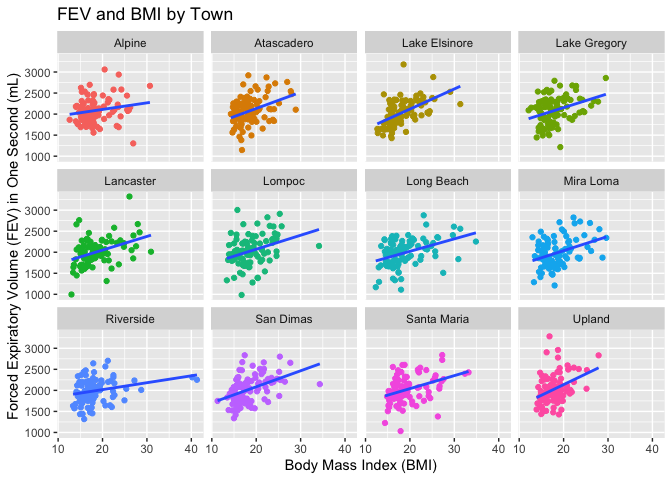
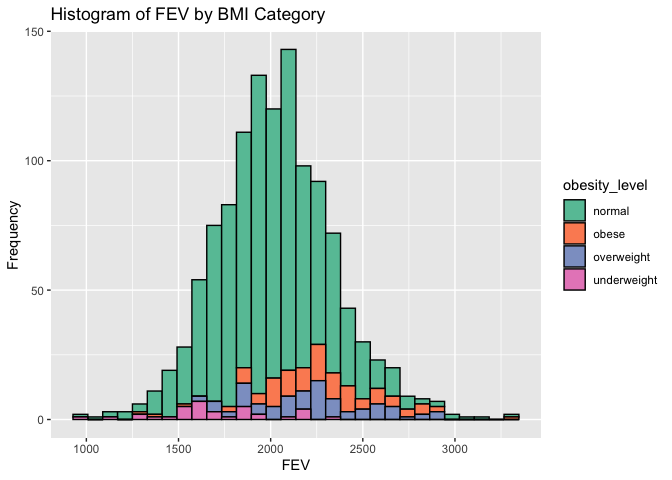
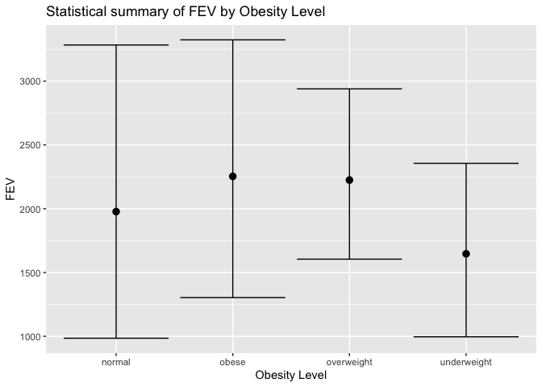

## Part 1: Data Wrangling
### Download Data

```r
if (!file.exists("chs_individual.csv"))
  download.file(
    url = "https://raw.githubusercontent.com/USCbiostats/data-science-data/master/01_chs/chs_individual.csv",
    destfile = "chs_individual.csv",
    method   = "libcurl",
    timeout  = 60
  )
individual <- data.table::fread("chs_individual.csv")

if (!file.exists("chs_regional.csv"))
  download.file(
    url = "https://raw.githubusercontent.com/USCbiostats/data-science-data/master/01_chs/chs_regional.csv",
    destfile = "chs_regional.csv",
    method   = "libcurl",
    timeout  = 60
  )
regional <- data.table::fread("chs_regional.csv")
```

### Merge the Data

```r
merged <- merge(
  # Data
  x     = individual,      
  y     = regional, 
  by  = "townname",
  all.x = TRUE,      
  all.y = FALSE
)
```

### Check number of rows

```r
dim(individual)
```

```
## [1] 1200   23
```

```r
dim(regional)
```

```
## [1] 12 27
```

```r
dim(merged)
```

```
## [1] 1200   49
```
The `merged` dataset has 1200 rows, which is the same as the `individual` dataset.

### Looking at the `merged` dataset more closely

```r
summary(merged)
```

```
##    townname              sid              male            race          
##  Length:1200        Min.   :   1.0   Min.   :0.0000   Length:1200       
##  Class :character   1st Qu.: 528.8   1st Qu.:0.0000   Class :character  
##  Mode  :character   Median :1041.5   Median :0.0000   Mode  :character  
##                     Mean   :1037.5   Mean   :0.4917                     
##                     3rd Qu.:1554.2   3rd Qu.:1.0000                     
##                     Max.   :2053.0   Max.   :1.0000                     
##                                                                         
##     hispanic          agepft           height        weight      
##  Min.   :0.0000   Min.   : 8.961   Min.   :114   Min.   : 42.00  
##  1st Qu.:0.0000   1st Qu.: 9.610   1st Qu.:135   1st Qu.: 65.00  
##  Median :0.0000   Median : 9.906   Median :139   Median : 74.00  
##  Mean   :0.4342   Mean   : 9.924   Mean   :139   Mean   : 79.33  
##  3rd Qu.:1.0000   3rd Qu.:10.177   3rd Qu.:143   3rd Qu.: 89.00  
##  Max.   :1.0000   Max.   :12.731   Max.   :165   Max.   :207.00  
##                   NA's   :89       NA's   :89    NA's   :89      
##       bmi            asthma       active_asthma  father_asthma    
##  Min.   :11.30   Min.   :0.0000   Min.   :0.00   Min.   :0.00000  
##  1st Qu.:15.78   1st Qu.:0.0000   1st Qu.:0.00   1st Qu.:0.00000  
##  Median :17.48   Median :0.0000   Median :0.00   Median :0.00000  
##  Mean   :18.50   Mean   :0.1463   Mean   :0.19   Mean   :0.08318  
##  3rd Qu.:20.35   3rd Qu.:0.0000   3rd Qu.:0.00   3rd Qu.:0.00000  
##  Max.   :41.27   Max.   :1.0000   Max.   :1.00   Max.   :1.00000  
##  NA's   :89      NA's   :31                      NA's   :106      
##  mother_asthma        wheeze          hayfever         allergy      
##  Min.   :0.0000   Min.   :0.0000   Min.   :0.0000   Min.   :0.0000  
##  1st Qu.:0.0000   1st Qu.:0.0000   1st Qu.:0.0000   1st Qu.:0.0000  
##  Median :0.0000   Median :0.0000   Median :0.0000   Median :0.0000  
##  Mean   :0.1023   Mean   :0.3313   Mean   :0.1747   Mean   :0.2929  
##  3rd Qu.:0.0000   3rd Qu.:1.0000   3rd Qu.:0.0000   3rd Qu.:1.0000  
##  Max.   :1.0000   Max.   :1.0000   Max.   :1.0000   Max.   :1.0000  
##  NA's   :56       NA's   :71       NA's   :118      NA's   :63      
##   educ_parent        smoke             pets           gasstove     
##  Min.   :1.000   Min.   :0.0000   Min.   :0.0000   Min.   :0.0000  
##  1st Qu.:2.000   1st Qu.:0.0000   1st Qu.:1.0000   1st Qu.:1.0000  
##  Median :3.000   Median :0.0000   Median :1.0000   Median :1.0000  
##  Mean   :2.797   Mean   :0.1638   Mean   :0.7667   Mean   :0.7815  
##  3rd Qu.:3.000   3rd Qu.:0.0000   3rd Qu.:1.0000   3rd Qu.:1.0000  
##  Max.   :5.000   Max.   :1.0000   Max.   :1.0000   Max.   :1.0000  
##  NA's   :64      NA's   :40                        NA's   :33      
##       fev              fvc            mmef          pm25_mass     
##  Min.   : 984.8   Min.   : 895   Min.   : 757.6   Min.   : 5.960  
##  1st Qu.:1809.0   1st Qu.:2041   1st Qu.:1994.0   1st Qu.: 7.615  
##  Median :2022.7   Median :2293   Median :2401.5   Median :10.545  
##  Mean   :2031.3   Mean   :2324   Mean   :2398.8   Mean   :14.362  
##  3rd Qu.:2249.7   3rd Qu.:2573   3rd Qu.:2793.8   3rd Qu.:20.988  
##  Max.   :3323.7   Max.   :3698   Max.   :4935.9   Max.   :29.970  
##  NA's   :95       NA's   :97     NA's   :106                      
##     pm25_so4        pm25_no3         pm25_nh4         pm25_oc      
##  Min.   :0.790   Min.   : 0.730   Min.   :0.4100   Min.   : 1.450  
##  1st Qu.:1.077   1st Qu.: 1.538   1st Qu.:0.7375   1st Qu.: 2.520  
##  Median :1.815   Median : 2.525   Median :1.1350   Median : 4.035  
##  Mean   :1.876   Mean   : 4.488   Mean   :1.7642   Mean   : 4.551  
##  3rd Qu.:2.605   3rd Qu.: 7.338   3rd Qu.:2.7725   3rd Qu.: 5.350  
##  Max.   :3.230   Max.   :12.200   Max.   :4.2500   Max.   :11.830  
##                                                                    
##     pm25_ec          pm25_om          pm10_oc          pm10_ec      
##  Min.   :0.1300   Min.   : 1.740   Min.   : 1.860   Min.   :0.1400  
##  1st Qu.:0.4000   1st Qu.: 3.020   1st Qu.: 3.228   1st Qu.:0.4100  
##  Median :0.5850   Median : 4.840   Median : 5.170   Median :0.5950  
##  Mean   :0.7358   Mean   : 5.460   Mean   : 5.832   Mean   :0.7525  
##  3rd Qu.:1.1750   3rd Qu.: 6.418   3rd Qu.: 6.855   3rd Qu.:1.1975  
##  Max.   :1.3600   Max.   :14.200   Max.   :15.160   Max.   :1.3900  
##                                                                     
##     pm10_tc           formic          acetic           hcl        
##  Min.   : 1.990   Min.   :0.340   Min.   :0.750   Min.   :0.2200  
##  1st Qu.: 3.705   1st Qu.:0.720   1st Qu.:2.297   1st Qu.:0.3250  
##  Median : 6.505   Median :1.105   Median :2.910   Median :0.4350  
##  Mean   : 6.784   Mean   :1.332   Mean   :3.010   Mean   :0.4208  
##  3rd Qu.: 8.430   3rd Qu.:1.765   3rd Qu.:4.000   3rd Qu.:0.4625  
##  Max.   :16.440   Max.   :2.770   Max.   :5.140   Max.   :0.7300  
##                                                                   
##       hno3           o3_max          o3106           o3_24      
##  Min.   :0.430   Min.   :38.27   Min.   :28.22   Min.   :18.22  
##  1st Qu.:1.593   1st Qu.:49.93   1st Qu.:41.90   1st Qu.:23.31  
##  Median :2.455   Median :64.05   Median :46.74   Median :27.59  
##  Mean   :2.367   Mean   :60.16   Mean   :47.76   Mean   :30.23  
##  3rd Qu.:3.355   3rd Qu.:67.69   3rd Qu.:55.24   3rd Qu.:32.39  
##  Max.   :4.070   Max.   :84.44   Max.   :67.01   Max.   :57.76  
##                                                                 
##       no2             pm10          no_24hr         pm2_5_fr    
##  Min.   : 4.60   Min.   :18.40   Min.   : 2.05   Min.   : 9.01  
##  1st Qu.:12.12   1st Qu.:20.71   1st Qu.: 4.74   1st Qu.:10.28  
##  Median :16.40   Median :29.64   Median :12.68   Median :22.23  
##  Mean   :18.99   Mean   :32.64   Mean   :16.21   Mean   :19.79  
##  3rd Qu.:23.24   3rd Qu.:39.16   3rd Qu.:26.90   3rd Qu.:27.73  
##  Max.   :37.97   Max.   :70.39   Max.   :42.95   Max.   :31.55  
##                                  NA's   :100     NA's   :300    
##      iacid           oacid        total_acids          lon        
##  Min.   :0.760   Min.   :1.090   Min.   : 1.520   Min.   :-120.7  
##  1st Qu.:1.835   1st Qu.:2.978   1st Qu.: 4.930   1st Qu.:-118.8  
##  Median :2.825   Median :4.135   Median : 6.370   Median :-117.7  
##  Mean   :2.788   Mean   :4.342   Mean   : 6.708   Mean   :-118.3  
##  3rd Qu.:3.817   3rd Qu.:5.982   3rd Qu.: 9.395   3rd Qu.:-117.4  
##  Max.   :4.620   Max.   :7.400   Max.   :11.430   Max.   :-116.8  
##                                                                   
##       lat       
##  Min.   :32.84  
##  1st Qu.:33.93  
##  Median :34.10  
##  Mean   :34.20  
##  3rd Qu.:34.65  
##  Max.   :35.49  
## 
```

### Imputing missing variables
Some of the variables that will be used later have NA values. These will be replaced by the averages within the `hispanic` and `male` categories. The variables that were imputed were `bmi` (Body Mass Index) as well as `fev` (Forced Expiratory Volume), as these will be used for later analysis. Binary variables were not imputed, and replacing them with the average would not make sense.

```r
merged[, bmi := fcoalesce(bmi, mean(bmi, na.rm = TRUE)),
    by = .(male, hispanic)]
merged[, fev := fcoalesce(fev, mean(fev, na.rm = TRUE)),
    by = .(male, hispanic)]
##keeping binary variables(smoke, gasstove), as it doesn't make sense to impute those
##adding male_ch variable to convert 0 to female and 1 to male
merged[, male_ch := fifelse(male == 0, "female", "male")]
```

### Creating new variable `obesity_level` 
This is to group the `bmi` variable into four major categories: *underweight* for BMI values less than 14; *normal* for BMIs between 14 and 22; *overweight* for BMIs between 22 and 24; and *obese* for BMIs greater than 24. The summary table shows how many observations within each obesity level category there are (N_obs), as well as what the minimum and maximum BMIs were in each category (min_bmi and max_bmi, respectively).

```r
merged[, obesity_level := fifelse(bmi < 14, "underweight",
                                  fifelse(bmi < 22, "normal",
                                        fifelse(bmi <= 24, "overweight", "obese")))] 
##Summary Table
bmi_summary <- merged[, .(
  min_bmi = min(bmi),
  max_bmi = max(bmi),
  N_obs   = .N),
  by = "obesity_level"]
knitr::kable(bmi_summary)
```


|obesity_level |  min_bmi|  max_bmi| N_obs|
|:-------------|--------:|--------:|-----:|
|normal        | 14.00380| 21.96387|   975|
|overweight    | 22.02353| 23.99650|    87|
|obese         | 24.00647| 41.26613|   103|
|underweight   | 11.29640| 13.98601|    35|

### Creating new variable `smoke_gas_exposure`
This was done in order to create a new categorical variable that summarizes each patient's exposure to smoke and/or gas. The categories are *no exposure*, *gas_exposure*, *smoke_exposure*, and *smoke_and_gas_exposure*. These results are displayed in the below summary table, which shows the number of observations (*N_obs*) within each category (*NA* corresponds to observations where the smoke and/or gas exposure data was not available).

```r
merged[, smoke_gas_exposure := fifelse(smoke == 0 & gasstove == 0, "no_exposure",
                                  fifelse(smoke == 0 & gasstove == 1, "gas_exposure",
                                        fifelse(smoke == 1 & gasstove == 0, "smoke_exposure",
                                                fifelse(smoke == 1 & gasstove == 1, "smoke_and_gas_exposure", "NA"))))] 
##Summary Table
smoke_gas_exposure_summary <- merged[, .(
  N_obs = .N),
  by = "smoke_gas_exposure"]
knitr::kable(smoke_gas_exposure_summary)
```


|smoke_gas_exposure     | N_obs|
|:----------------------|-----:|
|no_exposure            |   214|
|NA                     |    60|
|smoke_exposure         |    36|
|gas_exposure           |   739|
|smoke_and_gas_exposure |   151|

### Summary tables of Forced Expiratory Volume (FEV)
Below are four summary tables showing the average and standard deviation forced expiratory volume in one second (*fev_avg* and *fev_sd*), as well as the proportion of patients with and without asthma (*prop_asthma* and *prop_noasthma*) when the patients are grouped in various ways. FEV is the amount of air that a person can exhale and is measured in mL. 

The first summary table shows these values when the patients are grouped by town.

```r
##By Town
merged[, .(
  fev_avg = mean(fev, na.rm = TRUE),
  fev_sd  = sd(fev, na.rm = TRUE),
  prop_asthma = sum(asthma == 1, na.rm = TRUE)/.N,
  prop_noasthma = sum(asthma == 0, na.rm = TRUE)/.N),
  by = "townname"] %>% knitr::kable(caption = "FEV by Town")
```


Table: FEV by Town

|townname      |  fev_avg|   fev_sd| prop_asthma| prop_noasthma|
|:-------------|--------:|--------:|-----------:|-------------:|
|Alpine        | 2087.101| 291.1768|        0.11|          0.86|
|Atascadero    | 2075.897| 324.0935|        0.25|          0.73|
|Lake Elsinore | 2038.849| 303.6956|        0.12|          0.83|
|Lake Gregory  | 2084.700| 319.9593|        0.15|          0.84|
|Lancaster     | 2003.044| 317.1298|        0.16|          0.81|
|Lompoc        | 2034.354| 351.0454|        0.11|          0.86|
|Long Beach    | 1985.861| 319.4625|        0.13|          0.83|
|Mira Loma     | 1985.202| 324.9634|        0.15|          0.80|
|Riverside     | 1989.881| 277.5065|        0.11|          0.89|
|San Dimas     | 2026.794| 318.7845|        0.17|          0.82|
|Santa Maria   | 2025.750| 312.1725|        0.13|          0.84|
|Upland        | 2024.266| 343.1637|        0.12|          0.87|
This second summary table has the patients grouped by sex. Mean FEV is higher for males, and there is a higher proportion of asthma in males.

```r
##By Sex
merged[, .(
  fev_avg = mean(fev, na.rm = TRUE),
  fev_sd  = sd(fev, na.rm = TRUE),
  prop_asthma = sum(asthma == 1, na.rm = TRUE)/.N,
  prop_noasthma = sum(asthma == 0, na.rm = TRUE)/.N),
  by = "male_ch"] %>% knitr::kable(caption = "FEV by Sex")
```


Table: FEV by Sex

|male_ch |  fev_avg|   fev_sd| prop_asthma| prop_noasthma|
|:-------|--------:|--------:|-----------:|-------------:|
|female  | 1958.911| 311.9181|   0.1180328|     0.8590164|
|male    | 2103.787| 307.5123|   0.1677966|     0.8033898|
This third summary table has the patients grouped by obesity level. There is a higher proportion of asthma as well as higher average FEV as obesity level increases.

```r
##By Obesity Level
merged[, .(
  fev_avg = mean(fev, na.rm = TRUE),
  fev_sd  = sd(fev, na.rm = TRUE),
  prop_asthma = sum(asthma == 1, na.rm = TRUE)/.N,
  prop_noasthma = sum(asthma == 0, na.rm = TRUE)/.N),
  by = "obesity_level"] %>% knitr::kable(caption = "FEV by Obesity Level")
```


Table: FEV by Obesity Level

|obesity_level |  fev_avg|   fev_sd| prop_asthma| prop_noasthma|
|:-------------|--------:|--------:|-----------:|-------------:|
|normal        | 1999.794| 295.1964|   0.1364103|     0.8369231|
|overweight    | 2224.322| 317.4261|   0.1609195|     0.8160920|
|obese         | 2266.154| 325.4710|   0.2038835|     0.7669903|
|underweight   | 1698.327| 303.3983|   0.0857143|     0.9142857|
And this last summary table has the patients grouped by smoke/gas exposure. There doesn't seem to be a clear relationship here -- the highest average FEV are from the smoke exposure and no exposure categories, and the highest proportion of asthma was in the smoke exposure category.

```r
##By Town
merged[, .(
  fev_avg = mean(fev, na.rm = TRUE),
  fev_sd  = sd(fev, na.rm = TRUE),
  prop_asthma = sum(asthma == 1, na.rm = TRUE)/.N,
  prop_noasthma = sum(asthma == 0, na.rm = TRUE)/.N),
  by = "smoke_gas_exposure"] %>% knitr::kable(caption = "FEV by Smoke & Gas Exposure")
```


Table: FEV by Smoke & Gas Exposure

|smoke_gas_exposure     |  fev_avg|   fev_sd| prop_asthma| prop_noasthma|
|:----------------------|--------:|--------:|-----------:|-------------:|
|no_exposure            | 2055.356| 330.4169|   0.1448598|     0.8364486|
|NA                     | 2001.878| 340.2592|   0.1166667|     0.6666667|
|smoke_exposure         | 2055.714| 295.6475|   0.1666667|     0.8055556|
|gas_exposure           | 2025.989| 317.6305|   0.1461434|     0.8430311|
|smoke_and_gas_exposure | 2019.867| 298.9728|   0.1258278|     0.8410596|

## Looking at the Data
The primary questions of interest are:

1. What is the association between BMI and FEV (forced expiratory volume)?

2. What is the association between smoke and gas exposure and FEV?

3. What is the association between PM2.5 exposure and FEV?

### Question 1
#### Facet plot showing scatterplots with regression lines of BMI vs FEV by *townname*.
In all of these graphs, there is a positive association between BMI and FEV as seen by the positive slopes in the regression lines. 

```r
ggplot(data = merged, mapping = aes(x = bmi, y = fev)) +
  geom_point(mapping = aes(color = townname), show.legend = FALSE) +
  geom_smooth(method = lm, se = FALSE) +
  facet_wrap( ~ townname) +
  labs(title = "FEV and BMI by Town", y = "Forced Expiratory Volume (FEV) in One Second (mL)", x = "Body Mass Index (BMI)")
```

```
## `geom_smooth()` using formula 'y ~ x'
```

<!-- -->

### Question 2
#### Stacked histograms of FEV by BMI category and FEV by smoke/gas exposure. Use different color schemes than the ggplot default.
This first histogram shows the FEV frequencies observed at different obesity levels. The data looks to be fairly normally distributed, with no major outliers. We also see a similar relationship as was seen in the previous graph where FEV increases as obesity level increases. As FEV increases, there are fewer *underweight* patients; the *normal* and *obese* categories look to have the largest range in FEV.

```r
ggplot(data = merged, mapping=aes(x = fev, fill = obesity_level)) +
  geom_histogram(color = 'black', position = "stack") +
  scale_fill_brewer(palette = 'Set2') +
  labs(title = "Histogram of FEV by BMI Category", x = "FEV", y = "Frequency")
```

```
## `stat_bin()` using `bins = 30`. Pick better value with `binwidth`.
```

<!-- -->
This histogram shows the FEV frequencies observed for the four smoke & gas exposure categories. There is the most amount of data for patients exposed to gas. The data looks to be fairly normally distributed, with the medians of each category around the same value.

```r
merged[!is.na(smoke_gas_exposure)] %>%
  ggplot(mapping=aes(x = fev,fill = smoke_gas_exposure)) +
  geom_histogram(color = 'black', position = "stack") +
  scale_fill_brewer(palette = 'Set2') +
  labs(title = "Histogram of FEV by Smoke/Gas Exposure Category", x = "FEV", y = "Frequency")
```

```
## `stat_bin()` using `bins = 30`. Pick better value with `binwidth`.
```

<!-- -->

### Question 3
#### Barchart of BMI by smoke/gas exposure.
Gas exposure looks to be the most populous group in each of the BMI categories

```r
merged[!is.na(smoke_gas_exposure)] %>%
  ggplot(mapping = aes(x = obesity_level, fill = smoke_gas_exposure)) +
  geom_bar(position = 'dodge', color = 'black') +
  scale_fill_brewer(palette = "Set2") +
  labs(title = "Bar Plot of BMI Category by Smoke/Gas Exposure", x = "BMI Category", y = "Count")
```

<!-- -->

### Question 4
#### Statistical summary graphs of FEV by BMI and FEV by smoke/gas exposure category.
I used the median to describe the data in order to control for possible outliers. The data seemed to have a fairly normal distribution, but the underweight obesity level in particular looked more similar to a bimodal distribution.
As obesity level increases, median FEV also increases. BMI looks to be positively associated with FEV.

```r
merged %>%
  ggplot(mapping = aes(x = obesity_level, y = fev)) +
  stat_summary(fun = median, fun.min = min, fun.max = max, geom = "errorbar") +
  stat_summary(fun = median) +
  labs(title = "Statistical summary (Mean +- 2SD) of FEV by Obesity Level", x = "Obesity Level", y = "FEV")
```

```
## Warning: Removed 4 rows containing missing values (geom_segment).
```

<!-- -->
Median FEV seems to stay relatively consistent among the four different smoke/gas exposure groups, so these two variables do not seem to be associated.

```r
merged[!is.na(smoke_gas_exposure)] %>%
  ggplot(mapping = aes(x = smoke_gas_exposure, y = fev)) +
  stat_summary(fun = median, fun.min = min, fun.max = max, geom = "errorbar") +
  stat_summary(fun = median) +
  labs(title = "Statistical summary (Mean +- 2SD) of FEV by Smoke/Gas Exposure", x = "Smoke/Gas Exposure", y = "FEV")
```

```
## Warning: Removed 4 rows containing missing values (geom_segment).
```

<!-- -->

### Question 5
#### A leaflet map showing the concentrations of PM2.5 mass in each of the CHS communities.
The highest PM2.5 concentrations seem to be located in the greater Los Angeles area, which makes sense given this is a major city.

```r
mass.pal <- colorNumeric(c('yellow', 'orange', 'red'), domain = merged$pm25_mass)
leaflet(merged) %>%
  addProviderTiles('CartoDB.Positron') %>%
  addCircles(lat = ~lat, lng=~lon, opacity = 1, fillOpacity = 1, radius = 500, color = ~mass.pal(pm25_mass))  %>%
  addLegend('bottomleft', pal= mass.pal, values= merged$pm25_mass,
          title='PM2.5 Mass', opacity=1)
```

```{=html}
<div id="htmlwidget-a85b94d1ccda046934d1" style="width:672px;height:480px;" class="leaflet html-widget"></div>
<script type="application/json" data-for="htmlwidget-a85b94d1ccda046934d1">{"x":{"options":{"crs":{"crsClass":"L.CRS.EPSG3857","code":null,"proj4def":null,"projectedBounds":null,"options":{}}},"calls":[{"method":"addProviderTiles","args":["CartoDB.Positron",null,null,{"errorTileUrl":"","noWrap":false,"detectRetina":false}]},{"method":"addCircles","args":[[32.8350521,32.8350521,32.8350521,32.8350521,32.8350521,32.8350521,32.8350521,32.8350521,32.8350521,32.8350521,32.8350521,32.8350521,32.8350521,32.8350521,32.8350521,32.8350521,32.8350521,32.8350521,32.8350521,32.8350521,32.8350521,32.8350521,32.8350521,32.8350521,32.8350521,32.8350521,32.8350521,32.8350521,32.8350521,32.8350521,32.8350521,32.8350521,32.8350521,32.8350521,32.8350521,32.8350521,32.8350521,32.8350521,32.8350521,32.8350521,32.8350521,32.8350521,32.8350521,32.8350521,32.8350521,32.8350521,32.8350521,32.8350521,32.8350521,32.8350521,32.8350521,32.8350521,32.8350521,32.8350521,32.8350521,32.8350521,32.8350521,32.8350521,32.8350521,32.8350521,32.8350521,32.8350521,32.8350521,32.8350521,32.8350521,32.8350521,32.8350521,32.8350521,32.8350521,32.8350521,32.8350521,32.8350521,32.8350521,32.8350521,32.8350521,32.8350521,32.8350521,32.8350521,32.8350521,32.8350521,32.8350521,32.8350521,32.8350521,32.8350521,32.8350521,32.8350521,32.8350521,32.8350521,32.8350521,32.8350521,32.8350521,32.8350521,32.8350521,32.8350521,32.8350521,32.8350521,32.8350521,32.8350521,32.8350521,32.8350521,35.4894169,35.4894169,35.4894169,35.4894169,35.4894169,35.4894169,35.4894169,35.4894169,35.4894169,35.4894169,35.4894169,35.4894169,35.4894169,35.4894169,35.4894169,35.4894169,35.4894169,35.4894169,35.4894169,35.4894169,35.4894169,35.4894169,35.4894169,35.4894169,35.4894169,35.4894169,35.4894169,35.4894169,35.4894169,35.4894169,35.4894169,35.4894169,35.4894169,35.4894169,35.4894169,35.4894169,35.4894169,35.4894169,35.4894169,35.4894169,35.4894169,35.4894169,35.4894169,35.4894169,35.4894169,35.4894169,35.4894169,35.4894169,35.4894169,35.4894169,35.4894169,35.4894169,35.4894169,35.4894169,35.4894169,35.4894169,35.4894169,35.4894169,35.4894169,35.4894169,35.4894169,35.4894169,35.4894169,35.4894169,35.4894169,35.4894169,35.4894169,35.4894169,35.4894169,35.4894169,35.4894169,35.4894169,35.4894169,35.4894169,35.4894169,35.4894169,35.4894169,35.4894169,35.4894169,35.4894169,35.4894169,35.4894169,35.4894169,35.4894169,35.4894169,35.4894169,35.4894169,35.4894169,35.4894169,35.4894169,35.4894169,35.4894169,35.4894169,35.4894169,35.4894169,35.4894169,35.4894169,35.4894169,35.4894169,35.4894169,33.6680772,33.6680772,33.6680772,33.6680772,33.6680772,33.6680772,33.6680772,33.6680772,33.6680772,33.6680772,33.6680772,33.6680772,33.6680772,33.6680772,33.6680772,33.6680772,33.6680772,33.6680772,33.6680772,33.6680772,33.6680772,33.6680772,33.6680772,33.6680772,33.6680772,33.6680772,33.6680772,33.6680772,33.6680772,33.6680772,33.6680772,33.6680772,33.6680772,33.6680772,33.6680772,33.6680772,33.6680772,33.6680772,33.6680772,33.6680772,33.6680772,33.6680772,33.6680772,33.6680772,33.6680772,33.6680772,33.6680772,33.6680772,33.6680772,33.6680772,33.6680772,33.6680772,33.6680772,33.6680772,33.6680772,33.6680772,33.6680772,33.6680772,33.6680772,33.6680772,33.6680772,33.6680772,33.6680772,33.6680772,33.6680772,33.6680772,33.6680772,33.6680772,33.6680772,33.6680772,33.6680772,33.6680772,33.6680772,33.6680772,33.6680772,33.6680772,33.6680772,33.6680772,33.6680772,33.6680772,33.6680772,33.6680772,33.6680772,33.6680772,33.6680772,33.6680772,33.6680772,33.6680772,33.6680772,33.6680772,33.6680772,33.6680772,33.6680772,33.6680772,33.6680772,33.6680772,33.6680772,33.6680772,33.6680772,33.6680772,34.242901,34.242901,34.242901,34.242901,34.242901,34.242901,34.242901,34.242901,34.242901,34.242901,34.242901,34.242901,34.242901,34.242901,34.242901,34.242901,34.242901,34.242901,34.242901,34.242901,34.242901,34.242901,34.242901,34.242901,34.242901,34.242901,34.242901,34.242901,34.242901,34.242901,34.242901,34.242901,34.242901,34.242901,34.242901,34.242901,34.242901,34.242901,34.242901,34.242901,34.242901,34.242901,34.242901,34.242901,34.242901,34.242901,34.242901,34.242901,34.242901,34.242901,34.242901,34.242901,34.242901,34.242901,34.242901,34.242901,34.242901,34.242901,34.242901,34.242901,34.242901,34.242901,34.242901,34.242901,34.242901,34.242901,34.242901,34.242901,34.242901,34.242901,34.242901,34.242901,34.242901,34.242901,34.242901,34.242901,34.242901,34.242901,34.242901,34.242901,34.242901,34.242901,34.242901,34.242901,34.242901,34.242901,34.242901,34.242901,34.242901,34.242901,34.242901,34.242901,34.242901,34.242901,34.242901,34.242901,34.242901,34.242901,34.242901,34.242901,34.6867846,34.6867846,34.6867846,34.6867846,34.6867846,34.6867846,34.6867846,34.6867846,34.6867846,34.6867846,34.6867846,34.6867846,34.6867846,34.6867846,34.6867846,34.6867846,34.6867846,34.6867846,34.6867846,34.6867846,34.6867846,34.6867846,34.6867846,34.6867846,34.6867846,34.6867846,34.6867846,34.6867846,34.6867846,34.6867846,34.6867846,34.6867846,34.6867846,34.6867846,34.6867846,34.6867846,34.6867846,34.6867846,34.6867846,34.6867846,34.6867846,34.6867846,34.6867846,34.6867846,34.6867846,34.6867846,34.6867846,34.6867846,34.6867846,34.6867846,34.6867846,34.6867846,34.6867846,34.6867846,34.6867846,34.6867846,34.6867846,34.6867846,34.6867846,34.6867846,34.6867846,34.6867846,34.6867846,34.6867846,34.6867846,34.6867846,34.6867846,34.6867846,34.6867846,34.6867846,34.6867846,34.6867846,34.6867846,34.6867846,34.6867846,34.6867846,34.6867846,34.6867846,34.6867846,34.6867846,34.6867846,34.6867846,34.6867846,34.6867846,34.6867846,34.6867846,34.6867846,34.6867846,34.6867846,34.6867846,34.6867846,34.6867846,34.6867846,34.6867846,34.6867846,34.6867846,34.6867846,34.6867846,34.6867846,34.6867846,34.6391501,34.6391501,34.6391501,34.6391501,34.6391501,34.6391501,34.6391501,34.6391501,34.6391501,34.6391501,34.6391501,34.6391501,34.6391501,34.6391501,34.6391501,34.6391501,34.6391501,34.6391501,34.6391501,34.6391501,34.6391501,34.6391501,34.6391501,34.6391501,34.6391501,34.6391501,34.6391501,34.6391501,34.6391501,34.6391501,34.6391501,34.6391501,34.6391501,34.6391501,34.6391501,34.6391501,34.6391501,34.6391501,34.6391501,34.6391501,34.6391501,34.6391501,34.6391501,34.6391501,34.6391501,34.6391501,34.6391501,34.6391501,34.6391501,34.6391501,34.6391501,34.6391501,34.6391501,34.6391501,34.6391501,34.6391501,34.6391501,34.6391501,34.6391501,34.6391501,34.6391501,34.6391501,34.6391501,34.6391501,34.6391501,34.6391501,34.6391501,34.6391501,34.6391501,34.6391501,34.6391501,34.6391501,34.6391501,34.6391501,34.6391501,34.6391501,34.6391501,34.6391501,34.6391501,34.6391501,34.6391501,34.6391501,34.6391501,34.6391501,34.6391501,34.6391501,34.6391501,34.6391501,34.6391501,34.6391501,34.6391501,34.6391501,34.6391501,34.6391501,34.6391501,34.6391501,34.6391501,34.6391501,34.6391501,34.6391501,33.7700504,33.7700504,33.7700504,33.7700504,33.7700504,33.7700504,33.7700504,33.7700504,33.7700504,33.7700504,33.7700504,33.7700504,33.7700504,33.7700504,33.7700504,33.7700504,33.7700504,33.7700504,33.7700504,33.7700504,33.7700504,33.7700504,33.7700504,33.7700504,33.7700504,33.7700504,33.7700504,33.7700504,33.7700504,33.7700504,33.7700504,33.7700504,33.7700504,33.7700504,33.7700504,33.7700504,33.7700504,33.7700504,33.7700504,33.7700504,33.7700504,33.7700504,33.7700504,33.7700504,33.7700504,33.7700504,33.7700504,33.7700504,33.7700504,33.7700504,33.7700504,33.7700504,33.7700504,33.7700504,33.7700504,33.7700504,33.7700504,33.7700504,33.7700504,33.7700504,33.7700504,33.7700504,33.7700504,33.7700504,33.7700504,33.7700504,33.7700504,33.7700504,33.7700504,33.7700504,33.7700504,33.7700504,33.7700504,33.7700504,33.7700504,33.7700504,33.7700504,33.7700504,33.7700504,33.7700504,33.7700504,33.7700504,33.7700504,33.7700504,33.7700504,33.7700504,33.7700504,33.7700504,33.7700504,33.7700504,33.7700504,33.7700504,33.7700504,33.7700504,33.7700504,33.7700504,33.7700504,33.7700504,33.7700504,33.7700504,33.9845417,33.9845417,33.9845417,33.9845417,33.9845417,33.9845417,33.9845417,33.9845417,33.9845417,33.9845417,33.9845417,33.9845417,33.9845417,33.9845417,33.9845417,33.9845417,33.9845417,33.9845417,33.9845417,33.9845417,33.9845417,33.9845417,33.9845417,33.9845417,33.9845417,33.9845417,33.9845417,33.9845417,33.9845417,33.9845417,33.9845417,33.9845417,33.9845417,33.9845417,33.9845417,33.9845417,33.9845417,33.9845417,33.9845417,33.9845417,33.9845417,33.9845417,33.9845417,33.9845417,33.9845417,33.9845417,33.9845417,33.9845417,33.9845417,33.9845417,33.9845417,33.9845417,33.9845417,33.9845417,33.9845417,33.9845417,33.9845417,33.9845417,33.9845417,33.9845417,33.9845417,33.9845417,33.9845417,33.9845417,33.9845417,33.9845417,33.9845417,33.9845417,33.9845417,33.9845417,33.9845417,33.9845417,33.9845417,33.9845417,33.9845417,33.9845417,33.9845417,33.9845417,33.9845417,33.9845417,33.9845417,33.9845417,33.9845417,33.9845417,33.9845417,33.9845417,33.9845417,33.9845417,33.9845417,33.9845417,33.9845417,33.9845417,33.9845417,33.9845417,33.9845417,33.9845417,33.9845417,33.9845417,33.9845417,33.9845417,33.9806005,33.9806005,33.9806005,33.9806005,33.9806005,33.9806005,33.9806005,33.9806005,33.9806005,33.9806005,33.9806005,33.9806005,33.9806005,33.9806005,33.9806005,33.9806005,33.9806005,33.9806005,33.9806005,33.9806005,33.9806005,33.9806005,33.9806005,33.9806005,33.9806005,33.9806005,33.9806005,33.9806005,33.9806005,33.9806005,33.9806005,33.9806005,33.9806005,33.9806005,33.9806005,33.9806005,33.9806005,33.9806005,33.9806005,33.9806005,33.9806005,33.9806005,33.9806005,33.9806005,33.9806005,33.9806005,33.9806005,33.9806005,33.9806005,33.9806005,33.9806005,33.9806005,33.9806005,33.9806005,33.9806005,33.9806005,33.9806005,33.9806005,33.9806005,33.9806005,33.9806005,33.9806005,33.9806005,33.9806005,33.9806005,33.9806005,33.9806005,33.9806005,33.9806005,33.9806005,33.9806005,33.9806005,33.9806005,33.9806005,33.9806005,33.9806005,33.9806005,33.9806005,33.9806005,33.9806005,33.9806005,33.9806005,33.9806005,33.9806005,33.9806005,33.9806005,33.9806005,33.9806005,33.9806005,33.9806005,33.9806005,33.9806005,33.9806005,33.9806005,33.9806005,33.9806005,33.9806005,33.9806005,33.9806005,33.9806005,34.1066756,34.1066756,34.1066756,34.1066756,34.1066756,34.1066756,34.1066756,34.1066756,34.1066756,34.1066756,34.1066756,34.1066756,34.1066756,34.1066756,34.1066756,34.1066756,34.1066756,34.1066756,34.1066756,34.1066756,34.1066756,34.1066756,34.1066756,34.1066756,34.1066756,34.1066756,34.1066756,34.1066756,34.1066756,34.1066756,34.1066756,34.1066756,34.1066756,34.1066756,34.1066756,34.1066756,34.1066756,34.1066756,34.1066756,34.1066756,34.1066756,34.1066756,34.1066756,34.1066756,34.1066756,34.1066756,34.1066756,34.1066756,34.1066756,34.1066756,34.1066756,34.1066756,34.1066756,34.1066756,34.1066756,34.1066756,34.1066756,34.1066756,34.1066756,34.1066756,34.1066756,34.1066756,34.1066756,34.1066756,34.1066756,34.1066756,34.1066756,34.1066756,34.1066756,34.1066756,34.1066756,34.1066756,34.1066756,34.1066756,34.1066756,34.1066756,34.1066756,34.1066756,34.1066756,34.1066756,34.1066756,34.1066756,34.1066756,34.1066756,34.1066756,34.1066756,34.1066756,34.1066756,34.1066756,34.1066756,34.1066756,34.1066756,34.1066756,34.1066756,34.1066756,34.1066756,34.1066756,34.1066756,34.1066756,34.1066756,34.9530337,34.9530337,34.9530337,34.9530337,34.9530337,34.9530337,34.9530337,34.9530337,34.9530337,34.9530337,34.9530337,34.9530337,34.9530337,34.9530337,34.9530337,34.9530337,34.9530337,34.9530337,34.9530337,34.9530337,34.9530337,34.9530337,34.9530337,34.9530337,34.9530337,34.9530337,34.9530337,34.9530337,34.9530337,34.9530337,34.9530337,34.9530337,34.9530337,34.9530337,34.9530337,34.9530337,34.9530337,34.9530337,34.9530337,34.9530337,34.9530337,34.9530337,34.9530337,34.9530337,34.9530337,34.9530337,34.9530337,34.9530337,34.9530337,34.9530337,34.9530337,34.9530337,34.9530337,34.9530337,34.9530337,34.9530337,34.9530337,34.9530337,34.9530337,34.9530337,34.9530337,34.9530337,34.9530337,34.9530337,34.9530337,34.9530337,34.9530337,34.9530337,34.9530337,34.9530337,34.9530337,34.9530337,34.9530337,34.9530337,34.9530337,34.9530337,34.9530337,34.9530337,34.9530337,34.9530337,34.9530337,34.9530337,34.9530337,34.9530337,34.9530337,34.9530337,34.9530337,34.9530337,34.9530337,34.9530337,34.9530337,34.9530337,34.9530337,34.9530337,34.9530337,34.9530337,34.9530337,34.9530337,34.9530337,34.9530337,34.09751,34.09751,34.09751,34.09751,34.09751,34.09751,34.09751,34.09751,34.09751,34.09751,34.09751,34.09751,34.09751,34.09751,34.09751,34.09751,34.09751,34.09751,34.09751,34.09751,34.09751,34.09751,34.09751,34.09751,34.09751,34.09751,34.09751,34.09751,34.09751,34.09751,34.09751,34.09751,34.09751,34.09751,34.09751,34.09751,34.09751,34.09751,34.09751,34.09751,34.09751,34.09751,34.09751,34.09751,34.09751,34.09751,34.09751,34.09751,34.09751,34.09751,34.09751,34.09751,34.09751,34.09751,34.09751,34.09751,34.09751,34.09751,34.09751,34.09751,34.09751,34.09751,34.09751,34.09751,34.09751,34.09751,34.09751,34.09751,34.09751,34.09751,34.09751,34.09751,34.09751,34.09751,34.09751,34.09751,34.09751,34.09751,34.09751,34.09751,34.09751,34.09751,34.09751,34.09751,34.09751,34.09751,34.09751,34.09751,34.09751,34.09751,34.09751,34.09751,34.09751,34.09751,34.09751,34.09751,34.09751,34.09751,34.09751,34.09751],[-116.7664109,-116.7664109,-116.7664109,-116.7664109,-116.7664109,-116.7664109,-116.7664109,-116.7664109,-116.7664109,-116.7664109,-116.7664109,-116.7664109,-116.7664109,-116.7664109,-116.7664109,-116.7664109,-116.7664109,-116.7664109,-116.7664109,-116.7664109,-116.7664109,-116.7664109,-116.7664109,-116.7664109,-116.7664109,-116.7664109,-116.7664109,-116.7664109,-116.7664109,-116.7664109,-116.7664109,-116.7664109,-116.7664109,-116.7664109,-116.7664109,-116.7664109,-116.7664109,-116.7664109,-116.7664109,-116.7664109,-116.7664109,-116.7664109,-116.7664109,-116.7664109,-116.7664109,-116.7664109,-116.7664109,-116.7664109,-116.7664109,-116.7664109,-116.7664109,-116.7664109,-116.7664109,-116.7664109,-116.7664109,-116.7664109,-116.7664109,-116.7664109,-116.7664109,-116.7664109,-116.7664109,-116.7664109,-116.7664109,-116.7664109,-116.7664109,-116.7664109,-116.7664109,-116.7664109,-116.7664109,-116.7664109,-116.7664109,-116.7664109,-116.7664109,-116.7664109,-116.7664109,-116.7664109,-116.7664109,-116.7664109,-116.7664109,-116.7664109,-116.7664109,-116.7664109,-116.7664109,-116.7664109,-116.7664109,-116.7664109,-116.7664109,-116.7664109,-116.7664109,-116.7664109,-116.7664109,-116.7664109,-116.7664109,-116.7664109,-116.7664109,-116.7664109,-116.7664109,-116.7664109,-116.7664109,-116.7664109,-120.6707255,-120.6707255,-120.6707255,-120.6707255,-120.6707255,-120.6707255,-120.6707255,-120.6707255,-120.6707255,-120.6707255,-120.6707255,-120.6707255,-120.6707255,-120.6707255,-120.6707255,-120.6707255,-120.6707255,-120.6707255,-120.6707255,-120.6707255,-120.6707255,-120.6707255,-120.6707255,-120.6707255,-120.6707255,-120.6707255,-120.6707255,-120.6707255,-120.6707255,-120.6707255,-120.6707255,-120.6707255,-120.6707255,-120.6707255,-120.6707255,-120.6707255,-120.6707255,-120.6707255,-120.6707255,-120.6707255,-120.6707255,-120.6707255,-120.6707255,-120.6707255,-120.6707255,-120.6707255,-120.6707255,-120.6707255,-120.6707255,-120.6707255,-120.6707255,-120.6707255,-120.6707255,-120.6707255,-120.6707255,-120.6707255,-120.6707255,-120.6707255,-120.6707255,-120.6707255,-120.6707255,-120.6707255,-120.6707255,-120.6707255,-120.6707255,-120.6707255,-120.6707255,-120.6707255,-120.6707255,-120.6707255,-120.6707255,-120.6707255,-120.6707255,-120.6707255,-120.6707255,-120.6707255,-120.6707255,-120.6707255,-120.6707255,-120.6707255,-120.6707255,-120.6707255,-120.6707255,-120.6707255,-120.6707255,-120.6707255,-120.6707255,-120.6707255,-120.6707255,-120.6707255,-120.6707255,-120.6707255,-120.6707255,-120.6707255,-120.6707255,-120.6707255,-120.6707255,-120.6707255,-120.6707255,-120.6707255,-117.3272615,-117.3272615,-117.3272615,-117.3272615,-117.3272615,-117.3272615,-117.3272615,-117.3272615,-117.3272615,-117.3272615,-117.3272615,-117.3272615,-117.3272615,-117.3272615,-117.3272615,-117.3272615,-117.3272615,-117.3272615,-117.3272615,-117.3272615,-117.3272615,-117.3272615,-117.3272615,-117.3272615,-117.3272615,-117.3272615,-117.3272615,-117.3272615,-117.3272615,-117.3272615,-117.3272615,-117.3272615,-117.3272615,-117.3272615,-117.3272615,-117.3272615,-117.3272615,-117.3272615,-117.3272615,-117.3272615,-117.3272615,-117.3272615,-117.3272615,-117.3272615,-117.3272615,-117.3272615,-117.3272615,-117.3272615,-117.3272615,-117.3272615,-117.3272615,-117.3272615,-117.3272615,-117.3272615,-117.3272615,-117.3272615,-117.3272615,-117.3272615,-117.3272615,-117.3272615,-117.3272615,-117.3272615,-117.3272615,-117.3272615,-117.3272615,-117.3272615,-117.3272615,-117.3272615,-117.3272615,-117.3272615,-117.3272615,-117.3272615,-117.3272615,-117.3272615,-117.3272615,-117.3272615,-117.3272615,-117.3272615,-117.3272615,-117.3272615,-117.3272615,-117.3272615,-117.3272615,-117.3272615,-117.3272615,-117.3272615,-117.3272615,-117.3272615,-117.3272615,-117.3272615,-117.3272615,-117.3272615,-117.3272615,-117.3272615,-117.3272615,-117.3272615,-117.3272615,-117.3272615,-117.3272615,-117.3272615,-117.275233,-117.275233,-117.275233,-117.275233,-117.275233,-117.275233,-117.275233,-117.275233,-117.275233,-117.275233,-117.275233,-117.275233,-117.275233,-117.275233,-117.275233,-117.275233,-117.275233,-117.275233,-117.275233,-117.275233,-117.275233,-117.275233,-117.275233,-117.275233,-117.275233,-117.275233,-117.275233,-117.275233,-117.275233,-117.275233,-117.275233,-117.275233,-117.275233,-117.275233,-117.275233,-117.275233,-117.275233,-117.275233,-117.275233,-117.275233,-117.275233,-117.275233,-117.275233,-117.275233,-117.275233,-117.275233,-117.275233,-117.275233,-117.275233,-117.275233,-117.275233,-117.275233,-117.275233,-117.275233,-117.275233,-117.275233,-117.275233,-117.275233,-117.275233,-117.275233,-117.275233,-117.275233,-117.275233,-117.275233,-117.275233,-117.275233,-117.275233,-117.275233,-117.275233,-117.275233,-117.275233,-117.275233,-117.275233,-117.275233,-117.275233,-117.275233,-117.275233,-117.275233,-117.275233,-117.275233,-117.275233,-117.275233,-117.275233,-117.275233,-117.275233,-117.275233,-117.275233,-117.275233,-117.275233,-117.275233,-117.275233,-117.275233,-117.275233,-117.275233,-117.275233,-117.275233,-117.275233,-117.275233,-117.275233,-117.275233,-118.1541632,-118.1541632,-118.1541632,-118.1541632,-118.1541632,-118.1541632,-118.1541632,-118.1541632,-118.1541632,-118.1541632,-118.1541632,-118.1541632,-118.1541632,-118.1541632,-118.1541632,-118.1541632,-118.1541632,-118.1541632,-118.1541632,-118.1541632,-118.1541632,-118.1541632,-118.1541632,-118.1541632,-118.1541632,-118.1541632,-118.1541632,-118.1541632,-118.1541632,-118.1541632,-118.1541632,-118.1541632,-118.1541632,-118.1541632,-118.1541632,-118.1541632,-118.1541632,-118.1541632,-118.1541632,-118.1541632,-118.1541632,-118.1541632,-118.1541632,-118.1541632,-118.1541632,-118.1541632,-118.1541632,-118.1541632,-118.1541632,-118.1541632,-118.1541632,-118.1541632,-118.1541632,-118.1541632,-118.1541632,-118.1541632,-118.1541632,-118.1541632,-118.1541632,-118.1541632,-118.1541632,-118.1541632,-118.1541632,-118.1541632,-118.1541632,-118.1541632,-118.1541632,-118.1541632,-118.1541632,-118.1541632,-118.1541632,-118.1541632,-118.1541632,-118.1541632,-118.1541632,-118.1541632,-118.1541632,-118.1541632,-118.1541632,-118.1541632,-118.1541632,-118.1541632,-118.1541632,-118.1541632,-118.1541632,-118.1541632,-118.1541632,-118.1541632,-118.1541632,-118.1541632,-118.1541632,-118.1541632,-118.1541632,-118.1541632,-118.1541632,-118.1541632,-118.1541632,-118.1541632,-118.1541632,-118.1541632,-120.4579409,-120.4579409,-120.4579409,-120.4579409,-120.4579409,-120.4579409,-120.4579409,-120.4579409,-120.4579409,-120.4579409,-120.4579409,-120.4579409,-120.4579409,-120.4579409,-120.4579409,-120.4579409,-120.4579409,-120.4579409,-120.4579409,-120.4579409,-120.4579409,-120.4579409,-120.4579409,-120.4579409,-120.4579409,-120.4579409,-120.4579409,-120.4579409,-120.4579409,-120.4579409,-120.4579409,-120.4579409,-120.4579409,-120.4579409,-120.4579409,-120.4579409,-120.4579409,-120.4579409,-120.4579409,-120.4579409,-120.4579409,-120.4579409,-120.4579409,-120.4579409,-120.4579409,-120.4579409,-120.4579409,-120.4579409,-120.4579409,-120.4579409,-120.4579409,-120.4579409,-120.4579409,-120.4579409,-120.4579409,-120.4579409,-120.4579409,-120.4579409,-120.4579409,-120.4579409,-120.4579409,-120.4579409,-120.4579409,-120.4579409,-120.4579409,-120.4579409,-120.4579409,-120.4579409,-120.4579409,-120.4579409,-120.4579409,-120.4579409,-120.4579409,-120.4579409,-120.4579409,-120.4579409,-120.4579409,-120.4579409,-120.4579409,-120.4579409,-120.4579409,-120.4579409,-120.4579409,-120.4579409,-120.4579409,-120.4579409,-120.4579409,-120.4579409,-120.4579409,-120.4579409,-120.4579409,-120.4579409,-120.4579409,-120.4579409,-120.4579409,-120.4579409,-120.4579409,-120.4579409,-120.4579409,-120.4579409,-118.1937395,-118.1937395,-118.1937395,-118.1937395,-118.1937395,-118.1937395,-118.1937395,-118.1937395,-118.1937395,-118.1937395,-118.1937395,-118.1937395,-118.1937395,-118.1937395,-118.1937395,-118.1937395,-118.1937395,-118.1937395,-118.1937395,-118.1937395,-118.1937395,-118.1937395,-118.1937395,-118.1937395,-118.1937395,-118.1937395,-118.1937395,-118.1937395,-118.1937395,-118.1937395,-118.1937395,-118.1937395,-118.1937395,-118.1937395,-118.1937395,-118.1937395,-118.1937395,-118.1937395,-118.1937395,-118.1937395,-118.1937395,-118.1937395,-118.1937395,-118.1937395,-118.1937395,-118.1937395,-118.1937395,-118.1937395,-118.1937395,-118.1937395,-118.1937395,-118.1937395,-118.1937395,-118.1937395,-118.1937395,-118.1937395,-118.1937395,-118.1937395,-118.1937395,-118.1937395,-118.1937395,-118.1937395,-118.1937395,-118.1937395,-118.1937395,-118.1937395,-118.1937395,-118.1937395,-118.1937395,-118.1937395,-118.1937395,-118.1937395,-118.1937395,-118.1937395,-118.1937395,-118.1937395,-118.1937395,-118.1937395,-118.1937395,-118.1937395,-118.1937395,-118.1937395,-118.1937395,-118.1937395,-118.1937395,-118.1937395,-118.1937395,-118.1937395,-118.1937395,-118.1937395,-118.1937395,-118.1937395,-118.1937395,-118.1937395,-118.1937395,-118.1937395,-118.1937395,-118.1937395,-118.1937395,-118.1937395,-117.5159449,-117.5159449,-117.5159449,-117.5159449,-117.5159449,-117.5159449,-117.5159449,-117.5159449,-117.5159449,-117.5159449,-117.5159449,-117.5159449,-117.5159449,-117.5159449,-117.5159449,-117.5159449,-117.5159449,-117.5159449,-117.5159449,-117.5159449,-117.5159449,-117.5159449,-117.5159449,-117.5159449,-117.5159449,-117.5159449,-117.5159449,-117.5159449,-117.5159449,-117.5159449,-117.5159449,-117.5159449,-117.5159449,-117.5159449,-117.5159449,-117.5159449,-117.5159449,-117.5159449,-117.5159449,-117.5159449,-117.5159449,-117.5159449,-117.5159449,-117.5159449,-117.5159449,-117.5159449,-117.5159449,-117.5159449,-117.5159449,-117.5159449,-117.5159449,-117.5159449,-117.5159449,-117.5159449,-117.5159449,-117.5159449,-117.5159449,-117.5159449,-117.5159449,-117.5159449,-117.5159449,-117.5159449,-117.5159449,-117.5159449,-117.5159449,-117.5159449,-117.5159449,-117.5159449,-117.5159449,-117.5159449,-117.5159449,-117.5159449,-117.5159449,-117.5159449,-117.5159449,-117.5159449,-117.5159449,-117.5159449,-117.5159449,-117.5159449,-117.5159449,-117.5159449,-117.5159449,-117.5159449,-117.5159449,-117.5159449,-117.5159449,-117.5159449,-117.5159449,-117.5159449,-117.5159449,-117.5159449,-117.5159449,-117.5159449,-117.5159449,-117.5159449,-117.5159449,-117.5159449,-117.5159449,-117.5159449,-117.3754942,-117.3754942,-117.3754942,-117.3754942,-117.3754942,-117.3754942,-117.3754942,-117.3754942,-117.3754942,-117.3754942,-117.3754942,-117.3754942,-117.3754942,-117.3754942,-117.3754942,-117.3754942,-117.3754942,-117.3754942,-117.3754942,-117.3754942,-117.3754942,-117.3754942,-117.3754942,-117.3754942,-117.3754942,-117.3754942,-117.3754942,-117.3754942,-117.3754942,-117.3754942,-117.3754942,-117.3754942,-117.3754942,-117.3754942,-117.3754942,-117.3754942,-117.3754942,-117.3754942,-117.3754942,-117.3754942,-117.3754942,-117.3754942,-117.3754942,-117.3754942,-117.3754942,-117.3754942,-117.3754942,-117.3754942,-117.3754942,-117.3754942,-117.3754942,-117.3754942,-117.3754942,-117.3754942,-117.3754942,-117.3754942,-117.3754942,-117.3754942,-117.3754942,-117.3754942,-117.3754942,-117.3754942,-117.3754942,-117.3754942,-117.3754942,-117.3754942,-117.3754942,-117.3754942,-117.3754942,-117.3754942,-117.3754942,-117.3754942,-117.3754942,-117.3754942,-117.3754942,-117.3754942,-117.3754942,-117.3754942,-117.3754942,-117.3754942,-117.3754942,-117.3754942,-117.3754942,-117.3754942,-117.3754942,-117.3754942,-117.3754942,-117.3754942,-117.3754942,-117.3754942,-117.3754942,-117.3754942,-117.3754942,-117.3754942,-117.3754942,-117.3754942,-117.3754942,-117.3754942,-117.3754942,-117.3754942,-117.8067257,-117.8067257,-117.8067257,-117.8067257,-117.8067257,-117.8067257,-117.8067257,-117.8067257,-117.8067257,-117.8067257,-117.8067257,-117.8067257,-117.8067257,-117.8067257,-117.8067257,-117.8067257,-117.8067257,-117.8067257,-117.8067257,-117.8067257,-117.8067257,-117.8067257,-117.8067257,-117.8067257,-117.8067257,-117.8067257,-117.8067257,-117.8067257,-117.8067257,-117.8067257,-117.8067257,-117.8067257,-117.8067257,-117.8067257,-117.8067257,-117.8067257,-117.8067257,-117.8067257,-117.8067257,-117.8067257,-117.8067257,-117.8067257,-117.8067257,-117.8067257,-117.8067257,-117.8067257,-117.8067257,-117.8067257,-117.8067257,-117.8067257,-117.8067257,-117.8067257,-117.8067257,-117.8067257,-117.8067257,-117.8067257,-117.8067257,-117.8067257,-117.8067257,-117.8067257,-117.8067257,-117.8067257,-117.8067257,-117.8067257,-117.8067257,-117.8067257,-117.8067257,-117.8067257,-117.8067257,-117.8067257,-117.8067257,-117.8067257,-117.8067257,-117.8067257,-117.8067257,-117.8067257,-117.8067257,-117.8067257,-117.8067257,-117.8067257,-117.8067257,-117.8067257,-117.8067257,-117.8067257,-117.8067257,-117.8067257,-117.8067257,-117.8067257,-117.8067257,-117.8067257,-117.8067257,-117.8067257,-117.8067257,-117.8067257,-117.8067257,-117.8067257,-117.8067257,-117.8067257,-117.8067257,-117.8067257,-120.4357191,-120.4357191,-120.4357191,-120.4357191,-120.4357191,-120.4357191,-120.4357191,-120.4357191,-120.4357191,-120.4357191,-120.4357191,-120.4357191,-120.4357191,-120.4357191,-120.4357191,-120.4357191,-120.4357191,-120.4357191,-120.4357191,-120.4357191,-120.4357191,-120.4357191,-120.4357191,-120.4357191,-120.4357191,-120.4357191,-120.4357191,-120.4357191,-120.4357191,-120.4357191,-120.4357191,-120.4357191,-120.4357191,-120.4357191,-120.4357191,-120.4357191,-120.4357191,-120.4357191,-120.4357191,-120.4357191,-120.4357191,-120.4357191,-120.4357191,-120.4357191,-120.4357191,-120.4357191,-120.4357191,-120.4357191,-120.4357191,-120.4357191,-120.4357191,-120.4357191,-120.4357191,-120.4357191,-120.4357191,-120.4357191,-120.4357191,-120.4357191,-120.4357191,-120.4357191,-120.4357191,-120.4357191,-120.4357191,-120.4357191,-120.4357191,-120.4357191,-120.4357191,-120.4357191,-120.4357191,-120.4357191,-120.4357191,-120.4357191,-120.4357191,-120.4357191,-120.4357191,-120.4357191,-120.4357191,-120.4357191,-120.4357191,-120.4357191,-120.4357191,-120.4357191,-120.4357191,-120.4357191,-120.4357191,-120.4357191,-120.4357191,-120.4357191,-120.4357191,-120.4357191,-120.4357191,-120.4357191,-120.4357191,-120.4357191,-120.4357191,-120.4357191,-120.4357191,-120.4357191,-120.4357191,-120.4357191,-117.6483876,-117.6483876,-117.6483876,-117.6483876,-117.6483876,-117.6483876,-117.6483876,-117.6483876,-117.6483876,-117.6483876,-117.6483876,-117.6483876,-117.6483876,-117.6483876,-117.6483876,-117.6483876,-117.6483876,-117.6483876,-117.6483876,-117.6483876,-117.6483876,-117.6483876,-117.6483876,-117.6483876,-117.6483876,-117.6483876,-117.6483876,-117.6483876,-117.6483876,-117.6483876,-117.6483876,-117.6483876,-117.6483876,-117.6483876,-117.6483876,-117.6483876,-117.6483876,-117.6483876,-117.6483876,-117.6483876,-117.6483876,-117.6483876,-117.6483876,-117.6483876,-117.6483876,-117.6483876,-117.6483876,-117.6483876,-117.6483876,-117.6483876,-117.6483876,-117.6483876,-117.6483876,-117.6483876,-117.6483876,-117.6483876,-117.6483876,-117.6483876,-117.6483876,-117.6483876,-117.6483876,-117.6483876,-117.6483876,-117.6483876,-117.6483876,-117.6483876,-117.6483876,-117.6483876,-117.6483876,-117.6483876,-117.6483876,-117.6483876,-117.6483876,-117.6483876,-117.6483876,-117.6483876,-117.6483876,-117.6483876,-117.6483876,-117.6483876,-117.6483876,-117.6483876,-117.6483876,-117.6483876,-117.6483876,-117.6483876,-117.6483876,-117.6483876,-117.6483876,-117.6483876,-117.6483876,-117.6483876,-117.6483876,-117.6483876,-117.6483876,-117.6483876,-117.6483876,-117.6483876,-117.6483876,-117.6483876],500,null,null,{"interactive":true,"className":"","stroke":true,"color":["#FFEB00","#FFEB00","#FFEB00","#FFEB00","#FFEB00","#FFEB00","#FFEB00","#FFEB00","#FFEB00","#FFEB00","#FFEB00","#FFEB00","#FFEB00","#FFEB00","#FFEB00","#FFEB00","#FFEB00","#FFEB00","#FFEB00","#FFEB00","#FFEB00","#FFEB00","#FFEB00","#FFEB00","#FFEB00","#FFEB00","#FFEB00","#FFEB00","#FFEB00","#FFEB00","#FFEB00","#FFEB00","#FFEB00","#FFEB00","#FFEB00","#FFEB00","#FFEB00","#FFEB00","#FFEB00","#FFEB00","#FFEB00","#FFEB00","#FFEB00","#FFEB00","#FFEB00","#FFEB00","#FFEB00","#FFEB00","#FFEB00","#FFEB00","#FFEB00","#FFEB00","#FFEB00","#FFEB00","#FFEB00","#FFEB00","#FFEB00","#FFEB00","#FFEB00","#FFEB00","#FFEB00","#FFEB00","#FFEB00","#FFEB00","#FFEB00","#FFEB00","#FFEB00","#FFEB00","#FFEB00","#FFEB00","#FFEB00","#FFEB00","#FFEB00","#FFEB00","#FFEB00","#FFEB00","#FFEB00","#FFEB00","#FFEB00","#FFEB00","#FFEB00","#FFEB00","#FFEB00","#FFEB00","#FFEB00","#FFEB00","#FFEB00","#FFEB00","#FFEB00","#FFEB00","#FFEB00","#FFEB00","#FFEB00","#FFEB00","#FFEB00","#FFEB00","#FFEB00","#FFEB00","#FFEB00","#FFEB00","#FFF400","#FFF400","#FFF400","#FFF400","#FFF400","#FFF400","#FFF400","#FFF400","#FFF400","#FFF400","#FFF400","#FFF400","#FFF400","#FFF400","#FFF400","#FFF400","#FFF400","#FFF400","#FFF400","#FFF400","#FFF400","#FFF400","#FFF400","#FFF400","#FFF400","#FFF400","#FFF400","#FFF400","#FFF400","#FFF400","#FFF400","#FFF400","#FFF400","#FFF400","#FFF400","#FFF400","#FFF400","#FFF400","#FFF400","#FFF400","#FFF400","#FFF400","#FFF400","#FFF400","#FFF400","#FFF400","#FFF400","#FFF400","#FFF400","#FFF400","#FFF400","#FFF400","#FFF400","#FFF400","#FFF400","#FFF400","#FFF400","#FFF400","#FFF400","#FFF400","#FFF400","#FFF400","#FFF400","#FFF400","#FFF400","#FFF400","#FFF400","#FFF400","#FFF400","#FFF400","#FFF400","#FFF400","#FFF400","#FFF400","#FFF400","#FFF400","#FFF400","#FFF400","#FFF400","#FFF400","#FFF400","#FFF400","#FFF400","#FFF400","#FFF400","#FFF400","#FFF400","#FFF400","#FFF400","#FFF400","#FFF400","#FFF400","#FFF400","#FFF400","#FFF400","#FFF400","#FFF400","#FFF400","#FFF400","#FFF400","#FFD000","#FFD000","#FFD000","#FFD000","#FFD000","#FFD000","#FFD000","#FFD000","#FFD000","#FFD000","#FFD000","#FFD000","#FFD000","#FFD000","#FFD000","#FFD000","#FFD000","#FFD000","#FFD000","#FFD000","#FFD000","#FFD000","#FFD000","#FFD000","#FFD000","#FFD000","#FFD000","#FFD000","#FFD000","#FFD000","#FFD000","#FFD000","#FFD000","#FFD000","#FFD000","#FFD000","#FFD000","#FFD000","#FFD000","#FFD000","#FFD000","#FFD000","#FFD000","#FFD000","#FFD000","#FFD000","#FFD000","#FFD000","#FFD000","#FFD000","#FFD000","#FFD000","#FFD000","#FFD000","#FFD000","#FFD000","#FFD000","#FFD000","#FFD000","#FFD000","#FFD000","#FFD000","#FFD000","#FFD000","#FFD000","#FFD000","#FFD000","#FFD000","#FFD000","#FFD000","#FFD000","#FFD000","#FFD000","#FFD000","#FFD000","#FFD000","#FFD000","#FFD000","#FFD000","#FFD000","#FFD000","#FFD000","#FFD000","#FFD000","#FFD000","#FFD000","#FFD000","#FFD000","#FFD000","#FFD000","#FFD000","#FFD000","#FFD000","#FFD000","#FFD000","#FFD000","#FFD000","#FFD000","#FFD000","#FFD000","#FFF200","#FFF200","#FFF200","#FFF200","#FFF200","#FFF200","#FFF200","#FFF200","#FFF200","#FFF200","#FFF200","#FFF200","#FFF200","#FFF200","#FFF200","#FFF200","#FFF200","#FFF200","#FFF200","#FFF200","#FFF200","#FFF200","#FFF200","#FFF200","#FFF200","#FFF200","#FFF200","#FFF200","#FFF200","#FFF200","#FFF200","#FFF200","#FFF200","#FFF200","#FFF200","#FFF200","#FFF200","#FFF200","#FFF200","#FFF200","#FFF200","#FFF200","#FFF200","#FFF200","#FFF200","#FFF200","#FFF200","#FFF200","#FFF200","#FFF200","#FFF200","#FFF200","#FFF200","#FFF200","#FFF200","#FFF200","#FFF200","#FFF200","#FFF200","#FFF200","#FFF200","#FFF200","#FFF200","#FFF200","#FFF200","#FFF200","#FFF200","#FFF200","#FFF200","#FFF200","#FFF200","#FFF200","#FFF200","#FFF200","#FFF200","#FFF200","#FFF200","#FFF200","#FFF200","#FFF200","#FFF200","#FFF200","#FFF200","#FFF200","#FFF200","#FFF200","#FFF200","#FFF200","#FFF200","#FFF200","#FFF200","#FFF200","#FFF200","#FFF200","#FFF200","#FFF200","#FFF200","#FFF200","#FFF200","#FFF200","#FFEC00","#FFEC00","#FFEC00","#FFEC00","#FFEC00","#FFEC00","#FFEC00","#FFEC00","#FFEC00","#FFEC00","#FFEC00","#FFEC00","#FFEC00","#FFEC00","#FFEC00","#FFEC00","#FFEC00","#FFEC00","#FFEC00","#FFEC00","#FFEC00","#FFEC00","#FFEC00","#FFEC00","#FFEC00","#FFEC00","#FFEC00","#FFEC00","#FFEC00","#FFEC00","#FFEC00","#FFEC00","#FFEC00","#FFEC00","#FFEC00","#FFEC00","#FFEC00","#FFEC00","#FFEC00","#FFEC00","#FFEC00","#FFEC00","#FFEC00","#FFEC00","#FFEC00","#FFEC00","#FFEC00","#FFEC00","#FFEC00","#FFEC00","#FFEC00","#FFEC00","#FFEC00","#FFEC00","#FFEC00","#FFEC00","#FFEC00","#FFEC00","#FFEC00","#FFEC00","#FFEC00","#FFEC00","#FFEC00","#FFEC00","#FFEC00","#FFEC00","#FFEC00","#FFEC00","#FFEC00","#FFEC00","#FFEC00","#FFEC00","#FFEC00","#FFEC00","#FFEC00","#FFEC00","#FFEC00","#FFEC00","#FFEC00","#FFEC00","#FFEC00","#FFEC00","#FFEC00","#FFEC00","#FFEC00","#FFEC00","#FFEC00","#FFEC00","#FFEC00","#FFEC00","#FFEC00","#FFEC00","#FFEC00","#FFEC00","#FFEC00","#FFEC00","#FFEC00","#FFEC00","#FFEC00","#FFEC00","#FFFF00","#FFFF00","#FFFF00","#FFFF00","#FFFF00","#FFFF00","#FFFF00","#FFFF00","#FFFF00","#FFFF00","#FFFF00","#FFFF00","#FFFF00","#FFFF00","#FFFF00","#FFFF00","#FFFF00","#FFFF00","#FFFF00","#FFFF00","#FFFF00","#FFFF00","#FFFF00","#FFFF00","#FFFF00","#FFFF00","#FFFF00","#FFFF00","#FFFF00","#FFFF00","#FFFF00","#FFFF00","#FFFF00","#FFFF00","#FFFF00","#FFFF00","#FFFF00","#FFFF00","#FFFF00","#FFFF00","#FFFF00","#FFFF00","#FFFF00","#FFFF00","#FFFF00","#FFFF00","#FFFF00","#FFFF00","#FFFF00","#FFFF00","#FFFF00","#FFFF00","#FFFF00","#FFFF00","#FFFF00","#FFFF00","#FFFF00","#FFFF00","#FFFF00","#FFFF00","#FFFF00","#FFFF00","#FFFF00","#FFFF00","#FFFF00","#FFFF00","#FFFF00","#FFFF00","#FFFF00","#FFFF00","#FFFF00","#FFFF00","#FFFF00","#FFFF00","#FFFF00","#FFFF00","#FFFF00","#FFFF00","#FFFF00","#FFFF00","#FFFF00","#FFFF00","#FFFF00","#FFFF00","#FFFF00","#FFFF00","#FFFF00","#FFFF00","#FFFF00","#FFFF00","#FFFF00","#FFFF00","#FFFF00","#FFFF00","#FFFF00","#FFFF00","#FFFF00","#FFFF00","#FFFF00","#FFFF00","#FF9B00","#FF9B00","#FF9B00","#FF9B00","#FF9B00","#FF9B00","#FF9B00","#FF9B00","#FF9B00","#FF9B00","#FF9B00","#FF9B00","#FF9B00","#FF9B00","#FF9B00","#FF9B00","#FF9B00","#FF9B00","#FF9B00","#FF9B00","#FF9B00","#FF9B00","#FF9B00","#FF9B00","#FF9B00","#FF9B00","#FF9B00","#FF9B00","#FF9B00","#FF9B00","#FF9B00","#FF9B00","#FF9B00","#FF9B00","#FF9B00","#FF9B00","#FF9B00","#FF9B00","#FF9B00","#FF9B00","#FF9B00","#FF9B00","#FF9B00","#FF9B00","#FF9B00","#FF9B00","#FF9B00","#FF9B00","#FF9B00","#FF9B00","#FF9B00","#FF9B00","#FF9B00","#FF9B00","#FF9B00","#FF9B00","#FF9B00","#FF9B00","#FF9B00","#FF9B00","#FF9B00","#FF9B00","#FF9B00","#FF9B00","#FF9B00","#FF9B00","#FF9B00","#FF9B00","#FF9B00","#FF9B00","#FF9B00","#FF9B00","#FF9B00","#FF9B00","#FF9B00","#FF9B00","#FF9B00","#FF9B00","#FF9B00","#FF9B00","#FF9B00","#FF9B00","#FF9B00","#FF9B00","#FF9B00","#FF9B00","#FF9B00","#FF9B00","#FF9B00","#FF9B00","#FF9B00","#FF9B00","#FF9B00","#FF9B00","#FF9B00","#FF9B00","#FF9B00","#FF9B00","#FF9B00","#FF9B00","#FF0000","#FF0000","#FF0000","#FF0000","#FF0000","#FF0000","#FF0000","#FF0000","#FF0000","#FF0000","#FF0000","#FF0000","#FF0000","#FF0000","#FF0000","#FF0000","#FF0000","#FF0000","#FF0000","#FF0000","#FF0000","#FF0000","#FF0000","#FF0000","#FF0000","#FF0000","#FF0000","#FF0000","#FF0000","#FF0000","#FF0000","#FF0000","#FF0000","#FF0000","#FF0000","#FF0000","#FF0000","#FF0000","#FF0000","#FF0000","#FF0000","#FF0000","#FF0000","#FF0000","#FF0000","#FF0000","#FF0000","#FF0000","#FF0000","#FF0000","#FF0000","#FF0000","#FF0000","#FF0000","#FF0000","#FF0000","#FF0000","#FF0000","#FF0000","#FF0000","#FF0000","#FF0000","#FF0000","#FF0000","#FF0000","#FF0000","#FF0000","#FF0000","#FF0000","#FF0000","#FF0000","#FF0000","#FF0000","#FF0000","#FF0000","#FF0000","#FF0000","#FF0000","#FF0000","#FF0000","#FF0000","#FF0000","#FF0000","#FF0000","#FF0000","#FF0000","#FF0000","#FF0000","#FF0000","#FF0000","#FF0000","#FF0000","#FF0000","#FF0000","#FF0000","#FF0000","#FF0000","#FF0000","#FF0000","#FF0000","#FF7E00","#FF7E00","#FF7E00","#FF7E00","#FF7E00","#FF7E00","#FF7E00","#FF7E00","#FF7E00","#FF7E00","#FF7E00","#FF7E00","#FF7E00","#FF7E00","#FF7E00","#FF7E00","#FF7E00","#FF7E00","#FF7E00","#FF7E00","#FF7E00","#FF7E00","#FF7E00","#FF7E00","#FF7E00","#FF7E00","#FF7E00","#FF7E00","#FF7E00","#FF7E00","#FF7E00","#FF7E00","#FF7E00","#FF7E00","#FF7E00","#FF7E00","#FF7E00","#FF7E00","#FF7E00","#FF7E00","#FF7E00","#FF7E00","#FF7E00","#FF7E00","#FF7E00","#FF7E00","#FF7E00","#FF7E00","#FF7E00","#FF7E00","#FF7E00","#FF7E00","#FF7E00","#FF7E00","#FF7E00","#FF7E00","#FF7E00","#FF7E00","#FF7E00","#FF7E00","#FF7E00","#FF7E00","#FF7E00","#FF7E00","#FF7E00","#FF7E00","#FF7E00","#FF7E00","#FF7E00","#FF7E00","#FF7E00","#FF7E00","#FF7E00","#FF7E00","#FF7E00","#FF7E00","#FF7E00","#FF7E00","#FF7E00","#FF7E00","#FF7E00","#FF7E00","#FF7E00","#FF7E00","#FF7E00","#FF7E00","#FF7E00","#FF7E00","#FF7E00","#FF7E00","#FF7E00","#FF7E00","#FF7E00","#FF7E00","#FF7E00","#FF7E00","#FF7E00","#FF7E00","#FF7E00","#FF7E00","#FF8F00","#FF8F00","#FF8F00","#FF8F00","#FF8F00","#FF8F00","#FF8F00","#FF8F00","#FF8F00","#FF8F00","#FF8F00","#FF8F00","#FF8F00","#FF8F00","#FF8F00","#FF8F00","#FF8F00","#FF8F00","#FF8F00","#FF8F00","#FF8F00","#FF8F00","#FF8F00","#FF8F00","#FF8F00","#FF8F00","#FF8F00","#FF8F00","#FF8F00","#FF8F00","#FF8F00","#FF8F00","#FF8F00","#FF8F00","#FF8F00","#FF8F00","#FF8F00","#FF8F00","#FF8F00","#FF8F00","#FF8F00","#FF8F00","#FF8F00","#FF8F00","#FF8F00","#FF8F00","#FF8F00","#FF8F00","#FF8F00","#FF8F00","#FF8F00","#FF8F00","#FF8F00","#FF8F00","#FF8F00","#FF8F00","#FF8F00","#FF8F00","#FF8F00","#FF8F00","#FF8F00","#FF8F00","#FF8F00","#FF8F00","#FF8F00","#FF8F00","#FF8F00","#FF8F00","#FF8F00","#FF8F00","#FF8F00","#FF8F00","#FF8F00","#FF8F00","#FF8F00","#FF8F00","#FF8F00","#FF8F00","#FF8F00","#FF8F00","#FF8F00","#FF8F00","#FF8F00","#FF8F00","#FF8F00","#FF8F00","#FF8F00","#FF8F00","#FF8F00","#FF8F00","#FF8F00","#FF8F00","#FF8F00","#FF8F00","#FF8F00","#FF8F00","#FF8F00","#FF8F00","#FF8F00","#FF8F00","#FFF600","#FFF600","#FFF600","#FFF600","#FFF600","#FFF600","#FFF600","#FFF600","#FFF600","#FFF600","#FFF600","#FFF600","#FFF600","#FFF600","#FFF600","#FFF600","#FFF600","#FFF600","#FFF600","#FFF600","#FFF600","#FFF600","#FFF600","#FFF600","#FFF600","#FFF600","#FFF600","#FFF600","#FFF600","#FFF600","#FFF600","#FFF600","#FFF600","#FFF600","#FFF600","#FFF600","#FFF600","#FFF600","#FFF600","#FFF600","#FFF600","#FFF600","#FFF600","#FFF600","#FFF600","#FFF600","#FFF600","#FFF600","#FFF600","#FFF600","#FFF600","#FFF600","#FFF600","#FFF600","#FFF600","#FFF600","#FFF600","#FFF600","#FFF600","#FFF600","#FFF600","#FFF600","#FFF600","#FFF600","#FFF600","#FFF600","#FFF600","#FFF600","#FFF600","#FFF600","#FFF600","#FFF600","#FFF600","#FFF600","#FFF600","#FFF600","#FFF600","#FFF600","#FFF600","#FFF600","#FFF600","#FFF600","#FFF600","#FFF600","#FFF600","#FFF600","#FFF600","#FFF600","#FFF600","#FFF600","#FFF600","#FFF600","#FFF600","#FFF600","#FFF600","#FFF600","#FFF600","#FFF600","#FFF600","#FFF600","#FF7D00","#FF7D00","#FF7D00","#FF7D00","#FF7D00","#FF7D00","#FF7D00","#FF7D00","#FF7D00","#FF7D00","#FF7D00","#FF7D00","#FF7D00","#FF7D00","#FF7D00","#FF7D00","#FF7D00","#FF7D00","#FF7D00","#FF7D00","#FF7D00","#FF7D00","#FF7D00","#FF7D00","#FF7D00","#FF7D00","#FF7D00","#FF7D00","#FF7D00","#FF7D00","#FF7D00","#FF7D00","#FF7D00","#FF7D00","#FF7D00","#FF7D00","#FF7D00","#FF7D00","#FF7D00","#FF7D00","#FF7D00","#FF7D00","#FF7D00","#FF7D00","#FF7D00","#FF7D00","#FF7D00","#FF7D00","#FF7D00","#FF7D00","#FF7D00","#FF7D00","#FF7D00","#FF7D00","#FF7D00","#FF7D00","#FF7D00","#FF7D00","#FF7D00","#FF7D00","#FF7D00","#FF7D00","#FF7D00","#FF7D00","#FF7D00","#FF7D00","#FF7D00","#FF7D00","#FF7D00","#FF7D00","#FF7D00","#FF7D00","#FF7D00","#FF7D00","#FF7D00","#FF7D00","#FF7D00","#FF7D00","#FF7D00","#FF7D00","#FF7D00","#FF7D00","#FF7D00","#FF7D00","#FF7D00","#FF7D00","#FF7D00","#FF7D00","#FF7D00","#FF7D00","#FF7D00","#FF7D00","#FF7D00","#FF7D00","#FF7D00","#FF7D00","#FF7D00","#FF7D00","#FF7D00","#FF7D00"],"weight":5,"opacity":1,"fill":true,"fillColor":["#FFEB00","#FFEB00","#FFEB00","#FFEB00","#FFEB00","#FFEB00","#FFEB00","#FFEB00","#FFEB00","#FFEB00","#FFEB00","#FFEB00","#FFEB00","#FFEB00","#FFEB00","#FFEB00","#FFEB00","#FFEB00","#FFEB00","#FFEB00","#FFEB00","#FFEB00","#FFEB00","#FFEB00","#FFEB00","#FFEB00","#FFEB00","#FFEB00","#FFEB00","#FFEB00","#FFEB00","#FFEB00","#FFEB00","#FFEB00","#FFEB00","#FFEB00","#FFEB00","#FFEB00","#FFEB00","#FFEB00","#FFEB00","#FFEB00","#FFEB00","#FFEB00","#FFEB00","#FFEB00","#FFEB00","#FFEB00","#FFEB00","#FFEB00","#FFEB00","#FFEB00","#FFEB00","#FFEB00","#FFEB00","#FFEB00","#FFEB00","#FFEB00","#FFEB00","#FFEB00","#FFEB00","#FFEB00","#FFEB00","#FFEB00","#FFEB00","#FFEB00","#FFEB00","#FFEB00","#FFEB00","#FFEB00","#FFEB00","#FFEB00","#FFEB00","#FFEB00","#FFEB00","#FFEB00","#FFEB00","#FFEB00","#FFEB00","#FFEB00","#FFEB00","#FFEB00","#FFEB00","#FFEB00","#FFEB00","#FFEB00","#FFEB00","#FFEB00","#FFEB00","#FFEB00","#FFEB00","#FFEB00","#FFEB00","#FFEB00","#FFEB00","#FFEB00","#FFEB00","#FFEB00","#FFEB00","#FFEB00","#FFF400","#FFF400","#FFF400","#FFF400","#FFF400","#FFF400","#FFF400","#FFF400","#FFF400","#FFF400","#FFF400","#FFF400","#FFF400","#FFF400","#FFF400","#FFF400","#FFF400","#FFF400","#FFF400","#FFF400","#FFF400","#FFF400","#FFF400","#FFF400","#FFF400","#FFF400","#FFF400","#FFF400","#FFF400","#FFF400","#FFF400","#FFF400","#FFF400","#FFF400","#FFF400","#FFF400","#FFF400","#FFF400","#FFF400","#FFF400","#FFF400","#FFF400","#FFF400","#FFF400","#FFF400","#FFF400","#FFF400","#FFF400","#FFF400","#FFF400","#FFF400","#FFF400","#FFF400","#FFF400","#FFF400","#FFF400","#FFF400","#FFF400","#FFF400","#FFF400","#FFF400","#FFF400","#FFF400","#FFF400","#FFF400","#FFF400","#FFF400","#FFF400","#FFF400","#FFF400","#FFF400","#FFF400","#FFF400","#FFF400","#FFF400","#FFF400","#FFF400","#FFF400","#FFF400","#FFF400","#FFF400","#FFF400","#FFF400","#FFF400","#FFF400","#FFF400","#FFF400","#FFF400","#FFF400","#FFF400","#FFF400","#FFF400","#FFF400","#FFF400","#FFF400","#FFF400","#FFF400","#FFF400","#FFF400","#FFF400","#FFD000","#FFD000","#FFD000","#FFD000","#FFD000","#FFD000","#FFD000","#FFD000","#FFD000","#FFD000","#FFD000","#FFD000","#FFD000","#FFD000","#FFD000","#FFD000","#FFD000","#FFD000","#FFD000","#FFD000","#FFD000","#FFD000","#FFD000","#FFD000","#FFD000","#FFD000","#FFD000","#FFD000","#FFD000","#FFD000","#FFD000","#FFD000","#FFD000","#FFD000","#FFD000","#FFD000","#FFD000","#FFD000","#FFD000","#FFD000","#FFD000","#FFD000","#FFD000","#FFD000","#FFD000","#FFD000","#FFD000","#FFD000","#FFD000","#FFD000","#FFD000","#FFD000","#FFD000","#FFD000","#FFD000","#FFD000","#FFD000","#FFD000","#FFD000","#FFD000","#FFD000","#FFD000","#FFD000","#FFD000","#FFD000","#FFD000","#FFD000","#FFD000","#FFD000","#FFD000","#FFD000","#FFD000","#FFD000","#FFD000","#FFD000","#FFD000","#FFD000","#FFD000","#FFD000","#FFD000","#FFD000","#FFD000","#FFD000","#FFD000","#FFD000","#FFD000","#FFD000","#FFD000","#FFD000","#FFD000","#FFD000","#FFD000","#FFD000","#FFD000","#FFD000","#FFD000","#FFD000","#FFD000","#FFD000","#FFD000","#FFF200","#FFF200","#FFF200","#FFF200","#FFF200","#FFF200","#FFF200","#FFF200","#FFF200","#FFF200","#FFF200","#FFF200","#FFF200","#FFF200","#FFF200","#FFF200","#FFF200","#FFF200","#FFF200","#FFF200","#FFF200","#FFF200","#FFF200","#FFF200","#FFF200","#FFF200","#FFF200","#FFF200","#FFF200","#FFF200","#FFF200","#FFF200","#FFF200","#FFF200","#FFF200","#FFF200","#FFF200","#FFF200","#FFF200","#FFF200","#FFF200","#FFF200","#FFF200","#FFF200","#FFF200","#FFF200","#FFF200","#FFF200","#FFF200","#FFF200","#FFF200","#FFF200","#FFF200","#FFF200","#FFF200","#FFF200","#FFF200","#FFF200","#FFF200","#FFF200","#FFF200","#FFF200","#FFF200","#FFF200","#FFF200","#FFF200","#FFF200","#FFF200","#FFF200","#FFF200","#FFF200","#FFF200","#FFF200","#FFF200","#FFF200","#FFF200","#FFF200","#FFF200","#FFF200","#FFF200","#FFF200","#FFF200","#FFF200","#FFF200","#FFF200","#FFF200","#FFF200","#FFF200","#FFF200","#FFF200","#FFF200","#FFF200","#FFF200","#FFF200","#FFF200","#FFF200","#FFF200","#FFF200","#FFF200","#FFF200","#FFEC00","#FFEC00","#FFEC00","#FFEC00","#FFEC00","#FFEC00","#FFEC00","#FFEC00","#FFEC00","#FFEC00","#FFEC00","#FFEC00","#FFEC00","#FFEC00","#FFEC00","#FFEC00","#FFEC00","#FFEC00","#FFEC00","#FFEC00","#FFEC00","#FFEC00","#FFEC00","#FFEC00","#FFEC00","#FFEC00","#FFEC00","#FFEC00","#FFEC00","#FFEC00","#FFEC00","#FFEC00","#FFEC00","#FFEC00","#FFEC00","#FFEC00","#FFEC00","#FFEC00","#FFEC00","#FFEC00","#FFEC00","#FFEC00","#FFEC00","#FFEC00","#FFEC00","#FFEC00","#FFEC00","#FFEC00","#FFEC00","#FFEC00","#FFEC00","#FFEC00","#FFEC00","#FFEC00","#FFEC00","#FFEC00","#FFEC00","#FFEC00","#FFEC00","#FFEC00","#FFEC00","#FFEC00","#FFEC00","#FFEC00","#FFEC00","#FFEC00","#FFEC00","#FFEC00","#FFEC00","#FFEC00","#FFEC00","#FFEC00","#FFEC00","#FFEC00","#FFEC00","#FFEC00","#FFEC00","#FFEC00","#FFEC00","#FFEC00","#FFEC00","#FFEC00","#FFEC00","#FFEC00","#FFEC00","#FFEC00","#FFEC00","#FFEC00","#FFEC00","#FFEC00","#FFEC00","#FFEC00","#FFEC00","#FFEC00","#FFEC00","#FFEC00","#FFEC00","#FFEC00","#FFEC00","#FFEC00","#FFFF00","#FFFF00","#FFFF00","#FFFF00","#FFFF00","#FFFF00","#FFFF00","#FFFF00","#FFFF00","#FFFF00","#FFFF00","#FFFF00","#FFFF00","#FFFF00","#FFFF00","#FFFF00","#FFFF00","#FFFF00","#FFFF00","#FFFF00","#FFFF00","#FFFF00","#FFFF00","#FFFF00","#FFFF00","#FFFF00","#FFFF00","#FFFF00","#FFFF00","#FFFF00","#FFFF00","#FFFF00","#FFFF00","#FFFF00","#FFFF00","#FFFF00","#FFFF00","#FFFF00","#FFFF00","#FFFF00","#FFFF00","#FFFF00","#FFFF00","#FFFF00","#FFFF00","#FFFF00","#FFFF00","#FFFF00","#FFFF00","#FFFF00","#FFFF00","#FFFF00","#FFFF00","#FFFF00","#FFFF00","#FFFF00","#FFFF00","#FFFF00","#FFFF00","#FFFF00","#FFFF00","#FFFF00","#FFFF00","#FFFF00","#FFFF00","#FFFF00","#FFFF00","#FFFF00","#FFFF00","#FFFF00","#FFFF00","#FFFF00","#FFFF00","#FFFF00","#FFFF00","#FFFF00","#FFFF00","#FFFF00","#FFFF00","#FFFF00","#FFFF00","#FFFF00","#FFFF00","#FFFF00","#FFFF00","#FFFF00","#FFFF00","#FFFF00","#FFFF00","#FFFF00","#FFFF00","#FFFF00","#FFFF00","#FFFF00","#FFFF00","#FFFF00","#FFFF00","#FFFF00","#FFFF00","#FFFF00","#FF9B00","#FF9B00","#FF9B00","#FF9B00","#FF9B00","#FF9B00","#FF9B00","#FF9B00","#FF9B00","#FF9B00","#FF9B00","#FF9B00","#FF9B00","#FF9B00","#FF9B00","#FF9B00","#FF9B00","#FF9B00","#FF9B00","#FF9B00","#FF9B00","#FF9B00","#FF9B00","#FF9B00","#FF9B00","#FF9B00","#FF9B00","#FF9B00","#FF9B00","#FF9B00","#FF9B00","#FF9B00","#FF9B00","#FF9B00","#FF9B00","#FF9B00","#FF9B00","#FF9B00","#FF9B00","#FF9B00","#FF9B00","#FF9B00","#FF9B00","#FF9B00","#FF9B00","#FF9B00","#FF9B00","#FF9B00","#FF9B00","#FF9B00","#FF9B00","#FF9B00","#FF9B00","#FF9B00","#FF9B00","#FF9B00","#FF9B00","#FF9B00","#FF9B00","#FF9B00","#FF9B00","#FF9B00","#FF9B00","#FF9B00","#FF9B00","#FF9B00","#FF9B00","#FF9B00","#FF9B00","#FF9B00","#FF9B00","#FF9B00","#FF9B00","#FF9B00","#FF9B00","#FF9B00","#FF9B00","#FF9B00","#FF9B00","#FF9B00","#FF9B00","#FF9B00","#FF9B00","#FF9B00","#FF9B00","#FF9B00","#FF9B00","#FF9B00","#FF9B00","#FF9B00","#FF9B00","#FF9B00","#FF9B00","#FF9B00","#FF9B00","#FF9B00","#FF9B00","#FF9B00","#FF9B00","#FF9B00","#FF0000","#FF0000","#FF0000","#FF0000","#FF0000","#FF0000","#FF0000","#FF0000","#FF0000","#FF0000","#FF0000","#FF0000","#FF0000","#FF0000","#FF0000","#FF0000","#FF0000","#FF0000","#FF0000","#FF0000","#FF0000","#FF0000","#FF0000","#FF0000","#FF0000","#FF0000","#FF0000","#FF0000","#FF0000","#FF0000","#FF0000","#FF0000","#FF0000","#FF0000","#FF0000","#FF0000","#FF0000","#FF0000","#FF0000","#FF0000","#FF0000","#FF0000","#FF0000","#FF0000","#FF0000","#FF0000","#FF0000","#FF0000","#FF0000","#FF0000","#FF0000","#FF0000","#FF0000","#FF0000","#FF0000","#FF0000","#FF0000","#FF0000","#FF0000","#FF0000","#FF0000","#FF0000","#FF0000","#FF0000","#FF0000","#FF0000","#FF0000","#FF0000","#FF0000","#FF0000","#FF0000","#FF0000","#FF0000","#FF0000","#FF0000","#FF0000","#FF0000","#FF0000","#FF0000","#FF0000","#FF0000","#FF0000","#FF0000","#FF0000","#FF0000","#FF0000","#FF0000","#FF0000","#FF0000","#FF0000","#FF0000","#FF0000","#FF0000","#FF0000","#FF0000","#FF0000","#FF0000","#FF0000","#FF0000","#FF0000","#FF7E00","#FF7E00","#FF7E00","#FF7E00","#FF7E00","#FF7E00","#FF7E00","#FF7E00","#FF7E00","#FF7E00","#FF7E00","#FF7E00","#FF7E00","#FF7E00","#FF7E00","#FF7E00","#FF7E00","#FF7E00","#FF7E00","#FF7E00","#FF7E00","#FF7E00","#FF7E00","#FF7E00","#FF7E00","#FF7E00","#FF7E00","#FF7E00","#FF7E00","#FF7E00","#FF7E00","#FF7E00","#FF7E00","#FF7E00","#FF7E00","#FF7E00","#FF7E00","#FF7E00","#FF7E00","#FF7E00","#FF7E00","#FF7E00","#FF7E00","#FF7E00","#FF7E00","#FF7E00","#FF7E00","#FF7E00","#FF7E00","#FF7E00","#FF7E00","#FF7E00","#FF7E00","#FF7E00","#FF7E00","#FF7E00","#FF7E00","#FF7E00","#FF7E00","#FF7E00","#FF7E00","#FF7E00","#FF7E00","#FF7E00","#FF7E00","#FF7E00","#FF7E00","#FF7E00","#FF7E00","#FF7E00","#FF7E00","#FF7E00","#FF7E00","#FF7E00","#FF7E00","#FF7E00","#FF7E00","#FF7E00","#FF7E00","#FF7E00","#FF7E00","#FF7E00","#FF7E00","#FF7E00","#FF7E00","#FF7E00","#FF7E00","#FF7E00","#FF7E00","#FF7E00","#FF7E00","#FF7E00","#FF7E00","#FF7E00","#FF7E00","#FF7E00","#FF7E00","#FF7E00","#FF7E00","#FF7E00","#FF8F00","#FF8F00","#FF8F00","#FF8F00","#FF8F00","#FF8F00","#FF8F00","#FF8F00","#FF8F00","#FF8F00","#FF8F00","#FF8F00","#FF8F00","#FF8F00","#FF8F00","#FF8F00","#FF8F00","#FF8F00","#FF8F00","#FF8F00","#FF8F00","#FF8F00","#FF8F00","#FF8F00","#FF8F00","#FF8F00","#FF8F00","#FF8F00","#FF8F00","#FF8F00","#FF8F00","#FF8F00","#FF8F00","#FF8F00","#FF8F00","#FF8F00","#FF8F00","#FF8F00","#FF8F00","#FF8F00","#FF8F00","#FF8F00","#FF8F00","#FF8F00","#FF8F00","#FF8F00","#FF8F00","#FF8F00","#FF8F00","#FF8F00","#FF8F00","#FF8F00","#FF8F00","#FF8F00","#FF8F00","#FF8F00","#FF8F00","#FF8F00","#FF8F00","#FF8F00","#FF8F00","#FF8F00","#FF8F00","#FF8F00","#FF8F00","#FF8F00","#FF8F00","#FF8F00","#FF8F00","#FF8F00","#FF8F00","#FF8F00","#FF8F00","#FF8F00","#FF8F00","#FF8F00","#FF8F00","#FF8F00","#FF8F00","#FF8F00","#FF8F00","#FF8F00","#FF8F00","#FF8F00","#FF8F00","#FF8F00","#FF8F00","#FF8F00","#FF8F00","#FF8F00","#FF8F00","#FF8F00","#FF8F00","#FF8F00","#FF8F00","#FF8F00","#FF8F00","#FF8F00","#FF8F00","#FF8F00","#FFF600","#FFF600","#FFF600","#FFF600","#FFF600","#FFF600","#FFF600","#FFF600","#FFF600","#FFF600","#FFF600","#FFF600","#FFF600","#FFF600","#FFF600","#FFF600","#FFF600","#FFF600","#FFF600","#FFF600","#FFF600","#FFF600","#FFF600","#FFF600","#FFF600","#FFF600","#FFF600","#FFF600","#FFF600","#FFF600","#FFF600","#FFF600","#FFF600","#FFF600","#FFF600","#FFF600","#FFF600","#FFF600","#FFF600","#FFF600","#FFF600","#FFF600","#FFF600","#FFF600","#FFF600","#FFF600","#FFF600","#FFF600","#FFF600","#FFF600","#FFF600","#FFF600","#FFF600","#FFF600","#FFF600","#FFF600","#FFF600","#FFF600","#FFF600","#FFF600","#FFF600","#FFF600","#FFF600","#FFF600","#FFF600","#FFF600","#FFF600","#FFF600","#FFF600","#FFF600","#FFF600","#FFF600","#FFF600","#FFF600","#FFF600","#FFF600","#FFF600","#FFF600","#FFF600","#FFF600","#FFF600","#FFF600","#FFF600","#FFF600","#FFF600","#FFF600","#FFF600","#FFF600","#FFF600","#FFF600","#FFF600","#FFF600","#FFF600","#FFF600","#FFF600","#FFF600","#FFF600","#FFF600","#FFF600","#FFF600","#FF7D00","#FF7D00","#FF7D00","#FF7D00","#FF7D00","#FF7D00","#FF7D00","#FF7D00","#FF7D00","#FF7D00","#FF7D00","#FF7D00","#FF7D00","#FF7D00","#FF7D00","#FF7D00","#FF7D00","#FF7D00","#FF7D00","#FF7D00","#FF7D00","#FF7D00","#FF7D00","#FF7D00","#FF7D00","#FF7D00","#FF7D00","#FF7D00","#FF7D00","#FF7D00","#FF7D00","#FF7D00","#FF7D00","#FF7D00","#FF7D00","#FF7D00","#FF7D00","#FF7D00","#FF7D00","#FF7D00","#FF7D00","#FF7D00","#FF7D00","#FF7D00","#FF7D00","#FF7D00","#FF7D00","#FF7D00","#FF7D00","#FF7D00","#FF7D00","#FF7D00","#FF7D00","#FF7D00","#FF7D00","#FF7D00","#FF7D00","#FF7D00","#FF7D00","#FF7D00","#FF7D00","#FF7D00","#FF7D00","#FF7D00","#FF7D00","#FF7D00","#FF7D00","#FF7D00","#FF7D00","#FF7D00","#FF7D00","#FF7D00","#FF7D00","#FF7D00","#FF7D00","#FF7D00","#FF7D00","#FF7D00","#FF7D00","#FF7D00","#FF7D00","#FF7D00","#FF7D00","#FF7D00","#FF7D00","#FF7D00","#FF7D00","#FF7D00","#FF7D00","#FF7D00","#FF7D00","#FF7D00","#FF7D00","#FF7D00","#FF7D00","#FF7D00","#FF7D00","#FF7D00","#FF7D00","#FF7D00"],"fillOpacity":1},null,null,null,{"interactive":false,"permanent":false,"direction":"auto","opacity":1,"offset":[0,0],"textsize":"10px","textOnly":false,"className":"","sticky":true},null,null]},{"method":"addLegend","args":[{"colors":["#FFFF00 , #FFE100 16.826322365681%, #FFBC00 37.6509787588505%, #FF9400 58.47563515202%, #FF6300 79.3002915451895%, #FF0000 "],"labels":["10","15","20","25"],"na_color":null,"na_label":"NA","opacity":1,"position":"bottomleft","type":"numeric","title":"PM2.5 Mass","extra":{"p_1":0.16826322365681,"p_n":0.793002915451895},"layerId":null,"className":"info legend","group":null}]}],"limits":{"lat":[32.8350521,35.4894169],"lng":[-120.6707255,-116.7664109]}},"evals":[],"jsHooks":[]}</script>
```

### Question 6
#### Choose a visualization to examine whether PM2.5 mass is associated with FEV.
Here I have graphed FEV as a function of PM2.5 mass. I used a scatterplot and added a regression line to plot these two continuous variables. Looking at the data, there is a very slight negative correlation between these two variables. However, when doing a Pearson's correlation test, the p value is 0.0196, which is less than the traditional threshold of significance of 0.05. This suggests that there is a statistically significant negative correlation between FEV and PM2.5 mass.

```r
ggplot(data = merged, mapping = aes(x = pm25_mass, y = fev)) +
  geom_smooth(method = "lm", se = FALSE, color = "darkgreen") +
  geom_point() +
  labs(title = "FEV by PM2.5 Mass", x = "PM2.5 Mass", y = "FEV")
```

```
## `geom_smooth()` using formula 'y ~ x'
```

<!-- -->

```r
cor.test(merged$fev, merged$pm25_mass)
```

```
## 
## 	Pearson's product-moment correlation
## 
## data:  merged$fev and merged$pm25_mass
## t = -2.5479, df = 1198, p-value = 0.01096
## alternative hypothesis: true correlation is not equal to 0
## 95 percent confidence interval:
##  -0.12946493 -0.01689373
## sample estimates:
##         cor 
## -0.07341317
```

